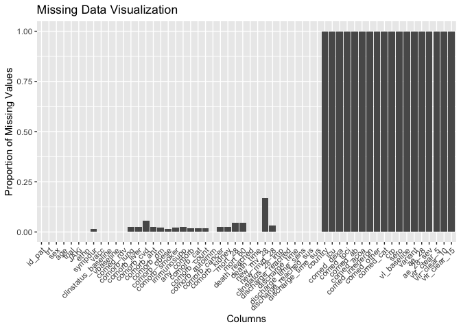
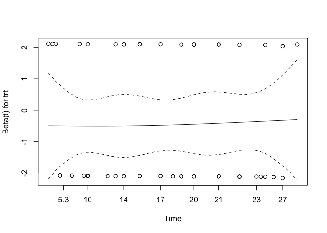

# Load packages

```r
library(tidyverse)
library(readxl)
library(writexl)
library(tableone)
library(haven) # Read sas files

library(jtools) # for summ() and plot_summs
library(sjPlot) # for tab_model
library(ggsurvfit) # survival/TTE analyses
library(survival) # survival/TTE analyses
library(ggplot2) # survival/TTE analyses and other graphs
library(ggfortify) # autoplot
```

# Load Data


# Reshape dataset and define ITT population

```r
#reshape
df <- df %>% ## corresponds to N in publication
  pivot_wider(id_cols = c("USUBJID","ARM","ACTARM","BCSOSN","d29dthe0","d29dthe1","ttrecov0","ttrecov1","or15scor","agec","SEX","BDURSYMP","COMORB2","REGION1","REGION2","BMI","RACE","ETHNIC","STRATAR","STRATAV","HYPTFL","CADFL","CHFFL","CRDFL","CORQFL","CLDFL","CKDFL","DIAB1FL","DIAB2FL","OBESIFL","CANCFL","IMMDFL","ASTHMAFL","CVDFL","COAGFL","NICFL","RFDVTFL","SURGFL","IMMOFL","CPDVTFL","COMORB1"),
              names_from = "adyc",
              values_from = "ordscor")
#reorder
df <- df %>%
  select("USUBJID","ARM","ACTARM","BCSOSN","Baseline","1", "2", "3", "4", "5", "6", "7", "8", "9", "10", "11", "12", "13", "14", "15", "16", "17", "18", "19", "20", "21", "22", "23", "24", "25", "26", "27", "28", "29", "30", "31", "32", "33","34","36","37","45", everything())

#define ITT
# addmargins(table(df$ARM, df$ACTARM))
```
Questions: 
1) Re-discuss ITT set - see Bari-Solidact

# Baseline Characteristics

```r
df$trial <- c("ACTT2")
df <- df %>% ## no missing data // no randdate // ARM == 1 includes remdesivir!
  rename(id_pat = USUBJID,
         sex = SEX,
         age = agec,
         country = REGION2)
df <- df %>%
  mutate(trt = case_when(ARM == "Baricitinib + Remdesivir" ~ 1,
                         TRUE ~ 0))

# fix ages ">89" using the original dataset
df_original <- df_original %>%
  rename(id_pat = USUBJID)
elderly <- unique(df[which(df$age == ">89"), "id_pat"])
for (i in 1:dim(elderly)[[1]]){
  df[which(df$id_pat == paste(elderly[i,])), "age"] <- paste(df_original[which(df_original$id_pat == paste(elderly[i,])), "AGE"])
}
df$age <- as.numeric(df$age)

df %>% 
  drop_na(age) %>% 
  ggplot(aes(x = age)) +
  geom_density(fill = "blue", color = "black") +
  labs(title = "Density Plot of Age",
       x = "Age",
       y = "Density")
```

<!-- -->

```r
# Ethnicity
df <- df %>% 
  mutate(ethn = case_when(RACE == "UNKNOWN" & ETHNIC == "HISPANIC OR LATINO" ~ "HISPANIC OR LATINO",
                          TRUE ~ c(RACE)))

# Days with symptoms prior to randomization
df$sympdur <- df$BDURSYMP ## 16 missing data
df %>% 
  drop_na(sympdur) %>% 
  ggplot(aes(x = sympdur)) +
  geom_density(fill = "blue", color = "black") +
  labs(title = "Density Plot of Symptom Duration",
       x = "Symptom Duration",
       y = "Density")
```

<!-- -->

```r
# Severity of COVID-19 with respect to respiratory support at randomisation / from publication: "Scores on the ordinal scale are as follows: 1, not hospitalized, no limitations of activities; 2, not hospitalized, limitation of activities, home oxygen requirement, or both; 3, hospitalized, not requiring supplemental oxygen and no longer requiring ongoing medical care (used if hospitalization was extended for infection-control reasons); 4, hospitalized, not requiring supplemental oxygen but requiring ongoing medical care (Covid-19–related or other medical conditions); 5, hospitalized, requiring any supplemental oxygen; 6, hospitalized, receiving noninvasive ventilation or use of high-flow oxygen devices; 7, hospitalized, receiving invasive mechanical ventilation or ECMO; and 8, death. Five deaths (three in patients receiving baricitinib plus RDV and two in patients receiving placebo plus RDV) occurred within the day 15 visit window but after 14 days — these deaths are included in the outcome of the ordinal score at day 15 but not in the outcome of mortality over the first 14 days."

# transform all clinical scores
score_transform <- function(df, clinstatus_var, score_var) {
  df <- df %>%
    mutate({{ clinstatus_var }} :=
             case_when({{ score_var }} %in% c(1, 2, 3) ~ 1,
                       {{ score_var }} == 4 ~ 2,
                       {{ score_var }} == 5 ~ 3,
                       {{ score_var }} == 6 ~ 4,
                       {{ score_var }} == 7 ~ 5,
                       {{ score_var }} == 8 ~ 6)) %>%
    mutate({{ clinstatus_var }} := factor({{ clinstatus_var }}, levels = 1:6))
}

df <- score_transform(df, clinstatus_baseline, Baseline) 
addmargins(table(df$clinstatus_baseline, df$trt, useNA = "always")) # no missing / # corresponds to publication
```

```
##       
##           0    1 <NA>  Sum
##   1       0    0    0    0
##   2      72   70    0  142
##   3     276  288    0  564
##   4     113  103    0  216
##   5      57   54    0  111
##   6       0    0    0    0
##   <NA>    0    0    0    0
##   Sum   518  515    0 1033
```

```r
addmargins(table(df$ACTARM, df$trt, useNA = "always")) # those who actually received any study medication
```

```
##                           
##                               0    1 <NA>  Sum
##   Baricitinib + Remdesivir    0  508    0  508
##   Not Treated                 9    7    0   16
##   Placebo + Remdesivir      509    0    0  509
##   <NA>                        0    0    0    0
##   Sum                       518  515    0 1033
```

```r
df <- score_transform(df, clinstatus_1, df$"1")
df <- score_transform(df, clinstatus_2, df$"2")
df <- score_transform(df, clinstatus_3, df$"3")
df <- score_transform(df, clinstatus_4, df$"4")
df <- score_transform(df, clinstatus_5, df$"5")
df <- score_transform(df, clinstatus_6, df$"6")
df <- score_transform(df, clinstatus_7, df$"7")
df <- score_transform(df, clinstatus_8, df$"8")
df <- score_transform(df, clinstatus_9, df$"9")
df <- score_transform(df, clinstatus_10, df$"10")
df <- score_transform(df, clinstatus_11, df$"11")
df <- score_transform(df, clinstatus_12, df$"12")
df <- score_transform(df, clinstatus_13, df$"13")
df <- score_transform(df, clinstatus_14, df$"14")
df <- score_transform(df, clinstatus_15, df$"15")
df <- score_transform(df, clinstatus_16, df$"16")
df <- score_transform(df, clinstatus_17, df$"17")
df <- score_transform(df, clinstatus_18, df$"18")
df <- score_transform(df, clinstatus_19, df$"19")
df <- score_transform(df, clinstatus_20, df$"20")
df <- score_transform(df, clinstatus_21, df$"21")
df <- score_transform(df, clinstatus_22, df$"22")
df <- score_transform(df, clinstatus_23, df$"23")
df <- score_transform(df, clinstatus_24, df$"24")
df <- score_transform(df, clinstatus_25, df$"25")
df <- score_transform(df, clinstatus_26, df$"26")
df <- score_transform(df, clinstatus_27, df$"27")
df <- score_transform(df, clinstatus_28, df$"28")
df <- score_transform(df, clinstatus_29, df$"29")
df <- score_transform(df, clinstatus_30, df$"30")
df <- score_transform(df, clinstatus_31, df$"31")
df <- score_transform(df, clinstatus_32, df$"32")
df <- score_transform(df, clinstatus_33, df$"33")
df <- score_transform(df, clinstatus_34, df$"34")
df <- score_transform(df, clinstatus_36, df$"36")
df <- score_transform(df, clinstatus_37, df$"37")
df <- score_transform(df, clinstatus_45, df$"45")

# Co-medication at baseline -> missing ! Except comed_rdv, because they received both!
df <- df %>% 
  mutate(comed_rdv = case_when(trt == 1 ~ 1,
                               TRUE ~ 0))
## group them for the subgroup analysis, according to protocol -> missing !

# Comorbidity at baseline, including immunocompromised
df <- df %>% ## 27 missing
  mutate(comorb_lung = case_when(CRDFL == "Y" | CORQFL == "Y" | ASTHMAFL == "Y" ~ 1,
                                  CRDFL == "N" & CORQFL == "N" & ASTHMAFL == "N" ~ 0))
df <- df %>% # 27 missing
  mutate(comorb_liver = case_when(CLDFL == "Y" ~ 1,
                                   CLDFL == "N" ~ 0))
df <- df %>% # 57 missing
  mutate(comorb_cvd = case_when(CVDFL == "Y" | CPDVTFL == "Y" | CHFFL == "Y" | CADFL == "Y" ~ 1,
                              CVDFL == "N" & CPDVTFL == "N" & CHFFL == "N" & CADFL == "N" ~ 0))
df <- df %>% # 27 missing
  mutate(comorb_aht = case_when(HYPTFL == "Y" ~ 1,
                                   HYPTFL == "N" ~ 0))
df <- df %>% # 24 missing
  mutate(comorb_dm = case_when(DIAB1FL == "Y" | DIAB2FL == "Y" ~ 1,
                              DIAB1FL == "N" & DIAB2FL == "N" ~ 0))
df <- df %>% # 17 missing
  mutate(comorb_obese = case_when(OBESIFL == "Y" ~ 1,
                                   OBESIFL == "N" ~ 0))
df <- df %>% # 23 missing
  mutate(comorb_smoker = case_when(NICFL == "Y" ~ 1,
                                   NICFL == "N" ~ 0))
df <- df %>% # 25 missing // All cancer patients!
  mutate(immunosupp = case_when(CANCFL == "Y" ~ 1,
                                   CANCFL == "N" ~ 0))
df <- df %>% # 18 missing, compare against COMORB1 (same 18 unknown; but categorization slightly different) and COMORB2 (why do they have more Unknown in COMORB2 than in COMORB1?)
  mutate(any_comorb = case_when(comorb_lung == 1 | comorb_liver == 1 | comorb_cvd == 1 |
                                  comorb_aht == 1 | comorb_dm == 1 | comorb_obese == 1 | comorb_smoker == 1
                                | immunosupp == 1
                                  ~ 1,
                                comorb_lung == 0 & comorb_liver == 0 & comorb_cvd == 0 &
                                  comorb_aht == 0 & comorb_dm == 0 & comorb_obese == 0 & comorb_smoker == 0
                                & immunosupp == 0
                                ~ 0))
## group them for the subgroup analysis, according to protocol // count all pre-defined comorbidities per patient first
comorb <- df %>% 
  select(id_pat, comorb_lung, comorb_liver, comorb_cvd, comorb_aht, comorb_dm, comorb_obese, comorb_smoker, immunosupp)
comorb$comorb_count <- NA
for (i in 1:dim(comorb)[[1]]) {
  comorb$comorb_count[i] <- ifelse(
    sum(comorb[i, ] %in% c(1)) > 0,
    sum(comorb[i, ] %in% c(1)),
    NA
  )
}
comorb <- comorb %>% # same 18 missing
  mutate(comorb_count = case_when(comorb_lung == 0 & comorb_liver == 0 & comorb_cvd == 0 &
                                  comorb_aht == 0 & comorb_dm == 0 & comorb_obese == 0 & comorb_smoker == 0
                                & immunosupp == 0 ~ 0,
                                TRUE ~ comorb_count))
df <- left_join(df, comorb[, c("comorb_count", "id_pat")], by = join_by(id_pat == id_pat)) ## merge imputed variable back
df <- df %>% # same 18 missing
  mutate(comorb_cat = case_when(immunosupp == 1 ~ 4, # immunocompromised
                                comorb_count == 0 ~ 1, # no comorbidity
                                comorb_count == 1 ~ 2, # one comorbidity
                                comorb_count >1 & (immunosupp == 0 | is.na(immunosupp)) ~ 3)) # multiple comorbidities

# CRP
# Vaccination
# Viremia
# Variant
# Serology
```
Clarifications and discussion points BASELINE data:
1) Re-consider Country (here: Region!): 
- Country: Only region available. "There were 67 trial sites in 8 countries: the United States (55 sites), Singapore (4), South Korea (2), Mexico (2), Japan (1), Spain (1), the United Kingdom (1), and Denmark (1)."
2) In the absence of a written policy, other experimental treatment and off-label use of marketed medications intended as specific treatment for Covid-19 were prohibited. This included glucocorticoids, which were permitted only for standard indications such as adrenal insufficiency, asthma exacerbation, laryngeal edema, septic shock, and acute respiratory distress syndrome.
3) Comorbidity data: See missingness pattern (screenshot). And inconsistency with comorb_cat (where NA of immunosuppressed is ignored, see screenshot). Unused: CKDFL, COAGFL. "immunosupp" are all cancer patients.

# Endpoints

```r
# time to event data
df$death_d <- as.numeric(df$d29dthe0) # everyone with a value here, died
df$discharge_d <- as.numeric(df$ttrecov0) # everyone with a value here, was discharged/reached discharge criteria // CAVE: 2 were discharged at day 9 but died later at home (within 28 days)


# (i) Primary outcome: Mortality at day 28
df <- df %>% # 47 have no outcome data, reason for censoring unclear (see below) -> multiple imputation; a few have info in daily score
  mutate(mort_28 = case_when(death_d <29 ~ 1, # includes deaths after discharge
                             discharge_d <29 ~ 0, # discharge to hospiz before day 15 were coded as 7 and were very few
                             clinstatus_28 %in% c(2,3,4,5) ~ 0, # still at hospital but alive, clinstatus variables after 28d are all empty (see View below)
                             discharge_d >28 ~ 0)) # discharged later, proof of still alive, but empty
# table(df$mort_28, df$trt, useNA = "always") # deaths correspond to publication (but they have -1 based on different counting of day 0) // However, the 21 missing in int and the 26 missing in cont do not really correspond to publication

# table(df$ACTARM, df$mort_28, useNA = "always") # the 16 not treated were censored at day 0 or 1 => NA for death_d/discharge_d/clinstatus_28 // The remaining 14 in intervention, I guess (see Fig 1): 8 Withdrew, 1 Were withdrawn by investigator, 1 Became ineligible after enrollment, 2 Had severe adverse event or adverse event other than death (?!?), 2 Had other reason (?!?) // The remaining 17 in control, I guess (see Fig 1): 16 Withdrew, 2 Were withdrawn by investigator, 1 Became ineligible after enrollment, 1 Had severe adverse event or adverse event other than death, 1 Was transferred to another hospital, 3 Had other reason

# df %>% # check daily scores and outcomes of the NA -> Add death_time, death_d, discharge_d, d29dthe1, ttrecov1, clinstatus_15_imp
#   select(mort_28, ACTARM, death_d, discharge_d, d29dthe1, ttrecov1, clinstatus_baseline, clinstatus_1, clinstatus_2, clinstatus_3, clinstatus_4, clinstatus_5, clinstatus_6, clinstatus_7, clinstatus_8, clinstatus_9, clinstatus_10, clinstatus_11, clinstatus_12, clinstatus_13, clinstatus_14, clinstatus_15, clinstatus_15_imp, clinstatus_16, clinstatus_17, clinstatus_18, clinstatus_19, clinstatus_20, clinstatus_21, clinstatus_22, clinstatus_23, clinstatus_24, clinstatus_25, clinstatus_26, clinstatus_27, clinstatus_28, clinstatus_29, clinstatus_30, clinstatus_31, clinstatus_32, clinstatus_33, clinstatus_34, clinstatus_36, clinstatus_37, clinstatus_45) %>%
#   filter(is.na(mort_28)) %>%
#   View()


# (ii) Mortality at day 60
df$mort_60 <- df$mort_28 # max fup time in ACTT-2 was 28 days; thus mort_60 imputed from mort_28


# (iii) Time to death within max. follow-up time
df <- df %>% # don't bother about the NA in mort_28 since they are not dead, i.e. just censor (==0) everyone else
  mutate(death_reached = case_when(death_d <29 ~ 1,
                                       TRUE ~ 0))
df <- df %>% # no missing and those that were discharged and afterwards have correct time to event data
  mutate(death_time = case_when(death_d >=0 ~ c(death_d), # time to death, if no time to death, then...
                                d29dthe1 >=0 ~ c(d29dthe1))) # time to death censoring data
# df %>% # those died have correct time to event data. Those discharged before d28 (and not withdrawn/ltfu/hospiz/SAE) should receive max fup time? But some do not, they are censored but reason for censoring unclear.

#   select(death_reached, ACTARM, death_time, death_d, discharge_d, d29dthe1, ttrecov1, clinstatus_baseline, clinstatus_1, clinstatus_2, clinstatus_3, clinstatus_4, clinstatus_5, clinstatus_6, clinstatus_7, clinstatus_8, clinstatus_9, clinstatus_10, clinstatus_11, clinstatus_12, clinstatus_13, clinstatus_14, clinstatus_15, or15scor, clinstatus_16, clinstatus_17, clinstatus_18, clinstatus_19, clinstatus_20, clinstatus_21, clinstatus_22, clinstatus_23, clinstatus_24, clinstatus_25, clinstatus_26, clinstatus_27, clinstatus_28, clinstatus_29, clinstatus_30, clinstatus_31, clinstatus_32, clinstatus_33, clinstatus_34, clinstatus_36, clinstatus_37, clinstatus_45) %>%
#   filter(death_reached != 1) %>% 
#   filter(discharge_d < 29 & death_time < 28) %>% 
#   View()


# (iv) New mechanical ventilation among survivors within 28 days. Bari-Solidact only included clinstatus 4 and 5.
df <- df %>% # 26 are missing; all other NAs are either dead or started with clinstatus_baseline == 5 (see View below) -> multiple imputation? Or carry over imputed day 15 (see clinstatus_28_imp below)?
  mutate(new_mv_28 = case_when((clinstatus_baseline == 2 | clinstatus_baseline == 3 | clinstatus_baseline == 4) 
                               & (mort_28 == 0 | is.na(mort_28)) 
                               & (clinstatus_1 == 5 | clinstatus_2 == 5 | clinstatus_3 == 5 | clinstatus_4 == 5 |
                                   clinstatus_5 == 5 | clinstatus_6 == 5 | clinstatus_7 == 5 | clinstatus_8 == 5 |
                                    clinstatus_9 == 5 | clinstatus_10 == 5 | clinstatus_11 == 5 | clinstatus_12 == 5 |
                                    clinstatus_13 == 5 | clinstatus_14 == 5 | clinstatus_15 == 5 | clinstatus_16 == 5 |
                                    clinstatus_17 == 5 | clinstatus_18 == 5 | clinstatus_19 == 5 | clinstatus_20 == 5 |
                                    clinstatus_21 == 5 | clinstatus_22 == 5 | clinstatus_23 == 5 | clinstatus_24 == 5 |
                                    clinstatus_25 == 5 | clinstatus_26 == 5 | clinstatus_27 == 5 | clinstatus_28 == 5)
                               ~ 1,
                               (clinstatus_baseline == 2 | clinstatus_baseline == 3 | clinstatus_baseline == 4) & mort_28 == 0
                               ~ 0))
# df %>%

#   select(new_mv_28, death_reached, death_time, death_d, discharge_d, d29dthe1, ttrecov1, clinstatus_baseline, clinstatus_1, clinstatus_2, clinstatus_3, clinstatus_4, clinstatus_5, clinstatus_6, clinstatus_7, clinstatus_8, clinstatus_9, clinstatus_10, clinstatus_11, clinstatus_12, clinstatus_13, clinstatus_14, clinstatus_15, or15scor, clinstatus_16, clinstatus_17, clinstatus_18, clinstatus_19, clinstatus_20, clinstatus_21, clinstatus_22, clinstatus_23, clinstatus_24, clinstatus_25, clinstatus_26, clinstatus_27, clinstatus_28, clinstatus_29, clinstatus_30, clinstatus_31, clinstatus_32, clinstatus_33, clinstatus_34, clinstatus_36, clinstatus_37, clinstatus_45) %>%
#   filter(is.na(new_mv_28)) %>%
#   filter(clinstatus_baseline != 5) %>%
#   filter(death_reached == 0 | is.na(death_reached)) %>%
#   View()

# (iv) Sens-analysis: Alternative definition/analysis: New mechanical ventilation OR death within 28 days => include all in denominator. 
df <- df %>% # 34 missing (same as above, plus 8 more that started with clinstatus_baseline == 5 but were censored/LTFU) -> multiple imputation. Or carry over imputed day 15 (see clinstatus_28_imp below)?
  mutate(new_mvd_28 = case_when(new_mv_28 == 1 | mort_28 == 1 ~ 1,
                                new_mv_28 == 0 | mort_28 == 0 ~ 0))
# df %>% 
#   select(new_mvd_28, new_mv_28, death_reached, death_time, death_d, discharge_d, d29dthe1, ttrecov1, clinstatus_baseline, clinstatus_1, clinstatus_2, clinstatus_3, clinstatus_4, clinstatus_5, clinstatus_6, clinstatus_7, clinstatus_8, clinstatus_9, clinstatus_10, clinstatus_11, clinstatus_12, clinstatus_13, clinstatus_14, clinstatus_15, or15scor, clinstatus_16, clinstatus_17, clinstatus_18, clinstatus_19, clinstatus_20, clinstatus_21, clinstatus_22, clinstatus_23, clinstatus_24, clinstatus_25, clinstatus_26, clinstatus_27, clinstatus_28, clinstatus_29, clinstatus_30, clinstatus_31, clinstatus_32, clinstatus_33, clinstatus_34, clinstatus_36, clinstatus_37, clinstatus_45) %>%
#   filter(is.na(new_mvd_28)) %>%
#   View()


# (v) Clinical status at day 28
df <- df %>% # Adapt clinstatus_28, since currently NA for those discharged or died. Then, check if nothing in 28d window (there was nothing), then LVCF including use or15scor
  mutate(clinstatus_28 = case_when(clinstatus_28 == 5 ~ 5,
                                   clinstatus_28 == 4 ~ 4,
                                   clinstatus_28 == 3 ~ 3,
                                   clinstatus_28 == 2 ~ 2,
                                   mort_28 == 1 ~ 6, # died within 28d
                                   mort_28 == 0 ~ 1)) # discharged alive / reached discharge criteria within 28d
df$clinstatus_28 <- factor(df$clinstatus_28, levels = 1:6)

## Imputation according to protocol: If there was daily data for the ordinal score available but with missing data for single days, then we carried last observed value forward unless for day 28, whereby we first considered data from the window (+/-3 days) but there was nothing in that window => LVCF
df <- score_transform(df, clinstatus_15_imp, df$or15scor)
dfcs <- df %>% 
    select(id_pat, clinstatus_baseline, clinstatus_1, clinstatus_2, clinstatus_3, clinstatus_4, clinstatus_5, clinstatus_6, clinstatus_7, clinstatus_8, clinstatus_9, clinstatus_10, clinstatus_11, clinstatus_12, clinstatus_13, clinstatus_14, clinstatus_15_imp, clinstatus_16, clinstatus_17, clinstatus_18, clinstatus_19, clinstatus_20, clinstatus_21, clinstatus_22, clinstatus_23, clinstatus_24, clinstatus_25, clinstatus_26, clinstatus_27, clinstatus_28)
impute_last_forw = function(df){
  first = which(names(df)%in%c("clinstatus_baseline"))
  last = which(names(df)%in%c("clinstatus_28"))
  for (i in 1:dim(df)[[1]]){
    for (j in first[1]:last[1]){
      p = df[i, j]
      df[i,j] <- 
        ifelse(!is.na(df[i, j]), p, df[i, j-1])
    }
  }
  df
}
dfcs <- impute_last_forw(dfcs)
dfcs <- dfcs %>% # To control, don't overwrite
  rename(clinstatus_28_imp = clinstatus_28)
df <- left_join(df, dfcs[, c("clinstatus_28_imp", "id_pat")], by = join_by(id_pat == id_pat)) # Merge imputed variable back

# table(df$clinstatus_28, useNA = "always")
# table(df$clinstatus_28_imp, useNA = "always") # interesting: All imputed (meaning mostly carried forward from imputed day 15) are still hospitalized but not dead


# (vi) Time to discharge or reaching discharge criteria up to day 28 // Patients who died prior to day 28 are assumed not having reached discharge, i.e. counted as 28 days (as someone who has been censored on day 28). 
df <- df %>% 
  mutate(discharge_reached = case_when(discharge_d <29 ~ 1,
                                       TRUE ~ 0))
df <- df %>% # 2 are left without any time to event data => impute max. follow-up time
  mutate(discharge_time = case_when(discharge_d >=0 ~ c(discharge_d), # time to discharge, if no time to discharge, then...
                                    ttrecov1 >=0 ~ c(ttrecov1)+1)) # time to discharge censoring time (see ACTT-2 documentation regarding time zero -> now matching d29dthe1)
df <- df %>% # add 28d for those that died
  mutate(discharge_time = case_when(mort_28 == 1 ~ 28,
                                    TRUE ~ discharge_time))
df <- df %>% # restrict to max fup time 28d
  mutate(discharge_time = case_when(discharge_time >28 ~ 28,
                                    TRUE ~ discharge_time))
# table(df$discharge_time, df$discharge_reached, useNA = "always")


# (vi) Sens-analysis: Alternative definition/analysis of outcome: time to sustained discharge within 28 days. There are no re-admissions documented in ACTT-2
df$discharge_reached_sus <- df$discharge_reached
df$discharge_time_sus <- df$discharge_time


# (vii) Viral clearance up to day 5, day 10, and day 15 (Viral load value <LOQ and/or undectectable): Not available in ACTT-2
# (viii) Quality of life at day 28: Not available in ACTT-2


# (ix) Participants with an adverse event grade 3 or 4, or a serious adverse event, excluding death, by day 28

# (ix) Sens-analysis: Alternative definition/analysis of outcome: incidence rate ratio (Poisson regression) -> AE per person by d28

# (ix) Sens-analysis: Alternative definition/analysis of outcome: time to first (of these) adverse event, within 28 days, considering death as a competing risk (=> censor and set to 28 days)

# (x) Adverse events of special interest within 28 days: a) thromboembolic events (venous thromboembolism, pulmonary embolism, arterial thrombosis), b) secondary infections (bacterial pneumonia including ventilator-associated pneumonia, meningitis and encephalitis, endocarditis and bacteremia, invasive fungal infection including pulmonary aspergillosis), c) Reactivation of chronic infection including tuberculosis, herpes simplex, cytomegalovirus, herpes zoster and hepatitis B, d) serious cardiovascular and cardiac events (including stroke and myocardial infarction), e) events related to signs of bone marrow suppression (anemia, lymphocytopenia, thrombocytopenia, pancytopenia), f) malignancy, g) gastrointestinal perforation (incl. gastrointestinal bleeding/diverticulitis), h) liver dysfunction/hepatotoxicity (grade 3 and 4)

# (xi) Adverse events, any grade and serious adverse event, excluding death, within 28 days, grouped by organ classes
```
Discussion points OUTCOME data:
1) mort_28: The 16 not treated were censored at day 0 or 1 (=> NA). The remaining 14 in intervention, I guess (see Fig 1): 8 Withdrew, 1 Were withdrawn by investigator, 1 Became ineligible after enrollment, 2 Had severe adverse event or adverse event other than death (?!?), 2 Had other reason (?!?) // The remaining 17 in control, I guess (see Fig 1): 16 Withdrew, 2 Were withdrawn by investigator, 1 Became ineligible after enrollment, 1 Had severe adverse event or adverse event other than death, 1 Was transferred to another hospital, 3 Had other reason
2) Max follow-up time in ACTT-2 was 28 days; thus, mort_60 imputed from mort_28 (see study protocol)
3) Rethink time to death variable (death_time - also in other trials)
4) CAVE: or15scor: not transformed yet!
5) Those two that were discharged at day 9 but died later (within 28d) are currently marked as discharge reached but with 28d - change to NOT reached event?
6) Get the (S)AE data

# Define final dataset, set references, summarize missing data and variables

```r
# keep the overall set
df_all <- df
# reduce the df set to our standardized set across all trials
df <- df %>% 
  select(id_pat, trt, sex, age, 
         ethn, 
         country, 
         # icu, 
         sympdur, 
         # vacc, 
         clinstatus_baseline,
         # comed_dexa, 
         comed_rdv, 
         # comed_toci, comed_ab, comed_acoa, comed_interferon, comed_other,
         # comed_cat,
         comorb_lung, comorb_liver, comorb_cvd, comorb_aht, comorb_dm, comorb_obese, comorb_smoker, immunosupp,
         any_comorb, comorb_cat,
         # crp, 
         # sero, vl_baseline, variant,
         mort_28, mort_60, death_reached, death_time,
         new_mv_28, new_mvd_28,
         clinstatus_28_imp,
         discharge_reached, discharge_time, discharge_reached_sus, discharge_time_sus,
         # ae_28_sev, aesi_28, ae_28_list,
         # ae_reached, ae_time,
         # vir_clear_5, vir_clear_10, vir_clear_15,
         # qol_28
         )
## set references, re-level
# df <- df %>% 
#   mutate(Treatment = relevel(Treatment, "no JAK inhibitor"))

# Create a bar plot to visualize missing values in each column
original_order <- colnames(df)
missing_plot <- df %>%
  summarise_all(~ mean(is.na(.))) %>%
  gather() %>%
  mutate(key = factor(key, levels = original_order)) %>%
  ggplot(aes(x = key, y = value)) +
  geom_bar(stat = "identity") +
  labs(x = "Columns", y = "Proportion of Missing Values", title = "Missing Data Visualization") +
  theme(axis.text.x = element_text(angle = 45, hjust = 1)) +
  ylim(0, 1)
print(missing_plot)
```

<!-- -->
Discussion points
1) Missing variables:
  Baseline:
  - ICU at enrolment
  - CRP
  - Viremia
  - Variant
  - Serology
  - Co-medication at baseline, except remdesivir (part of intervention)
  - Vaccination (still coming ?!?)
  Outcomes:
  - viral load
  - adverse events (still coming ?!?)
  - qol_28
2) Missing data:
- symdur and comorbities
- crp & vl_baseline & variant
- mort_28 (& mort_60): 47 missing
- new_mv_28 & new_mvd_28: 26 and 34 missing


# (i) Primary outcome: Mortality at day 28

```r
# adjusted for baseline patient characteristics (age, respiratory support at baseline (ordinal scale 1-3 vs 4-5), dexamethasone use at baseline (y/n), remdesivir use at baseline (y/n), anti-IL-6 use at baseline (y/n)).
table(df$mort_28, df$trt, useNA = "always")
```

```
##       
##          0   1 <NA>
##   0    455 470    0
##   1     37  24    0
##   <NA>  26  21    0
```

```r
mort.28 <- df %>% 
  glm(mort_28 ~ trt 
      + age + clinstatus_baseline 
      # + comed_dexa 
      + comed_rdv 
      # + comed_toci
      , family = "binomial", data=.)
summ(mort.28, exp = T, confint = T, model.info = T, model.fit = T, digits = 2)
```

```
## Warning in !is.null(rmarkdown::metadata$output) && rmarkdown::metadata$output
## %in% : 'length(x) = 2 > 1' in coercion to 'logical(1)'
```

<table class="table table-striped table-hover table-condensed table-responsive" style="width: auto !important; margin-left: auto; margin-right: auto;">
<tbody>
  <tr>
   <td style="text-align:left;font-weight: bold;"> Observations </td>
   <td style="text-align:right;"> 986 (47 missing obs. deleted) </td>
  </tr>
  <tr>
   <td style="text-align:left;font-weight: bold;"> Dependent variable </td>
   <td style="text-align:right;"> mort_28 </td>
  </tr>
  <tr>
   <td style="text-align:left;font-weight: bold;"> Type </td>
   <td style="text-align:right;"> Generalized linear model </td>
  </tr>
  <tr>
   <td style="text-align:left;font-weight: bold;"> Family </td>
   <td style="text-align:right;"> binomial </td>
  </tr>
  <tr>
   <td style="text-align:left;font-weight: bold;"> Link </td>
   <td style="text-align:right;"> logit </td>
  </tr>
</tbody>
</table> <table class="table table-striped table-hover table-condensed table-responsive" style="width: auto !important; margin-left: auto; margin-right: auto;">
<tbody>
  <tr>
   <td style="text-align:left;font-weight: bold;"> 𝛘²(5) </td>
   <td style="text-align:right;"> 96.59 </td>
  </tr>
  <tr>
   <td style="text-align:left;font-weight: bold;"> Pseudo-R² (Cragg-Uhler) </td>
   <td style="text-align:right;"> 0.25 </td>
  </tr>
  <tr>
   <td style="text-align:left;font-weight: bold;"> Pseudo-R² (McFadden) </td>
   <td style="text-align:right;"> 0.21 </td>
  </tr>
  <tr>
   <td style="text-align:left;font-weight: bold;"> AIC </td>
   <td style="text-align:right;"> 373.06 </td>
  </tr>
  <tr>
   <td style="text-align:left;font-weight: bold;"> BIC </td>
   <td style="text-align:right;"> 402.42 </td>
  </tr>
</tbody>
</table> <table class="table table-striped table-hover table-condensed table-responsive" style="width: auto !important; margin-left: auto; margin-right: auto;border-bottom: 0;">
 <thead>
  <tr>
   <th style="text-align:left;">   </th>
   <th style="text-align:right;"> exp(Est.) </th>
   <th style="text-align:right;"> 2.5% </th>
   <th style="text-align:right;"> 97.5% </th>
   <th style="text-align:right;"> z val. </th>
   <th style="text-align:right;"> p </th>
  </tr>
 </thead>
<tbody>
  <tr>
   <td style="text-align:left;font-weight: bold;"> (Intercept) </td>
   <td style="text-align:right;"> 0.00 </td>
   <td style="text-align:right;"> 0.00 </td>
   <td style="text-align:right;"> Inf </td>
   <td style="text-align:right;"> -0.03 </td>
   <td style="text-align:right;"> 0.98 </td>
  </tr>
  <tr>
   <td style="text-align:left;font-weight: bold;"> trt </td>
   <td style="text-align:right;"> 0.70 </td>
   <td style="text-align:right;"> 0.40 </td>
   <td style="text-align:right;"> 1.24 </td>
   <td style="text-align:right;"> -1.21 </td>
   <td style="text-align:right;"> 0.22 </td>
  </tr>
  <tr>
   <td style="text-align:left;font-weight: bold;"> age </td>
   <td style="text-align:right;"> 1.06 </td>
   <td style="text-align:right;"> 1.03 </td>
   <td style="text-align:right;"> 1.08 </td>
   <td style="text-align:right;"> 5.12 </td>
   <td style="text-align:right;"> 0.00 </td>
  </tr>
  <tr>
   <td style="text-align:left;font-weight: bold;"> clinstatus_baseline3 </td>
   <td style="text-align:right;"> 9161062.27 </td>
   <td style="text-align:right;"> 0.00 </td>
   <td style="text-align:right;"> Inf </td>
   <td style="text-align:right;"> 0.02 </td>
   <td style="text-align:right;"> 0.99 </td>
  </tr>
  <tr>
   <td style="text-align:left;font-weight: bold;"> clinstatus_baseline4 </td>
   <td style="text-align:right;"> 30134978.01 </td>
   <td style="text-align:right;"> 0.00 </td>
   <td style="text-align:right;"> Inf </td>
   <td style="text-align:right;"> 0.02 </td>
   <td style="text-align:right;"> 0.98 </td>
  </tr>
  <tr>
   <td style="text-align:left;font-weight: bold;"> clinstatus_baseline5 </td>
   <td style="text-align:right;"> 92622285.66 </td>
   <td style="text-align:right;"> 0.00 </td>
   <td style="text-align:right;"> Inf </td>
   <td style="text-align:right;"> 0.02 </td>
   <td style="text-align:right;"> 0.98 </td>
  </tr>
  <tr>
   <td style="text-align:left;font-weight: bold;"> comed_rdv </td>
   <td style="text-align:right;"> NA </td>
   <td style="text-align:right;"> NA </td>
   <td style="text-align:right;"> NA </td>
   <td style="text-align:right;"> NA </td>
   <td style="text-align:right;"> NA </td>
  </tr>
</tbody>
<tfoot><tr><td style="padding: 0; " colspan="100%">
<sup></sup> Standard errors: MLE</td></tr></tfoot>
</table>
Discussion points
1) respiratory support at baseline (ordinal scale 1-3 vs 4-5 OR leave it as it is)?


# (ii) Mortality at day 60

```r
table(df$mort_60, df$trt, useNA = "always")
```

```
##       
##          0   1 <NA>
##   0    455 470    0
##   1     37  24    0
##   <NA>  26  21    0
```

```r
mort.60 <- df %>% 
  glm(mort_60 ~ trt 
      + age + clinstatus_baseline 
      # + comed_dexa 
      + comed_rdv 
      # + comed_toci
      , family = "binomial", data=.)
summ(mort.60, exp = T, confint = T, model.info = T, model.fit = T, digits = 2)
```

<table class="table table-striped table-hover table-condensed table-responsive" style="width: auto !important; margin-left: auto; margin-right: auto;">
<tbody>
  <tr>
   <td style="text-align:left;font-weight: bold;"> Observations </td>
   <td style="text-align:right;"> 986 (47 missing obs. deleted) </td>
  </tr>
  <tr>
   <td style="text-align:left;font-weight: bold;"> Dependent variable </td>
   <td style="text-align:right;"> mort_60 </td>
  </tr>
  <tr>
   <td style="text-align:left;font-weight: bold;"> Type </td>
   <td style="text-align:right;"> Generalized linear model </td>
  </tr>
  <tr>
   <td style="text-align:left;font-weight: bold;"> Family </td>
   <td style="text-align:right;"> binomial </td>
  </tr>
  <tr>
   <td style="text-align:left;font-weight: bold;"> Link </td>
   <td style="text-align:right;"> logit </td>
  </tr>
</tbody>
</table> <table class="table table-striped table-hover table-condensed table-responsive" style="width: auto !important; margin-left: auto; margin-right: auto;">
<tbody>
  <tr>
   <td style="text-align:left;font-weight: bold;"> 𝛘²(5) </td>
   <td style="text-align:right;"> 96.59 </td>
  </tr>
  <tr>
   <td style="text-align:left;font-weight: bold;"> Pseudo-R² (Cragg-Uhler) </td>
   <td style="text-align:right;"> 0.25 </td>
  </tr>
  <tr>
   <td style="text-align:left;font-weight: bold;"> Pseudo-R² (McFadden) </td>
   <td style="text-align:right;"> 0.21 </td>
  </tr>
  <tr>
   <td style="text-align:left;font-weight: bold;"> AIC </td>
   <td style="text-align:right;"> 373.06 </td>
  </tr>
  <tr>
   <td style="text-align:left;font-weight: bold;"> BIC </td>
   <td style="text-align:right;"> 402.42 </td>
  </tr>
</tbody>
</table> <table class="table table-striped table-hover table-condensed table-responsive" style="width: auto !important; margin-left: auto; margin-right: auto;border-bottom: 0;">
 <thead>
  <tr>
   <th style="text-align:left;">   </th>
   <th style="text-align:right;"> exp(Est.) </th>
   <th style="text-align:right;"> 2.5% </th>
   <th style="text-align:right;"> 97.5% </th>
   <th style="text-align:right;"> z val. </th>
   <th style="text-align:right;"> p </th>
  </tr>
 </thead>
<tbody>
  <tr>
   <td style="text-align:left;font-weight: bold;"> (Intercept) </td>
   <td style="text-align:right;"> 0.00 </td>
   <td style="text-align:right;"> 0.00 </td>
   <td style="text-align:right;"> Inf </td>
   <td style="text-align:right;"> -0.03 </td>
   <td style="text-align:right;"> 0.98 </td>
  </tr>
  <tr>
   <td style="text-align:left;font-weight: bold;"> trt </td>
   <td style="text-align:right;"> 0.70 </td>
   <td style="text-align:right;"> 0.40 </td>
   <td style="text-align:right;"> 1.24 </td>
   <td style="text-align:right;"> -1.21 </td>
   <td style="text-align:right;"> 0.22 </td>
  </tr>
  <tr>
   <td style="text-align:left;font-weight: bold;"> age </td>
   <td style="text-align:right;"> 1.06 </td>
   <td style="text-align:right;"> 1.03 </td>
   <td style="text-align:right;"> 1.08 </td>
   <td style="text-align:right;"> 5.12 </td>
   <td style="text-align:right;"> 0.00 </td>
  </tr>
  <tr>
   <td style="text-align:left;font-weight: bold;"> clinstatus_baseline3 </td>
   <td style="text-align:right;"> 9161062.27 </td>
   <td style="text-align:right;"> 0.00 </td>
   <td style="text-align:right;"> Inf </td>
   <td style="text-align:right;"> 0.02 </td>
   <td style="text-align:right;"> 0.99 </td>
  </tr>
  <tr>
   <td style="text-align:left;font-weight: bold;"> clinstatus_baseline4 </td>
   <td style="text-align:right;"> 30134978.01 </td>
   <td style="text-align:right;"> 0.00 </td>
   <td style="text-align:right;"> Inf </td>
   <td style="text-align:right;"> 0.02 </td>
   <td style="text-align:right;"> 0.98 </td>
  </tr>
  <tr>
   <td style="text-align:left;font-weight: bold;"> clinstatus_baseline5 </td>
   <td style="text-align:right;"> 92622285.66 </td>
   <td style="text-align:right;"> 0.00 </td>
   <td style="text-align:right;"> Inf </td>
   <td style="text-align:right;"> 0.02 </td>
   <td style="text-align:right;"> 0.98 </td>
  </tr>
  <tr>
   <td style="text-align:left;font-weight: bold;"> comed_rdv </td>
   <td style="text-align:right;"> NA </td>
   <td style="text-align:right;"> NA </td>
   <td style="text-align:right;"> NA </td>
   <td style="text-align:right;"> NA </td>
   <td style="text-align:right;"> NA </td>
  </tr>
</tbody>
<tfoot><tr><td style="padding: 0; " colspan="100%">
<sup></sup> Standard errors: MLE</td></tr></tfoot>
</table>
Discussion points
1) 


# (iii) Time to death within max. follow-up time

```r
table(df$death_reached, df$death_time, useNA = "always")
```

```
##       
##          0   1   2   3   4   5   6   7   8  10  11  12  13  14  15  16  17  18
##   0     13   6   6   3   2   5   3   0   2   1   1   1   1  29   5   3   1   0
##   1      0   1   1   0   1   3   2   1   1   5   2   2   0   4   0   5   3   2
##   <NA>   0   0   0   0   0   0   0   0   0   0   0   0   0   0   0   0   0   0
##       
##         19  20  21  22  23  24  25  26  27  28 <NA>
##   0      0   2  14   6   2   3  33  74 119 637    0
##   1      3   6   5   4   1   1   2   2   3   1    0
##   <NA>   0   0   0   0   0   0   0   0   0   0    0
```

```r
table(df$death_reached, df$mort_60, useNA = "always")
```

```
##       
##          0   1 <NA>
##   0    925   0   47
##   1      0  61    0
##   <NA>   0   0    0
```

```r
df %>%
  drop_na(death_time) %>%
  filter(death_reached == 1) %>%
  group_by(trt) %>%
  summarise(median = median(death_time),
            IQR = IQR(death_time),
            Q1 = quantile(death_time, probs = 0.25),
            Q3 = quantile(death_time, probs = 0.75)) 
```

```
## # A tibble: 2 × 5
##     trt median   IQR    Q1    Q3
##   <dbl>  <dbl> <dbl> <dbl> <dbl>
## 1     0     17  11    10      21
## 2     1     18   7.5  13.5    21
```

```r
# time to death
km.ttdeath.check <- with(df, Surv(death_time, death_reached))
head(km.ttdeath.check, 100)
```

```
##   [1] 27+ 14+ 28+ 28+ 28+ 27+ 28+ 26+ 28+ 28+ 28+  0+ 28+ 28+  8+ 11+  1+ 28+
##  [19] 28+ 28+ 28+ 28+ 28+ 28+ 28+ 24+ 25+ 28+ 28+ 28+ 28+ 27+ 28+ 12  27+ 28+
##  [37] 28+ 28+ 28+ 28+ 28+ 28+ 15+ 28+  0+ 28+  6  26+ 27+ 28+ 28+ 28+ 28+ 27+
##  [55] 23+ 28+ 28+ 28+ 27+ 28+ 27+ 28+ 28+  2+ 28+  1+ 25+ 28+ 28+ 28+ 28+ 26+
##  [73] 28+ 28+ 28+ 28+ 28+ 25+ 26+ 28+ 28+ 17  28+ 25+ 28+ 24  28+ 26+ 27+ 28+
##  [91] 28+ 28+ 28+ 26+ 28+  5+ 28+ 28+ 28+ 19
```

```r
km.ttdeath <- survfit(Surv(death_time, death_reached) ~ 1, data=df)
summary(km.ttdeath, times = c(5,10,20,28,30,40,60))
```

```
## Call: survfit(formula = Surv(death_time, death_reached) ~ 1, data = df)
## 
##  time n.risk n.event survival std.err lower 95% CI upper 95% CI
##     5   1000       6    0.994 0.00242        0.989        0.999
##    10    983       9    0.985 0.00384        0.977        0.993
##    20    915      27    0.957 0.00650        0.944        0.970
##    28    638      19    0.936 0.00800        0.920        0.951
```

```r
plot(km.ttdeath, xlab="Days", main = 'Kaplan Meyer Plot') #base graphics
```

<!-- -->

```r
autoplot(km.ttdeath)
```

<!-- -->

```r
km.ttdeath_trt <- survfit(Surv(death_time, death_reached) ~ trt, data=df)
autoplot(km.ttdeath_trt)
```

<!-- -->

```r
ttdeath <- df %>% 
  coxph(Surv(death_time, death_reached) ~ trt 
        + age + clinstatus_baseline 
        # + comed_dexa 
        + comed_rdv 
        # + comed_toci
        , data =.)
```

```
## Warning in coxph.fit(X, Y, istrat, offset, init, control, weights = weights, :
## Loglik converged before variable 3 ; coefficient may be infinite.
```

```r
tab_model(ttdeath)
```

```
## Model matrix is rank deficient. Parameters `clinstatus_baseline5,
##   clinstatus_baseline6, comed_rdv` were not estimable.
```

<table style="border-collapse:collapse; border:none;">
<tr>
<th style="border-top: double; text-align:center; font-style:normal; font-weight:bold; padding:0.2cm;  text-align:left; ">&nbsp;</th>
<th colspan="3" style="border-top: double; text-align:center; font-style:normal; font-weight:bold; padding:0.2cm; ">Surv(death time,death<br>reached)</th>
</tr>
<tr>
<td style=" text-align:center; border-bottom:1px solid; font-style:italic; font-weight:normal;  text-align:left; ">Predictors</td>
<td style=" text-align:center; border-bottom:1px solid; font-style:italic; font-weight:normal;  ">Estimates</td>
<td style=" text-align:center; border-bottom:1px solid; font-style:italic; font-weight:normal;  ">CI</td>
<td style=" text-align:center; border-bottom:1px solid; font-style:italic; font-weight:normal;  ">p</td>
</tr>
<tr>
<td style=" padding:0.2cm; text-align:left; vertical-align:top; text-align:left; ">trt</td>
<td style=" padding:0.2cm; text-align:left; vertical-align:top; text-align:center;  ">0.74</td>
<td style=" padding:0.2cm; text-align:left; vertical-align:top; text-align:center;  ">0.44&nbsp;&ndash;&nbsp;1.24</td>
<td style=" padding:0.2cm; text-align:left; vertical-align:top; text-align:center;  ">0.256</td>
</tr>
<tr>
<td style=" padding:0.2cm; text-align:left; vertical-align:top; text-align:left; ">age</td>
<td style=" padding:0.2cm; text-align:left; vertical-align:top; text-align:center;  ">1.05</td>
<td style=" padding:0.2cm; text-align:left; vertical-align:top; text-align:center;  ">1.03&nbsp;&ndash;&nbsp;1.07</td>
<td style=" padding:0.2cm; text-align:left; vertical-align:top; text-align:center;  "><strong>&lt;0.001</strong></td>
</tr>
<tr>
<td style=" padding:0.2cm; text-align:left; vertical-align:top; text-align:left; ">clinstatus baseline [2]</td>
<td style=" padding:0.2cm; text-align:left; vertical-align:top; text-align:center;  ">0.00</td>
<td style=" padding:0.2cm; text-align:left; vertical-align:top; text-align:center;  ">0.00&nbsp;&ndash;&nbsp;Inf</td>
<td style=" padding:0.2cm; text-align:left; vertical-align:top; text-align:center;  ">0.995</td>
</tr>
<tr>
<td style=" padding:0.2cm; text-align:left; vertical-align:top; text-align:left; ">clinstatus baseline [3]</td>
<td style=" padding:0.2cm; text-align:left; vertical-align:top; text-align:center;  ">0.12</td>
<td style=" padding:0.2cm; text-align:left; vertical-align:top; text-align:center;  ">0.07&nbsp;&ndash;&nbsp;0.23</td>
<td style=" padding:0.2cm; text-align:left; vertical-align:top; text-align:center;  "><strong>&lt;0.001</strong></td>
</tr>
<tr>
<td style=" padding:0.2cm; text-align:left; vertical-align:top; text-align:left; ">clinstatus baseline [4]</td>
<td style=" padding:0.2cm; text-align:left; vertical-align:top; text-align:center;  ">0.38</td>
<td style=" padding:0.2cm; text-align:left; vertical-align:top; text-align:center;  ">0.21&nbsp;&ndash;&nbsp;0.69</td>
<td style=" padding:0.2cm; text-align:left; vertical-align:top; text-align:center;  "><strong>0.002</strong></td>
</tr>
<tr>
<td style=" padding:0.2cm; text-align:left; vertical-align:top; text-align:left; padding-top:0.1cm; padding-bottom:0.1cm; border-top:1px solid;">Observations</td>
<td style=" padding:0.2cm; text-align:left; vertical-align:top; padding-top:0.1cm; padding-bottom:0.1cm; text-align:left; border-top:1px solid;" colspan="3">1033</td>
</tr>
<tr>
<td style=" padding:0.2cm; text-align:left; vertical-align:top; text-align:left; padding-top:0.1cm; padding-bottom:0.1cm;">R<sup>2</sup> Nagelkerke</td>
<td style=" padding:0.2cm; text-align:left; vertical-align:top; padding-top:0.1cm; padding-bottom:0.1cm; text-align:left;" colspan="3">0.157</td>
</tr>

</table>

```r
# summ(ttdeath, exp = T, confint = T, model.info = T, model.fit = T, digits = 2)
```
Discussion points
1) 


# (iv) New mechanical ventilation among survivors within 28 days

```r
table(df$new_mv_28, df$trt, useNA = "always")
```

```
##       
##          0   1 <NA>
##   0    370 398    0
##   1     52  39    0
##   <NA>  96  78    0
```

```r
new.mv.28 <- df %>% 
  glm(new_mv_28 ~ trt 
      + age 
      + clinstatus_baseline 
      # + comed_dexa 
      + comed_rdv 
      # + comed_toci
      , family = "binomial", data=.)
summ(new.mv.28, exp = T, confint = T, model.info = T, model.fit = T, digits = 2)
```

<table class="table table-striped table-hover table-condensed table-responsive" style="width: auto !important; margin-left: auto; margin-right: auto;">
<tbody>
  <tr>
   <td style="text-align:left;font-weight: bold;"> Observations </td>
   <td style="text-align:right;"> 859 (174 missing obs. deleted) </td>
  </tr>
  <tr>
   <td style="text-align:left;font-weight: bold;"> Dependent variable </td>
   <td style="text-align:right;"> new_mv_28 </td>
  </tr>
  <tr>
   <td style="text-align:left;font-weight: bold;"> Type </td>
   <td style="text-align:right;"> Generalized linear model </td>
  </tr>
  <tr>
   <td style="text-align:left;font-weight: bold;"> Family </td>
   <td style="text-align:right;"> binomial </td>
  </tr>
  <tr>
   <td style="text-align:left;font-weight: bold;"> Link </td>
   <td style="text-align:right;"> logit </td>
  </tr>
</tbody>
</table> <table class="table table-striped table-hover table-condensed table-responsive" style="width: auto !important; margin-left: auto; margin-right: auto;">
<tbody>
  <tr>
   <td style="text-align:left;font-weight: bold;"> 𝛘²(4) </td>
   <td style="text-align:right;"> 119.88 </td>
  </tr>
  <tr>
   <td style="text-align:left;font-weight: bold;"> Pseudo-R² (Cragg-Uhler) </td>
   <td style="text-align:right;"> 0.27 </td>
  </tr>
  <tr>
   <td style="text-align:left;font-weight: bold;"> Pseudo-R² (McFadden) </td>
   <td style="text-align:right;"> 0.21 </td>
  </tr>
  <tr>
   <td style="text-align:left;font-weight: bold;"> AIC </td>
   <td style="text-align:right;"> 470.69 </td>
  </tr>
  <tr>
   <td style="text-align:left;font-weight: bold;"> BIC </td>
   <td style="text-align:right;"> 494.47 </td>
  </tr>
</tbody>
</table> <table class="table table-striped table-hover table-condensed table-responsive" style="width: auto !important; margin-left: auto; margin-right: auto;border-bottom: 0;">
 <thead>
  <tr>
   <th style="text-align:left;">   </th>
   <th style="text-align:right;"> exp(Est.) </th>
   <th style="text-align:right;"> 2.5% </th>
   <th style="text-align:right;"> 97.5% </th>
   <th style="text-align:right;"> z val. </th>
   <th style="text-align:right;"> p </th>
  </tr>
 </thead>
<tbody>
  <tr>
   <td style="text-align:left;font-weight: bold;"> (Intercept) </td>
   <td style="text-align:right;"> 0.00 </td>
   <td style="text-align:right;"> 0.00 </td>
   <td style="text-align:right;"> Inf </td>
   <td style="text-align:right;"> -0.04 </td>
   <td style="text-align:right;"> 0.97 </td>
  </tr>
  <tr>
   <td style="text-align:left;font-weight: bold;"> trt </td>
   <td style="text-align:right;"> 0.69 </td>
   <td style="text-align:right;"> 0.43 </td>
   <td style="text-align:right;"> 1.11 </td>
   <td style="text-align:right;"> -1.54 </td>
   <td style="text-align:right;"> 0.12 </td>
  </tr>
  <tr>
   <td style="text-align:left;font-weight: bold;"> age </td>
   <td style="text-align:right;"> 1.03 </td>
   <td style="text-align:right;"> 1.02 </td>
   <td style="text-align:right;"> 1.05 </td>
   <td style="text-align:right;"> 3.73 </td>
   <td style="text-align:right;"> 0.00 </td>
  </tr>
  <tr>
   <td style="text-align:left;font-weight: bold;"> clinstatus_baseline3 </td>
   <td style="text-align:right;"> 7058773.94 </td>
   <td style="text-align:right;"> 0.00 </td>
   <td style="text-align:right;"> Inf </td>
   <td style="text-align:right;"> 0.03 </td>
   <td style="text-align:right;"> 0.98 </td>
  </tr>
  <tr>
   <td style="text-align:left;font-weight: bold;"> clinstatus_baseline4 </td>
   <td style="text-align:right;"> 50134363.56 </td>
   <td style="text-align:right;"> 0.00 </td>
   <td style="text-align:right;"> Inf </td>
   <td style="text-align:right;"> 0.03 </td>
   <td style="text-align:right;"> 0.97 </td>
  </tr>
  <tr>
   <td style="text-align:left;font-weight: bold;"> comed_rdv </td>
   <td style="text-align:right;"> NA </td>
   <td style="text-align:right;"> NA </td>
   <td style="text-align:right;"> NA </td>
   <td style="text-align:right;"> NA </td>
   <td style="text-align:right;"> NA </td>
  </tr>
</tbody>
<tfoot><tr><td style="padding: 0; " colspan="100%">
<sup></sup> Standard errors: MLE</td></tr></tfoot>
</table>

```r
# (iv) Sens-analysis: Alternative definition/analysis: New mechanical ventilation OR death within 28 days => include all in denominator. 
table(df$new_mvd_28, df$trt, useNA = "always")
```

```
##       
##          0   1 <NA>
##   0    410 437    0
##   1     89  63    0
##   <NA>  19  15    0
```

```r
new.mvd.28 <- df %>% 
  glm(new_mvd_28 ~ trt 
      + age + clinstatus_baseline 
      # + comed_dexa 
      + comed_rdv 
      # + comed_toci
      , family = "binomial", data=.)
summ(new.mvd.28, exp = T, confint = T, model.info = T, model.fit = T, digits = 2)
```

<table class="table table-striped table-hover table-condensed table-responsive" style="width: auto !important; margin-left: auto; margin-right: auto;">
<tbody>
  <tr>
   <td style="text-align:left;font-weight: bold;"> Observations </td>
   <td style="text-align:right;"> 999 (34 missing obs. deleted) </td>
  </tr>
  <tr>
   <td style="text-align:left;font-weight: bold;"> Dependent variable </td>
   <td style="text-align:right;"> new_mvd_28 </td>
  </tr>
  <tr>
   <td style="text-align:left;font-weight: bold;"> Type </td>
   <td style="text-align:right;"> Generalized linear model </td>
  </tr>
  <tr>
   <td style="text-align:left;font-weight: bold;"> Family </td>
   <td style="text-align:right;"> binomial </td>
  </tr>
  <tr>
   <td style="text-align:left;font-weight: bold;"> Link </td>
   <td style="text-align:right;"> logit </td>
  </tr>
</tbody>
</table> <table class="table table-striped table-hover table-condensed table-responsive" style="width: auto !important; margin-left: auto; margin-right: auto;">
<tbody>
  <tr>
   <td style="text-align:left;font-weight: bold;"> 𝛘²(5) </td>
   <td style="text-align:right;"> 174.42 </td>
  </tr>
  <tr>
   <td style="text-align:left;font-weight: bold;"> Pseudo-R² (Cragg-Uhler) </td>
   <td style="text-align:right;"> 0.28 </td>
  </tr>
  <tr>
   <td style="text-align:left;font-weight: bold;"> Pseudo-R² (McFadden) </td>
   <td style="text-align:right;"> 0.20 </td>
  </tr>
  <tr>
   <td style="text-align:left;font-weight: bold;"> AIC </td>
   <td style="text-align:right;"> 689.58 </td>
  </tr>
  <tr>
   <td style="text-align:left;font-weight: bold;"> BIC </td>
   <td style="text-align:right;"> 719.02 </td>
  </tr>
</tbody>
</table> <table class="table table-striped table-hover table-condensed table-responsive" style="width: auto !important; margin-left: auto; margin-right: auto;border-bottom: 0;">
 <thead>
  <tr>
   <th style="text-align:left;">   </th>
   <th style="text-align:right;"> exp(Est.) </th>
   <th style="text-align:right;"> 2.5% </th>
   <th style="text-align:right;"> 97.5% </th>
   <th style="text-align:right;"> z val. </th>
   <th style="text-align:right;"> p </th>
  </tr>
 </thead>
<tbody>
  <tr>
   <td style="text-align:left;font-weight: bold;"> (Intercept) </td>
   <td style="text-align:right;"> 0.00 </td>
   <td style="text-align:right;"> 0.00 </td>
   <td style="text-align:right;"> Inf </td>
   <td style="text-align:right;"> -0.04 </td>
   <td style="text-align:right;"> 0.97 </td>
  </tr>
  <tr>
   <td style="text-align:left;font-weight: bold;"> trt </td>
   <td style="text-align:right;"> 0.69 </td>
   <td style="text-align:right;"> 0.47 </td>
   <td style="text-align:right;"> 1.01 </td>
   <td style="text-align:right;"> -1.91 </td>
   <td style="text-align:right;"> 0.06 </td>
  </tr>
  <tr>
   <td style="text-align:left;font-weight: bold;"> age </td>
   <td style="text-align:right;"> 1.04 </td>
   <td style="text-align:right;"> 1.03 </td>
   <td style="text-align:right;"> 1.06 </td>
   <td style="text-align:right;"> 5.92 </td>
   <td style="text-align:right;"> 0.00 </td>
  </tr>
  <tr>
   <td style="text-align:left;font-weight: bold;"> clinstatus_baseline3 </td>
   <td style="text-align:right;"> 10555088.31 </td>
   <td style="text-align:right;"> 0.00 </td>
   <td style="text-align:right;"> Inf </td>
   <td style="text-align:right;"> 0.03 </td>
   <td style="text-align:right;"> 0.98 </td>
  </tr>
  <tr>
   <td style="text-align:left;font-weight: bold;"> clinstatus_baseline4 </td>
   <td style="text-align:right;"> 66392757.39 </td>
   <td style="text-align:right;"> 0.00 </td>
   <td style="text-align:right;"> Inf </td>
   <td style="text-align:right;"> 0.03 </td>
   <td style="text-align:right;"> 0.97 </td>
  </tr>
  <tr>
   <td style="text-align:left;font-weight: bold;"> clinstatus_baseline5 </td>
   <td style="text-align:right;"> 32269059.81 </td>
   <td style="text-align:right;"> 0.00 </td>
   <td style="text-align:right;"> Inf </td>
   <td style="text-align:right;"> 0.03 </td>
   <td style="text-align:right;"> 0.97 </td>
  </tr>
  <tr>
   <td style="text-align:left;font-weight: bold;"> comed_rdv </td>
   <td style="text-align:right;"> NA </td>
   <td style="text-align:right;"> NA </td>
   <td style="text-align:right;"> NA </td>
   <td style="text-align:right;"> NA </td>
   <td style="text-align:right;"> NA </td>
  </tr>
</tbody>
<tfoot><tr><td style="padding: 0; " colspan="100%">
<sup></sup> Standard errors: MLE</td></tr></tfoot>
</table>
Discussion points
1) 

