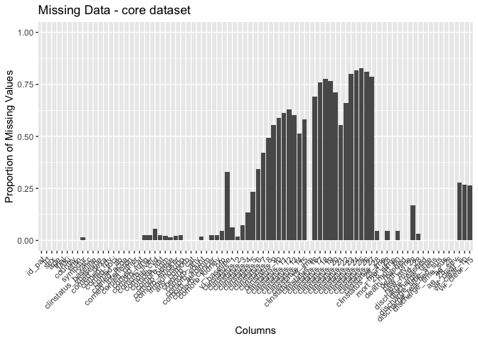
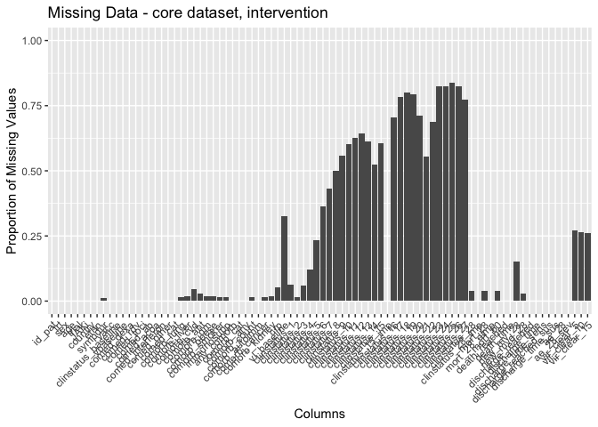
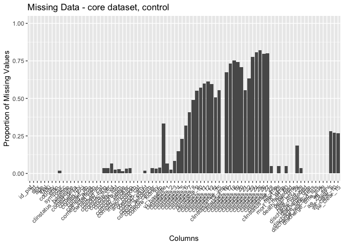
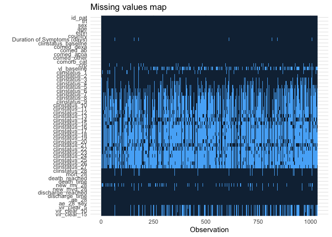
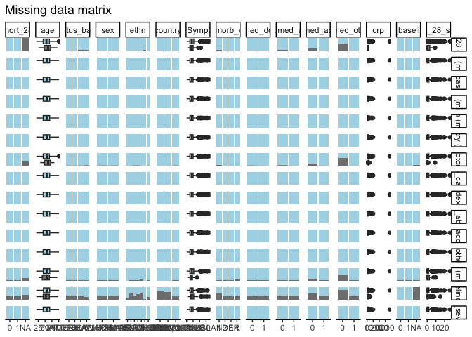
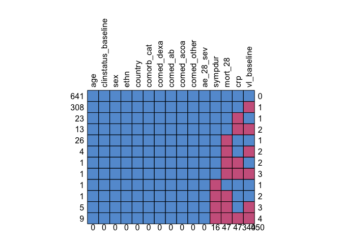
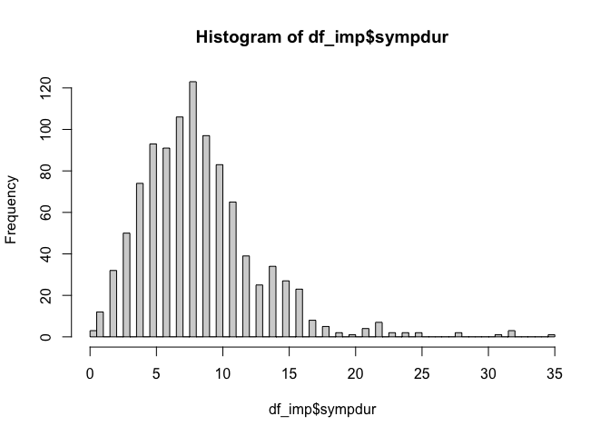

# Load packages

```r
library(tidyverse)
library(readxl)
library(writexl)
library(tableone)
library(haven) # Read sas files
library(here)
library(kableExtra)

library(jtools) # for summ() and plot_summs
library(sjPlot) # for tab_model
library(ggplot2) # survival/TTE analyses and other graphs
library(ggsurvfit) # survival/TTE analyses
library(survival) # survival/TTE analyses
library(gtsummary) # survival/TTE analyses
library(ggfortify) # autoplot
library(tidycmprsk) # competing risk analysis
library(ordinal) # clinstatus ordinal regression
library(logistf) # Firth regression in case of rare events

library(mice) # multiple imputation
library(jomo) # multiple imputation
library(mitools) # multiple imputation
```

# Load Data


# Reshape dataset and define ITT population

```r
#reshape
df <- df %>% ## corresponds to N in publication
  pivot_wider(id_cols = c("USUBJID","ARM","ACTARM","BCSOSN","d29dthe0","d29dthe1","ttrecov0","ttrecov1","or15scor","agec","SEX","BDURSYMP","COMORB2","REGION1","REGION2","BMI","RACE","ETHNIC","STRATAR","STRATAV","HYPTFL","CADFL","CHFFL","CRDFL","CORQFL","CLDFL","CKDFL","DIAB1FL","DIAB2FL","OBESIFL","CANCFL","IMMDFL","ASTHMAFL","CVDFL","COAGFL","NICFL","RFDVTFL","SURGFL","IMMOFL","CPDVTFL","COMORB1"),
              names_from = "adyc",
              values_from = "ordscor")
#reorder
df <- df %>%
  select("USUBJID","ARM","ACTARM","BCSOSN","Baseline","1", "2", "3", "4", "5", "6", "7", "8", "9", "10", "11", "12", "13", "14", "15", "16", "17", "18", "19", "20", "21", "22", "23", "24", "25", "26", "27", "28", "29", "30", "31", "32", "33","34","36","37","45", everything())

#define ITT -> keep all as randomized
# addmargins(table(df$ARM, df$ACTARM))
```

# Baseline Characteristics

```r
df$trial <- c("ACTT2")
df$JAKi <- c("Baricitinib")
df <- df %>% ## no missing data // no randdate // ARM == 1 includes remdesivir!
  rename(id_pat = USUBJID,
         sex = SEX,
         age = agec,
         region = REGION2
         )
df <- df %>%
  mutate(trt = case_when(ARM == "Baricitinib + Remdesivir" ~ 1,
                         TRUE ~ 0))

# fix ages ">89" using the original dataset
df_original <- df_original %>%
  rename(id_pat = USUBJID)
elderly <- unique(df[which(df$age == ">89"), "id_pat"])
for (i in 1:dim(elderly)[[1]]){
  df[which(df$id_pat == paste(elderly[i,])), "age"] <- paste(df_original[which(df_original$id_pat == paste(elderly[i,])), "AGE"])
}
df$age <- as.numeric(df$age)

df %>% 
  drop_na(age) %>% 
  ggplot(aes(x = age)) +
  geom_density(fill = "blue", color = "black") +
  labs(title = "Density Plot of Age",
       x = "Age",
       y = "Density")
```

<!-- -->

```r
# Ethnicity
df <- df %>% 
  mutate(ethn = case_when(RACE == "UNKNOWN" & ETHNIC == "HISPANIC OR LATINO" ~ "HISPANIC OR LATINO",
                          TRUE ~ c(RACE)))

# Days with symptoms prior to randomization
df$sympdur <- df$BDURSYMP ## 16 missing data
df %>% 
  drop_na(sympdur) %>% 
  ggplot(aes(x = sympdur)) +
  geom_density(fill = "blue", color = "black") +
  labs(title = "Density Plot of Symptom Duration",
       x = "Symptom Duration",
       y = "Density")
```

<!-- -->

```r
# Severity of COVID-19 with respect to respiratory support at randomisation / from publication: "Scores on the ordinal scale are as follows: 1, not hospitalized, no limitations of activities; 2, not hospitalized, limitation of activities, home oxygen requirement, or both; 3, hospitalized, not requiring supplemental oxygen and no longer requiring ongoing medical care (used if hospitalization was extended for infection-control reasons); 4, hospitalized, not requiring supplemental oxygen but requiring ongoing medical care (Covid-19–related or other medical conditions); 5, hospitalized, requiring any supplemental oxygen; 6, hospitalized, receiving noninvasive ventilation or use of high-flow oxygen devices; 7, hospitalized, receiving invasive mechanical ventilation or ECMO; and 8, death. Five deaths (three in patients receiving baricitinib plus RDV and two in patients receiving placebo plus RDV) occurred within the day 15 visit window but after 14 days — these deaths are included in the outcome of the ordinal score at day 15 but not in the outcome of mortality over the first 14 days."

# transform all clinical scores
score_transform <- function(df, clinstatus_var, score_var) {
  df <- df %>%
    mutate({{ clinstatus_var }} :=
             case_when({{ score_var }} %in% c(1, 2, 3) ~ 1,
                       {{ score_var }} == 4 ~ 2,
                       {{ score_var }} == 5 ~ 3,
                       {{ score_var }} == 6 ~ 4,
                       {{ score_var }} == 7 ~ 5,
                       {{ score_var }} == 8 ~ 6)) %>%
    mutate({{ clinstatus_var }} := factor({{ clinstatus_var }}, levels = 1:6))
}

df <- score_transform(df, clinstatus_baseline, Baseline) 
addmargins(table(df$clinstatus_baseline, df$trt, useNA = "always")) # no missing / # corresponds to publication
```

```
##       
##           0    1 <NA>  Sum
##   1       0    0    0    0
##   2      72   70    0  142
##   3     276  288    0  564
##   4     113  103    0  216
##   5      57   54    0  111
##   6       0    0    0    0
##   <NA>    0    0    0    0
##   Sum   518  515    0 1033
```

```r
addmargins(table(df$ACTARM, df$trt, useNA = "always")) # those who actually received any study medication
```

```
##                           
##                               0    1 <NA>  Sum
##   Baricitinib + Remdesivir    0  508    0  508
##   Not Treated                 9    7    0   16
##   Placebo + Remdesivir      509    0    0  509
##   <NA>                        0    0    0    0
##   Sum                       518  515    0 1033
```

```r
df <- score_transform(df, clinstatus_1, df$"1")
df <- score_transform(df, clinstatus_2, df$"2")
df <- score_transform(df, clinstatus_3, df$"3")
df <- score_transform(df, clinstatus_4, df$"4")
df <- score_transform(df, clinstatus_5, df$"5")
df <- score_transform(df, clinstatus_6, df$"6")
df <- score_transform(df, clinstatus_7, df$"7")
df <- score_transform(df, clinstatus_8, df$"8")
df <- score_transform(df, clinstatus_9, df$"9")
df <- score_transform(df, clinstatus_10, df$"10")
df <- score_transform(df, clinstatus_11, df$"11")
df <- score_transform(df, clinstatus_12, df$"12")
df <- score_transform(df, clinstatus_13, df$"13")
df <- score_transform(df, clinstatus_14, df$"14")
df <- score_transform(df, clinstatus_15, df$"15")
df <- score_transform(df, clinstatus_16, df$"16")
df <- score_transform(df, clinstatus_17, df$"17")
df <- score_transform(df, clinstatus_18, df$"18")
df <- score_transform(df, clinstatus_19, df$"19")
df <- score_transform(df, clinstatus_20, df$"20")
df <- score_transform(df, clinstatus_21, df$"21")
df <- score_transform(df, clinstatus_22, df$"22")
df <- score_transform(df, clinstatus_23, df$"23")
df <- score_transform(df, clinstatus_24, df$"24")
df <- score_transform(df, clinstatus_25, df$"25")
df <- score_transform(df, clinstatus_26, df$"26")
df <- score_transform(df, clinstatus_27, df$"27")
df <- score_transform(df, clinstatus_28, df$"28")
df <- score_transform(df, clinstatus_29, df$"29")
df <- score_transform(df, clinstatus_30, df$"30")
df <- score_transform(df, clinstatus_31, df$"31")
df <- score_transform(df, clinstatus_32, df$"32")
df <- score_transform(df, clinstatus_33, df$"33")
df <- score_transform(df, clinstatus_34, df$"34")
df <- score_transform(df, clinstatus_36, df$"36")
df <- score_transform(df, clinstatus_37, df$"37")
df <- score_transform(df, clinstatus_45, df$"45")

df <- df %>% 
  mutate(vbaseline = case_when(clinstatus_baseline == "2" | clinstatus_baseline == "3" ~ 0,
                                clinstatus_baseline == "4" | clinstatus_baseline == "5" ~ 1))

# Co-medication at baseline -> missing ! Except comed_rdv, because they received both!
df <- df %>% 
  mutate(comed_rdv = case_when(trt == 1 ~ 1,
                               TRUE ~ 0))
## group them for the subgroup analysis, according to protocol
# Comorbidity at baseline, including immunocompromised
df <- df %>% ## 27 missing
  mutate(comorb_lung = case_when(CRDFL == "Y" | CORQFL == "Y" | ASTHMAFL == "Y" ~ 1,
                                  CRDFL == "N" & CORQFL == "N" & ASTHMAFL == "N" ~ 0))
df <- df %>% # 27 missing
  mutate(comorb_liver = case_when(CLDFL == "Y" ~ 1,
                                   CLDFL == "N" ~ 0))
df <- df %>% # 57 missing
  mutate(comorb_cvd = case_when(CVDFL == "Y" | CPDVTFL == "Y" | CHFFL == "Y" | CADFL == "Y" ~ 1,
                              CVDFL == "N" & CPDVTFL == "N" & CHFFL == "N" & CADFL == "N" ~ 0))
df <- df %>% # 27 missing
  mutate(comorb_aht = case_when(HYPTFL == "Y" ~ 1,
                                   HYPTFL == "N" ~ 0))
df <- df %>% # 24 missing
  mutate(comorb_dm = case_when(DIAB1FL == "Y" | DIAB2FL == "Y" ~ 1,
                              DIAB1FL == "N" & DIAB2FL == "N" ~ 0))
df <- df %>% # 17 missing
  mutate(comorb_obese = case_when(OBESIFL == "Y" ~ 1,
                                   OBESIFL == "N" ~ 0))
df <- df %>% # 23 missing
  mutate(comorb_smoker = case_when(NICFL == "Y" ~ 1,
                                   NICFL == "N" ~ 0))
df <- df %>% # 25 missing
  mutate(immunosupp = case_when(IMMDFL == "Y" ~ 1,
                                   IMMDFL == "N" ~ 0))
df <- df %>% # 25 missing
  mutate(comorb_cancer = case_when(CANCFL == "Y" ~ 1,
                                   CANCFL == "N" ~ 0))
df <- df %>% # 26 missing
  mutate(comorb_kidney = case_when(CKDFL == "Y" ~ 1,
                                   CKDFL == "N" ~ 0))
df$comorb_autoimm <- 0

df <- df %>% # 18 missing - as in publication
  mutate(any_comorb = case_when(comorb_lung == 1 | comorb_liver == 1 | comorb_cvd == 1 |
                                  comorb_aht == 1 | comorb_dm == 1 | comorb_obese == 1 | comorb_smoker == 1
                                | immunosupp == 1 | comorb_cancer == 1 | comorb_autoimm == 1 | comorb_kidney == 1 
                                  ~ 1,
                                comorb_lung == 0 & comorb_liver == 0 & comorb_cvd == 0 &
                                  comorb_aht == 0 & comorb_dm == 0 & comorb_obese == 0 & comorb_smoker == 0
                                & immunosupp == 0 & comorb_cancer == 0 & comorb_autoimm == 0 & comorb_kidney == 0
                                ~ 0))
# df %>%
#   select(id_pat, any_comorb, COMORB1, COMORB2, comorb_lung, comorb_liver, comorb_cvd, comorb_aht, comorb_dm, comorb_obese, comorb_smoker, immunosupp, comorb_kidney, comorb_autoimm, comorb_cancer) %>%
#   #filter(is.na(any_comorb)) %>%
#   View()

## group them for the subgroup analysis, according to protocol // count all pre-defined comorbidities per patient first
comorb <- df %>% 
  select(id_pat, comorb_lung, comorb_liver, comorb_cvd, comorb_aht, comorb_dm, comorb_obese, comorb_smoker, immunosupp, comorb_kidney, comorb_autoimm, comorb_cancer)
comorb$comorb_count <- NA
for (i in 1:dim(comorb)[[1]]) {
  comorb$comorb_count[i] <- ifelse(
    sum(comorb[i, ] %in% c(1)) > 0,
    sum(comorb[i, ] %in% c(1)),
    NA
  )
}
comorb <- comorb %>% # 18 missing
  mutate(comorb_count = case_when(comorb_lung == 0 & comorb_liver == 0 & comorb_cvd == 0 &
                                  comorb_aht == 0 & comorb_dm == 0 & comorb_obese == 0 & comorb_smoker == 0
                                & immunosupp == 0 & comorb_cancer == 0 & comorb_autoimm == 0 & comorb_kidney == 0 ~ 0,
                                TRUE ~ comorb_count))
df <- left_join(df, comorb[, c("comorb_count", "id_pat")], by = join_by(id_pat == id_pat)) ## merge imputed variable back
df <- df %>% # same 18 missing
  mutate(comorb_cat = case_when(immunosupp == 1 ~ 4, # immunocompromised
                                comorb_count == 0 ~ 1, # no comorbidity
                                comorb_count == 1 ~ 2, # one comorbidity
                                comorb_count >1 & (immunosupp == 0 | is.na(immunosupp)) ~ 3)) # multiple comorbidities
# table(df$comorb_cat, useNA = "always")

# CRP
# Vaccination
df$vacc <- 0 # trial happened before roll-out of any vaccine

# Viremia
# Variant
# Serology
```
Discussion points BASELINE data:
1. For Country only Region -> Non-US Site n=148 and US Site n=885: "There were 67 trial sites in 8 countries: the United States (55 sites), Singapore (4), South Korea (2), Mexico (2), Japan (1), Spain (1), the United Kingdom (1), and Denmark (1)."
2. In the absence of a written policy, other experimental treatment and off-label use of marketed medications intended as specific treatment for Covid-19 were prohibited. This included glucocorticoids, which were permitted only for standard indications such as adrenal insufficiency, asthma exacerbation, laryngeal edema, septic shock, and acute respiratory distress syndrome.

# Endpoints

```r
# time to event data
df$death_d <- as.numeric(df$d29dthe0) # everyone with a value here, died
df$discharge_d <- as.numeric(df$ttrecov0) # everyone with a value here, was discharged/reached discharge criteria // CAVE: 2 were discharged at day 9 but died later at home (within 28 days)


# (i) Primary outcome: Mortality at day 28
df <- df %>% # 47 have no outcome data, reason for censoring unclear (see below); a few have info in daily score
  mutate(mort_28 = case_when(death_d <29 ~ 1, # includes deaths after discharge
                             discharge_d <29 ~ 0, # discharge to hospiz before day 15 were coded as 7 and were very few
                             clinstatus_28 %in% c(2,3,4,5) ~ 0, # still at hospital but alive, clinstatus variables after 28d are all empty (see View below)
                             discharge_d >28 ~ 0)) # discharged later, proof of still alive, but empty
# table(df$mort_28, df$trt, useNA = "always") # deaths correspond to publication (but they have -1 based on different counting of day 0) // However, the 21 missing in int and the 26 missing in cont do not really correspond to publication

# table(df$ACTARM, df$mort_28, useNA = "always") # the 16 not treated were censored at day 0 or 1 => NA for death_d/discharge_d/clinstatus_28 // The remaining 14 in intervention, I guess (see Fig 1): 8 Withdrew, 1 was withdrawn by investigator, 1 became ineligible after enrollment, 2 Had severe adverse event or adverse event other than death (?!?), 2 Had other reason (?!?) // The remaining 17 in control, I guess (see Fig 1): 16 Withdrew, 2 Were withdrawn by investigator, 1 Became ineligible after enrollment, 1 Had severe adverse event or adverse event other than death, 1 Was transferred to another hospital, 3 Had other reason. 

# df %>%
#   select(mort_28, ACTARM, death_d, discharge_d, d29dthe1, ttrecov1, clinstatus_baseline, clinstatus_1, clinstatus_2, clinstatus_3, clinstatus_4, clinstatus_5, clinstatus_6, clinstatus_7, clinstatus_8, clinstatus_9, clinstatus_10, clinstatus_11, clinstatus_12, clinstatus_13, clinstatus_14, clinstatus_15,
#          clinstatus_15_imp,
#          clinstatus_16, clinstatus_17, clinstatus_18, clinstatus_19, clinstatus_20, clinstatus_21, clinstatus_22, clinstatus_23, clinstatus_24, clinstatus_25, clinstatus_26, clinstatus_27, clinstatus_28, clinstatus_29, clinstatus_30, clinstatus_31, clinstatus_32, clinstatus_33, clinstatus_34, clinstatus_36, clinstatus_37, clinstatus_45) %>%
#   filter(is.na(mort_28)) %>%
#   View()

# Apply missing data rule; we use the same rules as ACTT2 => we can use clinstatus_15_imp
df <- score_transform(df, clinstatus_15_imp, df$or15scor)
# Apply missing data rule
# df <- df %>% 
#   mutate(mort_28 = case_when(is.na(mort_28) & clinstatus_15_imp %in% c("1","2","3","4","5") ~ 0,
#                              TRUE ~ c(mort_28)))


# (ii) Mortality at day 60
df$mort_60 <- df$mort_28 # max fup time in ACTT-2 was 28 days; thus mort_60 imputed from mort_28


# (iii) Time to death within max. follow-up time
df <- df %>% # don't bother about the NA in mort_28 since they are not dead, i.e. just censor (==0) everyone else
  mutate(death_reached = case_when(death_d <29 ~ 1,
                                       TRUE ~ 0))
df <- df %>% # no missing and those that were discharged and afterwards died have correct time to event data
  mutate(death_time = case_when(death_d >=0 ~ c(death_d), # time to death, if no time to death, then...
                                d29dthe1 >=0 ~ c(d29dthe1))) # time to death censoring data
# df %>% # those died have correct time to event data. Those discharged before d28 (and not withdrawn/ltfu/hospiz/SAE) should receive max fup time? But some do not, they are censored but reason for censoring unclear.
#   select(death_reached, ACTARM, death_time, death_d, discharge_d, d29dthe1, ttrecov1, clinstatus_baseline, clinstatus_1, clinstatus_2, clinstatus_3, clinstatus_4, clinstatus_5, clinstatus_6, clinstatus_7, clinstatus_8, clinstatus_9, clinstatus_10, clinstatus_11, clinstatus_12, clinstatus_13, clinstatus_14, clinstatus_15, or15scor, clinstatus_16, clinstatus_17, clinstatus_18, clinstatus_19, clinstatus_20, clinstatus_21, clinstatus_22, clinstatus_23, clinstatus_24, clinstatus_25, clinstatus_26, clinstatus_27, clinstatus_28, clinstatus_29, clinstatus_30, clinstatus_31, clinstatus_32, clinstatus_33, clinstatus_34, clinstatus_36, clinstatus_37, clinstatus_45) %>%
#   filter(death_reached != 1) %>%
#   filter(discharge_d < 29 & death_time < 28) %>%
#   View()


# (iv) New mechanical ventilation among survivors within 28 days.
df <- df %>% # all NAs are either dead or started with clinstatus_baseline == 5 (see View below)
  mutate(new_mv_28 = case_when((clinstatus_baseline == 2 | clinstatus_baseline == 3 | clinstatus_baseline == 4) 
                               & (mort_28 == 0 | is.na(mort_28)) 
                               & (clinstatus_1 == 5 | clinstatus_2 == 5 | clinstatus_3 == 5 | clinstatus_4 == 5 |
                                   clinstatus_5 == 5 | clinstatus_6 == 5 | clinstatus_7 == 5 | clinstatus_8 == 5 |
                                    clinstatus_9 == 5 | clinstatus_10 == 5 | clinstatus_11 == 5 | clinstatus_12 == 5 |
                                    clinstatus_13 == 5 | clinstatus_14 == 5 | clinstatus_15 == 5 | clinstatus_15_imp == 5 | 
                                    clinstatus_16 == 5 |
                                    clinstatus_17 == 5 | clinstatus_18 == 5 | clinstatus_19 == 5 | clinstatus_20 == 5 |
                                    clinstatus_21 == 5 | clinstatus_22 == 5 | clinstatus_23 == 5 | clinstatus_24 == 5 |
                                    clinstatus_25 == 5 | clinstatus_26 == 5 | clinstatus_27 == 5 | clinstatus_28 == 5)
                               ~ 1,
                               (clinstatus_baseline == 2 | clinstatus_baseline == 3 | clinstatus_baseline == 4) & mort_28 == 0
                               ~ 0))
# df %>%
#   select(new_mv_28, death_reached, death_time, death_d, discharge_d, d29dthe1, ttrecov1, clinstatus_baseline, clinstatus_1, clinstatus_2, clinstatus_3, clinstatus_4, clinstatus_5, clinstatus_6, clinstatus_7, clinstatus_8, clinstatus_9, clinstatus_10, clinstatus_11, clinstatus_12, clinstatus_13, clinstatus_14, clinstatus_15, or15scor, clinstatus_16, clinstatus_17, clinstatus_18, clinstatus_19, clinstatus_20, clinstatus_21, clinstatus_22, clinstatus_23, clinstatus_24, clinstatus_25, clinstatus_26, clinstatus_27, clinstatus_28, clinstatus_29, clinstatus_30, clinstatus_31, clinstatus_32, clinstatus_33, clinstatus_34, clinstatus_36, clinstatus_37, clinstatus_45) %>%
#   filter(is.na(new_mv_28)) %>%
#   filter(clinstatus_baseline != 5) %>%
#   filter(death_reached == 0) %>%
#   View()

# (iv) Alternative definition/analysis: New mechanical ventilation OR death within 28 days => include all in denominator. 
df <- df %>% # no missing
  mutate(new_mvd_28 = case_when(new_mv_28 == 1 | mort_28 == 1 ~ 1,
                                new_mv_28 == 0 | mort_28 == 0 ~ 0))


# (v) Clinical status at day 28
df <- df %>% # Adapt clinstatus_28, since currently NA for those discharged or died. Then, check if nothing in 28d window (there was nothing), then LVCF including use or15scor
  mutate(clinstatus_28 = case_when(clinstatus_28 == 5 ~ 5,
                                   clinstatus_28 == 4 ~ 4,
                                   clinstatus_28 == 3 ~ 3,
                                   clinstatus_28 == 2 ~ 2,
                                   mort_28 == 1 ~ 6, # died within 28d
                                   mort_28 == 0 ~ 1)) # discharged alive / reached discharge criteria within 28d
df$clinstatus_28 <- factor(df$clinstatus_28, levels = 1:6)

## Imputation according to protocol: If there was daily data for the ordinal score available but with missing data for single days, then we carried last observed value forward unless for day 28, whereby we first considered data from the window (+/-3 days) but there was nothing in that window => LVCF
dfcs <- df %>% 
    select(id_pat, clinstatus_baseline, clinstatus_1, clinstatus_2, clinstatus_3, clinstatus_4, clinstatus_5, clinstatus_6, clinstatus_7, clinstatus_8, clinstatus_9, clinstatus_10, clinstatus_11, clinstatus_12, clinstatus_13, clinstatus_14, clinstatus_15_imp, clinstatus_16, clinstatus_17, clinstatus_18, clinstatus_19, clinstatus_20, clinstatus_21, clinstatus_22, clinstatus_23, clinstatus_24, clinstatus_25, clinstatus_26, clinstatus_27, clinstatus_28)
impute_last_forw = function(df){
  first = which(names(df)%in%c("clinstatus_baseline"))
  last = which(names(df)%in%c("clinstatus_28"))
  for (i in 1:dim(df)[[1]]){
    for (j in first[1]:last[1]){
      p = df[i, j]
      df[i,j] <- 
        ifelse(!is.na(df[i, j]), p, df[i, j-1])
    }
  }
  df
}
dfcs <- impute_last_forw(dfcs)
dfcs <- dfcs %>% # To control, don't overwrite
  rename(clinstatus_28_imp = clinstatus_28)
df <- left_join(df, dfcs[, c("clinstatus_28_imp", "id_pat")], by = join_by(id_pat == id_pat)) # Merge imputed variable back

# table(df$clinstatus_28, useNA = "always")
# table(df$clinstatus_28_imp, useNA = "always") # All imputed (i.e. carried forward from imputed day 15) are still hospitalized but not dead


# (vi) Time to discharge or reaching discharge criteria up to day 28
df <- df %>% 
  mutate(discharge_reached = case_when(discharge_d <29 ~ 1,
                                       TRUE ~ 0))
df <- df %>% # 2 are left without any time to event data => impute max. follow-up time
  mutate(discharge_time = case_when(discharge_d >=0 ~ c(discharge_d), # time to discharge, if no time to discharge, then...
                                    ttrecov1 >=0 ~ c(ttrecov1)+1)) # time to discharge censoring time (see ACTT-2 documentation regarding time zero -> now matching d29dthe1)
df <- df %>% # restrict to max fup time 28d
  mutate(discharge_time = case_when(discharge_time >28 ~ 28,
                                    TRUE ~ discharge_time))
df <- df %>% # add 28d for those that died // Patients who died prior to day 28 are assumed not having reached discharge, i.e. counted as 28 days (as someone who has been censored on day 28). 
  mutate(discharge_time_sens = case_when(mort_28 == 1 ~ 28,
                                    TRUE ~ discharge_time))
# table(df$discharge_time, df$discharge_reached, useNA = "always")


# (vi) Sens-analysis: Alternative definition/analysis of outcome: time to sustained discharge within 28 days. There are no re-admissions documented in ACTT-2
df$discharge_reached_sus <- df$discharge_reached
df$discharge_time_sus <- df$discharge_time

# (vii) Viral clearance up to day 5, day 10, and day 15 (Viral load value <LOQ and/or undectectable): Not available in ACTT-2

# (viii) Quality of life at day 28: Not available in ACTT-2

# (ix) Participants with an adverse event grade 3 or 4, or a serious adverse event, excluding death, by day 28

# (ix) Sens-analysis: Alternative definition/analysis of outcome: incidence rate ratio (Poisson regression) -> AE per person by d28

# (ix) Sens-analysis: Alternative definition/analysis of outcome: time to first (of these) adverse event, within 28 days, considering death as a competing risk (=> censor and set to 28 days)

# (x) Adverse events of special interest within 28 days: a) thromboembolic events (venous thromboembolism, pulmonary embolism, arterial thrombosis), b) secondary infections (bacterial pneumonia including ventilator-associated pneumonia, meningitis and encephalitis, endocarditis and bacteremia, invasive fungal infection including pulmonary aspergillosis), c) Reactivation of chronic infection including tuberculosis, herpes simplex, cytomegalovirus, herpes zoster and hepatitis B, d) serious cardiovascular and cardiac events (including stroke and myocardial infarction), e) events related to signs of bone marrow suppression (anemia, lymphocytopenia, thrombocytopenia, pancytopenia), f) malignancy, g) gastrointestinal perforation (incl. gastrointestinal bleeding/diverticulitis), h) liver dysfunction/hepatotoxicity (grade 3 and 4)

# (xi) Adverse events, any grade and serious adverse event, excluding death, within 28 days, grouped by organ classes

# df_ae <- df %>% 
#   select(id_pat, trt, x, ae_28_list, aesi_28)
# # Save
# saveRDS(df_ae, file = "df_ae_actt2.RData")
```
Discussion points

# Define final datasets

```r
# the overall set
df_all <- df
# reduce the df set to our standardized set across all trials
df <- df %>% 
  select(id_pat, trt, sex, age, trial, JAKi, 
         ethn, 
         # country, 
         # icu, 
         sympdur, 
         vacc, 
         clinstatus_baseline, vbaseline,
         # comed_dexa, 
         comed_rdv, 
         # comed_toci, comed_ab, comed_acoa, comed_interferon, comed_other,
         # comed_cat,
         comorb_lung, comorb_liver, comorb_cvd, comorb_aht, comorb_dm, comorb_obese, comorb_smoker, immunosupp,
         any_comorb, comorb_cat, comorb_count,
         comorb_autoimm, comorb_cancer, comorb_kidney,
         # crp, # sero, vl_baseline, variant,
         mort_28, mort_60, death_reached, death_time,
         new_mv_28, new_mvd_28,
         clinstatus_28_imp,
         discharge_reached, discharge_time, discharge_time_sens, discharge_reached_sus, discharge_time_sus,
         # ae_28, ae_28_sev,
         # vir_clear_5, vir_clear_10, vir_clear_15
         )

# export for one-stage model, i.e., add missing variables 
df_os <- df
df_os$country <- NA
df_os$icu <- NA
df_os$comed_dexa <- NA
df_os$comed_toci <- NA
df_os$comed_ab <- NA
df_os$comed_acoa <- NA
df_os$comed_interferon <- NA
df_os$comed_other <- NA
df_os$comed_cat <- NA
df_os$crp <- NA
df_os$sero <- NA
df_os$vl_baseline <- NA
df_os$variant <- NA
df_os$ae_28 <- NA
df_os$ae_28_sev <- NA
df_os$vir_clear_5 <- NA
df_os$vir_clear_10 <- NA
df_os$vir_clear_15 <- NA
# Save
saveRDS(df_os, file = "df_os_actt2.RData")
```

# Missing data plot: One-stage dataset

```r
# Bar plot, missing data, each data point, standardized one-stage dataset
original_order <- colnames(df_os)
missing_plot <- df_os %>%
  summarise_all(~ mean(is.na(.))) %>%
  gather() %>%
  mutate(key = factor(key, levels = original_order)) %>%
  ggplot(aes(x = key, y = value)) +
  geom_bar(stat = "identity") +
  labs(x = "Columns", y = "Proportion of Missing Values", title = "Missing Data - standardized one-stage dataset") +
  theme(axis.text.x = element_text(angle = 45, hjust = 1)) +
  ylim(0, 1)
print(missing_plot)
```

<!-- -->
Discussion points
1. Completely missing variables:
* Baseline:
  - ICU at enrolment, Country, Variant, Serology
* Outcomes:
  - qol_28
2. Partially missing data:
- sympdur & comorbities
- mort_28 / mort_60 / clinstatus_28 / new_mv_28 / new_mvd_28

# Missing data: Explore for MI

```r
# keep the core df
df_core <- df_all %>% 
  select(id_pat, trt, sex, age, trial, JAKi, region,
         ethn,
         sympdur, 
         vacc, 
         clinstatus_baseline, vbaseline,
         comed_rdv, 
         comorb_lung, comorb_liver, comorb_cvd, comorb_aht, comorb_dm, comorb_obese, comorb_smoker, immunosupp,
         any_comorb, comorb_cat, comorb_count,
         comorb_autoimm, comorb_cancer, comorb_kidney,
         clinstatus_1, clinstatus_2, clinstatus_3, clinstatus_4, clinstatus_5, clinstatus_6, clinstatus_7, clinstatus_8, clinstatus_9, clinstatus_10, clinstatus_11, clinstatus_12, clinstatus_13, clinstatus_14, clinstatus_15, clinstatus_15_imp, clinstatus_16, clinstatus_17, clinstatus_18, clinstatus_19, clinstatus_20, clinstatus_21, clinstatus_22, clinstatus_23, clinstatus_24, clinstatus_25, clinstatus_26, clinstatus_27, clinstatus_28,
         clinstatus_28_imp,
         mort_28, mort_60, death_reached, death_time,
         new_mv_28, new_mvd_28,
         discharge_reached, discharge_time, discharge_time_sens, discharge_reached_sus, discharge_time_sus,
         )
# str(df_core)
# Convert character variables to factors
char_vars <- c("id_pat", "sex", "trial", "JAKi", "region", "ethn", "vacc", "clinstatus_baseline", "vbaseline", "comed_rdv", "comorb_lung", "comorb_liver", "comorb_cvd", "comorb_aht", "comorb_dm", "comorb_obese", "comorb_smoker", "immunosupp", "any_comorb", "comorb_cat", "comorb_autoimm","comorb_cancer", "comorb_kidney", "clinstatus_1", "clinstatus_2","clinstatus_3", "clinstatus_4", "clinstatus_5", "clinstatus_6", "clinstatus_7", "clinstatus_8", "clinstatus_9", "clinstatus_10", "clinstatus_11", "clinstatus_12", "clinstatus_13", "clinstatus_14", "clinstatus_15", "clinstatus_15_imp", "clinstatus_16", "clinstatus_17", "clinstatus_18", "clinstatus_19", "clinstatus_20", "clinstatus_21", "clinstatus_22", "clinstatus_23", "clinstatus_24", "clinstatus_25", "clinstatus_26", "clinstatus_27", "clinstatus_28", "clinstatus_28_imp", "mort_28", "mort_60", "death_reached", "new_mv_28", "new_mvd_28","discharge_reached", "discharge_reached_sus")
df_core <- df_core %>%
  mutate(across(all_of(char_vars), factor))

# Bar plot, missing data, each data point, core dataset
original_order <- colnames(df_core)
missing_plot <- df_core %>%
  summarise_all(~ mean(is.na(.))) %>%
  gather() %>%
  mutate(key = factor(key, levels = original_order)) %>%
  ggplot(aes(x = key, y = value)) +
  geom_bar(stat = "identity") +
  labs(x = "Columns", y = "Proportion of Missing Values", title = "Missing Data - core dataset") +
  theme(axis.text.x = element_text(angle = 45, hjust = 1)) +
  ylim(0, 1)
print(missing_plot)
```

<!-- -->

```r
# Bar plot, missing data, each data point, core dataset, by arm
df_core_int <- df_core %>% 
  filter(trt == 1)
original_order <- colnames(df_core_int)
missing_plot <- df_core_int %>% # Intervention arm
  summarise_all(~ mean(is.na(.))) %>%
  gather() %>%
  mutate(key = factor(key, levels = original_order)) %>%
  ggplot(aes(x = key, y = value)) +
  geom_bar(stat = "identity") +
  labs(x = "Columns", y = "Proportion of Missing Values", title = "Missing Data - core dataset, intervention") +
  theme(axis.text.x = element_text(angle = 45, hjust = 1)) +
  ylim(0, 1)
print(missing_plot)
```

<!-- -->

```r
df_core_cont <- df_core %>% 
  filter(trt == 0)
original_order <- colnames(df_core_cont)
missing_plot <- df_core_cont %>% # Control arm
  summarise_all(~ mean(is.na(.))) %>%
  gather() %>%
  mutate(key = factor(key, levels = original_order)) %>%
  ggplot(aes(x = key, y = value)) +
  geom_bar(stat = "identity") +
  labs(x = "Columns", y = "Proportion of Missing Values", title = "Missing Data - core dataset, control") +
  theme(axis.text.x = element_text(angle = 45, hjust = 1)) +
  ylim(0, 1)
print(missing_plot)
```

<!-- -->

```r
### Baseline table, by individuals with no missing data vs any missing data (or only in mort_28)
df_core <- df_core %>% mutate(complete = ifelse(rowSums(is.na(.)) > 0, 0, 1));table(df_core$complete) # ANY missing 
```

```
## 
##   0   1 
## 982  51
```

```r
df_core$resp<-ifelse(is.na(df_core$mort_28), 0, 1);table(df_core$resp) # only mort_28 missing 
```

```
## 
##   0   1 
##  47 986
```

```r
# Assign variable list
vars.list <- c("complete", "resp", "age", "sympdur", "JAKi", "trial", "trt", "sex", "ethn", "region", "vacc", "clinstatus_baseline", "vbaseline", "comed_rdv", "comorb_lung", "comorb_liver", "comorb_cvd", "comorb_aht", "comorb_dm", "comorb_obese", "comorb_smoker", "immunosupp", "any_comorb", "comorb_cat", "comorb_count","comorb_autoimm","comorb_cancer", "comorb_kidney", "clinstatus_1", "clinstatus_2","clinstatus_3", "clinstatus_4", "clinstatus_5", "clinstatus_6", "clinstatus_7", "clinstatus_8", "clinstatus_9", "clinstatus_10", "clinstatus_11", "clinstatus_12", "clinstatus_13", "clinstatus_14", "clinstatus_15", "clinstatus_15_imp", "clinstatus_16", "clinstatus_17", "clinstatus_18", "clinstatus_19", "clinstatus_20", "clinstatus_21", "clinstatus_22", "clinstatus_23", "clinstatus_24", "clinstatus_25", "clinstatus_26", "clinstatus_27", "clinstatus_28", "clinstatus_28_imp", "mort_28", "mort_60", "death_reached","death_time", "new_mv_28", "new_mvd_28","discharge_reached", "discharge_time", "discharge_reached_sus", "discharge_time_sus")
# By completeness (all variables)
# table_complete <- CreateTableOne(data = df_core, vars = vars.list[!vars.list %in% c("complete")], strata = "complete", includeNA = T, test = T, addOverall = TRUE)
# capture.output(table_complete <- print(table_complete, nonnormal = vars.list,catDigits = 1,SMD = TRUE,showAllLevels = TRUE,test = TRUE,printToggle = FALSE,missing = TRUE))
# kable(table_complete, format = "markdown", table.attr = 'class="table"', caption = "By completeness (all variables)") %>%
#   kable_styling(bootstrap_options = "striped", full_width = FALSE)

# By completeness (only mort_28)
table_resp <- CreateTableOne(data = df_core, vars = vars.list[!vars.list %in% c("resp")], strata = "resp", includeNA = T, test = T, addOverall = TRUE)
# Print and display the table
capture.output(
  table_resp <- print(
    table_resp, 
    nonnormal = vars.list, 
    catDigits = 1, 
    SMD = TRUE, 
    showAllLevels = TRUE, 
    test = TRUE, 
    printToggle = FALSE, 
    missing = TRUE))
```

```
## character(0)
```

```r
kable(table_resp, format = "markdown", table.attr = 'class="table"', caption = "By completeness (only mort_28)") %>%
  kable_styling(bootstrap_options = "striped", full_width = FALSE)
```

```
## Warning in kable_styling(., bootstrap_options = "striped", full_width = FALSE):
## Please specify format in kable. kableExtra can customize either HTML or LaTeX
## outputs. See https://haozhu233.github.io/kableExtra/ for details.
```


Table: By completeness (only mort_28)

|                                  |level                                     |Overall              |0                    |1                    |p      |test    |Missing |
|:---------------------------------|:-----------------------------------------|:--------------------|:--------------------|:--------------------|:------|:-------|:-------|
|n                                 |                                          |1033                 |47                   |986                  |       |        |        |
|complete (median [IQR])           |                                          |0.00 [0.00, 0.00]    |0.00 [0.00, 0.00]    |0.00 [0.00, 0.00]    |0.110  |nonnorm |0.0     |
|age (median [IQR])                |                                          |56.00 [43.00, 67.00] |61.00 [47.00, 70.50] |55.00 [43.00, 66.00] |0.103  |nonnorm |0.0     |
|sympdur (median [IQR])            |                                          |8.00 [5.00, 10.00]   |7.50 [5.00, 10.00]   |8.00 [5.00, 11.00]   |0.652  |nonnorm |1.5     |
|JAKi (%)                          |Baricitinib                               |1033 (100.0)         |47 (100.0)           |986 (100.0)          |NA     |        |0.0     |
|trial (%)                         |ACTT2                                     |1033 (100.0)         |47 (100.0)           |986 (100.0)          |NA     |        |0.0     |
|trt (median [IQR])                |                                          |0.00 [0.00, 1.00]    |0.00 [0.00, 1.00]    |1.00 [0.00, 1.00]    |0.468  |nonnorm |0.0     |
|sex (%)                           |F                                         |381 ( 36.9)          |18 ( 38.3)           |363 ( 36.8)          |0.959  |        |0.0     |
|                                  |M                                         |652 ( 63.1)          |29 ( 61.7)           |623 ( 63.2)          |       |        |        |
|ethn (%)                          |AMERICAN INDIAN OR ALASKA NATIVE          |10 (  1.0)           |0 (  0.0)            |10 (  1.0)           |0.792  |        |0.0     |
|                                  |ASIAN                                     |101 (  9.8)          |3 (  6.4)            |98 (  9.9)           |       |        |        |
|                                  |BLACK OR AFRICAN AMERICAN                 |156 ( 15.1)          |5 ( 10.6)            |151 ( 15.3)          |       |        |        |
|                                  |HISPANIC OR LATINO                        |246 ( 23.8)          |12 ( 25.5)           |234 ( 23.7)          |       |        |        |
|                                  |NATIVE HAWAIIAN OR OTHER PACIFIC ISLANDER |11 (  1.1)           |0 (  0.0)            |11 (  1.1)           |       |        |        |
|                                  |UNKNOWN                                   |13 (  1.3)           |1 (  2.1)            |12 (  1.2)           |       |        |        |
|                                  |WHITE                                     |496 ( 48.0)          |26 ( 55.3)           |470 ( 47.7)          |       |        |        |
|region (%)                        |Asia                                      |67 (  6.5)           |1 (  2.1)            |66 (  6.7)           |0.328  |        |0.0     |
|                                  |Europe                                    |13 (  1.3)           |0 (  0.0)            |13 (  1.3)           |       |        |        |
|                                  |North America                             |953 ( 92.3)          |46 ( 97.9)           |907 ( 92.0)          |       |        |        |
|vacc (%)                          |0                                         |1033 (100.0)         |47 (100.0)           |986 (100.0)          |NA     |        |0.0     |
|clinstatus_baseline (%)           |2                                         |142 ( 13.7)          |4 (  8.5)            |138 ( 14.0)          |0.221  |        |0.0     |
|                                  |3                                         |564 ( 54.6)          |22 ( 46.8)           |542 ( 55.0)          |       |        |        |
|                                  |4                                         |216 ( 20.9)          |13 ( 27.7)           |203 ( 20.6)          |       |        |        |
|                                  |5                                         |111 ( 10.7)          |8 ( 17.0)            |103 ( 10.4)          |       |        |        |
|vbaseline (%)                     |0                                         |706 ( 68.3)          |26 ( 55.3)           |680 ( 69.0)          |0.071  |        |0.0     |
|                                  |1                                         |327 ( 31.7)          |21 ( 44.7)           |306 ( 31.0)          |       |        |        |
|comed_rdv (%)                     |0                                         |518 ( 50.1)          |26 ( 55.3)           |492 ( 49.9)          |0.564  |        |0.0     |
|                                  |1                                         |515 ( 49.9)          |21 ( 44.7)           |494 ( 50.1)          |       |        |        |
|comorb_lung (%)                   |0                                         |854 ( 82.7)          |27 ( 57.4)           |827 ( 83.9)          |<0.001 |        |2.6     |
|                                  |1                                         |152 ( 14.7)          |9 ( 19.1)            |143 ( 14.5)          |       |        |        |
|                                  |NA                                        |27 (  2.6)           |11 ( 23.4)           |16 (  1.6)           |       |        |        |
|comorb_liver (%)                  |0                                         |978 ( 94.7)          |35 ( 74.5)           |943 ( 95.6)          |<0.001 |        |2.6     |
|                                  |1                                         |28 (  2.7)           |1 (  2.1)            |27 (  2.7)           |       |        |        |
|                                  |NA                                        |27 (  2.6)           |11 ( 23.4)           |16 (  1.6)           |       |        |        |
|comorb_cvd (%)                    |0                                         |824 ( 79.8)          |24 ( 51.1)           |800 ( 81.1)          |<0.001 |        |5.5     |
|                                  |1                                         |152 ( 14.7)          |8 ( 17.0)            |144 ( 14.6)          |       |        |        |
|                                  |NA                                        |57 (  5.5)           |15 ( 31.9)           |42 (  4.3)           |       |        |        |
|comorb_aht (%)                    |0                                         |484 ( 46.9)          |13 ( 27.7)           |471 ( 47.8)          |<0.001 |        |2.6     |
|                                  |1                                         |522 ( 50.5)          |23 ( 48.9)           |499 ( 50.6)          |       |        |        |
|                                  |NA                                        |27 (  2.6)           |11 ( 23.4)           |16 (  1.6)           |       |        |        |
|comorb_dm (%)                     |0                                         |629 ( 60.9)          |19 ( 40.4)           |610 ( 61.9)          |<0.001 |        |2.3     |
|                                  |1                                         |380 ( 36.8)          |17 ( 36.2)           |363 ( 36.8)          |       |        |        |
|                                  |NA                                        |24 (  2.3)           |11 ( 23.4)           |13 (  1.3)           |       |        |        |
|comorb_obese (%)                  |0                                         |449 ( 43.5)          |20 ( 42.6)           |429 ( 43.5)          |<0.001 |        |1.6     |
|                                  |1                                         |567 ( 54.9)          |16 ( 34.0)           |551 ( 55.9)          |       |        |        |
|                                  |NA                                        |17 (  1.6)           |11 ( 23.4)           |6 (  0.6)            |       |        |        |
|comorb_smoker (%)                 |0                                         |963 ( 93.2)          |34 ( 72.3)           |929 ( 94.2)          |<0.001 |        |2.2     |
|                                  |1                                         |47 (  4.5)           |1 (  2.1)            |46 (  4.7)           |       |        |        |
|                                  |NA                                        |23 (  2.2)           |12 ( 25.5)           |11 (  1.1)           |       |        |        |
|immunosupp (%)                    |0                                         |978 ( 94.7)          |35 ( 74.5)           |943 ( 95.6)          |<0.001 |        |2.4     |
|                                  |1                                         |30 (  2.9)           |1 (  2.1)            |29 (  2.9)           |       |        |        |
|                                  |NA                                        |25 (  2.4)           |11 ( 23.4)           |14 (  1.4)           |       |        |        |
|any_comorb (%)                    |0                                         |151 ( 14.6)          |5 ( 10.6)            |146 ( 14.8)          |<0.001 |        |1.7     |
|                                  |1                                         |864 ( 83.6)          |31 ( 66.0)           |833 ( 84.5)          |       |        |        |
|                                  |NA                                        |18 (  1.7)           |11 ( 23.4)           |7 (  0.7)            |       |        |        |
|comorb_cat (%)                    |1                                         |151 ( 14.6)          |5 ( 10.6)            |146 ( 14.8)          |<0.001 |        |1.7     |
|                                  |2                                         |288 ( 27.9)          |8 ( 17.0)            |280 ( 28.4)          |       |        |        |
|                                  |3                                         |546 ( 52.9)          |22 ( 46.8)           |524 ( 53.1)          |       |        |        |
|                                  |4                                         |30 (  2.9)           |1 (  2.1)            |29 (  2.9)           |       |        |        |
|                                  |NA                                        |18 (  1.7)           |11 ( 23.4)           |7 (  0.7)            |       |        |        |
|comorb_count (median [IQR])       |                                          |2.00 [1.00, 3.00]    |2.00 [1.00, 3.00]    |2.00 [1.00, 3.00]    |0.161  |nonnorm |1.7     |
|comorb_autoimm (%)                |0                                         |1033 (100.0)         |47 (100.0)           |986 (100.0)          |NA     |        |0.0     |
|comorb_cancer (%)                 |0                                         |971 ( 94.0)          |33 ( 70.2)           |938 ( 95.1)          |<0.001 |        |2.4     |
|                                  |1                                         |37 (  3.6)           |2 (  4.3)            |35 (  3.5)           |       |        |        |
|                                  |NA                                        |25 (  2.4)           |12 ( 25.5)           |13 (  1.3)           |       |        |        |
|comorb_kidney (%)                 |0                                         |943 ( 91.3)          |32 ( 68.1)           |911 ( 92.4)          |<0.001 |        |2.5     |
|                                  |1                                         |64 (  6.2)           |4 (  8.5)            |60 (  6.1)           |       |        |        |
|                                  |NA                                        |26 (  2.5)           |11 ( 23.4)           |15 (  1.5)           |       |        |        |
|clinstatus_1 (%)                  |1                                         |1 (  0.1)            |0 (  0.0)            |1 (  0.1)            |<0.001 |        |6.4     |
|                                  |2                                         |118 ( 11.4)          |1 (  2.1)            |117 ( 11.9)          |       |        |        |
|                                  |3                                         |500 ( 48.4)          |12 ( 25.5)           |488 ( 49.5)          |       |        |        |
|                                  |4                                         |223 ( 21.6)          |7 ( 14.9)            |216 ( 21.9)          |       |        |        |
|                                  |5                                         |125 ( 12.1)          |9 ( 19.1)            |116 ( 11.8)          |       |        |        |
|                                  |NA                                        |66 (  6.4)           |18 ( 38.3)           |48 (  4.9)           |       |        |        |
|clinstatus_2 (%)                  |1                                         |5 (  0.5)            |0 (  0.0)            |5 (  0.5)            |<0.001 |        |2.0     |
|                                  |2                                         |155 ( 15.0)          |1 (  2.1)            |154 ( 15.6)          |       |        |        |
|                                  |3                                         |466 ( 45.1)          |10 ( 21.3)           |456 ( 46.2)          |       |        |        |
|                                  |4                                         |224 ( 21.7)          |7 ( 14.9)            |217 ( 22.0)          |       |        |        |
|                                  |5                                         |160 ( 15.5)          |11 ( 23.4)           |149 ( 15.1)          |       |        |        |
|                                  |6                                         |2 (  0.2)            |0 (  0.0)            |2 (  0.2)            |       |        |        |
|                                  |NA                                        |21 (  2.0)           |18 ( 38.3)           |3 (  0.3)            |       |        |        |
|clinstatus_3 (%)                  |1                                         |6 (  0.6)            |0 (  0.0)            |6 (  0.6)            |<0.001 |        |7.3     |
|                                  |2                                         |154 ( 14.9)          |0 (  0.0)            |154 ( 15.6)          |       |        |        |
|                                  |3                                         |417 ( 40.4)          |7 ( 14.9)            |410 ( 41.6)          |       |        |        |
|                                  |4                                         |213 ( 20.6)          |5 ( 10.6)            |208 ( 21.1)          |       |        |        |
|                                  |5                                         |167 ( 16.2)          |11 ( 23.4)           |156 ( 15.8)          |       |        |        |
|                                  |6                                         |1 (  0.1)            |0 (  0.0)            |1 (  0.1)            |       |        |        |
|                                  |NA                                        |75 (  7.3)           |24 ( 51.1)           |51 (  5.2)           |       |        |        |
|clinstatus_4 (%)                  |1                                         |10 (  1.0)           |0 (  0.0)            |10 (  1.0)           |<0.001 |        |13.4    |
|                                  |2                                         |175 ( 16.9)          |0 (  0.0)            |175 ( 17.7)          |       |        |        |
|                                  |3                                         |357 ( 34.6)          |7 ( 14.9)            |350 ( 35.5)          |       |        |        |
|                                  |4                                         |181 ( 17.5)          |4 (  8.5)            |177 ( 18.0)          |       |        |        |
|                                  |5                                         |171 ( 16.6)          |9 ( 19.1)            |162 ( 16.4)          |       |        |        |
|                                  |6                                         |1 (  0.1)            |0 (  0.0)            |1 (  0.1)            |       |        |        |
|                                  |NA                                        |138 ( 13.4)          |27 ( 57.4)           |111 ( 11.3)          |       |        |        |
|clinstatus_5 (%)                  |1                                         |4 (  0.4)            |0 (  0.0)            |4 (  0.4)            |<0.001 |        |23.2    |
|                                  |2                                         |171 ( 16.6)          |0 (  0.0)            |171 ( 17.3)          |       |        |        |
|                                  |3                                         |280 ( 27.1)          |4 (  8.5)            |276 ( 28.0)          |       |        |        |
|                                  |4                                         |157 ( 15.2)          |4 (  8.5)            |153 ( 15.5)          |       |        |        |
|                                  |5                                         |178 ( 17.2)          |10 ( 21.3)           |168 ( 17.0)          |       |        |        |
|                                  |6                                         |3 (  0.3)            |0 (  0.0)            |3 (  0.3)            |       |        |        |
|                                  |NA                                        |240 ( 23.2)          |29 ( 61.7)           |211 ( 21.4)          |       |        |        |
|clinstatus_6 (%)                  |1                                         |9 (  0.9)            |0 (  0.0)            |9 (  0.9)            |<0.001 |        |34.3    |
|                                  |2                                         |120 ( 11.6)          |0 (  0.0)            |120 ( 12.2)          |       |        |        |
|                                  |3                                         |237 ( 22.9)          |2 (  4.3)            |235 ( 23.8)          |       |        |        |
|                                  |4                                         |141 ( 13.6)          |6 ( 12.8)            |135 ( 13.7)          |       |        |        |
|                                  |5                                         |169 ( 16.4)          |6 ( 12.8)            |163 ( 16.5)          |       |        |        |
|                                  |6                                         |3 (  0.3)            |0 (  0.0)            |3 (  0.3)            |       |        |        |
|                                  |NA                                        |354 ( 34.3)          |33 ( 70.2)           |321 ( 32.6)          |       |        |        |
|clinstatus_7 (%)                  |1                                         |11 (  1.1)           |0 (  0.0)            |11 (  1.1)           |0.001  |        |42.0    |
|                                  |2                                         |113 ( 10.9)          |0 (  0.0)            |113 ( 11.5)          |       |        |        |
|                                  |3                                         |189 ( 18.3)          |1 (  2.1)            |188 ( 19.1)          |       |        |        |
|                                  |4                                         |118 ( 11.4)          |5 ( 10.6)            |113 ( 11.5)          |       |        |        |
|                                  |5                                         |165 ( 16.0)          |7 ( 14.9)            |158 ( 16.0)          |       |        |        |
|                                  |6                                         |3 (  0.3)            |0 (  0.0)            |3 (  0.3)            |       |        |        |
|                                  |NA                                        |434 ( 42.0)          |34 ( 72.3)           |400 ( 40.6)          |       |        |        |
|clinstatus_8 (%)                  |1                                         |12 (  1.2)           |0 (  0.0)            |12 (  1.2)           |0.011  |        |49.4    |
|                                  |2                                         |93 (  9.0)           |0 (  0.0)            |93 (  9.4)           |       |        |        |
|                                  |3                                         |154 ( 14.9)          |1 (  2.1)            |153 ( 15.5)          |       |        |        |
|                                  |4                                         |101 (  9.8)          |6 ( 12.8)            |95 (  9.6)           |       |        |        |
|                                  |5                                         |156 ( 15.1)          |6 ( 12.8)            |150 ( 15.2)          |       |        |        |
|                                  |6                                         |7 (  0.7)            |0 (  0.0)            |7 (  0.7)            |       |        |        |
|                                  |NA                                        |510 ( 49.4)          |34 ( 72.3)           |476 ( 48.3)          |       |        |        |
|clinstatus_9 (%)                  |1                                         |10 (  1.0)           |0 (  0.0)            |10 (  1.0)           |0.034  |        |55.5    |
|                                  |2                                         |86 (  8.3)           |0 (  0.0)            |86 (  8.7)           |       |        |        |
|                                  |3                                         |135 ( 13.1)          |2 (  4.3)            |133 ( 13.5)          |       |        |        |
|                                  |4                                         |79 (  7.6)           |6 ( 12.8)            |73 (  7.4)           |       |        |        |
|                                  |5                                         |149 ( 14.4)          |4 (  8.5)            |145 ( 14.7)          |       |        |        |
|                                  |6                                         |1 (  0.1)            |0 (  0.0)            |1 (  0.1)            |       |        |        |
|                                  |NA                                        |573 ( 55.5)          |35 ( 74.5)           |538 ( 54.6)          |       |        |        |
|clinstatus_10 (%)                 |1                                         |13 (  1.3)           |0 (  0.0)            |13 (  1.3)           |0.047  |        |58.8    |
|                                  |2                                         |79 (  7.6)           |0 (  0.0)            |79 (  8.0)           |       |        |        |
|                                  |3                                         |118 ( 11.4)          |2 (  4.3)            |116 ( 11.8)          |       |        |        |
|                                  |4                                         |68 (  6.6)           |6 ( 12.8)            |62 (  6.3)           |       |        |        |
|                                  |5                                         |143 ( 13.8)          |4 (  8.5)            |139 ( 14.1)          |       |        |        |
|                                  |6                                         |5 (  0.5)            |0 (  0.0)            |5 (  0.5)            |       |        |        |
|                                  |NA                                        |607 ( 58.8)          |35 ( 74.5)           |572 ( 58.0)          |       |        |        |
|clinstatus_11 (%)                 |1                                         |22 (  2.1)           |0 (  0.0)            |22 (  2.2)           |0.033  |        |61.4    |
|                                  |2                                         |62 (  6.0)           |0 (  0.0)            |62 (  6.3)           |       |        |        |
|                                  |3                                         |101 (  9.8)          |1 (  2.1)            |100 ( 10.1)          |       |        |        |
|                                  |4                                         |64 (  6.2)           |6 ( 12.8)            |58 (  5.9)           |       |        |        |
|                                  |5                                         |135 ( 13.1)          |4 (  8.5)            |131 ( 13.3)          |       |        |        |
|                                  |6                                         |15 (  1.5)           |0 (  0.0)            |15 (  1.5)           |       |        |        |
|                                  |NA                                        |634 ( 61.4)          |36 ( 76.6)           |598 ( 60.6)          |       |        |        |
|clinstatus_12 (%)                 |1                                         |56 (  5.4)           |0 (  0.0)            |56 (  5.7)           |0.014  |        |62.8    |
|                                  |2                                         |56 (  5.4)           |0 (  0.0)            |56 (  5.7)           |       |        |        |
|                                  |3                                         |83 (  8.0)           |1 (  2.1)            |82 (  8.3)           |       |        |        |
|                                  |4                                         |56 (  5.4)           |6 ( 12.8)            |50 (  5.1)           |       |        |        |
|                                  |5                                         |131 ( 12.7)          |3 (  6.4)            |128 ( 13.0)          |       |        |        |
|                                  |6                                         |2 (  0.2)            |0 (  0.0)            |2 (  0.2)            |       |        |        |
|                                  |NA                                        |649 ( 62.8)          |37 ( 78.7)           |612 ( 62.1)          |       |        |        |
|clinstatus_13 (%)                 |1                                         |108 ( 10.5)          |0 (  0.0)            |108 ( 11.0)          |0.003  |        |60.4    |
|                                  |2                                         |52 (  5.0)           |0 (  0.0)            |52 (  5.3)           |       |        |        |
|                                  |3                                         |77 (  7.5)           |1 (  2.1)            |76 (  7.7)           |       |        |        |
|                                  |4                                         |50 (  4.8)           |6 ( 12.8)            |44 (  4.5)           |       |        |        |
|                                  |5                                         |120 ( 11.6)          |3 (  6.4)            |117 ( 11.9)          |       |        |        |
|                                  |6                                         |2 (  0.2)            |0 (  0.0)            |2 (  0.2)            |       |        |        |
|                                  |NA                                        |624 ( 60.4)          |37 ( 78.7)           |587 ( 59.5)          |       |        |        |
|clinstatus_14 (%)                 |1                                         |225 ( 21.8)          |0 (  0.0)            |225 ( 22.8)          |0.001  |        |51.5    |
|                                  |2                                         |39 (  3.8)           |0 (  0.0)            |39 (  4.0)           |       |        |        |
|                                  |3                                         |79 (  7.6)           |1 (  2.1)            |78 (  7.9)           |       |        |        |
|                                  |4                                         |32 (  3.1)           |3 (  6.4)            |29 (  2.9)           |       |        |        |
|                                  |5                                         |117 ( 11.3)          |6 ( 12.8)            |111 ( 11.3)          |       |        |        |
|                                  |6                                         |9 (  0.9)            |0 (  0.0)            |9 (  0.9)            |       |        |        |
|                                  |NA                                        |532 ( 51.5)          |37 ( 78.7)           |495 ( 50.2)          |       |        |        |
|clinstatus_15 (%)                 |1                                         |154 ( 14.9)          |0 (  0.0)            |154 ( 15.6)          |0.007  |        |58.1    |
|                                  |2                                         |35 (  3.4)           |0 (  0.0)            |35 (  3.5)           |       |        |        |
|                                  |3                                         |74 (  7.2)           |1 (  2.1)            |73 (  7.4)           |       |        |        |
|                                  |4                                         |33 (  3.2)           |3 (  6.4)            |30 (  3.0)           |       |        |        |
|                                  |5                                         |114 ( 11.0)          |5 ( 10.6)            |109 ( 11.1)          |       |        |        |
|                                  |6                                         |23 (  2.2)           |0 (  0.0)            |23 (  2.3)           |       |        |        |
|                                  |NA                                        |600 ( 58.1)          |38 ( 80.9)           |562 ( 57.0)          |       |        |        |
|clinstatus_15_imp (%)             |1                                         |693 ( 67.1)          |0 (  0.0)            |693 ( 70.3)          |<0.001 |        |0.0     |
|                                  |2                                         |49 (  4.7)           |4 (  8.5)            |45 (  4.6)           |       |        |        |
|                                  |3                                         |93 (  9.0)           |15 ( 31.9)           |78 (  7.9)           |       |        |        |
|                                  |4                                         |39 (  3.8)           |11 ( 23.4)           |28 (  2.8)           |       |        |        |
|                                  |5                                         |131 ( 12.7)          |17 ( 36.2)           |114 ( 11.6)          |       |        |        |
|                                  |6                                         |28 (  2.7)           |0 (  0.0)            |28 (  2.8)           |       |        |        |
|clinstatus_16 (%)                 |1                                         |86 (  8.3)           |0 (  0.0)            |86 (  8.7)           |0.100  |        |69.0    |
|                                  |2                                         |30 (  2.9)           |0 (  0.0)            |30 (  3.0)           |       |        |        |
|                                  |3                                         |60 (  5.8)           |1 (  2.1)            |59 (  6.0)           |       |        |        |
|                                  |4                                         |33 (  3.2)           |3 (  6.4)            |30 (  3.0)           |       |        |        |
|                                  |5                                         |111 ( 10.7)          |5 ( 10.6)            |106 ( 10.8)          |       |        |        |
|                                  |NA                                        |713 ( 69.0)          |38 ( 80.9)           |675 ( 68.5)          |       |        |        |
|clinstatus_17 (%)                 |1                                         |23 (  2.2)           |0 (  0.0)            |23 (  2.3)           |0.410  |        |75.8    |
|                                  |2                                         |33 (  3.2)           |0 (  0.0)            |33 (  3.3)           |       |        |        |
|                                  |3                                         |59 (  5.7)           |1 (  2.1)            |58 (  5.9)           |       |        |        |
|                                  |4                                         |31 (  3.0)           |3 (  6.4)            |28 (  2.8)           |       |        |        |
|                                  |5                                         |99 (  9.6)           |5 ( 10.6)            |94 (  9.5)           |       |        |        |
|                                  |6                                         |5 (  0.5)            |0 (  0.0)            |5 (  0.5)            |       |        |        |
|                                  |NA                                        |783 ( 75.8)          |38 ( 80.9)           |745 ( 75.6)          |       |        |        |
|clinstatus_18 (%)                 |1                                         |27 (  2.6)           |0 (  0.0)            |27 (  2.7)           |0.509  |        |77.6    |
|                                  |2                                         |27 (  2.6)           |0 (  0.0)            |27 (  2.7)           |       |        |        |
|                                  |3                                         |47 (  4.5)           |1 (  2.1)            |46 (  4.7)           |       |        |        |
|                                  |4                                         |32 (  3.1)           |3 (  6.4)            |29 (  2.9)           |       |        |        |
|                                  |5                                         |95 (  9.2)           |4 (  8.5)            |91 (  9.2)           |       |        |        |
|                                  |6                                         |3 (  0.3)            |0 (  0.0)            |3 (  0.3)            |       |        |        |
|                                  |NA                                        |802 ( 77.6)          |39 ( 83.0)           |763 ( 77.4)          |       |        |        |
|clinstatus_19 (%)                 |1                                         |48 (  4.6)           |0 (  0.0)            |48 (  4.9)           |0.307  |        |76.7    |
|                                  |2                                         |22 (  2.1)           |0 (  0.0)            |22 (  2.2)           |       |        |        |
|                                  |3                                         |51 (  4.9)           |1 (  2.1)            |50 (  5.1)           |       |        |        |
|                                  |4                                         |27 (  2.6)           |3 (  6.4)            |24 (  2.4)           |       |        |        |
|                                  |5                                         |91 (  8.8)           |4 (  8.5)            |87 (  8.8)           |       |        |        |
|                                  |6                                         |2 (  0.2)            |0 (  0.0)            |2 (  0.2)            |       |        |        |
|                                  |NA                                        |792 ( 76.7)          |39 ( 83.0)           |753 ( 76.4)          |       |        |        |
|clinstatus_20 (%)                 |1                                         |114 ( 11.0)          |0 (  0.0)            |114 ( 11.6)          |0.226  |        |71.1    |
|                                  |2                                         |26 (  2.5)           |0 (  0.0)            |26 (  2.6)           |       |        |        |
|                                  |3                                         |43 (  4.2)           |2 (  4.3)            |41 (  4.2)           |       |        |        |
|                                  |4                                         |27 (  2.6)           |1 (  2.1)            |26 (  2.6)           |       |        |        |
|                                  |5                                         |86 (  8.3)           |5 ( 10.6)            |81 (  8.2)           |       |        |        |
|                                  |6                                         |3 (  0.3)            |0 (  0.0)            |3 (  0.3)            |       |        |        |
|                                  |NA                                        |734 ( 71.1)          |39 ( 83.0)           |695 ( 70.5)          |       |        |        |
|clinstatus_21 (%)                 |1                                         |281 ( 27.2)          |0 (  0.0)            |281 ( 28.5)          |0.001  |        |55.5    |
|                                  |2                                         |24 (  2.3)           |0 (  0.0)            |24 (  2.4)           |       |        |        |
|                                  |3                                         |41 (  4.0)           |2 (  4.3)            |39 (  4.0)           |       |        |        |
|                                  |4                                         |21 (  2.0)           |1 (  2.1)            |20 (  2.0)           |       |        |        |
|                                  |5                                         |76 (  7.4)           |5 ( 10.6)            |71 (  7.2)           |       |        |        |
|                                  |6                                         |17 (  1.6)           |0 (  0.0)            |17 (  1.7)           |       |        |        |
|                                  |NA                                        |573 ( 55.5)          |39 ( 83.0)           |534 ( 54.2)          |       |        |        |
|clinstatus_22 (%)                 |1                                         |156 ( 15.1)          |0 (  0.0)            |156 ( 15.8)          |0.052  |        |66.0    |
|                                  |2                                         |23 (  2.2)           |1 (  2.1)            |22 (  2.2)           |       |        |        |
|                                  |3                                         |36 (  3.5)           |1 (  2.1)            |35 (  3.5)           |       |        |        |
|                                  |4                                         |18 (  1.7)           |1 (  2.1)            |17 (  1.7)           |       |        |        |
|                                  |5                                         |77 (  7.5)           |5 ( 10.6)            |72 (  7.3)           |       |        |        |
|                                  |6                                         |41 (  4.0)           |0 (  0.0)            |41 (  4.2)           |       |        |        |
|                                  |NA                                        |682 ( 66.0)          |39 ( 83.0)           |643 ( 65.2)          |       |        |        |
|clinstatus_23 (%)                 |1                                         |59 (  5.7)           |0 (  0.0)            |59 (  6.0)           |0.646  |        |80.2    |
|                                  |2                                         |18 (  1.7)           |1 (  2.1)            |17 (  1.7)           |       |        |        |
|                                  |3                                         |34 (  3.3)           |1 (  2.1)            |33 (  3.3)           |       |        |        |
|                                  |4                                         |15 (  1.5)           |1 (  2.1)            |14 (  1.4)           |       |        |        |
|                                  |5                                         |75 (  7.3)           |5 ( 10.6)            |70 (  7.1)           |       |        |        |
|                                  |6                                         |4 (  0.4)            |0 (  0.0)            |4 (  0.4)            |       |        |        |
|                                  |NA                                        |828 ( 80.2)          |39 ( 83.0)           |789 ( 80.0)          |       |        |        |
|clinstatus_24 (%)                 |1                                         |53 (  5.1)           |0 (  0.0)            |53 (  5.4)           |0.762  |        |81.6    |
|                                  |2                                         |19 (  1.8)           |1 (  2.1)            |18 (  1.8)           |       |        |        |
|                                  |3                                         |32 (  3.1)           |2 (  4.3)            |30 (  3.0)           |       |        |        |
|                                  |4                                         |12 (  1.2)           |1 (  2.1)            |11 (  1.1)           |       |        |        |
|                                  |5                                         |73 (  7.1)           |4 (  8.5)            |69 (  7.0)           |       |        |        |
|                                  |6                                         |1 (  0.1)            |0 (  0.0)            |1 (  0.1)            |       |        |        |
|                                  |NA                                        |843 ( 81.6)          |39 ( 83.0)           |804 ( 81.5)          |       |        |        |
|clinstatus_25 (%)                 |1                                         |45 (  4.4)           |0 (  0.0)            |45 (  4.6)           |0.215  |        |82.9    |
|                                  |2                                         |18 (  1.7)           |1 (  2.1)            |17 (  1.7)           |       |        |        |
|                                  |3                                         |30 (  2.9)           |4 (  8.5)            |26 (  2.6)           |       |        |        |
|                                  |4                                         |16 (  1.5)           |0 (  0.0)            |16 (  1.6)           |       |        |        |
|                                  |5                                         |67 (  6.5)           |3 (  6.4)            |64 (  6.5)           |       |        |        |
|                                  |6                                         |1 (  0.1)            |0 (  0.0)            |1 (  0.1)            |       |        |        |
|                                  |NA                                        |856 ( 82.9)          |39 ( 83.0)           |817 ( 82.9)          |       |        |        |
|clinstatus_26 (%)                 |1                                         |77 (  7.5)           |0 (  0.0)            |77 (  7.8)           |0.285  |        |80.9    |
|                                  |2                                         |16 (  1.5)           |1 (  2.1)            |15 (  1.5)           |       |        |        |
|                                  |3                                         |28 (  2.7)           |3 (  6.4)            |25 (  2.5)           |       |        |        |
|                                  |4                                         |13 (  1.3)           |0 (  0.0)            |13 (  1.3)           |       |        |        |
|                                  |5                                         |61 (  5.9)           |2 (  4.3)            |59 (  6.0)           |       |        |        |
|                                  |6                                         |2 (  0.2)            |0 (  0.0)            |2 (  0.2)            |       |        |        |
|                                  |NA                                        |836 ( 80.9)          |41 ( 87.2)           |795 ( 80.6)          |       |        |        |
|clinstatus_27 (%)                 |1                                         |110 ( 10.6)          |0 (  0.0)            |110 ( 11.2)          |0.072  |        |78.7    |
|                                  |2                                         |11 (  1.1)           |0 (  0.0)            |11 (  1.1)           |       |        |        |
|                                  |3                                         |26 (  2.5)           |1 (  2.1)            |25 (  2.5)           |       |        |        |
|                                  |4                                         |13 (  1.3)           |0 (  0.0)            |13 (  1.3)           |       |        |        |
|                                  |5                                         |58 (  5.6)           |0 (  0.0)            |58 (  5.9)           |       |        |        |
|                                  |6                                         |2 (  0.2)            |0 (  0.0)            |2 (  0.2)            |       |        |        |
|                                  |NA                                        |813 ( 78.7)          |46 ( 97.9)           |767 ( 77.8)          |       |        |        |
|clinstatus_28 (%)                 |1                                         |824 ( 79.8)          |0 (  0.0)            |824 ( 83.6)          |<0.001 |        |4.5     |
|                                  |2                                         |14 (  1.4)           |0 (  0.0)            |14 (  1.4)           |       |        |        |
|                                  |3                                         |21 (  2.0)           |0 (  0.0)            |21 (  2.1)           |       |        |        |
|                                  |4                                         |15 (  1.5)           |0 (  0.0)            |15 (  1.5)           |       |        |        |
|                                  |5                                         |51 (  4.9)           |0 (  0.0)            |51 (  5.2)           |       |        |        |
|                                  |6                                         |61 (  5.9)           |0 (  0.0)            |61 (  6.2)           |       |        |        |
|                                  |NA                                        |47 (  4.5)           |47 (100.0)           |0 (  0.0)            |       |        |        |
|clinstatus_28_imp (%)             |1                                         |824 ( 79.8)          |0 (  0.0)            |824 ( 83.6)          |<0.001 |        |0.0     |
|                                  |2                                         |19 (  1.8)           |5 ( 10.6)            |14 (  1.4)           |       |        |        |
|                                  |3                                         |39 (  3.8)           |18 ( 38.3)           |21 (  2.1)           |       |        |        |
|                                  |4                                         |23 (  2.2)           |8 ( 17.0)            |15 (  1.5)           |       |        |        |
|                                  |5                                         |67 (  6.5)           |16 ( 34.0)           |51 (  5.2)           |       |        |        |
|                                  |6                                         |61 (  5.9)           |0 (  0.0)            |61 (  6.2)           |       |        |        |
|mort_28 (%)                       |0                                         |925 ( 89.5)          |0 (  0.0)            |925 ( 93.8)          |<0.001 |        |4.5     |
|                                  |1                                         |61 (  5.9)           |0 (  0.0)            |61 (  6.2)           |       |        |        |
|                                  |NA                                        |47 (  4.5)           |47 (100.0)           |0 (  0.0)            |       |        |        |
|mort_60 (%)                       |0                                         |925 ( 89.5)          |0 (  0.0)            |925 ( 93.8)          |<0.001 |        |4.5     |
|                                  |1                                         |61 (  5.9)           |0 (  0.0)            |61 (  6.2)           |       |        |        |
|                                  |NA                                        |47 (  4.5)           |47 (100.0)           |0 (  0.0)            |       |        |        |
|death_reached (%)                 |0                                         |972 ( 94.1)          |47 (100.0)           |925 ( 93.8)          |0.150  |        |0.0     |
|                                  |1                                         |61 (  5.9)           |0 (  0.0)            |61 (  6.2)           |       |        |        |
|death_time (median [IQR])         |                                          |28.00 [26.00, 28.00] |2.00 [0.00, 9.00]    |28.00 [27.00, 28.00] |<0.001 |nonnorm |0.0     |
|new_mv_28 (%)                     |0                                         |768 ( 74.3)          |0 (  0.0)            |768 ( 77.9)          |<0.001 |        |16.8    |
|                                  |1                                         |91 (  8.8)           |13 ( 27.7)           |78 (  7.9)           |       |        |        |
|                                  |NA                                        |174 ( 16.8)          |34 ( 72.3)           |140 ( 14.2)          |       |        |        |
|new_mvd_28 (%)                    |0                                         |847 ( 82.0)          |0 (  0.0)            |847 ( 85.9)          |<0.001 |        |3.3     |
|                                  |1                                         |152 ( 14.7)          |13 ( 27.7)           |139 ( 14.1)          |       |        |        |
|                                  |NA                                        |34 (  3.3)           |34 ( 72.3)           |0 (  0.0)            |       |        |        |
|discharge_reached (%)             |0                                         |194 ( 18.8)          |47 (100.0)           |147 ( 14.9)          |<0.001 |        |0.0     |
|                                  |1                                         |839 ( 81.2)          |0 (  0.0)            |839 ( 85.1)          |       |        |        |
|discharge_time (median [IQR])     |                                          |7.00 [4.00, 15.00]   |2.00 [1.00, 9.00]    |7.00 [4.00, 15.00]   |<0.001 |nonnorm |0.0     |
|discharge_reached_sus (%)         |0                                         |194 ( 18.8)          |47 (100.0)           |147 ( 14.9)          |<0.001 |        |0.0     |
|                                  |1                                         |839 ( 81.2)          |0 (  0.0)            |839 ( 85.1)          |       |        |        |
|discharge_time_sus (median [IQR]) |                                          |7.00 [4.00, 15.00]   |2.00 [1.00, 9.00]    |7.00 [4.00, 15.00]   |<0.001 |nonnorm |0.0     |

```r
### Define variables to be included in imputation set
df_imp <- df_core %>% 
  select("id_pat"
         , "trt", "sex", "age", "ethn", "region", "sympdur"
         # ,"vacc" , "trial", "JAKi",  # only 0
         ,"clinstatus_baseline"
         # , "vbaseline" # derived
         # , "comed_rdv" # but all 1 in int and 0 in cont
         # , "comorb_lung", "comorb_liver", "comorb_cvd", "comorb_aht", "comorb_dm", "comorb_obese",
         # "comorb_smoker", "immunosupp", "comorb_autoimm", "comorb_cancer", "comorb_kidney", "any_comorb",
         # "comorb_count",  
         ,"comorb_cat" # derived from above, contains most information, and needed as interaction term
         ,"clinstatus_1", "clinstatus_2","clinstatus_3", "clinstatus_4", "clinstatus_5", "clinstatus_6", "clinstatus_7", 
         "clinstatus_8", "clinstatus_9", "clinstatus_10", "clinstatus_11", "clinstatus_12", "clinstatus_13", "clinstatus_14", 
         "clinstatus_15"
         # , "clinstatus_15_imp" # imputed via LOVCF by trial team
         , "clinstatus_16", "clinstatus_17", "clinstatus_18", "clinstatus_19", "clinstatus_20", "clinstatus_21", 
         "clinstatus_22", "clinstatus_23", "clinstatus_24", "clinstatus_25", "clinstatus_26", "clinstatus_27", "clinstatus_28"
         # , "clinstatus_28_imp" # imputed via LOVCF above
         , "mort_28"
         # , "mort_60" # same as mort_28, does not contain any addition information
         , "death_reached", "death_time", "new_mv_28", "new_mvd_28", "discharge_reached", "discharge_time"
         # , "discharge_reached_sus", "discharge_time_sus" # same as discharge, does not contain any addition information
         )
# str(df_imp)

## Explore further
# First, let's explore if the variables from my substantive model plus auxiliary variables are correlated with mort_28
mort28.aux <- glm(mort_28 ~ trt
            + age 
            + clinstatus_baseline
            + sex
            + ethn
            + region
            + sympdur
            + comorb_cat
            ,family="binomial"
            ,data=df_imp)
```

```
## Warning: glm.fit: fitted probabilities numerically 0 or 1 occurred
```

```r
summary(mort28.aux)
```

```
## 
## Call:
## glm(formula = mort_28 ~ trt + age + clinstatus_baseline + sex + 
##     ethn + region + sympdur + comorb_cat, family = "binomial", 
##     data = df_imp)
## 
## Deviance Residuals: 
##     Min       1Q   Median       3Q      Max  
## -1.5467  -0.3570  -0.1961  -0.0927   2.9060  
## 
## Coefficients:
##                                                 Estimate Std. Error z value
## (Intercept)                                    -23.53437  831.10807  -0.028
## trt                                             -0.41364    0.29992  -1.379
## age                                              0.05713    0.01170   4.881
## clinstatus_baseline3                            15.90154  831.10536   0.019
## clinstatus_baseline4                            17.12773  831.10536   0.021
## clinstatus_baseline5                            18.18667  831.10537   0.022
## sexM                                             0.15877    0.30920   0.513
## ethnASIAN                                       -0.95633    1.52250  -0.628
## ethnBLACK OR AFRICAN AMERICAN                   -1.19888    1.40536  -0.853
## ethnHISPANIC OR LATINO                          -0.98149    1.37996  -0.711
## ethnNATIVE HAWAIIAN OR OTHER PACIFIC ISLANDER    0.08897    1.74889   0.051
## ethnUNKNOWN                                      0.27744    1.65641   0.167
## ethnWHITE                                       -0.85879    1.36335  -0.630
## regionEurope                                   -15.54322 2750.51293  -0.006
## regionNorth America                              1.20239    1.28321   0.937
## sympdur                                         -0.02356    0.03278  -0.719
## comorb_cat2                                      0.61563    0.67927   0.906
## comorb_cat3                                      0.86151    0.64354   1.339
## comorb_cat4                                      1.45707    0.94458   1.543
##                                               Pr(>|z|)    
## (Intercept)                                      0.977    
## trt                                              0.168    
## age                                           1.05e-06 ***
## clinstatus_baseline3                             0.985    
## clinstatus_baseline4                             0.984    
## clinstatus_baseline5                             0.983    
## sexM                                             0.608    
## ethnASIAN                                        0.530    
## ethnBLACK OR AFRICAN AMERICAN                    0.394    
## ethnHISPANIC OR LATINO                           0.477    
## ethnNATIVE HAWAIIAN OR OTHER PACIFIC ISLANDER    0.959    
## ethnUNKNOWN                                      0.867    
## ethnWHITE                                        0.529    
## regionEurope                                     0.995    
## regionNorth America                              0.349    
## sympdur                                          0.472    
## comorb_cat2                                      0.365    
## comorb_cat3                                      0.181    
## comorb_cat4                                      0.123    
## ---
## Signif. codes:  0 '***' 0.001 '**' 0.01 '*' 0.05 '.' 0.1 ' ' 1
## 
## (Dispersion parameter for binomial family taken to be 1)
## 
##     Null deviance: 456.62  on 977  degrees of freedom
## Residual deviance: 348.63  on 959  degrees of freedom
##   (55 observations deleted due to missingness)
## AIC: 386.63
## 
## Number of Fisher Scoring iterations: 18
```

```r
# Second, let's explore if they are associated with missingness of mort_28:
df_imp$resp<-ifelse(is.na(df_imp$mort_28), 0, 1);table(df_imp$resp) # only mort_28 missing 
```

```
## 
##   0   1 
##  47 986
```

```r
mort28.aux.resp <- glm(resp ~ trt
            + age 
            + clinstatus_baseline
            + sex
            + ethn
            + region
            + sympdur
            + comorb_cat
            ,family="binomial"
            ,data=df_imp)
```

```
## Warning: glm.fit: fitted probabilities numerically 0 or 1 occurred
```

```r
summary(mort28.aux.resp)
```

```
## 
## Call:
## glm(formula = resp ~ trt + age + clinstatus_baseline + sex + 
##     ethn + region + sympdur + comorb_cat, family = "binomial", 
##     data = df_imp)
## 
## Deviance Residuals: 
##     Min       1Q   Median       3Q      Max  
## -3.1459   0.1681   0.2289   0.2899   0.5227  
## 
## Coefficients:
##                                                 Estimate Std. Error z value
## (Intercept)                                     21.02749 1952.58078   0.011
## trt                                              0.15406    0.36576   0.421
## age                                             -0.01580    0.01250  -1.265
## clinstatus_baseline3                            -0.59062    0.77264  -0.764
## clinstatus_baseline4                            -1.29033    0.79403  -1.625
## clinstatus_baseline5                            -0.80657    0.89482  -0.901
## sexM                                            -0.11965    0.38833  -0.308
## ethnASIAN                                      -15.52006 1952.58026  -0.008
## ethnBLACK OR AFRICAN AMERICAN                  -13.87372 1952.58025  -0.007
## ethnHISPANIC OR LATINO                         -14.56640 1952.58016  -0.007
## ethnNATIVE HAWAIIAN OR OTHER PACIFIC ISLANDER    0.35072 2746.15411   0.000
## ethnUNKNOWN                                    -15.93128 1952.58040  -0.008
## ethnWHITE                                      -15.07523 1952.58013  -0.008
## regionEurope                                    13.98079 1740.98218   0.008
## regionNorth America                             -1.34434    1.27569  -1.054
## sympdur                                          0.01954    0.04204   0.465
## comorb_cat2                                      0.17461    0.63745   0.274
## comorb_cat3                                     -0.01515    0.58825  -0.026
## comorb_cat4                                     -0.11747    1.16877  -0.101
##                                               Pr(>|z|)
## (Intercept)                                      0.991
## trt                                              0.674
## age                                              0.206
## clinstatus_baseline3                             0.445
## clinstatus_baseline4                             0.104
## clinstatus_baseline5                             0.367
## sexM                                             0.758
## ethnASIAN                                        0.994
## ethnBLACK OR AFRICAN AMERICAN                    0.994
## ethnHISPANIC OR LATINO                           0.994
## ethnNATIVE HAWAIIAN OR OTHER PACIFIC ISLANDER    1.000
## ethnUNKNOWN                                      0.993
## ethnWHITE                                        0.994
## regionEurope                                     0.994
## regionNorth America                              0.292
## sympdur                                          0.642
## comorb_cat2                                      0.784
## comorb_cat3                                      0.979
## comorb_cat4                                      0.920
## 
## (Dispersion parameter for binomial family taken to be 1)
## 
##     Null deviance: 283.90  on 1009  degrees of freedom
## Residual deviance: 268.54  on  991  degrees of freedom
##   (23 observations deleted due to missingness)
## AIC: 306.54
## 
## Number of Fisher Scoring iterations: 17
```

```r
# Third, let's explore the missingness patterns
md.pattern(df_imp[,c("mort_28", "trt", "age", "clinstatus_baseline", "sex", "ethn", "region", "sympdur", "comorb_cat")], rotate.names = T)
```

<!-- -->

```
##     trt age clinstatus_baseline sex ethn region sympdur comorb_cat mort_28   
## 978   1   1                   1   1    1      1       1          1       1  0
## 32    1   1                   1   1    1      1       1          1       0  1
## 7     1   1                   1   1    1      1       1          0       1  1
## 1     1   1                   1   1    1      1       0          1       1  1
## 4     1   1                   1   1    1      1       0          1       0  2
## 11    1   1                   1   1    1      1       0          0       0  3
##       0   0                   0   0    0      0      16         18      47 81
```

```r
# Fourth, check age
summary(df_imp$age)
```

```
##    Min. 1st Qu.  Median    Mean 3rd Qu.    Max. 
##   18.00   43.00   56.00   55.39   67.00  101.00
```

```r
hist(df_imp$age, breaks=50) # looks fine
```

<!-- -->

```r
# Fifth, check sympdur
summary(df_imp$sympdur)
```

```
##    Min. 1st Qu.  Median    Mean 3rd Qu.    Max.    NA's 
##   0.000   5.000   8.000   8.459  10.000  35.000      16
```

```r
hist(df_imp$sympdur, breaks=50) # skewed -> transform
```

<!-- -->

```r
df_imp$sqsympdur=sqrt(df_imp$sympdur)
hist(df_imp$sqsympdur) # looks fine
```

<!-- -->

```r
### Reshape to long format
# names(df_imp)
# str(df_imp)
df_imp <- df_imp %>% # rename to differentiate between baseline clinical status and follow-up clinical statuses
  rename(clinicalstatus_baseline = clinstatus_baseline)
# reshape
df_imp_long <- df_imp %>% 
  pivot_longer(cols = starts_with("clinstatus"), names_to = "time", values_to = "clinstatus")
# names(df_imp_long)
# Convert time to numeric
df_imp_long$time <- as.numeric(gsub("clinstatus_", "", df_imp_long$time))
# class(df_imp_long$time)
# summary(df_imp_long$time)
# have clinstatus as numeric
df_imp_long$clinstatus_n <- as.numeric(df_imp_long$clinstatus)


### We will impute separately by treatment arm, since we have to expect an effect modification between outcome x trt over time
df_imp_long_int <- df_imp_long %>% 
  filter(trt == 1)
df_imp_long_cont <- df_imp_long %>% 
  filter(trt == 0)

## Explore distribution of clinical status over time, by arm
plot_clinstat_int <- ggplot(df_imp_long_int, aes(x = time, y = clinstatus_n)) +
  stat_summary(fun = "mean", geom = "point", color = "blue", size = 3, na.rm = TRUE) +
  geom_smooth(method = "loess", se = FALSE, color = "red", na.rm = TRUE) +
  labs(title = "Distribution of Clinical Status Over Time / Intervention",
       x = "Time",
       y = "Mean Clinical Status") +
  theme_minimal()
print(plot_clinstat_int)
```

```
## `geom_smooth()` using formula = 'y ~ x'
```

<!-- -->

```r
plot_clinstat_cont <- ggplot(df_imp_long_cont, aes(x = time, y = clinstatus_n)) +
  stat_summary(fun = "mean", geom = "point", color = "blue", size = 3, na.rm = TRUE) +
  geom_smooth(method = "loess", se = FALSE, color = "red", na.rm = TRUE) +
  labs(title = "Distribution of Clinical Status Over Time / Control",
       x = "Time",
       y = "Mean Clinical Status") +
  theme_minimal()
print(plot_clinstat_cont)
```

```
## `geom_smooth()` using formula = 'y ~ x'
```

<!-- -->

# Multiple imputation

```r
#### INTERVENTION group
## jomo only accepts numeric or factors, check and adapt
# str(df_imp_long_int)
df_imp_long_int$timesq <- sqrt(df_imp_long_int$time) # see X below
attach(df_imp_long_int)
Y2<-data.frame(mort_28 # level 2 variables (baseline patient characteristics)
                 , age
                 , sex
                 , ethn
                 , region
                 , sqsympdur
                 , comorb_cat
                 # , crp  # consider adding once crp data available
                 )
Y<-data.frame(clinstatus_n) # level 1 variable within clustering variable
X<-data.frame(clinicalstatus_baseline # matrix modelling linearity of clinstatus throughout day 28
              , time
              , timesq)
clus<-data.frame(id_pat) # clustering variable (patient)
Z<-data.frame(rep(1,dim(df_imp_long_int)[1]),df_imp_long_int[,c("time")]) # random intercept and random slope
colnames(Z)<-c("const", "time") 

nimp<-50 # set number of iterations

# run jomo
set.seed(1569)
imputed_int <- jomo(Y=Y, Y2=Y2, X=X, Z=Z, clus=clus, nburn=1000, nbetween=1000, nimp=nimp)
# nburn<-1000
# imputed_int_mcmc<-jomo.MCMCchain(Y=Y, Y2=Y2, X=X, Z=Z, clus=clus, nburn=nburn)
# plot(c(1:nburn),imputed_int_mcmc$collectbeta[1,1,1:nburn],type="l")
# plot(c(1:nburn),imputed_int_mcmc$collectcovu[5,5,1:nburn],type="l")

# convert to jomo object, split imputations, and exclude original data (imputation "0")
imp.list_int <- imputationList(split(imputed_int, imputed_int$Imputation)[-1])

# checks
round(prop.table(table(imp.list_int[[1]]$`1`$mort_28, useNA = "always"))*100,1) # first imputed dataset
round(prop.table(table(imp.list_int[[1]]$`2`$mort_28, useNA = "always"))*100,1) # second imputed dataset
round(prop.table(table(df_imp_long_int$mort_28, useNA = "always"))*100,1) # original data
summary(imp.list_int[[1]]$`1`$comorb_cat)
summary(imp.list_int[[1]]$`2`$sqsympdur)


#### CONTROL group
## jomo only accepts numeric or factors, check and adapt
# str(df_imp_long_cont)
df_imp_long_cont$timesq <- sqrt(df_imp_long_cont$time) # see X below
attach(df_imp_long_cont)
Y2<-data.frame(mort_28 # level 2 variables (baseline patient characteristics)
                 , age
                 , sex
                 , ethn
                 , region
                 , sqsympdur
                 , comorb_cat
                 # , crp  # consider adding once crp data available
                 )
Y<-data.frame(clinstatus_n) # level 1 variable within clustering variable
X<-data.frame(clinicalstatus_baseline # matrix modelling linearity of clinstatus throughout day 28
              , time
              , timesq)
clus<-data.frame(id_pat) # clustering variable (patient)
Z<-data.frame(rep(1,dim(df_imp_long_cont)[1]),df_imp_long_cont[,c("time")]) # random intercept and random slope
colnames(Z)<-c("const", "time") 

nimp<-50 # set number of iterations

# run jomo
set.seed(1569)
imputed_cont <- jomo(Y=Y, Y2=Y2, X=X, Z=Z, clus=clus, nburn=1000, nbetween=1000, nimp=nimp)
# nburn<-1000
# imputed_cont_mcmc<-jomo.MCMCchain(Y=Y, Y2=Y2, X=X, Z=Z, clus=clus, nburn=nburn)
# plot(c(1:nburn),imputed_cont_mcmc$collectbeta[1,1,1:nburn],type="l")
# plot(c(1:nburn),imputed_cont_mcmc$collectcovu[5,5,1:nburn],type="l")

# convert to jomo object, split imputations, and exclude original data (imputation "0")
imp.list_cont <- imputationList(split(imputed_cont, imputed_cont$Imputation)[-1])

# checks
round(prop.table(table(imp.list_cont[[1]]$`1`$mort_28, useNA = "always"))*100,1) # first imputed dataset
round(prop.table(table(imp.list_cont[[1]]$`2`$mort_28, useNA = "always"))*100,1) # second imputed dataset
round(prop.table(table(df_imp_long_cont$mort_28, useNA = "always"))*100,1) # original data
summary(imp.list_cont[[1]]$`1`$comorb_cat)
summary(imp.list_cont[[1]]$`2`$sqsympdur)


#### Add trt back, change from long to wide format, and finally combine the two data frames
imputed_int$trt <- 1
imputed_int_s <- imputed_int %>% # remove imputation variables, not needed anymore
  select(trt, age, sqsympdur, mort_28, sex, ethn, region, comorb_cat, clinicalstatus_baseline, clus, Imputation)
imputed_int_wide <- imputed_int_s %>% # change from long to wide format, i.e. remove duplicates within Imputation sets
  group_by(Imputation) %>%
  distinct(clus, .keep_all = TRUE) # 515, correct

imputed_cont$trt <- 0 # treatment variable
imputed_cont_s <- imputed_cont %>% # remove imputation variables, not needed anymore
  select(trt, age, sqsympdur, mort_28, sex, ethn, region, comorb_cat, clinicalstatus_baseline, clus, Imputation)
imputed_cont_wide <- imputed_cont_s %>% # change from long to wide format, i.e. remove duplicates within Imputation sets
  group_by(Imputation) %>%
  distinct(clus, .keep_all = TRUE) # 518, correct

imputed_combined <- rbind(imputed_cont_wide, imputed_int_wide)


#### Convert combined df to jomo object, split imputations, and exclude original data (imputation "0")
imp.list <- imputationList(split(imputed_combined, imputed_combined$Imputation)[-1])


### Checks
round(prop.table(table(imp.list[[1]]$`1`$mort_28, imp.list[[1]]$`1`$trt, useNA = "always"),2)*100,1) # first imputed dataset
round(prop.table(table(imp.list[[1]]$`2`$mort_28, imp.list[[1]]$`2`$trt, useNA = "always"),2)*100,1) # second imputed dataset
round(prop.table(table(df_imp$mort_28, df_imp$trt, useNA = "always"),2)*100,1) # original data
summary(imp.list[[1]]$`1`$comorb_cat)
summary(imp.list[[1]]$`2`$sqsympdur)
```

# (i) Primary outcome: Mortality at day 28

```r
addmargins(table(df$mort_28, df$trt, useNA = "always"))
```

```
##       
##           0    1 <NA>  Sum
##   0     455  470    0  925
##   1      37   24    0   61
##   <NA>   26   21    0   47
##   Sum   518  515    0 1033
```

```r
df$clinstatus_baseline_n <- as.numeric(df$clinstatus_baseline)

# Complete records analysis, substantive model
mort.28 <- df %>% 
  glm(mort_28 ~ trt 
      + age + clinstatus_baseline_n
      , family = "binomial", data=.)
summ(mort.28, exp = T, confint = T, model.info = T, model.fit = F, digits = 2)
```

<table class="table table-striped table-hover table-condensed table-responsive" style="width: auto !important; margin-left: auto; margin-right: auto;">
<tbody>
  <tr>
   <td style="text-align:left;font-weight: bold;"> Observations </td>
   <td style="text-align:right;"> 986 (47 missing obs. deleted) </td>
  </tr>
  <tr>
   <td style="text-align:left;font-weight: bold;"> Dependent variable </td>
   <td style="text-align:right;"> mort_28 </td>
  </tr>
  <tr>
   <td style="text-align:left;font-weight: bold;"> Type </td>
   <td style="text-align:right;"> Generalized linear model </td>
  </tr>
  <tr>
   <td style="text-align:left;font-weight: bold;"> Family </td>
   <td style="text-align:right;"> binomial </td>
  </tr>
  <tr>
   <td style="text-align:left;font-weight: bold;"> Link </td>
   <td style="text-align:right;"> logit </td>
  </tr>
</tbody>
</table>  <table class="table table-striped table-hover table-condensed table-responsive" style="width: auto !important; margin-left: auto; margin-right: auto;border-bottom: 0;">
 <thead>
  <tr>
   <th style="text-align:left;">   </th>
   <th style="text-align:right;"> exp(Est.) </th>
   <th style="text-align:right;"> 2.5% </th>
   <th style="text-align:right;"> 97.5% </th>
   <th style="text-align:right;"> z val. </th>
   <th style="text-align:right;"> p </th>
  </tr>
 </thead>
<tbody>
  <tr>
   <td style="text-align:left;font-weight: bold;"> (Intercept) </td>
   <td style="text-align:right;"> 0.00 </td>
   <td style="text-align:right;"> 0.00 </td>
   <td style="text-align:right;"> 0.00 </td>
   <td style="text-align:right;"> -9.77 </td>
   <td style="text-align:right;"> 0.00 </td>
  </tr>
  <tr>
   <td style="text-align:left;font-weight: bold;"> trt </td>
   <td style="text-align:right;"> 0.70 </td>
   <td style="text-align:right;"> 0.40 </td>
   <td style="text-align:right;"> 1.23 </td>
   <td style="text-align:right;"> -1.25 </td>
   <td style="text-align:right;"> 0.21 </td>
  </tr>
  <tr>
   <td style="text-align:left;font-weight: bold;"> age </td>
   <td style="text-align:right;"> 1.06 </td>
   <td style="text-align:right;"> 1.03 </td>
   <td style="text-align:right;"> 1.08 </td>
   <td style="text-align:right;"> 5.14 </td>
   <td style="text-align:right;"> 0.00 </td>
  </tr>
  <tr>
   <td style="text-align:left;font-weight: bold;"> clinstatus_baseline_n </td>
   <td style="text-align:right;"> 3.42 </td>
   <td style="text-align:right;"> 2.47 </td>
   <td style="text-align:right;"> 4.76 </td>
   <td style="text-align:right;"> 7.34 </td>
   <td style="text-align:right;"> 0.00 </td>
  </tr>
</tbody>
<tfoot><tr><td style="padding: 0; " colspan="100%">
<sup></sup> Standard errors: MLE</td></tr></tfoot>
</table>

```r
# Multiple imputation analysis under MAR; use mitools package to fit imputed and combined data list and apply Rubin's rules
# mi.mort28 <- imp.list %>%
#   with(glm(mort_28 ~ trt
#            + age
#            + clinicalstatus_baseline
#            , family = binomial)) %>%
#         pool() %>%
#         summary(conf.int = T, exponentiate = T)
# mi.mort28
```

# (ii) Mortality at day 60

```r
table(df$mort_60, df$trt, useNA = "always")
```

```
##       
##          0   1 <NA>
##   0    455 470    0
##   1     37  24    0
##   <NA>  26  21    0
```

```r
mort.60 <- df %>% 
  glm(mort_60 ~ trt 
      + age + clinstatus_baseline 
      # + comed_dexa 
      # + comed_rdv 
      # + comed_toci
      , family = "binomial", data=.)
summ(mort.60, exp = T, confint = T, model.info = T, model.fit = F, digits = 2)
```

<table class="table table-striped table-hover table-condensed table-responsive" style="width: auto !important; margin-left: auto; margin-right: auto;">
<tbody>
  <tr>
   <td style="text-align:left;font-weight: bold;"> Observations </td>
   <td style="text-align:right;"> 986 (47 missing obs. deleted) </td>
  </tr>
  <tr>
   <td style="text-align:left;font-weight: bold;"> Dependent variable </td>
   <td style="text-align:right;"> mort_60 </td>
  </tr>
  <tr>
   <td style="text-align:left;font-weight: bold;"> Type </td>
   <td style="text-align:right;"> Generalized linear model </td>
  </tr>
  <tr>
   <td style="text-align:left;font-weight: bold;"> Family </td>
   <td style="text-align:right;"> binomial </td>
  </tr>
  <tr>
   <td style="text-align:left;font-weight: bold;"> Link </td>
   <td style="text-align:right;"> logit </td>
  </tr>
</tbody>
</table>  <table class="table table-striped table-hover table-condensed table-responsive" style="width: auto !important; margin-left: auto; margin-right: auto;border-bottom: 0;">
 <thead>
  <tr>
   <th style="text-align:left;">   </th>
   <th style="text-align:right;"> exp(Est.) </th>
   <th style="text-align:right;"> 2.5% </th>
   <th style="text-align:right;"> 97.5% </th>
   <th style="text-align:right;"> z val. </th>
   <th style="text-align:right;"> p </th>
  </tr>
 </thead>
<tbody>
  <tr>
   <td style="text-align:left;font-weight: bold;"> (Intercept) </td>
   <td style="text-align:right;"> 0.00 </td>
   <td style="text-align:right;"> 0.00 </td>
   <td style="text-align:right;"> Inf </td>
   <td style="text-align:right;"> -0.03 </td>
   <td style="text-align:right;"> 0.98 </td>
  </tr>
  <tr>
   <td style="text-align:left;font-weight: bold;"> trt </td>
   <td style="text-align:right;"> 0.70 </td>
   <td style="text-align:right;"> 0.40 </td>
   <td style="text-align:right;"> 1.24 </td>
   <td style="text-align:right;"> -1.21 </td>
   <td style="text-align:right;"> 0.22 </td>
  </tr>
  <tr>
   <td style="text-align:left;font-weight: bold;"> age </td>
   <td style="text-align:right;"> 1.06 </td>
   <td style="text-align:right;"> 1.03 </td>
   <td style="text-align:right;"> 1.08 </td>
   <td style="text-align:right;"> 5.12 </td>
   <td style="text-align:right;"> 0.00 </td>
  </tr>
  <tr>
   <td style="text-align:left;font-weight: bold;"> clinstatus_baseline3 </td>
   <td style="text-align:right;"> 9161062.27 </td>
   <td style="text-align:right;"> 0.00 </td>
   <td style="text-align:right;"> Inf </td>
   <td style="text-align:right;"> 0.02 </td>
   <td style="text-align:right;"> 0.99 </td>
  </tr>
  <tr>
   <td style="text-align:left;font-weight: bold;"> clinstatus_baseline4 </td>
   <td style="text-align:right;"> 30134978.01 </td>
   <td style="text-align:right;"> 0.00 </td>
   <td style="text-align:right;"> Inf </td>
   <td style="text-align:right;"> 0.02 </td>
   <td style="text-align:right;"> 0.98 </td>
  </tr>
  <tr>
   <td style="text-align:left;font-weight: bold;"> clinstatus_baseline5 </td>
   <td style="text-align:right;"> 92622285.66 </td>
   <td style="text-align:right;"> 0.00 </td>
   <td style="text-align:right;"> Inf </td>
   <td style="text-align:right;"> 0.02 </td>
   <td style="text-align:right;"> 0.98 </td>
  </tr>
</tbody>
<tfoot><tr><td style="padding: 0; " colspan="100%">
<sup></sup> Standard errors: MLE</td></tr></tfoot>
</table>

# (iii) Time to death within max. follow-up time

```r
# table(df$death_reached, df$death_time, useNA = "always")
# table(df$death_reached, df$mort_60, useNA = "always")
# 
# df %>%
#   drop_na(death_time) %>%
#   filter(death_reached == 1) %>%
#   group_by(trt) %>%
#   summarise(median = median(death_time),
#             IQR = IQR(death_time),
#             Q1 = quantile(death_time, probs = 0.25),
#             Q3 = quantile(death_time, probs = 0.75)) 

# time to death, by group. Kaplan-Meier estimate of conditional survival probability.
km.ttdeath.check <- with(df, Surv(death_time, death_reached))
# head(km.ttdeath.check, 100)

km.ttdeath_trt <- survfit(Surv(death_time, death_reached) ~ trt, data=df)
# summary(km.ttdeath_trt, times = 28)
ttdeath_28d_tbl <- km.ttdeath_trt %>% 
  tbl_survfit(
    times = 28,
    label_header = "**28-d survival (95% CI)**"
  )
# Nicely formatted table
kable(ttdeath_28d_tbl, format = "markdown", table.attr = 'class="table"') %>%
  kable_styling(bootstrap_options = "striped", full_width = FALSE)
```


|**Characteristic** |**28-d survival (95% CI)** |
|:------------------|:--------------------------|
|trt                |NA                         |
|0                  |92% (90%, 95%)             |
|1                  |95% (93%, 97%)             |

```r
# autoplot(km.ttdeath_trt)
survfit2(Surv(death_time, death_reached) ~ trt, data=df) %>% 
  ggsurvfit() +
  labs(
    x = "Days",
    y = "Overall survival probability"
  ) + 
  add_confidence_interval() +
  add_risktable()
```

<!-- -->

```r
# Assessing proportional hazards // also just check KM curve
ph.check <- coxph(Surv(death_time, death_reached) ~ trt
                , data = df)
cz <- cox.zph(ph.check)
print(cz)
```

```
##         chisq df    p
## trt    0.0472  1 0.83
## GLOBAL 0.0472  1 0.83
```

```r
plot(cz)
```

<!-- -->

```r
# testing: simple log-rank
# survdiff(Surv(death_time, death_reached) ~ trt, data = df)
# testing: cox ph
ttdeath <- df %>% 
  coxph(Surv(death_time, death_reached) ~ trt 
        + age + clinstatus_baseline 
        # + comed_dexa 
        # + comed_rdv 
        # + comed_toci
        , data =.)
ttdeath_reg_tbl <- tbl_regression(ttdeath, exp = TRUE)
# Nicely formatted table
kable(ttdeath_reg_tbl, format = "markdown", table.attr = 'class="table"') %>%
  kable_styling(bootstrap_options = "striped", full_width = FALSE)
```


|**Characteristic**  |**HR** |**95% CI** |**p-value** |
|:-------------------|:------|:----------|:-----------|
|trt                 |0.74   |0.44, 1.24 |0.3         |
|age                 |1.05   |1.03, 1.07 |<0.001      |
|clinstatus_baseline |NA     |NA         |NA          |
|1                   |NA     |NA         |NA          |
|2                   |0.00   |0.00, Inf  |>0.9        |
|3                   |0.12   |0.07, 0.23 |<0.001      |
|4                   |0.38   |0.21, 0.69 |0.002       |
|5                   |NA     |NA         |NA          |
|6                   |NA     |NA         |NA          |

# (iv) New mechanical ventilation among survivors within 28 days

```r
table(df$new_mv_28, df$trt, useNA = "always")
```

```
##       
##          0   1 <NA>
##   0    370 398    0
##   1     52  39    0
##   <NA>  96  78    0
```

```r
new.mv.28 <- df %>% 
  glm(new_mv_28 ~ trt 
      + age 
      + clinstatus_baseline 
      # + comed_dexa 
      # + comed_rdv 
      # + comed_toci
      , family = "binomial", data=.)
summ(new.mv.28, exp = T, confint = T, model.info = T, model.fit = F, digits = 2)
```

<table class="table table-striped table-hover table-condensed table-responsive" style="width: auto !important; margin-left: auto; margin-right: auto;">
<tbody>
  <tr>
   <td style="text-align:left;font-weight: bold;"> Observations </td>
   <td style="text-align:right;"> 859 (174 missing obs. deleted) </td>
  </tr>
  <tr>
   <td style="text-align:left;font-weight: bold;"> Dependent variable </td>
   <td style="text-align:right;"> new_mv_28 </td>
  </tr>
  <tr>
   <td style="text-align:left;font-weight: bold;"> Type </td>
   <td style="text-align:right;"> Generalized linear model </td>
  </tr>
  <tr>
   <td style="text-align:left;font-weight: bold;"> Family </td>
   <td style="text-align:right;"> binomial </td>
  </tr>
  <tr>
   <td style="text-align:left;font-weight: bold;"> Link </td>
   <td style="text-align:right;"> logit </td>
  </tr>
</tbody>
</table>  <table class="table table-striped table-hover table-condensed table-responsive" style="width: auto !important; margin-left: auto; margin-right: auto;border-bottom: 0;">
 <thead>
  <tr>
   <th style="text-align:left;">   </th>
   <th style="text-align:right;"> exp(Est.) </th>
   <th style="text-align:right;"> 2.5% </th>
   <th style="text-align:right;"> 97.5% </th>
   <th style="text-align:right;"> z val. </th>
   <th style="text-align:right;"> p </th>
  </tr>
 </thead>
<tbody>
  <tr>
   <td style="text-align:left;font-weight: bold;"> (Intercept) </td>
   <td style="text-align:right;"> 0.00 </td>
   <td style="text-align:right;"> 0.00 </td>
   <td style="text-align:right;"> Inf </td>
   <td style="text-align:right;"> -0.04 </td>
   <td style="text-align:right;"> 0.97 </td>
  </tr>
  <tr>
   <td style="text-align:left;font-weight: bold;"> trt </td>
   <td style="text-align:right;"> 0.69 </td>
   <td style="text-align:right;"> 0.43 </td>
   <td style="text-align:right;"> 1.11 </td>
   <td style="text-align:right;"> -1.54 </td>
   <td style="text-align:right;"> 0.12 </td>
  </tr>
  <tr>
   <td style="text-align:left;font-weight: bold;"> age </td>
   <td style="text-align:right;"> 1.03 </td>
   <td style="text-align:right;"> 1.02 </td>
   <td style="text-align:right;"> 1.05 </td>
   <td style="text-align:right;"> 3.73 </td>
   <td style="text-align:right;"> 0.00 </td>
  </tr>
  <tr>
   <td style="text-align:left;font-weight: bold;"> clinstatus_baseline3 </td>
   <td style="text-align:right;"> 7058773.94 </td>
   <td style="text-align:right;"> 0.00 </td>
   <td style="text-align:right;"> Inf </td>
   <td style="text-align:right;"> 0.03 </td>
   <td style="text-align:right;"> 0.98 </td>
  </tr>
  <tr>
   <td style="text-align:left;font-weight: bold;"> clinstatus_baseline4 </td>
   <td style="text-align:right;"> 50134363.56 </td>
   <td style="text-align:right;"> 0.00 </td>
   <td style="text-align:right;"> Inf </td>
   <td style="text-align:right;"> 0.03 </td>
   <td style="text-align:right;"> 0.97 </td>
  </tr>
</tbody>
<tfoot><tr><td style="padding: 0; " colspan="100%">
<sup></sup> Standard errors: MLE</td></tr></tfoot>
</table>

```r
# (iv) Alternative definition/analysis: New mechanical ventilation OR death within 28 days => include all in denominator. 
table(df$new_mvd_28, df$trt, useNA = "always")
```

```
##       
##          0   1 <NA>
##   0    410 437    0
##   1     89  63    0
##   <NA>  19  15    0
```

```r
new.mvd.28 <- df %>% 
  glm(new_mvd_28 ~ trt 
      + age + clinstatus_baseline 
      # + comed_dexa 
      # + comed_rdv 
      # + comed_toci
      , family = "binomial", data=.)
summ(new.mvd.28, exp = T, confint = T, model.info = T, model.fit = F, digits = 2)
```

<table class="table table-striped table-hover table-condensed table-responsive" style="width: auto !important; margin-left: auto; margin-right: auto;">
<tbody>
  <tr>
   <td style="text-align:left;font-weight: bold;"> Observations </td>
   <td style="text-align:right;"> 999 (34 missing obs. deleted) </td>
  </tr>
  <tr>
   <td style="text-align:left;font-weight: bold;"> Dependent variable </td>
   <td style="text-align:right;"> new_mvd_28 </td>
  </tr>
  <tr>
   <td style="text-align:left;font-weight: bold;"> Type </td>
   <td style="text-align:right;"> Generalized linear model </td>
  </tr>
  <tr>
   <td style="text-align:left;font-weight: bold;"> Family </td>
   <td style="text-align:right;"> binomial </td>
  </tr>
  <tr>
   <td style="text-align:left;font-weight: bold;"> Link </td>
   <td style="text-align:right;"> logit </td>
  </tr>
</tbody>
</table>  <table class="table table-striped table-hover table-condensed table-responsive" style="width: auto !important; margin-left: auto; margin-right: auto;border-bottom: 0;">
 <thead>
  <tr>
   <th style="text-align:left;">   </th>
   <th style="text-align:right;"> exp(Est.) </th>
   <th style="text-align:right;"> 2.5% </th>
   <th style="text-align:right;"> 97.5% </th>
   <th style="text-align:right;"> z val. </th>
   <th style="text-align:right;"> p </th>
  </tr>
 </thead>
<tbody>
  <tr>
   <td style="text-align:left;font-weight: bold;"> (Intercept) </td>
   <td style="text-align:right;"> 0.00 </td>
   <td style="text-align:right;"> 0.00 </td>
   <td style="text-align:right;"> Inf </td>
   <td style="text-align:right;"> -0.04 </td>
   <td style="text-align:right;"> 0.97 </td>
  </tr>
  <tr>
   <td style="text-align:left;font-weight: bold;"> trt </td>
   <td style="text-align:right;"> 0.69 </td>
   <td style="text-align:right;"> 0.47 </td>
   <td style="text-align:right;"> 1.01 </td>
   <td style="text-align:right;"> -1.91 </td>
   <td style="text-align:right;"> 0.06 </td>
  </tr>
  <tr>
   <td style="text-align:left;font-weight: bold;"> age </td>
   <td style="text-align:right;"> 1.04 </td>
   <td style="text-align:right;"> 1.03 </td>
   <td style="text-align:right;"> 1.06 </td>
   <td style="text-align:right;"> 5.92 </td>
   <td style="text-align:right;"> 0.00 </td>
  </tr>
  <tr>
   <td style="text-align:left;font-weight: bold;"> clinstatus_baseline3 </td>
   <td style="text-align:right;"> 10555088.31 </td>
   <td style="text-align:right;"> 0.00 </td>
   <td style="text-align:right;"> Inf </td>
   <td style="text-align:right;"> 0.03 </td>
   <td style="text-align:right;"> 0.98 </td>
  </tr>
  <tr>
   <td style="text-align:left;font-weight: bold;"> clinstatus_baseline4 </td>
   <td style="text-align:right;"> 66392757.39 </td>
   <td style="text-align:right;"> 0.00 </td>
   <td style="text-align:right;"> Inf </td>
   <td style="text-align:right;"> 0.03 </td>
   <td style="text-align:right;"> 0.97 </td>
  </tr>
  <tr>
   <td style="text-align:left;font-weight: bold;"> clinstatus_baseline5 </td>
   <td style="text-align:right;"> 32269059.81 </td>
   <td style="text-align:right;"> 0.00 </td>
   <td style="text-align:right;"> Inf </td>
   <td style="text-align:right;"> 0.03 </td>
   <td style="text-align:right;"> 0.97 </td>
  </tr>
</tbody>
<tfoot><tr><td style="padding: 0; " colspan="100%">
<sup></sup> Standard errors: MLE</td></tr></tfoot>
</table>

# (v) Clinical status at day 28

```r
table(df$clinstatus_28_imp, df$trt, useNA = "always")
```

```
##       
##          0   1 <NA>
##   1    398 426    0
##   2      8  11    0
##   3     22  17    0
##   4      9  14    0
##   5     44  23    0
##   6     37  24    0
##   <NA>   0   0    0
```

```r
clin.28 <- df %>% 
  clm(clinstatus_28_imp ~ trt 
      + age 
      + clinstatus_baseline 
      #+ comed_dexa 
      #+ comed_rdv 
      #+ comed_toci
      , link= c("logit"), data=.)
# Summary and extract coefficients
coefficients_table <- summary(clin.28)$coefficients
# Calculate Odds Ratios and Confidence Intervals
odds_ratios <- exp(coefficients_table[, "Estimate"])
ci_lower <- exp(coefficients_table[, "Estimate"] - 1.96 * coefficients_table[, "Std. Error"])
ci_upper <- exp(coefficients_table[, "Estimate"] + 1.96 * coefficients_table[, "Std. Error"])
# Create a data frame to store Odds Ratios and CIs
clin.28_tbl <- data.frame(
  "Variable" = rownames(coefficients_table),
  "Odds Ratio" = odds_ratios,
  "CI Lower" = ci_lower,
  "CI Upper" = ci_upper
)
# Nicely formatted table
kable(clin.28_tbl, format = "markdown", table.attr = 'class="table"') %>%
  kable_styling(bootstrap_options = "striped", full_width = FALSE)
```


|                     |Variable             |  Odds.Ratio|    CI.Lower|     CI.Upper|
|:--------------------|:--------------------|-----------:|-----------:|------------:|
|1&#124;2             |1&#124;2             | 171.0499106|  59.0168581|  495.7578704|
|2&#124;3             |2&#124;3             | 199.2191754|  68.5132176|  579.2791704|
|3&#124;4             |3&#124;4             | 282.9396320|  96.5445488|  829.2009892|
|4&#124;5             |4&#124;5             | 360.4450437| 122.2888097| 1062.4081618|
|5&#124;6             |5&#124;6             | 956.2046168| 314.7195438| 2905.2128708|
|trt                  |trt                  |   0.6928205|   0.4969663|    0.9658607|
|age                  |age                  |   1.0419744|   1.0299575|    1.0541314|
|clinstatus_baseline3 |clinstatus_baseline3 |   2.4518101|   1.1331585|    5.3049708|
|clinstatus_baseline4 |clinstatus_baseline4 |   7.8108597|   3.5587936|   17.1433174|
|clinstatus_baseline5 |clinstatus_baseline5 |  33.9990627|  15.0945034|   76.5799465|

# (vi) Time to discharge or reaching discharge criteria up to day 28

```r
# Kaplan-Meier estimate of conditional discharge probability
# Just censoring => Cause-specific hazards
km.ttdischarge.check <- with(df, Surv(discharge_time, discharge_reached))
# head(km.ttdischarge.check, 100)
km.ttdischarge_trt <- survfit(Surv(discharge_time, discharge_reached) ~ trt, data=df)
# summary(km.ttdischarge_trt, times = 28)
ttdischarge_28d_tbl <- km.ttdischarge_trt %>% 
  tbl_survfit(
    times = 28,
    label_header = "**28-d hospitalization (95% CI)**"
  )
# Nicely formatted table
kable(ttdischarge_28d_tbl, format = "markdown", table.attr = 'class="table"') %>%
  kable_styling(bootstrap_options = "striped", full_width = FALSE)
```


|**Characteristic** |**28-d hospitalization (95% CI)** |
|:------------------|:---------------------------------|
|trt                |NA                                |
|0                  |18% (15%, 22%)                    |
|1                  |13% (11%, 17%)                    |

```r
# autoplot(km.ttdischarge_trt)
survfit2(Surv(discharge_time, discharge_reached) ~ trt, data=df) %>% 
  ggsurvfit() +
  labs(
    x = "Days",
    y = "Overall hospitalization probability"
  ) + 
  add_confidence_interval() +
  add_risktable()
```

<!-- -->

```r
# testing: simple log-rank
# survdiff(Surv(discharge_time, discharge_reached) ~ trt, data = df)
# testing: cox ph
ttdischarge <- df %>% 
  coxph(Surv(discharge_time, discharge_reached) ~ trt 
        + age + clinstatus_baseline 
        #+ comed_dexa 
        #+ comed_rdv 
        #+ comed_toci
        , data =.)
ttdischarge_reg_tbl <- tbl_regression(ttdischarge, exp = TRUE)
# Nicely formatted table
kable(ttdischarge_reg_tbl, format = "markdown", table.attr = 'class="table"') %>%
  kable_styling(bootstrap_options = "striped", full_width = FALSE)
```


|**Characteristic**  |**HR** |**95% CI** |**p-value** |
|:-------------------|:------|:----------|:-----------|
|trt                 |1.21   |1.06, 1.39 |0.005       |
|age                 |0.98   |0.98, 0.98 |<0.001      |
|clinstatus_baseline |NA     |NA         |NA          |
|1                   |NA     |NA         |NA          |
|2                   |9.55   |6.73, 13.6 |<0.001      |
|3                   |7.11   |5.18, 9.76 |<0.001      |
|4                   |2.84   |2.02, 3.98 |<0.001      |
|5                   |NA     |NA         |NA          |
|6                   |NA     |NA         |NA          |

```r
# Sub-distribution hazards, i.e., represents the rate per unit of time of the event as well as the influence of competing events.
df <- df %>% # cuminc needs a factor variable with censored patients coded as 0, the event as 1 and the competing event as 2.
  mutate(discharge_reached_comp = case_when (discharge_reached == 0 & (mort_28 == 0 | is.na(mort_28)) ~ 0,
                                             discharge_reached == 1 & (mort_28 == 0 | is.na(mort_28)) ~ 1,
                                             mort_28 == 1 ~ 2))
df$discharge_reached_comp <- as.factor(df$discharge_reached_comp) 
# Cumulative incidence for competing risks
cuminc(Surv(discharge_time, discharge_reached_comp) ~ 1, data = df)
```

```
## 
```

```
## ── cuminc() ────────────────────────────────────────────────────────────────────
```

```
## • Failure type "1"
```

```
## time   n.risk   estimate   std.error   95% CI          
## 5.00   728      0.372      0.015       0.342, 0.402    
## 10.0   398      0.634      0.015       0.603, 0.663    
## 15.0   262      0.743      0.014       0.715, 0.769    
## 20.0   210      0.791      0.013       0.765, 0.815    
## 25.0   174      0.832      0.012       0.807, 0.854
```

```
## • Failure type "2"
```

```
## time   n.risk   estimate   std.error   95% CI          
## 5.00   728      0.000      0.000       NA, NA          
## 10.0   398      0.002      0.001       0.000, 0.007    
## 15.0   262      0.002      0.001       0.000, 0.007    
## 20.0   210      0.002      0.001       0.000, 0.007    
## 25.0   174      0.002      0.001       0.000, 0.007
```

```r
cuminc(Surv(discharge_time, discharge_reached_comp) ~ trt, data = df) %>% 
  ggcuminc(outcome = c("1", "2")) +
  ylim(c(0, 1)) + 
  labs(
    x = "Days"
  ) + 
  add_confidence_interval() +
  add_risktable()
```

<!-- -->

```r
# in int only
df_int <- df %>% 
  filter(trt == 1)
cuminc(Surv(discharge_time, discharge_reached_comp) ~ trt, data = df_int) %>% 
  ggcuminc(outcome = c("1", "2")) +
  #ylim(c(0, 1)) + 
  labs(
    x = "Days"
  ) + 
  add_confidence_interval() +
  add_risktable()
```

<!-- -->

```r
# in cont only
df_cont <- df %>% 
  filter(trt == 0)
cuminc(Surv(discharge_time, discharge_reached_comp) ~ trt, data = df_cont) %>% 
  ggcuminc(outcome = c("1", "2")) +
  #ylim(c(0, 1)) + 
  labs(
    x = "Days"
  ) + 
  add_confidence_interval() +
  add_risktable()
```

<!-- -->

```r
# testing: Gray's test (similar to Chi-squared test to compare 2 or more groups)
# cuminc(Surv(discharge_time, discharge_reached_comp) ~ trt, data = df) %>% 
#   tbl_cuminc(
#     times = 28, 
#     label_header = "**28d cuminc**") %>% 
#   add_p()
# testing: Fine-Gray regression
ttdischarge.comp <- crr(Surv(discharge_time, discharge_reached_comp) ~ trt 
    + age 
    #+ clinstatus_baseline
    #+ comed_dexa 
    #+ comed_rdv 
    #+ comed_toci
    , data = df)
ttdischarge_comp_reg_tbl <- tbl_regression(ttdischarge.comp, exp = TRUE)
# Nicely formatted table
kable(ttdischarge_comp_reg_tbl, format = "markdown", table.attr = 'class="table"') %>%
  kable_styling(bootstrap_options = "striped", full_width = FALSE)
```


|**Characteristic** |**HR** |**95% CI** |**p-value** |
|:------------------|:------|:----------|:-----------|
|trt                |1.16   |1.02, 1.32 |0.024       |
|age                |0.98   |0.98, 0.99 |<0.001      |

```r
# Censoring and assigned worst outcome (28d) to competing event (death) // hypothetical estimand
survfit2(Surv(discharge_time_sens, discharge_reached) ~ trt, data=df) %>% 
  ggsurvfit() +
  labs(
    x = "Days",
    y = "Overall hospitalization probability"
  ) + 
  add_confidence_interval() +
  add_risktable()
```

<!-- -->

```r
# testing: cox ph
ttdischarge.sens <- df %>% 
  coxph(Surv(discharge_time_sens, discharge_reached) ~ trt 
        + age + clinstatus_baseline 
        #+ comed_dexa 
        #+ comed_rdv 
        #+ comed_toci
        , data =.)
ttdischarge_sens_reg_tbl <- tbl_regression(ttdischarge.sens, exp = TRUE)
# Nicely formatted table
kable(ttdischarge_sens_reg_tbl, format = "markdown", table.attr = 'class="table"') %>%
  kable_styling(bootstrap_options = "striped", full_width = FALSE)
```


|**Characteristic**  |**HR** |**95% CI** |**p-value** |
|:-------------------|:------|:----------|:-----------|
|trt                 |1.21   |1.06, 1.39 |0.006       |
|age                 |0.98   |0.98, 0.98 |<0.001      |
|clinstatus_baseline |NA     |NA         |NA          |
|1                   |NA     |NA         |NA          |
|2                   |9.54   |6.72, 13.5 |<0.001      |
|3                   |7.06   |5.15, 9.69 |<0.001      |
|4                   |2.84   |2.02, 3.99 |<0.001      |
|5                   |NA     |NA         |NA          |
|6                   |NA     |NA         |NA          |

```r
# Assessing proportional hazards (using default discharge_time and discharge_reached) -> see KM plots, after the point when the curves really stqrt diverging, it does not cross over again
autoplot(km.ttdischarge_trt)
```

<!-- -->

```r
ph.check <- coxph(Surv(discharge_time, discharge_reached) ~ trt
                , data = df)
cz <- cox.zph(ph.check)
print(cz)
```

```
##        chisq df    p
## trt    0.769  1 0.38
## GLOBAL 0.769  1 0.38
```

```r
plot(cz)
```

<!-- -->

```r
# Sens-analysis: Alternative definition/analysis of outcome: time to sustained discharge within 28 days
# Use cause-specific hazards
survfit2(Surv(discharge_time_sus, discharge_reached_sus) ~ trt, data=df) %>% 
  ggsurvfit() +
  labs(
    x = "Days",
    y = "Overall sustained hospitalization probability"
  ) + 
  add_confidence_interval() +
  add_risktable()
```

<!-- -->

```r
# testing: cox ph
ttdischarge.sus <- df %>% 
  coxph(Surv(discharge_time_sus, discharge_reached_sus) ~ trt 
        + age + clinstatus_baseline 
        #+ comed_dexa 
        #+ comed_rdv 
        #+ comed_toci
        , data =.)
ttdischarge_sus_reg_tbl <- tbl_regression(ttdischarge.sus, exp = TRUE)
# Nicely formatted table
kable(ttdischarge_sus_reg_tbl, format = "markdown", table.attr = 'class="table"') %>%
  kable_styling(bootstrap_options = "striped", full_width = FALSE)
```


|**Characteristic**  |**HR** |**95% CI** |**p-value** |
|:-------------------|:------|:----------|:-----------|
|trt                 |1.21   |1.06, 1.39 |0.005       |
|age                 |0.98   |0.98, 0.98 |<0.001      |
|clinstatus_baseline |NA     |NA         |NA          |
|1                   |NA     |NA         |NA          |
|2                   |9.55   |6.73, 13.6 |<0.001      |
|3                   |7.11   |5.18, 9.76 |<0.001      |
|4                   |2.84   |2.02, 3.98 |<0.001      |
|5                   |NA     |NA         |NA          |
|6                   |NA     |NA         |NA          |
Discussion points
1. Use F&G for sens-analysis (sustained discharge)?

# (vii) Viral clearance up to day 5, day 10, and day 15

Discussion points
1. Not available

# (viii) Quality of life at day 28 

Discussion points
1. Not available

# (ix) Adverse event(s) grade 3 or 4, or a serious adverse event(s), excluding death, by day 28

```r
# (ix) Sens-analysis: Alternative definition/analysis of outcome: incidence rate ratio (Poisson regression) -> AE per person by d28
```
Discussion points

# Subgroup analysis: Ventilation requirement (proxy for disease severity) on primary endpoint

```r
table(df$clinstatus_baseline, df$mort_28, useNA = "always") # 2 - 5 included
```

```
##       
##          0   1 <NA>
##   1      0   0    0
##   2    138   0    4
##   3    525  17   22
##   4    183  20   13
##   5     79  24    8
##   6      0   0    0
##   <NA>   0   0    0
```

```r
table(df$vbaseline, df$mort_28, useNA = "always")
```

```
##       
##          0   1 <NA>
##   0    663  17   26
##   1    262  44   21
##   <NA>   0   0    0
```

```r
df$clinstatus_baseline_n <- as.numeric(df$clinstatus_baseline)
mort.28.vent <- df %>% 
  glm(mort_28 ~ trt*clinstatus_baseline_n
      + age 
     # + clinstatus_baseline 
     # + comed_dexa 
     # + comed_rdv 
     # + comed_toci
      , family = "binomial", data=.)
summ(mort.28.vent, exp = T, confint = T, model.info = T, model.fit = F, digits = 2)
```

<table class="table table-striped table-hover table-condensed table-responsive" style="width: auto !important; margin-left: auto; margin-right: auto;">
<tbody>
  <tr>
   <td style="text-align:left;font-weight: bold;"> Observations </td>
   <td style="text-align:right;"> 986 (47 missing obs. deleted) </td>
  </tr>
  <tr>
   <td style="text-align:left;font-weight: bold;"> Dependent variable </td>
   <td style="text-align:right;"> mort_28 </td>
  </tr>
  <tr>
   <td style="text-align:left;font-weight: bold;"> Type </td>
   <td style="text-align:right;"> Generalized linear model </td>
  </tr>
  <tr>
   <td style="text-align:left;font-weight: bold;"> Family </td>
   <td style="text-align:right;"> binomial </td>
  </tr>
  <tr>
   <td style="text-align:left;font-weight: bold;"> Link </td>
   <td style="text-align:right;"> logit </td>
  </tr>
</tbody>
</table>  <table class="table table-striped table-hover table-condensed table-responsive" style="width: auto !important; margin-left: auto; margin-right: auto;border-bottom: 0;">
 <thead>
  <tr>
   <th style="text-align:left;">   </th>
   <th style="text-align:right;"> exp(Est.) </th>
   <th style="text-align:right;"> 2.5% </th>
   <th style="text-align:right;"> 97.5% </th>
   <th style="text-align:right;"> z val. </th>
   <th style="text-align:right;"> p </th>
  </tr>
 </thead>
<tbody>
  <tr>
   <td style="text-align:left;font-weight: bold;"> (Intercept) </td>
   <td style="text-align:right;"> 0.00 </td>
   <td style="text-align:right;"> 0.00 </td>
   <td style="text-align:right;"> 0.00 </td>
   <td style="text-align:right;"> -8.44 </td>
   <td style="text-align:right;"> 0.00 </td>
  </tr>
  <tr>
   <td style="text-align:left;font-weight: bold;"> trt </td>
   <td style="text-align:right;"> 0.07 </td>
   <td style="text-align:right;"> 0.00 </td>
   <td style="text-align:right;"> 1.25 </td>
   <td style="text-align:right;"> -1.81 </td>
   <td style="text-align:right;"> 0.07 </td>
  </tr>
  <tr>
   <td style="text-align:left;font-weight: bold;"> clinstatus_baseline_n </td>
   <td style="text-align:right;"> 2.75 </td>
   <td style="text-align:right;"> 1.82 </td>
   <td style="text-align:right;"> 4.16 </td>
   <td style="text-align:right;"> 4.80 </td>
   <td style="text-align:right;"> 0.00 </td>
  </tr>
  <tr>
   <td style="text-align:left;font-weight: bold;"> age </td>
   <td style="text-align:right;"> 1.06 </td>
   <td style="text-align:right;"> 1.04 </td>
   <td style="text-align:right;"> 1.08 </td>
   <td style="text-align:right;"> 5.21 </td>
   <td style="text-align:right;"> 0.00 </td>
  </tr>
  <tr>
   <td style="text-align:left;font-weight: bold;"> trt:clinstatus_baseline_n </td>
   <td style="text-align:right;"> 1.75 </td>
   <td style="text-align:right;"> 0.88 </td>
   <td style="text-align:right;"> 3.45 </td>
   <td style="text-align:right;"> 1.61 </td>
   <td style="text-align:right;"> 0.11 </td>
  </tr>
</tbody>
<tfoot><tr><td style="padding: 0; " colspan="100%">
<sup></sup> Standard errors: MLE</td></tr></tfoot>
</table>

```r
mort.28.vent.vb <- df %>% 
  glm(mort_28 ~ trt*vbaseline
      + age 
     # + clinstatus_baseline 
     # + comed_dexa 
     # + comed_rdv 
     # + comed_toci
      , family = "binomial", data=.)
summ(mort.28.vent.vb, exp = T, confint = T, model.info = T, model.fit = F, digits = 2)
```

<table class="table table-striped table-hover table-condensed table-responsive" style="width: auto !important; margin-left: auto; margin-right: auto;">
<tbody>
  <tr>
   <td style="text-align:left;font-weight: bold;"> Observations </td>
   <td style="text-align:right;"> 986 (47 missing obs. deleted) </td>
  </tr>
  <tr>
   <td style="text-align:left;font-weight: bold;"> Dependent variable </td>
   <td style="text-align:right;"> mort_28 </td>
  </tr>
  <tr>
   <td style="text-align:left;font-weight: bold;"> Type </td>
   <td style="text-align:right;"> Generalized linear model </td>
  </tr>
  <tr>
   <td style="text-align:left;font-weight: bold;"> Family </td>
   <td style="text-align:right;"> binomial </td>
  </tr>
  <tr>
   <td style="text-align:left;font-weight: bold;"> Link </td>
   <td style="text-align:right;"> logit </td>
  </tr>
</tbody>
</table>  <table class="table table-striped table-hover table-condensed table-responsive" style="width: auto !important; margin-left: auto; margin-right: auto;border-bottom: 0;">
 <thead>
  <tr>
   <th style="text-align:left;">   </th>
   <th style="text-align:right;"> exp(Est.) </th>
   <th style="text-align:right;"> 2.5% </th>
   <th style="text-align:right;"> 97.5% </th>
   <th style="text-align:right;"> z val. </th>
   <th style="text-align:right;"> p </th>
  </tr>
 </thead>
<tbody>
  <tr>
   <td style="text-align:left;font-weight: bold;"> (Intercept) </td>
   <td style="text-align:right;"> 0.00 </td>
   <td style="text-align:right;"> 0.00 </td>
   <td style="text-align:right;"> 0.01 </td>
   <td style="text-align:right;"> -8.66 </td>
   <td style="text-align:right;"> 0.00 </td>
  </tr>
  <tr>
   <td style="text-align:left;font-weight: bold;"> trt </td>
   <td style="text-align:right;"> 0.39 </td>
   <td style="text-align:right;"> 0.14 </td>
   <td style="text-align:right;"> 1.14 </td>
   <td style="text-align:right;"> -1.72 </td>
   <td style="text-align:right;"> 0.08 </td>
  </tr>
  <tr>
   <td style="text-align:left;font-weight: bold;"> vbaseline </td>
   <td style="text-align:right;"> 4.89 </td>
   <td style="text-align:right;"> 2.35 </td>
   <td style="text-align:right;"> 10.20 </td>
   <td style="text-align:right;"> 4.24 </td>
   <td style="text-align:right;"> 0.00 </td>
  </tr>
  <tr>
   <td style="text-align:left;font-weight: bold;"> age </td>
   <td style="text-align:right;"> 1.05 </td>
   <td style="text-align:right;"> 1.03 </td>
   <td style="text-align:right;"> 1.08 </td>
   <td style="text-align:right;"> 5.11 </td>
   <td style="text-align:right;"> 0.00 </td>
  </tr>
  <tr>
   <td style="text-align:left;font-weight: bold;"> trt:vbaseline </td>
   <td style="text-align:right;"> 2.20 </td>
   <td style="text-align:right;"> 0.62 </td>
   <td style="text-align:right;"> 7.72 </td>
   <td style="text-align:right;"> 1.23 </td>
   <td style="text-align:right;"> 0.22 </td>
  </tr>
</tbody>
<tfoot><tr><td style="padding: 0; " colspan="100%">
<sup></sup> Standard errors: MLE</td></tr></tfoot>
</table>

```r
# class(df$vbaseline)
# effect by subgroup
mort.28.vent.vb.yes <- df %>% 
  filter(vbaseline == 1) %>% # ventilated
  glm(mort_28 ~ trt
      + age 
     # + clinstatus_baseline 
     # + comed_dexa 
     # + comed_rdv 
     # + comed_toci
      , family = "binomial", data=.)
summ(mort.28.vent.vb.yes, exp = T, confint = T, model.info = T, model.fit = F, digits = 2)
```

<table class="table table-striped table-hover table-condensed table-responsive" style="width: auto !important; margin-left: auto; margin-right: auto;">
<tbody>
  <tr>
   <td style="text-align:left;font-weight: bold;"> Observations </td>
   <td style="text-align:right;"> 306 (21 missing obs. deleted) </td>
  </tr>
  <tr>
   <td style="text-align:left;font-weight: bold;"> Dependent variable </td>
   <td style="text-align:right;"> mort_28 </td>
  </tr>
  <tr>
   <td style="text-align:left;font-weight: bold;"> Type </td>
   <td style="text-align:right;"> Generalized linear model </td>
  </tr>
  <tr>
   <td style="text-align:left;font-weight: bold;"> Family </td>
   <td style="text-align:right;"> binomial </td>
  </tr>
  <tr>
   <td style="text-align:left;font-weight: bold;"> Link </td>
   <td style="text-align:right;"> logit </td>
  </tr>
</tbody>
</table>  <table class="table table-striped table-hover table-condensed table-responsive" style="width: auto !important; margin-left: auto; margin-right: auto;border-bottom: 0;">
 <thead>
  <tr>
   <th style="text-align:left;">   </th>
   <th style="text-align:right;"> exp(Est.) </th>
   <th style="text-align:right;"> 2.5% </th>
   <th style="text-align:right;"> 97.5% </th>
   <th style="text-align:right;"> z val. </th>
   <th style="text-align:right;"> p </th>
  </tr>
 </thead>
<tbody>
  <tr>
   <td style="text-align:left;font-weight: bold;"> (Intercept) </td>
   <td style="text-align:right;"> 0.01 </td>
   <td style="text-align:right;"> 0.00 </td>
   <td style="text-align:right;"> 0.05 </td>
   <td style="text-align:right;"> -5.38 </td>
   <td style="text-align:right;"> 0.00 </td>
  </tr>
  <tr>
   <td style="text-align:left;font-weight: bold;"> trt </td>
   <td style="text-align:right;"> 0.86 </td>
   <td style="text-align:right;"> 0.44 </td>
   <td style="text-align:right;"> 1.67 </td>
   <td style="text-align:right;"> -0.45 </td>
   <td style="text-align:right;"> 0.66 </td>
  </tr>
  <tr>
   <td style="text-align:left;font-weight: bold;"> age </td>
   <td style="text-align:right;"> 1.05 </td>
   <td style="text-align:right;"> 1.03 </td>
   <td style="text-align:right;"> 1.08 </td>
   <td style="text-align:right;"> 3.85 </td>
   <td style="text-align:right;"> 0.00 </td>
  </tr>
</tbody>
<tfoot><tr><td style="padding: 0; " colspan="100%">
<sup></sup> Standard errors: MLE</td></tr></tfoot>
</table>

```r
mort.28.vent.vb.no <- df %>% 
  filter(vbaseline == 0) %>% # not ventilated
  glm(mort_28 ~ trt
      + age 
     # + clinstatus_baseline 
     # + comed_dexa 
     # + comed_rdv 
     # + comed_toci
      , family = "binomial", data=.)
summ(mort.28.vent.vb.no, exp = T, confint = T, model.info = T, model.fit = F, digits = 2)
```

<table class="table table-striped table-hover table-condensed table-responsive" style="width: auto !important; margin-left: auto; margin-right: auto;">
<tbody>
  <tr>
   <td style="text-align:left;font-weight: bold;"> Observations </td>
   <td style="text-align:right;"> 680 (26 missing obs. deleted) </td>
  </tr>
  <tr>
   <td style="text-align:left;font-weight: bold;"> Dependent variable </td>
   <td style="text-align:right;"> mort_28 </td>
  </tr>
  <tr>
   <td style="text-align:left;font-weight: bold;"> Type </td>
   <td style="text-align:right;"> Generalized linear model </td>
  </tr>
  <tr>
   <td style="text-align:left;font-weight: bold;"> Family </td>
   <td style="text-align:right;"> binomial </td>
  </tr>
  <tr>
   <td style="text-align:left;font-weight: bold;"> Link </td>
   <td style="text-align:right;"> logit </td>
  </tr>
</tbody>
</table>  <table class="table table-striped table-hover table-condensed table-responsive" style="width: auto !important; margin-left: auto; margin-right: auto;border-bottom: 0;">
 <thead>
  <tr>
   <th style="text-align:left;">   </th>
   <th style="text-align:right;"> exp(Est.) </th>
   <th style="text-align:right;"> 2.5% </th>
   <th style="text-align:right;"> 97.5% </th>
   <th style="text-align:right;"> z val. </th>
   <th style="text-align:right;"> p </th>
  </tr>
 </thead>
<tbody>
  <tr>
   <td style="text-align:left;font-weight: bold;"> (Intercept) </td>
   <td style="text-align:right;"> 0.00 </td>
   <td style="text-align:right;"> 0.00 </td>
   <td style="text-align:right;"> 0.01 </td>
   <td style="text-align:right;"> -5.91 </td>
   <td style="text-align:right;"> 0.00 </td>
  </tr>
  <tr>
   <td style="text-align:left;font-weight: bold;"> trt </td>
   <td style="text-align:right;"> 0.39 </td>
   <td style="text-align:right;"> 0.13 </td>
   <td style="text-align:right;"> 1.14 </td>
   <td style="text-align:right;"> -1.72 </td>
   <td style="text-align:right;"> 0.08 </td>
  </tr>
  <tr>
   <td style="text-align:left;font-weight: bold;"> age </td>
   <td style="text-align:right;"> 1.06 </td>
   <td style="text-align:right;"> 1.02 </td>
   <td style="text-align:right;"> 1.09 </td>
   <td style="text-align:right;"> 3.36 </td>
   <td style="text-align:right;"> 0.00 </td>
  </tr>
</tbody>
<tfoot><tr><td style="padding: 0; " colspan="100%">
<sup></sup> Standard errors: MLE</td></tr></tfoot>
</table>

```r
# class(df$clinstatus_baseline)
mort.28.vent.rs.2 <- df %>% 
  filter(clinstatus_baseline == "2") %>% # no oxygen
  logistf(mort_28 ~ trt
      + age 
     # + clinstatus_baseline 
     # + comed_dexa 
     # + comed_rdv 
     # + comed_toci
      , data=.)
summary(mort.28.vent.rs.2)
```

```
## logistf(formula = mort_28 ~ trt + age, data = .)
## 
## Model fitted by Penalized ML
## Coefficients:
##                    coef   se(coef)  lower 0.95 upper 0.95       Chisq         p
## (Intercept) -5.60164306 2.77125892 -27.2870183  5.7579125 1.374874902 0.2409761
## trt          0.08800035 1.66756705  -5.1165173  5.3021156 0.001946933 0.9648055
## age          0.01829748 0.04449474  -0.3440003  0.3102818 0.058000921 0.8096839
##             method
## (Intercept)      2
## trt              2
## age              2
## 
## Method: 1-Wald, 2-Profile penalized log-likelihood, 3-None
## 
## Likelihood ratio test=0.06256758 on 2 df, p=0.9692005, n=138
## Wald test = 29.84802 on 2 df, p = 3.30053e-07
```

```r
mort.28.vent.rs.3 <- df %>% 
  filter(clinstatus_baseline == "3") %>% # LF oxygen
  glm(mort_28 ~ trt
      + age 
     # + clinstatus_baseline 
     # + comed_dexa 
     # + comed_rdv 
     # + comed_toci
      , family = "binomial", data=.)
summ(mort.28.vent.rs.3, exp = T, confint = T, model.info = T, model.fit = F, digits = 2)
```

<table class="table table-striped table-hover table-condensed table-responsive" style="width: auto !important; margin-left: auto; margin-right: auto;">
<tbody>
  <tr>
   <td style="text-align:left;font-weight: bold;"> Observations </td>
   <td style="text-align:right;"> 542 (22 missing obs. deleted) </td>
  </tr>
  <tr>
   <td style="text-align:left;font-weight: bold;"> Dependent variable </td>
   <td style="text-align:right;"> mort_28 </td>
  </tr>
  <tr>
   <td style="text-align:left;font-weight: bold;"> Type </td>
   <td style="text-align:right;"> Generalized linear model </td>
  </tr>
  <tr>
   <td style="text-align:left;font-weight: bold;"> Family </td>
   <td style="text-align:right;"> binomial </td>
  </tr>
  <tr>
   <td style="text-align:left;font-weight: bold;"> Link </td>
   <td style="text-align:right;"> logit </td>
  </tr>
</tbody>
</table>  <table class="table table-striped table-hover table-condensed table-responsive" style="width: auto !important; margin-left: auto; margin-right: auto;border-bottom: 0;">
 <thead>
  <tr>
   <th style="text-align:left;">   </th>
   <th style="text-align:right;"> exp(Est.) </th>
   <th style="text-align:right;"> 2.5% </th>
   <th style="text-align:right;"> 97.5% </th>
   <th style="text-align:right;"> z val. </th>
   <th style="text-align:right;"> p </th>
  </tr>
 </thead>
<tbody>
  <tr>
   <td style="text-align:left;font-weight: bold;"> (Intercept) </td>
   <td style="text-align:right;"> 0.00 </td>
   <td style="text-align:right;"> 0.00 </td>
   <td style="text-align:right;"> 0.02 </td>
   <td style="text-align:right;"> -5.57 </td>
   <td style="text-align:right;"> 0.00 </td>
  </tr>
  <tr>
   <td style="text-align:left;font-weight: bold;"> trt </td>
   <td style="text-align:right;"> 0.42 </td>
   <td style="text-align:right;"> 0.14 </td>
   <td style="text-align:right;"> 1.23 </td>
   <td style="text-align:right;"> -1.58 </td>
   <td style="text-align:right;"> 0.11 </td>
  </tr>
  <tr>
   <td style="text-align:left;font-weight: bold;"> age </td>
   <td style="text-align:right;"> 1.06 </td>
   <td style="text-align:right;"> 1.02 </td>
   <td style="text-align:right;"> 1.09 </td>
   <td style="text-align:right;"> 3.31 </td>
   <td style="text-align:right;"> 0.00 </td>
  </tr>
</tbody>
<tfoot><tr><td style="padding: 0; " colspan="100%">
<sup></sup> Standard errors: MLE</td></tr></tfoot>
</table>

```r
mort.28.vent.rs.4 <- df %>% 
  filter(clinstatus_baseline == "4") %>% # HF oxygen/NIV
  glm(mort_28 ~ trt
      + age 
     # + clinstatus_baseline 
     # + comed_dexa 
     # + comed_rdv 
     # + comed_toci
      , family = "binomial", data=.)
summ(mort.28.vent.rs.4, exp = T, confint = T, model.info = T, model.fit = F, digits = 2)
```

<table class="table table-striped table-hover table-condensed table-responsive" style="width: auto !important; margin-left: auto; margin-right: auto;">
<tbody>
  <tr>
   <td style="text-align:left;font-weight: bold;"> Observations </td>
   <td style="text-align:right;"> 203 (13 missing obs. deleted) </td>
  </tr>
  <tr>
   <td style="text-align:left;font-weight: bold;"> Dependent variable </td>
   <td style="text-align:right;"> mort_28 </td>
  </tr>
  <tr>
   <td style="text-align:left;font-weight: bold;"> Type </td>
   <td style="text-align:right;"> Generalized linear model </td>
  </tr>
  <tr>
   <td style="text-align:left;font-weight: bold;"> Family </td>
   <td style="text-align:right;"> binomial </td>
  </tr>
  <tr>
   <td style="text-align:left;font-weight: bold;"> Link </td>
   <td style="text-align:right;"> logit </td>
  </tr>
</tbody>
</table>  <table class="table table-striped table-hover table-condensed table-responsive" style="width: auto !important; margin-left: auto; margin-right: auto;border-bottom: 0;">
 <thead>
  <tr>
   <th style="text-align:left;">   </th>
   <th style="text-align:right;"> exp(Est.) </th>
   <th style="text-align:right;"> 2.5% </th>
   <th style="text-align:right;"> 97.5% </th>
   <th style="text-align:right;"> z val. </th>
   <th style="text-align:right;"> p </th>
  </tr>
 </thead>
<tbody>
  <tr>
   <td style="text-align:left;font-weight: bold;"> (Intercept) </td>
   <td style="text-align:right;"> 0.00 </td>
   <td style="text-align:right;"> 0.00 </td>
   <td style="text-align:right;"> 0.06 </td>
   <td style="text-align:right;"> -4.22 </td>
   <td style="text-align:right;"> 0.00 </td>
  </tr>
  <tr>
   <td style="text-align:left;font-weight: bold;"> trt </td>
   <td style="text-align:right;"> 0.57 </td>
   <td style="text-align:right;"> 0.21 </td>
   <td style="text-align:right;"> 1.52 </td>
   <td style="text-align:right;"> -1.13 </td>
   <td style="text-align:right;"> 0.26 </td>
  </tr>
  <tr>
   <td style="text-align:left;font-weight: bold;"> age </td>
   <td style="text-align:right;"> 1.06 </td>
   <td style="text-align:right;"> 1.02 </td>
   <td style="text-align:right;"> 1.10 </td>
   <td style="text-align:right;"> 2.96 </td>
   <td style="text-align:right;"> 0.00 </td>
  </tr>
</tbody>
<tfoot><tr><td style="padding: 0; " colspan="100%">
<sup></sup> Standard errors: MLE</td></tr></tfoot>
</table>

```r
mort.28.vent.rs.5 <- df %>% 
  filter(clinstatus_baseline == "5") %>% # ECMO
  glm(mort_28 ~ trt
      + age 
     # + clinstatus_baseline 
     # + comed_dexa 
     # + comed_rdv 
     # + comed_toci
      , family = "binomial", data=.)
summ(mort.28.vent.rs.5, exp = T, confint = T, model.info = T, model.fit = F, digits = 2)
```

<table class="table table-striped table-hover table-condensed table-responsive" style="width: auto !important; margin-left: auto; margin-right: auto;">
<tbody>
  <tr>
   <td style="text-align:left;font-weight: bold;"> Observations </td>
   <td style="text-align:right;"> 103 (8 missing obs. deleted) </td>
  </tr>
  <tr>
   <td style="text-align:left;font-weight: bold;"> Dependent variable </td>
   <td style="text-align:right;"> mort_28 </td>
  </tr>
  <tr>
   <td style="text-align:left;font-weight: bold;"> Type </td>
   <td style="text-align:right;"> Generalized linear model </td>
  </tr>
  <tr>
   <td style="text-align:left;font-weight: bold;"> Family </td>
   <td style="text-align:right;"> binomial </td>
  </tr>
  <tr>
   <td style="text-align:left;font-weight: bold;"> Link </td>
   <td style="text-align:right;"> logit </td>
  </tr>
</tbody>
</table>  <table class="table table-striped table-hover table-condensed table-responsive" style="width: auto !important; margin-left: auto; margin-right: auto;border-bottom: 0;">
 <thead>
  <tr>
   <th style="text-align:left;">   </th>
   <th style="text-align:right;"> exp(Est.) </th>
   <th style="text-align:right;"> 2.5% </th>
   <th style="text-align:right;"> 97.5% </th>
   <th style="text-align:right;"> z val. </th>
   <th style="text-align:right;"> p </th>
  </tr>
 </thead>
<tbody>
  <tr>
   <td style="text-align:left;font-weight: bold;"> (Intercept) </td>
   <td style="text-align:right;"> 0.01 </td>
   <td style="text-align:right;"> 0.00 </td>
   <td style="text-align:right;"> 0.14 </td>
   <td style="text-align:right;"> -3.35 </td>
   <td style="text-align:right;"> 0.00 </td>
  </tr>
  <tr>
   <td style="text-align:left;font-weight: bold;"> trt </td>
   <td style="text-align:right;"> 1.38 </td>
   <td style="text-align:right;"> 0.52 </td>
   <td style="text-align:right;"> 3.68 </td>
   <td style="text-align:right;"> 0.64 </td>
   <td style="text-align:right;"> 0.52 </td>
  </tr>
  <tr>
   <td style="text-align:left;font-weight: bold;"> age </td>
   <td style="text-align:right;"> 1.06 </td>
   <td style="text-align:right;"> 1.02 </td>
   <td style="text-align:right;"> 1.11 </td>
   <td style="text-align:right;"> 2.69 </td>
   <td style="text-align:right;"> 0.01 </td>
  </tr>
</tbody>
<tfoot><tr><td style="padding: 0; " colspan="100%">
<sup></sup> Standard errors: MLE</td></tr></tfoot>
</table>
Discussion points

# Subgroup analysis: Age on primary endpoint

```r
mort.28.age <- df %>% 
  glm(mort_28 ~ trt*age
      # + age 
      + clinstatus_baseline 
      #+ comed_dexa 
      #+ comed_rdv 
      #+ comed_toci
      , family = "binomial", data=.)
summ(mort.28.age, exp = T, confint = T, model.info = T, model.fit = F, digits = 2)
```

<table class="table table-striped table-hover table-condensed table-responsive" style="width: auto !important; margin-left: auto; margin-right: auto;">
<tbody>
  <tr>
   <td style="text-align:left;font-weight: bold;"> Observations </td>
   <td style="text-align:right;"> 986 (47 missing obs. deleted) </td>
  </tr>
  <tr>
   <td style="text-align:left;font-weight: bold;"> Dependent variable </td>
   <td style="text-align:right;"> mort_28 </td>
  </tr>
  <tr>
   <td style="text-align:left;font-weight: bold;"> Type </td>
   <td style="text-align:right;"> Generalized linear model </td>
  </tr>
  <tr>
   <td style="text-align:left;font-weight: bold;"> Family </td>
   <td style="text-align:right;"> binomial </td>
  </tr>
  <tr>
   <td style="text-align:left;font-weight: bold;"> Link </td>
   <td style="text-align:right;"> logit </td>
  </tr>
</tbody>
</table>  <table class="table table-striped table-hover table-condensed table-responsive" style="width: auto !important; margin-left: auto; margin-right: auto;border-bottom: 0;">
 <thead>
  <tr>
   <th style="text-align:left;">   </th>
   <th style="text-align:right;"> exp(Est.) </th>
   <th style="text-align:right;"> 2.5% </th>
   <th style="text-align:right;"> 97.5% </th>
   <th style="text-align:right;"> z val. </th>
   <th style="text-align:right;"> p </th>
  </tr>
 </thead>
<tbody>
  <tr>
   <td style="text-align:left;font-weight: bold;"> (Intercept) </td>
   <td style="text-align:right;"> 0.00 </td>
   <td style="text-align:right;"> 0.00 </td>
   <td style="text-align:right;"> Inf </td>
   <td style="text-align:right;"> -0.03 </td>
   <td style="text-align:right;"> 0.98 </td>
  </tr>
  <tr>
   <td style="text-align:left;font-weight: bold;"> trt </td>
   <td style="text-align:right;"> 1.15 </td>
   <td style="text-align:right;"> 0.07 </td>
   <td style="text-align:right;"> 18.14 </td>
   <td style="text-align:right;"> 0.10 </td>
   <td style="text-align:right;"> 0.92 </td>
  </tr>
  <tr>
   <td style="text-align:left;font-weight: bold;"> age </td>
   <td style="text-align:right;"> 1.06 </td>
   <td style="text-align:right;"> 1.03 </td>
   <td style="text-align:right;"> 1.09 </td>
   <td style="text-align:right;"> 4.15 </td>
   <td style="text-align:right;"> 0.00 </td>
  </tr>
  <tr>
   <td style="text-align:left;font-weight: bold;"> clinstatus_baseline3 </td>
   <td style="text-align:right;"> 8972253.43 </td>
   <td style="text-align:right;"> 0.00 </td>
   <td style="text-align:right;"> Inf </td>
   <td style="text-align:right;"> 0.02 </td>
   <td style="text-align:right;"> 0.99 </td>
  </tr>
  <tr>
   <td style="text-align:left;font-weight: bold;"> clinstatus_baseline4 </td>
   <td style="text-align:right;"> 29515124.24 </td>
   <td style="text-align:right;"> 0.00 </td>
   <td style="text-align:right;"> Inf </td>
   <td style="text-align:right;"> 0.02 </td>
   <td style="text-align:right;"> 0.98 </td>
  </tr>
  <tr>
   <td style="text-align:left;font-weight: bold;"> clinstatus_baseline5 </td>
   <td style="text-align:right;"> 90337069.20 </td>
   <td style="text-align:right;"> 0.00 </td>
   <td style="text-align:right;"> Inf </td>
   <td style="text-align:right;"> 0.02 </td>
   <td style="text-align:right;"> 0.98 </td>
  </tr>
  <tr>
   <td style="text-align:left;font-weight: bold;"> trt:age </td>
   <td style="text-align:right;"> 0.99 </td>
   <td style="text-align:right;"> 0.95 </td>
   <td style="text-align:right;"> 1.04 </td>
   <td style="text-align:right;"> -0.35 </td>
   <td style="text-align:right;"> 0.72 </td>
  </tr>
</tbody>
<tfoot><tr><td style="padding: 0; " colspan="100%">
<sup></sup> Standard errors: MLE</td></tr></tfoot>
</table>

```r
# effect by subgroup
df <- df %>% 
  mutate(age_70 = case_when(age < 70 ~ 0,
                            age > 69 ~ 1))
# table(df$age_70, useNA = "always")
mort.28.age.a70 <- df %>% 
  filter(age_70 == 1) %>% # 70 and above
  glm(mort_28 ~ trt
      # + age 
      + clinstatus_baseline 
     # + comed_dexa 
     # + comed_rdv 
     # + comed_toci
      , family = "binomial", data=.)
summ(mort.28.age.a70, exp = T, confint = T, model.info = T, model.fit = F, digits = 2)
```

<table class="table table-striped table-hover table-condensed table-responsive" style="width: auto !important; margin-left: auto; margin-right: auto;">
<tbody>
  <tr>
   <td style="text-align:left;font-weight: bold;"> Observations </td>
   <td style="text-align:right;"> 182 (12 missing obs. deleted) </td>
  </tr>
  <tr>
   <td style="text-align:left;font-weight: bold;"> Dependent variable </td>
   <td style="text-align:right;"> mort_28 </td>
  </tr>
  <tr>
   <td style="text-align:left;font-weight: bold;"> Type </td>
   <td style="text-align:right;"> Generalized linear model </td>
  </tr>
  <tr>
   <td style="text-align:left;font-weight: bold;"> Family </td>
   <td style="text-align:right;"> binomial </td>
  </tr>
  <tr>
   <td style="text-align:left;font-weight: bold;"> Link </td>
   <td style="text-align:right;"> logit </td>
  </tr>
</tbody>
</table>  <table class="table table-striped table-hover table-condensed table-responsive" style="width: auto !important; margin-left: auto; margin-right: auto;border-bottom: 0;">
 <thead>
  <tr>
   <th style="text-align:left;">   </th>
   <th style="text-align:right;"> exp(Est.) </th>
   <th style="text-align:right;"> 2.5% </th>
   <th style="text-align:right;"> 97.5% </th>
   <th style="text-align:right;"> z val. </th>
   <th style="text-align:right;"> p </th>
  </tr>
 </thead>
<tbody>
  <tr>
   <td style="text-align:left;font-weight: bold;"> (Intercept) </td>
   <td style="text-align:right;"> 0.00 </td>
   <td style="text-align:right;"> 0.00 </td>
   <td style="text-align:right;"> Inf </td>
   <td style="text-align:right;"> -0.01 </td>
   <td style="text-align:right;"> 0.99 </td>
  </tr>
  <tr>
   <td style="text-align:left;font-weight: bold;"> trt </td>
   <td style="text-align:right;"> 0.69 </td>
   <td style="text-align:right;"> 0.26 </td>
   <td style="text-align:right;"> 1.81 </td>
   <td style="text-align:right;"> -0.76 </td>
   <td style="text-align:right;"> 0.45 </td>
  </tr>
  <tr>
   <td style="text-align:left;font-weight: bold;"> clinstatus_baseline3 </td>
   <td style="text-align:right;"> 9612047.29 </td>
   <td style="text-align:right;"> 0.00 </td>
   <td style="text-align:right;"> Inf </td>
   <td style="text-align:right;"> 0.01 </td>
   <td style="text-align:right;"> 0.99 </td>
  </tr>
  <tr>
   <td style="text-align:left;font-weight: bold;"> clinstatus_baseline4 </td>
   <td style="text-align:right;"> 31686999.06 </td>
   <td style="text-align:right;"> 0.00 </td>
   <td style="text-align:right;"> Inf </td>
   <td style="text-align:right;"> 0.01 </td>
   <td style="text-align:right;"> 0.99 </td>
  </tr>
  <tr>
   <td style="text-align:left;font-weight: bold;"> clinstatus_baseline5 </td>
   <td style="text-align:right;"> 138712047.45 </td>
   <td style="text-align:right;"> 0.00 </td>
   <td style="text-align:right;"> Inf </td>
   <td style="text-align:right;"> 0.02 </td>
   <td style="text-align:right;"> 0.99 </td>
  </tr>
</tbody>
<tfoot><tr><td style="padding: 0; " colspan="100%">
<sup></sup> Standard errors: MLE</td></tr></tfoot>
</table>

```r
mort.28.age.b70 <- df %>% 
  filter(age_70 == 0) %>% # below 70
  glm(mort_28 ~ trt
      # + age 
      + clinstatus_baseline 
     # + comed_dexa 
     # + comed_rdv 
     # + comed_toci
      , family = "binomial", data=.)
summ(mort.28.age.b70, exp = T, confint = T, model.info = T, model.fit = F, digits = 2)
```

<table class="table table-striped table-hover table-condensed table-responsive" style="width: auto !important; margin-left: auto; margin-right: auto;">
<tbody>
  <tr>
   <td style="text-align:left;font-weight: bold;"> Observations </td>
   <td style="text-align:right;"> 804 (35 missing obs. deleted) </td>
  </tr>
  <tr>
   <td style="text-align:left;font-weight: bold;"> Dependent variable </td>
   <td style="text-align:right;"> mort_28 </td>
  </tr>
  <tr>
   <td style="text-align:left;font-weight: bold;"> Type </td>
   <td style="text-align:right;"> Generalized linear model </td>
  </tr>
  <tr>
   <td style="text-align:left;font-weight: bold;"> Family </td>
   <td style="text-align:right;"> binomial </td>
  </tr>
  <tr>
   <td style="text-align:left;font-weight: bold;"> Link </td>
   <td style="text-align:right;"> logit </td>
  </tr>
</tbody>
</table>  <table class="table table-striped table-hover table-condensed table-responsive" style="width: auto !important; margin-left: auto; margin-right: auto;border-bottom: 0;">
 <thead>
  <tr>
   <th style="text-align:left;">   </th>
   <th style="text-align:right;"> exp(Est.) </th>
   <th style="text-align:right;"> 2.5% </th>
   <th style="text-align:right;"> 97.5% </th>
   <th style="text-align:right;"> z val. </th>
   <th style="text-align:right;"> p </th>
  </tr>
 </thead>
<tbody>
  <tr>
   <td style="text-align:left;font-weight: bold;"> (Intercept) </td>
   <td style="text-align:right;"> 0.00 </td>
   <td style="text-align:right;"> 0.00 </td>
   <td style="text-align:right;"> Inf </td>
   <td style="text-align:right;"> -0.02 </td>
   <td style="text-align:right;"> 0.98 </td>
  </tr>
  <tr>
   <td style="text-align:left;font-weight: bold;"> trt </td>
   <td style="text-align:right;"> 0.68 </td>
   <td style="text-align:right;"> 0.33 </td>
   <td style="text-align:right;"> 1.37 </td>
   <td style="text-align:right;"> -1.09 </td>
   <td style="text-align:right;"> 0.28 </td>
  </tr>
  <tr>
   <td style="text-align:left;font-weight: bold;"> clinstatus_baseline3 </td>
   <td style="text-align:right;"> 6592910.32 </td>
   <td style="text-align:right;"> 0.00 </td>
   <td style="text-align:right;"> Inf </td>
   <td style="text-align:right;"> 0.02 </td>
   <td style="text-align:right;"> 0.99 </td>
  </tr>
  <tr>
   <td style="text-align:left;font-weight: bold;"> clinstatus_baseline4 </td>
   <td style="text-align:right;"> 24452662.24 </td>
   <td style="text-align:right;"> 0.00 </td>
   <td style="text-align:right;"> Inf </td>
   <td style="text-align:right;"> 0.02 </td>
   <td style="text-align:right;"> 0.99 </td>
  </tr>
  <tr>
   <td style="text-align:left;font-weight: bold;"> clinstatus_baseline5 </td>
   <td style="text-align:right;"> 62712055.33 </td>
   <td style="text-align:right;"> 0.00 </td>
   <td style="text-align:right;"> Inf </td>
   <td style="text-align:right;"> 0.02 </td>
   <td style="text-align:right;"> 0.99 </td>
  </tr>
</tbody>
<tfoot><tr><td style="padding: 0; " colspan="100%">
<sup></sup> Standard errors: MLE</td></tr></tfoot>
</table>
Discussion points

# Subgroup analysis: Comorbidities on primary endpoint

```r
# 4 comorbidity categories as numeric/continuous, i.e., linear interaction
table(df$comorb_cat, df$mort_28, useNA = "always") 
```

```
##       
##          0   1 <NA>
##   1    143   3    5
##   2    266  14    8
##   3    483  41   22
##   4     26   3    1
##   <NA>   7   0   11
```

```r
# class(df$comorb_cat)
mort.28.comorb <- df %>%
  glm(mort_28 ~ trt*comorb_cat 
      + age 
      + clinstatus_baseline 
      #+ comed_dexa 
      #+ comed_rdv 
      #+ comed_toci
      , family = "binomial", data=.)
summ(mort.28.comorb, exp = T, confint = T, model.info = T, model.fit = F, digits = 2)
```

<table class="table table-striped table-hover table-condensed table-responsive" style="width: auto !important; margin-left: auto; margin-right: auto;">
<tbody>
  <tr>
   <td style="text-align:left;font-weight: bold;"> Observations </td>
   <td style="text-align:right;"> 979 (54 missing obs. deleted) </td>
  </tr>
  <tr>
   <td style="text-align:left;font-weight: bold;"> Dependent variable </td>
   <td style="text-align:right;"> mort_28 </td>
  </tr>
  <tr>
   <td style="text-align:left;font-weight: bold;"> Type </td>
   <td style="text-align:right;"> Generalized linear model </td>
  </tr>
  <tr>
   <td style="text-align:left;font-weight: bold;"> Family </td>
   <td style="text-align:right;"> binomial </td>
  </tr>
  <tr>
   <td style="text-align:left;font-weight: bold;"> Link </td>
   <td style="text-align:right;"> logit </td>
  </tr>
</tbody>
</table>  <table class="table table-striped table-hover table-condensed table-responsive" style="width: auto !important; margin-left: auto; margin-right: auto;border-bottom: 0;">
 <thead>
  <tr>
   <th style="text-align:left;">   </th>
   <th style="text-align:right;"> exp(Est.) </th>
   <th style="text-align:right;"> 2.5% </th>
   <th style="text-align:right;"> 97.5% </th>
   <th style="text-align:right;"> z val. </th>
   <th style="text-align:right;"> p </th>
  </tr>
 </thead>
<tbody>
  <tr>
   <td style="text-align:left;font-weight: bold;"> (Intercept) </td>
   <td style="text-align:right;"> 0.00 </td>
   <td style="text-align:right;"> 0.00 </td>
   <td style="text-align:right;"> Inf </td>
   <td style="text-align:right;"> -0.03 </td>
   <td style="text-align:right;"> 0.98 </td>
  </tr>
  <tr>
   <td style="text-align:left;font-weight: bold;"> trt </td>
   <td style="text-align:right;"> 1.22 </td>
   <td style="text-align:right;"> 0.11 </td>
   <td style="text-align:right;"> 13.63 </td>
   <td style="text-align:right;"> 0.16 </td>
   <td style="text-align:right;"> 0.87 </td>
  </tr>
  <tr>
   <td style="text-align:left;font-weight: bold;"> comorb_cat </td>
   <td style="text-align:right;"> 1.65 </td>
   <td style="text-align:right;"> 0.90 </td>
   <td style="text-align:right;"> 3.02 </td>
   <td style="text-align:right;"> 1.62 </td>
   <td style="text-align:right;"> 0.11 </td>
  </tr>
  <tr>
   <td style="text-align:left;font-weight: bold;"> age </td>
   <td style="text-align:right;"> 1.05 </td>
   <td style="text-align:right;"> 1.03 </td>
   <td style="text-align:right;"> 1.08 </td>
   <td style="text-align:right;"> 4.72 </td>
   <td style="text-align:right;"> 0.00 </td>
  </tr>
  <tr>
   <td style="text-align:left;font-weight: bold;"> clinstatus_baseline3 </td>
   <td style="text-align:right;"> 8436366.35 </td>
   <td style="text-align:right;"> 0.00 </td>
   <td style="text-align:right;"> Inf </td>
   <td style="text-align:right;"> 0.02 </td>
   <td style="text-align:right;"> 0.99 </td>
  </tr>
  <tr>
   <td style="text-align:left;font-weight: bold;"> clinstatus_baseline4 </td>
   <td style="text-align:right;"> 28527731.45 </td>
   <td style="text-align:right;"> 0.00 </td>
   <td style="text-align:right;"> Inf </td>
   <td style="text-align:right;"> 0.02 </td>
   <td style="text-align:right;"> 0.98 </td>
  </tr>
  <tr>
   <td style="text-align:left;font-weight: bold;"> clinstatus_baseline5 </td>
   <td style="text-align:right;"> 86895822.81 </td>
   <td style="text-align:right;"> 0.00 </td>
   <td style="text-align:right;"> Inf </td>
   <td style="text-align:right;"> 0.02 </td>
   <td style="text-align:right;"> 0.98 </td>
  </tr>
  <tr>
   <td style="text-align:left;font-weight: bold;"> trt:comorb_cat </td>
   <td style="text-align:right;"> 0.81 </td>
   <td style="text-align:right;"> 0.34 </td>
   <td style="text-align:right;"> 1.93 </td>
   <td style="text-align:right;"> -0.48 </td>
   <td style="text-align:right;"> 0.63 </td>
  </tr>
</tbody>
<tfoot><tr><td style="padding: 0; " colspan="100%">
<sup></sup> Standard errors: MLE</td></tr></tfoot>
</table>

```r
# 4 comorbidity categories as factor
df$comorb_cat_f <- as.factor(df$comorb_cat)
# table(df$comorb_cat_f, df$mort_28, useNA = "always") 
mort.28.comorb.f <- df %>% 
  glm(mort_28 ~ trt*comorb_cat_f 
      + age 
      + clinstatus_baseline 
      #+ comed_dexa 
      #+ comed_rdv 
      #+ comed_toci
      , family = "binomial", data=.)
summ(mort.28.comorb.f, exp = T, confint = T, model.info = T, model.fit = F, digits = 2)
```

<table class="table table-striped table-hover table-condensed table-responsive" style="width: auto !important; margin-left: auto; margin-right: auto;">
<tbody>
  <tr>
   <td style="text-align:left;font-weight: bold;"> Observations </td>
   <td style="text-align:right;"> 979 (54 missing obs. deleted) </td>
  </tr>
  <tr>
   <td style="text-align:left;font-weight: bold;"> Dependent variable </td>
   <td style="text-align:right;"> mort_28 </td>
  </tr>
  <tr>
   <td style="text-align:left;font-weight: bold;"> Type </td>
   <td style="text-align:right;"> Generalized linear model </td>
  </tr>
  <tr>
   <td style="text-align:left;font-weight: bold;"> Family </td>
   <td style="text-align:right;"> binomial </td>
  </tr>
  <tr>
   <td style="text-align:left;font-weight: bold;"> Link </td>
   <td style="text-align:right;"> logit </td>
  </tr>
</tbody>
</table>  <table class="table table-striped table-hover table-condensed table-responsive" style="width: auto !important; margin-left: auto; margin-right: auto;border-bottom: 0;">
 <thead>
  <tr>
   <th style="text-align:left;">   </th>
   <th style="text-align:right;"> exp(Est.) </th>
   <th style="text-align:right;"> 2.5% </th>
   <th style="text-align:right;"> 97.5% </th>
   <th style="text-align:right;"> z val. </th>
   <th style="text-align:right;"> p </th>
  </tr>
 </thead>
<tbody>
  <tr>
   <td style="text-align:left;font-weight: bold;"> (Intercept) </td>
   <td style="text-align:right;"> 0.00 </td>
   <td style="text-align:right;"> 0.00 </td>
   <td style="text-align:right;"> Inf </td>
   <td style="text-align:right;"> -0.03 </td>
   <td style="text-align:right;"> 0.98 </td>
  </tr>
  <tr>
   <td style="text-align:left;font-weight: bold;"> trt </td>
   <td style="text-align:right;"> 2.26 </td>
   <td style="text-align:right;"> 0.19 </td>
   <td style="text-align:right;"> 27.45 </td>
   <td style="text-align:right;"> 0.64 </td>
   <td style="text-align:right;"> 0.52 </td>
  </tr>
  <tr>
   <td style="text-align:left;font-weight: bold;"> comorb_cat_f2 </td>
   <td style="text-align:right;"> 3.23 </td>
   <td style="text-align:right;"> 0.37 </td>
   <td style="text-align:right;"> 28.06 </td>
   <td style="text-align:right;"> 1.06 </td>
   <td style="text-align:right;"> 0.29 </td>
  </tr>
  <tr>
   <td style="text-align:left;font-weight: bold;"> comorb_cat_f3 </td>
   <td style="text-align:right;"> 5.13 </td>
   <td style="text-align:right;"> 0.65 </td>
   <td style="text-align:right;"> 40.74 </td>
   <td style="text-align:right;"> 1.55 </td>
   <td style="text-align:right;"> 0.12 </td>
  </tr>
  <tr>
   <td style="text-align:left;font-weight: bold;"> comorb_cat_f4 </td>
   <td style="text-align:right;"> 0.00 </td>
   <td style="text-align:right;"> 0.00 </td>
   <td style="text-align:right;"> Inf </td>
   <td style="text-align:right;"> -0.01 </td>
   <td style="text-align:right;"> 1.00 </td>
  </tr>
  <tr>
   <td style="text-align:left;font-weight: bold;"> age </td>
   <td style="text-align:right;"> 1.05 </td>
   <td style="text-align:right;"> 1.03 </td>
   <td style="text-align:right;"> 1.08 </td>
   <td style="text-align:right;"> 4.67 </td>
   <td style="text-align:right;"> 0.00 </td>
  </tr>
  <tr>
   <td style="text-align:left;font-weight: bold;"> clinstatus_baseline3 </td>
   <td style="text-align:right;"> 8071386.93 </td>
   <td style="text-align:right;"> 0.00 </td>
   <td style="text-align:right;"> Inf </td>
   <td style="text-align:right;"> 0.02 </td>
   <td style="text-align:right;"> 0.99 </td>
  </tr>
  <tr>
   <td style="text-align:left;font-weight: bold;"> clinstatus_baseline4 </td>
   <td style="text-align:right;"> 25641621.71 </td>
   <td style="text-align:right;"> 0.00 </td>
   <td style="text-align:right;"> Inf </td>
   <td style="text-align:right;"> 0.02 </td>
   <td style="text-align:right;"> 0.98 </td>
  </tr>
  <tr>
   <td style="text-align:left;font-weight: bold;"> clinstatus_baseline5 </td>
   <td style="text-align:right;"> 80203043.31 </td>
   <td style="text-align:right;"> 0.00 </td>
   <td style="text-align:right;"> Inf </td>
   <td style="text-align:right;"> 0.02 </td>
   <td style="text-align:right;"> 0.98 </td>
  </tr>
  <tr>
   <td style="text-align:left;font-weight: bold;"> trt:comorb_cat_f2 </td>
   <td style="text-align:right;"> 0.37 </td>
   <td style="text-align:right;"> 0.02 </td>
   <td style="text-align:right;"> 5.76 </td>
   <td style="text-align:right;"> -0.71 </td>
   <td style="text-align:right;"> 0.48 </td>
  </tr>
  <tr>
   <td style="text-align:left;font-weight: bold;"> trt:comorb_cat_f3 </td>
   <td style="text-align:right;"> 0.22 </td>
   <td style="text-align:right;"> 0.02 </td>
   <td style="text-align:right;"> 2.99 </td>
   <td style="text-align:right;"> -1.14 </td>
   <td style="text-align:right;"> 0.26 </td>
  </tr>
  <tr>
   <td style="text-align:left;font-weight: bold;"> trt:comorb_cat_f4 </td>
   <td style="text-align:right;"> 13465587.45 </td>
   <td style="text-align:right;"> 0.00 </td>
   <td style="text-align:right;"> Inf </td>
   <td style="text-align:right;"> 0.01 </td>
   <td style="text-align:right;"> 1.00 </td>
  </tr>
</tbody>
<tfoot><tr><td style="padding: 0; " colspan="100%">
<sup></sup> Standard errors: MLE</td></tr></tfoot>
</table>

```r
# full comorbidity count
# table(df$comorb_count, df$mort_28, useNA = "always") 
mort.28.comorb.count <- df %>%
  glm(mort_28 ~ trt*comorb_count 
      + age 
      + clinstatus_baseline 
      #+ comed_dexa 
      #+ comed_rdv 
      #+ comed_toci
      , family = "binomial", data=.)
summ(mort.28.comorb.count, exp = T, confint = T, model.info = T, model.fit = F, digits = 2)
```

<table class="table table-striped table-hover table-condensed table-responsive" style="width: auto !important; margin-left: auto; margin-right: auto;">
<tbody>
  <tr>
   <td style="text-align:left;font-weight: bold;"> Observations </td>
   <td style="text-align:right;"> 979 (54 missing obs. deleted) </td>
  </tr>
  <tr>
   <td style="text-align:left;font-weight: bold;"> Dependent variable </td>
   <td style="text-align:right;"> mort_28 </td>
  </tr>
  <tr>
   <td style="text-align:left;font-weight: bold;"> Type </td>
   <td style="text-align:right;"> Generalized linear model </td>
  </tr>
  <tr>
   <td style="text-align:left;font-weight: bold;"> Family </td>
   <td style="text-align:right;"> binomial </td>
  </tr>
  <tr>
   <td style="text-align:left;font-weight: bold;"> Link </td>
   <td style="text-align:right;"> logit </td>
  </tr>
</tbody>
</table>  <table class="table table-striped table-hover table-condensed table-responsive" style="width: auto !important; margin-left: auto; margin-right: auto;border-bottom: 0;">
 <thead>
  <tr>
   <th style="text-align:left;">   </th>
   <th style="text-align:right;"> exp(Est.) </th>
   <th style="text-align:right;"> 2.5% </th>
   <th style="text-align:right;"> 97.5% </th>
   <th style="text-align:right;"> z val. </th>
   <th style="text-align:right;"> p </th>
  </tr>
 </thead>
<tbody>
  <tr>
   <td style="text-align:left;font-weight: bold;"> (Intercept) </td>
   <td style="text-align:right;"> 0.00 </td>
   <td style="text-align:right;"> 0.00 </td>
   <td style="text-align:right;"> Inf </td>
   <td style="text-align:right;"> -0.03 </td>
   <td style="text-align:right;"> 0.98 </td>
  </tr>
  <tr>
   <td style="text-align:left;font-weight: bold;"> trt </td>
   <td style="text-align:right;"> 1.09 </td>
   <td style="text-align:right;"> 0.37 </td>
   <td style="text-align:right;"> 3.24 </td>
   <td style="text-align:right;"> 0.15 </td>
   <td style="text-align:right;"> 0.88 </td>
  </tr>
  <tr>
   <td style="text-align:left;font-weight: bold;"> comorb_count </td>
   <td style="text-align:right;"> 1.27 </td>
   <td style="text-align:right;"> 0.98 </td>
   <td style="text-align:right;"> 1.66 </td>
   <td style="text-align:right;"> 1.79 </td>
   <td style="text-align:right;"> 0.07 </td>
  </tr>
  <tr>
   <td style="text-align:left;font-weight: bold;"> age </td>
   <td style="text-align:right;"> 1.05 </td>
   <td style="text-align:right;"> 1.03 </td>
   <td style="text-align:right;"> 1.08 </td>
   <td style="text-align:right;"> 4.75 </td>
   <td style="text-align:right;"> 0.00 </td>
  </tr>
  <tr>
   <td style="text-align:left;font-weight: bold;"> clinstatus_baseline3 </td>
   <td style="text-align:right;"> 9047213.89 </td>
   <td style="text-align:right;"> 0.00 </td>
   <td style="text-align:right;"> Inf </td>
   <td style="text-align:right;"> 0.02 </td>
   <td style="text-align:right;"> 0.99 </td>
  </tr>
  <tr>
   <td style="text-align:left;font-weight: bold;"> clinstatus_baseline4 </td>
   <td style="text-align:right;"> 30485867.30 </td>
   <td style="text-align:right;"> 0.00 </td>
   <td style="text-align:right;"> Inf </td>
   <td style="text-align:right;"> 0.02 </td>
   <td style="text-align:right;"> 0.98 </td>
  </tr>
  <tr>
   <td style="text-align:left;font-weight: bold;"> clinstatus_baseline5 </td>
   <td style="text-align:right;"> 95214885.15 </td>
   <td style="text-align:right;"> 0.00 </td>
   <td style="text-align:right;"> Inf </td>
   <td style="text-align:right;"> 0.02 </td>
   <td style="text-align:right;"> 0.98 </td>
  </tr>
  <tr>
   <td style="text-align:left;font-weight: bold;"> trt:comorb_count </td>
   <td style="text-align:right;"> 0.82 </td>
   <td style="text-align:right;"> 0.55 </td>
   <td style="text-align:right;"> 1.23 </td>
   <td style="text-align:right;"> -0.96 </td>
   <td style="text-align:right;"> 0.34 </td>
  </tr>
</tbody>
<tfoot><tr><td style="padding: 0; " colspan="100%">
<sup></sup> Standard errors: MLE</td></tr></tfoot>
</table>

```r
# effect by subgroup
mort.28.comorb.1 <- df %>% 
  filter(comorb_cat == 1) %>% # no comorbidity
  glm(mort_28 ~ trt
      + age 
      + clinstatus_baseline 
     # + comed_dexa 
     # + comed_rdv 
     # + comed_toci
      , family = "binomial", data=.)
summ(mort.28.comorb.1, exp = T, confint = T, model.info = T, model.fit = F, digits = 2)
```

<table class="table table-striped table-hover table-condensed table-responsive" style="width: auto !important; margin-left: auto; margin-right: auto;">
<tbody>
  <tr>
   <td style="text-align:left;font-weight: bold;"> Observations </td>
   <td style="text-align:right;"> 146 (5 missing obs. deleted) </td>
  </tr>
  <tr>
   <td style="text-align:left;font-weight: bold;"> Dependent variable </td>
   <td style="text-align:right;"> mort_28 </td>
  </tr>
  <tr>
   <td style="text-align:left;font-weight: bold;"> Type </td>
   <td style="text-align:right;"> Generalized linear model </td>
  </tr>
  <tr>
   <td style="text-align:left;font-weight: bold;"> Family </td>
   <td style="text-align:right;"> binomial </td>
  </tr>
  <tr>
   <td style="text-align:left;font-weight: bold;"> Link </td>
   <td style="text-align:right;"> logit </td>
  </tr>
</tbody>
</table>  <table class="table table-striped table-hover table-condensed table-responsive" style="width: auto !important; margin-left: auto; margin-right: auto;border-bottom: 0;">
 <thead>
  <tr>
   <th style="text-align:left;">   </th>
   <th style="text-align:right;"> exp(Est.) </th>
   <th style="text-align:right;"> 2.5% </th>
   <th style="text-align:right;"> 97.5% </th>
   <th style="text-align:right;"> z val. </th>
   <th style="text-align:right;"> p </th>
  </tr>
 </thead>
<tbody>
  <tr>
   <td style="text-align:left;font-weight: bold;"> (Intercept) </td>
   <td style="text-align:right;"> 0.00 </td>
   <td style="text-align:right;"> 0.00 </td>
   <td style="text-align:right;"> Inf </td>
   <td style="text-align:right;"> -0.01 </td>
   <td style="text-align:right;"> 1.00 </td>
  </tr>
  <tr>
   <td style="text-align:left;font-weight: bold;"> trt </td>
   <td style="text-align:right;"> 1.31 </td>
   <td style="text-align:right;"> 0.09 </td>
   <td style="text-align:right;"> 19.83 </td>
   <td style="text-align:right;"> 0.20 </td>
   <td style="text-align:right;"> 0.85 </td>
  </tr>
  <tr>
   <td style="text-align:left;font-weight: bold;"> age </td>
   <td style="text-align:right;"> 1.14 </td>
   <td style="text-align:right;"> 0.95 </td>
   <td style="text-align:right;"> 1.37 </td>
   <td style="text-align:right;"> 1.40 </td>
   <td style="text-align:right;"> 0.16 </td>
  </tr>
  <tr>
   <td style="text-align:left;font-weight: bold;"> clinstatus_baseline3 </td>
   <td style="text-align:right;"> 3.06 </td>
   <td style="text-align:right;"> 0.00 </td>
   <td style="text-align:right;"> Inf </td>
   <td style="text-align:right;"> 0.00 </td>
   <td style="text-align:right;"> 1.00 </td>
  </tr>
  <tr>
   <td style="text-align:left;font-weight: bold;"> clinstatus_baseline4 </td>
   <td style="text-align:right;"> 1435334376.72 </td>
   <td style="text-align:right;"> 0.00 </td>
   <td style="text-align:right;"> Inf </td>
   <td style="text-align:right;"> 0.00 </td>
   <td style="text-align:right;"> 1.00 </td>
  </tr>
  <tr>
   <td style="text-align:left;font-weight: bold;"> clinstatus_baseline5 </td>
   <td style="text-align:right;"> 1615764263.44 </td>
   <td style="text-align:right;"> 0.00 </td>
   <td style="text-align:right;"> Inf </td>
   <td style="text-align:right;"> 0.00 </td>
   <td style="text-align:right;"> 1.00 </td>
  </tr>
</tbody>
<tfoot><tr><td style="padding: 0; " colspan="100%">
<sup></sup> Standard errors: MLE</td></tr></tfoot>
</table>

```r
mort.28.comorb.2 <- df %>% 
  filter(comorb_cat == 2) %>% # 1 comorbidity
  glm(mort_28 ~ trt
      + age 
      + clinstatus_baseline 
     # + comed_dexa 
     # + comed_rdv 
     # + comed_toci
      , family = "binomial", data=.)
summ(mort.28.comorb.2, exp = T, confint = T, model.info = T, model.fit = F, digits = 2)
```

<table class="table table-striped table-hover table-condensed table-responsive" style="width: auto !important; margin-left: auto; margin-right: auto;">
<tbody>
  <tr>
   <td style="text-align:left;font-weight: bold;"> Observations </td>
   <td style="text-align:right;"> 280 (8 missing obs. deleted) </td>
  </tr>
  <tr>
   <td style="text-align:left;font-weight: bold;"> Dependent variable </td>
   <td style="text-align:right;"> mort_28 </td>
  </tr>
  <tr>
   <td style="text-align:left;font-weight: bold;"> Type </td>
   <td style="text-align:right;"> Generalized linear model </td>
  </tr>
  <tr>
   <td style="text-align:left;font-weight: bold;"> Family </td>
   <td style="text-align:right;"> binomial </td>
  </tr>
  <tr>
   <td style="text-align:left;font-weight: bold;"> Link </td>
   <td style="text-align:right;"> logit </td>
  </tr>
</tbody>
</table>  <table class="table table-striped table-hover table-condensed table-responsive" style="width: auto !important; margin-left: auto; margin-right: auto;border-bottom: 0;">
 <thead>
  <tr>
   <th style="text-align:left;">   </th>
   <th style="text-align:right;"> exp(Est.) </th>
   <th style="text-align:right;"> 2.5% </th>
   <th style="text-align:right;"> 97.5% </th>
   <th style="text-align:right;"> z val. </th>
   <th style="text-align:right;"> p </th>
  </tr>
 </thead>
<tbody>
  <tr>
   <td style="text-align:left;font-weight: bold;"> (Intercept) </td>
   <td style="text-align:right;"> 0.00 </td>
   <td style="text-align:right;"> 0.00 </td>
   <td style="text-align:right;"> Inf </td>
   <td style="text-align:right;"> -0.01 </td>
   <td style="text-align:right;"> 0.99 </td>
  </tr>
  <tr>
   <td style="text-align:left;font-weight: bold;"> trt </td>
   <td style="text-align:right;"> 0.72 </td>
   <td style="text-align:right;"> 0.23 </td>
   <td style="text-align:right;"> 2.25 </td>
   <td style="text-align:right;"> -0.56 </td>
   <td style="text-align:right;"> 0.58 </td>
  </tr>
  <tr>
   <td style="text-align:left;font-weight: bold;"> age </td>
   <td style="text-align:right;"> 1.02 </td>
   <td style="text-align:right;"> 0.98 </td>
   <td style="text-align:right;"> 1.06 </td>
   <td style="text-align:right;"> 0.93 </td>
   <td style="text-align:right;"> 0.35 </td>
  </tr>
  <tr>
   <td style="text-align:left;font-weight: bold;"> clinstatus_baseline3 </td>
   <td style="text-align:right;"> 4021225.03 </td>
   <td style="text-align:right;"> 0.00 </td>
   <td style="text-align:right;"> Inf </td>
   <td style="text-align:right;"> 0.01 </td>
   <td style="text-align:right;"> 0.99 </td>
  </tr>
  <tr>
   <td style="text-align:left;font-weight: bold;"> clinstatus_baseline4 </td>
   <td style="text-align:right;"> 31609659.42 </td>
   <td style="text-align:right;"> 0.00 </td>
   <td style="text-align:right;"> Inf </td>
   <td style="text-align:right;"> 0.01 </td>
   <td style="text-align:right;"> 0.99 </td>
  </tr>
  <tr>
   <td style="text-align:left;font-weight: bold;"> clinstatus_baseline5 </td>
   <td style="text-align:right;"> 55797292.81 </td>
   <td style="text-align:right;"> 0.00 </td>
   <td style="text-align:right;"> Inf </td>
   <td style="text-align:right;"> 0.01 </td>
   <td style="text-align:right;"> 0.99 </td>
  </tr>
</tbody>
<tfoot><tr><td style="padding: 0; " colspan="100%">
<sup></sup> Standard errors: MLE</td></tr></tfoot>
</table>

```r
mort.28.comorb.3 <- df %>% 
  filter(comorb_cat == 3) %>% # multiple comorbidities
  glm(mort_28 ~ trt
      + age 
      + clinstatus_baseline 
     # + comed_dexa 
     # + comed_rdv 
     # + comed_toci
      , family = "binomial", data=.)
summ(mort.28.comorb.3, exp = T, confint = T, model.info = T, model.fit = F, digits = 2)
```

<table class="table table-striped table-hover table-condensed table-responsive" style="width: auto !important; margin-left: auto; margin-right: auto;">
<tbody>
  <tr>
   <td style="text-align:left;font-weight: bold;"> Observations </td>
   <td style="text-align:right;"> 524 (22 missing obs. deleted) </td>
  </tr>
  <tr>
   <td style="text-align:left;font-weight: bold;"> Dependent variable </td>
   <td style="text-align:right;"> mort_28 </td>
  </tr>
  <tr>
   <td style="text-align:left;font-weight: bold;"> Type </td>
   <td style="text-align:right;"> Generalized linear model </td>
  </tr>
  <tr>
   <td style="text-align:left;font-weight: bold;"> Family </td>
   <td style="text-align:right;"> binomial </td>
  </tr>
  <tr>
   <td style="text-align:left;font-weight: bold;"> Link </td>
   <td style="text-align:right;"> logit </td>
  </tr>
</tbody>
</table>  <table class="table table-striped table-hover table-condensed table-responsive" style="width: auto !important; margin-left: auto; margin-right: auto;border-bottom: 0;">
 <thead>
  <tr>
   <th style="text-align:left;">   </th>
   <th style="text-align:right;"> exp(Est.) </th>
   <th style="text-align:right;"> 2.5% </th>
   <th style="text-align:right;"> 97.5% </th>
   <th style="text-align:right;"> z val. </th>
   <th style="text-align:right;"> p </th>
  </tr>
 </thead>
<tbody>
  <tr>
   <td style="text-align:left;font-weight: bold;"> (Intercept) </td>
   <td style="text-align:right;"> 0.00 </td>
   <td style="text-align:right;"> 0.00 </td>
   <td style="text-align:right;"> Inf </td>
   <td style="text-align:right;"> -0.03 </td>
   <td style="text-align:right;"> 0.98 </td>
  </tr>
  <tr>
   <td style="text-align:left;font-weight: bold;"> trt </td>
   <td style="text-align:right;"> 0.50 </td>
   <td style="text-align:right;"> 0.24 </td>
   <td style="text-align:right;"> 1.03 </td>
   <td style="text-align:right;"> -1.88 </td>
   <td style="text-align:right;"> 0.06 </td>
  </tr>
  <tr>
   <td style="text-align:left;font-weight: bold;"> age </td>
   <td style="text-align:right;"> 1.06 </td>
   <td style="text-align:right;"> 1.03 </td>
   <td style="text-align:right;"> 1.09 </td>
   <td style="text-align:right;"> 4.35 </td>
   <td style="text-align:right;"> 0.00 </td>
  </tr>
  <tr>
   <td style="text-align:left;font-weight: bold;"> clinstatus_baseline3 </td>
   <td style="text-align:right;"> 5636076.36 </td>
   <td style="text-align:right;"> 0.00 </td>
   <td style="text-align:right;"> Inf </td>
   <td style="text-align:right;"> 0.02 </td>
   <td style="text-align:right;"> 0.98 </td>
  </tr>
  <tr>
   <td style="text-align:left;font-weight: bold;"> clinstatus_baseline4 </td>
   <td style="text-align:right;"> 10454042.56 </td>
   <td style="text-align:right;"> 0.00 </td>
   <td style="text-align:right;"> Inf </td>
   <td style="text-align:right;"> 0.02 </td>
   <td style="text-align:right;"> 0.98 </td>
  </tr>
  <tr>
   <td style="text-align:left;font-weight: bold;"> clinstatus_baseline5 </td>
   <td style="text-align:right;"> 49831626.78 </td>
   <td style="text-align:right;"> 0.00 </td>
   <td style="text-align:right;"> Inf </td>
   <td style="text-align:right;"> 0.02 </td>
   <td style="text-align:right;"> 0.98 </td>
  </tr>
</tbody>
<tfoot><tr><td style="padding: 0; " colspan="100%">
<sup></sup> Standard errors: MLE</td></tr></tfoot>
</table>

```r
mort.28.comorb.4 <- df %>% 
  filter(comorb_cat == 4) %>% # immunocompromised
  logistf(mort_28 ~ trt
      + age 
      + clinstatus_baseline 
     # + comed_dexa 
     # + comed_rdv 
     # + comed_toci
      , data=.)
summary(mort.28.comorb.4)
```

```
## logistf(formula = mort_28 ~ trt + age + clinstatus_baseline, 
##     data = .)
## 
## Model fitted by Penalized ML
## Coefficients:
##                             coef   se(coef)   lower 0.95 upper 0.95      Chisq
## (Intercept)          -4.95530459 3.52866471 -19.83177759  2.4050046 1.67741589
## trt                   0.68384331 1.51229300  -3.35965175  5.6733988 0.17383460
## age                   0.06022673 0.06246976  -0.07856072  0.3363204 0.69679394
## clinstatus_baseline3 -1.83606437 2.04349919  -7.66876859  3.5362232 0.66920843
## clinstatus_baseline4  0.49952422 2.35384029  -5.91343428  6.2886072 0.04120812
## clinstatus_baseline5  0.73716216 2.13914369  -6.05922613  6.2100143 0.10622427
##                              p method
## (Intercept)          0.1952682      2
## trt                  0.6767261      2
## age                  0.4038631      2
## clinstatus_baseline3 0.4133277      2
## clinstatus_baseline4 0.8391367      2
## clinstatus_baseline5 0.7444844      2
## 
## Method: 1-Wald, 2-Profile penalized log-likelihood, 3-None
## 
## Likelihood ratio test=8.021231 on 5 df, p=0.1550694, n=29
## Wald test = 10.65302 on 5 df, p = 0.05871045
```
Discussion points

# Subgroup analysis: Concomitant COVID-19 treatment on primary endpoint

Discussion points
1. To be done

# Subgroup analysis: Vaccination on adverse events

```r
# Firth
# ae.28.vacc.firth <- df %>%
#   logistf(ae_28 ~ trt*vacc
#       + age
#       + clinstatus_baseline
#       #+ comed_dexa + comed_rdv + comed_toci
#       , data=.)
# summary(ae.28.vacc.firth)
```
Discussion points
1. To be done (although no-one vaccinated..)

# SENS Subgroup analysis: Duration since symptom onset on primary endpoint

```r
# table(df$sympdur, df$mort_28, useNA = "always")
mort.28.symp <- df %>% 
  glm(mort_28 ~ trt*sympdur
      + age 
      + clinstatus_baseline 
      #+ comed_dexa 
      #+ comed_rdv 
      #+ comed_toci
      , family = "binomial", data=.)
summ(mort.28.symp, exp = T, confint = T, model.info = T, model.fit = F, digits = 2)
```

<table class="table table-striped table-hover table-condensed table-responsive" style="width: auto !important; margin-left: auto; margin-right: auto;">
<tbody>
  <tr>
   <td style="text-align:left;font-weight: bold;"> Observations </td>
   <td style="text-align:right;"> 985 (48 missing obs. deleted) </td>
  </tr>
  <tr>
   <td style="text-align:left;font-weight: bold;"> Dependent variable </td>
   <td style="text-align:right;"> mort_28 </td>
  </tr>
  <tr>
   <td style="text-align:left;font-weight: bold;"> Type </td>
   <td style="text-align:right;"> Generalized linear model </td>
  </tr>
  <tr>
   <td style="text-align:left;font-weight: bold;"> Family </td>
   <td style="text-align:right;"> binomial </td>
  </tr>
  <tr>
   <td style="text-align:left;font-weight: bold;"> Link </td>
   <td style="text-align:right;"> logit </td>
  </tr>
</tbody>
</table>  <table class="table table-striped table-hover table-condensed table-responsive" style="width: auto !important; margin-left: auto; margin-right: auto;border-bottom: 0;">
 <thead>
  <tr>
   <th style="text-align:left;">   </th>
   <th style="text-align:right;"> exp(Est.) </th>
   <th style="text-align:right;"> 2.5% </th>
   <th style="text-align:right;"> 97.5% </th>
   <th style="text-align:right;"> z val. </th>
   <th style="text-align:right;"> p </th>
  </tr>
 </thead>
<tbody>
  <tr>
   <td style="text-align:left;font-weight: bold;"> (Intercept) </td>
   <td style="text-align:right;"> 0.00 </td>
   <td style="text-align:right;"> 0.00 </td>
   <td style="text-align:right;"> Inf </td>
   <td style="text-align:right;"> -0.03 </td>
   <td style="text-align:right;"> 0.98 </td>
  </tr>
  <tr>
   <td style="text-align:left;font-weight: bold;"> trt </td>
   <td style="text-align:right;"> 1.03 </td>
   <td style="text-align:right;"> 0.29 </td>
   <td style="text-align:right;"> 3.63 </td>
   <td style="text-align:right;"> 0.04 </td>
   <td style="text-align:right;"> 0.96 </td>
  </tr>
  <tr>
   <td style="text-align:left;font-weight: bold;"> sympdur </td>
   <td style="text-align:right;"> 0.99 </td>
   <td style="text-align:right;"> 0.92 </td>
   <td style="text-align:right;"> 1.07 </td>
   <td style="text-align:right;"> -0.24 </td>
   <td style="text-align:right;"> 0.81 </td>
  </tr>
  <tr>
   <td style="text-align:left;font-weight: bold;"> age </td>
   <td style="text-align:right;"> 1.06 </td>
   <td style="text-align:right;"> 1.03 </td>
   <td style="text-align:right;"> 1.08 </td>
   <td style="text-align:right;"> 5.07 </td>
   <td style="text-align:right;"> 0.00 </td>
  </tr>
  <tr>
   <td style="text-align:left;font-weight: bold;"> clinstatus_baseline3 </td>
   <td style="text-align:right;"> 9559832.31 </td>
   <td style="text-align:right;"> 0.00 </td>
   <td style="text-align:right;"> Inf </td>
   <td style="text-align:right;"> 0.02 </td>
   <td style="text-align:right;"> 0.99 </td>
  </tr>
  <tr>
   <td style="text-align:left;font-weight: bold;"> clinstatus_baseline4 </td>
   <td style="text-align:right;"> 31958439.15 </td>
   <td style="text-align:right;"> 0.00 </td>
   <td style="text-align:right;"> Inf </td>
   <td style="text-align:right;"> 0.02 </td>
   <td style="text-align:right;"> 0.98 </td>
  </tr>
  <tr>
   <td style="text-align:left;font-weight: bold;"> clinstatus_baseline5 </td>
   <td style="text-align:right;"> 99044710.82 </td>
   <td style="text-align:right;"> 0.00 </td>
   <td style="text-align:right;"> Inf </td>
   <td style="text-align:right;"> 0.02 </td>
   <td style="text-align:right;"> 0.98 </td>
  </tr>
  <tr>
   <td style="text-align:left;font-weight: bold;"> trt:sympdur </td>
   <td style="text-align:right;"> 0.95 </td>
   <td style="text-align:right;"> 0.83 </td>
   <td style="text-align:right;"> 1.10 </td>
   <td style="text-align:right;"> -0.68 </td>
   <td style="text-align:right;"> 0.50 </td>
  </tr>
</tbody>
<tfoot><tr><td style="padding: 0; " colspan="100%">
<sup></sup> Standard errors: MLE</td></tr></tfoot>
</table>

```r
# effect by subgroup
df <- df %>% 
  mutate(sympdur_cat = case_when(sympdur < 6 ~ 2,
                                 sympdur > 5 & sympdur < 11 ~ 1,
                                 sympdur > 10 ~ 0))
# table(df$sympdur_cat, useNA = "always")
# table(df$sympdur, useNA = "always")
mort.28.sympdur.a10 <- df %>% 
  filter(sympdur_cat == 0) %>% # more than 10 days
  glm(mort_28 ~ trt
      + age 
      + clinstatus_baseline 
     # + comed_dexa 
     # + comed_rdv 
     # + comed_toci
      , family = "binomial", data=.)
summ(mort.28.sympdur.a10, exp = T, confint = T, model.info = T, model.fit = F, digits = 2)
```

<table class="table table-striped table-hover table-condensed table-responsive" style="width: auto !important; margin-left: auto; margin-right: auto;">
<tbody>
  <tr>
   <td style="text-align:left;font-weight: bold;"> Observations </td>
   <td style="text-align:right;"> 247 (6 missing obs. deleted) </td>
  </tr>
  <tr>
   <td style="text-align:left;font-weight: bold;"> Dependent variable </td>
   <td style="text-align:right;"> mort_28 </td>
  </tr>
  <tr>
   <td style="text-align:left;font-weight: bold;"> Type </td>
   <td style="text-align:right;"> Generalized linear model </td>
  </tr>
  <tr>
   <td style="text-align:left;font-weight: bold;"> Family </td>
   <td style="text-align:right;"> binomial </td>
  </tr>
  <tr>
   <td style="text-align:left;font-weight: bold;"> Link </td>
   <td style="text-align:right;"> logit </td>
  </tr>
</tbody>
</table>  <table class="table table-striped table-hover table-condensed table-responsive" style="width: auto !important; margin-left: auto; margin-right: auto;border-bottom: 0;">
 <thead>
  <tr>
   <th style="text-align:left;">   </th>
   <th style="text-align:right;"> exp(Est.) </th>
   <th style="text-align:right;"> 2.5% </th>
   <th style="text-align:right;"> 97.5% </th>
   <th style="text-align:right;"> z val. </th>
   <th style="text-align:right;"> p </th>
  </tr>
 </thead>
<tbody>
  <tr>
   <td style="text-align:left;font-weight: bold;"> (Intercept) </td>
   <td style="text-align:right;"> 0.00 </td>
   <td style="text-align:right;"> 0.00 </td>
   <td style="text-align:right;"> Inf </td>
   <td style="text-align:right;"> -0.02 </td>
   <td style="text-align:right;"> 0.98 </td>
  </tr>
  <tr>
   <td style="text-align:left;font-weight: bold;"> trt </td>
   <td style="text-align:right;"> 0.51 </td>
   <td style="text-align:right;"> 0.11 </td>
   <td style="text-align:right;"> 2.32 </td>
   <td style="text-align:right;"> -0.88 </td>
   <td style="text-align:right;"> 0.38 </td>
  </tr>
  <tr>
   <td style="text-align:left;font-weight: bold;"> age </td>
   <td style="text-align:right;"> 1.17 </td>
   <td style="text-align:right;"> 1.08 </td>
   <td style="text-align:right;"> 1.27 </td>
   <td style="text-align:right;"> 4.03 </td>
   <td style="text-align:right;"> 0.00 </td>
  </tr>
  <tr>
   <td style="text-align:left;font-weight: bold;"> clinstatus_baseline3 </td>
   <td style="text-align:right;"> 9787674.46 </td>
   <td style="text-align:right;"> 0.00 </td>
   <td style="text-align:right;"> Inf </td>
   <td style="text-align:right;"> 0.01 </td>
   <td style="text-align:right;"> 0.99 </td>
  </tr>
  <tr>
   <td style="text-align:left;font-weight: bold;"> clinstatus_baseline4 </td>
   <td style="text-align:right;"> 34881152.58 </td>
   <td style="text-align:right;"> 0.00 </td>
   <td style="text-align:right;"> Inf </td>
   <td style="text-align:right;"> 0.01 </td>
   <td style="text-align:right;"> 0.99 </td>
  </tr>
  <tr>
   <td style="text-align:left;font-weight: bold;"> clinstatus_baseline5 </td>
   <td style="text-align:right;"> 165797791.92 </td>
   <td style="text-align:right;"> 0.00 </td>
   <td style="text-align:right;"> Inf </td>
   <td style="text-align:right;"> 0.01 </td>
   <td style="text-align:right;"> 0.99 </td>
  </tr>
</tbody>
<tfoot><tr><td style="padding: 0; " colspan="100%">
<sup></sup> Standard errors: MLE</td></tr></tfoot>
</table>

```r
mort.28.sympdur.510 <- df %>% 
  filter(sympdur_cat == 1) %>% # 5-10 days
  glm(mort_28 ~ trt
      + age 
      + clinstatus_baseline 
     # + comed_dexa 
     # + comed_rdv 
     # + comed_toci
      , family = "binomial", data=.)
summ(mort.28.sympdur.510, exp = T, confint = T, model.info = T, model.fit = F, digits = 2)
```

<table class="table table-striped table-hover table-condensed table-responsive" style="width: auto !important; margin-left: auto; margin-right: auto;">
<tbody>
  <tr>
   <td style="text-align:left;font-weight: bold;"> Observations </td>
   <td style="text-align:right;"> 485 (15 missing obs. deleted) </td>
  </tr>
  <tr>
   <td style="text-align:left;font-weight: bold;"> Dependent variable </td>
   <td style="text-align:right;"> mort_28 </td>
  </tr>
  <tr>
   <td style="text-align:left;font-weight: bold;"> Type </td>
   <td style="text-align:right;"> Generalized linear model </td>
  </tr>
  <tr>
   <td style="text-align:left;font-weight: bold;"> Family </td>
   <td style="text-align:right;"> binomial </td>
  </tr>
  <tr>
   <td style="text-align:left;font-weight: bold;"> Link </td>
   <td style="text-align:right;"> logit </td>
  </tr>
</tbody>
</table>  <table class="table table-striped table-hover table-condensed table-responsive" style="width: auto !important; margin-left: auto; margin-right: auto;border-bottom: 0;">
 <thead>
  <tr>
   <th style="text-align:left;">   </th>
   <th style="text-align:right;"> exp(Est.) </th>
   <th style="text-align:right;"> 2.5% </th>
   <th style="text-align:right;"> 97.5% </th>
   <th style="text-align:right;"> z val. </th>
   <th style="text-align:right;"> p </th>
  </tr>
 </thead>
<tbody>
  <tr>
   <td style="text-align:left;font-weight: bold;"> (Intercept) </td>
   <td style="text-align:right;"> 0.00 </td>
   <td style="text-align:right;"> 0.00 </td>
   <td style="text-align:right;"> Inf </td>
   <td style="text-align:right;"> -0.02 </td>
   <td style="text-align:right;"> 0.98 </td>
  </tr>
  <tr>
   <td style="text-align:left;font-weight: bold;"> trt </td>
   <td style="text-align:right;"> 0.73 </td>
   <td style="text-align:right;"> 0.34 </td>
   <td style="text-align:right;"> 1.59 </td>
   <td style="text-align:right;"> -0.79 </td>
   <td style="text-align:right;"> 0.43 </td>
  </tr>
  <tr>
   <td style="text-align:left;font-weight: bold;"> age </td>
   <td style="text-align:right;"> 1.03 </td>
   <td style="text-align:right;"> 1.00 </td>
   <td style="text-align:right;"> 1.06 </td>
   <td style="text-align:right;"> 2.26 </td>
   <td style="text-align:right;"> 0.02 </td>
  </tr>
  <tr>
   <td style="text-align:left;font-weight: bold;"> clinstatus_baseline3 </td>
   <td style="text-align:right;"> 2469162.86 </td>
   <td style="text-align:right;"> 0.00 </td>
   <td style="text-align:right;"> Inf </td>
   <td style="text-align:right;"> 0.02 </td>
   <td style="text-align:right;"> 0.99 </td>
  </tr>
  <tr>
   <td style="text-align:left;font-weight: bold;"> clinstatus_baseline4 </td>
   <td style="text-align:right;"> 10572216.61 </td>
   <td style="text-align:right;"> 0.00 </td>
   <td style="text-align:right;"> Inf </td>
   <td style="text-align:right;"> 0.02 </td>
   <td style="text-align:right;"> 0.98 </td>
  </tr>
  <tr>
   <td style="text-align:left;font-weight: bold;"> clinstatus_baseline5 </td>
   <td style="text-align:right;"> 39215092.44 </td>
   <td style="text-align:right;"> 0.00 </td>
   <td style="text-align:right;"> Inf </td>
   <td style="text-align:right;"> 0.02 </td>
   <td style="text-align:right;"> 0.98 </td>
  </tr>
</tbody>
<tfoot><tr><td style="padding: 0; " colspan="100%">
<sup></sup> Standard errors: MLE</td></tr></tfoot>
</table>

```r
mort.28.sympdur.b5 <- df %>% 
  filter(sympdur_cat == 2) %>% # 5d or less
  glm(mort_28 ~ trt
      + age 
      + clinstatus_baseline 
     # + comed_dexa 
     # + comed_rdv 
     # + comed_toci
      , family = "binomial", data=.)
summ(mort.28.sympdur.b5, exp = T, confint = T, model.info = T, model.fit = F, digits = 2)
```

<table class="table table-striped table-hover table-condensed table-responsive" style="width: auto !important; margin-left: auto; margin-right: auto;">
<tbody>
  <tr>
   <td style="text-align:left;font-weight: bold;"> Observations </td>
   <td style="text-align:right;"> 253 (11 missing obs. deleted) </td>
  </tr>
  <tr>
   <td style="text-align:left;font-weight: bold;"> Dependent variable </td>
   <td style="text-align:right;"> mort_28 </td>
  </tr>
  <tr>
   <td style="text-align:left;font-weight: bold;"> Type </td>
   <td style="text-align:right;"> Generalized linear model </td>
  </tr>
  <tr>
   <td style="text-align:left;font-weight: bold;"> Family </td>
   <td style="text-align:right;"> binomial </td>
  </tr>
  <tr>
   <td style="text-align:left;font-weight: bold;"> Link </td>
   <td style="text-align:right;"> logit </td>
  </tr>
</tbody>
</table>  <table class="table table-striped table-hover table-condensed table-responsive" style="width: auto !important; margin-left: auto; margin-right: auto;border-bottom: 0;">
 <thead>
  <tr>
   <th style="text-align:left;">   </th>
   <th style="text-align:right;"> exp(Est.) </th>
   <th style="text-align:right;"> 2.5% </th>
   <th style="text-align:right;"> 97.5% </th>
   <th style="text-align:right;"> z val. </th>
   <th style="text-align:right;"> p </th>
  </tr>
 </thead>
<tbody>
  <tr>
   <td style="text-align:left;font-weight: bold;"> (Intercept) </td>
   <td style="text-align:right;"> 0.00 </td>
   <td style="text-align:right;"> 0.00 </td>
   <td style="text-align:right;"> Inf </td>
   <td style="text-align:right;"> -0.02 </td>
   <td style="text-align:right;"> 0.99 </td>
  </tr>
  <tr>
   <td style="text-align:left;font-weight: bold;"> trt </td>
   <td style="text-align:right;"> 0.71 </td>
   <td style="text-align:right;"> 0.23 </td>
   <td style="text-align:right;"> 2.18 </td>
   <td style="text-align:right;"> -0.60 </td>
   <td style="text-align:right;"> 0.55 </td>
  </tr>
  <tr>
   <td style="text-align:left;font-weight: bold;"> age </td>
   <td style="text-align:right;"> 1.05 </td>
   <td style="text-align:right;"> 1.01 </td>
   <td style="text-align:right;"> 1.09 </td>
   <td style="text-align:right;"> 2.58 </td>
   <td style="text-align:right;"> 0.01 </td>
  </tr>
  <tr>
   <td style="text-align:left;font-weight: bold;"> clinstatus_baseline3 </td>
   <td style="text-align:right;"> 18465216.90 </td>
   <td style="text-align:right;"> 0.00 </td>
   <td style="text-align:right;"> Inf </td>
   <td style="text-align:right;"> 0.01 </td>
   <td style="text-align:right;"> 0.99 </td>
  </tr>
  <tr>
   <td style="text-align:left;font-weight: bold;"> clinstatus_baseline4 </td>
   <td style="text-align:right;"> 33158730.83 </td>
   <td style="text-align:right;"> 0.00 </td>
   <td style="text-align:right;"> Inf </td>
   <td style="text-align:right;"> 0.01 </td>
   <td style="text-align:right;"> 0.99 </td>
  </tr>
  <tr>
   <td style="text-align:left;font-weight: bold;"> clinstatus_baseline5 </td>
   <td style="text-align:right;"> 68379913.86 </td>
   <td style="text-align:right;"> 0.00 </td>
   <td style="text-align:right;"> Inf </td>
   <td style="text-align:right;"> 0.01 </td>
   <td style="text-align:right;"> 0.99 </td>
  </tr>
</tbody>
<tfoot><tr><td style="padding: 0; " colspan="100%">
<sup></sup> Standard errors: MLE</td></tr></tfoot>
</table>
Discussion points

# SENS Subgroup analysis: CRP on primary endpoint

Discussion points
1. To be done

# SENS Subgroup analysis: Variant on primary endpoint

Discussion points
1. Variant data not available

# Collect all treatment effect estimates across endpoints (stage one)

```r
# Empty data frame to store the results
result_df <- data.frame(
  variable = character(),
  hazard_odds_ratio = numeric(),
  ci_lower = numeric(),
  ci_upper = numeric(),
  standard_error = numeric(),
  p_value = numeric()
)

# Function to extract treatment results from different model types (glm, clm, coxph and crr)
extract_trt_results <- function(model, variable_name, n_int, n_cont) {
  if (inherits(model, "glm") || inherits(model, "clm")) {
    trt_coef <- coef(model)["trt"]
    hazard_odds_ratio <- exp(trt_coef)
    ci <- exp(confint(model)["trt", ])
    se <- summary(model)$coefficients["trt", "Std. Error"]
    p_value <- summary(model)$coefficients["trt", "Pr(>|z|)"]
  } else if (inherits(model, "coxph")) {
    trt_coef <- coef(model)["trt"]
    hazard_odds_ratio <- exp(trt_coef)
    ci <- exp(confint(model)["trt", ])
    se <- summary(model)$coefficients["trt", "se(coef)"]
    p_value <- summary(model)$coefficients["trt", "Pr(>|z|)"]
  } else if (inherits(model, "tidycrr")) {
    trt_coef <- coef(model)["trt"]
    hazard_odds_ratio <- exp(trt_coef)
    ci <- c(exp(model$tidy$conf.low[1]), exp(model$tidy$conf.high[1]))
    se <- model$tidy$std.error[1]
    p_value <- model$tidy$p.value[1]
  } else {
    stop("Unsupported model class")
  }
  # capture the results
  result <- data.frame(
    variable = variable_name,
    hazard_odds_ratio = hazard_odds_ratio,
    ci_lower = ci[1],
    ci_upper = ci[2],
    standard_error = se,
    p_value = p_value,
    n_intervention = n_int,
    n_control = n_cont
  )
  return(result)
}

# Loop through
result_list <- list()

result_list[[1]] <- extract_trt_results(mort.28, "death at day 28",
                                        addmargins(table(df$mort_28, df$trt))[3,2], addmargins(table(df$mort_28, df$trt))[3,1]) # adj: age, clinstatus
result_list[[2]] <- extract_trt_results(mort.60, "death at day 60",
                                        addmargins(table(df$mort_60, df$trt))[3,2], addmargins(table(df$mort_60, df$trt))[3,1]) # adj: age, clinstatus
result_list[[3]] <- extract_trt_results(ttdeath, "death within fup",
                                        addmargins(table(df$death_reached, df$trt))[3,2], addmargins(table(df$death_reached, df$trt))[3,1]) # adj: age, clinstatus
result_list[[4]] <- extract_trt_results(new.mv.28, "new MV within 28d",
                                        addmargins(table(df$new_mv_28, df$trt))[3,2], addmargins(table(df$new_mv_28, df$trt))[3,1]) # adj: age, clinstatus
result_list[[5]] <- extract_trt_results(new.mvd.28, "new MV or death within 28d",
                                        addmargins(table(df$new_mvd_28, df$trt))[3,2], addmargins(table(df$new_mvd_28, df$trt))[3,1]) # adj: age, clinstatus
result_list[[6]] <- extract_trt_results(clin.28, "clinical status at day 28",
                                        addmargins(table(df$clinstatus_28_imp, df$trt))[7,2], addmargins(table(df$clinstatus_28_imp, df$trt))[7,1]) # adj: age, clinstatus
result_list[[7]] <- extract_trt_results(ttdischarge, "discharge within 28 days",
                                        addmargins(table(df$discharge_reached, df$trt))[3,2], addmargins(table(df$discharge_reached, df$trt))[3,1]) # adj: age, clinstatus
result_list[[8]] <- extract_trt_results(ttdischarge.comp, "discharge within 28 days, death=comp.event",
                                        addmargins(table(df$discharge_reached, df$trt))[3,2], addmargins(table(df$discharge_reached, df$trt))[3,1]) # adj: age
result_list[[9]] <- extract_trt_results(ttdischarge.sens, "discharge within 28 days, death=hypo.event",
                                        addmargins(table(df$discharge_reached, df$trt))[3,2], addmargins(table(df$discharge_reached, df$trt))[3,1]) # adj: age, clinstatus
result_list[[10]] <- extract_trt_results(ttdischarge.sus, "sustained discharge within 28 days",
                                         addmargins(table(df$discharge_reached_sus, df$trt))[3,2], addmargins(table(df$discharge_reached_sus, df$trt))[3,1]) # adj: age, clinstatus
# result_list[[11]] <- extract_trt_results(ae.28, "Any AE grade 3,4 within 28 days", 
#                                          addmargins(table(df$ae_28, df$trt))[3,2], addmargins(table(df$ae_28, df$trt))[3,1])
# result_list[[12]] <- extract_trt_results(ae.28.sev, "AEs grade 3,4 within 28 days",
#                                          addmargins(table(df$ae_28_sev, df$trt))[x,2], addmargins(table(df$ae_28_sev, df$trt))[x,1])

# Filter out NULL results and bind the results into a single data frame
result_df <- do.call(rbind, Filter(function(x) !is.null(x), result_list))

# Add the trial name and JAKi
result_df$trial <- "ACTT-2"
result_df$JAKi <- "Baricitinib"

# Nicely formatted table
kable(result_df, format = "markdown", table.attr = 'class="table"') %>%
  kable_styling(bootstrap_options = "striped", full_width = FALSE)
```


|     |variable                                   | hazard_odds_ratio|  ci_lower|  ci_upper| standard_error|   p_value| n_intervention| n_control|trial  |JAKi        |
|:----|:------------------------------------------|-----------------:|---------:|---------:|--------------:|---------:|--------------:|---------:|:------|:-----------|
|trt  |death at day 28                            |         0.6967851| 0.3914196| 1.2230100|      0.2893487| 0.2118146|            494|       492|ACTT-2 |Baricitinib |
|trt1 |death at day 60                            |         0.7040732| 0.3957723| 1.2350463|      0.2890288| 0.2247583|            494|       492|ACTT-2 |Baricitinib |
|trt2 |death within fup                           |         0.7409249| 0.4415164| 1.2433733|      0.2641294| 0.2562656|            515|       518|ACTT-2 |Baricitinib |
|trt3 |new MV within 28d                          |         0.6873481| 0.4248321| 1.1042522|      0.2430476| 0.1229387|            437|       422|ACTT-2 |Baricitinib |
|trt4 |new MV or death within 28d                 |         0.6874157| 0.4667200| 1.0080115|      0.1961283| 0.0559949|            500|       499|ACTT-2 |Baricitinib |
|trt5 |clinical status at day 28                  |         0.6928205| 0.4961089| 0.9648921|      0.1695147| 0.0303944|            515|       518|ACTT-2 |Baricitinib |
|trt6 |discharge within 28 days                   |         1.2140636| 1.0596485| 1.3909807|      0.0694073| 0.0051947|            515|       518|ACTT-2 |Baricitinib |
|trt7 |discharge within 28 days, death=comp.event |         1.1601147| 1.0201821| 1.3192410|      0.0655817| 0.0240000|            515|       518|ACTT-2 |Baricitinib |
|trt8 |discharge within 28 days, death=hypo.event |         1.2108219| 1.0568667| 1.3872040|      0.0693844| 0.0058317|            515|       518|ACTT-2 |Baricitinib |
|trt9 |sustained discharge within 28 days         |         1.2140636| 1.0596485| 1.3909807|      0.0694073| 0.0051947|            515|       518|ACTT-2 |Baricitinib |

```r
# Save
saveRDS(result_df, file = "trt_effects_ACTT2.RData")
```
Discussion points


# Collect all interaction estimates (stage one)

```r
# Empty data frame to store the results
interaction_df <- data.frame(
  variable = character(),
  log_odds_ratio = numeric(),
  ci_lower = numeric(),
  ci_upper = numeric(),
  standard_error = numeric(),
  p_value = numeric()
)
# Extract and format results for the interaction term
extract_interaction <- function(model, variable_name) {
  if (inherits(model, "glm") || inherits(model, "clm")) {
      trt_coef <- coef(model)[grep("^trt:", names(coef(model)))]
      log_odds_ratio <- exp(trt_coef)
      ci <- exp(confint(model)[grep("^trt:", names(coef(model))), ])
      se <- summary(model)$coefficients[grep("^trt:", names(coef(model))), "Std. Error"]
      p_value <- summary(model)$coefficients[grep("^trt:", names(coef(model))), "Pr(>|z|)"]
  } else if (inherits(model, "logistf")) {
      trt_coef <- coef(model)[grep("^trt:", names(coef(model)))]
      log_odds_ratio <- exp(trt_coef)
      ci <- exp(confint(model)[grep("^trt:", names(coef(model))), ])
      se <- sqrt(diag(vcov(model)))[grep("^trt:", names(coef(model)))]
      p_value <- model$prob[grep("^trt:", names(coef(model)))]
  } else {
    stop("Unsupported model class")
  }
      # capture the results
      result <- data.frame(
        variable = variable_name,
        log_odds_ratio = log_odds_ratio,
        ci_lower = ci[1],
        ci_upper = ci[2],
        standard_error = se,
        p_value = p_value
      )
    return(result)
}
# Loop through
result_list <- list()

result_list[[1]] <- extract_interaction(mort.28.vent, "respiratory support") # adj: age, clinstatus
result_list[[2]] <- extract_interaction(mort.28.vent.vb, "ventilation") # adj: age, clinstatus
result_list[[3]] <- extract_interaction(mort.28.age, "age") # adj: age, clinstatus
result_list[[4]] <- extract_interaction(mort.28.comorb, "comorbidity") # adj: age, clinstatus
# result_list[[x]] <- extract_interaction(mort.28.comed, "comedication") # adj: age, clinstatus
# result_list[[x]] <- extract_interaction(ae.28.vacc.firth, "vaccination on AEs_firth") # adj: age, clinstatus
result_list[[5]] <- extract_interaction(mort.28.symp, "symptom duration") # adj: age, clinstatus
# result_list[[6]] <- extract_interaction(mort.28.crp, "crp") # adj: age, clinstatus
# result_list[[7]] <- extract_interaction(mort.28.var, "variant") # not available

# Filter out NULL results and bind the results into a single data frame
interaction_df <- do.call(rbind, Filter(function(x) !is.null(x), result_list))

# Add the trial name and JAKi
interaction_df$trial <- "ACTT-2"
interaction_df$JAKi <- "Baricitinib"

# Nicely formatted table
kable(interaction_df, format = "markdown", table.attr = 'class="table"') %>%
  kable_styling(bootstrap_options = "striped", full_width = FALSE)
```


|                          |variable            | log_odds_ratio|  ci_lower| ci_upper| standard_error|   p_value|trial  |JAKi        |
|:-------------------------|:-------------------|--------------:|---------:|--------:|--------------:|---------:|:------|:-----------|
|trt:clinstatus_baseline_n |respiratory support |      1.7465135| 0.8949053| 3.517276|      0.3473074| 0.1083715|ACTT-2 |Baricitinib |
|trt:vbaseline             |ventilation         |      2.1962233| 0.6476978| 8.280944|      0.6412119| 0.2198389|ACTT-2 |Baricitinib |
|trt:age                   |age                 |      0.9924607| 0.9514065| 1.035299|      0.0214898| 0.7247154|ACTT-2 |Baricitinib |
|trt:comorb_cat            |comorbidity         |      0.8084191| 0.3359861| 1.945693|      0.4446861| 0.6324665|ACTT-2 |Baricitinib |
|trt:sympdur               |symptom duration    |      0.9527670| 0.8245538| 1.089695|      0.0710958| 0.4961508|ACTT-2 |Baricitinib |

```r
# Save
saveRDS(interaction_df, file = "int_effects_ACTT2.RData")
```
Discussion points

# Collect all subgroup treatment effect estimates

```r
# Empty data frame to store the results
subgroup_df <- data.frame(
  variable = character(),
  hazard_odds_ratio = numeric(),
  ci_lower = numeric(),
  ci_upper = numeric(),
  standard_error = numeric(),
  p_value = numeric(),
  n_intervention = numeric(),
  n_intervention_tot = numeric(),
  n_control = numeric(),
  n_control_tot = numeric()
)

# Function to extract subgroup treatment results
extract_subgroup_results <- function(model, variable_name, n_int, n_int_tot, n_cont, n_cont_tot) {
  if (inherits(model, "glm")) {
    trt_coef <- coef(model)["trt"]
    hazard_odds_ratio <- exp(trt_coef)
    ci <- exp(confint(model)["trt", ])
    se <- summary(model)$coefficients["trt", "Std. Error"]
    p_value <- summary(model)$coefficients["trt", "Pr(>|z|)"]
  } else if (inherits(model, "logistf")) {
    trt_coef <- coef(model)[grep("^trt", names(coef(model)))]
    hazard_odds_ratio <- exp(trt_coef)
    ci <- exp(confint(model)[grep("^trt", names(coef(model))), ])
    se <- sqrt(diag(vcov(model)))[grep("^trt", names(coef(model)))]
    p_value <- model$prob[grep("^trt", names(coef(model)))]
  } else {
    stop("Unsupported model class")
  }
  # capture the results
  result <- data.frame(
    variable = variable_name,
    hazard_odds_ratio = hazard_odds_ratio,
    ci_lower = ci[1],
    ci_upper = ci[2],
    standard_error = se,
    p_value = p_value,
    n_intervention = n_int,
    n_intervention_tot = n_int_tot,
    n_control = n_cont,
    n_control_tot = n_cont_tot
  )
  return(result)
}

# Loop through
result_list <- list()

result_list[[1]] <- extract_subgroup_results(mort.28.vent.vb.yes, "High-flow or non-invasive, mechanical, or ECMO",
                                             addmargins(table(df$vbaseline, df$mort_28, df$trt))[2,2,2], 
                                             addmargins(table(df$vbaseline, df$mort_28, df$trt))[2,3,2], 
                                             addmargins(table(df$vbaseline, df$mort_28, df$trt))[2,2,1], 
                                             addmargins(table(df$vbaseline, df$mort_28, df$trt))[2,3,1]) 
result_list[[2]] <- extract_subgroup_results(mort.28.vent.vb.no, "None or low-flow oxygen",
                                             addmargins(table(df$vbaseline, df$mort_28, df$trt))[1,2,2], 
                                             addmargins(table(df$vbaseline, df$mort_28, df$trt))[1,3,2], 
                                             addmargins(table(df$vbaseline, df$mort_28, df$trt))[1,2,1], 
                                             addmargins(table(df$vbaseline, df$mort_28, df$trt))[1,3,1]) 
result_list[[3]] <- extract_subgroup_results(mort.28.vent.rs.2, "No oxygen_firth",
                                             addmargins(table(df$clinstatus_baseline, df$mort_28, df$trt))[2,2,2], 
                                             addmargins(table(df$clinstatus_baseline, df$mort_28, df$trt))[2,3,2], 
                                             addmargins(table(df$clinstatus_baseline, df$mort_28, df$trt))[2,2,1], 
                                             addmargins(table(df$clinstatus_baseline, df$mort_28, df$trt))[2,3,1])
result_list[[4]] <- extract_subgroup_results(mort.28.vent.rs.3, "low-flow oxygen",
                                             addmargins(table(df$clinstatus_baseline, df$mort_28, df$trt))[3,2,2], 
                                             addmargins(table(df$clinstatus_baseline, df$mort_28, df$trt))[3,3,2], 
                                             addmargins(table(df$clinstatus_baseline, df$mort_28, df$trt))[3,2,1], 
                                             addmargins(table(df$clinstatus_baseline, df$mort_28, df$trt))[3,3,1])
result_list[[5]] <- extract_subgroup_results(mort.28.vent.rs.4, "high-flow oxygen / NIV",
                                             addmargins(table(df$clinstatus_baseline, df$mort_28, df$trt))[4,2,2], 
                                             addmargins(table(df$clinstatus_baseline, df$mort_28, df$trt))[4,3,2], 
                                             addmargins(table(df$clinstatus_baseline, df$mort_28, df$trt))[4,2,1], 
                                             addmargins(table(df$clinstatus_baseline, df$mort_28, df$trt))[4,3,1])
result_list[[6]] <- extract_subgroup_results(mort.28.vent.rs.5, "Mechanical ventilation / ECMO",
                                             addmargins(table(df$clinstatus_baseline, df$mort_28, df$trt))[5,2,2], 
                                             addmargins(table(df$clinstatus_baseline, df$mort_28, df$trt))[5,3,2], 
                                             addmargins(table(df$clinstatus_baseline, df$mort_28, df$trt))[5,2,1], 
                                             addmargins(table(df$clinstatus_baseline, df$mort_28, df$trt))[5,3,1]) 
result_list[[7]] <- extract_subgroup_results(mort.28.age.a70, "70 years and above",
                                             addmargins(table(df$age_70, df$mort_28, df$trt))[2,2,2], 
                                             addmargins(table(df$age_70, df$mort_28, df$trt))[2,3,2], 
                                             addmargins(table(df$age_70, df$mort_28, df$trt))[2,2,1], 
                                             addmargins(table(df$age_70, df$mort_28, df$trt))[2,3,1]) 
result_list[[8]] <- extract_subgroup_results(mort.28.age.b70, "below 70 years",
                                             addmargins(table(df$age_70, df$mort_28, df$trt))[1,2,2], 
                                             addmargins(table(df$age_70, df$mort_28, df$trt))[1,3,2], 
                                             addmargins(table(df$age_70, df$mort_28, df$trt))[1,2,1], 
                                             addmargins(table(df$age_70, df$mort_28, df$trt))[1,3,1]) 
result_list[[9]] <- extract_subgroup_results(mort.28.comorb.1, "No comorbidity",
                                             addmargins(table(df$comorb_cat_f, df$mort_28, df$trt))[1,2,2], 
                                             addmargins(table(df$comorb_cat_f, df$mort_28, df$trt))[1,3,2], 
                                             addmargins(table(df$comorb_cat_f, df$mort_28, df$trt))[1,2,1], 
                                             addmargins(table(df$comorb_cat_f, df$mort_28, df$trt))[1,3,1])
result_list[[10]] <- extract_subgroup_results(mort.28.comorb.2, "One comorbidity",
                                             addmargins(table(df$comorb_cat_f, df$mort_28, df$trt))[2,2,2], 
                                             addmargins(table(df$comorb_cat_f, df$mort_28, df$trt))[2,3,2], 
                                             addmargins(table(df$comorb_cat_f, df$mort_28, df$trt))[2,2,1], 
                                             addmargins(table(df$comorb_cat_f, df$mort_28, df$trt))[2,3,1])
result_list[[11]] <- extract_subgroup_results(mort.28.comorb.3, "Multiple comorbidities",
                                             addmargins(table(df$comorb_cat_f, df$mort_28, df$trt))[3,2,2], 
                                             addmargins(table(df$comorb_cat_f, df$mort_28, df$trt))[3,3,2], 
                                             addmargins(table(df$comorb_cat_f, df$mort_28, df$trt))[3,2,1], 
                                             addmargins(table(df$comorb_cat_f, df$mort_28, df$trt))[3,3,1])
result_list[[12]] <- extract_subgroup_results(mort.28.comorb.4, "Immunocompromised_firth",
                                             addmargins(table(df$comorb_cat_f, df$mort_28, df$trt))[4,2,2], 
                                             addmargins(table(df$comorb_cat_f, df$mort_28, df$trt))[4,3,2], 
                                             addmargins(table(df$comorb_cat_f, df$mort_28, df$trt))[4,2,1], 
                                             addmargins(table(df$comorb_cat_f, df$mort_28, df$trt))[4,3,1]) 
result_list[[13]] <- extract_subgroup_results(mort.28.sympdur.a10, "More than 10 days",
                                             addmargins(table(df$sympdur_cat, df$mort_28, df$trt))[1,2,2], 
                                             addmargins(table(df$sympdur_cat, df$mort_28, df$trt))[1,3,2], 
                                             addmargins(table(df$sympdur_cat, df$mort_28, df$trt))[1,2,1], 
                                             addmargins(table(df$sympdur_cat, df$mort_28, df$trt))[1,3,1])
result_list[[14]] <- extract_subgroup_results(mort.28.sympdur.510, "Between 5-10 days",
                                             addmargins(table(df$sympdur_cat, df$mort_28, df$trt))[2,2,2], 
                                             addmargins(table(df$sympdur_cat, df$mort_28, df$trt))[2,3,2], 
                                             addmargins(table(df$sympdur_cat, df$mort_28, df$trt))[2,2,1], 
                                             addmargins(table(df$sympdur_cat, df$mort_28, df$trt))[2,3,1])
result_list[[15]] <- extract_subgroup_results(mort.28.sympdur.b5, "5 days and less",
                                             addmargins(table(df$sympdur_cat, df$mort_28, df$trt))[3,2,2], 
                                             addmargins(table(df$sympdur_cat, df$mort_28, df$trt))[3,3,2], 
                                             addmargins(table(df$sympdur_cat, df$mort_28, df$trt))[3,2,1], 
                                             addmargins(table(df$sympdur_cat, df$mort_28, df$trt))[3,3,1])

# Filter out NULL results and bind the results into a single data frame
subgroup_df <- do.call(rbind, Filter(function(x) !is.null(x), result_list))

# Add the trial name and JAKi
subgroup_df$trial <- "ACTT-2"
subgroup_df$JAKi <- "Baricitinib"

# Nicely formatted table
kable(subgroup_df, format = "markdown", table.attr = 'class="table"') %>%
  kable_styling(bootstrap_options = "striped", full_width = FALSE)
```


|      |variable                                       | hazard_odds_ratio|  ci_lower|   ci_upper| standard_error|   p_value| n_intervention| n_intervention_tot| n_control| n_control_tot|trial  |JAKi        |
|:-----|:----------------------------------------------|-----------------:|---------:|----------:|--------------:|---------:|--------------:|------------------:|---------:|-------------:|:------|:-----------|
|trt   |High-flow or non-invasive, mechanical, or ECMO |         0.8593021| 0.4376303|   1.671731|      0.3400416| 0.6556478|             19|                151|        25|           155|ACTT-2 |Baricitinib |
|trt1  |None or low-flow oxygen                        |         0.3915676| 0.1222188|   1.081160|      0.5438087| 0.0846843|              5|                343|        12|           337|ACTT-2 |Baricitinib |
|trt2  |No oxygen_firth                                |         1.0919885| 0.0059969| 200.761087|      1.6675670| 0.9648055|              0|                 69|         0|            69|ACTT-2 |Baricitinib |
|trt3  |low-flow oxygen                                |         0.4213865| 0.1311519|   1.170453|      0.5460303| 0.1134887|              5|                274|        12|           268|ACTT-2 |Baricitinib |
|trt4  |high-flow oxygen / NIV                         |         0.5655007| 0.1999432|   1.488924|      0.5046464| 0.2586488|              7|                100|        13|           103|ACTT-2 |Baricitinib |
|trt5  |Mechanical ventilation / ECMO                  |         1.3801539| 0.5192725|   3.763665|      0.5010200| 0.5201734|             12|                 51|        12|            52|ACTT-2 |Baricitinib |
|trt6  |70 years and above                             |         0.6903606| 0.2538418|   1.774278|      0.4906427| 0.4501194|              9|                 79|        17|           103|ACTT-2 |Baricitinib |
|trt7  |below 70 years                                 |         0.6761784| 0.3293397|   1.360534|      0.3590061| 0.2757356|             15|                415|        20|           389|ACTT-2 |Baricitinib |
|trt8  |No comorbidity                                 |         1.3105570| 0.0865706|  33.944413|      1.3862189| 0.8453141|              2|                 63|         1|            83|ACTT-2 |Baricitinib |
|trt9  |One comorbidity                                |         0.7248784| 0.2236579|   2.247860|      0.5775547| 0.5774643|              6|                150|         8|           130|ACTT-2 |Baricitinib |
|trt10 |Multiple comorbidities                         |         0.4953443| 0.2316928|   1.013505|      0.3736364| 0.0600841|             13|                261|        28|           263|ACTT-2 |Baricitinib |
|trt11 |Immunocompromised_firth                        |         1.9814786| 0.0347474| 291.021975|      1.5122930| 0.6767261|              3|                 16|         0|            13|ACTT-2 |Baricitinib |
|trt12 |More than 10 days                              |         0.5058205| 0.0943159|   2.193279|      0.7765180| 0.3800900|              3|                118|        11|           129|ACTT-2 |Baricitinib |
|trt13 |Between 5-10 days                              |         0.7310760| 0.3315374|   1.588828|      0.3967103| 0.4297682|             15|                247|        17|           238|ACTT-2 |Baricitinib |
|trt14 |5 days and less                                |         0.7104569| 0.2209617|   2.166117|      0.5717647| 0.5499197|              6|                129|         9|           124|ACTT-2 |Baricitinib |

```r
# Save
saveRDS(subgroup_df, file = "subgroup_effects_ACTT2.RData")
```
Discussion points

