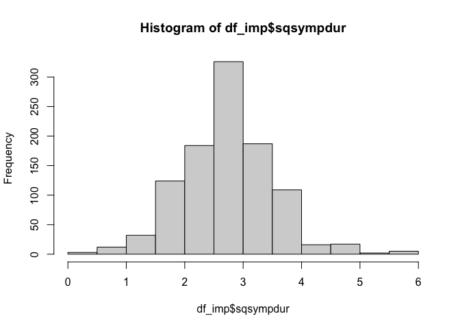

# Load packages

```r
library(tidyverse)
library(readxl)
library(writexl)
library(tableone)
library(haven) # Read sas files
library(here)
library(kableExtra)

library(jtools) # for summ() and plot_summs
library(sjPlot) # for tab_model
library(ggplot2) # survival/TTE analyses and other graphs
library(ggsurvfit) # survival/TTE analyses
library(survival) # survival/TTE analyses
library(gtsummary) # survival/TTE analyses
library(ggfortify) # autoplot
library(tidycmprsk) # competing risk analysis
library(ordinal) # clinstatus ordinal regression
library(logistf) # Firth regression in case of rare events

library(finalfit) # missing data exploration
library(mice) # multiple imputation
library(jomo) # multiple imputation
library(mitools) # multiple imputation
```

# Load Data


# Reshape dataset and define ITT population

```r
#reshape
df <- df %>% ## corresponds to N in publication
  pivot_wider(id_cols = c("USUBJID","ARM","ACTARM","BCSOSN","d29dthe0","d29dthe1","ttrecov0","ttrecov1","or15scor","agec","SEX","BDURSYMP","COMORB2","REGION1","REGION2","BMI","RACE","ETHNIC","STRATAR","STRATAV","HYPTFL","CADFL","CHFFL","CRDFL","CORQFL","CLDFL","CKDFL","DIAB1FL","DIAB2FL","OBESIFL","CANCFL","IMMDFL","ASTHMAFL","CVDFL","COAGFL","NICFL","RFDVTFL","SURGFL","IMMOFL","CPDVTFL","COMORB1"),
              names_from = "adyc",
              values_from = "ordscor")
#reorder
df <- df %>%
  select("USUBJID","ARM","ACTARM","BCSOSN","Baseline","1", "2", "3", "4", "5", "6", "7", "8", "9", "10", "11", "12", "13", "14", "15", "16", "17", "18", "19", "20", "21", "22", "23", "24", "25", "26", "27", "28", "29", "30", "31", "32", "33","34","36","37","45", everything())

#define ITT -> keep all as randomized
# addmargins(table(df$ARM, df$ACTARM))
```

# Baseline Characteristics

```r
df$trial <- c("ACTT2")
df$JAKi <- c("Baricitinib")
df <- df %>% ## no missing data // no randdate // ARM == 1 includes remdesivir!
  rename(id_pat = USUBJID,
         sex = SEX,
         age = agec,
         region = REGION2
         )
df <- df %>%
  mutate(trt = case_when(ARM == "Baricitinib + Remdesivir" ~ 1,
                         TRUE ~ 0))

# fix ages ">89" using the original dataset
df_original <- df_original %>%
  rename(id_pat = USUBJID)
elderly <- unique(df[which(df$age == ">89"), "id_pat"])
for (i in 1:dim(elderly)[[1]]){
  df[which(df$id_pat == paste(elderly[i,])), "age"] <- paste(df_original[which(df_original$id_pat == paste(elderly[i,])), "AGE"])
}
df$age <- as.numeric(df$age)

df %>% 
  drop_na(age) %>% 
  ggplot(aes(x = age)) +
  geom_density(fill = "blue", color = "black") +
  labs(title = "Density Plot of Age",
       x = "Age",
       y = "Density")
```

<!-- -->

```r
# Ethnicity
df <- df %>% 
  mutate(ethn = case_when(RACE == "UNKNOWN" & ETHNIC == "HISPANIC OR LATINO" ~ "HISPANIC OR LATINO",
                          TRUE ~ c(RACE)))
# Country
# For Country only Region (Asia, Europe, North America) and Non-US Site (n=148) and US Site (n=885) available. According to publication: "There were 67 trial sites in 8 countries: the United States (55 sites), Singapore (4), South Korea (2), Mexico (2), Japan (1), Spain (1), the United Kingdom (1), and Denmark (1)." => add region to country and reclassify later
df$country <- df$region

# Days with symptoms prior to randomization
df$sympdur <- df$BDURSYMP ## 16 missing data
df %>% 
  drop_na(sympdur) %>% 
  ggplot(aes(x = sympdur)) +
  geom_density(fill = "blue", color = "black") +
  labs(title = "Density Plot of Symptom Duration",
       x = "Symptom Duration",
       y = "Density")
```

<!-- -->

```r
# Severity of COVID-19 with respect to respiratory support at randomisation / from publication: "Scores on the ordinal scale are as follows: 1, not hospitalized, no limitations of activities; 2, not hospitalized, limitation of activities, home oxygen requirement, or both; 3, hospitalized, not requiring supplemental oxygen and no longer requiring ongoing medical care (used if hospitalization was extended for infection-control reasons); 4, hospitalized, not requiring supplemental oxygen but requiring ongoing medical care (Covid-19–related or other medical conditions); 5, hospitalized, requiring any supplemental oxygen; 6, hospitalized, receiving noninvasive ventilation or use of high-flow oxygen devices; 7, hospitalized, receiving invasive mechanical ventilation or ECMO; and 8, death. Five deaths (three in patients receiving baricitinib plus RDV and two in patients receiving placebo plus RDV) occurred within the day 15 visit window but after 14 days — these deaths are included in the outcome of the ordinal score at day 15 but not in the outcome of mortality over the first 14 days."

# transform all clinical scores
score_transform <- function(df, clinstatus_var, score_var) {
  df <- df %>%
    mutate({{ clinstatus_var }} :=
             case_when({{ score_var }} %in% c(1, 2, 3) ~ 1,
                       {{ score_var }} == 4 ~ 2,
                       {{ score_var }} == 5 ~ 3,
                       {{ score_var }} == 6 ~ 4,
                       {{ score_var }} == 7 ~ 5,
                       {{ score_var }} == 8 ~ 6)) %>%
    mutate({{ clinstatus_var }} := factor({{ clinstatus_var }}, levels = 1:6))
}

df <- score_transform(df, clinstatus_baseline, Baseline) 
addmargins(table(df$clinstatus_baseline, df$trt, useNA = "always")) # no missing / # corresponds to publication
```

```
##       
##           0    1 <NA>  Sum
##   1       0    0    0    0
##   2      72   70    0  142
##   3     276  288    0  564
##   4     113  103    0  216
##   5      57   54    0  111
##   6       0    0    0    0
##   <NA>    0    0    0    0
##   Sum   518  515    0 1033
```

```r
addmargins(table(df$ACTARM, df$trt, useNA = "always")) # those who actually received any study medication
```

```
##                           
##                               0    1 <NA>  Sum
##   Baricitinib + Remdesivir    0  508    0  508
##   Not Treated                 9    7    0   16
##   Placebo + Remdesivir      509    0    0  509
##   <NA>                        0    0    0    0
##   Sum                       518  515    0 1033
```

```r
df <- score_transform(df, clinstatus_1, df$"1")
df <- score_transform(df, clinstatus_2, df$"2")
df <- score_transform(df, clinstatus_3, df$"3")
df <- score_transform(df, clinstatus_4, df$"4")
df <- score_transform(df, clinstatus_5, df$"5")
df <- score_transform(df, clinstatus_6, df$"6")
df <- score_transform(df, clinstatus_7, df$"7")
df <- score_transform(df, clinstatus_8, df$"8")
df <- score_transform(df, clinstatus_9, df$"9")
df <- score_transform(df, clinstatus_10, df$"10")
df <- score_transform(df, clinstatus_11, df$"11")
df <- score_transform(df, clinstatus_12, df$"12")
df <- score_transform(df, clinstatus_13, df$"13")
df <- score_transform(df, clinstatus_14, df$"14")
df <- score_transform(df, clinstatus_15, df$"15")
df <- score_transform(df, clinstatus_16, df$"16")
df <- score_transform(df, clinstatus_17, df$"17")
df <- score_transform(df, clinstatus_18, df$"18")
df <- score_transform(df, clinstatus_19, df$"19")
df <- score_transform(df, clinstatus_20, df$"20")
df <- score_transform(df, clinstatus_21, df$"21")
df <- score_transform(df, clinstatus_22, df$"22")
df <- score_transform(df, clinstatus_23, df$"23")
df <- score_transform(df, clinstatus_24, df$"24")
df <- score_transform(df, clinstatus_25, df$"25")
df <- score_transform(df, clinstatus_26, df$"26")
df <- score_transform(df, clinstatus_27, df$"27")
df <- score_transform(df, clinstatus_28, df$"28")
df <- score_transform(df, clinstatus_29, df$"29")
df <- score_transform(df, clinstatus_30, df$"30")
df <- score_transform(df, clinstatus_31, df$"31")
df <- score_transform(df, clinstatus_32, df$"32")
df <- score_transform(df, clinstatus_33, df$"33")
df <- score_transform(df, clinstatus_34, df$"34")
df <- score_transform(df, clinstatus_36, df$"36")
df <- score_transform(df, clinstatus_37, df$"37")
df <- score_transform(df, clinstatus_45, df$"45")

df <- df %>% 
  mutate(vbaseline = case_when(clinstatus_baseline == "2" | clinstatus_baseline == "3" ~ 0,
                                clinstatus_baseline == "4" | clinstatus_baseline == "5" ~ 1))

## Co-medication at baseline
df_comed <- df_comed %>% 
  mutate(comed_acoa = case_when(`ATC Level 1(ATC Level 2)` == "BLOOD AND BLOOD FORMING ORGANS (ANTITHROMBOTIC AGENTS)" ~ 1,
                                TRUE ~ 0))
df_comed <- df_comed %>% 
  mutate(comed_ab = case_when(`ATC Level 1(ATC Level 2)` == "ANTIINFECTIVES FOR SYSTEMIC USE (ANTIBACTERIALS FOR SYSTEMIC USE)" ~ 1,
                                TRUE ~ 0))
df_comed <- df_comed %>% # per se excluded, but some still received Dexa at baseline
  mutate(comed_dexa = case_when(grepl("^DEXA", Medication) ~ 1,
                                TRUE ~ 0))
df_comed <- df_comed %>% # all others in this dataset have at least 1 other comedication
  mutate(comed_other = case_when(comed_acoa == 0 & comed_ab == 0 & comed_dexa == 0 ~ 1))
# table(df_comed$comed_acoa, df_comed$comed_ab, df_comed$comed_dexa) # no-one has more than 1 of these => just select each comedication set and merge
df_comed_acoa <- df_comed %>% 
  filter(comed_acoa == 1) %>% 
  rename(id_pat = SubjectID) %>% 
  distinct(id_pat, comed_acoa)
df_comed_ab <- df_comed %>% 
  filter(comed_ab == 1) %>% 
  rename(id_pat = SubjectID) %>% 
  distinct(id_pat, comed_ab)
df_comed_dexa <- df_comed %>% 
  filter(comed_dexa == 1) %>% 
  rename(id_pat = SubjectID) %>% 
  distinct(id_pat, comed_dexa)
df_comed_other <- df_comed %>% 
  filter(comed_other == 1) %>% 
  rename(id_pat = SubjectID) %>% 
  distinct(id_pat, comed_other)
df <- left_join(df, df_comed_acoa[, c("comed_acoa", "id_pat")], by = join_by(id_pat == id_pat)) ## merge
df <- left_join(df, df_comed_ab[, c("comed_ab", "id_pat")], by = join_by(id_pat == id_pat)) ## merge
df <- left_join(df, df_comed_dexa[, c("comed_dexa", "id_pat")], by = join_by(id_pat == id_pat)) ## merge
df <- left_join(df, df_comed_other[, c("comed_other", "id_pat")], by = join_by(id_pat == id_pat)) ## merge
df <- df %>% 
  mutate(comed_acoa = case_when(is.na(comed_acoa) ~ 0,
                                TRUE ~ comed_acoa))
df <- df %>% 
  mutate(comed_ab = case_when(is.na(comed_ab) ~ 0,
                                TRUE ~ comed_ab))
df <- df %>% 
  mutate(comed_dexa = case_when(is.na(comed_dexa) ~ 0,
                                TRUE ~ comed_dexa))
df <- df %>% 
  mutate(comed_other = case_when(is.na(comed_other) ~ 0,
                                TRUE ~ comed_other))
df$comed_rdv <- 1 # all also received remdesivir
df$comed_interferon <- 0 # see exclusion criteria       
df$comed_toci <- 0 # see exclusion criteria   

## group them for the subgroup analysis, according to protocol
df <- df %>% 
  mutate(comed_cat = case_when(comed_dexa == 0 & comed_toci == 0 ~ 1, # patients without Dexamethasone nor Tocilizumab
                               comed_dexa == 1 & comed_toci == 0 ~ 2, # patients with Dexamethasone but no Tocilizumab
                               comed_dexa == 1 & comed_toci == 1 ~ 3, # patients with Dexamethasone and Tocilizumab
                               comed_dexa == 0 & comed_toci == 1 ~ 4)) # patients with Tocilizumab but no Dexamethasone 
# table(df$comed_cat, useNA = "always")


## Comorbidity at baseline, including immunocompromised
df <- df %>% ## 27 missing
  mutate(comorb_lung = case_when(CRDFL == "Y" | CORQFL == "Y" | ASTHMAFL == "Y" ~ 1,
                                  CRDFL == "N" & CORQFL == "N" & ASTHMAFL == "N" ~ 0))
df <- df %>% # 27 missing
  mutate(comorb_liver = case_when(CLDFL == "Y" ~ 1,
                                   CLDFL == "N" ~ 0))
df <- df %>% # 57 missing
  mutate(comorb_cvd = case_when(CVDFL == "Y" | CPDVTFL == "Y" | CHFFL == "Y" | CADFL == "Y" ~ 1,
                              CVDFL == "N" & CPDVTFL == "N" & CHFFL == "N" & CADFL == "N" ~ 0))
df <- df %>% # 27 missing
  mutate(comorb_aht = case_when(HYPTFL == "Y" ~ 1,
                                   HYPTFL == "N" ~ 0))
df <- df %>% # 24 missing
  mutate(comorb_dm = case_when(DIAB1FL == "Y" | DIAB2FL == "Y" ~ 1,
                              DIAB1FL == "N" & DIAB2FL == "N" ~ 0))
df <- df %>% # 17 missing
  mutate(comorb_obese = case_when(OBESIFL == "Y" ~ 1,
                                   OBESIFL == "N" ~ 0))
df <- df %>% # 23 missing
  mutate(comorb_smoker = case_when(NICFL == "Y" ~ 1,
                                   NICFL == "N" ~ 0))
df <- df %>% # 25 missing
  mutate(immunosupp = case_when(IMMDFL == "Y" ~ 1,
                                   IMMDFL == "N" ~ 0))
df <- df %>% # 25 missing
  mutate(comorb_cancer = case_when(CANCFL == "Y" ~ 1,
                                   CANCFL == "N" ~ 0))
df <- df %>% # 26 missing
  mutate(comorb_kidney = case_when(CKDFL == "Y" ~ 1,
                                   CKDFL == "N" ~ 0))
df$comorb_autoimm <- 0

df <- df %>% # 18 missing - as in publication
  mutate(any_comorb = case_when(comorb_lung == 1 | comorb_liver == 1 | comorb_cvd == 1 |
                                  comorb_aht == 1 | comorb_dm == 1 | comorb_obese == 1 | comorb_smoker == 1
                                | immunosupp == 1 | comorb_cancer == 1 | comorb_autoimm == 1 | comorb_kidney == 1 
                                  ~ 1,
                                comorb_lung == 0 & comorb_liver == 0 & comorb_cvd == 0 &
                                  comorb_aht == 0 & comorb_dm == 0 & comorb_obese == 0 & comorb_smoker == 0
                                & immunosupp == 0 & comorb_cancer == 0 & comorb_autoimm == 0 & comorb_kidney == 0
                                ~ 0))
# df %>%
#   select(id_pat, any_comorb, COMORB1, COMORB2, comorb_lung, comorb_liver, comorb_cvd, comorb_aht, comorb_dm, comorb_obese, comorb_smoker, immunosupp, comorb_kidney, comorb_autoimm, comorb_cancer) %>%
#   filter(is.na(any_comorb)) %>%
#   View()
# the remaining missing have only NA in 1 comorb category => no evidence for comorbidity -> recode as 0
df <- df %>% 
  mutate(any_comorb = case_when(is.na(any_comorb) ~ 0,
                                TRUE ~ c(any_comorb)))

## group them for the subgroup analysis, according to protocol // count all pre-defined comorbidities per patient first
comorb <- df %>% 
  select(id_pat, comorb_lung, comorb_liver, comorb_cvd, comorb_aht, comorb_dm, comorb_obese, comorb_smoker, immunosupp, comorb_kidney, comorb_autoimm, comorb_cancer)
comorb$comorb_count <- NA
for (i in 1:dim(comorb)[[1]]) {
  comorb$comorb_count[i] <- ifelse(
    sum(comorb[i, ] %in% c(1)) > 0,
    sum(comorb[i, ] %in% c(1)),
    NA
  )
}
comorb <- comorb %>% # 18 missing
  mutate(comorb_count = case_when(comorb_lung == 0 & comorb_liver == 0 & comorb_cvd == 0 &
                                  comorb_aht == 0 & comorb_dm == 0 & comorb_obese == 0 & comorb_smoker == 0
                                & immunosupp == 0 & comorb_cancer == 0 & comorb_autoimm == 0 & comorb_kidney == 0 ~ 0,
                                TRUE ~ comorb_count))
df <- left_join(df, comorb[, c("comorb_count", "id_pat")], by = join_by(id_pat == id_pat)) ## merge imputed variable back
df <- df %>% # same 18 missing
  mutate(comorb_cat = case_when(immunosupp == 1 ~ 4, # immunocompromised
                                comorb_count == 0 ~ 1, # no comorbidity
                                comorb_count == 1 & (immunosupp == 0 | is.na(immunosupp)) ~ 2, # one comorbidity
                                comorb_count >1 & (immunosupp == 0 | is.na(immunosupp)) ~ 3)) # multiple comorbidities
# table(df$comorb_cat, useNA = "always")
# the remaining missing have only NA in 1 comorb category => no evidence for comorbidity -> recode as 1
df <- df %>% 
  mutate(comorb_cat = case_when(is.na(comorb_cat) ~ 1,
                                TRUE ~ c(comorb_cat)))

df <- df %>%
  mutate(comorb_any = case_when(comorb_count == 0 ~ 0, # no comorbidity
                                comorb_count >0 ~ 1)) # any comorbidity
# the remaining missing have only NA in 1 comorb category => no evidence for comorbidity -> recode as 0
df <- df %>% 
  mutate(comorb_any = case_when(is.na(comorb_any) ~ 0,
                                TRUE ~ c(comorb_any)))

# CRP
df_crp <- df_crp %>% 
  rename(id_pat = `Subject ID`,
         crp = Result)
df_crp <- df_crp %>% # check for duplicates
  distinct(id_pat, crp)
df <- left_join(df, df_crp[, c("crp", "id_pat")], by = join_by(id_pat == id_pat)) ## merge
df$crp <- as.numeric(df$crp)
```

```
## Warning: NAs introduced by coercion
```

```r
df %>% 
  drop_na(crp) %>% 
  ggplot(aes(x = crp)) +
  geom_density(fill = "blue", color = "black") +
  labs(title = "Density Plot of CRP",
       x = "CRP",
       y = "Density")
```

<!-- -->

```r
# Vaccination
df$vacc <- 0 # trial happened before roll-out of any vaccine

# Viremia // Viral load value <LOQ and/or undectectable
df_vl_baseline <- df_vl %>% 
  filter(`Study Visit` == "Day 1") %>% 
  rename(id_pat = `Subject ID`)
df_vl_baseline <- df_vl_baseline %>% 
  mutate(vl_baseline = case_when(`SARS-CoV-2 PCR Qual. Result` == "Negative" ~ 1,
                                 `SARS-CoV-2 PCR Qual. Result` == "Positive" ~ 0))
df <- left_join(df, df_vl_baseline[, c("vl_baseline", "id_pat")], by = join_by(id_pat == id_pat)) ## merge
# table(df$vl_baseline, useNA = "always")

# Variant // not available
# Serology // not available


# At risk for AEs with JAKi
df <- df %>% 
  mutate(at_risk = case_when(age>=65 | comorb_cvd==1 | comorb_smoker==1 ~ 1, # at risk
                             TRUE ~ 0)) # not at risk
```
Discussion points BASELINE data:

# Endpoints

```r
# time to event data
df$death_d <- as.numeric(df$d29dthe0) # everyone with a value here, died
df$discharge_d <- as.numeric(df$ttrecov0) # everyone with a value here, was discharged/reached discharge criteria // CAVE: 2 were discharged at day 9 but died later at home (within 28 days)


# (i) Primary outcome: Mortality at day 28
df <- df %>% # 47 have no outcome data, reason for censoring unclear (see below); a few have info in daily score
  mutate(mort_28 = case_when(death_d <29 ~ 1,
                             discharge_d <29 ~ 0, # discharge to hospice did not occur
                             clinstatus_28 %in% c(2,3,4,5) ~ 0, # still at hospital but alive, clinstatus variables after 28d are all empty (see View below)
                             discharge_d >28 ~ 0)) # discharged later, proof of still alive (but empty)
# table(df$mort_28, df$trt, useNA = "always") # deaths correspond to publication (but they have -1 based on different counting of day 0) // However, the reasons for the 21 missing in int and the 26 in cont are hard to identify from the publication

# table(df$ACTARM, df$mort_28, useNA = "always") # the 16 not treated were censored at day 0 or 1 => NA for death_d/discharge_d/clinstatus_28 // The remaining 14 in intervention (see Fig 1 in publication): 8 Withdrew, 1 was withdrawn by investigator, 1 became ineligible after enrollment, 2 Had severe adverse event or adverse event other than death (?!), 2 Had other reason (?!) // The remaining 17 in control, I guess (see Fig 1): 16 Withdrew, 2 Were withdrawn by investigator, 1 Became ineligible after enrollment, 1 Had severe adverse event or adverse event other than death, 1 Was transferred to another hospital, 3 Had other reason.

# df %>%
#   select(mort_28, ACTARM, death_d, discharge_d, d29dthe1, ttrecov1, clinstatus_baseline, clinstatus_1, clinstatus_2, clinstatus_3, clinstatus_4, clinstatus_5, clinstatus_6, clinstatus_7, clinstatus_8, clinstatus_9, clinstatus_10, clinstatus_11, clinstatus_12, clinstatus_13, clinstatus_14, clinstatus_15,
#          clinstatus_15_imp,
#          clinstatus_16, clinstatus_17, clinstatus_18, clinstatus_19, clinstatus_20, clinstatus_21, clinstatus_22, clinstatus_23, clinstatus_24, clinstatus_25, clinstatus_26, clinstatus_27, clinstatus_28, clinstatus_29, clinstatus_30, clinstatus_31, clinstatus_32, clinstatus_33, clinstatus_34, clinstatus_36, clinstatus_37, clinstatus_45) %>%
#   filter(is.na(mort_28)) %>%
#   View()

# First, keep mort_28 as complete case

# Second, use multiple imputation (see below)

# Third, apply a deterministic imputation (see notes): we use the same rules as ACTT2 => we can use clinstatus_15_imp
df <- score_transform(df, clinstatus_15_imp, df$or15scor)
df <- df %>%
  mutate(mort_28_dimp = case_when(is.na(mort_28) & clinstatus_15_imp %in% c("1","2","3","4","5") ~ 0,
                             TRUE ~ c(mort_28)))


# (ii) Mortality at day 60
df$mort_60 <- df$mort_28 # max fup time in ACTT-2 was 28 days; thus mort_60 imputed from mort_28 // stick to complete case


# (iii) Time to death within max. follow-up time
df <- df %>% # don't bother about the NA in mort_28 since they are not dead, i.e. just censor (==0) everyone else
  mutate(death_reached = case_when(death_d <29 ~ 1,
                                       TRUE ~ 0))
df <- df %>% # no missing and those that were discharged and afterwards died have correct time to event data
  mutate(death_time = case_when(death_d >=0 ~ c(death_d), # time to death, if no time to death, then...
                                d29dthe1 >=0 ~ c(d29dthe1))) # time to death censoring data
# df %>% # those died have correct time to event data. Those discharged before d28 (and not withdrawn/ltfu/hospiz/SAE) should receive max fup time? But some do not, they are censored but reason for censoring unclear.
#   select(death_reached, ACTARM, death_time, death_d, discharge_d, d29dthe1, ttrecov1, clinstatus_baseline, clinstatus_1, clinstatus_2, clinstatus_3, clinstatus_4, clinstatus_5, clinstatus_6, clinstatus_7, clinstatus_8, clinstatus_9, clinstatus_10, clinstatus_11, clinstatus_12, clinstatus_13, clinstatus_14, clinstatus_15, or15scor, clinstatus_16, clinstatus_17, clinstatus_18, clinstatus_19, clinstatus_20, clinstatus_21, clinstatus_22, clinstatus_23, clinstatus_24, clinstatus_25, clinstatus_26, clinstatus_27, clinstatus_28, clinstatus_29, clinstatus_30, clinstatus_31, clinstatus_32, clinstatus_33, clinstatus_34, clinstatus_36, clinstatus_37, clinstatus_45) %>%
#   filter(death_reached != 1) %>%
#   filter(discharge_d < 29 & death_time < 28) %>%
#   View()

# max follow-up time in ACTT2 was 28 days => no restriction of time window to 60 days.

# table(df$mort_60, df$mort_28, useNA = "always") # correct
# table(df$mort_60, df$death_reached, useNA = "always") # correct, death_reached has no NA, but mort_60 does
# table(df$death_reached, df$death_time, useNA = "always") # correct
# table(df$mort_60, df$death_time, useNA = "always") # correct


# (iv) New mechanical ventilation among survivors within 28 days.
df <- df %>% # see View below
  mutate(new_mv_28 = case_when((clinstatus_baseline == 2 | clinstatus_baseline == 3 | clinstatus_baseline == 4) 
                               & (mort_28 == 0 | is.na(mort_28)) 
                               & (clinstatus_1 == 5 | clinstatus_2 == 5 | clinstatus_3 == 5 | clinstatus_4 == 5 |
                                   clinstatus_5 == 5 | clinstatus_6 == 5 | clinstatus_7 == 5 | clinstatus_8 == 5 |
                                    clinstatus_9 == 5 | clinstatus_10 == 5 | clinstatus_11 == 5 | clinstatus_12 == 5 |
                                    clinstatus_13 == 5 | clinstatus_14 == 5 | clinstatus_15 == 5 | clinstatus_15_imp == 5 | 
                                    clinstatus_16 == 5 |
                                    clinstatus_17 == 5 | clinstatus_18 == 5 | clinstatus_19 == 5 | clinstatus_20 == 5 |
                                    clinstatus_21 == 5 | clinstatus_22 == 5 | clinstatus_23 == 5 | clinstatus_24 == 5 |
                                    clinstatus_25 == 5 | clinstatus_26 == 5 | clinstatus_27 == 5 | clinstatus_28 == 5)
                               ~ 1,
                               (clinstatus_baseline == 2 | clinstatus_baseline == 3 | clinstatus_baseline == 4) 
                               & mort_28 == 0
                               ~ 0))
# df %>%
#   select(new_mv_28, mort_28, death_reached, death_time, death_d, discharge_d, d29dthe1, ttrecov1, clinstatus_baseline, clinstatus_1, clinstatus_2, clinstatus_3, clinstatus_4, clinstatus_5, clinstatus_6, clinstatus_7, clinstatus_8, clinstatus_9, clinstatus_10, clinstatus_11, clinstatus_12, clinstatus_13, clinstatus_14, clinstatus_15, clinstatus_15_imp, clinstatus_16, clinstatus_17, clinstatus_18, clinstatus_19, clinstatus_20, clinstatus_21, clinstatus_22, clinstatus_23, clinstatus_24, clinstatus_25, clinstatus_26, clinstatus_27, clinstatus_28, clinstatus_29, clinstatus_30, clinstatus_31, clinstatus_32, clinstatus_33, clinstatus_34, clinstatus_36, clinstatus_37, clinstatus_45) %>%
#   filter(is.na(new_mv_28)) %>%
#   # filter(clinstatus_baseline != 5) %>%
#   # filter(death_reached == 0) %>%
#   View()
# (iv) Alternative definition/analysis: New mechanical ventilation OR death within 28 days => include all in denominator. 
df <- df %>%
  mutate(new_mvd_28 = case_when(new_mv_28 == 1 | mort_28 == 1 ~ 1,
                                new_mv_28 == 0 | mort_28 == 0 ~ 0))

# (v) Clinical status at day 28
df <- df %>% # Adapt clinstatus_28, since currently NA for those discharged or died. Then, check if nothing in 28d window (there was nothing), then LVCF including use or15scor
  mutate(clinstatus_28 = case_when(clinstatus_28 == 5 ~ 5,
                                   clinstatus_28 == 4 ~ 4,
                                   clinstatus_28 == 3 ~ 3,
                                   clinstatus_28 == 2 ~ 2,
                                   mort_28 == 1 ~ 6, # died within 28d
                                   mort_28 == 0 ~ 1)) # discharged alive / reached discharge criteria within 28d
df$clinstatus_28 <- factor(df$clinstatus_28, levels = 1:6)
# table(df$clinstatus_28, useNA = "always") # again, the 47 missing

## Imputation according to protocol: If there was daily data for the ordinal score available but with missing data for single days, then we carried last observed value forward unless for day 28, whereby we first considered data from the window (+/-3 days) but there was nothing in that window => LVCF
dfcs <- df %>% 
    select(id_pat, clinstatus_baseline, clinstatus_1, clinstatus_2, clinstatus_3, clinstatus_4, clinstatus_5, clinstatus_6, clinstatus_7, clinstatus_8, clinstatus_9, clinstatus_10, clinstatus_11, clinstatus_12, clinstatus_13, clinstatus_14, clinstatus_15_imp, clinstatus_16, clinstatus_17, clinstatus_18, clinstatus_19, clinstatus_20, clinstatus_21, clinstatus_22, clinstatus_23, clinstatus_24, clinstatus_25, clinstatus_26, clinstatus_27, clinstatus_28)
impute_last_forw = function(df){
  first = which(names(df)%in%c("clinstatus_baseline"))
  last = which(names(df)%in%c("clinstatus_28"))
  for (i in 1:dim(df)[[1]]){
    for (j in first[1]:last[1]){
      p = df[i, j]
      df[i,j] <- 
        ifelse(!is.na(df[i, j]), p, df[i, j-1])
    }
  }
  df
}
dfcs <- impute_last_forw(dfcs)
dfcs <- dfcs %>% # To control, don't overwrite
  rename(clinstatus_28_imp = clinstatus_28)
df <- left_join(df, dfcs[, c("clinstatus_28_imp", "id_pat")], by = join_by(id_pat == id_pat)) # Merge imputed variable back

# table(df$clinstatus_28, useNA = "always")
# table(df$clinstatus_28_imp, useNA = "always") # All imputed (i.e. carried forward from imputed day 15)


# (vi) Time to discharge or reaching discharge criteria up to day 28
df <- df %>% 
  mutate(discharge_reached = case_when(discharge_d <29 ~ 1,
                                       TRUE ~ 0))
df <- df %>% # 2 are left without any time to event data => impute max. follow-up time
  mutate(discharge_time = case_when(discharge_d >=0 ~ c(discharge_d), # time to discharge, if no time to discharge, then...
                                    ttrecov1 >=0 ~ c(ttrecov1)+1)) # time to discharge censoring time (see ACTT-2 documentation regarding time zero -> now matching d29dthe1)
df <- df %>% # restrict to max fup time 28d
  mutate(discharge_time = case_when(discharge_time >28 ~ 28,
                                    TRUE ~ discharge_time))
df <- df %>% # add 28d for those that died // Patients who died prior to day 28 are assumed not having reached discharge, i.e. counted as 28 days (as someone who has been censored on day 28). 
  mutate(discharge_time_sens = case_when(mort_28 == 1 ~ 28,
                                    TRUE ~ discharge_time))
# table(df$discharge_time, df$discharge_reached, useNA = "always")


# (vi) Sens-analysis: Alternative definition/analysis of outcome: time to sustained discharge within 28 days. There are no re-admissions documented in ACTT-2
df$discharge_reached_sus <- df$discharge_reached
df$discharge_time_sus <- df$discharge_time

# (vii) Viral clearance up to day 5, day 10, and day 15 (Viral load value <LOQ and/or undectectable)
df_vl <- df_vl %>% 
  rename(visit = `Actual Study Day`,
         id_pat = `Subject ID`,
         result = `SARS-CoV-2 PCR Qual. Result`)
df_vl <- df_vl %>% 
  mutate(visit = case_when(visit == -1 ~ 1,
                           TRUE ~ visit))
df_vl <- df_vl %>% 
  arrange(id_pat, visit)

df_vl <- df_vl %>% 
  mutate(vir_clear_5 = case_when(visit == 5 & result == "Negative" ~ 1,
                                 visit == 5 & result == "Positive" ~ 0,
                                 visit == 4 & result == "Negative" ~ 1,
                                 visit == 4 & result == "Positive" ~ 0,
                                 visit == 3 & result == "Negative" ~ 1,
                                 visit == 3 & result == "Positive" ~ 0,
                                 visit == 2 & result == "Negative" ~ 1,
                                 visit == 2 & result == "Positive" ~ 0,
                                 visit == 1 & result == "Negative" ~ 1,
                                 visit == 1 & result == "Positive" ~ 0))
df_vl <- df_vl %>% 
  mutate(vir_clear_10 = case_when(visit == 10 & result == "Negative" ~ 1,
                                 visit == 10 & result == "Positive" ~ 0,
                                 visit == 9 & result == "Negative" ~ 1,
                                 visit == 9 & result == "Positive" ~ 0,
                                 visit == 8 & result == "Negative" ~ 1,
                                 visit == 8 & result == "Positive" ~ 0,
                                 visit == 7 & result == "Negative" ~ 1,
                                 visit == 7 & result == "Positive" ~ 0,
                                 visit == 6 & result == "Negative" ~ 1,
                                 visit == 6 & result == "Positive" ~ 0,
                                 vir_clear_5 == 1 ~ 1,
                                 vir_clear_5 == 0 ~ 0))
df_vl <- df_vl %>% 
  mutate(vir_clear_15 = case_when(visit == 15 & result == "Negative" ~ 1,
                                 visit == 15 & result == "Positive" ~ 0,
                                 visit == 14 & result == "Negative" ~ 1,
                                 visit == 14 & result == "Positive" ~ 0,
                                 visit == 13 & result == "Negative" ~ 1,
                                 visit == 13 & result == "Positive" ~ 0,
                                 visit == 12 & result == "Negative" ~ 1,
                                 visit == 12 & result == "Positive" ~ 0,
                                 visit == 11 & result == "Negative" ~ 1,
                                 visit == 11 & result == "Positive" ~ 0,
                                 vir_clear_10 == 1 ~ 1,
                                 vir_clear_10 == 0 ~ 0))
  
df_vl5 <- df_vl %>%
  filter(!is.na(vir_clear_5)) %>% 
  group_by(id_pat) %>%
  arrange(abs(visit - 5)) %>%
  filter(abs(visit - 5) == min(abs(visit - 5))) %>%
  ungroup()
df <- left_join(df, df_vl5[, c("vir_clear_5", "id_pat")], by = join_by(id_pat == id_pat)) ## merge

df_vl10 <- df_vl %>%
  filter(!is.na(vir_clear_10)) %>% 
  group_by(id_pat) %>%
  arrange(abs(visit - 10)) %>%
  filter(abs(visit - 10) == min(abs(visit - 10))) %>%
  ungroup()
df <- left_join(df, df_vl10[, c("vir_clear_10", "id_pat")], by = join_by(id_pat == id_pat)) ## merge

df_vl15 <- df_vl %>%
  filter(!is.na(vir_clear_15)) %>% 
  group_by(id_pat) %>%
  arrange(abs(visit - 15)) %>%
  filter(abs(visit - 15) == min(abs(visit - 15))) %>%
  ungroup()
df <- left_join(df, df_vl15[, c("vir_clear_15", "id_pat")], by = join_by(id_pat == id_pat)) ## merge


# (viii) Quality of life at day 28: Not available in ACTT-2


# (ix) Participants with an adverse event grade 3 or 4, or a serious adverse event, excluding death, by day 28
df_ae_tot <- df_ae_tot %>% 
  rename(id_pat = `Subject ID`)
df_ae_tot$`Study Day` <- as.numeric(df_ae_tot$`Study Day`)
```

```
## Warning: NAs introduced by coercion
```

```r
df_ae <- df_ae_tot %>% 
  filter(Severity %in% c("Grade 3", "Grade 4", "Grade 5") | (Severity == "Grade 2" & `Serious Adverse Event` == "Yes")) %>% 
  filter(`Study Day` < 29 | is.na(`Study Day`))
# Keep just 1 id_pat (-> ANY adverse event grade 3 (severe), 4 (serious)) 
df_ae34_unique <- df_ae %>% distinct(id_pat, .keep_all = TRUE)
# Assign the outcome
df_ae34_unique$ae_28 <- 1
# table(df_ae34_unique$ae_28)
# merge
df <- left_join(df, df_ae34_unique[, c("ae_28", "id_pat")], by = join_by(id_pat == id_pat)) ## merge variable to main df
# the remaining missing have no AE grade 34 -> recode as 0 and exclude deaths
df <- df %>% 
  mutate(ae_28 = case_when(is.na(ae_28) ~ 0, # the LTFU were discharged
                           # mort_28 == 1 ~ NA, # exclude the deaths
                                TRUE ~ ae_28))
# table(df$ae_28, df$mort_28, useNA = "always")
# addmargins(table(df$ae_28, df$trt, useNA = "always"))

# (ix) Sens-analysis: Alternative definition/analysis of outcome: incidence rate ratio (Poisson regression) -> AE per person by d28
ae_npp <- df_ae %>% 
  group_by(id_pat)%>%  
  summarise(ae_28_sev = n())
df <- left_join(df, ae_npp[, c("ae_28_sev", "id_pat")], by = join_by(id_pat == id_pat)) # merge variable to main df
# the remaining missing have no AE grade 34 -> recode as 0 and exclude deaths
df <- df %>% 
  mutate(ae_28_sev = case_when(is.na(ae_28_sev) ~ 0, # the LTFU were discharged
                           # mort_28 == 1 ~ NA, # exclude the deaths
                                TRUE ~ ae_28_sev))
# addmargins(table(df$ae_28_sev, df$trt, useNA = "always"))


# (ix) Sens-analysis: Alternative definition/analysis of outcome: time to first (of these) adverse event, within 28 days, considering death as a competing risk (=> censor and set to 28 days): Not available

# (x) Adverse events of special interest within 28 days: a) thromboembolic events (venous thromboembolism, pulmonary embolism, arterial thrombosis), b) secondary infections (bacterial pneumonia including ventilator-associated pneumonia, meningitis and encephalitis, endocarditis and bacteremia, invasive fungal infection including pulmonary aspergillosis), c) Reactivation of chronic infection including tuberculosis, herpes simplex, cytomegalovirus, herpes zoster and hepatitis B, d) serious cardiovascular and cardiac events (including stroke and myocardial infarction), e) events related to signs of bone marrow suppression (anemia, lymphocytopenia, thrombocytopenia, pancytopenia), f) malignancy, g) gastrointestinal perforation (incl. gastrointestinal bleeding/diverticulitis), h) liver dysfunction/hepatotoxicity (grade 3 and 4)
df_ae_tot <- df_ae_tot %>% 
  rename(ae = `MedDRA Preferred Term`,
         ae_class = `MedDRA System Organ Class`,
         ae_desc = `Adverse Event`) %>% 
  filter(`Study Day` < 29 | is.na(`Study Day`))
df_ae_tot <- left_join(df_ae_tot, df[, c("trt", "id_pat")], by = join_by(id_pat == id_pat))

df_thrombo <- df_ae_tot %>% # a) thromboembolic events (venous thromboembolism, pulmonary embolism, arterial thrombosis)
  filter(ae %in% c("Axillary vein thrombosis", "Brachiocephalic vein thrombosis", "Deep vein thrombosis", "Embolism venous", "Peripheral artery occlusion", "Peripheral ischaemia", "Thrombosis", "Pulmonary embolism")) %>% 
  mutate(aesi = "thrombo")
df_sec_inf <- df_ae_tot %>% # b) secondary infections (bacterial pneumonia including ventilator-associated pneumonia, meningitis and encephalitis, endocarditis and bacteremia, invasive fungal infection including pulmonary aspergillosis), but not COVID-19 pneumonia!
  filter(ae_class %in% c("Infections and infestations") & !ae == "Septic shock") %>% 
  mutate(aesi = "sec_inf")
# df_reactivate <- NA
# df_ae_tot %>% 
#   filter(grepl("hepatitis b|zoster|herpes|cytome|tuber|tb", ae, ignore.case = TRUE)) %>%
#   View()
df_cardiac <- df_ae_tot %>% # d) serious cardiovascular and cardiac events (including stroke and myocardial infarction) (excl. hypertension)
  filter(ae_class %in% c("Cardiac disorders") | ae == "Cerebrovascular accident") %>% 
  mutate(aesi = "cardiac")
df_penia <- df_ae_tot %>% # e) events related to signs of bone marrow suppression (anemia, lymphocytopenia, thrombocytopenia, pancytopenia)
  filter(grepl("penia|anemia|anaemia", ae, ignore.case = TRUE)) %>% 
  mutate(aesi = "penia")
# df_malig <- NA
# df_malig <- df_ae_tot %>% # f) malignancy
#   filter(ae_class %in% c("Neoplasms benign, malignant and unspecified (incl cysts and polyps)")) %>% 
#   mutate(aesi = "malig")
df_git_bl <- df_ae_tot %>% # g) gastrointestinal perforation (incl. gastrointestinal bleeding/diverticulitis)
  filter(ae_class %in% c("Hepatobiliary disorders","Gastrointestinal disorders") & grepl("hemor|haemor|bleed", ae, ignore.case = TRUE)) %>% 
  mutate(aesi = "git_bl")
df_hepatox <- df_ae_tot %>% # h) liver dysfunction/hepatotoxicity (grade 3 and 4)
  filter(ae %in% c("Hyperbilirubinaemia", "Hypertransaminasaemia", "Liver injury")) %>%
  mutate(aesi = "hepatox")
df_mods <- df_ae_tot %>% # i) Multiple organ dysfunction syndrome and septic shock
  filter(ae %in% c("Multiple organ dysfunction syndrome", "Septic shock", "Shock")) %>% 
  mutate(aesi = "mods")

df_aesi <- rbind(df_mods, df_hepatox, df_git_bl, df_penia, df_cardiac, df_sec_inf, df_thrombo)
df_aesi <- df_aesi %>%
  select(id_pat, trt, aesi, ae, ae_desc, ae_class)
# table(df_aesi$trt, df_aesi$aesi)
# double-check if there are any duplicate AEs within the same person and if it is the same event or distinct ones
df_aesi <- df_aesi %>% 
  group_by(id_pat) %>% 
  mutate(duplicate_id = duplicated(ae) & !is.na(ae)) %>% 
  ungroup()
df_aesi <- df_aesi %>% 
  filter(duplicate_id == F)
# Save
saveRDS(df_aesi, file = "df_aesi_actt2.RData")

# (xi) Adverse events, any grade and serious adverse event, within 28 days, grouped by organ classes
df_ae <- df_ae_tot %>%
  select(id_pat, trt, ae, ae_desc, ae_class)
# double-check if there are any duplicate AEs within the same person and if it is the same event or distinct ones
df_ae <- df_ae %>% 
  group_by(id_pat) %>% 
  mutate(duplicate_id = duplicated(ae) & !is.na(ae)) %>% 
  ungroup()
df_ae <- df_ae %>% 
  filter(duplicate_id == F)
# Save
saveRDS(df_ae, file = "df_ae_actt2.RData")
```
Discussion points

# Define final datasets

```r
# the overall set
df_all <- df
# reduce the df set to our standardized set across all trials
df <- df %>% 
  select(id_pat, trt, sex, age, trial, JAKi, 
         ethn, 
         country, 
         # icu, 
         sympdur, 
         vacc, 
         clinstatus_baseline, vbaseline,
         comed_dexa, 
         comed_rdv, 
         comed_toci, comed_ab, comed_acoa, comed_interferon, comed_other,
         comed_cat,
         comorb_lung, comorb_liver, comorb_cvd, comorb_aht, comorb_dm, comorb_obese, comorb_smoker, immunosupp,
         any_comorb, comorb_cat, comorb_any, comorb_count,
         comorb_autoimm, comorb_cancer, comorb_kidney,
         crp, 
         # sero, 
         vl_baseline, at_risk,
         # variant,
         mort_28, mort_28_dimp,
         mort_60, death_reached, death_time,
         new_mv_28, new_mvd_28,
         clinstatus_28_imp,
         discharge_reached, discharge_time, discharge_time_sens, discharge_reached_sus, discharge_time_sus,
         ae_28, ae_28_sev,
         vir_clear_5, vir_clear_10, vir_clear_15
         )

# export for one-stage model, i.e., add missing variables 
df_os <- df
df_os$icu <- NA
df_os$sero <- NA
df_os$variant <- NA
# Save
saveRDS(df_os, file = "df_os_actt2.RData")
```

# Missing data plot: One-stage dataset

```r
# Bar plot, missing data, each data point, standardized one-stage dataset
original_order <- colnames(df_os)
missing_plot <- df_os %>%
  summarise_all(~ mean(is.na(.))) %>%
  gather() %>%
  mutate(key = factor(key, levels = original_order)) %>%
  ggplot(aes(x = key, y = value)) +
  geom_bar(stat = "identity") +
  labs(x = "Columns", y = "Proportion of Missing Values", title = "Missing Data - standardized one-stage dataset") +
  theme(axis.text.x = element_text(angle = 45, hjust = 1)) +
  ylim(0, 1)
print(missing_plot)
```

<!-- -->
Discussion points
1. Completely missing variables:
* Baseline:
  - ICU at enrolment, Variant, Serology
* Outcomes:
  - qol_28
2. Partially missing data:
- sympdur (& comorbities)
- mort_28 / mort_60 / new_mv_28 / new_mvd_28

# Missing data: Explore for MI

```r
# keep the core df
df_core <- df_all %>% 
  select(id_pat, trt, sex, age, trial, JAKi, country,
         ethn,
         sympdur, 
         vacc, 
         clinstatus_baseline, vbaseline,
         comed_dexa, comed_rdv, comed_toci, comed_ab, comed_acoa, comed_interferon, comed_other,
         comed_cat,
         comorb_lung, comorb_liver, comorb_cvd, comorb_aht, comorb_dm, comorb_obese, comorb_smoker, immunosupp,
         any_comorb, comorb_cat, comorb_any, comorb_count,
         comorb_autoimm, comorb_cancer, comorb_kidney,
         crp, vl_baseline,
         clinstatus_1, clinstatus_2, clinstatus_3, clinstatus_4, clinstatus_5, clinstatus_6, clinstatus_7, clinstatus_8, clinstatus_9, clinstatus_10, clinstatus_11, clinstatus_12, clinstatus_13, clinstatus_14, clinstatus_15, clinstatus_15_imp, clinstatus_16, clinstatus_17, clinstatus_18, clinstatus_19, clinstatus_20, clinstatus_21, clinstatus_22, clinstatus_23, clinstatus_24, clinstatus_25, clinstatus_26, clinstatus_27, clinstatus_28,
         clinstatus_28_imp,
         mort_28, mort_28_dimp, mort_60, death_reached, death_time,
         new_mv_28, new_mvd_28,
         discharge_reached, discharge_time, discharge_time_sens, discharge_reached_sus, discharge_time_sus,
         ae_28, ae_28_sev,
         vir_clear_5, vir_clear_10, vir_clear_15
         )

# str(df_core)
# Convert character variables to factors
char_vars <- c("id_pat", "sex", "trial", "JAKi", "country", "ethn", "vacc", "clinstatus_baseline", "vbaseline", 
               "comed_dexa", "comed_rdv", "comed_toci", "comed_ab", "comed_acoa", "comed_interferon", "comed_other", "comed_cat",
               "comorb_lung", "comorb_liver", "comorb_cvd", "comorb_aht", "comorb_dm", "comorb_obese", "comorb_smoker", "immunosupp", "any_comorb", "comorb_cat", "comorb_any", "comorb_autoimm","comorb_cancer", "comorb_kidney", "vl_baseline", "clinstatus_1", "clinstatus_2","clinstatus_3", "clinstatus_4", "clinstatus_5", "clinstatus_6", "clinstatus_7", "clinstatus_8", "clinstatus_9", "clinstatus_10", "clinstatus_11", "clinstatus_12", "clinstatus_13", "clinstatus_14", "clinstatus_15", "clinstatus_15_imp", "clinstatus_16", "clinstatus_17", "clinstatus_18", "clinstatus_19", "clinstatus_20", "clinstatus_21", "clinstatus_22", "clinstatus_23", "clinstatus_24", "clinstatus_25", "clinstatus_26", "clinstatus_27", "clinstatus_28", "clinstatus_28_imp", "mort_28", "mort_28_dimp", "mort_60", "death_reached", "new_mv_28", "new_mvd_28","discharge_reached", "discharge_reached_sus", "ae_28", "vir_clear_5", "vir_clear_10", "vir_clear_15")
df_core <- df_core %>%
  mutate(across(all_of(char_vars), factor))

# Bar plot, missing data, each data point, core dataset
original_order <- colnames(df_core)
missing_plot <- df_core %>%
  summarise_all(~ mean(is.na(.))) %>%
  gather() %>%
  mutate(key = factor(key, levels = original_order)) %>%
  ggplot(aes(x = key, y = value)) +
  geom_bar(stat = "identity") +
  labs(x = "Columns", y = "Proportion of Missing Values", title = "Missing Data - core dataset") +
  theme(axis.text.x = element_text(angle = 45, hjust = 1)) +
  ylim(0, 1)
print(missing_plot)
```

<!-- -->

```r
# Bar plot, missing data, each data point, core dataset, by arm
df_core_int <- df_core %>% 
  filter(trt == 1)
original_order <- colnames(df_core_int)
missing_plot <- df_core_int %>% # Intervention arm
  summarise_all(~ mean(is.na(.))) %>%
  gather() %>%
  mutate(key = factor(key, levels = original_order)) %>%
  ggplot(aes(x = key, y = value)) +
  geom_bar(stat = "identity") +
  labs(x = "Columns", y = "Proportion of Missing Values", title = "Missing Data - core dataset, intervention") +
  theme(axis.text.x = element_text(angle = 45, hjust = 1)) +
  ylim(0, 1)
print(missing_plot)
```

<!-- -->

```r
df_core_cont <- df_core %>% 
  filter(trt == 0)
original_order <- colnames(df_core_cont)
missing_plot <- df_core_cont %>% # Control arm
  summarise_all(~ mean(is.na(.))) %>%
  gather() %>%
  mutate(key = factor(key, levels = original_order)) %>%
  ggplot(aes(x = key, y = value)) +
  geom_bar(stat = "identity") +
  labs(x = "Columns", y = "Proportion of Missing Values", title = "Missing Data - core dataset, control") +
  theme(axis.text.x = element_text(angle = 45, hjust = 1)) +
  ylim(0, 1)
print(missing_plot)
```

<!-- -->

```r
### Baseline table, by individuals with no missing data vs any missing data (or only in mort_28)
# df_core <- df_core %>% mutate(complete = ifelse(rowSums(is.na(.)) > 0, 0, 1));table(df_core$complete) # ANY missing 
df_core$resp<-ifelse(is.na(df_core$mort_28), 0, 1);table(df_core$resp) # only mort_28 missing 
```

```
## 
##   0   1 
##  47 986
```

```r
# Assign variable list
vars.list <- c("resp", "age", "sympdur"
               ,"trt", "sex", "ethn", "country", "vacc", "clinstatus_baseline", "vbaseline", 
               "comed_dexa", "comed_rdv", "comed_toci", "comed_ab", "comed_acoa", "comed_interferon", "comed_other", "comed_cat",
               "comorb_lung", "comorb_liver", "comorb_cvd", "comorb_aht", "comorb_dm", "comorb_obese", "comorb_smoker", "immunosupp", "any_comorb", "comorb_cat", "comorb_any", "comorb_count","comorb_autoimm","comorb_cancer", "comorb_kidney", "crp", "vl_baseline"
               , "mort_28", "mort_28_dimp", "mort_60", "death_reached","death_time", "new_mv_28", "new_mvd_28","discharge_reached", "discharge_time", "discharge_reached_sus", "discharge_time_sus", "ae_28", "ae_28_sev", "vir_clear_5", "vir_clear_10", "vir_clear_15")

# By completeness (only mort_28)
table_resp <- CreateTableOne(data = df_core, vars = vars.list[!vars.list %in% c("resp")], strata = "resp", includeNA = T, test = T, addOverall = TRUE)
# Print and display the table
capture.output(
  table_resp <- print(
    table_resp, 
    nonnormal = vars.list, 
    catDigits = 1, 
    SMD = TRUE, 
    showAllLevels = TRUE, 
    test = TRUE, 
    printToggle = FALSE, 
    missing = TRUE))
```

```
## character(0)
```

```r
kable(table_resp, format = "markdown", table.attr = 'class="table"', caption = "By completeness (only mort_28)") %>%
  kable_styling(bootstrap_options = "striped", full_width = FALSE)
```


Table: By completeness (only mort_28)

|                                  |level                                     |Overall                |0                      |1                      |p      |test    |Missing |
|:---------------------------------|:-----------------------------------------|:----------------------|:----------------------|:----------------------|:------|:-------|:-------|
|n                                 |                                          |1033                   |47                     |986                    |       |        |        |
|age (median [IQR])                |                                          |56.00 [43.00, 67.00]   |61.00 [47.00, 70.50]   |55.00 [43.00, 66.00]   |0.103  |nonnorm |0.0     |
|sympdur (median [IQR])            |                                          |8.00 [5.00, 10.00]     |7.50 [5.00, 10.00]     |8.00 [5.00, 11.00]     |0.652  |nonnorm |1.5     |
|trt (median [IQR])                |                                          |0.00 [0.00, 1.00]      |0.00 [0.00, 1.00]      |1.00 [0.00, 1.00]      |0.468  |nonnorm |0.0     |
|sex (%)                           |F                                         |381 ( 36.9)            |18 ( 38.3)             |363 ( 36.8)            |0.959  |        |0.0     |
|                                  |M                                         |652 ( 63.1)            |29 ( 61.7)             |623 ( 63.2)            |       |        |        |
|ethn (%)                          |AMERICAN INDIAN OR ALASKA NATIVE          |10 (  1.0)             |0 (  0.0)              |10 (  1.0)             |0.792  |        |0.0     |
|                                  |ASIAN                                     |101 (  9.8)            |3 (  6.4)              |98 (  9.9)             |       |        |        |
|                                  |BLACK OR AFRICAN AMERICAN                 |156 ( 15.1)            |5 ( 10.6)              |151 ( 15.3)            |       |        |        |
|                                  |HISPANIC OR LATINO                        |246 ( 23.8)            |12 ( 25.5)             |234 ( 23.7)            |       |        |        |
|                                  |NATIVE HAWAIIAN OR OTHER PACIFIC ISLANDER |11 (  1.1)             |0 (  0.0)              |11 (  1.1)             |       |        |        |
|                                  |UNKNOWN                                   |13 (  1.3)             |1 (  2.1)              |12 (  1.2)             |       |        |        |
|                                  |WHITE                                     |496 ( 48.0)            |26 ( 55.3)             |470 ( 47.7)            |       |        |        |
|country (%)                       |Asia                                      |67 (  6.5)             |1 (  2.1)              |66 (  6.7)             |0.328  |        |0.0     |
|                                  |Europe                                    |13 (  1.3)             |0 (  0.0)              |13 (  1.3)             |       |        |        |
|                                  |North America                             |953 ( 92.3)            |46 ( 97.9)             |907 ( 92.0)            |       |        |        |
|vacc (%)                          |0                                         |1033 (100.0)           |47 (100.0)             |986 (100.0)            |NA     |        |0.0     |
|clinstatus_baseline (%)           |2                                         |142 ( 13.7)            |4 (  8.5)              |138 ( 14.0)            |0.221  |        |0.0     |
|                                  |3                                         |564 ( 54.6)            |22 ( 46.8)             |542 ( 55.0)            |       |        |        |
|                                  |4                                         |216 ( 20.9)            |13 ( 27.7)             |203 ( 20.6)            |       |        |        |
|                                  |5                                         |111 ( 10.7)            |8 ( 17.0)              |103 ( 10.4)            |       |        |        |
|vbaseline (%)                     |0                                         |706 ( 68.3)            |26 ( 55.3)             |680 ( 69.0)            |0.071  |        |0.0     |
|                                  |1                                         |327 ( 31.7)            |21 ( 44.7)             |306 ( 31.0)            |       |        |        |
|comed_dexa (%)                    |0                                         |991 ( 95.9)            |46 ( 97.9)             |945 ( 95.8)            |0.756  |        |0.0     |
|                                  |1                                         |42 (  4.1)             |1 (  2.1)              |41 (  4.2)             |       |        |        |
|comed_rdv (%)                     |1                                         |1033 (100.0)           |47 (100.0)             |986 (100.0)            |NA     |        |0.0     |
|comed_toci (%)                    |0                                         |1033 (100.0)           |47 (100.0)             |986 (100.0)            |NA     |        |0.0     |
|comed_ab (%)                      |0                                         |415 ( 40.2)            |31 ( 66.0)             |384 ( 38.9)            |<0.001 |        |0.0     |
|                                  |1                                         |618 ( 59.8)            |16 ( 34.0)             |602 ( 61.1)            |       |        |        |
|comed_acoa (%)                    |0                                         |76 (  7.4)             |14 ( 29.8)             |62 (  6.3)             |<0.001 |        |0.0     |
|                                  |1                                         |957 ( 92.6)            |33 ( 70.2)             |924 ( 93.7)            |       |        |        |
|comed_interferon (%)              |0                                         |1033 (100.0)           |47 (100.0)             |986 (100.0)            |NA     |        |0.0     |
|comed_other (%)                   |0                                         |20 (  1.9)             |12 ( 25.5)             |8 (  0.8)              |<0.001 |        |0.0     |
|                                  |1                                         |1013 ( 98.1)           |35 ( 74.5)             |978 ( 99.2)            |       |        |        |
|comed_cat (%)                     |1                                         |991 ( 95.9)            |46 ( 97.9)             |945 ( 95.8)            |0.756  |        |0.0     |
|                                  |2                                         |42 (  4.1)             |1 (  2.1)              |41 (  4.2)             |       |        |        |
|comorb_lung (%)                   |0                                         |854 ( 82.7)            |27 ( 57.4)             |827 ( 83.9)            |<0.001 |        |2.6     |
|                                  |1                                         |152 ( 14.7)            |9 ( 19.1)              |143 ( 14.5)            |       |        |        |
|                                  |NA                                        |27 (  2.6)             |11 ( 23.4)             |16 (  1.6)             |       |        |        |
|comorb_liver (%)                  |0                                         |978 ( 94.7)            |35 ( 74.5)             |943 ( 95.6)            |<0.001 |        |2.6     |
|                                  |1                                         |28 (  2.7)             |1 (  2.1)              |27 (  2.7)             |       |        |        |
|                                  |NA                                        |27 (  2.6)             |11 ( 23.4)             |16 (  1.6)             |       |        |        |
|comorb_cvd (%)                    |0                                         |824 ( 79.8)            |24 ( 51.1)             |800 ( 81.1)            |<0.001 |        |5.5     |
|                                  |1                                         |152 ( 14.7)            |8 ( 17.0)              |144 ( 14.6)            |       |        |        |
|                                  |NA                                        |57 (  5.5)             |15 ( 31.9)             |42 (  4.3)             |       |        |        |
|comorb_aht (%)                    |0                                         |484 ( 46.9)            |13 ( 27.7)             |471 ( 47.8)            |<0.001 |        |2.6     |
|                                  |1                                         |522 ( 50.5)            |23 ( 48.9)             |499 ( 50.6)            |       |        |        |
|                                  |NA                                        |27 (  2.6)             |11 ( 23.4)             |16 (  1.6)             |       |        |        |
|comorb_dm (%)                     |0                                         |629 ( 60.9)            |19 ( 40.4)             |610 ( 61.9)            |<0.001 |        |2.3     |
|                                  |1                                         |380 ( 36.8)            |17 ( 36.2)             |363 ( 36.8)            |       |        |        |
|                                  |NA                                        |24 (  2.3)             |11 ( 23.4)             |13 (  1.3)             |       |        |        |
|comorb_obese (%)                  |0                                         |449 ( 43.5)            |20 ( 42.6)             |429 ( 43.5)            |<0.001 |        |1.6     |
|                                  |1                                         |567 ( 54.9)            |16 ( 34.0)             |551 ( 55.9)            |       |        |        |
|                                  |NA                                        |17 (  1.6)             |11 ( 23.4)             |6 (  0.6)              |       |        |        |
|comorb_smoker (%)                 |0                                         |963 ( 93.2)            |34 ( 72.3)             |929 ( 94.2)            |<0.001 |        |2.2     |
|                                  |1                                         |47 (  4.5)             |1 (  2.1)              |46 (  4.7)             |       |        |        |
|                                  |NA                                        |23 (  2.2)             |12 ( 25.5)             |11 (  1.1)             |       |        |        |
|immunosupp (%)                    |0                                         |978 ( 94.7)            |35 ( 74.5)             |943 ( 95.6)            |<0.001 |        |2.4     |
|                                  |1                                         |30 (  2.9)             |1 (  2.1)              |29 (  2.9)             |       |        |        |
|                                  |NA                                        |25 (  2.4)             |11 ( 23.4)             |14 (  1.4)             |       |        |        |
|any_comorb (%)                    |0                                         |169 ( 16.4)            |16 ( 34.0)             |153 ( 15.5)            |0.002  |        |0.0     |
|                                  |1                                         |864 ( 83.6)            |31 ( 66.0)             |833 ( 84.5)            |       |        |        |
|comorb_cat (%)                    |1                                         |169 ( 16.4)            |16 ( 34.0)             |153 ( 15.5)            |0.008  |        |0.0     |
|                                  |2                                         |288 ( 27.9)            |8 ( 17.0)              |280 ( 28.4)            |       |        |        |
|                                  |3                                         |546 ( 52.9)            |22 ( 46.8)             |524 ( 53.1)            |       |        |        |
|                                  |4                                         |30 (  2.9)             |1 (  2.1)              |29 (  2.9)             |       |        |        |
|comorb_any (%)                    |0                                         |169 ( 16.4)            |16 ( 34.0)             |153 ( 15.5)            |0.002  |        |0.0     |
|                                  |1                                         |864 ( 83.6)            |31 ( 66.0)             |833 ( 84.5)            |       |        |        |
|comorb_count (median [IQR])       |                                          |2.00 [1.00, 3.00]      |2.00 [1.00, 3.00]      |2.00 [1.00, 3.00]      |0.161  |nonnorm |1.7     |
|comorb_autoimm (%)                |0                                         |1033 (100.0)           |47 (100.0)             |986 (100.0)            |NA     |        |0.0     |
|comorb_cancer (%)                 |0                                         |971 ( 94.0)            |33 ( 70.2)             |938 ( 95.1)            |<0.001 |        |2.4     |
|                                  |1                                         |37 (  3.6)             |2 (  4.3)              |35 (  3.5)             |       |        |        |
|                                  |NA                                        |25 (  2.4)             |12 ( 25.5)             |13 (  1.3)             |       |        |        |
|comorb_kidney (%)                 |0                                         |943 ( 91.3)            |32 ( 68.1)             |911 ( 92.4)            |<0.001 |        |2.5     |
|                                  |1                                         |64 (  6.2)             |4 (  8.5)              |60 (  6.1)             |       |        |        |
|                                  |NA                                        |26 (  2.5)             |11 ( 23.4)             |15 (  1.5)             |       |        |        |
|crp (median [IQR])                |                                          |125.75 [64.93, 190.50] |154.05 [96.42, 230.83] |124.00 [64.00, 189.82] |0.019  |nonnorm |4.5     |
|vl_baseline (%)                   |0                                         |526 ( 50.9)            |22 ( 46.8)             |504 ( 51.1)            |0.507  |        |32.9    |
|                                  |1                                         |167 ( 16.2)            |6 ( 12.8)              |161 ( 16.3)            |       |        |        |
|                                  |NA                                        |340 ( 32.9)            |19 ( 40.4)             |321 ( 32.6)            |       |        |        |
|mort_28 (%)                       |0                                         |925 ( 89.5)            |0 (  0.0)              |925 ( 93.8)            |<0.001 |        |4.5     |
|                                  |1                                         |61 (  5.9)             |0 (  0.0)              |61 (  6.2)             |       |        |        |
|                                  |NA                                        |47 (  4.5)             |47 (100.0)             |0 (  0.0)              |       |        |        |
|mort_28_dimp (%)                  |0                                         |972 ( 94.1)            |47 (100.0)             |925 ( 93.8)            |0.150  |        |0.0     |
|                                  |1                                         |61 (  5.9)             |0 (  0.0)              |61 (  6.2)             |       |        |        |
|mort_60 (%)                       |0                                         |925 ( 89.5)            |0 (  0.0)              |925 ( 93.8)            |<0.001 |        |4.5     |
|                                  |1                                         |61 (  5.9)             |0 (  0.0)              |61 (  6.2)             |       |        |        |
|                                  |NA                                        |47 (  4.5)             |47 (100.0)             |0 (  0.0)              |       |        |        |
|death_reached (%)                 |0                                         |972 ( 94.1)            |47 (100.0)             |925 ( 93.8)            |0.150  |        |0.0     |
|                                  |1                                         |61 (  5.9)             |0 (  0.0)              |61 (  6.2)             |       |        |        |
|death_time (median [IQR])         |                                          |28.00 [26.00, 28.00]   |2.00 [0.00, 9.00]      |28.00 [27.00, 28.00]   |<0.001 |nonnorm |0.0     |
|new_mv_28 (%)                     |0                                         |768 ( 74.3)            |0 (  0.0)              |768 ( 77.9)            |<0.001 |        |16.8    |
|                                  |1                                         |91 (  8.8)             |13 ( 27.7)             |78 (  7.9)             |       |        |        |
|                                  |NA                                        |174 ( 16.8)            |34 ( 72.3)             |140 ( 14.2)            |       |        |        |
|new_mvd_28 (%)                    |0                                         |847 ( 82.0)            |0 (  0.0)              |847 ( 85.9)            |<0.001 |        |3.3     |
|                                  |1                                         |152 ( 14.7)            |13 ( 27.7)             |139 ( 14.1)            |       |        |        |
|                                  |NA                                        |34 (  3.3)             |34 ( 72.3)             |0 (  0.0)              |       |        |        |
|discharge_reached (%)             |0                                         |194 ( 18.8)            |47 (100.0)             |147 ( 14.9)            |<0.001 |        |0.0     |
|                                  |1                                         |839 ( 81.2)            |0 (  0.0)              |839 ( 85.1)            |       |        |        |
|discharge_time (median [IQR])     |                                          |7.00 [4.00, 15.00]     |2.00 [1.00, 9.00]      |7.00 [4.00, 15.00]     |<0.001 |nonnorm |0.0     |
|discharge_reached_sus (%)         |0                                         |194 ( 18.8)            |47 (100.0)             |147 ( 14.9)            |<0.001 |        |0.0     |
|                                  |1                                         |839 ( 81.2)            |0 (  0.0)              |839 ( 85.1)            |       |        |        |
|discharge_time_sus (median [IQR]) |                                          |7.00 [4.00, 15.00]     |2.00 [1.00, 9.00]      |7.00 [4.00, 15.00]     |<0.001 |nonnorm |0.0     |
|ae_28 (%)                         |0                                         |572 ( 55.4)            |26 ( 55.3)             |546 ( 55.4)            |1.000  |        |0.0     |
|                                  |1                                         |461 ( 44.6)            |21 ( 44.7)             |440 ( 44.6)            |       |        |        |
|ae_28_sev (median [IQR])          |                                          |0.00 [0.00, 2.00]      |0.00 [0.00, 3.00]      |0.00 [0.00, 1.00]      |0.490  |nonnorm |0.0     |
|vir_clear_5 (%)                   |0                                         |496 ( 48.0)            |24 ( 51.1)             |472 ( 47.9)            |0.131  |        |27.7    |
|                                  |1                                         |251 ( 24.3)            |6 ( 12.8)              |245 ( 24.8)            |       |        |        |
|                                  |NA                                        |286 ( 27.7)            |17 ( 36.2)             |269 ( 27.3)            |       |        |        |
|vir_clear_10 (%)                  |0                                         |456 ( 44.1)            |24 ( 51.1)             |432 ( 43.8)            |0.038  |        |26.9    |
|                                  |1                                         |299 ( 28.9)            |6 ( 12.8)              |293 ( 29.7)            |       |        |        |
|                                  |NA                                        |278 ( 26.9)            |17 ( 36.2)             |261 ( 26.5)            |       |        |        |
|vir_clear_15 (%)                  |0                                         |398 ( 38.5)            |22 ( 46.8)             |376 ( 38.1)            |0.028  |        |26.5    |
|                                  |1                                         |361 ( 34.9)            |8 ( 17.0)              |353 ( 35.8)            |       |        |        |
|                                  |NA                                        |274 ( 26.5)            |17 ( 36.2)             |257 ( 26.1)            |       |        |        |

```r
### Define variables to be included in imputation set
df_imp <- df_core %>% 
  select("id_pat"
         , "trt", "sex", "age", "ethn", "country", "sympdur"
         # ,"vacc" , "trial", "JAKi",  # only 0
         ,"clinstatus_baseline"
         # , "vbaseline" # derived
         # , "comed_rdv" # but all 1 in int and 0 in cont
         # , "comed_toci", "comed_interferon" # only 0
         #,  "comed_cat", # only toci + dexa
         , "comed_dexa", "comed_ab", "comed_acoa", "comed_other"
         # , "comorb_lung", "comorb_liver", "comorb_cvd", "comorb_aht", "comorb_dm", "comorb_obese",
         # "comorb_smoker", "immunosupp", "comorb_autoimm", "comorb_cancer", "comorb_kidney", "any_comorb",
         # "comorb_count",  
         # "comorb_any", 
         ,"comorb_cat" # derived from above, contains most information, and needed as interaction term
         ,"crp", "vl_baseline"
         ,"clinstatus_1", "clinstatus_2","clinstatus_3", "clinstatus_4", "clinstatus_5", "clinstatus_6", "clinstatus_7", 
         "clinstatus_8", "clinstatus_9", "clinstatus_10", "clinstatus_11", "clinstatus_12", "clinstatus_13", "clinstatus_14", 
         "clinstatus_15"
         # , "clinstatus_15_imp" # imputed via LOVCF by trial team
         , "clinstatus_16", "clinstatus_17", "clinstatus_18", "clinstatus_19", "clinstatus_20", "clinstatus_21", 
         "clinstatus_22", "clinstatus_23", "clinstatus_24", "clinstatus_25", "clinstatus_26", "clinstatus_27", "clinstatus_28"
         # , "clinstatus_28_imp" # imputed via LOVCF above
         , "mort_28"
         # , "mort_28_dimp" # imputed deterministically
         # , "mort_60" # same as mort_28, does not contain any addition information
         , "death_reached", "death_time", "new_mv_28", "new_mvd_28", "discharge_reached", "discharge_time"
         # , "discharge_reached_sus", "discharge_time_sus" # same as discharge, does not contain any addition information
         , "ae_28", "ae_28_sev", "vir_clear_5", "vir_clear_10", "vir_clear_15"
         )

# str(df_imp)

# First, table and visualize missing data in various ways
# df_imp %>% 
#   ff_glimpse() # from finalfit package
df_imp %>%
  missing_plot() # from finalfit package
```

<!-- -->

```r
explanatory = c("age", 
  "clinstatus_baseline", "sex",  
  "ethn", "country", "sympdur", "comorb_cat", "comed_dexa", "comed_ab", "comed_acoa", "comed_other", "crp", "vl_baseline", "ae_28_sev")
dependent = "mort_28"
df_imp %>% # from finalfit package, missing plot
  missing_pairs(dependent, explanatory, position = "fill", )
```

<!-- -->

```r
# Second, let's explore the missingness patterns
md.pattern(df_imp[,c("mort_28", "age", 
  "clinstatus_baseline", "sex",  
  "ethn", "country", "sympdur", "comorb_cat", "comed_dexa", "comed_ab", "comed_acoa", "comed_other", "crp", "vl_baseline", "ae_28_sev")], rotate.names = T)
```

<!-- -->

```
##     age clinstatus_baseline sex ethn country comorb_cat comed_dexa comed_ab
## 641   1                   1   1    1       1          1          1        1
## 308   1                   1   1    1       1          1          1        1
## 23    1                   1   1    1       1          1          1        1
## 13    1                   1   1    1       1          1          1        1
## 26    1                   1   1    1       1          1          1        1
## 4     1                   1   1    1       1          1          1        1
## 1     1                   1   1    1       1          1          1        1
## 1     1                   1   1    1       1          1          1        1
## 1     1                   1   1    1       1          1          1        1
## 1     1                   1   1    1       1          1          1        1
## 5     1                   1   1    1       1          1          1        1
## 9     1                   1   1    1       1          1          1        1
##       0                   0   0    0       0          0          0        0
##     comed_acoa comed_other ae_28_sev sympdur mort_28 crp vl_baseline    
## 641          1           1         1       1       1   1           1   0
## 308          1           1         1       1       1   1           0   1
## 23           1           1         1       1       1   0           1   1
## 13           1           1         1       1       1   0           0   2
## 26           1           1         1       1       0   1           1   1
## 4            1           1         1       1       0   1           0   2
## 1            1           1         1       1       0   0           1   2
## 1            1           1         1       1       0   0           0   3
## 1            1           1         1       0       1   1           1   1
## 1            1           1         1       0       0   1           1   2
## 5            1           1         1       0       0   1           0   3
## 9            1           1         1       0       0   0           0   4
##              0           0         0      16      47  47         340 450
```

```r
# Third, let's explore if the variables from my substantive model plus auxiliary variables are associated with mort_28
mort28.aux <- glm(mort_28 ~ trt
            + age 
            + clinstatus_baseline
            + sex
            + ethn
            + country
            + sympdur
            + comorb_cat
            + comed_dexa + comed_ab + comed_acoa + comed_other 
            + crp
            # + vl_baseline, 
            # + ae_28_sev
            ,family="binomial"
            ,data=df_imp)
summary(mort28.aux)
```

```
## 
## Call:
## glm(formula = mort_28 ~ trt + age + clinstatus_baseline + sex + 
##     ethn + country + sympdur + comorb_cat + comed_dexa + comed_ab + 
##     comed_acoa + comed_other + crp, family = "binomial", data = df_imp)
## 
## Deviance Residuals: 
##      Min        1Q    Median        3Q       Max  
## -1.52980  -0.34836  -0.18870  -0.07287   3.02379  
## 
## Coefficients:
##                                                 Estimate Std. Error z value
## (Intercept)                                   -4.126e+01  3.249e+03  -0.013
## trt                                           -4.999e-01  3.110e-01  -1.607
## age                                            5.774e-02  1.197e-02   4.824
## clinstatus_baseline3                           1.586e+01  8.347e+02   0.019
## clinstatus_baseline4                           1.713e+01  8.347e+02   0.021
## clinstatus_baseline5                           1.812e+01  8.347e+02   0.022
## sexM                                           2.113e-01  3.208e-01   0.659
## ethnASIAN                                     -9.239e-01  1.548e+00  -0.597
## ethnBLACK OR AFRICAN AMERICAN                 -1.185e+00  1.426e+00  -0.831
## ethnHISPANIC OR LATINO                        -1.043e+00  1.406e+00  -0.742
## ethnNATIVE HAWAIIAN OR OTHER PACIFIC ISLANDER -1.017e-01  1.773e+00  -0.057
## ethnUNKNOWN                                    4.045e-01  1.678e+00   0.241
## ethnWHITE                                     -8.258e-01  1.385e+00  -0.596
## countryEurope                                 -1.559e+01  2.706e+03  -0.006
## countryNorth America                           1.166e+00  1.312e+00   0.889
## sympdur                                       -2.387e-02  3.315e-02  -0.720
## comorb_cat2                                    1.061e+00  8.001e-01   1.327
## comorb_cat3                                    1.343e+00  7.660e-01   1.754
## comorb_cat4                                    1.587e+00  1.143e+00   1.389
## comed_dexa1                                   -3.298e-01  6.712e-01  -0.491
## comed_ab1                                      4.476e-02  3.442e-01   0.130
## comed_acoa1                                    1.332e+00  1.091e+00   1.221
## comed_other1                                   1.611e+01  3.139e+03   0.005
## crp                                           -5.835e-04  8.983e-04  -0.650
##                                               Pr(>|z|)    
## (Intercept)                                     0.9899    
## trt                                             0.1080    
## age                                           1.41e-06 ***
## clinstatus_baseline3                            0.9848    
## clinstatus_baseline4                            0.9836    
## clinstatus_baseline5                            0.9827    
## sexM                                            0.5101    
## ethnASIAN                                       0.5507    
## ethnBLACK OR AFRICAN AMERICAN                   0.4060    
## ethnHISPANIC OR LATINO                          0.4579    
## ethnNATIVE HAWAIIAN OR OTHER PACIFIC ISLANDER   0.9543    
## ethnUNKNOWN                                     0.8095    
## ethnWHITE                                       0.5509    
## countryEurope                                   0.9954    
## countryNorth America                            0.3739    
## sympdur                                         0.4714    
## comorb_cat2                                     0.1847    
## comorb_cat3                                     0.0795 .  
## comorb_cat4                                     0.1649    
## comed_dexa1                                     0.6232    
## comed_ab1                                       0.8965    
## comed_acoa1                                     0.2222    
## comed_other1                                    0.9959    
## crp                                             0.5160    
## ---
## Signif. codes:  0 '***' 0.001 '**' 0.01 '*' 0.05 '.' 0.1 ' ' 1
## 
## (Dispersion parameter for binomial family taken to be 1)
## 
##     Null deviance: 436.60  on 948  degrees of freedom
## Residual deviance: 329.43  on 925  degrees of freedom
##   (84 observations deleted due to missingness)
## AIC: 377.43
## 
## Number of Fisher Scoring iterations: 18
```

```r
# Fourth, let's explore if they are associated with missingness of mort_28:
# df_imp$resp<-ifelse(is.na(df_imp$mort_28), 0, 1);table(df_imp$resp) # only mort_28 missing 
# mort28.aux.resp <- glm(resp ~ trt
#             + age 
#             + clinstatus_baseline
#             + sex
#             + ethn
#             + region
#             + sympdur
#             + comorb_cat
#             ,family="binomial"
#             ,data=df_imp)
# summary(mort28.aux.resp)
df_imp %>% 
  missing_compare(dependent, explanatory) %>%
    knitr::kable(row.names=FALSE, align = c("l", "l", "r", "r", "r"))
```

<table>
 <thead>
  <tr>
   <th style="text-align:left;"> Missing data analysis: mort_28 </th>
   <th style="text-align:left;">   </th>
   <th style="text-align:right;"> Not missing </th>
   <th style="text-align:right;"> Missing </th>
   <th style="text-align:right;"> p </th>
  </tr>
 </thead>
<tbody>
  <tr>
   <td style="text-align:left;"> age </td>
   <td style="text-align:left;"> Mean (SD) </td>
   <td style="text-align:right;"> 55.2 (15.6) </td>
   <td style="text-align:right;"> 59.2 (16.3) </td>
   <td style="text-align:right;"> 0.087 </td>
  </tr>
  <tr>
   <td style="text-align:left;"> clinstatus_baseline </td>
   <td style="text-align:left;"> 2 </td>
   <td style="text-align:right;"> 138 (97.2) </td>
   <td style="text-align:right;"> 4 (2.8) </td>
   <td style="text-align:right;"> 0.221 </td>
  </tr>
  <tr>
   <td style="text-align:left;">  </td>
   <td style="text-align:left;"> 3 </td>
   <td style="text-align:right;"> 542 (96.1) </td>
   <td style="text-align:right;"> 22 (3.9) </td>
   <td style="text-align:right;">  </td>
  </tr>
  <tr>
   <td style="text-align:left;">  </td>
   <td style="text-align:left;"> 4 </td>
   <td style="text-align:right;"> 203 (94.0) </td>
   <td style="text-align:right;"> 13 (6.0) </td>
   <td style="text-align:right;">  </td>
  </tr>
  <tr>
   <td style="text-align:left;">  </td>
   <td style="text-align:left;"> 5 </td>
   <td style="text-align:right;"> 103 (92.8) </td>
   <td style="text-align:right;"> 8 (7.2) </td>
   <td style="text-align:right;">  </td>
  </tr>
  <tr>
   <td style="text-align:left;"> sex </td>
   <td style="text-align:left;"> F </td>
   <td style="text-align:right;"> 363 (95.3) </td>
   <td style="text-align:right;"> 18 (4.7) </td>
   <td style="text-align:right;"> 0.959 </td>
  </tr>
  <tr>
   <td style="text-align:left;">  </td>
   <td style="text-align:left;"> M </td>
   <td style="text-align:right;"> 623 (95.6) </td>
   <td style="text-align:right;"> 29 (4.4) </td>
   <td style="text-align:right;">  </td>
  </tr>
  <tr>
   <td style="text-align:left;"> ethn </td>
   <td style="text-align:left;"> AMERICAN INDIAN OR ALASKA NATIVE </td>
   <td style="text-align:right;"> 10 (100.0) </td>
   <td style="text-align:right;"> 0 (0.0) </td>
   <td style="text-align:right;"> 0.792 </td>
  </tr>
  <tr>
   <td style="text-align:left;">  </td>
   <td style="text-align:left;"> ASIAN </td>
   <td style="text-align:right;"> 98 (97.0) </td>
   <td style="text-align:right;"> 3 (3.0) </td>
   <td style="text-align:right;">  </td>
  </tr>
  <tr>
   <td style="text-align:left;">  </td>
   <td style="text-align:left;"> BLACK OR AFRICAN AMERICAN </td>
   <td style="text-align:right;"> 151 (96.8) </td>
   <td style="text-align:right;"> 5 (3.2) </td>
   <td style="text-align:right;">  </td>
  </tr>
  <tr>
   <td style="text-align:left;">  </td>
   <td style="text-align:left;"> HISPANIC OR LATINO </td>
   <td style="text-align:right;"> 234 (95.1) </td>
   <td style="text-align:right;"> 12 (4.9) </td>
   <td style="text-align:right;">  </td>
  </tr>
  <tr>
   <td style="text-align:left;">  </td>
   <td style="text-align:left;"> NATIVE HAWAIIAN OR OTHER PACIFIC ISLANDER </td>
   <td style="text-align:right;"> 11 (100.0) </td>
   <td style="text-align:right;"> 0 (0.0) </td>
   <td style="text-align:right;">  </td>
  </tr>
  <tr>
   <td style="text-align:left;">  </td>
   <td style="text-align:left;"> UNKNOWN </td>
   <td style="text-align:right;"> 12 (92.3) </td>
   <td style="text-align:right;"> 1 (7.7) </td>
   <td style="text-align:right;">  </td>
  </tr>
  <tr>
   <td style="text-align:left;">  </td>
   <td style="text-align:left;"> WHITE </td>
   <td style="text-align:right;"> 470 (94.8) </td>
   <td style="text-align:right;"> 26 (5.2) </td>
   <td style="text-align:right;">  </td>
  </tr>
  <tr>
   <td style="text-align:left;"> country </td>
   <td style="text-align:left;"> Asia </td>
   <td style="text-align:right;"> 66 (98.5) </td>
   <td style="text-align:right;"> 1 (1.5) </td>
   <td style="text-align:right;"> 0.328 </td>
  </tr>
  <tr>
   <td style="text-align:left;">  </td>
   <td style="text-align:left;"> Europe </td>
   <td style="text-align:right;"> 13 (100.0) </td>
   <td style="text-align:right;"> 0 (0.0) </td>
   <td style="text-align:right;">  </td>
  </tr>
  <tr>
   <td style="text-align:left;">  </td>
   <td style="text-align:left;"> North America </td>
   <td style="text-align:right;"> 907 (95.2) </td>
   <td style="text-align:right;"> 46 (4.8) </td>
   <td style="text-align:right;">  </td>
  </tr>
  <tr>
   <td style="text-align:left;"> Duration of Symptoms (days) </td>
   <td style="text-align:left;"> Mean (SD) </td>
   <td style="text-align:right;"> 8.5 (4.5) </td>
   <td style="text-align:right;"> 8.3 (4.7) </td>
   <td style="text-align:right;"> 0.821 </td>
  </tr>
  <tr>
   <td style="text-align:left;"> comorb_cat </td>
   <td style="text-align:left;"> 1 </td>
   <td style="text-align:right;"> 153 (90.5) </td>
   <td style="text-align:right;"> 16 (9.5) </td>
   <td style="text-align:right;"> 0.008 </td>
  </tr>
  <tr>
   <td style="text-align:left;">  </td>
   <td style="text-align:left;"> 2 </td>
   <td style="text-align:right;"> 280 (97.2) </td>
   <td style="text-align:right;"> 8 (2.8) </td>
   <td style="text-align:right;">  </td>
  </tr>
  <tr>
   <td style="text-align:left;">  </td>
   <td style="text-align:left;"> 3 </td>
   <td style="text-align:right;"> 524 (96.0) </td>
   <td style="text-align:right;"> 22 (4.0) </td>
   <td style="text-align:right;">  </td>
  </tr>
  <tr>
   <td style="text-align:left;">  </td>
   <td style="text-align:left;"> 4 </td>
   <td style="text-align:right;"> 29 (96.7) </td>
   <td style="text-align:right;"> 1 (3.3) </td>
   <td style="text-align:right;">  </td>
  </tr>
  <tr>
   <td style="text-align:left;"> comed_dexa </td>
   <td style="text-align:left;"> 0 </td>
   <td style="text-align:right;"> 945 (95.4) </td>
   <td style="text-align:right;"> 46 (4.6) </td>
   <td style="text-align:right;"> 0.756 </td>
  </tr>
  <tr>
   <td style="text-align:left;">  </td>
   <td style="text-align:left;"> 1 </td>
   <td style="text-align:right;"> 41 (97.6) </td>
   <td style="text-align:right;"> 1 (2.4) </td>
   <td style="text-align:right;">  </td>
  </tr>
  <tr>
   <td style="text-align:left;"> comed_ab </td>
   <td style="text-align:left;"> 0 </td>
   <td style="text-align:right;"> 384 (92.5) </td>
   <td style="text-align:right;"> 31 (7.5) </td>
   <td style="text-align:right;"> &lt;0.001 </td>
  </tr>
  <tr>
   <td style="text-align:left;">  </td>
   <td style="text-align:left;"> 1 </td>
   <td style="text-align:right;"> 602 (97.4) </td>
   <td style="text-align:right;"> 16 (2.6) </td>
   <td style="text-align:right;">  </td>
  </tr>
  <tr>
   <td style="text-align:left;"> comed_acoa </td>
   <td style="text-align:left;"> 0 </td>
   <td style="text-align:right;"> 62 (81.6) </td>
   <td style="text-align:right;"> 14 (18.4) </td>
   <td style="text-align:right;"> &lt;0.001 </td>
  </tr>
  <tr>
   <td style="text-align:left;">  </td>
   <td style="text-align:left;"> 1 </td>
   <td style="text-align:right;"> 924 (96.6) </td>
   <td style="text-align:right;"> 33 (3.4) </td>
   <td style="text-align:right;">  </td>
  </tr>
  <tr>
   <td style="text-align:left;"> comed_other </td>
   <td style="text-align:left;"> 0 </td>
   <td style="text-align:right;"> 8 (40.0) </td>
   <td style="text-align:right;"> 12 (60.0) </td>
   <td style="text-align:right;"> &lt;0.001 </td>
  </tr>
  <tr>
   <td style="text-align:left;">  </td>
   <td style="text-align:left;"> 1 </td>
   <td style="text-align:right;"> 978 (96.5) </td>
   <td style="text-align:right;"> 35 (3.5) </td>
   <td style="text-align:right;">  </td>
  </tr>
  <tr>
   <td style="text-align:left;"> crp </td>
   <td style="text-align:left;"> Mean (SD) </td>
   <td style="text-align:right;"> 143.2 (158.5) </td>
   <td style="text-align:right;"> 166.5 (83.5) </td>
   <td style="text-align:right;"> 0.382 </td>
  </tr>
  <tr>
   <td style="text-align:left;"> vl_baseline </td>
   <td style="text-align:left;"> 0 </td>
   <td style="text-align:right;"> 504 (95.8) </td>
   <td style="text-align:right;"> 22 (4.2) </td>
   <td style="text-align:right;"> 0.911 </td>
  </tr>
  <tr>
   <td style="text-align:left;">  </td>
   <td style="text-align:left;"> 1 </td>
   <td style="text-align:right;"> 161 (96.4) </td>
   <td style="text-align:right;"> 6 (3.6) </td>
   <td style="text-align:right;">  </td>
  </tr>
  <tr>
   <td style="text-align:left;"> ae_28_sev </td>
   <td style="text-align:left;"> Mean (SD) </td>
   <td style="text-align:right;"> 1.3 (2.5) </td>
   <td style="text-align:right;"> 1.6 (2.4) </td>
   <td style="text-align:right;"> 0.426 </td>
  </tr>
</tbody>
</table>

```r
# Fifth, check age
summary(df_imp$age)
```

```
##    Min. 1st Qu.  Median    Mean 3rd Qu.    Max. 
##   18.00   43.00   56.00   55.39   67.00  101.00
```

```r
hist(df_imp$age, breaks=50) # looks fine
```

<!-- -->

```r
# Sixth, check sympdur
summary(df_imp$sympdur)
```

```
##    Min. 1st Qu.  Median    Mean 3rd Qu.    Max.    NA's 
##   0.000   5.000   8.000   8.459  10.000  35.000      16
```

```r
hist(df_imp$sympdur, breaks=50) # skewed -> transform
```

<!-- -->

```r
df_imp$sqsympdur=sqrt(df_imp$sympdur)
hist(df_imp$sqsympdur) # looks fine
```

<!-- -->

```r
# Seventh, check crp
summary(df_imp$crp)
```

```
##    Min. 1st Qu.  Median    Mean 3rd Qu.    Max.    NA's 
##    1.00   64.92  125.75  144.05  190.50 3722.00      47
```

```r
hist(df_imp$crp, breaks=50) # outliers
```

<!-- -->

```r
df_imp <- df_imp %>% # truncate outliers > 500
  mutate(crptrunc = case_when(crp > 500 ~ 500,
                               TRUE ~ crp))
hist(df_imp$crptrunc)
```

<!-- -->

```r
df_imp$sqcrptrunc=sqrt(df_imp$crptrunc)
hist(df_imp$sqcrptrunc) # looks fine
```

<!-- -->

```r
### Reshape to long format
# names(df_imp)
# str(df_imp)
df_imp <- df_imp %>% # rename to differentiate between baseline clinical status and follow-up clinical statuses
  rename(clinicalstatus_baseline = clinstatus_baseline)
# reshape
df_imp_long <- df_imp %>% 
  pivot_longer(cols = starts_with("clinstatus"), names_to = "time", values_to = "clinstatus")
# names(df_imp_long)
# Convert time to numeric
df_imp_long$time <- as.numeric(gsub("clinstatus_", "", df_imp_long$time))
# class(df_imp_long$time)
# summary(df_imp_long$time)
# have clinstatus as numeric
df_imp_long$clinstatus_n <- as.numeric(df_imp_long$clinstatus)


### We will impute separately by treatment arm, since we have to expect an effect modification between outcome x trt over time
df_imp_long_int <- df_imp_long %>% 
  filter(trt == 1)
df_imp_long_cont <- df_imp_long %>% 
  filter(trt == 0)

## Explore distribution of clinical status over time, by arm
plot_clinstat_int <- ggplot(df_imp_long_int, aes(x = time, y = clinstatus_n)) +
  stat_summary(fun = "mean", geom = "point", color = "blue", size = 3, na.rm = TRUE) +
  geom_smooth(method = "loess", se = FALSE, color = "red", na.rm = TRUE) +
  labs(title = "Distribution of Clinical Status Over Time / Intervention",
       x = "Time",
       y = "Mean Clinical Status") +
  theme_minimal()
print(plot_clinstat_int)
```

<!-- -->

```r
plot_clinstat_cont <- ggplot(df_imp_long_cont, aes(x = time, y = clinstatus_n)) +
  stat_summary(fun = "mean", geom = "point", color = "blue", size = 3, na.rm = TRUE) +
  geom_smooth(method = "loess", se = FALSE, color = "red", na.rm = TRUE) +
  labs(title = "Distribution of Clinical Status Over Time / Control",
       x = "Time",
       y = "Mean Clinical Status") +
  theme_minimal()
print(plot_clinstat_cont)
```

<!-- -->

# Multiple imputation

```r
#### INTERVENTION group
## jomo only accepts numeric or factors, check and adapt
# str(df_imp_long_int)
df_imp_long_int$timesq <- sqrt(df_imp_long_int$time) # see X below
attach(df_imp_long_int)
Y2 <- data.frame(mort_28 # level 2 variables (baseline patient characteristics)
                 , age
                 , sex
                 , ethn
                 , country
                 , sqsympdur
                 , comorb_cat
                 , sqcrptrunc
                 , ae_28_sev
                 , vl_baseline
                 , comed_dexa
                 , comed_ab
                 , comed_other
                 )
Y <- data.frame(clinstatus_n) # level 1 variable within clustering variable
X <- cbind(1, data.frame(clinicalstatus_baseline, time, timesq)) # matrix modelling linearity of clinstatus throughout day 28
clus <- data.frame(id_pat) # clustering variable (patient)
Z <- data.frame(rep(1,dim(df_imp_long_int)[1]),df_imp_long_int[,c("time")]) # random intercept and random slope
colnames(Z) <- c("const", "time") 

nimp<-30 # set number of iterations

## run jomo
# dry run
imputed_int_mcmc<-jomo.MCMCchain(Y=Y, Y2=Y2, X=X, Z=Z, clus=clus, nburn=2)
# plot(c(1:2),imputed_int_mcmc$collectbeta[1,1,1:2],type="l")
# plot(c(1:2),imputed_int_mcmc$collectcovu[5,5,1:2],type="l")
set.seed(1569)
imputed_int <- jomo(Y=Y, Y2=Y2, X=X, Z=Z, clus=clus, nburn=1000, nbetween=1000, nimp=nimp)
# nburn<-1000
# imputed_int_mcmc<-jomo.MCMCchain(Y=Y, Y2=Y2, X=X, Z=Z, clus=clus, nburn=nburn)
# plot(c(1:nburn),imputed_int_mcmc$collectbeta[1,1,1:nburn],type="l")
# plot(c(1:nburn),imputed_int_mcmc$collectcovu[5,5,1:nburn],type="l")

# convert to jomo object, split imputations, and exclude original data (imputation "0")
imp.list_int <- imputationList(split(imputed_int, imputed_int$Imputation)[-1])

# checks
round(prop.table(table(imp.list_int[[1]]$`1`$mort_28, useNA = "always"))*100,1) # first imputed dataset
round(prop.table(table(imp.list_int[[1]]$`2`$mort_28, useNA = "always"))*100,1) # second imputed dataset
round(prop.table(table(df_imp_long_int$mort_28, useNA = "always"))*100,1) # original data
summary(imp.list_int[[1]]$`1`$comorb_cat)
summary(imp.list_int[[1]]$`2`$sqsympdur)
summary(imp.list_int[[1]]$`2`$vl_baseline)


#### CONTROL group
## jomo only accepts numeric or factors, check and adapt
# str(df_imp_long_cont)
df_imp_long_cont$timesq <- sqrt(df_imp_long_cont$time) # see X below
attach(df_imp_long_cont)
Y2<-data.frame(mort_28 # level 2 variables (baseline patient characteristics)
                 , age
                 , sex
                 , ethn
                 , country
                 , sqsympdur
                 , comorb_cat
                 , sqcrptrunc
                 , ae_28_sev
                 , vl_baseline
                 , comed_dexa
                 , comed_ab
                 , comed_other
                 )
Y<-data.frame(clinstatus_n) # level 1 variable within clustering variable
X <- cbind(1, data.frame(clinicalstatus_baseline, time, timesq)) # matrix modelling linearity of clinstatus throughout day 28
clus<-data.frame(id_pat) # clustering variable (patient)
Z<-data.frame(rep(1,dim(df_imp_long_cont)[1]),df_imp_long_cont[,c("time")]) # random intercept and random slope
colnames(Z)<-c("const", "time") 

nimp<-30 # set number of iterations

# run jomo
set.seed(1569)
imputed_cont <- jomo(Y=Y, Y2=Y2, X=X, Z=Z, clus=clus, nburn=1000, nbetween=1000, nimp=nimp)
# nburn<-1000
# imputed_cont_mcmc<-jomo.MCMCchain(Y=Y, Y2=Y2, X=X, Z=Z, clus=clus, nburn=nburn)
# plot(c(1:nburn),imputed_cont_mcmc$collectbeta[1,1,1:nburn],type="l")
# plot(c(1:nburn),imputed_cont_mcmc$collectcovu[5,5,1:nburn],type="l")

# convert to jomo object, split imputations, and exclude original data (imputation "0")
imp.list_cont <- imputationList(split(imputed_cont, imputed_cont$Imputation)[-1])

# checks
round(prop.table(table(imp.list_cont[[1]]$`1`$mort_28, useNA = "always"))*100,1) # first imputed dataset
round(prop.table(table(imp.list_cont[[1]]$`2`$mort_28, useNA = "always"))*100,1) # second imputed dataset
round(prop.table(table(df_imp_long_cont$mort_28, useNA = "always"))*100,1) # original data
summary(imp.list_cont[[1]]$`1`$comorb_cat)
summary(imp.list_cont[[1]]$`2`$sqsympdur)


#### Add trt back, change from long to wide format, and finally combine the two data frames
imputed_int$trt <- 1
imputed_int_s <- imputed_int %>% # remove imputation variables, not needed anymore
  select(trt, age, sqsympdur, mort_28, sex, ethn, country, comed_dexa, comed_ab, comed_other, comorb_cat, sqcrptrunc, vl_baseline, clinicalstatus_baseline, ae_28_sev, clus, Imputation)
imputed_int_wide <- imputed_int_s %>% # change from long to wide format, i.e. remove duplicates within Imputation sets
  group_by(Imputation) %>%
  distinct(clus, .keep_all = TRUE) # 515 * 51 = 26265, correct

imputed_cont$trt <- 0 # treatment variable
imputed_cont_s <- imputed_cont %>% # remove imputation variables, not needed anymore
  select(trt, age, sqsympdur, mort_28, sex, ethn, country, comed_dexa, comed_ab, comed_other, comorb_cat, sqcrptrunc, vl_baseline, clinicalstatus_baseline, ae_28_sev, clus, Imputation)
imputed_cont_wide <- imputed_cont_s %>% # change from long to wide format, i.e. remove duplicates within Imputation sets
  group_by(Imputation) %>%
  distinct(clus, .keep_all = TRUE) # 518 * 51 = 26418, correct

imputed_combined <- rbind(imputed_cont_wide, imputed_int_wide)


#### Convert combined df to jomo object, split imputations, and exclude original data (imputation "0")
imp.list <- imputationList(split(imputed_combined, imputed_combined$Imputation)[-1])


### Checks
round(prop.table(table(imp.list[[1]]$`1`$mort_28, imp.list[[1]]$`1`$trt, useNA = "always"),2)*100,1) # first imputed dataset
round(prop.table(table(imp.list[[1]]$`2`$mort_28, imp.list[[1]]$`2`$trt, useNA = "always"),2)*100,1) # second imputed dataset
round(prop.table(table(imp.list[[1]]$`3`$mort_28, imp.list[[1]]$`3`$trt, useNA = "always"),2)*100,1) # second imputed dataset
round(prop.table(table(imp.list[[1]]$`4`$mort_28, imp.list[[1]]$`4`$trt, useNA = "always"),2)*100,1) # second imputed dataset
round(prop.table(table(imp.list[[1]]$`5`$mort_28, imp.list[[1]]$`5`$trt, useNA = "always"),2)*100,1) # second imputed dataset
round(prop.table(table(df_imp$mort_28, df_imp$trt, useNA = "always"),2)*100,1) # original data
summary(imp.list[[1]]$`1`$comorb_cat)
summary(imp.list[[1]]$`2`$sqsympdur)
```

# (i) Primary outcome: Mortality at day 28

```r
addmargins(table(df$mort_28, df$trt, useNA = "always"))
```

```
##       
##           0    1 <NA>  Sum
##   0     455  470    0  925
##   1      37   24    0   61
##   <NA>   26   21    0   47
##   Sum   518  515    0 1033
```

```r
addmargins(table(df$mort_28_dimp, df$trt, useNA = "always"))
```

```
##       
##           0    1 <NA>  Sum
##   0     481  491    0  972
##   1      37   24    0   61
##   <NA>    0    0    0    0
##   Sum   518  515    0 1033
```

```r
df$clinstatus_baseline_n <- as.numeric(df$clinstatus_baseline)

# Complete case analysis, substantive model
mort.28 <- df %>% 
  glm(mort_28 ~ trt 
      + age + clinstatus_baseline
      , family = "binomial", data=.)
summ(mort.28, exp = T, confint = T, model.info = T, model.fit = F, digits = 2)
```

<table class="table table-striped table-hover table-condensed table-responsive" style="width: auto !important; margin-left: auto; margin-right: auto;">
<tbody>
  <tr>
   <td style="text-align:left;font-weight: bold;"> Observations </td>
   <td style="text-align:right;"> 986 (47 missing obs. deleted) </td>
  </tr>
  <tr>
   <td style="text-align:left;font-weight: bold;"> Dependent variable </td>
   <td style="text-align:right;"> mort_28 </td>
  </tr>
  <tr>
   <td style="text-align:left;font-weight: bold;"> Type </td>
   <td style="text-align:right;"> Generalized linear model </td>
  </tr>
  <tr>
   <td style="text-align:left;font-weight: bold;"> Family </td>
   <td style="text-align:right;"> binomial </td>
  </tr>
  <tr>
   <td style="text-align:left;font-weight: bold;"> Link </td>
   <td style="text-align:right;"> logit </td>
  </tr>
</tbody>
</table>  <table class="table table-striped table-hover table-condensed table-responsive" style="width: auto !important; margin-left: auto; margin-right: auto;border-bottom: 0;">
 <thead>
  <tr>
   <th style="text-align:left;">   </th>
   <th style="text-align:right;"> exp(Est.) </th>
   <th style="text-align:right;"> 2.5% </th>
   <th style="text-align:right;"> 97.5% </th>
   <th style="text-align:right;"> z val. </th>
   <th style="text-align:right;"> p </th>
  </tr>
 </thead>
<tbody>
  <tr>
   <td style="text-align:left;font-weight: bold;"> (Intercept) </td>
   <td style="text-align:right;"> 0.00 </td>
   <td style="text-align:right;"> 0.00 </td>
   <td style="text-align:right;"> Inf </td>
   <td style="text-align:right;"> -0.03 </td>
   <td style="text-align:right;"> 0.98 </td>
  </tr>
  <tr>
   <td style="text-align:left;font-weight: bold;"> trt </td>
   <td style="text-align:right;"> 0.70 </td>
   <td style="text-align:right;"> 0.40 </td>
   <td style="text-align:right;"> 1.24 </td>
   <td style="text-align:right;"> -1.21 </td>
   <td style="text-align:right;"> 0.22 </td>
  </tr>
  <tr>
   <td style="text-align:left;font-weight: bold;"> age </td>
   <td style="text-align:right;"> 1.06 </td>
   <td style="text-align:right;"> 1.03 </td>
   <td style="text-align:right;"> 1.08 </td>
   <td style="text-align:right;"> 5.12 </td>
   <td style="text-align:right;"> 0.00 </td>
  </tr>
  <tr>
   <td style="text-align:left;font-weight: bold;"> clinstatus_baseline3 </td>
   <td style="text-align:right;"> 9161062.27 </td>
   <td style="text-align:right;"> 0.00 </td>
   <td style="text-align:right;"> Inf </td>
   <td style="text-align:right;"> 0.02 </td>
   <td style="text-align:right;"> 0.99 </td>
  </tr>
  <tr>
   <td style="text-align:left;font-weight: bold;"> clinstatus_baseline4 </td>
   <td style="text-align:right;"> 30134978.01 </td>
   <td style="text-align:right;"> 0.00 </td>
   <td style="text-align:right;"> Inf </td>
   <td style="text-align:right;"> 0.02 </td>
   <td style="text-align:right;"> 0.98 </td>
  </tr>
  <tr>
   <td style="text-align:left;font-weight: bold;"> clinstatus_baseline5 </td>
   <td style="text-align:right;"> 92622285.66 </td>
   <td style="text-align:right;"> 0.00 </td>
   <td style="text-align:right;"> Inf </td>
   <td style="text-align:right;"> 0.02 </td>
   <td style="text-align:right;"> 0.98 </td>
  </tr>
</tbody>
<tfoot><tr><td style="padding: 0; " colspan="100%">
<sup></sup> Standard errors: MLE</td></tr></tfoot>
</table>

```r
# Deterministic imputation
mort.28.dimp <- df %>% 
  glm(mort_28_dimp ~ trt 
      + age + clinstatus_baseline
      , family = "binomial", data=.)
summ(mort.28.dimp, exp = T, confint = T, model.info = T, model.fit = F, digits = 2)
```

<table class="table table-striped table-hover table-condensed table-responsive" style="width: auto !important; margin-left: auto; margin-right: auto;">
<tbody>
  <tr>
   <td style="text-align:left;font-weight: bold;"> Observations </td>
   <td style="text-align:right;"> 1033 </td>
  </tr>
  <tr>
   <td style="text-align:left;font-weight: bold;"> Dependent variable </td>
   <td style="text-align:right;"> mort_28_dimp </td>
  </tr>
  <tr>
   <td style="text-align:left;font-weight: bold;"> Type </td>
   <td style="text-align:right;"> Generalized linear model </td>
  </tr>
  <tr>
   <td style="text-align:left;font-weight: bold;"> Family </td>
   <td style="text-align:right;"> binomial </td>
  </tr>
  <tr>
   <td style="text-align:left;font-weight: bold;"> Link </td>
   <td style="text-align:right;"> logit </td>
  </tr>
</tbody>
</table>  <table class="table table-striped table-hover table-condensed table-responsive" style="width: auto !important; margin-left: auto; margin-right: auto;border-bottom: 0;">
 <thead>
  <tr>
   <th style="text-align:left;">   </th>
   <th style="text-align:right;"> exp(Est.) </th>
   <th style="text-align:right;"> 2.5% </th>
   <th style="text-align:right;"> 97.5% </th>
   <th style="text-align:right;"> z val. </th>
   <th style="text-align:right;"> p </th>
  </tr>
 </thead>
<tbody>
  <tr>
   <td style="text-align:left;font-weight: bold;"> (Intercept) </td>
   <td style="text-align:right;"> 0.00 </td>
   <td style="text-align:right;"> 0.00 </td>
   <td style="text-align:right;"> Inf </td>
   <td style="text-align:right;"> -0.03 </td>
   <td style="text-align:right;"> 0.98 </td>
  </tr>
  <tr>
   <td style="text-align:left;font-weight: bold;"> trt </td>
   <td style="text-align:right;"> 0.74 </td>
   <td style="text-align:right;"> 0.42 </td>
   <td style="text-align:right;"> 1.29 </td>
   <td style="text-align:right;"> -1.06 </td>
   <td style="text-align:right;"> 0.29 </td>
  </tr>
  <tr>
   <td style="text-align:left;font-weight: bold;"> age </td>
   <td style="text-align:right;"> 1.05 </td>
   <td style="text-align:right;"> 1.03 </td>
   <td style="text-align:right;"> 1.08 </td>
   <td style="text-align:right;"> 5.07 </td>
   <td style="text-align:right;"> 0.00 </td>
  </tr>
  <tr>
   <td style="text-align:left;font-weight: bold;"> clinstatus_baseline3 </td>
   <td style="text-align:right;"> 9051906.86 </td>
   <td style="text-align:right;"> 0.00 </td>
   <td style="text-align:right;"> Inf </td>
   <td style="text-align:right;"> 0.02 </td>
   <td style="text-align:right;"> 0.98 </td>
  </tr>
  <tr>
   <td style="text-align:left;font-weight: bold;"> clinstatus_baseline4 </td>
   <td style="text-align:right;"> 28583476.06 </td>
   <td style="text-align:right;"> 0.00 </td>
   <td style="text-align:right;"> Inf </td>
   <td style="text-align:right;"> 0.02 </td>
   <td style="text-align:right;"> 0.98 </td>
  </tr>
  <tr>
   <td style="text-align:left;font-weight: bold;"> clinstatus_baseline5 </td>
   <td style="text-align:right;"> 86051205.64 </td>
   <td style="text-align:right;"> 0.00 </td>
   <td style="text-align:right;"> Inf </td>
   <td style="text-align:right;"> 0.02 </td>
   <td style="text-align:right;"> 0.98 </td>
  </tr>
</tbody>
<tfoot><tr><td style="padding: 0; " colspan="100%">
<sup></sup> Standard errors: MLE</td></tr></tfoot>
</table>

```r
# Multiple imputation analysis under MAR; use mitools package to fit imputed and combined data list and apply Rubin's rules
# mort.28.mi <- imp.list %>%
#   with(glm(mort_28 ~ trt
#            + age
#            + clinicalstatus_baseline
#            , family = binomial)) %>%
#         pool() %>%
#         summary(conf.int = T, exponentiate = T)
# mort.28.mi
```

# (i.i) Covariate adjustment for primary endpoint: Mortality at day 28

```r
# unadjusted estimator for the (absolute) risk difference
mort.28.prop.test <- prop.test(x = with(df, table(trt, mort_28)))
# print(mort.28.prop.test)
# Estimate
-diff(mort.28.prop.test$estimate)
```

```
##      prop 2 
## -0.02662026
```

```r
# Confidence Interval
mort.28.prop.test$conf.int
```

```
## [1] -0.058689569  0.005449057
## attr(,"conf.level")
## [1] 0.95
```

```r
# P-Value
mort.28.prop.test$p.value
```

```
## [1] 0.109011
```

```r
# Covariate-Adjusted Analysis
# Fit the `glm` object
# Same as Complete case analysis, substantive model // but don't use piping, otherwise problem in margins::margins
df_mort28_comp <- df %>% filter(!is.na(mort_28))
mort.28.cov.adj <-
  glm(formula = mort_28 ~ trt + age + clinstatus_baseline,
      data = df_mort28_comp,
      family = binomial(link = "logit")
      )
# Print a summary of the `glm` object
summary(mort.28.cov.adj)
```

```
## 
## Call:
## glm(formula = mort_28 ~ trt + age + clinstatus_baseline, family = binomial(link = "logit"), 
##     data = df_mort28_comp)
## 
## Deviance Residuals: 
##     Min       1Q   Median       3Q      Max  
## -1.3296  -0.3558  -0.2139  -0.1177   2.8297  
## 
## Coefficients:
##                       Estimate Std. Error z value Pr(>|z|)    
## (Intercept)          -22.63979  862.31663  -0.026    0.979    
## trt                   -0.35087    0.28903  -1.214    0.225    
## age                    0.05467    0.01068   5.120 3.05e-07 ***
## clinstatus_baseline3  16.03047  862.31632   0.019    0.985    
## clinstatus_baseline4  17.22120  862.31631   0.020    0.984    
## clinstatus_baseline5  18.34404  862.31632   0.021    0.983    
## ---
## Signif. codes:  0 '***' 0.001 '**' 0.01 '*' 0.05 '.' 0.1 ' ' 1
## 
## (Dispersion parameter for binomial family taken to be 1)
## 
##     Null deviance: 457.65  on 985  degrees of freedom
## Residual deviance: 361.06  on 980  degrees of freedom
## AIC: 373.06
## 
## Number of Fisher Scoring iterations: 18
```

```r
# Predict Pr{Y = 1 | Z = 1, X} // equals: E(Y|Z=1,X)
pr_y1_z1 <-
  predict(
    object = mort.28.cov.adj,
    newdata =
      df_mort28_comp %>%
      dplyr::mutate(
        trt = 1
      ),
    type = "response"
  )
# Predict Pr{Y = 1 | Z = 0, X} // equals: E(Y|Z=0,X)
pr_y1_z0 <-
  predict(
    object = mort.28.cov.adj,
    newdata =
      df_mort28_comp %>%
      dplyr::mutate(
        trt = 0
      ),
    type = "response"
  )

# Estimate RD
adj_mean = mean(pr_y1_z1) - mean(pr_y1_z0)
print(adj_mean)
```

```
## [1] -0.01761253
```

```r
# Standard Error RD
# The variance/standard error can be calculted as 1/n times the sample variance of:
# Z/P(Z=1)*[Y-E(Y|Z=1,X)] + E(Y|Z=1,X) - ((1-Z)/(1-P(1=Z))*[Y-E(Y|Z=0,X)] + E(Y|Z=0,X))
p_arm = mean(df_mort28_comp$trt==1)
adj_se = sqrt(
  var((df_mort28_comp$trt==1)/p_arm * (df_mort28_comp$mort_28 - pr_y1_z1) + pr_y1_z1 -
      ((df_mort28_comp$trt==0)/(1-p_arm) * (df_mort28_comp$mort_28-pr_y1_z0) + pr_y1_z0))/
    nrow(df_mort28_comp))
print(adj_se)
```

```
## [1] 0.01424522
```

```r
# Confidence Interval
c(adj_mean-qnorm(0.975)*adj_se, adj_mean+qnorm(0.975)*adj_se)
```

```
## [1] -0.04553265  0.01030758
```

```r
# Or, we can obtain the standard error of the estimate two ways. The first way is using the margins::margins() command, using the robust standard errors from sandwich::vcovHC // The second way to obtain these would be the bias corrected and accelerated (BCa) non-parametric bootstrap
# You’ll see that we now have a standard error, p-value under the hypothesis that the marginal effect is 0, and a 95% Confidence Interval for the estimate. 

library(sandwich)
library(margins)
mort.28.cov.adj.ame <-
  margins::margins(
    model = mort.28.cov.adj,
    # Specify treatment variable
    variables = "trt",
    # Convert to outcome scale, not link scale
    type = "response",
    # Obtain robust standard errors
    vcov = sandwich::vcovHC(x = mort.28.cov.adj, type = "HC3")
  )
summary(object = mort.28.cov.adj.ame, level = 0.95)
```

```
##  factor     AME     SE       z      p   lower  upper
##     trt -0.0177 0.0147 -1.2022 0.2293 -0.0465 0.0111
```

```r
mort.28.ame <- summary(object = mort.28.cov.adj.ame, level = 0.95)
```

# (ii) Mortality at day 60

```r
table(df$mort_60, df$trt, useNA = "always")
```

```
##       
##          0   1 <NA>
##   0    455 470    0
##   1     37  24    0
##   <NA>  26  21    0
```

```r
mort.60 <- df %>% 
  glm(mort_60 ~ trt 
      + age + clinstatus_baseline 
      , family = "binomial", data=.)
summ(mort.60, exp = T, confint = T, model.info = T, model.fit = F, digits = 2)
```

<table class="table table-striped table-hover table-condensed table-responsive" style="width: auto !important; margin-left: auto; margin-right: auto;">
<tbody>
  <tr>
   <td style="text-align:left;font-weight: bold;"> Observations </td>
   <td style="text-align:right;"> 986 (47 missing obs. deleted) </td>
  </tr>
  <tr>
   <td style="text-align:left;font-weight: bold;"> Dependent variable </td>
   <td style="text-align:right;"> mort_60 </td>
  </tr>
  <tr>
   <td style="text-align:left;font-weight: bold;"> Type </td>
   <td style="text-align:right;"> Generalized linear model </td>
  </tr>
  <tr>
   <td style="text-align:left;font-weight: bold;"> Family </td>
   <td style="text-align:right;"> binomial </td>
  </tr>
  <tr>
   <td style="text-align:left;font-weight: bold;"> Link </td>
   <td style="text-align:right;"> logit </td>
  </tr>
</tbody>
</table>  <table class="table table-striped table-hover table-condensed table-responsive" style="width: auto !important; margin-left: auto; margin-right: auto;border-bottom: 0;">
 <thead>
  <tr>
   <th style="text-align:left;">   </th>
   <th style="text-align:right;"> exp(Est.) </th>
   <th style="text-align:right;"> 2.5% </th>
   <th style="text-align:right;"> 97.5% </th>
   <th style="text-align:right;"> z val. </th>
   <th style="text-align:right;"> p </th>
  </tr>
 </thead>
<tbody>
  <tr>
   <td style="text-align:left;font-weight: bold;"> (Intercept) </td>
   <td style="text-align:right;"> 0.00 </td>
   <td style="text-align:right;"> 0.00 </td>
   <td style="text-align:right;"> Inf </td>
   <td style="text-align:right;"> -0.03 </td>
   <td style="text-align:right;"> 0.98 </td>
  </tr>
  <tr>
   <td style="text-align:left;font-weight: bold;"> trt </td>
   <td style="text-align:right;"> 0.70 </td>
   <td style="text-align:right;"> 0.40 </td>
   <td style="text-align:right;"> 1.24 </td>
   <td style="text-align:right;"> -1.21 </td>
   <td style="text-align:right;"> 0.22 </td>
  </tr>
  <tr>
   <td style="text-align:left;font-weight: bold;"> age </td>
   <td style="text-align:right;"> 1.06 </td>
   <td style="text-align:right;"> 1.03 </td>
   <td style="text-align:right;"> 1.08 </td>
   <td style="text-align:right;"> 5.12 </td>
   <td style="text-align:right;"> 0.00 </td>
  </tr>
  <tr>
   <td style="text-align:left;font-weight: bold;"> clinstatus_baseline3 </td>
   <td style="text-align:right;"> 9161062.27 </td>
   <td style="text-align:right;"> 0.00 </td>
   <td style="text-align:right;"> Inf </td>
   <td style="text-align:right;"> 0.02 </td>
   <td style="text-align:right;"> 0.99 </td>
  </tr>
  <tr>
   <td style="text-align:left;font-weight: bold;"> clinstatus_baseline4 </td>
   <td style="text-align:right;"> 30134978.01 </td>
   <td style="text-align:right;"> 0.00 </td>
   <td style="text-align:right;"> Inf </td>
   <td style="text-align:right;"> 0.02 </td>
   <td style="text-align:right;"> 0.98 </td>
  </tr>
  <tr>
   <td style="text-align:left;font-weight: bold;"> clinstatus_baseline5 </td>
   <td style="text-align:right;"> 92622285.66 </td>
   <td style="text-align:right;"> 0.00 </td>
   <td style="text-align:right;"> Inf </td>
   <td style="text-align:right;"> 0.02 </td>
   <td style="text-align:right;"> 0.98 </td>
  </tr>
</tbody>
<tfoot><tr><td style="padding: 0; " colspan="100%">
<sup></sup> Standard errors: MLE</td></tr></tfoot>
</table>

# (iii) Time to death within max. follow-up time

```r
# table(df$death_reached, df$death_time, useNA = "always")
# table(df$death_reached, df$mort_60, useNA = "always")
# 
# df %>%
#   drop_na(death_time) %>%
#   filter(death_reached == 1) %>%
#   group_by(trt) %>%
#   summarise(median = median(death_time),
#             IQR = IQR(death_time),
#             Q1 = quantile(death_time, probs = 0.25),
#             Q3 = quantile(death_time, probs = 0.75)) 

# time to death, by group. Kaplan-Meier estimate of conditional survival probability.
km.ttdeath.check <- with(df, Surv(death_time, death_reached))
# head(km.ttdeath.check, 100)

km.ttdeath_trt <- survfit(Surv(death_time, death_reached) ~ trt, data=df)
# summary(km.ttdeath_trt, times = 28)
ttdeath_28d_tbl <- km.ttdeath_trt %>% 
  tbl_survfit(
    times = 28,
    label_header = "**28-d survival (95% CI)**"
  )
# Nicely formatted table
kable(ttdeath_28d_tbl, format = "markdown", table.attr = 'class="table"') %>%
  kable_styling(bootstrap_options = "striped", full_width = FALSE)
```


|**Characteristic** |**28-d survival (95% CI)** |
|:------------------|:--------------------------|
|trt                |NA                         |
|0                  |92% (90%, 95%)             |
|1                  |95% (93%, 97%)             |

```r
# autoplot(km.ttdeath_trt)
survfit2(Surv(death_time, death_reached) ~ trt, data=df) %>% 
  ggsurvfit() +
  labs(
    x = "Days",
    y = "Overall survival probability"
  ) + 
  add_confidence_interval() +
  add_risktable()
```

<!-- -->

```r
# testing: simple log-rank
# survdiff(Surv(death_time, death_reached) ~ trt, data = df)
# testing: cox ph
ttdeath <- df %>% 
  coxph(Surv(death_time, death_reached) ~ trt 
        + age + clinstatus_baseline 
        , data =.)
ttdeath_reg_tbl <- tbl_regression(ttdeath, exp = TRUE)
# Nicely formatted table
kable(ttdeath_reg_tbl, format = "markdown", table.attr = 'class="table"') %>%
  kable_styling(bootstrap_options = "striped", full_width = FALSE)
```


|**Characteristic**  |**HR** |**95% CI** |**p-value** |
|:-------------------|:------|:----------|:-----------|
|trt                 |0.74   |0.44, 1.24 |0.3         |
|age                 |1.05   |1.03, 1.07 |<0.001      |
|clinstatus_baseline |NA     |NA         |NA          |
|1                   |NA     |NA         |NA          |
|2                   |0.00   |0.00, Inf  |>0.9        |
|3                   |0.12   |0.07, 0.23 |<0.001      |
|4                   |0.38   |0.21, 0.69 |0.002       |
|5                   |NA     |NA         |NA          |
|6                   |NA     |NA         |NA          |

# (iv) New mechanical ventilation among survivors within 28 days

```r
table(df$new_mv_28, df$trt, useNA = "always")
```

```
##       
##          0   1 <NA>
##   0    370 398    0
##   1     52  39    0
##   <NA>  96  78    0
```

```r
new.mv.28 <- df %>% 
  glm(new_mv_28 ~ trt 
      + age 
      + clinstatus_baseline 
      , family = "binomial", data=.)
summ(new.mv.28, exp = T, confint = T, model.info = T, model.fit = F, digits = 2)
```

<table class="table table-striped table-hover table-condensed table-responsive" style="width: auto !important; margin-left: auto; margin-right: auto;">
<tbody>
  <tr>
   <td style="text-align:left;font-weight: bold;"> Observations </td>
   <td style="text-align:right;"> 859 (174 missing obs. deleted) </td>
  </tr>
  <tr>
   <td style="text-align:left;font-weight: bold;"> Dependent variable </td>
   <td style="text-align:right;"> new_mv_28 </td>
  </tr>
  <tr>
   <td style="text-align:left;font-weight: bold;"> Type </td>
   <td style="text-align:right;"> Generalized linear model </td>
  </tr>
  <tr>
   <td style="text-align:left;font-weight: bold;"> Family </td>
   <td style="text-align:right;"> binomial </td>
  </tr>
  <tr>
   <td style="text-align:left;font-weight: bold;"> Link </td>
   <td style="text-align:right;"> logit </td>
  </tr>
</tbody>
</table>  <table class="table table-striped table-hover table-condensed table-responsive" style="width: auto !important; margin-left: auto; margin-right: auto;border-bottom: 0;">
 <thead>
  <tr>
   <th style="text-align:left;">   </th>
   <th style="text-align:right;"> exp(Est.) </th>
   <th style="text-align:right;"> 2.5% </th>
   <th style="text-align:right;"> 97.5% </th>
   <th style="text-align:right;"> z val. </th>
   <th style="text-align:right;"> p </th>
  </tr>
 </thead>
<tbody>
  <tr>
   <td style="text-align:left;font-weight: bold;"> (Intercept) </td>
   <td style="text-align:right;"> 0.00 </td>
   <td style="text-align:right;"> 0.00 </td>
   <td style="text-align:right;"> Inf </td>
   <td style="text-align:right;"> -0.04 </td>
   <td style="text-align:right;"> 0.97 </td>
  </tr>
  <tr>
   <td style="text-align:left;font-weight: bold;"> trt </td>
   <td style="text-align:right;"> 0.69 </td>
   <td style="text-align:right;"> 0.43 </td>
   <td style="text-align:right;"> 1.11 </td>
   <td style="text-align:right;"> -1.54 </td>
   <td style="text-align:right;"> 0.12 </td>
  </tr>
  <tr>
   <td style="text-align:left;font-weight: bold;"> age </td>
   <td style="text-align:right;"> 1.03 </td>
   <td style="text-align:right;"> 1.02 </td>
   <td style="text-align:right;"> 1.05 </td>
   <td style="text-align:right;"> 3.73 </td>
   <td style="text-align:right;"> 0.00 </td>
  </tr>
  <tr>
   <td style="text-align:left;font-weight: bold;"> clinstatus_baseline3 </td>
   <td style="text-align:right;"> 7058773.94 </td>
   <td style="text-align:right;"> 0.00 </td>
   <td style="text-align:right;"> Inf </td>
   <td style="text-align:right;"> 0.03 </td>
   <td style="text-align:right;"> 0.98 </td>
  </tr>
  <tr>
   <td style="text-align:left;font-weight: bold;"> clinstatus_baseline4 </td>
   <td style="text-align:right;"> 50134363.56 </td>
   <td style="text-align:right;"> 0.00 </td>
   <td style="text-align:right;"> Inf </td>
   <td style="text-align:right;"> 0.03 </td>
   <td style="text-align:right;"> 0.97 </td>
  </tr>
</tbody>
<tfoot><tr><td style="padding: 0; " colspan="100%">
<sup></sup> Standard errors: MLE</td></tr></tfoot>
</table>

```r
# (iv) Alternative definition/analysis: New mechanical ventilation OR death within 28 days => include all in denominator. 
table(df$new_mvd_28, df$trt, useNA = "always")
```

```
##       
##          0   1 <NA>
##   0    410 437    0
##   1     89  63    0
##   <NA>  19  15    0
```

```r
new.mvd.28 <- df %>% 
  glm(new_mvd_28 ~ trt 
      + age + clinstatus_baseline 
      , family = "binomial", data=.)
summ(new.mvd.28, exp = T, confint = T, model.info = T, model.fit = F, digits = 2)
```

<table class="table table-striped table-hover table-condensed table-responsive" style="width: auto !important; margin-left: auto; margin-right: auto;">
<tbody>
  <tr>
   <td style="text-align:left;font-weight: bold;"> Observations </td>
   <td style="text-align:right;"> 999 (34 missing obs. deleted) </td>
  </tr>
  <tr>
   <td style="text-align:left;font-weight: bold;"> Dependent variable </td>
   <td style="text-align:right;"> new_mvd_28 </td>
  </tr>
  <tr>
   <td style="text-align:left;font-weight: bold;"> Type </td>
   <td style="text-align:right;"> Generalized linear model </td>
  </tr>
  <tr>
   <td style="text-align:left;font-weight: bold;"> Family </td>
   <td style="text-align:right;"> binomial </td>
  </tr>
  <tr>
   <td style="text-align:left;font-weight: bold;"> Link </td>
   <td style="text-align:right;"> logit </td>
  </tr>
</tbody>
</table>  <table class="table table-striped table-hover table-condensed table-responsive" style="width: auto !important; margin-left: auto; margin-right: auto;border-bottom: 0;">
 <thead>
  <tr>
   <th style="text-align:left;">   </th>
   <th style="text-align:right;"> exp(Est.) </th>
   <th style="text-align:right;"> 2.5% </th>
   <th style="text-align:right;"> 97.5% </th>
   <th style="text-align:right;"> z val. </th>
   <th style="text-align:right;"> p </th>
  </tr>
 </thead>
<tbody>
  <tr>
   <td style="text-align:left;font-weight: bold;"> (Intercept) </td>
   <td style="text-align:right;"> 0.00 </td>
   <td style="text-align:right;"> 0.00 </td>
   <td style="text-align:right;"> Inf </td>
   <td style="text-align:right;"> -0.04 </td>
   <td style="text-align:right;"> 0.97 </td>
  </tr>
  <tr>
   <td style="text-align:left;font-weight: bold;"> trt </td>
   <td style="text-align:right;"> 0.69 </td>
   <td style="text-align:right;"> 0.47 </td>
   <td style="text-align:right;"> 1.01 </td>
   <td style="text-align:right;"> -1.91 </td>
   <td style="text-align:right;"> 0.06 </td>
  </tr>
  <tr>
   <td style="text-align:left;font-weight: bold;"> age </td>
   <td style="text-align:right;"> 1.04 </td>
   <td style="text-align:right;"> 1.03 </td>
   <td style="text-align:right;"> 1.06 </td>
   <td style="text-align:right;"> 5.92 </td>
   <td style="text-align:right;"> 0.00 </td>
  </tr>
  <tr>
   <td style="text-align:left;font-weight: bold;"> clinstatus_baseline3 </td>
   <td style="text-align:right;"> 10555088.31 </td>
   <td style="text-align:right;"> 0.00 </td>
   <td style="text-align:right;"> Inf </td>
   <td style="text-align:right;"> 0.03 </td>
   <td style="text-align:right;"> 0.98 </td>
  </tr>
  <tr>
   <td style="text-align:left;font-weight: bold;"> clinstatus_baseline4 </td>
   <td style="text-align:right;"> 66392757.39 </td>
   <td style="text-align:right;"> 0.00 </td>
   <td style="text-align:right;"> Inf </td>
   <td style="text-align:right;"> 0.03 </td>
   <td style="text-align:right;"> 0.97 </td>
  </tr>
  <tr>
   <td style="text-align:left;font-weight: bold;"> clinstatus_baseline5 </td>
   <td style="text-align:right;"> 32269059.81 </td>
   <td style="text-align:right;"> 0.00 </td>
   <td style="text-align:right;"> Inf </td>
   <td style="text-align:right;"> 0.03 </td>
   <td style="text-align:right;"> 0.97 </td>
  </tr>
</tbody>
<tfoot><tr><td style="padding: 0; " colspan="100%">
<sup></sup> Standard errors: MLE</td></tr></tfoot>
</table>

# (v) Clinical status at day 28

```r
table(df$clinstatus_28_imp, df$trt, useNA = "always")
```

```
##       
##          0   1 <NA>
##   1    398 426    0
##   2      8  11    0
##   3     22  17    0
##   4      9  14    0
##   5     44  23    0
##   6     37  24    0
##   <NA>   0   0    0
```

```r
clin.28 <- df %>% 
  clm(clinstatus_28_imp ~ trt 
      + age 
      + clinstatus_baseline 
      , link= c("logit"), data=.)
# Summary and extract coefficients
coefficients_table <- summary(clin.28)$coefficients
# Calculate Odds Ratios and Confidence Intervals
odds_ratios <- exp(coefficients_table[, "Estimate"])
ci_lower <- exp(coefficients_table[, "Estimate"] - 1.96 * coefficients_table[, "Std. Error"])
ci_upper <- exp(coefficients_table[, "Estimate"] + 1.96 * coefficients_table[, "Std. Error"])
# Create a data frame to store Odds Ratios and CIs
clin.28_tbl <- data.frame(
  "Variable" = rownames(coefficients_table),
  "Odds Ratio" = odds_ratios,
  "CI Lower" = ci_lower,
  "CI Upper" = ci_upper
)
# Nicely formatted table
kable(clin.28_tbl, format = "markdown", table.attr = 'class="table"') %>%
  kable_styling(bootstrap_options = "striped", full_width = FALSE)
```


|                     |Variable             |  Odds.Ratio|    CI.Lower|     CI.Upper|
|:--------------------|:--------------------|-----------:|-----------:|------------:|
|1&#124;2             |1&#124;2             | 171.0499106|  59.0168581|  495.7578704|
|2&#124;3             |2&#124;3             | 199.2191754|  68.5132176|  579.2791704|
|3&#124;4             |3&#124;4             | 282.9396320|  96.5445488|  829.2009892|
|4&#124;5             |4&#124;5             | 360.4450437| 122.2888097| 1062.4081618|
|5&#124;6             |5&#124;6             | 956.2046168| 314.7195438| 2905.2128708|
|trt                  |trt                  |   0.6928205|   0.4969663|    0.9658607|
|age                  |age                  |   1.0419744|   1.0299575|    1.0541314|
|clinstatus_baseline3 |clinstatus_baseline3 |   2.4518101|   1.1331585|    5.3049708|
|clinstatus_baseline4 |clinstatus_baseline4 |   7.8108597|   3.5587936|   17.1433174|
|clinstatus_baseline5 |clinstatus_baseline5 |  33.9990627|  15.0945034|   76.5799465|

# (vi) Time to discharge or reaching discharge criteria up to day 28

```r
# Kaplan-Meier estimate of conditional discharge probability
# Just censoring => Cause-specific hazards
km.ttdischarge.check <- with(df, Surv(discharge_time, discharge_reached))
# head(km.ttdischarge.check, 100)
km.ttdischarge_trt <- survfit(Surv(discharge_time, discharge_reached) ~ trt, data=df)
# summary(km.ttdischarge_trt, times = 28)
ttdischarge_28d_tbl <- km.ttdischarge_trt %>% 
  tbl_survfit(
    times = 28,
    label_header = "**28-d hospitalization (95% CI)**"
  )
# Nicely formatted table
kable(ttdischarge_28d_tbl, format = "markdown", table.attr = 'class="table"') %>%
  kable_styling(bootstrap_options = "striped", full_width = FALSE)
```


|**Characteristic** |**28-d hospitalization (95% CI)** |
|:------------------|:---------------------------------|
|trt                |NA                                |
|0                  |18% (15%, 22%)                    |
|1                  |13% (11%, 17%)                    |

```r
# autoplot(km.ttdischarge_trt)
survfit2(Surv(discharge_time, discharge_reached) ~ trt, data=df) %>% 
  ggsurvfit() +
  labs(
    x = "Days",
    y = "Overall hospitalization probability"
  ) + 
  add_confidence_interval() +
  add_risktable()
```

<!-- -->

```r
# testing: simple log-rank
# survdiff(Surv(discharge_time, discharge_reached) ~ trt, data = df)
# testing: cox ph
ttdischarge <- df %>% 
  coxph(Surv(discharge_time, discharge_reached) ~ trt 
        + age + clinstatus_baseline 
        , data =.)
ttdischarge_reg_tbl <- tbl_regression(ttdischarge, exp = TRUE)
# Nicely formatted table
kable(ttdischarge_reg_tbl, format = "markdown", table.attr = 'class="table"') %>%
  kable_styling(bootstrap_options = "striped", full_width = FALSE)
```


|**Characteristic**  |**HR** |**95% CI** |**p-value** |
|:-------------------|:------|:----------|:-----------|
|trt                 |1.21   |1.06, 1.39 |0.005       |
|age                 |0.98   |0.98, 0.98 |<0.001      |
|clinstatus_baseline |NA     |NA         |NA          |
|1                   |NA     |NA         |NA          |
|2                   |9.55   |6.73, 13.6 |<0.001      |
|3                   |7.11   |5.18, 9.76 |<0.001      |
|4                   |2.84   |2.02, 3.98 |<0.001      |
|5                   |NA     |NA         |NA          |
|6                   |NA     |NA         |NA          |

```r
# Sub-distribution hazards, i.e., represents the rate per unit of time of the event as well as the influence of competing events.
df <- df %>% # cuminc needs a factor variable with censored patients coded as 0, the event as 1 and the competing event as 2.
  mutate(discharge_reached_comp = case_when (discharge_reached == 0 & (mort_28 == 0 | is.na(mort_28)) ~ 0,
                                             discharge_reached == 1 & (mort_28 == 0 | is.na(mort_28)) ~ 1,
                                             mort_28 == 1 ~ 2))
df$discharge_reached_comp <- as.factor(df$discharge_reached_comp) 
# Cumulative incidence for competing risks
cuminc(Surv(discharge_time, discharge_reached_comp) ~ 1, data = df)
```

```
## 
```

```
## ── cuminc() ────────────────────────────────────────────────────────────────────
```

```
## • Failure type "1"
```

```
## time   n.risk   estimate   std.error   95% CI          
## 5.00   728      0.372      0.015       0.342, 0.402    
## 10.0   398      0.634      0.015       0.603, 0.663    
## 15.0   262      0.743      0.014       0.715, 0.769    
## 20.0   210      0.791      0.013       0.765, 0.815    
## 25.0   174      0.832      0.012       0.807, 0.854
```

```
## • Failure type "2"
```

```
## time   n.risk   estimate   std.error   95% CI          
## 5.00   728      0.000      0.000       NA, NA          
## 10.0   398      0.002      0.001       0.000, 0.007    
## 15.0   262      0.002      0.001       0.000, 0.007    
## 20.0   210      0.002      0.001       0.000, 0.007    
## 25.0   174      0.002      0.001       0.000, 0.007
```

```r
cuminc(Surv(discharge_time, discharge_reached_comp) ~ trt, data = df) %>% 
  ggcuminc(outcome = c("1", "2")) +
  ylim(c(0, 1)) + 
  labs(
    x = "Days"
  ) + 
  add_confidence_interval() +
  add_risktable()
```

<!-- -->

```r
# in int only
df_int <- df %>% 
  filter(trt == 1)
cuminc(Surv(discharge_time, discharge_reached_comp) ~ trt, data = df_int) %>% 
  ggcuminc(outcome = c("1", "2")) +
  #ylim(c(0, 1)) + 
  labs(
    x = "Days"
  ) + 
  add_confidence_interval() +
  add_risktable()
```

<!-- -->

```r
# in cont only
df_cont <- df %>% 
  filter(trt == 0)
cuminc(Surv(discharge_time, discharge_reached_comp) ~ trt, data = df_cont) %>% 
  ggcuminc(outcome = c("1", "2")) +
  #ylim(c(0, 1)) + 
  labs(
    x = "Days"
  ) + 
  add_confidence_interval() +
  add_risktable()
```

<!-- -->

```r
# testing: Gray's test (similar to Chi-squared test to compare 2 or more groups)
# cuminc(Surv(discharge_time, discharge_reached_comp) ~ trt, data = df) %>% 
#   tbl_cuminc(
#     times = 28, 
#     label_header = "**28d cuminc**") %>% 
#   add_p()
# testing: Fine-Gray regression
ttdischarge.comp <- crr(Surv(discharge_time, discharge_reached_comp) ~ trt 
    + age 
    #+ clinstatus_baseline
    , data = df)
ttdischarge_comp_reg_tbl <- tbl_regression(ttdischarge.comp, exp = TRUE)
# Nicely formatted table
kable(ttdischarge_comp_reg_tbl, format = "markdown", table.attr = 'class="table"') %>%
  kable_styling(bootstrap_options = "striped", full_width = FALSE)
```


|**Characteristic** |**HR** |**95% CI** |**p-value** |
|:------------------|:------|:----------|:-----------|
|trt                |1.16   |1.02, 1.32 |0.024       |
|age                |0.98   |0.98, 0.99 |<0.001      |

```r
# Censoring and assigned worst outcome (28d) to competing event (death) // hypothetical estimand
survfit2(Surv(discharge_time_sens, discharge_reached) ~ trt, data=df) %>% 
  ggsurvfit() +
  labs(
    x = "Days",
    y = "Overall hospitalization probability"
  ) + 
  add_confidence_interval() +
  add_risktable()
```

<!-- -->

```r
# testing: cox ph
ttdischarge.sens <- df %>% 
  coxph(Surv(discharge_time_sens, discharge_reached) ~ trt 
        + age + clinstatus_baseline 
        , data =.)
ttdischarge_sens_reg_tbl <- tbl_regression(ttdischarge.sens, exp = TRUE)
# Nicely formatted table
kable(ttdischarge_sens_reg_tbl, format = "markdown", table.attr = 'class="table"') %>%
  kable_styling(bootstrap_options = "striped", full_width = FALSE)
```


|**Characteristic**  |**HR** |**95% CI** |**p-value** |
|:-------------------|:------|:----------|:-----------|
|trt                 |1.21   |1.06, 1.39 |0.006       |
|age                 |0.98   |0.98, 0.98 |<0.001      |
|clinstatus_baseline |NA     |NA         |NA          |
|1                   |NA     |NA         |NA          |
|2                   |9.54   |6.72, 13.5 |<0.001      |
|3                   |7.06   |5.15, 9.69 |<0.001      |
|4                   |2.84   |2.02, 3.99 |<0.001      |
|5                   |NA     |NA         |NA          |
|6                   |NA     |NA         |NA          |

```r
# Sens-analysis: Alternative definition/analysis of outcome: time to sustained discharge within 28 days
# Use cause-specific hazards
survfit2(Surv(discharge_time_sus, discharge_reached_sus) ~ trt, data=df) %>% 
  ggsurvfit() +
  labs(
    x = "Days",
    y = "Overall sustained hospitalization probability"
  ) + 
  add_confidence_interval() +
  add_risktable()
```

<!-- -->

```r
# testing: cox ph
ttdischarge.sus <- df %>% 
  coxph(Surv(discharge_time_sus, discharge_reached_sus) ~ trt 
        + age + clinstatus_baseline
        , data =.)
ttdischarge_sus_reg_tbl <- tbl_regression(ttdischarge.sus, exp = TRUE)
# Nicely formatted table
kable(ttdischarge_sus_reg_tbl, format = "markdown", table.attr = 'class="table"') %>%
  kable_styling(bootstrap_options = "striped", full_width = FALSE)
```


|**Characteristic**  |**HR** |**95% CI** |**p-value** |
|:-------------------|:------|:----------|:-----------|
|trt                 |1.21   |1.06, 1.39 |0.005       |
|age                 |0.98   |0.98, 0.98 |<0.001      |
|clinstatus_baseline |NA     |NA         |NA          |
|1                   |NA     |NA         |NA          |
|2                   |9.55   |6.73, 13.6 |<0.001      |
|3                   |7.11   |5.18, 9.76 |<0.001      |
|4                   |2.84   |2.02, 3.98 |<0.001      |
|5                   |NA     |NA         |NA          |
|6                   |NA     |NA         |NA          |
Discussion points
1. Use F&G for sens-analysis (sustained discharge)?

# (vii) Viral clearance up to day 5, day 10, and day 15

```r
table(df$vir_clear_5, df$trt, useNA = "always")
```

```
##       
##          0   1 <NA>
##   0    247 249    0
##   1    125 126    0
##   <NA> 146 140    0
```

```r
# up to 5 days
vir.clear.5 <- df %>% 
  glm(vir_clear_5 ~ trt 
      + age + clinstatus_baseline 
      , family = "binomial", data=.)
summ(vir.clear.5, exp = T, confint = T, model.info = T, model.fit = F, digits = 2)
```

<table class="table table-striped table-hover table-condensed table-responsive" style="width: auto !important; margin-left: auto; margin-right: auto;">
<tbody>
  <tr>
   <td style="text-align:left;font-weight: bold;"> Observations </td>
   <td style="text-align:right;"> 747 (286 missing obs. deleted) </td>
  </tr>
  <tr>
   <td style="text-align:left;font-weight: bold;"> Dependent variable </td>
   <td style="text-align:right;"> vir_clear_5 </td>
  </tr>
  <tr>
   <td style="text-align:left;font-weight: bold;"> Type </td>
   <td style="text-align:right;"> Generalized linear model </td>
  </tr>
  <tr>
   <td style="text-align:left;font-weight: bold;"> Family </td>
   <td style="text-align:right;"> binomial </td>
  </tr>
  <tr>
   <td style="text-align:left;font-weight: bold;"> Link </td>
   <td style="text-align:right;"> logit </td>
  </tr>
</tbody>
</table>  <table class="table table-striped table-hover table-condensed table-responsive" style="width: auto !important; margin-left: auto; margin-right: auto;border-bottom: 0;">
 <thead>
  <tr>
   <th style="text-align:left;">   </th>
   <th style="text-align:right;"> exp(Est.) </th>
   <th style="text-align:right;"> 2.5% </th>
   <th style="text-align:right;"> 97.5% </th>
   <th style="text-align:right;"> z val. </th>
   <th style="text-align:right;"> p </th>
  </tr>
 </thead>
<tbody>
  <tr>
   <td style="text-align:left;font-weight: bold;"> (Intercept) </td>
   <td style="text-align:right;"> 0.71 </td>
   <td style="text-align:right;"> 0.36 </td>
   <td style="text-align:right;"> 1.42 </td>
   <td style="text-align:right;"> -0.97 </td>
   <td style="text-align:right;"> 0.33 </td>
  </tr>
  <tr>
   <td style="text-align:left;font-weight: bold;"> trt </td>
   <td style="text-align:right;"> 0.97 </td>
   <td style="text-align:right;"> 0.71 </td>
   <td style="text-align:right;"> 1.32 </td>
   <td style="text-align:right;"> -0.17 </td>
   <td style="text-align:right;"> 0.86 </td>
  </tr>
  <tr>
   <td style="text-align:left;font-weight: bold;"> age </td>
   <td style="text-align:right;"> 0.99 </td>
   <td style="text-align:right;"> 0.98 </td>
   <td style="text-align:right;"> 1.00 </td>
   <td style="text-align:right;"> -1.15 </td>
   <td style="text-align:right;"> 0.25 </td>
  </tr>
  <tr>
   <td style="text-align:left;font-weight: bold;"> clinstatus_baseline3 </td>
   <td style="text-align:right;"> 1.23 </td>
   <td style="text-align:right;"> 0.77 </td>
   <td style="text-align:right;"> 1.98 </td>
   <td style="text-align:right;"> 0.88 </td>
   <td style="text-align:right;"> 0.38 </td>
  </tr>
  <tr>
   <td style="text-align:left;font-weight: bold;"> clinstatus_baseline4 </td>
   <td style="text-align:right;"> 0.87 </td>
   <td style="text-align:right;"> 0.51 </td>
   <td style="text-align:right;"> 1.51 </td>
   <td style="text-align:right;"> -0.48 </td>
   <td style="text-align:right;"> 0.63 </td>
  </tr>
  <tr>
   <td style="text-align:left;font-weight: bold;"> clinstatus_baseline5 </td>
   <td style="text-align:right;"> 0.36 </td>
   <td style="text-align:right;"> 0.18 </td>
   <td style="text-align:right;"> 0.73 </td>
   <td style="text-align:right;"> -2.81 </td>
   <td style="text-align:right;"> 0.00 </td>
  </tr>
</tbody>
<tfoot><tr><td style="padding: 0; " colspan="100%">
<sup></sup> Standard errors: MLE</td></tr></tfoot>
</table>

```r
# up to 10 days
table(df$vir_clear_10, df$trt, useNA = "always") 
```

```
##       
##          0   1 <NA>
##   0    223 233    0
##   1    154 145    0
##   <NA> 141 137    0
```

```r
vir.clear.10 <- df %>% 
  glm(vir_clear_10 ~ trt 
      + age + clinstatus_baseline 
      , family = "binomial", data=.)
summ(vir.clear.10, exp = T, confint = T, model.info = T, model.fit = F, digits = 2)
```

<table class="table table-striped table-hover table-condensed table-responsive" style="width: auto !important; margin-left: auto; margin-right: auto;">
<tbody>
  <tr>
   <td style="text-align:left;font-weight: bold;"> Observations </td>
   <td style="text-align:right;"> 755 (278 missing obs. deleted) </td>
  </tr>
  <tr>
   <td style="text-align:left;font-weight: bold;"> Dependent variable </td>
   <td style="text-align:right;"> vir_clear_10 </td>
  </tr>
  <tr>
   <td style="text-align:left;font-weight: bold;"> Type </td>
   <td style="text-align:right;"> Generalized linear model </td>
  </tr>
  <tr>
   <td style="text-align:left;font-weight: bold;"> Family </td>
   <td style="text-align:right;"> binomial </td>
  </tr>
  <tr>
   <td style="text-align:left;font-weight: bold;"> Link </td>
   <td style="text-align:right;"> logit </td>
  </tr>
</tbody>
</table>  <table class="table table-striped table-hover table-condensed table-responsive" style="width: auto !important; margin-left: auto; margin-right: auto;border-bottom: 0;">
 <thead>
  <tr>
   <th style="text-align:left;">   </th>
   <th style="text-align:right;"> exp(Est.) </th>
   <th style="text-align:right;"> 2.5% </th>
   <th style="text-align:right;"> 97.5% </th>
   <th style="text-align:right;"> z val. </th>
   <th style="text-align:right;"> p </th>
  </tr>
 </thead>
<tbody>
  <tr>
   <td style="text-align:left;font-weight: bold;"> (Intercept) </td>
   <td style="text-align:right;"> 0.91 </td>
   <td style="text-align:right;"> 0.47 </td>
   <td style="text-align:right;"> 1.77 </td>
   <td style="text-align:right;"> -0.27 </td>
   <td style="text-align:right;"> 0.79 </td>
  </tr>
  <tr>
   <td style="text-align:left;font-weight: bold;"> trt </td>
   <td style="text-align:right;"> 0.89 </td>
   <td style="text-align:right;"> 0.66 </td>
   <td style="text-align:right;"> 1.19 </td>
   <td style="text-align:right;"> -0.79 </td>
   <td style="text-align:right;"> 0.43 </td>
  </tr>
  <tr>
   <td style="text-align:left;font-weight: bold;"> age </td>
   <td style="text-align:right;"> 0.99 </td>
   <td style="text-align:right;"> 0.99 </td>
   <td style="text-align:right;"> 1.00 </td>
   <td style="text-align:right;"> -1.18 </td>
   <td style="text-align:right;"> 0.24 </td>
  </tr>
  <tr>
   <td style="text-align:left;font-weight: bold;"> clinstatus_baseline3 </td>
   <td style="text-align:right;"> 1.18 </td>
   <td style="text-align:right;"> 0.74 </td>
   <td style="text-align:right;"> 1.86 </td>
   <td style="text-align:right;"> 0.70 </td>
   <td style="text-align:right;"> 0.49 </td>
  </tr>
  <tr>
   <td style="text-align:left;font-weight: bold;"> clinstatus_baseline4 </td>
   <td style="text-align:right;"> 1.01 </td>
   <td style="text-align:right;"> 0.60 </td>
   <td style="text-align:right;"> 1.71 </td>
   <td style="text-align:right;"> 0.05 </td>
   <td style="text-align:right;"> 0.96 </td>
  </tr>
  <tr>
   <td style="text-align:left;font-weight: bold;"> clinstatus_baseline5 </td>
   <td style="text-align:right;"> 0.63 </td>
   <td style="text-align:right;"> 0.34 </td>
   <td style="text-align:right;"> 1.17 </td>
   <td style="text-align:right;"> -1.47 </td>
   <td style="text-align:right;"> 0.14 </td>
  </tr>
</tbody>
<tfoot><tr><td style="padding: 0; " colspan="100%">
<sup></sup> Standard errors: MLE</td></tr></tfoot>
</table>

```r
# up to 15 days
table(df$vir_clear_15, df$trt, useNA = "always") #  (Viral load value <LOQ and/or undectectable)
```

```
##       
##          0   1 <NA>
##   0    200 198    0
##   1    179 182    0
##   <NA> 139 135    0
```

```r
vir.clear.15 <- df %>% 
  glm(vir_clear_15 ~ trt 
      + age + clinstatus_baseline 
      , family = "binomial", data=.)
summ(vir.clear.15, exp = T, confint = T, model.info = T, model.fit = F, digits = 2)
```

<table class="table table-striped table-hover table-condensed table-responsive" style="width: auto !important; margin-left: auto; margin-right: auto;">
<tbody>
  <tr>
   <td style="text-align:left;font-weight: bold;"> Observations </td>
   <td style="text-align:right;"> 759 (274 missing obs. deleted) </td>
  </tr>
  <tr>
   <td style="text-align:left;font-weight: bold;"> Dependent variable </td>
   <td style="text-align:right;"> vir_clear_15 </td>
  </tr>
  <tr>
   <td style="text-align:left;font-weight: bold;"> Type </td>
   <td style="text-align:right;"> Generalized linear model </td>
  </tr>
  <tr>
   <td style="text-align:left;font-weight: bold;"> Family </td>
   <td style="text-align:right;"> binomial </td>
  </tr>
  <tr>
   <td style="text-align:left;font-weight: bold;"> Link </td>
   <td style="text-align:right;"> logit </td>
  </tr>
</tbody>
</table>  <table class="table table-striped table-hover table-condensed table-responsive" style="width: auto !important; margin-left: auto; margin-right: auto;border-bottom: 0;">
 <thead>
  <tr>
   <th style="text-align:left;">   </th>
   <th style="text-align:right;"> exp(Est.) </th>
   <th style="text-align:right;"> 2.5% </th>
   <th style="text-align:right;"> 97.5% </th>
   <th style="text-align:right;"> z val. </th>
   <th style="text-align:right;"> p </th>
  </tr>
 </thead>
<tbody>
  <tr>
   <td style="text-align:left;font-weight: bold;"> (Intercept) </td>
   <td style="text-align:right;"> 1.25 </td>
   <td style="text-align:right;"> 0.65 </td>
   <td style="text-align:right;"> 2.39 </td>
   <td style="text-align:right;"> 0.67 </td>
   <td style="text-align:right;"> 0.50 </td>
  </tr>
  <tr>
   <td style="text-align:left;font-weight: bold;"> trt </td>
   <td style="text-align:right;"> 1.02 </td>
   <td style="text-align:right;"> 0.77 </td>
   <td style="text-align:right;"> 1.36 </td>
   <td style="text-align:right;"> 0.13 </td>
   <td style="text-align:right;"> 0.89 </td>
  </tr>
  <tr>
   <td style="text-align:left;font-weight: bold;"> age </td>
   <td style="text-align:right;"> 1.00 </td>
   <td style="text-align:right;"> 0.99 </td>
   <td style="text-align:right;"> 1.01 </td>
   <td style="text-align:right;"> -0.83 </td>
   <td style="text-align:right;"> 0.40 </td>
  </tr>
  <tr>
   <td style="text-align:left;font-weight: bold;"> clinstatus_baseline3 </td>
   <td style="text-align:right;"> 0.97 </td>
   <td style="text-align:right;"> 0.62 </td>
   <td style="text-align:right;"> 1.52 </td>
   <td style="text-align:right;"> -0.13 </td>
   <td style="text-align:right;"> 0.89 </td>
  </tr>
  <tr>
   <td style="text-align:left;font-weight: bold;"> clinstatus_baseline4 </td>
   <td style="text-align:right;"> 0.76 </td>
   <td style="text-align:right;"> 0.46 </td>
   <td style="text-align:right;"> 1.26 </td>
   <td style="text-align:right;"> -1.06 </td>
   <td style="text-align:right;"> 0.29 </td>
  </tr>
  <tr>
   <td style="text-align:left;font-weight: bold;"> clinstatus_baseline5 </td>
   <td style="text-align:right;"> 0.73 </td>
   <td style="text-align:right;"> 0.41 </td>
   <td style="text-align:right;"> 1.30 </td>
   <td style="text-align:right;"> -1.06 </td>
   <td style="text-align:right;"> 0.29 </td>
  </tr>
</tbody>
<tfoot><tr><td style="padding: 0; " colspan="100%">
<sup></sup> Standard errors: MLE</td></tr></tfoot>
</table>
Discussion points

# (viii) Quality of life at day 28 

Discussion points
1. Not available

# (ix) Adverse event(s) grade 3 or 4, or a serious adverse event(s), excluding death, by day 28

```r
# table(df$ae_28, df$trt, useNA = "always")
ae.28 <- df %>% 
  glm(ae_28 ~ trt 
      + age + clinstatus_baseline 
      , family = "binomial", data=.)
summ(ae.28, exp = T, confint = T, model.info = T, model.fit = F, digits = 2)
```

<table class="table table-striped table-hover table-condensed table-responsive" style="width: auto !important; margin-left: auto; margin-right: auto;">
<tbody>
  <tr>
   <td style="text-align:left;font-weight: bold;"> Observations </td>
   <td style="text-align:right;"> 1033 </td>
  </tr>
  <tr>
   <td style="text-align:left;font-weight: bold;"> Dependent variable </td>
   <td style="text-align:right;"> ae_28 </td>
  </tr>
  <tr>
   <td style="text-align:left;font-weight: bold;"> Type </td>
   <td style="text-align:right;"> Generalized linear model </td>
  </tr>
  <tr>
   <td style="text-align:left;font-weight: bold;"> Family </td>
   <td style="text-align:right;"> binomial </td>
  </tr>
  <tr>
   <td style="text-align:left;font-weight: bold;"> Link </td>
   <td style="text-align:right;"> logit </td>
  </tr>
</tbody>
</table>  <table class="table table-striped table-hover table-condensed table-responsive" style="width: auto !important; margin-left: auto; margin-right: auto;border-bottom: 0;">
 <thead>
  <tr>
   <th style="text-align:left;">   </th>
   <th style="text-align:right;"> exp(Est.) </th>
   <th style="text-align:right;"> 2.5% </th>
   <th style="text-align:right;"> 97.5% </th>
   <th style="text-align:right;"> z val. </th>
   <th style="text-align:right;"> p </th>
  </tr>
 </thead>
<tbody>
  <tr>
   <td style="text-align:left;font-weight: bold;"> (Intercept) </td>
   <td style="text-align:right;"> 0.17 </td>
   <td style="text-align:right;"> 0.09 </td>
   <td style="text-align:right;"> 0.31 </td>
   <td style="text-align:right;"> -5.76 </td>
   <td style="text-align:right;"> 0.00 </td>
  </tr>
  <tr>
   <td style="text-align:left;font-weight: bold;"> trt </td>
   <td style="text-align:right;"> 0.87 </td>
   <td style="text-align:right;"> 0.67 </td>
   <td style="text-align:right;"> 1.14 </td>
   <td style="text-align:right;"> -1.00 </td>
   <td style="text-align:right;"> 0.32 </td>
  </tr>
  <tr>
   <td style="text-align:left;font-weight: bold;"> age </td>
   <td style="text-align:right;"> 1.02 </td>
   <td style="text-align:right;"> 1.01 </td>
   <td style="text-align:right;"> 1.03 </td>
   <td style="text-align:right;"> 4.33 </td>
   <td style="text-align:right;"> 0.00 </td>
  </tr>
  <tr>
   <td style="text-align:left;font-weight: bold;"> clinstatus_baseline3 </td>
   <td style="text-align:right;"> 1.20 </td>
   <td style="text-align:right;"> 0.80 </td>
   <td style="text-align:right;"> 1.80 </td>
   <td style="text-align:right;"> 0.90 </td>
   <td style="text-align:right;"> 0.37 </td>
  </tr>
  <tr>
   <td style="text-align:left;font-weight: bold;"> clinstatus_baseline4 </td>
   <td style="text-align:right;"> 3.17 </td>
   <td style="text-align:right;"> 2.01 </td>
   <td style="text-align:right;"> 4.99 </td>
   <td style="text-align:right;"> 4.97 </td>
   <td style="text-align:right;"> 0.00 </td>
  </tr>
  <tr>
   <td style="text-align:left;font-weight: bold;"> clinstatus_baseline5 </td>
   <td style="text-align:right;"> 11.60 </td>
   <td style="text-align:right;"> 6.22 </td>
   <td style="text-align:right;"> 21.64 </td>
   <td style="text-align:right;"> 7.70 </td>
   <td style="text-align:right;"> 0.00 </td>
  </tr>
</tbody>
<tfoot><tr><td style="padding: 0; " colspan="100%">
<sup></sup> Standard errors: MLE</td></tr></tfoot>
</table>

```r
# (ix) Sens-analysis: Alternative definition/analysis of outcome: incidence rate ratio (Poisson regression) -> AE per person by d28
# table(df$ae_28_sev, df$trt, useNA = "always")
ae.28.sev <- df %>% 
  glm(ae_28_sev ~ trt 
      + age + clinstatus_baseline 
      , family = "poisson", data=.)
summ(ae.28.sev, exp = T, confint = T, model.info = T, model.fit = F, digits = 2)
```

<table class="table table-striped table-hover table-condensed table-responsive" style="width: auto !important; margin-left: auto; margin-right: auto;">
<tbody>
  <tr>
   <td style="text-align:left;font-weight: bold;"> Observations </td>
   <td style="text-align:right;"> 1033 </td>
  </tr>
  <tr>
   <td style="text-align:left;font-weight: bold;"> Dependent variable </td>
   <td style="text-align:right;"> ae_28_sev </td>
  </tr>
  <tr>
   <td style="text-align:left;font-weight: bold;"> Type </td>
   <td style="text-align:right;"> Generalized linear model </td>
  </tr>
  <tr>
   <td style="text-align:left;font-weight: bold;"> Family </td>
   <td style="text-align:right;"> poisson </td>
  </tr>
  <tr>
   <td style="text-align:left;font-weight: bold;"> Link </td>
   <td style="text-align:right;"> log </td>
  </tr>
</tbody>
</table>  <table class="table table-striped table-hover table-condensed table-responsive" style="width: auto !important; margin-left: auto; margin-right: auto;border-bottom: 0;">
 <thead>
  <tr>
   <th style="text-align:left;">   </th>
   <th style="text-align:right;"> exp(Est.) </th>
   <th style="text-align:right;"> 2.5% </th>
   <th style="text-align:right;"> 97.5% </th>
   <th style="text-align:right;"> z val. </th>
   <th style="text-align:right;"> p </th>
  </tr>
 </thead>
<tbody>
  <tr>
   <td style="text-align:left;font-weight: bold;"> (Intercept) </td>
   <td style="text-align:right;"> 0.17 </td>
   <td style="text-align:right;"> 0.12 </td>
   <td style="text-align:right;"> 0.23 </td>
   <td style="text-align:right;"> -10.67 </td>
   <td style="text-align:right;"> 0.00 </td>
  </tr>
  <tr>
   <td style="text-align:left;font-weight: bold;"> trt </td>
   <td style="text-align:right;"> 0.80 </td>
   <td style="text-align:right;"> 0.72 </td>
   <td style="text-align:right;"> 0.89 </td>
   <td style="text-align:right;"> -4.09 </td>
   <td style="text-align:right;"> 0.00 </td>
  </tr>
  <tr>
   <td style="text-align:left;font-weight: bold;"> age </td>
   <td style="text-align:right;"> 1.02 </td>
   <td style="text-align:right;"> 1.02 </td>
   <td style="text-align:right;"> 1.02 </td>
   <td style="text-align:right;"> 11.18 </td>
   <td style="text-align:right;"> 0.00 </td>
  </tr>
  <tr>
   <td style="text-align:left;font-weight: bold;"> clinstatus_baseline3 </td>
   <td style="text-align:right;"> 1.56 </td>
   <td style="text-align:right;"> 1.21 </td>
   <td style="text-align:right;"> 2.01 </td>
   <td style="text-align:right;"> 3.45 </td>
   <td style="text-align:right;"> 0.00 </td>
  </tr>
  <tr>
   <td style="text-align:left;font-weight: bold;"> clinstatus_baseline4 </td>
   <td style="text-align:right;"> 3.97 </td>
   <td style="text-align:right;"> 3.08 </td>
   <td style="text-align:right;"> 5.12 </td>
   <td style="text-align:right;"> 10.66 </td>
   <td style="text-align:right;"> 0.00 </td>
  </tr>
  <tr>
   <td style="text-align:left;font-weight: bold;"> clinstatus_baseline5 </td>
   <td style="text-align:right;"> 7.37 </td>
   <td style="text-align:right;"> 5.71 </td>
   <td style="text-align:right;"> 9.50 </td>
   <td style="text-align:right;"> 15.37 </td>
   <td style="text-align:right;"> 0.00 </td>
  </tr>
</tbody>
<tfoot><tr><td style="padding: 0; " colspan="100%">
<sup></sup> Standard errors: MLE</td></tr></tfoot>
</table>
Discussion points

# Assess poisson distribution and if overdispersion, change to negative binomial)

```r
# Residuals
deviance_residuals <- residuals(ae.28.sev, type = "deviance")
pearson_residuals <- residuals(ae.28.sev, type = "pearson")

# Residual Plots
par(mfrow = c(2, 2))  # Plot layout

# Deviance residuals vs fitted values
plot(fitted(ae.28.sev), deviance_residuals, main = "Deviance Residuals vs Fitted",
     xlab = "Fitted Values", ylab = "Deviance Residuals")
abline(h = 0, col = "red")

# Pearson residuals vs fitted values
plot(fitted(ae.28.sev), pearson_residuals, main = "Pearson Residuals vs Fitted",
     xlab = "Fitted Values", ylab = "Pearson Residuals")
abline(h = 0, col = "blue")

# QQ plot for residuals
qqnorm(deviance_residuals, main = "QQ Plot for Deviance Residuals")
qqline(deviance_residuals, col = "red")

# Histogram of residuals
hist(deviance_residuals, breaks = 20, main = "Histogram of Deviance Residuals",
     xlab = "Deviance Residuals")
```

<!-- -->

```r
# Fit the negative binomial model, otherwise using the same model structure
library(glmmTMB)
```

```
## Warning in checkDepPackageVersion(dep_pkg = "TMB"): Package version inconsistency detected.
## glmmTMB was built with TMB version 1.9.6
## Current TMB version is 1.9.4
## Please re-install glmmTMB from source or restore original 'TMB' package (see '?reinstalling' for more information)
```

```r
ae.28.sev <- df %>% 
  glmmTMB(ae_28_sev ~ trt 
      + age + clinstatus_baseline
      , family = "nbinom2", data=.)
summary(ae.28.sev)
```

```
##  Family: nbinom2  ( log )
## Formula:          ae_28_sev ~ trt + age + clinstatus_baseline
## Data: .
## 
##      AIC      BIC   logLik deviance df.resid 
##   2951.4   2985.9  -1468.7   2937.4     1026 
## 
## 
## Dispersion parameter for nbinom2 family (): 0.657 
## 
## Conditional model:
##                       Estimate Std. Error z value Pr(>|z|)    
## (Intercept)          -1.828790   0.250253  -7.308 2.72e-13 ***
## trt                  -0.223909   0.100466  -2.229   0.0258 *  
## age                   0.021648   0.003234   6.694 2.16e-11 ***
## clinstatus_baseline3  0.432300   0.177496   2.436   0.0149 *  
## clinstatus_baseline4  1.348932   0.189586   7.115 1.12e-12 ***
## clinstatus_baseline5  2.017595   0.206600   9.766  < 2e-16 ***
## ---
## Signif. codes:  0 '***' 0.001 '**' 0.01 '*' 0.05 '.' 0.1 ' ' 1
```

```r
# tab_model(ae.28.sev)
# tab_model(ae.28.sev.nb)

# Compare models
# cat("Poisson AIC:", AIC(ae.28.sev), "\n")
# cat("Negative Binomial AIC:", AIC(ae.28.sev.nb), "\n")
```
Overdispersion detected => changed from Poisson to neg binomial

# Subgroup analysis: Ventilation requirement (proxy for disease severity) on primary endpoint

```r
table(df$clinstatus_baseline, df$mort_28, useNA = "always") # 2 - 5 included
```

```
##       
##          0   1 <NA>
##   1      0   0    0
##   2    138   0    4
##   3    525  17   22
##   4    183  20   13
##   5     79  24    8
##   6      0   0    0
##   <NA>   0   0    0
```

```r
table(df$vbaseline, df$mort_28, useNA = "always")
```

```
##       
##          0   1 <NA>
##   0    663  17   26
##   1    262  44   21
##   <NA>   0   0    0
```

```r
df$clinstatus_baseline_n <- as.numeric(df$clinstatus_baseline)
mort.28.vent <- df %>% 
  glm(mort_28 ~ trt*clinstatus_baseline_n
      + age 
     # + clinstatus_baseline
      , family = "binomial", data=.)
summ(mort.28.vent, exp = T, confint = T, model.info = T, model.fit = F, digits = 2)
```

<table class="table table-striped table-hover table-condensed table-responsive" style="width: auto !important; margin-left: auto; margin-right: auto;">
<tbody>
  <tr>
   <td style="text-align:left;font-weight: bold;"> Observations </td>
   <td style="text-align:right;"> 986 (47 missing obs. deleted) </td>
  </tr>
  <tr>
   <td style="text-align:left;font-weight: bold;"> Dependent variable </td>
   <td style="text-align:right;"> mort_28 </td>
  </tr>
  <tr>
   <td style="text-align:left;font-weight: bold;"> Type </td>
   <td style="text-align:right;"> Generalized linear model </td>
  </tr>
  <tr>
   <td style="text-align:left;font-weight: bold;"> Family </td>
   <td style="text-align:right;"> binomial </td>
  </tr>
  <tr>
   <td style="text-align:left;font-weight: bold;"> Link </td>
   <td style="text-align:right;"> logit </td>
  </tr>
</tbody>
</table>  <table class="table table-striped table-hover table-condensed table-responsive" style="width: auto !important; margin-left: auto; margin-right: auto;border-bottom: 0;">
 <thead>
  <tr>
   <th style="text-align:left;">   </th>
   <th style="text-align:right;"> exp(Est.) </th>
   <th style="text-align:right;"> 2.5% </th>
   <th style="text-align:right;"> 97.5% </th>
   <th style="text-align:right;"> z val. </th>
   <th style="text-align:right;"> p </th>
  </tr>
 </thead>
<tbody>
  <tr>
   <td style="text-align:left;font-weight: bold;"> (Intercept) </td>
   <td style="text-align:right;"> 0.00 </td>
   <td style="text-align:right;"> 0.00 </td>
   <td style="text-align:right;"> 0.00 </td>
   <td style="text-align:right;"> -8.44 </td>
   <td style="text-align:right;"> 0.00 </td>
  </tr>
  <tr>
   <td style="text-align:left;font-weight: bold;"> trt </td>
   <td style="text-align:right;"> 0.07 </td>
   <td style="text-align:right;"> 0.00 </td>
   <td style="text-align:right;"> 1.25 </td>
   <td style="text-align:right;"> -1.81 </td>
   <td style="text-align:right;"> 0.07 </td>
  </tr>
  <tr>
   <td style="text-align:left;font-weight: bold;"> clinstatus_baseline_n </td>
   <td style="text-align:right;"> 2.75 </td>
   <td style="text-align:right;"> 1.82 </td>
   <td style="text-align:right;"> 4.16 </td>
   <td style="text-align:right;"> 4.80 </td>
   <td style="text-align:right;"> 0.00 </td>
  </tr>
  <tr>
   <td style="text-align:left;font-weight: bold;"> age </td>
   <td style="text-align:right;"> 1.06 </td>
   <td style="text-align:right;"> 1.04 </td>
   <td style="text-align:right;"> 1.08 </td>
   <td style="text-align:right;"> 5.21 </td>
   <td style="text-align:right;"> 0.00 </td>
  </tr>
  <tr>
   <td style="text-align:left;font-weight: bold;"> trt:clinstatus_baseline_n </td>
   <td style="text-align:right;"> 1.75 </td>
   <td style="text-align:right;"> 0.88 </td>
   <td style="text-align:right;"> 3.45 </td>
   <td style="text-align:right;"> 1.61 </td>
   <td style="text-align:right;"> 0.11 </td>
  </tr>
</tbody>
<tfoot><tr><td style="padding: 0; " colspan="100%">
<sup></sup> Standard errors: MLE</td></tr></tfoot>
</table>

```r
mort.28.vent.vb <- df %>% 
  glm(mort_28 ~ trt*vbaseline
      + age 
     # + clinstatus_baseline 
      , family = "binomial", data=.)
summ(mort.28.vent.vb, exp = T, confint = T, model.info = T, model.fit = F, digits = 2)
```

<table class="table table-striped table-hover table-condensed table-responsive" style="width: auto !important; margin-left: auto; margin-right: auto;">
<tbody>
  <tr>
   <td style="text-align:left;font-weight: bold;"> Observations </td>
   <td style="text-align:right;"> 986 (47 missing obs. deleted) </td>
  </tr>
  <tr>
   <td style="text-align:left;font-weight: bold;"> Dependent variable </td>
   <td style="text-align:right;"> mort_28 </td>
  </tr>
  <tr>
   <td style="text-align:left;font-weight: bold;"> Type </td>
   <td style="text-align:right;"> Generalized linear model </td>
  </tr>
  <tr>
   <td style="text-align:left;font-weight: bold;"> Family </td>
   <td style="text-align:right;"> binomial </td>
  </tr>
  <tr>
   <td style="text-align:left;font-weight: bold;"> Link </td>
   <td style="text-align:right;"> logit </td>
  </tr>
</tbody>
</table>  <table class="table table-striped table-hover table-condensed table-responsive" style="width: auto !important; margin-left: auto; margin-right: auto;border-bottom: 0;">
 <thead>
  <tr>
   <th style="text-align:left;">   </th>
   <th style="text-align:right;"> exp(Est.) </th>
   <th style="text-align:right;"> 2.5% </th>
   <th style="text-align:right;"> 97.5% </th>
   <th style="text-align:right;"> z val. </th>
   <th style="text-align:right;"> p </th>
  </tr>
 </thead>
<tbody>
  <tr>
   <td style="text-align:left;font-weight: bold;"> (Intercept) </td>
   <td style="text-align:right;"> 0.00 </td>
   <td style="text-align:right;"> 0.00 </td>
   <td style="text-align:right;"> 0.01 </td>
   <td style="text-align:right;"> -8.66 </td>
   <td style="text-align:right;"> 0.00 </td>
  </tr>
  <tr>
   <td style="text-align:left;font-weight: bold;"> trt </td>
   <td style="text-align:right;"> 0.39 </td>
   <td style="text-align:right;"> 0.14 </td>
   <td style="text-align:right;"> 1.14 </td>
   <td style="text-align:right;"> -1.72 </td>
   <td style="text-align:right;"> 0.08 </td>
  </tr>
  <tr>
   <td style="text-align:left;font-weight: bold;"> vbaseline </td>
   <td style="text-align:right;"> 4.89 </td>
   <td style="text-align:right;"> 2.35 </td>
   <td style="text-align:right;"> 10.20 </td>
   <td style="text-align:right;"> 4.24 </td>
   <td style="text-align:right;"> 0.00 </td>
  </tr>
  <tr>
   <td style="text-align:left;font-weight: bold;"> age </td>
   <td style="text-align:right;"> 1.05 </td>
   <td style="text-align:right;"> 1.03 </td>
   <td style="text-align:right;"> 1.08 </td>
   <td style="text-align:right;"> 5.11 </td>
   <td style="text-align:right;"> 0.00 </td>
  </tr>
  <tr>
   <td style="text-align:left;font-weight: bold;"> trt:vbaseline </td>
   <td style="text-align:right;"> 2.20 </td>
   <td style="text-align:right;"> 0.62 </td>
   <td style="text-align:right;"> 7.72 </td>
   <td style="text-align:right;"> 1.23 </td>
   <td style="text-align:right;"> 0.22 </td>
  </tr>
</tbody>
<tfoot><tr><td style="padding: 0; " colspan="100%">
<sup></sup> Standard errors: MLE</td></tr></tfoot>
</table>

```r
# class(df$vbaseline)
# effect by subgroup
mort.28.vent.vb.yes <- df %>% 
  filter(vbaseline == 1) %>% # ventilated
  glm(mort_28 ~ trt
      + age 
     # + clinstatus_baseline 
      , family = "binomial", data=.)
summ(mort.28.vent.vb.yes, exp = T, confint = T, model.info = T, model.fit = F, digits = 2)
```

<table class="table table-striped table-hover table-condensed table-responsive" style="width: auto !important; margin-left: auto; margin-right: auto;">
<tbody>
  <tr>
   <td style="text-align:left;font-weight: bold;"> Observations </td>
   <td style="text-align:right;"> 306 (21 missing obs. deleted) </td>
  </tr>
  <tr>
   <td style="text-align:left;font-weight: bold;"> Dependent variable </td>
   <td style="text-align:right;"> mort_28 </td>
  </tr>
  <tr>
   <td style="text-align:left;font-weight: bold;"> Type </td>
   <td style="text-align:right;"> Generalized linear model </td>
  </tr>
  <tr>
   <td style="text-align:left;font-weight: bold;"> Family </td>
   <td style="text-align:right;"> binomial </td>
  </tr>
  <tr>
   <td style="text-align:left;font-weight: bold;"> Link </td>
   <td style="text-align:right;"> logit </td>
  </tr>
</tbody>
</table>  <table class="table table-striped table-hover table-condensed table-responsive" style="width: auto !important; margin-left: auto; margin-right: auto;border-bottom: 0;">
 <thead>
  <tr>
   <th style="text-align:left;">   </th>
   <th style="text-align:right;"> exp(Est.) </th>
   <th style="text-align:right;"> 2.5% </th>
   <th style="text-align:right;"> 97.5% </th>
   <th style="text-align:right;"> z val. </th>
   <th style="text-align:right;"> p </th>
  </tr>
 </thead>
<tbody>
  <tr>
   <td style="text-align:left;font-weight: bold;"> (Intercept) </td>
   <td style="text-align:right;"> 0.01 </td>
   <td style="text-align:right;"> 0.00 </td>
   <td style="text-align:right;"> 0.05 </td>
   <td style="text-align:right;"> -5.38 </td>
   <td style="text-align:right;"> 0.00 </td>
  </tr>
  <tr>
   <td style="text-align:left;font-weight: bold;"> trt </td>
   <td style="text-align:right;"> 0.86 </td>
   <td style="text-align:right;"> 0.44 </td>
   <td style="text-align:right;"> 1.67 </td>
   <td style="text-align:right;"> -0.45 </td>
   <td style="text-align:right;"> 0.66 </td>
  </tr>
  <tr>
   <td style="text-align:left;font-weight: bold;"> age </td>
   <td style="text-align:right;"> 1.05 </td>
   <td style="text-align:right;"> 1.03 </td>
   <td style="text-align:right;"> 1.08 </td>
   <td style="text-align:right;"> 3.85 </td>
   <td style="text-align:right;"> 0.00 </td>
  </tr>
</tbody>
<tfoot><tr><td style="padding: 0; " colspan="100%">
<sup></sup> Standard errors: MLE</td></tr></tfoot>
</table>

```r
mort.28.vent.vb.no <- df %>% 
  filter(vbaseline == 0) %>% # not ventilated
  glm(mort_28 ~ trt
      + age 
     # + clinstatus_baseline 
      , family = "binomial", data=.)
summ(mort.28.vent.vb.no, exp = T, confint = T, model.info = T, model.fit = F, digits = 2)
```

<table class="table table-striped table-hover table-condensed table-responsive" style="width: auto !important; margin-left: auto; margin-right: auto;">
<tbody>
  <tr>
   <td style="text-align:left;font-weight: bold;"> Observations </td>
   <td style="text-align:right;"> 680 (26 missing obs. deleted) </td>
  </tr>
  <tr>
   <td style="text-align:left;font-weight: bold;"> Dependent variable </td>
   <td style="text-align:right;"> mort_28 </td>
  </tr>
  <tr>
   <td style="text-align:left;font-weight: bold;"> Type </td>
   <td style="text-align:right;"> Generalized linear model </td>
  </tr>
  <tr>
   <td style="text-align:left;font-weight: bold;"> Family </td>
   <td style="text-align:right;"> binomial </td>
  </tr>
  <tr>
   <td style="text-align:left;font-weight: bold;"> Link </td>
   <td style="text-align:right;"> logit </td>
  </tr>
</tbody>
</table>  <table class="table table-striped table-hover table-condensed table-responsive" style="width: auto !important; margin-left: auto; margin-right: auto;border-bottom: 0;">
 <thead>
  <tr>
   <th style="text-align:left;">   </th>
   <th style="text-align:right;"> exp(Est.) </th>
   <th style="text-align:right;"> 2.5% </th>
   <th style="text-align:right;"> 97.5% </th>
   <th style="text-align:right;"> z val. </th>
   <th style="text-align:right;"> p </th>
  </tr>
 </thead>
<tbody>
  <tr>
   <td style="text-align:left;font-weight: bold;"> (Intercept) </td>
   <td style="text-align:right;"> 0.00 </td>
   <td style="text-align:right;"> 0.00 </td>
   <td style="text-align:right;"> 0.01 </td>
   <td style="text-align:right;"> -5.91 </td>
   <td style="text-align:right;"> 0.00 </td>
  </tr>
  <tr>
   <td style="text-align:left;font-weight: bold;"> trt </td>
   <td style="text-align:right;"> 0.39 </td>
   <td style="text-align:right;"> 0.13 </td>
   <td style="text-align:right;"> 1.14 </td>
   <td style="text-align:right;"> -1.72 </td>
   <td style="text-align:right;"> 0.08 </td>
  </tr>
  <tr>
   <td style="text-align:left;font-weight: bold;"> age </td>
   <td style="text-align:right;"> 1.06 </td>
   <td style="text-align:right;"> 1.02 </td>
   <td style="text-align:right;"> 1.09 </td>
   <td style="text-align:right;"> 3.36 </td>
   <td style="text-align:right;"> 0.00 </td>
  </tr>
</tbody>
<tfoot><tr><td style="padding: 0; " colspan="100%">
<sup></sup> Standard errors: MLE</td></tr></tfoot>
</table>

```r
# class(df$clinstatus_baseline)
mort.28.vent.rs.2.firth <- df %>% 
  filter(clinstatus_baseline == "2") %>% # no oxygen
  logistf(mort_28 ~ trt
      + age 
     # + clinstatus_baseline 
      , data=.)
summary(mort.28.vent.rs.2.firth)
```

```
## logistf(formula = mort_28 ~ trt + age, data = .)
## 
## Model fitted by Penalized ML
## Coefficients:
##                    coef   se(coef)  lower 0.95 upper 0.95       Chisq         p
## (Intercept) -5.60164306 2.77125892 -27.2870183  5.7579125 1.374874902 0.2409761
## trt          0.08800035 1.66756705  -5.1165173  5.3021156 0.001946933 0.9648055
## age          0.01829748 0.04449474  -0.3440003  0.3102818 0.058000921 0.8096839
##             method
## (Intercept)      2
## trt              2
## age              2
## 
## Method: 1-Wald, 2-Profile penalized log-likelihood, 3-None
## 
## Likelihood ratio test=0.06256758 on 2 df, p=0.9692005, n=138
## Wald test = 29.84802 on 2 df, p = 3.30053e-07
```

```r
mort.28.vent.rs.3 <- df %>% 
  filter(clinstatus_baseline == "3") %>% # LF oxygen
  glm(mort_28 ~ trt
      + age 
     # + clinstatus_baseline 
      , family = "binomial", data=.)
summ(mort.28.vent.rs.3, exp = T, confint = T, model.info = T, model.fit = F, digits = 2)
```

<table class="table table-striped table-hover table-condensed table-responsive" style="width: auto !important; margin-left: auto; margin-right: auto;">
<tbody>
  <tr>
   <td style="text-align:left;font-weight: bold;"> Observations </td>
   <td style="text-align:right;"> 542 (22 missing obs. deleted) </td>
  </tr>
  <tr>
   <td style="text-align:left;font-weight: bold;"> Dependent variable </td>
   <td style="text-align:right;"> mort_28 </td>
  </tr>
  <tr>
   <td style="text-align:left;font-weight: bold;"> Type </td>
   <td style="text-align:right;"> Generalized linear model </td>
  </tr>
  <tr>
   <td style="text-align:left;font-weight: bold;"> Family </td>
   <td style="text-align:right;"> binomial </td>
  </tr>
  <tr>
   <td style="text-align:left;font-weight: bold;"> Link </td>
   <td style="text-align:right;"> logit </td>
  </tr>
</tbody>
</table>  <table class="table table-striped table-hover table-condensed table-responsive" style="width: auto !important; margin-left: auto; margin-right: auto;border-bottom: 0;">
 <thead>
  <tr>
   <th style="text-align:left;">   </th>
   <th style="text-align:right;"> exp(Est.) </th>
   <th style="text-align:right;"> 2.5% </th>
   <th style="text-align:right;"> 97.5% </th>
   <th style="text-align:right;"> z val. </th>
   <th style="text-align:right;"> p </th>
  </tr>
 </thead>
<tbody>
  <tr>
   <td style="text-align:left;font-weight: bold;"> (Intercept) </td>
   <td style="text-align:right;"> 0.00 </td>
   <td style="text-align:right;"> 0.00 </td>
   <td style="text-align:right;"> 0.02 </td>
   <td style="text-align:right;"> -5.57 </td>
   <td style="text-align:right;"> 0.00 </td>
  </tr>
  <tr>
   <td style="text-align:left;font-weight: bold;"> trt </td>
   <td style="text-align:right;"> 0.42 </td>
   <td style="text-align:right;"> 0.14 </td>
   <td style="text-align:right;"> 1.23 </td>
   <td style="text-align:right;"> -1.58 </td>
   <td style="text-align:right;"> 0.11 </td>
  </tr>
  <tr>
   <td style="text-align:left;font-weight: bold;"> age </td>
   <td style="text-align:right;"> 1.06 </td>
   <td style="text-align:right;"> 1.02 </td>
   <td style="text-align:right;"> 1.09 </td>
   <td style="text-align:right;"> 3.31 </td>
   <td style="text-align:right;"> 0.00 </td>
  </tr>
</tbody>
<tfoot><tr><td style="padding: 0; " colspan="100%">
<sup></sup> Standard errors: MLE</td></tr></tfoot>
</table>

```r
mort.28.vent.rs.4 <- df %>% 
  filter(clinstatus_baseline == "4") %>% # HF oxygen/NIV
  glm(mort_28 ~ trt
      + age 
     # + clinstatus_baseline 
      , family = "binomial", data=.)
summ(mort.28.vent.rs.4, exp = T, confint = T, model.info = T, model.fit = F, digits = 2)
```

<table class="table table-striped table-hover table-condensed table-responsive" style="width: auto !important; margin-left: auto; margin-right: auto;">
<tbody>
  <tr>
   <td style="text-align:left;font-weight: bold;"> Observations </td>
   <td style="text-align:right;"> 203 (13 missing obs. deleted) </td>
  </tr>
  <tr>
   <td style="text-align:left;font-weight: bold;"> Dependent variable </td>
   <td style="text-align:right;"> mort_28 </td>
  </tr>
  <tr>
   <td style="text-align:left;font-weight: bold;"> Type </td>
   <td style="text-align:right;"> Generalized linear model </td>
  </tr>
  <tr>
   <td style="text-align:left;font-weight: bold;"> Family </td>
   <td style="text-align:right;"> binomial </td>
  </tr>
  <tr>
   <td style="text-align:left;font-weight: bold;"> Link </td>
   <td style="text-align:right;"> logit </td>
  </tr>
</tbody>
</table>  <table class="table table-striped table-hover table-condensed table-responsive" style="width: auto !important; margin-left: auto; margin-right: auto;border-bottom: 0;">
 <thead>
  <tr>
   <th style="text-align:left;">   </th>
   <th style="text-align:right;"> exp(Est.) </th>
   <th style="text-align:right;"> 2.5% </th>
   <th style="text-align:right;"> 97.5% </th>
   <th style="text-align:right;"> z val. </th>
   <th style="text-align:right;"> p </th>
  </tr>
 </thead>
<tbody>
  <tr>
   <td style="text-align:left;font-weight: bold;"> (Intercept) </td>
   <td style="text-align:right;"> 0.00 </td>
   <td style="text-align:right;"> 0.00 </td>
   <td style="text-align:right;"> 0.06 </td>
   <td style="text-align:right;"> -4.22 </td>
   <td style="text-align:right;"> 0.00 </td>
  </tr>
  <tr>
   <td style="text-align:left;font-weight: bold;"> trt </td>
   <td style="text-align:right;"> 0.57 </td>
   <td style="text-align:right;"> 0.21 </td>
   <td style="text-align:right;"> 1.52 </td>
   <td style="text-align:right;"> -1.13 </td>
   <td style="text-align:right;"> 0.26 </td>
  </tr>
  <tr>
   <td style="text-align:left;font-weight: bold;"> age </td>
   <td style="text-align:right;"> 1.06 </td>
   <td style="text-align:right;"> 1.02 </td>
   <td style="text-align:right;"> 1.10 </td>
   <td style="text-align:right;"> 2.96 </td>
   <td style="text-align:right;"> 0.00 </td>
  </tr>
</tbody>
<tfoot><tr><td style="padding: 0; " colspan="100%">
<sup></sup> Standard errors: MLE</td></tr></tfoot>
</table>

```r
mort.28.vent.rs.5 <- df %>% 
  filter(clinstatus_baseline == "5") %>% # ECMO
  glm(mort_28 ~ trt
      + age 
     # + clinstatus_baseline 
      , family = "binomial", data=.)
summ(mort.28.vent.rs.5, exp = T, confint = T, model.info = T, model.fit = F, digits = 2)
```

<table class="table table-striped table-hover table-condensed table-responsive" style="width: auto !important; margin-left: auto; margin-right: auto;">
<tbody>
  <tr>
   <td style="text-align:left;font-weight: bold;"> Observations </td>
   <td style="text-align:right;"> 103 (8 missing obs. deleted) </td>
  </tr>
  <tr>
   <td style="text-align:left;font-weight: bold;"> Dependent variable </td>
   <td style="text-align:right;"> mort_28 </td>
  </tr>
  <tr>
   <td style="text-align:left;font-weight: bold;"> Type </td>
   <td style="text-align:right;"> Generalized linear model </td>
  </tr>
  <tr>
   <td style="text-align:left;font-weight: bold;"> Family </td>
   <td style="text-align:right;"> binomial </td>
  </tr>
  <tr>
   <td style="text-align:left;font-weight: bold;"> Link </td>
   <td style="text-align:right;"> logit </td>
  </tr>
</tbody>
</table>  <table class="table table-striped table-hover table-condensed table-responsive" style="width: auto !important; margin-left: auto; margin-right: auto;border-bottom: 0;">
 <thead>
  <tr>
   <th style="text-align:left;">   </th>
   <th style="text-align:right;"> exp(Est.) </th>
   <th style="text-align:right;"> 2.5% </th>
   <th style="text-align:right;"> 97.5% </th>
   <th style="text-align:right;"> z val. </th>
   <th style="text-align:right;"> p </th>
  </tr>
 </thead>
<tbody>
  <tr>
   <td style="text-align:left;font-weight: bold;"> (Intercept) </td>
   <td style="text-align:right;"> 0.01 </td>
   <td style="text-align:right;"> 0.00 </td>
   <td style="text-align:right;"> 0.14 </td>
   <td style="text-align:right;"> -3.35 </td>
   <td style="text-align:right;"> 0.00 </td>
  </tr>
  <tr>
   <td style="text-align:left;font-weight: bold;"> trt </td>
   <td style="text-align:right;"> 1.38 </td>
   <td style="text-align:right;"> 0.52 </td>
   <td style="text-align:right;"> 3.68 </td>
   <td style="text-align:right;"> 0.64 </td>
   <td style="text-align:right;"> 0.52 </td>
  </tr>
  <tr>
   <td style="text-align:left;font-weight: bold;"> age </td>
   <td style="text-align:right;"> 1.06 </td>
   <td style="text-align:right;"> 1.02 </td>
   <td style="text-align:right;"> 1.11 </td>
   <td style="text-align:right;"> 2.69 </td>
   <td style="text-align:right;"> 0.01 </td>
  </tr>
</tbody>
<tfoot><tr><td style="padding: 0; " colspan="100%">
<sup></sup> Standard errors: MLE</td></tr></tfoot>
</table>
Discussion points

# Subgroup analysis: Age on primary endpoint

```r
mort.28.age <- df %>% 
  glm(mort_28 ~ trt*age
      # + age 
      + clinstatus_baseline 
      , family = "binomial", data=.)
summ(mort.28.age, exp = T, confint = T, model.info = T, model.fit = F, digits = 2)
```

<table class="table table-striped table-hover table-condensed table-responsive" style="width: auto !important; margin-left: auto; margin-right: auto;">
<tbody>
  <tr>
   <td style="text-align:left;font-weight: bold;"> Observations </td>
   <td style="text-align:right;"> 986 (47 missing obs. deleted) </td>
  </tr>
  <tr>
   <td style="text-align:left;font-weight: bold;"> Dependent variable </td>
   <td style="text-align:right;"> mort_28 </td>
  </tr>
  <tr>
   <td style="text-align:left;font-weight: bold;"> Type </td>
   <td style="text-align:right;"> Generalized linear model </td>
  </tr>
  <tr>
   <td style="text-align:left;font-weight: bold;"> Family </td>
   <td style="text-align:right;"> binomial </td>
  </tr>
  <tr>
   <td style="text-align:left;font-weight: bold;"> Link </td>
   <td style="text-align:right;"> logit </td>
  </tr>
</tbody>
</table>  <table class="table table-striped table-hover table-condensed table-responsive" style="width: auto !important; margin-left: auto; margin-right: auto;border-bottom: 0;">
 <thead>
  <tr>
   <th style="text-align:left;">   </th>
   <th style="text-align:right;"> exp(Est.) </th>
   <th style="text-align:right;"> 2.5% </th>
   <th style="text-align:right;"> 97.5% </th>
   <th style="text-align:right;"> z val. </th>
   <th style="text-align:right;"> p </th>
  </tr>
 </thead>
<tbody>
  <tr>
   <td style="text-align:left;font-weight: bold;"> (Intercept) </td>
   <td style="text-align:right;"> 0.00 </td>
   <td style="text-align:right;"> 0.00 </td>
   <td style="text-align:right;"> Inf </td>
   <td style="text-align:right;"> -0.03 </td>
   <td style="text-align:right;"> 0.98 </td>
  </tr>
  <tr>
   <td style="text-align:left;font-weight: bold;"> trt </td>
   <td style="text-align:right;"> 1.15 </td>
   <td style="text-align:right;"> 0.07 </td>
   <td style="text-align:right;"> 18.14 </td>
   <td style="text-align:right;"> 0.10 </td>
   <td style="text-align:right;"> 0.92 </td>
  </tr>
  <tr>
   <td style="text-align:left;font-weight: bold;"> age </td>
   <td style="text-align:right;"> 1.06 </td>
   <td style="text-align:right;"> 1.03 </td>
   <td style="text-align:right;"> 1.09 </td>
   <td style="text-align:right;"> 4.15 </td>
   <td style="text-align:right;"> 0.00 </td>
  </tr>
  <tr>
   <td style="text-align:left;font-weight: bold;"> clinstatus_baseline3 </td>
   <td style="text-align:right;"> 8972253.43 </td>
   <td style="text-align:right;"> 0.00 </td>
   <td style="text-align:right;"> Inf </td>
   <td style="text-align:right;"> 0.02 </td>
   <td style="text-align:right;"> 0.99 </td>
  </tr>
  <tr>
   <td style="text-align:left;font-weight: bold;"> clinstatus_baseline4 </td>
   <td style="text-align:right;"> 29515124.24 </td>
   <td style="text-align:right;"> 0.00 </td>
   <td style="text-align:right;"> Inf </td>
   <td style="text-align:right;"> 0.02 </td>
   <td style="text-align:right;"> 0.98 </td>
  </tr>
  <tr>
   <td style="text-align:left;font-weight: bold;"> clinstatus_baseline5 </td>
   <td style="text-align:right;"> 90337069.20 </td>
   <td style="text-align:right;"> 0.00 </td>
   <td style="text-align:right;"> Inf </td>
   <td style="text-align:right;"> 0.02 </td>
   <td style="text-align:right;"> 0.98 </td>
  </tr>
  <tr>
   <td style="text-align:left;font-weight: bold;"> trt:age </td>
   <td style="text-align:right;"> 0.99 </td>
   <td style="text-align:right;"> 0.95 </td>
   <td style="text-align:right;"> 1.04 </td>
   <td style="text-align:right;"> -0.35 </td>
   <td style="text-align:right;"> 0.72 </td>
  </tr>
</tbody>
<tfoot><tr><td style="padding: 0; " colspan="100%">
<sup></sup> Standard errors: MLE</td></tr></tfoot>
</table>

```r
# effect by subgroup
df <- df %>% 
  mutate(age_70 = case_when(age < 70 ~ 0,
                            age > 69 ~ 1))
# table(df$age_70, useNA = "always")
mort.28.age.a70 <- df %>% 
  filter(age_70 == 1) %>% # 70 and above
  glm(mort_28 ~ trt
      # + age 
      + clinstatus_baseline 
      , family = "binomial", data=.)
summ(mort.28.age.a70, exp = T, confint = T, model.info = T, model.fit = F, digits = 2)
```

<table class="table table-striped table-hover table-condensed table-responsive" style="width: auto !important; margin-left: auto; margin-right: auto;">
<tbody>
  <tr>
   <td style="text-align:left;font-weight: bold;"> Observations </td>
   <td style="text-align:right;"> 182 (12 missing obs. deleted) </td>
  </tr>
  <tr>
   <td style="text-align:left;font-weight: bold;"> Dependent variable </td>
   <td style="text-align:right;"> mort_28 </td>
  </tr>
  <tr>
   <td style="text-align:left;font-weight: bold;"> Type </td>
   <td style="text-align:right;"> Generalized linear model </td>
  </tr>
  <tr>
   <td style="text-align:left;font-weight: bold;"> Family </td>
   <td style="text-align:right;"> binomial </td>
  </tr>
  <tr>
   <td style="text-align:left;font-weight: bold;"> Link </td>
   <td style="text-align:right;"> logit </td>
  </tr>
</tbody>
</table>  <table class="table table-striped table-hover table-condensed table-responsive" style="width: auto !important; margin-left: auto; margin-right: auto;border-bottom: 0;">
 <thead>
  <tr>
   <th style="text-align:left;">   </th>
   <th style="text-align:right;"> exp(Est.) </th>
   <th style="text-align:right;"> 2.5% </th>
   <th style="text-align:right;"> 97.5% </th>
   <th style="text-align:right;"> z val. </th>
   <th style="text-align:right;"> p </th>
  </tr>
 </thead>
<tbody>
  <tr>
   <td style="text-align:left;font-weight: bold;"> (Intercept) </td>
   <td style="text-align:right;"> 0.00 </td>
   <td style="text-align:right;"> 0.00 </td>
   <td style="text-align:right;"> Inf </td>
   <td style="text-align:right;"> -0.01 </td>
   <td style="text-align:right;"> 0.99 </td>
  </tr>
  <tr>
   <td style="text-align:left;font-weight: bold;"> trt </td>
   <td style="text-align:right;"> 0.69 </td>
   <td style="text-align:right;"> 0.26 </td>
   <td style="text-align:right;"> 1.81 </td>
   <td style="text-align:right;"> -0.76 </td>
   <td style="text-align:right;"> 0.45 </td>
  </tr>
  <tr>
   <td style="text-align:left;font-weight: bold;"> clinstatus_baseline3 </td>
   <td style="text-align:right;"> 9612047.29 </td>
   <td style="text-align:right;"> 0.00 </td>
   <td style="text-align:right;"> Inf </td>
   <td style="text-align:right;"> 0.01 </td>
   <td style="text-align:right;"> 0.99 </td>
  </tr>
  <tr>
   <td style="text-align:left;font-weight: bold;"> clinstatus_baseline4 </td>
   <td style="text-align:right;"> 31686999.06 </td>
   <td style="text-align:right;"> 0.00 </td>
   <td style="text-align:right;"> Inf </td>
   <td style="text-align:right;"> 0.01 </td>
   <td style="text-align:right;"> 0.99 </td>
  </tr>
  <tr>
   <td style="text-align:left;font-weight: bold;"> clinstatus_baseline5 </td>
   <td style="text-align:right;"> 138712047.45 </td>
   <td style="text-align:right;"> 0.00 </td>
   <td style="text-align:right;"> Inf </td>
   <td style="text-align:right;"> 0.02 </td>
   <td style="text-align:right;"> 0.99 </td>
  </tr>
</tbody>
<tfoot><tr><td style="padding: 0; " colspan="100%">
<sup></sup> Standard errors: MLE</td></tr></tfoot>
</table>

```r
mort.28.age.b70 <- df %>% 
  filter(age_70 == 0) %>% # below 70
  glm(mort_28 ~ trt
      # + age 
      + clinstatus_baseline 
      , family = "binomial", data=.)
summ(mort.28.age.b70, exp = T, confint = T, model.info = T, model.fit = F, digits = 2)
```

<table class="table table-striped table-hover table-condensed table-responsive" style="width: auto !important; margin-left: auto; margin-right: auto;">
<tbody>
  <tr>
   <td style="text-align:left;font-weight: bold;"> Observations </td>
   <td style="text-align:right;"> 804 (35 missing obs. deleted) </td>
  </tr>
  <tr>
   <td style="text-align:left;font-weight: bold;"> Dependent variable </td>
   <td style="text-align:right;"> mort_28 </td>
  </tr>
  <tr>
   <td style="text-align:left;font-weight: bold;"> Type </td>
   <td style="text-align:right;"> Generalized linear model </td>
  </tr>
  <tr>
   <td style="text-align:left;font-weight: bold;"> Family </td>
   <td style="text-align:right;"> binomial </td>
  </tr>
  <tr>
   <td style="text-align:left;font-weight: bold;"> Link </td>
   <td style="text-align:right;"> logit </td>
  </tr>
</tbody>
</table>  <table class="table table-striped table-hover table-condensed table-responsive" style="width: auto !important; margin-left: auto; margin-right: auto;border-bottom: 0;">
 <thead>
  <tr>
   <th style="text-align:left;">   </th>
   <th style="text-align:right;"> exp(Est.) </th>
   <th style="text-align:right;"> 2.5% </th>
   <th style="text-align:right;"> 97.5% </th>
   <th style="text-align:right;"> z val. </th>
   <th style="text-align:right;"> p </th>
  </tr>
 </thead>
<tbody>
  <tr>
   <td style="text-align:left;font-weight: bold;"> (Intercept) </td>
   <td style="text-align:right;"> 0.00 </td>
   <td style="text-align:right;"> 0.00 </td>
   <td style="text-align:right;"> Inf </td>
   <td style="text-align:right;"> -0.02 </td>
   <td style="text-align:right;"> 0.98 </td>
  </tr>
  <tr>
   <td style="text-align:left;font-weight: bold;"> trt </td>
   <td style="text-align:right;"> 0.68 </td>
   <td style="text-align:right;"> 0.33 </td>
   <td style="text-align:right;"> 1.37 </td>
   <td style="text-align:right;"> -1.09 </td>
   <td style="text-align:right;"> 0.28 </td>
  </tr>
  <tr>
   <td style="text-align:left;font-weight: bold;"> clinstatus_baseline3 </td>
   <td style="text-align:right;"> 6592910.32 </td>
   <td style="text-align:right;"> 0.00 </td>
   <td style="text-align:right;"> Inf </td>
   <td style="text-align:right;"> 0.02 </td>
   <td style="text-align:right;"> 0.99 </td>
  </tr>
  <tr>
   <td style="text-align:left;font-weight: bold;"> clinstatus_baseline4 </td>
   <td style="text-align:right;"> 24452662.24 </td>
   <td style="text-align:right;"> 0.00 </td>
   <td style="text-align:right;"> Inf </td>
   <td style="text-align:right;"> 0.02 </td>
   <td style="text-align:right;"> 0.99 </td>
  </tr>
  <tr>
   <td style="text-align:left;font-weight: bold;"> clinstatus_baseline5 </td>
   <td style="text-align:right;"> 62712055.33 </td>
   <td style="text-align:right;"> 0.00 </td>
   <td style="text-align:right;"> Inf </td>
   <td style="text-align:right;"> 0.02 </td>
   <td style="text-align:right;"> 0.99 </td>
  </tr>
</tbody>
<tfoot><tr><td style="padding: 0; " colspan="100%">
<sup></sup> Standard errors: MLE</td></tr></tfoot>
</table>
Discussion points

# Subgroup analysis: Comorbidities on primary endpoint

```r
# 4 comorbidity categories as numeric/continuous, i.e., linear interaction
table(df$comorb_cat, df$mort_28, useNA = "always") 
```

```
##       
##          0   1 <NA>
##   1    150   3   16
##   2    266  14    8
##   3    483  41   22
##   4     26   3    1
##   <NA>   0   0    0
```

```r
# class(df$comorb_cat)
mort.28.comorb <- df %>%
  glm(mort_28 ~ trt*comorb_cat 
      + age 
      + clinstatus_baseline 
      , family = "binomial", data=.)
summ(mort.28.comorb, exp = T, confint = T, model.info = T, model.fit = F, digits = 2)
```

<table class="table table-striped table-hover table-condensed table-responsive" style="width: auto !important; margin-left: auto; margin-right: auto;">
<tbody>
  <tr>
   <td style="text-align:left;font-weight: bold;"> Observations </td>
   <td style="text-align:right;"> 986 (47 missing obs. deleted) </td>
  </tr>
  <tr>
   <td style="text-align:left;font-weight: bold;"> Dependent variable </td>
   <td style="text-align:right;"> mort_28 </td>
  </tr>
  <tr>
   <td style="text-align:left;font-weight: bold;"> Type </td>
   <td style="text-align:right;"> Generalized linear model </td>
  </tr>
  <tr>
   <td style="text-align:left;font-weight: bold;"> Family </td>
   <td style="text-align:right;"> binomial </td>
  </tr>
  <tr>
   <td style="text-align:left;font-weight: bold;"> Link </td>
   <td style="text-align:right;"> logit </td>
  </tr>
</tbody>
</table>  <table class="table table-striped table-hover table-condensed table-responsive" style="width: auto !important; margin-left: auto; margin-right: auto;border-bottom: 0;">
 <thead>
  <tr>
   <th style="text-align:left;">   </th>
   <th style="text-align:right;"> exp(Est.) </th>
   <th style="text-align:right;"> 2.5% </th>
   <th style="text-align:right;"> 97.5% </th>
   <th style="text-align:right;"> z val. </th>
   <th style="text-align:right;"> p </th>
  </tr>
 </thead>
<tbody>
  <tr>
   <td style="text-align:left;font-weight: bold;"> (Intercept) </td>
   <td style="text-align:right;"> 0.00 </td>
   <td style="text-align:right;"> 0.00 </td>
   <td style="text-align:right;"> Inf </td>
   <td style="text-align:right;"> -0.03 </td>
   <td style="text-align:right;"> 0.98 </td>
  </tr>
  <tr>
   <td style="text-align:left;font-weight: bold;"> trt </td>
   <td style="text-align:right;"> 1.22 </td>
   <td style="text-align:right;"> 0.11 </td>
   <td style="text-align:right;"> 13.46 </td>
   <td style="text-align:right;"> 0.16 </td>
   <td style="text-align:right;"> 0.87 </td>
  </tr>
  <tr>
   <td style="text-align:left;font-weight: bold;"> comorb_cat </td>
   <td style="text-align:right;"> 1.66 </td>
   <td style="text-align:right;"> 0.91 </td>
   <td style="text-align:right;"> 3.04 </td>
   <td style="text-align:right;"> 1.66 </td>
   <td style="text-align:right;"> 0.10 </td>
  </tr>
  <tr>
   <td style="text-align:left;font-weight: bold;"> age </td>
   <td style="text-align:right;"> 1.05 </td>
   <td style="text-align:right;"> 1.03 </td>
   <td style="text-align:right;"> 1.08 </td>
   <td style="text-align:right;"> 4.72 </td>
   <td style="text-align:right;"> 0.00 </td>
  </tr>
  <tr>
   <td style="text-align:left;font-weight: bold;"> clinstatus_baseline3 </td>
   <td style="text-align:right;"> 8377228.32 </td>
   <td style="text-align:right;"> 0.00 </td>
   <td style="text-align:right;"> Inf </td>
   <td style="text-align:right;"> 0.02 </td>
   <td style="text-align:right;"> 0.99 </td>
  </tr>
  <tr>
   <td style="text-align:left;font-weight: bold;"> clinstatus_baseline4 </td>
   <td style="text-align:right;"> 28413892.66 </td>
   <td style="text-align:right;"> 0.00 </td>
   <td style="text-align:right;"> Inf </td>
   <td style="text-align:right;"> 0.02 </td>
   <td style="text-align:right;"> 0.98 </td>
  </tr>
  <tr>
   <td style="text-align:left;font-weight: bold;"> clinstatus_baseline5 </td>
   <td style="text-align:right;"> 86823692.76 </td>
   <td style="text-align:right;"> 0.00 </td>
   <td style="text-align:right;"> Inf </td>
   <td style="text-align:right;"> 0.02 </td>
   <td style="text-align:right;"> 0.98 </td>
  </tr>
  <tr>
   <td style="text-align:left;font-weight: bold;"> trt:comorb_cat </td>
   <td style="text-align:right;"> 0.81 </td>
   <td style="text-align:right;"> 0.34 </td>
   <td style="text-align:right;"> 1.93 </td>
   <td style="text-align:right;"> -0.48 </td>
   <td style="text-align:right;"> 0.63 </td>
  </tr>
</tbody>
<tfoot><tr><td style="padding: 0; " colspan="100%">
<sup></sup> Standard errors: MLE</td></tr></tfoot>
</table>

```r
# 4 comorbidity categories as factor
df$comorb_cat_f <- as.factor(df$comorb_cat)
# table(df$comorb_cat_f, df$mort_28, useNA = "always") 
mort.28.comorb.f <- df %>% 
  glm(mort_28 ~ trt*comorb_cat_f 
      + age 
      + clinstatus_baseline 
      , family = "binomial", data=.)
summ(mort.28.comorb.f, exp = T, confint = T, model.info = T, model.fit = F, digits = 2)
```

<table class="table table-striped table-hover table-condensed table-responsive" style="width: auto !important; margin-left: auto; margin-right: auto;">
<tbody>
  <tr>
   <td style="text-align:left;font-weight: bold;"> Observations </td>
   <td style="text-align:right;"> 986 (47 missing obs. deleted) </td>
  </tr>
  <tr>
   <td style="text-align:left;font-weight: bold;"> Dependent variable </td>
   <td style="text-align:right;"> mort_28 </td>
  </tr>
  <tr>
   <td style="text-align:left;font-weight: bold;"> Type </td>
   <td style="text-align:right;"> Generalized linear model </td>
  </tr>
  <tr>
   <td style="text-align:left;font-weight: bold;"> Family </td>
   <td style="text-align:right;"> binomial </td>
  </tr>
  <tr>
   <td style="text-align:left;font-weight: bold;"> Link </td>
   <td style="text-align:right;"> logit </td>
  </tr>
</tbody>
</table>  <table class="table table-striped table-hover table-condensed table-responsive" style="width: auto !important; margin-left: auto; margin-right: auto;border-bottom: 0;">
 <thead>
  <tr>
   <th style="text-align:left;">   </th>
   <th style="text-align:right;"> exp(Est.) </th>
   <th style="text-align:right;"> 2.5% </th>
   <th style="text-align:right;"> 97.5% </th>
   <th style="text-align:right;"> z val. </th>
   <th style="text-align:right;"> p </th>
  </tr>
 </thead>
<tbody>
  <tr>
   <td style="text-align:left;font-weight: bold;"> (Intercept) </td>
   <td style="text-align:right;"> 0.00 </td>
   <td style="text-align:right;"> 0.00 </td>
   <td style="text-align:right;"> Inf </td>
   <td style="text-align:right;"> -0.03 </td>
   <td style="text-align:right;"> 0.98 </td>
  </tr>
  <tr>
   <td style="text-align:left;font-weight: bold;"> trt </td>
   <td style="text-align:right;"> 2.24 </td>
   <td style="text-align:right;"> 0.19 </td>
   <td style="text-align:right;"> 27.09 </td>
   <td style="text-align:right;"> 0.64 </td>
   <td style="text-align:right;"> 0.53 </td>
  </tr>
  <tr>
   <td style="text-align:left;font-weight: bold;"> comorb_cat_f2 </td>
   <td style="text-align:right;"> 3.36 </td>
   <td style="text-align:right;"> 0.39 </td>
   <td style="text-align:right;"> 29.03 </td>
   <td style="text-align:right;"> 1.10 </td>
   <td style="text-align:right;"> 0.27 </td>
  </tr>
  <tr>
   <td style="text-align:left;font-weight: bold;"> comorb_cat_f3 </td>
   <td style="text-align:right;"> 5.33 </td>
   <td style="text-align:right;"> 0.67 </td>
   <td style="text-align:right;"> 42.14 </td>
   <td style="text-align:right;"> 1.58 </td>
   <td style="text-align:right;"> 0.11 </td>
  </tr>
  <tr>
   <td style="text-align:left;font-weight: bold;"> comorb_cat_f4 </td>
   <td style="text-align:right;"> 0.00 </td>
   <td style="text-align:right;"> 0.00 </td>
   <td style="text-align:right;"> Inf </td>
   <td style="text-align:right;"> -0.01 </td>
   <td style="text-align:right;"> 1.00 </td>
  </tr>
  <tr>
   <td style="text-align:left;font-weight: bold;"> age </td>
   <td style="text-align:right;"> 1.05 </td>
   <td style="text-align:right;"> 1.03 </td>
   <td style="text-align:right;"> 1.08 </td>
   <td style="text-align:right;"> 4.67 </td>
   <td style="text-align:right;"> 0.00 </td>
  </tr>
  <tr>
   <td style="text-align:left;font-weight: bold;"> clinstatus_baseline3 </td>
   <td style="text-align:right;"> 8002968.23 </td>
   <td style="text-align:right;"> 0.00 </td>
   <td style="text-align:right;"> Inf </td>
   <td style="text-align:right;"> 0.02 </td>
   <td style="text-align:right;"> 0.99 </td>
  </tr>
  <tr>
   <td style="text-align:left;font-weight: bold;"> clinstatus_baseline4 </td>
   <td style="text-align:right;"> 25475471.05 </td>
   <td style="text-align:right;"> 0.00 </td>
   <td style="text-align:right;"> Inf </td>
   <td style="text-align:right;"> 0.02 </td>
   <td style="text-align:right;"> 0.98 </td>
  </tr>
  <tr>
   <td style="text-align:left;font-weight: bold;"> clinstatus_baseline5 </td>
   <td style="text-align:right;"> 79970034.33 </td>
   <td style="text-align:right;"> 0.00 </td>
   <td style="text-align:right;"> Inf </td>
   <td style="text-align:right;"> 0.02 </td>
   <td style="text-align:right;"> 0.98 </td>
  </tr>
  <tr>
   <td style="text-align:left;font-weight: bold;"> trt:comorb_cat_f2 </td>
   <td style="text-align:right;"> 0.37 </td>
   <td style="text-align:right;"> 0.02 </td>
   <td style="text-align:right;"> 5.77 </td>
   <td style="text-align:right;"> -0.71 </td>
   <td style="text-align:right;"> 0.48 </td>
  </tr>
  <tr>
   <td style="text-align:left;font-weight: bold;"> trt:comorb_cat_f3 </td>
   <td style="text-align:right;"> 0.22 </td>
   <td style="text-align:right;"> 0.02 </td>
   <td style="text-align:right;"> 3.00 </td>
   <td style="text-align:right;"> -1.13 </td>
   <td style="text-align:right;"> 0.26 </td>
  </tr>
  <tr>
   <td style="text-align:left;font-weight: bold;"> trt:comorb_cat_f4 </td>
   <td style="text-align:right;"> 13550586.96 </td>
   <td style="text-align:right;"> 0.00 </td>
   <td style="text-align:right;"> Inf </td>
   <td style="text-align:right;"> 0.01 </td>
   <td style="text-align:right;"> 1.00 </td>
  </tr>
</tbody>
<tfoot><tr><td style="padding: 0; " colspan="100%">
<sup></sup> Standard errors: MLE</td></tr></tfoot>
</table>

```r
# full comorbidity count
# table(df$comorb_count, df$mort_28, useNA = "always") 
mort.28.comorb.count <- df %>%
  glm(mort_28 ~ trt*comorb_count 
      + age 
      + clinstatus_baseline 
      , family = "binomial", data=.)
summ(mort.28.comorb.count, exp = T, confint = T, model.info = T, model.fit = F, digits = 2)
```

<table class="table table-striped table-hover table-condensed table-responsive" style="width: auto !important; margin-left: auto; margin-right: auto;">
<tbody>
  <tr>
   <td style="text-align:left;font-weight: bold;"> Observations </td>
   <td style="text-align:right;"> 979 (54 missing obs. deleted) </td>
  </tr>
  <tr>
   <td style="text-align:left;font-weight: bold;"> Dependent variable </td>
   <td style="text-align:right;"> mort_28 </td>
  </tr>
  <tr>
   <td style="text-align:left;font-weight: bold;"> Type </td>
   <td style="text-align:right;"> Generalized linear model </td>
  </tr>
  <tr>
   <td style="text-align:left;font-weight: bold;"> Family </td>
   <td style="text-align:right;"> binomial </td>
  </tr>
  <tr>
   <td style="text-align:left;font-weight: bold;"> Link </td>
   <td style="text-align:right;"> logit </td>
  </tr>
</tbody>
</table>  <table class="table table-striped table-hover table-condensed table-responsive" style="width: auto !important; margin-left: auto; margin-right: auto;border-bottom: 0;">
 <thead>
  <tr>
   <th style="text-align:left;">   </th>
   <th style="text-align:right;"> exp(Est.) </th>
   <th style="text-align:right;"> 2.5% </th>
   <th style="text-align:right;"> 97.5% </th>
   <th style="text-align:right;"> z val. </th>
   <th style="text-align:right;"> p </th>
  </tr>
 </thead>
<tbody>
  <tr>
   <td style="text-align:left;font-weight: bold;"> (Intercept) </td>
   <td style="text-align:right;"> 0.00 </td>
   <td style="text-align:right;"> 0.00 </td>
   <td style="text-align:right;"> Inf </td>
   <td style="text-align:right;"> -0.03 </td>
   <td style="text-align:right;"> 0.98 </td>
  </tr>
  <tr>
   <td style="text-align:left;font-weight: bold;"> trt </td>
   <td style="text-align:right;"> 1.09 </td>
   <td style="text-align:right;"> 0.37 </td>
   <td style="text-align:right;"> 3.24 </td>
   <td style="text-align:right;"> 0.15 </td>
   <td style="text-align:right;"> 0.88 </td>
  </tr>
  <tr>
   <td style="text-align:left;font-weight: bold;"> comorb_count </td>
   <td style="text-align:right;"> 1.27 </td>
   <td style="text-align:right;"> 0.98 </td>
   <td style="text-align:right;"> 1.66 </td>
   <td style="text-align:right;"> 1.79 </td>
   <td style="text-align:right;"> 0.07 </td>
  </tr>
  <tr>
   <td style="text-align:left;font-weight: bold;"> age </td>
   <td style="text-align:right;"> 1.05 </td>
   <td style="text-align:right;"> 1.03 </td>
   <td style="text-align:right;"> 1.08 </td>
   <td style="text-align:right;"> 4.75 </td>
   <td style="text-align:right;"> 0.00 </td>
  </tr>
  <tr>
   <td style="text-align:left;font-weight: bold;"> clinstatus_baseline3 </td>
   <td style="text-align:right;"> 9047213.89 </td>
   <td style="text-align:right;"> 0.00 </td>
   <td style="text-align:right;"> Inf </td>
   <td style="text-align:right;"> 0.02 </td>
   <td style="text-align:right;"> 0.99 </td>
  </tr>
  <tr>
   <td style="text-align:left;font-weight: bold;"> clinstatus_baseline4 </td>
   <td style="text-align:right;"> 30485867.30 </td>
   <td style="text-align:right;"> 0.00 </td>
   <td style="text-align:right;"> Inf </td>
   <td style="text-align:right;"> 0.02 </td>
   <td style="text-align:right;"> 0.98 </td>
  </tr>
  <tr>
   <td style="text-align:left;font-weight: bold;"> clinstatus_baseline5 </td>
   <td style="text-align:right;"> 95214885.15 </td>
   <td style="text-align:right;"> 0.00 </td>
   <td style="text-align:right;"> Inf </td>
   <td style="text-align:right;"> 0.02 </td>
   <td style="text-align:right;"> 0.98 </td>
  </tr>
  <tr>
   <td style="text-align:left;font-weight: bold;"> trt:comorb_count </td>
   <td style="text-align:right;"> 0.82 </td>
   <td style="text-align:right;"> 0.55 </td>
   <td style="text-align:right;"> 1.23 </td>
   <td style="text-align:right;"> -0.96 </td>
   <td style="text-align:right;"> 0.34 </td>
  </tr>
</tbody>
<tfoot><tr><td style="padding: 0; " colspan="100%">
<sup></sup> Standard errors: MLE</td></tr></tfoot>
</table>

```r
# any comorbidity
# table(df$comorb_any, df$mort_28, useNA = "always") 
mort.28.comorb.any <- df %>%
  glm(mort_28 ~ trt*comorb_any 
      + age 
      + clinstatus_baseline
      , family = "binomial", data=.)
summ(mort.28.comorb.any, exp = T, confint = T, model.info = T, model.fit = F, digits = 2)
```

<table class="table table-striped table-hover table-condensed table-responsive" style="width: auto !important; margin-left: auto; margin-right: auto;">
<tbody>
  <tr>
   <td style="text-align:left;font-weight: bold;"> Observations </td>
   <td style="text-align:right;"> 986 (47 missing obs. deleted) </td>
  </tr>
  <tr>
   <td style="text-align:left;font-weight: bold;"> Dependent variable </td>
   <td style="text-align:right;"> mort_28 </td>
  </tr>
  <tr>
   <td style="text-align:left;font-weight: bold;"> Type </td>
   <td style="text-align:right;"> Generalized linear model </td>
  </tr>
  <tr>
   <td style="text-align:left;font-weight: bold;"> Family </td>
   <td style="text-align:right;"> binomial </td>
  </tr>
  <tr>
   <td style="text-align:left;font-weight: bold;"> Link </td>
   <td style="text-align:right;"> logit </td>
  </tr>
</tbody>
</table>  <table class="table table-striped table-hover table-condensed table-responsive" style="width: auto !important; margin-left: auto; margin-right: auto;border-bottom: 0;">
 <thead>
  <tr>
   <th style="text-align:left;">   </th>
   <th style="text-align:right;"> exp(Est.) </th>
   <th style="text-align:right;"> 2.5% </th>
   <th style="text-align:right;"> 97.5% </th>
   <th style="text-align:right;"> z val. </th>
   <th style="text-align:right;"> p </th>
  </tr>
 </thead>
<tbody>
  <tr>
   <td style="text-align:left;font-weight: bold;"> (Intercept) </td>
   <td style="text-align:right;"> 0.00 </td>
   <td style="text-align:right;"> 0.00 </td>
   <td style="text-align:right;"> Inf </td>
   <td style="text-align:right;"> -0.03 </td>
   <td style="text-align:right;"> 0.98 </td>
  </tr>
  <tr>
   <td style="text-align:left;font-weight: bold;"> trt </td>
   <td style="text-align:right;"> 2.24 </td>
   <td style="text-align:right;"> 0.19 </td>
   <td style="text-align:right;"> 27.14 </td>
   <td style="text-align:right;"> 0.63 </td>
   <td style="text-align:right;"> 0.53 </td>
  </tr>
  <tr>
   <td style="text-align:left;font-weight: bold;"> comorb_any </td>
   <td style="text-align:right;"> 4.59 </td>
   <td style="text-align:right;"> 0.59 </td>
   <td style="text-align:right;"> 35.86 </td>
   <td style="text-align:right;"> 1.45 </td>
   <td style="text-align:right;"> 0.15 </td>
  </tr>
  <tr>
   <td style="text-align:left;font-weight: bold;"> age </td>
   <td style="text-align:right;"> 1.05 </td>
   <td style="text-align:right;"> 1.03 </td>
   <td style="text-align:right;"> 1.08 </td>
   <td style="text-align:right;"> 4.88 </td>
   <td style="text-align:right;"> 0.00 </td>
  </tr>
  <tr>
   <td style="text-align:left;font-weight: bold;"> clinstatus_baseline3 </td>
   <td style="text-align:right;"> 8404812.15 </td>
   <td style="text-align:right;"> 0.00 </td>
   <td style="text-align:right;"> Inf </td>
   <td style="text-align:right;"> 0.02 </td>
   <td style="text-align:right;"> 0.99 </td>
  </tr>
  <tr>
   <td style="text-align:left;font-weight: bold;"> clinstatus_baseline4 </td>
   <td style="text-align:right;"> 27001600.43 </td>
   <td style="text-align:right;"> 0.00 </td>
   <td style="text-align:right;"> Inf </td>
   <td style="text-align:right;"> 0.02 </td>
   <td style="text-align:right;"> 0.98 </td>
  </tr>
  <tr>
   <td style="text-align:left;font-weight: bold;"> clinstatus_baseline5 </td>
   <td style="text-align:right;"> 86059515.10 </td>
   <td style="text-align:right;"> 0.00 </td>
   <td style="text-align:right;"> Inf </td>
   <td style="text-align:right;"> 0.02 </td>
   <td style="text-align:right;"> 0.98 </td>
  </tr>
  <tr>
   <td style="text-align:left;font-weight: bold;"> trt:comorb_any </td>
   <td style="text-align:right;"> 0.29 </td>
   <td style="text-align:right;"> 0.02 </td>
   <td style="text-align:right;"> 3.78 </td>
   <td style="text-align:right;"> -0.94 </td>
   <td style="text-align:right;"> 0.35 </td>
  </tr>
</tbody>
<tfoot><tr><td style="padding: 0; " colspan="100%">
<sup></sup> Standard errors: MLE</td></tr></tfoot>
</table>

```r
# comorbidities without immunosuppressed
# table(df$comorb_cat, df$mort_28, useNA = "always")
df <- df %>% 
  mutate(comorb_noimmuno = case_when(comorb_cat == 4 ~ NA,
                              TRUE ~ comorb_cat))
# table(df$comorb_noimmuno, df$mort_28, useNA = "always")
mort.28.comorb.noimmuno <- df %>%
  glm(mort_28 ~ trt*comorb_noimmuno 
      + age 
      + clinstatus_baseline
      , family = "binomial", data=.)
summ(mort.28.comorb.noimmuno, exp = T, confint = T, model.info = T, model.fit = F, digits = 2)
```

<table class="table table-striped table-hover table-condensed table-responsive" style="width: auto !important; margin-left: auto; margin-right: auto;">
<tbody>
  <tr>
   <td style="text-align:left;font-weight: bold;"> Observations </td>
   <td style="text-align:right;"> 957 (76 missing obs. deleted) </td>
  </tr>
  <tr>
   <td style="text-align:left;font-weight: bold;"> Dependent variable </td>
   <td style="text-align:right;"> mort_28 </td>
  </tr>
  <tr>
   <td style="text-align:left;font-weight: bold;"> Type </td>
   <td style="text-align:right;"> Generalized linear model </td>
  </tr>
  <tr>
   <td style="text-align:left;font-weight: bold;"> Family </td>
   <td style="text-align:right;"> binomial </td>
  </tr>
  <tr>
   <td style="text-align:left;font-weight: bold;"> Link </td>
   <td style="text-align:right;"> logit </td>
  </tr>
</tbody>
</table>  <table class="table table-striped table-hover table-condensed table-responsive" style="width: auto !important; margin-left: auto; margin-right: auto;border-bottom: 0;">
 <thead>
  <tr>
   <th style="text-align:left;">   </th>
   <th style="text-align:right;"> exp(Est.) </th>
   <th style="text-align:right;"> 2.5% </th>
   <th style="text-align:right;"> 97.5% </th>
   <th style="text-align:right;"> z val. </th>
   <th style="text-align:right;"> p </th>
  </tr>
 </thead>
<tbody>
  <tr>
   <td style="text-align:left;font-weight: bold;"> (Intercept) </td>
   <td style="text-align:right;"> 0.00 </td>
   <td style="text-align:right;"> 0.00 </td>
   <td style="text-align:right;"> Inf </td>
   <td style="text-align:right;"> -0.03 </td>
   <td style="text-align:right;"> 0.98 </td>
  </tr>
  <tr>
   <td style="text-align:left;font-weight: bold;"> trt </td>
   <td style="text-align:right;"> 2.96 </td>
   <td style="text-align:right;"> 0.24 </td>
   <td style="text-align:right;"> 37.09 </td>
   <td style="text-align:right;"> 0.84 </td>
   <td style="text-align:right;"> 0.40 </td>
  </tr>
  <tr>
   <td style="text-align:left;font-weight: bold;"> comorb_noimmuno </td>
   <td style="text-align:right;"> 1.90 </td>
   <td style="text-align:right;"> 0.97 </td>
   <td style="text-align:right;"> 3.69 </td>
   <td style="text-align:right;"> 1.88 </td>
   <td style="text-align:right;"> 0.06 </td>
  </tr>
  <tr>
   <td style="text-align:left;font-weight: bold;"> age </td>
   <td style="text-align:right;"> 1.05 </td>
   <td style="text-align:right;"> 1.03 </td>
   <td style="text-align:right;"> 1.07 </td>
   <td style="text-align:right;"> 4.53 </td>
   <td style="text-align:right;"> 0.00 </td>
  </tr>
  <tr>
   <td style="text-align:left;font-weight: bold;"> clinstatus_baseline3 </td>
   <td style="text-align:right;"> 8741213.54 </td>
   <td style="text-align:right;"> 0.00 </td>
   <td style="text-align:right;"> Inf </td>
   <td style="text-align:right;"> 0.02 </td>
   <td style="text-align:right;"> 0.99 </td>
  </tr>
  <tr>
   <td style="text-align:left;font-weight: bold;"> clinstatus_baseline4 </td>
   <td style="text-align:right;"> 26325655.97 </td>
   <td style="text-align:right;"> 0.00 </td>
   <td style="text-align:right;"> Inf </td>
   <td style="text-align:right;"> 0.02 </td>
   <td style="text-align:right;"> 0.98 </td>
  </tr>
  <tr>
   <td style="text-align:left;font-weight: bold;"> clinstatus_baseline5 </td>
   <td style="text-align:right;"> 81940928.54 </td>
   <td style="text-align:right;"> 0.00 </td>
   <td style="text-align:right;"> Inf </td>
   <td style="text-align:right;"> 0.02 </td>
   <td style="text-align:right;"> 0.98 </td>
  </tr>
  <tr>
   <td style="text-align:left;font-weight: bold;"> trt:comorb_noimmuno </td>
   <td style="text-align:right;"> 0.55 </td>
   <td style="text-align:right;"> 0.21 </td>
   <td style="text-align:right;"> 1.42 </td>
   <td style="text-align:right;"> -1.24 </td>
   <td style="text-align:right;"> 0.22 </td>
  </tr>
</tbody>
<tfoot><tr><td style="padding: 0; " colspan="100%">
<sup></sup> Standard errors: MLE</td></tr></tfoot>
</table>

```r
# effect by subgroup
mort.28.comorb.1 <- df %>% 
  filter(comorb_cat == 1) %>% # no comorbidity
  glm(mort_28 ~ trt
      + age 
      + clinstatus_baseline 
      , family = "binomial", data=.)
summ(mort.28.comorb.1, exp = T, confint = T, model.info = T, model.fit = F, digits = 2)
```

<table class="table table-striped table-hover table-condensed table-responsive" style="width: auto !important; margin-left: auto; margin-right: auto;">
<tbody>
  <tr>
   <td style="text-align:left;font-weight: bold;"> Observations </td>
   <td style="text-align:right;"> 153 (16 missing obs. deleted) </td>
  </tr>
  <tr>
   <td style="text-align:left;font-weight: bold;"> Dependent variable </td>
   <td style="text-align:right;"> mort_28 </td>
  </tr>
  <tr>
   <td style="text-align:left;font-weight: bold;"> Type </td>
   <td style="text-align:right;"> Generalized linear model </td>
  </tr>
  <tr>
   <td style="text-align:left;font-weight: bold;"> Family </td>
   <td style="text-align:right;"> binomial </td>
  </tr>
  <tr>
   <td style="text-align:left;font-weight: bold;"> Link </td>
   <td style="text-align:right;"> logit </td>
  </tr>
</tbody>
</table>  <table class="table table-striped table-hover table-condensed table-responsive" style="width: auto !important; margin-left: auto; margin-right: auto;border-bottom: 0;">
 <thead>
  <tr>
   <th style="text-align:left;">   </th>
   <th style="text-align:right;"> exp(Est.) </th>
   <th style="text-align:right;"> 2.5% </th>
   <th style="text-align:right;"> 97.5% </th>
   <th style="text-align:right;"> z val. </th>
   <th style="text-align:right;"> p </th>
  </tr>
 </thead>
<tbody>
  <tr>
   <td style="text-align:left;font-weight: bold;"> (Intercept) </td>
   <td style="text-align:right;"> 0.00 </td>
   <td style="text-align:right;"> 0.00 </td>
   <td style="text-align:right;"> Inf </td>
   <td style="text-align:right;"> -0.01 </td>
   <td style="text-align:right;"> 1.00 </td>
  </tr>
  <tr>
   <td style="text-align:left;font-weight: bold;"> trt </td>
   <td style="text-align:right;"> 1.30 </td>
   <td style="text-align:right;"> 0.09 </td>
   <td style="text-align:right;"> 19.61 </td>
   <td style="text-align:right;"> 0.19 </td>
   <td style="text-align:right;"> 0.85 </td>
  </tr>
  <tr>
   <td style="text-align:left;font-weight: bold;"> age </td>
   <td style="text-align:right;"> 1.15 </td>
   <td style="text-align:right;"> 0.95 </td>
   <td style="text-align:right;"> 1.37 </td>
   <td style="text-align:right;"> 1.46 </td>
   <td style="text-align:right;"> 0.14 </td>
  </tr>
  <tr>
   <td style="text-align:left;font-weight: bold;"> clinstatus_baseline3 </td>
   <td style="text-align:right;"> 3.13 </td>
   <td style="text-align:right;"> 0.00 </td>
   <td style="text-align:right;"> Inf </td>
   <td style="text-align:right;"> 0.00 </td>
   <td style="text-align:right;"> 1.00 </td>
  </tr>
  <tr>
   <td style="text-align:left;font-weight: bold;"> clinstatus_baseline4 </td>
   <td style="text-align:right;"> 1510973012.77 </td>
   <td style="text-align:right;"> 0.00 </td>
   <td style="text-align:right;"> Inf </td>
   <td style="text-align:right;"> 0.00 </td>
   <td style="text-align:right;"> 1.00 </td>
  </tr>
  <tr>
   <td style="text-align:left;font-weight: bold;"> clinstatus_baseline5 </td>
   <td style="text-align:right;"> 1759277408.63 </td>
   <td style="text-align:right;"> 0.00 </td>
   <td style="text-align:right;"> Inf </td>
   <td style="text-align:right;"> 0.00 </td>
   <td style="text-align:right;"> 1.00 </td>
  </tr>
</tbody>
<tfoot><tr><td style="padding: 0; " colspan="100%">
<sup></sup> Standard errors: MLE</td></tr></tfoot>
</table>

```r
mort.28.comorb.2 <- df %>% 
  filter(comorb_cat == 2) %>% # 1 comorbidity
  glm(mort_28 ~ trt
      + age 
      + clinstatus_baseline 
      , family = "binomial", data=.)
summ(mort.28.comorb.2, exp = T, confint = T, model.info = T, model.fit = F, digits = 2)
```

<table class="table table-striped table-hover table-condensed table-responsive" style="width: auto !important; margin-left: auto; margin-right: auto;">
<tbody>
  <tr>
   <td style="text-align:left;font-weight: bold;"> Observations </td>
   <td style="text-align:right;"> 280 (8 missing obs. deleted) </td>
  </tr>
  <tr>
   <td style="text-align:left;font-weight: bold;"> Dependent variable </td>
   <td style="text-align:right;"> mort_28 </td>
  </tr>
  <tr>
   <td style="text-align:left;font-weight: bold;"> Type </td>
   <td style="text-align:right;"> Generalized linear model </td>
  </tr>
  <tr>
   <td style="text-align:left;font-weight: bold;"> Family </td>
   <td style="text-align:right;"> binomial </td>
  </tr>
  <tr>
   <td style="text-align:left;font-weight: bold;"> Link </td>
   <td style="text-align:right;"> logit </td>
  </tr>
</tbody>
</table>  <table class="table table-striped table-hover table-condensed table-responsive" style="width: auto !important; margin-left: auto; margin-right: auto;border-bottom: 0;">
 <thead>
  <tr>
   <th style="text-align:left;">   </th>
   <th style="text-align:right;"> exp(Est.) </th>
   <th style="text-align:right;"> 2.5% </th>
   <th style="text-align:right;"> 97.5% </th>
   <th style="text-align:right;"> z val. </th>
   <th style="text-align:right;"> p </th>
  </tr>
 </thead>
<tbody>
  <tr>
   <td style="text-align:left;font-weight: bold;"> (Intercept) </td>
   <td style="text-align:right;"> 0.00 </td>
   <td style="text-align:right;"> 0.00 </td>
   <td style="text-align:right;"> Inf </td>
   <td style="text-align:right;"> -0.01 </td>
   <td style="text-align:right;"> 0.99 </td>
  </tr>
  <tr>
   <td style="text-align:left;font-weight: bold;"> trt </td>
   <td style="text-align:right;"> 0.72 </td>
   <td style="text-align:right;"> 0.23 </td>
   <td style="text-align:right;"> 2.25 </td>
   <td style="text-align:right;"> -0.56 </td>
   <td style="text-align:right;"> 0.58 </td>
  </tr>
  <tr>
   <td style="text-align:left;font-weight: bold;"> age </td>
   <td style="text-align:right;"> 1.02 </td>
   <td style="text-align:right;"> 0.98 </td>
   <td style="text-align:right;"> 1.06 </td>
   <td style="text-align:right;"> 0.93 </td>
   <td style="text-align:right;"> 0.35 </td>
  </tr>
  <tr>
   <td style="text-align:left;font-weight: bold;"> clinstatus_baseline3 </td>
   <td style="text-align:right;"> 4021225.03 </td>
   <td style="text-align:right;"> 0.00 </td>
   <td style="text-align:right;"> Inf </td>
   <td style="text-align:right;"> 0.01 </td>
   <td style="text-align:right;"> 0.99 </td>
  </tr>
  <tr>
   <td style="text-align:left;font-weight: bold;"> clinstatus_baseline4 </td>
   <td style="text-align:right;"> 31609659.42 </td>
   <td style="text-align:right;"> 0.00 </td>
   <td style="text-align:right;"> Inf </td>
   <td style="text-align:right;"> 0.01 </td>
   <td style="text-align:right;"> 0.99 </td>
  </tr>
  <tr>
   <td style="text-align:left;font-weight: bold;"> clinstatus_baseline5 </td>
   <td style="text-align:right;"> 55797292.81 </td>
   <td style="text-align:right;"> 0.00 </td>
   <td style="text-align:right;"> Inf </td>
   <td style="text-align:right;"> 0.01 </td>
   <td style="text-align:right;"> 0.99 </td>
  </tr>
</tbody>
<tfoot><tr><td style="padding: 0; " colspan="100%">
<sup></sup> Standard errors: MLE</td></tr></tfoot>
</table>

```r
mort.28.comorb.3 <- df %>% 
  filter(comorb_cat == 3) %>% # multiple comorbidities
  glm(mort_28 ~ trt
      + age 
      + clinstatus_baseline 
      , family = "binomial", data=.)
summ(mort.28.comorb.3, exp = T, confint = T, model.info = T, model.fit = F, digits = 2)
```

<table class="table table-striped table-hover table-condensed table-responsive" style="width: auto !important; margin-left: auto; margin-right: auto;">
<tbody>
  <tr>
   <td style="text-align:left;font-weight: bold;"> Observations </td>
   <td style="text-align:right;"> 524 (22 missing obs. deleted) </td>
  </tr>
  <tr>
   <td style="text-align:left;font-weight: bold;"> Dependent variable </td>
   <td style="text-align:right;"> mort_28 </td>
  </tr>
  <tr>
   <td style="text-align:left;font-weight: bold;"> Type </td>
   <td style="text-align:right;"> Generalized linear model </td>
  </tr>
  <tr>
   <td style="text-align:left;font-weight: bold;"> Family </td>
   <td style="text-align:right;"> binomial </td>
  </tr>
  <tr>
   <td style="text-align:left;font-weight: bold;"> Link </td>
   <td style="text-align:right;"> logit </td>
  </tr>
</tbody>
</table>  <table class="table table-striped table-hover table-condensed table-responsive" style="width: auto !important; margin-left: auto; margin-right: auto;border-bottom: 0;">
 <thead>
  <tr>
   <th style="text-align:left;">   </th>
   <th style="text-align:right;"> exp(Est.) </th>
   <th style="text-align:right;"> 2.5% </th>
   <th style="text-align:right;"> 97.5% </th>
   <th style="text-align:right;"> z val. </th>
   <th style="text-align:right;"> p </th>
  </tr>
 </thead>
<tbody>
  <tr>
   <td style="text-align:left;font-weight: bold;"> (Intercept) </td>
   <td style="text-align:right;"> 0.00 </td>
   <td style="text-align:right;"> 0.00 </td>
   <td style="text-align:right;"> Inf </td>
   <td style="text-align:right;"> -0.03 </td>
   <td style="text-align:right;"> 0.98 </td>
  </tr>
  <tr>
   <td style="text-align:left;font-weight: bold;"> trt </td>
   <td style="text-align:right;"> 0.50 </td>
   <td style="text-align:right;"> 0.24 </td>
   <td style="text-align:right;"> 1.03 </td>
   <td style="text-align:right;"> -1.88 </td>
   <td style="text-align:right;"> 0.06 </td>
  </tr>
  <tr>
   <td style="text-align:left;font-weight: bold;"> age </td>
   <td style="text-align:right;"> 1.06 </td>
   <td style="text-align:right;"> 1.03 </td>
   <td style="text-align:right;"> 1.09 </td>
   <td style="text-align:right;"> 4.35 </td>
   <td style="text-align:right;"> 0.00 </td>
  </tr>
  <tr>
   <td style="text-align:left;font-weight: bold;"> clinstatus_baseline3 </td>
   <td style="text-align:right;"> 5636076.36 </td>
   <td style="text-align:right;"> 0.00 </td>
   <td style="text-align:right;"> Inf </td>
   <td style="text-align:right;"> 0.02 </td>
   <td style="text-align:right;"> 0.98 </td>
  </tr>
  <tr>
   <td style="text-align:left;font-weight: bold;"> clinstatus_baseline4 </td>
   <td style="text-align:right;"> 10454042.56 </td>
   <td style="text-align:right;"> 0.00 </td>
   <td style="text-align:right;"> Inf </td>
   <td style="text-align:right;"> 0.02 </td>
   <td style="text-align:right;"> 0.98 </td>
  </tr>
  <tr>
   <td style="text-align:left;font-weight: bold;"> clinstatus_baseline5 </td>
   <td style="text-align:right;"> 49831626.78 </td>
   <td style="text-align:right;"> 0.00 </td>
   <td style="text-align:right;"> Inf </td>
   <td style="text-align:right;"> 0.02 </td>
   <td style="text-align:right;"> 0.98 </td>
  </tr>
</tbody>
<tfoot><tr><td style="padding: 0; " colspan="100%">
<sup></sup> Standard errors: MLE</td></tr></tfoot>
</table>

```r
mort.28.comorb.4 <- df %>% 
  filter(comorb_cat == 4) %>% # immunocompromised
  logistf(mort_28 ~ trt
      + age 
      + clinstatus_baseline 
      , data=.)
summary(mort.28.comorb.4)
```

```
## logistf(formula = mort_28 ~ trt + age + clinstatus_baseline, 
##     data = .)
## 
## Model fitted by Penalized ML
## Coefficients:
##                             coef   se(coef)   lower 0.95 upper 0.95      Chisq
## (Intercept)          -4.95530459 3.52866471 -19.83177759  2.4050046 1.67741589
## trt                   0.68384331 1.51229300  -3.35965175  5.6733988 0.17383460
## age                   0.06022673 0.06246976  -0.07856072  0.3363204 0.69679394
## clinstatus_baseline3 -1.83606437 2.04349919  -7.66876859  3.5362232 0.66920843
## clinstatus_baseline4  0.49952422 2.35384029  -5.91343428  6.2886072 0.04120812
## clinstatus_baseline5  0.73716216 2.13914369  -6.05922613  6.2100143 0.10622427
##                              p method
## (Intercept)          0.1952682      2
## trt                  0.6767261      2
## age                  0.4038631      2
## clinstatus_baseline3 0.4133277      2
## clinstatus_baseline4 0.8391367      2
## clinstatus_baseline5 0.7444844      2
## 
## Method: 1-Wald, 2-Profile penalized log-likelihood, 3-None
## 
## Likelihood ratio test=8.021231 on 5 df, p=0.1550694, n=29
## Wald test = 10.65302 on 5 df, p = 0.05871045
```
Discussion points

# Subgroup analysis: Concomitant COVID-19 treatment on primary endpoint

```r
# 4 comorbidity categories as numeric/continuous, i.e., linear interaction

table(df$comed_cat, df$trt, useNA = "always")
```

```
##       
##          0   1 <NA>
##   1    492 499    0
##   2     26  16    0
##   <NA>   0   0    0
```

```r
# 1: patients without Dexamethasone nor Tocilizumab => JAKi effect alone
# 2: patients with Dexamethasone but no Tocilizumab => JAKi effect with Dexa only
# 3: patients with Dexamethasone and Tocilizumab => JAKi effect with Dexa + Toci
# 4: patients with Tocilizumab but no Dexamethasone (if exist) => JAKi effect with Toci only 
mort.28.comed <- df %>%
  glm(mort_28 ~ trt*comed_cat 
      + age 
      + clinstatus_baseline 
      , family = "binomial", data=.)
summ(mort.28.comed, exp = T, confint = T, model.info = T, model.fit = F, digits = 2)
```

<table class="table table-striped table-hover table-condensed table-responsive" style="width: auto !important; margin-left: auto; margin-right: auto;">
<tbody>
  <tr>
   <td style="text-align:left;font-weight: bold;"> Observations </td>
   <td style="text-align:right;"> 986 (47 missing obs. deleted) </td>
  </tr>
  <tr>
   <td style="text-align:left;font-weight: bold;"> Dependent variable </td>
   <td style="text-align:right;"> mort_28 </td>
  </tr>
  <tr>
   <td style="text-align:left;font-weight: bold;"> Type </td>
   <td style="text-align:right;"> Generalized linear model </td>
  </tr>
  <tr>
   <td style="text-align:left;font-weight: bold;"> Family </td>
   <td style="text-align:right;"> binomial </td>
  </tr>
  <tr>
   <td style="text-align:left;font-weight: bold;"> Link </td>
   <td style="text-align:right;"> logit </td>
  </tr>
</tbody>
</table>  <table class="table table-striped table-hover table-condensed table-responsive" style="width: auto !important; margin-left: auto; margin-right: auto;border-bottom: 0;">
 <thead>
  <tr>
   <th style="text-align:left;">   </th>
   <th style="text-align:right;"> exp(Est.) </th>
   <th style="text-align:right;"> 2.5% </th>
   <th style="text-align:right;"> 97.5% </th>
   <th style="text-align:right;"> z val. </th>
   <th style="text-align:right;"> p </th>
  </tr>
 </thead>
<tbody>
  <tr>
   <td style="text-align:left;font-weight: bold;"> (Intercept) </td>
   <td style="text-align:right;"> 0.00 </td>
   <td style="text-align:right;"> 0.00 </td>
   <td style="text-align:right;"> Inf </td>
   <td style="text-align:right;"> -0.03 </td>
   <td style="text-align:right;"> 0.98 </td>
  </tr>
  <tr>
   <td style="text-align:left;font-weight: bold;"> trt </td>
   <td style="text-align:right;"> 0.31 </td>
   <td style="text-align:right;"> 0.03 </td>
   <td style="text-align:right;"> 3.66 </td>
   <td style="text-align:right;"> -0.94 </td>
   <td style="text-align:right;"> 0.35 </td>
  </tr>
  <tr>
   <td style="text-align:left;font-weight: bold;"> comed_cat </td>
   <td style="text-align:right;"> 0.67 </td>
   <td style="text-align:right;"> 0.14 </td>
   <td style="text-align:right;"> 3.22 </td>
   <td style="text-align:right;"> -0.51 </td>
   <td style="text-align:right;"> 0.61 </td>
  </tr>
  <tr>
   <td style="text-align:left;font-weight: bold;"> age </td>
   <td style="text-align:right;"> 1.06 </td>
   <td style="text-align:right;"> 1.03 </td>
   <td style="text-align:right;"> 1.08 </td>
   <td style="text-align:right;"> 5.06 </td>
   <td style="text-align:right;"> 0.00 </td>
  </tr>
  <tr>
   <td style="text-align:left;font-weight: bold;"> clinstatus_baseline3 </td>
   <td style="text-align:right;"> 9069678.55 </td>
   <td style="text-align:right;"> 0.00 </td>
   <td style="text-align:right;"> Inf </td>
   <td style="text-align:right;"> 0.02 </td>
   <td style="text-align:right;"> 0.99 </td>
  </tr>
  <tr>
   <td style="text-align:left;font-weight: bold;"> clinstatus_baseline4 </td>
   <td style="text-align:right;"> 30326477.42 </td>
   <td style="text-align:right;"> 0.00 </td>
   <td style="text-align:right;"> Inf </td>
   <td style="text-align:right;"> 0.02 </td>
   <td style="text-align:right;"> 0.98 </td>
  </tr>
  <tr>
   <td style="text-align:left;font-weight: bold;"> clinstatus_baseline5 </td>
   <td style="text-align:right;"> 92835780.24 </td>
   <td style="text-align:right;"> 0.00 </td>
   <td style="text-align:right;"> Inf </td>
   <td style="text-align:right;"> 0.02 </td>
   <td style="text-align:right;"> 0.98 </td>
  </tr>
  <tr>
   <td style="text-align:left;font-weight: bold;"> trt:comed_cat </td>
   <td style="text-align:right;"> 2.18 </td>
   <td style="text-align:right;"> 0.23 </td>
   <td style="text-align:right;"> 20.80 </td>
   <td style="text-align:right;"> 0.68 </td>
   <td style="text-align:right;"> 0.50 </td>
  </tr>
</tbody>
<tfoot><tr><td style="padding: 0; " colspan="100%">
<sup></sup> Standard errors: MLE</td></tr></tfoot>
</table>

```r
# comedication as ordinal factor
df$comed_cat_f <- factor(df$comed_cat, levels = 1:4)
# table(df$comed_cat_f, df$mort_28, useNA = "always") 
mort.28.comed.f <- df %>%
  glm(mort_28 ~ trt*comed_cat_f 
      + age 
      + clinstatus_baseline 
      , family = "binomial", data=.)
summ(mort.28.comed.f, exp = T, confint = T, model.info = T, model.fit = F, digits = 2)
```

<table class="table table-striped table-hover table-condensed table-responsive" style="width: auto !important; margin-left: auto; margin-right: auto;">
<tbody>
  <tr>
   <td style="text-align:left;font-weight: bold;"> Observations </td>
   <td style="text-align:right;"> 986 (47 missing obs. deleted) </td>
  </tr>
  <tr>
   <td style="text-align:left;font-weight: bold;"> Dependent variable </td>
   <td style="text-align:right;"> mort_28 </td>
  </tr>
  <tr>
   <td style="text-align:left;font-weight: bold;"> Type </td>
   <td style="text-align:right;"> Generalized linear model </td>
  </tr>
  <tr>
   <td style="text-align:left;font-weight: bold;"> Family </td>
   <td style="text-align:right;"> binomial </td>
  </tr>
  <tr>
   <td style="text-align:left;font-weight: bold;"> Link </td>
   <td style="text-align:right;"> logit </td>
  </tr>
</tbody>
</table>  <table class="table table-striped table-hover table-condensed table-responsive" style="width: auto !important; margin-left: auto; margin-right: auto;border-bottom: 0;">
 <thead>
  <tr>
   <th style="text-align:left;">   </th>
   <th style="text-align:right;"> exp(Est.) </th>
   <th style="text-align:right;"> 2.5% </th>
   <th style="text-align:right;"> 97.5% </th>
   <th style="text-align:right;"> z val. </th>
   <th style="text-align:right;"> p </th>
  </tr>
 </thead>
<tbody>
  <tr>
   <td style="text-align:left;font-weight: bold;"> (Intercept) </td>
   <td style="text-align:right;"> 0.00 </td>
   <td style="text-align:right;"> 0.00 </td>
   <td style="text-align:right;"> Inf </td>
   <td style="text-align:right;"> -0.03 </td>
   <td style="text-align:right;"> 0.98 </td>
  </tr>
  <tr>
   <td style="text-align:left;font-weight: bold;"> trt </td>
   <td style="text-align:right;"> 0.67 </td>
   <td style="text-align:right;"> 0.37 </td>
   <td style="text-align:right;"> 1.20 </td>
   <td style="text-align:right;"> -1.35 </td>
   <td style="text-align:right;"> 0.18 </td>
  </tr>
  <tr>
   <td style="text-align:left;font-weight: bold;"> comed_cat_f2 </td>
   <td style="text-align:right;"> 0.67 </td>
   <td style="text-align:right;"> 0.14 </td>
   <td style="text-align:right;"> 3.22 </td>
   <td style="text-align:right;"> -0.51 </td>
   <td style="text-align:right;"> 0.61 </td>
  </tr>
  <tr>
   <td style="text-align:left;font-weight: bold;"> age </td>
   <td style="text-align:right;"> 1.06 </td>
   <td style="text-align:right;"> 1.03 </td>
   <td style="text-align:right;"> 1.08 </td>
   <td style="text-align:right;"> 5.06 </td>
   <td style="text-align:right;"> 0.00 </td>
  </tr>
  <tr>
   <td style="text-align:left;font-weight: bold;"> clinstatus_baseline3 </td>
   <td style="text-align:right;"> 9069678.55 </td>
   <td style="text-align:right;"> 0.00 </td>
   <td style="text-align:right;"> Inf </td>
   <td style="text-align:right;"> 0.02 </td>
   <td style="text-align:right;"> 0.99 </td>
  </tr>
  <tr>
   <td style="text-align:left;font-weight: bold;"> clinstatus_baseline4 </td>
   <td style="text-align:right;"> 30326477.40 </td>
   <td style="text-align:right;"> 0.00 </td>
   <td style="text-align:right;"> Inf </td>
   <td style="text-align:right;"> 0.02 </td>
   <td style="text-align:right;"> 0.98 </td>
  </tr>
  <tr>
   <td style="text-align:left;font-weight: bold;"> clinstatus_baseline5 </td>
   <td style="text-align:right;"> 92835780.19 </td>
   <td style="text-align:right;"> 0.00 </td>
   <td style="text-align:right;"> Inf </td>
   <td style="text-align:right;"> 0.02 </td>
   <td style="text-align:right;"> 0.98 </td>
  </tr>
  <tr>
   <td style="text-align:left;font-weight: bold;"> trt:comed_cat_f2 </td>
   <td style="text-align:right;"> 2.18 </td>
   <td style="text-align:right;"> 0.23 </td>
   <td style="text-align:right;"> 20.80 </td>
   <td style="text-align:right;"> 0.68 </td>
   <td style="text-align:right;"> 0.50 </td>
  </tr>
</tbody>
<tfoot><tr><td style="padding: 0; " colspan="100%">
<sup></sup> Standard errors: MLE</td></tr></tfoot>
</table>

```r
# effect by subgroup
mort.28.comed.1 <- df %>% 
  filter(comed_cat == 1) %>% # without Dexamethasone nor Tocilizumab
  glm(mort_28 ~ trt
      + age 
      + clinstatus_baseline 
      , family = "binomial", data=.)
summ(mort.28.comed.1, exp = T, confint = T, model.info = T, model.fit = F, digits = 2)
```

<table class="table table-striped table-hover table-condensed table-responsive" style="width: auto !important; margin-left: auto; margin-right: auto;">
<tbody>
  <tr>
   <td style="text-align:left;font-weight: bold;"> Observations </td>
   <td style="text-align:right;"> 945 (46 missing obs. deleted) </td>
  </tr>
  <tr>
   <td style="text-align:left;font-weight: bold;"> Dependent variable </td>
   <td style="text-align:right;"> mort_28 </td>
  </tr>
  <tr>
   <td style="text-align:left;font-weight: bold;"> Type </td>
   <td style="text-align:right;"> Generalized linear model </td>
  </tr>
  <tr>
   <td style="text-align:left;font-weight: bold;"> Family </td>
   <td style="text-align:right;"> binomial </td>
  </tr>
  <tr>
   <td style="text-align:left;font-weight: bold;"> Link </td>
   <td style="text-align:right;"> logit </td>
  </tr>
</tbody>
</table>  <table class="table table-striped table-hover table-condensed table-responsive" style="width: auto !important; margin-left: auto; margin-right: auto;border-bottom: 0;">
 <thead>
  <tr>
   <th style="text-align:left;">   </th>
   <th style="text-align:right;"> exp(Est.) </th>
   <th style="text-align:right;"> 2.5% </th>
   <th style="text-align:right;"> 97.5% </th>
   <th style="text-align:right;"> z val. </th>
   <th style="text-align:right;"> p </th>
  </tr>
 </thead>
<tbody>
  <tr>
   <td style="text-align:left;font-weight: bold;"> (Intercept) </td>
   <td style="text-align:right;"> 0.00 </td>
   <td style="text-align:right;"> 0.00 </td>
   <td style="text-align:right;"> Inf </td>
   <td style="text-align:right;"> -0.03 </td>
   <td style="text-align:right;"> 0.98 </td>
  </tr>
  <tr>
   <td style="text-align:left;font-weight: bold;"> trt </td>
   <td style="text-align:right;"> 0.67 </td>
   <td style="text-align:right;"> 0.37 </td>
   <td style="text-align:right;"> 1.20 </td>
   <td style="text-align:right;"> -1.36 </td>
   <td style="text-align:right;"> 0.17 </td>
  </tr>
  <tr>
   <td style="text-align:left;font-weight: bold;"> age </td>
   <td style="text-align:right;"> 1.05 </td>
   <td style="text-align:right;"> 1.03 </td>
   <td style="text-align:right;"> 1.08 </td>
   <td style="text-align:right;"> 4.86 </td>
   <td style="text-align:right;"> 0.00 </td>
  </tr>
  <tr>
   <td style="text-align:left;font-weight: bold;"> clinstatus_baseline3 </td>
   <td style="text-align:right;"> 9509002.23 </td>
   <td style="text-align:right;"> 0.00 </td>
   <td style="text-align:right;"> Inf </td>
   <td style="text-align:right;"> 0.02 </td>
   <td style="text-align:right;"> 0.99 </td>
  </tr>
  <tr>
   <td style="text-align:left;font-weight: bold;"> clinstatus_baseline4 </td>
   <td style="text-align:right;"> 28381845.58 </td>
   <td style="text-align:right;"> 0.00 </td>
   <td style="text-align:right;"> Inf </td>
   <td style="text-align:right;"> 0.02 </td>
   <td style="text-align:right;"> 0.98 </td>
  </tr>
  <tr>
   <td style="text-align:left;font-weight: bold;"> clinstatus_baseline5 </td>
   <td style="text-align:right;"> 94277582.11 </td>
   <td style="text-align:right;"> 0.00 </td>
   <td style="text-align:right;"> Inf </td>
   <td style="text-align:right;"> 0.02 </td>
   <td style="text-align:right;"> 0.98 </td>
  </tr>
</tbody>
<tfoot><tr><td style="padding: 0; " colspan="100%">
<sup></sup> Standard errors: MLE</td></tr></tfoot>
</table>

```r
mort.28.comed.2 <- df %>% 
  filter(comed_cat == 2) %>% # Dexamethasone but no Tocilizumab
  glm(mort_28 ~ trt
      + age 
      + clinstatus_baseline 
      , family = "binomial", data=.)
summ(mort.28.comed.2, exp = T, confint = T, model.info = T, model.fit = F, digits = 2)
```

<table class="table table-striped table-hover table-condensed table-responsive" style="width: auto !important; margin-left: auto; margin-right: auto;">
<tbody>
  <tr>
   <td style="text-align:left;font-weight: bold;"> Observations </td>
   <td style="text-align:right;"> 41 (1 missing obs. deleted) </td>
  </tr>
  <tr>
   <td style="text-align:left;font-weight: bold;"> Dependent variable </td>
   <td style="text-align:right;"> mort_28 </td>
  </tr>
  <tr>
   <td style="text-align:left;font-weight: bold;"> Type </td>
   <td style="text-align:right;"> Generalized linear model </td>
  </tr>
  <tr>
   <td style="text-align:left;font-weight: bold;"> Family </td>
   <td style="text-align:right;"> binomial </td>
  </tr>
  <tr>
   <td style="text-align:left;font-weight: bold;"> Link </td>
   <td style="text-align:right;"> logit </td>
  </tr>
</tbody>
</table>  <table class="table table-striped table-hover table-condensed table-responsive" style="width: auto !important; margin-left: auto; margin-right: auto;border-bottom: 0;">
 <thead>
  <tr>
   <th style="text-align:left;">   </th>
   <th style="text-align:right;"> exp(Est.) </th>
   <th style="text-align:right;"> 2.5% </th>
   <th style="text-align:right;"> 97.5% </th>
   <th style="text-align:right;"> z val. </th>
   <th style="text-align:right;"> p </th>
  </tr>
 </thead>
<tbody>
  <tr>
   <td style="text-align:left;font-weight: bold;"> (Intercept) </td>
   <td style="text-align:right;"> 0.00 </td>
   <td style="text-align:right;"> 0.00 </td>
   <td style="text-align:right;"> Inf </td>
   <td style="text-align:right;"> -0.01 </td>
   <td style="text-align:right;"> 0.99 </td>
  </tr>
  <tr>
   <td style="text-align:left;font-weight: bold;"> trt </td>
   <td style="text-align:right;"> 2.92 </td>
   <td style="text-align:right;"> 0.23 </td>
   <td style="text-align:right;"> 37.78 </td>
   <td style="text-align:right;"> 0.82 </td>
   <td style="text-align:right;"> 0.41 </td>
  </tr>
  <tr>
   <td style="text-align:left;font-weight: bold;"> age </td>
   <td style="text-align:right;"> 1.16 </td>
   <td style="text-align:right;"> 0.97 </td>
   <td style="text-align:right;"> 1.38 </td>
   <td style="text-align:right;"> 1.59 </td>
   <td style="text-align:right;"> 0.11 </td>
  </tr>
  <tr>
   <td style="text-align:left;font-weight: bold;"> clinstatus_baseline4 </td>
   <td style="text-align:right;"> 1204197074.39 </td>
   <td style="text-align:right;"> 0.00 </td>
   <td style="text-align:right;"> Inf </td>
   <td style="text-align:right;"> 0.01 </td>
   <td style="text-align:right;"> 0.99 </td>
  </tr>
  <tr>
   <td style="text-align:left;font-weight: bold;"> clinstatus_baseline5 </td>
   <td style="text-align:right;"> 1743587150.86 </td>
   <td style="text-align:right;"> 0.00 </td>
   <td style="text-align:right;"> Inf </td>
   <td style="text-align:right;"> 0.01 </td>
   <td style="text-align:right;"> 0.99 </td>
  </tr>
</tbody>
<tfoot><tr><td style="padding: 0; " colspan="100%">
<sup></sup> Standard errors: MLE</td></tr></tfoot>
</table>
Discussion points

# Subgroup analysis: Vaccination on adverse events

```r
# table(df$ae_28, df$vacc)
# ae.28.vacc.firth <- df %>%
#   logistf(ae_28 ~ trt*vacc
#       + age
#       + clinstatus_baseline
#       , data=.)
# summary(ae.28.vacc.firth)
```
Discussion points
1. No-one vaccinated

# POST HOC Subgroup analysis: At risk on adverse events

```r
# table(df$ae_28, df$at_risk, useNA = "always")
ae.28.atrisk <- df %>%
  glm(ae_28 ~ trt*at_risk
      + age
      + clinstatus_baseline
      , family = "binomial", data=.)
summ(ae.28.atrisk, exp = T, confint = T, model.info = T, model.fit = F, digits = 2)
```

<table class="table table-striped table-hover table-condensed table-responsive" style="width: auto !important; margin-left: auto; margin-right: auto;">
<tbody>
  <tr>
   <td style="text-align:left;font-weight: bold;"> Observations </td>
   <td style="text-align:right;"> 1033 </td>
  </tr>
  <tr>
   <td style="text-align:left;font-weight: bold;"> Dependent variable </td>
   <td style="text-align:right;"> ae_28 </td>
  </tr>
  <tr>
   <td style="text-align:left;font-weight: bold;"> Type </td>
   <td style="text-align:right;"> Generalized linear model </td>
  </tr>
  <tr>
   <td style="text-align:left;font-weight: bold;"> Family </td>
   <td style="text-align:right;"> binomial </td>
  </tr>
  <tr>
   <td style="text-align:left;font-weight: bold;"> Link </td>
   <td style="text-align:right;"> logit </td>
  </tr>
</tbody>
</table>  <table class="table table-striped table-hover table-condensed table-responsive" style="width: auto !important; margin-left: auto; margin-right: auto;border-bottom: 0;">
 <thead>
  <tr>
   <th style="text-align:left;">   </th>
   <th style="text-align:right;"> exp(Est.) </th>
   <th style="text-align:right;"> 2.5% </th>
   <th style="text-align:right;"> 97.5% </th>
   <th style="text-align:right;"> z val. </th>
   <th style="text-align:right;"> p </th>
  </tr>
 </thead>
<tbody>
  <tr>
   <td style="text-align:left;font-weight: bold;"> (Intercept) </td>
   <td style="text-align:right;"> 0.17 </td>
   <td style="text-align:right;"> 0.09 </td>
   <td style="text-align:right;"> 0.34 </td>
   <td style="text-align:right;"> -5.06 </td>
   <td style="text-align:right;"> 0.00 </td>
  </tr>
  <tr>
   <td style="text-align:left;font-weight: bold;"> trt </td>
   <td style="text-align:right;"> 0.88 </td>
   <td style="text-align:right;"> 0.63 </td>
   <td style="text-align:right;"> 1.24 </td>
   <td style="text-align:right;"> -0.70 </td>
   <td style="text-align:right;"> 0.48 </td>
  </tr>
  <tr>
   <td style="text-align:left;font-weight: bold;"> at_risk </td>
   <td style="text-align:right;"> 1.06 </td>
   <td style="text-align:right;"> 0.68 </td>
   <td style="text-align:right;"> 1.65 </td>
   <td style="text-align:right;"> 0.25 </td>
   <td style="text-align:right;"> 0.81 </td>
  </tr>
  <tr>
   <td style="text-align:left;font-weight: bold;"> age </td>
   <td style="text-align:right;"> 1.02 </td>
   <td style="text-align:right;"> 1.01 </td>
   <td style="text-align:right;"> 1.03 </td>
   <td style="text-align:right;"> 3.05 </td>
   <td style="text-align:right;"> 0.00 </td>
  </tr>
  <tr>
   <td style="text-align:left;font-weight: bold;"> clinstatus_baseline3 </td>
   <td style="text-align:right;"> 1.20 </td>
   <td style="text-align:right;"> 0.81 </td>
   <td style="text-align:right;"> 1.80 </td>
   <td style="text-align:right;"> 0.91 </td>
   <td style="text-align:right;"> 0.36 </td>
  </tr>
  <tr>
   <td style="text-align:left;font-weight: bold;"> clinstatus_baseline4 </td>
   <td style="text-align:right;"> 3.16 </td>
   <td style="text-align:right;"> 2.01 </td>
   <td style="text-align:right;"> 4.99 </td>
   <td style="text-align:right;"> 4.97 </td>
   <td style="text-align:right;"> 0.00 </td>
  </tr>
  <tr>
   <td style="text-align:left;font-weight: bold;"> clinstatus_baseline5 </td>
   <td style="text-align:right;"> 11.61 </td>
   <td style="text-align:right;"> 6.22 </td>
   <td style="text-align:right;"> 21.67 </td>
   <td style="text-align:right;"> 7.70 </td>
   <td style="text-align:right;"> 0.00 </td>
  </tr>
  <tr>
   <td style="text-align:left;font-weight: bold;"> trt:at_risk </td>
   <td style="text-align:right;"> 0.97 </td>
   <td style="text-align:right;"> 0.57 </td>
   <td style="text-align:right;"> 1.67 </td>
   <td style="text-align:right;"> -0.10 </td>
   <td style="text-align:right;"> 0.92 </td>
  </tr>
</tbody>
<tfoot><tr><td style="padding: 0; " colspan="100%">
<sup></sup> Standard errors: MLE</td></tr></tfoot>
</table>

```r
# effect by subgroup
ae.28.atrisk.0 <- df %>% 
  filter(at_risk == 0) %>% # not at risk
  glm(ae_28 ~ trt
      + age 
      + clinstatus_baseline 
      , family = "binomial", data=.)
summ(ae.28.atrisk.0, exp = T, confint = T, model.info = T, model.fit = F, digits = 2)
```

<table class="table table-striped table-hover table-condensed table-responsive" style="width: auto !important; margin-left: auto; margin-right: auto;">
<tbody>
  <tr>
   <td style="text-align:left;font-weight: bold;"> Observations </td>
   <td style="text-align:right;"> 634 </td>
  </tr>
  <tr>
   <td style="text-align:left;font-weight: bold;"> Dependent variable </td>
   <td style="text-align:right;"> ae_28 </td>
  </tr>
  <tr>
   <td style="text-align:left;font-weight: bold;"> Type </td>
   <td style="text-align:right;"> Generalized linear model </td>
  </tr>
  <tr>
   <td style="text-align:left;font-weight: bold;"> Family </td>
   <td style="text-align:right;"> binomial </td>
  </tr>
  <tr>
   <td style="text-align:left;font-weight: bold;"> Link </td>
   <td style="text-align:right;"> logit </td>
  </tr>
</tbody>
</table>  <table class="table table-striped table-hover table-condensed table-responsive" style="width: auto !important; margin-left: auto; margin-right: auto;border-bottom: 0;">
 <thead>
  <tr>
   <th style="text-align:left;">   </th>
   <th style="text-align:right;"> exp(Est.) </th>
   <th style="text-align:right;"> 2.5% </th>
   <th style="text-align:right;"> 97.5% </th>
   <th style="text-align:right;"> z val. </th>
   <th style="text-align:right;"> p </th>
  </tr>
 </thead>
<tbody>
  <tr>
   <td style="text-align:left;font-weight: bold;"> (Intercept) </td>
   <td style="text-align:right;"> 0.20 </td>
   <td style="text-align:right;"> 0.08 </td>
   <td style="text-align:right;"> 0.47 </td>
   <td style="text-align:right;"> -3.65 </td>
   <td style="text-align:right;"> 0.00 </td>
  </tr>
  <tr>
   <td style="text-align:left;font-weight: bold;"> trt </td>
   <td style="text-align:right;"> 0.88 </td>
   <td style="text-align:right;"> 0.62 </td>
   <td style="text-align:right;"> 1.24 </td>
   <td style="text-align:right;"> -0.74 </td>
   <td style="text-align:right;"> 0.46 </td>
  </tr>
  <tr>
   <td style="text-align:left;font-weight: bold;"> age </td>
   <td style="text-align:right;"> 1.01 </td>
   <td style="text-align:right;"> 1.00 </td>
   <td style="text-align:right;"> 1.03 </td>
   <td style="text-align:right;"> 1.44 </td>
   <td style="text-align:right;"> 0.15 </td>
  </tr>
  <tr>
   <td style="text-align:left;font-weight: bold;"> clinstatus_baseline3 </td>
   <td style="text-align:right;"> 1.45 </td>
   <td style="text-align:right;"> 0.85 </td>
   <td style="text-align:right;"> 2.47 </td>
   <td style="text-align:right;"> 1.38 </td>
   <td style="text-align:right;"> 0.17 </td>
  </tr>
  <tr>
   <td style="text-align:left;font-weight: bold;"> clinstatus_baseline4 </td>
   <td style="text-align:right;"> 3.58 </td>
   <td style="text-align:right;"> 1.95 </td>
   <td style="text-align:right;"> 6.55 </td>
   <td style="text-align:right;"> 4.13 </td>
   <td style="text-align:right;"> 0.00 </td>
  </tr>
  <tr>
   <td style="text-align:left;font-weight: bold;"> clinstatus_baseline5 </td>
   <td style="text-align:right;"> 15.61 </td>
   <td style="text-align:right;"> 6.95 </td>
   <td style="text-align:right;"> 35.05 </td>
   <td style="text-align:right;"> 6.66 </td>
   <td style="text-align:right;"> 0.00 </td>
  </tr>
</tbody>
<tfoot><tr><td style="padding: 0; " colspan="100%">
<sup></sup> Standard errors: MLE</td></tr></tfoot>
</table>

```r
ae.28.atrisk.1 <- df %>% 
  filter(at_risk == 1) %>% # at risk
  glm(ae_28 ~ trt
      + age 
      + clinstatus_baseline 
      , family = "binomial", data=.)
summ(ae.28.atrisk.1, exp = T, confint = T, model.info = T, model.fit = F, digits = 2)
```

<table class="table table-striped table-hover table-condensed table-responsive" style="width: auto !important; margin-left: auto; margin-right: auto;">
<tbody>
  <tr>
   <td style="text-align:left;font-weight: bold;"> Observations </td>
   <td style="text-align:right;"> 399 </td>
  </tr>
  <tr>
   <td style="text-align:left;font-weight: bold;"> Dependent variable </td>
   <td style="text-align:right;"> ae_28 </td>
  </tr>
  <tr>
   <td style="text-align:left;font-weight: bold;"> Type </td>
   <td style="text-align:right;"> Generalized linear model </td>
  </tr>
  <tr>
   <td style="text-align:left;font-weight: bold;"> Family </td>
   <td style="text-align:right;"> binomial </td>
  </tr>
  <tr>
   <td style="text-align:left;font-weight: bold;"> Link </td>
   <td style="text-align:right;"> logit </td>
  </tr>
</tbody>
</table>  <table class="table table-striped table-hover table-condensed table-responsive" style="width: auto !important; margin-left: auto; margin-right: auto;border-bottom: 0;">
 <thead>
  <tr>
   <th style="text-align:left;">   </th>
   <th style="text-align:right;"> exp(Est.) </th>
   <th style="text-align:right;"> 2.5% </th>
   <th style="text-align:right;"> 97.5% </th>
   <th style="text-align:right;"> z val. </th>
   <th style="text-align:right;"> p </th>
  </tr>
 </thead>
<tbody>
  <tr>
   <td style="text-align:left;font-weight: bold;"> (Intercept) </td>
   <td style="text-align:right;"> 0.15 </td>
   <td style="text-align:right;"> 0.04 </td>
   <td style="text-align:right;"> 0.57 </td>
   <td style="text-align:right;"> -2.76 </td>
   <td style="text-align:right;"> 0.01 </td>
  </tr>
  <tr>
   <td style="text-align:left;font-weight: bold;"> trt </td>
   <td style="text-align:right;"> 0.86 </td>
   <td style="text-align:right;"> 0.56 </td>
   <td style="text-align:right;"> 1.30 </td>
   <td style="text-align:right;"> -0.73 </td>
   <td style="text-align:right;"> 0.46 </td>
  </tr>
  <tr>
   <td style="text-align:left;font-weight: bold;"> age </td>
   <td style="text-align:right;"> 1.02 </td>
   <td style="text-align:right;"> 1.01 </td>
   <td style="text-align:right;"> 1.04 </td>
   <td style="text-align:right;"> 2.73 </td>
   <td style="text-align:right;"> 0.01 </td>
  </tr>
  <tr>
   <td style="text-align:left;font-weight: bold;"> clinstatus_baseline3 </td>
   <td style="text-align:right;"> 0.96 </td>
   <td style="text-align:right;"> 0.51 </td>
   <td style="text-align:right;"> 1.81 </td>
   <td style="text-align:right;"> -0.13 </td>
   <td style="text-align:right;"> 0.89 </td>
  </tr>
  <tr>
   <td style="text-align:left;font-weight: bold;"> clinstatus_baseline4 </td>
   <td style="text-align:right;"> 2.83 </td>
   <td style="text-align:right;"> 1.38 </td>
   <td style="text-align:right;"> 5.81 </td>
   <td style="text-align:right;"> 2.84 </td>
   <td style="text-align:right;"> 0.00 </td>
  </tr>
  <tr>
   <td style="text-align:left;font-weight: bold;"> clinstatus_baseline5 </td>
   <td style="text-align:right;"> 7.66 </td>
   <td style="text-align:right;"> 2.83 </td>
   <td style="text-align:right;"> 20.73 </td>
   <td style="text-align:right;"> 4.01 </td>
   <td style="text-align:right;"> 0.00 </td>
  </tr>
</tbody>
<tfoot><tr><td style="padding: 0; " colspan="100%">
<sup></sup> Standard errors: MLE</td></tr></tfoot>
</table>

# POST HOC Subgroup analysis: Concomitant COVID-19 treatment on adverse events

```r
# 4 comorbidity categories as numeric/continuous, i.e., linear interaction
# table(df$comed_cat, df$ae_28, useNA = "always")
# 1: patients without Dexamethasone nor Tocilizumab => JAKi effect alone
# 2: patients with Dexamethasone but no Tocilizumab => JAKi effect with Dexa only
# 3: patients with Dexamethasone and Tocilizumab => JAKi effect with Dexa + Toci
# 4: patients with Tocilizumab but no Dexamethasone (if exist) => JAKi effect with Toci only 
ae.28.comed <- df %>%
  glm(ae_28 ~ trt*comed_cat 
      + age 
      + clinstatus_baseline 
      , family = "binomial", data=.)
summ(ae.28.comed, exp = T, confint = T, model.info = T, model.fit = F, digits = 2)
```

<table class="table table-striped table-hover table-condensed table-responsive" style="width: auto !important; margin-left: auto; margin-right: auto;">
<tbody>
  <tr>
   <td style="text-align:left;font-weight: bold;"> Observations </td>
   <td style="text-align:right;"> 1033 </td>
  </tr>
  <tr>
   <td style="text-align:left;font-weight: bold;"> Dependent variable </td>
   <td style="text-align:right;"> ae_28 </td>
  </tr>
  <tr>
   <td style="text-align:left;font-weight: bold;"> Type </td>
   <td style="text-align:right;"> Generalized linear model </td>
  </tr>
  <tr>
   <td style="text-align:left;font-weight: bold;"> Family </td>
   <td style="text-align:right;"> binomial </td>
  </tr>
  <tr>
   <td style="text-align:left;font-weight: bold;"> Link </td>
   <td style="text-align:right;"> logit </td>
  </tr>
</tbody>
</table>  <table class="table table-striped table-hover table-condensed table-responsive" style="width: auto !important; margin-left: auto; margin-right: auto;border-bottom: 0;">
 <thead>
  <tr>
   <th style="text-align:left;">   </th>
   <th style="text-align:right;"> exp(Est.) </th>
   <th style="text-align:right;"> 2.5% </th>
   <th style="text-align:right;"> 97.5% </th>
   <th style="text-align:right;"> z val. </th>
   <th style="text-align:right;"> p </th>
  </tr>
 </thead>
<tbody>
  <tr>
   <td style="text-align:left;font-weight: bold;"> (Intercept) </td>
   <td style="text-align:right;"> 0.17 </td>
   <td style="text-align:right;"> 0.06 </td>
   <td style="text-align:right;"> 0.53 </td>
   <td style="text-align:right;"> -3.10 </td>
   <td style="text-align:right;"> 0.00 </td>
  </tr>
  <tr>
   <td style="text-align:left;font-weight: bold;"> trt </td>
   <td style="text-align:right;"> 0.68 </td>
   <td style="text-align:right;"> 0.15 </td>
   <td style="text-align:right;"> 3.05 </td>
   <td style="text-align:right;"> -0.51 </td>
   <td style="text-align:right;"> 0.61 </td>
  </tr>
  <tr>
   <td style="text-align:left;font-weight: bold;"> comed_cat </td>
   <td style="text-align:right;"> 0.97 </td>
   <td style="text-align:right;"> 0.40 </td>
   <td style="text-align:right;"> 2.35 </td>
   <td style="text-align:right;"> -0.06 </td>
   <td style="text-align:right;"> 0.95 </td>
  </tr>
  <tr>
   <td style="text-align:left;font-weight: bold;"> age </td>
   <td style="text-align:right;"> 1.02 </td>
   <td style="text-align:right;"> 1.01 </td>
   <td style="text-align:right;"> 1.03 </td>
   <td style="text-align:right;"> 4.29 </td>
   <td style="text-align:right;"> 0.00 </td>
  </tr>
  <tr>
   <td style="text-align:left;font-weight: bold;"> clinstatus_baseline3 </td>
   <td style="text-align:right;"> 1.20 </td>
   <td style="text-align:right;"> 0.80 </td>
   <td style="text-align:right;"> 1.80 </td>
   <td style="text-align:right;"> 0.89 </td>
   <td style="text-align:right;"> 0.37 </td>
  </tr>
  <tr>
   <td style="text-align:left;font-weight: bold;"> clinstatus_baseline4 </td>
   <td style="text-align:right;"> 3.16 </td>
   <td style="text-align:right;"> 2.01 </td>
   <td style="text-align:right;"> 4.99 </td>
   <td style="text-align:right;"> 4.95 </td>
   <td style="text-align:right;"> 0.00 </td>
  </tr>
  <tr>
   <td style="text-align:left;font-weight: bold;"> clinstatus_baseline5 </td>
   <td style="text-align:right;"> 11.48 </td>
   <td style="text-align:right;"> 6.12 </td>
   <td style="text-align:right;"> 21.50 </td>
   <td style="text-align:right;"> 7.61 </td>
   <td style="text-align:right;"> 0.00 </td>
  </tr>
  <tr>
   <td style="text-align:left;font-weight: bold;"> trt:comed_cat </td>
   <td style="text-align:right;"> 1.28 </td>
   <td style="text-align:right;"> 0.31 </td>
   <td style="text-align:right;"> 5.36 </td>
   <td style="text-align:right;"> 0.34 </td>
   <td style="text-align:right;"> 0.73 </td>
  </tr>
</tbody>
<tfoot><tr><td style="padding: 0; " colspan="100%">
<sup></sup> Standard errors: MLE</td></tr></tfoot>
</table>

```r
# effect by subgroup
ae.28.comed.1 <- df %>% 
  filter(comed_cat == 1) %>% # without Dexamethasone nor Tocilizumab
  glm(ae_28 ~ trt
      + age 
      + clinstatus_baseline 
      , family = "binomial", data=.)
summ(ae.28.comed.1, exp = T, confint = T, model.info = T, model.fit = F, digits = 2)
```

<table class="table table-striped table-hover table-condensed table-responsive" style="width: auto !important; margin-left: auto; margin-right: auto;">
<tbody>
  <tr>
   <td style="text-align:left;font-weight: bold;"> Observations </td>
   <td style="text-align:right;"> 991 </td>
  </tr>
  <tr>
   <td style="text-align:left;font-weight: bold;"> Dependent variable </td>
   <td style="text-align:right;"> ae_28 </td>
  </tr>
  <tr>
   <td style="text-align:left;font-weight: bold;"> Type </td>
   <td style="text-align:right;"> Generalized linear model </td>
  </tr>
  <tr>
   <td style="text-align:left;font-weight: bold;"> Family </td>
   <td style="text-align:right;"> binomial </td>
  </tr>
  <tr>
   <td style="text-align:left;font-weight: bold;"> Link </td>
   <td style="text-align:right;"> logit </td>
  </tr>
</tbody>
</table>  <table class="table table-striped table-hover table-condensed table-responsive" style="width: auto !important; margin-left: auto; margin-right: auto;border-bottom: 0;">
 <thead>
  <tr>
   <th style="text-align:left;">   </th>
   <th style="text-align:right;"> exp(Est.) </th>
   <th style="text-align:right;"> 2.5% </th>
   <th style="text-align:right;"> 97.5% </th>
   <th style="text-align:right;"> z val. </th>
   <th style="text-align:right;"> p </th>
  </tr>
 </thead>
<tbody>
  <tr>
   <td style="text-align:left;font-weight: bold;"> (Intercept) </td>
   <td style="text-align:right;"> 0.18 </td>
   <td style="text-align:right;"> 0.10 </td>
   <td style="text-align:right;"> 0.32 </td>
   <td style="text-align:right;"> -5.56 </td>
   <td style="text-align:right;"> 0.00 </td>
  </tr>
  <tr>
   <td style="text-align:left;font-weight: bold;"> trt </td>
   <td style="text-align:right;"> 0.87 </td>
   <td style="text-align:right;"> 0.66 </td>
   <td style="text-align:right;"> 1.13 </td>
   <td style="text-align:right;"> -1.04 </td>
   <td style="text-align:right;"> 0.30 </td>
  </tr>
  <tr>
   <td style="text-align:left;font-weight: bold;"> age </td>
   <td style="text-align:right;"> 1.02 </td>
   <td style="text-align:right;"> 1.01 </td>
   <td style="text-align:right;"> 1.03 </td>
   <td style="text-align:right;"> 4.10 </td>
   <td style="text-align:right;"> 0.00 </td>
  </tr>
  <tr>
   <td style="text-align:left;font-weight: bold;"> clinstatus_baseline3 </td>
   <td style="text-align:right;"> 1.22 </td>
   <td style="text-align:right;"> 0.82 </td>
   <td style="text-align:right;"> 1.83 </td>
   <td style="text-align:right;"> 0.98 </td>
   <td style="text-align:right;"> 0.33 </td>
  </tr>
  <tr>
   <td style="text-align:left;font-weight: bold;"> clinstatus_baseline4 </td>
   <td style="text-align:right;"> 3.15 </td>
   <td style="text-align:right;"> 1.99 </td>
   <td style="text-align:right;"> 4.98 </td>
   <td style="text-align:right;"> 4.90 </td>
   <td style="text-align:right;"> 0.00 </td>
  </tr>
  <tr>
   <td style="text-align:left;font-weight: bold;"> clinstatus_baseline5 </td>
   <td style="text-align:right;"> 10.08 </td>
   <td style="text-align:right;"> 5.37 </td>
   <td style="text-align:right;"> 18.90 </td>
   <td style="text-align:right;"> 7.20 </td>
   <td style="text-align:right;"> 0.00 </td>
  </tr>
</tbody>
<tfoot><tr><td style="padding: 0; " colspan="100%">
<sup></sup> Standard errors: MLE</td></tr></tfoot>
</table>

```r
ae.28.comed.2 <- df %>% 
  filter(comed_cat == 2) %>% # Dexamethasone but no Tocilizumab
  glm(ae_28 ~ trt
      + age 
      + clinstatus_baseline 
      , family = "binomial", data=.)
summ(ae.28.comed.2, exp = T, confint = T, model.info = T, model.fit = F, digits = 2)
```

<table class="table table-striped table-hover table-condensed table-responsive" style="width: auto !important; margin-left: auto; margin-right: auto;">
<tbody>
  <tr>
   <td style="text-align:left;font-weight: bold;"> Observations </td>
   <td style="text-align:right;"> 42 </td>
  </tr>
  <tr>
   <td style="text-align:left;font-weight: bold;"> Dependent variable </td>
   <td style="text-align:right;"> ae_28 </td>
  </tr>
  <tr>
   <td style="text-align:left;font-weight: bold;"> Type </td>
   <td style="text-align:right;"> Generalized linear model </td>
  </tr>
  <tr>
   <td style="text-align:left;font-weight: bold;"> Family </td>
   <td style="text-align:right;"> binomial </td>
  </tr>
  <tr>
   <td style="text-align:left;font-weight: bold;"> Link </td>
   <td style="text-align:right;"> logit </td>
  </tr>
</tbody>
</table>  <table class="table table-striped table-hover table-condensed table-responsive" style="width: auto !important; margin-left: auto; margin-right: auto;border-bottom: 0;">
 <thead>
  <tr>
   <th style="text-align:left;">   </th>
   <th style="text-align:right;"> exp(Est.) </th>
   <th style="text-align:right;"> 2.5% </th>
   <th style="text-align:right;"> 97.5% </th>
   <th style="text-align:right;"> z val. </th>
   <th style="text-align:right;"> p </th>
  </tr>
 </thead>
<tbody>
  <tr>
   <td style="text-align:left;font-weight: bold;"> (Intercept) </td>
   <td style="text-align:right;"> 0.02 </td>
   <td style="text-align:right;"> 0.00 </td>
   <td style="text-align:right;"> 0.82 </td>
   <td style="text-align:right;"> -2.06 </td>
   <td style="text-align:right;"> 0.04 </td>
  </tr>
  <tr>
   <td style="text-align:left;font-weight: bold;"> trt </td>
   <td style="text-align:right;"> 0.54 </td>
   <td style="text-align:right;"> 0.06 </td>
   <td style="text-align:right;"> 5.31 </td>
   <td style="text-align:right;"> -0.53 </td>
   <td style="text-align:right;"> 0.60 </td>
  </tr>
  <tr>
   <td style="text-align:left;font-weight: bold;"> age </td>
   <td style="text-align:right;"> 1.06 </td>
   <td style="text-align:right;"> 0.99 </td>
   <td style="text-align:right;"> 1.13 </td>
   <td style="text-align:right;"> 1.58 </td>
   <td style="text-align:right;"> 0.11 </td>
  </tr>
  <tr>
   <td style="text-align:left;font-weight: bold;"> clinstatus_baseline4 </td>
   <td style="text-align:right;"> 4.46 </td>
   <td style="text-align:right;"> 0.77 </td>
   <td style="text-align:right;"> 25.89 </td>
   <td style="text-align:right;"> 1.67 </td>
   <td style="text-align:right;"> 0.10 </td>
  </tr>
  <tr>
   <td style="text-align:left;font-weight: bold;"> clinstatus_baseline5 </td>
   <td style="text-align:right;"> 1211216407.73 </td>
   <td style="text-align:right;"> 0.00 </td>
   <td style="text-align:right;"> Inf </td>
   <td style="text-align:right;"> 0.01 </td>
   <td style="text-align:right;"> 0.99 </td>
  </tr>
</tbody>
<tfoot><tr><td style="padding: 0; " colspan="100%">
<sup></sup> Standard errors: MLE</td></tr></tfoot>
</table>

# SENS Subgroup analysis: Duration since symptom onset on primary endpoint

```r
# table(df$sympdur, df$mort_28, useNA = "always")
mort.28.symp <- df %>% 
  glm(mort_28 ~ trt*sympdur
      + age 
      + clinstatus_baseline 
      , family = "binomial", data=.)
summ(mort.28.symp, exp = T, confint = T, model.info = T, model.fit = F, digits = 2)
```

<table class="table table-striped table-hover table-condensed table-responsive" style="width: auto !important; margin-left: auto; margin-right: auto;">
<tbody>
  <tr>
   <td style="text-align:left;font-weight: bold;"> Observations </td>
   <td style="text-align:right;"> 985 (48 missing obs. deleted) </td>
  </tr>
  <tr>
   <td style="text-align:left;font-weight: bold;"> Dependent variable </td>
   <td style="text-align:right;"> mort_28 </td>
  </tr>
  <tr>
   <td style="text-align:left;font-weight: bold;"> Type </td>
   <td style="text-align:right;"> Generalized linear model </td>
  </tr>
  <tr>
   <td style="text-align:left;font-weight: bold;"> Family </td>
   <td style="text-align:right;"> binomial </td>
  </tr>
  <tr>
   <td style="text-align:left;font-weight: bold;"> Link </td>
   <td style="text-align:right;"> logit </td>
  </tr>
</tbody>
</table>  <table class="table table-striped table-hover table-condensed table-responsive" style="width: auto !important; margin-left: auto; margin-right: auto;border-bottom: 0;">
 <thead>
  <tr>
   <th style="text-align:left;">   </th>
   <th style="text-align:right;"> exp(Est.) </th>
   <th style="text-align:right;"> 2.5% </th>
   <th style="text-align:right;"> 97.5% </th>
   <th style="text-align:right;"> z val. </th>
   <th style="text-align:right;"> p </th>
  </tr>
 </thead>
<tbody>
  <tr>
   <td style="text-align:left;font-weight: bold;"> (Intercept) </td>
   <td style="text-align:right;"> 0.00 </td>
   <td style="text-align:right;"> 0.00 </td>
   <td style="text-align:right;"> Inf </td>
   <td style="text-align:right;"> -0.03 </td>
   <td style="text-align:right;"> 0.98 </td>
  </tr>
  <tr>
   <td style="text-align:left;font-weight: bold;"> trt </td>
   <td style="text-align:right;"> 1.03 </td>
   <td style="text-align:right;"> 0.29 </td>
   <td style="text-align:right;"> 3.63 </td>
   <td style="text-align:right;"> 0.04 </td>
   <td style="text-align:right;"> 0.96 </td>
  </tr>
  <tr>
   <td style="text-align:left;font-weight: bold;"> sympdur </td>
   <td style="text-align:right;"> 0.99 </td>
   <td style="text-align:right;"> 0.92 </td>
   <td style="text-align:right;"> 1.07 </td>
   <td style="text-align:right;"> -0.24 </td>
   <td style="text-align:right;"> 0.81 </td>
  </tr>
  <tr>
   <td style="text-align:left;font-weight: bold;"> age </td>
   <td style="text-align:right;"> 1.06 </td>
   <td style="text-align:right;"> 1.03 </td>
   <td style="text-align:right;"> 1.08 </td>
   <td style="text-align:right;"> 5.07 </td>
   <td style="text-align:right;"> 0.00 </td>
  </tr>
  <tr>
   <td style="text-align:left;font-weight: bold;"> clinstatus_baseline3 </td>
   <td style="text-align:right;"> 9559832.31 </td>
   <td style="text-align:right;"> 0.00 </td>
   <td style="text-align:right;"> Inf </td>
   <td style="text-align:right;"> 0.02 </td>
   <td style="text-align:right;"> 0.99 </td>
  </tr>
  <tr>
   <td style="text-align:left;font-weight: bold;"> clinstatus_baseline4 </td>
   <td style="text-align:right;"> 31958439.15 </td>
   <td style="text-align:right;"> 0.00 </td>
   <td style="text-align:right;"> Inf </td>
   <td style="text-align:right;"> 0.02 </td>
   <td style="text-align:right;"> 0.98 </td>
  </tr>
  <tr>
   <td style="text-align:left;font-weight: bold;"> clinstatus_baseline5 </td>
   <td style="text-align:right;"> 99044710.82 </td>
   <td style="text-align:right;"> 0.00 </td>
   <td style="text-align:right;"> Inf </td>
   <td style="text-align:right;"> 0.02 </td>
   <td style="text-align:right;"> 0.98 </td>
  </tr>
  <tr>
   <td style="text-align:left;font-weight: bold;"> trt:sympdur </td>
   <td style="text-align:right;"> 0.95 </td>
   <td style="text-align:right;"> 0.83 </td>
   <td style="text-align:right;"> 1.10 </td>
   <td style="text-align:right;"> -0.68 </td>
   <td style="text-align:right;"> 0.50 </td>
  </tr>
</tbody>
<tfoot><tr><td style="padding: 0; " colspan="100%">
<sup></sup> Standard errors: MLE</td></tr></tfoot>
</table>

```r
# effect by subgroup
df <- df %>% 
  mutate(sympdur_cat = case_when(sympdur < 6 ~ 2,
                                 sympdur > 5 & sympdur < 11 ~ 1,
                                 sympdur > 10 ~ 0))
# table(df$sympdur_cat, useNA = "always")
# table(df$sympdur, useNA = "always")
mort.28.sympdur.a10 <- df %>% 
  filter(sympdur_cat == 0) %>% # more than 10 days
  glm(mort_28 ~ trt
      + age 
      + clinstatus_baseline 
      , family = "binomial", data=.)
summ(mort.28.sympdur.a10, exp = T, confint = T, model.info = T, model.fit = F, digits = 2)
```

<table class="table table-striped table-hover table-condensed table-responsive" style="width: auto !important; margin-left: auto; margin-right: auto;">
<tbody>
  <tr>
   <td style="text-align:left;font-weight: bold;"> Observations </td>
   <td style="text-align:right;"> 247 (6 missing obs. deleted) </td>
  </tr>
  <tr>
   <td style="text-align:left;font-weight: bold;"> Dependent variable </td>
   <td style="text-align:right;"> mort_28 </td>
  </tr>
  <tr>
   <td style="text-align:left;font-weight: bold;"> Type </td>
   <td style="text-align:right;"> Generalized linear model </td>
  </tr>
  <tr>
   <td style="text-align:left;font-weight: bold;"> Family </td>
   <td style="text-align:right;"> binomial </td>
  </tr>
  <tr>
   <td style="text-align:left;font-weight: bold;"> Link </td>
   <td style="text-align:right;"> logit </td>
  </tr>
</tbody>
</table>  <table class="table table-striped table-hover table-condensed table-responsive" style="width: auto !important; margin-left: auto; margin-right: auto;border-bottom: 0;">
 <thead>
  <tr>
   <th style="text-align:left;">   </th>
   <th style="text-align:right;"> exp(Est.) </th>
   <th style="text-align:right;"> 2.5% </th>
   <th style="text-align:right;"> 97.5% </th>
   <th style="text-align:right;"> z val. </th>
   <th style="text-align:right;"> p </th>
  </tr>
 </thead>
<tbody>
  <tr>
   <td style="text-align:left;font-weight: bold;"> (Intercept) </td>
   <td style="text-align:right;"> 0.00 </td>
   <td style="text-align:right;"> 0.00 </td>
   <td style="text-align:right;"> Inf </td>
   <td style="text-align:right;"> -0.02 </td>
   <td style="text-align:right;"> 0.98 </td>
  </tr>
  <tr>
   <td style="text-align:left;font-weight: bold;"> trt </td>
   <td style="text-align:right;"> 0.51 </td>
   <td style="text-align:right;"> 0.11 </td>
   <td style="text-align:right;"> 2.32 </td>
   <td style="text-align:right;"> -0.88 </td>
   <td style="text-align:right;"> 0.38 </td>
  </tr>
  <tr>
   <td style="text-align:left;font-weight: bold;"> age </td>
   <td style="text-align:right;"> 1.17 </td>
   <td style="text-align:right;"> 1.08 </td>
   <td style="text-align:right;"> 1.27 </td>
   <td style="text-align:right;"> 4.03 </td>
   <td style="text-align:right;"> 0.00 </td>
  </tr>
  <tr>
   <td style="text-align:left;font-weight: bold;"> clinstatus_baseline3 </td>
   <td style="text-align:right;"> 9787674.46 </td>
   <td style="text-align:right;"> 0.00 </td>
   <td style="text-align:right;"> Inf </td>
   <td style="text-align:right;"> 0.01 </td>
   <td style="text-align:right;"> 0.99 </td>
  </tr>
  <tr>
   <td style="text-align:left;font-weight: bold;"> clinstatus_baseline4 </td>
   <td style="text-align:right;"> 34881152.58 </td>
   <td style="text-align:right;"> 0.00 </td>
   <td style="text-align:right;"> Inf </td>
   <td style="text-align:right;"> 0.01 </td>
   <td style="text-align:right;"> 0.99 </td>
  </tr>
  <tr>
   <td style="text-align:left;font-weight: bold;"> clinstatus_baseline5 </td>
   <td style="text-align:right;"> 165797791.92 </td>
   <td style="text-align:right;"> 0.00 </td>
   <td style="text-align:right;"> Inf </td>
   <td style="text-align:right;"> 0.01 </td>
   <td style="text-align:right;"> 0.99 </td>
  </tr>
</tbody>
<tfoot><tr><td style="padding: 0; " colspan="100%">
<sup></sup> Standard errors: MLE</td></tr></tfoot>
</table>

```r
mort.28.sympdur.510 <- df %>% 
  filter(sympdur_cat == 1) %>% # 5-10 days
  glm(mort_28 ~ trt
      + age 
      + clinstatus_baseline 
      , family = "binomial", data=.)
summ(mort.28.sympdur.510, exp = T, confint = T, model.info = T, model.fit = F, digits = 2)
```

<table class="table table-striped table-hover table-condensed table-responsive" style="width: auto !important; margin-left: auto; margin-right: auto;">
<tbody>
  <tr>
   <td style="text-align:left;font-weight: bold;"> Observations </td>
   <td style="text-align:right;"> 485 (15 missing obs. deleted) </td>
  </tr>
  <tr>
   <td style="text-align:left;font-weight: bold;"> Dependent variable </td>
   <td style="text-align:right;"> mort_28 </td>
  </tr>
  <tr>
   <td style="text-align:left;font-weight: bold;"> Type </td>
   <td style="text-align:right;"> Generalized linear model </td>
  </tr>
  <tr>
   <td style="text-align:left;font-weight: bold;"> Family </td>
   <td style="text-align:right;"> binomial </td>
  </tr>
  <tr>
   <td style="text-align:left;font-weight: bold;"> Link </td>
   <td style="text-align:right;"> logit </td>
  </tr>
</tbody>
</table>  <table class="table table-striped table-hover table-condensed table-responsive" style="width: auto !important; margin-left: auto; margin-right: auto;border-bottom: 0;">
 <thead>
  <tr>
   <th style="text-align:left;">   </th>
   <th style="text-align:right;"> exp(Est.) </th>
   <th style="text-align:right;"> 2.5% </th>
   <th style="text-align:right;"> 97.5% </th>
   <th style="text-align:right;"> z val. </th>
   <th style="text-align:right;"> p </th>
  </tr>
 </thead>
<tbody>
  <tr>
   <td style="text-align:left;font-weight: bold;"> (Intercept) </td>
   <td style="text-align:right;"> 0.00 </td>
   <td style="text-align:right;"> 0.00 </td>
   <td style="text-align:right;"> Inf </td>
   <td style="text-align:right;"> -0.02 </td>
   <td style="text-align:right;"> 0.98 </td>
  </tr>
  <tr>
   <td style="text-align:left;font-weight: bold;"> trt </td>
   <td style="text-align:right;"> 0.73 </td>
   <td style="text-align:right;"> 0.34 </td>
   <td style="text-align:right;"> 1.59 </td>
   <td style="text-align:right;"> -0.79 </td>
   <td style="text-align:right;"> 0.43 </td>
  </tr>
  <tr>
   <td style="text-align:left;font-weight: bold;"> age </td>
   <td style="text-align:right;"> 1.03 </td>
   <td style="text-align:right;"> 1.00 </td>
   <td style="text-align:right;"> 1.06 </td>
   <td style="text-align:right;"> 2.26 </td>
   <td style="text-align:right;"> 0.02 </td>
  </tr>
  <tr>
   <td style="text-align:left;font-weight: bold;"> clinstatus_baseline3 </td>
   <td style="text-align:right;"> 2469162.86 </td>
   <td style="text-align:right;"> 0.00 </td>
   <td style="text-align:right;"> Inf </td>
   <td style="text-align:right;"> 0.02 </td>
   <td style="text-align:right;"> 0.99 </td>
  </tr>
  <tr>
   <td style="text-align:left;font-weight: bold;"> clinstatus_baseline4 </td>
   <td style="text-align:right;"> 10572216.61 </td>
   <td style="text-align:right;"> 0.00 </td>
   <td style="text-align:right;"> Inf </td>
   <td style="text-align:right;"> 0.02 </td>
   <td style="text-align:right;"> 0.98 </td>
  </tr>
  <tr>
   <td style="text-align:left;font-weight: bold;"> clinstatus_baseline5 </td>
   <td style="text-align:right;"> 39215092.44 </td>
   <td style="text-align:right;"> 0.00 </td>
   <td style="text-align:right;"> Inf </td>
   <td style="text-align:right;"> 0.02 </td>
   <td style="text-align:right;"> 0.98 </td>
  </tr>
</tbody>
<tfoot><tr><td style="padding: 0; " colspan="100%">
<sup></sup> Standard errors: MLE</td></tr></tfoot>
</table>

```r
mort.28.sympdur.b5 <- df %>% 
  filter(sympdur_cat == 2) %>% # 5d or less
  glm(mort_28 ~ trt
      + age 
      + clinstatus_baseline 
      , family = "binomial", data=.)
summ(mort.28.sympdur.b5, exp = T, confint = T, model.info = T, model.fit = F, digits = 2)
```

<table class="table table-striped table-hover table-condensed table-responsive" style="width: auto !important; margin-left: auto; margin-right: auto;">
<tbody>
  <tr>
   <td style="text-align:left;font-weight: bold;"> Observations </td>
   <td style="text-align:right;"> 253 (11 missing obs. deleted) </td>
  </tr>
  <tr>
   <td style="text-align:left;font-weight: bold;"> Dependent variable </td>
   <td style="text-align:right;"> mort_28 </td>
  </tr>
  <tr>
   <td style="text-align:left;font-weight: bold;"> Type </td>
   <td style="text-align:right;"> Generalized linear model </td>
  </tr>
  <tr>
   <td style="text-align:left;font-weight: bold;"> Family </td>
   <td style="text-align:right;"> binomial </td>
  </tr>
  <tr>
   <td style="text-align:left;font-weight: bold;"> Link </td>
   <td style="text-align:right;"> logit </td>
  </tr>
</tbody>
</table>  <table class="table table-striped table-hover table-condensed table-responsive" style="width: auto !important; margin-left: auto; margin-right: auto;border-bottom: 0;">
 <thead>
  <tr>
   <th style="text-align:left;">   </th>
   <th style="text-align:right;"> exp(Est.) </th>
   <th style="text-align:right;"> 2.5% </th>
   <th style="text-align:right;"> 97.5% </th>
   <th style="text-align:right;"> z val. </th>
   <th style="text-align:right;"> p </th>
  </tr>
 </thead>
<tbody>
  <tr>
   <td style="text-align:left;font-weight: bold;"> (Intercept) </td>
   <td style="text-align:right;"> 0.00 </td>
   <td style="text-align:right;"> 0.00 </td>
   <td style="text-align:right;"> Inf </td>
   <td style="text-align:right;"> -0.02 </td>
   <td style="text-align:right;"> 0.99 </td>
  </tr>
  <tr>
   <td style="text-align:left;font-weight: bold;"> trt </td>
   <td style="text-align:right;"> 0.71 </td>
   <td style="text-align:right;"> 0.23 </td>
   <td style="text-align:right;"> 2.18 </td>
   <td style="text-align:right;"> -0.60 </td>
   <td style="text-align:right;"> 0.55 </td>
  </tr>
  <tr>
   <td style="text-align:left;font-weight: bold;"> age </td>
   <td style="text-align:right;"> 1.05 </td>
   <td style="text-align:right;"> 1.01 </td>
   <td style="text-align:right;"> 1.09 </td>
   <td style="text-align:right;"> 2.58 </td>
   <td style="text-align:right;"> 0.01 </td>
  </tr>
  <tr>
   <td style="text-align:left;font-weight: bold;"> clinstatus_baseline3 </td>
   <td style="text-align:right;"> 18465216.90 </td>
   <td style="text-align:right;"> 0.00 </td>
   <td style="text-align:right;"> Inf </td>
   <td style="text-align:right;"> 0.01 </td>
   <td style="text-align:right;"> 0.99 </td>
  </tr>
  <tr>
   <td style="text-align:left;font-weight: bold;"> clinstatus_baseline4 </td>
   <td style="text-align:right;"> 33158730.83 </td>
   <td style="text-align:right;"> 0.00 </td>
   <td style="text-align:right;"> Inf </td>
   <td style="text-align:right;"> 0.01 </td>
   <td style="text-align:right;"> 0.99 </td>
  </tr>
  <tr>
   <td style="text-align:left;font-weight: bold;"> clinstatus_baseline5 </td>
   <td style="text-align:right;"> 68379913.86 </td>
   <td style="text-align:right;"> 0.00 </td>
   <td style="text-align:right;"> Inf </td>
   <td style="text-align:right;"> 0.01 </td>
   <td style="text-align:right;"> 0.99 </td>
  </tr>
</tbody>
<tfoot><tr><td style="padding: 0; " colspan="100%">
<sup></sup> Standard errors: MLE</td></tr></tfoot>
</table>
Discussion points

# SENS Subgroup analysis: CRP on primary endpoint

```r
# table(df$crp, df$mort_28, useNA = "always")
mort.28.crp <- df %>% 
  glm(mort_28 ~ trt*crp
      + age 
      + clinstatus_baseline 
      , family = "binomial", data=.)
summ(mort.28.crp, exp = T, confint = T, model.info = T, model.fit = F, digits = 2)
```

<table class="table table-striped table-hover table-condensed table-responsive" style="width: auto !important; margin-left: auto; margin-right: auto;">
<tbody>
  <tr>
   <td style="text-align:left;font-weight: bold;"> Observations </td>
   <td style="text-align:right;"> 950 (83 missing obs. deleted) </td>
  </tr>
  <tr>
   <td style="text-align:left;font-weight: bold;"> Dependent variable </td>
   <td style="text-align:right;"> mort_28 </td>
  </tr>
  <tr>
   <td style="text-align:left;font-weight: bold;"> Type </td>
   <td style="text-align:right;"> Generalized linear model </td>
  </tr>
  <tr>
   <td style="text-align:left;font-weight: bold;"> Family </td>
   <td style="text-align:right;"> binomial </td>
  </tr>
  <tr>
   <td style="text-align:left;font-weight: bold;"> Link </td>
   <td style="text-align:right;"> logit </td>
  </tr>
</tbody>
</table>  <table class="table table-striped table-hover table-condensed table-responsive" style="width: auto !important; margin-left: auto; margin-right: auto;border-bottom: 0;">
 <thead>
  <tr>
   <th style="text-align:left;">   </th>
   <th style="text-align:right;"> exp(Est.) </th>
   <th style="text-align:right;"> 2.5% </th>
   <th style="text-align:right;"> 97.5% </th>
   <th style="text-align:right;"> z val. </th>
   <th style="text-align:right;"> p </th>
  </tr>
 </thead>
<tbody>
  <tr>
   <td style="text-align:left;font-weight: bold;"> (Intercept) </td>
   <td style="text-align:right;"> 0.00 </td>
   <td style="text-align:right;"> 0.00 </td>
   <td style="text-align:right;"> Inf </td>
   <td style="text-align:right;"> -0.03 </td>
   <td style="text-align:right;"> 0.98 </td>
  </tr>
  <tr>
   <td style="text-align:left;font-weight: bold;"> trt </td>
   <td style="text-align:right;"> 0.89 </td>
   <td style="text-align:right;"> 0.34 </td>
   <td style="text-align:right;"> 2.34 </td>
   <td style="text-align:right;"> -0.24 </td>
   <td style="text-align:right;"> 0.81 </td>
  </tr>
  <tr>
   <td style="text-align:left;font-weight: bold;"> crp </td>
   <td style="text-align:right;"> 1.00 </td>
   <td style="text-align:right;"> 1.00 </td>
   <td style="text-align:right;"> 1.00 </td>
   <td style="text-align:right;"> -0.36 </td>
   <td style="text-align:right;"> 0.72 </td>
  </tr>
  <tr>
   <td style="text-align:left;font-weight: bold;"> age </td>
   <td style="text-align:right;"> 1.06 </td>
   <td style="text-align:right;"> 1.03 </td>
   <td style="text-align:right;"> 1.08 </td>
   <td style="text-align:right;"> 5.00 </td>
   <td style="text-align:right;"> 0.00 </td>
  </tr>
  <tr>
   <td style="text-align:left;font-weight: bold;"> clinstatus_baseline3 </td>
   <td style="text-align:right;"> 9903944.61 </td>
   <td style="text-align:right;"> 0.00 </td>
   <td style="text-align:right;"> Inf </td>
   <td style="text-align:right;"> 0.02 </td>
   <td style="text-align:right;"> 0.99 </td>
  </tr>
  <tr>
   <td style="text-align:left;font-weight: bold;"> clinstatus_baseline4 </td>
   <td style="text-align:right;"> 33301493.15 </td>
   <td style="text-align:right;"> 0.00 </td>
   <td style="text-align:right;"> Inf </td>
   <td style="text-align:right;"> 0.02 </td>
   <td style="text-align:right;"> 0.98 </td>
  </tr>
  <tr>
   <td style="text-align:left;font-weight: bold;"> clinstatus_baseline5 </td>
   <td style="text-align:right;"> 99579460.36 </td>
   <td style="text-align:right;"> 0.00 </td>
   <td style="text-align:right;"> Inf </td>
   <td style="text-align:right;"> 0.02 </td>
   <td style="text-align:right;"> 0.98 </td>
  </tr>
  <tr>
   <td style="text-align:left;font-weight: bold;"> trt:crp </td>
   <td style="text-align:right;"> 1.00 </td>
   <td style="text-align:right;"> 0.99 </td>
   <td style="text-align:right;"> 1.00 </td>
   <td style="text-align:right;"> -0.69 </td>
   <td style="text-align:right;"> 0.49 </td>
  </tr>
</tbody>
<tfoot><tr><td style="padding: 0; " colspan="100%">
<sup></sup> Standard errors: MLE</td></tr></tfoot>
</table>

```r
# # truncate outliers > 500
# df <- df %>%
#   mutate(crp_trunc = case_when(crp > 500 ~ 500,
#                                TRUE ~ crp))
# mort.28.crp.trunc <- df %>%
#   glm(mort_28 ~ trt*crp_trunc
#       + age
#       + clinstatus_baseline
#       , family = "binomial", data=.)
# summ(mort.28.crp.trunc, exp = T, confint = T, model.info = T, model.fit = F, digits = 2)

# effect by subgroup
df <- df %>% 
  mutate(crp_75 = case_when(crp < 75 ~ 1,
                            crp > 74 ~ 0))
# table(df$crp_75, useNA = "always")
mort.28.crp.b75 <- df %>% 
  filter(crp_75 == 1) %>% # below 75
  glm(mort_28 ~ trt
      + age 
      + clinstatus_baseline 
      , family = "binomial", data=.)
summ(mort.28.crp.b75, exp = T, confint = T, model.info = T, model.fit = F, digits = 2)
```

<table class="table table-striped table-hover table-condensed table-responsive" style="width: auto !important; margin-left: auto; margin-right: auto;">
<tbody>
  <tr>
   <td style="text-align:left;font-weight: bold;"> Observations </td>
   <td style="text-align:right;"> 297 (4 missing obs. deleted) </td>
  </tr>
  <tr>
   <td style="text-align:left;font-weight: bold;"> Dependent variable </td>
   <td style="text-align:right;"> mort_28 </td>
  </tr>
  <tr>
   <td style="text-align:left;font-weight: bold;"> Type </td>
   <td style="text-align:right;"> Generalized linear model </td>
  </tr>
  <tr>
   <td style="text-align:left;font-weight: bold;"> Family </td>
   <td style="text-align:right;"> binomial </td>
  </tr>
  <tr>
   <td style="text-align:left;font-weight: bold;"> Link </td>
   <td style="text-align:right;"> logit </td>
  </tr>
</tbody>
</table>  <table class="table table-striped table-hover table-condensed table-responsive" style="width: auto !important; margin-left: auto; margin-right: auto;border-bottom: 0;">
 <thead>
  <tr>
   <th style="text-align:left;">   </th>
   <th style="text-align:right;"> exp(Est.) </th>
   <th style="text-align:right;"> 2.5% </th>
   <th style="text-align:right;"> 97.5% </th>
   <th style="text-align:right;"> z val. </th>
   <th style="text-align:right;"> p </th>
  </tr>
 </thead>
<tbody>
  <tr>
   <td style="text-align:left;font-weight: bold;"> (Intercept) </td>
   <td style="text-align:right;"> 0.00 </td>
   <td style="text-align:right;"> 0.00 </td>
   <td style="text-align:right;"> Inf </td>
   <td style="text-align:right;"> -0.02 </td>
   <td style="text-align:right;"> 0.99 </td>
  </tr>
  <tr>
   <td style="text-align:left;font-weight: bold;"> trt </td>
   <td style="text-align:right;"> 2.68 </td>
   <td style="text-align:right;"> 0.52 </td>
   <td style="text-align:right;"> 13.81 </td>
   <td style="text-align:right;"> 1.18 </td>
   <td style="text-align:right;"> 0.24 </td>
  </tr>
  <tr>
   <td style="text-align:left;font-weight: bold;"> age </td>
   <td style="text-align:right;"> 1.10 </td>
   <td style="text-align:right;"> 1.04 </td>
   <td style="text-align:right;"> 1.17 </td>
   <td style="text-align:right;"> 3.13 </td>
   <td style="text-align:right;"> 0.00 </td>
  </tr>
  <tr>
   <td style="text-align:left;font-weight: bold;"> clinstatus_baseline3 </td>
   <td style="text-align:right;"> 29633536.03 </td>
   <td style="text-align:right;"> 0.00 </td>
   <td style="text-align:right;"> Inf </td>
   <td style="text-align:right;"> 0.01 </td>
   <td style="text-align:right;"> 0.99 </td>
  </tr>
  <tr>
   <td style="text-align:left;font-weight: bold;"> clinstatus_baseline4 </td>
   <td style="text-align:right;"> 79651193.64 </td>
   <td style="text-align:right;"> 0.00 </td>
   <td style="text-align:right;"> Inf </td>
   <td style="text-align:right;"> 0.01 </td>
   <td style="text-align:right;"> 0.99 </td>
  </tr>
  <tr>
   <td style="text-align:left;font-weight: bold;"> clinstatus_baseline5 </td>
   <td style="text-align:right;"> 938715396.94 </td>
   <td style="text-align:right;"> 0.00 </td>
   <td style="text-align:right;"> Inf </td>
   <td style="text-align:right;"> 0.01 </td>
   <td style="text-align:right;"> 0.99 </td>
  </tr>
</tbody>
<tfoot><tr><td style="padding: 0; " colspan="100%">
<sup></sup> Standard errors: MLE</td></tr></tfoot>
</table>

```r
mort.28.crp.a75 <- df %>% 
  filter(crp_75 == 0) %>% # 75 and above
  glm(mort_28 ~ trt
      + age 
      + clinstatus_baseline 
      , family = "binomial", data=.)
summ(mort.28.crp.a75, exp = T, confint = T, model.info = T, model.fit = F, digits = 2)
```

<table class="table table-striped table-hover table-condensed table-responsive" style="width: auto !important; margin-left: auto; margin-right: auto;">
<tbody>
  <tr>
   <td style="text-align:left;font-weight: bold;"> Observations </td>
   <td style="text-align:right;"> 653 (32 missing obs. deleted) </td>
  </tr>
  <tr>
   <td style="text-align:left;font-weight: bold;"> Dependent variable </td>
   <td style="text-align:right;"> mort_28 </td>
  </tr>
  <tr>
   <td style="text-align:left;font-weight: bold;"> Type </td>
   <td style="text-align:right;"> Generalized linear model </td>
  </tr>
  <tr>
   <td style="text-align:left;font-weight: bold;"> Family </td>
   <td style="text-align:right;"> binomial </td>
  </tr>
  <tr>
   <td style="text-align:left;font-weight: bold;"> Link </td>
   <td style="text-align:right;"> logit </td>
  </tr>
</tbody>
</table>  <table class="table table-striped table-hover table-condensed table-responsive" style="width: auto !important; margin-left: auto; margin-right: auto;border-bottom: 0;">
 <thead>
  <tr>
   <th style="text-align:left;">   </th>
   <th style="text-align:right;"> exp(Est.) </th>
   <th style="text-align:right;"> 2.5% </th>
   <th style="text-align:right;"> 97.5% </th>
   <th style="text-align:right;"> z val. </th>
   <th style="text-align:right;"> p </th>
  </tr>
 </thead>
<tbody>
  <tr>
   <td style="text-align:left;font-weight: bold;"> (Intercept) </td>
   <td style="text-align:right;"> 0.00 </td>
   <td style="text-align:right;"> 0.00 </td>
   <td style="text-align:right;"> Inf </td>
   <td style="text-align:right;"> -0.03 </td>
   <td style="text-align:right;"> 0.98 </td>
  </tr>
  <tr>
   <td style="text-align:left;font-weight: bold;"> trt </td>
   <td style="text-align:right;"> 0.54 </td>
   <td style="text-align:right;"> 0.29 </td>
   <td style="text-align:right;"> 1.02 </td>
   <td style="text-align:right;"> -1.89 </td>
   <td style="text-align:right;"> 0.06 </td>
  </tr>
  <tr>
   <td style="text-align:left;font-weight: bold;"> age </td>
   <td style="text-align:right;"> 1.05 </td>
   <td style="text-align:right;"> 1.02 </td>
   <td style="text-align:right;"> 1.07 </td>
   <td style="text-align:right;"> 3.93 </td>
   <td style="text-align:right;"> 0.00 </td>
  </tr>
  <tr>
   <td style="text-align:left;font-weight: bold;"> clinstatus_baseline3 </td>
   <td style="text-align:right;"> 3638538.99 </td>
   <td style="text-align:right;"> 0.00 </td>
   <td style="text-align:right;"> Inf </td>
   <td style="text-align:right;"> 0.02 </td>
   <td style="text-align:right;"> 0.99 </td>
  </tr>
  <tr>
   <td style="text-align:left;font-weight: bold;"> clinstatus_baseline4 </td>
   <td style="text-align:right;"> 10552353.94 </td>
   <td style="text-align:right;"> 0.00 </td>
   <td style="text-align:right;"> Inf </td>
   <td style="text-align:right;"> 0.02 </td>
   <td style="text-align:right;"> 0.98 </td>
  </tr>
  <tr>
   <td style="text-align:left;font-weight: bold;"> clinstatus_baseline5 </td>
   <td style="text-align:right;"> 25666592.12 </td>
   <td style="text-align:right;"> 0.00 </td>
   <td style="text-align:right;"> Inf </td>
   <td style="text-align:right;"> 0.02 </td>
   <td style="text-align:right;"> 0.98 </td>
  </tr>
</tbody>
<tfoot><tr><td style="padding: 0; " colspan="100%">
<sup></sup> Standard errors: MLE</td></tr></tfoot>
</table>
Discussion points

# SENS Subgroup analysis: Variant on primary endpoint

Discussion points
1. Variant data not available

# Collect all treatment effect estimates across endpoints (stage one)

```r
# Empty data frame to store the results
result_df <- data.frame(
  variable = character(),
  hazard_odds_ratio = numeric(),
  ci_lower = numeric(),
  ci_upper = numeric(),
  standard_error = numeric(),
  p_value = numeric(),
  n_int = numeric(),
  n_cont = numeric(),
  e_int = numeric(),
  e_cont = numeric()
)

# Function to extract treatment results from different model types (glm, clm, coxph and crr)
extract_trt_results <- function(model, variable_name, n_int, n_cont, e_int, e_cont) {
  if (inherits(model, "glm") || inherits(model, "clm")) {
    trt_coef <- coef(model)["trt"]
    hazard_odds_ratio <- exp(trt_coef)
    ci <- exp(confint(model)["trt", ])
    se <- summary(model)$coefficients["trt", "Std. Error"]
    p_value <- summary(model)$coefficients["trt", "Pr(>|z|)"]
  } else if (inherits(model, "coxph")) {
    trt_coef <- coef(model)["trt"]
    hazard_odds_ratio <- exp(trt_coef)
    ci <- exp(confint(model)["trt", ])
    se <- summary(model)$coefficients["trt", "se(coef)"]
    p_value <- summary(model)$coefficients["trt", "Pr(>|z|)"]
  } else if (inherits(model, "tidycrr")) {
    trt_coef <- coef(model)["trt"]
    hazard_odds_ratio <- exp(trt_coef)
    ci <- c(exp(model$tidy$conf.low[1]), exp(model$tidy$conf.high[1]))
    se <- model$tidy$std.error[1]
    p_value <- model$tidy$p.value[1]
  } else if (inherits(model, "summary.margins")) {
    hazard_odds_ratio <- model$AME ### CAVE: this is not an HR or OR, but a marginal RD
    ci <- c(model$lower, model$upper)
    se <- model$SE
    p_value <- model$p
  } else if (inherits(model, "data.frame")) {
    hazard_odds_ratio <- model$estimate[2]
    ci <- c(model$`2.5 %`[2], model$`97.5 %`[2])
    se <- model$std.error[2]
    p_value <- model$p.value[2]
  } else if (inherits(model, "glmmTMB")) {
    trt_coef <- confint(model)["trt", "Estimate"]
    hazard_odds_ratio <- exp(trt_coef)
    ci <- c(exp(confint(model)["trt", "2.5 %"]), exp(confint(model)["trt", "97.5 %"]))
    se <- summary(model)$coefficients$cond["trt", "Std. Error"]
    p_value <- summary(model)$coefficients$cond["trt", "Pr(>|z|)"]
  } else {
    stop("Unsupported model class")
  }
  # capture the results
  result <- data.frame(
    variable = variable_name,
    hazard_odds_ratio = hazard_odds_ratio,
    ci_lower = ci[1],
    ci_upper = ci[2],
    standard_error = se,
    p_value = p_value,
    n_int = n_int,
    n_cont = n_cont,
    e_int = e_int,
    e_cont = e_cont
  )
  return(result)
}

# Loop through
result_list <- list()

result_list[[1]] <- extract_trt_results(mort.28, "death at day 28",
                                        addmargins(table(df$mort_28, df$trt))[3,2], 
                                        addmargins(table(df$mort_28, df$trt))[3,1],
                                        addmargins(table(df$mort_28, df$trt))[2,2],
                                        addmargins(table(df$mort_28, df$trt))[2,1])
result_list[[2]] <- extract_trt_results(mort.28.dimp, "death at day 28_dimp",
                                        addmargins(table(df$mort_28_dimp, df$trt))[3,2], 
                                        addmargins(table(df$mort_28_dimp, df$trt))[3,1],
                                        addmargins(table(df$mort_28_dimp, df$trt))[2,2], 
                                        addmargins(table(df$mort_28_dimp, df$trt))[2,1])
# result_list[[3]] <- extract_trt_results(mort.28.mi, "death at day 28_mi",
#                                         addmargins(table(df$mort_28, df$trt))[3,2], 
#                                         addmargins(table(df$mort_28, df$trt))[3,1],
#                                         addmargins(table(df$mort_28, df$trt))[2,2], 
#                                         addmargins(table(df$mort_28, df$trt))[2,1]) 
result_list[[4]] <- extract_trt_results(mort.28.ame, "death at day 28_marginal",
                                        addmargins(table(df$mort_28, df$trt))[3,2], 
                                        addmargins(table(df$mort_28, df$trt))[3,1],
                                        addmargins(table(df$mort_28, df$trt))[2,2], 
                                        addmargins(table(df$mort_28, df$trt))[2,1])
result_list[[5]] <- extract_trt_results(mort.60, "death at day 60",
                                        addmargins(table(df$mort_60, df$trt))[3,2], 
                                        addmargins(table(df$mort_60, df$trt))[3,1],
                                        addmargins(table(df$mort_60, df$trt))[2,2], 
                                        addmargins(table(df$mort_60, df$trt))[2,1])
result_list[[6]] <- extract_trt_results(ttdeath, "death within fup",
                                        addmargins(table(df$death_reached, df$trt))[3,2], 
                                        addmargins(table(df$death_reached, df$trt))[3,1],
                                        addmargins(table(df$death_reached, df$trt))[2,2], 
                                        addmargins(table(df$death_reached, df$trt))[2,1])
result_list[[7]] <- extract_trt_results(new.mv.28, "new MV within 28d",
                                        addmargins(table(df$new_mv_28, df$trt))[3,2], 
                                        addmargins(table(df$new_mv_28, df$trt))[3,1],
                                        addmargins(table(df$new_mv_28, df$trt))[2,2], 
                                        addmargins(table(df$new_mv_28, df$trt))[2,1])
result_list[[8]] <- extract_trt_results(new.mvd.28, "new MV or death within 28d",
                                        addmargins(table(df$new_mvd_28, df$trt))[3,2], 
                                        addmargins(table(df$new_mvd_28, df$trt))[3,1],
                                        addmargins(table(df$new_mvd_28, df$trt))[2,2], 
                                        addmargins(table(df$new_mvd_28, df$trt))[2,1])
result_list[[9]] <- extract_trt_results(clin.28, "clinical status at day 28",
                                        addmargins(table(df$clinstatus_28_imp, df$trt))[7,2], 
                                        addmargins(table(df$clinstatus_28_imp, df$trt))[7,1],
                                        NA,
                                        NA)
result_list[[10]] <- extract_trt_results(ttdischarge, "discharge within 28 days",
                                        addmargins(table(df$discharge_reached, df$trt))[3,2], 
                                        addmargins(table(df$discharge_reached, df$trt))[3,1],
                                        addmargins(table(df$discharge_reached, df$trt))[2,2], 
                                        addmargins(table(df$discharge_reached, df$trt))[2,1])
result_list[[11]] <- extract_trt_results(ttdischarge.comp, "discharge within 28 days, death=comp.event",
                                        addmargins(table(df$discharge_reached, df$trt))[3,2], 
                                        addmargins(table(df$discharge_reached, df$trt))[3,1],
                                        addmargins(table(df$discharge_reached, df$trt))[2,2], 
                                        addmargins(table(df$discharge_reached, df$trt))[2,1])
result_list[[12]] <- extract_trt_results(ttdischarge.sens, "discharge within 28 days, death=hypo.event",
                                        addmargins(table(df$discharge_reached, df$trt))[3,2], 
                                        addmargins(table(df$discharge_reached, df$trt))[3,1],
                                        addmargins(table(df$discharge_reached, df$trt))[2,2], 
                                        addmargins(table(df$discharge_reached, df$trt))[2,1])
result_list[[13]] <- extract_trt_results(ttdischarge.sus, "sustained discharge within 28 days",
                                         addmargins(table(df$discharge_reached_sus, df$trt))[3,2], 
                                         addmargins(table(df$discharge_reached_sus, df$trt))[3,1],
                                         addmargins(table(df$discharge_reached_sus, df$trt))[2,2], 
                                         addmargins(table(df$discharge_reached_sus, df$trt))[2,1])
result_list[[14]] <- extract_trt_results(vir.clear.5, "viral clearance until day 5",
                                        addmargins(table(df$vir_clear_5, df$trt))[3,2], 
                                        addmargins(table(df$vir_clear_5, df$trt))[3,1],
                                        addmargins(table(df$vir_clear_5, df$trt))[2,2], 
                                        addmargins(table(df$vir_clear_5, df$trt))[2,1]) 
result_list[[15]] <- extract_trt_results(vir.clear.10, "viral clearance until day 10",
                                        addmargins(table(df$vir_clear_10, df$trt))[3,2], 
                                        addmargins(table(df$vir_clear_10, df$trt))[3,1],
                                        addmargins(table(df$vir_clear_10, df$trt))[2,2], 
                                        addmargins(table(df$vir_clear_10, df$trt))[2,1])
result_list[[16]] <- extract_trt_results(vir.clear.15, "viral clearance until day 15",
                                        addmargins(table(df$vir_clear_15, df$trt))[3,2], 
                                        addmargins(table(df$vir_clear_15, df$trt))[3,1],
                                        addmargins(table(df$vir_clear_15, df$trt))[2,2], 
                                        addmargins(table(df$vir_clear_15, df$trt))[2,1])
result_list[[17]] <- extract_trt_results(ae.28, "Any AE grade 3,4 within 28 days",
                                         addmargins(table(df$ae_28, df$trt))[3,2], 
                                         addmargins(table(df$ae_28, df$trt))[3,1],
                                         addmargins(table(df$ae_28, df$trt))[2,2], 
                                         addmargins(table(df$ae_28, df$trt))[2,1])
result_list[[18]] <- extract_trt_results(ae.28.sev, "AEs grade 3,4 within 28 days",
                                         addmargins(table(df$ae_28_sev, df$trt))[20,2], 
                                         addmargins(table(df$ae_28_sev, df$trt))[20,1],
                                         NA,
                                         NA)

# Filter out NULL results and bind the results into a single data frame
result_df <- do.call(rbind, Filter(function(x) !is.null(x), result_list))

# Add the trial name and JAKi
result_df$trial <- "ACTT-2"
result_df$JAKi <- "Baricitinib"

# Nicely formatted table
kable(result_df, format = "markdown", table.attr = 'class="table"') %>%
  kable_styling(bootstrap_options = "striped", full_width = FALSE)
```


|      |variable                                   | hazard_odds_ratio|   ci_lower|  ci_upper| standard_error|   p_value| n_int| n_cont| e_int| e_cont|trial  |JAKi        |
|:-----|:------------------------------------------|-----------------:|----------:|---------:|--------------:|---------:|-----:|------:|-----:|------:|:------|:-----------|
|trt   |death at day 28                            |         0.7040732|  0.3957723| 1.2350463|      0.2890288| 0.2247583|   494|    492|    24|     37|ACTT-2 |Baricitinib |
|trt1  |death at day 28_dimp                       |         0.7367848|  0.4158210| 1.2878504|      0.2870900| 0.2873355|   515|    518|    24|     37|ACTT-2 |Baricitinib |
|trt2  |death at day 28_marginal                   |        -0.0176890| -0.0465268| 0.0111488|      0.0147134| 0.2292728|   494|    492|    24|     37|ACTT-2 |Baricitinib |
|trt3  |death at day 60                            |         0.7040732|  0.3957723| 1.2350463|      0.2890288| 0.2247583|   494|    492|    24|     37|ACTT-2 |Baricitinib |
|trt4  |death within fup                           |         0.7409249|  0.4415164| 1.2433733|      0.2641294| 0.2562656|   515|    518|    24|     37|ACTT-2 |Baricitinib |
|trt5  |new MV within 28d                          |         0.6873481|  0.4248321| 1.1042522|      0.2430476| 0.1229387|   437|    422|    39|     52|ACTT-2 |Baricitinib |
|trt6  |new MV or death within 28d                 |         0.6874157|  0.4667200| 1.0080115|      0.1961283| 0.0559949|   500|    499|    63|     89|ACTT-2 |Baricitinib |
|trt7  |clinical status at day 28                  |         0.6928205|  0.4961089| 0.9648921|      0.1695147| 0.0303944|   515|    518|    NA|     NA|ACTT-2 |Baricitinib |
|trt8  |discharge within 28 days                   |         1.2140636|  1.0596485| 1.3909807|      0.0694073| 0.0051947|   515|    518|   433|    406|ACTT-2 |Baricitinib |
|trt9  |discharge within 28 days, death=comp.event |         1.1601147|  1.0201821| 1.3192410|      0.0655817| 0.0240000|   515|    518|   433|    406|ACTT-2 |Baricitinib |
|trt10 |discharge within 28 days, death=hypo.event |         1.2108219|  1.0568667| 1.3872040|      0.0693844| 0.0058317|   515|    518|   433|    406|ACTT-2 |Baricitinib |
|trt11 |sustained discharge within 28 days         |         1.2140636|  1.0596485| 1.3909807|      0.0694073| 0.0051947|   515|    518|   433|    406|ACTT-2 |Baricitinib |
|trt12 |viral clearance until day 5                |         0.9730685|  0.7147263| 1.3245441|      0.1572772| 0.8621926|   375|    372|   126|    125|ACTT-2 |Baricitinib |
|trt13 |viral clearance until day 10               |         0.8881068|  0.6617212| 1.1912794|      0.1499087| 0.4286111|   378|    377|   145|    154|ACTT-2 |Baricitinib |
|trt14 |viral clearance until day 15               |         1.0197142|  0.7660006| 1.3574923|      0.1459096| 0.8935626|   380|    379|   182|    179|ACTT-2 |Baricitinib |
|trt15 |Any AE grade 3,4 within 28 days            |         0.8745291|  0.6715191| 1.1385022|      0.1346108| 0.3192596|   515|    518|   220|    241|ACTT-2 |Baricitinib |
|1     |AEs grade 3,4 within 28 days               |         0.7993881|  0.6565090| 0.9733628|      0.1004663| 0.0258342|   515|    518|    NA|     NA|ACTT-2 |Baricitinib |

```r
# Save
saveRDS(result_df, file = "trt_effects_ACTT2.RData")
```
Discussion points

# Collect all interaction estimates (stage one)

```r
# Empty data frame to store the results
interaction_df <- data.frame(
  variable = character(),
  log_odds_ratio = numeric(),
  ci_lower = numeric(),
  ci_upper = numeric(),
  standard_error = numeric(),
  p_value = numeric()
)
# Extract and format results for the interaction term
extract_interaction <- function(model, variable_name) {
  if (inherits(model, "glm") || inherits(model, "clm")) {
      trt_coef <- coef(model)[grep("^trt:", names(coef(model)))]
      log_odds_ratio <- exp(trt_coef)
      ci <- exp(confint(model)[grep("^trt:", names(coef(model))), ])
      se <- summary(model)$coefficients[grep("^trt:", names(coef(model))), "Std. Error"]
      p_value <- summary(model)$coefficients[grep("^trt:", names(coef(model))), "Pr(>|z|)"]
  } else if (inherits(model, "logistf")) {
      trt_coef <- coef(model)[grep("^trt:", names(coef(model)))]
      log_odds_ratio <- exp(trt_coef)
      ci <- exp(confint(model)[grep("^trt:", names(coef(model))), ])
      se <- sqrt(diag(vcov(model)))[grep("^trt:", names(coef(model)))]
      p_value <- model$prob[grep("^trt:", names(coef(model)))]
  } else {
    stop("Unsupported model class")
  }
      # capture the results
      result <- data.frame(
        variable = variable_name,
        log_odds_ratio = log_odds_ratio,
        ci_lower = ci[1],
        ci_upper = ci[2],
        standard_error = se,
        p_value = p_value
      )
    return(result)
}
# Loop through
result_list <- list()

result_list[[1]] <- extract_interaction(mort.28.vent, "respiratory support") # adj: age, clinstatus
result_list[[2]] <- extract_interaction(mort.28.vent.vb, "ventilation") # adj: age, clinstatus
result_list[[3]] <- extract_interaction(mort.28.age, "age") # adj: age, clinstatus
result_list[[4]] <- extract_interaction(mort.28.comorb, "comorbidity") # adj: age, clinstatus
result_list[[5]] <- extract_interaction(mort.28.comorb.count, "comorbidity_count") # adj: age, clinstatus
result_list[[6]] <- extract_interaction(mort.28.comorb.any, "comorbidity_any") # adj: age, clinstatus
result_list[[7]] <- extract_interaction(mort.28.comorb.noimmuno, "comorbidity_noimmuno") # adj: age, clinstatus 
result_list[[8]] <- extract_interaction(mort.28.comed, "comedication") # adj: age, clinstatus
# result_list[[9]] <- extract_interaction(ae.28.vacc.firth, "vaccination on AEs_firth") # adj: age, clinstatus
result_list[[10]] <- extract_interaction(mort.28.symp, "symptom duration") # adj: age, clinstatus
result_list[[11]] <- extract_interaction(mort.28.crp, "crp") # adj: age, clinstatus
# result_list[[12]] <- extract_interaction(mort.28.var, "variant") # not available
result_list[[13]] <- extract_interaction(ae.28.atrisk, "at risk on AEs") # adj: age, clinstatus
result_list[[14]] <- extract_interaction(ae.28.comed, "comedication on AEs") # adj: age, clinstatus

# Filter out NULL results and bind the results into a single data frame
interaction_df <- do.call(rbind, Filter(function(x) !is.null(x), result_list))

# Add the trial name and JAKi
interaction_df$trial <- "ACTT-2"
interaction_df$JAKi <- "Baricitinib"

# Nicely formatted table
kable(interaction_df, format = "markdown", table.attr = 'class="table"') %>%
  kable_styling(bootstrap_options = "striped", full_width = FALSE)
```


|                          |variable             | log_odds_ratio|  ci_lower|  ci_upper| standard_error|   p_value|trial  |JAKi        |
|:-------------------------|:--------------------|--------------:|---------:|---------:|--------------:|---------:|:------|:-----------|
|trt:clinstatus_baseline_n |respiratory support  |      1.7465135| 0.8949053|  3.517276|      0.3473074| 0.1083715|ACTT-2 |Baricitinib |
|trt:vbaseline             |ventilation          |      2.1962233| 0.6476978|  8.280944|      0.6412119| 0.2198389|ACTT-2 |Baricitinib |
|trt:age                   |age                  |      0.9924607| 0.9514065|  1.035299|      0.0214898| 0.7247154|ACTT-2 |Baricitinib |
|trt:comorb_cat            |comorbidity          |      0.8088102| 0.3373946|  1.939348|      0.4427415| 0.6317493|ACTT-2 |Baricitinib |
|trt:comorb_count          |comorbidity_count    |      0.8221079| 0.5480154|  1.226120|      0.2047512| 0.3387233|ACTT-2 |Baricitinib |
|trt:comorb_any            |comorbidity_any      |      0.2910316| 0.0122596|  3.553572|      1.3081572| 0.3453950|ACTT-2 |Baricitinib |
|trt:comorb_noimmuno       |comorbidity_noimmuno |      0.5510679| 0.2105313|  1.425191|      0.4816795| 0.2160410|ACTT-2 |Baricitinib |
|trt:comed_cat             |comedication         |      2.1775073| 0.2043023| 23.309170|      1.1514131| 0.4991369|ACTT-2 |Baricitinib |
|trt:sympdur               |symptom duration     |      0.9527670| 0.8245538|  1.089695|      0.0710958| 0.4961508|ACTT-2 |Baricitinib |
|trt:crp                   |crp                  |      0.9983016| 0.9932335|  1.003022|      0.0024671| 0.4908312|ACTT-2 |Baricitinib |
|trt:at_risk               |at risk on AEs       |      0.9732503| 0.5670951|  1.670005|      0.2753856| 0.9215683|ACTT-2 |Baricitinib |
|trt:comed_cat1            |comedication on AEs  |      1.2806596| 0.3081835|  5.513655|      0.7302245| 0.7347859|ACTT-2 |Baricitinib |

```r
# Save
saveRDS(interaction_df, file = "int_effects_ACTT2.RData")
```
Discussion points

# Collect all subgroup treatment effect estimates

```r
# Empty data frame to store the results
subgroup_df <- data.frame(
  variable = character(),
  hazard_odds_ratio = numeric(),
  ci_lower = numeric(),
  ci_upper = numeric(),
  standard_error = numeric(),
  p_value = numeric(),
  n_intervention = numeric(),
  n_intervention_tot = numeric(),
  n_control = numeric(),
  n_control_tot = numeric()
)

# Function to extract subgroup treatment results
extract_subgroup_results <- function(model, variable_name, n_int, n_int_tot, n_cont, n_cont_tot) {
  if (inherits(model, "glm")) {
    trt_coef <- coef(model)["trt"]
    hazard_odds_ratio <- exp(trt_coef)
    ci <- exp(confint(model)["trt", ])
    se <- summary(model)$coefficients["trt", "Std. Error"]
    p_value <- summary(model)$coefficients["trt", "Pr(>|z|)"]
  } else if (inherits(model, "logistf")) {
    trt_coef <- coef(model)[grep("^trt", names(coef(model)))]
    hazard_odds_ratio <- exp(trt_coef)
    ci <- exp(confint(model)[grep("^trt", names(coef(model))), ])
    se <- sqrt(diag(vcov(model)))[grep("^trt", names(coef(model)))]
    p_value <- model$prob[grep("^trt", names(coef(model)))]
  } else {
    stop("Unsupported model class")
  }
  # capture the results
  result <- data.frame(
    variable = variable_name,
    hazard_odds_ratio = hazard_odds_ratio,
    ci_lower = ci[1],
    ci_upper = ci[2],
    standard_error = se,
    p_value = p_value,
    n_intervention = n_int,
    n_intervention_tot = n_int_tot,
    n_control = n_cont,
    n_control_tot = n_cont_tot
  )
  return(result)
}

# Loop through
result_list <- list()

result_list[[1]] <- extract_subgroup_results(mort.28.vent.vb.yes, "High-flow or non-invasive, mechanical, or ECMO",
                                             addmargins(table(df$vbaseline, df$mort_28, df$trt))[2,2,2], 
                                             addmargins(table(df$vbaseline, df$mort_28, df$trt))[2,3,2], 
                                             addmargins(table(df$vbaseline, df$mort_28, df$trt))[2,2,1], 
                                             addmargins(table(df$vbaseline, df$mort_28, df$trt))[2,3,1]) 
result_list[[2]] <- extract_subgroup_results(mort.28.vent.vb.no, "None or low-flow oxygen",
                                             addmargins(table(df$vbaseline, df$mort_28, df$trt))[1,2,2], 
                                             addmargins(table(df$vbaseline, df$mort_28, df$trt))[1,3,2], 
                                             addmargins(table(df$vbaseline, df$mort_28, df$trt))[1,2,1], 
                                             addmargins(table(df$vbaseline, df$mort_28, df$trt))[1,3,1]) 
result_list[[3]] <- extract_subgroup_results(mort.28.vent.rs.2.firth, "No oxygen_firth",
                                             addmargins(table(df$clinstatus_baseline, df$mort_28, df$trt))[2,2,2], 
                                             addmargins(table(df$clinstatus_baseline, df$mort_28, df$trt))[2,3,2], 
                                             addmargins(table(df$clinstatus_baseline, df$mort_28, df$trt))[2,2,1], 
                                             addmargins(table(df$clinstatus_baseline, df$mort_28, df$trt))[2,3,1])
result_list[[4]] <- extract_subgroup_results(mort.28.vent.rs.3, "low-flow oxygen",
                                             addmargins(table(df$clinstatus_baseline, df$mort_28, df$trt))[3,2,2], 
                                             addmargins(table(df$clinstatus_baseline, df$mort_28, df$trt))[3,3,2], 
                                             addmargins(table(df$clinstatus_baseline, df$mort_28, df$trt))[3,2,1], 
                                             addmargins(table(df$clinstatus_baseline, df$mort_28, df$trt))[3,3,1])
result_list[[5]] <- extract_subgroup_results(mort.28.vent.rs.4, "high-flow oxygen / NIV",
                                             addmargins(table(df$clinstatus_baseline, df$mort_28, df$trt))[4,2,2], 
                                             addmargins(table(df$clinstatus_baseline, df$mort_28, df$trt))[4,3,2], 
                                             addmargins(table(df$clinstatus_baseline, df$mort_28, df$trt))[4,2,1], 
                                             addmargins(table(df$clinstatus_baseline, df$mort_28, df$trt))[4,3,1])
result_list[[6]] <- extract_subgroup_results(mort.28.vent.rs.5, "Mechanical ventilation / ECMO",
                                             addmargins(table(df$clinstatus_baseline, df$mort_28, df$trt))[5,2,2], 
                                             addmargins(table(df$clinstatus_baseline, df$mort_28, df$trt))[5,3,2], 
                                             addmargins(table(df$clinstatus_baseline, df$mort_28, df$trt))[5,2,1], 
                                             addmargins(table(df$clinstatus_baseline, df$mort_28, df$trt))[5,3,1]) 
result_list[[7]] <- extract_subgroup_results(mort.28.age.a70, "70 years and above",
                                             addmargins(table(df$age_70, df$mort_28, df$trt))[2,2,2], 
                                             addmargins(table(df$age_70, df$mort_28, df$trt))[2,3,2], 
                                             addmargins(table(df$age_70, df$mort_28, df$trt))[2,2,1], 
                                             addmargins(table(df$age_70, df$mort_28, df$trt))[2,3,1]) 
result_list[[8]] <- extract_subgroup_results(mort.28.age.b70, "below 70 years",
                                             addmargins(table(df$age_70, df$mort_28, df$trt))[1,2,2], 
                                             addmargins(table(df$age_70, df$mort_28, df$trt))[1,3,2], 
                                             addmargins(table(df$age_70, df$mort_28, df$trt))[1,2,1], 
                                             addmargins(table(df$age_70, df$mort_28, df$trt))[1,3,1]) 
result_list[[9]] <- extract_subgroup_results(mort.28.comorb.1, "No comorbidity",
                                             addmargins(table(df$comorb_cat_f, df$mort_28, df$trt))[1,2,2], 
                                             addmargins(table(df$comorb_cat_f, df$mort_28, df$trt))[1,3,2], 
                                             addmargins(table(df$comorb_cat_f, df$mort_28, df$trt))[1,2,1], 
                                             addmargins(table(df$comorb_cat_f, df$mort_28, df$trt))[1,3,1])
result_list[[10]] <- extract_subgroup_results(mort.28.comorb.2, "One comorbidity",
                                             addmargins(table(df$comorb_cat_f, df$mort_28, df$trt))[2,2,2], 
                                             addmargins(table(df$comorb_cat_f, df$mort_28, df$trt))[2,3,2], 
                                             addmargins(table(df$comorb_cat_f, df$mort_28, df$trt))[2,2,1], 
                                             addmargins(table(df$comorb_cat_f, df$mort_28, df$trt))[2,3,1])
result_list[[11]] <- extract_subgroup_results(mort.28.comorb.3, "Multiple comorbidities",
                                             addmargins(table(df$comorb_cat_f, df$mort_28, df$trt))[3,2,2], 
                                             addmargins(table(df$comorb_cat_f, df$mort_28, df$trt))[3,3,2], 
                                             addmargins(table(df$comorb_cat_f, df$mort_28, df$trt))[3,2,1], 
                                             addmargins(table(df$comorb_cat_f, df$mort_28, df$trt))[3,3,1])
result_list[[12]] <- extract_subgroup_results(mort.28.comorb.4, "Immunocompromised_firth",
                                             addmargins(table(df$comorb_cat_f, df$mort_28, df$trt))[4,2,2], 
                                             addmargins(table(df$comorb_cat_f, df$mort_28, df$trt))[4,3,2], 
                                             addmargins(table(df$comorb_cat_f, df$mort_28, df$trt))[4,2,1], 
                                             addmargins(table(df$comorb_cat_f, df$mort_28, df$trt))[4,3,1]) 
result_list[[13]] <- extract_subgroup_results(mort.28.comed.1, "No Dexa, no Tocilizumab",
                                             addmargins(table(df$comed_cat, df$mort_28, df$trt))[1,2,2],
                                             addmargins(table(df$comed_cat, df$mort_28, df$trt))[1,3,2],
                                             addmargins(table(df$comed_cat, df$mort_28, df$trt))[1,2,1],
                                             addmargins(table(df$comed_cat, df$mort_28, df$trt))[1,3,1])
result_list[[14]] <- extract_subgroup_results(mort.28.comed.2, "Dexa, but no Tocilizumab",
                                             addmargins(table(df$comed_cat, df$mort_28, df$trt))[2,2,2], 
                                             addmargins(table(df$comed_cat, df$mort_28, df$trt))[2,3,2], 
                                             addmargins(table(df$comed_cat, df$mort_28, df$trt))[2,2,1], 
                                             addmargins(table(df$comed_cat, df$mort_28, df$trt))[2,3,1])
result_list[[15]] <- extract_subgroup_results(mort.28.sympdur.a10, "More than 10 days",
                                             addmargins(table(df$sympdur_cat, df$mort_28, df$trt))[1,2,2], 
                                             addmargins(table(df$sympdur_cat, df$mort_28, df$trt))[1,3,2], 
                                             addmargins(table(df$sympdur_cat, df$mort_28, df$trt))[1,2,1], 
                                             addmargins(table(df$sympdur_cat, df$mort_28, df$trt))[1,3,1])
result_list[[16]] <- extract_subgroup_results(mort.28.sympdur.510, "Between 5-10 days",
                                             addmargins(table(df$sympdur_cat, df$mort_28, df$trt))[2,2,2], 
                                             addmargins(table(df$sympdur_cat, df$mort_28, df$trt))[2,3,2], 
                                             addmargins(table(df$sympdur_cat, df$mort_28, df$trt))[2,2,1], 
                                             addmargins(table(df$sympdur_cat, df$mort_28, df$trt))[2,3,1])
result_list[[17]] <- extract_subgroup_results(mort.28.sympdur.b5, "5 days and less",
                                             addmargins(table(df$sympdur_cat, df$mort_28, df$trt))[3,2,2], 
                                             addmargins(table(df$sympdur_cat, df$mort_28, df$trt))[3,3,2], 
                                             addmargins(table(df$sympdur_cat, df$mort_28, df$trt))[3,2,1], 
                                             addmargins(table(df$sympdur_cat, df$mort_28, df$trt))[3,3,1])
result_list[[18]] <- extract_subgroup_results(mort.28.crp.a75, "CRP 75 and higher",
                                             addmargins(table(df$crp_75, df$mort_28, df$trt))[1,2,2], 
                                             addmargins(table(df$crp_75, df$mort_28, df$trt))[1,3,2], 
                                             addmargins(table(df$crp_75, df$mort_28, df$trt))[1,2,1], 
                                             addmargins(table(df$crp_75, df$mort_28, df$trt))[1,3,1])
result_list[[19]] <- extract_subgroup_results(mort.28.crp.b75, "CRP below 75",
                                             addmargins(table(df$crp_75, df$mort_28, df$trt))[2,2,2], 
                                             addmargins(table(df$crp_75, df$mort_28, df$trt))[2,3,2], 
                                             addmargins(table(df$crp_75, df$mort_28, df$trt))[2,2,1], 
                                             addmargins(table(df$crp_75, df$mort_28, df$trt))[2,3,1])
result_list[[20]] <- extract_subgroup_results(ae.28.atrisk.0, "Not at risk",
                                             addmargins(table(df$at_risk, df$ae_28, df$trt))[1,2,2],
                                             addmargins(table(df$at_risk, df$ae_28, df$trt))[1,3,2],
                                             addmargins(table(df$at_risk, df$ae_28, df$trt))[1,2,1],
                                             addmargins(table(df$at_risk, df$ae_28, df$trt))[1,3,1])
result_list[[21]] <- extract_subgroup_results(ae.28.atrisk.1, "At risk",
                                             addmargins(table(df$at_risk, df$ae_28, df$trt))[2,2,2],
                                             addmargins(table(df$at_risk, df$ae_28, df$trt))[2,3,2],
                                             addmargins(table(df$at_risk, df$ae_28, df$trt))[2,2,1],
                                             addmargins(table(df$at_risk, df$ae_28, df$trt))[2,3,1])
result_list[[22]] <- extract_subgroup_results(ae.28.comed.1, "No Dexa, no Tocilizumab_AE",
                                             addmargins(table(df$comed_cat, df$ae_28, df$trt))[1,2,2],
                                             addmargins(table(df$comed_cat, df$ae_28, df$trt))[1,3,2],
                                             addmargins(table(df$comed_cat, df$ae_28, df$trt))[1,2,1],
                                             addmargins(table(df$comed_cat, df$ae_28, df$trt))[1,3,1])
result_list[[23]] <- extract_subgroup_results(ae.28.comed.2, "Dexa, but no Tocilizumab_AE",
                                             addmargins(table(df$comed_cat, df$ae_28, df$trt))[2,2,2],
                                             addmargins(table(df$comed_cat, df$ae_28, df$trt))[2,3,2],
                                             addmargins(table(df$comed_cat, df$ae_28, df$trt))[2,2,1],
                                             addmargins(table(df$comed_cat, df$ae_28, df$trt))[2,3,1])


# Filter out NULL results and bind the results into a single data frame
subgroup_df <- do.call(rbind, Filter(function(x) !is.null(x), result_list))

# Add the trial name and JAKi
subgroup_df$trial <- "ACTT-2"
subgroup_df$JAKi <- "Baricitinib"

# Nicely formatted table
kable(subgroup_df, format = "markdown", table.attr = 'class="table"') %>%
  kable_styling(bootstrap_options = "striped", full_width = FALSE)
```


|      |variable                                       | hazard_odds_ratio|  ci_lower|   ci_upper| standard_error|   p_value| n_intervention| n_intervention_tot| n_control| n_control_tot|trial  |JAKi        |
|:-----|:----------------------------------------------|-----------------:|---------:|----------:|--------------:|---------:|--------------:|------------------:|---------:|-------------:|:------|:-----------|
|trt   |High-flow or non-invasive, mechanical, or ECMO |         0.8593021| 0.4376303|   1.671731|      0.3400416| 0.6556478|             19|                151|        25|           155|ACTT-2 |Baricitinib |
|trt1  |None or low-flow oxygen                        |         0.3915676| 0.1222188|   1.081160|      0.5438087| 0.0846843|              5|                343|        12|           337|ACTT-2 |Baricitinib |
|trt2  |No oxygen_firth                                |         1.0919885| 0.0059969| 200.761087|      1.6675670| 0.9648055|              0|                 69|         0|            69|ACTT-2 |Baricitinib |
|trt3  |low-flow oxygen                                |         0.4213865| 0.1311519|   1.170453|      0.5460303| 0.1134887|              5|                274|        12|           268|ACTT-2 |Baricitinib |
|trt4  |high-flow oxygen / NIV                         |         0.5655007| 0.1999432|   1.488924|      0.5046464| 0.2586488|              7|                100|        13|           103|ACTT-2 |Baricitinib |
|trt5  |Mechanical ventilation / ECMO                  |         1.3801539| 0.5192725|   3.763665|      0.5010200| 0.5201734|             12|                 51|        12|            52|ACTT-2 |Baricitinib |
|trt6  |70 years and above                             |         0.6903606| 0.2538418|   1.774278|      0.4906427| 0.4501194|              9|                 79|        17|           103|ACTT-2 |Baricitinib |
|trt7  |below 70 years                                 |         0.6761784| 0.3293397|   1.360534|      0.3590061| 0.2757356|             15|                415|        20|           389|ACTT-2 |Baricitinib |
|trt8  |No comorbidity                                 |         1.2952150| 0.0855367|  33.570099|      1.3865145| 0.8520008|              2|                 67|         1|            86|ACTT-2 |Baricitinib |
|trt9  |One comorbidity                                |         0.7248784| 0.2236579|   2.247860|      0.5775547| 0.5774643|              6|                150|         8|           130|ACTT-2 |Baricitinib |
|trt10 |Multiple comorbidities                         |         0.4953443| 0.2316928|   1.013505|      0.3736364| 0.0600841|             13|                261|        28|           263|ACTT-2 |Baricitinib |
|trt11 |Immunocompromised_firth                        |         1.9814786| 0.0347474| 291.021975|      1.5122930| 0.6767261|              3|                 16|         0|            13|ACTT-2 |Baricitinib |
|trt12 |No Dexa, no Tocilizumab                        |         0.6654049| 0.3654969|   1.191547|      0.3000191| 0.1745339|             22|                479|        35|           466|ACTT-2 |Baricitinib |
|trt13 |Dexa, but no Tocilizumab                       |         2.9174518| 0.2213323|  51.444775|      1.3066912| 0.4125548|              2|                 15|         2|            26|ACTT-2 |Baricitinib |
|trt14 |More than 10 days                              |         0.5058205| 0.0943159|   2.193279|      0.7765180| 0.3800900|              3|                118|        11|           129|ACTT-2 |Baricitinib |
|trt15 |Between 5-10 days                              |         0.7310760| 0.3315374|   1.588828|      0.3967103| 0.4297682|             15|                247|        17|           238|ACTT-2 |Baricitinib |
|trt16 |5 days and less                                |         0.7104569| 0.2209617|   2.166117|      0.5717647| 0.5499197|              6|                129|         9|           124|ACTT-2 |Baricitinib |
|trt17 |CRP 75 and higher                              |         0.5399877| 0.2800221|   1.011633|      0.3256949| 0.0584934|             17|                332|        32|           321|ACTT-2 |Baricitinib |
|trt18 |CRP below 75                                   |         2.6842316| 0.5455134|  15.934758|      0.8357233| 0.2374101|              5|                142|         4|           155|ACTT-2 |Baricitinib |
|trt19 |Not at risk                                    |         0.8790652| 0.6243769|   1.236721|      0.1742042| 0.4593519|            129|                328|       127|           306|ACTT-2 |Baricitinib |
|trt20 |At risk                                        |         0.8551505| 0.5618035|   1.300698|      0.2139134| 0.4644734|             91|                187|       114|           212|ACTT-2 |Baricitinib |
|trt21 |No Dexa, no Tocilizumab_AE                     |         0.8680547| 0.6639188|   1.134551|      0.1366254| 0.3003504|            210|                499|       227|           492|ACTT-2 |Baricitinib |
|trt22 |Dexa, but no Tocilizumab_AE                    |         0.5428229| 0.0461670|   5.187785|      1.1635370| 0.5995143|             10|                 16|        14|            26|ACTT-2 |Baricitinib |

```r
# Save
saveRDS(subgroup_df, file = "subgroup_effects_ACTT2.RData")
```

