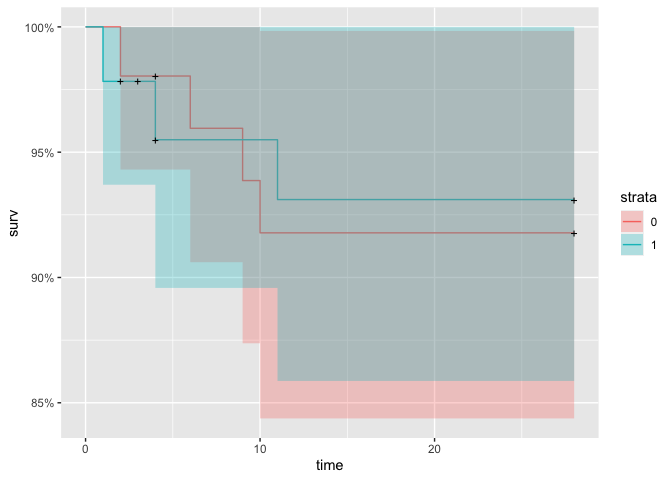

# Load packages

```r
library(tidyverse)
library(readxl)
library(writexl)
library(tableone)

library(jtools) # for summ() and plot_summs
library(sjPlot) # for tab_model
library(ggsurvfit) # survival/TTE analyses
library(survival) # survival/TTE analyses
library(ggplot2) # survival/TTE analyses and other graphs
library(ggfortify) # autoplot
```

# Load Data


# Baseline Characteristics

```r
df$trial <- c("Ghazaeian")
df$country <- c("Iran")
df <- df %>% # no missing in id_pat, trt, age, sex
  rename(id_pat = "patient ID",
         trt = "Treatment group",
         age = Age,
         sex = Sex)
df$id_pat = as.character(paste0('ghazaeian-', df$id_pat))
df %>% 
  drop_na(age) %>% 
  ggplot(aes(x = age)) +
  geom_density(fill = "blue", color = "black") +
  labs(title = "Density Plot of Age",
       x = "Age",
       y = "Density")
```

<!-- -->

```r
df$icu <- 0 # no icu patients at enrolment

# Days with symptoms prior to randomization
df %>% # no missings
  drop_na(sympdur) %>% 
  ggplot(aes(x = sympdur)) +
  geom_density(fill = "blue", color = "black") +
  labs(title = "Density Plot of Symptom Duration",
       x = "Symptom Duration",
       y = "Density")
```

<!-- -->

```r
# Severity of COVID-19 with respect to respiratory support at randomisation / from publication: "Scores on the ordinal scale are as follows: 1, not hospitalized, no limitations of activities; 2, not hospitalized, limitation of activities, home oxygen requirement, or both; 3, hospitalized, not requiring supplemental oxygen and no longer requiring ongoing medical care (used if hospitalization was extended for infection-control reasons); 4, hospitalized, not requiring supplemental oxygen but requiring ongoing medical care (Covid-19–related or other medical conditions); 5, hospitalized, requiring any supplemental oxygen; 6, hospitalized, receiving noninvasive ventilation or use of high-flow oxygen devices; 7, hospitalized, receiving invasive mechanical ventilation or ECMO; and 8, death. Same as ACTT2.

# transform clinical score
score_transform <- function(df, clinstatus_var, score_var) {
  df <- df %>%
    mutate({{ clinstatus_var }} :=
             case_when({{ score_var }} %in% c(1, 2, 3) ~ 1,
                       {{ score_var }} == 4 ~ 2,
                       {{ score_var }} == 5 ~ 3,
                       {{ score_var }} == 6 ~ 4,
                       {{ score_var }} == 7 ~ 5,
                       {{ score_var }} == 8 ~ 6)) %>%
    mutate({{ clinstatus_var }} := factor({{ clinstatus_var }}, levels = 1:6))
}
df <- score_transform(df, clinstatus_baseline, clinstatus_baseline) 
addmargins(table(df$clinstatus_baseline, df$trt, useNA = "always")) # no missing
```

```
##       
##         0  1 <NA> Sum
##   1     0  0    0   0
##   2     2  0    0   2
##   3    49 46    0  95
##   4     0  0    0   0
##   5     0  0    0   0
##   6     0  0    0   0
##   <NA>  0  0    0   0
##   Sum  51 46    0  97
```

```r
df <- score_transform(df, clinstatus_7, df$clinstatus_7)
df <- score_transform(df, clinstatus_14, df$clinstatus_14)
df <- score_transform(df, clinstatus_28, df$`clinstatus-28`)

# Co-medication at baseline
class(df$"Comed-Dexa")
```

```
## [1] "character"
```

```r
df <- df %>% 
  mutate(comed_dexa = case_when(`Comed-Dexa` == "yes" ~ 1,
                              TRUE ~ 0))
df <- df %>% 
  mutate(comed_rdv = case_when(`COMed-RDV` == "yes" ~ 1,
                              TRUE ~ 0))
df <- df %>% 
  mutate(comed_ab = case_when(`Comed-ab` == "yes" ~ 1,
                              TRUE ~ 0))
df <- df %>% 
  mutate(comed_acoa = case_when(`Comed-anticoagulant` == "yes" ~ 1,
                              TRUE ~ 0))
df <- df %>% 
  mutate(comed_interferon = case_when(`Comed-interferon` == "no" ~ 0,
                              TRUE ~ 1))
df$comed_toci <- 0 # but 4 received Actemra (Tocilizumab) 2-4 days after randomization

df <- df %>% # comed_other notes all as no - but there is a separate statin variable..
  mutate(comed_other = case_when(Statin == "no" ~ 0,
                                 Statin == "yes" ~ 1))

## group them for the subgroup analysis, according to protocol
df <- df %>% 
  mutate(comed_cat = case_when(comed_dexa == 0 & comed_toci == 0 ~ 1, # patients without Dexamethasone nor Tocilizumab
                               comed_dexa == 1 & comed_toci == 1 ~ 2, # patients with Dexamethasone and Tocilizumab
                               comed_dexa == 1 & comed_toci == 0 ~ 3, # patients with Dexamethasone but no Tocilizumab
                               comed_dexa == 0 & comed_toci == 1 ~ 4)) # patients with Tocilizumab but no Dexamethasone (if exist)

# Comorbidity at baseline, including immunocompromised
df <- df %>% 
  mutate(comorb_lung = case_when(Asthma == "yes" ~ 1,
                                 Asthma == "no" ~ 0))
df$comorb_liver <- NA
df <- df %>% 
  mutate(comorb_cvd = case_when(`IHD (ischemic heart disease)` == "yes" | Stroke == "yes" ~ 1,
                                 `IHD (ischemic heart disease)` == "no" & Stroke == "no" ~ 0))
df <- df %>% 
  mutate(comorb_aht = case_when(HTN == "yes" ~ 1,
                                 HTN == "no" ~ 0))
df <- df %>% 
  mutate(comorb_dm = case_when(`DM (diabetes melitus)` == "yes" ~ 1,
                               `DM (diabetes melitus)` == "no" ~ 0))
df <- df %>% 
  mutate(bmi = Weight/((Height/100)*(Height/100)))
df <- df %>% 
  mutate(comorb_obese = case_when(bmi > 30 ~ 1,
                                  bmi <= 30 ~ 0))
df <- df %>% 
  mutate(comorb_smoker = case_when(Smoker == "yes" ~ 1,
                                    Smoker == "no" ~ 0))
df <- df %>% 
  mutate(immunosupp = case_when(Malignancy == "yes" ~ 1,
                                    Malignancy == "no" ~ 0))

df <- df %>% # no 0, because of NA in chronic_liver
  mutate(any_comorb = case_when(comorb_lung == 1 | comorb_liver == 1 | comorb_cvd == 1 |
                                  comorb_aht == 1 | comorb_dm == 1 | comorb_obese == 1 | comorb_smoker == 1
                                | immunosupp == 1
                                  ~ 1,
                                comorb_lung == 0 & comorb_liver == 0 & comorb_cvd == 0 &
                                  comorb_aht == 0 & comorb_dm == 0 & comorb_obese == 0 & comorb_smoker == 0
                                & immunosupp == 0
                                ~ 0))

## group them for the subgroup analysis, according to protocol // count all pre-defined comorbidities per patient first
comorb <- df %>% 
  select(id_pat, comorb_lung, comorb_liver, comorb_cvd, comorb_aht, comorb_dm, comorb_obese, comorb_smoker, immunosupp)
comorb$comorb_count <- NA
for (i in 1:dim(comorb)[[1]]) {
  comorb$comorb_count[i] <- ifelse(
    sum(comorb[i, ] %in% c(1)) > 0,
    sum(comorb[i, ] %in% c(1)),
    NA
  )
}
comorb <- comorb %>% 
  mutate(comorb_count = case_when(comorb_lung == 0 & comorb_liver == 0 & comorb_cvd == 0 &
                                  comorb_aht == 0 & comorb_dm == 0 & comorb_obese == 0 & comorb_smoker == 0
                                & immunosupp == 0 ~ 0,
                                TRUE ~ comorb_count))
df <- left_join(df, comorb[, c("comorb_count", "id_pat")], by = join_by(id_pat == id_pat)) ## merge imputed variable back
df <- df %>% # 
  mutate(comorb_cat = case_when(immunosupp == 1 ~ 4, # immunocompromised
                                comorb_count == 0 ~ 1, # no comorbidity
                                comorb_count == 1 ~ 2, # one comorbidity
                                comorb_count >1 & (immunosupp == 0 | is.na(immunosupp)) ~ 3)) # multiple comorbidities

# CRP
df$crp <- df$CRP ## 1 missing
df <- df %>% # 0 does not make sense
  mutate(crp = na_if(crp, 0))
df %>% 
  drop_na(crp) %>% 
  ggplot(aes(x = crp)) +
  geom_density(fill = "blue", color = "black") +
  labs(title = "Density Plot of CRP",
       x = "CRP",
       y = "Density")
```

<!-- -->

```r
# Vaccination
# Viremia
# Variant
# Serology
```
Clarifications and discussion points BASELINE data:
1) 4 received Actemra (Tocilizumab) 2-4 days after randomization
2) Comorbidity
- all immunosupp are "Malignancy"
- 1 missing data for obesity -> ask
- no data for comorb_liver -> NA -> ask? -> re-discuss effect on any_comorb and comorb_cat

# Endpoints

```r
# time to event data
df$randdate <- as_date(df$`Randomization  Date`)
df$death_date <- as_date(df$`death date`)
df$withdrawal_date <- as_date(df$`withdrawal_date`)

df$death_d <- as.numeric(df$death_date - df$randdate) 
df$withdraw_d <- as.numeric(df$withdrawal_date - df$randdate)
df$discharge_d <- as.numeric(df$`Hospital days`)

# (i) Primary outcome: Mortality at day 28 // CAVE: WE HAVE WITHDRAWALS!!!! at the same time variable "death"...
df <- df %>%
  mutate(mort_28 = case_when(death_d <29 ~ 1, 
                             TRUE ~ 0)) 

# (ii) Mortality at day 60
df$mort_60 <- df$mort_28 # max fup time in TOFACOV was 28 days; thus mort_60 imputed from mort_28


# (iii) Time to death within max. follow-up time
df$death_reached <- df$mort_28
df <- df %>% # no missing and those that were discharged were discharged alive
  mutate(death_time = case_when(death_d >=0 ~ c(death_d), # time to death, if no time to death, then...
                                withdraw_d >=0 ~ c(withdraw_d), # time to withdrawal, then...
                                TRUE ~ 28)) # time to death censoring data


# (iv) New mechanical ventilation among survivors within 28 days.
df <- df %>% # all those intubated also then died
  mutate(new_mv_28 = case_when(mort_28 == 0 & (clinstatus_7 == 5 | clinstatus_14 == 5 | clinstatus_28 == 5) ~ 1,
                               mort_28 == 0 ~ 0))

# (iv) Sens-analysis: Alternative definition/analysis: New mechanical ventilation OR death within 28 days => include all in denominator. 
df <- df %>% # no missing anymore => correct
  mutate(new_mvd_28 = case_when(new_mv_28 == 1 | mort_28 == 1 ~ 1,
                                new_mv_28 == 0 | mort_28 == 0 ~ 0))


# (v) Clinical status at day 28
df <- df %>%
  mutate(clinstatus_28 = case_when(mort_28 == 1 ~ 6,
                                   discharge_d <29 ~ 1)) 
df$clinstatus_28 <- factor(df$clinstatus_28, levels = 1:6) # no missing
df$clinstatus_28_imp <- df$clinstatus_28 # equal to clinstatus_28_imp


# (vi) Time to discharge or reaching discharge criteria up to day 28 // Patients who died prior to day 28 are assumed not having reached discharge, i.e. counted as 28 days (as someone who has been censored on day 28). 
df <- df %>%
  mutate(discharge_reached = case_when(discharge_d <29 & mort_28 == 0 ~ 1,
                                       TRUE ~ 0))
df <- df %>% 
  mutate(discharge_time = case_when(discharge_d >=0 ~ c(discharge_d))) # withdraw_d was overruled for both (death and discharge)
df <- df %>% # add 28d for those that died
  mutate(discharge_time = case_when(mort_28 == 1 ~ 28,
                                    TRUE ~ discharge_time))
df <- df %>% # restrict to max fup time 28d
  mutate(discharge_time = case_when(discharge_time >28 ~ 28,
                                    TRUE ~ discharge_time))

# (vi) Sens-analysis: Alternative definition/analysis of outcome: time to sustained discharge within 28 days. There were no re-admissions within 28d
df$discharge_reached_sus <- df$discharge_reached
df$discharge_time_sus <- df$discharge_time


# (vii) Viral clearance up to day 5, day 10, and day 15 (Viral load value <LOQ and/or undectectable): Not available
# (viii) Quality of life at day 28: Not available


# (ix) Participants with an adverse event grade 3 or 4, or a serious adverse event, excluding death, by day 28
df <- df %>% # ae_28 is empty, but under notes there is 1 pulmonary emboly. deaths are in the denominator but counted as 0, since they could have had an ae before death.
  mutate(ae_28 = case_when(note == "pulmonary emboli" ~ 1,
                           TRUE ~ 0))

# (ix) Sens-analysis: Alternative definition/analysis of outcome: incidence rate ratio (Poisson regression) -> AE per person by d28
df$ae_28_sev <- df$ae_28 # there was only 1 AE grade 3/4 per person

# (ix) Sens-analysis: Alternative definition/analysis of outcome: time to first (of these) adverse event, within 28 days, considering death as a competing risk (=> censor and set to 28 days)
# time to first ae not available

# (x) Adverse events of special interest within 28 days: a) thromboembolic events (venous thromboembolism, pulmonary embolism, arterial thrombosis), b) secondary infections (bacterial pneumonia including ventilator-associated pneumonia, meningitis and encephalitis, endocarditis and bacteremia, invasive fungal infection including pulmonary aspergillosis), c) Reactivation of chronic infection including tuberculosis, herpes simplex, cytomegalovirus, herpes zoster and hepatitis B, d) serious cardiovascular and cardiac events (including stroke and myocardial infarction), e) events related to signs of bone marrow suppression (anemia, lymphocytopenia, thrombocytopenia, pancytopenia), f) malignancy, g) gastrointestinal perforation (incl. gastrointestinal bleeding/diverticulitis), h) liver dysfunction/hepatotoxicity (grade 3 and 4)
df <- df %>% 
  mutate(aesi_28 = case_when(note == "pulmonary emboli" ~ "thromboembolic events"))

# (xi) Adverse events, any grade and serious adverse event, excluding death, within 28 days, grouped by organ classes
df$ae_28_list <- df$aesi_28 
```
Discussion points OUTCOME data:
1) Get time to first adverse event?


# Define final dataset, set references, summarize missing data and variables

```r
# keep the overall set
df_all <- df
# reduce the df set to our standardized set across all trials
df <- df %>% 
  select(id_pat, trt, sex, age, 
         #ethn, 
         country, icu, sympdur, 
         #vacc, 
         clinstatus_baseline,
         comed_dexa, comed_rdv, comed_toci, comed_ab, comed_acoa, comed_interferon, comed_other,
         comed_cat,
         comorb_lung, comorb_liver, comorb_cvd, comorb_aht, comorb_dm, comorb_obese, comorb_smoker, immunosupp,
         any_comorb, comorb_cat,
         crp, 
         # sero, vl_baseline, variant,
         mort_28, mort_60, death_reached, death_time,
         new_mv_28, new_mvd_28,
         clinstatus_28_imp,
         discharge_reached, discharge_time, discharge_reached_sus, discharge_time_sus,
         ae_28_sev, aesi_28, ae_28_list,
         # ae_reached, ae_time, 
         # vir_clear_5, vir_clear_10, vir_clear_15, 
         # qol_28
         )
## set references, re-level
# df <- df %>% 
#   mutate(Treatment = relevel(Treatment, "no JAK inhibitor"))

# Create a bar plot to visualize missing values in each column
original_order <- colnames(df)
missing_plot <- df %>%
  summarise_all(~ mean(is.na(.))) %>%
  gather() %>%
  mutate(key = factor(key, levels = original_order)) %>%
  ggplot(aes(x = key, y = value)) +
  geom_bar(stat = "identity") +
  labs(x = "Columns", y = "Proportion of Missing Values", title = "Missing Data Visualization") +
  theme(axis.text.x = element_text(angle = 45, hjust = 1)) +
  ylim(0, 1)
print(missing_plot)
```

<!-- -->
Discussion points
1) Missing variables:
  Baseline:
  - Ethn
  - Vaccination
  - Viremia
  - Variant
  - Serology
  Outcomes:
  - viral load
  - date to first adverse event: ae_reached, ae_time
  - qol_28
2) Missing data:
- 1 missing data for obesity -> ask
- no data for comorb_liver -> NA -> ask? -> effect on any_comorb and comorb_cat
- crp: 2 NAs
- NAs in new_mv_28, aesi_28, ae_28_list: Not part of denominator


# (i) Primary outcome: Mortality at day 28

```r
# adjusted for baseline patient characteristics (age, respiratory support at baseline (ordinal scale 1-3 vs 4-5), dexamethasone use at baseline (y/n), remdesivir use at baseline (y/n), anti-IL-6 use at baseline (y/n)).
table(df$mort_28, df$trt, useNA = "always")
```

```
##       
##         0  1 <NA>
##   0    47 43    0
##   1     4  3    0
##   <NA>  0  0    0
```

```r
mort.28 <- df %>% 
  glm(mort_28 ~ trt 
      + age + clinstatus_baseline + comed_dexa + comed_rdv + comed_toci
      , family = "binomial", data=.)
summ(mort.28, exp = T, confint = T, model.info = T, model.fit = T, digits = 2)
```

```
## Warning in !is.null(rmarkdown::metadata$output) && rmarkdown::metadata$output
## %in% : 'length(x) = 2 > 1' in coercion to 'logical(1)'
```

<table class="table table-striped table-hover table-condensed table-responsive" style="width: auto !important; margin-left: auto; margin-right: auto;">
<tbody>
  <tr>
   <td style="text-align:left;font-weight: bold;"> Observations </td>
   <td style="text-align:right;"> 97 </td>
  </tr>
  <tr>
   <td style="text-align:left;font-weight: bold;"> Dependent variable </td>
   <td style="text-align:right;"> mort_28 </td>
  </tr>
  <tr>
   <td style="text-align:left;font-weight: bold;"> Type </td>
   <td style="text-align:right;"> Generalized linear model </td>
  </tr>
  <tr>
   <td style="text-align:left;font-weight: bold;"> Family </td>
   <td style="text-align:right;"> binomial </td>
  </tr>
  <tr>
   <td style="text-align:left;font-weight: bold;"> Link </td>
   <td style="text-align:right;"> logit </td>
  </tr>
</tbody>
</table> <table class="table table-striped table-hover table-condensed table-responsive" style="width: auto !important; margin-left: auto; margin-right: auto;">
<tbody>
  <tr>
   <td style="text-align:left;font-weight: bold;"> 𝛘²(3) </td>
   <td style="text-align:right;"> 1.61 </td>
  </tr>
  <tr>
   <td style="text-align:left;font-weight: bold;"> Pseudo-R² (Cragg-Uhler) </td>
   <td style="text-align:right;"> 0.04 </td>
  </tr>
  <tr>
   <td style="text-align:left;font-weight: bold;"> Pseudo-R² (McFadden) </td>
   <td style="text-align:right;"> 0.03 </td>
  </tr>
  <tr>
   <td style="text-align:left;font-weight: bold;"> AIC </td>
   <td style="text-align:right;"> 56.67 </td>
  </tr>
  <tr>
   <td style="text-align:left;font-weight: bold;"> BIC </td>
   <td style="text-align:right;"> 66.97 </td>
  </tr>
</tbody>
</table> <table class="table table-striped table-hover table-condensed table-responsive" style="width: auto !important; margin-left: auto; margin-right: auto;border-bottom: 0;">
 <thead>
  <tr>
   <th style="text-align:left;">   </th>
   <th style="text-align:right;"> exp(Est.) </th>
   <th style="text-align:right;"> 2.5% </th>
   <th style="text-align:right;"> 97.5% </th>
   <th style="text-align:right;"> z val. </th>
   <th style="text-align:right;"> p </th>
  </tr>
 </thead>
<tbody>
  <tr>
   <td style="text-align:left;font-weight: bold;"> (Intercept) </td>
   <td style="text-align:right;"> 0.00 </td>
   <td style="text-align:right;"> 0.00 </td>
   <td style="text-align:right;"> Inf </td>
   <td style="text-align:right;"> -0.01 </td>
   <td style="text-align:right;"> 0.99 </td>
  </tr>
  <tr>
   <td style="text-align:left;font-weight: bold;"> trt </td>
   <td style="text-align:right;"> 0.79 </td>
   <td style="text-align:right;"> 0.17 </td>
   <td style="text-align:right;"> 3.78 </td>
   <td style="text-align:right;"> -0.29 </td>
   <td style="text-align:right;"> 0.77 </td>
  </tr>
  <tr>
   <td style="text-align:left;font-weight: bold;"> age </td>
   <td style="text-align:right;"> 1.03 </td>
   <td style="text-align:right;"> 0.98 </td>
   <td style="text-align:right;"> 1.08 </td>
   <td style="text-align:right;"> 1.09 </td>
   <td style="text-align:right;"> 0.28 </td>
  </tr>
  <tr>
   <td style="text-align:left;font-weight: bold;"> clinstatus_baseline3 </td>
   <td style="text-align:right;"> 1351843.73 </td>
   <td style="text-align:right;"> 0.00 </td>
   <td style="text-align:right;"> Inf </td>
   <td style="text-align:right;"> 0.01 </td>
   <td style="text-align:right;"> 0.99 </td>
  </tr>
  <tr>
   <td style="text-align:left;font-weight: bold;"> comed_dexa </td>
   <td style="text-align:right;"> NA </td>
   <td style="text-align:right;"> NA </td>
   <td style="text-align:right;"> NA </td>
   <td style="text-align:right;"> NA </td>
   <td style="text-align:right;"> NA </td>
  </tr>
  <tr>
   <td style="text-align:left;font-weight: bold;"> comed_rdv </td>
   <td style="text-align:right;"> NA </td>
   <td style="text-align:right;"> NA </td>
   <td style="text-align:right;"> NA </td>
   <td style="text-align:right;"> NA </td>
   <td style="text-align:right;"> NA </td>
  </tr>
  <tr>
   <td style="text-align:left;font-weight: bold;"> comed_toci </td>
   <td style="text-align:right;"> NA </td>
   <td style="text-align:right;"> NA </td>
   <td style="text-align:right;"> NA </td>
   <td style="text-align:right;"> NA </td>
   <td style="text-align:right;"> NA </td>
  </tr>
</tbody>
<tfoot><tr><td style="padding: 0; " colspan="100%">
<sup></sup> Standard errors: MLE</td></tr></tfoot>
</table>
Discussion points
1) all (intervention + control) also had dexa and rdv. No-one had toci.


# (ii) Mortality at day 60

```r
table(df$mort_60, df$trt, useNA = "always")
```

```
##       
##         0  1 <NA>
##   0    47 43    0
##   1     4  3    0
##   <NA>  0  0    0
```

```r
mort.60 <- df %>% 
  glm(mort_60 ~ trt 
      + age + clinstatus_baseline + comed_dexa + comed_rdv + comed_toci
      , family = "binomial", data=.)
summ(mort.60, exp = T, confint = T, model.info = T, model.fit = T, digits = 2)
```

<table class="table table-striped table-hover table-condensed table-responsive" style="width: auto !important; margin-left: auto; margin-right: auto;">
<tbody>
  <tr>
   <td style="text-align:left;font-weight: bold;"> Observations </td>
   <td style="text-align:right;"> 97 </td>
  </tr>
  <tr>
   <td style="text-align:left;font-weight: bold;"> Dependent variable </td>
   <td style="text-align:right;"> mort_60 </td>
  </tr>
  <tr>
   <td style="text-align:left;font-weight: bold;"> Type </td>
   <td style="text-align:right;"> Generalized linear model </td>
  </tr>
  <tr>
   <td style="text-align:left;font-weight: bold;"> Family </td>
   <td style="text-align:right;"> binomial </td>
  </tr>
  <tr>
   <td style="text-align:left;font-weight: bold;"> Link </td>
   <td style="text-align:right;"> logit </td>
  </tr>
</tbody>
</table> <table class="table table-striped table-hover table-condensed table-responsive" style="width: auto !important; margin-left: auto; margin-right: auto;">
<tbody>
  <tr>
   <td style="text-align:left;font-weight: bold;"> 𝛘²(3) </td>
   <td style="text-align:right;"> 1.61 </td>
  </tr>
  <tr>
   <td style="text-align:left;font-weight: bold;"> Pseudo-R² (Cragg-Uhler) </td>
   <td style="text-align:right;"> 0.04 </td>
  </tr>
  <tr>
   <td style="text-align:left;font-weight: bold;"> Pseudo-R² (McFadden) </td>
   <td style="text-align:right;"> 0.03 </td>
  </tr>
  <tr>
   <td style="text-align:left;font-weight: bold;"> AIC </td>
   <td style="text-align:right;"> 56.67 </td>
  </tr>
  <tr>
   <td style="text-align:left;font-weight: bold;"> BIC </td>
   <td style="text-align:right;"> 66.97 </td>
  </tr>
</tbody>
</table> <table class="table table-striped table-hover table-condensed table-responsive" style="width: auto !important; margin-left: auto; margin-right: auto;border-bottom: 0;">
 <thead>
  <tr>
   <th style="text-align:left;">   </th>
   <th style="text-align:right;"> exp(Est.) </th>
   <th style="text-align:right;"> 2.5% </th>
   <th style="text-align:right;"> 97.5% </th>
   <th style="text-align:right;"> z val. </th>
   <th style="text-align:right;"> p </th>
  </tr>
 </thead>
<tbody>
  <tr>
   <td style="text-align:left;font-weight: bold;"> (Intercept) </td>
   <td style="text-align:right;"> 0.00 </td>
   <td style="text-align:right;"> 0.00 </td>
   <td style="text-align:right;"> Inf </td>
   <td style="text-align:right;"> -0.01 </td>
   <td style="text-align:right;"> 0.99 </td>
  </tr>
  <tr>
   <td style="text-align:left;font-weight: bold;"> trt </td>
   <td style="text-align:right;"> 0.79 </td>
   <td style="text-align:right;"> 0.17 </td>
   <td style="text-align:right;"> 3.78 </td>
   <td style="text-align:right;"> -0.29 </td>
   <td style="text-align:right;"> 0.77 </td>
  </tr>
  <tr>
   <td style="text-align:left;font-weight: bold;"> age </td>
   <td style="text-align:right;"> 1.03 </td>
   <td style="text-align:right;"> 0.98 </td>
   <td style="text-align:right;"> 1.08 </td>
   <td style="text-align:right;"> 1.09 </td>
   <td style="text-align:right;"> 0.28 </td>
  </tr>
  <tr>
   <td style="text-align:left;font-weight: bold;"> clinstatus_baseline3 </td>
   <td style="text-align:right;"> 1351843.73 </td>
   <td style="text-align:right;"> 0.00 </td>
   <td style="text-align:right;"> Inf </td>
   <td style="text-align:right;"> 0.01 </td>
   <td style="text-align:right;"> 0.99 </td>
  </tr>
  <tr>
   <td style="text-align:left;font-weight: bold;"> comed_dexa </td>
   <td style="text-align:right;"> NA </td>
   <td style="text-align:right;"> NA </td>
   <td style="text-align:right;"> NA </td>
   <td style="text-align:right;"> NA </td>
   <td style="text-align:right;"> NA </td>
  </tr>
  <tr>
   <td style="text-align:left;font-weight: bold;"> comed_rdv </td>
   <td style="text-align:right;"> NA </td>
   <td style="text-align:right;"> NA </td>
   <td style="text-align:right;"> NA </td>
   <td style="text-align:right;"> NA </td>
   <td style="text-align:right;"> NA </td>
  </tr>
  <tr>
   <td style="text-align:left;font-weight: bold;"> comed_toci </td>
   <td style="text-align:right;"> NA </td>
   <td style="text-align:right;"> NA </td>
   <td style="text-align:right;"> NA </td>
   <td style="text-align:right;"> NA </td>
   <td style="text-align:right;"> NA </td>
  </tr>
</tbody>
<tfoot><tr><td style="padding: 0; " colspan="100%">
<sup></sup> Standard errors: MLE</td></tr></tfoot>
</table>
Discussion points
1) 


# (iii) Time to death within max. follow-up time

```r
table(df$death_reached, df$death_time, useNA = "always")
```

```
##       
##         1  2  3  4  6  9 10 11 28 <NA>
##   0     0  2  1  4  0  0  0  0 83    0
##   1     1  1  0  1  1  1  1  1  0    0
##   <NA>  0  0  0  0  0  0  0  0  0    0
```

```r
table(df$death_reached, df$mort_60, useNA = "always")
```

```
##       
##         0  1 <NA>
##   0    90  0    0
##   1     0  7    0
##   <NA>  0  0    0
```

```r
df %>%
  drop_na(death_time) %>%
  filter(death_reached == 1) %>%
  group_by(trt) %>%
  summarise(median = median(death_time),
            IQR = IQR(death_time),
            Q1 = quantile(death_time, probs = 0.25),
            Q3 = quantile(death_time, probs = 0.75)) 
```

```
## # A tibble: 2 × 5
##     trt median   IQR    Q1    Q3
##   <dbl>  <dbl> <dbl> <dbl> <dbl>
## 1     0    7.5  4.25   5    9.25
## 2     1    4    5      2.5  7.5
```

```r
# time to death
km.ttdeath.check <- with(df, Surv(death_time, death_reached))
head(km.ttdeath.check, 100)
```

```
##  [1] 28+ 28+ 28+ 28+ 28+ 28+ 28+ 28+ 28+ 28+ 28+ 28+ 28+ 28+ 28+ 28+ 28+  4+  4+
## [20] 28+ 28+  3+ 28+ 28+ 28+ 28+ 28+ 28+ 28+ 28+  2  11  28+ 28+ 28+ 28+ 28+ 28+
## [39] 28+ 28+ 28+ 28+ 28+ 28+ 28+ 28+ 28+ 28+ 28+ 10  28+ 28+ 28+ 28+  2+  2+ 28+
## [58] 28+ 28+  4+  1   4+ 28+ 28+ 28+  9  28+ 28+  6  28+ 28+ 28+  4  28+ 28+ 28+
## [77] 28+ 28+ 28+ 28+ 28+ 28+ 28+ 28+ 28+ 28+ 28+ 28+ 28+ 28+ 28+ 28+ 28+ 28+ 28+
## [96] 28+ 28+
```

```r
km.ttdeath <- survfit(Surv(death_time, death_reached) ~ 1, data=df)
summary(km.ttdeath, times = c(5,10,20,28,30,40,60))
```

```
## Call: survfit(formula = Surv(death_time, death_reached) ~ 1, data = df)
## 
##  time n.risk n.event survival std.err lower 95% CI upper 95% CI
##     5     87       3    0.969  0.0178        0.935        1.000
##    10     85       3    0.935  0.0256        0.887        0.987
##    20     83       1    0.924  0.0276        0.872        0.980
##    28     83       0    0.924  0.0276        0.872        0.980
```

```r
plot(km.ttdeath, xlab="Days", main = 'Kaplan Meyer Plot') #base graphics
```

<!-- -->

```r
autoplot(km.ttdeath)
```

<!-- -->

```r
km.ttdeath_trt <- survfit(Surv(death_time, death_reached) ~ trt, data=df)
autoplot(km.ttdeath_trt)
```

<!-- -->

```r
ttdeath <- df %>% 
  coxph(Surv(death_time, death_reached) ~ trt 
        + age + clinstatus_baseline + comed_dexa + comed_rdv + comed_toci
        , data =.)
```

```
## Warning in coxph.fit(X, Y, istrat, offset, init, control, weights = weights, :
## Loglik converged before variable 3 ; coefficient may be infinite.
```

```r
tab_model(ttdeath)
```

```
## Model matrix is rank deficient. Parameters `clinstatus_baseline3,
##   clinstatus_baseline4, clinstatus_baseline5, clinstatus_baseline6,
##   comed_dexa, comed_rdv, comed_toci` were not estimable.
```

<table style="border-collapse:collapse; border:none;">
<tr>
<th style="border-top: double; text-align:center; font-style:normal; font-weight:bold; padding:0.2cm;  text-align:left; ">&nbsp;</th>
<th colspan="3" style="border-top: double; text-align:center; font-style:normal; font-weight:bold; padding:0.2cm; ">Surv(death time,death<br>reached)</th>
</tr>
<tr>
<td style=" text-align:center; border-bottom:1px solid; font-style:italic; font-weight:normal;  text-align:left; ">Predictors</td>
<td style=" text-align:center; border-bottom:1px solid; font-style:italic; font-weight:normal;  ">Estimates</td>
<td style=" text-align:center; border-bottom:1px solid; font-style:italic; font-weight:normal;  ">CI</td>
<td style=" text-align:center; border-bottom:1px solid; font-style:italic; font-weight:normal;  ">p</td>
</tr>
<tr>
<td style=" padding:0.2cm; text-align:left; vertical-align:top; text-align:left; ">trt</td>
<td style=" padding:0.2cm; text-align:left; vertical-align:top; text-align:center;  ">0.84</td>
<td style=" padding:0.2cm; text-align:left; vertical-align:top; text-align:center;  ">0.19&nbsp;&ndash;&nbsp;3.75</td>
<td style=" padding:0.2cm; text-align:left; vertical-align:top; text-align:center;  ">0.817</td>
</tr>
<tr>
<td style=" padding:0.2cm; text-align:left; vertical-align:top; text-align:left; ">age</td>
<td style=" padding:0.2cm; text-align:left; vertical-align:top; text-align:center;  ">1.03</td>
<td style=" padding:0.2cm; text-align:left; vertical-align:top; text-align:center;  ">0.98&nbsp;&ndash;&nbsp;1.07</td>
<td style=" padding:0.2cm; text-align:left; vertical-align:top; text-align:center;  ">0.270</td>
</tr>
<tr>
<td style=" padding:0.2cm; text-align:left; vertical-align:top; text-align:left; ">clinstatus baseline [2]</td>
<td style=" padding:0.2cm; text-align:left; vertical-align:top; text-align:center;  ">0.00</td>
<td style=" padding:0.2cm; text-align:left; vertical-align:top; text-align:center;  ">0.00&nbsp;&ndash;&nbsp;Inf</td>
<td style=" padding:0.2cm; text-align:left; vertical-align:top; text-align:center;  ">0.998</td>
</tr>
<tr>
<td style=" padding:0.2cm; text-align:left; vertical-align:top; text-align:left; padding-top:0.1cm; padding-bottom:0.1cm; border-top:1px solid;">Observations</td>
<td style=" padding:0.2cm; text-align:left; vertical-align:top; padding-top:0.1cm; padding-bottom:0.1cm; text-align:left; border-top:1px solid;" colspan="3">97</td>
</tr>
<tr>
<td style=" padding:0.2cm; text-align:left; vertical-align:top; text-align:left; padding-top:0.1cm; padding-bottom:0.1cm;">R<sup>2</sup> Nagelkerke</td>
<td style=" padding:0.2cm; text-align:left; vertical-align:top; padding-top:0.1cm; padding-bottom:0.1cm; text-align:left;" colspan="3">0.035</td>
</tr>

</table>

```r
# summ(ttdeath, exp = T, confint = T, model.info = T, model.fit = T, digits = 2)
```
Discussion points
1) 


# (iv) New mechanical ventilation among survivors within 28 days

```r
table(df$new_mv_28, df$trt, useNA = "always")
```

```
##       
##         0  1 <NA>
##   0    47 43    0
##   <NA>  4  3    0
```

```r
new.mv.28 <- df %>% 
  glm(new_mv_28 ~ trt 
       + age + clinstatus_baseline 
       + comed_dexa + comed_rdv + comed_toci
      , family = "binomial", data=.)
summ(new.mv.28, exp = T, confint = T, model.info = T, model.fit = T, digits = 2)
```

<table class="table table-striped table-hover table-condensed table-responsive" style="width: auto !important; margin-left: auto; margin-right: auto;">
<tbody>
  <tr>
   <td style="text-align:left;font-weight: bold;"> Observations </td>
   <td style="text-align:right;"> 90 (7 missing obs. deleted) </td>
  </tr>
  <tr>
   <td style="text-align:left;font-weight: bold;"> Dependent variable </td>
   <td style="text-align:right;"> new_mv_28 </td>
  </tr>
  <tr>
   <td style="text-align:left;font-weight: bold;"> Type </td>
   <td style="text-align:right;"> Generalized linear model </td>
  </tr>
  <tr>
   <td style="text-align:left;font-weight: bold;"> Family </td>
   <td style="text-align:right;"> binomial </td>
  </tr>
  <tr>
   <td style="text-align:left;font-weight: bold;"> Link </td>
   <td style="text-align:right;"> logit </td>
  </tr>
</tbody>
</table> <table class="table table-striped table-hover table-condensed table-responsive" style="width: auto !important; margin-left: auto; margin-right: auto;">
<tbody>
  <tr>
   <td style="text-align:left;font-weight: bold;"> 𝛘²(3) </td>
   <td style="text-align:right;"> -0.00 </td>
  </tr>
  <tr>
   <td style="text-align:left;font-weight: bold;"> Pseudo-R² (Cragg-Uhler) </td>
   <td style="text-align:right;"> 0.00 </td>
  </tr>
  <tr>
   <td style="text-align:left;font-weight: bold;"> Pseudo-R² (McFadden) </td>
   <td style="text-align:right;"> 0.00 </td>
  </tr>
  <tr>
   <td style="text-align:left;font-weight: bold;"> AIC </td>
   <td style="text-align:right;"> 8.00 </td>
  </tr>
  <tr>
   <td style="text-align:left;font-weight: bold;"> BIC </td>
   <td style="text-align:right;"> 18.00 </td>
  </tr>
</tbody>
</table> <table class="table table-striped table-hover table-condensed table-responsive" style="width: auto !important; margin-left: auto; margin-right: auto;border-bottom: 0;">
 <thead>
  <tr>
   <th style="text-align:left;">   </th>
   <th style="text-align:right;"> exp(Est.) </th>
   <th style="text-align:right;"> 2.5% </th>
   <th style="text-align:right;"> 97.5% </th>
   <th style="text-align:right;"> z val. </th>
   <th style="text-align:right;"> p </th>
  </tr>
 </thead>
<tbody>
  <tr>
   <td style="text-align:left;font-weight: bold;"> (Intercept) </td>
   <td style="text-align:right;"> 0.00 </td>
   <td style="text-align:right;"> 0.00 </td>
   <td style="text-align:right;"> Inf </td>
   <td style="text-align:right;"> -0.00 </td>
   <td style="text-align:right;"> 1.00 </td>
  </tr>
  <tr>
   <td style="text-align:left;font-weight: bold;"> trt </td>
   <td style="text-align:right;"> 1.00 </td>
   <td style="text-align:right;"> 0.00 </td>
   <td style="text-align:right;"> Inf </td>
   <td style="text-align:right;"> -0.00 </td>
   <td style="text-align:right;"> 1.00 </td>
  </tr>
  <tr>
   <td style="text-align:left;font-weight: bold;"> age </td>
   <td style="text-align:right;"> 1.00 </td>
   <td style="text-align:right;"> 0.00 </td>
   <td style="text-align:right;"> Inf </td>
   <td style="text-align:right;"> -0.00 </td>
   <td style="text-align:right;"> 1.00 </td>
  </tr>
  <tr>
   <td style="text-align:left;font-weight: bold;"> clinstatus_baseline3 </td>
   <td style="text-align:right;"> 1.00 </td>
   <td style="text-align:right;"> 0.00 </td>
   <td style="text-align:right;"> Inf </td>
   <td style="text-align:right;"> 0.00 </td>
   <td style="text-align:right;"> 1.00 </td>
  </tr>
  <tr>
   <td style="text-align:left;font-weight: bold;"> comed_dexa </td>
   <td style="text-align:right;"> NA </td>
   <td style="text-align:right;"> NA </td>
   <td style="text-align:right;"> NA </td>
   <td style="text-align:right;"> NA </td>
   <td style="text-align:right;"> NA </td>
  </tr>
  <tr>
   <td style="text-align:left;font-weight: bold;"> comed_rdv </td>
   <td style="text-align:right;"> NA </td>
   <td style="text-align:right;"> NA </td>
   <td style="text-align:right;"> NA </td>
   <td style="text-align:right;"> NA </td>
   <td style="text-align:right;"> NA </td>
  </tr>
  <tr>
   <td style="text-align:left;font-weight: bold;"> comed_toci </td>
   <td style="text-align:right;"> NA </td>
   <td style="text-align:right;"> NA </td>
   <td style="text-align:right;"> NA </td>
   <td style="text-align:right;"> NA </td>
   <td style="text-align:right;"> NA </td>
  </tr>
</tbody>
<tfoot><tr><td style="padding: 0; " colspan="100%">
<sup></sup> Standard errors: MLE</td></tr></tfoot>
</table>

```r
# (iv) Sens-analysis: Alternative definition/analysis: New mechanical ventilation OR death within 28 days => include all in denominator. 
table(df$new_mvd_28, df$trt, useNA = "always")
```

```
##       
##         0  1 <NA>
##   0    47 43    0
##   1     4  3    0
##   <NA>  0  0    0
```

```r
new.mvd.28 <- df %>% 
  glm(new_mvd_28 ~ trt 
      + age + clinstatus_baseline + comed_dexa + comed_rdv + comed_toci
      , family = "binomial", data=.)
summ(new.mvd.28, exp = T, confint = T, model.info = T, model.fit = T, digits = 2)
```

<table class="table table-striped table-hover table-condensed table-responsive" style="width: auto !important; margin-left: auto; margin-right: auto;">
<tbody>
  <tr>
   <td style="text-align:left;font-weight: bold;"> Observations </td>
   <td style="text-align:right;"> 97 </td>
  </tr>
  <tr>
   <td style="text-align:left;font-weight: bold;"> Dependent variable </td>
   <td style="text-align:right;"> new_mvd_28 </td>
  </tr>
  <tr>
   <td style="text-align:left;font-weight: bold;"> Type </td>
   <td style="text-align:right;"> Generalized linear model </td>
  </tr>
  <tr>
   <td style="text-align:left;font-weight: bold;"> Family </td>
   <td style="text-align:right;"> binomial </td>
  </tr>
  <tr>
   <td style="text-align:left;font-weight: bold;"> Link </td>
   <td style="text-align:right;"> logit </td>
  </tr>
</tbody>
</table> <table class="table table-striped table-hover table-condensed table-responsive" style="width: auto !important; margin-left: auto; margin-right: auto;">
<tbody>
  <tr>
   <td style="text-align:left;font-weight: bold;"> 𝛘²(3) </td>
   <td style="text-align:right;"> 1.61 </td>
  </tr>
  <tr>
   <td style="text-align:left;font-weight: bold;"> Pseudo-R² (Cragg-Uhler) </td>
   <td style="text-align:right;"> 0.04 </td>
  </tr>
  <tr>
   <td style="text-align:left;font-weight: bold;"> Pseudo-R² (McFadden) </td>
   <td style="text-align:right;"> 0.03 </td>
  </tr>
  <tr>
   <td style="text-align:left;font-weight: bold;"> AIC </td>
   <td style="text-align:right;"> 56.67 </td>
  </tr>
  <tr>
   <td style="text-align:left;font-weight: bold;"> BIC </td>
   <td style="text-align:right;"> 66.97 </td>
  </tr>
</tbody>
</table> <table class="table table-striped table-hover table-condensed table-responsive" style="width: auto !important; margin-left: auto; margin-right: auto;border-bottom: 0;">
 <thead>
  <tr>
   <th style="text-align:left;">   </th>
   <th style="text-align:right;"> exp(Est.) </th>
   <th style="text-align:right;"> 2.5% </th>
   <th style="text-align:right;"> 97.5% </th>
   <th style="text-align:right;"> z val. </th>
   <th style="text-align:right;"> p </th>
  </tr>
 </thead>
<tbody>
  <tr>
   <td style="text-align:left;font-weight: bold;"> (Intercept) </td>
   <td style="text-align:right;"> 0.00 </td>
   <td style="text-align:right;"> 0.00 </td>
   <td style="text-align:right;"> Inf </td>
   <td style="text-align:right;"> -0.01 </td>
   <td style="text-align:right;"> 0.99 </td>
  </tr>
  <tr>
   <td style="text-align:left;font-weight: bold;"> trt </td>
   <td style="text-align:right;"> 0.79 </td>
   <td style="text-align:right;"> 0.17 </td>
   <td style="text-align:right;"> 3.78 </td>
   <td style="text-align:right;"> -0.29 </td>
   <td style="text-align:right;"> 0.77 </td>
  </tr>
  <tr>
   <td style="text-align:left;font-weight: bold;"> age </td>
   <td style="text-align:right;"> 1.03 </td>
   <td style="text-align:right;"> 0.98 </td>
   <td style="text-align:right;"> 1.08 </td>
   <td style="text-align:right;"> 1.09 </td>
   <td style="text-align:right;"> 0.28 </td>
  </tr>
  <tr>
   <td style="text-align:left;font-weight: bold;"> clinstatus_baseline3 </td>
   <td style="text-align:right;"> 1351843.73 </td>
   <td style="text-align:right;"> 0.00 </td>
   <td style="text-align:right;"> Inf </td>
   <td style="text-align:right;"> 0.01 </td>
   <td style="text-align:right;"> 0.99 </td>
  </tr>
  <tr>
   <td style="text-align:left;font-weight: bold;"> comed_dexa </td>
   <td style="text-align:right;"> NA </td>
   <td style="text-align:right;"> NA </td>
   <td style="text-align:right;"> NA </td>
   <td style="text-align:right;"> NA </td>
   <td style="text-align:right;"> NA </td>
  </tr>
  <tr>
   <td style="text-align:left;font-weight: bold;"> comed_rdv </td>
   <td style="text-align:right;"> NA </td>
   <td style="text-align:right;"> NA </td>
   <td style="text-align:right;"> NA </td>
   <td style="text-align:right;"> NA </td>
   <td style="text-align:right;"> NA </td>
  </tr>
  <tr>
   <td style="text-align:left;font-weight: bold;"> comed_toci </td>
   <td style="text-align:right;"> NA </td>
   <td style="text-align:right;"> NA </td>
   <td style="text-align:right;"> NA </td>
   <td style="text-align:right;"> NA </td>
   <td style="text-align:right;"> NA </td>
  </tr>
</tbody>
<tfoot><tr><td style="padding: 0; " colspan="100%">
<sup></sup> Standard errors: MLE</td></tr></tfoot>
</table>
Discussion points
1) CAVE new_mv_28: Besides the deaths no-one was intubated, and the deaths are excluded => no events!
