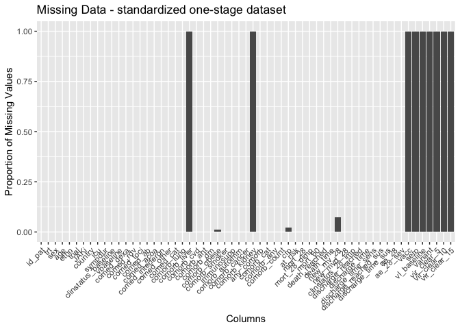
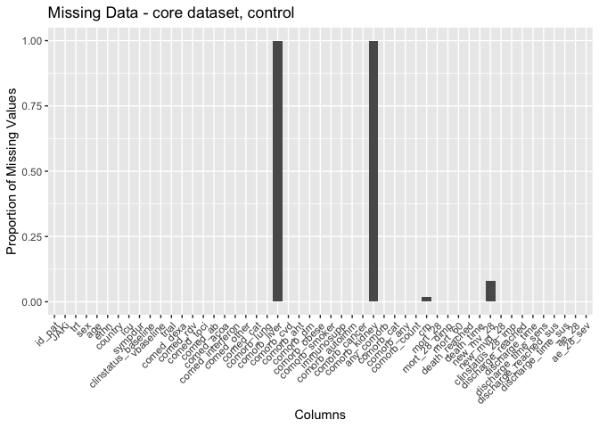
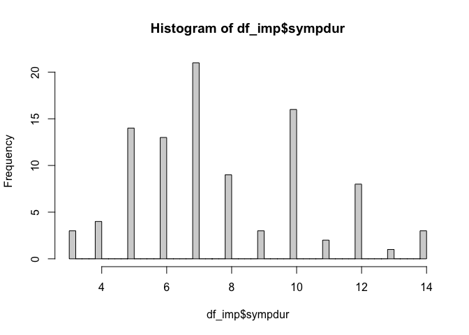

# Load packages

```r
library(tidyverse)
library(readxl)
library(writexl)
library(tableone)
library(haven) # Read sas files
library(here)
library(kableExtra)

library(jtools) # for summ() and plot_summs
library(sjPlot) # for tab_model
library(ggplot2) # survival/TTE analyses and other graphs
library(ggsurvfit) # survival/TTE analyses
library(survival) # survival/TTE analyses
library(gtsummary) # survival/TTE analyses
library(ggfortify) # autoplot
library(tidycmprsk) # competing risk analysis
library(ordinal) # clinstatus ordinal regression
library(mosaic) # OR for 0.5-corrected 2x2 table in case of rare events
library(logistf) # Firth regression in case of rare events

library(finalfit) # missing data exploration
library(mice) # multiple imputation
library(jomo) # multiple imputation
library(mitools) # multiple imputation
```

# Load Data


# Baseline Characteristics

```r
df$trial <- c("Ghazaeian")
df$JAKi <- c("Tofacitinib")
df$country <- c("Iran")
df$ethn <- c("Persian/Mazani")
df <- df %>% # no missing in id_pat, trt, age, sex
  rename(id_pat = "patient ID",
         trt = "Treatment group",
         age = Age,
         sex = Sex)
df$id_pat = as.character(paste0('ghazaeian-', df$id_pat))
df %>% 
  drop_na(age) %>% 
  ggplot(aes(x = age)) +
  geom_density(fill = "blue", color = "black") +
  labs(title = "Density Plot of Age",
       x = "Age",
       y = "Density")
```

<!-- -->

```r
df$icu <- 0 # no icu patients at enrolment

# Days with symptoms prior to randomization
df %>% # no missings
  drop_na(sympdur) %>% 
  ggplot(aes(x = sympdur)) +
  geom_density(fill = "blue", color = "black") +
  labs(title = "Density Plot of Symptom Duration",
       x = "Symptom Duration",
       y = "Density")
```

<!-- -->

```r
# Severity of COVID-19 with respect to respiratory support at randomisation / from publication: "Scores on the ordinal scale are as follows: 1, not hospitalized, no limitations of activities; 2, not hospitalized, limitation of activities, home oxygen requirement, or both; 3, hospitalized, not requiring supplemental oxygen and no longer requiring ongoing medical care (used if hospitalization was extended for infection-control reasons); 4, hospitalized, not requiring supplemental oxygen but requiring ongoing medical care (Covid-19–related or other medical conditions); 5, hospitalized, requiring any supplemental oxygen; 6, hospitalized, receiving noninvasive ventilation or use of high-flow oxygen devices; 7, hospitalized, receiving invasive mechanical ventilation or ECMO; and 8, death. Same as ACTT2.

# transform clinical score
score_transform <- function(df, clinstatus_var, score_var) {
  df <- df %>%
    mutate({{ clinstatus_var }} :=
             case_when({{ score_var }} %in% c(1, 2, 3) ~ 1,
                       {{ score_var }} == 4 ~ 2,
                       {{ score_var }} == 5 ~ 3,
                       {{ score_var }} == 6 ~ 4,
                       {{ score_var }} == 7 ~ 5,
                       {{ score_var }} == 8 ~ 6)) %>%
    mutate({{ clinstatus_var }} := factor({{ clinstatus_var }}, levels = 1:6))
}
df <- score_transform(df, clinstatus_baseline, clinstatus_baseline) 
addmargins(table(df$clinstatus_baseline, df$trt, useNA = "always")) # no missing
```

```
##       
##         0  1 <NA> Sum
##   1     0  0    0   0
##   2     2  0    0   2
##   3    49 46    0  95
##   4     0  0    0   0
##   5     0  0    0   0
##   6     0  0    0   0
##   <NA>  0  0    0   0
##   Sum  51 46    0  97
```

```r
df <- score_transform(df, clinstatus_7, df$clinstatus_7)
df <- score_transform(df, clinstatus_14, df$clinstatus_14)
df <- score_transform(df, clinstatus_28, df$`clinstatus-28`)

df <- df %>% 
  mutate(vbaseline = case_when(clinstatus_baseline == "2" | clinstatus_baseline == "3" ~ 0,
                                clinstatus_baseline == "4" | clinstatus_baseline == "5" ~ 1))

# Co-medication at baseline
class(df$"Comed-Dexa")
```

```
## [1] "character"
```

```r
df <- df %>% 
  mutate(comed_dexa = case_when(`Comed-Dexa` == "yes" ~ 1,
                              TRUE ~ 0))
df <- df %>% 
  mutate(comed_rdv = case_when(`COMed-RDV` == "yes" ~ 1,
                              TRUE ~ 0))
df <- df %>% 
  mutate(comed_ab = case_when(`Comed-ab` == "yes" ~ 1,
                              TRUE ~ 0))
df <- df %>% 
  mutate(comed_acoa = case_when(`Comed-anticoagulant` == "yes" ~ 1,
                              TRUE ~ 0))
df <- df %>% 
  mutate(comed_interferon = case_when(`Comed-interferon` == "no" ~ 0,
                              TRUE ~ 1))
df$comed_toci <- 0 # but 4 received Actemra (Tocilizumab) 2-4 days after randomization

df <- df %>% # comed_other notes all as no - but there is a separate statin variable..
  mutate(comed_other = case_when(Statin == "no" ~ 0,
                                 Statin == "yes" ~ 1))

## group them for the subgroup analysis, according to protocol
df <- df %>% 
  mutate(comed_cat = case_when(comed_dexa == 0 & comed_toci == 0 ~ 1, # patients without Dexamethasone nor Tocilizumab
                               comed_dexa == 1 & comed_toci == 1 ~ 2, # patients with Dexamethasone and Tocilizumab
                               comed_dexa == 1 & comed_toci == 0 ~ 3, # patients with Dexamethasone but no Tocilizumab
                               comed_dexa == 0 & comed_toci == 1 ~ 4)) # patients with Tocilizumab but no Dexamethasone (if exist)

# Comorbidity at baseline, including immunocompromised
df <- df %>% 
  mutate(comorb_lung = case_when(Asthma == "yes" ~ 1,
                                 Asthma == "no" ~ 0))
df$comorb_liver <- NA
df <- df %>% 
  mutate(comorb_cvd = case_when(`IHD (ischemic heart disease)` == "yes" | Stroke == "yes" ~ 1,
                                 `IHD (ischemic heart disease)` == "no" & Stroke == "no" ~ 0))
df <- df %>% 
  mutate(comorb_aht = case_when(HTN == "yes" ~ 1,
                                 HTN == "no" ~ 0))
df <- df %>% 
  mutate(comorb_dm = case_when(`DM (diabetes melitus)` == "yes" ~ 1,
                               `DM (diabetes melitus)` == "no" ~ 0))
df <- df %>% 
  mutate(bmi = Weight/((Height/100)*(Height/100)))
df <- df %>% 
  mutate(comorb_obese = case_when(bmi > 30 ~ 1,
                                  bmi <= 30 ~ 0))
df <- df %>% 
  mutate(comorb_smoker = case_when(Smoker == "yes" ~ 1,
                                    Smoker == "no" ~ 0))
df <- df %>% 
  mutate(immunosupp = case_when(Malignancy == "yes" ~ 1,
                                    Malignancy == "no" ~ 0))
df <- df %>% 
  mutate(comorb_cancer = case_when(Malignancy == "yes" ~ 1,
                                    Malignancy == "no" ~ 0))
df <- df %>% 
  mutate(comorb_autoimm = case_when(`IBD (irritable bowel disease)` == "yes" | `Thyroid dis` == "yes" ~ 1,
                                    `IBD (irritable bowel disease)` == "no" & `Thyroid dis` == "no" ~ 0))
df$comorb_kidney <- NA

df <- df %>% # 18 missing - as in publication
  mutate(any_comorb = case_when(comorb_lung == 1 | comorb_liver == 1 | comorb_cvd == 1 |
                                  comorb_aht == 1 | comorb_dm == 1 | comorb_obese == 1 | comorb_smoker == 1
                                | immunosupp == 1 | comorb_cancer == 1 | comorb_autoimm == 1 | comorb_kidney == 1 
                                  ~ 1,
                                comorb_lung == 0 & comorb_liver == 0 & comorb_cvd == 0 &
                                  comorb_aht == 0 & comorb_dm == 0 & comorb_obese == 0 & comorb_smoker == 0
                                & immunosupp == 0 & comorb_cancer == 0 & comorb_autoimm == 0 & comorb_kidney == 0
                                ~ 0))
# the remaining 41 missing have only NA in 1 comorb category => no evidence for comorbidity -> recode as 0
df <- df %>% 
  mutate(any_comorb = case_when(is.na(any_comorb) ~ 0,
                                TRUE ~ any_comorb))
# df %>%
#   select(any_comorb, comorb_lung, comorb_liver, comorb_cvd, comorb_aht, comorb_dm, comorb_obese, comorb_smoker, immunosupp, comorb_kidney, comorb_autoimm, comorb_cancer) %>%
#   filter(is.na(any_comorb)) %>%
#   View()

## group them for the subgroup analysis, according to protocol // count all pre-defined comorbidities per patient first
comorb <- df %>% 
  select(id_pat, comorb_lung, comorb_liver, comorb_cvd, comorb_aht, comorb_dm, comorb_obese, comorb_smoker, immunosupp, comorb_kidney, comorb_autoimm, comorb_cancer)
comorb$comorb_count <- NA
for (i in 1:dim(comorb)[[1]]) {
  comorb$comorb_count[i] <- ifelse(
    sum(comorb[i, ] %in% c(1)) > 0,
    sum(comorb[i, ] %in% c(1)),
    NA
  )
}
comorb <- comorb %>% 
  mutate(comorb_count = case_when(comorb_lung == 0 & comorb_liver == 0 & comorb_cvd == 0 &
                                  comorb_aht == 0 & comorb_dm == 0 & comorb_obese == 0 & comorb_smoker == 0
                                & immunosupp == 0 & comorb_cancer == 0 & comorb_autoimm == 0 & comorb_kidney == 0 ~ 0,
                                TRUE ~ comorb_count))
# the remaining 11 missing have only NA in 1 comorb category => no evidence for comorbidity -> recode as 0
comorb <- comorb %>% 
  mutate(comorb_count = case_when(is.na(comorb_count) ~ 0,
                                TRUE ~ comorb_count))
df <- left_join(df, comorb[, c("comorb_count", "id_pat")], by = join_by(id_pat == id_pat)) ## merge imputed variable back
df <- df %>% # 
  mutate(comorb_cat = case_when(immunosupp == 1 ~ 4, # immunocompromised
                                comorb_count == 0 ~ 1, # no comorbidity
                                comorb_count == 1 ~ 2, # one comorbidity
                                comorb_count >1 & (immunosupp == 0 | is.na(immunosupp)) ~ 3)) # multiple comorbidities
df <- df %>%
  mutate(comorb_any = case_when(comorb_count == 0 ~ 0, # no comorbidity
                                comorb_count >0 ~ 1)) # any comorbidity

# CRP
df$crp <- df$CRP ## 1 missing
df <- df %>% # 0 does not make sense
  mutate(crp = na_if(crp, 0))
df %>% 
  drop_na(crp) %>% 
  ggplot(aes(x = crp)) +
  geom_density(fill = "blue", color = "black") +
  labs(title = "Density Plot of CRP",
       x = "CRP",
       y = "Density")
```

<!-- -->

```r
# Vaccination
# Viremia
# Variant
# Serology
```
Discussion points BASELINE data:
1. 4 received Actemra (Tocilizumab) 2-4 days after randomization

# Endpoints

```r
# time to event data
df$randdate <- as_date(df$`Randomization  Date`)
df$death_date <- as_date(df$`death date`)
df$withdrawal_date <- as_date(df$`withdrawal_date`)
df$death_d <- as.numeric(df$death_date - df$randdate) 
df$withdraw_d <- as.numeric(df$withdrawal_date - df$randdate)
df$discharge_d <- as.numeric(df$`Hospital days`)

# (i) Primary outcome: Mortality at day 28 // We have withdrawals, but still discharge/death/clinstatus data at day 28
df <- df %>%
  mutate(mort_28 = case_when(death_d <29 ~ 1,
                             death == "no" ~ 0
                             )) 
# df %>% 
#   filter(is.na(mort_28)) %>% 
#   View()
# table(df$mort_28, useNA = "always")
df$mort_28_dimp <- df$mort_28


# (ii) Mortality at day 60
df$mort_60 <- df$mort_28 # max fup time was 28 days; thus mort_60 imputed from mort_28


# (iii) Time to death within max. follow-up time
df$death_reached <- df$mort_28
df <- df %>% # no missing and those that were discharged were discharged alive
  mutate(death_time = case_when(death_d >=0 ~ c(death_d), # time to death, if no time to death, then...
                                withdraw_d >=0 ~ c(withdraw_d), # time to withdrawal, then...
                                TRUE ~ 28)) # time to death censoring data // All happened within 14 days. And without change until 28d follow-up (those discharged were still alive and not hospitalized)


# (iv) New mechanical ventilation among survivors within 28 days.
df <- df %>% # all those intubated also then died
  mutate(new_mv_28 = case_when(mort_28 == 0 & (clinstatus_7 == 5 | clinstatus_14 == 5 | clinstatus_28 == 5) ~ 1,
                               mort_28 == 0 ~ 0))

# (iv) Alternative definition/analysis: New mechanical ventilation OR death within 28 days => include all in denominator. 
df <- df %>% # no missing anymore => correct
  mutate(new_mvd_28 = case_when(new_mv_28 == 1 | mort_28 == 1 ~ 1,
                                new_mv_28 == 0 | mort_28 == 0 ~ 0))


# (v) Clinical status at day 28
df <- df %>%
  mutate(clinstatus_28 = case_when(mort_28 == 1 ~ 6,
                                   discharge_d <29 ~ 1)) 
df$clinstatus_28 <- factor(df$clinstatus_28, levels = 1:6) # no missing
df$clinstatus_28_imp <- df$clinstatus_28 # equal to clinstatus_28_imp


# (vi) Time to discharge or reaching discharge criteria up to day 28
df <- df %>%
  mutate(discharge_reached = case_when(discharge_d <29 & mort_28 == 0 ~ 1,
                                       TRUE ~ 0))
df <- df %>% 
  mutate(discharge_time = case_when(discharge_d >=0 ~ c(discharge_d))) # withdraw_d was overruled for both (death and discharge)
df <- df %>% # restrict to max fup time 28d
  mutate(discharge_time = case_when(discharge_time >28 ~ 28,
                                    TRUE ~ discharge_time))
df <- df %>% # add 28d for those that died for sens-analysis
  mutate(discharge_time_sens = case_when(mort_28 == 1 ~ 28,
                                    TRUE ~ discharge_time))

# (vi) Sens-analysis: Alternative definition/analysis of outcome: time to sustained discharge within 28 days. There were no re-admissions within 28d
df$discharge_reached_sus <- df$discharge_reached
df$discharge_time_sus <- df$discharge_time


# (vii) Viral clearance up to day 5, day 10, and day 15 (Viral load value <LOQ and/or undectectable): Not available
# (viii) Quality of life at day 28: Not available


# (ix) Participants with an adverse event grade 3 or 4, or a serious adverse event, excluding death, by day 28
df <- df %>% # ae_28 is empty, but under notes there is 1 pulmonary emboly. deaths are in the denominator but counted as 0, since they could have had an ae before death.
  mutate(ae_28 = case_when(note == "pulmonary emboli" ~ 1,
                           TRUE ~ 0))

# (ix) Sens-analysis: Alternative definition/analysis of outcome: incidence rate ratio (Poisson regression) -> AE per person by d28
df$ae_28_sev <- df$ae_28 # there was only 1 AE grade 3/4 per person

# (ix) Sens-analysis: Alternative definition/analysis of outcome: time to first (of these) adverse event, within 28 days, considering death as a competing risk (=> censor and set to 28 days)
# time to first ae not available

# (x) Adverse events of special interest within 28 days: a) thromboembolic events (venous thromboembolism, pulmonary embolism, arterial thrombosis), b) secondary infections (bacterial pneumonia including ventilator-associated pneumonia, meningitis and encephalitis, endocarditis and bacteremia, invasive fungal infection including pulmonary aspergillosis), c) Reactivation of chronic infection including tuberculosis, herpes simplex, cytomegalovirus, herpes zoster and hepatitis B, d) serious cardiovascular and cardiac events (including stroke and myocardial infarction), e) events related to signs of bone marrow suppression (anemia, lymphocytopenia, thrombocytopenia, pancytopenia), f) malignancy, g) gastrointestinal perforation (incl. gastrointestinal bleeding/diverticulitis), h) liver dysfunction/hepatotoxicity (grade 3 and 4)
df <- df %>% 
  mutate(aesi_28 = case_when(note == "pulmonary emboli" ~ "thromboembolic events"))

# (xi) Adverse events, any grade and serious adverse event, excluding death, within 28 days, grouped by organ classes
df$ae_28_list <- df$aesi_28 

df_ae <- df %>% 
  select(id_pat, trt, note, ae_28_list, aesi_28)
# Save
saveRDS(df_ae, file = "df_ae_ghazaeian.RData")
```

# Define final datasets

```r
# keep the overall set
df_all <- df
# reduce the df set to our standardized set across all trials
df <- df %>% 
  select(id_pat, trt, sex, age, ethn, trial, JAKi, 
         country, icu, sympdur, 
         #vacc, 
         clinstatus_baseline, vbaseline,
         comed_dexa, comed_rdv, comed_toci, comed_ab, comed_acoa, comed_interferon, comed_other,
         comed_cat,
         comorb_lung, comorb_liver, comorb_cvd, comorb_aht, comorb_dm, comorb_obese, comorb_smoker, immunosupp,
         comorb_autoimm, comorb_cancer, comorb_kidney,
         any_comorb, comorb_cat, comorb_any, comorb_count,
         crp, 
         # sero, vl_baseline, variant,
         mort_28, mort_28_dimp, mort_60, death_reached, death_time,
         new_mv_28, new_mvd_28,
         clinstatus_28_imp,
         discharge_reached, discharge_time, discharge_time_sens, discharge_reached_sus, discharge_time_sus,
         ae_28, ae_28_sev
         # vir_clear_5, vir_clear_10, vir_clear_15
         )
# export for one-stage model, i.e., add missing variables 
df_os <- df
df_os$vacc <- NA
df_os$sero <- NA
df_os$vl_baseline <- NA
df_os$variant <- NA
df_os$vir_clear_5 <- NA
df_os$vir_clear_10 <- NA
df_os$vir_clear_15 <- NA
# Save
saveRDS(df_os, file = "df_os_ghazaeian.RData")
```

# Missing data plot: One-stage dataset

```r
# Bar plot, missing data, each data point, standardized one-stage dataset
original_order <- colnames(df_os)
missing_plot <- df_os %>%
  summarise_all(~ mean(is.na(.))) %>%
  gather() %>%
  mutate(key = factor(key, levels = original_order)) %>%
  ggplot(aes(x = key, y = value)) +
  geom_bar(stat = "identity") +
  labs(x = "Columns", y = "Proportion of Missing Values", title = "Missing Data - standardized one-stage dataset") +
  theme(axis.text.x = element_text(angle = 45, hjust = 1)) +
  ylim(0, 1)
print(missing_plot)
```

<!-- -->
Discussion points
1. Missing variables:
* Baseline:
  - Vaccination
  - Viremia
  - Variant
  - Serology
  - comorb kidney and liver
* Outcomes:
  - viral load
2. Missing data:
- crp: 2 NAs
- NAs in new_mv_28: Not part of denominator

# Missing data: Explore for MI

```r
# keep the core df
# names(df_all)
df_core <- df_all %>% 
  select(id_pat, JAKi, trt, sex, age, ethn, country, icu, sympdur, 
         # vacc, 
         clinstatus_baseline, vbaseline, trial,
         comed_dexa, comed_rdv, comed_toci, comed_ab, comed_acoa, comed_interferon, comed_other,
         comed_cat,
         comorb_lung, comorb_liver, comorb_cvd, comorb_aht, comorb_dm, comorb_obese, comorb_smoker, immunosupp,
         comorb_autoimm, comorb_cancer, comorb_kidney,
         any_comorb, comorb_cat, comorb_any, comorb_count,
         crp, 
         # sero, vl_baseline, variant,
         mort_28, mort_28_dimp, mort_60, death_reached, death_time,
         new_mv_28, new_mvd_28,
         clinstatus_28_imp,
         discharge_reached, discharge_time, discharge_time_sens, discharge_reached_sus, discharge_time_sus,
         ae_28, ae_28_sev
         # vir_clear_5, vir_clear_10, vir_clear_15
         )

# Convert character variables to factors
char_vars <- c("id_pat", "sex", "trial", "JAKi", "ethn", "country", "icu", "clinstatus_baseline", "vbaseline", 
               "comed_dexa", "comed_rdv", "comed_toci", "comed_ab", "comed_acoa", "comed_interferon", "comed_other", "comed_cat",
               "comorb_lung", "comorb_liver", "comorb_cvd", "comorb_aht", "comorb_dm", "comorb_obese", "comorb_smoker", "immunosupp", "comorb_autoimm", "comorb_cancer", "comorb_kidney", "any_comorb", "comorb_cat", "comorb_any", "clinstatus_28_imp", "mort_28", "mort_28_dimp", "mort_60", "death_reached", "new_mv_28", "new_mvd_28","discharge_reached", "discharge_reached_sus", "ae_28")
df_core <- df_core %>%
  mutate(across(all_of(char_vars), factor))

# Bar plot, missing data, each data point, core dataset
original_order <- colnames(df_core)
missing_plot <- df_core %>%
  summarise_all(~ mean(is.na(.))) %>%
  gather() %>%
  mutate(key = factor(key, levels = original_order)) %>%
  ggplot(aes(x = key, y = value)) +
  geom_bar(stat = "identity") +
  labs(x = "Columns", y = "Proportion of Missing Values", title = "Missing Data - core dataset") +
  theme(axis.text.x = element_text(angle = 45, hjust = 1)) +
  ylim(0, 1)
print(missing_plot)
```

<!-- -->

```r
# Bar plot, missing data, each data point, core dataset, by arm
df_core_int <- df_core %>% 
  filter(trt == 1)
original_order <- colnames(df_core_int)
missing_plot <- df_core_int %>% # Intervention arm
  summarise_all(~ mean(is.na(.))) %>%
  gather() %>%
  mutate(key = factor(key, levels = original_order)) %>%
  ggplot(aes(x = key, y = value)) +
  geom_bar(stat = "identity") +
  labs(x = "Columns", y = "Proportion of Missing Values", title = "Missing Data - core dataset, intervention") +
  theme(axis.text.x = element_text(angle = 45, hjust = 1)) +
  ylim(0, 1)
print(missing_plot)
```

<!-- -->

```r
df_core_cont <- df_core %>% 
  filter(trt == 0)
original_order <- colnames(df_core_cont)
missing_plot <- df_core_cont %>% # Control arm
  summarise_all(~ mean(is.na(.))) %>%
  gather() %>%
  mutate(key = factor(key, levels = original_order)) %>%
  ggplot(aes(x = key, y = value)) +
  geom_bar(stat = "identity") +
  labs(x = "Columns", y = "Proportion of Missing Values", title = "Missing Data - core dataset, control") +
  theme(axis.text.x = element_text(angle = 45, hjust = 1)) +
  ylim(0, 1)
print(missing_plot)
```

<!-- -->

```r
#### only CRP missing -> MI
### Baseline table, by individuals with no missing data vs any missing data (or only in crp)
df_core$resp<-ifelse(is.na(df_core$crp), 0, 1);table(df_core$resp) # only mort_28 missing 
```

```
## 
##  0  1 
##  2 95
```

```r
# Assign variable list
vars.list <- c("resp", "age", "sympdur", "trt", "sex", "trial", "JAKi", "ethn", "country", "icu", "sympdur", "clinstatus_baseline", "vbaseline", "comed_dexa", "comed_rdv", "comed_toci", "comed_ab", "comed_acoa", "comed_interferon", "comed_other", "comed_cat",
               "comorb_lung", "comorb_liver", "comorb_cvd", "comorb_aht", "comorb_dm", "comorb_obese", "comorb_smoker", "immunosupp", "any_comorb", "comorb_cat", "comorb_any", "comorb_count","comorb_autoimm","comorb_cancer", "comorb_kidney", "crp"
               , "mort_28", "mort_28_dimp", "mort_60", "death_reached","death_time", "new_mv_28", "new_mvd_28","discharge_reached", "discharge_time", "discharge_reached_sus", "discharge_time_sus", "ae_28", "ae_28_sev")

# By completeness (only mort_28)
table_resp <- CreateTableOne(data = df_core, vars = vars.list[!vars.list %in% c("resp")], strata = "resp", includeNA = T, test = T, addOverall = TRUE)
# Print and display the table
capture.output(
  table_resp <- print(
    table_resp, 
    nonnormal = vars.list, 
    catDigits = 1, 
    SMD = TRUE, 
    showAllLevels = TRUE, 
    test = TRUE, 
    printToggle = FALSE, 
    missing = TRUE))
```

```
## character(0)
```

```r
kable(table_resp, format = "markdown", table.attr = 'class="table"', caption = "By completeness (only crp)") %>%
  kable_styling(bootstrap_options = "striped", full_width = FALSE)
```


Table: By completeness (only crp)

|                                  |level          |Overall              |0                    |1                    |p     |test    |Missing |
|:---------------------------------|:--------------|:--------------------|:--------------------|:--------------------|:-----|:-------|:-------|
|n                                 |               |97                   |2                    |95                   |      |        |        |
|age (median [IQR])                |               |51.00 [37.00, 64.00] |49.50 [40.25, 58.75] |51.00 [37.50, 64.00] |0.839 |nonnorm |0.0     |
|sympdur (median [IQR])            |               |7.00 [6.00, 10.00]   |7.00 [7.00, 7.00]    |7.00 [6.00, 10.00]   |0.837 |nonnorm |0.0     |
|sympdur (median [IQR])            |               |7.00 [6.00, 10.00]   |7.00 [7.00, 7.00]    |7.00 [6.00, 10.00]   |0.837 |nonnorm |0.0     |
|trt (median [IQR])                |               |0.00 [0.00, 1.00]    |0.50 [0.25, 0.75]    |0.00 [0.00, 1.00]    |0.942 |nonnorm |0.0     |
|sex (%)                           |female         |50 ( 51.5)           |0 (  0.0)            |50 ( 52.6)           |0.448 |        |0.0     |
|                                  |male           |47 ( 48.5)           |2 (100.0)            |45 ( 47.4)           |      |        |        |
|trial (%)                         |Ghazaeian      |97 (100.0)           |2 (100.0)            |95 (100.0)           |NA    |        |0.0     |
|JAKi (%)                          |Tofacitinib    |97 (100.0)           |2 (100.0)            |95 (100.0)           |NA    |        |0.0     |
|ethn (%)                          |Persian/Mazani |97 (100.0)           |2 (100.0)            |95 (100.0)           |NA    |        |0.0     |
|country (%)                       |Iran           |97 (100.0)           |2 (100.0)            |95 (100.0)           |NA    |        |0.0     |
|icu (%)                           |0              |97 (100.0)           |2 (100.0)            |95 (100.0)           |NA    |        |0.0     |
|sympdur (median [IQR])            |               |7.00 [6.00, 10.00]   |7.00 [7.00, 7.00]    |7.00 [6.00, 10.00]   |0.837 |nonnorm |0.0     |
|sympdur (median [IQR])            |               |7.00 [6.00, 10.00]   |7.00 [7.00, 7.00]    |7.00 [6.00, 10.00]   |0.837 |nonnorm |0.0     |
|clinstatus_baseline (%)           |2              |2 (  2.1)            |0 (  0.0)            |2 (  2.1)            |1.000 |        |0.0     |
|                                  |3              |95 ( 97.9)           |2 (100.0)            |93 ( 97.9)           |      |        |        |
|vbaseline (%)                     |0              |97 (100.0)           |2 (100.0)            |95 (100.0)           |NA    |        |0.0     |
|comed_dexa (%)                    |1              |97 (100.0)           |2 (100.0)            |95 (100.0)           |NA    |        |0.0     |
|comed_rdv (%)                     |1              |97 (100.0)           |2 (100.0)            |95 (100.0)           |NA    |        |0.0     |
|comed_toci (%)                    |0              |97 (100.0)           |2 (100.0)            |95 (100.0)           |NA    |        |0.0     |
|comed_ab (%)                      |1              |97 (100.0)           |2 (100.0)            |95 (100.0)           |NA    |        |0.0     |
|comed_acoa (%)                    |1              |97 (100.0)           |2 (100.0)            |95 (100.0)           |NA    |        |0.0     |
|comed_interferon (%)              |0              |97 (100.0)           |2 (100.0)            |95 (100.0)           |NA    |        |0.0     |
|comed_other (%)                   |0              |82 ( 84.5)           |2 (100.0)            |80 ( 84.2)           |1.000 |        |0.0     |
|                                  |1              |15 ( 15.5)           |0 (  0.0)            |15 ( 15.8)           |      |        |        |
|comed_cat (%)                     |3              |97 (100.0)           |2 (100.0)            |95 (100.0)           |NA    |        |0.0     |
|comorb_lung (%)                   |0              |94 ( 96.9)           |2 (100.0)            |92 ( 96.8)           |1.000 |        |0.0     |
|                                  |1              |3 (  3.1)            |0 (  0.0)            |3 (  3.2)            |      |        |        |
|comorb_cvd (%)                    |0              |95 ( 97.9)           |2 (100.0)            |93 ( 97.9)           |1.000 |        |0.0     |
|                                  |1              |2 (  2.1)            |0 (  0.0)            |2 (  2.1)            |      |        |        |
|comorb_aht (%)                    |0              |69 ( 71.1)           |2 (100.0)            |67 ( 70.5)           |0.903 |        |0.0     |
|                                  |1              |28 ( 28.9)           |0 (  0.0)            |28 ( 29.5)           |      |        |        |
|comorb_dm (%)                     |0              |67 ( 69.1)           |1 ( 50.0)            |66 ( 69.5)           |1.000 |        |0.0     |
|                                  |1              |30 ( 30.9)           |1 ( 50.0)            |29 ( 30.5)           |      |        |        |
|comorb_obese (%)                  |0              |65 ( 67.0)           |1 ( 50.0)            |64 ( 67.4)           |0.853 |        |1.0     |
|                                  |1              |31 ( 32.0)           |1 ( 50.0)            |30 ( 31.6)           |      |        |        |
|                                  |NA             |1 (  1.0)            |0 (  0.0)            |1 (  1.1)            |      |        |        |
|comorb_smoker (%)                 |0              |97 (100.0)           |2 (100.0)            |95 (100.0)           |NA    |        |0.0     |
|immunosupp (%)                    |0              |95 ( 97.9)           |2 (100.0)            |93 ( 97.9)           |1.000 |        |0.0     |
|                                  |1              |2 (  2.1)            |0 (  0.0)            |2 (  2.1)            |      |        |        |
|any_comorb (%)                    |0              |41 ( 42.3)           |1 ( 50.0)            |40 ( 42.1)           |1.000 |        |0.0     |
|                                  |1              |56 ( 57.7)           |1 ( 50.0)            |55 ( 57.9)           |      |        |        |
|comorb_cat (%)                    |1              |41 ( 42.3)           |1 ( 50.0)            |40 ( 42.1)           |0.870 |        |0.0     |
|                                  |2              |22 ( 22.7)           |0 (  0.0)            |22 ( 23.2)           |      |        |        |
|                                  |3              |32 ( 33.0)           |1 ( 50.0)            |31 ( 32.6)           |      |        |        |
|                                  |4              |2 (  2.1)            |0 (  0.0)            |2 (  2.1)            |      |        |        |
|comorb_any (%)                    |0              |41 ( 42.3)           |1 ( 50.0)            |40 ( 42.1)           |1.000 |        |0.0     |
|                                  |1              |56 ( 57.7)           |1 ( 50.0)            |55 ( 57.9)           |      |        |        |
|comorb_count (median [IQR])       |               |1.00 [0.00, 2.00]    |1.00 [0.50, 1.50]    |1.00 [0.00, 2.00]    |0.947 |nonnorm |0.0     |
|comorb_autoimm (%)                |0              |90 ( 92.8)           |2 (100.0)            |88 ( 92.6)           |1.000 |        |0.0     |
|                                  |1              |7 (  7.2)            |0 (  0.0)            |7 (  7.4)            |      |        |        |
|comorb_cancer (%)                 |0              |95 ( 97.9)           |2 (100.0)            |93 ( 97.9)           |1.000 |        |0.0     |
|                                  |1              |2 (  2.1)            |0 (  0.0)            |2 (  2.1)            |      |        |        |
|crp (median [IQR])                |               |68.00 [33.50, 84.00] |NA [NA, NA]          |68.00 [33.50, 84.00] |NA    |nonnorm |2.1     |
|mort_28 (%)                       |0              |90 ( 92.8)           |2 (100.0)            |88 ( 92.6)           |1.000 |        |0.0     |
|                                  |1              |7 (  7.2)            |0 (  0.0)            |7 (  7.4)            |      |        |        |
|mort_28_dimp (%)                  |0              |90 ( 92.8)           |2 (100.0)            |88 ( 92.6)           |1.000 |        |0.0     |
|                                  |1              |7 (  7.2)            |0 (  0.0)            |7 (  7.4)            |      |        |        |
|mort_60 (%)                       |0              |90 ( 92.8)           |2 (100.0)            |88 ( 92.6)           |1.000 |        |0.0     |
|                                  |1              |7 (  7.2)            |0 (  0.0)            |7 (  7.4)            |      |        |        |
|death_reached (%)                 |0              |90 ( 92.8)           |2 (100.0)            |88 ( 92.6)           |1.000 |        |0.0     |
|                                  |1              |7 (  7.2)            |0 (  0.0)            |7 (  7.4)            |      |        |        |
|death_time (median [IQR])         |               |28.00 [28.00, 28.00] |16.00 [10.00, 22.00] |28.00 [28.00, 28.00] |0.158 |nonnorm |0.0     |
|new_mv_28 (%)                     |0              |90 ( 92.8)           |2 (100.0)            |88 ( 92.6)           |1.000 |        |7.2     |
|                                  |NA             |7 (  7.2)            |0 (  0.0)            |7 (  7.4)            |      |        |        |
|new_mvd_28 (%)                    |0              |90 ( 92.8)           |2 (100.0)            |88 ( 92.6)           |1.000 |        |0.0     |
|                                  |1              |7 (  7.2)            |0 (  0.0)            |7 (  7.4)            |      |        |        |
|discharge_reached (%)             |0              |7 (  7.2)            |0 (  0.0)            |7 (  7.4)            |1.000 |        |0.0     |
|                                  |1              |90 ( 92.8)           |2 (100.0)            |88 ( 92.6)           |      |        |        |
|discharge_time (median [IQR])     |               |6.00 [6.00, 7.00]    |6.50 [5.25, 7.75]    |6.00 [6.00, 7.00]    |0.967 |nonnorm |0.0     |
|discharge_reached_sus (%)         |0              |7 (  7.2)            |0 (  0.0)            |7 (  7.4)            |1.000 |        |0.0     |
|                                  |1              |90 ( 92.8)           |2 (100.0)            |88 ( 92.6)           |      |        |        |
|discharge_time_sus (median [IQR]) |               |6.00 [6.00, 7.00]    |6.50 [5.25, 7.75]    |6.00 [6.00, 7.00]    |0.967 |nonnorm |0.0     |
|ae_28 (%)                         |0              |96 ( 99.0)           |2 (100.0)            |94 ( 98.9)           |1.000 |        |0.0     |
|                                  |1              |1 (  1.0)            |0 (  0.0)            |1 (  1.1)            |      |        |        |
|ae_28_sev (median [IQR])          |               |0.00 [0.00, 0.00]    |0.00 [0.00, 0.00]    |0.00 [0.00, 0.00]    |0.885 |nonnorm |0.0     |

```r
### Define variables to be included in imputation set
table(df_core$ae_28_sev, useNA = "always")
```

```
## 
##    0    1 <NA> 
##   96    1    0
```

```r
df_imp <- df_core %>% 
  select("id_pat"
         , "trt", "sex", "age" 
         # , "ethn" # no info
         # , "country" # no info
         , "sympdur" 
         # , "vacc"
         # , "trial", "JAKi"  # only 0
         , "clinstatus_baseline"
         # , "vbaseline" # derived
         # , "comed_rdv"
         # , "comed_toci", "comed_interferon" # no info
         #,  "comed_cat", # derived
         # , "comed_dexa", "comed_ab"
         # , "comed_acoa" # no info
         # , "comed_other" # no info
         # , "comorb_lung", "comorb_liver", "comorb_cvd", "comorb_aht", "comorb_dm", "comorb_obese",
         # "comorb_smoker", "immunosupp", "comorb_autoimm", "comorb_cancer", "comorb_kidney", "any_comorb",
         # "comorb_count",  
         # "comorb_any",
         ,"comorb_cat" # derived from above, contains most information, and needed as interaction term
         ,"crp"
         # ,"vl_baseline"
         # , "sero" , "variant" # no info
         # , "clinstatus_28_imp" # imputed via LOVCF above
         , "mort_28"
         # , "mort_28_dimp" # imputed deterministically
         # , "mort_60" # does not contain any additional information compared to death reached
         , "death_reached", "death_time", "new_mv_28", "new_mvd_28", "discharge_reached", "discharge_time"
         # , "discharge_reached_sus", "discharge_time_sus" # same as discharge, does not contain any addition information
         # , "ae_28", "ae_28_sev" # very little info
         # , "vir_clear_5", "vir_clear_10", "vir_clear_15"
         )

# First, table and visualize missing data in various ways
# df_imp %>% 
#   ff_glimpse() # from finalfit package
df_imp %>%
  missing_plot() # from finalfit package
```

<!-- -->

```r
explanatory = c("age", 
  "clinstatus_baseline", "sex", 
  "sympdur", "comorb_cat", "mort_28")
dependent = "crp"
df_imp %>% # from finalfit package, missing plot
  missing_pairs(dependent, explanatory, position = "fill", )
```

<!-- -->

```r
# Second, let's explore the missingness patterns
md.pattern(df_imp[,c("age", "crp",
  "clinstatus_baseline", "sex", 
  "sympdur", "comorb_cat", "mort_28")], rotate.names = T)
```

<!-- -->

```
##    age clinstatus_baseline sex sympdur comorb_cat mort_28 crp  
## 95   1                   1   1       1          1       1   1 0
## 2    1                   1   1       1          1       1   0 1
##      0                   0   0       0          0       0   2 2
```

```r
# Third, let's explore if the variables from my substantive model plus auxiliary variables are associated with crp
mort28.aux <- lm(crp ~
            + age 
            + clinstatus_baseline
            + sex
            + sympdur
            + comorb_cat
            + mort_28
            ,family="binomial"
            ,data=df_imp)
summary(mort28.aux)
```

```
## 
## Call:
## lm(formula = crp ~ +age + clinstatus_baseline + sex + sympdur + 
##     comorb_cat + mort_28, data = df_imp, family = "binomial")
## 
## Residuals:
##     Min      1Q  Median      3Q     Max 
## -74.681 -26.557   1.183  17.499 161.344 
## 
## Coefficients:
##                       Estimate Std. Error t value Pr(>|t|)   
## (Intercept)            1.59895   39.98029   0.040  0.96819   
## age                    0.85446    0.30149   2.834  0.00572 **
## clinstatus_baseline3  35.59301   31.88529   1.116  0.26741   
## sexmale               -8.26811    9.95231  -0.831  0.40840   
## sympdur               -0.03289    1.83526  -0.018  0.98574   
## comorb_cat2           -5.15274   11.96321  -0.431  0.66775   
## comorb_cat3          -22.59500   11.71426  -1.929  0.05705 . 
## comorb_cat4           -1.16282   33.53052  -0.035  0.97242   
## mort_281              -7.90620   17.97848  -0.440  0.66121   
## ---
## Signif. codes:  0 '***' 0.001 '**' 0.01 '*' 0.05 '.' 0.1 ' ' 1
## 
## Residual standard error: 43.76 on 86 degrees of freedom
##   (2 observations deleted due to missingness)
## Multiple R-squared:  0.1182,	Adjusted R-squared:  0.03613 
## F-statistic:  1.44 on 8 and 86 DF,  p-value: 0.1915
```

```r
# Fourth, let's explore if they are associated with missingness of crp:
df_imp %>% 
  missing_compare(dependent, explanatory) %>%
    knitr::kable(row.names=FALSE, align = c("l", "l", "r", "r", "r"))
```

<table>
 <thead>
  <tr>
   <th style="text-align:left;"> Missing data analysis: crp </th>
   <th style="text-align:left;">   </th>
   <th style="text-align:right;"> Not missing </th>
   <th style="text-align:right;"> Missing </th>
   <th style="text-align:right;"> p </th>
  </tr>
 </thead>
<tbody>
  <tr>
   <td style="text-align:left;"> age </td>
   <td style="text-align:left;"> Mean (SD) </td>
   <td style="text-align:right;"> 51.7 (16.0) </td>
   <td style="text-align:right;"> 49.5 (26.2) </td>
   <td style="text-align:right;"> 0.849 </td>
  </tr>
  <tr>
   <td style="text-align:left;"> clinstatus_baseline </td>
   <td style="text-align:left;"> 2 </td>
   <td style="text-align:right;"> 2 (100.0) </td>
   <td style="text-align:right;"> 0 (0.0) </td>
   <td style="text-align:right;"> 1.000 </td>
  </tr>
  <tr>
   <td style="text-align:left;">  </td>
   <td style="text-align:left;"> 3 </td>
   <td style="text-align:right;"> 93 (97.9) </td>
   <td style="text-align:right;"> 2 (2.1) </td>
   <td style="text-align:right;">  </td>
  </tr>
  <tr>
   <td style="text-align:left;"> sex </td>
   <td style="text-align:left;"> female </td>
   <td style="text-align:right;"> 50 (100.0) </td>
   <td style="text-align:right;"> 0 (0.0) </td>
   <td style="text-align:right;"> 0.448 </td>
  </tr>
  <tr>
   <td style="text-align:left;">  </td>
   <td style="text-align:left;"> male </td>
   <td style="text-align:right;"> 45 (95.7) </td>
   <td style="text-align:right;"> 2 (4.3) </td>
   <td style="text-align:right;">  </td>
  </tr>
  <tr>
   <td style="text-align:left;"> sympdur </td>
   <td style="text-align:left;"> Mean (SD) </td>
   <td style="text-align:right;"> 7.8 (2.7) </td>
   <td style="text-align:right;"> 7.0 (0.0) </td>
   <td style="text-align:right;"> 0.688 </td>
  </tr>
  <tr>
   <td style="text-align:left;"> comorb_cat </td>
   <td style="text-align:left;"> 1 </td>
   <td style="text-align:right;"> 40 (97.6) </td>
   <td style="text-align:right;"> 1 (2.4) </td>
   <td style="text-align:right;"> 0.870 </td>
  </tr>
  <tr>
   <td style="text-align:left;">  </td>
   <td style="text-align:left;"> 2 </td>
   <td style="text-align:right;"> 22 (100.0) </td>
   <td style="text-align:right;"> 0 (0.0) </td>
   <td style="text-align:right;">  </td>
  </tr>
  <tr>
   <td style="text-align:left;">  </td>
   <td style="text-align:left;"> 3 </td>
   <td style="text-align:right;"> 31 (96.9) </td>
   <td style="text-align:right;"> 1 (3.1) </td>
   <td style="text-align:right;">  </td>
  </tr>
  <tr>
   <td style="text-align:left;">  </td>
   <td style="text-align:left;"> 4 </td>
   <td style="text-align:right;"> 2 (100.0) </td>
   <td style="text-align:right;"> 0 (0.0) </td>
   <td style="text-align:right;">  </td>
  </tr>
  <tr>
   <td style="text-align:left;"> mort_28 </td>
   <td style="text-align:left;"> 0 </td>
   <td style="text-align:right;"> 88 (97.8) </td>
   <td style="text-align:right;"> 2 (2.2) </td>
   <td style="text-align:right;"> 1.000 </td>
  </tr>
  <tr>
   <td style="text-align:left;">  </td>
   <td style="text-align:left;"> 1 </td>
   <td style="text-align:right;"> 7 (100.0) </td>
   <td style="text-align:right;"> 0 (0.0) </td>
   <td style="text-align:right;">  </td>
  </tr>
</tbody>
</table>

```r
# Fifth, check age
summary(df_imp$age)
```

```
##    Min. 1st Qu.  Median    Mean 3rd Qu.    Max. 
##   20.00   37.00   51.00   51.66   64.00   86.00
```

```r
hist(df_imp$age, breaks=50) # looks fine
```

<!-- -->

```r
# Sixth, check sympdur
summary(df_imp$sympdur)
```

```
##    Min. 1st Qu.  Median    Mean 3rd Qu.    Max. 
##   3.000   6.000   7.000   7.753  10.000  14.000
```

```r
hist(df_imp$sympdur, breaks=50)
```

<!-- -->

```r
# Seventh, check crp
summary(df_imp$crp)
```

```
##    Min. 1st Qu.  Median    Mean 3rd Qu.    Max.    NA's 
##    4.00   33.50   68.00   67.28   84.00  237.00       2
```

```r
hist(df_imp$crp, breaks=50) # outliers
```

<!-- -->

```r
# df_imp <- df_imp %>% # truncate outliers > 500
#   mutate(crptrunc = case_when(crp > 500 ~ 500,
#                                TRUE ~ crp))
# hist(df_imp$crptrunc)
# df_imp$sqcrptrunc=sqrt(df_imp$crptrunc)
# hist(df_imp$sqcrptrunc) # looks fine

### Reshape to long format // not possible in Ghazaeian to use clinstatus over time, since this info is not available
```

# Multiple imputation // only CRP is missing: Choose a different imputation model

```r
# #### INTERVENTION group
# ## jomo only accepts numeric or factors, check and adapt
# # str(df_imp_long_int)
# df_imp_long_int$timesq <- sqrt(df_imp_long_int$time) # see X below
# attach(df_imp_long_int)
# Y2<-data.frame(mort_28 # level 2 variables (baseline patient characteristics)
#                , age
#                , sex
#                , ethn
#                , vacc
#                , comed_dexa
#                , comed_ab
#                , comed_other
#                , comorb_cat
#                , sympdur
#                , sqcrptrunc
#                  )
# Y<-data.frame(clinstatus) # level 1 variable within clustering variable
# X<-data.frame(clinicalstatus_baseline # matrix modelling linearity of clinstatus throughout day 28
#               , time
#               , timesq)
# clus<-data.frame(id_pat) # clustering variable (patient)
# Z<-data.frame(rep(1,dim(df_imp_long_int)[1]),df_imp_long_int[,c("time")]) # random intercept and random slope
# colnames(Z)<-c("const", "time") 
# 
# nimp<-50 # set number of iterations
# 
# ## run jomo
# # dry run
# imputed_int_mcmc<-jomo.MCMCchain(Y=Y, Y2=Y2, X=X, Z=Z, clus=clus, nburn=2) ## clinstatus_baseline has 7 missings
# # plot(c(1:2),imputed_int_mcmc$collectbeta[1,1,1:2],type="l")
# # plot(c(1:2),imputed_int_mcmc$collectcovu[5,5,1:2],type="l")
# set.seed(1569)
# imputed_int <- jomo(Y=Y, Y2=Y2, X=X, Z=Z, clus=clus, nburn=1000, nbetween=1000, nimp=nimp)
# # nburn<-1000
# # imputed_int_mcmc<-jomo.MCMCchain(Y=Y, Y2=Y2, X=X, Z=Z, clus=clus, nburn=nburn)
# # plot(c(1:nburn),imputed_int_mcmc$collectbeta[1,1,1:nburn],type="l")
# # plot(c(1:nburn),imputed_int_mcmc$collectcovu[5,5,1:nburn],type="l")
# 
# # convert to jomo object, split imputations, and exclude original data (imputation "0")
# imp.list_int <- imputationList(split(imputed_int, imputed_int$Imputation)[-1])
# 
# # checks
# round(prop.table(table(imp.list_int[[1]]$`1`$mort_28, useNA = "always"))*100,1) # first imputed dataset
# round(prop.table(table(imp.list_int[[1]]$`2`$mort_28, useNA = "always"))*100,1) # second imputed dataset
# round(prop.table(table(df_imp_long_int$mort_28, useNA = "always"))*100,1) # original data
# summary(imp.list_int[[1]]$`1`$comorb_cat)
# summary(imp.list_int[[1]]$`2`$sqsympdur)
# summary(imp.list_int[[1]]$`2`$sqcrptrunc)
# 
# 
# #### CONTROL group
# ## jomo only accepts numeric or factors, check and adapt
# # str(df_imp_long_cont)
# df_imp_long_cont$timesq <- sqrt(df_imp_long_cont$time) # see X below
# attach(df_imp_long_cont)
# Y2<-data.frame(mort_28 # level 2 variables (baseline patient characteristics)
#                , age
#                , sex
#                , ethn
#                , country
#                , comed_dexa
#                , comed_ab
#                , comed_other
#                , comorb_cat
#                , sqsympdur
#                , sqcrptrunc
#                , vl_baseline
#                , ae_28_sev
#                  )
# Y<-data.frame(clinstatus_n) # level 1 variable within clustering variable
# X<-data.frame(clinicalstatus_baseline # matrix modelling linearity of clinstatus throughout day 28
#               , time
#               , timesq)
# clus<-data.frame(id_pat) # clustering variable (patient)
# Z<-data.frame(rep(1,dim(df_imp_long_cont)[1]),df_imp_long_cont[,c("time")]) # random intercept and random slope
# colnames(Z)<-c("const", "time") 
# 
# nimp<-50 # set number of iterations
# 
# # run jomo
# set.seed(1569)
# imputed_cont <- jomo(Y=Y, Y2=Y2, X=X, Z=Z, clus=clus, nburn=1000, nbetween=1000, nimp=nimp)
# # nburn<-1000
# # imputed_cont_mcmc<-jomo.MCMCchain(Y=Y, Y2=Y2, X=X, Z=Z, clus=clus, nburn=nburn)
# # plot(c(1:nburn),imputed_cont_mcmc$collectbeta[1,1,1:nburn],type="l")
# # plot(c(1:nburn),imputed_cont_mcmc$collectcovu[5,5,1:nburn],type="l")
# 
# # convert to jomo object, split imputations, and exclude original data (imputation "0")
# imp.list_cont <- imputationList(split(imputed_cont, imputed_cont$Imputation)[-1])
# 
# # checks
# round(prop.table(table(imp.list_cont[[1]]$`1`$mort_28, useNA = "always"))*100,1) # first imputed dataset
# round(prop.table(table(imp.list_cont[[1]]$`2`$mort_28, useNA = "always"))*100,1) # second imputed dataset
# round(prop.table(table(df_imp_long_cont$mort_28, useNA = "always"))*100,1) # original data
# summary(imp.list_cont[[1]]$`1`$comorb_cat)
# summary(imp.list_cont[[1]]$`2`$sqsympdur)
# 
# 
# #### Add trt back, change from long to wide format, and finally combine the two data frames
# imputed_int$trt <- 1
# imputed_int_s <- imputed_int %>% # remove imputation variables, not needed anymore
#   select(trt, age, sqsympdur, mort_28, sex, comorb_cat, sqcrptrunc, clinicalstatus_baseline, clus, Imputation)
# imputed_int_wide <- imputed_int_s %>% # change from long to wide format, i.e. remove duplicates within Imputation sets
#   group_by(Imputation) %>%
#   distinct(clus, .keep_all = TRUE) 
# 
# imputed_cont$trt <- 0 # treatment variable
# imputed_cont_s <- imputed_cont %>% # remove imputation variables, not needed anymore
#   select(trt, age, sqsympdur, mort_28, sex, comorb_cat, sqcrptrunc, clinicalstatus_baseline, clus, Imputation)
# imputed_cont_wide <- imputed_cont_s %>% # change from long to wide format, i.e. remove duplicates within Imputation sets
#   group_by(Imputation) %>%
#   distinct(clus, .keep_all = TRUE) 
# 
# imputed_combined <- rbind(imputed_cont_wide, imputed_int_wide)
# 
# 
# #### Convert combined df to jomo object, split imputations, and exclude original data (imputation "0")
# imp.list <- imputationList(split(imputed_combined, imputed_combined$Imputation)[-1])
# 
# 
# ### Checks
# round(prop.table(table(imp.list[[1]]$`1`$mort_28, imp.list[[1]]$`1`$trt, useNA = "always"),2)*100,1) # first imputed dataset
# round(prop.table(table(imp.list[[1]]$`2`$mort_28, imp.list[[1]]$`2`$trt, useNA = "always"),2)*100,1) # second imputed dataset
# round(prop.table(table(df_imp$mort_28, df_imp$trt, useNA = "always"),2)*100,1) # original data
# summary(imp.list[[1]]$`1`$comorb_cat)
# summary(imp.list[[1]]$`2`$sqsympdur)
```

# (i) Primary outcome: Mortality at day 28

```r
addmargins(table(df$mort_28, df$trt, useNA = "always"))
```

```
##       
##         0  1 <NA> Sum
##   0    47 43    0  90
##   1     4  3    0   7
##   <NA>  0  0    0   0
##   Sum  51 46    0  97
```

```r
mort.28 <- df %>% 
  glm(mort_28 ~ trt 
      + age + clinstatus_baseline
      , family = "binomial", data=.)
summ(mort.28, exp = T, confint = T, model.info = T, model.fit = F, digits = 2)
```

<table class="table table-striped table-hover table-condensed table-responsive" style="width: auto !important; margin-left: auto; margin-right: auto;">
<tbody>
  <tr>
   <td style="text-align:left;font-weight: bold;"> Observations </td>
   <td style="text-align:right;"> 97 </td>
  </tr>
  <tr>
   <td style="text-align:left;font-weight: bold;"> Dependent variable </td>
   <td style="text-align:right;"> mort_28 </td>
  </tr>
  <tr>
   <td style="text-align:left;font-weight: bold;"> Type </td>
   <td style="text-align:right;"> Generalized linear model </td>
  </tr>
  <tr>
   <td style="text-align:left;font-weight: bold;"> Family </td>
   <td style="text-align:right;"> binomial </td>
  </tr>
  <tr>
   <td style="text-align:left;font-weight: bold;"> Link </td>
   <td style="text-align:right;"> logit </td>
  </tr>
</tbody>
</table>  <table class="table table-striped table-hover table-condensed table-responsive" style="width: auto !important; margin-left: auto; margin-right: auto;border-bottom: 0;">
 <thead>
  <tr>
   <th style="text-align:left;">   </th>
   <th style="text-align:right;"> exp(Est.) </th>
   <th style="text-align:right;"> 2.5% </th>
   <th style="text-align:right;"> 97.5% </th>
   <th style="text-align:right;"> z val. </th>
   <th style="text-align:right;"> p </th>
  </tr>
 </thead>
<tbody>
  <tr>
   <td style="text-align:left;font-weight: bold;"> (Intercept) </td>
   <td style="text-align:right;"> 0.00 </td>
   <td style="text-align:right;"> 0.00 </td>
   <td style="text-align:right;"> Inf </td>
   <td style="text-align:right;"> -0.01 </td>
   <td style="text-align:right;"> 0.99 </td>
  </tr>
  <tr>
   <td style="text-align:left;font-weight: bold;"> trt </td>
   <td style="text-align:right;"> 0.79 </td>
   <td style="text-align:right;"> 0.17 </td>
   <td style="text-align:right;"> 3.78 </td>
   <td style="text-align:right;"> -0.29 </td>
   <td style="text-align:right;"> 0.77 </td>
  </tr>
  <tr>
   <td style="text-align:left;font-weight: bold;"> age </td>
   <td style="text-align:right;"> 1.03 </td>
   <td style="text-align:right;"> 0.98 </td>
   <td style="text-align:right;"> 1.08 </td>
   <td style="text-align:right;"> 1.09 </td>
   <td style="text-align:right;"> 0.28 </td>
  </tr>
  <tr>
   <td style="text-align:left;font-weight: bold;"> clinstatus_baseline3 </td>
   <td style="text-align:right;"> 1351843.73 </td>
   <td style="text-align:right;"> 0.00 </td>
   <td style="text-align:right;"> Inf </td>
   <td style="text-align:right;"> 0.01 </td>
   <td style="text-align:right;"> 0.99 </td>
  </tr>
</tbody>
<tfoot><tr><td style="padding: 0; " colspan="100%">
<sup></sup> Standard errors: MLE</td></tr></tfoot>
</table>

```r
mort.28.dimp <- df %>% 
  glm(mort_28_dimp ~ trt 
      + age + clinstatus_baseline
      , family = "binomial", data=.)
summ(mort.28.dimp, exp = T, confint = T, model.info = T, model.fit = F, digits = 2)
```

<table class="table table-striped table-hover table-condensed table-responsive" style="width: auto !important; margin-left: auto; margin-right: auto;">
<tbody>
  <tr>
   <td style="text-align:left;font-weight: bold;"> Observations </td>
   <td style="text-align:right;"> 97 </td>
  </tr>
  <tr>
   <td style="text-align:left;font-weight: bold;"> Dependent variable </td>
   <td style="text-align:right;"> mort_28_dimp </td>
  </tr>
  <tr>
   <td style="text-align:left;font-weight: bold;"> Type </td>
   <td style="text-align:right;"> Generalized linear model </td>
  </tr>
  <tr>
   <td style="text-align:left;font-weight: bold;"> Family </td>
   <td style="text-align:right;"> binomial </td>
  </tr>
  <tr>
   <td style="text-align:left;font-weight: bold;"> Link </td>
   <td style="text-align:right;"> logit </td>
  </tr>
</tbody>
</table>  <table class="table table-striped table-hover table-condensed table-responsive" style="width: auto !important; margin-left: auto; margin-right: auto;border-bottom: 0;">
 <thead>
  <tr>
   <th style="text-align:left;">   </th>
   <th style="text-align:right;"> exp(Est.) </th>
   <th style="text-align:right;"> 2.5% </th>
   <th style="text-align:right;"> 97.5% </th>
   <th style="text-align:right;"> z val. </th>
   <th style="text-align:right;"> p </th>
  </tr>
 </thead>
<tbody>
  <tr>
   <td style="text-align:left;font-weight: bold;"> (Intercept) </td>
   <td style="text-align:right;"> 0.00 </td>
   <td style="text-align:right;"> 0.00 </td>
   <td style="text-align:right;"> Inf </td>
   <td style="text-align:right;"> -0.01 </td>
   <td style="text-align:right;"> 0.99 </td>
  </tr>
  <tr>
   <td style="text-align:left;font-weight: bold;"> trt </td>
   <td style="text-align:right;"> 0.79 </td>
   <td style="text-align:right;"> 0.17 </td>
   <td style="text-align:right;"> 3.78 </td>
   <td style="text-align:right;"> -0.29 </td>
   <td style="text-align:right;"> 0.77 </td>
  </tr>
  <tr>
   <td style="text-align:left;font-weight: bold;"> age </td>
   <td style="text-align:right;"> 1.03 </td>
   <td style="text-align:right;"> 0.98 </td>
   <td style="text-align:right;"> 1.08 </td>
   <td style="text-align:right;"> 1.09 </td>
   <td style="text-align:right;"> 0.28 </td>
  </tr>
  <tr>
   <td style="text-align:left;font-weight: bold;"> clinstatus_baseline3 </td>
   <td style="text-align:right;"> 1351843.73 </td>
   <td style="text-align:right;"> 0.00 </td>
   <td style="text-align:right;"> Inf </td>
   <td style="text-align:right;"> 0.01 </td>
   <td style="text-align:right;"> 0.99 </td>
  </tr>
</tbody>
<tfoot><tr><td style="padding: 0; " colspan="100%">
<sup></sup> Standard errors: MLE</td></tr></tfoot>
</table>
Discussion points
1. all (intervention + control) also had dexa and rdv. No-one had toci.

# (i.i) Covariate adjustment for primary endpoint: Mortality at day 28

```r
# unadjusted estimator for the (absolute) risk difference
mort.28.prop.test <- prop.test(x = with(df, table(trt, mort_28)))
# Estimate
-diff(mort.28.prop.test$estimate)
```

```
##      prop 2 
## -0.01321398
```

```r
# Confidence Interval
mort.28.prop.test$conf.int
```

```
## [1] -0.1290702  0.1026422
## attr(,"conf.level")
## [1] 0.95
```

```r
# P-Value
mort.28.prop.test$p.value
```

```
## [1] 1
```

```r
# Covariate-Adjusted Analysis
# Fit the `glm` object
# Same as Complete case analysis, substantive model // but don't use piping, otherwise problem in margins::margins
df_mort28_comp <- df %>% filter(!is.na(mort_28))
mort.28.cov.adj <-
  glm(formula = mort_28 ~ trt + age + clinstatus_baseline,
      data = df_mort28_comp,
      family = binomial(link = "logit")
      )
# Print a summary of the `glm` object
summary(mort.28.cov.adj)
```

```
## 
## Call:
## glm(formula = mort_28 ~ trt + age + clinstatus_baseline, family = binomial(link = "logit"), 
##     data = df_mort28_comp)
## 
## Deviance Residuals: 
##     Min       1Q   Median       3Q      Max  
## -0.6118  -0.4373  -0.3465  -0.2961   2.4712  
## 
## Coefficients:
##                        Estimate Std. Error z value Pr(>|z|)
## (Intercept)           -18.00858 1694.82234  -0.011    0.992
## trt                    -0.23461    0.79824  -0.294    0.769
## age                     0.02687    0.02468   1.089    0.276
## clinstatus_baseline3   14.11698 1694.82190   0.008    0.993
## 
## (Dispersion parameter for binomial family taken to be 1)
## 
##     Null deviance: 50.285  on 96  degrees of freedom
## Residual deviance: 48.673  on 93  degrees of freedom
## AIC: 56.673
## 
## Number of Fisher Scoring iterations: 15
```

```r
# Predict Pr{Y = 1 | Z = 1, X} // equals: E(Y|Z=1,X)
pr_y1_z1 <-
  predict(
    object = mort.28.cov.adj,
    newdata =
      df_mort28_comp %>%
      dplyr::mutate(
        trt = 1
      ),
    type = "response"
  )
# Predict Pr{Y = 1 | Z = 0, X} // equals: E(Y|Z=0,X)
pr_y1_z0 <-
  predict(
    object = mort.28.cov.adj,
    newdata =
      df_mort28_comp %>%
      dplyr::mutate(
        trt = 0
      ),
    type = "response"
  )

# Estimate RD
adj_mean = mean(pr_y1_z1) - mean(pr_y1_z0)
print(adj_mean)
```

```
## [1] -0.01536538
```

```r
# Standard Error RD
# The variance/standard error can be calculted as 1/n times the sample variance of:
# Z/P(Z=1)*[Y-E(Y|Z=1,X)] + E(Y|Z=1,X) - ((1-Z)/(1-P(1=Z))*[Y-E(Y|Z=0,X)] + E(Y|Z=0,X))
p_arm = mean(df_mort28_comp$trt==1)
adj_se = sqrt(
  var((df_mort28_comp$trt==1)/p_arm * (df_mort28_comp$mort_28 - pr_y1_z1) + pr_y1_z1 -
      ((df_mort28_comp$trt==0)/(1-p_arm) * (df_mort28_comp$mort_28-pr_y1_z0) + pr_y1_z0))/
    nrow(df_mort28_comp))
print(adj_se)
```

```
## [1] 0.05225375
```

```r
# Confidence Interval
c(adj_mean-qnorm(0.975)*adj_se, adj_mean+qnorm(0.975)*adj_se)
```

```
## [1] -0.11778086  0.08705009
```

```r
# Or, we can obtain the standard error of the estimate two ways. The first way is using the margins::margins() command, using the robust standard errors from sandwich::vcovHC // The second way to obtain these would be the bias corrected and accelerated (BCa) non-parametric bootstrap
# You’ll see that we now have a standard error, p-value under the hypothesis that the marginal effect is 0, and a 95% Confidence Interval for the estimate. 

library(sandwich)
library(margins)
mort.28.cov.adj.ame <-
  margins::margins(
    model = mort.28.cov.adj,
    # Specify treatment variable
    variables = "trt",
    # Convert to outcome scale, not link scale
    type = "response",
    # Obtain robust standard errors
    vcov = sandwich::vcovHC(x = mort.28.cov.adj, type = "HC3")
  )
summary(object = mort.28.cov.adj.ame, level = 0.95)
```

```
##  factor     AME     SE       z      p   lower  upper
##     trt -0.0155 0.0548 -0.2818 0.7781 -0.1229 0.0920
```

```r
mort.28.ame <- summary(object = mort.28.cov.adj.ame, level = 0.95)
```

# (ii) Mortality at day 60

```r
table(df$mort_60, df$trt, useNA = "always")
```

```
##       
##         0  1 <NA>
##   0    47 43    0
##   1     4  3    0
##   <NA>  0  0    0
```

```r
mort.60 <- df %>% 
  glm(mort_60 ~ trt 
      + age + clinstatus_baseline
      , family = "binomial", data=.)
summ(mort.60, exp = T, confint = T, model.info = T, model.fit = F, digits = 2)
```

<table class="table table-striped table-hover table-condensed table-responsive" style="width: auto !important; margin-left: auto; margin-right: auto;">
<tbody>
  <tr>
   <td style="text-align:left;font-weight: bold;"> Observations </td>
   <td style="text-align:right;"> 97 </td>
  </tr>
  <tr>
   <td style="text-align:left;font-weight: bold;"> Dependent variable </td>
   <td style="text-align:right;"> mort_60 </td>
  </tr>
  <tr>
   <td style="text-align:left;font-weight: bold;"> Type </td>
   <td style="text-align:right;"> Generalized linear model </td>
  </tr>
  <tr>
   <td style="text-align:left;font-weight: bold;"> Family </td>
   <td style="text-align:right;"> binomial </td>
  </tr>
  <tr>
   <td style="text-align:left;font-weight: bold;"> Link </td>
   <td style="text-align:right;"> logit </td>
  </tr>
</tbody>
</table>  <table class="table table-striped table-hover table-condensed table-responsive" style="width: auto !important; margin-left: auto; margin-right: auto;border-bottom: 0;">
 <thead>
  <tr>
   <th style="text-align:left;">   </th>
   <th style="text-align:right;"> exp(Est.) </th>
   <th style="text-align:right;"> 2.5% </th>
   <th style="text-align:right;"> 97.5% </th>
   <th style="text-align:right;"> z val. </th>
   <th style="text-align:right;"> p </th>
  </tr>
 </thead>
<tbody>
  <tr>
   <td style="text-align:left;font-weight: bold;"> (Intercept) </td>
   <td style="text-align:right;"> 0.00 </td>
   <td style="text-align:right;"> 0.00 </td>
   <td style="text-align:right;"> Inf </td>
   <td style="text-align:right;"> -0.01 </td>
   <td style="text-align:right;"> 0.99 </td>
  </tr>
  <tr>
   <td style="text-align:left;font-weight: bold;"> trt </td>
   <td style="text-align:right;"> 0.79 </td>
   <td style="text-align:right;"> 0.17 </td>
   <td style="text-align:right;"> 3.78 </td>
   <td style="text-align:right;"> -0.29 </td>
   <td style="text-align:right;"> 0.77 </td>
  </tr>
  <tr>
   <td style="text-align:left;font-weight: bold;"> age </td>
   <td style="text-align:right;"> 1.03 </td>
   <td style="text-align:right;"> 0.98 </td>
   <td style="text-align:right;"> 1.08 </td>
   <td style="text-align:right;"> 1.09 </td>
   <td style="text-align:right;"> 0.28 </td>
  </tr>
  <tr>
   <td style="text-align:left;font-weight: bold;"> clinstatus_baseline3 </td>
   <td style="text-align:right;"> 1351843.73 </td>
   <td style="text-align:right;"> 0.00 </td>
   <td style="text-align:right;"> Inf </td>
   <td style="text-align:right;"> 0.01 </td>
   <td style="text-align:right;"> 0.99 </td>
  </tr>
</tbody>
<tfoot><tr><td style="padding: 0; " colspan="100%">
<sup></sup> Standard errors: MLE</td></tr></tfoot>
</table>
Discussion points
1. max fup time was 28 days; thus mort_60 imputed from mort_28

# (iii) Time to death within max. follow-up time

```r
# table(df$death_reached, df$death_time, useNA = "always")
# table(df$death_reached, df$mort_60, useNA = "always")

# df %>%
#   drop_na(death_time) %>%
#   filter(death_reached == 1) %>%
#   group_by(trt) %>%
#   summarise(median = median(death_time),
#             IQR = IQR(death_time),
#             Q1 = quantile(death_time, probs = 0.25),
#             Q3 = quantile(death_time, probs = 0.75)) 

# time to death, by group. Kaplan-Meier estimate of conditional survival probability.
km.ttdeath.check <- with(df, Surv(death_time, death_reached))
head(km.ttdeath.check, 100)
```

```
##  [1] 28+ 28+ 28+ 28+ 28+ 28+ 28+ 28+ 28+ 28+ 28+ 28+ 28+ 28+ 28+ 28+ 28+  4+  4+
## [20] 28+ 28+  3+ 28+ 28+ 28+ 28+ 28+ 28+ 28+ 28+  2  11  28+ 28+ 28+ 28+ 28+ 28+
## [39] 28+ 28+ 28+ 28+ 28+ 28+ 28+ 28+ 28+ 28+ 28+ 10  28+ 28+ 28+ 28+  2+  2+ 28+
## [58] 28+ 28+  4+  1   4+ 28+ 28+ 28+  9  28+ 28+  6  28+ 28+ 28+  4  28+ 28+ 28+
## [77] 28+ 28+ 28+ 28+ 28+ 28+ 28+ 28+ 28+ 28+ 28+ 28+ 28+ 28+ 28+ 28+ 28+ 28+ 28+
## [96] 28+ 28+
```

```r
km.ttdeath_trt <- survfit(Surv(death_time, death_reached) ~ trt, data=df)
# summary(km.ttdeath_trt, times = 28)
ttdeath_28d_tbl <- km.ttdeath_trt %>% 
  tbl_survfit(
    times = 28,
    label_header = "**28-d survival (95% CI)**"
  )
# Nicely formatted table
kable(ttdeath_28d_tbl, format = "markdown", table.attr = 'class="table"') %>%
  kable_styling(bootstrap_options = "striped", full_width = FALSE)
```

```
## Warning in kable_styling(., bootstrap_options = "striped", full_width = FALSE):
## Please specify format in kable. kableExtra can customize either HTML or LaTeX
## outputs. See https://haozhu233.github.io/kableExtra/ for details.
```


|**Characteristic** |**28-d survival (95% CI)** |
|:------------------|:--------------------------|
|trt                |NA                         |
|0                  |92% (84%, 100%)            |
|1                  |93% (86%, 100%)            |

```r
# KM curves
survfit2(Surv(death_time, death_reached) ~ trt, data=df) %>% 
  ggsurvfit() +
  labs(
    x = "Days",
    y = "Overall survival probability"
  ) + 
  add_confidence_interval() +
  add_risktable()
```

<!-- -->

```r
# testing: cox ph
ttdeath <- df %>% 
  coxph(Surv(death_time, death_reached) ~ trt 
        + age + clinstatus_baseline 
        , data =.)
```

```
## Warning in coxph.fit(X, Y, istrat, offset, init, control, weights = weights, :
## Loglik converged before variable 3 ; coefficient may be infinite.
```

```r
ttdeath_reg_tbl <- tbl_regression(ttdeath, exp = TRUE)
# Nicely formatted table
kable(ttdeath_reg_tbl, format = "markdown", table.attr = 'class="table"') %>%
  kable_styling(bootstrap_options = "striped", full_width = FALSE)
```

```
## Warning in kable_styling(., bootstrap_options = "striped", full_width = FALSE):
## Please specify format in kable. kableExtra can customize either HTML or LaTeX
## outputs. See https://haozhu233.github.io/kableExtra/ for details.
```


|**Characteristic**  |**HR** |**95% CI** |**p-value** |
|:-------------------|:------|:----------|:-----------|
|trt                 |0.84   |0.19, 3.75 |0.8         |
|age                 |1.03   |0.98, 1.07 |0.3         |
|clinstatus_baseline |NA     |NA         |NA          |
|1                   |NA     |NA         |NA          |
|2                   |0.00   |0.00, Inf  |>0.9        |
|3                   |NA     |NA         |NA          |
|4                   |NA     |NA         |NA          |
|5                   |NA     |NA         |NA          |
|6                   |NA     |NA         |NA          |

# (iv) New mechanical ventilation among survivors within 28 days

```r
table(df$new_mv_28, df$trt, useNA = "always")
```

```
##       
##         0  1 <NA>
##   0    47 43    0
##   <NA>  4  3    0
```

```r
new.mv.28 <- df %>% 
  glm(new_mv_28 ~ trt 
       #+ age 
       #+ clinstatus_baseline
      , family = "binomial", data=.)
summ(new.mv.28, exp = T, confint = T, model.info = T, model.fit = F, digits = 2)
```

<table class="table table-striped table-hover table-condensed table-responsive" style="width: auto !important; margin-left: auto; margin-right: auto;">
<tbody>
  <tr>
   <td style="text-align:left;font-weight: bold;"> Observations </td>
   <td style="text-align:right;"> 90 (7 missing obs. deleted) </td>
  </tr>
  <tr>
   <td style="text-align:left;font-weight: bold;"> Dependent variable </td>
   <td style="text-align:right;"> new_mv_28 </td>
  </tr>
  <tr>
   <td style="text-align:left;font-weight: bold;"> Type </td>
   <td style="text-align:right;"> Generalized linear model </td>
  </tr>
  <tr>
   <td style="text-align:left;font-weight: bold;"> Family </td>
   <td style="text-align:right;"> binomial </td>
  </tr>
  <tr>
   <td style="text-align:left;font-weight: bold;"> Link </td>
   <td style="text-align:right;"> logit </td>
  </tr>
</tbody>
</table>  <table class="table table-striped table-hover table-condensed table-responsive" style="width: auto !important; margin-left: auto; margin-right: auto;border-bottom: 0;">
 <thead>
  <tr>
   <th style="text-align:left;">   </th>
   <th style="text-align:right;"> exp(Est.) </th>
   <th style="text-align:right;"> 2.5% </th>
   <th style="text-align:right;"> 97.5% </th>
   <th style="text-align:right;"> z val. </th>
   <th style="text-align:right;"> p </th>
  </tr>
 </thead>
<tbody>
  <tr>
   <td style="text-align:left;font-weight: bold;"> (Intercept) </td>
   <td style="text-align:right;"> 0.00 </td>
   <td style="text-align:right;"> 0.00 </td>
   <td style="text-align:right;"> Inf </td>
   <td style="text-align:right;"> -0.00 </td>
   <td style="text-align:right;"> 1.00 </td>
  </tr>
  <tr>
   <td style="text-align:left;font-weight: bold;"> trt </td>
   <td style="text-align:right;"> 1.00 </td>
   <td style="text-align:right;"> 0.00 </td>
   <td style="text-align:right;"> Inf </td>
   <td style="text-align:right;"> -0.00 </td>
   <td style="text-align:right;"> 1.00 </td>
  </tr>
</tbody>
<tfoot><tr><td style="padding: 0; " colspan="100%">
<sup></sup> Standard errors: MLE</td></tr></tfoot>
</table>

```r
# (iv) Alternative definition/analysis: New mechanical ventilation OR death within 28 days => include all in denominator. 
table(df$new_mvd_28, df$trt, useNA = "always")
```

```
##       
##         0  1 <NA>
##   0    47 43    0
##   1     4  3    0
##   <NA>  0  0    0
```

```r
new.mvd.28 <- df %>% 
  glm(new_mvd_28 ~ trt 
      + age + clinstatus_baseline
      , family = "binomial", data=.)
summ(new.mvd.28, exp = T, confint = T, model.info = T, model.fit = F, digits = 2)
```

<table class="table table-striped table-hover table-condensed table-responsive" style="width: auto !important; margin-left: auto; margin-right: auto;">
<tbody>
  <tr>
   <td style="text-align:left;font-weight: bold;"> Observations </td>
   <td style="text-align:right;"> 97 </td>
  </tr>
  <tr>
   <td style="text-align:left;font-weight: bold;"> Dependent variable </td>
   <td style="text-align:right;"> new_mvd_28 </td>
  </tr>
  <tr>
   <td style="text-align:left;font-weight: bold;"> Type </td>
   <td style="text-align:right;"> Generalized linear model </td>
  </tr>
  <tr>
   <td style="text-align:left;font-weight: bold;"> Family </td>
   <td style="text-align:right;"> binomial </td>
  </tr>
  <tr>
   <td style="text-align:left;font-weight: bold;"> Link </td>
   <td style="text-align:right;"> logit </td>
  </tr>
</tbody>
</table>  <table class="table table-striped table-hover table-condensed table-responsive" style="width: auto !important; margin-left: auto; margin-right: auto;border-bottom: 0;">
 <thead>
  <tr>
   <th style="text-align:left;">   </th>
   <th style="text-align:right;"> exp(Est.) </th>
   <th style="text-align:right;"> 2.5% </th>
   <th style="text-align:right;"> 97.5% </th>
   <th style="text-align:right;"> z val. </th>
   <th style="text-align:right;"> p </th>
  </tr>
 </thead>
<tbody>
  <tr>
   <td style="text-align:left;font-weight: bold;"> (Intercept) </td>
   <td style="text-align:right;"> 0.00 </td>
   <td style="text-align:right;"> 0.00 </td>
   <td style="text-align:right;"> Inf </td>
   <td style="text-align:right;"> -0.01 </td>
   <td style="text-align:right;"> 0.99 </td>
  </tr>
  <tr>
   <td style="text-align:left;font-weight: bold;"> trt </td>
   <td style="text-align:right;"> 0.79 </td>
   <td style="text-align:right;"> 0.17 </td>
   <td style="text-align:right;"> 3.78 </td>
   <td style="text-align:right;"> -0.29 </td>
   <td style="text-align:right;"> 0.77 </td>
  </tr>
  <tr>
   <td style="text-align:left;font-weight: bold;"> age </td>
   <td style="text-align:right;"> 1.03 </td>
   <td style="text-align:right;"> 0.98 </td>
   <td style="text-align:right;"> 1.08 </td>
   <td style="text-align:right;"> 1.09 </td>
   <td style="text-align:right;"> 0.28 </td>
  </tr>
  <tr>
   <td style="text-align:left;font-weight: bold;"> clinstatus_baseline3 </td>
   <td style="text-align:right;"> 1351843.73 </td>
   <td style="text-align:right;"> 0.00 </td>
   <td style="text-align:right;"> Inf </td>
   <td style="text-align:right;"> 0.01 </td>
   <td style="text-align:right;"> 0.99 </td>
  </tr>
</tbody>
<tfoot><tr><td style="padding: 0; " colspan="100%">
<sup></sup> Standard errors: MLE</td></tr></tfoot>
</table>
Discussion points
1. CAVE new_mv_28: Besides the deaths no-one was intubated, and the deaths are excluded => no further events than death => not a single event in either arm!

# (v) Clinical status at day 28

```r
table(df$clinstatus_28_imp, df$trt, useNA = "always")
```

```
##       
##         0  1 <NA>
##   1    47 43    0
##   2     0  0    0
##   3     0  0    0
##   4     0  0    0
##   5     0  0    0
##   6     4  3    0
##   <NA>  0  0    0
```

```r
clin.28 <- df %>% 
  clm(clinstatus_28_imp ~ trt 
      + age 
      #+ clinstatus_baseline
      , link= c("logit"), data=.)
# Summary and extract coefficients
coefficients_table <- summary(clin.28)$coefficients
# Calculate Odds Ratios and Confidence Intervals
odds_ratios <- exp(coefficients_table[, "Estimate"])
ci_lower <- exp(coefficients_table[, "Estimate"] - 1.96 * coefficients_table[, "Std. Error"])
ci_upper <- exp(coefficients_table[, "Estimate"] + 1.96 * coefficients_table[, "Std. Error"])
# Create a data frame to store Odds Ratios and CIs
clin.28_tbl <- data.frame(
  "Variable" = rownames(coefficients_table),
  "Odds Ratio" = odds_ratios,
  "CI Lower" = ci_lower,
  "CI Upper" = ci_upper
)
# Nicely formatted table
kable(clin.28_tbl, format = "markdown", table.attr = 'class="table"') %>%
  kable_styling(bootstrap_options = "striped", full_width = FALSE)
```


|         |Variable | Odds.Ratio|  CI.Lower|    CI.Upper|
|:--------|:--------|----------:|---------:|-----------:|
|1&#124;6 |1&#124;6 | 52.1672552| 2.6152188| 1040.609880|
|trt      |trt      |  0.8256311| 0.1729268|    3.941938|
|age      |age      |  1.0275873| 0.9786306|    1.078993|

# (vi) Time to discharge or reaching discharge criteria up to day 28

```r
# Kaplan-Meier estimate of conditional discharge probability
# Just censoring => Cause-specific hazards
km.ttdischarge.check <- with(df, Surv(discharge_time, discharge_reached))
head(km.ttdischarge.check, 100)
```

```
##  [1]  6   7   7   7   7   9   8   7   6   6   8   6   9   6   6   6  10   4   4 
## [20]  7   5   3   5   6   5   5   6   6   6   6   2+ 11+  6   6   7   8   6   6 
## [39]  7   5   6   7   6   6  13   6   5   5   5  11+  5   6   6   6   4   4  10 
## [58]  6   5   8   1+  8   5   7   6   9+  7   7   6+  6   8   6   6+  6   5   6 
## [77]  5   6   6   5   6   6   6   6   6   6   6   6   6   6   7   6   6   6   6 
## [96]  6   5
```

```r
km.ttdischarge_trt <- survfit(Surv(discharge_time, discharge_reached) ~ trt, data=df)
# KM curve
survfit2(Surv(discharge_time, discharge_reached) ~ trt, data=df) %>% 
  ggsurvfit() +
  labs(
    x = "Days",
    y = "Overall hospitalization probability"
  ) + 
  add_confidence_interval() +
  add_risktable()
```

<!-- -->

```r
# table(df$discharge_reached, df$discharge_time)
# df %>% 
#   select(trt, discharge_reached, discharge_time, death_time, mort_28, clinstatus_28_imp) %>% 
#   View()

# testing: cox ph
ttdischarge <- df %>% 
  coxph(Surv(discharge_time, discharge_reached) ~ trt 
        + age + clinstatus_baseline
        , data =.)
ttdischarge_reg_tbl <- tbl_regression(ttdischarge, exp = TRUE)
# Nicely formatted table
kable(ttdischarge_reg_tbl, format = "markdown", table.attr = 'class="table"') %>%
  kable_styling(bootstrap_options = "striped", full_width = FALSE)
```


|**Characteristic**  |**HR** |**95% CI** |**p-value** |
|:-------------------|:------|:----------|:-----------|
|trt                 |0.74   |0.48, 1.14 |0.2         |
|age                 |0.99   |0.98, 1.00 |0.092       |
|clinstatus_baseline |NA     |NA         |NA          |
|1                   |NA     |NA         |NA          |
|2                   |0.80   |0.19, 3.32 |0.8         |
|3                   |NA     |NA         |NA          |
|4                   |NA     |NA         |NA          |
|5                   |NA     |NA         |NA          |
|6                   |NA     |NA         |NA          |

```r
# Sub-distribution hazards
# df <- df %>% # cuminc needs a factor variable with censored patients coded as 0, the event as 1 (discharge) and the competing event as 2 (death).
#   mutate(discharge_reached_comp = case_when (discharge_reached == 0 & (mort_28 == 0 | is.na(mort_28)) ~ 0,
#                                              discharge_reached == 1 & (mort_28 == 0 | is.na(mort_28)) ~ 1,
#                                              mort_28 == 1 ~ 2))
# table(df$discharge_reached_comp) # but in Ghazaeian, we only either have discharged (1) or died (2) in hospital, no-one was still hospitalized at day 28 and thus noone is coded as 0 => Fine-Gray not possible => stick to cause-specific hazards, just censoring
# df$discharge_reached_comp <- as.factor(df$discharge_reached_comp)
# # Cumulative incidence for competing risks
# cuminc(Surv(discharge_time, discharge_reached_comp) ~ 1, data = df)
# cuminc(Surv(discharge_time, discharge_reached_comp) ~ trt, data = df) %>%
#   ggcuminc(outcome = c("1", "2")) +
#   ylim(c(0, 1)) +
#   labs(
#     x = "Days"
#   ) +
#   add_confidence_interval() +
#   add_risktable()
# # testing: Fine-Gray regression
# ttdischarge.comp <- crr(Surv(discharge_time, discharge_reached_comp) ~ trt
#     + age
#     # + clinstatus_baseline
#     + comed_dexa + comed_rdv + comed_toci,
#     data = df)
# ttdischarge_comp_reg_tbl <- tbl_regression(ttdischarge.comp, exp = TRUE)
# # Nicely formatted table
# kable(ttdischarge_comp_reg_tbl, format = "markdown", table.attr = 'class="table"') %>%
#   kable_styling(bootstrap_options = "striped", full_width = FALSE)
ttdischarge_comp_reg_tbl <- ttdischarge_reg_tbl
ttdischarge.comp <- ttdischarge
# Censoring and assigned worst outcome (28d) to competing event (death) // hypothetical estimand
survfit2(Surv(discharge_time_sens, discharge_reached) ~ trt, data=df) %>% 
  ggsurvfit() +
  labs(
    x = "Days",
    y = "Overall hospitalization probability"
  ) + 
  add_confidence_interval() +
  add_risktable()
```

<!-- -->

```r
# testing: cox ph
ttdischarge.sens <- df %>% 
  coxph(Surv(discharge_time_sens, discharge_reached) ~ trt 
        + age + clinstatus_baseline 
        , data =.)
ttdischarge_sens_reg_tbl <- tbl_regression(ttdischarge.sens, exp = TRUE)
# Nicely formatted table
kable(ttdischarge_sens_reg_tbl, format = "markdown", table.attr = 'class="table"') %>%
  kable_styling(bootstrap_options = "striped", full_width = FALSE)
```


|**Characteristic**  |**HR** |**95% CI** |**p-value** |
|:-------------------|:------|:----------|:-----------|
|trt                 |0.82   |0.54, 1.25 |0.4         |
|age                 |0.99   |0.98, 1.00 |0.2         |
|clinstatus_baseline |NA     |NA         |NA          |
|1                   |NA     |NA         |NA          |
|2                   |0.90   |0.22, 3.72 |0.9         |
|3                   |NA     |NA         |NA          |
|4                   |NA     |NA         |NA          |
|5                   |NA     |NA         |NA          |
|6                   |NA     |NA         |NA          |

```r
# Sens-analysis: Alternative definition/analysis of outcome: time to sustained discharge within 28 days
# Use cause-specific hazards
survfit2(Surv(discharge_time_sus, discharge_reached_sus) ~ trt, data=df) %>% 
  ggsurvfit() +
  labs(
    x = "Days",
    y = "Overall sustained hospitalization probability"
  ) + 
  add_confidence_interval() +
  add_risktable()
```

<!-- -->

```r
# testing: cox ph
ttdischarge.sus <- df %>% 
  coxph(Surv(discharge_time_sus, discharge_reached_sus) ~ trt 
        + age + clinstatus_baseline
        , data =.)
ttdischarge_sus_reg_tbl <- tbl_regression(ttdischarge.sus, exp = TRUE)
# Nicely formatted table
kable(ttdischarge_sus_reg_tbl, format = "markdown", table.attr = 'class="table"') %>%
  kable_styling(bootstrap_options = "striped", full_width = FALSE)
```


|**Characteristic**  |**HR** |**95% CI** |**p-value** |
|:-------------------|:------|:----------|:-----------|
|trt                 |0.74   |0.48, 1.14 |0.2         |
|age                 |0.99   |0.98, 1.00 |0.092       |
|clinstatus_baseline |NA     |NA         |NA          |
|1                   |NA     |NA         |NA          |
|2                   |0.80   |0.19, 3.32 |0.8         |
|3                   |NA     |NA         |NA          |
|4                   |NA     |NA         |NA          |
|5                   |NA     |NA         |NA          |
|6                   |NA     |NA         |NA          |
Discussion points
1. Use F&G for sens-analysis (sustained discharge)?
2. "subdistribution / Fine & Gray" -> but here, the same as cause-specific, since noone was still hospitalized at day 28, all either dead (2) or discharged (1).
3. Those in cont were faster discharged (because the sicker ones were all kept longer at hospital and died?) -> point estimate inconsistent with rest of outcomes.

# (vii) Viral clearance up to day 5, day 10, and day 15

Discussion points
1. Not available

# (viii) Quality of life at day 28 

Discussion points
1. Not available

# (ix) Adverse event(s) grade 3 or 4, or a serious adverse event(s), excluding death, by day 28

```r
table(df$ae_28, df$trt, useNA = "always") # only 1 event, in int
```

```
##       
##         0  1 <NA>
##   0    51 45    0
##   1     0  1    0
##   <NA>  0  0    0
```

```r
# Create a 2x2 contingency table
# The oddsRatio function from the mosaic package calculates the odds ratio for a 2 x 2 contingency table and a confidence interval for the each estimate. x should be a matrix, data frame or table. "Successes" should be located in column 1 of x, and the treatment of interest should be located in row 2. The odds ratio is calculated as (Odds row 2) / (Odds row 1). The confidence interval is calculated from the log(OR) and back-transformed.
tbl <- tibble(
  Event = c(0.5, 1.5), # add the 0.5 correction, intervention second
  NoEvent = c(51.5, 45.5) # add the 0.5 correction, intervention second
)
oddsRatio(tbl, conf.level = 0.95, digits = 3, verbose = TRUE)
```

```
## 
## Odds Ratio
## 
## Proportions
## 	   Prop. 1:	 0.009615 
## 	   Prop. 2:	 0.03191 
## 	 Rel. Risk:	 3.319 
## 
## Odds
## 	    Odds 1:	 0.009709 
## 	    Odds 2:	 0.03297 
## 	Odds Ratio:	 3.396 
## 
## 95 percent confidence interval:
## 	 0.1386 < RR < 79.51 
## 	 0.1349 < OR < 85.44 
## NULL
```

```
## [1] 3.395604
```

```r
ae.28.corr <- oddsRatio(tbl, conf.level = 0.95, digits = 3, verbose = TRUE)
```

```
## 
## Odds Ratio
## 
## Proportions
## 	   Prop. 1:	 0.009615 
## 	   Prop. 2:	 0.03191 
## 	 Rel. Risk:	 3.319 
## 
## Odds
## 	    Odds 1:	 0.009709 
## 	    Odds 2:	 0.03297 
## 	Odds Ratio:	 3.396 
## 
## 95 percent confidence interval:
## 	 0.1386 < RR < 79.51 
## 	 0.1349 < OR < 85.44 
## NULL
```

```r
# Firth regression
ae.28.firth <- df %>% 
  logistf(ae_28 ~ trt 
      + age 
      + clinstatus_baseline
      , data=.)
summary(ae.28.firth)
```

```
## logistf(formula = ae_28 ~ trt + age + clinstatus_baseline, data = .)
## 
## Model fitted by Penalized ML
## Coefficients:
##                             coef   se(coef) lower 0.95 upper 0.95      Chisq
## (Intercept)          -1.06140524 2.63004899 -7.7654617  6.1360635 0.11499303
## trt                   1.17085175 1.47599890 -1.7708855  6.1579338 0.59310771
## age                  -0.01012418 0.03994425 -0.1397434  0.0913426 0.04101561
## clinstatus_baseline3 -2.80164413 2.00701665 -8.1119601  2.4973900 1.46892492
##                              p method
## (Intercept)          0.7345297      2
## trt                  0.4412199      2
## age                  0.8395078      2
## clinstatus_baseline3 0.2255154      2
## 
## Method: 1-Wald, 2-Profile penalized log-likelihood, 3-None
## 
## Likelihood ratio test=1.673393 on 3 df, p=0.6428653, n=97
## Wald test = 31.11608 on 3 df, p = 8.035271e-07
```

```r
# (ix) Sens-analysis: Alternative definition/analysis of outcome: incidence rate ratio (Poisson regression) -> AE per person by d28
# Firth regression
ae.28.sev.firth <- df %>% 
  logistf(ae_28_sev ~ trt 
      + age 
      + clinstatus_baseline
      , data=.)
summary(ae.28.sev.firth)
```

```
## logistf(formula = ae_28_sev ~ trt + age + clinstatus_baseline, 
##     data = .)
## 
## Model fitted by Penalized ML
## Coefficients:
##                             coef   se(coef) lower 0.95 upper 0.95      Chisq
## (Intercept)          -1.06140524 2.63004899 -7.7654617  6.1360635 0.11499303
## trt                   1.17085175 1.47599890 -1.7708855  6.1579338 0.59310771
## age                  -0.01012418 0.03994425 -0.1397434  0.0913426 0.04101561
## clinstatus_baseline3 -2.80164413 2.00701665 -8.1119601  2.4973900 1.46892492
##                              p method
## (Intercept)          0.7345297      2
## trt                  0.4412199      2
## age                  0.8395078      2
## clinstatus_baseline3 0.2255154      2
## 
## Method: 1-Wald, 2-Profile penalized log-likelihood, 3-None
## 
## Likelihood ratio test=1.673393 on 3 df, p=0.6428653, n=97
## Wald test = 31.11608 on 3 df, p = 8.035271e-07
```
Discussion points
1. only 1 event, in int

# Subgroup analysis: Ventilation requirement (proxy for disease severity) on primary endpoint

```r
table(df$clinstatus_baseline, df$mort_28, useNA = "always") # 2 - 3 included
```

```
##       
##         0  1 <NA>
##   1     0  0    0
##   2     2  0    0
##   3    88  7    0
##   4     0  0    0
##   5     0  0    0
##   6     0  0    0
##   <NA>  0  0    0
```

```r
table(df$vbaseline, df$mort_28, useNA = "always") # 0 in 2x2 table
```

```
##       
##         0  1 <NA>
##   0    90  7    0
##   <NA>  0  0    0
```

```r
# class(df$clinstatus_baseline)
df$clinstatus_baseline_n <- as.numeric(df$clinstatus_baseline)

mort.28.vent <- df %>% 
  glm(mort_28 ~ trt*clinstatus_baseline_n
      + age 
      #+ clinstatus_baseline
      , family = "binomial", data=.)
summ(mort.28.vent, exp = T, confint = T, model.info = T, model.fit = F, digits = 2)
```

<table class="table table-striped table-hover table-condensed table-responsive" style="width: auto !important; margin-left: auto; margin-right: auto;">
<tbody>
  <tr>
   <td style="text-align:left;font-weight: bold;"> Observations </td>
   <td style="text-align:right;"> 97 </td>
  </tr>
  <tr>
   <td style="text-align:left;font-weight: bold;"> Dependent variable </td>
   <td style="text-align:right;"> mort_28 </td>
  </tr>
  <tr>
   <td style="text-align:left;font-weight: bold;"> Type </td>
   <td style="text-align:right;"> Generalized linear model </td>
  </tr>
  <tr>
   <td style="text-align:left;font-weight: bold;"> Family </td>
   <td style="text-align:right;"> binomial </td>
  </tr>
  <tr>
   <td style="text-align:left;font-weight: bold;"> Link </td>
   <td style="text-align:right;"> logit </td>
  </tr>
</tbody>
</table>  <table class="table table-striped table-hover table-condensed table-responsive" style="width: auto !important; margin-left: auto; margin-right: auto;border-bottom: 0;">
 <thead>
  <tr>
   <th style="text-align:left;">   </th>
   <th style="text-align:right;"> exp(Est.) </th>
   <th style="text-align:right;"> 2.5% </th>
   <th style="text-align:right;"> 97.5% </th>
   <th style="text-align:right;"> z val. </th>
   <th style="text-align:right;"> p </th>
  </tr>
 </thead>
<tbody>
  <tr>
   <td style="text-align:left;font-weight: bold;"> (Intercept) </td>
   <td style="text-align:right;"> 0.00 </td>
   <td style="text-align:right;"> 0.00 </td>
   <td style="text-align:right;"> Inf </td>
   <td style="text-align:right;"> -0.01 </td>
   <td style="text-align:right;"> 0.99 </td>
  </tr>
  <tr>
   <td style="text-align:left;font-weight: bold;"> trt </td>
   <td style="text-align:right;"> 0.79 </td>
   <td style="text-align:right;"> 0.17 </td>
   <td style="text-align:right;"> 3.78 </td>
   <td style="text-align:right;"> -0.29 </td>
   <td style="text-align:right;"> 0.77 </td>
  </tr>
  <tr>
   <td style="text-align:left;font-weight: bold;"> clinstatus_baseline_n </td>
   <td style="text-align:right;"> 1351843.73 </td>
   <td style="text-align:right;"> 0.00 </td>
   <td style="text-align:right;"> Inf </td>
   <td style="text-align:right;"> 0.01 </td>
   <td style="text-align:right;"> 0.99 </td>
  </tr>
  <tr>
   <td style="text-align:left;font-weight: bold;"> age </td>
   <td style="text-align:right;"> 1.03 </td>
   <td style="text-align:right;"> 0.98 </td>
   <td style="text-align:right;"> 1.08 </td>
   <td style="text-align:right;"> 1.09 </td>
   <td style="text-align:right;"> 0.28 </td>
  </tr>
  <tr>
   <td style="text-align:left;font-weight: bold;"> trt:clinstatus_baseline_n </td>
   <td style="text-align:right;"> NA </td>
   <td style="text-align:right;"> NA </td>
   <td style="text-align:right;"> NA </td>
   <td style="text-align:right;"> NA </td>
   <td style="text-align:right;"> NA </td>
  </tr>
</tbody>
<tfoot><tr><td style="padding: 0; " colspan="100%">
<sup></sup> Standard errors: MLE</td></tr></tfoot>
</table>

```r
# Firth regression
mort.28.vent.firth <- df %>% 
  logistf(mort_28 ~ trt*clinstatus_baseline_n
      + age 
      #+ clinstatus_baseline
      , data=.)
summary(mort.28.vent.firth)
```

```
## logistf(formula = mort_28 ~ trt * clinstatus_baseline_n + age, 
##     data = .)
## 
## Model fitted by Penalized ML
## Coefficients:
##                                    coef   se(coef)   lower 0.95 upper 0.95
## (Intercept)               -1.594494e+00 4.86180692 -16.51379031 6.58451097
## trt                       -1.953276e-01 0.73443023  -8.54199877 2.45329861
## clinstatus_baseline_n     -6.743902e-01 1.62421666  -3.40628862 4.31000843
## age                        2.484561e-02 0.02230260  -0.02064775 0.07186912
## trt:clinstatus_baseline_n  2.434075e-18 0.03278866  -6.42646040 6.42646040
##                                  Chisq         p method
## (Intercept)               1.106933e-01 0.7393562      2
## trt                       0.000000e+00 1.0000000      2
## clinstatus_baseline_n     1.520923e-01 0.6965439      2
## age                       1.122698e+00 0.2893383      2
## trt:clinstatus_baseline_n 5.684342e-13 0.9999994      2
## 
## Method: 1-Wald, 2-Profile penalized log-likelihood, 3-None
## 
## Likelihood ratio test=1.156863 on 4 df, p=0.8851485, n=97
## Wald test = 42.28886 on 4 df, p = 1.453298e-08
```

```r
# vbaseline
# mort.28.vent.vb.firth <- df %>% 
#   logistf(mort_28 ~ trt*vbaseline
#       + age 
#       #+ clinstatus_baseline
#       , data=.)
# summary(mort.28.vent.vb.firth)

# effect by subgroup
mort.28.vent.vb.no <- df %>%
  filter(vbaseline == 0) %>% # not ventilated
  glm(mort_28 ~ trt
      + age
     # + clinstatus_baseline
     ,family = "binomial" , data=.)
summ(mort.28.vent.vb.no, exp = T, confint = T, model.info = T, model.fit = F, digits = 2)
```

<table class="table table-striped table-hover table-condensed table-responsive" style="width: auto !important; margin-left: auto; margin-right: auto;">
<tbody>
  <tr>
   <td style="text-align:left;font-weight: bold;"> Observations </td>
   <td style="text-align:right;"> 97 </td>
  </tr>
  <tr>
   <td style="text-align:left;font-weight: bold;"> Dependent variable </td>
   <td style="text-align:right;"> mort_28 </td>
  </tr>
  <tr>
   <td style="text-align:left;font-weight: bold;"> Type </td>
   <td style="text-align:right;"> Generalized linear model </td>
  </tr>
  <tr>
   <td style="text-align:left;font-weight: bold;"> Family </td>
   <td style="text-align:right;"> binomial </td>
  </tr>
  <tr>
   <td style="text-align:left;font-weight: bold;"> Link </td>
   <td style="text-align:right;"> logit </td>
  </tr>
</tbody>
</table>  <table class="table table-striped table-hover table-condensed table-responsive" style="width: auto !important; margin-left: auto; margin-right: auto;border-bottom: 0;">
 <thead>
  <tr>
   <th style="text-align:left;">   </th>
   <th style="text-align:right;"> exp(Est.) </th>
   <th style="text-align:right;"> 2.5% </th>
   <th style="text-align:right;"> 97.5% </th>
   <th style="text-align:right;"> z val. </th>
   <th style="text-align:right;"> p </th>
  </tr>
 </thead>
<tbody>
  <tr>
   <td style="text-align:left;font-weight: bold;"> (Intercept) </td>
   <td style="text-align:right;"> 0.02 </td>
   <td style="text-align:right;"> 0.00 </td>
   <td style="text-align:right;"> 0.38 </td>
   <td style="text-align:right;"> -2.59 </td>
   <td style="text-align:right;"> 0.01 </td>
  </tr>
  <tr>
   <td style="text-align:left;font-weight: bold;"> trt </td>
   <td style="text-align:right;"> 0.83 </td>
   <td style="text-align:right;"> 0.17 </td>
   <td style="text-align:right;"> 3.94 </td>
   <td style="text-align:right;"> -0.24 </td>
   <td style="text-align:right;"> 0.81 </td>
  </tr>
  <tr>
   <td style="text-align:left;font-weight: bold;"> age </td>
   <td style="text-align:right;"> 1.03 </td>
   <td style="text-align:right;"> 0.98 </td>
   <td style="text-align:right;"> 1.08 </td>
   <td style="text-align:right;"> 1.09 </td>
   <td style="text-align:right;"> 0.27 </td>
  </tr>
</tbody>
<tfoot><tr><td style="padding: 0; " colspan="100%">
<sup></sup> Standard errors: MLE</td></tr></tfoot>
</table>

```r
# class(df$clinstatus_baseline)
# mort.28.vent.rs.2 <- df %>%
#   filter(clinstatus_baseline == "2") %>% # no oxygen
#   logistf(mort_28 ~ trt
#      # + age
#      # + clinstatus_baseline
#      , data=.)
# summary(mort.28.vent.rs.2)

mort.28.vent.rs.3 <- df %>%
  filter(clinstatus_baseline == "3") %>% # LF oxygen
  glm(mort_28 ~ trt
      + age
     # + clinstatus_baseline
     ,family = "binomial"  , data=.)
summ(mort.28.vent.rs.3, exp = T, confint = T, model.info = T, model.fit = F, digits = 2)
```

<table class="table table-striped table-hover table-condensed table-responsive" style="width: auto !important; margin-left: auto; margin-right: auto;">
<tbody>
  <tr>
   <td style="text-align:left;font-weight: bold;"> Observations </td>
   <td style="text-align:right;"> 95 </td>
  </tr>
  <tr>
   <td style="text-align:left;font-weight: bold;"> Dependent variable </td>
   <td style="text-align:right;"> mort_28 </td>
  </tr>
  <tr>
   <td style="text-align:left;font-weight: bold;"> Type </td>
   <td style="text-align:right;"> Generalized linear model </td>
  </tr>
  <tr>
   <td style="text-align:left;font-weight: bold;"> Family </td>
   <td style="text-align:right;"> binomial </td>
  </tr>
  <tr>
   <td style="text-align:left;font-weight: bold;"> Link </td>
   <td style="text-align:right;"> logit </td>
  </tr>
</tbody>
</table>  <table class="table table-striped table-hover table-condensed table-responsive" style="width: auto !important; margin-left: auto; margin-right: auto;border-bottom: 0;">
 <thead>
  <tr>
   <th style="text-align:left;">   </th>
   <th style="text-align:right;"> exp(Est.) </th>
   <th style="text-align:right;"> 2.5% </th>
   <th style="text-align:right;"> 97.5% </th>
   <th style="text-align:right;"> z val. </th>
   <th style="text-align:right;"> p </th>
  </tr>
 </thead>
<tbody>
  <tr>
   <td style="text-align:left;font-weight: bold;"> (Intercept) </td>
   <td style="text-align:right;"> 0.02 </td>
   <td style="text-align:right;"> 0.00 </td>
   <td style="text-align:right;"> 0.40 </td>
   <td style="text-align:right;"> -2.57 </td>
   <td style="text-align:right;"> 0.01 </td>
  </tr>
  <tr>
   <td style="text-align:left;font-weight: bold;"> trt </td>
   <td style="text-align:right;"> 0.79 </td>
   <td style="text-align:right;"> 0.17 </td>
   <td style="text-align:right;"> 3.78 </td>
   <td style="text-align:right;"> -0.29 </td>
   <td style="text-align:right;"> 0.77 </td>
  </tr>
  <tr>
   <td style="text-align:left;font-weight: bold;"> age </td>
   <td style="text-align:right;"> 1.03 </td>
   <td style="text-align:right;"> 0.98 </td>
   <td style="text-align:right;"> 1.08 </td>
   <td style="text-align:right;"> 1.09 </td>
   <td style="text-align:right;"> 0.28 </td>
  </tr>
</tbody>
<tfoot><tr><td style="padding: 0; " colspan="100%">
<sup></sup> Standard errors: MLE</td></tr></tfoot>
</table>
Discussion points
1. Firth regression works for clinstatus_baseline but not for vbaseline

# Subgroup analysis: Age on primary endpoint

```r
mort.28.age <- df %>% 
  glm(mort_28 ~ trt*age
      #+ age 
      + clinstatus_baseline
      , family = "binomial", data=.)
summ(mort.28.age, exp = T, confint = T, model.info = T, model.fit = F, digits = 2)
```

<table class="table table-striped table-hover table-condensed table-responsive" style="width: auto !important; margin-left: auto; margin-right: auto;">
<tbody>
  <tr>
   <td style="text-align:left;font-weight: bold;"> Observations </td>
   <td style="text-align:right;"> 97 </td>
  </tr>
  <tr>
   <td style="text-align:left;font-weight: bold;"> Dependent variable </td>
   <td style="text-align:right;"> mort_28 </td>
  </tr>
  <tr>
   <td style="text-align:left;font-weight: bold;"> Type </td>
   <td style="text-align:right;"> Generalized linear model </td>
  </tr>
  <tr>
   <td style="text-align:left;font-weight: bold;"> Family </td>
   <td style="text-align:right;"> binomial </td>
  </tr>
  <tr>
   <td style="text-align:left;font-weight: bold;"> Link </td>
   <td style="text-align:right;"> logit </td>
  </tr>
</tbody>
</table>  <table class="table table-striped table-hover table-condensed table-responsive" style="width: auto !important; margin-left: auto; margin-right: auto;border-bottom: 0;">
 <thead>
  <tr>
   <th style="text-align:left;">   </th>
   <th style="text-align:right;"> exp(Est.) </th>
   <th style="text-align:right;"> 2.5% </th>
   <th style="text-align:right;"> 97.5% </th>
   <th style="text-align:right;"> z val. </th>
   <th style="text-align:right;"> p </th>
  </tr>
 </thead>
<tbody>
  <tr>
   <td style="text-align:left;font-weight: bold;"> (Intercept) </td>
   <td style="text-align:right;"> 0.00 </td>
   <td style="text-align:right;"> 0.00 </td>
   <td style="text-align:right;"> Inf </td>
   <td style="text-align:right;"> -0.01 </td>
   <td style="text-align:right;"> 0.99 </td>
  </tr>
  <tr>
   <td style="text-align:left;font-weight: bold;"> trt </td>
   <td style="text-align:right;"> 0.04 </td>
   <td style="text-align:right;"> 0.00 </td>
   <td style="text-align:right;"> 27.37 </td>
   <td style="text-align:right;"> -0.95 </td>
   <td style="text-align:right;"> 0.34 </td>
  </tr>
  <tr>
   <td style="text-align:left;font-weight: bold;"> age </td>
   <td style="text-align:right;"> 1.01 </td>
   <td style="text-align:right;"> 0.95 </td>
   <td style="text-align:right;"> 1.07 </td>
   <td style="text-align:right;"> 0.21 </td>
   <td style="text-align:right;"> 0.83 </td>
  </tr>
  <tr>
   <td style="text-align:left;font-weight: bold;"> clinstatus_baseline3 </td>
   <td style="text-align:right;"> 1400323.35 </td>
   <td style="text-align:right;"> 0.00 </td>
   <td style="text-align:right;"> Inf </td>
   <td style="text-align:right;"> 0.01 </td>
   <td style="text-align:right;"> 0.99 </td>
  </tr>
  <tr>
   <td style="text-align:left;font-weight: bold;"> trt:age </td>
   <td style="text-align:right;"> 1.05 </td>
   <td style="text-align:right;"> 0.95 </td>
   <td style="text-align:right;"> 1.17 </td>
   <td style="text-align:right;"> 0.93 </td>
   <td style="text-align:right;"> 0.35 </td>
  </tr>
</tbody>
<tfoot><tr><td style="padding: 0; " colspan="100%">
<sup></sup> Standard errors: MLE</td></tr></tfoot>
</table>

```r
# effect by subgroup
df <- df %>% 
  mutate(age_70 = case_when(age < 70 ~ 0,
                            age > 69 ~ 1))
table(df$age_70, df$mort_28, df$trt, useNA = "always")
```

```
## , ,  = 0
## 
##       
##         0  1 <NA>
##   0    41  4    0
##   1     6  0    0
##   <NA>  0  0    0
## 
## , ,  = 1
## 
##       
##         0  1 <NA>
##   0    38  2    0
##   1     5  1    0
##   <NA>  0  0    0
## 
## , ,  = NA
## 
##       
##         0  1 <NA>
##   0     0  0    0
##   1     0  0    0
##   <NA>  0  0    0
```

```r
mort.28.age.a70 <- df %>%
  filter(age_70 == 1) %>% # 70 and above
  logistf(mort_28 ~ trt
      # + age
     # + clinstatus_baseline
     , data=.)
summary(mort.28.age.a70)
```

```
## logistf(formula = mort_28 ~ trt, data = .)
## 
## Model fitted by Penalized ML
## Coefficients:
##                  coef se(coef) lower 0.95 upper 0.95     Chisq          p
## (Intercept) -2.564949 1.467599  -7.435665 -0.4302774 6.1015996 0.01350596
## trt          1.265666 1.732724  -1.865701  6.3323279 0.6066782 0.43604128
##             method
## (Intercept)      2
## trt              2
## 
## Method: 1-Wald, 2-Profile penalized log-likelihood, 3-None
## 
## Likelihood ratio test=0.6066782 on 1 df, p=0.4360413, n=12
## Wald test = 5.044109 on 1 df, p = 0.02470982
```

```r
mort.28.age.b70 <- df %>% 
  filter(age_70 == 0) %>% # below 70
  logistf(mort_28 ~ trt
      # + age 
      + clinstatus_baseline 
      , data=.)
summary(mort.28.age.b70)
```

```
## logistf(formula = mort_28 ~ trt + clinstatus_baseline, data = .)
## 
## Model fitted by Penalized ML
## Coefficients:
##                            coef  se(coef) lower 0.95 upper 0.95     Chisq
## (Intercept)          -1.6094379 1.5491933  -6.536132  0.8993577 1.4555158
## trt                  -0.5621442 0.8206782  -2.356565  1.0068040 0.4863852
## clinstatus_baseline3 -0.5627854 1.6271259  -3.288556  4.4233497 0.1076421
##                              p method
## (Intercept)          0.2276449      2
## trt                  0.4855442      2
## clinstatus_baseline3 0.7428447      2
## 
## Method: 1-Wald, 2-Profile penalized log-likelihood, 3-None
## 
## Likelihood ratio test=0.6999507 on 2 df, p=0.7047054, n=85
## Wald test = 37.69334 on 2 df, p = 6.53124e-09
```

```r
mort.28.age.b70 <- df %>% 
  filter(age_70 == 0) %>% # below 70
  logistf(mort_28 ~ trt
      # + age 
      + clinstatus_baseline 
     , data=.)
summary(mort.28.age.b70)
```

```
## logistf(formula = mort_28 ~ trt + clinstatus_baseline, data = .)
## 
## Model fitted by Penalized ML
## Coefficients:
##                            coef  se(coef) lower 0.95 upper 0.95     Chisq
## (Intercept)          -1.6094379 1.5491933  -6.536132  0.8993577 1.4555158
## trt                  -0.5621442 0.8206782  -2.356565  1.0068040 0.4863852
## clinstatus_baseline3 -0.5627854 1.6271259  -3.288556  4.4233497 0.1076421
##                              p method
## (Intercept)          0.2276449      2
## trt                  0.4855442      2
## clinstatus_baseline3 0.7428447      2
## 
## Method: 1-Wald, 2-Profile penalized log-likelihood, 3-None
## 
## Likelihood ratio test=0.6999507 on 2 df, p=0.7047054, n=85
## Wald test = 37.69334 on 2 df, p = 6.53124e-09
```

# Subgroup analysis: Comorbidities on primary endpoint

```r
# 4 comorbidity categories as numeric/continuous, i.e., linear interaction
table(df$comorb_cat, df$mort_28, useNA = "always") 
```

```
##       
##         0  1 <NA>
##   1    38  3    0
##   2    22  0    0
##   3    29  3    0
##   4     1  1    0
##   <NA>  0  0    0
```

```r
# class(df$comorb_cat)
mort.28.comorb <- df %>%
  glm(mort_28 ~ trt*comorb_cat 
      + age 
      + clinstatus_baseline 
      , family = "binomial", data=.)
summ(mort.28.comorb, exp = T, confint = T, model.info = T, model.fit = F, digits = 2)
```

<table class="table table-striped table-hover table-condensed table-responsive" style="width: auto !important; margin-left: auto; margin-right: auto;">
<tbody>
  <tr>
   <td style="text-align:left;font-weight: bold;"> Observations </td>
   <td style="text-align:right;"> 97 </td>
  </tr>
  <tr>
   <td style="text-align:left;font-weight: bold;"> Dependent variable </td>
   <td style="text-align:right;"> mort_28 </td>
  </tr>
  <tr>
   <td style="text-align:left;font-weight: bold;"> Type </td>
   <td style="text-align:right;"> Generalized linear model </td>
  </tr>
  <tr>
   <td style="text-align:left;font-weight: bold;"> Family </td>
   <td style="text-align:right;"> binomial </td>
  </tr>
  <tr>
   <td style="text-align:left;font-weight: bold;"> Link </td>
   <td style="text-align:right;"> logit </td>
  </tr>
</tbody>
</table>  <table class="table table-striped table-hover table-condensed table-responsive" style="width: auto !important; margin-left: auto; margin-right: auto;border-bottom: 0;">
 <thead>
  <tr>
   <th style="text-align:left;">   </th>
   <th style="text-align:right;"> exp(Est.) </th>
   <th style="text-align:right;"> 2.5% </th>
   <th style="text-align:right;"> 97.5% </th>
   <th style="text-align:right;"> z val. </th>
   <th style="text-align:right;"> p </th>
  </tr>
 </thead>
<tbody>
  <tr>
   <td style="text-align:left;font-weight: bold;"> (Intercept) </td>
   <td style="text-align:right;"> 0.00 </td>
   <td style="text-align:right;"> 0.00 </td>
   <td style="text-align:right;"> Inf </td>
   <td style="text-align:right;"> -0.01 </td>
   <td style="text-align:right;"> 0.99 </td>
  </tr>
  <tr>
   <td style="text-align:left;font-weight: bold;"> trt </td>
   <td style="text-align:right;"> 0.16 </td>
   <td style="text-align:right;"> 0.00 </td>
   <td style="text-align:right;"> 18.85 </td>
   <td style="text-align:right;"> -0.75 </td>
   <td style="text-align:right;"> 0.45 </td>
  </tr>
  <tr>
   <td style="text-align:left;font-weight: bold;"> comorb_cat </td>
   <td style="text-align:right;"> 1.11 </td>
   <td style="text-align:right;"> 0.37 </td>
   <td style="text-align:right;"> 3.38 </td>
   <td style="text-align:right;"> 0.19 </td>
   <td style="text-align:right;"> 0.85 </td>
  </tr>
  <tr>
   <td style="text-align:left;font-weight: bold;"> age </td>
   <td style="text-align:right;"> 1.02 </td>
   <td style="text-align:right;"> 0.97 </td>
   <td style="text-align:right;"> 1.07 </td>
   <td style="text-align:right;"> 0.81 </td>
   <td style="text-align:right;"> 0.42 </td>
  </tr>
  <tr>
   <td style="text-align:left;font-weight: bold;"> clinstatus_baseline3 </td>
   <td style="text-align:right;"> 1382411.91 </td>
   <td style="text-align:right;"> 0.00 </td>
   <td style="text-align:right;"> Inf </td>
   <td style="text-align:right;"> 0.01 </td>
   <td style="text-align:right;"> 0.99 </td>
  </tr>
  <tr>
   <td style="text-align:left;font-weight: bold;"> trt:comorb_cat </td>
   <td style="text-align:right;"> 1.91 </td>
   <td style="text-align:right;"> 0.30 </td>
   <td style="text-align:right;"> 12.32 </td>
   <td style="text-align:right;"> 0.68 </td>
   <td style="text-align:right;"> 0.49 </td>
  </tr>
</tbody>
<tfoot><tr><td style="padding: 0; " colspan="100%">
<sup></sup> Standard errors: MLE</td></tr></tfoot>
</table>

```r
# 4 comorbidity categories as factor
df$comorb_cat_f <- as.factor(df$comorb_cat)
# table(df$comorb_cat_f, df$mort_28, useNA = "always") 
mort.28.comorb.f <- df %>% 
  glm(mort_28 ~ trt*comorb_cat_f 
      + age 
      + clinstatus_baseline 
      , family = "binomial", data=.)
summ(mort.28.comorb.f, exp = T, confint = T, model.info = T, model.fit = F, digits = 2)
```

<table class="table table-striped table-hover table-condensed table-responsive" style="width: auto !important; margin-left: auto; margin-right: auto;">
<tbody>
  <tr>
   <td style="text-align:left;font-weight: bold;"> Observations </td>
   <td style="text-align:right;"> 97 </td>
  </tr>
  <tr>
   <td style="text-align:left;font-weight: bold;"> Dependent variable </td>
   <td style="text-align:right;"> mort_28 </td>
  </tr>
  <tr>
   <td style="text-align:left;font-weight: bold;"> Type </td>
   <td style="text-align:right;"> Generalized linear model </td>
  </tr>
  <tr>
   <td style="text-align:left;font-weight: bold;"> Family </td>
   <td style="text-align:right;"> binomial </td>
  </tr>
  <tr>
   <td style="text-align:left;font-weight: bold;"> Link </td>
   <td style="text-align:right;"> logit </td>
  </tr>
</tbody>
</table>  <table class="table table-striped table-hover table-condensed table-responsive" style="width: auto !important; margin-left: auto; margin-right: auto;border-bottom: 0;">
 <thead>
  <tr>
   <th style="text-align:left;">   </th>
   <th style="text-align:right;"> exp(Est.) </th>
   <th style="text-align:right;"> 2.5% </th>
   <th style="text-align:right;"> 97.5% </th>
   <th style="text-align:right;"> z val. </th>
   <th style="text-align:right;"> p </th>
  </tr>
 </thead>
<tbody>
  <tr>
   <td style="text-align:left;font-weight: bold;"> (Intercept) </td>
   <td style="text-align:right;"> 0.00 </td>
   <td style="text-align:right;"> 0.00 </td>
   <td style="text-align:right;"> Inf </td>
   <td style="text-align:right;"> -0.00 </td>
   <td style="text-align:right;"> 1.00 </td>
  </tr>
  <tr>
   <td style="text-align:left;font-weight: bold;"> trt </td>
   <td style="text-align:right;"> 0.66 </td>
   <td style="text-align:right;"> 0.06 </td>
   <td style="text-align:right;"> 8.03 </td>
   <td style="text-align:right;"> -0.32 </td>
   <td style="text-align:right;"> 0.75 </td>
  </tr>
  <tr>
   <td style="text-align:left;font-weight: bold;"> comorb_cat_f2 </td>
   <td style="text-align:right;"> 0.00 </td>
   <td style="text-align:right;"> 0.00 </td>
   <td style="text-align:right;"> Inf </td>
   <td style="text-align:right;"> -0.01 </td>
   <td style="text-align:right;"> 1.00 </td>
  </tr>
  <tr>
   <td style="text-align:left;font-weight: bold;"> comorb_cat_f3 </td>
   <td style="text-align:right;"> 1.57 </td>
   <td style="text-align:right;"> 0.18 </td>
   <td style="text-align:right;"> 13.51 </td>
   <td style="text-align:right;"> 0.41 </td>
   <td style="text-align:right;"> 0.68 </td>
  </tr>
  <tr>
   <td style="text-align:left;font-weight: bold;"> comorb_cat_f4 </td>
   <td style="text-align:right;"> 0.00 </td>
   <td style="text-align:right;"> 0.00 </td>
   <td style="text-align:right;"> Inf </td>
   <td style="text-align:right;"> -0.00 </td>
   <td style="text-align:right;"> 1.00 </td>
  </tr>
  <tr>
   <td style="text-align:left;font-weight: bold;"> age </td>
   <td style="text-align:right;"> 1.01 </td>
   <td style="text-align:right;"> 0.96 </td>
   <td style="text-align:right;"> 1.07 </td>
   <td style="text-align:right;"> 0.36 </td>
   <td style="text-align:right;"> 0.72 </td>
  </tr>
  <tr>
   <td style="text-align:left;font-weight: bold;"> clinstatus_baseline3 </td>
   <td style="text-align:right;"> 39049369.40 </td>
   <td style="text-align:right;"> 0.00 </td>
   <td style="text-align:right;"> Inf </td>
   <td style="text-align:right;"> 0.00 </td>
   <td style="text-align:right;"> 1.00 </td>
  </tr>
  <tr>
   <td style="text-align:left;font-weight: bold;"> trt:comorb_cat_f2 </td>
   <td style="text-align:right;"> 1.50 </td>
   <td style="text-align:right;"> 0.00 </td>
   <td style="text-align:right;"> Inf </td>
   <td style="text-align:right;"> 0.00 </td>
   <td style="text-align:right;"> 1.00 </td>
  </tr>
  <tr>
   <td style="text-align:left;font-weight: bold;"> trt:comorb_cat_f3 </td>
   <td style="text-align:right;"> 0.58 </td>
   <td style="text-align:right;"> 0.02 </td>
   <td style="text-align:right;"> 20.08 </td>
   <td style="text-align:right;"> -0.30 </td>
   <td style="text-align:right;"> 0.77 </td>
  </tr>
  <tr>
   <td style="text-align:left;font-weight: bold;"> trt:comorb_cat_f4 </td>
   <td style="text-align:right;"> 123350894352471232.00 </td>
   <td style="text-align:right;"> 0.00 </td>
   <td style="text-align:right;"> Inf </td>
   <td style="text-align:right;"> 0.00 </td>
   <td style="text-align:right;"> 1.00 </td>
  </tr>
</tbody>
<tfoot><tr><td style="padding: 0; " colspan="100%">
<sup></sup> Standard errors: MLE</td></tr></tfoot>
</table>

```r
# full comorbidity count
# table(df$comorb_count, df$mort_28, useNA = "always") 
mort.28.comorb.count <- df %>%
  glm(mort_28 ~ trt*comorb_count 
      + age 
      + clinstatus_baseline 
      , family = "binomial", data=.)
summ(mort.28.comorb.count, exp = T, confint = T, model.info = T, model.fit = F, digits = 2)
```

<table class="table table-striped table-hover table-condensed table-responsive" style="width: auto !important; margin-left: auto; margin-right: auto;">
<tbody>
  <tr>
   <td style="text-align:left;font-weight: bold;"> Observations </td>
   <td style="text-align:right;"> 97 </td>
  </tr>
  <tr>
   <td style="text-align:left;font-weight: bold;"> Dependent variable </td>
   <td style="text-align:right;"> mort_28 </td>
  </tr>
  <tr>
   <td style="text-align:left;font-weight: bold;"> Type </td>
   <td style="text-align:right;"> Generalized linear model </td>
  </tr>
  <tr>
   <td style="text-align:left;font-weight: bold;"> Family </td>
   <td style="text-align:right;"> binomial </td>
  </tr>
  <tr>
   <td style="text-align:left;font-weight: bold;"> Link </td>
   <td style="text-align:right;"> logit </td>
  </tr>
</tbody>
</table>  <table class="table table-striped table-hover table-condensed table-responsive" style="width: auto !important; margin-left: auto; margin-right: auto;border-bottom: 0;">
 <thead>
  <tr>
   <th style="text-align:left;">   </th>
   <th style="text-align:right;"> exp(Est.) </th>
   <th style="text-align:right;"> 2.5% </th>
   <th style="text-align:right;"> 97.5% </th>
   <th style="text-align:right;"> z val. </th>
   <th style="text-align:right;"> p </th>
  </tr>
 </thead>
<tbody>
  <tr>
   <td style="text-align:left;font-weight: bold;"> (Intercept) </td>
   <td style="text-align:right;"> 0.00 </td>
   <td style="text-align:right;"> 0.00 </td>
   <td style="text-align:right;"> Inf </td>
   <td style="text-align:right;"> -0.01 </td>
   <td style="text-align:right;"> 0.99 </td>
  </tr>
  <tr>
   <td style="text-align:left;font-weight: bold;"> trt </td>
   <td style="text-align:right;"> 0.29 </td>
   <td style="text-align:right;"> 0.02 </td>
   <td style="text-align:right;"> 5.32 </td>
   <td style="text-align:right;"> -0.84 </td>
   <td style="text-align:right;"> 0.40 </td>
  </tr>
  <tr>
   <td style="text-align:left;font-weight: bold;"> comorb_count </td>
   <td style="text-align:right;"> 1.21 </td>
   <td style="text-align:right;"> 0.50 </td>
   <td style="text-align:right;"> 2.95 </td>
   <td style="text-align:right;"> 0.43 </td>
   <td style="text-align:right;"> 0.67 </td>
  </tr>
  <tr>
   <td style="text-align:left;font-weight: bold;"> age </td>
   <td style="text-align:right;"> 1.01 </td>
   <td style="text-align:right;"> 0.96 </td>
   <td style="text-align:right;"> 1.07 </td>
   <td style="text-align:right;"> 0.51 </td>
   <td style="text-align:right;"> 0.61 </td>
  </tr>
  <tr>
   <td style="text-align:left;font-weight: bold;"> clinstatus_baseline3 </td>
   <td style="text-align:right;"> 1371744.16 </td>
   <td style="text-align:right;"> 0.00 </td>
   <td style="text-align:right;"> Inf </td>
   <td style="text-align:right;"> 0.01 </td>
   <td style="text-align:right;"> 0.99 </td>
  </tr>
  <tr>
   <td style="text-align:left;font-weight: bold;"> trt:comorb_count </td>
   <td style="text-align:right;"> 1.65 </td>
   <td style="text-align:right;"> 0.44 </td>
   <td style="text-align:right;"> 6.26 </td>
   <td style="text-align:right;"> 0.74 </td>
   <td style="text-align:right;"> 0.46 </td>
  </tr>
</tbody>
<tfoot><tr><td style="padding: 0; " colspan="100%">
<sup></sup> Standard errors: MLE</td></tr></tfoot>
</table>

```r
# any comorbidity
# table(df$comorb_any, df$mort_28, useNA = "always") 
mort.28.comorb.any <- df %>%
  glm(mort_28 ~ trt*comorb_any 
      + age 
      + clinstatus_baseline
      , family = "binomial", data=.)
summ(mort.28.comorb.any, exp = T, confint = T, model.info = T, model.fit = F, digits = 2)
```

<table class="table table-striped table-hover table-condensed table-responsive" style="width: auto !important; margin-left: auto; margin-right: auto;">
<tbody>
  <tr>
   <td style="text-align:left;font-weight: bold;"> Observations </td>
   <td style="text-align:right;"> 97 </td>
  </tr>
  <tr>
   <td style="text-align:left;font-weight: bold;"> Dependent variable </td>
   <td style="text-align:right;"> mort_28 </td>
  </tr>
  <tr>
   <td style="text-align:left;font-weight: bold;"> Type </td>
   <td style="text-align:right;"> Generalized linear model </td>
  </tr>
  <tr>
   <td style="text-align:left;font-weight: bold;"> Family </td>
   <td style="text-align:right;"> binomial </td>
  </tr>
  <tr>
   <td style="text-align:left;font-weight: bold;"> Link </td>
   <td style="text-align:right;"> logit </td>
  </tr>
</tbody>
</table>  <table class="table table-striped table-hover table-condensed table-responsive" style="width: auto !important; margin-left: auto; margin-right: auto;border-bottom: 0;">
 <thead>
  <tr>
   <th style="text-align:left;">   </th>
   <th style="text-align:right;"> exp(Est.) </th>
   <th style="text-align:right;"> 2.5% </th>
   <th style="text-align:right;"> 97.5% </th>
   <th style="text-align:right;"> z val. </th>
   <th style="text-align:right;"> p </th>
  </tr>
 </thead>
<tbody>
  <tr>
   <td style="text-align:left;font-weight: bold;"> (Intercept) </td>
   <td style="text-align:right;"> 0.00 </td>
   <td style="text-align:right;"> 0.00 </td>
   <td style="text-align:right;"> Inf </td>
   <td style="text-align:right;"> -0.01 </td>
   <td style="text-align:right;"> 0.99 </td>
  </tr>
  <tr>
   <td style="text-align:left;font-weight: bold;"> trt </td>
   <td style="text-align:right;"> 0.71 </td>
   <td style="text-align:right;"> 0.06 </td>
   <td style="text-align:right;"> 8.74 </td>
   <td style="text-align:right;"> -0.27 </td>
   <td style="text-align:right;"> 0.79 </td>
  </tr>
  <tr>
   <td style="text-align:left;font-weight: bold;"> comorb_any </td>
   <td style="text-align:right;"> 0.81 </td>
   <td style="text-align:right;"> 0.10 </td>
   <td style="text-align:right;"> 6.35 </td>
   <td style="text-align:right;"> -0.20 </td>
   <td style="text-align:right;"> 0.84 </td>
  </tr>
  <tr>
   <td style="text-align:left;font-weight: bold;"> age </td>
   <td style="text-align:right;"> 1.03 </td>
   <td style="text-align:right;"> 0.98 </td>
   <td style="text-align:right;"> 1.08 </td>
   <td style="text-align:right;"> 1.09 </td>
   <td style="text-align:right;"> 0.28 </td>
  </tr>
  <tr>
   <td style="text-align:left;font-weight: bold;"> clinstatus_baseline3 </td>
   <td style="text-align:right;"> 1376910.86 </td>
   <td style="text-align:right;"> 0.00 </td>
   <td style="text-align:right;"> Inf </td>
   <td style="text-align:right;"> 0.01 </td>
   <td style="text-align:right;"> 0.99 </td>
  </tr>
  <tr>
   <td style="text-align:left;font-weight: bold;"> trt:comorb_any </td>
   <td style="text-align:right;"> 1.24 </td>
   <td style="text-align:right;"> 0.05 </td>
   <td style="text-align:right;"> 32.05 </td>
   <td style="text-align:right;"> 0.13 </td>
   <td style="text-align:right;"> 0.90 </td>
  </tr>
</tbody>
<tfoot><tr><td style="padding: 0; " colspan="100%">
<sup></sup> Standard errors: MLE</td></tr></tfoot>
</table>

```r
# effect by subgroup
mort.28.comorb.1 <- df %>% 
  filter(comorb_cat == 1) %>% # no comorbidity
  glm(mort_28 ~ trt
      + age 
      + clinstatus_baseline 
     , family = "binomial" , data=.)
summ(mort.28.comorb.1, exp = T, confint = T, model.info = T, model.fit = F, digits = 2)
```

<table class="table table-striped table-hover table-condensed table-responsive" style="width: auto !important; margin-left: auto; margin-right: auto;">
<tbody>
  <tr>
   <td style="text-align:left;font-weight: bold;"> Observations </td>
   <td style="text-align:right;"> 41 </td>
  </tr>
  <tr>
   <td style="text-align:left;font-weight: bold;"> Dependent variable </td>
   <td style="text-align:right;"> mort_28 </td>
  </tr>
  <tr>
   <td style="text-align:left;font-weight: bold;"> Type </td>
   <td style="text-align:right;"> Generalized linear model </td>
  </tr>
  <tr>
   <td style="text-align:left;font-weight: bold;"> Family </td>
   <td style="text-align:right;"> binomial </td>
  </tr>
  <tr>
   <td style="text-align:left;font-weight: bold;"> Link </td>
   <td style="text-align:right;"> logit </td>
  </tr>
</tbody>
</table>  <table class="table table-striped table-hover table-condensed table-responsive" style="width: auto !important; margin-left: auto; margin-right: auto;border-bottom: 0;">
 <thead>
  <tr>
   <th style="text-align:left;">   </th>
   <th style="text-align:right;"> exp(Est.) </th>
   <th style="text-align:right;"> 2.5% </th>
   <th style="text-align:right;"> 97.5% </th>
   <th style="text-align:right;"> z val. </th>
   <th style="text-align:right;"> p </th>
  </tr>
 </thead>
<tbody>
  <tr>
   <td style="text-align:left;font-weight: bold;"> (Intercept) </td>
   <td style="text-align:right;"> 0.00 </td>
   <td style="text-align:right;"> 0.00 </td>
   <td style="text-align:right;"> Inf </td>
   <td style="text-align:right;"> -0.00 </td>
   <td style="text-align:right;"> 1.00 </td>
  </tr>
  <tr>
   <td style="text-align:left;font-weight: bold;"> trt </td>
   <td style="text-align:right;"> 0.66 </td>
   <td style="text-align:right;"> 0.05 </td>
   <td style="text-align:right;"> 7.95 </td>
   <td style="text-align:right;"> -0.33 </td>
   <td style="text-align:right;"> 0.74 </td>
  </tr>
  <tr>
   <td style="text-align:left;font-weight: bold;"> age </td>
   <td style="text-align:right;"> 0.99 </td>
   <td style="text-align:right;"> 0.92 </td>
   <td style="text-align:right;"> 1.06 </td>
   <td style="text-align:right;"> -0.34 </td>
   <td style="text-align:right;"> 0.73 </td>
  </tr>
  <tr>
   <td style="text-align:left;font-weight: bold;"> clinstatus_baseline3 </td>
   <td style="text-align:right;"> 3528152.22 </td>
   <td style="text-align:right;"> 0.00 </td>
   <td style="text-align:right;"> Inf </td>
   <td style="text-align:right;"> 0.00 </td>
   <td style="text-align:right;"> 1.00 </td>
  </tr>
</tbody>
<tfoot><tr><td style="padding: 0; " colspan="100%">
<sup></sup> Standard errors: MLE</td></tr></tfoot>
</table>

```r
mort.28.comorb.2 <- df %>% 
  filter(comorb_cat == 2) %>% # 1 comorbidity
  logistf(mort_28 ~ trt
      + age 
     # + clinstatus_baseline 
     , data=.)
summary(mort.28.comorb.2)
```

```
## logistf(formula = mort_28 ~ trt + age, data = .)
## 
## Model fitted by Penalized ML
## Coefficients:
##                     coef   se(coef)  lower 0.95 upper 0.95      Chisq         p
## (Intercept) -3.294557954 3.27124004 -18.0281180  9.3726811 0.61213368 0.4339856
## trt          0.230516034 1.69822000  -4.8497260  5.4175039 0.01403672 0.9056900
## age          0.008902346 0.06358987  -0.3250271  0.2722085 0.01160429 0.9142153
##             method
## (Intercept)      2
## trt              2
## age              2
## 
## Method: 1-Wald, 2-Profile penalized log-likelihood, 3-None
## 
## Likelihood ratio test=0.0257838 on 2 df, p=0.9871908, n=22
## Wald test = 10.60424 on 2 df, p = 0.004981023
```

```r
mort.28.comorb.3 <- df %>% 
  filter(comorb_cat == 3) %>% # multiple comorbidities
  glm(mort_28 ~ trt
      + age 
      + clinstatus_baseline 
      , family = "binomial", data=.)
summ(mort.28.comorb.3, exp = T, confint = T, model.info = T, model.fit = F, digits = 2)
```

<table class="table table-striped table-hover table-condensed table-responsive" style="width: auto !important; margin-left: auto; margin-right: auto;">
<tbody>
  <tr>
   <td style="text-align:left;font-weight: bold;"> Observations </td>
   <td style="text-align:right;"> 32 </td>
  </tr>
  <tr>
   <td style="text-align:left;font-weight: bold;"> Dependent variable </td>
   <td style="text-align:right;"> mort_28 </td>
  </tr>
  <tr>
   <td style="text-align:left;font-weight: bold;"> Type </td>
   <td style="text-align:right;"> Generalized linear model </td>
  </tr>
  <tr>
   <td style="text-align:left;font-weight: bold;"> Family </td>
   <td style="text-align:right;"> binomial </td>
  </tr>
  <tr>
   <td style="text-align:left;font-weight: bold;"> Link </td>
   <td style="text-align:right;"> logit </td>
  </tr>
</tbody>
</table>  <table class="table table-striped table-hover table-condensed table-responsive" style="width: auto !important; margin-left: auto; margin-right: auto;border-bottom: 0;">
 <thead>
  <tr>
   <th style="text-align:left;">   </th>
   <th style="text-align:right;"> exp(Est.) </th>
   <th style="text-align:right;"> 2.5% </th>
   <th style="text-align:right;"> 97.5% </th>
   <th style="text-align:right;"> z val. </th>
   <th style="text-align:right;"> p </th>
  </tr>
 </thead>
<tbody>
  <tr>
   <td style="text-align:left;font-weight: bold;"> (Intercept) </td>
   <td style="text-align:right;"> 0.00 </td>
   <td style="text-align:right;"> 0.00 </td>
   <td style="text-align:right;"> Inf </td>
   <td style="text-align:right;"> -0.01 </td>
   <td style="text-align:right;"> 1.00 </td>
  </tr>
  <tr>
   <td style="text-align:left;font-weight: bold;"> trt </td>
   <td style="text-align:right;"> 0.33 </td>
   <td style="text-align:right;"> 0.02 </td>
   <td style="text-align:right;"> 5.01 </td>
   <td style="text-align:right;"> -0.80 </td>
   <td style="text-align:right;"> 0.42 </td>
  </tr>
  <tr>
   <td style="text-align:left;font-weight: bold;"> age </td>
   <td style="text-align:right;"> 1.06 </td>
   <td style="text-align:right;"> 0.94 </td>
   <td style="text-align:right;"> 1.20 </td>
   <td style="text-align:right;"> 1.00 </td>
   <td style="text-align:right;"> 0.32 </td>
  </tr>
  <tr>
   <td style="text-align:left;font-weight: bold;"> clinstatus_baseline3 </td>
   <td style="text-align:right;"> 2968713.21 </td>
   <td style="text-align:right;"> 0.00 </td>
   <td style="text-align:right;"> Inf </td>
   <td style="text-align:right;"> 0.00 </td>
   <td style="text-align:right;"> 1.00 </td>
  </tr>
</tbody>
<tfoot><tr><td style="padding: 0; " colspan="100%">
<sup></sup> Standard errors: MLE</td></tr></tfoot>
</table>

```r
mort.28.comorb.4 <- df %>%
  filter(comorb_cat == 4) %>% # immunocompromised
  logistf(mort_28 ~ trt
       + age
     # + clinstatus_baseline
     , data=.)
summary(mort.28.comorb.4)
```

```
## logistf(formula = mort_28 ~ trt + age, data = .)
## 
## Model fitted by Penalized ML
## Coefficients:
##                      coef     se(coef)  lower 0.95 upper 0.95        Chisq
## (Intercept) -1.098612e+00 1.6330958772 -5.29173954 1.78671838 1.776357e-15
## trt          2.197225e+00 2.3094108740 -1.97428248 3.97125070 4.174439e-13
## age          1.654967e-24 0.0003672586 -0.07198142 0.07198142 0.000000e+00
##                     p method
## (Intercept) 1.0000000      2
## trt         0.9999995      2
## age         1.0000000      2
## 
## Method: 1-Wald, 2-Profile penalized log-likelihood, 3-None
## 
## Likelihood ratio test=0.4711321 on 2 df, p=0.7901235, n=2
## Wald test = 0.9052123 on 2 df, p = 0.6359686
```

# Subgroup analysis: Concomitant COVID-19 treatment on primary endpoint

```r
# 4 comorbidity categories as numeric/continuous, i.e., linear interaction

table(df$comed_cat, df$trt, useNA = "always")
```

```
##       
##         0  1 <NA>
##   3    51 46    0
##   <NA>  0  0    0
```

```r
# 1: patients without Dexamethasone nor Tocilizumab => JAKi effect alone
# 2: patients with Dexamethasone and Tocilizumab => JAKi effect with Dexa + Toci
# 3: patients with Dexamethasone but no Tocilizumab => JAKi effect with Dexa only
# 4: patients with Tocilizumab but no Dexamethasone (if exist) => JAKi effect with Toci only 
mort.28.comed <- df %>%
  glm(mort_28 ~ trt*comed_cat 
      + age 
      + clinstatus_baseline 
      , family = "binomial", data=.)
summ(mort.28.comed, exp = T, confint = T, model.info = T, model.fit = F, digits = 2)
```

<table class="table table-striped table-hover table-condensed table-responsive" style="width: auto !important; margin-left: auto; margin-right: auto;">
<tbody>
  <tr>
   <td style="text-align:left;font-weight: bold;"> Observations </td>
   <td style="text-align:right;"> 97 </td>
  </tr>
  <tr>
   <td style="text-align:left;font-weight: bold;"> Dependent variable </td>
   <td style="text-align:right;"> mort_28 </td>
  </tr>
  <tr>
   <td style="text-align:left;font-weight: bold;"> Type </td>
   <td style="text-align:right;"> Generalized linear model </td>
  </tr>
  <tr>
   <td style="text-align:left;font-weight: bold;"> Family </td>
   <td style="text-align:right;"> binomial </td>
  </tr>
  <tr>
   <td style="text-align:left;font-weight: bold;"> Link </td>
   <td style="text-align:right;"> logit </td>
  </tr>
</tbody>
</table>  <table class="table table-striped table-hover table-condensed table-responsive" style="width: auto !important; margin-left: auto; margin-right: auto;border-bottom: 0;">
 <thead>
  <tr>
   <th style="text-align:left;">   </th>
   <th style="text-align:right;"> exp(Est.) </th>
   <th style="text-align:right;"> 2.5% </th>
   <th style="text-align:right;"> 97.5% </th>
   <th style="text-align:right;"> z val. </th>
   <th style="text-align:right;"> p </th>
  </tr>
 </thead>
<tbody>
  <tr>
   <td style="text-align:left;font-weight: bold;"> (Intercept) </td>
   <td style="text-align:right;"> 0.00 </td>
   <td style="text-align:right;"> 0.00 </td>
   <td style="text-align:right;"> Inf </td>
   <td style="text-align:right;"> -0.01 </td>
   <td style="text-align:right;"> 0.99 </td>
  </tr>
  <tr>
   <td style="text-align:left;font-weight: bold;"> trt </td>
   <td style="text-align:right;"> 0.79 </td>
   <td style="text-align:right;"> 0.17 </td>
   <td style="text-align:right;"> 3.78 </td>
   <td style="text-align:right;"> -0.29 </td>
   <td style="text-align:right;"> 0.77 </td>
  </tr>
  <tr>
   <td style="text-align:left;font-weight: bold;"> comed_cat </td>
   <td style="text-align:right;"> NA </td>
   <td style="text-align:right;"> NA </td>
   <td style="text-align:right;"> NA </td>
   <td style="text-align:right;"> NA </td>
   <td style="text-align:right;"> NA </td>
  </tr>
  <tr>
   <td style="text-align:left;font-weight: bold;"> age </td>
   <td style="text-align:right;"> 1.03 </td>
   <td style="text-align:right;"> 0.98 </td>
   <td style="text-align:right;"> 1.08 </td>
   <td style="text-align:right;"> 1.09 </td>
   <td style="text-align:right;"> 0.28 </td>
  </tr>
  <tr>
   <td style="text-align:left;font-weight: bold;"> clinstatus_baseline3 </td>
   <td style="text-align:right;"> 1351843.73 </td>
   <td style="text-align:right;"> 0.00 </td>
   <td style="text-align:right;"> Inf </td>
   <td style="text-align:right;"> 0.01 </td>
   <td style="text-align:right;"> 0.99 </td>
  </tr>
  <tr>
   <td style="text-align:left;font-weight: bold;"> trt:comed_cat </td>
   <td style="text-align:right;"> NA </td>
   <td style="text-align:right;"> NA </td>
   <td style="text-align:right;"> NA </td>
   <td style="text-align:right;"> NA </td>
   <td style="text-align:right;"> NA </td>
  </tr>
</tbody>
<tfoot><tr><td style="padding: 0; " colspan="100%">
<sup></sup> Standard errors: MLE</td></tr></tfoot>
</table>

```r
# Firth regression
mort.28.comed.firth <- df %>%
  logistf(mort_28 ~ trt*comed_cat
      + age
      + clinstatus_baseline
      , data=.)
summary(mort.28.comed.firth)
```

```
## logistf(formula = mort_28 ~ trt * comed_cat + age + clinstatus_baseline, 
##     data = .)
## 
## Model fitted by Penalized ML
## Coefficients:
##                              coef    se(coef)  lower 0.95  upper 0.95
## (Intercept)          -2.367767608 0.498647282 -5.37473605 -0.27150849
## trt                  -0.132602845 0.755384692 -6.51770842  2.74495000
## comed_cat             0.006176520 0.015597918 -1.59862398  2.67322842
## age                   0.003782100 0.002365689 -0.02493716  0.05313793
## clinstatus_baseline3 -0.213089716 0.146926420 -3.25419082  1.90832488
## trt:comed_cat        -0.005673973 0.034182289 -7.24325719  2.05886105
##                            Chisq         p method
## (Intercept)          0.000000000 1.0000000      2
## trt                  0.000000000 1.0000000      2
## comed_cat            0.000000000 1.0000000      2
## age                  0.224217051 0.6358454      2
## clinstatus_baseline3 0.235142455 0.6277367      2
## trt:comed_cat        0.003800159 0.9508452      2
## 
## Method: 1-Wald, 2-Profile penalized log-likelihood, 3-None
## 
## Likelihood ratio test=0.1959682 on 5 df, p=0.9991566, n=97
## Wald test = 47.56424 on 5 df, p = 4.359034e-09
```

```r
# effect by subgroup
mort.28.comed.3 <- df %>% 
  filter(comed_cat == 3) %>% # with Dexamethasone but no Tocilizumab
  glm(mort_28 ~ trt
      + age 
      + clinstatus_baseline 
     , family = "binomial" , data=.)
summ(mort.28.comed.3, exp = T, confint = T, model.info = T, model.fit = F, digits = 2)
```

<table class="table table-striped table-hover table-condensed table-responsive" style="width: auto !important; margin-left: auto; margin-right: auto;">
<tbody>
  <tr>
   <td style="text-align:left;font-weight: bold;"> Observations </td>
   <td style="text-align:right;"> 97 </td>
  </tr>
  <tr>
   <td style="text-align:left;font-weight: bold;"> Dependent variable </td>
   <td style="text-align:right;"> mort_28 </td>
  </tr>
  <tr>
   <td style="text-align:left;font-weight: bold;"> Type </td>
   <td style="text-align:right;"> Generalized linear model </td>
  </tr>
  <tr>
   <td style="text-align:left;font-weight: bold;"> Family </td>
   <td style="text-align:right;"> binomial </td>
  </tr>
  <tr>
   <td style="text-align:left;font-weight: bold;"> Link </td>
   <td style="text-align:right;"> logit </td>
  </tr>
</tbody>
</table>  <table class="table table-striped table-hover table-condensed table-responsive" style="width: auto !important; margin-left: auto; margin-right: auto;border-bottom: 0;">
 <thead>
  <tr>
   <th style="text-align:left;">   </th>
   <th style="text-align:right;"> exp(Est.) </th>
   <th style="text-align:right;"> 2.5% </th>
   <th style="text-align:right;"> 97.5% </th>
   <th style="text-align:right;"> z val. </th>
   <th style="text-align:right;"> p </th>
  </tr>
 </thead>
<tbody>
  <tr>
   <td style="text-align:left;font-weight: bold;"> (Intercept) </td>
   <td style="text-align:right;"> 0.00 </td>
   <td style="text-align:right;"> 0.00 </td>
   <td style="text-align:right;"> Inf </td>
   <td style="text-align:right;"> -0.01 </td>
   <td style="text-align:right;"> 0.99 </td>
  </tr>
  <tr>
   <td style="text-align:left;font-weight: bold;"> trt </td>
   <td style="text-align:right;"> 0.79 </td>
   <td style="text-align:right;"> 0.17 </td>
   <td style="text-align:right;"> 3.78 </td>
   <td style="text-align:right;"> -0.29 </td>
   <td style="text-align:right;"> 0.77 </td>
  </tr>
  <tr>
   <td style="text-align:left;font-weight: bold;"> age </td>
   <td style="text-align:right;"> 1.03 </td>
   <td style="text-align:right;"> 0.98 </td>
   <td style="text-align:right;"> 1.08 </td>
   <td style="text-align:right;"> 1.09 </td>
   <td style="text-align:right;"> 0.28 </td>
  </tr>
  <tr>
   <td style="text-align:left;font-weight: bold;"> clinstatus_baseline3 </td>
   <td style="text-align:right;"> 1351843.73 </td>
   <td style="text-align:right;"> 0.00 </td>
   <td style="text-align:right;"> Inf </td>
   <td style="text-align:right;"> 0.01 </td>
   <td style="text-align:right;"> 0.99 </td>
  </tr>
</tbody>
<tfoot><tr><td style="padding: 0; " colspan="100%">
<sup></sup> Standard errors: MLE</td></tr></tfoot>
</table>
Discussion points
1. Only Category 3 available. All (intervention + control) also had dexa and rdv. No-one had toci.

# Subgroup analysis: Vaccination on adverse events

Discussion points
1. Vaccination data not available

# SENS Subgroup analysis: Duration since symptom onset on primary endpoint

```r
# table(df$sympdur, df$mort_28, useNA = "always")
mort.28.symp <- df %>% 
  glm(mort_28 ~ trt*sympdur
      + age 
      + clinstatus_baseline
      , family = "binomial", data=.)
summ(mort.28.symp, exp = T, confint = T, model.info = T, model.fit = F, digits = 2)
```

<table class="table table-striped table-hover table-condensed table-responsive" style="width: auto !important; margin-left: auto; margin-right: auto;">
<tbody>
  <tr>
   <td style="text-align:left;font-weight: bold;"> Observations </td>
   <td style="text-align:right;"> 97 </td>
  </tr>
  <tr>
   <td style="text-align:left;font-weight: bold;"> Dependent variable </td>
   <td style="text-align:right;"> mort_28 </td>
  </tr>
  <tr>
   <td style="text-align:left;font-weight: bold;"> Type </td>
   <td style="text-align:right;"> Generalized linear model </td>
  </tr>
  <tr>
   <td style="text-align:left;font-weight: bold;"> Family </td>
   <td style="text-align:right;"> binomial </td>
  </tr>
  <tr>
   <td style="text-align:left;font-weight: bold;"> Link </td>
   <td style="text-align:right;"> logit </td>
  </tr>
</tbody>
</table>  <table class="table table-striped table-hover table-condensed table-responsive" style="width: auto !important; margin-left: auto; margin-right: auto;border-bottom: 0;">
 <thead>
  <tr>
   <th style="text-align:left;">   </th>
   <th style="text-align:right;"> exp(Est.) </th>
   <th style="text-align:right;"> 2.5% </th>
   <th style="text-align:right;"> 97.5% </th>
   <th style="text-align:right;"> z val. </th>
   <th style="text-align:right;"> p </th>
  </tr>
 </thead>
<tbody>
  <tr>
   <td style="text-align:left;font-weight: bold;"> (Intercept) </td>
   <td style="text-align:right;"> 0.00 </td>
   <td style="text-align:right;"> 0.00 </td>
   <td style="text-align:right;"> Inf </td>
   <td style="text-align:right;"> -0.01 </td>
   <td style="text-align:right;"> 0.99 </td>
  </tr>
  <tr>
   <td style="text-align:left;font-weight: bold;"> trt </td>
   <td style="text-align:right;"> 0.20 </td>
   <td style="text-align:right;"> 0.00 </td>
   <td style="text-align:right;"> 31.81 </td>
   <td style="text-align:right;"> -0.62 </td>
   <td style="text-align:right;"> 0.54 </td>
  </tr>
  <tr>
   <td style="text-align:left;font-weight: bold;"> sympdur </td>
   <td style="text-align:right;"> 0.91 </td>
   <td style="text-align:right;"> 0.59 </td>
   <td style="text-align:right;"> 1.40 </td>
   <td style="text-align:right;"> -0.44 </td>
   <td style="text-align:right;"> 0.66 </td>
  </tr>
  <tr>
   <td style="text-align:left;font-weight: bold;"> age </td>
   <td style="text-align:right;"> 1.03 </td>
   <td style="text-align:right;"> 0.98 </td>
   <td style="text-align:right;"> 1.08 </td>
   <td style="text-align:right;"> 1.09 </td>
   <td style="text-align:right;"> 0.27 </td>
  </tr>
  <tr>
   <td style="text-align:left;font-weight: bold;"> clinstatus_baseline3 </td>
   <td style="text-align:right;"> 1441590.64 </td>
   <td style="text-align:right;"> 0.00 </td>
   <td style="text-align:right;"> Inf </td>
   <td style="text-align:right;"> 0.01 </td>
   <td style="text-align:right;"> 0.99 </td>
  </tr>
  <tr>
   <td style="text-align:left;font-weight: bold;"> trt:sympdur </td>
   <td style="text-align:right;"> 1.20 </td>
   <td style="text-align:right;"> 0.63 </td>
   <td style="text-align:right;"> 2.25 </td>
   <td style="text-align:right;"> 0.55 </td>
   <td style="text-align:right;"> 0.58 </td>
  </tr>
</tbody>
<tfoot><tr><td style="padding: 0; " colspan="100%">
<sup></sup> Standard errors: MLE</td></tr></tfoot>
</table>

```r
# effect by subgroup
df <- df %>% 
  mutate(sympdur_cat = case_when(sympdur < 6 ~ 2,
                                 sympdur > 5 & sympdur < 11 ~ 1,
                                 sympdur > 10 ~ 0))
table(df$sympdur_cat, useNA = "always")
```

```
## 
##    0    1    2 <NA> 
##   14   62   21    0
```

```r
# table(df$sympdur, useNA = "always")
mort.28.sympdur.a10 <- df %>%
  filter(sympdur_cat == 0) %>% # more than 10 days
  glm(mort_28 ~ trt
      + age
     # + clinstatus_baseline
     , family = "binomial" , data=.)
summ(mort.28.sympdur.a10, exp = T, confint = T, model.info = T, model.fit = F, digits = 2)
```

<table class="table table-striped table-hover table-condensed table-responsive" style="width: auto !important; margin-left: auto; margin-right: auto;">
<tbody>
  <tr>
   <td style="text-align:left;font-weight: bold;"> Observations </td>
   <td style="text-align:right;"> 14 </td>
  </tr>
  <tr>
   <td style="text-align:left;font-weight: bold;"> Dependent variable </td>
   <td style="text-align:right;"> mort_28 </td>
  </tr>
  <tr>
   <td style="text-align:left;font-weight: bold;"> Type </td>
   <td style="text-align:right;"> Generalized linear model </td>
  </tr>
  <tr>
   <td style="text-align:left;font-weight: bold;"> Family </td>
   <td style="text-align:right;"> binomial </td>
  </tr>
  <tr>
   <td style="text-align:left;font-weight: bold;"> Link </td>
   <td style="text-align:right;"> logit </td>
  </tr>
</tbody>
</table>  <table class="table table-striped table-hover table-condensed table-responsive" style="width: auto !important; margin-left: auto; margin-right: auto;border-bottom: 0;">
 <thead>
  <tr>
   <th style="text-align:left;">   </th>
   <th style="text-align:right;"> exp(Est.) </th>
   <th style="text-align:right;"> 2.5% </th>
   <th style="text-align:right;"> 97.5% </th>
   <th style="text-align:right;"> z val. </th>
   <th style="text-align:right;"> p </th>
  </tr>
 </thead>
<tbody>
  <tr>
   <td style="text-align:left;font-weight: bold;"> (Intercept) </td>
   <td style="text-align:right;"> 0.00 </td>
   <td style="text-align:right;"> 0.00 </td>
   <td style="text-align:right;"> 5.13 </td>
   <td style="text-align:right;"> -1.50 </td>
   <td style="text-align:right;"> 0.13 </td>
  </tr>
  <tr>
   <td style="text-align:left;font-weight: bold;"> trt </td>
   <td style="text-align:right;"> 2.90 </td>
   <td style="text-align:right;"> 0.11 </td>
   <td style="text-align:right;"> 74.99 </td>
   <td style="text-align:right;"> 0.64 </td>
   <td style="text-align:right;"> 0.52 </td>
  </tr>
  <tr>
   <td style="text-align:left;font-weight: bold;"> age </td>
   <td style="text-align:right;"> 1.06 </td>
   <td style="text-align:right;"> 0.95 </td>
   <td style="text-align:right;"> 1.20 </td>
   <td style="text-align:right;"> 1.04 </td>
   <td style="text-align:right;"> 0.30 </td>
  </tr>
</tbody>
<tfoot><tr><td style="padding: 0; " colspan="100%">
<sup></sup> Standard errors: MLE</td></tr></tfoot>
</table>

```r
mort.28.sympdur.510 <- df %>% 
  filter(sympdur_cat == 1) %>% # 5-10 days
  glm(mort_28 ~ trt
      + age 
      + clinstatus_baseline
     , family = "binomial" , data=.)
summ(mort.28.sympdur.510, exp = T, confint = T, model.info = T, model.fit = F, digits = 2)
```

<table class="table table-striped table-hover table-condensed table-responsive" style="width: auto !important; margin-left: auto; margin-right: auto;">
<tbody>
  <tr>
   <td style="text-align:left;font-weight: bold;"> Observations </td>
   <td style="text-align:right;"> 62 </td>
  </tr>
  <tr>
   <td style="text-align:left;font-weight: bold;"> Dependent variable </td>
   <td style="text-align:right;"> mort_28 </td>
  </tr>
  <tr>
   <td style="text-align:left;font-weight: bold;"> Type </td>
   <td style="text-align:right;"> Generalized linear model </td>
  </tr>
  <tr>
   <td style="text-align:left;font-weight: bold;"> Family </td>
   <td style="text-align:right;"> binomial </td>
  </tr>
  <tr>
   <td style="text-align:left;font-weight: bold;"> Link </td>
   <td style="text-align:right;"> logit </td>
  </tr>
</tbody>
</table>  <table class="table table-striped table-hover table-condensed table-responsive" style="width: auto !important; margin-left: auto; margin-right: auto;border-bottom: 0;">
 <thead>
  <tr>
   <th style="text-align:left;">   </th>
   <th style="text-align:right;"> exp(Est.) </th>
   <th style="text-align:right;"> 2.5% </th>
   <th style="text-align:right;"> 97.5% </th>
   <th style="text-align:right;"> z val. </th>
   <th style="text-align:right;"> p </th>
  </tr>
 </thead>
<tbody>
  <tr>
   <td style="text-align:left;font-weight: bold;"> (Intercept) </td>
   <td style="text-align:right;"> 0.00 </td>
   <td style="text-align:right;"> 0.00 </td>
   <td style="text-align:right;"> Inf </td>
   <td style="text-align:right;"> -0.01 </td>
   <td style="text-align:right;"> 0.99 </td>
  </tr>
  <tr>
   <td style="text-align:left;font-weight: bold;"> trt </td>
   <td style="text-align:right;"> 0.48 </td>
   <td style="text-align:right;"> 0.04 </td>
   <td style="text-align:right;"> 5.71 </td>
   <td style="text-align:right;"> -0.58 </td>
   <td style="text-align:right;"> 0.56 </td>
  </tr>
  <tr>
   <td style="text-align:left;font-weight: bold;"> age </td>
   <td style="text-align:right;"> 1.01 </td>
   <td style="text-align:right;"> 0.94 </td>
   <td style="text-align:right;"> 1.09 </td>
   <td style="text-align:right;"> 0.31 </td>
   <td style="text-align:right;"> 0.76 </td>
  </tr>
  <tr>
   <td style="text-align:left;font-weight: bold;"> clinstatus_baseline3 </td>
   <td style="text-align:right;"> 1038555.23 </td>
   <td style="text-align:right;"> 0.00 </td>
   <td style="text-align:right;"> Inf </td>
   <td style="text-align:right;"> 0.01 </td>
   <td style="text-align:right;"> 1.00 </td>
  </tr>
</tbody>
<tfoot><tr><td style="padding: 0; " colspan="100%">
<sup></sup> Standard errors: MLE</td></tr></tfoot>
</table>

```r
mort.28.sympdur.b5 <- df %>% 
  filter(sympdur_cat == 2) %>% # 5d or less
  glm(mort_28 ~ trt
      + age 
      + clinstatus_baseline
     , family = "binomial" , data=.)
summ(mort.28.sympdur.b5, exp = T, confint = T, model.info = T, model.fit = F, digits = 2)
```

<table class="table table-striped table-hover table-condensed table-responsive" style="width: auto !important; margin-left: auto; margin-right: auto;">
<tbody>
  <tr>
   <td style="text-align:left;font-weight: bold;"> Observations </td>
   <td style="text-align:right;"> 21 </td>
  </tr>
  <tr>
   <td style="text-align:left;font-weight: bold;"> Dependent variable </td>
   <td style="text-align:right;"> mort_28 </td>
  </tr>
  <tr>
   <td style="text-align:left;font-weight: bold;"> Type </td>
   <td style="text-align:right;"> Generalized linear model </td>
  </tr>
  <tr>
   <td style="text-align:left;font-weight: bold;"> Family </td>
   <td style="text-align:right;"> binomial </td>
  </tr>
  <tr>
   <td style="text-align:left;font-weight: bold;"> Link </td>
   <td style="text-align:right;"> logit </td>
  </tr>
</tbody>
</table>  <table class="table table-striped table-hover table-condensed table-responsive" style="width: auto !important; margin-left: auto; margin-right: auto;border-bottom: 0;">
 <thead>
  <tr>
   <th style="text-align:left;">   </th>
   <th style="text-align:right;"> exp(Est.) </th>
   <th style="text-align:right;"> 2.5% </th>
   <th style="text-align:right;"> 97.5% </th>
   <th style="text-align:right;"> z val. </th>
   <th style="text-align:right;"> p </th>
  </tr>
 </thead>
<tbody>
  <tr>
   <td style="text-align:left;font-weight: bold;"> (Intercept) </td>
   <td style="text-align:right;"> 0.00 </td>
   <td style="text-align:right;"> 0.00 </td>
   <td style="text-align:right;"> Inf </td>
   <td style="text-align:right;"> -0.01 </td>
   <td style="text-align:right;"> 1.00 </td>
  </tr>
  <tr>
   <td style="text-align:left;font-weight: bold;"> trt </td>
   <td style="text-align:right;"> 0.57 </td>
   <td style="text-align:right;"> 0.02 </td>
   <td style="text-align:right;"> 15.76 </td>
   <td style="text-align:right;"> -0.33 </td>
   <td style="text-align:right;"> 0.74 </td>
  </tr>
  <tr>
   <td style="text-align:left;font-weight: bold;"> age </td>
   <td style="text-align:right;"> 1.05 </td>
   <td style="text-align:right;"> 0.93 </td>
   <td style="text-align:right;"> 1.19 </td>
   <td style="text-align:right;"> 0.84 </td>
   <td style="text-align:right;"> 0.40 </td>
  </tr>
  <tr>
   <td style="text-align:left;font-weight: bold;"> clinstatus_baseline3 </td>
   <td style="text-align:right;"> 6447318.26 </td>
   <td style="text-align:right;"> 0.00 </td>
   <td style="text-align:right;"> Inf </td>
   <td style="text-align:right;"> 0.00 </td>
   <td style="text-align:right;"> 1.00 </td>
  </tr>
</tbody>
<tfoot><tr><td style="padding: 0; " colspan="100%">
<sup></sup> Standard errors: MLE</td></tr></tfoot>
</table>

# SENS Subgroup analysis: CRP on primary endpoint

```r
# table(df$crp, df$mort_28, useNA = "always")
mort.28.crp <- df %>% 
  glm(mort_28 ~ trt*crp
      + age 
      + clinstatus_baseline
      , family = "binomial", data=.)
summ(mort.28.crp, exp = T, confint = T, model.info = T, model.fit = F, digits = 2)
```

<table class="table table-striped table-hover table-condensed table-responsive" style="width: auto !important; margin-left: auto; margin-right: auto;">
<tbody>
  <tr>
   <td style="text-align:left;font-weight: bold;"> Observations </td>
   <td style="text-align:right;"> 95 (2 missing obs. deleted) </td>
  </tr>
  <tr>
   <td style="text-align:left;font-weight: bold;"> Dependent variable </td>
   <td style="text-align:right;"> mort_28 </td>
  </tr>
  <tr>
   <td style="text-align:left;font-weight: bold;"> Type </td>
   <td style="text-align:right;"> Generalized linear model </td>
  </tr>
  <tr>
   <td style="text-align:left;font-weight: bold;"> Family </td>
   <td style="text-align:right;"> binomial </td>
  </tr>
  <tr>
   <td style="text-align:left;font-weight: bold;"> Link </td>
   <td style="text-align:right;"> logit </td>
  </tr>
</tbody>
</table>  <table class="table table-striped table-hover table-condensed table-responsive" style="width: auto !important; margin-left: auto; margin-right: auto;border-bottom: 0;">
 <thead>
  <tr>
   <th style="text-align:left;">   </th>
   <th style="text-align:right;"> exp(Est.) </th>
   <th style="text-align:right;"> 2.5% </th>
   <th style="text-align:right;"> 97.5% </th>
   <th style="text-align:right;"> z val. </th>
   <th style="text-align:right;"> p </th>
  </tr>
 </thead>
<tbody>
  <tr>
   <td style="text-align:left;font-weight: bold;"> (Intercept) </td>
   <td style="text-align:right;"> 0.00 </td>
   <td style="text-align:right;"> 0.00 </td>
   <td style="text-align:right;"> Inf </td>
   <td style="text-align:right;"> -0.01 </td>
   <td style="text-align:right;"> 0.99 </td>
  </tr>
  <tr>
   <td style="text-align:left;font-weight: bold;"> trt </td>
   <td style="text-align:right;"> 0.95 </td>
   <td style="text-align:right;"> 0.05 </td>
   <td style="text-align:right;"> 16.91 </td>
   <td style="text-align:right;"> -0.03 </td>
   <td style="text-align:right;"> 0.97 </td>
  </tr>
  <tr>
   <td style="text-align:left;font-weight: bold;"> crp </td>
   <td style="text-align:right;"> 1.00 </td>
   <td style="text-align:right;"> 0.97 </td>
   <td style="text-align:right;"> 1.02 </td>
   <td style="text-align:right;"> -0.29 </td>
   <td style="text-align:right;"> 0.78 </td>
  </tr>
  <tr>
   <td style="text-align:left;font-weight: bold;"> age </td>
   <td style="text-align:right;"> 1.03 </td>
   <td style="text-align:right;"> 0.98 </td>
   <td style="text-align:right;"> 1.08 </td>
   <td style="text-align:right;"> 1.14 </td>
   <td style="text-align:right;"> 0.26 </td>
  </tr>
  <tr>
   <td style="text-align:left;font-weight: bold;"> clinstatus_baseline3 </td>
   <td style="text-align:right;"> 1606727.31 </td>
   <td style="text-align:right;"> 0.00 </td>
   <td style="text-align:right;"> Inf </td>
   <td style="text-align:right;"> 0.01 </td>
   <td style="text-align:right;"> 0.99 </td>
  </tr>
  <tr>
   <td style="text-align:left;font-weight: bold;"> trt:crp </td>
   <td style="text-align:right;"> 1.00 </td>
   <td style="text-align:right;"> 0.96 </td>
   <td style="text-align:right;"> 1.04 </td>
   <td style="text-align:right;"> -0.17 </td>
   <td style="text-align:right;"> 0.86 </td>
  </tr>
</tbody>
<tfoot><tr><td style="padding: 0; " colspan="100%">
<sup></sup> Standard errors: MLE</td></tr></tfoot>
</table>

```r
# effect by subgroup
df <- df %>% 
  mutate(crp_75 = case_when(crp < 75 ~ 1,
                            crp > 74 ~ 0))
# table(df$crp_75, useNA = "always")
mort.28.crp.b75 <- df %>% 
  filter(crp_75 == 1) %>% # below 75
  glm(mort_28 ~ trt
      + age 
      + clinstatus_baseline
     , family = "binomial" , data=.)
summ(mort.28.crp.b75, exp = T, confint = T, model.info = T, model.fit = F, digits = 2)
```

<table class="table table-striped table-hover table-condensed table-responsive" style="width: auto !important; margin-left: auto; margin-right: auto;">
<tbody>
  <tr>
   <td style="text-align:left;font-weight: bold;"> Observations </td>
   <td style="text-align:right;"> 63 </td>
  </tr>
  <tr>
   <td style="text-align:left;font-weight: bold;"> Dependent variable </td>
   <td style="text-align:right;"> mort_28 </td>
  </tr>
  <tr>
   <td style="text-align:left;font-weight: bold;"> Type </td>
   <td style="text-align:right;"> Generalized linear model </td>
  </tr>
  <tr>
   <td style="text-align:left;font-weight: bold;"> Family </td>
   <td style="text-align:right;"> binomial </td>
  </tr>
  <tr>
   <td style="text-align:left;font-weight: bold;"> Link </td>
   <td style="text-align:right;"> logit </td>
  </tr>
</tbody>
</table>  <table class="table table-striped table-hover table-condensed table-responsive" style="width: auto !important; margin-left: auto; margin-right: auto;border-bottom: 0;">
 <thead>
  <tr>
   <th style="text-align:left;">   </th>
   <th style="text-align:right;"> exp(Est.) </th>
   <th style="text-align:right;"> 2.5% </th>
   <th style="text-align:right;"> 97.5% </th>
   <th style="text-align:right;"> z val. </th>
   <th style="text-align:right;"> p </th>
  </tr>
 </thead>
<tbody>
  <tr>
   <td style="text-align:left;font-weight: bold;"> (Intercept) </td>
   <td style="text-align:right;"> 0.00 </td>
   <td style="text-align:right;"> 0.00 </td>
   <td style="text-align:right;"> Inf </td>
   <td style="text-align:right;"> -0.01 </td>
   <td style="text-align:right;"> 0.99 </td>
  </tr>
  <tr>
   <td style="text-align:left;font-weight: bold;"> trt </td>
   <td style="text-align:right;"> 1.08 </td>
   <td style="text-align:right;"> 0.14 </td>
   <td style="text-align:right;"> 8.32 </td>
   <td style="text-align:right;"> 0.08 </td>
   <td style="text-align:right;"> 0.94 </td>
  </tr>
  <tr>
   <td style="text-align:left;font-weight: bold;"> age </td>
   <td style="text-align:right;"> 1.02 </td>
   <td style="text-align:right;"> 0.95 </td>
   <td style="text-align:right;"> 1.09 </td>
   <td style="text-align:right;"> 0.44 </td>
   <td style="text-align:right;"> 0.66 </td>
  </tr>
  <tr>
   <td style="text-align:left;font-weight: bold;"> clinstatus_baseline3 </td>
   <td style="text-align:right;"> 3065417.76 </td>
   <td style="text-align:right;"> 0.00 </td>
   <td style="text-align:right;"> Inf </td>
   <td style="text-align:right;"> 0.01 </td>
   <td style="text-align:right;"> 1.00 </td>
  </tr>
</tbody>
<tfoot><tr><td style="padding: 0; " colspan="100%">
<sup></sup> Standard errors: MLE</td></tr></tfoot>
</table>

```r
mort.28.crp.a75 <- df %>% 
  filter(crp_75 == 0) %>% # 75 and above
  glm(mort_28 ~ trt
      + age 
     # + clinstatus_baseline
     , family = "binomial" , data=.)
summ(mort.28.crp.a75, exp = T, confint = T, model.info = T, model.fit = F, digits = 2)
```

<table class="table table-striped table-hover table-condensed table-responsive" style="width: auto !important; margin-left: auto; margin-right: auto;">
<tbody>
  <tr>
   <td style="text-align:left;font-weight: bold;"> Observations </td>
   <td style="text-align:right;"> 32 </td>
  </tr>
  <tr>
   <td style="text-align:left;font-weight: bold;"> Dependent variable </td>
   <td style="text-align:right;"> mort_28 </td>
  </tr>
  <tr>
   <td style="text-align:left;font-weight: bold;"> Type </td>
   <td style="text-align:right;"> Generalized linear model </td>
  </tr>
  <tr>
   <td style="text-align:left;font-weight: bold;"> Family </td>
   <td style="text-align:right;"> binomial </td>
  </tr>
  <tr>
   <td style="text-align:left;font-weight: bold;"> Link </td>
   <td style="text-align:right;"> logit </td>
  </tr>
</tbody>
</table>  <table class="table table-striped table-hover table-condensed table-responsive" style="width: auto !important; margin-left: auto; margin-right: auto;border-bottom: 0;">
 <thead>
  <tr>
   <th style="text-align:left;">   </th>
   <th style="text-align:right;"> exp(Est.) </th>
   <th style="text-align:right;"> 2.5% </th>
   <th style="text-align:right;"> 97.5% </th>
   <th style="text-align:right;"> z val. </th>
   <th style="text-align:right;"> p </th>
  </tr>
 </thead>
<tbody>
  <tr>
   <td style="text-align:left;font-weight: bold;"> (Intercept) </td>
   <td style="text-align:right;"> 0.01 </td>
   <td style="text-align:right;"> 0.00 </td>
   <td style="text-align:right;"> 5.76 </td>
   <td style="text-align:right;"> -1.40 </td>
   <td style="text-align:right;"> 0.16 </td>
  </tr>
  <tr>
   <td style="text-align:left;font-weight: bold;"> trt </td>
   <td style="text-align:right;"> 0.60 </td>
   <td style="text-align:right;"> 0.04 </td>
   <td style="text-align:right;"> 8.06 </td>
   <td style="text-align:right;"> -0.39 </td>
   <td style="text-align:right;"> 0.70 </td>
  </tr>
  <tr>
   <td style="text-align:left;font-weight: bold;"> age </td>
   <td style="text-align:right;"> 1.04 </td>
   <td style="text-align:right;"> 0.95 </td>
   <td style="text-align:right;"> 1.13 </td>
   <td style="text-align:right;"> 0.85 </td>
   <td style="text-align:right;"> 0.40 </td>
  </tr>
</tbody>
<tfoot><tr><td style="padding: 0; " colspan="100%">
<sup></sup> Standard errors: MLE</td></tr></tfoot>
</table>

# SENS Subgroup analysis: Variant on primary endpoint

Discussion points
1. No data on variant available

# Collect all treatment effect estimates across endpoints (stage one)

```r
# Empty data frame to store the results
result_df <- data.frame(
  variable = character(),
  hazard_odds_ratio = numeric(),
  odds_ratio = numeric(),
  ci_lower = numeric(),
  ci_upper = numeric(),
  standard_error = numeric(),
  p_value = numeric()
)
# Function to extract treatment results from different model types (glm, clm, coxph, crr, logistf)
extract_trt_results <- function(model, variable_name, n_int, n_cont) {
  if (inherits(model, "glm") || inherits(model, "clm")) {
    trt_coef <- coef(model)["trt"]
    hazard_odds_ratio <- exp(trt_coef)
    ci <- exp(confint(model)["trt", ])
    se <- summary(model)$coefficients["trt", "Std. Error"]
    p_value <- summary(model)$coefficients["trt", "Pr(>|z|)"]
  } else if (inherits(model, "coxph")) {
    trt_coef <- coef(model)["trt"]
    hazard_odds_ratio <- exp(trt_coef)
    ci <- exp(confint(model)["trt", ])
    se <- summary(model)$coefficients["trt", "se(coef)"]
    p_value <- summary(model)$coefficients["trt", "Pr(>|z|)"]
  } else if (inherits(model, "tidycrr")) {
    trt_coef <- coef(model)["trt"]
    hazard_odds_ratio <- exp(trt_coef)
    ci <- c(exp(model$tidy$conf.low[1]), exp(model$tidy$conf.high[1]))
    se <- model$tidy$std.error[1]
    p_value <- model$tidy$p.value[1]
  } else if (inherits(model, "logistf")) {
    trt_coef <- coef(model)["trt"]
    hazard_odds_ratio <- exp(trt_coef)
    ci <- c(exp(model$ci.lower["trt"]), exp(model$ci.upper["trt"]))
    se <- sqrt(diag(vcov(model)))["trt"]
    p_value <- model$prob["trt"]
  } else if (inherits(model, "summary.margins")) {
    hazard_odds_ratio <- model$AME ### CAVE: this is not an HR or OR, but a marginal RD
    ci <- c(model$lower, model$upper)
    se <- model$SE
    p_value <- model$p
  } else {
    stop("Unsupported model class")
  }
  # capture the results
  result <- data.frame(
    variable = variable_name,
    hazard_odds_ratio = hazard_odds_ratio,
    ci_lower = ci[1],
    ci_upper = ci[2],
    standard_error = se,
    p_value = p_value,
    n_intervention = n_int,
    n_control = n_cont
  )
  return(result)
}

# Loop through
result_list <- list()

result_list[[1]] <- extract_trt_results(mort.28, "death at day 28",
                                        addmargins(table(df$mort_28, df$trt))[3,2], addmargins(table(df$mort_28, df$trt))[3,1]) # adj: age, clinstatus
result_list[[2]] <- extract_trt_results(mort.28.dimp, "death at day 28_dimp",
                                        addmargins(table(df$mort_28_dimp, df$trt))[3,2], addmargins(table(df$mort_28_dimp, df$trt))[3,1]) # adj: age, clinstatus
result_list[[3]] <- extract_trt_results(mort.28.ame, "death at day 28_marginal",
                                        addmargins(table(df$mort_28, df$trt))[3,2], addmargins(table(df$mort_28, df$trt))[3,1]) # adj: age, clinstatus
result_list[[4]] <- extract_trt_results(mort.60, "death at day 60",
                                        addmargins(table(df$mort_60, df$trt))[3,2], addmargins(table(df$mort_60, df$trt))[3,1]) # adj: age, clinstatus
result_list[[5]] <- extract_trt_results(ttdeath, "death within fup",
                                        addmargins(table(df$death_reached, df$trt))[3,2], addmargins(table(df$death_reached, df$trt))[3,1]) # adj: age, clinstatus
# result_list[[6]] <- extract_trt_results(new.mv.28, "new MV within 28d",
#                                       addmargins(table(df$new_mv_28, df$trt))[3,2], addmargins(table(df$new_mv_28, df$trt))[3,1]) # not possible
result_list[[7]] <- extract_trt_results(new.mvd.28, "new MV or death within 28d",
                                        addmargins(table(df$new_mvd_28, df$trt))[3,2], addmargins(table(df$new_mvd_28, df$trt))[3,1]) # adj: age, clinstatus
result_list[[8]] <- extract_trt_results(clin.28, "clinical status at day 28",
                                        addmargins(table(df$clinstatus_28_imp, df$trt))[7,2], addmargins(table(df$clinstatus_28_imp, df$trt))[7,1]) # adj: age
result_list[[9]] <- extract_trt_results(ttdischarge, "discharge within 28 days",
                                        addmargins(table(df$discharge_reached, df$trt))[3,2], addmargins(table(df$discharge_reached, df$trt))[3,1]) # adj: age, clinstatus
result_list[[10]] <- extract_trt_results(ttdischarge.comp, "discharge within 28 days, death=comp.event",
                                        addmargins(table(df$discharge_reached, df$trt))[3,2], addmargins(table(df$discharge_reached, df$trt))[3,1]) # adj: age, clinstatus
result_list[[11]] <- extract_trt_results(ttdischarge.sens, "discharge within 28 days, death=hypo.event",
                                        addmargins(table(df$discharge_reached, df$trt))[3,2], addmargins(table(df$discharge_reached, df$trt))[3,1]) # adj: age, clinstatus
result_list[[12]] <- extract_trt_results(ttdischarge.sus, "sustained discharge within 28 days",
                                        addmargins(table(df$discharge_reached_sus, df$trt))[3,2], addmargins(table(df$discharge_reached_sus, df$trt))[3,1]) # adj: age, clinstatus
result_list[[13]] <- extract_trt_results(ae.28.firth, "any AE grade 3,4 within 28 days_firth",
                                         addmargins(table(df$ae_28, df$trt))[3,2], addmargins(table(df$ae_28, df$trt))[3,1]) # adj: age, clinstatus
result_list[[14]] <- extract_trt_results(ae.28.sev.firth, "AEs grade 3,4 within 28 days_firth",
                                         addmargins(table(df$ae_28_sev, df$trt))[3,2], addmargins(table(df$ae_28_sev, df$trt))[3,1]) # adj: age, clinstatus

# Filter out NULL results and bind the results into a single data frame
result_df <- do.call(rbind, Filter(function(x) !is.null(x), result_list))

# Add the trial name and JAKi
result_df$trial <- "Ghazaeian"
result_df$JAKi <- "Tofacitinib"

### Add the rare event results
## Add the results from the 0.5-corrected models
# ae.28.corr
# summary(ae.28.corr)
hazard_odds_ratio <- ae.28.corr[["OR"]]
ci_lower <- c(0.1349) # how to extract directly from the object?
ci_upper <- c(85.44) # how to extract directly from the object?
standard_error <- (ci_upper - ci_lower) / (2 * 1.96)
z_score <- (log(hazard_odds_ratio) - log(1)) / standard_error
p_value <- 2 * (1 - pnorm(abs(z_score)))
new_row <- data.frame(
    variable = "any AE grade 3,4 within 28 days_0.5-corr",
    hazard_odds_ratio = hazard_odds_ratio,
    ci_lower = ci_lower,
    ci_upper = ci_upper,
    standard_error = standard_error,
    p_value = p_value,
    n_intervention = addmargins(table(df$ae_28, df$trt))[3,2], 
    n_control = addmargins(table(df$ae_28, df$trt))[3,1],
    trial = "Ghazaeian",
    JAKi = "Tofacitinib")
result_df <- rbind(result_df, new_row) # no adj

# Nicely formatted table
kable(result_df, format = "markdown", table.attr = 'class="table"') %>%
  kable_styling(bootstrap_options = "striped", full_width = FALSE)
```


|      |variable                                   | hazard_odds_ratio|   ci_lower|    ci_upper| standard_error|   p_value| n_intervention| n_control|trial     |JAKi        |
|:-----|:------------------------------------------|-----------------:|----------:|-----------:|--------------:|---------:|--------------:|---------:|:---------|:-----------|
|trt   |death at day 28                            |         0.7908805|  0.1472786|   3.8263828|      0.7982351| 0.7688275|             46|        51|Ghazaeian |Tofacitinib |
|trt1  |death at day 28_dimp                       |         0.7908805|  0.1472786|   3.8263828|      0.7982351| 0.7688275|             46|        51|Ghazaeian |Tofacitinib |
|trt2  |death at day 28_marginal                   |        -0.0154566| -0.1229478|   0.0920345|      0.0548434| 0.7780722|             46|        51|Ghazaeian |Tofacitinib |
|trt3  |death at day 60                            |         0.7908805|  0.1472786|   3.8263828|      0.7982351| 0.7688275|             46|        51|Ghazaeian |Tofacitinib |
|trt4  |death within fup                           |         0.8379501|  0.1873973|   3.7469068|      0.7641607| 0.8170346|             46|        51|Ghazaeian |Tofacitinib |
|trt5  |new MV or death within 28d                 |         0.7908805|  0.1472786|   3.8263828|      0.7982351| 0.7688275|             46|        51|Ghazaeian |Tofacitinib |
|trt6  |clinical status at day 28                  |         0.8256311|  0.1539462|   3.9888785|      0.7975917| 0.8101502|             46|        51|Ghazaeian |Tofacitinib |
|trt7  |discharge within 28 days                   |         0.7381029|  0.4797810|   1.1355096|      0.2197763| 0.1670538|             46|        51|Ghazaeian |Tofacitinib |
|trt8  |discharge within 28 days, death=comp.event |         0.7381029|  0.4797810|   1.1355096|      0.2197763| 0.1670538|             46|        51|Ghazaeian |Tofacitinib |
|trt9  |discharge within 28 days, death=hypo.event |         0.8231640|  0.5400812|   1.2546243|      0.2150223| 0.3654539|             46|        51|Ghazaeian |Tofacitinib |
|trt10 |sustained discharge within 28 days         |         0.7381029|  0.4797810|   1.1355096|      0.2197763| 0.1670538|             46|        51|Ghazaeian |Tofacitinib |
|trt11 |any AE grade 3,4 within 28 days_firth      |         3.2247381|  0.1701822| 472.4508978|      1.4759989| 0.4412199|             46|        51|Ghazaeian |Tofacitinib |
|trt12 |AEs grade 3,4 within 28 days_firth         |         3.2247381|  0.1701822| 472.4508978|      1.4759989| 0.4412199|             46|        51|Ghazaeian |Tofacitinib |
|1     |any AE grade 3,4 within 28 days_0.5-corr   |         3.3956044|  0.1349000|  85.4400000|     21.7615051| 0.9552013|             46|        51|Ghazaeian |Tofacitinib |

```r
# Save
saveRDS(result_df, file = "trt_effects_ghazaeian.RData")
```

# Collect all interaction estimates (stage one)

```r
# Empty data frame to store the results
interaction_df <- data.frame(
  variable = character(),
  log_odds_ratio = numeric(),
  ci_lower = numeric(),
  ci_upper = numeric(),
  standard_error = numeric(),
  p_value = numeric()
)

# Extract and format results for the interaction term
extract_interaction <- function(model, variable_name) {
  if (inherits(model, "glm") || inherits(model, "clm")) {
      trt_coef <- coef(model)[grep("^trt:", names(coef(model)))]
      log_odds_ratio <- exp(trt_coef)
      ci <- exp(confint(model)[grep("^trt:", names(coef(model))), ])
      se <- summary(model)$coefficients[grep("^trt:", names(coef(model))), "Std. Error"]
      p_value <- summary(model)$coefficients[grep("^trt:", names(coef(model))), "Pr(>|z|)"]
  } else if (inherits(model, "logistf")) {
      trt_coef <- coef(model)[grep("^trt:", names(coef(model)))]
      log_odds_ratio <- exp(trt_coef)
      ci <- exp(confint(model)[grep("^trt:", names(coef(model))), ])
      se <- sqrt(diag(vcov(model)))[grep("^trt:", names(coef(model)))]
      p_value <- model$prob[grep("^trt:", names(coef(model)))]
  } else {
    stop("Unsupported model class")
  }
      # capture the results
      result <- data.frame(
        variable = variable_name,
        log_odds_ratio = log_odds_ratio,
        ci_lower = ci[1],
        ci_upper = ci[2],
        standard_error = se,
        p_value = p_value
      )
    return(result)
}

# Loop through
result_list <- list()

result_list[[1]] <- extract_interaction(mort.28.vent.firth, "respiratory support_firth") # adj: age, clinstatus
# result_list[[2]] <- extract_interaction(mort.28.vent.vb.firth, "ventilation_firth") # does not converge
result_list[[3]] <- extract_interaction(mort.28.age, "age") # adj: age, clinstatus
result_list[[4]] <- extract_interaction(mort.28.comorb, "comorbidity") # adj: age, clinstatus
result_list[[5]] <- extract_interaction(mort.28.comorb.count, "comorbidity_count") # adj: age, clinstatus
result_list[[6]] <- extract_interaction(mort.28.comorb.any, "comorbidity_any") # adj: age, clinstatus
result_list[[7]] <- extract_interaction(mort.28.comed.firth, "comedication_firth") # adj: age, clinstatus
# result_list[[8]] <- extract_interaction(ae.28.vacc, "vaccination on AEs") # not available
result_list[[9]] <- extract_interaction(mort.28.symp, "symptom duration") # adj: age, clinstatus
result_list[[10]] <- extract_interaction(mort.28.crp, "crp") # adj: age, clinstatus
# result_list[[11]] <- extract_interaction(mort.28.var, "variant") # not available

# Filter out NULL results and bind the results into a single data frame
interaction_df <- do.call(rbind, Filter(function(x) !is.null(x), result_list))

# Add the trial name and JAKi
interaction_df$trial <- "Ghazaeian"
interaction_df$JAKi <- "Tofacitinib"

# Nicely formatted table
kable(interaction_df, format = "markdown", table.attr = 'class="table"') %>%
  kable_styling(bootstrap_options = "striped", full_width = FALSE)
```


|                          |variable                  | log_odds_ratio|  ci_lower|   ci_upper| standard_error|   p_value|trial     |JAKi        |
|:-------------------------|:-------------------------|--------------:|---------:|----------:|--------------:|---------:|:---------|:-----------|
|trt:clinstatus_baseline_n |respiratory support_firth |      1.0000000| 0.0016182| 617.982662|      0.0327887| 0.9999994|Ghazaeian |Tofacitinib |
|trt:age                   |age                       |      1.0504721| 0.9508741|   1.180266|      0.0531186| 0.3539392|Ghazaeian |Tofacitinib |
|trt:comorb_cat            |comorbidity               |      1.9139158| 0.3278192|  16.486883|      0.9500040| 0.4944083|Ghazaeian |Tofacitinib |
|trt:comorb_count          |comorbidity_count         |      1.6527667| 0.4561498|   7.127619|      0.6797149| 0.4597807|Ghazaeian |Tofacitinib |
|trt:comorb_any            |comorbidity_any           |      1.2376379| 0.0481126|  47.600700|      1.6602489| 0.8978188|Ghazaeian |Tofacitinib |
|trt:comed_cat             |comedication_firth        |      0.9943421| 0.0007150|   7.837039|      0.0341823| 0.9508452|Ghazaeian |Tofacitinib |
|trt:sympdur               |symptom duration          |      1.1956574| 0.6406956|   2.362071|      0.3232509| 0.5803940|Ghazaeian |Tofacitinib |
|trt:crp                   |crp                       |      0.9966468| 0.9552354|   1.034729|      0.0196176| 0.8640553|Ghazaeian |Tofacitinib |

```r
# Save
saveRDS(interaction_df, file = "int_effects_ghazaeian.RData")
```

# Collect all subgroup treatment effect estimates

```r
# Empty data frame to store the results
subgroup_df <- data.frame(
  variable = character(),
  hazard_odds_ratio = numeric(),
  ci_lower = numeric(),
  ci_upper = numeric(),
  standard_error = numeric(),
  p_value = numeric(),
  n_intervention = numeric(),
  n_intervention_tot = numeric(),
  n_control = numeric(),
  n_control_tot = numeric()
)

# Function to extract subgroup treatment results
extract_subgroup_results <- function(model, variable_name, n_int, n_int_tot, n_cont, n_cont_tot) {
  if (inherits(model, "glm")) {
    trt_coef <- coef(model)["trt"]
    hazard_odds_ratio <- exp(trt_coef)
    ci <- exp(confint(model)["trt", ])
    se <- summary(model)$coefficients["trt", "Std. Error"]
    p_value <- summary(model)$coefficients["trt", "Pr(>|z|)"]
  } else if (inherits(model, "logistf")) {
    trt_coef <- coef(model)[grep("^trt", names(coef(model)))]
    hazard_odds_ratio <- exp(trt_coef)
    ci <- exp(confint(model)[grep("^trt", names(coef(model))), ])
    se <- sqrt(diag(vcov(model)))[grep("^trt", names(coef(model)))]
    p_value <- model$prob[grep("^trt", names(coef(model)))]
  } else {
    stop("Unsupported model class")
  }
  # capture the results
  result <- data.frame(
    variable = variable_name,
    hazard_odds_ratio = hazard_odds_ratio,
    ci_lower = ci[1],
    ci_upper = ci[2],
    standard_error = se,
    p_value = p_value,
    n_intervention = n_int,
    n_intervention_tot = n_int_tot,
    n_control = n_cont,
    n_control_tot = n_cont_tot
  )
  return(result)
}

# Loop through
result_list <- list()

# result_list[[1]] <- extract_subgroup_results(mort.28.vent.vb.yes, "High-flow or non-invasive, mechanical, or ECMO",
#                                              addmargins(table(df$vbaseline, df$mort_28, df$trt))[2,2,2], 
#                                              addmargins(table(df$vbaseline, df$mort_28, df$trt))[2,3,2], 
#                                              addmargins(table(df$vbaseline, df$mort_28, df$trt))[2,2,1], 
#                                              addmargins(table(df$vbaseline, df$mort_28, df$trt))[2,3,1]) 
result_list[[2]] <- extract_subgroup_results(mort.28.vent.vb.no, "None or low-flow oxygen",
                                             addmargins(table(df$vbaseline, df$mort_28, df$trt))[1,2,2],
                                             addmargins(table(df$vbaseline, df$mort_28, df$trt))[1,3,2],
                                             addmargins(table(df$vbaseline, df$mort_28, df$trt))[1,2,1],
                                             addmargins(table(df$vbaseline, df$mort_28, df$trt))[1,3,1])
# result_list[[3]] <- extract_subgroup_results(mort.28.vent.rs.2, "No oxygen",
#                                              addmargins(table(df$clinstatus_baseline, df$mort_28, df$trt))[2,2,2],
#                                              addmargins(table(df$clinstatus_baseline, df$mort_28, df$trt))[2,3,2],
#                                              addmargins(table(df$clinstatus_baseline, df$mort_28, df$trt))[2,2,1],
#                                              addmargins(table(df$clinstatus_baseline, df$mort_28, df$trt))[2,3,1])
result_list[[4]] <- extract_subgroup_results(mort.28.vent.rs.3, "low-flow oxygen",
                                             addmargins(table(df$clinstatus_baseline, df$mort_28, df$trt))[3,2,2],
                                             addmargins(table(df$clinstatus_baseline, df$mort_28, df$trt))[3,3,2],
                                             addmargins(table(df$clinstatus_baseline, df$mort_28, df$trt))[3,2,1],
                                             addmargins(table(df$clinstatus_baseline, df$mort_28, df$trt))[3,3,1])
# result_list[[5]] <- extract_subgroup_results(mort.28.vent.rs.4, "high-flow oxygen / NIV",
#                                              addmargins(table(df$clinstatus_baseline, df$mort_28, df$trt))[4,2,2], 
#                                              addmargins(table(df$clinstatus_baseline, df$mort_28, df$trt))[4,3,2], 
#                                              addmargins(table(df$clinstatus_baseline, df$mort_28, df$trt))[4,2,1], 
#                                              addmargins(table(df$clinstatus_baseline, df$mort_28, df$trt))[4,3,1])
# result_list[[6]] <- extract_subgroup_results(mort.28.vent.rs.5, "Mechanical ventilation / ECMO",
#                                              addmargins(table(df$clinstatus_baseline, df$mort_28, df$trt))[5,2,2], 
#                                              addmargins(table(df$clinstatus_baseline, df$mort_28, df$trt))[5,3,2], 
#                                              addmargins(table(df$clinstatus_baseline, df$mort_28, df$trt))[5,2,1], 
#                                              addmargins(table(df$clinstatus_baseline, df$mort_28, df$trt))[5,3,1]) 
result_list[[7]] <- extract_subgroup_results(mort.28.age.a70, "70 years and above_firth",
                                             addmargins(table(df$age_70, df$mort_28, df$trt))[2,2,2],
                                             addmargins(table(df$age_70, df$mort_28, df$trt))[2,3,2],
                                             addmargins(table(df$age_70, df$mort_28, df$trt))[2,2,1],
                                             addmargins(table(df$age_70, df$mort_28, df$trt))[2,3,1])
result_list[[8]] <- extract_subgroup_results(mort.28.age.b70, "below 70 years_firth",
                                             addmargins(table(df$age_70, df$mort_28, df$trt))[1,2,2], 
                                             addmargins(table(df$age_70, df$mort_28, df$trt))[1,3,2], 
                                             addmargins(table(df$age_70, df$mort_28, df$trt))[1,2,1], 
                                             addmargins(table(df$age_70, df$mort_28, df$trt))[1,3,1]) 
result_list[[9]] <- extract_subgroup_results(mort.28.comorb.1, "No comorbidity",
                                             addmargins(table(df$comorb_cat_f, df$mort_28, df$trt))[1,2,2], 
                                             addmargins(table(df$comorb_cat_f, df$mort_28, df$trt))[1,3,2], 
                                             addmargins(table(df$comorb_cat_f, df$mort_28, df$trt))[1,2,1], 
                                             addmargins(table(df$comorb_cat_f, df$mort_28, df$trt))[1,3,1])
result_list[[10]] <- extract_subgroup_results(mort.28.comorb.2, "One comorbidity_firth",
                                             addmargins(table(df$comorb_cat_f, df$mort_28, df$trt))[2,2,2], 
                                             addmargins(table(df$comorb_cat_f, df$mort_28, df$trt))[2,3,2], 
                                             addmargins(table(df$comorb_cat_f, df$mort_28, df$trt))[2,2,1], 
                                             addmargins(table(df$comorb_cat_f, df$mort_28, df$trt))[2,3,1])
result_list[[11]] <- extract_subgroup_results(mort.28.comorb.3, "Multiple comorbidities",
                                             addmargins(table(df$comorb_cat_f, df$mort_28, df$trt))[3,2,2], 
                                             addmargins(table(df$comorb_cat_f, df$mort_28, df$trt))[3,3,2], 
                                             addmargins(table(df$comorb_cat_f, df$mort_28, df$trt))[3,2,1], 
                                             addmargins(table(df$comorb_cat_f, df$mort_28, df$trt))[3,3,1])
result_list[[12]] <- extract_subgroup_results(mort.28.comorb.4, "Immunocompromised_firth",
                                             addmargins(table(df$comorb_cat_f, df$mort_28, df$trt))[4,2,2],
                                             addmargins(table(df$comorb_cat_f, df$mort_28, df$trt))[4,3,2],
                                             addmargins(table(df$comorb_cat_f, df$mort_28, df$trt))[4,2,1],
                                             addmargins(table(df$comorb_cat_f, df$mort_28, df$trt))[4,3,1])
# result_list[[13]] <- extract_subgroup_results(mort.28.comed.1, "No Dexa, no Tocilizumab_firth",
#                                              addmargins(table(df$comed_cat, df$mort_28, df$trt))[1,2,2],
#                                              addmargins(table(df$comed_cat, df$mort_28, df$trt))[1,3,2],
#                                              addmargins(table(df$comed_cat, df$mort_28, df$trt))[1,2,1],
#                                              addmargins(table(df$comed_cat, df$mort_28, df$trt))[1,3,1])
result_list[[14]] <- extract_subgroup_results(mort.28.comed.3, "Dexa, but no Tocilizumab",
                                             addmargins(table(df$comed_cat, df$mort_28, df$trt))[2,2,2], 
                                             addmargins(table(df$comed_cat, df$mort_28, df$trt))[2,3,2], 
                                             addmargins(table(df$comed_cat, df$mort_28, df$trt))[2,2,1], 
                                             addmargins(table(df$comed_cat, df$mort_28, df$trt))[2,3,1])
# result_list[[15]] <- extract_subgroup_results(ae.28.vacc.1, "vaccinated",
#                                              addmargins(table(df$vacc, df$mort_28, df$trt))[2,2,2],
#                                              addmargins(table(df$vacc, df$mort_28, df$trt))[2,3,2],
#                                              addmargins(table(df$vacc, df$mort_28, df$trt))[2,2,1],
#                                              addmargins(table(df$vacc, df$mort_28, df$trt))[2,3,1])
# result_list[[16]] <- extract_subgroup_results(ae.28.vacc.0, "not vaccinated",
#                                              addmargins(table(df$vacc, df$mort_28, df$trt))[1,2,2],
#                                              addmargins(table(df$vacc, df$mort_28, df$trt))[1,3,2],
#                                              addmargins(table(df$vacc, df$mort_28, df$trt))[1,2,1],
#                                              addmargins(table(df$vacc, df$mort_28, df$trt))[1,3,1])
result_list[[17]] <- extract_subgroup_results(mort.28.sympdur.a10, "More than 10 days",
                                             addmargins(table(df$sympdur_cat, df$mort_28, df$trt))[1,2,2],
                                             addmargins(table(df$sympdur_cat, df$mort_28, df$trt))[1,3,2],
                                             addmargins(table(df$sympdur_cat, df$mort_28, df$trt))[1,2,1],
                                             addmargins(table(df$sympdur_cat, df$mort_28, df$trt))[1,3,1])
result_list[[18]] <- extract_subgroup_results(mort.28.sympdur.510, "Between 5-10 days",
                                             addmargins(table(df$sympdur_cat, df$mort_28, df$trt))[2,2,2], 
                                             addmargins(table(df$sympdur_cat, df$mort_28, df$trt))[2,3,2], 
                                             addmargins(table(df$sympdur_cat, df$mort_28, df$trt))[2,2,1], 
                                             addmargins(table(df$sympdur_cat, df$mort_28, df$trt))[2,3,1])
result_list[[19]] <- extract_subgroup_results(mort.28.sympdur.b5, "5 days and less",
                                             addmargins(table(df$sympdur_cat, df$mort_28, df$trt))[3,2,2], 
                                             addmargins(table(df$sympdur_cat, df$mort_28, df$trt))[3,3,2], 
                                             addmargins(table(df$sympdur_cat, df$mort_28, df$trt))[3,2,1], 
                                             addmargins(table(df$sympdur_cat, df$mort_28, df$trt))[3,3,1])
result_list[[20]] <- extract_subgroup_results(mort.28.crp.a75, "CRP 75 and higher",
                                             addmargins(table(df$crp_75, df$mort_28, df$trt))[1,2,2], 
                                             addmargins(table(df$crp_75, df$mort_28, df$trt))[1,3,2], 
                                             addmargins(table(df$crp_75, df$mort_28, df$trt))[1,2,1], 
                                             addmargins(table(df$crp_75, df$mort_28, df$trt))[1,3,1])
result_list[[21]] <- extract_subgroup_results(mort.28.crp.b75, "CRP below 75",
                                             addmargins(table(df$crp_75, df$mort_28, df$trt))[2,2,2], 
                                             addmargins(table(df$crp_75, df$mort_28, df$trt))[2,3,2], 
                                             addmargins(table(df$crp_75, df$mort_28, df$trt))[2,2,1], 
                                             addmargins(table(df$crp_75, df$mort_28, df$trt))[2,3,1])

# Filter out NULL results and bind the results into a single data frame
subgroup_df <- do.call(rbind, Filter(function(x) !is.null(x), result_list))

# Add the trial name and JAKi
subgroup_df$trial <- "Ghazaeian"
subgroup_df$JAKi <- "Tofacitinib"

# Nicely formatted table
kable(subgroup_df, format = "markdown", table.attr = 'class="table"') %>%
  kable_styling(bootstrap_options = "striped", full_width = FALSE)
```


|      |variable                 | hazard_odds_ratio|  ci_lower|   ci_upper| standard_error|   p_value| n_intervention| n_intervention_tot| n_control| n_control_tot|trial     |JAKi        |
|:-----|:------------------------|-----------------:|---------:|----------:|--------------:|---------:|--------------:|------------------:|---------:|-------------:|:---------|:-----------|
|trt   |None or low-flow oxygen  |         0.8256311| 0.1539036|   3.989383|      0.7975640| 0.8101437|              3|                 46|         4|            51|Ghazaeian |Tofacitinib |
|trt1  |low-flow oxygen          |         0.7908805| 0.1472786|   3.826382|      0.7982111| 0.7688207|              3|                 46|         4|            49|Ghazaeian |Tofacitinib |
|trt2  |70 years and above_firth |         3.5454545| 0.1547877| 562.464444|      1.7327236| 0.4360413|              1|                  6|         0|             6|Ghazaeian |Tofacitinib |
|trt3  |below 70 years_firth     |         0.5699856| 0.0947452|   2.736840|      0.8206782| 0.4855442|              2|                 40|         4|            45|Ghazaeian |Tofacitinib |
|trt4  |No comorbidity           |         0.6584886| 0.0290147|   7.516449|      1.2710281| 0.7423699|              1|                 17|         2|            24|Ghazaeian |Tofacitinib |
|trt5  |One comorbidity_firth    |         1.2592497| 0.0078305| 225.316008|      1.6982200| 0.9056900|              0|                 11|         0|            11|Ghazaeian |Tofacitinib |
|trt6  |Multiple comorbidities   |         0.3297898| 0.0109202|   4.283704|      1.3879102| 0.4241402|              1|                 17|         2|            15|Ghazaeian |Tofacitinib |
|trt7  |Immunocompromised_firth  |         9.0000000| 0.1388609|  53.050840|      2.3094109| 0.9999995|              1|                  1|         0|             1|Ghazaeian |Tofacitinib |
|trt8  |Dexa, but no Tocilizumab |         0.7908805| 0.1472786|   3.826383|      0.7982351| 0.7688275|              3|                 46|         4|            51|Ghazaeian |Tofacitinib |
|trt9  |More than 10 days        |         2.9024345| 0.0835128| 119.857941|      1.6591221| 0.5207192|              1|                  4|         1|            10|Ghazaeian |Tofacitinib |
|trt10 |Between 5-10 days        |         0.4834340| 0.0216008|   5.406545|      1.2594224| 0.5638570|              1|                 31|         2|            31|Ghazaeian |Tofacitinib |
|trt11 |5 days and less          |         0.5674658| 0.0083068|  18.672714|      1.6959239| 0.7383190|              1|                 11|         1|            10|Ghazaeian |Tofacitinib |
|trt12 |CRP 75 and higher        |         0.5965489| 0.0247845|   7.899474|      1.3282549| 0.6973302|              1|                 16|         2|            16|Ghazaeian |Tofacitinib |
|trt13 |CRP below 75             |         1.0842493| 0.1216951|   9.604896|      1.0395168| 0.9379768|              2|                 29|         2|            34|Ghazaeian |Tofacitinib |

```r
# Save
saveRDS(subgroup_df, file = "subgroup_effects_ghazaeian.RData")
```
