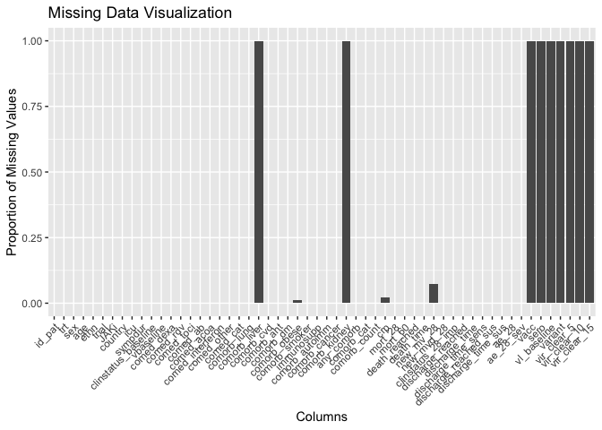

# Load packages

```r
library(tidyverse)
library(readxl)
library(writexl)
library(tableone)
library(here)
library(kableExtra)

library(jtools) # for summ() and plot_summs
library(sjPlot) # for tab_model
library(ggplot2) # survival/TTE analyses and other graphs
library(ggsurvfit) # survival/TTE analyses
library(survival) # survival/TTE analyses
library(gtsummary) # survival/TTE analyses
library(ggfortify) # autoplot
library(tidycmprsk) # competing risk analysis
library(ordinal) # clinstatus ordinal regression
```

# Load Data


# Baseline Characteristics

```r
df$trial <- c("Ghazaeian")
df$country <- c("Iran")
df <- df %>% # no missing in id_pat, trt, age, sex
  rename(id_pat = "patient ID",
         trt = "Treatment group",
         age = Age,
         sex = Sex)
df$id_pat = as.character(paste0('ghazaeian-', df$id_pat))
df %>% 
  drop_na(age) %>% 
  ggplot(aes(x = age)) +
  geom_density(fill = "blue", color = "black") +
  labs(title = "Density Plot of Age",
       x = "Age",
       y = "Density")
```

<!-- -->

```r
df$icu <- 0 # no icu patients at enrolment

# Days with symptoms prior to randomization
df %>% # no missings
  drop_na(sympdur) %>% 
  ggplot(aes(x = sympdur)) +
  geom_density(fill = "blue", color = "black") +
  labs(title = "Density Plot of Symptom Duration",
       x = "Symptom Duration",
       y = "Density")
```

<!-- -->

```r
# Severity of COVID-19 with respect to respiratory support at randomisation / from publication: "Scores on the ordinal scale are as follows: 1, not hospitalized, no limitations of activities; 2, not hospitalized, limitation of activities, home oxygen requirement, or both; 3, hospitalized, not requiring supplemental oxygen and no longer requiring ongoing medical care (used if hospitalization was extended for infection-control reasons); 4, hospitalized, not requiring supplemental oxygen but requiring ongoing medical care (Covid-19–related or other medical conditions); 5, hospitalized, requiring any supplemental oxygen; 6, hospitalized, receiving noninvasive ventilation or use of high-flow oxygen devices; 7, hospitalized, receiving invasive mechanical ventilation or ECMO; and 8, death. Same as ACTT2.

# transform clinical score
score_transform <- function(df, clinstatus_var, score_var) {
  df <- df %>%
    mutate({{ clinstatus_var }} :=
             case_when({{ score_var }} %in% c(1, 2, 3) ~ 1,
                       {{ score_var }} == 4 ~ 2,
                       {{ score_var }} == 5 ~ 3,
                       {{ score_var }} == 6 ~ 4,
                       {{ score_var }} == 7 ~ 5,
                       {{ score_var }} == 8 ~ 6)) %>%
    mutate({{ clinstatus_var }} := factor({{ clinstatus_var }}, levels = 1:6))
}
df <- score_transform(df, clinstatus_baseline, clinstatus_baseline) 
addmargins(table(df$clinstatus_baseline, df$trt, useNA = "always")) # no missing
```

```
##       
##         0  1 <NA> Sum
##   1     0  0    0   0
##   2     2  0    0   2
##   3    49 46    0  95
##   4     0  0    0   0
##   5     0  0    0   0
##   6     0  0    0   0
##   <NA>  0  0    0   0
##   Sum  51 46    0  97
```

```r
df <- score_transform(df, clinstatus_7, df$clinstatus_7)
df <- score_transform(df, clinstatus_14, df$clinstatus_14)
df <- score_transform(df, clinstatus_28, df$`clinstatus-28`)

# Co-medication at baseline
class(df$"Comed-Dexa")
```

```
## [1] "character"
```

```r
df <- df %>% 
  mutate(comed_dexa = case_when(`Comed-Dexa` == "yes" ~ 1,
                              TRUE ~ 0))
df <- df %>% 
  mutate(comed_rdv = case_when(`COMed-RDV` == "yes" ~ 1,
                              TRUE ~ 0))
df <- df %>% 
  mutate(comed_ab = case_when(`Comed-ab` == "yes" ~ 1,
                              TRUE ~ 0))
df <- df %>% 
  mutate(comed_acoa = case_when(`Comed-anticoagulant` == "yes" ~ 1,
                              TRUE ~ 0))
df <- df %>% 
  mutate(comed_interferon = case_when(`Comed-interferon` == "no" ~ 0,
                              TRUE ~ 1))
df$comed_toci <- 0 # but 4 received Actemra (Tocilizumab) 2-4 days after randomization

df <- df %>% # comed_other notes all as no - but there is a separate statin variable..
  mutate(comed_other = case_when(Statin == "no" ~ 0,
                                 Statin == "yes" ~ 1))

## group them for the subgroup analysis, according to protocol
df <- df %>% 
  mutate(comed_cat = case_when(comed_dexa == 0 & comed_toci == 0 ~ 1, # patients without Dexamethasone nor Tocilizumab
                               comed_dexa == 1 & comed_toci == 1 ~ 2, # patients with Dexamethasone and Tocilizumab
                               comed_dexa == 1 & comed_toci == 0 ~ 3, # patients with Dexamethasone but no Tocilizumab
                               comed_dexa == 0 & comed_toci == 1 ~ 4)) # patients with Tocilizumab but no Dexamethasone (if exist)

# Comorbidity at baseline, including immunocompromised
df <- df %>% 
  mutate(comorb_lung = case_when(Asthma == "yes" ~ 1,
                                 Asthma == "no" ~ 0))
df$comorb_liver <- NA
df <- df %>% 
  mutate(comorb_cvd = case_when(`IHD (ischemic heart disease)` == "yes" | Stroke == "yes" ~ 1,
                                 `IHD (ischemic heart disease)` == "no" & Stroke == "no" ~ 0))
df <- df %>% 
  mutate(comorb_aht = case_when(HTN == "yes" ~ 1,
                                 HTN == "no" ~ 0))
df <- df %>% 
  mutate(comorb_dm = case_when(`DM (diabetes melitus)` == "yes" ~ 1,
                               `DM (diabetes melitus)` == "no" ~ 0))
df <- df %>% 
  mutate(bmi = Weight/((Height/100)*(Height/100)))
df <- df %>% 
  mutate(comorb_obese = case_when(bmi > 30 ~ 1,
                                  bmi <= 30 ~ 0))
df <- df %>% 
  mutate(comorb_smoker = case_when(Smoker == "yes" ~ 1,
                                    Smoker == "no" ~ 0))
df <- df %>% 
  mutate(immunosupp = case_when(Malignancy == "yes" ~ 1,
                                    Malignancy == "no" ~ 0))

df <- df %>% # no 0, because of NA in chronic_liver
  mutate(any_comorb = case_when(comorb_lung == 1 | comorb_liver == 1 | comorb_cvd == 1 |
                                  comorb_aht == 1 | comorb_dm == 1 | comorb_obese == 1 | comorb_smoker == 1
                                | immunosupp == 1
                                  ~ 1,
                                comorb_lung == 0 & comorb_liver == 0 & comorb_cvd == 0 &
                                  comorb_aht == 0 & comorb_dm == 0 & comorb_obese == 0 & comorb_smoker == 0
                                & immunosupp == 0
                                ~ 0))

## group them for the subgroup analysis, according to protocol // count all pre-defined comorbidities per patient first
comorb <- df %>% 
  select(id_pat, comorb_lung, comorb_liver, comorb_cvd, comorb_aht, comorb_dm, comorb_obese, comorb_smoker, immunosupp)
comorb$comorb_count <- NA
for (i in 1:dim(comorb)[[1]]) {
  comorb$comorb_count[i] <- ifelse(
    sum(comorb[i, ] %in% c(1)) > 0,
    sum(comorb[i, ] %in% c(1)),
    NA
  )
}
comorb <- comorb %>% 
  mutate(comorb_count = case_when(comorb_lung == 0 & comorb_liver == 0 & comorb_cvd == 0 &
                                  comorb_aht == 0 & comorb_dm == 0 & comorb_obese == 0 & comorb_smoker == 0
                                & immunosupp == 0 ~ 0,
                                TRUE ~ comorb_count))
df <- left_join(df, comorb[, c("comorb_count", "id_pat")], by = join_by(id_pat == id_pat)) ## merge imputed variable back
df <- df %>% # 
  mutate(comorb_cat = case_when(immunosupp == 1 ~ 4, # immunocompromised
                                comorb_count == 0 ~ 1, # no comorbidity
                                comorb_count == 1 ~ 2, # one comorbidity
                                comorb_count >1 & (immunosupp == 0 | is.na(immunosupp)) ~ 3)) # multiple comorbidities

# CRP
df$crp <- df$CRP ## 1 missing
df <- df %>% # 0 does not make sense
  mutate(crp = na_if(crp, 0))
df %>% 
  drop_na(crp) %>% 
  ggplot(aes(x = crp)) +
  geom_density(fill = "blue", color = "black") +
  labs(title = "Density Plot of CRP",
       x = "CRP",
       y = "Density")
```

<!-- -->

```r
# Vaccination
# Viremia
# Variant
# Serology
```
Clarifications and discussion points BASELINE data:
1) 4 received Actemra (Tocilizumab) 2-4 days after randomization
2) Comorbidity
- all immunosupp are "Malignancy"
- 1 missing data for obesity -> ask
- no data for comorb_liver -> NA -> ask? -> re-discuss effect on any_comorb and comorb_cat

# Endpoints

```r
# time to event data
df$randdate <- as_date(df$`Randomization  Date`)
df$death_date <- as_date(df$`death date`)
df$withdrawal_date <- as_date(df$`withdrawal_date`)

df$death_d <- as.numeric(df$death_date - df$randdate) 
df$withdraw_d <- as.numeric(df$withdrawal_date - df$randdate)
df$discharge_d <- as.numeric(df$`Hospital days`)

# (i) Primary outcome: Mortality at day 28 // CAVE: WE HAVE WITHDRAWALS!!!! at the same time variable "death"...
df <- df %>%
  mutate(mort_28 = case_when(death_d <29 ~ 1, 
                             TRUE ~ 0)) 

# (ii) Mortality at day 60
df$mort_60 <- df$mort_28 # max fup time in TOFACOV was 28 days; thus mort_60 imputed from mort_28


# (iii) Time to death within max. follow-up time
df$death_reached <- df$mort_28
df <- df %>% # no missing and those that were discharged were discharged alive
  mutate(death_time = case_when(death_d >=0 ~ c(death_d), # time to death, if no time to death, then...
                                withdraw_d >=0 ~ c(withdraw_d), # time to withdrawal, then...
                                TRUE ~ 28)) # time to death censoring data


# (iv) New mechanical ventilation among survivors within 28 days.
df <- df %>% # all those intubated also then died
  mutate(new_mv_28 = case_when(mort_28 == 0 & (clinstatus_7 == 5 | clinstatus_14 == 5 | clinstatus_28 == 5) ~ 1,
                               mort_28 == 0 ~ 0))

# (iv) Sens-analysis: Alternative definition/analysis: New mechanical ventilation OR death within 28 days => include all in denominator. 
df <- df %>% # no missing anymore => correct
  mutate(new_mvd_28 = case_when(new_mv_28 == 1 | mort_28 == 1 ~ 1,
                                new_mv_28 == 0 | mort_28 == 0 ~ 0))


# (v) Clinical status at day 28
df <- df %>%
  mutate(clinstatus_28 = case_when(mort_28 == 1 ~ 6,
                                   discharge_d <29 ~ 1)) 
df$clinstatus_28 <- factor(df$clinstatus_28, levels = 1:6) # no missing
df$clinstatus_28_imp <- df$clinstatus_28 # equal to clinstatus_28_imp


# (vi) Time to discharge or reaching discharge criteria up to day 28 // Patients who died prior to day 28 are assumed not having reached discharge, i.e. counted as 28 days (as someone who has been censored on day 28). 
df <- df %>%
  mutate(discharge_reached = case_when(discharge_d <29 & mort_28 == 0 ~ 1,
                                       TRUE ~ 0))
df <- df %>% 
  mutate(discharge_time = case_when(discharge_d >=0 ~ c(discharge_d))) # withdraw_d was overruled for both (death and discharge)
df <- df %>% # restrict to max fup time 28d
  mutate(discharge_time = case_when(discharge_time >28 ~ 28,
                                    TRUE ~ discharge_time))
df <- df %>% # add 28d for those that died
  mutate(discharge_time_sens = case_when(mort_28 == 1 ~ 28,
                                    TRUE ~ discharge_time))

# (vi) Sens-analysis: Alternative definition/analysis of outcome: time to sustained discharge within 28 days. There were no re-admissions within 28d
df$discharge_reached_sus <- df$discharge_reached
df$discharge_time_sus <- df$discharge_time


# (vii) Viral clearance up to day 5, day 10, and day 15 (Viral load value <LOQ and/or undectectable): Not available
# (viii) Quality of life at day 28: Not available


# (ix) Participants with an adverse event grade 3 or 4, or a serious adverse event, excluding death, by day 28
df <- df %>% # ae_28 is empty, but under notes there is 1 pulmonary emboly. deaths are in the denominator but counted as 0, since they could have had an ae before death.
  mutate(ae_28 = case_when(note == "pulmonary emboli" ~ 1,
                           TRUE ~ 0))

# (ix) Sens-analysis: Alternative definition/analysis of outcome: incidence rate ratio (Poisson regression) -> AE per person by d28
df$ae_28_sev <- df$ae_28 # there was only 1 AE grade 3/4 per person

# (ix) Sens-analysis: Alternative definition/analysis of outcome: time to first (of these) adverse event, within 28 days, considering death as a competing risk (=> censor and set to 28 days)
# time to first ae not available

# (x) Adverse events of special interest within 28 days: a) thromboembolic events (venous thromboembolism, pulmonary embolism, arterial thrombosis), b) secondary infections (bacterial pneumonia including ventilator-associated pneumonia, meningitis and encephalitis, endocarditis and bacteremia, invasive fungal infection including pulmonary aspergillosis), c) Reactivation of chronic infection including tuberculosis, herpes simplex, cytomegalovirus, herpes zoster and hepatitis B, d) serious cardiovascular and cardiac events (including stroke and myocardial infarction), e) events related to signs of bone marrow suppression (anemia, lymphocytopenia, thrombocytopenia, pancytopenia), f) malignancy, g) gastrointestinal perforation (incl. gastrointestinal bleeding/diverticulitis), h) liver dysfunction/hepatotoxicity (grade 3 and 4)
df <- df %>% 
  mutate(aesi_28 = case_when(note == "pulmonary emboli" ~ "thromboembolic events"))

# (xi) Adverse events, any grade and serious adverse event, excluding death, within 28 days, grouped by organ classes
df$ae_28_list <- df$aesi_28 
```
Discussion points OUTCOME data:
1) Get time to first adverse event?


# Define final datasets, set references, summarize missing data and variables

```r
# keep the overall set
df_all <- df
# reduce the df set to our standardized set across all trials
df <- df %>% 
  select(id_pat, trt, sex, age, 
         #ethn, 
         country, icu, sympdur, 
         #vacc, 
         clinstatus_baseline,
         comed_dexa, comed_rdv, comed_toci, comed_ab, comed_acoa, comed_interferon, comed_other,
         comed_cat,
         comorb_lung, comorb_liver, comorb_cvd, comorb_aht, comorb_dm, comorb_obese, comorb_smoker, immunosupp,
         any_comorb, comorb_cat, comorb_count,
         crp, 
         # sero, vl_baseline, variant,
         mort_28, mort_60, death_reached, death_time,
         new_mv_28, new_mvd_28,
         clinstatus_28_imp,
         discharge_reached, discharge_time, discharge_time_sens, discharge_reached_sus, discharge_time_sus,
         ae_28, ae_28_sev, aesi_28, ae_28_list,
         # ae_reached, ae_time, 
         # vir_clear_5, vir_clear_10, vir_clear_15, 
         # qol_28
         )
# export for one-stage model, i.e., add missing variables 
df_os <- df
df_os$ethn <- NA
df_os$vacc <- NA
df_os$sero <- NA
df_os$vl_baseline <- NA
df_os$variant <- NA
df_os$ae_reached <- NA
df_os$ae_time <- NA
df_os$vir_clear_5 <- NA
df_os$vir_clear_10 <- NA
df_os$vir_clear_15 <- NA
df_os$vir_clear_15_cum <- NA
df_os$qol_28 <- NA
# Save
save(df_os, file = "df_os_ghazaeian.RData")

## set references, re-level
# df <- df %>% 
#   mutate(Treatment = relevel(Treatment, "no JAK inhibitor"))

# Create a bar plot to visualize missing values in each column
original_order <- colnames(df)
missing_plot <- df %>%
  summarise_all(~ mean(is.na(.))) %>%
  gather() %>%
  mutate(key = factor(key, levels = original_order)) %>%
  ggplot(aes(x = key, y = value)) +
  geom_bar(stat = "identity") +
  labs(x = "Columns", y = "Proportion of Missing Values", title = "Missing Data Visualization") +
  theme(axis.text.x = element_text(angle = 45, hjust = 1)) +
  ylim(0, 1)
print(missing_plot)
```

<!-- -->
Discussion points
1) Missing variables:
  Baseline:
  - Ethn
  - Vaccination
  - Viremia
  - Variant
  - Serology
  Outcomes:
  - viral load
  - date to first adverse event: ae_reached, ae_time
  - qol_28
2) Missing data:
- 1 missing data for obesity -> ask
- no data for comorb_liver -> NA -> ask? -> effect on any_comorb and comorb_cat
- crp: 2 NAs
- NAs in new_mv_28, aesi_28, ae_28_list: Not part of denominator


# (i) Primary outcome: Mortality at day 28

```r
# adjusted for baseline patient characteristics (age, respiratory support at baseline (ordinal scale 1-3 vs 4-5), dexamethasone use at baseline (y/n), remdesivir use at baseline (y/n), anti-IL-6 use at baseline (y/n)).
table(df$mort_28, df$trt, useNA = "always")
```

```
##       
##         0  1 <NA>
##   0    47 43    0
##   1     4  3    0
##   <NA>  0  0    0
```

```r
mort.28 <- df %>% 
  glm(mort_28 ~ trt 
      + age + clinstatus_baseline + comed_dexa + comed_rdv + comed_toci
      , family = "binomial", data=.)
summ(mort.28, exp = T, confint = T, model.info = T, model.fit = F, digits = 2)
```

<table class="table table-striped table-hover table-condensed table-responsive" style="width: auto !important; margin-left: auto; margin-right: auto;">
<tbody>
  <tr>
   <td style="text-align:left;font-weight: bold;"> Observations </td>
   <td style="text-align:right;"> 97 </td>
  </tr>
  <tr>
   <td style="text-align:left;font-weight: bold;"> Dependent variable </td>
   <td style="text-align:right;"> mort_28 </td>
  </tr>
  <tr>
   <td style="text-align:left;font-weight: bold;"> Type </td>
   <td style="text-align:right;"> Generalized linear model </td>
  </tr>
  <tr>
   <td style="text-align:left;font-weight: bold;"> Family </td>
   <td style="text-align:right;"> binomial </td>
  </tr>
  <tr>
   <td style="text-align:left;font-weight: bold;"> Link </td>
   <td style="text-align:right;"> logit </td>
  </tr>
</tbody>
</table>  <table class="table table-striped table-hover table-condensed table-responsive" style="width: auto !important; margin-left: auto; margin-right: auto;border-bottom: 0;">
 <thead>
  <tr>
   <th style="text-align:left;">   </th>
   <th style="text-align:right;"> exp(Est.) </th>
   <th style="text-align:right;"> 2.5% </th>
   <th style="text-align:right;"> 97.5% </th>
   <th style="text-align:right;"> z val. </th>
   <th style="text-align:right;"> p </th>
  </tr>
 </thead>
<tbody>
  <tr>
   <td style="text-align:left;font-weight: bold;"> (Intercept) </td>
   <td style="text-align:right;"> 0.00 </td>
   <td style="text-align:right;"> 0.00 </td>
   <td style="text-align:right;"> Inf </td>
   <td style="text-align:right;"> -0.01 </td>
   <td style="text-align:right;"> 0.99 </td>
  </tr>
  <tr>
   <td style="text-align:left;font-weight: bold;"> trt </td>
   <td style="text-align:right;"> 0.79 </td>
   <td style="text-align:right;"> 0.17 </td>
   <td style="text-align:right;"> 3.78 </td>
   <td style="text-align:right;"> -0.29 </td>
   <td style="text-align:right;"> 0.77 </td>
  </tr>
  <tr>
   <td style="text-align:left;font-weight: bold;"> age </td>
   <td style="text-align:right;"> 1.03 </td>
   <td style="text-align:right;"> 0.98 </td>
   <td style="text-align:right;"> 1.08 </td>
   <td style="text-align:right;"> 1.09 </td>
   <td style="text-align:right;"> 0.28 </td>
  </tr>
  <tr>
   <td style="text-align:left;font-weight: bold;"> clinstatus_baseline3 </td>
   <td style="text-align:right;"> 1351843.73 </td>
   <td style="text-align:right;"> 0.00 </td>
   <td style="text-align:right;"> Inf </td>
   <td style="text-align:right;"> 0.01 </td>
   <td style="text-align:right;"> 0.99 </td>
  </tr>
  <tr>
   <td style="text-align:left;font-weight: bold;"> comed_dexa </td>
   <td style="text-align:right;"> NA </td>
   <td style="text-align:right;"> NA </td>
   <td style="text-align:right;"> NA </td>
   <td style="text-align:right;"> NA </td>
   <td style="text-align:right;"> NA </td>
  </tr>
  <tr>
   <td style="text-align:left;font-weight: bold;"> comed_rdv </td>
   <td style="text-align:right;"> NA </td>
   <td style="text-align:right;"> NA </td>
   <td style="text-align:right;"> NA </td>
   <td style="text-align:right;"> NA </td>
   <td style="text-align:right;"> NA </td>
  </tr>
  <tr>
   <td style="text-align:left;font-weight: bold;"> comed_toci </td>
   <td style="text-align:right;"> NA </td>
   <td style="text-align:right;"> NA </td>
   <td style="text-align:right;"> NA </td>
   <td style="text-align:right;"> NA </td>
   <td style="text-align:right;"> NA </td>
  </tr>
</tbody>
<tfoot><tr><td style="padding: 0; " colspan="100%">
<sup></sup> Standard errors: MLE</td></tr></tfoot>
</table>
Discussion points
1) all (intervention + control) also had dexa and rdv. No-one had toci.


# (ii) Mortality at day 60

```r
table(df$mort_60, df$trt, useNA = "always")
```

```
##       
##         0  1 <NA>
##   0    47 43    0
##   1     4  3    0
##   <NA>  0  0    0
```

```r
mort.60 <- df %>% 
  glm(mort_60 ~ trt 
      + age + clinstatus_baseline + comed_dexa + comed_rdv + comed_toci
      , family = "binomial", data=.)
summ(mort.60, exp = T, confint = T, model.info = T, model.fit = F, digits = 2)
```

<table class="table table-striped table-hover table-condensed table-responsive" style="width: auto !important; margin-left: auto; margin-right: auto;">
<tbody>
  <tr>
   <td style="text-align:left;font-weight: bold;"> Observations </td>
   <td style="text-align:right;"> 97 </td>
  </tr>
  <tr>
   <td style="text-align:left;font-weight: bold;"> Dependent variable </td>
   <td style="text-align:right;"> mort_60 </td>
  </tr>
  <tr>
   <td style="text-align:left;font-weight: bold;"> Type </td>
   <td style="text-align:right;"> Generalized linear model </td>
  </tr>
  <tr>
   <td style="text-align:left;font-weight: bold;"> Family </td>
   <td style="text-align:right;"> binomial </td>
  </tr>
  <tr>
   <td style="text-align:left;font-weight: bold;"> Link </td>
   <td style="text-align:right;"> logit </td>
  </tr>
</tbody>
</table>  <table class="table table-striped table-hover table-condensed table-responsive" style="width: auto !important; margin-left: auto; margin-right: auto;border-bottom: 0;">
 <thead>
  <tr>
   <th style="text-align:left;">   </th>
   <th style="text-align:right;"> exp(Est.) </th>
   <th style="text-align:right;"> 2.5% </th>
   <th style="text-align:right;"> 97.5% </th>
   <th style="text-align:right;"> z val. </th>
   <th style="text-align:right;"> p </th>
  </tr>
 </thead>
<tbody>
  <tr>
   <td style="text-align:left;font-weight: bold;"> (Intercept) </td>
   <td style="text-align:right;"> 0.00 </td>
   <td style="text-align:right;"> 0.00 </td>
   <td style="text-align:right;"> Inf </td>
   <td style="text-align:right;"> -0.01 </td>
   <td style="text-align:right;"> 0.99 </td>
  </tr>
  <tr>
   <td style="text-align:left;font-weight: bold;"> trt </td>
   <td style="text-align:right;"> 0.79 </td>
   <td style="text-align:right;"> 0.17 </td>
   <td style="text-align:right;"> 3.78 </td>
   <td style="text-align:right;"> -0.29 </td>
   <td style="text-align:right;"> 0.77 </td>
  </tr>
  <tr>
   <td style="text-align:left;font-weight: bold;"> age </td>
   <td style="text-align:right;"> 1.03 </td>
   <td style="text-align:right;"> 0.98 </td>
   <td style="text-align:right;"> 1.08 </td>
   <td style="text-align:right;"> 1.09 </td>
   <td style="text-align:right;"> 0.28 </td>
  </tr>
  <tr>
   <td style="text-align:left;font-weight: bold;"> clinstatus_baseline3 </td>
   <td style="text-align:right;"> 1351843.73 </td>
   <td style="text-align:right;"> 0.00 </td>
   <td style="text-align:right;"> Inf </td>
   <td style="text-align:right;"> 0.01 </td>
   <td style="text-align:right;"> 0.99 </td>
  </tr>
  <tr>
   <td style="text-align:left;font-weight: bold;"> comed_dexa </td>
   <td style="text-align:right;"> NA </td>
   <td style="text-align:right;"> NA </td>
   <td style="text-align:right;"> NA </td>
   <td style="text-align:right;"> NA </td>
   <td style="text-align:right;"> NA </td>
  </tr>
  <tr>
   <td style="text-align:left;font-weight: bold;"> comed_rdv </td>
   <td style="text-align:right;"> NA </td>
   <td style="text-align:right;"> NA </td>
   <td style="text-align:right;"> NA </td>
   <td style="text-align:right;"> NA </td>
   <td style="text-align:right;"> NA </td>
  </tr>
  <tr>
   <td style="text-align:left;font-weight: bold;"> comed_toci </td>
   <td style="text-align:right;"> NA </td>
   <td style="text-align:right;"> NA </td>
   <td style="text-align:right;"> NA </td>
   <td style="text-align:right;"> NA </td>
   <td style="text-align:right;"> NA </td>
  </tr>
</tbody>
<tfoot><tr><td style="padding: 0; " colspan="100%">
<sup></sup> Standard errors: MLE</td></tr></tfoot>
</table>
Discussion points
1) 


# (iii) Time to death within max. follow-up time

```r
# table(df$death_reached, df$death_time, useNA = "always")
# table(df$death_reached, df$mort_60, useNA = "always")

# df %>%
#   drop_na(death_time) %>%
#   filter(death_reached == 1) %>%
#   group_by(trt) %>%
#   summarise(median = median(death_time),
#             IQR = IQR(death_time),
#             Q1 = quantile(death_time, probs = 0.25),
#             Q3 = quantile(death_time, probs = 0.75)) 

# time to death, by group. Kaplan-Meier estimate of conditional survival probability.
km.ttdeath.check <- with(df, Surv(death_time, death_reached))
head(km.ttdeath.check, 100)
```

```
##  [1] 28+ 28+ 28+ 28+ 28+ 28+ 28+ 28+ 28+ 28+ 28+ 28+ 28+ 28+ 28+ 28+ 28+  4+  4+
## [20] 28+ 28+  3+ 28+ 28+ 28+ 28+ 28+ 28+ 28+ 28+  2  11  28+ 28+ 28+ 28+ 28+ 28+
## [39] 28+ 28+ 28+ 28+ 28+ 28+ 28+ 28+ 28+ 28+ 28+ 10  28+ 28+ 28+ 28+  2+  2+ 28+
## [58] 28+ 28+  4+  1   4+ 28+ 28+ 28+  9  28+ 28+  6  28+ 28+ 28+  4  28+ 28+ 28+
## [77] 28+ 28+ 28+ 28+ 28+ 28+ 28+ 28+ 28+ 28+ 28+ 28+ 28+ 28+ 28+ 28+ 28+ 28+ 28+
## [96] 28+ 28+
```

```r
km.ttdeath_trt <- survfit(Surv(death_time, death_reached) ~ trt, data=df)
# summary(km.ttdeath_trt, times = 28)

ttdeath_28d_tbl <- km.ttdeath_trt %>% 
  tbl_survfit(
    times = 28,
    label_header = "**28-d survival (95% CI)**"
  )
# Nicely formatted table
kable(ttdeath_28d_tbl, format = "markdown", table.attr = 'class="table"') %>%
  kable_styling(bootstrap_options = "striped", full_width = FALSE)
```

```
## Warning in kable_styling(., bootstrap_options = "striped", full_width = FALSE):
## Please specify format in kable. kableExtra can customize either HTML or LaTeX
## outputs. See https://haozhu233.github.io/kableExtra/ for details.
```


|**Characteristic** |**28-d survival (95% CI)** |
|:------------------|:--------------------------|
|trt                |NA                         |
|0                  |92% (84%, 100%)            |
|1                  |93% (86%, 100%)            |

```r
# autoplot(km.ttdeath_trt)
survfit2(Surv(death_time, death_reached) ~ trt, data=df) %>% 
  ggsurvfit() +
  labs(
    x = "Days",
    y = "Overall survival probability"
  ) + 
  add_confidence_interval() +
  add_risktable()
```

<!-- -->

```r
# testing: simple log-rank
# survdiff(Surv(death_time, death_reached) ~ trt, data = df)
# testing: cox ph
ttdeath <- df %>% 
  coxph(Surv(death_time, death_reached) ~ trt 
        + age + clinstatus_baseline + comed_dexa + comed_rdv + comed_toci
        , data =.)
```

```
## Warning in coxph.fit(X, Y, istrat, offset, init, control, weights = weights, :
## Loglik converged before variable 3 ; coefficient may be infinite.
```

```r
ttdeath_reg_tbl <- tbl_regression(ttdeath, exp = TRUE)
# Nicely formatted table
kable(ttdeath_reg_tbl, format = "markdown", table.attr = 'class="table"') %>%
  kable_styling(bootstrap_options = "striped", full_width = FALSE)
```

```
## Warning in kable_styling(., bootstrap_options = "striped", full_width = FALSE):
## Please specify format in kable. kableExtra can customize either HTML or LaTeX
## outputs. See https://haozhu233.github.io/kableExtra/ for details.
```


|**Characteristic**  |**HR** |**95% CI** |**p-value** |
|:-------------------|:------|:----------|:-----------|
|trt                 |0.84   |0.19, 3.75 |0.8         |
|age                 |1.03   |0.98, 1.07 |0.3         |
|clinstatus_baseline |NA     |NA         |NA          |
|1                   |NA     |NA         |NA          |
|2                   |0.00   |0.00, Inf  |>0.9        |
|3                   |NA     |NA         |NA          |
|4                   |NA     |NA         |NA          |
|5                   |NA     |NA         |NA          |
|6                   |NA     |NA         |NA          |
|comed_dexa          |NA     |NA         |NA          |
|comed_rdv           |NA     |NA         |NA          |
|comed_toci          |NA     |NA         |NA          |
Discussion points
1) 


# (iv) New mechanical ventilation among survivors within 28 days

```r
table(df$new_mv_28, df$trt, useNA = "always")
```

```
##       
##         0  1 <NA>
##   0    47 43    0
##   <NA>  4  3    0
```

```r
new.mv.28 <- df %>% 
  glm(new_mv_28 ~ trt 
       #+ age + clinstatus_baseline 
       #+ comed_dexa + comed_rdv + comed_toci
      , family = "binomial", data=.)
summ(new.mv.28, exp = T, confint = T, model.info = T, model.fit = F, digits = 2)
```

<table class="table table-striped table-hover table-condensed table-responsive" style="width: auto !important; margin-left: auto; margin-right: auto;">
<tbody>
  <tr>
   <td style="text-align:left;font-weight: bold;"> Observations </td>
   <td style="text-align:right;"> 90 (7 missing obs. deleted) </td>
  </tr>
  <tr>
   <td style="text-align:left;font-weight: bold;"> Dependent variable </td>
   <td style="text-align:right;"> new_mv_28 </td>
  </tr>
  <tr>
   <td style="text-align:left;font-weight: bold;"> Type </td>
   <td style="text-align:right;"> Generalized linear model </td>
  </tr>
  <tr>
   <td style="text-align:left;font-weight: bold;"> Family </td>
   <td style="text-align:right;"> binomial </td>
  </tr>
  <tr>
   <td style="text-align:left;font-weight: bold;"> Link </td>
   <td style="text-align:right;"> logit </td>
  </tr>
</tbody>
</table>  <table class="table table-striped table-hover table-condensed table-responsive" style="width: auto !important; margin-left: auto; margin-right: auto;border-bottom: 0;">
 <thead>
  <tr>
   <th style="text-align:left;">   </th>
   <th style="text-align:right;"> exp(Est.) </th>
   <th style="text-align:right;"> 2.5% </th>
   <th style="text-align:right;"> 97.5% </th>
   <th style="text-align:right;"> z val. </th>
   <th style="text-align:right;"> p </th>
  </tr>
 </thead>
<tbody>
  <tr>
   <td style="text-align:left;font-weight: bold;"> (Intercept) </td>
   <td style="text-align:right;"> 0.00 </td>
   <td style="text-align:right;"> 0.00 </td>
   <td style="text-align:right;"> Inf </td>
   <td style="text-align:right;"> -0.00 </td>
   <td style="text-align:right;"> 1.00 </td>
  </tr>
  <tr>
   <td style="text-align:left;font-weight: bold;"> trt </td>
   <td style="text-align:right;"> 1.00 </td>
   <td style="text-align:right;"> 0.00 </td>
   <td style="text-align:right;"> Inf </td>
   <td style="text-align:right;"> -0.00 </td>
   <td style="text-align:right;"> 1.00 </td>
  </tr>
</tbody>
<tfoot><tr><td style="padding: 0; " colspan="100%">
<sup></sup> Standard errors: MLE</td></tr></tfoot>
</table>

```r
# (iv) Sens-analysis: Alternative definition/analysis: New mechanical ventilation OR death within 28 days => include all in denominator. 
table(df$new_mvd_28, df$trt, useNA = "always")
```

```
##       
##         0  1 <NA>
##   0    47 43    0
##   1     4  3    0
##   <NA>  0  0    0
```

```r
new.mvd.28 <- df %>% 
  glm(new_mvd_28 ~ trt 
      + age + clinstatus_baseline + comed_dexa + comed_rdv + comed_toci
      , family = "binomial", data=.)
summ(new.mvd.28, exp = T, confint = T, model.info = T, model.fit = F, digits = 2)
```

<table class="table table-striped table-hover table-condensed table-responsive" style="width: auto !important; margin-left: auto; margin-right: auto;">
<tbody>
  <tr>
   <td style="text-align:left;font-weight: bold;"> Observations </td>
   <td style="text-align:right;"> 97 </td>
  </tr>
  <tr>
   <td style="text-align:left;font-weight: bold;"> Dependent variable </td>
   <td style="text-align:right;"> new_mvd_28 </td>
  </tr>
  <tr>
   <td style="text-align:left;font-weight: bold;"> Type </td>
   <td style="text-align:right;"> Generalized linear model </td>
  </tr>
  <tr>
   <td style="text-align:left;font-weight: bold;"> Family </td>
   <td style="text-align:right;"> binomial </td>
  </tr>
  <tr>
   <td style="text-align:left;font-weight: bold;"> Link </td>
   <td style="text-align:right;"> logit </td>
  </tr>
</tbody>
</table>  <table class="table table-striped table-hover table-condensed table-responsive" style="width: auto !important; margin-left: auto; margin-right: auto;border-bottom: 0;">
 <thead>
  <tr>
   <th style="text-align:left;">   </th>
   <th style="text-align:right;"> exp(Est.) </th>
   <th style="text-align:right;"> 2.5% </th>
   <th style="text-align:right;"> 97.5% </th>
   <th style="text-align:right;"> z val. </th>
   <th style="text-align:right;"> p </th>
  </tr>
 </thead>
<tbody>
  <tr>
   <td style="text-align:left;font-weight: bold;"> (Intercept) </td>
   <td style="text-align:right;"> 0.00 </td>
   <td style="text-align:right;"> 0.00 </td>
   <td style="text-align:right;"> Inf </td>
   <td style="text-align:right;"> -0.01 </td>
   <td style="text-align:right;"> 0.99 </td>
  </tr>
  <tr>
   <td style="text-align:left;font-weight: bold;"> trt </td>
   <td style="text-align:right;"> 0.79 </td>
   <td style="text-align:right;"> 0.17 </td>
   <td style="text-align:right;"> 3.78 </td>
   <td style="text-align:right;"> -0.29 </td>
   <td style="text-align:right;"> 0.77 </td>
  </tr>
  <tr>
   <td style="text-align:left;font-weight: bold;"> age </td>
   <td style="text-align:right;"> 1.03 </td>
   <td style="text-align:right;"> 0.98 </td>
   <td style="text-align:right;"> 1.08 </td>
   <td style="text-align:right;"> 1.09 </td>
   <td style="text-align:right;"> 0.28 </td>
  </tr>
  <tr>
   <td style="text-align:left;font-weight: bold;"> clinstatus_baseline3 </td>
   <td style="text-align:right;"> 1351843.73 </td>
   <td style="text-align:right;"> 0.00 </td>
   <td style="text-align:right;"> Inf </td>
   <td style="text-align:right;"> 0.01 </td>
   <td style="text-align:right;"> 0.99 </td>
  </tr>
  <tr>
   <td style="text-align:left;font-weight: bold;"> comed_dexa </td>
   <td style="text-align:right;"> NA </td>
   <td style="text-align:right;"> NA </td>
   <td style="text-align:right;"> NA </td>
   <td style="text-align:right;"> NA </td>
   <td style="text-align:right;"> NA </td>
  </tr>
  <tr>
   <td style="text-align:left;font-weight: bold;"> comed_rdv </td>
   <td style="text-align:right;"> NA </td>
   <td style="text-align:right;"> NA </td>
   <td style="text-align:right;"> NA </td>
   <td style="text-align:right;"> NA </td>
   <td style="text-align:right;"> NA </td>
  </tr>
  <tr>
   <td style="text-align:left;font-weight: bold;"> comed_toci </td>
   <td style="text-align:right;"> NA </td>
   <td style="text-align:right;"> NA </td>
   <td style="text-align:right;"> NA </td>
   <td style="text-align:right;"> NA </td>
   <td style="text-align:right;"> NA </td>
  </tr>
</tbody>
<tfoot><tr><td style="padding: 0; " colspan="100%">
<sup></sup> Standard errors: MLE</td></tr></tfoot>
</table>
Discussion points
1) CAVE new_mv_28: Besides the deaths no-one was intubated, and the deaths are excluded => no further events than death! => no single event!
=> make new_mv_28 the sens-endpoint and new_mvd_28 the primary endpoint definition


# (v) Clinical status at day 28

```r
table(df$clinstatus_28_imp, df$trt, useNA = "always")
```

```
##       
##         0  1 <NA>
##   1    47 43    0
##   2     0  0    0
##   3     0  0    0
##   4     0  0    0
##   5     0  0    0
##   6     4  3    0
##   <NA>  0  0    0
```

```r
clin.28 <- df %>% 
  clm(clinstatus_28_imp ~ trt 
      + age 
      #+ clinstatus_baseline 
      #+ comed_dexa + comed_rdv + comed_toci
      , link= c("logit"), data=.)
# Summary and extract coefficients
coefficients_table <- summary(clin.28)$coefficients
# Calculate Odds Ratios and Confidence Intervals
odds_ratios <- exp(coefficients_table[, "Estimate"])
ci_lower <- exp(coefficients_table[, "Estimate"] - 1.96 * coefficients_table[, "Std. Error"])
ci_upper <- exp(coefficients_table[, "Estimate"] + 1.96 * coefficients_table[, "Std. Error"])
# Create a data frame to store Odds Ratios and CIs
clin.28_tbl <- data.frame(
  "Variable" = rownames(coefficients_table),
  "Odds Ratio" = odds_ratios,
  "CI Lower" = ci_lower,
  "CI Upper" = ci_upper
)
# Nicely formatted table
kable(clin.28_tbl, format = "markdown", table.attr = 'class="table"') %>%
  kable_styling(bootstrap_options = "striped", full_width = FALSE)
```


|         |Variable | Odds.Ratio|  CI.Lower|    CI.Upper|
|:--------|:--------|----------:|---------:|-----------:|
|1&#124;6 |1&#124;6 | 52.1672552| 2.6152188| 1040.609880|
|trt      |trt      |  0.8256311| 0.1729268|    3.941938|
|age      |age      |  1.0275873| 0.9786306|    1.078993|
Discussion points
1) keep comedication as adjustment?


# (vi) Time to discharge or reaching discharge criteria up to day 28

```r
# Kaplan-Meier estimate of conditional discharge probability
# Just censoring => Cause-specific hazards, i.e., represents the rate per unit of time of the event among those not having failed from other events. Instantaneous rate of occurrence of the given type of event in subjects who are currently event‐free
km.ttdischarge.check <- with(df, Surv(discharge_time, discharge_reached))
head(km.ttdischarge.check, 100)
```

```
##  [1]  6   7   7   7   7   9   8   7   6   6   8   6   9   6   6   6  10   4   4 
## [20]  7   5   3   5   6   5   5   6   6   6   6   2+ 11+  6   6   7   8   6   6 
## [39]  7   5   6   7   6   6  13   6   5   5   5  11+  5   6   6   6   4   4  10 
## [58]  6   5   8   1+  8   5   7   6   9+  7   7   6+  6   8   6   6+  6   5   6 
## [77]  5   6   6   5   6   6   6   6   6   6   6   6   6   6   7   6   6   6   6 
## [96]  6   5
```

```r
km.ttdischarge_trt <- survfit(Surv(discharge_time, discharge_reached) ~ trt, data=df)
# summary(km.ttdischarge_trt, times = 28)

# ttdischarge_28d_tbl <- km.ttdischarge_trt %>% 
#   tbl_survfit(
#     times = 28,
#     label_header = "**28-d discharge (95% CI)**"
#   )
# # Nicely formatted table
# kable(ttdischarge_28d_tbl, format = "markdown", table.attr = 'class="table"') %>%
#   kable_styling(bootstrap_options = "striped", full_width = FALSE)

# autoplot(km.ttdischarge_trt)
survfit2(Surv(discharge_time, discharge_reached) ~ trt, data=df) %>% 
  ggsurvfit() +
  labs(
    x = "Days",
    y = "Overall discharge probability"
  ) + 
  add_confidence_interval() +
  add_risktable()
```

<!-- -->

```r
# testing: simple log-rank
# survdiff(Surv(discharge_time, discharge_reached) ~ trt, data = df)
# testing: cox ph
ttdischarge <- df %>% 
  coxph(Surv(discharge_time, discharge_reached) ~ trt 
        + age + clinstatus_baseline + comed_dexa + comed_rdv + comed_toci
        , data =.)
ttdischarge_reg_tbl <- tbl_regression(ttdischarge, exp = TRUE)
# Nicely formatted table
kable(ttdischarge_reg_tbl, format = "markdown", table.attr = 'class="table"') %>%
  kable_styling(bootstrap_options = "striped", full_width = FALSE)
```


|**Characteristic**  |**HR** |**95% CI** |**p-value** |
|:-------------------|:------|:----------|:-----------|
|trt                 |0.74   |0.48, 1.14 |0.2         |
|age                 |0.99   |0.98, 1.00 |0.092       |
|clinstatus_baseline |NA     |NA         |NA          |
|1                   |NA     |NA         |NA          |
|2                   |0.80   |0.19, 3.32 |0.8         |
|3                   |NA     |NA         |NA          |
|4                   |NA     |NA         |NA          |
|5                   |NA     |NA         |NA          |
|6                   |NA     |NA         |NA          |
|comed_dexa          |NA     |NA         |NA          |
|comed_rdv           |NA     |NA         |NA          |
|comed_toci          |NA     |NA         |NA          |

```r
# Sub-distribution hazards, i.e., represents the rate per unit of time of the event as well as the influence of competing events. Instantaneous rate of occurrence of the given type of event in subjects who have not yet experienced an event of that type.

### in Ghazaeian, we only either have discharged or died in hospital, no-one was still hospitalized at day 28
# df <- df %>% # cuminc needs a factor variable with censored patients coded as 0, the event as 1 and the competing event as 2.
#   mutate(discharge_reached_comp = case_when (discharge_reached == 0 & (mort_28 == 0 | is.na(mort_28)) ~ 0,
#                                              discharge_reached == 1 & (mort_28 == 0 | is.na(mort_28)) ~ 1,
#                                              mort_28 == 1 ~ 2))
# df$discharge_reached_comp <- as.factor(df$discharge_reached_comp) 
# table(df$discharge_reached_comp)
# # Cumulative incidence for competing risks
# cuminc(Surv(discharge_time, discharge_reached_comp) ~ 1, data = df)
# cuminc(Surv(discharge_time, discharge_reached_comp) ~ trt, data = df) %>% 
#   ggcuminc(outcome = c("1", "2")) +
#   ylim(c(0, 1)) + 
#   labs(
#     x = "Days"
#   ) + 
#   add_confidence_interval() +
#   add_risktable()
# # ggsave(file.path(here("barisolidact_files/figure-html"), "plot_comp.png"), plot_comp, width = 8, height = 6)
# # testing: Gray's test (similar to Chi-squared test to compare 2 or more groups)
# # cuminc(Surv(discharge_time, discharge_reached_comp) ~ trt, data = df) %>% 
# #   tbl_cuminc(
# #     times = 28, 
# #     label_header = "**28d cuminc**") %>% 
# #   add_p()
# # testing: Fine-Gray regression
# ttdischarge.comp <- crr(Surv(discharge_time, discharge_reached_comp) ~ trt 
#     + age 
#     # + clinstatus_baseline
#     + comed_dexa + comed_rdv + comed_toci,
#     data = df)
# ttdischarge_comp_reg_tbl <- tbl_regression(ttdischarge.comp, exp = TRUE)
# # Nicely formatted table
# kable(ttdischarge_comp_reg_tbl, format = "markdown", table.attr = 'class="table"') %>%
#   kable_styling(bootstrap_options = "striped", full_width = FALSE)

# Censoring and assigned worst outcome (28d) to competing event (death) // hypothetical estimand
km.ttdischarge_sens.check <- with(df, Surv(discharge_time_sens, discharge_reached))
# head(km.ttdischarge_sens.check, 100)
km.ttdischarge_sens_trt <- survfit(Surv(discharge_time_sens, discharge_reached) ~ trt, data=df)
# summary(km.ttdischarge_sens_trt, times = 28)
# km.ttdischarge_sens_trt %>% 
#   tbl_survfit(
#     times = 28,
#     label_header = "**28-d discharge (95% CI) - hypothetical**"
#   )
# autoplot(km.ttdischarge_sens_trt)
survfit2(Surv(discharge_time_sens, discharge_reached) ~ trt, data=df) %>% 
  ggsurvfit() +
  labs(
    x = "Days",
    y = "Overall discharge probability"
  ) + 
  add_confidence_interval() +
  add_risktable()
```

<!-- -->

```r
# testing: simple log-rank
# survdiff(Surv(discharge_time_sens, discharge_reached) ~ trt, data = df)
# testing: cox ph
ttdischarge.sens <- df %>% 
  coxph(Surv(discharge_time_sens, discharge_reached) ~ trt 
        + age + clinstatus_baseline + comed_dexa + comed_rdv + comed_toci
        , data =.)
ttdischarge_sens_reg_tbl <- tbl_regression(ttdischarge.sens, exp = TRUE)
# Nicely formatted table
kable(ttdischarge_sens_reg_tbl, format = "markdown", table.attr = 'class="table"') %>%
  kable_styling(bootstrap_options = "striped", full_width = FALSE)
```


|**Characteristic**  |**HR** |**95% CI** |**p-value** |
|:-------------------|:------|:----------|:-----------|
|trt                 |0.82   |0.54, 1.25 |0.4         |
|age                 |0.99   |0.98, 1.00 |0.2         |
|clinstatus_baseline |NA     |NA         |NA          |
|1                   |NA     |NA         |NA          |
|2                   |0.90   |0.22, 3.72 |0.9         |
|3                   |NA     |NA         |NA          |
|4                   |NA     |NA         |NA          |
|5                   |NA     |NA         |NA          |
|6                   |NA     |NA         |NA          |
|comed_dexa          |NA     |NA         |NA          |
|comed_rdv           |NA     |NA         |NA          |
|comed_toci          |NA     |NA         |NA          |

```r
# Assessing proportional hazards using default discharge_time and discharge_reached
ph.check <- coxph(Surv(discharge_time, discharge_reached) ~ trt 
                + age + clinstatus_baseline + comed_dexa + comed_rdv + comed_toci
                , data = df)
cz <- cox.zph(ph.check)
print(cz)
```

```
##                      chisq df    p
## trt                 0.0663  1 0.80
## age                 0.2383  1 0.63
## clinstatus_baseline 2.0138  1 0.16
## GLOBAL              2.2764  3 0.52
```

```r
plot(cz)
```

<!-- --><!-- --><!-- -->

```r
# Sens-analysis: Alternative definition/analysis of outcome: time to sustained discharge within 28 days
# Use cause-specific hazards
km.ttdischarge_sus_trt <- survfit(Surv(discharge_time_sus, discharge_reached_sus) ~ trt, data=df)
ttdischarge_sus_28d_tbl <- km.ttdischarge_sus_trt %>% 
  tbl_survfit(
    times = 28,
    label_header = "**28-d sustained discharge (95% CI)**"
  )
# Nicely formatted table
kable(ttdischarge_sus_28d_tbl, format = "markdown", table.attr = 'class="table"') %>%
  kable_styling(bootstrap_options = "striped", full_width = FALSE)
```


|**Characteristic** |**28-d sustained discharge (95% CI)** |
|:------------------|:-------------------------------------|
|trt                |NA                                    |
|0                  |— (—, —)                              |
|1                  |— (—, —)                              |

```r
# autoplot(km.ttdischarge_sus_trt)
survfit2(Surv(discharge_time_sus, discharge_reached_sus) ~ trt, data=df) %>% 
  ggsurvfit() +
  labs(
    x = "Days",
    y = "Overall sustained discharge probability"
  ) + 
  add_confidence_interval() +
  add_risktable()
```

<!-- -->

```r
# testing: cox ph
ttdischarge.sus <- df %>% 
  coxph(Surv(discharge_time_sus, discharge_reached_sus) ~ trt 
        + age + clinstatus_baseline + comed_dexa + comed_rdv + comed_toci
        , data =.)
ttdischarge_sus_reg_tbl <- tbl_regression(ttdischarge.sus, exp = TRUE)
# Nicely formatted table
kable(ttdischarge_sus_reg_tbl, format = "markdown", table.attr = 'class="table"') %>%
  kable_styling(bootstrap_options = "striped", full_width = FALSE)
```


|**Characteristic**  |**HR** |**95% CI** |**p-value** |
|:-------------------|:------|:----------|:-----------|
|trt                 |0.74   |0.48, 1.14 |0.2         |
|age                 |0.99   |0.98, 1.00 |0.092       |
|clinstatus_baseline |NA     |NA         |NA          |
|1                   |NA     |NA         |NA          |
|2                   |0.80   |0.19, 3.32 |0.8         |
|3                   |NA     |NA         |NA          |
|4                   |NA     |NA         |NA          |
|5                   |NA     |NA         |NA          |
|6                   |NA     |NA         |NA          |
|comed_dexa          |NA     |NA         |NA          |
|comed_rdv           |NA     |NA         |NA          |
|comed_toci          |NA     |NA         |NA          |

```r
# Compare results across regressions (without sens-analysis sustained discharge)
kable(ttdischarge_reg_tbl, format = "markdown", table.attr = 'class="table"') %>%
  kable_styling(bootstrap_options = "striped", full_width = FALSE) # cause-specific / coxph
```


|**Characteristic**  |**HR** |**95% CI** |**p-value** |
|:-------------------|:------|:----------|:-----------|
|trt                 |0.74   |0.48, 1.14 |0.2         |
|age                 |0.99   |0.98, 1.00 |0.092       |
|clinstatus_baseline |NA     |NA         |NA          |
|1                   |NA     |NA         |NA          |
|2                   |0.80   |0.19, 3.32 |0.8         |
|3                   |NA     |NA         |NA          |
|4                   |NA     |NA         |NA          |
|5                   |NA     |NA         |NA          |
|6                   |NA     |NA         |NA          |
|comed_dexa          |NA     |NA         |NA          |
|comed_rdv           |NA     |NA         |NA          |
|comed_toci          |NA     |NA         |NA          |

```r
# kable(ttdischarge_comp_reg_tbl, format = "markdown", table.attr = 'class="table"') %>%
#   kable_styling(bootstrap_options = "striped", full_width = FALSE) # subdistribution / Fine & Gray
kable(ttdischarge_sens_reg_tbl, format = "markdown", table.attr = 'class="table"') %>%
  kable_styling(bootstrap_options = "striped", full_width = FALSE) # hypothetical / coxph
```


|**Characteristic**  |**HR** |**95% CI** |**p-value** |
|:-------------------|:------|:----------|:-----------|
|trt                 |0.82   |0.54, 1.25 |0.4         |
|age                 |0.99   |0.98, 1.00 |0.2         |
|clinstatus_baseline |NA     |NA         |NA          |
|1                   |NA     |NA         |NA          |
|2                   |0.90   |0.22, 3.72 |0.9         |
|3                   |NA     |NA         |NA          |
|4                   |NA     |NA         |NA          |
|5                   |NA     |NA         |NA          |
|6                   |NA     |NA         |NA          |
|comed_dexa          |NA     |NA         |NA          |
|comed_rdv           |NA     |NA         |NA          |
|comed_toci          |NA     |NA         |NA          |
Discussion points
1) Check PH assumption and competing risk assumption
2) How to standardize length of max follow-up across trials?


# (vii) Viral clearance up to day 5, day 10, and day 15

Discussion points
1) Not available


# (viii) Quality of life at day 28 

Discussion points
1) Not available


# (ix) Participants with an adverse event grade 3 or 4, or a serious adverse event, excluding death, by day 28

```r
table(df$ae_28, df$trt, useNA = "always") # only 1 event, in int
```

```
##       
##         0  1 <NA>
##   0    51 45    0
##   1     0  1    0
##   <NA>  0  0    0
```

```r
# (ix) Sens-analysis: Alternative definition/analysis of outcome: incidence rate ratio (Poisson regression) -> AE per person by d28

# (ix) Sens-analysis: Alternative definition/analysis of outcome: time to first (of these) adverse event, within 28 days, considering death as a competing risk (=> censor and set to 28 days)
```
Discussion points
1) 


# (x) Adverse events of special interest within 28 days

```r
table(df$aesi_28, df$trt, useNA = "always") # only 1 event, in int
```

```
##                        
##                          0  1 <NA>
##   thromboembolic events  0  1    0
##   <NA>                  51 45    0
```
Discussion points
1) a) thromboembolic events (venous thromboembolism, pulmonary embolism, arterial thrombosis), b) secondary infections (bacterial pneumonia including ventilator-associated pneumonia, meningitis and encephalitis, endocarditis and bacteremia, invasive fungal infection including pulmonary aspergillosis), c) Reactivation of chronic infection including tuberculosis, herpes simplex, cytomegalovirus, herpes zoster and hepatitis B, d) serious cardiovascular and cardiac events (including stroke and myocardial infarction), e) events related to signs of bone marrow suppression (anemia, lymphocytopenia, thrombocytopenia, pancytopenia), f) malignancy, g) gastrointestinal perforation (incl. gastrointestinal bleeding/diverticulitis), h) liver dysfunction/hepatotoxicity (grade 3 and 4)


# (xi) Adverse events, any grade and serious adverse event, excluding death, within 28 days, grouped by organ classes

```r
table(df$ae_28_list, df$trt, useNA = "always") # only 1 event, in int
```

```
##                        
##                          0  1 <NA>
##   thromboembolic events  0  1    0
##   <NA>                  51 45    0
```
Discussion points
1) 


# Subgroup analysis: Ventilation requirement (proxy for disease severity) on primary endpoint

```r
table(df$clinstatus_baseline, df$mort_28, useNA = "always") # 2 - 3 included
```

```
##       
##         0  1 <NA>
##   1     0  0    0
##   2     2  0    0
##   3    88  7    0
##   4     0  0    0
##   5     0  0    0
##   6     0  0    0
##   <NA>  0  0    0
```

```r
table(df$clinstatus_baseline, df$mort_28, df$trt, useNA = "always") # 0 in 2x2 table
```

```
## , ,  = 0
## 
##       
##         0  1 <NA>
##   1     0  0    0
##   2     2  0    0
##   3    45  4    0
##   4     0  0    0
##   5     0  0    0
##   6     0  0    0
##   <NA>  0  0    0
## 
## , ,  = 1
## 
##       
##         0  1 <NA>
##   1     0  0    0
##   2     0  0    0
##   3    43  3    0
##   4     0  0    0
##   5     0  0    0
##   6     0  0    0
##   <NA>  0  0    0
## 
## , ,  = NA
## 
##       
##         0  1 <NA>
##   1     0  0    0
##   2     0  0    0
##   3     0  0    0
##   4     0  0    0
##   5     0  0    0
##   6     0  0    0
##   <NA>  0  0    0
```

```r
# class(df$clinstatus_baseline)
df$clinstatus_baseline_f <- df$clinstatus_baseline
df$clinstatus_baseline <- as.numeric(df$clinstatus_baseline)

mort.28.vent <- df %>% 
  glm(mort_28 ~ trt*clinstatus_baseline
      #+ age 
      #+ clinstatus_baseline 
      #+ comed_dexa + comed_rdv + comed_toci
      , family = "binomial", data=.)
summ(mort.28.vent, exp = T, confint = T, model.info = T, model.fit = F, digits = 2)
```

<table class="table table-striped table-hover table-condensed table-responsive" style="width: auto !important; margin-left: auto; margin-right: auto;">
<tbody>
  <tr>
   <td style="text-align:left;font-weight: bold;"> Observations </td>
   <td style="text-align:right;"> 97 </td>
  </tr>
  <tr>
   <td style="text-align:left;font-weight: bold;"> Dependent variable </td>
   <td style="text-align:right;"> mort_28 </td>
  </tr>
  <tr>
   <td style="text-align:left;font-weight: bold;"> Type </td>
   <td style="text-align:right;"> Generalized linear model </td>
  </tr>
  <tr>
   <td style="text-align:left;font-weight: bold;"> Family </td>
   <td style="text-align:right;"> binomial </td>
  </tr>
  <tr>
   <td style="text-align:left;font-weight: bold;"> Link </td>
   <td style="text-align:right;"> logit </td>
  </tr>
</tbody>
</table>  <table class="table table-striped table-hover table-condensed table-responsive" style="width: auto !important; margin-left: auto; margin-right: auto;border-bottom: 0;">
 <thead>
  <tr>
   <th style="text-align:left;">   </th>
   <th style="text-align:right;"> exp(Est.) </th>
   <th style="text-align:right;"> 2.5% </th>
   <th style="text-align:right;"> 97.5% </th>
   <th style="text-align:right;"> z val. </th>
   <th style="text-align:right;"> p </th>
  </tr>
 </thead>
<tbody>
  <tr>
   <td style="text-align:left;font-weight: bold;"> (Intercept) </td>
   <td style="text-align:right;"> 0.00 </td>
   <td style="text-align:right;"> 0.00 </td>
   <td style="text-align:right;"> Inf </td>
   <td style="text-align:right;"> -0.01 </td>
   <td style="text-align:right;"> 0.99 </td>
  </tr>
  <tr>
   <td style="text-align:left;font-weight: bold;"> trt </td>
   <td style="text-align:right;"> 0.78 </td>
   <td style="text-align:right;"> 0.17 </td>
   <td style="text-align:right;"> 3.71 </td>
   <td style="text-align:right;"> -0.31 </td>
   <td style="text-align:right;"> 0.76 </td>
  </tr>
  <tr>
   <td style="text-align:left;font-weight: bold;"> clinstatus_baseline </td>
   <td style="text-align:right;"> 1391232.07 </td>
   <td style="text-align:right;"> 0.00 </td>
   <td style="text-align:right;"> Inf </td>
   <td style="text-align:right;"> 0.01 </td>
   <td style="text-align:right;"> 0.99 </td>
  </tr>
  <tr>
   <td style="text-align:left;font-weight: bold;"> trt:clinstatus_baseline </td>
   <td style="text-align:right;"> NA </td>
   <td style="text-align:right;"> NA </td>
   <td style="text-align:right;"> NA </td>
   <td style="text-align:right;"> NA </td>
   <td style="text-align:right;"> NA </td>
  </tr>
</tbody>
<tfoot><tr><td style="padding: 0; " colspan="100%">
<sup></sup> Standard errors: MLE</td></tr></tfoot>
</table>

```r
# use penalized maximum likelihood logistic regression (Firth method)
library(logistf)
mort.28.vent.firth <- df %>% 
  logistf(mort_28 ~ trt*clinstatus_baseline
      + age 
      #+ clinstatus_baseline 
      #+ comed_dexa + comed_rdv + comed_toci
      , data=.)
# Summary and extract coefficients
summary(mort.28.vent.firth)$coefficients
```

```
## logistf(formula = mort_28 ~ trt * clinstatus_baseline + age, 
##     data = .)
## 
## Model fitted by Penalized ML
## Coefficients:
##                                  coef   se(coef)   lower 0.95 upper 0.95
## (Intercept)             -1.594494e+00 4.86180692 -16.51379031 6.58451097
## trt                     -1.953276e-01 0.73443023  -8.54199877 2.45329861
## clinstatus_baseline     -6.743902e-01 1.62421666  -3.40628862 4.31000843
## age                      2.484561e-02 0.02230260  -0.02064775 0.07186912
## trt:clinstatus_baseline  2.434075e-18 0.03278866  -6.42646040 6.42646040
##                                Chisq         p method
## (Intercept)             1.106933e-01 0.7393562      2
## trt                     0.000000e+00 1.0000000      2
## clinstatus_baseline     1.520923e-01 0.6965439      2
## age                     1.122698e+00 0.2893383      2
## trt:clinstatus_baseline 5.684342e-13 0.9999994      2
## 
## Method: 1-Wald, 2-Profile penalized log-likelihood, 3-None
## 
## Likelihood ratio test=1.156863 on 4 df, p=0.8851485, n=97
## Wald test = 42.28886 on 4 df, p = 1.453298e-08
```

```
##             (Intercept)                     trt     clinstatus_baseline 
##           -1.594494e+00           -1.953276e-01           -6.743902e-01 
##                     age trt:clinstatus_baseline 
##            2.484561e-02            2.434075e-18
```
Discussion points
1) numeric or factor?
2) Penalized ML estimation or Laplace smoothing (add 0.5 to each cell)?


# Subgroup analysis: Age on primary endpoint

```r
mort.28.age <- df %>% 
  glm(mort_28 ~ trt*age
      # + age 
      #+ clinstatus_baseline + comed_dexa + comed_rdv + comed_toci
      , family = "binomial", data=.)
summ(mort.28.age, exp = T, confint = T, model.info = T, model.fit = F, digits = 2)
```

<table class="table table-striped table-hover table-condensed table-responsive" style="width: auto !important; margin-left: auto; margin-right: auto;">
<tbody>
  <tr>
   <td style="text-align:left;font-weight: bold;"> Observations </td>
   <td style="text-align:right;"> 97 </td>
  </tr>
  <tr>
   <td style="text-align:left;font-weight: bold;"> Dependent variable </td>
   <td style="text-align:right;"> mort_28 </td>
  </tr>
  <tr>
   <td style="text-align:left;font-weight: bold;"> Type </td>
   <td style="text-align:right;"> Generalized linear model </td>
  </tr>
  <tr>
   <td style="text-align:left;font-weight: bold;"> Family </td>
   <td style="text-align:right;"> binomial </td>
  </tr>
  <tr>
   <td style="text-align:left;font-weight: bold;"> Link </td>
   <td style="text-align:right;"> logit </td>
  </tr>
</tbody>
</table>  <table class="table table-striped table-hover table-condensed table-responsive" style="width: auto !important; margin-left: auto; margin-right: auto;border-bottom: 0;">
 <thead>
  <tr>
   <th style="text-align:left;">   </th>
   <th style="text-align:right;"> exp(Est.) </th>
   <th style="text-align:right;"> 2.5% </th>
   <th style="text-align:right;"> 97.5% </th>
   <th style="text-align:right;"> z val. </th>
   <th style="text-align:right;"> p </th>
  </tr>
 </thead>
<tbody>
  <tr>
   <td style="text-align:left;font-weight: bold;"> (Intercept) </td>
   <td style="text-align:right;"> 0.06 </td>
   <td style="text-align:right;"> 0.00 </td>
   <td style="text-align:right;"> 2.14 </td>
   <td style="text-align:right;"> -1.54 </td>
   <td style="text-align:right;"> 0.12 </td>
  </tr>
  <tr>
   <td style="text-align:left;font-weight: bold;"> trt </td>
   <td style="text-align:right;"> 0.05 </td>
   <td style="text-align:right;"> 0.00 </td>
   <td style="text-align:right;"> 29.40 </td>
   <td style="text-align:right;"> -0.93 </td>
   <td style="text-align:right;"> 0.35 </td>
  </tr>
  <tr>
   <td style="text-align:left;font-weight: bold;"> age </td>
   <td style="text-align:right;"> 1.01 </td>
   <td style="text-align:right;"> 0.94 </td>
   <td style="text-align:right;"> 1.07 </td>
   <td style="text-align:right;"> 0.21 </td>
   <td style="text-align:right;"> 0.83 </td>
  </tr>
  <tr>
   <td style="text-align:left;font-weight: bold;"> trt:age </td>
   <td style="text-align:right;"> 1.05 </td>
   <td style="text-align:right;"> 0.95 </td>
   <td style="text-align:right;"> 1.17 </td>
   <td style="text-align:right;"> 0.92 </td>
   <td style="text-align:right;"> 0.36 </td>
  </tr>
</tbody>
<tfoot><tr><td style="padding: 0; " colspan="100%">
<sup></sup> Standard errors: MLE</td></tr></tfoot>
</table>
Discussion points
1) 


# Subgroup analysis: Comorbidities on primary endpoint

```r
# 4 comorbidity categories as numeric/continuous, i.e., linear interaction
table(df$comorb_cat, df$mort_28, useNA = "always") 
```

```
##       
##         0  1 <NA>
##   2    22  0    0
##   3    26  3    0
##   4     1  1    0
##   <NA> 41  3    0
```

```r
# class(df$comorb_cat)
mort.28.comorb <- df %>%
  glm(mort_28 ~ trt*comorb_cat 
      #+ age 
      #+ clinstatus_baseline + comed_dexa + comed_rdv + comed_toci
      , family = "binomial", data=.)
summ(mort.28.comorb, exp = T, confint = T, model.info = T, model.fit = F, digits = 2)
```

<table class="table table-striped table-hover table-condensed table-responsive" style="width: auto !important; margin-left: auto; margin-right: auto;">
<tbody>
  <tr>
   <td style="text-align:left;font-weight: bold;"> Observations </td>
   <td style="text-align:right;"> 53 (44 missing obs. deleted) </td>
  </tr>
  <tr>
   <td style="text-align:left;font-weight: bold;"> Dependent variable </td>
   <td style="text-align:right;"> mort_28 </td>
  </tr>
  <tr>
   <td style="text-align:left;font-weight: bold;"> Type </td>
   <td style="text-align:right;"> Generalized linear model </td>
  </tr>
  <tr>
   <td style="text-align:left;font-weight: bold;"> Family </td>
   <td style="text-align:right;"> binomial </td>
  </tr>
  <tr>
   <td style="text-align:left;font-weight: bold;"> Link </td>
   <td style="text-align:right;"> logit </td>
  </tr>
</tbody>
</table>  <table class="table table-striped table-hover table-condensed table-responsive" style="width: auto !important; margin-left: auto; margin-right: auto;border-bottom: 0;">
 <thead>
  <tr>
   <th style="text-align:left;">   </th>
   <th style="text-align:right;"> exp(Est.) </th>
   <th style="text-align:right;"> 2.5% </th>
   <th style="text-align:right;"> 97.5% </th>
   <th style="text-align:right;"> z val. </th>
   <th style="text-align:right;"> p </th>
  </tr>
 </thead>
<tbody>
  <tr>
   <td style="text-align:left;font-weight: bold;"> (Intercept) </td>
   <td style="text-align:right;"> 0.00 </td>
   <td style="text-align:right;"> 0.00 </td>
   <td style="text-align:right;"> 11.31 </td>
   <td style="text-align:right;"> -1.41 </td>
   <td style="text-align:right;"> 0.16 </td>
  </tr>
  <tr>
   <td style="text-align:left;font-weight: bold;"> trt </td>
   <td style="text-align:right;"> 0.00 </td>
   <td style="text-align:right;"> 0.00 </td>
   <td style="text-align:right;"> Inf </td>
   <td style="text-align:right;"> -0.01 </td>
   <td style="text-align:right;"> 0.99 </td>
  </tr>
  <tr>
   <td style="text-align:left;font-weight: bold;"> comorb_cat </td>
   <td style="text-align:right;"> 3.68 </td>
   <td style="text-align:right;"> 0.21 </td>
   <td style="text-align:right;"> 63.78 </td>
   <td style="text-align:right;"> 0.89 </td>
   <td style="text-align:right;"> 0.37 </td>
  </tr>
  <tr>
   <td style="text-align:left;font-weight: bold;"> trt:comorb_cat </td>
   <td style="text-align:right;"> 67491124.94 </td>
   <td style="text-align:right;"> 0.00 </td>
   <td style="text-align:right;"> Inf </td>
   <td style="text-align:right;"> 0.01 </td>
   <td style="text-align:right;"> 0.99 </td>
  </tr>
</tbody>
<tfoot><tr><td style="padding: 0; " colspan="100%">
<sup></sup> Standard errors: MLE</td></tr></tfoot>
</table>

```r
# use penalized maximum likelihood logistic regression (Firth method)
library(logistf)
mort.28.comorb.firth <- df %>% 
  logistf(mort_28 ~ trt*comorb_cat
      #+ age 
      #+ clinstatus_baseline 
      #+ comed_dexa + comed_rdv + comed_toci
      , data=.)
# Summary and extract coefficients
summary(mort.28.comorb.firth)$coefficients
```

```
## logistf(formula = mort_28 ~ trt * comorb_cat, data = .)
## 
## Model fitted by Penalized ML
## Coefficients:
##                      coef se(coef) lower 0.95 upper 0.95     Chisq         p
## (Intercept)    -4.8283796 3.283192 -13.705805   1.363904 2.2481225 0.1337766
## trt            -6.3741185 6.082260 -23.603626   6.119574 0.9677833 0.3252336
## comorb_cat      0.9706703 1.109338  -1.348561   3.760856 0.6774569 0.4104638
## trt:comorb_cat  2.0688883 1.954458  -1.900397   7.646730 1.0037657 0.3164010
##                method
## (Intercept)         2
## trt                 2
## comorb_cat          2
## trt:comorb_cat      2
## 
## Method: 1-Wald, 2-Profile penalized log-likelihood, 3-None
## 
## Likelihood ratio test=5.443706 on 3 df, p=0.1420446, n=53
## Wald test = 19.81524 on 3 df, p = 0.0001853838
```

```
##    (Intercept)            trt     comorb_cat trt:comorb_cat 
##     -4.8283796     -6.3741185      0.9706703      2.0688883
```

```r
# table(df$comorb_cat, df$mort_28, df$trt, useNA = "always") ### too few events!
# 4 comorbidity categories as factor
df$comorb_cat_f <- as.factor(df$comorb_cat)
# table(df$comorb_cat_f, df$mort_28, useNA = "always") 
mort.28.comorb.f <- df %>% 
  glm(mort_28 ~ trt*comorb_cat_f 
      + age 
      #+ clinstatus_baseline + comed_dexa + comed_rdv + comed_toci
      , family = "binomial", data=.)
summ(mort.28.comorb.f, exp = T, confint = T, model.info = T, model.fit = F, digits = 2)
```

<table class="table table-striped table-hover table-condensed table-responsive" style="width: auto !important; margin-left: auto; margin-right: auto;">
<tbody>
  <tr>
   <td style="text-align:left;font-weight: bold;"> Observations </td>
   <td style="text-align:right;"> 53 (44 missing obs. deleted) </td>
  </tr>
  <tr>
   <td style="text-align:left;font-weight: bold;"> Dependent variable </td>
   <td style="text-align:right;"> mort_28 </td>
  </tr>
  <tr>
   <td style="text-align:left;font-weight: bold;"> Type </td>
   <td style="text-align:right;"> Generalized linear model </td>
  </tr>
  <tr>
   <td style="text-align:left;font-weight: bold;"> Family </td>
   <td style="text-align:right;"> binomial </td>
  </tr>
  <tr>
   <td style="text-align:left;font-weight: bold;"> Link </td>
   <td style="text-align:right;"> logit </td>
  </tr>
</tbody>
</table>  <table class="table table-striped table-hover table-condensed table-responsive" style="width: auto !important; margin-left: auto; margin-right: auto;border-bottom: 0;">
 <thead>
  <tr>
   <th style="text-align:left;">   </th>
   <th style="text-align:right;"> exp(Est.) </th>
   <th style="text-align:right;"> 2.5% </th>
   <th style="text-align:right;"> 97.5% </th>
   <th style="text-align:right;"> z val. </th>
   <th style="text-align:right;"> p </th>
  </tr>
 </thead>
<tbody>
  <tr>
   <td style="text-align:left;font-weight: bold;"> (Intercept) </td>
   <td style="text-align:right;"> 0.00 </td>
   <td style="text-align:right;"> 0.00 </td>
   <td style="text-align:right;"> Inf </td>
   <td style="text-align:right;"> -0.00 </td>
   <td style="text-align:right;"> 1.00 </td>
  </tr>
  <tr>
   <td style="text-align:left;font-weight: bold;"> trt </td>
   <td style="text-align:right;"> 0.97 </td>
   <td style="text-align:right;"> 0.00 </td>
   <td style="text-align:right;"> Inf </td>
   <td style="text-align:right;"> -0.00 </td>
   <td style="text-align:right;"> 1.00 </td>
  </tr>
  <tr>
   <td style="text-align:left;font-weight: bold;"> comorb_cat_f3 </td>
   <td style="text-align:right;"> 60934707.73 </td>
   <td style="text-align:right;"> 0.00 </td>
   <td style="text-align:right;"> Inf </td>
   <td style="text-align:right;"> 0.00 </td>
   <td style="text-align:right;"> 1.00 </td>
  </tr>
  <tr>
   <td style="text-align:left;font-weight: bold;"> comorb_cat_f4 </td>
   <td style="text-align:right;"> 0.99 </td>
   <td style="text-align:right;"> 0.00 </td>
   <td style="text-align:right;"> Inf </td>
   <td style="text-align:right;"> -0.00 </td>
   <td style="text-align:right;"> 1.00 </td>
  </tr>
  <tr>
   <td style="text-align:left;font-weight: bold;"> age </td>
   <td style="text-align:right;"> 1.06 </td>
   <td style="text-align:right;"> 0.94 </td>
   <td style="text-align:right;"> 1.21 </td>
   <td style="text-align:right;"> 0.94 </td>
   <td style="text-align:right;"> 0.34 </td>
  </tr>
  <tr>
   <td style="text-align:left;font-weight: bold;"> trt:comorb_cat_f3 </td>
   <td style="text-align:right;"> 0.37 </td>
   <td style="text-align:right;"> 0.00 </td>
   <td style="text-align:right;"> Inf </td>
   <td style="text-align:right;"> -0.00 </td>
   <td style="text-align:right;"> 1.00 </td>
  </tr>
  <tr>
   <td style="text-align:left;font-weight: bold;"> trt:comorb_cat_f4 </td>
   <td style="text-align:right;"> 231835174843517568.00 </td>
   <td style="text-align:right;"> 0.00 </td>
   <td style="text-align:right;"> Inf </td>
   <td style="text-align:right;"> 0.00 </td>
   <td style="text-align:right;"> 1.00 </td>
  </tr>
</tbody>
<tfoot><tr><td style="padding: 0; " colspan="100%">
<sup></sup> Standard errors: MLE</td></tr></tfoot>
</table>

```r
# full comorbidity count
# table(df$comorb_count, df$mort_28, useNA = "always") 
mort.28.comorb.count <- df %>%
  glm(mort_28 ~ trt*comorb_count 
      + age 
      + clinstatus_baseline + comed_dexa + comed_rdv + comed_toci
      , family = "binomial", data=.)
summ(mort.28.comorb.count, exp = T, confint = T, model.info = T, model.fit = F, digits = 2)
```

<table class="table table-striped table-hover table-condensed table-responsive" style="width: auto !important; margin-left: auto; margin-right: auto;">
<tbody>
  <tr>
   <td style="text-align:left;font-weight: bold;"> Observations </td>
   <td style="text-align:right;"> 53 (44 missing obs. deleted) </td>
  </tr>
  <tr>
   <td style="text-align:left;font-weight: bold;"> Dependent variable </td>
   <td style="text-align:right;"> mort_28 </td>
  </tr>
  <tr>
   <td style="text-align:left;font-weight: bold;"> Type </td>
   <td style="text-align:right;"> Generalized linear model </td>
  </tr>
  <tr>
   <td style="text-align:left;font-weight: bold;"> Family </td>
   <td style="text-align:right;"> binomial </td>
  </tr>
  <tr>
   <td style="text-align:left;font-weight: bold;"> Link </td>
   <td style="text-align:right;"> logit </td>
  </tr>
</tbody>
</table>  <table class="table table-striped table-hover table-condensed table-responsive" style="width: auto !important; margin-left: auto; margin-right: auto;border-bottom: 0;">
 <thead>
  <tr>
   <th style="text-align:left;">   </th>
   <th style="text-align:right;"> exp(Est.) </th>
   <th style="text-align:right;"> 2.5% </th>
   <th style="text-align:right;"> 97.5% </th>
   <th style="text-align:right;"> z val. </th>
   <th style="text-align:right;"> p </th>
  </tr>
 </thead>
<tbody>
  <tr>
   <td style="text-align:left;font-weight: bold;"> (Intercept) </td>
   <td style="text-align:right;"> 0.00 </td>
   <td style="text-align:right;"> 0.00 </td>
   <td style="text-align:right;"> Inf </td>
   <td style="text-align:right;"> -0.00 </td>
   <td style="text-align:right;"> 1.00 </td>
  </tr>
  <tr>
   <td style="text-align:left;font-weight: bold;"> trt </td>
   <td style="text-align:right;"> 0.00 </td>
   <td style="text-align:right;"> 0.00 </td>
   <td style="text-align:right;"> Inf </td>
   <td style="text-align:right;"> -0.01 </td>
   <td style="text-align:right;"> 1.00 </td>
  </tr>
  <tr>
   <td style="text-align:left;font-weight: bold;"> comorb_count </td>
   <td style="text-align:right;"> 2.18 </td>
   <td style="text-align:right;"> 0.39 </td>
   <td style="text-align:right;"> 12.00 </td>
   <td style="text-align:right;"> 0.89 </td>
   <td style="text-align:right;"> 0.37 </td>
  </tr>
  <tr>
   <td style="text-align:left;font-weight: bold;"> age </td>
   <td style="text-align:right;"> 1.03 </td>
   <td style="text-align:right;"> 0.94 </td>
   <td style="text-align:right;"> 1.14 </td>
   <td style="text-align:right;"> 0.67 </td>
   <td style="text-align:right;"> 0.50 </td>
  </tr>
  <tr>
   <td style="text-align:left;font-weight: bold;"> clinstatus_baseline </td>
   <td style="text-align:right;"> 49458822.60 </td>
   <td style="text-align:right;"> 0.00 </td>
   <td style="text-align:right;"> Inf </td>
   <td style="text-align:right;"> 0.00 </td>
   <td style="text-align:right;"> 1.00 </td>
  </tr>
  <tr>
   <td style="text-align:left;font-weight: bold;"> comed_dexa </td>
   <td style="text-align:right;"> NA </td>
   <td style="text-align:right;"> NA </td>
   <td style="text-align:right;"> NA </td>
   <td style="text-align:right;"> NA </td>
   <td style="text-align:right;"> NA </td>
  </tr>
  <tr>
   <td style="text-align:left;font-weight: bold;"> comed_rdv </td>
   <td style="text-align:right;"> NA </td>
   <td style="text-align:right;"> NA </td>
   <td style="text-align:right;"> NA </td>
   <td style="text-align:right;"> NA </td>
   <td style="text-align:right;"> NA </td>
  </tr>
  <tr>
   <td style="text-align:left;font-weight: bold;"> comed_toci </td>
   <td style="text-align:right;"> NA </td>
   <td style="text-align:right;"> NA </td>
   <td style="text-align:right;"> NA </td>
   <td style="text-align:right;"> NA </td>
   <td style="text-align:right;"> NA </td>
  </tr>
  <tr>
   <td style="text-align:left;font-weight: bold;"> trt:comorb_count </td>
   <td style="text-align:right;"> 19156396.76 </td>
   <td style="text-align:right;"> 0.00 </td>
   <td style="text-align:right;"> Inf </td>
   <td style="text-align:right;"> 0.01 </td>
   <td style="text-align:right;"> 0.99 </td>
  </tr>
</tbody>
<tfoot><tr><td style="padding: 0; " colspan="100%">
<sup></sup> Standard errors: MLE</td></tr></tfoot>
</table>
Discussion points
1) Numeric or factor or count?
2) Too few events in some cells! Add 0.5? Or penalized ML?


# Subgroup analysis: Concomitant COVID-19 treatment on primary endpoint

```r
# 4 comorbidity categories as numeric/continuous, i.e., linear interaction
# table(df$comed_cat, df$trt, useNA = "always")
# 1: patients without Dexamethasone nor Tocilizumab => JAKi effect alone
# 2: patients with Dexamethasone and Tocilizumab => JAKi effect with Dexa + Toci
# 3: patients with Dexamethasone but no Tocilizumab => JAKi effect with Dexa only
# 4: patients with Tocilizumab but no Dexamethasone (if exist) => JAKi effect with Toci only 
mort.28.comed <- df %>%
  glm(mort_28 ~ trt*comed_cat 
      + age 
      + clinstatus_baseline 
      #+ comed_dexa 
      + comed_rdv 
      #+ comed_toci
      , family = "binomial", data=.)
summ(mort.28.comed, exp = T, confint = T, model.info = T, model.fit = F, digits = 2)
```

<table class="table table-striped table-hover table-condensed table-responsive" style="width: auto !important; margin-left: auto; margin-right: auto;">
<tbody>
  <tr>
   <td style="text-align:left;font-weight: bold;"> Observations </td>
   <td style="text-align:right;"> 97 </td>
  </tr>
  <tr>
   <td style="text-align:left;font-weight: bold;"> Dependent variable </td>
   <td style="text-align:right;"> mort_28 </td>
  </tr>
  <tr>
   <td style="text-align:left;font-weight: bold;"> Type </td>
   <td style="text-align:right;"> Generalized linear model </td>
  </tr>
  <tr>
   <td style="text-align:left;font-weight: bold;"> Family </td>
   <td style="text-align:right;"> binomial </td>
  </tr>
  <tr>
   <td style="text-align:left;font-weight: bold;"> Link </td>
   <td style="text-align:right;"> logit </td>
  </tr>
</tbody>
</table>  <table class="table table-striped table-hover table-condensed table-responsive" style="width: auto !important; margin-left: auto; margin-right: auto;border-bottom: 0;">
 <thead>
  <tr>
   <th style="text-align:left;">   </th>
   <th style="text-align:right;"> exp(Est.) </th>
   <th style="text-align:right;"> 2.5% </th>
   <th style="text-align:right;"> 97.5% </th>
   <th style="text-align:right;"> z val. </th>
   <th style="text-align:right;"> p </th>
  </tr>
 </thead>
<tbody>
  <tr>
   <td style="text-align:left;font-weight: bold;"> (Intercept) </td>
   <td style="text-align:right;"> 0.00 </td>
   <td style="text-align:right;"> 0.00 </td>
   <td style="text-align:right;"> Inf </td>
   <td style="text-align:right;"> -0.01 </td>
   <td style="text-align:right;"> 0.99 </td>
  </tr>
  <tr>
   <td style="text-align:left;font-weight: bold;"> trt </td>
   <td style="text-align:right;"> 0.79 </td>
   <td style="text-align:right;"> 0.17 </td>
   <td style="text-align:right;"> 3.78 </td>
   <td style="text-align:right;"> -0.29 </td>
   <td style="text-align:right;"> 0.77 </td>
  </tr>
  <tr>
   <td style="text-align:left;font-weight: bold;"> comed_cat </td>
   <td style="text-align:right;"> NA </td>
   <td style="text-align:right;"> NA </td>
   <td style="text-align:right;"> NA </td>
   <td style="text-align:right;"> NA </td>
   <td style="text-align:right;"> NA </td>
  </tr>
  <tr>
   <td style="text-align:left;font-weight: bold;"> age </td>
   <td style="text-align:right;"> 1.03 </td>
   <td style="text-align:right;"> 0.98 </td>
   <td style="text-align:right;"> 1.08 </td>
   <td style="text-align:right;"> 1.09 </td>
   <td style="text-align:right;"> 0.28 </td>
  </tr>
  <tr>
   <td style="text-align:left;font-weight: bold;"> clinstatus_baseline </td>
   <td style="text-align:right;"> 1351843.73 </td>
   <td style="text-align:right;"> 0.00 </td>
   <td style="text-align:right;"> Inf </td>
   <td style="text-align:right;"> 0.01 </td>
   <td style="text-align:right;"> 0.99 </td>
  </tr>
  <tr>
   <td style="text-align:left;font-weight: bold;"> comed_rdv </td>
   <td style="text-align:right;"> NA </td>
   <td style="text-align:right;"> NA </td>
   <td style="text-align:right;"> NA </td>
   <td style="text-align:right;"> NA </td>
   <td style="text-align:right;"> NA </td>
  </tr>
  <tr>
   <td style="text-align:left;font-weight: bold;"> trt:comed_cat </td>
   <td style="text-align:right;"> NA </td>
   <td style="text-align:right;"> NA </td>
   <td style="text-align:right;"> NA </td>
   <td style="text-align:right;"> NA </td>
   <td style="text-align:right;"> NA </td>
  </tr>
</tbody>
<tfoot><tr><td style="padding: 0; " colspan="100%">
<sup></sup> Standard errors: MLE</td></tr></tfoot>
</table>

```r
# comedication as ordinal factor
# df$comed_cat_f <- factor(df$comed_cat, levels = 1:4)
# table(df$comed_cat_f, df$mort_28, useNA = "always") 
# mort.28.comed.f <- df %>%
#   glm(mort_28 ~ trt*comed_cat_f 
#       + age 
#       + clinstatus_baseline 
#       # + comed_dexa 
#       + comed_rdv 
#       # + comed_toci
#       , family = "binomial", data=.)
# summ(mort.28.comed.f, exp = T, confint = T, model.info = T, model.fit = F, digits = 2)
```
Discussion points
1) Only Category 3 available => not possible


# Subgroup analysis: Vaccination on adverse events

Discussion points
1) Vaccination data not available


# SENS Subgroup analysis: Duration since symptom onset on primary endpoint

```r
# table(df$sympdur, df$mort_28, useNA = "always")
mort.28.symp <- df %>% 
  glm(mort_28 ~ trt*sympdur
      + age 
      #+ clinstatus_baseline + comed_dexa + comed_rdv + comed_toci
      , family = "binomial", data=.)
summ(mort.28.symp, exp = T, confint = T, model.info = T, model.fit = F, digits = 2)
```

<table class="table table-striped table-hover table-condensed table-responsive" style="width: auto !important; margin-left: auto; margin-right: auto;">
<tbody>
  <tr>
   <td style="text-align:left;font-weight: bold;"> Observations </td>
   <td style="text-align:right;"> 97 </td>
  </tr>
  <tr>
   <td style="text-align:left;font-weight: bold;"> Dependent variable </td>
   <td style="text-align:right;"> mort_28 </td>
  </tr>
  <tr>
   <td style="text-align:left;font-weight: bold;"> Type </td>
   <td style="text-align:right;"> Generalized linear model </td>
  </tr>
  <tr>
   <td style="text-align:left;font-weight: bold;"> Family </td>
   <td style="text-align:right;"> binomial </td>
  </tr>
  <tr>
   <td style="text-align:left;font-weight: bold;"> Link </td>
   <td style="text-align:right;"> logit </td>
  </tr>
</tbody>
</table>  <table class="table table-striped table-hover table-condensed table-responsive" style="width: auto !important; margin-left: auto; margin-right: auto;border-bottom: 0;">
 <thead>
  <tr>
   <th style="text-align:left;">   </th>
   <th style="text-align:right;"> exp(Est.) </th>
   <th style="text-align:right;"> 2.5% </th>
   <th style="text-align:right;"> 97.5% </th>
   <th style="text-align:right;"> z val. </th>
   <th style="text-align:right;"> p </th>
  </tr>
 </thead>
<tbody>
  <tr>
   <td style="text-align:left;font-weight: bold;"> (Intercept) </td>
   <td style="text-align:right;"> 0.04 </td>
   <td style="text-align:right;"> 0.00 </td>
   <td style="text-align:right;"> 3.13 </td>
   <td style="text-align:right;"> -1.46 </td>
   <td style="text-align:right;"> 0.14 </td>
  </tr>
  <tr>
   <td style="text-align:left;font-weight: bold;"> trt </td>
   <td style="text-align:right;"> 0.22 </td>
   <td style="text-align:right;"> 0.00 </td>
   <td style="text-align:right;"> 34.17 </td>
   <td style="text-align:right;"> -0.58 </td>
   <td style="text-align:right;"> 0.56 </td>
  </tr>
  <tr>
   <td style="text-align:left;font-weight: bold;"> sympdur </td>
   <td style="text-align:right;"> 0.91 </td>
   <td style="text-align:right;"> 0.59 </td>
   <td style="text-align:right;"> 1.41 </td>
   <td style="text-align:right;"> -0.41 </td>
   <td style="text-align:right;"> 0.68 </td>
  </tr>
  <tr>
   <td style="text-align:left;font-weight: bold;"> age </td>
   <td style="text-align:right;"> 1.03 </td>
   <td style="text-align:right;"> 0.98 </td>
   <td style="text-align:right;"> 1.08 </td>
   <td style="text-align:right;"> 1.10 </td>
   <td style="text-align:right;"> 0.27 </td>
  </tr>
  <tr>
   <td style="text-align:left;font-weight: bold;"> trt:sympdur </td>
   <td style="text-align:right;"> 1.19 </td>
   <td style="text-align:right;"> 0.63 </td>
   <td style="text-align:right;"> 2.23 </td>
   <td style="text-align:right;"> 0.54 </td>
   <td style="text-align:right;"> 0.59 </td>
  </tr>
</tbody>
<tfoot><tr><td style="padding: 0; " colspan="100%">
<sup></sup> Standard errors: MLE</td></tr></tfoot>
</table>
Discussion points
1) 


# SENS Subgroup analysis: CRP on primary endpoint

```r
# table(df$crp, df$mort_28, useNA = "always")
mort.28.crp <- df %>% 
  glm(mort_28 ~ trt*crp
      + age 
      #+ clinstatus_baseline + comed_dexa + comed_rdv + comed_toci
      , family = "binomial", data=.)
summ(mort.28.crp, exp = T, confint = T, model.info = T, model.fit = F, digits = 2)
```

<table class="table table-striped table-hover table-condensed table-responsive" style="width: auto !important; margin-left: auto; margin-right: auto;">
<tbody>
  <tr>
   <td style="text-align:left;font-weight: bold;"> Observations </td>
   <td style="text-align:right;"> 95 (2 missing obs. deleted) </td>
  </tr>
  <tr>
   <td style="text-align:left;font-weight: bold;"> Dependent variable </td>
   <td style="text-align:right;"> mort_28 </td>
  </tr>
  <tr>
   <td style="text-align:left;font-weight: bold;"> Type </td>
   <td style="text-align:right;"> Generalized linear model </td>
  </tr>
  <tr>
   <td style="text-align:left;font-weight: bold;"> Family </td>
   <td style="text-align:right;"> binomial </td>
  </tr>
  <tr>
   <td style="text-align:left;font-weight: bold;"> Link </td>
   <td style="text-align:right;"> logit </td>
  </tr>
</tbody>
</table>  <table class="table table-striped table-hover table-condensed table-responsive" style="width: auto !important; margin-left: auto; margin-right: auto;border-bottom: 0;">
 <thead>
  <tr>
   <th style="text-align:left;">   </th>
   <th style="text-align:right;"> exp(Est.) </th>
   <th style="text-align:right;"> 2.5% </th>
   <th style="text-align:right;"> 97.5% </th>
   <th style="text-align:right;"> z val. </th>
   <th style="text-align:right;"> p </th>
  </tr>
 </thead>
<tbody>
  <tr>
   <td style="text-align:left;font-weight: bold;"> (Intercept) </td>
   <td style="text-align:right;"> 0.02 </td>
   <td style="text-align:right;"> 0.00 </td>
   <td style="text-align:right;"> 0.48 </td>
   <td style="text-align:right;"> -2.42 </td>
   <td style="text-align:right;"> 0.02 </td>
  </tr>
  <tr>
   <td style="text-align:left;font-weight: bold;"> trt </td>
   <td style="text-align:right;"> 1.09 </td>
   <td style="text-align:right;"> 0.06 </td>
   <td style="text-align:right;"> 18.78 </td>
   <td style="text-align:right;"> 0.06 </td>
   <td style="text-align:right;"> 0.95 </td>
  </tr>
  <tr>
   <td style="text-align:left;font-weight: bold;"> crp </td>
   <td style="text-align:right;"> 1.00 </td>
   <td style="text-align:right;"> 0.97 </td>
   <td style="text-align:right;"> 1.02 </td>
   <td style="text-align:right;"> -0.20 </td>
   <td style="text-align:right;"> 0.84 </td>
  </tr>
  <tr>
   <td style="text-align:left;font-weight: bold;"> age </td>
   <td style="text-align:right;"> 1.03 </td>
   <td style="text-align:right;"> 0.98 </td>
   <td style="text-align:right;"> 1.08 </td>
   <td style="text-align:right;"> 1.12 </td>
   <td style="text-align:right;"> 0.26 </td>
  </tr>
  <tr>
   <td style="text-align:left;font-weight: bold;"> trt:crp </td>
   <td style="text-align:right;"> 1.00 </td>
   <td style="text-align:right;"> 0.96 </td>
   <td style="text-align:right;"> 1.03 </td>
   <td style="text-align:right;"> -0.23 </td>
   <td style="text-align:right;"> 0.81 </td>
  </tr>
</tbody>
<tfoot><tr><td style="padding: 0; " colspan="100%">
<sup></sup> Standard errors: MLE</td></tr></tfoot>
</table>

```r
# truncate outliers > 500
# df <- df %>% 
#   mutate(crp_trunc = case_when(crp > 500 ~ 500,
#                                TRUE ~ crp))
# mort.28.crp.trunc <- df %>% 
#   glm(mort_28 ~ trt*crp_trunc
#       + age 
#       + clinstatus_baseline + comed_dexa + comed_rdv + comed_toci
#       , family = "binomial", data=.)
# summ(mort.28.crp.trunc, exp = T, confint = T, model.info = T, model.fit = F, digits = 2)
```
Discussion points
1) Truncated or not? How to standardize across studies (see Barisolidact)


# SENS Subgroup analysis: variant on primary endpoint

Discussion points
1) No data on variant available


# Collect all treatment effect estimates across endpoints (stage one)

```r
# Empty data frame to store the results
result_df <- data.frame(
  variable = character(),
  hazard_odds_ratio = numeric(),
  odds_ratio = numeric(),
  ci_lower = numeric(),
  ci_upper = numeric(),
  standard_error = numeric(),
  p_value = numeric()
)
# Extract and format results for the treatment variable
extract_trt_results <- function(model, variable_name) {
  # Check if the model is glm/clm or coxph due to different summary output of the SE
  if (inherits(model, "glm") || inherits(model, "clm")) {
      trt_coef <- coef(model)["trt"]
      hazard_odds_ratio <- exp(trt_coef)
      ci <- exp(confint(model)["trt", ])
      se <- summary(model)$coefficients["trt", "Std. Error"]
      p_value <- summary(model)$coefficients["trt", "Pr(>|z|)"]
      # capture the results
      result <- data.frame(
        variable = variable_name,
        hazard_odds_ratio = hazard_odds_ratio,
        ci_lower = ci[1],
        ci_upper = ci[2],
        standard_error = se,
        p_value = p_value
      )
    return(result)
  } else {
      trt_coef <- coef(model)["trt"]
      hazard_odds_ratio <- exp(trt_coef)
      ci <- exp(confint(model)["trt", ])
      se <- summary(model)$coefficients["trt", "se(coef)"]
      p_value <- summary(model)$coefficients["trt", "Pr(>|z|)"]
      # capture the results
      result <- data.frame(
        variable = variable_name,
        hazard_odds_ratio = hazard_odds_ratio,
        ci_lower = ci[1],
        ci_upper = ci[2],
        standard_error = se,
        p_value = p_value
      )
    return(result)
  }
}
# Loop through
result_list <- list()

result_list[[1]] <- extract_trt_results(mort.28, "death at day 28")
result_list[[2]] <- extract_trt_results(mort.60, "death at day 60")
result_list[[3]] <- extract_trt_results(ttdeath, "death within fup")
# result_list[[4]] <- extract_trt_results(new.mv.28, "new MV within 28d") // not possible
result_list[[5]] <- extract_trt_results(new.mvd.28, "new MV or death within 28d")
result_list[[6]] <- extract_trt_results(clin.28, "clinical status at day 28")
result_list[[7]] <- extract_trt_results(ttdischarge, "discharge within 28 days")
# result_list[[14]] <- extract_trt_results(ttdischarge.comp, "discharge within 28 days, death=comp.event") # if this effect estimate is chosen, then adapt function for crr element! -> and integrate in list in correct order
result_list[[8]] <- extract_trt_results(ttdischarge.sens, "discharge within 28 days, death=hypo.event")
result_list[[9]] <- extract_trt_results(ttdischarge.sus, "sustained discharge within 28 days")
# result_list[[10]] <- extract_trt_results(vir.clear.5, "viral clearance day 5")
# result_list[[11]] <- extract_trt_results(vir.clear.10, "viral clearance day 5-10")
# result_list[[12]] <- extract_trt_results(vir.clear.15, "viral clearance day 10-15")
# result_list[[13]] <- extract_trt_results(vir.clear.15.cum, "viral clearance until day 15")

# Filter out NULL results and bind the results into a single data frame
result_df <- do.call(rbind, Filter(function(x) !is.null(x), result_list))

# Add the trial name
result_df$trial <- "Ghazaeian"

# Nicely formatted table
kable(result_df, format = "markdown", table.attr = 'class="table"') %>%
  kable_styling(bootstrap_options = "striped", full_width = FALSE)
```


|     |variable                                   | hazard_odds_ratio|  ci_lower| ci_upper| standard_error|   p_value|trial     |
|:----|:------------------------------------------|-----------------:|---------:|--------:|--------------:|---------:|:---------|
|trt  |death at day 28                            |         0.7908805| 0.1472786| 3.826383|      0.7982351| 0.7688275|Ghazaeian |
|trt1 |death at day 60                            |         0.7908805| 0.1472786| 3.826383|      0.7982351| 0.7688275|Ghazaeian |
|trt2 |death within fup                           |         0.8379501| 0.1873973| 3.746907|      0.7641607| 0.8170346|Ghazaeian |
|trt3 |new MV or death within 28d                 |         0.7908805| 0.1472786| 3.826383|      0.7982351| 0.7688275|Ghazaeian |
|trt4 |clinical status at day 28                  |         0.8256311| 0.1539462| 3.988879|      0.7975917| 0.8101502|Ghazaeian |
|trt5 |discharge within 28 days                   |         0.7381029| 0.4797810| 1.135510|      0.2197763| 0.1670538|Ghazaeian |
|trt6 |discharge within 28 days, death=hypo.event |         0.8231640| 0.5400812| 1.254624|      0.2150223| 0.3654539|Ghazaeian |
|trt7 |sustained discharge within 28 days         |         0.7381029| 0.4797810| 1.135510|      0.2197763| 0.1670538|Ghazaeian |

```r
# Save
save(result_df, file = "trt_effects_ghazaeian.RData")
```
Discussion points
1) 


# Collect all interaction estimates (stage one)

```r
# Empty data frame to store the results
interaction_df <- data.frame(
  variable = character(),
  log_odds_ratio = numeric(),
  ci_lower = numeric(),
  ci_upper = numeric(),
  standard_error = numeric(),
  p_value = numeric()
)
# Extract and format results for the interaction term
extract_interaction <- function(model, variable_name) {
      trt_coef <- coef(model)[grep("^trt:", names(coef(model)))]
      log_odds_ratio <- exp(trt_coef)
      ci <- exp(confint(model)[grep("^trt:", names(coef(model))), ])
      se <- summary(model)$coefficients[grep("^trt:", names(coef(model))), "Std. Error"]
      p_value <- summary(model)$coefficients[grep("^trt:", names(coef(model))), "Pr(>|z|)"]
      # capture the results
      result <- data.frame(
        variable = variable_name,
        log_odds_ratio = log_odds_ratio,
        ci_lower = ci[1],
        ci_upper = ci[2],
        standard_error = se,
        p_value = p_value
      )
    return(result)
}

# Loop through
result_list <- list()

# result_list[[1]] <- extract_interaction(mort.28.vent, "respiratory support")
# result_list[[2]] <- extract_interaction(mort.28.vent.firth, "respiratory support.firth") // if we take this, then adapt function for logistf object -> class(mort.28.vent.firth)
result_list[[3]] <- extract_interaction(mort.28.age, "age")
# result_list[[4]] <- extract_interaction(mort.28.comorb, "comorbidity")
# result_list[[5]] <- extract_interaction(mort.28.comorb.firth, "comorbidity.firth") // if we take this, then adapt function for logistf object 
# result_list[[6]] <- extract_interaction(mort.28.comed, "comedication") // not possible!
result_list[[7]] <- extract_interaction(mort.28.symp, "symptom duration")
result_list[[8]] <- extract_interaction(mort.28.crp, "crp")
# result_list[[9]] <- extract_interaction(mort.28.var, "variant") adapt function to tell which p-int to extract

# Filter out NULL results and bind the results into a single data frame
interaction_df <- do.call(rbind, Filter(function(x) !is.null(x), result_list))

# Add the trial name
interaction_df$trial <- "Ghazaeian"

# Nicely formatted table
kable(interaction_df, format = "markdown", table.attr = 'class="table"') %>%
  kable_styling(bootstrap_options = "striped", full_width = FALSE)
```


|            |variable         | log_odds_ratio|  ci_lower| ci_upper| standard_error|   p_value|trial     |
|:-----------|:----------------|--------------:|---------:|--------:|--------------:|---------:|:---------|
|trt:age     |age              |      1.0505208| 0.9502645| 1.180944|      0.0534520| 0.3564969|Ghazaeian |
|trt:sympdur |symptom duration |      1.1881042| 0.6377082| 2.335976|      0.3217019| 0.5921160|Ghazaeian |
|trt:crp     |crp              |      0.9954476| 0.9543089| 1.033017|      0.0194304| 0.8143425|Ghazaeian |

```r
# Save
save(interaction_df, file = "int_effects_ghazaeian.RData")
```
Discussion points
1) 

