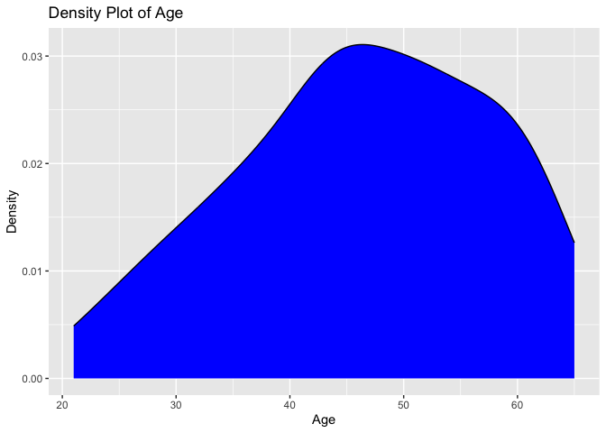
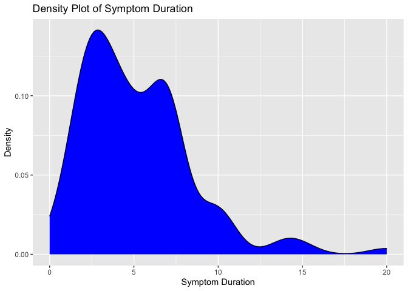
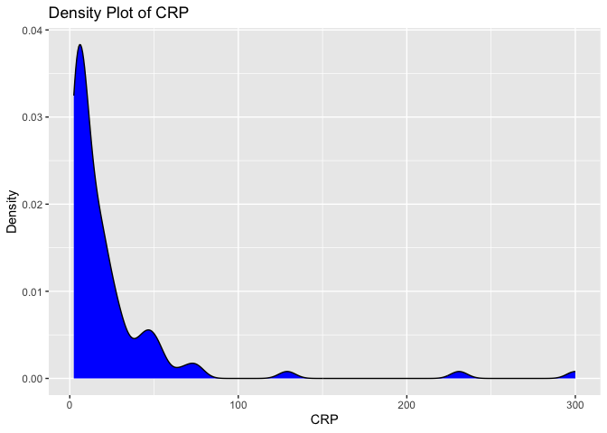
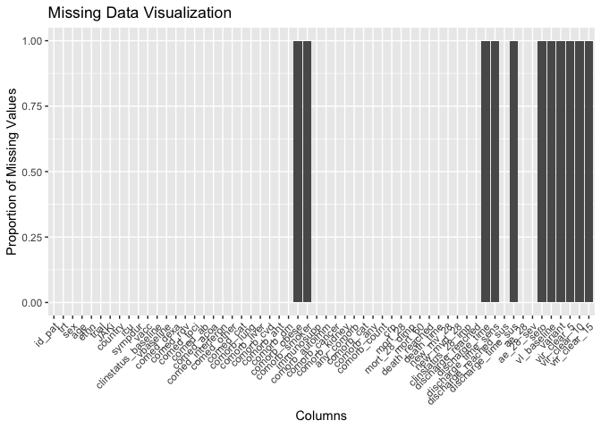

# Load packages

```r
library(tidyverse)
library(readxl)
library(writexl)
library(tableone)
library(here)
library(kableExtra)

library(jtools) # for summ() and plot_summs
library(sjPlot) # for tab_model
library(ggplot2) # survival/TTE analyses and other graphs
library(ggsurvfit) # survival/TTE analyses
library(survival) # survival/TTE analyses
library(gtsummary) # survival/TTE analyses
library(ggfortify) # autoplot
library(tidycmprsk) # competing risk analysis
library(ordinal) # clinstatus ordinal regression
library(mosaic) # OR for 0.5-corrected 2x2 table in case of rare events
library(logistf) # Firth regression in case of rare events
```

# Load Data


# Baseline Characteristics

```r
df$trial <- c("Murugesan")
df$JAKi <- c("Tofacitinib")
df$country <- c("India")
df$ethn <- c("Indian")
df <- df %>% 
  mutate(trt = case_when(grepl("I", study_id) ~ 1,
                         grepl("C", study_id) ~ 0))
df <- df %>%
  rename(id_pat = study_id,
         sympdur = symptom_onset)
# Extracting age and sex # no missing
df$age <- as.numeric(substr(df$`Age/Sex`, 1, regexpr("\\D", df$`Age/Sex`) - 1))  # Extract digits until the first non-digit character
sex <- substr(df$`Age/Sex`, regexpr("\\D", df$`Age/Sex`), nchar(df$`Age/Sex`))  # Extract the non-digit character
df$sex <- gsub("/", "", sex) # get rid of "/"

df %>% 
  drop_na(age) %>% 
  ggplot(aes(x = age)) +
  geom_density(fill = "blue", color = "black") +
  labs(title = "Density Plot of Age",
       x = "Age",
       y = "Density")
```

<!-- -->

```r
df$icu <- 0 # no icu patients at enrolment

# Days with symptoms prior to randomization
df %>% # no missing
  drop_na(sympdur) %>% 
  ggplot(aes(x = sympdur)) +
  geom_density(fill = "blue", color = "black") +
  labs(title = "Density Plot of Symptom Duration",
       x = "Symptom Duration",
       y = "Density")
```

<!-- -->

```r
# Severity of COVID-19 with respect to respiratory support at randomisation
df$clinstatus_baseline <- factor(df$clinstat_day_baseline, levels = 1:6) # no missing

df$clinstatus_1 <- factor(df$clinstat_day_1, levels = 1:6)
df$clinstatus_3 <- factor(df$clinstat_day_3, levels = 1:6)
df$clinstatus_5 <- factor(df$clinstat_day_5, levels = 1:6)
df$clinstatus_7 <- factor(df$clinstat_day_7, levels = 1:6)
df$clinstatus_discharge <- factor(df$clinstat_day_discharge, levels = 1:6)

# Co-medication at baseline
df <- df %>% 
  mutate(comed_dexa = case_when(grepl("D", `Concomitant therapy`) | grepl("M", `Concomitant therapy`) ~ 1,
                              TRUE ~ 0))
df <- df %>% 
  mutate(comed_rdv = case_when(grepl("R", `Concomitant therapy`) ~ 1,
                              TRUE ~ 0))
df <- df %>% 
  mutate(comed_ab = case_when(grepl("X", `Concomitant therapy`) ~ 1,
                              TRUE ~ 0))
df <- df %>% 
  mutate(comed_acoa = case_when(grepl("H", `Concomitant therapy`) | grepl("E", `Concomitant therapy`) ~ 1,
                              TRUE ~ 0))
df$comed_toci <- 0
df$comed_interferon <- 0
df$comed_other <- 0

## group them for the subgroup analysis, according to protocol
df <- df %>% 
  mutate(comed_cat = case_when(comed_dexa == 0 & comed_toci == 0 ~ 1, # patients without Dexamethasone nor Tocilizumab
                               comed_dexa == 1 & comed_toci == 1 ~ 2, # patients with Dexamethasone and Tocilizumab
                               comed_dexa == 1 & comed_toci == 0 ~ 3, # patients with Dexamethasone but no Tocilizumab
                               comed_dexa == 0 & comed_toci == 1 ~ 4)) # patients with Tocilizumab but no Dexamethasone (if exist)

# Comorbidity at baseline, including immunocompromised
df$comorb_cancer <- 0 # see exclusion criteria
df$immunosupp <- 0 # see exclusion criteria
df$comorb_liver <- 0 # see exclusion criteria
df$comorb_kidney <- 0 # see exclusion criteria

df <- df %>% 
  mutate(comorb_lung = case_when(grepl("BA", Comorbidites) | grepl("COPD", Comorbidites) ~ 1,
                                 TRUE ~ 0))
df <- df %>% 
  mutate(comorb_cvd = case_when(grepl("CAD", Comorbidites) | grepl("RHD-MS", Comorbidites) ~ 1,
                                TRUE ~ 0))
df <- df %>% 
  mutate(comorb_aht = case_when(grepl("SHTN", Comorbidites) ~ 1,
                                TRUE ~ 0))
df <- df %>% 
  mutate(comorb_dm = case_when(grepl("DM", Comorbidites) ~ 1,
                               TRUE ~ 0))
df <- df %>% 
  mutate(comorb_autoimm = case_when(grepl("Hypothyroidism", Comorbidites) ~ 1,
                                    TRUE ~ 0))
df$comorb_obese <- NA
df$comorb_smoker <- NA

df <- df %>%
  mutate(any_comorb = case_when(comorb_lung == 1 | comorb_liver == 1 | comorb_cvd == 1 |
                                  comorb_aht == 1 | comorb_dm == 1 | comorb_obese == 1 | comorb_smoker == 1
                                | immunosupp == 1 | comorb_cancer == 1 | comorb_autoimm == 1 | comorb_kidney == 1 
                                  ~ 1,
                                comorb_lung == 0 & comorb_liver == 0 & comorb_cvd == 0 &
                                  comorb_aht == 0 & comorb_dm == 0 & comorb_obese == 0 & comorb_smoker == 0
                                & immunosupp == 0 & comorb_cancer == 0 & comorb_autoimm == 0 & comorb_kidney == 0
                                ~ 0))
# the remaining 39 missing have only NA in 1 comorb category => no evidence for comorbidity -> recode as 0
df <- df %>% 
  mutate(any_comorb = case_when(is.na(any_comorb) ~ 0,
                                TRUE ~ any_comorb))


## group them for the subgroup analysis, according to protocol // count all pre-defined comorbidities per patient first
comorb <- df %>% 
  select(id_pat, comorb_lung, comorb_liver, comorb_cvd, comorb_aht, comorb_dm, comorb_obese, comorb_smoker, immunosupp, comorb_kidney, comorb_autoimm, comorb_cancer)
comorb$comorb_count <- NA
for (i in 1:dim(comorb)[[1]]) {
  comorb$comorb_count[i] <- ifelse(
    sum(comorb[i, ] %in% c(1)) > 0,
    sum(comorb[i, ] %in% c(1)),
    NA
  )
}
comorb <- comorb %>% 
  mutate(comorb_count = case_when(comorb_lung == 0 & comorb_liver == 0 & comorb_cvd == 0 &
                                  comorb_aht == 0 & comorb_dm == 0 & comorb_obese == 0 & comorb_smoker == 0
                                & immunosupp == 0 & comorb_cancer == 0 & comorb_autoimm == 0 & comorb_kidney == 0 ~ 0,
                                TRUE ~ comorb_count))

# the remaining 39 missing have only NA in 1 comorb category => no evidence for comorbidity -> recode as 0
comorb <- comorb %>% 
  mutate(comorb_count = case_when(is.na(comorb_count) ~ 0,
                                TRUE ~ comorb_count))
df <- left_join(df, comorb[, c("comorb_count", "id_pat")], by = join_by(id_pat == id_pat)) ## merge imputed variable back
df <- df %>% # 
  mutate(comorb_cat = case_when(immunosupp == 1 ~ 4, # immunocompromised
                                comorb_count == 0 ~ 1, # no comorbidity
                                comorb_count == 1 ~ 2, # one comorbidity
                                comorb_count >1 & (immunosupp == 0 | is.na(immunosupp)) ~ 3)) # multiple comorbidities

# CRP
df <- df %>% 
  mutate(crp = case_when(CRP == "<2.5" ~ 2.4,
                         CRP == "16. 17" ~ 16.17,
                         CRP == "3. 29" ~ 3.29,
                         TRUE ~ as.numeric(CRP)))
```

```
## Warning: There was 1 warning in `mutate()`.
## ℹ In argument: `crp = case_when(...)`.
## Caused by warning:
## ! NAs introduced by coercion
```

```r
# df %>% ## corresponds to publication
#   filter(trt == 1) %>%
#   summarise(median_crp = median(crp))

df %>% 
  # drop_na(crp) %>% 
  ggplot(aes(x = crp)) +
  geom_density(fill = "blue", color = "black") +
  labs(title = "Density Plot of CRP",
       x = "CRP",
       y = "Density")
```

<!-- -->

```r
# Vaccination: no vaccines available during the study period
df$vacc <- 0

# Viremia
# Variant
# Serology
```
Discussion points BASELINE data:
1) 

# Endpoints

```r
# (i) Primary outcome: Mortality at day 28 // CAVE: WE HAVE WITHDRAWALS!!!! at the same time variable "death"...
df$mort_28 <- 0 # no deaths recorded

# (ii) Mortality at day 60
df$mort_60 <- df$mort_28 # max fup time was 28 days; thus mort_60 imputed from mort_28

# (iii) Time to death within max. follow-up time
df$death_reached <- df$mort_28
df$death_time <- 28

# (iv) New mechanical ventilation among survivors within 28 days.
df$new_mv_28 <- 0 # no MV recorded, except 1 NIV in the ICU

# (iv) Alternative definition/analysis: New mechanical ventilation OR death within 28 days => include all in denominator. 
df$new_mvd_28 <- 0

# (v) Clinical status at day 28
df$clinstatus_28 <- 1 # all discharged and healthy
df$clinstatus_28_imp <- 1 # all discharged and healthy
df$clinstatus_28_imp <- factor(df$clinstatus_28_imp, levels = 1:6)

# (vi) Time to discharge or reaching discharge criteria up to day 28
df$discharge_reached <- 1
df$discharge_time <- NA
df$discharge_time_sens <- NA
# (vi) Sens-analysis: Alternative definition/analysis of outcome: time to sustained discharge within 28 days. There were no re-admissions within 28d
df$discharge_reached_sus <- df$discharge_reached
df$discharge_time_sus <- df$discharge_time

# (vii) Viral clearance up to day 5, day 10, and day 15 (Viral load value <LOQ and/or undectectable): Not available
# (viii) Quality of life at day 28: Not available

# (ix) Participants with an adverse event grade 3 or 4, or a serious adverse event, excluding death, by day 28
df$ae_28 <- 0 # according to publication, there were no adverse events...

# (ix) Sens-analysis: Alternative definition/analysis of outcome: incidence rate ratio (Poisson regression) -> AE per person by d28
df$ae_28_sev <- df$ae_28 # there was only 1 AE grade 3/4 per person

# (ix) Sens-analysis: Alternative definition/analysis of outcome: time to first (of these) adverse event, within 28 days, considering death as a competing risk (=> censor and set to 28 days)
# time to first AE not available

# (x) Adverse events of special interest within 28 days: a) thromboembolic events (venous thromboembolism, pulmonary embolism, arterial thrombosis), b) secondary infections (bacterial pneumonia including ventilator-associated pneumonia, meningitis and encephalitis, endocarditis and bacteremia, invasive fungal infection including pulmonary aspergillosis), c) Reactivation of chronic infection including tuberculosis, herpes simplex, cytomegalovirus, herpes zoster and hepatitis B, d) serious cardiovascular and cardiac events (including stroke and myocardial infarction), e) events related to signs of bone marrow suppression (anemia, lymphocytopenia, thrombocytopenia, pancytopenia), f) malignancy, g) gastrointestinal perforation (incl. gastrointestinal bleeding/diverticulitis), h) liver dysfunction/hepatotoxicity (grade 3 and 4)
df$aesi_28 <- 0

# (xi) Adverse events, any grade and serious adverse event, excluding death, within 28 days, grouped by organ classes
df$ae_28_list <- df$aesi_28 

df_ae <- df %>% 
  select(id_pat, trt, ae_28_list, aesi_28)
# Save
saveRDS(df_ae, file = "df_ae_murugesan.RData")
```
Discussion points OUTCOME data:
1) We will not be able to use ANY of these endpoints...

# Define final datasets, set references, summarize missing data and variables

```r
# keep the overall set
df_all <- df
# reduce the df set to our standardized set across all trials
df <- df %>% 
  select(id_pat, trt, sex, age, ethn, trial, JAKi, 
         country, icu, sympdur, 
         vacc, 
         clinstatus_baseline,
         comed_dexa, comed_rdv, comed_toci, comed_ab, comed_acoa, comed_interferon, comed_other,
         comed_cat,
         comorb_lung, comorb_liver, comorb_cvd, comorb_aht, comorb_dm, comorb_obese, comorb_smoker, immunosupp,
         comorb_autoimm, comorb_cancer, comorb_kidney,
         any_comorb, comorb_cat, comorb_count,
         crp, 
         # sero, vl_baseline, variant,
         mort_28, mort_60, death_reached, death_time,
         new_mv_28, new_mvd_28,
         clinstatus_28_imp,
         discharge_reached, discharge_time, discharge_time_sens, discharge_reached_sus, discharge_time_sus,
         ae_28, ae_28_sev
         # vir_clear_5, vir_clear_10, vir_clear_15
         )
# export for one-stage model, i.e., add missing variables 
df_os <- df
df_os$sero <- NA
df_os$vl_baseline <- NA
df_os$variant <- NA
df_os$vir_clear_5 <- NA
df_os$vir_clear_10 <- NA
df_os$vir_clear_15 <- NA
# Save
saveRDS(df_os, file = "df_os_murugesan.RData")

## set references, re-level
# df <- df %>% 
#   mutate(Treatment = relevel(Treatment, "no JAK inhibitor"))

# Create a bar plot to visualize missing values in each column
original_order <- colnames(df_os)
missing_plot <- df_os %>%
  summarise_all(~ mean(is.na(.))) %>%
  gather() %>%
  mutate(key = factor(key, levels = original_order)) %>%
  ggplot(aes(x = key, y = value)) +
  geom_bar(stat = "identity") +
  labs(x = "Columns", y = "Proportion of Missing Values", title = "Missing Data Visualization") +
  theme(axis.text.x = element_text(angle = 45, hjust = 1)) +
  ylim(0, 1)
print(missing_plot)
```

<!-- -->
Discussion points
1. Missing variables:
* Baseline:
  - comorb_obese
  - comorb_smoker
  - sero
  - vl
  - variant
* Outcomes:
  - viral load
  - time to discharge

# (i) Primary outcome: Mortality at day 28

```r
# adjusted for baseline patient characteristics (age, respiratory support at baseline (ordinal scale 1-3 vs 4-5), dexamethasone use at baseline (y/n), remdesivir use at baseline (y/n), anti-IL-6 use at baseline (y/n)).
addmargins(table(df$mort_28, df$trt, useNA = "always"))
```

```
##       
##          0   1 <NA> Sum
##   0     50  50    0 100
##   <NA>   0   0    0   0
##   Sum   50  50    0 100
```

```r
mort.28 <- df %>% 
  glm(mort_28 ~ trt 
      + age + clinstatus_baseline 
      #+ comed_dexa + comed_rdv + comed_toci
      , family = "binomial", data=.)
summ(mort.28, exp = T, confint = T, model.info = T, model.fit = F, digits = 2)
```

<table class="table table-striped table-hover table-condensed table-responsive" style="width: auto !important; margin-left: auto; margin-right: auto;">
<tbody>
  <tr>
   <td style="text-align:left;font-weight: bold;"> Observations </td>
   <td style="text-align:right;"> 100 </td>
  </tr>
  <tr>
   <td style="text-align:left;font-weight: bold;"> Dependent variable </td>
   <td style="text-align:right;"> mort_28 </td>
  </tr>
  <tr>
   <td style="text-align:left;font-weight: bold;"> Type </td>
   <td style="text-align:right;"> Generalized linear model </td>
  </tr>
  <tr>
   <td style="text-align:left;font-weight: bold;"> Family </td>
   <td style="text-align:right;"> binomial </td>
  </tr>
  <tr>
   <td style="text-align:left;font-weight: bold;"> Link </td>
   <td style="text-align:right;"> logit </td>
  </tr>
</tbody>
</table>  <table class="table table-striped table-hover table-condensed table-responsive" style="width: auto !important; margin-left: auto; margin-right: auto;border-bottom: 0;">
 <thead>
  <tr>
   <th style="text-align:left;">   </th>
   <th style="text-align:right;"> exp(Est.) </th>
   <th style="text-align:right;"> 2.5% </th>
   <th style="text-align:right;"> 97.5% </th>
   <th style="text-align:right;"> z val. </th>
   <th style="text-align:right;"> p </th>
  </tr>
 </thead>
<tbody>
  <tr>
   <td style="text-align:left;font-weight: bold;"> (Intercept) </td>
   <td style="text-align:right;"> 0.00 </td>
   <td style="text-align:right;"> 0.00 </td>
   <td style="text-align:right;"> Inf </td>
   <td style="text-align:right;"> -0.00 </td>
   <td style="text-align:right;"> 1.00 </td>
  </tr>
  <tr>
   <td style="text-align:left;font-weight: bold;"> trt </td>
   <td style="text-align:right;"> 1.00 </td>
   <td style="text-align:right;"> 0.00 </td>
   <td style="text-align:right;"> Inf </td>
   <td style="text-align:right;"> 0.00 </td>
   <td style="text-align:right;"> 1.00 </td>
  </tr>
  <tr>
   <td style="text-align:left;font-weight: bold;"> age </td>
   <td style="text-align:right;"> 1.00 </td>
   <td style="text-align:right;"> 0.00 </td>
   <td style="text-align:right;"> Inf </td>
   <td style="text-align:right;"> 0.00 </td>
   <td style="text-align:right;"> 1.00 </td>
  </tr>
  <tr>
   <td style="text-align:left;font-weight: bold;"> clinstatus_baseline3 </td>
   <td style="text-align:right;"> 1.00 </td>
   <td style="text-align:right;"> 0.00 </td>
   <td style="text-align:right;"> Inf </td>
   <td style="text-align:right;"> -0.00 </td>
   <td style="text-align:right;"> 1.00 </td>
  </tr>
</tbody>
<tfoot><tr><td style="padding: 0; " colspan="100%">
<sup></sup> Standard errors: MLE</td></tr></tfoot>
</table>
Discussion points
1. No events

# (ii) Mortality at day 60

```r
table(df$mort_60, df$trt, useNA = "always")
```

```
##       
##         0  1 <NA>
##   0    50 50    0
##   <NA>  0  0    0
```

```r
mort.60 <- df %>% 
  glm(mort_60 ~ trt 
      + age + clinstatus_baseline 
      #+ comed_dexa + comed_rdv + comed_toci
      , family = "binomial", data=.)
summ(mort.60, exp = T, confint = T, model.info = T, model.fit = F, digits = 2)
```

<table class="table table-striped table-hover table-condensed table-responsive" style="width: auto !important; margin-left: auto; margin-right: auto;">
<tbody>
  <tr>
   <td style="text-align:left;font-weight: bold;"> Observations </td>
   <td style="text-align:right;"> 100 </td>
  </tr>
  <tr>
   <td style="text-align:left;font-weight: bold;"> Dependent variable </td>
   <td style="text-align:right;"> mort_60 </td>
  </tr>
  <tr>
   <td style="text-align:left;font-weight: bold;"> Type </td>
   <td style="text-align:right;"> Generalized linear model </td>
  </tr>
  <tr>
   <td style="text-align:left;font-weight: bold;"> Family </td>
   <td style="text-align:right;"> binomial </td>
  </tr>
  <tr>
   <td style="text-align:left;font-weight: bold;"> Link </td>
   <td style="text-align:right;"> logit </td>
  </tr>
</tbody>
</table>  <table class="table table-striped table-hover table-condensed table-responsive" style="width: auto !important; margin-left: auto; margin-right: auto;border-bottom: 0;">
 <thead>
  <tr>
   <th style="text-align:left;">   </th>
   <th style="text-align:right;"> exp(Est.) </th>
   <th style="text-align:right;"> 2.5% </th>
   <th style="text-align:right;"> 97.5% </th>
   <th style="text-align:right;"> z val. </th>
   <th style="text-align:right;"> p </th>
  </tr>
 </thead>
<tbody>
  <tr>
   <td style="text-align:left;font-weight: bold;"> (Intercept) </td>
   <td style="text-align:right;"> 0.00 </td>
   <td style="text-align:right;"> 0.00 </td>
   <td style="text-align:right;"> Inf </td>
   <td style="text-align:right;"> -0.00 </td>
   <td style="text-align:right;"> 1.00 </td>
  </tr>
  <tr>
   <td style="text-align:left;font-weight: bold;"> trt </td>
   <td style="text-align:right;"> 1.00 </td>
   <td style="text-align:right;"> 0.00 </td>
   <td style="text-align:right;"> Inf </td>
   <td style="text-align:right;"> 0.00 </td>
   <td style="text-align:right;"> 1.00 </td>
  </tr>
  <tr>
   <td style="text-align:left;font-weight: bold;"> age </td>
   <td style="text-align:right;"> 1.00 </td>
   <td style="text-align:right;"> 0.00 </td>
   <td style="text-align:right;"> Inf </td>
   <td style="text-align:right;"> 0.00 </td>
   <td style="text-align:right;"> 1.00 </td>
  </tr>
  <tr>
   <td style="text-align:left;font-weight: bold;"> clinstatus_baseline3 </td>
   <td style="text-align:right;"> 1.00 </td>
   <td style="text-align:right;"> 0.00 </td>
   <td style="text-align:right;"> Inf </td>
   <td style="text-align:right;"> -0.00 </td>
   <td style="text-align:right;"> 1.00 </td>
  </tr>
</tbody>
<tfoot><tr><td style="padding: 0; " colspan="100%">
<sup></sup> Standard errors: MLE</td></tr></tfoot>
</table>
Discussion points
1. No events

# (iii) Time to death within max. follow-up time

```r
# # table(df$death_reached, df$death_time, useNA = "always")
# # table(df$death_reached, df$mort_60, useNA = "always")
# 
# # df %>%
# #   drop_na(death_time) %>%
# #   filter(death_reached == 1) %>%
# #   group_by(trt) %>%
# #   summarise(median = median(death_time),
# #             IQR = IQR(death_time),
# #             Q1 = quantile(death_time, probs = 0.25),
# #             Q3 = quantile(death_time, probs = 0.75)) 
# 
# # time to death, by group. Kaplan-Meier estimate of conditional survival probability.
# km.ttdeath.check <- with(df, Surv(death_time, death_reached))
# head(km.ttdeath.check, 100)
# km.ttdeath_trt <- survfit(Surv(death_time, death_reached) ~ trt, data=df)
# # summary(km.ttdeath_trt, times = 28)
# ttdeath_28d_tbl <- km.ttdeath_trt %>% 
#   tbl_survfit(
#     times = 28,
#     label_header = "**28-d survival (95% CI)**"
#   )
# # Nicely formatted table
# kable(ttdeath_28d_tbl, format = "markdown", table.attr = 'class="table"') %>%
#   kable_styling(bootstrap_options = "striped", full_width = FALSE)
# # KM curves
# survfit2(Surv(death_time, death_reached) ~ trt, data=df) %>% 
#   ggsurvfit() +
#   labs(
#     x = "Days",
#     y = "Overall survival probability"
#   ) + 
#   add_confidence_interval() +
#   add_risktable()
# # testing: cox ph
# ttdeath <- df %>% 
#   coxph(Surv(death_time, death_reached) ~ trt 
#         + age + clinstatus_baseline 
#         #+ comed_dexa + comed_rdv + comed_toci
#         , data =.)
# ttdeath_reg_tbl <- tbl_regression(ttdeath, exp = TRUE)
# # Nicely formatted table
# kable(ttdeath_reg_tbl, format = "markdown", table.attr = 'class="table"') %>%
#   kable_styling(bootstrap_options = "striped", full_width = FALSE)
# # Assessing proportional hazards // also just check KM curve
# # ph.check <- coxph(Surv(death_time, death_reached) ~ trt
# #                , data = df)
# # cz <- cox.zph(ph.check)
# # print(cz)
# # plot(cz)
```
Discussion points:
1. No events

# (iv) New mechanical ventilation among survivors within 28 days

```r
table(df$new_mv_28, df$trt, useNA = "always")
```

```
##       
##         0  1 <NA>
##   0    50 50    0
##   <NA>  0  0    0
```

```r
new.mv.28 <- df %>% 
  glm(new_mv_28 ~ trt 
       + age 
       + clinstatus_baseline 
       #+ comed_dexa + comed_rdv + comed_toci
      , family = "binomial", data=.)
summ(new.mv.28, exp = T, confint = T, model.info = T, model.fit = F, digits = 2)
```

<table class="table table-striped table-hover table-condensed table-responsive" style="width: auto !important; margin-left: auto; margin-right: auto;">
<tbody>
  <tr>
   <td style="text-align:left;font-weight: bold;"> Observations </td>
   <td style="text-align:right;"> 100 </td>
  </tr>
  <tr>
   <td style="text-align:left;font-weight: bold;"> Dependent variable </td>
   <td style="text-align:right;"> new_mv_28 </td>
  </tr>
  <tr>
   <td style="text-align:left;font-weight: bold;"> Type </td>
   <td style="text-align:right;"> Generalized linear model </td>
  </tr>
  <tr>
   <td style="text-align:left;font-weight: bold;"> Family </td>
   <td style="text-align:right;"> binomial </td>
  </tr>
  <tr>
   <td style="text-align:left;font-weight: bold;"> Link </td>
   <td style="text-align:right;"> logit </td>
  </tr>
</tbody>
</table>  <table class="table table-striped table-hover table-condensed table-responsive" style="width: auto !important; margin-left: auto; margin-right: auto;border-bottom: 0;">
 <thead>
  <tr>
   <th style="text-align:left;">   </th>
   <th style="text-align:right;"> exp(Est.) </th>
   <th style="text-align:right;"> 2.5% </th>
   <th style="text-align:right;"> 97.5% </th>
   <th style="text-align:right;"> z val. </th>
   <th style="text-align:right;"> p </th>
  </tr>
 </thead>
<tbody>
  <tr>
   <td style="text-align:left;font-weight: bold;"> (Intercept) </td>
   <td style="text-align:right;"> 0.00 </td>
   <td style="text-align:right;"> 0.00 </td>
   <td style="text-align:right;"> Inf </td>
   <td style="text-align:right;"> -0.00 </td>
   <td style="text-align:right;"> 1.00 </td>
  </tr>
  <tr>
   <td style="text-align:left;font-weight: bold;"> trt </td>
   <td style="text-align:right;"> 1.00 </td>
   <td style="text-align:right;"> 0.00 </td>
   <td style="text-align:right;"> Inf </td>
   <td style="text-align:right;"> 0.00 </td>
   <td style="text-align:right;"> 1.00 </td>
  </tr>
  <tr>
   <td style="text-align:left;font-weight: bold;"> age </td>
   <td style="text-align:right;"> 1.00 </td>
   <td style="text-align:right;"> 0.00 </td>
   <td style="text-align:right;"> Inf </td>
   <td style="text-align:right;"> 0.00 </td>
   <td style="text-align:right;"> 1.00 </td>
  </tr>
  <tr>
   <td style="text-align:left;font-weight: bold;"> clinstatus_baseline3 </td>
   <td style="text-align:right;"> 1.00 </td>
   <td style="text-align:right;"> 0.00 </td>
   <td style="text-align:right;"> Inf </td>
   <td style="text-align:right;"> -0.00 </td>
   <td style="text-align:right;"> 1.00 </td>
  </tr>
</tbody>
<tfoot><tr><td style="padding: 0; " colspan="100%">
<sup></sup> Standard errors: MLE</td></tr></tfoot>
</table>

```r
# (iv) Alternative definition/analysis: New mechanical ventilation OR death within 28 days => include all in denominator. 
table(df$new_mvd_28, df$trt, useNA = "always")
```

```
##       
##         0  1 <NA>
##   0    50 50    0
##   <NA>  0  0    0
```

```r
new.mvd.28 <- df %>% 
  glm(new_mvd_28 ~ trt 
      + age + clinstatus_baseline 
      #+ comed_dexa + comed_rdv + comed_toci
      , family = "binomial", data=.)
summ(new.mvd.28, exp = T, confint = T, model.info = T, model.fit = F, digits = 2)
```

<table class="table table-striped table-hover table-condensed table-responsive" style="width: auto !important; margin-left: auto; margin-right: auto;">
<tbody>
  <tr>
   <td style="text-align:left;font-weight: bold;"> Observations </td>
   <td style="text-align:right;"> 100 </td>
  </tr>
  <tr>
   <td style="text-align:left;font-weight: bold;"> Dependent variable </td>
   <td style="text-align:right;"> new_mvd_28 </td>
  </tr>
  <tr>
   <td style="text-align:left;font-weight: bold;"> Type </td>
   <td style="text-align:right;"> Generalized linear model </td>
  </tr>
  <tr>
   <td style="text-align:left;font-weight: bold;"> Family </td>
   <td style="text-align:right;"> binomial </td>
  </tr>
  <tr>
   <td style="text-align:left;font-weight: bold;"> Link </td>
   <td style="text-align:right;"> logit </td>
  </tr>
</tbody>
</table>  <table class="table table-striped table-hover table-condensed table-responsive" style="width: auto !important; margin-left: auto; margin-right: auto;border-bottom: 0;">
 <thead>
  <tr>
   <th style="text-align:left;">   </th>
   <th style="text-align:right;"> exp(Est.) </th>
   <th style="text-align:right;"> 2.5% </th>
   <th style="text-align:right;"> 97.5% </th>
   <th style="text-align:right;"> z val. </th>
   <th style="text-align:right;"> p </th>
  </tr>
 </thead>
<tbody>
  <tr>
   <td style="text-align:left;font-weight: bold;"> (Intercept) </td>
   <td style="text-align:right;"> 0.00 </td>
   <td style="text-align:right;"> 0.00 </td>
   <td style="text-align:right;"> Inf </td>
   <td style="text-align:right;"> -0.00 </td>
   <td style="text-align:right;"> 1.00 </td>
  </tr>
  <tr>
   <td style="text-align:left;font-weight: bold;"> trt </td>
   <td style="text-align:right;"> 1.00 </td>
   <td style="text-align:right;"> 0.00 </td>
   <td style="text-align:right;"> Inf </td>
   <td style="text-align:right;"> 0.00 </td>
   <td style="text-align:right;"> 1.00 </td>
  </tr>
  <tr>
   <td style="text-align:left;font-weight: bold;"> age </td>
   <td style="text-align:right;"> 1.00 </td>
   <td style="text-align:right;"> 0.00 </td>
   <td style="text-align:right;"> Inf </td>
   <td style="text-align:right;"> 0.00 </td>
   <td style="text-align:right;"> 1.00 </td>
  </tr>
  <tr>
   <td style="text-align:left;font-weight: bold;"> clinstatus_baseline3 </td>
   <td style="text-align:right;"> 1.00 </td>
   <td style="text-align:right;"> 0.00 </td>
   <td style="text-align:right;"> Inf </td>
   <td style="text-align:right;"> -0.00 </td>
   <td style="text-align:right;"> 1.00 </td>
  </tr>
</tbody>
<tfoot><tr><td style="padding: 0; " colspan="100%">
<sup></sup> Standard errors: MLE</td></tr></tfoot>
</table>
Discussion points
1. No events

# (v) Clinical status at day 28

```r
table(df$clinstatus_28_imp, df$trt, useNA = "always")
```

```
##       
##         0  1 <NA>
##   1    50 50    0
##   2     0  0    0
##   3     0  0    0
##   4     0  0    0
##   5     0  0    0
##   6     0  0    0
##   <NA>  0  0    0
```

```r
# clin.28 <- df %>% 
#   clm(clinstatus_28_imp ~ trt 
#       + age 
#       + clinstatus_baseline 
#       #+ comed_dexa + comed_rdv + comed_toci
#       , link= c("logit"), data=.)
# # Summary and extract coefficients
# coefficients_table <- summary(clin.28)$coefficients
# # Calculate Odds Ratios and Confidence Intervals
# odds_ratios <- exp(coefficients_table[, "Estimate"])
# ci_lower <- exp(coefficients_table[, "Estimate"] - 1.96 * coefficients_table[, "Std. Error"])
# ci_upper <- exp(coefficients_table[, "Estimate"] + 1.96 * coefficients_table[, "Std. Error"])
# # Create a data frame to store Odds Ratios and CIs
# clin.28_tbl <- data.frame(
#   "Variable" = rownames(coefficients_table),
#   "Odds Ratio" = odds_ratios,
#   "CI Lower" = ci_lower,
#   "CI Upper" = ci_upper
# )
# # Nicely formatted table
# kable(clin.28_tbl, format = "markdown", table.attr = 'class="table"') %>%
#   kable_styling(bootstrap_options = "striped", full_width = FALSE)
```
Discussion points:
1. All same clinstatus at day 28

# (vi) Time to discharge or reaching discharge criteria up to day 28

```r
# # Kaplan-Meier estimate of conditional discharge probability
# # Just censoring => Cause-specific hazards
# km.ttdischarge.check <- with(df, Surv(discharge_time, discharge_reached))
# head(km.ttdischarge.check, 100)
# km.ttdischarge_trt <- survfit(Surv(discharge_time, discharge_reached) ~ trt, data=df)
# # KM curve
# survfit2(Surv(discharge_time, discharge_reached) ~ trt, data=df) %>% 
#   ggsurvfit() +
#   labs(
#     x = "Days",
#     y = "Overall hospitalization probability"
#   ) + 
#   add_confidence_interval() +
#   add_risktable()
# # table(df$discharge_reached, df$discharge_time)
# # df %>% 
# #   select(trt, discharge_reached, discharge_time, death_time, mort_28, clinstatus_28_imp) %>% 
# #   View()
# 
# # testing: cox ph
# ttdischarge <- df %>% 
#   coxph(Surv(discharge_time, discharge_reached) ~ trt 
#         + age + clinstatus_baseline 
#         #+ comed_dexa + comed_rdv + comed_toci
#         , data =.)
# ttdischarge_reg_tbl <- tbl_regression(ttdischarge, exp = TRUE)
# # Nicely formatted table
# kable(ttdischarge_reg_tbl, format = "markdown", table.attr = 'class="table"') %>%
#   kable_styling(bootstrap_options = "striped", full_width = FALSE)
# 
# # Sub-distribution hazards
# # df <- df %>% # cuminc needs a factor variable with censored patients coded as 0, the event as 1 (discharge) and the competing event as 2 (death).
# #   mutate(discharge_reached_comp = case_when (discharge_reached == 0 & (mort_28 == 0 | is.na(mort_28)) ~ 0,
# #                                              discharge_reached == 1 & (mort_28 == 0 | is.na(mort_28)) ~ 1,
# #                                              mort_28 == 1 ~ 2))
# # table(df$discharge_reached_comp) # but in Ghazaeian, we only either have discharged (1) or died (2) in hospital, no-one was still hospitalized at day 28 and thus noone is coded as 0 => Fine-Gray not possible => stick to cause-specific hazards, just censoring
# # df$discharge_reached_comp <- as.factor(df$discharge_reached_comp)
# # # Cumulative incidence for competing risks
# # cuminc(Surv(discharge_time, discharge_reached_comp) ~ 1, data = df)
# # cuminc(Surv(discharge_time, discharge_reached_comp) ~ trt, data = df) %>%
# #   ggcuminc(outcome = c("1", "2")) +
# #   ylim(c(0, 1)) +
# #   labs(
# #     x = "Days"
# #   ) +
# #   add_confidence_interval() +
# #   add_risktable()
# # # testing: Fine-Gray regression
# # ttdischarge.comp <- crr(Surv(discharge_time, discharge_reached_comp) ~ trt
# #     + age
# #     # + clinstatus_baseline
# #     + comed_dexa + comed_rdv + comed_toci,
# #     data = df)
# # ttdischarge_comp_reg_tbl <- tbl_regression(ttdischarge.comp, exp = TRUE)
# # # Nicely formatted table
# # kable(ttdischarge_comp_reg_tbl, format = "markdown", table.attr = 'class="table"') %>%
# #   kable_styling(bootstrap_options = "striped", full_width = FALSE)
# ttdischarge_comp_reg_tbl <- ttdischarge_reg_tbl
# ttdischarge.comp <- ttdischarge
# # Censoring and assigned worst outcome (28d) to competing event (death) // hypothetical estimand
# survfit2(Surv(discharge_time_sens, discharge_reached) ~ trt, data=df) %>% 
#   ggsurvfit() +
#   labs(
#     x = "Days",
#     y = "Overall hospitalization probability"
#   ) + 
#   add_confidence_interval() +
#   add_risktable()
# # testing: cox ph
# ttdischarge.sens <- df %>% 
#   coxph(Surv(discharge_time_sens, discharge_reached) ~ trt 
#         + age + clinstatus_baseline 
#         #+ comed_dexa + comed_rdv + comed_toci
#         , data =.)
# ttdischarge_sens_reg_tbl <- tbl_regression(ttdischarge.sens, exp = TRUE)
# # Nicely formatted table
# kable(ttdischarge_sens_reg_tbl, format = "markdown", table.attr = 'class="table"') %>%
#   kable_styling(bootstrap_options = "striped", full_width = FALSE)
# 
# # Assessing proportional hazards using default discharge_time and discharge_reached
# ph.check <- coxph(Surv(discharge_time, discharge_reached) ~ trt 
#                 , data = df)
# cz <- cox.zph(ph.check)
# print(cz)
# plot(cz)
# 
# # Sens-analysis: Alternative definition/analysis of outcome: time to sustained discharge within 28 days
# # Use cause-specific hazards
# survfit2(Surv(discharge_time_sus, discharge_reached_sus) ~ trt, data=df) %>% 
#   ggsurvfit() +
#   labs(
#     x = "Days",
#     y = "Overall sustained hospitalization probability"
#   ) + 
#   add_confidence_interval() +
#   add_risktable()
# # testing: cox ph
# ttdischarge.sus <- df %>% 
#   coxph(Surv(discharge_time_sus, discharge_reached_sus) ~ trt 
#         + age + clinstatus_baseline 
#         #+ comed_dexa + comed_rdv + comed_toci
#         , data =.)
# ttdischarge_sus_reg_tbl <- tbl_regression(ttdischarge.sus, exp = TRUE)
# # Nicely formatted table
# kable(ttdischarge_sus_reg_tbl, format = "markdown", table.attr = 'class="table"') %>%
#   kable_styling(bootstrap_options = "striped", full_width = FALSE)
```
Discussion points
1. No events

# (vii) Viral clearance up to day 5, day 10, and day 15

Discussion points
1. Not available

# (viii) Quality of life at day 28 

Discussion points
1. Not available

# (ix) Adverse event(s) grade 3 or 4, or a serious adverse event(s), excluding death, by day 28

Discussion points
1. No events

# Subgroup analysis: Ventilation requirement (proxy for disease severity) on primary endpoint

Discussion points
1. No events

# Subgroup analysis: Age on primary endpoint

Discussion points
1. No events

# Subgroup analysis: Comorbidities on primary endpoint

Discussion points
1. No events

# Subgroup analysis: Concomitant COVID-19 treatment on primary endpoint

Discussion points
1. No events

# Subgroup analysis: Vaccination on adverse events

Discussion points
1. No events

# SENS Subgroup analysis: Duration since symptom onset on primary endpoint

Discussion points
1. No events

# SENS Subgroup analysis: CRP on primary endpoint

Discussion points
1. No events

# SENS Subgroup analysis: Variant on primary endpoint

Discussion points
1. No data on variant available and no events

# Collect all treatment effect estimates across endpoints (stage one)

```r
# # Empty data frame to store the results
# result_df <- data.frame(
#   variable = character(),
#   hazard_odds_ratio = numeric(),
#   odds_ratio = numeric(),
#   ci_lower = numeric(),
#   ci_upper = numeric(),
#   standard_error = numeric(),
#   p_value = numeric()
# )
# # Function to extract treatment results from different model types (glm, clm, coxph, crr, logistf)
# extract_trt_results <- function(model, variable_name, n_int, n_cont) {
#   if (inherits(model, "glm") || inherits(model, "clm")) {
#     trt_coef <- coef(model)["trt"]
#     hazard_odds_ratio <- exp(trt_coef)
#     ci <- exp(confint(model)["trt", ])
#     se <- summary(model)$coefficients["trt", "Std. Error"]
#     p_value <- summary(model)$coefficients["trt", "Pr(>|z|)"]
#   } else if (inherits(model, "coxph")) {
#     trt_coef <- coef(model)["trt"]
#     hazard_odds_ratio <- exp(trt_coef)
#     ci <- exp(confint(model)["trt", ])
#     se <- summary(model)$coefficients["trt", "se(coef)"]
#     p_value <- summary(model)$coefficients["trt", "Pr(>|z|)"]
#   } else if (inherits(model, "tidycrr")) {
#     trt_coef <- coef(model)["trt"]
#     hazard_odds_ratio <- exp(trt_coef)
#     ci <- c(exp(model$tidy$conf.low[1]), exp(model$tidy$conf.high[1]))
#     se <- model$tidy$std.error[1]
#     p_value <- model$tidy$p.value[1]
#   } else if (inherits(model, "logistf")) {
#     trt_coef <- coef(model)["trt"]
#     hazard_odds_ratio <- exp(trt_coef)
#     ci <- c(exp(model$ci.lower["trt"]), exp(model$ci.upper["trt"]))
#     se <- sqrt(diag(vcov(model)))["trt"]
#     p_value <- NA # how to extract directly from the object?
#   } else {
#     stop("Unsupported model class")
#   }
#   # capture the results
#   result <- data.frame(
#     variable = variable_name,
#     hazard_odds_ratio = hazard_odds_ratio,
#     ci_lower = ci[1],
#     ci_upper = ci[2],
#     standard_error = se,
#     p_value = p_value,
#     n_intervention = n_int,
#     n_control = n_cont
#   )
#   return(result)
# }
# 
# # Loop through
# result_list <- list()
# 
# result_list[[1]] <- extract_trt_results(mort.28, "death at day 28",
#                                         addmargins(table(df$mort_28, df$trt))[3,2], addmargins(table(df$mort_28, df$trt))[3,1]) # adj: age, clinstatus
# result_list[[2]] <- extract_trt_results(mort.60, "death at day 60",
#                                         addmargins(table(df$mort_60, df$trt))[3,2], addmargins(table(df$mort_60, df$trt))[3,1]) # adj: age, clinstatus
# result_list[[3]] <- extract_trt_results(ttdeath, "death within fup",
#                                         addmargins(table(df$death_reached, df$trt))[3,2], addmargins(table(df$death_reached, df$trt))[3,1]) # adj: age, clinstatus
# result_list[[x]] <- extract_trt_results(new.mv.28, "new MV within 28d",
#                                         addmargins(table(df$new_mv_28, df$trt))[3,2], addmargins(table(df$new_mv_28, df$trt))[3,1]) # adj: age, clinstatus
# result_list[[4]] <- extract_trt_results(new.mvd.28, "new MV or death within 28d",
#                                         addmargins(table(df$new_mvd_28, df$trt))[3,2], addmargins(table(df$new_mvd_28, df$trt))[3,1]) # adj: age, clinstatus
# result_list[[5]] <- extract_trt_results(clin.28, "clinical status at day 28",
#                                         addmargins(table(df$clinstatus_28_imp, df$trt))[7,2], addmargins(table(df$clinstatus_28_imp, df$trt))[7,1]) # adj: age, clinstatus
# result_list[[6]] <- extract_trt_results(ttdischarge, "discharge within 28 days",
#                                         addmargins(table(df$discharge_reached, df$trt))[3,2], addmargins(table(df$discharge_reached, df$trt))[3,1]) # adj: age, clinstatus
# result_list[[7]] <- extract_trt_results(ttdischarge.comp, "discharge within 28 days, death=comp.event",
#                                         addmargins(table(df$discharge_reached, df$trt))[3,2], addmargins(table(df$discharge_reached, df$trt))[3,1]) # adj: age, clinstatus
# result_list[[8]] <- extract_trt_results(ttdischarge.sens, "discharge within 28 days, death=hypo.event",
#                                         addmargins(table(df$discharge_reached, df$trt))[3,2], addmargins(table(df$discharge_reached, df$trt))[3,1]) # adj: age, clinstatus
# result_list[[9]] <- extract_trt_results(ttdischarge.sus, "sustained discharge within 28 days",
#                                         addmargins(table(df$discharge_reached_sus, df$trt))[3,2], addmargins(table(df$discharge_reached_sus, df$trt))[3,1]) # adj: age, clinstatus
# result_list[[10]] <- extract_trt_results(ae.28.firth, "any AE grade 3,4 within 28 days_firth",
#                                          addmargins(table(df$ae_28, df$trt))[3,2], addmargins(table(df$ae_28, df$trt))[3,1]) # adj: age, clinstatus
# result_list[[11]] <- extract_trt_results(ae.28.sev.firth, "AEs grade 3,4 within 28 days_firth",
#                                          addmargins(table(df$ae_28_sev, df$trt))[3,2], addmargins(table(df$ae_28_sev, df$trt))[3,1]) # adj: age, clinstatus
# 
# # Filter out NULL results and bind the results into a single data frame
# result_df <- do.call(rbind, Filter(function(x) !is.null(x), result_list))
# 
# # Add the trial name and JAKi
# result_df$trial <- "Murugesan"
# result_df$JAKi <- "Tofacitinib"
# 
# # Nicely formatted table
# kable(result_df, format = "markdown", table.attr = 'class="table"') %>%
#   kable_styling(bootstrap_options = "striped", full_width = FALSE)
# 
# # Save
# saveRDS(result_df, file = "trt_effects_murugesan.RData")
```
Discussion points
1. No events => No results

# Collect all interaction estimates (stage one)

```r
# # Empty data frame to store the results
# interaction_df <- data.frame(
#   variable = character(),
#   log_odds_ratio = numeric(),
#   ci_lower = numeric(),
#   ci_upper = numeric(),
#   standard_error = numeric(),
#   p_value = numeric()
# )
# # Extract and format results for the interaction term
# extract_interaction <- function(model, variable_name) {
#       trt_coef <- coef(model)[grep("^trt:", names(coef(model)))]
#       log_odds_ratio <- exp(trt_coef)
#       ci <- exp(confint(model)[grep("^trt:", names(coef(model))), ])
#       se <- summary(model)$coefficients[grep("^trt:", names(coef(model))), "Std. Error"]
#       p_value <- summary(model)$coefficients[grep("^trt:", names(coef(model))), "Pr(>|z|)"]
#       # capture the results
#       result <- data.frame(
#         variable = variable_name,
#         log_odds_ratio = log_odds_ratio,
#         ci_lower = ci[1],
#         ci_upper = ci[2],
#         standard_error = se,
#         p_value = p_value
#       )
#     return(result)
# }
# 
# # Loop through
# result_list <- list()
# 
# result_list[[1]] <- extract_interaction(mort.28.vent, "respiratory support")
# result_list[[3]] <- extract_interaction(mort.28.age, "age") # adj: age, clinstatus
# result_list[[4]] <- extract_interaction(mort.28.comorb, "comorbidity") # adj: age, clinstatus
# result_list[[x]] <- extract_interaction(mort.28.comed, "comedication") # not possible
# result_list[[x]] <- extract_interaction(ae.28.vacc, "vaccination on AEs") # not available
# result_list[[5]] <- extract_interaction(mort.28.symp, "symptom duration") # adj: age, clinstatus
# result_list[[6]] <- extract_interaction(mort.28.crp, "crp") # adj: age, clinstatus
# result_list[[x]] <- extract_interaction(mort.28.var, "variant") # not available
# 
# # Filter out NULL results and bind the results into a single data frame
# interaction_df <- do.call(rbind, Filter(function(x) !is.null(x), result_list))
# 
# # Add the trial name and JAKi
# interaction_df$trial <- "Murugesan"
# interaction_df$JAKi <- "Tofacitinib"
# 
# # Nicely formatted table
# kable(interaction_df, format = "markdown", table.attr = 'class="table"') %>%
#   kable_styling(bootstrap_options = "striped", full_width = FALSE)
# 
# # Save
# saveRDS(interaction_df, file = "int_effects_murugesan.RData")
```
Discussion points
1. No events => No results
