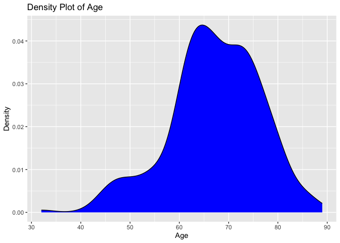
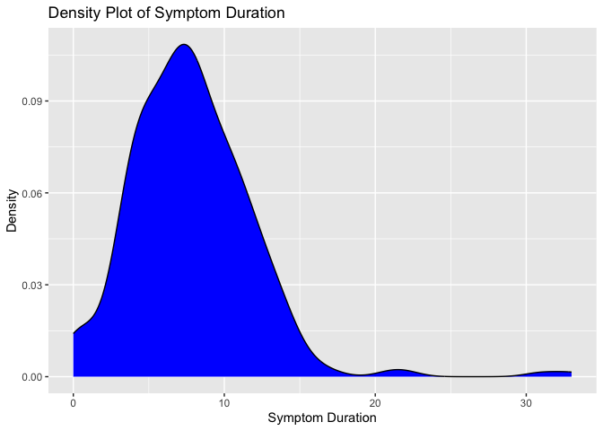
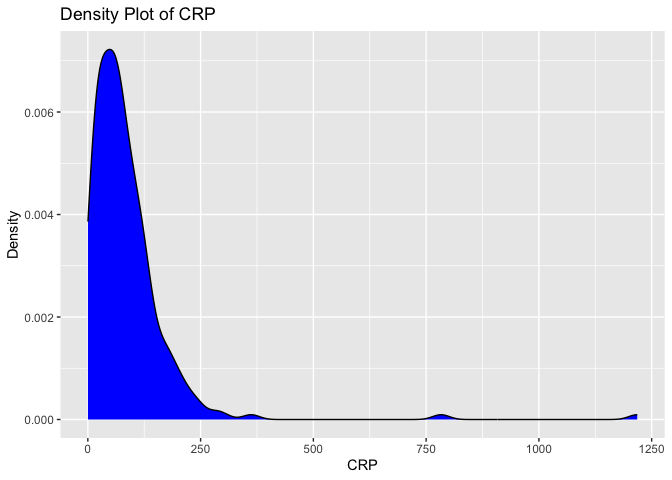

# Load packages

```r
library(tidyverse)
library(readxl)
library(writexl)
library(tableone)
library(haven) # Read sas files
library(here)
library(kableExtra)

library(jtools) # for summ() and plot_summs
library(sjPlot) # for tab_model
library(ggplot2) # survival/TTE analyses and other graphs
library(ggsurvfit) # survival/TTE analyses
library(survival) # survival/TTE analyses
library(gtsummary) # survival/TTE analyses
library(ggfortify) # autoplot
library(tidycmprsk) # competing risk analysis
library(ordinal) # clinstatus ordinal regression
library(mosaic) # OR for 0.5-corrected 2x2 table in case of rare events
library(logistf) # Firth regression in case of rare events

library(finalfit) # missing data exploration
library(mice) # multiple imputation
library(jomo) # multiple imputation
library(mitools) # multiple imputation
```

# Load Data


# Define ITT set

```r
df <- df %>% 
  filter(!is.na(trt))
```

# Baseline Characteristics

```r
## add trial indicators and basic characteristics
df$trial <- "PANCOVID"
df$JAKi <- "Baricitinib"
df$country <- "Spain"
df$icu <- NA # not available
df$ethn <- NA # not available
# addmargins(table(df$trt, useNA = "always")) # Corresponds to publication
# addmargins(table(df$sex, df$trt, useNA = "always")) 
df <- df %>% # Corresponds to publication
  mutate(sex = case_when(sex == "1" ~ "female",
                         sex == "2" ~ "male"))

## Age 
# df %>% # Corresponds to publication
#   filter(trt == 1) %>%
#   select(age) %>%
#   summary()
df %>%
  ggplot(aes(x = age)) +
  geom_density(fill = "blue", color = "black") +
  labs(title = "Density Plot of Age",
       x = "Age",
       y = "Density")
```

<!-- -->

```r
## Symptom duration 
# df %>% # Corresponds to publication
#   filter(trt == 1) %>%
#   select(sympdur) %>%
#   summary()
# table(df$sympdur) # change -21 to +21
df <- df %>% mutate(sympdur = case_when(sympdur == -21 ~ 21,
                                        TRUE ~ sympdur))
df %>% 
  drop_na(sympdur) %>% 
  ggplot(aes(x = sympdur)) +
  geom_density(fill = "blue", color = "black") +
  labs(title = "Density Plot of Symptom Duration",
       x = "Symptom Duration",
       y = "Density")
```

<!-- -->

```r
## Clinical status at baseline
df_clinstatus <- df_clinstatus %>% 
  rename(clinstatus = clinstatus_baseline)
df <- left_join(df, df_clinstatus[, c("clinstatus", "id_pat")], by = join_by(id_pat == id_pat))
# addmargins(table(df$clinstatus, df$clinstatus_baseline, useNA = "always")) # identical, good.
# addmargins(table(df$clinstatus_baseline, df$trt, useNA = "always")) # Corresponds to publication
df <- df %>% 
  mutate(clinstatus_baseline = case_when(clinstatus_baseline == 0 ~ 2,
                                         clinstatus_baseline == 1 | clinstatus_baseline == 9 ~ 3,
                                         clinstatus_baseline == 2 | clinstatus_baseline == 3 ~ 4))
df$clinstatus_baseline <- factor(df$clinstatus_baseline, levels = 1:6) ## no missing data
addmargins(table(df$clinstatus_baseline, df$trt, useNA = "always"))
```

```
##       
##          0   1 <NA> Sum
##   1      0   0    0   0
##   2     32  42    0  74
##   3    106 102    0 208
##   4      4   1    0   5
##   5      0   0    0   0
##   6      0   0    0   0
##   <NA>   0   0    0   0
##   Sum  142 145    0 287
```

```r
df <- df %>% 
  mutate(vbaseline = case_when(clinstatus_baseline == "2" | clinstatus_baseline == "3" ~ 0,
                                clinstatus_baseline == "4" | clinstatus_baseline == "5" ~ 1))

df$randdate <- as_date(df$randdate) # randomisation date (baseline date)


## Comorbidities
df_comorb <- df_comorb %>% 
  rename(comorb_dm = "Diabetes",
         comorb_aht = "Hypertension",
         comorb_obese = "Obesity",
         id_pat = "Label")
df <- left_join(df, df_comorb[, c("comorb_dm", "comorb_aht", "comorb_obese", "id_pat")], by = join_by(id_pat == id_pat))
df$immunosupp <- 0 # see protocol
df$comorb_autoimm <- 0 # see protocol
df <- df %>% 
  mutate(any_comorb = case_when(comorb_lung == 1 | comorb_liver == 1 | comorb_cvd == 1 |
                                  comorb_aht == 1 | comorb_dm == 1 | comorb_obese == 1 | comorb_smoker == 1
                                | immunosupp == 1 | comorb_cancer == 1 | comorb_autoimm == 1 | comorb_kidney == 1 
                                  ~ 1,
                                comorb_lung == 0 & comorb_liver == 0 & comorb_cvd == 0 &
                                  comorb_aht == 0 & comorb_dm == 0 & comorb_obese == 0 & comorb_smoker == 0
                                & immunosupp == 0 & comorb_cancer == 0 & comorb_autoimm == 0 & comorb_kidney == 0
                                ~ 0))
# addmargins(table(df$any_comorb, df$trt, useNA = "always")) # no missing
# group them for the subgroup analysis, according to protocol // count all pre-defined comorbidities per patient first
comorb <- df %>% 
  select(id_pat, comorb_lung, comorb_liver, comorb_cvd, comorb_aht, comorb_dm, comorb_obese, comorb_smoker, immunosupp, comorb_kidney, comorb_autoimm, comorb_cancer)
comorb$comorb_count <- NA
for (i in 1:dim(comorb)[[1]]) {
  comorb$comorb_count[i] <- ifelse(
    sum(comorb[i, ] %in% c(1)) > 0,
    sum(comorb[i, ] %in% c(1)),
    NA
  )
}
comorb <- comorb %>% 
  mutate(comorb_count = case_when(comorb_lung == 0 & comorb_liver == 0 & comorb_cvd == 0 &
                                  comorb_aht == 0 & comorb_dm == 0 & comorb_obese == 0 & comorb_smoker == 0
                                & immunosupp == 0 & comorb_cancer == 0 & comorb_autoimm == 0 & comorb_kidney == 0 ~ 0,
                                TRUE ~ comorb_count))
# addmargins(table(comorb$comorb_count, useNA = "always")) # no missing
df <- left_join(df, comorb[, c("comorb_count", "id_pat")], by = join_by(id_pat == id_pat)) ## merge imputed variable back
df <- df %>%
  mutate(comorb_cat = case_when(immunosupp == 1 ~ 4, # immunocompromised
                                comorb_count == 0 ~ 1, # no comorbidity
                                comorb_count == 1 ~ 2, # one comorbidity
                                comorb_count >1 & (immunosupp == 0 | is.na(immunosupp)) ~ 3)) # multiple comorbidities
# table(df$comorb_cat, useNA = "always")
df <- df %>%
  mutate(comorb_any = case_when(comorb_count == 0 ~ 0, # no comorbidity
                                comorb_count >0 ~ 1)) # any comorbidity
# addmargins(table(df$comorb_any, df$trt, useNA = "always")) # no missing


## COVID-19 comedication
df$comed_ab <- NA
df$comed_acoa <- NA
df$comed_interferon <- NA
df$comed_other <- df$comed_tdf # add tenofovir as "other covid-19 medication" to be consistent with other trials
# table(df$comed_dexa, df$trt) # was part of intervention and SOC
# table(df$comed_rdv, df$trt) # corresponds to publication
# table(df$comed_toci, df$trt) # CAVE: this is from the follow-up (part of disease progression)!! -> use toxi_2nd_random
df$comed_toci <- df$toxi_2nd_random
# table(df$comed_toci, df$trt, useNA = "always")
# GROUP them for the subgroup analysis, according to protocol
df <- df %>% # there are no missings in comed_dexa and comed_toci
  mutate(comed_cat = case_when(comed_dexa == 0 & comed_toci == 0 ~ 1, # patients without Dexa nor Toci // NA: all have Dexa by design
                               comed_dexa == 1 & comed_toci == 0 ~ 2, # patients with Dexa but no Toci
                               comed_dexa == 1 & comed_toci == 1 ~ 3, # patients with Dexa and Toci
                               comed_dexa == 0 & comed_toci == 1 ~ 4)) # patients with Toci but no Dexa // NA: all have Dexa by design
# addmargins(table(df$comed_cat, df$trt, useNA = "always"))


## CRP at baseline
# df %>% # Corresponds more or less to publication
#   filter(trt == 1) %>%
#   select(crp) %>%
#   summary()
# table(df$sympdur) # 11374 is probably an entry error -> NA
df <- df %>% mutate(crp = case_when(crp == 11374 ~ NA, TRUE ~ crp))
df %>% 
  drop_na(crp) %>% 
  ggplot(aes(x = crp)) +
  geom_density(fill = "blue", color = "black") +
  labs(title = "Density Plot of CRP",
       x = "CRP",
       y = "Density")
```

<!-- -->

```r
# addmargins(table(df$vacc, df$trt, useNA = "always"))

### Serology at baseline // not available
### Variant // not available
```

# Endpoints

```r
## Clinical status follow-up data
df_clinstatus$Date_Progression <- as_date(df_clinstatus$Date_Progression)
df <- left_join(df, df_clinstatus[, c("Ventilatory_Support_Progression", "Date_Progression","Progression","Type_Ventilation", "id_pat")], by = join_by(id_pat == id_pat))

# "Type_Ventilation":
# 1 = Nasal goggles                      
# 2 = High-flow oxygen devices
# 3 = Mask with reservoir
# 4 = Non-invasive ventilation
# 5 = Invasive mechanical ventilation or ECMO
# 9 = Other

## CREATE the most important time to event variables (death, discharge, withdrawal) # no LTFU, no readmission
df <- df %>%
  mutate(death_date = as_date(death_date)) %>% 
  mutate(discharge_date = as_date(discharge_date)) %>% 
  mutate(withdrawal_date = as_date(withdrawal_date)) %>% 
  mutate(withdrawal_invest_date = as_date(withdrawal_invest_date)) %>% 
  mutate(death_d = as.numeric(death_date - randdate)) %>%
  rename(withdraw_date = withdrawal_date,
         withdrawi_date = withdrawal_invest_date) %>% 
  mutate(withdraw_d = as.numeric(withdraw_date - randdate)) %>%
  mutate(withdrawi_d = as.numeric(withdrawi_date - randdate)) %>%
  mutate(discharge_d = as.numeric(discharge_date - randdate)) %>% 
  mutate(progression_d = as.numeric(Date_Progression - randdate)) %>% 
  mutate(death_reached = case_when(!is.na(death_date) ~ 1,
                                   TRUE ~ 0)) %>% # death_reached over entire study period (mort_28 defined below)
  mutate(discharge_reached = case_when(is.na(death_date) & is.na(withdraw_date) & is.na(withdrawi_date) 
                                       & discharge_d <= 28 ~ 1,
                                       TRUE ~ 0)) # discharge_reached only within 28d by definition

# (i) Primary outcome: Mortality at day 28
df <- df %>% # 2 died after window 28 (TT: "Yes, but we took it into account for the main endpoint.")
  mutate(mort_28 = case_when(death_reached == 1 & death_d <29 ~ 1, # this includes those discharged and then died (as long as within 28 days)
                             death_reached == 1 & death_d >28 ~ 0, # alive at day 28 but died later, i.e. info available
                             discharge_d >= 28 ~ 0, # discharged at day 28 or later, proof of still alive at day 28
                             withdraw_d >= 28 | withdrawi_d  >= 28 ~ 0, # still in contact after day 28, proof to be alive
                             progression_d >= 28 ~ 0, # still in contact after day 28, proof to be alive
                             is.na(death_date) & is.na(withdraw_date) & is.na(withdrawi_date) & death_reached == 0 & discharge_d <29 ~ 0)) # all discharged were discharged alive and not to hospice
# df %>% # only left with the withdrawals (10 by participants, 1 by investigator)
#   select(id_pat, trt, randdate, first_randdate, clinstatus_baseline, mort_28, death_d, death_date, death_reached, discharge_d, discharge_date, discharge_reached, withdraw_d, withdraw_date, withdrawi_d, withdrawi_date, Ventilatory_Support_Progression, progression_d, Date_Progression, Progression, Type_Ventilation) %>%
#   filter(is.na(mort_28)) %>%
#   View()
addmargins(table(df$mort_28, df$trt, useNA = "always")) 
```

```
##       
##          0   1 <NA> Sum
##   0    130 138    0 268
##   1      6   2    0   8
##   <NA>   6   5    0  11
##   Sum  142 145    0 287
```

```r
# First, keep mort_28 as complete case

# Second, use multiple imputation (see below)

# Third, apply a deterministic imputation (see notes): we use the same rules as ACTT2 => No transfer to hospice happened -> assign "alive"
df <- df %>%
  mutate(mort_28_dimp = case_when(is.na(mort_28) ~ 0,
                             TRUE ~ c(mort_28)))
# addmargins(table(df$mort_28_dimp, df$trt, useNA = "always")) 


# (ii) Mortality at day 60
df <- df %>%
  mutate(mort_60 = case_when(death_reached == 1 & death_d <61 ~ 1, 
                             death_reached == 1 & death_d >60 ~ 0,
                             discharge_d >= 60 ~ 0, 
                             progression_d >= 60 ~ 0, 
                             is.na(death_date) & is.na(withdraw_date) & is.na(withdrawi_date) & death_reached == 0 & discharge_d <61 ~ 0))
# df %>% # only left with the withdrawals (10 by participants, 1 by investigator; 2 more deaths than day 28)
#   select(id_pat, trt, randdate, first_randdate, clinstatus_baseline, mort_28, mort_60, death_d, death_date, death_reached, discharge_d, discharge_date, discharge_reached, withdraw_d, withdraw_date, withdrawi_d, withdrawi_date, Ventilatory_Support_Progression, progression_d, Date_Progression, Progression, Type_Ventilation) %>% 
#   filter(is.na(mort_60)) %>% 
#   View()
addmargins(table(df$mort_60, df$trt, useNA = "always")) 
```

```
##       
##          0   1 <NA> Sum
##   0    129 137    0 266
##   1      7   3    0  10
##   <NA>   6   5    0  11
##   Sum  142 145    0 287
```

```r
# (iii) Time to death within max. follow-up time
df <- df %>% # first, death_d, then withdraw_d, then withdrawi_d, then discharge_d, then max follow-up
  mutate(death_time = case_when(!is.na(death_d) ~ death_d, 
                                !is.na(withdraw_d) ~ withdraw_d, 
                                !is.na(withdrawi_d) ~ withdrawi_d, 
                                !is.na(discharge_d) ~ discharge_d))


# (iv) New mechanical ventilation among survivors within 28 days. PANCOVID included across clinstatus 2-4.
df <- df %>% 
  mutate(new_mv_28 = case_when((clinstatus_baseline %in% c("2","3","4")) & (mort_28 == 0) 
                               & Type_Ventilation == "Invasive Ventilation" ~ 1,
                               (clinstatus_baseline %in% c("2","3","4")) & (mort_28 == 0) 
                               & Type_Ventilation %in% c("No ventilation", "Other", "Non-Invasive Ventilation") ~ 0))
addmargins(table(df$new_mv_28, df$trt, useNA = "always")) # NA: same 11 as mort_28 + 8 deaths
```

```
##       
##          0   1 <NA> Sum
##   0    123 132    0 255
##   1      7   6    0  13
##   <NA>  12   7    0  19
##   Sum  142 145    0 287
```

```r
# (iv) Alternative definition/analysis: New mechanical ventilation OR death within 28 days => include all in denominator.
df <- df %>% 
  mutate(new_mvd_28 = case_when(new_mv_28 == 1 | mort_28 == 1 ~ 1,
                                new_mv_28 == 0 | mort_28 == 0 ~ 0))
addmargins(table(df$new_mvd_28, df$trt, useNA = "always")) # NA: same 11 as mort_28
```

```
##       
##          0   1 <NA> Sum
##   0    123 132    0 255
##   1     13   8    0  21
##   <NA>   6   5    0  11
##   Sum  142 145    0 287
```

```r
# (v) Clinical status at day 28
df <- df %>% # merge into our score
  mutate(clinstatus_fup = case_when(Ventilatory_Support_Progression == "1" ~ 3,
                                    Ventilatory_Support_Progression %in% c("2", "3", "4") ~ 4,
                                    Ventilatory_Support_Progression == "5" ~ 5,
                                    Ventilatory_Support_Progression == "9" ~ 9))
df <- df %>%
  mutate(clinstatus_28 = case_when(mort_28 == 1 ~ 6, # died within 28d
                                   discharge_d <29 & !is.na(mort_28) ~ 1, # discharged alive / exclude withdrawals
                                   !is.na(mort_28) & (progression_d == 28 | progression_d == 29 | progression_d == 30 | progression_d == 31) 
                                   & clinstatus_fup == 3 ~ 3, # exclude withdrawals (!is.na(mort_28)), progression score around day 28
                                   !is.na(mort_28) & (progression_d == 28 | progression_d == 29 | progression_d == 30 | progression_d == 31) # exclude withdrawals
                                   & clinstatus_fup == 4 ~ 4, # exclude withdrawals (!is.na(mort_28)), progression score around day 28
                                   !is.na(mort_28) & (progression_d == 28 | progression_d == 29 | progression_d == 30 | progression_d == 31) # exclude withdrawals
                                   & clinstatus_fup == 5 ~ 5, # exclude withdrawals (!is.na(mort_28)), progression score around day 28
                                   !is.na(mort_28) & progression_d <28 
                                   & (discharge_d == 29 | discharge_d == 30 | discharge_d == 31 | discharge_d == 32 | discharge_d == 33) 
                                   & (is.na(clinstatus_fup) | clinstatus_fup == 3) ~ 2, # discharge around day 28, progression score before, reduce progression score
                                   !is.na(mort_28) & progression_d <28 
                                   & (discharge_d == 29 | discharge_d == 30 | discharge_d == 31 | discharge_d == 32 | discharge_d == 33) 
                                   & clinstatus_fup == 4 ~ 3, # discharge around day 28, progression score before, reduce progression score
                                   !is.na(mort_28) & progression_d <28 
                                   & (discharge_d == 29 | discharge_d == 30 | discharge_d == 31 | discharge_d == 32 | discharge_d == 33) 
                                   & clinstatus_fup == 5 ~ 4, # discharge around day 28, progression score before, reduce progression score
                                   !is.na(mort_28) & is.na(clinstatus_fup) 
                                   & (discharge_d == 29 | discharge_d == 30 | discharge_d == 31 | discharge_d == 32 | discharge_d == 33) 
                                   ~ 2, # discharge around day 28, left with no progression score
                                   ))
# df %>% # left with discharges beyond day 35 (and withdrawals)
#   select(id_pat, trt, randdate, first_randdate, clinstatus_baseline, clinstatus_28, mort_28, mort_60, death_d, death_date, death_reached, discharge_d, discharge_date, discharge_reached, withdraw_d, withdraw_date, withdrawi_d, withdrawi_date, Ventilatory_Support_Progression, progression_d, Date_Progression, Progression, Type_Ventilation) %>%
#   filter(is.na(clinstatus_28)) %>%
#   View()

## Imputation according to protocol: If there was daily data for the ordinal score available but with missing data for single days, then we carried last observed value forward unless for day 28, whereby we first considered data from the window (+/-3 days)
df <- df %>%
  mutate(clinstatus_28_imp = case_when(is.na(clinstatus_28) & !is.na(mort_28) & progression_d <29 & !is.na(clinstatus_fup) ~ clinstatus_fup,
                                     TRUE ~ clinstatus_28)) # take last value from progression score during follow-up
df$clinstatus_baseline_n <- as.numeric(df$clinstatus_baseline)
df <- df %>%
  mutate(clinstatus_28_imp = case_when(is.na(clinstatus_28_imp) & !is.na(mort_28) ~ clinstatus_baseline_n,
                                     TRUE ~ clinstatus_28_imp)) # take from baseline score
df$clinstatus_28 <- factor(df$clinstatus_28, levels = 1:6)
df$clinstatus_28_imp <- factor(df$clinstatus_28_imp, levels = 1:6)
# table(df$clinstatus_28, useNA = "always")
# table(df$clinstatus_28_imp, useNA = "always")
# table(df$clinstatus_28_imp, df$discharge_reached, useNA = "always") # correct
# table(df$clinstatus_28_imp, df$mort_28, useNA = "always") # correct

# (vi) Time to discharge or reaching discharge criteria up to day 28
# table(df$discharge_reached, useNA = "always") # this is already within 28 days
df <- df %>% # first, discharge_d, then death_d, then withdraw_d, then max follow-up
  mutate(discharge_time = case_when(!is.na(discharge_d) ~ discharge_d,
                                    !is.na(death_d) ~ death_d,
                                    !is.na(withdraw_d) ~ withdraw_d,
                                    !is.na(withdrawi_d) ~ withdrawi_d))
# table(df$discharge_time, useNA = "always")
# table(df$discharge_reached, df$discharge_time, useNA = "always") 
df <- df %>% # restrict to max fup time 28d
  mutate(discharge_time = case_when(discharge_time >28 ~ 28,
                                    TRUE ~ discharge_time))
df <- df %>% # add 28d for those that died - as a sens-variable
  mutate(discharge_time_sens = case_when(mort_28 == 1 ~ 28,
                                    TRUE ~ discharge_time))

# (vi) Sens-analysis: Alternative definition/analysis of outcome: time to sustained discharge within 28 days -> cannot be differentiated in dataset
df$discharge_reached_sus <- df$discharge_reached
df$discharge_time_sus <- df$discharge_time


# (vii) Viral clearance up to day 5, day 10, and day 15 (Viral load value <LOQ and/or undectectable) // not available in PANCOVID

# (viii) Quality of life at day 28 // not available in PANCOVID

# (ix) Participants with an adverse event grade 3 or 4, or a serious adverse event, excluding death, by day 28

# extract AE28
df_ae28 <- df_ae %>%
  mutate(ae_date = as.Date(AE_STDTC, format = "%d/%m/%Y")) %>%
  rename(id_pat = Label)
df_ae28 <- left_join(df_ae28, df[, c("id_pat", "randdate", "trt", "death_date", "death_d", "mort_28")], by = join_by(id_pat == id_pat))
df_ae28 <- df_ae28 %>%
  filter(!is.na(trt)) %>%
  mutate(ae_d = as.numeric(ae_date - randdate)) %>% 
  filter(ae_d < 29) %>% 
  filter(mort_28 == 0 | is.na(mort_28)) %>% 
  filter(AE_SEV == 1 | AE_SEV == 2 | AE_SER == 1) %>% 
  distinct(id_pat) %>%
  mutate(ae34 = 1)
df <- left_join(df, df_ae28[, c("id_pat", "ae34")], by = join_by(id_pat == id_pat))
# the remaining missing have no (S)AE(SI) grade 34 -> recode as 0 (and exclude deaths, again)
df <- df %>%
  mutate(ae_28 = case_when(is.na(ae34) ~ 0,
                           TRUE ~ ae34)) %>%
  mutate(ae_28 = case_when(mort_28 == 1 ~ NA,
                           TRUE ~ ae_28))
# table(df$ae_28, df$mort_28, useNA = "always")
# addmargins(table(df$ae_28, df$trt, useNA = "always"))

# (ix) Sens-analysis: Alternative definition/analysis of outcome: incidence rate ratio (Poisson regression) -> AE per person by d28
df_ae_npp <- df_ae %>%
  mutate(ae_date = as.Date(AE_STDTC, format = "%d/%m/%Y")) %>%
  rename(id_pat = Label)
df_ae_npp <- left_join(df_ae_npp, df[, c("id_pat", "randdate", "trt", "death_date", "death_d", "mort_28")], by = join_by(id_pat == id_pat))
df_ae_npp <- df_ae_npp %>%
  filter(!is.na(trt)) %>%
  mutate(ae_d = as.numeric(ae_date - randdate)) %>% 
  filter(ae_d < 29) %>% 
  filter(mort_28 == 0 | is.na(mort_28)) %>% 
  filter(AE_SEV == 1 | AE_SEV == 2 | AE_SER == 1)
df_ae_npp <- df_ae_npp %>%
  group_by(id_pat)%>%
  summarise(ae28_sev = n())
df <- left_join(df, df_ae_npp[, c("ae28_sev", "id_pat")], by = join_by(id_pat == id_pat))
# the remaining missing have no (S)AE(SI) grade 34 -> recode as 0 (and exclude deaths, again)
df <- df %>%
  mutate(ae_28_sev = case_when(is.na(ae28_sev) ~ 0,
                           TRUE ~ ae28_sev)) %>%
  mutate(ae_28_sev = case_when(mort_28 == 1 ~ NA,
                           TRUE ~ ae_28_sev))
# addmargins(table(df$ae_28_sev, useNA = "always"))


# (ix) Sens-analysis: Alternative definition/analysis of outcome: time to first (of these) adverse event, within 28 days, considering death as a competing risk -> COP

# (x) Adverse events of special interest within 28 days: a) thromboembolic events (venous thromboembolism, pulmonary embolism, arterial thrombosis), b) secondary infections (bacterial pneumonia including ventilator-associated pneumonia, meningitis and encephalitis, endocarditis and bacteremia, invasive fungal infection including pulmonary aspergillosis), c) Reactivation of chronic infection including tuberculosis, herpes simplex, cytomegalovirus, herpes zoster and hepatitis B, d) serious cardiac events (excl. hypertension), e) events related to signs of bone marrow suppression (anemia, lymphocytopenia, thrombocytopenia, pancytopenia), f) malignancy, g) gastrointestinal perforation (incl. gastrointestinal bleeding/diverticulitis), h) liver dysfunction/hepatotoxicity (grade 3 and 4), i) Multiple organ dysfunction syndrome and septic shock
df_aesi_list <- df_ae %>%
  mutate(ae_date = as.Date(AE_STDTC, format = "%d/%m/%Y")) %>%
  rename(id_pat = Label)
df_aesi_list <- left_join(df_aesi_list, df[, c("id_pat", "randdate", "trt", "death_date", "death_d", "mort_28")], by = join_by(id_pat == id_pat))
df_aesi_list <- df_aesi_list %>%
  filter(!is.na(trt)) %>%
  mutate(ae_d = as.numeric(ae_date - randdate)) %>% 
  filter(ae_d < 29)
       
df_thrombo <- df_aesi_list %>% # a) thromboembolic events (venous thromboembolism, pulmonary embolism, arterial thrombosis)
  filter(grepl("thrombos|embo|occl", AETerm, ignore.case = TRUE)) %>% 
  mutate(aesi = "thrombo")
df_sec_inf <- df_aesi_list %>% # b) secondary infections (bacterial pneumonia including ventilator-associated pneumonia, meningitis and encephalitis, endocarditis and bacteremia, invasive fungal infection including pulmonary aspergillosis), but not COVID-19 pneumonia!
  filter(SOC_Name %in% c("Infections and infestations") & !grepl("shock|herpe|COVID-19|sinusitis|dendritic", AETerm, ignore.case = TRUE)) %>% 
  mutate(aesi = "sec_inf")
df_reactivate <- df_aesi_list %>% # c) Reactivation of chronic infection including tuberculosis, herpes simplex, cytomegalovirus, herpes zoster and hepatitis B
  filter(grepl("hepatitis|zoster|herpe|cytome|tuber|tb|dendritic", AETerm, ignore.case = TRUE)) %>%
  mutate(aesi = "reactivate")
df_cardiac <- df_aesi_list %>% # d) serious cardiovascular and cardiac events (including stroke and myocardial infarction) (excl. hypertension)
  filter(SOC_Name %in% c("Cardiac disorders") | grepl("stroke|cerebrovascular|infarction|ischaemia|ischemia", AETerm, ignore.case = TRUE)) %>% 
  mutate(aesi = "cardiac")
df_penia <- df_aesi_list %>% # e) events related to signs of bone marrow suppression (anemia, lymphocytopenia, thrombocytopenia, pancytopenia)
  filter(grepl("penia|anemia|anaemia", AETerm, ignore.case = TRUE)) %>% 
  mutate(aesi = "penia")
# df_malig <- df_aesi_list %>% # f) malignancy
#   filter(SOC_Name %in% c("Neoplasms benign, malignant and unspecified (incl cysts and polyps)") | grepl("cancer|neopl|malig", AETerm, ignore.case = TRUE)) %>%
#   mutate(aesi = "malig")
# df_git_bl <- df_aesi_list %>% # g) gastrointestinal perforation (incl. gastrointestinal bleeding/diverticulitis)
#   filter(SOC_Name %in% c("Hepatobiliary disorders","Gastrointestinal disorders") & grepl("hemor|haemor|bleed", AETerm, ignore.case = TRUE)) %>% 
#   mutate(aesi = "git_bl")
df_hepatox <- df_aesi_list %>% # h) liver dysfunction/hepatotoxicity (grade 3 and 4)
  filter(SOC_Name %in% c("Hepatobiliary disorders") & grepl("hepatox|liver injury|damage|failure|hypertrans|abnormal|hyperbili", AETerm, ignore.case = TRUE)) %>%
  mutate(aesi = "hepatox")
df_mods <- df_aesi_list %>% # i) Multiple organ dysfunction syndrome and septic shock
  filter(grepl("Multiple organ dysfunction syndrome|mods|shock", AETerm, ignore.case = TRUE)) %>% 
  mutate(aesi = "mods")

df_aesi <- rbind(df_mods, df_hepatox, df_penia, df_cardiac, df_reactivate, df_sec_inf, df_thrombo)
df_aesi <- df_aesi %>%
  select(id_pat, trt, aesi, AETerm, SOC_Name)
# table(df_aesi$trt, df_aesi$aesi)

# double-check if there are any duplicate AEs within the same person and if it is the same event or distinct ones
df_aesi <- df_aesi %>% 
  group_by(id_pat) %>% 
  mutate(duplicate_id = duplicated(SOC_Name) & !is.na(SOC_Name)) %>% 
  ungroup()
# df_aesi <- df_aesi %>%
#   filter(duplicate_id == F)
# Save
saveRDS(df_aesi, file = "df_aesi_pancovid.RData")

# (xi) Adverse events, any grade and serious adverse event, excluding death, within 28 days, grouped by organ classes
df_ae_list <- df_ae %>%
  mutate(ae_date = as.Date(AE_STDTC, format = "%d/%m/%Y")) %>%
  rename(id_pat = Label)
df_ae_list <- left_join(df_ae_list, df[, c("id_pat", "randdate", "trt", "death_date", "death_d", "mort_28")], by = join_by(id_pat == id_pat))
df_ae_list <- df_ae_list %>%
  filter(!is.na(trt)) %>%
  mutate(ae_d = as.numeric(ae_date - randdate)) %>% 
  filter(ae_d < 29)
df_ae_list <- df_ae_list %>% 
  group_by(id_pat) %>% 
  mutate(duplicate_id = duplicated(SOC_Name) & !is.na(SOC_Name)) %>% 
  ungroup()
# df_ae_list <- df_ae_list %>% 
#   filter(duplicate_id == F)
# Save
saveRDS(df_ae_list, file = "df_ae_pancovid.RData")
```

