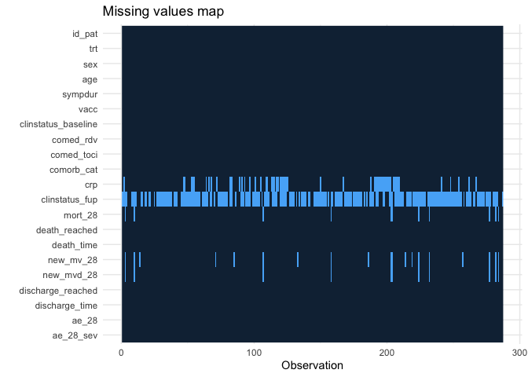
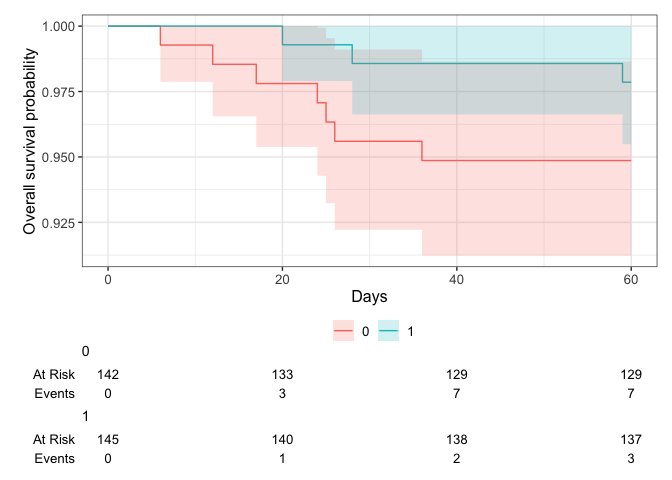

# Load packages

```r
library(tidyverse)
library(readxl)
library(writexl)
library(tableone)
library(haven) # Read sas files
library(here)
library(kableExtra)

library(jtools) # for summ() and plot_summs
library(sjPlot) # for tab_model
library(ggplot2) # survival/TTE analyses and other graphs
library(ggsurvfit) # survival/TTE analyses
library(survival) # survival/TTE analyses
library(gtsummary) # survival/TTE analyses
library(ggfortify) # autoplot
library(tidycmprsk) # competing risk analysis
library(ordinal) # clinstatus ordinal regression
library(mosaic) # OR for 0.5-corrected 2x2 table in case of rare events
library(logistf) # Firth regression in case of rare events

library(finalfit) # missing data exploration
library(mice) # multiple imputation
library(jomo) # multiple imputation
library(mitools) # multiple imputation
```

# Load Data


# Define ITT set

```r
df <- df %>% 
  filter(!is.na(trt))
```

# Baseline Characteristics

```r
## add trial indicators and basic characteristics
df$trial <- "PANCOVID"
df$JAKi <- "Baricitinib"
df$country <- "Spain"
df$icu <- NA # not available
df$ethn <- NA # not available
# addmargins(table(df$trt, useNA = "always")) # Corresponds to publication
# addmargins(table(df$sex, df$trt, useNA = "always")) 
df <- df %>% # Corresponds to publication
  mutate(sex = case_when(sex == "1" ~ "female",
                         sex == "2" ~ "male"))

## Age 
# df %>% # Corresponds to publication
#   filter(trt == 1) %>%
#   select(age) %>%
#   summary()
df %>%
  ggplot(aes(x = age)) +
  geom_density(fill = "blue", color = "black") +
  labs(title = "Density Plot of Age",
       x = "Age",
       y = "Density")
```

<!-- -->

```r
## Symptom duration 
# df %>% # Corresponds to publication
#   filter(trt == 1) %>%
#   select(sympdur) %>%
#   summary()
# table(df$sympdur) # change -21 to +21
df <- df %>% mutate(sympdur = case_when(sympdur == -21 ~ 21,
                                        TRUE ~ sympdur))
df %>% 
  drop_na(sympdur) %>% 
  ggplot(aes(x = sympdur)) +
  geom_density(fill = "blue", color = "black") +
  labs(title = "Density Plot of Symptom Duration",
       x = "Symptom Duration",
       y = "Density")
```

<!-- -->

```r
## Clinical status at baseline
df_clinstatus <- df_clinstatus %>% 
  rename(clinstatus = clinstatus_baseline)
df <- left_join(df, df_clinstatus[, c("clinstatus", "id_pat")], by = join_by(id_pat == id_pat))
# addmargins(table(df$clinstatus, df$clinstatus_baseline, useNA = "always")) # identical, good.
# addmargins(table(df$clinstatus_baseline, df$trt, useNA = "always")) # Corresponds to publication
df <- df %>% 
  mutate(clinstatus_baseline = case_when(clinstatus_baseline == 0 ~ 2,
                                         clinstatus_baseline == 1 | clinstatus_baseline == 9 ~ 3,
                                         clinstatus_baseline == 2 | clinstatus_baseline == 3 ~ 4))
df$clinstatus_baseline <- factor(df$clinstatus_baseline, levels = 1:6) ## no missing data
addmargins(table(df$clinstatus_baseline, df$trt, useNA = "always"))
```

```
##       
##          0   1 <NA> Sum
##   1      0   0    0   0
##   2     32  42    0  74
##   3    106 102    0 208
##   4      4   1    0   5
##   5      0   0    0   0
##   6      0   0    0   0
##   <NA>   0   0    0   0
##   Sum  142 145    0 287
```

```r
df <- df %>% 
  mutate(vbaseline = case_when(clinstatus_baseline == "2" | clinstatus_baseline == "3" ~ 0,
                                clinstatus_baseline == "4" | clinstatus_baseline == "5" ~ 1))

df$randdate <- as_date(df$randdate) # randomisation date (baseline date)


## Comorbidities
df_comorb <- df_comorb %>% 
  rename(comorb_dm = "Diabetes",
         comorb_aht = "Hypertension",
         comorb_obese = "Obesity",
         id_pat = "Label")
df <- left_join(df, df_comorb[, c("comorb_dm", "comorb_aht", "comorb_obese", "id_pat")], by = join_by(id_pat == id_pat))
df$immunosupp <- 0 # see protocol
df$comorb_autoimm <- 0 # see protocol
df <- df %>% 
  mutate(any_comorb = case_when(comorb_lung == 1 | comorb_liver == 1 | comorb_cvd == 1 |
                                  comorb_aht == 1 | comorb_dm == 1 | comorb_obese == 1 | comorb_smoker == 1
                                | immunosupp == 1 | comorb_cancer == 1 | comorb_autoimm == 1 | comorb_kidney == 1 
                                  ~ 1,
                                comorb_lung == 0 & comorb_liver == 0 & comorb_cvd == 0 &
                                  comorb_aht == 0 & comorb_dm == 0 & comorb_obese == 0 & comorb_smoker == 0
                                & immunosupp == 0 & comorb_cancer == 0 & comorb_autoimm == 0 & comorb_kidney == 0
                                ~ 0))
# addmargins(table(df$any_comorb, df$trt, useNA = "always")) # no missing
# group them for the subgroup analysis, according to protocol // count all pre-defined comorbidities per patient first
comorb <- df %>% 
  select(id_pat, comorb_lung, comorb_liver, comorb_cvd, comorb_aht, comorb_dm, comorb_obese, comorb_smoker, immunosupp, comorb_kidney, comorb_autoimm, comorb_cancer)
comorb$comorb_count <- NA
for (i in 1:dim(comorb)[[1]]) {
  comorb$comorb_count[i] <- ifelse(
    sum(comorb[i, ] %in% c(1)) > 0,
    sum(comorb[i, ] %in% c(1)),
    NA
  )
}
comorb <- comorb %>% 
  mutate(comorb_count = case_when(comorb_lung == 0 & comorb_liver == 0 & comorb_cvd == 0 &
                                  comorb_aht == 0 & comorb_dm == 0 & comorb_obese == 0 & comorb_smoker == 0
                                & immunosupp == 0 & comorb_cancer == 0 & comorb_autoimm == 0 & comorb_kidney == 0 ~ 0,
                                TRUE ~ comorb_count))
# addmargins(table(comorb$comorb_count, useNA = "always")) # no missing
df <- left_join(df, comorb[, c("comorb_count", "id_pat")], by = join_by(id_pat == id_pat)) ## merge imputed variable back
df <- df %>%
  mutate(comorb_cat = case_when(immunosupp == 1 ~ 4, # immunocompromised
                                comorb_count == 0 ~ 1, # no comorbidity
                                comorb_count == 1 & (immunosupp == 0 | is.na(immunosupp)) ~ 2, # one comorbidity
                                comorb_count >1 & (immunosupp == 0 | is.na(immunosupp)) ~ 3)) # multiple comorbidities
# table(df$comorb_cat, useNA = "always")
df <- df %>%
  mutate(comorb_any = case_when(comorb_count == 0 ~ 0, # no comorbidity
                                comorb_count >0 ~ 1)) # any comorbidity
# addmargins(table(df$comorb_any, df$trt, useNA = "always")) # no missing


## COVID-19 comedication
df$comed_ab <- NA
df$comed_acoa <- NA
df$comed_interferon <- NA
df$comed_other <- df$comed_tdf # add tenofovir as "other covid-19 medication" to be consistent with other trials
# table(df$comed_dexa, df$trt) # was part of intervention and SOC
# table(df$comed_rdv, df$trt) # corresponds to publication
# table(df$comed_toci, df$trt) # CAVE: this is from the follow-up (part of disease progression)!! -> use toxi_2nd_random
df$comed_toci <- df$toxi_2nd_random
# table(df$comed_toci, df$trt, useNA = "always")
# GROUP them for the subgroup analysis, according to protocol
df <- df %>% # there are no missings in comed_dexa and comed_toci
  mutate(comed_cat = case_when(comed_dexa == 0 & comed_toci == 0 ~ 1, # patients without Dexa nor Toci // NA: all have Dexa by design
                               comed_dexa == 1 & comed_toci == 0 ~ 2, # patients with Dexa but no Toci
                               comed_dexa == 1 & comed_toci == 1 ~ 3, # patients with Dexa and Toci
                               comed_dexa == 0 & comed_toci == 1 ~ 4)) # patients with Toci but no Dexa // NA: all have Dexa by design
# addmargins(table(df$comed_cat, df$trt, useNA = "always"))


## CRP at baseline
# df %>% # Corresponds more or less to publication
#   filter(trt == 1) %>%
#   select(crp) %>%
#   summary()
# table(df$sympdur) # 11374 is probably an entry error -> NA
df <- df %>% mutate(crp = case_when(crp == 11374 ~ NA, TRUE ~ crp))
df %>% 
  drop_na(crp) %>% 
  ggplot(aes(x = crp)) +
  geom_density(fill = "blue", color = "black") +
  labs(title = "Density Plot of CRP",
       x = "CRP",
       y = "Density")
```

<!-- -->

```r
# addmargins(table(df$vacc, df$trt, useNA = "always"))

### Serology at baseline // not available
### Variant // not available
```

# Endpoints

```r
## Clinical status follow-up data
df_clinstatus$Date_Progression <- as_date(df_clinstatus$Date_Progression)
df <- left_join(df, df_clinstatus[, c("Ventilatory_Support_Progression", "Date_Progression","Progression","Type_Ventilation", "id_pat")], by = join_by(id_pat == id_pat))

# "Type_Ventilation":
# 1 = Nasal goggles                      
# 2 = High-flow oxygen devices
# 3 = Mask with reservoir
# 4 = Non-invasive ventilation
# 5 = Invasive mechanical ventilation or ECMO
# 9 = Other

## CREATE the most important time to event variables (death, discharge, withdrawal) # no LTFU, no readmission
df <- df %>%
  mutate(death_date = as_date(death_date)) %>% 
  mutate(discharge_date = as_date(discharge_date)) %>% 
  mutate(withdrawal_date = as_date(withdrawal_date)) %>% 
  mutate(withdrawal_invest_date = as_date(withdrawal_invest_date)) %>% 
  mutate(death_d = as.numeric(death_date - randdate)) %>%
  rename(withdraw_date = withdrawal_date,
         withdrawi_date = withdrawal_invest_date) %>% 
  mutate(withdraw_d = as.numeric(withdraw_date - randdate)) %>%
  mutate(withdrawi_d = as.numeric(withdrawi_date - randdate)) %>%
  mutate(discharge_d = as.numeric(discharge_date - randdate)) %>% 
  mutate(progression_d = as.numeric(Date_Progression - randdate)) %>% 
  mutate(death_reached = case_when(!is.na(death_date) ~ 1,
                                   TRUE ~ 0)) %>% # death_reached over entire study period (mort_28 defined below)
  mutate(discharge_reached = case_when(is.na(death_date) & is.na(withdraw_date) & is.na(withdrawi_date) 
                                       & discharge_d <= 28 ~ 1,
                                       TRUE ~ 0)) # discharge_reached only within 28d by definition

# (i) Primary outcome: Mortality at day 28
df <- df %>% # 2 died after window 28 (TT: "Yes, but we took it into account for the main endpoint.")
  mutate(mort_28 = case_when(death_reached == 1 & death_d <29 ~ 1, # this includes those discharged and then died (as long as within 28 days)
                             death_reached == 1 & death_d >28 ~ 0, # alive at day 28 but died later, i.e. info available
                             discharge_d >= 28 ~ 0, # discharged at day 28 or later, proof of still alive at day 28
                             withdraw_d >= 28 | withdrawi_d  >= 28 ~ 0, # still in contact after day 28, proof to be alive
                             progression_d >= 28 ~ 0, # still in contact after day 28, proof to be alive
                             is.na(death_date) & is.na(withdraw_date) & is.na(withdrawi_date) & death_reached == 0 & discharge_d <29 ~ 0)) # all discharged were discharged alive and not to hospice
# df %>% # only left with the withdrawals (10 by participants, 1 by investigator)
#   select(id_pat, trt, randdate, first_randdate, clinstatus_baseline, mort_28, death_d, death_date, death_reached, discharge_d, discharge_date, discharge_reached, withdraw_d, withdraw_date, withdrawi_d, withdrawi_date, Ventilatory_Support_Progression, progression_d, Date_Progression, Progression, Type_Ventilation) %>%
#   filter(is.na(mort_28)) %>%
#   View()
addmargins(table(df$mort_28, df$trt, useNA = "always")) 
```

```
##       
##          0   1 <NA> Sum
##   0    130 138    0 268
##   1      6   2    0   8
##   <NA>   6   5    0  11
##   Sum  142 145    0 287
```

```r
# First, keep mort_28 as complete case

# Second, use multiple imputation (see below)

# Third, apply a deterministic imputation (see notes): we use the same rules as ACTT2 => No transfer to hospice happened -> assign "alive"
df <- df %>%
  mutate(mort_28_dimp = case_when(is.na(mort_28) ~ 0,
                             TRUE ~ c(mort_28)))
# addmargins(table(df$mort_28_dimp, df$trt, useNA = "always")) 


# (ii) Mortality at day 60
df <- df %>%
  mutate(mort_60 = case_when(death_reached == 1 & death_d <61 ~ 1, 
                             death_reached == 1 & death_d >60 ~ 0,
                             discharge_d >= 60 ~ 0, 
                             progression_d >= 60 ~ 0, 
                             is.na(death_date) & is.na(withdraw_date) & is.na(withdrawi_date) & death_reached == 0 & discharge_d <61 ~ 0))
# df %>% # only left with the withdrawals (10 by participants, 1 by investigator; 2 more deaths than day 28)
#   select(id_pat, trt, randdate, first_randdate, clinstatus_baseline, mort_28, mort_60, death_d, death_date, death_reached, discharge_d, discharge_date, discharge_reached, withdraw_d, withdraw_date, withdrawi_d, withdrawi_date, Ventilatory_Support_Progression, progression_d, Date_Progression, Progression, Type_Ventilation) %>% 
#   filter(is.na(mort_60)) %>% 
#   View()
addmargins(table(df$mort_60, df$trt, useNA = "always")) 
```

```
##       
##          0   1 <NA> Sum
##   0    129 137    0 266
##   1      7   3    0  10
##   <NA>   6   5    0  11
##   Sum  142 145    0 287
```

```r
# (iii) Time to death within max. follow-up time
df <- df %>% # first, death_d, then withdraw_d, then withdrawi_d, then discharge_d, then max follow-up
  mutate(death_time = case_when(!is.na(death_d) ~ death_d, 
                                !is.na(withdraw_d) ~ withdraw_d, 
                                !is.na(withdrawi_d) ~ withdrawi_d, 
                                !is.na(discharge_d) ~ discharge_d))
# table(df$death_reached, df$death_time) # ignores the missing
# table(df$mort_60, df$death_time) # excludes the missing
df <- df %>% # Max fup time in TACTIC-R was +/- 90 days, but we restrict it across studies to 60 days, according to protocol
  mutate(death_reached = case_when(death_time>60 ~ 0,
                                TRUE ~ death_reached))
df <- df %>% # Max fup time in TACTIC-R was +/- 90 days, but we restrict it across studies to 60 days, according to protocol
  mutate(death_time = case_when(death_time>60 ~ 60,
                                TRUE ~ death_time))


# (iv) New mechanical ventilation among survivors within 28 days. PANCOVID included across clinstatus 2-4.
df <- df %>% 
  mutate(new_mv_28 = case_when((clinstatus_baseline %in% c("2","3","4")) & (mort_28 == 0) 
                               & Type_Ventilation == "Invasive Ventilation" ~ 1,
                               (clinstatus_baseline %in% c("2","3","4")) & (mort_28 == 0) 
                               & Type_Ventilation %in% c("No ventilation", "Other", "Non-Invasive Ventilation") ~ 0))
addmargins(table(df$new_mv_28, df$trt, useNA = "always")) # NA: same 11 as mort_28 + 8 deaths
```

```
##       
##          0   1 <NA> Sum
##   0    123 132    0 255
##   1      7   6    0  13
##   <NA>  12   7    0  19
##   Sum  142 145    0 287
```

```r
# (iv) Alternative definition/analysis: New mechanical ventilation OR death within 28 days => include all in denominator.
df <- df %>% 
  mutate(new_mvd_28 = case_when(new_mv_28 == 1 | mort_28 == 1 ~ 1,
                                new_mv_28 == 0 | mort_28 == 0 ~ 0))
addmargins(table(df$new_mvd_28, df$trt, useNA = "always")) # NA: same 11 as mort_28
```

```
##       
##          0   1 <NA> Sum
##   0    123 132    0 255
##   1     13   8    0  21
##   <NA>   6   5    0  11
##   Sum  142 145    0 287
```

```r
# (v) Clinical status at day 28
df <- df %>% # merge into our score
  mutate(clinstatus_fup = case_when(Ventilatory_Support_Progression == "1" ~ 3,
                                    Ventilatory_Support_Progression %in% c("2", "3", "4") ~ 4,
                                    Ventilatory_Support_Progression == "5" ~ 5,
                                    Ventilatory_Support_Progression == "9" ~ 9))
df <- df %>%
  mutate(clinstatus_28 = case_when(mort_28 == 1 ~ 6, # died within 28d
                                   discharge_d <29 & !is.na(mort_28) ~ 1, # discharged alive / exclude withdrawals
                                   !is.na(mort_28) & (progression_d == 28 | progression_d == 29 | progression_d == 30 | progression_d == 31) 
                                   & clinstatus_fup == 3 ~ 3, # exclude withdrawals (!is.na(mort_28)), progression score around day 28
                                   !is.na(mort_28) & (progression_d == 28 | progression_d == 29 | progression_d == 30 | progression_d == 31) # exclude withdrawals
                                   & clinstatus_fup == 4 ~ 4, # exclude withdrawals (!is.na(mort_28)), progression score around day 28
                                   !is.na(mort_28) & (progression_d == 28 | progression_d == 29 | progression_d == 30 | progression_d == 31) # exclude withdrawals
                                   & clinstatus_fup == 5 ~ 5, # exclude withdrawals (!is.na(mort_28)), progression score around day 28
                                   !is.na(mort_28) & progression_d <28 
                                   & (discharge_d == 29 | discharge_d == 30 | discharge_d == 31 | discharge_d == 32 | discharge_d == 33) 
                                   & (is.na(clinstatus_fup) | clinstatus_fup == 3) ~ 2, # discharge around day 28, progression score before, reduce progression score
                                   !is.na(mort_28) & progression_d <28 
                                   & (discharge_d == 29 | discharge_d == 30 | discharge_d == 31 | discharge_d == 32 | discharge_d == 33) 
                                   & clinstatus_fup == 4 ~ 3, # discharge around day 28, progression score before, reduce progression score
                                   !is.na(mort_28) & progression_d <28 
                                   & (discharge_d == 29 | discharge_d == 30 | discharge_d == 31 | discharge_d == 32 | discharge_d == 33) 
                                   & clinstatus_fup == 5 ~ 4, # discharge around day 28, progression score before, reduce progression score
                                   !is.na(mort_28) & is.na(clinstatus_fup) 
                                   & (discharge_d == 29 | discharge_d == 30 | discharge_d == 31 | discharge_d == 32 | discharge_d == 33) 
                                   ~ 2, # discharge around day 28, left with no progression score
                                   ))
# df %>% # left with discharges beyond day 35 (and withdrawals)
#   select(id_pat, trt, randdate, first_randdate, clinstatus_baseline, clinstatus_28, mort_28, mort_60, death_d, death_date, death_reached, discharge_d, discharge_date, discharge_reached, withdraw_d, withdraw_date, withdrawi_d, withdrawi_date, Ventilatory_Support_Progression, progression_d, Date_Progression, Progression, Type_Ventilation) %>%
#   filter(is.na(clinstatus_28)) %>%
#   View()

## Imputation according to protocol: If there was daily data for the ordinal score available but with missing data for single days, then we carried last observed value forward unless for day 28, whereby we first considered data from the window (+/-3 days)
df <- df %>%
  mutate(clinstatus_28_imp = case_when(is.na(clinstatus_28) & !is.na(mort_28) & progression_d <29 & !is.na(clinstatus_fup) ~ clinstatus_fup,
                                     TRUE ~ clinstatus_28)) # take last value from progression score during follow-up
df$clinstatus_baseline_n <- as.numeric(df$clinstatus_baseline)
df <- df %>%
  mutate(clinstatus_28_imp = case_when(is.na(clinstatus_28_imp) & !is.na(mort_28) ~ clinstatus_baseline_n,
                                     TRUE ~ clinstatus_28_imp)) # take from baseline score
df$clinstatus_28 <- factor(df$clinstatus_28, levels = 1:6)
df$clinstatus_28_imp <- factor(df$clinstatus_28_imp, levels = 1:6)
# table(df$clinstatus_28, useNA = "always")
# table(df$clinstatus_28_imp, useNA = "always")
# table(df$clinstatus_28_imp, df$discharge_reached, useNA = "always") # correct
# table(df$clinstatus_28_imp, df$mort_28, useNA = "always") # correct

# (vi) Time to discharge or reaching discharge criteria up to day 28
# table(df$discharge_reached, useNA = "always") # this is already within 28 days
df <- df %>% # first, discharge_d, then death_d, then withdraw_d, then max follow-up
  mutate(discharge_time = case_when(!is.na(discharge_d) ~ discharge_d,
                                    !is.na(death_d) ~ death_d,
                                    !is.na(withdraw_d) ~ withdraw_d,
                                    !is.na(withdrawi_d) ~ withdrawi_d))
# table(df$discharge_time, useNA = "always")
# table(df$discharge_reached, df$discharge_time, useNA = "always") 
df <- df %>% # restrict to max fup time 28d
  mutate(discharge_time = case_when(discharge_time >28 ~ 28,
                                    TRUE ~ discharge_time))
df <- df %>% # add 28d for those that died - as a sens-variable
  mutate(discharge_time_sens = case_when(mort_28 == 1 ~ 28,
                                    TRUE ~ discharge_time))

# (vi) Sens-analysis: Alternative definition/analysis of outcome: time to sustained discharge within 28 days -> cannot be differentiated in dataset
df$discharge_reached_sus <- df$discharge_reached
df$discharge_time_sus <- df$discharge_time


# (vii) Viral clearance up to day 5, day 10, and day 15 (Viral load value <LOQ and/or undectectable) // not available in PANCOVID

# (viii) Quality of life at day 28 // not available in PANCOVID

# (ix) Participants with an adverse event grade 3 or 4, or a serious adverse event, excluding death, by day 28

# extract AE28
df_ae28 <- df_ae %>%
  mutate(ae_date = as.Date(AE_STDTC, format = "%d/%m/%Y")) %>%
  rename(id_pat = Label)
df_ae28 <- left_join(df_ae28, df[, c("id_pat", "randdate", "trt", "death_date", "death_d", "mort_28")], by = join_by(id_pat == id_pat))
df_ae28 <- df_ae28 %>%
  filter(!is.na(trt)) %>%
  mutate(ae_d = as.numeric(ae_date - randdate)) %>% 
  filter(ae_d < 29) %>% 
  filter(mort_28 == 0 | is.na(mort_28)) %>% 
  filter(AE_SEV == 1 | AE_SEV == 2 | AE_SER == 1) %>% 
  distinct(id_pat) %>%
  mutate(ae34 = 1)
df <- left_join(df, df_ae28[, c("id_pat", "ae34")], by = join_by(id_pat == id_pat))
# the remaining missing have no (S)AE(SI) grade 34 -> recode as 0 (and exclude deaths, again)
df <- df %>%
  mutate(ae_28 = case_when(is.na(ae34) ~ 0,
                           TRUE ~ ae34)) %>%
  mutate(ae_28 = case_when(mort_28 == 1 ~ NA,
                           TRUE ~ ae_28))
# table(df$ae_28, df$mort_28, useNA = "always")
# addmargins(table(df$ae_28, df$trt, useNA = "always"))

# (ix) Sens-analysis: Alternative definition/analysis of outcome: incidence rate ratio (Poisson regression) -> AE per person by d28
df_ae_npp <- df_ae %>%
  mutate(ae_date = as.Date(AE_STDTC, format = "%d/%m/%Y")) %>%
  rename(id_pat = Label)
df_ae_npp <- left_join(df_ae_npp, df[, c("id_pat", "randdate", "trt", "death_date", "death_d", "mort_28")], by = join_by(id_pat == id_pat))
df_ae_npp <- df_ae_npp %>%
  filter(!is.na(trt)) %>%
  mutate(ae_d = as.numeric(ae_date - randdate)) %>% 
  filter(ae_d < 29) %>% 
  filter(mort_28 == 0 | is.na(mort_28)) %>% 
  filter(AE_SEV == 1 | AE_SEV == 2 | AE_SER == 1)
df_ae_npp <- df_ae_npp %>%
  group_by(id_pat)%>%
  summarise(ae28_sev = n())
df <- left_join(df, df_ae_npp[, c("ae28_sev", "id_pat")], by = join_by(id_pat == id_pat))
# the remaining missing have no (S)AE(SI) grade 34 -> recode as 0 (and exclude deaths, again)
df <- df %>%
  mutate(ae_28_sev = case_when(is.na(ae28_sev) ~ 0,
                           TRUE ~ ae28_sev)) %>%
  mutate(ae_28_sev = case_when(mort_28 == 1 ~ NA,
                           TRUE ~ ae_28_sev))
# addmargins(table(df$ae_28_sev, useNA = "always"))


# (ix) Sens-analysis: Alternative definition/analysis of outcome: time to first (of these) adverse event, within 28 days, considering death as a competing risk -> COP

# (x) Adverse events of special interest within 28 days: a) thromboembolic events (venous thromboembolism, pulmonary embolism, arterial thrombosis), b) secondary infections (bacterial pneumonia including ventilator-associated pneumonia, meningitis and encephalitis, endocarditis and bacteremia, invasive fungal infection including pulmonary aspergillosis), c) Reactivation of chronic infection including tuberculosis, herpes simplex, cytomegalovirus, herpes zoster and hepatitis B, d) serious cardiac events (excl. hypertension), e) events related to signs of bone marrow suppression (anemia, lymphocytopenia, thrombocytopenia, pancytopenia), f) malignancy, g) gastrointestinal perforation (incl. gastrointestinal bleeding/diverticulitis), h) liver dysfunction/hepatotoxicity (grade 3 and 4), i) Multiple organ dysfunction syndrome and septic shock
df_aesi_list <- df_ae %>%
  mutate(ae_date = as.Date(AE_STDTC, format = "%d/%m/%Y")) %>%
  rename(id_pat = Label)
df_aesi_list <- left_join(df_aesi_list, df[, c("id_pat", "randdate", "trt", "death_date", "death_d", "mort_28")], by = join_by(id_pat == id_pat))
df_aesi_list <- df_aesi_list %>%
  filter(!is.na(trt)) %>%
  mutate(ae_d = as.numeric(ae_date - randdate)) %>% 
  filter(ae_d < 29)
       
df_thrombo <- df_aesi_list %>% # a) thromboembolic events (venous thromboembolism, pulmonary embolism, arterial thrombosis)
  filter(grepl("thrombos|embo|occl", AETerm, ignore.case = TRUE)) %>% 
  mutate(aesi = "thrombo")
df_sec_inf <- df_aesi_list %>% # b) secondary infections (bacterial pneumonia including ventilator-associated pneumonia, meningitis and encephalitis, endocarditis and bacteremia, invasive fungal infection including pulmonary aspergillosis), but not COVID-19 pneumonia!
  filter(SOC_Name %in% c("Infections and infestations") & !grepl("shock|herpe|COVID-19|sinusitis|dendritic", AETerm, ignore.case = TRUE)) %>% 
  mutate(aesi = "sec_inf")
df_reactivate <- df_aesi_list %>% # c) Reactivation of chronic infection including tuberculosis, herpes simplex, cytomegalovirus, herpes zoster and hepatitis B
  filter(grepl("hepatitis|zoster|herpe|cytome|tuber|tb|dendritic", AETerm, ignore.case = TRUE)) %>%
  mutate(aesi = "reactivate")
df_cardiac <- df_aesi_list %>% # d) serious cardiovascular and cardiac events (including stroke and myocardial infarction) (excl. hypertension)
  filter(SOC_Name %in% c("Cardiac disorders") | grepl("stroke|cerebrovascular|infarction|ischaemia|ischemia", AETerm, ignore.case = TRUE)) %>% 
  mutate(aesi = "cardiac")
df_penia <- df_aesi_list %>% # e) events related to signs of bone marrow suppression (anemia, lymphocytopenia, thrombocytopenia, pancytopenia)
  filter(grepl("penia|anemia|anaemia", AETerm, ignore.case = TRUE)) %>% 
  mutate(aesi = "penia")
# df_malig <- df_aesi_list %>% # f) malignancy
#   filter(SOC_Name %in% c("Neoplasms benign, malignant and unspecified (incl cysts and polyps)") | grepl("cancer|neopl|malig", AETerm, ignore.case = TRUE)) %>%
#   mutate(aesi = "malig")
# df_git_bl <- df_aesi_list %>% # g) gastrointestinal perforation (incl. gastrointestinal bleeding/diverticulitis)
#   filter(SOC_Name %in% c("Hepatobiliary disorders","Gastrointestinal disorders") & grepl("hemor|haemor|bleed", AETerm, ignore.case = TRUE)) %>% 
#   mutate(aesi = "git_bl")
df_hepatox <- df_aesi_list %>% # h) liver dysfunction/hepatotoxicity (grade 3 and 4)
  filter(SOC_Name %in% c("Hepatobiliary disorders") & grepl("hepatox|liver injury|damage|failure|hypertrans|abnormal|hyperbili", AETerm, ignore.case = TRUE)) %>%
  mutate(aesi = "hepatox")
df_mods <- df_aesi_list %>% # i) Multiple organ dysfunction syndrome and septic shock
  filter(grepl("Multiple organ dysfunction syndrome|mods|shock", AETerm, ignore.case = TRUE)) %>% 
  mutate(aesi = "mods")

df_aesi <- rbind(df_mods, df_hepatox, df_penia, df_cardiac, df_reactivate, df_sec_inf, df_thrombo)
df_aesi <- df_aesi %>%
  select(id_pat, trt, aesi, AETerm, SOC_Name)
# table(df_aesi$trt, df_aesi$aesi)

# double-check if there are any duplicate AEs within the same person and if it is the same event or distinct ones
df_aesi <- df_aesi %>% 
  group_by(id_pat) %>% 
  mutate(duplicate_id = duplicated(SOC_Name) & !is.na(SOC_Name)) %>% 
  ungroup()
# df_aesi <- df_aesi %>%
#   filter(duplicate_id == F)
# Save
saveRDS(df_aesi, file = "df_aesi_pancovid.RData")

# (xi) Adverse events, any grade and serious adverse event, excluding death, within 28 days, grouped by organ classes
df_ae_list <- df_ae %>%
  mutate(ae_date = as.Date(AE_STDTC, format = "%d/%m/%Y")) %>%
  rename(id_pat = Label)
df_ae_list <- left_join(df_ae_list, df[, c("id_pat", "randdate", "trt", "death_date", "death_d", "mort_28")], by = join_by(id_pat == id_pat))
df_ae_list <- df_ae_list %>%
  filter(!is.na(trt)) %>%
  mutate(ae_d = as.numeric(ae_date - randdate)) %>% 
  filter(ae_d < 29)
df_ae_list <- df_ae_list %>% 
  group_by(id_pat) %>% 
  mutate(duplicate_id = duplicated(SOC_Name) & !is.na(SOC_Name)) %>% 
  ungroup()
# df_ae_list <- df_ae_list %>% 
#   filter(duplicate_id == F)
# Save
saveRDS(df_ae_list, file = "df_ae_pancovid.RData")
```

# Define final datasets

```r
# keep the overall set
df_all <- df
# reduce the df set to our standardized set across all trials
df <- df_all %>% 
  select(id_pat, trt, sex, age, trial, JAKi, 
         # ethn, 
         country, 
         # icu, 
         sympdur, 
         vacc, 
         clinstatus_baseline, vbaseline,
         comed_dexa, 
         comed_rdv, 
         comed_toci, comed_ab, comed_acoa, comed_interferon, comed_other,
         comed_cat,
         comorb_lung, comorb_liver, comorb_cvd, comorb_aht, comorb_dm, comorb_obese, comorb_smoker, immunosupp,
         any_comorb, comorb_cat, comorb_any, comorb_count,
         comorb_autoimm, comorb_cancer, comorb_kidney,
         crp, 
         # sero, 
         # vl_baseline, 
         # variant,
         mort_28, mort_28_dimp,
         mort_60, death_reached, death_time,
         new_mv_28, new_mvd_28,
         clinstatus_28_imp,
         discharge_reached, discharge_time, discharge_time_sens, discharge_reached_sus, discharge_time_sus,
         ae_28, ae_28_sev,
         # vir_clear_5, vir_clear_10, vir_clear_15
         )

# export for one-stage model, i.e., add missing variables 
df_os <- df
df_os$ethn <- NA
df_os$icu <- NA
df_os$sero <- NA
df_os$vl_baseline <- NA
df_os$variant <- NA
df_os$vir_clear_5 <- NA
df_os$vir_clear_10 <- NA
df_os$vir_clear_15 <- NA
# Save
saveRDS(df_os, file = "df_os_pancovid.RData")
```

# Missing data plot: One-stage dataset

```r
# Bar plot, missing data, each data point, standardized one-stage dataset
original_order <- colnames(df_os)
missing_plot <- df_os %>%
  summarise_all(~ mean(is.na(.))) %>%
  gather() %>%
  mutate(key = factor(key, levels = original_order)) %>%
  ggplot(aes(x = key, y = value)) +
  geom_bar(stat = "identity") +
  labs(x = "Columns", y = "Proportion of Missing Values", title = "Missing Data - standardized one-stage dataset") +
  theme(axis.text.x = element_text(angle = 45, hjust = 1)) +
  ylim(0, 1)
print(missing_plot)
```

<!-- -->
Discussion points
1. Missing variables:
* Baseline:
  - Variant, Serology, VL
  - comed_ab, comed_acoa, comed_interferon
  - ethn, icu
* Outcomes:
  - qol_28
  - vir_clear
2. Missing data:
- mort_28/60/new_mv/new_mvd
- crp
- ae_28/_sev: by design-> deaths

# Missing data: Explore for MI

```r
# keep the core df
df_core <- df_all %>%
    select(id_pat, trt, sex, age, trial, JAKi, 
           # ethn, 
         country, 
         # icu, 
         sympdur, 
         vacc, 
         clinstatus_baseline, vbaseline,
         comed_dexa, comed_rdv, comed_toci, 
         # comed_ab, comed_acoa, comed_interferon, 
         comed_other,
         comed_cat,
         comorb_lung, comorb_liver, comorb_cvd, comorb_aht, comorb_dm, comorb_obese, comorb_smoker, immunosupp,
         comorb_autoimm, comorb_cancer, comorb_kidney,
         any_comorb, comorb_cat, comorb_any, comorb_count,
         crp, 
         # sero, variant,
         # vl_baseline, 
         clinstatus_fup,
         clinstatus_28_imp,
         mort_28, mort_28_dimp, mort_60, death_reached, death_time,
         new_mv_28, new_mvd_28,
         discharge_reached, discharge_time, discharge_time_sens, discharge_reached_sus, discharge_time_sus,
         # vir_clear_5, vir_clear_10, vir_clear_15,
         ae_28, ae_28_sev
         )

# str(df_core)

# Convert character variables to factors
char_vars <- c("id_pat", "sex", "trial", "JAKi", "country", "vacc", "clinstatus_baseline", "vbaseline", 
               "comed_dexa", "comed_rdv", "comed_toci", "comed_other", "comed_cat",
               "comorb_lung", "comorb_liver", "comorb_cvd", "comorb_aht", "comorb_dm", "comorb_obese", "comorb_smoker", "immunosupp", "any_comorb", "comorb_cat", "comorb_any", "comorb_autoimm","comorb_cancer", "comorb_kidney",
               "clinstatus_fup",
               "clinstatus_28_imp", "mort_28", "mort_28_dimp", "mort_60", "death_reached", "new_mv_28", "new_mvd_28","discharge_reached", "discharge_reached_sus", "ae_28")
df_core <- df_core %>%
  mutate(across(all_of(char_vars), factor))

# Bar plot, missing data, each data point, core dataset
original_order <- colnames(df_core)
missing_plot <- df_core %>%
  summarise_all(~ mean(is.na(.))) %>%
  gather() %>%
  mutate(key = factor(key, levels = original_order)) %>%
  ggplot(aes(x = key, y = value)) +
  geom_bar(stat = "identity") +
  labs(x = "Columns", y = "Proportion of Missing Values", title = "Missing Data - core dataset") +
  theme(axis.text.x = element_text(angle = 45, hjust = 1)) +
  ylim(0, 1)
print(missing_plot)
```

<!-- -->

```r
# Bar plot, missing data, each data point, core dataset, by arm
df_core_int <- df_core %>% 
  filter(trt == 1)
original_order <- colnames(df_core_int)
missing_plot <- df_core_int %>% # Intervention arm
  summarise_all(~ mean(is.na(.))) %>%
  gather() %>%
  mutate(key = factor(key, levels = original_order)) %>%
  ggplot(aes(x = key, y = value)) +
  geom_bar(stat = "identity") +
  labs(x = "Columns", y = "Proportion of Missing Values", title = "Missing Data - core dataset, intervention") +
  theme(axis.text.x = element_text(angle = 45, hjust = 1)) +
  ylim(0, 1)
print(missing_plot)
```

<!-- -->

```r
df_core_cont <- df_core %>% 
  filter(trt == 0)
original_order <- colnames(df_core_cont)
missing_plot <- df_core_cont %>% # Control arm
  summarise_all(~ mean(is.na(.))) %>%
  gather() %>%
  mutate(key = factor(key, levels = original_order)) %>%
  ggplot(aes(x = key, y = value)) +
  geom_bar(stat = "identity") +
  labs(x = "Columns", y = "Proportion of Missing Values", title = "Missing Data - core dataset, control") +
  theme(axis.text.x = element_text(angle = 45, hjust = 1)) +
  ylim(0, 1)
print(missing_plot)
```

<!-- -->

```r
### Baseline table, by individuals with no missing data vs any missing data (or only in mort_28)
# df_core <- df_core %>% mutate(complete = ifelse(rowSums(is.na(.)) > 0, 0, 1));table(df_core$complete) # ANY missing 
df_core$resp<-ifelse(is.na(df_core$mort_28), 0, 1);table(df_core$resp) # only mort_28 missing 
```

```
## 
##   0   1 
##  11 276
```

```r
# Assign variable list
vars.list <- c("resp", "age", "sympdur"
               ,"trt", "sex", "country", "vacc", "clinstatus_baseline", "vbaseline", 
               "comed_dexa", "comed_rdv", "comed_toci", "comed_other", "comed_cat",
               "comorb_lung", "comorb_liver", "comorb_cvd", "comorb_aht", "comorb_dm", "comorb_obese", "comorb_smoker", "immunosupp", "any_comorb", "comorb_cat", "comorb_any", "comorb_count","comorb_autoimm","comorb_cancer", "comorb_kidney", "crp"
               , "mort_28", "mort_28_dimp", "mort_60", "death_reached","death_time", "new_mv_28", "new_mvd_28","discharge_reached", "discharge_time", "discharge_reached_sus", "discharge_time_sus", "ae_28", "ae_28_sev")

# By completeness (only mort_28)
table_resp <- CreateTableOne(data = df_core, vars = vars.list[!vars.list %in% c("resp")], strata = "resp", includeNA = T, test = T, addOverall = TRUE)
# Print and display the table
capture.output(
  table_resp <- print(
    table_resp, 
    nonnormal = vars.list, 
    catDigits = 1, 
    SMD = TRUE, 
    showAllLevels = TRUE, 
    test = TRUE, 
    printToggle = FALSE, 
    missing = TRUE))
```

```
## character(0)
```

```r
kable(table_resp, format = "markdown", table.attr = 'class="table"', caption = "By completeness (only mort_28)") %>%
  kable_styling(bootstrap_options = "striped", full_width = FALSE)
```


Table: By completeness (only mort_28)

|                                  |level  |Overall               |0                     |1                     |p      |test    |Missing |
|:---------------------------------|:------|:---------------------|:---------------------|:---------------------|:------|:-------|:-------|
|n                                 |       |287                   |11                    |276                   |       |        |        |
|age (median [IQR])                |       |67.00 [62.00, 74.00]  |69.00 [62.00, 76.50]  |67.00 [62.00, 74.00]  |0.640  |nonnorm |0.0     |
|sympdur (median [IQR])            |       |8.00 [5.00, 10.00]    |8.00 [7.00, 10.50]    |7.00 [5.00, 10.00]    |0.334  |nonnorm |0.0     |
|trt (median [IQR])                |       |1.00 [0.00, 1.00]     |0.00 [0.00, 1.00]     |1.00 [0.00, 1.00]     |0.732  |nonnorm |0.0     |
|sex (%)                           |female |99 ( 34.5)            |5 ( 45.5)             |94 ( 34.1)            |0.648  |        |0.0     |
|                                  |male   |188 ( 65.5)           |6 ( 54.5)             |182 ( 65.9)           |       |        |        |
|country (%)                       |Spain  |287 (100.0)           |11 (100.0)            |276 (100.0)           |NA     |        |0.0     |
|vacc (%)                          |0      |250 ( 87.1)           |10 ( 90.9)            |240 ( 87.0)           |1.000  |        |0.0     |
|                                  |1      |37 ( 12.9)            |1 (  9.1)             |36 ( 13.0)            |       |        |        |
|clinstatus_baseline (%)           |2      |74 ( 25.8)            |4 ( 36.4)             |70 ( 25.4)            |0.664  |        |0.0     |
|                                  |3      |208 ( 72.5)           |7 ( 63.6)             |201 ( 72.8)           |       |        |        |
|                                  |4      |5 (  1.7)             |0 (  0.0)             |5 (  1.8)             |       |        |        |
|vbaseline (%)                     |0      |282 ( 98.3)           |11 (100.0)            |271 ( 98.2)           |1.000  |        |0.0     |
|                                  |1      |5 (  1.7)             |0 (  0.0)             |5 (  1.8)             |       |        |        |
|comed_dexa (%)                    |1      |287 (100.0)           |11 (100.0)            |276 (100.0)           |NA     |        |0.0     |
|comed_rdv (%)                     |0      |243 ( 84.7)           |7 ( 63.6)             |236 ( 85.5)           |0.122  |        |0.0     |
|                                  |1      |44 ( 15.3)            |4 ( 36.4)             |40 ( 14.5)            |       |        |        |
|comed_toci (%)                    |0      |269 ( 93.7)           |11 (100.0)            |258 ( 93.5)           |0.810  |        |0.0     |
|                                  |1      |18 (  6.3)            |0 (  0.0)             |18 (  6.5)            |       |        |        |
|comed_other (%)                   |0      |146 ( 50.9)           |4 ( 36.4)             |142 ( 51.4)           |0.500  |        |0.0     |
|                                  |1      |141 ( 49.1)           |7 ( 63.6)             |134 ( 48.6)           |       |        |        |
|comed_cat (%)                     |2      |269 ( 93.7)           |11 (100.0)            |258 ( 93.5)           |0.810  |        |0.0     |
|                                  |3      |18 (  6.3)            |0 (  0.0)             |18 (  6.5)            |       |        |        |
|comorb_lung (%)                   |0      |262 ( 91.3)           |9 ( 81.8)             |253 ( 91.7)           |0.555  |        |0.0     |
|                                  |1      |25 (  8.7)            |2 ( 18.2)             |23 (  8.3)            |       |        |        |
|comorb_liver (%)                  |0      |273 ( 95.1)           |9 ( 81.8)             |264 ( 95.7)           |0.169  |        |0.0     |
|                                  |1      |14 (  4.9)            |2 ( 18.2)             |12 (  4.3)            |       |        |        |
|comorb_cvd (%)                    |0      |237 ( 82.6)           |9 ( 81.8)             |228 ( 82.6)           |1.000  |        |0.0     |
|                                  |1      |50 ( 17.4)            |2 ( 18.2)             |48 ( 17.4)            |       |        |        |
|comorb_aht (%)                    |0      |122 ( 42.5)           |3 ( 27.3)             |119 ( 43.1)           |0.465  |        |0.0     |
|                                  |1      |165 ( 57.5)           |8 ( 72.7)             |157 ( 56.9)           |       |        |        |
|comorb_dm (%)                     |0      |202 ( 70.4)           |9 ( 81.8)             |193 ( 69.9)           |0.610  |        |0.0     |
|                                  |1      |85 ( 29.6)            |2 ( 18.2)             |83 ( 30.1)            |       |        |        |
|comorb_obese (%)                  |0      |233 ( 81.2)           |9 ( 81.8)             |224 ( 81.2)           |1.000  |        |0.0     |
|                                  |1      |54 ( 18.8)            |2 ( 18.2)             |52 ( 18.8)            |       |        |        |
|comorb_smoker (%)                 |0      |283 ( 98.6)           |11 (100.0)            |272 ( 98.6)           |1.000  |        |0.0     |
|                                  |1      |4 (  1.4)             |0 (  0.0)             |4 (  1.4)             |       |        |        |
|immunosupp (%)                    |0      |287 (100.0)           |11 (100.0)            |276 (100.0)           |NA     |        |0.0     |
|any_comorb (%)                    |0      |64 ( 22.3)            |2 ( 18.2)             |62 ( 22.5)            |1.000  |        |0.0     |
|                                  |1      |223 ( 77.7)           |9 ( 81.8)             |214 ( 77.5)           |       |        |        |
|comorb_cat (%)                    |1      |64 ( 22.3)            |2 ( 18.2)             |62 ( 22.5)            |0.588  |        |0.0     |
|                                  |2      |83 ( 28.9)            |2 ( 18.2)             |81 ( 29.3)            |       |        |        |
|                                  |3      |140 ( 48.8)           |7 ( 63.6)             |133 ( 48.2)           |       |        |        |
|comorb_any (%)                    |0      |64 ( 22.3)            |2 ( 18.2)             |62 ( 22.5)            |1.000  |        |0.0     |
|                                  |1      |223 ( 77.7)           |9 ( 81.8)             |214 ( 77.5)           |       |        |        |
|comorb_count (median [IQR])       |       |1.00 [1.00, 2.00]     |2.00 [1.00, 2.00]     |1.00 [1.00, 2.00]     |0.530  |nonnorm |0.0     |
|comorb_autoimm (%)                |0      |287 (100.0)           |11 (100.0)            |276 (100.0)           |NA     |        |0.0     |
|comorb_cancer (%)                 |0      |241 ( 84.0)           |9 ( 81.8)             |232 ( 84.1)           |1.000  |        |0.0     |
|                                  |1      |46 ( 16.0)            |2 ( 18.2)             |44 ( 15.9)            |       |        |        |
|comorb_kidney (%)                 |0      |285 ( 99.3)           |11 (100.0)            |274 ( 99.3)           |1.000  |        |0.0     |
|                                  |1      |2 (  0.7)             |0 (  0.0)             |2 (  0.7)             |       |        |        |
|crp (median [IQR])                |       |66.85 [31.22, 113.05] |53.15 [13.02, 211.50] |66.85 [32.05, 109.00] |0.963  |nonnorm |19.9    |
|mort_28 (%)                       |0      |268 ( 93.4)           |0 (  0.0)             |268 ( 97.1)           |<0.001 |        |3.8     |
|                                  |1      |8 (  2.8)             |0 (  0.0)             |8 (  2.9)             |       |        |        |
|                                  |NA     |11 (  3.8)            |11 (100.0)            |0 (  0.0)             |       |        |        |
|mort_28_dimp (%)                  |0      |279 ( 97.2)           |11 (100.0)            |268 ( 97.1)           |1.000  |        |0.0     |
|                                  |1      |8 (  2.8)             |0 (  0.0)             |8 (  2.9)             |       |        |        |
|mort_60 (%)                       |0      |266 ( 92.7)           |0 (  0.0)             |266 ( 96.4)           |<0.001 |        |3.8     |
|                                  |1      |10 (  3.5)            |0 (  0.0)             |10 (  3.6)            |       |        |        |
|                                  |NA     |11 (  3.8)            |11 (100.0)            |0 (  0.0)             |       |        |        |
|death_reached (%)                 |0      |277 ( 96.5)           |11 (100.0)            |266 ( 96.4)           |1.000  |        |0.0     |
|                                  |1      |10 (  3.5)            |0 (  0.0)             |10 (  3.6)            |       |        |        |
|death_time (median [IQR])         |       |28.00 [27.00, 30.00]  |4.00 [1.00, 6.00]     |28.00 [27.00, 30.00]  |<0.001 |nonnorm |0.0     |
|new_mv_28 (%)                     |0      |255 ( 88.9)           |0 (  0.0)             |255 ( 92.4)           |<0.001 |        |6.6     |
|                                  |1      |13 (  4.5)            |0 (  0.0)             |13 (  4.7)            |       |        |        |
|                                  |NA     |19 (  6.6)            |11 (100.0)            |8 (  2.9)             |       |        |        |
|new_mvd_28 (%)                    |0      |255 ( 88.9)           |0 (  0.0)             |255 ( 92.4)           |<0.001 |        |3.8     |
|                                  |1      |21 (  7.3)            |0 (  0.0)             |21 (  7.6)            |       |        |        |
|                                  |NA     |11 (  3.8)            |11 (100.0)            |0 (  0.0)             |       |        |        |
|discharge_reached (%)             |0      |122 ( 42.5)           |11 (100.0)            |111 ( 40.2)           |<0.001 |        |0.0     |
|                                  |1      |165 ( 57.5)           |0 (  0.0)             |165 ( 59.8)           |       |        |        |
|discharge_time (median [IQR])     |       |28.00 [27.00, 28.00]  |4.00 [1.00, 6.00]     |28.00 [27.00, 28.00]  |<0.001 |nonnorm |0.0     |
|discharge_reached_sus (%)         |0      |122 ( 42.5)           |11 (100.0)            |111 ( 40.2)           |<0.001 |        |0.0     |
|                                  |1      |165 ( 57.5)           |0 (  0.0)             |165 ( 59.8)           |       |        |        |
|discharge_time_sus (median [IQR]) |       |28.00 [27.00, 28.00]  |4.00 [1.00, 6.00]     |28.00 [27.00, 28.00]  |<0.001 |nonnorm |0.0     |
|ae_28 (%)                         |0      |244 ( 85.0)           |10 ( 90.9)            |234 ( 84.8)           |0.796  |        |2.8     |
|                                  |1      |35 ( 12.2)            |1 (  9.1)             |34 ( 12.3)            |       |        |        |
|                                  |NA     |8 (  2.8)             |0 (  0.0)             |8 (  2.9)             |       |        |        |
|ae_28_sev (median [IQR])          |       |0.00 [0.00, 0.00]     |0.00 [0.00, 0.00]     |0.00 [0.00, 0.00]     |0.705  |nonnorm |2.8     |

```r
### Define variables to be included in imputation set
df_imp <- df_core %>% 
  select("id_pat"
         , "trt", "sex", "age" 
         # , "ethn" # no info
         , "sympdur"
         # , "country" # only Spain, no info
         , "vacc" 
         # , "trial", "JAKi"  # only 0
         ,"clinstatus_baseline"
         # , "vbaseline" # derived
         , "comed_rdv"
         , "comed_toci"
         # , "comed_interferon" # no info
         #,  "comed_cat", # derived
         # , "comed_dexa" # all received dexa
         # , "comed_ab", "comed_acoa" # no info
         # , "comed_other" # does not make sense
         # , "comorb_lung", "comorb_liver", "comorb_cvd", "comorb_aht", "comorb_dm", "comorb_obese",
         # "comorb_smoker", "immunosupp", "comorb_autoimm", "comorb_cancer", "comorb_kidney", "any_comorb",
         # "comorb_count",  
         # "comorb_any",
         ,"comorb_cat" # derived from above, contains most information, and needed as interaction term
         ,"crp"
         # , "vl_baseline" # no info
         # , "sero" , "variant" # no info
         , "clinstatus_fup"
         # , "clinstatus_28_imp" # imputed via LOVCF above
         , "mort_28"
         # , "mort_28_dimp" # imputed deterministically
         # , "mort_60" # does not contain any additional information compared to death reached
         , "death_reached", "death_time", "new_mv_28", "new_mvd_28", "discharge_reached", "discharge_time"
         # , "discharge_reached_sus", "discharge_time_sus" # same as discharge, does not contain any addition information
         , "ae_28", "ae_28_sev"
         # , "vir_clear_5", "vir_clear_10", "vir_clear_15" # no info
         )
         
# str(df_imp)

# First, table and visualize missing data in various ways
# df_imp %>% 
#   ff_glimpse() # from finalfit package
df_imp %>%
  missing_plot() # from finalfit package
```

<!-- -->

```r
explanatory = c("age", "clinstatus_baseline", "sex", "vacc", "sympdur", "comorb_cat", "comed_rdv", "comed_toci", "crp", "ae_28")
dependent = "mort_28"
df_imp %>% # from finalfit package, missing plot
  missing_pairs(dependent, explanatory, position = "fill", )
```

<!-- -->

```r
# Second, let's explore the missingness patterns
md.pattern(df_imp[,c("mort_28", "age", "clinstatus_baseline", "sex", "vacc", "sympdur", "comorb_cat", "comed_rdv", "comed_toci", "crp", "ae_28")], rotate.names = T)
```

<!-- -->

```
##     age clinstatus_baseline sex vacc sympdur comorb_cat comed_rdv comed_toci
## 212   1                   1   1    1       1          1         1          1
## 56    1                   1   1    1       1          1         1          1
## 10    1                   1   1    1       1          1         1          1
## 1     1                   1   1    1       1          1         1          1
## 8     1                   1   1    1       1          1         1          1
##       0                   0   0    0       0          0         0          0
##     ae_28 mort_28 crp   
## 212     1       1   1  0
## 56      1       1   0  1
## 10      1       0   1  1
## 1       1       0   0  2
## 8       0       1   1  1
##         8      11  57 76
```

```r
# Third, let's explore if the variables from my substantive model plus auxiliary variables are associated with mort_28
mort28.aux <- glm(mort_28 ~ trt
            + age 
            + clinstatus_baseline
            + sex
            + vacc
            + sympdur
            + comorb_cat
            + comed_toci
            + comed_rdv
            + crp
            # + ae_28
            ,family="binomial"
            ,data=df_imp)
summary(mort28.aux)
```

```
## 
## Call:
## glm(formula = mort_28 ~ trt + age + clinstatus_baseline + sex + 
##     vacc + sympdur + comorb_cat + comed_toci + comed_rdv + crp, 
##     family = "binomial", data = df_imp)
## 
## Deviance Residuals: 
##      Min        1Q    Median        3Q       Max  
## -1.71794  -0.18087  -0.07551  -0.02514   2.60986  
## 
## Coefficients:
##                        Estimate Std. Error z value Pr(>|z|)   
## (Intercept)          -22.656647   7.419226  -3.054  0.00226 **
## trt                   -1.614756   1.158920  -1.393  0.16352   
## age                    0.287364   0.102291   2.809  0.00497 **
## clinstatus_baseline3  -0.412042   1.328708  -0.310  0.75648   
## clinstatus_baseline4   2.338319   1.957511   1.195  0.23227   
## sexmale                0.996449   1.287160   0.774  0.43884   
## vacc1                  0.133150   1.338595   0.099  0.92077   
## sympdur               -0.057186   0.099329  -0.576  0.56481   
## comorb_cat2           -0.784267   1.240881  -0.632  0.52737   
## comorb_cat3           -3.036277   1.621259  -1.873  0.06110 . 
## comed_toci1            2.976725   1.272802   2.339  0.01935 * 
## comed_rdv1            -0.132077   1.355384  -0.097  0.92237   
## crp                   -0.001474   0.008146  -0.181  0.85639   
## ---
## Signif. codes:  0 '***' 0.001 '**' 0.01 '*' 0.05 '.' 0.1 ' ' 1
## 
## (Dispersion parameter for binomial family taken to be 1)
## 
##     Null deviance: 68.732  on 219  degrees of freedom
## Residual deviance: 39.288  on 207  degrees of freedom
##   (67 observations deleted due to missingness)
## AIC: 65.288
## 
## Number of Fisher Scoring iterations: 8
```

```r
# Fourth, let's explore if they are associated with missingness of mort_28:
df_imp %>% 
  missing_compare(dependent, explanatory) %>%
    knitr::kable(row.names=FALSE, align = c("l", "l", "r", "r", "r"))
```

<table>
 <thead>
  <tr>
   <th style="text-align:left;"> Missing data analysis: mort_28 </th>
   <th style="text-align:left;">   </th>
   <th style="text-align:right;"> Not missing </th>
   <th style="text-align:right;"> Missing </th>
   <th style="text-align:right;"> p </th>
  </tr>
 </thead>
<tbody>
  <tr>
   <td style="text-align:left;"> age </td>
   <td style="text-align:left;"> Mean (SD) </td>
   <td style="text-align:right;"> 67.1 (9.2) </td>
   <td style="text-align:right;"> 68.0 (10.4) </td>
   <td style="text-align:right;"> 0.763 </td>
  </tr>
  <tr>
   <td style="text-align:left;"> clinstatus_baseline </td>
   <td style="text-align:left;"> 2 </td>
   <td style="text-align:right;"> 70 (94.6) </td>
   <td style="text-align:right;"> 4 (5.4) </td>
   <td style="text-align:right;"> 0.664 </td>
  </tr>
  <tr>
   <td style="text-align:left;">  </td>
   <td style="text-align:left;"> 3 </td>
   <td style="text-align:right;"> 201 (96.6) </td>
   <td style="text-align:right;"> 7 (3.4) </td>
   <td style="text-align:right;">  </td>
  </tr>
  <tr>
   <td style="text-align:left;">  </td>
   <td style="text-align:left;"> 4 </td>
   <td style="text-align:right;"> 5 (100.0) </td>
   <td style="text-align:right;"> 0 (0.0) </td>
   <td style="text-align:right;">  </td>
  </tr>
  <tr>
   <td style="text-align:left;"> sex </td>
   <td style="text-align:left;"> female </td>
   <td style="text-align:right;"> 94 (94.9) </td>
   <td style="text-align:right;"> 5 (5.1) </td>
   <td style="text-align:right;"> 0.648 </td>
  </tr>
  <tr>
   <td style="text-align:left;">  </td>
   <td style="text-align:left;"> male </td>
   <td style="text-align:right;"> 182 (96.8) </td>
   <td style="text-align:right;"> 6 (3.2) </td>
   <td style="text-align:right;">  </td>
  </tr>
  <tr>
   <td style="text-align:left;"> vacc </td>
   <td style="text-align:left;"> 0 </td>
   <td style="text-align:right;"> 240 (96.0) </td>
   <td style="text-align:right;"> 10 (4.0) </td>
   <td style="text-align:right;"> 1.000 </td>
  </tr>
  <tr>
   <td style="text-align:left;">  </td>
   <td style="text-align:left;"> 1 </td>
   <td style="text-align:right;"> 36 (97.3) </td>
   <td style="text-align:right;"> 1 (2.7) </td>
   <td style="text-align:right;">  </td>
  </tr>
  <tr>
   <td style="text-align:left;"> sympdur </td>
   <td style="text-align:left;"> Mean (SD) </td>
   <td style="text-align:right;"> 7.8 (4.1) </td>
   <td style="text-align:right;"> 8.7 (3.3) </td>
   <td style="text-align:right;"> 0.467 </td>
  </tr>
  <tr>
   <td style="text-align:left;"> comorb_cat </td>
   <td style="text-align:left;"> 1 </td>
   <td style="text-align:right;"> 62 (96.9) </td>
   <td style="text-align:right;"> 2 (3.1) </td>
   <td style="text-align:right;"> 0.588 </td>
  </tr>
  <tr>
   <td style="text-align:left;">  </td>
   <td style="text-align:left;"> 2 </td>
   <td style="text-align:right;"> 81 (97.6) </td>
   <td style="text-align:right;"> 2 (2.4) </td>
   <td style="text-align:right;">  </td>
  </tr>
  <tr>
   <td style="text-align:left;">  </td>
   <td style="text-align:left;"> 3 </td>
   <td style="text-align:right;"> 133 (95.0) </td>
   <td style="text-align:right;"> 7 (5.0) </td>
   <td style="text-align:right;">  </td>
  </tr>
  <tr>
   <td style="text-align:left;"> comed_rdv </td>
   <td style="text-align:left;"> 0 </td>
   <td style="text-align:right;"> 236 (97.1) </td>
   <td style="text-align:right;"> 7 (2.9) </td>
   <td style="text-align:right;"> 0.122 </td>
  </tr>
  <tr>
   <td style="text-align:left;">  </td>
   <td style="text-align:left;"> 1 </td>
   <td style="text-align:right;"> 40 (90.9) </td>
   <td style="text-align:right;"> 4 (9.1) </td>
   <td style="text-align:right;">  </td>
  </tr>
  <tr>
   <td style="text-align:left;"> comed_toci </td>
   <td style="text-align:left;"> 0 </td>
   <td style="text-align:right;"> 258 (95.9) </td>
   <td style="text-align:right;"> 11 (4.1) </td>
   <td style="text-align:right;"> 0.810 </td>
  </tr>
  <tr>
   <td style="text-align:left;">  </td>
   <td style="text-align:left;"> 1 </td>
   <td style="text-align:right;"> 18 (100.0) </td>
   <td style="text-align:right;"> 0 (0.0) </td>
   <td style="text-align:right;">  </td>
  </tr>
  <tr>
   <td style="text-align:left;"> crp </td>
   <td style="text-align:left;"> Mean (SD) </td>
   <td style="text-align:right;"> 83.2 (96.8) </td>
   <td style="text-align:right;"> 157.8 (238.9) </td>
   <td style="text-align:right;"> 0.031 </td>
  </tr>
  <tr>
   <td style="text-align:left;"> ae_28 </td>
   <td style="text-align:left;"> 0 </td>
   <td style="text-align:right;"> 234 (95.9) </td>
   <td style="text-align:right;"> 10 (4.1) </td>
   <td style="text-align:right;"> 1.000 </td>
  </tr>
  <tr>
   <td style="text-align:left;">  </td>
   <td style="text-align:left;"> 1 </td>
   <td style="text-align:right;"> 34 (97.1) </td>
   <td style="text-align:right;"> 1 (2.9) </td>
   <td style="text-align:right;">  </td>
  </tr>
</tbody>
</table>

```r
# Fifth, check age
summary(df_imp$age)
```

```
##    Min. 1st Qu.  Median    Mean 3rd Qu.    Max. 
##   32.00   62.00   67.00   67.17   74.00   89.00
```

```r
hist(df_imp$age, breaks=50) # looks fine
```

<!-- -->

```r
# Sixth, check sympdur
summary(df_imp$sympdur)
```

```
##    Min. 1st Qu.  Median    Mean 3rd Qu.    Max. 
##    0.00    5.00    8.00    7.84   10.00   33.00
```

```r
hist(df_imp$sympdur, breaks=50) # skewed -> transform
```

<!-- -->

```r
df_imp$sqsympdur=sqrt(df_imp$sympdur)
hist(df_imp$sqsympdur) # looks fine
```

<!-- -->

```r
# Seventh, check crp
summary(df_imp$crp)
```

```
##    Min. 1st Qu.  Median    Mean 3rd Qu.    Max.    NA's 
##    0.27   31.22   66.85   86.49  113.05 1218.00      57
```

```r
hist(df_imp$crp, breaks=50) # outliers
```

<!-- -->

```r
df_imp <- df_imp %>% # truncate outliers > 500
  mutate(crptrunc = case_when(crp > 500 ~ 500,
                               TRUE ~ crp))
hist(df_imp$crptrunc)
```

<!-- -->

```r
df_imp$sqcrptrunc=sqrt(df_imp$crptrunc)
hist(df_imp$sqcrptrunc) # looks fine
```

<!-- -->

```r
### Reshape to long format // not needed since we don't have daily clinical score


### We will impute separately by treatment arm, since we have to expect an effect modification between outcome x trt over time
df_imp_int <- df_imp %>% 
  filter(trt == 1)
df_imp_cont <- df_imp %>% 
  filter(trt == 0)
```

# Multiple imputation

```r
#### INTERVENTION group
## jomo only accepts numeric or factors, check and adapt
# str(df_imp_int)
attach(df_imp_int)
Y<-data.frame(mort_28
               , age
               , sex
               , vacc
               , sqsympdur
               , comorb_cat
               , clinstatus_baseline
               , sqcrptrunc
               , clinstatus_fup
               , comed_rdv
               , comed_toci
                 )
nimp<-30 # set number of iterations

## run jomo
# dry run
imputed_int_mcmc<-jomo.MCMCchain(Y=Y, nburn=2)
# plot(c(1:2),imputed_int_mcmc$collectbeta[1,1,1:2],type="l")
# plot(c(1:2),imputed_int_mcmc$collectcovu[5,5,1:2],type="l")
set.seed(1569)
imputed_int <- jomo(Y=Y, nburn=1000, nbetween=1000, nimp=nimp)
# nburn<-1000
# imputed_int_mcmc<-jomo.MCMCchain(Y=Y, nburn=nburn)
# plot(c(1:nburn),imputed_int_mcmc$collectbeta[1,1,1:nburn],type="l")
# plot(c(1:nburn),imputed_int_mcmc$collectcovu[5,5,1:nburn],type="l")

# convert to jomo object, split imputations, and exclude original data (imputation "0")
imp.list_int <- imputationList(split(imputed_int, imputed_int$Imputation)[-1])

# checks
round(prop.table(table(imp.list_int[[1]]$`1`$mort_28, useNA = "always"))*100,1) # first imputed dataset
round(prop.table(table(imp.list_int[[1]]$`2`$mort_28, useNA = "always"))*100,1) # second imputed dataset
round(prop.table(table(df_imp_int$mort_28, useNA = "always"))*100,1) # original data


#### CONTROL group
## jomo only accepts numeric or factors, check and adapt
# str(df_imp_cont)
attach(df_imp_cont)
Y<-data.frame(mort_28
               , age
               , sex
               , vacc
               , sqsympdur
               , comorb_cat
               , clinstatus_baseline
               , sqcrptrunc
               # , clinstatus_fup
               , comed_rdv
               , comed_toci
                 )
nimp<-30 # set number of iterations

## run jomo
# dry run
imputed_cont_mcmc<-jomo.MCMCchain(Y=Y, nburn=2)
# plot(c(1:2),imputed_cont_mcmc$collectbeta[1,1,1:2],type="l")
# plot(c(1:2),imputed_cont_mcmc$collectcovu[5,5,1:2],type="l")
set.seed(1569)
imputed_cont <- jomo(Y=Y, nburn=1000, nbetween=1000, nimp=nimp)
# nburn<-1000
# imputed_cont_mcmc<-jomo.MCMCchain(Y=Y, nburn=nburn)
# plot(c(1:nburn),imputed_cont_mcmc$collectbeta[1,1,1:nburn],type="l")
# plot(c(1:nburn),imputed_cont_mcmc$collectcovu[5,5,1:nburn],type="l")

# convert to jomo object, split imputations, and exclude original data (imputation "0")
imp.list_cont <- imputationList(split(imputed_cont, imputed_cont$Imputation)[-1])

# checks
round(prop.table(table(imp.list_cont[[1]]$`1`$mort_28, useNA = "always"))*100,1) # first imputed dataset
round(prop.table(table(imp.list_cont[[1]]$`2`$mort_28, useNA = "always"))*100,1) # second imputed dataset
round(prop.table(table(df_imp_cont$mort_28, useNA = "always"))*100,1) # original data


#### Add trt back, change from long to wide format, and finally combine the two data frames
imputed_int$trt <- 1
imputed_int_s <- imputed_int %>% # remove imputation variables, not needed anymore
  select(trt, age, sqsympdur, mort_28, sex, vacc, comorb_cat, comed_rdv, comed_toci, sqcrptrunc, clinstatus_baseline, Imputation)

imputed_cont$trt <- 0 # treatment variable
imputed_cont_s <- imputed_cont %>% # remove imputation variables, not needed anymore
  select(trt, age, sqsympdur, mort_28, sex, vacc, comorb_cat, comed_rdv, comed_toci, sqcrptrunc, clinstatus_baseline, Imputation)

imputed_combined <- rbind(imputed_cont_s, imputed_int_s)


#### Convert combined df to jomo object, split imputations, and exclude original data (imputation "0")
imp.list <- imputationList(split(imputed_combined, imputed_combined$Imputation)[-1])


### Checks
round(prop.table(table(imp.list[[1]]$`1`$mort_28, imp.list[[1]]$`1`$trt, useNA = "always"),2)*100,1) # first imputed dataset
round(prop.table(table(imp.list[[1]]$`2`$mort_28, imp.list[[1]]$`2`$trt, useNA = "always"),2)*100,1) # second imputed dataset
round(prop.table(table(df_imp$mort_28, df_imp$trt, useNA = "always"),2)*100,1) # original data
summary(imp.list[[1]]$`2`$sqcrptrunc)
```

# (i) Primary endpoint: Mortality at day 28

```r
addmargins(table(df$mort_28, df$trt, useNA = "always"))
```

```
##       
##          0   1 <NA> Sum
##   0    130 138    0 268
##   1      6   2    0   8
##   <NA>   6   5    0  11
##   Sum  142 145    0 287
```

```r
df$clinstatus_baseline_n <- as.numeric(df$clinstatus_baseline)

# Complete case analysis, substantive model
mort.28 <- df %>% 
  glm(mort_28 ~ trt 
       + age 
       + clinstatus_baseline 
      , family = "binomial", data=.)
summ(mort.28, exp = T, confint = T, model.info = T, model.fit = F, digits = 2)
```

<table class="table table-striped table-hover table-condensed table-responsive" style="width: auto !important; margin-left: auto; margin-right: auto;">
<tbody>
  <tr>
   <td style="text-align:left;font-weight: bold;"> Observations </td>
   <td style="text-align:right;"> 276 (11 missing obs. deleted) </td>
  </tr>
  <tr>
   <td style="text-align:left;font-weight: bold;"> Dependent variable </td>
   <td style="text-align:right;"> mort_28 </td>
  </tr>
  <tr>
   <td style="text-align:left;font-weight: bold;"> Type </td>
   <td style="text-align:right;"> Generalized linear model </td>
  </tr>
  <tr>
   <td style="text-align:left;font-weight: bold;"> Family </td>
   <td style="text-align:right;"> binomial </td>
  </tr>
  <tr>
   <td style="text-align:left;font-weight: bold;"> Link </td>
   <td style="text-align:right;"> logit </td>
  </tr>
</tbody>
</table>  <table class="table table-striped table-hover table-condensed table-responsive" style="width: auto !important; margin-left: auto; margin-right: auto;border-bottom: 0;">
 <thead>
  <tr>
   <th style="text-align:left;">   </th>
   <th style="text-align:right;"> exp(Est.) </th>
   <th style="text-align:right;"> 2.5% </th>
   <th style="text-align:right;"> 97.5% </th>
   <th style="text-align:right;"> z val. </th>
   <th style="text-align:right;"> p </th>
  </tr>
 </thead>
<tbody>
  <tr>
   <td style="text-align:left;font-weight: bold;"> (Intercept) </td>
   <td style="text-align:right;"> 0.00 </td>
   <td style="text-align:right;"> 0.00 </td>
   <td style="text-align:right;"> 0.00 </td>
   <td style="text-align:right;"> -3.55 </td>
   <td style="text-align:right;"> 0.00 </td>
  </tr>
  <tr>
   <td style="text-align:left;font-weight: bold;"> trt </td>
   <td style="text-align:right;"> 0.29 </td>
   <td style="text-align:right;"> 0.05 </td>
   <td style="text-align:right;"> 1.66 </td>
   <td style="text-align:right;"> -1.39 </td>
   <td style="text-align:right;"> 0.16 </td>
  </tr>
  <tr>
   <td style="text-align:left;font-weight: bold;"> age </td>
   <td style="text-align:right;"> 1.18 </td>
   <td style="text-align:right;"> 1.06 </td>
   <td style="text-align:right;"> 1.33 </td>
   <td style="text-align:right;"> 2.92 </td>
   <td style="text-align:right;"> 0.00 </td>
  </tr>
  <tr>
   <td style="text-align:left;font-weight: bold;"> clinstatus_baseline3 </td>
   <td style="text-align:right;"> 1.35 </td>
   <td style="text-align:right;"> 0.15 </td>
   <td style="text-align:right;"> 12.43 </td>
   <td style="text-align:right;"> 0.27 </td>
   <td style="text-align:right;"> 0.79 </td>
  </tr>
  <tr>
   <td style="text-align:left;font-weight: bold;"> clinstatus_baseline4 </td>
   <td style="text-align:right;"> 14.19 </td>
   <td style="text-align:right;"> 0.57 </td>
   <td style="text-align:right;"> 355.69 </td>
   <td style="text-align:right;"> 1.61 </td>
   <td style="text-align:right;"> 0.11 </td>
  </tr>
</tbody>
<tfoot><tr><td style="padding: 0; " colspan="100%">
<sup></sup> Standard errors: MLE</td></tr></tfoot>
</table>

```r
# Deterministic imputation
mort.28.dimp <- df %>% 
  glm(mort_28_dimp ~ trt 
      + age + clinstatus_baseline
      , family = "binomial", data=.)
summ(mort.28.dimp, exp = T, confint = T, model.info = T, model.fit = F, digits = 2)
```

<table class="table table-striped table-hover table-condensed table-responsive" style="width: auto !important; margin-left: auto; margin-right: auto;">
<tbody>
  <tr>
   <td style="text-align:left;font-weight: bold;"> Observations </td>
   <td style="text-align:right;"> 287 </td>
  </tr>
  <tr>
   <td style="text-align:left;font-weight: bold;"> Dependent variable </td>
   <td style="text-align:right;"> mort_28_dimp </td>
  </tr>
  <tr>
   <td style="text-align:left;font-weight: bold;"> Type </td>
   <td style="text-align:right;"> Generalized linear model </td>
  </tr>
  <tr>
   <td style="text-align:left;font-weight: bold;"> Family </td>
   <td style="text-align:right;"> binomial </td>
  </tr>
  <tr>
   <td style="text-align:left;font-weight: bold;"> Link </td>
   <td style="text-align:right;"> logit </td>
  </tr>
</tbody>
</table>  <table class="table table-striped table-hover table-condensed table-responsive" style="width: auto !important; margin-left: auto; margin-right: auto;border-bottom: 0;">
 <thead>
  <tr>
   <th style="text-align:left;">   </th>
   <th style="text-align:right;"> exp(Est.) </th>
   <th style="text-align:right;"> 2.5% </th>
   <th style="text-align:right;"> 97.5% </th>
   <th style="text-align:right;"> z val. </th>
   <th style="text-align:right;"> p </th>
  </tr>
 </thead>
<tbody>
  <tr>
   <td style="text-align:left;font-weight: bold;"> (Intercept) </td>
   <td style="text-align:right;"> 0.00 </td>
   <td style="text-align:right;"> 0.00 </td>
   <td style="text-align:right;"> 0.00 </td>
   <td style="text-align:right;"> -3.55 </td>
   <td style="text-align:right;"> 0.00 </td>
  </tr>
  <tr>
   <td style="text-align:left;font-weight: bold;"> trt </td>
   <td style="text-align:right;"> 0.28 </td>
   <td style="text-align:right;"> 0.05 </td>
   <td style="text-align:right;"> 1.61 </td>
   <td style="text-align:right;"> -1.42 </td>
   <td style="text-align:right;"> 0.16 </td>
  </tr>
  <tr>
   <td style="text-align:left;font-weight: bold;"> age </td>
   <td style="text-align:right;"> 1.19 </td>
   <td style="text-align:right;"> 1.06 </td>
   <td style="text-align:right;"> 1.33 </td>
   <td style="text-align:right;"> 2.93 </td>
   <td style="text-align:right;"> 0.00 </td>
  </tr>
  <tr>
   <td style="text-align:left;font-weight: bold;"> clinstatus_baseline3 </td>
   <td style="text-align:right;"> 1.37 </td>
   <td style="text-align:right;"> 0.15 </td>
   <td style="text-align:right;"> 12.57 </td>
   <td style="text-align:right;"> 0.28 </td>
   <td style="text-align:right;"> 0.78 </td>
  </tr>
  <tr>
   <td style="text-align:left;font-weight: bold;"> clinstatus_baseline4 </td>
   <td style="text-align:right;"> 14.92 </td>
   <td style="text-align:right;"> 0.59 </td>
   <td style="text-align:right;"> 376.12 </td>
   <td style="text-align:right;"> 1.64 </td>
   <td style="text-align:right;"> 0.10 </td>
  </tr>
</tbody>
<tfoot><tr><td style="padding: 0; " colspan="100%">
<sup></sup> Standard errors: MLE</td></tr></tfoot>
</table>

```r
# Multiple imputation analysis under MAR; use mitools package to fit imputed and combined data list and apply Rubin's rules
# mort.28.mi <- imp.list %>%
#   with(glm(mort_28 ~ trt
#            + age
#            + clinstatus_baseline
#            , family = binomial)) %>%
#         pool() %>%
#         summary(conf.int = T, exponentiate = T)
# mort.28.mi
```

# (i.i) Covariate adjustment for primary endpoint: Mortality at day 28

```r
# unadjusted estimator for the (absolute) risk difference
mort.28.prop.test <- prop.test(x = with(df, table(trt, mort_28)))
# print(mort.28.prop.test)
# Estimate
-diff(mort.28.prop.test$estimate)
```

```
##      prop 2 
## -0.02983193
```

```r
# Confidence Interval
mort.28.prop.test$conf.int
```

```
## [1] -0.07679830  0.01713443
## attr(,"conf.level")
## [1] 0.95
```

```r
# P-Value
mort.28.prop.test$p.value
```

```
## [1] 0.2635281
```

```r
# Covariate-Adjusted Analysis
# Fit the `glm` object
# Same as Complete case analysis, substantive model // but don't use piping, otherwise problem in margins::margins
df_mort28_comp <- df %>% filter(!is.na(mort_28))
mort.28.cov.adj <-
  glm(formula = mort_28 ~ trt + age + clinstatus_baseline,
      data = df_mort28_comp,
      family = binomial(link = "logit")
      )
# Print a summary of the `glm` object
summary(mort.28.cov.adj)
```

```
## 
## Call:
## glm(formula = mort_28 ~ trt + age + clinstatus_baseline, family = binomial(link = "logit"), 
##     data = df_mort28_comp)
## 
## Deviance Residuals: 
##      Min        1Q    Median        3Q       Max  
## -1.05402  -0.22417  -0.13614  -0.07369   2.65884  
## 
## Coefficients:
##                      Estimate Std. Error z value Pr(>|z|)    
## (Intercept)          -15.6229     4.4051  -3.547  0.00039 ***
## trt                   -1.2310     0.8857  -1.390  0.16454    
## age                    0.1690     0.0578   2.923  0.00346 ** 
## clinstatus_baseline3   0.3011     1.1324   0.266  0.79033    
## clinstatus_baseline4   2.6526     1.6436   1.614  0.10655    
## ---
## Signif. codes:  0 '***' 0.001 '**' 0.01 '*' 0.05 '.' 0.1 ' ' 1
## 
## (Dispersion parameter for binomial family taken to be 1)
## 
##     Null deviance: 72.421  on 275  degrees of freedom
## Residual deviance: 56.742  on 271  degrees of freedom
## AIC: 66.742
## 
## Number of Fisher Scoring iterations: 7
```

```r
# Predict Pr{Y = 1 | Z = 1, X} // equals: E(Y|Z=1,X)
pr_y1_z1 <-
  predict(
    object = mort.28.cov.adj,
    newdata =
      df_mort28_comp %>%
      dplyr::mutate(
        trt = 1
      ),
    type = "response"
  )
# Predict Pr{Y = 1 | Z = 0, X} // equals: E(Y|Z=0,X)
pr_y1_z0 <-
  predict(
    object = mort.28.cov.adj,
    newdata =
      df_mort28_comp %>%
      dplyr::mutate(
        trt = 0
      ),
    type = "response"
  )

# Estimate RD
adj_mean = mean(pr_y1_z1) - mean(pr_y1_z0)
print(adj_mean)
```

```
## [1] -0.02952116
```

```r
# Standard Error RD
# The variance/standard error can be calculted as 1/n times the sample variance of:
# Z/P(Z=1)*[Y-E(Y|Z=1,X)] + E(Y|Z=1,X) - ((1-Z)/(1-P(1=Z))*[Y-E(Y|Z=0,X)] + E(Y|Z=0,X))
p_arm = mean(df_mort28_comp$trt==1)
adj_se = sqrt(
  var((df_mort28_comp$trt==1)/p_arm * (df_mort28_comp$mort_28 - pr_y1_z1) + pr_y1_z1 -
      ((df_mort28_comp$trt==0)/(1-p_arm) * (df_mort28_comp$mort_28-pr_y1_z0) + pr_y1_z0))/
    nrow(df_mort28_comp))
print(adj_se)
```

```
## [1] 0.01969705
```

```r
# Confidence Interval
c(adj_mean-qnorm(0.975)*adj_se, adj_mean+qnorm(0.975)*adj_se)
```

```
## [1] -0.068126659  0.009084344
```

```r
# Or, we can obtain the standard error of the estimate two ways. The first way is using the margins::margins() command, using the robust standard errors from sandwich::vcovHC // The second way to obtain these would be the bias corrected and accelerated (BCa) non-parametric bootstrap
# Youll see that we now have a standard error, p-value under the hypothesis that the marginal effect is 0, and a 95% Confidence Interval for the estimate. 

library(sandwich)
library(margins)
mort.28.cov.adj.ame <-
  margins::margins(
    model = mort.28.cov.adj,
    # Specify treatment variable
    variables = "trt",
    # Convert to outcome scale, not link scale
    type = "response",
    # Obtain robust standard errors
    vcov = sandwich::vcovHC(x = mort.28.cov.adj, type = "HC3")
  )
summary(object = mort.28.cov.adj.ame, level = 0.95)
```

```
##  factor     AME     SE       z      p   lower  upper
##     trt -0.0311 0.0226 -1.3721 0.1700 -0.0755 0.0133
```

```r
mort.28.ame <- summary(object = mort.28.cov.adj.ame, level = 0.95)
```

# (ii) Mortality at day 60

```r
table(df$mort_60, df$trt, useNA = "always")
```

```
##       
##          0   1 <NA>
##   0    129 137    0
##   1      7   3    0
##   <NA>   6   5    0
```

```r
mort.60 <- df %>% 
  glm(mort_60 ~ trt 
      + age + clinstatus_baseline
      , family = "binomial", data=.)
summ(mort.60, exp = T, confint = T, model.info = T, model.fit = F, digits = 2)
```

<table class="table table-striped table-hover table-condensed table-responsive" style="width: auto !important; margin-left: auto; margin-right: auto;">
<tbody>
  <tr>
   <td style="text-align:left;font-weight: bold;"> Observations </td>
   <td style="text-align:right;"> 276 (11 missing obs. deleted) </td>
  </tr>
  <tr>
   <td style="text-align:left;font-weight: bold;"> Dependent variable </td>
   <td style="text-align:right;"> mort_60 </td>
  </tr>
  <tr>
   <td style="text-align:left;font-weight: bold;"> Type </td>
   <td style="text-align:right;"> Generalized linear model </td>
  </tr>
  <tr>
   <td style="text-align:left;font-weight: bold;"> Family </td>
   <td style="text-align:right;"> binomial </td>
  </tr>
  <tr>
   <td style="text-align:left;font-weight: bold;"> Link </td>
   <td style="text-align:right;"> logit </td>
  </tr>
</tbody>
</table>  <table class="table table-striped table-hover table-condensed table-responsive" style="width: auto !important; margin-left: auto; margin-right: auto;border-bottom: 0;">
 <thead>
  <tr>
   <th style="text-align:left;">   </th>
   <th style="text-align:right;"> exp(Est.) </th>
   <th style="text-align:right;"> 2.5% </th>
   <th style="text-align:right;"> 97.5% </th>
   <th style="text-align:right;"> z val. </th>
   <th style="text-align:right;"> p </th>
  </tr>
 </thead>
<tbody>
  <tr>
   <td style="text-align:left;font-weight: bold;"> (Intercept) </td>
   <td style="text-align:right;"> 0.00 </td>
   <td style="text-align:right;"> 0.00 </td>
   <td style="text-align:right;"> 0.01 </td>
   <td style="text-align:right;"> -3.37 </td>
   <td style="text-align:right;"> 0.00 </td>
  </tr>
  <tr>
   <td style="text-align:left;font-weight: bold;"> trt </td>
   <td style="text-align:right;"> 0.37 </td>
   <td style="text-align:right;"> 0.09 </td>
   <td style="text-align:right;"> 1.59 </td>
   <td style="text-align:right;"> -1.33 </td>
   <td style="text-align:right;"> 0.18 </td>
  </tr>
  <tr>
   <td style="text-align:left;font-weight: bold;"> age </td>
   <td style="text-align:right;"> 1.13 </td>
   <td style="text-align:right;"> 1.03 </td>
   <td style="text-align:right;"> 1.24 </td>
   <td style="text-align:right;"> 2.64 </td>
   <td style="text-align:right;"> 0.01 </td>
  </tr>
  <tr>
   <td style="text-align:left;font-weight: bold;"> clinstatus_baseline3 </td>
   <td style="text-align:right;"> 0.89 </td>
   <td style="text-align:right;"> 0.17 </td>
   <td style="text-align:right;"> 4.65 </td>
   <td style="text-align:right;"> -0.14 </td>
   <td style="text-align:right;"> 0.89 </td>
  </tr>
  <tr>
   <td style="text-align:left;font-weight: bold;"> clinstatus_baseline4 </td>
   <td style="text-align:right;"> 6.55 </td>
   <td style="text-align:right;"> 0.40 </td>
   <td style="text-align:right;"> 106.38 </td>
   <td style="text-align:right;"> 1.32 </td>
   <td style="text-align:right;"> 0.19 </td>
  </tr>
</tbody>
<tfoot><tr><td style="padding: 0; " colspan="100%">
<sup></sup> Standard errors: MLE</td></tr></tfoot>
</table>

# (iii) Time to death within max. follow-up time

```r
# table(df$death_reached, df$death_time, useNA = "always")
# table(df$death_reached, df$mort_60, useNA = "always")

# df %>%
#   drop_na(death_time) %>%
#   filter(death_reached == 1) %>%
#   group_by(trt) %>%
#   summarise(median = median(death_time),
#             IQR = IQR(death_time),
#             Q1 = quantile(death_time, probs = 0.25),
#             Q3 = quantile(death_time, probs = 0.75)) 

# time to death, by group. Kaplan-Meier estimate of conditional survival probability.
km.ttdeath.check <- with(df, Surv(death_time, death_reached))
# head(km.ttdeath.check, 100)

km.ttdeath_trt <- survfit(Surv(death_time, death_reached) ~ trt, data=df)
# summary(km.ttdeath_trt, times = 28)
ttdeath_28d_tbl <- km.ttdeath_trt %>% 
  tbl_survfit(
    times = 28,
    label_header = "**28-d survival (95% CI)**"
  )
# Nicely formatted table
kable(ttdeath_28d_tbl, format = "markdown", table.attr = 'class="table"') %>%
  kable_styling(bootstrap_options = "striped", full_width = FALSE)
```


|**Characteristic** |**28-d survival (95% CI)** |
|:------------------|:--------------------------|
|trt                |NA                         |
|0                  |96% (92%, 99%)             |
|1                  |98% (96%, 100%)            |

```r
# autoplot(km.ttdeath_trt)
survfit2(Surv(death_time, death_reached) ~ trt, data=df) %>% 
  ggsurvfit() +
  labs(
    x = "Days",
    y = "Overall survival probability"
  ) + 
  add_confidence_interval() +
  add_risktable()
```

<!-- -->

```r
# testing: simple log-rank
# survdiff(Surv(death_time, death_reached) ~ trt, data = df)
# testing: cox ph
ttdeath <- df %>% 
  coxph(Surv(death_time, death_reached) ~ trt 
        + age + clinstatus_baseline
        , data =.)
ttdeath_reg_tbl <- tbl_regression(ttdeath, exp = TRUE)
# Nicely formatted table
kable(ttdeath_reg_tbl, format = "markdown", table.attr = 'class="table"') %>%
  kable_styling(bootstrap_options = "striped", full_width = FALSE)
```


|**Characteristic**  |**HR** |**95% CI** |**p-value** |
|:-------------------|:------|:----------|:-----------|
|trt                 |0.42   |0.10, 1.70 |0.2         |
|age                 |1.13   |1.03, 1.24 |0.007       |
|clinstatus_baseline |NA     |NA         |NA          |
|1                   |NA     |NA         |NA          |
|2                   |0.12   |0.01, 1.44 |0.094       |
|3                   |0.10   |0.01, 0.94 |0.044       |
|4                   |NA     |NA         |NA          |
|5                   |NA     |NA         |NA          |
|6                   |NA     |NA         |NA          |

# (iv) New mechanical ventilation among survivors within 28 days

```r
table(df$new_mv_28, df$trt, useNA = "always")
```

```
##       
##          0   1 <NA>
##   0    123 132    0
##   1      7   6    0
##   <NA>  12   7    0
```

```r
new.mv.28 <- df %>% 
  glm(new_mv_28 ~ trt 
      + age 
      + clinstatus_baseline 
      , family = "binomial", data=.)
summ(new.mv.28, exp = T, confint = T, model.info = T, model.fit = F, digits = 2)
```

<table class="table table-striped table-hover table-condensed table-responsive" style="width: auto !important; margin-left: auto; margin-right: auto;">
<tbody>
  <tr>
   <td style="text-align:left;font-weight: bold;"> Observations </td>
   <td style="text-align:right;"> 268 (19 missing obs. deleted) </td>
  </tr>
  <tr>
   <td style="text-align:left;font-weight: bold;"> Dependent variable </td>
   <td style="text-align:right;"> new_mv_28 </td>
  </tr>
  <tr>
   <td style="text-align:left;font-weight: bold;"> Type </td>
   <td style="text-align:right;"> Generalized linear model </td>
  </tr>
  <tr>
   <td style="text-align:left;font-weight: bold;"> Family </td>
   <td style="text-align:right;"> binomial </td>
  </tr>
  <tr>
   <td style="text-align:left;font-weight: bold;"> Link </td>
   <td style="text-align:right;"> logit </td>
  </tr>
</tbody>
</table>  <table class="table table-striped table-hover table-condensed table-responsive" style="width: auto !important; margin-left: auto; margin-right: auto;border-bottom: 0;">
 <thead>
  <tr>
   <th style="text-align:left;">   </th>
   <th style="text-align:right;"> exp(Est.) </th>
   <th style="text-align:right;"> 2.5% </th>
   <th style="text-align:right;"> 97.5% </th>
   <th style="text-align:right;"> z val. </th>
   <th style="text-align:right;"> p </th>
  </tr>
 </thead>
<tbody>
  <tr>
   <td style="text-align:left;font-weight: bold;"> (Intercept) </td>
   <td style="text-align:right;"> 0.01 </td>
   <td style="text-align:right;"> 0.00 </td>
   <td style="text-align:right;"> 1.14 </td>
   <td style="text-align:right;"> -1.90 </td>
   <td style="text-align:right;"> 0.06 </td>
  </tr>
  <tr>
   <td style="text-align:left;font-weight: bold;"> trt </td>
   <td style="text-align:right;"> 0.86 </td>
   <td style="text-align:right;"> 0.28 </td>
   <td style="text-align:right;"> 2.69 </td>
   <td style="text-align:right;"> -0.25 </td>
   <td style="text-align:right;"> 0.80 </td>
  </tr>
  <tr>
   <td style="text-align:left;font-weight: bold;"> age </td>
   <td style="text-align:right;"> 1.02 </td>
   <td style="text-align:right;"> 0.95 </td>
   <td style="text-align:right;"> 1.08 </td>
   <td style="text-align:right;"> 0.46 </td>
   <td style="text-align:right;"> 0.65 </td>
  </tr>
  <tr>
   <td style="text-align:left;font-weight: bold;"> clinstatus_baseline3 </td>
   <td style="text-align:right;"> 1.76 </td>
   <td style="text-align:right;"> 0.37 </td>
   <td style="text-align:right;"> 8.28 </td>
   <td style="text-align:right;"> 0.71 </td>
   <td style="text-align:right;"> 0.47 </td>
  </tr>
  <tr>
   <td style="text-align:left;font-weight: bold;"> clinstatus_baseline4 </td>
   <td style="text-align:right;"> 10.71 </td>
   <td style="text-align:right;"> 0.73 </td>
   <td style="text-align:right;"> 158.11 </td>
   <td style="text-align:right;"> 1.73 </td>
   <td style="text-align:right;"> 0.08 </td>
  </tr>
</tbody>
<tfoot><tr><td style="padding: 0; " colspan="100%">
<sup></sup> Standard errors: MLE</td></tr></tfoot>
</table>

```r
# (iv) Alternative definition/analysis: New mechanical ventilation OR death within 28 days => include all in denominator. 
table(df$new_mvd_28, df$trt, useNA = "always")
```

```
##       
##          0   1 <NA>
##   0    123 132    0
##   1     13   8    0
##   <NA>   6   5    0
```

```r
new.mvd.28 <- df %>% 
  glm(new_mvd_28 ~ trt 
      + age 
      + clinstatus_baseline 
      , family = "binomial", data=.)
summ(new.mvd.28, exp = T, confint = T, model.info = T, model.fit = F, digits = 2)
```

<table class="table table-striped table-hover table-condensed table-responsive" style="width: auto !important; margin-left: auto; margin-right: auto;">
<tbody>
  <tr>
   <td style="text-align:left;font-weight: bold;"> Observations </td>
   <td style="text-align:right;"> 276 (11 missing obs. deleted) </td>
  </tr>
  <tr>
   <td style="text-align:left;font-weight: bold;"> Dependent variable </td>
   <td style="text-align:right;"> new_mvd_28 </td>
  </tr>
  <tr>
   <td style="text-align:left;font-weight: bold;"> Type </td>
   <td style="text-align:right;"> Generalized linear model </td>
  </tr>
  <tr>
   <td style="text-align:left;font-weight: bold;"> Family </td>
   <td style="text-align:right;"> binomial </td>
  </tr>
  <tr>
   <td style="text-align:left;font-weight: bold;"> Link </td>
   <td style="text-align:right;"> logit </td>
  </tr>
</tbody>
</table>  <table class="table table-striped table-hover table-condensed table-responsive" style="width: auto !important; margin-left: auto; margin-right: auto;border-bottom: 0;">
 <thead>
  <tr>
   <th style="text-align:left;">   </th>
   <th style="text-align:right;"> exp(Est.) </th>
   <th style="text-align:right;"> 2.5% </th>
   <th style="text-align:right;"> 97.5% </th>
   <th style="text-align:right;"> z val. </th>
   <th style="text-align:right;"> p </th>
  </tr>
 </thead>
<tbody>
  <tr>
   <td style="text-align:left;font-weight: bold;"> (Intercept) </td>
   <td style="text-align:right;"> 0.00 </td>
   <td style="text-align:right;"> 0.00 </td>
   <td style="text-align:right;"> 0.06 </td>
   <td style="text-align:right;"> -3.32 </td>
   <td style="text-align:right;"> 0.00 </td>
  </tr>
  <tr>
   <td style="text-align:left;font-weight: bold;"> trt </td>
   <td style="text-align:right;"> 0.61 </td>
   <td style="text-align:right;"> 0.24 </td>
   <td style="text-align:right;"> 1.58 </td>
   <td style="text-align:right;"> -1.01 </td>
   <td style="text-align:right;"> 0.31 </td>
  </tr>
  <tr>
   <td style="text-align:left;font-weight: bold;"> age </td>
   <td style="text-align:right;"> 1.06 </td>
   <td style="text-align:right;"> 1.00 </td>
   <td style="text-align:right;"> 1.13 </td>
   <td style="text-align:right;"> 2.12 </td>
   <td style="text-align:right;"> 0.03 </td>
  </tr>
  <tr>
   <td style="text-align:left;font-weight: bold;"> clinstatus_baseline3 </td>
   <td style="text-align:right;"> 1.70 </td>
   <td style="text-align:right;"> 0.47 </td>
   <td style="text-align:right;"> 6.11 </td>
   <td style="text-align:right;"> 0.81 </td>
   <td style="text-align:right;"> 0.42 </td>
  </tr>
  <tr>
   <td style="text-align:left;font-weight: bold;"> clinstatus_baseline4 </td>
   <td style="text-align:right;"> 12.88 </td>
   <td style="text-align:right;"> 1.42 </td>
   <td style="text-align:right;"> 116.60 </td>
   <td style="text-align:right;"> 2.27 </td>
   <td style="text-align:right;"> 0.02 </td>
  </tr>
</tbody>
<tfoot><tr><td style="padding: 0; " colspan="100%">
<sup></sup> Standard errors: MLE</td></tr></tfoot>
</table>

# (v) Clinical status at day 28

```r
table(df$clinstatus_28_imp, df$trt, useNA = "always")
```

```
##       
##         0  1 <NA>
##   1    72 93    0
##   2    34 25    0
##   3    18 13    0
##   4     3  3    0
##   5     3  4    0
##   6     6  2    0
##   <NA>  6  5    0
```

```r
clin.28 <- df %>% 
  clm(clinstatus_28_imp ~ trt 
      + age 
      + clinstatus_baseline
      , link= c("logit"), data=.)
# Summary and extract coefficients
coefficients_table <- summary(clin.28)$coefficients
# Calculate Odds Ratios and Confidence Intervals
odds_ratios <- exp(coefficients_table[, "Estimate"])
ci_lower <- exp(coefficients_table[, "Estimate"] - 1.96 * coefficients_table[, "Std. Error"])
ci_upper <- exp(coefficients_table[, "Estimate"] + 1.96 * coefficients_table[, "Std. Error"])
# Create a data frame to store Odds Ratios and CIs
clin.28_tbl <- data.frame(
  "Variable" = rownames(coefficients_table),
  "Odds Ratio" = odds_ratios,
  "CI Lower" = ci_lower,
  "CI Upper" = ci_upper
)
# Nicely formatted table
kable(clin.28_tbl, format = "markdown", table.attr = 'class="table"') %>%
  kable_styling(bootstrap_options = "striped", full_width = FALSE)
```


|                     |Variable             |  Odds.Ratio|   CI.Lower|    CI.Upper|
|:--------------------|:--------------------|-----------:|----------:|-----------:|
|1&#124;2             |1&#124;2             |   4.4907805|  0.7448207|  27.0764617|
|2&#124;3             |2&#124;3             |  13.2980850|  2.1732742|  81.3698818|
|3&#124;4             |3&#124;4             |  37.7392561|  5.9513926| 239.3139786|
|4&#124;5             |4&#124;5             |  54.1672103|  8.3605226| 350.9453647|
|5&#124;6             |5&#124;6             | 104.8379921| 15.1749493| 724.2860804|
|trt                  |trt                  |   0.5660118|  0.3521005|   0.9098805|
|age                  |age                  |   1.0232639|  0.9966124|   1.0506282|
|clinstatus_baseline3 |clinstatus_baseline3 |   0.8030048|  0.4762049|   1.3540740|
|clinstatus_baseline4 |clinstatus_baseline4 |   0.8632289|  0.1330719|   5.5997115|

# (vi) Time to discharge or reaching discharge criteria up to day 28

```r
# Kaplan-Meier estimate of conditional discharge probability
# Censoring the deaths => Cause-specific hazards, i.e., represents the rate per unit of time of the event among those not having failed from other events. Instantaneous rate of occurrence of the given type of event in subjects who are currently eventfree. But by simply censoring the competing event, we bias in favour of comparator (if treatment leads to less deaths)
km.ttdischarge.check <- with(df, Surv(discharge_time, discharge_reached))
# head(km.ttdischarge.check, 100)
km.ttdischarge_trt <- survfit(Surv(discharge_time, discharge_reached) ~ trt, data=df)
# summary(km.ttdischarge_trt, times = 28)
ttdischarge_28d_tbl <- km.ttdischarge_trt %>% 
  tbl_survfit(
    times = 28,
    label_header = "**28-d hospitalization (95% CI)**"
  )
# Nicely formatted table
kable(ttdischarge_28d_tbl, format = "markdown", table.attr = 'class="table"') %>%
  kable_styling(bootstrap_options = "striped", full_width = FALSE)
```


|**Characteristic** |**28-d hospitalization (95% CI)** |
|:------------------|:---------------------------------|
|trt                |NA                                |
|0                  |45% (37%, 54%)                    |
|1                  |33% (26%, 42%)                    |

```r
survfit2(Surv(discharge_time, discharge_reached) ~ trt, data=df) %>% 
  ggsurvfit() +
  labs(
    x = "Days",
    y = "Overall hospitalization probability"
  ) + 
  add_confidence_interval() +
  add_risktable()
```

<!-- -->

```r
# testing: cox ph
ttdischarge <- df %>% 
  coxph(Surv(discharge_time, discharge_reached) ~ trt 
        + age + clinstatus_baseline 
        , data =.)
ttdischarge_reg_tbl <- tbl_regression(ttdischarge, exp = TRUE)
# Nicely formatted table
kable(ttdischarge_reg_tbl, format = "markdown", table.attr = 'class="table"') %>%
  kable_styling(bootstrap_options = "striped", full_width = FALSE)
```


|**Characteristic**  |**HR** |**95% CI** |**p-value** |
|:-------------------|:------|:----------|:-----------|
|trt                 |1.32   |0.97, 1.80 |0.079       |
|age                 |0.99   |0.98, 1.01 |0.5         |
|clinstatus_baseline |NA     |NA         |NA          |
|1                   |NA     |NA         |NA          |
|2                   |0.45   |0.14, 1.46 |0.2         |
|3                   |0.58   |0.18, 1.83 |0.4         |
|4                   |NA     |NA         |NA          |
|5                   |NA     |NA         |NA          |
|6                   |NA     |NA         |NA          |

```r
# Sub-distribution hazards, i.e., represents the rate per unit of time of the event as well as the influence of competing events. Instantaneous rate of occurrence of the given type of event in subjects who have not yet experienced an event of that type.
df <- df %>% # cuminc needs a factor variable with censored patients coded as 0, the event as 1 and the competing event as 2.
  mutate(discharge_reached_comp = case_when (discharge_reached == 0 & (mort_28 == 0 | is.na(mort_28)) ~ 0,
                                             discharge_reached == 1 & (mort_28 == 0 | is.na(mort_28)) ~ 1,
                                             mort_28 == 1 ~ 2))
df$discharge_reached_comp <- as.factor(df$discharge_reached_comp) 
# Cumulative incidence for the event=discharge (1) and the competing event=death (2)
cuminc(Surv(discharge_time, discharge_reached_comp) ~ 1, data = df)
```

```
## 
```

```
##  cuminc() 
```

```
##  Failure type "1"
```

```
## time   n.risk   estimate   std.error   95% CI          
## 5.00   280      0.007      0.005       0.001, 0.024    
## 10.0   273      0.011      0.006       0.003, 0.029    
## 15.0   272      0.011      0.006       0.003, 0.029    
## 20.0   270      0.014      0.007       0.005, 0.034    
## 25.0   263      0.040      0.012       0.021, 0.067
```

```
##  Failure type "2"
```

```
## time   n.risk   estimate   std.error   95% CI          
## 5.00   280      0.000      0.000       NA, NA          
## 10.0   273      0.004      0.004       0.000, 0.019    
## 15.0   272      0.007      0.005       0.001, 0.024    
## 20.0   270      0.014      0.007       0.005, 0.034    
## 25.0   263      0.022      0.009       0.009, 0.044
```

```r
cuminc(Surv(discharge_time, discharge_reached_comp) ~ trt, data = df) %>% 
  ggcuminc(outcome = c("1", "2")) +
  ylim(c(0, 1)) + 
  labs(
    x = "Days"
  ) + 
  add_confidence_interval() +
  add_risktable()
```

<!-- -->

```r
# in int only
df_int <- df %>% 
  filter(trt == 1)
cuminc(Surv(discharge_time, discharge_reached_comp) ~ trt, data = df_int) %>% 
  ggcuminc(outcome = c("1", "2")) +
  #ylim(c(0, 1)) + 
  labs(
    x = "Days"
  ) + 
  add_confidence_interval() +
  add_risktable()
```

<!-- -->

```r
# in cont only
df_cont <- df %>% 
  filter(trt == 0)
cuminc(Surv(discharge_time, discharge_reached_comp) ~ trt, data = df_cont) %>% 
  ggcuminc(outcome = c("1", "2")) +
  #ylim(c(0, 1)) + 
  labs(
    x = "Days"
  ) + 
  add_confidence_interval() +
  add_risktable()
```

<!-- -->

```r
# testing: Fine-Gray regression (Competing Risk regression: https://cran.r-project.org/web/packages/cmprsk/cmprsk.pdf)
ttdischarge.comp <- crr(Surv(discharge_time, discharge_reached_comp) ~ trt 
    + age 
    #+ clinstatus_baseline
    ,data = df)
ttdischarge_comp_reg_tbl <- tbl_regression(ttdischarge.comp, exp = TRUE)
# Nicely formatted table
kable(ttdischarge_comp_reg_tbl, format = "markdown", table.attr = 'class="table"') %>%
  kable_styling(bootstrap_options = "striped", full_width = FALSE)
```


|**Characteristic** |**HR** |**95% CI** |**p-value** |
|:------------------|:------|:----------|:-----------|
|trt                |1.26   |0.98, 1.63 |0.077       |
|age                |0.99   |0.98, 1.01 |0.3         |

```r
# Censoring and assigned worst outcome (28d) to competing event (death) // hypothetical estimand where no-one died. (Another option could be, but we don't do it, is to exclude the deaths entirely, i.e. discharge among those that survived (but that might bias in favour of those in control that died more, i.e. healthier comparator))
survfit2(Surv(discharge_time_sens, discharge_reached) ~ trt, data=df) %>% 
  ggsurvfit() +
  labs(
    x = "Days",
    y = "Overall hospitalization probability"
  ) + 
  add_confidence_interval() +
  add_risktable()
```

<!-- -->

```r
# testing: cox ph
ttdischarge.sens <- df %>% 
  coxph(Surv(discharge_time_sens, discharge_reached) ~ trt 
        + age + clinstatus_baseline 
        , data =.)
ttdischarge_sens_reg_tbl <- tbl_regression(ttdischarge.sens, exp = TRUE)
# Nicely formatted table
kable(ttdischarge_sens_reg_tbl, format = "markdown", table.attr = 'class="table"') %>%
  kable_styling(bootstrap_options = "striped", full_width = FALSE)
```


|**Characteristic**  |**HR** |**95% CI** |**p-value** |
|:-------------------|:------|:----------|:-----------|
|trt                 |1.39   |1.02, 1.90 |0.038       |
|age                 |0.99   |0.97, 1.01 |0.2         |
|clinstatus_baseline |NA     |NA         |NA          |
|1                   |NA     |NA         |NA          |
|2                   |0.62   |0.19, 2.04 |0.4         |
|3                   |0.80   |0.25, 2.55 |0.7         |
|4                   |NA     |NA         |NA          |
|5                   |NA     |NA         |NA          |
|6                   |NA     |NA         |NA          |

```r
# Sens-analysis: Alternative definition/analysis of outcome: time to sustained discharge within 28 days
# Use cause-specific hazards
survfit2(Surv(discharge_time_sus, discharge_reached_sus) ~ trt, data=df) %>% 
  ggsurvfit() +
  labs(
    x = "Days",
    y = "Overall sustained hospitalization probability"
  ) + 
  add_confidence_interval() +
  add_risktable()
```

<!-- -->

```r
# testing: cox ph
ttdischarge.sus <- df %>% 
  coxph(Surv(discharge_time_sus, discharge_reached_sus) ~ trt 
        + age + clinstatus_baseline 
        , data =.)
ttdischarge_sus_reg_tbl <- tbl_regression(ttdischarge.sus, exp = TRUE)
# Nicely formatted table
kable(ttdischarge_sus_reg_tbl, format = "markdown", table.attr = 'class="table"') %>%
  kable_styling(bootstrap_options = "striped", full_width = FALSE)
```


|**Characteristic**  |**HR** |**95% CI** |**p-value** |
|:-------------------|:------|:----------|:-----------|
|trt                 |1.32   |0.97, 1.80 |0.079       |
|age                 |0.99   |0.98, 1.01 |0.5         |
|clinstatus_baseline |NA     |NA         |NA          |
|1                   |NA     |NA         |NA          |
|2                   |0.45   |0.14, 1.46 |0.2         |
|3                   |0.58   |0.18, 1.83 |0.4         |
|4                   |NA     |NA         |NA          |
|5                   |NA     |NA         |NA          |
|6                   |NA     |NA         |NA          |

# (vii) Viral clearance up to day 5, day 10, and day 15

Discussion points
1. Not available

# (viii) Quality of life at day 28 

Discussion points
1. Not available

# (ix) Adverse event(s) grade 3 or 4, or a serious adverse event(s), excluding death, by day 28

```r
# table(df$ae_28, df$trt, useNA = "always")
ae.28 <- df %>% 
  glm(ae_28 ~ trt 
      + age + clinstatus_baseline 
      , family = "binomial", data=.)
summ(ae.28, exp = T, confint = T, model.info = T, model.fit = F, digits = 2)
```

<table class="table table-striped table-hover table-condensed table-responsive" style="width: auto !important; margin-left: auto; margin-right: auto;">
<tbody>
  <tr>
   <td style="text-align:left;font-weight: bold;"> Observations </td>
   <td style="text-align:right;"> 279 (8 missing obs. deleted) </td>
  </tr>
  <tr>
   <td style="text-align:left;font-weight: bold;"> Dependent variable </td>
   <td style="text-align:right;"> ae_28 </td>
  </tr>
  <tr>
   <td style="text-align:left;font-weight: bold;"> Type </td>
   <td style="text-align:right;"> Generalized linear model </td>
  </tr>
  <tr>
   <td style="text-align:left;font-weight: bold;"> Family </td>
   <td style="text-align:right;"> binomial </td>
  </tr>
  <tr>
   <td style="text-align:left;font-weight: bold;"> Link </td>
   <td style="text-align:right;"> logit </td>
  </tr>
</tbody>
</table>  <table class="table table-striped table-hover table-condensed table-responsive" style="width: auto !important; margin-left: auto; margin-right: auto;border-bottom: 0;">
 <thead>
  <tr>
   <th style="text-align:left;">   </th>
   <th style="text-align:right;"> exp(Est.) </th>
   <th style="text-align:right;"> 2.5% </th>
   <th style="text-align:right;"> 97.5% </th>
   <th style="text-align:right;"> z val. </th>
   <th style="text-align:right;"> p </th>
  </tr>
 </thead>
<tbody>
  <tr>
   <td style="text-align:left;font-weight: bold;"> (Intercept) </td>
   <td style="text-align:right;"> 0.06 </td>
   <td style="text-align:right;"> 0.00 </td>
   <td style="text-align:right;"> 0.87 </td>
   <td style="text-align:right;"> -2.06 </td>
   <td style="text-align:right;"> 0.04 </td>
  </tr>
  <tr>
   <td style="text-align:left;font-weight: bold;"> trt </td>
   <td style="text-align:right;"> 1.19 </td>
   <td style="text-align:right;"> 0.58 </td>
   <td style="text-align:right;"> 2.45 </td>
   <td style="text-align:right;"> 0.48 </td>
   <td style="text-align:right;"> 0.63 </td>
  </tr>
  <tr>
   <td style="text-align:left;font-weight: bold;"> age </td>
   <td style="text-align:right;"> 1.01 </td>
   <td style="text-align:right;"> 0.97 </td>
   <td style="text-align:right;"> 1.05 </td>
   <td style="text-align:right;"> 0.29 </td>
   <td style="text-align:right;"> 0.77 </td>
  </tr>
  <tr>
   <td style="text-align:left;font-weight: bold;"> clinstatus_baseline3 </td>
   <td style="text-align:right;"> 1.80 </td>
   <td style="text-align:right;"> 0.71 </td>
   <td style="text-align:right;"> 4.57 </td>
   <td style="text-align:right;"> 1.24 </td>
   <td style="text-align:right;"> 0.21 </td>
  </tr>
  <tr>
   <td style="text-align:left;font-weight: bold;"> clinstatus_baseline4 </td>
   <td style="text-align:right;"> 3.95 </td>
   <td style="text-align:right;"> 0.35 </td>
   <td style="text-align:right;"> 44.62 </td>
   <td style="text-align:right;"> 1.11 </td>
   <td style="text-align:right;"> 0.27 </td>
  </tr>
</tbody>
<tfoot><tr><td style="padding: 0; " colspan="100%">
<sup></sup> Standard errors: MLE</td></tr></tfoot>
</table>

```r
# (ix) Sens-analysis: Alternative definition/analysis of outcome: incidence rate ratio (Poisson regression) -> AE per person by d28
# table(df$ae_28_sev, df$trt, useNA = "always")
ae.28.sev <- df %>% 
  glm(ae_28_sev ~ trt 
      + age + clinstatus_baseline 
      , family = "poisson", data=.)
summ(ae.28.sev, exp = T, confint = T, model.info = T, model.fit = F, digits = 2)
```

<table class="table table-striped table-hover table-condensed table-responsive" style="width: auto !important; margin-left: auto; margin-right: auto;">
<tbody>
  <tr>
   <td style="text-align:left;font-weight: bold;"> Observations </td>
   <td style="text-align:right;"> 279 (8 missing obs. deleted) </td>
  </tr>
  <tr>
   <td style="text-align:left;font-weight: bold;"> Dependent variable </td>
   <td style="text-align:right;"> ae_28_sev </td>
  </tr>
  <tr>
   <td style="text-align:left;font-weight: bold;"> Type </td>
   <td style="text-align:right;"> Generalized linear model </td>
  </tr>
  <tr>
   <td style="text-align:left;font-weight: bold;"> Family </td>
   <td style="text-align:right;"> poisson </td>
  </tr>
  <tr>
   <td style="text-align:left;font-weight: bold;"> Link </td>
   <td style="text-align:right;"> log </td>
  </tr>
</tbody>
</table>  <table class="table table-striped table-hover table-condensed table-responsive" style="width: auto !important; margin-left: auto; margin-right: auto;border-bottom: 0;">
 <thead>
  <tr>
   <th style="text-align:left;">   </th>
   <th style="text-align:right;"> exp(Est.) </th>
   <th style="text-align:right;"> 2.5% </th>
   <th style="text-align:right;"> 97.5% </th>
   <th style="text-align:right;"> z val. </th>
   <th style="text-align:right;"> p </th>
  </tr>
 </thead>
<tbody>
  <tr>
   <td style="text-align:left;font-weight: bold;"> (Intercept) </td>
   <td style="text-align:right;"> 0.12 </td>
   <td style="text-align:right;"> 0.01 </td>
   <td style="text-align:right;"> 1.06 </td>
   <td style="text-align:right;"> -1.90 </td>
   <td style="text-align:right;"> 0.06 </td>
  </tr>
  <tr>
   <td style="text-align:left;font-weight: bold;"> trt </td>
   <td style="text-align:right;"> 1.13 </td>
   <td style="text-align:right;"> 0.64 </td>
   <td style="text-align:right;"> 2.01 </td>
   <td style="text-align:right;"> 0.42 </td>
   <td style="text-align:right;"> 0.67 </td>
  </tr>
  <tr>
   <td style="text-align:left;font-weight: bold;"> age </td>
   <td style="text-align:right;"> 1.00 </td>
   <td style="text-align:right;"> 0.97 </td>
   <td style="text-align:right;"> 1.03 </td>
   <td style="text-align:right;"> -0.03 </td>
   <td style="text-align:right;"> 0.98 </td>
  </tr>
  <tr>
   <td style="text-align:left;font-weight: bold;"> clinstatus_baseline3 </td>
   <td style="text-align:right;"> 1.42 </td>
   <td style="text-align:right;"> 0.68 </td>
   <td style="text-align:right;"> 2.96 </td>
   <td style="text-align:right;"> 0.93 </td>
   <td style="text-align:right;"> 0.35 </td>
  </tr>
  <tr>
   <td style="text-align:left;font-weight: bold;"> clinstatus_baseline4 </td>
   <td style="text-align:right;"> 8.43 </td>
   <td style="text-align:right;"> 2.56 </td>
   <td style="text-align:right;"> 27.77 </td>
   <td style="text-align:right;"> 3.51 </td>
   <td style="text-align:right;"> 0.00 </td>
  </tr>
</tbody>
<tfoot><tr><td style="padding: 0; " colspan="100%">
<sup></sup> Standard errors: MLE</td></tr></tfoot>
</table>


# Subgroup analysis: Ventilation requirement (proxy for disease severity) on primary endpoint

```r
table(df$clinstatus_baseline, df$mort_28, useNA = "always") # 5 only has 1 level of trt
```

```
##       
##          0   1 <NA>
##   1      0   0    0
##   2     69   1    4
##   3    195   6    7
##   4      4   1    0
##   5      0   0    0
##   6      0   0    0
##   <NA>   0   0    0
```

```r
table(df$vbaseline, df$mort_28, useNA = "always")
```

```
##       
##          0   1 <NA>
##   0    264   7   11
##   1      4   1    0
##   <NA>   0   0    0
```

```r
df$clinstatus_baseline_n <- as.numeric(df$clinstatus_baseline)

mort.28.vent <- df %>% 
  glm(mort_28 ~ trt*clinstatus_baseline_n
      + age 
      # + clinstatus_baseline 
      , family = "binomial", data=.)
summ(mort.28.vent, exp = T, confint = T, model.info = T, model.fit = F, digits = 2)
```

<table class="table table-striped table-hover table-condensed table-responsive" style="width: auto !important; margin-left: auto; margin-right: auto;">
<tbody>
  <tr>
   <td style="text-align:left;font-weight: bold;"> Observations </td>
   <td style="text-align:right;"> 276 (11 missing obs. deleted) </td>
  </tr>
  <tr>
   <td style="text-align:left;font-weight: bold;"> Dependent variable </td>
   <td style="text-align:right;"> mort_28 </td>
  </tr>
  <tr>
   <td style="text-align:left;font-weight: bold;"> Type </td>
   <td style="text-align:right;"> Generalized linear model </td>
  </tr>
  <tr>
   <td style="text-align:left;font-weight: bold;"> Family </td>
   <td style="text-align:right;"> binomial </td>
  </tr>
  <tr>
   <td style="text-align:left;font-weight: bold;"> Link </td>
   <td style="text-align:right;"> logit </td>
  </tr>
</tbody>
</table>  <table class="table table-striped table-hover table-condensed table-responsive" style="width: auto !important; margin-left: auto; margin-right: auto;border-bottom: 0;">
 <thead>
  <tr>
   <th style="text-align:left;">   </th>
   <th style="text-align:right;"> exp(Est.) </th>
   <th style="text-align:right;"> 2.5% </th>
   <th style="text-align:right;"> 97.5% </th>
   <th style="text-align:right;"> z val. </th>
   <th style="text-align:right;"> p </th>
  </tr>
 </thead>
<tbody>
  <tr>
   <td style="text-align:left;font-weight: bold;"> (Intercept) </td>
   <td style="text-align:right;"> 0.00 </td>
   <td style="text-align:right;"> 0.00 </td>
   <td style="text-align:right;"> 0.00 </td>
   <td style="text-align:right;"> -3.48 </td>
   <td style="text-align:right;"> 0.00 </td>
  </tr>
  <tr>
   <td style="text-align:left;font-weight: bold;"> trt </td>
   <td style="text-align:right;"> 3403.87 </td>
   <td style="text-align:right;"> 0.10 </td>
   <td style="text-align:right;"> 118901698.53 </td>
   <td style="text-align:right;"> 1.52 </td>
   <td style="text-align:right;"> 0.13 </td>
  </tr>
  <tr>
   <td style="text-align:left;font-weight: bold;"> clinstatus_baseline_n </td>
   <td style="text-align:right;"> 10.77 </td>
   <td style="text-align:right;"> 0.98 </td>
   <td style="text-align:right;"> 118.04 </td>
   <td style="text-align:right;"> 1.95 </td>
   <td style="text-align:right;"> 0.05 </td>
  </tr>
  <tr>
   <td style="text-align:left;font-weight: bold;"> age </td>
   <td style="text-align:right;"> 1.18 </td>
   <td style="text-align:right;"> 1.05 </td>
   <td style="text-align:right;"> 1.32 </td>
   <td style="text-align:right;"> 2.84 </td>
   <td style="text-align:right;"> 0.00 </td>
  </tr>
  <tr>
   <td style="text-align:left;font-weight: bold;"> trt:clinstatus_baseline_n </td>
   <td style="text-align:right;"> 0.04 </td>
   <td style="text-align:right;"> 0.00 </td>
   <td style="text-align:right;"> 1.55 </td>
   <td style="text-align:right;"> -1.73 </td>
   <td style="text-align:right;"> 0.08 </td>
  </tr>
</tbody>
<tfoot><tr><td style="padding: 0; " colspan="100%">
<sup></sup> Standard errors: MLE</td></tr></tfoot>
</table>

```r
mort.28.vent.vb <- df %>% 
  glm(mort_28 ~ trt*vbaseline
      + age 
      # + clinstatus_baseline 
      , family = "binomial", data=.)
summ(mort.28.vent.vb, exp = T, confint = T, model.info = T, model.fit = F, digits = 2)
```

<table class="table table-striped table-hover table-condensed table-responsive" style="width: auto !important; margin-left: auto; margin-right: auto;">
<tbody>
  <tr>
   <td style="text-align:left;font-weight: bold;"> Observations </td>
   <td style="text-align:right;"> 276 (11 missing obs. deleted) </td>
  </tr>
  <tr>
   <td style="text-align:left;font-weight: bold;"> Dependent variable </td>
   <td style="text-align:right;"> mort_28 </td>
  </tr>
  <tr>
   <td style="text-align:left;font-weight: bold;"> Type </td>
   <td style="text-align:right;"> Generalized linear model </td>
  </tr>
  <tr>
   <td style="text-align:left;font-weight: bold;"> Family </td>
   <td style="text-align:right;"> binomial </td>
  </tr>
  <tr>
   <td style="text-align:left;font-weight: bold;"> Link </td>
   <td style="text-align:right;"> logit </td>
  </tr>
</tbody>
</table>  <table class="table table-striped table-hover table-condensed table-responsive" style="width: auto !important; margin-left: auto; margin-right: auto;border-bottom: 0;">
 <thead>
  <tr>
   <th style="text-align:left;">   </th>
   <th style="text-align:right;"> exp(Est.) </th>
   <th style="text-align:right;"> 2.5% </th>
   <th style="text-align:right;"> 97.5% </th>
   <th style="text-align:right;"> z val. </th>
   <th style="text-align:right;"> p </th>
  </tr>
 </thead>
<tbody>
  <tr>
   <td style="text-align:left;font-weight: bold;"> (Intercept) </td>
   <td style="text-align:right;"> 0.00 </td>
   <td style="text-align:right;"> 0.00 </td>
   <td style="text-align:right;"> 0.00 </td>
   <td style="text-align:right;"> -3.51 </td>
   <td style="text-align:right;"> 0.00 </td>
  </tr>
  <tr>
   <td style="text-align:left;font-weight: bold;"> trt </td>
   <td style="text-align:right;"> 0.28 </td>
   <td style="text-align:right;"> 0.05 </td>
   <td style="text-align:right;"> 1.58 </td>
   <td style="text-align:right;"> -1.44 </td>
   <td style="text-align:right;"> 0.15 </td>
  </tr>
  <tr>
   <td style="text-align:left;font-weight: bold;"> vbaseline </td>
   <td style="text-align:right;"> 11.38 </td>
   <td style="text-align:right;"> 0.82 </td>
   <td style="text-align:right;"> 158.61 </td>
   <td style="text-align:right;"> 1.81 </td>
   <td style="text-align:right;"> 0.07 </td>
  </tr>
  <tr>
   <td style="text-align:left;font-weight: bold;"> age </td>
   <td style="text-align:right;"> 1.19 </td>
   <td style="text-align:right;"> 1.06 </td>
   <td style="text-align:right;"> 1.33 </td>
   <td style="text-align:right;"> 2.95 </td>
   <td style="text-align:right;"> 0.00 </td>
  </tr>
  <tr>
   <td style="text-align:left;font-weight: bold;"> trt:vbaseline </td>
   <td style="text-align:right;"> 0.00 </td>
   <td style="text-align:right;"> 0.00 </td>
   <td style="text-align:right;"> Inf </td>
   <td style="text-align:right;"> -0.01 </td>
   <td style="text-align:right;"> 1.00 </td>
  </tr>
</tbody>
<tfoot><tr><td style="padding: 0; " colspan="100%">
<sup></sup> Standard errors: MLE</td></tr></tfoot>
</table>

```r
mort.28.vent.vb.firth <- df %>% 
  logistf(mort_28 ~ trt*vbaseline
      + age 
      # + clinstatus_baseline 
      , family = "binomial", data=.)
summary(mort.28.vent.vb.firth)
```

```
## logistf(formula = mort_28 ~ trt * vbaseline + age, data = ., 
##     family = "binomial")
## 
## Model fitted by Penalized ML
## Coefficients:
##                      coef   se(coef)   lower 0.95 upper 0.95      Chisq
## (Intercept)   -14.3718089 3.86277154 -23.50181810 -6.9946022 18.1424986
## trt            -1.1010920 0.77815019  -2.87429589  0.3845889  2.0836355
## vbaseline       2.4769007 1.14226936  -0.08584717  4.7927894  3.6267685
## age             0.1576199 0.05088039   0.05762912  0.2751798 10.2590818
## trt:vbaseline   2.2825766 2.16625962  -3.21021945  6.5539941  0.9285902
##                          p method
## (Intercept)   2.049753e-05      2
## trt           1.488852e-01      2
## vbaseline     5.685712e-02      2
## age           1.360134e-03      2
## trt:vbaseline 3.352295e-01      2
## 
## Method: 1-Wald, 2-Profile penalized log-likelihood, 3-None
## 
## Likelihood ratio test=17.11251 on 4 df, p=0.001838031, n=276
## Wald test = 68.87719 on 4 df, p = 3.919087e-14
```

```r
# effect by subgroup
mort.28.vent.vb.yes.firth <- df %>% 
  filter(vbaseline == 1) %>% # ventilated
  logistf(mort_28 ~ trt
      + age 
     # + clinstatus_baseline
      , family = "binomial", data=.)
summary(mort.28.vent.vb.yes.firth)
```

```
## logistf(formula = mort_28 ~ trt + age, data = ., family = "binomial")
## 
## Model fitted by Penalized ML
## Coefficients:
##                   coef   se(coef)  lower 0.95 upper 0.95     Chisq         p
## (Intercept) -9.2197677 12.7492416 -44.7938632 14.4816245 0.5676527 0.4511932
## trt          0.6471162  2.4951044  -5.0752676  7.0882342 0.0674069 0.7951504
## age          0.1225252  0.1813241  -0.2220505  0.6095561 0.4858604 0.4857797
##             method
## (Intercept)      2
## trt              2
## age              2
## 
## Method: 1-Wald, 2-Profile penalized log-likelihood, 3-None
## 
## Likelihood ratio test=0.5357318 on 2 df, p=0.7650104, n=5
## Wald test = 1.390677 on 2 df, p = 0.4989055
```

```r
mort.28.vent.vb.no <- df %>% 
  filter(vbaseline == 0) %>%
  glm(mort_28 ~ trt
      + age 
     # + clinstatus_baseline
      , family = "binomial", data=.)
summ(mort.28.vent.vb.no, exp = T, confint = T, model.info = T, model.fit = F, digits = 2)
```

<table class="table table-striped table-hover table-condensed table-responsive" style="width: auto !important; margin-left: auto; margin-right: auto;">
<tbody>
  <tr>
   <td style="text-align:left;font-weight: bold;"> Observations </td>
   <td style="text-align:right;"> 271 (11 missing obs. deleted) </td>
  </tr>
  <tr>
   <td style="text-align:left;font-weight: bold;"> Dependent variable </td>
   <td style="text-align:right;"> mort_28 </td>
  </tr>
  <tr>
   <td style="text-align:left;font-weight: bold;"> Type </td>
   <td style="text-align:right;"> Generalized linear model </td>
  </tr>
  <tr>
   <td style="text-align:left;font-weight: bold;"> Family </td>
   <td style="text-align:right;"> binomial </td>
  </tr>
  <tr>
   <td style="text-align:left;font-weight: bold;"> Link </td>
   <td style="text-align:right;"> logit </td>
  </tr>
</tbody>
</table>  <table class="table table-striped table-hover table-condensed table-responsive" style="width: auto !important; margin-left: auto; margin-right: auto;border-bottom: 0;">
 <thead>
  <tr>
   <th style="text-align:left;">   </th>
   <th style="text-align:right;"> exp(Est.) </th>
   <th style="text-align:right;"> 2.5% </th>
   <th style="text-align:right;"> 97.5% </th>
   <th style="text-align:right;"> z val. </th>
   <th style="text-align:right;"> p </th>
  </tr>
 </thead>
<tbody>
  <tr>
   <td style="text-align:left;font-weight: bold;"> (Intercept) </td>
   <td style="text-align:right;"> 0.00 </td>
   <td style="text-align:right;"> 0.00 </td>
   <td style="text-align:right;"> 0.00 </td>
   <td style="text-align:right;"> -3.41 </td>
   <td style="text-align:right;"> 0.00 </td>
  </tr>
  <tr>
   <td style="text-align:left;font-weight: bold;"> trt </td>
   <td style="text-align:right;"> 0.29 </td>
   <td style="text-align:right;"> 0.05 </td>
   <td style="text-align:right;"> 1.59 </td>
   <td style="text-align:right;"> -1.43 </td>
   <td style="text-align:right;"> 0.15 </td>
  </tr>
  <tr>
   <td style="text-align:left;font-weight: bold;"> age </td>
   <td style="text-align:right;"> 1.18 </td>
   <td style="text-align:right;"> 1.05 </td>
   <td style="text-align:right;"> 1.33 </td>
   <td style="text-align:right;"> 2.85 </td>
   <td style="text-align:right;"> 0.00 </td>
  </tr>
</tbody>
<tfoot><tr><td style="padding: 0; " colspan="100%">
<sup></sup> Standard errors: MLE</td></tr></tfoot>
</table>

```r
mort.28.vent.rs.2.firth <- df %>% 
  filter(clinstatus_baseline == "2") %>% # no oxygen
  logistf(mort_28 ~ trt
      + age 
     # + clinstatus_baseline
      , family = "binomial", data=.)
tab_model(mort.28.vent.rs.2.firth)
```

<table style="border-collapse:collapse; border:none;">
<tr>
<th style="border-top: double; text-align:center; font-style:normal; font-weight:bold; padding:0.2cm;  text-align:left; ">&nbsp;</th>
<th colspan="3" style="border-top: double; text-align:center; font-style:normal; font-weight:bold; padding:0.2cm; ">mort 28</th>
</tr>
<tr>
<td style=" text-align:center; border-bottom:1px solid; font-style:italic; font-weight:normal;  text-align:left; ">Predictors</td>
<td style=" text-align:center; border-bottom:1px solid; font-style:italic; font-weight:normal;  ">Odds Ratios</td>
<td style=" text-align:center; border-bottom:1px solid; font-style:italic; font-weight:normal;  ">CI</td>
<td style=" text-align:center; border-bottom:1px solid; font-style:italic; font-weight:normal;  ">p</td>
</tr>
<tr>
<td style=" padding:0.2cm; text-align:left; vertical-align:top; text-align:left; ">(Intercept)</td>
<td style=" padding:0.2cm; text-align:left; vertical-align:top; text-align:center;  ">0.00</td>
<td style=" padding:0.2cm; text-align:left; vertical-align:top; text-align:center;  ">0.00&nbsp;&ndash;&nbsp;4.58</td>
<td style=" padding:0.2cm; text-align:left; vertical-align:top; text-align:center;  ">0.108</td>
</tr>
<tr>
<td style=" padding:0.2cm; text-align:left; vertical-align:top; text-align:left; ">trt</td>
<td style=" padding:0.2cm; text-align:left; vertical-align:top; text-align:center;  ">1.50</td>
<td style=" padding:0.2cm; text-align:left; vertical-align:top; text-align:center;  ">0.07&nbsp;&ndash;&nbsp;33.35</td>
<td style=" padding:0.2cm; text-align:left; vertical-align:top; text-align:center;  ">0.818</td>
</tr>
<tr>
<td style=" padding:0.2cm; text-align:left; vertical-align:top; text-align:left; ">age</td>
<td style=" padding:0.2cm; text-align:left; vertical-align:top; text-align:center;  ">1.12</td>
<td style=" padding:0.2cm; text-align:left; vertical-align:top; text-align:center;  ">0.93&nbsp;&ndash;&nbsp;1.34</td>
<td style=" padding:0.2cm; text-align:left; vertical-align:top; text-align:center;  ">0.339</td>
</tr>
<tr>
<td style=" padding:0.2cm; text-align:left; vertical-align:top; text-align:left; padding-top:0.1cm; padding-bottom:0.1cm; border-top:1px solid;">Observations</td>
<td style=" padding:0.2cm; text-align:left; vertical-align:top; padding-top:0.1cm; padding-bottom:0.1cm; text-align:left; border-top:1px solid;" colspan="3">70</td>
</tr>
<tr>
<td style=" padding:0.2cm; text-align:left; vertical-align:top; text-align:left; padding-top:0.1cm; padding-bottom:0.1cm;">R<sup>2</sup></td>
<td style=" padding:0.2cm; text-align:left; vertical-align:top; padding-top:0.1cm; padding-bottom:0.1cm; text-align:left;" colspan="3">0.016</td>
</tr>

</table>

```r
mort.28.vent.rs.3 <- df %>% 
  filter(clinstatus_baseline == "3") %>% # LF oxygen
  glm(mort_28 ~ trt
      + age 
     # + clinstatus_baseline
      , family = "binomial", data=.)
summ(mort.28.vent.rs.3, exp = T, confint = T, model.info = T, model.fit = F, digits = 2)
```

<table class="table table-striped table-hover table-condensed table-responsive" style="width: auto !important; margin-left: auto; margin-right: auto;">
<tbody>
  <tr>
   <td style="text-align:left;font-weight: bold;"> Observations </td>
   <td style="text-align:right;"> 201 (7 missing obs. deleted) </td>
  </tr>
  <tr>
   <td style="text-align:left;font-weight: bold;"> Dependent variable </td>
   <td style="text-align:right;"> mort_28 </td>
  </tr>
  <tr>
   <td style="text-align:left;font-weight: bold;"> Type </td>
   <td style="text-align:right;"> Generalized linear model </td>
  </tr>
  <tr>
   <td style="text-align:left;font-weight: bold;"> Family </td>
   <td style="text-align:right;"> binomial </td>
  </tr>
  <tr>
   <td style="text-align:left;font-weight: bold;"> Link </td>
   <td style="text-align:right;"> logit </td>
  </tr>
</tbody>
</table>  <table class="table table-striped table-hover table-condensed table-responsive" style="width: auto !important; margin-left: auto; margin-right: auto;border-bottom: 0;">
 <thead>
  <tr>
   <th style="text-align:left;">   </th>
   <th style="text-align:right;"> exp(Est.) </th>
   <th style="text-align:right;"> 2.5% </th>
   <th style="text-align:right;"> 97.5% </th>
   <th style="text-align:right;"> z val. </th>
   <th style="text-align:right;"> p </th>
  </tr>
 </thead>
<tbody>
  <tr>
   <td style="text-align:left;font-weight: bold;"> (Intercept) </td>
   <td style="text-align:right;"> 0.00 </td>
   <td style="text-align:right;"> 0.00 </td>
   <td style="text-align:right;"> 0.01 </td>
   <td style="text-align:right;"> -2.95 </td>
   <td style="text-align:right;"> 0.00 </td>
  </tr>
  <tr>
   <td style="text-align:left;font-weight: bold;"> trt </td>
   <td style="text-align:right;"> 0.17 </td>
   <td style="text-align:right;"> 0.02 </td>
   <td style="text-align:right;"> 1.58 </td>
   <td style="text-align:right;"> -1.56 </td>
   <td style="text-align:right;"> 0.12 </td>
  </tr>
  <tr>
   <td style="text-align:left;font-weight: bold;"> age </td>
   <td style="text-align:right;"> 1.16 </td>
   <td style="text-align:right;"> 1.03 </td>
   <td style="text-align:right;"> 1.31 </td>
   <td style="text-align:right;"> 2.45 </td>
   <td style="text-align:right;"> 0.01 </td>
  </tr>
</tbody>
<tfoot><tr><td style="padding: 0; " colspan="100%">
<sup></sup> Standard errors: MLE</td></tr></tfoot>
</table>

```r
mort.28.vent.rs.4.firth <- df %>% 
  filter(clinstatus_baseline == "4") %>% # HF oxygen/NIV
  logistf(mort_28 ~ trt
      + age 
     # + clinstatus_baseline
      , family = "binomial", data=.)
tab_model(mort.28.vent.rs.4.firth)
```

<table style="border-collapse:collapse; border:none;">
<tr>
<th style="border-top: double; text-align:center; font-style:normal; font-weight:bold; padding:0.2cm;  text-align:left; ">&nbsp;</th>
<th colspan="3" style="border-top: double; text-align:center; font-style:normal; font-weight:bold; padding:0.2cm; ">mort 28</th>
</tr>
<tr>
<td style=" text-align:center; border-bottom:1px solid; font-style:italic; font-weight:normal;  text-align:left; ">Predictors</td>
<td style=" text-align:center; border-bottom:1px solid; font-style:italic; font-weight:normal;  ">Odds Ratios</td>
<td style=" text-align:center; border-bottom:1px solid; font-style:italic; font-weight:normal;  ">CI</td>
<td style=" text-align:center; border-bottom:1px solid; font-style:italic; font-weight:normal;  ">p</td>
</tr>
<tr>
<td style=" padding:0.2cm; text-align:left; vertical-align:top; text-align:left; ">(Intercept)</td>
<td style=" padding:0.2cm; text-align:left; vertical-align:top; text-align:center;  ">0.00</td>
<td style=" padding:0.2cm; text-align:left; vertical-align:top; text-align:center;  ">0.00&nbsp;&ndash;&nbsp;7048226.90</td>
<td style=" padding:0.2cm; text-align:left; vertical-align:top; text-align:center;  ">0.451</td>
</tr>
<tr>
<td style=" padding:0.2cm; text-align:left; vertical-align:top; text-align:left; ">trt</td>
<td style=" padding:0.2cm; text-align:left; vertical-align:top; text-align:center;  ">1.91</td>
<td style=" padding:0.2cm; text-align:left; vertical-align:top; text-align:center;  ">0.01&nbsp;&ndash;&nbsp;254.02</td>
<td style=" padding:0.2cm; text-align:left; vertical-align:top; text-align:center;  ">0.795</td>
</tr>
<tr>
<td style=" padding:0.2cm; text-align:left; vertical-align:top; text-align:left; ">age</td>
<td style=" padding:0.2cm; text-align:left; vertical-align:top; text-align:center;  ">1.13</td>
<td style=" padding:0.2cm; text-align:left; vertical-align:top; text-align:center;  ">0.79&nbsp;&ndash;&nbsp;1.61</td>
<td style=" padding:0.2cm; text-align:left; vertical-align:top; text-align:center;  ">0.486</td>
</tr>
<tr>
<td style=" padding:0.2cm; text-align:left; vertical-align:top; text-align:left; padding-top:0.1cm; padding-bottom:0.1cm; border-top:1px solid;">Observations</td>
<td style=" padding:0.2cm; text-align:left; vertical-align:top; padding-top:0.1cm; padding-bottom:0.1cm; text-align:left; border-top:1px solid;" colspan="3">5</td>
</tr>
<tr>
<td style=" padding:0.2cm; text-align:left; vertical-align:top; text-align:left; padding-top:0.1cm; padding-bottom:0.1cm;">R<sup>2</sup></td>
<td style=" padding:0.2cm; text-align:left; vertical-align:top; padding-top:0.1cm; padding-bottom:0.1cm; text-align:left;" colspan="3">0.114</td>
</tr>

</table>

# Subgroup analysis: Age on primary endpoint

```r
mort.28.age <- df %>% 
  glm(mort_28 ~ trt*age
      #+ age 
      + clinstatus_baseline 
      , family = "binomial", data=.)
summ(mort.28.age, exp = T, confint = T, model.info = T, model.fit = F, digits = 2)
```

<table class="table table-striped table-hover table-condensed table-responsive" style="width: auto !important; margin-left: auto; margin-right: auto;">
<tbody>
  <tr>
   <td style="text-align:left;font-weight: bold;"> Observations </td>
   <td style="text-align:right;"> 276 (11 missing obs. deleted) </td>
  </tr>
  <tr>
   <td style="text-align:left;font-weight: bold;"> Dependent variable </td>
   <td style="text-align:right;"> mort_28 </td>
  </tr>
  <tr>
   <td style="text-align:left;font-weight: bold;"> Type </td>
   <td style="text-align:right;"> Generalized linear model </td>
  </tr>
  <tr>
   <td style="text-align:left;font-weight: bold;"> Family </td>
   <td style="text-align:right;"> binomial </td>
  </tr>
  <tr>
   <td style="text-align:left;font-weight: bold;"> Link </td>
   <td style="text-align:right;"> logit </td>
  </tr>
</tbody>
</table>  <table class="table table-striped table-hover table-condensed table-responsive" style="width: auto !important; margin-left: auto; margin-right: auto;border-bottom: 0;">
 <thead>
  <tr>
   <th style="text-align:left;">   </th>
   <th style="text-align:right;"> exp(Est.) </th>
   <th style="text-align:right;"> 2.5% </th>
   <th style="text-align:right;"> 97.5% </th>
   <th style="text-align:right;"> z val. </th>
   <th style="text-align:right;"> p </th>
  </tr>
 </thead>
<tbody>
  <tr>
   <td style="text-align:left;font-weight: bold;"> (Intercept) </td>
   <td style="text-align:right;"> 0.00 </td>
   <td style="text-align:right;"> 0.00 </td>
   <td style="text-align:right;"> 0.01 </td>
   <td style="text-align:right;"> -2.93 </td>
   <td style="text-align:right;"> 0.00 </td>
  </tr>
  <tr>
   <td style="text-align:left;font-weight: bold;"> trt </td>
   <td style="text-align:right;"> 0.03 </td>
   <td style="text-align:right;"> 0.00 </td>
   <td style="text-align:right;"> 6851550.67 </td>
   <td style="text-align:right;"> -0.36 </td>
   <td style="text-align:right;"> 0.72 </td>
  </tr>
  <tr>
   <td style="text-align:left;font-weight: bold;"> age </td>
   <td style="text-align:right;"> 1.17 </td>
   <td style="text-align:right;"> 1.03 </td>
   <td style="text-align:right;"> 1.34 </td>
   <td style="text-align:right;"> 2.35 </td>
   <td style="text-align:right;"> 0.02 </td>
  </tr>
  <tr>
   <td style="text-align:left;font-weight: bold;"> clinstatus_baseline3 </td>
   <td style="text-align:right;"> 1.39 </td>
   <td style="text-align:right;"> 0.15 </td>
   <td style="text-align:right;"> 12.86 </td>
   <td style="text-align:right;"> 0.29 </td>
   <td style="text-align:right;"> 0.77 </td>
  </tr>
  <tr>
   <td style="text-align:left;font-weight: bold;"> clinstatus_baseline4 </td>
   <td style="text-align:right;"> 14.06 </td>
   <td style="text-align:right;"> 0.56 </td>
   <td style="text-align:right;"> 350.74 </td>
   <td style="text-align:right;"> 1.61 </td>
   <td style="text-align:right;"> 0.11 </td>
  </tr>
  <tr>
   <td style="text-align:left;font-weight: bold;"> trt:age </td>
   <td style="text-align:right;"> 1.03 </td>
   <td style="text-align:right;"> 0.80 </td>
   <td style="text-align:right;"> 1.32 </td>
   <td style="text-align:right;"> 0.24 </td>
   <td style="text-align:right;"> 0.81 </td>
  </tr>
</tbody>
<tfoot><tr><td style="padding: 0; " colspan="100%">
<sup></sup> Standard errors: MLE</td></tr></tfoot>
</table>

```r
# effect by subgroup
df <- df %>% 
  mutate(age_70 = case_when(age < 70 ~ 0,
                            age > 69 ~ 1))
# table(df$age_70, df$mort_28, useNA = "always") # no-one below age 70 died!
mort.28.age.a70 <- df %>% 
  filter(age_70 == 1) %>% # 70 and above
  glm(mort_28 ~ trt
      # + age 
      + clinstatus_baseline 
      , family = "binomial", data=.)
summ(mort.28.age.a70, exp = T, confint = T, model.info = T, model.fit = F, digits = 2)
```

<table class="table table-striped table-hover table-condensed table-responsive" style="width: auto !important; margin-left: auto; margin-right: auto;">
<tbody>
  <tr>
   <td style="text-align:left;font-weight: bold;"> Observations </td>
   <td style="text-align:right;"> 115 (5 missing obs. deleted) </td>
  </tr>
  <tr>
   <td style="text-align:left;font-weight: bold;"> Dependent variable </td>
   <td style="text-align:right;"> mort_28 </td>
  </tr>
  <tr>
   <td style="text-align:left;font-weight: bold;"> Type </td>
   <td style="text-align:right;"> Generalized linear model </td>
  </tr>
  <tr>
   <td style="text-align:left;font-weight: bold;"> Family </td>
   <td style="text-align:right;"> binomial </td>
  </tr>
  <tr>
   <td style="text-align:left;font-weight: bold;"> Link </td>
   <td style="text-align:right;"> logit </td>
  </tr>
</tbody>
</table>  <table class="table table-striped table-hover table-condensed table-responsive" style="width: auto !important; margin-left: auto; margin-right: auto;border-bottom: 0;">
 <thead>
  <tr>
   <th style="text-align:left;">   </th>
   <th style="text-align:right;"> exp(Est.) </th>
   <th style="text-align:right;"> 2.5% </th>
   <th style="text-align:right;"> 97.5% </th>
   <th style="text-align:right;"> z val. </th>
   <th style="text-align:right;"> p </th>
  </tr>
 </thead>
<tbody>
  <tr>
   <td style="text-align:left;font-weight: bold;"> (Intercept) </td>
   <td style="text-align:right;"> 0.07 </td>
   <td style="text-align:right;"> 0.01 </td>
   <td style="text-align:right;"> 0.60 </td>
   <td style="text-align:right;"> -2.42 </td>
   <td style="text-align:right;"> 0.02 </td>
  </tr>
  <tr>
   <td style="text-align:left;font-weight: bold;"> trt </td>
   <td style="text-align:right;"> 0.31 </td>
   <td style="text-align:right;"> 0.06 </td>
   <td style="text-align:right;"> 1.68 </td>
   <td style="text-align:right;"> -1.36 </td>
   <td style="text-align:right;"> 0.17 </td>
  </tr>
  <tr>
   <td style="text-align:left;font-weight: bold;"> clinstatus_baseline3 </td>
   <td style="text-align:right;"> 1.66 </td>
   <td style="text-align:right;"> 0.19 </td>
   <td style="text-align:right;"> 14.79 </td>
   <td style="text-align:right;"> 0.45 </td>
   <td style="text-align:right;"> 0.65 </td>
  </tr>
  <tr>
   <td style="text-align:left;font-weight: bold;"> clinstatus_baseline4 </td>
   <td style="text-align:right;"> 13.83 </td>
   <td style="text-align:right;"> 0.42 </td>
   <td style="text-align:right;"> 454.19 </td>
   <td style="text-align:right;"> 1.47 </td>
   <td style="text-align:right;"> 0.14 </td>
  </tr>
</tbody>
<tfoot><tr><td style="padding: 0; " colspan="100%">
<sup></sup> Standard errors: MLE</td></tr></tfoot>
</table>

```r
mort.28.age.b70.firth <- df %>% 
  filter(age_70 == 0) %>% # below 70
  logistf(mort_28 ~ trt
      # + age 
      + clinstatus_baseline 
      , family = "binomial", data=.)
tab_model(mort.28.age.b70.firth)
```

<table style="border-collapse:collapse; border:none;">
<tr>
<th style="border-top: double; text-align:center; font-style:normal; font-weight:bold; padding:0.2cm;  text-align:left; ">&nbsp;</th>
<th colspan="3" style="border-top: double; text-align:center; font-style:normal; font-weight:bold; padding:0.2cm; ">mort 28</th>
</tr>
<tr>
<td style=" text-align:center; border-bottom:1px solid; font-style:italic; font-weight:normal;  text-align:left; ">Predictors</td>
<td style=" text-align:center; border-bottom:1px solid; font-style:italic; font-weight:normal;  ">Odds Ratios</td>
<td style=" text-align:center; border-bottom:1px solid; font-style:italic; font-weight:normal;  ">CI</td>
<td style=" text-align:center; border-bottom:1px solid; font-style:italic; font-weight:normal;  ">p</td>
</tr>
<tr>
<td style=" padding:0.2cm; text-align:left; vertical-align:top; text-align:left; ">(Intercept)</td>
<td style=" padding:0.2cm; text-align:left; vertical-align:top; text-align:center;  ">0.01</td>
<td style=" padding:0.2cm; text-align:left; vertical-align:top; text-align:center;  ">0.00&nbsp;&ndash;&nbsp;0.25</td>
<td style=" padding:0.2cm; text-align:left; vertical-align:top; text-align:center;  "><strong>&lt;0.001</strong></td>
</tr>
<tr>
<td style=" padding:0.2cm; text-align:left; vertical-align:top; text-align:left; ">trt</td>
<td style=" padding:0.2cm; text-align:left; vertical-align:top; text-align:center;  ">1.12</td>
<td style=" padding:0.2cm; text-align:left; vertical-align:top; text-align:center;  ">0.06&nbsp;&ndash;&nbsp;19.85</td>
<td style=" padding:0.2cm; text-align:left; vertical-align:top; text-align:center;  ">0.952</td>
</tr>
<tr>
<td style=" padding:0.2cm; text-align:left; vertical-align:top; text-align:left; ">clinstatus baseline [3]</td>
<td style=" padding:0.2cm; text-align:left; vertical-align:top; text-align:center;  ">0.38</td>
<td style=" padding:0.2cm; text-align:left; vertical-align:top; text-align:center;  ">0.01&nbsp;&ndash;&nbsp;10.78</td>
<td style=" padding:0.2cm; text-align:left; vertical-align:top; text-align:center;  ">0.640</td>
</tr>
<tr>
<td style=" padding:0.2cm; text-align:left; vertical-align:top; text-align:left; ">clinstatus baseline [4]</td>
<td style=" padding:0.2cm; text-align:left; vertical-align:top; text-align:center;  ">10.66</td>
<td style=" padding:0.2cm; text-align:left; vertical-align:top; text-align:center;  ">0.28&nbsp;&ndash;&nbsp;410.27</td>
<td style=" padding:0.2cm; text-align:left; vertical-align:top; text-align:center;  ">0.292</td>
</tr>
<tr>
<td style=" padding:0.2cm; text-align:left; vertical-align:top; text-align:left; padding-top:0.1cm; padding-bottom:0.1cm; border-top:1px solid;">Observations</td>
<td style=" padding:0.2cm; text-align:left; vertical-align:top; padding-top:0.1cm; padding-bottom:0.1cm; text-align:left; border-top:1px solid;" colspan="3">161</td>
</tr>

</table>

# Subgroup analysis: Comorbidities on primary endpoint

```r
# 4 comorbidity categories
# table(df$comorb_cat, df$mort_28, useNA = "always") # no immunosuppressed
# Assume linearity
mort.28.comorb <- df %>%
  glm(mort_28 ~ trt*comorb_cat 
      + age 
      + clinstatus_baseline 
      , family = "binomial", data=.)
summ(mort.28.comorb, exp = T, confint = T, model.info = T, model.fit = F, digits = 2)
```

<table class="table table-striped table-hover table-condensed table-responsive" style="width: auto !important; margin-left: auto; margin-right: auto;">
<tbody>
  <tr>
   <td style="text-align:left;font-weight: bold;"> Observations </td>
   <td style="text-align:right;"> 276 (11 missing obs. deleted) </td>
  </tr>
  <tr>
   <td style="text-align:left;font-weight: bold;"> Dependent variable </td>
   <td style="text-align:right;"> mort_28 </td>
  </tr>
  <tr>
   <td style="text-align:left;font-weight: bold;"> Type </td>
   <td style="text-align:right;"> Generalized linear model </td>
  </tr>
  <tr>
   <td style="text-align:left;font-weight: bold;"> Family </td>
   <td style="text-align:right;"> binomial </td>
  </tr>
  <tr>
   <td style="text-align:left;font-weight: bold;"> Link </td>
   <td style="text-align:right;"> logit </td>
  </tr>
</tbody>
</table>  <table class="table table-striped table-hover table-condensed table-responsive" style="width: auto !important; margin-left: auto; margin-right: auto;border-bottom: 0;">
 <thead>
  <tr>
   <th style="text-align:left;">   </th>
   <th style="text-align:right;"> exp(Est.) </th>
   <th style="text-align:right;"> 2.5% </th>
   <th style="text-align:right;"> 97.5% </th>
   <th style="text-align:right;"> z val. </th>
   <th style="text-align:right;"> p </th>
  </tr>
 </thead>
<tbody>
  <tr>
   <td style="text-align:left;font-weight: bold;"> (Intercept) </td>
   <td style="text-align:right;"> 0.00 </td>
   <td style="text-align:right;"> 0.00 </td>
   <td style="text-align:right;"> 0.00 </td>
   <td style="text-align:right;"> -3.46 </td>
   <td style="text-align:right;"> 0.00 </td>
  </tr>
  <tr>
   <td style="text-align:left;font-weight: bold;"> trt </td>
   <td style="text-align:right;"> 1.11 </td>
   <td style="text-align:right;"> 0.01 </td>
   <td style="text-align:right;"> 99.79 </td>
   <td style="text-align:right;"> 0.04 </td>
   <td style="text-align:right;"> 0.96 </td>
  </tr>
  <tr>
   <td style="text-align:left;font-weight: bold;"> comorb_cat </td>
   <td style="text-align:right;"> 0.44 </td>
   <td style="text-align:right;"> 0.12 </td>
   <td style="text-align:right;"> 1.66 </td>
   <td style="text-align:right;"> -1.21 </td>
   <td style="text-align:right;"> 0.23 </td>
  </tr>
  <tr>
   <td style="text-align:left;font-weight: bold;"> age </td>
   <td style="text-align:right;"> 1.26 </td>
   <td style="text-align:right;"> 1.08 </td>
   <td style="text-align:right;"> 1.47 </td>
   <td style="text-align:right;"> 2.98 </td>
   <td style="text-align:right;"> 0.00 </td>
  </tr>
  <tr>
   <td style="text-align:left;font-weight: bold;"> clinstatus_baseline3 </td>
   <td style="text-align:right;"> 1.64 </td>
   <td style="text-align:right;"> 0.17 </td>
   <td style="text-align:right;"> 15.97 </td>
   <td style="text-align:right;"> 0.42 </td>
   <td style="text-align:right;"> 0.67 </td>
  </tr>
  <tr>
   <td style="text-align:left;font-weight: bold;"> clinstatus_baseline4 </td>
   <td style="text-align:right;"> 18.41 </td>
   <td style="text-align:right;"> 0.63 </td>
   <td style="text-align:right;"> 536.39 </td>
   <td style="text-align:right;"> 1.69 </td>
   <td style="text-align:right;"> 0.09 </td>
  </tr>
  <tr>
   <td style="text-align:left;font-weight: bold;"> trt:comorb_cat </td>
   <td style="text-align:right;"> 0.38 </td>
   <td style="text-align:right;"> 0.03 </td>
   <td style="text-align:right;"> 4.14 </td>
   <td style="text-align:right;"> -0.79 </td>
   <td style="text-align:right;"> 0.43 </td>
  </tr>
</tbody>
<tfoot><tr><td style="padding: 0; " colspan="100%">
<sup></sup> Standard errors: MLE</td></tr></tfoot>
</table>

```r
# 4 comorbidity categories as ordinal factor
df$comorb_cat_f <- factor(df$comorb_cat, levels = 1:4)
# table(df$comorb_cat_f, df$mort_28, useNA = "always") 
mort.28.comorb.f <- df %>% 
  glm(mort_28 ~ trt*comorb_cat_f 
      + age 
      + clinstatus_baseline 
      , family = "binomial", data=.)
summ(mort.28.comorb.f, exp = T, confint = T, model.info = T, model.fit = F, digits = 2)
```

<table class="table table-striped table-hover table-condensed table-responsive" style="width: auto !important; margin-left: auto; margin-right: auto;">
<tbody>
  <tr>
   <td style="text-align:left;font-weight: bold;"> Observations </td>
   <td style="text-align:right;"> 276 (11 missing obs. deleted) </td>
  </tr>
  <tr>
   <td style="text-align:left;font-weight: bold;"> Dependent variable </td>
   <td style="text-align:right;"> mort_28 </td>
  </tr>
  <tr>
   <td style="text-align:left;font-weight: bold;"> Type </td>
   <td style="text-align:right;"> Generalized linear model </td>
  </tr>
  <tr>
   <td style="text-align:left;font-weight: bold;"> Family </td>
   <td style="text-align:right;"> binomial </td>
  </tr>
  <tr>
   <td style="text-align:left;font-weight: bold;"> Link </td>
   <td style="text-align:right;"> logit </td>
  </tr>
</tbody>
</table>  <table class="table table-striped table-hover table-condensed table-responsive" style="width: auto !important; margin-left: auto; margin-right: auto;border-bottom: 0;">
 <thead>
  <tr>
   <th style="text-align:left;">   </th>
   <th style="text-align:right;"> exp(Est.) </th>
   <th style="text-align:right;"> 2.5% </th>
   <th style="text-align:right;"> 97.5% </th>
   <th style="text-align:right;"> z val. </th>
   <th style="text-align:right;"> p </th>
  </tr>
 </thead>
<tbody>
  <tr>
   <td style="text-align:left;font-weight: bold;"> (Intercept) </td>
   <td style="text-align:right;"> 0.00 </td>
   <td style="text-align:right;"> 0.00 </td>
   <td style="text-align:right;"> 0.00 </td>
   <td style="text-align:right;"> -3.42 </td>
   <td style="text-align:right;"> 0.00 </td>
  </tr>
  <tr>
   <td style="text-align:left;font-weight: bold;"> trt </td>
   <td style="text-align:right;"> 0.41 </td>
   <td style="text-align:right;"> 0.02 </td>
   <td style="text-align:right;"> 7.99 </td>
   <td style="text-align:right;"> -0.59 </td>
   <td style="text-align:right;"> 0.55 </td>
  </tr>
  <tr>
   <td style="text-align:left;font-weight: bold;"> comorb_cat_f2 </td>
   <td style="text-align:right;"> 0.67 </td>
   <td style="text-align:right;"> 0.05 </td>
   <td style="text-align:right;"> 9.82 </td>
   <td style="text-align:right;"> -0.29 </td>
   <td style="text-align:right;"> 0.77 </td>
  </tr>
  <tr>
   <td style="text-align:left;font-weight: bold;"> comorb_cat_f3 </td>
   <td style="text-align:right;"> 0.21 </td>
   <td style="text-align:right;"> 0.01 </td>
   <td style="text-align:right;"> 3.53 </td>
   <td style="text-align:right;"> -1.08 </td>
   <td style="text-align:right;"> 0.28 </td>
  </tr>
  <tr>
   <td style="text-align:left;font-weight: bold;"> age </td>
   <td style="text-align:right;"> 1.26 </td>
   <td style="text-align:right;"> 1.08 </td>
   <td style="text-align:right;"> 1.48 </td>
   <td style="text-align:right;"> 2.97 </td>
   <td style="text-align:right;"> 0.00 </td>
  </tr>
  <tr>
   <td style="text-align:left;font-weight: bold;"> clinstatus_baseline3 </td>
   <td style="text-align:right;"> 1.81 </td>
   <td style="text-align:right;"> 0.18 </td>
   <td style="text-align:right;"> 18.16 </td>
   <td style="text-align:right;"> 0.50 </td>
   <td style="text-align:right;"> 0.61 </td>
  </tr>
  <tr>
   <td style="text-align:left;font-weight: bold;"> clinstatus_baseline4 </td>
   <td style="text-align:right;"> 19.67 </td>
   <td style="text-align:right;"> 0.60 </td>
   <td style="text-align:right;"> 646.89 </td>
   <td style="text-align:right;"> 1.67 </td>
   <td style="text-align:right;"> 0.09 </td>
  </tr>
  <tr>
   <td style="text-align:left;font-weight: bold;"> trt:comorb_cat_f2 </td>
   <td style="text-align:right;"> 0.54 </td>
   <td style="text-align:right;"> 0.01 </td>
   <td style="text-align:right;"> 26.89 </td>
   <td style="text-align:right;"> -0.31 </td>
   <td style="text-align:right;"> 0.76 </td>
  </tr>
  <tr>
   <td style="text-align:left;font-weight: bold;"> trt:comorb_cat_f3 </td>
   <td style="text-align:right;"> 0.00 </td>
   <td style="text-align:right;"> 0.00 </td>
   <td style="text-align:right;"> Inf </td>
   <td style="text-align:right;"> -0.01 </td>
   <td style="text-align:right;"> 0.99 </td>
  </tr>
</tbody>
<tfoot><tr><td style="padding: 0; " colspan="100%">
<sup></sup> Standard errors: MLE</td></tr></tfoot>
</table>

```r
# full comorbidity count
# table(df$comorb_count, df$mort_28, useNA = "always") 
mort.28.comorb.count <- df %>%
  glm(mort_28 ~ trt*comorb_count 
      + age 
      + clinstatus_baseline 
      , family = "binomial", data=.)
summ(mort.28.comorb.count, exp = T, confint = T, model.info = T, model.fit = F, digits = 2)
```

<table class="table table-striped table-hover table-condensed table-responsive" style="width: auto !important; margin-left: auto; margin-right: auto;">
<tbody>
  <tr>
   <td style="text-align:left;font-weight: bold;"> Observations </td>
   <td style="text-align:right;"> 276 (11 missing obs. deleted) </td>
  </tr>
  <tr>
   <td style="text-align:left;font-weight: bold;"> Dependent variable </td>
   <td style="text-align:right;"> mort_28 </td>
  </tr>
  <tr>
   <td style="text-align:left;font-weight: bold;"> Type </td>
   <td style="text-align:right;"> Generalized linear model </td>
  </tr>
  <tr>
   <td style="text-align:left;font-weight: bold;"> Family </td>
   <td style="text-align:right;"> binomial </td>
  </tr>
  <tr>
   <td style="text-align:left;font-weight: bold;"> Link </td>
   <td style="text-align:right;"> logit </td>
  </tr>
</tbody>
</table>  <table class="table table-striped table-hover table-condensed table-responsive" style="width: auto !important; margin-left: auto; margin-right: auto;border-bottom: 0;">
 <thead>
  <tr>
   <th style="text-align:left;">   </th>
   <th style="text-align:right;"> exp(Est.) </th>
   <th style="text-align:right;"> 2.5% </th>
   <th style="text-align:right;"> 97.5% </th>
   <th style="text-align:right;"> z val. </th>
   <th style="text-align:right;"> p </th>
  </tr>
 </thead>
<tbody>
  <tr>
   <td style="text-align:left;font-weight: bold;"> (Intercept) </td>
   <td style="text-align:right;"> 0.00 </td>
   <td style="text-align:right;"> 0.00 </td>
   <td style="text-align:right;"> 0.00 </td>
   <td style="text-align:right;"> -3.50 </td>
   <td style="text-align:right;"> 0.00 </td>
  </tr>
  <tr>
   <td style="text-align:left;font-weight: bold;"> trt </td>
   <td style="text-align:right;"> 0.39 </td>
   <td style="text-align:right;"> 0.03 </td>
   <td style="text-align:right;"> 4.51 </td>
   <td style="text-align:right;"> -0.76 </td>
   <td style="text-align:right;"> 0.45 </td>
  </tr>
  <tr>
   <td style="text-align:left;font-weight: bold;"> comorb_count </td>
   <td style="text-align:right;"> 0.48 </td>
   <td style="text-align:right;"> 0.18 </td>
   <td style="text-align:right;"> 1.29 </td>
   <td style="text-align:right;"> -1.45 </td>
   <td style="text-align:right;"> 0.15 </td>
  </tr>
  <tr>
   <td style="text-align:left;font-weight: bold;"> age </td>
   <td style="text-align:right;"> 1.28 </td>
   <td style="text-align:right;"> 1.10 </td>
   <td style="text-align:right;"> 1.50 </td>
   <td style="text-align:right;"> 3.10 </td>
   <td style="text-align:right;"> 0.00 </td>
  </tr>
  <tr>
   <td style="text-align:left;font-weight: bold;"> clinstatus_baseline3 </td>
   <td style="text-align:right;"> 1.82 </td>
   <td style="text-align:right;"> 0.18 </td>
   <td style="text-align:right;"> 18.04 </td>
   <td style="text-align:right;"> 0.51 </td>
   <td style="text-align:right;"> 0.61 </td>
  </tr>
  <tr>
   <td style="text-align:left;font-weight: bold;"> clinstatus_baseline4 </td>
   <td style="text-align:right;"> 22.77 </td>
   <td style="text-align:right;"> 0.69 </td>
   <td style="text-align:right;"> 751.98 </td>
   <td style="text-align:right;"> 1.75 </td>
   <td style="text-align:right;"> 0.08 </td>
  </tr>
  <tr>
   <td style="text-align:left;font-weight: bold;"> trt:comorb_count </td>
   <td style="text-align:right;"> 0.43 </td>
   <td style="text-align:right;"> 0.05 </td>
   <td style="text-align:right;"> 4.07 </td>
   <td style="text-align:right;"> -0.73 </td>
   <td style="text-align:right;"> 0.46 </td>
  </tr>
</tbody>
<tfoot><tr><td style="padding: 0; " colspan="100%">
<sup></sup> Standard errors: MLE</td></tr></tfoot>
</table>

```r
# any comorbidity
# table(df$comorb_any, df$mort_28, useNA = "always") 
mort.28.comorb.any <- df %>%
  glm(mort_28 ~ trt*comorb_any 
      + age 
      + clinstatus_baseline
      , family = "binomial", data=.)
summ(mort.28.comorb.any, exp = T, confint = T, model.info = T, model.fit = F, digits = 2)
```

<table class="table table-striped table-hover table-condensed table-responsive" style="width: auto !important; margin-left: auto; margin-right: auto;">
<tbody>
  <tr>
   <td style="text-align:left;font-weight: bold;"> Observations </td>
   <td style="text-align:right;"> 276 (11 missing obs. deleted) </td>
  </tr>
  <tr>
   <td style="text-align:left;font-weight: bold;"> Dependent variable </td>
   <td style="text-align:right;"> mort_28 </td>
  </tr>
  <tr>
   <td style="text-align:left;font-weight: bold;"> Type </td>
   <td style="text-align:right;"> Generalized linear model </td>
  </tr>
  <tr>
   <td style="text-align:left;font-weight: bold;"> Family </td>
   <td style="text-align:right;"> binomial </td>
  </tr>
  <tr>
   <td style="text-align:left;font-weight: bold;"> Link </td>
   <td style="text-align:right;"> logit </td>
  </tr>
</tbody>
</table>  <table class="table table-striped table-hover table-condensed table-responsive" style="width: auto !important; margin-left: auto; margin-right: auto;border-bottom: 0;">
 <thead>
  <tr>
   <th style="text-align:left;">   </th>
   <th style="text-align:right;"> exp(Est.) </th>
   <th style="text-align:right;"> 2.5% </th>
   <th style="text-align:right;"> 97.5% </th>
   <th style="text-align:right;"> z val. </th>
   <th style="text-align:right;"> p </th>
  </tr>
 </thead>
<tbody>
  <tr>
   <td style="text-align:left;font-weight: bold;"> (Intercept) </td>
   <td style="text-align:right;"> 0.00 </td>
   <td style="text-align:right;"> 0.00 </td>
   <td style="text-align:right;"> 0.00 </td>
   <td style="text-align:right;"> -3.52 </td>
   <td style="text-align:right;"> 0.00 </td>
  </tr>
  <tr>
   <td style="text-align:left;font-weight: bold;"> trt </td>
   <td style="text-align:right;"> 0.46 </td>
   <td style="text-align:right;"> 0.02 </td>
   <td style="text-align:right;"> 8.76 </td>
   <td style="text-align:right;"> -0.51 </td>
   <td style="text-align:right;"> 0.61 </td>
  </tr>
  <tr>
   <td style="text-align:left;font-weight: bold;"> comorb_any </td>
   <td style="text-align:right;"> 0.40 </td>
   <td style="text-align:right;"> 0.03 </td>
   <td style="text-align:right;"> 4.82 </td>
   <td style="text-align:right;"> -0.72 </td>
   <td style="text-align:right;"> 0.47 </td>
  </tr>
  <tr>
   <td style="text-align:left;font-weight: bold;"> age </td>
   <td style="text-align:right;"> 1.22 </td>
   <td style="text-align:right;"> 1.07 </td>
   <td style="text-align:right;"> 1.39 </td>
   <td style="text-align:right;"> 2.94 </td>
   <td style="text-align:right;"> 0.00 </td>
  </tr>
  <tr>
   <td style="text-align:left;font-weight: bold;"> clinstatus_baseline3 </td>
   <td style="text-align:right;"> 1.39 </td>
   <td style="text-align:right;"> 0.15 </td>
   <td style="text-align:right;"> 13.11 </td>
   <td style="text-align:right;"> 0.29 </td>
   <td style="text-align:right;"> 0.77 </td>
  </tr>
  <tr>
   <td style="text-align:left;font-weight: bold;"> clinstatus_baseline4 </td>
   <td style="text-align:right;"> 15.65 </td>
   <td style="text-align:right;"> 0.62 </td>
   <td style="text-align:right;"> 394.32 </td>
   <td style="text-align:right;"> 1.67 </td>
   <td style="text-align:right;"> 0.09 </td>
  </tr>
  <tr>
   <td style="text-align:left;font-weight: bold;"> trt:comorb_any </td>
   <td style="text-align:right;"> 0.38 </td>
   <td style="text-align:right;"> 0.01 </td>
   <td style="text-align:right;"> 14.46 </td>
   <td style="text-align:right;"> -0.53 </td>
   <td style="text-align:right;"> 0.60 </td>
  </tr>
</tbody>
<tfoot><tr><td style="padding: 0; " colspan="100%">
<sup></sup> Standard errors: MLE</td></tr></tfoot>
</table>

```r
# effect by subgroup
mort.28.comorb.1 <- df %>% 
  filter(comorb_cat == 1) %>% # no comorbidity
  glm(mort_28 ~ trt
      + age 
      + clinstatus_baseline 
      , family = "binomial", data=.)
summ(mort.28.comorb.1, exp = T, confint = T, model.info = T, model.fit = F, digits = 2)
```

<table class="table table-striped table-hover table-condensed table-responsive" style="width: auto !important; margin-left: auto; margin-right: auto;">
<tbody>
  <tr>
   <td style="text-align:left;font-weight: bold;"> Observations </td>
   <td style="text-align:right;"> 62 (2 missing obs. deleted) </td>
  </tr>
  <tr>
   <td style="text-align:left;font-weight: bold;"> Dependent variable </td>
   <td style="text-align:right;"> mort_28 </td>
  </tr>
  <tr>
   <td style="text-align:left;font-weight: bold;"> Type </td>
   <td style="text-align:right;"> Generalized linear model </td>
  </tr>
  <tr>
   <td style="text-align:left;font-weight: bold;"> Family </td>
   <td style="text-align:right;"> binomial </td>
  </tr>
  <tr>
   <td style="text-align:left;font-weight: bold;"> Link </td>
   <td style="text-align:right;"> logit </td>
  </tr>
</tbody>
</table>  <table class="table table-striped table-hover table-condensed table-responsive" style="width: auto !important; margin-left: auto; margin-right: auto;border-bottom: 0;">
 <thead>
  <tr>
   <th style="text-align:left;">   </th>
   <th style="text-align:right;"> exp(Est.) </th>
   <th style="text-align:right;"> 2.5% </th>
   <th style="text-align:right;"> 97.5% </th>
   <th style="text-align:right;"> z val. </th>
   <th style="text-align:right;"> p </th>
  </tr>
 </thead>
<tbody>
  <tr>
   <td style="text-align:left;font-weight: bold;"> (Intercept) </td>
   <td style="text-align:right;"> 0.00 </td>
   <td style="text-align:right;"> 0.00 </td>
   <td style="text-align:right;"> 1196.03 </td>
   <td style="text-align:right;"> -1.61 </td>
   <td style="text-align:right;"> 0.11 </td>
  </tr>
  <tr>
   <td style="text-align:left;font-weight: bold;"> trt </td>
   <td style="text-align:right;"> 0.16 </td>
   <td style="text-align:right;"> 0.00 </td>
   <td style="text-align:right;"> 6.40 </td>
   <td style="text-align:right;"> -0.98 </td>
   <td style="text-align:right;"> 0.33 </td>
  </tr>
  <tr>
   <td style="text-align:left;font-weight: bold;"> age </td>
   <td style="text-align:right;"> 1.52 </td>
   <td style="text-align:right;"> 0.90 </td>
   <td style="text-align:right;"> 2.59 </td>
   <td style="text-align:right;"> 1.56 </td>
   <td style="text-align:right;"> 0.12 </td>
  </tr>
  <tr>
   <td style="text-align:left;font-weight: bold;"> clinstatus_baseline3 </td>
   <td style="text-align:right;"> 0.49 </td>
   <td style="text-align:right;"> 0.02 </td>
   <td style="text-align:right;"> 12.19 </td>
   <td style="text-align:right;"> -0.44 </td>
   <td style="text-align:right;"> 0.66 </td>
  </tr>
  <tr>
   <td style="text-align:left;font-weight: bold;"> clinstatus_baseline4 </td>
   <td style="text-align:right;"> 0.00 </td>
   <td style="text-align:right;"> 0.00 </td>
   <td style="text-align:right;"> Inf </td>
   <td style="text-align:right;"> -0.00 </td>
   <td style="text-align:right;"> 1.00 </td>
  </tr>
</tbody>
<tfoot><tr><td style="padding: 0; " colspan="100%">
<sup></sup> Standard errors: MLE</td></tr></tfoot>
</table>

```r
mort.28.comorb.2.firth <- df %>% 
  filter(comorb_cat == 2) %>% # 1 comorbidity
  logistf(mort_28 ~ trt
      + age 
      + clinstatus_baseline 
      , family = "binomial", data=.)
tab_model(mort.28.comorb.2.firth)
```

<table style="border-collapse:collapse; border:none;">
<tr>
<th style="border-top: double; text-align:center; font-style:normal; font-weight:bold; padding:0.2cm;  text-align:left; ">&nbsp;</th>
<th colspan="3" style="border-top: double; text-align:center; font-style:normal; font-weight:bold; padding:0.2cm; ">mort 28</th>
</tr>
<tr>
<td style=" text-align:center; border-bottom:1px solid; font-style:italic; font-weight:normal;  text-align:left; ">Predictors</td>
<td style=" text-align:center; border-bottom:1px solid; font-style:italic; font-weight:normal;  ">Odds Ratios</td>
<td style=" text-align:center; border-bottom:1px solid; font-style:italic; font-weight:normal;  ">CI</td>
<td style=" text-align:center; border-bottom:1px solid; font-style:italic; font-weight:normal;  ">p</td>
</tr>
<tr>
<td style=" padding:0.2cm; text-align:left; vertical-align:top; text-align:left; ">(Intercept)</td>
<td style=" padding:0.2cm; text-align:left; vertical-align:top; text-align:center;  ">0.00</td>
<td style=" padding:0.2cm; text-align:left; vertical-align:top; text-align:center;  ">0.00&nbsp;&ndash;&nbsp;0.53</td>
<td style=" padding:0.2cm; text-align:left; vertical-align:top; text-align:center;  ">0.056</td>
</tr>
<tr>
<td style=" padding:0.2cm; text-align:left; vertical-align:top; text-align:left; ">trt</td>
<td style=" padding:0.2cm; text-align:left; vertical-align:top; text-align:center;  ">0.30</td>
<td style=" padding:0.2cm; text-align:left; vertical-align:top; text-align:center;  ">0.04&nbsp;&ndash;&nbsp;2.31</td>
<td style=" padding:0.2cm; text-align:left; vertical-align:top; text-align:center;  ">0.278</td>
</tr>
<tr>
<td style=" padding:0.2cm; text-align:left; vertical-align:top; text-align:left; ">age</td>
<td style=" padding:0.2cm; text-align:left; vertical-align:top; text-align:center;  ">1.16</td>
<td style=" padding:0.2cm; text-align:left; vertical-align:top; text-align:center;  ">0.97&nbsp;&ndash;&nbsp;1.38</td>
<td style=" padding:0.2cm; text-align:left; vertical-align:top; text-align:center;  ">0.149</td>
</tr>
<tr>
<td style=" padding:0.2cm; text-align:left; vertical-align:top; text-align:left; ">clinstatus baseline [3]</td>
<td style=" padding:0.2cm; text-align:left; vertical-align:top; text-align:center;  ">2.85</td>
<td style=" padding:0.2cm; text-align:left; vertical-align:top; text-align:center;  ">0.20&nbsp;&ndash;&nbsp;41.45</td>
<td style=" padding:0.2cm; text-align:left; vertical-align:top; text-align:center;  ">0.440</td>
</tr>
<tr>
<td style=" padding:0.2cm; text-align:left; vertical-align:top; text-align:left; ">clinstatus baseline [4]</td>
<td style=" padding:0.2cm; text-align:left; vertical-align:top; text-align:center;  ">4.03</td>
<td style=" padding:0.2cm; text-align:left; vertical-align:top; text-align:center;  ">0.06&nbsp;&ndash;&nbsp;262.56</td>
<td style=" padding:0.2cm; text-align:left; vertical-align:top; text-align:center;  ">0.539</td>
</tr>
<tr>
<td style=" padding:0.2cm; text-align:left; vertical-align:top; text-align:left; padding-top:0.1cm; padding-bottom:0.1cm; border-top:1px solid;">Observations</td>
<td style=" padding:0.2cm; text-align:left; vertical-align:top; padding-top:0.1cm; padding-bottom:0.1cm; text-align:left; border-top:1px solid;" colspan="3">81</td>
</tr>
<tr>
<td style=" padding:0.2cm; text-align:left; vertical-align:top; text-align:left; padding-top:0.1cm; padding-bottom:0.1cm;">R<sup>2</sup></td>
<td style=" padding:0.2cm; text-align:left; vertical-align:top; padding-top:0.1cm; padding-bottom:0.1cm; text-align:left;" colspan="3">1.000</td>
</tr>

</table>

```r
mort.28.comorb.3.firth <- df %>% 
  filter(comorb_cat == 3) %>% # multiple comorbidities
  logistf(mort_28 ~ trt
      + age 
      + clinstatus_baseline 
      , family = "binomial", data=.)
```

# Subgroup analysis: Concomitant COVID-19 treatment on primary endpoint

```r
# 4 comorbidity categories as numeric/continuous, i.e., linear interaction
# table(df$comed_cat, df$trt, useNA = "always") # only 2 and 3 in PANCOVID

# 1: patients without Dexamethasone nor Tocilizumab => JAKi effect alone
# 2: patients with Dexamethasone but no Tocilizumab => JAKi effect with Dexa only
# 3: patients with Dexamethasone and Tocilizumab => JAKi effect with Dexa + Toci
# 4: patients with Tocilizumab but no Dexamethasone (if exist) => JAKi effect with Toci only 
mort.28.comed <- df %>%
  glm(mort_28 ~ trt*comed_cat 
      + age 
      + clinstatus_baseline 
      , family = "binomial", data=.)
summ(mort.28.comed, exp = T, confint = T, model.info = T, model.fit = F, digits = 2)
```

<table class="table table-striped table-hover table-condensed table-responsive" style="width: auto !important; margin-left: auto; margin-right: auto;">
<tbody>
  <tr>
   <td style="text-align:left;font-weight: bold;"> Observations </td>
   <td style="text-align:right;"> 276 (11 missing obs. deleted) </td>
  </tr>
  <tr>
   <td style="text-align:left;font-weight: bold;"> Dependent variable </td>
   <td style="text-align:right;"> mort_28 </td>
  </tr>
  <tr>
   <td style="text-align:left;font-weight: bold;"> Type </td>
   <td style="text-align:right;"> Generalized linear model </td>
  </tr>
  <tr>
   <td style="text-align:left;font-weight: bold;"> Family </td>
   <td style="text-align:right;"> binomial </td>
  </tr>
  <tr>
   <td style="text-align:left;font-weight: bold;"> Link </td>
   <td style="text-align:right;"> logit </td>
  </tr>
</tbody>
</table>  <table class="table table-striped table-hover table-condensed table-responsive" style="width: auto !important; margin-left: auto; margin-right: auto;border-bottom: 0;">
 <thead>
  <tr>
   <th style="text-align:left;">   </th>
   <th style="text-align:right;"> exp(Est.) </th>
   <th style="text-align:right;"> 2.5% </th>
   <th style="text-align:right;"> 97.5% </th>
   <th style="text-align:right;"> z val. </th>
   <th style="text-align:right;"> p </th>
  </tr>
 </thead>
<tbody>
  <tr>
   <td style="text-align:left;font-weight: bold;"> (Intercept) </td>
   <td style="text-align:right;"> 0.00 </td>
   <td style="text-align:right;"> 0.00 </td>
   <td style="text-align:right;"> 0.00 </td>
   <td style="text-align:right;"> -3.92 </td>
   <td style="text-align:right;"> 0.00 </td>
  </tr>
  <tr>
   <td style="text-align:left;font-weight: bold;"> trt </td>
   <td style="text-align:right;"> 9268314934379.79 </td>
   <td style="text-align:right;"> 0.00 </td>
   <td style="text-align:right;"> Inf </td>
   <td style="text-align:right;"> 0.01 </td>
   <td style="text-align:right;"> 0.99 </td>
  </tr>
  <tr>
   <td style="text-align:left;font-weight: bold;"> comed_cat </td>
   <td style="text-align:right;"> 19.44 </td>
   <td style="text-align:right;"> 2.24 </td>
   <td style="text-align:right;"> 168.60 </td>
   <td style="text-align:right;"> 2.69 </td>
   <td style="text-align:right;"> 0.01 </td>
  </tr>
  <tr>
   <td style="text-align:left;font-weight: bold;"> age </td>
   <td style="text-align:right;"> 1.18 </td>
   <td style="text-align:right;"> 1.05 </td>
   <td style="text-align:right;"> 1.33 </td>
   <td style="text-align:right;"> 2.78 </td>
   <td style="text-align:right;"> 0.01 </td>
  </tr>
  <tr>
   <td style="text-align:left;font-weight: bold;"> clinstatus_baseline3 </td>
   <td style="text-align:right;"> 0.85 </td>
   <td style="text-align:right;"> 0.08 </td>
   <td style="text-align:right;"> 9.01 </td>
   <td style="text-align:right;"> -0.14 </td>
   <td style="text-align:right;"> 0.89 </td>
  </tr>
  <tr>
   <td style="text-align:left;font-weight: bold;"> clinstatus_baseline4 </td>
   <td style="text-align:right;"> 20.72 </td>
   <td style="text-align:right;"> 0.73 </td>
   <td style="text-align:right;"> 588.50 </td>
   <td style="text-align:right;"> 1.78 </td>
   <td style="text-align:right;"> 0.08 </td>
  </tr>
  <tr>
   <td style="text-align:left;font-weight: bold;"> trt:comed_cat </td>
   <td style="text-align:right;"> 0.00 </td>
   <td style="text-align:right;"> 0.00 </td>
   <td style="text-align:right;"> Inf </td>
   <td style="text-align:right;"> -0.01 </td>
   <td style="text-align:right;"> 0.99 </td>
  </tr>
</tbody>
<tfoot><tr><td style="padding: 0; " colspan="100%">
<sup></sup> Standard errors: MLE</td></tr></tfoot>
</table>

```r
mort.28.comed.firth <- df %>%
  logistf(mort_28 ~ trt*comed_cat 
      + age 
      + clinstatus_baseline 
      , family = "binomial", data=.)
summary(mort.28.comed.firth)
```

```
## logistf(formula = mort_28 ~ trt * comed_cat + age + clinstatus_baseline, 
##     data = ., family = "binomial")
## 
## Model fitted by Penalized ML
## Coefficients:
##                             coef   se(coef)   lower 0.95  upper 0.95
## (Intercept)          -19.2492537 4.46769196 -30.51698174 -10.6865810
## trt                    0.4308119 4.14656481  -7.76777263  11.4331287
## comed_cat              2.7478333 0.95935976   0.81334331   4.8501971
## age                    0.1449996 0.04885806   0.04508813   0.2656264
## clinstatus_baseline3  -0.3628666 0.90992199  -2.23378209   1.9903384
## clinstatus_baseline4   2.7307433 1.34219620  -0.17362513   5.7549360
## trt:comed_cat         -0.4152012 1.84913895  -5.66396024   3.0872774
##                             Chisq            p method
## (Intercept)          24.773290887 6.448486e-07      2
## trt                   0.009855609 9.209196e-01      2
## comed_cat             7.500324575 6.168787e-03      2
## age                   8.899458417 2.852552e-03      2
## clinstatus_baseline3  0.126274518 7.223265e-01      2
## clinstatus_baseline4  3.433784844 6.387556e-02      2
## trt:comed_cat         0.047768948 8.269920e-01      2
## 
## Method: 1-Wald, 2-Profile penalized log-likelihood, 3-None
## 
## Likelihood ratio test=23.0416 on 6 df, p=0.0007826655, n=276
## Wald test = 68.75082 on 6 df, p = 7.372991e-13
```

```r
# comedication as ordinal factor
df$comed_cat_f <- factor(df$comed_cat, levels = 1:4)
# table(df$comed_cat_f, df$mort_28, useNA = "always") 
mort.28.comed.f <- df %>%
  glm(mort_28 ~ trt*comed_cat_f 
      + age 
      + clinstatus_baseline 
      , family = "binomial", data=.)
summ(mort.28.comed.f, exp = T, confint = T, model.info = T, model.fit = F, digits = 2)
```

<table class="table table-striped table-hover table-condensed table-responsive" style="width: auto !important; margin-left: auto; margin-right: auto;">
<tbody>
  <tr>
   <td style="text-align:left;font-weight: bold;"> Observations </td>
   <td style="text-align:right;"> 276 (11 missing obs. deleted) </td>
  </tr>
  <tr>
   <td style="text-align:left;font-weight: bold;"> Dependent variable </td>
   <td style="text-align:right;"> mort_28 </td>
  </tr>
  <tr>
   <td style="text-align:left;font-weight: bold;"> Type </td>
   <td style="text-align:right;"> Generalized linear model </td>
  </tr>
  <tr>
   <td style="text-align:left;font-weight: bold;"> Family </td>
   <td style="text-align:right;"> binomial </td>
  </tr>
  <tr>
   <td style="text-align:left;font-weight: bold;"> Link </td>
   <td style="text-align:right;"> logit </td>
  </tr>
</tbody>
</table>  <table class="table table-striped table-hover table-condensed table-responsive" style="width: auto !important; margin-left: auto; margin-right: auto;border-bottom: 0;">
 <thead>
  <tr>
   <th style="text-align:left;">   </th>
   <th style="text-align:right;"> exp(Est.) </th>
   <th style="text-align:right;"> 2.5% </th>
   <th style="text-align:right;"> 97.5% </th>
   <th style="text-align:right;"> z val. </th>
   <th style="text-align:right;"> p </th>
  </tr>
 </thead>
<tbody>
  <tr>
   <td style="text-align:left;font-weight: bold;"> (Intercept) </td>
   <td style="text-align:right;"> 0.00 </td>
   <td style="text-align:right;"> 0.00 </td>
   <td style="text-align:right;"> 0.00 </td>
   <td style="text-align:right;"> -3.42 </td>
   <td style="text-align:right;"> 0.00 </td>
  </tr>
  <tr>
   <td style="text-align:left;font-weight: bold;"> trt </td>
   <td style="text-align:right;"> 0.62 </td>
   <td style="text-align:right;"> 0.08 </td>
   <td style="text-align:right;"> 4.65 </td>
   <td style="text-align:right;"> -0.47 </td>
   <td style="text-align:right;"> 0.64 </td>
  </tr>
  <tr>
   <td style="text-align:left;font-weight: bold;"> comed_cat_f3 </td>
   <td style="text-align:right;"> 19.44 </td>
   <td style="text-align:right;"> 2.24 </td>
   <td style="text-align:right;"> 168.60 </td>
   <td style="text-align:right;"> 2.69 </td>
   <td style="text-align:right;"> 0.01 </td>
  </tr>
  <tr>
   <td style="text-align:left;font-weight: bold;"> age </td>
   <td style="text-align:right;"> 1.18 </td>
   <td style="text-align:right;"> 1.05 </td>
   <td style="text-align:right;"> 1.33 </td>
   <td style="text-align:right;"> 2.78 </td>
   <td style="text-align:right;"> 0.01 </td>
  </tr>
  <tr>
   <td style="text-align:left;font-weight: bold;"> clinstatus_baseline3 </td>
   <td style="text-align:right;"> 0.85 </td>
   <td style="text-align:right;"> 0.08 </td>
   <td style="text-align:right;"> 9.01 </td>
   <td style="text-align:right;"> -0.14 </td>
   <td style="text-align:right;"> 0.89 </td>
  </tr>
  <tr>
   <td style="text-align:left;font-weight: bold;"> clinstatus_baseline4 </td>
   <td style="text-align:right;"> 20.72 </td>
   <td style="text-align:right;"> 0.73 </td>
   <td style="text-align:right;"> 588.50 </td>
   <td style="text-align:right;"> 1.78 </td>
   <td style="text-align:right;"> 0.08 </td>
  </tr>
  <tr>
   <td style="text-align:left;font-weight: bold;"> trt:comed_cat_f3 </td>
   <td style="text-align:right;"> 0.00 </td>
   <td style="text-align:right;"> 0.00 </td>
   <td style="text-align:right;"> Inf </td>
   <td style="text-align:right;"> -0.01 </td>
   <td style="text-align:right;"> 0.99 </td>
  </tr>
</tbody>
<tfoot><tr><td style="padding: 0; " colspan="100%">
<sup></sup> Standard errors: MLE</td></tr></tfoot>
</table>

```r
# effect by subgroup
# mort.28.comed.1 <- df %>% 
#   filter(comed_cat == 1) %>% # without Dexamethasone nor Tocilizumab
#   glm(mort_28 ~ trt
#       + age 
#       + clinstatus_baseline 
#       , family = "binomial", data=.)
# summ(mort.28.comed.1, exp = T, confint = T, model.info = T, model.fit = F, digits = 2)

mort.28.comed.2 <- df %>% 
  filter(comed_cat == 2) %>% # with Dexamethasone but no Tocilizumab 
  glm(mort_28 ~ trt
      + age 
      + clinstatus_baseline
      , family = "binomial", data=.)
summ(mort.28.comed.2, exp = T, confint = T, model.info = T, model.fit = F, digits = 2)
```

<table class="table table-striped table-hover table-condensed table-responsive" style="width: auto !important; margin-left: auto; margin-right: auto;">
<tbody>
  <tr>
   <td style="text-align:left;font-weight: bold;"> Observations </td>
   <td style="text-align:right;"> 258 (11 missing obs. deleted) </td>
  </tr>
  <tr>
   <td style="text-align:left;font-weight: bold;"> Dependent variable </td>
   <td style="text-align:right;"> mort_28 </td>
  </tr>
  <tr>
   <td style="text-align:left;font-weight: bold;"> Type </td>
   <td style="text-align:right;"> Generalized linear model </td>
  </tr>
  <tr>
   <td style="text-align:left;font-weight: bold;"> Family </td>
   <td style="text-align:right;"> binomial </td>
  </tr>
  <tr>
   <td style="text-align:left;font-weight: bold;"> Link </td>
   <td style="text-align:right;"> logit </td>
  </tr>
</tbody>
</table>  <table class="table table-striped table-hover table-condensed table-responsive" style="width: auto !important; margin-left: auto; margin-right: auto;border-bottom: 0;">
 <thead>
  <tr>
   <th style="text-align:left;">   </th>
   <th style="text-align:right;"> exp(Est.) </th>
   <th style="text-align:right;"> 2.5% </th>
   <th style="text-align:right;"> 97.5% </th>
   <th style="text-align:right;"> z val. </th>
   <th style="text-align:right;"> p </th>
  </tr>
 </thead>
<tbody>
  <tr>
   <td style="text-align:left;font-weight: bold;"> (Intercept) </td>
   <td style="text-align:right;"> 0.00 </td>
   <td style="text-align:right;"> 0.00 </td>
   <td style="text-align:right;"> 0.00 </td>
   <td style="text-align:right;"> -2.95 </td>
   <td style="text-align:right;"> 0.00 </td>
  </tr>
  <tr>
   <td style="text-align:left;font-weight: bold;"> trt </td>
   <td style="text-align:right;"> 0.60 </td>
   <td style="text-align:right;"> 0.08 </td>
   <td style="text-align:right;"> 4.64 </td>
   <td style="text-align:right;"> -0.49 </td>
   <td style="text-align:right;"> 0.62 </td>
  </tr>
  <tr>
   <td style="text-align:left;font-weight: bold;"> age </td>
   <td style="text-align:right;"> 1.20 </td>
   <td style="text-align:right;"> 1.04 </td>
   <td style="text-align:right;"> 1.39 </td>
   <td style="text-align:right;"> 2.43 </td>
   <td style="text-align:right;"> 0.02 </td>
  </tr>
  <tr>
   <td style="text-align:left;font-weight: bold;"> clinstatus_baseline3 </td>
   <td style="text-align:right;"> 0.82 </td>
   <td style="text-align:right;"> 0.08 </td>
   <td style="text-align:right;"> 8.95 </td>
   <td style="text-align:right;"> -0.16 </td>
   <td style="text-align:right;"> 0.87 </td>
  </tr>
  <tr>
   <td style="text-align:left;font-weight: bold;"> clinstatus_baseline4 </td>
   <td style="text-align:right;"> 22.10 </td>
   <td style="text-align:right;"> 0.73 </td>
   <td style="text-align:right;"> 669.66 </td>
   <td style="text-align:right;"> 1.78 </td>
   <td style="text-align:right;"> 0.08 </td>
  </tr>
</tbody>
<tfoot><tr><td style="padding: 0; " colspan="100%">
<sup></sup> Standard errors: MLE</td></tr></tfoot>
</table>

```r
mort.28.comed.3.firth <- df %>% 
  filter(comed_cat == 3) %>% # Dexamethasone and Tocilizumab
  logistf(mort_28 ~ trt
      + age 
      + clinstatus_baseline 
      , family = "binomial", data=.)
tab_model(mort.28.comed.3.firth)
```

<table style="border-collapse:collapse; border:none;">
<tr>
<th style="border-top: double; text-align:center; font-style:normal; font-weight:bold; padding:0.2cm;  text-align:left; ">&nbsp;</th>
<th colspan="3" style="border-top: double; text-align:center; font-style:normal; font-weight:bold; padding:0.2cm; ">mort 28</th>
</tr>
<tr>
<td style=" text-align:center; border-bottom:1px solid; font-style:italic; font-weight:normal;  text-align:left; ">Predictors</td>
<td style=" text-align:center; border-bottom:1px solid; font-style:italic; font-weight:normal;  ">Odds Ratios</td>
<td style=" text-align:center; border-bottom:1px solid; font-style:italic; font-weight:normal;  ">CI</td>
<td style=" text-align:center; border-bottom:1px solid; font-style:italic; font-weight:normal;  ">p</td>
</tr>
<tr>
<td style=" padding:0.2cm; text-align:left; vertical-align:top; text-align:left; ">(Intercept)</td>
<td style=" padding:0.2cm; text-align:left; vertical-align:top; text-align:center;  ">0.00</td>
<td style=" padding:0.2cm; text-align:left; vertical-align:top; text-align:center;  ">0.00&nbsp;&ndash;&nbsp;15.55</td>
<td style=" padding:0.2cm; text-align:left; vertical-align:top; text-align:center;  ">0.170</td>
</tr>
<tr>
<td style=" padding:0.2cm; text-align:left; vertical-align:top; text-align:left; ">trt</td>
<td style=" padding:0.2cm; text-align:left; vertical-align:top; text-align:center;  ">0.54</td>
<td style=" padding:0.2cm; text-align:left; vertical-align:top; text-align:center;  ">0.02&nbsp;&ndash;&nbsp;14.32</td>
<td style=" padding:0.2cm; text-align:left; vertical-align:top; text-align:center;  ">0.706</td>
</tr>
<tr>
<td style=" padding:0.2cm; text-align:left; vertical-align:top; text-align:left; ">age</td>
<td style=" padding:0.2cm; text-align:left; vertical-align:top; text-align:center;  ">1.09</td>
<td style=" padding:0.2cm; text-align:left; vertical-align:top; text-align:center;  ">0.96&nbsp;&ndash;&nbsp;1.25</td>
<td style=" padding:0.2cm; text-align:left; vertical-align:top; text-align:center;  ">0.196</td>
</tr>
<tr>
<td style=" padding:0.2cm; text-align:left; vertical-align:top; text-align:left; ">clinstatus baseline [3]</td>
<td style=" padding:0.2cm; text-align:left; vertical-align:top; text-align:center;  ">0.61</td>
<td style=" padding:0.2cm; text-align:left; vertical-align:top; text-align:center;  ">0.01&nbsp;&ndash;&nbsp;47.30</td>
<td style=" padding:0.2cm; text-align:left; vertical-align:top; text-align:center;  ">0.829</td>
</tr>
<tr>
<td style=" padding:0.2cm; text-align:left; vertical-align:top; text-align:left; padding-top:0.1cm; padding-bottom:0.1cm; border-top:1px solid;">Observations</td>
<td style=" padding:0.2cm; text-align:left; vertical-align:top; padding-top:0.1cm; padding-bottom:0.1cm; text-align:left; border-top:1px solid;" colspan="3">18</td>
</tr>
<tr>
<td style=" padding:0.2cm; text-align:left; vertical-align:top; text-align:left; padding-top:0.1cm; padding-bottom:0.1cm;">R<sup>2</sup></td>
<td style=" padding:0.2cm; text-align:left; vertical-align:top; padding-top:0.1cm; padding-bottom:0.1cm; text-align:left;" colspan="3">1.000</td>
</tr>

</table>

```r
# mort.28.comed.4 <- df %>% ## category not available in TACTIC-R
#   filter(comed_cat == 4) %>% # Tocilizumab but no Dexamethasone
#   glm(mort_28 ~ trt
#       + age 
#       + clinstatus_baseline
#       , family = "binomial", data=.)
# summ(mort.28.comed.4, exp = T, confint = T, model.info = T, model.fit = F, digits = 2)
```

# Subgroup analysis: Vaccination on adverse events

```r
# table(df$ae_28, useNA = "always") # missing AEs due to deaths == NA !
ae.28.vacc <- df %>%
  glm(ae_28 ~ trt*vacc
      + age
      + clinstatus_baseline
      , family = "binomial", data=.)
summ(ae.28.vacc, exp = T, confint = T, model.info = T, model.fit = F, digits = 2)
```

<table class="table table-striped table-hover table-condensed table-responsive" style="width: auto !important; margin-left: auto; margin-right: auto;">
<tbody>
  <tr>
   <td style="text-align:left;font-weight: bold;"> Observations </td>
   <td style="text-align:right;"> 279 (8 missing obs. deleted) </td>
  </tr>
  <tr>
   <td style="text-align:left;font-weight: bold;"> Dependent variable </td>
   <td style="text-align:right;"> ae_28 </td>
  </tr>
  <tr>
   <td style="text-align:left;font-weight: bold;"> Type </td>
   <td style="text-align:right;"> Generalized linear model </td>
  </tr>
  <tr>
   <td style="text-align:left;font-weight: bold;"> Family </td>
   <td style="text-align:right;"> binomial </td>
  </tr>
  <tr>
   <td style="text-align:left;font-weight: bold;"> Link </td>
   <td style="text-align:right;"> logit </td>
  </tr>
</tbody>
</table>  <table class="table table-striped table-hover table-condensed table-responsive" style="width: auto !important; margin-left: auto; margin-right: auto;border-bottom: 0;">
 <thead>
  <tr>
   <th style="text-align:left;">   </th>
   <th style="text-align:right;"> exp(Est.) </th>
   <th style="text-align:right;"> 2.5% </th>
   <th style="text-align:right;"> 97.5% </th>
   <th style="text-align:right;"> z val. </th>
   <th style="text-align:right;"> p </th>
  </tr>
 </thead>
<tbody>
  <tr>
   <td style="text-align:left;font-weight: bold;"> (Intercept) </td>
   <td style="text-align:right;"> 0.06 </td>
   <td style="text-align:right;"> 0.00 </td>
   <td style="text-align:right;"> 0.87 </td>
   <td style="text-align:right;"> -2.06 </td>
   <td style="text-align:right;"> 0.04 </td>
  </tr>
  <tr>
   <td style="text-align:left;font-weight: bold;"> trt </td>
   <td style="text-align:right;"> 1.15 </td>
   <td style="text-align:right;"> 0.53 </td>
   <td style="text-align:right;"> 2.49 </td>
   <td style="text-align:right;"> 0.35 </td>
   <td style="text-align:right;"> 0.73 </td>
  </tr>
  <tr>
   <td style="text-align:left;font-weight: bold;"> vacc </td>
   <td style="text-align:right;"> 0.98 </td>
   <td style="text-align:right;"> 0.20 </td>
   <td style="text-align:right;"> 4.80 </td>
   <td style="text-align:right;"> -0.02 </td>
   <td style="text-align:right;"> 0.98 </td>
  </tr>
  <tr>
   <td style="text-align:left;font-weight: bold;"> age </td>
   <td style="text-align:right;"> 1.01 </td>
   <td style="text-align:right;"> 0.97 </td>
   <td style="text-align:right;"> 1.05 </td>
   <td style="text-align:right;"> 0.29 </td>
   <td style="text-align:right;"> 0.77 </td>
  </tr>
  <tr>
   <td style="text-align:left;font-weight: bold;"> clinstatus_baseline3 </td>
   <td style="text-align:right;"> 1.81 </td>
   <td style="text-align:right;"> 0.71 </td>
   <td style="text-align:right;"> 4.58 </td>
   <td style="text-align:right;"> 1.25 </td>
   <td style="text-align:right;"> 0.21 </td>
  </tr>
  <tr>
   <td style="text-align:left;font-weight: bold;"> clinstatus_baseline4 </td>
   <td style="text-align:right;"> 3.99 </td>
   <td style="text-align:right;"> 0.35 </td>
   <td style="text-align:right;"> 45.31 </td>
   <td style="text-align:right;"> 1.12 </td>
   <td style="text-align:right;"> 0.26 </td>
  </tr>
  <tr>
   <td style="text-align:left;font-weight: bold;"> trt:vacc </td>
   <td style="text-align:right;"> 1.33 </td>
   <td style="text-align:right;"> 0.17 </td>
   <td style="text-align:right;"> 10.64 </td>
   <td style="text-align:right;"> 0.27 </td>
   <td style="text-align:right;"> 0.79 </td>
  </tr>
</tbody>
<tfoot><tr><td style="padding: 0; " colspan="100%">
<sup></sup> Standard errors: MLE</td></tr></tfoot>
</table>

```r
# effect by subgroup
ae.28.vacc.1 <- df %>%
  filter(vacc == 1) %>% # vaccinated
  glm(ae_28 ~ trt
      + age
      + clinstatus_baseline
    , family = "binomial", data=.)
summ(ae.28.vacc.1, exp = T, confint = T, model.info = T, model.fit = F, digits = 2)
```

<table class="table table-striped table-hover table-condensed table-responsive" style="width: auto !important; margin-left: auto; margin-right: auto;">
<tbody>
  <tr>
   <td style="text-align:left;font-weight: bold;"> Observations </td>
   <td style="text-align:right;"> 36 (1 missing obs. deleted) </td>
  </tr>
  <tr>
   <td style="text-align:left;font-weight: bold;"> Dependent variable </td>
   <td style="text-align:right;"> ae_28 </td>
  </tr>
  <tr>
   <td style="text-align:left;font-weight: bold;"> Type </td>
   <td style="text-align:right;"> Generalized linear model </td>
  </tr>
  <tr>
   <td style="text-align:left;font-weight: bold;"> Family </td>
   <td style="text-align:right;"> binomial </td>
  </tr>
  <tr>
   <td style="text-align:left;font-weight: bold;"> Link </td>
   <td style="text-align:right;"> logit </td>
  </tr>
</tbody>
</table>  <table class="table table-striped table-hover table-condensed table-responsive" style="width: auto !important; margin-left: auto; margin-right: auto;border-bottom: 0;">
 <thead>
  <tr>
   <th style="text-align:left;">   </th>
   <th style="text-align:right;"> exp(Est.) </th>
   <th style="text-align:right;"> 2.5% </th>
   <th style="text-align:right;"> 97.5% </th>
   <th style="text-align:right;"> z val. </th>
   <th style="text-align:right;"> p </th>
  </tr>
 </thead>
<tbody>
  <tr>
   <td style="text-align:left;font-weight: bold;"> (Intercept) </td>
   <td style="text-align:right;"> 0.40 </td>
   <td style="text-align:right;"> 0.00 </td>
   <td style="text-align:right;"> 816.62 </td>
   <td style="text-align:right;"> -0.24 </td>
   <td style="text-align:right;"> 0.81 </td>
  </tr>
  <tr>
   <td style="text-align:left;font-weight: bold;"> trt </td>
   <td style="text-align:right;"> 1.48 </td>
   <td style="text-align:right;"> 0.21 </td>
   <td style="text-align:right;"> 10.36 </td>
   <td style="text-align:right;"> 0.39 </td>
   <td style="text-align:right;"> 0.70 </td>
  </tr>
  <tr>
   <td style="text-align:left;font-weight: bold;"> age </td>
   <td style="text-align:right;"> 0.98 </td>
   <td style="text-align:right;"> 0.87 </td>
   <td style="text-align:right;"> 1.10 </td>
   <td style="text-align:right;"> -0.38 </td>
   <td style="text-align:right;"> 0.70 </td>
  </tr>
  <tr>
   <td style="text-align:left;font-weight: bold;"> clinstatus_baseline3 </td>
   <td style="text-align:right;"> 1.75 </td>
   <td style="text-align:right;"> 0.14 </td>
   <td style="text-align:right;"> 22.01 </td>
   <td style="text-align:right;"> 0.43 </td>
   <td style="text-align:right;"> 0.67 </td>
  </tr>
</tbody>
<tfoot><tr><td style="padding: 0; " colspan="100%">
<sup></sup> Standard errors: MLE</td></tr></tfoot>
</table>

```r
ae.28.vacc.0 <- df %>%
  filter(vacc == 0) %>% # not vaccinated
  glm(ae_28 ~ trt
      + age
      + clinstatus_baseline
      , family = "binomial", data=.)
summ(ae.28.vacc.0, exp = T, confint = T, model.info = T, model.fit = F, digits = 2)
```

<table class="table table-striped table-hover table-condensed table-responsive" style="width: auto !important; margin-left: auto; margin-right: auto;">
<tbody>
  <tr>
   <td style="text-align:left;font-weight: bold;"> Observations </td>
   <td style="text-align:right;"> 243 (7 missing obs. deleted) </td>
  </tr>
  <tr>
   <td style="text-align:left;font-weight: bold;"> Dependent variable </td>
   <td style="text-align:right;"> ae_28 </td>
  </tr>
  <tr>
   <td style="text-align:left;font-weight: bold;"> Type </td>
   <td style="text-align:right;"> Generalized linear model </td>
  </tr>
  <tr>
   <td style="text-align:left;font-weight: bold;"> Family </td>
   <td style="text-align:right;"> binomial </td>
  </tr>
  <tr>
   <td style="text-align:left;font-weight: bold;"> Link </td>
   <td style="text-align:right;"> logit </td>
  </tr>
</tbody>
</table>  <table class="table table-striped table-hover table-condensed table-responsive" style="width: auto !important; margin-left: auto; margin-right: auto;border-bottom: 0;">
 <thead>
  <tr>
   <th style="text-align:left;">   </th>
   <th style="text-align:right;"> exp(Est.) </th>
   <th style="text-align:right;"> 2.5% </th>
   <th style="text-align:right;"> 97.5% </th>
   <th style="text-align:right;"> z val. </th>
   <th style="text-align:right;"> p </th>
  </tr>
 </thead>
<tbody>
  <tr>
   <td style="text-align:left;font-weight: bold;"> (Intercept) </td>
   <td style="text-align:right;"> 0.04 </td>
   <td style="text-align:right;"> 0.00 </td>
   <td style="text-align:right;"> 0.81 </td>
   <td style="text-align:right;"> -2.10 </td>
   <td style="text-align:right;"> 0.04 </td>
  </tr>
  <tr>
   <td style="text-align:left;font-weight: bold;"> trt </td>
   <td style="text-align:right;"> 1.14 </td>
   <td style="text-align:right;"> 0.53 </td>
   <td style="text-align:right;"> 2.48 </td>
   <td style="text-align:right;"> 0.34 </td>
   <td style="text-align:right;"> 0.74 </td>
  </tr>
  <tr>
   <td style="text-align:left;font-weight: bold;"> age </td>
   <td style="text-align:right;"> 1.01 </td>
   <td style="text-align:right;"> 0.97 </td>
   <td style="text-align:right;"> 1.05 </td>
   <td style="text-align:right;"> 0.46 </td>
   <td style="text-align:right;"> 0.65 </td>
  </tr>
  <tr>
   <td style="text-align:left;font-weight: bold;"> clinstatus_baseline3 </td>
   <td style="text-align:right;"> 1.87 </td>
   <td style="text-align:right;"> 0.68 </td>
   <td style="text-align:right;"> 5.15 </td>
   <td style="text-align:right;"> 1.22 </td>
   <td style="text-align:right;"> 0.22 </td>
  </tr>
  <tr>
   <td style="text-align:left;font-weight: bold;"> clinstatus_baseline4 </td>
   <td style="text-align:right;"> 4.12 </td>
   <td style="text-align:right;"> 0.35 </td>
   <td style="text-align:right;"> 47.97 </td>
   <td style="text-align:right;"> 1.13 </td>
   <td style="text-align:right;"> 0.26 </td>
  </tr>
</tbody>
<tfoot><tr><td style="padding: 0; " colspan="100%">
<sup></sup> Standard errors: MLE</td></tr></tfoot>
</table>

# SENS Subgroup analysis: Duration since symptom onset on primary endpoint

```r
# table(df$sympdur, df$mort_28, useNA = "always")
mort.28.symp <- df %>% 
  glm(mort_28 ~ trt*sympdur
      + age 
      + clinstatus_baseline 
      , family = "binomial", data=.)
summ(mort.28.symp, exp = T, confint = T, model.info = T, model.fit = F, digits = 2)
```

<table class="table table-striped table-hover table-condensed table-responsive" style="width: auto !important; margin-left: auto; margin-right: auto;">
<tbody>
  <tr>
   <td style="text-align:left;font-weight: bold;"> Observations </td>
   <td style="text-align:right;"> 276 (11 missing obs. deleted) </td>
  </tr>
  <tr>
   <td style="text-align:left;font-weight: bold;"> Dependent variable </td>
   <td style="text-align:right;"> mort_28 </td>
  </tr>
  <tr>
   <td style="text-align:left;font-weight: bold;"> Type </td>
   <td style="text-align:right;"> Generalized linear model </td>
  </tr>
  <tr>
   <td style="text-align:left;font-weight: bold;"> Family </td>
   <td style="text-align:right;"> binomial </td>
  </tr>
  <tr>
   <td style="text-align:left;font-weight: bold;"> Link </td>
   <td style="text-align:right;"> logit </td>
  </tr>
</tbody>
</table>  <table class="table table-striped table-hover table-condensed table-responsive" style="width: auto !important; margin-left: auto; margin-right: auto;border-bottom: 0;">
 <thead>
  <tr>
   <th style="text-align:left;">   </th>
   <th style="text-align:right;"> exp(Est.) </th>
   <th style="text-align:right;"> 2.5% </th>
   <th style="text-align:right;"> 97.5% </th>
   <th style="text-align:right;"> z val. </th>
   <th style="text-align:right;"> p </th>
  </tr>
 </thead>
<tbody>
  <tr>
   <td style="text-align:left;font-weight: bold;"> (Intercept) </td>
   <td style="text-align:right;"> 0.00 </td>
   <td style="text-align:right;"> 0.00 </td>
   <td style="text-align:right;"> 0.00 </td>
   <td style="text-align:right;"> -3.35 </td>
   <td style="text-align:right;"> 0.00 </td>
  </tr>
  <tr>
   <td style="text-align:left;font-weight: bold;"> trt </td>
   <td style="text-align:right;"> 5.40 </td>
   <td style="text-align:right;"> 0.25 </td>
   <td style="text-align:right;"> 119.20 </td>
   <td style="text-align:right;"> 1.07 </td>
   <td style="text-align:right;"> 0.29 </td>
  </tr>
  <tr>
   <td style="text-align:left;font-weight: bold;"> sympdur </td>
   <td style="text-align:right;"> 1.10 </td>
   <td style="text-align:right;"> 0.94 </td>
   <td style="text-align:right;"> 1.30 </td>
   <td style="text-align:right;"> 1.18 </td>
   <td style="text-align:right;"> 0.24 </td>
  </tr>
  <tr>
   <td style="text-align:left;font-weight: bold;"> age </td>
   <td style="text-align:right;"> 1.18 </td>
   <td style="text-align:right;"> 1.05 </td>
   <td style="text-align:right;"> 1.33 </td>
   <td style="text-align:right;"> 2.71 </td>
   <td style="text-align:right;"> 0.01 </td>
  </tr>
  <tr>
   <td style="text-align:left;font-weight: bold;"> clinstatus_baseline3 </td>
   <td style="text-align:right;"> 1.48 </td>
   <td style="text-align:right;"> 0.15 </td>
   <td style="text-align:right;"> 14.67 </td>
   <td style="text-align:right;"> 0.33 </td>
   <td style="text-align:right;"> 0.74 </td>
  </tr>
  <tr>
   <td style="text-align:left;font-weight: bold;"> clinstatus_baseline4 </td>
   <td style="text-align:right;"> 14.88 </td>
   <td style="text-align:right;"> 0.53 </td>
   <td style="text-align:right;"> 419.20 </td>
   <td style="text-align:right;"> 1.59 </td>
   <td style="text-align:right;"> 0.11 </td>
  </tr>
  <tr>
   <td style="text-align:left;font-weight: bold;"> trt:sympdur </td>
   <td style="text-align:right;"> 0.59 </td>
   <td style="text-align:right;"> 0.32 </td>
   <td style="text-align:right;"> 1.10 </td>
   <td style="text-align:right;"> -1.66 </td>
   <td style="text-align:right;"> 0.10 </td>
  </tr>
</tbody>
<tfoot><tr><td style="padding: 0; " colspan="100%">
<sup></sup> Standard errors: MLE</td></tr></tfoot>
</table>

```r
# effect by subgroup
df <- df %>% 
  mutate(sympdur_cat = case_when(sympdur < 6 ~ 2,
                                 sympdur > 5 & sympdur < 11 ~ 1,
                                 sympdur > 10 ~ 0))
table(df$sympdur_cat, df$mort_28, useNA = "always")
```

```
##       
##          0   1 <NA>
##   0     59   1    3
##   1    135   1    6
##   2     74   6    2
##   <NA>   0   0    0
```

```r
mort.28.sympdur.a10.firth <- df %>% 
  filter(sympdur_cat == 0) %>% # more than 10 days
  logistf(mort_28 ~ trt
      + age 
      + clinstatus_baseline 
      , family = "binomial", data=.)
tab_model(mort.28.sympdur.a10.firth)
```

<table style="border-collapse:collapse; border:none;">
<tr>
<th style="border-top: double; text-align:center; font-style:normal; font-weight:bold; padding:0.2cm;  text-align:left; ">&nbsp;</th>
<th colspan="3" style="border-top: double; text-align:center; font-style:normal; font-weight:bold; padding:0.2cm; ">mort 28</th>
</tr>
<tr>
<td style=" text-align:center; border-bottom:1px solid; font-style:italic; font-weight:normal;  text-align:left; ">Predictors</td>
<td style=" text-align:center; border-bottom:1px solid; font-style:italic; font-weight:normal;  ">Odds Ratios</td>
<td style=" text-align:center; border-bottom:1px solid; font-style:italic; font-weight:normal;  ">CI</td>
<td style=" text-align:center; border-bottom:1px solid; font-style:italic; font-weight:normal;  ">p</td>
</tr>
<tr>
<td style=" padding:0.2cm; text-align:left; vertical-align:top; text-align:left; ">(Intercept)</td>
<td style=" padding:0.2cm; text-align:left; vertical-align:top; text-align:center;  ">0.00</td>
<td style=" padding:0.2cm; text-align:left; vertical-align:top; text-align:center;  ">0.00&nbsp;&ndash;&nbsp;193.17</td>
<td style=" padding:0.2cm; text-align:left; vertical-align:top; text-align:center;  ">0.441</td>
</tr>
<tr>
<td style=" padding:0.2cm; text-align:left; vertical-align:top; text-align:left; ">trt</td>
<td style=" padding:0.2cm; text-align:left; vertical-align:top; text-align:center;  ">0.17</td>
<td style=" padding:0.2cm; text-align:left; vertical-align:top; text-align:center;  ">0.01&nbsp;&ndash;&nbsp;3.00</td>
<td style=" padding:0.2cm; text-align:left; vertical-align:top; text-align:center;  ">0.302</td>
</tr>
<tr>
<td style=" padding:0.2cm; text-align:left; vertical-align:top; text-align:left; ">age</td>
<td style=" padding:0.2cm; text-align:left; vertical-align:top; text-align:center;  ">1.09</td>
<td style=" padding:0.2cm; text-align:left; vertical-align:top; text-align:center;  ">0.90&nbsp;&ndash;&nbsp;1.34</td>
<td style=" padding:0.2cm; text-align:left; vertical-align:top; text-align:center;  ">0.578</td>
</tr>
<tr>
<td style=" padding:0.2cm; text-align:left; vertical-align:top; text-align:left; ">clinstatus baseline [3]</td>
<td style=" padding:0.2cm; text-align:left; vertical-align:top; text-align:center;  ">0.68</td>
<td style=" padding:0.2cm; text-align:left; vertical-align:top; text-align:center;  ">0.04&nbsp;&ndash;&nbsp;12.30</td>
<td style=" padding:0.2cm; text-align:left; vertical-align:top; text-align:center;  ">0.827</td>
</tr>
<tr>
<td style=" padding:0.2cm; text-align:left; vertical-align:top; text-align:left; ">clinstatus baseline [4]</td>
<td style=" padding:0.2cm; text-align:left; vertical-align:top; text-align:center;  ">1.13</td>
<td style=" padding:0.2cm; text-align:left; vertical-align:top; text-align:center;  ">0.01&nbsp;&ndash;&nbsp;123.06</td>
<td style=" padding:0.2cm; text-align:left; vertical-align:top; text-align:center;  ">0.967</td>
</tr>
<tr>
<td style=" padding:0.2cm; text-align:left; vertical-align:top; text-align:left; padding-top:0.1cm; padding-bottom:0.1cm; border-top:1px solid;">Observations</td>
<td style=" padding:0.2cm; text-align:left; vertical-align:top; padding-top:0.1cm; padding-bottom:0.1cm; text-align:left; border-top:1px solid;" colspan="3">60</td>
</tr>
<tr>
<td style=" padding:0.2cm; text-align:left; vertical-align:top; text-align:left; padding-top:0.1cm; padding-bottom:0.1cm;">R<sup>2</sup></td>
<td style=" padding:0.2cm; text-align:left; vertical-align:top; padding-top:0.1cm; padding-bottom:0.1cm; text-align:left;" colspan="3">1.000</td>
</tr>

</table>

```r
mort.28.sympdur.510.firth <- df %>% 
  filter(sympdur_cat == 1) %>% # 5-10 days
  logistf(mort_28 ~ trt
      + age 
      + clinstatus_baseline 
      , family = "binomial", data=.)
tab_model(mort.28.sympdur.a10.firth)
```

<table style="border-collapse:collapse; border:none;">
<tr>
<th style="border-top: double; text-align:center; font-style:normal; font-weight:bold; padding:0.2cm;  text-align:left; ">&nbsp;</th>
<th colspan="3" style="border-top: double; text-align:center; font-style:normal; font-weight:bold; padding:0.2cm; ">mort 28</th>
</tr>
<tr>
<td style=" text-align:center; border-bottom:1px solid; font-style:italic; font-weight:normal;  text-align:left; ">Predictors</td>
<td style=" text-align:center; border-bottom:1px solid; font-style:italic; font-weight:normal;  ">Odds Ratios</td>
<td style=" text-align:center; border-bottom:1px solid; font-style:italic; font-weight:normal;  ">CI</td>
<td style=" text-align:center; border-bottom:1px solid; font-style:italic; font-weight:normal;  ">p</td>
</tr>
<tr>
<td style=" padding:0.2cm; text-align:left; vertical-align:top; text-align:left; ">(Intercept)</td>
<td style=" padding:0.2cm; text-align:left; vertical-align:top; text-align:center;  ">0.00</td>
<td style=" padding:0.2cm; text-align:left; vertical-align:top; text-align:center;  ">0.00&nbsp;&ndash;&nbsp;193.17</td>
<td style=" padding:0.2cm; text-align:left; vertical-align:top; text-align:center;  ">0.441</td>
</tr>
<tr>
<td style=" padding:0.2cm; text-align:left; vertical-align:top; text-align:left; ">trt</td>
<td style=" padding:0.2cm; text-align:left; vertical-align:top; text-align:center;  ">0.17</td>
<td style=" padding:0.2cm; text-align:left; vertical-align:top; text-align:center;  ">0.01&nbsp;&ndash;&nbsp;3.00</td>
<td style=" padding:0.2cm; text-align:left; vertical-align:top; text-align:center;  ">0.302</td>
</tr>
<tr>
<td style=" padding:0.2cm; text-align:left; vertical-align:top; text-align:left; ">age</td>
<td style=" padding:0.2cm; text-align:left; vertical-align:top; text-align:center;  ">1.09</td>
<td style=" padding:0.2cm; text-align:left; vertical-align:top; text-align:center;  ">0.90&nbsp;&ndash;&nbsp;1.34</td>
<td style=" padding:0.2cm; text-align:left; vertical-align:top; text-align:center;  ">0.578</td>
</tr>
<tr>
<td style=" padding:0.2cm; text-align:left; vertical-align:top; text-align:left; ">clinstatus baseline [3]</td>
<td style=" padding:0.2cm; text-align:left; vertical-align:top; text-align:center;  ">0.68</td>
<td style=" padding:0.2cm; text-align:left; vertical-align:top; text-align:center;  ">0.04&nbsp;&ndash;&nbsp;12.30</td>
<td style=" padding:0.2cm; text-align:left; vertical-align:top; text-align:center;  ">0.827</td>
</tr>
<tr>
<td style=" padding:0.2cm; text-align:left; vertical-align:top; text-align:left; ">clinstatus baseline [4]</td>
<td style=" padding:0.2cm; text-align:left; vertical-align:top; text-align:center;  ">1.13</td>
<td style=" padding:0.2cm; text-align:left; vertical-align:top; text-align:center;  ">0.01&nbsp;&ndash;&nbsp;123.06</td>
<td style=" padding:0.2cm; text-align:left; vertical-align:top; text-align:center;  ">0.967</td>
</tr>
<tr>
<td style=" padding:0.2cm; text-align:left; vertical-align:top; text-align:left; padding-top:0.1cm; padding-bottom:0.1cm; border-top:1px solid;">Observations</td>
<td style=" padding:0.2cm; text-align:left; vertical-align:top; padding-top:0.1cm; padding-bottom:0.1cm; text-align:left; border-top:1px solid;" colspan="3">60</td>
</tr>
<tr>
<td style=" padding:0.2cm; text-align:left; vertical-align:top; text-align:left; padding-top:0.1cm; padding-bottom:0.1cm;">R<sup>2</sup></td>
<td style=" padding:0.2cm; text-align:left; vertical-align:top; padding-top:0.1cm; padding-bottom:0.1cm; text-align:left;" colspan="3">1.000</td>
</tr>

</table>

```r
mort.28.sympdur.b5 <- df %>% 
  filter(sympdur_cat == 2) %>% # 5d or less
  glm(mort_28 ~ trt
      + age 
      + clinstatus_baseline
      , family = "binomial", data=.)
summ(mort.28.sympdur.b5, exp = T, confint = T, model.info = T, model.fit = F, digits = 2)
```

<table class="table table-striped table-hover table-condensed table-responsive" style="width: auto !important; margin-left: auto; margin-right: auto;">
<tbody>
  <tr>
   <td style="text-align:left;font-weight: bold;"> Observations </td>
   <td style="text-align:right;"> 80 (2 missing obs. deleted) </td>
  </tr>
  <tr>
   <td style="text-align:left;font-weight: bold;"> Dependent variable </td>
   <td style="text-align:right;"> mort_28 </td>
  </tr>
  <tr>
   <td style="text-align:left;font-weight: bold;"> Type </td>
   <td style="text-align:right;"> Generalized linear model </td>
  </tr>
  <tr>
   <td style="text-align:left;font-weight: bold;"> Family </td>
   <td style="text-align:right;"> binomial </td>
  </tr>
  <tr>
   <td style="text-align:left;font-weight: bold;"> Link </td>
   <td style="text-align:right;"> logit </td>
  </tr>
</tbody>
</table>  <table class="table table-striped table-hover table-condensed table-responsive" style="width: auto !important; margin-left: auto; margin-right: auto;border-bottom: 0;">
 <thead>
  <tr>
   <th style="text-align:left;">   </th>
   <th style="text-align:right;"> exp(Est.) </th>
   <th style="text-align:right;"> 2.5% </th>
   <th style="text-align:right;"> 97.5% </th>
   <th style="text-align:right;"> z val. </th>
   <th style="text-align:right;"> p </th>
  </tr>
 </thead>
<tbody>
  <tr>
   <td style="text-align:left;font-weight: bold;"> (Intercept) </td>
   <td style="text-align:right;"> 0.00 </td>
   <td style="text-align:right;"> 0.00 </td>
   <td style="text-align:right;"> 0.11 </td>
   <td style="text-align:right;"> -2.41 </td>
   <td style="text-align:right;"> 0.02 </td>
  </tr>
  <tr>
   <td style="text-align:left;font-weight: bold;"> trt </td>
   <td style="text-align:right;"> 0.57 </td>
   <td style="text-align:right;"> 0.07 </td>
   <td style="text-align:right;"> 4.34 </td>
   <td style="text-align:right;"> -0.54 </td>
   <td style="text-align:right;"> 0.59 </td>
  </tr>
  <tr>
   <td style="text-align:left;font-weight: bold;"> age </td>
   <td style="text-align:right;"> 1.14 </td>
   <td style="text-align:right;"> 1.00 </td>
   <td style="text-align:right;"> 1.30 </td>
   <td style="text-align:right;"> 1.91 </td>
   <td style="text-align:right;"> 0.06 </td>
  </tr>
  <tr>
   <td style="text-align:left;font-weight: bold;"> clinstatus_baseline3 </td>
   <td style="text-align:right;"> 0.97 </td>
   <td style="text-align:right;"> 0.08 </td>
   <td style="text-align:right;"> 11.51 </td>
   <td style="text-align:right;"> -0.02 </td>
   <td style="text-align:right;"> 0.98 </td>
  </tr>
  <tr>
   <td style="text-align:left;font-weight: bold;"> clinstatus_baseline4 </td>
   <td style="text-align:right;"> 160734738.15 </td>
   <td style="text-align:right;"> 0.00 </td>
   <td style="text-align:right;"> Inf </td>
   <td style="text-align:right;"> 0.01 </td>
   <td style="text-align:right;"> 0.99 </td>
  </tr>
</tbody>
<tfoot><tr><td style="padding: 0; " colspan="100%">
<sup></sup> Standard errors: MLE</td></tr></tfoot>
</table>

# SENS Subgroup analysis: CRP on primary endpoint

```r
# table(df$crp, df$mort_28, useNA = "always")
mort.28.crp <- df %>% 
  glm(mort_28 ~ trt*crp
      + age 
      + clinstatus_baseline
      , family = "binomial", data=.)
summ(mort.28.crp, exp = T, confint = T, model.info = T, model.fit = F, digits = 2)
```

<table class="table table-striped table-hover table-condensed table-responsive" style="width: auto !important; margin-left: auto; margin-right: auto;">
<tbody>
  <tr>
   <td style="text-align:left;font-weight: bold;"> Observations </td>
   <td style="text-align:right;"> 220 (67 missing obs. deleted) </td>
  </tr>
  <tr>
   <td style="text-align:left;font-weight: bold;"> Dependent variable </td>
   <td style="text-align:right;"> mort_28 </td>
  </tr>
  <tr>
   <td style="text-align:left;font-weight: bold;"> Type </td>
   <td style="text-align:right;"> Generalized linear model </td>
  </tr>
  <tr>
   <td style="text-align:left;font-weight: bold;"> Family </td>
   <td style="text-align:right;"> binomial </td>
  </tr>
  <tr>
   <td style="text-align:left;font-weight: bold;"> Link </td>
   <td style="text-align:right;"> logit </td>
  </tr>
</tbody>
</table>  <table class="table table-striped table-hover table-condensed table-responsive" style="width: auto !important; margin-left: auto; margin-right: auto;border-bottom: 0;">
 <thead>
  <tr>
   <th style="text-align:left;">   </th>
   <th style="text-align:right;"> exp(Est.) </th>
   <th style="text-align:right;"> 2.5% </th>
   <th style="text-align:right;"> 97.5% </th>
   <th style="text-align:right;"> z val. </th>
   <th style="text-align:right;"> p </th>
  </tr>
 </thead>
<tbody>
  <tr>
   <td style="text-align:left;font-weight: bold;"> (Intercept) </td>
   <td style="text-align:right;"> 0.00 </td>
   <td style="text-align:right;"> 0.00 </td>
   <td style="text-align:right;"> 0.00 </td>
   <td style="text-align:right;"> -3.33 </td>
   <td style="text-align:right;"> 0.00 </td>
  </tr>
  <tr>
   <td style="text-align:left;font-weight: bold;"> trt </td>
   <td style="text-align:right;"> 1.41 </td>
   <td style="text-align:right;"> 0.07 </td>
   <td style="text-align:right;"> 27.76 </td>
   <td style="text-align:right;"> 0.23 </td>
   <td style="text-align:right;"> 0.82 </td>
  </tr>
  <tr>
   <td style="text-align:left;font-weight: bold;"> crp </td>
   <td style="text-align:right;"> 1.00 </td>
   <td style="text-align:right;"> 0.99 </td>
   <td style="text-align:right;"> 1.01 </td>
   <td style="text-align:right;"> -0.02 </td>
   <td style="text-align:right;"> 0.98 </td>
  </tr>
  <tr>
   <td style="text-align:left;font-weight: bold;"> age </td>
   <td style="text-align:right;"> 1.23 </td>
   <td style="text-align:right;"> 1.07 </td>
   <td style="text-align:right;"> 1.41 </td>
   <td style="text-align:right;"> 2.99 </td>
   <td style="text-align:right;"> 0.00 </td>
  </tr>
  <tr>
   <td style="text-align:left;font-weight: bold;"> clinstatus_baseline3 </td>
   <td style="text-align:right;"> 0.86 </td>
   <td style="text-align:right;"> 0.08 </td>
   <td style="text-align:right;"> 8.78 </td>
   <td style="text-align:right;"> -0.13 </td>
   <td style="text-align:right;"> 0.90 </td>
  </tr>
  <tr>
   <td style="text-align:left;font-weight: bold;"> clinstatus_baseline4 </td>
   <td style="text-align:right;"> 8.45 </td>
   <td style="text-align:right;"> 0.28 </td>
   <td style="text-align:right;"> 252.57 </td>
   <td style="text-align:right;"> 1.23 </td>
   <td style="text-align:right;"> 0.22 </td>
  </tr>
  <tr>
   <td style="text-align:left;font-weight: bold;"> trt:crp </td>
   <td style="text-align:right;"> 0.97 </td>
   <td style="text-align:right;"> 0.93 </td>
   <td style="text-align:right;"> 1.02 </td>
   <td style="text-align:right;"> -1.02 </td>
   <td style="text-align:right;"> 0.31 </td>
  </tr>
</tbody>
<tfoot><tr><td style="padding: 0; " colspan="100%">
<sup></sup> Standard errors: MLE</td></tr></tfoot>
</table>

```r
# effect by subgroup
df <- df %>% 
  mutate(crp_75 = case_when(crp < 75 ~ 1,
                            crp > 74 ~ 0))
# table(df$crp_75, useNA = "always")
mort.28.crp.b75 <- df %>% 
  filter(crp_75 == 1) %>% # below 75
  glm(mort_28 ~ trt
      + age 
      + clinstatus_baseline 
      , family = "binomial", data=.)
summ(mort.28.crp.b75, exp = T, confint = T, model.info = T, model.fit = F, digits = 2)
```

<table class="table table-striped table-hover table-condensed table-responsive" style="width: auto !important; margin-left: auto; margin-right: auto;">
<tbody>
  <tr>
   <td style="text-align:left;font-weight: bold;"> Observations </td>
   <td style="text-align:right;"> 125 (5 missing obs. deleted) </td>
  </tr>
  <tr>
   <td style="text-align:left;font-weight: bold;"> Dependent variable </td>
   <td style="text-align:right;"> mort_28 </td>
  </tr>
  <tr>
   <td style="text-align:left;font-weight: bold;"> Type </td>
   <td style="text-align:right;"> Generalized linear model </td>
  </tr>
  <tr>
   <td style="text-align:left;font-weight: bold;"> Family </td>
   <td style="text-align:right;"> binomial </td>
  </tr>
  <tr>
   <td style="text-align:left;font-weight: bold;"> Link </td>
   <td style="text-align:right;"> logit </td>
  </tr>
</tbody>
</table>  <table class="table table-striped table-hover table-condensed table-responsive" style="width: auto !important; margin-left: auto; margin-right: auto;border-bottom: 0;">
 <thead>
  <tr>
   <th style="text-align:left;">   </th>
   <th style="text-align:right;"> exp(Est.) </th>
   <th style="text-align:right;"> 2.5% </th>
   <th style="text-align:right;"> 97.5% </th>
   <th style="text-align:right;"> z val. </th>
   <th style="text-align:right;"> p </th>
  </tr>
 </thead>
<tbody>
  <tr>
   <td style="text-align:left;font-weight: bold;"> (Intercept) </td>
   <td style="text-align:right;"> 0.00 </td>
   <td style="text-align:right;"> 0.00 </td>
   <td style="text-align:right;"> 0.04 </td>
   <td style="text-align:right;"> -2.44 </td>
   <td style="text-align:right;"> 0.01 </td>
  </tr>
  <tr>
   <td style="text-align:left;font-weight: bold;"> trt </td>
   <td style="text-align:right;"> 0.92 </td>
   <td style="text-align:right;"> 0.10 </td>
   <td style="text-align:right;"> 8.12 </td>
   <td style="text-align:right;"> -0.07 </td>
   <td style="text-align:right;"> 0.94 </td>
  </tr>
  <tr>
   <td style="text-align:left;font-weight: bold;"> age </td>
   <td style="text-align:right;"> 1.20 </td>
   <td style="text-align:right;"> 1.02 </td>
   <td style="text-align:right;"> 1.43 </td>
   <td style="text-align:right;"> 2.14 </td>
   <td style="text-align:right;"> 0.03 </td>
  </tr>
  <tr>
   <td style="text-align:left;font-weight: bold;"> clinstatus_baseline3 </td>
   <td style="text-align:right;"> 0.59 </td>
   <td style="text-align:right;"> 0.05 </td>
   <td style="text-align:right;"> 7.47 </td>
   <td style="text-align:right;"> -0.40 </td>
   <td style="text-align:right;"> 0.69 </td>
  </tr>
  <tr>
   <td style="text-align:left;font-weight: bold;"> clinstatus_baseline4 </td>
   <td style="text-align:right;"> 21.77 </td>
   <td style="text-align:right;"> 0.42 </td>
   <td style="text-align:right;"> 1118.68 </td>
   <td style="text-align:right;"> 1.53 </td>
   <td style="text-align:right;"> 0.13 </td>
  </tr>
</tbody>
<tfoot><tr><td style="padding: 0; " colspan="100%">
<sup></sup> Standard errors: MLE</td></tr></tfoot>
</table>

```r
mort.28.crp.a75.firth <- df %>% 
  filter(crp_75 == 0) %>% # 75 and above
  logistf(mort_28 ~ trt
      + age 
      + clinstatus_baseline 
      , family = "binomial", data=.)
tab_model(mort.28.crp.a75.firth)
```

<table style="border-collapse:collapse; border:none;">
<tr>
<th style="border-top: double; text-align:center; font-style:normal; font-weight:bold; padding:0.2cm;  text-align:left; ">&nbsp;</th>
<th colspan="3" style="border-top: double; text-align:center; font-style:normal; font-weight:bold; padding:0.2cm; ">mort 28</th>
</tr>
<tr>
<td style=" text-align:center; border-bottom:1px solid; font-style:italic; font-weight:normal;  text-align:left; ">Predictors</td>
<td style=" text-align:center; border-bottom:1px solid; font-style:italic; font-weight:normal;  ">Odds Ratios</td>
<td style=" text-align:center; border-bottom:1px solid; font-style:italic; font-weight:normal;  ">CI</td>
<td style=" text-align:center; border-bottom:1px solid; font-style:italic; font-weight:normal;  ">p</td>
</tr>
<tr>
<td style=" padding:0.2cm; text-align:left; vertical-align:top; text-align:left; ">(Intercept)</td>
<td style=" padding:0.2cm; text-align:left; vertical-align:top; text-align:center;  ">0.00</td>
<td style=" padding:0.2cm; text-align:left; vertical-align:top; text-align:center;  ">0.00&nbsp;&ndash;&nbsp;0.01</td>
<td style=" padding:0.2cm; text-align:left; vertical-align:top; text-align:center;  "><strong>0.002</strong></td>
</tr>
<tr>
<td style=" padding:0.2cm; text-align:left; vertical-align:top; text-align:left; ">trt</td>
<td style=" padding:0.2cm; text-align:left; vertical-align:top; text-align:center;  ">0.09</td>
<td style=" padding:0.2cm; text-align:left; vertical-align:top; text-align:center;  ">0.01&nbsp;&ndash;&nbsp;1.34</td>
<td style=" padding:0.2cm; text-align:left; vertical-align:top; text-align:center;  ">0.057</td>
</tr>
<tr>
<td style=" padding:0.2cm; text-align:left; vertical-align:top; text-align:left; ">age</td>
<td style=" padding:0.2cm; text-align:left; vertical-align:top; text-align:center;  ">1.25</td>
<td style=" padding:0.2cm; text-align:left; vertical-align:top; text-align:center;  ">1.05&nbsp;&ndash;&nbsp;1.50</td>
<td style=" padding:0.2cm; text-align:left; vertical-align:top; text-align:center;  "><strong>0.011</strong></td>
</tr>
<tr>
<td style=" padding:0.2cm; text-align:left; vertical-align:top; text-align:left; ">clinstatus baseline [3]</td>
<td style=" padding:0.2cm; text-align:left; vertical-align:top; text-align:center;  ">0.95</td>
<td style=" padding:0.2cm; text-align:left; vertical-align:top; text-align:center;  ">0.05&nbsp;&ndash;&nbsp;18.88</td>
<td style=" padding:0.2cm; text-align:left; vertical-align:top; text-align:center;  ">0.978</td>
</tr>
<tr>
<td style=" padding:0.2cm; text-align:left; vertical-align:top; text-align:left; ">clinstatus baseline [4]</td>
<td style=" padding:0.2cm; text-align:left; vertical-align:top; text-align:center;  ">1.57</td>
<td style=" padding:0.2cm; text-align:left; vertical-align:top; text-align:center;  ">0.02&nbsp;&ndash;&nbsp;108.20</td>
<td style=" padding:0.2cm; text-align:left; vertical-align:top; text-align:center;  ">0.843</td>
</tr>
<tr>
<td style=" padding:0.2cm; text-align:left; vertical-align:top; text-align:left; padding-top:0.1cm; padding-bottom:0.1cm; border-top:1px solid;">Observations</td>
<td style=" padding:0.2cm; text-align:left; vertical-align:top; padding-top:0.1cm; padding-bottom:0.1cm; text-align:left; border-top:1px solid;" colspan="3">95</td>
</tr>
<tr>
<td style=" padding:0.2cm; text-align:left; vertical-align:top; text-align:left; padding-top:0.1cm; padding-bottom:0.1cm;">R<sup>2</sup></td>
<td style=" padding:0.2cm; text-align:left; vertical-align:top; padding-top:0.1cm; padding-bottom:0.1cm; text-align:left;" colspan="3">1.000</td>
</tr>

</table>

# SENS Subgroup analysis: Variant on primary endpoint

```r
# # table(df$variant, df$mort_28, useNA = "always")
# mort.28.var <- df %>% 
#   glm(mort_28 ~ trt*variant
#       + age 
#       + clinstatus_baseline 
#       , family = "binomial", data=.)
# summ(mort.28.var, exp = T, confint = T, model.info = T, model.fit = F, digits = 2)
```
Discussion points:
1. Not available

# Collect all treatment effect estimates across endpoints (stage one)

```r
# Empty data frame to store the results
result_df <- data.frame(
  variable = character(),
  hazard_odds_ratio = numeric(),
  ci_lower = numeric(),
  ci_upper = numeric(),
  standard_error = numeric(),
  p_value = numeric(),
  n_int = numeric(),
  n_cont = numeric(),
  e_int = numeric(),
  e_cont = numeric()
)

# Function to extract treatment results from different model types (glm, clm, coxph and crr)
extract_trt_results <- function(model, variable_name, n_int, n_cont, e_int, e_cont) {
  if (inherits(model, "glm") || inherits(model, "clm")) {
    trt_coef <- coef(model)["trt"]
    hazard_odds_ratio <- exp(trt_coef)
    ci <- exp(confint(model)["trt", ])
    se <- summary(model)$coefficients["trt", "Std. Error"]
    p_value <- summary(model)$coefficients["trt", "Pr(>|z|)"]
  } else if (inherits(model, "coxph")) {
    trt_coef <- coef(model)["trt"]
    hazard_odds_ratio <- exp(trt_coef)
    ci <- exp(confint(model)["trt", ])
    se <- summary(model)$coefficients["trt", "se(coef)"]
    p_value <- summary(model)$coefficients["trt", "Pr(>|z|)"]
  } else if (inherits(model, "tidycrr")) {
    trt_coef <- coef(model)["trt"]
    hazard_odds_ratio <- exp(trt_coef)
    ci <- c(exp(model$tidy$conf.low[1]), exp(model$tidy$conf.high[1]))
    se <- model$tidy$std.error[1]
    p_value <- model$tidy$p.value[1]
  } else if (inherits(model, "summary.margins")) {
    hazard_odds_ratio <- model$AME ### CAVE: this is not an HR or OR, but a marginal RD
    ci <- c(model$lower, model$upper)
    se <- model$SE
    p_value <- model$p
  } else if (inherits(model, "data.frame")) {
    hazard_odds_ratio <- model$estimate[2]
    ci <- c(model$`2.5 %`[2], model$`97.5 %`[2])
    se <- model$std.error[2]
    p_value <- model$p.value[2]
  } else if (inherits(model, "logistf")) {
    trt_coef <- coef(model)["trt"]
    hazard_odds_ratio <- exp(trt_coef)
    ci <- c(exp(model$ci.lower["trt"]), exp(model$ci.upper["trt"]))
    se <- sqrt(diag(vcov(model)))["trt"]
    p_value <- model$prob["trt"]
  } else {
    stop("Unsupported model class")
  }
  # capture the results
  result <- data.frame(
    variable = variable_name,
    hazard_odds_ratio = hazard_odds_ratio,
    ci_lower = ci[1],
    ci_upper = ci[2],
    standard_error = se,
    p_value = p_value,
    n_int = n_int,
    n_cont = n_cont,
    e_int = e_int,
    e_cont = e_cont
  )
  return(result)
}

# Loop through
result_list <- list()

result_list[[1]] <- extract_trt_results(mort.28, "death at day 28",
                                        addmargins(table(df$mort_28, df$trt))[3,2], 
                                        addmargins(table(df$mort_28, df$trt))[3,1],
                                        addmargins(table(df$mort_28, df$trt))[2,2],
                                        addmargins(table(df$mort_28, df$trt))[2,1])
result_list[[2]] <- extract_trt_results(mort.28.dimp, "death at day 28_dimp",
                                        addmargins(table(df$mort_28_dimp, df$trt))[3,2], 
                                        addmargins(table(df$mort_28_dimp, df$trt))[3,1],
                                        addmargins(table(df$mort_28_dimp, df$trt))[2,2], 
                                        addmargins(table(df$mort_28_dimp, df$trt))[2,1])
# result_list[[3]] <- extract_trt_results(mort.28.mi, "death at day 28_mi",
#                                         addmargins(table(df$mort_28, df$trt))[3,2], 
#                                         addmargins(table(df$mort_28, df$trt))[3,1],
#                                         addmargins(table(df$mort_28, df$trt))[2,2], 
#                                         addmargins(table(df$mort_28, df$trt))[2,1]) 
result_list[[4]] <- extract_trt_results(mort.28.ame, "death at day 28_marginal",
                                        addmargins(table(df$mort_28, df$trt))[3,2], 
                                        addmargins(table(df$mort_28, df$trt))[3,1],
                                        addmargins(table(df$mort_28, df$trt))[2,2], 
                                        addmargins(table(df$mort_28, df$trt))[2,1])
result_list[[5]] <- extract_trt_results(mort.60, "death at day 60",
                                        addmargins(table(df$mort_60, df$trt))[3,2], 
                                        addmargins(table(df$mort_60, df$trt))[3,1],
                                        addmargins(table(df$mort_60, df$trt))[2,2], 
                                        addmargins(table(df$mort_60, df$trt))[2,1])
result_list[[6]] <- extract_trt_results(ttdeath, "death within fup",
                                        addmargins(table(df$death_reached, df$trt))[3,2], 
                                        addmargins(table(df$death_reached, df$trt))[3,1],
                                        addmargins(table(df$death_reached, df$trt))[2,2], 
                                        addmargins(table(df$death_reached, df$trt))[2,1])
result_list[[7]] <- extract_trt_results(new.mv.28, "new MV within 28d",
                                        addmargins(table(df$new_mv_28, df$trt))[3,2], 
                                        addmargins(table(df$new_mv_28, df$trt))[3,1],
                                        addmargins(table(df$new_mv_28, df$trt))[2,2], 
                                        addmargins(table(df$new_mv_28, df$trt))[2,1])
result_list[[8]] <- extract_trt_results(new.mvd.28, "new MV or death within 28d",
                                        addmargins(table(df$new_mvd_28, df$trt))[3,2], 
                                        addmargins(table(df$new_mvd_28, df$trt))[3,1],
                                        addmargins(table(df$new_mvd_28, df$trt))[2,2], 
                                        addmargins(table(df$new_mvd_28, df$trt))[2,1])
result_list[[9]] <- extract_trt_results(clin.28, "clinical status at day 28",
                                        addmargins(table(df$clinstatus_28_imp, df$trt))[7,2], 
                                        addmargins(table(df$clinstatus_28_imp, df$trt))[7,1],
                                        NA,
                                        NA)
result_list[[10]] <- extract_trt_results(ttdischarge, "discharge within 28 days",
                                        addmargins(table(df$discharge_reached, df$trt))[3,2], 
                                        addmargins(table(df$discharge_reached, df$trt))[3,1],
                                        addmargins(table(df$discharge_reached, df$trt))[2,2], 
                                        addmargins(table(df$discharge_reached, df$trt))[2,1])
result_list[[11]] <- extract_trt_results(ttdischarge.comp, "discharge within 28 days, death=comp.event",
                                        addmargins(table(df$discharge_reached, df$trt))[3,2], 
                                        addmargins(table(df$discharge_reached, df$trt))[3,1],
                                        addmargins(table(df$discharge_reached, df$trt))[2,2], 
                                        addmargins(table(df$discharge_reached, df$trt))[2,1])
result_list[[12]] <- extract_trt_results(ttdischarge.sens, "discharge within 28 days, death=hypo.event",
                                        addmargins(table(df$discharge_reached, df$trt))[3,2], 
                                        addmargins(table(df$discharge_reached, df$trt))[3,1],
                                        addmargins(table(df$discharge_reached, df$trt))[2,2], 
                                        addmargins(table(df$discharge_reached, df$trt))[2,1])
result_list[[13]] <- extract_trt_results(ttdischarge.sus, "sustained discharge within 28 days",
                                         addmargins(table(df$discharge_reached_sus, df$trt))[3,2], 
                                         addmargins(table(df$discharge_reached_sus, df$trt))[3,1],
                                         addmargins(table(df$discharge_reached_sus, df$trt))[2,2], 
                                         addmargins(table(df$discharge_reached_sus, df$trt))[2,1])
# result_list[[14]] <- extract_trt_results(vir.clear.5, "viral clearance until day 5",
#                                         addmargins(table(df$vir_clear_5, df$trt))[3,2], addmargins(table(df$vir_clear_5, df$trt))[3,1]) # adj: age, clinstatus
# result_list[[15]] <- extract_trt_results(vir.clear.10, "viral clearance until day 10",
#                                         addmargins(table(df$vir_clear_10, df$trt))[3,2], addmargins(table(df$vir_clear_10, df$trt))[3,1]) # adj: age, clinstatus
# result_list[[16]] <- extract_trt_results(vir.clear.15, "viral clearance until day 15",
#                                         addmargins(table(df$vir_clear_15, df$trt))[3,2], addmargins(table(df$vir_clear_15, df$trt))[3,1]) # adj: age, clinstatus
result_list[[17]] <- extract_trt_results(ae.28, "Any AE grade 3,4 within 28 days",
                                         addmargins(table(df$ae_28, df$trt))[3,2], 
                                         addmargins(table(df$ae_28, df$trt))[3,1],
                                         addmargins(table(df$ae_28, df$trt))[2,2], 
                                         addmargins(table(df$ae_28, df$trt))[2,1])
result_list[[18]] <- extract_trt_results(ae.28.sev, "AEs grade 3,4 within 28 days",
                                         addmargins(table(df$ae_28_sev, df$trt))[6,2], 
                                         addmargins(table(df$ae_28_sev, df$trt))[6,1],
                                         NA,
                                         NA)

# Filter out NULL results and bind the results into a single data frame
result_df <- do.call(rbind, Filter(function(x) !is.null(x), result_list))

# Add the trial name and JAKi
result_df$trial <- "PANCOVID"
result_df$JAKi <- "Baricitinib"

# Nicely formatted table
kable(result_df, format = "markdown", table.attr = 'class="table"') %>%
  kable_styling(bootstrap_options = "striped", full_width = FALSE)
```


|      |variable                                   | hazard_odds_ratio|   ci_lower|  ci_upper| standard_error|   p_value| n_int| n_cont| e_int| e_cont|trial    |JAKi        |
|:-----|:------------------------------------------|-----------------:|----------:|---------:|--------------:|---------:|-----:|------:|-----:|------:|:--------|:-----------|
|trt   |death at day 28                            |         0.2919981|  0.0385728| 1.4729645|      0.8856491| 0.1645440|   140|    136|     2|      6|PANCOVID |Baricitinib |
|trt1  |death at day 28_dimp                       |         0.2835650|  0.0373289| 1.4327528|      0.8873556| 0.1555195|   145|    142|     2|      6|PANCOVID |Baricitinib |
|trt2  |death at day 28_marginal                   |        -0.0310762| -0.0754655| 0.0133132|      0.0226480| 0.1700214|   140|    136|     2|      6|PANCOVID |Baricitinib |
|trt3  |death at day 60                            |         0.3737420|  0.0742696| 1.4936543|      0.7400535| 0.1835546|   140|    136|     3|      7|PANCOVID |Baricitinib |
|trt4  |death within fup                           |         0.4164473|  0.1021170| 1.6983302|      0.7171769| 0.2219159|   145|    142|     3|      7|PANCOVID |Baricitinib |
|trt5  |new MV within 28d                          |         0.8630304|  0.2668136| 2.7342153|      0.5804555| 0.7996690|   138|    130|     6|      7|PANCOVID |Baricitinib |
|trt6  |new MV or death within 28d                 |         0.6132898|  0.2290263| 1.5627647|      0.4830565| 0.3114742|   140|    136|     8|     13|PANCOVID |Baricitinib |
|trt7  |clinical status at day 28                  |         0.5660118|  0.3507051| 0.9075525|      0.2421931| 0.0187762|   140|    136|    NA|     NA|PANCOVID |Baricitinib |
|trt8  |discharge within 28 days                   |         1.3210084|  0.9681911| 1.8023953|      0.1585341| 0.0790782|   145|    142|    93|     72|PANCOVID |Baricitinib |
|trt9  |discharge within 28 days, death=comp.event |         1.2612342|  0.9754959| 1.6306698|      0.1310739| 0.0770000|   145|    142|    93|     72|PANCOVID |Baricitinib |
|trt10 |discharge within 28 days, death=hypo.event |         1.3901249|  1.0185580| 1.8972383|      0.1586793| 0.0379083|   145|    142|    93|     72|PANCOVID |Baricitinib |
|trt11 |sustained discharge within 28 days         |         1.3210084|  0.9681911| 1.8023953|      0.1585341| 0.0790782|   145|    142|    93|     72|PANCOVID |Baricitinib |
|trt12 |Any AE grade 3,4 within 28 days            |         1.1944162|  0.5826642| 2.4793008|      0.3668133| 0.6281539|   143|    136|    19|     16|PANCOVID |Baricitinib |
|trt13 |AEs grade 3,4 within 28 days               |         1.1317900|  0.6369407| 2.0215022|      0.2927380| 0.6723643|   143|    136|    NA|     NA|PANCOVID |Baricitinib |

```r
# Save
saveRDS(result_df, file = "trt_effects_pancovid.RData")
```

# Collect all interaction estimates (stage one)

```r
# Empty data frame to store the results
interaction_df <- data.frame(
  variable = character(),
  log_odds_ratio = numeric(),
  ci_lower = numeric(),
  ci_upper = numeric(),
  standard_error = numeric(),
  p_value = numeric()
)

# Extract and format results for the interaction term, from different model types (glm, clm, and logistf)
extract_interaction <- function(model, variable_name) {
  if (inherits(model, "glm") || inherits(model, "clm")) {
      trt_coef <- coef(model)[grep("^trt:", names(coef(model)))]
      log_odds_ratio <- exp(trt_coef)
      ci <- exp(confint(model)[grep("^trt:", names(coef(model))), ])
      se <- summary(model)$coefficients[grep("^trt:", names(coef(model))), "Std. Error"]
      p_value <- summary(model)$coefficients[grep("^trt:", names(coef(model))), "Pr(>|z|)"]
  } else if (inherits(model, "logistf")) {
      trt_coef <- coef(model)[grep("^trt:", names(coef(model)))]
      log_odds_ratio <- exp(trt_coef)
      ci <- exp(confint(model)[grep("^trt:", names(coef(model))), ])
      se <- sqrt(diag(vcov(model)))[grep("^trt:", names(coef(model)))]
      p_value <- model$prob[grep("^trt:", names(coef(model)))]
  } else {
    stop("Unsupported model class")
  }
      # capture the results
      result <- data.frame(
        variable = variable_name,
        log_odds_ratio = log_odds_ratio,
        ci_lower = ci[1],
        ci_upper = ci[2],
        standard_error = se,
        p_value = p_value
      )
    return(result)
}
# Loop through
result_list <- list()

result_list[[1]] <- extract_interaction(mort.28.vent, "respiratory support") # adj: age, clinstatus
result_list[[2]] <- extract_interaction(mort.28.vent.vb.firth, "ventilation_firth") # adj: age, clinstatus
result_list[[3]] <- extract_interaction(mort.28.age, "age") # adj: age, clinstatus
result_list[[4]] <- extract_interaction(mort.28.comorb, "comorbidity") # adj: age, clinstatus
result_list[[5]] <- extract_interaction(mort.28.comorb.count, "comorbidity_count") # adj: age, clinstatus
result_list[[6]] <- extract_interaction(mort.28.comorb.any, "comorbidity_any") # adj: age, clinstatus 
result_list[[7]] <- extract_interaction(mort.28.comorb, "comorbidity_noimmuno") # adj: age, clinstatus 
result_list[[8]] <- extract_interaction(mort.28.comed.firth, "comedication_firth") # adj: age, clinstatus
result_list[[9]] <- extract_interaction(ae.28.vacc, "vaccination on AEs") # adj: age, clinstatus
result_list[[10]] <- extract_interaction(mort.28.symp, "symptom duration") # adj: age, clinstatus
result_list[[11]] <- extract_interaction(mort.28.crp, "crp") # adj: age, clinstatus
# result_list[[12]] <- extract_interaction(mort.28.var, "variant") # adapt function to tell which p-int to extract

# Filter out NULL results and bind the results into a single data frame
interaction_df <- do.call(rbind, Filter(function(x) !is.null(x), result_list))

# Add the trial name and JAKi
interaction_df$trial <- "PANCOVID"
interaction_df$JAKi <- "Baricitinib"

# Nicely formatted table
kable(interaction_df, format = "markdown", table.attr = 'class="table"') %>%
  kable_styling(bootstrap_options = "striped", full_width = FALSE)
```


|                          |variable             | log_odds_ratio|  ci_lower|    ci_upper| standard_error|   p_value|trial    |JAKi        |
|:-------------------------|:--------------------|--------------:|---------:|-----------:|--------------:|---------:|:--------|:-----------|
|trt:clinstatus_baseline_n |respiratory support  |      0.0372326| 0.0006964|   1.9015088|      1.9012026| 0.0834903|PANCOVID |Baricitinib |
|trt:vbaseline             |ventilation_firth    |      9.8019038| 0.0403478| 702.0425957|      2.1662596| 0.3352295|PANCOVID |Baricitinib |
|trt:age                   |age                  |      1.0307682| 0.8131631|   1.3598478|      0.1264829| 0.8106459|PANCOVID |Baricitinib |
|trt:comorb_cat            |comorbidity          |      0.3797651| 0.0174044|   3.4005732|      1.2185020| 0.4268554|PANCOVID |Baricitinib |
|trt:comorb_count          |comorbidity_count    |      0.4323923| 0.0197156|   2.6369893|      1.1444389| 0.4637992|PANCOVID |Baricitinib |
|trt:comorb_any            |comorbidity_any      |      0.3750313| 0.0062031|  16.9192308|      1.8634990| 0.5986849|PANCOVID |Baricitinib |
|trt:comorb_cat1           |comorbidity_noimmuno |      0.3797651| 0.0174044|   3.4005732|      1.2185020| 0.4268554|PANCOVID |Baricitinib |
|trt:comed_cat             |comedication_firth   |      0.6602075| 0.0034688|  21.9173251|      1.8491390| 0.8269920|PANCOVID |Baricitinib |
|trt:vacc                  |vaccination on AEs   |      1.3276689| 0.1663357|  12.6740283|      1.0618899| 0.7895416|PANCOVID |Baricitinib |
|trt:sympdur               |symptom duration     |      0.5936892| 0.2696346|   0.9818156|      0.3133931| 0.0961678|PANCOVID |Baricitinib |
|trt:crp                   |crp                  |      0.9743573| 0.9146557|   1.0169067|      0.0254621| 0.3076190|PANCOVID |Baricitinib |

```r
# Save
saveRDS(interaction_df, file = "int_effects_pancovid.RData")
```

# Collect all subgroup treatment effect estimates

```r
# Empty data frame to store the results
subgroup_df <- data.frame(
  variable = character(),
  hazard_odds_ratio = numeric(),
  ci_lower = numeric(),
  ci_upper = numeric(),
  standard_error = numeric(),
  p_value = numeric(),
  n_intervention = numeric(),
  n_intervention_tot = numeric(),
  n_control = numeric(),
  n_control_tot = numeric()
)

# Function to extract subgroup treatment results
extract_subgroup_results <- function(model, variable_name, n_int, n_int_tot, n_cont, n_cont_tot) {
  if (inherits(model, "glm")) {
    trt_coef <- coef(model)["trt"]
    hazard_odds_ratio <- exp(trt_coef)
    ci <- exp(confint(model)["trt", ])
    se <- summary(model)$coefficients["trt", "Std. Error"]
    p_value <- summary(model)$coefficients["trt", "Pr(>|z|)"]
  } else if (inherits(model, "logistf")) {
    trt_coef <- coef(model)[grep("^trt", names(coef(model)))]
    hazard_odds_ratio <- exp(trt_coef)
    ci <- exp(confint(model)[grep("^trt", names(coef(model))), ])
    se <- sqrt(diag(vcov(model)))[grep("^trt", names(coef(model)))]
    p_value <- model$prob[grep("^trt", names(coef(model)))]
  } else {
    stop("Unsupported model class")
  }
  # capture the results
  result <- data.frame(
    variable = variable_name,
    hazard_odds_ratio = hazard_odds_ratio,
    ci_lower = ci[1],
    ci_upper = ci[2],
    standard_error = se,
    p_value = p_value,
    n_intervention = n_int,
    n_intervention_tot = n_int_tot,
    n_control = n_cont,
    n_control_tot = n_cont_tot
  )
  return(result)
}

# Loop through
result_list <- list()

result_list[[1]] <- extract_subgroup_results(mort.28.vent.vb.yes.firth, "High-flow or non-invasive, mechanical, or ECMO_firth",
                                             addmargins(table(df$vbaseline, df$mort_28, df$trt))[2,2,2], 
                                             addmargins(table(df$vbaseline, df$mort_28, df$trt))[2,3,2], 
                                             addmargins(table(df$vbaseline, df$mort_28, df$trt))[2,2,1], 
                                             addmargins(table(df$vbaseline, df$mort_28, df$trt))[2,3,1]) 
result_list[[2]] <- extract_subgroup_results(mort.28.vent.vb.no, "None or low-flow oxygen",
                                             addmargins(table(df$vbaseline, df$mort_28, df$trt))[1,2,2],
                                             addmargins(table(df$vbaseline, df$mort_28, df$trt))[1,3,2],
                                             addmargins(table(df$vbaseline, df$mort_28, df$trt))[1,2,1],
                                             addmargins(table(df$vbaseline, df$mort_28, df$trt))[1,3,1])
result_list[[3]] <- extract_subgroup_results(mort.28.vent.rs.2.firth, "No oxygen_firth",
                                             addmargins(table(df$clinstatus_baseline, df$mort_28, df$trt))[2,2,2],
                                             addmargins(table(df$clinstatus_baseline, df$mort_28, df$trt))[2,3,2],
                                             addmargins(table(df$clinstatus_baseline, df$mort_28, df$trt))[2,2,1],
                                             addmargins(table(df$clinstatus_baseline, df$mort_28, df$trt))[2,3,1])
result_list[[4]] <- extract_subgroup_results(mort.28.vent.rs.3, "low-flow oxygen",
                                             addmargins(table(df$clinstatus_baseline, df$mort_28, df$trt))[3,2,2],
                                             addmargins(table(df$clinstatus_baseline, df$mort_28, df$trt))[3,3,2],
                                             addmargins(table(df$clinstatus_baseline, df$mort_28, df$trt))[3,2,1],
                                             addmargins(table(df$clinstatus_baseline, df$mort_28, df$trt))[3,3,1])
result_list[[5]] <- extract_subgroup_results(mort.28.vent.rs.4.firth, "high-flow oxygen / NIV_firth",
                                             addmargins(table(df$clinstatus_baseline, df$mort_28, df$trt))[4,2,2], 
                                             addmargins(table(df$clinstatus_baseline, df$mort_28, df$trt))[4,3,2], 
                                             addmargins(table(df$clinstatus_baseline, df$mort_28, df$trt))[4,2,1], 
                                             addmargins(table(df$clinstatus_baseline, df$mort_28, df$trt))[4,3,1])
# result_list[[6]] <- extract_subgroup_results(mort.28.vent.rs.5, "Mechanical ventilation / ECMO",
#                                              addmargins(table(df$clinstatus_baseline, df$mort_28, df$trt))[5,2,2], 
#                                              addmargins(table(df$clinstatus_baseline, df$mort_28, df$trt))[5,3,2], 
#                                              addmargins(table(df$clinstatus_baseline, df$mort_28, df$trt))[5,2,1], 
#                                              addmargins(table(df$clinstatus_baseline, df$mort_28, df$trt))[5,3,1]) 
result_list[[7]] <- extract_subgroup_results(mort.28.age.a70, "70 years and above",
                                             addmargins(table(df$age_70, df$mort_28, df$trt))[2,2,2], 
                                             addmargins(table(df$age_70, df$mort_28, df$trt))[2,3,2], 
                                             addmargins(table(df$age_70, df$mort_28, df$trt))[2,2,1], 
                                             addmargins(table(df$age_70, df$mort_28, df$trt))[2,3,1]) 
result_list[[8]] <- extract_subgroup_results(mort.28.age.b70.firth, "below 70 years_firth",
                                             addmargins(table(df$age_70, df$mort_28, df$trt))[1,2,2], 
                                             addmargins(table(df$age_70, df$mort_28, df$trt))[1,3,2], 
                                             addmargins(table(df$age_70, df$mort_28, df$trt))[1,2,1], 
                                             addmargins(table(df$age_70, df$mort_28, df$trt))[1,3,1]) 
result_list[[9]] <- extract_subgroup_results(mort.28.comorb.1, "No comorbidity",
                                             addmargins(table(df$comorb_cat_f, df$mort_28, df$trt))[1,2,2], 
                                             addmargins(table(df$comorb_cat_f, df$mort_28, df$trt))[1,3,2], 
                                             addmargins(table(df$comorb_cat_f, df$mort_28, df$trt))[1,2,1], 
                                             addmargins(table(df$comorb_cat_f, df$mort_28, df$trt))[1,3,1])
result_list[[10]] <- extract_subgroup_results(mort.28.comorb.2.firth, "One comorbidity_firth",
                                             addmargins(table(df$comorb_cat_f, df$mort_28, df$trt))[2,2,2], 
                                             addmargins(table(df$comorb_cat_f, df$mort_28, df$trt))[2,3,2], 
                                             addmargins(table(df$comorb_cat_f, df$mort_28, df$trt))[2,2,1], 
                                             addmargins(table(df$comorb_cat_f, df$mort_28, df$trt))[2,3,1])
result_list[[11]] <- extract_subgroup_results(mort.28.comorb.3.firth, "Multiple comorbidities_firth",
                                             addmargins(table(df$comorb_cat_f, df$mort_28, df$trt))[3,2,2], 
                                             addmargins(table(df$comorb_cat_f, df$mort_28, df$trt))[3,3,2], 
                                             addmargins(table(df$comorb_cat_f, df$mort_28, df$trt))[3,2,1], 
                                             addmargins(table(df$comorb_cat_f, df$mort_28, df$trt))[3,3,1])
# result_list[[12]] <- extract_subgroup_results(mort.28.comorb.4, "Immunocompromised",
#                                              addmargins(table(df$comorb_cat_f, df$mort_28, df$trt))[4,2,2], 
#                                              addmargins(table(df$comorb_cat_f, df$mort_28, df$trt))[4,3,2], 
#                                              addmargins(table(df$comorb_cat_f, df$mort_28, df$trt))[4,2,1], 
#                                              addmargins(table(df$comorb_cat_f, df$mort_28, df$trt))[4,3,1]) 
result_list[[14]] <- extract_subgroup_results(mort.28.comed.2, "Dexa, but no Tocilizumab", 
                                             addmargins(table(df$comed_cat, df$mort_28, df$trt))[1,2,2],
                                             addmargins(table(df$comed_cat, df$mort_28, df$trt))[1,3,2],
                                             addmargins(table(df$comed_cat, df$mort_28, df$trt))[1,2,1],
                                             addmargins(table(df$comed_cat, df$mort_28, df$trt))[1,3,1])
result_list[[15]] <- extract_subgroup_results(mort.28.comed.3.firth, "Dexa and Tocilizumab_firth",
                                             addmargins(table(df$comed_cat, df$mort_28, df$trt))[2,2,2], 
                                             addmargins(table(df$comed_cat, df$mort_28, df$trt))[2,3,2], 
                                             addmargins(table(df$comed_cat, df$mort_28, df$trt))[2,2,1], 
                                             addmargins(table(df$comed_cat, df$mort_28, df$trt))[2,3,1])
result_list[[16]] <- extract_subgroup_results(ae.28.vacc.1, "vaccinated",
                                             addmargins(table(df$vacc, df$mort_28, df$trt))[2,2,2],
                                             addmargins(table(df$vacc, df$mort_28, df$trt))[2,3,2],
                                             addmargins(table(df$vacc, df$mort_28, df$trt))[2,2,1],
                                             addmargins(table(df$vacc, df$mort_28, df$trt))[2,3,1])
result_list[[17]] <- extract_subgroup_results(ae.28.vacc.0, "not vaccinated",
                                             addmargins(table(df$vacc, df$mort_28, df$trt))[1,2,2],
                                             addmargins(table(df$vacc, df$mort_28, df$trt))[1,3,2],
                                             addmargins(table(df$vacc, df$mort_28, df$trt))[1,2,1],
                                             addmargins(table(df$vacc, df$mort_28, df$trt))[1,3,1])
result_list[[18]] <- extract_subgroup_results(mort.28.sympdur.a10.firth, "More than 10 days_firth",
                                             addmargins(table(df$sympdur_cat, df$mort_28, df$trt))[1,2,2], 
                                             addmargins(table(df$sympdur_cat, df$mort_28, df$trt))[1,3,2], 
                                             addmargins(table(df$sympdur_cat, df$mort_28, df$trt))[1,2,1], 
                                             addmargins(table(df$sympdur_cat, df$mort_28, df$trt))[1,3,1])
result_list[[19]] <- extract_subgroup_results(mort.28.sympdur.510.firth, "Between 5-10 days_firth",
                                             addmargins(table(df$sympdur_cat, df$mort_28, df$trt))[2,2,2], 
                                             addmargins(table(df$sympdur_cat, df$mort_28, df$trt))[2,3,2], 
                                             addmargins(table(df$sympdur_cat, df$mort_28, df$trt))[2,2,1], 
                                             addmargins(table(df$sympdur_cat, df$mort_28, df$trt))[2,3,1])
result_list[[20]] <- extract_subgroup_results(mort.28.sympdur.b5, "5 days and less",
                                             addmargins(table(df$sympdur_cat, df$mort_28, df$trt))[3,2,2], 
                                             addmargins(table(df$sympdur_cat, df$mort_28, df$trt))[3,3,2], 
                                             addmargins(table(df$sympdur_cat, df$mort_28, df$trt))[3,2,1], 
                                             addmargins(table(df$sympdur_cat, df$mort_28, df$trt))[3,3,1])
result_list[[21]] <- extract_subgroup_results(mort.28.crp.a75.firth, "CRP 75 and higher_firth",
                                             addmargins(table(df$crp_75, df$mort_28, df$trt))[1,2,2], 
                                             addmargins(table(df$crp_75, df$mort_28, df$trt))[1,3,2], 
                                             addmargins(table(df$crp_75, df$mort_28, df$trt))[1,2,1], 
                                             addmargins(table(df$crp_75, df$mort_28, df$trt))[1,3,1])
result_list[[22]] <- extract_subgroup_results(mort.28.crp.b75, "CRP below 75",
                                             addmargins(table(df$crp_75, df$mort_28, df$trt))[2,2,2], 
                                             addmargins(table(df$crp_75, df$mort_28, df$trt))[2,3,2], 
                                             addmargins(table(df$crp_75, df$mort_28, df$trt))[2,2,1], 
                                             addmargins(table(df$crp_75, df$mort_28, df$trt))[2,3,1])

# Filter out NULL results and bind the results into a single data frame
subgroup_df <- do.call(rbind, Filter(function(x) !is.null(x), result_list))

# Add the trial name and JAKi
subgroup_df$trial <- "PANCOVID"
subgroup_df$JAKi <- "Baricitinib"

# Nicely formatted table
kable(subgroup_df, format = "markdown", table.attr = 'class="table"') %>%
  kable_styling(bootstrap_options = "striped", full_width = FALSE)
```


|      |variable                                             | hazard_odds_ratio|  ci_lower|     ci_upper| standard_error|   p_value| n_intervention| n_intervention_tot| n_control| n_control_tot|trial    |JAKi        |
|:-----|:----------------------------------------------------|-----------------:|---------:|------------:|--------------:|---------:|--------------:|------------------:|---------:|-------------:|:--------|:-----------|
|trt   |High-flow or non-invasive, mechanical, or ECMO_firth |         1.9100247| 0.0062494|  1197.790813|      2.4951044| 0.7951504|              0|                  1|         1|             4|PANCOVID |Baricitinib |
|trt1  |None or low-flow oxygen                              |         0.2852505| 0.0384313|     1.424291|      0.8757422| 0.1520378|              2|                139|         5|           132|PANCOVID |Baricitinib |
|trt2  |No oxygen_firth                                      |         1.5003070| 0.0417655|   243.891502|      1.5823848| 0.8177485|              1|                 40|         0|            30|PANCOVID |Baricitinib |
|trt3  |low-flow oxygen                                      |         0.1731803| 0.0087166|     1.154727|      1.1274769| 0.1199048|              1|                 99|         5|           102|PANCOVID |Baricitinib |
|trt4  |high-flow oxygen / NIV_firth                         |         1.9100247| 0.0062494|  1197.790813|      2.4951044| 0.7951504|              0|                  1|         1|             4|PANCOVID |Baricitinib |
|trt5  |70 years and above                                   |         0.3086067| 0.0425681|     1.517489|      0.8639586| 0.1735722|              2|                 63|         6|            52|PANCOVID |Baricitinib |
|trt6  |below 70 years_firth                                 |         1.1213635| 0.0065563|   179.855287|      1.4661394| 0.9524669|              0|                 77|         0|            84|PANCOVID |Baricitinib |
|trt7  |No comorbidity                                       |         0.1568725| 0.0018455|     6.506385|      1.8924981| 0.3276933|              1|                 37|         1|            25|PANCOVID |Baricitinib |
|trt8  |One comorbidity_firth                                |         0.3019481| 0.0230217|     2.659656|      1.0374992| 0.2779638|              1|                 45|         2|            36|PANCOVID |Baricitinib |
|trt9  |Multiple comorbidities_firth                         |         0.1874210| 0.0011875|     2.939034|      1.3998641| 0.2578515|              0|                 58|         3|            75|PANCOVID |Baricitinib |
|trt10 |Dexa, but no Tocilizumab                             |         0.5974062| 0.0638119|     4.933437|      1.0461094| 0.6224003|              2|                135|         3|           123|PANCOVID |Baricitinib |
|trt11 |Dexa and Tocilizumab_firth                           |         0.5405387| 0.0034865|    10.549674|      1.6719732| 0.7060920|              0|                  5|         3|            13|PANCOVID |Baricitinib |
|trt12 |vaccinated                                           |         1.4750109| 0.2100704|    12.684362|      0.9943302| 0.6958847|              0|                 18|         1|            18|PANCOVID |Baricitinib |
|trt13 |not vaccinated                                       |         1.1430250| 0.5257026|     2.514096|      0.3959354| 0.7356446|              2|                122|         5|           118|PANCOVID |Baricitinib |
|trt14 |More than 10 days_firth                              |         0.1681943| 0.0000939|     4.203424|      1.4704909| 0.3018142|              0|                 38|         1|            22|PANCOVID |Baricitinib |
|trt15 |Between 5-10 days_firth                              |         0.4977165| 0.0000000| 13925.401637|      1.4684665| 0.7472348|              0|                 67|         1|            69|PANCOVID |Baricitinib |
|trt16 |5 days and less                                      |         0.5685283| 0.0587075|     4.177559|      1.0372987| 0.5861671|              2|                 35|         4|            45|PANCOVID |Baricitinib |
|trt17 |CRP 75 and higher_firth                              |         0.0852210| 0.0005786|     1.070148|      1.4063062| 0.0573738|              0|                 50|         3|            45|PANCOVID |Baricitinib |
|trt18 |CRP below 75                                         |         0.9213102| 0.0894348|     9.279883|      1.1102131| 0.9411518|              2|                 61|         3|            64|PANCOVID |Baricitinib |

```r
# Save
saveRDS(subgroup_df, file = "subgroup_effects_pancovid.RData")
```
