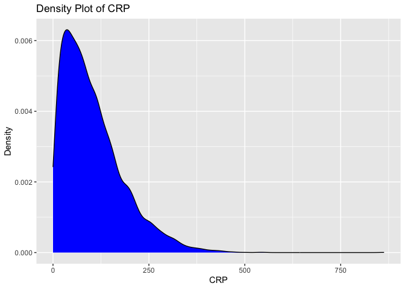
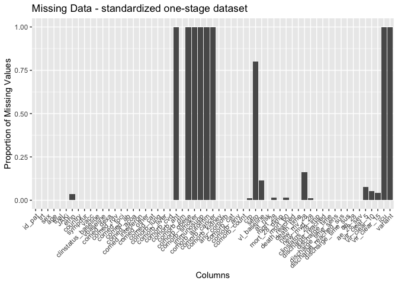
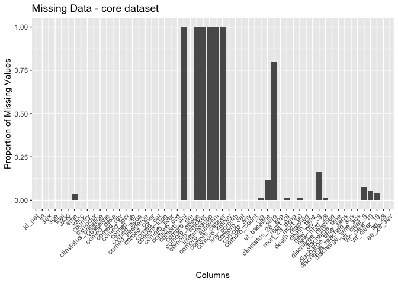
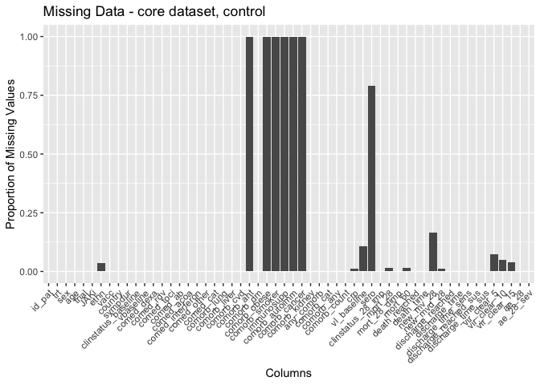
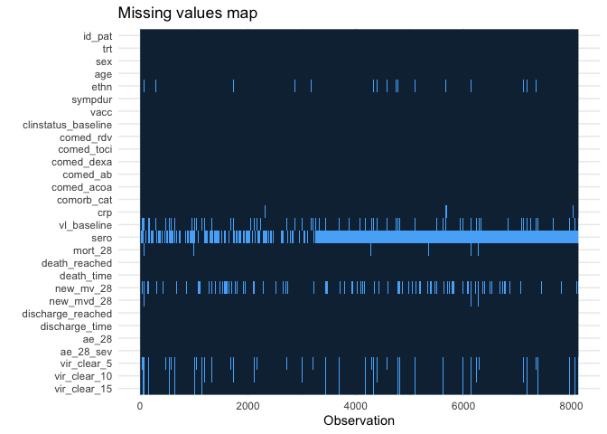
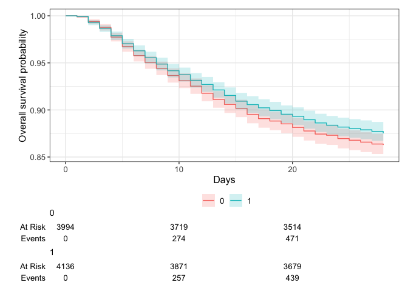
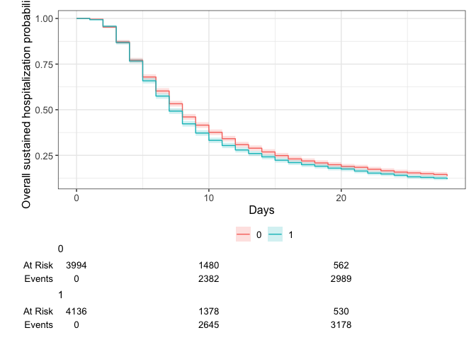

# Load packages

```r
library(tidyverse)
library(readxl)
library(writexl)
library(tableone)
library(haven) # Read sas files
library(here)
library(kableExtra)

library(jtools) # for summ() and plot_summs
library(sjPlot) # for tab_model
library(ggplot2) # survival/TTE analyses and other graphs
library(ggsurvfit) # survival/TTE analyses
library(survival) # survival/TTE analyses
library(gtsummary) # survival/TTE analyses
library(ggfortify) # autoplot
library(tidycmprsk) # competing risk analysis
library(ordinal) # clinstatus ordinal regression
library(logistf) # Firth regression in case of rare events

library(finalfit) # missing data exploration
library(mice) # multiple imputation
library(jomo) # multiple imputation
library(mitools) # multiple imputation

# IDDO tool
# devtools::install_github("RhysPeploe/iddoverse")
library(iddoverse)
```

# Load Data


# Define ITT population
NOTE ON COVID-19 CLINICAL DATA:The RFSTDTC for COVID-19 clinical data will be pulled from the date of hospital admission and not the date of enrollment in the study, as enrollment often happened after the subject had been hospitalized. The date of enrollment for these subjects can be found in the Subject Visits (SV) domain (observations where VISIT=ENROLLMENT).

```r
df <- df_dm
addmargins(table(df$ARMCD, useNA = "always"))
```

```
## 
## DA-USUAL  DB-BARI     <NA>      Sum 
##     4008     4148        0     8156
```
* CAVE: We need to exclude the children according to our protocol! But first, keep them in to double-check with results publication (baseline table, results table, etc.)


# Baseline Characteristics

```r
df <- df %>% # no missing
  rename(id_pat = USUBJID,
         country = COUNTRY
         )
df <- df %>%
  mutate(trt = case_when(ARMCD == "DB-BARI" ~ 1,
                         TRUE ~ 0))
# add trial variables
df$trial <- c("RECOVERY")
df$JAKi <- c("Baricitinib")

# add the day of enrolment, relative to day of hospitalization, to each participant
df_sv <- df_sv %>% 
  rename(id_pat = USUBJID)
df_rando_date <- df_sv %>% 
  filter(VISIT == "RANDOMIZATION")
df_rando_date <- df_rando_date %>% 
  rename(rday_after_hosp = SVSTDY)
# summary(df_rando_date$rday_after_hosp)
df <- left_join(df, df_rando_date[, c("rday_after_hosp", "id_pat")], by = join_by(id_pat == id_pat)) ## merge to main df

# sex
df <- df %>% # no missing in sex
  mutate(sex = case_when(SEX == "F" ~ "female",
                         SEX == "M" ~ "male"))
# Ethnicity
df$ethn <- df$RACE

# AGE
df$age <- as.numeric(df$AGE)
df <- df %>% # exclude the kids (see protocol: 16y or older)
  filter(age>15)
df %>% 
  drop_na(age) %>% 
  ggplot(aes(x = age)) +
  geom_density(fill = "blue", color = "black") +
  labs(title = "Density Plot of Age",
       x = "Age",
       y = "Density")
```

<!-- -->

```r
# id_pat
df_in <- df_in %>% 
  rename(id_pat = USUBJID)

### Clinical score at baseline
df_baseline <- df_in %>% # get all respiratory support information for baseline
  filter(INDECOD %in% c("EXTRA-CORPOREAL MEMBRANE OXYGENATION", "NON-INVASIVE VENTILATION", "HEATED AND HUMIDIFIED HIGH FLOW OXYGEN THERAPY USING NASAL CANNULA", "ASSISTED BREATHING", "INTUBATION OF RESPIRATORY TRACT", "CONTINUOUS POSITIVE AIRWAY PRESSURE VENTILATION TREATMENT", "OXYGEN THERAPY", "INVASIVE MECHANICAL VENTILATION") |
           INMODIFY %in% c("CPAP", "OXYGEN THERAPY", "ECMO", "INVASIVE MECHANICAL VENTILATION", "NON-INVASIVE VENTILATION") |
           INTRT %in% c("Mechanical ventilation (tube/tracheo)", "Extra-corporeal membrane oxygenation", "Non-invasive ventilation (e.g. BiPAP)", "CPAP ventilation", "Requires non-invasive ventilation", "Requires inv. mech. ventilation or ECMO", "Requires oxygen", "High-flow nasal oxygen (e.g. AIRVO)", "Invasive mechanical ventilation or ECMO", "New use of invasive mech. ventilation", "New use or inc. concentration of oxygen", "New use of non-invasive resp. support", 
                        "Any assisted ventilation including IMV, NIV, ECMO", # this is unclear -> don't include below, not relevant for baseline
                        "Other respiratory support" # this is "ASSISTED BREATHING"
                        )) %>% 
  filter(VISIT == "RANDOMIZATION") %>% 
  filter(INOCCUR == "Y")

# recode into our score
df_baseline <- df_baseline %>% 
  mutate(clinstatus_baseline_all = case_when(INDECOD == "INTUBATION OF RESPIRATORY TRACT" | 
                                               INDECOD == "INVASIVE MECHANICAL VENTILATION" |
                                           INTRT == "Mechanical ventilation (tube/tracheo)" | 
                                           INDECOD == "EXTRA-CORPOREAL MEMBRANE OXYGENATION" | 
                                             INDECOD == "ASSISTED BREATHING" | 
                                           INTRT == "Extra-corporeal membrane oxygenation" |
                                             INMODIFY == "INVASIVE MECHANICAL VENTILATION" |
                                             INMODIFY == "ECMO" |
                                             INTRT == "Invasive mechanical ventilation or ECMO" |
                                             INTRT == "New use of invasive mech. ventilation" |
                                           INTRT == "Requires inv. mech. ventilation or ECMO" ~ 5,
                                         INDECOD == "NON-INVASIVE VENTILATION" | 
                                           INMODIFY == "NON-INVASIVE VENTILATION" |
                                           INDECOD == "CONTINUOUS POSITIVE AIRWAY PRESSURE VENTILATION TREATMENT" | 
                                           INTRT == "CPAP ventilation" | 
                                           INMODIFY == "CPAP" |
                                           INTRT == "Requires non-invasive ventilation" | 
                                           INTRT == "New use of non-invasive resp. support" | 
                                           INTRT == "High-flow nasal oxygen (e.g. AIRVO)" |
                                           INDECOD == "HEATED AND HUMIDIFIED HIGH FLOW OXYGEN THERAPY USING NASAL CANNULA" | 
                                           INTRT == "Non-invasive ventilation (e.g. BiPAP)" ~ 4,
                                           INDECOD == "OXYGEN THERAPY" |
                                           INMODIFY == "OXYGEN THERAPY" |
                                           INTRT == "New use or inc. concentration of oxygen" |
                                           INTRT == "Requires oxygen" ~ 3))
# sort by highest value within each patient 
df_baseline <- df_baseline %>%
  arrange(id_pat, desc(clinstatus_baseline_all))
# select only highest values
df_baseline <- df_baseline %>%
  group_by(id_pat) %>%
  slice_max(order_by = clinstatus_baseline_all) %>%
  ungroup()
# only keep one row per patient
df_baseline <- df_baseline %>%
  distinct(id_pat, clinstatus_baseline_all)
# merge
df <- left_join(df, df_baseline[, c("clinstatus_baseline_all", "id_pat")], by = join_by(id_pat == id_pat)) 

# table(df$clinstatus_baseline_all, df$trt, useNA = "always") ## corresponds to trial publication! 
df <- df %>% 
  mutate(clinstatus_baseline = case_when(is.na(clinstatus_baseline_all) ~ 2,
                                         TRUE ~ clinstatus_baseline_all))
# table(df$clinstatus_baseline, df$trt, useNA = "always") ## And the NAs are None (no O2 support)
df$clinstatus_baseline <- factor(df$clinstatus_baseline, levels = 1:6) ## no missing data
df <- df %>% 
  mutate(vbaseline = case_when(clinstatus_baseline == "2" | clinstatus_baseline == "3" ~ 0,
                                clinstatus_baseline == "4" | clinstatus_baseline == "5" ~ 1))

### Vaccination at baseline
df_vacc <- df_in %>%
  filter(INDECOD %in% c("COVID-19 VACCINES") |
           INMODIFY %in% c("COVID-19 VACCINATION") |
           INTRT %in% c("COVID-19 vaccine")) %>% 
  filter(VISIT == "RANDOMIZATION") %>% 
  filter(INOCCUR == "Y")
# df_vacc <- df_vacc %>%
#   distinct(id_pat) # no duplicates
df_vacc$vacc <- 1
# merge
df <- left_join(df, df_vacc[, c("vacc", "id_pat")], by = join_by(id_pat == id_pat)) 
df <- df %>% 
  mutate(vacc = case_when(is.na(vacc) ~ 0,
                          TRUE ~ vacc))
# table(df$vacc, df$trt, useNA = "always") ## corresponds to trial publication! 

### Co-medication at baseline
# rdv
df_rdv <- df_in %>% 
  filter(INDECOD %in% c("REMDESIVIR") |
           INMODIFY %in% c("REMDESIVIR") |
           INTRT %in% c("Remdesivir")) %>% 
  filter(VISIT == "RANDOMIZATION") %>% 
  filter(INOCCUR == "Y")
# df_rdv <- df_rdv %>%
#   distinct(id_pat) # no duplicates
df_rdv$comed_rdv <- 1
# merge
df <- left_join(df, df_rdv[, c("comed_rdv", "id_pat")], by = join_by(id_pat == id_pat)) 
df <- df %>% 
  mutate(comed_rdv = case_when(is.na(comed_rdv) ~ 0,
                          TRUE ~ comed_rdv))
# table(df$comed_rdv, df$trt, useNA = "always") ## corresponds to trial publication!

# toci, incl. planned to be given
df_toci <- df_in %>% 
  filter(INDECOD %in% c("TOCILIZUMAB", "INTERLEUKIN INHIBITORS"
                        ) |
           INTRT %in% c("Tocilizumab", "Tocilizumab or sarilumab"
             # "Tocilizumab planned to be given in next 24h", 
                        )) %>%
  filter(VISIT == "RANDOMIZATION") %>% 
  filter(INOCCUR == "Y")
# df_in %>% # these codes were only given during follow-up!
#   filter(INTRT == "Tocilizumab or sarilumab" | INDECOD == "INTERLEUKIN INHIBITORS") %>%
#   filter(VISIT == "RANDOMIZATION") %>% 
#   View()
# df_toci <- df_toci %>%
#   distinct(id_pat) # no duplicates
df_toci$comed_toci <- 1
# merge
df <- left_join(df, df_toci[, c("comed_toci", "id_pat")], by = join_by(id_pat == id_pat)) 
df <- df %>% 
  mutate(comed_toci = case_when(is.na(comed_toci) ~ 0,
                          TRUE ~ comed_toci))
# addmargins(table(df$comed_toci, df$trt, useNA = "always")) ## corresponds to trial publication!

# cortico
df_dexa <- df_in %>% 
  filter(INDECOD %in% c("GLUCOCORTICOIDS") |
           INMODIFY %in% c("CORTICOSTEROIDS") |
           INTRT %in% c("Systemic corticosteroids (e.g. dexamethasone, prednisolone, hydrocorticone, methylprednisolone)", "Corticosteroid (dexamethasone, prednisolone, hydrocortisone, methylprednisolone)")) %>%
  filter(VISIT == "RANDOMIZATION") %>% 
  filter(INOCCUR == "Y")
# df_in %>% # these codes were only given during follow-up!
#   filter(INTRT == "Corticosteroid (dexamethasone, prednisolone, hydrocortisone, methylprednisolone)") %>%
#   filter(VISIT == "RANDOMIZATION") %>%
#   View()
df_dexa <- df_dexa %>%
  distinct(id_pat) # no duplicates
df_dexa$comed_dexa <- 1
# merge
df <- left_join(df, df_dexa[, c("comed_dexa", "id_pat")], by = join_by(id_pat == id_pat)) 
df <- df %>% 
  mutate(comed_dexa = case_when(is.na(comed_dexa) ~ 0,
                          TRUE ~ comed_dexa))
# addmargins(table(df$comed_dexa, df$trt, useNA = "always")) ## corresponds to trial publication!

# anticoa
df_acoa <- df_in %>% 
  filter(INDECOD %in% c("HEPARIN GROUP") |
           INTRT %in% c("Warfarin or direct oral anticoagulant","Higher dose low molecular weight heparin")) %>%
  filter(VISIT == "RANDOMIZATION") %>% 
  filter(INOCCUR == "Y")
df_acoa <- df_acoa %>%
  distinct(id_pat) # remove duplicates
df_acoa$comed_acoa <- 1
# merge
df <- left_join(df, df_acoa[, c("comed_acoa", "id_pat")], by = join_by(id_pat == id_pat)) 
df <- df %>% 
  mutate(comed_acoa = case_when(is.na(comed_acoa) ~ 0,
                          TRUE ~ comed_acoa))

# interferon
df$comed_interferon <- 0 # see protocol

# antibiotics
df_ab <- df_in %>% 
  filter(INDECOD %in% c("MACROLIDES", "AZITHROMYCIN, UNSPECIFIED FORM") |
           INMODIFY %in% c("AZITHROMYCIN") |
           INTRT %in% c("Macrolide", "Other macrolides", "Azithromycin or other macrolides", "Azithromycin")) %>%
  filter(VISIT == "RANDOMIZATION") %>% 
  filter(INOCCUR == "Y")
# df_ab <- df_ab %>%
#   distinct(id_pat) # no duplicates
df_ab$comed_ab <- 1
# merge
df <- left_join(df, df_ab[, c("comed_ab", "id_pat")], by = join_by(id_pat == id_pat)) 
df <- df %>% 
  mutate(comed_ab = case_when(is.na(comed_ab) ~ 0,
                          TRUE ~ comed_ab))

# comed_other
df_comed_other <- df_in %>% # get all comedication
  filter(INDECOD %in% c("ANTITHROMBOTIC AGENTS", "CASIRIVIMAB AND IMDEVIMAB", 
                        "COLCHICINE", "TRANSFUSION OF CONVALESCENT PLASMA", "HYDROXYCHLOROQUINE", "IMMUNOGLOBULINS",
                        "LOPINAVIR_RITONAVIR", "ASPIRIN") |
           INMODIFY %in% c("CONVALESCENT PLASMA", "IMMUNOGLOBULINS", "LOPINAVIR AND RITONAVIR",
                           "ACETYLSALICYLIC ACID", "COLCHICINE", 
                           "HYDROXYCHLOROQUINE", "BLOOD TRANSFUSION OR BLOOD PRODUCT") |
           INTRT %in% c("Antiplatelet therapy", "Venous thromboembolism prophylaxis",
                        "Standard low molecular weight heparin", "Synthetic monoclonal antibodies (REGN10933+REGN10987)", 
                        "Colchicine", "Convalescent plasma infusion",
                        "Hydroxychloroquine",
                        "Intravenous immunoglobulin", "Vasoactive drug", "Blood transfusion", "Lopinavir-ritonavir",
                        "Aspirin")) %>% 
  filter(VISIT == "RANDOMIZATION") %>% 
  filter(INOCCUR == "Y")
df_comed_other <- df_comed_other %>%
  distinct(id_pat) # remove duplicates
df_comed_other$comed_other <- 1
# merge
df <- left_join(df, df_comed_other[, c("comed_other", "id_pat")], by = join_by(id_pat == id_pat)) 
df <- df %>% 
  mutate(comed_other = case_when(is.na(comed_other) ~ 0,
                          TRUE ~ comed_other))

# group them for the subgroup analysis, according to protocol
df <- df %>% # there are no missings in comed_dexa and comed_toci
  mutate(comed_cat = case_when(comed_dexa == 0 & comed_toci == 0 ~ 1, # patients without Dexa nor Toci
                               comed_dexa == 1 & comed_toci == 1 ~ 2, # patients with Dexa and Toci
                               comed_dexa == 1 & comed_toci == 0 ~ 3, # patients with Dexa but no Toci
                               comed_dexa == 0 & comed_toci == 1 ~ 4)) # patients with Toci but no Dexa
# table(df$comed_toci, df$trt, useNA = "always") 


### Comorbidity at baseline, including immunocompromised
# id_pat
df_sa <- df_sa %>% 
  rename(id_pat = USUBJID)

df_comorb <- df_sa %>% 
  filter(SACAT == "MEDICAL HISTORY" | is.na(SACAT)) %>% 
  filter(SAOCCUR == "Y")

# diabetes
df_dm <- df_comorb %>% 
  filter(SATERM %in% c("Diabetes") |
           SAMODIFY %in% c("DIABETES MELLITUS - TYPE NOT SPECIFIED") |
           SADECOD %in% c("Diabetes mellitus"))
# df_dm <- df_dm %>%
#   distinct(id_pat) # no duplicates
df_dm$comorb_dm <- 1
# merge
df <- left_join(df, df_dm[, c("comorb_dm", "id_pat")], by = join_by(id_pat == id_pat)) 
df <- df %>% 
  mutate(comorb_dm = case_when(is.na(comorb_dm) ~ 0,
                          TRUE ~ comorb_dm))
# table(df$comorb_dm, df$trt, useNA = "always") ## corresponds to trial publication!

# heart disease (except hypertension)
df_cvd <- df_comorb %>% 
  filter(SATERM %in% c("Heart Disease") |
           SAMODIFY %in% c("CHRONIC CARDIAC DISEASE (NOT HYPERTENSION)") |
           SADECOD %in% c("Heart disease"))
# df_cvd <- df_cvd %>%
#   distinct(id_pat) # no duplicates
df_cvd$comorb_cvd <- 1
# merge
df <- left_join(df, df_cvd[, c("comorb_cvd", "id_pat")], by = join_by(id_pat == id_pat)) 
df <- df %>% 
  mutate(comorb_cvd = case_when(is.na(comorb_cvd) ~ 0,
                          TRUE ~ comorb_cvd))
# table(df$comorb_cvd, df$trt, useNA = "always") ## corresponds to trial publication!

# lung disease
df_lung <- df_comorb %>% 
  filter(SATERM %in% c("Lung disease") |
           SAMODIFY %in% c("CHRONIC PULMONARY DISEASE (NOT ASTHMA)") |
           SADECOD %in% c("Disorder of lung"))
# df_lung <- df_lung %>%
#   distinct(id_pat) # no duplicates
df_lung$comorb_lung <- 1
# merge
df <- left_join(df, df_lung[, c("comorb_lung", "id_pat")], by = join_by(id_pat == id_pat)) 
df <- df %>% 
  mutate(comorb_lung = case_when(is.na(comorb_lung) ~ 0,
                          TRUE ~ comorb_lung))
# table(df$comorb_lung, df$trt, useNA = "always") ## corresponds to trial publication!

# kidney disease
df_kidney <- df_comorb %>% 
  filter(SATERM %in% c("Severe kidney impairment (eGFR<30 or on dialysis)") |
           SAMODIFY %in% c("CHRONIC KIDNEY DISEASE") |
           SADECOD %in% c("Chronic kidney disease"))
# df_kidney <- df_kidney %>%
#   distinct(id_pat) # no duplicates
df_kidney$comorb_kidney <- 1
# merge
df <- left_join(df, df_kidney[, c("comorb_kidney", "id_pat")], by = join_by(id_pat == id_pat)) 
df <- df %>% 
  mutate(comorb_kidney = case_when(is.na(comorb_kidney) ~ 0,
                          TRUE ~ comorb_kidney))
# table(df$comorb_kidney, df$trt, useNA = "always") ## corresponds to trial publication!

# liver disease
df_liver <- df_comorb %>% 
  filter(SATERM %in% c("Severe liver disease") |
           SAMODIFY %in% c("MODERATE OR SEVERE LIVER DISEASE") |
           SADECOD %in% c("Disorder of liver"))
# df_liver <- df_liver %>%
#   distinct(id_pat) # no duplicates
df_liver$comorb_liver <- 1
# merge
df <- left_join(df, df_liver[, c("comorb_liver", "id_pat")], by = join_by(id_pat == id_pat)) 
df <- df %>% 
  mutate(comorb_liver = case_when(is.na(comorb_liver) ~ 0,
                          TRUE ~ comorb_liver))
# table(df$comorb_liver, df$trt, useNA = "always") ## corresponds to trial publication!

df$comorb_obese <- NA # no info 
df$comorb_aht <- NA # no info 
df$comorb_cancer <- NA # no info 
df$comorb_autoimm <- NA # no info 
df$comorb_smoker <- NA # no info 
df$immunosupp <- NA # there is HIV, but no info re viral suppression / CD4

## any of the above 5
df <- df %>% 
  mutate(any_comorb = case_when(comorb_lung == 1 | comorb_liver == 1 | comorb_cvd == 1 |
                                  comorb_dm == 1 | comorb_kidney == 1 
                                  ~ 1,
                                comorb_lung == 0 & comorb_liver == 0 & comorb_cvd == 0 &
                                  comorb_dm == 0 & comorb_kidney == 0
                                ~ 0))
addmargins(table(df$any_comorb, df$trt, useNA = "always"))
```

```
##       
##           0    1 <NA>  Sum
##   0    2169 2184    0 4353
##   1    1825 1952    0 3777
##   <NA>    0    0    0    0
##   Sum  3994 4136    0 8130
```

```r
## group them for the subgroup analysis, according to protocol // count all pre-defined comorbidities per patient first
comorb <- df %>% 
  select(id_pat, comorb_lung, comorb_liver, comorb_cvd, comorb_dm, comorb_kidney)
comorb$comorb_count <- NA
for (i in 1:dim(comorb)[[1]]) {
  comorb$comorb_count[i] <- ifelse(
    sum(comorb[i, ] %in% c(1)) > 0,
    sum(comorb[i, ] %in% c(1)),
    NA
  )
}
comorb <- comorb %>%
  mutate(comorb_count = case_when(comorb_lung == 0 & comorb_liver == 0 & comorb_cvd == 0 &
                                  comorb_dm == 0 & comorb_kidney == 0 ~ 0,
                                TRUE ~ comorb_count))
df <- left_join(df, comorb[, c("comorb_count", "id_pat")], by = join_by(id_pat == id_pat)) ## merge imputed variable back
df <- df %>%
  mutate(comorb_cat = case_when(comorb_count == 0 ~ 1, # no comorbidity
                                comorb_count == 1 ~ 2, # one comorbidity
                                comorb_count >1 ~ 3)) # multiple comorbidities
addmargins(table(df$comorb_cat, df$trt, useNA = "always"))
```

```
##       
##           0    1 <NA>  Sum
##   1    2169 2184    0 4353
##   2    1232 1306    0 2538
##   3     593  646    0 1239
##   <NA>    0    0    0    0
##   Sum  3994 4136    0 8130
```

```r
df <- df %>%
  mutate(comorb_any = case_when(comorb_count == 0 ~ 0, # no comorbidity
                                comorb_count >0 ~ 1)) # any comorbidity

### Days with symptoms prior to randomization
df_symp <- df_sa %>% 
  filter(SATERM == "COVID-19 Symptoms" | SAMODIFY == "COVID-19 SYMPTOMS") %>% 
  filter(SAOCCUR == "Y")
# df_symp <- df_symp %>%
#   distinct(id_pat) # no duplicates
# See discussion with RECOVERY DM: SASTDY is the start day of covid-19 symptoms. SADY is the day the data (y/n answers) was captured, which in this case was the day of randomization. And these days are all relative to the day of hospitalization.
# => SADY - SASTDY = Days with symptoms prior to randomization
df_symp <- df_symp %>% 
  mutate(sympdur = (SADY - SASTDY)) # see results publication
# summary(df_symp$sympdur)
df <- left_join(df, df_symp[, c("sympdur", "id_pat")], by = join_by(id_pat == id_pat)) 
df %>% 
  drop_na(sympdur) %>% 
  ggplot(aes(x = sympdur)) +
  geom_density(fill = "blue", color = "black") +
  labs(title = "Density Plot of Symptom Duration",
       x = "Symptom Duration",
       y = "Density")
```

<!-- -->

```r
# df %>%
#   filter(trt == 0) %>%
#   summary() # corresponds to results publication


### CRP at baseline
# id_pat
df_lab <- df_lab %>% 
  rename(id_pat = USUBJID)

df_crp <- df_lab %>% # these are all at randomization and OCCUR == Yes
  filter(LBTESTCD == "CRP")
df_crp <- df_crp %>% 
  rename(crp = LBSTRESN)
# summary(df_crp$crp) # 7 missing
# df_crp <- df_crp %>%
#   distinct(id_pat) # no duplicates
df <- left_join(df, df_crp[, c("crp", "id_pat")], by = join_by(id_pat == id_pat)) ## merge to main df
df %>% 
  drop_na(crp) %>% 
  ggplot(aes(x = crp)) +
  geom_density(fill = "blue", color = "black") +
  labs(title = "Density Plot of CRP",
       x = "CRP",
       y = "Density")
```

<!-- -->

```r
### Viremia / Undetectable VL at baseline
# id_pat
df_mb <- df_mb %>% 
  rename(id_pat = USUBJID)

df_vl_baseline <- df_mb %>% 
  filter(MBTESTCD == "SARSCOV2") %>% # viral load
  filter(VISIT == "RANDOMIZATION" | is.na(VISIT)) %>% # exclude follow-up
  filter(EPOCH == "BASELINE" | is.na(EPOCH)) # exclude follow-up

df_vl_baseline <- df_vl_baseline %>% # keep (within each patient) only value closest to baseline
  group_by(id_pat) %>%
  slice_max(order_by = MBDY) %>%
  ungroup()

df_vl_baseline <- df_vl_baseline %>% # viral load value <LOQ and/or undectectable
  mutate(vl_baseline = case_when(MBSTRESC == "POSITIVE" ~ 0,
                                 MBSTRESC == "NEGATIVE" ~ 1)) %>% 
  filter(vl_baseline == 0 | vl_baseline == 1) # remove NAs, to avoid duplicates when merging
df_vl_baseline <- df_vl_baseline %>%
  distinct(id_pat, vl_baseline) # remove duplicates with same result
# df_vl_baseline$duplicate <- duplicated(df_vl_baseline$id_pat)
# df_vl_baseline %>% # this person has pos and neg result at the same day, closest to baseline day.
#   filter(id_pat == 2261) %>% 
#   View()
df_vl_baseline <- df_vl_baseline %>% # Keep neg since had already a neg before
  filter(!(id_pat == 2261 & vl_baseline == 0))

df <- left_join(df, df_vl_baseline[, c("vl_baseline", "id_pat")], by = join_by(id_pat == id_pat)) ## merge to main df
# table(df$vl_baseline, df$trt, useNA = "always") # resolve


### Serology at baseline
df_sero <- df_mb %>% 
  filter(MBTESTCD == "SAR2IGG") %>% # viral load
  filter(VISIT == "RANDOMIZATION" | is.na(VISIT)) %>% # exclude follow-up
  filter(EPOCH == "BASELINE" | is.na(EPOCH)) # exclude follow-up

df_sero <- df_sero %>% 
  mutate(sero = case_when(MBSTRESC == "POSITIVE" ~ 1,
                          MBSTRESC == "NEGATIVE" ~ 0))
# df_sero <- df_sero %>%
#   distinct(id_pat, sero) # no duplicates

df <- left_join(df, df_sero[, c("sero", "id_pat")], by = join_by(id_pat == id_pat)) ## merge to main df


### Variant // not available
```
Discussion points:
* Exclude the children

# Endpoints

```r
#### FIRST, work on all the time to event data
## hospital domain
df_ho <- df_ho %>% 
  rename(id_pat = USUBJID)
# unique(df_ho$HODISOUT) # no discharge to hospice occurred and no ICU information // https://wiki.iddo.org/Data-Engineering/IDDO-SDTM-Implementation-Manual/HO // "EXPIRED IN A MEDICAL FACILITY" == died
# unique(df_ho$HOSTDY) # all hospitalized at/day 1 after randomization

df_deaths_hosp <- df_ho %>%
  filter(HODISOUT == "EXPIRED IN A MEDICAL FACILITY") %>% 
  filter(HOOCCUR == "Y")
# df_deaths_hosp <- df_deaths_hosp %>% # no duplicates
#   distinct(id_pat)
df_deaths_hosp <- df_deaths_hosp %>% 
  rename(endhosp_after_hosp = HOENDY)
df_deaths_hosp$inhosp_death <- 1

df <- left_join(df, df_deaths_hosp[, c("endhosp_after_hosp","inhosp_death", "id_pat")], by = join_by(id_pat == id_pat)) ## merge to main df
df <- df %>% 
  mutate(inhosp_death = case_when(is.na(inhosp_death) ~ 0,
                          TRUE ~ inhosp_death))
# table(df$DTHFL, df$inhosp_death) # 47 died after discharge?
df <- df %>% 
  mutate(inhosp_death_time = (endhosp_after_hosp - rday_after_hosp) + 1) # see results publication 

## disposition domain
df_ds <- df_ds %>% 
  rename(id_pat = USUBJID)
# unique(df_ds$DSEVINTX) # only: "AT ANY TIME AFTER COMPLETION OF THE STUDY"
# unique(df_ds$DSTERM) # "Discharged"   "Change of consent"   "Death"    "Unknown"  "Lack of consent"  
# unique(df_ds$DSDECOD) # "DISCHARGED"  "WITHDRAWAL OF CONSENT"  "DEATH"   "UNKNOWN"              

# deaths
df_deaths_dispo <- df_ds %>%
  filter(DSDECOD == "DEATH")
# df_deaths_dispo <- df_deaths_dispo %>% # no duplicates
#   distinct(id_pat)
df_deaths_dispo <- df_deaths_dispo %>% 
  rename(death_after_hosp = DSSTDY)
df_deaths_dispo$dispo_death <- 1
df <- left_join(df, df_deaths_dispo[, c("death_after_hosp","dispo_death", "id_pat", "DSEVINTX")], by = join_by(id_pat == id_pat)) ## merge to main df
df <- df %>% 
  mutate(dispo_death = case_when(is.na(dispo_death) ~ 0,
                          TRUE ~ dispo_death))
# table(df$DTHFL, df$dispo_death) # matches 100% => calculate time to death using "death_after_hosp" & "rday_after_hosp"
df <- df %>% 
  mutate(death_time = (death_after_hosp - rday_after_hosp) + 1) # see results publication 
# table(df$DTHFL, df$death_time) # correct, but add time-to-event data for those alive

# discharge
df_discharged <- df_ds %>%
  filter(DSDECOD == "DISCHARGED")
# df_discharged <- df_discharged %>% # no duplicates
#   distinct(id_pat)
df_discharged <- df_discharged %>% 
  rename(discharge_after_hosp = DSSTDY)
df_discharged$discharge_reached <- 1
df <- left_join(df, df_discharged[, c("discharge_after_hosp", "discharge_reached", "id_pat")], by = join_by(id_pat == id_pat)) ## merge to main df
df <- df %>% 
  mutate(discharge_reached = case_when(is.na(discharge_reached) ~ 0,
                          TRUE ~ discharge_reached))
# table(df$DTHFL, df$discharge_reached) # question above confirmed: 47 died after discharge.
# df %>%
#   select(id_pat, rday_after_hosp, discharge_after_hosp, discharge_reached, DTHFL) %>%
#   View()
df <- df %>% 
  mutate(discharge_time = (discharge_after_hosp - rday_after_hosp) + 1) # see results publication
# table(df$discharge_reached, df$discharge_time) # correct, but add time-to-event data for those not discharged

# withdrawn
df_withdrawn <- df_ds %>%
  filter(DSDECOD == "WITHDRAWAL OF CONSENT")
# df_withdrawn <- df_withdrawn %>% # no duplicates
#   distinct(id_pat)
df_withdrawn <- df_withdrawn %>% 
  rename(withdrawn_after_hosp = DSSTDY)
df_withdrawn$withdrawn <- 1
df <- left_join(df, df_withdrawn[, c("withdrawn_after_hosp", "withdrawn", "id_pat")], by = join_by(id_pat == id_pat)) ## merge to main df
df <- df %>% 
  mutate(withdrawn = case_when(is.na(withdrawn) ~ 0,
                          TRUE ~ withdrawn))
# table(df$DTHFL, df$withdrawn) # none of the 58 withdrawn died (i.e. no data for them after withdrawal)
df <- df %>% 
  mutate(withdrawn_time = (withdrawn_after_hosp - rday_after_hosp) + 1) # see results publication
# table(df$withdrawn, df$trt) # correct - if we exclude the 4 that withdrew after day 28

# unknown
df_unknown <- df_ds %>%
  filter(DSDECOD == "UNKNOWN")
# df_unknown <- df_unknown %>% # no duplicates
#   distinct(id_pat)
# df_unknown <- df_unknown %>% 
#   rename(unknown_after_hosp = DSSTDY) # all are NA
df_unknown$unknown <- 1
df <- left_join(df, df_unknown[, c("unknown", "id_pat")], by = join_by(id_pat == id_pat)) ## merge to main df
df <- df %>% 
  mutate(unknown = case_when(is.na(unknown) ~ 0,
                          TRUE ~ unknown))
# table(df$DTHFL, df$unknown) # none of the 164 unkown died (i.e. no data for them after this assessment)

### Checks
# df %>% # those that died after discharge have correct time to death, despite reaching discharge
#   select(id_pat, DTHFL, inhosp_death, inhosp_death_time, death_time, dispo_death, discharge_reached, discharge_time,
#          withdrawn, withdrawn_time, unknown) %>% 
#   filter(DTHFL == "Y") %>%
#   View()
# 
# df %>% # how many of those "alive" were withdrawn?
#   select(id_pat, DTHFL, inhosp_death, inhosp_death_time, death_time, dispo_death, discharge_reached, discharge_time,
#          withdrawn, withdrawn_time, unknown) %>% 
#   filter(DTHFL == "Y") %>%
#   filter(withdrawn == 1) %>% 
#   View()

#### SECOND, create the daily respiratory support dataset. Problem: The info on WHICH day exactly someone received resp support is NOT available (INSTDY empty for these). INDOSTXT contains only duration info. However, INDOSTXT == "28 Days of intervention received" can be used as clinstatus_28.
df_resp <- df_in %>% # get all respiratory support information
  filter(INDECOD %in% c("EXTRA-CORPOREAL MEMBRANE OXYGENATION", "NON-INVASIVE VENTILATION", "HEATED AND HUMIDIFIED HIGH FLOW OXYGEN THERAPY USING NASAL CANNULA", "ASSISTED BREATHING", "INTUBATION OF RESPIRATORY TRACT", "CONTINUOUS POSITIVE AIRWAY PRESSURE VENTILATION TREATMENT", "OXYGEN THERAPY", "INVASIVE MECHANICAL VENTILATION") |
           INMODIFY %in% c("CPAP", "OXYGEN THERAPY", "ECMO", "INVASIVE MECHANICAL VENTILATION", "NON-INVASIVE VENTILATION") |
           INTRT %in% c("Mechanical ventilation (tube/tracheo)", "Extra-corporeal membrane oxygenation", "Non-invasive ventilation (e.g. BiPAP)", "CPAP ventilation", "Requires non-invasive ventilation", "Requires inv. mech. ventilation or ECMO", "Requires oxygen", "High-flow nasal oxygen (e.g. AIRVO)", "Invasive mechanical ventilation or ECMO", "New use of invasive mech. ventilation", "New use or inc. concentration of oxygen", "New use of non-invasive resp. support", 
                        "Any assisted ventilation including IMV, NIV, ECMO", # this is unclear / do not include!
                        "Other respiratory support" # this is under "ASSISTED BREATHING"
                        )) %>% 
  filter(VISIT == "EARLY SAFETY DATA" | VISIT == "FOLLOW-UP" | is.na(VISIT)) %>%
  filter(INDOSTXT == "28 Days of intervention received") %>% 
  filter(INOCCUR == "Y")
# recode into our score
df_resp <- df_resp %>% 
  mutate(clinstatus = case_when(INDECOD == "INTUBATION OF RESPIRATORY TRACT" | 
                                               INDECOD == "INVASIVE MECHANICAL VENTILATION" |
                                           INTRT == "Mechanical ventilation (tube/tracheo)" | 
                                           INDECOD == "EXTRA-CORPOREAL MEMBRANE OXYGENATION" | 
                                             INDECOD == "ASSISTED BREATHING" | 
                                           INTRT == "Extra-corporeal membrane oxygenation" |
                                             INMODIFY == "INVASIVE MECHANICAL VENTILATION" |
                                             INMODIFY == "ECMO" |
                                             INTRT == "Invasive mechanical ventilation or ECMO" |
                                             INTRT == "New use of invasive mech. ventilation" |
                                           INTRT == "Requires inv. mech. ventilation or ECMO" ~ 5,
                                         INDECOD == "NON-INVASIVE VENTILATION" | 
                                           INMODIFY == "NON-INVASIVE VENTILATION" |
                                           INDECOD == "CONTINUOUS POSITIVE AIRWAY PRESSURE VENTILATION TREATMENT" | 
                                           INTRT == "CPAP ventilation" | 
                                           INMODIFY == "CPAP" |
                                           INTRT == "Requires non-invasive ventilation" | 
                                           INTRT == "New use of non-invasive resp. support" | 
                                           INTRT == "High-flow nasal oxygen (e.g. AIRVO)" |
                                           INDECOD == "HEATED AND HUMIDIFIED HIGH FLOW OXYGEN THERAPY USING NASAL CANNULA" | 
                                           INTRT == "Non-invasive ventilation (e.g. BiPAP)" ~ 4,
                                           INDECOD == "OXYGEN THERAPY" |
                                           INMODIFY == "OXYGEN THERAPY" |
                                           INTRT == "New use or inc. concentration of oxygen" |
                                           INTRT == "Requires oxygen" ~ 3))

df_resp$day <- as.numeric(str_extract(df_resp$INDOSTXT, "\\b\\d+\\b")) # Extract the numeric values how long someone was on such treatment from INDOSTXT
# unique(df_resp$INTRT) # only contains "Invasive mechanical ventilation or ECMO"  "Any assisted ventilation including IMV, NIV, ECMO" // the second one does not help unfortunately, but we can assume they are still hospitalized, and at least 4. And by subtracting "Invasive mechanical ventilation or ECMO" from "Any assisted ventilation including IMV, NIV, ECMO", we can get 4!
df_resp <- df_resp %>% 
  mutate(clinstatus_28 = case_when(is.na(clinstatus) ~ 4,
                                TRUE ~ c(clinstatus)))
# duplicates with clinstatus == 4 and clinstatus == 5, need to be assigned 5, since "Invasive mechanical ventilation or ECMO" is part of "Any assisted ventilation including IMV, NIV, ECMO" is part of
df_resp <- df_resp %>% # sort by highest value within each patient 
  arrange(id_pat, desc(clinstatus_28))
df_resp <- df_resp %>% # if there are several clinstatus values for clinstatus_28, select the highest value
  group_by(id_pat) %>%
  slice_max(order_by = clinstatus_28) %>%
  ungroup()
df <- left_join(df, df_resp[, c("clinstatus_28","id_pat")], by = join_by(id_pat == id_pat)) ## merge


# (i) Primary outcome: Mortality at day 28
### First, keep mort_28 as complete case
df <- df %>% # 58 were withdrawn, but 4 after day 28 !
  mutate(mort_28 = case_when(death_time <29 ~ 1,
                             death_time >28 ~ 0, # died later than day 28 as proof for being alive at day 28 (n=0)
                             withdrawn_time >28 ~ 0, # withdrawn later than day 28 as proof for being alive at day 28 (n=4)
                             discharge_time >28 ~ 0, # discharged later than day 28 as proof for being alive at day 28
                             discharge_time <29 & is.na(withdrawn_time) & is.na(death_time) ~ 0, # discharged before day 29
                             clinstatus_28 %in% c(2,3,4,5) ~ 0, # still hospitalized
                             ))
addmargins(table(df$mort_28, df$trt, useNA = "always")) # 30 in int and 24 in cont are withdrawn before day 28 // 45 in int and 31 in cont are "unknown" ->  https://wiki.iddo.org/Data-Engineering/IDDO-SDTM-Implementation-Manual/DS // the UNKNOWN have no withdraw time, no discharge time, no end of hospitalization date, no clinstatus_28 info => either they are still hospitalized (but we have discharge_time data up until day 322 and no such time info for them!) or LTFU
```

```
##       
##           0    1 <NA>  Sum
##   0    3395 3548    0 6943
##   1     545  513    0 1058
##   <NA>   54   75    0  129
##   Sum  3994 4136    0 8130
```

```r
# df %>%
#   select(id_pat, trt, mort_28, death_time, discharge_reached, discharge_time, withdrawn, withdrawn_time, unknown, clinstatus_baseline, clinstatus_28, inhosp_death, inhosp_death_time, dispo_death, endhosp_after_hosp) %>%
#   filter(is.na(mort_28)) %>%
#   # filter(withdrawn == 0) %>%
#   View()


### Second, use multiple imputation (see below)

### Third, apply a deterministic imputation (see notes): same rules as ACTT2 => transfer that died are already accounted for, for the remaining -> assign "alive"
df <- df %>% 
  mutate(mort_28_dimp = case_when(DTHFL == "Y" ~ 1,
                             TRUE ~ 0))


# (ii) Mortality at day 60
# not systematic follow-up of deaths, not even hospital deaths (longer discharge data provided, but not longer death data)
df$mort_60 <- df$mort_28


# (iii) Time to death within max. follow-up time
df$death_reached <- df$mort_28 # do not bother about missings in mort_28
df <- df %>% # 2 are left without any time to event data => impute max. follow-up time
  mutate(death_time = case_when(death_time >=0 ~ c(death_time), # time to death, if no time to death, then...
                                discharge_time >=0 & (is.na(withdrawn_time) | withdrawn_time >28) ~ 28, # maxfup for all discharged and not withdrawn
                                withdrawn_time >=0 ~ c(withdrawn_time), # time to withdrawal for those withdrawn (and not discharged before)
                                is.na(death_time) & is.na(withdrawn_time) & is.na(discharge_time) ~ 28 # max fup for the remaining ones not withdrawn, not discharged, not dead (n=164)
                                ))


# (iv) New mechanical ventilation among survivors within 28 days
df_mv <- df_in %>% # get all respiratory support information
  filter(INDECOD %in% c("EXTRA-CORPOREAL MEMBRANE OXYGENATION", "ASSISTED BREATHING", "INTUBATION OF RESPIRATORY TRACT", "INVASIVE MECHANICAL VENTILATION") |
           INMODIFY %in% c("ECMO", "INVASIVE MECHANICAL VENTILATION") |
           INTRT %in% c("Mechanical ventilation (tube/tracheo)", "Extra-corporeal membrane oxygenation", "Requires inv. mech. ventilation or ECMO", "Invasive mechanical ventilation or ECMO", "New use of invasive mech. ventilation",
                        "Any assisted ventilation including IMV, NIV, ECMO", # this is unclear / do not include!
                        "Other respiratory support" # this is under "ASSISTED BREATHING"
                        )) %>% 
  filter(VISIT == "EARLY SAFETY DATA" | VISIT == "FOLLOW-UP" | is.na(VISIT)) %>%
  filter(INOCCUR == "Y")
# recode into our score
df_mv <- df_mv %>% 
  mutate(clinstatus = case_when(INDECOD == "INTUBATION OF RESPIRATORY TRACT" | 
                                               INDECOD == "INVASIVE MECHANICAL VENTILATION" |
                                           INTRT == "Mechanical ventilation (tube/tracheo)" | 
                                           INDECOD == "EXTRA-CORPOREAL MEMBRANE OXYGENATION" | 
                                             INDECOD == "ASSISTED BREATHING" | 
                                           INTRT == "Extra-corporeal membrane oxygenation" |
                                             INMODIFY == "INVASIVE MECHANICAL VENTILATION" |
                                             INMODIFY == "ECMO" |
                                             INTRT == "Invasive mechanical ventilation or ECMO" |
                                             INTRT == "New use of invasive mech. ventilation" |
                                           INTRT == "Requires inv. mech. ventilation or ECMO" ~ 5,
                                         INDECOD == "NON-INVASIVE VENTILATION" | 
                                           INMODIFY == "NON-INVASIVE VENTILATION" |
                                           INDECOD == "CONTINUOUS POSITIVE AIRWAY PRESSURE VENTILATION TREATMENT" | 
                                           INTRT == "CPAP ventilation" | 
                                           INMODIFY == "CPAP" |
                                           INTRT == "Requires non-invasive ventilation" | 
                                           INTRT == "New use of non-invasive resp. support" | 
                                           INTRT == "High-flow nasal oxygen (e.g. AIRVO)" |
                                           INDECOD == "HEATED AND HUMIDIFIED HIGH FLOW OXYGEN THERAPY USING NASAL CANNULA" | 
                                           INTRT == "Non-invasive ventilation (e.g. BiPAP)" ~ 4,
                                           INDECOD == "OXYGEN THERAPY" |
                                           INMODIFY == "OXYGEN THERAPY" |
                                           INTRT == "New use or inc. concentration of oxygen" |
                                           INTRT == "Requires oxygen" ~ 3))
# unique(df_mv$INEVINTX)
# unique(df_mv$clinstatus)
df_mv <- df_mv %>% 
  filter(clinstatus == 5)
df <- left_join(df, df_mv[, c("clinstatus","id_pat")], by = join_by(id_pat == id_pat)) ## merge

df <- df %>% # see View below
  mutate(new_mv_28 = case_when((clinstatus_baseline == 2 | clinstatus_baseline == 3 | clinstatus_baseline == 4) 
                               & (mort_28 == 0 | is.na(mort_28)) 
                               & (clinstatus == 5) ~ 1,
                               (clinstatus_baseline == 2 | clinstatus_baseline == 3 | clinstatus_baseline == 4) 
                               & mort_28 == 0
                               ~ 0))
# table(df$new_mv_28, df$mort_28, useNA = "always") # n=160 started with clinstatus_baseline == 5 and n=1060 died => No NAs anymore, see View() below). And n=28 have MV but then missing death info at day 28.

# df %>%
#   select(id_pat, new_mv_28, trt, mort_28, death_time, discharge_reached, discharge_time, withdrawn, withdrawn_time, unknown, clinstatus_baseline, clinstatus, clinstatus_28, inhosp_death, inhosp_death_time, dispo_death, endhosp_after_hosp) %>%
#   filter(is.na(new_mv_28)) %>%
#   filter(clinstatus_baseline != 5) %>%
#   filter(mort_28 == 0) %>%
#   View()

# (iv) Alternative definition/analysis: New mechanical ventilation OR death within 28 days
df <- df %>%
  mutate(new_mvd_28 = case_when(new_mv_28 == 1 | mort_28 == 1 ~ 1,
                                new_mv_28 == 0 | mort_28 == 0 ~ 0))
# table(df$new_mvd_28, df$mort_28, useNA = "always") # n=28 have MV but then missing death info at day 28.

# df %>% # denominator: only those without MV at baseline, see publication, corresponds to publication!
#   filter(clinstatus_baseline %in% c(2,3,4)) %>%
#   select(new_mvd_28, trt) %>%
#   table()


# (v) Clinical status at day 28 // this is not reliably possible in RECOVERY! I know who is 6 (=1058) and 1 (=6425) at day 28, I also know who received MV (0=67) or NIV (n=131) throughout 28 days (clinstatus), but the remaining 476?!? LOVCF from baseline as per protocol. 
df <- df %>%
  mutate(clinstatus_28_imp = case_when(clinstatus_28 == 5 ~ 5,
                                   clinstatus_28 == 4 ~ 4,
                                   clinstatus_28 == 3 ~ 3,
                                   clinstatus_28 == 2 ~ 2,
                                   mort_28 == 1 ~ 6, # died within 28d
                                   discharge_time <29 ~ 1)) # discharged alive / reached discharge criteria within 28d
# df %>%
#   select(id_pat, new_mv_28, trt, mort_28, death_time, discharge_reached, discharge_time, withdrawn, withdrawn_time, unknown, clinstatus_baseline, clinstatus, clinstatus_28, clinstatus_28_imp, inhosp_death, inhosp_death_time, dispo_death, endhosp_after_hosp) %>%
#   filter(is.na(clinstatus_28_imp)) %>%
#   # filter(mort_28 == 0) %>%
#   View()
df$clinstatus_28_imp <- factor(df$clinstatus_28_imp, levels = 1:6)
df <- df %>% # mort_28 == 0 = still hospitalized, do LOVCF for those as per protocol
  mutate(clinstatus_28_imp = case_when(is.na(clinstatus_28_imp) & mort_28 == 0 ~ c(clinstatus_baseline),
                                       TRUE ~ c(clinstatus_28_imp)))
df <- df %>% # the remaining are the unknowns and withdrawals, do LOVCF for those as per protocol
  mutate(clinstatus_28_imp = case_when(is.na(clinstatus_28_imp) ~ c(clinstatus_baseline),
                                       TRUE ~ c(clinstatus_28_imp)))


# (vi) Time to discharge or reaching discharge criteria up to day 28
df <- df %>% 
  mutate(discharge_reached = case_when(discharge_time <29 ~ 1,
                                       TRUE ~ 0))
# table(df$discharge_reached, df$trt) # corresponds to publication!
df <- df %>% 
  mutate(discharge_time = case_when(discharge_time >=0 & (is.na(withdrawn_time) | withdrawn_time >28) ~ c(discharge_time), # time to discharge in case no withdrawal or withdrawal after 28d. If no time to discharge, then...
                                    death_time >=0 ~ c(death_time), # time to death, then...
                                    discharge_time >= withdrawn_time ~ c(discharge_time), # add time to discharge where time to discharge is after time to withdrawal (should not happen)
                                    withdrawn_time >=0 ~ c(withdrawn_time), # time to withdrawal for those withdrawn (and not discharged before)
                                    # is.na(death_time) & is.na(withdrawn_time) & is.na(discharge_time) ~ 28 # this line not needed, see View below
                                    ))
# df %>%
#   select(id_pat, new_mv_28, trt, mort_28, death_time, discharge_reached, discharge_time, withdrawn, withdrawn_time, unknown, clinstatus_baseline, clinstatus_28, inhosp_death, inhosp_death_time, dispo_death, endhosp_after_hosp) %>%
#   # filter(is.na(discharge_time)) %>%
#   filter(discharge_reached == 1) %>%
#   View()

df <- df %>% # restrict to max fup time 28d
  mutate(discharge_time = case_when(discharge_time >28 ~ 28,
                                    TRUE ~ discharge_time))
df <- df %>% # add 28d for those that died - as a sens-variable
  mutate(discharge_time_sens = case_when(mort_28 == 1 ~ 28,
                                    TRUE ~ discharge_time))

# (vi) Sens-analysis: Alternative definition/analysis of outcome: time to sustained discharge within 28 days. There are no re-admissions documented.
df$discharge_reached_sus <- df$discharge_reached
df$discharge_time_sus <- df$discharge_time


# (vii) Viral clearance up to day 5, day 10, and day 15 (Viral load value <LOQ and/or undectectable)
df_vl <- df_mb %>% 
  filter(MBTESTCD == "SARSCOV2") %>% # viral load
  filter(MBEVINTX == "AT ANY TIME DURING HOSPITALIZATION") # during follow-up
df_vl$duplicate <- duplicated(df_vl$id_pat)
# unique(df_vl$duplicate) # no-one had more than 1 follow-up VL measurement
df_vl <- df_vl %>% # viral load value <LOQ and/or undectectable
  mutate(vl = case_when(MBSTRESC == "POSITIVE" ~ 0,
                        MBSTRESC == "NEGATIVE" ~ 1))
df <- left_join(df, df_vl[, c("id_pat","MBDY", "vl")], by = join_by(id_pat == id_pat))
df <- df %>% # time of VL assessment relative to enrolment date
  mutate(vl_time = (MBDY - rday_after_hosp))
# df %>% # double-check
#   select(id_pat, trt, mort_28, death_time, discharge_reached, discharge_time, vl_time, MBDY, vl, rday_after_hosp, endhosp_after_hosp, clinstatus_baseline, clinstatus_28) %>%
#   filter(mort_28 == 1) %>%
#   filter(vl_time > death_time) %>%
#   View()
df <- df %>%
  mutate(vir_clear_5 = case_when((vl_time >0 & vl_time <6) & vl == 1 ~ 1,
                                 (vl_time >0 & vl_time <6) & vl == 0 ~ 0,
                                 vl_baseline == 1 ~ 1,
                                 vl_baseline == 0 ~ 0))
df <- df %>%
  mutate(vir_clear_10 = case_when((vl_time >5 & vl_time <11) & vl == 1 ~ 1,
                                 (vl_time >5 & vl_time <11) & vl == 0 ~ 0,
                                 vir_clear_5 == 1 ~ 1,
                                 vir_clear_5 == 0 ~ 0))
df <- df %>%
  mutate(vir_clear_15 = case_when((vl_time >10 & vl_time <16) & vl == 1 ~ 1,
                                 (vl_time >10 & vl_time <16) & vl == 0 ~ 0,
                                 vir_clear_10 == 1 ~ 1,
                                 vir_clear_10 == 0 ~ 0))
# df %>%
#   select(id_pat, vl_time, vl, vl_baseline, vir_clear_5, vir_clear_10, vir_clear_15, trt, mort_28, death_time, discharge_reached, discharge_time) %>%
#   View()


# (viii) Quality of life at day 28: Not available in RECOVERY


# (ix) Participants with an adverse event grade 3 or 4, or a serious adverse event, excluding death, by day 28
df_ae <- df_sa %>% 
  filter(SACAT == "COMPLICATIONS") %>% 
  filter(SAOCCUR == "Y")
# they are all grade 3, 4 (see publication) and all within 28 days
df_ae <- df_ae %>% # 1 is enough to qualify
  distinct(id_pat)
df_ae$ae_28 <- 1 
df <- left_join(df, df_ae[, c("ae_28", "id_pat")], by = join_by(id_pat == id_pat)) ## merge variable to main df
# the remaining missing have no AE grade 34 -> recode as 0 and exclude deaths
df <- df %>% 
  mutate(ae_28 = case_when(is.na(ae_28) & mort_28 == 0 ~ 0,
                           is.na(ae_28) & mort_28 == 1 ~ NA,
                           TRUE ~ ae_28))
df <- df %>% 
  mutate(ae_28 = case_when(mort_28 == 1 ~ NA,
                           TRUE ~ ae_28))
# table(df$ae_28, df$mort_28, useNA = "always")
# addmargins(table(df$ae_28, df$trt, useNA = "always"))

# (ix) Sens-analysis: Alternative definition/analysis of outcome: incidence rate ratio (Poisson regression) -> AE per person by d28
df_ae <- df_sa %>% 
  filter(SACAT == "COMPLICATIONS") %>% 
  filter(SAOCCUR == "Y")
ae_npp <- df_ae %>% 
  group_by(id_pat)%>%  
  summarise(ae_28_sev = n())
df <- left_join(df, ae_npp[, c("ae_28_sev", "id_pat")], by = join_by(id_pat == id_pat)) # merge variable to main df
# the remaining missing have no AE grade 34 -> recode as 0 and exclude deaths
df <- df %>% 
  mutate(ae_28_sev = case_when(is.na(ae_28_sev) & mort_28 == 0 ~ 0,
                           is.na(ae_28_sev) & mort_28 == 1 ~ NA,
                           TRUE ~ ae_28_sev))
df <- df %>% 
  mutate(ae_28_sev = case_when(mort_28 == 1 ~ NA,
                           TRUE ~ ae_28_sev))
# table(df$ae_28_sev, df$mort_28, useNA = "always")

# (ix) Sens-analysis: Alternative definition/analysis of outcome: time to first (of these) adverse event, within 28 days, considering death as a competing risk (=> censor and set to 28 days)
# re-discuss

# (x) Adverse events of special interest within 28 days: a) thromboembolic events (venous thromboembolism, pulmonary embolism, arterial thrombosis), b) secondary infections (bacterial pneumonia including ventilator-associated pneumonia, meningitis and encephalitis, endocarditis and bacteremia, invasive fungal infection including pulmonary aspergillosis), c) Reactivation of chronic infection including tuberculosis, herpes simplex, cytomegalovirus, herpes zoster and hepatitis B, d) serious cardiovascular and cardiac events (including stroke and myocardial infarction), e) events related to signs of bone marrow suppression (anemia, lymphocytopenia, thrombocytopenia, pancytopenia), f) malignancy, g) gastrointestinal perforation (incl. gastrointestinal bleeding/diverticulitis), h) liver dysfunction/hepatotoxicity (grade 3 and 4)
df_ae <- df_sa %>% 
  filter(SACAT == "COMPLICATIONS") %>% 
  filter(SAOCCUR == "Y")
df_ae <- left_join(df_ae, df[, c("trt", "id_pat")], by = join_by(id_pat == id_pat))
df_ae <- df_ae %>% 
  filter(!is.na(trt)) # take out non-randomized participants

# they are all within 28 days
df_thrombo <- df_ae %>% # a) thromboembolic events (venous thromboembolism, pulmonary embolism, arterial thrombosis)
  filter(SADECOD %in% c("Thrombosis", "Pulmonary embolism", "Deep venous thrombosis", "Arterial embolism")) %>% 
  mutate(aesi = "thrombo")
# df_sec_inf <- NA
# df_reactivate <- NA
df_cardiac <- df_ae %>% # d) serious cardiovascular and cardiac events (including stroke and myocardial infarction)
  filter(SADECOD %in% c("Atrial arrhythmia", "Supraventricular tachycardia", "Ischemic stroke", "Ventricular tachycardia", "Ventricular fibrillation", "Myocardial infarction", "Atrioventricular block", "Cardiac arrhythmia")) %>% 
  mutate(aesi = "cardiac")
# df_penia <- NA
# df_malig <- NA
df_git_bl <- df_ae %>% # g) gastrointestinal perforation (incl. gastrointestinal bleeding/diverticulitis)
  filter(SADECOD %in% c("Gastrointestinal hemorrhage", "Bleeding")) %>% 
  mutate(aesi = "git_bl")
# df_hepatox <- NA
# df_mods <- NA

df_aesi <- rbind(df_git_bl, df_cardiac, df_thrombo)
df_aesi <- df_aesi %>%
  rename(ae_desc = SADECOD) %>%
  select(id_pat, trt, aesi, ae_desc)
# table(df_aesi$trt, df_aesi$aesi)

# double-check if there are any duplicate AEs within the same person and if it is the same event or distinct ones
df_aesi <- df_aesi %>% 
  group_by(id_pat) %>% 
  mutate(duplicate_id = duplicated(ae_desc) & !is.na(ae_desc)) %>% 
  ungroup()
df_aesi <- df_aesi %>% 
  filter(duplicate_id == F)
# Save
saveRDS(df_aesi, file = "df_aesi_recovery.RData")


# (xi) Adverse events, any grade and serious adverse event, excluding death, within 28 days, grouped by organ classes
df_ae <- df_ae %>%
  rename(ae = SATERM,
         ae_desc = SADECOD) %>%
  select(id_pat, trt, ae, ae_desc)
# Save
saveRDS(df_ae, file = "df_ae_recovery.RData")
```
Discussion points:
* What was the maximum systematic follow-up of all study participants? According to protocol: 6months. But we only have until day 28


# Define final datasets

```r
# keep the overall set
df_all <- df
# reduce the df set to our standardized set across all trials
df <- df %>% 
  select(id_pat, trt, sex, age, trial, JAKi, 
         ethn, 
         country, 
         # icu, 
         sympdur, 
         vacc, 
         clinstatus_baseline, 
         vbaseline,
         comed_dexa, comed_rdv, comed_toci, comed_ab, comed_acoa, comed_interferon, comed_other,
         comed_cat,
         comorb_lung, comorb_liver, comorb_cvd, comorb_aht, comorb_dm, comorb_obese, comorb_smoker, immunosupp,
         comorb_autoimm, comorb_cancer, comorb_kidney,
         any_comorb, comorb_cat, comorb_any, comorb_count,
         crp, 
         sero, 
         # variant,
         vl_baseline, 
         mort_28, mort_28_dimp,
         mort_60, death_reached, death_time,
         new_mv_28, new_mvd_28,
         clinstatus_28_imp,
         discharge_reached, discharge_time, discharge_time_sens, discharge_reached_sus, discharge_time_sus,
         ae_28, ae_28_sev,
         vir_clear_5, vir_clear_10, vir_clear_15
         )

# export for one-stage model, i.e., add missing variables 
df_os <- df
df_os$icu <- NA
df_os$variant <- NA
# Save
saveRDS(df_os, file = "df_os_recovery.RData")
```

# Missing data plot: One-stage dataset

```r
# Bar plot, missing data, each data point, standardized one-stage dataset
original_order <- colnames(df_os)
missing_plot <- df_os %>%
  summarise_all(~ mean(is.na(.))) %>%
  gather() %>%
  mutate(key = factor(key, levels = original_order)) %>%
  ggplot(aes(x = key, y = value)) +
  geom_bar(stat = "identity") +
  labs(x = "Columns", y = "Proportion of Missing Values", title = "Missing Data - standardized one-stage dataset") +
  theme(axis.text.x = element_text(angle = 45, hjust = 1)) +
  ylim(0, 1)
print(missing_plot)
```

<!-- -->
Discussion points
1. Missing entire variables:
* Baseline:
  - icu
  - variant
  - aht, obese, smoker, immunosupp, autoimmun, cancer
* Outcomes:
  - qol_28

# Missing data: Explore for MI

```r
# keep the core df
df_core <- df_all %>%
    select(id_pat, trt, sex, age, trial, JAKi, ethn, 
           vacc, country, 
           # icu, 
           sympdur, clinstatus_baseline, vbaseline,
         comed_dexa, comed_rdv, comed_toci, comed_ab, comed_acoa, comed_interferon, comed_other,
         comed_cat,
         comorb_lung, comorb_liver, comorb_cvd, comorb_aht, comorb_dm, comorb_obese, comorb_smoker, immunosupp,
         comorb_autoimm, comorb_cancer, comorb_kidney,
         any_comorb, comorb_cat, comorb_any, comorb_count,
         crp, vl_baseline, sero, 
         # variant,
         clinstatus_28_imp,
         mort_28, mort_28_dimp, mort_60, death_reached, death_time,
         new_mv_28, new_mvd_28,
         discharge_reached, discharge_time, discharge_time_sens, discharge_reached_sus, discharge_time_sus,
         vir_clear_5, vir_clear_10, vir_clear_15,
         ae_28, ae_28_sev
         )
# str(df_core)
# Convert character variables to factors
char_vars <- c("id_pat", "sex", "trial", "JAKi", "country", "sero", "ethn", "clinstatus_baseline", "vbaseline", 
               "comed_dexa", "comed_rdv", "comed_toci", "comed_ab", "comed_acoa", "comed_interferon", "comed_other", "comed_cat",
               "comorb_lung", "comorb_liver", "comorb_cvd", "comorb_aht", "comorb_dm", "comorb_obese", "comorb_smoker", "immunosupp", "any_comorb", "comorb_cat", "comorb_any", "comorb_autoimm","comorb_cancer", "comorb_kidney", "vl_baseline", "clinstatus_28_imp", "mort_28", "mort_28_dimp", "mort_60", "death_reached", "new_mv_28", "new_mvd_28","discharge_reached", "discharge_reached_sus", "ae_28", "vir_clear_5", "vir_clear_10", "vir_clear_15")
df_core <- df_core %>%
  mutate(across(all_of(char_vars), factor))

# Bar plot, missing data, each data point, core dataset
original_order <- colnames(df_core)
missing_plot <- df_core %>%
  summarise_all(~ mean(is.na(.))) %>%
  gather() %>%
  mutate(key = factor(key, levels = original_order)) %>%
  ggplot(aes(x = key, y = value)) +
  geom_bar(stat = "identity") +
  labs(x = "Columns", y = "Proportion of Missing Values", title = "Missing Data - core dataset") +
  theme(axis.text.x = element_text(angle = 45, hjust = 1)) +
  ylim(0, 1)
print(missing_plot)
```

<!-- -->

```r
# Bar plot, missing data, each data point, core dataset, by arm
df_core_int <- df_core %>% 
  filter(trt == 1)
original_order <- colnames(df_core_int)
missing_plot <- df_core_int %>% # Intervention arm
  summarise_all(~ mean(is.na(.))) %>%
  gather() %>%
  mutate(key = factor(key, levels = original_order)) %>%
  ggplot(aes(x = key, y = value)) +
  geom_bar(stat = "identity") +
  labs(x = "Columns", y = "Proportion of Missing Values", title = "Missing Data - core dataset, intervention") +
  theme(axis.text.x = element_text(angle = 45, hjust = 1)) +
  ylim(0, 1)
print(missing_plot)
```

<!-- -->

```r
df_core_cont <- df_core %>% 
  filter(trt == 0)
original_order <- colnames(df_core_cont)
missing_plot <- df_core_cont %>% # Control arm
  summarise_all(~ mean(is.na(.))) %>%
  gather() %>%
  mutate(key = factor(key, levels = original_order)) %>%
  ggplot(aes(x = key, y = value)) +
  geom_bar(stat = "identity") +
  labs(x = "Columns", y = "Proportion of Missing Values", title = "Missing Data - core dataset, control") +
  theme(axis.text.x = element_text(angle = 45, hjust = 1)) +
  ylim(0, 1)
print(missing_plot)
```

<!-- -->

```r
### Baseline table, by individuals with no missing data vs any missing data (or only in mort_28)
# df_core <- df_core %>% mutate(complete = ifelse(rowSums(is.na(.)) > 0, 0, 1));table(df_core$complete) # ANY missing 
df_core$resp<-ifelse(is.na(df_core$mort_28), 0, 1);table(df_core$resp) # only mort_28 missing 
```

```
## 
##    0    1 
##  129 8001
```

```r
# Assign variable list
vars.list <- c("resp", "age", "sympdur"
               ,"trt", "sex", "country", "sero", "ethn", "clinstatus_baseline", "vbaseline", 
               "comed_dexa", "comed_rdv", "comed_toci", "comed_ab", "comed_acoa", "comed_interferon", "comed_other", "comed_cat",
               "comorb_lung", "comorb_liver", "comorb_cvd", "comorb_aht", "comorb_dm", "comorb_obese", "comorb_smoker", "immunosupp", "any_comorb", "comorb_cat", "comorb_any", "comorb_count","comorb_autoimm","comorb_cancer", "comorb_kidney", "crp", "vl_baseline"
               , "mort_28", "mort_28_dimp", "mort_60", "death_reached","death_time", "new_mv_28", "new_mvd_28","discharge_reached", "discharge_time", "discharge_reached_sus", "discharge_time_sus", "ae_28", "ae_28_sev", "vir_clear_5", "vir_clear_10", "vir_clear_15")

# By completeness (only mort_28)
table_resp <- CreateTableOne(data = df_core, vars = vars.list[!vars.list %in% c("resp")], strata = "resp", includeNA = T, test = T, addOverall = TRUE)
# Print and display the table
capture.output(
  table_resp <- print(
    table_resp, 
    nonnormal = vars.list, 
    catDigits = 1, 
    SMD = TRUE, 
    showAllLevels = TRUE, 
    test = TRUE, 
    printToggle = FALSE, 
    missing = TRUE))
```

```
## character(0)
```

```r
kable(table_resp, format = "markdown", table.attr = 'class="table"', caption = "By completeness (only mort_28)") %>%
  kable_styling(bootstrap_options = "striped", full_width = FALSE)
```


Table: By completeness (only mort_28)

|                                  |level                     |Overall               |0                      |1                     |p      |test    |Missing |
|:---------------------------------|:-------------------------|:---------------------|:----------------------|:---------------------|:------|:-------|:-------|
|n                                 |                          |8130                  |129                    |8001                  |       |        |        |
|age (median [IQR])                |                          |58.00 [47.00, 69.00]  |62.00 [53.00, 72.00]   |58.00 [47.00, 69.00]  |0.002  |nonnorm |0.0     |
|sympdur (median [IQR])            |                          |10.00 [7.00, 12.00]   |10.00 [7.00, 13.00]    |10.00 [7.00, 12.00]   |0.931  |nonnorm |0.0     |
|trt (median [IQR])                |                          |1.00 [0.00, 1.00]     |1.00 [0.00, 1.00]      |1.00 [0.00, 1.00]     |0.096  |nonnorm |0.0     |
|sex (%)                           |female                    |2764 ( 34.0)          |49 ( 38.0)             |2715 ( 33.9)          |0.384  |        |0.0     |
|                                  |male                      |5366 ( 66.0)          |80 ( 62.0)             |5286 ( 66.1)          |       |        |        |
|country (%)                       |GBR                       |8130 (100.0)          |129 (100.0)            |8001 (100.0)          |NA     |        |0.0     |
|sero (%)                          |0                         |587 (  7.2)           |9 (  7.0)              |578 (  7.2)           |0.236  |        |80.2    |
|                                  |1                         |1025 ( 12.6)          |10 (  7.8)             |1015 ( 12.7)          |       |        |        |
|                                  |NA                        |6518 ( 80.2)          |110 ( 85.3)            |6408 ( 80.1)          |       |        |        |
|ethn (%)                          |ASIAN                     |487 (  6.0)           |4 (  3.1)              |483 (  6.0)           |<0.001 |        |3.7     |
|                                  |BLACK OR AFRICAN AMERICAN |220 (  2.7)           |1 (  0.8)              |219 (  2.7)           |       |        |        |
|                                  |MIXED                     |74 (  0.9)            |0 (  0.0)              |74 (  0.9)            |       |        |        |
|                                  |OTHER                     |133 (  1.6)           |1 (  0.8)              |132 (  1.6)           |       |        |        |
|                                  |UNKNOWN                   |406 (  5.0)           |9 (  7.0)              |397 (  5.0)           |       |        |        |
|                                  |WHITE                     |6512 ( 80.1)          |58 ( 45.0)             |6454 ( 80.7)          |       |        |        |
|                                  |NA                        |298 (  3.7)           |56 ( 43.4)             |242 (  3.0)           |       |        |        |
|clinstatus_baseline (%)           |2                         |465 (  5.7)           |7 (  5.4)              |458 (  5.7)           |0.422  |        |0.0     |
|                                  |3                         |5504 ( 67.7)          |85 ( 65.9)             |5419 ( 67.7)          |       |        |        |
|                                  |4                         |1921 ( 23.6)          |30 ( 23.3)             |1891 ( 23.6)          |       |        |        |
|                                  |5                         |240 (  3.0)           |7 (  5.4)              |233 (  2.9)           |       |        |        |
|vbaseline (%)                     |0                         |5969 ( 73.4)          |92 ( 71.3)             |5877 ( 73.5)          |0.657  |        |0.0     |
|                                  |1                         |2161 ( 26.6)          |37 ( 28.7)             |2124 ( 26.5)          |       |        |        |
|comed_dexa (%)                    |0                         |383 (  4.7)           |10 (  7.8)             |373 (  4.7)           |0.152  |        |0.0     |
|                                  |1                         |7747 ( 95.3)          |119 ( 92.2)            |7628 ( 95.3)          |       |        |        |
|comed_rdv (%)                     |0                         |6474 ( 79.6)          |104 ( 80.6)            |6370 ( 79.6)          |0.864  |        |0.0     |
|                                  |1                         |1656 ( 20.4)          |25 ( 19.4)             |1631 ( 20.4)          |       |        |        |
|comed_toci (%)                    |0                         |5506 ( 67.7)          |92 ( 71.3)             |5414 ( 67.7)          |0.432  |        |0.0     |
|                                  |1                         |2624 ( 32.3)          |37 ( 28.7)             |2587 ( 32.3)          |       |        |        |
|comed_ab (%)                      |0                         |6628 ( 81.5)          |105 ( 81.4)            |6523 ( 81.5)          |1.000  |        |0.0     |
|                                  |1                         |1502 ( 18.5)          |24 ( 18.6)             |1478 ( 18.5)          |       |        |        |
|comed_acoa (%)                    |0                         |7450 ( 91.6)          |110 ( 85.3)            |7340 ( 91.7)          |0.013  |        |0.0     |
|                                  |1                         |680 (  8.4)           |19 ( 14.7)             |661 (  8.3)           |       |        |        |
|comed_interferon (%)              |0                         |8130 (100.0)          |129 (100.0)            |8001 (100.0)          |NA     |        |0.0     |
|comed_other (%)                   |0                         |132 (  1.6)           |4 (  3.1)              |128 (  1.6)           |0.324  |        |0.0     |
|                                  |1                         |7998 ( 98.4)          |125 ( 96.9)            |7873 ( 98.4)          |       |        |        |
|comed_cat (%)                     |1                         |349 (  4.3)           |10 (  7.8)             |339 (  4.2)           |0.202  |        |0.0     |
|                                  |2                         |2590 ( 31.9)          |37 ( 28.7)             |2553 ( 31.9)          |       |        |        |
|                                  |3                         |5157 ( 63.4)          |82 ( 63.6)             |5075 ( 63.4)          |       |        |        |
|                                  |4                         |34 (  0.4)            |0 (  0.0)              |34 (  0.4)            |       |        |        |
|comorb_lung (%)                   |0                         |6469 ( 79.6)          |95 ( 73.6)             |6374 ( 79.7)          |0.116  |        |0.0     |
|                                  |1                         |1661 ( 20.4)          |34 ( 26.4)             |1627 ( 20.3)          |       |        |        |
|comorb_liver (%)                  |0                         |8064 ( 99.2)          |126 ( 97.7)            |7938 ( 99.2)          |0.151  |        |0.0     |
|                                  |1                         |66 (  0.8)            |3 (  2.3)              |63 (  0.8)            |       |        |        |
|comorb_cvd (%)                    |0                         |6645 ( 81.7)          |103 ( 79.8)            |6542 ( 81.8)          |0.656  |        |0.0     |
|                                  |1                         |1485 ( 18.3)          |26 ( 20.2)             |1459 ( 18.2)          |       |        |        |
|comorb_dm (%)                     |0                         |6229 ( 76.6)          |89 ( 69.0)             |6140 ( 76.7)          |0.050  |        |0.0     |
|                                  |1                         |1901 ( 23.4)          |40 ( 31.0)             |1861 ( 23.3)          |       |        |        |
|any_comorb (%)                    |0                         |4353 ( 53.5)          |52 ( 40.3)             |4301 ( 53.8)          |0.003  |        |0.0     |
|                                  |1                         |3777 ( 46.5)          |77 ( 59.7)             |3700 ( 46.2)          |       |        |        |
|comorb_cat (%)                    |1                         |4353 ( 53.5)          |52 ( 40.3)             |4301 ( 53.8)          |0.008  |        |0.0     |
|                                  |2                         |2538 ( 31.2)          |54 ( 41.9)             |2484 ( 31.0)          |       |        |        |
|                                  |3                         |1239 ( 15.2)          |23 ( 17.8)             |1216 ( 15.2)          |       |        |        |
|comorb_any (%)                    |0                         |4353 ( 53.5)          |52 ( 40.3)             |4301 ( 53.8)          |0.003  |        |0.0     |
|                                  |1                         |3777 ( 46.5)          |77 ( 59.7)             |3700 ( 46.2)          |       |        |        |
|comorb_count (median [IQR])       |                          |0.00 [0.00, 1.00]     |1.00 [0.00, 1.00]      |0.00 [0.00, 1.00]     |0.006  |nonnorm |0.0     |
|comorb_kidney (%)                 |0                         |7950 ( 97.8)          |126 ( 97.7)            |7824 ( 97.8)          |1.000  |        |0.0     |
|                                  |1                         |180 (  2.2)           |3 (  2.3)              |177 (  2.2)           |       |        |        |
|crp (median [IQR])                |                          |86.00 [43.00, 145.00] |100.00 [48.00, 155.00] |86.00 [43.00, 145.00] |0.210  |nonnorm |1.2     |
|vl_baseline (%)                   |0                         |7195 ( 88.5)          |58 ( 45.0)             |7137 ( 89.2)          |<0.001 |        |11.3    |
|                                  |1                         |18 (  0.2)            |1 (  0.8)              |17 (  0.2)            |       |        |        |
|                                  |NA                        |917 ( 11.3)           |70 ( 54.3)             |847 ( 10.6)           |       |        |        |
|mort_28 (%)                       |0                         |6943 ( 85.4)          |0 (  0.0)              |6943 ( 86.8)          |<0.001 |        |1.6     |
|                                  |1                         |1058 ( 13.0)          |0 (  0.0)              |1058 ( 13.2)          |       |        |        |
|                                  |NA                        |129 (  1.6)           |129 (100.0)            |0 (  0.0)             |       |        |        |
|mort_28_dimp (%)                  |0                         |7072 ( 87.0)          |129 (100.0)            |6943 ( 86.8)          |<0.001 |        |0.0     |
|                                  |1                         |1058 ( 13.0)          |0 (  0.0)              |1058 ( 13.2)          |       |        |        |
|mort_60 (%)                       |0                         |6943 ( 85.4)          |0 (  0.0)              |6943 ( 86.8)          |<0.001 |        |1.6     |
|                                  |1                         |1058 ( 13.0)          |0 (  0.0)              |1058 ( 13.2)          |       |        |        |
|                                  |NA                        |129 (  1.6)           |129 (100.0)            |0 (  0.0)             |       |        |        |
|death_reached (%)                 |0                         |6943 ( 85.4)          |0 (  0.0)              |6943 ( 86.8)          |<0.001 |        |1.6     |
|                                  |1                         |1058 ( 13.0)          |0 (  0.0)              |1058 ( 13.2)          |       |        |        |
|                                  |NA                        |129 (  1.6)           |129 (100.0)            |0 (  0.0)             |       |        |        |
|death_time (median [IQR])         |                          |28.00 [28.00, 28.00]  |28.00 [2.00, 28.00]    |28.00 [28.00, 28.00]  |<0.001 |nonnorm |0.0     |
|new_mv_28 (%)                     |0                         |6487 ( 79.8)          |0 (  0.0)              |6487 ( 81.1)          |<0.001 |        |16.1    |
|                                  |1                         |332 (  4.1)           |28 ( 21.7)             |304 (  3.8)           |       |        |        |
|                                  |NA                        |1311 ( 16.1)          |101 ( 78.3)            |1210 ( 15.1)          |       |        |        |
|new_mvd_28 (%)                    |0                         |6639 ( 81.7)          |0 (  0.0)              |6639 ( 83.0)          |<0.001 |        |1.2     |
|                                  |1                         |1390 ( 17.1)          |28 ( 21.7)             |1362 ( 17.0)          |       |        |        |
|                                  |NA                        |101 (  1.2)           |101 ( 78.3)            |0 (  0.0)             |       |        |        |
|discharge_reached (%)             |0                         |1678 ( 20.6)          |127 ( 98.4)            |1551 ( 19.4)          |<0.001 |        |0.0     |
|                                  |1                         |6452 ( 79.4)          |2 (  1.6)              |6450 ( 80.6)          |       |        |        |
|discharge_time (median [IQR])     |                          |7.00 [4.00, 12.00]    |28.00 [2.00, 28.00]    |7.00 [4.00, 12.00]    |<0.001 |nonnorm |0.0     |
|discharge_reached_sus (%)         |0                         |1678 ( 20.6)          |127 ( 98.4)            |1551 ( 19.4)          |<0.001 |        |0.0     |
|                                  |1                         |6452 ( 79.4)          |2 (  1.6)              |6450 ( 80.6)          |       |        |        |
|discharge_time_sus (median [IQR]) |                          |7.00 [4.00, 12.00]    |28.00 [2.00, 28.00]    |7.00 [4.00, 12.00]    |<0.001 |nonnorm |0.0     |
|ae_28 (%)                         |0                         |6499 ( 79.9)          |0 (  0.0)              |6499 ( 81.2)          |<0.001 |        |14.4    |
|                                  |1                         |459 (  5.6)           |15 ( 11.6)             |444 (  5.5)           |       |        |        |
|                                  |NA                        |1172 ( 14.4)          |114 ( 88.4)            |1058 ( 13.2)          |       |        |        |
|ae_28_sev (median [IQR])          |                          |0.00 [0.00, 0.00]     |1.00 [1.00, 1.00]      |0.00 [0.00, 0.00]     |<0.001 |nonnorm |14.4    |
|vir_clear_5 (%)                   |0                         |7418 ( 91.2)          |58 ( 45.0)             |7360 ( 92.0)          |<0.001 |        |7.5     |
|                                  |1                         |99 (  1.2)            |1 (  0.8)              |98 (  1.2)            |       |        |        |
|                                  |NA                        |613 (  7.5)           |70 ( 54.3)             |543 (  6.8)           |       |        |        |
|vir_clear_10 (%)                  |0                         |7575 ( 93.2)          |59 ( 45.7)             |7516 ( 93.9)          |<0.001 |        |5.2     |
|                                  |1                         |135 (  1.7)           |1 (  0.8)              |134 (  1.7)           |       |        |        |
|                                  |NA                        |420 (  5.2)           |69 ( 53.5)             |351 (  4.4)           |       |        |        |
|vir_clear_15 (%)                  |0                         |7633 ( 93.9)          |59 ( 45.7)             |7574 ( 94.7)          |<0.001 |        |4.3     |
|                                  |1                         |150 (  1.8)           |1 (  0.8)              |149 (  1.9)           |       |        |        |
|                                  |NA                        |347 (  4.3)           |69 ( 53.5)             |278 (  3.5)           |       |        |        |

```r
### Define variables to be included in imputation set
# table(df_core$vl_baseline)
df_imp <- df_core %>% 
  select("id_pat"
         , "trt", "sex", "age" , "ethn"
         # , "country" # only 1 level
         , "sympdur", "vacc"
         # , "trial", "JAKi"  # only 0
         ,"clinstatus_baseline"
         # , "vbaseline" # derived
         , "comed_rdv" # no info
         , "comed_toci"
         # , "comed_interferon" # no info
         #,  "comed_cat", # derived
         , "comed_dexa", "comed_ab"
         , "comed_acoa"
         # , "comed_other" # not much info
         # , "comorb_lung", "comorb_liver", "comorb_cvd", "comorb_aht", "comorb_dm", "comorb_obese",
         # "comorb_smoker", "immunosupp", "comorb_autoimm", "comorb_cancer", "comorb_kidney", "any_comorb",
         # "comorb_count",  
         # "comorb_any", 
         , "comorb_cat" # derived from above, contains most information, and needed as interaction term
         , "crp"
         , "vl_baseline"
         , "sero"
         # , "variant" # very little info
         # , "clinstatus_28_imp" # imputed via LOVCF above
         , "mort_28"
         # , "mort_28_dimp" # imputed deterministically
         # , "mort_60" # does not contain any additional information compared to death reached
         , "death_reached", "death_time", "new_mv_28", "new_mvd_28", "discharge_reached", "discharge_time"
         # , "discharge_reached_sus", "discharge_time_sus" # same as discharge, does not contain any addition information
         , "ae_28", "ae_28_sev", "vir_clear_5", "vir_clear_10", "vir_clear_15"
         )

# First, table and visualize missing data in various ways // focus on baseline variables, since we will not use jomo for RECOVERY (no daily clinical score)
df_imp %>%
  missing_plot() # from finalfit package
```

<!-- -->

```r
explanatory = c("trt", "sex", "age", "ethn", "sympdur", "comorb_cat", "vacc", "clinstatus_baseline", "crp", "vl_baseline", "comed_rdv", "comed_toci", "comed_dexa", "comed_ab", "comed_acoa", "sero")
dependent = "mort_28"
df_imp %>% # from finalfit package, missing plot
  missing_pairs(dependent, explanatory, position = "fill", )
```

<!-- -->

```r
# Second, let's explore the missingness patterns
md.pattern(df_imp[,c("trt", "sex", "age", "ethn", "sympdur", "comorb_cat", "vacc", "clinstatus_baseline", "crp", "vl_baseline", "comed_rdv", "comed_toci", "comed_dexa", "comed_ab", "comed_acoa", "sero", "mort_28")], rotate.names = T)
```

<!-- -->

```
##      trt sex age sympdur comorb_cat vacc clinstatus_baseline comed_rdv
## 1411   1   1   1       1          1    1                   1         1
## 5650   1   1   1       1          1    1                   1         1
## 110    1   1   1       1          1    1                   1         1
## 490    1   1   1       1          1    1                   1         1
## 2      1   1   1       1          1    1                   1         1
## 55     1   1   1       1          1    1                   1         1
## 182    1   1   1       1          1    1                   1         1
## 9      1   1   1       1          1    1                   1         1
## 50     1   1   1       1          1    1                   1         1
## 3      1   1   1       1          1    1                   1         1
## 11     1   1   1       1          1    1                   1         1
## 7      1   1   1       1          1    1                   1         1
## 49     1   1   1       1          1    1                   1         1
## 16     1   1   1       1          1    1                   1         1
## 75     1   1   1       1          1    1                   1         1
## 1      1   1   1       1          1    1                   1         1
## 6      1   1   1       1          1    1                   1         1
## 3      1   1   1       1          1    1                   1         1
##        0   0   0       0          0    0                   0         0
##      comed_toci comed_dexa comed_ab comed_acoa crp mort_28 ethn vl_baseline
## 1411          1          1        1          1   1       1    1           1
## 5650          1          1        1          1   1       1    1           1
## 110           1          1        1          1   1       1    1           0
## 490           1          1        1          1   1       1    1           0
## 2             1          1        1          1   1       1    0           1
## 55            1          1        1          1   1       1    0           0
## 182           1          1        1          1   1       1    0           0
## 9             1          1        1          1   1       0    1           1
## 50            1          1        1          1   1       0    1           1
## 3             1          1        1          1   1       0    1           0
## 11            1          1        1          1   1       0    1           0
## 7             1          1        1          1   1       0    0           0
## 49            1          1        1          1   1       0    0           0
## 16            1          1        1          1   0       1    1           1
## 75            1          1        1          1   0       1    1           1
## 1             1          1        1          1   0       1    1           0
## 6             1          1        1          1   0       1    1           0
## 3             1          1        1          1   0       1    0           0
##               0          0        0          0 101     129  298         917
##      sero     
## 1411    1    0
## 5650    0    1
## 110     1    1
## 490     0    2
## 2       0    2
## 55      1    2
## 182     0    3
## 9       1    1
## 50      0    2
## 3       1    2
## 11      0    3
## 7       1    3
## 49      0    4
## 16      1    1
## 75      0    2
## 1       1    2
## 6       0    3
## 3       0    4
##      6518 7963
```

```r
# Third, let's explore if the variables from my substantive model plus auxiliary variables are associated with mort_28 
mort28.aux <- glm(mort_28 ~ 
                    trt + sex + age + ethn + sympdur + comorb_cat + vacc + clinstatus_baseline + crp + vl_baseline 
                  + comed_rdv + comed_toci + comed_dexa 
                  # + comed_ab + comed_acoa 
                  # + sero
            ,family="binomial"
            ,data=df_imp)
summary(mort28.aux)
```

```
## 
## Call:
## glm(formula = mort_28 ~ trt + sex + age + ethn + sympdur + comorb_cat + 
##     vacc + clinstatus_baseline + crp + vl_baseline + comed_rdv + 
##     comed_toci + comed_dexa, family = "binomial", data = df_imp)
## 
## Deviance Residuals: 
##     Min       1Q   Median       3Q      Max  
## -2.2338  -0.5197  -0.3071  -0.1662   3.2315  
## 
## Coefficients:
##                                 Estimate Std. Error z value Pr(>|z|)    
## (Intercept)                   -7.1748680  0.3787931 -18.941  < 2e-16 ***
## trt                           -0.1959534  0.0782075  -2.506  0.01223 *  
## sexmale                        0.1475102  0.0838392   1.759  0.07850 .  
## age                            0.0740769  0.0035612  20.801  < 2e-16 ***
## ethnBLACK OR AFRICAN AMERICAN -0.9632553  0.3822036  -2.520  0.01173 *  
## ethnMIXED                     -0.3061449  0.5201224  -0.589  0.55613    
## ethnOTHER                     -0.5114212  0.4442228  -1.151  0.24962    
## ethnUNKNOWN                   -0.5312785  0.2624838  -2.024  0.04297 *  
## ethnWHITE                     -0.2975416  0.1700471  -1.750  0.08016 .  
## sympdur                       -0.0387677  0.0081687  -4.746 2.08e-06 ***
## comorb_cat2                    0.3031507  0.0946572   3.203  0.00136 ** 
## comorb_cat3                    0.8517716  0.1048455   8.124 4.51e-16 ***
## vacc                          -0.3477121  0.0841795  -4.131 3.62e-05 ***
## clinstatus_baseline3           0.9477737  0.2410321   3.932 8.42e-05 ***
## clinstatus_baseline4           2.2101138  0.2506950   8.816  < 2e-16 ***
## clinstatus_baseline5           3.2988125  0.2934980  11.240  < 2e-16 ***
## crp                            0.0003272  0.0004765   0.687  0.49231    
## vl_baseline1                  -0.6907378  0.8112735  -0.851  0.39453    
## comed_rdv1                    -0.1439042  0.1046219  -1.375  0.16899    
## comed_toci1                    0.0691827  0.0902655   0.766  0.44342    
## comed_dexa1                   -0.2591497  0.2158684  -1.200  0.22995    
## ---
## Signif. codes:  0 '***' 0.001 '**' 0.01 '*' 0.05 '.' 0.1 ' ' 1
## 
## (Dispersion parameter for binomial family taken to be 1)
## 
##     Null deviance: 5517.3  on 7060  degrees of freedom
## Residual deviance: 4351.4  on 7040  degrees of freedom
##   (1069 observations deleted due to missingness)
## AIC: 4393.4
## 
## Number of Fisher Scoring iterations: 6
```

```r
# Fourth, let's explore if they are associated with missingness of mort_28 // We can assess this using a generalized additive model (GAM)
df_imp_mar_glm <-
  mgcv::gam(
    formula = 
      is.na(mort_28) ~
      trt + sex + age + ethn + sympdur + comorb_cat + vacc 
        + clinstatus_baseline + crp + vl_baseline 
    + comed_rdv + comed_toci + comed_dexa 
    # + comed_ab 
    # + comed_acoa
    # + sero
    , family = binomial(link = "logit"),
    data = df_imp
  )
summary(df_imp_mar_glm)
```

```
## 
## Family: binomial 
## Link function: logit 
## 
## Formula:
## is.na(mort_28) ~ trt + sex + age + ethn + sympdur + comorb_cat + 
##     vacc + clinstatus_baseline + crp + vl_baseline + comed_rdv + 
##     comed_toci + comed_dexa
## 
## Parametric coefficients:
##                                 Estimate Std. Error z value Pr(>|z|)  
## (Intercept)                   -2.103e+01  4.364e+02  -0.048   0.9616  
## trt                            5.506e-01  2.744e-01   2.007   0.0448 *
## sexmale                        9.322e-02  2.824e-01   0.330   0.7413  
## age                            2.223e-02  1.064e-02   2.088   0.0368 *
## ethnBLACK OR AFRICAN AMERICAN -1.469e+01  7.309e+02  -0.020   0.9840  
## ethnMIXED                     -1.473e+01  1.262e+03  -0.012   0.9907  
## ethnOTHER                      1.567e-01  1.130e+00   0.139   0.8897  
## ethnUNKNOWN                   -2.054e-02  7.743e-01  -0.027   0.9788  
## ethnWHITE                     -3.534e-01  5.311e-01  -0.665   0.5058  
## sympdur                        7.681e-03  1.033e-02   0.743   0.4572  
## comorb_cat2                    8.174e-01  3.325e-01   2.458   0.0140 *
## comorb_cat3                    8.698e-01  3.885e-01   2.239   0.0252 *
## vacc                           1.336e-01  2.824e-01   0.473   0.6361  
## clinstatus_baseline3           1.504e+01  4.364e+02   0.034   0.9725  
## clinstatus_baseline4           1.534e+01  4.364e+02   0.035   0.9720  
## clinstatus_baseline5           1.463e+01  4.364e+02   0.034   0.9733  
## crp                           -5.446e-04  1.745e-03  -0.312   0.7550  
## vl_baseline1                   1.589e+00  1.066e+00   1.491   0.1359  
## comed_rdv1                    -4.127e-02  3.399e-01  -0.121   0.9034  
## comed_toci1                   -6.539e-01  3.475e-01  -1.882   0.0599 .
## comed_dexa1                   -6.476e-01  6.163e-01  -1.051   0.2934  
## ---
## Signif. codes:  0 '***' 0.001 '**' 0.01 '*' 0.05 '.' 0.1 ' ' 1
## 
## 
## R-sq.(adj) =  0.00477   Deviance explained = 7.03%
## UBRE = -0.90491  Scale est. = 1         n = 7120
```

```r
# df_imp %>% 
#   missing_compare(dependent, explanatory) %>%
#     knitr::kable(row.names=FALSE, align = c("l", "l", "r", "r", "r"))
# Fifth, check age
summary(df_imp$age)
```

```
##    Min. 1st Qu.  Median    Mean 3rd Qu.    Max. 
##   16.00   47.00   58.00   57.75   69.00  102.00
```

```r
hist(df_imp$age, breaks=50) # looks fine
```

<!-- -->

```r
# Sixth, check sympdur
summary(df_imp$sympdur)
```

```
##    Min. 1st Qu.  Median    Mean 3rd Qu.    Max. 
##    0.00    7.00   10.00   10.36   12.00  310.00
```

```r
hist(df_imp$sympdur, breaks=50) # skewed and outlier -> transform & truncate
```

<!-- -->

```r
df_imp <- df_imp %>% # truncate outliers > 30
  mutate(sympdurtrunc = case_when(sympdur > 30 ~ 30,
                               TRUE ~ sympdur))
df_imp$sqsympdurtrunc=sqrt(df_imp$sympdurtrunc)
hist(df_imp$sqsympdurtrunc) # looks fine
```

<!-- -->

```r
# Seventh, check crp
summary(df_imp$crp)
```

```
##    Min. 1st Qu.  Median    Mean 3rd Qu.    Max.    NA's 
##     0.0    43.0    86.0   103.9   145.0   863.0     101
```

```r
hist(df_imp$crp, breaks=50) # skewed and outlier -> transform & truncate
```

<!-- -->

```r
df_imp <- df_imp %>% # truncate outliers > 500
  mutate(crptrunc = case_when(crp > 500 ~ 500,
                               TRUE ~ crp))
df_imp$sqcrptrunc=sqrt(df_imp$crptrunc)
hist(df_imp$sqcrptrunc) # looks fine
```

<!-- -->

```r
### Reshape to long format // not needed since we don't have daily clinical score


### We will impute separately by treatment arm, since we have to expect an effect modification between outcome x trt over time
df_imp_int <- df_imp %>% 
  filter(trt == 1)
df_imp_cont <- df_imp %>% 
  filter(trt == 0)
```

# Multiple imputation

```r
#### INTERVENTION group
## jomo only accepts numeric or factors, check and adapt
# str(df_imp_int)
attach(df_imp_int)
Y<-data.frame(mort_28
               , age
               , sex
               , ethn
               , sqsympdurtrunc
               , comorb_cat
               , vacc
               , clinstatus_baseline
               , sqcrptrunc
               , vl_baseline
               , comed_rdv
               , comed_toci
               , comed_dexa
                 )
nimp<-30 # set number of iterations

## run jomo
# dry run
imputed_int_mcmc<-jomo.MCMCchain(Y=Y, nburn=2)
# plot(c(1:2),imputed_int_mcmc$collectbeta[1,1,1:2],type="l")
# plot(c(1:2),imputed_int_mcmc$collectcovu[5,5,1:2],type="l")
set.seed(1569)
imputed_int <- jomo(Y=Y, nburn=1000, nbetween=1000, nimp=nimp)
# nburn<-1000
# imputed_int_mcmc<-jomo.MCMCchain(Y=Y, nburn=nburn)
# plot(c(1:nburn),imputed_int_mcmc$collectbeta[1,1,1:nburn],type="l")
# plot(c(1:nburn),imputed_int_mcmc$collectcovu[5,5,1:nburn],type="l")

# convert to jomo object, split imputations, and exclude original data (imputation "0")
imp.list_int <- imputationList(split(imputed_int, imputed_int$Imputation)[-1])

# checks
round(prop.table(table(imp.list_int[[1]]$`1`$mort_28, useNA = "always"))*100,1) # first imputed dataset
round(prop.table(table(imp.list_int[[1]]$`2`$mort_28, useNA = "always"))*100,1) # second imputed dataset
round(prop.table(table(df_imp_int$mort_28, useNA = "always"))*100,1) # original data


#### CONTROL group
## jomo only accepts numeric or factors, check and adapt
# str(df_imp_cont)
attach(df_imp_cont)
Y<-data.frame(mort_28
               , age
               , sex
               , ethn
               , sqsympdurtrunc
               , comorb_cat
               , vacc
               , clinstatus_baseline
               , sqcrptrunc
               , vl_baseline
               , comed_rdv
               , comed_toci
               , comed_dexa
                 )
nimp<-30 # set number of iterations

## run jomo
# dry run
imputed_cont_mcmc<-jomo.MCMCchain(Y=Y, nburn=2)
# plot(c(1:2),imputed_cont_mcmc$collectbeta[1,1,1:2],type="l")
# plot(c(1:2),imputed_cont_mcmc$collectcovu[5,5,1:2],type="l")
set.seed(1569)
imputed_cont <- jomo(Y=Y, nburn=1000, nbetween=1000, nimp=nimp)
# nburn<-1000
# imputed_cont_mcmc<-jomo.MCMCchain(Y=Y, nburn=nburn)
# plot(c(1:nburn),imputed_cont_mcmc$collectbeta[1,1,1:nburn],type="l")
# plot(c(1:nburn),imputed_cont_mcmc$collectcovu[5,5,1:nburn],type="l")

# convert to jomo object, split imputations, and exclude original data (imputation "0")
imp.list_cont <- imputationList(split(imputed_cont, imputed_cont$Imputation)[-1])

# checks
round(prop.table(table(imp.list_cont[[1]]$`1`$mort_28, useNA = "always"))*100,1) # first imputed dataset
round(prop.table(table(imp.list_cont[[1]]$`2`$mort_28, useNA = "always"))*100,1) # second imputed dataset
round(prop.table(table(df_imp_cont$mort_28, useNA = "always"))*100,1) # original data


#### Add trt back, change from long to wide format, and finally combine the two data frames
imputed_int$trt <- 1
imputed_int_s <- imputed_int %>% # remove imputation variables, not needed anymore
  select(trt, age, sqsympdurtrunc, mort_28, sex, comorb_cat, sqcrptrunc, clinstatus_baseline, Imputation)

imputed_cont$trt <- 0 # treatment variable
imputed_cont_s <- imputed_cont %>% # remove imputation variables, not needed anymore
  select(trt, age, sqsympdurtrunc, mort_28, sex, comorb_cat, sqcrptrunc, clinstatus_baseline, Imputation)

imputed_combined <- rbind(imputed_cont_s, imputed_int_s)


#### Convert combined df to jomo object, split imputations, and exclude original data (imputation "0")
imp.list <- imputationList(split(imputed_combined, imputed_combined$Imputation)[-1])


### Checks
round(prop.table(table(imp.list[[1]]$`1`$mort_28, imp.list[[1]]$`1`$trt, useNA = "always"),2)*100,1) # first imputed dataset
round(prop.table(table(imp.list[[1]]$`2`$mort_28, imp.list[[1]]$`2`$trt, useNA = "always"),2)*100,1) # second imputed dataset
round(prop.table(table(df_imp$mort_28, df_imp$trt, useNA = "always"),2)*100,1) # original data
summary(imp.list[[1]]$`1`$comorb_cat)
summary(imp.list[[1]]$`2`$sqsympdur)
```

# (i) Primary endpoint: Mortality at day 28

```r
addmargins(table(df$mort_28, df$trt, useNA = "always"))
```

```
##       
##           0    1 <NA>  Sum
##   0    3395 3548    0 6943
##   1     545  513    0 1058
##   <NA>   54   75    0  129
##   Sum  3994 4136    0 8130
```

```r
addmargins(table(df$mort_28_dimp, df$trt, useNA = "always"))
```

```
##       
##           0    1 <NA>  Sum
##   0    3449 3623    0 7072
##   1     545  513    0 1058
##   <NA>    0    0    0    0
##   Sum  3994 4136    0 8130
```

```r
df$clinstatus_baseline_n <- as.numeric(df$clinstatus_baseline)

# Complete case analysis, substantive model
mort.28 <- df %>% 
  glm(mort_28 ~ trt 
      + age 
      + clinstatus_baseline
      , family = "binomial", data=.)
summ(mort.28, exp = T, confint = T, model.info = T, model.fit = F, digits = 2)
```

<table class="table table-striped table-hover table-condensed table-responsive" style="width: auto !important; margin-left: auto; margin-right: auto;">
<tbody>
  <tr>
   <td style="text-align:left;font-weight: bold;"> Observations </td>
   <td style="text-align:right;"> 8001 (129 missing obs. deleted) </td>
  </tr>
  <tr>
   <td style="text-align:left;font-weight: bold;"> Dependent variable </td>
   <td style="text-align:right;"> mort_28 </td>
  </tr>
  <tr>
   <td style="text-align:left;font-weight: bold;"> Type </td>
   <td style="text-align:right;"> Generalized linear model </td>
  </tr>
  <tr>
   <td style="text-align:left;font-weight: bold;"> Family </td>
   <td style="text-align:right;"> binomial </td>
  </tr>
  <tr>
   <td style="text-align:left;font-weight: bold;"> Link </td>
   <td style="text-align:right;"> logit </td>
  </tr>
</tbody>
</table>  <table class="table table-striped table-hover table-condensed table-responsive" style="width: auto !important; margin-left: auto; margin-right: auto;border-bottom: 0;">
 <thead>
  <tr>
   <th style="text-align:left;">   </th>
   <th style="text-align:right;"> exp(Est.) </th>
   <th style="text-align:right;"> 2.5% </th>
   <th style="text-align:right;"> 97.5% </th>
   <th style="text-align:right;"> z val. </th>
   <th style="text-align:right;"> p </th>
  </tr>
 </thead>
<tbody>
  <tr>
   <td style="text-align:left;font-weight: bold;"> (Intercept) </td>
   <td style="text-align:right;"> 0.00 </td>
   <td style="text-align:right;"> 0.00 </td>
   <td style="text-align:right;"> 0.00 </td>
   <td style="text-align:right;"> -26.72 </td>
   <td style="text-align:right;"> 0.00 </td>
  </tr>
  <tr>
   <td style="text-align:left;font-weight: bold;"> trt </td>
   <td style="text-align:right;"> 0.81 </td>
   <td style="text-align:right;"> 0.70 </td>
   <td style="text-align:right;"> 0.93 </td>
   <td style="text-align:right;"> -2.89 </td>
   <td style="text-align:right;"> 0.00 </td>
  </tr>
  <tr>
   <td style="text-align:left;font-weight: bold;"> age </td>
   <td style="text-align:right;"> 1.08 </td>
   <td style="text-align:right;"> 1.08 </td>
   <td style="text-align:right;"> 1.09 </td>
   <td style="text-align:right;"> 26.34 </td>
   <td style="text-align:right;"> 0.00 </td>
  </tr>
  <tr>
   <td style="text-align:left;font-weight: bold;"> clinstatus_baseline3 </td>
   <td style="text-align:right;"> 1.91 </td>
   <td style="text-align:right;"> 1.31 </td>
   <td style="text-align:right;"> 2.80 </td>
   <td style="text-align:right;"> 3.33 </td>
   <td style="text-align:right;"> 0.00 </td>
  </tr>
  <tr>
   <td style="text-align:left;font-weight: bold;"> clinstatus_baseline4 </td>
   <td style="text-align:right;"> 6.86 </td>
   <td style="text-align:right;"> 4.64 </td>
   <td style="text-align:right;"> 10.16 </td>
   <td style="text-align:right;"> 9.63 </td>
   <td style="text-align:right;"> 0.00 </td>
  </tr>
  <tr>
   <td style="text-align:left;font-weight: bold;"> clinstatus_baseline5 </td>
   <td style="text-align:right;"> 19.17 </td>
   <td style="text-align:right;"> 11.80 </td>
   <td style="text-align:right;"> 31.13 </td>
   <td style="text-align:right;"> 11.94 </td>
   <td style="text-align:right;"> 0.00 </td>
  </tr>
</tbody>
<tfoot><tr><td style="padding: 0; " colspan="100%">
<sup></sup> Standard errors: MLE</td></tr></tfoot>
</table>

```r
# tab_model(mort.28)

# Deterministic imputation
mort.28.dimp <- df %>% 
  glm(mort_28_dimp ~ trt 
      + age 
      + clinstatus_baseline
      , family = "binomial", data=.)
summ(mort.28.dimp, exp = T, confint = T, model.info = T, model.fit = F, digits = 2) 
```

<table class="table table-striped table-hover table-condensed table-responsive" style="width: auto !important; margin-left: auto; margin-right: auto;">
<tbody>
  <tr>
   <td style="text-align:left;font-weight: bold;"> Observations </td>
   <td style="text-align:right;"> 8130 </td>
  </tr>
  <tr>
   <td style="text-align:left;font-weight: bold;"> Dependent variable </td>
   <td style="text-align:right;"> mort_28_dimp </td>
  </tr>
  <tr>
   <td style="text-align:left;font-weight: bold;"> Type </td>
   <td style="text-align:right;"> Generalized linear model </td>
  </tr>
  <tr>
   <td style="text-align:left;font-weight: bold;"> Family </td>
   <td style="text-align:right;"> binomial </td>
  </tr>
  <tr>
   <td style="text-align:left;font-weight: bold;"> Link </td>
   <td style="text-align:right;"> logit </td>
  </tr>
</tbody>
</table>  <table class="table table-striped table-hover table-condensed table-responsive" style="width: auto !important; margin-left: auto; margin-right: auto;border-bottom: 0;">
 <thead>
  <tr>
   <th style="text-align:left;">   </th>
   <th style="text-align:right;"> exp(Est.) </th>
   <th style="text-align:right;"> 2.5% </th>
   <th style="text-align:right;"> 97.5% </th>
   <th style="text-align:right;"> z val. </th>
   <th style="text-align:right;"> p </th>
  </tr>
 </thead>
<tbody>
  <tr>
   <td style="text-align:left;font-weight: bold;"> (Intercept) </td>
   <td style="text-align:right;"> 0.00 </td>
   <td style="text-align:right;"> 0.00 </td>
   <td style="text-align:right;"> 0.00 </td>
   <td style="text-align:right;"> -26.67 </td>
   <td style="text-align:right;"> 0.00 </td>
  </tr>
  <tr>
   <td style="text-align:left;font-weight: bold;"> trt </td>
   <td style="text-align:right;"> 0.80 </td>
   <td style="text-align:right;"> 0.70 </td>
   <td style="text-align:right;"> 0.93 </td>
   <td style="text-align:right;"> -3.03 </td>
   <td style="text-align:right;"> 0.00 </td>
  </tr>
  <tr>
   <td style="text-align:left;font-weight: bold;"> age </td>
   <td style="text-align:right;"> 1.08 </td>
   <td style="text-align:right;"> 1.08 </td>
   <td style="text-align:right;"> 1.09 </td>
   <td style="text-align:right;"> 26.21 </td>
   <td style="text-align:right;"> 0.00 </td>
  </tr>
  <tr>
   <td style="text-align:left;font-weight: bold;"> clinstatus_baseline3 </td>
   <td style="text-align:right;"> 1.88 </td>
   <td style="text-align:right;"> 1.28 </td>
   <td style="text-align:right;"> 2.75 </td>
   <td style="text-align:right;"> 3.23 </td>
   <td style="text-align:right;"> 0.00 </td>
  </tr>
  <tr>
   <td style="text-align:left;font-weight: bold;"> clinstatus_baseline4 </td>
   <td style="text-align:right;"> 6.70 </td>
   <td style="text-align:right;"> 4.53 </td>
   <td style="text-align:right;"> 9.90 </td>
   <td style="text-align:right;"> 9.54 </td>
   <td style="text-align:right;"> 0.00 </td>
  </tr>
  <tr>
   <td style="text-align:left;font-weight: bold;"> clinstatus_baseline5 </td>
   <td style="text-align:right;"> 17.91 </td>
   <td style="text-align:right;"> 11.06 </td>
   <td style="text-align:right;"> 28.97 </td>
   <td style="text-align:right;"> 11.75 </td>
   <td style="text-align:right;"> 0.00 </td>
  </tr>
</tbody>
<tfoot><tr><td style="padding: 0; " colspan="100%">
<sup></sup> Standard errors: MLE</td></tr></tfoot>
</table>

```r
# # Multiple imputation analysis under MAR; use mitools package to fit imputed and combined data list and apply Rubin's rules
# mort.28.mi <- imp.list %>%
#   with(glm(mort_28 ~ trt
#            + age
#            + clinstatus_baseline
#            , family = binomial)) %>%
#         pool() %>%
#         summary(conf.int = T, exponentiate = T)
# mort.28.mi
```
Discussion points:
* Without any adjustment, we get the exact same result as results publication (see appendix), of course, for mort_28_dimp
* For their primary analysis, RECOVERY adjusted only for age, in 3 categories (instead of linear)

# (i.i) Covariate adjustment for primary endpoint: Mortality at day 28
We uses a logistic regression to adjust for baseline covariates with a binary outcome. 

However, the coefficient in a logistic regression is a conditional association: it is the associated change in the log odds of the outcome with a unit change in the predictor when holding all other variables constant. 

The average treatment effect is a marginal, not a conditional quantity. 

*In order to obtain the average treatment effect, we must marginalize by averaging over the covariates.*

Covariate-Adjusted Analysis for Marginal Estimands based on https://arxiv.org/abs/2306.05823 & see FDA guidance: https://www.fda.gov/media/148910/download 

(1) Fit a logistic model with maximum likelihood that regresses the outcome on treatment assignments and prespecified baseline covariates.
(2) For each subject, regardless of treatment group assignment, compute the model-based prediction of the probability of response under treatment using the subjects specific baseline covariates.
(3) Estimate the average response under treatment by averaging (across all subjects in the trial) the probabilities estimated in Step 2.
(4) For each subject, regardless of treatment group assignment, compute the model-based prediction of the probability of response under control using the subjects specific baseline covariates.
(5) Estimate the average response under control by averaging (across all subjects in the trial) the probabilities estimated in Step 4.
(6) The estimates of average responses rates in the two treatment groups from Steps 3 and 5 can be used to estimate an unconditional treatment effect, such as the risk difference, relative risk, or odds ratio.

```r
# unadjusted estimator for the (absolute) risk difference
mort.28.prop.test <- prop.test(x = with(df, table(mort_28, trt)))
print(mort.28.prop.test)
```

```
## 
## 	2-sample test for equality of proportions with continuity correction
## 
## data:  with(df, table(mort_28, trt))
## X-squared = 2.4066, df = 1, p-value = 0.1208
## alternative hypothesis: two.sided
## 95 percent confidence interval:
##  -0.059014408  0.006732078
## sample estimates:
##    prop 1    prop 2 
## 0.4889817 0.5151229
```

```r
# Estimate
-diff(mort.28.prop.test$estimate)
```

```
##      prop 2 
## -0.02614117
```

```r
# Confidence Interval
mort.28.prop.test$conf.int
```

```
## [1] -0.059014408  0.006732078
## attr(,"conf.level")
## [1] 0.95
```

```r
# P-Value
mort.28.prop.test$p.value
```

```
## [1] 0.1208215
```

```r
# Covariate-Adjusted Analysis
# Fit the `glm` object
# Same as Complete case analysis, substantive model // but don't use piping, otherwise problem in margins::margins
df_mort28_comp <- df %>% filter(!is.na(mort_28))
mort.28.cov.adj <-
  glm(formula = mort_28 ~ trt + age + clinstatus_baseline,
      data = df_mort28_comp,
      family = binomial(link = "logit")
      )
# Print a summary of the `glm` object
summary(mort.28.cov.adj)
```

```
## 
## Call:
## glm(formula = mort_28 ~ trt + age + clinstatus_baseline, family = binomial(link = "logit"), 
##     data = df_mort28_comp)
## 
## Deviance Residuals: 
##     Min       1Q   Median       3Q      Max  
## -1.7214  -0.5347  -0.3202  -0.1751   3.2512  
## 
## Coefficients:
##                       Estimate Std. Error z value Pr(>|z|)    
## (Intercept)          -7.910312   0.296052 -26.719  < 2e-16 ***
## trt                  -0.209605   0.072591  -2.887 0.003884 ** 
## age                   0.079242   0.003009  26.339  < 2e-16 ***
## clinstatus_baseline3  0.649082   0.195050   3.328 0.000875 ***
## clinstatus_baseline4  1.926303   0.199983   9.632  < 2e-16 ***
## clinstatus_baseline5  2.953344   0.247364  11.939  < 2e-16 ***
## ---
## Signif. codes:  0 '***' 0.001 '**' 0.01 '*' 0.05 '.' 0.1 ' ' 1
## 
## (Dispersion parameter for binomial family taken to be 1)
## 
##     Null deviance: 6250.5  on 8000  degrees of freedom
## Residual deviance: 5047.0  on 7995  degrees of freedom
## AIC: 5059
## 
## Number of Fisher Scoring iterations: 6
```

```r
# Predict Pr{Y = 1 | Z = 1, X} // equals: E(Y|Z=1,X)
pr_y1_z1 <-
  predict(
    object = mort.28.cov.adj,
    newdata =
      df_mort28_comp %>%
      dplyr::mutate(
        trt = 1
      ),
    type = "response"
  )
# Predict Pr{Y = 1 | Z = 0, X} // equals: E(Y|Z=0,X)
pr_y1_z0 <-
  predict(
    object = mort.28.cov.adj,
    newdata =
      df_mort28_comp %>%
      dplyr::mutate(
        trt = 0
      ),
    type = "response"
  )

# Estimate RD
adj_mean = mean(pr_y1_z1) - mean(pr_y1_z0)
print(adj_mean)
```

```
## [1] -0.01998633
```

```r
# Standard Error RD
# The variance/standard error can be calculted as 1/n times the sample variance of:
# Z/P(Z=1)*[Y-E(Y|Z=1,X)] + E(Y|Z=1,X) - ((1-Z)/(1-P(1=Z))*[Y-E(Y|Z=0,X)] + E(Y|Z=0,X))
p_arm = mean(df_mort28_comp$trt==1)
adj_se = sqrt(
  var((df_mort28_comp$trt==1)/p_arm * (df_mort28_comp$mort_28 - pr_y1_z1) + pr_y1_z1 -
      ((df_mort28_comp$trt==0)/(1-p_arm) * (df_mort28_comp$mort_28-pr_y1_z0) + pr_y1_z0))/
    nrow(df_mort28_comp))
print(adj_se)
```

```
## [1] 0.006939707
```

```r
# Confidence Interval
c(adj_mean-qnorm(0.975)*adj_se, adj_mean+qnorm(0.975)*adj_se)
```

```
## [1] -0.033587901 -0.006384751
```

```r
# Or, we can obtain the standard error of the estimate two ways. The first way is using the margins::margins() command, using the robust standard errors from sandwich::vcovHC // The second way to obtain these would be the bias corrected and accelerated (BCa) non-parametric bootstrap
# Youll see that we now have a standard error, p-value under the hypothesis that the marginal effect is 0, and a 95% Confidence Interval for the estimate. 

library(sandwich)
library(margins)
mort.28.cov.adj.ame <-
  margins::margins(
    model = mort.28.cov.adj,
    # Specify treatment variable
    variables = "trt",
    # Convert to outcome scale, not link scale
    type = "response",
    # Obtain robust standard errors
    vcov = sandwich::vcovHC(x = mort.28.cov.adj, type = "HC3")
  )
summary(object = mort.28.cov.adj.ame, level = 0.95)
```

```
##  factor     AME     SE       z      p   lower   upper
##     trt -0.0200 0.0069 -2.8738 0.0041 -0.0336 -0.0063
```

```r
mort.28.ame <- summary(object = mort.28.cov.adj.ame, level = 0.95)
```

# (ii) Mortality at day 60

```r
table(df$mort_60, df$trt, useNA = "always")
```

```
##       
##           0    1 <NA>
##   0    3395 3548    0
##   1     545  513    0
##   <NA>   54   75    0
```

```r
mort.60 <- df %>% 
  glm(mort_60 ~ trt 
      + age + clinstatus_baseline
      , family = "binomial", data=.)
summ(mort.60, exp = T, confint = T, model.info = T, model.fit = F, digits = 2)
```

<table class="table table-striped table-hover table-condensed table-responsive" style="width: auto !important; margin-left: auto; margin-right: auto;">
<tbody>
  <tr>
   <td style="text-align:left;font-weight: bold;"> Observations </td>
   <td style="text-align:right;"> 8001 (129 missing obs. deleted) </td>
  </tr>
  <tr>
   <td style="text-align:left;font-weight: bold;"> Dependent variable </td>
   <td style="text-align:right;"> mort_60 </td>
  </tr>
  <tr>
   <td style="text-align:left;font-weight: bold;"> Type </td>
   <td style="text-align:right;"> Generalized linear model </td>
  </tr>
  <tr>
   <td style="text-align:left;font-weight: bold;"> Family </td>
   <td style="text-align:right;"> binomial </td>
  </tr>
  <tr>
   <td style="text-align:left;font-weight: bold;"> Link </td>
   <td style="text-align:right;"> logit </td>
  </tr>
</tbody>
</table>  <table class="table table-striped table-hover table-condensed table-responsive" style="width: auto !important; margin-left: auto; margin-right: auto;border-bottom: 0;">
 <thead>
  <tr>
   <th style="text-align:left;">   </th>
   <th style="text-align:right;"> exp(Est.) </th>
   <th style="text-align:right;"> 2.5% </th>
   <th style="text-align:right;"> 97.5% </th>
   <th style="text-align:right;"> z val. </th>
   <th style="text-align:right;"> p </th>
  </tr>
 </thead>
<tbody>
  <tr>
   <td style="text-align:left;font-weight: bold;"> (Intercept) </td>
   <td style="text-align:right;"> 0.00 </td>
   <td style="text-align:right;"> 0.00 </td>
   <td style="text-align:right;"> 0.00 </td>
   <td style="text-align:right;"> -26.72 </td>
   <td style="text-align:right;"> 0.00 </td>
  </tr>
  <tr>
   <td style="text-align:left;font-weight: bold;"> trt </td>
   <td style="text-align:right;"> 0.81 </td>
   <td style="text-align:right;"> 0.70 </td>
   <td style="text-align:right;"> 0.93 </td>
   <td style="text-align:right;"> -2.89 </td>
   <td style="text-align:right;"> 0.00 </td>
  </tr>
  <tr>
   <td style="text-align:left;font-weight: bold;"> age </td>
   <td style="text-align:right;"> 1.08 </td>
   <td style="text-align:right;"> 1.08 </td>
   <td style="text-align:right;"> 1.09 </td>
   <td style="text-align:right;"> 26.34 </td>
   <td style="text-align:right;"> 0.00 </td>
  </tr>
  <tr>
   <td style="text-align:left;font-weight: bold;"> clinstatus_baseline3 </td>
   <td style="text-align:right;"> 1.91 </td>
   <td style="text-align:right;"> 1.31 </td>
   <td style="text-align:right;"> 2.80 </td>
   <td style="text-align:right;"> 3.33 </td>
   <td style="text-align:right;"> 0.00 </td>
  </tr>
  <tr>
   <td style="text-align:left;font-weight: bold;"> clinstatus_baseline4 </td>
   <td style="text-align:right;"> 6.86 </td>
   <td style="text-align:right;"> 4.64 </td>
   <td style="text-align:right;"> 10.16 </td>
   <td style="text-align:right;"> 9.63 </td>
   <td style="text-align:right;"> 0.00 </td>
  </tr>
  <tr>
   <td style="text-align:left;font-weight: bold;"> clinstatus_baseline5 </td>
   <td style="text-align:right;"> 19.17 </td>
   <td style="text-align:right;"> 11.80 </td>
   <td style="text-align:right;"> 31.13 </td>
   <td style="text-align:right;"> 11.94 </td>
   <td style="text-align:right;"> 0.00 </td>
  </tr>
</tbody>
<tfoot><tr><td style="padding: 0; " colspan="100%">
<sup></sup> Standard errors: MLE</td></tr></tfoot>
</table>

# (iii) Time to death within max. follow-up time

```r
# table(df$death_reached, df$death_time, useNA = "always")
# table(df$death_reached, df$mort_60, useNA = "always")
# 
# df %>%
#   drop_na(death_time) %>%
#   filter(death_reached == 1) %>%
#   group_by(trt) %>%
#   summarise(median = median(death_time),
#             IQR = IQR(death_time),
#             Q1 = quantile(death_time, probs = 0.25),
#             Q3 = quantile(death_time, probs = 0.75))

# time to death, by group. Kaplan-Meier estimate of conditional survival probability.
km.ttdeath.check <- with(df, Surv(death_time, death_reached))
# head(km.ttdeath.check, 100)

km.ttdeath_trt <- survfit(Surv(death_time, death_reached) ~ trt, data=df)
# summary(km.ttdeath_trt, times = 28)
ttdeath_28d_tbl <- km.ttdeath_trt %>% 
  tbl_survfit(
    times = 28,
    label_header = "**28-d survival (95% CI)**"
  )
# Nicely formatted table
kable(ttdeath_28d_tbl, format = "markdown", table.attr = 'class="table"') %>%
  kable_styling(bootstrap_options = "striped", full_width = FALSE)
```


|**Characteristic** |**28-d survival (95% CI)** |
|:------------------|:--------------------------|
|trt                |NA                         |
|0                  |86% (85%, 87%)             |
|1                  |87% (86%, 88%)             |

```r
# autoplot(km.ttdeath_trt)
survfit2(Surv(death_time, death_reached) ~ trt, data=df) %>% 
  ggsurvfit() +
  labs(
    x = "Days",
    y = "Overall survival probability"
  ) + 
  add_confidence_interval() +
  add_risktable()
```

<!-- -->

```r
# testing: simple log-rank
# survdiff(Surv(death_time, death_reached) ~ trt, data = df)
# testing: cox ph
ttdeath <- df %>% 
  coxph(Surv(death_time, death_reached) ~ trt 
        + age + clinstatus_baseline
        , data =.)
ttdeath_reg_tbl <- tbl_regression(ttdeath, exp = TRUE)
# Nicely formatted table
kable(ttdeath_reg_tbl, format = "markdown", table.attr = 'class="table"') %>%
  kable_styling(bootstrap_options = "striped", full_width = FALSE)
```


|**Characteristic**  |**HR** |**95% CI** |**p-value** |
|:-------------------|:------|:----------|:-----------|
|trt                 |0.85   |0.76, 0.96 |0.010       |
|age                 |1.07   |1.07, 1.08 |<0.001      |
|clinstatus_baseline |NA     |NA         |NA          |
|1                   |NA     |NA         |NA          |
|2                   |0.08   |0.06, 0.13 |<0.001      |
|3                   |0.15   |0.12, 0.20 |<0.001      |
|4                   |0.46   |0.36, 0.58 |<0.001      |
|5                   |NA     |NA         |NA          |
|6                   |NA     |NA         |NA          |

# (iv) New mechanical ventilation among survivors within 28 days

```r
addmargins(table(df$new_mv_28, df$trt, useNA = "always"))
```

```
##       
##           0    1 <NA>  Sum
##   0    3164 3323    0 6487
##   1     174  158    0  332
##   <NA>  656  655    0 1311
##   Sum  3994 4136    0 8130
```

```r
new.mv.28 <- df %>% 
  glm(new_mv_28 ~ trt 
      + age 
      + clinstatus_baseline
      , family = "binomial", data=.)
summ(new.mv.28, exp = T, confint = T, model.info = T, model.fit = F, digits = 2)
```

<table class="table table-striped table-hover table-condensed table-responsive" style="width: auto !important; margin-left: auto; margin-right: auto;">
<tbody>
  <tr>
   <td style="text-align:left;font-weight: bold;"> Observations </td>
   <td style="text-align:right;"> 6819 (1311 missing obs. deleted) </td>
  </tr>
  <tr>
   <td style="text-align:left;font-weight: bold;"> Dependent variable </td>
   <td style="text-align:right;"> new_mv_28 </td>
  </tr>
  <tr>
   <td style="text-align:left;font-weight: bold;"> Type </td>
   <td style="text-align:right;"> Generalized linear model </td>
  </tr>
  <tr>
   <td style="text-align:left;font-weight: bold;"> Family </td>
   <td style="text-align:right;"> binomial </td>
  </tr>
  <tr>
   <td style="text-align:left;font-weight: bold;"> Link </td>
   <td style="text-align:right;"> logit </td>
  </tr>
</tbody>
</table>  <table class="table table-striped table-hover table-condensed table-responsive" style="width: auto !important; margin-left: auto; margin-right: auto;border-bottom: 0;">
 <thead>
  <tr>
   <th style="text-align:left;">   </th>
   <th style="text-align:right;"> exp(Est.) </th>
   <th style="text-align:right;"> 2.5% </th>
   <th style="text-align:right;"> 97.5% </th>
   <th style="text-align:right;"> z val. </th>
   <th style="text-align:right;"> p </th>
  </tr>
 </thead>
<tbody>
  <tr>
   <td style="text-align:left;font-weight: bold;"> (Intercept) </td>
   <td style="text-align:right;"> 0.03 </td>
   <td style="text-align:right;"> 0.01 </td>
   <td style="text-align:right;"> 0.07 </td>
   <td style="text-align:right;"> -7.82 </td>
   <td style="text-align:right;"> 0.00 </td>
  </tr>
  <tr>
   <td style="text-align:left;font-weight: bold;"> trt </td>
   <td style="text-align:right;"> 0.82 </td>
   <td style="text-align:right;"> 0.66 </td>
   <td style="text-align:right;"> 1.03 </td>
   <td style="text-align:right;"> -1.70 </td>
   <td style="text-align:right;"> 0.09 </td>
  </tr>
  <tr>
   <td style="text-align:left;font-weight: bold;"> age </td>
   <td style="text-align:right;"> 0.99 </td>
   <td style="text-align:right;"> 0.98 </td>
   <td style="text-align:right;"> 1.00 </td>
   <td style="text-align:right;"> -2.27 </td>
   <td style="text-align:right;"> 0.02 </td>
  </tr>
  <tr>
   <td style="text-align:left;font-weight: bold;"> clinstatus_baseline3 </td>
   <td style="text-align:right;"> 1.87 </td>
   <td style="text-align:right;"> 0.87 </td>
   <td style="text-align:right;"> 4.03 </td>
   <td style="text-align:right;"> 1.61 </td>
   <td style="text-align:right;"> 0.11 </td>
  </tr>
  <tr>
   <td style="text-align:left;font-weight: bold;"> clinstatus_baseline4 </td>
   <td style="text-align:right;"> 7.73 </td>
   <td style="text-align:right;"> 3.60 </td>
   <td style="text-align:right;"> 16.60 </td>
   <td style="text-align:right;"> 5.24 </td>
   <td style="text-align:right;"> 0.00 </td>
  </tr>
</tbody>
<tfoot><tr><td style="padding: 0; " colspan="100%">
<sup></sup> Standard errors: MLE</td></tr></tfoot>
</table>

```r
# (iv) Alternative definition/analysis: New mechanical ventilation OR death within 28 days => include all in denominator. 
addmargins(table(df$new_mvd_28, df$trt, useNA = "always"))
```

```
##       
##           0    1 <NA>  Sum
##   0    3233 3406    0 6639
##   1     719  671    0 1390
##   <NA>   42   59    0  101
##   Sum  3994 4136    0 8130
```

```r
new.mvd.28 <- df %>% 
  glm(new_mvd_28 ~ trt 
      + age 
      + clinstatus_baseline
      , family = "binomial", data=.)
summ(new.mvd.28, exp = T, confint = T, model.info = T, model.fit = F, digits = 2)
```

<table class="table table-striped table-hover table-condensed table-responsive" style="width: auto !important; margin-left: auto; margin-right: auto;">
<tbody>
  <tr>
   <td style="text-align:left;font-weight: bold;"> Observations </td>
   <td style="text-align:right;"> 8029 (101 missing obs. deleted) </td>
  </tr>
  <tr>
   <td style="text-align:left;font-weight: bold;"> Dependent variable </td>
   <td style="text-align:right;"> new_mvd_28 </td>
  </tr>
  <tr>
   <td style="text-align:left;font-weight: bold;"> Type </td>
   <td style="text-align:right;"> Generalized linear model </td>
  </tr>
  <tr>
   <td style="text-align:left;font-weight: bold;"> Family </td>
   <td style="text-align:right;"> binomial </td>
  </tr>
  <tr>
   <td style="text-align:left;font-weight: bold;"> Link </td>
   <td style="text-align:right;"> logit </td>
  </tr>
</tbody>
</table>  <table class="table table-striped table-hover table-condensed table-responsive" style="width: auto !important; margin-left: auto; margin-right: auto;border-bottom: 0;">
 <thead>
  <tr>
   <th style="text-align:left;">   </th>
   <th style="text-align:right;"> exp(Est.) </th>
   <th style="text-align:right;"> 2.5% </th>
   <th style="text-align:right;"> 97.5% </th>
   <th style="text-align:right;"> z val. </th>
   <th style="text-align:right;"> p </th>
  </tr>
 </thead>
<tbody>
  <tr>
   <td style="text-align:left;font-weight: bold;"> (Intercept) </td>
   <td style="text-align:right;"> 0.00 </td>
   <td style="text-align:right;"> 0.00 </td>
   <td style="text-align:right;"> 0.01 </td>
   <td style="text-align:right;"> -23.83 </td>
   <td style="text-align:right;"> 0.00 </td>
  </tr>
  <tr>
   <td style="text-align:left;font-weight: bold;"> trt </td>
   <td style="text-align:right;"> 0.82 </td>
   <td style="text-align:right;"> 0.72 </td>
   <td style="text-align:right;"> 0.92 </td>
   <td style="text-align:right;"> -3.22 </td>
   <td style="text-align:right;"> 0.00 </td>
  </tr>
  <tr>
   <td style="text-align:left;font-weight: bold;"> age </td>
   <td style="text-align:right;"> 1.05 </td>
   <td style="text-align:right;"> 1.05 </td>
   <td style="text-align:right;"> 1.06 </td>
   <td style="text-align:right;"> 22.19 </td>
   <td style="text-align:right;"> 0.00 </td>
  </tr>
  <tr>
   <td style="text-align:left;font-weight: bold;"> clinstatus_baseline3 </td>
   <td style="text-align:right;"> 1.80 </td>
   <td style="text-align:right;"> 1.28 </td>
   <td style="text-align:right;"> 2.54 </td>
   <td style="text-align:right;"> 3.38 </td>
   <td style="text-align:right;"> 0.00 </td>
  </tr>
  <tr>
   <td style="text-align:left;font-weight: bold;"> clinstatus_baseline4 </td>
   <td style="text-align:right;"> 6.92 </td>
   <td style="text-align:right;"> 4.88 </td>
   <td style="text-align:right;"> 9.82 </td>
   <td style="text-align:right;"> 10.86 </td>
   <td style="text-align:right;"> 0.00 </td>
  </tr>
  <tr>
   <td style="text-align:left;font-weight: bold;"> clinstatus_baseline5 </td>
   <td style="text-align:right;"> 9.89 </td>
   <td style="text-align:right;"> 6.36 </td>
   <td style="text-align:right;"> 15.37 </td>
   <td style="text-align:right;"> 10.18 </td>
   <td style="text-align:right;"> 0.00 </td>
  </tr>
</tbody>
<tfoot><tr><td style="padding: 0; " colspan="100%">
<sup></sup> Standard errors: MLE</td></tr></tfoot>
</table>

# (v) Clinical status at day 28

```r
table(df$clinstatus_28_imp, df$trt, useNA = "always")
```

```
##       
##           0    1 <NA>
##   1    3105 3300    0
##   2      17   13    0
##   3     148  127    0
##   4     136  128    0
##   5      44   57    0
##   6     544  511    0
##   <NA>    0    0    0
```

```r
clin.28 <- df %>% 
  clm(clinstatus_28_imp ~ trt 
      + age 
      + clinstatus_baseline
      , link= c("logit"), data=.)
# Summary and extract coefficients
coefficients_table <- summary(clin.28)$coefficients
# Calculate Odds Ratios and Confidence Intervals
odds_ratios <- exp(coefficients_table[, "Estimate"])
ci_lower <- exp(coefficients_table[, "Estimate"] - 1.96 * coefficients_table[, "Std. Error"])
ci_upper <- exp(coefficients_table[, "Estimate"] + 1.96 * coefficients_table[, "Std. Error"])
# Create a data frame to store Odds Ratios and CIs
clin.28_tbl <- data.frame(
  "Variable" = rownames(coefficients_table),
  "Odds Ratio" = odds_ratios,
  "CI Lower" = ci_lower,
  "CI Upper" = ci_upper
)
# Nicely formatted table
kable(clin.28_tbl, format = "markdown", table.attr = 'class="table"') %>%
  kable_styling(bootstrap_options = "striped", full_width = FALSE)
```


|                     |Variable             |  Odds.Ratio|    CI.Lower|     CI.Upper|
|:--------------------|:--------------------|-----------:|-----------:|------------:|
|1&#124;2             |1&#124;2             | 425.9746122| 278.3254566|  651.9503192|
|2&#124;3             |2&#124;3             | 437.7923235| 285.9807354|  670.1924110|
|3&#124;4             |3&#124;4             | 575.9809156| 375.3235782|  883.9146656|
|4&#124;5             |4&#124;5             | 784.1428713| 509.5032884| 1206.8225205|
|5&#124;6             |5&#124;6             | 891.4147612| 578.4786132| 1373.6381230|
|trt                  |trt                  |   0.7987406|   0.7118559|    0.8962299|
|age                  |age                  |   1.0663976|   1.0616529|    1.0711636|
|clinstatus_baseline3 |clinstatus_baseline3 |   1.5296142|   1.1470774|    2.0397224|
|clinstatus_baseline4 |clinstatus_baseline4 |   5.7579440|   4.2774744|    7.7508164|
|clinstatus_baseline5 |clinstatus_baseline5 |  28.8756405|  19.9135797|   41.8710561|

# (vi) Time to discharge or reaching discharge criteria up to day 28

```r
# Kaplan-Meier estimate of conditional discharge probability
# Censoring the deaths => Cause-specific hazards, i.e., represents the rate per unit of time of the event among those not having failed from other events. Instantaneous rate of occurrence of the given type of event in subjects who are currently eventfree. But by simply censoring the competing event, we bias in favour of comparator (if treatment leads to less deaths)
km.ttdischarge.check <- with(df, Surv(discharge_time, discharge_reached))
# head(km.ttdischarge.check, 100)
km.ttdischarge_trt <- survfit(Surv(discharge_time, discharge_reached) ~ trt, data=df)
# summary(km.ttdischarge_trt, times = 28)
ttdischarge_28d_tbl <- km.ttdischarge_trt %>% 
  tbl_survfit(
    times = 28,
    label_header = "**28-d hospitalization (95% CI)**"
  )
# Nicely formatted table
kable(ttdischarge_28d_tbl, format = "markdown", table.attr = 'class="table"') %>%
  kable_styling(bootstrap_options = "striped", full_width = FALSE)
```


|**Characteristic** |**28-d hospitalization (95% CI)** |
|:------------------|:---------------------------------|
|trt                |NA                                |
|0                  |14% (12%, 15%)                    |
|1                  |12% (11%, 13%)                    |

```r
survfit2(Surv(discharge_time, discharge_reached) ~ trt, data=df) %>% 
  ggsurvfit() +
  labs(
    x = "Days",
    y = "Overall hospitalization probability"
  ) + 
  add_confidence_interval() +
  add_risktable()
```

<!-- -->

```r
# testing: cox ph
ttdischarge <- df %>% 
  coxph(Surv(discharge_time, discharge_reached) ~ trt 
        + age + clinstatus_baseline
        , data =.)
ttdischarge_reg_tbl <- tbl_regression(ttdischarge, exp = TRUE)
# Nicely formatted table
kable(ttdischarge_reg_tbl, format = "markdown", table.attr = 'class="table"') %>%
  kable_styling(bootstrap_options = "striped", full_width = FALSE)
```


|**Characteristic**  |**HR** |**95% CI** |**p-value** |
|:-------------------|:------|:----------|:-----------|
|trt                 |1.12   |1.07, 1.18 |<0.001      |
|age                 |0.98   |0.97, 0.98 |<0.001      |
|clinstatus_baseline |NA     |NA         |NA          |
|1                   |NA     |NA         |NA          |
|2                   |13.7   |10.5, 17.9 |<0.001      |
|3                   |9.06   |7.07, 11.6 |<0.001      |
|4                   |4.32   |3.36, 5.56 |<0.001      |
|5                   |NA     |NA         |NA          |
|6                   |NA     |NA         |NA          |

```r
# Sub-distribution hazards, i.e., represents the rate per unit of time of the event as well as the influence of competing events. Instantaneous rate of occurrence of the given type of event in subjects who have not yet experienced an event of that type.
df <- df %>% # cuminc needs a factor variable with censored patients coded as 0, the event as 1 and the competing event as 2.
  mutate(discharge_reached_comp = case_when (discharge_reached == 0 & (mort_28 == 0 | is.na(mort_28)) ~ 0,
                                             discharge_reached == 1 & (mort_28 == 0 | is.na(mort_28)) ~ 1,
                                             mort_28 == 1 ~ 2))

df$discharge_reached_comp <- as.factor(df$discharge_reached_comp) 
# table(df$discharge_reached_comp)
# table(df$discharge_reached_comp, df$discharge_time)
# table(df$discharge_reached, df$discharge_time)

# Cumulative incidence for the event=discharge (1) and the competing event=death (2)
cuminc(Surv(discharge_time, discharge_reached_comp) ~ 1, data = df)
```

```
## 
```

```
##  cuminc() 
```

```
##  Failure type "1"
```

```
## time   n.risk   estimate   std.error   95% CI          
## 5.00   6,057    0.325      0.005       0.315, 0.335    
## 10.0   2,858    0.618      0.005       0.607, 0.628    
## 15.0   1,660    0.718      0.005       0.708, 0.728    
## 20.0   1,092    0.758      0.005       0.748, 0.767    
## 25.0   762      0.784      0.005       0.775, 0.792
```

```
##  Failure type "2"
```

```
## time   n.risk   estimate   std.error   95% CI          
## 5.00   6,057    0.033      0.002       0.029, 0.037    
## 10.0   2,858    0.068      0.003       0.063, 0.074    
## 15.0   1,660    0.097      0.003       0.090, 0.103    
## 20.0   1,092    0.115      0.004       0.108, 0.122    
## 25.0   762      0.127      0.004       0.120, 0.134
```

```r
cuminc(Surv(discharge_time, discharge_reached_comp) ~ trt, data = df) %>% 
  ggcuminc(outcome = c("1", "2")) +
  ylim(c(0, 1)) + 
  labs(
    x = "Days"
  ) + 
  add_confidence_interval() +
  add_risktable()
```

<!-- -->

```r
# in int only
df_int <- df %>% 
  filter(trt == 1)
cuminc(Surv(discharge_time, discharge_reached_comp) ~ trt, data = df_int) %>% 
  ggcuminc(outcome = c("1", "2")) +
  #ylim(c(0, 1)) + 
  labs(
    x = "Days"
  ) + 
  add_confidence_interval() +
  add_risktable()
```

<!-- -->

```r
# in cont only
df_cont <- df %>% 
  filter(trt == 0)
cuminc(Surv(discharge_time, discharge_reached_comp) ~ trt, data = df_cont) %>% 
  ggcuminc(outcome = c("1", "2")) +
  #ylim(c(0, 1)) + 
  labs(
    x = "Days"
  ) + 
  add_confidence_interval() +
  add_risktable()
```

<!-- -->

```r
# testing: Fine-Gray regression
ttdischarge.comp <- crr(Surv(discharge_time, discharge_reached_comp) ~ trt 
    + age 
    # + clinstatus_baseline
    ,data = df)
ttdischarge_comp_reg_tbl <- tbl_regression(ttdischarge.comp, exp = TRUE)
# Nicely formatted table
kable(ttdischarge_comp_reg_tbl, format = "markdown", table.attr = 'class="table"') %>%
  kable_styling(bootstrap_options = "striped", full_width = FALSE)
```


|**Characteristic** |**HR** |**95% CI** |**p-value** |
|:------------------|:------|:----------|:-----------|
|trt                |1.09   |1.04, 1.15 |<0.001      |
|age                |0.98   |0.97, 0.98 |<0.001      |

```r
# Censoring and assigned worst outcome (28d) to competing event (death) // hypothetical estimand where no-one died. (Another option could be, but we don't do it, is to exclude the deaths entirely, i.e. discharge among those that survived (but that might bias in favour of those in control that died more, i.e. healthier comparator))
survfit2(Surv(discharge_time_sens, discharge_reached) ~ trt, data=df) %>% 
  ggsurvfit() +
  labs(
    x = "Days",
    y = "Overall hospitalization probability"
  ) + 
  add_confidence_interval() +
  add_risktable()
```

<!-- -->

```r
# testing: cox ph
ttdischarge.sens <- df %>% 
  coxph(Surv(discharge_time_sens, discharge_reached) ~ trt 
        + age + clinstatus_baseline
        , data =.)
ttdischarge_sens_reg_tbl <- tbl_regression(ttdischarge.sens, exp = TRUE)
# Nicely formatted table
kable(ttdischarge_sens_reg_tbl, format = "markdown", table.attr = 'class="table"') %>%
  kable_styling(bootstrap_options = "striped", full_width = FALSE)
```


|**Characteristic**  |**HR** |**95% CI** |**p-value** |
|:-------------------|:------|:----------|:-----------|
|trt                 |1.13   |1.08, 1.19 |<0.001      |
|age                 |0.97   |0.97, 0.97 |<0.001      |
|clinstatus_baseline |NA     |NA         |NA          |
|1                   |NA     |NA         |NA          |
|2                   |14.3   |10.9, 18.6 |<0.001      |
|3                   |9.19   |7.17, 11.8 |<0.001      |
|4                   |4.25   |3.30, 5.46 |<0.001      |
|5                   |NA     |NA         |NA          |
|6                   |NA     |NA         |NA          |

```r
# Sens-analysis: Alternative definition/analysis of outcome: time to sustained discharge within 28 days
# Use cause-specific hazards
survfit2(Surv(discharge_time_sus, discharge_reached_sus) ~ trt, data=df) %>% 
  ggsurvfit() +
  labs(
    x = "Days",
    y = "Overall sustained hospitalization probability"
  ) + 
  add_confidence_interval() +
  add_risktable()
```

<!-- -->

```r
# testing: cox ph
ttdischarge.sus <- df %>% 
  coxph(Surv(discharge_time_sus, discharge_reached_sus) ~ trt 
        + age + clinstatus_baseline
        , data =.)
ttdischarge_sus_reg_tbl <- tbl_regression(ttdischarge.sus, exp = TRUE)
# Nicely formatted table
kable(ttdischarge_sus_reg_tbl, format = "markdown", table.attr = 'class="table"') %>%
  kable_styling(bootstrap_options = "striped", full_width = FALSE)
```


|**Characteristic**  |**HR** |**95% CI** |**p-value** |
|:-------------------|:------|:----------|:-----------|
|trt                 |1.12   |1.07, 1.18 |<0.001      |
|age                 |0.98   |0.97, 0.98 |<0.001      |
|clinstatus_baseline |NA     |NA         |NA          |
|1                   |NA     |NA         |NA          |
|2                   |13.7   |10.5, 17.9 |<0.001      |
|3                   |9.06   |7.07, 11.6 |<0.001      |
|4                   |4.32   |3.36, 5.56 |<0.001      |
|5                   |NA     |NA         |NA          |
|6                   |NA     |NA         |NA          |
Discussion points
1. Use F&G for sens-analysis (sustained discharge)?

# (vii) Viral clearance up to day 5, day 10, and day 15

```r
table(df$vir_clear_5, df$trt, useNA = "always") #  (Viral load value <LOQ and/or undectectable)
```

```
##       
##           0    1 <NA>
##   0    3657 3761    0
##   1      50   49    0
##   <NA>  287  326    0
```

```r
# up to 5 days
vir.clear.5 <- df %>% 
  glm(vir_clear_5 ~ trt 
      + age + clinstatus_baseline
      , family = "binomial", data=.)
summ(vir.clear.5, exp = T, confint = T, model.info = T, model.fit = F, digits = 2)
```

<table class="table table-striped table-hover table-condensed table-responsive" style="width: auto !important; margin-left: auto; margin-right: auto;">
<tbody>
  <tr>
   <td style="text-align:left;font-weight: bold;"> Observations </td>
   <td style="text-align:right;"> 7517 (613 missing obs. deleted) </td>
  </tr>
  <tr>
   <td style="text-align:left;font-weight: bold;"> Dependent variable </td>
   <td style="text-align:right;"> vir_clear_5 </td>
  </tr>
  <tr>
   <td style="text-align:left;font-weight: bold;"> Type </td>
   <td style="text-align:right;"> Generalized linear model </td>
  </tr>
  <tr>
   <td style="text-align:left;font-weight: bold;"> Family </td>
   <td style="text-align:right;"> binomial </td>
  </tr>
  <tr>
   <td style="text-align:left;font-weight: bold;"> Link </td>
   <td style="text-align:right;"> logit </td>
  </tr>
</tbody>
</table>  <table class="table table-striped table-hover table-condensed table-responsive" style="width: auto !important; margin-left: auto; margin-right: auto;border-bottom: 0;">
 <thead>
  <tr>
   <th style="text-align:left;">   </th>
   <th style="text-align:right;"> exp(Est.) </th>
   <th style="text-align:right;"> 2.5% </th>
   <th style="text-align:right;"> 97.5% </th>
   <th style="text-align:right;"> z val. </th>
   <th style="text-align:right;"> p </th>
  </tr>
 </thead>
<tbody>
  <tr>
   <td style="text-align:left;font-weight: bold;"> (Intercept) </td>
   <td style="text-align:right;"> 0.03 </td>
   <td style="text-align:right;"> 0.01 </td>
   <td style="text-align:right;"> 0.09 </td>
   <td style="text-align:right;"> -6.58 </td>
   <td style="text-align:right;"> 0.00 </td>
  </tr>
  <tr>
   <td style="text-align:left;font-weight: bold;"> trt </td>
   <td style="text-align:right;"> 0.97 </td>
   <td style="text-align:right;"> 0.65 </td>
   <td style="text-align:right;"> 1.44 </td>
   <td style="text-align:right;"> -0.14 </td>
   <td style="text-align:right;"> 0.89 </td>
  </tr>
  <tr>
   <td style="text-align:left;font-weight: bold;"> age </td>
   <td style="text-align:right;"> 0.99 </td>
   <td style="text-align:right;"> 0.98 </td>
   <td style="text-align:right;"> 1.00 </td>
   <td style="text-align:right;"> -1.26 </td>
   <td style="text-align:right;"> 0.21 </td>
  </tr>
  <tr>
   <td style="text-align:left;font-weight: bold;"> clinstatus_baseline3 </td>
   <td style="text-align:right;"> 0.80 </td>
   <td style="text-align:right;"> 0.38 </td>
   <td style="text-align:right;"> 1.67 </td>
   <td style="text-align:right;"> -0.60 </td>
   <td style="text-align:right;"> 0.55 </td>
  </tr>
  <tr>
   <td style="text-align:left;font-weight: bold;"> clinstatus_baseline4 </td>
   <td style="text-align:right;"> 0.35 </td>
   <td style="text-align:right;"> 0.14 </td>
   <td style="text-align:right;"> 0.88 </td>
   <td style="text-align:right;"> -2.24 </td>
   <td style="text-align:right;"> 0.02 </td>
  </tr>
  <tr>
   <td style="text-align:left;font-weight: bold;"> clinstatus_baseline5 </td>
   <td style="text-align:right;"> 0.71 </td>
   <td style="text-align:right;"> 0.19 </td>
   <td style="text-align:right;"> 2.70 </td>
   <td style="text-align:right;"> -0.50 </td>
   <td style="text-align:right;"> 0.61 </td>
  </tr>
</tbody>
<tfoot><tr><td style="padding: 0; " colspan="100%">
<sup></sup> Standard errors: MLE</td></tr></tfoot>
</table>

```r
# up to 10 days
table(df$vir_clear_10, df$trt, useNA = "always") #  (Viral load value <LOQ and/or undectectable)
```

```
##       
##           0    1 <NA>
##   0    3728 3847    0
##   1      70   65    0
##   <NA>  196  224    0
```

```r
vir.clear.10 <- df %>% 
  glm(vir_clear_10 ~ trt 
      + age + clinstatus_baseline
      , family = "binomial", data=.)
summ(vir.clear.10, exp = T, confint = T, model.info = T, model.fit = F, digits = 2)
```

<table class="table table-striped table-hover table-condensed table-responsive" style="width: auto !important; margin-left: auto; margin-right: auto;">
<tbody>
  <tr>
   <td style="text-align:left;font-weight: bold;"> Observations </td>
   <td style="text-align:right;"> 7710 (420 missing obs. deleted) </td>
  </tr>
  <tr>
   <td style="text-align:left;font-weight: bold;"> Dependent variable </td>
   <td style="text-align:right;"> vir_clear_10 </td>
  </tr>
  <tr>
   <td style="text-align:left;font-weight: bold;"> Type </td>
   <td style="text-align:right;"> Generalized linear model </td>
  </tr>
  <tr>
   <td style="text-align:left;font-weight: bold;"> Family </td>
   <td style="text-align:right;"> binomial </td>
  </tr>
  <tr>
   <td style="text-align:left;font-weight: bold;"> Link </td>
   <td style="text-align:right;"> logit </td>
  </tr>
</tbody>
</table>  <table class="table table-striped table-hover table-condensed table-responsive" style="width: auto !important; margin-left: auto; margin-right: auto;border-bottom: 0;">
 <thead>
  <tr>
   <th style="text-align:left;">   </th>
   <th style="text-align:right;"> exp(Est.) </th>
   <th style="text-align:right;"> 2.5% </th>
   <th style="text-align:right;"> 97.5% </th>
   <th style="text-align:right;"> z val. </th>
   <th style="text-align:right;"> p </th>
  </tr>
 </thead>
<tbody>
  <tr>
   <td style="text-align:left;font-weight: bold;"> (Intercept) </td>
   <td style="text-align:right;"> 0.03 </td>
   <td style="text-align:right;"> 0.01 </td>
   <td style="text-align:right;"> 0.08 </td>
   <td style="text-align:right;"> -7.27 </td>
   <td style="text-align:right;"> 0.00 </td>
  </tr>
  <tr>
   <td style="text-align:left;font-weight: bold;"> trt </td>
   <td style="text-align:right;"> 0.91 </td>
   <td style="text-align:right;"> 0.65 </td>
   <td style="text-align:right;"> 1.29 </td>
   <td style="text-align:right;"> -0.52 </td>
   <td style="text-align:right;"> 0.61 </td>
  </tr>
  <tr>
   <td style="text-align:left;font-weight: bold;"> age </td>
   <td style="text-align:right;"> 0.99 </td>
   <td style="text-align:right;"> 0.98 </td>
   <td style="text-align:right;"> 1.00 </td>
   <td style="text-align:right;"> -1.10 </td>
   <td style="text-align:right;"> 0.27 </td>
  </tr>
  <tr>
   <td style="text-align:left;font-weight: bold;"> clinstatus_baseline3 </td>
   <td style="text-align:right;"> 0.98 </td>
   <td style="text-align:right;"> 0.49 </td>
   <td style="text-align:right;"> 1.96 </td>
   <td style="text-align:right;"> -0.05 </td>
   <td style="text-align:right;"> 0.96 </td>
  </tr>
  <tr>
   <td style="text-align:left;font-weight: bold;"> clinstatus_baseline4 </td>
   <td style="text-align:right;"> 0.47 </td>
   <td style="text-align:right;"> 0.21 </td>
   <td style="text-align:right;"> 1.07 </td>
   <td style="text-align:right;"> -1.79 </td>
   <td style="text-align:right;"> 0.07 </td>
  </tr>
  <tr>
   <td style="text-align:left;font-weight: bold;"> clinstatus_baseline5 </td>
   <td style="text-align:right;"> 0.64 </td>
   <td style="text-align:right;"> 0.17 </td>
   <td style="text-align:right;"> 2.39 </td>
   <td style="text-align:right;"> -0.67 </td>
   <td style="text-align:right;"> 0.51 </td>
  </tr>
</tbody>
<tfoot><tr><td style="padding: 0; " colspan="100%">
<sup></sup> Standard errors: MLE</td></tr></tfoot>
</table>

```r
# up to 15 days
table(df$vir_clear_15, df$trt, useNA = "always") #  (Viral load value <LOQ and/or undectectable)
```

```
##       
##           0    1 <NA>
##   0    3752 3881    0
##   1      80   70    0
##   <NA>  162  185    0
```

```r
vir.clear.15 <- df %>% 
  glm(vir_clear_15 ~ trt 
      + age + clinstatus_baseline
      , family = "binomial", data=.)
summ(vir.clear.15, exp = T, confint = T, model.info = T, model.fit = F, digits = 2)
```

<table class="table table-striped table-hover table-condensed table-responsive" style="width: auto !important; margin-left: auto; margin-right: auto;">
<tbody>
  <tr>
   <td style="text-align:left;font-weight: bold;"> Observations </td>
   <td style="text-align:right;"> 7783 (347 missing obs. deleted) </td>
  </tr>
  <tr>
   <td style="text-align:left;font-weight: bold;"> Dependent variable </td>
   <td style="text-align:right;"> vir_clear_15 </td>
  </tr>
  <tr>
   <td style="text-align:left;font-weight: bold;"> Type </td>
   <td style="text-align:right;"> Generalized linear model </td>
  </tr>
  <tr>
   <td style="text-align:left;font-weight: bold;"> Family </td>
   <td style="text-align:right;"> binomial </td>
  </tr>
  <tr>
   <td style="text-align:left;font-weight: bold;"> Link </td>
   <td style="text-align:right;"> logit </td>
  </tr>
</tbody>
</table>  <table class="table table-striped table-hover table-condensed table-responsive" style="width: auto !important; margin-left: auto; margin-right: auto;border-bottom: 0;">
 <thead>
  <tr>
   <th style="text-align:left;">   </th>
   <th style="text-align:right;"> exp(Est.) </th>
   <th style="text-align:right;"> 2.5% </th>
   <th style="text-align:right;"> 97.5% </th>
   <th style="text-align:right;"> z val. </th>
   <th style="text-align:right;"> p </th>
  </tr>
 </thead>
<tbody>
  <tr>
   <td style="text-align:left;font-weight: bold;"> (Intercept) </td>
   <td style="text-align:right;"> 0.03 </td>
   <td style="text-align:right;"> 0.01 </td>
   <td style="text-align:right;"> 0.06 </td>
   <td style="text-align:right;"> -7.91 </td>
   <td style="text-align:right;"> 0.00 </td>
  </tr>
  <tr>
   <td style="text-align:left;font-weight: bold;"> trt </td>
   <td style="text-align:right;"> 0.86 </td>
   <td style="text-align:right;"> 0.62 </td>
   <td style="text-align:right;"> 1.18 </td>
   <td style="text-align:right;"> -0.95 </td>
   <td style="text-align:right;"> 0.34 </td>
  </tr>
  <tr>
   <td style="text-align:left;font-weight: bold;"> age </td>
   <td style="text-align:right;"> 1.00 </td>
   <td style="text-align:right;"> 0.99 </td>
   <td style="text-align:right;"> 1.01 </td>
   <td style="text-align:right;"> -0.24 </td>
   <td style="text-align:right;"> 0.81 </td>
  </tr>
  <tr>
   <td style="text-align:left;font-weight: bold;"> clinstatus_baseline3 </td>
   <td style="text-align:right;"> 0.98 </td>
   <td style="text-align:right;"> 0.51 </td>
   <td style="text-align:right;"> 1.88 </td>
   <td style="text-align:right;"> -0.06 </td>
   <td style="text-align:right;"> 0.95 </td>
  </tr>
  <tr>
   <td style="text-align:left;font-weight: bold;"> clinstatus_baseline4 </td>
   <td style="text-align:right;"> 0.53 </td>
   <td style="text-align:right;"> 0.25 </td>
   <td style="text-align:right;"> 1.13 </td>
   <td style="text-align:right;"> -1.64 </td>
   <td style="text-align:right;"> 0.10 </td>
  </tr>
  <tr>
   <td style="text-align:left;font-weight: bold;"> clinstatus_baseline5 </td>
   <td style="text-align:right;"> 0.59 </td>
   <td style="text-align:right;"> 0.16 </td>
   <td style="text-align:right;"> 2.18 </td>
   <td style="text-align:right;"> -0.79 </td>
   <td style="text-align:right;"> 0.43 </td>
  </tr>
</tbody>
<tfoot><tr><td style="padding: 0; " colspan="100%">
<sup></sup> Standard errors: MLE</td></tr></tfoot>
</table>

# (viii) Quality of life at day 28 

Discussion points
1. Not available in RECOVERY

# (ix) Adverse event(s) grade 3 or 4, or a serious adverse event(s), excluding death, by day 28

```r
table(df$ae_28, df$trt, useNA = "always")
```

```
##       
##           0    1 <NA>
##   0    3169 3330    0
##   1     230  229    0
##   <NA>  595  577    0
```

```r
ae.28 <- df %>% 
  glm(ae_28 ~ trt 
      + age + clinstatus_baseline
      , family = "binomial", data=.)
summ(ae.28, exp = T, confint = T, model.info = T, model.fit = F, digits = 2)
```

<table class="table table-striped table-hover table-condensed table-responsive" style="width: auto !important; margin-left: auto; margin-right: auto;">
<tbody>
  <tr>
   <td style="text-align:left;font-weight: bold;"> Observations </td>
   <td style="text-align:right;"> 6958 (1172 missing obs. deleted) </td>
  </tr>
  <tr>
   <td style="text-align:left;font-weight: bold;"> Dependent variable </td>
   <td style="text-align:right;"> ae_28 </td>
  </tr>
  <tr>
   <td style="text-align:left;font-weight: bold;"> Type </td>
   <td style="text-align:right;"> Generalized linear model </td>
  </tr>
  <tr>
   <td style="text-align:left;font-weight: bold;"> Family </td>
   <td style="text-align:right;"> binomial </td>
  </tr>
  <tr>
   <td style="text-align:left;font-weight: bold;"> Link </td>
   <td style="text-align:right;"> logit </td>
  </tr>
</tbody>
</table>  <table class="table table-striped table-hover table-condensed table-responsive" style="width: auto !important; margin-left: auto; margin-right: auto;border-bottom: 0;">
 <thead>
  <tr>
   <th style="text-align:left;">   </th>
   <th style="text-align:right;"> exp(Est.) </th>
   <th style="text-align:right;"> 2.5% </th>
   <th style="text-align:right;"> 97.5% </th>
   <th style="text-align:right;"> z val. </th>
   <th style="text-align:right;"> p </th>
  </tr>
 </thead>
<tbody>
  <tr>
   <td style="text-align:left;font-weight: bold;"> (Intercept) </td>
   <td style="text-align:right;"> 0.02 </td>
   <td style="text-align:right;"> 0.01 </td>
   <td style="text-align:right;"> 0.03 </td>
   <td style="text-align:right;"> -13.17 </td>
   <td style="text-align:right;"> 0.00 </td>
  </tr>
  <tr>
   <td style="text-align:left;font-weight: bold;"> trt </td>
   <td style="text-align:right;"> 0.91 </td>
   <td style="text-align:right;"> 0.75 </td>
   <td style="text-align:right;"> 1.10 </td>
   <td style="text-align:right;"> -0.98 </td>
   <td style="text-align:right;"> 0.33 </td>
  </tr>
  <tr>
   <td style="text-align:left;font-weight: bold;"> age </td>
   <td style="text-align:right;"> 1.02 </td>
   <td style="text-align:right;"> 1.01 </td>
   <td style="text-align:right;"> 1.03 </td>
   <td style="text-align:right;"> 6.00 </td>
   <td style="text-align:right;"> 0.00 </td>
  </tr>
  <tr>
   <td style="text-align:left;font-weight: bold;"> clinstatus_baseline3 </td>
   <td style="text-align:right;"> 1.10 </td>
   <td style="text-align:right;"> 0.71 </td>
   <td style="text-align:right;"> 1.70 </td>
   <td style="text-align:right;"> 0.41 </td>
   <td style="text-align:right;"> 0.68 </td>
  </tr>
  <tr>
   <td style="text-align:left;font-weight: bold;"> clinstatus_baseline4 </td>
   <td style="text-align:right;"> 2.02 </td>
   <td style="text-align:right;"> 1.28 </td>
   <td style="text-align:right;"> 3.19 </td>
   <td style="text-align:right;"> 3.00 </td>
   <td style="text-align:right;"> 0.00 </td>
  </tr>
  <tr>
   <td style="text-align:left;font-weight: bold;"> clinstatus_baseline5 </td>
   <td style="text-align:right;"> 4.66 </td>
   <td style="text-align:right;"> 2.56 </td>
   <td style="text-align:right;"> 8.49 </td>
   <td style="text-align:right;"> 5.04 </td>
   <td style="text-align:right;"> 0.00 </td>
  </tr>
</tbody>
<tfoot><tr><td style="padding: 0; " colspan="100%">
<sup></sup> Standard errors: MLE</td></tr></tfoot>
</table>

```r
# (ix) Sens-analysis: Alternative definition/analysis of outcome: incidence rate ratio (Poisson regression) -> AE per person by d28
table(df$ae_28_sev, df$trt, useNA = "always")
```

```
##       
##           0    1 <NA>
##   0    3169 3330    0
##   1     204  215    0
##   2      22   12    0
##   3       2    2    0
##   4       2    0    0
##   <NA>  595  577    0
```

```r
ae.28.sev <- df %>% 
  glm(ae_28_sev ~ trt 
      + age + clinstatus_baseline
      , family = "poisson", data=.)
summ(ae.28.sev, exp = T, confint = T, model.info = T, model.fit = F, digits = 2)
```

<table class="table table-striped table-hover table-condensed table-responsive" style="width: auto !important; margin-left: auto; margin-right: auto;">
<tbody>
  <tr>
   <td style="text-align:left;font-weight: bold;"> Observations </td>
   <td style="text-align:right;"> 6958 (1172 missing obs. deleted) </td>
  </tr>
  <tr>
   <td style="text-align:left;font-weight: bold;"> Dependent variable </td>
   <td style="text-align:right;"> ae_28_sev </td>
  </tr>
  <tr>
   <td style="text-align:left;font-weight: bold;"> Type </td>
   <td style="text-align:right;"> Generalized linear model </td>
  </tr>
  <tr>
   <td style="text-align:left;font-weight: bold;"> Family </td>
   <td style="text-align:right;"> poisson </td>
  </tr>
  <tr>
   <td style="text-align:left;font-weight: bold;"> Link </td>
   <td style="text-align:right;"> log </td>
  </tr>
</tbody>
</table>  <table class="table table-striped table-hover table-condensed table-responsive" style="width: auto !important; margin-left: auto; margin-right: auto;border-bottom: 0;">
 <thead>
  <tr>
   <th style="text-align:left;">   </th>
   <th style="text-align:right;"> exp(Est.) </th>
   <th style="text-align:right;"> 2.5% </th>
   <th style="text-align:right;"> 97.5% </th>
   <th style="text-align:right;"> z val. </th>
   <th style="text-align:right;"> p </th>
  </tr>
 </thead>
<tbody>
  <tr>
   <td style="text-align:left;font-weight: bold;"> (Intercept) </td>
   <td style="text-align:right;"> 0.02 </td>
   <td style="text-align:right;"> 0.01 </td>
   <td style="text-align:right;"> 0.03 </td>
   <td style="text-align:right;"> -13.95 </td>
   <td style="text-align:right;"> 0.00 </td>
  </tr>
  <tr>
   <td style="text-align:left;font-weight: bold;"> trt </td>
   <td style="text-align:right;"> 0.86 </td>
   <td style="text-align:right;"> 0.72 </td>
   <td style="text-align:right;"> 1.02 </td>
   <td style="text-align:right;"> -1.73 </td>
   <td style="text-align:right;"> 0.08 </td>
  </tr>
  <tr>
   <td style="text-align:left;font-weight: bold;"> age </td>
   <td style="text-align:right;"> 1.02 </td>
   <td style="text-align:right;"> 1.01 </td>
   <td style="text-align:right;"> 1.03 </td>
   <td style="text-align:right;"> 6.38 </td>
   <td style="text-align:right;"> 0.00 </td>
  </tr>
  <tr>
   <td style="text-align:left;font-weight: bold;"> clinstatus_baseline3 </td>
   <td style="text-align:right;"> 1.14 </td>
   <td style="text-align:right;"> 0.75 </td>
   <td style="text-align:right;"> 1.73 </td>
   <td style="text-align:right;"> 0.61 </td>
   <td style="text-align:right;"> 0.54 </td>
  </tr>
  <tr>
   <td style="text-align:left;font-weight: bold;"> clinstatus_baseline4 </td>
   <td style="text-align:right;"> 2.09 </td>
   <td style="text-align:right;"> 1.36 </td>
   <td style="text-align:right;"> 3.22 </td>
   <td style="text-align:right;"> 3.35 </td>
   <td style="text-align:right;"> 0.00 </td>
  </tr>
  <tr>
   <td style="text-align:left;font-weight: bold;"> clinstatus_baseline5 </td>
   <td style="text-align:right;"> 4.70 </td>
   <td style="text-align:right;"> 2.77 </td>
   <td style="text-align:right;"> 7.99 </td>
   <td style="text-align:right;"> 5.72 </td>
   <td style="text-align:right;"> 0.00 </td>
  </tr>
</tbody>
<tfoot><tr><td style="padding: 0; " colspan="100%">
<sup></sup> Standard errors: MLE</td></tr></tfoot>
</table>

# Subgroup analysis: Ventilation requirement (proxy for disease severity) on primary endpoint

```r
table(df$clinstatus_baseline, df$mort_28, useNA = "always")
```

```
##       
##           0    1 <NA>
##   1       0    0    0
##   2     424   34    7
##   3    4910  509   85
##   4    1457  434   30
##   5     152   81    7
##   6       0    0    0
##   <NA>    0    0    0
```

```r
table(df$vbaseline, df$mort_28, useNA = "always")
```

```
##       
##           0    1 <NA>
##   0    5334  543   92
##   1    1609  515   37
##   <NA>    0    0    0
```

```r
df$clinstatus_baseline_n <- as.numeric(df$clinstatus_baseline)

mort.28.vent <- df %>% 
  glm(mort_28 ~ trt*clinstatus_baseline_n
      + age 
      #+ clinstatus_baseline
      , family = "binomial", data=.)
summ(mort.28.vent, exp = T, confint = T, model.info = T, model.fit = F, digits = 2)
```

<table class="table table-striped table-hover table-condensed table-responsive" style="width: auto !important; margin-left: auto; margin-right: auto;">
<tbody>
  <tr>
   <td style="text-align:left;font-weight: bold;"> Observations </td>
   <td style="text-align:right;"> 8001 (129 missing obs. deleted) </td>
  </tr>
  <tr>
   <td style="text-align:left;font-weight: bold;"> Dependent variable </td>
   <td style="text-align:right;"> mort_28 </td>
  </tr>
  <tr>
   <td style="text-align:left;font-weight: bold;"> Type </td>
   <td style="text-align:right;"> Generalized linear model </td>
  </tr>
  <tr>
   <td style="text-align:left;font-weight: bold;"> Family </td>
   <td style="text-align:right;"> binomial </td>
  </tr>
  <tr>
   <td style="text-align:left;font-weight: bold;"> Link </td>
   <td style="text-align:right;"> logit </td>
  </tr>
</tbody>
</table>  <table class="table table-striped table-hover table-condensed table-responsive" style="width: auto !important; margin-left: auto; margin-right: auto;border-bottom: 0;">
 <thead>
  <tr>
   <th style="text-align:left;">   </th>
   <th style="text-align:right;"> exp(Est.) </th>
   <th style="text-align:right;"> 2.5% </th>
   <th style="text-align:right;"> 97.5% </th>
   <th style="text-align:right;"> z val. </th>
   <th style="text-align:right;"> p </th>
  </tr>
 </thead>
<tbody>
  <tr>
   <td style="text-align:left;font-weight: bold;"> (Intercept) </td>
   <td style="text-align:right;"> 0.00 </td>
   <td style="text-align:right;"> 0.00 </td>
   <td style="text-align:right;"> 0.00 </td>
   <td style="text-align:right;"> -28.86 </td>
   <td style="text-align:right;"> 0.00 </td>
  </tr>
  <tr>
   <td style="text-align:left;font-weight: bold;"> trt </td>
   <td style="text-align:right;"> 1.47 </td>
   <td style="text-align:right;"> 0.68 </td>
   <td style="text-align:right;"> 3.18 </td>
   <td style="text-align:right;"> 0.97 </td>
   <td style="text-align:right;"> 0.33 </td>
  </tr>
  <tr>
   <td style="text-align:left;font-weight: bold;"> clinstatus_baseline_n </td>
   <td style="text-align:right;"> 3.47 </td>
   <td style="text-align:right;"> 2.96 </td>
   <td style="text-align:right;"> 4.07 </td>
   <td style="text-align:right;"> 15.32 </td>
   <td style="text-align:right;"> 0.00 </td>
  </tr>
  <tr>
   <td style="text-align:left;font-weight: bold;"> age </td>
   <td style="text-align:right;"> 1.08 </td>
   <td style="text-align:right;"> 1.08 </td>
   <td style="text-align:right;"> 1.09 </td>
   <td style="text-align:right;"> 26.43 </td>
   <td style="text-align:right;"> 0.00 </td>
  </tr>
  <tr>
   <td style="text-align:left;font-weight: bold;"> trt:clinstatus_baseline_n </td>
   <td style="text-align:right;"> 0.84 </td>
   <td style="text-align:right;"> 0.68 </td>
   <td style="text-align:right;"> 1.05 </td>
   <td style="text-align:right;"> -1.53 </td>
   <td style="text-align:right;"> 0.13 </td>
  </tr>
</tbody>
<tfoot><tr><td style="padding: 0; " colspan="100%">
<sup></sup> Standard errors: MLE</td></tr></tfoot>
</table>

```r
mort.28.vent.vb <- df %>% 
  glm(mort_28 ~ trt*vbaseline
      + age 
     # + clinstatus_baseline
      , family = "binomial", data=.)
summ(mort.28.vent.vb, exp = T, confint = T, model.info = T, model.fit = F, digits = 2)
```

<table class="table table-striped table-hover table-condensed table-responsive" style="width: auto !important; margin-left: auto; margin-right: auto;">
<tbody>
  <tr>
   <td style="text-align:left;font-weight: bold;"> Observations </td>
   <td style="text-align:right;"> 8001 (129 missing obs. deleted) </td>
  </tr>
  <tr>
   <td style="text-align:left;font-weight: bold;"> Dependent variable </td>
   <td style="text-align:right;"> mort_28 </td>
  </tr>
  <tr>
   <td style="text-align:left;font-weight: bold;"> Type </td>
   <td style="text-align:right;"> Generalized linear model </td>
  </tr>
  <tr>
   <td style="text-align:left;font-weight: bold;"> Family </td>
   <td style="text-align:right;"> binomial </td>
  </tr>
  <tr>
   <td style="text-align:left;font-weight: bold;"> Link </td>
   <td style="text-align:right;"> logit </td>
  </tr>
</tbody>
</table>  <table class="table table-striped table-hover table-condensed table-responsive" style="width: auto !important; margin-left: auto; margin-right: auto;border-bottom: 0;">
 <thead>
  <tr>
   <th style="text-align:left;">   </th>
   <th style="text-align:right;"> exp(Est.) </th>
   <th style="text-align:right;"> 2.5% </th>
   <th style="text-align:right;"> 97.5% </th>
   <th style="text-align:right;"> z val. </th>
   <th style="text-align:right;"> p </th>
  </tr>
 </thead>
<tbody>
  <tr>
   <td style="text-align:left;font-weight: bold;"> (Intercept) </td>
   <td style="text-align:right;"> 0.00 </td>
   <td style="text-align:right;"> 0.00 </td>
   <td style="text-align:right;"> 0.00 </td>
   <td style="text-align:right;"> -33.34 </td>
   <td style="text-align:right;"> 0.00 </td>
  </tr>
  <tr>
   <td style="text-align:left;font-weight: bold;"> trt </td>
   <td style="text-align:right;"> 0.92 </td>
   <td style="text-align:right;"> 0.77 </td>
   <td style="text-align:right;"> 1.11 </td>
   <td style="text-align:right;"> -0.85 </td>
   <td style="text-align:right;"> 0.40 </td>
  </tr>
  <tr>
   <td style="text-align:left;font-weight: bold;"> vbaseline </td>
   <td style="text-align:right;"> 4.85 </td>
   <td style="text-align:right;"> 3.95 </td>
   <td style="text-align:right;"> 5.95 </td>
   <td style="text-align:right;"> 15.09 </td>
   <td style="text-align:right;"> 0.00 </td>
  </tr>
  <tr>
   <td style="text-align:left;font-weight: bold;"> age </td>
   <td style="text-align:right;"> 1.08 </td>
   <td style="text-align:right;"> 1.07 </td>
   <td style="text-align:right;"> 1.09 </td>
   <td style="text-align:right;"> 26.03 </td>
   <td style="text-align:right;"> 0.00 </td>
  </tr>
  <tr>
   <td style="text-align:left;font-weight: bold;"> trt:vbaseline </td>
   <td style="text-align:right;"> 0.75 </td>
   <td style="text-align:right;"> 0.56 </td>
   <td style="text-align:right;"> 0.99 </td>
   <td style="text-align:right;"> -2.01 </td>
   <td style="text-align:right;"> 0.04 </td>
  </tr>
</tbody>
<tfoot><tr><td style="padding: 0; " colspan="100%">
<sup></sup> Standard errors: MLE</td></tr></tfoot>
</table>

```r
# effect by subgroup
mort.28.vent.vb.yes <- df %>% 
  filter(vbaseline == 1) %>% # ventilated
  glm(mort_28 ~ trt
      + age 
     # + clinstatus_baseline
      , family = "binomial", data=.)
summ(mort.28.vent.vb.yes, exp = T, confint = T, model.info = T, model.fit = F, digits = 2)
```

<table class="table table-striped table-hover table-condensed table-responsive" style="width: auto !important; margin-left: auto; margin-right: auto;">
<tbody>
  <tr>
   <td style="text-align:left;font-weight: bold;"> Observations </td>
   <td style="text-align:right;"> 2124 (37 missing obs. deleted) </td>
  </tr>
  <tr>
   <td style="text-align:left;font-weight: bold;"> Dependent variable </td>
   <td style="text-align:right;"> mort_28 </td>
  </tr>
  <tr>
   <td style="text-align:left;font-weight: bold;"> Type </td>
   <td style="text-align:right;"> Generalized linear model </td>
  </tr>
  <tr>
   <td style="text-align:left;font-weight: bold;"> Family </td>
   <td style="text-align:right;"> binomial </td>
  </tr>
  <tr>
   <td style="text-align:left;font-weight: bold;"> Link </td>
   <td style="text-align:right;"> logit </td>
  </tr>
</tbody>
</table>  <table class="table table-striped table-hover table-condensed table-responsive" style="width: auto !important; margin-left: auto; margin-right: auto;border-bottom: 0;">
 <thead>
  <tr>
   <th style="text-align:left;">   </th>
   <th style="text-align:right;"> exp(Est.) </th>
   <th style="text-align:right;"> 2.5% </th>
   <th style="text-align:right;"> 97.5% </th>
   <th style="text-align:right;"> z val. </th>
   <th style="text-align:right;"> p </th>
  </tr>
 </thead>
<tbody>
  <tr>
   <td style="text-align:left;font-weight: bold;"> (Intercept) </td>
   <td style="text-align:right;"> 0.01 </td>
   <td style="text-align:right;"> 0.01 </td>
   <td style="text-align:right;"> 0.02 </td>
   <td style="text-align:right;"> -16.54 </td>
   <td style="text-align:right;"> 0.00 </td>
  </tr>
  <tr>
   <td style="text-align:left;font-weight: bold;"> trt </td>
   <td style="text-align:right;"> 0.71 </td>
   <td style="text-align:right;"> 0.57 </td>
   <td style="text-align:right;"> 0.87 </td>
   <td style="text-align:right;"> -3.24 </td>
   <td style="text-align:right;"> 0.00 </td>
  </tr>
  <tr>
   <td style="text-align:left;font-weight: bold;"> age </td>
   <td style="text-align:right;"> 1.06 </td>
   <td style="text-align:right;"> 1.06 </td>
   <td style="text-align:right;"> 1.07 </td>
   <td style="text-align:right;"> 14.05 </td>
   <td style="text-align:right;"> 0.00 </td>
  </tr>
</tbody>
<tfoot><tr><td style="padding: 0; " colspan="100%">
<sup></sup> Standard errors: MLE</td></tr></tfoot>
</table>

```r
mort.28.vent.vb.no <- df %>% 
  filter(vbaseline == 0) %>% # not ventilated
  glm(mort_28 ~ trt
      + age 
     # + clinstatus_baseline
      , family = "binomial", data=.)
summ(mort.28.vent.vb.no, exp = T, confint = T, model.info = T, model.fit = F, digits = 2)
```

<table class="table table-striped table-hover table-condensed table-responsive" style="width: auto !important; margin-left: auto; margin-right: auto;">
<tbody>
  <tr>
   <td style="text-align:left;font-weight: bold;"> Observations </td>
   <td style="text-align:right;"> 5877 (92 missing obs. deleted) </td>
  </tr>
  <tr>
   <td style="text-align:left;font-weight: bold;"> Dependent variable </td>
   <td style="text-align:right;"> mort_28 </td>
  </tr>
  <tr>
   <td style="text-align:left;font-weight: bold;"> Type </td>
   <td style="text-align:right;"> Generalized linear model </td>
  </tr>
  <tr>
   <td style="text-align:left;font-weight: bold;"> Family </td>
   <td style="text-align:right;"> binomial </td>
  </tr>
  <tr>
   <td style="text-align:left;font-weight: bold;"> Link </td>
   <td style="text-align:right;"> logit </td>
  </tr>
</tbody>
</table>  <table class="table table-striped table-hover table-condensed table-responsive" style="width: auto !important; margin-left: auto; margin-right: auto;border-bottom: 0;">
 <thead>
  <tr>
   <th style="text-align:left;">   </th>
   <th style="text-align:right;"> exp(Est.) </th>
   <th style="text-align:right;"> 2.5% </th>
   <th style="text-align:right;"> 97.5% </th>
   <th style="text-align:right;"> z val. </th>
   <th style="text-align:right;"> p </th>
  </tr>
 </thead>
<tbody>
  <tr>
   <td style="text-align:left;font-weight: bold;"> (Intercept) </td>
   <td style="text-align:right;"> 0.00 </td>
   <td style="text-align:right;"> 0.00 </td>
   <td style="text-align:right;"> 0.00 </td>
   <td style="text-align:right;"> -27.54 </td>
   <td style="text-align:right;"> 0.00 </td>
  </tr>
  <tr>
   <td style="text-align:left;font-weight: bold;"> trt </td>
   <td style="text-align:right;"> 0.91 </td>
   <td style="text-align:right;"> 0.76 </td>
   <td style="text-align:right;"> 1.10 </td>
   <td style="text-align:right;"> -0.94 </td>
   <td style="text-align:right;"> 0.35 </td>
  </tr>
  <tr>
   <td style="text-align:left;font-weight: bold;"> age </td>
   <td style="text-align:right;"> 1.09 </td>
   <td style="text-align:right;"> 1.08 </td>
   <td style="text-align:right;"> 1.10 </td>
   <td style="text-align:right;"> 21.97 </td>
   <td style="text-align:right;"> 0.00 </td>
  </tr>
</tbody>
<tfoot><tr><td style="padding: 0; " colspan="100%">
<sup></sup> Standard errors: MLE</td></tr></tfoot>
</table>

```r
# class(df$clinstatus_baseline)
mort.28.vent.rs.2 <- df %>% 
  filter(clinstatus_baseline == "2") %>% # no oxygen
  glm(mort_28 ~ trt
      + age 
     # + clinstatus_baseline
      , family = "binomial", data=.)
summ(mort.28.vent.rs.2, exp = T, confint = T, model.info = T, model.fit = F, digits = 2)
```

<table class="table table-striped table-hover table-condensed table-responsive" style="width: auto !important; margin-left: auto; margin-right: auto;">
<tbody>
  <tr>
   <td style="text-align:left;font-weight: bold;"> Observations </td>
   <td style="text-align:right;"> 458 (7 missing obs. deleted) </td>
  </tr>
  <tr>
   <td style="text-align:left;font-weight: bold;"> Dependent variable </td>
   <td style="text-align:right;"> mort_28 </td>
  </tr>
  <tr>
   <td style="text-align:left;font-weight: bold;"> Type </td>
   <td style="text-align:right;"> Generalized linear model </td>
  </tr>
  <tr>
   <td style="text-align:left;font-weight: bold;"> Family </td>
   <td style="text-align:right;"> binomial </td>
  </tr>
  <tr>
   <td style="text-align:left;font-weight: bold;"> Link </td>
   <td style="text-align:right;"> logit </td>
  </tr>
</tbody>
</table>  <table class="table table-striped table-hover table-condensed table-responsive" style="width: auto !important; margin-left: auto; margin-right: auto;border-bottom: 0;">
 <thead>
  <tr>
   <th style="text-align:left;">   </th>
   <th style="text-align:right;"> exp(Est.) </th>
   <th style="text-align:right;"> 2.5% </th>
   <th style="text-align:right;"> 97.5% </th>
   <th style="text-align:right;"> z val. </th>
   <th style="text-align:right;"> p </th>
  </tr>
 </thead>
<tbody>
  <tr>
   <td style="text-align:left;font-weight: bold;"> (Intercept) </td>
   <td style="text-align:right;"> 0.00 </td>
   <td style="text-align:right;"> 0.00 </td>
   <td style="text-align:right;"> 0.00 </td>
   <td style="text-align:right;"> -6.89 </td>
   <td style="text-align:right;"> 0.00 </td>
  </tr>
  <tr>
   <td style="text-align:left;font-weight: bold;"> trt </td>
   <td style="text-align:right;"> 0.78 </td>
   <td style="text-align:right;"> 0.37 </td>
   <td style="text-align:right;"> 1.67 </td>
   <td style="text-align:right;"> -0.63 </td>
   <td style="text-align:right;"> 0.53 </td>
  </tr>
  <tr>
   <td style="text-align:left;font-weight: bold;"> age </td>
   <td style="text-align:right;"> 1.10 </td>
   <td style="text-align:right;"> 1.07 </td>
   <td style="text-align:right;"> 1.14 </td>
   <td style="text-align:right;"> 5.76 </td>
   <td style="text-align:right;"> 0.00 </td>
  </tr>
</tbody>
<tfoot><tr><td style="padding: 0; " colspan="100%">
<sup></sup> Standard errors: MLE</td></tr></tfoot>
</table>

```r
mort.28.vent.rs.3 <- df %>% 
  filter(clinstatus_baseline == "3") %>% # LF oxygen
  glm(mort_28 ~ trt
      + age 
     # + clinstatus_baseline
      , family = "binomial", data=.)
summ(mort.28.vent.rs.3, exp = T, confint = T, model.info = T, model.fit = F, digits = 2)
```

<table class="table table-striped table-hover table-condensed table-responsive" style="width: auto !important; margin-left: auto; margin-right: auto;">
<tbody>
  <tr>
   <td style="text-align:left;font-weight: bold;"> Observations </td>
   <td style="text-align:right;"> 5419 (85 missing obs. deleted) </td>
  </tr>
  <tr>
   <td style="text-align:left;font-weight: bold;"> Dependent variable </td>
   <td style="text-align:right;"> mort_28 </td>
  </tr>
  <tr>
   <td style="text-align:left;font-weight: bold;"> Type </td>
   <td style="text-align:right;"> Generalized linear model </td>
  </tr>
  <tr>
   <td style="text-align:left;font-weight: bold;"> Family </td>
   <td style="text-align:right;"> binomial </td>
  </tr>
  <tr>
   <td style="text-align:left;font-weight: bold;"> Link </td>
   <td style="text-align:right;"> logit </td>
  </tr>
</tbody>
</table>  <table class="table table-striped table-hover table-condensed table-responsive" style="width: auto !important; margin-left: auto; margin-right: auto;border-bottom: 0;">
 <thead>
  <tr>
   <th style="text-align:left;">   </th>
   <th style="text-align:right;"> exp(Est.) </th>
   <th style="text-align:right;"> 2.5% </th>
   <th style="text-align:right;"> 97.5% </th>
   <th style="text-align:right;"> z val. </th>
   <th style="text-align:right;"> p </th>
  </tr>
 </thead>
<tbody>
  <tr>
   <td style="text-align:left;font-weight: bold;"> (Intercept) </td>
   <td style="text-align:right;"> 0.00 </td>
   <td style="text-align:right;"> 0.00 </td>
   <td style="text-align:right;"> 0.00 </td>
   <td style="text-align:right;"> -26.60 </td>
   <td style="text-align:right;"> 0.00 </td>
  </tr>
  <tr>
   <td style="text-align:left;font-weight: bold;"> trt </td>
   <td style="text-align:right;"> 0.92 </td>
   <td style="text-align:right;"> 0.75 </td>
   <td style="text-align:right;"> 1.12 </td>
   <td style="text-align:right;"> -0.85 </td>
   <td style="text-align:right;"> 0.39 </td>
  </tr>
  <tr>
   <td style="text-align:left;font-weight: bold;"> age </td>
   <td style="text-align:right;"> 1.09 </td>
   <td style="text-align:right;"> 1.08 </td>
   <td style="text-align:right;"> 1.10 </td>
   <td style="text-align:right;"> 21.26 </td>
   <td style="text-align:right;"> 0.00 </td>
  </tr>
</tbody>
<tfoot><tr><td style="padding: 0; " colspan="100%">
<sup></sup> Standard errors: MLE</td></tr></tfoot>
</table>

```r
mort.28.vent.rs.4 <- df %>% 
  filter(clinstatus_baseline == "4") %>% # HF oxygen/NIV
  glm(mort_28 ~ trt
      + age 
     # + clinstatus_baseline
      , family = "binomial", data=.)
summ(mort.28.vent.rs.4, exp = T, confint = T, model.info = T, model.fit = F, digits = 2)
```

<table class="table table-striped table-hover table-condensed table-responsive" style="width: auto !important; margin-left: auto; margin-right: auto;">
<tbody>
  <tr>
   <td style="text-align:left;font-weight: bold;"> Observations </td>
   <td style="text-align:right;"> 1891 (30 missing obs. deleted) </td>
  </tr>
  <tr>
   <td style="text-align:left;font-weight: bold;"> Dependent variable </td>
   <td style="text-align:right;"> mort_28 </td>
  </tr>
  <tr>
   <td style="text-align:left;font-weight: bold;"> Type </td>
   <td style="text-align:right;"> Generalized linear model </td>
  </tr>
  <tr>
   <td style="text-align:left;font-weight: bold;"> Family </td>
   <td style="text-align:right;"> binomial </td>
  </tr>
  <tr>
   <td style="text-align:left;font-weight: bold;"> Link </td>
   <td style="text-align:right;"> logit </td>
  </tr>
</tbody>
</table>  <table class="table table-striped table-hover table-condensed table-responsive" style="width: auto !important; margin-left: auto; margin-right: auto;border-bottom: 0;">
 <thead>
  <tr>
   <th style="text-align:left;">   </th>
   <th style="text-align:right;"> exp(Est.) </th>
   <th style="text-align:right;"> 2.5% </th>
   <th style="text-align:right;"> 97.5% </th>
   <th style="text-align:right;"> z val. </th>
   <th style="text-align:right;"> p </th>
  </tr>
 </thead>
<tbody>
  <tr>
   <td style="text-align:left;font-weight: bold;"> (Intercept) </td>
   <td style="text-align:right;"> 0.01 </td>
   <td style="text-align:right;"> 0.00 </td>
   <td style="text-align:right;"> 0.01 </td>
   <td style="text-align:right;"> -15.96 </td>
   <td style="text-align:right;"> 0.00 </td>
  </tr>
  <tr>
   <td style="text-align:left;font-weight: bold;"> trt </td>
   <td style="text-align:right;"> 0.70 </td>
   <td style="text-align:right;"> 0.55 </td>
   <td style="text-align:right;"> 0.88 </td>
   <td style="text-align:right;"> -3.09 </td>
   <td style="text-align:right;"> 0.00 </td>
  </tr>
  <tr>
   <td style="text-align:left;font-weight: bold;"> age </td>
   <td style="text-align:right;"> 1.07 </td>
   <td style="text-align:right;"> 1.06 </td>
   <td style="text-align:right;"> 1.08 </td>
   <td style="text-align:right;"> 13.56 </td>
   <td style="text-align:right;"> 0.00 </td>
  </tr>
</tbody>
<tfoot><tr><td style="padding: 0; " colspan="100%">
<sup></sup> Standard errors: MLE</td></tr></tfoot>
</table>

```r
mort.28.vent.rs.5 <- df %>% 
  filter(clinstatus_baseline == "5") %>% # ECMO
  glm(mort_28 ~ trt
      + age 
     # + clinstatus_baseline
      , family = "binomial", data=.)
summ(mort.28.vent.rs.5, exp = T, confint = T, model.info = T, model.fit = F, digits = 2)
```

<table class="table table-striped table-hover table-condensed table-responsive" style="width: auto !important; margin-left: auto; margin-right: auto;">
<tbody>
  <tr>
   <td style="text-align:left;font-weight: bold;"> Observations </td>
   <td style="text-align:right;"> 233 (7 missing obs. deleted) </td>
  </tr>
  <tr>
   <td style="text-align:left;font-weight: bold;"> Dependent variable </td>
   <td style="text-align:right;"> mort_28 </td>
  </tr>
  <tr>
   <td style="text-align:left;font-weight: bold;"> Type </td>
   <td style="text-align:right;"> Generalized linear model </td>
  </tr>
  <tr>
   <td style="text-align:left;font-weight: bold;"> Family </td>
   <td style="text-align:right;"> binomial </td>
  </tr>
  <tr>
   <td style="text-align:left;font-weight: bold;"> Link </td>
   <td style="text-align:right;"> logit </td>
  </tr>
</tbody>
</table>  <table class="table table-striped table-hover table-condensed table-responsive" style="width: auto !important; margin-left: auto; margin-right: auto;border-bottom: 0;">
 <thead>
  <tr>
   <th style="text-align:left;">   </th>
   <th style="text-align:right;"> exp(Est.) </th>
   <th style="text-align:right;"> 2.5% </th>
   <th style="text-align:right;"> 97.5% </th>
   <th style="text-align:right;"> z val. </th>
   <th style="text-align:right;"> p </th>
  </tr>
 </thead>
<tbody>
  <tr>
   <td style="text-align:left;font-weight: bold;"> (Intercept) </td>
   <td style="text-align:right;"> 0.02 </td>
   <td style="text-align:right;"> 0.00 </td>
   <td style="text-align:right;"> 0.08 </td>
   <td style="text-align:right;"> -5.29 </td>
   <td style="text-align:right;"> 0.00 </td>
  </tr>
  <tr>
   <td style="text-align:left;font-weight: bold;"> trt </td>
   <td style="text-align:right;"> 0.75 </td>
   <td style="text-align:right;"> 0.42 </td>
   <td style="text-align:right;"> 1.33 </td>
   <td style="text-align:right;"> -0.99 </td>
   <td style="text-align:right;"> 0.32 </td>
  </tr>
  <tr>
   <td style="text-align:left;font-weight: bold;"> age </td>
   <td style="text-align:right;"> 1.07 </td>
   <td style="text-align:right;"> 1.04 </td>
   <td style="text-align:right;"> 1.09 </td>
   <td style="text-align:right;"> 4.97 </td>
   <td style="text-align:right;"> 0.00 </td>
  </tr>
</tbody>
<tfoot><tr><td style="padding: 0; " colspan="100%">
<sup></sup> Standard errors: MLE</td></tr></tfoot>
</table>

# Subgroup analysis: Age on primary endpoint

```r
# table(df$age, df$mort_28, useNA = "always")
mort.28.age <- df %>% 
  glm(mort_28 ~ trt*age
      #+ age 
      + clinstatus_baseline
      , family = "binomial", data=.)
summ(mort.28.age, exp = T, confint = T, model.info = T, model.fit = F, digits = 2)
```

<table class="table table-striped table-hover table-condensed table-responsive" style="width: auto !important; margin-left: auto; margin-right: auto;">
<tbody>
  <tr>
   <td style="text-align:left;font-weight: bold;"> Observations </td>
   <td style="text-align:right;"> 8001 (129 missing obs. deleted) </td>
  </tr>
  <tr>
   <td style="text-align:left;font-weight: bold;"> Dependent variable </td>
   <td style="text-align:right;"> mort_28 </td>
  </tr>
  <tr>
   <td style="text-align:left;font-weight: bold;"> Type </td>
   <td style="text-align:right;"> Generalized linear model </td>
  </tr>
  <tr>
   <td style="text-align:left;font-weight: bold;"> Family </td>
   <td style="text-align:right;"> binomial </td>
  </tr>
  <tr>
   <td style="text-align:left;font-weight: bold;"> Link </td>
   <td style="text-align:right;"> logit </td>
  </tr>
</tbody>
</table>  <table class="table table-striped table-hover table-condensed table-responsive" style="width: auto !important; margin-left: auto; margin-right: auto;border-bottom: 0;">
 <thead>
  <tr>
   <th style="text-align:left;">   </th>
   <th style="text-align:right;"> exp(Est.) </th>
   <th style="text-align:right;"> 2.5% </th>
   <th style="text-align:right;"> 97.5% </th>
   <th style="text-align:right;"> z val. </th>
   <th style="text-align:right;"> p </th>
  </tr>
 </thead>
<tbody>
  <tr>
   <td style="text-align:left;font-weight: bold;"> (Intercept) </td>
   <td style="text-align:right;"> 0.00 </td>
   <td style="text-align:right;"> 0.00 </td>
   <td style="text-align:right;"> 0.00 </td>
   <td style="text-align:right;"> -22.03 </td>
   <td style="text-align:right;"> 0.00 </td>
  </tr>
  <tr>
   <td style="text-align:left;font-weight: bold;"> trt </td>
   <td style="text-align:right;"> 0.47 </td>
   <td style="text-align:right;"> 0.22 </td>
   <td style="text-align:right;"> 1.03 </td>
   <td style="text-align:right;"> -1.90 </td>
   <td style="text-align:right;"> 0.06 </td>
  </tr>
  <tr>
   <td style="text-align:left;font-weight: bold;"> age </td>
   <td style="text-align:right;"> 1.08 </td>
   <td style="text-align:right;"> 1.07 </td>
   <td style="text-align:right;"> 1.09 </td>
   <td style="text-align:right;"> 18.59 </td>
   <td style="text-align:right;"> 0.00 </td>
  </tr>
  <tr>
   <td style="text-align:left;font-weight: bold;"> clinstatus_baseline3 </td>
   <td style="text-align:right;"> 1.91 </td>
   <td style="text-align:right;"> 1.30 </td>
   <td style="text-align:right;"> 2.79 </td>
   <td style="text-align:right;"> 3.31 </td>
   <td style="text-align:right;"> 0.00 </td>
  </tr>
  <tr>
   <td style="text-align:left;font-weight: bold;"> clinstatus_baseline4 </td>
   <td style="text-align:right;"> 6.84 </td>
   <td style="text-align:right;"> 4.62 </td>
   <td style="text-align:right;"> 10.12 </td>
   <td style="text-align:right;"> 9.62 </td>
   <td style="text-align:right;"> 0.00 </td>
  </tr>
  <tr>
   <td style="text-align:left;font-weight: bold;"> clinstatus_baseline5 </td>
   <td style="text-align:right;"> 19.17 </td>
   <td style="text-align:right;"> 11.81 </td>
   <td style="text-align:right;"> 31.12 </td>
   <td style="text-align:right;"> 11.95 </td>
   <td style="text-align:right;"> 0.00 </td>
  </tr>
  <tr>
   <td style="text-align:left;font-weight: bold;"> trt:age </td>
   <td style="text-align:right;"> 1.01 </td>
   <td style="text-align:right;"> 1.00 </td>
   <td style="text-align:right;"> 1.02 </td>
   <td style="text-align:right;"> 1.39 </td>
   <td style="text-align:right;"> 0.16 </td>
  </tr>
</tbody>
<tfoot><tr><td style="padding: 0; " colspan="100%">
<sup></sup> Standard errors: MLE</td></tr></tfoot>
</table>

```r
# effect by subgroup
df <- df %>% 
  mutate(age_70 = case_when(age < 70 ~ 0,
                            age > 69 ~ 1))
# table(df$age_70, useNA = "always")
mort.28.age.a70 <- df %>% 
  filter(age_70 == 1) %>% # 70 and above
  glm(mort_28 ~ trt
      # + age 
      + clinstatus_baseline
      , family = "binomial", data=.)
summ(mort.28.age.a70, exp = T, confint = T, model.info = T, model.fit = F, digits = 2)
```

<table class="table table-striped table-hover table-condensed table-responsive" style="width: auto !important; margin-left: auto; margin-right: auto;">
<tbody>
  <tr>
   <td style="text-align:left;font-weight: bold;"> Observations </td>
   <td style="text-align:right;"> 1889 (39 missing obs. deleted) </td>
  </tr>
  <tr>
   <td style="text-align:left;font-weight: bold;"> Dependent variable </td>
   <td style="text-align:right;"> mort_28 </td>
  </tr>
  <tr>
   <td style="text-align:left;font-weight: bold;"> Type </td>
   <td style="text-align:right;"> Generalized linear model </td>
  </tr>
  <tr>
   <td style="text-align:left;font-weight: bold;"> Family </td>
   <td style="text-align:right;"> binomial </td>
  </tr>
  <tr>
   <td style="text-align:left;font-weight: bold;"> Link </td>
   <td style="text-align:right;"> logit </td>
  </tr>
</tbody>
</table>  <table class="table table-striped table-hover table-condensed table-responsive" style="width: auto !important; margin-left: auto; margin-right: auto;border-bottom: 0;">
 <thead>
  <tr>
   <th style="text-align:left;">   </th>
   <th style="text-align:right;"> exp(Est.) </th>
   <th style="text-align:right;"> 2.5% </th>
   <th style="text-align:right;"> 97.5% </th>
   <th style="text-align:right;"> z val. </th>
   <th style="text-align:right;"> p </th>
  </tr>
 </thead>
<tbody>
  <tr>
   <td style="text-align:left;font-weight: bold;"> (Intercept) </td>
   <td style="text-align:right;"> 0.26 </td>
   <td style="text-align:right;"> 0.17 </td>
   <td style="text-align:right;"> 0.39 </td>
   <td style="text-align:right;"> -6.56 </td>
   <td style="text-align:right;"> 0.00 </td>
  </tr>
  <tr>
   <td style="text-align:left;font-weight: bold;"> trt </td>
   <td style="text-align:right;"> 0.94 </td>
   <td style="text-align:right;"> 0.77 </td>
   <td style="text-align:right;"> 1.15 </td>
   <td style="text-align:right;"> -0.59 </td>
   <td style="text-align:right;"> 0.56 </td>
  </tr>
  <tr>
   <td style="text-align:left;font-weight: bold;"> clinstatus_baseline3 </td>
   <td style="text-align:right;"> 1.36 </td>
   <td style="text-align:right;"> 0.90 </td>
   <td style="text-align:right;"> 2.05 </td>
   <td style="text-align:right;"> 1.45 </td>
   <td style="text-align:right;"> 0.15 </td>
  </tr>
  <tr>
   <td style="text-align:left;font-weight: bold;"> clinstatus_baseline4 </td>
   <td style="text-align:right;"> 3.32 </td>
   <td style="text-align:right;"> 2.14 </td>
   <td style="text-align:right;"> 5.14 </td>
   <td style="text-align:right;"> 5.37 </td>
   <td style="text-align:right;"> 0.00 </td>
  </tr>
  <tr>
   <td style="text-align:left;font-weight: bold;"> clinstatus_baseline5 </td>
   <td style="text-align:right;"> 10.21 </td>
   <td style="text-align:right;"> 3.92 </td>
   <td style="text-align:right;"> 26.61 </td>
   <td style="text-align:right;"> 4.75 </td>
   <td style="text-align:right;"> 0.00 </td>
  </tr>
</tbody>
<tfoot><tr><td style="padding: 0; " colspan="100%">
<sup></sup> Standard errors: MLE</td></tr></tfoot>
</table>

```r
mort.28.age.b70 <- df %>% 
  filter(age_70 == 0) %>% # below 70
  glm(mort_28 ~ trt
      # + age 
      + clinstatus_baseline
      , family = "binomial", data=.)
summ(mort.28.age.b70, exp = T, confint = T, model.info = T, model.fit = F, digits = 2)
```

<table class="table table-striped table-hover table-condensed table-responsive" style="width: auto !important; margin-left: auto; margin-right: auto;">
<tbody>
  <tr>
   <td style="text-align:left;font-weight: bold;"> Observations </td>
   <td style="text-align:right;"> 6112 (90 missing obs. deleted) </td>
  </tr>
  <tr>
   <td style="text-align:left;font-weight: bold;"> Dependent variable </td>
   <td style="text-align:right;"> mort_28 </td>
  </tr>
  <tr>
   <td style="text-align:left;font-weight: bold;"> Type </td>
   <td style="text-align:right;"> Generalized linear model </td>
  </tr>
  <tr>
   <td style="text-align:left;font-weight: bold;"> Family </td>
   <td style="text-align:right;"> binomial </td>
  </tr>
  <tr>
   <td style="text-align:left;font-weight: bold;"> Link </td>
   <td style="text-align:right;"> logit </td>
  </tr>
</tbody>
</table>  <table class="table table-striped table-hover table-condensed table-responsive" style="width: auto !important; margin-left: auto; margin-right: auto;border-bottom: 0;">
 <thead>
  <tr>
   <th style="text-align:left;">   </th>
   <th style="text-align:right;"> exp(Est.) </th>
   <th style="text-align:right;"> 2.5% </th>
   <th style="text-align:right;"> 97.5% </th>
   <th style="text-align:right;"> z val. </th>
   <th style="text-align:right;"> p </th>
  </tr>
 </thead>
<tbody>
  <tr>
   <td style="text-align:left;font-weight: bold;"> (Intercept) </td>
   <td style="text-align:right;"> 0.01 </td>
   <td style="text-align:right;"> 0.00 </td>
   <td style="text-align:right;"> 0.04 </td>
   <td style="text-align:right;"> -7.70 </td>
   <td style="text-align:right;"> 0.00 </td>
  </tr>
  <tr>
   <td style="text-align:left;font-weight: bold;"> trt </td>
   <td style="text-align:right;"> 0.76 </td>
   <td style="text-align:right;"> 0.63 </td>
   <td style="text-align:right;"> 0.92 </td>
   <td style="text-align:right;"> -2.79 </td>
   <td style="text-align:right;"> 0.01 </td>
  </tr>
  <tr>
   <td style="text-align:left;font-weight: bold;"> clinstatus_baseline3 </td>
   <td style="text-align:right;"> 4.67 </td>
   <td style="text-align:right;"> 1.48 </td>
   <td style="text-align:right;"> 14.69 </td>
   <td style="text-align:right;"> 2.63 </td>
   <td style="text-align:right;"> 0.01 </td>
  </tr>
  <tr>
   <td style="text-align:left;font-weight: bold;"> clinstatus_baseline4 </td>
   <td style="text-align:right;"> 19.97 </td>
   <td style="text-align:right;"> 6.35 </td>
   <td style="text-align:right;"> 62.81 </td>
   <td style="text-align:right;"> 5.12 </td>
   <td style="text-align:right;"> 0.00 </td>
  </tr>
  <tr>
   <td style="text-align:left;font-weight: bold;"> clinstatus_baseline5 </td>
   <td style="text-align:right;"> 44.25 </td>
   <td style="text-align:right;"> 13.66 </td>
   <td style="text-align:right;"> 143.33 </td>
   <td style="text-align:right;"> 6.32 </td>
   <td style="text-align:right;"> 0.00 </td>
  </tr>
</tbody>
<tfoot><tr><td style="padding: 0; " colspan="100%">
<sup></sup> Standard errors: MLE</td></tr></tfoot>
</table>

# Subgroup analysis: Comorbidities on primary endpoint

```r
# 4 comorbidity categories as numeric/continuous, i.e., linear interaction
table(df$comorb_cat, df$mort_28, useNA = "always") 
```

```
##       
##           0    1 <NA>
##   1    3972  329   52
##   2    2108  376   54
##   3     863  353   23
##   <NA>    0    0    0
```

```r
# class(df$comorb_cat)
mort.28.comorb <- df %>%
  glm(mort_28 ~ trt*comorb_cat 
      + age 
      + clinstatus_baseline
      , family = "binomial", data=.)
summ(mort.28.comorb, exp = T, confint = T, model.info = T, model.fit = F, digits = 2)
```

<table class="table table-striped table-hover table-condensed table-responsive" style="width: auto !important; margin-left: auto; margin-right: auto;">
<tbody>
  <tr>
   <td style="text-align:left;font-weight: bold;"> Observations </td>
   <td style="text-align:right;"> 8001 (129 missing obs. deleted) </td>
  </tr>
  <tr>
   <td style="text-align:left;font-weight: bold;"> Dependent variable </td>
   <td style="text-align:right;"> mort_28 </td>
  </tr>
  <tr>
   <td style="text-align:left;font-weight: bold;"> Type </td>
   <td style="text-align:right;"> Generalized linear model </td>
  </tr>
  <tr>
   <td style="text-align:left;font-weight: bold;"> Family </td>
   <td style="text-align:right;"> binomial </td>
  </tr>
  <tr>
   <td style="text-align:left;font-weight: bold;"> Link </td>
   <td style="text-align:right;"> logit </td>
  </tr>
</tbody>
</table>  <table class="table table-striped table-hover table-condensed table-responsive" style="width: auto !important; margin-left: auto; margin-right: auto;border-bottom: 0;">
 <thead>
  <tr>
   <th style="text-align:left;">   </th>
   <th style="text-align:right;"> exp(Est.) </th>
   <th style="text-align:right;"> 2.5% </th>
   <th style="text-align:right;"> 97.5% </th>
   <th style="text-align:right;"> z val. </th>
   <th style="text-align:right;"> p </th>
  </tr>
 </thead>
<tbody>
  <tr>
   <td style="text-align:left;font-weight: bold;"> (Intercept) </td>
   <td style="text-align:right;"> 0.00 </td>
   <td style="text-align:right;"> 0.00 </td>
   <td style="text-align:right;"> 0.00 </td>
   <td style="text-align:right;"> -25.57 </td>
   <td style="text-align:right;"> 0.00 </td>
  </tr>
  <tr>
   <td style="text-align:left;font-weight: bold;"> trt </td>
   <td style="text-align:right;"> 0.48 </td>
   <td style="text-align:right;"> 0.32 </td>
   <td style="text-align:right;"> 0.70 </td>
   <td style="text-align:right;"> -3.77 </td>
   <td style="text-align:right;"> 0.00 </td>
  </tr>
  <tr>
   <td style="text-align:left;font-weight: bold;"> comorb_cat </td>
   <td style="text-align:right;"> 1.33 </td>
   <td style="text-align:right;"> 1.17 </td>
   <td style="text-align:right;"> 1.52 </td>
   <td style="text-align:right;"> 4.27 </td>
   <td style="text-align:right;"> 0.00 </td>
  </tr>
  <tr>
   <td style="text-align:left;font-weight: bold;"> age </td>
   <td style="text-align:right;"> 1.07 </td>
   <td style="text-align:right;"> 1.07 </td>
   <td style="text-align:right;"> 1.08 </td>
   <td style="text-align:right;"> 22.71 </td>
   <td style="text-align:right;"> 0.00 </td>
  </tr>
  <tr>
   <td style="text-align:left;font-weight: bold;"> clinstatus_baseline3 </td>
   <td style="text-align:right;"> 2.02 </td>
   <td style="text-align:right;"> 1.38 </td>
   <td style="text-align:right;"> 2.96 </td>
   <td style="text-align:right;"> 3.59 </td>
   <td style="text-align:right;"> 0.00 </td>
  </tr>
  <tr>
   <td style="text-align:left;font-weight: bold;"> clinstatus_baseline4 </td>
   <td style="text-align:right;"> 7.23 </td>
   <td style="text-align:right;"> 4.88 </td>
   <td style="text-align:right;"> 10.72 </td>
   <td style="text-align:right;"> 9.85 </td>
   <td style="text-align:right;"> 0.00 </td>
  </tr>
  <tr>
   <td style="text-align:left;font-weight: bold;"> clinstatus_baseline5 </td>
   <td style="text-align:right;"> 20.59 </td>
   <td style="text-align:right;"> 12.64 </td>
   <td style="text-align:right;"> 33.55 </td>
   <td style="text-align:right;"> 12.15 </td>
   <td style="text-align:right;"> 0.00 </td>
  </tr>
  <tr>
   <td style="text-align:left;font-weight: bold;"> trt:comorb_cat </td>
   <td style="text-align:right;"> 1.31 </td>
   <td style="text-align:right;"> 1.09 </td>
   <td style="text-align:right;"> 1.57 </td>
   <td style="text-align:right;"> 2.86 </td>
   <td style="text-align:right;"> 0.00 </td>
  </tr>
</tbody>
<tfoot><tr><td style="padding: 0; " colspan="100%">
<sup></sup> Standard errors: MLE</td></tr></tfoot>
</table>

```r
# 4 comorbidity categories as factor
df$comorb_cat_f <- as.factor(df$comorb_cat)
# table(df$comorb_cat_f, df$mort_28, useNA = "always") 
mort.28.comorb.f <- df %>% 
  glm(mort_28 ~ trt*comorb_cat_f 
      + age 
      + clinstatus_baseline
      , family = "binomial", data=.)
summ(mort.28.comorb.f, exp = T, confint = T, model.info = T, model.fit = F, digits = 2)
```

<table class="table table-striped table-hover table-condensed table-responsive" style="width: auto !important; margin-left: auto; margin-right: auto;">
<tbody>
  <tr>
   <td style="text-align:left;font-weight: bold;"> Observations </td>
   <td style="text-align:right;"> 8001 (129 missing obs. deleted) </td>
  </tr>
  <tr>
   <td style="text-align:left;font-weight: bold;"> Dependent variable </td>
   <td style="text-align:right;"> mort_28 </td>
  </tr>
  <tr>
   <td style="text-align:left;font-weight: bold;"> Type </td>
   <td style="text-align:right;"> Generalized linear model </td>
  </tr>
  <tr>
   <td style="text-align:left;font-weight: bold;"> Family </td>
   <td style="text-align:right;"> binomial </td>
  </tr>
  <tr>
   <td style="text-align:left;font-weight: bold;"> Link </td>
   <td style="text-align:right;"> logit </td>
  </tr>
</tbody>
</table>  <table class="table table-striped table-hover table-condensed table-responsive" style="width: auto !important; margin-left: auto; margin-right: auto;border-bottom: 0;">
 <thead>
  <tr>
   <th style="text-align:left;">   </th>
   <th style="text-align:right;"> exp(Est.) </th>
   <th style="text-align:right;"> 2.5% </th>
   <th style="text-align:right;"> 97.5% </th>
   <th style="text-align:right;"> z val. </th>
   <th style="text-align:right;"> p </th>
  </tr>
 </thead>
<tbody>
  <tr>
   <td style="text-align:left;font-weight: bold;"> (Intercept) </td>
   <td style="text-align:right;"> 0.00 </td>
   <td style="text-align:right;"> 0.00 </td>
   <td style="text-align:right;"> 0.00 </td>
   <td style="text-align:right;"> -25.45 </td>
   <td style="text-align:right;"> 0.00 </td>
  </tr>
  <tr>
   <td style="text-align:left;font-weight: bold;"> trt </td>
   <td style="text-align:right;"> 0.60 </td>
   <td style="text-align:right;"> 0.47 </td>
   <td style="text-align:right;"> 0.76 </td>
   <td style="text-align:right;"> -4.14 </td>
   <td style="text-align:right;"> 0.00 </td>
  </tr>
  <tr>
   <td style="text-align:left;font-weight: bold;"> comorb_cat_f2 </td>
   <td style="text-align:right;"> 1.07 </td>
   <td style="text-align:right;"> 0.84 </td>
   <td style="text-align:right;"> 1.35 </td>
   <td style="text-align:right;"> 0.53 </td>
   <td style="text-align:right;"> 0.60 </td>
  </tr>
  <tr>
   <td style="text-align:left;font-weight: bold;"> comorb_cat_f3 </td>
   <td style="text-align:right;"> 1.82 </td>
   <td style="text-align:right;"> 1.41 </td>
   <td style="text-align:right;"> 2.36 </td>
   <td style="text-align:right;"> 4.56 </td>
   <td style="text-align:right;"> 0.00 </td>
  </tr>
  <tr>
   <td style="text-align:left;font-weight: bold;"> age </td>
   <td style="text-align:right;"> 1.07 </td>
   <td style="text-align:right;"> 1.07 </td>
   <td style="text-align:right;"> 1.08 </td>
   <td style="text-align:right;"> 22.77 </td>
   <td style="text-align:right;"> 0.00 </td>
  </tr>
  <tr>
   <td style="text-align:left;font-weight: bold;"> clinstatus_baseline3 </td>
   <td style="text-align:right;"> 2.03 </td>
   <td style="text-align:right;"> 1.38 </td>
   <td style="text-align:right;"> 2.98 </td>
   <td style="text-align:right;"> 3.61 </td>
   <td style="text-align:right;"> 0.00 </td>
  </tr>
  <tr>
   <td style="text-align:left;font-weight: bold;"> clinstatus_baseline4 </td>
   <td style="text-align:right;"> 7.28 </td>
   <td style="text-align:right;"> 4.91 </td>
   <td style="text-align:right;"> 10.80 </td>
   <td style="text-align:right;"> 9.86 </td>
   <td style="text-align:right;"> 0.00 </td>
  </tr>
  <tr>
   <td style="text-align:left;font-weight: bold;"> clinstatus_baseline5 </td>
   <td style="text-align:right;"> 20.81 </td>
   <td style="text-align:right;"> 12.77 </td>
   <td style="text-align:right;"> 33.92 </td>
   <td style="text-align:right;"> 12.18 </td>
   <td style="text-align:right;"> 0.00 </td>
  </tr>
  <tr>
   <td style="text-align:left;font-weight: bold;"> trt:comorb_cat_f2 </td>
   <td style="text-align:right;"> 1.53 </td>
   <td style="text-align:right;"> 1.08 </td>
   <td style="text-align:right;"> 2.14 </td>
   <td style="text-align:right;"> 2.43 </td>
   <td style="text-align:right;"> 0.02 </td>
  </tr>
  <tr>
   <td style="text-align:left;font-weight: bold;"> trt:comorb_cat_f3 </td>
   <td style="text-align:right;"> 1.65 </td>
   <td style="text-align:right;"> 1.15 </td>
   <td style="text-align:right;"> 2.37 </td>
   <td style="text-align:right;"> 2.70 </td>
   <td style="text-align:right;"> 0.01 </td>
  </tr>
</tbody>
<tfoot><tr><td style="padding: 0; " colspan="100%">
<sup></sup> Standard errors: MLE</td></tr></tfoot>
</table>

```r
# full comorbidity count
# table(df$comorb_count, df$mort_28, useNA = "always") 
mort.28.comorb.count <- df %>%
  glm(mort_28 ~ trt*comorb_count 
      + age 
      + clinstatus_baseline
      , family = "binomial", data=.)
summ(mort.28.comorb.count, exp = T, confint = T, model.info = T, model.fit = F, digits = 2)
```

<table class="table table-striped table-hover table-condensed table-responsive" style="width: auto !important; margin-left: auto; margin-right: auto;">
<tbody>
  <tr>
   <td style="text-align:left;font-weight: bold;"> Observations </td>
   <td style="text-align:right;"> 8001 (129 missing obs. deleted) </td>
  </tr>
  <tr>
   <td style="text-align:left;font-weight: bold;"> Dependent variable </td>
   <td style="text-align:right;"> mort_28 </td>
  </tr>
  <tr>
   <td style="text-align:left;font-weight: bold;"> Type </td>
   <td style="text-align:right;"> Generalized linear model </td>
  </tr>
  <tr>
   <td style="text-align:left;font-weight: bold;"> Family </td>
   <td style="text-align:right;"> binomial </td>
  </tr>
  <tr>
   <td style="text-align:left;font-weight: bold;"> Link </td>
   <td style="text-align:right;"> logit </td>
  </tr>
</tbody>
</table>  <table class="table table-striped table-hover table-condensed table-responsive" style="width: auto !important; margin-left: auto; margin-right: auto;border-bottom: 0;">
 <thead>
  <tr>
   <th style="text-align:left;">   </th>
   <th style="text-align:right;"> exp(Est.) </th>
   <th style="text-align:right;"> 2.5% </th>
   <th style="text-align:right;"> 97.5% </th>
   <th style="text-align:right;"> z val. </th>
   <th style="text-align:right;"> p </th>
  </tr>
 </thead>
<tbody>
  <tr>
   <td style="text-align:left;font-weight: bold;"> (Intercept) </td>
   <td style="text-align:right;"> 0.00 </td>
   <td style="text-align:right;"> 0.00 </td>
   <td style="text-align:right;"> 0.00 </td>
   <td style="text-align:right;"> -25.71 </td>
   <td style="text-align:right;"> 0.00 </td>
  </tr>
  <tr>
   <td style="text-align:left;font-weight: bold;"> trt </td>
   <td style="text-align:right;"> 0.68 </td>
   <td style="text-align:right;"> 0.55 </td>
   <td style="text-align:right;"> 0.84 </td>
   <td style="text-align:right;"> -3.58 </td>
   <td style="text-align:right;"> 0.00 </td>
  </tr>
  <tr>
   <td style="text-align:left;font-weight: bold;"> comorb_count </td>
   <td style="text-align:right;"> 1.32 </td>
   <td style="text-align:right;"> 1.18 </td>
   <td style="text-align:right;"> 1.48 </td>
   <td style="text-align:right;"> 4.84 </td>
   <td style="text-align:right;"> 0.00 </td>
  </tr>
  <tr>
   <td style="text-align:left;font-weight: bold;"> age </td>
   <td style="text-align:right;"> 1.07 </td>
   <td style="text-align:right;"> 1.07 </td>
   <td style="text-align:right;"> 1.08 </td>
   <td style="text-align:right;"> 22.78 </td>
   <td style="text-align:right;"> 0.00 </td>
  </tr>
  <tr>
   <td style="text-align:left;font-weight: bold;"> clinstatus_baseline3 </td>
   <td style="text-align:right;"> 2.04 </td>
   <td style="text-align:right;"> 1.39 </td>
   <td style="text-align:right;"> 2.99 </td>
   <td style="text-align:right;"> 3.63 </td>
   <td style="text-align:right;"> 0.00 </td>
  </tr>
  <tr>
   <td style="text-align:left;font-weight: bold;"> clinstatus_baseline4 </td>
   <td style="text-align:right;"> 7.32 </td>
   <td style="text-align:right;"> 4.93 </td>
   <td style="text-align:right;"> 10.86 </td>
   <td style="text-align:right;"> 9.88 </td>
   <td style="text-align:right;"> 0.00 </td>
  </tr>
  <tr>
   <td style="text-align:left;font-weight: bold;"> clinstatus_baseline5 </td>
   <td style="text-align:right;"> 20.96 </td>
   <td style="text-align:right;"> 12.86 </td>
   <td style="text-align:right;"> 34.15 </td>
   <td style="text-align:right;"> 12.21 </td>
   <td style="text-align:right;"> 0.00 </td>
  </tr>
  <tr>
   <td style="text-align:left;font-weight: bold;"> trt:comorb_count </td>
   <td style="text-align:right;"> 1.18 </td>
   <td style="text-align:right;"> 1.01 </td>
   <td style="text-align:right;"> 1.38 </td>
   <td style="text-align:right;"> 2.06 </td>
   <td style="text-align:right;"> 0.04 </td>
  </tr>
</tbody>
<tfoot><tr><td style="padding: 0; " colspan="100%">
<sup></sup> Standard errors: MLE</td></tr></tfoot>
</table>

```r
# any comorbidity
# table(df$comorb_any, df$mort_28, useNA = "always") 
mort.28.comorb.any <- df %>%
  glm(mort_28 ~ trt*comorb_any 
      + age 
      + clinstatus_baseline
      , family = "binomial", data=.)
summ(mort.28.comorb.any, exp = T, confint = T, model.info = T, model.fit = F, digits = 2)
```

<table class="table table-striped table-hover table-condensed table-responsive" style="width: auto !important; margin-left: auto; margin-right: auto;">
<tbody>
  <tr>
   <td style="text-align:left;font-weight: bold;"> Observations </td>
   <td style="text-align:right;"> 8001 (129 missing obs. deleted) </td>
  </tr>
  <tr>
   <td style="text-align:left;font-weight: bold;"> Dependent variable </td>
   <td style="text-align:right;"> mort_28 </td>
  </tr>
  <tr>
   <td style="text-align:left;font-weight: bold;"> Type </td>
   <td style="text-align:right;"> Generalized linear model </td>
  </tr>
  <tr>
   <td style="text-align:left;font-weight: bold;"> Family </td>
   <td style="text-align:right;"> binomial </td>
  </tr>
  <tr>
   <td style="text-align:left;font-weight: bold;"> Link </td>
   <td style="text-align:right;"> logit </td>
  </tr>
</tbody>
</table>  <table class="table table-striped table-hover table-condensed table-responsive" style="width: auto !important; margin-left: auto; margin-right: auto;border-bottom: 0;">
 <thead>
  <tr>
   <th style="text-align:left;">   </th>
   <th style="text-align:right;"> exp(Est.) </th>
   <th style="text-align:right;"> 2.5% </th>
   <th style="text-align:right;"> 97.5% </th>
   <th style="text-align:right;"> z val. </th>
   <th style="text-align:right;"> p </th>
  </tr>
 </thead>
<tbody>
  <tr>
   <td style="text-align:left;font-weight: bold;"> (Intercept) </td>
   <td style="text-align:right;"> 0.00 </td>
   <td style="text-align:right;"> 0.00 </td>
   <td style="text-align:right;"> 0.00 </td>
   <td style="text-align:right;"> -25.87 </td>
   <td style="text-align:right;"> 0.00 </td>
  </tr>
  <tr>
   <td style="text-align:left;font-weight: bold;"> trt </td>
   <td style="text-align:right;"> 0.59 </td>
   <td style="text-align:right;"> 0.47 </td>
   <td style="text-align:right;"> 0.76 </td>
   <td style="text-align:right;"> -4.15 </td>
   <td style="text-align:right;"> 0.00 </td>
  </tr>
  <tr>
   <td style="text-align:left;font-weight: bold;"> comorb_any </td>
   <td style="text-align:right;"> 1.30 </td>
   <td style="text-align:right;"> 1.06 </td>
   <td style="text-align:right;"> 1.60 </td>
   <td style="text-align:right;"> 2.47 </td>
   <td style="text-align:right;"> 0.01 </td>
  </tr>
  <tr>
   <td style="text-align:left;font-weight: bold;"> age </td>
   <td style="text-align:right;"> 1.08 </td>
   <td style="text-align:right;"> 1.07 </td>
   <td style="text-align:right;"> 1.08 </td>
   <td style="text-align:right;"> 23.63 </td>
   <td style="text-align:right;"> 0.00 </td>
  </tr>
  <tr>
   <td style="text-align:left;font-weight: bold;"> clinstatus_baseline3 </td>
   <td style="text-align:right;"> 1.98 </td>
   <td style="text-align:right;"> 1.35 </td>
   <td style="text-align:right;"> 2.90 </td>
   <td style="text-align:right;"> 3.49 </td>
   <td style="text-align:right;"> 0.00 </td>
  </tr>
  <tr>
   <td style="text-align:left;font-weight: bold;"> clinstatus_baseline4 </td>
   <td style="text-align:right;"> 7.08 </td>
   <td style="text-align:right;"> 4.78 </td>
   <td style="text-align:right;"> 10.47 </td>
   <td style="text-align:right;"> 9.78 </td>
   <td style="text-align:right;"> 0.00 </td>
  </tr>
  <tr>
   <td style="text-align:left;font-weight: bold;"> clinstatus_baseline5 </td>
   <td style="text-align:right;"> 19.65 </td>
   <td style="text-align:right;"> 12.09 </td>
   <td style="text-align:right;"> 31.94 </td>
   <td style="text-align:right;"> 12.01 </td>
   <td style="text-align:right;"> 0.00 </td>
  </tr>
  <tr>
   <td style="text-align:left;font-weight: bold;"> trt:comorb_any </td>
   <td style="text-align:right;"> 1.59 </td>
   <td style="text-align:right;"> 1.18 </td>
   <td style="text-align:right;"> 2.15 </td>
   <td style="text-align:right;"> 3.01 </td>
   <td style="text-align:right;"> 0.00 </td>
  </tr>
</tbody>
<tfoot><tr><td style="padding: 0; " colspan="100%">
<sup></sup> Standard errors: MLE</td></tr></tfoot>
</table>

```r
# effect by subgroup
mort.28.comorb.1 <- df %>% 
  filter(comorb_cat == 1) %>% # no comorbidity
  glm(mort_28 ~ trt
      + age 
      + clinstatus_baseline
      , family = "binomial", data=.)
summ(mort.28.comorb.1, exp = T, confint = T, model.info = T, model.fit = F, digits = 2)
```

<table class="table table-striped table-hover table-condensed table-responsive" style="width: auto !important; margin-left: auto; margin-right: auto;">
<tbody>
  <tr>
   <td style="text-align:left;font-weight: bold;"> Observations </td>
   <td style="text-align:right;"> 4301 (52 missing obs. deleted) </td>
  </tr>
  <tr>
   <td style="text-align:left;font-weight: bold;"> Dependent variable </td>
   <td style="text-align:right;"> mort_28 </td>
  </tr>
  <tr>
   <td style="text-align:left;font-weight: bold;"> Type </td>
   <td style="text-align:right;"> Generalized linear model </td>
  </tr>
  <tr>
   <td style="text-align:left;font-weight: bold;"> Family </td>
   <td style="text-align:right;"> binomial </td>
  </tr>
  <tr>
   <td style="text-align:left;font-weight: bold;"> Link </td>
   <td style="text-align:right;"> logit </td>
  </tr>
</tbody>
</table>  <table class="table table-striped table-hover table-condensed table-responsive" style="width: auto !important; margin-left: auto; margin-right: auto;border-bottom: 0;">
 <thead>
  <tr>
   <th style="text-align:left;">   </th>
   <th style="text-align:right;"> exp(Est.) </th>
   <th style="text-align:right;"> 2.5% </th>
   <th style="text-align:right;"> 97.5% </th>
   <th style="text-align:right;"> z val. </th>
   <th style="text-align:right;"> p </th>
  </tr>
 </thead>
<tbody>
  <tr>
   <td style="text-align:left;font-weight: bold;"> (Intercept) </td>
   <td style="text-align:right;"> 0.00 </td>
   <td style="text-align:right;"> 0.00 </td>
   <td style="text-align:right;"> 0.00 </td>
   <td style="text-align:right;"> -12.37 </td>
   <td style="text-align:right;"> 0.00 </td>
  </tr>
  <tr>
   <td style="text-align:left;font-weight: bold;"> trt </td>
   <td style="text-align:right;"> 0.59 </td>
   <td style="text-align:right;"> 0.46 </td>
   <td style="text-align:right;"> 0.76 </td>
   <td style="text-align:right;"> -4.17 </td>
   <td style="text-align:right;"> 0.00 </td>
  </tr>
  <tr>
   <td style="text-align:left;font-weight: bold;"> age </td>
   <td style="text-align:right;"> 1.08 </td>
   <td style="text-align:right;"> 1.07 </td>
   <td style="text-align:right;"> 1.09 </td>
   <td style="text-align:right;"> 15.21 </td>
   <td style="text-align:right;"> 0.00 </td>
  </tr>
  <tr>
   <td style="text-align:left;font-weight: bold;"> clinstatus_baseline3 </td>
   <td style="text-align:right;"> 3.94 </td>
   <td style="text-align:right;"> 1.21 </td>
   <td style="text-align:right;"> 12.77 </td>
   <td style="text-align:right;"> 2.28 </td>
   <td style="text-align:right;"> 0.02 </td>
  </tr>
  <tr>
   <td style="text-align:left;font-weight: bold;"> clinstatus_baseline4 </td>
   <td style="text-align:right;"> 16.76 </td>
   <td style="text-align:right;"> 5.15 </td>
   <td style="text-align:right;"> 54.55 </td>
   <td style="text-align:right;"> 4.68 </td>
   <td style="text-align:right;"> 0.00 </td>
  </tr>
  <tr>
   <td style="text-align:left;font-weight: bold;"> clinstatus_baseline5 </td>
   <td style="text-align:right;"> 56.22 </td>
   <td style="text-align:right;"> 16.23 </td>
   <td style="text-align:right;"> 194.77 </td>
   <td style="text-align:right;"> 6.36 </td>
   <td style="text-align:right;"> 0.00 </td>
  </tr>
</tbody>
<tfoot><tr><td style="padding: 0; " colspan="100%">
<sup></sup> Standard errors: MLE</td></tr></tfoot>
</table>

```r
mort.28.comorb.2 <- df %>% 
  filter(comorb_cat == 2) %>% # 1 comorbidity
  glm(mort_28 ~ trt
      + age 
      + clinstatus_baseline
      , family = "binomial", data=.)
summ(mort.28.comorb.2, exp = T, confint = T, model.info = T, model.fit = F, digits = 2)
```

<table class="table table-striped table-hover table-condensed table-responsive" style="width: auto !important; margin-left: auto; margin-right: auto;">
<tbody>
  <tr>
   <td style="text-align:left;font-weight: bold;"> Observations </td>
   <td style="text-align:right;"> 2484 (54 missing obs. deleted) </td>
  </tr>
  <tr>
   <td style="text-align:left;font-weight: bold;"> Dependent variable </td>
   <td style="text-align:right;"> mort_28 </td>
  </tr>
  <tr>
   <td style="text-align:left;font-weight: bold;"> Type </td>
   <td style="text-align:right;"> Generalized linear model </td>
  </tr>
  <tr>
   <td style="text-align:left;font-weight: bold;"> Family </td>
   <td style="text-align:right;"> binomial </td>
  </tr>
  <tr>
   <td style="text-align:left;font-weight: bold;"> Link </td>
   <td style="text-align:right;"> logit </td>
  </tr>
</tbody>
</table>  <table class="table table-striped table-hover table-condensed table-responsive" style="width: auto !important; margin-left: auto; margin-right: auto;border-bottom: 0;">
 <thead>
  <tr>
   <th style="text-align:left;">   </th>
   <th style="text-align:right;"> exp(Est.) </th>
   <th style="text-align:right;"> 2.5% </th>
   <th style="text-align:right;"> 97.5% </th>
   <th style="text-align:right;"> z val. </th>
   <th style="text-align:right;"> p </th>
  </tr>
 </thead>
<tbody>
  <tr>
   <td style="text-align:left;font-weight: bold;"> (Intercept) </td>
   <td style="text-align:right;"> 0.00 </td>
   <td style="text-align:right;"> 0.00 </td>
   <td style="text-align:right;"> 0.00 </td>
   <td style="text-align:right;"> -15.30 </td>
   <td style="text-align:right;"> 0.00 </td>
  </tr>
  <tr>
   <td style="text-align:left;font-weight: bold;"> trt </td>
   <td style="text-align:right;"> 0.90 </td>
   <td style="text-align:right;"> 0.71 </td>
   <td style="text-align:right;"> 1.15 </td>
   <td style="text-align:right;"> -0.84 </td>
   <td style="text-align:right;"> 0.40 </td>
  </tr>
  <tr>
   <td style="text-align:left;font-weight: bold;"> age </td>
   <td style="text-align:right;"> 1.08 </td>
   <td style="text-align:right;"> 1.07 </td>
   <td style="text-align:right;"> 1.10 </td>
   <td style="text-align:right;"> 14.42 </td>
   <td style="text-align:right;"> 0.00 </td>
  </tr>
  <tr>
   <td style="text-align:left;font-weight: bold;"> clinstatus_baseline3 </td>
   <td style="text-align:right;"> 2.66 </td>
   <td style="text-align:right;"> 1.34 </td>
   <td style="text-align:right;"> 5.29 </td>
   <td style="text-align:right;"> 2.80 </td>
   <td style="text-align:right;"> 0.01 </td>
  </tr>
  <tr>
   <td style="text-align:left;font-weight: bold;"> clinstatus_baseline4 </td>
   <td style="text-align:right;"> 9.30 </td>
   <td style="text-align:right;"> 4.60 </td>
   <td style="text-align:right;"> 18.79 </td>
   <td style="text-align:right;"> 6.21 </td>
   <td style="text-align:right;"> 0.00 </td>
  </tr>
  <tr>
   <td style="text-align:left;font-weight: bold;"> clinstatus_baseline5 </td>
   <td style="text-align:right;"> 30.12 </td>
   <td style="text-align:right;"> 12.87 </td>
   <td style="text-align:right;"> 70.51 </td>
   <td style="text-align:right;"> 7.85 </td>
   <td style="text-align:right;"> 0.00 </td>
  </tr>
</tbody>
<tfoot><tr><td style="padding: 0; " colspan="100%">
<sup></sup> Standard errors: MLE</td></tr></tfoot>
</table>

```r
mort.28.comorb.3 <- df %>% 
  filter(comorb_cat == 3) %>% # multiple comorbidities
  glm(mort_28 ~ trt
      + age 
      + clinstatus_baseline
      , family = "binomial", data=.)
summ(mort.28.comorb.3, exp = T, confint = T, model.info = T, model.fit = F, digits = 2)
```

<table class="table table-striped table-hover table-condensed table-responsive" style="width: auto !important; margin-left: auto; margin-right: auto;">
<tbody>
  <tr>
   <td style="text-align:left;font-weight: bold;"> Observations </td>
   <td style="text-align:right;"> 1216 (23 missing obs. deleted) </td>
  </tr>
  <tr>
   <td style="text-align:left;font-weight: bold;"> Dependent variable </td>
   <td style="text-align:right;"> mort_28 </td>
  </tr>
  <tr>
   <td style="text-align:left;font-weight: bold;"> Type </td>
   <td style="text-align:right;"> Generalized linear model </td>
  </tr>
  <tr>
   <td style="text-align:left;font-weight: bold;"> Family </td>
   <td style="text-align:right;"> binomial </td>
  </tr>
  <tr>
   <td style="text-align:left;font-weight: bold;"> Link </td>
   <td style="text-align:right;"> logit </td>
  </tr>
</tbody>
</table>  <table class="table table-striped table-hover table-condensed table-responsive" style="width: auto !important; margin-left: auto; margin-right: auto;border-bottom: 0;">
 <thead>
  <tr>
   <th style="text-align:left;">   </th>
   <th style="text-align:right;"> exp(Est.) </th>
   <th style="text-align:right;"> 2.5% </th>
   <th style="text-align:right;"> 97.5% </th>
   <th style="text-align:right;"> z val. </th>
   <th style="text-align:right;"> p </th>
  </tr>
 </thead>
<tbody>
  <tr>
   <td style="text-align:left;font-weight: bold;"> (Intercept) </td>
   <td style="text-align:right;"> 0.00 </td>
   <td style="text-align:right;"> 0.00 </td>
   <td style="text-align:right;"> 0.01 </td>
   <td style="text-align:right;"> -9.67 </td>
   <td style="text-align:right;"> 0.00 </td>
  </tr>
  <tr>
   <td style="text-align:left;font-weight: bold;"> trt </td>
   <td style="text-align:right;"> 1.00 </td>
   <td style="text-align:right;"> 0.77 </td>
   <td style="text-align:right;"> 1.30 </td>
   <td style="text-align:right;"> 0.03 </td>
   <td style="text-align:right;"> 0.98 </td>
  </tr>
  <tr>
   <td style="text-align:left;font-weight: bold;"> age </td>
   <td style="text-align:right;"> 1.06 </td>
   <td style="text-align:right;"> 1.04 </td>
   <td style="text-align:right;"> 1.07 </td>
   <td style="text-align:right;"> 8.53 </td>
   <td style="text-align:right;"> 0.00 </td>
  </tr>
  <tr>
   <td style="text-align:left;font-weight: bold;"> clinstatus_baseline3 </td>
   <td style="text-align:right;"> 1.42 </td>
   <td style="text-align:right;"> 0.83 </td>
   <td style="text-align:right;"> 2.40 </td>
   <td style="text-align:right;"> 1.29 </td>
   <td style="text-align:right;"> 0.20 </td>
  </tr>
  <tr>
   <td style="text-align:left;font-weight: bold;"> clinstatus_baseline4 </td>
   <td style="text-align:right;"> 4.11 </td>
   <td style="text-align:right;"> 2.34 </td>
   <td style="text-align:right;"> 7.22 </td>
   <td style="text-align:right;"> 4.92 </td>
   <td style="text-align:right;"> 0.00 </td>
  </tr>
  <tr>
   <td style="text-align:left;font-weight: bold;"> clinstatus_baseline5 </td>
   <td style="text-align:right;"> 4.78 </td>
   <td style="text-align:right;"> 1.84 </td>
   <td style="text-align:right;"> 12.39 </td>
   <td style="text-align:right;"> 3.22 </td>
   <td style="text-align:right;"> 0.00 </td>
  </tr>
</tbody>
<tfoot><tr><td style="padding: 0; " colspan="100%">
<sup></sup> Standard errors: MLE</td></tr></tfoot>
</table>

```r
# mort.28.comorb.4 <- df %>% # immunocompromised // not available
#   filter(comorb_cat == 4) %>% 
#   logistf(mort_28 ~ trt
#       + age 
#       + clinstatus_baseline
#       , data=.)
# summary(mort.28.comorb.4)
```

# Subgroup analysis: Concomitant COVID-19 treatment on primary endpoint

```r
# 4 comorbidity categories as numeric/continuous, i.e., linear interaction
table(df$comed_cat, df$trt, useNA = "always")
```

```
##       
##           0    1 <NA>
##   1     182  167    0
##   2    1267 1323    0
##   3    2529 2628    0
##   4      16   18    0
##   <NA>    0    0    0
```

```r
# 1: patients without Dexamethasone nor Tocilizumab => JAKi effect alone
# 2: patients with Dexamethasone and Tocilizumab => JAKi effect with Dexa + Toci
# 3: patients with Dexamethasone but no Tocilizumab => JAKi effect with Dexa only
# 4: patients with Tocilizumab but no Dexamethasone (if exist) => JAKi effect with Toci only 
mort.28.comed <- df %>%
  glm(mort_28 ~ trt*comed_cat 
      + age 
      + clinstatus_baseline
      , family = "binomial", data=.)
summ(mort.28.comed, exp = F, confint = T, model.info = T, model.fit = F, digits = 2)
```

<table class="table table-striped table-hover table-condensed table-responsive" style="width: auto !important; margin-left: auto; margin-right: auto;">
<tbody>
  <tr>
   <td style="text-align:left;font-weight: bold;"> Observations </td>
   <td style="text-align:right;"> 8001 (129 missing obs. deleted) </td>
  </tr>
  <tr>
   <td style="text-align:left;font-weight: bold;"> Dependent variable </td>
   <td style="text-align:right;"> mort_28 </td>
  </tr>
  <tr>
   <td style="text-align:left;font-weight: bold;"> Type </td>
   <td style="text-align:right;"> Generalized linear model </td>
  </tr>
  <tr>
   <td style="text-align:left;font-weight: bold;"> Family </td>
   <td style="text-align:right;"> binomial </td>
  </tr>
  <tr>
   <td style="text-align:left;font-weight: bold;"> Link </td>
   <td style="text-align:right;"> logit </td>
  </tr>
</tbody>
</table>  <table class="table table-striped table-hover table-condensed table-responsive" style="width: auto !important; margin-left: auto; margin-right: auto;border-bottom: 0;">
 <thead>
  <tr>
   <th style="text-align:left;">   </th>
   <th style="text-align:right;"> Est. </th>
   <th style="text-align:right;"> 2.5% </th>
   <th style="text-align:right;"> 97.5% </th>
   <th style="text-align:right;"> z val. </th>
   <th style="text-align:right;"> p </th>
  </tr>
 </thead>
<tbody>
  <tr>
   <td style="text-align:left;font-weight: bold;"> (Intercept) </td>
   <td style="text-align:right;"> -7.75 </td>
   <td style="text-align:right;"> -8.45 </td>
   <td style="text-align:right;"> -7.06 </td>
   <td style="text-align:right;"> -21.97 </td>
   <td style="text-align:right;"> 0.00 </td>
  </tr>
  <tr>
   <td style="text-align:left;font-weight: bold;"> trt </td>
   <td style="text-align:right;"> -0.81 </td>
   <td style="text-align:right;"> -1.47 </td>
   <td style="text-align:right;"> -0.14 </td>
   <td style="text-align:right;"> -2.38 </td>
   <td style="text-align:right;"> 0.02 </td>
  </tr>
  <tr>
   <td style="text-align:left;font-weight: bold;"> comed_cat </td>
   <td style="text-align:right;"> -0.05 </td>
   <td style="text-align:right;"> -0.23 </td>
   <td style="text-align:right;"> 0.13 </td>
   <td style="text-align:right;"> -0.54 </td>
   <td style="text-align:right;"> 0.59 </td>
  </tr>
  <tr>
   <td style="text-align:left;font-weight: bold;"> age </td>
   <td style="text-align:right;"> 0.08 </td>
   <td style="text-align:right;"> 0.07 </td>
   <td style="text-align:right;"> 0.09 </td>
   <td style="text-align:right;"> 26.28 </td>
   <td style="text-align:right;"> 0.00 </td>
  </tr>
  <tr>
   <td style="text-align:left;font-weight: bold;"> clinstatus_baseline3 </td>
   <td style="text-align:right;"> 0.61 </td>
   <td style="text-align:right;"> 0.22 </td>
   <td style="text-align:right;"> 1.01 </td>
   <td style="text-align:right;"> 3.05 </td>
   <td style="text-align:right;"> 0.00 </td>
  </tr>
  <tr>
   <td style="text-align:left;font-weight: bold;"> clinstatus_baseline4 </td>
   <td style="text-align:right;"> 1.91 </td>
   <td style="text-align:right;"> 1.51 </td>
   <td style="text-align:right;"> 2.31 </td>
   <td style="text-align:right;"> 9.44 </td>
   <td style="text-align:right;"> 0.00 </td>
  </tr>
  <tr>
   <td style="text-align:left;font-weight: bold;"> clinstatus_baseline5 </td>
   <td style="text-align:right;"> 2.95 </td>
   <td style="text-align:right;"> 2.46 </td>
   <td style="text-align:right;"> 3.44 </td>
   <td style="text-align:right;"> 11.86 </td>
   <td style="text-align:right;"> 0.00 </td>
  </tr>
  <tr>
   <td style="text-align:left;font-weight: bold;"> trt:comed_cat </td>
   <td style="text-align:right;"> 0.23 </td>
   <td style="text-align:right;"> -0.02 </td>
   <td style="text-align:right;"> 0.48 </td>
   <td style="text-align:right;"> 1.80 </td>
   <td style="text-align:right;"> 0.07 </td>
  </tr>
</tbody>
<tfoot><tr><td style="padding: 0; " colspan="100%">
<sup></sup> Standard errors: MLE</td></tr></tfoot>
</table>

```r
# comedication as ordinal factor
df$comed_cat_f <- factor(df$comed_cat, levels = 1:4)
# table(df$comed_cat_f, df$mort_28, useNA = "always") 
mort.28.comed.f <- df %>%
  glm(mort_28 ~ trt*comed_cat_f 
      + age 
      + clinstatus_baseline
      , family = "binomial", data=.)
summ(mort.28.comed.f, exp = T, confint = T, model.info = T, model.fit = F, digits = 2)
```

<table class="table table-striped table-hover table-condensed table-responsive" style="width: auto !important; margin-left: auto; margin-right: auto;">
<tbody>
  <tr>
   <td style="text-align:left;font-weight: bold;"> Observations </td>
   <td style="text-align:right;"> 8001 (129 missing obs. deleted) </td>
  </tr>
  <tr>
   <td style="text-align:left;font-weight: bold;"> Dependent variable </td>
   <td style="text-align:right;"> mort_28 </td>
  </tr>
  <tr>
   <td style="text-align:left;font-weight: bold;"> Type </td>
   <td style="text-align:right;"> Generalized linear model </td>
  </tr>
  <tr>
   <td style="text-align:left;font-weight: bold;"> Family </td>
   <td style="text-align:right;"> binomial </td>
  </tr>
  <tr>
   <td style="text-align:left;font-weight: bold;"> Link </td>
   <td style="text-align:right;"> logit </td>
  </tr>
</tbody>
</table>  <table class="table table-striped table-hover table-condensed table-responsive" style="width: auto !important; margin-left: auto; margin-right: auto;border-bottom: 0;">
 <thead>
  <tr>
   <th style="text-align:left;">   </th>
   <th style="text-align:right;"> exp(Est.) </th>
   <th style="text-align:right;"> 2.5% </th>
   <th style="text-align:right;"> 97.5% </th>
   <th style="text-align:right;"> z val. </th>
   <th style="text-align:right;"> p </th>
  </tr>
 </thead>
<tbody>
  <tr>
   <td style="text-align:left;font-weight: bold;"> (Intercept) </td>
   <td style="text-align:right;"> 0.00 </td>
   <td style="text-align:right;"> 0.00 </td>
   <td style="text-align:right;"> 0.00 </td>
   <td style="text-align:right;"> -21.83 </td>
   <td style="text-align:right;"> 0.00 </td>
  </tr>
  <tr>
   <td style="text-align:left;font-weight: bold;"> trt </td>
   <td style="text-align:right;"> 0.71 </td>
   <td style="text-align:right;"> 0.33 </td>
   <td style="text-align:right;"> 1.50 </td>
   <td style="text-align:right;"> -0.91 </td>
   <td style="text-align:right;"> 0.36 </td>
  </tr>
  <tr>
   <td style="text-align:left;font-weight: bold;"> comed_cat_f2 </td>
   <td style="text-align:right;"> 1.05 </td>
   <td style="text-align:right;"> 0.58 </td>
   <td style="text-align:right;"> 1.89 </td>
   <td style="text-align:right;"> 0.17 </td>
   <td style="text-align:right;"> 0.87 </td>
  </tr>
  <tr>
   <td style="text-align:left;font-weight: bold;"> comed_cat_f3 </td>
   <td style="text-align:right;"> 0.96 </td>
   <td style="text-align:right;"> 0.54 </td>
   <td style="text-align:right;"> 1.70 </td>
   <td style="text-align:right;"> -0.13 </td>
   <td style="text-align:right;"> 0.90 </td>
  </tr>
  <tr>
   <td style="text-align:left;font-weight: bold;"> comed_cat_f4 </td>
   <td style="text-align:right;"> 1.26 </td>
   <td style="text-align:right;"> 0.30 </td>
   <td style="text-align:right;"> 5.39 </td>
   <td style="text-align:right;"> 0.32 </td>
   <td style="text-align:right;"> 0.75 </td>
  </tr>
  <tr>
   <td style="text-align:left;font-weight: bold;"> age </td>
   <td style="text-align:right;"> 1.08 </td>
   <td style="text-align:right;"> 1.08 </td>
   <td style="text-align:right;"> 1.09 </td>
   <td style="text-align:right;"> 26.29 </td>
   <td style="text-align:right;"> 0.00 </td>
  </tr>
  <tr>
   <td style="text-align:left;font-weight: bold;"> clinstatus_baseline3 </td>
   <td style="text-align:right;"> 1.86 </td>
   <td style="text-align:right;"> 1.21 </td>
   <td style="text-align:right;"> 2.87 </td>
   <td style="text-align:right;"> 2.83 </td>
   <td style="text-align:right;"> 0.00 </td>
  </tr>
  <tr>
   <td style="text-align:left;font-weight: bold;"> clinstatus_baseline4 </td>
   <td style="text-align:right;"> 6.66 </td>
   <td style="text-align:right;"> 4.26 </td>
   <td style="text-align:right;"> 10.41 </td>
   <td style="text-align:right;"> 8.33 </td>
   <td style="text-align:right;"> 0.00 </td>
  </tr>
  <tr>
   <td style="text-align:left;font-weight: bold;"> clinstatus_baseline5 </td>
   <td style="text-align:right;"> 18.94 </td>
   <td style="text-align:right;"> 11.23 </td>
   <td style="text-align:right;"> 31.94 </td>
   <td style="text-align:right;"> 11.02 </td>
   <td style="text-align:right;"> 0.00 </td>
  </tr>
  <tr>
   <td style="text-align:left;font-weight: bold;"> trt:comed_cat_f2 </td>
   <td style="text-align:right;"> 1.00 </td>
   <td style="text-align:right;"> 0.45 </td>
   <td style="text-align:right;"> 2.19 </td>
   <td style="text-align:right;"> -0.01 </td>
   <td style="text-align:right;"> 0.99 </td>
  </tr>
  <tr>
   <td style="text-align:left;font-weight: bold;"> trt:comed_cat_f3 </td>
   <td style="text-align:right;"> 1.23 </td>
   <td style="text-align:right;"> 0.57 </td>
   <td style="text-align:right;"> 2.67 </td>
   <td style="text-align:right;"> 0.52 </td>
   <td style="text-align:right;"> 0.60 </td>
  </tr>
  <tr>
   <td style="text-align:left;font-weight: bold;"> trt:comed_cat_f4 </td>
   <td style="text-align:right;"> 7.45 </td>
   <td style="text-align:right;"> 1.12 </td>
   <td style="text-align:right;"> 49.38 </td>
   <td style="text-align:right;"> 2.08 </td>
   <td style="text-align:right;"> 0.04 </td>
  </tr>
</tbody>
<tfoot><tr><td style="padding: 0; " colspan="100%">
<sup></sup> Standard errors: MLE</td></tr></tfoot>
</table>

```r
# effect by subgroup
mort.28.comed.1 <- df %>% 
  filter(comed_cat == 1) %>% # without Dexamethasone nor Tocilizumab
  glm(mort_28 ~ trt
      + age 
      + clinstatus_baseline
      , family = "binomial", data=.)
summ(mort.28.comed.1, exp = T, confint = T, model.info = T, model.fit = F, digits = 2)
```

<table class="table table-striped table-hover table-condensed table-responsive" style="width: auto !important; margin-left: auto; margin-right: auto;">
<tbody>
  <tr>
   <td style="text-align:left;font-weight: bold;"> Observations </td>
   <td style="text-align:right;"> 339 (10 missing obs. deleted) </td>
  </tr>
  <tr>
   <td style="text-align:left;font-weight: bold;"> Dependent variable </td>
   <td style="text-align:right;"> mort_28 </td>
  </tr>
  <tr>
   <td style="text-align:left;font-weight: bold;"> Type </td>
   <td style="text-align:right;"> Generalized linear model </td>
  </tr>
  <tr>
   <td style="text-align:left;font-weight: bold;"> Family </td>
   <td style="text-align:right;"> binomial </td>
  </tr>
  <tr>
   <td style="text-align:left;font-weight: bold;"> Link </td>
   <td style="text-align:right;"> logit </td>
  </tr>
</tbody>
</table>  <table class="table table-striped table-hover table-condensed table-responsive" style="width: auto !important; margin-left: auto; margin-right: auto;border-bottom: 0;">
 <thead>
  <tr>
   <th style="text-align:left;">   </th>
   <th style="text-align:right;"> exp(Est.) </th>
   <th style="text-align:right;"> 2.5% </th>
   <th style="text-align:right;"> 97.5% </th>
   <th style="text-align:right;"> z val. </th>
   <th style="text-align:right;"> p </th>
  </tr>
 </thead>
<tbody>
  <tr>
   <td style="text-align:left;font-weight: bold;"> (Intercept) </td>
   <td style="text-align:right;"> 0.00 </td>
   <td style="text-align:right;"> 0.00 </td>
   <td style="text-align:right;"> 0.00 </td>
   <td style="text-align:right;"> -6.22 </td>
   <td style="text-align:right;"> 0.00 </td>
  </tr>
  <tr>
   <td style="text-align:left;font-weight: bold;"> trt </td>
   <td style="text-align:right;"> 0.71 </td>
   <td style="text-align:right;"> 0.33 </td>
   <td style="text-align:right;"> 1.52 </td>
   <td style="text-align:right;"> -0.89 </td>
   <td style="text-align:right;"> 0.37 </td>
  </tr>
  <tr>
   <td style="text-align:left;font-weight: bold;"> age </td>
   <td style="text-align:right;"> 1.09 </td>
   <td style="text-align:right;"> 1.05 </td>
   <td style="text-align:right;"> 1.12 </td>
   <td style="text-align:right;"> 5.04 </td>
   <td style="text-align:right;"> 0.00 </td>
  </tr>
  <tr>
   <td style="text-align:left;font-weight: bold;"> clinstatus_baseline3 </td>
   <td style="text-align:right;"> 0.98 </td>
   <td style="text-align:right;"> 0.39 </td>
   <td style="text-align:right;"> 2.44 </td>
   <td style="text-align:right;"> -0.04 </td>
   <td style="text-align:right;"> 0.97 </td>
  </tr>
  <tr>
   <td style="text-align:left;font-weight: bold;"> clinstatus_baseline4 </td>
   <td style="text-align:right;"> 5.56 </td>
   <td style="text-align:right;"> 1.38 </td>
   <td style="text-align:right;"> 22.47 </td>
   <td style="text-align:right;"> 2.41 </td>
   <td style="text-align:right;"> 0.02 </td>
  </tr>
  <tr>
   <td style="text-align:left;font-weight: bold;"> clinstatus_baseline5 </td>
   <td style="text-align:right;"> 12.58 </td>
   <td style="text-align:right;"> 2.92 </td>
   <td style="text-align:right;"> 54.11 </td>
   <td style="text-align:right;"> 3.40 </td>
   <td style="text-align:right;"> 0.00 </td>
  </tr>
</tbody>
<tfoot><tr><td style="padding: 0; " colspan="100%">
<sup></sup> Standard errors: MLE</td></tr></tfoot>
</table>

```r
mort.28.comed.2 <- df %>% 
  filter(comed_cat == 2) %>% # Dexamethasone and Tocilizumab
  glm(mort_28 ~ trt
      + age 
      + clinstatus_baseline
      , family = "binomial", data=.)
summ(mort.28.comed.2, exp = T, confint = T, model.info = T, model.fit = F, digits = 2)
```

<table class="table table-striped table-hover table-condensed table-responsive" style="width: auto !important; margin-left: auto; margin-right: auto;">
<tbody>
  <tr>
   <td style="text-align:left;font-weight: bold;"> Observations </td>
   <td style="text-align:right;"> 2553 (37 missing obs. deleted) </td>
  </tr>
  <tr>
   <td style="text-align:left;font-weight: bold;"> Dependent variable </td>
   <td style="text-align:right;"> mort_28 </td>
  </tr>
  <tr>
   <td style="text-align:left;font-weight: bold;"> Type </td>
   <td style="text-align:right;"> Generalized linear model </td>
  </tr>
  <tr>
   <td style="text-align:left;font-weight: bold;"> Family </td>
   <td style="text-align:right;"> binomial </td>
  </tr>
  <tr>
   <td style="text-align:left;font-weight: bold;"> Link </td>
   <td style="text-align:right;"> logit </td>
  </tr>
</tbody>
</table>  <table class="table table-striped table-hover table-condensed table-responsive" style="width: auto !important; margin-left: auto; margin-right: auto;border-bottom: 0;">
 <thead>
  <tr>
   <th style="text-align:left;">   </th>
   <th style="text-align:right;"> exp(Est.) </th>
   <th style="text-align:right;"> 2.5% </th>
   <th style="text-align:right;"> 97.5% </th>
   <th style="text-align:right;"> z val. </th>
   <th style="text-align:right;"> p </th>
  </tr>
 </thead>
<tbody>
  <tr>
   <td style="text-align:left;font-weight: bold;"> (Intercept) </td>
   <td style="text-align:right;"> 0.00 </td>
   <td style="text-align:right;"> 0.00 </td>
   <td style="text-align:right;"> 159000136641085052191612815013321663072246883874438580222169863080682784718883877465060906797324476457225622080471738200215218810748924146672274021151635200850219267800534792712578202347310424191502846949573945358198524539104657408.00 </td>
   <td style="text-align:right;"> -0.07 </td>
   <td style="text-align:right;"> 0.94 </td>
  </tr>
  <tr>
   <td style="text-align:left;font-weight: bold;"> trt </td>
   <td style="text-align:right;"> 0.70 </td>
   <td style="text-align:right;"> 0.55 </td>
   <td style="text-align:right;"> 0.89 </td>
   <td style="text-align:right;"> -2.93 </td>
   <td style="text-align:right;"> 0.00 </td>
  </tr>
  <tr>
   <td style="text-align:left;font-weight: bold;"> age </td>
   <td style="text-align:right;"> 1.09 </td>
   <td style="text-align:right;"> 1.07 </td>
   <td style="text-align:right;"> 1.10 </td>
   <td style="text-align:right;"> 15.49 </td>
   <td style="text-align:right;"> 0.00 </td>
  </tr>
  <tr>
   <td style="text-align:left;font-weight: bold;"> clinstatus_baseline3 </td>
   <td style="text-align:right;"> 387161.03 </td>
   <td style="text-align:right;"> 0.00 </td>
   <td style="text-align:right;"> 39680427546714309610082420726216296287034359728807330991051705444319517075909035420138642624670108188631368319250410433123585459756422673659132099451636646372036130863821643583539873489282803562590593426187271148555982232681765271657140942012416.00 </td>
   <td style="text-align:right;"> 0.05 </td>
   <td style="text-align:right;"> 0.96 </td>
  </tr>
  <tr>
   <td style="text-align:left;font-weight: bold;"> clinstatus_baseline4 </td>
   <td style="text-align:right;"> 1429315.27 </td>
   <td style="text-align:right;"> 0.00 </td>
   <td style="text-align:right;"> 146490981941156067804843837410275395217041754839129141189775756158681630238095812109846282023631549576417036060057083006267129387180710985856692835334974091612729293763575051449015547768215501546413853464180268658609270161912094234476052578566144.00 </td>
   <td style="text-align:right;"> 0.05 </td>
   <td style="text-align:right;"> 0.96 </td>
  </tr>
  <tr>
   <td style="text-align:left;font-weight: bold;"> clinstatus_baseline5 </td>
   <td style="text-align:right;"> 4231612.68 </td>
   <td style="text-align:right;"> 0.00 </td>
   <td style="text-align:right;"> 433758441027989166157008988790021890907981597360347257993459246173697043658242191292558118716442681975991507281473493257072931318806412514666733216388127441059377186998390030974925240485513769750294233452236332276277553644750159912286097988648960.00 </td>
   <td style="text-align:right;"> 0.05 </td>
   <td style="text-align:right;"> 0.96 </td>
  </tr>
</tbody>
<tfoot><tr><td style="padding: 0; " colspan="100%">
<sup></sup> Standard errors: MLE</td></tr></tfoot>
</table>

```r
mort.28.comed.3 <- df %>% 
  filter(comed_cat == 3) %>% # Dexamethasone but no Tocilizumab
  glm(mort_28 ~ trt
      + age 
      + clinstatus_baseline
      , family = "binomial", data=.)
summ(mort.28.comed.3, exp = T, confint = T, model.info = T, model.fit = F, digits = 2)
```

<table class="table table-striped table-hover table-condensed table-responsive" style="width: auto !important; margin-left: auto; margin-right: auto;">
<tbody>
  <tr>
   <td style="text-align:left;font-weight: bold;"> Observations </td>
   <td style="text-align:right;"> 5075 (82 missing obs. deleted) </td>
  </tr>
  <tr>
   <td style="text-align:left;font-weight: bold;"> Dependent variable </td>
   <td style="text-align:right;"> mort_28 </td>
  </tr>
  <tr>
   <td style="text-align:left;font-weight: bold;"> Type </td>
   <td style="text-align:right;"> Generalized linear model </td>
  </tr>
  <tr>
   <td style="text-align:left;font-weight: bold;"> Family </td>
   <td style="text-align:right;"> binomial </td>
  </tr>
  <tr>
   <td style="text-align:left;font-weight: bold;"> Link </td>
   <td style="text-align:right;"> logit </td>
  </tr>
</tbody>
</table>  <table class="table table-striped table-hover table-condensed table-responsive" style="width: auto !important; margin-left: auto; margin-right: auto;border-bottom: 0;">
 <thead>
  <tr>
   <th style="text-align:left;">   </th>
   <th style="text-align:right;"> exp(Est.) </th>
   <th style="text-align:right;"> 2.5% </th>
   <th style="text-align:right;"> 97.5% </th>
   <th style="text-align:right;"> z val. </th>
   <th style="text-align:right;"> p </th>
  </tr>
 </thead>
<tbody>
  <tr>
   <td style="text-align:left;font-weight: bold;"> (Intercept) </td>
   <td style="text-align:right;"> 0.00 </td>
   <td style="text-align:right;"> 0.00 </td>
   <td style="text-align:right;"> 0.00 </td>
   <td style="text-align:right;"> -19.85 </td>
   <td style="text-align:right;"> 0.00 </td>
  </tr>
  <tr>
   <td style="text-align:left;font-weight: bold;"> trt </td>
   <td style="text-align:right;"> 0.87 </td>
   <td style="text-align:right;"> 0.72 </td>
   <td style="text-align:right;"> 1.04 </td>
   <td style="text-align:right;"> -1.51 </td>
   <td style="text-align:right;"> 0.13 </td>
  </tr>
  <tr>
   <td style="text-align:left;font-weight: bold;"> age </td>
   <td style="text-align:right;"> 1.08 </td>
   <td style="text-align:right;"> 1.07 </td>
   <td style="text-align:right;"> 1.09 </td>
   <td style="text-align:right;"> 20.60 </td>
   <td style="text-align:right;"> 0.00 </td>
  </tr>
  <tr>
   <td style="text-align:left;font-weight: bold;"> clinstatus_baseline3 </td>
   <td style="text-align:right;"> 2.33 </td>
   <td style="text-align:right;"> 1.31 </td>
   <td style="text-align:right;"> 4.14 </td>
   <td style="text-align:right;"> 2.88 </td>
   <td style="text-align:right;"> 0.00 </td>
  </tr>
  <tr>
   <td style="text-align:left;font-weight: bold;"> clinstatus_baseline4 </td>
   <td style="text-align:right;"> 8.03 </td>
   <td style="text-align:right;"> 4.43 </td>
   <td style="text-align:right;"> 14.56 </td>
   <td style="text-align:right;"> 6.86 </td>
   <td style="text-align:right;"> 0.00 </td>
  </tr>
  <tr>
   <td style="text-align:left;font-weight: bold;"> clinstatus_baseline5 </td>
   <td style="text-align:right;"> 24.89 </td>
   <td style="text-align:right;"> 11.54 </td>
   <td style="text-align:right;"> 53.66 </td>
   <td style="text-align:right;"> 8.20 </td>
   <td style="text-align:right;"> 0.00 </td>
  </tr>
</tbody>
<tfoot><tr><td style="padding: 0; " colspan="100%">
<sup></sup> Standard errors: MLE</td></tr></tfoot>
</table>

```r
mort.28.comed.4 <- df %>% 
  filter(comed_cat == 4) %>% # Tocilizumab but no Dexamethasone
  glm(mort_28 ~ trt
      + age 
      + clinstatus_baseline
      , family = "binomial", data=.)
summ(mort.28.comed.4, exp = T, confint = T, model.info = T, model.fit = F, digits = 2)
```

<table class="table table-striped table-hover table-condensed table-responsive" style="width: auto !important; margin-left: auto; margin-right: auto;">
<tbody>
  <tr>
   <td style="text-align:left;font-weight: bold;"> Observations </td>
   <td style="text-align:right;"> 34 </td>
  </tr>
  <tr>
   <td style="text-align:left;font-weight: bold;"> Dependent variable </td>
   <td style="text-align:right;"> mort_28 </td>
  </tr>
  <tr>
   <td style="text-align:left;font-weight: bold;"> Type </td>
   <td style="text-align:right;"> Generalized linear model </td>
  </tr>
  <tr>
   <td style="text-align:left;font-weight: bold;"> Family </td>
   <td style="text-align:right;"> binomial </td>
  </tr>
  <tr>
   <td style="text-align:left;font-weight: bold;"> Link </td>
   <td style="text-align:right;"> logit </td>
  </tr>
</tbody>
</table>  <table class="table table-striped table-hover table-condensed table-responsive" style="width: auto !important; margin-left: auto; margin-right: auto;border-bottom: 0;">
 <thead>
  <tr>
   <th style="text-align:left;">   </th>
   <th style="text-align:right;"> exp(Est.) </th>
   <th style="text-align:right;"> 2.5% </th>
   <th style="text-align:right;"> 97.5% </th>
   <th style="text-align:right;"> z val. </th>
   <th style="text-align:right;"> p </th>
  </tr>
 </thead>
<tbody>
  <tr>
   <td style="text-align:left;font-weight: bold;"> (Intercept) </td>
   <td style="text-align:right;"> 0.01 </td>
   <td style="text-align:right;"> 0.00 </td>
   <td style="text-align:right;"> 0.53 </td>
   <td style="text-align:right;"> -2.28 </td>
   <td style="text-align:right;"> 0.02 </td>
  </tr>
  <tr>
   <td style="text-align:left;font-weight: bold;"> trt </td>
   <td style="text-align:right;"> 2.49 </td>
   <td style="text-align:right;"> 0.49 </td>
   <td style="text-align:right;"> 12.67 </td>
   <td style="text-align:right;"> 1.10 </td>
   <td style="text-align:right;"> 0.27 </td>
  </tr>
  <tr>
   <td style="text-align:left;font-weight: bold;"> age </td>
   <td style="text-align:right;"> 1.05 </td>
   <td style="text-align:right;"> 0.99 </td>
   <td style="text-align:right;"> 1.11 </td>
   <td style="text-align:right;"> 1.68 </td>
   <td style="text-align:right;"> 0.09 </td>
  </tr>
  <tr>
   <td style="text-align:left;font-weight: bold;"> clinstatus_baseline4 </td>
   <td style="text-align:right;"> 3.69 </td>
   <td style="text-align:right;"> 0.67 </td>
   <td style="text-align:right;"> 20.17 </td>
   <td style="text-align:right;"> 1.50 </td>
   <td style="text-align:right;"> 0.13 </td>
  </tr>
  <tr>
   <td style="text-align:left;font-weight: bold;"> clinstatus_baseline5 </td>
   <td style="text-align:right;"> 0.00 </td>
   <td style="text-align:right;"> 0.00 </td>
   <td style="text-align:right;"> Inf </td>
   <td style="text-align:right;"> -0.01 </td>
   <td style="text-align:right;"> 1.00 </td>
  </tr>
</tbody>
<tfoot><tr><td style="padding: 0; " colspan="100%">
<sup></sup> Standard errors: MLE</td></tr></tfoot>
</table>

```r
# tab_model(mort.28.comed.1) # 1: patients without Dexamethasone nor Tocilizumab => JAKi effect alone
# tab_model(mort.28.comed.2) # 2: patients with Dexamethasone and Tocilizumab => JAKi effect with Dexa + Toci
# tab_model(mort.28.comed.3) # 3: patients with Dexamethasone but no Tocilizumab => JAKi effect with Dexa only
# tab_model(mort.28.comed.4) # 4: patients with Tocilizumab but no Dexamethasone (if exist) => JAKi effect with Toci only
```

# Subgroup analysis: Vaccination on adverse events

```r
round(prop.table(table(df$ae_28, df$vacc, useNA = "always"),2)*100,0) # percentages // # missing AEs due to deaths == NA !
```

```
##       
##          0   1 <NA>
##   0     82  77     
##   1      6   5     
##   <NA>  12  17
```

```r
ae.28.vacc <- df %>% 
  glm(ae_28 ~ trt*vacc
      + age 
      + clinstatus_baseline
      , family = "binomial", data=.)
summ(ae.28.vacc, exp = T, confint = T, model.info = T, model.fit = F, digits = 2)
```

<table class="table table-striped table-hover table-condensed table-responsive" style="width: auto !important; margin-left: auto; margin-right: auto;">
<tbody>
  <tr>
   <td style="text-align:left;font-weight: bold;"> Observations </td>
   <td style="text-align:right;"> 6958 (1172 missing obs. deleted) </td>
  </tr>
  <tr>
   <td style="text-align:left;font-weight: bold;"> Dependent variable </td>
   <td style="text-align:right;"> ae_28 </td>
  </tr>
  <tr>
   <td style="text-align:left;font-weight: bold;"> Type </td>
   <td style="text-align:right;"> Generalized linear model </td>
  </tr>
  <tr>
   <td style="text-align:left;font-weight: bold;"> Family </td>
   <td style="text-align:right;"> binomial </td>
  </tr>
  <tr>
   <td style="text-align:left;font-weight: bold;"> Link </td>
   <td style="text-align:right;"> logit </td>
  </tr>
</tbody>
</table>  <table class="table table-striped table-hover table-condensed table-responsive" style="width: auto !important; margin-left: auto; margin-right: auto;border-bottom: 0;">
 <thead>
  <tr>
   <th style="text-align:left;">   </th>
   <th style="text-align:right;"> exp(Est.) </th>
   <th style="text-align:right;"> 2.5% </th>
   <th style="text-align:right;"> 97.5% </th>
   <th style="text-align:right;"> z val. </th>
   <th style="text-align:right;"> p </th>
  </tr>
 </thead>
<tbody>
  <tr>
   <td style="text-align:left;font-weight: bold;"> (Intercept) </td>
   <td style="text-align:right;"> 0.02 </td>
   <td style="text-align:right;"> 0.01 </td>
   <td style="text-align:right;"> 0.03 </td>
   <td style="text-align:right;"> -13.26 </td>
   <td style="text-align:right;"> 0.00 </td>
  </tr>
  <tr>
   <td style="text-align:left;font-weight: bold;"> trt </td>
   <td style="text-align:right;"> 0.93 </td>
   <td style="text-align:right;"> 0.73 </td>
   <td style="text-align:right;"> 1.19 </td>
   <td style="text-align:right;"> -0.59 </td>
   <td style="text-align:right;"> 0.56 </td>
  </tr>
  <tr>
   <td style="text-align:left;font-weight: bold;"> vacc </td>
   <td style="text-align:right;"> 0.79 </td>
   <td style="text-align:right;"> 0.59 </td>
   <td style="text-align:right;"> 1.05 </td>
   <td style="text-align:right;"> -1.63 </td>
   <td style="text-align:right;"> 0.10 </td>
  </tr>
  <tr>
   <td style="text-align:left;font-weight: bold;"> age </td>
   <td style="text-align:right;"> 1.02 </td>
   <td style="text-align:right;"> 1.02 </td>
   <td style="text-align:right;"> 1.03 </td>
   <td style="text-align:right;"> 6.47 </td>
   <td style="text-align:right;"> 0.00 </td>
  </tr>
  <tr>
   <td style="text-align:left;font-weight: bold;"> clinstatus_baseline3 </td>
   <td style="text-align:right;"> 1.10 </td>
   <td style="text-align:right;"> 0.71 </td>
   <td style="text-align:right;"> 1.71 </td>
   <td style="text-align:right;"> 0.44 </td>
   <td style="text-align:right;"> 0.66 </td>
  </tr>
  <tr>
   <td style="text-align:left;font-weight: bold;"> clinstatus_baseline4 </td>
   <td style="text-align:right;"> 2.04 </td>
   <td style="text-align:right;"> 1.29 </td>
   <td style="text-align:right;"> 3.23 </td>
   <td style="text-align:right;"> 3.05 </td>
   <td style="text-align:right;"> 0.00 </td>
  </tr>
  <tr>
   <td style="text-align:left;font-weight: bold;"> clinstatus_baseline5 </td>
   <td style="text-align:right;"> 4.55 </td>
   <td style="text-align:right;"> 2.50 </td>
   <td style="text-align:right;"> 8.28 </td>
   <td style="text-align:right;"> 4.95 </td>
   <td style="text-align:right;"> 0.00 </td>
  </tr>
  <tr>
   <td style="text-align:left;font-weight: bold;"> trt:vacc </td>
   <td style="text-align:right;"> 0.95 </td>
   <td style="text-align:right;"> 0.64 </td>
   <td style="text-align:right;"> 1.40 </td>
   <td style="text-align:right;"> -0.27 </td>
   <td style="text-align:right;"> 0.79 </td>
  </tr>
</tbody>
<tfoot><tr><td style="padding: 0; " colspan="100%">
<sup></sup> Standard errors: MLE</td></tr></tfoot>
</table>

```r
# effect by subgroup
# unique(df$vacc)
ae.28.vacc.1 <- df %>%
  filter(vacc == 1) %>% # vaccinated
  glm(ae_28 ~ trt
      + age
      + clinstatus_baseline
    , family = "binomial", data=.)
summ(ae.28.vacc.1, exp = T, confint = T, model.info = T, model.fit = F, digits = 2)
```

<table class="table table-striped table-hover table-condensed table-responsive" style="width: auto !important; margin-left: auto; margin-right: auto;">
<tbody>
  <tr>
   <td style="text-align:left;font-weight: bold;"> Observations </td>
   <td style="text-align:right;"> 2830 (590 missing obs. deleted) </td>
  </tr>
  <tr>
   <td style="text-align:left;font-weight: bold;"> Dependent variable </td>
   <td style="text-align:right;"> ae_28 </td>
  </tr>
  <tr>
   <td style="text-align:left;font-weight: bold;"> Type </td>
   <td style="text-align:right;"> Generalized linear model </td>
  </tr>
  <tr>
   <td style="text-align:left;font-weight: bold;"> Family </td>
   <td style="text-align:right;"> binomial </td>
  </tr>
  <tr>
   <td style="text-align:left;font-weight: bold;"> Link </td>
   <td style="text-align:right;"> logit </td>
  </tr>
</tbody>
</table>  <table class="table table-striped table-hover table-condensed table-responsive" style="width: auto !important; margin-left: auto; margin-right: auto;border-bottom: 0;">
 <thead>
  <tr>
   <th style="text-align:left;">   </th>
   <th style="text-align:right;"> exp(Est.) </th>
   <th style="text-align:right;"> 2.5% </th>
   <th style="text-align:right;"> 97.5% </th>
   <th style="text-align:right;"> z val. </th>
   <th style="text-align:right;"> p </th>
  </tr>
 </thead>
<tbody>
  <tr>
   <td style="text-align:left;font-weight: bold;"> (Intercept) </td>
   <td style="text-align:right;"> 0.01 </td>
   <td style="text-align:right;"> 0.00 </td>
   <td style="text-align:right;"> 0.04 </td>
   <td style="text-align:right;"> -7.98 </td>
   <td style="text-align:right;"> 0.00 </td>
  </tr>
  <tr>
   <td style="text-align:left;font-weight: bold;"> trt </td>
   <td style="text-align:right;"> 0.88 </td>
   <td style="text-align:right;"> 0.65 </td>
   <td style="text-align:right;"> 1.20 </td>
   <td style="text-align:right;"> -0.79 </td>
   <td style="text-align:right;"> 0.43 </td>
  </tr>
  <tr>
   <td style="text-align:left;font-weight: bold;"> age </td>
   <td style="text-align:right;"> 1.02 </td>
   <td style="text-align:right;"> 1.01 </td>
   <td style="text-align:right;"> 1.03 </td>
   <td style="text-align:right;"> 3.77 </td>
   <td style="text-align:right;"> 0.00 </td>
  </tr>
  <tr>
   <td style="text-align:left;font-weight: bold;"> clinstatus_baseline3 </td>
   <td style="text-align:right;"> 1.14 </td>
   <td style="text-align:right;"> 0.58 </td>
   <td style="text-align:right;"> 2.23 </td>
   <td style="text-align:right;"> 0.39 </td>
   <td style="text-align:right;"> 0.70 </td>
  </tr>
  <tr>
   <td style="text-align:left;font-weight: bold;"> clinstatus_baseline4 </td>
   <td style="text-align:right;"> 1.76 </td>
   <td style="text-align:right;"> 0.87 </td>
   <td style="text-align:right;"> 3.57 </td>
   <td style="text-align:right;"> 1.56 </td>
   <td style="text-align:right;"> 0.12 </td>
  </tr>
  <tr>
   <td style="text-align:left;font-weight: bold;"> clinstatus_baseline5 </td>
   <td style="text-align:right;"> 5.64 </td>
   <td style="text-align:right;"> 1.95 </td>
   <td style="text-align:right;"> 16.34 </td>
   <td style="text-align:right;"> 3.19 </td>
   <td style="text-align:right;"> 0.00 </td>
  </tr>
</tbody>
<tfoot><tr><td style="padding: 0; " colspan="100%">
<sup></sup> Standard errors: MLE</td></tr></tfoot>
</table>

```r
ae.28.vacc.0 <- df %>% 
  filter(vacc == 0) %>% # not vaccinated
  glm(ae_28 ~ trt
      + age 
      + clinstatus_baseline 
      , family = "binomial", data=.)
summ(ae.28.vacc.0, exp = T, confint = T, model.info = T, model.fit = F, digits = 2)
```

<table class="table table-striped table-hover table-condensed table-responsive" style="width: auto !important; margin-left: auto; margin-right: auto;">
<tbody>
  <tr>
   <td style="text-align:left;font-weight: bold;"> Observations </td>
   <td style="text-align:right;"> 4128 (582 missing obs. deleted) </td>
  </tr>
  <tr>
   <td style="text-align:left;font-weight: bold;"> Dependent variable </td>
   <td style="text-align:right;"> ae_28 </td>
  </tr>
  <tr>
   <td style="text-align:left;font-weight: bold;"> Type </td>
   <td style="text-align:right;"> Generalized linear model </td>
  </tr>
  <tr>
   <td style="text-align:left;font-weight: bold;"> Family </td>
   <td style="text-align:right;"> binomial </td>
  </tr>
  <tr>
   <td style="text-align:left;font-weight: bold;"> Link </td>
   <td style="text-align:right;"> logit </td>
  </tr>
</tbody>
</table>  <table class="table table-striped table-hover table-condensed table-responsive" style="width: auto !important; margin-left: auto; margin-right: auto;border-bottom: 0;">
 <thead>
  <tr>
   <th style="text-align:left;">   </th>
   <th style="text-align:right;"> exp(Est.) </th>
   <th style="text-align:right;"> 2.5% </th>
   <th style="text-align:right;"> 97.5% </th>
   <th style="text-align:right;"> z val. </th>
   <th style="text-align:right;"> p </th>
  </tr>
 </thead>
<tbody>
  <tr>
   <td style="text-align:left;font-weight: bold;"> (Intercept) </td>
   <td style="text-align:right;"> 0.01 </td>
   <td style="text-align:right;"> 0.01 </td>
   <td style="text-align:right;"> 0.03 </td>
   <td style="text-align:right;"> -10.64 </td>
   <td style="text-align:right;"> 0.00 </td>
  </tr>
  <tr>
   <td style="text-align:left;font-weight: bold;"> trt </td>
   <td style="text-align:right;"> 0.92 </td>
   <td style="text-align:right;"> 0.72 </td>
   <td style="text-align:right;"> 1.18 </td>
   <td style="text-align:right;"> -0.63 </td>
   <td style="text-align:right;"> 0.53 </td>
  </tr>
  <tr>
   <td style="text-align:left;font-weight: bold;"> age </td>
   <td style="text-align:right;"> 1.02 </td>
   <td style="text-align:right;"> 1.02 </td>
   <td style="text-align:right;"> 1.03 </td>
   <td style="text-align:right;"> 5.29 </td>
   <td style="text-align:right;"> 0.00 </td>
  </tr>
  <tr>
   <td style="text-align:left;font-weight: bold;"> clinstatus_baseline3 </td>
   <td style="text-align:right;"> 1.07 </td>
   <td style="text-align:right;"> 0.60 </td>
   <td style="text-align:right;"> 1.93 </td>
   <td style="text-align:right;"> 0.24 </td>
   <td style="text-align:right;"> 0.81 </td>
  </tr>
  <tr>
   <td style="text-align:left;font-weight: bold;"> clinstatus_baseline4 </td>
   <td style="text-align:right;"> 2.25 </td>
   <td style="text-align:right;"> 1.23 </td>
   <td style="text-align:right;"> 4.11 </td>
   <td style="text-align:right;"> 2.62 </td>
   <td style="text-align:right;"> 0.01 </td>
  </tr>
  <tr>
   <td style="text-align:left;font-weight: bold;"> clinstatus_baseline5 </td>
   <td style="text-align:right;"> 4.28 </td>
   <td style="text-align:right;"> 2.04 </td>
   <td style="text-align:right;"> 9.02 </td>
   <td style="text-align:right;"> 3.83 </td>
   <td style="text-align:right;"> 0.00 </td>
  </tr>
</tbody>
<tfoot><tr><td style="padding: 0; " colspan="100%">
<sup></sup> Standard errors: MLE</td></tr></tfoot>
</table>

# SENS Subgroup analysis: Duration since symptom onset on primary endpoint

```r
# table(df$sympdur, df$mort_28, useNA = "always")
mort.28.symp <- df %>% 
  glm(mort_28 ~ trt*sympdur
      + age 
      + clinstatus_baseline
      , family = "binomial", data=.)
summ(mort.28.symp, exp = T, confint = T, model.info = T, model.fit = F, digits = 2)
```

<table class="table table-striped table-hover table-condensed table-responsive" style="width: auto !important; margin-left: auto; margin-right: auto;">
<tbody>
  <tr>
   <td style="text-align:left;font-weight: bold;"> Observations </td>
   <td style="text-align:right;"> 8001 (129 missing obs. deleted) </td>
  </tr>
  <tr>
   <td style="text-align:left;font-weight: bold;"> Dependent variable </td>
   <td style="text-align:right;"> mort_28 </td>
  </tr>
  <tr>
   <td style="text-align:left;font-weight: bold;"> Type </td>
   <td style="text-align:right;"> Generalized linear model </td>
  </tr>
  <tr>
   <td style="text-align:left;font-weight: bold;"> Family </td>
   <td style="text-align:right;"> binomial </td>
  </tr>
  <tr>
   <td style="text-align:left;font-weight: bold;"> Link </td>
   <td style="text-align:right;"> logit </td>
  </tr>
</tbody>
</table>  <table class="table table-striped table-hover table-condensed table-responsive" style="width: auto !important; margin-left: auto; margin-right: auto;border-bottom: 0;">
 <thead>
  <tr>
   <th style="text-align:left;">   </th>
   <th style="text-align:right;"> exp(Est.) </th>
   <th style="text-align:right;"> 2.5% </th>
   <th style="text-align:right;"> 97.5% </th>
   <th style="text-align:right;"> z val. </th>
   <th style="text-align:right;"> p </th>
  </tr>
 </thead>
<tbody>
  <tr>
   <td style="text-align:left;font-weight: bold;"> (Intercept) </td>
   <td style="text-align:right;"> 0.00 </td>
   <td style="text-align:right;"> 0.00 </td>
   <td style="text-align:right;"> 0.00 </td>
   <td style="text-align:right;"> -24.12 </td>
   <td style="text-align:right;"> 0.00 </td>
  </tr>
  <tr>
   <td style="text-align:left;font-weight: bold;"> trt </td>
   <td style="text-align:right;"> 0.83 </td>
   <td style="text-align:right;"> 0.61 </td>
   <td style="text-align:right;"> 1.14 </td>
   <td style="text-align:right;"> -1.13 </td>
   <td style="text-align:right;"> 0.26 </td>
  </tr>
  <tr>
   <td style="text-align:left;font-weight: bold;"> sympdur </td>
   <td style="text-align:right;"> 0.96 </td>
   <td style="text-align:right;"> 0.94 </td>
   <td style="text-align:right;"> 0.98 </td>
   <td style="text-align:right;"> -4.06 </td>
   <td style="text-align:right;"> 0.00 </td>
  </tr>
  <tr>
   <td style="text-align:left;font-weight: bold;"> age </td>
   <td style="text-align:right;"> 1.08 </td>
   <td style="text-align:right;"> 1.07 </td>
   <td style="text-align:right;"> 1.09 </td>
   <td style="text-align:right;"> 25.92 </td>
   <td style="text-align:right;"> 0.00 </td>
  </tr>
  <tr>
   <td style="text-align:left;font-weight: bold;"> clinstatus_baseline3 </td>
   <td style="text-align:right;"> 2.09 </td>
   <td style="text-align:right;"> 1.42 </td>
   <td style="text-align:right;"> 3.08 </td>
   <td style="text-align:right;"> 3.74 </td>
   <td style="text-align:right;"> 0.00 </td>
  </tr>
  <tr>
   <td style="text-align:left;font-weight: bold;"> clinstatus_baseline4 </td>
   <td style="text-align:right;"> 7.79 </td>
   <td style="text-align:right;"> 5.23 </td>
   <td style="text-align:right;"> 11.59 </td>
   <td style="text-align:right;"> 10.12 </td>
   <td style="text-align:right;"> 0.00 </td>
  </tr>
  <tr>
   <td style="text-align:left;font-weight: bold;"> clinstatus_baseline5 </td>
   <td style="text-align:right;"> 23.85 </td>
   <td style="text-align:right;"> 14.55 </td>
   <td style="text-align:right;"> 39.09 </td>
   <td style="text-align:right;"> 12.59 </td>
   <td style="text-align:right;"> 0.00 </td>
  </tr>
  <tr>
   <td style="text-align:left;font-weight: bold;"> trt:sympdur </td>
   <td style="text-align:right;"> 1.00 </td>
   <td style="text-align:right;"> 0.97 </td>
   <td style="text-align:right;"> 1.03 </td>
   <td style="text-align:right;"> -0.21 </td>
   <td style="text-align:right;"> 0.84 </td>
  </tr>
</tbody>
<tfoot><tr><td style="padding: 0; " colspan="100%">
<sup></sup> Standard errors: MLE</td></tr></tfoot>
</table>

```r
# effect by subgroup
df <- df %>% 
  mutate(sympdur_cat = case_when(sympdur < 6 ~ 2,
                                 sympdur > 5 & sympdur < 11 ~ 1,
                                 sympdur > 10 ~ 0))
# table(df$sympdur_cat, useNA = "always")
# table(df$sympdur, useNA = "always")
mort.28.sympdur.a10 <- df %>% 
  filter(sympdur_cat == 0) %>% # more than 10 days
  glm(mort_28 ~ trt
      + age 
      + clinstatus_baseline 
      , family = "binomial", data=.)
summ(mort.28.sympdur.a10, exp = T, confint = T, model.info = T, model.fit = F, digits = 2)
```

<table class="table table-striped table-hover table-condensed table-responsive" style="width: auto !important; margin-left: auto; margin-right: auto;">
<tbody>
  <tr>
   <td style="text-align:left;font-weight: bold;"> Observations </td>
   <td style="text-align:right;"> 3396 (56 missing obs. deleted) </td>
  </tr>
  <tr>
   <td style="text-align:left;font-weight: bold;"> Dependent variable </td>
   <td style="text-align:right;"> mort_28 </td>
  </tr>
  <tr>
   <td style="text-align:left;font-weight: bold;"> Type </td>
   <td style="text-align:right;"> Generalized linear model </td>
  </tr>
  <tr>
   <td style="text-align:left;font-weight: bold;"> Family </td>
   <td style="text-align:right;"> binomial </td>
  </tr>
  <tr>
   <td style="text-align:left;font-weight: bold;"> Link </td>
   <td style="text-align:right;"> logit </td>
  </tr>
</tbody>
</table>  <table class="table table-striped table-hover table-condensed table-responsive" style="width: auto !important; margin-left: auto; margin-right: auto;border-bottom: 0;">
 <thead>
  <tr>
   <th style="text-align:left;">   </th>
   <th style="text-align:right;"> exp(Est.) </th>
   <th style="text-align:right;"> 2.5% </th>
   <th style="text-align:right;"> 97.5% </th>
   <th style="text-align:right;"> z val. </th>
   <th style="text-align:right;"> p </th>
  </tr>
 </thead>
<tbody>
  <tr>
   <td style="text-align:left;font-weight: bold;"> (Intercept) </td>
   <td style="text-align:right;"> 0.00 </td>
   <td style="text-align:right;"> 0.00 </td>
   <td style="text-align:right;"> 0.00 </td>
   <td style="text-align:right;"> -11.21 </td>
   <td style="text-align:right;"> 0.00 </td>
  </tr>
  <tr>
   <td style="text-align:left;font-weight: bold;"> trt </td>
   <td style="text-align:right;"> 0.80 </td>
   <td style="text-align:right;"> 0.63 </td>
   <td style="text-align:right;"> 1.02 </td>
   <td style="text-align:right;"> -1.82 </td>
   <td style="text-align:right;"> 0.07 </td>
  </tr>
  <tr>
   <td style="text-align:left;font-weight: bold;"> age </td>
   <td style="text-align:right;"> 1.08 </td>
   <td style="text-align:right;"> 1.07 </td>
   <td style="text-align:right;"> 1.09 </td>
   <td style="text-align:right;"> 14.71 </td>
   <td style="text-align:right;"> 0.00 </td>
  </tr>
  <tr>
   <td style="text-align:left;font-weight: bold;"> clinstatus_baseline3 </td>
   <td style="text-align:right;"> 4.11 </td>
   <td style="text-align:right;"> 0.99 </td>
   <td style="text-align:right;"> 17.03 </td>
   <td style="text-align:right;"> 1.95 </td>
   <td style="text-align:right;"> 0.05 </td>
  </tr>
  <tr>
   <td style="text-align:left;font-weight: bold;"> clinstatus_baseline4 </td>
   <td style="text-align:right;"> 19.12 </td>
   <td style="text-align:right;"> 4.61 </td>
   <td style="text-align:right;"> 79.27 </td>
   <td style="text-align:right;"> 4.07 </td>
   <td style="text-align:right;"> 0.00 </td>
  </tr>
  <tr>
   <td style="text-align:left;font-weight: bold;"> clinstatus_baseline5 </td>
   <td style="text-align:right;"> 58.18 </td>
   <td style="text-align:right;"> 13.44 </td>
   <td style="text-align:right;"> 251.88 </td>
   <td style="text-align:right;"> 5.43 </td>
   <td style="text-align:right;"> 0.00 </td>
  </tr>
</tbody>
<tfoot><tr><td style="padding: 0; " colspan="100%">
<sup></sup> Standard errors: MLE</td></tr></tfoot>
</table>

```r
mort.28.sympdur.510 <- df %>% 
  filter(sympdur_cat == 1) %>% # 5-10 days
  glm(mort_28 ~ trt
      + age 
      + clinstatus_baseline
      , family = "binomial", data=.)
summ(mort.28.sympdur.510, exp = T, confint = T, model.info = T, model.fit = F, digits = 2)
```

<table class="table table-striped table-hover table-condensed table-responsive" style="width: auto !important; margin-left: auto; margin-right: auto;">
<tbody>
  <tr>
   <td style="text-align:left;font-weight: bold;"> Observations </td>
   <td style="text-align:right;"> 3540 (51 missing obs. deleted) </td>
  </tr>
  <tr>
   <td style="text-align:left;font-weight: bold;"> Dependent variable </td>
   <td style="text-align:right;"> mort_28 </td>
  </tr>
  <tr>
   <td style="text-align:left;font-weight: bold;"> Type </td>
   <td style="text-align:right;"> Generalized linear model </td>
  </tr>
  <tr>
   <td style="text-align:left;font-weight: bold;"> Family </td>
   <td style="text-align:right;"> binomial </td>
  </tr>
  <tr>
   <td style="text-align:left;font-weight: bold;"> Link </td>
   <td style="text-align:right;"> logit </td>
  </tr>
</tbody>
</table>  <table class="table table-striped table-hover table-condensed table-responsive" style="width: auto !important; margin-left: auto; margin-right: auto;border-bottom: 0;">
 <thead>
  <tr>
   <th style="text-align:left;">   </th>
   <th style="text-align:right;"> exp(Est.) </th>
   <th style="text-align:right;"> 2.5% </th>
   <th style="text-align:right;"> 97.5% </th>
   <th style="text-align:right;"> z val. </th>
   <th style="text-align:right;"> p </th>
  </tr>
 </thead>
<tbody>
  <tr>
   <td style="text-align:left;font-weight: bold;"> (Intercept) </td>
   <td style="text-align:right;"> 0.00 </td>
   <td style="text-align:right;"> 0.00 </td>
   <td style="text-align:right;"> 0.00 </td>
   <td style="text-align:right;"> -17.74 </td>
   <td style="text-align:right;"> 0.00 </td>
  </tr>
  <tr>
   <td style="text-align:left;font-weight: bold;"> trt </td>
   <td style="text-align:right;"> 0.76 </td>
   <td style="text-align:right;"> 0.61 </td>
   <td style="text-align:right;"> 0.94 </td>
   <td style="text-align:right;"> -2.52 </td>
   <td style="text-align:right;"> 0.01 </td>
  </tr>
  <tr>
   <td style="text-align:left;font-weight: bold;"> age </td>
   <td style="text-align:right;"> 1.08 </td>
   <td style="text-align:right;"> 1.07 </td>
   <td style="text-align:right;"> 1.09 </td>
   <td style="text-align:right;"> 17.76 </td>
   <td style="text-align:right;"> 0.00 </td>
  </tr>
  <tr>
   <td style="text-align:left;font-weight: bold;"> clinstatus_baseline3 </td>
   <td style="text-align:right;"> 2.04 </td>
   <td style="text-align:right;"> 1.13 </td>
   <td style="text-align:right;"> 3.68 </td>
   <td style="text-align:right;"> 2.36 </td>
   <td style="text-align:right;"> 0.02 </td>
  </tr>
  <tr>
   <td style="text-align:left;font-weight: bold;"> clinstatus_baseline4 </td>
   <td style="text-align:right;"> 8.70 </td>
   <td style="text-align:right;"> 4.74 </td>
   <td style="text-align:right;"> 15.97 </td>
   <td style="text-align:right;"> 6.98 </td>
   <td style="text-align:right;"> 0.00 </td>
  </tr>
  <tr>
   <td style="text-align:left;font-weight: bold;"> clinstatus_baseline5 </td>
   <td style="text-align:right;"> 23.52 </td>
   <td style="text-align:right;"> 10.55 </td>
   <td style="text-align:right;"> 52.43 </td>
   <td style="text-align:right;"> 7.72 </td>
   <td style="text-align:right;"> 0.00 </td>
  </tr>
</tbody>
<tfoot><tr><td style="padding: 0; " colspan="100%">
<sup></sup> Standard errors: MLE</td></tr></tfoot>
</table>

```r
mort.28.sympdur.b5 <- df %>% 
  filter(sympdur_cat == 2) %>% # 5d or less
  glm(mort_28 ~ trt
      + age 
      + clinstatus_baseline
      , family = "binomial", data=.)
summ(mort.28.sympdur.b5, exp = T, confint = T, model.info = T, model.fit = F, digits = 2)
```

<table class="table table-striped table-hover table-condensed table-responsive" style="width: auto !important; margin-left: auto; margin-right: auto;">
<tbody>
  <tr>
   <td style="text-align:left;font-weight: bold;"> Observations </td>
   <td style="text-align:right;"> 1065 (22 missing obs. deleted) </td>
  </tr>
  <tr>
   <td style="text-align:left;font-weight: bold;"> Dependent variable </td>
   <td style="text-align:right;"> mort_28 </td>
  </tr>
  <tr>
   <td style="text-align:left;font-weight: bold;"> Type </td>
   <td style="text-align:right;"> Generalized linear model </td>
  </tr>
  <tr>
   <td style="text-align:left;font-weight: bold;"> Family </td>
   <td style="text-align:right;"> binomial </td>
  </tr>
  <tr>
   <td style="text-align:left;font-weight: bold;"> Link </td>
   <td style="text-align:right;"> logit </td>
  </tr>
</tbody>
</table>  <table class="table table-striped table-hover table-condensed table-responsive" style="width: auto !important; margin-left: auto; margin-right: auto;border-bottom: 0;">
 <thead>
  <tr>
   <th style="text-align:left;">   </th>
   <th style="text-align:right;"> exp(Est.) </th>
   <th style="text-align:right;"> 2.5% </th>
   <th style="text-align:right;"> 97.5% </th>
   <th style="text-align:right;"> z val. </th>
   <th style="text-align:right;"> p </th>
  </tr>
 </thead>
<tbody>
  <tr>
   <td style="text-align:left;font-weight: bold;"> (Intercept) </td>
   <td style="text-align:right;"> 0.00 </td>
   <td style="text-align:right;"> 0.00 </td>
   <td style="text-align:right;"> 0.00 </td>
   <td style="text-align:right;"> -11.60 </td>
   <td style="text-align:right;"> 0.00 </td>
  </tr>
  <tr>
   <td style="text-align:left;font-weight: bold;"> trt </td>
   <td style="text-align:right;"> 0.94 </td>
   <td style="text-align:right;"> 0.69 </td>
   <td style="text-align:right;"> 1.28 </td>
   <td style="text-align:right;"> -0.39 </td>
   <td style="text-align:right;"> 0.69 </td>
  </tr>
  <tr>
   <td style="text-align:left;font-weight: bold;"> age </td>
   <td style="text-align:right;"> 1.07 </td>
   <td style="text-align:right;"> 1.05 </td>
   <td style="text-align:right;"> 1.08 </td>
   <td style="text-align:right;"> 10.32 </td>
   <td style="text-align:right;"> 0.00 </td>
  </tr>
  <tr>
   <td style="text-align:left;font-weight: bold;"> clinstatus_baseline3 </td>
   <td style="text-align:right;"> 2.20 </td>
   <td style="text-align:right;"> 1.25 </td>
   <td style="text-align:right;"> 3.87 </td>
   <td style="text-align:right;"> 2.74 </td>
   <td style="text-align:right;"> 0.01 </td>
  </tr>
  <tr>
   <td style="text-align:left;font-weight: bold;"> clinstatus_baseline4 </td>
   <td style="text-align:right;"> 4.06 </td>
   <td style="text-align:right;"> 2.17 </td>
   <td style="text-align:right;"> 7.61 </td>
   <td style="text-align:right;"> 4.37 </td>
   <td style="text-align:right;"> 0.00 </td>
  </tr>
  <tr>
   <td style="text-align:left;font-weight: bold;"> clinstatus_baseline5 </td>
   <td style="text-align:right;"> 11.15 </td>
   <td style="text-align:right;"> 3.53 </td>
   <td style="text-align:right;"> 35.25 </td>
   <td style="text-align:right;"> 4.11 </td>
   <td style="text-align:right;"> 0.00 </td>
  </tr>
</tbody>
<tfoot><tr><td style="padding: 0; " colspan="100%">
<sup></sup> Standard errors: MLE</td></tr></tfoot>
</table>

# SENS Subgroup analysis: CRP on primary endpoint

```r
# table(df$crp, df$mort_28, useNA = "always")
mort.28.crp <- df %>% 
  glm(mort_28 ~ trt*crp
      + age 
      + clinstatus_baseline
      , family = "binomial", data=.)
summ(mort.28.crp, exp = T, confint = T, model.info = T, model.fit = F, digits = 2)
```

<table class="table table-striped table-hover table-condensed table-responsive" style="width: auto !important; margin-left: auto; margin-right: auto;">
<tbody>
  <tr>
   <td style="text-align:left;font-weight: bold;"> Observations </td>
   <td style="text-align:right;"> 7900 (230 missing obs. deleted) </td>
  </tr>
  <tr>
   <td style="text-align:left;font-weight: bold;"> Dependent variable </td>
   <td style="text-align:right;"> mort_28 </td>
  </tr>
  <tr>
   <td style="text-align:left;font-weight: bold;"> Type </td>
   <td style="text-align:right;"> Generalized linear model </td>
  </tr>
  <tr>
   <td style="text-align:left;font-weight: bold;"> Family </td>
   <td style="text-align:right;"> binomial </td>
  </tr>
  <tr>
   <td style="text-align:left;font-weight: bold;"> Link </td>
   <td style="text-align:right;"> logit </td>
  </tr>
</tbody>
</table>  <table class="table table-striped table-hover table-condensed table-responsive" style="width: auto !important; margin-left: auto; margin-right: auto;border-bottom: 0;">
 <thead>
  <tr>
   <th style="text-align:left;">   </th>
   <th style="text-align:right;"> exp(Est.) </th>
   <th style="text-align:right;"> 2.5% </th>
   <th style="text-align:right;"> 97.5% </th>
   <th style="text-align:right;"> z val. </th>
   <th style="text-align:right;"> p </th>
  </tr>
 </thead>
<tbody>
  <tr>
   <td style="text-align:left;font-weight: bold;"> (Intercept) </td>
   <td style="text-align:right;"> 0.00 </td>
   <td style="text-align:right;"> 0.00 </td>
   <td style="text-align:right;"> 0.00 </td>
   <td style="text-align:right;"> -25.90 </td>
   <td style="text-align:right;"> 0.00 </td>
  </tr>
  <tr>
   <td style="text-align:left;font-weight: bold;"> trt </td>
   <td style="text-align:right;"> 0.81 </td>
   <td style="text-align:right;"> 0.64 </td>
   <td style="text-align:right;"> 1.02 </td>
   <td style="text-align:right;"> -1.76 </td>
   <td style="text-align:right;"> 0.08 </td>
  </tr>
  <tr>
   <td style="text-align:left;font-weight: bold;"> crp </td>
   <td style="text-align:right;"> 1.00 </td>
   <td style="text-align:right;"> 1.00 </td>
   <td style="text-align:right;"> 1.00 </td>
   <td style="text-align:right;"> -0.40 </td>
   <td style="text-align:right;"> 0.69 </td>
  </tr>
  <tr>
   <td style="text-align:left;font-weight: bold;"> age </td>
   <td style="text-align:right;"> 1.08 </td>
   <td style="text-align:right;"> 1.08 </td>
   <td style="text-align:right;"> 1.09 </td>
   <td style="text-align:right;"> 26.06 </td>
   <td style="text-align:right;"> 0.00 </td>
  </tr>
  <tr>
   <td style="text-align:left;font-weight: bold;"> clinstatus_baseline3 </td>
   <td style="text-align:right;"> 1.91 </td>
   <td style="text-align:right;"> 1.29 </td>
   <td style="text-align:right;"> 2.81 </td>
   <td style="text-align:right;"> 3.26 </td>
   <td style="text-align:right;"> 0.00 </td>
  </tr>
  <tr>
   <td style="text-align:left;font-weight: bold;"> clinstatus_baseline4 </td>
   <td style="text-align:right;"> 6.78 </td>
   <td style="text-align:right;"> 4.56 </td>
   <td style="text-align:right;"> 10.09 </td>
   <td style="text-align:right;"> 9.45 </td>
   <td style="text-align:right;"> 0.00 </td>
  </tr>
  <tr>
   <td style="text-align:left;font-weight: bold;"> clinstatus_baseline5 </td>
   <td style="text-align:right;"> 18.84 </td>
   <td style="text-align:right;"> 11.55 </td>
   <td style="text-align:right;"> 30.72 </td>
   <td style="text-align:right;"> 11.77 </td>
   <td style="text-align:right;"> 0.00 </td>
  </tr>
  <tr>
   <td style="text-align:left;font-weight: bold;"> trt:crp </td>
   <td style="text-align:right;"> 1.00 </td>
   <td style="text-align:right;"> 1.00 </td>
   <td style="text-align:right;"> 1.00 </td>
   <td style="text-align:right;"> 0.14 </td>
   <td style="text-align:right;"> 0.89 </td>
  </tr>
</tbody>
<tfoot><tr><td style="padding: 0; " colspan="100%">
<sup></sup> Standard errors: MLE</td></tr></tfoot>
</table>

```r
# # truncate outliers > 500
# df <- df %>%
#   mutate(crp_trunc = case_when(crp > 500 ~ 500,
#                                TRUE ~ crp))
# # df$sqcrp_trunc=sqrt(df$crp_trunc)
# mort.28.crp.trunc <- df %>%
#   glm(mort_28 ~ trt*crp_trunc
#       + age
#       + clinstatus_baseline
#       , family = "binomial", data=.)
# summ(mort.28.crp.trunc, exp = T, confint = T, model.info = T, model.fit = F, digits = 2)

# effect by subgroup
df <- df %>% 
  mutate(crp_75 = case_when(crp < 75 ~ 1,
                            crp > 74 ~ 0))
# table(df$crp_75, useNA = "always")
mort.28.crp.b75 <- df %>% 
  filter(crp_75 == 1) %>% # below 75
  glm(mort_28 ~ trt
      + age 
      + clinstatus_baseline
      , family = "binomial", data=.)
summ(mort.28.crp.b75, exp = T, confint = T, model.info = T, model.fit = F, digits = 2)
```

<table class="table table-striped table-hover table-condensed table-responsive" style="width: auto !important; margin-left: auto; margin-right: auto;">
<tbody>
  <tr>
   <td style="text-align:left;font-weight: bold;"> Observations </td>
   <td style="text-align:right;"> 3442 (53 missing obs. deleted) </td>
  </tr>
  <tr>
   <td style="text-align:left;font-weight: bold;"> Dependent variable </td>
   <td style="text-align:right;"> mort_28 </td>
  </tr>
  <tr>
   <td style="text-align:left;font-weight: bold;"> Type </td>
   <td style="text-align:right;"> Generalized linear model </td>
  </tr>
  <tr>
   <td style="text-align:left;font-weight: bold;"> Family </td>
   <td style="text-align:right;"> binomial </td>
  </tr>
  <tr>
   <td style="text-align:left;font-weight: bold;"> Link </td>
   <td style="text-align:right;"> logit </td>
  </tr>
</tbody>
</table>  <table class="table table-striped table-hover table-condensed table-responsive" style="width: auto !important; margin-left: auto; margin-right: auto;border-bottom: 0;">
 <thead>
  <tr>
   <th style="text-align:left;">   </th>
   <th style="text-align:right;"> exp(Est.) </th>
   <th style="text-align:right;"> 2.5% </th>
   <th style="text-align:right;"> 97.5% </th>
   <th style="text-align:right;"> z val. </th>
   <th style="text-align:right;"> p </th>
  </tr>
 </thead>
<tbody>
  <tr>
   <td style="text-align:left;font-weight: bold;"> (Intercept) </td>
   <td style="text-align:right;"> 0.00 </td>
   <td style="text-align:right;"> 0.00 </td>
   <td style="text-align:right;"> 0.00 </td>
   <td style="text-align:right;"> -17.89 </td>
   <td style="text-align:right;"> 0.00 </td>
  </tr>
  <tr>
   <td style="text-align:left;font-weight: bold;"> trt </td>
   <td style="text-align:right;"> 0.82 </td>
   <td style="text-align:right;"> 0.66 </td>
   <td style="text-align:right;"> 1.02 </td>
   <td style="text-align:right;"> -1.81 </td>
   <td style="text-align:right;"> 0.07 </td>
  </tr>
  <tr>
   <td style="text-align:left;font-weight: bold;"> age </td>
   <td style="text-align:right;"> 1.07 </td>
   <td style="text-align:right;"> 1.07 </td>
   <td style="text-align:right;"> 1.08 </td>
   <td style="text-align:right;"> 16.50 </td>
   <td style="text-align:right;"> 0.00 </td>
  </tr>
  <tr>
   <td style="text-align:left;font-weight: bold;"> clinstatus_baseline3 </td>
   <td style="text-align:right;"> 1.71 </td>
   <td style="text-align:right;"> 1.02 </td>
   <td style="text-align:right;"> 2.86 </td>
   <td style="text-align:right;"> 2.05 </td>
   <td style="text-align:right;"> 0.04 </td>
  </tr>
  <tr>
   <td style="text-align:left;font-weight: bold;"> clinstatus_baseline4 </td>
   <td style="text-align:right;"> 7.32 </td>
   <td style="text-align:right;"> 4.32 </td>
   <td style="text-align:right;"> 12.41 </td>
   <td style="text-align:right;"> 7.39 </td>
   <td style="text-align:right;"> 0.00 </td>
  </tr>
  <tr>
   <td style="text-align:left;font-weight: bold;"> clinstatus_baseline5 </td>
   <td style="text-align:right;"> 14.80 </td>
   <td style="text-align:right;"> 7.79 </td>
   <td style="text-align:right;"> 28.13 </td>
   <td style="text-align:right;"> 8.22 </td>
   <td style="text-align:right;"> 0.00 </td>
  </tr>
</tbody>
<tfoot><tr><td style="padding: 0; " colspan="100%">
<sup></sup> Standard errors: MLE</td></tr></tfoot>
</table>

```r
mort.28.crp.a75 <- df %>% 
  filter(crp_75 == 0) %>% # 75 and above
  glm(mort_28 ~ trt
      + age 
      + clinstatus_baseline
      , family = "binomial", data=.)
summ(mort.28.crp.a75, exp = T, confint = T, model.info = T, model.fit = F, digits = 2)
```

<table class="table table-striped table-hover table-condensed table-responsive" style="width: auto !important; margin-left: auto; margin-right: auto;">
<tbody>
  <tr>
   <td style="text-align:left;font-weight: bold;"> Observations </td>
   <td style="text-align:right;"> 4458 (76 missing obs. deleted) </td>
  </tr>
  <tr>
   <td style="text-align:left;font-weight: bold;"> Dependent variable </td>
   <td style="text-align:right;"> mort_28 </td>
  </tr>
  <tr>
   <td style="text-align:left;font-weight: bold;"> Type </td>
   <td style="text-align:right;"> Generalized linear model </td>
  </tr>
  <tr>
   <td style="text-align:left;font-weight: bold;"> Family </td>
   <td style="text-align:right;"> binomial </td>
  </tr>
  <tr>
   <td style="text-align:left;font-weight: bold;"> Link </td>
   <td style="text-align:right;"> logit </td>
  </tr>
</tbody>
</table>  <table class="table table-striped table-hover table-condensed table-responsive" style="width: auto !important; margin-left: auto; margin-right: auto;border-bottom: 0;">
 <thead>
  <tr>
   <th style="text-align:left;">   </th>
   <th style="text-align:right;"> exp(Est.) </th>
   <th style="text-align:right;"> 2.5% </th>
   <th style="text-align:right;"> 97.5% </th>
   <th style="text-align:right;"> z val. </th>
   <th style="text-align:right;"> p </th>
  </tr>
 </thead>
<tbody>
  <tr>
   <td style="text-align:left;font-weight: bold;"> (Intercept) </td>
   <td style="text-align:right;"> 0.00 </td>
   <td style="text-align:right;"> 0.00 </td>
   <td style="text-align:right;"> 0.00 </td>
   <td style="text-align:right;"> -19.26 </td>
   <td style="text-align:right;"> 0.00 </td>
  </tr>
  <tr>
   <td style="text-align:left;font-weight: bold;"> trt </td>
   <td style="text-align:right;"> 0.82 </td>
   <td style="text-align:right;"> 0.68 </td>
   <td style="text-align:right;"> 1.00 </td>
   <td style="text-align:right;"> -1.98 </td>
   <td style="text-align:right;"> 0.05 </td>
  </tr>
  <tr>
   <td style="text-align:left;font-weight: bold;"> age </td>
   <td style="text-align:right;"> 1.09 </td>
   <td style="text-align:right;"> 1.08 </td>
   <td style="text-align:right;"> 1.10 </td>
   <td style="text-align:right;"> 20.34 </td>
   <td style="text-align:right;"> 0.00 </td>
  </tr>
  <tr>
   <td style="text-align:left;font-weight: bold;"> clinstatus_baseline3 </td>
   <td style="text-align:right;"> 2.11 </td>
   <td style="text-align:right;"> 1.17 </td>
   <td style="text-align:right;"> 3.81 </td>
   <td style="text-align:right;"> 2.47 </td>
   <td style="text-align:right;"> 0.01 </td>
  </tr>
  <tr>
   <td style="text-align:left;font-weight: bold;"> clinstatus_baseline4 </td>
   <td style="text-align:right;"> 6.55 </td>
   <td style="text-align:right;"> 3.58 </td>
   <td style="text-align:right;"> 11.97 </td>
   <td style="text-align:right;"> 6.10 </td>
   <td style="text-align:right;"> 0.00 </td>
  </tr>
  <tr>
   <td style="text-align:left;font-weight: bold;"> clinstatus_baseline5 </td>
   <td style="text-align:right;"> 25.22 </td>
   <td style="text-align:right;"> 11.88 </td>
   <td style="text-align:right;"> 53.57 </td>
   <td style="text-align:right;"> 8.40 </td>
   <td style="text-align:right;"> 0.00 </td>
  </tr>
</tbody>
<tfoot><tr><td style="padding: 0; " colspan="100%">
<sup></sup> Standard errors: MLE</td></tr></tfoot>
</table>

# SENS Subgroup analysis: Variant on primary endpoint

```r
# # table(df$variant, df$mort_28, useNA = "always")
# mort.28.var <- df %>% 
#   glm(mort_28 ~ trt*variant
#       + age 
#       + clinstatus_baseline 
#       #+ comed_dexa + comed_rdv + comed_toci
#       , family = "binomial", data=.)
# summ(mort.28.var, exp = T, confint = T, model.info = T, model.fit = F, digits = 2)
```
Discussion points
1. variant not available

# Collect all treatment effect estimates across endpoints (stage one)

```r
# Empty data frame to store the results
result_df <- data.frame(
  variable = character(),
  hazard_odds_ratio = numeric(),
  ci_lower = numeric(),
  ci_upper = numeric(),
  standard_error = numeric(),
  p_value = numeric()
)

# Function to extract treatment results from different model types (glm, clm, coxph and crr)
extract_trt_results <- function(model, variable_name, n_int, n_cont) {
  if (inherits(model, "glm") || inherits(model, "clm")) {
    trt_coef <- coef(model)["trt"]
    hazard_odds_ratio <- exp(trt_coef)
    ci <- exp(confint(model)["trt", ])
    se <- summary(model)$coefficients["trt", "Std. Error"]
    p_value <- summary(model)$coefficients["trt", "Pr(>|z|)"]
  } else if (inherits(model, "summary.margins")) {
    hazard_odds_ratio <- model$AME ### CAVE: this is not an HR or OR, but a marginal RD
    ci <- c(model$lower, model$upper)
    se <- model$SE
    p_value <- model$p
  } else if (inherits(model, "data.frame")) {
    hazard_odds_ratio <- model$estimate[2]
    ci <- c(model$`2.5 %`[2], model$`97.5 %`[2])
    se <- model$std.error[2]
    p_value <- model$p.value[2]
  } else if (inherits(model, "coxph")) {
    trt_coef <- coef(model)["trt"]
    hazard_odds_ratio <- exp(trt_coef)
    ci <- exp(confint(model)["trt", ])
    se <- summary(model)$coefficients["trt", "se(coef)"]
    p_value <- summary(model)$coefficients["trt", "Pr(>|z|)"]
  } else if (inherits(model, "tidycrr")) {
    trt_coef <- coef(model)["trt"]
    hazard_odds_ratio <- exp(trt_coef)
    ci <- c(exp(model$tidy$conf.low[1]), exp(model$tidy$conf.high[1]))
    se <- model$tidy$std.error[1]
    p_value <- model$tidy$p.value[1]
  } else {
    stop("Unsupported model class")
  }
  # capture the results
  result <- data.frame(
    variable = variable_name,
    hazard_odds_ratio = hazard_odds_ratio,
    ci_lower = ci[1],
    ci_upper = ci[2],
    standard_error = se,
    p_value = p_value,
    n_intervention = n_int,
    n_control = n_cont
  )
  return(result)
}

# Loop through
result_list <- list()

result_list[[1]] <- extract_trt_results(mort.28, "death at day 28",
                                        addmargins(table(df$mort_28, df$trt))[3,2], addmargins(table(df$mort_28, df$trt))[3,1]) # adj: age, clinstatus
result_list[[2]] <- extract_trt_results(mort.28.dimp, "death at day 28_dimp",
                                        addmargins(table(df$mort_28_dimp, df$trt))[3,2], addmargins(table(df$mort_28_dimp, df$trt))[3,1]) # adj: age, clinstatus
# result_list[[3]] <- extract_trt_results(mort.28.mi, "death at day 28_mi",
#                                         addmargins(table(df$mort_28, df$trt))[3,2], addmargins(table(df$mort_28, df$trt))[3,1]) # adj: age, clinstatus
result_list[[4]] <- extract_trt_results(mort.28.ame, "death at day 28_marginal",
                                        addmargins(table(df$mort_28, df$trt))[3,2], addmargins(table(df$mort_28, df$trt))[3,1]) # adj: age, clinstatus
result_list[[5]] <- extract_trt_results(mort.60, "death at day 60",
                                        addmargins(table(df$mort_60, df$trt))[3,2], addmargins(table(df$mort_60, df$trt))[3,1]) # adj: age, clinstatus
result_list[[6]] <- extract_trt_results(ttdeath, "death within fup",
                                        addmargins(table(df$death_reached, df$trt))[3,2], addmargins(table(df$death_reached, df$trt))[3,1]) # adj: age, clinstatus
result_list[[7]] <- extract_trt_results(new.mv.28, "new MV within 28d",
                                        addmargins(table(df$new_mv_28, df$trt))[3,2], addmargins(table(df$new_mv_28, df$trt))[3,1]) # adj: age, clinstatus
result_list[[8]] <- extract_trt_results(new.mvd.28, "new MV or death within 28d",
                                        addmargins(table(df$new_mvd_28, df$trt))[3,2], addmargins(table(df$new_mvd_28, df$trt))[3,1]) # adj: age, clinstatus
result_list[[9]] <- extract_trt_results(clin.28, "clinical status at day 28",
                                        addmargins(table(df$clinstatus_28_imp, df$trt))[7,2], addmargins(table(df$clinstatus_28_imp, df$trt))[7,1]) # adj: age, clinstatus
result_list[[10]] <- extract_trt_results(ttdischarge, "discharge within 28 days",
                                        addmargins(table(df$discharge_reached, df$trt))[3,2], addmargins(table(df$discharge_reached, df$trt))[3,1]) # adj: age, clinstatus
result_list[[11]] <- extract_trt_results(ttdischarge.comp, "discharge within 28 days, death=comp.event",
                                        addmargins(table(df$discharge_reached, df$trt))[3,2], addmargins(table(df$discharge_reached, df$trt))[3,1]) # adj: age
result_list[[12]] <- extract_trt_results(ttdischarge.sens, "discharge within 28 days, death=hypo.event",
                                        addmargins(table(df$discharge_reached, df$trt))[3,2], addmargins(table(df$discharge_reached, df$trt))[3,1]) # adj: age, clinstatus
result_list[[13]] <- extract_trt_results(ttdischarge.sus, "sustained discharge within 28 days",
                                        addmargins(table(df$discharge_reached_sus, df$trt))[3,2], addmargins(table(df$discharge_reached_sus, df$trt))[3,1]) # adj: age, clinstatus
result_list[[14]] <- extract_trt_results(vir.clear.5, "viral clearance until day 5",
                                        addmargins(table(df$vir_clear_5, df$trt))[3,2], addmargins(table(df$vir_clear_5, df$trt))[3,1]) # adj: age, clinstatus
result_list[[15]] <- extract_trt_results(vir.clear.10, "viral clearance until day 10",
                                        addmargins(table(df$vir_clear_10, df$trt))[3,2], addmargins(table(df$vir_clear_10, df$trt))[3,1]) # adj: age, clinstatus
result_list[[16]] <- extract_trt_results(vir.clear.15, "viral clearance until day 15",
                                        addmargins(table(df$vir_clear_15, df$trt))[3,2], addmargins(table(df$vir_clear_15, df$trt))[3,1]) # adj: age, clinstatus
result_list[[17]] <- extract_trt_results(ae.28, "Any AE grade 3,4 within 28 days",
                                        addmargins(table(df$ae_28, df$trt))[3,2], addmargins(table(df$ae_28, df$trt))[3,1]) # adj: age, clinstatus
result_list[[18]] <- extract_trt_results(ae.28.sev, "AEs grade 3,4 within 28 days",
                                        addmargins(table(df$ae_28_sev, df$trt))[6,2], addmargins(table(df$ae_28_sev, df$trt))[6,1]) # adj: age, clinstatus

# Filter out NULL results and bind the results into a single data frame
result_df <- do.call(rbind, Filter(function(x) !is.null(x), result_list))

# Add the trial name and JAKi
result_df$trial <- "RECOVERY"
result_df$JAKi <- "Baricitinib"

# Nicely formatted table
kable(result_df, format = "markdown", table.attr = 'class="table"') %>%
  kable_styling(bootstrap_options = "striped", full_width = FALSE)
```


|      |variable                                   | hazard_odds_ratio|   ci_lower|   ci_upper| standard_error|   p_value| n_intervention| n_control|trial    |JAKi        |
|:-----|:------------------------------------------|-----------------:|----------:|----------:|--------------:|---------:|--------------:|---------:|:--------|:-----------|
|trt   |death at day 28                            |         0.8109044|  0.7032412|  0.9347835|      0.0725913| 0.0038835|           4061|      3940|RECOVERY |Baricitinib |
|trt1  |death at day 28_dimp                       |         0.8030429|  0.6968020|  0.9252111|      0.0723122| 0.0024187|           4136|      3994|RECOVERY |Baricitinib |
|trt2  |death at day 28_marginal                   |        -0.0199695| -0.0335891| -0.0063500|      0.0069489| 0.0040560|           4061|      3940|RECOVERY |Baricitinib |
|trt3  |death at day 60                            |         0.8109044|  0.7032412|  0.9347835|      0.0725913| 0.0038835|           4061|      3940|RECOVERY |Baricitinib |
|trt4  |death within fup                           |         0.8531458|  0.7561615|  0.9625693|      0.0615703| 0.0098924|           4061|      3940|RECOVERY |Baricitinib |
|trt5  |new MV within 28d                          |         0.8228684|  0.6570718|  1.0296929|      0.1145031| 0.0886331|           3481|      3338|RECOVERY |Baricitinib |
|trt6  |new MV or death within 28d                 |         0.8153498|  0.7199695|  0.9231650|      0.0634090| 0.0012847|           4077|      3952|RECOVERY |Baricitinib |
|trt7  |clinical status at day 28                  |         0.7987406|  0.7117768|  0.8961529|      0.0587555| 0.0001310|           4136|      3994|RECOVERY |Baricitinib |
|trt8  |discharge within 28 days                   |         1.1216980|  1.0682008|  1.1778744|      0.0249330| 0.0000041|           4136|      3994|RECOVERY |Baricitinib |
|trt9  |discharge within 28 days, death=comp.event |         1.0929595|  1.0428902|  1.1454326|      0.0239256| 0.0002000|           4136|      3994|RECOVERY |Baricitinib |
|trt10 |discharge within 28 days, death=hypo.event |         1.1327442|  1.0787118|  1.1894830|      0.0249370| 0.0000006|           4136|      3994|RECOVERY |Baricitinib |
|trt11 |sustained discharge within 28 days         |         1.1216980|  1.0682008|  1.1778744|      0.0249330| 0.0000041|           4136|      3994|RECOVERY |Baricitinib |
|trt12 |viral clearance until day 5                |         0.9712782|  0.6519952|  1.4461904|      0.2025879| 0.8856187|           3810|      3707|RECOVERY |Baricitinib |
|trt13 |viral clearance until day 10               |         0.9141180|  0.6490415|  1.2856883|      0.1739792| 0.6057646|           3912|      3798|RECOVERY |Baricitinib |
|trt14 |viral clearance until day 15               |         0.8550711|  0.6171853|  1.1819956|      0.1654235| 0.3439017|           3951|      3832|RECOVERY |Baricitinib |
|trt15 |Any AE grade 3,4 within 28 days            |         0.9093754|  0.7511848|  1.1007845|      0.0974199| 0.3294946|           3559|      3399|RECOVERY |Baricitinib |
|trt16 |AEs grade 3,4 within 28 days               |         0.8576196|  0.7201617|  1.0209676|      0.0889837| 0.0843297|           3559|      3399|RECOVERY |Baricitinib |

```r
# Save
saveRDS(result_df, file = "trt_effects_recovery.RData")
```

# Collect all interaction estimates (stage one)

```r
# Empty data frame to store the results
interaction_df <- data.frame(
  variable = character(),
  log_odds_ratio = numeric(),
  ci_lower = numeric(),
  ci_upper = numeric(),
  standard_error = numeric(),
  p_value = numeric()
)

# Extract and format results for the interaction term
extract_interaction <- function(model, variable_name) {
  if (inherits(model, "glm") || inherits(model, "clm")) {
      trt_coef <- coef(model)[grep("^trt:", names(coef(model)))]
      log_odds_ratio <- exp(trt_coef)
      ci <- exp(confint(model)[grep("^trt:", names(coef(model))), ])
      se <- summary(model)$coefficients[grep("^trt:", names(coef(model))), "Std. Error"]
      p_value <- summary(model)$coefficients[grep("^trt:", names(coef(model))), "Pr(>|z|)"]
  } else if (inherits(model, "logistf")) {
      trt_coef <- coef(model)[grep("^trt:", names(coef(model)))]
      log_odds_ratio <- exp(trt_coef)
      ci <- exp(confint(model)[grep("^trt:", names(coef(model))), ])
      se <- sqrt(diag(vcov(model)))[grep("^trt:", names(coef(model)))]
      p_value <- model$prob[grep("^trt:", names(coef(model)))]
  } else {
    stop("Unsupported model class")
  }
      # capture the results
      result <- data.frame(
        variable = variable_name,
        log_odds_ratio = log_odds_ratio,
        ci_lower = ci[1],
        ci_upper = ci[2],
        standard_error = se,
        p_value = p_value
      )
    return(result)
}

# Loop through
result_list <- list()

result_list[[1]] <- extract_interaction(mort.28.vent, "respiratory support") # adj: age, clinstatus
result_list[[2]] <- extract_interaction(mort.28.vent.vb, "ventilation") # adj: age, clinstatus
result_list[[3]] <- extract_interaction(mort.28.age, "age") # adj: age, clinstatus
result_list[[4]] <- extract_interaction(mort.28.comorb, "comorbidity") # adj: age, clinstatus
result_list[[5]] <- extract_interaction(mort.28.comorb.count, "comorbidity_count") # adj: age, clinstatus
result_list[[6]] <- extract_interaction(mort.28.comorb.any, "comorbidity_any") # adj: age, clinstatus 
result_list[[7]] <- extract_interaction(mort.28.comed, "comedication") # adj: age, clinstatus
result_list[[8]] <- extract_interaction(ae.28.vacc, "vaccination on AEs") # adj: age, clinstatus
result_list[[9]] <- extract_interaction(mort.28.symp, "symptom duration") # adj: age, clinstatus
result_list[[10]] <- extract_interaction(mort.28.crp, "crp") # adj: age, clinstatus
# result_list[[11]] <- extract_interaction(mort.28.var, "variant") # variant not available

# Filter out NULL results and bind the results into a single data frame
interaction_df <- do.call(rbind, Filter(function(x) !is.null(x), result_list))

# Add the trial name and JAKi
interaction_df$trial <- "RECOVERY"
interaction_df$JAKi <- "Baricitinib"

# Nicely formatted table
kable(interaction_df, format = "markdown", table.attr = 'class="table"') %>%
  kable_styling(bootstrap_options = "striped", full_width = FALSE)
```


|                          |variable            | log_odds_ratio|  ci_lower|  ci_upper| standard_error|   p_value|trial    |JAKi        |
|:-------------------------|:-------------------|--------------:|---------:|---------:|--------------:|---------:|:--------|:-----------|
|trt:clinstatus_baseline_n |respiratory support |      0.8420453| 0.6754221| 1.0493830|      0.1123806| 0.1260627|RECOVERY |Baricitinib |
|trt:vbaseline             |ventilation         |      0.7462126| 0.5605528| 0.9930332|      0.1458505| 0.0447330|RECOVERY |Baricitinib |
|trt:age                   |age                 |      1.0080396| 0.9967378| 1.0194950|      0.0057570| 0.1642554|RECOVERY |Baricitinib |
|trt:comorb_cat            |comorbidity         |      1.3073433| 1.0885552| 1.5709743|      0.0935633| 0.0041788|RECOVERY |Baricitinib |
|trt:comorb_count          |comorbidity_count   |      1.1785783| 1.0084527| 1.3779300|      0.0796135| 0.0390336|RECOVERY |Baricitinib |
|trt:comorb_any            |comorbidity_any     |      1.5902636| 1.1766232| 2.1532208|      0.1541064| 0.0026103|RECOVERY |Baricitinib |
|trt:comed_cat             |comedication        |      1.2587759| 0.9799876| 1.6183011|      0.1279102| 0.0719826|RECOVERY |Baricitinib |
|trt:vacc                  |vaccination on AEs  |      0.9483684| 0.6418187| 1.4012354|      0.1990351| 0.7899724|RECOVERY |Baricitinib |
|trt:sympdur               |symptom duration    |      0.9969161| 0.9682696| 1.0263879|      0.0148674| 0.8354261|RECOVERY |Baricitinib |
|trt:crp                   |crp                 |      1.0001251| 0.9983955| 1.0018586|      0.0008830| 0.8873777|RECOVERY |Baricitinib |

```r
# Save
saveRDS(interaction_df, file = "int_effects_recovery.RData")
```

# Collect all subgroup treatment effect estimates

```r
# Empty data frame to store the results
subgroup_df <- data.frame(
  variable = character(),
  hazard_odds_ratio = numeric(),
  ci_lower = numeric(),
  ci_upper = numeric(),
  standard_error = numeric(),
  p_value = numeric(),
  n_intervention = numeric(),
  n_intervention_tot = numeric(),
  n_control = numeric(),
  n_control_tot = numeric()
)

# Function to extract subgroup treatment results
extract_subgroup_results <- function(model, variable_name, n_int, n_int_tot, n_cont, n_cont_tot) {
  if (inherits(model, "glm")) {
    trt_coef <- coef(model)["trt"]
    hazard_odds_ratio <- exp(trt_coef)
    ci <- exp(confint(model)["trt", ])
    se <- summary(model)$coefficients["trt", "Std. Error"]
    p_value <- summary(model)$coefficients["trt", "Pr(>|z|)"]
  } else if (inherits(model, "logistf")) {
    trt_coef <- coef(model)[grep("^trt", names(coef(model)))]
    hazard_odds_ratio <- exp(trt_coef)
    ci <- exp(confint(model)[grep("^trt", names(coef(model))), ])
    se <- sqrt(diag(vcov(model)))[grep("^trt", names(coef(model)))]
    p_value <- model$prob[grep("^trt", names(coef(model)))]
  } else {
    stop("Unsupported model class")
  }
  # capture the results
  result <- data.frame(
    variable = variable_name,
    hazard_odds_ratio = hazard_odds_ratio,
    ci_lower = ci[1],
    ci_upper = ci[2],
    standard_error = se,
    p_value = p_value,
    n_intervention = n_int,
    n_intervention_tot = n_int_tot,
    n_control = n_cont,
    n_control_tot = n_cont_tot
  )
  return(result)
}

# Loop through
result_list <- list()

result_list[[1]] <- extract_subgroup_results(mort.28.vent.vb.yes, "High-flow or non-invasive, mechanical, or ECMO",
                                             addmargins(table(df$vbaseline, df$mort_28, df$trt))[2,2,2], 
                                             addmargins(table(df$vbaseline, df$mort_28, df$trt))[2,3,2], 
                                             addmargins(table(df$vbaseline, df$mort_28, df$trt))[2,2,1], 
                                             addmargins(table(df$vbaseline, df$mort_28, df$trt))[2,3,1]) 
result_list[[2]] <- extract_subgroup_results(mort.28.vent.vb.no, "None or low-flow oxygen",
                                             addmargins(table(df$vbaseline, df$mort_28, df$trt))[1,2,2], 
                                             addmargins(table(df$vbaseline, df$mort_28, df$trt))[1,3,2], 
                                             addmargins(table(df$vbaseline, df$mort_28, df$trt))[1,2,1], 
                                             addmargins(table(df$vbaseline, df$mort_28, df$trt))[1,3,1]) 
result_list[[3]] <- extract_subgroup_results(mort.28.vent.rs.2, "No oxygen",
                                             addmargins(table(df$clinstatus_baseline, df$mort_28, df$trt))[2,2,2], 
                                             addmargins(table(df$clinstatus_baseline, df$mort_28, df$trt))[2,3,2], 
                                             addmargins(table(df$clinstatus_baseline, df$mort_28, df$trt))[2,2,1], 
                                             addmargins(table(df$clinstatus_baseline, df$mort_28, df$trt))[2,3,1])
result_list[[4]] <- extract_subgroup_results(mort.28.vent.rs.3, "low-flow oxygen",
                                             addmargins(table(df$clinstatus_baseline, df$mort_28, df$trt))[3,2,2], 
                                             addmargins(table(df$clinstatus_baseline, df$mort_28, df$trt))[3,3,2], 
                                             addmargins(table(df$clinstatus_baseline, df$mort_28, df$trt))[3,2,1], 
                                             addmargins(table(df$clinstatus_baseline, df$mort_28, df$trt))[3,3,1])
result_list[[5]] <- extract_subgroup_results(mort.28.vent.rs.4, "high-flow oxygen / NIV",
                                             addmargins(table(df$clinstatus_baseline, df$mort_28, df$trt))[4,2,2], 
                                             addmargins(table(df$clinstatus_baseline, df$mort_28, df$trt))[4,3,2], 
                                             addmargins(table(df$clinstatus_baseline, df$mort_28, df$trt))[4,2,1], 
                                             addmargins(table(df$clinstatus_baseline, df$mort_28, df$trt))[4,3,1])
result_list[[6]] <- extract_subgroup_results(mort.28.vent.rs.5, "Mechanical ventilation / ECMO",
                                             addmargins(table(df$clinstatus_baseline, df$mort_28, df$trt))[5,2,2], 
                                             addmargins(table(df$clinstatus_baseline, df$mort_28, df$trt))[5,3,2], 
                                             addmargins(table(df$clinstatus_baseline, df$mort_28, df$trt))[5,2,1], 
                                             addmargins(table(df$clinstatus_baseline, df$mort_28, df$trt))[5,3,1]) 
result_list[[7]] <- extract_subgroup_results(mort.28.age.a70, "70 years and above",
                                             addmargins(table(df$age_70, df$mort_28, df$trt))[2,2,2], 
                                             addmargins(table(df$age_70, df$mort_28, df$trt))[2,3,2], 
                                             addmargins(table(df$age_70, df$mort_28, df$trt))[2,2,1], 
                                             addmargins(table(df$age_70, df$mort_28, df$trt))[2,3,1]) 
result_list[[8]] <- extract_subgroup_results(mort.28.age.b70, "below 70 years",
                                             addmargins(table(df$age_70, df$mort_28, df$trt))[1,2,2], 
                                             addmargins(table(df$age_70, df$mort_28, df$trt))[1,3,2], 
                                             addmargins(table(df$age_70, df$mort_28, df$trt))[1,2,1], 
                                             addmargins(table(df$age_70, df$mort_28, df$trt))[1,3,1]) 
result_list[[9]] <- extract_subgroup_results(mort.28.comorb.1, "No comorbidity",
                                             addmargins(table(df$comorb_cat_f, df$mort_28, df$trt))[1,2,2], 
                                             addmargins(table(df$comorb_cat_f, df$mort_28, df$trt))[1,3,2], 
                                             addmargins(table(df$comorb_cat_f, df$mort_28, df$trt))[1,2,1], 
                                             addmargins(table(df$comorb_cat_f, df$mort_28, df$trt))[1,3,1])
result_list[[10]] <- extract_subgroup_results(mort.28.comorb.2, "One comorbidity",
                                             addmargins(table(df$comorb_cat_f, df$mort_28, df$trt))[2,2,2], 
                                             addmargins(table(df$comorb_cat_f, df$mort_28, df$trt))[2,3,2], 
                                             addmargins(table(df$comorb_cat_f, df$mort_28, df$trt))[2,2,1], 
                                             addmargins(table(df$comorb_cat_f, df$mort_28, df$trt))[2,3,1])
result_list[[11]] <- extract_subgroup_results(mort.28.comorb.3, "Multiple comorbidities",
                                             addmargins(table(df$comorb_cat_f, df$mort_28, df$trt))[3,2,2], 
                                             addmargins(table(df$comorb_cat_f, df$mort_28, df$trt))[3,3,2], 
                                             addmargins(table(df$comorb_cat_f, df$mort_28, df$trt))[3,2,1], 
                                             addmargins(table(df$comorb_cat_f, df$mort_28, df$trt))[3,3,1])
# result_list[[12]] <- extract_subgroup_results(mort.28.comorb.4, "Immunocompromised_firth",
#                                              addmargins(table(df$comorb_cat_f, df$mort_28, df$trt))[4,2,2], 
#                                              addmargins(table(df$comorb_cat_f, df$mort_28, df$trt))[4,3,2], 
#                                              addmargins(table(df$comorb_cat_f, df$mort_28, df$trt))[4,2,1], 
#                                              addmargins(table(df$comorb_cat_f, df$mort_28, df$trt))[4,3,1]) 
result_list[[13]] <- extract_subgroup_results(mort.28.comed.1, "No Dexa, no Tocilizumab",
                                             addmargins(table(df$comed_cat, df$mort_28, df$trt))[1,2,2],
                                             addmargins(table(df$comed_cat, df$mort_28, df$trt))[1,3,2],
                                             addmargins(table(df$comed_cat, df$mort_28, df$trt))[1,2,1],
                                             addmargins(table(df$comed_cat, df$mort_28, df$trt))[1,3,1])
result_list[[14]] <- extract_subgroup_results(mort.28.comed.2, "Dexa and Tocilizumab",
                                             addmargins(table(df$comed_cat, df$mort_28, df$trt))[2,2,2],
                                             addmargins(table(df$comed_cat, df$mort_28, df$trt))[2,3,2],
                                             addmargins(table(df$comed_cat, df$mort_28, df$trt))[2,2,1],
                                             addmargins(table(df$comed_cat, df$mort_28, df$trt))[2,3,1])
result_list[[15]] <- extract_subgroup_results(mort.28.comed.3, "Dexa, but no Tocilizumab",
                                             addmargins(table(df$comed_cat, df$mort_28, df$trt))[3,2,2], 
                                             addmargins(table(df$comed_cat, df$mort_28, df$trt))[3,3,2], 
                                             addmargins(table(df$comed_cat, df$mort_28, df$trt))[3,2,1], 
                                             addmargins(table(df$comed_cat, df$mort_28, df$trt))[3,3,1])
result_list[[16]] <- extract_subgroup_results(mort.28.comed.4, "Tocilizumab, but no Dexa",
                                             addmargins(table(df$comed_cat, df$mort_28, df$trt))[4,2,2], 
                                             addmargins(table(df$comed_cat, df$mort_28, df$trt))[4,3,2], 
                                             addmargins(table(df$comed_cat, df$mort_28, df$trt))[4,2,1], 
                                             addmargins(table(df$comed_cat, df$mort_28, df$trt))[4,3,1])
result_list[[17]] <- extract_subgroup_results(ae.28.vacc.1, "vaccinated",
                                             addmargins(table(df$vacc, df$mort_28, df$trt))[2,2,2],
                                             addmargins(table(df$vacc, df$mort_28, df$trt))[2,3,2],
                                             addmargins(table(df$vacc, df$mort_28, df$trt))[2,2,1],
                                             addmargins(table(df$vacc, df$mort_28, df$trt))[2,3,1])
result_list[[18]] <- extract_subgroup_results(ae.28.vacc.0, "not vaccinated",
                                             addmargins(table(df$vacc, df$mort_28, df$trt))[1,2,2],
                                             addmargins(table(df$vacc, df$mort_28, df$trt))[1,3,2],
                                             addmargins(table(df$vacc, df$mort_28, df$trt))[1,2,1],
                                             addmargins(table(df$vacc, df$mort_28, df$trt))[1,3,1])
result_list[[19]] <- extract_subgroup_results(mort.28.sympdur.a10, "More than 10 days",
                                             addmargins(table(df$sympdur_cat, df$mort_28, df$trt))[1,2,2], 
                                             addmargins(table(df$sympdur_cat, df$mort_28, df$trt))[1,3,2], 
                                             addmargins(table(df$sympdur_cat, df$mort_28, df$trt))[1,2,1], 
                                             addmargins(table(df$sympdur_cat, df$mort_28, df$trt))[1,3,1])
result_list[[20]] <- extract_subgroup_results(mort.28.sympdur.510, "Between 5-10 days",
                                             addmargins(table(df$sympdur_cat, df$mort_28, df$trt))[2,2,2], 
                                             addmargins(table(df$sympdur_cat, df$mort_28, df$trt))[2,3,2], 
                                             addmargins(table(df$sympdur_cat, df$mort_28, df$trt))[2,2,1], 
                                             addmargins(table(df$sympdur_cat, df$mort_28, df$trt))[2,3,1])
result_list[[21]] <- extract_subgroup_results(mort.28.sympdur.b5, "5 days and less",
                                             addmargins(table(df$sympdur_cat, df$mort_28, df$trt))[3,2,2], 
                                             addmargins(table(df$sympdur_cat, df$mort_28, df$trt))[3,3,2], 
                                             addmargins(table(df$sympdur_cat, df$mort_28, df$trt))[3,2,1], 
                                             addmargins(table(df$sympdur_cat, df$mort_28, df$trt))[3,3,1])
result_list[[22]] <- extract_subgroup_results(mort.28.crp.a75, "CRP 75 and higher",
                                             addmargins(table(df$crp_75, df$mort_28, df$trt))[1,2,2], 
                                             addmargins(table(df$crp_75, df$mort_28, df$trt))[1,3,2], 
                                             addmargins(table(df$crp_75, df$mort_28, df$trt))[1,2,1], 
                                             addmargins(table(df$crp_75, df$mort_28, df$trt))[1,3,1])
result_list[[23]] <- extract_subgroup_results(mort.28.crp.b75, "CRP below 75",
                                             addmargins(table(df$crp_75, df$mort_28, df$trt))[2,2,2], 
                                             addmargins(table(df$crp_75, df$mort_28, df$trt))[2,3,2], 
                                             addmargins(table(df$crp_75, df$mort_28, df$trt))[2,2,1], 
                                             addmargins(table(df$crp_75, df$mort_28, df$trt))[2,3,1])

# Filter out NULL results and bind the results into a single data frame
subgroup_df <- do.call(rbind, Filter(function(x) !is.null(x), result_list))

# Add the trial name and JAKi
subgroup_df$trial <- "RECOVERY"
subgroup_df$JAKi <- "Baricitinib"

# Nicely formatted table
kable(subgroup_df, format = "markdown", table.attr = 'class="table"') %>%
  kable_styling(bootstrap_options = "striped", full_width = FALSE)
```


|      |variable                                       | hazard_odds_ratio|  ci_lower|   ci_upper| standard_error|   p_value| n_intervention| n_intervention_tot| n_control| n_control_tot|trial    |JAKi        |
|:-----|:----------------------------------------------|-----------------:|---------:|----------:|--------------:|---------:|--------------:|------------------:|---------:|-------------:|:--------|:-----------|
|trt   |High-flow or non-invasive, mechanical, or ECMO |         0.7051714| 0.5704914|  0.8708986|      0.1078700| 0.0012025|            242|               1113|       273|          1011|RECOVERY |Baricitinib |
|trt1  |None or low-flow oxygen                        |         0.9130572| 0.7551250|  1.1038115|      0.0968063| 0.3474358|            271|               2948|       272|          2929|RECOVERY |Baricitinib |
|trt2  |No oxygen                                      |         0.7830900| 0.3626356|  1.6668273|      0.3863765| 0.5268497|             15|                225|        19|           233|RECOVERY |Baricitinib |
|trt3  |low-flow oxygen                                |         0.9178995| 0.7540459|  1.1171620|      0.1002336| 0.3927301|            256|               2723|       253|          2696|RECOVERY |Baricitinib |
|trt4  |high-flow oxygen / NIV                         |         0.6961781| 0.5530496|  0.8754001|      0.1170969| 0.0019832|            204|                992|       230|           899|RECOVERY |Baricitinib |
|trt5  |Mechanical ventilation / ECMO                  |         0.7466881| 0.4176651|  1.3297739|      0.2947054| 0.3215950|             38|                121|        43|           112|RECOVERY |Baricitinib |
|trt6  |70 years and above                             |         0.9413563| 0.7691387|  1.1522282|      0.1030750| 0.5576692|            289|                985|       277|           904|RECOVERY |Baricitinib |
|trt7  |below 70 years                                 |         0.7613837| 0.6285147|  0.9214499|      0.0975500| 0.0051956|            224|               3076|       268|          3036|RECOVERY |Baricitinib |
|trt8  |No comorbidity                                 |         0.5900827| 0.4597569|  0.7550507|      0.1264554| 0.0000303|            133|               2154|       196|          2147|RECOVERY |Baricitinib |
|trt9  |One comorbidity                                |         0.9026893| 0.7099810|  1.1474058|      0.1223753| 0.4028283|            192|               1276|       184|          1208|RECOVERY |Baricitinib |
|trt10 |Multiple comorbidities                         |         1.0040793| 0.7728712|  1.3046520|      0.1334930| 0.9756714|            188|                631|       165|           585|RECOVERY |Baricitinib |
|trt11 |No Dexa, no Tocilizumab                        |         0.7069704| 0.3239083|  1.5125246|      0.3905753| 0.3746294|             17|                163|        19|           176|RECOVERY |Baricitinib |
|trt12 |Dexa and Tocilizumab                           |         0.6961076| 0.5456052|  0.8867254|      0.1238151| 0.0034364|            174|               1296|       209|          1257|RECOVERY |Baricitinib |
|trt13 |Dexa, but no Tocilizumab                       |         0.8683616| 0.7231699|  1.0424523|      0.0932543| 0.1301347|            314|               2584|       313|          2491|RECOVERY |Baricitinib |
|trt14 |Tocilizumab, but no Dexa                       |         2.4876095| 0.5116709| 14.1863269|      0.8307323| 0.2726367|              8|                 18|         4|            16|RECOVERY |Baricitinib |
|trt15 |vaccinated                                     |         0.8843193| 0.6526309|  1.1979416|      0.1546928| 0.4267778|            263|               1726|       276|          1637|RECOVERY |Baricitinib |
|trt16 |not vaccinated                                 |         0.9244622| 0.7224957|  1.1827268|      0.1256030| 0.5317556|            250|               2335|       269|          2303|RECOVERY |Baricitinib |
|trt17 |More than 10 days                              |         0.7990657| 0.6269355|  1.0175678|      0.1234705| 0.0692590|            171|               1734|       184|          1662|RECOVERY |Baricitinib |
|trt18 |Between 5-10 days                              |         0.7563059| 0.6083257|  0.9393367|      0.1107783| 0.0116910|            221|               1779|       244|          1761|RECOVERY |Baricitinib |
|trt19 |5 days and less                                |         0.9395257| 0.6879729|  1.2828214|      0.1588092| 0.6944680|            121|                548|       117|           517|RECOVERY |Baricitinib |
|trt20 |CRP 75 and higher                              |         0.8244370| 0.6810753|  0.9974766|      0.0972990| 0.0472405|            283|               2238|       308|          2220|RECOVERY |Baricitinib |
|trt21 |CRP below 75                                   |         0.8182184| 0.6585040|  1.0160978|      0.1105972| 0.0696742|            225|               1766|       229|          1676|RECOVERY |Baricitinib |

```r
# Save
saveRDS(subgroup_df, file = "subgroup_effects_recovery.RData")
```
