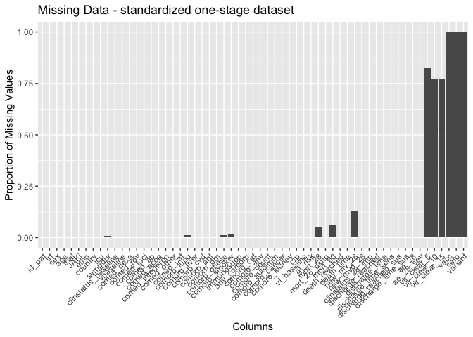
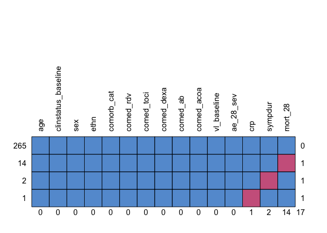
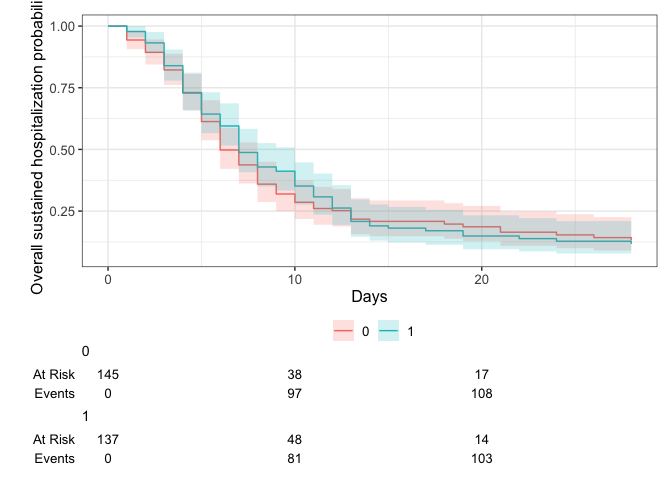

# Load packages

```r
library(tidyverse)
library(readxl)
library(writexl)
library(tableone)
library(haven) # Read sas files
library(here)
library(kableExtra)

library(jtools) # for summ() and plot_summs
library(sjPlot) # for tab_model
library(ggplot2) # survival/TTE analyses and other graphs
library(ggsurvfit) # survival/TTE analyses
library(survival) # survival/TTE analyses
library(gtsummary) # survival/TTE analyses
library(ggfortify) # autoplot
library(tidycmprsk) # competing risk analysis
library(ordinal) # clinstatus ordinal regression
library(logistf) # Firth regression in case of rare events

library(finalfit) # missing data exploration
library(mice) # multiple imputation
library(jomo) # multiple imputation
library(mitools) # multiple imputation
```

# Load Data


# Baseline Characteristics

```r
# dataframe 2, only data from those who were randomised, but long format, for each form/entry/record
# df2 <- df2 %>% # fill up NA / CAVE: does not correspond with PersonID and Label, rather use Label instead and extract id from it
#   fill(SUBJID_DER)
df2$id_pat <- sub(".*N(\\d+).*", "\\1", df2$Label)
# df2 <- df2 %>% 
#   select(id_pat, SUBJID_DER, SUBJID_DER122, PersonId, DATE_DEATH, Label, everything())
num_unique_id_pat <- length(unique(df2$id_pat)) # correct, 282 unique IDs, as per publication in Bari + SOC group and as dataframe 1

# dataframe 1, only with those who were randomised (n=282), but wide format (282 rows)
df <- df %>% rename(id_pat = SUBJID)
df <- df %>% # randomization variable, see codebook
  mutate(trt = case_when(RANDOM_TREAT == 2 ~ 1,
                         RANDOM_TREAT == 3 ~ 0))
df$trial <- "TACTIC-R"
df$JAKi <- "Baricitinib"
df$country <- "UK"
df$randdate <- as.Date(df$RANDOM_DATE, format = "%d/%m/%Y") # randomisation date

# Sex
df <- df %>% # Corresponds to publication
  mutate(sex = case_when(DEMO_SEX == 1 ~ "male",
                         DEMO_SEX == 2 ~ "female")) %>% # if missing, use info from risk score
  mutate(sex = case_when(is.na(sex) & RISK_MALEGEN == 1 ~ "male",
                         is.na(sex) & RISK_MALEGEN == 0 ~ "female",
                         TRUE ~ sex))
# Ethnicity
df <- df %>% # Corresponds to publication
  mutate(ethn = case_when(DEMO_ETHNIC == 1 ~ "White",
                          DEMO_ETHNIC == 2 ~ "Mixed",
                          DEMO_ETHNIC == 3 ~ "Asian or Asian British",
                          DEMO_ETHNIC == 4 ~ "Black or Black British",
                          DEMO_ETHNIC == 5 ~ "Other")) %>% # if missing, use info from risk score
  mutate(ethn = case_when(is.na(ethn) & RISK_NONWHITE == 0 ~ "White", 
                          TRUE ~ ethn)) %>% # if still missing, use info from DEMO_ETHNIC1
  mutate(ethn = case_when(is.na(ethn) & DEMO_ETHNIC1 == 1 ~ "White",
                          is.na(ethn) & DEMO_ETHNIC1 == 2 ~ "Mixed",
                          is.na(ethn) & DEMO_ETHNIC1 == 3 ~ "Asian or Asian British",
                          is.na(ethn) & DEMO_ETHNIC1 == 4 ~ "Black or Black British",
                          is.na(ethn) & DEMO_ETHNIC1 == 5 ~ "Other",
                          TRUE ~ ethn))

# AGE
df <- df %>% # Corresponds to publication
  mutate(age = as.numeric(df$DEMO_AGE)) %>% # if missing, use info from derived age
  mutate(age = case_when(is.na(age) & !is.na(DERIVE_AGE) ~ as.numeric(DERIVE_AGE), 
                          TRUE ~ age))
# df %>% 
#   filter(trt == 1) %>%
#   select(age) %>% 
#   summary()
df %>%
  ggplot(aes(x = age)) +
  geom_density(fill = "blue", color = "black") +
  labs(title = "Density Plot of Age",
       x = "Age",
       y = "Density")
```

<!-- -->

```r
### Days with symptoms prior to randomization
df$sympdur_date <- as.Date(df$ONSET_FIRSTD, format = "%d/%m/%Y") # randomisation date
df <- df %>% 
  mutate(sympdur = as.numeric(randdate - sympdur_date))
df %>% 
  drop_na(sympdur) %>% 
  ggplot(aes(x = sympdur)) +
  geom_density(fill = "blue", color = "black") +
  labs(title = "Density Plot of Symptom Duration",
       x = "Symptom Duration",
       y = "Density")
```

<!-- -->

```r
### ICU at baseline
df <- df %>% 
  mutate(icu = case_when(PARTIC_ICU == 1 | PARTIC_ICU1 == 1 ~ 1,
                         TRUE ~ 0))

### Clinical score at baseline

# POINT7_OS_POS	1	Death
# POINT7_OS_POS	2	Invasive mechanical ventilation
# POINT7_OS_POS	3	Non-invasive ventilation or high flow oxygen
# POINT7_OS_POS	4	Low flow oxygen
# POINT7_OS_POS	5	Hospitalised, no oxygen
# POINT7_OS_POS	6	Discharged, normal activities not resumed
# POINT7_OS_POS	7	Discharged, normal activities resumed

# double-check with the following for the follow-up scores since always in parallel (not for baseline, since this was collected during pre-screening, while the ordinal score was at randomization):

# RESP_DELIVER	1	Nasal cannula
# RESP_DELIVER	2	Venturi mask
# RESP_DELIVER	3	Ambu or rebreathing bag
# RESP_DELIVER	4	Non-invasive ventilation
# RESP_DELIVER	5	Continuous positive airway pressure (CPAP)
# RESP_DELIVER	6	Extracorporeal membrane oxygenation (ECMO)
# RESP_DELIVER	7	Invasive mechanical ventilation

# directly translatable into our score:
df <- df %>% # Corresponds to publication
  mutate(clinstatus_baseline = case_when(POINT7_OS_POS == 1 ~ 6,
                                         POINT7_OS_POS == 2 ~ 5,
                                         POINT7_OS_POS == 3 ~ 4,
                                         POINT7_OS_POS == 4 ~ 3,
                                         POINT7_OS_POS == 5 ~ 2,
                                         POINT7_OS_POS == 6 ~ 1,
                                         POINT7_OS_POS == 7 ~ 1))
df$clinstatus_baseline <- factor(df$clinstatus_baseline, levels = 1:6) ## no missing data
addmargins(table(df$clinstatus_baseline, df$trt, useNA = "always"))
```

```
##       
##          0   1 <NA> Sum
##   1      0   0    0   0
##   2      8   3    0  11
##   3     65  65    0 130
##   4     70  69    0 139
##   5      2   0    0   2
##   6      0   0    0   0
##   <NA>   0   0    0   0
##   Sum  145 137    0 282
```

```r
df <- df %>% 
  mutate(vbaseline = case_when(clinstatus_baseline == "2" | clinstatus_baseline == "3" ~ 0,
                                clinstatus_baseline == "4" | clinstatus_baseline == "5" ~ 1))


### Co-medication at baseline
## DEXA/CORTICO
df_dexa <- df2 %>%
  filter(grepl("dexa|cort|glucoc|hydrocor|predn|solon|methyl|Neofordex|Glensoludex|Martapan", CM_NAME, ignore.case = TRUE) &
         !grepl("Dexafree|fludro|symb|pul|dakta|penici", CM_NAME, ignore.case = TRUE)) # exclude Dexafree, fludrocortisone, symbi/pulmicort, daktacort, Phenoxymethylpenicillin 
# unique(df_dexa$CM_NAME)

# exclude non-baseline medication and unsuitable dexa equivalents (e.g. see NIH guidelines):
# If dexamethasone is not available, alternative corticosteroids (e.g., prednisone, methylprednisolone, hydrocortisone) can be used, For these drugs, the total daily dose equivalencies to dexamethasone 6 mg (orally or intravenously) are:
# Prednisone 40 mg
# Methylprednisolone 32 mg
# Hydrocortisone 160 mg

df_dexa <- left_join(df_dexa, df[, c("randdate", "trt", "id_pat")], by = join_by(id_pat == id_pat))
df_dexa$cm_start_date <- as.Date(df_dexa$CM_START, format = "%d/%m/%Y") 
# df_dexa %>%
#   select(id_pat, SUBJID_DER1, SUBJID_DER2, SUBJID_DER3, CM_NAME, CM_DOSE, CMDOSU, CM_FREQ, CM_FREQ_OTH, CM_ROUTE, CMROUTEOTH, CM_START, CM_END, randdate, cm_start_date, trt) %>%
#   View()
df_dexa <- df_dexa %>% 
  mutate(cm_baseline = case_when(cm_start_date <= randdate + 1 ~ 1, TRUE ~ 0)) %>% 
  filter(cm_baseline == 1) %>% # only those with steroid use at baseline + 1 day or before
  filter(!(CM_NAME == "Prednisolone" & CM_DOSE == 1)) %>% # exclude low-dose predni, medical history medication
  filter(!(CM_NAME == "Prednislone" & CM_DOSE == 3)) %>%  # exclude low-dose predni, medical history medication
  distinct(id_pat) %>% # only 1 entry per patient
  mutate(comed_dexa = 1)
df <- left_join(df, df_dexa[, c("comed_dexa", "id_pat")], by = join_by(id_pat == id_pat)) # merge to main df
df <- df %>% 
  mutate(comed_dexa = case_when(is.na(comed_dexa) ~ 0,
                          TRUE ~ comed_dexa))
# addmargins(table(df$comed_dexa, df$trt, useNA = "always")) # corresponds closely to trial publication Table 1 but they show use over entire study period 

# REMDESIVIR
# REMDES_TRT_ENR & REMDES_TRT_ENR1 do not help, instead use info from concomitant medication forms
# unique(df2$CM_NAME)
df_rdv <- df2 %>%
  filter(grepl("rem|rdv|veklury|vek|klur", CM_NAME, ignore.case = TRUE))
# unique(df_rdv$CM_NAME)
df_rdv <- left_join(df_rdv, df[, c("randdate", "trt", "id_pat")], by = join_by(id_pat == id_pat))
df_rdv$cm_start_date <- as.Date(df_rdv$CM_START, format = "%d/%m/%Y") 
df_rdv <- df_rdv %>% 
  mutate(cm_baseline = case_when(cm_start_date <= randdate + 1 ~ 1, TRUE ~ 0)) %>% 
  filter(cm_baseline == 1) %>% # only those with use at baseline + 1 day or before
  distinct(id_pat) %>% # only 1 entry per patient
  mutate(comed_rdv = 1)
df <- left_join(df, df_rdv[, c("comed_rdv", "id_pat")], by = join_by(id_pat == id_pat)) # merge to main df
df <- df %>% 
  mutate(comed_rdv = case_when(is.na(comed_rdv) ~ 0,
                          TRUE ~ comed_rdv))
# addmargins(table(df$comed_rdv, df$trt, useNA = "always")) # corresponds closely to trial publication Table 1 but they show use over entire study period 

# TOCILIZUMAB and other IL-6 inhibitors
# unique(df2$CM_NAME)
df_toci <- df2 %>%
  filter(grepl("toc|toz|sari|zumab|actem|kevzara", CM_NAME, ignore.case = TRUE) & 
           !grepl("tocopher|metoc", CM_NAME, ignore.case = TRUE)) # exclude Alphatocopherol & Metoclopromide
# unique(df_toci$CM_NAME)
df_toci <- left_join(df_toci, df[, c("randdate", "trt", "id_pat")], by = join_by(id_pat == id_pat))
df_toci$cm_start_date <- as.Date(df_toci$CM_START, format = "%d/%m/%Y") 
df_toci <- df_toci %>% 
  mutate(cm_baseline = case_when(cm_start_date <= randdate + 1 ~ 1, TRUE ~ 0)) %>% 
  filter(cm_baseline == 1) %>% # only those with use at baseline + 1 day or before
  distinct(id_pat) %>% # only 1 entry per patient
  mutate(comed_toci = 1)
df <- left_join(df, df_toci[, c("comed_toci", "id_pat")], by = join_by(id_pat == id_pat)) # merge to main df
df <- df %>% 
  mutate(comed_toci = case_when(is.na(comed_toci) ~ 0,
                          TRUE ~ comed_toci))
# addmargins(table(df$comed_toci, df$trt, useNA = "always")) # corresponds closely to trial publication Table 1 since they show use over entire study period 

# ANTICOAGULATION
df_acoa <- df2 %>%
  filter(grepl("coag|hepar|LMWH|UFH|parin|fragmin|lovenox|innohep|clexa", CM_NAME, ignore.case = TRUE))
# unique(df_acoa$CM_NAME)
df_acoa <- left_join(df_acoa, df[, c("randdate", "trt", "id_pat")], by = join_by(id_pat == id_pat))
df_acoa$cm_start_date <- as.Date(df_acoa$CM_START, format = "%d/%m/%Y") 
df_acoa <- df_acoa %>% 
  mutate(cm_baseline = case_when(cm_start_date <= randdate + 1 ~ 1, TRUE ~ 0)) %>% 
  filter(cm_baseline == 1) %>% # only those with use at baseline + 1 day or before
  filter(!(grepl("enox", CM_NAME, ignore.case = TRUE) & CM_DOSE == 40 & (CM_FREQ == 1 | CM_FREQ == 2))) %>%  # exclude low-dose proph. enoxa / but keep twice daily 40mg
  distinct(id_pat) %>% # only 1 entry per patient
  mutate(comed_acoa = 1)
# df_acoa %>% # keep the enoxa 40mg twice daily
#   select(id_pat, SUBJID_DER1, SUBJID_DER2, SUBJID_DER3, CM_NAME, CM_DOSE, CMDOSU, CM_FREQ, CM_FREQ_OTH, CM_ROUTE, CMROUTEOTH, CM_START, CM_END, randdate, cm_start_date, trt) %>%
#   View()
df <- left_join(df, df_acoa[, c("comed_acoa", "id_pat")], by = join_by(id_pat == id_pat)) # merge to main df
df <- df %>% 
  mutate(comed_acoa = case_when(is.na(comed_acoa) ~ 0,
                          TRUE ~ comed_acoa))
# addmargins(table(df$comed_acoa, df$trt, useNA = "always")) 

# INTERFERON
df_interferon <- df2 %>%
  filter(grepl("IFN|interf|SNG001", CM_NAME, ignore.case = TRUE)) # not a single case (check protocol)
df$comed_interferon <- 0 # see protocol
# unique(df_interferon$CM_NAME)
# df_interferon <- left_join(df_interferon, df[, c("randdate", "trt", "id_pat")], by = join_by(id_pat == id_pat))
# df_interferon$cm_start_date <- as.Date(df_interferon$CM_START, format = "%d/%m/%Y") 
# df_interferon <- df_interferon %>% 
#   mutate(cm_baseline = case_when(cm_start_date <= randdate + 1 ~ 1, TRUE ~ 0)) %>% 
#   filter(cm_baseline == 1) %>% # only those with use at baseline + 1 day or before
#   filter(!(grepl("enox", CM_NAME, ignore.case = TRUE) & CM_DOSE == 40 & (CM_FREQ == 1 | CM_FREQ == 2))) %>%  # exclude low-dose proph. enoxa / but keep twice daily 40mg
#   distinct(id_pat) %>% # only 1 entry per patient
#   mutate(comed_interferon = 1)
# # df_interferon %>% 
# #   select(id_pat, SUBJID_DER1, SUBJID_DER2, SUBJID_DER3, CM_NAME, CM_DOSE, CMDOSU, CM_FREQ, CM_FREQ_OTH, CM_ROUTE, CMROUTEOTH, CM_START, CM_END, randdate, cm_start_date, trt) %>%
# #   View()
# df <- left_join(df, df_interferon[, c("comed_interferon", "id_pat")], by = join_by(id_pat == id_pat)) # merge to main df
# df <- df %>% 
#   mutate(comed_interferon = case_when(is.na(comed_interferon) ~ 0,
#                           TRUE ~ comed_interferon))
# addmargins(table(df$comed_interferon, df$trt, useNA = "always")) 

# ANTIBIOTICS
# df2 %>% 
#   select(id_pat, SUBJID_DER1, SUBJID_DER2, SUBJID_DER3, CM_NAME, CM_DOSE, CMDOSU, CM_FREQ, CM_FREQ_OTH, CM_ROUTE, CMROUTEOTH, CM_START, CM_END) %>%
#   View()
df_ab <- df2 %>%
  filter(grepl("amox|peni|cefo|ceft|cefu|cipro|clar|clotr|trimox|doxy|fluc|genta|levoflo|merop|metronid|tazo|piper|vanco", CM_NAME, ignore.case = TRUE))
# unique(df_ab$CM_NAME)
df_ab <- left_join(df_ab, df[, c("randdate", "trt", "id_pat")], by = join_by(id_pat == id_pat))
df_ab$cm_start_date <- as.Date(df_ab$CM_START, format = "%d/%m/%Y") 
df_ab <- df_ab %>% 
  mutate(cm_baseline = case_when(cm_start_date <= randdate + 1 ~ 1, TRUE ~ 0)) %>% 
  filter(cm_baseline == 1) %>% # only those with use at baseline + 1 day or before
  distinct(id_pat) %>% # only 1 entry per patient
  mutate(comed_ab = 1)
df <- left_join(df, df_ab[, c("comed_ab", "id_pat")], by = join_by(id_pat == id_pat)) # merge to main df
df <- df %>% 
  mutate(comed_ab = case_when(is.na(comed_ab) ~ 0,
                          TRUE ~ comed_ab))
# addmargins(table(df$comed_ab, df$trt, useNA = "always")) 

# ANY OTHER COMEDICATION
df_comed_other <- df2 %>%
  filter(!is.na(CM_NAME))
# unique(df_comed_other$CM_NAME)
df_comed_other <- left_join(df_comed_other, df[, c("randdate", "trt", "id_pat", "comed_ab", "comed_acoa", "comed_dexa", "comed_rdv", "comed_toci", "comed_interferon")], by = join_by(id_pat == id_pat))
df_comed_other$cm_start_date <- as.Date(df_comed_other$CM_START, format = "%d/%m/%Y") 
df_comed_other <- df_comed_other %>% 
  mutate(cm_baseline = case_when(cm_start_date <= randdate + 1 ~ 1, TRUE ~ 0)) %>% 
  filter(cm_baseline == 1) %>% # only those with use at baseline + 1 day or before
  # filter(comed_ab == 0 & comed_acoa == 0 & comed_dexa == 0 & comed_rdv == 0 & comed_toci & comed_interferon == 0) %>% # to be discussed, participants often have several
  distinct(id_pat) %>% # only 1 entry per patient
  mutate(comed_other = 1)
df <- left_join(df, df_comed_other[, c("comed_other", "id_pat")], by = join_by(id_pat == id_pat)) # merge to main df
df <- df %>% 
  mutate(comed_other = case_when(is.na(comed_other) ~ 0,
                          TRUE ~ comed_other))
# addmargins(table(df$comed_other, df$trt, useNA = "always")) # to be discussed, participants often have several

## GROUP them for the subgroup analysis, according to protocol
df <- df %>% # there are no missings in comed_dexa and comed_toci
  mutate(comed_cat = case_when(comed_dexa == 0 & comed_toci == 0 ~ 1, # patients without Dexa nor Toci
                               comed_dexa == 1 & comed_toci == 0 ~ 2, # patients with Dexa but no Toci
                               comed_dexa == 1 & comed_toci == 1 ~ 3, # patients with Dexa and Toci
                               comed_dexa == 0 & comed_toci == 1 ~ 4)) # patients with Toci but no Dexa
# addmargins(table(df$comed_cat, df$trt, useNA = "always"))


### Comorbidities at baseline
df <- df %>% # 3 missing
  mutate(comorb_lung = case_when(MH_ASTHMA == 1 | MH_OBSTRUCT == 1 | MH_LUNGDISEASE == 1 | MH_INTERSTIT == 1 ~ 1,
                                 MH_ASTHMA == 0 & MH_OBSTRUCT == 0 & MH_LUNGDISEASE == 0 & MH_INTERSTIT == 0 ~ 0))
df <- df %>% # no missing
  mutate(comorb_liver = case_when(MH_LIVERDIS == 1 ~ 1,
                                  MH_LIVERDIS == 0 ~ 0))
df <- df %>% # 1 missing
  mutate(comorb_cvd = case_when(MH_HEARTD == 1 | MH_STROKE == 1 | MH_ISCHAEMIC == 1 | MH_ATRIALFIB == 1 | MH_OTHCARDIAC == 1 ~ 1,
                                MH_HEARTD == 0 & MH_STROKE == 0 & MH_ISCHAEMIC == 0 & MH_ATRIALFIB == 0 & MH_OTHCARDIAC == 0 ~ 0))
df <- df %>% # no missing
  mutate(comorb_aht = case_when(MH_HYPT == 1 ~ 1,
                                MH_HYPT == 0 ~ 0))
df <- df %>% # no missing
  mutate(comorb_dm = case_when(MH_DIABETES == 1 ~ 1,
                               MH_DIABETES == 0 ~ 0))
df <- df %>% # 3 missing
  mutate(comorb_obese = case_when(MH_OBESE == 1 ~ 1,
                               MH_OBESE == 0 ~ 0))
df <- df %>% # 5 missing
  mutate(comorb_smoker = case_when(MH_SMOKING == 2 ~ 1,
                               MH_SMOKING == 1 | MH_SMOKING == 3 ~ 0))
df <- df %>% # no missing
  mutate(comorb_kidney = case_when(MH_CHRONKIDND == 1 ~ 1,
                               MH_CHRONKIDND == 0 ~ 0))
df <- df %>% # 1 missing
  mutate(comorb_cancer = case_when(MH_CANCERPAST == 1 | MH_CURRCANC == 1 ~ 1,
                               MH_CANCERPAST == 0 & MH_CURRCANC == 0 ~ 0))
df <- df %>% # no missing
  mutate(comorb_autoimm = case_when(MH_AUTOIMM == 1 ~ 1,
                               MH_AUTOIMM == 0 ~ 0))
df <- df %>% # no missing
  mutate(immunosupp = case_when(MH_IMMUNODEF == 1 | MH_PRONETOINF == 1 ~ 1,
                               MH_IMMUNODEF == 0 & MH_PRONETOINF == 0 ~ 0))

df <- df %>% 
  mutate(any_comorb = case_when(comorb_lung == 1 | comorb_liver == 1 | comorb_cvd == 1 |
                                  comorb_aht == 1 | comorb_dm == 1 | comorb_obese == 1 | comorb_smoker == 1
                                | immunosupp == 1 | comorb_cancer == 1 | comorb_autoimm == 1 | comorb_kidney == 1 
                                  ~ 1,
                                comorb_lung == 0 & comorb_liver == 0 & comorb_cvd == 0 &
                                  comorb_aht == 0 & comorb_dm == 0 & comorb_obese == 0 & comorb_smoker == 0
                                & immunosupp == 0 & comorb_cancer == 0 & comorb_autoimm == 0 & comorb_kidney == 0
                                ~ 0))
# table(df$any_comorb, useNA = "always") # 4 missing

# the remaining 4 missing have only NA in 1 comorb category => no evidence for comorbidity -> recode as 0
# df %>%
#   select(id_pat, any_comorb, comorb_lung, comorb_liver, comorb_cvd, comorb_aht, comorb_dm, comorb_obese, comorb_smoker, immunosupp, comorb_kidney, comorb_autoimm, comorb_cancer) %>%
#   filter(is.na(any_comorb)) %>%
#   View()
df <- df %>% 
  mutate(any_comorb = case_when(is.na(any_comorb) ~ 0,
                                TRUE ~ any_comorb))

## group them for the subgroup analysis, according to protocol // count all pre-defined comorbidities per patient first
comorb <- df %>% 
  select(id_pat, comorb_lung, comorb_liver, comorb_cvd, comorb_aht, comorb_dm, comorb_obese, comorb_smoker, immunosupp, comorb_kidney, comorb_autoimm, comorb_cancer)
comorb$comorb_count <- NA
for (i in 1:dim(comorb)[[1]]) {
  comorb$comorb_count[i] <- ifelse(
    sum(comorb[i, ] %in% c(1)) > 0,
    sum(comorb[i, ] %in% c(1)),
    NA
  )
}
comorb <- comorb %>% 
  mutate(comorb_count = case_when(comorb_lung == 0 & comorb_liver == 0 & comorb_cvd == 0 &
                                  comorb_aht == 0 & comorb_dm == 0 & comorb_obese == 0 & comorb_smoker == 0
                                & immunosupp == 0 & comorb_cancer == 0 & comorb_autoimm == 0 & comorb_kidney == 0 ~ 0,
                                TRUE ~ comorb_count))
# the remaining 4 missing have only NA in 1 comorb category => no evidence for comorbidity -> recode as 0
comorb <- comorb %>% 
  mutate(comorb_count = case_when(is.na(comorb_count) ~ 0,
                                TRUE ~ comorb_count))
df <- left_join(df, comorb[, c("comorb_count", "id_pat")], by = join_by(id_pat == id_pat)) ## merge imputed variable back
df <- df %>% # same 4 missing
  mutate(comorb_cat = case_when(immunosupp == 1 ~ 4, # immunocompromised
                                comorb_count == 0 ~ 1, # no comorbidity
                                comorb_count == 1 & (immunosupp == 0 | is.na(immunosupp)) ~ 2, # one comorbidity
                                comorb_count >1 & (immunosupp == 0 | is.na(immunosupp)) ~ 3)) # multiple comorbidities
table(df$comorb_cat, useNA = "always")
```

```
## 
##    1    2    3    4 <NA> 
##   49   64  134   35    0
```

```r
df <- df %>%
  mutate(comorb_any = case_when(comorb_count == 0 ~ 0, # no comorbidity
                                comorb_count >0 ~ 1)) # any comorbidity


### CRP at baseline
# summary(df$CRP, useNA = "always")
df$crp_date <- as.Date(df$CRP_DAT, format = "%d/%m/%Y") 
df_crp <- df %>% 
  mutate(crp_baseline = case_when(crp_date <= (randdate + 1) ~ 1, TRUE ~ 0)) %>% 
  filter(crp_baseline == 1) %>% 
  rename(crp = CRP)
df <- left_join(df, df_crp[, c("crp", "id_pat")], by = join_by(id_pat == id_pat)) ## merge to main df
# summary(df$crp, useNA = "always")
df %>% 
  drop_na(crp) %>% 
  ggplot(aes(x = crp)) +
  geom_density(fill = "blue", color = "black") +
  labs(title = "Density Plot of CRP",
       x = "CRP",
       y = "Density")
```

<!-- -->

```r
### Viremia / Undetectable VL at baseline
# transform all vl date variables
df$vl_baseline_date <- as.Date(df$COVID19_TSTRCNT, format = "%d/%m/%Y") 
df <- df %>% 
  mutate(vl_baseline_mark = case_when(vl_baseline_date <= (randdate + 1) ~ 1,
                                      vl_baseline_date > (randdate + 1) ~ 0)) # mark the baseline VL, if after baseline mark as 0, otherwise NA
# table(df$vl_baseline_mark) # double-check with trial team, for n=4 probably data entry error
df <- df %>% 
  mutate(vl_baseline = case_when(COVID19_POS == 0 ~ 1, # 1=pos / 0=neg=undetectable
                                 COVID19_POS == 1 ~ 0)) 


# date_columns <- c("COVID19_TSTRCNT", "COVID19_RECDAT", "COVID19_RECDAT1", "COVID19_RECDAT2", "COVID19_RECDAT3", "COVID19_RECDAT4", "COVID19_RECDAT5", "COVID19_RECDAT6", "COVID19_RECDAT7", "COVID19_RECDAT8")
# df <- df %>%
#   mutate_at(vars(date_columns), list(~ as.Date(., format = "%d/%m/%Y")))
# df <- df %>% # earliest should be COVID19_TSTRCNT, but just to be sure and take all available data into account
#   mutate(vl_earliest_date = pmin(COVID19_TSTRCNT, COVID19_RECDAT, COVID19_RECDAT1, COVID19_RECDAT2, COVID19_RECDAT3, COVID19_RECDAT4, COVID19_RECDAT5, COVID19_RECDAT6, COVID19_RECDAT7, COVID19_RECDAT8, na.rm = TRUE)) %>% 
#   mutate(vl_baseline_mark = case_when(vl_earliest_date <= (randdate + 1) ~ 1)) %>% # mark the baseline VL, otherwise NA
#   mutate(vl_baseline_ori = case_when(vl_baseline_mark == 1 & !is.na(COVID19_TSTRCNT) & COVID19_TSTRCNT < COVID19_RECDAT ~ COVID19_RESULT,
#                                  vl_baseline_mark == 1 & is.na(COVID19_TSTRCNT) & !is.na(COVID19_RECDAT) & COVID19_RECDAT < COVID19_RECDAT1 ~ COVID19_RESULT1,
#                                  vl_baseline_mark == 1 & is.na(COVID19_TSTRCNT) & is.na(COVID19_RECDAT) & !is.na(COVID19_RECDAT1) & COVID19_RECDAT1 < COVID19_RECDAT2 ~ COVID19_RESULT2,
#                                  vl_baseline_mark == 1 & is.na(COVID19_TSTRCNT) & is.na(COVID19_RECDAT) & is.na(COVID19_RECDAT1) & !is.na(COVID19_RECDAT2) & COVID19_RECDAT2 < COVID19_RECDAT3 ~ COVID19_RESULT3,
#                                  vl_baseline_mark == 1 & is.na(COVID19_TSTRCNT) & is.na(COVID19_RECDAT) & is.na(COVID19_RECDAT1) & is.na(COVID19_RECDAT2) & !is.na(COVID19_RECDAT3) & COVID19_RECDAT3 < COVID19_RECDAT4 ~ COVID19_RESULT4,
#                                  vl_baseline_mark == 1 & is.na(COVID19_TSTRCNT) & is.na(COVID19_RECDAT) & is.na(COVID19_RECDAT1) & is.na(COVID19_RECDAT2) & is.na(COVID19_RECDAT3) & !is.na(COVID19_RECDAT4) & COVID19_RECDAT4 < COVID19_RECDAT5 ~ COVID19_RESULT5,
#                                  )) %>% 
#   mutate(vl_baseline = case_when(vl_baseline_ori == 0 ~ 1, # 1=pos / 0=neg=undetectable
#                                  vl_baseline_ori == 1 ~ 0)) 
# df %>% 
#   select(id_pat, randdate, vl_baseline_mark, vl_baseline, COVID19_TSTRCNT, COVID19_RESULT, 
#                               COVID19_RECDAT, COVID19_RESULT1,
#                               COVID19_RECDAT1, COVID19_RESULT2,
#                               COVID19_RECDAT2, COVID19_RESULT3,
#                               COVID19_RECDAT3, COVID19_RESULT4,
#          COVID19_RECDAT4, COVID19_RESULT5,
#          COVID19_RECDAT5, COVID19_RECDAT6, COVID19_RECDAT7, COVID19_RECDAT8) %>%
#   View()


### Serology at baseline // not available
### COVID-19 vaccination at baseline // not available
### Variant // not available


# At risk for AEs with JAKi
df <- df %>%
  mutate(at_risk = case_when(age>=65 | comorb_cvd==1 | comorb_smoker==1 ~ 1, # at risk
                             TRUE ~ 0)) # not at risk
```

# Endpoints

```r
### FIRST, extract the status info from dataframe 1
# transform all resp scores
point7_transform <- function(df, clinstatus_var, pos_var) {
  df <- df %>%
    mutate({{ clinstatus_var }} :=
             case_when({{ pos_var }} %in% c(6, 7) ~ 1,
                       {{ pos_var }} == 5 ~ 2,
                       {{ pos_var }} == 4 ~ 3,
                       {{ pos_var }} == 3 ~ 4,
                       {{ pos_var }} == 2 ~ 5,
                       {{ pos_var }} == 1 ~ 6)) %>%
    mutate({{ clinstatus_var }} := factor({{ clinstatus_var }}, levels = 1:6))
}
df <- point7_transform(df, clinstatus_1, POINT7_OS_POS1) ## POINT7_OS_POS1 = D2 = clinstatus_1 (1 day after clinstatus_baseline) / D1 = baseline/randomization day
df <- point7_transform(df, clinstatus_2, POINT7_OS_POS2)
df <- point7_transform(df, clinstatus_3, POINT7_OS_POS3)
df <- point7_transform(df, clinstatus_4, POINT7_OS_POS4)
df <- point7_transform(df, clinstatus_5, POINT7_OS_POS5)
df <- point7_transform(df, clinstatus_6, POINT7_OS_POS6) 
df <- point7_transform(df, clinstatus_7, POINT7_OS_POS7)
df <- point7_transform(df, clinstatus_8, POINT7_OS_POS8)
df <- point7_transform(df, clinstatus_9, POINT7_OS_POS9)

# table(df$clinstatus_2, df$RESP_DELIVER4) # the scores corresponds quite well with the resp_deliver variable. Take the ordinal score first and double-check with PI: E.g. those with clinstatus == 4 (NIV) but resp_deliver == 1 (Nasal cannula) or == 2 (mask)
# table(df$clinstatus_5, df$RESP_DELIVER7, useNA = "always") # and resp_deliver unfortunately does not contain more info, i.e., to fill up clinstatus

# status_columns <- grep("^PART_STATUS", names(df), value = TRUE)
# withdraw_columns <- grep("^CONSENT_CONT", names(df), value = TRUE)
# discharge_columns <- grep("^VISIT_DISCHARGE", names(df), value = TRUE)
# df %>% 
#   select(id_pat,
#          contains("RESP_DELIVER"), # RESP_DELIVER3 = D2 = POINT7_OS_POS1 = clinstatus_1 // corresponds well
#          contains("clinstatus_"),
#          contains("PART_STATUS"),
#          # contains("VISIT_DAY"), # does not any info
#          # contains("VISIT_TYPE"), # does not contain more info
#          # contains("CONSENT_CONT"),
#          contains("VISIT_DISCHARGE"),
#          ) %>%
#   # filter(is.na(clinstatus_1)) %>% # RESP_DELIVER3 and onwards unfortunately also missing if clinstatus_1 and onwards missing
#   # PART_STATUS (alive/dead) and onwards unfortunately also missing if clinstatus_1 and onwards missing
#   # filter_at(vars(status_columns), any_vars(. == 0)) %>% # PART_STATUSx (alive=1/dead=0) corresponds well with clinstatus_ (PART_STATUS2 = clinstatus_1) and does not contain more info - except id 590013 -> died at baseline?
#   # filter_at(vars(withdraw_columns), any_vars(. == 1)) %>% # CONSENT_CONTx (withdrew=1) corresponds well with NA in clinstatus_ (CONSENT_CONT2 = clinstatus_1) and does not contain more info
#   filter_at(vars(discharge_columns), any_vars(. == 1)) %>% # VISIT_DISCHARGEx (discharged=1) corresponds well with score in clinstatus_ (VISIT_DISCHARGE2 = clinstatus_1) - except 020040 -> discharged with NIV?
#   View()
# df %>% 
#   filter(id_pat == "590013") %>% 
#   View()

# => 1) find out about 590013, 2) use PART_STATUS == 0 to count deaths and clinstatus_ for time to death, 3) use CONSENT_CONTx to mark withdrawals and time to withdrawal (CONSENT_CONT2 = clinstatus_1 = time to withdrawal = 1 day), 4) use VISIT_DISCHARGEx or VISDATx to mark discharge and time to discharge (VISIT_DISCHARGE2 = clinstatus_1, i.e. time to discharge = 1 day)

df <- df %>%
  rename(discharge_bas = VISIT_DISCHARGE,
         discharge_bas_date = VISDAT1,
         discharge_0 = VISIT_DISCHARGE1,
         discharge_0_date = VISDAT2,
         discharge_1 = VISIT_DISCHARGE2,
         discharge_1_date = VISDAT3,
         discharge_2 = VISIT_DISCHARGE3,
         discharge_2_date = VISDAT4,
         discharge_3 = VISIT_DISCHARGE4,
         discharge_3_date = VISDAT5,
         discharge_4 = VISIT_DISCHARGE5,
         discharge_4_date = VISDAT6,
         discharge_5 = VISIT_DISCHARGE6,
         discharge_5_date = VISDAT7,
         discharge_6 = VISIT_DISCHARGE7,
         discharge_6_date = VISDAT8,
         discharge_7 = VISIT_DISCHARGE8,
         discharge_7_date = VISDAT9,
         discharge_8 = VISIT_DISCHARGE9,
         discharge_8_date = VISDAT10,
         discharge_9 = VISIT_DISCHARGE10,
         discharge_9_date = VISDAT11)


### SECOND, extract all available status info from dataframe 2
df2$death_date <- as.Date(df2$DATE_DEATH, format = "%d/%m/%Y") # unique entries (distinct(id_pat))
df2$withdraw_date <- as.Date(df2$CONS_WITHDAT, format = "%d/%m/%Y") # unique entries (distinct(id_pat))
df2 <- df2 %>% 
  mutate(lastvisit = case_when(EOS_LV == "2" ~ "baseline",
                               EOS_LV == "DIS1" ~ "discharge",
                               TRUE ~ EOS_LV)) # unique entries (distinct(id_pat)), missing for 11
df2 <- df2 %>% 
  mutate(lastvisit_status = case_when(EOS_RSN == 1 ~ "completed",
                                      EOS_RSN == 2 ~ "withdrawal",
                                      EOS_RSN == 3 ~ "withdrawal_phys",
                                      EOS_RSN == 4 ~ "withdrawal_ae",
                                      EOS_RSN == 5 ~ "death",
                                      EOS_RSN == 98 ~ "other",
                                      EOS_RSN == 99 ~ "withdrawal_other"
                                      )) # unique entries (distinct(id_pat)), missing for 11
df2 <- df2 %>% mutate(lastvisit_status_other = EOS_RSNOTH)
df2$lastvisit_status_date <- as.Date(df2$ET_EOSDAT, format = "%d/%m/%Y") # unique entries (distinct(id_pat))
df2 <- df2 %>% 
  mutate(treat_stop_status = case_when(TREAT_CESSATION == 1 ~ "noCOVID",
                                      TREAT_CESSATION == 2 ~ "progress_primendpoint",
                                      TREAT_CESSATION == 3 ~ "sar",
                                      TREAT_CESSATION == 4 ~ "dvt",
                                      TREAT_CESSATION == 5 ~ "withdrawal",
                                      ))
df2 <- df2 %>% 
  mutate(sae_outcome = case_when(SAEOUT == 1 ~ "recovered",
                                      SAEOUT == 2 ~ "ongoing",
                                      SAEOUT == 3 ~ "recovered_seq",
                                      SAEOUT == 4 ~ "worsening",
                                      SAEOUT == 5 ~ "death",
                                      SAEOUT == 6 ~ "unknown",
                                      ))
df2$sae_outcome_date <- as.Date(df2$SAERESDAT, format = "%d/%m/%Y") # unique entries (distinct(id_pat))

df2 <- point7_transform(df2, clinstatus_10, POINT7_OS_POS) 
df2 <- point7_transform(df2, clinstatus_11, POINT7_OS_POS1)
df2 <- point7_transform(df2, clinstatus_12, POINT7_OS_POS2)
df2 <- point7_transform(df2, clinstatus_13, POINT7_OS_POS3)
df2 <- point7_transform(df2, clinstatus_dis, POINT7_OS_POS4)
df2 <- point7_transform(df2, clinstatus_28, POINT7_OS_POS5)
df2 <- point7_transform(df2, clinstatus_90, POINT7_OS_POS6)

# table(df2$clinstatus_11, df2$RESP_DELIVER1, useNA = "always") # the scores corresponds quite well with the resp_deliver variable. Take the ordinal score first and double-check with PI: E.g. those with clinstatus == 4 (NIV) but resp_deliver == 1 (Nasal cannula) or == 2 (mask) and resp_deliver unfortunately does not contain more info, i.e., to fill up clinstatus

df_status <- df2 %>% 
  select(id_pat, death_date, withdraw_date, lastvisit, lastvisit_status, lastvisit_status_other, lastvisit_status_date, treat_stop_status, sae_outcome, sae_outcome_date, clinstatus_10, clinstatus_11, clinstatus_12, clinstatus_13, clinstatus_dis, clinstatus_28, clinstatus_90, PART_STATUS, PART_STATUS1, PART_STATUS2, PART_STATUS3, PART_STATUS4, PART_STATUS5, PART_STATUS6, VISIT_DISCHARGE3, VISDAT3, SUBJID_DER36, VISIT_DISCHARGE4, VISDAT4, SUBJID_DER57, PARTIC_ICU, PARTIC_ICU1, PARTIC_ICU2, PARTIC_ICU3, PARTIC_ICU4, PARTUP_READMIT) %>% 
  filter(!(is.na(death_date) & is.na(withdraw_date) & is.na(lastvisit) & is.na(lastvisit_status) & is.na(lastvisit_status_other) & is.na(lastvisit_status_date) & is.na(treat_stop_status) & is.na(sae_outcome) & is.na(sae_outcome_date) & is.na(clinstatus_10) & is.na(clinstatus_11) & is.na(clinstatus_12) & is.na(clinstatus_13) & is.na(clinstatus_dis) & is.na(clinstatus_28) & is.na(clinstatus_90) & is.na(VISIT_DISCHARGE3) & is.na(VISIT_DISCHARGE4) & is.na(PART_STATUS) & is.na(PART_STATUS1) & is.na(PART_STATUS2) & is.na(PART_STATUS3) & is.na(PART_STATUS4) & is.na(PART_STATUS5) & is.na(PART_STATUS6) & is.na(PARTIC_ICU) & is.na(PARTIC_ICU1) & is.na(PARTIC_ICU2) & is.na(PARTIC_ICU3) & is.na(PARTIC_ICU4)))

## Now, deduplicate this data frame with obsolete information creating duplicates
df_status <- df_status %>% 
  mutate(duplicate_id = duplicated(id_pat) | duplicated(id_pat, fromLast = TRUE))
df_status <- df_status %>% 
  filter(!(sae_outcome == "death" & is.na(lastvisit_status) & is.na(death_date) & duplicate_id == T)) # the sae column does not contain more info than the other death variables, just creates 10 dupl
df_status <- df_status %>% 
  mutate(duplicate_id2 = duplicated(id_pat) | duplicated(id_pat, fromLast = TRUE))
df_status <- df_status %>% 
  filter(!(duplicate_id2 == T & sae_outcome == "recovered_seq")) # the sae column does not contain more info than the other death variables, just creates 2 dupl
df_status <- df_status %>% 
  mutate(duplicate_id3 = duplicated(id_pat) | duplicated(id_pat, fromLast = TRUE))
df_status <- df_status %>% 
  filter(!(duplicate_id3 == T & id_pat == "020035" & sae_outcome_date == "2021-04-29")) # for this pat, the sae_outcome_date does not add more info, just creates 2 dupl
df_status <- df_status %>% 
  mutate(duplicate_id4 = duplicated(id_pat) | duplicated(id_pat, fromLast = TRUE))
df_status <- df_status %>% # clean each duplicate case 
  filter(!(duplicate_id4 == T & id_pat == "020052" & sae_outcome_date == "2021-02-06")) %>% 
  filter(!(duplicate_id4 == T & id_pat == "080002" & is.na(death_date))) %>% 
  filter(!(duplicate_id4 == T & id_pat == "080011" & is.na(death_date))) %>%
  filter(!(duplicate_id4 == T & id_pat == "080026" & is.na(death_date))) %>%
  filter(!(duplicate_id4 == T & id_pat == "090005" & is.na(lastvisit_status))) %>%
  filter(!(duplicate_id4 == T & id_pat == "090006" & sae_outcome_date == "2020-10-10")) %>%
  filter(!(duplicate_id4 == T & id_pat == "090006" & sae_outcome_date == "2020-10-10")) %>%
  filter(!(duplicate_id4 == T & id_pat == "090028" & is.na(death_date))) %>%
  filter(!(duplicate_id4 == T & id_pat == "090047" & is.na(death_date))) %>%
  filter(!(duplicate_id4 == T & id_pat == "240002" & is.na(lastvisit_status)))
# => we land exactly at n=282

# df_status %>%
#   # filter(duplicate_id4 == T) %>%
#   filter(lastvisit_status == "death" | sae_outcome == "death" | !is.na(death_date) | PART_STATUS == 0 | PART_STATUS1 == 0 | PART_STATUS2 == 0 | PART_STATUS3 == 0 | PART_STATUS4 == 0 | PART_STATUS5 == 0 | PART_STATUS6 == 0) %>% # PART_STATUS does not add any additional info
#   View()

# for merging with data frame 1, rename a few, to avoid duplicates
df_status <- df_status %>%
  rename(death_date_df2 = death_date,
         withdraw_date_df2 = withdraw_date,
         discharge_11_df2 = VISIT_DISCHARGE3,
         discharge_11_date_df2 = VISDAT3,
         discharge_12_df2 = VISIT_DISCHARGE4,
         discharge_12_date_df2 = VISDAT4,
         icu_10_df2 = PARTIC_ICU,
         icu_11_df2 = PARTIC_ICU1,
         icu_12_df2 = PARTIC_ICU2,
         icu_13_df2 = PARTIC_ICU3,
         icu_14_df2 = PARTIC_ICU4)
df <- left_join(df, df_status[, c("id_pat", "death_date_df2", "withdraw_date_df2", "lastvisit", "lastvisit_status", "lastvisit_status_other", "lastvisit_status_date", "treat_stop_status", "sae_outcome", "sae_outcome_date", "clinstatus_10", "clinstatus_11", "clinstatus_12", "clinstatus_13", "clinstatus_dis", "clinstatus_28", "clinstatus_90", "discharge_11_df2", "discharge_11_date_df2", "discharge_12_df2", "discharge_12_date_df2", "icu_10_df2", "icu_11_df2", "icu_12_df2", "icu_13_df2", "icu_14_df2", "PARTUP_READMIT")], by = join_by(id_pat == id_pat)) ## merge to main df

df_status <- df %>% 
  select(id_pat, randdate, trt, death_date_df2, withdraw_date_df2, lastvisit, lastvisit_status, lastvisit_status_other, lastvisit_status_date, treat_stop_status, sae_outcome, sae_outcome_date, clinstatus_baseline, clinstatus_1, clinstatus_2, clinstatus_3, clinstatus_4, clinstatus_5, clinstatus_6, clinstatus_7, clinstatus_8, clinstatus_9, clinstatus_10, clinstatus_11, clinstatus_12, clinstatus_13, clinstatus_dis, clinstatus_28, clinstatus_90, CONSENT_CONT, CONSENT_CONT1, CONSENT_CONT2, CONSENT_CONT3, CONSENT_CONT4, CONSENT_CONT5, CONSENT_CONT6, CONSENT_CONT7, CONSENT_CONT8, CONSENT_CONT9, CONSENT_CONT10, discharge_bas, discharge_bas_date, discharge_0, discharge_0_date, discharge_1, discharge_1_date, discharge_2, discharge_2_date, discharge_3, discharge_3_date, discharge_4, discharge_4_date, discharge_5, discharge_5_date, discharge_6, discharge_6_date, discharge_7, discharge_7_date, discharge_8, discharge_8_date, discharge_9, discharge_9_date, discharge_11_df2, discharge_11_date_df2, discharge_12_df2, discharge_12_date_df2, PARTIC_ICU, PARTIC_ICU1, PARTIC_ICU2, PARTIC_ICU3, PARTIC_ICU4, PARTIC_ICU5, PARTIC_ICU6, PARTIC_ICU7, PARTIC_ICU8, PARTIC_ICU9, PARTIC_ICU10, icu_10_df2, icu_11_df2, icu_12_df2, icu_13_df2, icu_14_df2, PARTUP_READMIT)

# df_status %>%
#   # filter(!is.na(death_date_df2) | lastvisit_status == "death" | sae_outcome == "death" | clinstatus_baseline == "6" | clinstatus_1 == "6" | clinstatus_2 == "6" | clinstatus_3 == "6" | clinstatus_4 == "6" | clinstatus_5 == "6" | clinstatus_6 == "6" | clinstatus_7 == "6" | clinstatus_8 == "6" | clinstatus_9 == "6" | clinstatus_10 == "6" | clinstatus_11 == "6" | clinstatus_12 == "6" | clinstatus_13 == "6" | clinstatus_dis == "6" | clinstatus_28 == "6" | clinstatus_90 == "6"
#   #        ) %>%
#   filter(!is.na(withdraw_date_df2) | lastvisit_status == "withdrawal" | lastvisit_status == "withdrawal_ae" | lastvisit_status == "withdrawal_phys" | CONSENT_CONT == 1 | CONSENT_CONT1 == 1 | CONSENT_CONT2 == 1 | CONSENT_CONT3 == 1 | CONSENT_CONT4 == 1 | CONSENT_CONT5 == 1 | CONSENT_CONT6 == 1 | CONSENT_CONT7 == 1 | CONSENT_CONT8 == 1 | CONSENT_CONT9 == 1 | CONSENT_CONT10 == 1
#          ) %>%
#   # filter(!is.na(discharge_12_date_df2) | discharge_12_df2 == 1
#   #        ) %>%
#   View()

# 1) use death_date_df2 to indicate deaths and time to death (the one who died after day 90 is NA)
# 2) use withdraw_date_df2 to indicate withdrawals (due to self and investigator) and time to withdrawal
# except for 020095 add 2021-01-27 as withdraw_date_df2 (D1 physician withdrew consent) 
# and for 520021 add 2021-02-07 as withdraw_date_df2 (D11 AE withdrawal, went to ICU) but recovered on 2021-02-12 but probably still at hospital => add clinstatus 2
# some withdrew consent but data was collected afterwards, i.e. include in time to discharge / clinstatus
# 3) use discharge_12_df2 and discharge_12_date_df2 for time to discharge (all other discharge variables do not contain more info!) and then combine with clinstatus

## CREATE the most important time to event variables (death, discharge, withdrawal, ltfu)
df_status <- df_status %>%
  mutate(withdraw_date = case_when(id_pat == "020095" ~ as.Date("2021-01-27"),
                                   id_pat == "520021" ~ as.Date("2021-02-07"),
                                   TRUE ~ withdraw_date_df2)) %>% 
  mutate(withdraw_d = as.numeric(withdraw_date - randdate)) %>%
  rename(death_date = death_date_df2) %>% 
  mutate(death_d = as.numeric(death_date - randdate)) %>%
  mutate(discharge_date = as.Date(discharge_12_date_df2, format = "%d/%m/%Y")) %>% 
  mutate(discharge_d = as.numeric(discharge_date - randdate))

df_status <- df_status %>% 
  select(id_pat, trt, randdate, death_date, death_d, withdraw_date, withdraw_d, discharge_date, discharge_d, lastvisit, lastvisit_status, lastvisit_status_other, lastvisit_status_date, treat_stop_status, sae_outcome, sae_outcome_date, clinstatus_baseline, clinstatus_1, clinstatus_2, clinstatus_3, clinstatus_4, clinstatus_5, clinstatus_6, clinstatus_7, clinstatus_8, clinstatus_9, clinstatus_10, clinstatus_11, clinstatus_12, clinstatus_13, clinstatus_dis, clinstatus_28, clinstatus_90, PARTIC_ICU, PARTIC_ICU1, PARTIC_ICU2, PARTIC_ICU3, PARTIC_ICU4, PARTIC_ICU5, PARTIC_ICU6, PARTIC_ICU7, PARTIC_ICU8, PARTIC_ICU9, PARTIC_ICU10, icu_10_df2, icu_11_df2, icu_12_df2, icu_13_df2, icu_14_df2, PARTUP_READMIT)

df_status <- df_status %>% # if discharge date = death date => set discharge variables to missing
  mutate(discharge_d = case_when(discharge_date == death_date ~ NA,
                                    TRUE ~ discharge_d)) %>% 
  mutate(discharge_date = case_when(discharge_date == death_date ~ NA,
                                    TRUE ~ discharge_date))
df_status <- df_status %>% 
  mutate(discharge_reached = case_when(!is.na(discharge_d) & discharge_d <= 28 ~ 1,
                                       TRUE ~ 0))
df_status <- df_status %>% 
  mutate(death_reached = case_when(!is.na(death_d) ~ 1,
                                       TRUE ~ 0))

# df_status %>% 
#   filter(is.na(discharge_date) & is.na(death_date) & is.na(withdraw_date)) %>% 
#   View()

# 1) if clinstatus_28 more than 1, then add 28 to time to discharge_d (discharge_reached is correct = 0)
# 2) if clinstatus_28 = 1, but ICU variables = 1, then add 28 to time to discharge_d (but change discharge_reached to 1)

df_status <- df_status %>% 
  mutate(discharge_d = case_when(is.na(discharge_date) & is.na(death_date) & is.na(withdraw_date) & 
                                   clinstatus_28 %in% c("2","3","4","5") ~ 28,
                                       TRUE ~ discharge_d)) %>% 
  mutate(discharge_d = case_when(is.na(discharge_date) & is.na(death_date) & is.na(withdraw_date) & 
                                   clinstatus_28 == "1" & (icu_13_df2 == 1 | icu_14_df2 == 1) ~ 28,
                                       TRUE ~ discharge_d)) %>% 
  mutate(discharge_reached = case_when(is.na(discharge_date) & is.na(death_date) & is.na(withdraw_date) & 
                                   clinstatus_28 == "1" & (icu_13_df2 == 1 | icu_14_df2 == 1) ~ 1,
                                       TRUE ~ discharge_reached))

# df_status %>% 
#   filter(is.na(discharge_date) & is.na(death_date) & is.na(withdraw_date)) %>% 
#   View()

# 1) if clinstatus_28 = 1, no ICU, add latest clinstatus info to discharge_d and change discharge_reached to 1 // always change discharge_reached first, before filling up discharge_d

df_status <- df_status %>% 
  mutate(discharge_reached = case_when(is.na(discharge_date) & is.na(death_date) & is.na(withdraw_date) & is.na(discharge_d) 
                                  & is.na(clinstatus_3) & clinstatus_28 == 1 ~ 1,
                                       TRUE ~ discharge_reached)) %>%
  mutate(discharge_d = case_when(is.na(discharge_date) & is.na(death_date) & is.na(withdraw_date) & is.na(discharge_d) 
                                  & is.na(clinstatus_3) & clinstatus_28 == 1 ~ 3,
                                       TRUE ~ discharge_d)) %>%
  mutate(discharge_reached = case_when(is.na(discharge_date) & is.na(death_date) & is.na(withdraw_date) & is.na(discharge_d) 
                                  & is.na(clinstatus_dis) & clinstatus_28 == 1 ~ 1,
                                       TRUE ~ discharge_reached)) %>% 
  mutate(discharge_d = case_when(is.na(discharge_date) & is.na(death_date) & is.na(withdraw_date) & is.na(discharge_d) 
                                  & is.na(clinstatus_dis) & clinstatus_28 == 1 ~ 14,
                                       TRUE ~ discharge_d))

# df_status %>%
#   filter(is.na(discharge_date) & is.na(death_date) & is.na(withdraw_date)) %>%
#   View()

# 1) if clinstatus_28 is missing, no ICU, they are probably LTFU, i.e. change to discharge_reached = 1, and add latest clinstatus info to discharge_d

df_status <- df_status %>% 
  mutate(discharge_reached = case_when(is.na(discharge_date) & is.na(death_date) & is.na(withdraw_date) & is.na(discharge_d) 
                                  & is.na(clinstatus_28) ~ 1,
                                       TRUE ~ discharge_reached)) %>%
  mutate(ltfu = case_when(is.na(discharge_date) & is.na(death_date) & is.na(withdraw_date) & is.na(discharge_d) 
                                  & is.na(clinstatus_28) ~ 1,
                                       TRUE ~ 0)) %>%
  mutate(discharge_d = case_when(is.na(discharge_date) & is.na(death_date) & is.na(withdraw_date) & is.na(discharge_d) 
                                  & is.na(clinstatus_28) & is.na(clinstatus_5) ~ 5,
                                       TRUE ~ discharge_d)) %>%
  mutate(discharge_d = case_when(is.na(discharge_date) & is.na(death_date) & is.na(withdraw_date) & is.na(discharge_d) 
                                  & is.na(clinstatus_28) & is.na(clinstatus_4) ~ 4,
                                       TRUE ~ discharge_d))

df_status <- df_status %>% 
  select(id_pat, trt, randdate, ltfu, discharge_reached, discharge_date, discharge_d, death_reached, death_date, death_d, withdraw_date, withdraw_d, lastvisit, lastvisit_status, lastvisit_status_other, lastvisit_status_date, treat_stop_status, sae_outcome, sae_outcome_date, clinstatus_baseline, clinstatus_1, clinstatus_2, clinstatus_3, clinstatus_4, clinstatus_5, clinstatus_6, clinstatus_7, clinstatus_8, clinstatus_9, clinstatus_10, clinstatus_11, clinstatus_12, clinstatus_13, clinstatus_dis, clinstatus_28, clinstatus_90, PARTIC_ICU, PARTIC_ICU1, PARTIC_ICU2, PARTIC_ICU3, PARTIC_ICU4, PARTIC_ICU5, PARTIC_ICU6, PARTIC_ICU7, PARTIC_ICU8, PARTIC_ICU9, PARTIC_ICU10, icu_10_df2, icu_11_df2, icu_12_df2, icu_13_df2, icu_14_df2, PARTUP_READMIT)

# all lastvisit_status == other were LTFU after dischargem but some of these do have clinstatus_28 info!
df_status <- df_status %>% 
  mutate(ltfu = case_when(lastvisit_status == "other" ~ 1,
                                       TRUE ~ ltfu))

df <- left_join(df, df_status[, c("id_pat", "ltfu", "discharge_reached", "discharge_date", "discharge_d", "death_reached", "death_date", "death_d", "withdraw_date", "withdraw_d")], by = join_by(id_pat == id_pat)) ## merge to main df

# 590013: died at baseline
# 020040: discharged "with NIV" // all other info overwrites this data entry mistake
# 020104: Died after 90 day follow-up due to a newly diagnosed cancer
# 020035: was the one transferred to different hospital for ECMO and recovered 3 months later => discharge_reached == 0 / discharge_d == 28 / death_reached == 0 / death_d == 90

df <- df %>% 
  mutate(discharge_reached = case_when(id_pat == "020035" ~ 0,
                                       TRUE ~ discharge_reached)) %>% 
  mutate(discharge_d = case_when(id_pat == "020035" ~ 28,
                                       TRUE ~ discharge_d)) %>%
  mutate(death_d = case_when(id_pat == "020035" ~ 90,
                                       TRUE ~ death_d))

# df %>% 
#   select(id_pat, trt, randdate, ltfu, discharge_reached, discharge_date, discharge_d, death_reached, death_date, death_d, withdraw_date, withdraw_d, lastvisit, lastvisit_status, lastvisit_status_other, lastvisit_status_date, treat_stop_status, sae_outcome, sae_outcome_date, clinstatus_baseline, clinstatus_1, clinstatus_2, clinstatus_3, clinstatus_4, clinstatus_5, clinstatus_6, clinstatus_7, clinstatus_8, clinstatus_9, clinstatus_10, clinstatus_11, clinstatus_12, clinstatus_13, clinstatus_dis, clinstatus_28, clinstatus_90, PARTIC_ICU, PARTIC_ICU1, PARTIC_ICU2, PARTIC_ICU3, PARTIC_ICU4, PARTIC_ICU5, PARTIC_ICU6, PARTIC_ICU7, PARTIC_ICU8, PARTIC_ICU9, PARTIC_ICU10, icu_10_df2, icu_11_df2, icu_12_df2, icu_13_df2, icu_14_df2) %>% 
#   View()

### NOW, create the endpoints

# (i) Primary outcome: Mortality at day 28
df <- df %>% # 9 early withdrawals / 5 early discharged without any follow-up info (LTFU)
  mutate(mort_28 = case_when(death_reached == 1 & death_d <29 ~ 1, # this includes those discharged and then died (as long as within 28 days)
                             death_reached == 1 & death_d >28 ~ 0, # alive at day 28 but died later, i.e. info available
                             discharge_d >= 28 ~ 0, # discharged at day 28 or later, proof of still alive at day 28
                             discharge_d < 28 & death_reached == 0 & ltfu == 0 & is.na(withdraw_date) ~ 0, # all discharged were discharged alive and not to hospice
                             clinstatus_28 == 1 ~ 0, # info available at 28d fup
                             clinstatus_90 == 1 ~ 0, # info available at 90d fup
                             sae_outcome == "recovered" & sae_outcome_date > randdate + 28 ~ 0, # SAE info available after 28d -> proof still alive
                             ))
# prop.table(table(df$mort_28, df$trt),2) # corresponds to publication (if NA are considered as alive)

# df %>%
#   select(id_pat, mort_28, trt, randdate, ltfu, discharge_reached, discharge_date, discharge_d, death_reached, death_date, death_d, withdraw_date, withdraw_d, lastvisit, lastvisit_status, lastvisit_status_other, lastvisit_status_date, treat_stop_status, sae_outcome, sae_outcome_date, clinstatus_baseline, clinstatus_1, clinstatus_2, clinstatus_3, clinstatus_4, clinstatus_5, clinstatus_6, clinstatus_7, clinstatus_8, clinstatus_9, clinstatus_10, clinstatus_11, clinstatus_12, clinstatus_13, clinstatus_dis, clinstatus_28, clinstatus_90, PARTIC_ICU, PARTIC_ICU1, PARTIC_ICU2, PARTIC_ICU3, PARTIC_ICU4, PARTIC_ICU5, PARTIC_ICU6, PARTIC_ICU7, PARTIC_ICU8, PARTIC_ICU9, PARTIC_ICU10, icu_10_df2, icu_11_df2, icu_12_df2, icu_13_df2, icu_14_df2) %>%
#   filter(is.na(mort_28)) %>%
#   View()

# First, keep mort_28 as complete case

# Second, use multiple imputation (see below)

# Third, apply a deterministic imputation (see notes): we use the same rules as ACTT2 => No transfer to hospice happened -> assign "alive"
df <- df %>%
  mutate(mort_28_dimp = case_when(is.na(mort_28) ~ 0,
                             TRUE ~ c(mort_28)))


# (ii) Mortality at day 60
df <- df %>% # 10 early withdrawals (before day 60) and no info later / 8 early discharge (before day 60) and no info later
  mutate(mort_60 = case_when(death_reached == 1 & death_d <61 ~ 1, # this includes those discharged and then died (as long as within 60 days)
                             death_reached == 1 & death_d >60 ~ 0, # alive at day 60 but died later, i.e. info available
                             discharge_d >= 60 ~ 0, # discharged at day 60 or later, proof of still alive at day 60
                             discharge_d < 60 & death_reached == 0 & ltfu == 0 & is.na(withdraw_date) ~ 0, # all discharged were discharged alive and not to hospice
                             clinstatus_28 == 1 ~ 0, # info available at 28d fup
                             clinstatus_90 == 1 ~ 0, # info available at 90d fup
                             sae_outcome == "recovered" & sae_outcome_date > randdate + 60 ~ 0, # SAE info available after 60d -> proof still alive
                             )) 
# df %>%
#   select(id_pat, mort_28, mort_60, trt, randdate, ltfu, discharge_reached, discharge_date, discharge_d, death_reached, death_date, death_d, withdraw_date, withdraw_d, lastvisit, lastvisit_status, lastvisit_status_other, lastvisit_status_date, treat_stop_status, sae_outcome, sae_outcome_date, clinstatus_baseline, clinstatus_1, clinstatus_2, clinstatus_3, clinstatus_4, clinstatus_5, clinstatus_6, clinstatus_7, clinstatus_8, clinstatus_9, clinstatus_10, clinstatus_11, clinstatus_12, clinstatus_13, clinstatus_dis, clinstatus_28, clinstatus_90, PARTIC_ICU, PARTIC_ICU1, PARTIC_ICU2, PARTIC_ICU3, PARTIC_ICU4, PARTIC_ICU5, PARTIC_ICU6, PARTIC_ICU7, PARTIC_ICU8, PARTIC_ICU9, PARTIC_ICU10, icu_10_df2, icu_11_df2, icu_12_df2, icu_13_df2, icu_14_df2, PARTUP_READMIT) %>%
#   filter(is.na(mort_60)) %>%
#   # filter(id_pat == "020035") %>% 
#   View()


# (iii) Time to death within max. follow-up time (90 days)
df <- df %>% # first, death_d, then withdraw_d, then LTFU, then max follow-up => use discharge_d for LTFU
  mutate(death_time = case_when(!is.na(death_d) ~ death_d, 
                                !is.na(withdraw_d) ~ withdraw_d,
                                is.na(mort_60) & is.na(death_d) & is.na(withdraw_d) ~ discharge_d,
                                TRUE ~ 90))

df <- df %>% # Max fup time in TACTIC-R was +/- 90 days, but we restrict it across studies to 60 days, according to protocol
  mutate(death_reached = case_when(death_time>60 ~ 0,
                                TRUE ~ death_reached))
df <- df %>% # Max fup time in TACTIC-R was +/- 90 days, but we restrict it across studies to 60 days, according to protocol
  mutate(death_time = case_when(death_time>60 ~ 60,
                                TRUE ~ death_time))

# table(df$mort_28, useNA = "always") # correct
# table(df$mort_60, useNA = "always") # correct
# table(df$mort_60, df$mort_28, useNA = "always") # correct
# table(df$mort_60, df$death_reached, useNA = "always") # correct, death_reached has no NA, but mort_60 does
# table(df$death_reached, df$death_time, useNA = "always") # correct
# table(df$mort_60, df$death_time) # excludes the missing
# df %>%
#   select(id_pat, mort_28, mort_60, death_time, death_reached, trt, randdate, ltfu, discharge_reached, discharge_date, discharge_d, death_reached, death_date, death_d, withdraw_date, withdraw_d, lastvisit, lastvisit_status, lastvisit_status_other, lastvisit_status_date, treat_stop_status, sae_outcome, sae_outcome_date, clinstatus_baseline, clinstatus_1, clinstatus_2, clinstatus_3, clinstatus_4, clinstatus_5, clinstatus_6, clinstatus_7, clinstatus_8, clinstatus_9, clinstatus_10, clinstatus_11, clinstatus_12, clinstatus_13, clinstatus_dis, clinstatus_28, clinstatus_90, PARTIC_ICU, PARTIC_ICU1, PARTIC_ICU2, PARTIC_ICU3, PARTIC_ICU4, PARTIC_ICU5, PARTIC_ICU6, PARTIC_ICU7, PARTIC_ICU8, PARTIC_ICU9, PARTIC_ICU10, icu_10_df2, icu_11_df2, icu_12_df2, icu_13_df2, icu_14_df2, PARTUP_READMIT) %>%
#   filter(is.na(mort_60)) %>%
#   View()


# (iv) New mechanical ventilation among survivors within 28 days. TACTIC included across all clinstatus.
df <- df %>% # The NAs are not eligible (died -> 35 or clinstatus_baseline == 5 -> 2) and thus are excluded from denominator. The missing mort_28 were not ventilated (LTFU after discharge)
  mutate(new_mv_28 = case_when((clinstatus_baseline %in% c("2","3","4")) & (mort_28 == 0 | is.na(mort_28)) 
                               & (clinstatus_1 == 5 | clinstatus_2 == 5 | clinstatus_3 == 5 | clinstatus_4 == 5 
                                  | clinstatus_5 == 5 | clinstatus_6 == 5 | clinstatus_7 == 5 | clinstatus_8 == 5
                                  | clinstatus_9 == 5 | clinstatus_10 == 5 | clinstatus_11 == 5 | clinstatus_12 == 5
                                  | clinstatus_13 == 5 | clinstatus_dis == 5 | clinstatus_28 == 5) ~ 1,
                               (clinstatus_baseline %in% c("2","3","4")) & (mort_28 == 0 | is.na(mort_28)) ~ 0))

# (iv) Alternative definition/analysis: New mechanical ventilation OR death within 28 days => include all in denominator.
df <- df %>% 
  mutate(new_mvd_28 = case_when(new_mv_28 == 1 | mort_28 == 1 ~ 1,
                                new_mv_28 == 0 | mort_28 == 0 ~ 0))
# table(df$new_mvd_28, useNA = "always") # no missing


# (v) Clinical status at day 28
df <- df %>% # same 14 missing as in mort_28
  mutate(clinstatus_28 = case_when(mort_28 == 1 ~ 6, # died within 28d
                                   clinstatus_28 == 6 ~ 6,
                                   clinstatus_28 == 5 ~ 5,
                                   clinstatus_28 == 4 ~ 4,
                                   clinstatus_28 == 3 ~ 3,
                                   clinstatus_28 == 2 ~ 2,
                                   clinstatus_28 == 1 ~ 1,
                                   discharge_d <29 & !is.na(mort_28) ~ 1 # discharged alive / discharge criteria within 28d
  ))
df$clinstatus_28 <- factor(df$clinstatus_28, levels = 1:6)

## Imputation according to protocol: If there was daily data for the ordinal score available but with missing data for single days, then we carried last observed value forward unless for day 28, whereby we first considered data from the window (+/-3 days) -> no window data => LVCF

dfcs <- df %>% 
    select(id_pat, clinstatus_baseline, clinstatus_1, clinstatus_2, clinstatus_3, clinstatus_4, clinstatus_5, clinstatus_6, clinstatus_7, clinstatus_8, clinstatus_9, clinstatus_10, clinstatus_11, clinstatus_12, clinstatus_13, clinstatus_dis, clinstatus_28)
impute_last_forw = function(df){
  first = which(names(df)%in%c("clinstatus_baseline"))
  last = which(names(df)%in%c("clinstatus_28"))
  for (i in 1:dim(df)[[1]]){
    for (j in first[1]:last[1]){
      p = df[i, j]
      df[i,j] <- 
        ifelse(!is.na(df[i, j]), p, df[i, j-1])
    }
  }
  df
}
dfcs <- impute_last_forw(dfcs)
dfcs <- dfcs %>% # To control, don't overwrite
  rename(clinstatus_28_imp = clinstatus_28)
df <- left_join(df, dfcs[, c("clinstatus_28_imp", "id_pat")], by = join_by(id_pat == id_pat))
# table(df$clinstatus_28_imp, useNA = "always")


# (vi) Time to discharge or reaching discharge criteria up to day 28
# table(df$discharge_reached, useNA = "always")
df <- df %>% # first, discharge_d, then withdraw_d, then death_d, then max follow-up
  mutate(discharge_time = case_when(!is.na(discharge_d) ~ discharge_d, 
                                !is.na(withdraw_d) ~ withdraw_d, 
                                !is.na(death_d) ~ death_d))
# table(df$discharge_time, useNA = "always")
df <- df %>% # restrict to max fup time 28d
  mutate(discharge_time = case_when(discharge_time >28 ~ 28,
                                    TRUE ~ discharge_time))
df <- df %>% # add 28d for those that died - as a sens-variable
  mutate(discharge_time_sens = case_when(mort_28 == 1 ~ 28,
                                    TRUE ~ discharge_time))

# (vi) Sens-analysis: Alternative definition/analysis of outcome: time to sustained discharge within 28 days -> cannot be differentiated in dataset
df$discharge_reached_sus <- df$discharge_reached
df$discharge_time_sus <- df$discharge_time


# (vii) Viral clearance up to day 5, day 10, and day 15 (Viral load value <LOQ and/or undectectable)
df_vl <- df2 %>% 
  select(id_pat, COVID19_RECDAT, COVID19_RECDAT1, COVID19_RECDAT2, COVID19_RECDAT3, COVID19_RECDAT4, 
         COVID19_RESULT, COVID19_RESULT1, COVID19_RESULT2, COVID19_RESULT3, COVID19_RESULT4) %>% 
  filter(!(is.na(COVID19_RECDAT) & is.na(COVID19_RECDAT1) & is.na(COVID19_RECDAT2) & is.na(COVID19_RECDAT3) & is.na(COVID19_RECDAT4) & is.na(COVID19_RESULT) & is.na(COVID19_RESULT1) & is.na(COVID19_RESULT2) & is.na(COVID19_RESULT3) & is.na(COVID19_RESULT4))) %>% 
  rename(result_date_12 = COVID19_RECDAT,
         result_date_13 = COVID19_RECDAT1,
         result_date_14 = COVID19_RECDAT2,
         result_date_15 = COVID19_RECDAT3,
         result_date_16 = COVID19_RECDAT4,
         COVID19_RESULT12 = COVID19_RESULT,
         COVID19_RESULT13 = COVID19_RESULT1,
         COVID19_RESULT14 = COVID19_RESULT2,
         COVID19_RESULT15 = COVID19_RESULT3,
         COVID19_RESULT16 = COVID19_RESULT4)

df <- left_join(df, df_vl[, c("id_pat", "result_date_12", "result_date_13", "result_date_14", "result_date_15", "result_date_16", "COVID19_RESULT12", "COVID19_RESULT13", "COVID19_RESULT14", "COVID19_RESULT15", "COVID19_RESULT16")], by = join_by(id_pat == id_pat))
df <- df %>% 
  rename(result_date_1 = COVID19_RECDAT,
         result_date_2 = COVID19_RECDAT1,
         result_date_3 = COVID19_RECDAT2,
         result_date_4 = COVID19_RECDAT3,
         result_date_5 = COVID19_RECDAT4,
         result_date_6 = COVID19_RECDAT5,
         result_date_7 = COVID19_RECDAT6,
         result_date_8 = COVID19_RECDAT7,
         result_date_9 = COVID19_RECDAT8,
         )

df_vl <- df %>% 
    select(id_pat, randdate, vl_baseline, result_date_1, COVID19_RESULT1, result_date_2, COVID19_RESULT2, result_date_3, COVID19_RESULT3, result_date_4, COVID19_RESULT4,  result_date_5, COVID19_RESULT5, result_date_6, COVID19_RESULT6, result_date_7, COVID19_RESULT7, result_date_8, COVID19_RESULT8, result_date_9, COVID19_RESULT9,result_date_12, COVID19_RESULT12, result_date_13, COVID19_RESULT13, result_date_14, COVID19_RESULT14, result_date_15, COVID19_RESULT15, result_date_16, COVID19_RESULT16)

df_vl <- df_vl %>%
  mutate_at(vars(starts_with("result_date_")), as.Date, format = "%d/%m/%Y")

# Calculate time difference for each result_date in days after randdate
date_cols <- grep("^result_date_", colnames(df_vl), value = TRUE)
for (col in date_cols) {
  df_vl <- df_vl %>%
    mutate(!!paste0("time_diff_", col) := abs(.data[[col]] - randdate))
}

# Create the VL window variables
# table(df_vl$time_diff_result_date_13) # 13, 14, 15 does not contain any info, 10 and 11 do not exist
df_vl <- df_vl %>%
  mutate(vl_5 = case_when(!is.na(time_diff_result_date_16) & time_diff_result_date_16 %in% c(0,1,2,3,4,5) ~ COVID19_RESULT16, # contains 5 results of time interval 0-5
                          !is.na(time_diff_result_date_6) & time_diff_result_date_6 %in% c(0,1,2,3,4,5) ~ COVID19_RESULT6, # contains 1 result of time interval 0-5
                          !is.na(time_diff_result_date_5) & time_diff_result_date_5 %in% c(0,1,2,3,4,5) ~ COVID19_RESULT5,
                          !is.na(time_diff_result_date_4) & time_diff_result_date_4 %in% c(0,1,2,3,4,5) ~ COVID19_RESULT4,
                          !is.na(time_diff_result_date_3) & time_diff_result_date_3 %in% c(0,1,2,3,4,5) ~ COVID19_RESULT3,
                          !is.na(time_diff_result_date_2) & time_diff_result_date_2 %in% c(0,1,2,3,4,5) ~ COVID19_RESULT2,
                          !is.na(time_diff_result_date_1) & time_diff_result_date_1 %in% c(0,1,2,3,4,5) ~ COVID19_RESULT1)) %>%
  mutate(vl_10 = case_when(!is.na(time_diff_result_date_16) & time_diff_result_date_16 %in% c(6,7,8,9,10) ~ COVID19_RESULT16,
                           !is.na(time_diff_result_date_12) & time_diff_result_date_12 %in% c(6,7,8,9,10) ~ COVID19_RESULT12,
                          !is.na(time_diff_result_date_9) & time_diff_result_date_9 %in% c(6,7,8,9,10) ~ COVID19_RESULT9,
                          !is.na(time_diff_result_date_8) & time_diff_result_date_8 %in% c(6,7,8,9,10) ~ COVID19_RESULT8,
                          !is.na(time_diff_result_date_7) & time_diff_result_date_7 %in% c(6,7,8,9,10) ~ COVID19_RESULT7,
                          !is.na(time_diff_result_date_6) & time_diff_result_date_6 %in% c(6,7,8,9,10) ~ COVID19_RESULT6,
                          TRUE ~ vl_5)) %>%
  mutate(vl_15 = case_when(!is.na(time_diff_result_date_16) & time_diff_result_date_16 %in% c(11,12,13,14,15) ~ COVID19_RESULT16,
                           !is.na(time_diff_result_date_12) & time_diff_result_date_12 %in% c(11,12,13,14,15) ~ COVID19_RESULT12,
                          TRUE ~ vl_10)) %>% 
  mutate(vir_clear_5 = case_when(vl_5 == 0 ~ 1, # 1=pos / 0=neg=undetectable
                                 vl_5 == 1 ~ 0)) %>% 
  mutate(vir_clear_10 = case_when(vl_10 == 0 ~ 1, # 1=pos / 0=neg=undetectable
                                 vl_10 == 1 ~ 0)) %>% 
  mutate(vir_clear_15 = case_when(vl_15 == 0 ~ 1, # 1=pos / 0=neg=undetectable
                                 vl_15 == 1 ~ 0))
df <- left_join(df, df_vl[, c("id_pat", "vir_clear_5", "vir_clear_10", "vir_clear_15")], by = join_by(id_pat == id_pat))

# (viii) Quality of life at day 28 // not available


# (ix) Participants with an adverse event grade 3 or 4, or a serious adverse event, excluding death, by day 28
# Adverse Events were collected as "Has the participant experienced any Adverse Events not known to be manifestations of COVID-19 (see Protocol section 11.2) since XXX?" -> not possible to differentiate between different grades. However, trial systematically collected SAEs and AESI: "Data on two AESI, new infection requiring antimicrobial treatment and venous thromboembolism, were collected. We recorded SAEs and AESI at screening, baseline, daily until day 14 (or discharge), and then at day 28 and day 90 (data were collected by a telephone and by retrieval of clinical data from the whole medical record after discharge). The occurrence of venous thromboembolism was determined from imaging results (ultrasound or MRI with contrast) or from autopsy reports."
# first recorded in AE_SERIOUS == Yes or AE_AESI == Yes (in dataframe 1), then in specific SAE & AESI form (in dataframe 2). Use df2 first, then cross-check with df1

# extract AESI
df_aesi <- df2 %>% 
  select(id_pat, SUBJID_DER124, AESI_DATONS, AESI_SPEC, AESI_SEVER, AESI_SUMMARY) %>% 
  filter(!(is.na(AESI_DATONS) & is.na(AESI_SPEC) & is.na(AESI_SEVER) & is.na(AESI_SUMMARY))) %>% 
  mutate(aesi_date = as.Date(AESI_DATONS, format = "%d/%m/%Y")) %>%
  mutate(aesi_spec = case_when(AESI_SPEC == 1 ~ "Venous thromboembolism",
                               AESI_SPEC == 2 ~ "New infections requiring antimicrobials")) %>% 
  mutate(aesi_sev = case_when(AESI_SEVER == 1 ~ "Mild",
                               AESI_SEVER == 2 ~ "Moderate",
                               AESI_SEVER == 3 ~ "Severe")) %>% 
  mutate(ae34 = case_when(aesi_sev == "Severe" ~ 1))
df_aesi <- left_join(df_aesi, df[, c("id_pat", "randdate")], by = join_by(id_pat == id_pat), multiple = "first")
df_aesi <- df_aesi %>%
  mutate(check = case_when(aesi_date < randdate ~ 1)) # check if no AESI before randomisation: Correct
df_aesi <- df_aesi %>%
  mutate(check2 = case_when(aesi_date > randdate + 28 ~ 1,
                            TRUE ~ 0)) # check if no AESI after 28d window
df2_ae34 <- df_aesi %>% 
  select(id_pat, aesi_date, aesi_spec, aesi_sev, ae34, AESI_SUMMARY, check2) %>%
  filter(ae34 == 1) %>%
  filter(check2 == 0) %>% 
  distinct(id_pat) %>% 
  mutate(aesi34 = 1)
df <- left_join(df, df2_ae34[, c("id_pat", "aesi34")], by = join_by(id_pat == id_pat))

# extract SAE
df_sae <- df2 %>% 
  select(id_pat, SAESTDAT, SAETERM, MEDDRAPREFTERM, MEDDRAPREFCODE, AESOC, AESOCCD, SAESEVERITY, SAESDTH, EVENTDESC) %>% 
  filter(!(is.na(SAESTDAT) & is.na(SAETERM) & is.na(MEDDRAPREFTERM) & is.na(MEDDRAPREFCODE) & is.na(AESOC) & is.na(AESOCCD) & is.na(SAESEVERITY) & is.na(SAESDTH) & is.na(EVENTDESC))) %>% 
  mutate(sae_date = as.Date(SAESTDAT, format = "%d/%m/%Y")) %>%
  mutate(sae_sev = case_when(SAESEVERITY == 1 ~ "Mild",
                               SAESEVERITY == 2 ~ "Moderate",
                               SAESEVERITY == 3 ~ "Severe")) %>% 
  mutate(sae_death = case_when(SAESDTH == 1 ~ "died"))
df_sae <- left_join(df_sae, df[, c("id_pat", "randdate")], by = join_by(id_pat == id_pat), multiple = "first")
df_sae <- df_sae %>%
  mutate(check = case_when(sae_date < randdate ~ 1)) # check if no SAE before randomisation: Correct, except the two that died at baseline, who will be excluded from this anyway at a later point
df_sae <- df_sae %>%
  mutate(check2 = case_when(sae_date > randdate + 28 ~ 1)) # check if no SAE after 28d window
df_sae34 <- df_sae %>%
  filter(is.na(check2)) %>% 
  distinct(id_pat) %>% 
  mutate(sae = 1)
df <- left_join(df, df_sae34[, c("id_pat", "sae")], by = join_by(id_pat == id_pat))

# the remaining missing have no (S)AE(SI) grade 34 -> recode as 0 and exclude deaths
df <- df %>% 
  mutate(ae_28 = case_when(sae == 1 | aesi34 == 1 ~ 1,
                           TRUE ~ 0)) %>% 
  mutate(ae_28 = case_when(mort_28 == 1 ~ NA,
                           TRUE ~ ae_28))
# table(df$ae_28, df$mort_28, useNA = "always")
# addmargins(table(df$ae_28, df$trt, useNA = "always"))

# (ix) Sens-analysis: Alternative definition/analysis of outcome: incidence rate ratio (Poisson regression) -> AE per person by d28
# AESI
df2_ae34 <- df_aesi %>% 
  select(id_pat, aesi_date, aesi_spec, aesi_sev, ae34, AESI_SUMMARY, check2) %>%
  filter(ae34 == 1) %>%
  filter(check2 == 0)
ae_npp <- df2_ae34 %>% 
  group_by(id_pat)%>%  
  summarise(aesi_28_sev = n())
df <- left_join(df, ae_npp[, c("aesi_28_sev", "id_pat")], by = join_by(id_pat == id_pat))
# SAE
df_sae34 <- df_sae %>%
  filter(is.na(check2))
ae_npp <- df_sae34 %>% 
  group_by(id_pat)%>%  
  summarise(sae_28_sev = n())
df <- left_join(df, ae_npp[, c("sae_28_sev", "id_pat")], by = join_by(id_pat == id_pat))
# exclude the deaths, combine and add 0 to NA
df <- df %>% 
  mutate(ae_28_sev = case_when(is.na(aesi_28_sev) & is.na(sae_28_sev) ~ 0,
                               is.na(aesi_28_sev) & !is.na(sae_28_sev) ~ sae_28_sev, 
                               !is.na(aesi_28_sev) & is.na(sae_28_sev) ~ aesi_28_sev, 
                               !is.na(aesi_28_sev) & !is.na(sae_28_sev) ~ aesi_28_sev + sae_28_sev,
                               TRUE ~ 0)) %>%
  mutate(ae_28_sev = case_when(mort_28 == 1 ~ NA,
                           TRUE ~ ae_28_sev))
# addmargins(table(df$ae_28_sev, useNA = "always"))

# df %>% # cross-check with binary variables in scheduled routine CRF
#   select(id_pat, ae_28, ae_28_sev, AE_SERIOUS, AE_SERIOUS1, AE_SERIOUS2, AE_SERIOUS3, AE_SERIOUS4, AE_AESI, AE_AESI1, AE_AESI2, AE_AESI3, AE_AESI4) %>% 
#   View()


# (ix) Sens-analysis: Alternative definition/analysis of outcome: time to first (of these) adverse event, within 28 days, considering death as a competing risk -> COP


# (x) Adverse events of special interest within 28 days: a) thromboembolic events (venous thromboembolism, pulmonary embolism, arterial thrombosis), b) secondary infections (bacterial pneumonia including ventilator-associated pneumonia, meningitis and encephalitis, endocarditis and bacteremia, invasive fungal infection including pulmonary aspergillosis), c) Reactivation of chronic infection including tuberculosis, herpes simplex, cytomegalovirus, herpes zoster and hepatitis B, d) serious cardiac events (excl. hypertension), e) events related to signs of bone marrow suppression (anemia, lymphocytopenia, thrombocytopenia, pancytopenia), f) malignancy, g) gastrointestinal perforation (incl. gastrointestinal bleeding/diverticulitis), h) liver dysfunction/hepatotoxicity (grade 3 and 4), i) Multiple organ dysfunction syndrome and septic shock
df_aesi_tot <- df_aesi %>% 
  filter(check2 == 0) %>% 
  rename(ae = aesi_spec,
         ae_desc = AESI_SUMMARY) %>% 
  select(id_pat, ae, ae_desc)
df_sae_tot <- df_sae %>%
  filter(is.na(check2)) %>% 
  rename(ae = MEDDRAPREFTERM,
         ae_desc = EVENTDESC) %>% 
  select(id_pat, ae, ae_desc)
df_ae <- rbind(df_aesi_tot, df_sae_tot)
df_ae <- left_join(df_ae, df[, c("trt", "id_pat")], by = join_by(id_pat == id_pat))

df_thrombo <- df_ae %>% # a) thromboembolic events (venous thromboembolism, pulmonary embolism, arterial thrombosis)
  filter(ae %in% c("Venous thromboembolism", "Thrombosis", "Deep vein thrombosis", "Pulmonary embolism", "Peripheral arterial thrombosis")) %>% 
  mutate(aesi = "thrombo")
df_sec_inf <- df_ae %>% # b) secondary infections (bacterial pneumonia including ventilator-associated pneumonia, meningitis and encephalitis, endocarditis and bacteremia, invasive fungal infection including pulmonary aspergillosis), but not COVID-19 pneumonia!
  filter(ae %in% c("New infections requiring antimicrobials", "Pneumonia", "Lower Respiratory Tract Infection", "Lower respiratory tract infection viral", "Bacterial Lower Respiratory Tract Infection", "Lower respiratory tract infection", "Pneumonia viral", # these are all not covid-19
                         "Pneunocystis  jirovecii pneumonia", "Sepsis", "Pneumonia bacterial", "Urinary tract infection")) %>% 
  mutate(aesi = "sec_inf")
df_reactivate <- df_ae %>% # c) Reactivation of chronic infection including tuberculosis, herpes simplex, cytomegalovirus, herpes zoster and hepatitis B.
  filter(ae %in% c("Viral hepatitis")) %>% 
  mutate(aesi = "reactivate")
df_cardiac <- df_ae %>% # d) serious cardiovascular and cardiac events (including stroke and myocardial infarction) (excl. hypertension)
  filter(ae %in% c("Cardiac arrest", "Myocardial infarction")) %>% 
  mutate(aesi = "cardiac")
# df_penia <- NA
df_malig <- df_ae %>% # f) malignancy
  filter(ae %in% c("Prolactin-producing pituitary tumour", "Malignant neoplasm of unknown primary site")) %>% 
  mutate(aesi = "malig")
# df_git_bl <- NA
df_hepatox <- df_ae %>% # h) liver dysfunction/hepatotoxicity (grade 3 and 4)
  filter(ae %in% c("Abnormal liver function test", "Liver function test abnormal")) %>%
  mutate(aesi = "hepatox")
df_mods <- df_ae %>% # i) Multiple organ dysfunction syndrome and septic shock
  filter(ae %in% c("Multiple organ dysfunction syndrome")) %>% 
  mutate(aesi = "mods")

df_aesi <- rbind(df_mods, df_hepatox, df_malig, df_cardiac, df_reactivate, df_sec_inf, df_thrombo)
df_aesi <- df_aesi %>%
  select(id_pat, trt, aesi, ae, ae_desc)
# table(df_aesi$trt, df_aesi$aesi)

# double-check if there are any duplicate AEs within the same person and if it is the same event or distinct ones
df_aesi <- df_aesi %>% 
  group_by(id_pat) %>% 
  mutate(duplicate_id = duplicated(aesi) & !is.na(aesi)) %>% 
  ungroup()
df_aesi <- df_aesi %>% 
  filter(duplicate_id == F)

# Save
saveRDS(df_aesi, file = "df_aesi_tactic-r.RData")

# (xi) Adverse events, any grade and serious adverse event, excluding death, within 28 days, grouped by organ classes
df_ae <- df_ae %>% 
  group_by(id_pat) %>% 
  mutate(duplicate_id = duplicated(ae) & !is.na(ae)) %>% 
  ungroup()
df_ae <- df_ae %>% 
  filter(duplicate_id == F)
saveRDS(df_ae, file = "df_ae_tactic-r.RData")
```

# Define final datasets

```r
# keep the overall set
df_all <- df
# reduce the df set to our standardized set across all trials
df <- df_all %>% 
  select(id_pat, trt, sex, age, trial, JAKi, 
         ethn, 
         country, 
         icu, 
         sympdur, 
         # vacc, 
         clinstatus_baseline, vbaseline,
         comed_dexa, 
         comed_rdv, 
         comed_toci, comed_ab, comed_acoa, comed_interferon, comed_other,
         comed_cat,
         comorb_lung, comorb_liver, comorb_cvd, comorb_aht, comorb_dm, comorb_obese, comorb_smoker, immunosupp,
         any_comorb, comorb_cat, comorb_any, comorb_count,
         comorb_autoimm, comorb_cancer, comorb_kidney,
         crp, 
         # sero, 
         vl_baseline, at_risk,
         # variant,
         mort_28, mort_28_dimp,
         mort_60, death_reached, death_time,
         new_mv_28, new_mvd_28,
         clinstatus_28_imp,
         discharge_reached, discharge_time, discharge_time_sens, discharge_reached_sus, discharge_time_sus,
         ae_28, ae_28_sev,
         vir_clear_5, vir_clear_10, vir_clear_15
         )

# export for one-stage model, i.e., add missing variables 
df_os <- df
df_os$vacc <- NA
df_os$sero <- NA
df_os$variant <- NA
# Save
saveRDS(df_os, file = "df_os_tactic-r.RData")
```

# Missing data plot: One-stage dataset

```r
# Bar plot, missing data, each data point, standardized one-stage dataset
original_order <- colnames(df_os)
missing_plot <- df_os %>%
  summarise_all(~ mean(is.na(.))) %>%
  gather() %>%
  mutate(key = factor(key, levels = original_order)) %>%
  ggplot(aes(x = key, y = value)) +
  geom_bar(stat = "identity") +
  labs(x = "Columns", y = "Proportion of Missing Values", title = "Missing Data - standardized one-stage dataset") +
  theme(axis.text.x = element_text(angle = 45, hjust = 1)) +
  ylim(0, 1)
print(missing_plot)
```

<!-- -->
Discussion points
1. Missing variables:
* Baseline:
  - Variant
  - serology
  - vaccination
* Outcomes:
  - qol_28
2. Missing data:
- sympdur
- comorb
- crp
- mort_28 and mort_60
- new_mv_28: deaths and MV baseline not part of denominator -> missing by design
- AE data: deaths not part of denominator -> missing by design
- viral load (outcome)

# Missing data: Explore for MI

```r
# keep the core df
df_core <- df_all %>%
    select(id_pat, trt, sex, age, trial, JAKi, ethn, 
         country, icu, sympdur, 
         # vacc, 
         clinstatus_baseline, vbaseline,
         comed_dexa, comed_rdv, comed_toci, comed_ab, comed_acoa, comed_interferon, comed_other,
         comed_cat,
         comorb_lung, comorb_liver, comorb_cvd, comorb_aht, comorb_dm, comorb_obese, comorb_smoker, immunosupp,
         comorb_autoimm, comorb_cancer, comorb_kidney,
         any_comorb, comorb_cat, comorb_any, comorb_count,
         crp, 
         # sero, variant,
         vl_baseline, 
         clinstatus_1, clinstatus_2, clinstatus_3, clinstatus_4, clinstatus_5, clinstatus_6, clinstatus_7, clinstatus_8, clinstatus_9, clinstatus_10, clinstatus_11, clinstatus_12, clinstatus_13, clinstatus_dis, clinstatus_28,
         clinstatus_28_imp,
         mort_28, mort_28_dimp, mort_60, death_reached, death_time,
         new_mv_28, new_mvd_28,
         discharge_reached, discharge_time, discharge_time_sens, discharge_reached_sus, discharge_time_sus,
         vir_clear_5, vir_clear_10, vir_clear_15,
         ae_28, ae_28_sev
         )

# str(df_core)


# Convert character variables to factors
char_vars <- c("id_pat", "sex", "trial", "JAKi", "country", "icu", "ethn", "clinstatus_baseline", "vbaseline", 
               "comed_dexa", "comed_rdv", "comed_toci", "comed_ab", "comed_acoa", "comed_interferon", "comed_other", "comed_cat",
               "comorb_lung", "comorb_liver", "comorb_cvd", "comorb_aht", "comorb_dm", "comorb_obese", "comorb_smoker", "immunosupp", "any_comorb", "comorb_cat", "comorb_any", "comorb_autoimm","comorb_cancer", "comorb_kidney", "vl_baseline",
               "clinstatus_1", "clinstatus_2", "clinstatus_3", "clinstatus_4", "clinstatus_5", "clinstatus_6", "clinstatus_7", "clinstatus_8", "clinstatus_9", "clinstatus_10", "clinstatus_11", "clinstatus_12", "clinstatus_13", "clinstatus_dis", "clinstatus_28",
               "clinstatus_28_imp", "mort_28", "mort_28_dimp", "mort_60", "death_reached", "new_mv_28", "new_mvd_28","discharge_reached", "discharge_reached_sus", "ae_28", "vir_clear_5", "vir_clear_10", "vir_clear_15")
df_core <- df_core %>%
  mutate(across(all_of(char_vars), factor))

# Bar plot, missing data, each data point, core dataset
original_order <- colnames(df_core)
missing_plot <- df_core %>%
  summarise_all(~ mean(is.na(.))) %>%
  gather() %>%
  mutate(key = factor(key, levels = original_order)) %>%
  ggplot(aes(x = key, y = value)) +
  geom_bar(stat = "identity") +
  labs(x = "Columns", y = "Proportion of Missing Values", title = "Missing Data - core dataset") +
  theme(axis.text.x = element_text(angle = 45, hjust = 1)) +
  ylim(0, 1)
print(missing_plot)
```

<!-- -->

```r
# Bar plot, missing data, each data point, core dataset, by arm
df_core_int <- df_core %>% 
  filter(trt == 1)
original_order <- colnames(df_core_int)
missing_plot <- df_core_int %>% # Intervention arm
  summarise_all(~ mean(is.na(.))) %>%
  gather() %>%
  mutate(key = factor(key, levels = original_order)) %>%
  ggplot(aes(x = key, y = value)) +
  geom_bar(stat = "identity") +
  labs(x = "Columns", y = "Proportion of Missing Values", title = "Missing Data - core dataset, intervention") +
  theme(axis.text.x = element_text(angle = 45, hjust = 1)) +
  ylim(0, 1)
print(missing_plot)
```

<!-- -->

```r
df_core_cont <- df_core %>% 
  filter(trt == 0)
original_order <- colnames(df_core_cont)
missing_plot <- df_core_cont %>% # Control arm
  summarise_all(~ mean(is.na(.))) %>%
  gather() %>%
  mutate(key = factor(key, levels = original_order)) %>%
  ggplot(aes(x = key, y = value)) +
  geom_bar(stat = "identity") +
  labs(x = "Columns", y = "Proportion of Missing Values", title = "Missing Data - core dataset, control") +
  theme(axis.text.x = element_text(angle = 45, hjust = 1)) +
  ylim(0, 1)
print(missing_plot)
```

<!-- -->

```r
### Baseline table, by individuals with no missing data vs any missing data (or only in mort_28)
# df_core <- df_core %>% mutate(complete = ifelse(rowSums(is.na(.)) > 0, 0, 1));table(df_core$complete) # ANY missing 
df_core$resp<-ifelse(is.na(df_core$mort_28), 0, 1);table(df_core$resp) # only mort_28 missing 
```

```
## 
##   0   1 
##  14 268
```

```r
# Assign variable list
vars.list <- c("resp", "age", "sympdur"
               ,"trt", "sex", "country", "icu", "ethn", "clinstatus_baseline", "vbaseline", 
               "comed_dexa", "comed_rdv", "comed_toci", "comed_ab", "comed_acoa", "comed_interferon", "comed_other", "comed_cat",
               "comorb_lung", "comorb_liver", "comorb_cvd", "comorb_aht", "comorb_dm", "comorb_obese", "comorb_smoker", "immunosupp", "any_comorb", "comorb_cat", "comorb_any", "comorb_count","comorb_autoimm","comorb_cancer", "comorb_kidney", "crp", "vl_baseline"
               , "mort_28", "mort_28_dimp", "mort_60", "death_reached","death_time", "new_mv_28", "new_mvd_28","discharge_reached", "discharge_time", "discharge_reached_sus", "discharge_time_sus", "ae_28", "ae_28_sev", "vir_clear_5", "vir_clear_10", "vir_clear_15")

# By completeness (only mort_28)
table_resp <- CreateTableOne(data = df_core, vars = vars.list[!vars.list %in% c("resp")], strata = "resp", includeNA = T, test = T, addOverall = TRUE)
# Print and display the table
capture.output(
  table_resp <- print(
    table_resp, 
    nonnormal = vars.list, 
    catDigits = 1, 
    SMD = TRUE, 
    showAllLevels = TRUE, 
    test = TRUE, 
    printToggle = FALSE, 
    missing = TRUE))
```

```
## character(0)
```

```r
kable(table_resp, format = "markdown", table.attr = 'class="table"', caption = "By completeness (only mort_28)") %>%
  kable_styling(bootstrap_options = "striped", full_width = FALSE)
```


Table: By completeness (only mort_28)

|                                  |level                  |Overall                |0                     |1                      |p      |test    |Missing |
|:---------------------------------|:----------------------|:----------------------|:---------------------|:----------------------|:------|:-------|:-------|
|n                                 |                       |282                    |14                    |268                    |       |        |        |
|age (median [IQR])                |                       |60.00 [52.00, 69.00]   |60.50 [49.00, 67.75]  |60.00 [52.00, 69.00]   |0.734  |nonnorm |0.0     |
|sympdur (median [IQR])            |                       |10.00 [7.00, 13.00]    |7.00 [5.00, 10.25]    |10.00 [7.00, 13.00]    |0.127  |nonnorm |0.7     |
|trt (median [IQR])                |                       |0.00 [0.00, 1.00]      |0.50 [0.00, 1.00]     |0.00 [0.00, 1.00]      |0.913  |nonnorm |0.0     |
|sex (%)                           |female                 |76 ( 27.0)             |5 ( 35.7)             |71 ( 26.5)             |0.653  |        |0.0     |
|                                  |male                   |206 ( 73.0)            |9 ( 64.3)             |197 ( 73.5)            |       |        |        |
|country (%)                       |UK                     |282 (100.0)            |14 (100.0)            |268 (100.0)            |NA     |        |0.0     |
|icu (%)                           |0                      |270 ( 95.7)            |14 (100.0)            |256 ( 95.5)            |0.897  |        |0.0     |
|                                  |1                      |12 (  4.3)             |0 (  0.0)             |12 (  4.5)             |       |        |        |
|ethn (%)                          |Asian or Asian British |32 ( 11.3)             |3 ( 21.4)             |29 ( 10.8)             |0.224  |        |0.0     |
|                                  |Black or Black British |31 ( 11.0)             |3 ( 21.4)             |28 ( 10.4)             |       |        |        |
|                                  |Mixed                  |1 (  0.4)              |0 (  0.0)             |1 (  0.4)              |       |        |        |
|                                  |Other                  |19 (  6.7)             |2 ( 14.3)             |17 (  6.3)             |       |        |        |
|                                  |White                  |199 ( 70.6)            |6 ( 42.9)             |193 ( 72.0)            |       |        |        |
|clinstatus_baseline (%)           |2                      |11 (  3.9)             |1 (  7.1)             |10 (  3.7)             |0.879  |        |0.0     |
|                                  |3                      |130 ( 46.1)            |7 ( 50.0)             |123 ( 45.9)            |       |        |        |
|                                  |4                      |139 ( 49.3)            |6 ( 42.9)             |133 ( 49.6)            |       |        |        |
|                                  |5                      |2 (  0.7)              |0 (  0.0)             |2 (  0.7)              |       |        |        |
|vbaseline (%)                     |0                      |141 ( 50.0)            |8 ( 57.1)             |133 ( 49.6)            |0.784  |        |0.0     |
|                                  |1                      |141 ( 50.0)            |6 ( 42.9)             |135 ( 50.4)            |       |        |        |
|comed_dexa (%)                    |0                      |36 ( 12.8)             |3 ( 21.4)             |33 ( 12.3)             |0.558  |        |0.0     |
|                                  |1                      |246 ( 87.2)            |11 ( 78.6)            |235 ( 87.7)            |       |        |        |
|comed_rdv (%)                     |0                      |159 ( 56.4)            |11 ( 78.6)            |148 ( 55.2)            |0.150  |        |0.0     |
|                                  |1                      |123 ( 43.6)            |3 ( 21.4)             |120 ( 44.8)            |       |        |        |
|comed_toci (%)                    |0                      |270 ( 95.7)            |12 ( 85.7)            |258 ( 96.3)            |0.219  |        |0.0     |
|                                  |1                      |12 (  4.3)             |2 ( 14.3)             |10 (  3.7)             |       |        |        |
|comed_ab (%)                      |0                      |82 ( 29.1)             |5 ( 35.7)             |77 ( 28.7)             |0.796  |        |0.0     |
|                                  |1                      |200 ( 70.9)            |9 ( 64.3)             |191 ( 71.3)            |       |        |        |
|comed_acoa (%)                    |0                      |107 ( 37.9)            |8 ( 57.1)             |99 ( 36.9)             |0.216  |        |0.0     |
|                                  |1                      |175 ( 62.1)            |6 ( 42.9)             |169 ( 63.1)            |       |        |        |
|comed_interferon (%)              |0                      |282 (100.0)            |14 (100.0)            |268 (100.0)            |NA     |        |0.0     |
|comed_other (%)                   |0                      |6 (  2.1)              |2 ( 14.3)             |4 (  1.5)              |0.022  |        |0.0     |
|                                  |1                      |276 ( 97.9)            |12 ( 85.7)            |264 ( 98.5)            |       |        |        |
|comed_cat (%)                     |1                      |36 ( 12.8)             |3 ( 21.4)             |33 ( 12.3)             |0.083  |        |0.0     |
|                                  |2                      |234 ( 83.0)            |9 ( 64.3)             |225 ( 84.0)            |       |        |        |
|                                  |3                      |12 (  4.3)             |2 ( 14.3)             |10 (  3.7)             |       |        |        |
|comorb_lung (%)                   |0                      |201 ( 71.3)            |10 ( 71.4)            |191 ( 71.3)            |0.923  |        |1.1     |
|                                  |1                      |78 ( 27.7)             |4 ( 28.6)             |74 ( 27.6)             |       |        |        |
|                                  |NA                     |3 (  1.1)              |0 (  0.0)             |3 (  1.1)              |       |        |        |
|comorb_liver (%)                  |0                      |274 ( 97.2)            |13 ( 92.9)            |261 ( 97.4)            |0.865  |        |0.0     |
|                                  |1                      |8 (  2.8)              |1 (  7.1)             |7 (  2.6)              |       |        |        |
|comorb_cvd (%)                    |0                      |217 ( 77.0)            |12 ( 85.7)            |205 ( 76.5)            |0.720  |        |0.4     |
|                                  |1                      |64 ( 22.7)             |2 ( 14.3)             |62 ( 23.1)             |       |        |        |
|                                  |NA                     |1 (  0.4)              |0 (  0.0)             |1 (  0.4)              |       |        |        |
|comorb_aht (%)                    |0                      |154 ( 54.6)            |8 ( 57.1)             |146 ( 54.5)            |1.000  |        |0.0     |
|                                  |1                      |128 ( 45.4)            |6 ( 42.9)             |122 ( 45.5)            |       |        |        |
|comorb_dm (%)                     |0                      |204 ( 72.3)            |12 ( 85.7)            |192 ( 71.6)            |0.400  |        |0.0     |
|                                  |1                      |78 ( 27.7)             |2 ( 14.3)             |76 ( 28.4)             |       |        |        |
|comorb_obese (%)                  |0                      |174 ( 61.7)            |10 ( 71.4)            |164 ( 61.2)            |0.712  |        |1.1     |
|                                  |1                      |105 ( 37.2)            |4 ( 28.6)             |101 ( 37.7)            |       |        |        |
|                                  |NA                     |3 (  1.1)              |0 (  0.0)             |3 (  1.1)              |       |        |        |
|comorb_smoker (%)                 |0                      |267 ( 94.7)            |13 ( 92.9)            |254 ( 94.8)            |0.669  |        |1.8     |
|                                  |1                      |10 (  3.5)             |1 (  7.1)             |9 (  3.4)              |       |        |        |
|                                  |NA                     |5 (  1.8)              |0 (  0.0)             |5 (  1.9)              |       |        |        |
|immunosupp (%)                    |0                      |247 ( 87.6)            |14 (100.0)            |233 ( 86.9)            |0.303  |        |0.0     |
|                                  |1                      |35 ( 12.4)             |0 (  0.0)             |35 ( 13.1)             |       |        |        |
|any_comorb (%)                    |0                      |49 ( 17.4)             |5 ( 35.7)             |44 ( 16.4)             |0.135  |        |0.0     |
|                                  |1                      |233 ( 82.6)            |9 ( 64.3)             |224 ( 83.6)            |       |        |        |
|comorb_cat (%)                    |1                      |49 ( 17.4)             |5 ( 35.7)             |44 ( 16.4)             |0.190  |        |0.0     |
|                                  |2                      |64 ( 22.7)             |3 ( 21.4)             |61 ( 22.8)             |       |        |        |
|                                  |3                      |134 ( 47.5)            |6 ( 42.9)             |128 ( 47.8)            |       |        |        |
|                                  |4                      |35 ( 12.4)             |0 (  0.0)             |35 ( 13.1)             |       |        |        |
|comorb_any (%)                    |0                      |49 ( 17.4)             |5 ( 35.7)             |44 ( 16.4)             |0.135  |        |0.0     |
|                                  |1                      |233 ( 82.6)            |9 ( 64.3)             |224 ( 83.6)            |       |        |        |
|comorb_count (median [IQR])       |                       |2.00 [1.00, 3.00]      |1.00 [0.00, 3.00]     |2.00 [1.00, 3.00]      |0.152  |nonnorm |0.0     |
|comorb_autoimm (%)                |0                      |254 ( 90.1)            |14 (100.0)            |240 ( 89.6)            |0.415  |        |0.0     |
|                                  |1                      |28 (  9.9)             |0 (  0.0)             |28 ( 10.4)             |       |        |        |
|comorb_cancer (%)                 |0                      |253 ( 89.7)            |13 ( 92.9)            |240 ( 89.6)            |<0.001 |        |0.4     |
|                                  |1                      |28 (  9.9)             |0 (  0.0)             |28 ( 10.4)             |       |        |        |
|                                  |NA                     |1 (  0.4)              |1 (  7.1)             |0 (  0.0)              |       |        |        |
|comorb_kidney (%)                 |0                      |272 ( 96.5)            |14 (100.0)            |258 ( 96.3)            |1.000  |        |0.0     |
|                                  |1                      |10 (  3.5)             |0 (  0.0)             |10 (  3.7)             |       |        |        |
|crp (median [IQR])                |                       |109.00 [67.00, 159.00] |86.00 [48.00, 139.25] |109.50 [67.50, 159.50] |0.347  |nonnorm |0.4     |
|vl_baseline (%)                   |0                      |263 ( 93.3)            |13 ( 92.9)            |250 ( 93.3)            |1.000  |        |0.0     |
|                                  |1                      |19 (  6.7)             |1 (  7.1)             |18 (  6.7)             |       |        |        |
|mort_28 (%)                       |0                      |233 ( 82.6)            |0 (  0.0)             |233 ( 86.9)            |<0.001 |        |5.0     |
|                                  |1                      |35 ( 12.4)             |0 (  0.0)             |35 ( 13.1)             |       |        |        |
|                                  |NA                     |14 (  5.0)             |14 (100.0)            |0 (  0.0)              |       |        |        |
|mort_28_dimp (%)                  |0                      |247 ( 87.6)            |14 (100.0)            |233 ( 86.9)            |0.303  |        |0.0     |
|                                  |1                      |35 ( 12.4)             |0 (  0.0)             |35 ( 13.1)             |       |        |        |
|mort_60 (%)                       |0                      |222 ( 78.7)            |0 (  0.0)             |222 ( 82.8)            |<0.001 |        |6.4     |
|                                  |1                      |42 ( 14.9)             |0 (  0.0)             |42 ( 15.7)             |       |        |        |
|                                  |NA                     |18 (  6.4)             |14 (100.0)            |4 (  1.5)              |       |        |        |
|death_reached (%)                 |0                      |240 ( 85.1)            |14 (100.0)            |226 ( 84.3)            |0.222  |        |0.0     |
|                                  |1                      |42 ( 14.9)             |0 (  0.0)             |42 ( 15.7)             |       |        |        |
|death_time (median [IQR])         |                       |60.00 [60.00, 60.00]   |3.50 [0.25, 5.75]     |60.00 [60.00, 60.00]   |<0.001 |nonnorm |0.0     |
|new_mv_28 (%)                     |0                      |232 ( 82.3)            |14 (100.0)            |218 ( 81.3)            |0.204  |        |13.1    |
|                                  |1                      |13 (  4.6)             |0 (  0.0)             |13 (  4.9)             |       |        |        |
|                                  |NA                     |37 ( 13.1)             |0 (  0.0)             |37 ( 13.8)             |       |        |        |
|new_mvd_28 (%)                    |0                      |234 ( 83.0)            |14 (100.0)            |220 ( 82.1)            |0.170  |        |0.0     |
|                                  |1                      |48 ( 17.0)             |0 (  0.0)             |48 ( 17.9)             |       |        |        |
|discharge_reached (%)             |0                      |63 ( 22.3)             |8 ( 57.1)             |55 ( 20.5)             |0.004  |        |0.0     |
|                                  |1                      |219 ( 77.7)            |6 ( 42.9)             |213 ( 79.5)            |       |        |        |
|discharge_time (median [IQR])     |                       |6.00 [4.00, 11.00]     |2.50 [0.25, 4.75]     |7.00 [4.00, 11.00]     |<0.001 |nonnorm |0.0     |
|discharge_reached_sus (%)         |0                      |63 ( 22.3)             |8 ( 57.1)             |55 ( 20.5)             |0.004  |        |0.0     |
|                                  |1                      |219 ( 77.7)            |6 ( 42.9)             |213 ( 79.5)            |       |        |        |
|discharge_time_sus (median [IQR]) |                       |6.00 [4.00, 11.00]     |2.50 [0.25, 4.75]     |7.00 [4.00, 11.00]     |<0.001 |nonnorm |0.0     |
|ae_28 (%)                         |0                      |215 ( 76.2)            |12 ( 85.7)            |203 ( 75.7)            |0.348  |        |12.4    |
|                                  |1                      |32 ( 11.3)             |2 ( 14.3)             |30 ( 11.2)             |       |        |        |
|                                  |NA                     |35 ( 12.4)             |0 (  0.0)             |35 ( 13.1)             |       |        |        |
|ae_28_sev (median [IQR])          |                       |0.00 [0.00, 0.00]      |0.00 [0.00, 0.00]     |0.00 [0.00, 0.00]      |0.916  |nonnorm |12.4    |
|vir_clear_5 (%)                   |0                      |35 ( 12.4)             |0 (  0.0)             |35 ( 13.1)             |0.346  |        |82.3    |
|                                  |1                      |15 (  5.3)             |1 (  7.1)             |14 (  5.2)             |       |        |        |
|                                  |NA                     |232 ( 82.3)            |13 ( 92.9)            |219 ( 81.7)            |       |        |        |
|vir_clear_10 (%)                  |0                      |38 ( 13.5)             |0 (  0.0)             |38 ( 14.2)             |0.284  |        |77.3    |
|                                  |1                      |26 (  9.2)             |1 (  7.1)             |25 (  9.3)             |       |        |        |
|                                  |NA                     |218 ( 77.3)            |13 ( 92.9)            |205 ( 76.5)            |       |        |        |
|vir_clear_15 (%)                  |0                      |36 ( 12.8)             |0 (  0.0)             |36 ( 13.4)             |0.286  |        |77.0    |
|                                  |1                      |29 ( 10.3)             |1 (  7.1)             |28 ( 10.4)             |       |        |        |
|                                  |NA                     |217 ( 77.0)            |13 ( 92.9)            |204 ( 76.1)            |       |        |        |

```r
### Define variables to be included in imputation set
df_imp <- df_core %>% 
  select("id_pat"
         , "trt", "sex", "age" 
         , "ethn"
         , "sympdur"
         # , "country", "vacc" # only UK, no info
         # , "trial", "JAKi"  # only 0
         ,"clinstatus_baseline"
         # , "vbaseline" # derived
         , "comed_rdv"
         , "comed_toci"
         # , "comed_interferon" # no info
         #,  "comed_cat", # derived
         , "comed_dexa", "comed_ab", "comed_acoa"
         # , "comed_other" # does not make sense
         # , "comorb_lung", "comorb_liver", "comorb_cvd", "comorb_aht", "comorb_dm", "comorb_obese",
         # "comorb_smoker", "immunosupp", "comorb_autoimm", "comorb_cancer", "comorb_kidney", "any_comorb",
         # "comorb_count",  
         # "comorb_any",
         ,"comorb_cat" # derived from above, contains most information, and needed as interaction term
         ,"crp"
         , "vl_baseline"
         # , "sero" , "variant" # no info
         , "clinstatus_1", "clinstatus_2", "clinstatus_3", "clinstatus_4", "clinstatus_5", "clinstatus_6", "clinstatus_7", "clinstatus_8", "clinstatus_9", "clinstatus_10", "clinstatus_11", "clinstatus_12", "clinstatus_13", "clinstatus_dis", "clinstatus_28"
         # , "clinstatus_28_imp" # imputed via LOVCF above
         , "mort_28"
         # , "mort_28_dimp" # imputed deterministically
         # , "mort_60" # does not contain any additional information compared to death reached
         , "death_reached", "death_time", "new_mv_28", "new_mvd_28", "discharge_reached", "discharge_time"
         # , "discharge_reached_sus", "discharge_time_sus" # same as discharge, does not contain any addition information
         , "ae_28", "ae_28_sev", "vir_clear_5", "vir_clear_10", "vir_clear_15"
         )
         
# str(df_imp)

# First, table and visualize missing data in various ways
# df_imp %>% 
#   ff_glimpse() # from finalfit package
df_imp %>%
  missing_plot() # from finalfit package
```

<!-- -->

```r
explanatory = c("age", "clinstatus_baseline", "sex", "ethn", "sympdur", "comorb_cat", "comed_rdv", "comed_toci", "comed_dexa", "comed_ab", "comed_acoa", "crp", "vl_baseline", "ae_28_sev")
dependent = "mort_28"
df_imp %>% # from finalfit package, missing plot
  missing_pairs(dependent, explanatory, position = "fill", )
```

<!-- -->

```r
# Second, let's explore the missingness patterns
md.pattern(df_imp[,c("mort_28", "age", "clinstatus_baseline", "sex", "ethn", "sympdur", "comorb_cat", "comed_rdv", "comed_toci", "comed_dexa", "comed_ab", "comed_acoa", "crp", "vl_baseline", "ae_28_sev")], rotate.names = T)
```

<!-- -->

```
##     age clinstatus_baseline sex ethn comorb_cat comed_rdv comed_toci comed_dexa
## 230   1                   1   1    1          1         1          1          1
## 35    1                   1   1    1          1         1          1          1
## 14    1                   1   1    1          1         1          1          1
## 2     1                   1   1    1          1         1          1          1
## 1     1                   1   1    1          1         1          1          1
##       0                   0   0    0          0         0          0          0
##     comed_ab comed_acoa vl_baseline crp sympdur mort_28 ae_28_sev   
## 230        1          1           1   1       1       1         1  0
## 35         1          1           1   1       1       1         0  1
## 14         1          1           1   1       1       0         1  1
## 2          1          1           1   1       0       1         1  1
## 1          1          1           1   0       1       1         1  1
##            0          0           0   1       2      14        35 52
```

```r
# Third, let's explore if the variables from my substantive model plus auxiliary variables are associated with mort_28
mort28.aux <- glm(mort_28 ~ trt
            + age 
            + clinstatus_baseline
            + sex
            + ethn
            + sympdur
            + comorb_cat
            + comed_dexa
            + comed_ab
            + comed_acoa
            + comed_toci
            + comed_rdv
            + vl_baseline
            + crp
            # + ae_28_sev
            ,family="binomial"
            ,data=df_imp)
summary(mort28.aux)
```

```
## 
## Call:
## glm(formula = mort_28 ~ trt + age + clinstatus_baseline + sex + 
##     ethn + sympdur + comorb_cat + comed_dexa + comed_ab + comed_acoa + 
##     comed_toci + comed_rdv + vl_baseline + crp, family = "binomial", 
##     data = df_imp)
## 
## Deviance Residuals: 
##      Min        1Q    Median        3Q       Max  
## -1.85085  -0.43166  -0.23890  -0.06499   2.33853  
## 
## Coefficients:
##                              Estimate Std. Error z value Pr(>|z|)    
## (Intercept)                -1.097e+01  2.667e+00  -4.115 3.88e-05 ***
## trt                        -2.813e-01  4.713e-01  -0.597   0.5506    
## age                         1.171e-01  2.480e-02   4.723 2.32e-06 ***
## clinstatus_baseline3        8.462e-01  1.480e+00   0.572   0.5675    
## clinstatus_baseline4        2.893e+00  1.485e+00   1.948   0.0514 .  
## clinstatus_baseline5       -1.608e+01  3.758e+03  -0.004   0.9966    
## sexmale                     8.034e-01  5.947e-01   1.351   0.1768    
## ethnBlack or Black British  1.053e-01  1.149e+00   0.092   0.9270    
## ethnMixed                  -1.515e+01  6.523e+03  -0.002   0.9981    
## ethnOther                  -1.548e+01  1.433e+03  -0.011   0.9914    
## ethnWhite                   2.396e-01  8.638e-01   0.277   0.7815    
## sympdur                    -5.349e-02  4.492e-02  -1.191   0.2338    
## comorb_cat2                 2.218e-01  8.839e-01   0.251   0.8019    
## comorb_cat3                -1.330e-01  7.764e-01  -0.171   0.8640    
## comorb_cat4                 8.678e-01  8.749e-01   0.992   0.3213    
## comed_dexa1                -1.303e+00  6.891e-01  -1.891   0.0586 .  
## comed_ab1                  -4.093e-01  5.221e-01  -0.784   0.4331    
## comed_acoa1                 1.824e-01  4.979e-01   0.366   0.7141    
## comed_toci1                 1.063e+00  9.817e-01   1.083   0.2789    
## comed_rdv1                  1.969e-01  5.487e-01   0.359   0.7197    
## vl_baseline1               -3.685e-01  1.153e+00  -0.320   0.7493    
## crp                         2.278e-03  2.966e-03   0.768   0.4424    
## ---
## Signif. codes:  0 '***' 0.001 '**' 0.01 '*' 0.05 '.' 0.1 ' ' 1
## 
## (Dispersion parameter for binomial family taken to be 1)
## 
##     Null deviance: 206.87  on 264  degrees of freedom
## Residual deviance: 142.31  on 243  degrees of freedom
##   (17 observations deleted due to missingness)
## AIC: 186.31
## 
## Number of Fisher Scoring iterations: 17
```

```r
# Fourth, let's explore if they are associated with missingness of mort_28:
# df_imp$resp<-ifelse(is.na(df_imp$mort_28), 0, 1);table(df_imp$resp) # only mort_28 missing 
# mort28.aux.resp <- glm(resp ~ trt
#             + age 
#             + clinstatus_baseline
#             + sex
#             + ethn
#             + region
#             + sympdur
#             + comorb_cat
#             ,family="binomial"
#             ,data=df_imp)
# summary(mort28.aux.resp)
df_imp %>% 
  missing_compare(dependent, explanatory) %>%
    knitr::kable(row.names=FALSE, align = c("l", "l", "r", "r", "r"))
```

<table>
 <thead>
  <tr>
   <th style="text-align:left;"> Missing data analysis: mort_28 </th>
   <th style="text-align:left;">   </th>
   <th style="text-align:right;"> Not missing </th>
   <th style="text-align:right;"> Missing </th>
   <th style="text-align:right;"> p </th>
  </tr>
 </thead>
<tbody>
  <tr>
   <td style="text-align:left;"> age </td>
   <td style="text-align:left;"> Mean (SD) </td>
   <td style="text-align:right;"> 60.7 (12.6) </td>
   <td style="text-align:right;"> 59.4 (15.1) </td>
   <td style="text-align:right;"> 0.698 </td>
  </tr>
  <tr>
   <td style="text-align:left;"> clinstatus_baseline </td>
   <td style="text-align:left;"> 2 </td>
   <td style="text-align:right;"> 10 (90.9) </td>
   <td style="text-align:right;"> 1 (9.1) </td>
   <td style="text-align:right;"> 0.879 </td>
  </tr>
  <tr>
   <td style="text-align:left;">  </td>
   <td style="text-align:left;"> 3 </td>
   <td style="text-align:right;"> 123 (94.6) </td>
   <td style="text-align:right;"> 7 (5.4) </td>
   <td style="text-align:right;">  </td>
  </tr>
  <tr>
   <td style="text-align:left;">  </td>
   <td style="text-align:left;"> 4 </td>
   <td style="text-align:right;"> 133 (95.7) </td>
   <td style="text-align:right;"> 6 (4.3) </td>
   <td style="text-align:right;">  </td>
  </tr>
  <tr>
   <td style="text-align:left;">  </td>
   <td style="text-align:left;"> 5 </td>
   <td style="text-align:right;"> 2 (100.0) </td>
   <td style="text-align:right;"> 0 (0.0) </td>
   <td style="text-align:right;">  </td>
  </tr>
  <tr>
   <td style="text-align:left;"> sex </td>
   <td style="text-align:left;"> female </td>
   <td style="text-align:right;"> 71 (93.4) </td>
   <td style="text-align:right;"> 5 (6.6) </td>
   <td style="text-align:right;"> 0.653 </td>
  </tr>
  <tr>
   <td style="text-align:left;">  </td>
   <td style="text-align:left;"> male </td>
   <td style="text-align:right;"> 197 (95.6) </td>
   <td style="text-align:right;"> 9 (4.4) </td>
   <td style="text-align:right;">  </td>
  </tr>
  <tr>
   <td style="text-align:left;"> ethn </td>
   <td style="text-align:left;"> Asian or Asian British </td>
   <td style="text-align:right;"> 29 (90.6) </td>
   <td style="text-align:right;"> 3 (9.4) </td>
   <td style="text-align:right;"> 0.224 </td>
  </tr>
  <tr>
   <td style="text-align:left;">  </td>
   <td style="text-align:left;"> Black or Black British </td>
   <td style="text-align:right;"> 28 (90.3) </td>
   <td style="text-align:right;"> 3 (9.7) </td>
   <td style="text-align:right;">  </td>
  </tr>
  <tr>
   <td style="text-align:left;">  </td>
   <td style="text-align:left;"> Mixed </td>
   <td style="text-align:right;"> 1 (100.0) </td>
   <td style="text-align:right;"> 0 (0.0) </td>
   <td style="text-align:right;">  </td>
  </tr>
  <tr>
   <td style="text-align:left;">  </td>
   <td style="text-align:left;"> Other </td>
   <td style="text-align:right;"> 17 (89.5) </td>
   <td style="text-align:right;"> 2 (10.5) </td>
   <td style="text-align:right;">  </td>
  </tr>
  <tr>
   <td style="text-align:left;">  </td>
   <td style="text-align:left;"> White </td>
   <td style="text-align:right;"> 193 (97.0) </td>
   <td style="text-align:right;"> 6 (3.0) </td>
   <td style="text-align:right;">  </td>
  </tr>
  <tr>
   <td style="text-align:left;"> sympdur </td>
   <td style="text-align:left;"> Mean (SD) </td>
   <td style="text-align:right;"> 10.7 (5.9) </td>
   <td style="text-align:right;"> 10.8 (10.5) </td>
   <td style="text-align:right;"> 0.973 </td>
  </tr>
  <tr>
   <td style="text-align:left;"> comorb_cat </td>
   <td style="text-align:left;"> 1 </td>
   <td style="text-align:right;"> 44 (89.8) </td>
   <td style="text-align:right;"> 5 (10.2) </td>
   <td style="text-align:right;"> 0.190 </td>
  </tr>
  <tr>
   <td style="text-align:left;">  </td>
   <td style="text-align:left;"> 2 </td>
   <td style="text-align:right;"> 61 (95.3) </td>
   <td style="text-align:right;"> 3 (4.7) </td>
   <td style="text-align:right;">  </td>
  </tr>
  <tr>
   <td style="text-align:left;">  </td>
   <td style="text-align:left;"> 3 </td>
   <td style="text-align:right;"> 128 (95.5) </td>
   <td style="text-align:right;"> 6 (4.5) </td>
   <td style="text-align:right;">  </td>
  </tr>
  <tr>
   <td style="text-align:left;">  </td>
   <td style="text-align:left;"> 4 </td>
   <td style="text-align:right;"> 35 (100.0) </td>
   <td style="text-align:right;"> 0 (0.0) </td>
   <td style="text-align:right;">  </td>
  </tr>
  <tr>
   <td style="text-align:left;"> comed_rdv </td>
   <td style="text-align:left;"> 0 </td>
   <td style="text-align:right;"> 148 (93.1) </td>
   <td style="text-align:right;"> 11 (6.9) </td>
   <td style="text-align:right;"> 0.150 </td>
  </tr>
  <tr>
   <td style="text-align:left;">  </td>
   <td style="text-align:left;"> 1 </td>
   <td style="text-align:right;"> 120 (97.6) </td>
   <td style="text-align:right;"> 3 (2.4) </td>
   <td style="text-align:right;">  </td>
  </tr>
  <tr>
   <td style="text-align:left;"> comed_toci </td>
   <td style="text-align:left;"> 0 </td>
   <td style="text-align:right;"> 258 (95.6) </td>
   <td style="text-align:right;"> 12 (4.4) </td>
   <td style="text-align:right;"> 0.219 </td>
  </tr>
  <tr>
   <td style="text-align:left;">  </td>
   <td style="text-align:left;"> 1 </td>
   <td style="text-align:right;"> 10 (83.3) </td>
   <td style="text-align:right;"> 2 (16.7) </td>
   <td style="text-align:right;">  </td>
  </tr>
  <tr>
   <td style="text-align:left;"> comed_dexa </td>
   <td style="text-align:left;"> 0 </td>
   <td style="text-align:right;"> 33 (91.7) </td>
   <td style="text-align:right;"> 3 (8.3) </td>
   <td style="text-align:right;"> 0.558 </td>
  </tr>
  <tr>
   <td style="text-align:left;">  </td>
   <td style="text-align:left;"> 1 </td>
   <td style="text-align:right;"> 235 (95.5) </td>
   <td style="text-align:right;"> 11 (4.5) </td>
   <td style="text-align:right;">  </td>
  </tr>
  <tr>
   <td style="text-align:left;"> comed_ab </td>
   <td style="text-align:left;"> 0 </td>
   <td style="text-align:right;"> 77 (93.9) </td>
   <td style="text-align:right;"> 5 (6.1) </td>
   <td style="text-align:right;"> 0.796 </td>
  </tr>
  <tr>
   <td style="text-align:left;">  </td>
   <td style="text-align:left;"> 1 </td>
   <td style="text-align:right;"> 191 (95.5) </td>
   <td style="text-align:right;"> 9 (4.5) </td>
   <td style="text-align:right;">  </td>
  </tr>
  <tr>
   <td style="text-align:left;"> comed_acoa </td>
   <td style="text-align:left;"> 0 </td>
   <td style="text-align:right;"> 99 (92.5) </td>
   <td style="text-align:right;"> 8 (7.5) </td>
   <td style="text-align:right;"> 0.216 </td>
  </tr>
  <tr>
   <td style="text-align:left;">  </td>
   <td style="text-align:left;"> 1 </td>
   <td style="text-align:right;"> 169 (96.6) </td>
   <td style="text-align:right;"> 6 (3.4) </td>
   <td style="text-align:right;">  </td>
  </tr>
  <tr>
   <td style="text-align:left;"> crp </td>
   <td style="text-align:left;"> Mean (SD) </td>
   <td style="text-align:right;"> 120.8 (70.3) </td>
   <td style="text-align:right;"> 104.7 (68.3) </td>
   <td style="text-align:right;"> 0.402 </td>
  </tr>
  <tr>
   <td style="text-align:left;"> vl_baseline </td>
   <td style="text-align:left;"> 0 </td>
   <td style="text-align:right;"> 250 (95.1) </td>
   <td style="text-align:right;"> 13 (4.9) </td>
   <td style="text-align:right;"> 1.000 </td>
  </tr>
  <tr>
   <td style="text-align:left;">  </td>
   <td style="text-align:left;"> 1 </td>
   <td style="text-align:right;"> 18 (94.7) </td>
   <td style="text-align:right;"> 1 (5.3) </td>
   <td style="text-align:right;">  </td>
  </tr>
  <tr>
   <td style="text-align:left;"> ae_28_sev </td>
   <td style="text-align:left;"> Mean (SD) </td>
   <td style="text-align:right;"> 0.2 (0.5) </td>
   <td style="text-align:right;"> 0.1 (0.4) </td>
   <td style="text-align:right;"> 0.819 </td>
  </tr>
</tbody>
</table>

```r
# Fifth, check age
summary(df_imp$age)
```

```
##    Min. 1st Qu.  Median    Mean 3rd Qu.    Max. 
##   23.00   52.00   60.00   60.65   69.00   90.00
```

```r
hist(df_imp$age, breaks=50) # looks fine
```

<!-- -->

```r
# Sixth, check sympdur
summary(df_imp$sympdur)
```

```
##    Min. 1st Qu.  Median    Mean 3rd Qu.    Max.    NA's 
##    0.00    7.00   10.00   10.73   13.00   46.00       2
```

```r
hist(df_imp$sympdur, breaks=50) # skewed -> transform
```

<!-- -->

```r
df_imp$sqsympdur=sqrt(df_imp$sympdur)
hist(df_imp$sqsympdur) # looks fine
```

<!-- -->

```r
# Seventh, check crp
summary(df_imp$crp)
```

```
##    Min. 1st Qu.  Median    Mean 3rd Qu.    Max.    NA's 
##       6      67     109     120     159     485       1
```

```r
hist(df_imp$crp, breaks=50) # outliers
```

<!-- -->

```r
df_imp <- df_imp %>% # truncate outliers > 500
  mutate(crptrunc = case_when(crp > 500 ~ 500,
                               TRUE ~ crp))
hist(df_imp$crptrunc)
```

<!-- -->

```r
df_imp$sqcrptrunc=sqrt(df_imp$crptrunc)
hist(df_imp$sqcrptrunc) # looks fine
```

<!-- -->

```r
### Reshape to long format
# names(df_imp)
# str(df_imp)
df_imp <- df_imp %>% # rename to differentiate between baseline clinical status and follow-up clinical statuses
  rename(clinicalstatus_baseline = clinstatus_baseline)
df_imp <- df_imp %>% # rename to differentiate between baseline clinical status and follow-up clinical statuses
  rename(clinstatus_14 = clinstatus_dis)
# reshape
df_imp_long <- df_imp %>% 
  pivot_longer(cols = starts_with("clinstatus"), names_to = "time", values_to = "clinstatus")
# names(df_imp_long)
# Convert time to numeric
df_imp_long$time <- as.numeric(gsub("clinstatus_", "", df_imp_long$time))
# class(df_imp_long$time)
# summary(df_imp_long$time)
# have clinstatus as numeric
class(df_imp_long$clinstatus)
```

```
## [1] "factor"
```

```r
# table(df_imp_long$clinstatus)
df_imp_long$clinstatus_f <- factor(df_imp_long$clinstatus, levels = 1:6)
df_imp_long$clinstatus_n <- as.numeric(df_imp_long$clinstatus_f)
# table(df_imp_long$clinstatus_n)

### We will impute separately by treatment arm, since we have to expect an effect modification between outcome x trt over time
df_imp_long_int <- df_imp_long %>% 
  filter(trt == 1)
df_imp_long_cont <- df_imp_long %>% 
  filter(trt == 0)

## Explore distribution of clinical status over time, by arm
plot_clinstat_int <- ggplot(df_imp_long_int, aes(x = time, y = clinstatus_n)) +
  stat_summary(fun = "mean", geom = "point", color = "blue", size = 3, na.rm = TRUE) +
  geom_smooth(method = "loess", se = FALSE, color = "red", na.rm = TRUE) +
  labs(title = "Distribution of Clinical Status Over Time / Intervention",
       x = "Time",
       y = "Mean Clinical Status") +
  theme_minimal()
print(plot_clinstat_int)
```

<!-- -->

```r
plot_clinstat_cont <- ggplot(df_imp_long_cont, aes(x = time, y = clinstatus_n)) +
  stat_summary(fun = "mean", geom = "point", color = "blue", size = 3, na.rm = TRUE) +
  geom_smooth(method = "loess", se = FALSE, color = "red", na.rm = TRUE) +
  labs(title = "Distribution of Clinical Status Over Time / Control",
       x = "Time",
       y = "Mean Clinical Status") +
  theme_minimal()
print(plot_clinstat_cont)
```

<!-- -->

# Multiple imputation

```r
#### INTERVENTION group
## jomo only accepts numeric or factors, check and adapt
# str(df_imp_long_int)
df_imp_long_int$timesq <- sqrt(df_imp_long_int$time) # see X below
attach(df_imp_long_int)
Y2<-data.frame(mort_28 # level 2 variables (baseline patient characteristics)
                 , age
                 , sex
                 , ethn
                 , vl_baseline
                 , comed_dexa
                 , comed_ab
                 , comed_acoa
                 , comed_toci
                 , comed_rdv
                 , comorb_cat
                 , sqsympdur
                 , sqcrptrunc
                 , ae_28_sev
                 )
Y<-data.frame(clinstatus_n) # level 1 variable within clustering variable
X <- cbind(1, data.frame(clinicalstatus_baseline, time, timesq)) # matrix modelling linearity of clinstatus throughout day 28
clus<-data.frame(id_pat) # clustering variable (patient)
Z<-data.frame(rep(1,dim(df_imp_long_int)[1]),df_imp_long_int[,c("time")]) # random intercept and random slope
colnames(Z)<-c("const", "time") 

nimp<-30 # set number of iterations

## run jomo
# dry run
imputed_int_mcmc<-jomo.MCMCchain(Y=Y, Y2=Y2, X=X, Z=Z, clus=clus, nburn=2)
# plot(c(1:2),imputed_int_mcmc$collectbeta[1,1,1:2],type="l")
# plot(c(1:2),imputed_int_mcmc$collectcovu[5,5,1:2],type="l")
set.seed(1569)
imputed_int <- jomo(Y=Y, Y2=Y2, X=X, Z=Z, clus=clus, nburn=1000, nbetween=1000, nimp=nimp)
# nburn<-1000
# imputed_int_mcmc<-jomo.MCMCchain(Y=Y, Y2=Y2, X=X, Z=Z, clus=clus, nburn=nburn)
# plot(c(1:nburn),imputed_int_mcmc$collectbeta[1,1,1:nburn],type="l")
# plot(c(1:nburn),imputed_int_mcmc$collectcovu[5,5,1:nburn],type="l")

# convert to jomo object, split imputations, and exclude original data (imputation "0")
imp.list_int <- imputationList(split(imputed_int, imputed_int$Imputation)[-1])

# checks
round(prop.table(table(imp.list_int[[1]]$`1`$mort_28, useNA = "always"))*100,1) # first imputed dataset
round(prop.table(table(imp.list_int[[1]]$`2`$mort_28, useNA = "always"))*100,1) # second imputed dataset
round(prop.table(table(df_imp_long_int$mort_28, useNA = "always"))*100,1) # original data
summary(imp.list_int[[1]]$`1`$comorb_cat)
summary(imp.list_int[[1]]$`2`$sqsympdur) # no missing
summary(imp.list_int[[1]]$`2`$sqcrptrunc) # no missing


#### CONTROL group
## jomo only accepts numeric or factors, check and adapt
# str(df_imp_long_cont)
df_imp_long_cont$timesq <- sqrt(df_imp_long_cont$time) # see X below
attach(df_imp_long_cont)
Y2<-data.frame(mort_28 # level 2 variables (baseline patient characteristics)
                 , age
                 , sex
                 , ethn
                 , vl_baseline
                 , comed_dexa
                 , comed_ab
                 , comed_acoa
                 , comed_toci
                 , comed_rdv
                 , comorb_cat
                 , sqsympdur
                 , sqcrptrunc
                 , ae_28_sev
                 )
Y<-data.frame(clinstatus_n) # level 1 variable within clustering variable
X <- cbind(1, data.frame(clinicalstatus_baseline, time, timesq)) # matrix modelling linearity of clinstatus throughout day 28
clus<-data.frame(id_pat) # clustering variable (patient)
Z<-data.frame(rep(1,dim(df_imp_long_cont)[1]),df_imp_long_cont[,c("time")]) # random intercept and random slope
colnames(Z)<-c("const", "time") 

nimp<-30 # set number of iterations

# run jomo
set.seed(1569)
imputed_cont <- jomo(Y=Y, Y2=Y2, X=X, Z=Z, clus=clus, nburn=1000, nbetween=1000, nimp=nimp)
# nburn<-1000
# imputed_cont_mcmc<-jomo.MCMCchain(Y=Y, Y2=Y2, X=X, Z=Z, clus=clus, nburn=nburn)
# plot(c(1:nburn),imputed_cont_mcmc$collectbeta[1,1,1:nburn],type="l")
# plot(c(1:nburn),imputed_cont_mcmc$collectcovu[5,5,1:nburn],type="l")

# convert to jomo object, split imputations, and exclude original data (imputation "0")
imp.list_cont <- imputationList(split(imputed_cont, imputed_cont$Imputation)[-1])

# checks
round(prop.table(table(imp.list_cont[[1]]$`1`$mort_28, useNA = "always"))*100,1) # first imputed dataset
round(prop.table(table(imp.list_cont[[1]]$`2`$mort_28, useNA = "always"))*100,1) # second imputed dataset
round(prop.table(table(df_imp_long_cont$mort_28, useNA = "always"))*100,1) # original data
summary(imp.list_cont[[1]]$`1`$comorb_cat)
summary(imp.list_cont[[1]]$`2`$sqsympdur)


#### Add trt back, change from long to wide format, and finally combine the two data frames
imputed_int$trt <- 1
imputed_int_s <- imputed_int %>% # remove imputation variables, not needed anymore
  select(trt, age, sex, ethn, vl_baseline, comed_dexa, comed_ab, comed_acoa, comed_toci, comed_rdv, comorb_cat, sqsympdur, sqcrptrunc, ae_28_sev, mort_28, clinicalstatus_baseline, clus, Imputation)
imputed_int_wide <- imputed_int_s %>% # change from long to wide format, i.e. remove duplicates within Imputation sets
  group_by(Imputation) %>%
  distinct(clus, .keep_all = TRUE) 

imputed_cont$trt <- 0 # treatment variable
imputed_cont_s <- imputed_cont %>% # remove imputation variables, not needed anymore
  select(trt, age, sex, ethn, vl_baseline, comed_dexa, comed_ab, comed_acoa, comed_toci, comed_rdv, comorb_cat, sqsympdur, sqcrptrunc, ae_28_sev, mort_28, clinicalstatus_baseline, clus, Imputation)
imputed_cont_wide <- imputed_cont_s %>% # change from long to wide format, i.e. remove duplicates within Imputation sets
  group_by(Imputation) %>%
  distinct(clus, .keep_all = TRUE) 

imputed_combined <- rbind(imputed_cont_wide, imputed_int_wide)


#### Convert combined df to jomo object, split imputations, and exclude original data (imputation "0")
imp.list <- imputationList(split(imputed_combined, imputed_combined$Imputation)[-1])


### Checks
round(prop.table(table(imp.list[[1]]$`1`$mort_28, imp.list[[1]]$`1`$trt, useNA = "always"),2)*100,1) # first imputed dataset
round(prop.table(table(imp.list[[1]]$`2`$mort_28, imp.list[[1]]$`2`$trt, useNA = "always"),2)*100,1) # second imputed dataset
round(prop.table(table(df_imp$mort_28, df_imp$trt, useNA = "always"),2)*100,1) # original data
summary(imp.list[[1]]$`1`$comorb_cat)
summary(imp.list[[1]]$`2`$sqsympdur)
```

# (i) Primary endpoint: Mortality at day 28

```r
addmargins(table(df$mort_28, df$trt, useNA = "always"))
```

```
##       
##          0   1 <NA> Sum
##   0    121 112    0 233
##   1     17  18    0  35
##   <NA>   7   7    0  14
##   Sum  145 137    0 282
```

```r
prop.table(table(df$mort_28, df$trt),2) # seems to correspond to publication (only propotions, no absolute values, available for day 28)
```

```
##    
##             0         1
##   0 0.8768116 0.8615385
##   1 0.1231884 0.1384615
```

```r
df$clinstatus_baseline_n <- as.numeric(df$clinstatus_baseline)

# Complete case analysis, substantive model
mort.28 <- df %>% 
  glm(mort_28 ~ trt 
       + age 
       + clinstatus_baseline # adjustment for clinstatus_baseline seems to have a major impact! => see point estimates mortality (not adjusted for clinstatus_baseline) vs clinstatus (adjusted for clinstatus_baseline) in publication
      , family = "binomial", data=.)
summ(mort.28, exp = T, confint = T, model.info = T, model.fit = F, digits = 2)
```

<table class="table table-striped table-hover table-condensed table-responsive" style="width: auto !important; margin-left: auto; margin-right: auto;">
<tbody>
  <tr>
   <td style="text-align:left;font-weight: bold;"> Observations </td>
   <td style="text-align:right;"> 268 (14 missing obs. deleted) </td>
  </tr>
  <tr>
   <td style="text-align:left;font-weight: bold;"> Dependent variable </td>
   <td style="text-align:right;"> mort_28 </td>
  </tr>
  <tr>
   <td style="text-align:left;font-weight: bold;"> Type </td>
   <td style="text-align:right;"> Generalized linear model </td>
  </tr>
  <tr>
   <td style="text-align:left;font-weight: bold;"> Family </td>
   <td style="text-align:right;"> binomial </td>
  </tr>
  <tr>
   <td style="text-align:left;font-weight: bold;"> Link </td>
   <td style="text-align:right;"> logit </td>
  </tr>
</tbody>
</table>  <table class="table table-striped table-hover table-condensed table-responsive" style="width: auto !important; margin-left: auto; margin-right: auto;border-bottom: 0;">
 <thead>
  <tr>
   <th style="text-align:left;">   </th>
   <th style="text-align:right;"> exp(Est.) </th>
   <th style="text-align:right;"> 2.5% </th>
   <th style="text-align:right;"> 97.5% </th>
   <th style="text-align:right;"> z val. </th>
   <th style="text-align:right;"> p </th>
  </tr>
 </thead>
<tbody>
  <tr>
   <td style="text-align:left;font-weight: bold;"> (Intercept) </td>
   <td style="text-align:right;"> 0.00 </td>
   <td style="text-align:right;"> 0.00 </td>
   <td style="text-align:right;"> 0.00 </td>
   <td style="text-align:right;"> -5.35 </td>
   <td style="text-align:right;"> 0.00 </td>
  </tr>
  <tr>
   <td style="text-align:left;font-weight: bold;"> trt </td>
   <td style="text-align:right;"> 0.81 </td>
   <td style="text-align:right;"> 0.36 </td>
   <td style="text-align:right;"> 1.85 </td>
   <td style="text-align:right;"> -0.50 </td>
   <td style="text-align:right;"> 0.62 </td>
  </tr>
  <tr>
   <td style="text-align:left;font-weight: bold;"> age </td>
   <td style="text-align:right;"> 1.12 </td>
   <td style="text-align:right;"> 1.07 </td>
   <td style="text-align:right;"> 1.17 </td>
   <td style="text-align:right;"> 5.33 </td>
   <td style="text-align:right;"> 0.00 </td>
  </tr>
  <tr>
   <td style="text-align:left;font-weight: bold;"> clinstatus_baseline3 </td>
   <td style="text-align:right;"> 1.56 </td>
   <td style="text-align:right;"> 0.15 </td>
   <td style="text-align:right;"> 16.25 </td>
   <td style="text-align:right;"> 0.37 </td>
   <td style="text-align:right;"> 0.71 </td>
  </tr>
  <tr>
   <td style="text-align:left;font-weight: bold;"> clinstatus_baseline4 </td>
   <td style="text-align:right;"> 10.16 </td>
   <td style="text-align:right;"> 1.01 </td>
   <td style="text-align:right;"> 102.46 </td>
   <td style="text-align:right;"> 1.97 </td>
   <td style="text-align:right;"> 0.05 </td>
  </tr>
  <tr>
   <td style="text-align:left;font-weight: bold;"> clinstatus_baseline5 </td>
   <td style="text-align:right;"> 0.00 </td>
   <td style="text-align:right;"> 0.00 </td>
   <td style="text-align:right;"> Inf </td>
   <td style="text-align:right;"> -0.02 </td>
   <td style="text-align:right;"> 0.99 </td>
  </tr>
</tbody>
<tfoot><tr><td style="padding: 0; " colspan="100%">
<sup></sup> Standard errors: MLE</td></tr></tfoot>
</table>

```r
# Deterministic imputation
mort.28.dimp <- df %>% 
  glm(mort_28_dimp ~ trt 
      + age + clinstatus_baseline
      , family = "binomial", data=.)
summ(mort.28.dimp, exp = T, confint = T, model.info = T, model.fit = F, digits = 2)
```

<table class="table table-striped table-hover table-condensed table-responsive" style="width: auto !important; margin-left: auto; margin-right: auto;">
<tbody>
  <tr>
   <td style="text-align:left;font-weight: bold;"> Observations </td>
   <td style="text-align:right;"> 282 </td>
  </tr>
  <tr>
   <td style="text-align:left;font-weight: bold;"> Dependent variable </td>
   <td style="text-align:right;"> mort_28_dimp </td>
  </tr>
  <tr>
   <td style="text-align:left;font-weight: bold;"> Type </td>
   <td style="text-align:right;"> Generalized linear model </td>
  </tr>
  <tr>
   <td style="text-align:left;font-weight: bold;"> Family </td>
   <td style="text-align:right;"> binomial </td>
  </tr>
  <tr>
   <td style="text-align:left;font-weight: bold;"> Link </td>
   <td style="text-align:right;"> logit </td>
  </tr>
</tbody>
</table>  <table class="table table-striped table-hover table-condensed table-responsive" style="width: auto !important; margin-left: auto; margin-right: auto;border-bottom: 0;">
 <thead>
  <tr>
   <th style="text-align:left;">   </th>
   <th style="text-align:right;"> exp(Est.) </th>
   <th style="text-align:right;"> 2.5% </th>
   <th style="text-align:right;"> 97.5% </th>
   <th style="text-align:right;"> z val. </th>
   <th style="text-align:right;"> p </th>
  </tr>
 </thead>
<tbody>
  <tr>
   <td style="text-align:left;font-weight: bold;"> (Intercept) </td>
   <td style="text-align:right;"> 0.00 </td>
   <td style="text-align:right;"> 0.00 </td>
   <td style="text-align:right;"> 0.00 </td>
   <td style="text-align:right;"> -5.31 </td>
   <td style="text-align:right;"> 0.00 </td>
  </tr>
  <tr>
   <td style="text-align:left;font-weight: bold;"> trt </td>
   <td style="text-align:right;"> 0.90 </td>
   <td style="text-align:right;"> 0.40 </td>
   <td style="text-align:right;"> 2.00 </td>
   <td style="text-align:right;"> -0.27 </td>
   <td style="text-align:right;"> 0.79 </td>
  </tr>
  <tr>
   <td style="text-align:left;font-weight: bold;"> age </td>
   <td style="text-align:right;"> 1.11 </td>
   <td style="text-align:right;"> 1.07 </td>
   <td style="text-align:right;"> 1.16 </td>
   <td style="text-align:right;"> 5.25 </td>
   <td style="text-align:right;"> 0.00 </td>
  </tr>
  <tr>
   <td style="text-align:left;font-weight: bold;"> clinstatus_baseline3 </td>
   <td style="text-align:right;"> 1.40 </td>
   <td style="text-align:right;"> 0.14 </td>
   <td style="text-align:right;"> 14.25 </td>
   <td style="text-align:right;"> 0.28 </td>
   <td style="text-align:right;"> 0.78 </td>
  </tr>
  <tr>
   <td style="text-align:left;font-weight: bold;"> clinstatus_baseline4 </td>
   <td style="text-align:right;"> 8.35 </td>
   <td style="text-align:right;"> 0.86 </td>
   <td style="text-align:right;"> 81.08 </td>
   <td style="text-align:right;"> 1.83 </td>
   <td style="text-align:right;"> 0.07 </td>
  </tr>
  <tr>
   <td style="text-align:left;font-weight: bold;"> clinstatus_baseline5 </td>
   <td style="text-align:right;"> 0.00 </td>
   <td style="text-align:right;"> 0.00 </td>
   <td style="text-align:right;"> Inf </td>
   <td style="text-align:right;"> -0.01 </td>
   <td style="text-align:right;"> 0.99 </td>
  </tr>
</tbody>
<tfoot><tr><td style="padding: 0; " colspan="100%">
<sup></sup> Standard errors: MLE</td></tr></tfoot>
</table>

```r
# Multiple imputation analysis under MAR; use mitools package to fit imputed and combined data list and apply Rubin's rules
# mort.28.mi <- imp.list %>%
#   with(glm(mort_28 ~ trt
#            + age
#            + clinicalstatus_baseline
#            , family = binomial)) %>%
#         pool() %>%
#         summary(conf.int = T, exponentiate = T)
# mort.28.mi
```

# (i.i) Covariate adjustment for primary endpoint: Mortality at day 28

```r
# unadjusted estimator for the (absolute) risk difference
mort.28.prop.test <- prop.test(x = with(df, table(trt, mort_28)))
# print(mort.28.prop.test)
# Estimate
-diff(mort.28.prop.test$estimate)
```

```
##     prop 2 
## 0.01527313
```

```r
# Confidence Interval
mort.28.prop.test$conf.int
```

```
## [1] -0.07301515  0.10356142
## attr(,"conf.level")
## [1] 0.95
```

```r
# P-Value
mort.28.prop.test$p.value
```

```
## [1] 0.8497136
```

```r
# Covariate-Adjusted Analysis
# Fit the `glm` object
# Same as Complete case analysis, substantive model // but don't use piping, otherwise problem in margins::margins
df_mort28_comp <- df %>% filter(!is.na(mort_28))
mort.28.cov.adj <-
  glm(formula = mort_28 ~ trt + age + clinstatus_baseline,
      data = df_mort28_comp,
      family = binomial(link = "logit")
      )
# Print a summary of the `glm` object
summary(mort.28.cov.adj)
```

```
## 
## Call:
## glm(formula = mort_28 ~ trt + age + clinstatus_baseline, family = binomial(link = "logit"), 
##     data = df_mort28_comp)
## 
## Deviance Residuals: 
##     Min       1Q   Median       3Q      Max  
## -1.4933  -0.4761  -0.2934  -0.1346   2.3563  
## 
## Coefficients:
##                       Estimate Std. Error z value Pr(>|z|)    
## (Intercept)          -10.86041    2.03152  -5.346 8.99e-08 ***
## trt                   -0.20841    0.41904  -0.497   0.6189    
## age                    0.11432    0.02144   5.332 9.71e-08 ***
## clinstatus_baseline3   0.44491    1.19537   0.372   0.7097    
## clinstatus_baseline4   2.31844    1.17911   1.966   0.0493 *  
## clinstatus_baseline5 -14.05064  931.95238  -0.015   0.9880    
## ---
## Signif. codes:  0 '***' 0.001 '**' 0.01 '*' 0.05 '.' 0.1 ' ' 1
## 
## (Dispersion parameter for binomial family taken to be 1)
## 
##     Null deviance: 207.71  on 267  degrees of freedom
## Residual deviance: 156.10  on 262  degrees of freedom
## AIC: 168.1
## 
## Number of Fisher Scoring iterations: 14
```

```r
# Predict Pr{Y = 1 | Z = 1, X} // equals: E(Y|Z=1,X)
pr_y1_z1 <-
  predict(
    object = mort.28.cov.adj,
    newdata =
      df_mort28_comp %>%
      dplyr::mutate(
        trt = 1
      ),
    type = "response"
  )
# Predict Pr{Y = 1 | Z = 0, X} // equals: E(Y|Z=0,X)
pr_y1_z0 <-
  predict(
    object = mort.28.cov.adj,
    newdata =
      df_mort28_comp %>%
      dplyr::mutate(
        trt = 0
      ),
    type = "response"
  )

# Estimate RD
adj_mean = mean(pr_y1_z1) - mean(pr_y1_z0)
print(adj_mean)
```

```
## [1] -0.01825149
```

```r
# Standard Error RD
# The variance/standard error can be calculted as 1/n times the sample variance of:
# Z/P(Z=1)*[Y-E(Y|Z=1,X)] + E(Y|Z=1,X) - ((1-Z)/(1-P(1=Z))*[Y-E(Y|Z=0,X)] + E(Y|Z=0,X))
p_arm = mean(df_mort28_comp$trt==1)
adj_se = sqrt(
  var((df_mort28_comp$trt==1)/p_arm * (df_mort28_comp$mort_28 - pr_y1_z1) + pr_y1_z1 -
      ((df_mort28_comp$trt==0)/(1-p_arm) * (df_mort28_comp$mort_28-pr_y1_z0) + pr_y1_z0))/
    nrow(df_mort28_comp))
print(adj_se)
```

```
## [1] 0.03687968
```

```r
# Confidence Interval
c(adj_mean-qnorm(0.975)*adj_se, adj_mean+qnorm(0.975)*adj_se)
```

```
## [1] -0.09053434  0.05403137
```

```r
# Or, we can obtain the standard error of the estimate two ways. The first way is using the margins::margins() command, using the robust standard errors from sandwich::vcovHC // The second way to obtain these would be the bias corrected and accelerated (BCa) non-parametric bootstrap
# Youll see that we now have a standard error, p-value under the hypothesis that the marginal effect is 0, and a 95% Confidence Interval for the estimate. 

library(sandwich)
library(margins)
mort.28.cov.adj.ame <-
  margins::margins(
    model = mort.28.cov.adj,
    # Specify treatment variable
    variables = "trt",
    # Convert to outcome scale, not link scale
    type = "response",
    # Obtain robust standard errors
    vcov = sandwich::vcovHC(x = mort.28.cov.adj, type = "HC3")
  )
summary(object = mort.28.cov.adj.ame, level = 0.95)
```

```
##  factor     AME     SE       z      p   lower  upper
##     trt -0.0183 0.0400 -0.4568 0.6478 -0.0966 0.0601
```

```r
mort.28.ame <- summary(object = mort.28.cov.adj.ame, level = 0.95)
```

# (ii) Mortality at day 60

```r
table(df$mort_60, df$trt, useNA = "always")
```

```
##       
##          0   1 <NA>
##   0    116 106    0
##   1     19  23    0
##   <NA>  10   8    0
```

```r
mort.60 <- df %>% 
  glm(mort_60 ~ trt 
      + age + clinstatus_baseline
      , family = "binomial", data=.)
summ(mort.60, exp = T, confint = T, model.info = T, model.fit = F, digits = 2)
```

<table class="table table-striped table-hover table-condensed table-responsive" style="width: auto !important; margin-left: auto; margin-right: auto;">
<tbody>
  <tr>
   <td style="text-align:left;font-weight: bold;"> Observations </td>
   <td style="text-align:right;"> 264 (18 missing obs. deleted) </td>
  </tr>
  <tr>
   <td style="text-align:left;font-weight: bold;"> Dependent variable </td>
   <td style="text-align:right;"> mort_60 </td>
  </tr>
  <tr>
   <td style="text-align:left;font-weight: bold;"> Type </td>
   <td style="text-align:right;"> Generalized linear model </td>
  </tr>
  <tr>
   <td style="text-align:left;font-weight: bold;"> Family </td>
   <td style="text-align:right;"> binomial </td>
  </tr>
  <tr>
   <td style="text-align:left;font-weight: bold;"> Link </td>
   <td style="text-align:right;"> logit </td>
  </tr>
</tbody>
</table>  <table class="table table-striped table-hover table-condensed table-responsive" style="width: auto !important; margin-left: auto; margin-right: auto;border-bottom: 0;">
 <thead>
  <tr>
   <th style="text-align:left;">   </th>
   <th style="text-align:right;"> exp(Est.) </th>
   <th style="text-align:right;"> 2.5% </th>
   <th style="text-align:right;"> 97.5% </th>
   <th style="text-align:right;"> z val. </th>
   <th style="text-align:right;"> p </th>
  </tr>
 </thead>
<tbody>
  <tr>
   <td style="text-align:left;font-weight: bold;"> (Intercept) </td>
   <td style="text-align:right;"> 0.00 </td>
   <td style="text-align:right;"> 0.00 </td>
   <td style="text-align:right;"> 0.00 </td>
   <td style="text-align:right;"> -5.41 </td>
   <td style="text-align:right;"> 0.00 </td>
  </tr>
  <tr>
   <td style="text-align:left;font-weight: bold;"> trt </td>
   <td style="text-align:right;"> 0.96 </td>
   <td style="text-align:right;"> 0.45 </td>
   <td style="text-align:right;"> 2.04 </td>
   <td style="text-align:right;"> -0.12 </td>
   <td style="text-align:right;"> 0.91 </td>
  </tr>
  <tr>
   <td style="text-align:left;font-weight: bold;"> age </td>
   <td style="text-align:right;"> 1.11 </td>
   <td style="text-align:right;"> 1.07 </td>
   <td style="text-align:right;"> 1.16 </td>
   <td style="text-align:right;"> 5.44 </td>
   <td style="text-align:right;"> 0.00 </td>
  </tr>
  <tr>
   <td style="text-align:left;font-weight: bold;"> clinstatus_baseline3 </td>
   <td style="text-align:right;"> 2.26 </td>
   <td style="text-align:right;"> 0.23 </td>
   <td style="text-align:right;"> 22.55 </td>
   <td style="text-align:right;"> 0.69 </td>
   <td style="text-align:right;"> 0.49 </td>
  </tr>
  <tr>
   <td style="text-align:left;font-weight: bold;"> clinstatus_baseline4 </td>
   <td style="text-align:right;"> 11.37 </td>
   <td style="text-align:right;"> 1.15 </td>
   <td style="text-align:right;"> 112.65 </td>
   <td style="text-align:right;"> 2.08 </td>
   <td style="text-align:right;"> 0.04 </td>
  </tr>
  <tr>
   <td style="text-align:left;font-weight: bold;"> clinstatus_baseline5 </td>
   <td style="text-align:right;"> 0.00 </td>
   <td style="text-align:right;"> 0.00 </td>
   <td style="text-align:right;"> Inf </td>
   <td style="text-align:right;"> -0.01 </td>
   <td style="text-align:right;"> 0.99 </td>
  </tr>
</tbody>
<tfoot><tr><td style="padding: 0; " colspan="100%">
<sup></sup> Standard errors: MLE</td></tr></tfoot>
</table>

# (iii) Time to death within max. follow-up time

```r
# table(df$death_reached, df$death_time, useNA = "always")
# table(df$death_reached, df$mort_60, useNA = "always")

# df %>%
#   drop_na(death_time) %>%
#   filter(death_reached == 1) %>%
#   group_by(trt) %>%
#   summarise(median = median(death_time),
#             IQR = IQR(death_time),
#             Q1 = quantile(death_time, probs = 0.25),
#             Q3 = quantile(death_time, probs = 0.75)) 

# time to death, by group. Kaplan-Meier estimate of conditional survival probability.
km.ttdeath.check <- with(df, Surv(death_time, death_reached))
# head(km.ttdeath.check, 100)

km.ttdeath_trt <- survfit(Surv(death_time, death_reached) ~ trt, data=df)
# summary(km.ttdeath_trt, times = 28)
ttdeath_28d_tbl <- km.ttdeath_trt %>% 
  tbl_survfit(
    times = 28,
    label_header = "**28-d survival (95% CI)**"
  )
# Nicely formatted table
kable(ttdeath_28d_tbl, format = "markdown", table.attr = 'class="table"') %>%
  kable_styling(bootstrap_options = "striped", full_width = FALSE)
```


|**Characteristic** |**28-d survival (95% CI)** |
|:------------------|:--------------------------|
|trt                |NA                         |
|0                  |88% (82%, 93%)             |
|1                  |86% (81%, 92%)             |

```r
# autoplot(km.ttdeath_trt)
survfit2(Surv(death_time, death_reached) ~ trt, data=df) %>% 
  ggsurvfit() +
  labs(
    x = "Days",
    y = "Overall survival probability"
  ) + 
  add_confidence_interval() +
  add_risktable()
```

<!-- -->

```r
# testing: simple log-rank
# survdiff(Surv(death_time, death_reached) ~ trt, data = df)
# testing: cox ph
ttdeath <- df %>% 
  coxph(Surv(death_time, death_reached) ~ trt 
        + age + clinstatus_baseline
        , data =.)
ttdeath_reg_tbl <- tbl_regression(ttdeath, exp = TRUE)
# Nicely formatted table
kable(ttdeath_reg_tbl, format = "markdown", table.attr = 'class="table"') %>%
  kable_styling(bootstrap_options = "striped", full_width = FALSE)
```


|**Characteristic**  |**HR**     |**95% CI** |**p-value** |
|:-------------------|:----------|:----------|:-----------|
|trt                 |1.07       |0.58, 1.97 |0.8         |
|age                 |1.10       |1.06, 1.13 |<0.001      |
|clinstatus_baseline |NA         |NA         |NA          |
|1                   |NA         |NA         |NA          |
|2                   |4,412,720  |0.00, Inf  |>0.9        |
|3                   |7,706,691  |0.00, Inf  |>0.9        |
|4                   |32,200,714 |0.00, Inf  |>0.9        |
|5                   |NA         |NA         |NA          |
|6                   |NA         |NA         |NA          |

# (iv) New mechanical ventilation among survivors within 28 days

```r
table(df$new_mv_28, df$trt, useNA = "always")
```

```
##       
##          0   1 <NA>
##   0    119 113    0
##   1      7   6    0
##   <NA>  19  18    0
```

```r
new.mv.28 <- df %>% 
  glm(new_mv_28 ~ trt 
      + age 
      + clinstatus_baseline 
      , family = "binomial", data=.)
summ(new.mv.28, exp = T, confint = T, model.info = T, model.fit = F, digits = 2)
```

<table class="table table-striped table-hover table-condensed table-responsive" style="width: auto !important; margin-left: auto; margin-right: auto;">
<tbody>
  <tr>
   <td style="text-align:left;font-weight: bold;"> Observations </td>
   <td style="text-align:right;"> 245 (37 missing obs. deleted) </td>
  </tr>
  <tr>
   <td style="text-align:left;font-weight: bold;"> Dependent variable </td>
   <td style="text-align:right;"> new_mv_28 </td>
  </tr>
  <tr>
   <td style="text-align:left;font-weight: bold;"> Type </td>
   <td style="text-align:right;"> Generalized linear model </td>
  </tr>
  <tr>
   <td style="text-align:left;font-weight: bold;"> Family </td>
   <td style="text-align:right;"> binomial </td>
  </tr>
  <tr>
   <td style="text-align:left;font-weight: bold;"> Link </td>
   <td style="text-align:right;"> logit </td>
  </tr>
</tbody>
</table>  <table class="table table-striped table-hover table-condensed table-responsive" style="width: auto !important; margin-left: auto; margin-right: auto;border-bottom: 0;">
 <thead>
  <tr>
   <th style="text-align:left;">   </th>
   <th style="text-align:right;"> exp(Est.) </th>
   <th style="text-align:right;"> 2.5% </th>
   <th style="text-align:right;"> 97.5% </th>
   <th style="text-align:right;"> z val. </th>
   <th style="text-align:right;"> p </th>
  </tr>
 </thead>
<tbody>
  <tr>
   <td style="text-align:left;font-weight: bold;"> (Intercept) </td>
   <td style="text-align:right;"> 0.00 </td>
   <td style="text-align:right;"> 0.00 </td>
   <td style="text-align:right;"> Inf </td>
   <td style="text-align:right;"> -0.01 </td>
   <td style="text-align:right;"> 0.99 </td>
  </tr>
  <tr>
   <td style="text-align:left;font-weight: bold;"> trt </td>
   <td style="text-align:right;"> 0.86 </td>
   <td style="text-align:right;"> 0.28 </td>
   <td style="text-align:right;"> 2.66 </td>
   <td style="text-align:right;"> -0.26 </td>
   <td style="text-align:right;"> 0.79 </td>
  </tr>
  <tr>
   <td style="text-align:left;font-weight: bold;"> age </td>
   <td style="text-align:right;"> 1.00 </td>
   <td style="text-align:right;"> 0.96 </td>
   <td style="text-align:right;"> 1.05 </td>
   <td style="text-align:right;"> 0.17 </td>
   <td style="text-align:right;"> 0.87 </td>
  </tr>
  <tr>
   <td style="text-align:left;font-weight: bold;"> clinstatus_baseline3 </td>
   <td style="text-align:right;"> 1558492.98 </td>
   <td style="text-align:right;"> 0.00 </td>
   <td style="text-align:right;"> Inf </td>
   <td style="text-align:right;"> 0.01 </td>
   <td style="text-align:right;"> 0.99 </td>
  </tr>
  <tr>
   <td style="text-align:left;font-weight: bold;"> clinstatus_baseline4 </td>
   <td style="text-align:right;"> 4067226.66 </td>
   <td style="text-align:right;"> 0.00 </td>
   <td style="text-align:right;"> Inf </td>
   <td style="text-align:right;"> 0.01 </td>
   <td style="text-align:right;"> 0.99 </td>
  </tr>
</tbody>
<tfoot><tr><td style="padding: 0; " colspan="100%">
<sup></sup> Standard errors: MLE</td></tr></tfoot>
</table>

```r
# (iv) Alternative definition/analysis: New mechanical ventilation OR death within 28 days => include all in denominator. 
table(df$new_mvd_28, df$trt, useNA = "always")
```

```
##       
##          0   1 <NA>
##   0    121 113    0
##   1     24  24    0
##   <NA>   0   0    0
```

```r
new.mvd.28 <- df %>% 
  glm(new_mvd_28 ~ trt 
      + age 
      + clinstatus_baseline 
      , family = "binomial", data=.)
summ(new.mvd.28, exp = T, confint = T, model.info = T, model.fit = F, digits = 2)
```

<table class="table table-striped table-hover table-condensed table-responsive" style="width: auto !important; margin-left: auto; margin-right: auto;">
<tbody>
  <tr>
   <td style="text-align:left;font-weight: bold;"> Observations </td>
   <td style="text-align:right;"> 282 </td>
  </tr>
  <tr>
   <td style="text-align:left;font-weight: bold;"> Dependent variable </td>
   <td style="text-align:right;"> new_mvd_28 </td>
  </tr>
  <tr>
   <td style="text-align:left;font-weight: bold;"> Type </td>
   <td style="text-align:right;"> Generalized linear model </td>
  </tr>
  <tr>
   <td style="text-align:left;font-weight: bold;"> Family </td>
   <td style="text-align:right;"> binomial </td>
  </tr>
  <tr>
   <td style="text-align:left;font-weight: bold;"> Link </td>
   <td style="text-align:right;"> logit </td>
  </tr>
</tbody>
</table>  <table class="table table-striped table-hover table-condensed table-responsive" style="width: auto !important; margin-left: auto; margin-right: auto;border-bottom: 0;">
 <thead>
  <tr>
   <th style="text-align:left;">   </th>
   <th style="text-align:right;"> exp(Est.) </th>
   <th style="text-align:right;"> 2.5% </th>
   <th style="text-align:right;"> 97.5% </th>
   <th style="text-align:right;"> z val. </th>
   <th style="text-align:right;"> p </th>
  </tr>
 </thead>
<tbody>
  <tr>
   <td style="text-align:left;font-weight: bold;"> (Intercept) </td>
   <td style="text-align:right;"> 0.00 </td>
   <td style="text-align:right;"> 0.00 </td>
   <td style="text-align:right;"> 0.01 </td>
   <td style="text-align:right;"> -4.71 </td>
   <td style="text-align:right;"> 0.00 </td>
  </tr>
  <tr>
   <td style="text-align:left;font-weight: bold;"> trt </td>
   <td style="text-align:right;"> 0.87 </td>
   <td style="text-align:right;"> 0.44 </td>
   <td style="text-align:right;"> 1.72 </td>
   <td style="text-align:right;"> -0.40 </td>
   <td style="text-align:right;"> 0.69 </td>
  </tr>
  <tr>
   <td style="text-align:left;font-weight: bold;"> age </td>
   <td style="text-align:right;"> 1.08 </td>
   <td style="text-align:right;"> 1.04 </td>
   <td style="text-align:right;"> 1.11 </td>
   <td style="text-align:right;"> 4.57 </td>
   <td style="text-align:right;"> 0.00 </td>
  </tr>
  <tr>
   <td style="text-align:left;font-weight: bold;"> clinstatus_baseline3 </td>
   <td style="text-align:right;"> 1.85 </td>
   <td style="text-align:right;"> 0.20 </td>
   <td style="text-align:right;"> 17.09 </td>
   <td style="text-align:right;"> 0.54 </td>
   <td style="text-align:right;"> 0.59 </td>
  </tr>
  <tr>
   <td style="text-align:left;font-weight: bold;"> clinstatus_baseline4 </td>
   <td style="text-align:right;"> 8.47 </td>
   <td style="text-align:right;"> 0.94 </td>
   <td style="text-align:right;"> 76.10 </td>
   <td style="text-align:right;"> 1.91 </td>
   <td style="text-align:right;"> 0.06 </td>
  </tr>
  <tr>
   <td style="text-align:left;font-weight: bold;"> clinstatus_baseline5 </td>
   <td style="text-align:right;"> 0.00 </td>
   <td style="text-align:right;"> 0.00 </td>
   <td style="text-align:right;"> Inf </td>
   <td style="text-align:right;"> -0.01 </td>
   <td style="text-align:right;"> 0.99 </td>
  </tr>
</tbody>
<tfoot><tr><td style="padding: 0; " colspan="100%">
<sup></sup> Standard errors: MLE</td></tr></tfoot>
</table>

# (v) Clinical status at day 28

```r
table(df$clinstatus_28_imp, df$trt, useNA = "always")
```

```
##       
##          0   1 <NA>
##   1    109 105    0
##   2      4   3    0
##   3      8   3    0
##   4      3   5    0
##   5      3   3    0
##   6     18  18    0
##   <NA>   0   0    0
```

```r
clin.28 <- df %>% 
  clm(clinstatus_28_imp ~ trt 
      + age 
      + clinstatus_baseline
      , link= c("logit"), data=.)
# Summary and extract coefficients
coefficients_table <- summary(clin.28)$coefficients
# Calculate Odds Ratios and Confidence Intervals
odds_ratios <- exp(coefficients_table[, "Estimate"])
ci_lower <- exp(coefficients_table[, "Estimate"] - 1.96 * coefficients_table[, "Std. Error"])
ci_upper <- exp(coefficients_table[, "Estimate"] + 1.96 * coefficients_table[, "Std. Error"])
# Create a data frame to store Odds Ratios and CIs
clin.28_tbl <- data.frame(
  "Variable" = rownames(coefficients_table),
  "Odds Ratio" = odds_ratios,
  "CI Lower" = ci_lower,
  "CI Upper" = ci_upper
)
# Nicely formatted table
kable(clin.28_tbl, format = "markdown", table.attr = 'class="table"') %>%
  kable_styling(bootstrap_options = "striped", full_width = FALSE)
```


|                     |Variable             |   Odds.Ratio|    CI.Lower|     CI.Upper|
|:--------------------|:--------------------|------------:|-----------:|------------:|
|1&#124;2             |1&#124;2             | 3075.0732647| 160.0441493| 5.908417e+04|
|2&#124;3             |2&#124;3             | 3631.7884151| 187.6101882| 7.030475e+04|
|3&#124;4             |3&#124;4             | 4835.4051910| 246.9716433| 9.467137e+04|
|4&#124;5             |4&#124;5             | 6151.6754889| 311.0117457| 1.216774e+05|
|5&#124;6             |5&#124;6             | 7569.0527241| 379.1446029| 1.511048e+05|
|trt                  |trt                  |    0.8436558|   0.4686153| 1.518848e+00|
|age                  |age                  |    1.0825686|   1.0537190| 1.112208e+00|
|clinstatus_baseline3 |clinstatus_baseline3 |    4.2534468|   0.4742961| 3.814454e+01|
|clinstatus_baseline4 |clinstatus_baseline4 |   11.6211711|   1.3024808| 1.036880e+02|
|clinstatus_baseline5 |clinstatus_baseline5 |    2.7416425|   0.1011559| 7.430710e+01|

# (vi) Time to discharge or reaching discharge criteria up to day 28

```r
# Kaplan-Meier estimate of conditional discharge probability
# Censoring the deaths => Cause-specific hazards, i.e., represents the rate per unit of time of the event among those not having failed from other events. Instantaneous rate of occurrence of the given type of event in subjects who are currently eventfree. But by simply censoring the competing event, we bias in favour of comparator (if treatment leads to less deaths)
km.ttdischarge.check <- with(df, Surv(discharge_time, discharge_reached))
# head(km.ttdischarge.check, 100)
km.ttdischarge_trt <- survfit(Surv(discharge_time, discharge_reached) ~ trt, data=df)
# summary(km.ttdischarge_trt, times = 28)
ttdischarge_28d_tbl <- km.ttdischarge_trt %>% 
  tbl_survfit(
    times = 28,
    label_header = "**28-d hospitalization (95% CI)**"
  )
# Nicely formatted table
kable(ttdischarge_28d_tbl, format = "markdown", table.attr = 'class="table"') %>%
  kable_styling(bootstrap_options = "striped", full_width = FALSE)
```


|**Characteristic** |**28-d hospitalization (95% CI)** |
|:------------------|:---------------------------------|
|trt                |NA                                |
|0                  |13% (8.1%, 21%)                   |
|1                  |12% (6.9%, 20%)                   |

```r
survfit2(Surv(discharge_time, discharge_reached) ~ trt, data=df) %>% 
  ggsurvfit() +
  labs(
    x = "Days",
    y = "Overall hospitalization probability"
  ) + 
  add_confidence_interval() +
  add_risktable()
```

<!-- -->

```r
# testing: cox ph
ttdischarge <- df %>% 
  coxph(Surv(discharge_time, discharge_reached) ~ trt 
        + age + clinstatus_baseline 
        , data =.)
ttdischarge_reg_tbl <- tbl_regression(ttdischarge, exp = TRUE)
# Nicely formatted table
kable(ttdischarge_reg_tbl, format = "markdown", table.attr = 'class="table"') %>%
  kable_styling(bootstrap_options = "striped", full_width = FALSE)
```


|**Characteristic**  |**HR** |**95% CI** |**p-value** |
|:-------------------|:------|:----------|:-----------|
|trt                 |1.01   |0.77, 1.32 |>0.9        |
|age                 |0.96   |0.95, 0.97 |<0.001      |
|clinstatus_baseline |NA     |NA         |NA          |
|1                   |NA     |NA         |NA          |
|2                   |3.69   |0.47, 29.1 |0.2         |
|3                   |1.07   |0.14, 7.90 |>0.9        |
|4                   |0.57   |0.08, 4.23 |0.6         |
|5                   |NA     |NA         |NA          |
|6                   |NA     |NA         |NA          |

```r
# Sub-distribution hazards, i.e., represents the rate per unit of time of the event as well as the influence of competing events. Instantaneous rate of occurrence of the given type of event in subjects who have not yet experienced an event of that type.
df <- df %>% # cuminc needs a factor variable with censored patients coded as 0, the event as 1 and the competing event as 2.
  mutate(discharge_reached_comp = case_when (discharge_reached == 0 & (mort_28 == 0 | is.na(mort_28)) ~ 0,
                                             discharge_reached == 1 & (mort_28 == 0 | is.na(mort_28)) ~ 1,
                                             mort_28 == 1 ~ 2))
df$discharge_reached_comp <- as.factor(df$discharge_reached_comp) 
# Cumulative incidence for the event=discharge (1) and the competing event=death (2)
cuminc(Surv(discharge_time, discharge_reached_comp) ~ 1, data = df)
```

```
## 
```

```
##  cuminc() 
```

```
##  Failure type "1"
```

```
## time   n.risk   estimate   std.error   95% CI          
## 5.00   193      0.359      0.029       0.303, 0.416    
## 10.0   86       0.640      0.029       0.580, 0.693    
## 15.0   42       0.743      0.026       0.687, 0.790    
## 20.0   31       0.762      0.026       0.707, 0.807    
## 25.0   26       0.780      0.025       0.726, 0.824
```

```
##  Failure type "2"
```

```
## time   n.risk   estimate   std.error   95% CI          
## 5.00   193      0.040      0.012       0.021, 0.068    
## 10.0   86       0.087      0.017       0.058, 0.124    
## 15.0   42       0.120      0.020       0.085, 0.162    
## 20.0   31       0.124      0.020       0.088, 0.166    
## 25.0   26       0.124      0.020       0.088, 0.166
```

```r
cuminc(Surv(discharge_time, discharge_reached_comp) ~ trt, data = df) %>% 
  ggcuminc(outcome = c("1", "2")) +
  ylim(c(0, 1)) + 
  labs(
    x = "Days"
  ) + 
  add_confidence_interval() +
  add_risktable()
```

<!-- -->

```r
# in int only
df_int <- df %>% 
  filter(trt == 1)
cuminc(Surv(discharge_time, discharge_reached_comp) ~ trt, data = df_int) %>% 
  ggcuminc(outcome = c("1", "2")) +
  #ylim(c(0, 1)) + 
  labs(
    x = "Days"
  ) + 
  add_confidence_interval() +
  add_risktable()
```

<!-- -->

```r
# in cont only
df_cont <- df %>% 
  filter(trt == 0)
cuminc(Surv(discharge_time, discharge_reached_comp) ~ trt, data = df_cont) %>% 
  ggcuminc(outcome = c("1", "2")) +
  #ylim(c(0, 1)) + 
  labs(
    x = "Days"
  ) + 
  add_confidence_interval() +
  add_risktable()
```

<!-- -->

```r
# testing: Fine-Gray regression (Competing Risk regression: https://cran.r-project.org/web/packages/cmprsk/cmprsk.pdf)
ttdischarge.comp <- crr(Surv(discharge_time, discharge_reached_comp) ~ trt 
    + age 
    #+ clinstatus_baseline
    ,data = df)
ttdischarge_comp_reg_tbl <- tbl_regression(ttdischarge.comp, exp = TRUE)
# Nicely formatted table
kable(ttdischarge_comp_reg_tbl, format = "markdown", table.attr = 'class="table"') %>%
  kable_styling(bootstrap_options = "striped", full_width = FALSE)
```


|**Characteristic** |**HR** |**95% CI** |**p-value** |
|:------------------|:------|:----------|:-----------|
|trt                |0.98   |0.76, 1.26 |0.9         |
|age                |0.97   |0.96, 0.97 |<0.001      |

```r
# Censoring and assigned worst outcome (28d) to competing event (death) // hypothetical estimand where no-one died. (Another option could be, but we don't do it, is to exclude the deaths entirely, i.e. discharge among those that survived (but that might bias in favour of those in control that died more, i.e. healthier comparator))
survfit2(Surv(discharge_time_sens, discharge_reached) ~ trt, data=df) %>% 
  ggsurvfit() +
  labs(
    x = "Days",
    y = "Overall hospitalization probability"
  ) + 
  add_confidence_interval() +
  add_risktable()
```

<!-- -->

```r
# testing: cox ph
ttdischarge.sens <- df %>% 
  coxph(Surv(discharge_time_sens, discharge_reached) ~ trt 
        + age + clinstatus_baseline 
        , data =.)
ttdischarge_sens_reg_tbl <- tbl_regression(ttdischarge.sens, exp = TRUE)
# Nicely formatted table
kable(ttdischarge_sens_reg_tbl, format = "markdown", table.attr = 'class="table"') %>%
  kable_styling(bootstrap_options = "striped", full_width = FALSE)
```


|**Characteristic**  |**HR** |**95% CI** |**p-value** |
|:-------------------|:------|:----------|:-----------|
|trt                 |0.99   |0.76, 1.30 |>0.9        |
|age                 |0.95   |0.94, 0.97 |<0.001      |
|clinstatus_baseline |NA     |NA         |NA          |
|1                   |NA     |NA         |NA          |
|2                   |2.87   |0.37, 22.6 |0.3         |
|3                   |0.82   |0.11, 6.06 |0.8         |
|4                   |0.38   |0.05, 2.83 |0.3         |
|5                   |NA     |NA         |NA          |
|6                   |NA     |NA         |NA          |

```r
# Sens-analysis: Alternative definition/analysis of outcome: time to sustained discharge within 28 days
# Use cause-specific hazards
survfit2(Surv(discharge_time_sus, discharge_reached_sus) ~ trt, data=df) %>% 
  ggsurvfit() +
  labs(
    x = "Days",
    y = "Overall sustained hospitalization probability"
  ) + 
  add_confidence_interval() +
  add_risktable()
```

<!-- -->

```r
# testing: cox ph
ttdischarge.sus <- df %>% 
  coxph(Surv(discharge_time_sus, discharge_reached_sus) ~ trt 
        + age + clinstatus_baseline 
        , data =.)
ttdischarge_sus_reg_tbl <- tbl_regression(ttdischarge.sus, exp = TRUE)
# Nicely formatted table
kable(ttdischarge_sus_reg_tbl, format = "markdown", table.attr = 'class="table"') %>%
  kable_styling(bootstrap_options = "striped", full_width = FALSE)
```


|**Characteristic**  |**HR** |**95% CI** |**p-value** |
|:-------------------|:------|:----------|:-----------|
|trt                 |1.01   |0.77, 1.32 |>0.9        |
|age                 |0.96   |0.95, 0.97 |<0.001      |
|clinstatus_baseline |NA     |NA         |NA          |
|1                   |NA     |NA         |NA          |
|2                   |3.69   |0.47, 29.1 |0.2         |
|3                   |1.07   |0.14, 7.90 |>0.9        |
|4                   |0.57   |0.08, 4.23 |0.6         |
|5                   |NA     |NA         |NA          |
|6                   |NA     |NA         |NA          |

# (vii) Viral clearance up to day 5, day 10, and day 15

```r
table(df$vir_clear_5, df$trt, useNA = "always") #  (Viral load value <LOQ and/or undectectable)
```

```
##       
##          0   1 <NA>
##   0     15  20    0
##   1      9   6    0
##   <NA> 121 111    0
```

```r
# up to 5 days
vir.clear.5 <- df %>% 
  glm(vir_clear_5 ~ trt 
      + age + clinstatus_baseline 
      , family = "binomial", data=.)
summ(vir.clear.5, exp = T, confint = T, model.info = T, model.fit = F, digits = 2)
```

<table class="table table-striped table-hover table-condensed table-responsive" style="width: auto !important; margin-left: auto; margin-right: auto;">
<tbody>
  <tr>
   <td style="text-align:left;font-weight: bold;"> Observations </td>
   <td style="text-align:right;"> 50 (232 missing obs. deleted) </td>
  </tr>
  <tr>
   <td style="text-align:left;font-weight: bold;"> Dependent variable </td>
   <td style="text-align:right;"> vir_clear_5 </td>
  </tr>
  <tr>
   <td style="text-align:left;font-weight: bold;"> Type </td>
   <td style="text-align:right;"> Generalized linear model </td>
  </tr>
  <tr>
   <td style="text-align:left;font-weight: bold;"> Family </td>
   <td style="text-align:right;"> binomial </td>
  </tr>
  <tr>
   <td style="text-align:left;font-weight: bold;"> Link </td>
   <td style="text-align:right;"> logit </td>
  </tr>
</tbody>
</table>  <table class="table table-striped table-hover table-condensed table-responsive" style="width: auto !important; margin-left: auto; margin-right: auto;border-bottom: 0;">
 <thead>
  <tr>
   <th style="text-align:left;">   </th>
   <th style="text-align:right;"> exp(Est.) </th>
   <th style="text-align:right;"> 2.5% </th>
   <th style="text-align:right;"> 97.5% </th>
   <th style="text-align:right;"> z val. </th>
   <th style="text-align:right;"> p </th>
  </tr>
 </thead>
<tbody>
  <tr>
   <td style="text-align:left;font-weight: bold;"> (Intercept) </td>
   <td style="text-align:right;"> 15.25 </td>
   <td style="text-align:right;"> 0.12 </td>
   <td style="text-align:right;"> 2014.04 </td>
   <td style="text-align:right;"> 1.09 </td>
   <td style="text-align:right;"> 0.27 </td>
  </tr>
  <tr>
   <td style="text-align:left;font-weight: bold;"> trt </td>
   <td style="text-align:right;"> 0.39 </td>
   <td style="text-align:right;"> 0.10 </td>
   <td style="text-align:right;"> 1.54 </td>
   <td style="text-align:right;"> -1.34 </td>
   <td style="text-align:right;"> 0.18 </td>
  </tr>
  <tr>
   <td style="text-align:left;font-weight: bold;"> age </td>
   <td style="text-align:right;"> 0.98 </td>
   <td style="text-align:right;"> 0.93 </td>
   <td style="text-align:right;"> 1.04 </td>
   <td style="text-align:right;"> -0.53 </td>
   <td style="text-align:right;"> 0.60 </td>
  </tr>
  <tr>
   <td style="text-align:left;font-weight: bold;"> clinstatus_baseline3 </td>
   <td style="text-align:right;"> 0.05 </td>
   <td style="text-align:right;"> 0.00 </td>
   <td style="text-align:right;"> 0.83 </td>
   <td style="text-align:right;"> -2.09 </td>
   <td style="text-align:right;"> 0.04 </td>
  </tr>
  <tr>
   <td style="text-align:left;font-weight: bold;"> clinstatus_baseline4 </td>
   <td style="text-align:right;"> 0.13 </td>
   <td style="text-align:right;"> 0.01 </td>
   <td style="text-align:right;"> 1.71 </td>
   <td style="text-align:right;"> -1.55 </td>
   <td style="text-align:right;"> 0.12 </td>
  </tr>
</tbody>
<tfoot><tr><td style="padding: 0; " colspan="100%">
<sup></sup> Standard errors: MLE</td></tr></tfoot>
</table>

```r
# up to 10 days
table(df$vir_clear_10, df$trt, useNA = "always") #  (Viral load value <LOQ and/or undectectable)
```

```
##       
##          0   1 <NA>
##   0     17  21    0
##   1     13  13    0
##   <NA> 115 103    0
```

```r
vir.clear.10 <- df %>% 
  glm(vir_clear_10 ~ trt 
      + age + clinstatus_baseline
      , family = "binomial", data=.)
summ(vir.clear.10, exp = T, confint = T, model.info = T, model.fit = F, digits = 2)
```

<table class="table table-striped table-hover table-condensed table-responsive" style="width: auto !important; margin-left: auto; margin-right: auto;">
<tbody>
  <tr>
   <td style="text-align:left;font-weight: bold;"> Observations </td>
   <td style="text-align:right;"> 64 (218 missing obs. deleted) </td>
  </tr>
  <tr>
   <td style="text-align:left;font-weight: bold;"> Dependent variable </td>
   <td style="text-align:right;"> vir_clear_10 </td>
  </tr>
  <tr>
   <td style="text-align:left;font-weight: bold;"> Type </td>
   <td style="text-align:right;"> Generalized linear model </td>
  </tr>
  <tr>
   <td style="text-align:left;font-weight: bold;"> Family </td>
   <td style="text-align:right;"> binomial </td>
  </tr>
  <tr>
   <td style="text-align:left;font-weight: bold;"> Link </td>
   <td style="text-align:right;"> logit </td>
  </tr>
</tbody>
</table>  <table class="table table-striped table-hover table-condensed table-responsive" style="width: auto !important; margin-left: auto; margin-right: auto;border-bottom: 0;">
 <thead>
  <tr>
   <th style="text-align:left;">   </th>
   <th style="text-align:right;"> exp(Est.) </th>
   <th style="text-align:right;"> 2.5% </th>
   <th style="text-align:right;"> 97.5% </th>
   <th style="text-align:right;"> z val. </th>
   <th style="text-align:right;"> p </th>
  </tr>
 </thead>
<tbody>
  <tr>
   <td style="text-align:left;font-weight: bold;"> (Intercept) </td>
   <td style="text-align:right;"> 157905884.02 </td>
   <td style="text-align:right;"> 0.00 </td>
   <td style="text-align:right;"> Inf </td>
   <td style="text-align:right;"> 0.01 </td>
   <td style="text-align:right;"> 0.99 </td>
  </tr>
  <tr>
   <td style="text-align:left;font-weight: bold;"> trt </td>
   <td style="text-align:right;"> 0.81 </td>
   <td style="text-align:right;"> 0.28 </td>
   <td style="text-align:right;"> 2.37 </td>
   <td style="text-align:right;"> -0.38 </td>
   <td style="text-align:right;"> 0.71 </td>
  </tr>
  <tr>
   <td style="text-align:left;font-weight: bold;"> age </td>
   <td style="text-align:right;"> 0.98 </td>
   <td style="text-align:right;"> 0.94 </td>
   <td style="text-align:right;"> 1.03 </td>
   <td style="text-align:right;"> -0.69 </td>
   <td style="text-align:right;"> 0.49 </td>
  </tr>
  <tr>
   <td style="text-align:left;font-weight: bold;"> clinstatus_baseline3 </td>
   <td style="text-align:right;"> 0.00 </td>
   <td style="text-align:right;"> 0.00 </td>
   <td style="text-align:right;"> Inf </td>
   <td style="text-align:right;"> -0.01 </td>
   <td style="text-align:right;"> 0.99 </td>
  </tr>
  <tr>
   <td style="text-align:left;font-weight: bold;"> clinstatus_baseline4 </td>
   <td style="text-align:right;"> 0.00 </td>
   <td style="text-align:right;"> 0.00 </td>
   <td style="text-align:right;"> Inf </td>
   <td style="text-align:right;"> -0.01 </td>
   <td style="text-align:right;"> 0.99 </td>
  </tr>
</tbody>
<tfoot><tr><td style="padding: 0; " colspan="100%">
<sup></sup> Standard errors: MLE</td></tr></tfoot>
</table>

```r
# up to 15 days
table(df$vir_clear_15, df$trt, useNA = "always") #  (Viral load value <LOQ and/or undectectable)
```

```
##       
##          0   1 <NA>
##   0     17  19    0
##   1     14  15    0
##   <NA> 114 103    0
```

```r
vir.clear.15 <- df %>% 
  glm(vir_clear_15 ~ trt 
      + age + clinstatus_baseline
      , family = "binomial", data=.)
summ(vir.clear.15, exp = T, confint = T, model.info = T, model.fit = F, digits = 2)
```

<table class="table table-striped table-hover table-condensed table-responsive" style="width: auto !important; margin-left: auto; margin-right: auto;">
<tbody>
  <tr>
   <td style="text-align:left;font-weight: bold;"> Observations </td>
   <td style="text-align:right;"> 65 (217 missing obs. deleted) </td>
  </tr>
  <tr>
   <td style="text-align:left;font-weight: bold;"> Dependent variable </td>
   <td style="text-align:right;"> vir_clear_15 </td>
  </tr>
  <tr>
   <td style="text-align:left;font-weight: bold;"> Type </td>
   <td style="text-align:right;"> Generalized linear model </td>
  </tr>
  <tr>
   <td style="text-align:left;font-weight: bold;"> Family </td>
   <td style="text-align:right;"> binomial </td>
  </tr>
  <tr>
   <td style="text-align:left;font-weight: bold;"> Link </td>
   <td style="text-align:right;"> logit </td>
  </tr>
</tbody>
</table>  <table class="table table-striped table-hover table-condensed table-responsive" style="width: auto !important; margin-left: auto; margin-right: auto;border-bottom: 0;">
 <thead>
  <tr>
   <th style="text-align:left;">   </th>
   <th style="text-align:right;"> exp(Est.) </th>
   <th style="text-align:right;"> 2.5% </th>
   <th style="text-align:right;"> 97.5% </th>
   <th style="text-align:right;"> z val. </th>
   <th style="text-align:right;"> p </th>
  </tr>
 </thead>
<tbody>
  <tr>
   <td style="text-align:left;font-weight: bold;"> (Intercept) </td>
   <td style="text-align:right;"> 85623133.67 </td>
   <td style="text-align:right;"> 0.00 </td>
   <td style="text-align:right;"> Inf </td>
   <td style="text-align:right;"> 0.01 </td>
   <td style="text-align:right;"> 0.99 </td>
  </tr>
  <tr>
   <td style="text-align:left;font-weight: bold;"> trt </td>
   <td style="text-align:right;"> 0.97 </td>
   <td style="text-align:right;"> 0.34 </td>
   <td style="text-align:right;"> 2.72 </td>
   <td style="text-align:right;"> -0.06 </td>
   <td style="text-align:right;"> 0.95 </td>
  </tr>
  <tr>
   <td style="text-align:left;font-weight: bold;"> age </td>
   <td style="text-align:right;"> 0.99 </td>
   <td style="text-align:right;"> 0.95 </td>
   <td style="text-align:right;"> 1.04 </td>
   <td style="text-align:right;"> -0.40 </td>
   <td style="text-align:right;"> 0.69 </td>
  </tr>
  <tr>
   <td style="text-align:left;font-weight: bold;"> clinstatus_baseline3 </td>
   <td style="text-align:right;"> 0.00 </td>
   <td style="text-align:right;"> 0.00 </td>
   <td style="text-align:right;"> Inf </td>
   <td style="text-align:right;"> -0.01 </td>
   <td style="text-align:right;"> 0.99 </td>
  </tr>
  <tr>
   <td style="text-align:left;font-weight: bold;"> clinstatus_baseline4 </td>
   <td style="text-align:right;"> 0.00 </td>
   <td style="text-align:right;"> 0.00 </td>
   <td style="text-align:right;"> Inf </td>
   <td style="text-align:right;"> -0.01 </td>
   <td style="text-align:right;"> 0.99 </td>
  </tr>
</tbody>
<tfoot><tr><td style="padding: 0; " colspan="100%">
<sup></sup> Standard errors: MLE</td></tr></tfoot>
</table>

# (viii) Quality of life at day 28 

Discussion points
1. Not available

# (ix) Adverse event(s) grade 3 or 4, or a serious adverse event(s), excluding death, by day 28

```r
table(df$ae_28, df$trt, useNA = "always")
```

```
##       
##          0   1 <NA>
##   0    114 101    0
##   1     14  18    0
##   <NA>  17  18    0
```

```r
ae.28 <- df %>% 
  glm(ae_28 ~ trt 
      + age + clinstatus_baseline 
      , family = "binomial", data=.)
summ(ae.28, exp = T, confint = T, model.info = T, model.fit = F, digits = 2)
```

<table class="table table-striped table-hover table-condensed table-responsive" style="width: auto !important; margin-left: auto; margin-right: auto;">
<tbody>
  <tr>
   <td style="text-align:left;font-weight: bold;"> Observations </td>
   <td style="text-align:right;"> 247 (35 missing obs. deleted) </td>
  </tr>
  <tr>
   <td style="text-align:left;font-weight: bold;"> Dependent variable </td>
   <td style="text-align:right;"> ae_28 </td>
  </tr>
  <tr>
   <td style="text-align:left;font-weight: bold;"> Type </td>
   <td style="text-align:right;"> Generalized linear model </td>
  </tr>
  <tr>
   <td style="text-align:left;font-weight: bold;"> Family </td>
   <td style="text-align:right;"> binomial </td>
  </tr>
  <tr>
   <td style="text-align:left;font-weight: bold;"> Link </td>
   <td style="text-align:right;"> logit </td>
  </tr>
</tbody>
</table>  <table class="table table-striped table-hover table-condensed table-responsive" style="width: auto !important; margin-left: auto; margin-right: auto;border-bottom: 0;">
 <thead>
  <tr>
   <th style="text-align:left;">   </th>
   <th style="text-align:right;"> exp(Est.) </th>
   <th style="text-align:right;"> 2.5% </th>
   <th style="text-align:right;"> 97.5% </th>
   <th style="text-align:right;"> z val. </th>
   <th style="text-align:right;"> p </th>
  </tr>
 </thead>
<tbody>
  <tr>
   <td style="text-align:left;font-weight: bold;"> (Intercept) </td>
   <td style="text-align:right;"> 0.01 </td>
   <td style="text-align:right;"> 0.00 </td>
   <td style="text-align:right;"> 0.19 </td>
   <td style="text-align:right;"> -3.00 </td>
   <td style="text-align:right;"> 0.00 </td>
  </tr>
  <tr>
   <td style="text-align:left;font-weight: bold;"> trt </td>
   <td style="text-align:right;"> 1.34 </td>
   <td style="text-align:right;"> 0.62 </td>
   <td style="text-align:right;"> 2.88 </td>
   <td style="text-align:right;"> 0.75 </td>
   <td style="text-align:right;"> 0.46 </td>
  </tr>
  <tr>
   <td style="text-align:left;font-weight: bold;"> age </td>
   <td style="text-align:right;"> 1.04 </td>
   <td style="text-align:right;"> 1.00 </td>
   <td style="text-align:right;"> 1.07 </td>
   <td style="text-align:right;"> 2.17 </td>
   <td style="text-align:right;"> 0.03 </td>
  </tr>
  <tr>
   <td style="text-align:left;font-weight: bold;"> clinstatus_baseline3 </td>
   <td style="text-align:right;"> 2.07 </td>
   <td style="text-align:right;"> 0.23 </td>
   <td style="text-align:right;"> 18.25 </td>
   <td style="text-align:right;"> 0.65 </td>
   <td style="text-align:right;"> 0.51 </td>
  </tr>
  <tr>
   <td style="text-align:left;font-weight: bold;"> clinstatus_baseline4 </td>
   <td style="text-align:right;"> 1.44 </td>
   <td style="text-align:right;"> 0.16 </td>
   <td style="text-align:right;"> 13.18 </td>
   <td style="text-align:right;"> 0.32 </td>
   <td style="text-align:right;"> 0.75 </td>
  </tr>
  <tr>
   <td style="text-align:left;font-weight: bold;"> clinstatus_baseline5 </td>
   <td style="text-align:right;"> 0.00 </td>
   <td style="text-align:right;"> 0.00 </td>
   <td style="text-align:right;"> Inf </td>
   <td style="text-align:right;"> -0.01 </td>
   <td style="text-align:right;"> 0.99 </td>
  </tr>
</tbody>
<tfoot><tr><td style="padding: 0; " colspan="100%">
<sup></sup> Standard errors: MLE</td></tr></tfoot>
</table>

```r
# (ix) Sens-analysis: Alternative definition/analysis of outcome: incidence rate ratio (Poisson regression) -> AE per person by d28
table(df$ae_28_sev, df$trt, useNA = "always")
```

```
##       
##          0   1 <NA>
##   0    114 101    0
##   1     11  14    0
##   2      2   2    0
##   3      1   1    0
##   4      0   1    0
##   <NA>  17  18    0
```

```r
ae.28.sev.firth <- df %>% 
  logistf(ae_28_sev ~ trt 
      + age + clinstatus_baseline 
      , family = "poisson", data=.)
tab_model(ae.28.sev.firth)
```

<table style="border-collapse:collapse; border:none;">
<tr>
<th style="border-top: double; text-align:center; font-style:normal; font-weight:bold; padding:0.2cm;  text-align:left; ">&nbsp;</th>
<th colspan="3" style="border-top: double; text-align:center; font-style:normal; font-weight:bold; padding:0.2cm; ">ae 28 sev</th>
</tr>
<tr>
<td style=" text-align:center; border-bottom:1px solid; font-style:italic; font-weight:normal;  text-align:left; ">Predictors</td>
<td style=" text-align:center; border-bottom:1px solid; font-style:italic; font-weight:normal;  ">Odds Ratios</td>
<td style=" text-align:center; border-bottom:1px solid; font-style:italic; font-weight:normal;  ">CI</td>
<td style=" text-align:center; border-bottom:1px solid; font-style:italic; font-weight:normal;  ">p</td>
</tr>
<tr>
<td style=" padding:0.2cm; text-align:left; vertical-align:top; text-align:left; ">(Intercept)</td>
<td style=" padding:0.2cm; text-align:left; vertical-align:top; text-align:center;  ">0.01</td>
<td style=" padding:0.2cm; text-align:left; vertical-align:top; text-align:center;  ">0.00&nbsp;&ndash;&nbsp;0.08</td>
<td style=" padding:0.2cm; text-align:left; vertical-align:top; text-align:center;  "><strong>&lt;0.001</strong></td>
</tr>
<tr>
<td style=" padding:0.2cm; text-align:left; vertical-align:top; text-align:left; ">trt</td>
<td style=" padding:0.2cm; text-align:left; vertical-align:top; text-align:center;  ">1.45</td>
<td style=" padding:0.2cm; text-align:left; vertical-align:top; text-align:center;  ">0.74&nbsp;&ndash;&nbsp;2.85</td>
<td style=" padding:0.2cm; text-align:left; vertical-align:top; text-align:center;  ">0.277</td>
</tr>
<tr>
<td style=" padding:0.2cm; text-align:left; vertical-align:top; text-align:left; ">age</td>
<td style=" padding:0.2cm; text-align:left; vertical-align:top; text-align:center;  ">1.05</td>
<td style=" padding:0.2cm; text-align:left; vertical-align:top; text-align:center;  ">1.02&nbsp;&ndash;&nbsp;1.08</td>
<td style=" padding:0.2cm; text-align:left; vertical-align:top; text-align:center;  "><strong>0.001</strong></td>
</tr>
<tr>
<td style=" padding:0.2cm; text-align:left; vertical-align:top; text-align:left; ">clinstatus baseline [3]</td>
<td style=" padding:0.2cm; text-align:left; vertical-align:top; text-align:center;  ">2.12</td>
<td style=" padding:0.2cm; text-align:left; vertical-align:top; text-align:center;  ">0.34&nbsp;&ndash;&nbsp;13.19</td>
<td style=" padding:0.2cm; text-align:left; vertical-align:top; text-align:center;  ">0.393</td>
</tr>
<tr>
<td style=" padding:0.2cm; text-align:left; vertical-align:top; text-align:left; ">clinstatus baseline [4]</td>
<td style=" padding:0.2cm; text-align:left; vertical-align:top; text-align:center;  ">1.83</td>
<td style=" padding:0.2cm; text-align:left; vertical-align:top; text-align:center;  ">0.29&nbsp;&ndash;&nbsp;11.62</td>
<td style=" padding:0.2cm; text-align:left; vertical-align:top; text-align:center;  ">0.506</td>
</tr>
<tr>
<td style=" padding:0.2cm; text-align:left; vertical-align:top; text-align:left; ">clinstatus baseline [5]</td>
<td style=" padding:0.2cm; text-align:left; vertical-align:top; text-align:center;  ">0.85</td>
<td style=" padding:0.2cm; text-align:left; vertical-align:top; text-align:center;  ">0.02&nbsp;&ndash;&nbsp;29.54</td>
<td style=" padding:0.2cm; text-align:left; vertical-align:top; text-align:center;  ">0.929</td>
</tr>
<tr>
<td style=" padding:0.2cm; text-align:left; vertical-align:top; text-align:left; padding-top:0.1cm; padding-bottom:0.1cm; border-top:1px solid;">Observations</td>
<td style=" padding:0.2cm; text-align:left; vertical-align:top; padding-top:0.1cm; padding-bottom:0.1cm; text-align:left; border-top:1px solid;" colspan="3">247</td>
</tr>
<tr>
<td style=" padding:0.2cm; text-align:left; vertical-align:top; text-align:left; padding-top:0.1cm; padding-bottom:0.1cm;">R<sup>2</sup></td>
<td style=" padding:0.2cm; text-align:left; vertical-align:top; padding-top:0.1cm; padding-bottom:0.1cm; text-align:left;" colspan="3">1.000</td>
</tr>

</table>

# Subgroup analysis: Ventilation requirement (proxy for disease severity) on primary endpoint

```r
table(df$clinstatus_baseline, df$mort_28, useNA = "always") # 5 only has 1 level of trt
```

```
##       
##          0   1 <NA>
##   1      0   0    0
##   2      9   1    1
##   3    116   7    7
##   4    106  27    6
##   5      2   0    0
##   6      0   0    0
##   <NA>   0   0    0
```

```r
table(df$vbaseline, df$mort_28, useNA = "always")
```

```
##       
##          0   1 <NA>
##   0    125   8    8
##   1    108  27    6
##   <NA>   0   0    0
```

```r
df$clinstatus_baseline_n <- as.numeric(df$clinstatus_baseline)

mort.28.vent <- df %>% 
  glm(mort_28 ~ trt*clinstatus_baseline_n
      + age 
      # + clinstatus_baseline 
      , family = "binomial", data=.)
summ(mort.28.vent, exp = T, confint = T, model.info = T, model.fit = F, digits = 2)
```

<table class="table table-striped table-hover table-condensed table-responsive" style="width: auto !important; margin-left: auto; margin-right: auto;">
<tbody>
  <tr>
   <td style="text-align:left;font-weight: bold;"> Observations </td>
   <td style="text-align:right;"> 268 (14 missing obs. deleted) </td>
  </tr>
  <tr>
   <td style="text-align:left;font-weight: bold;"> Dependent variable </td>
   <td style="text-align:right;"> mort_28 </td>
  </tr>
  <tr>
   <td style="text-align:left;font-weight: bold;"> Type </td>
   <td style="text-align:right;"> Generalized linear model </td>
  </tr>
  <tr>
   <td style="text-align:left;font-weight: bold;"> Family </td>
   <td style="text-align:right;"> binomial </td>
  </tr>
  <tr>
   <td style="text-align:left;font-weight: bold;"> Link </td>
   <td style="text-align:right;"> logit </td>
  </tr>
</tbody>
</table>  <table class="table table-striped table-hover table-condensed table-responsive" style="width: auto !important; margin-left: auto; margin-right: auto;border-bottom: 0;">
 <thead>
  <tr>
   <th style="text-align:left;">   </th>
   <th style="text-align:right;"> exp(Est.) </th>
   <th style="text-align:right;"> 2.5% </th>
   <th style="text-align:right;"> 97.5% </th>
   <th style="text-align:right;"> z val. </th>
   <th style="text-align:right;"> p </th>
  </tr>
 </thead>
<tbody>
  <tr>
   <td style="text-align:left;font-weight: bold;"> (Intercept) </td>
   <td style="text-align:right;"> 0.00 </td>
   <td style="text-align:right;"> 0.00 </td>
   <td style="text-align:right;"> 0.00 </td>
   <td style="text-align:right;"> -5.27 </td>
   <td style="text-align:right;"> 0.00 </td>
  </tr>
  <tr>
   <td style="text-align:left;font-weight: bold;"> trt </td>
   <td style="text-align:right;"> 1.56 </td>
   <td style="text-align:right;"> 0.01 </td>
   <td style="text-align:right;"> 372.50 </td>
   <td style="text-align:right;"> 0.16 </td>
   <td style="text-align:right;"> 0.87 </td>
  </tr>
  <tr>
   <td style="text-align:left;font-weight: bold;"> clinstatus_baseline_n </td>
   <td style="text-align:right;"> 3.79 </td>
   <td style="text-align:right;"> 1.41 </td>
   <td style="text-align:right;"> 10.23 </td>
   <td style="text-align:right;"> 2.63 </td>
   <td style="text-align:right;"> 0.01 </td>
  </tr>
  <tr>
   <td style="text-align:left;font-weight: bold;"> age </td>
   <td style="text-align:right;"> 1.11 </td>
   <td style="text-align:right;"> 1.07 </td>
   <td style="text-align:right;"> 1.15 </td>
   <td style="text-align:right;"> 5.10 </td>
   <td style="text-align:right;"> 0.00 </td>
  </tr>
  <tr>
   <td style="text-align:left;font-weight: bold;"> trt:clinstatus_baseline_n </td>
   <td style="text-align:right;"> 0.87 </td>
   <td style="text-align:right;"> 0.20 </td>
   <td style="text-align:right;"> 3.83 </td>
   <td style="text-align:right;"> -0.18 </td>
   <td style="text-align:right;"> 0.86 </td>
  </tr>
</tbody>
<tfoot><tr><td style="padding: 0; " colspan="100%">
<sup></sup> Standard errors: MLE</td></tr></tfoot>
</table>

```r
mort.28.vent.vb <- df %>% 
  glm(mort_28 ~ trt*vbaseline
      + age 
      # + clinstatus_baseline 
      , family = "binomial", data=.)
summ(mort.28.vent.vb, exp = T, confint = T, model.info = T, model.fit = F, digits = 2)
```

<table class="table table-striped table-hover table-condensed table-responsive" style="width: auto !important; margin-left: auto; margin-right: auto;">
<tbody>
  <tr>
   <td style="text-align:left;font-weight: bold;"> Observations </td>
   <td style="text-align:right;"> 268 (14 missing obs. deleted) </td>
  </tr>
  <tr>
   <td style="text-align:left;font-weight: bold;"> Dependent variable </td>
   <td style="text-align:right;"> mort_28 </td>
  </tr>
  <tr>
   <td style="text-align:left;font-weight: bold;"> Type </td>
   <td style="text-align:right;"> Generalized linear model </td>
  </tr>
  <tr>
   <td style="text-align:left;font-weight: bold;"> Family </td>
   <td style="text-align:right;"> binomial </td>
  </tr>
  <tr>
   <td style="text-align:left;font-weight: bold;"> Link </td>
   <td style="text-align:right;"> logit </td>
  </tr>
</tbody>
</table>  <table class="table table-striped table-hover table-condensed table-responsive" style="width: auto !important; margin-left: auto; margin-right: auto;border-bottom: 0;">
 <thead>
  <tr>
   <th style="text-align:left;">   </th>
   <th style="text-align:right;"> exp(Est.) </th>
   <th style="text-align:right;"> 2.5% </th>
   <th style="text-align:right;"> 97.5% </th>
   <th style="text-align:right;"> z val. </th>
   <th style="text-align:right;"> p </th>
  </tr>
 </thead>
<tbody>
  <tr>
   <td style="text-align:left;font-weight: bold;"> (Intercept) </td>
   <td style="text-align:right;"> 0.00 </td>
   <td style="text-align:right;"> 0.00 </td>
   <td style="text-align:right;"> 0.00 </td>
   <td style="text-align:right;"> -6.25 </td>
   <td style="text-align:right;"> 0.00 </td>
  </tr>
  <tr>
   <td style="text-align:left;font-weight: bold;"> trt </td>
   <td style="text-align:right;"> 1.24 </td>
   <td style="text-align:right;"> 0.28 </td>
   <td style="text-align:right;"> 5.60 </td>
   <td style="text-align:right;"> 0.28 </td>
   <td style="text-align:right;"> 0.78 </td>
  </tr>
  <tr>
   <td style="text-align:left;font-weight: bold;"> vbaseline </td>
   <td style="text-align:right;"> 7.46 </td>
   <td style="text-align:right;"> 2.00 </td>
   <td style="text-align:right;"> 27.87 </td>
   <td style="text-align:right;"> 2.99 </td>
   <td style="text-align:right;"> 0.00 </td>
  </tr>
  <tr>
   <td style="text-align:left;font-weight: bold;"> age </td>
   <td style="text-align:right;"> 1.11 </td>
   <td style="text-align:right;"> 1.07 </td>
   <td style="text-align:right;"> 1.16 </td>
   <td style="text-align:right;"> 5.19 </td>
   <td style="text-align:right;"> 0.00 </td>
  </tr>
  <tr>
   <td style="text-align:left;font-weight: bold;"> trt:vbaseline </td>
   <td style="text-align:right;"> 0.66 </td>
   <td style="text-align:right;"> 0.11 </td>
   <td style="text-align:right;"> 3.92 </td>
   <td style="text-align:right;"> -0.46 </td>
   <td style="text-align:right;"> 0.64 </td>
  </tr>
</tbody>
<tfoot><tr><td style="padding: 0; " colspan="100%">
<sup></sup> Standard errors: MLE</td></tr></tfoot>
</table>

```r
# effect by subgroup
mort.28.vent.vb.yes <- df %>% 
  filter(vbaseline == 1) %>% # ventilated
  glm(mort_28 ~ trt
      + age 
     # + clinstatus_baseline
      , family = "binomial", data=.)
summ(mort.28.vent.vb.yes, exp = T, confint = T, model.info = T, model.fit = F, digits = 2)
```

<table class="table table-striped table-hover table-condensed table-responsive" style="width: auto !important; margin-left: auto; margin-right: auto;">
<tbody>
  <tr>
   <td style="text-align:left;font-weight: bold;"> Observations </td>
   <td style="text-align:right;"> 135 (6 missing obs. deleted) </td>
  </tr>
  <tr>
   <td style="text-align:left;font-weight: bold;"> Dependent variable </td>
   <td style="text-align:right;"> mort_28 </td>
  </tr>
  <tr>
   <td style="text-align:left;font-weight: bold;"> Type </td>
   <td style="text-align:right;"> Generalized linear model </td>
  </tr>
  <tr>
   <td style="text-align:left;font-weight: bold;"> Family </td>
   <td style="text-align:right;"> binomial </td>
  </tr>
  <tr>
   <td style="text-align:left;font-weight: bold;"> Link </td>
   <td style="text-align:right;"> logit </td>
  </tr>
</tbody>
</table>  <table class="table table-striped table-hover table-condensed table-responsive" style="width: auto !important; margin-left: auto; margin-right: auto;border-bottom: 0;">
 <thead>
  <tr>
   <th style="text-align:left;">   </th>
   <th style="text-align:right;"> exp(Est.) </th>
   <th style="text-align:right;"> 2.5% </th>
   <th style="text-align:right;"> 97.5% </th>
   <th style="text-align:right;"> z val. </th>
   <th style="text-align:right;"> p </th>
  </tr>
 </thead>
<tbody>
  <tr>
   <td style="text-align:left;font-weight: bold;"> (Intercept) </td>
   <td style="text-align:right;"> 0.00 </td>
   <td style="text-align:right;"> 0.00 </td>
   <td style="text-align:right;"> 0.02 </td>
   <td style="text-align:right;"> -4.71 </td>
   <td style="text-align:right;"> 0.00 </td>
  </tr>
  <tr>
   <td style="text-align:left;font-weight: bold;"> trt </td>
   <td style="text-align:right;"> 0.85 </td>
   <td style="text-align:right;"> 0.34 </td>
   <td style="text-align:right;"> 2.15 </td>
   <td style="text-align:right;"> -0.34 </td>
   <td style="text-align:right;"> 0.74 </td>
  </tr>
  <tr>
   <td style="text-align:left;font-weight: bold;"> age </td>
   <td style="text-align:right;"> 1.09 </td>
   <td style="text-align:right;"> 1.05 </td>
   <td style="text-align:right;"> 1.14 </td>
   <td style="text-align:right;"> 4.01 </td>
   <td style="text-align:right;"> 0.00 </td>
  </tr>
</tbody>
<tfoot><tr><td style="padding: 0; " colspan="100%">
<sup></sup> Standard errors: MLE</td></tr></tfoot>
</table>

```r
mort.28.vent.vb.no <- df %>% 
  filter(vbaseline == 0) %>% # not ventilated (they seem not to benefit from Bari...)
  glm(mort_28 ~ trt
      + age 
     # + clinstatus_baseline
      , family = "binomial", data=.)
summ(mort.28.vent.vb.no, exp = T, confint = T, model.info = T, model.fit = F, digits = 2)
```

<table class="table table-striped table-hover table-condensed table-responsive" style="width: auto !important; margin-left: auto; margin-right: auto;">
<tbody>
  <tr>
   <td style="text-align:left;font-weight: bold;"> Observations </td>
   <td style="text-align:right;"> 133 (8 missing obs. deleted) </td>
  </tr>
  <tr>
   <td style="text-align:left;font-weight: bold;"> Dependent variable </td>
   <td style="text-align:right;"> mort_28 </td>
  </tr>
  <tr>
   <td style="text-align:left;font-weight: bold;"> Type </td>
   <td style="text-align:right;"> Generalized linear model </td>
  </tr>
  <tr>
   <td style="text-align:left;font-weight: bold;"> Family </td>
   <td style="text-align:right;"> binomial </td>
  </tr>
  <tr>
   <td style="text-align:left;font-weight: bold;"> Link </td>
   <td style="text-align:right;"> logit </td>
  </tr>
</tbody>
</table>  <table class="table table-striped table-hover table-condensed table-responsive" style="width: auto !important; margin-left: auto; margin-right: auto;border-bottom: 0;">
 <thead>
  <tr>
   <th style="text-align:left;">   </th>
   <th style="text-align:right;"> exp(Est.) </th>
   <th style="text-align:right;"> 2.5% </th>
   <th style="text-align:right;"> 97.5% </th>
   <th style="text-align:right;"> z val. </th>
   <th style="text-align:right;"> p </th>
  </tr>
 </thead>
<tbody>
  <tr>
   <td style="text-align:left;font-weight: bold;"> (Intercept) </td>
   <td style="text-align:right;"> 0.00 </td>
   <td style="text-align:right;"> 0.00 </td>
   <td style="text-align:right;"> 0.00 </td>
   <td style="text-align:right;"> -3.71 </td>
   <td style="text-align:right;"> 0.00 </td>
  </tr>
  <tr>
   <td style="text-align:left;font-weight: bold;"> trt </td>
   <td style="text-align:right;"> 1.46 </td>
   <td style="text-align:right;"> 0.28 </td>
   <td style="text-align:right;"> 7.45 </td>
   <td style="text-align:right;"> 0.45 </td>
   <td style="text-align:right;"> 0.65 </td>
  </tr>
  <tr>
   <td style="text-align:left;font-weight: bold;"> age </td>
   <td style="text-align:right;"> 1.18 </td>
   <td style="text-align:right;"> 1.07 </td>
   <td style="text-align:right;"> 1.30 </td>
   <td style="text-align:right;"> 3.31 </td>
   <td style="text-align:right;"> 0.00 </td>
  </tr>
</tbody>
<tfoot><tr><td style="padding: 0; " colspan="100%">
<sup></sup> Standard errors: MLE</td></tr></tfoot>
</table>

```r
# class(df$clinstatus_baseline)
mort.28.vent.rs.2.firth <- df %>% 
  filter(clinstatus_baseline == "2") %>% # no oxygen
  logistf(mort_28 ~ trt
      + age 
     # + clinstatus_baseline
      , family = "binomial", data=.)
tab_model(mort.28.vent.rs.2.firth)
```

<table style="border-collapse:collapse; border:none;">
<tr>
<th style="border-top: double; text-align:center; font-style:normal; font-weight:bold; padding:0.2cm;  text-align:left; ">&nbsp;</th>
<th colspan="3" style="border-top: double; text-align:center; font-style:normal; font-weight:bold; padding:0.2cm; ">mort 28</th>
</tr>
<tr>
<td style=" text-align:center; border-bottom:1px solid; font-style:italic; font-weight:normal;  text-align:left; ">Predictors</td>
<td style=" text-align:center; border-bottom:1px solid; font-style:italic; font-weight:normal;  ">Odds Ratios</td>
<td style=" text-align:center; border-bottom:1px solid; font-style:italic; font-weight:normal;  ">CI</td>
<td style=" text-align:center; border-bottom:1px solid; font-style:italic; font-weight:normal;  ">p</td>
</tr>
<tr>
<td style=" padding:0.2cm; text-align:left; vertical-align:top; text-align:left; ">(Intercept)</td>
<td style=" padding:0.2cm; text-align:left; vertical-align:top; text-align:center;  ">0.00</td>
<td style=" padding:0.2cm; text-align:left; vertical-align:top; text-align:center;  ">0.00&nbsp;&ndash;&nbsp;31.22</td>
<td style=" padding:0.2cm; text-align:left; vertical-align:top; text-align:center;  ">0.144</td>
</tr>
<tr>
<td style=" padding:0.2cm; text-align:left; vertical-align:top; text-align:left; ">trt</td>
<td style=" padding:0.2cm; text-align:left; vertical-align:top; text-align:center;  ">19.31</td>
<td style=" padding:0.2cm; text-align:left; vertical-align:top; text-align:center;  ">0.51&nbsp;&ndash;&nbsp;728.50</td>
<td style=" padding:0.2cm; text-align:left; vertical-align:top; text-align:center;  ">0.092</td>
</tr>
<tr>
<td style=" padding:0.2cm; text-align:left; vertical-align:top; text-align:left; ">age</td>
<td style=" padding:0.2cm; text-align:left; vertical-align:top; text-align:center;  ">1.08</td>
<td style=" padding:0.2cm; text-align:left; vertical-align:top; text-align:center;  ">0.93&nbsp;&ndash;&nbsp;1.24</td>
<td style=" padding:0.2cm; text-align:left; vertical-align:top; text-align:center;  ">0.321</td>
</tr>
<tr>
<td style=" padding:0.2cm; text-align:left; vertical-align:top; text-align:left; padding-top:0.1cm; padding-bottom:0.1cm; border-top:1px solid;">Observations</td>
<td style=" padding:0.2cm; text-align:left; vertical-align:top; padding-top:0.1cm; padding-bottom:0.1cm; text-align:left; border-top:1px solid;" colspan="3">10</td>
</tr>
<tr>
<td style=" padding:0.2cm; text-align:left; vertical-align:top; text-align:left; padding-top:0.1cm; padding-bottom:0.1cm;">R<sup>2</sup></td>
<td style=" padding:0.2cm; text-align:left; vertical-align:top; padding-top:0.1cm; padding-bottom:0.1cm; text-align:left;" colspan="3">0.789</td>
</tr>

</table>

```r
mort.28.vent.rs.3 <- df %>% 
  filter(clinstatus_baseline == "3") %>% # LF oxygen
  glm(mort_28 ~ trt
      + age 
     # + clinstatus_baseline
      , family = "binomial", data=.)
summ(mort.28.vent.rs.3, exp = T, confint = T, model.info = T, model.fit = F, digits = 2)
```

<table class="table table-striped table-hover table-condensed table-responsive" style="width: auto !important; margin-left: auto; margin-right: auto;">
<tbody>
  <tr>
   <td style="text-align:left;font-weight: bold;"> Observations </td>
   <td style="text-align:right;"> 123 (7 missing obs. deleted) </td>
  </tr>
  <tr>
   <td style="text-align:left;font-weight: bold;"> Dependent variable </td>
   <td style="text-align:right;"> mort_28 </td>
  </tr>
  <tr>
   <td style="text-align:left;font-weight: bold;"> Type </td>
   <td style="text-align:right;"> Generalized linear model </td>
  </tr>
  <tr>
   <td style="text-align:left;font-weight: bold;"> Family </td>
   <td style="text-align:right;"> binomial </td>
  </tr>
  <tr>
   <td style="text-align:left;font-weight: bold;"> Link </td>
   <td style="text-align:right;"> logit </td>
  </tr>
</tbody>
</table>  <table class="table table-striped table-hover table-condensed table-responsive" style="width: auto !important; margin-left: auto; margin-right: auto;border-bottom: 0;">
 <thead>
  <tr>
   <th style="text-align:left;">   </th>
   <th style="text-align:right;"> exp(Est.) </th>
   <th style="text-align:right;"> 2.5% </th>
   <th style="text-align:right;"> 97.5% </th>
   <th style="text-align:right;"> z val. </th>
   <th style="text-align:right;"> p </th>
  </tr>
 </thead>
<tbody>
  <tr>
   <td style="text-align:left;font-weight: bold;"> (Intercept) </td>
   <td style="text-align:right;"> 0.00 </td>
   <td style="text-align:right;"> 0.00 </td>
   <td style="text-align:right;"> 0.00 </td>
   <td style="text-align:right;"> -3.53 </td>
   <td style="text-align:right;"> 0.00 </td>
  </tr>
  <tr>
   <td style="text-align:left;font-weight: bold;"> trt </td>
   <td style="text-align:right;"> 0.76 </td>
   <td style="text-align:right;"> 0.13 </td>
   <td style="text-align:right;"> 4.30 </td>
   <td style="text-align:right;"> -0.31 </td>
   <td style="text-align:right;"> 0.76 </td>
  </tr>
  <tr>
   <td style="text-align:left;font-weight: bold;"> age </td>
   <td style="text-align:right;"> 1.18 </td>
   <td style="text-align:right;"> 1.07 </td>
   <td style="text-align:right;"> 1.31 </td>
   <td style="text-align:right;"> 3.16 </td>
   <td style="text-align:right;"> 0.00 </td>
  </tr>
</tbody>
<tfoot><tr><td style="padding: 0; " colspan="100%">
<sup></sup> Standard errors: MLE</td></tr></tfoot>
</table>

```r
mort.28.vent.rs.4 <- df %>% 
  filter(clinstatus_baseline == "4") %>% # HF oxygen/NIV
  glm(mort_28 ~ trt
      + age 
     # + clinstatus_baseline
      , family = "binomial", data=.)
summ(mort.28.vent.rs.4, exp = T, confint = T, model.info = T, model.fit = F, digits = 2)
```

<table class="table table-striped table-hover table-condensed table-responsive" style="width: auto !important; margin-left: auto; margin-right: auto;">
<tbody>
  <tr>
   <td style="text-align:left;font-weight: bold;"> Observations </td>
   <td style="text-align:right;"> 133 (6 missing obs. deleted) </td>
  </tr>
  <tr>
   <td style="text-align:left;font-weight: bold;"> Dependent variable </td>
   <td style="text-align:right;"> mort_28 </td>
  </tr>
  <tr>
   <td style="text-align:left;font-weight: bold;"> Type </td>
   <td style="text-align:right;"> Generalized linear model </td>
  </tr>
  <tr>
   <td style="text-align:left;font-weight: bold;"> Family </td>
   <td style="text-align:right;"> binomial </td>
  </tr>
  <tr>
   <td style="text-align:left;font-weight: bold;"> Link </td>
   <td style="text-align:right;"> logit </td>
  </tr>
</tbody>
</table>  <table class="table table-striped table-hover table-condensed table-responsive" style="width: auto !important; margin-left: auto; margin-right: auto;border-bottom: 0;">
 <thead>
  <tr>
   <th style="text-align:left;">   </th>
   <th style="text-align:right;"> exp(Est.) </th>
   <th style="text-align:right;"> 2.5% </th>
   <th style="text-align:right;"> 97.5% </th>
   <th style="text-align:right;"> z val. </th>
   <th style="text-align:right;"> p </th>
  </tr>
 </thead>
<tbody>
  <tr>
   <td style="text-align:left;font-weight: bold;"> (Intercept) </td>
   <td style="text-align:right;"> 0.00 </td>
   <td style="text-align:right;"> 0.00 </td>
   <td style="text-align:right;"> 0.01 </td>
   <td style="text-align:right;"> -4.81 </td>
   <td style="text-align:right;"> 0.00 </td>
  </tr>
  <tr>
   <td style="text-align:left;font-weight: bold;"> trt </td>
   <td style="text-align:right;"> 0.74 </td>
   <td style="text-align:right;"> 0.29 </td>
   <td style="text-align:right;"> 1.90 </td>
   <td style="text-align:right;"> -0.64 </td>
   <td style="text-align:right;"> 0.52 </td>
  </tr>
  <tr>
   <td style="text-align:left;font-weight: bold;"> age </td>
   <td style="text-align:right;"> 1.10 </td>
   <td style="text-align:right;"> 1.05 </td>
   <td style="text-align:right;"> 1.16 </td>
   <td style="text-align:right;"> 4.18 </td>
   <td style="text-align:right;"> 0.00 </td>
  </tr>
</tbody>
<tfoot><tr><td style="padding: 0; " colspan="100%">
<sup></sup> Standard errors: MLE</td></tr></tfoot>
</table>

# Subgroup analysis: Age on primary endpoint

```r
mort.28.age <- df %>% 
  glm(mort_28 ~ trt*age
      #+ age 
      + clinstatus_baseline 
      , family = "binomial", data=.)
summ(mort.28.age, exp = T, confint = T, model.info = T, model.fit = F, digits = 2)
```

<table class="table table-striped table-hover table-condensed table-responsive" style="width: auto !important; margin-left: auto; margin-right: auto;">
<tbody>
  <tr>
   <td style="text-align:left;font-weight: bold;"> Observations </td>
   <td style="text-align:right;"> 268 (14 missing obs. deleted) </td>
  </tr>
  <tr>
   <td style="text-align:left;font-weight: bold;"> Dependent variable </td>
   <td style="text-align:right;"> mort_28 </td>
  </tr>
  <tr>
   <td style="text-align:left;font-weight: bold;"> Type </td>
   <td style="text-align:right;"> Generalized linear model </td>
  </tr>
  <tr>
   <td style="text-align:left;font-weight: bold;"> Family </td>
   <td style="text-align:right;"> binomial </td>
  </tr>
  <tr>
   <td style="text-align:left;font-weight: bold;"> Link </td>
   <td style="text-align:right;"> logit </td>
  </tr>
</tbody>
</table>  <table class="table table-striped table-hover table-condensed table-responsive" style="width: auto !important; margin-left: auto; margin-right: auto;border-bottom: 0;">
 <thead>
  <tr>
   <th style="text-align:left;">   </th>
   <th style="text-align:right;"> exp(Est.) </th>
   <th style="text-align:right;"> 2.5% </th>
   <th style="text-align:right;"> 97.5% </th>
   <th style="text-align:right;"> z val. </th>
   <th style="text-align:right;"> p </th>
  </tr>
 </thead>
<tbody>
  <tr>
   <td style="text-align:left;font-weight: bold;"> (Intercept) </td>
   <td style="text-align:right;"> 0.00 </td>
   <td style="text-align:right;"> 0.00 </td>
   <td style="text-align:right;"> 0.01 </td>
   <td style="text-align:right;"> -4.10 </td>
   <td style="text-align:right;"> 0.00 </td>
  </tr>
  <tr>
   <td style="text-align:left;font-weight: bold;"> trt </td>
   <td style="text-align:right;"> 0.02 </td>
   <td style="text-align:right;"> 0.00 </td>
   <td style="text-align:right;"> 7.18 </td>
   <td style="text-align:right;"> -1.30 </td>
   <td style="text-align:right;"> 0.19 </td>
  </tr>
  <tr>
   <td style="text-align:left;font-weight: bold;"> age </td>
   <td style="text-align:right;"> 1.10 </td>
   <td style="text-align:right;"> 1.04 </td>
   <td style="text-align:right;"> 1.16 </td>
   <td style="text-align:right;"> 3.54 </td>
   <td style="text-align:right;"> 0.00 </td>
  </tr>
  <tr>
   <td style="text-align:left;font-weight: bold;"> clinstatus_baseline3 </td>
   <td style="text-align:right;"> 1.43 </td>
   <td style="text-align:right;"> 0.14 </td>
   <td style="text-align:right;"> 14.90 </td>
   <td style="text-align:right;"> 0.30 </td>
   <td style="text-align:right;"> 0.77 </td>
  </tr>
  <tr>
   <td style="text-align:left;font-weight: bold;"> clinstatus_baseline4 </td>
   <td style="text-align:right;"> 9.14 </td>
   <td style="text-align:right;"> 0.91 </td>
   <td style="text-align:right;"> 91.88 </td>
   <td style="text-align:right;"> 1.88 </td>
   <td style="text-align:right;"> 0.06 </td>
  </tr>
  <tr>
   <td style="text-align:left;font-weight: bold;"> clinstatus_baseline5 </td>
   <td style="text-align:right;"> 0.00 </td>
   <td style="text-align:right;"> 0.00 </td>
   <td style="text-align:right;"> Inf </td>
   <td style="text-align:right;"> -0.01 </td>
   <td style="text-align:right;"> 0.99 </td>
  </tr>
  <tr>
   <td style="text-align:left;font-weight: bold;"> trt:age </td>
   <td style="text-align:right;"> 1.05 </td>
   <td style="text-align:right;"> 0.97 </td>
   <td style="text-align:right;"> 1.15 </td>
   <td style="text-align:right;"> 1.24 </td>
   <td style="text-align:right;"> 0.21 </td>
  </tr>
</tbody>
<tfoot><tr><td style="padding: 0; " colspan="100%">
<sup></sup> Standard errors: MLE</td></tr></tfoot>
</table>

```r
# effect by subgroup
df <- df %>% 
  mutate(age_70 = case_when(age < 70 ~ 0,
                            age > 69 ~ 1))
# table(df$age_70, useNA = "always")
mort.28.age.a70 <- df %>% 
  filter(age_70 == 1) %>% # 70 and above
  glm(mort_28 ~ trt
      # + age 
      + clinstatus_baseline 
      , family = "binomial", data=.)
summ(mort.28.age.a70, exp = T, confint = T, model.info = T, model.fit = F, digits = 2)
```

<table class="table table-striped table-hover table-condensed table-responsive" style="width: auto !important; margin-left: auto; margin-right: auto;">
<tbody>
  <tr>
   <td style="text-align:left;font-weight: bold;"> Observations </td>
   <td style="text-align:right;"> 65 (3 missing obs. deleted) </td>
  </tr>
  <tr>
   <td style="text-align:left;font-weight: bold;"> Dependent variable </td>
   <td style="text-align:right;"> mort_28 </td>
  </tr>
  <tr>
   <td style="text-align:left;font-weight: bold;"> Type </td>
   <td style="text-align:right;"> Generalized linear model </td>
  </tr>
  <tr>
   <td style="text-align:left;font-weight: bold;"> Family </td>
   <td style="text-align:right;"> binomial </td>
  </tr>
  <tr>
   <td style="text-align:left;font-weight: bold;"> Link </td>
   <td style="text-align:right;"> logit </td>
  </tr>
</tbody>
</table>  <table class="table table-striped table-hover table-condensed table-responsive" style="width: auto !important; margin-left: auto; margin-right: auto;border-bottom: 0;">
 <thead>
  <tr>
   <th style="text-align:left;">   </th>
   <th style="text-align:right;"> exp(Est.) </th>
   <th style="text-align:right;"> 2.5% </th>
   <th style="text-align:right;"> 97.5% </th>
   <th style="text-align:right;"> z val. </th>
   <th style="text-align:right;"> p </th>
  </tr>
 </thead>
<tbody>
  <tr>
   <td style="text-align:left;font-weight: bold;"> (Intercept) </td>
   <td style="text-align:right;"> 0.24 </td>
   <td style="text-align:right;"> 0.03 </td>
   <td style="text-align:right;"> 2.20 </td>
   <td style="text-align:right;"> -1.26 </td>
   <td style="text-align:right;"> 0.21 </td>
  </tr>
  <tr>
   <td style="text-align:left;font-weight: bold;"> trt </td>
   <td style="text-align:right;"> 1.17 </td>
   <td style="text-align:right;"> 0.38 </td>
   <td style="text-align:right;"> 3.58 </td>
   <td style="text-align:right;"> 0.27 </td>
   <td style="text-align:right;"> 0.78 </td>
  </tr>
  <tr>
   <td style="text-align:left;font-weight: bold;"> clinstatus_baseline3 </td>
   <td style="text-align:right;"> 1.02 </td>
   <td style="text-align:right;"> 0.09 </td>
   <td style="text-align:right;"> 11.00 </td>
   <td style="text-align:right;"> 0.02 </td>
   <td style="text-align:right;"> 0.99 </td>
  </tr>
  <tr>
   <td style="text-align:left;font-weight: bold;"> clinstatus_baseline4 </td>
   <td style="text-align:right;"> 3.78 </td>
   <td style="text-align:right;"> 0.36 </td>
   <td style="text-align:right;"> 39.91 </td>
   <td style="text-align:right;"> 1.10 </td>
   <td style="text-align:right;"> 0.27 </td>
  </tr>
  <tr>
   <td style="text-align:left;font-weight: bold;"> clinstatus_baseline5 </td>
   <td style="text-align:right;"> 0.00 </td>
   <td style="text-align:right;"> 0.00 </td>
   <td style="text-align:right;"> Inf </td>
   <td style="text-align:right;"> -0.01 </td>
   <td style="text-align:right;"> 0.99 </td>
  </tr>
</tbody>
<tfoot><tr><td style="padding: 0; " colspan="100%">
<sup></sup> Standard errors: MLE</td></tr></tfoot>
</table>

```r
mort.28.age.b70 <- df %>% 
  filter(age_70 == 0) %>% # below 70
  glm(mort_28 ~ trt
      # + age 
      + clinstatus_baseline 
      , family = "binomial", data=.)
summ(mort.28.age.b70, exp = T, confint = T, model.info = T, model.fit = F, digits = 2)
```

<table class="table table-striped table-hover table-condensed table-responsive" style="width: auto !important; margin-left: auto; margin-right: auto;">
<tbody>
  <tr>
   <td style="text-align:left;font-weight: bold;"> Observations </td>
   <td style="text-align:right;"> 203 (11 missing obs. deleted) </td>
  </tr>
  <tr>
   <td style="text-align:left;font-weight: bold;"> Dependent variable </td>
   <td style="text-align:right;"> mort_28 </td>
  </tr>
  <tr>
   <td style="text-align:left;font-weight: bold;"> Type </td>
   <td style="text-align:right;"> Generalized linear model </td>
  </tr>
  <tr>
   <td style="text-align:left;font-weight: bold;"> Family </td>
   <td style="text-align:right;"> binomial </td>
  </tr>
  <tr>
   <td style="text-align:left;font-weight: bold;"> Link </td>
   <td style="text-align:right;"> logit </td>
  </tr>
</tbody>
</table>  <table class="table table-striped table-hover table-condensed table-responsive" style="width: auto !important; margin-left: auto; margin-right: auto;border-bottom: 0;">
 <thead>
  <tr>
   <th style="text-align:left;">   </th>
   <th style="text-align:right;"> exp(Est.) </th>
   <th style="text-align:right;"> 2.5% </th>
   <th style="text-align:right;"> 97.5% </th>
   <th style="text-align:right;"> z val. </th>
   <th style="text-align:right;"> p </th>
  </tr>
 </thead>
<tbody>
  <tr>
   <td style="text-align:left;font-weight: bold;"> (Intercept) </td>
   <td style="text-align:right;"> 0.00 </td>
   <td style="text-align:right;"> 0.00 </td>
   <td style="text-align:right;"> Inf </td>
   <td style="text-align:right;"> -0.00 </td>
   <td style="text-align:right;"> 1.00 </td>
  </tr>
  <tr>
   <td style="text-align:left;font-weight: bold;"> trt </td>
   <td style="text-align:right;"> 0.73 </td>
   <td style="text-align:right;"> 0.24 </td>
   <td style="text-align:right;"> 2.28 </td>
   <td style="text-align:right;"> -0.53 </td>
   <td style="text-align:right;"> 0.59 </td>
  </tr>
  <tr>
   <td style="text-align:left;font-weight: bold;"> clinstatus_baseline3 </td>
   <td style="text-align:right;"> 1.08 </td>
   <td style="text-align:right;"> 0.00 </td>
   <td style="text-align:right;"> Inf </td>
   <td style="text-align:right;"> 0.00 </td>
   <td style="text-align:right;"> 1.00 </td>
  </tr>
  <tr>
   <td style="text-align:left;font-weight: bold;"> clinstatus_baseline4 </td>
   <td style="text-align:right;"> 140423979.97 </td>
   <td style="text-align:right;"> 0.00 </td>
   <td style="text-align:right;"> Inf </td>
   <td style="text-align:right;"> 0.00 </td>
   <td style="text-align:right;"> 1.00 </td>
  </tr>
  <tr>
   <td style="text-align:left;font-weight: bold;"> clinstatus_baseline5 </td>
   <td style="text-align:right;"> 0.94 </td>
   <td style="text-align:right;"> 0.00 </td>
   <td style="text-align:right;"> Inf </td>
   <td style="text-align:right;"> -0.00 </td>
   <td style="text-align:right;"> 1.00 </td>
  </tr>
</tbody>
<tfoot><tr><td style="padding: 0; " colspan="100%">
<sup></sup> Standard errors: MLE</td></tr></tfoot>
</table>

# Subgroup analysis: Comorbidities on primary endpoint

```r
# 4 comorbidity categories
table(df$comorb_cat, df$mort_28, useNA = "always") 
```

```
##       
##          0   1 <NA>
##   1     41   3    5
##   2     55   6    3
##   3    110  18    6
##   4     27   8    0
##   <NA>   0   0    0
```

```r
# Assume linearity
mort.28.comorb <- df %>%
  glm(mort_28 ~ trt*comorb_cat 
      + age 
      + clinstatus_baseline 
      , family = "binomial", data=.)
summ(mort.28.comorb, exp = T, confint = T, model.info = T, model.fit = F, digits = 2)
```

<table class="table table-striped table-hover table-condensed table-responsive" style="width: auto !important; margin-left: auto; margin-right: auto;">
<tbody>
  <tr>
   <td style="text-align:left;font-weight: bold;"> Observations </td>
   <td style="text-align:right;"> 268 (14 missing obs. deleted) </td>
  </tr>
  <tr>
   <td style="text-align:left;font-weight: bold;"> Dependent variable </td>
   <td style="text-align:right;"> mort_28 </td>
  </tr>
  <tr>
   <td style="text-align:left;font-weight: bold;"> Type </td>
   <td style="text-align:right;"> Generalized linear model </td>
  </tr>
  <tr>
   <td style="text-align:left;font-weight: bold;"> Family </td>
   <td style="text-align:right;"> binomial </td>
  </tr>
  <tr>
   <td style="text-align:left;font-weight: bold;"> Link </td>
   <td style="text-align:right;"> logit </td>
  </tr>
</tbody>
</table>  <table class="table table-striped table-hover table-condensed table-responsive" style="width: auto !important; margin-left: auto; margin-right: auto;border-bottom: 0;">
 <thead>
  <tr>
   <th style="text-align:left;">   </th>
   <th style="text-align:right;"> exp(Est.) </th>
   <th style="text-align:right;"> 2.5% </th>
   <th style="text-align:right;"> 97.5% </th>
   <th style="text-align:right;"> z val. </th>
   <th style="text-align:right;"> p </th>
  </tr>
 </thead>
<tbody>
  <tr>
   <td style="text-align:left;font-weight: bold;"> (Intercept) </td>
   <td style="text-align:right;"> 0.00 </td>
   <td style="text-align:right;"> 0.00 </td>
   <td style="text-align:right;"> 0.00 </td>
   <td style="text-align:right;"> -5.15 </td>
   <td style="text-align:right;"> 0.00 </td>
  </tr>
  <tr>
   <td style="text-align:left;font-weight: bold;"> trt </td>
   <td style="text-align:right;"> 0.42 </td>
   <td style="text-align:right;"> 0.02 </td>
   <td style="text-align:right;"> 7.86 </td>
   <td style="text-align:right;"> -0.58 </td>
   <td style="text-align:right;"> 0.56 </td>
  </tr>
  <tr>
   <td style="text-align:left;font-weight: bold;"> comorb_cat </td>
   <td style="text-align:right;"> 1.17 </td>
   <td style="text-align:right;"> 0.61 </td>
   <td style="text-align:right;"> 2.25 </td>
   <td style="text-align:right;"> 0.48 </td>
   <td style="text-align:right;"> 0.63 </td>
  </tr>
  <tr>
   <td style="text-align:left;font-weight: bold;"> age </td>
   <td style="text-align:right;"> 1.12 </td>
   <td style="text-align:right;"> 1.07 </td>
   <td style="text-align:right;"> 1.17 </td>
   <td style="text-align:right;"> 5.04 </td>
   <td style="text-align:right;"> 0.00 </td>
  </tr>
  <tr>
   <td style="text-align:left;font-weight: bold;"> clinstatus_baseline3 </td>
   <td style="text-align:right;"> 1.33 </td>
   <td style="text-align:right;"> 0.13 </td>
   <td style="text-align:right;"> 14.08 </td>
   <td style="text-align:right;"> 0.24 </td>
   <td style="text-align:right;"> 0.81 </td>
  </tr>
  <tr>
   <td style="text-align:left;font-weight: bold;"> clinstatus_baseline4 </td>
   <td style="text-align:right;"> 9.04 </td>
   <td style="text-align:right;"> 0.89 </td>
   <td style="text-align:right;"> 92.00 </td>
   <td style="text-align:right;"> 1.86 </td>
   <td style="text-align:right;"> 0.06 </td>
  </tr>
  <tr>
   <td style="text-align:left;font-weight: bold;"> clinstatus_baseline5 </td>
   <td style="text-align:right;"> 0.00 </td>
   <td style="text-align:right;"> 0.00 </td>
   <td style="text-align:right;"> Inf </td>
   <td style="text-align:right;"> -0.02 </td>
   <td style="text-align:right;"> 0.99 </td>
  </tr>
  <tr>
   <td style="text-align:left;font-weight: bold;"> trt:comorb_cat </td>
   <td style="text-align:right;"> 1.25 </td>
   <td style="text-align:right;"> 0.46 </td>
   <td style="text-align:right;"> 3.40 </td>
   <td style="text-align:right;"> 0.44 </td>
   <td style="text-align:right;"> 0.66 </td>
  </tr>
</tbody>
<tfoot><tr><td style="padding: 0; " colspan="100%">
<sup></sup> Standard errors: MLE</td></tr></tfoot>
</table>

```r
# 4 comorbidity categories as ordinal factor
df$comorb_cat_f <- factor(df$comorb_cat, levels = 1:4)
# table(df$comorb_cat_f, df$mort_28, useNA = "always") 
mort.28.comorb.f <- df %>% 
  glm(mort_28 ~ trt*comorb_cat_f 
      + age 
      + clinstatus_baseline 
      , family = "binomial", data=.)
summ(mort.28.comorb.f, exp = T, confint = T, model.info = T, model.fit = F, digits = 2)
```

<table class="table table-striped table-hover table-condensed table-responsive" style="width: auto !important; margin-left: auto; margin-right: auto;">
<tbody>
  <tr>
   <td style="text-align:left;font-weight: bold;"> Observations </td>
   <td style="text-align:right;"> 268 (14 missing obs. deleted) </td>
  </tr>
  <tr>
   <td style="text-align:left;font-weight: bold;"> Dependent variable </td>
   <td style="text-align:right;"> mort_28 </td>
  </tr>
  <tr>
   <td style="text-align:left;font-weight: bold;"> Type </td>
   <td style="text-align:right;"> Generalized linear model </td>
  </tr>
  <tr>
   <td style="text-align:left;font-weight: bold;"> Family </td>
   <td style="text-align:right;"> binomial </td>
  </tr>
  <tr>
   <td style="text-align:left;font-weight: bold;"> Link </td>
   <td style="text-align:right;"> logit </td>
  </tr>
</tbody>
</table>  <table class="table table-striped table-hover table-condensed table-responsive" style="width: auto !important; margin-left: auto; margin-right: auto;border-bottom: 0;">
 <thead>
  <tr>
   <th style="text-align:left;">   </th>
   <th style="text-align:right;"> exp(Est.) </th>
   <th style="text-align:right;"> 2.5% </th>
   <th style="text-align:right;"> 97.5% </th>
   <th style="text-align:right;"> z val. </th>
   <th style="text-align:right;"> p </th>
  </tr>
 </thead>
<tbody>
  <tr>
   <td style="text-align:left;font-weight: bold;"> (Intercept) </td>
   <td style="text-align:right;"> 0.00 </td>
   <td style="text-align:right;"> 0.00 </td>
   <td style="text-align:right;"> 0.00 </td>
   <td style="text-align:right;"> -4.86 </td>
   <td style="text-align:right;"> 0.00 </td>
  </tr>
  <tr>
   <td style="text-align:left;font-weight: bold;"> trt </td>
   <td style="text-align:right;"> 0.50 </td>
   <td style="text-align:right;"> 0.04 </td>
   <td style="text-align:right;"> 7.05 </td>
   <td style="text-align:right;"> -0.51 </td>
   <td style="text-align:right;"> 0.61 </td>
  </tr>
  <tr>
   <td style="text-align:left;font-weight: bold;"> comorb_cat_f2 </td>
   <td style="text-align:right;"> 1.06 </td>
   <td style="text-align:right;"> 0.14 </td>
   <td style="text-align:right;"> 8.15 </td>
   <td style="text-align:right;"> 0.06 </td>
   <td style="text-align:right;"> 0.95 </td>
  </tr>
  <tr>
   <td style="text-align:left;font-weight: bold;"> comorb_cat_f3 </td>
   <td style="text-align:right;"> 1.44 </td>
   <td style="text-align:right;"> 0.24 </td>
   <td style="text-align:right;"> 8.76 </td>
   <td style="text-align:right;"> 0.39 </td>
   <td style="text-align:right;"> 0.69 </td>
  </tr>
  <tr>
   <td style="text-align:left;font-weight: bold;"> comorb_cat_f4 </td>
   <td style="text-align:right;"> 1.40 </td>
   <td style="text-align:right;"> 0.16 </td>
   <td style="text-align:right;"> 12.53 </td>
   <td style="text-align:right;"> 0.30 </td>
   <td style="text-align:right;"> 0.76 </td>
  </tr>
  <tr>
   <td style="text-align:left;font-weight: bold;"> age </td>
   <td style="text-align:right;"> 1.12 </td>
   <td style="text-align:right;"> 1.07 </td>
   <td style="text-align:right;"> 1.17 </td>
   <td style="text-align:right;"> 5.09 </td>
   <td style="text-align:right;"> 0.00 </td>
  </tr>
  <tr>
   <td style="text-align:left;font-weight: bold;"> clinstatus_baseline3 </td>
   <td style="text-align:right;"> 1.48 </td>
   <td style="text-align:right;"> 0.13 </td>
   <td style="text-align:right;"> 16.91 </td>
   <td style="text-align:right;"> 0.32 </td>
   <td style="text-align:right;"> 0.75 </td>
  </tr>
  <tr>
   <td style="text-align:left;font-weight: bold;"> clinstatus_baseline4 </td>
   <td style="text-align:right;"> 11.28 </td>
   <td style="text-align:right;"> 1.00 </td>
   <td style="text-align:right;"> 126.59 </td>
   <td style="text-align:right;"> 1.96 </td>
   <td style="text-align:right;"> 0.05 </td>
  </tr>
  <tr>
   <td style="text-align:left;font-weight: bold;"> clinstatus_baseline5 </td>
   <td style="text-align:right;"> 0.00 </td>
   <td style="text-align:right;"> 0.00 </td>
   <td style="text-align:right;"> Inf </td>
   <td style="text-align:right;"> -0.02 </td>
   <td style="text-align:right;"> 0.99 </td>
  </tr>
  <tr>
   <td style="text-align:left;font-weight: bold;"> trt:comorb_cat_f2 </td>
   <td style="text-align:right;"> 2.80 </td>
   <td style="text-align:right;"> 0.11 </td>
   <td style="text-align:right;"> 71.86 </td>
   <td style="text-align:right;"> 0.62 </td>
   <td style="text-align:right;"> 0.53 </td>
  </tr>
  <tr>
   <td style="text-align:left;font-weight: bold;"> trt:comorb_cat_f3 </td>
   <td style="text-align:right;"> 1.10 </td>
   <td style="text-align:right;"> 0.06 </td>
   <td style="text-align:right;"> 19.64 </td>
   <td style="text-align:right;"> 0.06 </td>
   <td style="text-align:right;"> 0.95 </td>
  </tr>
  <tr>
   <td style="text-align:left;font-weight: bold;"> trt:comorb_cat_f4 </td>
   <td style="text-align:right;"> 3.92 </td>
   <td style="text-align:right;"> 0.14 </td>
   <td style="text-align:right;"> 108.34 </td>
   <td style="text-align:right;"> 0.81 </td>
   <td style="text-align:right;"> 0.42 </td>
  </tr>
</tbody>
<tfoot><tr><td style="padding: 0; " colspan="100%">
<sup></sup> Standard errors: MLE</td></tr></tfoot>
</table>

```r
# full comorbidity count
# table(df$comorb_count, df$mort_28, useNA = "always") 
mort.28.comorb.count <- df %>%
  glm(mort_28 ~ trt*comorb_count 
      + age 
      + clinstatus_baseline 
      , family = "binomial", data=.)
summ(mort.28.comorb.count, exp = T, confint = T, model.info = T, model.fit = F, digits = 2)
```

<table class="table table-striped table-hover table-condensed table-responsive" style="width: auto !important; margin-left: auto; margin-right: auto;">
<tbody>
  <tr>
   <td style="text-align:left;font-weight: bold;"> Observations </td>
   <td style="text-align:right;"> 268 (14 missing obs. deleted) </td>
  </tr>
  <tr>
   <td style="text-align:left;font-weight: bold;"> Dependent variable </td>
   <td style="text-align:right;"> mort_28 </td>
  </tr>
  <tr>
   <td style="text-align:left;font-weight: bold;"> Type </td>
   <td style="text-align:right;"> Generalized linear model </td>
  </tr>
  <tr>
   <td style="text-align:left;font-weight: bold;"> Family </td>
   <td style="text-align:right;"> binomial </td>
  </tr>
  <tr>
   <td style="text-align:left;font-weight: bold;"> Link </td>
   <td style="text-align:right;"> logit </td>
  </tr>
</tbody>
</table>  <table class="table table-striped table-hover table-condensed table-responsive" style="width: auto !important; margin-left: auto; margin-right: auto;border-bottom: 0;">
 <thead>
  <tr>
   <th style="text-align:left;">   </th>
   <th style="text-align:right;"> exp(Est.) </th>
   <th style="text-align:right;"> 2.5% </th>
   <th style="text-align:right;"> 97.5% </th>
   <th style="text-align:right;"> z val. </th>
   <th style="text-align:right;"> p </th>
  </tr>
 </thead>
<tbody>
  <tr>
   <td style="text-align:left;font-weight: bold;"> (Intercept) </td>
   <td style="text-align:right;"> 0.00 </td>
   <td style="text-align:right;"> 0.00 </td>
   <td style="text-align:right;"> 0.00 </td>
   <td style="text-align:right;"> -5.14 </td>
   <td style="text-align:right;"> 0.00 </td>
  </tr>
  <tr>
   <td style="text-align:left;font-weight: bold;"> trt </td>
   <td style="text-align:right;"> 0.70 </td>
   <td style="text-align:right;"> 0.14 </td>
   <td style="text-align:right;"> 3.42 </td>
   <td style="text-align:right;"> -0.44 </td>
   <td style="text-align:right;"> 0.66 </td>
  </tr>
  <tr>
   <td style="text-align:left;font-weight: bold;"> comorb_count </td>
   <td style="text-align:right;"> 1.24 </td>
   <td style="text-align:right;"> 0.83 </td>
   <td style="text-align:right;"> 1.86 </td>
   <td style="text-align:right;"> 1.04 </td>
   <td style="text-align:right;"> 0.30 </td>
  </tr>
  <tr>
   <td style="text-align:left;font-weight: bold;"> age </td>
   <td style="text-align:right;"> 1.11 </td>
   <td style="text-align:right;"> 1.06 </td>
   <td style="text-align:right;"> 1.16 </td>
   <td style="text-align:right;"> 4.79 </td>
   <td style="text-align:right;"> 0.00 </td>
  </tr>
  <tr>
   <td style="text-align:left;font-weight: bold;"> clinstatus_baseline3 </td>
   <td style="text-align:right;"> 1.30 </td>
   <td style="text-align:right;"> 0.12 </td>
   <td style="text-align:right;"> 13.85 </td>
   <td style="text-align:right;"> 0.22 </td>
   <td style="text-align:right;"> 0.83 </td>
  </tr>
  <tr>
   <td style="text-align:left;font-weight: bold;"> clinstatus_baseline4 </td>
   <td style="text-align:right;"> 9.29 </td>
   <td style="text-align:right;"> 0.90 </td>
   <td style="text-align:right;"> 95.57 </td>
   <td style="text-align:right;"> 1.87 </td>
   <td style="text-align:right;"> 0.06 </td>
  </tr>
  <tr>
   <td style="text-align:left;font-weight: bold;"> clinstatus_baseline5 </td>
   <td style="text-align:right;"> 0.00 </td>
   <td style="text-align:right;"> 0.00 </td>
   <td style="text-align:right;"> Inf </td>
   <td style="text-align:right;"> -0.02 </td>
   <td style="text-align:right;"> 0.99 </td>
  </tr>
  <tr>
   <td style="text-align:left;font-weight: bold;"> trt:comorb_count </td>
   <td style="text-align:right;"> 1.03 </td>
   <td style="text-align:right;"> 0.60 </td>
   <td style="text-align:right;"> 1.77 </td>
   <td style="text-align:right;"> 0.10 </td>
   <td style="text-align:right;"> 0.92 </td>
  </tr>
</tbody>
<tfoot><tr><td style="padding: 0; " colspan="100%">
<sup></sup> Standard errors: MLE</td></tr></tfoot>
</table>

```r
# any comorbidity
# table(df$comorb_any, df$mort_28, useNA = "always") 
mort.28.comorb.any <- df %>%
  glm(mort_28 ~ trt*comorb_any 
      + age 
      + clinstatus_baseline
      , family = "binomial", data=.)
summ(mort.28.comorb.any, exp = T, confint = T, model.info = T, model.fit = F, digits = 2)
```

<table class="table table-striped table-hover table-condensed table-responsive" style="width: auto !important; margin-left: auto; margin-right: auto;">
<tbody>
  <tr>
   <td style="text-align:left;font-weight: bold;"> Observations </td>
   <td style="text-align:right;"> 268 (14 missing obs. deleted) </td>
  </tr>
  <tr>
   <td style="text-align:left;font-weight: bold;"> Dependent variable </td>
   <td style="text-align:right;"> mort_28 </td>
  </tr>
  <tr>
   <td style="text-align:left;font-weight: bold;"> Type </td>
   <td style="text-align:right;"> Generalized linear model </td>
  </tr>
  <tr>
   <td style="text-align:left;font-weight: bold;"> Family </td>
   <td style="text-align:right;"> binomial </td>
  </tr>
  <tr>
   <td style="text-align:left;font-weight: bold;"> Link </td>
   <td style="text-align:right;"> logit </td>
  </tr>
</tbody>
</table>  <table class="table table-striped table-hover table-condensed table-responsive" style="width: auto !important; margin-left: auto; margin-right: auto;border-bottom: 0;">
 <thead>
  <tr>
   <th style="text-align:left;">   </th>
   <th style="text-align:right;"> exp(Est.) </th>
   <th style="text-align:right;"> 2.5% </th>
   <th style="text-align:right;"> 97.5% </th>
   <th style="text-align:right;"> z val. </th>
   <th style="text-align:right;"> p </th>
  </tr>
 </thead>
<tbody>
  <tr>
   <td style="text-align:left;font-weight: bold;"> (Intercept) </td>
   <td style="text-align:right;"> 0.00 </td>
   <td style="text-align:right;"> 0.00 </td>
   <td style="text-align:right;"> 0.00 </td>
   <td style="text-align:right;"> -5.07 </td>
   <td style="text-align:right;"> 0.00 </td>
  </tr>
  <tr>
   <td style="text-align:left;font-weight: bold;"> trt </td>
   <td style="text-align:right;"> 0.50 </td>
   <td style="text-align:right;"> 0.04 </td>
   <td style="text-align:right;"> 7.03 </td>
   <td style="text-align:right;"> -0.51 </td>
   <td style="text-align:right;"> 0.61 </td>
  </tr>
  <tr>
   <td style="text-align:left;font-weight: bold;"> comorb_any </td>
   <td style="text-align:right;"> 1.30 </td>
   <td style="text-align:right;"> 0.24 </td>
   <td style="text-align:right;"> 7.18 </td>
   <td style="text-align:right;"> 0.30 </td>
   <td style="text-align:right;"> 0.76 </td>
  </tr>
  <tr>
   <td style="text-align:left;font-weight: bold;"> age </td>
   <td style="text-align:right;"> 1.12 </td>
   <td style="text-align:right;"> 1.07 </td>
   <td style="text-align:right;"> 1.17 </td>
   <td style="text-align:right;"> 5.22 </td>
   <td style="text-align:right;"> 0.00 </td>
  </tr>
  <tr>
   <td style="text-align:left;font-weight: bold;"> clinstatus_baseline3 </td>
   <td style="text-align:right;"> 1.58 </td>
   <td style="text-align:right;"> 0.15 </td>
   <td style="text-align:right;"> 16.43 </td>
   <td style="text-align:right;"> 0.38 </td>
   <td style="text-align:right;"> 0.70 </td>
  </tr>
  <tr>
   <td style="text-align:left;font-weight: bold;"> clinstatus_baseline4 </td>
   <td style="text-align:right;"> 10.46 </td>
   <td style="text-align:right;"> 1.03 </td>
   <td style="text-align:right;"> 106.03 </td>
   <td style="text-align:right;"> 1.99 </td>
   <td style="text-align:right;"> 0.05 </td>
  </tr>
  <tr>
   <td style="text-align:left;font-weight: bold;"> clinstatus_baseline5 </td>
   <td style="text-align:right;"> 0.00 </td>
   <td style="text-align:right;"> 0.00 </td>
   <td style="text-align:right;"> Inf </td>
   <td style="text-align:right;"> -0.02 </td>
   <td style="text-align:right;"> 0.99 </td>
  </tr>
  <tr>
   <td style="text-align:left;font-weight: bold;"> trt:comorb_any </td>
   <td style="text-align:right;"> 1.67 </td>
   <td style="text-align:right;"> 0.10 </td>
   <td style="text-align:right;"> 26.63 </td>
   <td style="text-align:right;"> 0.36 </td>
   <td style="text-align:right;"> 0.72 </td>
  </tr>
</tbody>
<tfoot><tr><td style="padding: 0; " colspan="100%">
<sup></sup> Standard errors: MLE</td></tr></tfoot>
</table>

```r
# comorbidities without immunosuppressed
# table(df$comorb_cat, df$mort_28, useNA = "always")
df <- df %>% 
  mutate(comorb_noimmuno = case_when(comorb_cat == 4 ~ NA,
                              TRUE ~ comorb_cat))
# table(df$comorb_noimmuno, df$mort_28, useNA = "always")
mort.28.comorb.noimmuno <- df %>%
  glm(mort_28 ~ trt*comorb_noimmuno 
      + age 
      + clinstatus_baseline
      , family = "binomial", data=.)
summ(mort.28.comorb.noimmuno, exp = T, confint = T, model.info = T, model.fit = F, digits = 2)
```

<table class="table table-striped table-hover table-condensed table-responsive" style="width: auto !important; margin-left: auto; margin-right: auto;">
<tbody>
  <tr>
   <td style="text-align:left;font-weight: bold;"> Observations </td>
   <td style="text-align:right;"> 233 (49 missing obs. deleted) </td>
  </tr>
  <tr>
   <td style="text-align:left;font-weight: bold;"> Dependent variable </td>
   <td style="text-align:right;"> mort_28 </td>
  </tr>
  <tr>
   <td style="text-align:left;font-weight: bold;"> Type </td>
   <td style="text-align:right;"> Generalized linear model </td>
  </tr>
  <tr>
   <td style="text-align:left;font-weight: bold;"> Family </td>
   <td style="text-align:right;"> binomial </td>
  </tr>
  <tr>
   <td style="text-align:left;font-weight: bold;"> Link </td>
   <td style="text-align:right;"> logit </td>
  </tr>
</tbody>
</table>  <table class="table table-striped table-hover table-condensed table-responsive" style="width: auto !important; margin-left: auto; margin-right: auto;border-bottom: 0;">
 <thead>
  <tr>
   <th style="text-align:left;">   </th>
   <th style="text-align:right;"> exp(Est.) </th>
   <th style="text-align:right;"> 2.5% </th>
   <th style="text-align:right;"> 97.5% </th>
   <th style="text-align:right;"> z val. </th>
   <th style="text-align:right;"> p </th>
  </tr>
 </thead>
<tbody>
  <tr>
   <td style="text-align:left;font-weight: bold;"> (Intercept) </td>
   <td style="text-align:right;"> 0.00 </td>
   <td style="text-align:right;"> 0.00 </td>
   <td style="text-align:right;"> 0.00 </td>
   <td style="text-align:right;"> -4.46 </td>
   <td style="text-align:right;"> 0.00 </td>
  </tr>
  <tr>
   <td style="text-align:left;font-weight: bold;"> trt </td>
   <td style="text-align:right;"> 1.00 </td>
   <td style="text-align:right;"> 0.04 </td>
   <td style="text-align:right;"> 24.98 </td>
   <td style="text-align:right;"> -0.00 </td>
   <td style="text-align:right;"> 1.00 </td>
  </tr>
  <tr>
   <td style="text-align:left;font-weight: bold;"> comorb_noimmuno </td>
   <td style="text-align:right;"> 1.21 </td>
   <td style="text-align:right;"> 0.51 </td>
   <td style="text-align:right;"> 2.83 </td>
   <td style="text-align:right;"> 0.43 </td>
   <td style="text-align:right;"> 0.67 </td>
  </tr>
  <tr>
   <td style="text-align:left;font-weight: bold;"> age </td>
   <td style="text-align:right;"> 1.11 </td>
   <td style="text-align:right;"> 1.06 </td>
   <td style="text-align:right;"> 1.16 </td>
   <td style="text-align:right;"> 4.41 </td>
   <td style="text-align:right;"> 0.00 </td>
  </tr>
  <tr>
   <td style="text-align:left;font-weight: bold;"> clinstatus_baseline3 </td>
   <td style="text-align:right;"> 1.54 </td>
   <td style="text-align:right;"> 0.14 </td>
   <td style="text-align:right;"> 16.50 </td>
   <td style="text-align:right;"> 0.36 </td>
   <td style="text-align:right;"> 0.72 </td>
  </tr>
  <tr>
   <td style="text-align:left;font-weight: bold;"> clinstatus_baseline4 </td>
   <td style="text-align:right;"> 8.02 </td>
   <td style="text-align:right;"> 0.76 </td>
   <td style="text-align:right;"> 84.31 </td>
   <td style="text-align:right;"> 1.73 </td>
   <td style="text-align:right;"> 0.08 </td>
  </tr>
  <tr>
   <td style="text-align:left;font-weight: bold;"> clinstatus_baseline5 </td>
   <td style="text-align:right;"> 0.00 </td>
   <td style="text-align:right;"> 0.00 </td>
   <td style="text-align:right;"> Inf </td>
   <td style="text-align:right;"> -0.01 </td>
   <td style="text-align:right;"> 0.99 </td>
  </tr>
  <tr>
   <td style="text-align:left;font-weight: bold;"> trt:comorb_noimmuno </td>
   <td style="text-align:right;"> 0.87 </td>
   <td style="text-align:right;"> 0.25 </td>
   <td style="text-align:right;"> 3.00 </td>
   <td style="text-align:right;"> -0.22 </td>
   <td style="text-align:right;"> 0.83 </td>
  </tr>
</tbody>
<tfoot><tr><td style="padding: 0; " colspan="100%">
<sup></sup> Standard errors: MLE</td></tr></tfoot>
</table>

```r
# effect by subgroup
mort.28.comorb.1 <- df %>% 
  filter(comorb_cat == 1) %>% # no comorbidity
  glm(mort_28 ~ trt
      + age 
      + clinstatus_baseline 
      , family = "binomial", data=.)
summ(mort.28.comorb.1, exp = T, confint = T, model.info = T, model.fit = F, digits = 2)
```

<table class="table table-striped table-hover table-condensed table-responsive" style="width: auto !important; margin-left: auto; margin-right: auto;">
<tbody>
  <tr>
   <td style="text-align:left;font-weight: bold;"> Observations </td>
   <td style="text-align:right;"> 44 (5 missing obs. deleted) </td>
  </tr>
  <tr>
   <td style="text-align:left;font-weight: bold;"> Dependent variable </td>
   <td style="text-align:right;"> mort_28 </td>
  </tr>
  <tr>
   <td style="text-align:left;font-weight: bold;"> Type </td>
   <td style="text-align:right;"> Generalized linear model </td>
  </tr>
  <tr>
   <td style="text-align:left;font-weight: bold;"> Family </td>
   <td style="text-align:right;"> binomial </td>
  </tr>
  <tr>
   <td style="text-align:left;font-weight: bold;"> Link </td>
   <td style="text-align:right;"> logit </td>
  </tr>
</tbody>
</table>  <table class="table table-striped table-hover table-condensed table-responsive" style="width: auto !important; margin-left: auto; margin-right: auto;border-bottom: 0;">
 <thead>
  <tr>
   <th style="text-align:left;">   </th>
   <th style="text-align:right;"> exp(Est.) </th>
   <th style="text-align:right;"> 2.5% </th>
   <th style="text-align:right;"> 97.5% </th>
   <th style="text-align:right;"> z val. </th>
   <th style="text-align:right;"> p </th>
  </tr>
 </thead>
<tbody>
  <tr>
   <td style="text-align:left;font-weight: bold;"> (Intercept) </td>
   <td style="text-align:right;"> 0.00 </td>
   <td style="text-align:right;"> 0.00 </td>
   <td style="text-align:right;"> Inf </td>
   <td style="text-align:right;"> -0.01 </td>
   <td style="text-align:right;"> 0.99 </td>
  </tr>
  <tr>
   <td style="text-align:left;font-weight: bold;"> trt </td>
   <td style="text-align:right;"> 0.49 </td>
   <td style="text-align:right;"> 0.03 </td>
   <td style="text-align:right;"> 7.34 </td>
   <td style="text-align:right;"> -0.52 </td>
   <td style="text-align:right;"> 0.61 </td>
  </tr>
  <tr>
   <td style="text-align:left;font-weight: bold;"> age </td>
   <td style="text-align:right;"> 1.11 </td>
   <td style="text-align:right;"> 0.95 </td>
   <td style="text-align:right;"> 1.29 </td>
   <td style="text-align:right;"> 1.36 </td>
   <td style="text-align:right;"> 0.17 </td>
  </tr>
  <tr>
   <td style="text-align:left;font-weight: bold;"> clinstatus_baseline4 </td>
   <td style="text-align:right;"> 102567069.36 </td>
   <td style="text-align:right;"> 0.00 </td>
   <td style="text-align:right;"> Inf </td>
   <td style="text-align:right;"> 0.01 </td>
   <td style="text-align:right;"> 1.00 </td>
  </tr>
</tbody>
<tfoot><tr><td style="padding: 0; " colspan="100%">
<sup></sup> Standard errors: MLE</td></tr></tfoot>
</table>

```r
mort.28.comorb.2 <- df %>% 
  filter(comorb_cat == 2) %>% # 1 comorbidity
  glm(mort_28 ~ trt
      + age 
      + clinstatus_baseline 
      , family = "binomial", data=.)
summ(mort.28.comorb.2, exp = T, confint = T, model.info = T, model.fit = F, digits = 2)
```

<table class="table table-striped table-hover table-condensed table-responsive" style="width: auto !important; margin-left: auto; margin-right: auto;">
<tbody>
  <tr>
   <td style="text-align:left;font-weight: bold;"> Observations </td>
   <td style="text-align:right;"> 61 (3 missing obs. deleted) </td>
  </tr>
  <tr>
   <td style="text-align:left;font-weight: bold;"> Dependent variable </td>
   <td style="text-align:right;"> mort_28 </td>
  </tr>
  <tr>
   <td style="text-align:left;font-weight: bold;"> Type </td>
   <td style="text-align:right;"> Generalized linear model </td>
  </tr>
  <tr>
   <td style="text-align:left;font-weight: bold;"> Family </td>
   <td style="text-align:right;"> binomial </td>
  </tr>
  <tr>
   <td style="text-align:left;font-weight: bold;"> Link </td>
   <td style="text-align:right;"> logit </td>
  </tr>
</tbody>
</table>  <table class="table table-striped table-hover table-condensed table-responsive" style="width: auto !important; margin-left: auto; margin-right: auto;border-bottom: 0;">
 <thead>
  <tr>
   <th style="text-align:left;">   </th>
   <th style="text-align:right;"> exp(Est.) </th>
   <th style="text-align:right;"> 2.5% </th>
   <th style="text-align:right;"> 97.5% </th>
   <th style="text-align:right;"> z val. </th>
   <th style="text-align:right;"> p </th>
  </tr>
 </thead>
<tbody>
  <tr>
   <td style="text-align:left;font-weight: bold;"> (Intercept) </td>
   <td style="text-align:right;"> 0.00 </td>
   <td style="text-align:right;"> 0.00 </td>
   <td style="text-align:right;"> 0.08 </td>
   <td style="text-align:right;"> -2.53 </td>
   <td style="text-align:right;"> 0.01 </td>
  </tr>
  <tr>
   <td style="text-align:left;font-weight: bold;"> trt </td>
   <td style="text-align:right;"> 1.46 </td>
   <td style="text-align:right;"> 0.22 </td>
   <td style="text-align:right;"> 9.84 </td>
   <td style="text-align:right;"> 0.39 </td>
   <td style="text-align:right;"> 0.70 </td>
  </tr>
  <tr>
   <td style="text-align:left;font-weight: bold;"> age </td>
   <td style="text-align:right;"> 1.13 </td>
   <td style="text-align:right;"> 1.02 </td>
   <td style="text-align:right;"> 1.25 </td>
   <td style="text-align:right;"> 2.32 </td>
   <td style="text-align:right;"> 0.02 </td>
  </tr>
  <tr>
   <td style="text-align:left;font-weight: bold;"> clinstatus_baseline3 </td>
   <td style="text-align:right;"> 0.84 </td>
   <td style="text-align:right;"> 0.03 </td>
   <td style="text-align:right;"> 22.81 </td>
   <td style="text-align:right;"> -0.10 </td>
   <td style="text-align:right;"> 0.92 </td>
  </tr>
  <tr>
   <td style="text-align:left;font-weight: bold;"> clinstatus_baseline4 </td>
   <td style="text-align:right;"> 5.60 </td>
   <td style="text-align:right;"> 0.22 </td>
   <td style="text-align:right;"> 139.95 </td>
   <td style="text-align:right;"> 1.05 </td>
   <td style="text-align:right;"> 0.29 </td>
  </tr>
</tbody>
<tfoot><tr><td style="padding: 0; " colspan="100%">
<sup></sup> Standard errors: MLE</td></tr></tfoot>
</table>

```r
mort.28.comorb.3 <- df %>% 
  filter(comorb_cat == 3) %>% # multiple comorbidities
  glm(mort_28 ~ trt
      + age 
      + clinstatus_baseline 
      , family = "binomial", data=.)
summ(mort.28.comorb.3, exp = T, confint = T, model.info = T, model.fit = F, digits = 2)
```

<table class="table table-striped table-hover table-condensed table-responsive" style="width: auto !important; margin-left: auto; margin-right: auto;">
<tbody>
  <tr>
   <td style="text-align:left;font-weight: bold;"> Observations </td>
   <td style="text-align:right;"> 128 (6 missing obs. deleted) </td>
  </tr>
  <tr>
   <td style="text-align:left;font-weight: bold;"> Dependent variable </td>
   <td style="text-align:right;"> mort_28 </td>
  </tr>
  <tr>
   <td style="text-align:left;font-weight: bold;"> Type </td>
   <td style="text-align:right;"> Generalized linear model </td>
  </tr>
  <tr>
   <td style="text-align:left;font-weight: bold;"> Family </td>
   <td style="text-align:right;"> binomial </td>
  </tr>
  <tr>
   <td style="text-align:left;font-weight: bold;"> Link </td>
   <td style="text-align:right;"> logit </td>
  </tr>
</tbody>
</table>  <table class="table table-striped table-hover table-condensed table-responsive" style="width: auto !important; margin-left: auto; margin-right: auto;border-bottom: 0;">
 <thead>
  <tr>
   <th style="text-align:left;">   </th>
   <th style="text-align:right;"> exp(Est.) </th>
   <th style="text-align:right;"> 2.5% </th>
   <th style="text-align:right;"> 97.5% </th>
   <th style="text-align:right;"> z val. </th>
   <th style="text-align:right;"> p </th>
  </tr>
 </thead>
<tbody>
  <tr>
   <td style="text-align:left;font-weight: bold;"> (Intercept) </td>
   <td style="text-align:right;"> 0.00 </td>
   <td style="text-align:right;"> 0.00 </td>
   <td style="text-align:right;"> Inf </td>
   <td style="text-align:right;"> -0.01 </td>
   <td style="text-align:right;"> 0.99 </td>
  </tr>
  <tr>
   <td style="text-align:left;font-weight: bold;"> trt </td>
   <td style="text-align:right;"> 0.60 </td>
   <td style="text-align:right;"> 0.19 </td>
   <td style="text-align:right;"> 1.87 </td>
   <td style="text-align:right;"> -0.89 </td>
   <td style="text-align:right;"> 0.37 </td>
  </tr>
  <tr>
   <td style="text-align:left;font-weight: bold;"> age </td>
   <td style="text-align:right;"> 1.10 </td>
   <td style="text-align:right;"> 1.04 </td>
   <td style="text-align:right;"> 1.17 </td>
   <td style="text-align:right;"> 3.44 </td>
   <td style="text-align:right;"> 0.00 </td>
  </tr>
  <tr>
   <td style="text-align:left;font-weight: bold;"> clinstatus_baseline3 </td>
   <td style="text-align:right;"> 7877833.14 </td>
   <td style="text-align:right;"> 0.00 </td>
   <td style="text-align:right;"> Inf </td>
   <td style="text-align:right;"> 0.01 </td>
   <td style="text-align:right;"> 0.99 </td>
  </tr>
  <tr>
   <td style="text-align:left;font-weight: bold;"> clinstatus_baseline4 </td>
   <td style="text-align:right;"> 33410493.95 </td>
   <td style="text-align:right;"> 0.00 </td>
   <td style="text-align:right;"> Inf </td>
   <td style="text-align:right;"> 0.01 </td>
   <td style="text-align:right;"> 0.99 </td>
  </tr>
  <tr>
   <td style="text-align:left;font-weight: bold;"> clinstatus_baseline5 </td>
   <td style="text-align:right;"> 0.45 </td>
   <td style="text-align:right;"> 0.00 </td>
   <td style="text-align:right;"> Inf </td>
   <td style="text-align:right;"> -0.00 </td>
   <td style="text-align:right;"> 1.00 </td>
  </tr>
</tbody>
<tfoot><tr><td style="padding: 0; " colspan="100%">
<sup></sup> Standard errors: MLE</td></tr></tfoot>
</table>

```r
mort.28.comorb.4 <- df %>% 
  filter(comorb_cat == 4) %>% # immunocompromised
  glm(mort_28 ~ trt
      + age 
      + clinstatus_baseline 
      , family = "binomial", data=.)
summ(mort.28.comorb.4, exp = T, confint = T, model.info = T, model.fit = F, digits = 2)
```

<table class="table table-striped table-hover table-condensed table-responsive" style="width: auto !important; margin-left: auto; margin-right: auto;">
<tbody>
  <tr>
   <td style="text-align:left;font-weight: bold;"> Observations </td>
   <td style="text-align:right;"> 35 </td>
  </tr>
  <tr>
   <td style="text-align:left;font-weight: bold;"> Dependent variable </td>
   <td style="text-align:right;"> mort_28 </td>
  </tr>
  <tr>
   <td style="text-align:left;font-weight: bold;"> Type </td>
   <td style="text-align:right;"> Generalized linear model </td>
  </tr>
  <tr>
   <td style="text-align:left;font-weight: bold;"> Family </td>
   <td style="text-align:right;"> binomial </td>
  </tr>
  <tr>
   <td style="text-align:left;font-weight: bold;"> Link </td>
   <td style="text-align:right;"> logit </td>
  </tr>
</tbody>
</table>  <table class="table table-striped table-hover table-condensed table-responsive" style="width: auto !important; margin-left: auto; margin-right: auto;border-bottom: 0;">
 <thead>
  <tr>
   <th style="text-align:left;">   </th>
   <th style="text-align:right;"> exp(Est.) </th>
   <th style="text-align:right;"> 2.5% </th>
   <th style="text-align:right;"> 97.5% </th>
   <th style="text-align:right;"> z val. </th>
   <th style="text-align:right;"> p </th>
  </tr>
 </thead>
<tbody>
  <tr>
   <td style="text-align:left;font-weight: bold;"> (Intercept) </td>
   <td style="text-align:right;"> 0.00 </td>
   <td style="text-align:right;"> 0.00 </td>
   <td style="text-align:right;"> 0.02 </td>
   <td style="text-align:right;"> -2.58 </td>
   <td style="text-align:right;"> 0.01 </td>
  </tr>
  <tr>
   <td style="text-align:left;font-weight: bold;"> trt </td>
   <td style="text-align:right;"> 4.12 </td>
   <td style="text-align:right;"> 0.26 </td>
   <td style="text-align:right;"> 65.61 </td>
   <td style="text-align:right;"> 1.00 </td>
   <td style="text-align:right;"> 0.32 </td>
  </tr>
  <tr>
   <td style="text-align:left;font-weight: bold;"> age </td>
   <td style="text-align:right;"> 1.18 </td>
   <td style="text-align:right;"> 1.03 </td>
   <td style="text-align:right;"> 1.37 </td>
   <td style="text-align:right;"> 2.30 </td>
   <td style="text-align:right;"> 0.02 </td>
  </tr>
  <tr>
   <td style="text-align:left;font-weight: bold;"> clinstatus_baseline4 </td>
   <td style="text-align:right;"> 46.91 </td>
   <td style="text-align:right;"> 2.16 </td>
   <td style="text-align:right;"> 1016.32 </td>
   <td style="text-align:right;"> 2.45 </td>
   <td style="text-align:right;"> 0.01 </td>
  </tr>
</tbody>
<tfoot><tr><td style="padding: 0; " colspan="100%">
<sup></sup> Standard errors: MLE</td></tr></tfoot>
</table>

# Subgroup analysis: Concomitant COVID-19 treatment on primary endpoint

```r
# 4 comorbidity categories as numeric/continuous, i.e., linear interaction
table(df$comed_cat, df$trt, useNA = "always")
```

```
##       
##          0   1 <NA>
##   1     21  15    0
##   2    117 117    0
##   3      7   5    0
##   <NA>   0   0    0
```

```r
# 1: patients without Dexamethasone nor Tocilizumab => JAKi effect alone
# 2: patients with Dexamethasone but no Tocilizumab => JAKi effect with Dexa only
# 3: patients with Dexamethasone and Tocilizumab => JAKi effect with Dexa + Toci
# 4: patients with Tocilizumab but no Dexamethasone (if exist) => JAKi effect with Toci only 
mort.28.comed <- df %>%
  glm(mort_28 ~ trt*comed_cat 
      + age 
      + clinstatus_baseline 
      , family = "binomial", data=.)
summ(mort.28.comed, exp = T, confint = T, model.info = T, model.fit = F, digits = 2)
```

<table class="table table-striped table-hover table-condensed table-responsive" style="width: auto !important; margin-left: auto; margin-right: auto;">
<tbody>
  <tr>
   <td style="text-align:left;font-weight: bold;"> Observations </td>
   <td style="text-align:right;"> 268 (14 missing obs. deleted) </td>
  </tr>
  <tr>
   <td style="text-align:left;font-weight: bold;"> Dependent variable </td>
   <td style="text-align:right;"> mort_28 </td>
  </tr>
  <tr>
   <td style="text-align:left;font-weight: bold;"> Type </td>
   <td style="text-align:right;"> Generalized linear model </td>
  </tr>
  <tr>
   <td style="text-align:left;font-weight: bold;"> Family </td>
   <td style="text-align:right;"> binomial </td>
  </tr>
  <tr>
   <td style="text-align:left;font-weight: bold;"> Link </td>
   <td style="text-align:right;"> logit </td>
  </tr>
</tbody>
</table>  <table class="table table-striped table-hover table-condensed table-responsive" style="width: auto !important; margin-left: auto; margin-right: auto;border-bottom: 0;">
 <thead>
  <tr>
   <th style="text-align:left;">   </th>
   <th style="text-align:right;"> exp(Est.) </th>
   <th style="text-align:right;"> 2.5% </th>
   <th style="text-align:right;"> 97.5% </th>
   <th style="text-align:right;"> z val. </th>
   <th style="text-align:right;"> p </th>
  </tr>
 </thead>
<tbody>
  <tr>
   <td style="text-align:left;font-weight: bold;"> (Intercept) </td>
   <td style="text-align:right;"> 0.00 </td>
   <td style="text-align:right;"> 0.00 </td>
   <td style="text-align:right;"> 0.00 </td>
   <td style="text-align:right;"> -4.67 </td>
   <td style="text-align:right;"> 0.00 </td>
  </tr>
  <tr>
   <td style="text-align:left;font-weight: bold;"> trt </td>
   <td style="text-align:right;"> 4.45 </td>
   <td style="text-align:right;"> 0.10 </td>
   <td style="text-align:right;"> 207.34 </td>
   <td style="text-align:right;"> 0.76 </td>
   <td style="text-align:right;"> 0.45 </td>
  </tr>
  <tr>
   <td style="text-align:left;font-weight: bold;"> comed_cat </td>
   <td style="text-align:right;"> 1.05 </td>
   <td style="text-align:right;"> 0.26 </td>
   <td style="text-align:right;"> 4.31 </td>
   <td style="text-align:right;"> 0.07 </td>
   <td style="text-align:right;"> 0.94 </td>
  </tr>
  <tr>
   <td style="text-align:left;font-weight: bold;"> age </td>
   <td style="text-align:right;"> 1.12 </td>
   <td style="text-align:right;"> 1.07 </td>
   <td style="text-align:right;"> 1.17 </td>
   <td style="text-align:right;"> 5.24 </td>
   <td style="text-align:right;"> 0.00 </td>
  </tr>
  <tr>
   <td style="text-align:left;font-weight: bold;"> clinstatus_baseline3 </td>
   <td style="text-align:right;"> 1.78 </td>
   <td style="text-align:right;"> 0.15 </td>
   <td style="text-align:right;"> 20.80 </td>
   <td style="text-align:right;"> 0.46 </td>
   <td style="text-align:right;"> 0.65 </td>
  </tr>
  <tr>
   <td style="text-align:left;font-weight: bold;"> clinstatus_baseline4 </td>
   <td style="text-align:right;"> 11.51 </td>
   <td style="text-align:right;"> 1.00 </td>
   <td style="text-align:right;"> 132.36 </td>
   <td style="text-align:right;"> 1.96 </td>
   <td style="text-align:right;"> 0.05 </td>
  </tr>
  <tr>
   <td style="text-align:left;font-weight: bold;"> clinstatus_baseline5 </td>
   <td style="text-align:right;"> 0.00 </td>
   <td style="text-align:right;"> 0.00 </td>
   <td style="text-align:right;"> Inf </td>
   <td style="text-align:right;"> -0.01 </td>
   <td style="text-align:right;"> 0.99 </td>
  </tr>
  <tr>
   <td style="text-align:left;font-weight: bold;"> trt:comed_cat </td>
   <td style="text-align:right;"> 0.40 </td>
   <td style="text-align:right;"> 0.05 </td>
   <td style="text-align:right;"> 2.91 </td>
   <td style="text-align:right;"> -0.91 </td>
   <td style="text-align:right;"> 0.36 </td>
  </tr>
</tbody>
<tfoot><tr><td style="padding: 0; " colspan="100%">
<sup></sup> Standard errors: MLE</td></tr></tfoot>
</table>

```r
# comedication as ordinal factor
df$comed_cat_f <- factor(df$comed_cat, levels = 1:4)
# table(df$comed_cat_f, df$mort_28, useNA = "always") 
mort.28.comed.f <- df %>%
  glm(mort_28 ~ trt*comed_cat_f 
      + age 
      + clinstatus_baseline 
      , family = "binomial", data=.)
summ(mort.28.comed.f, exp = T, confint = T, model.info = T, model.fit = F, digits = 2)
```

<table class="table table-striped table-hover table-condensed table-responsive" style="width: auto !important; margin-left: auto; margin-right: auto;">
<tbody>
  <tr>
   <td style="text-align:left;font-weight: bold;"> Observations </td>
   <td style="text-align:right;"> 268 (14 missing obs. deleted) </td>
  </tr>
  <tr>
   <td style="text-align:left;font-weight: bold;"> Dependent variable </td>
   <td style="text-align:right;"> mort_28 </td>
  </tr>
  <tr>
   <td style="text-align:left;font-weight: bold;"> Type </td>
   <td style="text-align:right;"> Generalized linear model </td>
  </tr>
  <tr>
   <td style="text-align:left;font-weight: bold;"> Family </td>
   <td style="text-align:right;"> binomial </td>
  </tr>
  <tr>
   <td style="text-align:left;font-weight: bold;"> Link </td>
   <td style="text-align:right;"> logit </td>
  </tr>
</tbody>
</table>  <table class="table table-striped table-hover table-condensed table-responsive" style="width: auto !important; margin-left: auto; margin-right: auto;border-bottom: 0;">
 <thead>
  <tr>
   <th style="text-align:left;">   </th>
   <th style="text-align:right;"> exp(Est.) </th>
   <th style="text-align:right;"> 2.5% </th>
   <th style="text-align:right;"> 97.5% </th>
   <th style="text-align:right;"> z val. </th>
   <th style="text-align:right;"> p </th>
  </tr>
 </thead>
<tbody>
  <tr>
   <td style="text-align:left;font-weight: bold;"> (Intercept) </td>
   <td style="text-align:right;"> 0.00 </td>
   <td style="text-align:right;"> 0.00 </td>
   <td style="text-align:right;"> 0.00 </td>
   <td style="text-align:right;"> -5.15 </td>
   <td style="text-align:right;"> 0.00 </td>
  </tr>
  <tr>
   <td style="text-align:left;font-weight: bold;"> trt </td>
   <td style="text-align:right;"> 0.85 </td>
   <td style="text-align:right;"> 0.11 </td>
   <td style="text-align:right;"> 6.46 </td>
   <td style="text-align:right;"> -0.16 </td>
   <td style="text-align:right;"> 0.87 </td>
  </tr>
  <tr>
   <td style="text-align:left;font-weight: bold;"> comed_cat_f2 </td>
   <td style="text-align:right;"> 0.40 </td>
   <td style="text-align:right;"> 0.07 </td>
   <td style="text-align:right;"> 2.20 </td>
   <td style="text-align:right;"> -1.05 </td>
   <td style="text-align:right;"> 0.29 </td>
  </tr>
  <tr>
   <td style="text-align:left;font-weight: bold;"> comed_cat_f3 </td>
   <td style="text-align:right;"> 1.49 </td>
   <td style="text-align:right;"> 0.14 </td>
   <td style="text-align:right;"> 16.02 </td>
   <td style="text-align:right;"> 0.33 </td>
   <td style="text-align:right;"> 0.74 </td>
  </tr>
  <tr>
   <td style="text-align:left;font-weight: bold;"> age </td>
   <td style="text-align:right;"> 1.12 </td>
   <td style="text-align:right;"> 1.08 </td>
   <td style="text-align:right;"> 1.17 </td>
   <td style="text-align:right;"> 5.29 </td>
   <td style="text-align:right;"> 0.00 </td>
  </tr>
  <tr>
   <td style="text-align:left;font-weight: bold;"> clinstatus_baseline3 </td>
   <td style="text-align:right;"> 2.61 </td>
   <td style="text-align:right;"> 0.20 </td>
   <td style="text-align:right;"> 33.74 </td>
   <td style="text-align:right;"> 0.74 </td>
   <td style="text-align:right;"> 0.46 </td>
  </tr>
  <tr>
   <td style="text-align:left;font-weight: bold;"> clinstatus_baseline4 </td>
   <td style="text-align:right;"> 17.30 </td>
   <td style="text-align:right;"> 1.32 </td>
   <td style="text-align:right;"> 226.47 </td>
   <td style="text-align:right;"> 2.17 </td>
   <td style="text-align:right;"> 0.03 </td>
  </tr>
  <tr>
   <td style="text-align:left;font-weight: bold;"> clinstatus_baseline5 </td>
   <td style="text-align:right;"> 0.00 </td>
   <td style="text-align:right;"> 0.00 </td>
   <td style="text-align:right;"> Inf </td>
   <td style="text-align:right;"> -0.01 </td>
   <td style="text-align:right;"> 0.99 </td>
  </tr>
  <tr>
   <td style="text-align:left;font-weight: bold;"> trt:comed_cat_f2 </td>
   <td style="text-align:right;"> 1.05 </td>
   <td style="text-align:right;"> 0.11 </td>
   <td style="text-align:right;"> 9.68 </td>
   <td style="text-align:right;"> 0.04 </td>
   <td style="text-align:right;"> 0.97 </td>
  </tr>
  <tr>
   <td style="text-align:left;font-weight: bold;"> trt:comed_cat_f3 </td>
   <td style="text-align:right;"> 0.00 </td>
   <td style="text-align:right;"> 0.00 </td>
   <td style="text-align:right;"> Inf </td>
   <td style="text-align:right;"> -0.01 </td>
   <td style="text-align:right;"> 0.99 </td>
  </tr>
</tbody>
<tfoot><tr><td style="padding: 0; " colspan="100%">
<sup></sup> Standard errors: MLE</td></tr></tfoot>
</table>

```r
# effect by subgroup
mort.28.comed.1 <- df %>% 
  filter(comed_cat == 1) %>% # without Dexamethasone nor Tocilizumab
  glm(mort_28 ~ trt
      + age 
      + clinstatus_baseline 
      , family = "binomial", data=.)
summ(mort.28.comed.1, exp = T, confint = T, model.info = T, model.fit = F, digits = 2)
```

<table class="table table-striped table-hover table-condensed table-responsive" style="width: auto !important; margin-left: auto; margin-right: auto;">
<tbody>
  <tr>
   <td style="text-align:left;font-weight: bold;"> Observations </td>
   <td style="text-align:right;"> 33 (3 missing obs. deleted) </td>
  </tr>
  <tr>
   <td style="text-align:left;font-weight: bold;"> Dependent variable </td>
   <td style="text-align:right;"> mort_28 </td>
  </tr>
  <tr>
   <td style="text-align:left;font-weight: bold;"> Type </td>
   <td style="text-align:right;"> Generalized linear model </td>
  </tr>
  <tr>
   <td style="text-align:left;font-weight: bold;"> Family </td>
   <td style="text-align:right;"> binomial </td>
  </tr>
  <tr>
   <td style="text-align:left;font-weight: bold;"> Link </td>
   <td style="text-align:right;"> logit </td>
  </tr>
</tbody>
</table>  <table class="table table-striped table-hover table-condensed table-responsive" style="width: auto !important; margin-left: auto; margin-right: auto;border-bottom: 0;">
 <thead>
  <tr>
   <th style="text-align:left;">   </th>
   <th style="text-align:right;"> exp(Est.) </th>
   <th style="text-align:right;"> 2.5% </th>
   <th style="text-align:right;"> 97.5% </th>
   <th style="text-align:right;"> z val. </th>
   <th style="text-align:right;"> p </th>
  </tr>
 </thead>
<tbody>
  <tr>
   <td style="text-align:left;font-weight: bold;"> (Intercept) </td>
   <td style="text-align:right;"> 0.01 </td>
   <td style="text-align:right;"> 0.00 </td>
   <td style="text-align:right;"> 10.77 </td>
   <td style="text-align:right;"> -1.26 </td>
   <td style="text-align:right;"> 0.21 </td>
  </tr>
  <tr>
   <td style="text-align:left;font-weight: bold;"> trt </td>
   <td style="text-align:right;"> 1.49 </td>
   <td style="text-align:right;"> 0.23 </td>
   <td style="text-align:right;"> 9.86 </td>
   <td style="text-align:right;"> 0.42 </td>
   <td style="text-align:right;"> 0.68 </td>
  </tr>
  <tr>
   <td style="text-align:left;font-weight: bold;"> age </td>
   <td style="text-align:right;"> 1.03 </td>
   <td style="text-align:right;"> 0.95 </td>
   <td style="text-align:right;"> 1.12 </td>
   <td style="text-align:right;"> 0.81 </td>
   <td style="text-align:right;"> 0.42 </td>
  </tr>
  <tr>
   <td style="text-align:left;font-weight: bold;"> clinstatus_baseline3 </td>
   <td style="text-align:right;"> 1.11 </td>
   <td style="text-align:right;"> 0.06 </td>
   <td style="text-align:right;"> 20.88 </td>
   <td style="text-align:right;"> 0.07 </td>
   <td style="text-align:right;"> 0.94 </td>
  </tr>
  <tr>
   <td style="text-align:left;font-weight: bold;"> clinstatus_baseline4 </td>
   <td style="text-align:right;"> 2.84 </td>
   <td style="text-align:right;"> 0.16 </td>
   <td style="text-align:right;"> 49.51 </td>
   <td style="text-align:right;"> 0.72 </td>
   <td style="text-align:right;"> 0.47 </td>
  </tr>
</tbody>
<tfoot><tr><td style="padding: 0; " colspan="100%">
<sup></sup> Standard errors: MLE</td></tr></tfoot>
</table>

```r
mort.28.comed.2 <- df %>% 
  filter(comed_cat == 2) %>% # with Dexamethasone but no Tocilizumab 
  glm(mort_28 ~ trt
      + age 
      + clinstatus_baseline
      , family = "binomial", data=.)
summ(mort.28.comed.2, exp = T, confint = T, model.info = T, model.fit = F, digits = 2)
```

<table class="table table-striped table-hover table-condensed table-responsive" style="width: auto !important; margin-left: auto; margin-right: auto;">
<tbody>
  <tr>
   <td style="text-align:left;font-weight: bold;"> Observations </td>
   <td style="text-align:right;"> 225 (9 missing obs. deleted) </td>
  </tr>
  <tr>
   <td style="text-align:left;font-weight: bold;"> Dependent variable </td>
   <td style="text-align:right;"> mort_28 </td>
  </tr>
  <tr>
   <td style="text-align:left;font-weight: bold;"> Type </td>
   <td style="text-align:right;"> Generalized linear model </td>
  </tr>
  <tr>
   <td style="text-align:left;font-weight: bold;"> Family </td>
   <td style="text-align:right;"> binomial </td>
  </tr>
  <tr>
   <td style="text-align:left;font-weight: bold;"> Link </td>
   <td style="text-align:right;"> logit </td>
  </tr>
</tbody>
</table>  <table class="table table-striped table-hover table-condensed table-responsive" style="width: auto !important; margin-left: auto; margin-right: auto;border-bottom: 0;">
 <thead>
  <tr>
   <th style="text-align:left;">   </th>
   <th style="text-align:right;"> exp(Est.) </th>
   <th style="text-align:right;"> 2.5% </th>
   <th style="text-align:right;"> 97.5% </th>
   <th style="text-align:right;"> z val. </th>
   <th style="text-align:right;"> p </th>
  </tr>
 </thead>
<tbody>
  <tr>
   <td style="text-align:left;font-weight: bold;"> (Intercept) </td>
   <td style="text-align:right;"> 0.00 </td>
   <td style="text-align:right;"> 0.00 </td>
   <td style="text-align:right;"> Inf </td>
   <td style="text-align:right;"> -0.01 </td>
   <td style="text-align:right;"> 0.99 </td>
  </tr>
  <tr>
   <td style="text-align:left;font-weight: bold;"> trt </td>
   <td style="text-align:right;"> 0.84 </td>
   <td style="text-align:right;"> 0.31 </td>
   <td style="text-align:right;"> 2.25 </td>
   <td style="text-align:right;"> -0.35 </td>
   <td style="text-align:right;"> 0.73 </td>
  </tr>
  <tr>
   <td style="text-align:left;font-weight: bold;"> age </td>
   <td style="text-align:right;"> 1.15 </td>
   <td style="text-align:right;"> 1.09 </td>
   <td style="text-align:right;"> 1.21 </td>
   <td style="text-align:right;"> 5.03 </td>
   <td style="text-align:right;"> 0.00 </td>
  </tr>
  <tr>
   <td style="text-align:left;font-weight: bold;"> clinstatus_baseline3 </td>
   <td style="text-align:right;"> 2476157.18 </td>
   <td style="text-align:right;"> 0.00 </td>
   <td style="text-align:right;"> Inf </td>
   <td style="text-align:right;"> 0.01 </td>
   <td style="text-align:right;"> 0.99 </td>
  </tr>
  <tr>
   <td style="text-align:left;font-weight: bold;"> clinstatus_baseline4 </td>
   <td style="text-align:right;"> 27949212.60 </td>
   <td style="text-align:right;"> 0.00 </td>
   <td style="text-align:right;"> Inf </td>
   <td style="text-align:right;"> 0.01 </td>
   <td style="text-align:right;"> 0.99 </td>
  </tr>
  <tr>
   <td style="text-align:left;font-weight: bold;"> clinstatus_baseline5 </td>
   <td style="text-align:right;"> 0.21 </td>
   <td style="text-align:right;"> 0.00 </td>
   <td style="text-align:right;"> Inf </td>
   <td style="text-align:right;"> -0.00 </td>
   <td style="text-align:right;"> 1.00 </td>
  </tr>
</tbody>
<tfoot><tr><td style="padding: 0; " colspan="100%">
<sup></sup> Standard errors: MLE</td></tr></tfoot>
</table>

```r
mort.28.comed.3.firth <- df %>% 
  filter(comed_cat == 3) %>% # Dexamethasone and Tocilizumab
  logistf(mort_28 ~ trt
      + age 
      + clinstatus_baseline 
      , family = "binomial", data=.)
tab_model(mort.28.comed.3.firth)
```

<table style="border-collapse:collapse; border:none;">
<tr>
<th style="border-top: double; text-align:center; font-style:normal; font-weight:bold; padding:0.2cm;  text-align:left; ">&nbsp;</th>
<th colspan="3" style="border-top: double; text-align:center; font-style:normal; font-weight:bold; padding:0.2cm; ">mort 28</th>
</tr>
<tr>
<td style=" text-align:center; border-bottom:1px solid; font-style:italic; font-weight:normal;  text-align:left; ">Predictors</td>
<td style=" text-align:center; border-bottom:1px solid; font-style:italic; font-weight:normal;  ">Odds Ratios</td>
<td style=" text-align:center; border-bottom:1px solid; font-style:italic; font-weight:normal;  ">CI</td>
<td style=" text-align:center; border-bottom:1px solid; font-style:italic; font-weight:normal;  ">p</td>
</tr>
<tr>
<td style=" padding:0.2cm; text-align:left; vertical-align:top; text-align:left; ">(Intercept)</td>
<td style=" padding:0.2cm; text-align:left; vertical-align:top; text-align:center;  ">0.14</td>
<td style=" padding:0.2cm; text-align:left; vertical-align:top; text-align:center;  ">0.00&nbsp;&ndash;&nbsp;1208.94</td>
<td style=" padding:0.2cm; text-align:left; vertical-align:top; text-align:center;  ">0.730</td>
</tr>
<tr>
<td style=" padding:0.2cm; text-align:left; vertical-align:top; text-align:left; ">trt</td>
<td style=" padding:0.2cm; text-align:left; vertical-align:top; text-align:center;  ">0.26</td>
<td style=" padding:0.2cm; text-align:left; vertical-align:top; text-align:center;  ">0.01&nbsp;&ndash;&nbsp;11.86</td>
<td style=" padding:0.2cm; text-align:left; vertical-align:top; text-align:center;  ">0.544</td>
</tr>
<tr>
<td style=" padding:0.2cm; text-align:left; vertical-align:top; text-align:left; ">age</td>
<td style=" padding:0.2cm; text-align:left; vertical-align:top; text-align:center;  ">1.04</td>
<td style=" padding:0.2cm; text-align:left; vertical-align:top; text-align:center;  ">0.92&nbsp;&ndash;&nbsp;1.17</td>
<td style=" padding:0.2cm; text-align:left; vertical-align:top; text-align:center;  ">0.603</td>
</tr>
<tr>
<td style=" padding:0.2cm; text-align:left; vertical-align:top; text-align:left; ">clinstatus baseline [4]</td>
<td style=" padding:0.2cm; text-align:left; vertical-align:top; text-align:center;  ">0.36</td>
<td style=" padding:0.2cm; text-align:left; vertical-align:top; text-align:center;  ">0.01&nbsp;&ndash;&nbsp;13.13</td>
<td style=" padding:0.2cm; text-align:left; vertical-align:top; text-align:center;  ">0.611</td>
</tr>
<tr>
<td style=" padding:0.2cm; text-align:left; vertical-align:top; text-align:left; padding-top:0.1cm; padding-bottom:0.1cm; border-top:1px solid;">Observations</td>
<td style=" padding:0.2cm; text-align:left; vertical-align:top; padding-top:0.1cm; padding-bottom:0.1cm; text-align:left; border-top:1px solid;" colspan="3">10</td>
</tr>
<tr>
<td style=" padding:0.2cm; text-align:left; vertical-align:top; text-align:left; padding-top:0.1cm; padding-bottom:0.1cm;">R<sup>2</sup></td>
<td style=" padding:0.2cm; text-align:left; vertical-align:top; padding-top:0.1cm; padding-bottom:0.1cm; text-align:left;" colspan="3">1.000</td>
</tr>

</table>

```r
# mort.28.comed.4 <- df %>% ## category not available in TACTIC-R
#   filter(comed_cat == 4) %>% # Tocilizumab but no Dexamethasone
#   glm(mort_28 ~ trt
#       + age 
#       + clinstatus_baseline
#       , family = "binomial", data=.)
# summ(mort.28.comed.4, exp = T, confint = T, model.info = T, model.fit = F, digits = 2)
```

# Subgroup analysis: Vaccination on adverse events

Discussion points
1. Vaccine info not available

# POST HOC Subgroup analysis: At risk on adverse events

```r
# table(df$ae_28, df$at_risk, df$trt, useNA = "always")
ae.28.atrisk <- df %>%
  glm(ae_28 ~ trt*at_risk
      + age
      + clinstatus_baseline
      , family = "binomial", data=.)
summ(ae.28.atrisk, exp = T, confint = T, model.info = T, model.fit = F, digits = 2)
```

<table class="table table-striped table-hover table-condensed table-responsive" style="width: auto !important; margin-left: auto; margin-right: auto;">
<tbody>
  <tr>
   <td style="text-align:left;font-weight: bold;"> Observations </td>
   <td style="text-align:right;"> 247 (35 missing obs. deleted) </td>
  </tr>
  <tr>
   <td style="text-align:left;font-weight: bold;"> Dependent variable </td>
   <td style="text-align:right;"> ae_28 </td>
  </tr>
  <tr>
   <td style="text-align:left;font-weight: bold;"> Type </td>
   <td style="text-align:right;"> Generalized linear model </td>
  </tr>
  <tr>
   <td style="text-align:left;font-weight: bold;"> Family </td>
   <td style="text-align:right;"> binomial </td>
  </tr>
  <tr>
   <td style="text-align:left;font-weight: bold;"> Link </td>
   <td style="text-align:right;"> logit </td>
  </tr>
</tbody>
</table>  <table class="table table-striped table-hover table-condensed table-responsive" style="width: auto !important; margin-left: auto; margin-right: auto;border-bottom: 0;">
 <thead>
  <tr>
   <th style="text-align:left;">   </th>
   <th style="text-align:right;"> exp(Est.) </th>
   <th style="text-align:right;"> 2.5% </th>
   <th style="text-align:right;"> 97.5% </th>
   <th style="text-align:right;"> z val. </th>
   <th style="text-align:right;"> p </th>
  </tr>
 </thead>
<tbody>
  <tr>
   <td style="text-align:left;font-weight: bold;"> (Intercept) </td>
   <td style="text-align:right;"> 0.01 </td>
   <td style="text-align:right;"> 0.00 </td>
   <td style="text-align:right;"> 0.41 </td>
   <td style="text-align:right;"> -2.45 </td>
   <td style="text-align:right;"> 0.01 </td>
  </tr>
  <tr>
   <td style="text-align:left;font-weight: bold;"> trt </td>
   <td style="text-align:right;"> 2.58 </td>
   <td style="text-align:right;"> 0.74 </td>
   <td style="text-align:right;"> 9.01 </td>
   <td style="text-align:right;"> 1.48 </td>
   <td style="text-align:right;"> 0.14 </td>
  </tr>
  <tr>
   <td style="text-align:left;font-weight: bold;"> at_risk </td>
   <td style="text-align:right;"> 3.88 </td>
   <td style="text-align:right;"> 0.88 </td>
   <td style="text-align:right;"> 17.05 </td>
   <td style="text-align:right;"> 1.80 </td>
   <td style="text-align:right;"> 0.07 </td>
  </tr>
  <tr>
   <td style="text-align:left;font-weight: bold;"> age </td>
   <td style="text-align:right;"> 1.02 </td>
   <td style="text-align:right;"> 0.97 </td>
   <td style="text-align:right;"> 1.06 </td>
   <td style="text-align:right;"> 0.66 </td>
   <td style="text-align:right;"> 0.51 </td>
  </tr>
  <tr>
   <td style="text-align:left;font-weight: bold;"> clinstatus_baseline3 </td>
   <td style="text-align:right;"> 2.32 </td>
   <td style="text-align:right;"> 0.26 </td>
   <td style="text-align:right;"> 20.85 </td>
   <td style="text-align:right;"> 0.75 </td>
   <td style="text-align:right;"> 0.45 </td>
  </tr>
  <tr>
   <td style="text-align:left;font-weight: bold;"> clinstatus_baseline4 </td>
   <td style="text-align:right;"> 1.81 </td>
   <td style="text-align:right;"> 0.19 </td>
   <td style="text-align:right;"> 16.96 </td>
   <td style="text-align:right;"> 0.52 </td>
   <td style="text-align:right;"> 0.60 </td>
  </tr>
  <tr>
   <td style="text-align:left;font-weight: bold;"> clinstatus_baseline5 </td>
   <td style="text-align:right;"> 0.00 </td>
   <td style="text-align:right;"> 0.00 </td>
   <td style="text-align:right;"> Inf </td>
   <td style="text-align:right;"> -0.01 </td>
   <td style="text-align:right;"> 0.99 </td>
  </tr>
  <tr>
   <td style="text-align:left;font-weight: bold;"> trt:at_risk </td>
   <td style="text-align:right;"> 0.31 </td>
   <td style="text-align:right;"> 0.06 </td>
   <td style="text-align:right;"> 1.56 </td>
   <td style="text-align:right;"> -1.42 </td>
   <td style="text-align:right;"> 0.16 </td>
  </tr>
</tbody>
<tfoot><tr><td style="padding: 0; " colspan="100%">
<sup></sup> Standard errors: MLE</td></tr></tfoot>
</table>

```r
# effect by subgroup
ae.28.atrisk.0 <- df %>% 
  filter(at_risk == 0) %>% # not at risk
  glm(ae_28 ~ trt
      + age 
      + clinstatus_baseline 
      , family = "binomial", data=.)
summ(ae.28.atrisk.0, exp = T, confint = T, model.info = T, model.fit = F, digits = 2)
```

<table class="table table-striped table-hover table-condensed table-responsive" style="width: auto !important; margin-left: auto; margin-right: auto;">
<tbody>
  <tr>
   <td style="text-align:left;font-weight: bold;"> Observations </td>
   <td style="text-align:right;"> 144 (9 missing obs. deleted) </td>
  </tr>
  <tr>
   <td style="text-align:left;font-weight: bold;"> Dependent variable </td>
   <td style="text-align:right;"> ae_28 </td>
  </tr>
  <tr>
   <td style="text-align:left;font-weight: bold;"> Type </td>
   <td style="text-align:right;"> Generalized linear model </td>
  </tr>
  <tr>
   <td style="text-align:left;font-weight: bold;"> Family </td>
   <td style="text-align:right;"> binomial </td>
  </tr>
  <tr>
   <td style="text-align:left;font-weight: bold;"> Link </td>
   <td style="text-align:right;"> logit </td>
  </tr>
</tbody>
</table>  <table class="table table-striped table-hover table-condensed table-responsive" style="width: auto !important; margin-left: auto; margin-right: auto;border-bottom: 0;">
 <thead>
  <tr>
   <th style="text-align:left;">   </th>
   <th style="text-align:right;"> exp(Est.) </th>
   <th style="text-align:right;"> 2.5% </th>
   <th style="text-align:right;"> 97.5% </th>
   <th style="text-align:right;"> z val. </th>
   <th style="text-align:right;"> p </th>
  </tr>
 </thead>
<tbody>
  <tr>
   <td style="text-align:left;font-weight: bold;"> (Intercept) </td>
   <td style="text-align:right;"> 0.00 </td>
   <td style="text-align:right;"> 0.00 </td>
   <td style="text-align:right;"> Inf </td>
   <td style="text-align:right;"> -0.01 </td>
   <td style="text-align:right;"> 0.99 </td>
  </tr>
  <tr>
   <td style="text-align:left;font-weight: bold;"> trt </td>
   <td style="text-align:right;"> 2.58 </td>
   <td style="text-align:right;"> 0.74 </td>
   <td style="text-align:right;"> 9.01 </td>
   <td style="text-align:right;"> 1.48 </td>
   <td style="text-align:right;"> 0.14 </td>
  </tr>
  <tr>
   <td style="text-align:left;font-weight: bold;"> age </td>
   <td style="text-align:right;"> 1.01 </td>
   <td style="text-align:right;"> 0.94 </td>
   <td style="text-align:right;"> 1.08 </td>
   <td style="text-align:right;"> 0.30 </td>
   <td style="text-align:right;"> 0.76 </td>
  </tr>
  <tr>
   <td style="text-align:left;font-weight: bold;"> clinstatus_baseline3 </td>
   <td style="text-align:right;"> 1512781.89 </td>
   <td style="text-align:right;"> 0.00 </td>
   <td style="text-align:right;"> Inf </td>
   <td style="text-align:right;"> 0.01 </td>
   <td style="text-align:right;"> 0.99 </td>
  </tr>
  <tr>
   <td style="text-align:left;font-weight: bold;"> clinstatus_baseline4 </td>
   <td style="text-align:right;"> 1264698.50 </td>
   <td style="text-align:right;"> 0.00 </td>
   <td style="text-align:right;"> Inf </td>
   <td style="text-align:right;"> 0.01 </td>
   <td style="text-align:right;"> 0.99 </td>
  </tr>
</tbody>
<tfoot><tr><td style="padding: 0; " colspan="100%">
<sup></sup> Standard errors: MLE</td></tr></tfoot>
</table>

```r
ae.28.atrisk.1 <- df %>% 
  filter(at_risk == 1) %>% # at risk
  glm(ae_28 ~ trt
      + age 
      + clinstatus_baseline 
      , family = "binomial", data=.)
summ(ae.28.atrisk.1, exp = T, confint = T, model.info = T, model.fit = F, digits = 2)
```

<table class="table table-striped table-hover table-condensed table-responsive" style="width: auto !important; margin-left: auto; margin-right: auto;">
<tbody>
  <tr>
   <td style="text-align:left;font-weight: bold;"> Observations </td>
   <td style="text-align:right;"> 103 (26 missing obs. deleted) </td>
  </tr>
  <tr>
   <td style="text-align:left;font-weight: bold;"> Dependent variable </td>
   <td style="text-align:right;"> ae_28 </td>
  </tr>
  <tr>
   <td style="text-align:left;font-weight: bold;"> Type </td>
   <td style="text-align:right;"> Generalized linear model </td>
  </tr>
  <tr>
   <td style="text-align:left;font-weight: bold;"> Family </td>
   <td style="text-align:right;"> binomial </td>
  </tr>
  <tr>
   <td style="text-align:left;font-weight: bold;"> Link </td>
   <td style="text-align:right;"> logit </td>
  </tr>
</tbody>
</table>  <table class="table table-striped table-hover table-condensed table-responsive" style="width: auto !important; margin-left: auto; margin-right: auto;border-bottom: 0;">
 <thead>
  <tr>
   <th style="text-align:left;">   </th>
   <th style="text-align:right;"> exp(Est.) </th>
   <th style="text-align:right;"> 2.5% </th>
   <th style="text-align:right;"> 97.5% </th>
   <th style="text-align:right;"> z val. </th>
   <th style="text-align:right;"> p </th>
  </tr>
 </thead>
<tbody>
  <tr>
   <td style="text-align:left;font-weight: bold;"> (Intercept) </td>
   <td style="text-align:right;"> 0.04 </td>
   <td style="text-align:right;"> 0.00 </td>
   <td style="text-align:right;"> 5.89 </td>
   <td style="text-align:right;"> -1.25 </td>
   <td style="text-align:right;"> 0.21 </td>
  </tr>
  <tr>
   <td style="text-align:left;font-weight: bold;"> trt </td>
   <td style="text-align:right;"> 0.82 </td>
   <td style="text-align:right;"> 0.30 </td>
   <td style="text-align:right;"> 2.26 </td>
   <td style="text-align:right;"> -0.38 </td>
   <td style="text-align:right;"> 0.71 </td>
  </tr>
  <tr>
   <td style="text-align:left;font-weight: bold;"> age </td>
   <td style="text-align:right;"> 1.02 </td>
   <td style="text-align:right;"> 0.96 </td>
   <td style="text-align:right;"> 1.08 </td>
   <td style="text-align:right;"> 0.62 </td>
   <td style="text-align:right;"> 0.54 </td>
  </tr>
  <tr>
   <td style="text-align:left;font-weight: bold;"> clinstatus_baseline3 </td>
   <td style="text-align:right;"> 2.01 </td>
   <td style="text-align:right;"> 0.21 </td>
   <td style="text-align:right;"> 19.48 </td>
   <td style="text-align:right;"> 0.60 </td>
   <td style="text-align:right;"> 0.55 </td>
  </tr>
  <tr>
   <td style="text-align:left;font-weight: bold;"> clinstatus_baseline4 </td>
   <td style="text-align:right;"> 1.48 </td>
   <td style="text-align:right;"> 0.14 </td>
   <td style="text-align:right;"> 15.79 </td>
   <td style="text-align:right;"> 0.32 </td>
   <td style="text-align:right;"> 0.75 </td>
  </tr>
  <tr>
   <td style="text-align:left;font-weight: bold;"> clinstatus_baseline5 </td>
   <td style="text-align:right;"> 0.00 </td>
   <td style="text-align:right;"> 0.00 </td>
   <td style="text-align:right;"> Inf </td>
   <td style="text-align:right;"> -0.01 </td>
   <td style="text-align:right;"> 0.99 </td>
  </tr>
</tbody>
<tfoot><tr><td style="padding: 0; " colspan="100%">
<sup></sup> Standard errors: MLE</td></tr></tfoot>
</table>

# POST HOC Subgroup analysis: Concomitant COVID-19 treatment on adverse events

```r
# 4 comorbidity categories as numeric/continuous, i.e., linear interaction
# table(df$comed_cat, df$ae_28, useNA = "always")
# 1: patients without Dexamethasone nor Tocilizumab => JAKi effect alone
# 2: patients with Dexamethasone but no Tocilizumab => JAKi effect with Dexa only
# 3: patients with Dexamethasone and Tocilizumab => JAKi effect with Dexa + Toci
# 4: patients with Tocilizumab but no Dexamethasone (if exist) => JAKi effect with Toci only 
ae.28.comed <- df %>%
  glm(ae_28 ~ trt*comed_cat 
      + age 
      + clinstatus_baseline 
      , family = "binomial", data=.)
summ(ae.28.comed, exp = T, confint = T, model.info = T, model.fit = F, digits = 2)
```

<table class="table table-striped table-hover table-condensed table-responsive" style="width: auto !important; margin-left: auto; margin-right: auto;">
<tbody>
  <tr>
   <td style="text-align:left;font-weight: bold;"> Observations </td>
   <td style="text-align:right;"> 247 (35 missing obs. deleted) </td>
  </tr>
  <tr>
   <td style="text-align:left;font-weight: bold;"> Dependent variable </td>
   <td style="text-align:right;"> ae_28 </td>
  </tr>
  <tr>
   <td style="text-align:left;font-weight: bold;"> Type </td>
   <td style="text-align:right;"> Generalized linear model </td>
  </tr>
  <tr>
   <td style="text-align:left;font-weight: bold;"> Family </td>
   <td style="text-align:right;"> binomial </td>
  </tr>
  <tr>
   <td style="text-align:left;font-weight: bold;"> Link </td>
   <td style="text-align:right;"> logit </td>
  </tr>
</tbody>
</table>  <table class="table table-striped table-hover table-condensed table-responsive" style="width: auto !important; margin-left: auto; margin-right: auto;border-bottom: 0;">
 <thead>
  <tr>
   <th style="text-align:left;">   </th>
   <th style="text-align:right;"> exp(Est.) </th>
   <th style="text-align:right;"> 2.5% </th>
   <th style="text-align:right;"> 97.5% </th>
   <th style="text-align:right;"> z val. </th>
   <th style="text-align:right;"> p </th>
  </tr>
 </thead>
<tbody>
  <tr>
   <td style="text-align:left;font-weight: bold;"> (Intercept) </td>
   <td style="text-align:right;"> 0.01 </td>
   <td style="text-align:right;"> 0.00 </td>
   <td style="text-align:right;"> 0.40 </td>
   <td style="text-align:right;"> -2.42 </td>
   <td style="text-align:right;"> 0.02 </td>
  </tr>
  <tr>
   <td style="text-align:left;font-weight: bold;"> trt </td>
   <td style="text-align:right;"> 0.09 </td>
   <td style="text-align:right;"> 0.00 </td>
   <td style="text-align:right;"> 5.94 </td>
   <td style="text-align:right;"> -1.12 </td>
   <td style="text-align:right;"> 0.26 </td>
  </tr>
  <tr>
   <td style="text-align:left;font-weight: bold;"> comed_cat </td>
   <td style="text-align:right;"> 0.86 </td>
   <td style="text-align:right;"> 0.20 </td>
   <td style="text-align:right;"> 3.66 </td>
   <td style="text-align:right;"> -0.20 </td>
   <td style="text-align:right;"> 0.84 </td>
  </tr>
  <tr>
   <td style="text-align:left;font-weight: bold;"> age </td>
   <td style="text-align:right;"> 1.04 </td>
   <td style="text-align:right;"> 1.01 </td>
   <td style="text-align:right;"> 1.08 </td>
   <td style="text-align:right;"> 2.31 </td>
   <td style="text-align:right;"> 0.02 </td>
  </tr>
  <tr>
   <td style="text-align:left;font-weight: bold;"> clinstatus_baseline3 </td>
   <td style="text-align:right;"> 2.11 </td>
   <td style="text-align:right;"> 0.21 </td>
   <td style="text-align:right;"> 21.07 </td>
   <td style="text-align:right;"> 0.64 </td>
   <td style="text-align:right;"> 0.52 </td>
  </tr>
  <tr>
   <td style="text-align:left;font-weight: bold;"> clinstatus_baseline4 </td>
   <td style="text-align:right;"> 1.51 </td>
   <td style="text-align:right;"> 0.14 </td>
   <td style="text-align:right;"> 15.79 </td>
   <td style="text-align:right;"> 0.34 </td>
   <td style="text-align:right;"> 0.73 </td>
  </tr>
  <tr>
   <td style="text-align:left;font-weight: bold;"> clinstatus_baseline5 </td>
   <td style="text-align:right;"> 0.00 </td>
   <td style="text-align:right;"> 0.00 </td>
   <td style="text-align:right;"> Inf </td>
   <td style="text-align:right;"> -0.01 </td>
   <td style="text-align:right;"> 0.99 </td>
  </tr>
  <tr>
   <td style="text-align:left;font-weight: bold;"> trt:comed_cat </td>
   <td style="text-align:right;"> 3.88 </td>
   <td style="text-align:right;"> 0.48 </td>
   <td style="text-align:right;"> 31.15 </td>
   <td style="text-align:right;"> 1.27 </td>
   <td style="text-align:right;"> 0.20 </td>
  </tr>
</tbody>
<tfoot><tr><td style="padding: 0; " colspan="100%">
<sup></sup> Standard errors: MLE</td></tr></tfoot>
</table>

```r
# effect by subgroup
ae.28.comed.1 <- df %>% 
  filter(comed_cat == 1) %>% # without Dexamethasone nor Tocilizumab
  glm(ae_28 ~ trt
      + age 
      + clinstatus_baseline 
      , family = "binomial", data=.)
summ(ae.28.comed.1, exp = T, confint = T, model.info = T, model.fit = F, digits = 2)
```

<table class="table table-striped table-hover table-condensed table-responsive" style="width: auto !important; margin-left: auto; margin-right: auto;">
<tbody>
  <tr>
   <td style="text-align:left;font-weight: bold;"> Observations </td>
   <td style="text-align:right;"> 29 (7 missing obs. deleted) </td>
  </tr>
  <tr>
   <td style="text-align:left;font-weight: bold;"> Dependent variable </td>
   <td style="text-align:right;"> ae_28 </td>
  </tr>
  <tr>
   <td style="text-align:left;font-weight: bold;"> Type </td>
   <td style="text-align:right;"> Generalized linear model </td>
  </tr>
  <tr>
   <td style="text-align:left;font-weight: bold;"> Family </td>
   <td style="text-align:right;"> binomial </td>
  </tr>
  <tr>
   <td style="text-align:left;font-weight: bold;"> Link </td>
   <td style="text-align:right;"> logit </td>
  </tr>
</tbody>
</table>  <table class="table table-striped table-hover table-condensed table-responsive" style="width: auto !important; margin-left: auto; margin-right: auto;border-bottom: 0;">
 <thead>
  <tr>
   <th style="text-align:left;">   </th>
   <th style="text-align:right;"> exp(Est.) </th>
   <th style="text-align:right;"> 2.5% </th>
   <th style="text-align:right;"> 97.5% </th>
   <th style="text-align:right;"> z val. </th>
   <th style="text-align:right;"> p </th>
  </tr>
 </thead>
<tbody>
  <tr>
   <td style="text-align:left;font-weight: bold;"> (Intercept) </td>
   <td style="text-align:right;"> 0.00 </td>
   <td style="text-align:right;"> 0.00 </td>
   <td style="text-align:right;"> Inf </td>
   <td style="text-align:right;"> -0.01 </td>
   <td style="text-align:right;"> 0.99 </td>
  </tr>
  <tr>
   <td style="text-align:left;font-weight: bold;"> trt </td>
   <td style="text-align:right;"> 0.16 </td>
   <td style="text-align:right;"> 0.00 </td>
   <td style="text-align:right;"> 6.64 </td>
   <td style="text-align:right;"> -0.97 </td>
   <td style="text-align:right;"> 0.33 </td>
  </tr>
  <tr>
   <td style="text-align:left;font-weight: bold;"> age </td>
   <td style="text-align:right;"> 1.36 </td>
   <td style="text-align:right;"> 0.95 </td>
   <td style="text-align:right;"> 1.95 </td>
   <td style="text-align:right;"> 1.67 </td>
   <td style="text-align:right;"> 0.09 </td>
  </tr>
  <tr>
   <td style="text-align:left;font-weight: bold;"> clinstatus_baseline3 </td>
   <td style="text-align:right;"> 31538689898.64 </td>
   <td style="text-align:right;"> 0.00 </td>
   <td style="text-align:right;"> Inf </td>
   <td style="text-align:right;"> 0.00 </td>
   <td style="text-align:right;"> 1.00 </td>
  </tr>
  <tr>
   <td style="text-align:left;font-weight: bold;"> clinstatus_baseline4 </td>
   <td style="text-align:right;"> 785620392.14 </td>
   <td style="text-align:right;"> 0.00 </td>
   <td style="text-align:right;"> Inf </td>
   <td style="text-align:right;"> 0.00 </td>
   <td style="text-align:right;"> 1.00 </td>
  </tr>
</tbody>
<tfoot><tr><td style="padding: 0; " colspan="100%">
<sup></sup> Standard errors: MLE</td></tr></tfoot>
</table>

```r
ae.28.comed.2 <- df %>% 
  filter(comed_cat == 2) %>% # Dexamethasone but no Tocilizumab
  glm(ae_28 ~ trt
      + age 
      + clinstatus_baseline 
      , family = "binomial", data=.)
summ(ae.28.comed.2, exp = T, confint = T, model.info = T, model.fit = F, digits = 2)
```

<table class="table table-striped table-hover table-condensed table-responsive" style="width: auto !important; margin-left: auto; margin-right: auto;">
<tbody>
  <tr>
   <td style="text-align:left;font-weight: bold;"> Observations </td>
   <td style="text-align:right;"> 208 (26 missing obs. deleted) </td>
  </tr>
  <tr>
   <td style="text-align:left;font-weight: bold;"> Dependent variable </td>
   <td style="text-align:right;"> ae_28 </td>
  </tr>
  <tr>
   <td style="text-align:left;font-weight: bold;"> Type </td>
   <td style="text-align:right;"> Generalized linear model </td>
  </tr>
  <tr>
   <td style="text-align:left;font-weight: bold;"> Family </td>
   <td style="text-align:right;"> binomial </td>
  </tr>
  <tr>
   <td style="text-align:left;font-weight: bold;"> Link </td>
   <td style="text-align:right;"> logit </td>
  </tr>
</tbody>
</table>  <table class="table table-striped table-hover table-condensed table-responsive" style="width: auto !important; margin-left: auto; margin-right: auto;border-bottom: 0;">
 <thead>
  <tr>
   <th style="text-align:left;">   </th>
   <th style="text-align:right;"> exp(Est.) </th>
   <th style="text-align:right;"> 2.5% </th>
   <th style="text-align:right;"> 97.5% </th>
   <th style="text-align:right;"> z val. </th>
   <th style="text-align:right;"> p </th>
  </tr>
 </thead>
<tbody>
  <tr>
   <td style="text-align:left;font-weight: bold;"> (Intercept) </td>
   <td style="text-align:right;"> 0.03 </td>
   <td style="text-align:right;"> 0.00 </td>
   <td style="text-align:right;"> 0.76 </td>
   <td style="text-align:right;"> -2.12 </td>
   <td style="text-align:right;"> 0.03 </td>
  </tr>
  <tr>
   <td style="text-align:left;font-weight: bold;"> trt </td>
   <td style="text-align:right;"> 1.28 </td>
   <td style="text-align:right;"> 0.56 </td>
   <td style="text-align:right;"> 2.93 </td>
   <td style="text-align:right;"> 0.58 </td>
   <td style="text-align:right;"> 0.57 </td>
  </tr>
  <tr>
   <td style="text-align:left;font-weight: bold;"> age </td>
   <td style="text-align:right;"> 1.04 </td>
   <td style="text-align:right;"> 1.00 </td>
   <td style="text-align:right;"> 1.08 </td>
   <td style="text-align:right;"> 1.97 </td>
   <td style="text-align:right;"> 0.05 </td>
  </tr>
  <tr>
   <td style="text-align:left;font-weight: bold;"> clinstatus_baseline3 </td>
   <td style="text-align:right;"> 0.59 </td>
   <td style="text-align:right;"> 0.06 </td>
   <td style="text-align:right;"> 6.30 </td>
   <td style="text-align:right;"> -0.44 </td>
   <td style="text-align:right;"> 0.66 </td>
  </tr>
  <tr>
   <td style="text-align:left;font-weight: bold;"> clinstatus_baseline4 </td>
   <td style="text-align:right;"> 0.53 </td>
   <td style="text-align:right;"> 0.05 </td>
   <td style="text-align:right;"> 5.81 </td>
   <td style="text-align:right;"> -0.52 </td>
   <td style="text-align:right;"> 0.60 </td>
  </tr>
  <tr>
   <td style="text-align:left;font-weight: bold;"> clinstatus_baseline5 </td>
   <td style="text-align:right;"> 0.00 </td>
   <td style="text-align:right;"> 0.00 </td>
   <td style="text-align:right;"> Inf </td>
   <td style="text-align:right;"> -0.01 </td>
   <td style="text-align:right;"> 0.99 </td>
  </tr>
</tbody>
<tfoot><tr><td style="padding: 0; " colspan="100%">
<sup></sup> Standard errors: MLE</td></tr></tfoot>
</table>

```r
ae.28.comed.3.firth <- df %>% 
  filter(comed_cat == 3) %>% # Dexamethasone and Tocilizumab
  logistf(ae_28 ~ trt
      + age 
      + clinstatus_baseline 
      , data=.)
summary(ae.28.comed.3.firth)
```

```
## logistf(formula = ae_28 ~ trt + age + clinstatus_baseline, data = .)
## 
## Model fitted by Penalized ML
## Coefficients:
##                              coef   se(coef)  lower 0.95 upper 0.95
## (Intercept)           0.014055984 3.46743869 -21.1842056  7.1366590
## trt                   0.263750546 2.08341205  -5.1370795  6.1477715
## age                   0.004212375 0.07093106  -0.1726566  0.4349484
## clinstatus_baseline4 -2.109287597 2.01917656 -10.2804712  1.5937653
##                             Chisq         p method
## (Intercept)          1.220585e-05 0.9972124      2
## trt                  1.467487e-02 0.9035802      2
## age                  2.495497e-03 0.9601583      2
## clinstatus_baseline4 1.185301e+00 0.2762794      2
## 
## Method: 1-Wald, 2-Profile penalized log-likelihood, 3-None
## 
## Likelihood ratio test=3.098187 on 3 df, p=0.376733, n=10
## Wald test = 4.066384 on 3 df, p = 0.2543845
```

# SENS Subgroup analysis: Duration since symptom onset on primary endpoint

```r
# table(df$sympdur, df$mort_28, useNA = "always")
mort.28.symp <- df %>% 
  glm(mort_28 ~ trt*sympdur
      + age 
      + clinstatus_baseline 
      , family = "binomial", data=.)
summ(mort.28.symp, exp = T, confint = T, model.info = T, model.fit = F, digits = 2)
```

<table class="table table-striped table-hover table-condensed table-responsive" style="width: auto !important; margin-left: auto; margin-right: auto;">
<tbody>
  <tr>
   <td style="text-align:left;font-weight: bold;"> Observations </td>
   <td style="text-align:right;"> 266 (16 missing obs. deleted) </td>
  </tr>
  <tr>
   <td style="text-align:left;font-weight: bold;"> Dependent variable </td>
   <td style="text-align:right;"> mort_28 </td>
  </tr>
  <tr>
   <td style="text-align:left;font-weight: bold;"> Type </td>
   <td style="text-align:right;"> Generalized linear model </td>
  </tr>
  <tr>
   <td style="text-align:left;font-weight: bold;"> Family </td>
   <td style="text-align:right;"> binomial </td>
  </tr>
  <tr>
   <td style="text-align:left;font-weight: bold;"> Link </td>
   <td style="text-align:right;"> logit </td>
  </tr>
</tbody>
</table>  <table class="table table-striped table-hover table-condensed table-responsive" style="width: auto !important; margin-left: auto; margin-right: auto;border-bottom: 0;">
 <thead>
  <tr>
   <th style="text-align:left;">   </th>
   <th style="text-align:right;"> exp(Est.) </th>
   <th style="text-align:right;"> 2.5% </th>
   <th style="text-align:right;"> 97.5% </th>
   <th style="text-align:right;"> z val. </th>
   <th style="text-align:right;"> p </th>
  </tr>
 </thead>
<tbody>
  <tr>
   <td style="text-align:left;font-weight: bold;"> (Intercept) </td>
   <td style="text-align:right;"> 0.00 </td>
   <td style="text-align:right;"> 0.00 </td>
   <td style="text-align:right;"> 0.00 </td>
   <td style="text-align:right;"> -5.15 </td>
   <td style="text-align:right;"> 0.00 </td>
  </tr>
  <tr>
   <td style="text-align:left;font-weight: bold;"> trt </td>
   <td style="text-align:right;"> 0.78 </td>
   <td style="text-align:right;"> 0.14 </td>
   <td style="text-align:right;"> 4.39 </td>
   <td style="text-align:right;"> -0.28 </td>
   <td style="text-align:right;"> 0.78 </td>
  </tr>
  <tr>
   <td style="text-align:left;font-weight: bold;"> sympdur </td>
   <td style="text-align:right;"> 0.96 </td>
   <td style="text-align:right;"> 0.87 </td>
   <td style="text-align:right;"> 1.05 </td>
   <td style="text-align:right;"> -0.92 </td>
   <td style="text-align:right;"> 0.36 </td>
  </tr>
  <tr>
   <td style="text-align:left;font-weight: bold;"> age </td>
   <td style="text-align:right;"> 1.12 </td>
   <td style="text-align:right;"> 1.08 </td>
   <td style="text-align:right;"> 1.17 </td>
   <td style="text-align:right;"> 5.31 </td>
   <td style="text-align:right;"> 0.00 </td>
  </tr>
  <tr>
   <td style="text-align:left;font-weight: bold;"> clinstatus_baseline3 </td>
   <td style="text-align:right;"> 1.76 </td>
   <td style="text-align:right;"> 0.16 </td>
   <td style="text-align:right;"> 19.01 </td>
   <td style="text-align:right;"> 0.46 </td>
   <td style="text-align:right;"> 0.64 </td>
  </tr>
  <tr>
   <td style="text-align:left;font-weight: bold;"> clinstatus_baseline4 </td>
   <td style="text-align:right;"> 12.38 </td>
   <td style="text-align:right;"> 1.16 </td>
   <td style="text-align:right;"> 131.95 </td>
   <td style="text-align:right;"> 2.08 </td>
   <td style="text-align:right;"> 0.04 </td>
  </tr>
  <tr>
   <td style="text-align:left;font-weight: bold;"> clinstatus_baseline5 </td>
   <td style="text-align:right;"> 0.00 </td>
   <td style="text-align:right;"> 0.00 </td>
   <td style="text-align:right;"> Inf </td>
   <td style="text-align:right;"> -0.02 </td>
   <td style="text-align:right;"> 0.99 </td>
  </tr>
  <tr>
   <td style="text-align:left;font-weight: bold;"> trt:sympdur </td>
   <td style="text-align:right;"> 0.99 </td>
   <td style="text-align:right;"> 0.86 </td>
   <td style="text-align:right;"> 1.15 </td>
   <td style="text-align:right;"> -0.07 </td>
   <td style="text-align:right;"> 0.94 </td>
  </tr>
</tbody>
<tfoot><tr><td style="padding: 0; " colspan="100%">
<sup></sup> Standard errors: MLE</td></tr></tfoot>
</table>

```r
# effect by subgroup
df <- df %>% 
  mutate(sympdur_cat = case_when(sympdur < 6 ~ 2,
                                 sympdur > 5 & sympdur < 11 ~ 1,
                                 sympdur > 10 ~ 0))
# table(df$sympdur_cat, useNA = "always")
# table(df$sympdur, useNA = "always")
mort.28.sympdur.a10 <- df %>% 
  filter(sympdur_cat == 0) %>% # more than 10 days
  glm(mort_28 ~ trt
      + age 
      + clinstatus_baseline 
      , family = "binomial", data=.)
summ(mort.28.sympdur.a10, exp = T, confint = T, model.info = T, model.fit = F, digits = 2)
```

<table class="table table-striped table-hover table-condensed table-responsive" style="width: auto !important; margin-left: auto; margin-right: auto;">
<tbody>
  <tr>
   <td style="text-align:left;font-weight: bold;"> Observations </td>
   <td style="text-align:right;"> 128 (4 missing obs. deleted) </td>
  </tr>
  <tr>
   <td style="text-align:left;font-weight: bold;"> Dependent variable </td>
   <td style="text-align:right;"> mort_28 </td>
  </tr>
  <tr>
   <td style="text-align:left;font-weight: bold;"> Type </td>
   <td style="text-align:right;"> Generalized linear model </td>
  </tr>
  <tr>
   <td style="text-align:left;font-weight: bold;"> Family </td>
   <td style="text-align:right;"> binomial </td>
  </tr>
  <tr>
   <td style="text-align:left;font-weight: bold;"> Link </td>
   <td style="text-align:right;"> logit </td>
  </tr>
</tbody>
</table>  <table class="table table-striped table-hover table-condensed table-responsive" style="width: auto !important; margin-left: auto; margin-right: auto;border-bottom: 0;">
 <thead>
  <tr>
   <th style="text-align:left;">   </th>
   <th style="text-align:right;"> exp(Est.) </th>
   <th style="text-align:right;"> 2.5% </th>
   <th style="text-align:right;"> 97.5% </th>
   <th style="text-align:right;"> z val. </th>
   <th style="text-align:right;"> p </th>
  </tr>
 </thead>
<tbody>
  <tr>
   <td style="text-align:left;font-weight: bold;"> (Intercept) </td>
   <td style="text-align:right;"> 0.00 </td>
   <td style="text-align:right;"> 0.00 </td>
   <td style="text-align:right;"> Inf </td>
   <td style="text-align:right;"> -0.02 </td>
   <td style="text-align:right;"> 0.99 </td>
  </tr>
  <tr>
   <td style="text-align:left;font-weight: bold;"> trt </td>
   <td style="text-align:right;"> 0.50 </td>
   <td style="text-align:right;"> 0.15 </td>
   <td style="text-align:right;"> 1.66 </td>
   <td style="text-align:right;"> -1.12 </td>
   <td style="text-align:right;"> 0.26 </td>
  </tr>
  <tr>
   <td style="text-align:left;font-weight: bold;"> age </td>
   <td style="text-align:right;"> 1.10 </td>
   <td style="text-align:right;"> 1.03 </td>
   <td style="text-align:right;"> 1.16 </td>
   <td style="text-align:right;"> 3.13 </td>
   <td style="text-align:right;"> 0.00 </td>
  </tr>
  <tr>
   <td style="text-align:left;font-weight: bold;"> clinstatus_baseline3 </td>
   <td style="text-align:right;"> 5078096.67 </td>
   <td style="text-align:right;"> 0.00 </td>
   <td style="text-align:right;"> Inf </td>
   <td style="text-align:right;"> 0.01 </td>
   <td style="text-align:right;"> 0.99 </td>
  </tr>
  <tr>
   <td style="text-align:left;font-weight: bold;"> clinstatus_baseline4 </td>
   <td style="text-align:right;"> 23228261.43 </td>
   <td style="text-align:right;"> 0.00 </td>
   <td style="text-align:right;"> Inf </td>
   <td style="text-align:right;"> 0.01 </td>
   <td style="text-align:right;"> 0.99 </td>
  </tr>
</tbody>
<tfoot><tr><td style="padding: 0; " colspan="100%">
<sup></sup> Standard errors: MLE</td></tr></tfoot>
</table>

```r
mort.28.sympdur.510 <- df %>% 
  filter(sympdur_cat == 1) %>% # 5-10 days
  glm(mort_28 ~ trt
      + age 
      + clinstatus_baseline 
      , family = "binomial", data=.)
summ(mort.28.sympdur.510, exp = T, confint = T, model.info = T, model.fit = F, digits = 2)
```

<table class="table table-striped table-hover table-condensed table-responsive" style="width: auto !important; margin-left: auto; margin-right: auto;">
<tbody>
  <tr>
   <td style="text-align:left;font-weight: bold;"> Observations </td>
   <td style="text-align:right;"> 95 (5 missing obs. deleted) </td>
  </tr>
  <tr>
   <td style="text-align:left;font-weight: bold;"> Dependent variable </td>
   <td style="text-align:right;"> mort_28 </td>
  </tr>
  <tr>
   <td style="text-align:left;font-weight: bold;"> Type </td>
   <td style="text-align:right;"> Generalized linear model </td>
  </tr>
  <tr>
   <td style="text-align:left;font-weight: bold;"> Family </td>
   <td style="text-align:right;"> binomial </td>
  </tr>
  <tr>
   <td style="text-align:left;font-weight: bold;"> Link </td>
   <td style="text-align:right;"> logit </td>
  </tr>
</tbody>
</table>  <table class="table table-striped table-hover table-condensed table-responsive" style="width: auto !important; margin-left: auto; margin-right: auto;border-bottom: 0;">
 <thead>
  <tr>
   <th style="text-align:left;">   </th>
   <th style="text-align:right;"> exp(Est.) </th>
   <th style="text-align:right;"> 2.5% </th>
   <th style="text-align:right;"> 97.5% </th>
   <th style="text-align:right;"> z val. </th>
   <th style="text-align:right;"> p </th>
  </tr>
 </thead>
<tbody>
  <tr>
   <td style="text-align:left;font-weight: bold;"> (Intercept) </td>
   <td style="text-align:right;"> 0.00 </td>
   <td style="text-align:right;"> 0.00 </td>
   <td style="text-align:right;"> Inf </td>
   <td style="text-align:right;"> -0.01 </td>
   <td style="text-align:right;"> 0.99 </td>
  </tr>
  <tr>
   <td style="text-align:left;font-weight: bold;"> trt </td>
   <td style="text-align:right;"> 1.30 </td>
   <td style="text-align:right;"> 0.26 </td>
   <td style="text-align:right;"> 6.52 </td>
   <td style="text-align:right;"> 0.32 </td>
   <td style="text-align:right;"> 0.75 </td>
  </tr>
  <tr>
   <td style="text-align:left;font-weight: bold;"> age </td>
   <td style="text-align:right;"> 1.16 </td>
   <td style="text-align:right;"> 1.06 </td>
   <td style="text-align:right;"> 1.27 </td>
   <td style="text-align:right;"> 3.07 </td>
   <td style="text-align:right;"> 0.00 </td>
  </tr>
  <tr>
   <td style="text-align:left;font-weight: bold;"> clinstatus_baseline3 </td>
   <td style="text-align:right;"> 3569963.55 </td>
   <td style="text-align:right;"> 0.00 </td>
   <td style="text-align:right;"> Inf </td>
   <td style="text-align:right;"> 0.01 </td>
   <td style="text-align:right;"> 1.00 </td>
  </tr>
  <tr>
   <td style="text-align:left;font-weight: bold;"> clinstatus_baseline4 </td>
   <td style="text-align:right;"> 33793167.44 </td>
   <td style="text-align:right;"> 0.00 </td>
   <td style="text-align:right;"> Inf </td>
   <td style="text-align:right;"> 0.01 </td>
   <td style="text-align:right;"> 0.99 </td>
  </tr>
</tbody>
<tfoot><tr><td style="padding: 0; " colspan="100%">
<sup></sup> Standard errors: MLE</td></tr></tfoot>
</table>

```r
mort.28.sympdur.b5 <- df %>% 
  filter(sympdur_cat == 2) %>% # 5d or less
  glm(mort_28 ~ trt
      + age 
      + clinstatus_baseline
      , family = "binomial", data=.)
summ(mort.28.sympdur.b5, exp = T, confint = T, model.info = T, model.fit = F, digits = 2)
```

<table class="table table-striped table-hover table-condensed table-responsive" style="width: auto !important; margin-left: auto; margin-right: auto;">
<tbody>
  <tr>
   <td style="text-align:left;font-weight: bold;"> Observations </td>
   <td style="text-align:right;"> 43 (5 missing obs. deleted) </td>
  </tr>
  <tr>
   <td style="text-align:left;font-weight: bold;"> Dependent variable </td>
   <td style="text-align:right;"> mort_28 </td>
  </tr>
  <tr>
   <td style="text-align:left;font-weight: bold;"> Type </td>
   <td style="text-align:right;"> Generalized linear model </td>
  </tr>
  <tr>
   <td style="text-align:left;font-weight: bold;"> Family </td>
   <td style="text-align:right;"> binomial </td>
  </tr>
  <tr>
   <td style="text-align:left;font-weight: bold;"> Link </td>
   <td style="text-align:right;"> logit </td>
  </tr>
</tbody>
</table>  <table class="table table-striped table-hover table-condensed table-responsive" style="width: auto !important; margin-left: auto; margin-right: auto;border-bottom: 0;">
 <thead>
  <tr>
   <th style="text-align:left;">   </th>
   <th style="text-align:right;"> exp(Est.) </th>
   <th style="text-align:right;"> 2.5% </th>
   <th style="text-align:right;"> 97.5% </th>
   <th style="text-align:right;"> z val. </th>
   <th style="text-align:right;"> p </th>
  </tr>
 </thead>
<tbody>
  <tr>
   <td style="text-align:left;font-weight: bold;"> (Intercept) </td>
   <td style="text-align:right;"> 0.00 </td>
   <td style="text-align:right;"> 0.00 </td>
   <td style="text-align:right;"> 0.17 </td>
   <td style="text-align:right;"> -2.38 </td>
   <td style="text-align:right;"> 0.02 </td>
  </tr>
  <tr>
   <td style="text-align:left;font-weight: bold;"> trt </td>
   <td style="text-align:right;"> 0.79 </td>
   <td style="text-align:right;"> 0.09 </td>
   <td style="text-align:right;"> 6.62 </td>
   <td style="text-align:right;"> -0.22 </td>
   <td style="text-align:right;"> 0.83 </td>
  </tr>
  <tr>
   <td style="text-align:left;font-weight: bold;"> age </td>
   <td style="text-align:right;"> 1.13 </td>
   <td style="text-align:right;"> 1.02 </td>
   <td style="text-align:right;"> 1.25 </td>
   <td style="text-align:right;"> 2.45 </td>
   <td style="text-align:right;"> 0.01 </td>
  </tr>
  <tr>
   <td style="text-align:left;font-weight: bold;"> clinstatus_baseline3 </td>
   <td style="text-align:right;"> 0.52 </td>
   <td style="text-align:right;"> 0.01 </td>
   <td style="text-align:right;"> 23.13 </td>
   <td style="text-align:right;"> -0.33 </td>
   <td style="text-align:right;"> 0.74 </td>
  </tr>
  <tr>
   <td style="text-align:left;font-weight: bold;"> clinstatus_baseline4 </td>
   <td style="text-align:right;"> 6.87 </td>
   <td style="text-align:right;"> 0.17 </td>
   <td style="text-align:right;"> 285.34 </td>
   <td style="text-align:right;"> 1.01 </td>
   <td style="text-align:right;"> 0.31 </td>
  </tr>
  <tr>
   <td style="text-align:left;font-weight: bold;"> clinstatus_baseline5 </td>
   <td style="text-align:right;"> 0.00 </td>
   <td style="text-align:right;"> 0.00 </td>
   <td style="text-align:right;"> Inf </td>
   <td style="text-align:right;"> -0.01 </td>
   <td style="text-align:right;"> 0.99 </td>
  </tr>
</tbody>
<tfoot><tr><td style="padding: 0; " colspan="100%">
<sup></sup> Standard errors: MLE</td></tr></tfoot>
</table>

# SENS Subgroup analysis: CRP on primary endpoint

```r
# table(df$crp, df$mort_28, useNA = "always")
mort.28.crp <- df %>% 
  glm(mort_28 ~ trt*crp
      + age 
      + clinstatus_baseline
      , family = "binomial", data=.)
summ(mort.28.crp, exp = T, confint = T, model.info = T, model.fit = F, digits = 2)
```

<table class="table table-striped table-hover table-condensed table-responsive" style="width: auto !important; margin-left: auto; margin-right: auto;">
<tbody>
  <tr>
   <td style="text-align:left;font-weight: bold;"> Observations </td>
   <td style="text-align:right;"> 267 (15 missing obs. deleted) </td>
  </tr>
  <tr>
   <td style="text-align:left;font-weight: bold;"> Dependent variable </td>
   <td style="text-align:right;"> mort_28 </td>
  </tr>
  <tr>
   <td style="text-align:left;font-weight: bold;"> Type </td>
   <td style="text-align:right;"> Generalized linear model </td>
  </tr>
  <tr>
   <td style="text-align:left;font-weight: bold;"> Family </td>
   <td style="text-align:right;"> binomial </td>
  </tr>
  <tr>
   <td style="text-align:left;font-weight: bold;"> Link </td>
   <td style="text-align:right;"> logit </td>
  </tr>
</tbody>
</table>  <table class="table table-striped table-hover table-condensed table-responsive" style="width: auto !important; margin-left: auto; margin-right: auto;border-bottom: 0;">
 <thead>
  <tr>
   <th style="text-align:left;">   </th>
   <th style="text-align:right;"> exp(Est.) </th>
   <th style="text-align:right;"> 2.5% </th>
   <th style="text-align:right;"> 97.5% </th>
   <th style="text-align:right;"> z val. </th>
   <th style="text-align:right;"> p </th>
  </tr>
 </thead>
<tbody>
  <tr>
   <td style="text-align:left;font-weight: bold;"> (Intercept) </td>
   <td style="text-align:right;"> 0.00 </td>
   <td style="text-align:right;"> 0.00 </td>
   <td style="text-align:right;"> 0.00 </td>
   <td style="text-align:right;"> -5.28 </td>
   <td style="text-align:right;"> 0.00 </td>
  </tr>
  <tr>
   <td style="text-align:left;font-weight: bold;"> trt </td>
   <td style="text-align:right;"> 0.77 </td>
   <td style="text-align:right;"> 0.15 </td>
   <td style="text-align:right;"> 4.05 </td>
   <td style="text-align:right;"> -0.31 </td>
   <td style="text-align:right;"> 0.75 </td>
  </tr>
  <tr>
   <td style="text-align:left;font-weight: bold;"> crp </td>
   <td style="text-align:right;"> 1.00 </td>
   <td style="text-align:right;"> 1.00 </td>
   <td style="text-align:right;"> 1.01 </td>
   <td style="text-align:right;"> 0.73 </td>
   <td style="text-align:right;"> 0.46 </td>
  </tr>
  <tr>
   <td style="text-align:left;font-weight: bold;"> age </td>
   <td style="text-align:right;"> 1.12 </td>
   <td style="text-align:right;"> 1.08 </td>
   <td style="text-align:right;"> 1.17 </td>
   <td style="text-align:right;"> 5.29 </td>
   <td style="text-align:right;"> 0.00 </td>
  </tr>
  <tr>
   <td style="text-align:left;font-weight: bold;"> clinstatus_baseline3 </td>
   <td style="text-align:right;"> 1.59 </td>
   <td style="text-align:right;"> 0.15 </td>
   <td style="text-align:right;"> 16.85 </td>
   <td style="text-align:right;"> 0.39 </td>
   <td style="text-align:right;"> 0.70 </td>
  </tr>
  <tr>
   <td style="text-align:left;font-weight: bold;"> clinstatus_baseline4 </td>
   <td style="text-align:right;"> 10.24 </td>
   <td style="text-align:right;"> 1.00 </td>
   <td style="text-align:right;"> 105.42 </td>
   <td style="text-align:right;"> 1.96 </td>
   <td style="text-align:right;"> 0.05 </td>
  </tr>
  <tr>
   <td style="text-align:left;font-weight: bold;"> clinstatus_baseline5 </td>
   <td style="text-align:right;"> 0.00 </td>
   <td style="text-align:right;"> 0.00 </td>
   <td style="text-align:right;"> Inf </td>
   <td style="text-align:right;"> -0.01 </td>
   <td style="text-align:right;"> 0.99 </td>
  </tr>
  <tr>
   <td style="text-align:left;font-weight: bold;"> trt:crp </td>
   <td style="text-align:right;"> 1.00 </td>
   <td style="text-align:right;"> 0.99 </td>
   <td style="text-align:right;"> 1.01 </td>
   <td style="text-align:right;"> 0.16 </td>
   <td style="text-align:right;"> 0.87 </td>
  </tr>
</tbody>
<tfoot><tr><td style="padding: 0; " colspan="100%">
<sup></sup> Standard errors: MLE</td></tr></tfoot>
</table>

```r
# # truncate outliers > 500
# df <- df %>% 
#   mutate(crp_trunc = case_when(crp > 500 ~ 500,
#                                TRUE ~ crp))
# mort.28.crp.trunc <- df %>% 
#   glm(mort_28 ~ trt*crp_trunc
#       + age 
#       + clinstatus_baseline 
#       #+ comed_dexa + comed_rdv + comed_toci
#       , family = "binomial", data=.)
# summ(mort.28.crp.trunc, exp = T, confint = T, model.info = T, model.fit = F, digits = 2)

# effect by subgroup
df <- df %>% 
  mutate(crp_75 = case_when(crp < 75 ~ 1,
                            crp > 74 ~ 0))
# table(df$crp_75, useNA = "always")
mort.28.crp.b75 <- df %>% 
  filter(crp_75 == 1) %>% # below 75
  glm(mort_28 ~ trt
      + age 
      + clinstatus_baseline 
      , family = "binomial", data=.)
summ(mort.28.crp.b75, exp = T, confint = T, model.info = T, model.fit = F, digits = 2)
```

<table class="table table-striped table-hover table-condensed table-responsive" style="width: auto !important; margin-left: auto; margin-right: auto;">
<tbody>
  <tr>
   <td style="text-align:left;font-weight: bold;"> Observations </td>
   <td style="text-align:right;"> 76 (7 missing obs. deleted) </td>
  </tr>
  <tr>
   <td style="text-align:left;font-weight: bold;"> Dependent variable </td>
   <td style="text-align:right;"> mort_28 </td>
  </tr>
  <tr>
   <td style="text-align:left;font-weight: bold;"> Type </td>
   <td style="text-align:right;"> Generalized linear model </td>
  </tr>
  <tr>
   <td style="text-align:left;font-weight: bold;"> Family </td>
   <td style="text-align:right;"> binomial </td>
  </tr>
  <tr>
   <td style="text-align:left;font-weight: bold;"> Link </td>
   <td style="text-align:right;"> logit </td>
  </tr>
</tbody>
</table>  <table class="table table-striped table-hover table-condensed table-responsive" style="width: auto !important; margin-left: auto; margin-right: auto;border-bottom: 0;">
 <thead>
  <tr>
   <th style="text-align:left;">   </th>
   <th style="text-align:right;"> exp(Est.) </th>
   <th style="text-align:right;"> 2.5% </th>
   <th style="text-align:right;"> 97.5% </th>
   <th style="text-align:right;"> z val. </th>
   <th style="text-align:right;"> p </th>
  </tr>
 </thead>
<tbody>
  <tr>
   <td style="text-align:left;font-weight: bold;"> (Intercept) </td>
   <td style="text-align:right;"> 0.00 </td>
   <td style="text-align:right;"> 0.00 </td>
   <td style="text-align:right;"> Inf </td>
   <td style="text-align:right;"> -0.01 </td>
   <td style="text-align:right;"> 0.99 </td>
  </tr>
  <tr>
   <td style="text-align:left;font-weight: bold;"> trt </td>
   <td style="text-align:right;"> 0.53 </td>
   <td style="text-align:right;"> 0.03 </td>
   <td style="text-align:right;"> 8.25 </td>
   <td style="text-align:right;"> -0.45 </td>
   <td style="text-align:right;"> 0.65 </td>
  </tr>
  <tr>
   <td style="text-align:left;font-weight: bold;"> age </td>
   <td style="text-align:right;"> 1.20 </td>
   <td style="text-align:right;"> 1.03 </td>
   <td style="text-align:right;"> 1.39 </td>
   <td style="text-align:right;"> 2.33 </td>
   <td style="text-align:right;"> 0.02 </td>
  </tr>
  <tr>
   <td style="text-align:left;font-weight: bold;"> clinstatus_baseline3 </td>
   <td style="text-align:right;"> 16203055.42 </td>
   <td style="text-align:right;"> 0.00 </td>
   <td style="text-align:right;"> Inf </td>
   <td style="text-align:right;"> 0.00 </td>
   <td style="text-align:right;"> 1.00 </td>
  </tr>
  <tr>
   <td style="text-align:left;font-weight: bold;"> clinstatus_baseline4 </td>
   <td style="text-align:right;"> 211384116.19 </td>
   <td style="text-align:right;"> 0.00 </td>
   <td style="text-align:right;"> Inf </td>
   <td style="text-align:right;"> 0.00 </td>
   <td style="text-align:right;"> 1.00 </td>
  </tr>
  <tr>
   <td style="text-align:left;font-weight: bold;"> clinstatus_baseline5 </td>
   <td style="text-align:right;"> 0.27 </td>
   <td style="text-align:right;"> 0.00 </td>
   <td style="text-align:right;"> Inf </td>
   <td style="text-align:right;"> -0.00 </td>
   <td style="text-align:right;"> 1.00 </td>
  </tr>
</tbody>
<tfoot><tr><td style="padding: 0; " colspan="100%">
<sup></sup> Standard errors: MLE</td></tr></tfoot>
</table>

```r
mort.28.crp.a75 <- df %>% 
  filter(crp_75 == 0) %>% # 75 and above
  glm(mort_28 ~ trt
      + age 
      + clinstatus_baseline 
      , family = "binomial", data=.)
summ(mort.28.crp.a75, exp = T, confint = T, model.info = T, model.fit = F, digits = 2)
```

<table class="table table-striped table-hover table-condensed table-responsive" style="width: auto !important; margin-left: auto; margin-right: auto;">
<tbody>
  <tr>
   <td style="text-align:left;font-weight: bold;"> Observations </td>
   <td style="text-align:right;"> 191 (7 missing obs. deleted) </td>
  </tr>
  <tr>
   <td style="text-align:left;font-weight: bold;"> Dependent variable </td>
   <td style="text-align:right;"> mort_28 </td>
  </tr>
  <tr>
   <td style="text-align:left;font-weight: bold;"> Type </td>
   <td style="text-align:right;"> Generalized linear model </td>
  </tr>
  <tr>
   <td style="text-align:left;font-weight: bold;"> Family </td>
   <td style="text-align:right;"> binomial </td>
  </tr>
  <tr>
   <td style="text-align:left;font-weight: bold;"> Link </td>
   <td style="text-align:right;"> logit </td>
  </tr>
</tbody>
</table>  <table class="table table-striped table-hover table-condensed table-responsive" style="width: auto !important; margin-left: auto; margin-right: auto;border-bottom: 0;">
 <thead>
  <tr>
   <th style="text-align:left;">   </th>
   <th style="text-align:right;"> exp(Est.) </th>
   <th style="text-align:right;"> 2.5% </th>
   <th style="text-align:right;"> 97.5% </th>
   <th style="text-align:right;"> z val. </th>
   <th style="text-align:right;"> p </th>
  </tr>
 </thead>
<tbody>
  <tr>
   <td style="text-align:left;font-weight: bold;"> (Intercept) </td>
   <td style="text-align:right;"> 0.00 </td>
   <td style="text-align:right;"> 0.00 </td>
   <td style="text-align:right;"> 0.00 </td>
   <td style="text-align:right;"> -4.63 </td>
   <td style="text-align:right;"> 0.00 </td>
  </tr>
  <tr>
   <td style="text-align:left;font-weight: bold;"> trt </td>
   <td style="text-align:right;"> 0.84 </td>
   <td style="text-align:right;"> 0.34 </td>
   <td style="text-align:right;"> 2.06 </td>
   <td style="text-align:right;"> -0.38 </td>
   <td style="text-align:right;"> 0.70 </td>
  </tr>
  <tr>
   <td style="text-align:left;font-weight: bold;"> age </td>
   <td style="text-align:right;"> 1.12 </td>
   <td style="text-align:right;"> 1.07 </td>
   <td style="text-align:right;"> 1.18 </td>
   <td style="text-align:right;"> 4.62 </td>
   <td style="text-align:right;"> 0.00 </td>
  </tr>
  <tr>
   <td style="text-align:left;font-weight: bold;"> clinstatus_baseline3 </td>
   <td style="text-align:right;"> 1.25 </td>
   <td style="text-align:right;"> 0.11 </td>
   <td style="text-align:right;"> 14.73 </td>
   <td style="text-align:right;"> 0.18 </td>
   <td style="text-align:right;"> 0.86 </td>
  </tr>
  <tr>
   <td style="text-align:left;font-weight: bold;"> clinstatus_baseline4 </td>
   <td style="text-align:right;"> 7.43 </td>
   <td style="text-align:right;"> 0.66 </td>
   <td style="text-align:right;"> 83.31 </td>
   <td style="text-align:right;"> 1.63 </td>
   <td style="text-align:right;"> 0.10 </td>
  </tr>
  <tr>
   <td style="text-align:left;font-weight: bold;"> clinstatus_baseline5 </td>
   <td style="text-align:right;"> 0.00 </td>
   <td style="text-align:right;"> 0.00 </td>
   <td style="text-align:right;"> Inf </td>
   <td style="text-align:right;"> -0.01 </td>
   <td style="text-align:right;"> 0.99 </td>
  </tr>
</tbody>
<tfoot><tr><td style="padding: 0; " colspan="100%">
<sup></sup> Standard errors: MLE</td></tr></tfoot>
</table>

# SENS Subgroup analysis: Variant on primary endpoint

```r
# # table(df$variant, df$mort_28, useNA = "always")
# mort.28.var <- df %>% 
#   glm(mort_28 ~ trt*variant
#       + age 
#       + clinstatus_baseline 
#       , family = "binomial", data=.)
# summ(mort.28.var, exp = T, confint = T, model.info = T, model.fit = F, digits = 2)
```
Discussion points:
1. Not available

# Collect all treatment effect estimates across endpoints (stage one)

```r
# Empty data frame to store the results
result_df <- data.frame(
  variable = character(),
  hazard_odds_ratio = numeric(),
  ci_lower = numeric(),
  ci_upper = numeric(),
  standard_error = numeric(),
  p_value = numeric(),
  n_int = numeric(),
  n_cont = numeric(),
  e_int = numeric(),
  e_cont = numeric()
)

# Function to extract treatment results from different model types (glm, clm, coxph and crr)
extract_trt_results <- function(model, variable_name, n_int, n_cont, e_int, e_cont) {
  if (inherits(model, "glm") || inherits(model, "clm")) {
    trt_coef <- coef(model)["trt"]
    hazard_odds_ratio <- exp(trt_coef)
    ci <- exp(confint(model)["trt", ])
    se <- summary(model)$coefficients["trt", "Std. Error"]
    p_value <- summary(model)$coefficients["trt", "Pr(>|z|)"]
  } else if (inherits(model, "coxph")) {
    trt_coef <- coef(model)["trt"]
    hazard_odds_ratio <- exp(trt_coef)
    ci <- exp(confint(model)["trt", ])
    se <- summary(model)$coefficients["trt", "se(coef)"]
    p_value <- summary(model)$coefficients["trt", "Pr(>|z|)"]
  } else if (inherits(model, "tidycrr")) {
    trt_coef <- coef(model)["trt"]
    hazard_odds_ratio <- exp(trt_coef)
    ci <- c(exp(model$tidy$conf.low[1]), exp(model$tidy$conf.high[1]))
    se <- model$tidy$std.error[1]
    p_value <- model$tidy$p.value[1]
  } else if (inherits(model, "summary.margins")) {
    hazard_odds_ratio <- model$AME ### CAVE: this is not an HR or OR, but a marginal RD
    ci <- c(model$lower, model$upper)
    se <- model$SE
    p_value <- model$p
  } else if (inherits(model, "data.frame")) {
    hazard_odds_ratio <- model$estimate[2]
    ci <- c(model$`2.5 %`[2], model$`97.5 %`[2])
    se <- model$std.error[2]
    p_value <- model$p.value[2]
  } else if (inherits(model, "logistf")) {
    trt_coef <- coef(model)["trt"]
    hazard_odds_ratio <- exp(trt_coef)
    ci <- c(exp(model$ci.lower["trt"]), exp(model$ci.upper["trt"]))
    se <- sqrt(diag(vcov(model)))["trt"]
    p_value <- model$prob["trt"]
  } else {
    stop("Unsupported model class")
  }
  # capture the results
  result <- data.frame(
    variable = variable_name,
    hazard_odds_ratio = hazard_odds_ratio,
    ci_lower = ci[1],
    ci_upper = ci[2],
    standard_error = se,
    p_value = p_value,
    n_int = n_int,
    n_cont = n_cont,
    e_int = e_int,
    e_cont = e_cont
  )
  return(result)
}

# Loop through
result_list <- list()

result_list[[1]] <- extract_trt_results(mort.28, "death at day 28",
                                        addmargins(table(df$mort_28, df$trt))[3,2], 
                                        addmargins(table(df$mort_28, df$trt))[3,1],
                                        addmargins(table(df$mort_28, df$trt))[2,2],
                                        addmargins(table(df$mort_28, df$trt))[2,1])
result_list[[2]] <- extract_trt_results(mort.28.dimp, "death at day 28_dimp",
                                        addmargins(table(df$mort_28_dimp, df$trt))[3,2], 
                                        addmargins(table(df$mort_28_dimp, df$trt))[3,1],
                                        addmargins(table(df$mort_28_dimp, df$trt))[2,2], 
                                        addmargins(table(df$mort_28_dimp, df$trt))[2,1])
# result_list[[3]] <- extract_trt_results(mort.28.mi, "death at day 28_mi",
#                                         addmargins(table(df$mort_28, df$trt))[3,2], 
#                                         addmargins(table(df$mort_28, df$trt))[3,1],
#                                         addmargins(table(df$mort_28, df$trt))[2,2], 
#                                         addmargins(table(df$mort_28, df$trt))[2,1]) 
result_list[[4]] <- extract_trt_results(mort.28.ame, "death at day 28_marginal",
                                        addmargins(table(df$mort_28, df$trt))[3,2], 
                                        addmargins(table(df$mort_28, df$trt))[3,1],
                                        addmargins(table(df$mort_28, df$trt))[2,2], 
                                        addmargins(table(df$mort_28, df$trt))[2,1])
result_list[[5]] <- extract_trt_results(mort.60, "death at day 60",
                                        addmargins(table(df$mort_60, df$trt))[3,2], 
                                        addmargins(table(df$mort_60, df$trt))[3,1],
                                        addmargins(table(df$mort_60, df$trt))[2,2], 
                                        addmargins(table(df$mort_60, df$trt))[2,1])
result_list[[6]] <- extract_trt_results(ttdeath, "death within fup",
                                        addmargins(table(df$death_reached, df$trt))[3,2], 
                                        addmargins(table(df$death_reached, df$trt))[3,1],
                                        addmargins(table(df$death_reached, df$trt))[2,2], 
                                        addmargins(table(df$death_reached, df$trt))[2,1])
result_list[[7]] <- extract_trt_results(new.mv.28, "new MV within 28d",
                                        addmargins(table(df$new_mv_28, df$trt))[3,2], 
                                        addmargins(table(df$new_mv_28, df$trt))[3,1],
                                        addmargins(table(df$new_mv_28, df$trt))[2,2], 
                                        addmargins(table(df$new_mv_28, df$trt))[2,1])
result_list[[8]] <- extract_trt_results(new.mvd.28, "new MV or death within 28d",
                                        addmargins(table(df$new_mvd_28, df$trt))[3,2], 
                                        addmargins(table(df$new_mvd_28, df$trt))[3,1],
                                        addmargins(table(df$new_mvd_28, df$trt))[2,2], 
                                        addmargins(table(df$new_mvd_28, df$trt))[2,1])
result_list[[9]] <- extract_trt_results(clin.28, "clinical status at day 28",
                                        addmargins(table(df$clinstatus_28_imp, df$trt))[7,2], 
                                        addmargins(table(df$clinstatus_28_imp, df$trt))[7,1],
                                        NA,
                                        NA)
result_list[[10]] <- extract_trt_results(ttdischarge, "discharge within 28 days",
                                        addmargins(table(df$discharge_reached, df$trt))[3,2], 
                                        addmargins(table(df$discharge_reached, df$trt))[3,1],
                                        addmargins(table(df$discharge_reached, df$trt))[2,2], 
                                        addmargins(table(df$discharge_reached, df$trt))[2,1])
result_list[[11]] <- extract_trt_results(ttdischarge.comp, "discharge within 28 days, death=comp.event",
                                        addmargins(table(df$discharge_reached, df$trt))[3,2], 
                                        addmargins(table(df$discharge_reached, df$trt))[3,1],
                                        addmargins(table(df$discharge_reached, df$trt))[2,2], 
                                        addmargins(table(df$discharge_reached, df$trt))[2,1])
result_list[[12]] <- extract_trt_results(ttdischarge.sens, "discharge within 28 days, death=hypo.event",
                                        addmargins(table(df$discharge_reached, df$trt))[3,2], 
                                        addmargins(table(df$discharge_reached, df$trt))[3,1],
                                        addmargins(table(df$discharge_reached, df$trt))[2,2], 
                                        addmargins(table(df$discharge_reached, df$trt))[2,1])
result_list[[13]] <- extract_trt_results(ttdischarge.sus, "sustained discharge within 28 days",
                                         addmargins(table(df$discharge_reached_sus, df$trt))[3,2], 
                                         addmargins(table(df$discharge_reached_sus, df$trt))[3,1],
                                         addmargins(table(df$discharge_reached_sus, df$trt))[2,2], 
                                         addmargins(table(df$discharge_reached_sus, df$trt))[2,1])
result_list[[14]] <- extract_trt_results(vir.clear.5, "viral clearance until day 5",
                                        addmargins(table(df$vir_clear_5, df$trt))[3,2], 
                                        addmargins(table(df$vir_clear_5, df$trt))[3,1],
                                        addmargins(table(df$vir_clear_5, df$trt))[2,2], 
                                        addmargins(table(df$vir_clear_5, df$trt))[2,1]) 
result_list[[15]] <- extract_trt_results(vir.clear.10, "viral clearance until day 10",
                                        addmargins(table(df$vir_clear_10, df$trt))[3,2], 
                                        addmargins(table(df$vir_clear_10, df$trt))[3,1],
                                        addmargins(table(df$vir_clear_10, df$trt))[2,2], 
                                        addmargins(table(df$vir_clear_10, df$trt))[2,1])
result_list[[16]] <- extract_trt_results(vir.clear.15, "viral clearance until day 15",
                                        addmargins(table(df$vir_clear_15, df$trt))[3,2], 
                                        addmargins(table(df$vir_clear_15, df$trt))[3,1],
                                        addmargins(table(df$vir_clear_15, df$trt))[2,2], 
                                        addmargins(table(df$vir_clear_15, df$trt))[2,1])
result_list[[17]] <- extract_trt_results(ae.28, "Any AE grade 3,4 within 28 days",
                                         addmargins(table(df$ae_28, df$trt))[3,2], 
                                         addmargins(table(df$ae_28, df$trt))[3,1],
                                         addmargins(table(df$ae_28, df$trt))[2,2], 
                                         addmargins(table(df$ae_28, df$trt))[2,1])
result_list[[18]] <- extract_trt_results(ae.28.sev.firth, "AEs grade 3,4 within 28 days_firth",
                                         addmargins(table(df$ae_28_sev, df$trt))[6,2], 
                                         addmargins(table(df$ae_28_sev, df$trt))[6,1],
                                         NA,
                                         NA)

# Filter out NULL results and bind the results into a single data frame
result_df <- do.call(rbind, Filter(function(x) !is.null(x), result_list))

# Add the trial name and JAKi
result_df$trial <- "TACTIC-R"
result_df$JAKi <- "Baricitinib"

# Nicely formatted table
kable(result_df, format = "markdown", table.attr = 'class="table"') %>%
  kable_styling(bootstrap_options = "striped", full_width = FALSE)
```


|      |variable                                   | hazard_odds_ratio|   ci_lower|  ci_upper| standard_error|   p_value| n_int| n_cont| e_int| e_cont|trial    |JAKi        |
|:-----|:------------------------------------------|-----------------:|----------:|---------:|--------------:|---------:|-----:|------:|-----:|------:|:--------|:-----------|
|trt   |death at day 28                            |         0.8118731|  0.3531119| 1.8464022|      0.4190378| 0.6189376|   130|    138|    18|     17|TACTIC-R |Baricitinib |
|trt1  |death at day 28_dimp                       |         0.8966336|  0.3978406| 2.0105465|      0.4104700| 0.7903837|   137|    145|    18|     17|TACTIC-R |Baricitinib |
|trt2  |death at day 28_marginal                   |        -0.0182545| -0.0965741| 0.0600651|      0.0399597| 0.6477979|   130|    138|    18|     17|TACTIC-R |Baricitinib |
|trt3  |death at day 60                            |         0.9558738|  0.4457384| 2.0451423|      0.3863856| 0.9070195|   129|    135|    23|     19|TACTIC-R |Baricitinib |
|trt4  |death within fup                           |         1.0670214|  0.5777646| 1.9705856|      0.3129954| 0.8358078|   137|    145|    23|     19|TACTIC-R |Baricitinib |
|trt5  |new MV within 28d                          |         0.8582744|  0.2657998| 2.6916586|      0.5779994| 0.7914605|   119|    126|     6|      7|TACTIC-R |Baricitinib |
|trt6  |new MV or death within 28d                 |         0.8713662|  0.4379743| 1.7223634|      0.3476931| 0.6920911|   137|    145|    24|     24|TACTIC-R |Baricitinib |
|trt7  |clinical status at day 28                  |         0.8436558|  0.4665473| 1.5175791|      0.2999809| 0.5708920|   137|    145|    NA|     NA|TACTIC-R |Baricitinib |
|trt8  |discharge within 28 days                   |         1.0079653|  0.7709468| 1.3178523|      0.1367727| 0.9537433|   137|    145|   106|    113|TACTIC-R |Baricitinib |
|trt9  |discharge within 28 days, death=comp.event |         0.9762508|  0.7555294| 1.2614539|      0.1307681| 0.8500000|   137|    145|   106|    113|TACTIC-R |Baricitinib |
|trt10 |discharge within 28 days, death=hypo.event |         0.9919843|  0.7588691| 1.2967095|      0.1366749| 0.9530442|   137|    145|   106|    113|TACTIC-R |Baricitinib |
|trt11 |sustained discharge within 28 days         |         1.0079653|  0.7709468| 1.3178523|      0.1367727| 0.9537433|   137|    145|   106|    113|TACTIC-R |Baricitinib |
|trt12 |viral clearance until day 5                |         0.3944873|  0.0928222| 1.4867220|      0.6957503| 0.1812460|    26|     24|     6|      9|TACTIC-R |Baricitinib |
|trt13 |viral clearance until day 10               |         0.8137138|  0.2763189| 2.3841343|      0.5455649| 0.7055353|    34|     30|    13|     13|TACTIC-R |Baricitinib |
|trt14 |viral clearance until day 15               |         0.9679081|  0.3419839| 2.7433679|      0.5277283| 0.9507152|    34|     31|    15|     14|TACTIC-R |Baricitinib |
|trt15 |Any AE grade 3,4 within 28 days            |         1.3388686|  0.6236369| 2.9250781|      0.3912535| 0.4557449|   119|    128|    18|     14|TACTIC-R |Baricitinib |
|trt16 |AEs grade 3,4 within 28 days_firth         |         1.4541954|  0.7410439| 2.8944172|      0.3428692| 0.2768425|   119|    128|    NA|     NA|TACTIC-R |Baricitinib |

```r
# Save
saveRDS(result_df, file = "trt_effects_tactic-r.RData")
```

# Collect all interaction estimates (stage one)

```r
# Empty data frame to store the results
interaction_df <- data.frame(
  variable = character(),
  log_odds_ratio = numeric(),
  ci_lower = numeric(),
  ci_upper = numeric(),
  standard_error = numeric(),
  p_value = numeric()
)

# Extract and format results for the interaction term, from different model types (glm, clm, and logistf)
extract_interaction <- function(model, variable_name) {
  if (inherits(model, "glm") || inherits(model, "clm")) {
      trt_coef <- coef(model)[grep("^trt:", names(coef(model)))]
      log_odds_ratio <- exp(trt_coef)
      ci <- exp(confint(model)[grep("^trt:", names(coef(model))), ])
      se <- summary(model)$coefficients[grep("^trt:", names(coef(model))), "Std. Error"]
      p_value <- summary(model)$coefficients[grep("^trt:", names(coef(model))), "Pr(>|z|)"]
  } else if (inherits(model, "logistf")) {
      trt_coef <- coef(model)[grep("^trt:", names(coef(model)))]
      log_odds_ratio <- exp(trt_coef)
      ci <- exp(confint(model)[grep("^trt:", names(coef(model))), ])
      se <- sqrt(diag(vcov(model)))[grep("^trt:", names(coef(model)))]
      p_value <- model$prob[grep("^trt:", names(coef(model)))]
  } else {
    stop("Unsupported model class")
  }
      # capture the results
      result <- data.frame(
        variable = variable_name,
        log_odds_ratio = log_odds_ratio,
        ci_lower = ci[1],
        ci_upper = ci[2],
        standard_error = se,
        p_value = p_value
      )
    return(result)
}
# Loop through
result_list <- list()

result_list[[1]] <- extract_interaction(mort.28.vent, "respiratory support") # adj: age, clinstatus
result_list[[2]] <- extract_interaction(mort.28.vent.vb, "ventilation") # adj: age, clinstatus
result_list[[3]] <- extract_interaction(mort.28.age, "age") # adj: age, clinstatus
result_list[[4]] <- extract_interaction(mort.28.comorb, "comorbidity") # adj: age, clinstatus
result_list[[5]] <- extract_interaction(mort.28.comorb.count, "comorbidity_count") # adj: age, clinstatus
result_list[[6]] <- extract_interaction(mort.28.comorb.any, "comorbidity_any") # adj: age, clinstatus 
result_list[[7]] <- extract_interaction(mort.28.comorb.noimmuno, "comorbidity_noimmuno") # adj: age, clinstatus 
result_list[[8]] <- extract_interaction(mort.28.comed, "comedication") # adj: age, clinstatus
# result_list[[9]] <- extract_interaction(ae.28.vacc, "vaccination on AEs") # adj: age, clinstatus
result_list[[10]] <- extract_interaction(mort.28.symp, "symptom duration") # adj: age, clinstatus
result_list[[11]] <- extract_interaction(mort.28.crp, "crp") # adj: age, clinstatus
# result_list[[12]] <- extract_interaction(mort.28.var, "variant") # adapt function to tell which p-int to extract
result_list[[13]] <- extract_interaction(ae.28.atrisk, "at risk on AEs") # adj: age, clinstatus
result_list[[14]] <- extract_interaction(ae.28.comed, "comedication on AEs") # adj: age, clinstatus

# Filter out NULL results and bind the results into a single data frame
interaction_df <- do.call(rbind, Filter(function(x) !is.null(x), result_list))

# Add the trial name and JAKi
interaction_df$trial <- "TACTIC-R"
interaction_df$JAKi <- "Baricitinib"

# Nicely formatted table
kable(interaction_df, format = "markdown", table.attr = 'class="table"') %>%
  kable_styling(bootstrap_options = "striped", full_width = FALSE)
```


|                          |variable             | log_odds_ratio|  ci_lower|  ci_upper| standard_error|   p_value|trial    |JAKi        |
|:-------------------------|:--------------------|--------------:|---------:|---------:|--------------:|---------:|:--------|:-----------|
|trt:clinstatus_baseline_n |respiratory support  |      0.8715173| 0.1955359|  3.951934|      0.7556393| 0.8555898|TACTIC-R |Baricitinib |
|trt:vbaseline             |ventilation          |      0.6567971| 0.1060567|  4.005928|      0.9110306| 0.6444875|TACTIC-R |Baricitinib |
|trt:age                   |age                  |      1.0544741| 0.9719703|  1.150721|      0.0426149| 0.2132469|TACTIC-R |Baricitinib |
|trt:comorb_cat            |comorbidity          |      1.2511032| 0.4672406|  3.534220|      0.5099396| 0.6604311|TACTIC-R |Baricitinib |
|trt:comorb_count          |comorbidity_count    |      1.0288121| 0.5968718|  1.776240|      0.2761055| 0.9180608|TACTIC-R |Baricitinib |
|trt:comorb_any            |comorbidity_any      |      1.6654141| 0.1106514| 45.120711|      1.4142407| 0.7183464|TACTIC-R |Baricitinib |
|trt:comorb_noimmuno       |comorbidity_noimmuno |      0.8725508| 0.2526574|  3.156544|      0.6303995| 0.8287799|TACTIC-R |Baricitinib |
|trt:comed_cat             |comedication         |      0.3978042| 0.0546930|  3.009177|      1.0151769| 0.3638705|TACTIC-R |Baricitinib |
|trt:sympdur               |symptom duration     |      0.9948033| 0.8653390|  1.153885|      0.0721968| 0.9424687|TACTIC-R |Baricitinib |
|trt:crp                   |crp                  |      1.0009004| 0.9896404|  1.012042|      0.0056165| 0.8726872|TACTIC-R |Baricitinib |
|trt:at_risk               |at risk on AEs       |      0.3137477| 0.0590740|  1.515225|      0.8170721| 0.1559916|TACTIC-R |Baricitinib |
|trt:comed_cat1            |comedication on AEs  |      3.8768734| 0.4808470| 31.687729|      1.0631619| 0.2024766|TACTIC-R |Baricitinib |

```r
# Save
saveRDS(interaction_df, file = "int_effects_tactic-r.RData")
```

# Collect all subgroup treatment effect estimates

```r
# Empty data frame to store the results
subgroup_df <- data.frame(
  variable = character(),
  hazard_odds_ratio = numeric(),
  ci_lower = numeric(),
  ci_upper = numeric(),
  standard_error = numeric(),
  p_value = numeric(),
  n_intervention = numeric(),
  n_intervention_tot = numeric(),
  n_control = numeric(),
  n_control_tot = numeric()
)

# Function to extract subgroup treatment results
extract_subgroup_results <- function(model, variable_name, n_int, n_int_tot, n_cont, n_cont_tot) {
  if (inherits(model, "glm")) {
    trt_coef <- coef(model)["trt"]
    hazard_odds_ratio <- exp(trt_coef)
    ci <- exp(confint(model)["trt", ])
    se <- summary(model)$coefficients["trt", "Std. Error"]
    p_value <- summary(model)$coefficients["trt", "Pr(>|z|)"]
  } else if (inherits(model, "logistf")) {
    trt_coef <- coef(model)[grep("^trt", names(coef(model)))]
    hazard_odds_ratio <- exp(trt_coef)
    ci <- exp(confint(model)[grep("^trt", names(coef(model))), ])
    se <- sqrt(diag(vcov(model)))[grep("^trt", names(coef(model)))]
    p_value <- model$prob[grep("^trt", names(coef(model)))]
  } else {
    stop("Unsupported model class")
  }
  # capture the results
  result <- data.frame(
    variable = variable_name,
    hazard_odds_ratio = hazard_odds_ratio,
    ci_lower = ci[1],
    ci_upper = ci[2],
    standard_error = se,
    p_value = p_value,
    n_intervention = n_int,
    n_intervention_tot = n_int_tot,
    n_control = n_cont,
    n_control_tot = n_cont_tot
  )
  return(result)
}

# Loop through
result_list <- list()

result_list[[1]] <- extract_subgroup_results(mort.28.vent.vb.yes, "High-flow or non-invasive, mechanical, or ECMO",
                                             addmargins(table(df$vbaseline, df$mort_28, df$trt))[2,2,2], 
                                             addmargins(table(df$vbaseline, df$mort_28, df$trt))[2,3,2], 
                                             addmargins(table(df$vbaseline, df$mort_28, df$trt))[2,2,1], 
                                             addmargins(table(df$vbaseline, df$mort_28, df$trt))[2,3,1]) 
result_list[[2]] <- extract_subgroup_results(mort.28.vent.vb.no, "None or low-flow oxygen",
                                             addmargins(table(df$vbaseline, df$mort_28, df$trt))[1,2,2],
                                             addmargins(table(df$vbaseline, df$mort_28, df$trt))[1,3,2],
                                             addmargins(table(df$vbaseline, df$mort_28, df$trt))[1,2,1],
                                             addmargins(table(df$vbaseline, df$mort_28, df$trt))[1,3,1])
result_list[[3]] <- extract_subgroup_results(mort.28.vent.rs.2.firth, "No oxygen_firth",
                                             addmargins(table(df$clinstatus_baseline, df$mort_28, df$trt))[2,2,2],
                                             addmargins(table(df$clinstatus_baseline, df$mort_28, df$trt))[2,3,2],
                                             addmargins(table(df$clinstatus_baseline, df$mort_28, df$trt))[2,2,1],
                                             addmargins(table(df$clinstatus_baseline, df$mort_28, df$trt))[2,3,1])
result_list[[4]] <- extract_subgroup_results(mort.28.vent.rs.3, "low-flow oxygen",
                                             addmargins(table(df$clinstatus_baseline, df$mort_28, df$trt))[3,2,2],
                                             addmargins(table(df$clinstatus_baseline, df$mort_28, df$trt))[3,3,2],
                                             addmargins(table(df$clinstatus_baseline, df$mort_28, df$trt))[3,2,1],
                                             addmargins(table(df$clinstatus_baseline, df$mort_28, df$trt))[3,3,1])
result_list[[5]] <- extract_subgroup_results(mort.28.vent.rs.4, "high-flow oxygen / NIV",
                                             addmargins(table(df$clinstatus_baseline, df$mort_28, df$trt))[4,2,2], 
                                             addmargins(table(df$clinstatus_baseline, df$mort_28, df$trt))[4,3,2], 
                                             addmargins(table(df$clinstatus_baseline, df$mort_28, df$trt))[4,2,1], 
                                             addmargins(table(df$clinstatus_baseline, df$mort_28, df$trt))[4,3,1])
# result_list[[6]] <- extract_subgroup_results(mort.28.vent.rs.5, "Mechanical ventilation / ECMO",
#                                              addmargins(table(df$clinstatus_baseline, df$mort_28, df$trt))[5,2,2], 
#                                              addmargins(table(df$clinstatus_baseline, df$mort_28, df$trt))[5,3,2], 
#                                              addmargins(table(df$clinstatus_baseline, df$mort_28, df$trt))[5,2,1], 
#                                              addmargins(table(df$clinstatus_baseline, df$mort_28, df$trt))[5,3,1]) 
result_list[[7]] <- extract_subgroup_results(mort.28.age.a70, "70 years and above",
                                             addmargins(table(df$age_70, df$mort_28, df$trt))[2,2,2], 
                                             addmargins(table(df$age_70, df$mort_28, df$trt))[2,3,2], 
                                             addmargins(table(df$age_70, df$mort_28, df$trt))[2,2,1], 
                                             addmargins(table(df$age_70, df$mort_28, df$trt))[2,3,1]) 
result_list[[8]] <- extract_subgroup_results(mort.28.age.b70, "below 70 years",
                                             addmargins(table(df$age_70, df$mort_28, df$trt))[1,2,2], 
                                             addmargins(table(df$age_70, df$mort_28, df$trt))[1,3,2], 
                                             addmargins(table(df$age_70, df$mort_28, df$trt))[1,2,1], 
                                             addmargins(table(df$age_70, df$mort_28, df$trt))[1,3,1]) 
result_list[[9]] <- extract_subgroup_results(mort.28.comorb.1, "No comorbidity",
                                             addmargins(table(df$comorb_cat_f, df$mort_28, df$trt))[1,2,2], 
                                             addmargins(table(df$comorb_cat_f, df$mort_28, df$trt))[1,3,2], 
                                             addmargins(table(df$comorb_cat_f, df$mort_28, df$trt))[1,2,1], 
                                             addmargins(table(df$comorb_cat_f, df$mort_28, df$trt))[1,3,1])
result_list[[10]] <- extract_subgroup_results(mort.28.comorb.2, "One comorbidity",
                                             addmargins(table(df$comorb_cat_f, df$mort_28, df$trt))[2,2,2], 
                                             addmargins(table(df$comorb_cat_f, df$mort_28, df$trt))[2,3,2], 
                                             addmargins(table(df$comorb_cat_f, df$mort_28, df$trt))[2,2,1], 
                                             addmargins(table(df$comorb_cat_f, df$mort_28, df$trt))[2,3,1])
result_list[[11]] <- extract_subgroup_results(mort.28.comorb.3, "Multiple comorbidities",
                                             addmargins(table(df$comorb_cat_f, df$mort_28, df$trt))[3,2,2], 
                                             addmargins(table(df$comorb_cat_f, df$mort_28, df$trt))[3,3,2], 
                                             addmargins(table(df$comorb_cat_f, df$mort_28, df$trt))[3,2,1], 
                                             addmargins(table(df$comorb_cat_f, df$mort_28, df$trt))[3,3,1])
result_list[[12]] <- extract_subgroup_results(mort.28.comorb.4, "Immunocompromised",
                                             addmargins(table(df$comorb_cat_f, df$mort_28, df$trt))[4,2,2], 
                                             addmargins(table(df$comorb_cat_f, df$mort_28, df$trt))[4,3,2], 
                                             addmargins(table(df$comorb_cat_f, df$mort_28, df$trt))[4,2,1], 
                                             addmargins(table(df$comorb_cat_f, df$mort_28, df$trt))[4,3,1]) 
result_list[[13]] <- extract_subgroup_results(mort.28.comed.1, "No Dexa, no Tocilizumab",
                                             addmargins(table(df$comed_cat, df$mort_28, df$trt))[1,2,2],
                                             addmargins(table(df$comed_cat, df$mort_28, df$trt))[1,3,2],
                                             addmargins(table(df$comed_cat, df$mort_28, df$trt))[1,2,1],
                                             addmargins(table(df$comed_cat, df$mort_28, df$trt))[1,3,1])
result_list[[14]] <- extract_subgroup_results(mort.28.comed.2, "Dexa, but no Tocilizumab", 
                                             addmargins(table(df$comed_cat, df$mort_28, df$trt))[2,2,2],
                                             addmargins(table(df$comed_cat, df$mort_28, df$trt))[2,3,2],
                                             addmargins(table(df$comed_cat, df$mort_28, df$trt))[2,2,1],
                                             addmargins(table(df$comed_cat, df$mort_28, df$trt))[2,3,1])
result_list[[15]] <- extract_subgroup_results(mort.28.comed.3.firth, "Dexa and Tocilizumab_firth",
                                             addmargins(table(df$comed_cat, df$mort_28, df$trt))[3,2,2], 
                                             addmargins(table(df$comed_cat, df$mort_28, df$trt))[3,3,2], 
                                             addmargins(table(df$comed_cat, df$mort_28, df$trt))[3,2,1], 
                                             addmargins(table(df$comed_cat, df$mort_28, df$trt))[3,3,1])
# result_list[[16]] <- extract_subgroup_results(ae.28.vacc.1, "vaccinated",
#                                              addmargins(table(df$vacc, df$mort_28, df$trt))[2,2,2],
#                                              addmargins(table(df$vacc, df$mort_28, df$trt))[2,3,2],
#                                              addmargins(table(df$vacc, df$mort_28, df$trt))[2,2,1],
#                                              addmargins(table(df$vacc, df$mort_28, df$trt))[2,3,1])
# result_list[[17]] <- extract_subgroup_results(ae.28.vacc.0, "not vaccinated",
#                                              addmargins(table(df$vacc, df$mort_28, df$trt))[1,2,2],
#                                              addmargins(table(df$vacc, df$mort_28, df$trt))[1,3,2],
#                                              addmargins(table(df$vacc, df$mort_28, df$trt))[1,2,1],
#                                              addmargins(table(df$vacc, df$mort_28, df$trt))[1,3,1])
result_list[[18]] <- extract_subgroup_results(mort.28.sympdur.a10, "More than 10 days",
                                             addmargins(table(df$sympdur_cat, df$mort_28, df$trt))[1,2,2], 
                                             addmargins(table(df$sympdur_cat, df$mort_28, df$trt))[1,3,2], 
                                             addmargins(table(df$sympdur_cat, df$mort_28, df$trt))[1,2,1], 
                                             addmargins(table(df$sympdur_cat, df$mort_28, df$trt))[1,3,1])
result_list[[19]] <- extract_subgroup_results(mort.28.sympdur.510, "Between 5-10 days",
                                             addmargins(table(df$sympdur_cat, df$mort_28, df$trt))[2,2,2], 
                                             addmargins(table(df$sympdur_cat, df$mort_28, df$trt))[2,3,2], 
                                             addmargins(table(df$sympdur_cat, df$mort_28, df$trt))[2,2,1], 
                                             addmargins(table(df$sympdur_cat, df$mort_28, df$trt))[2,3,1])
result_list[[20]] <- extract_subgroup_results(mort.28.sympdur.b5, "5 days and less",
                                             addmargins(table(df$sympdur_cat, df$mort_28, df$trt))[3,2,2], 
                                             addmargins(table(df$sympdur_cat, df$mort_28, df$trt))[3,3,2], 
                                             addmargins(table(df$sympdur_cat, df$mort_28, df$trt))[3,2,1], 
                                             addmargins(table(df$sympdur_cat, df$mort_28, df$trt))[3,3,1])
result_list[[21]] <- extract_subgroup_results(mort.28.crp.a75, "CRP 75 and higher",
                                             addmargins(table(df$crp_75, df$mort_28, df$trt))[1,2,2], 
                                             addmargins(table(df$crp_75, df$mort_28, df$trt))[1,3,2], 
                                             addmargins(table(df$crp_75, df$mort_28, df$trt))[1,2,1], 
                                             addmargins(table(df$crp_75, df$mort_28, df$trt))[1,3,1])
result_list[[22]] <- extract_subgroup_results(mort.28.crp.b75, "CRP below 75",
                                             addmargins(table(df$crp_75, df$mort_28, df$trt))[2,2,2], 
                                             addmargins(table(df$crp_75, df$mort_28, df$trt))[2,3,2], 
                                             addmargins(table(df$crp_75, df$mort_28, df$trt))[2,2,1], 
                                             addmargins(table(df$crp_75, df$mort_28, df$trt))[2,3,1])
result_list[[23]] <- extract_subgroup_results(ae.28.atrisk.0, "Not at risk",
                                             addmargins(table(df$at_risk, df$ae_28, df$trt))[1,2,2],
                                             addmargins(table(df$at_risk, df$ae_28, df$trt))[1,3,2],
                                             addmargins(table(df$at_risk, df$ae_28, df$trt))[1,2,1],
                                             addmargins(table(df$at_risk, df$ae_28, df$trt))[1,3,1])
result_list[[24]] <- extract_subgroup_results(ae.28.atrisk.1, "At risk",
                                             addmargins(table(df$at_risk, df$ae_28, df$trt))[2,2,2],
                                             addmargins(table(df$at_risk, df$ae_28, df$trt))[2,3,2],
                                             addmargins(table(df$at_risk, df$ae_28, df$trt))[2,2,1],
                                             addmargins(table(df$at_risk, df$ae_28, df$trt))[2,3,1])
result_list[[25]] <- extract_subgroup_results(ae.28.comed.1, "No Dexa, no Tocilizumab_AE",
                                             addmargins(table(df$comed_cat, df$ae_28, df$trt))[1,2,2],
                                             addmargins(table(df$comed_cat, df$ae_28, df$trt))[1,3,2],
                                             addmargins(table(df$comed_cat, df$ae_28, df$trt))[1,2,1],
                                             addmargins(table(df$comed_cat, df$ae_28, df$trt))[1,3,1])
result_list[[26]] <- extract_subgroup_results(ae.28.comed.2, "Dexa, but no Tocilizumab_AE",
                                             addmargins(table(df$comed_cat, df$ae_28, df$trt))[2,2,2],
                                             addmargins(table(df$comed_cat, df$ae_28, df$trt))[2,3,2],
                                             addmargins(table(df$comed_cat, df$ae_28, df$trt))[2,2,1],
                                             addmargins(table(df$comed_cat, df$ae_28, df$trt))[2,3,1])
result_list[[27]] <- extract_subgroup_results(ae.28.comed.3.firth, "Dexa and Tocilizumab_AE_firth",
                                             addmargins(table(df$comed_cat, df$ae_28, df$trt))[3,2,2], 
                                             addmargins(table(df$comed_cat, df$ae_28, df$trt))[3,3,2], 
                                             addmargins(table(df$comed_cat, df$ae_28, df$trt))[3,2,1], 
                                             addmargins(table(df$comed_cat, df$ae_28, df$trt))[3,3,1])

# Filter out NULL results and bind the results into a single data frame
subgroup_df <- do.call(rbind, Filter(function(x) !is.null(x), result_list))

# Add the trial name and JAKi
subgroup_df$trial <- "TACTIC-R"
subgroup_df$JAKi <- "Baricitinib"

# Nicely formatted table
kable(subgroup_df, format = "markdown", table.attr = 'class="table"') %>%
  kable_styling(bootstrap_options = "striped", full_width = FALSE)
```


|      |variable                                       | hazard_odds_ratio|  ci_lower|     ci_upper| standard_error|   p_value| n_intervention| n_intervention_tot| n_control| n_control_tot|trial    |JAKi        |
|:-----|:----------------------------------------------|-----------------:|---------:|------------:|--------------:|---------:|--------------:|------------------:|---------:|-------------:|:--------|:-----------|
|trt   |High-flow or non-invasive, mechanical, or ECMO |         0.8531787| 0.3338317|     2.158760|      0.4721503| 0.7366413|             14|                 68|        13|            67|TACTIC-R |Baricitinib |
|trt1  |None or low-flow oxygen                        |         1.4550266| 0.2801228|     8.115660|      0.8331843| 0.6526315|              4|                 62|         4|            71|TACTIC-R |Baricitinib |
|trt2  |No oxygen_firth                                |        19.3071486| 0.6167050| 17902.723444|      1.8523368| 0.0917713|              1|                  2|         0|             8|TACTIC-R |Baricitinib |
|trt3  |low-flow oxygen                                |         0.7614310| 0.1231444|     4.467120|      0.8831130| 0.7576025|              3|                 60|         4|            63|TACTIC-R |Baricitinib |
|trt4  |high-flow oxygen / NIV                         |         0.7354511| 0.2799213|     1.892107|      0.4832333| 0.5248642|             14|                 68|        13|            65|TACTIC-R |Baricitinib |
|trt5  |70 years and above                             |         1.1694762| 0.3810221|     3.647166|      0.5706403| 0.7838146|             12|                 34|         9|            31|TACTIC-R |Baricitinib |
|trt6  |below 70 years                                 |         0.7340426| 0.2258070|     2.273508|      0.5785174| 0.5930306|              6|                 96|         8|           107|TACTIC-R |Baricitinib |
|trt7  |No comorbidity                                 |         0.4900922| 0.0184000|     6.749387|      1.3812104| 0.6056233|              1|                 20|         2|            24|TACTIC-R |Baricitinib |
|trt8  |One comorbidity                                |         1.4595901| 0.1952204|    10.478642|      0.9737953| 0.6977705|              3|                 27|         3|            34|TACTIC-R |Baricitinib |
|trt9  |Multiple comorbidities                         |         0.5950590| 0.1835300|     1.874364|      0.5848668| 0.3747864|             10|                 66|         8|            62|TACTIC-R |Baricitinib |
|trt10 |Immunocompromised                              |         4.1181357| 0.3422433|   124.662502|      1.4124359| 0.3162958|              4|                 17|         4|            18|TACTIC-R |Baricitinib |
|trt11 |No Dexa, no Tocilizumab                        |         1.4949575| 0.2191866|    10.832248|      0.9622551| 0.6760420|              4|                 14|         3|            19|TACTIC-R |Baricitinib |
|trt12 |Dexa, but no Tocilizumab                       |         0.8410536| 0.3110521|     2.263746|      0.5011918| 0.7298113|             14|                113|        12|           112|TACTIC-R |Baricitinib |
|trt13 |Dexa and Tocilizumab_firth                     |         0.2648583| 0.0002575|    17.256118|      1.9399011| 0.5439963|              0|                  3|         2|             7|TACTIC-R |Baricitinib |
|trt14 |More than 10 days                              |         0.5045655| 0.1437220|     1.616668|      0.6080721| 0.2606055|              6|                 60|        10|            68|TACTIC-R |Baricitinib |
|trt15 |Between 5-10 days                              |         1.2964431| 0.2556725|     7.048851|      0.8240088| 0.7527049|              6|                 44|         4|            51|TACTIC-R |Baricitinib |
|trt16 |5 days and less                                |         0.7874688| 0.0836207|     6.826361|      1.0859700| 0.8258581|              6|                 24|         3|            19|TACTIC-R |Baricitinib |
|trt17 |CRP 75 and higher                              |         0.8408724| 0.3381275|     2.057402|      0.4570872| 0.7045591|             16|                 88|        15|           103|TACTIC-R |Baricitinib |
|trt18 |CRP below 75                                   |         0.5298220| 0.0260199|     9.129443|      1.4005096| 0.6501460|              2|                 41|         2|            35|TACTIC-R |Baricitinib |
|trt19 |Not at risk                                    |         2.5760892| 0.7687116|    10.068926|      0.6387149| 0.1384666|              8|                 65|         4|            79|TACTIC-R |Baricitinib |
|trt20 |At risk                                        |         0.8247433| 0.2989248|     2.285338|      0.5135367| 0.7075058|             10|                 54|        10|            49|TACTIC-R |Baricitinib |
|trt21 |No Dexa, no Tocilizumab_AE                     |         0.1589858| 0.0006961|     3.936859|      1.9042628| 0.3341959|              1|                 11|         2|            18|TACTIC-R |Baricitinib |
|trt22 |Dexa, but no Tocilizumab_AE                    |         1.2762011| 0.5573211|     2.981472|      0.4238777| 0.5650391|             15|                103|        12|           105|TACTIC-R |Baricitinib |
|trt23 |Dexa and Tocilizumab_AE_firth                  |         1.3018034| 0.0058748|   467.674005|      2.0834121| 0.9035802|              2|                  5|         0|             5|TACTIC-R |Baricitinib |

```r
# Save
saveRDS(subgroup_df, file = "subgroup_effects_tactic-r.RData")
```
