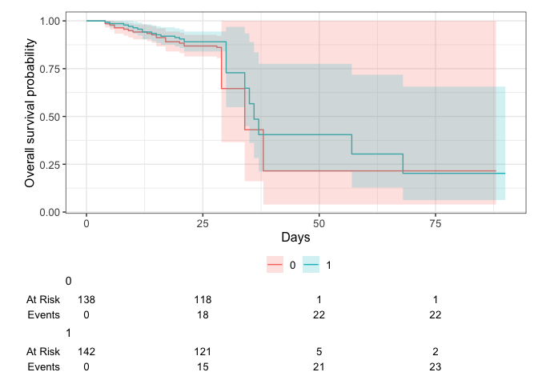
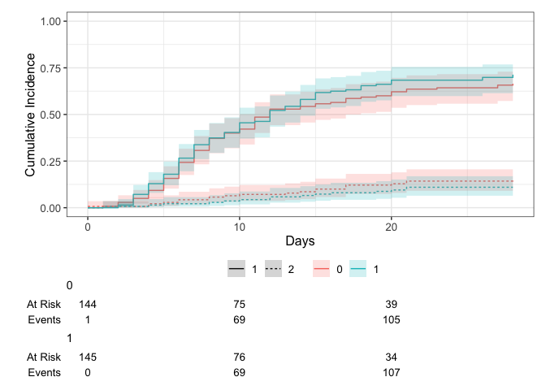
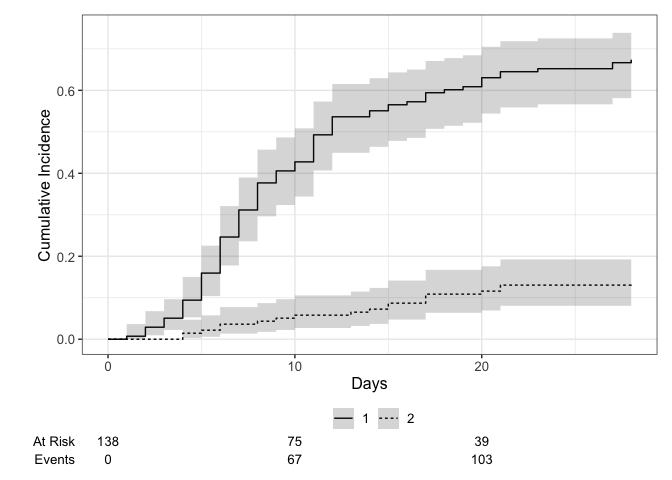
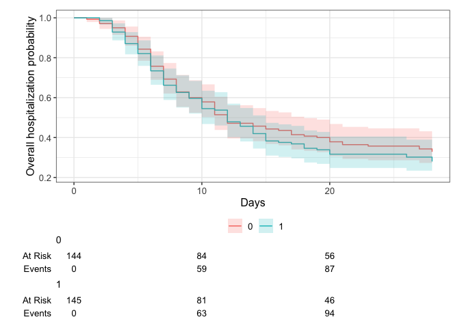
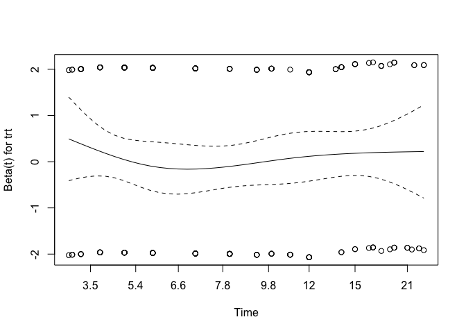
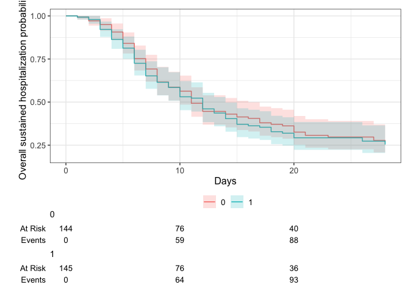
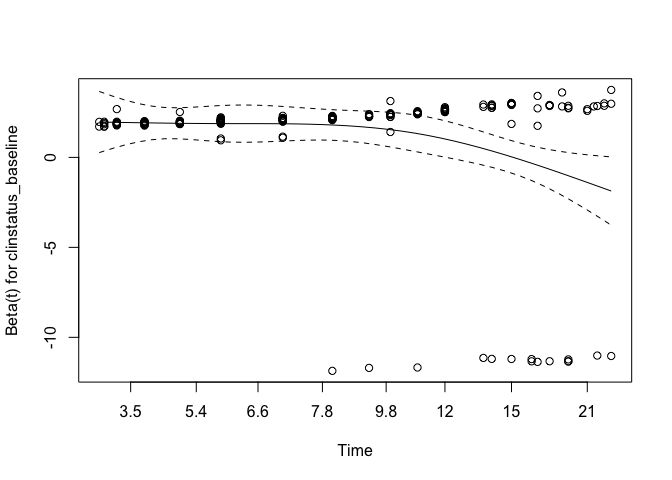
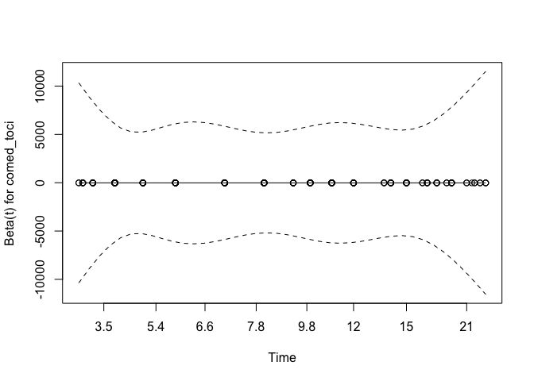
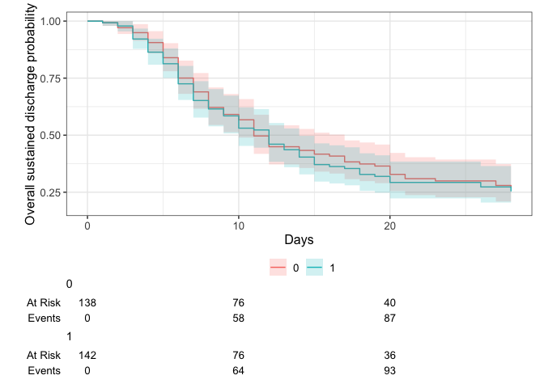

# Load packages

```r
library(tidyverse)
library(readxl)
library(writexl)
library(tableone)
library(haven) # Read sas files
library(here)
library(kableExtra)

library(jtools) # for summ() and plot_summs
library(sjPlot) # for tab_model
library(ggplot2) # survival/TTE analyses and other graphs
library(ggsurvfit) # survival/TTE analyses
library(survival) # survival/TTE analyses
library(gtsummary) # survival/TTE analyses
library(ggfortify) # autoplot
library(tidycmprsk) # competing risk analysis
library(ordinal) # clinstatus ordinal regression
```

# Load Data


# Define ITT set

```r
# 9 participants (3 in int. / 6 in cont.) did not receive a single dose of baricitinib, or placebo, respectively.
# Take them out, as done in results publication (mITT set)
df <- df %>% 
  filter(imp_adm_yn == 1)
```
Questions: 
1) Re-discuss ITT set - see ACTT-2

# Baseline Characteristics

```r
df$trial <- c("Bari-Solidact")
df <- df %>% ## no missing data
  rename(id_pat = PARTICIPANT_ID,
         trt = arm,
         age = D1_AGE,
         randdate = RANDODATED1,
         sex = GENDER,
         country = COUNTRY,
         icu = ICU_YN)

df %>% 
  drop_na(age) %>% 
  ggplot(aes(x = age)) +
  geom_density(fill = "blue", color = "black") +
  labs(title = "Density Plot of Age",
       x = "Age",
       y = "Density")
```

<!-- -->

```r
# Days with symptoms prior to randomization
df <- df %>% ## table(df$sympdur, useNA = "always") / ## no missing data / equals delay_symprando
  mutate(sympdur = randdate - SCR_SYMPSTDATED1,
         sympdur = as.numeric(sympdur))
ggplot(df, aes(x = sympdur)) +
  geom_density(fill = "blue", color = "black") +
  labs(title = "Density Plot of Symptom Duration",
       x = "Symptom Duration",
       y = "Density")
```

<!-- -->

```r
# Severity of COVID-19 with respect to respiratory support at randomisation / Bari-Solidact used WHO score, transform
df <- df %>% ## no missing data // publication: 139 bari vs 136 placebo. In this dataset, slightly more (142 bari vs 138 placebo), due to additional randomized participants during extension of the trial
  mutate(clinstatus_baseline = case_when(whoscore_D1 == 0 | whoscore_D1 == 1 | whoscore_D1 == 3 ~ 1,
                                         whoscore_D1 == 4 ~ 2,
                                         whoscore_D1 == 5 ~ 3,
                                         whoscore_D1 == 6 ~ 4,
                                         whoscore_D1 == 7 | whoscore_D1 == 8 | whoscore_D1 == 9 ~ 5,
                                         whoscore_D1 == 10 ~ 6))
df$clinstatus_baseline <- factor(df$clinstatus_baseline, levels = 1:6) ## no missing data
addmargins(table(df$clinstatus_baseline, df$trt, useNA = "always"))
```

```
##       
##          0   1 <NA> Sum
##   1      0   0    0   0
##   2      0   0    0   0
##   3      0   0    0   0
##   4    117 124    0 241
##   5     21  18    0  39
##   6      0   0    0   0
##   <NA>   0   0    0   0
##   Sum  138 142    0 280
```

```r
# Co-medication at baseline
df <- df %>% 
  mutate(comed_dexa = case_when(corticoid_yn == 1 | dexa_yn == 1 ~ 1,
                                corticoid_yn == 0 & dexa_yn == 0 ~ 0))
df <- df %>% 
  rename(comed_rdv = remdes_yn,
         comed_toci = toci_yn,
         comed_ab = antibio_yn,
         comed_acoa = anticoag_yn)
df$comed_interferon <- 0 # no interferon used
df <- df %>% # no interferon used but monoclonal Abs and plasma -> other
  mutate(comed_other = case_when(monocloAb_yn == 1 | immunplasma_yn == 1 ~ 1,
                                monocloAb_yn == 0 & immunplasma_yn == 0 ~ 0))

## group them for the subgroup analysis, according to protocol // tocilizumab as rescue medication - incorporate?
df <- df %>% 
  mutate(comed_cat = case_when(comed_dexa == 0 & comed_toci == 0 ~ 1, # patients without Dexamethasone nor Tocilizumab
                               comed_dexa == 1 & comed_toci == 1 ~ 2, # patients with Dexamethasone and Tocilizumab
                               comed_dexa == 1 & comed_toci == 0 ~ 3, # patients with Dexamethasone but no Tocilizumab
                               comed_dexa == 0 & comed_toci == 1 ~ 4)) # patients with Tocilizumab but no Dexamethasone (if exist)

# Comorbidity at baseline, including immunocompromised
df <- df %>% ## 4 missing
  mutate(comorb_lung = case_when(D1_PULMO_YNK == 1 ~ 1,
                                 D1_PULMO_YNK == 0 ~ 0))
df <- df %>% 
  mutate(comorb_liver = case_when(D1_LIVER_YNK == 1 ~ 1,
                                D1_LIVER_YNK == 0 ~ 0))
df <- df %>% ## no missing. D1_CARDIO_YNK includes all CVDs but also 2 HTA that do not have anything else -> take out.
  mutate(comorb_cvd = case_when(D1_CARDIO_YNK == 1 & (D1_CARDIO_SP != "HTA" & D1_CARDIO_SP != "HIGH BLOOD PRESSURE") ~ 1,
                                 D1_CARDIO_YNK == 0 | D1_CARDIO_SP == "HTA" | D1_CARDIO_SP == "HIGH BLOOD PRESSURE" ~ 0))
df <- df %>% ## 1 missing. The 2 HTA from above were already counted in.
  mutate(comorb_aht = case_when(D1_HBP_YNK == 1 | D1_CARDIO_SP == "HTA" | D1_CARDIO_SP == "HIGH BLOOD PRESSURE" ~ 1,
                                D1_HBP_YNK == 0 ~ 0))
df <- df %>% ## 4 missing. D1_DIABETE not needed, correct.
  mutate(comorb_dm = case_when(d1_diabete_ynk == 1 ~ 1,
                                d1_diabete_ynk == 0 ~ 0))
df <- df %>% ## 0 missing. BMI not needed, correct.
  mutate(comorb_obese = case_when(obesity == 1 ~ 1,
                                obesity == 0 ~ 0))
df <- df %>% ## 0 missing. D1_SMOKING not needed, correct.
  mutate(comorb_smoker = case_when(smoker == 1 ~ 1,
                                smoker == 0 ~ 0))
df <- df %>% ## 0 missing.
  mutate(immunosupp = case_when(immunodef_yn == 1 ~ 1,
                                immunodef_yn == 0 ~ 0))
df <- df %>% 
  mutate(any_comorb = case_when(comorb_lung == 1 | comorb_liver == 1 | comorb_cvd == 1 |
                                  comorb_aht == 1 | comorb_dm == 1 | comorb_obese == 1 | comorb_smoker == 1
                                | immunosupp == 1
                                  ~ 1,
                                comorb_lung == 0 & comorb_liver == 0 & comorb_cvd == 0 &
                                  comorb_aht == 0 & comorb_dm == 0 & comorb_obese == 0 & comorb_smoker == 0
                                & immunosupp == 0
                                ~ 0))

## group them for the subgroup analysis, according to protocol // count all pre-defined comorbidities per patient first
comorb <- df %>% 
  select(id_pat, comorb_lung, comorb_liver, comorb_cvd, comorb_aht, comorb_dm, comorb_obese, comorb_smoker, immunosupp)
comorb$comorb_count <- NA
for (i in 1:dim(comorb)[[1]]) {
  comorb$comorb_count[i] <- ifelse(
    sum(comorb[i, ] %in% c(1)) > 0,
    sum(comorb[i, ] %in% c(1)),
    NA
  )
}
comorb <- comorb %>% 
  mutate(comorb_count = case_when(comorb_lung == 0 & comorb_liver == 0 & comorb_cvd == 0 &
                                  comorb_aht == 0 & comorb_dm == 0 & comorb_obese == 0 & comorb_smoker == 0
                                & immunosupp == 0 ~ 0,
                                TRUE ~ comorb_count))
df <- left_join(df, comorb[, c("comorb_count", "id_pat")], by = join_by(id_pat == id_pat)) ## merge imputed variable back
df <- df %>% 
  mutate(comorb_cat = case_when(immunosupp == 1 ~ 4, # immunocompromised
                                comorb_count == 0 ~ 1, # no comorbidity
                                comorb_count == 1 ~ 2, # one comorbidity
                                comorb_count >1 & (immunosupp == 0 | is.na(immunosupp)) ~ 3)) # multiple comorbidities
# table(df$comorb_cat, useNA = "always") # 10 missing, have just 1 of the comorb categories missing...re-classify or multiple imputation?

# CRP
df$crp <- as.numeric(df$lab_v_conv_crp_D1) ## 7 missing

df %>% 
  drop_na(crp) %>% 
  ggplot(aes(x = crp)) +
  geom_density(fill = "blue", color = "black") +
  labs(title = "Density Plot of CRP",
       x = "CRP",
       y = "Density")
```

<!-- -->

```r
# Vaccination
df <- df %>% ## 4 missing
  mutate(vacc = case_when(D1_VACCIN_YNK == 1 ~ 1,
                          D1_VACCIN_YNK == 0 ~ 0))
# Viremia // Viral load value <LOQ and/or undectectable
df$vl_baseline <- df$vloqundet_yn_D1

# Variant
df <- df %>% 
  mutate(variant = case_when(SCR_COVARIANT == 1 ~ "Delta",
                             SCR_COVARIANT == 2 ~ "Omicron",
                             SCR_COVARIANT == 50 ~ "PRESENCE OF MUTATIONS E484Q AND L452R"))

# Serology
df$sero <- df$Serostatus
# df %>%
#    select(id_pat, Serostatus, Anti_Spike_wt, Anti_Nucl_wt, anti_RBDwt, Anti_RBD_Omicron) %>%
#   View()
```
Clarifications and discussion points BASELINE data:
1) Missing baseline characteristics: 
- Ethnicity: Only country of birth available
2) Rescue therapy: Tocilizumab (n=12) or increased steroid dose (n=91). steroids_dosechang_yn, steroids_dosechang_date, rescue_yn, rescuedate -> Discuss for sens-analysis
3) Re-discuss the comorbidity list (e.g. autoimmune diseases, cancer, chronic kidney disease // smokers separate?)
4) Missing data for comorbidity subgroup analyses: MICE?
5) No-one received any monoclonal Abs? No-one received any plasma? Any interferons reported?
6) Serology (Serostatus): anti-spike, anti-RBD, anti-N, anti-RBD-Omicron

# Endpoints

```r
# time to event data
df$death_d <- as.numeric(df$deathdated1_DROP - df$randdate) 
df$discharge_d <- as.numeric(df$visitdated1_DISCH - df$randdate)
df$withdraw_d <- as.numeric(df$withdrawdated1_DROP - df$randdate)
df$withdrawi_d <- as.numeric(df$invdecisdated1_DROP - df$randdate)
# df$ltfu_d <- as.numeric(df$ltfudated1_DROP - df$randdate) ## there were no LTFU
df$readmission_d <- as.numeric(df$readmdate - df$randdate)
df$maxfup_d <- as.numeric(df$lastdate - df$randdate)

# transform all daily clinical scores
whoscore_transform <- function(df, clinstatus_var, whoscore_var) {
  df <- df %>%
    mutate({{ clinstatus_var }} :=
             case_when({{ whoscore_var }} %in% c(0, 1, 3) ~ 1,
                       {{ whoscore_var }} == 4 ~ 2,
                       {{ whoscore_var }} == 5 ~ 3,
                       {{ whoscore_var }} == 6 ~ 4,
                       {{ whoscore_var }} %in% c(7, 8, 9) ~ 5,
                       {{ whoscore_var }} == 10 ~ 6)) %>%
    mutate({{ clinstatus_var }} := factor({{ clinstatus_var }}, levels = 1:6))
}
df <- whoscore_transform(df, clinstatus_2, whoscore_D3) ## D1 was baseline => D3 is +2 days after baseline.
df <- whoscore_transform(df, clinstatus_4, whoscore_D5)
df <- whoscore_transform(df, clinstatus_7, whoscore_D8)
df <- whoscore_transform(df, clinstatus_14, whoscore_D15)
df <- whoscore_transform(df, clinstatus_21, whoscore_D22)
df <- whoscore_transform(df, clinstatus_28, whoscore_D29) 
df <- whoscore_transform(df, clinstatus_35, whoscore_D36)
df <- whoscore_transform(df, clinstatus_discharge, whoscore_DISCH)
df <- whoscore_transform(df, clinstatus_dropout, whoscore_DROP)

# (i) Primary outcome: Mortality at day 28
df <- df %>% # 5 have no outcome data and withdrew or were withdrawn -> multiple imputation
  mutate(mort_28 = case_when(death_d <29 ~ 1,
                             discharge_d <29 ~ 0, # all discharged were discharged alive and not to hospice
                             clinstatus_28 %in% c(2,3,4,5) ~ 0, # still at hospital but alive
                             discharge_d >28 ~ 0)) # discharged later, proof of still alive
        
# (ii) Mortality at day 60
df <- df %>% # same 5 that have no outcome data and withdrew or were withdrawn -> multiple imputation
  mutate(mort_60 = case_when(death_d <61 ~ 1,
                             discharge_d <61 ~ 0, # all discharged were discharged alive and not to hospice
                             clinstatus_35 %in% c(2,3,4,5) ~ 0, # still at hospital but alive
                             discharge_d >60 ~ 0)) # discharged later, proof of still alive
        
# (iii) Time to death within max. follow-up time 
df$death_reached <- df$death_yn # do not bother about missings in mort_28
df <- df %>% # 2 are left without any time to event data => impute max. follow-up time
  mutate(death_time = case_when(death_d >=0 ~ c(death_d), # time to death, if no time to death, then...
                                discharge_d >=0 & (is.na(withdraw_d) | withdraw_d >28) & (is.na(withdrawi_d) | withdrawi_d >28) ~ 28, # 28d for all those who were discharged alive and not withdrawn before, then...
                                discharge_d >= withdraw_d ~ c(discharge_d), # time to discharge if this was greater than time to withdrawal
                                discharge_d >= withdrawi_d ~ c(discharge_d), # see above
                                maxfup_d >=0 & is.na(withdraw_d) & is.na(withdrawi_d) ~ c(maxfup_d), # max fup for the remaining ones not withdrawn
                                withdraw_d >=0 ~ c(withdraw_d),
                                withdrawi_d >=0 ~ c(withdrawi_d)))

# df %>% 
#   select(death_reached, death_time, mort_28, death_d, discharge_d, withdraw_d, withdrawi_d, readmission_d, maxfup_d, clinstatus_baseline,
#          clinstatus_2, clinstatus_4, clinstatus_7, clinstatus_14, clinstatus_21, clinstatus_28) %>% 
#   filter(is.na(death_time)) %>% 
#   View()


# (iv) New mechanical ventilation among survivors within 28 days. Bari-Solidact only included clinstatus 4 and 5.
df <- df %>% # 4 NA are due to missing mortality data -> multiple imputation. The other NA are not eligible (died or clinstatus_baseline == 5) and thus are excluded from denominator -> no multiple imputation
  mutate(new_mv_28 = case_when(clinstatus_baseline == 4 & (mort_28 == 0 | is.na(mort_28)) 
                               & (clinstatus_2 == 5 | clinstatus_4 == 5 | clinstatus_7 == 5 | clinstatus_14 == 5 
                                  | clinstatus_21 == 5 | clinstatus_28 == 5)
                               ~ 1,
                               clinstatus_baseline == 4 & mort_28 == 0
                               ~ 0))
# (iv) Sens-analysis: Alternative definition/analysis: New mechanical ventilation OR death within 28 days => include all in denominator.
df <- df %>% # 4 NA are due to missing mortality data -> multiple imputation.
  mutate(new_mvd_28 = case_when(new_mv_28 == 1 | mort_28 == 1 ~ 1,
                                new_mv_28 == 0 | mort_28 == 0 ~ 0))

# (v) Clinical status at day 28
df <- df %>% # Adapt clinstatus_28, since currently excluding those discharged or died or missing data.
  mutate(clinstatus_28 = case_when(clinstatus_28 == 5 ~ 5,
                                   clinstatus_28 == 4 ~ 4,
                                   clinstatus_28 == 3 ~ 3,
                                   clinstatus_28 == 2 ~ 2,
                                   mort_28 == 1 ~ 6, # died within 28d
                                   mort_28 == 0 ~ 1)) # discharged alive / reached discharge criteria within 28d
df$clinstatus_28 <- factor(df$clinstatus_28, levels = 1:6) # 5 missing 

## Imputation according to protocol: If there was daily data for the ordinal score available but with missing data for single days, then we carried last observed value forward unless for day 28, whereby we first considered data from the window (+/-3 days). -> no window data in Bari-Solidact => LVCF
dfcs <- df %>% 
    select(id_pat, clinstatus_baseline, clinstatus_2, clinstatus_4, clinstatus_7, clinstatus_14, clinstatus_21, clinstatus_28)
impute_last_forw = function(df){
  first = which(names(df)%in%c("clinstatus_baseline"))
  last = which(names(df)%in%c("clinstatus_28"))
  for (i in 1:dim(df)[[1]]){
    for (j in first[1]:last[1]){
      p = df[i, j]
      df[i,j] <- 
        ifelse(!is.na(df[i, j]), p, df[i, j-1])
    }
  }
  df
}
dfcs <- impute_last_forw(dfcs)
dfcs <- dfcs %>% # To control, don't overwrite
  rename(clinstatus_28_imp = clinstatus_28)
df <- left_join(df, dfcs[, c("clinstatus_28_imp", "id_pat")], by = join_by(id_pat == id_pat)) # # Merge imputed variable back // re-admissions already correctly incorporated

# (vi) Time to discharge or reaching discharge criteria up to day 28 // Patients who died prior to day 28 are assumed not having reached discharge, i.e. counted as 28 days. 
df <- df %>% 
  mutate(discharge_reached = case_when(discharge_d <29 ~ 1,
                                       TRUE ~ 0))
df <- df %>% # 2 are left without any time to event data => impute max. follow-up time
  mutate(discharge_time = case_when(discharge_d >=0 & (is.na(withdraw_d) | withdraw_d >28) & (is.na(withdrawi_d) | withdrawi_d >28) ~ c(discharge_d), # time to discharge in case no withdrawal or withdrawal after 28d. If no time to discharge, then...
                                    death_d >=0 ~ c(death_d), # time to death, then...
                                    discharge_d >= withdraw_d ~ c(discharge_d), # add time to discharge where time to discharge is after time to withdrawal 
                                    discharge_d >= withdrawi_d ~ c(discharge_d), # see above
                                    maxfup_d >=0 & is.na(withdraw_d) & is.na(withdrawi_d) ~ c(maxfup_d), # max fup for the remaining ones not withdrawn
                                withdraw_d >=0 ~ c(withdraw_d),
                                withdrawi_d >=0 ~ c(withdrawi_d)))
df <- df %>% # restrict to max fup time 28d
  mutate(discharge_time = case_when(discharge_time >28 ~ 28,
                                    TRUE ~ discharge_time))
df <- df %>% # add 28d for those that died - as a sens-variable
  mutate(discharge_time_sens = case_when(mort_28 == 1 ~ 28,
                                    TRUE ~ discharge_time))

# df %>%
#   select(discharge_reached, discharge_time, discharge_time_sens, death_reached, death_time, mort_28, death_d, discharge_d, withdraw_d, withdrawi_d, readmission_d, maxfup_d, clinstatus_baseline,
#          clinstatus_2, clinstatus_4, clinstatus_7, clinstatus_14, clinstatus_21, clinstatus_28) %>%
#   # filter(is.na(discharge_time)) %>%
#   View()

# (vi) Sens-analysis: Alternative definition/analysis of outcome: time to sustained discharge within 28 days
df <- df %>% # there are 5 re-admissions: the one readmitted at day 16 was re-discharged before day ?28?. The ones at d21 & d27 not. And then there are 2 that were readmitted later than d28 => Reclassify d21 and d27 and add 28d, add d20 to the one re-admitted at d16.
  mutate(discharge_reached_sus = case_when(readmission_d == 21 | readmission_d == 27 ~ 0,
                                           TRUE ~ discharge_reached))
df <- df %>%
  mutate(discharge_time_sus = case_when(readmission_d == 16 ~ 20,
                                        readmission_d == 21 | readmission_d == 27 ~ 28,
                                        TRUE ~ discharge_time))

# (vii) Viral clearance up to day 5, day 10, and day 15 (Viral load value <LOQ and/or undectectable)
names(df)
```

```
##   [1] "NUMCENTER"               "id_pat"                 
##   [3] "CENTER"                  "country"                
##   [5] "randdate"                "trt"                    
##   [7] "imp_adm_yn"              "imp_duration"           
##   [9] "immunodef_yn"            "age"                    
##  [11] "D1_BIRTHCOUNTRY"         "D1_BIRTHCOUNTRY_NK"     
##  [13] "sex"                     "SCR_UNITADM"            
##  [15] "icu"                     "SCR_COVARIANT"          
##  [17] "SCR_COVARIANT_SP"        "SCR_SYMPSTDATED1"       
##  [19] "delay_symprando"         "D1_VACCIN_YNK"          
##  [21] "D1_VACCINNAME"           "D1_VACCINNAME_SP"       
##  [23] "D1_VACCININJNUMB"        "dexa_yn"                
##  [25] "corticoid_yn"            "comed_acoa"             
##  [27] "comed_toci"              "comed_rdv"              
##  [29] "monocloAb_yn"            "immunplasma_yn"         
##  [31] "comed_ab"                "steroids_dosechang_yn"  
##  [33] "steroids_dosechang_date" "rescue_yn"              
##  [35] "rescuedate"              "comorbid_yn"            
##  [37] "bmi"                     "obesity"                
##  [39] "D1_SMOKING"              "smoker"                 
##  [41] "D1_PULMO_YNK"            "D1_PULMOCO_YN"          
##  [43] "D1_PULMOASTH_YN"         "D1_PULMOINT_YN"         
##  [45] "D1_PULMO_OTH"            "D1_PULMO_SP"            
##  [47] "D1_CARDIO_YNK"           "D1_HEARTFAIL_YN"        
##  [49] "D1_CORARTDIS_YN"         "D1_CARDIO_OTH"          
##  [51] "D1_CARDIO_SP"            "D1_DIABETE"             
##  [53] "d1_diabete_ynk"          "D1_HBP_YNK"             
##  [55] "D1_LIVER_YNK"            "D1_KIDNEY_YNK"          
##  [57] "D1_NEURO_YNK"            "D1_CANCER_YNK"          
##  [59] "D1_CANCER_SP"            "D1_AUTOIMMUN_YNK"       
##  [61] "D1_AUTOIMMUN_SP"         "lab_v_ldh_D1"           
##  [63] "ldh400_yn"               "lab_v_conv_ddim_D1"     
##  [65] "lab_v_conv_crp_D1"       "crp75_yn"               
##  [67] "lab_v_conv_procal_D1"    "lab_v_conv_ferrit_D1"   
##  [69] "ferrit700_yn"            "hyperinflam_yn"         
##  [71] "whoscore_D1"             "whostate_D1"            
##  [73] "whoscore_D3"             "whostate_D3"            
##  [75] "whoscore_D5"             "whostate_D5"            
##  [77] "whoscore_D8"             "whostate_D8"            
##  [79] "whoscore_D15"            "whostate_D15"           
##  [81] "whoscore_D22"            "whostate_D22"           
##  [83] "whoscore_D29"            "whostate_D29"           
##  [85] "whoscore_D36"            "whostate_D36"           
##  [87] "whoscore_DISCH"          "whostate_DISCH"         
##  [89] "whoscore_DROP"           "whostate_DROP"          
##  [91] "readm_yn"                "readmdate"              
##  [93] "readmdated1_D15"         "readm_rs_D15"           
##  [95] "readmdated1_D29"         "readm_rs_D29"           
##  [97] "readmdated1_D61"         "readm_rs_D61"           
##  [99] "readmdated1_D91"         "readm_rs_D91"           
## [101] "death_yn"                "deathdated1_DROP"       
## [103] "earlystop_rs_DROP"       "withdraw_yn"            
## [105] "withdrawdated1_DROP"     "invstop_yn"             
## [107] "invdecisdated1_DROP"     "invdecis_rs_DROP"       
## [109] "ltfu_yn"                 "ltfudated1_DROP"        
## [111] "discharge_yn"            "visitdated1_DISCH"      
## [113] "lastdate"                "person_day"             
## [115] "person_month"            "Serostatus"             
## [117] "seroneg_yn"              "anti_RBDwt"             
## [119] "Anti_Spike_wt"           "Anti_Nucl_wt"           
## [121] "Anti_RBD_Omicron"        "RBD_Omicron_ACE2_inhib1"
## [123] "RBDwt_ace2_inhib1"       "Spike_Beta_ACE2_inhib1" 
## [125] "anti_RBDwt_BAU_ml1"      "RBDwt1"                 
## [127] "SpikeWt1"                "Nucleocapsid1"          
## [129] "RBD_Omicron1"            "anti_spike_nucl"        
## [131] "RBDwt1_cl"               "SpikeWt1_cl"            
## [133] "Nucleocapsid1_cl"        "RBD_Omicron1_cl"        
## [135] "anti_RBDwt_BAU_ml1_cl"   "vloq_yn_D1"             
## [137] "log_undetec_yn_D1"       "gene_n3_D1"             
## [139] "cell_q3_D1"              "log_nq3_D1"             
## [141] "vloqundet_yn_D1"         "vloq_yn_D3"             
## [143] "log_undetec_yn_D3"       "gene_n3_D3"             
## [145] "cell_q3_D3"              "log_nq3_D3"             
## [147] "vloqundet_yn_D3"         "vloq_yn_D8"             
## [149] "log_undetec_yn_D8"       "gene_n3_D8"             
## [151] "cell_q3_D8"              "log_nq3_D8"             
## [153] "vloqundet_yn_D8"         "vloq_yn_D15"            
## [155] "log_undetec_yn_D15"      "gene_n3_D15"            
## [157] "cell_q3_D15"             "log_nq3_D15"            
## [159] "vloqundet_yn_D15"        "proms_d91"              
## [161] "temp_scale_score"        "fatig_scale_score"      
## [163] "malaiz_scale_score"      "resplw_scale_score"     
## [165] "respup_scale_score"      "pain_scale_score"       
## [167] "sensory_scale_score"     "neuro_scale_score"      
## [169] "gastro_scale_score"      "emotion_scale_score"    
## [171] "cognitiv_scale_score"    "physic_scale_score"     
## [173] "social_scale_score"      "worries_scale_score"    
## [175] "sleep_scale_score"       "cough_scale_score"      
## [177] "palpit_scale_score"      "nose_scale_score"       
## [179] "sneez_scale_score"       "redeyes_scale_score"    
## [181] "soreyes_scale_score"     "vision_scale_score"     
## [183] "hearing_scale_score"     "hands_scale_score"      
## [185] "abdominal_scale_score"   "heartburn_scale_score"  
## [187] "vomit_scale_score"       "constip_scale_score"    
## [189] "dysuria_scale_score"     "skin_scale_score"       
## [191] "hair_scale_score"        "mentally_scale_score"   
## [193] "confusion_scale_score"   "heavyhwk_scale_score"   
## [195] "lighthwk_scale_score"    "rolefunc_scale_score"   
## [197] "famfriends_scale_score"  "healthcare_scale_score" 
## [199] "allqol_scale_score"      "trial"                  
## [201] "sympdur"                 "clinstatus_baseline"    
## [203] "comed_dexa"              "comed_interferon"       
## [205] "comed_other"             "comed_cat"              
## [207] "comorb_lung"             "comorb_liver"           
## [209] "comorb_cvd"              "comorb_aht"             
## [211] "comorb_dm"               "comorb_obese"           
## [213] "comorb_smoker"           "immunosupp"             
## [215] "any_comorb"              "comorb_count"           
## [217] "comorb_cat"              "crp"                    
## [219] "vacc"                    "vl_baseline"            
## [221] "variant"                 "sero"                   
## [223] "death_d"                 "discharge_d"            
## [225] "withdraw_d"              "withdrawi_d"            
## [227] "readmission_d"           "maxfup_d"               
## [229] "clinstatus_2"            "clinstatus_4"           
## [231] "clinstatus_7"            "clinstatus_14"          
## [233] "clinstatus_21"           "clinstatus_28"          
## [235] "clinstatus_35"           "clinstatus_discharge"   
## [237] "clinstatus_dropout"      "mort_28"                
## [239] "mort_60"                 "death_reached"          
## [241] "death_time"              "new_mv_28"              
## [243] "new_mvd_28"              "clinstatus_28_imp"      
## [245] "discharge_reached"       "discharge_time"         
## [247] "discharge_time_sens"     "discharge_reached_sus"  
## [249] "discharge_time_sus"
```

```r
df$vir_clear_5 <- df$vloqundet_yn_D3
df$vir_clear_10 <- df$vloqundet_yn_D8 # point prevalence, not cumulative
df$vir_clear_15 <- df$vloqundet_yn_D15 # point prevalence, not cumulative
table(df$vloqundet_yn_D8)
```

```
## 
##  0  1 
## 42 42
```

```r
df <- df %>% 
  mutate(vir_clear_15_cum = case_when(vir_clear_15 == 1 | vir_clear_10 == 1 | vir_clear_5 == 1 ~ 1,
                                      vir_clear_15 == 0 ~ 0,
                                      vir_clear_10 == 0 ~ 0,
                                      vir_clear_5 == 0 ~ 0))

# (viii) Quality of life at day 28 // detailed measures available - wait for other trials first

# (ix) Participants with an adverse event grade 3 or 4, or a serious adverse event, excluding death, by day 28

# (ix) Sens-analysis: Alternative definition/analysis of outcome: incidence rate ratio (Poisson regression) -> AE per person by d28

# (ix) Sens-analysis: Alternative definition/analysis of outcome: time to first (of these) adverse event, within 28 days, considering death as a competing risk (=> censor and set to 28 days)

# (x) Adverse events of special interest within 28 days: a) thromboembolic events (venous thromboembolism, pulmonary embolism, arterial thrombosis), b) secondary infections (bacterial pneumonia including ventilator-associated pneumonia, meningitis and encephalitis, endocarditis and bacteremia, invasive fungal infection including pulmonary aspergillosis), c) Reactivation of chronic infection including tuberculosis, herpes simplex, cytomegalovirus, herpes zoster and hepatitis B, d) serious cardiovascular and cardiac events (including stroke and myocardial infarction), e) events related to signs of bone marrow suppression (anemia, lymphocytopenia, thrombocytopenia, pancytopenia), f) malignancy, g) gastrointestinal perforation (incl. gastrointestinal bleeding/diverticulitis), h) liver dysfunction/hepatotoxicity (grade 3 and 4)

# (xi) Adverse events, any grade and serious adverse event, excluding death, within 28 days, grouped by organ classes
```
Discussion points OUTCOME data:
1) VL: Add a cumulative outcome definition (as sens-analysis)?
2) Re QoL: Wait for other trials first. Find out more about the QoL measure used.
3) Get the (S)AE data
4) Discuss changing the adding 28d for death to time to discharge as sensitivity analysis/variable -> discharge_time_sens 


# Multiple imputation using chained equation

Discussion points
1)


# Define final dataset, set references, summarize missing data and variables

```r
# keep the overall set
df_all <- df
# reduce the df set to our standardized set across all trials
df <- df %>% 
  select(id_pat, trt, sex, age, 
         # ethn, 
         country, icu, sympdur, vacc, clinstatus_baseline,
         comed_dexa, comed_rdv, comed_toci, comed_ab, comed_acoa, comed_interferon, comed_other,
         comed_cat,
         comorb_lung, comorb_liver, comorb_cvd, comorb_aht, comorb_dm, comorb_obese, comorb_smoker, immunosupp,
         any_comorb, comorb_cat, comorb_count,
         crp, 
         sero, vl_baseline, variant,
         mort_28, mort_60, death_reached, death_time,
         new_mv_28, new_mvd_28,
         clinstatus_28_imp,
         discharge_reached, discharge_time, discharge_time_sens, discharge_reached_sus, discharge_time_sus,
         # ae_28_sev, aesi_28, ae_28_list,
         # ae_reached, ae_time,
         vir_clear_5, vir_clear_10, vir_clear_15, vir_clear_15_cum
         # qol_28
         )
## set references, re-level
# df <- df %>% 
#   mutate(Treatment = relevel(Treatment, "no JAK inhibitor"))

# Create a bar plot to visualize missing values in each column
original_order <- colnames(df)
missing_plot <- df %>%
  summarise_all(~ mean(is.na(.))) %>%
  gather() %>%
  mutate(key = factor(key, levels = original_order)) %>%
  ggplot(aes(x = key, y = value)) +
  geom_bar(stat = "identity") +
  labs(x = "Columns", y = "Proportion of Missing Values", title = "Missing Data Visualization") +
  theme(axis.text.x = element_text(angle = 45, hjust = 1)) +
  ylim(0, 1)
print(missing_plot)
```

<!-- -->
Discussion points
1) Missing variables:
  Baseline:
  - Ethnicity: Only country of birth available
  Outcomes:
  - adverse events (still coming)
  - qol_28 (still working on it)
2) Missing data:
- vacc: 4 missing
- comorb_cat: 10 missing -> re-discuss
- crp & vl_baseline & variant
- mort_28 & mort_60: 5 missing
- new_mv_28 & new_mvd_28: 4 missing
- viral load (baseline and outcome) and variant data: substantial missing


# (i) Primary endpoint: Mortality at day 28

```r
# adjusted for baseline patient characteristics (age, respiratory support at baseline (ordinal scale 1-3 vs 4-5), dexamethasone use at baseline (y/n), remdesivir use at baseline (y/n), anti-IL-6 use at baseline (y/n)).
table(df$mort_28, df$trt, useNA = "always")
```

```
##       
##          0   1 <NA>
##   0    119 122    0
##   1     19  15    0
##   <NA>   0   5    0
```

```r
mort.28 <- df %>% 
  glm(mort_28 ~ trt 
      + age + clinstatus_baseline + comed_dexa + comed_rdv + comed_toci
      , family = "binomial", data=.)
summ(mort.28, exp = T, confint = T, model.info = T, model.fit = F, digits = 2)
```

<table class="table table-striped table-hover table-condensed table-responsive" style="width: auto !important; margin-left: auto; margin-right: auto;">
<tbody>
  <tr>
   <td style="text-align:left;font-weight: bold;"> Observations </td>
   <td style="text-align:right;"> 275 (5 missing obs. deleted) </td>
  </tr>
  <tr>
   <td style="text-align:left;font-weight: bold;"> Dependent variable </td>
   <td style="text-align:right;"> mort_28 </td>
  </tr>
  <tr>
   <td style="text-align:left;font-weight: bold;"> Type </td>
   <td style="text-align:right;"> Generalized linear model </td>
  </tr>
  <tr>
   <td style="text-align:left;font-weight: bold;"> Family </td>
   <td style="text-align:right;"> binomial </td>
  </tr>
  <tr>
   <td style="text-align:left;font-weight: bold;"> Link </td>
   <td style="text-align:right;"> logit </td>
  </tr>
</tbody>
</table>  <table class="table table-striped table-hover table-condensed table-responsive" style="width: auto !important; margin-left: auto; margin-right: auto;border-bottom: 0;">
 <thead>
  <tr>
   <th style="text-align:left;">   </th>
   <th style="text-align:right;"> exp(Est.) </th>
   <th style="text-align:right;"> 2.5% </th>
   <th style="text-align:right;"> 97.5% </th>
   <th style="text-align:right;"> z val. </th>
   <th style="text-align:right;"> p </th>
  </tr>
 </thead>
<tbody>
  <tr>
   <td style="text-align:left;font-weight: bold;"> (Intercept) </td>
   <td style="text-align:right;"> 0.00 </td>
   <td style="text-align:right;"> 0.00 </td>
   <td style="text-align:right;"> 0.00 </td>
   <td style="text-align:right;"> -5.25 </td>
   <td style="text-align:right;"> 0.00 </td>
  </tr>
  <tr>
   <td style="text-align:left;font-weight: bold;"> trt </td>
   <td style="text-align:right;"> 0.73 </td>
   <td style="text-align:right;"> 0.33 </td>
   <td style="text-align:right;"> 1.61 </td>
   <td style="text-align:right;"> -0.77 </td>
   <td style="text-align:right;"> 0.44 </td>
  </tr>
  <tr>
   <td style="text-align:left;font-weight: bold;"> age </td>
   <td style="text-align:right;"> 1.11 </td>
   <td style="text-align:right;"> 1.06 </td>
   <td style="text-align:right;"> 1.15 </td>
   <td style="text-align:right;"> 5.01 </td>
   <td style="text-align:right;"> 0.00 </td>
  </tr>
  <tr>
   <td style="text-align:left;font-weight: bold;"> clinstatus_baseline5 </td>
   <td style="text-align:right;"> 2.20 </td>
   <td style="text-align:right;"> 0.83 </td>
   <td style="text-align:right;"> 5.81 </td>
   <td style="text-align:right;"> 1.59 </td>
   <td style="text-align:right;"> 0.11 </td>
  </tr>
  <tr>
   <td style="text-align:left;font-weight: bold;"> comed_dexa </td>
   <td style="text-align:right;"> 2.78 </td>
   <td style="text-align:right;"> 0.33 </td>
   <td style="text-align:right;"> 23.24 </td>
   <td style="text-align:right;"> 0.94 </td>
   <td style="text-align:right;"> 0.35 </td>
  </tr>
  <tr>
   <td style="text-align:left;font-weight: bold;"> comed_rdv </td>
   <td style="text-align:right;"> 0.75 </td>
   <td style="text-align:right;"> 0.08 </td>
   <td style="text-align:right;"> 6.77 </td>
   <td style="text-align:right;"> -0.26 </td>
   <td style="text-align:right;"> 0.80 </td>
  </tr>
  <tr>
   <td style="text-align:left;font-weight: bold;"> comed_toci </td>
   <td style="text-align:right;"> 0.00 </td>
   <td style="text-align:right;"> 0.00 </td>
   <td style="text-align:right;"> Inf </td>
   <td style="text-align:right;"> -0.01 </td>
   <td style="text-align:right;"> 0.99 </td>
  </tr>
</tbody>
<tfoot><tr><td style="padding: 0; " colspan="100%">
<sup></sup> Standard errors: MLE</td></tr></tfoot>
</table>
Discussion points
1) adjustment respiratory support (as binary ordinal scale 1-3 vs 4-5 OR leave it as it is)? Bari-Solidact only included clinstatus 4 and 5.


# (ii) Mortality at day 60

```r
table(df$mort_60, df$trt, useNA = "always")
```

```
##       
##          0   1 <NA>
##   0    116 115    0
##   1     22  22    0
##   <NA>   0   5    0
```

```r
mort.60 <- df %>% 
  glm(mort_60 ~ trt 
      + age + clinstatus_baseline + comed_dexa + comed_rdv + comed_toci
      , family = "binomial", data=.)
summ(mort.60, exp = T, confint = T, model.info = T, model.fit = F, digits = 2)
```

<table class="table table-striped table-hover table-condensed table-responsive" style="width: auto !important; margin-left: auto; margin-right: auto;">
<tbody>
  <tr>
   <td style="text-align:left;font-weight: bold;"> Observations </td>
   <td style="text-align:right;"> 275 (5 missing obs. deleted) </td>
  </tr>
  <tr>
   <td style="text-align:left;font-weight: bold;"> Dependent variable </td>
   <td style="text-align:right;"> mort_60 </td>
  </tr>
  <tr>
   <td style="text-align:left;font-weight: bold;"> Type </td>
   <td style="text-align:right;"> Generalized linear model </td>
  </tr>
  <tr>
   <td style="text-align:left;font-weight: bold;"> Family </td>
   <td style="text-align:right;"> binomial </td>
  </tr>
  <tr>
   <td style="text-align:left;font-weight: bold;"> Link </td>
   <td style="text-align:right;"> logit </td>
  </tr>
</tbody>
</table>  <table class="table table-striped table-hover table-condensed table-responsive" style="width: auto !important; margin-left: auto; margin-right: auto;border-bottom: 0;">
 <thead>
  <tr>
   <th style="text-align:left;">   </th>
   <th style="text-align:right;"> exp(Est.) </th>
   <th style="text-align:right;"> 2.5% </th>
   <th style="text-align:right;"> 97.5% </th>
   <th style="text-align:right;"> z val. </th>
   <th style="text-align:right;"> p </th>
  </tr>
 </thead>
<tbody>
  <tr>
   <td style="text-align:left;font-weight: bold;"> (Intercept) </td>
   <td style="text-align:right;"> 0.00 </td>
   <td style="text-align:right;"> 0.00 </td>
   <td style="text-align:right;"> 0.01 </td>
   <td style="text-align:right;"> -5.45 </td>
   <td style="text-align:right;"> 0.00 </td>
  </tr>
  <tr>
   <td style="text-align:left;font-weight: bold;"> trt </td>
   <td style="text-align:right;"> 1.03 </td>
   <td style="text-align:right;"> 0.51 </td>
   <td style="text-align:right;"> 2.07 </td>
   <td style="text-align:right;"> 0.07 </td>
   <td style="text-align:right;"> 0.94 </td>
  </tr>
  <tr>
   <td style="text-align:left;font-weight: bold;"> age </td>
   <td style="text-align:right;"> 1.09 </td>
   <td style="text-align:right;"> 1.06 </td>
   <td style="text-align:right;"> 1.13 </td>
   <td style="text-align:right;"> 5.22 </td>
   <td style="text-align:right;"> 0.00 </td>
  </tr>
  <tr>
   <td style="text-align:left;font-weight: bold;"> clinstatus_baseline5 </td>
   <td style="text-align:right;"> 2.11 </td>
   <td style="text-align:right;"> 0.87 </td>
   <td style="text-align:right;"> 5.11 </td>
   <td style="text-align:right;"> 1.66 </td>
   <td style="text-align:right;"> 0.10 </td>
  </tr>
  <tr>
   <td style="text-align:left;font-weight: bold;"> comed_dexa </td>
   <td style="text-align:right;"> 1.68 </td>
   <td style="text-align:right;"> 0.34 </td>
   <td style="text-align:right;"> 8.33 </td>
   <td style="text-align:right;"> 0.63 </td>
   <td style="text-align:right;"> 0.53 </td>
  </tr>
  <tr>
   <td style="text-align:left;font-weight: bold;"> comed_rdv </td>
   <td style="text-align:right;"> 0.51 </td>
   <td style="text-align:right;"> 0.06 </td>
   <td style="text-align:right;"> 4.44 </td>
   <td style="text-align:right;"> -0.61 </td>
   <td style="text-align:right;"> 0.54 </td>
  </tr>
  <tr>
   <td style="text-align:left;font-weight: bold;"> comed_toci </td>
   <td style="text-align:right;"> 0.00 </td>
   <td style="text-align:right;"> 0.00 </td>
   <td style="text-align:right;"> Inf </td>
   <td style="text-align:right;"> -0.01 </td>
   <td style="text-align:right;"> 0.99 </td>
  </tr>
</tbody>
<tfoot><tr><td style="padding: 0; " colspan="100%">
<sup></sup> Standard errors: MLE</td></tr></tfoot>
</table>
Discussion points
1) 


# (iii) Time to death within max. follow-up time

```r
# table(df$death_reached, df$death_time, useNA = "always")
# table(df$death_reached, df$mort_60, useNA = "always")

# df %>%
#   drop_na(death_time) %>%
#   filter(death_reached == 1) %>%
#   group_by(trt) %>%
#   summarise(median = median(death_time),
#             IQR = IQR(death_time),
#             Q1 = quantile(death_time, probs = 0.25),
#             Q3 = quantile(death_time, probs = 0.75)) 

# time to death, by group. Kaplan-Meier estimate of conditional survival probability.
km.ttdeath.check <- with(df, Surv(death_time, death_reached))
head(km.ttdeath.check, 100)
```

```
##   [1]  6  28+ 30  28+ 28+ 28+ 28+ 11  28+  4+ 19  28+ 28+ 28+ 28+ 28+ 28+ 28+
##  [19] 28+ 28+ 28+ 28+ 28+ 28+ 28+ 28+ 28+ 28+ 28+ 28+  4  10  28+ 28+ 28+ 28+
##  [37] 28+  0+ 28+ 28+ 17  28+ 28+ 28+ 28+ 28+ 28+ 28+ 28+ 28+ 28+ 14  28+ 28+
##  [55] 28+ 28+ 28+ 28+ 28+ 28+ 28+ 28+ 28+ 28+ 28+ 28+ 28+ 28+ 28+ 28+ 28+ 28+
##  [73] 28+ 28+ 28+ 28+ 28+ 28+ 28+ 88+ 28+ 20  28+ 28+ 28+ 28+ 28+ 28+ 28+ 28+
##  [91] 28+ 28+ 28+ 28+ 28+ 28+ 28+ 28+ 28+ 28+
```

```r
km.ttdeath_trt <- survfit(Surv(death_time, death_reached) ~ trt, data=df)
# summary(km.ttdeath_trt, times = 28)

ttdeath_28d_tbl <- km.ttdeath_trt %>% 
  tbl_survfit(
    times = 28,
    label_header = "**28-d survival (95% CI)**"
  )
# Nicely formatted table
kable(ttdeath_28d_tbl, format = "markdown", table.attr = 'class="table"') %>%
  kable_styling(bootstrap_options = "striped", full_width = FALSE)
```


|**Characteristic**    |**28-d survival (95% CI)** |
|:---------------------|:--------------------------|
|Trial treatment group |NA                         |
|0                     |86% (81%, 92%)             |
|1                     |89% (84%, 94%)             |

```r
# autoplot(km.ttdeath_trt)
survfit2(Surv(death_time, death_reached) ~ trt, data=df) %>% 
  ggsurvfit() +
  labs(
    x = "Days",
    y = "Overall survival probability"
  ) + 
  add_confidence_interval() +
  add_risktable()
```

<!-- -->

```r
# testing: simple log-rank
# survdiff(Surv(death_time, death_reached) ~ trt, data = df)
# testing: cox ph
ttdeath <- df %>% 
  coxph(Surv(death_time, death_reached) ~ trt 
        + age + clinstatus_baseline + comed_dexa + comed_rdv + comed_toci
        , data =.)
ttdeath_reg_tbl <- tbl_regression(ttdeath, exp = TRUE)
# Nicely formatted table
kable(ttdeath_reg_tbl, format = "markdown", table.attr = 'class="table"') %>%
  kable_styling(bootstrap_options = "striped", full_width = FALSE)
```


|**Characteristic**    |**HR** |**95% CI** |**p-value** |
|:---------------------|:------|:----------|:-----------|
|Trial treatment group |0.68   |0.36, 1.28 |0.2         |
|Age (years)           |1.09   |1.06, 1.13 |<0.001      |
|clinstatus_baseline   |NA     |NA         |NA          |
|1                     |NA     |NA         |NA          |
|2                     |NA     |NA         |NA          |
|3                     |NA     |NA         |NA          |
|4                     |0.54   |0.27, 1.08 |0.081       |
|5                     |NA     |NA         |NA          |
|6                     |NA     |NA         |NA          |
|comed_dexa            |4.82   |1.02, 22.9 |0.048       |
|Remdesivir at d1      |0.73   |0.10, 5.40 |0.8         |
|Tocilizumab at d1     |0.00   |0.00, Inf  |>0.9        |
Discussion points
1) 


# (iv) New mechanical ventilation among survivors within 28 days

```r
table(df$new_mv_28, df$trt, useNA = "always")
```

```
##       
##         0  1 <NA>
##   0    89 85    0
##   1    15 22    0
##   <NA> 34 35    0
```

```r
new.mv.28 <- df %>% 
  glm(new_mv_28 ~ trt 
      + age 
      # + clinstatus_baseline 
      + comed_dexa + comed_rdv + comed_toci
      , family = "binomial", data=.)
summ(new.mv.28, exp = T, confint = T, model.info = T, model.fit = F, digits = 2)
```

<table class="table table-striped table-hover table-condensed table-responsive" style="width: auto !important; margin-left: auto; margin-right: auto;">
<tbody>
  <tr>
   <td style="text-align:left;font-weight: bold;"> Observations </td>
   <td style="text-align:right;"> 211 (69 missing obs. deleted) </td>
  </tr>
  <tr>
   <td style="text-align:left;font-weight: bold;"> Dependent variable </td>
   <td style="text-align:right;"> new_mv_28 </td>
  </tr>
  <tr>
   <td style="text-align:left;font-weight: bold;"> Type </td>
   <td style="text-align:right;"> Generalized linear model </td>
  </tr>
  <tr>
   <td style="text-align:left;font-weight: bold;"> Family </td>
   <td style="text-align:right;"> binomial </td>
  </tr>
  <tr>
   <td style="text-align:left;font-weight: bold;"> Link </td>
   <td style="text-align:right;"> logit </td>
  </tr>
</tbody>
</table>  <table class="table table-striped table-hover table-condensed table-responsive" style="width: auto !important; margin-left: auto; margin-right: auto;border-bottom: 0;">
 <thead>
  <tr>
   <th style="text-align:left;">   </th>
   <th style="text-align:right;"> exp(Est.) </th>
   <th style="text-align:right;"> 2.5% </th>
   <th style="text-align:right;"> 97.5% </th>
   <th style="text-align:right;"> z val. </th>
   <th style="text-align:right;"> p </th>
  </tr>
 </thead>
<tbody>
  <tr>
   <td style="text-align:left;font-weight: bold;"> (Intercept) </td>
   <td style="text-align:right;"> 0.19 </td>
   <td style="text-align:right;"> 0.02 </td>
   <td style="text-align:right;"> 2.43 </td>
   <td style="text-align:right;"> -1.27 </td>
   <td style="text-align:right;"> 0.20 </td>
  </tr>
  <tr>
   <td style="text-align:left;font-weight: bold;"> trt </td>
   <td style="text-align:right;"> 1.71 </td>
   <td style="text-align:right;"> 0.82 </td>
   <td style="text-align:right;"> 3.56 </td>
   <td style="text-align:right;"> 1.42 </td>
   <td style="text-align:right;"> 0.16 </td>
  </tr>
  <tr>
   <td style="text-align:left;font-weight: bold;"> age </td>
   <td style="text-align:right;"> 1.00 </td>
   <td style="text-align:right;"> 0.97 </td>
   <td style="text-align:right;"> 1.03 </td>
   <td style="text-align:right;"> 0.08 </td>
   <td style="text-align:right;"> 0.94 </td>
  </tr>
  <tr>
   <td style="text-align:left;font-weight: bold;"> comed_dexa </td>
   <td style="text-align:right;"> 0.77 </td>
   <td style="text-align:right;"> 0.15 </td>
   <td style="text-align:right;"> 4.09 </td>
   <td style="text-align:right;"> -0.30 </td>
   <td style="text-align:right;"> 0.76 </td>
  </tr>
  <tr>
   <td style="text-align:left;font-weight: bold;"> comed_rdv </td>
   <td style="text-align:right;"> 0.00 </td>
   <td style="text-align:right;"> 0.00 </td>
   <td style="text-align:right;"> Inf </td>
   <td style="text-align:right;"> -0.02 </td>
   <td style="text-align:right;"> 0.99 </td>
  </tr>
  <tr>
   <td style="text-align:left;font-weight: bold;"> comed_toci </td>
   <td style="text-align:right;"> 98956049.61 </td>
   <td style="text-align:right;"> 0.00 </td>
   <td style="text-align:right;"> Inf </td>
   <td style="text-align:right;"> 0.01 </td>
   <td style="text-align:right;"> 0.99 </td>
  </tr>
</tbody>
<tfoot><tr><td style="padding: 0; " colspan="100%">
<sup></sup> Standard errors: MLE</td></tr></tfoot>
</table>

```r
# (iv) Sens-analysis: Alternative definition/analysis: New mechanical ventilation OR death within 28 days => include all in denominator. 
table(df$new_mvd_28, df$trt, useNA = "always")
```

```
##       
##          0   1 <NA>
##   0    104 101    0
##   1     34  37    0
##   <NA>   0   4    0
```

```r
new.mvd.28 <- df %>% 
  glm(new_mvd_28 ~ trt 
      + age + clinstatus_baseline + comed_dexa + comed_rdv + comed_toci
      , family = "binomial", data=.)
summ(new.mvd.28, exp = T, confint = T, model.info = T, model.fit = F, digits = 2)
```

<table class="table table-striped table-hover table-condensed table-responsive" style="width: auto !important; margin-left: auto; margin-right: auto;">
<tbody>
  <tr>
   <td style="text-align:left;font-weight: bold;"> Observations </td>
   <td style="text-align:right;"> 276 (4 missing obs. deleted) </td>
  </tr>
  <tr>
   <td style="text-align:left;font-weight: bold;"> Dependent variable </td>
   <td style="text-align:right;"> new_mvd_28 </td>
  </tr>
  <tr>
   <td style="text-align:left;font-weight: bold;"> Type </td>
   <td style="text-align:right;"> Generalized linear model </td>
  </tr>
  <tr>
   <td style="text-align:left;font-weight: bold;"> Family </td>
   <td style="text-align:right;"> binomial </td>
  </tr>
  <tr>
   <td style="text-align:left;font-weight: bold;"> Link </td>
   <td style="text-align:right;"> logit </td>
  </tr>
</tbody>
</table>  <table class="table table-striped table-hover table-condensed table-responsive" style="width: auto !important; margin-left: auto; margin-right: auto;border-bottom: 0;">
 <thead>
  <tr>
   <th style="text-align:left;">   </th>
   <th style="text-align:right;"> exp(Est.) </th>
   <th style="text-align:right;"> 2.5% </th>
   <th style="text-align:right;"> 97.5% </th>
   <th style="text-align:right;"> z val. </th>
   <th style="text-align:right;"> p </th>
  </tr>
 </thead>
<tbody>
  <tr>
   <td style="text-align:left;font-weight: bold;"> (Intercept) </td>
   <td style="text-align:right;"> 0.02 </td>
   <td style="text-align:right;"> 0.00 </td>
   <td style="text-align:right;"> 0.17 </td>
   <td style="text-align:right;"> -3.68 </td>
   <td style="text-align:right;"> 0.00 </td>
  </tr>
  <tr>
   <td style="text-align:left;font-weight: bold;"> trt </td>
   <td style="text-align:right;"> 1.19 </td>
   <td style="text-align:right;"> 0.68 </td>
   <td style="text-align:right;"> 2.08 </td>
   <td style="text-align:right;"> 0.60 </td>
   <td style="text-align:right;"> 0.55 </td>
  </tr>
  <tr>
   <td style="text-align:left;font-weight: bold;"> age </td>
   <td style="text-align:right;"> 1.04 </td>
   <td style="text-align:right;"> 1.02 </td>
   <td style="text-align:right;"> 1.06 </td>
   <td style="text-align:right;"> 3.44 </td>
   <td style="text-align:right;"> 0.00 </td>
  </tr>
  <tr>
   <td style="text-align:left;font-weight: bold;"> clinstatus_baseline5 </td>
   <td style="text-align:right;"> 0.65 </td>
   <td style="text-align:right;"> 0.28 </td>
   <td style="text-align:right;"> 1.52 </td>
   <td style="text-align:right;"> -0.99 </td>
   <td style="text-align:right;"> 0.32 </td>
  </tr>
  <tr>
   <td style="text-align:left;font-weight: bold;"> comed_dexa </td>
   <td style="text-align:right;"> 1.48 </td>
   <td style="text-align:right;"> 0.38 </td>
   <td style="text-align:right;"> 5.76 </td>
   <td style="text-align:right;"> 0.57 </td>
   <td style="text-align:right;"> 0.57 </td>
  </tr>
  <tr>
   <td style="text-align:left;font-weight: bold;"> comed_rdv </td>
   <td style="text-align:right;"> 0.27 </td>
   <td style="text-align:right;"> 0.03 </td>
   <td style="text-align:right;"> 2.25 </td>
   <td style="text-align:right;"> -1.21 </td>
   <td style="text-align:right;"> 0.23 </td>
  </tr>
  <tr>
   <td style="text-align:left;font-weight: bold;"> comed_toci </td>
   <td style="text-align:right;"> 8791968.81 </td>
   <td style="text-align:right;"> 0.00 </td>
   <td style="text-align:right;"> Inf </td>
   <td style="text-align:right;"> 0.02 </td>
   <td style="text-align:right;"> 0.99 </td>
  </tr>
</tbody>
<tfoot><tr><td style="padding: 0; " colspan="100%">
<sup></sup> Standard errors: MLE</td></tr></tfoot>
</table>
Discussion points
1) 


# (v) Clinical status at day 28

```r
table(df$clinstatus_28_imp, df$trt, useNA = "always")
```

```
##       
##         0  1 <NA>
##   1    97 96    0
##   2     4  5    0
##   3     7  7    0
##   4     3  3    0
##   5     8 16    0
##   6    19 15    0
##   <NA>  0  0    0
```

```r
clin.28 <- df %>% 
  clm(clinstatus_28_imp ~ trt 
      + age 
      + clinstatus_baseline 
      + comed_dexa + comed_rdv + comed_toci
      , link= c("logit"), data=.)
# Summary and extract coefficients
coefficients_table <- summary(clin.28)$coefficients
# Calculate Odds Ratios and Confidence Intervals
odds_ratios <- exp(coefficients_table[, "Estimate"])
ci_lower <- exp(coefficients_table[, "Estimate"] - 1.96 * coefficients_table[, "Std. Error"])
ci_upper <- exp(coefficients_table[, "Estimate"] + 1.96 * coefficients_table[, "Std. Error"])
# Create a data frame to store Odds Ratios and CIs
clin.28_tbl <- data.frame(
  "Variable" = rownames(coefficients_table),
  "Odds Ratio" = odds_ratios,
  "CI Lower" = ci_lower,
  "CI Upper" = ci_upper
)
# Nicely formatted table
kable(clin.28_tbl, format = "markdown", table.attr = 'class="table"') %>%
  kable_styling(bootstrap_options = "striped", full_width = FALSE)
```


|                     |Variable             |  Odds.Ratio|   CI.Lower|    CI.Upper|
|:--------------------|:--------------------|-----------:|----------:|-----------:|
|1&#124;2             |1&#124;2             |  75.9778495| 12.1544087|  474.941540|
|2&#124;3             |2&#124;3             |  90.6216974| 14.4489692|  568.365253|
|3&#124;4             |3&#124;4             | 121.4973147| 19.2266482|  767.767597|
|4&#124;5             |4&#124;5             | 139.4529009| 21.9600773|  885.566628|
|5&#124;6             |5&#124;6             | 281.2720864| 42.7166287| 1852.065319|
|trt                  |trt                  |   1.2147233|  0.7160745|    2.060613|
|age                  |age                  |   1.0622832|  1.0375667|    1.087588|
|clinstatus_baseline5 |clinstatus_baseline5 |   2.6373653|  1.3544635|    5.135388|
|comed_dexa           |comed_dexa           |   0.6805583|  0.2630253|    1.760894|
|comed_rdv            |comed_rdv            |   0.2426167|  0.0283281|    2.077894|
|comed_toci           |comed_toci           |  13.3553890|  0.7593012|  234.908629|
Discussion points
1) keep clinstatus_baseline as adjustment? Highly correlated to outcome?


# (vi) Time to discharge or reaching discharge criteria up to day 28

```r
# Kaplan-Meier estimate of conditional discharge probability
# Just censoring => Cause-specific hazards, i.e., represents the rate per unit of time of the event among those not having failed from other events. Instantaneous rate of occurrence of the given type of event in subjects who are currently event‐free
km.ttdischarge.check <- with(df, Surv(discharge_time, discharge_reached))
head(km.ttdischarge.check, 100)
```

```
##   [1]  6+  3  15   6   4   5   4   1   4   4  19+ 28+ 21  10  12   8  28+ 12 
##  [19] 12  12   3   5   8   6   4   6   2   5  28+  7   4+ 10+ 15  19  19   2 
##  [37]  3   0+  8   6  17+  5   7  14   5  11  10   3   6   7   7  14+ 13  11 
##  [55]  5   3   2   3  28  11   5   3   5  28+ 28+  2  12   8  12   3   6   5 
##  [73] 14   5  10   5  11   7   6  28+ 28+ 20+  6  28+ 14  28+  5   8  26  11 
##  [91] 28+  8  23   7  10   5   6  10   7   7
```

```r
km.ttdischarge_trt <- survfit(Surv(discharge_time, discharge_reached) ~ trt, data=df)
# summary(km.ttdischarge_trt, times = 28)

ttdischarge_28d_tbl <- km.ttdischarge_trt %>% 
  tbl_survfit(
    times = 28,
    label_header = "**28-d discharge (95% CI)**"
  )
# Nicely formatted table
kable(ttdischarge_28d_tbl, format = "markdown", table.attr = 'class="table"') %>%
  kable_styling(bootstrap_options = "striped", full_width = FALSE)
```


|**Characteristic**    |**28-d discharge (95% CI)** |
|:---------------------|:---------------------------|
|Trial treatment group |NA                          |
|0                     |27% (20%, 36%)              |
|1                     |24% (17%, 33%)              |

```r
# autoplot(km.ttdischarge_trt)
survfit2(Surv(discharge_time, discharge_reached) ~ trt, data=df) %>% 
  ggsurvfit() +
  labs(
    x = "Days",
    y = "Overall discharge probability"
  ) + 
  add_confidence_interval() +
  add_risktable()
```

<!-- -->

```r
# testing: simple log-rank
# survdiff(Surv(discharge_time, discharge_reached) ~ trt, data = df)
# testing: cox ph
ttdischarge <- df %>% 
  coxph(Surv(discharge_time, discharge_reached) ~ trt 
        + age + clinstatus_baseline + comed_dexa + comed_rdv + comed_toci
        , data =.)
ttdischarge_reg_tbl <- tbl_regression(ttdischarge, exp = TRUE)
# Nicely formatted table
kable(ttdischarge_reg_tbl, format = "markdown", table.attr = 'class="table"') %>%
  kable_styling(bootstrap_options = "striped", full_width = FALSE)
```


|**Characteristic**    |**HR** |**95% CI** |**p-value** |
|:---------------------|:------|:----------|:-----------|
|Trial treatment group |1.01   |0.76, 1.35 |>0.9        |
|Age (years)           |0.98   |0.97, 0.99 |<0.001      |
|clinstatus_baseline   |NA     |NA         |NA          |
|1                     |NA     |NA         |NA          |
|2                     |NA     |NA         |NA          |
|3                     |NA     |NA         |NA          |
|4                     |3.30   |1.94, 5.61 |<0.001      |
|5                     |NA     |NA         |NA          |
|6                     |NA     |NA         |NA          |
|comed_dexa            |1.91   |0.84, 4.34 |0.12        |
|Remdesivir at d1      |1.87   |0.86, 4.07 |0.11        |
|Tocilizumab at d1     |0.00   |0.00, Inf  |>0.9        |

```r
# Sub-distribution hazards, i.e., represents the rate per unit of time of the event as well as the influence of competing events. Instantaneous rate of occurrence of the given type of event in subjects who have not yet experienced an event of that type.
df <- df %>% # cuminc needs a factor variable with censored patients coded as 0, the event as 1 and the competing event as 2.
  mutate(discharge_reached_comp = case_when (discharge_reached == 0 & (mort_28 == 0 | is.na(mort_28)) ~ 0,
                                             discharge_reached == 1 & (mort_28 == 0 | is.na(mort_28)) ~ 1,
                                             mort_28 == 1 ~ 2))
df$discharge_reached_comp <- as.factor(df$discharge_reached_comp) 
# Cumulative incidence for competing risks
cuminc(Surv(discharge_time, discharge_reached_comp) ~ 1, data = df)
```

```
## 
```

```
## ── cuminc() ────────────────────────────────────────────────────────────────────
```

```
## • Failure type "1"
```

```
## time   n.risk   estimate   std.error   95% CI          
## 5.00   242      0.169      0.023       0.128, 0.216    
## 10.0   151      0.441      0.030       0.382, 0.499    
## 15.0   100      0.591      0.030       0.531, 0.647    
## 20.0   73       0.657      0.029       0.598, 0.710    
## 25.0   58       0.668      0.028       0.609, 0.720
```

```
## • Failure type "2"
```

```
## time   n.risk   estimate   std.error   95% CI          
## 5.00   242      0.022      0.009       0.009, 0.044    
## 10.0   151      0.051      0.013       0.029, 0.081    
## 15.0   100      0.080      0.016       0.052, 0.116    
## 20.0   73       0.106      0.019       0.073, 0.145    
## 25.0   58       0.120      0.020       0.085, 0.162
```

```r
cuminc(Surv(discharge_time, discharge_reached_comp) ~ trt, data = df) %>% 
  ggcuminc(outcome = c("1", "2")) +
  ylim(c(0, 1)) + 
  labs(
    x = "Days"
  ) + 
  add_confidence_interval() +
  add_risktable()
```

<!-- -->

```r
# ggsave(file.path(here("barisolidact_files/figure-html"), "plot_comp.png"), plot_comp, width = 8, height = 6)
# testing: Gray's test (similar to Chi-squared test to compare 2 or more groups)
# cuminc(Surv(discharge_time, discharge_reached_comp) ~ trt, data = df) %>% 
#   tbl_cuminc(
#     times = 28, 
#     label_header = "**28d cuminc**") %>% 
#   add_p()
# testing: Fine-Gray regression
ttdischarge.comp <- crr(Surv(discharge_time, discharge_reached_comp) ~ trt 
    + age 
    # + clinstatus_baseline
    + comed_dexa + comed_rdv + comed_toci,
    data = df)
ttdischarge_comp_reg_tbl <- tbl_regression(ttdischarge.comp, exp = TRUE)
# Nicely formatted table
kable(ttdischarge_comp_reg_tbl, format = "markdown", table.attr = 'class="table"') %>%
  kable_styling(bootstrap_options = "striped", full_width = FALSE)
```


|**Characteristic**    |**HR** |**95% CI** |**p-value** |
|:---------------------|:------|:----------|:-----------|
|Trial treatment group |1.01   |0.77, 1.34 |>0.9        |
|Age (years)           |0.97   |0.96, 0.98 |<0.001      |
|comed_dexa            |1.75   |0.76, 4.01 |0.2         |
|Remdesivir at d1      |1.77   |0.88, 3.55 |0.11        |
|Tocilizumab at d1     |0.00   |0.00, 0.00 |<0.001      |

```r
# Censoring and assigned worst outcome (28d) to competing event (death) // hypothetical estimand
km.ttdischarge_sens.check <- with(df, Surv(discharge_time_sens, discharge_reached))
# head(km.ttdischarge_sens.check, 100)
km.ttdischarge_sens_trt <- survfit(Surv(discharge_time_sens, discharge_reached) ~ trt, data=df)
# summary(km.ttdischarge_sens_trt, times = 28)
# km.ttdischarge_sens_trt %>% 
#   tbl_survfit(
#     times = 28,
#     label_header = "**28-d discharge (95% CI) - hypothetical**"
#   )
# autoplot(km.ttdischarge_sens_trt)
survfit2(Surv(discharge_time_sens, discharge_reached) ~ trt, data=df) %>% 
  ggsurvfit() +
  labs(
    x = "Days",
    y = "Overall discharge probability"
  ) + 
  add_confidence_interval() +
  add_risktable()
```

<!-- -->

```r
# testing: simple log-rank
# survdiff(Surv(discharge_time_sens, discharge_reached) ~ trt, data = df)
# testing: cox ph
ttdischarge.sens <- df %>% 
  coxph(Surv(discharge_time_sens, discharge_reached) ~ trt 
        + age + clinstatus_baseline + comed_dexa + comed_rdv + comed_toci
        , data =.)
ttdischarge_sens_reg_tbl <- tbl_regression(ttdischarge.sens, exp = TRUE)
# Nicely formatted table
kable(ttdischarge_sens_reg_tbl, format = "markdown", table.attr = 'class="table"') %>%
  kable_styling(bootstrap_options = "striped", full_width = FALSE)
```


|**Characteristic**    |**HR** |**95% CI** |**p-value** |
|:---------------------|:------|:----------|:-----------|
|Trial treatment group |1.02   |0.77, 1.36 |0.9         |
|Age (years)           |0.97   |0.96, 0.98 |<0.001      |
|clinstatus_baseline   |NA     |NA         |NA          |
|1                     |NA     |NA         |NA          |
|2                     |NA     |NA         |NA          |
|3                     |NA     |NA         |NA          |
|4                     |3.31   |1.94, 5.62 |<0.001      |
|5                     |NA     |NA         |NA          |
|6                     |NA     |NA         |NA          |
|comed_dexa            |1.64   |0.72, 3.72 |0.2         |
|Remdesivir at d1      |1.51   |0.70, 3.27 |0.3         |
|Tocilizumab at d1     |0.00   |0.00, Inf  |>0.9        |

```r
# Assessing proportional hazards using default discharge_time and discharge_reached
ph.check <- coxph(Surv(discharge_time, discharge_reached) ~ trt 
                + age + clinstatus_baseline + comed_dexa + comed_rdv + comed_toci
                , data = df)
cz <- cox.zph(ph.check)
print(cz)
```

```
##                        chisq df       p
## trt                 6.70e-03  1 0.93478
## age                 6.25e-01  1 0.42915
## clinstatus_baseline 1.16e+01  1 0.00065
## comed_dexa          8.12e-03  1 0.92818
## comed_rdv           1.96e+00  1 0.16144
## comed_toci          1.21e-07  1 0.99972
## GLOBAL              1.44e+01  6 0.02508
```

```r
plot(cz)
```

<!-- --><!-- --><!-- --><!-- --><!-- --><!-- -->

```r
# Sens-analysis: Alternative definition/analysis of outcome: time to sustained discharge within 28 days
# Use cause-specific hazards
km.ttdischarge_sus_trt <- survfit(Surv(discharge_time_sus, discharge_reached_sus) ~ trt, data=df)
ttdischarge_sus_28d_tbl <- km.ttdischarge_sus_trt %>% 
  tbl_survfit(
    times = 28,
    label_header = "**28-d sustained discharge (95% CI)**"
  )
# Nicely formatted table
kable(ttdischarge_sus_28d_tbl, format = "markdown", table.attr = 'class="table"') %>%
  kable_styling(bootstrap_options = "striped", full_width = FALSE)
```


|**Characteristic**    |**28-d sustained discharge (95% CI)** |
|:---------------------|:-------------------------------------|
|Trial treatment group |NA                                    |
|0                     |27% (20%, 36%)                        |
|1                     |25% (19%, 34%)                        |

```r
# autoplot(km.ttdischarge_sus_trt)
survfit2(Surv(discharge_time_sus, discharge_reached_sus) ~ trt, data=df) %>% 
  ggsurvfit() +
  labs(
    x = "Days",
    y = "Overall sustained discharge probability"
  ) + 
  add_confidence_interval() +
  add_risktable()
```

<!-- -->

```r
# testing: cox ph
ttdischarge.sus <- df %>% 
  coxph(Surv(discharge_time_sus, discharge_reached_sus) ~ trt 
        + age + clinstatus_baseline + comed_dexa + comed_rdv + comed_toci
        , data =.)
ttdischarge_sus_reg_tbl <- tbl_regression(ttdischarge.sus, exp = TRUE)
# Nicely formatted table
kable(ttdischarge_sus_reg_tbl, format = "markdown", table.attr = 'class="table"') %>%
  kable_styling(bootstrap_options = "striped", full_width = FALSE)
```


|**Characteristic**    |**HR** |**95% CI** |**p-value** |
|:---------------------|:------|:----------|:-----------|
|Trial treatment group |1.00   |0.75, 1.33 |>0.9        |
|Age (years)           |0.97   |0.96, 0.99 |<0.001      |
|clinstatus_baseline   |NA     |NA         |NA          |
|1                     |NA     |NA         |NA          |
|2                     |NA     |NA         |NA          |
|3                     |NA     |NA         |NA          |
|4                     |3.19   |1.87, 5.42 |<0.001      |
|5                     |NA     |NA         |NA          |
|6                     |NA     |NA         |NA          |
|comed_dexa            |1.84   |0.81, 4.19 |0.15        |
|Remdesivir at d1      |1.96   |0.90, 4.25 |0.089       |
|Tocilizumab at d1     |0.00   |0.00, Inf  |>0.9        |

```r
# Compare results across regressions (without sens-analysis sustained discharge)
kable(ttdischarge_reg_tbl, format = "markdown", table.attr = 'class="table"') %>%
  kable_styling(bootstrap_options = "striped", full_width = FALSE) # cause-specific / coxph
```


|**Characteristic**    |**HR** |**95% CI** |**p-value** |
|:---------------------|:------|:----------|:-----------|
|Trial treatment group |1.01   |0.76, 1.35 |>0.9        |
|Age (years)           |0.98   |0.97, 0.99 |<0.001      |
|clinstatus_baseline   |NA     |NA         |NA          |
|1                     |NA     |NA         |NA          |
|2                     |NA     |NA         |NA          |
|3                     |NA     |NA         |NA          |
|4                     |3.30   |1.94, 5.61 |<0.001      |
|5                     |NA     |NA         |NA          |
|6                     |NA     |NA         |NA          |
|comed_dexa            |1.91   |0.84, 4.34 |0.12        |
|Remdesivir at d1      |1.87   |0.86, 4.07 |0.11        |
|Tocilizumab at d1     |0.00   |0.00, Inf  |>0.9        |

```r
kable(ttdischarge_comp_reg_tbl, format = "markdown", table.attr = 'class="table"') %>%
  kable_styling(bootstrap_options = "striped", full_width = FALSE) # subdistribution / Fine & Gray
```


|**Characteristic**    |**HR** |**95% CI** |**p-value** |
|:---------------------|:------|:----------|:-----------|
|Trial treatment group |1.01   |0.77, 1.34 |>0.9        |
|Age (years)           |0.97   |0.96, 0.98 |<0.001      |
|comed_dexa            |1.75   |0.76, 4.01 |0.2         |
|Remdesivir at d1      |1.77   |0.88, 3.55 |0.11        |
|Tocilizumab at d1     |0.00   |0.00, 0.00 |<0.001      |

```r
kable(ttdischarge_sens_reg_tbl, format = "markdown", table.attr = 'class="table"') %>%
  kable_styling(bootstrap_options = "striped", full_width = FALSE) # hypothetical / coxph
```


|**Characteristic**    |**HR** |**95% CI** |**p-value** |
|:---------------------|:------|:----------|:-----------|
|Trial treatment group |1.02   |0.77, 1.36 |0.9         |
|Age (years)           |0.97   |0.96, 0.98 |<0.001      |
|clinstatus_baseline   |NA     |NA         |NA          |
|1                     |NA     |NA         |NA          |
|2                     |NA     |NA         |NA          |
|3                     |NA     |NA         |NA          |
|4                     |3.31   |1.94, 5.62 |<0.001      |
|5                     |NA     |NA         |NA          |
|6                     |NA     |NA         |NA          |
|comed_dexa            |1.64   |0.72, 3.72 |0.2         |
|Remdesivir at d1      |1.51   |0.70, 3.27 |0.3         |
|Tocilizumab at d1     |0.00   |0.00, Inf  |>0.9        |
Discussion points
1) Check PH assumption and competing risk assumption
2) Standardize length of max follow-up across trials?


# (vii) Viral clearance up to day 5, day 10, and day 15

```r
table(df$vir_clear_5, df$trt, useNA = "always") #  (Viral load value <LOQ and/or undectectable)
```

```
##       
##         0  1 <NA>
##   0    47 44    0
##   1    12 18    0
##   <NA> 79 80    0
```

```r
# up to 5 days
vir.clear.5 <- df %>% 
  glm(vir_clear_5 ~ trt 
      + age + clinstatus_baseline + comed_dexa + comed_rdv + comed_toci
      , family = "binomial", data=.)
summ(vir.clear.5, exp = T, confint = T, model.info = T, model.fit = F, digits = 2)
```

<table class="table table-striped table-hover table-condensed table-responsive" style="width: auto !important; margin-left: auto; margin-right: auto;">
<tbody>
  <tr>
   <td style="text-align:left;font-weight: bold;"> Observations </td>
   <td style="text-align:right;"> 121 (159 missing obs. deleted) </td>
  </tr>
  <tr>
   <td style="text-align:left;font-weight: bold;"> Dependent variable </td>
   <td style="text-align:right;"> vir_clear_5 </td>
  </tr>
  <tr>
   <td style="text-align:left;font-weight: bold;"> Type </td>
   <td style="text-align:right;"> Generalized linear model </td>
  </tr>
  <tr>
   <td style="text-align:left;font-weight: bold;"> Family </td>
   <td style="text-align:right;"> binomial </td>
  </tr>
  <tr>
   <td style="text-align:left;font-weight: bold;"> Link </td>
   <td style="text-align:right;"> logit </td>
  </tr>
</tbody>
</table>  <table class="table table-striped table-hover table-condensed table-responsive" style="width: auto !important; margin-left: auto; margin-right: auto;border-bottom: 0;">
 <thead>
  <tr>
   <th style="text-align:left;">   </th>
   <th style="text-align:right;"> exp(Est.) </th>
   <th style="text-align:right;"> 2.5% </th>
   <th style="text-align:right;"> 97.5% </th>
   <th style="text-align:right;"> z val. </th>
   <th style="text-align:right;"> p </th>
  </tr>
 </thead>
<tbody>
  <tr>
   <td style="text-align:left;font-weight: bold;"> (Intercept) </td>
   <td style="text-align:right;"> 3.10 </td>
   <td style="text-align:right;"> 0.20 </td>
   <td style="text-align:right;"> 48.95 </td>
   <td style="text-align:right;"> 0.81 </td>
   <td style="text-align:right;"> 0.42 </td>
  </tr>
  <tr>
   <td style="text-align:left;font-weight: bold;"> trt </td>
   <td style="text-align:right;"> 1.50 </td>
   <td style="text-align:right;"> 0.63 </td>
   <td style="text-align:right;"> 3.56 </td>
   <td style="text-align:right;"> 0.92 </td>
   <td style="text-align:right;"> 0.36 </td>
  </tr>
  <tr>
   <td style="text-align:left;font-weight: bold;"> age </td>
   <td style="text-align:right;"> 0.97 </td>
   <td style="text-align:right;"> 0.94 </td>
   <td style="text-align:right;"> 1.01 </td>
   <td style="text-align:right;"> -1.50 </td>
   <td style="text-align:right;"> 0.13 </td>
  </tr>
  <tr>
   <td style="text-align:left;font-weight: bold;"> clinstatus_baseline5 </td>
   <td style="text-align:right;"> 0.36 </td>
   <td style="text-align:right;"> 0.10 </td>
   <td style="text-align:right;"> 1.32 </td>
   <td style="text-align:right;"> -1.55 </td>
   <td style="text-align:right;"> 0.12 </td>
  </tr>
  <tr>
   <td style="text-align:left;font-weight: bold;"> comed_dexa </td>
   <td style="text-align:right;"> 0.47 </td>
   <td style="text-align:right;"> 0.10 </td>
   <td style="text-align:right;"> 2.19 </td>
   <td style="text-align:right;"> -0.97 </td>
   <td style="text-align:right;"> 0.33 </td>
  </tr>
  <tr>
   <td style="text-align:left;font-weight: bold;"> comed_rdv </td>
   <td style="text-align:right;"> 0.00 </td>
   <td style="text-align:right;"> 0.00 </td>
   <td style="text-align:right;"> Inf </td>
   <td style="text-align:right;"> -0.01 </td>
   <td style="text-align:right;"> 0.99 </td>
  </tr>
  <tr>
   <td style="text-align:left;font-weight: bold;"> comed_toci </td>
   <td style="text-align:right;"> NA </td>
   <td style="text-align:right;"> NA </td>
   <td style="text-align:right;"> NA </td>
   <td style="text-align:right;"> NA </td>
   <td style="text-align:right;"> NA </td>
  </tr>
</tbody>
<tfoot><tr><td style="padding: 0; " colspan="100%">
<sup></sup> Standard errors: MLE</td></tr></tfoot>
</table>

```r
# 5 to 10 days
vir.clear.10 <- df %>% 
  glm(vir_clear_10 ~ trt 
      + age + clinstatus_baseline + comed_dexa + comed_rdv + comed_toci
      , family = "binomial", data=.)
summ(vir.clear.10, exp = T, confint = T, model.info = T, model.fit = F, digits = 2)
```

<table class="table table-striped table-hover table-condensed table-responsive" style="width: auto !important; margin-left: auto; margin-right: auto;">
<tbody>
  <tr>
   <td style="text-align:left;font-weight: bold;"> Observations </td>
   <td style="text-align:right;"> 84 (196 missing obs. deleted) </td>
  </tr>
  <tr>
   <td style="text-align:left;font-weight: bold;"> Dependent variable </td>
   <td style="text-align:right;"> vir_clear_10 </td>
  </tr>
  <tr>
   <td style="text-align:left;font-weight: bold;"> Type </td>
   <td style="text-align:right;"> Generalized linear model </td>
  </tr>
  <tr>
   <td style="text-align:left;font-weight: bold;"> Family </td>
   <td style="text-align:right;"> binomial </td>
  </tr>
  <tr>
   <td style="text-align:left;font-weight: bold;"> Link </td>
   <td style="text-align:right;"> logit </td>
  </tr>
</tbody>
</table>  <table class="table table-striped table-hover table-condensed table-responsive" style="width: auto !important; margin-left: auto; margin-right: auto;border-bottom: 0;">
 <thead>
  <tr>
   <th style="text-align:left;">   </th>
   <th style="text-align:right;"> exp(Est.) </th>
   <th style="text-align:right;"> 2.5% </th>
   <th style="text-align:right;"> 97.5% </th>
   <th style="text-align:right;"> z val. </th>
   <th style="text-align:right;"> p </th>
  </tr>
 </thead>
<tbody>
  <tr>
   <td style="text-align:left;font-weight: bold;"> (Intercept) </td>
   <td style="text-align:right;"> 1.36 </td>
   <td style="text-align:right;"> 0.08 </td>
   <td style="text-align:right;"> 23.79 </td>
   <td style="text-align:right;"> 0.21 </td>
   <td style="text-align:right;"> 0.83 </td>
  </tr>
  <tr>
   <td style="text-align:left;font-weight: bold;"> trt </td>
   <td style="text-align:right;"> 0.65 </td>
   <td style="text-align:right;"> 0.27 </td>
   <td style="text-align:right;"> 1.58 </td>
   <td style="text-align:right;"> -0.95 </td>
   <td style="text-align:right;"> 0.34 </td>
  </tr>
  <tr>
   <td style="text-align:left;font-weight: bold;"> age </td>
   <td style="text-align:right;"> 1.01 </td>
   <td style="text-align:right;"> 0.97 </td>
   <td style="text-align:right;"> 1.04 </td>
   <td style="text-align:right;"> 0.40 </td>
   <td style="text-align:right;"> 0.69 </td>
  </tr>
  <tr>
   <td style="text-align:left;font-weight: bold;"> clinstatus_baseline5 </td>
   <td style="text-align:right;"> 0.61 </td>
   <td style="text-align:right;"> 0.22 </td>
   <td style="text-align:right;"> 1.72 </td>
   <td style="text-align:right;"> -0.94 </td>
   <td style="text-align:right;"> 0.35 </td>
  </tr>
  <tr>
   <td style="text-align:left;font-weight: bold;"> comed_dexa </td>
   <td style="text-align:right;"> 0.62 </td>
   <td style="text-align:right;"> 0.13 </td>
   <td style="text-align:right;"> 2.83 </td>
   <td style="text-align:right;"> -0.62 </td>
   <td style="text-align:right;"> 0.53 </td>
  </tr>
  <tr>
   <td style="text-align:left;font-weight: bold;"> comed_rdv </td>
   <td style="text-align:right;"> 6372908.62 </td>
   <td style="text-align:right;"> 0.00 </td>
   <td style="text-align:right;"> Inf </td>
   <td style="text-align:right;"> 0.01 </td>
   <td style="text-align:right;"> 0.99 </td>
  </tr>
  <tr>
   <td style="text-align:left;font-weight: bold;"> comed_toci </td>
   <td style="text-align:right;"> NA </td>
   <td style="text-align:right;"> NA </td>
   <td style="text-align:right;"> NA </td>
   <td style="text-align:right;"> NA </td>
   <td style="text-align:right;"> NA </td>
  </tr>
</tbody>
<tfoot><tr><td style="padding: 0; " colspan="100%">
<sup></sup> Standard errors: MLE</td></tr></tfoot>
</table>

```r
# 10 to 15 days
vir.clear.15 <- df %>% 
  glm(vir_clear_15 ~ trt 
      + age + clinstatus_baseline + comed_dexa + comed_rdv + comed_toci
      , family = "binomial", data=.)
summ(vir.clear.15, exp = T, confint = T, model.info = T, model.fit = F, digits = 2)
```

<table class="table table-striped table-hover table-condensed table-responsive" style="width: auto !important; margin-left: auto; margin-right: auto;">
<tbody>
  <tr>
   <td style="text-align:left;font-weight: bold;"> Observations </td>
   <td style="text-align:right;"> 46 (234 missing obs. deleted) </td>
  </tr>
  <tr>
   <td style="text-align:left;font-weight: bold;"> Dependent variable </td>
   <td style="text-align:right;"> vir_clear_15 </td>
  </tr>
  <tr>
   <td style="text-align:left;font-weight: bold;"> Type </td>
   <td style="text-align:right;"> Generalized linear model </td>
  </tr>
  <tr>
   <td style="text-align:left;font-weight: bold;"> Family </td>
   <td style="text-align:right;"> binomial </td>
  </tr>
  <tr>
   <td style="text-align:left;font-weight: bold;"> Link </td>
   <td style="text-align:right;"> logit </td>
  </tr>
</tbody>
</table>  <table class="table table-striped table-hover table-condensed table-responsive" style="width: auto !important; margin-left: auto; margin-right: auto;border-bottom: 0;">
 <thead>
  <tr>
   <th style="text-align:left;">   </th>
   <th style="text-align:right;"> exp(Est.) </th>
   <th style="text-align:right;"> 2.5% </th>
   <th style="text-align:right;"> 97.5% </th>
   <th style="text-align:right;"> z val. </th>
   <th style="text-align:right;"> p </th>
  </tr>
 </thead>
<tbody>
  <tr>
   <td style="text-align:left;font-weight: bold;"> (Intercept) </td>
   <td style="text-align:right;"> 3.01 </td>
   <td style="text-align:right;"> 0.05 </td>
   <td style="text-align:right;"> 199.00 </td>
   <td style="text-align:right;"> 0.51 </td>
   <td style="text-align:right;"> 0.61 </td>
  </tr>
  <tr>
   <td style="text-align:left;font-weight: bold;"> trt </td>
   <td style="text-align:right;"> 0.84 </td>
   <td style="text-align:right;"> 0.23 </td>
   <td style="text-align:right;"> 3.11 </td>
   <td style="text-align:right;"> -0.26 </td>
   <td style="text-align:right;"> 0.79 </td>
  </tr>
  <tr>
   <td style="text-align:left;font-weight: bold;"> age </td>
   <td style="text-align:right;"> 1.01 </td>
   <td style="text-align:right;"> 0.96 </td>
   <td style="text-align:right;"> 1.06 </td>
   <td style="text-align:right;"> 0.27 </td>
   <td style="text-align:right;"> 0.79 </td>
  </tr>
  <tr>
   <td style="text-align:left;font-weight: bold;"> clinstatus_baseline5 </td>
   <td style="text-align:right;"> 2.12 </td>
   <td style="text-align:right;"> 0.47 </td>
   <td style="text-align:right;"> 9.52 </td>
   <td style="text-align:right;"> 0.98 </td>
   <td style="text-align:right;"> 0.33 </td>
  </tr>
  <tr>
   <td style="text-align:left;font-weight: bold;"> comed_dexa </td>
   <td style="text-align:right;"> 0.40 </td>
   <td style="text-align:right;"> 0.04 </td>
   <td style="text-align:right;"> 3.92 </td>
   <td style="text-align:right;"> -0.79 </td>
   <td style="text-align:right;"> 0.43 </td>
  </tr>
  <tr>
   <td style="text-align:left;font-weight: bold;"> comed_rdv </td>
   <td style="text-align:right;"> NA </td>
   <td style="text-align:right;"> NA </td>
   <td style="text-align:right;"> NA </td>
   <td style="text-align:right;"> NA </td>
   <td style="text-align:right;"> NA </td>
  </tr>
  <tr>
   <td style="text-align:left;font-weight: bold;"> comed_toci </td>
   <td style="text-align:right;"> NA </td>
   <td style="text-align:right;"> NA </td>
   <td style="text-align:right;"> NA </td>
   <td style="text-align:right;"> NA </td>
   <td style="text-align:right;"> NA </td>
  </tr>
</tbody>
<tfoot><tr><td style="padding: 0; " colspan="100%">
<sup></sup> Standard errors: MLE</td></tr></tfoot>
</table>

```r
# cumulative up until 15 days
vir.clear.15.cum <- df %>% 
  glm(vir_clear_15_cum ~ trt 
      + age + clinstatus_baseline + comed_dexa + comed_rdv + comed_toci
      , family = "binomial", data=.)
summ(vir.clear.15.cum, exp = T, confint = T, model.info = T, model.fit = F, digits = 2)
```

<table class="table table-striped table-hover table-condensed table-responsive" style="width: auto !important; margin-left: auto; margin-right: auto;">
<tbody>
  <tr>
   <td style="text-align:left;font-weight: bold;"> Observations </td>
   <td style="text-align:right;"> 128 (152 missing obs. deleted) </td>
  </tr>
  <tr>
   <td style="text-align:left;font-weight: bold;"> Dependent variable </td>
   <td style="text-align:right;"> vir_clear_15_cum </td>
  </tr>
  <tr>
   <td style="text-align:left;font-weight: bold;"> Type </td>
   <td style="text-align:right;"> Generalized linear model </td>
  </tr>
  <tr>
   <td style="text-align:left;font-weight: bold;"> Family </td>
   <td style="text-align:right;"> binomial </td>
  </tr>
  <tr>
   <td style="text-align:left;font-weight: bold;"> Link </td>
   <td style="text-align:right;"> logit </td>
  </tr>
</tbody>
</table>  <table class="table table-striped table-hover table-condensed table-responsive" style="width: auto !important; margin-left: auto; margin-right: auto;border-bottom: 0;">
 <thead>
  <tr>
   <th style="text-align:left;">   </th>
   <th style="text-align:right;"> exp(Est.) </th>
   <th style="text-align:right;"> 2.5% </th>
   <th style="text-align:right;"> 97.5% </th>
   <th style="text-align:right;"> z val. </th>
   <th style="text-align:right;"> p </th>
  </tr>
 </thead>
<tbody>
  <tr>
   <td style="text-align:left;font-weight: bold;"> (Intercept) </td>
   <td style="text-align:right;"> 6.44 </td>
   <td style="text-align:right;"> 0.39 </td>
   <td style="text-align:right;"> 106.58 </td>
   <td style="text-align:right;"> 1.30 </td>
   <td style="text-align:right;"> 0.19 </td>
  </tr>
  <tr>
   <td style="text-align:left;font-weight: bold;"> trt </td>
   <td style="text-align:right;"> 1.28 </td>
   <td style="text-align:right;"> 0.62 </td>
   <td style="text-align:right;"> 2.62 </td>
   <td style="text-align:right;"> 0.66 </td>
   <td style="text-align:right;"> 0.51 </td>
  </tr>
  <tr>
   <td style="text-align:left;font-weight: bold;"> age </td>
   <td style="text-align:right;"> 1.00 </td>
   <td style="text-align:right;"> 0.97 </td>
   <td style="text-align:right;"> 1.03 </td>
   <td style="text-align:right;"> -0.05 </td>
   <td style="text-align:right;"> 0.96 </td>
  </tr>
  <tr>
   <td style="text-align:left;font-weight: bold;"> clinstatus_baseline5 </td>
   <td style="text-align:right;"> 1.14 </td>
   <td style="text-align:right;"> 0.46 </td>
   <td style="text-align:right;"> 2.81 </td>
   <td style="text-align:right;"> 0.28 </td>
   <td style="text-align:right;"> 0.78 </td>
  </tr>
  <tr>
   <td style="text-align:left;font-weight: bold;"> comed_dexa </td>
   <td style="text-align:right;"> 0.18 </td>
   <td style="text-align:right;"> 0.02 </td>
   <td style="text-align:right;"> 1.55 </td>
   <td style="text-align:right;"> -1.56 </td>
   <td style="text-align:right;"> 0.12 </td>
  </tr>
  <tr>
   <td style="text-align:left;font-weight: bold;"> comed_rdv </td>
   <td style="text-align:right;"> 0.79 </td>
   <td style="text-align:right;"> 0.05 </td>
   <td style="text-align:right;"> 13.17 </td>
   <td style="text-align:right;"> -0.16 </td>
   <td style="text-align:right;"> 0.87 </td>
  </tr>
  <tr>
   <td style="text-align:left;font-weight: bold;"> comed_toci </td>
   <td style="text-align:right;"> NA </td>
   <td style="text-align:right;"> NA </td>
   <td style="text-align:right;"> NA </td>
   <td style="text-align:right;"> NA </td>
   <td style="text-align:right;"> NA </td>
  </tr>
</tbody>
<tfoot><tr><td style="padding: 0; " colspan="100%">
<sup></sup> Standard errors: MLE</td></tr></tfoot>
</table>
Discussion points
1) 


# (viii) Quality of life at day 28 

Discussion points
1) detailed measures available - wait for other trials first


# (ix) Participants with an adverse event grade 3 or 4, or a serious adverse event, excluding death, by day 28

```r
# (ix) Sens-analysis: Alternative definition/analysis of outcome: incidence rate ratio (Poisson regression) -> AE per person by d28

# (ix) Sens-analysis: Alternative definition/analysis of outcome: time to first (of these) adverse event, within 28 days, considering death as a competing risk (=> censor and set to 28 days)
```
Discussion points
1) 


# (x) Adverse events of special interest within 28 days

Discussion points
1) a) thromboembolic events (venous thromboembolism, pulmonary embolism, arterial thrombosis), b) secondary infections (bacterial pneumonia including ventilator-associated pneumonia, meningitis and encephalitis, endocarditis and bacteremia, invasive fungal infection including pulmonary aspergillosis), c) Reactivation of chronic infection including tuberculosis, herpes simplex, cytomegalovirus, herpes zoster and hepatitis B, d) serious cardiovascular and cardiac events (including stroke and myocardial infarction), e) events related to signs of bone marrow suppression (anemia, lymphocytopenia, thrombocytopenia, pancytopenia), f) malignancy, g) gastrointestinal perforation (incl. gastrointestinal bleeding/diverticulitis), h) liver dysfunction/hepatotoxicity (grade 3 and 4)


# (xi) Adverse events, any grade and serious adverse event, excluding death, within 28 days, grouped by organ classes

Discussion points
1) 


# Subgroup analysis: Ventilation requirement (proxy for disease severity) on primary endpoint

```r
table(df$clinstatus_baseline, df$mort_28, useNA = "always") # only 4 and 5 included
```

```
##       
##          0   1 <NA>
##   1      0   0    0
##   2      0   0    0
##   3      0   0    0
##   4    210  26    5
##   5     31   8    0
##   6      0   0    0
##   <NA>   0   0    0
```

```r
mort.28.vent <- df %>% 
  glm(mort_28 ~ trt*clinstatus_baseline
      + age 
     # + clinstatus_baseline 
      + comed_dexa + comed_rdv + comed_toci
      , family = "binomial", data=.)
summ(mort.28.vent, exp = T, confint = T, model.info = T, model.fit = F, digits = 2)
```

<table class="table table-striped table-hover table-condensed table-responsive" style="width: auto !important; margin-left: auto; margin-right: auto;">
<tbody>
  <tr>
   <td style="text-align:left;font-weight: bold;"> Observations </td>
   <td style="text-align:right;"> 275 (5 missing obs. deleted) </td>
  </tr>
  <tr>
   <td style="text-align:left;font-weight: bold;"> Dependent variable </td>
   <td style="text-align:right;"> mort_28 </td>
  </tr>
  <tr>
   <td style="text-align:left;font-weight: bold;"> Type </td>
   <td style="text-align:right;"> Generalized linear model </td>
  </tr>
  <tr>
   <td style="text-align:left;font-weight: bold;"> Family </td>
   <td style="text-align:right;"> binomial </td>
  </tr>
  <tr>
   <td style="text-align:left;font-weight: bold;"> Link </td>
   <td style="text-align:right;"> logit </td>
  </tr>
</tbody>
</table>  <table class="table table-striped table-hover table-condensed table-responsive" style="width: auto !important; margin-left: auto; margin-right: auto;border-bottom: 0;">
 <thead>
  <tr>
   <th style="text-align:left;">   </th>
   <th style="text-align:right;"> exp(Est.) </th>
   <th style="text-align:right;"> 2.5% </th>
   <th style="text-align:right;"> 97.5% </th>
   <th style="text-align:right;"> z val. </th>
   <th style="text-align:right;"> p </th>
  </tr>
 </thead>
<tbody>
  <tr>
   <td style="text-align:left;font-weight: bold;"> (Intercept) </td>
   <td style="text-align:right;"> 0.00 </td>
   <td style="text-align:right;"> 0.00 </td>
   <td style="text-align:right;"> 0.00 </td>
   <td style="text-align:right;"> -5.35 </td>
   <td style="text-align:right;"> 0.00 </td>
  </tr>
  <tr>
   <td style="text-align:left;font-weight: bold;"> trt </td>
   <td style="text-align:right;"> 1.00 </td>
   <td style="text-align:right;"> 0.41 </td>
   <td style="text-align:right;"> 2.42 </td>
   <td style="text-align:right;"> 0.00 </td>
   <td style="text-align:right;"> 1.00 </td>
  </tr>
  <tr>
   <td style="text-align:left;font-weight: bold;"> clinstatus_baseline5 </td>
   <td style="text-align:right;"> 4.09 </td>
   <td style="text-align:right;"> 1.19 </td>
   <td style="text-align:right;"> 14.06 </td>
   <td style="text-align:right;"> 2.24 </td>
   <td style="text-align:right;"> 0.03 </td>
  </tr>
  <tr>
   <td style="text-align:left;font-weight: bold;"> age </td>
   <td style="text-align:right;"> 1.11 </td>
   <td style="text-align:right;"> 1.06 </td>
   <td style="text-align:right;"> 1.15 </td>
   <td style="text-align:right;"> 5.04 </td>
   <td style="text-align:right;"> 0.00 </td>
  </tr>
  <tr>
   <td style="text-align:left;font-weight: bold;"> comed_dexa </td>
   <td style="text-align:right;"> 3.30 </td>
   <td style="text-align:right;"> 0.39 </td>
   <td style="text-align:right;"> 28.30 </td>
   <td style="text-align:right;"> 1.09 </td>
   <td style="text-align:right;"> 0.28 </td>
  </tr>
  <tr>
   <td style="text-align:left;font-weight: bold;"> comed_rdv </td>
   <td style="text-align:right;"> 0.71 </td>
   <td style="text-align:right;"> 0.08 </td>
   <td style="text-align:right;"> 6.30 </td>
   <td style="text-align:right;"> -0.31 </td>
   <td style="text-align:right;"> 0.76 </td>
  </tr>
  <tr>
   <td style="text-align:left;font-weight: bold;"> comed_toci </td>
   <td style="text-align:right;"> 0.00 </td>
   <td style="text-align:right;"> 0.00 </td>
   <td style="text-align:right;"> Inf </td>
   <td style="text-align:right;"> -0.01 </td>
   <td style="text-align:right;"> 0.99 </td>
  </tr>
  <tr>
   <td style="text-align:left;font-weight: bold;"> trt:clinstatus_baseline5 </td>
   <td style="text-align:right;"> 0.20 </td>
   <td style="text-align:right;"> 0.02 </td>
   <td style="text-align:right;"> 1.69 </td>
   <td style="text-align:right;"> -1.48 </td>
   <td style="text-align:right;"> 0.14 </td>
  </tr>
</tbody>
<tfoot><tr><td style="padding: 0; " colspan="100%">
<sup></sup> Standard errors: MLE</td></tr></tfoot>
</table>
Discussion points
1) numeric or factor?


# Subgroup analysis: Age on primary endpoint

```r
mort.28.age <- df %>% 
  glm(mort_28 ~ trt*age
      # + age 
      + clinstatus_baseline + comed_dexa + comed_rdv + comed_toci
      , family = "binomial", data=.)
summ(mort.28.age, exp = T, confint = T, model.info = T, model.fit = F, digits = 2)
```

<table class="table table-striped table-hover table-condensed table-responsive" style="width: auto !important; margin-left: auto; margin-right: auto;">
<tbody>
  <tr>
   <td style="text-align:left;font-weight: bold;"> Observations </td>
   <td style="text-align:right;"> 275 (5 missing obs. deleted) </td>
  </tr>
  <tr>
   <td style="text-align:left;font-weight: bold;"> Dependent variable </td>
   <td style="text-align:right;"> mort_28 </td>
  </tr>
  <tr>
   <td style="text-align:left;font-weight: bold;"> Type </td>
   <td style="text-align:right;"> Generalized linear model </td>
  </tr>
  <tr>
   <td style="text-align:left;font-weight: bold;"> Family </td>
   <td style="text-align:right;"> binomial </td>
  </tr>
  <tr>
   <td style="text-align:left;font-weight: bold;"> Link </td>
   <td style="text-align:right;"> logit </td>
  </tr>
</tbody>
</table>  <table class="table table-striped table-hover table-condensed table-responsive" style="width: auto !important; margin-left: auto; margin-right: auto;border-bottom: 0;">
 <thead>
  <tr>
   <th style="text-align:left;">   </th>
   <th style="text-align:right;"> exp(Est.) </th>
   <th style="text-align:right;"> 2.5% </th>
   <th style="text-align:right;"> 97.5% </th>
   <th style="text-align:right;"> z val. </th>
   <th style="text-align:right;"> p </th>
  </tr>
 </thead>
<tbody>
  <tr>
   <td style="text-align:left;font-weight: bold;"> (Intercept) </td>
   <td style="text-align:right;"> 0.00 </td>
   <td style="text-align:right;"> 0.00 </td>
   <td style="text-align:right;"> 0.01 </td>
   <td style="text-align:right;"> -4.23 </td>
   <td style="text-align:right;"> 0.00 </td>
  </tr>
  <tr>
   <td style="text-align:left;font-weight: bold;"> trt </td>
   <td style="text-align:right;"> 0.33 </td>
   <td style="text-align:right;"> 0.00 </td>
   <td style="text-align:right;"> 76.18 </td>
   <td style="text-align:right;"> -0.40 </td>
   <td style="text-align:right;"> 0.69 </td>
  </tr>
  <tr>
   <td style="text-align:left;font-weight: bold;"> age </td>
   <td style="text-align:right;"> 1.10 </td>
   <td style="text-align:right;"> 1.04 </td>
   <td style="text-align:right;"> 1.16 </td>
   <td style="text-align:right;"> 3.49 </td>
   <td style="text-align:right;"> 0.00 </td>
  </tr>
  <tr>
   <td style="text-align:left;font-weight: bold;"> clinstatus_baseline5 </td>
   <td style="text-align:right;"> 2.19 </td>
   <td style="text-align:right;"> 0.83 </td>
   <td style="text-align:right;"> 5.79 </td>
   <td style="text-align:right;"> 1.58 </td>
   <td style="text-align:right;"> 0.11 </td>
  </tr>
  <tr>
   <td style="text-align:left;font-weight: bold;"> comed_dexa </td>
   <td style="text-align:right;"> 2.84 </td>
   <td style="text-align:right;"> 0.34 </td>
   <td style="text-align:right;"> 23.90 </td>
   <td style="text-align:right;"> 0.96 </td>
   <td style="text-align:right;"> 0.34 </td>
  </tr>
  <tr>
   <td style="text-align:left;font-weight: bold;"> comed_rdv </td>
   <td style="text-align:right;"> 0.76 </td>
   <td style="text-align:right;"> 0.08 </td>
   <td style="text-align:right;"> 6.91 </td>
   <td style="text-align:right;"> -0.24 </td>
   <td style="text-align:right;"> 0.81 </td>
  </tr>
  <tr>
   <td style="text-align:left;font-weight: bold;"> comed_toci </td>
   <td style="text-align:right;"> 0.00 </td>
   <td style="text-align:right;"> 0.00 </td>
   <td style="text-align:right;"> Inf </td>
   <td style="text-align:right;"> -0.01 </td>
   <td style="text-align:right;"> 0.99 </td>
  </tr>
  <tr>
   <td style="text-align:left;font-weight: bold;"> trt:age </td>
   <td style="text-align:right;"> 1.01 </td>
   <td style="text-align:right;"> 0.94 </td>
   <td style="text-align:right;"> 1.09 </td>
   <td style="text-align:right;"> 0.29 </td>
   <td style="text-align:right;"> 0.77 </td>
  </tr>
</tbody>
<tfoot><tr><td style="padding: 0; " colspan="100%">
<sup></sup> Standard errors: MLE</td></tr></tfoot>
</table>
Discussion points
1) 


# Subgroup analysis: Comorbidities on primary endpoint

```r
# 4 comorbidity categories as numeric/continuous, i.e., linear interaction
# table(df$comorb_cat, df$mort_28, useNA = "always") 
mort.28.comorb <- df %>%
  glm(mort_28 ~ trt*comorb_cat 
      + age 
      + clinstatus_baseline + comed_dexa + comed_rdv + comed_toci
      , family = "binomial", data=.)
summ(mort.28.comorb, exp = T, confint = T, model.info = T, model.fit = F, digits = 2)
```

<table class="table table-striped table-hover table-condensed table-responsive" style="width: auto !important; margin-left: auto; margin-right: auto;">
<tbody>
  <tr>
   <td style="text-align:left;font-weight: bold;"> Observations </td>
   <td style="text-align:right;"> 265 (15 missing obs. deleted) </td>
  </tr>
  <tr>
   <td style="text-align:left;font-weight: bold;"> Dependent variable </td>
   <td style="text-align:right;"> mort_28 </td>
  </tr>
  <tr>
   <td style="text-align:left;font-weight: bold;"> Type </td>
   <td style="text-align:right;"> Generalized linear model </td>
  </tr>
  <tr>
   <td style="text-align:left;font-weight: bold;"> Family </td>
   <td style="text-align:right;"> binomial </td>
  </tr>
  <tr>
   <td style="text-align:left;font-weight: bold;"> Link </td>
   <td style="text-align:right;"> logit </td>
  </tr>
</tbody>
</table>  <table class="table table-striped table-hover table-condensed table-responsive" style="width: auto !important; margin-left: auto; margin-right: auto;border-bottom: 0;">
 <thead>
  <tr>
   <th style="text-align:left;">   </th>
   <th style="text-align:right;"> exp(Est.) </th>
   <th style="text-align:right;"> 2.5% </th>
   <th style="text-align:right;"> 97.5% </th>
   <th style="text-align:right;"> z val. </th>
   <th style="text-align:right;"> p </th>
  </tr>
 </thead>
<tbody>
  <tr>
   <td style="text-align:left;font-weight: bold;"> (Intercept) </td>
   <td style="text-align:right;"> 0.00 </td>
   <td style="text-align:right;"> 0.00 </td>
   <td style="text-align:right;"> 0.00 </td>
   <td style="text-align:right;"> -4.91 </td>
   <td style="text-align:right;"> 0.00 </td>
  </tr>
  <tr>
   <td style="text-align:left;font-weight: bold;"> trt </td>
   <td style="text-align:right;"> 1.53 </td>
   <td style="text-align:right;"> 0.10 </td>
   <td style="text-align:right;"> 24.37 </td>
   <td style="text-align:right;"> 0.30 </td>
   <td style="text-align:right;"> 0.76 </td>
  </tr>
  <tr>
   <td style="text-align:left;font-weight: bold;"> comorb_cat </td>
   <td style="text-align:right;"> 2.30 </td>
   <td style="text-align:right;"> 1.10 </td>
   <td style="text-align:right;"> 4.80 </td>
   <td style="text-align:right;"> 2.22 </td>
   <td style="text-align:right;"> 0.03 </td>
  </tr>
  <tr>
   <td style="text-align:left;font-weight: bold;"> age </td>
   <td style="text-align:right;"> 1.09 </td>
   <td style="text-align:right;"> 1.04 </td>
   <td style="text-align:right;"> 1.13 </td>
   <td style="text-align:right;"> 3.85 </td>
   <td style="text-align:right;"> 0.00 </td>
  </tr>
  <tr>
   <td style="text-align:left;font-weight: bold;"> clinstatus_baseline5 </td>
   <td style="text-align:right;"> 1.96 </td>
   <td style="text-align:right;"> 0.71 </td>
   <td style="text-align:right;"> 5.41 </td>
   <td style="text-align:right;"> 1.29 </td>
   <td style="text-align:right;"> 0.20 </td>
  </tr>
  <tr>
   <td style="text-align:left;font-weight: bold;"> comed_dexa </td>
   <td style="text-align:right;"> 2.48 </td>
   <td style="text-align:right;"> 0.28 </td>
   <td style="text-align:right;"> 21.62 </td>
   <td style="text-align:right;"> 0.82 </td>
   <td style="text-align:right;"> 0.41 </td>
  </tr>
  <tr>
   <td style="text-align:left;font-weight: bold;"> comed_rdv </td>
   <td style="text-align:right;"> 1.01 </td>
   <td style="text-align:right;"> 0.11 </td>
   <td style="text-align:right;"> 9.14 </td>
   <td style="text-align:right;"> 0.01 </td>
   <td style="text-align:right;"> 0.99 </td>
  </tr>
  <tr>
   <td style="text-align:left;font-weight: bold;"> comed_toci </td>
   <td style="text-align:right;"> 0.00 </td>
   <td style="text-align:right;"> 0.00 </td>
   <td style="text-align:right;"> Inf </td>
   <td style="text-align:right;"> -0.01 </td>
   <td style="text-align:right;"> 0.99 </td>
  </tr>
  <tr>
   <td style="text-align:left;font-weight: bold;"> trt:comorb_cat </td>
   <td style="text-align:right;"> 0.74 </td>
   <td style="text-align:right;"> 0.27 </td>
   <td style="text-align:right;"> 2.07 </td>
   <td style="text-align:right;"> -0.57 </td>
   <td style="text-align:right;"> 0.57 </td>
  </tr>
</tbody>
<tfoot><tr><td style="padding: 0; " colspan="100%">
<sup></sup> Standard errors: MLE</td></tr></tfoot>
</table>

```r
# 4 comorbidity categories as factor
df$comorb_cat_f <- as.factor(df$comorb_cat)
# table(df$comorb_cat_f, df$mort_28, useNA = "always") 
mort.28.comorb.f <- df %>% 
  glm(mort_28 ~ trt*comorb_cat_f 
      + age 
      + clinstatus_baseline + comed_dexa + comed_rdv + comed_toci
      , family = "binomial", data=.)
summ(mort.28.comorb.f, exp = T, confint = T, model.info = T, model.fit = F, digits = 2)
```

<table class="table table-striped table-hover table-condensed table-responsive" style="width: auto !important; margin-left: auto; margin-right: auto;">
<tbody>
  <tr>
   <td style="text-align:left;font-weight: bold;"> Observations </td>
   <td style="text-align:right;"> 265 (15 missing obs. deleted) </td>
  </tr>
  <tr>
   <td style="text-align:left;font-weight: bold;"> Dependent variable </td>
   <td style="text-align:right;"> mort_28 </td>
  </tr>
  <tr>
   <td style="text-align:left;font-weight: bold;"> Type </td>
   <td style="text-align:right;"> Generalized linear model </td>
  </tr>
  <tr>
   <td style="text-align:left;font-weight: bold;"> Family </td>
   <td style="text-align:right;"> binomial </td>
  </tr>
  <tr>
   <td style="text-align:left;font-weight: bold;"> Link </td>
   <td style="text-align:right;"> logit </td>
  </tr>
</tbody>
</table>  <table class="table table-striped table-hover table-condensed table-responsive" style="width: auto !important; margin-left: auto; margin-right: auto;border-bottom: 0;">
 <thead>
  <tr>
   <th style="text-align:left;">   </th>
   <th style="text-align:right;"> exp(Est.) </th>
   <th style="text-align:right;"> 2.5% </th>
   <th style="text-align:right;"> 97.5% </th>
   <th style="text-align:right;"> z val. </th>
   <th style="text-align:right;"> p </th>
  </tr>
 </thead>
<tbody>
  <tr>
   <td style="text-align:left;font-weight: bold;"> (Intercept) </td>
   <td style="text-align:right;"> 0.00 </td>
   <td style="text-align:right;"> 0.00 </td>
   <td style="text-align:right;"> 0.00 </td>
   <td style="text-align:right;"> -4.60 </td>
   <td style="text-align:right;"> 0.00 </td>
  </tr>
  <tr>
   <td style="text-align:left;font-weight: bold;"> trt </td>
   <td style="text-align:right;"> 2.02 </td>
   <td style="text-align:right;"> 0.17 </td>
   <td style="text-align:right;"> 24.44 </td>
   <td style="text-align:right;"> 0.55 </td>
   <td style="text-align:right;"> 0.58 </td>
  </tr>
  <tr>
   <td style="text-align:left;font-weight: bold;"> comorb_cat_f2 </td>
   <td style="text-align:right;"> 3.63 </td>
   <td style="text-align:right;"> 0.39 </td>
   <td style="text-align:right;"> 33.69 </td>
   <td style="text-align:right;"> 1.13 </td>
   <td style="text-align:right;"> 0.26 </td>
  </tr>
  <tr>
   <td style="text-align:left;font-weight: bold;"> comorb_cat_f3 </td>
   <td style="text-align:right;"> 6.41 </td>
   <td style="text-align:right;"> 0.72 </td>
   <td style="text-align:right;"> 56.93 </td>
   <td style="text-align:right;"> 1.67 </td>
   <td style="text-align:right;"> 0.10 </td>
  </tr>
  <tr>
   <td style="text-align:left;font-weight: bold;"> comorb_cat_f4 </td>
   <td style="text-align:right;"> 19.45 </td>
   <td style="text-align:right;"> 1.01 </td>
   <td style="text-align:right;"> 373.96 </td>
   <td style="text-align:right;"> 1.97 </td>
   <td style="text-align:right;"> 0.05 </td>
  </tr>
  <tr>
   <td style="text-align:left;font-weight: bold;"> age </td>
   <td style="text-align:right;"> 1.09 </td>
   <td style="text-align:right;"> 1.04 </td>
   <td style="text-align:right;"> 1.13 </td>
   <td style="text-align:right;"> 3.81 </td>
   <td style="text-align:right;"> 0.00 </td>
  </tr>
  <tr>
   <td style="text-align:left;font-weight: bold;"> clinstatus_baseline5 </td>
   <td style="text-align:right;"> 1.92 </td>
   <td style="text-align:right;"> 0.69 </td>
   <td style="text-align:right;"> 5.35 </td>
   <td style="text-align:right;"> 1.24 </td>
   <td style="text-align:right;"> 0.21 </td>
  </tr>
  <tr>
   <td style="text-align:left;font-weight: bold;"> comed_dexa </td>
   <td style="text-align:right;"> 2.36 </td>
   <td style="text-align:right;"> 0.27 </td>
   <td style="text-align:right;"> 20.91 </td>
   <td style="text-align:right;"> 0.77 </td>
   <td style="text-align:right;"> 0.44 </td>
  </tr>
  <tr>
   <td style="text-align:left;font-weight: bold;"> comed_rdv </td>
   <td style="text-align:right;"> 0.98 </td>
   <td style="text-align:right;"> 0.11 </td>
   <td style="text-align:right;"> 9.15 </td>
   <td style="text-align:right;"> -0.02 </td>
   <td style="text-align:right;"> 0.99 </td>
  </tr>
  <tr>
   <td style="text-align:left;font-weight: bold;"> comed_toci </td>
   <td style="text-align:right;"> 0.00 </td>
   <td style="text-align:right;"> 0.00 </td>
   <td style="text-align:right;"> Inf </td>
   <td style="text-align:right;"> -0.01 </td>
   <td style="text-align:right;"> 0.99 </td>
  </tr>
  <tr>
   <td style="text-align:left;font-weight: bold;"> trt:comorb_cat_f2 </td>
   <td style="text-align:right;"> 0.24 </td>
   <td style="text-align:right;"> 0.01 </td>
   <td style="text-align:right;"> 5.03 </td>
   <td style="text-align:right;"> -0.92 </td>
   <td style="text-align:right;"> 0.36 </td>
  </tr>
  <tr>
   <td style="text-align:left;font-weight: bold;"> trt:comorb_cat_f3 </td>
   <td style="text-align:right;"> 0.35 </td>
   <td style="text-align:right;"> 0.02 </td>
   <td style="text-align:right;"> 5.43 </td>
   <td style="text-align:right;"> -0.74 </td>
   <td style="text-align:right;"> 0.46 </td>
  </tr>
  <tr>
   <td style="text-align:left;font-weight: bold;"> trt:comorb_cat_f4 </td>
   <td style="text-align:right;"> 0.22 </td>
   <td style="text-align:right;"> 0.00 </td>
   <td style="text-align:right;"> 10.11 </td>
   <td style="text-align:right;"> -0.78 </td>
   <td style="text-align:right;"> 0.44 </td>
  </tr>
</tbody>
<tfoot><tr><td style="padding: 0; " colspan="100%">
<sup></sup> Standard errors: MLE</td></tr></tfoot>
</table>

```r
# full comorbidity count
# table(df$comorb_count, df$mort_28, useNA = "always") 
mort.28.comorb.count <- df %>%
  glm(mort_28 ~ trt*comorb_count 
      + age 
      + clinstatus_baseline + comed_dexa + comed_rdv + comed_toci
      , family = "binomial", data=.)
summ(mort.28.comorb.count, exp = T, confint = T, model.info = T, model.fit = F, digits = 2)
```

<table class="table table-striped table-hover table-condensed table-responsive" style="width: auto !important; margin-left: auto; margin-right: auto;">
<tbody>
  <tr>
   <td style="text-align:left;font-weight: bold;"> Observations </td>
   <td style="text-align:right;"> 265 (15 missing obs. deleted) </td>
  </tr>
  <tr>
   <td style="text-align:left;font-weight: bold;"> Dependent variable </td>
   <td style="text-align:right;"> mort_28 </td>
  </tr>
  <tr>
   <td style="text-align:left;font-weight: bold;"> Type </td>
   <td style="text-align:right;"> Generalized linear model </td>
  </tr>
  <tr>
   <td style="text-align:left;font-weight: bold;"> Family </td>
   <td style="text-align:right;"> binomial </td>
  </tr>
  <tr>
   <td style="text-align:left;font-weight: bold;"> Link </td>
   <td style="text-align:right;"> logit </td>
  </tr>
</tbody>
</table>  <table class="table table-striped table-hover table-condensed table-responsive" style="width: auto !important; margin-left: auto; margin-right: auto;border-bottom: 0;">
 <thead>
  <tr>
   <th style="text-align:left;">   </th>
   <th style="text-align:right;"> exp(Est.) </th>
   <th style="text-align:right;"> 2.5% </th>
   <th style="text-align:right;"> 97.5% </th>
   <th style="text-align:right;"> z val. </th>
   <th style="text-align:right;"> p </th>
  </tr>
 </thead>
<tbody>
  <tr>
   <td style="text-align:left;font-weight: bold;"> (Intercept) </td>
   <td style="text-align:right;"> 0.00 </td>
   <td style="text-align:right;"> 0.00 </td>
   <td style="text-align:right;"> 0.00 </td>
   <td style="text-align:right;"> -4.75 </td>
   <td style="text-align:right;"> 0.00 </td>
  </tr>
  <tr>
   <td style="text-align:left;font-weight: bold;"> trt </td>
   <td style="text-align:right;"> 0.59 </td>
   <td style="text-align:right;"> 0.12 </td>
   <td style="text-align:right;"> 2.84 </td>
   <td style="text-align:right;"> -0.66 </td>
   <td style="text-align:right;"> 0.51 </td>
  </tr>
  <tr>
   <td style="text-align:left;font-weight: bold;"> comorb_count </td>
   <td style="text-align:right;"> 1.57 </td>
   <td style="text-align:right;"> 1.02 </td>
   <td style="text-align:right;"> 2.44 </td>
   <td style="text-align:right;"> 2.03 </td>
   <td style="text-align:right;"> 0.04 </td>
  </tr>
  <tr>
   <td style="text-align:left;font-weight: bold;"> age </td>
   <td style="text-align:right;"> 1.09 </td>
   <td style="text-align:right;"> 1.05 </td>
   <td style="text-align:right;"> 1.14 </td>
   <td style="text-align:right;"> 4.04 </td>
   <td style="text-align:right;"> 0.00 </td>
  </tr>
  <tr>
   <td style="text-align:left;font-weight: bold;"> clinstatus_baseline5 </td>
   <td style="text-align:right;"> 1.91 </td>
   <td style="text-align:right;"> 0.67 </td>
   <td style="text-align:right;"> 5.40 </td>
   <td style="text-align:right;"> 1.22 </td>
   <td style="text-align:right;"> 0.22 </td>
  </tr>
  <tr>
   <td style="text-align:left;font-weight: bold;"> comed_dexa </td>
   <td style="text-align:right;"> 2.68 </td>
   <td style="text-align:right;"> 0.31 </td>
   <td style="text-align:right;"> 23.48 </td>
   <td style="text-align:right;"> 0.89 </td>
   <td style="text-align:right;"> 0.37 </td>
  </tr>
  <tr>
   <td style="text-align:left;font-weight: bold;"> comed_rdv </td>
   <td style="text-align:right;"> 1.06 </td>
   <td style="text-align:right;"> 0.12 </td>
   <td style="text-align:right;"> 9.80 </td>
   <td style="text-align:right;"> 0.05 </td>
   <td style="text-align:right;"> 0.96 </td>
  </tr>
  <tr>
   <td style="text-align:left;font-weight: bold;"> comed_toci </td>
   <td style="text-align:right;"> 0.00 </td>
   <td style="text-align:right;"> 0.00 </td>
   <td style="text-align:right;"> Inf </td>
   <td style="text-align:right;"> -0.01 </td>
   <td style="text-align:right;"> 0.99 </td>
  </tr>
  <tr>
   <td style="text-align:left;font-weight: bold;"> trt:comorb_count </td>
   <td style="text-align:right;"> 1.16 </td>
   <td style="text-align:right;"> 0.56 </td>
   <td style="text-align:right;"> 2.39 </td>
   <td style="text-align:right;"> 0.40 </td>
   <td style="text-align:right;"> 0.69 </td>
  </tr>
</tbody>
<tfoot><tr><td style="padding: 0; " colspan="100%">
<sup></sup> Standard errors: MLE</td></tr></tfoot>
</table>
Discussion points
1) Numeric or factor or count?


# Subgroup analysis: Concomitant COVID-19 treatment on primary endpoint

```r
# 4 comorbidity categories as numeric/continuous, i.e., linear interaction
# table(df$comed_cat, df$trt, useNA = "always")
# 1: patients without Dexamethasone nor Tocilizumab => JAKi effect alone
# 2: patients with Dexamethasone and Tocilizumab => JAKi effect with Dexa + Toci
# 3: patients with Dexamethasone but no Tocilizumab => JAKi effect with Dexa only
# 4: patients with Tocilizumab but no Dexamethasone (if exist) => JAKi effect with Toci only 
mort.28.comed <- df %>%
  glm(mort_28 ~ trt*comed_cat 
      + age 
      + clinstatus_baseline 
      # + comed_dexa 
      + comed_rdv 
      # + comed_toci
      , family = "binomial", data=.)
summ(mort.28.comed, exp = T, confint = T, model.info = T, model.fit = F, digits = 2)
```

<table class="table table-striped table-hover table-condensed table-responsive" style="width: auto !important; margin-left: auto; margin-right: auto;">
<tbody>
  <tr>
   <td style="text-align:left;font-weight: bold;"> Observations </td>
   <td style="text-align:right;"> 275 (5 missing obs. deleted) </td>
  </tr>
  <tr>
   <td style="text-align:left;font-weight: bold;"> Dependent variable </td>
   <td style="text-align:right;"> mort_28 </td>
  </tr>
  <tr>
   <td style="text-align:left;font-weight: bold;"> Type </td>
   <td style="text-align:right;"> Generalized linear model </td>
  </tr>
  <tr>
   <td style="text-align:left;font-weight: bold;"> Family </td>
   <td style="text-align:right;"> binomial </td>
  </tr>
  <tr>
   <td style="text-align:left;font-weight: bold;"> Link </td>
   <td style="text-align:right;"> logit </td>
  </tr>
</tbody>
</table>  <table class="table table-striped table-hover table-condensed table-responsive" style="width: auto !important; margin-left: auto; margin-right: auto;border-bottom: 0;">
 <thead>
  <tr>
   <th style="text-align:left;">   </th>
   <th style="text-align:right;"> exp(Est.) </th>
   <th style="text-align:right;"> 2.5% </th>
   <th style="text-align:right;"> 97.5% </th>
   <th style="text-align:right;"> z val. </th>
   <th style="text-align:right;"> p </th>
  </tr>
 </thead>
<tbody>
  <tr>
   <td style="text-align:left;font-weight: bold;"> (Intercept) </td>
   <td style="text-align:right;"> 0.00 </td>
   <td style="text-align:right;"> 0.00 </td>
   <td style="text-align:right;"> 0.01 </td>
   <td style="text-align:right;"> -4.15 </td>
   <td style="text-align:right;"> 0.00 </td>
  </tr>
  <tr>
   <td style="text-align:left;font-weight: bold;"> trt </td>
   <td style="text-align:right;"> 0.00 </td>
   <td style="text-align:right;"> 0.00 </td>
   <td style="text-align:right;"> Inf </td>
   <td style="text-align:right;"> -0.01 </td>
   <td style="text-align:right;"> 0.99 </td>
  </tr>
  <tr>
   <td style="text-align:left;font-weight: bold;"> comed_cat </td>
   <td style="text-align:right;"> 1.15 </td>
   <td style="text-align:right;"> 0.37 </td>
   <td style="text-align:right;"> 3.55 </td>
   <td style="text-align:right;"> 0.24 </td>
   <td style="text-align:right;"> 0.81 </td>
  </tr>
  <tr>
   <td style="text-align:left;font-weight: bold;"> age </td>
   <td style="text-align:right;"> 1.11 </td>
   <td style="text-align:right;"> 1.06 </td>
   <td style="text-align:right;"> 1.15 </td>
   <td style="text-align:right;"> 5.06 </td>
   <td style="text-align:right;"> 0.00 </td>
  </tr>
  <tr>
   <td style="text-align:left;font-weight: bold;"> clinstatus_baseline5 </td>
   <td style="text-align:right;"> 2.11 </td>
   <td style="text-align:right;"> 0.80 </td>
   <td style="text-align:right;"> 5.58 </td>
   <td style="text-align:right;"> 1.50 </td>
   <td style="text-align:right;"> 0.13 </td>
  </tr>
  <tr>
   <td style="text-align:left;font-weight: bold;"> comed_rdv </td>
   <td style="text-align:right;"> 0.73 </td>
   <td style="text-align:right;"> 0.08 </td>
   <td style="text-align:right;"> 6.59 </td>
   <td style="text-align:right;"> -0.28 </td>
   <td style="text-align:right;"> 0.78 </td>
  </tr>
  <tr>
   <td style="text-align:left;font-weight: bold;"> trt:comed_cat </td>
   <td style="text-align:right;"> 1872.27 </td>
   <td style="text-align:right;"> 0.00 </td>
   <td style="text-align:right;"> Inf </td>
   <td style="text-align:right;"> 0.01 </td>
   <td style="text-align:right;"> 0.99 </td>
  </tr>
</tbody>
<tfoot><tr><td style="padding: 0; " colspan="100%">
<sup></sup> Standard errors: MLE</td></tr></tfoot>
</table>

```r
# comedication as ordinal factor
df$comed_cat_f <- factor(df$comed_cat, levels = 1:4)
table(df$comed_cat_f, df$mort_28, useNA = "always") 
```

```
##       
##          0   1 <NA>
##   1     12   1    1
##   2      1   0    0
##   3    228  33    4
##   4      0   0    0
##   <NA>   0   0    0
```

```r
mort.28.comed.f <- df %>%
  glm(mort_28 ~ trt*comed_cat_f 
      + age 
      + clinstatus_baseline 
      # + comed_dexa 
      + comed_rdv 
      # + comed_toci
      , family = "binomial", data=.)
summ(mort.28.comed.f, exp = T, confint = T, model.info = T, model.fit = F, digits = 2)
```

<table class="table table-striped table-hover table-condensed table-responsive" style="width: auto !important; margin-left: auto; margin-right: auto;">
<tbody>
  <tr>
   <td style="text-align:left;font-weight: bold;"> Observations </td>
   <td style="text-align:right;"> 275 (5 missing obs. deleted) </td>
  </tr>
  <tr>
   <td style="text-align:left;font-weight: bold;"> Dependent variable </td>
   <td style="text-align:right;"> mort_28 </td>
  </tr>
  <tr>
   <td style="text-align:left;font-weight: bold;"> Type </td>
   <td style="text-align:right;"> Generalized linear model </td>
  </tr>
  <tr>
   <td style="text-align:left;font-weight: bold;"> Family </td>
   <td style="text-align:right;"> binomial </td>
  </tr>
  <tr>
   <td style="text-align:left;font-weight: bold;"> Link </td>
   <td style="text-align:right;"> logit </td>
  </tr>
</tbody>
</table>  <table class="table table-striped table-hover table-condensed table-responsive" style="width: auto !important; margin-left: auto; margin-right: auto;border-bottom: 0;">
 <thead>
  <tr>
   <th style="text-align:left;">   </th>
   <th style="text-align:right;"> exp(Est.) </th>
   <th style="text-align:right;"> 2.5% </th>
   <th style="text-align:right;"> 97.5% </th>
   <th style="text-align:right;"> z val. </th>
   <th style="text-align:right;"> p </th>
  </tr>
 </thead>
<tbody>
  <tr>
   <td style="text-align:left;font-weight: bold;"> (Intercept) </td>
   <td style="text-align:right;"> 0.00 </td>
   <td style="text-align:right;"> 0.00 </td>
   <td style="text-align:right;"> 0.01 </td>
   <td style="text-align:right;"> -4.96 </td>
   <td style="text-align:right;"> 0.00 </td>
  </tr>
  <tr>
   <td style="text-align:left;font-weight: bold;"> trt </td>
   <td style="text-align:right;"> 0.00 </td>
   <td style="text-align:right;"> 0.00 </td>
   <td style="text-align:right;"> Inf </td>
   <td style="text-align:right;"> -0.01 </td>
   <td style="text-align:right;"> 0.99 </td>
  </tr>
  <tr>
   <td style="text-align:left;font-weight: bold;"> comed_cat_f2 </td>
   <td style="text-align:right;"> 0.00 </td>
   <td style="text-align:right;"> 0.00 </td>
   <td style="text-align:right;"> Inf </td>
   <td style="text-align:right;"> -0.01 </td>
   <td style="text-align:right;"> 1.00 </td>
  </tr>
  <tr>
   <td style="text-align:left;font-weight: bold;"> comed_cat_f3 </td>
   <td style="text-align:right;"> 1.30 </td>
   <td style="text-align:right;"> 0.14 </td>
   <td style="text-align:right;"> 12.29 </td>
   <td style="text-align:right;"> 0.23 </td>
   <td style="text-align:right;"> 0.82 </td>
  </tr>
  <tr>
   <td style="text-align:left;font-weight: bold;"> age </td>
   <td style="text-align:right;"> 1.11 </td>
   <td style="text-align:right;"> 1.06 </td>
   <td style="text-align:right;"> 1.15 </td>
   <td style="text-align:right;"> 5.05 </td>
   <td style="text-align:right;"> 0.00 </td>
  </tr>
  <tr>
   <td style="text-align:left;font-weight: bold;"> clinstatus_baseline5 </td>
   <td style="text-align:right;"> 2.10 </td>
   <td style="text-align:right;"> 0.80 </td>
   <td style="text-align:right;"> 5.57 </td>
   <td style="text-align:right;"> 1.50 </td>
   <td style="text-align:right;"> 0.13 </td>
  </tr>
  <tr>
   <td style="text-align:left;font-weight: bold;"> comed_rdv </td>
   <td style="text-align:right;"> 0.73 </td>
   <td style="text-align:right;"> 0.08 </td>
   <td style="text-align:right;"> 6.59 </td>
   <td style="text-align:right;"> -0.28 </td>
   <td style="text-align:right;"> 0.78 </td>
  </tr>
  <tr>
   <td style="text-align:left;font-weight: bold;"> trt:comed_cat_f2 </td>
   <td style="text-align:right;"> NA </td>
   <td style="text-align:right;"> NA </td>
   <td style="text-align:right;"> NA </td>
   <td style="text-align:right;"> NA </td>
   <td style="text-align:right;"> NA </td>
  </tr>
  <tr>
   <td style="text-align:left;font-weight: bold;"> trt:comed_cat_f3 </td>
   <td style="text-align:right;"> 3566819.39 </td>
   <td style="text-align:right;"> 0.00 </td>
   <td style="text-align:right;"> Inf </td>
   <td style="text-align:right;"> 0.01 </td>
   <td style="text-align:right;"> 0.99 </td>
  </tr>
</tbody>
<tfoot><tr><td style="padding: 0; " colspan="100%">
<sup></sup> Standard errors: MLE</td></tr></tfoot>
</table>
Discussion points
1) Numeric or factor?


# Subgroup analysis: Vaccination on adverse events

```r
# X <- df %>% 
#   glm(X ~ trt*X
#       + age 
#       + clinstatus_baseline + comed_dexa + comed_rdv + comed_toci
#       , family = "binomial", data=.)
# summ(X, exp = T, confint = T, model.info = T, model.fit = F, digits = 2)
```
Discussion points
1) 


# SENS Subgroup analysis: Duration since symptom onset on primary endpoint

```r
# table(df$sympdur, df$mort_28, useNA = "always")
mort.28.symp <- df %>% 
  glm(mort_28 ~ trt*sympdur
      + age 
      + clinstatus_baseline + comed_dexa + comed_rdv + comed_toci
      , family = "binomial", data=.)
summ(mort.28.symp, exp = T, confint = T, model.info = T, model.fit = F, digits = 2)
```

<table class="table table-striped table-hover table-condensed table-responsive" style="width: auto !important; margin-left: auto; margin-right: auto;">
<tbody>
  <tr>
   <td style="text-align:left;font-weight: bold;"> Observations </td>
   <td style="text-align:right;"> 275 (5 missing obs. deleted) </td>
  </tr>
  <tr>
   <td style="text-align:left;font-weight: bold;"> Dependent variable </td>
   <td style="text-align:right;"> mort_28 </td>
  </tr>
  <tr>
   <td style="text-align:left;font-weight: bold;"> Type </td>
   <td style="text-align:right;"> Generalized linear model </td>
  </tr>
  <tr>
   <td style="text-align:left;font-weight: bold;"> Family </td>
   <td style="text-align:right;"> binomial </td>
  </tr>
  <tr>
   <td style="text-align:left;font-weight: bold;"> Link </td>
   <td style="text-align:right;"> logit </td>
  </tr>
</tbody>
</table>  <table class="table table-striped table-hover table-condensed table-responsive" style="width: auto !important; margin-left: auto; margin-right: auto;border-bottom: 0;">
 <thead>
  <tr>
   <th style="text-align:left;">   </th>
   <th style="text-align:right;"> exp(Est.) </th>
   <th style="text-align:right;"> 2.5% </th>
   <th style="text-align:right;"> 97.5% </th>
   <th style="text-align:right;"> z val. </th>
   <th style="text-align:right;"> p </th>
  </tr>
 </thead>
<tbody>
  <tr>
   <td style="text-align:left;font-weight: bold;"> (Intercept) </td>
   <td style="text-align:right;"> 0.00 </td>
   <td style="text-align:right;"> 0.00 </td>
   <td style="text-align:right;"> 0.00 </td>
   <td style="text-align:right;"> -4.92 </td>
   <td style="text-align:right;"> 0.00 </td>
  </tr>
  <tr>
   <td style="text-align:left;font-weight: bold;"> trt </td>
   <td style="text-align:right;"> 4.48 </td>
   <td style="text-align:right;"> 0.56 </td>
   <td style="text-align:right;"> 36.06 </td>
   <td style="text-align:right;"> 1.41 </td>
   <td style="text-align:right;"> 0.16 </td>
  </tr>
  <tr>
   <td style="text-align:left;font-weight: bold;"> sympdur </td>
   <td style="text-align:right;"> 0.99 </td>
   <td style="text-align:right;"> 0.89 </td>
   <td style="text-align:right;"> 1.09 </td>
   <td style="text-align:right;"> -0.30 </td>
   <td style="text-align:right;"> 0.76 </td>
  </tr>
  <tr>
   <td style="text-align:left;font-weight: bold;"> age </td>
   <td style="text-align:right;"> 1.10 </td>
   <td style="text-align:right;"> 1.06 </td>
   <td style="text-align:right;"> 1.15 </td>
   <td style="text-align:right;"> 4.85 </td>
   <td style="text-align:right;"> 0.00 </td>
  </tr>
  <tr>
   <td style="text-align:left;font-weight: bold;"> clinstatus_baseline5 </td>
   <td style="text-align:right;"> 2.46 </td>
   <td style="text-align:right;"> 0.90 </td>
   <td style="text-align:right;"> 6.76 </td>
   <td style="text-align:right;"> 1.75 </td>
   <td style="text-align:right;"> 0.08 </td>
  </tr>
  <tr>
   <td style="text-align:left;font-weight: bold;"> comed_dexa </td>
   <td style="text-align:right;"> 2.90 </td>
   <td style="text-align:right;"> 0.34 </td>
   <td style="text-align:right;"> 24.83 </td>
   <td style="text-align:right;"> 0.97 </td>
   <td style="text-align:right;"> 0.33 </td>
  </tr>
  <tr>
   <td style="text-align:left;font-weight: bold;"> comed_rdv </td>
   <td style="text-align:right;"> 0.60 </td>
   <td style="text-align:right;"> 0.07 </td>
   <td style="text-align:right;"> 5.42 </td>
   <td style="text-align:right;"> -0.46 </td>
   <td style="text-align:right;"> 0.65 </td>
  </tr>
  <tr>
   <td style="text-align:left;font-weight: bold;"> comed_toci </td>
   <td style="text-align:right;"> 0.00 </td>
   <td style="text-align:right;"> 0.00 </td>
   <td style="text-align:right;"> Inf </td>
   <td style="text-align:right;"> -0.01 </td>
   <td style="text-align:right;"> 0.99 </td>
  </tr>
  <tr>
   <td style="text-align:left;font-weight: bold;"> trt:sympdur </td>
   <td style="text-align:right;"> 0.80 </td>
   <td style="text-align:right;"> 0.63 </td>
   <td style="text-align:right;"> 1.02 </td>
   <td style="text-align:right;"> -1.82 </td>
   <td style="text-align:right;"> 0.07 </td>
  </tr>
</tbody>
<tfoot><tr><td style="padding: 0; " colspan="100%">
<sup></sup> Standard errors: MLE</td></tr></tfoot>
</table>
Discussion points
1) 


# SENS Subgroup analysis: CRP on primary endpoint

```r
# table(df$crp, df$mort_28, useNA = "always")
mort.28.crp <- df %>% 
  glm(mort_28 ~ trt*crp
      + age 
      + clinstatus_baseline + comed_dexa + comed_rdv + comed_toci
      , family = "binomial", data=.)
summ(mort.28.crp, exp = T, confint = T, model.info = T, model.fit = F, digits = 2)
```

<table class="table table-striped table-hover table-condensed table-responsive" style="width: auto !important; margin-left: auto; margin-right: auto;">
<tbody>
  <tr>
   <td style="text-align:left;font-weight: bold;"> Observations </td>
   <td style="text-align:right;"> 268 (12 missing obs. deleted) </td>
  </tr>
  <tr>
   <td style="text-align:left;font-weight: bold;"> Dependent variable </td>
   <td style="text-align:right;"> mort_28 </td>
  </tr>
  <tr>
   <td style="text-align:left;font-weight: bold;"> Type </td>
   <td style="text-align:right;"> Generalized linear model </td>
  </tr>
  <tr>
   <td style="text-align:left;font-weight: bold;"> Family </td>
   <td style="text-align:right;"> binomial </td>
  </tr>
  <tr>
   <td style="text-align:left;font-weight: bold;"> Link </td>
   <td style="text-align:right;"> logit </td>
  </tr>
</tbody>
</table>  <table class="table table-striped table-hover table-condensed table-responsive" style="width: auto !important; margin-left: auto; margin-right: auto;border-bottom: 0;">
 <thead>
  <tr>
   <th style="text-align:left;">   </th>
   <th style="text-align:right;"> exp(Est.) </th>
   <th style="text-align:right;"> 2.5% </th>
   <th style="text-align:right;"> 97.5% </th>
   <th style="text-align:right;"> z val. </th>
   <th style="text-align:right;"> p </th>
  </tr>
 </thead>
<tbody>
  <tr>
   <td style="text-align:left;font-weight: bold;"> (Intercept) </td>
   <td style="text-align:right;"> 0.00 </td>
   <td style="text-align:right;"> 0.00 </td>
   <td style="text-align:right;"> 0.00 </td>
   <td style="text-align:right;"> -5.10 </td>
   <td style="text-align:right;"> 0.00 </td>
  </tr>
  <tr>
   <td style="text-align:left;font-weight: bold;"> trt </td>
   <td style="text-align:right;"> 0.76 </td>
   <td style="text-align:right;"> 0.31 </td>
   <td style="text-align:right;"> 1.86 </td>
   <td style="text-align:right;"> -0.59 </td>
   <td style="text-align:right;"> 0.56 </td>
  </tr>
  <tr>
   <td style="text-align:left;font-weight: bold;"> crp </td>
   <td style="text-align:right;"> 1.00 </td>
   <td style="text-align:right;"> 1.00 </td>
   <td style="text-align:right;"> 1.00 </td>
   <td style="text-align:right;"> 0.26 </td>
   <td style="text-align:right;"> 0.79 </td>
  </tr>
  <tr>
   <td style="text-align:left;font-weight: bold;"> age </td>
   <td style="text-align:right;"> 1.11 </td>
   <td style="text-align:right;"> 1.06 </td>
   <td style="text-align:right;"> 1.15 </td>
   <td style="text-align:right;"> 5.01 </td>
   <td style="text-align:right;"> 0.00 </td>
  </tr>
  <tr>
   <td style="text-align:left;font-weight: bold;"> clinstatus_baseline5 </td>
   <td style="text-align:right;"> 2.20 </td>
   <td style="text-align:right;"> 0.83 </td>
   <td style="text-align:right;"> 5.84 </td>
   <td style="text-align:right;"> 1.58 </td>
   <td style="text-align:right;"> 0.11 </td>
  </tr>
  <tr>
   <td style="text-align:left;font-weight: bold;"> comed_dexa </td>
   <td style="text-align:right;"> 2.35 </td>
   <td style="text-align:right;"> 0.27 </td>
   <td style="text-align:right;"> 20.49 </td>
   <td style="text-align:right;"> 0.77 </td>
   <td style="text-align:right;"> 0.44 </td>
  </tr>
  <tr>
   <td style="text-align:left;font-weight: bold;"> comed_rdv </td>
   <td style="text-align:right;"> 0.73 </td>
   <td style="text-align:right;"> 0.08 </td>
   <td style="text-align:right;"> 6.63 </td>
   <td style="text-align:right;"> -0.28 </td>
   <td style="text-align:right;"> 0.78 </td>
  </tr>
  <tr>
   <td style="text-align:left;font-weight: bold;"> comed_toci </td>
   <td style="text-align:right;"> 0.00 </td>
   <td style="text-align:right;"> 0.00 </td>
   <td style="text-align:right;"> Inf </td>
   <td style="text-align:right;"> -0.01 </td>
   <td style="text-align:right;"> 0.99 </td>
  </tr>
  <tr>
   <td style="text-align:left;font-weight: bold;"> trt:crp </td>
   <td style="text-align:right;"> 1.00 </td>
   <td style="text-align:right;"> 1.00 </td>
   <td style="text-align:right;"> 1.00 </td>
   <td style="text-align:right;"> 0.14 </td>
   <td style="text-align:right;"> 0.89 </td>
  </tr>
</tbody>
<tfoot><tr><td style="padding: 0; " colspan="100%">
<sup></sup> Standard errors: MLE</td></tr></tfoot>
</table>

```r
# truncate outliers > 500
df <- df %>% 
  mutate(crp_trunc = case_when(crp > 500 ~ 500,
                               TRUE ~ crp))
mort.28.crp.trunc <- df %>% 
  glm(mort_28 ~ trt*crp_trunc
      + age 
      + clinstatus_baseline + comed_dexa + comed_rdv + comed_toci
      , family = "binomial", data=.)
summ(mort.28.crp.trunc, exp = T, confint = T, model.info = T, model.fit = F, digits = 2)
```

<table class="table table-striped table-hover table-condensed table-responsive" style="width: auto !important; margin-left: auto; margin-right: auto;">
<tbody>
  <tr>
   <td style="text-align:left;font-weight: bold;"> Observations </td>
   <td style="text-align:right;"> 268 (12 missing obs. deleted) </td>
  </tr>
  <tr>
   <td style="text-align:left;font-weight: bold;"> Dependent variable </td>
   <td style="text-align:right;"> mort_28 </td>
  </tr>
  <tr>
   <td style="text-align:left;font-weight: bold;"> Type </td>
   <td style="text-align:right;"> Generalized linear model </td>
  </tr>
  <tr>
   <td style="text-align:left;font-weight: bold;"> Family </td>
   <td style="text-align:right;"> binomial </td>
  </tr>
  <tr>
   <td style="text-align:left;font-weight: bold;"> Link </td>
   <td style="text-align:right;"> logit </td>
  </tr>
</tbody>
</table>  <table class="table table-striped table-hover table-condensed table-responsive" style="width: auto !important; margin-left: auto; margin-right: auto;border-bottom: 0;">
 <thead>
  <tr>
   <th style="text-align:left;">   </th>
   <th style="text-align:right;"> exp(Est.) </th>
   <th style="text-align:right;"> 2.5% </th>
   <th style="text-align:right;"> 97.5% </th>
   <th style="text-align:right;"> z val. </th>
   <th style="text-align:right;"> p </th>
  </tr>
 </thead>
<tbody>
  <tr>
   <td style="text-align:left;font-weight: bold;"> (Intercept) </td>
   <td style="text-align:right;"> 0.00 </td>
   <td style="text-align:right;"> 0.00 </td>
   <td style="text-align:right;"> 0.00 </td>
   <td style="text-align:right;"> -5.11 </td>
   <td style="text-align:right;"> 0.00 </td>
  </tr>
  <tr>
   <td style="text-align:left;font-weight: bold;"> trt </td>
   <td style="text-align:right;"> 0.56 </td>
   <td style="text-align:right;"> 0.16 </td>
   <td style="text-align:right;"> 2.00 </td>
   <td style="text-align:right;"> -0.89 </td>
   <td style="text-align:right;"> 0.37 </td>
  </tr>
  <tr>
   <td style="text-align:left;font-weight: bold;"> crp_trunc </td>
   <td style="text-align:right;"> 1.00 </td>
   <td style="text-align:right;"> 1.00 </td>
   <td style="text-align:right;"> 1.00 </td>
   <td style="text-align:right;"> 0.14 </td>
   <td style="text-align:right;"> 0.88 </td>
  </tr>
  <tr>
   <td style="text-align:left;font-weight: bold;"> age </td>
   <td style="text-align:right;"> 1.11 </td>
   <td style="text-align:right;"> 1.06 </td>
   <td style="text-align:right;"> 1.15 </td>
   <td style="text-align:right;"> 4.96 </td>
   <td style="text-align:right;"> 0.00 </td>
  </tr>
  <tr>
   <td style="text-align:left;font-weight: bold;"> clinstatus_baseline5 </td>
   <td style="text-align:right;"> 2.10 </td>
   <td style="text-align:right;"> 0.79 </td>
   <td style="text-align:right;"> 5.61 </td>
   <td style="text-align:right;"> 1.48 </td>
   <td style="text-align:right;"> 0.14 </td>
  </tr>
  <tr>
   <td style="text-align:left;font-weight: bold;"> comed_dexa </td>
   <td style="text-align:right;"> 2.46 </td>
   <td style="text-align:right;"> 0.28 </td>
   <td style="text-align:right;"> 21.52 </td>
   <td style="text-align:right;"> 0.81 </td>
   <td style="text-align:right;"> 0.42 </td>
  </tr>
  <tr>
   <td style="text-align:left;font-weight: bold;"> comed_rdv </td>
   <td style="text-align:right;"> 0.79 </td>
   <td style="text-align:right;"> 0.09 </td>
   <td style="text-align:right;"> 7.32 </td>
   <td style="text-align:right;"> -0.21 </td>
   <td style="text-align:right;"> 0.84 </td>
  </tr>
  <tr>
   <td style="text-align:left;font-weight: bold;"> comed_toci </td>
   <td style="text-align:right;"> 0.00 </td>
   <td style="text-align:right;"> 0.00 </td>
   <td style="text-align:right;"> Inf </td>
   <td style="text-align:right;"> -0.01 </td>
   <td style="text-align:right;"> 0.99 </td>
  </tr>
  <tr>
   <td style="text-align:left;font-weight: bold;"> trt:crp_trunc </td>
   <td style="text-align:right;"> 1.00 </td>
   <td style="text-align:right;"> 1.00 </td>
   <td style="text-align:right;"> 1.01 </td>
   <td style="text-align:right;"> 0.77 </td>
   <td style="text-align:right;"> 0.44 </td>
  </tr>
</tbody>
<tfoot><tr><td style="padding: 0; " colspan="100%">
<sup></sup> Standard errors: MLE</td></tr></tfoot>
</table>
Discussion points
1) Truncated or not?


# SENS Subgroup analysis: variant on primary endpoint

```r
# table(df$variant, df$mort_28, useNA = "always")
mort.28.var <- df %>% 
  glm(mort_28 ~ trt*variant
      + age 
      + clinstatus_baseline + comed_dexa + comed_rdv + comed_toci
      , family = "binomial", data=.)
summ(mort.28.var, exp = T, confint = T, model.info = T, model.fit = F, digits = 2)
```

<table class="table table-striped table-hover table-condensed table-responsive" style="width: auto !important; margin-left: auto; margin-right: auto;">
<tbody>
  <tr>
   <td style="text-align:left;font-weight: bold;"> Observations </td>
   <td style="text-align:right;"> 32 (248 missing obs. deleted) </td>
  </tr>
  <tr>
   <td style="text-align:left;font-weight: bold;"> Dependent variable </td>
   <td style="text-align:right;"> mort_28 </td>
  </tr>
  <tr>
   <td style="text-align:left;font-weight: bold;"> Type </td>
   <td style="text-align:right;"> Generalized linear model </td>
  </tr>
  <tr>
   <td style="text-align:left;font-weight: bold;"> Family </td>
   <td style="text-align:right;"> binomial </td>
  </tr>
  <tr>
   <td style="text-align:left;font-weight: bold;"> Link </td>
   <td style="text-align:right;"> logit </td>
  </tr>
</tbody>
</table>  <table class="table table-striped table-hover table-condensed table-responsive" style="width: auto !important; margin-left: auto; margin-right: auto;border-bottom: 0;">
 <thead>
  <tr>
   <th style="text-align:left;">   </th>
   <th style="text-align:right;"> exp(Est.) </th>
   <th style="text-align:right;"> 2.5% </th>
   <th style="text-align:right;"> 97.5% </th>
   <th style="text-align:right;"> z val. </th>
   <th style="text-align:right;"> p </th>
  </tr>
 </thead>
<tbody>
  <tr>
   <td style="text-align:left;font-weight: bold;"> (Intercept) </td>
   <td style="text-align:right;"> 0.01 </td>
   <td style="text-align:right;"> 0.00 </td>
   <td style="text-align:right;"> 203.65 </td>
   <td style="text-align:right;"> -0.89 </td>
   <td style="text-align:right;"> 0.37 </td>
  </tr>
  <tr>
   <td style="text-align:left;font-weight: bold;"> trt </td>
   <td style="text-align:right;"> 0.00 </td>
   <td style="text-align:right;"> 0.00 </td>
   <td style="text-align:right;"> Inf </td>
   <td style="text-align:right;"> -0.00 </td>
   <td style="text-align:right;"> 1.00 </td>
  </tr>
  <tr>
   <td style="text-align:left;font-weight: bold;"> variantOmicron </td>
   <td style="text-align:right;"> 0.65 </td>
   <td style="text-align:right;"> 0.01 </td>
   <td style="text-align:right;"> 39.31 </td>
   <td style="text-align:right;"> -0.21 </td>
   <td style="text-align:right;"> 0.84 </td>
  </tr>
  <tr>
   <td style="text-align:left;font-weight: bold;"> variantPRESENCE OF MUTATIONS E484Q AND L452R </td>
   <td style="text-align:right;"> 3.66 </td>
   <td style="text-align:right;"> 0.00 </td>
   <td style="text-align:right;"> Inf </td>
   <td style="text-align:right;"> 0.00 </td>
   <td style="text-align:right;"> 1.00 </td>
  </tr>
  <tr>
   <td style="text-align:left;font-weight: bold;"> age </td>
   <td style="text-align:right;"> 1.05 </td>
   <td style="text-align:right;"> 0.89 </td>
   <td style="text-align:right;"> 1.23 </td>
   <td style="text-align:right;"> 0.57 </td>
   <td style="text-align:right;"> 0.57 </td>
  </tr>
  <tr>
   <td style="text-align:left;font-weight: bold;"> clinstatus_baseline5 </td>
   <td style="text-align:right;"> 2.20 </td>
   <td style="text-align:right;"> 0.10 </td>
   <td style="text-align:right;"> 49.72 </td>
   <td style="text-align:right;"> 0.49 </td>
   <td style="text-align:right;"> 0.62 </td>
  </tr>
  <tr>
   <td style="text-align:left;font-weight: bold;"> comed_dexa </td>
   <td style="text-align:right;"> NA </td>
   <td style="text-align:right;"> NA </td>
   <td style="text-align:right;"> NA </td>
   <td style="text-align:right;"> NA </td>
   <td style="text-align:right;"> NA </td>
  </tr>
  <tr>
   <td style="text-align:left;font-weight: bold;"> comed_rdv </td>
   <td style="text-align:right;"> NA </td>
   <td style="text-align:right;"> NA </td>
   <td style="text-align:right;"> NA </td>
   <td style="text-align:right;"> NA </td>
   <td style="text-align:right;"> NA </td>
  </tr>
  <tr>
   <td style="text-align:left;font-weight: bold;"> comed_toci </td>
   <td style="text-align:right;"> NA </td>
   <td style="text-align:right;"> NA </td>
   <td style="text-align:right;"> NA </td>
   <td style="text-align:right;"> NA </td>
   <td style="text-align:right;"> NA </td>
  </tr>
  <tr>
   <td style="text-align:left;font-weight: bold;"> trt:variantOmicron </td>
   <td style="text-align:right;"> 1.37 </td>
   <td style="text-align:right;"> 0.00 </td>
   <td style="text-align:right;"> Inf </td>
   <td style="text-align:right;"> 0.00 </td>
   <td style="text-align:right;"> 1.00 </td>
  </tr>
  <tr>
   <td style="text-align:left;font-weight: bold;"> trt:variantPRESENCE OF MUTATIONS E484Q AND L452R </td>
   <td style="text-align:right;"> NA </td>
   <td style="text-align:right;"> NA </td>
   <td style="text-align:right;"> NA </td>
   <td style="text-align:right;"> NA </td>
   <td style="text-align:right;"> NA </td>
  </tr>
</tbody>
<tfoot><tr><td style="padding: 0; " colspan="100%">
<sup></sup> Standard errors: MLE</td></tr></tfoot>
</table>
Discussion points
1) 


# Collect all treatment effect estimates across endpoints (stage one)

```r
# Empty data frame to store the results
result_df <- data.frame(
  variable = character(),
  odds_ratio = numeric(),
  ci_lower = numeric(),
  ci_upper = numeric(),
  standard_error = numeric(),
  p_value = numeric()
)
# Extract and format results for the treatment variable
extract_trt_results <- function(model, variable_name) {
  # Check if the model is glm/clm or coxph due to different summary output of the SE
  if (inherits(model, "glm") || inherits(model, "clm")) {
      trt_coef <- coef(model)["trt"]
      odds_ratio <- exp(trt_coef)
      ci <- exp(confint(model)["trt", ])
      se <- summary(model)$coefficients["trt", "Std. Error"]
      p_value <- summary(model)$coefficients["trt", "Pr(>|z|)"]
      # capture the results
      result <- data.frame(
        variable = variable_name,
        odds_ratio = odds_ratio,
        ci_lower = ci[1],
        ci_upper = ci[2],
        standard_error = se,
        p_value = p_value
      )
    return(result)
  } else {
      trt_coef <- coef(model)["trt"]
      odds_ratio <- exp(trt_coef)
      ci <- exp(confint(model)["trt", ])
      se <- summary(model)$coefficients["trt", "se(coef)"]
      p_value <- summary(model)$coefficients["trt", "Pr(>|z|)"]
      # capture the results
      result <- data.frame(
        variable = variable_name,
        odds_ratio = odds_ratio,
        ci_lower = ci[1],
        ci_upper = ci[2],
        standard_error = se,
        p_value = p_value
      )
    return(result)
  }
}
# Loop through
result_list <- list()

result_list[[1]] <- extract_trt_results(mort.28, "death at day 28")
```

```
## Waiting for profiling to be done...
```

```r
result_list[[2]] <- extract_trt_results(mort.60, "death at day 60")
```

```
## Waiting for profiling to be done...
```

```r
result_list[[3]] <- extract_trt_results(ttdeath, "death within fup")
result_list[[4]] <- extract_trt_results(new.mv.28, "new MV within 28d")
```

```
## Waiting for profiling to be done...
```

```r
result_list[[5]] <- extract_trt_results(new.mvd.28, "new MV or death within 28d")
```

```
## Waiting for profiling to be done...
```

```r
result_list[[6]] <- extract_trt_results(clin.28, "clinical status at day 28")
result_list[[7]] <- extract_trt_results(ttdischarge, "discharge within 28 days")
# result_list[[14]] <- extract_trt_results(ttdischarge.comp, "discharge within 28 days, death=comp.event") # if this effect estimate is chosen, then adapt function for crr element! -> and integrate in list in correct order
result_list[[8]] <- extract_trt_results(ttdischarge.sens, "discharge within 28 days, death=hypo.event")
result_list[[9]] <- extract_trt_results(ttdischarge.sus, "sustained discharge within 28 days")
result_list[[10]] <- extract_trt_results(vir.clear.5, "viral clearance day 5")
```

```
## Waiting for profiling to be done...
```

```r
result_list[[11]] <- extract_trt_results(vir.clear.10, "viral clearance day 5-10")
```

```
## Waiting for profiling to be done...
```

```r
result_list[[12]] <- extract_trt_results(vir.clear.15, "viral clearance day 10-15")
```

```
## Waiting for profiling to be done...
```

```r
result_list[[13]] <- extract_trt_results(vir.clear.15.cum, "viral clearance until day 15")
```

```
## Waiting for profiling to be done...
```

```r
# Filter out NULL results and bind the results into a single data frame
result_df <- do.call(rbind, Filter(function(x) !is.null(x), result_list))

# Add the trial name
result_df$trial <- "Bari-SolidAct"

print(result_df)
```

```
##                                         variable odds_ratio  ci_lower ci_upper
## trt                              death at day 28  0.7342548 0.3293864 1.608108
## trt1                             death at day 60  1.0253630 0.5069321 2.075254
## trt2                            death within fup  0.6785240 0.3594915 1.280683
## trt3                           new MV within 28d  1.7053904 0.8243377 3.629051
## trt4                  new MV or death within 28d  1.1861645 0.6782656 2.082089
## trt5                   clinical status at day 28  1.2147233 0.7170048 2.068209
## trt6                    discharge within 28 days  1.0149753 0.7621345 1.351697
## trt7  discharge within 28 days, death=hypo.event  1.0195028 0.7650699 1.358550
## trt8          sustained discharge within 28 days  0.9984712 0.7486871 1.331591
## trt9                       viral clearance day 5  1.5017463 0.6380064 3.622869
## trt10                   viral clearance day 5-10  0.6498689 0.2646803 1.572184
## trt11                  viral clearance day 10-15  0.8384615 0.2199348 3.131664
## trt12               viral clearance until day 15  1.2758815 0.6222775 2.628973
##       standard_error   p_value         trial
## trt        0.4017154 0.4419229 Bari-SolidAct
## trt1       0.3577484 0.9441840 Bari-SolidAct
## trt2       0.3241025 0.2314451 Bari-SolidAct
## trt3       0.3755483 0.1552084 Bari-SolidAct
## trt4       0.2853407 0.5496266 Bari-SolidAct
## trt5       0.2696364 0.4706621 Bari-SolidAct
## trt6       0.1461744 0.9190036 Bari-SolidAct
## trt7       0.1464839 0.8950965 Bari-SolidAct
## trt8       0.1468926 0.9916895 Bari-SolidAct
## trt9       0.4399578 0.3553589 Bari-SolidAct
## trt10      0.4524044 0.3407657 Bari-SolidAct
## trt11      0.6683680 0.7920826 Bari-SolidAct
## trt12      0.3664710 0.5061655 Bari-SolidAct
```
Discussion points
1) 


# Collect all interaction estimates (stage one)

```r
# Empty data frame to store the results
interaction_df <- data.frame(
  variable = character(),
  log_odds_ratio = numeric(),
  ci_lower = numeric(),
  ci_upper = numeric(),
  standard_error = numeric(),
  p_value = numeric()
)
# Extract and format results for the interaction term
extract_interaction <- function(model, variable_name) {
      trt_coef <- coef(model)[grep("^trt:", names(coef(model)))]
      log_odds_ratio <- exp(trt_coef)
      ci <- exp(confint(model)[grep("^trt:", names(coef(model))), ])
      se <- summary(model)$coefficients[grep("^trt:", names(coef(model))), "Std. Error"]
      p_value <- summary(model)$coefficients[grep("^trt:", names(coef(model))), "Pr(>|z|)"]
      # capture the results
      result <- data.frame(
        variable = variable_name,
        log_odds_ratio = log_odds_ratio,
        ci_lower = ci[1],
        ci_upper = ci[2],
        standard_error = se,
        p_value = p_value
      )
    return(result)
}
# Loop through
result_list <- list()

result_list[[1]] <- extract_interaction(mort.28.vent, "respiratory support")
```

```
## Waiting for profiling to be done...
```

```r
result_list[[2]] <- extract_interaction(mort.28.age, "age")
```

```
## Waiting for profiling to be done...
```

```r
result_list[[3]] <- extract_interaction(mort.28.comorb, "comorbidity")
```

```
## Waiting for profiling to be done...
```

```r
result_list[[4]] <- extract_interaction(mort.28.comed, "comedication")
```

```
## Waiting for profiling to be done...
```

```r
result_list[[5]] <- extract_interaction(mort.28.symp, "symptom duration")
```

```
## Waiting for profiling to be done...
```

```r
result_list[[6]] <- extract_interaction(mort.28.crp, "crp")
```

```
## Waiting for profiling to be done...
```

```r
# result_list[[7]] <- extract_interaction(mort.28.var, "variant") adapt function to tell which p-int to extract

# Filter out NULL results and bind the results into a single data frame
interaction_df <- do.call(rbind, Filter(function(x) !is.null(x), result_list))

# Add the trial name
interaction_df$trial <- "Bari-SolidAct"

print(interaction_df)
```

```
##                                     variable log_odds_ratio     ci_lower
## trt:clinstatus_baseline5 respiratory support      0.1973382 1.872949e-02
## trt:age                                  age      1.0115594 9.350896e-01
## trt:comorb_cat                   comorbidity      0.7434049 2.630052e-01
## trt:comed_cat                   comedication   1872.2713233 1.645846e-08
## trt:sympdur                 symptom duration      0.8034549 6.303111e-01
## trt:crp                                  crp      1.0002086 9.950237e-01
##                              ci_upper standard_error    p_value         trial
## trt:clinstatus_baseline5 1.522599e+00   1.094981e+00 0.13832202 Bari-SolidAct
## trt:age                  1.095900e+00   3.993090e-02 0.77348090 Bari-SolidAct
## trt:comorb_cat           2.106048e+00   5.233515e-01 0.57100742 Bari-SolidAct
## trt:comed_cat            2.558678e+70   5.217858e+02 0.98847846 Bari-SolidAct
## trt:sympdur              1.015029e+00   1.203805e-01 0.06908638 Bari-SolidAct
## trt:crp                  1.003189e+00   1.532432e-03 0.89170987 Bari-SolidAct
```
Discussion points
1) 
