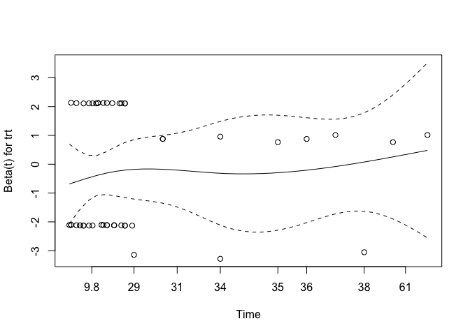

# Load packages

```r
library(tidyverse)
library(readxl)
library(writexl)
library(tableone)
library(haven) # Read sas files
library(here)
library(kableExtra)

library(jtools) # for summ() and plot_summs
library(sjPlot) # for tab_model
library(ggplot2) # survival/TTE analyses and other graphs
library(ggsurvfit) # survival/TTE analyses
library(survival) # survival/TTE analyses
library(gtsummary) # survival/TTE analyses
library(ggfortify) # autoplot
library(tidycmprsk) # competing risk analysis
library(ordinal) # clinstatus ordinal regression
library(logistf) # Firth regression in case of rare events
```

# Load Data


# Define ITT set

```r
# df <- df %>% 
#   filter(imp_adm_yn == 1)
```
Discussion points:
1. 9 participants (3 in int. / 6 in cont.) did not receive a single dose of baricitinib, or placebo, respectively. Main publication used mITT set excluding the 9, we use ITT set including them, to be consistent across included trials.

# Baseline Characteristics

```r
df$trial <- c("Bari-Solidact")
df$JAKi <- c("Baricitinib")
df <- df %>% ## no missing data
  rename(id_pat = PARTICIPANT_ID,
         trt = arm,
         age = D1_AGE,
         randdate = RANDODATED1,
         sex = GENDER,
         country = COUNTRY,
         icu = ICU_YN)

df %>% 
  drop_na(age) %>% 
  ggplot(aes(x = age)) +
  geom_density(fill = "blue", color = "black") +
  labs(title = "Density Plot of Age",
       x = "Age",
       y = "Density")
```

<!-- -->

```r
# Days with symptoms prior to randomization
df <- df %>% ## table(df$sympdur, useNA = "always") / ## no missing data / equals delay_symprando
  mutate(sympdur = randdate - SCR_SYMPSTDATED1,
         sympdur = as.numeric(sympdur))
ggplot(df, aes(x = sympdur)) +
  geom_density(fill = "blue", color = "black") +
  labs(title = "Density Plot of Symptom Duration",
       x = "Symptom Duration",
       y = "Density")
```

<!-- -->

```r
# Severity of COVID-19 with respect to respiratory support at randomisation / Bari-Solidact used WHO score, transform
df <- df %>% ## no missing data // publication: 139 bari vs 136 placebo. In this dataset, slightly more (142 bari vs 138 placebo), due to additional randomized participants during extension of the trial
  mutate(clinstatus_baseline = case_when(whoscore_D1 == 0 | whoscore_D1 == 1 | whoscore_D1 == 3 ~ 1,
                                         whoscore_D1 == 4 ~ 2,
                                         whoscore_D1 == 5 ~ 3,
                                         whoscore_D1 == 6 ~ 4,
                                         whoscore_D1 == 7 | whoscore_D1 == 8 | whoscore_D1 == 9 ~ 5,
                                         whoscore_D1 == 10 ~ 6))
df$clinstatus_baseline <- factor(df$clinstatus_baseline, levels = 1:6) ## no missing data
addmargins(table(df$clinstatus_baseline, df$trt, useNA = "always"))
```

```
##       
##          0   1 <NA> Sum
##   1      0   0    0   0
##   2      0   0    0   0
##   3      0   0    0   0
##   4    122 127    0 249
##   5     22  18    0  40
##   6      0   0    0   0
##   <NA>   0   0    0   0
##   Sum  144 145    0 289
```

```r
df <- df %>% 
  mutate(vbaseline = case_when(clinstatus_baseline == "2" | clinstatus_baseline == "3" ~ 0,
                                clinstatus_baseline == "4" | clinstatus_baseline == "5" ~ 1))

# Co-medication at baseline
df <- df %>% 
  mutate(comed_dexa = case_when(corticoid_yn == 1 | dexa_yn == 1 ~ 1,
                                corticoid_yn == 0 & dexa_yn == 0 ~ 0))
df <- df %>% 
  rename(comed_rdv = remdes_yn,
         comed_toci = toci_yn,
         comed_ab = antibio_yn,
         comed_acoa = anticoag_yn)
df$comed_interferon <- 0 # no interferon used
df <- df %>% # no interferon used but monoclonal Abs and plasma -> other -> but there were no mAbs or plasma used
  mutate(comed_other = case_when(monocloAb_yn == 1 | immunplasma_yn == 1 ~ 1,
                                monocloAb_yn == 0 & immunplasma_yn == 0 ~ 0))
## group them for the subgroup analysis, according to protocol // tocilizumab as rescue medication - incorporate?
df <- df %>% 
  mutate(comed_cat = case_when(comed_dexa == 0 & comed_toci == 0 ~ 1, # patients without Dexamethasone nor Tocilizumab
                               comed_dexa == 1 & comed_toci == 1 ~ 2, # patients with Dexamethasone and Tocilizumab
                               comed_dexa == 1 & comed_toci == 0 ~ 3, # patients with Dexamethasone but no Tocilizumab
                               comed_dexa == 0 & comed_toci == 1 ~ 4)) # patients with Tocilizumab but no Dexamethasone (if exist)

# Comorbidity at baseline, including immunocompromised
df <- df %>% ## 4 missing
  mutate(comorb_lung = case_when(D1_PULMO_YNK == 1 ~ 1,
                                 D1_PULMO_YNK == 0 ~ 0))
df <- df %>% 
  mutate(comorb_liver = case_when(D1_LIVER_YNK == 1 ~ 1,
                                D1_LIVER_YNK == 0 ~ 0))
df <- df %>% ## no missing. D1_CARDIO_YNK includes all CVDs but also 2 HTA that do not have anything else -> take out.
  mutate(comorb_cvd = case_when(D1_CARDIO_YNK == 1 & (D1_CARDIO_SP != "HTA" & D1_CARDIO_SP != "HIGH BLOOD PRESSURE") ~ 1,
                                 D1_CARDIO_YNK == 0 | D1_CARDIO_SP == "HTA" | D1_CARDIO_SP == "HIGH BLOOD PRESSURE" ~ 0))
df <- df %>% ## 1 missing. The 2 HTA from above were already counted in.
  mutate(comorb_aht = case_when(D1_HBP_YNK == 1 | D1_CARDIO_SP == "HTA" | D1_CARDIO_SP == "HIGH BLOOD PRESSURE" ~ 1,
                                D1_HBP_YNK == 0 ~ 0))
df <- df %>% ## 4 missing. D1_DIABETE not needed, correct.
  mutate(comorb_dm = case_when(d1_diabete_ynk == 1 ~ 1,
                                d1_diabete_ynk == 0 ~ 0))
df <- df %>% ## 0 missing. BMI not needed, correct.
  mutate(comorb_obese = case_when(obesity == 1 ~ 1,
                                obesity == 0 ~ 0))
df <- df %>% ## 0 missing. D1_SMOKING not needed, correct.
  mutate(comorb_smoker = case_when(smoker == 1 ~ 1,
                                smoker == 0 ~ 0))
df <- df %>% ## 0 missing.
  mutate(immunosupp = case_when(immunodef_yn == 1 ~ 1,
                                immunodef_yn == 0 ~ 0))
df <- df %>% ## 2 missing.
  mutate(comorb_cancer = case_when(D1_CANCER_YNK == 1 ~ 1,
                                D1_CANCER_YNK == 0 ~ 0))
df <- df %>% ## 1 missing.
  mutate(comorb_autoimm = case_when(D1_AUTOIMMUN_YNK == 1 ~ 1,
                                D1_AUTOIMMUN_YNK == 0 ~ 0))
df <- df %>% ## 0 missing.
  mutate(comorb_kidney = case_when(D1_KIDNEY_YNK == 1 ~ 1,
                                D1_KIDNEY_YNK == 0 ~ 0))
df <- df %>% 
  mutate(any_comorb = case_when(comorb_lung == 1 | comorb_liver == 1 | comorb_cvd == 1 |
                                  comorb_aht == 1 | comorb_dm == 1 | comorb_obese == 1 | comorb_smoker == 1
                                | immunosupp == 1 | comorb_cancer == 1 | comorb_autoimm == 1 | comorb_kidney == 1 
                                  ~ 1,
                                comorb_lung == 0 & comorb_liver == 0 & comorb_cvd == 0 &
                                  comorb_aht == 0 & comorb_dm == 0 & comorb_obese == 0 & comorb_smoker == 0
                                & immunosupp == 0 & comorb_cancer == 0 & comorb_autoimm == 0 & comorb_kidney == 0
                                ~ 0))
# the remaining 10 missing have only NA in 1 comorb category => no evidence for comorbidity -> recode as 0
df <- df %>% 
  mutate(any_comorb = case_when(is.na(any_comorb) ~ 0,
                                TRUE ~ any_comorb))
## group them for the subgroup analysis, according to protocol // count all pre-defined comorbidities per patient first
comorb <- df %>% 
  select(id_pat, comorb_lung, comorb_liver, comorb_cvd, comorb_aht, comorb_dm, comorb_obese, comorb_smoker, immunosupp,
         comorb_cancer, comorb_autoimm, comorb_kidney)
comorb$comorb_count <- NA
for (i in 1:dim(comorb)[[1]]) {
  comorb$comorb_count[i] <- ifelse(
    sum(comorb[i, ] %in% c(1)) > 0,
    sum(comorb[i, ] %in% c(1)),
    NA
  )
}
comorb <- comorb %>% 
  mutate(comorb_count = case_when(comorb_lung == 0 & comorb_liver == 0 & comorb_cvd == 0 &
                                  comorb_aht == 0 & comorb_dm == 0 & comorb_obese == 0 & comorb_smoker == 0
                                & immunosupp == 0 & comorb_cancer == 0 & comorb_autoimm == 0 & comorb_kidney == 0 ~ 0,
                                TRUE ~ comorb_count))
# the remaining 11 missing have only NA in 1 comorb category => no evidence for comorbidity -> recode as 0
comorb <- comorb %>% 
  mutate(comorb_count = case_when(is.na(comorb_count) ~ 0,
                                TRUE ~ comorb_count))
df <- left_join(df, comorb[, c("comorb_count", "id_pat")], by = join_by(id_pat == id_pat)) ## merge imputed variable back
df <- df %>% 
  mutate(comorb_cat = case_when(immunosupp == 1 ~ 4, # immunocompromised
                                comorb_count == 0 ~ 1, # no comorbidity
                                comorb_count == 1 ~ 2, # one comorbidity
                                comorb_count >1 & (immunosupp == 0 | is.na(immunosupp)) ~ 3)) # multiple comorbidities

# CRP
df$crp <- as.numeric(df$lab_v_conv_crp_D1) ## 8 missing
df %>% 
  drop_na(crp) %>% 
  ggplot(aes(x = crp)) +
  geom_density(fill = "blue", color = "black") +
  labs(title = "Density Plot of CRP",
       x = "CRP",
       y = "Density")
```

<!-- -->

```r
# Vaccination
df <- df %>% ## 5 missing
  mutate(vacc = case_when(D1_VACCIN_YNK == 1 ~ 1,
                          D1_VACCIN_YNK == 0 ~ 0))

# Viremia // Viral load value <LOQ and/or undectectable
df$vl_baseline <- df$vloqundet_yn_D1

# Variant
df <- df %>% 
  mutate(variant = case_when(SCR_COVARIANT == 1 ~ "Delta",
                             SCR_COVARIANT == 2 ~ "Omicron",
                             SCR_COVARIANT == 50 ~ "PRESENCE OF MUTATIONS E484Q AND L452R"))

# Serology
df <- df %>% 
  mutate(sero = case_when(Anti_Spike_wt == "Positive" | Anti_Nucl_wt == "Positive" | anti_RBDwt == "Positive" ~ 1,
                             (Anti_Spike_wt == "Negative" | is.na(Anti_Spike_wt)) & (Anti_Nucl_wt == "Negative" | is.na(Anti_Nucl_wt)) & (anti_RBDwt == "Negative" | is.na(anti_RBDwt)) ~ 0))
```
Discussion points BASELINE data:
1. Rescue therapy: Tocilizumab (n=12) or increased steroid dose (n=91): steroids_dosechang_yn, steroids_dosechang_date, rescue_yn, rescuedate -> when was rescue therapie given, in relation to clinstatus (vs those not receiving rescue)? -> investigate later

# Endpoints

```r
# time to event data
df$death_d <- as.numeric(df$deathdated1_DROP - df$randdate) 
df$discharge_d <- as.numeric(df$visitdated1_DISCH - df$randdate)
df$withdraw_d <- as.numeric(df$withdrawdated1_DROP - df$randdate)
df$withdrawi_d <- as.numeric(df$invdecisdated1_DROP - df$randdate)
# df$ltfu_d <- as.numeric(df$ltfudated1_DROP - df$randdate) ## there were no LTFU
df$readmission_d <- as.numeric(df$readmdate - df$randdate)
df$maxfup_d <- as.numeric(df$lastdate - df$randdate)

# transform all daily clinical scores
whoscore_transform <- function(df, clinstatus_var, whoscore_var) {
  df <- df %>%
    mutate({{ clinstatus_var }} :=
             case_when({{ whoscore_var }} %in% c(0, 1, 3) ~ 1,
                       {{ whoscore_var }} == 4 ~ 2,
                       {{ whoscore_var }} == 5 ~ 3,
                       {{ whoscore_var }} == 6 ~ 4,
                       {{ whoscore_var }} %in% c(7, 8, 9) ~ 5,
                       {{ whoscore_var }} == 10 ~ 6)) %>%
    mutate({{ clinstatus_var }} := factor({{ clinstatus_var }}, levels = 1:6))
}
df <- whoscore_transform(df, clinstatus_2, whoscore_D3) ## D1 was baseline => D3 is +2 days after baseline.
df <- whoscore_transform(df, clinstatus_4, whoscore_D5)
df <- whoscore_transform(df, clinstatus_7, whoscore_D8)
df <- whoscore_transform(df, clinstatus_14, whoscore_D15)
df <- whoscore_transform(df, clinstatus_21, whoscore_D22)
df <- whoscore_transform(df, clinstatus_28, whoscore_D29) 
df <- whoscore_transform(df, clinstatus_35, whoscore_D36)
df <- whoscore_transform(df, clinstatus_discharge, whoscore_DISCH)
df <- whoscore_transform(df, clinstatus_dropout, whoscore_DROP)

# (i) Primary outcome: Mortality at day 28
df <- df %>% # 12 have no outcome data and withdrew or were withdrawn, but have clinstatus_baseline and fup lcinstatus data -> see missing data rule: No transfer to hospice happened in bari-solidact -> assign "alive"
  mutate(mort_28 = case_when(death_d <29 ~ 1,
                             discharge_d <29 ~ 0, # all discharged were discharged alive and not to hospice
                             clinstatus_28 %in% c(2,3,4,5) ~ 0, # still at hospital but alive
                             discharge_d >28 ~ 0)) # discharged later, proof of still alive
df <- df %>%
  mutate(mort_28 = case_when(is.na(mort_28) ~ 0,
                             TRUE ~ c(mort_28)))

# (ii) Mortality at day 60
df <- df %>% # same 12 that have no outcome data and withdrew or were withdrawn -> see above
  mutate(mort_60 = case_when(death_d <61 ~ 1,
                             discharge_d <61 ~ 0, # all discharged were discharged alive and not to hospice
                             clinstatus_35 %in% c(2,3,4,5) ~ 0, # still at hospital but alive
                             discharge_d >60 ~ 0)) # discharged later, proof of still alive
df <- df %>%
  mutate(mort_60 = case_when(is.na(mort_60) ~ 0,
                             TRUE ~ c(mort_60)))

# (iii) Time to death within max. follow-up time 
df$death_reached <- df$death_yn # do not bother about missings in mort_28
df <- df %>% # 2 are left without any time to event data => impute max. follow-up time
  mutate(death_time = case_when(death_d >=0 ~ c(death_d), # time to death, if no time to death, then...
                                discharge_d >=0 & (is.na(withdraw_d) | withdraw_d >28) & (is.na(withdrawi_d) | withdrawi_d >28) ~ 28, # 28d for all those who were discharged alive and not withdrawn before, then...
                                discharge_d >= withdraw_d ~ c(discharge_d), # time to discharge if this was greater than time to withdrawal
                                discharge_d >= withdrawi_d ~ c(discharge_d), # see above
                                maxfup_d >=0 & is.na(withdraw_d) & is.na(withdrawi_d) ~ c(maxfup_d), # max fup for the remaining ones not withdrawn
                                withdraw_d >=0 ~ c(withdraw_d), # time to withdrawal for those withdrawn (and not discharged before)
                                withdrawi_d >=0 ~ c(withdrawi_d))) # time to investigator withdrawal for those inv-withdrawn (and not discharged before)

# (iv) New mechanical ventilation among survivors within 28 days. Bari-Solidact only included clinstatus 4 and 5.
df <- df %>% # The NAs are not eligible (died or clinstatus_baseline == 5) and thus are excluded from denominator
  mutate(new_mv_28 = case_when(clinstatus_baseline == 4 & (mort_28 == 0 | is.na(mort_28)) 
                               & (clinstatus_2 == 5 | clinstatus_4 == 5 | clinstatus_7 == 5 | clinstatus_14 == 5 
                                  | clinstatus_21 == 5 | clinstatus_28 == 5)
                               ~ 1,
                               clinstatus_baseline == 4 & mort_28 == 0
                               ~ 0))
# (iv) Alternative definition/analysis: New mechanical ventilation OR death within 28 days => include all in denominator.
df <- df %>% # no missing
  mutate(new_mvd_28 = case_when(new_mv_28 == 1 | mort_28 == 1 ~ 1,
                                new_mv_28 == 0 | mort_28 == 0 ~ 0))

# (v) Clinical status at day 28
df <- df %>% # Adapt clinstatus_28, since currently excluding those discharged or died or missing data.
  mutate(clinstatus_28 = case_when(clinstatus_28 == 5 ~ 5,
                                   clinstatus_28 == 4 ~ 4,
                                   clinstatus_28 == 3 ~ 3,
                                   clinstatus_28 == 2 ~ 2,
                                   clinstatus_28 == 1 ~ 1,
                                   mort_28 == 1 ~ 6, # died within 28d
                                   discharge_d <29 ~ 1 # discharged alive / reached discharge criteria within 28d
                                   )) 
df$clinstatus_28 <- factor(df$clinstatus_28, levels = 1:6) # same 12 missing -> imputation, LVCF
# table(df$clinstatus_28, useNA = "always")
## Imputation according to protocol: If there was daily data for the ordinal score available but with missing data for single days, then we carried last observed value forward unless for day 28, whereby we first considered data from the window (+/-3 days) -> no window data in Bari-Solidact => LVCF
dfcs <- df %>% 
    select(id_pat, clinstatus_baseline, clinstatus_2, clinstatus_4, clinstatus_7, clinstatus_14, clinstatus_21, clinstatus_28)
impute_last_forw = function(df){
  first = which(names(df)%in%c("clinstatus_baseline"))
  last = which(names(df)%in%c("clinstatus_28"))
  for (i in 1:dim(df)[[1]]){
    for (j in first[1]:last[1]){
      p = df[i, j]
      df[i,j] <- 
        ifelse(!is.na(df[i, j]), p, df[i, j-1])
    }
  }
  df
}
dfcs <- impute_last_forw(dfcs)
dfcs <- dfcs %>% # To control, don't overwrite
  rename(clinstatus_28_imp = clinstatus_28)
df <- left_join(df, dfcs[, c("clinstatus_28_imp", "id_pat")], by = join_by(id_pat == id_pat)) ## Merge imputed variable back // re-admissions already correctly incorporated

# (vi) Time to discharge or reaching discharge criteria up to day 28 // Patients who died prior to day 28 are assumed not having reached discharge, i.e. counted as 28 days. 
df <- df %>% 
  mutate(discharge_reached = case_when(discharge_d <29 ~ 1,
                                       TRUE ~ 0))
df <- df %>% # 2 are left without any time to event data => impute max. follow-up time
  mutate(discharge_time = case_when(discharge_d >=0 & (is.na(withdraw_d) | withdraw_d >28) & (is.na(withdrawi_d) | withdrawi_d >28) ~ c(discharge_d), # time to discharge in case no withdrawal or withdrawal after 28d. If no time to discharge, then...
                                    death_d >=0 ~ c(death_d), # time to death, then...
                                    discharge_d >= withdraw_d ~ c(discharge_d), # add time to discharge where time to discharge is after time to withdrawal 
                                    discharge_d >= withdrawi_d ~ c(discharge_d), # see above
                                    maxfup_d >=0 & is.na(withdraw_d) & is.na(withdrawi_d) ~ c(maxfup_d), # max fup for the remaining ones not withdrawn
                                withdraw_d >=0 ~ c(withdraw_d), # time to withdrawal for those withdrawn (and not discharged before)
                                withdrawi_d >=0 ~ c(withdrawi_d))) # time to investigator withdrawal for those inv-withdrawn (and not discharged before)
df <- df %>% # restrict to max fup time 28d
  mutate(discharge_time = case_when(discharge_time >28 ~ 28,
                                    TRUE ~ discharge_time))
df <- df %>% # add 28d for those that died - as a sens-variable
  mutate(discharge_time_sens = case_when(mort_28 == 1 ~ 28,
                                    TRUE ~ discharge_time))
# df %>%
#   select(discharge_reached, discharge_time, discharge_time_sens, death_reached, death_time, mort_28, death_d, discharge_d, withdraw_d, withdrawi_d, readmission_d, maxfup_d, clinstatus_baseline,
#          clinstatus_2, clinstatus_4, clinstatus_7, clinstatus_14, clinstatus_21, clinstatus_28) %>%
#   # filter(is.na(discharge_time)) %>%
#   View()

# (vi) Sens-analysis: Alternative definition/analysis of outcome: time to sustained discharge within 28 days
df <- df %>% # there are 6 re-admissions: the one readmitted at day 16 was re-discharged before day ?28?. The ones at d21 & d27 not. And then there are 3 that were readmitted later than d28 => Reclassify d21 and d27 and add 28d, add d20 to the one re-admitted at d16.
  mutate(discharge_reached_sus = case_when(readmission_d == 21 | readmission_d == 27 ~ 0,
                                           TRUE ~ discharge_reached))
df <- df %>%
  mutate(discharge_time_sus = case_when(readmission_d == 16 ~ 20,
                                        readmission_d == 21 | readmission_d == 27 ~ 28,
                                        TRUE ~ discharge_time))

# (vii) Viral clearance up to day 5, day 10, and day 15 (Viral load value <LOQ and/or undectectable)
df$vir_clear_5 <- df$vloqundet_yn_D3
df <- df %>% 
  mutate(vir_clear_10 = case_when(vloqundet_yn_D8 == 1 ~ 1,
                                  vir_clear_5 == 1 & is.na(vloqundet_yn_D8) ~ 1,
                                  vloqundet_yn_D8 == 0 ~ 0,
                                  vir_clear_5 == 0 & is.na(vloqundet_yn_D8) ~ 0))
df <- df %>% 
  mutate(vir_clear_15 = case_when(vloqundet_yn_D15 == 1 ~ 1,
                                  vir_clear_10 == 1 & is.na(vloqundet_yn_D15) ~ 1,
                                  vloqundet_yn_D15 == 0 ~ 0,
                                  vir_clear_10 == 0 & is.na(vloqundet_yn_D15) ~ 0))

# (viii) Quality of life at day 28 // detailed measures available - wait for other trials first

# (ix) Participants with an adverse event grade 3 or 4, or a serious adverse event, excluding death, by day 28

# (ix) Sens-analysis: Alternative definition/analysis of outcome: incidence rate ratio (Poisson regression) -> AE per person by d28

# (ix) Sens-analysis: Alternative definition/analysis of outcome: time to first (of these) adverse event, within 28 days, considering death as a competing risk (=> censor and set to 28 days)

# (x) Adverse events of special interest within 28 days: a) thromboembolic events (venous thromboembolism, pulmonary embolism, arterial thrombosis), b) secondary infections (bacterial pneumonia including ventilator-associated pneumonia, meningitis and encephalitis, endocarditis and bacteremia, invasive fungal infection including pulmonary aspergillosis), c) Reactivation of chronic infection including tuberculosis, herpes simplex, cytomegalovirus, herpes zoster and hepatitis B, d) serious cardiovascular and cardiac events (including stroke and myocardial infarction), e) events related to signs of bone marrow suppression (anemia, lymphocytopenia, thrombocytopenia, pancytopenia), f) malignancy, g) gastrointestinal perforation (incl. gastrointestinal bleeding/diverticulitis), h) liver dysfunction/hepatotoxicity (grade 3 and 4)

# (xi) Adverse events, any grade and serious adverse event, excluding death, within 28 days, grouped by organ classes

# df_ae <- df %>% 
#   select(id_pat, trt, x, ae_28_list, aesi_28)
# # Save
# saveRDS(df_ae, file = "df_ae_barisolidact.RData")
```
Discussion points OUTCOME data:
1. Re QoL: Wait for other trials first. Find out more about the QoL measure used.
2. Analyze the safety data

# Multiple imputation using chained equation

Discussion points

# Define final dataset, set references, summarize missing data and variables

```r
# keep the overall set
df_all <- df
# reduce the df set to our standardized set across all trials
df <- df %>% 
  select(id_pat, trt, sex, age, trial, JAKi, 
         # ethn, 
         country, icu, sympdur, vacc, clinstatus_baseline, vbaseline,
         comed_dexa, comed_rdv, comed_toci, comed_ab, comed_acoa, comed_interferon, comed_other,
         comed_cat,
         comorb_lung, comorb_liver, comorb_cvd, comorb_aht, comorb_dm, comorb_obese, comorb_smoker, immunosupp,
         comorb_autoimm, comorb_cancer, comorb_kidney,
         any_comorb, comorb_cat, comorb_count,
         crp, 
         sero, vl_baseline, variant,
         mort_28, mort_60, death_reached, death_time,
         new_mv_28, new_mvd_28,
         clinstatus_28_imp,
         discharge_reached, discharge_time, discharge_time_sens, discharge_reached_sus, discharge_time_sus,
         # ae_28, ae_28_sev,
         vir_clear_5, vir_clear_10, vir_clear_15
         )

# export for one-stage model, i.e., add missing variables 
df_os <- df
df_os$ethn <- NA
df_os$ae_28 <- NA
df_os$ae_28_sev <- NA
# Save
saveRDS(df_os, file = "df_os_barisolidact.RData")

## set references, re-level
# df <- df %>% 
#   mutate(Treatment = relevel(Treatment, "no JAK inhibitor"))

# Create a bar plot to visualize missing values in each column
original_order <- colnames(df_os)
missing_plot <- df_os %>%
  summarise_all(~ mean(is.na(.))) %>%
  gather() %>%
  mutate(key = factor(key, levels = original_order)) %>%
  ggplot(aes(x = key, y = value)) +
  geom_bar(stat = "identity") +
  labs(x = "Columns", y = "Proportion of Missing Values", title = "Missing Data Visualization") +
  theme(axis.text.x = element_text(angle = 45, hjust = 1)) +
  ylim(0, 1)
print(missing_plot)
```

<!-- -->
Discussion points
1. Missing variables:
* Baseline:
  - Ethnicity: Only country of birth available
* Outcomes:
  - adverse events (still coming)
  - qol_28 (still working on it)
2. Missing data:
- vacc: 5 missing -> MICE for subgroup analysis?
- crp & vl_baseline & variant -> ignore
- new_mv_28: not part of denominator
- viral load (baseline and outcome) -> ignore

# (i) Primary endpoint: Mortality at day 28

```r
# adjusted for baseline patient characteristics (age, respiratory support at baseline (ordinal scale 1-3 vs 4-5), dexamethasone use at baseline (y/n), remdesivir use at baseline (y/n), anti-IL-6 use at baseline (y/n)).
addmargins(table(df$mort_28, df$trt, useNA = "always"))
```

```
##       
##          0   1 <NA> Sum
##   0    123 130    0 253
##   1     21  15    0  36
##   <NA>   0   0    0   0
##   Sum  144 145    0 289
```

```r
mort.28 <- df %>% 
  glm(mort_28 ~ trt 
      + age + clinstatus_baseline 
      #+ comed_dexa + comed_rdv + comed_toci
      , family = "binomial", data=.)
summ(mort.28, exp = T, confint = T, model.info = T, model.fit = F, digits = 2)
```

<table class="table table-striped table-hover table-condensed table-responsive" style="width: auto !important; margin-left: auto; margin-right: auto;">
<tbody>
  <tr>
   <td style="text-align:left;font-weight: bold;"> Observations </td>
   <td style="text-align:right;"> 289 </td>
  </tr>
  <tr>
   <td style="text-align:left;font-weight: bold;"> Dependent variable </td>
   <td style="text-align:right;"> mort_28 </td>
  </tr>
  <tr>
   <td style="text-align:left;font-weight: bold;"> Type </td>
   <td style="text-align:right;"> Generalized linear model </td>
  </tr>
  <tr>
   <td style="text-align:left;font-weight: bold;"> Family </td>
   <td style="text-align:right;"> binomial </td>
  </tr>
  <tr>
   <td style="text-align:left;font-weight: bold;"> Link </td>
   <td style="text-align:right;"> logit </td>
  </tr>
</tbody>
</table>  <table class="table table-striped table-hover table-condensed table-responsive" style="width: auto !important; margin-left: auto; margin-right: auto;border-bottom: 0;">
 <thead>
  <tr>
   <th style="text-align:left;">   </th>
   <th style="text-align:right;"> exp(Est.) </th>
   <th style="text-align:right;"> 2.5% </th>
   <th style="text-align:right;"> 97.5% </th>
   <th style="text-align:right;"> z val. </th>
   <th style="text-align:right;"> p </th>
  </tr>
 </thead>
<tbody>
  <tr>
   <td style="text-align:left;font-weight: bold;"> (Intercept) </td>
   <td style="text-align:right;"> 0.00 </td>
   <td style="text-align:right;"> 0.00 </td>
   <td style="text-align:right;"> 0.01 </td>
   <td style="text-align:right;"> -5.88 </td>
   <td style="text-align:right;"> 0.00 </td>
  </tr>
  <tr>
   <td style="text-align:left;font-weight: bold;"> trt </td>
   <td style="text-align:right;"> 0.64 </td>
   <td style="text-align:right;"> 0.30 </td>
   <td style="text-align:right;"> 1.37 </td>
   <td style="text-align:right;"> -1.15 </td>
   <td style="text-align:right;"> 0.25 </td>
  </tr>
  <tr>
   <td style="text-align:left;font-weight: bold;"> age </td>
   <td style="text-align:right;"> 1.09 </td>
   <td style="text-align:right;"> 1.05 </td>
   <td style="text-align:right;"> 1.13 </td>
   <td style="text-align:right;"> 4.78 </td>
   <td style="text-align:right;"> 0.00 </td>
  </tr>
  <tr>
   <td style="text-align:left;font-weight: bold;"> clinstatus_baseline5 </td>
   <td style="text-align:right;"> 2.57 </td>
   <td style="text-align:right;"> 1.03 </td>
   <td style="text-align:right;"> 6.42 </td>
   <td style="text-align:right;"> 2.02 </td>
   <td style="text-align:right;"> 0.04 </td>
  </tr>
</tbody>
<tfoot><tr><td style="padding: 0; " colspan="100%">
<sup></sup> Standard errors: MLE</td></tr></tfoot>
</table>

# (ii) Mortality at day 60

```r
table(df$mort_60, df$trt, useNA = "always")
```

```
##       
##          0   1 <NA>
##   0    120 123    0
##   1     24  22    0
##   <NA>   0   0    0
```

```r
mort.60 <- df %>% 
  glm(mort_60 ~ trt 
      + age + clinstatus_baseline 
      #+ comed_dexa + comed_rdv + comed_toci
      , family = "binomial", data=.)
summ(mort.60, exp = T, confint = T, model.info = T, model.fit = F, digits = 2)
```

<table class="table table-striped table-hover table-condensed table-responsive" style="width: auto !important; margin-left: auto; margin-right: auto;">
<tbody>
  <tr>
   <td style="text-align:left;font-weight: bold;"> Observations </td>
   <td style="text-align:right;"> 289 </td>
  </tr>
  <tr>
   <td style="text-align:left;font-weight: bold;"> Dependent variable </td>
   <td style="text-align:right;"> mort_60 </td>
  </tr>
  <tr>
   <td style="text-align:left;font-weight: bold;"> Type </td>
   <td style="text-align:right;"> Generalized linear model </td>
  </tr>
  <tr>
   <td style="text-align:left;font-weight: bold;"> Family </td>
   <td style="text-align:right;"> binomial </td>
  </tr>
  <tr>
   <td style="text-align:left;font-weight: bold;"> Link </td>
   <td style="text-align:right;"> logit </td>
  </tr>
</tbody>
</table>  <table class="table table-striped table-hover table-condensed table-responsive" style="width: auto !important; margin-left: auto; margin-right: auto;border-bottom: 0;">
 <thead>
  <tr>
   <th style="text-align:left;">   </th>
   <th style="text-align:right;"> exp(Est.) </th>
   <th style="text-align:right;"> 2.5% </th>
   <th style="text-align:right;"> 97.5% </th>
   <th style="text-align:right;"> z val. </th>
   <th style="text-align:right;"> p </th>
  </tr>
 </thead>
<tbody>
  <tr>
   <td style="text-align:left;font-weight: bold;"> (Intercept) </td>
   <td style="text-align:right;"> 0.00 </td>
   <td style="text-align:right;"> 0.00 </td>
   <td style="text-align:right;"> 0.01 </td>
   <td style="text-align:right;"> -6.16 </td>
   <td style="text-align:right;"> 0.00 </td>
  </tr>
  <tr>
   <td style="text-align:left;font-weight: bold;"> trt </td>
   <td style="text-align:right;"> 0.89 </td>
   <td style="text-align:right;"> 0.45 </td>
   <td style="text-align:right;"> 1.75 </td>
   <td style="text-align:right;"> -0.34 </td>
   <td style="text-align:right;"> 0.74 </td>
  </tr>
  <tr>
   <td style="text-align:left;font-weight: bold;"> age </td>
   <td style="text-align:right;"> 1.09 </td>
   <td style="text-align:right;"> 1.05 </td>
   <td style="text-align:right;"> 1.12 </td>
   <td style="text-align:right;"> 4.99 </td>
   <td style="text-align:right;"> 0.00 </td>
  </tr>
  <tr>
   <td style="text-align:left;font-weight: bold;"> clinstatus_baseline5 </td>
   <td style="text-align:right;"> 2.50 </td>
   <td style="text-align:right;"> 1.07 </td>
   <td style="text-align:right;"> 5.83 </td>
   <td style="text-align:right;"> 2.13 </td>
   <td style="text-align:right;"> 0.03 </td>
  </tr>
</tbody>
<tfoot><tr><td style="padding: 0; " colspan="100%">
<sup></sup> Standard errors: MLE</td></tr></tfoot>
</table>

# (iii) Time to death within max. follow-up time

```r
# table(df$death_reached, df$death_time, useNA = "always")
# table(df$death_reached, df$mort_60, useNA = "always")

# df %>%
#   drop_na(death_time) %>%
#   filter(death_reached == 1) %>%
#   group_by(trt) %>%
#   summarise(median = median(death_time),
#             IQR = IQR(death_time),
#             Q1 = quantile(death_time, probs = 0.25),
#             Q3 = quantile(death_time, probs = 0.75)) 

# time to death, by group. Kaplan-Meier estimate of conditional survival probability.
km.ttdeath.check <- with(df, Surv(death_time, death_reached))
# head(km.ttdeath.check, 100)

km.ttdeath_trt <- survfit(Surv(death_time, death_reached) ~ trt, data=df)
# summary(km.ttdeath_trt, times = 28)
ttdeath_28d_tbl <- km.ttdeath_trt %>% 
  tbl_survfit(
    times = 28,
    label_header = "**28-d survival (95% CI)**"
  )
# Nicely formatted table
kable(ttdeath_28d_tbl, format = "markdown", table.attr = 'class="table"') %>%
  kable_styling(bootstrap_options = "striped", full_width = FALSE)
```


|**Characteristic**    |**28-d survival (95% CI)** |
|:---------------------|:--------------------------|
|Trial treatment group |NA                         |
|0                     |85% (79%, 91%)             |
|1                     |89% (84%, 94%)             |

```r
# autoplot(km.ttdeath_trt)
survfit2(Surv(death_time, death_reached) ~ trt, data=df) %>% 
  ggsurvfit() +
  labs(
    x = "Days",
    y = "Overall survival probability"
  ) + 
  add_confidence_interval() +
  add_risktable()
```

<!-- -->

```r
# Assessing proportional hazards // also just check KM curve
ph.check <- coxph(Surv(death_time, death_reached) ~ trt
                , data = df)
cz <- cox.zph(ph.check)
print(cz)
```

```
##        chisq df    p
## trt    0.397  1 0.53
## GLOBAL 0.397  1 0.53
```

```r
plot(cz)
```

<!-- -->

```r
# testing: simple log-rank
# survdiff(Surv(death_time, death_reached) ~ trt, data = df)
# testing: cox ph
ttdeath <- df %>% 
  coxph(Surv(death_time, death_reached) ~ trt 
        + age + clinstatus_baseline 
        #+ comed_dexa + comed_rdv + comed_toci
        , data =.)
ttdeath_reg_tbl <- tbl_regression(ttdeath, exp = TRUE)
# Nicely formatted table
kable(ttdeath_reg_tbl, format = "markdown", table.attr = 'class="table"') %>%
  kable_styling(bootstrap_options = "striped", full_width = FALSE)
```


|**Characteristic**    |**HR** |**95% CI** |**p-value** |
|:---------------------|:------|:----------|:-----------|
|Trial treatment group |0.77   |0.43, 1.38 |0.4         |
|Age (years)           |1.08   |1.05, 1.11 |<0.001      |
|clinstatus_baseline   |NA     |NA         |NA          |
|1                     |NA     |NA         |NA          |
|2                     |NA     |NA         |NA          |
|3                     |NA     |NA         |NA          |
|4                     |0.47   |0.24, 0.92 |0.027       |
|5                     |NA     |NA         |NA          |
|6                     |NA     |NA         |NA          |

# (iv) New mechanical ventilation among survivors within 28 days

```r
table(df$new_mv_28, df$trt, useNA = "always")
```

```
##       
##         0  1 <NA>
##   0    93 92    0
##   1    15 22    0
##   <NA> 36 31    0
```

```r
new.mv.28 <- df %>% 
  glm(new_mv_28 ~ trt 
      + age 
      #+ clinstatus_baseline 
      #+ comed_dexa + comed_rdv + comed_toci
      , family = "binomial", data=.)
summ(new.mv.28, exp = T, confint = T, model.info = T, model.fit = F, digits = 2)
```

<table class="table table-striped table-hover table-condensed table-responsive" style="width: auto !important; margin-left: auto; margin-right: auto;">
<tbody>
  <tr>
   <td style="text-align:left;font-weight: bold;"> Observations </td>
   <td style="text-align:right;"> 222 (67 missing obs. deleted) </td>
  </tr>
  <tr>
   <td style="text-align:left;font-weight: bold;"> Dependent variable </td>
   <td style="text-align:right;"> new_mv_28 </td>
  </tr>
  <tr>
   <td style="text-align:left;font-weight: bold;"> Type </td>
   <td style="text-align:right;"> Generalized linear model </td>
  </tr>
  <tr>
   <td style="text-align:left;font-weight: bold;"> Family </td>
   <td style="text-align:right;"> binomial </td>
  </tr>
  <tr>
   <td style="text-align:left;font-weight: bold;"> Link </td>
   <td style="text-align:right;"> logit </td>
  </tr>
</tbody>
</table>  <table class="table table-striped table-hover table-condensed table-responsive" style="width: auto !important; margin-left: auto; margin-right: auto;border-bottom: 0;">
 <thead>
  <tr>
   <th style="text-align:left;">   </th>
   <th style="text-align:right;"> exp(Est.) </th>
   <th style="text-align:right;"> 2.5% </th>
   <th style="text-align:right;"> 97.5% </th>
   <th style="text-align:right;"> z val. </th>
   <th style="text-align:right;"> p </th>
  </tr>
 </thead>
<tbody>
  <tr>
   <td style="text-align:left;font-weight: bold;"> (Intercept) </td>
   <td style="text-align:right;"> 0.20 </td>
   <td style="text-align:right;"> 0.04 </td>
   <td style="text-align:right;"> 0.99 </td>
   <td style="text-align:right;"> -1.97 </td>
   <td style="text-align:right;"> 0.05 </td>
  </tr>
  <tr>
   <td style="text-align:left;font-weight: bold;"> trt </td>
   <td style="text-align:right;"> 1.48 </td>
   <td style="text-align:right;"> 0.72 </td>
   <td style="text-align:right;"> 3.04 </td>
   <td style="text-align:right;"> 1.08 </td>
   <td style="text-align:right;"> 0.28 </td>
  </tr>
  <tr>
   <td style="text-align:left;font-weight: bold;"> age </td>
   <td style="text-align:right;"> 1.00 </td>
   <td style="text-align:right;"> 0.97 </td>
   <td style="text-align:right;"> 1.02 </td>
   <td style="text-align:right;"> -0.27 </td>
   <td style="text-align:right;"> 0.78 </td>
  </tr>
</tbody>
<tfoot><tr><td style="padding: 0; " colspan="100%">
<sup></sup> Standard errors: MLE</td></tr></tfoot>
</table>

```r
# (iv) Alternative definition/analysis: New mechanical ventilation OR death within 28 days => include all in denominator. 
table(df$new_mvd_28, df$trt, useNA = "always")
```

```
##       
##          0   1 <NA>
##   0    108 108    0
##   1     36  37    0
##   <NA>   0   0    0
```

```r
new.mvd.28 <- df %>% 
  glm(new_mvd_28 ~ trt 
      + age 
      + clinstatus_baseline 
      #+ comed_dexa + comed_rdv + comed_toci
      , family = "binomial", data=.)
summ(new.mvd.28, exp = T, confint = T, model.info = T, model.fit = F, digits = 2)
```

<table class="table table-striped table-hover table-condensed table-responsive" style="width: auto !important; margin-left: auto; margin-right: auto;">
<tbody>
  <tr>
   <td style="text-align:left;font-weight: bold;"> Observations </td>
   <td style="text-align:right;"> 289 </td>
  </tr>
  <tr>
   <td style="text-align:left;font-weight: bold;"> Dependent variable </td>
   <td style="text-align:right;"> new_mvd_28 </td>
  </tr>
  <tr>
   <td style="text-align:left;font-weight: bold;"> Type </td>
   <td style="text-align:right;"> Generalized linear model </td>
  </tr>
  <tr>
   <td style="text-align:left;font-weight: bold;"> Family </td>
   <td style="text-align:right;"> binomial </td>
  </tr>
  <tr>
   <td style="text-align:left;font-weight: bold;"> Link </td>
   <td style="text-align:right;"> logit </td>
  </tr>
</tbody>
</table>  <table class="table table-striped table-hover table-condensed table-responsive" style="width: auto !important; margin-left: auto; margin-right: auto;border-bottom: 0;">
 <thead>
  <tr>
   <th style="text-align:left;">   </th>
   <th style="text-align:right;"> exp(Est.) </th>
   <th style="text-align:right;"> 2.5% </th>
   <th style="text-align:right;"> 97.5% </th>
   <th style="text-align:right;"> z val. </th>
   <th style="text-align:right;"> p </th>
  </tr>
 </thead>
<tbody>
  <tr>
   <td style="text-align:left;font-weight: bold;"> (Intercept) </td>
   <td style="text-align:right;"> 0.05 </td>
   <td style="text-align:right;"> 0.01 </td>
   <td style="text-align:right;"> 0.19 </td>
   <td style="text-align:right;"> -4.30 </td>
   <td style="text-align:right;"> 0.00 </td>
  </tr>
  <tr>
   <td style="text-align:left;font-weight: bold;"> trt </td>
   <td style="text-align:right;"> 1.02 </td>
   <td style="text-align:right;"> 0.59 </td>
   <td style="text-align:right;"> 1.74 </td>
   <td style="text-align:right;"> 0.06 </td>
   <td style="text-align:right;"> 0.95 </td>
  </tr>
  <tr>
   <td style="text-align:left;font-weight: bold;"> age </td>
   <td style="text-align:right;"> 1.03 </td>
   <td style="text-align:right;"> 1.01 </td>
   <td style="text-align:right;"> 1.06 </td>
   <td style="text-align:right;"> 2.97 </td>
   <td style="text-align:right;"> 0.00 </td>
  </tr>
  <tr>
   <td style="text-align:left;font-weight: bold;"> clinstatus_baseline5 </td>
   <td style="text-align:right;"> 0.80 </td>
   <td style="text-align:right;"> 0.36 </td>
   <td style="text-align:right;"> 1.80 </td>
   <td style="text-align:right;"> -0.53 </td>
   <td style="text-align:right;"> 0.60 </td>
  </tr>
</tbody>
<tfoot><tr><td style="padding: 0; " colspan="100%">
<sup></sup> Standard errors: MLE</td></tr></tfoot>
</table>

# (v) Clinical status at day 28

```r
table(df$clinstatus_28_imp, df$trt, useNA = "always")
```

```
##       
##         0  1 <NA>
##   1    92 95    0
##   2     4  5    0
##   3    10  8    0
##   4     7  6    0
##   5    10 16    0
##   6    21 15    0
##   <NA>  0  0    0
```

```r
clin.28 <- df %>% 
  clm(clinstatus_28_imp ~ trt 
      + age 
      + clinstatus_baseline 
      #+ comed_dexa + comed_rdv + comed_toci
      , link= c("logit"), data=.)
# Summary and extract coefficients
coefficients_table <- summary(clin.28)$coefficients
# Calculate Odds Ratios and Confidence Intervals
odds_ratios <- exp(coefficients_table[, "Estimate"])
ci_lower <- exp(coefficients_table[, "Estimate"] - 1.96 * coefficients_table[, "Std. Error"])
ci_upper <- exp(coefficients_table[, "Estimate"] + 1.96 * coefficients_table[, "Std. Error"])
# Create a data frame to store Odds Ratios and CIs
clin.28_tbl <- data.frame(
  "Variable" = rownames(coefficients_table),
  "Odds Ratio" = odds_ratios,
  "CI Lower" = ci_lower,
  "CI Upper" = ci_upper
)
# Nicely formatted table
kable(clin.28_tbl, format = "markdown", table.attr = 'class="table"') %>%
  kable_styling(bootstrap_options = "striped", full_width = FALSE)
```


|                     |Variable             |  Odds.Ratio|   CI.Lower|    CI.Upper|
|:--------------------|:--------------------|-----------:|----------:|-----------:|
|1&#124;2             |1&#124;2             |  58.1929441| 14.5486079|  232.765827|
|2&#124;3             |2&#124;3             |  68.0382733| 16.9264632|  273.489304|
|3&#124;4             |3&#124;4             |  94.6652072| 23.3169998|  384.333385|
|4&#124;5             |4&#124;5             | 123.8639006| 30.2278096|  507.554668|
|5&#124;6             |5&#124;6             | 252.8921139| 59.5547496| 1073.876083|
|trt                  |trt                  |   0.9450541|  0.5778314|    1.545654|
|age                  |age                  |   1.0565357|  1.0340347|    1.079526|
|clinstatus_baseline5 |clinstatus_baseline5 |   3.1940716|  1.6937706|    6.023303|

# (vi) Time to discharge or reaching discharge criteria up to day 28

```r
# Kaplan-Meier estimate of conditional discharge probability
# Censoring the deaths => Cause-specific hazards, i.e., represents the rate per unit of time of the event among those not having failed from other events. Instantaneous rate of occurrence of the given type of event in subjects who are currently event‐free. But by simply censoring the competing event, we bias in favour of comparator (if treatment leads to less deaths)
km.ttdischarge.check <- with(df, Surv(discharge_time, discharge_reached))
# head(km.ttdischarge.check, 100)
km.ttdischarge_trt <- survfit(Surv(discharge_time, discharge_reached) ~ trt, data=df)
# summary(km.ttdischarge_trt, times = 28)
ttdischarge_28d_tbl <- km.ttdischarge_trt %>% 
  tbl_survfit(
    times = 28,
    label_header = "**28-d hospitalization (95% CI)**"
  )
# Nicely formatted table
kable(ttdischarge_28d_tbl, format = "markdown", table.attr = 'class="table"') %>%
  kable_styling(bootstrap_options = "striped", full_width = FALSE)
```


|**Characteristic**    |**28-d hospitalization (95% CI)** |
|:---------------------|:---------------------------------|
|Trial treatment group |NA                                |
|0                     |27% (20%, 36%)                    |
|1                     |24% (17%, 33%)                    |

```r
survfit2(Surv(discharge_time, discharge_reached) ~ trt, data=df) %>% 
  ggsurvfit() +
  labs(
    x = "Days",
    y = "Overall hospitalization probability"
  ) + 
  add_confidence_interval() +
  add_risktable()
```

<!-- -->

```r
# testing: cox ph
ttdischarge <- df %>% 
  coxph(Surv(discharge_time, discharge_reached) ~ trt 
        + age + clinstatus_baseline 
        #+ comed_dexa + comed_rdv + comed_toci
        , data =.)
ttdischarge_reg_tbl <- tbl_regression(ttdischarge, exp = TRUE)
# Nicely formatted table
kable(ttdischarge_reg_tbl, format = "markdown", table.attr = 'class="table"') %>%
  kable_styling(bootstrap_options = "striped", full_width = FALSE)
```


|**Characteristic**    |**HR** |**95% CI** |**p-value** |
|:---------------------|:------|:----------|:-----------|
|Trial treatment group |1.07   |0.81, 1.42 |0.6         |
|Age (years)           |0.98   |0.97, 0.99 |<0.001      |
|clinstatus_baseline   |NA     |NA         |NA          |
|1                     |NA     |NA         |NA          |
|2                     |NA     |NA         |NA          |
|3                     |NA     |NA         |NA          |
|4                     |3.38   |1.99, 5.74 |<0.001      |
|5                     |NA     |NA         |NA          |
|6                     |NA     |NA         |NA          |

```r
# Sub-distribution hazards, i.e., represents the rate per unit of time of the event as well as the influence of competing events. Instantaneous rate of occurrence of the given type of event in subjects who have not yet experienced an event of that type.
df <- df %>% # cuminc needs a factor variable with censored patients coded as 0, the event as 1 and the competing event as 2.
  mutate(discharge_reached_comp = case_when (discharge_reached == 0 & (mort_28 == 0 | is.na(mort_28)) ~ 0,
                                             discharge_reached == 1 & (mort_28 == 0 | is.na(mort_28)) ~ 1,
                                             mort_28 == 1 ~ 2))
df$discharge_reached_comp <- as.factor(df$discharge_reached_comp) 
# Cumulative incidence for the event=discharge (1) and the competing event=death (2)
cuminc(Surv(discharge_time, discharge_reached_comp) ~ 1, data = df)
```

```
## 
```

```
## ── cuminc() ────────────────────────────────────────────────────────────────────
```

```
## • Failure type "1"
```

```
## time   n.risk   estimate   std.error   95% CI          
## 5.00   243      0.168      0.022       0.127, 0.215    
## 10.0   151      0.438      0.030       0.379, 0.496    
## 15.0   100      0.587      0.030       0.527, 0.642    
## 20.0   73       0.652      0.029       0.593, 0.705    
## 25.0   58       0.663      0.028       0.604, 0.715
```

```
## • Failure type "2"
```

```
## time   n.risk   estimate   std.error   95% CI          
## 5.00   243      0.025      0.009       0.011, 0.048    
## 10.0   151      0.057      0.014       0.034, 0.089    
## 15.0   100      0.086      0.017       0.057, 0.123    
## 20.0   73       0.112      0.019       0.078, 0.152    
## 25.0   58       0.126      0.020       0.091, 0.168
```

```r
cuminc(Surv(discharge_time, discharge_reached_comp) ~ trt, data = df) %>% 
  ggcuminc(outcome = c("1", "2")) +
  ylim(c(0, 1)) + 
  labs(
    x = "Days"
  ) + 
  add_confidence_interval() +
  add_risktable()
```

<!-- -->

```r
# in int only
df_int <- df %>% 
  filter(trt == 1)
cuminc(Surv(discharge_time, discharge_reached_comp) ~ trt, data = df_int) %>% 
  ggcuminc(outcome = c("1", "2")) +
  #ylim(c(0, 1)) + 
  labs(
    x = "Days"
  ) + 
  add_confidence_interval() +
  add_risktable()
```

<!-- -->

```r
# in cont only
df_cont <- df %>% 
  filter(trt == 0)
cuminc(Surv(discharge_time, discharge_reached_comp) ~ trt, data = df_cont) %>% 
  ggcuminc(outcome = c("1", "2")) +
  #ylim(c(0, 1)) + 
  labs(
    x = "Days"
  ) + 
  add_confidence_interval() +
  add_risktable()
```

<!-- -->

```r
# testing: Fine-Gray regression
ttdischarge.comp <- crr(Surv(discharge_time, discharge_reached_comp) ~ trt 
    + age 
    # + clinstatus_baseline
    #+ comed_dexa + comed_rdv + comed_toci
    ,data = df)
ttdischarge_comp_reg_tbl <- tbl_regression(ttdischarge.comp, exp = TRUE)
# Nicely formatted table
kable(ttdischarge_comp_reg_tbl, format = "markdown", table.attr = 'class="table"') %>%
  kable_styling(bootstrap_options = "striped", full_width = FALSE)
```


|**Characteristic**    |**HR** |**95% CI** |**p-value** |
|:---------------------|:------|:----------|:-----------|
|Trial treatment group |1.11   |0.85, 1.46 |0.4         |
|Age (years)           |0.97   |0.96, 0.98 |<0.001      |

```r
# Censoring and assigned worst outcome (28d) to competing event (death) // hypothetical estimand where no-one died. (Another option could be, but we don't do it, is to exclude the deaths entirely, i.e. discharge among those that survived (but that might bias in favour of those in control that died more, i.e. healthier comparator))
survfit2(Surv(discharge_time_sens, discharge_reached) ~ trt, data=df) %>% 
  ggsurvfit() +
  labs(
    x = "Days",
    y = "Overall hospitalization probability"
  ) + 
  add_confidence_interval() +
  add_risktable()
```

<!-- -->

```r
# testing: cox ph
ttdischarge.sens <- df %>% 
  coxph(Surv(discharge_time_sens, discharge_reached) ~ trt 
        + age + clinstatus_baseline 
        #+ comed_dexa + comed_rdv + comed_toci
        , data =.)
ttdischarge_sens_reg_tbl <- tbl_regression(ttdischarge.sens, exp = TRUE)
# Nicely formatted table
kable(ttdischarge_sens_reg_tbl, format = "markdown", table.attr = 'class="table"') %>%
  kable_styling(bootstrap_options = "striped", full_width = FALSE)
```


|**Characteristic**    |**HR** |**95% CI** |**p-value** |
|:---------------------|:------|:----------|:-----------|
|Trial treatment group |1.08   |0.82, 1.44 |0.6         |
|Age (years)           |0.97   |0.96, 0.98 |<0.001      |
|clinstatus_baseline   |NA     |NA         |NA          |
|1                     |NA     |NA         |NA          |
|2                     |NA     |NA         |NA          |
|3                     |NA     |NA         |NA          |
|4                     |3.53   |2.08, 6.00 |<0.001      |
|5                     |NA     |NA         |NA          |
|6                     |NA     |NA         |NA          |

```r
# Assessing proportional hazards (using default discharge_time and discharge_reached) -> see KM plots, after the point when the curves really stqrt diverging, it does not cross over again
ph.check <- coxph(Surv(discharge_time, discharge_reached) ~ trt
                , data = df)
cz <- cox.zph(ph.check)
print(cz)
```

```
##          chisq df    p
## trt    0.00182  1 0.97
## GLOBAL 0.00182  1 0.97
```

```r
plot(cz)
```

<!-- -->

```r
# Sens-analysis: Alternative definition/analysis of outcome: time to sustained discharge within 28 days
# Use cause-specific hazards
survfit2(Surv(discharge_time_sus, discharge_reached_sus) ~ trt, data=df) %>% 
  ggsurvfit() +
  labs(
    x = "Days",
    y = "Overall sustained hospitalization probability"
  ) + 
  add_confidence_interval() +
  add_risktable()
```

<!-- -->

```r
# testing: cox ph
ttdischarge.sus <- df %>% 
  coxph(Surv(discharge_time_sus, discharge_reached_sus) ~ trt 
        + age + clinstatus_baseline 
        #+ comed_dexa + comed_rdv + comed_toci
        , data =.)
ttdischarge_sus_reg_tbl <- tbl_regression(ttdischarge.sus, exp = TRUE)
# Nicely formatted table
kable(ttdischarge_sus_reg_tbl, format = "markdown", table.attr = 'class="table"') %>%
  kable_styling(bootstrap_options = "striped", full_width = FALSE)
```


|**Characteristic**    |**HR** |**95% CI** |**p-value** |
|:---------------------|:------|:----------|:-----------|
|Trial treatment group |1.06   |0.79, 1.40 |0.7         |
|Age (years)           |0.98   |0.96, 0.99 |<0.001      |
|clinstatus_baseline   |NA     |NA         |NA          |
|1                     |NA     |NA         |NA          |
|2                     |NA     |NA         |NA          |
|3                     |NA     |NA         |NA          |
|4                     |3.28   |1.93, 5.56 |<0.001      |
|5                     |NA     |NA         |NA          |
|6                     |NA     |NA         |NA          |
Discussion points
1. Use F&G for sens-analysis (sustained discharge)?

# (vii) Viral clearance up to day 5, day 10, and day 15

```r
table(df$vir_clear_5, df$trt, useNA = "always") #  (Viral load value <LOQ and/or undectectable)
```

```
##       
##         0  1 <NA>
##   0    47 44    0
##   1    12 18    0
##   <NA> 85 83    0
```

```r
# up to 5 days
vir.clear.5 <- df %>% 
  glm(vir_clear_5 ~ trt 
      + age + clinstatus_baseline 
      #+ comed_dexa + comed_rdv + comed_toci
      , family = "binomial", data=.)
summ(vir.clear.5, exp = T, confint = T, model.info = T, model.fit = F, digits = 2)
```

<table class="table table-striped table-hover table-condensed table-responsive" style="width: auto !important; margin-left: auto; margin-right: auto;">
<tbody>
  <tr>
   <td style="text-align:left;font-weight: bold;"> Observations </td>
   <td style="text-align:right;"> 121 (168 missing obs. deleted) </td>
  </tr>
  <tr>
   <td style="text-align:left;font-weight: bold;"> Dependent variable </td>
   <td style="text-align:right;"> vir_clear_5 </td>
  </tr>
  <tr>
   <td style="text-align:left;font-weight: bold;"> Type </td>
   <td style="text-align:right;"> Generalized linear model </td>
  </tr>
  <tr>
   <td style="text-align:left;font-weight: bold;"> Family </td>
   <td style="text-align:right;"> binomial </td>
  </tr>
  <tr>
   <td style="text-align:left;font-weight: bold;"> Link </td>
   <td style="text-align:right;"> logit </td>
  </tr>
</tbody>
</table>  <table class="table table-striped table-hover table-condensed table-responsive" style="width: auto !important; margin-left: auto; margin-right: auto;border-bottom: 0;">
 <thead>
  <tr>
   <th style="text-align:left;">   </th>
   <th style="text-align:right;"> exp(Est.) </th>
   <th style="text-align:right;"> 2.5% </th>
   <th style="text-align:right;"> 97.5% </th>
   <th style="text-align:right;"> z val. </th>
   <th style="text-align:right;"> p </th>
  </tr>
 </thead>
<tbody>
  <tr>
   <td style="text-align:left;font-weight: bold;"> (Intercept) </td>
   <td style="text-align:right;"> 1.38 </td>
   <td style="text-align:right;"> 0.17 </td>
   <td style="text-align:right;"> 11.39 </td>
   <td style="text-align:right;"> 0.30 </td>
   <td style="text-align:right;"> 0.76 </td>
  </tr>
  <tr>
   <td style="text-align:left;font-weight: bold;"> trt </td>
   <td style="text-align:right;"> 1.49 </td>
   <td style="text-align:right;"> 0.63 </td>
   <td style="text-align:right;"> 3.52 </td>
   <td style="text-align:right;"> 0.92 </td>
   <td style="text-align:right;"> 0.36 </td>
  </tr>
  <tr>
   <td style="text-align:left;font-weight: bold;"> age </td>
   <td style="text-align:right;"> 0.98 </td>
   <td style="text-align:right;"> 0.94 </td>
   <td style="text-align:right;"> 1.01 </td>
   <td style="text-align:right;"> -1.44 </td>
   <td style="text-align:right;"> 0.15 </td>
  </tr>
  <tr>
   <td style="text-align:left;font-weight: bold;"> clinstatus_baseline5 </td>
   <td style="text-align:right;"> 0.36 </td>
   <td style="text-align:right;"> 0.10 </td>
   <td style="text-align:right;"> 1.32 </td>
   <td style="text-align:right;"> -1.54 </td>
   <td style="text-align:right;"> 0.12 </td>
  </tr>
</tbody>
<tfoot><tr><td style="padding: 0; " colspan="100%">
<sup></sup> Standard errors: MLE</td></tr></tfoot>
</table>

```r
# up to 10 days
table(df$vir_clear_10, df$trt, useNA = "always") #  (Viral load value <LOQ and/or undectectable)
```

```
##       
##         0  1 <NA>
##   0    34 35    0
##   1    27 31    0
##   <NA> 83 79    0
```

```r
vir.clear.10 <- df %>% 
  glm(vir_clear_10 ~ trt 
      + age + clinstatus_baseline 
      #+ comed_dexa + comed_rdv + comed_toci
      , family = "binomial", data=.)
summ(vir.clear.10, exp = T, confint = T, model.info = T, model.fit = F, digits = 2)
```

<table class="table table-striped table-hover table-condensed table-responsive" style="width: auto !important; margin-left: auto; margin-right: auto;">
<tbody>
  <tr>
   <td style="text-align:left;font-weight: bold;"> Observations </td>
   <td style="text-align:right;"> 127 (162 missing obs. deleted) </td>
  </tr>
  <tr>
   <td style="text-align:left;font-weight: bold;"> Dependent variable </td>
   <td style="text-align:right;"> vir_clear_10 </td>
  </tr>
  <tr>
   <td style="text-align:left;font-weight: bold;"> Type </td>
   <td style="text-align:right;"> Generalized linear model </td>
  </tr>
  <tr>
   <td style="text-align:left;font-weight: bold;"> Family </td>
   <td style="text-align:right;"> binomial </td>
  </tr>
  <tr>
   <td style="text-align:left;font-weight: bold;"> Link </td>
   <td style="text-align:right;"> logit </td>
  </tr>
</tbody>
</table>  <table class="table table-striped table-hover table-condensed table-responsive" style="width: auto !important; margin-left: auto; margin-right: auto;border-bottom: 0;">
 <thead>
  <tr>
   <th style="text-align:left;">   </th>
   <th style="text-align:right;"> exp(Est.) </th>
   <th style="text-align:right;"> 2.5% </th>
   <th style="text-align:right;"> 97.5% </th>
   <th style="text-align:right;"> z val. </th>
   <th style="text-align:right;"> p </th>
  </tr>
 </thead>
<tbody>
  <tr>
   <td style="text-align:left;font-weight: bold;"> (Intercept) </td>
   <td style="text-align:right;"> 0.77 </td>
   <td style="text-align:right;"> 0.13 </td>
   <td style="text-align:right;"> 4.50 </td>
   <td style="text-align:right;"> -0.29 </td>
   <td style="text-align:right;"> 0.78 </td>
  </tr>
  <tr>
   <td style="text-align:left;font-weight: bold;"> trt </td>
   <td style="text-align:right;"> 1.09 </td>
   <td style="text-align:right;"> 0.54 </td>
   <td style="text-align:right;"> 2.21 </td>
   <td style="text-align:right;"> 0.23 </td>
   <td style="text-align:right;"> 0.81 </td>
  </tr>
  <tr>
   <td style="text-align:left;font-weight: bold;"> age </td>
   <td style="text-align:right;"> 1.00 </td>
   <td style="text-align:right;"> 0.98 </td>
   <td style="text-align:right;"> 1.03 </td>
   <td style="text-align:right;"> 0.16 </td>
   <td style="text-align:right;"> 0.87 </td>
  </tr>
  <tr>
   <td style="text-align:left;font-weight: bold;"> clinstatus_baseline5 </td>
   <td style="text-align:right;"> 0.61 </td>
   <td style="text-align:right;"> 0.25 </td>
   <td style="text-align:right;"> 1.52 </td>
   <td style="text-align:right;"> -1.06 </td>
   <td style="text-align:right;"> 0.29 </td>
  </tr>
</tbody>
<tfoot><tr><td style="padding: 0; " colspan="100%">
<sup></sup> Standard errors: MLE</td></tr></tfoot>
</table>

```r
# up to 15 days
table(df$vir_clear_15, df$trt, useNA = "always") #  (Viral load value <LOQ and/or undectectable)
```

```
##       
##         0  1 <NA>
##   0    27 30    0
##   1    34 37    0
##   <NA> 83 78    0
```

```r
vir.clear.15 <- df %>% 
  glm(vir_clear_15 ~ trt 
      + age + clinstatus_baseline 
      #+ comed_dexa + comed_rdv + comed_toci
      , family = "binomial", data=.)
summ(vir.clear.15, exp = T, confint = T, model.info = T, model.fit = F, digits = 2)
```

<table class="table table-striped table-hover table-condensed table-responsive" style="width: auto !important; margin-left: auto; margin-right: auto;">
<tbody>
  <tr>
   <td style="text-align:left;font-weight: bold;"> Observations </td>
   <td style="text-align:right;"> 128 (161 missing obs. deleted) </td>
  </tr>
  <tr>
   <td style="text-align:left;font-weight: bold;"> Dependent variable </td>
   <td style="text-align:right;"> vir_clear_15 </td>
  </tr>
  <tr>
   <td style="text-align:left;font-weight: bold;"> Type </td>
   <td style="text-align:right;"> Generalized linear model </td>
  </tr>
  <tr>
   <td style="text-align:left;font-weight: bold;"> Family </td>
   <td style="text-align:right;"> binomial </td>
  </tr>
  <tr>
   <td style="text-align:left;font-weight: bold;"> Link </td>
   <td style="text-align:right;"> logit </td>
  </tr>
</tbody>
</table>  <table class="table table-striped table-hover table-condensed table-responsive" style="width: auto !important; margin-left: auto; margin-right: auto;border-bottom: 0;">
 <thead>
  <tr>
   <th style="text-align:left;">   </th>
   <th style="text-align:right;"> exp(Est.) </th>
   <th style="text-align:right;"> 2.5% </th>
   <th style="text-align:right;"> 97.5% </th>
   <th style="text-align:right;"> z val. </th>
   <th style="text-align:right;"> p </th>
  </tr>
 </thead>
<tbody>
  <tr>
   <td style="text-align:left;font-weight: bold;"> (Intercept) </td>
   <td style="text-align:right;"> 0.86 </td>
   <td style="text-align:right;"> 0.15 </td>
   <td style="text-align:right;"> 4.96 </td>
   <td style="text-align:right;"> -0.17 </td>
   <td style="text-align:right;"> 0.87 </td>
  </tr>
  <tr>
   <td style="text-align:left;font-weight: bold;"> trt </td>
   <td style="text-align:right;"> 1.00 </td>
   <td style="text-align:right;"> 0.50 </td>
   <td style="text-align:right;"> 2.03 </td>
   <td style="text-align:right;"> 0.01 </td>
   <td style="text-align:right;"> 0.99 </td>
  </tr>
  <tr>
   <td style="text-align:left;font-weight: bold;"> age </td>
   <td style="text-align:right;"> 1.01 </td>
   <td style="text-align:right;"> 0.98 </td>
   <td style="text-align:right;"> 1.03 </td>
   <td style="text-align:right;"> 0.39 </td>
   <td style="text-align:right;"> 0.70 </td>
  </tr>
  <tr>
   <td style="text-align:left;font-weight: bold;"> clinstatus_baseline5 </td>
   <td style="text-align:right;"> 1.26 </td>
   <td style="text-align:right;"> 0.52 </td>
   <td style="text-align:right;"> 3.07 </td>
   <td style="text-align:right;"> 0.50 </td>
   <td style="text-align:right;"> 0.62 </td>
  </tr>
</tbody>
<tfoot><tr><td style="padding: 0; " colspan="100%">
<sup></sup> Standard errors: MLE</td></tr></tfoot>
</table>

# (viii) Quality of life at day 28 

Discussion points
1. detailed measures available - wait for other trials first

# (ix) Adverse event(s) grade 3 or 4, or a serious adverse event(s), excluding death, by day 28

```r
# (ix) Sens-analysis: Alternative definition/analysis of outcome: incidence rate ratio (Poisson regression) -> AE per person by d28
```

# Subgroup analysis: Ventilation requirement (proxy for disease severity) on primary endpoint

```r
table(df$clinstatus_baseline, df$mort_28, useNA = "always") # only 4 and 5 included
```

```
##       
##          0   1 <NA>
##   1      0   0    0
##   2      0   0    0
##   3      0   0    0
##   4    222  27    0
##   5     31   9    0
##   6      0   0    0
##   <NA>   0   0    0
```

```r
table(df$vbaseline, df$mort_28, useNA = "always")
```

```
##       
##          0   1 <NA>
##   1    253  36    0
##   <NA>   0   0    0
```

```r
df$clinstatus_baseline_n <- as.numeric(df$clinstatus_baseline)
mort.28.vent <- df %>% 
  glm(mort_28 ~ trt*clinstatus_baseline_n
      + age 
      #+ clinstatus_baseline 
      #+ comed_dexa + comed_rdv + comed_toci
      , family = "binomial", data=.)
summ(mort.28.vent, exp = T, confint = T, model.info = T, model.fit = F, digits = 2)
```

<table class="table table-striped table-hover table-condensed table-responsive" style="width: auto !important; margin-left: auto; margin-right: auto;">
<tbody>
  <tr>
   <td style="text-align:left;font-weight: bold;"> Observations </td>
   <td style="text-align:right;"> 289 </td>
  </tr>
  <tr>
   <td style="text-align:left;font-weight: bold;"> Dependent variable </td>
   <td style="text-align:right;"> mort_28 </td>
  </tr>
  <tr>
   <td style="text-align:left;font-weight: bold;"> Type </td>
   <td style="text-align:right;"> Generalized linear model </td>
  </tr>
  <tr>
   <td style="text-align:left;font-weight: bold;"> Family </td>
   <td style="text-align:right;"> binomial </td>
  </tr>
  <tr>
   <td style="text-align:left;font-weight: bold;"> Link </td>
   <td style="text-align:right;"> logit </td>
  </tr>
</tbody>
</table>  <table class="table table-striped table-hover table-condensed table-responsive" style="width: auto !important; margin-left: auto; margin-right: auto;border-bottom: 0;">
 <thead>
  <tr>
   <th style="text-align:left;">   </th>
   <th style="text-align:right;"> exp(Est.) </th>
   <th style="text-align:right;"> 2.5% </th>
   <th style="text-align:right;"> 97.5% </th>
   <th style="text-align:right;"> z val. </th>
   <th style="text-align:right;"> p </th>
  </tr>
 </thead>
<tbody>
  <tr>
   <td style="text-align:left;font-weight: bold;"> (Intercept) </td>
   <td style="text-align:right;"> 0.00 </td>
   <td style="text-align:right;"> 0.00 </td>
   <td style="text-align:right;"> 0.00 </td>
   <td style="text-align:right;"> -4.61 </td>
   <td style="text-align:right;"> 0.00 </td>
  </tr>
  <tr>
   <td style="text-align:left;font-weight: bold;"> trt </td>
   <td style="text-align:right;"> 366.69 </td>
   <td style="text-align:right;"> 0.07 </td>
   <td style="text-align:right;"> 2016109.29 </td>
   <td style="text-align:right;"> 1.34 </td>
   <td style="text-align:right;"> 0.18 </td>
  </tr>
  <tr>
   <td style="text-align:left;font-weight: bold;"> clinstatus_baseline_n </td>
   <td style="text-align:right;"> 4.44 </td>
   <td style="text-align:right;"> 1.41 </td>
   <td style="text-align:right;"> 14.03 </td>
   <td style="text-align:right;"> 2.54 </td>
   <td style="text-align:right;"> 0.01 </td>
  </tr>
  <tr>
   <td style="text-align:left;font-weight: bold;"> age </td>
   <td style="text-align:right;"> 1.10 </td>
   <td style="text-align:right;"> 1.06 </td>
   <td style="text-align:right;"> 1.14 </td>
   <td style="text-align:right;"> 4.81 </td>
   <td style="text-align:right;"> 0.00 </td>
  </tr>
  <tr>
   <td style="text-align:left;font-weight: bold;"> trt:clinstatus_baseline_n </td>
   <td style="text-align:right;"> 0.22 </td>
   <td style="text-align:right;"> 0.03 </td>
   <td style="text-align:right;"> 1.72 </td>
   <td style="text-align:right;"> -1.44 </td>
   <td style="text-align:right;"> 0.15 </td>
  </tr>
</tbody>
<tfoot><tr><td style="padding: 0; " colspan="100%">
<sup></sup> Standard errors: MLE</td></tr></tfoot>
</table>

```r
# table(df$vbaseline, df$mort_28, useNA = "always") # only 1 level!
mort.28.vent.vb.firth <- df %>% 
  logistf(mort_28 ~ trt*vbaseline
      + age 
      #+ clinstatus_baseline 
      #+ comed_dexa + comed_rdv + comed_toci
      , data=.)
tab_model(mort.28.vent.vb.firth)
```

<table style="border-collapse:collapse; border:none;">
<tr>
<th style="border-top: double; text-align:center; font-style:normal; font-weight:bold; padding:0.2cm;  text-align:left; ">&nbsp;</th>
<th colspan="3" style="border-top: double; text-align:center; font-style:normal; font-weight:bold; padding:0.2cm; ">mort 28</th>
</tr>
<tr>
<td style=" text-align:center; border-bottom:1px solid; font-style:italic; font-weight:normal;  text-align:left; ">Predictors</td>
<td style=" text-align:center; border-bottom:1px solid; font-style:italic; font-weight:normal;  ">Odds Ratios</td>
<td style=" text-align:center; border-bottom:1px solid; font-style:italic; font-weight:normal;  ">CI</td>
<td style=" text-align:center; border-bottom:1px solid; font-style:italic; font-weight:normal;  ">p</td>
</tr>
<tr>
<td style=" padding:0.2cm; text-align:left; vertical-align:top; text-align:left; ">(Intercept)</td>
<td style=" padding:0.2cm; text-align:left; vertical-align:top; text-align:center;  ">0.16</td>
<td style=" padding:0.2cm; text-align:left; vertical-align:top; text-align:center;  ">0.09&nbsp;&ndash;&nbsp;0.25</td>
<td style=" padding:0.2cm; text-align:left; vertical-align:top; text-align:center;  ">1.000</td>
</tr>
<tr>
<td style=" padding:0.2cm; text-align:left; vertical-align:top; text-align:left; ">Trial treatment group</td>
<td style=" padding:0.2cm; text-align:left; vertical-align:top; text-align:center;  ">0.90</td>
<td style=" padding:0.2cm; text-align:left; vertical-align:top; text-align:center;  ">0.40&nbsp;&ndash;&nbsp;2.01</td>
<td style=" padding:0.2cm; text-align:left; vertical-align:top; text-align:center;  ">1.000</td>
</tr>
<tr>
<td style=" padding:0.2cm; text-align:left; vertical-align:top; text-align:left; ">vbaseline</td>
<td style=" padding:0.2cm; text-align:left; vertical-align:top; text-align:center;  ">1.00</td>
<td style=" padding:0.2cm; text-align:left; vertical-align:top; text-align:center;  ">0.95&nbsp;&ndash;&nbsp;1.07</td>
<td style=" padding:0.2cm; text-align:left; vertical-align:top; text-align:center;  ">1.000</td>
</tr>
<tr>
<td style=" padding:0.2cm; text-align:left; vertical-align:top; text-align:left; ">Age(years)</td>
<td style=" padding:0.2cm; text-align:left; vertical-align:top; text-align:center;  ">1.00</td>
<td style=" padding:0.2cm; text-align:left; vertical-align:top; text-align:center;  ">1.00&nbsp;&ndash;&nbsp;1.00</td>
<td style=" padding:0.2cm; text-align:left; vertical-align:top; text-align:center;  "><strong>&lt;0.001</strong></td>
</tr>
<tr>
<td style=" padding:0.2cm; text-align:left; vertical-align:top; text-align:left; ">trt:vbaseline</td>
<td style=" padding:0.2cm; text-align:left; vertical-align:top; text-align:center;  ">0.78</td>
<td style=" padding:0.2cm; text-align:left; vertical-align:top; text-align:center;  ">0.68&nbsp;&ndash;&nbsp;0.90</td>
<td style=" padding:0.2cm; text-align:left; vertical-align:top; text-align:center;  ">0.249</td>
</tr>
<tr>
<td style=" padding:0.2cm; text-align:left; vertical-align:top; text-align:left; padding-top:0.1cm; padding-bottom:0.1cm; border-top:1px solid;">Observations</td>
<td style=" padding:0.2cm; text-align:left; vertical-align:top; padding-top:0.1cm; padding-bottom:0.1cm; text-align:left; border-top:1px solid;" colspan="3">289</td>
</tr>
<tr>
<td style=" padding:0.2cm; text-align:left; vertical-align:top; text-align:left; padding-top:0.1cm; padding-bottom:0.1cm;">R<sup>2</sup></td>
<td style=" padding:0.2cm; text-align:left; vertical-align:top; padding-top:0.1cm; padding-bottom:0.1cm; text-align:left;" colspan="3">0.009</td>
</tr>

</table>
Discussion points

# Subgroup analysis: Age on primary endpoint

```r
mort.28.age <- df %>% 
  glm(mort_28 ~ trt*age
      #+ age 
      + clinstatus_baseline 
      #+ comed_dexa + comed_rdv + comed_toci
      , family = "binomial", data=.)
summ(mort.28.age, exp = T, confint = T, model.info = T, model.fit = F, digits = 2)
```

<table class="table table-striped table-hover table-condensed table-responsive" style="width: auto !important; margin-left: auto; margin-right: auto;">
<tbody>
  <tr>
   <td style="text-align:left;font-weight: bold;"> Observations </td>
   <td style="text-align:right;"> 289 </td>
  </tr>
  <tr>
   <td style="text-align:left;font-weight: bold;"> Dependent variable </td>
   <td style="text-align:right;"> mort_28 </td>
  </tr>
  <tr>
   <td style="text-align:left;font-weight: bold;"> Type </td>
   <td style="text-align:right;"> Generalized linear model </td>
  </tr>
  <tr>
   <td style="text-align:left;font-weight: bold;"> Family </td>
   <td style="text-align:right;"> binomial </td>
  </tr>
  <tr>
   <td style="text-align:left;font-weight: bold;"> Link </td>
   <td style="text-align:right;"> logit </td>
  </tr>
</tbody>
</table>  <table class="table table-striped table-hover table-condensed table-responsive" style="width: auto !important; margin-left: auto; margin-right: auto;border-bottom: 0;">
 <thead>
  <tr>
   <th style="text-align:left;">   </th>
   <th style="text-align:right;"> exp(Est.) </th>
   <th style="text-align:right;"> 2.5% </th>
   <th style="text-align:right;"> 97.5% </th>
   <th style="text-align:right;"> z val. </th>
   <th style="text-align:right;"> p </th>
  </tr>
 </thead>
<tbody>
  <tr>
   <td style="text-align:left;font-weight: bold;"> (Intercept) </td>
   <td style="text-align:right;"> 0.00 </td>
   <td style="text-align:right;"> 0.00 </td>
   <td style="text-align:right;"> 0.03 </td>
   <td style="text-align:right;"> -4.20 </td>
   <td style="text-align:right;"> 0.00 </td>
  </tr>
  <tr>
   <td style="text-align:left;font-weight: bold;"> trt </td>
   <td style="text-align:right;"> 0.11 </td>
   <td style="text-align:right;"> 0.00 </td>
   <td style="text-align:right;"> 18.43 </td>
   <td style="text-align:right;"> -0.84 </td>
   <td style="text-align:right;"> 0.40 </td>
  </tr>
  <tr>
   <td style="text-align:left;font-weight: bold;"> age </td>
   <td style="text-align:right;"> 1.08 </td>
   <td style="text-align:right;"> 1.03 </td>
   <td style="text-align:right;"> 1.13 </td>
   <td style="text-align:right;"> 3.23 </td>
   <td style="text-align:right;"> 0.00 </td>
  </tr>
  <tr>
   <td style="text-align:left;font-weight: bold;"> clinstatus_baseline5 </td>
   <td style="text-align:right;"> 2.54 </td>
   <td style="text-align:right;"> 1.01 </td>
   <td style="text-align:right;"> 6.37 </td>
   <td style="text-align:right;"> 1.99 </td>
   <td style="text-align:right;"> 0.05 </td>
  </tr>
  <tr>
   <td style="text-align:left;font-weight: bold;"> trt:age </td>
   <td style="text-align:right;"> 1.03 </td>
   <td style="text-align:right;"> 0.95 </td>
   <td style="text-align:right;"> 1.10 </td>
   <td style="text-align:right;"> 0.68 </td>
   <td style="text-align:right;"> 0.50 </td>
  </tr>
</tbody>
<tfoot><tr><td style="padding: 0; " colspan="100%">
<sup></sup> Standard errors: MLE</td></tr></tfoot>
</table>
Discussion points

# Subgroup analysis: Comorbidities on primary endpoint

```r
# 4 comorbidity categories
table(df$comorb_cat, df$mort_28, useNA = "always") 
```

```
##       
##          0   1 <NA>
##   1    102   4    0
##   2     64   9    0
##   3     80  19    0
##   4      7   4    0
##   <NA>   0   0    0
```

```r
# Assume linearity
mort.28.comorb <- df %>%
  glm(mort_28 ~ trt*comorb_cat 
      + age 
      + clinstatus_baseline 
      #+ comed_dexa + comed_rdv + comed_toci
      , family = "binomial", data=.)
summ(mort.28.comorb, exp = T, confint = T, model.info = T, model.fit = F, digits = 2)
```

<table class="table table-striped table-hover table-condensed table-responsive" style="width: auto !important; margin-left: auto; margin-right: auto;">
<tbody>
  <tr>
   <td style="text-align:left;font-weight: bold;"> Observations </td>
   <td style="text-align:right;"> 289 </td>
  </tr>
  <tr>
   <td style="text-align:left;font-weight: bold;"> Dependent variable </td>
   <td style="text-align:right;"> mort_28 </td>
  </tr>
  <tr>
   <td style="text-align:left;font-weight: bold;"> Type </td>
   <td style="text-align:right;"> Generalized linear model </td>
  </tr>
  <tr>
   <td style="text-align:left;font-weight: bold;"> Family </td>
   <td style="text-align:right;"> binomial </td>
  </tr>
  <tr>
   <td style="text-align:left;font-weight: bold;"> Link </td>
   <td style="text-align:right;"> logit </td>
  </tr>
</tbody>
</table>  <table class="table table-striped table-hover table-condensed table-responsive" style="width: auto !important; margin-left: auto; margin-right: auto;border-bottom: 0;">
 <thead>
  <tr>
   <th style="text-align:left;">   </th>
   <th style="text-align:right;"> exp(Est.) </th>
   <th style="text-align:right;"> 2.5% </th>
   <th style="text-align:right;"> 97.5% </th>
   <th style="text-align:right;"> z val. </th>
   <th style="text-align:right;"> p </th>
  </tr>
 </thead>
<tbody>
  <tr>
   <td style="text-align:left;font-weight: bold;"> (Intercept) </td>
   <td style="text-align:right;"> 0.00 </td>
   <td style="text-align:right;"> 0.00 </td>
   <td style="text-align:right;"> 0.01 </td>
   <td style="text-align:right;"> -5.33 </td>
   <td style="text-align:right;"> 0.00 </td>
  </tr>
  <tr>
   <td style="text-align:left;font-weight: bold;"> trt </td>
   <td style="text-align:right;"> 0.36 </td>
   <td style="text-align:right;"> 0.03 </td>
   <td style="text-align:right;"> 4.29 </td>
   <td style="text-align:right;"> -0.81 </td>
   <td style="text-align:right;"> 0.42 </td>
  </tr>
  <tr>
   <td style="text-align:left;font-weight: bold;"> comorb_cat </td>
   <td style="text-align:right;"> 1.44 </td>
   <td style="text-align:right;"> 0.78 </td>
   <td style="text-align:right;"> 2.65 </td>
   <td style="text-align:right;"> 1.17 </td>
   <td style="text-align:right;"> 0.24 </td>
  </tr>
  <tr>
   <td style="text-align:left;font-weight: bold;"> age </td>
   <td style="text-align:right;"> 1.08 </td>
   <td style="text-align:right;"> 1.04 </td>
   <td style="text-align:right;"> 1.12 </td>
   <td style="text-align:right;"> 3.87 </td>
   <td style="text-align:right;"> 0.00 </td>
  </tr>
  <tr>
   <td style="text-align:left;font-weight: bold;"> clinstatus_baseline5 </td>
   <td style="text-align:right;"> 2.34 </td>
   <td style="text-align:right;"> 0.92 </td>
   <td style="text-align:right;"> 5.95 </td>
   <td style="text-align:right;"> 1.78 </td>
   <td style="text-align:right;"> 0.07 </td>
  </tr>
  <tr>
   <td style="text-align:left;font-weight: bold;"> trt:comorb_cat </td>
   <td style="text-align:right;"> 1.26 </td>
   <td style="text-align:right;"> 0.50 </td>
   <td style="text-align:right;"> 3.15 </td>
   <td style="text-align:right;"> 0.49 </td>
   <td style="text-align:right;"> 0.62 </td>
  </tr>
</tbody>
<tfoot><tr><td style="padding: 0; " colspan="100%">
<sup></sup> Standard errors: MLE</td></tr></tfoot>
</table>

```r
# 4 comorbidity categories as ordinal factor
df$comorb_cat_f <- factor(df$comorb_cat, levels = 1:4)
# table(df$comorb_cat_f, df$mort_28, useNA = "always") 
mort.28.comorb.f <- df %>% 
  glm(mort_28 ~ trt*comorb_cat_f 
      + age 
      + clinstatus_baseline 
      #+ comed_dexa + comed_rdv + comed_toci
      , family = "binomial", data=.)
summ(mort.28.comorb.f, exp = T, confint = T, model.info = T, model.fit = F, digits = 2)
```

<table class="table table-striped table-hover table-condensed table-responsive" style="width: auto !important; margin-left: auto; margin-right: auto;">
<tbody>
  <tr>
   <td style="text-align:left;font-weight: bold;"> Observations </td>
   <td style="text-align:right;"> 289 </td>
  </tr>
  <tr>
   <td style="text-align:left;font-weight: bold;"> Dependent variable </td>
   <td style="text-align:right;"> mort_28 </td>
  </tr>
  <tr>
   <td style="text-align:left;font-weight: bold;"> Type </td>
   <td style="text-align:right;"> Generalized linear model </td>
  </tr>
  <tr>
   <td style="text-align:left;font-weight: bold;"> Family </td>
   <td style="text-align:right;"> binomial </td>
  </tr>
  <tr>
   <td style="text-align:left;font-weight: bold;"> Link </td>
   <td style="text-align:right;"> logit </td>
  </tr>
</tbody>
</table>  <table class="table table-striped table-hover table-condensed table-responsive" style="width: auto !important; margin-left: auto; margin-right: auto;border-bottom: 0;">
 <thead>
  <tr>
   <th style="text-align:left;">   </th>
   <th style="text-align:right;"> exp(Est.) </th>
   <th style="text-align:right;"> 2.5% </th>
   <th style="text-align:right;"> 97.5% </th>
   <th style="text-align:right;"> z val. </th>
   <th style="text-align:right;"> p </th>
  </tr>
 </thead>
<tbody>
  <tr>
   <td style="text-align:left;font-weight: bold;"> (Intercept) </td>
   <td style="text-align:right;"> 0.00 </td>
   <td style="text-align:right;"> 0.00 </td>
   <td style="text-align:right;"> 0.01 </td>
   <td style="text-align:right;"> -5.29 </td>
   <td style="text-align:right;"> 0.00 </td>
  </tr>
  <tr>
   <td style="text-align:left;font-weight: bold;"> trt </td>
   <td style="text-align:right;"> 0.72 </td>
   <td style="text-align:right;"> 0.09 </td>
   <td style="text-align:right;"> 5.56 </td>
   <td style="text-align:right;"> -0.32 </td>
   <td style="text-align:right;"> 0.75 </td>
  </tr>
  <tr>
   <td style="text-align:left;font-weight: bold;"> comorb_cat_f2 </td>
   <td style="text-align:right;"> 2.65 </td>
   <td style="text-align:right;"> 0.48 </td>
   <td style="text-align:right;"> 14.56 </td>
   <td style="text-align:right;"> 1.12 </td>
   <td style="text-align:right;"> 0.26 </td>
  </tr>
  <tr>
   <td style="text-align:left;font-weight: bold;"> comorb_cat_f3 </td>
   <td style="text-align:right;"> 2.49 </td>
   <td style="text-align:right;"> 0.48 </td>
   <td style="text-align:right;"> 13.06 </td>
   <td style="text-align:right;"> 1.08 </td>
   <td style="text-align:right;"> 0.28 </td>
  </tr>
  <tr>
   <td style="text-align:left;font-weight: bold;"> comorb_cat_f4 </td>
   <td style="text-align:right;"> 4.69 </td>
   <td style="text-align:right;"> 0.45 </td>
   <td style="text-align:right;"> 49.41 </td>
   <td style="text-align:right;"> 1.29 </td>
   <td style="text-align:right;"> 0.20 </td>
  </tr>
  <tr>
   <td style="text-align:left;font-weight: bold;"> age </td>
   <td style="text-align:right;"> 1.08 </td>
   <td style="text-align:right;"> 1.04 </td>
   <td style="text-align:right;"> 1.12 </td>
   <td style="text-align:right;"> 3.81 </td>
   <td style="text-align:right;"> 0.00 </td>
  </tr>
  <tr>
   <td style="text-align:left;font-weight: bold;"> clinstatus_baseline5 </td>
   <td style="text-align:right;"> 2.29 </td>
   <td style="text-align:right;"> 0.89 </td>
   <td style="text-align:right;"> 5.88 </td>
   <td style="text-align:right;"> 1.72 </td>
   <td style="text-align:right;"> 0.09 </td>
  </tr>
  <tr>
   <td style="text-align:left;font-weight: bold;"> trt:comorb_cat_f2 </td>
   <td style="text-align:right;"> 0.49 </td>
   <td style="text-align:right;"> 0.03 </td>
   <td style="text-align:right;"> 7.11 </td>
   <td style="text-align:right;"> -0.52 </td>
   <td style="text-align:right;"> 0.60 </td>
  </tr>
  <tr>
   <td style="text-align:left;font-weight: bold;"> trt:comorb_cat_f3 </td>
   <td style="text-align:right;"> 1.12 </td>
   <td style="text-align:right;"> 0.11 </td>
   <td style="text-align:right;"> 11.12 </td>
   <td style="text-align:right;"> 0.09 </td>
   <td style="text-align:right;"> 0.93 </td>
  </tr>
  <tr>
   <td style="text-align:left;font-weight: bold;"> trt:comorb_cat_f4 </td>
   <td style="text-align:right;"> 1.32 </td>
   <td style="text-align:right;"> 0.05 </td>
   <td style="text-align:right;"> 37.56 </td>
   <td style="text-align:right;"> 0.16 </td>
   <td style="text-align:right;"> 0.87 </td>
  </tr>
</tbody>
<tfoot><tr><td style="padding: 0; " colspan="100%">
<sup></sup> Standard errors: MLE</td></tr></tfoot>
</table>

```r
# full comorbidity count
# table(df$comorb_count, df$mort_28, useNA = "always") 
mort.28.comorb.count <- df %>%
  glm(mort_28 ~ trt*comorb_count 
      + age 
      + clinstatus_baseline 
      #+ comed_dexa + comed_rdv + comed_toci
      , family = "binomial", data=.)
summ(mort.28.comorb.count, exp = T, confint = T, model.info = T, model.fit = F, digits = 2)
```

<table class="table table-striped table-hover table-condensed table-responsive" style="width: auto !important; margin-left: auto; margin-right: auto;">
<tbody>
  <tr>
   <td style="text-align:left;font-weight: bold;"> Observations </td>
   <td style="text-align:right;"> 289 </td>
  </tr>
  <tr>
   <td style="text-align:left;font-weight: bold;"> Dependent variable </td>
   <td style="text-align:right;"> mort_28 </td>
  </tr>
  <tr>
   <td style="text-align:left;font-weight: bold;"> Type </td>
   <td style="text-align:right;"> Generalized linear model </td>
  </tr>
  <tr>
   <td style="text-align:left;font-weight: bold;"> Family </td>
   <td style="text-align:right;"> binomial </td>
  </tr>
  <tr>
   <td style="text-align:left;font-weight: bold;"> Link </td>
   <td style="text-align:right;"> logit </td>
  </tr>
</tbody>
</table>  <table class="table table-striped table-hover table-condensed table-responsive" style="width: auto !important; margin-left: auto; margin-right: auto;border-bottom: 0;">
 <thead>
  <tr>
   <th style="text-align:left;">   </th>
   <th style="text-align:right;"> exp(Est.) </th>
   <th style="text-align:right;"> 2.5% </th>
   <th style="text-align:right;"> 97.5% </th>
   <th style="text-align:right;"> z val. </th>
   <th style="text-align:right;"> p </th>
  </tr>
 </thead>
<tbody>
  <tr>
   <td style="text-align:left;font-weight: bold;"> (Intercept) </td>
   <td style="text-align:right;"> 0.00 </td>
   <td style="text-align:right;"> 0.00 </td>
   <td style="text-align:right;"> 0.01 </td>
   <td style="text-align:right;"> -5.28 </td>
   <td style="text-align:right;"> 0.00 </td>
  </tr>
  <tr>
   <td style="text-align:left;font-weight: bold;"> trt </td>
   <td style="text-align:right;"> 0.41 </td>
   <td style="text-align:right;"> 0.10 </td>
   <td style="text-align:right;"> 1.60 </td>
   <td style="text-align:right;"> -1.29 </td>
   <td style="text-align:right;"> 0.20 </td>
  </tr>
  <tr>
   <td style="text-align:left;font-weight: bold;"> comorb_count </td>
   <td style="text-align:right;"> 1.28 </td>
   <td style="text-align:right;"> 0.90 </td>
   <td style="text-align:right;"> 1.83 </td>
   <td style="text-align:right;"> 1.38 </td>
   <td style="text-align:right;"> 0.17 </td>
  </tr>
  <tr>
   <td style="text-align:left;font-weight: bold;"> age </td>
   <td style="text-align:right;"> 1.08 </td>
   <td style="text-align:right;"> 1.04 </td>
   <td style="text-align:right;"> 1.12 </td>
   <td style="text-align:right;"> 3.90 </td>
   <td style="text-align:right;"> 0.00 </td>
  </tr>
  <tr>
   <td style="text-align:left;font-weight: bold;"> clinstatus_baseline5 </td>
   <td style="text-align:right;"> 2.11 </td>
   <td style="text-align:right;"> 0.80 </td>
   <td style="text-align:right;"> 5.56 </td>
   <td style="text-align:right;"> 1.50 </td>
   <td style="text-align:right;"> 0.13 </td>
  </tr>
  <tr>
   <td style="text-align:left;font-weight: bold;"> trt:comorb_count </td>
   <td style="text-align:right;"> 1.28 </td>
   <td style="text-align:right;"> 0.72 </td>
   <td style="text-align:right;"> 2.26 </td>
   <td style="text-align:right;"> 0.84 </td>
   <td style="text-align:right;"> 0.40 </td>
  </tr>
</tbody>
<tfoot><tr><td style="padding: 0; " colspan="100%">
<sup></sup> Standard errors: MLE</td></tr></tfoot>
</table>
Discussion points
1. Numeric or factor or count?

# Subgroup analysis: Concomitant COVID-19 treatment on primary endpoint

```r
# 4 comorbidity categories as numeric/continuous, i.e., linear interaction

# table(df$comed_cat, df$trt, useNA = "always")
# 1: patients without Dexamethasone nor Tocilizumab => JAKi effect alone
# 2: patients with Dexamethasone and Tocilizumab => JAKi effect with Dexa + Toci
# 3: patients with Dexamethasone but no Tocilizumab => JAKi effect with Dexa only
# 4: patients with Tocilizumab but no Dexamethasone (if exist) => JAKi effect with Toci only 
mort.28.comed <- df %>%
  glm(mort_28 ~ trt*comed_cat 
      + age 
      + clinstatus_baseline 
      # + comed_dexa 
      # + comed_rdv 
      # + comed_toci
      , family = "binomial", data=.)
summ(mort.28.comed, exp = T, confint = T, model.info = T, model.fit = F, digits = 2)
```

<table class="table table-striped table-hover table-condensed table-responsive" style="width: auto !important; margin-left: auto; margin-right: auto;">
<tbody>
  <tr>
   <td style="text-align:left;font-weight: bold;"> Observations </td>
   <td style="text-align:right;"> 289 </td>
  </tr>
  <tr>
   <td style="text-align:left;font-weight: bold;"> Dependent variable </td>
   <td style="text-align:right;"> mort_28 </td>
  </tr>
  <tr>
   <td style="text-align:left;font-weight: bold;"> Type </td>
   <td style="text-align:right;"> Generalized linear model </td>
  </tr>
  <tr>
   <td style="text-align:left;font-weight: bold;"> Family </td>
   <td style="text-align:right;"> binomial </td>
  </tr>
  <tr>
   <td style="text-align:left;font-weight: bold;"> Link </td>
   <td style="text-align:right;"> logit </td>
  </tr>
</tbody>
</table>  <table class="table table-striped table-hover table-condensed table-responsive" style="width: auto !important; margin-left: auto; margin-right: auto;border-bottom: 0;">
 <thead>
  <tr>
   <th style="text-align:left;">   </th>
   <th style="text-align:right;"> exp(Est.) </th>
   <th style="text-align:right;"> 2.5% </th>
   <th style="text-align:right;"> 97.5% </th>
   <th style="text-align:right;"> z val. </th>
   <th style="text-align:right;"> p </th>
  </tr>
 </thead>
<tbody>
  <tr>
   <td style="text-align:left;font-weight: bold;"> (Intercept) </td>
   <td style="text-align:right;"> 0.00 </td>
   <td style="text-align:right;"> 0.00 </td>
   <td style="text-align:right;"> 0.01 </td>
   <td style="text-align:right;"> -4.26 </td>
   <td style="text-align:right;"> 0.00 </td>
  </tr>
  <tr>
   <td style="text-align:left;font-weight: bold;"> trt </td>
   <td style="text-align:right;"> 0.00 </td>
   <td style="text-align:right;"> 0.00 </td>
   <td style="text-align:right;"> Inf </td>
   <td style="text-align:right;"> -0.01 </td>
   <td style="text-align:right;"> 0.99 </td>
  </tr>
  <tr>
   <td style="text-align:left;font-weight: bold;"> comed_cat </td>
   <td style="text-align:right;"> 1.42 </td>
   <td style="text-align:right;"> 0.48 </td>
   <td style="text-align:right;"> 4.25 </td>
   <td style="text-align:right;"> 0.63 </td>
   <td style="text-align:right;"> 0.53 </td>
  </tr>
  <tr>
   <td style="text-align:left;font-weight: bold;"> age </td>
   <td style="text-align:right;"> 1.10 </td>
   <td style="text-align:right;"> 1.06 </td>
   <td style="text-align:right;"> 1.14 </td>
   <td style="text-align:right;"> 4.88 </td>
   <td style="text-align:right;"> 0.00 </td>
  </tr>
  <tr>
   <td style="text-align:left;font-weight: bold;"> clinstatus_baseline5 </td>
   <td style="text-align:right;"> 2.49 </td>
   <td style="text-align:right;"> 0.99 </td>
   <td style="text-align:right;"> 6.26 </td>
   <td style="text-align:right;"> 1.94 </td>
   <td style="text-align:right;"> 0.05 </td>
  </tr>
  <tr>
   <td style="text-align:left;font-weight: bold;"> trt:comed_cat </td>
   <td style="text-align:right;"> 2193.93 </td>
   <td style="text-align:right;"> 0.00 </td>
   <td style="text-align:right;"> Inf </td>
   <td style="text-align:right;"> 0.01 </td>
   <td style="text-align:right;"> 0.99 </td>
  </tr>
</tbody>
<tfoot><tr><td style="padding: 0; " colspan="100%">
<sup></sup> Standard errors: MLE</td></tr></tfoot>
</table>

```r
# Firth
mort.28.comed.firth <- df %>%
  logistf(mort_28 ~ trt*comed_cat
      + age
      + clinstatus_baseline
      #+ comed_dexa + comed_rdv + comed_toci
      , data=.)
summary(mort.28.comed.firth)
```

```
## logistf(formula = mort_28 ~ trt * comed_cat + age + clinstatus_baseline, 
##     data = .)
## 
## Model fitted by Penalized ML
## Coefficients:
##                             coef   se(coef)   lower 0.95 upper 0.95      Chisq
## (Intercept)          -8.03389586 1.81190322 -12.16243444 -4.7308720 27.7643794
## trt                  -1.98558721 2.60869597  -9.61163075  2.7794021  0.6467954
## comed_cat             0.19341057 0.46745237  -0.62407403  1.3529773  0.1790575
## age                   0.08813984 0.01792797   0.05417469  0.1263499 30.2227522
## clinstatus_baseline5  0.90742514 0.45182257  -0.02021358  1.7908552  3.6826511
## trt:comed_cat         0.53945053 0.88792621  -1.08680267  3.0976215  0.4018535
##                                 p method
## (Intercept)          1.370259e-07      2
## trt                  4.212608e-01      2
## comed_cat            6.721845e-01      2
## age                  3.851645e-08      2
## clinstatus_baseline5 5.498136e-02      2
## trt:comed_cat        5.261336e-01      2
## 
## Method: 1-Wald, 2-Profile penalized log-likelihood, 3-None
## 
## Likelihood ratio test=35.50093 on 5 df, p=1.19511e-06, n=289
## Wald test = 94.26796 on 5 df, p = 0
```

```r
# comedication as ordinal factor
df$comed_cat_f <- factor(df$comed_cat, levels = 1:4)
# table(df$comed_cat_f, df$mort_28, useNA = "always") 
mort.28.comed.f <- df %>%
  glm(mort_28 ~ trt*comed_cat_f 
      + age 
      + clinstatus_baseline 
      # + comed_dexa 
      #+ comed_rdv 
      # + comed_toci
      , family = "binomial", data=.)
summ(mort.28.comed.f, exp = T, confint = T, model.info = T, model.fit = F, digits = 2)
```

<table class="table table-striped table-hover table-condensed table-responsive" style="width: auto !important; margin-left: auto; margin-right: auto;">
<tbody>
  <tr>
   <td style="text-align:left;font-weight: bold;"> Observations </td>
   <td style="text-align:right;"> 289 </td>
  </tr>
  <tr>
   <td style="text-align:left;font-weight: bold;"> Dependent variable </td>
   <td style="text-align:right;"> mort_28 </td>
  </tr>
  <tr>
   <td style="text-align:left;font-weight: bold;"> Type </td>
   <td style="text-align:right;"> Generalized linear model </td>
  </tr>
  <tr>
   <td style="text-align:left;font-weight: bold;"> Family </td>
   <td style="text-align:right;"> binomial </td>
  </tr>
  <tr>
   <td style="text-align:left;font-weight: bold;"> Link </td>
   <td style="text-align:right;"> logit </td>
  </tr>
</tbody>
</table>  <table class="table table-striped table-hover table-condensed table-responsive" style="width: auto !important; margin-left: auto; margin-right: auto;border-bottom: 0;">
 <thead>
  <tr>
   <th style="text-align:left;">   </th>
   <th style="text-align:right;"> exp(Est.) </th>
   <th style="text-align:right;"> 2.5% </th>
   <th style="text-align:right;"> 97.5% </th>
   <th style="text-align:right;"> z val. </th>
   <th style="text-align:right;"> p </th>
  </tr>
 </thead>
<tbody>
  <tr>
   <td style="text-align:left;font-weight: bold;"> (Intercept) </td>
   <td style="text-align:right;"> 0.00 </td>
   <td style="text-align:right;"> 0.00 </td>
   <td style="text-align:right;"> 0.01 </td>
   <td style="text-align:right;"> -5.02 </td>
   <td style="text-align:right;"> 0.00 </td>
  </tr>
  <tr>
   <td style="text-align:left;font-weight: bold;"> trt </td>
   <td style="text-align:right;"> 0.00 </td>
   <td style="text-align:right;"> 0.00 </td>
   <td style="text-align:right;"> Inf </td>
   <td style="text-align:right;"> -0.01 </td>
   <td style="text-align:right;"> 0.99 </td>
  </tr>
  <tr>
   <td style="text-align:left;font-weight: bold;"> comed_cat_f2 </td>
   <td style="text-align:right;"> 0.00 </td>
   <td style="text-align:right;"> 0.00 </td>
   <td style="text-align:right;"> Inf </td>
   <td style="text-align:right;"> -0.00 </td>
   <td style="text-align:right;"> 1.00 </td>
  </tr>
  <tr>
   <td style="text-align:left;font-weight: bold;"> comed_cat_f3 </td>
   <td style="text-align:right;"> 1.99 </td>
   <td style="text-align:right;"> 0.23 </td>
   <td style="text-align:right;"> 17.64 </td>
   <td style="text-align:right;"> 0.62 </td>
   <td style="text-align:right;"> 0.54 </td>
  </tr>
  <tr>
   <td style="text-align:left;font-weight: bold;"> age </td>
   <td style="text-align:right;"> 1.10 </td>
   <td style="text-align:right;"> 1.06 </td>
   <td style="text-align:right;"> 1.14 </td>
   <td style="text-align:right;"> 4.86 </td>
   <td style="text-align:right;"> 0.00 </td>
  </tr>
  <tr>
   <td style="text-align:left;font-weight: bold;"> clinstatus_baseline5 </td>
   <td style="text-align:right;"> 2.48 </td>
   <td style="text-align:right;"> 0.99 </td>
   <td style="text-align:right;"> 6.24 </td>
   <td style="text-align:right;"> 1.93 </td>
   <td style="text-align:right;"> 0.05 </td>
  </tr>
  <tr>
   <td style="text-align:left;font-weight: bold;"> trt:comed_cat_f2 </td>
   <td style="text-align:right;"> NA </td>
   <td style="text-align:right;"> NA </td>
   <td style="text-align:right;"> NA </td>
   <td style="text-align:right;"> NA </td>
   <td style="text-align:right;"> NA </td>
  </tr>
  <tr>
   <td style="text-align:left;font-weight: bold;"> trt:comed_cat_f3 </td>
   <td style="text-align:right;"> 4897042.17 </td>
   <td style="text-align:right;"> 0.00 </td>
   <td style="text-align:right;"> Inf </td>
   <td style="text-align:right;"> 0.01 </td>
   <td style="text-align:right;"> 0.99 </td>
  </tr>
</tbody>
<tfoot><tr><td style="padding: 0; " colspan="100%">
<sup></sup> Standard errors: MLE</td></tr></tfoot>
</table>
Discussion points

# Subgroup analysis: Vaccination on adverse events

```r
# X <- df %>% 
#   glm(X ~ trt*X
#       + age 
#       + clinstatus_baseline + comed_dexa + comed_rdv + comed_toci
#       , family = "binomial", data=.)
# summ(X, exp = T, confint = T, model.info = T, model.fit = F, digits = 2)
```
Discussion points
1. To be done

# SENS Subgroup analysis: Duration since symptom onset on primary endpoint

```r
# table(df$sympdur, df$mort_28, useNA = "always")
mort.28.symp <- df %>% 
  glm(mort_28 ~ trt*sympdur
      + age 
      + clinstatus_baseline 
      #+ comed_dexa + comed_rdv + comed_toci
      , family = "binomial", data=.)
summ(mort.28.symp, exp = T, confint = T, model.info = T, model.fit = F, digits = 2)
```

<table class="table table-striped table-hover table-condensed table-responsive" style="width: auto !important; margin-left: auto; margin-right: auto;">
<tbody>
  <tr>
   <td style="text-align:left;font-weight: bold;"> Observations </td>
   <td style="text-align:right;"> 289 </td>
  </tr>
  <tr>
   <td style="text-align:left;font-weight: bold;"> Dependent variable </td>
   <td style="text-align:right;"> mort_28 </td>
  </tr>
  <tr>
   <td style="text-align:left;font-weight: bold;"> Type </td>
   <td style="text-align:right;"> Generalized linear model </td>
  </tr>
  <tr>
   <td style="text-align:left;font-weight: bold;"> Family </td>
   <td style="text-align:right;"> binomial </td>
  </tr>
  <tr>
   <td style="text-align:left;font-weight: bold;"> Link </td>
   <td style="text-align:right;"> logit </td>
  </tr>
</tbody>
</table>  <table class="table table-striped table-hover table-condensed table-responsive" style="width: auto !important; margin-left: auto; margin-right: auto;border-bottom: 0;">
 <thead>
  <tr>
   <th style="text-align:left;">   </th>
   <th style="text-align:right;"> exp(Est.) </th>
   <th style="text-align:right;"> 2.5% </th>
   <th style="text-align:right;"> 97.5% </th>
   <th style="text-align:right;"> z val. </th>
   <th style="text-align:right;"> p </th>
  </tr>
 </thead>
<tbody>
  <tr>
   <td style="text-align:left;font-weight: bold;"> (Intercept) </td>
   <td style="text-align:right;"> 0.00 </td>
   <td style="text-align:right;"> 0.00 </td>
   <td style="text-align:right;"> 0.01 </td>
   <td style="text-align:right;"> -5.31 </td>
   <td style="text-align:right;"> 0.00 </td>
  </tr>
  <tr>
   <td style="text-align:left;font-weight: bold;"> trt </td>
   <td style="text-align:right;"> 4.23 </td>
   <td style="text-align:right;"> 0.56 </td>
   <td style="text-align:right;"> 32.04 </td>
   <td style="text-align:right;"> 1.40 </td>
   <td style="text-align:right;"> 0.16 </td>
  </tr>
  <tr>
   <td style="text-align:left;font-weight: bold;"> sympdur </td>
   <td style="text-align:right;"> 0.98 </td>
   <td style="text-align:right;"> 0.89 </td>
   <td style="text-align:right;"> 1.08 </td>
   <td style="text-align:right;"> -0.33 </td>
   <td style="text-align:right;"> 0.74 </td>
  </tr>
  <tr>
   <td style="text-align:left;font-weight: bold;"> age </td>
   <td style="text-align:right;"> 1.09 </td>
   <td style="text-align:right;"> 1.05 </td>
   <td style="text-align:right;"> 1.13 </td>
   <td style="text-align:right;"> 4.60 </td>
   <td style="text-align:right;"> 0.00 </td>
  </tr>
  <tr>
   <td style="text-align:left;font-weight: bold;"> clinstatus_baseline5 </td>
   <td style="text-align:right;"> 2.86 </td>
   <td style="text-align:right;"> 1.11 </td>
   <td style="text-align:right;"> 7.40 </td>
   <td style="text-align:right;"> 2.17 </td>
   <td style="text-align:right;"> 0.03 </td>
  </tr>
  <tr>
   <td style="text-align:left;font-weight: bold;"> trt:sympdur </td>
   <td style="text-align:right;"> 0.80 </td>
   <td style="text-align:right;"> 0.63 </td>
   <td style="text-align:right;"> 1.00 </td>
   <td style="text-align:right;"> -1.93 </td>
   <td style="text-align:right;"> 0.05 </td>
  </tr>
</tbody>
<tfoot><tr><td style="padding: 0; " colspan="100%">
<sup></sup> Standard errors: MLE</td></tr></tfoot>
</table>
Discussion points

# SENS Subgroup analysis: CRP on primary endpoint

```r
# table(df$crp, df$mort_28, useNA = "always")
mort.28.crp <- df %>% 
  glm(mort_28 ~ trt*crp
      + age 
      + clinstatus_baseline 
      #+ comed_dexa + comed_rdv + comed_toci
      , family = "binomial", data=.)
summ(mort.28.crp, exp = T, confint = T, model.info = T, model.fit = F, digits = 2)
```

<table class="table table-striped table-hover table-condensed table-responsive" style="width: auto !important; margin-left: auto; margin-right: auto;">
<tbody>
  <tr>
   <td style="text-align:left;font-weight: bold;"> Observations </td>
   <td style="text-align:right;"> 281 (8 missing obs. deleted) </td>
  </tr>
  <tr>
   <td style="text-align:left;font-weight: bold;"> Dependent variable </td>
   <td style="text-align:right;"> mort_28 </td>
  </tr>
  <tr>
   <td style="text-align:left;font-weight: bold;"> Type </td>
   <td style="text-align:right;"> Generalized linear model </td>
  </tr>
  <tr>
   <td style="text-align:left;font-weight: bold;"> Family </td>
   <td style="text-align:right;"> binomial </td>
  </tr>
  <tr>
   <td style="text-align:left;font-weight: bold;"> Link </td>
   <td style="text-align:right;"> logit </td>
  </tr>
</tbody>
</table>  <table class="table table-striped table-hover table-condensed table-responsive" style="width: auto !important; margin-left: auto; margin-right: auto;border-bottom: 0;">
 <thead>
  <tr>
   <th style="text-align:left;">   </th>
   <th style="text-align:right;"> exp(Est.) </th>
   <th style="text-align:right;"> 2.5% </th>
   <th style="text-align:right;"> 97.5% </th>
   <th style="text-align:right;"> z val. </th>
   <th style="text-align:right;"> p </th>
  </tr>
 </thead>
<tbody>
  <tr>
   <td style="text-align:left;font-weight: bold;"> (Intercept) </td>
   <td style="text-align:right;"> 0.00 </td>
   <td style="text-align:right;"> 0.00 </td>
   <td style="text-align:right;"> 0.01 </td>
   <td style="text-align:right;"> -5.87 </td>
   <td style="text-align:right;"> 0.00 </td>
  </tr>
  <tr>
   <td style="text-align:left;font-weight: bold;"> trt </td>
   <td style="text-align:right;"> 0.68 </td>
   <td style="text-align:right;"> 0.28 </td>
   <td style="text-align:right;"> 1.62 </td>
   <td style="text-align:right;"> -0.87 </td>
   <td style="text-align:right;"> 0.38 </td>
  </tr>
  <tr>
   <td style="text-align:left;font-weight: bold;"> crp </td>
   <td style="text-align:right;"> 1.00 </td>
   <td style="text-align:right;"> 1.00 </td>
   <td style="text-align:right;"> 1.00 </td>
   <td style="text-align:right;"> 0.32 </td>
   <td style="text-align:right;"> 0.75 </td>
  </tr>
  <tr>
   <td style="text-align:left;font-weight: bold;"> age </td>
   <td style="text-align:right;"> 1.09 </td>
   <td style="text-align:right;"> 1.05 </td>
   <td style="text-align:right;"> 1.13 </td>
   <td style="text-align:right;"> 4.76 </td>
   <td style="text-align:right;"> 0.00 </td>
  </tr>
  <tr>
   <td style="text-align:left;font-weight: bold;"> clinstatus_baseline5 </td>
   <td style="text-align:right;"> 2.61 </td>
   <td style="text-align:right;"> 1.04 </td>
   <td style="text-align:right;"> 6.57 </td>
   <td style="text-align:right;"> 2.04 </td>
   <td style="text-align:right;"> 0.04 </td>
  </tr>
  <tr>
   <td style="text-align:left;font-weight: bold;"> trt:crp </td>
   <td style="text-align:right;"> 1.00 </td>
   <td style="text-align:right;"> 1.00 </td>
   <td style="text-align:right;"> 1.00 </td>
   <td style="text-align:right;"> 0.03 </td>
   <td style="text-align:right;"> 0.97 </td>
  </tr>
</tbody>
<tfoot><tr><td style="padding: 0; " colspan="100%">
<sup></sup> Standard errors: MLE</td></tr></tfoot>
</table>

```r
# # truncate outliers > 500
# df <- df %>% 
#   mutate(crp_trunc = case_when(crp > 500 ~ 500,
#                                TRUE ~ crp))
# mort.28.crp.trunc <- df %>% 
#   glm(mort_28 ~ trt*crp_trunc
#       + age 
#       + clinstatus_baseline 
#       #+ comed_dexa + comed_rdv + comed_toci
#       , family = "binomial", data=.)
# summ(mort.28.crp.trunc, exp = T, confint = T, model.info = T, model.fit = F, digits = 2)
```
Discussion points

# SENS Subgroup analysis: Variant on primary endpoint

```r
# table(df$variant, df$mort_28, useNA = "always")
mort.28.var <- df %>% 
  glm(mort_28 ~ trt*variant
      + age 
      + clinstatus_baseline 
      #+ comed_dexa + comed_rdv + comed_toci
      , family = "binomial", data=.)
summ(mort.28.var, exp = T, confint = T, model.info = T, model.fit = F, digits = 2)
```

<table class="table table-striped table-hover table-condensed table-responsive" style="width: auto !important; margin-left: auto; margin-right: auto;">
<tbody>
  <tr>
   <td style="text-align:left;font-weight: bold;"> Observations </td>
   <td style="text-align:right;"> 32 (257 missing obs. deleted) </td>
  </tr>
  <tr>
   <td style="text-align:left;font-weight: bold;"> Dependent variable </td>
   <td style="text-align:right;"> mort_28 </td>
  </tr>
  <tr>
   <td style="text-align:left;font-weight: bold;"> Type </td>
   <td style="text-align:right;"> Generalized linear model </td>
  </tr>
  <tr>
   <td style="text-align:left;font-weight: bold;"> Family </td>
   <td style="text-align:right;"> binomial </td>
  </tr>
  <tr>
   <td style="text-align:left;font-weight: bold;"> Link </td>
   <td style="text-align:right;"> logit </td>
  </tr>
</tbody>
</table>  <table class="table table-striped table-hover table-condensed table-responsive" style="width: auto !important; margin-left: auto; margin-right: auto;border-bottom: 0;">
 <thead>
  <tr>
   <th style="text-align:left;">   </th>
   <th style="text-align:right;"> exp(Est.) </th>
   <th style="text-align:right;"> 2.5% </th>
   <th style="text-align:right;"> 97.5% </th>
   <th style="text-align:right;"> z val. </th>
   <th style="text-align:right;"> p </th>
  </tr>
 </thead>
<tbody>
  <tr>
   <td style="text-align:left;font-weight: bold;"> (Intercept) </td>
   <td style="text-align:right;"> 0.01 </td>
   <td style="text-align:right;"> 0.00 </td>
   <td style="text-align:right;"> 203.65 </td>
   <td style="text-align:right;"> -0.89 </td>
   <td style="text-align:right;"> 0.37 </td>
  </tr>
  <tr>
   <td style="text-align:left;font-weight: bold;"> trt </td>
   <td style="text-align:right;"> 0.00 </td>
   <td style="text-align:right;"> 0.00 </td>
   <td style="text-align:right;"> Inf </td>
   <td style="text-align:right;"> -0.00 </td>
   <td style="text-align:right;"> 1.00 </td>
  </tr>
  <tr>
   <td style="text-align:left;font-weight: bold;"> variantOmicron </td>
   <td style="text-align:right;"> 0.65 </td>
   <td style="text-align:right;"> 0.01 </td>
   <td style="text-align:right;"> 39.31 </td>
   <td style="text-align:right;"> -0.21 </td>
   <td style="text-align:right;"> 0.84 </td>
  </tr>
  <tr>
   <td style="text-align:left;font-weight: bold;"> variantPRESENCE OF MUTATIONS E484Q AND L452R </td>
   <td style="text-align:right;"> 3.66 </td>
   <td style="text-align:right;"> 0.00 </td>
   <td style="text-align:right;"> Inf </td>
   <td style="text-align:right;"> 0.00 </td>
   <td style="text-align:right;"> 1.00 </td>
  </tr>
  <tr>
   <td style="text-align:left;font-weight: bold;"> age </td>
   <td style="text-align:right;"> 1.05 </td>
   <td style="text-align:right;"> 0.89 </td>
   <td style="text-align:right;"> 1.23 </td>
   <td style="text-align:right;"> 0.57 </td>
   <td style="text-align:right;"> 0.57 </td>
  </tr>
  <tr>
   <td style="text-align:left;font-weight: bold;"> clinstatus_baseline5 </td>
   <td style="text-align:right;"> 2.20 </td>
   <td style="text-align:right;"> 0.10 </td>
   <td style="text-align:right;"> 49.72 </td>
   <td style="text-align:right;"> 0.49 </td>
   <td style="text-align:right;"> 0.62 </td>
  </tr>
  <tr>
   <td style="text-align:left;font-weight: bold;"> trt:variantOmicron </td>
   <td style="text-align:right;"> 1.37 </td>
   <td style="text-align:right;"> 0.00 </td>
   <td style="text-align:right;"> Inf </td>
   <td style="text-align:right;"> 0.00 </td>
   <td style="text-align:right;"> 1.00 </td>
  </tr>
  <tr>
   <td style="text-align:left;font-weight: bold;"> trt:variantPRESENCE OF MUTATIONS E484Q AND L452R </td>
   <td style="text-align:right;"> NA </td>
   <td style="text-align:right;"> NA </td>
   <td style="text-align:right;"> NA </td>
   <td style="text-align:right;"> NA </td>
   <td style="text-align:right;"> NA </td>
  </tr>
</tbody>
<tfoot><tr><td style="padding: 0; " colspan="100%">
<sup></sup> Standard errors: MLE</td></tr></tfoot>
</table>
Discussion points

# Collect all treatment effect estimates across endpoints (stage one)

```r
# Empty data frame to store the results
result_df <- data.frame(
  variable = character(),
  hazard_odds_ratio = numeric(),
  ci_lower = numeric(),
  ci_upper = numeric(),
  standard_error = numeric(),
  p_value = numeric()
)

# Function to extract treatment results from different model types (glm, clm, coxph and crr)
extract_trt_results <- function(model, variable_name, n_int, n_cont) {
  if (inherits(model, "glm") || inherits(model, "clm")) {
    trt_coef <- coef(model)["trt"]
    hazard_odds_ratio <- exp(trt_coef)
    ci <- exp(confint(model)["trt", ])
    se <- summary(model)$coefficients["trt", "Std. Error"]
    p_value <- summary(model)$coefficients["trt", "Pr(>|z|)"]
  } else if (inherits(model, "coxph")) {
    trt_coef <- coef(model)["trt"]
    hazard_odds_ratio <- exp(trt_coef)
    ci <- exp(confint(model)["trt", ])
    se <- summary(model)$coefficients["trt", "se(coef)"]
    p_value <- summary(model)$coefficients["trt", "Pr(>|z|)"]
  } else if (inherits(model, "tidycrr")) {
    trt_coef <- coef(model)["trt"]
    hazard_odds_ratio <- exp(trt_coef)
    ci <- c(exp(model$tidy$conf.low[1]), exp(model$tidy$conf.high[1]))
    se <- model$tidy$std.error[1]
    p_value <- model$tidy$p.value[1]
  } else {
    stop("Unsupported model class")
  }
  # capture the results
  result <- data.frame(
    variable = variable_name,
    hazard_odds_ratio = hazard_odds_ratio,
    ci_lower = ci[1],
    ci_upper = ci[2],
    standard_error = se,
    p_value = p_value,
    n_intervention = n_int,
    n_control = n_cont
  )
  return(result)
}

# Loop through
result_list <- list()

result_list[[1]] <- extract_trt_results(mort.28, "death at day 28",
                                        addmargins(table(df$mort_28, df$trt))[3,2], addmargins(table(df$mort_28, df$trt))[3,1]) # adj: age, clinstatus
result_list[[2]] <- extract_trt_results(mort.60, "death at day 60",
                                        addmargins(table(df$mort_60, df$trt))[3,2], addmargins(table(df$mort_60, df$trt))[3,1]) # adj: age, clinstatus
result_list[[3]] <- extract_trt_results(ttdeath, "death within fup",
                                        addmargins(table(df$death_reached, df$trt))[3,2], addmargins(table(df$death_reached, df$trt))[3,1]) # adj: age, clinstatus
result_list[[4]] <- extract_trt_results(new.mv.28, "new MV within 28d",
                                        addmargins(table(df$new_mv_28, df$trt))[3,2], addmargins(table(df$new_mv_28, df$trt))[3,1]) # adj: age
result_list[[5]] <- extract_trt_results(new.mvd.28, "new MV or death within 28d",
                                        addmargins(table(df$new_mvd_28, df$trt))[3,2], addmargins(table(df$new_mvd_28, df$trt))[3,1]) # adj: age, clinstatus
result_list[[6]] <- extract_trt_results(clin.28, "clinical status at day 28",
                                        addmargins(table(df$clinstatus_28_imp, df$trt))[7,2], addmargins(table(df$clinstatus_28_imp, df$trt))[7,1]) # adj: age, clinstatus
result_list[[7]] <- extract_trt_results(ttdischarge, "discharge within 28 days",
                                        addmargins(table(df$discharge_reached, df$trt))[3,2], addmargins(table(df$discharge_reached, df$trt))[3,1]) # adj: age, clinstatus
result_list[[8]] <- extract_trt_results(ttdischarge.comp, "discharge within 28 days, death=comp.event",
                                        addmargins(table(df$discharge_reached, df$trt))[3,2], addmargins(table(df$discharge_reached, df$trt))[3,1]) # adj: age
result_list[[9]] <- extract_trt_results(ttdischarge.sens, "discharge within 28 days, death=hypo.event",
                                        addmargins(table(df$discharge_reached, df$trt))[3,2], addmargins(table(df$discharge_reached, df$trt))[3,1]) # adj: age, clinstatus
result_list[[10]] <- extract_trt_results(ttdischarge.sus, "sustained discharge within 28 days",
                                        addmargins(table(df$discharge_reached_sus, df$trt))[3,2], addmargins(table(df$discharge_reached_sus, df$trt))[3,1]) # adj: age, clinstatus
result_list[[11]] <- extract_trt_results(vir.clear.5, "viral clearance until day 5",
                                        addmargins(table(df$vir_clear_5, df$trt))[3,2], addmargins(table(df$vir_clear_5, df$trt))[3,1]) # adj: age, clinstatus
result_list[[12]] <- extract_trt_results(vir.clear.10, "viral clearance until day 10",
                                        addmargins(table(df$vir_clear_10, df$trt))[3,2], addmargins(table(df$vir_clear_10, df$trt))[3,1]) # adj: age, clinstatus
result_list[[13]] <- extract_trt_results(vir.clear.15, "viral clearance until day 15",
                                        addmargins(table(df$vir_clear_15, df$trt))[3,2], addmargins(table(df$vir_clear_15, df$trt))[3,1]) # adj: age, clinstatus
# result_list[[14]] <- extract_trt_results(ae.28, "Any AE grade 3,4 within 28 days",
#                                         addmargins(table(df$ae_28, df$trt))[3,2], addmargins(table(df$ae_28, df$trt))[3,1])
# result_list[[15]] <- extract_trt_results(ae.28.sev, "AEs grade 3,4 within 28 days",
#                                         addmargins(table(df$ae_28_sev, df$trt))[3,2], addmargins(table(df$ae_28_sev, df$trt))[3,1])

# Filter out NULL results and bind the results into a single data frame
result_df <- do.call(rbind, Filter(function(x) !is.null(x), result_list))

# Add the trial name and JAKi
result_df$trial <- "Bari-SolidAct"
result_df$JAKi <- "Baricitinib"

# Nicely formatted table
kable(result_df, format = "markdown", table.attr = 'class="table"') %>%
  kable_styling(bootstrap_options = "striped", full_width = FALSE)
```


|      |variable                                   | hazard_odds_ratio|  ci_lower| ci_upper| standard_error|   p_value| n_intervention| n_control|trial         |JAKi        |
|:-----|:------------------------------------------|-----------------:|---------:|--------:|--------------:|---------:|--------------:|---------:|:-------------|:-----------|
|trt   |death at day 28                            |         0.6403796| 0.2947749| 1.358435|      0.3871741| 0.2496719|            145|       144|Bari-SolidAct |Baricitinib |
|trt1  |death at day 60                            |         0.8899765| 0.4495148| 1.754117|      0.3456469| 0.7359485|            145|       144|Bari-SolidAct |Baricitinib |
|trt2  |death within fup                           |         0.7727450| 0.4321717| 1.381708|      0.2964984| 0.3845724|            145|       144|Bari-SolidAct |Baricitinib |
|trt3  |new MV within 28d                          |         1.4834960| 0.7293246| 3.088363|      0.3657782| 0.2809209|            114|       108|Bari-SolidAct |Baricitinib |
|trt4  |new MV or death within 28d                 |         1.0164553| 0.5915741| 1.747133|      0.2755448| 0.9527666|            145|       144|Bari-SolidAct |Baricitinib |
|trt5  |clinical status at day 28                  |         0.9450541| 0.5773149| 1.547032|      0.2510000| 0.8218613|            145|       144|Bari-SolidAct |Baricitinib |
|trt6  |discharge within 28 days                   |         1.0720566| 0.8082711| 1.421930|      0.1441029| 0.6292086|            145|       144|Bari-SolidAct |Baricitinib |
|trt7  |discharge within 28 days, death=comp.event |         1.1132720| 0.8468207| 1.463562|      0.1395789| 0.4400000|            145|       144|Bari-SolidAct |Baricitinib |
|trt8  |discharge within 28 days, death=hypo.event |         1.0826737| 0.8161998| 1.436146|      0.1441504| 0.5816017|            145|       144|Bari-SolidAct |Baricitinib |
|trt9  |sustained discharge within 28 days         |         1.0553905| 0.7946311| 1.401719|      0.1447925| 0.7096461|            145|       144|Bari-SolidAct |Baricitinib |
|trt10 |viral clearance until day 5                |         1.4947189| 0.6387866| 3.583365|      0.4368603| 0.3575409|             62|        59|Bari-SolidAct |Baricitinib |
|trt11 |viral clearance until day 10               |         1.0882308| 0.5360542| 2.212393|      0.3606135| 0.8146196|             66|        61|Bari-SolidAct |Baricitinib |
|trt12 |viral clearance until day 15               |         1.0042249| 0.4961136| 2.033213|      0.3588361| 0.9906258|             67|        61|Bari-SolidAct |Baricitinib |

```r
# Save
saveRDS(result_df, file = "trt_effects_barisolidact.RData")
```
Discussion points


# Collect all interaction estimates (stage one)

```r
# Empty data frame to store the results
interaction_df <- data.frame(
  variable = character(),
  log_odds_ratio = numeric(),
  ci_lower = numeric(),
  ci_upper = numeric(),
  standard_error = numeric(),
  p_value = numeric()
)

# Extract and format results for the interaction term, from different model types (glm, clm, and logistf)
extract_interaction <- function(model, variable_name) {
  if (inherits(model, "glm") || inherits(model, "clm")) {
      trt_coef <- coef(model)[grep("^trt:", names(coef(model)))]
      log_odds_ratio <- exp(trt_coef)
      ci <- exp(confint(model)[grep("^trt:", names(coef(model))), ])
      se <- summary(model)$coefficients[grep("^trt:", names(coef(model))), "Std. Error"]
      p_value <- summary(model)$coefficients[grep("^trt:", names(coef(model))), "Pr(>|z|)"]
  } else if (inherits(model, "logistf")) {
      trt_coef <- coef(model)[grep("^trt:", names(coef(model)))]
      log_odds_ratio <- exp(trt_coef)
      ci <- exp(confint(model)[grep("^trt:", names(coef(model))), ])
      se <- sqrt(diag(vcov(model)))[grep("^trt:", names(coef(model)))]
      p_value <- model$prob[grep("^trt:", names(coef(model)))]
  } else {
    stop("Unsupported model class")
  }
      # capture the results
      result <- data.frame(
        variable = variable_name,
        log_odds_ratio = log_odds_ratio,
        ci_lower = ci[1],
        ci_upper = ci[2],
        standard_error = se,
        p_value = p_value
      )
    return(result)
}
# Loop through
result_list <- list()

result_list[[1]] <- extract_interaction(mort.28.vent, "respiratory support") # adj: age, clinstatus
result_list[[2]] <- extract_interaction(mort.28.vent.vb.firth, "ventilation_firth") # adj: age, clinstatus
result_list[[3]] <- extract_interaction(mort.28.age, "age") # adj: age, clinstatus
result_list[[4]] <- extract_interaction(mort.28.comorb, "comorbidity") # adj: age, clinstatus
result_list[[5]] <- extract_interaction(mort.28.comed.firth, "comedication_firth") # adj: age, clinstatus
# result_list[[6]] <- extract_interaction(ae.28.vacc, "vaccination on AEs") # still to come
result_list[[7]] <- extract_interaction(mort.28.symp, "symptom duration") # adj: age, clinstatus
result_list[[8]] <- extract_interaction(mort.28.crp, "crp") # adj: age, clinstatus
# result_list[[9]] <- extract_interaction(mort.28.var, "variant") # adapt function to tell which p-int to extract

# Filter out NULL results and bind the results into a single data frame
interaction_df <- do.call(rbind, Filter(function(x) !is.null(x), result_list))

# Add the trial name and JAKi
interaction_df$trial <- "Bari-SolidAct"
interaction_df$JAKi <- "Baricitinib"

# Nicely formatted table
kable(interaction_df, format = "markdown", table.attr = 'class="table"') %>%
  kable_styling(bootstrap_options = "striped", full_width = FALSE)
```


|                          |variable            | log_odds_ratio|  ci_lower|  ci_upper| standard_error|   p_value|trial         |JAKi        |
|:-------------------------|:-------------------|--------------:|---------:|---------:|--------------:|---------:|:-------------|:-----------|
|trt:clinstatus_baseline_n |respiratory support |      0.2198457| 0.0225244|  1.543288|      1.0497840| 0.1490229|Bari-SolidAct |Baricitinib |
|trt:vbaseline             |ventilation_firth   |      0.7784754| 0.0000000|  1.647844|      0.0712176| 0.2493525|Bari-SolidAct |Baricitinib |
|trt:age                   |age                 |      1.0258295| 0.9535344|  1.107081|      0.0376553| 0.4982553|Bari-SolidAct |Baricitinib |
|trt:comorb_cat            |comorbidity         |      1.2572910| 0.5076667|  3.256851|      0.4678926| 0.6245997|Bari-SolidAct |Baricitinib |
|trt:comed_cat             |comedication_firth  |      1.7150642| 0.3372932| 22.145215|      0.8879262| 0.5261336|Bari-SolidAct |Baricitinib |
|trt:sympdur               |symptom duration    |      0.7963554| 0.6279183|  1.000851|      0.1177187| 0.0530695|Bari-SolidAct |Baricitinib |
|trt:crp                   |crp                 |      1.0000528| 0.9945230|  1.002979|      0.0016193| 0.9739716|Bari-SolidAct |Baricitinib |

```r
# Save
saveRDS(interaction_df, file = "int_effects_barisolidact.RData")
```
Discussion points
1. Firth regression for zero event analyses
