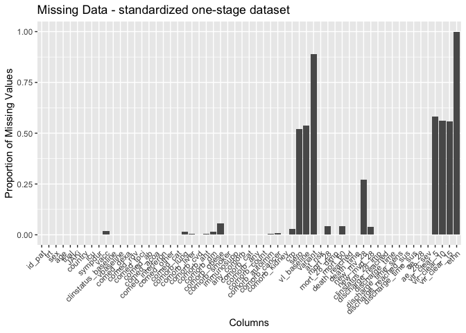
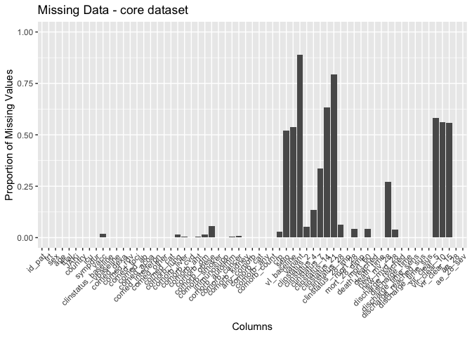
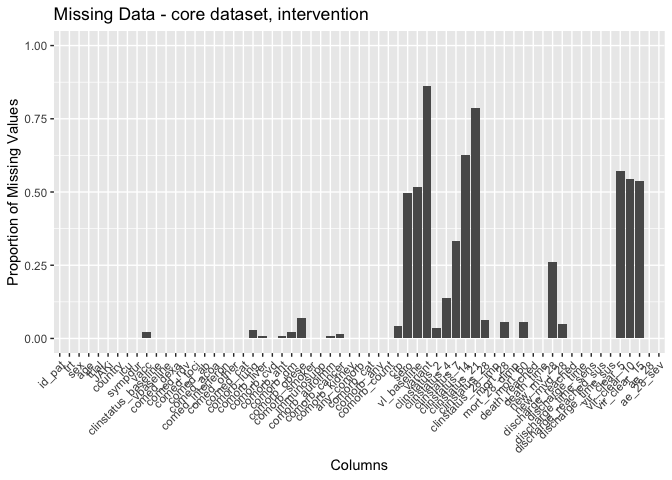
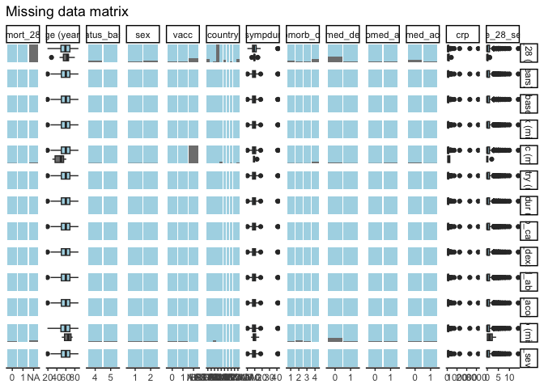
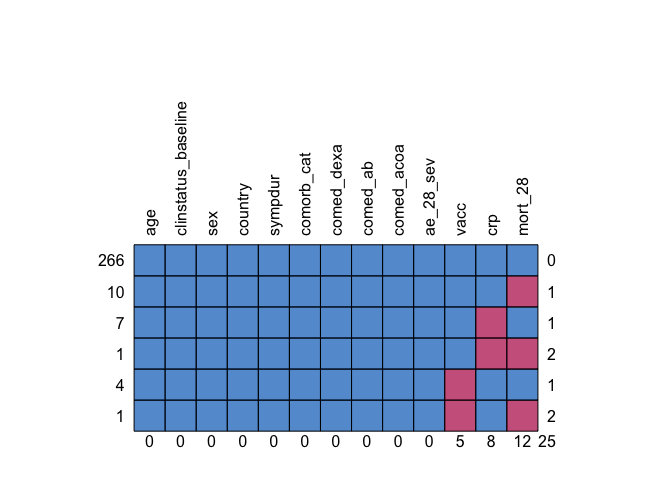
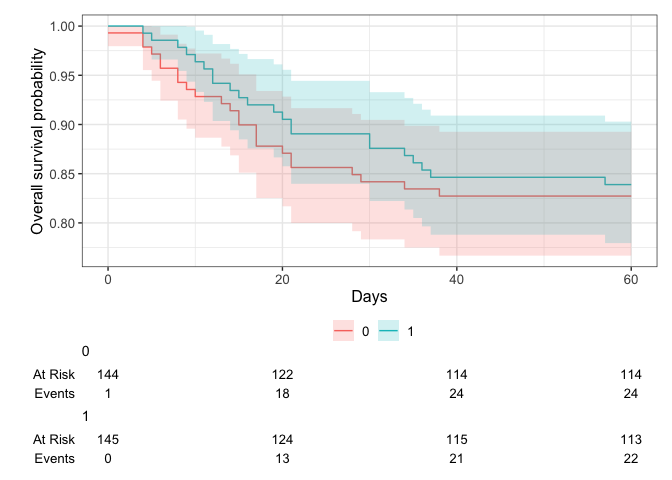

# Load packages

```r
library(tidyverse)
library(readxl)
library(writexl)
library(tableone)
library(haven) # Read sas files
library(here)
library(kableExtra)

library(jtools) # for summ() and plot_summs
library(sjPlot) # for tab_model
library(ggplot2) # survival/TTE analyses and other graphs
library(ggsurvfit) # survival/TTE analyses
library(survival) # survival/TTE analyses
library(gtsummary) # survival/TTE analyses
library(ggfortify) # autoplot
library(tidycmprsk) # competing risk analysis
library(ordinal) # clinstatus ordinal regression
library(logistf) # Firth regression in case of rare events

library(finalfit) # missing data exploration
library(mice) # multiple imputation
library(jomo) # multiple imputation
library(mitools) # multiple imputation
```

# Load Data


# Define ITT set

```r
# df <- df %>% 
#   filter(imp_adm_yn == 1)
```
Discussion points:
1. 9 participants (3 in int. / 6 in cont.) did not receive a single dose of baricitinib, or placebo, respectively. Main publication used mITT set excluding the 9, we use ITT set including them, to be consistent across trials.

# Baseline Characteristics

```r
df$trial <- c("Bari-Solidact")
df$JAKi <- c("Baricitinib")
df <- df %>% ## no missing data
  rename(id_pat = PARTICIPANT_ID,
         trt = arm,
         age = D1_AGE,
         randdate = RANDODATED1,
         sex = GENDER,
         country = COUNTRY,
         icu = ICU_YN)

df %>% 
  drop_na(age) %>% 
  ggplot(aes(x = age)) +
  geom_density(fill = "blue", color = "black") +
  labs(title = "Density Plot of Age",
       x = "Age",
       y = "Density")
```

<!-- -->

```r
# Days with symptoms prior to randomization
df <- df %>% ## table(df$sympdur, useNA = "always") / ## no missing data / equals delay_symprando
  mutate(sympdur = randdate - SCR_SYMPSTDATED1,
         sympdur = as.numeric(sympdur))
ggplot(df, aes(x = sympdur)) +
  geom_density(fill = "blue", color = "black") +
  labs(title = "Density Plot of Symptom Duration",
       x = "Symptom Duration",
       y = "Density")
```

<!-- -->

```r
# Severity of COVID-19 with respect to respiratory support at randomisation / Bari-Solidact used WHO score, transform
df <- df %>% ## no missing data // publication: 139 bari vs 136 placebo. In this dataset, slightly more (142 bari vs 138 placebo), due to additional randomized participants during extension of the trial
  mutate(clinstatus_baseline = case_when(whoscore_D1 == 0 | whoscore_D1 == 1 | whoscore_D1 == 3 ~ 1,
                                         whoscore_D1 == 4 ~ 2,
                                         whoscore_D1 == 5 ~ 3,
                                         whoscore_D1 == 6 ~ 4,
                                         whoscore_D1 == 7 | whoscore_D1 == 8 | whoscore_D1 == 9 ~ 5,
                                         whoscore_D1 == 10 ~ 6))
df$clinstatus_baseline <- factor(df$clinstatus_baseline, levels = 1:6) ## no missing data
addmargins(table(df$clinstatus_baseline, df$trt, useNA = "always"))
```

```
##       
##          0   1 <NA> Sum
##   1      0   0    0   0
##   2      0   0    0   0
##   3      0   0    0   0
##   4    122 127    0 249
##   5     22  18    0  40
##   6      0   0    0   0
##   <NA>   0   0    0   0
##   Sum  144 145    0 289
```

```r
df <- df %>% 
  mutate(vbaseline = case_when(clinstatus_baseline == "2" | clinstatus_baseline == "3" ~ 0,
                                clinstatus_baseline == "4" | clinstatus_baseline == "5" ~ 1))

# Co-medication at baseline
df <- df %>% 
  mutate(comed_dexa = case_when(corticoid_yn == 1 | dexa_yn == 1 ~ 1,
                                corticoid_yn == 0 & dexa_yn == 0 ~ 0))
df <- df %>% 
  rename(comed_rdv = remdes_yn,
         comed_toci = toci_yn,
         comed_ab = antibio_yn,
         comed_acoa = anticoag_yn)
df$comed_interferon <- 0 # no interferon used
df <- df %>% # no interferon used but monoclonal Abs and plasma -> other -> but there were no mAbs or plasma used
  mutate(comed_other = case_when(monocloAb_yn == 1 | immunplasma_yn == 1 ~ 1,
                                monocloAb_yn == 0 & immunplasma_yn == 0 ~ 0))
## group them for the subgroup analysis, according to protocol // tocilizumab as rescue medication - incorporate?
df <- df %>% 
  mutate(comed_cat = case_when(comed_dexa == 0 & comed_toci == 0 ~ 1, # patients without Dexamethasone nor Tocilizumab
                               comed_dexa == 1 & comed_toci == 0 ~ 2, # patients with Dexamethasone but no Tocilizumab
                               comed_dexa == 1 & comed_toci == 1 ~ 3, # patients with Dexamethasone and Tocilizumab
                               comed_dexa == 0 & comed_toci == 1 ~ 4)) # patients with Tocilizumab but no Dexamethasone (if exist)

# Comorbidity at baseline, including immunocompromised
df <- df %>% ## 4 missing
  mutate(comorb_lung = case_when(D1_PULMO_YNK == 1 ~ 1,
                                 D1_PULMO_YNK == 0 ~ 0))
df <- df %>% 
  mutate(comorb_liver = case_when(D1_LIVER_YNK == 1 ~ 1,
                                D1_LIVER_YNK == 0 ~ 0))
df <- df %>% ## no missing. D1_CARDIO_YNK includes all CVDs but also 2 HTA that do not have anything else -> take out.
  mutate(comorb_cvd = case_when(D1_CARDIO_YNK == 1 & (D1_CARDIO_SP != "HTA" & D1_CARDIO_SP != "HIGH BLOOD PRESSURE") ~ 1,
                                 D1_CARDIO_YNK == 0 | D1_CARDIO_SP == "HTA" | D1_CARDIO_SP == "HIGH BLOOD PRESSURE" ~ 0))
df <- df %>% ## 1 missing. The 2 HTA from above were already counted in.
  mutate(comorb_aht = case_when(D1_HBP_YNK == 1 | D1_CARDIO_SP == "HTA" | D1_CARDIO_SP == "HIGH BLOOD PRESSURE" ~ 1,
                                D1_HBP_YNK == 0 ~ 0))
df <- df %>% ## 4 missing. D1_DIABETE not needed, correct.
  mutate(comorb_dm = case_when(d1_diabete_ynk == 1 ~ 1,
                                d1_diabete_ynk == 0 ~ 0))
df <- df %>% ## 0 missing. BMI not needed, correct.
  mutate(comorb_obese = case_when(obesity == 1 ~ 1,
                                obesity == 0 ~ 0))
df <- df %>% ## 0 missing. D1_SMOKING not needed, correct.
  mutate(comorb_smoker = case_when(smoker == 1 ~ 1,
                                smoker == 0 ~ 0))
df <- df %>% ## 0 missing.
  mutate(immunosupp = case_when(immunodef_yn == 1 ~ 1,
                                immunodef_yn == 0 ~ 0))
df <- df %>% ## 2 missing.
  mutate(comorb_cancer = case_when(D1_CANCER_YNK == 1 ~ 1,
                                D1_CANCER_YNK == 0 ~ 0))
df <- df %>% ## 1 missing.
  mutate(comorb_autoimm = case_when(D1_AUTOIMMUN_YNK == 1 ~ 1,
                                D1_AUTOIMMUN_YNK == 0 ~ 0))
df <- df %>% ## 0 missing.
  mutate(comorb_kidney = case_when(D1_KIDNEY_YNK == 1 ~ 1,
                                D1_KIDNEY_YNK == 0 ~ 0))
df <- df %>% 
  mutate(any_comorb = case_when(comorb_lung == 1 | comorb_liver == 1 | comorb_cvd == 1 |
                                  comorb_aht == 1 | comorb_dm == 1 | comorb_obese == 1 | comorb_smoker == 1
                                | immunosupp == 1 | comorb_cancer == 1 | comorb_autoimm == 1 | comorb_kidney == 1 
                                  ~ 1,
                                comorb_lung == 0 & comorb_liver == 0 & comorb_cvd == 0 &
                                  comorb_aht == 0 & comorb_dm == 0 & comorb_obese == 0 & comorb_smoker == 0
                                & immunosupp == 0 & comorb_cancer == 0 & comorb_autoimm == 0 & comorb_kidney == 0
                                ~ 0))
# the remaining 10 missing have only NA in 1 comorb category => no evidence for comorbidity -> recode as 0
df <- df %>% 
  mutate(any_comorb = case_when(is.na(any_comorb) ~ 0,
                                TRUE ~ any_comorb))
## group them for the subgroup analysis, according to protocol // count all pre-defined comorbidities per patient first
comorb <- df %>% 
  select(id_pat, comorb_lung, comorb_liver, comorb_cvd, comorb_aht, comorb_dm, comorb_obese, comorb_smoker, immunosupp,
         comorb_cancer, comorb_autoimm, comorb_kidney)
comorb$comorb_count <- NA
for (i in 1:dim(comorb)[[1]]) {
  comorb$comorb_count[i] <- ifelse(
    sum(comorb[i, ] %in% c(1)) > 0,
    sum(comorb[i, ] %in% c(1)),
    NA
  )
}
comorb <- comorb %>% 
  mutate(comorb_count = case_when(comorb_lung == 0 & comorb_liver == 0 & comorb_cvd == 0 &
                                  comorb_aht == 0 & comorb_dm == 0 & comorb_obese == 0 & comorb_smoker == 0
                                & immunosupp == 0 & comorb_cancer == 0 & comorb_autoimm == 0 & comorb_kidney == 0 ~ 0,
                                TRUE ~ comorb_count))
# the remaining 11 missing have only NA in 1 comorb category => no evidence for comorbidity -> recode as 0
comorb <- comorb %>% 
  mutate(comorb_count = case_when(is.na(comorb_count) ~ 0,
                                TRUE ~ comorb_count))
df <- left_join(df, comorb[, c("comorb_count", "id_pat")], by = join_by(id_pat == id_pat)) ## merge imputed variable back
df <- df %>% 
  mutate(comorb_cat = case_when(immunosupp == 1 ~ 4, # immunocompromised
                                comorb_count == 0 ~ 1, # no comorbidity
                                comorb_count == 1 & (immunosupp == 0 | is.na(immunosupp)) ~ 2, # one comorbidity
                                comorb_count >1 & (immunosupp == 0 | is.na(immunosupp)) ~ 3)) # multiple comorbidities
df <- df %>%
  mutate(comorb_any = case_when(comorb_count == 0 ~ 0, # no comorbidity
                                comorb_count >0 ~ 1)) # any comorbidity
# CRP
df$crp <- as.numeric(df$lab_v_conv_crp_D1) ## 8 missing
df %>% 
  drop_na(crp) %>% 
  ggplot(aes(x = crp)) +
  geom_density(fill = "blue", color = "black") +
  labs(title = "Density Plot of CRP",
       x = "CRP",
       y = "Density")
```

<!-- -->

```r
# Vaccination
df <- df %>% ## 5 missing
  mutate(vacc = case_when(D1_VACCIN_YNK == 1 ~ 1,
                          D1_VACCIN_YNK == 0 ~ 0))

# Viremia // Viral load value <LOQ and/or undectectable
df$vl_baseline <- df$vloqundet_yn_D1

# Variant
df <- df %>% 
  mutate(variant = case_when(SCR_COVARIANT == 1 ~ "Delta",
                             SCR_COVARIANT == 2 ~ "Omicron",
                             SCR_COVARIANT == 50 ~ "PRESENCE OF MUTATIONS E484Q AND L452R"))

# Serology
df <- df %>% 
  mutate(sero = case_when(Anti_Spike_wt == "Positive" | Anti_Nucl_wt == "Positive" | anti_RBDwt == "Positive" ~ 1,
                             (Anti_Spike_wt == "Negative" | is.na(Anti_Spike_wt)) & (Anti_Nucl_wt == "Negative" | is.na(Anti_Nucl_wt)) & (anti_RBDwt == "Negative" | is.na(anti_RBDwt)) ~ 0))


# At risk for AEs with JAKi
df <- df %>%
  mutate(at_risk = case_when(age>=65 | comorb_cvd==1 | comorb_smoker==1 ~ 1, # at risk
                             TRUE ~ 0)) # not at risk
```
Discussion points BASELINE data:
1. Rescue therapy: Tocilizumab (n=12) or increased steroid dose (n=91): steroids_dosechang_yn, steroids_dosechang_date, rescue_yn, rescuedate -> when was rescue therapie given, in relation to clinstatus (vs those not receiving rescue)? -> investigate later

# Endpoints

```r
# time to event data
df$death_d <- as.numeric(df$deathdated1_DROP - df$randdate) 
df$discharge_d <- as.numeric(df$visitdated1_DISCH - df$randdate)
df$withdraw_d <- as.numeric(df$withdrawdated1_DROP - df$randdate)
df$withdrawi_d <- as.numeric(df$invdecisdated1_DROP - df$randdate)
# df$ltfu_d <- as.numeric(df$ltfudated1_DROP - df$randdate) ## there were no LTFU
df$readmission_d <- as.numeric(df$readmdate - df$randdate)
df$maxfup_d <- as.numeric(df$lastdate - df$randdate)

# transform all daily clinical scores
whoscore_transform <- function(df, clinstatus_var, whoscore_var) {
  df <- df %>%
    mutate({{ clinstatus_var }} :=
             case_when({{ whoscore_var }} %in% c(0, 1, 3) ~ 1,
                       {{ whoscore_var }} == 4 ~ 2,
                       {{ whoscore_var }} == 5 ~ 3,
                       {{ whoscore_var }} == 6 ~ 4,
                       {{ whoscore_var }} %in% c(7, 8, 9) ~ 5,
                       {{ whoscore_var }} == 10 ~ 6)) %>%
    mutate({{ clinstatus_var }} := factor({{ clinstatus_var }}, levels = 1:6))
}
df <- whoscore_transform(df, clinstatus_2, whoscore_D3) ## D1 was baseline => D3 is +2 days after baseline.
df <- whoscore_transform(df, clinstatus_4, whoscore_D5)
df <- whoscore_transform(df, clinstatus_7, whoscore_D8)
df <- whoscore_transform(df, clinstatus_14, whoscore_D15)
df <- whoscore_transform(df, clinstatus_21, whoscore_D22)
df <- whoscore_transform(df, clinstatus_28, whoscore_D29) 
df <- whoscore_transform(df, clinstatus_35, whoscore_D36)
df <- whoscore_transform(df, clinstatus_discharge, whoscore_DISCH)
df <- whoscore_transform(df, clinstatus_dropout, whoscore_DROP)

# (i) Primary outcome: Mortality at day 28
df <- df %>% # 12 have no outcome data and withdrew or were withdrawn, but have clinstatus_baseline and fup clinstatus data 
  mutate(mort_28 = case_when(death_d <29 ~ 1,
                             discharge_d <29 ~ 0, # all discharged were discharged alive and not to hospice
                             clinstatus_28 %in% c(2,3,4,5) ~ 0, # still at hospital but alive
                             discharge_d >28 ~ 0)) # discharged later, proof of still alive
# df %>%
#   select(mort_28, clinstatus_baseline, clinstatus_2, clinstatus_4, clinstatus_7, clinstatus_14, clinstatus_21, clinstatus_28, clinstatus_35) %>%
#   filter(is.na(mort_28)) %>%
#   View()

# First, keep mort_28 as complete case

# Second, use multiple imputation (see below)

# Third, apply a deterministic imputation (see notes): we use the same rules as ACTT2 => No transfer to hospice happened in bari-solidact -> assign "alive"
df <- df %>%
  mutate(mort_28_dimp = case_when(is.na(mort_28) ~ 0,
                             TRUE ~ c(mort_28)))


# (ii) Mortality at day 60
df <- df %>% # same 12 that have no outcome data and withdrew or were withdrawn -> see above
  mutate(mort_60 = case_when(death_d <61 ~ 1,
                             discharge_d <61 ~ 0, # all discharged were discharged alive and not to hospice
                             clinstatus_35 %in% c(2,3,4,5) ~ 0, # still at hospital but alive
                             discharge_d >60 ~ 0)) # discharged later, proof of still alive


# (iii) Time to death within max. follow-up time 
df$death_reached <- df$death_yn # do not bother about missings in mort_28
df <- df %>% # 2 are left without any time to event data => impute max. follow-up time
  mutate(death_time = case_when(death_d >=0 ~ c(death_d), # time to death, if no time to death, then...
                                discharge_d >=0 & (is.na(withdraw_d) | withdraw_d >28) & (is.na(withdrawi_d) | withdrawi_d >28) ~ 90, # max fup for all those who were discharged alive and not withdrawn before, then...
                                discharge_d >= withdraw_d ~ c(discharge_d), # time to discharge if this was greater than time to withdrawal
                                discharge_d >= withdrawi_d ~ c(discharge_d), # see above
                                maxfup_d >=0 & is.na(withdraw_d) & is.na(withdrawi_d) ~ c(maxfup_d), # max fup for the remaining ones not withdrawn
                                withdraw_d >=0 ~ c(withdraw_d), # time to withdrawal for those withdrawn (and not discharged before)
                                withdrawi_d >=0 ~ c(withdrawi_d))) # time to investigator withdrawal for those inv-withdrawn (and not discharged before)
table(df$death_reached, df$death_time, useNA = "always") # ignores the missing
```

```
##       
##          0   1   3   4   5   6   7   8   9  10  11  12  13  14  15  16  17  18
##   0      5   4   1   1   0   0   1   1   0   0   0   0   0   0   0   0   0   1
##   1      1   0   0   3   2   2   0   3   2   2   1   2   1   2   3   1   3   0
##   <NA>   0   0   0   0   0   0   0   0   0   0   0   0   0   0   0   0   0   0
##       
##         19  20  21  28  29  30  34  35  36  37  38  55  57  68  88  90 <NA>
##   0      0   1   0   0   0   0   0   0   0   0   0   1   0   0   1 225    0
##   1      1   2   4   1   1   2   2   1   1   1   1   0   1   1   0   0    0
##   <NA>   0   0   0   0   0   0   0   0   0   0   0   0   0   0   0   0    0
```

```r
table(df$mort_60, df$death_time, useNA = "always") # excludes the missing
```

```
##       
##          0   1   3   4   5   6   7   8   9  10  11  12  13  14  15  16  17  18
##   0      0   0   0   1   0   0   0   0   0   0   0   0   0   0   0   0   0   1
##   1      1   0   0   3   2   2   0   3   2   2   1   2   1   2   3   1   3   0
##   <NA>   5   4   1   0   0   0   1   1   0   0   0   0   0   0   0   0   0   0
##       
##         19  20  21  28  29  30  34  35  36  37  38  55  57  68  88  90 <NA>
##   0      0   1   0   0   0   0   0   0   0   0   0   1   0   1   1 225    0
##   1      1   2   4   1   1   2   2   1   1   1   1   0   1   0   0   0    0
##   <NA>   0   0   0   0   0   0   0   0   0   0   0   0   0   0   0   0    0
```

```r
df <- df %>% # Max fup time in Bari-Solidact was +/- 90 days, but we restrict it across studies to 60 days, according to protocol
  mutate(death_reached = case_when(death_time>60 ~ 0,
                                TRUE ~ death_reached))
df <- df %>% # Max fup time in Bari-Solidact was +/- 90 days, but we restrict it across studies to 60 days, according to protocol
  mutate(death_time = case_when(death_time>60 ~ 60,
                                TRUE ~ death_time))

# table(df$mort_28, useNA = "always") # correct
# table(df$mort_60, useNA = "always") # correct
# table(df$mort_60, df$mort_28, useNA = "always") # correct
# table(df$mort_60, df$death_reached, useNA = "always") # correct, death_reached has no NA, but mort_60 does
# table(df$death_reached, df$death_time, useNA = "always") # correct
# table(df$mort_60, df$death_time, useNA = "always") # correct


# (iv) New mechanical ventilation among survivors within 28 days. Bari-Solidact only included clinstatus 4 and 5.
df <- df %>% # The NAs are not eligible (died or clinstatus_baseline == 5) and thus are excluded from denominator
  mutate(new_mv_28 = case_when(clinstatus_baseline == 4 & (mort_28 == 0 | is.na(mort_28)) 
                               & (clinstatus_2 == 5 | clinstatus_4 == 5 | clinstatus_7 == 5 | clinstatus_14 == 5 
                                  | clinstatus_21 == 5 | clinstatus_28 == 5)
                               ~ 1,
                               clinstatus_baseline == 4 & mort_28 == 0
                               ~ 0))
# (iv) Alternative definition/analysis: New mechanical ventilation OR death within 28 days => include all in denominator.
df <- df %>% # no missing
  mutate(new_mvd_28 = case_when(new_mv_28 == 1 | mort_28 == 1 ~ 1,
                                new_mv_28 == 0 | mort_28 == 0 ~ 0))
# table(df$new_mvd_28, useNA = "always") # 11 missing


# (v) Clinical status at day 28
df <- df %>% # Adapt clinstatus_28, since currently excluding those discharged or died or missing data.
  mutate(clinstatus_28 = case_when(clinstatus_28 == 6 ~ 6,
                                   clinstatus_28 == 5 ~ 5,
                                   clinstatus_28 == 4 ~ 4,
                                   clinstatus_28 == 3 ~ 3,
                                   clinstatus_28 == 2 ~ 2,
                                   clinstatus_28 == 1 ~ 1,
                                   mort_28 == 1 ~ 6, # died within 28d
                                   discharge_d <29 ~ 1 # discharged alive / reached discharge criteria within 28d
                                   )) 
df$clinstatus_28 <- factor(df$clinstatus_28, levels = 1:6) # 18 missing -> for some I know they did not die, but I don't know exact clinicalstatus -> LOVCF
# table(df$clinstatus_28, useNA = "always")
# df %>%
#   select(mort_28, clinstatus_baseline, clinstatus_2, clinstatus_4, clinstatus_7, clinstatus_14, clinstatus_21, clinstatus_28, clinstatus_35) %>%
#   filter(is.na(clinstatus_28)) %>%
#   View()

## Imputation according to protocol: If there was daily data for the ordinal score available but with missing data for single days, then we carried last observed value forward unless for day 28, whereby we first considered data from the window (+/-3 days) -> no window data in Bari-Solidact => LVCF
dfcs <- df %>% 
    select(id_pat, clinstatus_baseline, clinstatus_2, clinstatus_4, clinstatus_7, clinstatus_14, clinstatus_21, clinstatus_28)
impute_last_forw = function(df){
  first = which(names(df)%in%c("clinstatus_baseline"))
  last = which(names(df)%in%c("clinstatus_28"))
  for (i in 1:dim(df)[[1]]){
    for (j in first[1]:last[1]){
      p = df[i, j]
      df[i,j] <- 
        ifelse(!is.na(df[i, j]), p, df[i, j-1])
    }
  }
  df
}
dfcs <- impute_last_forw(dfcs)
dfcs <- dfcs %>% # To control, don't overwrite
  rename(clinstatus_28_imp = clinstatus_28)
df <- left_join(df, dfcs[, c("clinstatus_28_imp", "id_pat")], by = join_by(id_pat == id_pat)) ## Merge imputed variable back // re-admissions already correctly incorporated
# table(df$clinstatus_28_imp, useNA = "always")

# (vi) Time to discharge or reaching discharge criteria up to day 28 // Patients who died prior to day 28 are assumed not having reached discharge, i.e. counted as 28 days. 
df <- df %>% 
  mutate(discharge_reached = case_when(discharge_d <29 ~ 1,
                                       TRUE ~ 0))
df <- df %>% # 2 are left without any time to event data => impute max. follow-up time
  mutate(discharge_time = case_when(discharge_d >=0 & (is.na(withdraw_d) | withdraw_d >28) & (is.na(withdrawi_d) | withdrawi_d >28) ~ c(discharge_d), # time to discharge in case no withdrawal or withdrawal after 28d. If no time to discharge, then...
                                    death_d >=0 ~ c(death_d), # time to death, then...
                                    discharge_d >= withdraw_d ~ c(discharge_d), # add time to discharge where time to discharge is after time to withdrawal 
                                    discharge_d >= withdrawi_d ~ c(discharge_d), # see above
                                    maxfup_d >=0 & is.na(withdraw_d) & is.na(withdrawi_d) ~ c(maxfup_d), # max fup for the remaining ones not withdrawn
                                withdraw_d >=0 ~ c(withdraw_d), # time to withdrawal for those withdrawn (and not discharged before)
                                withdrawi_d >=0 ~ c(withdrawi_d))) # time to investigator withdrawal for those inv-withdrawn (and not discharged before)
df <- df %>% # restrict to max fup time 28d
  mutate(discharge_time = case_when(discharge_time >28 ~ 28,
                                    TRUE ~ discharge_time))
df <- df %>% # add 28d for those that died - as a sens-variable
  mutate(discharge_time_sens = case_when(mort_28 == 1 ~ 28,
                                    TRUE ~ discharge_time))

# (vi) Sens-analysis: Alternative definition/analysis of outcome: time to sustained discharge within 28 days
df <- df %>% # there are 6 re-admissions: the one readmitted at day 16 was re-discharged before day ?28?. The ones at d21 & d27 not. And then there are 3 that were readmitted later than d28 => Reclassify d21 and d27 and add 28d, add d20 to the one re-admitted at d16.
  mutate(discharge_reached_sus = case_when(readmission_d == 21 | readmission_d == 27 ~ 0,
                                           TRUE ~ discharge_reached))
df <- df %>%
  mutate(discharge_time_sus = case_when(readmission_d == 16 ~ 20,
                                        readmission_d == 21 | readmission_d == 27 ~ 28,
                                        TRUE ~ discharge_time))


# (vii) Viral clearance up to day 5, day 10, and day 15 (Viral load value <LOQ and/or undectectable)
df$vir_clear_5 <- df$vloqundet_yn_D3
df <- df %>% 
  mutate(vir_clear_10 = case_when(vloqundet_yn_D8 == 1 ~ 1,
                                  vir_clear_5 == 1 & is.na(vloqundet_yn_D8) ~ 1,
                                  vloqundet_yn_D8 == 0 ~ 0,
                                  vir_clear_5 == 0 & is.na(vloqundet_yn_D8) ~ 0))
df <- df %>% 
  mutate(vir_clear_15 = case_when(vloqundet_yn_D15 == 1 ~ 1,
                                  vir_clear_10 == 1 & is.na(vloqundet_yn_D15) ~ 1,
                                  vloqundet_yn_D15 == 0 ~ 0,
                                  vir_clear_10 == 0 & is.na(vloqundet_yn_D15) ~ 0))


# (viii) Quality of life at day 28 // detailed measures available - wait for other trials first


# (ix) Participants with an adverse event grade 3 or 4, or a serious adverse event, excluding death, by day 28
# table(df_ae$AE_28) # any grade 3 or 4 or serious
df_ae34 <- df_ae %>% 
  rename(id_pat = PARTICIPANT_ID) %>% 
  filter(AE_28 == 1) # contains only grade 3 or 4
# Keep just 1 id_pat (-> ANY adverse event grade 3 (severe), 4 (serious)) 
df_ae34_unique <- df_ae34 %>% distinct(id_pat, .keep_all = TRUE)
# Assign the outcome
df_ae34_unique$ae_28 <- 1
# table(df_ae34_unique$ae_28)
# merge
df <- left_join(df, df_ae34_unique[, c("ae_28", "id_pat")], by = join_by(id_pat == id_pat)) ## merge variable to main df
# the remaining missing have no AE grade 34 -> recode as 0 and exclude deaths
df <- df %>% 
  mutate(ae_28 = case_when(is.na(ae_28) ~ 0, # the LTFU were discharged
                           mort_28 == 1 ~ NA, # exclude the deaths
                                TRUE ~ ae_28))
# table(df$ae_28, df$mort_28, useNA = "always")
# addmargins(table(df$ae_28, df$trt, useNA = "always"))

# (ix) Sens-analysis: Alternative definition/analysis of outcome: incidence rate ratio (Poisson regression) -> AE per person by d28
ae_npp <- df_ae %>%
  rename(id_pat = PARTICIPANT_ID) %>%
  filter(AE_28 == 1) %>% 
  group_by(id_pat)%>%  
  summarise(ae_28_sev = n())
df <- left_join(df, ae_npp[, c("ae_28_sev", "id_pat")], by = join_by(id_pat == id_pat)) # merge variable to main df
# the remaining missing have no AE grade 34 -> recode as 0 and exclude deaths
df <- df %>% 
  mutate(ae_28_sev = case_when(is.na(ae_28_sev) ~ 0, # the LTFU were discharged
                           mort_28 == 1 ~ NA, # exclude the deaths
                                TRUE ~ ae_28_sev))
# addmargins(table(df$ae_28_sev, df$trt, useNA = "always"))

# (x) Adverse events of special interest within 28 days: a) thromboembolic events (venous thromboembolism, pulmonary embolism, arterial thrombosis), b) secondary infections (bacterial pneumonia including ventilator-associated pneumonia, meningitis and encephalitis, endocarditis and bacteremia, invasive fungal infection including pulmonary aspergillosis), c) Reactivation of chronic infection including tuberculosis, herpes simplex, cytomegalovirus, herpes zoster and hepatitis B, d) serious cardiac events (excl. hypertension), e) events related to signs of bone marrow suppression (anemia, lymphocytopenia, thrombocytopenia, pancytopenia), f) malignancy, g) gastrointestinal perforation (incl. gastrointestinal bleeding/diverticulitis), h) liver dysfunction/hepatotoxicity (grade 3 and 4), i) Multiple organ dysfunction syndrome and septic shock

# a <- as.data.frame(unique(df_ae$MeddraPT)) # contains standardized categories
# unique(df_ae$MeddraLLT) 
# df_ae <- df_ae %>% 
#   mutate(dupl = duplicated(MeddraLLT, MeddraPT))
# df_ae %>% 
#   select(dupl, MeddraPT, MeddraLLT) %>% 
#   filter(dupl == F) %>% 
#   View() # does not contain more information

df_ae <- df_ae %>%
  rename(id_pat = PARTICIPANT_ID,
         trt = arm)
df_thrombo <- df_ae %>% # a) thromboembolic events (venous thromboembolism, pulmonary embolism, arterial thrombosis)
  filter(MeddraPT %in% c("Pulmonary embolism", "Cerebral infarction", "Vena cava thrombosis", "Deep vein thrombosis", "Catheter site thrombosis", "Peripheral artery thrombosis")) %>% 
  mutate(aesi = "thrombo")
df_sec_inf <- df_ae %>% # b) secondary infections (bacterial pneumonia including ventilator-associated pneumonia, meningitis and encephalitis, endocarditis and bacteremia, invasive fungal infection including pulmonary aspergillosis), but not COVID-19 pneumonia! First extract all infections, then reclassify.
  filter(MeddraPT %in% c("Pneumonia bacterial", "Pneumonia", # these are all ventilator-associated pneumonia not covid-19
                         "Septic arthritis staphylococcal", "Mediastinitis", "Pneumonitis", "Infectious pleural effusion",
                         "Superinfection bacterial", "Staphylococcal bacteraemia", "Bacterial infection", "Bacterial infection",
                         "Bacteraemia", "Fungaemia", "Disseminated aspergillosis", "URINARY TRACT INFECTION", "PYELONEPHRITIS", 
                         "Device related bacteraemia", "SEPSIS", "Sepis", "FUNGAL INFECTION", "ORAL CANDIDIASIS", 
                         "CANDIDA INFECTION","BRONCHOPULMONARY ASPERGILLOSIS", "VULVOVAGINAL MYCOTIC INFECTION", 
                         "FUNGAL SKIN INFECTION", "TOOTH INFECTION", "PAROTITIS", "CELLULITIS", "ORAL FUNGAL INFECTION",
                         "Bronchopulmonary aspergillosis", "Prostatitis Escherichia coli", "ABDOMINAL INFECTION", 
                         "Candida pneumonia", "PHLEBITIS", "CANDIDA PNEUMONIA", "BURSITIS", "CHOLECYSTITIS ACUTE")) %>% 
  mutate(aesi = "sec_inf")
df_reactivate <- df_ae %>% # c) Reactivation of chronic infection including tuberculosis, herpes simplex, cytomegalovirus, herpes zoster and hepatitis B.
  filter(MeddraPT %in% c("Herpes simplex reactivation", "Herpes simplex", "Cytomegalovirus infection reactivation", "Hepatitis B reactivation")) %>% 
  mutate(aesi = "reactivate")
df_cardiac <- df_ae %>% # d) serious cardiac events (excl. not hypertension)
  filter(MeddraPT %in% c("BRADYCARDIA", "Cardiac failure", "Bradycardia", "Acute myocardial infarction", 
                         "SUPRAVENTRICULAR TACHYCARDIA", "TACHYCARDIA", "VENTRICULAR EXTRASYSTOLES", "ATRIAL FIBRILLATION", 
                         "Acute coronary syndrome","Cardiac arrest", "SINUS ARRHYTHMIA")) %>% 
  mutate(aesi = "cardiac")
df_penia <- df_ae %>% # e) events related to signs of bone marrow suppression (anemia, lymphocytopenia, thrombocytopenia, pancytopenia)
  filter(MeddraPT %in% c("Anaemia", "LYMPHOCYTE COUNT DECREASED", "BLOOD CREATININE DECREASED", "THROMBOCYTOPENIA",
                         "LYMPHOPENIA", "LEUKOPENIA", "NEUTROPENIA", "Thrombocytopenia", "Bicytopenia")) %>% 
  mutate(aesi = "penia")
# df_malig <- NA
df_git_bl <- df_ae %>% # g) gastrointestinal perforation (incl. gastrointestinal bleeding/diverticulitis)
  filter(MeddraPT %in% c("Gastrointestinal haemorrhage", "Rectal haemorrhage", "ABDOMINAL WALL HAEMORRHAGE", "DIVERTICULUM GASTRIC")) %>% 
  mutate(aesi = "git_bl")
df_hepatox <- df_ae %>% # h) liver dysfunction/hepatotoxicity (grade 3 and 4)
  filter(MeddraPT %in% c("Hepatotoxicity", "Hepatocellular injury") |
           (MeddraPT %in% c("HEPATIC ENZYME INCREASED", "ALANINE AMINOTRANSFERASE INCREASED", "HYPERTRANSAMINASAEMIA",
                         "Alanine aminotransferase increased", "TRANSAMINASES INCREASED", "Transaminases increased",
                         "Aspartate aminotransferase increased", "Blood bilirubin increased") & 
              AE_28 == 1)) %>% # only grade 3 and 4 for the liver function tests
  mutate(aesi = "hepatox")
df_mods <- df_ae %>% # i) Multiple organ dysfunction syndrome and septic shock
  filter(MeddraPT %in% c("Multiple organ dysfunction syndrome", "Septic shock")) %>% 
  mutate(aesi = "mods")

df_aesi <- rbind(df_mods, df_hepatox, df_git_bl, df_penia, df_cardiac, df_reactivate, df_sec_inf, df_thrombo)
df_aesi <- df_aesi %>% rename(desc = MeddraPT)
df_aesi <- df_aesi %>%
  select(id_pat, trt, aesi, desc, STDATE, ENDATE, RANDODATED1, time_to_react) %>% 
  filter(time_to_react < 29)
table(df_aesi$trt, df_aesi$aesi)
```

```
##    
##     cardiac git_bl hepatox mods penia reactivate sec_inf thrombo
##   0       6      2      18    7    14          3      52      23
##   1       6      1      13    9     9          2      57      10
```

```r
# Save
saveRDS(df_aesi, file = "df_aesi_barisolidact.RData") # checked that there were no duplicates within the same person (but some IDs had several of the same AE)

# (xi) Adverse events, any grade and serious adverse event, excluding death, within 28 days, grouped by organ classes
df_ae <- df_ae %>%
  select(trt, MeddraLLT, MeddraPT, MeddraSOC, Grade, time_to_react) %>% 
  filter(time_to_react < 29)
# Save
saveRDS(df_ae, file = "df_ae_barisolidact.RData")
```
Discussion points OUTCOME data:
1. Re QoL: Wait for other trials first. Find out more about the QoL measure used.

# Define final datasets

```r
# keep the overall set
df_all <- df
# reduce the df set to our standardized set across all trials
df <- df_all %>% 
  select(id_pat, trt, sex, age, trial, JAKi, 
         # ethn, 
         country, 
         icu, 
         sympdur, 
         vacc, 
         clinstatus_baseline, vbaseline,
         comed_dexa, 
         comed_rdv, 
         comed_toci, comed_ab, comed_acoa, comed_interferon, comed_other,
         comed_cat,
         comorb_lung, comorb_liver, comorb_cvd, comorb_aht, comorb_dm, comorb_obese, comorb_smoker, immunosupp,
         any_comorb, comorb_cat, comorb_any, comorb_count,
         comorb_autoimm, comorb_cancer, comorb_kidney,
         crp, 
         sero, 
         vl_baseline, 
         variant, at_risk,
         mort_28, mort_28_dimp,
         mort_60, death_reached, death_time,
         new_mv_28, new_mvd_28,
         clinstatus_28_imp,
         discharge_reached, discharge_time, discharge_time_sens, discharge_reached_sus, discharge_time_sus,
         ae_28, ae_28_sev,
         vir_clear_5, vir_clear_10, vir_clear_15
         )

# export for one-stage model, i.e., add missing variables 
df_os <- df
df_os$ethn <- NA
# Save
saveRDS(df_os, file = "df_os_barisolidact.RData")
```

# Missing data plot: One-stage dataset

```r
# Bar plot, missing data, each data point, standardized one-stage dataset
original_order <- colnames(df_os)
missing_plot <- df_os %>%
  summarise_all(~ mean(is.na(.))) %>%
  gather() %>%
  mutate(key = factor(key, levels = original_order)) %>%
  ggplot(aes(x = key, y = value)) +
  geom_bar(stat = "identity") +
  labs(x = "Columns", y = "Proportion of Missing Values", title = "Missing Data - standardized one-stage dataset") +
  theme(axis.text.x = element_text(angle = 45, hjust = 1)) +
  ylim(0, 1)
print(missing_plot)
```

<!-- -->
Discussion points
1. Missing variables:
* Baseline:
  - Ethnicity: Only country of birth available
* Outcomes:
  - qol_28 (still working on it)
2. Missing data:
- vacc
- crp & vl_baseline & variant
- new_mv_28: not part of denominator
- viral load (baseline and outcome)

# Missing data: Explore for MI

```r
# keep the core df
df_core <- df_all %>%
    select(id_pat, trt, sex, age, trial, JAKi, 
           # ethn, 
         country, icu, sympdur, vacc, clinstatus_baseline, vbaseline,
         comed_dexa, comed_rdv, comed_toci, comed_ab, comed_acoa, comed_interferon, comed_other,
         comed_cat,
         comorb_lung, comorb_liver, comorb_cvd, comorb_aht, comorb_dm, comorb_obese, comorb_smoker, immunosupp,
         comorb_autoimm, comorb_cancer, comorb_kidney,
         any_comorb, comorb_cat, comorb_any, comorb_count,
         crp, 
         sero, vl_baseline, variant,
         clinstatus_2, clinstatus_4, clinstatus_7, clinstatus_14, clinstatus_21, clinstatus_28, 
         clinstatus_28_imp,
         mort_28, mort_28_dimp, mort_60, death_reached, death_time,
         new_mv_28, new_mvd_28,
         discharge_reached, discharge_time, discharge_time_sens, discharge_reached_sus, discharge_time_sus,
         vir_clear_5, vir_clear_10, vir_clear_15,
         ae_28, ae_28_sev
         )

# str(df_core)
# Convert character variables to factors
char_vars <- c("id_pat", "sex", "trial", "JAKi", "country", "icu", "vacc", "clinstatus_baseline", "vbaseline", 
               "comed_dexa", "comed_rdv", "comed_toci", "comed_ab", "comed_acoa", "comed_interferon", "comed_other", "comed_cat",
               "comorb_lung", "comorb_liver", "comorb_cvd", "comorb_aht", "comorb_dm", "comorb_obese", "comorb_smoker", "immunosupp", "any_comorb", "comorb_cat", "comorb_any", "comorb_autoimm","comorb_cancer", "comorb_kidney", "vl_baseline", "sero", "variant", "clinstatus_2", "clinstatus_4", "clinstatus_7", "clinstatus_14", "clinstatus_21", "clinstatus_28", "clinstatus_28_imp", "mort_28", "mort_28_dimp", "mort_60", "death_reached", "new_mv_28", "new_mvd_28","discharge_reached", "discharge_reached_sus", "ae_28", "vir_clear_5", "vir_clear_10", "vir_clear_15")
df_core <- df_core %>%
  mutate(across(all_of(char_vars), factor))

# Bar plot, missing data, each data point, core dataset
original_order <- colnames(df_core)
missing_plot <- df_core %>%
  summarise_all(~ mean(is.na(.))) %>%
  gather() %>%
  mutate(key = factor(key, levels = original_order)) %>%
  ggplot(aes(x = key, y = value)) +
  geom_bar(stat = "identity") +
  labs(x = "Columns", y = "Proportion of Missing Values", title = "Missing Data - core dataset") +
  theme(axis.text.x = element_text(angle = 45, hjust = 1)) +
  ylim(0, 1)
print(missing_plot)
```

<!-- -->

```r
# Bar plot, missing data, each data point, core dataset, by arm
df_core_int <- df_core %>% 
  filter(trt == 1)
original_order <- colnames(df_core_int)
missing_plot <- df_core_int %>% # Intervention arm
  summarise_all(~ mean(is.na(.))) %>%
  gather() %>%
  mutate(key = factor(key, levels = original_order)) %>%
  ggplot(aes(x = key, y = value)) +
  geom_bar(stat = "identity") +
  labs(x = "Columns", y = "Proportion of Missing Values", title = "Missing Data - core dataset, intervention") +
  theme(axis.text.x = element_text(angle = 45, hjust = 1)) +
  ylim(0, 1)
print(missing_plot)
```

<!-- -->

```r
df_core_cont <- df_core %>% 
  filter(trt == 0)
original_order <- colnames(df_core_cont)
missing_plot <- df_core_cont %>% # Control arm
  summarise_all(~ mean(is.na(.))) %>%
  gather() %>%
  mutate(key = factor(key, levels = original_order)) %>%
  ggplot(aes(x = key, y = value)) +
  geom_bar(stat = "identity") +
  labs(x = "Columns", y = "Proportion of Missing Values", title = "Missing Data - core dataset, control") +
  theme(axis.text.x = element_text(angle = 45, hjust = 1)) +
  ylim(0, 1)
print(missing_plot)
```

<!-- -->

```r
### Baseline table, by individuals with no missing data vs any missing data (or only in mort_28)
# df_core <- df_core %>% mutate(complete = ifelse(rowSums(is.na(.)) > 0, 0, 1));table(df_core$complete) # ANY missing 
df_core$resp<-ifelse(is.na(df_core$mort_28), 0, 1);table(df_core$resp) # only mort_28 missing 
```

```
## 
##   0   1 
##  12 277
```

```r
# Assign variable list
vars.list <- c("resp", "age", "sympdur"
               ,"trt", "sex", "country", "icu", "vacc", "clinstatus_baseline", "vbaseline", 
               "comed_dexa", "comed_rdv", "comed_toci", "comed_ab", "comed_acoa", "comed_interferon", "comed_other", "comed_cat",
               "comorb_lung", "comorb_liver", "comorb_cvd", "comorb_aht", "comorb_dm", "comorb_obese", "comorb_smoker", "immunosupp", "any_comorb", "comorb_cat", "comorb_any", "comorb_count","comorb_autoimm","comorb_cancer", "comorb_kidney", "crp", "vl_baseline", "sero"
               , "mort_28", "mort_28_dimp", "mort_60", "death_reached","death_time", "new_mv_28", "new_mvd_28","discharge_reached", "discharge_time", "discharge_reached_sus", "discharge_time_sus", "ae_28", "ae_28_sev", "vir_clear_5", "vir_clear_10", "vir_clear_15")

# By completeness (only mort_28)
table_resp <- CreateTableOne(data = df_core, vars = vars.list[!vars.list %in% c("resp")], strata = "resp", includeNA = T, test = T, addOverall = TRUE)
# Print and display the table
capture.output(
  table_resp <- print(
    table_resp, 
    nonnormal = vars.list, 
    catDigits = 1, 
    SMD = TRUE, 
    showAllLevels = TRUE, 
    test = TRUE, 
    printToggle = FALSE, 
    missing = TRUE))
```

```
## character(0)
```

```r
kable(table_resp, format = "markdown", table.attr = 'class="table"', caption = "By completeness (only mort_28)") %>%
  kable_styling(bootstrap_options = "striped", full_width = FALSE)
```


Table: By completeness (only mort_28)

|                                  |level      |Overall               |0                     |1                     |p      |test    |Missing |
|:---------------------------------|:----------|:---------------------|:---------------------|:---------------------|:------|:-------|:-------|
|n                                 |           |289                   |12                    |277                   |       |        |        |
|age (median [IQR])                |           |60.00 [50.00, 69.00]  |63.00 [54.50, 66.00]  |59.00 [49.00, 69.00]  |0.761  |nonnorm |0.0     |
|sympdur (median [IQR])            |           |9.00 [7.00, 11.00]    |9.50 [9.00, 10.00]    |9.00 [7.00, 12.00]    |0.636  |nonnorm |0.0     |
|trt (median [IQR])                |           |1.00 [0.00, 1.00]     |1.00 [0.00, 1.00]     |0.00 [0.00, 1.00]     |0.244  |nonnorm |0.0     |
|sex (%)                           |1          |218 ( 75.4)           |6 ( 50.0)             |212 ( 76.5)           |0.080  |        |0.0     |
|                                  |2          |71 ( 24.6)            |6 ( 50.0)             |65 ( 23.5)            |       |        |        |
|country (%)                       |AUSTRIA    |6 (  2.1)             |1 (  8.3)             |5 (  1.8)             |<0.001 |        |0.0     |
|                                  |BELGIUM    |10 (  3.5)            |0 (  0.0)             |10 (  3.6)            |       |        |        |
|                                  |FRANCE     |94 ( 32.5)            |3 ( 25.0)             |91 ( 32.9)            |       |        |        |
|                                  |GERMANY    |1 (  0.3)             |1 (  8.3)             |0 (  0.0)             |       |        |        |
|                                  |IRELAND    |9 (  3.1)             |0 (  0.0)             |9 (  3.2)             |       |        |        |
|                                  |ITALY      |25 (  8.7)            |3 ( 25.0)             |22 (  7.9)            |       |        |        |
|                                  |LUXEMBOURG |1 (  0.3)             |0 (  0.0)             |1 (  0.4)             |       |        |        |
|                                  |NORWAY     |127 ( 43.9)           |2 ( 16.7)             |125 ( 45.1)           |       |        |        |
|                                  |PORTUGAL   |3 (  1.0)             |0 (  0.0)             |3 (  1.1)             |       |        |        |
|                                  |SPAIN      |13 (  4.5)            |2 ( 16.7)             |11 (  4.0)            |       |        |        |
|icu (%)                           |0          |160 ( 55.4)           |5 ( 41.7)             |155 ( 56.0)           |0.498  |        |0.0     |
|                                  |1          |129 ( 44.6)           |7 ( 58.3)             |122 ( 44.0)           |       |        |        |
|vacc (%)                          |0          |182 ( 63.0)           |7 ( 58.3)             |175 ( 63.2)           |0.201  |        |1.7     |
|                                  |1          |102 ( 35.3)           |4 ( 33.3)             |98 ( 35.4)            |       |        |        |
|                                  |NA         |5 (  1.7)             |1 (  8.3)             |4 (  1.4)             |       |        |        |
|clinstatus_baseline (%)           |4          |249 ( 86.2)           |12 (100.0)            |237 ( 85.6)           |0.322  |        |0.0     |
|                                  |5          |40 ( 13.8)            |0 (  0.0)             |40 ( 14.4)            |       |        |        |
|vbaseline (%)                     |1          |289 (100.0)           |12 (100.0)            |277 (100.0)           |NA     |        |0.0     |
|comed_dexa (%)                    |0          |18 (  6.2)            |5 ( 41.7)             |13 (  4.7)            |<0.001 |        |0.0     |
|                                  |1          |271 ( 93.8)           |7 ( 58.3)             |264 ( 95.3)           |       |        |        |
|comed_rdv (%)                     |0          |281 ( 97.2)           |12 (100.0)            |269 ( 97.1)           |1.000  |        |0.0     |
|                                  |1          |8 (  2.8)             |0 (  0.0)             |8 (  2.9)             |       |        |        |
|comed_toci (%)                    |0          |288 ( 99.7)           |12 (100.0)            |276 ( 99.6)           |1.000  |        |0.0     |
|                                  |1          |1 (  0.3)             |0 (  0.0)             |1 (  0.4)             |       |        |        |
|comed_ab (%)                      |0          |233 ( 80.6)           |10 ( 83.3)            |223 ( 80.5)           |1.000  |        |0.0     |
|                                  |1          |56 ( 19.4)            |2 ( 16.7)             |54 ( 19.5)            |       |        |        |
|comed_acoa (%)                    |0          |30 ( 10.4)            |4 ( 33.3)             |26 (  9.4)            |0.029  |        |0.0     |
|                                  |1          |259 ( 89.6)           |8 ( 66.7)             |251 ( 90.6)           |       |        |        |
|comed_interferon (%)              |0          |289 (100.0)           |12 (100.0)            |277 (100.0)           |NA     |        |0.0     |
|comed_other (%)                   |0          |289 (100.0)           |12 (100.0)            |277 (100.0)           |NA     |        |0.0     |
|comed_cat (%)                     |1          |18 (  6.2)            |5 ( 41.7)             |13 (  4.7)            |<0.001 |        |0.0     |
|                                  |2          |270 ( 93.4)           |7 ( 58.3)             |263 ( 94.9)           |       |        |        |
|                                  |3          |1 (  0.3)             |0 (  0.0)             |1 (  0.4)             |       |        |        |
|comorb_lung (%)                   |0          |233 ( 80.6)           |11 ( 91.7)            |222 ( 80.1)           |0.603  |        |1.4     |
|                                  |1          |52 ( 18.0)            |1 (  8.3)             |51 ( 18.4)            |       |        |        |
|                                  |NA         |4 (  1.4)             |0 (  0.0)             |4 (  1.4)             |       |        |        |
|comorb_liver (%)                  |0          |282 ( 97.6)           |12 (100.0)            |270 ( 97.5)           |0.856  |        |0.3     |
|                                  |1          |6 (  2.1)             |0 (  0.0)             |6 (  2.2)             |       |        |        |
|                                  |NA         |1 (  0.3)             |0 (  0.0)             |1 (  0.4)             |       |        |        |
|comorb_cvd (%)                    |0          |234 ( 81.0)           |11 ( 91.7)            |223 ( 80.5)           |0.556  |        |0.0     |
|                                  |1          |55 ( 19.0)            |1 (  8.3)             |54 ( 19.5)            |       |        |        |
|comorb_aht (%)                    |0          |195 ( 67.5)           |8 ( 66.7)             |187 ( 67.5)           |0.975  |        |0.3     |
|                                  |1          |93 ( 32.2)            |4 ( 33.3)             |89 ( 32.1)            |       |        |        |
|                                  |NA         |1 (  0.3)             |0 (  0.0)             |1 (  0.4)             |       |        |        |
|comorb_dm (%)                     |0          |220 ( 76.1)           |10 ( 83.3)            |210 ( 75.8)           |0.799  |        |1.4     |
|                                  |1          |65 ( 22.5)            |2 ( 16.7)             |63 ( 22.7)            |       |        |        |
|                                  |NA         |4 (  1.4)             |0 (  0.0)             |4 (  1.4)             |       |        |        |
|comorb_obese (%)                  |0          |250 ( 86.5)           |11 ( 91.7)            |239 ( 86.3)           |0.693  |        |5.5     |
|                                  |1          |23 (  8.0)            |1 (  8.3)             |22 (  7.9)            |       |        |        |
|                                  |NA         |16 (  5.5)            |0 (  0.0)             |16 (  5.8)            |       |        |        |
|comorb_smoker (%)                 |0          |273 ( 94.5)           |12 (100.0)            |261 ( 94.2)           |0.832  |        |0.0     |
|                                  |1          |16 (  5.5)            |0 (  0.0)             |16 (  5.8)            |       |        |        |
|immunosupp (%)                    |0          |278 ( 96.2)           |10 ( 83.3)            |268 ( 96.8)           |0.108  |        |0.0     |
|                                  |1          |11 (  3.8)            |2 ( 16.7)             |9 (  3.2)             |       |        |        |
|any_comorb (%)                    |0          |106 ( 36.7)           |6 ( 50.0)             |100 ( 36.1)           |0.501  |        |0.0     |
|                                  |1          |183 ( 63.3)           |6 ( 50.0)             |177 ( 63.9)           |       |        |        |
|comorb_cat (%)                    |1          |106 ( 36.7)           |6 ( 50.0)             |100 ( 36.1)           |0.051  |        |0.0     |
|                                  |2          |73 ( 25.3)            |1 (  8.3)             |72 ( 26.0)            |       |        |        |
|                                  |3          |99 ( 34.3)            |3 ( 25.0)             |96 ( 34.7)            |       |        |        |
|                                  |4          |11 (  3.8)            |2 ( 16.7)             |9 (  3.2)             |       |        |        |
|comorb_any (%)                    |0          |106 ( 36.7)           |6 ( 50.0)             |100 ( 36.1)           |0.501  |        |0.0     |
|                                  |1          |183 ( 63.3)           |6 ( 50.0)             |177 ( 63.9)           |       |        |        |
|comorb_count (median [IQR])       |           |1.00 [0.00, 2.00]     |0.50 [0.00, 2.00]     |1.00 [0.00, 2.00]     |0.487  |nonnorm |0.0     |
|comorb_autoimm (%)                |0          |273 ( 94.5)           |12 (100.0)            |261 ( 94.2)           |0.693  |        |0.3     |
|                                  |1          |15 (  5.2)            |0 (  0.0)             |15 (  5.4)            |       |        |        |
|                                  |NA         |1 (  0.3)             |0 (  0.0)             |1 (  0.4)             |       |        |        |
|comorb_cancer (%)                 |0          |275 ( 95.2)           |11 ( 91.7)            |264 ( 95.3)           |0.730  |        |0.7     |
|                                  |1          |12 (  4.2)            |1 (  8.3)             |11 (  4.0)            |       |        |        |
|                                  |NA         |2 (  0.7)             |0 (  0.0)             |2 (  0.7)             |       |        |        |
|comorb_kidney (%)                 |0          |274 ( 94.8)           |12 (100.0)            |262 ( 94.6)           |0.870  |        |0.0     |
|                                  |1          |15 (  5.2)            |0 (  0.0)             |15 (  5.4)            |       |        |        |
|crp (median [IQR])                |           |89.00 [50.00, 142.00] |96.00 [72.95, 195.40] |88.50 [49.05, 140.00] |0.193  |nonnorm |2.8     |
|vl_baseline (%)                   |0          |116 ( 40.1)           |2 ( 16.7)             |114 ( 41.2)           |0.238  |        |53.6    |
|                                  |1          |18 (  6.2)            |1 (  8.3)             |17 (  6.1)            |       |        |        |
|                                  |NA         |155 ( 53.6)           |9 ( 75.0)             |146 ( 52.7)           |       |        |        |
|sero (%)                          |0          |7 (  2.4)             |0 (  0.0)             |7 (  2.5)             |0.251  |        |51.9    |
|                                  |1          |132 ( 45.7)           |3 ( 25.0)             |129 ( 46.6)           |       |        |        |
|                                  |NA         |150 ( 51.9)           |9 ( 75.0)             |141 ( 50.9)           |       |        |        |
|mort_28 (%)                       |0          |241 ( 83.4)           |0 (  0.0)             |241 ( 87.0)           |<0.001 |        |4.2     |
|                                  |1          |36 ( 12.5)            |0 (  0.0)             |36 ( 13.0)            |       |        |        |
|                                  |NA         |12 (  4.2)            |12 (100.0)            |0 (  0.0)             |       |        |        |
|mort_28_dimp (%)                  |0          |253 ( 87.5)           |12 (100.0)            |241 ( 87.0)           |0.374  |        |0.0     |
|                                  |1          |36 ( 12.5)            |0 (  0.0)             |36 ( 13.0)            |       |        |        |
|mort_60 (%)                       |0          |231 ( 79.9)           |0 (  0.0)             |231 ( 83.4)           |<0.001 |        |4.2     |
|                                  |1          |46 ( 15.9)            |0 (  0.0)             |46 ( 16.6)            |       |        |        |
|                                  |NA         |12 (  4.2)            |12 (100.0)            |0 (  0.0)             |       |        |        |
|death_reached (%)                 |0          |243 ( 84.1)           |12 (100.0)            |231 ( 83.4)           |0.256  |        |0.0     |
|                                  |1          |46 ( 15.9)            |0 (  0.0)             |46 ( 16.6)            |       |        |        |
|death_time (median [IQR])         |           |60.00 [60.00, 60.00]  |1.00 [0.00, 1.50]     |60.00 [60.00, 60.00]  |<0.001 |nonnorm |0.0     |
|new_mv_28 (%)                     |0          |174 ( 60.2)           |0 (  0.0)             |174 ( 62.8)           |<0.001 |        |27.0    |
|                                  |1          |37 ( 12.8)            |1 (  8.3)             |36 ( 13.0)            |       |        |        |
|                                  |NA         |78 ( 27.0)            |11 ( 91.7)            |67 ( 24.2)            |       |        |        |
|new_mvd_28 (%)                    |0          |205 ( 70.9)           |0 (  0.0)             |205 ( 74.0)           |<0.001 |        |3.8     |
|                                  |1          |73 ( 25.3)            |1 (  8.3)             |72 ( 26.0)            |       |        |        |
|                                  |NA         |11 (  3.8)            |11 ( 91.7)            |0 (  0.0)             |       |        |        |
|discharge_reached (%)             |0          |96 ( 33.2)            |12 (100.0)            |84 ( 30.3)            |<0.001 |        |0.0     |
|                                  |1          |193 ( 66.8)           |0 (  0.0)             |193 ( 69.7)           |       |        |        |
|discharge_time (median [IQR])     |           |10.00 [6.00, 20.00]   |1.00 [0.00, 1.50]     |11.00 [6.00, 20.00]   |<0.001 |nonnorm |0.0     |
|discharge_reached_sus (%)         |0          |98 ( 33.9)            |12 (100.0)            |86 ( 31.0)            |<0.001 |        |0.0     |
|                                  |1          |191 ( 66.1)           |0 (  0.0)             |191 ( 69.0)           |       |        |        |
|discharge_time_sus (median [IQR]) |           |10.00 [6.00, 20.00]   |1.00 [0.00, 1.50]     |11.00 [6.00, 20.00]   |<0.001 |nonnorm |0.0     |
|ae_28 (%)                         |0          |165 ( 57.1)           |9 ( 75.0)             |156 ( 56.3)           |0.303  |        |12.5    |
|                                  |1          |88 ( 30.4)            |3 ( 25.0)             |85 ( 30.7)            |       |        |        |
|                                  |NA         |36 ( 12.5)            |0 (  0.0)             |36 ( 13.0)            |       |        |        |
|ae_28_sev (median [IQR])          |           |0.00 [0.00, 1.00]     |0.00 [0.00, 0.25]     |0.00 [0.00, 1.00]     |0.322  |nonnorm |12.5    |
|vir_clear_5 (%)                   |0          |91 ( 31.5)            |1 (  8.3)             |90 ( 32.5)            |0.054  |        |58.1    |
|                                  |1          |30 ( 10.4)            |0 (  0.0)             |30 ( 10.8)            |       |        |        |
|                                  |NA         |168 ( 58.1)           |11 ( 91.7)            |157 ( 56.7)           |       |        |        |
|vir_clear_10 (%)                  |0          |69 ( 23.9)            |1 (  8.3)             |68 ( 24.5)            |0.037  |        |56.1    |
|                                  |1          |58 ( 20.1)            |0 (  0.0)             |58 ( 20.9)            |       |        |        |
|                                  |NA         |162 ( 56.1)           |11 ( 91.7)            |151 ( 54.5)           |       |        |        |
|vir_clear_15 (%)                  |0          |57 ( 19.7)            |1 (  8.3)             |56 ( 20.2)            |0.033  |        |55.7    |
|                                  |1          |71 ( 24.6)            |0 (  0.0)             |71 ( 25.6)            |       |        |        |
|                                  |NA         |161 ( 55.7)           |11 ( 91.7)            |150 ( 54.2)           |       |        |        |

```r
### Define variables to be included in imputation set
df_imp <- df_core %>% 
  select("id_pat"
         , "trt", "sex", "age" 
         # , "ethn"
         , "country", "sympdur" ,"vacc" 
         # , "trial", "JAKi"  # only 0
         ,"clinstatus_baseline"
         # , "vbaseline" # derived
         # , "comed_rdv" # no info
         # , "comed_toci", "comed_interferon" # no info
         #,  "comed_cat", # derived
         , "comed_dexa", "comed_ab", "comed_acoa"
         # , "comed_other" # no info
         # , "comorb_lung", "comorb_liver", "comorb_cvd", "comorb_aht", "comorb_dm", "comorb_obese",
         # "comorb_smoker", "immunosupp", "comorb_autoimm", "comorb_cancer", "comorb_kidney", "any_comorb",
         # "comorb_count",  
         # "comorb_any",
         ,"comorb_cat" # derived from above, contains most information, and needed as interaction term
         ,"crp"
         # , "vl_baseline", "sero" , "variant" # very little info
         ,"clinstatus_2", "clinstatus_4", "clinstatus_7", "clinstatus_14"
         ,"clinstatus_21", "clinstatus_28"
         # , "clinstatus_28_imp" # imputed via LOVCF above
         , "mort_28"
         # , "mort_28_dimp" # imputed deterministically
         # , "mort_60" # does not contain any additional information compared to death reached
         , "death_reached", "death_time", "new_mv_28", "new_mvd_28", "discharge_reached", "discharge_time"
         # , "discharge_reached_sus", "discharge_time_sus" # same as discharge, does not contain any addition information
         , "ae_28", "ae_28_sev", "vir_clear_5", "vir_clear_10", "vir_clear_15"
         )
         
# str(df_imp)

# First, table and visualize missing data in various ways
# df_imp %>% 
#   ff_glimpse() # from finalfit package
df_imp %>%
  missing_plot() # from finalfit package
```

<!-- -->

```r
explanatory = c("age", 
  "clinstatus_baseline", "sex",  
  "vacc", "country", "sympdur", "comorb_cat", "comed_dexa", "comed_ab", "comed_acoa", "crp", "ae_28_sev")
dependent = "mort_28"
df_imp %>% # from finalfit package, missing plot
  missing_pairs(dependent, explanatory, position = "fill", )
```

<!-- -->

```r
# Second, let's explore the missingness patterns
md.pattern(df_imp[,c("mort_28", "age", 
  "clinstatus_baseline", "sex",  
  "vacc", "country", "sympdur", "comorb_cat", "comed_dexa", "comed_ab", "comed_acoa", "crp", "ae_28_sev")], rotate.names = T)
```

<!-- -->

```
##     age clinstatus_baseline sex country sympdur comorb_cat comed_dexa comed_ab
## 230   1                   1   1       1       1          1          1        1
## 36    1                   1   1       1       1          1          1        1
## 10    1                   1   1       1       1          1          1        1
## 7     1                   1   1       1       1          1          1        1
## 1     1                   1   1       1       1          1          1        1
## 4     1                   1   1       1       1          1          1        1
## 1     1                   1   1       1       1          1          1        1
##       0                   0   0       0       0          0          0        0
##     comed_acoa vacc crp mort_28 ae_28_sev   
## 230          1    1   1       1         1  0
## 36           1    1   1       1         0  1
## 10           1    1   1       0         1  1
## 7            1    1   0       1         1  1
## 1            1    1   0       0         1  2
## 4            1    0   1       1         1  1
## 1            1    0   1       0         1  2
##              0    5   8      12        36 61
```

```r
# Third, let's explore if the variables from my substantive model plus auxiliary variables are associated with mort_28
mort28.aux <- glm(mort_28 ~ trt
            + age 
            + clinstatus_baseline
            + sex
            + vacc
            + country
            + sympdur
            + comorb_cat
            + comed_dexa
            + comed_ab
            + comed_acoa
            + crp
            # + ae_28_sev
            ,family="binomial"
            ,data=df_imp)
summary(mort28.aux)
```

```
## 
## Call:
## glm(formula = mort_28 ~ trt + age + clinstatus_baseline + sex + 
##     vacc + country + sympdur + comorb_cat + comed_dexa + comed_ab + 
##     comed_acoa + crp, family = "binomial", data = df_imp)
## 
## Deviance Residuals: 
##     Min       1Q   Median       3Q      Max  
## -1.8422  -0.4846  -0.2738  -0.1376   2.6262  
## 
## Coefficients:
##                        Estimate Std. Error z value Pr(>|z|)   
## (Intercept)          -2.278e+01  1.550e+03  -0.015  0.98827   
## trt                  -4.068e-01  4.275e-01  -0.952  0.34127   
## age                   7.155e-02  2.226e-02   3.215  0.00131 **
## clinstatus_baseline5  1.017e+00  5.445e-01   1.867  0.06190 . 
## sex2                 -7.511e-01  5.155e-01  -1.457  0.14515   
## vacc1                -1.761e-01  4.923e-01  -0.358  0.72056   
## countryBELGIUM        1.855e+01  1.550e+03   0.012  0.99045   
## countryFRANCE         1.680e+01  1.550e+03   0.011  0.99135   
## countryIRELAND        1.679e+01  1.550e+03   0.011  0.99136   
## countryITALY          1.626e+01  1.550e+03   0.010  0.99163   
## countryLUXEMBOURG     4.709e-01  4.249e+03   0.000  0.99991   
## countryNORWAY         1.634e+01  1.550e+03   0.011  0.99159   
## countryPORTUGAL       1.144e+00  2.685e+03   0.000  0.99966   
## countrySPAIN          1.640e+01  1.550e+03   0.011  0.99156   
## sympdur              -1.108e-01  6.599e-02  -1.679  0.09310 . 
## comorb_cat2           7.027e-01  7.116e-01   0.987  0.32342   
## comorb_cat3           8.461e-01  6.803e-01   1.244  0.21365   
## comorb_cat4           2.098e+00  1.068e+00   1.964  0.04959 * 
## comed_dexa1           5.763e-01  1.153e+00   0.500  0.61729   
## comed_ab1             9.689e-01  5.436e-01   1.782  0.07470 . 
## comed_acoa1          -5.675e-01  6.590e-01  -0.861  0.38918   
## crp                   2.046e-04  7.330e-04   0.279  0.78013   
## ---
## Signif. codes:  0 '***' 0.001 '**' 0.01 '*' 0.05 '.' 0.1 ' ' 1
## 
## (Dispersion parameter for binomial family taken to be 1)
## 
##     Null deviance: 210.89  on 265  degrees of freedom
## Residual deviance: 155.77  on 244  degrees of freedom
##   (23 observations deleted due to missingness)
## AIC: 199.77
## 
## Number of Fisher Scoring iterations: 16
```

```r
# Fourth, let's explore if they are associated with missingness of mort_28:
# df_imp$resp<-ifelse(is.na(df_imp$mort_28), 0, 1);table(df_imp$resp) # only mort_28 missing 
# mort28.aux.resp <- glm(resp ~ trt
#             + age 
#             + clinstatus_baseline
#             + sex
#             + ethn
#             + region
#             + sympdur
#             + comorb_cat
#             ,family="binomial"
#             ,data=df_imp)
# summary(mort28.aux.resp)
df_imp %>% 
  missing_compare(dependent, explanatory) %>%
    knitr::kable(row.names=FALSE, align = c("l", "l", "r", "r", "r"))
```

<table>
 <thead>
  <tr>
   <th style="text-align:left;"> Missing data analysis: mort_28 </th>
   <th style="text-align:left;">   </th>
   <th style="text-align:right;"> Not missing </th>
   <th style="text-align:right;"> Missing </th>
   <th style="text-align:right;"> p </th>
  </tr>
 </thead>
<tbody>
  <tr>
   <td style="text-align:left;"> Age (years) </td>
   <td style="text-align:left;"> Mean (SD) </td>
   <td style="text-align:right;"> 58.9 (13.2) </td>
   <td style="text-align:right;"> 59.3 (13.5) </td>
   <td style="text-align:right;"> 0.911 </td>
  </tr>
  <tr>
   <td style="text-align:left;"> clinstatus_baseline </td>
   <td style="text-align:left;"> 4 </td>
   <td style="text-align:right;"> 237 (95.2) </td>
   <td style="text-align:right;"> 12 (4.8) </td>
   <td style="text-align:right;"> 0.322 </td>
  </tr>
  <tr>
   <td style="text-align:left;">  </td>
   <td style="text-align:left;"> 5 </td>
   <td style="text-align:right;"> 40 (100.0) </td>
   <td style="text-align:right;"> 0 (0.0) </td>
   <td style="text-align:right;">  </td>
  </tr>
  <tr>
   <td style="text-align:left;"> sex </td>
   <td style="text-align:left;"> 1 </td>
   <td style="text-align:right;"> 212 (97.2) </td>
   <td style="text-align:right;"> 6 (2.8) </td>
   <td style="text-align:right;"> 0.080 </td>
  </tr>
  <tr>
   <td style="text-align:left;">  </td>
   <td style="text-align:left;"> 2 </td>
   <td style="text-align:right;"> 65 (91.5) </td>
   <td style="text-align:right;"> 6 (8.5) </td>
   <td style="text-align:right;">  </td>
  </tr>
  <tr>
   <td style="text-align:left;"> vacc </td>
   <td style="text-align:left;"> 0 </td>
   <td style="text-align:right;"> 175 (96.2) </td>
   <td style="text-align:right;"> 7 (3.8) </td>
   <td style="text-align:right;"> 1.000 </td>
  </tr>
  <tr>
   <td style="text-align:left;">  </td>
   <td style="text-align:left;"> 1 </td>
   <td style="text-align:right;"> 98 (96.1) </td>
   <td style="text-align:right;"> 4 (3.9) </td>
   <td style="text-align:right;">  </td>
  </tr>
  <tr>
   <td style="text-align:left;"> country </td>
   <td style="text-align:left;"> AUSTRIA </td>
   <td style="text-align:right;"> 5 (83.3) </td>
   <td style="text-align:right;"> 1 (16.7) </td>
   <td style="text-align:right;"> &lt;0.001 </td>
  </tr>
  <tr>
   <td style="text-align:left;">  </td>
   <td style="text-align:left;"> BELGIUM </td>
   <td style="text-align:right;"> 10 (100.0) </td>
   <td style="text-align:right;"> 0 (0.0) </td>
   <td style="text-align:right;">  </td>
  </tr>
  <tr>
   <td style="text-align:left;">  </td>
   <td style="text-align:left;"> FRANCE </td>
   <td style="text-align:right;"> 91 (96.8) </td>
   <td style="text-align:right;"> 3 (3.2) </td>
   <td style="text-align:right;">  </td>
  </tr>
  <tr>
   <td style="text-align:left;">  </td>
   <td style="text-align:left;"> GERMANY </td>
   <td style="text-align:right;"> 0 (0.0) </td>
   <td style="text-align:right;"> 1 (100.0) </td>
   <td style="text-align:right;">  </td>
  </tr>
  <tr>
   <td style="text-align:left;">  </td>
   <td style="text-align:left;"> IRELAND </td>
   <td style="text-align:right;"> 9 (100.0) </td>
   <td style="text-align:right;"> 0 (0.0) </td>
   <td style="text-align:right;">  </td>
  </tr>
  <tr>
   <td style="text-align:left;">  </td>
   <td style="text-align:left;"> ITALY </td>
   <td style="text-align:right;"> 22 (88.0) </td>
   <td style="text-align:right;"> 3 (12.0) </td>
   <td style="text-align:right;">  </td>
  </tr>
  <tr>
   <td style="text-align:left;">  </td>
   <td style="text-align:left;"> LUXEMBOURG </td>
   <td style="text-align:right;"> 1 (100.0) </td>
   <td style="text-align:right;"> 0 (0.0) </td>
   <td style="text-align:right;">  </td>
  </tr>
  <tr>
   <td style="text-align:left;">  </td>
   <td style="text-align:left;"> NORWAY </td>
   <td style="text-align:right;"> 125 (98.4) </td>
   <td style="text-align:right;"> 2 (1.6) </td>
   <td style="text-align:right;">  </td>
  </tr>
  <tr>
   <td style="text-align:left;">  </td>
   <td style="text-align:left;"> PORTUGAL </td>
   <td style="text-align:right;"> 3 (100.0) </td>
   <td style="text-align:right;"> 0 (0.0) </td>
   <td style="text-align:right;">  </td>
  </tr>
  <tr>
   <td style="text-align:left;">  </td>
   <td style="text-align:left;"> SPAIN </td>
   <td style="text-align:right;"> 11 (84.6) </td>
   <td style="text-align:right;"> 2 (15.4) </td>
   <td style="text-align:right;">  </td>
  </tr>
  <tr>
   <td style="text-align:left;"> sympdur </td>
   <td style="text-align:left;"> Mean (SD) </td>
   <td style="text-align:right;"> 9.5 (4.1) </td>
   <td style="text-align:right;"> 9.8 (2.2) </td>
   <td style="text-align:right;"> 0.751 </td>
  </tr>
  <tr>
   <td style="text-align:left;"> comorb_cat </td>
   <td style="text-align:left;"> 1 </td>
   <td style="text-align:right;"> 100 (94.3) </td>
   <td style="text-align:right;"> 6 (5.7) </td>
   <td style="text-align:right;"> 0.051 </td>
  </tr>
  <tr>
   <td style="text-align:left;">  </td>
   <td style="text-align:left;"> 2 </td>
   <td style="text-align:right;"> 72 (98.6) </td>
   <td style="text-align:right;"> 1 (1.4) </td>
   <td style="text-align:right;">  </td>
  </tr>
  <tr>
   <td style="text-align:left;">  </td>
   <td style="text-align:left;"> 3 </td>
   <td style="text-align:right;"> 96 (97.0) </td>
   <td style="text-align:right;"> 3 (3.0) </td>
   <td style="text-align:right;">  </td>
  </tr>
  <tr>
   <td style="text-align:left;">  </td>
   <td style="text-align:left;"> 4 </td>
   <td style="text-align:right;"> 9 (81.8) </td>
   <td style="text-align:right;"> 2 (18.2) </td>
   <td style="text-align:right;">  </td>
  </tr>
  <tr>
   <td style="text-align:left;"> comed_dexa </td>
   <td style="text-align:left;"> 0 </td>
   <td style="text-align:right;"> 13 (72.2) </td>
   <td style="text-align:right;"> 5 (27.8) </td>
   <td style="text-align:right;"> &lt;0.001 </td>
  </tr>
  <tr>
   <td style="text-align:left;">  </td>
   <td style="text-align:left;"> 1 </td>
   <td style="text-align:right;"> 264 (97.4) </td>
   <td style="text-align:right;"> 7 (2.6) </td>
   <td style="text-align:right;">  </td>
  </tr>
  <tr>
   <td style="text-align:left;"> comed_ab </td>
   <td style="text-align:left;"> 0 </td>
   <td style="text-align:right;"> 223 (95.7) </td>
   <td style="text-align:right;"> 10 (4.3) </td>
   <td style="text-align:right;"> 1.000 </td>
  </tr>
  <tr>
   <td style="text-align:left;">  </td>
   <td style="text-align:left;"> 1 </td>
   <td style="text-align:right;"> 54 (96.4) </td>
   <td style="text-align:right;"> 2 (3.6) </td>
   <td style="text-align:right;">  </td>
  </tr>
  <tr>
   <td style="text-align:left;"> comed_acoa </td>
   <td style="text-align:left;"> 0 </td>
   <td style="text-align:right;"> 26 (86.7) </td>
   <td style="text-align:right;"> 4 (13.3) </td>
   <td style="text-align:right;"> 0.029 </td>
  </tr>
  <tr>
   <td style="text-align:left;">  </td>
   <td style="text-align:left;"> 1 </td>
   <td style="text-align:right;"> 251 (96.9) </td>
   <td style="text-align:right;"> 8 (3.1) </td>
   <td style="text-align:right;">  </td>
  </tr>
  <tr>
   <td style="text-align:left;"> crp </td>
   <td style="text-align:left;"> Mean (SD) </td>
   <td style="text-align:right;"> 129.5 (255.7) </td>
   <td style="text-align:right;"> 148.3 (112.8) </td>
   <td style="text-align:right;"> 0.809 </td>
  </tr>
  <tr>
   <td style="text-align:left;"> ae_28_sev </td>
   <td style="text-align:left;"> Mean (SD) </td>
   <td style="text-align:right;"> 0.8 (1.5) </td>
   <td style="text-align:right;"> 0.2 (0.5) </td>
   <td style="text-align:right;"> 0.242 </td>
  </tr>
</tbody>
</table>

```r
# Fifth, check age
summary(df_imp$age)
```

```
##    Min. 1st Qu.  Median    Mean 3rd Qu.    Max. 
##   19.00   50.00   60.00   58.91   69.00   88.00
```

```r
hist(df_imp$age, breaks=50) # looks fine
```

<!-- -->

```r
# Sixth, check sympdur
summary(df_imp$sympdur)
```

```
##    Min. 1st Qu.  Median    Mean 3rd Qu.    Max. 
##   0.000   7.000   9.000   9.474  11.000  42.000
```

```r
hist(df_imp$sympdur, breaks=50) # skewed -> transform
```

<!-- -->

```r
df_imp$sqsympdur=sqrt(df_imp$sympdur)
hist(df_imp$sqsympdur) # looks fine
```

<!-- -->

```r
# Seventh, check crp
summary(df_imp$crp)
```

```
##    Min. 1st Qu.  Median    Mean 3rd Qu.    Max.    NA's 
##     4.2    50.0    89.0   130.3   142.0  3190.0       8
```

```r
hist(df_imp$crp, breaks=50) # outliers
```

<!-- -->

```r
df_imp <- df_imp %>% # truncate outliers > 500
  mutate(crptrunc = case_when(crp > 500 ~ 500,
                               TRUE ~ crp))
hist(df_imp$crptrunc)
```

<!-- -->

```r
df_imp$sqcrptrunc=sqrt(df_imp$crptrunc)
hist(df_imp$sqcrptrunc) # looks fine
```

<!-- -->

```r
### Reshape to long format
# names(df_imp)
# str(df_imp)
df_imp <- df_imp %>% # rename to differentiate between baseline clinical status and follow-up clinical statuses
  rename(clinicalstatus_baseline = clinstatus_baseline)
# reshape
df_imp_long <- df_imp %>% 
  pivot_longer(cols = starts_with("clinstatus"), names_to = "time", values_to = "clinstatus")
# names(df_imp_long)
# Convert time to numeric
df_imp_long$time <- as.numeric(gsub("clinstatus_", "", df_imp_long$time))
# class(df_imp_long$time)
# summary(df_imp_long$time)
# have clinstatus as numeric
class(df_imp_long$clinstatus)
```

```
## [1] "factor"
```

```r
# table(df_imp_long$clinstatus)
df_imp_long$clinstatus_f <- factor(df_imp_long$clinstatus, levels = 1:6)
df_imp_long$clinstatus_n <- as.numeric(df_imp_long$clinstatus_f)
# table(df_imp_long$clinstatus_n)

### We will impute separately by treatment arm, since we have to expect an effect modification between outcome x trt over time
df_imp_long_int <- df_imp_long %>% 
  filter(trt == 1)
df_imp_long_cont <- df_imp_long %>% 
  filter(trt == 0)

## Explore distribution of clinical status over time, by arm
plot_clinstat_int <- ggplot(df_imp_long_int, aes(x = time, y = clinstatus_n)) +
  stat_summary(fun = "mean", geom = "point", color = "blue", size = 3, na.rm = TRUE) +
  geom_smooth(method = "loess", se = FALSE, color = "red", na.rm = TRUE) +
  labs(title = "Distribution of Clinical Status Over Time / Intervention",
       x = "Time",
       y = "Mean Clinical Status") +
  theme_minimal()
print(plot_clinstat_int)
```

<!-- -->

```r
plot_clinstat_cont <- ggplot(df_imp_long_cont, aes(x = time, y = clinstatus_n)) +
  stat_summary(fun = "mean", geom = "point", color = "blue", size = 3, na.rm = TRUE) +
  geom_smooth(method = "loess", se = FALSE, color = "red", na.rm = TRUE) +
  labs(title = "Distribution of Clinical Status Over Time / Control",
       x = "Time",
       y = "Mean Clinical Status") +
  theme_minimal()
print(plot_clinstat_cont)
```

<!-- -->

# Multiple imputation

```r
#### INTERVENTION group
## jomo only accepts numeric or factors, check and adapt
# str(df_imp_long_int)
df_imp_long_int$timesq <- sqrt(df_imp_long_int$time) # see X below
attach(df_imp_long_int)
Y2<-data.frame(mort_28 # level 2 variables (baseline patient characteristics)
                 , age
                 , sex
                 , vacc
                 , country
                 , comed_dexa
                 , comed_ab
                 , comed_acoa
                 , comorb_cat
                 , sqsympdur
                 , sqcrptrunc
                 , ae_28_sev
                 )
Y<-data.frame(clinstatus_n) # level 1 variable within clustering variable
X <- cbind(1, data.frame(clinicalstatus_baseline, time, timesq)) # matrix modelling linearity of clinstatus throughout day 28
clus<-data.frame(id_pat) # clustering variable (patient)
Z<-data.frame(rep(1,dim(df_imp_long_int)[1]),df_imp_long_int[,c("time")]) # random intercept and random slope
colnames(Z)<-c("const", "time") 

nimp<-30 # set number of iterations

## run jomo
# dry run
imputed_int_mcmc<-jomo.MCMCchain(Y=Y, Y2=Y2, X=X, Z=Z, clus=clus, nburn=2)
# plot(c(1:2),imputed_int_mcmc$collectbeta[1,1,1:2],type="l")
# plot(c(1:2),imputed_int_mcmc$collectcovu[5,5,1:2],type="l")
set.seed(1569)
imputed_int <- jomo(Y=Y, Y2=Y2, X=X, Z=Z, clus=clus, nburn=1000, nbetween=1000, nimp=nimp)
# nburn<-1000
# imputed_int_mcmc<-jomo.MCMCchain(Y=Y, Y2=Y2, X=X, Z=Z, clus=clus, nburn=nburn)
# plot(c(1:nburn),imputed_int_mcmc$collectbeta[1,1,1:nburn],type="l")
# plot(c(1:nburn),imputed_int_mcmc$collectcovu[5,5,1:nburn],type="l")

# convert to jomo object, split imputations, and exclude original data (imputation "0")
imp.list_int <- imputationList(split(imputed_int, imputed_int$Imputation)[-1])

# checks
round(prop.table(table(imp.list_int[[1]]$`1`$mort_28, useNA = "always"))*100,1) # first imputed dataset
round(prop.table(table(imp.list_int[[1]]$`2`$mort_28, useNA = "always"))*100,1) # second imputed dataset
round(prop.table(table(df_imp_long_int$mort_28, useNA = "always"))*100,1) # original data
summary(imp.list_int[[1]]$`1`$comorb_cat)
summary(imp.list_int[[1]]$`2`$sqsympdur)
summary(imp.list_int[[1]]$`2`$sqcrptrunc)


#### CONTROL group
## jomo only accepts numeric or factors, check and adapt
# str(df_imp_long_cont)
df_imp_long_cont$timesq <- sqrt(df_imp_long_cont$time) # see X below
attach(df_imp_long_cont)
Y2<-data.frame(mort_28 # level 2 variables (baseline patient characteristics)
                 , age
                 , sex
                 , vacc
                 , country
                 , comed_dexa
                 , comed_ab
                 , comed_acoa
                 , comorb_cat
                 , sqsympdur
                 , sqcrptrunc
                 , ae_28_sev
                 )
Y<-data.frame(clinstatus_n) # level 1 variable within clustering variable
X <- cbind(1, data.frame(clinicalstatus_baseline, time, timesq)) # matrix modelling linearity of clinstatus throughout day 28
clus<-data.frame(id_pat) # clustering variable (patient)
Z<-data.frame(rep(1,dim(df_imp_long_cont)[1]),df_imp_long_cont[,c("time")]) # random intercept and random slope
colnames(Z)<-c("const", "time") 

nimp<-30 # set number of iterations

# run jomo
set.seed(1569)
imputed_cont <- jomo(Y=Y, Y2=Y2, X=X, Z=Z, clus=clus, nburn=1000, nbetween=1000, nimp=nimp)
# nburn<-1000
# imputed_cont_mcmc<-jomo.MCMCchain(Y=Y, Y2=Y2, X=X, Z=Z, clus=clus, nburn=nburn)
# plot(c(1:nburn),imputed_cont_mcmc$collectbeta[1,1,1:nburn],type="l")
# plot(c(1:nburn),imputed_cont_mcmc$collectcovu[5,5,1:nburn],type="l")

# convert to jomo object, split imputations, and exclude original data (imputation "0")
imp.list_cont <- imputationList(split(imputed_cont, imputed_cont$Imputation)[-1])

# checks
round(prop.table(table(imp.list_cont[[1]]$`1`$mort_28, useNA = "always"))*100,1) # first imputed dataset
round(prop.table(table(imp.list_cont[[1]]$`2`$mort_28, useNA = "always"))*100,1) # second imputed dataset
round(prop.table(table(df_imp_long_cont$mort_28, useNA = "always"))*100,1) # original data
summary(imp.list_cont[[1]]$`1`$comorb_cat)
summary(imp.list_cont[[1]]$`2`$sqsympdur)


#### Add trt back, change from long to wide format, and finally combine the two data frames
imputed_int$trt <- 1
imputed_int_s <- imputed_int %>% # remove imputation variables, not needed anymore
  select(trt, age, sex, vacc, country, comed_dexa, comed_ab, comed_acoa, comorb_cat, sqsympdur, sqcrptrunc, ae_28_sev, mort_28, clinicalstatus_baseline, clus, Imputation)
imputed_int_wide <- imputed_int_s %>% # change from long to wide format, i.e. remove duplicates within Imputation sets
  group_by(Imputation) %>%
  distinct(clus, .keep_all = TRUE) 

imputed_cont$trt <- 0 # treatment variable
imputed_cont_s <- imputed_cont %>% # remove imputation variables, not needed anymore
  select(trt, age, sex, vacc, country, comed_dexa, comed_ab, comed_acoa, comorb_cat, sqsympdur, sqcrptrunc, ae_28_sev, mort_28, clinicalstatus_baseline, clus, Imputation)
imputed_cont_wide <- imputed_cont_s %>% # change from long to wide format, i.e. remove duplicates within Imputation sets
  group_by(Imputation) %>%
  distinct(clus, .keep_all = TRUE) 

imputed_combined <- rbind(imputed_cont_wide, imputed_int_wide)


#### Convert combined df to jomo object, split imputations, and exclude original data (imputation "0")
imp.list <- imputationList(split(imputed_combined, imputed_combined$Imputation)[-1])


### Checks
round(prop.table(table(imp.list[[1]]$`1`$mort_28, imp.list[[1]]$`1`$trt, useNA = "always"),2)*100,1) # first imputed dataset
round(prop.table(table(imp.list[[1]]$`2`$mort_28, imp.list[[1]]$`2`$trt, useNA = "always"),2)*100,1) # second imputed dataset
round(prop.table(table(df_imp$mort_28, df_imp$trt, useNA = "always"),2)*100,1) # original data
summary(imp.list[[1]]$`1`$comorb_cat)
summary(imp.list[[1]]$`2`$sqsympdur)
```

# (i) Primary endpoint: Mortality at day 28

```r
addmargins(table(df$mort_28, df$trt, useNA = "always"))
```

```
##       
##          0   1 <NA> Sum
##   0    119 122    0 241
##   1     21  15    0  36
##   <NA>   4   8    0  12
##   Sum  144 145    0 289
```

```r
addmargins(table(df$mort_28_dimp, df$trt, useNA = "always"))
```

```
##       
##          0   1 <NA> Sum
##   0    123 130    0 253
##   1     21  15    0  36
##   <NA>   0   0    0   0
##   Sum  144 145    0 289
```

```r
df$clinstatus_baseline_n <- as.numeric(df$clinstatus_baseline)

# Complete case analysis, substantive model
mort.28 <- df %>% 
  glm(mort_28 ~ trt 
      + age + clinstatus_baseline
      , family = "binomial", data=.)
summ(mort.28, exp = T, confint = T, model.info = T, model.fit = F, digits = 2)
```

<table class="table table-striped table-hover table-condensed table-responsive" style="width: auto !important; margin-left: auto; margin-right: auto;">
<tbody>
  <tr>
   <td style="text-align:left;font-weight: bold;"> Observations </td>
   <td style="text-align:right;"> 277 (12 missing obs. deleted) </td>
  </tr>
  <tr>
   <td style="text-align:left;font-weight: bold;"> Dependent variable </td>
   <td style="text-align:right;"> mort_28 </td>
  </tr>
  <tr>
   <td style="text-align:left;font-weight: bold;"> Type </td>
   <td style="text-align:right;"> Generalized linear model </td>
  </tr>
  <tr>
   <td style="text-align:left;font-weight: bold;"> Family </td>
   <td style="text-align:right;"> binomial </td>
  </tr>
  <tr>
   <td style="text-align:left;font-weight: bold;"> Link </td>
   <td style="text-align:right;"> logit </td>
  </tr>
</tbody>
</table>  <table class="table table-striped table-hover table-condensed table-responsive" style="width: auto !important; margin-left: auto; margin-right: auto;border-bottom: 0;">
 <thead>
  <tr>
   <th style="text-align:left;">   </th>
   <th style="text-align:right;"> exp(Est.) </th>
   <th style="text-align:right;"> 2.5% </th>
   <th style="text-align:right;"> 97.5% </th>
   <th style="text-align:right;"> z val. </th>
   <th style="text-align:right;"> p </th>
  </tr>
 </thead>
<tbody>
  <tr>
   <td style="text-align:left;font-weight: bold;"> (Intercept) </td>
   <td style="text-align:right;"> 0.00 </td>
   <td style="text-align:right;"> 0.00 </td>
   <td style="text-align:right;"> 0.01 </td>
   <td style="text-align:right;"> -5.85 </td>
   <td style="text-align:right;"> 0.00 </td>
  </tr>
  <tr>
   <td style="text-align:left;font-weight: bold;"> trt </td>
   <td style="text-align:right;"> 0.66 </td>
   <td style="text-align:right;"> 0.31 </td>
   <td style="text-align:right;"> 1.41 </td>
   <td style="text-align:right;"> -1.08 </td>
   <td style="text-align:right;"> 0.28 </td>
  </tr>
  <tr>
   <td style="text-align:left;font-weight: bold;"> age </td>
   <td style="text-align:right;"> 1.09 </td>
   <td style="text-align:right;"> 1.05 </td>
   <td style="text-align:right;"> 1.13 </td>
   <td style="text-align:right;"> 4.78 </td>
   <td style="text-align:right;"> 0.00 </td>
  </tr>
  <tr>
   <td style="text-align:left;font-weight: bold;"> clinstatus_baseline5 </td>
   <td style="text-align:right;"> 2.42 </td>
   <td style="text-align:right;"> 0.97 </td>
   <td style="text-align:right;"> 6.06 </td>
   <td style="text-align:right;"> 1.89 </td>
   <td style="text-align:right;"> 0.06 </td>
  </tr>
</tbody>
<tfoot><tr><td style="padding: 0; " colspan="100%">
<sup></sup> Standard errors: MLE</td></tr></tfoot>
</table>

```r
# Deterministic imputation
mort.28.dimp <- df %>% 
  glm(mort_28_dimp ~ trt 
      + age + clinstatus_baseline
      , family = "binomial", data=.)
summ(mort.28.dimp, exp = T, confint = T, model.info = T, model.fit = F, digits = 2)
```

<table class="table table-striped table-hover table-condensed table-responsive" style="width: auto !important; margin-left: auto; margin-right: auto;">
<tbody>
  <tr>
   <td style="text-align:left;font-weight: bold;"> Observations </td>
   <td style="text-align:right;"> 289 </td>
  </tr>
  <tr>
   <td style="text-align:left;font-weight: bold;"> Dependent variable </td>
   <td style="text-align:right;"> mort_28_dimp </td>
  </tr>
  <tr>
   <td style="text-align:left;font-weight: bold;"> Type </td>
   <td style="text-align:right;"> Generalized linear model </td>
  </tr>
  <tr>
   <td style="text-align:left;font-weight: bold;"> Family </td>
   <td style="text-align:right;"> binomial </td>
  </tr>
  <tr>
   <td style="text-align:left;font-weight: bold;"> Link </td>
   <td style="text-align:right;"> logit </td>
  </tr>
</tbody>
</table>  <table class="table table-striped table-hover table-condensed table-responsive" style="width: auto !important; margin-left: auto; margin-right: auto;border-bottom: 0;">
 <thead>
  <tr>
   <th style="text-align:left;">   </th>
   <th style="text-align:right;"> exp(Est.) </th>
   <th style="text-align:right;"> 2.5% </th>
   <th style="text-align:right;"> 97.5% </th>
   <th style="text-align:right;"> z val. </th>
   <th style="text-align:right;"> p </th>
  </tr>
 </thead>
<tbody>
  <tr>
   <td style="text-align:left;font-weight: bold;"> (Intercept) </td>
   <td style="text-align:right;"> 0.00 </td>
   <td style="text-align:right;"> 0.00 </td>
   <td style="text-align:right;"> 0.01 </td>
   <td style="text-align:right;"> -5.88 </td>
   <td style="text-align:right;"> 0.00 </td>
  </tr>
  <tr>
   <td style="text-align:left;font-weight: bold;"> trt </td>
   <td style="text-align:right;"> 0.64 </td>
   <td style="text-align:right;"> 0.30 </td>
   <td style="text-align:right;"> 1.37 </td>
   <td style="text-align:right;"> -1.15 </td>
   <td style="text-align:right;"> 0.25 </td>
  </tr>
  <tr>
   <td style="text-align:left;font-weight: bold;"> age </td>
   <td style="text-align:right;"> 1.09 </td>
   <td style="text-align:right;"> 1.05 </td>
   <td style="text-align:right;"> 1.13 </td>
   <td style="text-align:right;"> 4.78 </td>
   <td style="text-align:right;"> 0.00 </td>
  </tr>
  <tr>
   <td style="text-align:left;font-weight: bold;"> clinstatus_baseline5 </td>
   <td style="text-align:right;"> 2.57 </td>
   <td style="text-align:right;"> 1.03 </td>
   <td style="text-align:right;"> 6.42 </td>
   <td style="text-align:right;"> 2.02 </td>
   <td style="text-align:right;"> 0.04 </td>
  </tr>
</tbody>
<tfoot><tr><td style="padding: 0; " colspan="100%">
<sup></sup> Standard errors: MLE</td></tr></tfoot>
</table>

```r
# Multiple imputation analysis under MAR; use mitools package to fit imputed and combined data list and apply Rubin's rules
# mort.28.mi <- imp.list %>%
#   with(glm(mort_28 ~ trt
#            + age
#            + clinicalstatus_baseline
#            , family = binomial)) %>%
#         pool() %>%
#         summary(conf.int = T, exponentiate = T)
# mort.28.mi
```

# (i.i) Covariate adjustment for primary endpoint: Mortality at day 28

```r
# unadjusted estimator for the (absolute) risk difference
mort.28.prop.test <- prop.test(x = with(df, table(trt, mort_28)))
# print(mort.28.prop.test)
# Estimate
-diff(mort.28.prop.test$estimate)
```

```
##      prop 2 
## -0.04051095
```

```r
# Confidence Interval
mort.28.prop.test$conf.int
```

```
## [1] -0.1266775  0.0456556
## attr(,"conf.level")
## [1] 0.95
```

```r
# P-Value
mort.28.prop.test$p.value
```

```
## [1] 0.4100587
```

```r
# Covariate-Adjusted Analysis
# Fit the `glm` object
# Same as Complete case analysis, substantive model // but don't use piping, otherwise problem in margins::margins
df_mort28_comp <- df %>% filter(!is.na(mort_28))
mort.28.cov.adj <-
  glm(formula = mort_28 ~ trt + age + clinstatus_baseline,
      data = df_mort28_comp,
      family = binomial(link = "logit")
      )
# Print a summary of the `glm` object
summary(mort.28.cov.adj)
```

```
## 
## Call:
## glm(formula = mort_28 ~ trt + age + clinstatus_baseline, family = binomial(link = "logit"), 
##     data = df_mort28_comp)
## 
## Deviance Residuals: 
##     Min       1Q   Median       3Q      Max  
## -1.4227  -0.5604  -0.3521  -0.1911   2.5776  
## 
## Coefficients:
##                      Estimate Std. Error z value Pr(>|z|)    
## (Intercept)          -7.54770    1.29032  -5.849 4.93e-09 ***
## trt                  -0.41959    0.38880  -1.079   0.2805    
## age                   0.08886    0.01860   4.778 1.77e-06 ***
## clinstatus_baseline5  0.88579    0.46744   1.895   0.0581 .  
## ---
## Signif. codes:  0 '***' 0.001 '**' 0.01 '*' 0.05 '.' 0.1 ' ' 1
## 
## (Dispersion parameter for binomial family taken to be 1)
## 
##     Null deviance: 214.02  on 276  degrees of freedom
## Residual deviance: 180.14  on 273  degrees of freedom
## AIC: 188.14
## 
## Number of Fisher Scoring iterations: 6
```

```r
# Predict Pr{Y = 1 | Z = 1, X} // equals: E(Y|Z=1,X)
pr_y1_z1 <-
  predict(
    object = mort.28.cov.adj,
    newdata =
      df_mort28_comp %>%
      dplyr::mutate(
        trt = 1
      ),
    type = "response"
  )
# Predict Pr{Y = 1 | Z = 0, X} // equals: E(Y|Z=0,X)
pr_y1_z0 <-
  predict(
    object = mort.28.cov.adj,
    newdata =
      df_mort28_comp %>%
      dplyr::mutate(
        trt = 0
      ),
    type = "response"
  )

# Estimate RD
adj_mean = mean(pr_y1_z1) - mean(pr_y1_z0)
print(adj_mean)
```

```
## [1] -0.04091913
```

```r
# Standard Error RD
# The variance/standard error can be calculted as 1/n times the sample variance of:
# Z/P(Z=1)*[Y-E(Y|Z=1,X)] + E(Y|Z=1,X) - ((1-Z)/(1-P(1=Z))*[Y-E(Y|Z=0,X)] + E(Y|Z=0,X))
p_arm = mean(df_mort28_comp$trt==1)
adj_se = sqrt(
  var((df_mort28_comp$trt==1)/p_arm * (df_mort28_comp$mort_28 - pr_y1_z1) + pr_y1_z1 -
      ((df_mort28_comp$trt==0)/(1-p_arm) * (df_mort28_comp$mort_28-pr_y1_z0) + pr_y1_z0))/
    nrow(df_mort28_comp))
print(adj_se)
```

```
## [1] 0.03785465
```

```r
# Confidence Interval
c(adj_mean-qnorm(0.975)*adj_se, adj_mean+qnorm(0.975)*adj_se)
```

```
## [1] -0.11511287  0.03327462
```

```r
# Or, we can obtain the standard error of the estimate two ways. The first way is using the margins::margins() command, using the robust standard errors from sandwich::vcovHC // The second way to obtain these would be the bias corrected and accelerated (BCa) non-parametric bootstrap
# Youll see that we now have a standard error, p-value under the hypothesis that the marginal effect is 0, and a 95% Confidence Interval for the estimate. 

library(sandwich)
library(margins)
mort.28.cov.adj.ame <-
  margins::margins(
    model = mort.28.cov.adj,
    # Specify treatment variable
    variables = "trt",
    # Convert to outcome scale, not link scale
    type = "response",
    # Obtain robust standard errors
    vcov = sandwich::vcovHC(x = mort.28.cov.adj, type = "HC3")
  )
summary(object = mort.28.cov.adj.ame, level = 0.95)
```

```
##  factor     AME     SE       z      p   lower  upper
##     trt -0.0411 0.0387 -1.0621 0.2882 -0.1170 0.0348
```

```r
mort.28.ame <- summary(object = mort.28.cov.adj.ame, level = 0.95)
```

# (ii) Mortality at day 60

```r
table(df$mort_60, df$trt, useNA = "always")
```

```
##       
##          0   1 <NA>
##   0    116 115    0
##   1     24  22    0
##   <NA>   4   8    0
```

```r
mort.60 <- df %>% 
  glm(mort_60 ~ trt 
      + age + clinstatus_baseline
      , family = "binomial", data=.)
summ(mort.60, exp = T, confint = T, model.info = T, model.fit = F, digits = 2)
```

<table class="table table-striped table-hover table-condensed table-responsive" style="width: auto !important; margin-left: auto; margin-right: auto;">
<tbody>
  <tr>
   <td style="text-align:left;font-weight: bold;"> Observations </td>
   <td style="text-align:right;"> 277 (12 missing obs. deleted) </td>
  </tr>
  <tr>
   <td style="text-align:left;font-weight: bold;"> Dependent variable </td>
   <td style="text-align:right;"> mort_60 </td>
  </tr>
  <tr>
   <td style="text-align:left;font-weight: bold;"> Type </td>
   <td style="text-align:right;"> Generalized linear model </td>
  </tr>
  <tr>
   <td style="text-align:left;font-weight: bold;"> Family </td>
   <td style="text-align:right;"> binomial </td>
  </tr>
  <tr>
   <td style="text-align:left;font-weight: bold;"> Link </td>
   <td style="text-align:right;"> logit </td>
  </tr>
</tbody>
</table>  <table class="table table-striped table-hover table-condensed table-responsive" style="width: auto !important; margin-left: auto; margin-right: auto;border-bottom: 0;">
 <thead>
  <tr>
   <th style="text-align:left;">   </th>
   <th style="text-align:right;"> exp(Est.) </th>
   <th style="text-align:right;"> 2.5% </th>
   <th style="text-align:right;"> 97.5% </th>
   <th style="text-align:right;"> z val. </th>
   <th style="text-align:right;"> p </th>
  </tr>
 </thead>
<tbody>
  <tr>
   <td style="text-align:left;font-weight: bold;"> (Intercept) </td>
   <td style="text-align:right;"> 0.00 </td>
   <td style="text-align:right;"> 0.00 </td>
   <td style="text-align:right;"> 0.01 </td>
   <td style="text-align:right;"> -6.12 </td>
   <td style="text-align:right;"> 0.00 </td>
  </tr>
  <tr>
   <td style="text-align:left;font-weight: bold;"> trt </td>
   <td style="text-align:right;"> 0.92 </td>
   <td style="text-align:right;"> 0.46 </td>
   <td style="text-align:right;"> 1.81 </td>
   <td style="text-align:right;"> -0.25 </td>
   <td style="text-align:right;"> 0.80 </td>
  </tr>
  <tr>
   <td style="text-align:left;font-weight: bold;"> age </td>
   <td style="text-align:right;"> 1.09 </td>
   <td style="text-align:right;"> 1.05 </td>
   <td style="text-align:right;"> 1.12 </td>
   <td style="text-align:right;"> 5.00 </td>
   <td style="text-align:right;"> 0.00 </td>
  </tr>
  <tr>
   <td style="text-align:left;font-weight: bold;"> clinstatus_baseline5 </td>
   <td style="text-align:right;"> 2.35 </td>
   <td style="text-align:right;"> 1.01 </td>
   <td style="text-align:right;"> 5.48 </td>
   <td style="text-align:right;"> 1.98 </td>
   <td style="text-align:right;"> 0.05 </td>
  </tr>
</tbody>
<tfoot><tr><td style="padding: 0; " colspan="100%">
<sup></sup> Standard errors: MLE</td></tr></tfoot>
</table>

# (iii) Time to death within max. follow-up time

```r
# table(df$death_reached, df$death_time, useNA = "always")
# table(df$death_reached, df$mort_60, useNA = "always")
# table(df$death_reached, df$trt, useNA = "always")

# df %>%
#   drop_na(death_time) %>%
#   filter(death_reached == 1) %>%
#   group_by(trt) %>%
#   summarise(median = median(death_time),
#             IQR = IQR(death_time),
#             Q1 = quantile(death_time, probs = 0.25),
#             Q3 = quantile(death_time, probs = 0.75)) 

# time to death, by group. Kaplan-Meier estimate of conditional survival probability.
km.ttdeath.check <- with(df, Surv(death_time, death_reached))
# head(km.ttdeath.check, 100)

km.ttdeath_trt <- survfit(Surv(death_time, death_reached) ~ trt, data=df)
# summary(km.ttdeath_trt, times = 28)
ttdeath_28d_tbl <- km.ttdeath_trt %>% 
  tbl_survfit(
    times = 28,
    label_header = "**28-d survival (95% CI)**"
  )
# Nicely formatted table
kable(ttdeath_28d_tbl, format = "markdown", table.attr = 'class="table"') %>%
  kable_styling(bootstrap_options = "striped", full_width = FALSE)
```


|**Characteristic**    |**28-d survival (95% CI)** |
|:---------------------|:--------------------------|
|Trial treatment group |NA                         |
|0                     |85% (79%, 91%)             |
|1                     |89% (84%, 94%)             |

```r
# autoplot(km.ttdeath_trt)
survfit2(Surv(death_time, death_reached) ~ trt, data=df) %>% 
  ggsurvfit() +
  labs(
    x = "Days",
    y = "Overall survival probability"
  ) + 
  add_confidence_interval() +
  add_risktable()
```

<!-- -->

```r
# testing: simple log-rank
# survdiff(Surv(death_time, death_reached) ~ trt, data = df)
# testing: cox ph
ttdeath <- df %>% 
  coxph(Surv(death_time, death_reached) ~ trt 
        + age + clinstatus_baseline
        , data =.)
ttdeath_reg_tbl <- tbl_regression(ttdeath, exp = TRUE)
# Nicely formatted table
kable(ttdeath_reg_tbl, format = "markdown", table.attr = 'class="table"') %>%
  kable_styling(bootstrap_options = "striped", full_width = FALSE)
```


|**Characteristic**    |**HR** |**95% CI** |**p-value** |
|:---------------------|:------|:----------|:-----------|
|Trial treatment group |0.84   |0.47, 1.50 |0.5         |
|Age (years)           |1.08   |1.05, 1.11 |<0.001      |
|clinstatus_baseline   |NA     |NA         |NA          |
|1                     |NA     |NA         |NA          |
|2                     |NA     |NA         |NA          |
|3                     |NA     |NA         |NA          |
|4                     |0.49   |0.25, 0.97 |0.041       |
|5                     |NA     |NA         |NA          |
|6                     |NA     |NA         |NA          |

# (iv) New mechanical ventilation among survivors within 28 days

```r
table(df$new_mv_28, df$trt, useNA = "always")
```

```
##       
##         0  1 <NA>
##   0    89 85    0
##   1    15 22    0
##   <NA> 40 38    0
```

```r
new.mv.28 <- df %>% 
  glm(new_mv_28 ~ trt 
      + age 
      #+ clinstatus_baseline 
      , family = "binomial", data=.)
summ(new.mv.28, exp = T, confint = T, model.info = T, model.fit = F, digits = 2)
```

<table class="table table-striped table-hover table-condensed table-responsive" style="width: auto !important; margin-left: auto; margin-right: auto;">
<tbody>
  <tr>
   <td style="text-align:left;font-weight: bold;"> Observations </td>
   <td style="text-align:right;"> 211 (78 missing obs. deleted) </td>
  </tr>
  <tr>
   <td style="text-align:left;font-weight: bold;"> Dependent variable </td>
   <td style="text-align:right;"> new_mv_28 </td>
  </tr>
  <tr>
   <td style="text-align:left;font-weight: bold;"> Type </td>
   <td style="text-align:right;"> Generalized linear model </td>
  </tr>
  <tr>
   <td style="text-align:left;font-weight: bold;"> Family </td>
   <td style="text-align:right;"> binomial </td>
  </tr>
  <tr>
   <td style="text-align:left;font-weight: bold;"> Link </td>
   <td style="text-align:right;"> logit </td>
  </tr>
</tbody>
</table>  <table class="table table-striped table-hover table-condensed table-responsive" style="width: auto !important; margin-left: auto; margin-right: auto;border-bottom: 0;">
 <thead>
  <tr>
   <th style="text-align:left;">   </th>
   <th style="text-align:right;"> exp(Est.) </th>
   <th style="text-align:right;"> 2.5% </th>
   <th style="text-align:right;"> 97.5% </th>
   <th style="text-align:right;"> z val. </th>
   <th style="text-align:right;"> p </th>
  </tr>
 </thead>
<tbody>
  <tr>
   <td style="text-align:left;font-weight: bold;"> (Intercept) </td>
   <td style="text-align:right;"> 0.19 </td>
   <td style="text-align:right;"> 0.04 </td>
   <td style="text-align:right;"> 0.93 </td>
   <td style="text-align:right;"> -2.05 </td>
   <td style="text-align:right;"> 0.04 </td>
  </tr>
  <tr>
   <td style="text-align:left;font-weight: bold;"> trt </td>
   <td style="text-align:right;"> 1.54 </td>
   <td style="text-align:right;"> 0.75 </td>
   <td style="text-align:right;"> 3.16 </td>
   <td style="text-align:right;"> 1.17 </td>
   <td style="text-align:right;"> 0.24 </td>
  </tr>
  <tr>
   <td style="text-align:left;font-weight: bold;"> age </td>
   <td style="text-align:right;"> 1.00 </td>
   <td style="text-align:right;"> 0.97 </td>
   <td style="text-align:right;"> 1.03 </td>
   <td style="text-align:right;"> -0.13 </td>
   <td style="text-align:right;"> 0.89 </td>
  </tr>
</tbody>
<tfoot><tr><td style="padding: 0; " colspan="100%">
<sup></sup> Standard errors: MLE</td></tr></tfoot>
</table>

```r
# (iv) Alternative definition/analysis: New mechanical ventilation OR death within 28 days => include all in denominator. 
table(df$new_mvd_28, df$trt, useNA = "always")
```

```
##       
##          0   1 <NA>
##   0    104 101    0
##   1     36  37    0
##   <NA>   4   7    0
```

```r
new.mvd.28 <- df %>% 
  glm(new_mvd_28 ~ trt 
      + age 
      + clinstatus_baseline 
      , family = "binomial", data=.)
summ(new.mvd.28, exp = T, confint = T, model.info = T, model.fit = F, digits = 2)
```

<table class="table table-striped table-hover table-condensed table-responsive" style="width: auto !important; margin-left: auto; margin-right: auto;">
<tbody>
  <tr>
   <td style="text-align:left;font-weight: bold;"> Observations </td>
   <td style="text-align:right;"> 278 (11 missing obs. deleted) </td>
  </tr>
  <tr>
   <td style="text-align:left;font-weight: bold;"> Dependent variable </td>
   <td style="text-align:right;"> new_mvd_28 </td>
  </tr>
  <tr>
   <td style="text-align:left;font-weight: bold;"> Type </td>
   <td style="text-align:right;"> Generalized linear model </td>
  </tr>
  <tr>
   <td style="text-align:left;font-weight: bold;"> Family </td>
   <td style="text-align:right;"> binomial </td>
  </tr>
  <tr>
   <td style="text-align:left;font-weight: bold;"> Link </td>
   <td style="text-align:right;"> logit </td>
  </tr>
</tbody>
</table>  <table class="table table-striped table-hover table-condensed table-responsive" style="width: auto !important; margin-left: auto; margin-right: auto;border-bottom: 0;">
 <thead>
  <tr>
   <th style="text-align:left;">   </th>
   <th style="text-align:right;"> exp(Est.) </th>
   <th style="text-align:right;"> 2.5% </th>
   <th style="text-align:right;"> 97.5% </th>
   <th style="text-align:right;"> z val. </th>
   <th style="text-align:right;"> p </th>
  </tr>
 </thead>
<tbody>
  <tr>
   <td style="text-align:left;font-weight: bold;"> (Intercept) </td>
   <td style="text-align:right;"> 0.05 </td>
   <td style="text-align:right;"> 0.01 </td>
   <td style="text-align:right;"> 0.19 </td>
   <td style="text-align:right;"> -4.32 </td>
   <td style="text-align:right;"> 0.00 </td>
  </tr>
  <tr>
   <td style="text-align:left;font-weight: bold;"> trt </td>
   <td style="text-align:right;"> 1.05 </td>
   <td style="text-align:right;"> 0.61 </td>
   <td style="text-align:right;"> 1.81 </td>
   <td style="text-align:right;"> 0.18 </td>
   <td style="text-align:right;"> 0.86 </td>
  </tr>
  <tr>
   <td style="text-align:left;font-weight: bold;"> age </td>
   <td style="text-align:right;"> 1.03 </td>
   <td style="text-align:right;"> 1.01 </td>
   <td style="text-align:right;"> 1.06 </td>
   <td style="text-align:right;"> 3.06 </td>
   <td style="text-align:right;"> 0.00 </td>
  </tr>
  <tr>
   <td style="text-align:left;font-weight: bold;"> clinstatus_baseline5 </td>
   <td style="text-align:right;"> 0.75 </td>
   <td style="text-align:right;"> 0.34 </td>
   <td style="text-align:right;"> 1.68 </td>
   <td style="text-align:right;"> -0.69 </td>
   <td style="text-align:right;"> 0.49 </td>
  </tr>
</tbody>
<tfoot><tr><td style="padding: 0; " colspan="100%">
<sup></sup> Standard errors: MLE</td></tr></tfoot>
</table>

# (v) Clinical status at day 28

```r
table(df$clinstatus_28_imp, df$trt, useNA = "always")
```

```
##       
##         0  1 <NA>
##   1    92 95    0
##   2     4  5    0
##   3    10  8    0
##   4     7  6    0
##   5    10 16    0
##   6    21 15    0
##   <NA>  0  0    0
```

```r
clin.28 <- df %>% 
  clm(clinstatus_28_imp ~ trt 
      + age 
      + clinstatus_baseline
      , link= c("logit"), data=.)
# Summary and extract coefficients
coefficients_table <- summary(clin.28)$coefficients
# Calculate Odds Ratios and Confidence Intervals
odds_ratios <- exp(coefficients_table[, "Estimate"])
ci_lower <- exp(coefficients_table[, "Estimate"] - 1.96 * coefficients_table[, "Std. Error"])
ci_upper <- exp(coefficients_table[, "Estimate"] + 1.96 * coefficients_table[, "Std. Error"])
# Create a data frame to store Odds Ratios and CIs
clin.28_tbl <- data.frame(
  "Variable" = rownames(coefficients_table),
  "Odds Ratio" = odds_ratios,
  "CI Lower" = ci_lower,
  "CI Upper" = ci_upper
)
# Nicely formatted table
kable(clin.28_tbl, format = "markdown", table.attr = 'class="table"') %>%
  kable_styling(bootstrap_options = "striped", full_width = FALSE)
```


|                     |Variable             |  Odds.Ratio|   CI.Lower|    CI.Upper|
|:--------------------|:--------------------|-----------:|----------:|-----------:|
|1&#124;2             |1&#124;2             |  58.1929441| 14.5486079|  232.765827|
|2&#124;3             |2&#124;3             |  68.0382733| 16.9264632|  273.489304|
|3&#124;4             |3&#124;4             |  94.6652072| 23.3169998|  384.333385|
|4&#124;5             |4&#124;5             | 123.8639006| 30.2278096|  507.554668|
|5&#124;6             |5&#124;6             | 252.8921139| 59.5547496| 1073.876083|
|trt                  |trt                  |   0.9450541|  0.5778314|    1.545654|
|age                  |age                  |   1.0565357|  1.0340347|    1.079526|
|clinstatus_baseline5 |clinstatus_baseline5 |   3.1940716|  1.6937706|    6.023303|

# (vi) Time to discharge or reaching discharge criteria up to day 28

```r
# Kaplan-Meier estimate of conditional discharge probability
# Censoring the deaths => Cause-specific hazards, i.e., represents the rate per unit of time of the event among those not having failed from other events. Instantaneous rate of occurrence of the given type of event in subjects who are currently eventfree. But by simply censoring the competing event, we bias in favour of comparator (if treatment leads to less deaths)
km.ttdischarge.check <- with(df, Surv(discharge_time, discharge_reached))
# head(km.ttdischarge.check, 100)
km.ttdischarge_trt <- survfit(Surv(discharge_time, discharge_reached) ~ trt, data=df)
# summary(km.ttdischarge_trt, times = 28)
ttdischarge_28d_tbl <- km.ttdischarge_trt %>% 
  tbl_survfit(
    times = 28,
    label_header = "**28-d hospitalization (95% CI)**"
  )
# Nicely formatted table
kable(ttdischarge_28d_tbl, format = "markdown", table.attr = 'class="table"') %>%
  kable_styling(bootstrap_options = "striped", full_width = FALSE)
```


|**Characteristic**    |**28-d hospitalization (95% CI)** |
|:---------------------|:---------------------------------|
|Trial treatment group |NA                                |
|0                     |27% (20%, 36%)                    |
|1                     |24% (17%, 33%)                    |

```r
survfit2(Surv(discharge_time, discharge_reached) ~ trt, data=df) %>% 
  ggsurvfit() +
  labs(
    x = "Days",
    y = "Overall hospitalization probability"
  ) + 
  add_confidence_interval() +
  add_risktable()
```

<!-- -->

```r
# testing: cox ph
ttdischarge <- df %>% 
  coxph(Surv(discharge_time, discharge_reached) ~ trt 
        + age + clinstatus_baseline 
        , data =.)
ttdischarge_reg_tbl <- tbl_regression(ttdischarge, exp = TRUE)
# Nicely formatted table
kable(ttdischarge_reg_tbl, format = "markdown", table.attr = 'class="table"') %>%
  kable_styling(bootstrap_options = "striped", full_width = FALSE)
```


|**Characteristic**    |**HR** |**95% CI** |**p-value** |
|:---------------------|:------|:----------|:-----------|
|Trial treatment group |1.07   |0.81, 1.42 |0.6         |
|Age (years)           |0.98   |0.97, 0.99 |<0.001      |
|clinstatus_baseline   |NA     |NA         |NA          |
|1                     |NA     |NA         |NA          |
|2                     |NA     |NA         |NA          |
|3                     |NA     |NA         |NA          |
|4                     |3.38   |1.99, 5.74 |<0.001      |
|5                     |NA     |NA         |NA          |
|6                     |NA     |NA         |NA          |

```r
# Sub-distribution hazards, i.e., represents the rate per unit of time of the event as well as the influence of competing events. Instantaneous rate of occurrence of the given type of event in subjects who have not yet experienced an event of that type.
df <- df %>% # cuminc needs a factor variable with censored patients coded as 0, the event as 1 and the competing event as 2.
  mutate(discharge_reached_comp = case_when (discharge_reached == 0 & (mort_28 == 0 | is.na(mort_28)) ~ 0,
                                             discharge_reached == 1 & (mort_28 == 0 | is.na(mort_28)) ~ 1,
                                             mort_28 == 1 ~ 2))
df$discharge_reached_comp <- as.factor(df$discharge_reached_comp) 
# Cumulative incidence for the event=discharge (1) and the competing event=death (2)
cuminc(Surv(discharge_time, discharge_reached_comp) ~ 1, data = df)
```

```
## 
```

```
##  cuminc() 
```

```
##  Failure type "1"
```

```
## time   n.risk   estimate   std.error   95% CI          
## 5.00   243      0.168      0.022       0.127, 0.215    
## 10.0   151      0.438      0.030       0.379, 0.496    
## 15.0   100      0.587      0.030       0.527, 0.642    
## 20.0   73       0.652      0.029       0.593, 0.705    
## 25.0   58       0.663      0.028       0.604, 0.715
```

```
##  Failure type "2"
```

```
## time   n.risk   estimate   std.error   95% CI          
## 5.00   243      0.025      0.009       0.011, 0.048    
## 10.0   151      0.057      0.014       0.034, 0.089    
## 15.0   100      0.086      0.017       0.057, 0.123    
## 20.0   73       0.112      0.019       0.078, 0.152    
## 25.0   58       0.126      0.020       0.091, 0.168
```

```r
cuminc(Surv(discharge_time, discharge_reached_comp) ~ trt, data = df) %>% 
  ggcuminc(outcome = c("1", "2")) +
  ylim(c(0, 1)) + 
  labs(
    x = "Days"
  ) + 
  add_confidence_interval() +
  add_risktable()
```

<!-- -->

```r
# in int only
df_int <- df %>% 
  filter(trt == 1)
cuminc(Surv(discharge_time, discharge_reached_comp) ~ trt, data = df_int) %>% 
  ggcuminc(outcome = c("1", "2")) +
  #ylim(c(0, 1)) + 
  labs(
    x = "Days"
  ) + 
  add_confidence_interval() +
  add_risktable()
```

<!-- -->

```r
# in cont only
df_cont <- df %>% 
  filter(trt == 0)
cuminc(Surv(discharge_time, discharge_reached_comp) ~ trt, data = df_cont) %>% 
  ggcuminc(outcome = c("1", "2")) +
  #ylim(c(0, 1)) + 
  labs(
    x = "Days"
  ) + 
  add_confidence_interval() +
  add_risktable()
```

<!-- -->

```r
# testing: Fine-Gray regression (Competing Risk regression: https://cran.r-project.org/web/packages/cmprsk/cmprsk.pdf)
ttdischarge.comp <- crr(Surv(discharge_time, discharge_reached_comp) ~ trt 
    + age 
    # + clinstatus_baseline
    ,data = df)
ttdischarge_comp_reg_tbl <- tbl_regression(ttdischarge.comp, exp = TRUE)
# Nicely formatted table
kable(ttdischarge_comp_reg_tbl, format = "markdown", table.attr = 'class="table"') %>%
  kable_styling(bootstrap_options = "striped", full_width = FALSE)
```


|**Characteristic**    |**HR** |**95% CI** |**p-value** |
|:---------------------|:------|:----------|:-----------|
|Trial treatment group |1.11   |0.85, 1.46 |0.4         |
|Age (years)           |0.97   |0.96, 0.98 |<0.001      |

```r
# Censoring and assigned worst outcome (28d) to competing event (death) // hypothetical estimand where no-one died. (Another option could be, but we don't do it, is to exclude the deaths entirely, i.e. discharge among those that survived (but that might bias in favour of those in control that died more, i.e. healthier comparator))
survfit2(Surv(discharge_time_sens, discharge_reached) ~ trt, data=df) %>% 
  ggsurvfit() +
  labs(
    x = "Days",
    y = "Overall hospitalization probability"
  ) + 
  add_confidence_interval() +
  add_risktable()
```

<!-- -->

```r
# testing: cox ph
ttdischarge.sens <- df %>% 
  coxph(Surv(discharge_time_sens, discharge_reached) ~ trt 
        + age + clinstatus_baseline 
        , data =.)
ttdischarge_sens_reg_tbl <- tbl_regression(ttdischarge.sens, exp = TRUE)
# Nicely formatted table
kable(ttdischarge_sens_reg_tbl, format = "markdown", table.attr = 'class="table"') %>%
  kable_styling(bootstrap_options = "striped", full_width = FALSE)
```


|**Characteristic**    |**HR** |**95% CI** |**p-value** |
|:---------------------|:------|:----------|:-----------|
|Trial treatment group |1.08   |0.82, 1.44 |0.6         |
|Age (years)           |0.97   |0.96, 0.98 |<0.001      |
|clinstatus_baseline   |NA     |NA         |NA          |
|1                     |NA     |NA         |NA          |
|2                     |NA     |NA         |NA          |
|3                     |NA     |NA         |NA          |
|4                     |3.53   |2.08, 6.00 |<0.001      |
|5                     |NA     |NA         |NA          |
|6                     |NA     |NA         |NA          |

```r
# Sens-analysis: Alternative definition/analysis of outcome: time to sustained discharge within 28 days
# Use cause-specific hazards
survfit2(Surv(discharge_time_sus, discharge_reached_sus) ~ trt, data=df) %>% 
  ggsurvfit() +
  labs(
    x = "Days",
    y = "Overall sustained hospitalization probability"
  ) + 
  add_confidence_interval() +
  add_risktable()
```

<!-- -->

```r
# testing: cox ph
ttdischarge.sus <- df %>% 
  coxph(Surv(discharge_time_sus, discharge_reached_sus) ~ trt 
        + age + clinstatus_baseline 
        , data =.)
ttdischarge_sus_reg_tbl <- tbl_regression(ttdischarge.sus, exp = TRUE)
# Nicely formatted table
kable(ttdischarge_sus_reg_tbl, format = "markdown", table.attr = 'class="table"') %>%
  kable_styling(bootstrap_options = "striped", full_width = FALSE)
```


|**Characteristic**    |**HR** |**95% CI** |**p-value** |
|:---------------------|:------|:----------|:-----------|
|Trial treatment group |1.06   |0.79, 1.40 |0.7         |
|Age (years)           |0.98   |0.96, 0.99 |<0.001      |
|clinstatus_baseline   |NA     |NA         |NA          |
|1                     |NA     |NA         |NA          |
|2                     |NA     |NA         |NA          |
|3                     |NA     |NA         |NA          |
|4                     |3.28   |1.93, 5.56 |<0.001      |
|5                     |NA     |NA         |NA          |
|6                     |NA     |NA         |NA          |
Discussion points
1. Use F&G for sens-analysis (sustained discharge)?

# (vii) Viral clearance up to day 5, day 10, and day 15

```r
table(df$vir_clear_5, df$trt, useNA = "always") #  (Viral load value <LOQ and/or undectectable)
```

```
##       
##         0  1 <NA>
##   0    47 44    0
##   1    12 18    0
##   <NA> 85 83    0
```

```r
# up to 5 days
vir.clear.5 <- df %>% 
  glm(vir_clear_5 ~ trt 
      + age + clinstatus_baseline 
      , family = "binomial", data=.)
summ(vir.clear.5, exp = T, confint = T, model.info = T, model.fit = F, digits = 2)
```

<table class="table table-striped table-hover table-condensed table-responsive" style="width: auto !important; margin-left: auto; margin-right: auto;">
<tbody>
  <tr>
   <td style="text-align:left;font-weight: bold;"> Observations </td>
   <td style="text-align:right;"> 121 (168 missing obs. deleted) </td>
  </tr>
  <tr>
   <td style="text-align:left;font-weight: bold;"> Dependent variable </td>
   <td style="text-align:right;"> vir_clear_5 </td>
  </tr>
  <tr>
   <td style="text-align:left;font-weight: bold;"> Type </td>
   <td style="text-align:right;"> Generalized linear model </td>
  </tr>
  <tr>
   <td style="text-align:left;font-weight: bold;"> Family </td>
   <td style="text-align:right;"> binomial </td>
  </tr>
  <tr>
   <td style="text-align:left;font-weight: bold;"> Link </td>
   <td style="text-align:right;"> logit </td>
  </tr>
</tbody>
</table>  <table class="table table-striped table-hover table-condensed table-responsive" style="width: auto !important; margin-left: auto; margin-right: auto;border-bottom: 0;">
 <thead>
  <tr>
   <th style="text-align:left;">   </th>
   <th style="text-align:right;"> exp(Est.) </th>
   <th style="text-align:right;"> 2.5% </th>
   <th style="text-align:right;"> 97.5% </th>
   <th style="text-align:right;"> z val. </th>
   <th style="text-align:right;"> p </th>
  </tr>
 </thead>
<tbody>
  <tr>
   <td style="text-align:left;font-weight: bold;"> (Intercept) </td>
   <td style="text-align:right;"> 1.38 </td>
   <td style="text-align:right;"> 0.17 </td>
   <td style="text-align:right;"> 11.39 </td>
   <td style="text-align:right;"> 0.30 </td>
   <td style="text-align:right;"> 0.76 </td>
  </tr>
  <tr>
   <td style="text-align:left;font-weight: bold;"> trt </td>
   <td style="text-align:right;"> 1.49 </td>
   <td style="text-align:right;"> 0.63 </td>
   <td style="text-align:right;"> 3.52 </td>
   <td style="text-align:right;"> 0.92 </td>
   <td style="text-align:right;"> 0.36 </td>
  </tr>
  <tr>
   <td style="text-align:left;font-weight: bold;"> age </td>
   <td style="text-align:right;"> 0.98 </td>
   <td style="text-align:right;"> 0.94 </td>
   <td style="text-align:right;"> 1.01 </td>
   <td style="text-align:right;"> -1.44 </td>
   <td style="text-align:right;"> 0.15 </td>
  </tr>
  <tr>
   <td style="text-align:left;font-weight: bold;"> clinstatus_baseline5 </td>
   <td style="text-align:right;"> 0.36 </td>
   <td style="text-align:right;"> 0.10 </td>
   <td style="text-align:right;"> 1.32 </td>
   <td style="text-align:right;"> -1.54 </td>
   <td style="text-align:right;"> 0.12 </td>
  </tr>
</tbody>
<tfoot><tr><td style="padding: 0; " colspan="100%">
<sup></sup> Standard errors: MLE</td></tr></tfoot>
</table>

```r
# up to 10 days
table(df$vir_clear_10, df$trt, useNA = "always") #  (Viral load value <LOQ and/or undectectable)
```

```
##       
##         0  1 <NA>
##   0    34 35    0
##   1    27 31    0
##   <NA> 83 79    0
```

```r
vir.clear.10 <- df %>% 
  glm(vir_clear_10 ~ trt 
      + age + clinstatus_baseline
      , family = "binomial", data=.)
summ(vir.clear.10, exp = T, confint = T, model.info = T, model.fit = F, digits = 2)
```

<table class="table table-striped table-hover table-condensed table-responsive" style="width: auto !important; margin-left: auto; margin-right: auto;">
<tbody>
  <tr>
   <td style="text-align:left;font-weight: bold;"> Observations </td>
   <td style="text-align:right;"> 127 (162 missing obs. deleted) </td>
  </tr>
  <tr>
   <td style="text-align:left;font-weight: bold;"> Dependent variable </td>
   <td style="text-align:right;"> vir_clear_10 </td>
  </tr>
  <tr>
   <td style="text-align:left;font-weight: bold;"> Type </td>
   <td style="text-align:right;"> Generalized linear model </td>
  </tr>
  <tr>
   <td style="text-align:left;font-weight: bold;"> Family </td>
   <td style="text-align:right;"> binomial </td>
  </tr>
  <tr>
   <td style="text-align:left;font-weight: bold;"> Link </td>
   <td style="text-align:right;"> logit </td>
  </tr>
</tbody>
</table>  <table class="table table-striped table-hover table-condensed table-responsive" style="width: auto !important; margin-left: auto; margin-right: auto;border-bottom: 0;">
 <thead>
  <tr>
   <th style="text-align:left;">   </th>
   <th style="text-align:right;"> exp(Est.) </th>
   <th style="text-align:right;"> 2.5% </th>
   <th style="text-align:right;"> 97.5% </th>
   <th style="text-align:right;"> z val. </th>
   <th style="text-align:right;"> p </th>
  </tr>
 </thead>
<tbody>
  <tr>
   <td style="text-align:left;font-weight: bold;"> (Intercept) </td>
   <td style="text-align:right;"> 0.77 </td>
   <td style="text-align:right;"> 0.13 </td>
   <td style="text-align:right;"> 4.50 </td>
   <td style="text-align:right;"> -0.29 </td>
   <td style="text-align:right;"> 0.78 </td>
  </tr>
  <tr>
   <td style="text-align:left;font-weight: bold;"> trt </td>
   <td style="text-align:right;"> 1.09 </td>
   <td style="text-align:right;"> 0.54 </td>
   <td style="text-align:right;"> 2.21 </td>
   <td style="text-align:right;"> 0.23 </td>
   <td style="text-align:right;"> 0.81 </td>
  </tr>
  <tr>
   <td style="text-align:left;font-weight: bold;"> age </td>
   <td style="text-align:right;"> 1.00 </td>
   <td style="text-align:right;"> 0.98 </td>
   <td style="text-align:right;"> 1.03 </td>
   <td style="text-align:right;"> 0.16 </td>
   <td style="text-align:right;"> 0.87 </td>
  </tr>
  <tr>
   <td style="text-align:left;font-weight: bold;"> clinstatus_baseline5 </td>
   <td style="text-align:right;"> 0.61 </td>
   <td style="text-align:right;"> 0.25 </td>
   <td style="text-align:right;"> 1.52 </td>
   <td style="text-align:right;"> -1.06 </td>
   <td style="text-align:right;"> 0.29 </td>
  </tr>
</tbody>
<tfoot><tr><td style="padding: 0; " colspan="100%">
<sup></sup> Standard errors: MLE</td></tr></tfoot>
</table>

```r
# up to 15 days
table(df$vir_clear_15, df$trt, useNA = "always") #  (Viral load value <LOQ and/or undectectable)
```

```
##       
##         0  1 <NA>
##   0    27 30    0
##   1    34 37    0
##   <NA> 83 78    0
```

```r
vir.clear.15 <- df %>% 
  glm(vir_clear_15 ~ trt 
      + age + clinstatus_baseline
      , family = "binomial", data=.)
summ(vir.clear.15, exp = T, confint = T, model.info = T, model.fit = F, digits = 2)
```

<table class="table table-striped table-hover table-condensed table-responsive" style="width: auto !important; margin-left: auto; margin-right: auto;">
<tbody>
  <tr>
   <td style="text-align:left;font-weight: bold;"> Observations </td>
   <td style="text-align:right;"> 128 (161 missing obs. deleted) </td>
  </tr>
  <tr>
   <td style="text-align:left;font-weight: bold;"> Dependent variable </td>
   <td style="text-align:right;"> vir_clear_15 </td>
  </tr>
  <tr>
   <td style="text-align:left;font-weight: bold;"> Type </td>
   <td style="text-align:right;"> Generalized linear model </td>
  </tr>
  <tr>
   <td style="text-align:left;font-weight: bold;"> Family </td>
   <td style="text-align:right;"> binomial </td>
  </tr>
  <tr>
   <td style="text-align:left;font-weight: bold;"> Link </td>
   <td style="text-align:right;"> logit </td>
  </tr>
</tbody>
</table>  <table class="table table-striped table-hover table-condensed table-responsive" style="width: auto !important; margin-left: auto; margin-right: auto;border-bottom: 0;">
 <thead>
  <tr>
   <th style="text-align:left;">   </th>
   <th style="text-align:right;"> exp(Est.) </th>
   <th style="text-align:right;"> 2.5% </th>
   <th style="text-align:right;"> 97.5% </th>
   <th style="text-align:right;"> z val. </th>
   <th style="text-align:right;"> p </th>
  </tr>
 </thead>
<tbody>
  <tr>
   <td style="text-align:left;font-weight: bold;"> (Intercept) </td>
   <td style="text-align:right;"> 0.86 </td>
   <td style="text-align:right;"> 0.15 </td>
   <td style="text-align:right;"> 4.96 </td>
   <td style="text-align:right;"> -0.17 </td>
   <td style="text-align:right;"> 0.87 </td>
  </tr>
  <tr>
   <td style="text-align:left;font-weight: bold;"> trt </td>
   <td style="text-align:right;"> 1.00 </td>
   <td style="text-align:right;"> 0.50 </td>
   <td style="text-align:right;"> 2.03 </td>
   <td style="text-align:right;"> 0.01 </td>
   <td style="text-align:right;"> 0.99 </td>
  </tr>
  <tr>
   <td style="text-align:left;font-weight: bold;"> age </td>
   <td style="text-align:right;"> 1.01 </td>
   <td style="text-align:right;"> 0.98 </td>
   <td style="text-align:right;"> 1.03 </td>
   <td style="text-align:right;"> 0.39 </td>
   <td style="text-align:right;"> 0.70 </td>
  </tr>
  <tr>
   <td style="text-align:left;font-weight: bold;"> clinstatus_baseline5 </td>
   <td style="text-align:right;"> 1.26 </td>
   <td style="text-align:right;"> 0.52 </td>
   <td style="text-align:right;"> 3.07 </td>
   <td style="text-align:right;"> 0.50 </td>
   <td style="text-align:right;"> 0.62 </td>
  </tr>
</tbody>
<tfoot><tr><td style="padding: 0; " colspan="100%">
<sup></sup> Standard errors: MLE</td></tr></tfoot>
</table>

# (viii) Quality of life at day 28 

Discussion points
1. detailed measures available - wait for other trials first

# (ix) Adverse event(s) grade 3 or 4, or a serious adverse event(s), excluding death, by day 28

```r
# table(df$ae_28, df$trt, useNA = "always")
ae.28 <- df %>% 
  glm(ae_28 ~ trt 
      + age + clinstatus_baseline 
      , family = "binomial", data=.)
summ(ae.28, exp = T, confint = T, model.info = T, model.fit = F, digits = 2)
```

<table class="table table-striped table-hover table-condensed table-responsive" style="width: auto !important; margin-left: auto; margin-right: auto;">
<tbody>
  <tr>
   <td style="text-align:left;font-weight: bold;"> Observations </td>
   <td style="text-align:right;"> 253 (36 missing obs. deleted) </td>
  </tr>
  <tr>
   <td style="text-align:left;font-weight: bold;"> Dependent variable </td>
   <td style="text-align:right;"> ae_28 </td>
  </tr>
  <tr>
   <td style="text-align:left;font-weight: bold;"> Type </td>
   <td style="text-align:right;"> Generalized linear model </td>
  </tr>
  <tr>
   <td style="text-align:left;font-weight: bold;"> Family </td>
   <td style="text-align:right;"> binomial </td>
  </tr>
  <tr>
   <td style="text-align:left;font-weight: bold;"> Link </td>
   <td style="text-align:right;"> logit </td>
  </tr>
</tbody>
</table>  <table class="table table-striped table-hover table-condensed table-responsive" style="width: auto !important; margin-left: auto; margin-right: auto;border-bottom: 0;">
 <thead>
  <tr>
   <th style="text-align:left;">   </th>
   <th style="text-align:right;"> exp(Est.) </th>
   <th style="text-align:right;"> 2.5% </th>
   <th style="text-align:right;"> 97.5% </th>
   <th style="text-align:right;"> z val. </th>
   <th style="text-align:right;"> p </th>
  </tr>
 </thead>
<tbody>
  <tr>
   <td style="text-align:left;font-weight: bold;"> (Intercept) </td>
   <td style="text-align:right;"> 0.27 </td>
   <td style="text-align:right;"> 0.08 </td>
   <td style="text-align:right;"> 0.96 </td>
   <td style="text-align:right;"> -2.02 </td>
   <td style="text-align:right;"> 0.04 </td>
  </tr>
  <tr>
   <td style="text-align:left;font-weight: bold;"> trt </td>
   <td style="text-align:right;"> 0.91 </td>
   <td style="text-align:right;"> 0.53 </td>
   <td style="text-align:right;"> 1.56 </td>
   <td style="text-align:right;"> -0.35 </td>
   <td style="text-align:right;"> 0.73 </td>
  </tr>
  <tr>
   <td style="text-align:left;font-weight: bold;"> age </td>
   <td style="text-align:right;"> 1.01 </td>
   <td style="text-align:right;"> 0.99 </td>
   <td style="text-align:right;"> 1.03 </td>
   <td style="text-align:right;"> 0.85 </td>
   <td style="text-align:right;"> 0.40 </td>
  </tr>
  <tr>
   <td style="text-align:left;font-weight: bold;"> clinstatus_baseline5 </td>
   <td style="text-align:right;"> 4.80 </td>
   <td style="text-align:right;"> 2.14 </td>
   <td style="text-align:right;"> 10.75 </td>
   <td style="text-align:right;"> 3.81 </td>
   <td style="text-align:right;"> 0.00 </td>
  </tr>
</tbody>
<tfoot><tr><td style="padding: 0; " colspan="100%">
<sup></sup> Standard errors: MLE</td></tr></tfoot>
</table>

```r
# (ix) Sens-analysis: Alternative definition/analysis of outcome: incidence rate ratio (Poisson regression) -> AE per person by d28
# table(df$ae_28_sev, df$trt, useNA = "always")
ae.28.sev <- df %>% 
  glm(ae_28_sev ~ trt 
      + age + clinstatus_baseline 
      , family = "poisson", data=.)
summ(ae.28.sev, exp = T, confint = T, model.info = T, model.fit = F, digits = 2)
```

<table class="table table-striped table-hover table-condensed table-responsive" style="width: auto !important; margin-left: auto; margin-right: auto;">
<tbody>
  <tr>
   <td style="text-align:left;font-weight: bold;"> Observations </td>
   <td style="text-align:right;"> 253 (36 missing obs. deleted) </td>
  </tr>
  <tr>
   <td style="text-align:left;font-weight: bold;"> Dependent variable </td>
   <td style="text-align:right;"> ae_28_sev </td>
  </tr>
  <tr>
   <td style="text-align:left;font-weight: bold;"> Type </td>
   <td style="text-align:right;"> Generalized linear model </td>
  </tr>
  <tr>
   <td style="text-align:left;font-weight: bold;"> Family </td>
   <td style="text-align:right;"> poisson </td>
  </tr>
  <tr>
   <td style="text-align:left;font-weight: bold;"> Link </td>
   <td style="text-align:right;"> log </td>
  </tr>
</tbody>
</table>  <table class="table table-striped table-hover table-condensed table-responsive" style="width: auto !important; margin-left: auto; margin-right: auto;border-bottom: 0;">
 <thead>
  <tr>
   <th style="text-align:left;">   </th>
   <th style="text-align:right;"> exp(Est.) </th>
   <th style="text-align:right;"> 2.5% </th>
   <th style="text-align:right;"> 97.5% </th>
   <th style="text-align:right;"> z val. </th>
   <th style="text-align:right;"> p </th>
  </tr>
 </thead>
<tbody>
  <tr>
   <td style="text-align:left;font-weight: bold;"> (Intercept) </td>
   <td style="text-align:right;"> 0.29 </td>
   <td style="text-align:right;"> 0.14 </td>
   <td style="text-align:right;"> 0.59 </td>
   <td style="text-align:right;"> -3.40 </td>
   <td style="text-align:right;"> 0.00 </td>
  </tr>
  <tr>
   <td style="text-align:left;font-weight: bold;"> trt </td>
   <td style="text-align:right;"> 1.27 </td>
   <td style="text-align:right;"> 0.95 </td>
   <td style="text-align:right;"> 1.69 </td>
   <td style="text-align:right;"> 1.61 </td>
   <td style="text-align:right;"> 0.11 </td>
  </tr>
  <tr>
   <td style="text-align:left;font-weight: bold;"> age </td>
   <td style="text-align:right;"> 1.01 </td>
   <td style="text-align:right;"> 1.00 </td>
   <td style="text-align:right;"> 1.02 </td>
   <td style="text-align:right;"> 1.67 </td>
   <td style="text-align:right;"> 0.09 </td>
  </tr>
  <tr>
   <td style="text-align:left;font-weight: bold;"> clinstatus_baseline5 </td>
   <td style="text-align:right;"> 3.41 </td>
   <td style="text-align:right;"> 2.52 </td>
   <td style="text-align:right;"> 4.62 </td>
   <td style="text-align:right;"> 7.92 </td>
   <td style="text-align:right;"> 0.00 </td>
  </tr>
</tbody>
<tfoot><tr><td style="padding: 0; " colspan="100%">
<sup></sup> Standard errors: MLE</td></tr></tfoot>
</table>

# Subgroup analysis: Ventilation requirement (proxy for disease severity) on primary endpoint

```r
table(df$clinstatus_baseline, df$mort_28, useNA = "always") # only 4 and 5 included
```

```
##       
##          0   1 <NA>
##   1      0   0    0
##   2      0   0    0
##   3      0   0    0
##   4    210  27   12
##   5     31   9    0
##   6      0   0    0
##   <NA>   0   0    0
```

```r
table(df$vbaseline, df$mort_28, useNA = "always")
```

```
##       
##          0   1 <NA>
##   1    241  36   12
##   <NA>   0   0    0
```

```r
df$clinstatus_baseline_n <- as.numeric(df$clinstatus_baseline)

mort.28.vent <- df %>% 
  glm(mort_28 ~ trt*clinstatus_baseline_n
      + age 
      #+ clinstatus_baseline 
      , family = "binomial", data=.)
summ(mort.28.vent, exp = T, confint = T, model.info = T, model.fit = F, digits = 2)
```

<table class="table table-striped table-hover table-condensed table-responsive" style="width: auto !important; margin-left: auto; margin-right: auto;">
<tbody>
  <tr>
   <td style="text-align:left;font-weight: bold;"> Observations </td>
   <td style="text-align:right;"> 277 (12 missing obs. deleted) </td>
  </tr>
  <tr>
   <td style="text-align:left;font-weight: bold;"> Dependent variable </td>
   <td style="text-align:right;"> mort_28 </td>
  </tr>
  <tr>
   <td style="text-align:left;font-weight: bold;"> Type </td>
   <td style="text-align:right;"> Generalized linear model </td>
  </tr>
  <tr>
   <td style="text-align:left;font-weight: bold;"> Family </td>
   <td style="text-align:right;"> binomial </td>
  </tr>
  <tr>
   <td style="text-align:left;font-weight: bold;"> Link </td>
   <td style="text-align:right;"> logit </td>
  </tr>
</tbody>
</table>  <table class="table table-striped table-hover table-condensed table-responsive" style="width: auto !important; margin-left: auto; margin-right: auto;border-bottom: 0;">
 <thead>
  <tr>
   <th style="text-align:left;">   </th>
   <th style="text-align:right;"> exp(Est.) </th>
   <th style="text-align:right;"> 2.5% </th>
   <th style="text-align:right;"> 97.5% </th>
   <th style="text-align:right;"> z val. </th>
   <th style="text-align:right;"> p </th>
  </tr>
 </thead>
<tbody>
  <tr>
   <td style="text-align:left;font-weight: bold;"> (Intercept) </td>
   <td style="text-align:right;"> 0.00 </td>
   <td style="text-align:right;"> 0.00 </td>
   <td style="text-align:right;"> 0.00 </td>
   <td style="text-align:right;"> -4.54 </td>
   <td style="text-align:right;"> 0.00 </td>
  </tr>
  <tr>
   <td style="text-align:left;font-weight: bold;"> trt </td>
   <td style="text-align:right;"> 439.11 </td>
   <td style="text-align:right;"> 0.08 </td>
   <td style="text-align:right;"> 2446859.23 </td>
   <td style="text-align:right;"> 1.38 </td>
   <td style="text-align:right;"> 0.17 </td>
  </tr>
  <tr>
   <td style="text-align:left;font-weight: bold;"> clinstatus_baseline_n </td>
   <td style="text-align:right;"> 4.25 </td>
   <td style="text-align:right;"> 1.35 </td>
   <td style="text-align:right;"> 13.45 </td>
   <td style="text-align:right;"> 2.46 </td>
   <td style="text-align:right;"> 0.01 </td>
  </tr>
  <tr>
   <td style="text-align:left;font-weight: bold;"> age </td>
   <td style="text-align:right;"> 1.10 </td>
   <td style="text-align:right;"> 1.06 </td>
   <td style="text-align:right;"> 1.14 </td>
   <td style="text-align:right;"> 4.81 </td>
   <td style="text-align:right;"> 0.00 </td>
  </tr>
  <tr>
   <td style="text-align:left;font-weight: bold;"> trt:clinstatus_baseline_n </td>
   <td style="text-align:right;"> 0.21 </td>
   <td style="text-align:right;"> 0.03 </td>
   <td style="text-align:right;"> 1.66 </td>
   <td style="text-align:right;"> -1.48 </td>
   <td style="text-align:right;"> 0.14 </td>
  </tr>
</tbody>
<tfoot><tr><td style="padding: 0; " colspan="100%">
<sup></sup> Standard errors: MLE</td></tr></tfoot>
</table>

```r
# table(df$vbaseline, df$mort_28, useNA = "always") # only 1 level!
mort.28.vent.vb.firth <- df %>% 
  logistf(mort_28 ~ trt*vbaseline
      + age 
      #+ clinstatus_baseline 
      , data=.)
tab_model(mort.28.vent.vb.firth)
```

<table style="border-collapse:collapse; border:none;">
<tr>
<th style="border-top: double; text-align:center; font-style:normal; font-weight:bold; padding:0.2cm;  text-align:left; ">&nbsp;</th>
<th colspan="3" style="border-top: double; text-align:center; font-style:normal; font-weight:bold; padding:0.2cm; ">mort 28</th>
</tr>
<tr>
<td style=" text-align:center; border-bottom:1px solid; font-style:italic; font-weight:normal;  text-align:left; ">Predictors</td>
<td style=" text-align:center; border-bottom:1px solid; font-style:italic; font-weight:normal;  ">Odds Ratios</td>
<td style=" text-align:center; border-bottom:1px solid; font-style:italic; font-weight:normal;  ">CI</td>
<td style=" text-align:center; border-bottom:1px solid; font-style:italic; font-weight:normal;  ">p</td>
</tr>
<tr>
<td style=" padding:0.2cm; text-align:left; vertical-align:top; text-align:left; ">(Intercept)</td>
<td style=" padding:0.2cm; text-align:left; vertical-align:top; text-align:center;  ">0.16</td>
<td style=" padding:0.2cm; text-align:left; vertical-align:top; text-align:center;  ">0.10&nbsp;&ndash;&nbsp;0.26</td>
<td style=" padding:0.2cm; text-align:left; vertical-align:top; text-align:center;  ">1.000</td>
</tr>
<tr>
<td style=" padding:0.2cm; text-align:left; vertical-align:top; text-align:left; ">Trial treatment group</td>
<td style=" padding:0.2cm; text-align:left; vertical-align:top; text-align:center;  ">0.93</td>
<td style=" padding:0.2cm; text-align:left; vertical-align:top; text-align:center;  ">0.41&nbsp;&ndash;&nbsp;2.09</td>
<td style=" padding:0.2cm; text-align:left; vertical-align:top; text-align:center;  ">1.000</td>
</tr>
<tr>
<td style=" padding:0.2cm; text-align:left; vertical-align:top; text-align:left; ">vbaseline</td>
<td style=" padding:0.2cm; text-align:left; vertical-align:top; text-align:center;  ">1.00</td>
<td style=" padding:0.2cm; text-align:left; vertical-align:top; text-align:center;  ">0.95&nbsp;&ndash;&nbsp;1.07</td>
<td style=" padding:0.2cm; text-align:left; vertical-align:top; text-align:center;  ">1.000</td>
</tr>
<tr>
<td style=" padding:0.2cm; text-align:left; vertical-align:top; text-align:left; ">Age(years)</td>
<td style=" padding:0.2cm; text-align:left; vertical-align:top; text-align:center;  ">1.00</td>
<td style=" padding:0.2cm; text-align:left; vertical-align:top; text-align:center;  ">1.00&nbsp;&ndash;&nbsp;1.00</td>
<td style=" padding:0.2cm; text-align:left; vertical-align:top; text-align:center;  "><strong>&lt;0.001</strong></td>
</tr>
<tr>
<td style=" padding:0.2cm; text-align:left; vertical-align:top; text-align:left; ">trt:vbaseline</td>
<td style=" padding:0.2cm; text-align:left; vertical-align:top; text-align:center;  ">0.77</td>
<td style=" padding:0.2cm; text-align:left; vertical-align:top; text-align:center;  ">0.67&nbsp;&ndash;&nbsp;0.89</td>
<td style=" padding:0.2cm; text-align:left; vertical-align:top; text-align:center;  ">0.242</td>
</tr>
<tr>
<td style=" padding:0.2cm; text-align:left; vertical-align:top; text-align:left; padding-top:0.1cm; padding-bottom:0.1cm; border-top:1px solid;">Observations</td>
<td style=" padding:0.2cm; text-align:left; vertical-align:top; padding-top:0.1cm; padding-bottom:0.1cm; text-align:left; border-top:1px solid;" colspan="3">277</td>
</tr>
<tr>
<td style=" padding:0.2cm; text-align:left; vertical-align:top; text-align:left; padding-top:0.1cm; padding-bottom:0.1cm;">R<sup>2</sup></td>
<td style=" padding:0.2cm; text-align:left; vertical-align:top; padding-top:0.1cm; padding-bottom:0.1cm; text-align:left;" colspan="3">0.008</td>
</tr>

</table>

```r
# effect by subgroup
mort.28.vent.vb.yes <- df %>% 
  filter(vbaseline == 1) %>% # ventilated
  glm(mort_28 ~ trt
      + age 
     # + clinstatus_baseline 
      , family = "binomial", data=.)
summ(mort.28.vent.vb.yes, exp = T, confint = T, model.info = T, model.fit = F, digits = 2)
```

<table class="table table-striped table-hover table-condensed table-responsive" style="width: auto !important; margin-left: auto; margin-right: auto;">
<tbody>
  <tr>
   <td style="text-align:left;font-weight: bold;"> Observations </td>
   <td style="text-align:right;"> 277 (12 missing obs. deleted) </td>
  </tr>
  <tr>
   <td style="text-align:left;font-weight: bold;"> Dependent variable </td>
   <td style="text-align:right;"> mort_28 </td>
  </tr>
  <tr>
   <td style="text-align:left;font-weight: bold;"> Type </td>
   <td style="text-align:right;"> Generalized linear model </td>
  </tr>
  <tr>
   <td style="text-align:left;font-weight: bold;"> Family </td>
   <td style="text-align:right;"> binomial </td>
  </tr>
  <tr>
   <td style="text-align:left;font-weight: bold;"> Link </td>
   <td style="text-align:right;"> logit </td>
  </tr>
</tbody>
</table>  <table class="table table-striped table-hover table-condensed table-responsive" style="width: auto !important; margin-left: auto; margin-right: auto;border-bottom: 0;">
 <thead>
  <tr>
   <th style="text-align:left;">   </th>
   <th style="text-align:right;"> exp(Est.) </th>
   <th style="text-align:right;"> 2.5% </th>
   <th style="text-align:right;"> 97.5% </th>
   <th style="text-align:right;"> z val. </th>
   <th style="text-align:right;"> p </th>
  </tr>
 </thead>
<tbody>
  <tr>
   <td style="text-align:left;font-weight: bold;"> (Intercept) </td>
   <td style="text-align:right;"> 0.00 </td>
   <td style="text-align:right;"> 0.00 </td>
   <td style="text-align:right;"> 0.01 </td>
   <td style="text-align:right;"> -5.81 </td>
   <td style="text-align:right;"> 0.00 </td>
  </tr>
  <tr>
   <td style="text-align:left;font-weight: bold;"> trt </td>
   <td style="text-align:right;"> 0.64 </td>
   <td style="text-align:right;"> 0.30 </td>
   <td style="text-align:right;"> 1.37 </td>
   <td style="text-align:right;"> -1.15 </td>
   <td style="text-align:right;"> 0.25 </td>
  </tr>
  <tr>
   <td style="text-align:left;font-weight: bold;"> age </td>
   <td style="text-align:right;"> 1.09 </td>
   <td style="text-align:right;"> 1.05 </td>
   <td style="text-align:right;"> 1.13 </td>
   <td style="text-align:right;"> 4.77 </td>
   <td style="text-align:right;"> 0.00 </td>
  </tr>
</tbody>
<tfoot><tr><td style="padding: 0; " colspan="100%">
<sup></sup> Standard errors: MLE</td></tr></tfoot>
</table>

```r
# class(df$clinstatus_baseline)

mort.28.vent.rs.4 <- df %>% 
  filter(clinstatus_baseline == "4") %>% # HF oxygen/NIV
  glm(mort_28 ~ trt
      + age 
     # + clinstatus_baseline 
      , family = "binomial", data=.)
summ(mort.28.vent.rs.4, exp = T, confint = T, model.info = T, model.fit = F, digits = 2)
```

<table class="table table-striped table-hover table-condensed table-responsive" style="width: auto !important; margin-left: auto; margin-right: auto;">
<tbody>
  <tr>
   <td style="text-align:left;font-weight: bold;"> Observations </td>
   <td style="text-align:right;"> 237 (12 missing obs. deleted) </td>
  </tr>
  <tr>
   <td style="text-align:left;font-weight: bold;"> Dependent variable </td>
   <td style="text-align:right;"> mort_28 </td>
  </tr>
  <tr>
   <td style="text-align:left;font-weight: bold;"> Type </td>
   <td style="text-align:right;"> Generalized linear model </td>
  </tr>
  <tr>
   <td style="text-align:left;font-weight: bold;"> Family </td>
   <td style="text-align:right;"> binomial </td>
  </tr>
  <tr>
   <td style="text-align:left;font-weight: bold;"> Link </td>
   <td style="text-align:right;"> logit </td>
  </tr>
</tbody>
</table>  <table class="table table-striped table-hover table-condensed table-responsive" style="width: auto !important; margin-left: auto; margin-right: auto;border-bottom: 0;">
 <thead>
  <tr>
   <th style="text-align:left;">   </th>
   <th style="text-align:right;"> exp(Est.) </th>
   <th style="text-align:right;"> 2.5% </th>
   <th style="text-align:right;"> 97.5% </th>
   <th style="text-align:right;"> z val. </th>
   <th style="text-align:right;"> p </th>
  </tr>
 </thead>
<tbody>
  <tr>
   <td style="text-align:left;font-weight: bold;"> (Intercept) </td>
   <td style="text-align:right;"> 0.00 </td>
   <td style="text-align:right;"> 0.00 </td>
   <td style="text-align:right;"> 0.00 </td>
   <td style="text-align:right;"> -5.48 </td>
   <td style="text-align:right;"> 0.00 </td>
  </tr>
  <tr>
   <td style="text-align:left;font-weight: bold;"> trt </td>
   <td style="text-align:right;"> 0.89 </td>
   <td style="text-align:right;"> 0.37 </td>
   <td style="text-align:right;"> 2.10 </td>
   <td style="text-align:right;"> -0.27 </td>
   <td style="text-align:right;"> 0.78 </td>
  </tr>
  <tr>
   <td style="text-align:left;font-weight: bold;"> age </td>
   <td style="text-align:right;"> 1.11 </td>
   <td style="text-align:right;"> 1.06 </td>
   <td style="text-align:right;"> 1.16 </td>
   <td style="text-align:right;"> 4.59 </td>
   <td style="text-align:right;"> 0.00 </td>
  </tr>
</tbody>
<tfoot><tr><td style="padding: 0; " colspan="100%">
<sup></sup> Standard errors: MLE</td></tr></tfoot>
</table>

```r
mort.28.vent.rs.5 <- df %>% 
  filter(clinstatus_baseline == "5") %>% # ECMO
  glm(mort_28 ~ trt
      + age 
     # + clinstatus_baseline 
      , family = "binomial", data=.)
summ(mort.28.vent.rs.5, exp = T, confint = T, model.info = T, model.fit = F, digits = 2)
```

<table class="table table-striped table-hover table-condensed table-responsive" style="width: auto !important; margin-left: auto; margin-right: auto;">
<tbody>
  <tr>
   <td style="text-align:left;font-weight: bold;"> Observations </td>
   <td style="text-align:right;"> 40 </td>
  </tr>
  <tr>
   <td style="text-align:left;font-weight: bold;"> Dependent variable </td>
   <td style="text-align:right;"> mort_28 </td>
  </tr>
  <tr>
   <td style="text-align:left;font-weight: bold;"> Type </td>
   <td style="text-align:right;"> Generalized linear model </td>
  </tr>
  <tr>
   <td style="text-align:left;font-weight: bold;"> Family </td>
   <td style="text-align:right;"> binomial </td>
  </tr>
  <tr>
   <td style="text-align:left;font-weight: bold;"> Link </td>
   <td style="text-align:right;"> logit </td>
  </tr>
</tbody>
</table>  <table class="table table-striped table-hover table-condensed table-responsive" style="width: auto !important; margin-left: auto; margin-right: auto;border-bottom: 0;">
 <thead>
  <tr>
   <th style="text-align:left;">   </th>
   <th style="text-align:right;"> exp(Est.) </th>
   <th style="text-align:right;"> 2.5% </th>
   <th style="text-align:right;"> 97.5% </th>
   <th style="text-align:right;"> z val. </th>
   <th style="text-align:right;"> p </th>
  </tr>
 </thead>
<tbody>
  <tr>
   <td style="text-align:left;font-weight: bold;"> (Intercept) </td>
   <td style="text-align:right;"> 0.02 </td>
   <td style="text-align:right;"> 0.00 </td>
   <td style="text-align:right;"> 2.33 </td>
   <td style="text-align:right;"> -1.61 </td>
   <td style="text-align:right;"> 0.11 </td>
  </tr>
  <tr>
   <td style="text-align:left;font-weight: bold;"> trt </td>
   <td style="text-align:right;"> 0.24 </td>
   <td style="text-align:right;"> 0.04 </td>
   <td style="text-align:right;"> 1.42 </td>
   <td style="text-align:right;"> -1.58 </td>
   <td style="text-align:right;"> 0.12 </td>
  </tr>
  <tr>
   <td style="text-align:left;font-weight: bold;"> age </td>
   <td style="text-align:right;"> 1.05 </td>
   <td style="text-align:right;"> 0.98 </td>
   <td style="text-align:right;"> 1.13 </td>
   <td style="text-align:right;"> 1.34 </td>
   <td style="text-align:right;"> 0.18 </td>
  </tr>
</tbody>
<tfoot><tr><td style="padding: 0; " colspan="100%">
<sup></sup> Standard errors: MLE</td></tr></tfoot>
</table>
Discussion points

# Subgroup analysis: Age on primary endpoint

```r
mort.28.age <- df %>% 
  glm(mort_28 ~ trt*age
      #+ age 
      + clinstatus_baseline 
      , family = "binomial", data=.)
summ(mort.28.age, exp = T, confint = T, model.info = T, model.fit = F, digits = 2)
```

<table class="table table-striped table-hover table-condensed table-responsive" style="width: auto !important; margin-left: auto; margin-right: auto;">
<tbody>
  <tr>
   <td style="text-align:left;font-weight: bold;"> Observations </td>
   <td style="text-align:right;"> 277 (12 missing obs. deleted) </td>
  </tr>
  <tr>
   <td style="text-align:left;font-weight: bold;"> Dependent variable </td>
   <td style="text-align:right;"> mort_28 </td>
  </tr>
  <tr>
   <td style="text-align:left;font-weight: bold;"> Type </td>
   <td style="text-align:right;"> Generalized linear model </td>
  </tr>
  <tr>
   <td style="text-align:left;font-weight: bold;"> Family </td>
   <td style="text-align:right;"> binomial </td>
  </tr>
  <tr>
   <td style="text-align:left;font-weight: bold;"> Link </td>
   <td style="text-align:right;"> logit </td>
  </tr>
</tbody>
</table>  <table class="table table-striped table-hover table-condensed table-responsive" style="width: auto !important; margin-left: auto; margin-right: auto;border-bottom: 0;">
 <thead>
  <tr>
   <th style="text-align:left;">   </th>
   <th style="text-align:right;"> exp(Est.) </th>
   <th style="text-align:right;"> 2.5% </th>
   <th style="text-align:right;"> 97.5% </th>
   <th style="text-align:right;"> z val. </th>
   <th style="text-align:right;"> p </th>
  </tr>
 </thead>
<tbody>
  <tr>
   <td style="text-align:left;font-weight: bold;"> (Intercept) </td>
   <td style="text-align:right;"> 0.00 </td>
   <td style="text-align:right;"> 0.00 </td>
   <td style="text-align:right;"> 0.03 </td>
   <td style="text-align:right;"> -4.19 </td>
   <td style="text-align:right;"> 0.00 </td>
  </tr>
  <tr>
   <td style="text-align:left;font-weight: bold;"> trt </td>
   <td style="text-align:right;"> 0.11 </td>
   <td style="text-align:right;"> 0.00 </td>
   <td style="text-align:right;"> 17.99 </td>
   <td style="text-align:right;"> -0.85 </td>
   <td style="text-align:right;"> 0.40 </td>
  </tr>
  <tr>
   <td style="text-align:left;font-weight: bold;"> age </td>
   <td style="text-align:right;"> 1.08 </td>
   <td style="text-align:right;"> 1.03 </td>
   <td style="text-align:right;"> 1.13 </td>
   <td style="text-align:right;"> 3.24 </td>
   <td style="text-align:right;"> 0.00 </td>
  </tr>
  <tr>
   <td style="text-align:left;font-weight: bold;"> clinstatus_baseline5 </td>
   <td style="text-align:right;"> 2.40 </td>
   <td style="text-align:right;"> 0.96 </td>
   <td style="text-align:right;"> 6.02 </td>
   <td style="text-align:right;"> 1.86 </td>
   <td style="text-align:right;"> 0.06 </td>
  </tr>
  <tr>
   <td style="text-align:left;font-weight: bold;"> trt:age </td>
   <td style="text-align:right;"> 1.03 </td>
   <td style="text-align:right;"> 0.95 </td>
   <td style="text-align:right;"> 1.11 </td>
   <td style="text-align:right;"> 0.70 </td>
   <td style="text-align:right;"> 0.49 </td>
  </tr>
</tbody>
<tfoot><tr><td style="padding: 0; " colspan="100%">
<sup></sup> Standard errors: MLE</td></tr></tfoot>
</table>

```r
# effect by subgroup
df <- df %>% 
  mutate(age_70 = case_when(age < 70 ~ 0,
                            age > 69 ~ 1))
# table(df$age_70, useNA = "always")
mort.28.age.a70 <- df %>% 
  filter(age_70 == 1) %>% # 70 and above
  glm(mort_28 ~ trt
      # + age 
      + clinstatus_baseline 
      , family = "binomial", data=.)
summ(mort.28.age.a70, exp = T, confint = T, model.info = T, model.fit = F, digits = 2)
```

<table class="table table-striped table-hover table-condensed table-responsive" style="width: auto !important; margin-left: auto; margin-right: auto;">
<tbody>
  <tr>
   <td style="text-align:left;font-weight: bold;"> Observations </td>
   <td style="text-align:right;"> 69 (2 missing obs. deleted) </td>
  </tr>
  <tr>
   <td style="text-align:left;font-weight: bold;"> Dependent variable </td>
   <td style="text-align:right;"> mort_28 </td>
  </tr>
  <tr>
   <td style="text-align:left;font-weight: bold;"> Type </td>
   <td style="text-align:right;"> Generalized linear model </td>
  </tr>
  <tr>
   <td style="text-align:left;font-weight: bold;"> Family </td>
   <td style="text-align:right;"> binomial </td>
  </tr>
  <tr>
   <td style="text-align:left;font-weight: bold;"> Link </td>
   <td style="text-align:right;"> logit </td>
  </tr>
</tbody>
</table>  <table class="table table-striped table-hover table-condensed table-responsive" style="width: auto !important; margin-left: auto; margin-right: auto;border-bottom: 0;">
 <thead>
  <tr>
   <th style="text-align:left;">   </th>
   <th style="text-align:right;"> exp(Est.) </th>
   <th style="text-align:right;"> 2.5% </th>
   <th style="text-align:right;"> 97.5% </th>
   <th style="text-align:right;"> z val. </th>
   <th style="text-align:right;"> p </th>
  </tr>
 </thead>
<tbody>
  <tr>
   <td style="text-align:left;font-weight: bold;"> (Intercept) </td>
   <td style="text-align:right;"> 0.39 </td>
   <td style="text-align:right;"> 0.18 </td>
   <td style="text-align:right;"> 0.81 </td>
   <td style="text-align:right;"> -2.50 </td>
   <td style="text-align:right;"> 0.01 </td>
  </tr>
  <tr>
   <td style="text-align:left;font-weight: bold;"> trt </td>
   <td style="text-align:right;"> 0.91 </td>
   <td style="text-align:right;"> 0.32 </td>
   <td style="text-align:right;"> 2.61 </td>
   <td style="text-align:right;"> -0.17 </td>
   <td style="text-align:right;"> 0.86 </td>
  </tr>
  <tr>
   <td style="text-align:left;font-weight: bold;"> clinstatus_baseline5 </td>
   <td style="text-align:right;"> 2.67 </td>
   <td style="text-align:right;"> 0.68 </td>
   <td style="text-align:right;"> 10.50 </td>
   <td style="text-align:right;"> 1.41 </td>
   <td style="text-align:right;"> 0.16 </td>
  </tr>
</tbody>
<tfoot><tr><td style="padding: 0; " colspan="100%">
<sup></sup> Standard errors: MLE</td></tr></tfoot>
</table>

```r
mort.28.age.b70 <- df %>% 
  filter(age_70 == 0) %>% # below 70
  glm(mort_28 ~ trt
      # + age 
      + clinstatus_baseline 
      , family = "binomial", data=.)
summ(mort.28.age.b70, exp = T, confint = T, model.info = T, model.fit = F, digits = 2)
```

<table class="table table-striped table-hover table-condensed table-responsive" style="width: auto !important; margin-left: auto; margin-right: auto;">
<tbody>
  <tr>
   <td style="text-align:left;font-weight: bold;"> Observations </td>
   <td style="text-align:right;"> 208 (10 missing obs. deleted) </td>
  </tr>
  <tr>
   <td style="text-align:left;font-weight: bold;"> Dependent variable </td>
   <td style="text-align:right;"> mort_28 </td>
  </tr>
  <tr>
   <td style="text-align:left;font-weight: bold;"> Type </td>
   <td style="text-align:right;"> Generalized linear model </td>
  </tr>
  <tr>
   <td style="text-align:left;font-weight: bold;"> Family </td>
   <td style="text-align:right;"> binomial </td>
  </tr>
  <tr>
   <td style="text-align:left;font-weight: bold;"> Link </td>
   <td style="text-align:right;"> logit </td>
  </tr>
</tbody>
</table>  <table class="table table-striped table-hover table-condensed table-responsive" style="width: auto !important; margin-left: auto; margin-right: auto;border-bottom: 0;">
 <thead>
  <tr>
   <th style="text-align:left;">   </th>
   <th style="text-align:right;"> exp(Est.) </th>
   <th style="text-align:right;"> 2.5% </th>
   <th style="text-align:right;"> 97.5% </th>
   <th style="text-align:right;"> z val. </th>
   <th style="text-align:right;"> p </th>
  </tr>
 </thead>
<tbody>
  <tr>
   <td style="text-align:left;font-weight: bold;"> (Intercept) </td>
   <td style="text-align:right;"> 0.08 </td>
   <td style="text-align:right;"> 0.04 </td>
   <td style="text-align:right;"> 0.17 </td>
   <td style="text-align:right;"> -6.48 </td>
   <td style="text-align:right;"> 0.00 </td>
  </tr>
  <tr>
   <td style="text-align:left;font-weight: bold;"> trt </td>
   <td style="text-align:right;"> 0.63 </td>
   <td style="text-align:right;"> 0.22 </td>
   <td style="text-align:right;"> 1.86 </td>
   <td style="text-align:right;"> -0.83 </td>
   <td style="text-align:right;"> 0.41 </td>
  </tr>
  <tr>
   <td style="text-align:left;font-weight: bold;"> clinstatus_baseline5 </td>
   <td style="text-align:right;"> 2.29 </td>
   <td style="text-align:right;"> 0.68 </td>
   <td style="text-align:right;"> 7.76 </td>
   <td style="text-align:right;"> 1.33 </td>
   <td style="text-align:right;"> 0.18 </td>
  </tr>
</tbody>
<tfoot><tr><td style="padding: 0; " colspan="100%">
<sup></sup> Standard errors: MLE</td></tr></tfoot>
</table>
Discussion points

# Subgroup analysis: Comorbidities on primary endpoint

```r
# 4 comorbidity categories
table(df$comorb_cat, df$mort_28, useNA = "always") 
```

```
##       
##         0  1 <NA>
##   1    96  4    6
##   2    63  9    1
##   3    77 19    3
##   4     5  4    2
##   <NA>  0  0    0
```

```r
# Assume linearity
mort.28.comorb <- df %>%
  glm(mort_28 ~ trt*comorb_cat 
      + age 
      + clinstatus_baseline 
      , family = "binomial", data=.)
summ(mort.28.comorb, exp = T, confint = T, model.info = T, model.fit = F, digits = 2)
```

<table class="table table-striped table-hover table-condensed table-responsive" style="width: auto !important; margin-left: auto; margin-right: auto;">
<tbody>
  <tr>
   <td style="text-align:left;font-weight: bold;"> Observations </td>
   <td style="text-align:right;"> 277 (12 missing obs. deleted) </td>
  </tr>
  <tr>
   <td style="text-align:left;font-weight: bold;"> Dependent variable </td>
   <td style="text-align:right;"> mort_28 </td>
  </tr>
  <tr>
   <td style="text-align:left;font-weight: bold;"> Type </td>
   <td style="text-align:right;"> Generalized linear model </td>
  </tr>
  <tr>
   <td style="text-align:left;font-weight: bold;"> Family </td>
   <td style="text-align:right;"> binomial </td>
  </tr>
  <tr>
   <td style="text-align:left;font-weight: bold;"> Link </td>
   <td style="text-align:right;"> logit </td>
  </tr>
</tbody>
</table>  <table class="table table-striped table-hover table-condensed table-responsive" style="width: auto !important; margin-left: auto; margin-right: auto;border-bottom: 0;">
 <thead>
  <tr>
   <th style="text-align:left;">   </th>
   <th style="text-align:right;"> exp(Est.) </th>
   <th style="text-align:right;"> 2.5% </th>
   <th style="text-align:right;"> 97.5% </th>
   <th style="text-align:right;"> z val. </th>
   <th style="text-align:right;"> p </th>
  </tr>
 </thead>
<tbody>
  <tr>
   <td style="text-align:left;font-weight: bold;"> (Intercept) </td>
   <td style="text-align:right;"> 0.00 </td>
   <td style="text-align:right;"> 0.00 </td>
   <td style="text-align:right;"> 0.01 </td>
   <td style="text-align:right;"> -5.32 </td>
   <td style="text-align:right;"> 0.00 </td>
  </tr>
  <tr>
   <td style="text-align:left;font-weight: bold;"> trt </td>
   <td style="text-align:right;"> 0.51 </td>
   <td style="text-align:right;"> 0.04 </td>
   <td style="text-align:right;"> 6.33 </td>
   <td style="text-align:right;"> -0.53 </td>
   <td style="text-align:right;"> 0.60 </td>
  </tr>
  <tr>
   <td style="text-align:left;font-weight: bold;"> comorb_cat </td>
   <td style="text-align:right;"> 1.58 </td>
   <td style="text-align:right;"> 0.83 </td>
   <td style="text-align:right;"> 3.00 </td>
   <td style="text-align:right;"> 1.40 </td>
   <td style="text-align:right;"> 0.16 </td>
  </tr>
  <tr>
   <td style="text-align:left;font-weight: bold;"> age </td>
   <td style="text-align:right;"> 1.08 </td>
   <td style="text-align:right;"> 1.04 </td>
   <td style="text-align:right;"> 1.12 </td>
   <td style="text-align:right;"> 3.79 </td>
   <td style="text-align:right;"> 0.00 </td>
  </tr>
  <tr>
   <td style="text-align:left;font-weight: bold;"> clinstatus_baseline5 </td>
   <td style="text-align:right;"> 2.18 </td>
   <td style="text-align:right;"> 0.85 </td>
   <td style="text-align:right;"> 5.56 </td>
   <td style="text-align:right;"> 1.63 </td>
   <td style="text-align:right;"> 0.10 </td>
  </tr>
  <tr>
   <td style="text-align:left;font-weight: bold;"> trt:comorb_cat </td>
   <td style="text-align:right;"> 1.10 </td>
   <td style="text-align:right;"> 0.43 </td>
   <td style="text-align:right;"> 2.82 </td>
   <td style="text-align:right;"> 0.20 </td>
   <td style="text-align:right;"> 0.84 </td>
  </tr>
</tbody>
<tfoot><tr><td style="padding: 0; " colspan="100%">
<sup></sup> Standard errors: MLE</td></tr></tfoot>
</table>

```r
# 4 comorbidity categories as ordinal factor
df$comorb_cat_f <- factor(df$comorb_cat, levels = 1:4)
# table(df$comorb_cat_f, df$mort_28, useNA = "always") 
mort.28.comorb.f <- df %>% 
  glm(mort_28 ~ trt*comorb_cat_f 
      + age 
      + clinstatus_baseline 
      , family = "binomial", data=.)
summ(mort.28.comorb.f, exp = T, confint = T, model.info = T, model.fit = F, digits = 2)
```

<table class="table table-striped table-hover table-condensed table-responsive" style="width: auto !important; margin-left: auto; margin-right: auto;">
<tbody>
  <tr>
   <td style="text-align:left;font-weight: bold;"> Observations </td>
   <td style="text-align:right;"> 277 (12 missing obs. deleted) </td>
  </tr>
  <tr>
   <td style="text-align:left;font-weight: bold;"> Dependent variable </td>
   <td style="text-align:right;"> mort_28 </td>
  </tr>
  <tr>
   <td style="text-align:left;font-weight: bold;"> Type </td>
   <td style="text-align:right;"> Generalized linear model </td>
  </tr>
  <tr>
   <td style="text-align:left;font-weight: bold;"> Family </td>
   <td style="text-align:right;"> binomial </td>
  </tr>
  <tr>
   <td style="text-align:left;font-weight: bold;"> Link </td>
   <td style="text-align:right;"> logit </td>
  </tr>
</tbody>
</table>  <table class="table table-striped table-hover table-condensed table-responsive" style="width: auto !important; margin-left: auto; margin-right: auto;border-bottom: 0;">
 <thead>
  <tr>
   <th style="text-align:left;">   </th>
   <th style="text-align:right;"> exp(Est.) </th>
   <th style="text-align:right;"> 2.5% </th>
   <th style="text-align:right;"> 97.5% </th>
   <th style="text-align:right;"> z val. </th>
   <th style="text-align:right;"> p </th>
  </tr>
 </thead>
<tbody>
  <tr>
   <td style="text-align:left;font-weight: bold;"> (Intercept) </td>
   <td style="text-align:right;"> 0.00 </td>
   <td style="text-align:right;"> 0.00 </td>
   <td style="text-align:right;"> 0.01 </td>
   <td style="text-align:right;"> -5.25 </td>
   <td style="text-align:right;"> 0.00 </td>
  </tr>
  <tr>
   <td style="text-align:left;font-weight: bold;"> trt </td>
   <td style="text-align:right;"> 0.83 </td>
   <td style="text-align:right;"> 0.11 </td>
   <td style="text-align:right;"> 6.43 </td>
   <td style="text-align:right;"> -0.18 </td>
   <td style="text-align:right;"> 0.86 </td>
  </tr>
  <tr>
   <td style="text-align:left;font-weight: bold;"> comorb_cat_f2 </td>
   <td style="text-align:right;"> 2.64 </td>
   <td style="text-align:right;"> 0.48 </td>
   <td style="text-align:right;"> 14.46 </td>
   <td style="text-align:right;"> 1.12 </td>
   <td style="text-align:right;"> 0.26 </td>
  </tr>
  <tr>
   <td style="text-align:left;font-weight: bold;"> comorb_cat_f3 </td>
   <td style="text-align:right;"> 2.55 </td>
   <td style="text-align:right;"> 0.49 </td>
   <td style="text-align:right;"> 13.35 </td>
   <td style="text-align:right;"> 1.11 </td>
   <td style="text-align:right;"> 0.27 </td>
  </tr>
  <tr>
   <td style="text-align:left;font-weight: bold;"> comorb_cat_f4 </td>
   <td style="text-align:right;"> 9.63 </td>
   <td style="text-align:right;"> 0.72 </td>
   <td style="text-align:right;"> 129.27 </td>
   <td style="text-align:right;"> 1.71 </td>
   <td style="text-align:right;"> 0.09 </td>
  </tr>
  <tr>
   <td style="text-align:left;font-weight: bold;"> age </td>
   <td style="text-align:right;"> 1.08 </td>
   <td style="text-align:right;"> 1.04 </td>
   <td style="text-align:right;"> 1.12 </td>
   <td style="text-align:right;"> 3.78 </td>
   <td style="text-align:right;"> 0.00 </td>
  </tr>
  <tr>
   <td style="text-align:left;font-weight: bold;"> clinstatus_baseline5 </td>
   <td style="text-align:right;"> 2.14 </td>
   <td style="text-align:right;"> 0.83 </td>
   <td style="text-align:right;"> 5.54 </td>
   <td style="text-align:right;"> 1.57 </td>
   <td style="text-align:right;"> 0.12 </td>
  </tr>
  <tr>
   <td style="text-align:left;font-weight: bold;"> trt:comorb_cat_f2 </td>
   <td style="text-align:right;"> 0.44 </td>
   <td style="text-align:right;"> 0.03 </td>
   <td style="text-align:right;"> 6.35 </td>
   <td style="text-align:right;"> -0.60 </td>
   <td style="text-align:right;"> 0.55 </td>
  </tr>
  <tr>
   <td style="text-align:left;font-weight: bold;"> trt:comorb_cat_f3 </td>
   <td style="text-align:right;"> 0.97 </td>
   <td style="text-align:right;"> 0.10 </td>
   <td style="text-align:right;"> 9.70 </td>
   <td style="text-align:right;"> -0.03 </td>
   <td style="text-align:right;"> 0.98 </td>
  </tr>
  <tr>
   <td style="text-align:left;font-weight: bold;"> trt:comorb_cat_f4 </td>
   <td style="text-align:right;"> 0.55 </td>
   <td style="text-align:right;"> 0.02 </td>
   <td style="text-align:right;"> 19.01 </td>
   <td style="text-align:right;"> -0.33 </td>
   <td style="text-align:right;"> 0.74 </td>
  </tr>
</tbody>
<tfoot><tr><td style="padding: 0; " colspan="100%">
<sup></sup> Standard errors: MLE</td></tr></tfoot>
</table>

```r
# full comorbidity count
# table(df$comorb_count, df$mort_28, useNA = "always") 
mort.28.comorb.count <- df %>%
  glm(mort_28 ~ trt*comorb_count 
      + age 
      + clinstatus_baseline 
      , family = "binomial", data=.)
summ(mort.28.comorb.count, exp = T, confint = T, model.info = T, model.fit = F, digits = 2)
```

<table class="table table-striped table-hover table-condensed table-responsive" style="width: auto !important; margin-left: auto; margin-right: auto;">
<tbody>
  <tr>
   <td style="text-align:left;font-weight: bold;"> Observations </td>
   <td style="text-align:right;"> 277 (12 missing obs. deleted) </td>
  </tr>
  <tr>
   <td style="text-align:left;font-weight: bold;"> Dependent variable </td>
   <td style="text-align:right;"> mort_28 </td>
  </tr>
  <tr>
   <td style="text-align:left;font-weight: bold;"> Type </td>
   <td style="text-align:right;"> Generalized linear model </td>
  </tr>
  <tr>
   <td style="text-align:left;font-weight: bold;"> Family </td>
   <td style="text-align:right;"> binomial </td>
  </tr>
  <tr>
   <td style="text-align:left;font-weight: bold;"> Link </td>
   <td style="text-align:right;"> logit </td>
  </tr>
</tbody>
</table>  <table class="table table-striped table-hover table-condensed table-responsive" style="width: auto !important; margin-left: auto; margin-right: auto;border-bottom: 0;">
 <thead>
  <tr>
   <th style="text-align:left;">   </th>
   <th style="text-align:right;"> exp(Est.) </th>
   <th style="text-align:right;"> 2.5% </th>
   <th style="text-align:right;"> 97.5% </th>
   <th style="text-align:right;"> z val. </th>
   <th style="text-align:right;"> p </th>
  </tr>
 </thead>
<tbody>
  <tr>
   <td style="text-align:left;font-weight: bold;"> (Intercept) </td>
   <td style="text-align:right;"> 0.00 </td>
   <td style="text-align:right;"> 0.00 </td>
   <td style="text-align:right;"> 0.01 </td>
   <td style="text-align:right;"> -5.25 </td>
   <td style="text-align:right;"> 0.00 </td>
  </tr>
  <tr>
   <td style="text-align:left;font-weight: bold;"> trt </td>
   <td style="text-align:right;"> 0.43 </td>
   <td style="text-align:right;"> 0.11 </td>
   <td style="text-align:right;"> 1.72 </td>
   <td style="text-align:right;"> -1.19 </td>
   <td style="text-align:right;"> 0.23 </td>
  </tr>
  <tr>
   <td style="text-align:left;font-weight: bold;"> comorb_count </td>
   <td style="text-align:right;"> 1.30 </td>
   <td style="text-align:right;"> 0.91 </td>
   <td style="text-align:right;"> 1.85 </td>
   <td style="text-align:right;"> 1.44 </td>
   <td style="text-align:right;"> 0.15 </td>
  </tr>
  <tr>
   <td style="text-align:left;font-weight: bold;"> age </td>
   <td style="text-align:right;"> 1.08 </td>
   <td style="text-align:right;"> 1.04 </td>
   <td style="text-align:right;"> 1.12 </td>
   <td style="text-align:right;"> 3.89 </td>
   <td style="text-align:right;"> 0.00 </td>
  </tr>
  <tr>
   <td style="text-align:left;font-weight: bold;"> clinstatus_baseline5 </td>
   <td style="text-align:right;"> 1.99 </td>
   <td style="text-align:right;"> 0.75 </td>
   <td style="text-align:right;"> 5.26 </td>
   <td style="text-align:right;"> 1.39 </td>
   <td style="text-align:right;"> 0.16 </td>
  </tr>
  <tr>
   <td style="text-align:left;font-weight: bold;"> trt:comorb_count </td>
   <td style="text-align:right;"> 1.24 </td>
   <td style="text-align:right;"> 0.70 </td>
   <td style="text-align:right;"> 2.20 </td>
   <td style="text-align:right;"> 0.74 </td>
   <td style="text-align:right;"> 0.46 </td>
  </tr>
</tbody>
<tfoot><tr><td style="padding: 0; " colspan="100%">
<sup></sup> Standard errors: MLE</td></tr></tfoot>
</table>

```r
# any comorbidity
# table(df$comorb_any, df$mort_28, useNA = "always") 
mort.28.comorb.any <- df %>%
  glm(mort_28 ~ trt*comorb_any 
      + age 
      + clinstatus_baseline
      , family = "binomial", data=.)
summ(mort.28.comorb.any, exp = T, confint = T, model.info = T, model.fit = F, digits = 2)
```

<table class="table table-striped table-hover table-condensed table-responsive" style="width: auto !important; margin-left: auto; margin-right: auto;">
<tbody>
  <tr>
   <td style="text-align:left;font-weight: bold;"> Observations </td>
   <td style="text-align:right;"> 277 (12 missing obs. deleted) </td>
  </tr>
  <tr>
   <td style="text-align:left;font-weight: bold;"> Dependent variable </td>
   <td style="text-align:right;"> mort_28 </td>
  </tr>
  <tr>
   <td style="text-align:left;font-weight: bold;"> Type </td>
   <td style="text-align:right;"> Generalized linear model </td>
  </tr>
  <tr>
   <td style="text-align:left;font-weight: bold;"> Family </td>
   <td style="text-align:right;"> binomial </td>
  </tr>
  <tr>
   <td style="text-align:left;font-weight: bold;"> Link </td>
   <td style="text-align:right;"> logit </td>
  </tr>
</tbody>
</table>  <table class="table table-striped table-hover table-condensed table-responsive" style="width: auto !important; margin-left: auto; margin-right: auto;border-bottom: 0;">
 <thead>
  <tr>
   <th style="text-align:left;">   </th>
   <th style="text-align:right;"> exp(Est.) </th>
   <th style="text-align:right;"> 2.5% </th>
   <th style="text-align:right;"> 97.5% </th>
   <th style="text-align:right;"> z val. </th>
   <th style="text-align:right;"> p </th>
  </tr>
 </thead>
<tbody>
  <tr>
   <td style="text-align:left;font-weight: bold;"> (Intercept) </td>
   <td style="text-align:right;"> 0.00 </td>
   <td style="text-align:right;"> 0.00 </td>
   <td style="text-align:right;"> 0.01 </td>
   <td style="text-align:right;"> -5.44 </td>
   <td style="text-align:right;"> 0.00 </td>
  </tr>
  <tr>
   <td style="text-align:left;font-weight: bold;"> trt </td>
   <td style="text-align:right;"> 0.82 </td>
   <td style="text-align:right;"> 0.11 </td>
   <td style="text-align:right;"> 6.38 </td>
   <td style="text-align:right;"> -0.19 </td>
   <td style="text-align:right;"> 0.85 </td>
  </tr>
  <tr>
   <td style="text-align:left;font-weight: bold;"> comorb_any </td>
   <td style="text-align:right;"> 2.69 </td>
   <td style="text-align:right;"> 0.56 </td>
   <td style="text-align:right;"> 13.01 </td>
   <td style="text-align:right;"> 1.23 </td>
   <td style="text-align:right;"> 0.22 </td>
  </tr>
  <tr>
   <td style="text-align:left;font-weight: bold;"> age </td>
   <td style="text-align:right;"> 1.08 </td>
   <td style="text-align:right;"> 1.04 </td>
   <td style="text-align:right;"> 1.12 </td>
   <td style="text-align:right;"> 4.02 </td>
   <td style="text-align:right;"> 0.00 </td>
  </tr>
  <tr>
   <td style="text-align:left;font-weight: bold;"> clinstatus_baseline5 </td>
   <td style="text-align:right;"> 2.36 </td>
   <td style="text-align:right;"> 0.93 </td>
   <td style="text-align:right;"> 5.96 </td>
   <td style="text-align:right;"> 1.82 </td>
   <td style="text-align:right;"> 0.07 </td>
  </tr>
  <tr>
   <td style="text-align:left;font-weight: bold;"> trt:comorb_any </td>
   <td style="text-align:right;"> 0.81 </td>
   <td style="text-align:right;"> 0.09 </td>
   <td style="text-align:right;"> 7.39 </td>
   <td style="text-align:right;"> -0.19 </td>
   <td style="text-align:right;"> 0.85 </td>
  </tr>
</tbody>
<tfoot><tr><td style="padding: 0; " colspan="100%">
<sup></sup> Standard errors: MLE</td></tr></tfoot>
</table>

```r
# comorbidities without immunosuppressed
# table(df$comorb_cat, df$mort_28, useNA = "always")
df <- df %>% 
  mutate(comorb_noimmuno = case_when(comorb_cat == 4 ~ NA,
                              TRUE ~ comorb_cat))
# table(df$comorb_noimmuno, df$mort_28, useNA = "always")
mort.28.comorb.noimmuno <- df %>%
  glm(mort_28 ~ trt*comorb_noimmuno 
      + age 
      + clinstatus_baseline
      , family = "binomial", data=.)
summ(mort.28.comorb.noimmuno, exp = T, confint = T, model.info = T, model.fit = F, digits = 2)
```

<table class="table table-striped table-hover table-condensed table-responsive" style="width: auto !important; margin-left: auto; margin-right: auto;">
<tbody>
  <tr>
   <td style="text-align:left;font-weight: bold;"> Observations </td>
   <td style="text-align:right;"> 268 (21 missing obs. deleted) </td>
  </tr>
  <tr>
   <td style="text-align:left;font-weight: bold;"> Dependent variable </td>
   <td style="text-align:right;"> mort_28 </td>
  </tr>
  <tr>
   <td style="text-align:left;font-weight: bold;"> Type </td>
   <td style="text-align:right;"> Generalized linear model </td>
  </tr>
  <tr>
   <td style="text-align:left;font-weight: bold;"> Family </td>
   <td style="text-align:right;"> binomial </td>
  </tr>
  <tr>
   <td style="text-align:left;font-weight: bold;"> Link </td>
   <td style="text-align:right;"> logit </td>
  </tr>
</tbody>
</table>  <table class="table table-striped table-hover table-condensed table-responsive" style="width: auto !important; margin-left: auto; margin-right: auto;border-bottom: 0;">
 <thead>
  <tr>
   <th style="text-align:left;">   </th>
   <th style="text-align:right;"> exp(Est.) </th>
   <th style="text-align:right;"> 2.5% </th>
   <th style="text-align:right;"> 97.5% </th>
   <th style="text-align:right;"> z val. </th>
   <th style="text-align:right;"> p </th>
  </tr>
 </thead>
<tbody>
  <tr>
   <td style="text-align:left;font-weight: bold;"> (Intercept) </td>
   <td style="text-align:right;"> 0.00 </td>
   <td style="text-align:right;"> 0.00 </td>
   <td style="text-align:right;"> 0.01 </td>
   <td style="text-align:right;"> -5.21 </td>
   <td style="text-align:right;"> 0.00 </td>
  </tr>
  <tr>
   <td style="text-align:left;font-weight: bold;"> trt </td>
   <td style="text-align:right;"> 0.45 </td>
   <td style="text-align:right;"> 0.03 </td>
   <td style="text-align:right;"> 6.83 </td>
   <td style="text-align:right;"> -0.57 </td>
   <td style="text-align:right;"> 0.57 </td>
  </tr>
  <tr>
   <td style="text-align:left;font-weight: bold;"> comorb_noimmuno </td>
   <td style="text-align:right;"> 1.36 </td>
   <td style="text-align:right;"> 0.67 </td>
   <td style="text-align:right;"> 2.78 </td>
   <td style="text-align:right;"> 0.85 </td>
   <td style="text-align:right;"> 0.40 </td>
  </tr>
  <tr>
   <td style="text-align:left;font-weight: bold;"> age </td>
   <td style="text-align:right;"> 1.09 </td>
   <td style="text-align:right;"> 1.04 </td>
   <td style="text-align:right;"> 1.13 </td>
   <td style="text-align:right;"> 3.97 </td>
   <td style="text-align:right;"> 0.00 </td>
  </tr>
  <tr>
   <td style="text-align:left;font-weight: bold;"> clinstatus_baseline5 </td>
   <td style="text-align:right;"> 2.49 </td>
   <td style="text-align:right;"> 0.93 </td>
   <td style="text-align:right;"> 6.67 </td>
   <td style="text-align:right;"> 1.81 </td>
   <td style="text-align:right;"> 0.07 </td>
  </tr>
  <tr>
   <td style="text-align:left;font-weight: bold;"> trt:comorb_noimmuno </td>
   <td style="text-align:right;"> 1.16 </td>
   <td style="text-align:right;"> 0.40 </td>
   <td style="text-align:right;"> 3.39 </td>
   <td style="text-align:right;"> 0.27 </td>
   <td style="text-align:right;"> 0.79 </td>
  </tr>
</tbody>
<tfoot><tr><td style="padding: 0; " colspan="100%">
<sup></sup> Standard errors: MLE</td></tr></tfoot>
</table>

```r
# effect by subgroup
mort.28.comorb.1 <- df %>% 
  filter(comorb_cat == 1) %>% # no comorbidity
  glm(mort_28 ~ trt
      + age 
      + clinstatus_baseline 
      , family = "binomial", data=.)
summ(mort.28.comorb.1, exp = T, confint = T, model.info = T, model.fit = F, digits = 2)
```

<table class="table table-striped table-hover table-condensed table-responsive" style="width: auto !important; margin-left: auto; margin-right: auto;">
<tbody>
  <tr>
   <td style="text-align:left;font-weight: bold;"> Observations </td>
   <td style="text-align:right;"> 100 (6 missing obs. deleted) </td>
  </tr>
  <tr>
   <td style="text-align:left;font-weight: bold;"> Dependent variable </td>
   <td style="text-align:right;"> mort_28 </td>
  </tr>
  <tr>
   <td style="text-align:left;font-weight: bold;"> Type </td>
   <td style="text-align:right;"> Generalized linear model </td>
  </tr>
  <tr>
   <td style="text-align:left;font-weight: bold;"> Family </td>
   <td style="text-align:right;"> binomial </td>
  </tr>
  <tr>
   <td style="text-align:left;font-weight: bold;"> Link </td>
   <td style="text-align:right;"> logit </td>
  </tr>
</tbody>
</table>  <table class="table table-striped table-hover table-condensed table-responsive" style="width: auto !important; margin-left: auto; margin-right: auto;border-bottom: 0;">
 <thead>
  <tr>
   <th style="text-align:left;">   </th>
   <th style="text-align:right;"> exp(Est.) </th>
   <th style="text-align:right;"> 2.5% </th>
   <th style="text-align:right;"> 97.5% </th>
   <th style="text-align:right;"> z val. </th>
   <th style="text-align:right;"> p </th>
  </tr>
 </thead>
<tbody>
  <tr>
   <td style="text-align:left;font-weight: bold;"> (Intercept) </td>
   <td style="text-align:right;"> 0.00 </td>
   <td style="text-align:right;"> 0.00 </td>
   <td style="text-align:right;"> 0.02 </td>
   <td style="text-align:right;"> -3.07 </td>
   <td style="text-align:right;"> 0.00 </td>
  </tr>
  <tr>
   <td style="text-align:left;font-weight: bold;"> trt </td>
   <td style="text-align:right;"> 0.79 </td>
   <td style="text-align:right;"> 0.08 </td>
   <td style="text-align:right;"> 7.40 </td>
   <td style="text-align:right;"> -0.20 </td>
   <td style="text-align:right;"> 0.84 </td>
  </tr>
  <tr>
   <td style="text-align:left;font-weight: bold;"> age </td>
   <td style="text-align:right;"> 1.15 </td>
   <td style="text-align:right;"> 1.03 </td>
   <td style="text-align:right;"> 1.27 </td>
   <td style="text-align:right;"> 2.52 </td>
   <td style="text-align:right;"> 0.01 </td>
  </tr>
  <tr>
   <td style="text-align:left;font-weight: bold;"> clinstatus_baseline5 </td>
   <td style="text-align:right;"> 0.00 </td>
   <td style="text-align:right;"> 0.00 </td>
   <td style="text-align:right;"> Inf </td>
   <td style="text-align:right;"> -0.01 </td>
   <td style="text-align:right;"> 1.00 </td>
  </tr>
</tbody>
<tfoot><tr><td style="padding: 0; " colspan="100%">
<sup></sup> Standard errors: MLE</td></tr></tfoot>
</table>

```r
mort.28.comorb.2 <- df %>% 
  filter(comorb_cat == 2) %>% # 1 comorbidity
  glm(mort_28 ~ trt
      + age 
      + clinstatus_baseline 
      , family = "binomial", data=.)
summ(mort.28.comorb.2, exp = T, confint = T, model.info = T, model.fit = F, digits = 2)
```

<table class="table table-striped table-hover table-condensed table-responsive" style="width: auto !important; margin-left: auto; margin-right: auto;">
<tbody>
  <tr>
   <td style="text-align:left;font-weight: bold;"> Observations </td>
   <td style="text-align:right;"> 72 (1 missing obs. deleted) </td>
  </tr>
  <tr>
   <td style="text-align:left;font-weight: bold;"> Dependent variable </td>
   <td style="text-align:right;"> mort_28 </td>
  </tr>
  <tr>
   <td style="text-align:left;font-weight: bold;"> Type </td>
   <td style="text-align:right;"> Generalized linear model </td>
  </tr>
  <tr>
   <td style="text-align:left;font-weight: bold;"> Family </td>
   <td style="text-align:right;"> binomial </td>
  </tr>
  <tr>
   <td style="text-align:left;font-weight: bold;"> Link </td>
   <td style="text-align:right;"> logit </td>
  </tr>
</tbody>
</table>  <table class="table table-striped table-hover table-condensed table-responsive" style="width: auto !important; margin-left: auto; margin-right: auto;border-bottom: 0;">
 <thead>
  <tr>
   <th style="text-align:left;">   </th>
   <th style="text-align:right;"> exp(Est.) </th>
   <th style="text-align:right;"> 2.5% </th>
   <th style="text-align:right;"> 97.5% </th>
   <th style="text-align:right;"> z val. </th>
   <th style="text-align:right;"> p </th>
  </tr>
 </thead>
<tbody>
  <tr>
   <td style="text-align:left;font-weight: bold;"> (Intercept) </td>
   <td style="text-align:right;"> 0.00 </td>
   <td style="text-align:right;"> 0.00 </td>
   <td style="text-align:right;"> 0.26 </td>
   <td style="text-align:right;"> -2.42 </td>
   <td style="text-align:right;"> 0.02 </td>
  </tr>
  <tr>
   <td style="text-align:left;font-weight: bold;"> trt </td>
   <td style="text-align:right;"> 0.76 </td>
   <td style="text-align:right;"> 0.11 </td>
   <td style="text-align:right;"> 5.11 </td>
   <td style="text-align:right;"> -0.28 </td>
   <td style="text-align:right;"> 0.78 </td>
  </tr>
  <tr>
   <td style="text-align:left;font-weight: bold;"> age </td>
   <td style="text-align:right;"> 1.07 </td>
   <td style="text-align:right;"> 0.99 </td>
   <td style="text-align:right;"> 1.16 </td>
   <td style="text-align:right;"> 1.76 </td>
   <td style="text-align:right;"> 0.08 </td>
  </tr>
  <tr>
   <td style="text-align:left;font-weight: bold;"> clinstatus_baseline5 </td>
   <td style="text-align:right;"> 24.67 </td>
   <td style="text-align:right;"> 2.59 </td>
   <td style="text-align:right;"> 235.33 </td>
   <td style="text-align:right;"> 2.79 </td>
   <td style="text-align:right;"> 0.01 </td>
  </tr>
</tbody>
<tfoot><tr><td style="padding: 0; " colspan="100%">
<sup></sup> Standard errors: MLE</td></tr></tfoot>
</table>

```r
mort.28.comorb.3 <- df %>% 
  filter(comorb_cat == 3) %>% # multiple comorbidities
  glm(mort_28 ~ trt
      + age 
      + clinstatus_baseline 
      , family = "binomial", data=.)
summ(mort.28.comorb.3, exp = T, confint = T, model.info = T, model.fit = F, digits = 2)
```

<table class="table table-striped table-hover table-condensed table-responsive" style="width: auto !important; margin-left: auto; margin-right: auto;">
<tbody>
  <tr>
   <td style="text-align:left;font-weight: bold;"> Observations </td>
   <td style="text-align:right;"> 96 (3 missing obs. deleted) </td>
  </tr>
  <tr>
   <td style="text-align:left;font-weight: bold;"> Dependent variable </td>
   <td style="text-align:right;"> mort_28 </td>
  </tr>
  <tr>
   <td style="text-align:left;font-weight: bold;"> Type </td>
   <td style="text-align:right;"> Generalized linear model </td>
  </tr>
  <tr>
   <td style="text-align:left;font-weight: bold;"> Family </td>
   <td style="text-align:right;"> binomial </td>
  </tr>
  <tr>
   <td style="text-align:left;font-weight: bold;"> Link </td>
   <td style="text-align:right;"> logit </td>
  </tr>
</tbody>
</table>  <table class="table table-striped table-hover table-condensed table-responsive" style="width: auto !important; margin-left: auto; margin-right: auto;border-bottom: 0;">
 <thead>
  <tr>
   <th style="text-align:left;">   </th>
   <th style="text-align:right;"> exp(Est.) </th>
   <th style="text-align:right;"> 2.5% </th>
   <th style="text-align:right;"> 97.5% </th>
   <th style="text-align:right;"> z val. </th>
   <th style="text-align:right;"> p </th>
  </tr>
 </thead>
<tbody>
  <tr>
   <td style="text-align:left;font-weight: bold;"> (Intercept) </td>
   <td style="text-align:right;"> 0.00 </td>
   <td style="text-align:right;"> 0.00 </td>
   <td style="text-align:right;"> 0.06 </td>
   <td style="text-align:right;"> -3.24 </td>
   <td style="text-align:right;"> 0.00 </td>
  </tr>
  <tr>
   <td style="text-align:left;font-weight: bold;"> trt </td>
   <td style="text-align:right;"> 0.79 </td>
   <td style="text-align:right;"> 0.27 </td>
   <td style="text-align:right;"> 2.28 </td>
   <td style="text-align:right;"> -0.44 </td>
   <td style="text-align:right;"> 0.66 </td>
  </tr>
  <tr>
   <td style="text-align:left;font-weight: bold;"> age </td>
   <td style="text-align:right;"> 1.09 </td>
   <td style="text-align:right;"> 1.02 </td>
   <td style="text-align:right;"> 1.16 </td>
   <td style="text-align:right;"> 2.76 </td>
   <td style="text-align:right;"> 0.01 </td>
  </tr>
  <tr>
   <td style="text-align:left;font-weight: bold;"> clinstatus_baseline5 </td>
   <td style="text-align:right;"> 1.35 </td>
   <td style="text-align:right;"> 0.36 </td>
   <td style="text-align:right;"> 5.07 </td>
   <td style="text-align:right;"> 0.44 </td>
   <td style="text-align:right;"> 0.66 </td>
  </tr>
</tbody>
<tfoot><tr><td style="padding: 0; " colspan="100%">
<sup></sup> Standard errors: MLE</td></tr></tfoot>
</table>

```r
mort.28.comorb.4 <- df %>% 
  filter(comorb_cat == 4) %>% # immunocompromised
  glm(mort_28 ~ trt
      + age 
      + clinstatus_baseline 
      , family = "binomial", data=.)
summ(mort.28.comorb.4, exp = T, confint = T, model.info = T, model.fit = F, digits = 2)
```

<table class="table table-striped table-hover table-condensed table-responsive" style="width: auto !important; margin-left: auto; margin-right: auto;">
<tbody>
  <tr>
   <td style="text-align:left;font-weight: bold;"> Observations </td>
   <td style="text-align:right;"> 9 (2 missing obs. deleted) </td>
  </tr>
  <tr>
   <td style="text-align:left;font-weight: bold;"> Dependent variable </td>
   <td style="text-align:right;"> mort_28 </td>
  </tr>
  <tr>
   <td style="text-align:left;font-weight: bold;"> Type </td>
   <td style="text-align:right;"> Generalized linear model </td>
  </tr>
  <tr>
   <td style="text-align:left;font-weight: bold;"> Family </td>
   <td style="text-align:right;"> binomial </td>
  </tr>
  <tr>
   <td style="text-align:left;font-weight: bold;"> Link </td>
   <td style="text-align:right;"> logit </td>
  </tr>
</tbody>
</table>  <table class="table table-striped table-hover table-condensed table-responsive" style="width: auto !important; margin-left: auto; margin-right: auto;border-bottom: 0;">
 <thead>
  <tr>
   <th style="text-align:left;">   </th>
   <th style="text-align:right;"> exp(Est.) </th>
   <th style="text-align:right;"> 2.5% </th>
   <th style="text-align:right;"> 97.5% </th>
   <th style="text-align:right;"> z val. </th>
   <th style="text-align:right;"> p </th>
  </tr>
 </thead>
<tbody>
  <tr>
   <td style="text-align:left;font-weight: bold;"> (Intercept) </td>
   <td style="text-align:right;"> 2.98 </td>
   <td style="text-align:right;"> 0.00 </td>
   <td style="text-align:right;"> 107176.86 </td>
   <td style="text-align:right;"> 0.20 </td>
   <td style="text-align:right;"> 0.84 </td>
  </tr>
  <tr>
   <td style="text-align:left;font-weight: bold;"> trt </td>
   <td style="text-align:right;"> 0.73 </td>
   <td style="text-align:right;"> 0.05 </td>
   <td style="text-align:right;"> 11.23 </td>
   <td style="text-align:right;"> -0.23 </td>
   <td style="text-align:right;"> 0.82 </td>
  </tr>
  <tr>
   <td style="text-align:left;font-weight: bold;"> age </td>
   <td style="text-align:right;"> 0.98 </td>
   <td style="text-align:right;"> 0.84 </td>
   <td style="text-align:right;"> 1.15 </td>
   <td style="text-align:right;"> -0.22 </td>
   <td style="text-align:right;"> 0.83 </td>
  </tr>
  <tr>
   <td style="text-align:left;font-weight: bold;"> clinstatus_baseline5 </td>
   <td style="text-align:right;"> 1.50 </td>
   <td style="text-align:right;"> 0.05 </td>
   <td style="text-align:right;"> 45.34 </td>
   <td style="text-align:right;"> 0.23 </td>
   <td style="text-align:right;"> 0.82 </td>
  </tr>
</tbody>
<tfoot><tr><td style="padding: 0; " colspan="100%">
<sup></sup> Standard errors: MLE</td></tr></tfoot>
</table>
Discussion points

# Subgroup analysis: Concomitant COVID-19 treatment on primary endpoint

```r
# 4 comorbidity categories as numeric/continuous, i.e., linear interaction

table(df$comed_cat, df$trt, useNA = "always")
```

```
##       
##          0   1 <NA>
##   1     10   8    0
##   2    133 137    0
##   3      1   0    0
##   <NA>   0   0    0
```

```r
# 1: patients without Dexamethasone nor Tocilizumab => JAKi effect alone
# 2: patients with Dexamethasone but no Tocilizumab => JAKi effect with Dexa only
# 3: patients with Dexamethasone and Tocilizumab => JAKi effect with Dexa + Toci
# 4: patients with Tocilizumab but no Dexamethasone (if exist) => JAKi effect with Toci only 
mort.28.comed <- df %>%
  glm(mort_28 ~ trt*comed_cat 
      + age 
      + clinstatus_baseline 
      , family = "binomial", data=.)
summ(mort.28.comed, exp = T, confint = T, model.info = T, model.fit = F, digits = 2)
```

<table class="table table-striped table-hover table-condensed table-responsive" style="width: auto !important; margin-left: auto; margin-right: auto;">
<tbody>
  <tr>
   <td style="text-align:left;font-weight: bold;"> Observations </td>
   <td style="text-align:right;"> 277 (12 missing obs. deleted) </td>
  </tr>
  <tr>
   <td style="text-align:left;font-weight: bold;"> Dependent variable </td>
   <td style="text-align:right;"> mort_28 </td>
  </tr>
  <tr>
   <td style="text-align:left;font-weight: bold;"> Type </td>
   <td style="text-align:right;"> Generalized linear model </td>
  </tr>
  <tr>
   <td style="text-align:left;font-weight: bold;"> Family </td>
   <td style="text-align:right;"> binomial </td>
  </tr>
  <tr>
   <td style="text-align:left;font-weight: bold;"> Link </td>
   <td style="text-align:right;"> logit </td>
  </tr>
</tbody>
</table>  <table class="table table-striped table-hover table-condensed table-responsive" style="width: auto !important; margin-left: auto; margin-right: auto;border-bottom: 0;">
 <thead>
  <tr>
   <th style="text-align:left;">   </th>
   <th style="text-align:right;"> exp(Est.) </th>
   <th style="text-align:right;"> 2.5% </th>
   <th style="text-align:right;"> 97.5% </th>
   <th style="text-align:right;"> z val. </th>
   <th style="text-align:right;"> p </th>
  </tr>
 </thead>
<tbody>
  <tr>
   <td style="text-align:left;font-weight: bold;"> (Intercept) </td>
   <td style="text-align:right;"> 0.00 </td>
   <td style="text-align:right;"> 0.00 </td>
   <td style="text-align:right;"> 0.03 </td>
   <td style="text-align:right;"> -3.39 </td>
   <td style="text-align:right;"> 0.00 </td>
  </tr>
  <tr>
   <td style="text-align:left;font-weight: bold;"> trt </td>
   <td style="text-align:right;"> 0.00 </td>
   <td style="text-align:right;"> 0.00 </td>
   <td style="text-align:right;"> Inf </td>
   <td style="text-align:right;"> -0.01 </td>
   <td style="text-align:right;"> 0.99 </td>
  </tr>
  <tr>
   <td style="text-align:left;font-weight: bold;"> comed_cat </td>
   <td style="text-align:right;"> 1.42 </td>
   <td style="text-align:right;"> 0.17 </td>
   <td style="text-align:right;"> 11.52 </td>
   <td style="text-align:right;"> 0.32 </td>
   <td style="text-align:right;"> 0.75 </td>
  </tr>
  <tr>
   <td style="text-align:left;font-weight: bold;"> age </td>
   <td style="text-align:right;"> 1.10 </td>
   <td style="text-align:right;"> 1.06 </td>
   <td style="text-align:right;"> 1.14 </td>
   <td style="text-align:right;"> 4.86 </td>
   <td style="text-align:right;"> 0.00 </td>
  </tr>
  <tr>
   <td style="text-align:left;font-weight: bold;"> clinstatus_baseline5 </td>
   <td style="text-align:right;"> 2.37 </td>
   <td style="text-align:right;"> 0.94 </td>
   <td style="text-align:right;"> 5.98 </td>
   <td style="text-align:right;"> 1.83 </td>
   <td style="text-align:right;"> 0.07 </td>
  </tr>
  <tr>
   <td style="text-align:left;font-weight: bold;"> trt:comed_cat </td>
   <td style="text-align:right;"> 2919628.30 </td>
   <td style="text-align:right;"> 0.00 </td>
   <td style="text-align:right;"> Inf </td>
   <td style="text-align:right;"> 0.01 </td>
   <td style="text-align:right;"> 0.99 </td>
  </tr>
</tbody>
<tfoot><tr><td style="padding: 0; " colspan="100%">
<sup></sup> Standard errors: MLE</td></tr></tfoot>
</table>

```r
# Firth
mort.28.comed.firth <- df %>%
  logistf(mort_28 ~ trt*comed_cat
      + age
      + clinstatus_baseline
      , data=.)
summary(mort.28.comed.firth)
```

```
## logistf(formula = mort_28 ~ trt * comed_cat + age + clinstatus_baseline, 
##     data = .)
## 
## Model fitted by Penalized ML
## Coefficients:
##                            coef   se(coef)   lower 0.95 upper 0.95       Chisq
## (Intercept)          -7.6063662 2.18594367 -12.87423709 -3.6085196 15.77785173
## trt                  -2.3905050 3.53626904 -12.63725387  4.1651091  0.49200619
## comed_cat             0.1196535 0.93147640  -1.58252207  2.4606640  0.01557517
## age                   0.0871556 0.01783546   0.05338972  0.1251199 29.78175026
## clinstatus_baseline5  0.8602417 0.45243127  -0.06769822  1.7445825  3.32141588
## trt:comed_cat         1.0200219 1.79673620  -2.31209100  6.1699535  0.34089487
##                                 p method
## (Intercept)          7.123151e-05      2
## trt                  4.830338e-01      2
## comed_cat            9.006815e-01      2
## age                  4.835222e-08      2
## clinstatus_baseline5 6.838291e-02      2
## trt:comed_cat        5.593131e-01      2
## 
## Method: 1-Wald, 2-Profile penalized log-likelihood, 3-None
## 
## Likelihood ratio test=34.12838 on 5 df, p=2.244905e-06, n=277
## Wald test = 90.0094 on 5 df, p = 0
```

```r
# comedication as ordinal factor
df$comed_cat_f <- factor(df$comed_cat, levels = 1:4)
# table(df$comed_cat_f, df$mort_28, useNA = "always") 
mort.28.comed.f <- df %>%
  glm(mort_28 ~ trt*comed_cat_f 
      + age 
      + clinstatus_baseline 
      , family = "binomial", data=.)
summ(mort.28.comed.f, exp = T, confint = T, model.info = T, model.fit = F, digits = 2)
```

<table class="table table-striped table-hover table-condensed table-responsive" style="width: auto !important; margin-left: auto; margin-right: auto;">
<tbody>
  <tr>
   <td style="text-align:left;font-weight: bold;"> Observations </td>
   <td style="text-align:right;"> 277 (12 missing obs. deleted) </td>
  </tr>
  <tr>
   <td style="text-align:left;font-weight: bold;"> Dependent variable </td>
   <td style="text-align:right;"> mort_28 </td>
  </tr>
  <tr>
   <td style="text-align:left;font-weight: bold;"> Type </td>
   <td style="text-align:right;"> Generalized linear model </td>
  </tr>
  <tr>
   <td style="text-align:left;font-weight: bold;"> Family </td>
   <td style="text-align:right;"> binomial </td>
  </tr>
  <tr>
   <td style="text-align:left;font-weight: bold;"> Link </td>
   <td style="text-align:right;"> logit </td>
  </tr>
</tbody>
</table>  <table class="table table-striped table-hover table-condensed table-responsive" style="width: auto !important; margin-left: auto; margin-right: auto;border-bottom: 0;">
 <thead>
  <tr>
   <th style="text-align:left;">   </th>
   <th style="text-align:right;"> exp(Est.) </th>
   <th style="text-align:right;"> 2.5% </th>
   <th style="text-align:right;"> 97.5% </th>
   <th style="text-align:right;"> z val. </th>
   <th style="text-align:right;"> p </th>
  </tr>
 </thead>
<tbody>
  <tr>
   <td style="text-align:left;font-weight: bold;"> (Intercept) </td>
   <td style="text-align:right;"> 0.00 </td>
   <td style="text-align:right;"> 0.00 </td>
   <td style="text-align:right;"> 0.01 </td>
   <td style="text-align:right;"> -4.80 </td>
   <td style="text-align:right;"> 0.00 </td>
  </tr>
  <tr>
   <td style="text-align:left;font-weight: bold;"> trt </td>
   <td style="text-align:right;"> 0.00 </td>
   <td style="text-align:right;"> 0.00 </td>
   <td style="text-align:right;"> Inf </td>
   <td style="text-align:right;"> -0.01 </td>
   <td style="text-align:right;"> 0.99 </td>
  </tr>
  <tr>
   <td style="text-align:left;font-weight: bold;"> comed_cat_f2 </td>
   <td style="text-align:right;"> 1.54 </td>
   <td style="text-align:right;"> 0.17 </td>
   <td style="text-align:right;"> 14.37 </td>
   <td style="text-align:right;"> 0.38 </td>
   <td style="text-align:right;"> 0.70 </td>
  </tr>
  <tr>
   <td style="text-align:left;font-weight: bold;"> comed_cat_f3 </td>
   <td style="text-align:right;"> 0.00 </td>
   <td style="text-align:right;"> 0.00 </td>
   <td style="text-align:right;"> Inf </td>
   <td style="text-align:right;"> -0.01 </td>
   <td style="text-align:right;"> 1.00 </td>
  </tr>
  <tr>
   <td style="text-align:left;font-weight: bold;"> age </td>
   <td style="text-align:right;"> 1.09 </td>
   <td style="text-align:right;"> 1.06 </td>
   <td style="text-align:right;"> 1.14 </td>
   <td style="text-align:right;"> 4.84 </td>
   <td style="text-align:right;"> 0.00 </td>
  </tr>
  <tr>
   <td style="text-align:left;font-weight: bold;"> clinstatus_baseline5 </td>
   <td style="text-align:right;"> 2.37 </td>
   <td style="text-align:right;"> 0.94 </td>
   <td style="text-align:right;"> 5.97 </td>
   <td style="text-align:right;"> 1.83 </td>
   <td style="text-align:right;"> 0.07 </td>
  </tr>
  <tr>
   <td style="text-align:left;font-weight: bold;"> trt:comed_cat_f2 </td>
   <td style="text-align:right;"> 2672470.15 </td>
   <td style="text-align:right;"> 0.00 </td>
   <td style="text-align:right;"> Inf </td>
   <td style="text-align:right;"> 0.01 </td>
   <td style="text-align:right;"> 0.99 </td>
  </tr>
  <tr>
   <td style="text-align:left;font-weight: bold;"> trt:comed_cat_f3 </td>
   <td style="text-align:right;"> NA </td>
   <td style="text-align:right;"> NA </td>
   <td style="text-align:right;"> NA </td>
   <td style="text-align:right;"> NA </td>
   <td style="text-align:right;"> NA </td>
  </tr>
</tbody>
<tfoot><tr><td style="padding: 0; " colspan="100%">
<sup></sup> Standard errors: MLE</td></tr></tfoot>
</table>

```r
# effect by subgroup
mort.28.comed.1.firth <- df %>% 
  filter(comed_cat == 1) %>% # without Dexamethasone nor Tocilizumab
  logistf(mort_28 ~ trt
      + age 
      + clinstatus_baseline 
      , data=.)
summary(mort.28.comed.1.firth)
```

```
## logistf(formula = mort_28 ~ trt + age + clinstatus_baseline, 
##     data = .)
## 
## Model fitted by Penalized ML
## Coefficients:
##                             coef   se(coef)  lower 0.95 upper 0.95      Chisq
## (Intercept)           0.85902763 5.15319236 -11.5268866 14.7548177 0.02243606
## trt                  -1.06262455 1.84921157  -6.2808526  3.0594492 0.31441759
## age                  -0.02922065 0.08225841  -0.2684446  0.1567985 0.10366224
## clinstatus_baseline5 -0.96207363 1.68814912  -6.0911257  2.2253663 0.32442690
##                              p method
## (Intercept)          0.8809329      2
## trt                  0.5749819      2
## age                  0.7474783      2
## clinstatus_baseline5 0.5689593      2
## 
## Method: 1-Wald, 2-Profile penalized log-likelihood, 3-None
## 
## Likelihood ratio test=0.8472286 on 3 df, p=0.8381404, n=13
## Wald test = 5.570958 on 3 df, p = 0.1344556
```

```r
mort.28.comed.2 <- df %>% 
  filter(comed_cat == 2) %>% # with Dexamethasone but no Tocilizumab
  glm(mort_28 ~ trt
      + age 
      + clinstatus_baseline 
      , family = "binomial", data=.)
summ(mort.28.comed.2, exp = T, confint = T, model.info = T, model.fit = F, digits = 2)
```

<table class="table table-striped table-hover table-condensed table-responsive" style="width: auto !important; margin-left: auto; margin-right: auto;">
<tbody>
  <tr>
   <td style="text-align:left;font-weight: bold;"> Observations </td>
   <td style="text-align:right;"> 263 (7 missing obs. deleted) </td>
  </tr>
  <tr>
   <td style="text-align:left;font-weight: bold;"> Dependent variable </td>
   <td style="text-align:right;"> mort_28 </td>
  </tr>
  <tr>
   <td style="text-align:left;font-weight: bold;"> Type </td>
   <td style="text-align:right;"> Generalized linear model </td>
  </tr>
  <tr>
   <td style="text-align:left;font-weight: bold;"> Family </td>
   <td style="text-align:right;"> binomial </td>
  </tr>
  <tr>
   <td style="text-align:left;font-weight: bold;"> Link </td>
   <td style="text-align:right;"> logit </td>
  </tr>
</tbody>
</table>  <table class="table table-striped table-hover table-condensed table-responsive" style="width: auto !important; margin-left: auto; margin-right: auto;border-bottom: 0;">
 <thead>
  <tr>
   <th style="text-align:left;">   </th>
   <th style="text-align:right;"> exp(Est.) </th>
   <th style="text-align:right;"> 2.5% </th>
   <th style="text-align:right;"> 97.5% </th>
   <th style="text-align:right;"> z val. </th>
   <th style="text-align:right;"> p </th>
  </tr>
 </thead>
<tbody>
  <tr>
   <td style="text-align:left;font-weight: bold;"> (Intercept) </td>
   <td style="text-align:right;"> 0.00 </td>
   <td style="text-align:right;"> 0.00 </td>
   <td style="text-align:right;"> 0.01 </td>
   <td style="text-align:right;"> -5.86 </td>
   <td style="text-align:right;"> 0.00 </td>
  </tr>
  <tr>
   <td style="text-align:left;font-weight: bold;"> trt </td>
   <td style="text-align:right;"> 0.69 </td>
   <td style="text-align:right;"> 0.32 </td>
   <td style="text-align:right;"> 1.51 </td>
   <td style="text-align:right;"> -0.93 </td>
   <td style="text-align:right;"> 0.35 </td>
  </tr>
  <tr>
   <td style="text-align:left;font-weight: bold;"> age </td>
   <td style="text-align:right;"> 1.10 </td>
   <td style="text-align:right;"> 1.06 </td>
   <td style="text-align:right;"> 1.14 </td>
   <td style="text-align:right;"> 4.87 </td>
   <td style="text-align:right;"> 0.00 </td>
  </tr>
  <tr>
   <td style="text-align:left;font-weight: bold;"> clinstatus_baseline5 </td>
   <td style="text-align:right;"> 2.66 </td>
   <td style="text-align:right;"> 1.04 </td>
   <td style="text-align:right;"> 6.81 </td>
   <td style="text-align:right;"> 2.04 </td>
   <td style="text-align:right;"> 0.04 </td>
  </tr>
</tbody>
<tfoot><tr><td style="padding: 0; " colspan="100%">
<sup></sup> Standard errors: MLE</td></tr></tfoot>
</table>

```r
# mort.28.comed.3 <- df %>%
#   filter(comed_cat == 3) %>% # with Dexamethasone and Tocilizumab
#   logistf(mort_28 ~ trt
#      # + age
#      # + clinstatus_baseline
#      # + comed_dexa
#      # + comed_rdv
#      # + comed_toci
#       , data=.)
# summary(mort.28.comed.3)
```
Discussion points

# Subgroup analysis: Vaccination on adverse events

```r
table(df$ae_28, useNA = "always") # missing AEs due to deaths == NA !
```

```
## 
##    0    1 <NA> 
##  165   88   36
```

```r
round(prop.table(table(df$ae_28, df$vacc, useNA = "always"),2)*100,0) # percentages
```

```
##       
##         0  1 <NA>
##   0    59 53   80
##   1    31 29   20
##   <NA> 10 18    0
```

```r
ae.28.vacc <- df %>% 
  glm(ae_28 ~ trt*vacc
      + age 
      + clinstatus_baseline
      , family = "binomial", data=.)
summ(ae.28.vacc, exp = T, confint = T, model.info = T, model.fit = F, digits = 2)
```

<table class="table table-striped table-hover table-condensed table-responsive" style="width: auto !important; margin-left: auto; margin-right: auto;">
<tbody>
  <tr>
   <td style="text-align:left;font-weight: bold;"> Observations </td>
   <td style="text-align:right;"> 248 (41 missing obs. deleted) </td>
  </tr>
  <tr>
   <td style="text-align:left;font-weight: bold;"> Dependent variable </td>
   <td style="text-align:right;"> ae_28 </td>
  </tr>
  <tr>
   <td style="text-align:left;font-weight: bold;"> Type </td>
   <td style="text-align:right;"> Generalized linear model </td>
  </tr>
  <tr>
   <td style="text-align:left;font-weight: bold;"> Family </td>
   <td style="text-align:right;"> binomial </td>
  </tr>
  <tr>
   <td style="text-align:left;font-weight: bold;"> Link </td>
   <td style="text-align:right;"> logit </td>
  </tr>
</tbody>
</table>  <table class="table table-striped table-hover table-condensed table-responsive" style="width: auto !important; margin-left: auto; margin-right: auto;border-bottom: 0;">
 <thead>
  <tr>
   <th style="text-align:left;">   </th>
   <th style="text-align:right;"> exp(Est.) </th>
   <th style="text-align:right;"> 2.5% </th>
   <th style="text-align:right;"> 97.5% </th>
   <th style="text-align:right;"> z val. </th>
   <th style="text-align:right;"> p </th>
  </tr>
 </thead>
<tbody>
  <tr>
   <td style="text-align:left;font-weight: bold;"> (Intercept) </td>
   <td style="text-align:right;"> 0.34 </td>
   <td style="text-align:right;"> 0.09 </td>
   <td style="text-align:right;"> 1.33 </td>
   <td style="text-align:right;"> -1.54 </td>
   <td style="text-align:right;"> 0.12 </td>
  </tr>
  <tr>
   <td style="text-align:left;font-weight: bold;"> trt </td>
   <td style="text-align:right;"> 0.79 </td>
   <td style="text-align:right;"> 0.40 </td>
   <td style="text-align:right;"> 1.55 </td>
   <td style="text-align:right;"> -0.69 </td>
   <td style="text-align:right;"> 0.49 </td>
  </tr>
  <tr>
   <td style="text-align:left;font-weight: bold;"> vacc </td>
   <td style="text-align:right;"> 0.94 </td>
   <td style="text-align:right;"> 0.42 </td>
   <td style="text-align:right;"> 2.10 </td>
   <td style="text-align:right;"> -0.16 </td>
   <td style="text-align:right;"> 0.88 </td>
  </tr>
  <tr>
   <td style="text-align:left;font-weight: bold;"> age </td>
   <td style="text-align:right;"> 1.01 </td>
   <td style="text-align:right;"> 0.98 </td>
   <td style="text-align:right;"> 1.03 </td>
   <td style="text-align:right;"> 0.48 </td>
   <td style="text-align:right;"> 0.63 </td>
  </tr>
  <tr>
   <td style="text-align:left;font-weight: bold;"> clinstatus_baseline5 </td>
   <td style="text-align:right;"> 5.00 </td>
   <td style="text-align:right;"> 2.19 </td>
   <td style="text-align:right;"> 11.40 </td>
   <td style="text-align:right;"> 3.83 </td>
   <td style="text-align:right;"> 0.00 </td>
  </tr>
  <tr>
   <td style="text-align:left;font-weight: bold;"> trt:vacc </td>
   <td style="text-align:right;"> 1.40 </td>
   <td style="text-align:right;"> 0.44 </td>
   <td style="text-align:right;"> 4.47 </td>
   <td style="text-align:right;"> 0.57 </td>
   <td style="text-align:right;"> 0.57 </td>
  </tr>
</tbody>
<tfoot><tr><td style="padding: 0; " colspan="100%">
<sup></sup> Standard errors: MLE</td></tr></tfoot>
</table>

```r
# effect by subgroup
# unique(df$vacc)
ae.28.vacc.1 <- df %>%
  filter(vacc == 1) %>% # vaccinated
  glm(ae_28 ~ trt
      + age
      + clinstatus_baseline
    , family = "binomial", data=.)
summ(ae.28.vacc.1, exp = T, confint = T, model.info = T, model.fit = F, digits = 2)
```

<table class="table table-striped table-hover table-condensed table-responsive" style="width: auto !important; margin-left: auto; margin-right: auto;">
<tbody>
  <tr>
   <td style="text-align:left;font-weight: bold;"> Observations </td>
   <td style="text-align:right;"> 84 (18 missing obs. deleted) </td>
  </tr>
  <tr>
   <td style="text-align:left;font-weight: bold;"> Dependent variable </td>
   <td style="text-align:right;"> ae_28 </td>
  </tr>
  <tr>
   <td style="text-align:left;font-weight: bold;"> Type </td>
   <td style="text-align:right;"> Generalized linear model </td>
  </tr>
  <tr>
   <td style="text-align:left;font-weight: bold;"> Family </td>
   <td style="text-align:right;"> binomial </td>
  </tr>
  <tr>
   <td style="text-align:left;font-weight: bold;"> Link </td>
   <td style="text-align:right;"> logit </td>
  </tr>
</tbody>
</table>  <table class="table table-striped table-hover table-condensed table-responsive" style="width: auto !important; margin-left: auto; margin-right: auto;border-bottom: 0;">
 <thead>
  <tr>
   <th style="text-align:left;">   </th>
   <th style="text-align:right;"> exp(Est.) </th>
   <th style="text-align:right;"> 2.5% </th>
   <th style="text-align:right;"> 97.5% </th>
   <th style="text-align:right;"> z val. </th>
   <th style="text-align:right;"> p </th>
  </tr>
 </thead>
<tbody>
  <tr>
   <td style="text-align:left;font-weight: bold;"> (Intercept) </td>
   <td style="text-align:right;"> 0.10 </td>
   <td style="text-align:right;"> 0.01 </td>
   <td style="text-align:right;"> 1.56 </td>
   <td style="text-align:right;"> -1.64 </td>
   <td style="text-align:right;"> 0.10 </td>
  </tr>
  <tr>
   <td style="text-align:left;font-weight: bold;"> trt </td>
   <td style="text-align:right;"> 1.02 </td>
   <td style="text-align:right;"> 0.39 </td>
   <td style="text-align:right;"> 2.67 </td>
   <td style="text-align:right;"> 0.03 </td>
   <td style="text-align:right;"> 0.98 </td>
  </tr>
  <tr>
   <td style="text-align:left;font-weight: bold;"> age </td>
   <td style="text-align:right;"> 1.02 </td>
   <td style="text-align:right;"> 0.98 </td>
   <td style="text-align:right;"> 1.07 </td>
   <td style="text-align:right;"> 1.11 </td>
   <td style="text-align:right;"> 0.27 </td>
  </tr>
  <tr>
   <td style="text-align:left;font-weight: bold;"> clinstatus_baseline5 </td>
   <td style="text-align:right;"> 5.63 </td>
   <td style="text-align:right;"> 0.98 </td>
   <td style="text-align:right;"> 32.40 </td>
   <td style="text-align:right;"> 1.93 </td>
   <td style="text-align:right;"> 0.05 </td>
  </tr>
</tbody>
<tfoot><tr><td style="padding: 0; " colspan="100%">
<sup></sup> Standard errors: MLE</td></tr></tfoot>
</table>

```r
ae.28.vacc.0 <- df %>% 
  filter(vacc == 0) %>% # not vaccinated
  glm(ae_28 ~ trt
      + age 
      + clinstatus_baseline 
      , family = "binomial", data=.)
summ(ae.28.vacc.0, exp = T, confint = T, model.info = T, model.fit = F, digits = 2)
```

<table class="table table-striped table-hover table-condensed table-responsive" style="width: auto !important; margin-left: auto; margin-right: auto;">
<tbody>
  <tr>
   <td style="text-align:left;font-weight: bold;"> Observations </td>
   <td style="text-align:right;"> 164 (18 missing obs. deleted) </td>
  </tr>
  <tr>
   <td style="text-align:left;font-weight: bold;"> Dependent variable </td>
   <td style="text-align:right;"> ae_28 </td>
  </tr>
  <tr>
   <td style="text-align:left;font-weight: bold;"> Type </td>
   <td style="text-align:right;"> Generalized linear model </td>
  </tr>
  <tr>
   <td style="text-align:left;font-weight: bold;"> Family </td>
   <td style="text-align:right;"> binomial </td>
  </tr>
  <tr>
   <td style="text-align:left;font-weight: bold;"> Link </td>
   <td style="text-align:right;"> logit </td>
  </tr>
</tbody>
</table>  <table class="table table-striped table-hover table-condensed table-responsive" style="width: auto !important; margin-left: auto; margin-right: auto;border-bottom: 0;">
 <thead>
  <tr>
   <th style="text-align:left;">   </th>
   <th style="text-align:right;"> exp(Est.) </th>
   <th style="text-align:right;"> 2.5% </th>
   <th style="text-align:right;"> 97.5% </th>
   <th style="text-align:right;"> z val. </th>
   <th style="text-align:right;"> p </th>
  </tr>
 </thead>
<tbody>
  <tr>
   <td style="text-align:left;font-weight: bold;"> (Intercept) </td>
   <td style="text-align:right;"> 0.53 </td>
   <td style="text-align:right;"> 0.11 </td>
   <td style="text-align:right;"> 2.60 </td>
   <td style="text-align:right;"> -0.78 </td>
   <td style="text-align:right;"> 0.44 </td>
  </tr>
  <tr>
   <td style="text-align:left;font-weight: bold;"> trt </td>
   <td style="text-align:right;"> 0.78 </td>
   <td style="text-align:right;"> 0.40 </td>
   <td style="text-align:right;"> 1.53 </td>
   <td style="text-align:right;"> -0.73 </td>
   <td style="text-align:right;"> 0.47 </td>
  </tr>
  <tr>
   <td style="text-align:left;font-weight: bold;"> age </td>
   <td style="text-align:right;"> 1.00 </td>
   <td style="text-align:right;"> 0.97 </td>
   <td style="text-align:right;"> 1.03 </td>
   <td style="text-align:right;"> -0.17 </td>
   <td style="text-align:right;"> 0.87 </td>
  </tr>
  <tr>
   <td style="text-align:left;font-weight: bold;"> clinstatus_baseline5 </td>
   <td style="text-align:right;"> 5.05 </td>
   <td style="text-align:right;"> 1.97 </td>
   <td style="text-align:right;"> 12.95 </td>
   <td style="text-align:right;"> 3.37 </td>
   <td style="text-align:right;"> 0.00 </td>
  </tr>
</tbody>
<tfoot><tr><td style="padding: 0; " colspan="100%">
<sup></sup> Standard errors: MLE</td></tr></tfoot>
</table>
Discussion points

# POST HOC Subgroup analysis: At risk on adverse events

```r
# table(df$ae_28, df$at_risk, df$trt, useNA = "always")
ae.28.atrisk <- df %>%
  glm(ae_28 ~ trt*at_risk
      + age
      + clinstatus_baseline
      , family = "binomial", data=.)
summ(ae.28.atrisk, exp = T, confint = T, model.info = T, model.fit = F, digits = 2)
```

<table class="table table-striped table-hover table-condensed table-responsive" style="width: auto !important; margin-left: auto; margin-right: auto;">
<tbody>
  <tr>
   <td style="text-align:left;font-weight: bold;"> Observations </td>
   <td style="text-align:right;"> 253 (36 missing obs. deleted) </td>
  </tr>
  <tr>
   <td style="text-align:left;font-weight: bold;"> Dependent variable </td>
   <td style="text-align:right;"> ae_28 </td>
  </tr>
  <tr>
   <td style="text-align:left;font-weight: bold;"> Type </td>
   <td style="text-align:right;"> Generalized linear model </td>
  </tr>
  <tr>
   <td style="text-align:left;font-weight: bold;"> Family </td>
   <td style="text-align:right;"> binomial </td>
  </tr>
  <tr>
   <td style="text-align:left;font-weight: bold;"> Link </td>
   <td style="text-align:right;"> logit </td>
  </tr>
</tbody>
</table>  <table class="table table-striped table-hover table-condensed table-responsive" style="width: auto !important; margin-left: auto; margin-right: auto;border-bottom: 0;">
 <thead>
  <tr>
   <th style="text-align:left;">   </th>
   <th style="text-align:right;"> exp(Est.) </th>
   <th style="text-align:right;"> 2.5% </th>
   <th style="text-align:right;"> 97.5% </th>
   <th style="text-align:right;"> z val. </th>
   <th style="text-align:right;"> p </th>
  </tr>
 </thead>
<tbody>
  <tr>
   <td style="text-align:left;font-weight: bold;"> (Intercept) </td>
   <td style="text-align:right;"> 0.20 </td>
   <td style="text-align:right;"> 0.04 </td>
   <td style="text-align:right;"> 0.95 </td>
   <td style="text-align:right;"> -2.02 </td>
   <td style="text-align:right;"> 0.04 </td>
  </tr>
  <tr>
   <td style="text-align:left;font-weight: bold;"> trt </td>
   <td style="text-align:right;"> 0.82 </td>
   <td style="text-align:right;"> 0.40 </td>
   <td style="text-align:right;"> 1.69 </td>
   <td style="text-align:right;"> -0.53 </td>
   <td style="text-align:right;"> 0.59 </td>
  </tr>
  <tr>
   <td style="text-align:left;font-weight: bold;"> at_risk </td>
   <td style="text-align:right;"> 0.67 </td>
   <td style="text-align:right;"> 0.26 </td>
   <td style="text-align:right;"> 1.72 </td>
   <td style="text-align:right;"> -0.83 </td>
   <td style="text-align:right;"> 0.40 </td>
  </tr>
  <tr>
   <td style="text-align:left;font-weight: bold;"> age </td>
   <td style="text-align:right;"> 1.02 </td>
   <td style="text-align:right;"> 0.99 </td>
   <td style="text-align:right;"> 1.05 </td>
   <td style="text-align:right;"> 1.14 </td>
   <td style="text-align:right;"> 0.25 </td>
  </tr>
  <tr>
   <td style="text-align:left;font-weight: bold;"> clinstatus_baseline5 </td>
   <td style="text-align:right;"> 4.88 </td>
   <td style="text-align:right;"> 2.17 </td>
   <td style="text-align:right;"> 10.98 </td>
   <td style="text-align:right;"> 3.83 </td>
   <td style="text-align:right;"> 0.00 </td>
  </tr>
  <tr>
   <td style="text-align:left;font-weight: bold;"> trt:at_risk </td>
   <td style="text-align:right;"> 1.23 </td>
   <td style="text-align:right;"> 0.41 </td>
   <td style="text-align:right;"> 3.65 </td>
   <td style="text-align:right;"> 0.37 </td>
   <td style="text-align:right;"> 0.71 </td>
  </tr>
</tbody>
<tfoot><tr><td style="padding: 0; " colspan="100%">
<sup></sup> Standard errors: MLE</td></tr></tfoot>
</table>

```r
# effect by subgroup
ae.28.atrisk.0 <- df %>% 
  filter(at_risk == 0) %>% # not at risk
  glm(ae_28 ~ trt
      + age 
      + clinstatus_baseline 
      , family = "binomial", data=.)
summ(ae.28.atrisk.0, exp = T, confint = T, model.info = T, model.fit = F, digits = 2)
```

<table class="table table-striped table-hover table-condensed table-responsive" style="width: auto !important; margin-left: auto; margin-right: auto;">
<tbody>
  <tr>
   <td style="text-align:left;font-weight: bold;"> Observations </td>
   <td style="text-align:right;"> 143 (7 missing obs. deleted) </td>
  </tr>
  <tr>
   <td style="text-align:left;font-weight: bold;"> Dependent variable </td>
   <td style="text-align:right;"> ae_28 </td>
  </tr>
  <tr>
   <td style="text-align:left;font-weight: bold;"> Type </td>
   <td style="text-align:right;"> Generalized linear model </td>
  </tr>
  <tr>
   <td style="text-align:left;font-weight: bold;"> Family </td>
   <td style="text-align:right;"> binomial </td>
  </tr>
  <tr>
   <td style="text-align:left;font-weight: bold;"> Link </td>
   <td style="text-align:right;"> logit </td>
  </tr>
</tbody>
</table>  <table class="table table-striped table-hover table-condensed table-responsive" style="width: auto !important; margin-left: auto; margin-right: auto;border-bottom: 0;">
 <thead>
  <tr>
   <th style="text-align:left;">   </th>
   <th style="text-align:right;"> exp(Est.) </th>
   <th style="text-align:right;"> 2.5% </th>
   <th style="text-align:right;"> 97.5% </th>
   <th style="text-align:right;"> z val. </th>
   <th style="text-align:right;"> p </th>
  </tr>
 </thead>
<tbody>
  <tr>
   <td style="text-align:left;font-weight: bold;"> (Intercept) </td>
   <td style="text-align:right;"> 0.42 </td>
   <td style="text-align:right;"> 0.05 </td>
   <td style="text-align:right;"> 3.30 </td>
   <td style="text-align:right;"> -0.82 </td>
   <td style="text-align:right;"> 0.41 </td>
  </tr>
  <tr>
   <td style="text-align:left;font-weight: bold;"> trt </td>
   <td style="text-align:right;"> 0.78 </td>
   <td style="text-align:right;"> 0.37 </td>
   <td style="text-align:right;"> 1.67 </td>
   <td style="text-align:right;"> -0.64 </td>
   <td style="text-align:right;"> 0.52 </td>
  </tr>
  <tr>
   <td style="text-align:left;font-weight: bold;"> age </td>
   <td style="text-align:right;"> 1.00 </td>
   <td style="text-align:right;"> 0.96 </td>
   <td style="text-align:right;"> 1.04 </td>
   <td style="text-align:right;"> 0.02 </td>
   <td style="text-align:right;"> 0.98 </td>
  </tr>
  <tr>
   <td style="text-align:left;font-weight: bold;"> clinstatus_baseline5 </td>
   <td style="text-align:right;"> 19.07 </td>
   <td style="text-align:right;"> 4.07 </td>
   <td style="text-align:right;"> 89.23 </td>
   <td style="text-align:right;"> 3.74 </td>
   <td style="text-align:right;"> 0.00 </td>
  </tr>
</tbody>
<tfoot><tr><td style="padding: 0; " colspan="100%">
<sup></sup> Standard errors: MLE</td></tr></tfoot>
</table>

```r
ae.28.atrisk.1 <- df %>% 
  filter(at_risk == 1) %>% # at risk
  glm(ae_28 ~ trt
      + age 
      + clinstatus_baseline 
      , family = "binomial", data=.)
summ(ae.28.atrisk.1, exp = T, confint = T, model.info = T, model.fit = F, digits = 2)
```

<table class="table table-striped table-hover table-condensed table-responsive" style="width: auto !important; margin-left: auto; margin-right: auto;">
<tbody>
  <tr>
   <td style="text-align:left;font-weight: bold;"> Observations </td>
   <td style="text-align:right;"> 110 (29 missing obs. deleted) </td>
  </tr>
  <tr>
   <td style="text-align:left;font-weight: bold;"> Dependent variable </td>
   <td style="text-align:right;"> ae_28 </td>
  </tr>
  <tr>
   <td style="text-align:left;font-weight: bold;"> Type </td>
   <td style="text-align:right;"> Generalized linear model </td>
  </tr>
  <tr>
   <td style="text-align:left;font-weight: bold;"> Family </td>
   <td style="text-align:right;"> binomial </td>
  </tr>
  <tr>
   <td style="text-align:left;font-weight: bold;"> Link </td>
   <td style="text-align:right;"> logit </td>
  </tr>
</tbody>
</table>  <table class="table table-striped table-hover table-condensed table-responsive" style="width: auto !important; margin-left: auto; margin-right: auto;border-bottom: 0;">
 <thead>
  <tr>
   <th style="text-align:left;">   </th>
   <th style="text-align:right;"> exp(Est.) </th>
   <th style="text-align:right;"> 2.5% </th>
   <th style="text-align:right;"> 97.5% </th>
   <th style="text-align:right;"> z val. </th>
   <th style="text-align:right;"> p </th>
  </tr>
 </thead>
<tbody>
  <tr>
   <td style="text-align:left;font-weight: bold;"> (Intercept) </td>
   <td style="text-align:right;"> 0.06 </td>
   <td style="text-align:right;"> 0.00 </td>
   <td style="text-align:right;"> 1.50 </td>
   <td style="text-align:right;"> -1.71 </td>
   <td style="text-align:right;"> 0.09 </td>
  </tr>
  <tr>
   <td style="text-align:left;font-weight: bold;"> trt </td>
   <td style="text-align:right;"> 0.95 </td>
   <td style="text-align:right;"> 0.43 </td>
   <td style="text-align:right;"> 2.10 </td>
   <td style="text-align:right;"> -0.13 </td>
   <td style="text-align:right;"> 0.89 </td>
  </tr>
  <tr>
   <td style="text-align:left;font-weight: bold;"> age </td>
   <td style="text-align:right;"> 1.03 </td>
   <td style="text-align:right;"> 0.99 </td>
   <td style="text-align:right;"> 1.08 </td>
   <td style="text-align:right;"> 1.34 </td>
   <td style="text-align:right;"> 0.18 </td>
  </tr>
  <tr>
   <td style="text-align:left;font-weight: bold;"> clinstatus_baseline5 </td>
   <td style="text-align:right;"> 1.80 </td>
   <td style="text-align:right;"> 0.59 </td>
   <td style="text-align:right;"> 5.47 </td>
   <td style="text-align:right;"> 1.03 </td>
   <td style="text-align:right;"> 0.30 </td>
  </tr>
</tbody>
<tfoot><tr><td style="padding: 0; " colspan="100%">
<sup></sup> Standard errors: MLE</td></tr></tfoot>
</table>

# POST HOC Subgroup analysis: Concomitant COVID-19 treatment on adverse events

```r
# 4 comorbidity categories as numeric/continuous, i.e., linear interaction
# table(df$comed_cat, df$ae_28, useNA = "always")
# 1: patients without Dexamethasone nor Tocilizumab => JAKi effect alone
# 2: patients with Dexamethasone but no Tocilizumab => JAKi effect with Dexa only
# 3: patients with Dexamethasone and Tocilizumab => JAKi effect with Dexa + Toci
# 4: patients with Tocilizumab but no Dexamethasone (if exist) => JAKi effect with Toci only 
ae.28.comed <- df %>%
  glm(ae_28 ~ trt*comed_cat 
      + age 
      + clinstatus_baseline 
      , family = "binomial", data=.)
summ(ae.28.comed, exp = T, confint = T, model.info = T, model.fit = F, digits = 2)
```

<table class="table table-striped table-hover table-condensed table-responsive" style="width: auto !important; margin-left: auto; margin-right: auto;">
<tbody>
  <tr>
   <td style="text-align:left;font-weight: bold;"> Observations </td>
   <td style="text-align:right;"> 253 (36 missing obs. deleted) </td>
  </tr>
  <tr>
   <td style="text-align:left;font-weight: bold;"> Dependent variable </td>
   <td style="text-align:right;"> ae_28 </td>
  </tr>
  <tr>
   <td style="text-align:left;font-weight: bold;"> Type </td>
   <td style="text-align:right;"> Generalized linear model </td>
  </tr>
  <tr>
   <td style="text-align:left;font-weight: bold;"> Family </td>
   <td style="text-align:right;"> binomial </td>
  </tr>
  <tr>
   <td style="text-align:left;font-weight: bold;"> Link </td>
   <td style="text-align:right;"> logit </td>
  </tr>
</tbody>
</table>  <table class="table table-striped table-hover table-condensed table-responsive" style="width: auto !important; margin-left: auto; margin-right: auto;border-bottom: 0;">
 <thead>
  <tr>
   <th style="text-align:left;">   </th>
   <th style="text-align:right;"> exp(Est.) </th>
   <th style="text-align:right;"> 2.5% </th>
   <th style="text-align:right;"> 97.5% </th>
   <th style="text-align:right;"> z val. </th>
   <th style="text-align:right;"> p </th>
  </tr>
 </thead>
<tbody>
  <tr>
   <td style="text-align:left;font-weight: bold;"> (Intercept) </td>
   <td style="text-align:right;"> 0.12 </td>
   <td style="text-align:right;"> 0.01 </td>
   <td style="text-align:right;"> 2.77 </td>
   <td style="text-align:right;"> -1.32 </td>
   <td style="text-align:right;"> 0.19 </td>
  </tr>
  <tr>
   <td style="text-align:left;font-weight: bold;"> trt </td>
   <td style="text-align:right;"> 0.90 </td>
   <td style="text-align:right;"> 0.01 </td>
   <td style="text-align:right;"> 65.21 </td>
   <td style="text-align:right;"> -0.05 </td>
   <td style="text-align:right;"> 0.96 </td>
  </tr>
  <tr>
   <td style="text-align:left;font-weight: bold;"> comed_cat </td>
   <td style="text-align:right;"> 1.44 </td>
   <td style="text-align:right;"> 0.35 </td>
   <td style="text-align:right;"> 5.91 </td>
   <td style="text-align:right;"> 0.51 </td>
   <td style="text-align:right;"> 0.61 </td>
  </tr>
  <tr>
   <td style="text-align:left;font-weight: bold;"> age </td>
   <td style="text-align:right;"> 1.01 </td>
   <td style="text-align:right;"> 0.99 </td>
   <td style="text-align:right;"> 1.03 </td>
   <td style="text-align:right;"> 0.95 </td>
   <td style="text-align:right;"> 0.34 </td>
  </tr>
  <tr>
   <td style="text-align:left;font-weight: bold;"> clinstatus_baseline5 </td>
   <td style="text-align:right;"> 4.87 </td>
   <td style="text-align:right;"> 2.15 </td>
   <td style="text-align:right;"> 11.04 </td>
   <td style="text-align:right;"> 3.79 </td>
   <td style="text-align:right;"> 0.00 </td>
  </tr>
  <tr>
   <td style="text-align:left;font-weight: bold;"> trt:comed_cat </td>
   <td style="text-align:right;"> 1.00 </td>
   <td style="text-align:right;"> 0.11 </td>
   <td style="text-align:right;"> 8.93 </td>
   <td style="text-align:right;"> 0.00 </td>
   <td style="text-align:right;"> 1.00 </td>
  </tr>
</tbody>
<tfoot><tr><td style="padding: 0; " colspan="100%">
<sup></sup> Standard errors: MLE</td></tr></tfoot>
</table>

```r
# effect by subgroup
ae.28.comed.1 <- df %>% 
  filter(comed_cat == 1) %>% # without Dexamethasone nor Tocilizumab
  glm(ae_28 ~ trt
      + age 
      + clinstatus_baseline 
      , family = "binomial", data=.)
summ(ae.28.comed.1, exp = T, confint = T, model.info = T, model.fit = F, digits = 2)
```

<table class="table table-striped table-hover table-condensed table-responsive" style="width: auto !important; margin-left: auto; margin-right: auto;">
<tbody>
  <tr>
   <td style="text-align:left;font-weight: bold;"> Observations </td>
   <td style="text-align:right;"> 17 (1 missing obs. deleted) </td>
  </tr>
  <tr>
   <td style="text-align:left;font-weight: bold;"> Dependent variable </td>
   <td style="text-align:right;"> ae_28 </td>
  </tr>
  <tr>
   <td style="text-align:left;font-weight: bold;"> Type </td>
   <td style="text-align:right;"> Generalized linear model </td>
  </tr>
  <tr>
   <td style="text-align:left;font-weight: bold;"> Family </td>
   <td style="text-align:right;"> binomial </td>
  </tr>
  <tr>
   <td style="text-align:left;font-weight: bold;"> Link </td>
   <td style="text-align:right;"> logit </td>
  </tr>
</tbody>
</table>  <table class="table table-striped table-hover table-condensed table-responsive" style="width: auto !important; margin-left: auto; margin-right: auto;border-bottom: 0;">
 <thead>
  <tr>
   <th style="text-align:left;">   </th>
   <th style="text-align:right;"> exp(Est.) </th>
   <th style="text-align:right;"> 2.5% </th>
   <th style="text-align:right;"> 97.5% </th>
   <th style="text-align:right;"> z val. </th>
   <th style="text-align:right;"> p </th>
  </tr>
 </thead>
<tbody>
  <tr>
   <td style="text-align:left;font-weight: bold;"> (Intercept) </td>
   <td style="text-align:right;"> 0.06 </td>
   <td style="text-align:right;"> 0.00 </td>
   <td style="text-align:right;"> 474.10 </td>
   <td style="text-align:right;"> -0.63 </td>
   <td style="text-align:right;"> 0.53 </td>
  </tr>
  <tr>
   <td style="text-align:left;font-weight: bold;"> trt </td>
   <td style="text-align:right;"> 0.55 </td>
   <td style="text-align:right;"> 0.05 </td>
   <td style="text-align:right;"> 6.55 </td>
   <td style="text-align:right;"> -0.47 </td>
   <td style="text-align:right;"> 0.64 </td>
  </tr>
  <tr>
   <td style="text-align:left;font-weight: bold;"> age </td>
   <td style="text-align:right;"> 1.03 </td>
   <td style="text-align:right;"> 0.90 </td>
   <td style="text-align:right;"> 1.18 </td>
   <td style="text-align:right;"> 0.49 </td>
   <td style="text-align:right;"> 0.62 </td>
  </tr>
  <tr>
   <td style="text-align:left;font-weight: bold;"> clinstatus_baseline5 </td>
   <td style="text-align:right;"> 5.00 </td>
   <td style="text-align:right;"> 0.22 </td>
   <td style="text-align:right;"> 113.62 </td>
   <td style="text-align:right;"> 1.01 </td>
   <td style="text-align:right;"> 0.31 </td>
  </tr>
</tbody>
<tfoot><tr><td style="padding: 0; " colspan="100%">
<sup></sup> Standard errors: MLE</td></tr></tfoot>
</table>

```r
ae.28.comed.2 <- df %>% 
  filter(comed_cat == 2) %>% # Dexamethasone but no Tocilizumab
  glm(ae_28 ~ trt
      + age 
      + clinstatus_baseline 
      , family = "binomial", data=.)
summ(ae.28.comed.2, exp = T, confint = T, model.info = T, model.fit = F, digits = 2)
```

<table class="table table-striped table-hover table-condensed table-responsive" style="width: auto !important; margin-left: auto; margin-right: auto;">
<tbody>
  <tr>
   <td style="text-align:left;font-weight: bold;"> Observations </td>
   <td style="text-align:right;"> 235 (35 missing obs. deleted) </td>
  </tr>
  <tr>
   <td style="text-align:left;font-weight: bold;"> Dependent variable </td>
   <td style="text-align:right;"> ae_28 </td>
  </tr>
  <tr>
   <td style="text-align:left;font-weight: bold;"> Type </td>
   <td style="text-align:right;"> Generalized linear model </td>
  </tr>
  <tr>
   <td style="text-align:left;font-weight: bold;"> Family </td>
   <td style="text-align:right;"> binomial </td>
  </tr>
  <tr>
   <td style="text-align:left;font-weight: bold;"> Link </td>
   <td style="text-align:right;"> logit </td>
  </tr>
</tbody>
</table>  <table class="table table-striped table-hover table-condensed table-responsive" style="width: auto !important; margin-left: auto; margin-right: auto;border-bottom: 0;">
 <thead>
  <tr>
   <th style="text-align:left;">   </th>
   <th style="text-align:right;"> exp(Est.) </th>
   <th style="text-align:right;"> 2.5% </th>
   <th style="text-align:right;"> 97.5% </th>
   <th style="text-align:right;"> z val. </th>
   <th style="text-align:right;"> p </th>
  </tr>
 </thead>
<tbody>
  <tr>
   <td style="text-align:left;font-weight: bold;"> (Intercept) </td>
   <td style="text-align:right;"> 0.25 </td>
   <td style="text-align:right;"> 0.07 </td>
   <td style="text-align:right;"> 0.93 </td>
   <td style="text-align:right;"> -2.06 </td>
   <td style="text-align:right;"> 0.04 </td>
  </tr>
  <tr>
   <td style="text-align:left;font-weight: bold;"> trt </td>
   <td style="text-align:right;"> 0.96 </td>
   <td style="text-align:right;"> 0.55 </td>
   <td style="text-align:right;"> 1.67 </td>
   <td style="text-align:right;"> -0.16 </td>
   <td style="text-align:right;"> 0.87 </td>
  </tr>
  <tr>
   <td style="text-align:left;font-weight: bold;"> age </td>
   <td style="text-align:right;"> 1.01 </td>
   <td style="text-align:right;"> 0.99 </td>
   <td style="text-align:right;"> 1.03 </td>
   <td style="text-align:right;"> 0.89 </td>
   <td style="text-align:right;"> 0.38 </td>
  </tr>
  <tr>
   <td style="text-align:left;font-weight: bold;"> clinstatus_baseline5 </td>
   <td style="text-align:right;"> 4.84 </td>
   <td style="text-align:right;"> 2.07 </td>
   <td style="text-align:right;"> 11.33 </td>
   <td style="text-align:right;"> 3.64 </td>
   <td style="text-align:right;"> 0.00 </td>
  </tr>
</tbody>
<tfoot><tr><td style="padding: 0; " colspan="100%">
<sup></sup> Standard errors: MLE</td></tr></tfoot>
</table>

```r
# ae.28.comed.3 <- df %>% 
#   filter(comed_cat == 3) %>% # Dexamethasone but no Tocilizumab
#   logistf(ae_28 ~ trt
#       # + age 
#       # + clinstatus_baseline 
#       , data=.)
```

# SENS Subgroup analysis: Duration since symptom onset on primary endpoint

```r
# table(df$sympdur, df$mort_28, useNA = "always")
mort.28.symp <- df %>% 
  glm(mort_28 ~ trt*sympdur
      + age 
      + clinstatus_baseline 
      , family = "binomial", data=.)
summ(mort.28.symp, exp = T, confint = T, model.info = T, model.fit = F, digits = 2)
```

<table class="table table-striped table-hover table-condensed table-responsive" style="width: auto !important; margin-left: auto; margin-right: auto;">
<tbody>
  <tr>
   <td style="text-align:left;font-weight: bold;"> Observations </td>
   <td style="text-align:right;"> 277 (12 missing obs. deleted) </td>
  </tr>
  <tr>
   <td style="text-align:left;font-weight: bold;"> Dependent variable </td>
   <td style="text-align:right;"> mort_28 </td>
  </tr>
  <tr>
   <td style="text-align:left;font-weight: bold;"> Type </td>
   <td style="text-align:right;"> Generalized linear model </td>
  </tr>
  <tr>
   <td style="text-align:left;font-weight: bold;"> Family </td>
   <td style="text-align:right;"> binomial </td>
  </tr>
  <tr>
   <td style="text-align:left;font-weight: bold;"> Link </td>
   <td style="text-align:right;"> logit </td>
  </tr>
</tbody>
</table>  <table class="table table-striped table-hover table-condensed table-responsive" style="width: auto !important; margin-left: auto; margin-right: auto;border-bottom: 0;">
 <thead>
  <tr>
   <th style="text-align:left;">   </th>
   <th style="text-align:right;"> exp(Est.) </th>
   <th style="text-align:right;"> 2.5% </th>
   <th style="text-align:right;"> 97.5% </th>
   <th style="text-align:right;"> z val. </th>
   <th style="text-align:right;"> p </th>
  </tr>
 </thead>
<tbody>
  <tr>
   <td style="text-align:left;font-weight: bold;"> (Intercept) </td>
   <td style="text-align:right;"> 0.00 </td>
   <td style="text-align:right;"> 0.00 </td>
   <td style="text-align:right;"> 0.01 </td>
   <td style="text-align:right;"> -5.27 </td>
   <td style="text-align:right;"> 0.00 </td>
  </tr>
  <tr>
   <td style="text-align:left;font-weight: bold;"> trt </td>
   <td style="text-align:right;"> 3.72 </td>
   <td style="text-align:right;"> 0.49 </td>
   <td style="text-align:right;"> 28.43 </td>
   <td style="text-align:right;"> 1.27 </td>
   <td style="text-align:right;"> 0.20 </td>
  </tr>
  <tr>
   <td style="text-align:left;font-weight: bold;"> sympdur </td>
   <td style="text-align:right;"> 0.98 </td>
   <td style="text-align:right;"> 0.89 </td>
   <td style="text-align:right;"> 1.08 </td>
   <td style="text-align:right;"> -0.37 </td>
   <td style="text-align:right;"> 0.71 </td>
  </tr>
  <tr>
   <td style="text-align:left;font-weight: bold;"> age </td>
   <td style="text-align:right;"> 1.09 </td>
   <td style="text-align:right;"> 1.05 </td>
   <td style="text-align:right;"> 1.13 </td>
   <td style="text-align:right;"> 4.60 </td>
   <td style="text-align:right;"> 0.00 </td>
  </tr>
  <tr>
   <td style="text-align:left;font-weight: bold;"> clinstatus_baseline5 </td>
   <td style="text-align:right;"> 2.71 </td>
   <td style="text-align:right;"> 1.05 </td>
   <td style="text-align:right;"> 6.99 </td>
   <td style="text-align:right;"> 2.06 </td>
   <td style="text-align:right;"> 0.04 </td>
  </tr>
  <tr>
   <td style="text-align:left;font-weight: bold;"> trt:sympdur </td>
   <td style="text-align:right;"> 0.81 </td>
   <td style="text-align:right;"> 0.64 </td>
   <td style="text-align:right;"> 1.02 </td>
   <td style="text-align:right;"> -1.79 </td>
   <td style="text-align:right;"> 0.07 </td>
  </tr>
</tbody>
<tfoot><tr><td style="padding: 0; " colspan="100%">
<sup></sup> Standard errors: MLE</td></tr></tfoot>
</table>

```r
# effect by subgroup
df <- df %>% 
  mutate(sympdur_cat = case_when(sympdur < 6 ~ 2,
                                 sympdur > 5 & sympdur < 11 ~ 1,
                                 sympdur > 10 ~ 0))
# table(df$sympdur_cat, useNA = "always")
# table(df$sympdur, useNA = "always")
mort.28.sympdur.a10 <- df %>% 
  filter(sympdur_cat == 0) %>% # more than 10 days
  glm(mort_28 ~ trt
      + age 
      + clinstatus_baseline 
      , family = "binomial", data=.)
summ(mort.28.sympdur.a10, exp = T, confint = T, model.info = T, model.fit = F, digits = 2)
```

<table class="table table-striped table-hover table-condensed table-responsive" style="width: auto !important; margin-left: auto; margin-right: auto;">
<tbody>
  <tr>
   <td style="text-align:left;font-weight: bold;"> Observations </td>
   <td style="text-align:right;"> 97 (2 missing obs. deleted) </td>
  </tr>
  <tr>
   <td style="text-align:left;font-weight: bold;"> Dependent variable </td>
   <td style="text-align:right;"> mort_28 </td>
  </tr>
  <tr>
   <td style="text-align:left;font-weight: bold;"> Type </td>
   <td style="text-align:right;"> Generalized linear model </td>
  </tr>
  <tr>
   <td style="text-align:left;font-weight: bold;"> Family </td>
   <td style="text-align:right;"> binomial </td>
  </tr>
  <tr>
   <td style="text-align:left;font-weight: bold;"> Link </td>
   <td style="text-align:right;"> logit </td>
  </tr>
</tbody>
</table>  <table class="table table-striped table-hover table-condensed table-responsive" style="width: auto !important; margin-left: auto; margin-right: auto;border-bottom: 0;">
 <thead>
  <tr>
   <th style="text-align:left;">   </th>
   <th style="text-align:right;"> exp(Est.) </th>
   <th style="text-align:right;"> 2.5% </th>
   <th style="text-align:right;"> 97.5% </th>
   <th style="text-align:right;"> z val. </th>
   <th style="text-align:right;"> p </th>
  </tr>
 </thead>
<tbody>
  <tr>
   <td style="text-align:left;font-weight: bold;"> (Intercept) </td>
   <td style="text-align:right;"> 0.00 </td>
   <td style="text-align:right;"> 0.00 </td>
   <td style="text-align:right;"> 0.09 </td>
   <td style="text-align:right;"> -2.96 </td>
   <td style="text-align:right;"> 0.00 </td>
  </tr>
  <tr>
   <td style="text-align:left;font-weight: bold;"> trt </td>
   <td style="text-align:right;"> 0.07 </td>
   <td style="text-align:right;"> 0.01 </td>
   <td style="text-align:right;"> 0.76 </td>
   <td style="text-align:right;"> -2.19 </td>
   <td style="text-align:right;"> 0.03 </td>
  </tr>
  <tr>
   <td style="text-align:left;font-weight: bold;"> age </td>
   <td style="text-align:right;"> 1.08 </td>
   <td style="text-align:right;"> 1.01 </td>
   <td style="text-align:right;"> 1.16 </td>
   <td style="text-align:right;"> 2.27 </td>
   <td style="text-align:right;"> 0.02 </td>
  </tr>
  <tr>
   <td style="text-align:left;font-weight: bold;"> clinstatus_baseline5 </td>
   <td style="text-align:right;"> 14.39 </td>
   <td style="text-align:right;"> 2.59 </td>
   <td style="text-align:right;"> 80.02 </td>
   <td style="text-align:right;"> 3.05 </td>
   <td style="text-align:right;"> 0.00 </td>
  </tr>
</tbody>
<tfoot><tr><td style="padding: 0; " colspan="100%">
<sup></sup> Standard errors: MLE</td></tr></tfoot>
</table>

```r
mort.28.sympdur.510 <- df %>% 
  filter(sympdur_cat == 1) %>% # 5-10 days
  glm(mort_28 ~ trt
      + age 
      + clinstatus_baseline 
      , family = "binomial", data=.)
summ(mort.28.sympdur.510, exp = T, confint = T, model.info = T, model.fit = F, digits = 2)
```

<table class="table table-striped table-hover table-condensed table-responsive" style="width: auto !important; margin-left: auto; margin-right: auto;">
<tbody>
  <tr>
   <td style="text-align:left;font-weight: bold;"> Observations </td>
   <td style="text-align:right;"> 148 (10 missing obs. deleted) </td>
  </tr>
  <tr>
   <td style="text-align:left;font-weight: bold;"> Dependent variable </td>
   <td style="text-align:right;"> mort_28 </td>
  </tr>
  <tr>
   <td style="text-align:left;font-weight: bold;"> Type </td>
   <td style="text-align:right;"> Generalized linear model </td>
  </tr>
  <tr>
   <td style="text-align:left;font-weight: bold;"> Family </td>
   <td style="text-align:right;"> binomial </td>
  </tr>
  <tr>
   <td style="text-align:left;font-weight: bold;"> Link </td>
   <td style="text-align:right;"> logit </td>
  </tr>
</tbody>
</table>  <table class="table table-striped table-hover table-condensed table-responsive" style="width: auto !important; margin-left: auto; margin-right: auto;border-bottom: 0;">
 <thead>
  <tr>
   <th style="text-align:left;">   </th>
   <th style="text-align:right;"> exp(Est.) </th>
   <th style="text-align:right;"> 2.5% </th>
   <th style="text-align:right;"> 97.5% </th>
   <th style="text-align:right;"> z val. </th>
   <th style="text-align:right;"> p </th>
  </tr>
 </thead>
<tbody>
  <tr>
   <td style="text-align:left;font-weight: bold;"> (Intercept) </td>
   <td style="text-align:right;"> 0.00 </td>
   <td style="text-align:right;"> 0.00 </td>
   <td style="text-align:right;"> 0.01 </td>
   <td style="text-align:right;"> -4.02 </td>
   <td style="text-align:right;"> 0.00 </td>
  </tr>
  <tr>
   <td style="text-align:left;font-weight: bold;"> trt </td>
   <td style="text-align:right;"> 1.01 </td>
   <td style="text-align:right;"> 0.31 </td>
   <td style="text-align:right;"> 3.31 </td>
   <td style="text-align:right;"> 0.02 </td>
   <td style="text-align:right;"> 0.98 </td>
  </tr>
  <tr>
   <td style="text-align:left;font-weight: bold;"> age </td>
   <td style="text-align:right;"> 1.10 </td>
   <td style="text-align:right;"> 1.04 </td>
   <td style="text-align:right;"> 1.17 </td>
   <td style="text-align:right;"> 3.20 </td>
   <td style="text-align:right;"> 0.00 </td>
  </tr>
  <tr>
   <td style="text-align:left;font-weight: bold;"> clinstatus_baseline5 </td>
   <td style="text-align:right;"> 0.43 </td>
   <td style="text-align:right;"> 0.05 </td>
   <td style="text-align:right;"> 3.84 </td>
   <td style="text-align:right;"> -0.75 </td>
   <td style="text-align:right;"> 0.45 </td>
  </tr>
</tbody>
<tfoot><tr><td style="padding: 0; " colspan="100%">
<sup></sup> Standard errors: MLE</td></tr></tfoot>
</table>

```r
mort.28.sympdur.b5 <- df %>% 
  filter(sympdur_cat == 2) %>% # 5d or less
  glm(mort_28 ~ trt
      + age 
      + clinstatus_baseline
      , family = "binomial", data=.)
summ(mort.28.sympdur.b5, exp = T, confint = T, model.info = T, model.fit = F, digits = 2)
```

<table class="table table-striped table-hover table-condensed table-responsive" style="width: auto !important; margin-left: auto; margin-right: auto;">
<tbody>
  <tr>
   <td style="text-align:left;font-weight: bold;"> Observations </td>
   <td style="text-align:right;"> 32 </td>
  </tr>
  <tr>
   <td style="text-align:left;font-weight: bold;"> Dependent variable </td>
   <td style="text-align:right;"> mort_28 </td>
  </tr>
  <tr>
   <td style="text-align:left;font-weight: bold;"> Type </td>
   <td style="text-align:right;"> Generalized linear model </td>
  </tr>
  <tr>
   <td style="text-align:left;font-weight: bold;"> Family </td>
   <td style="text-align:right;"> binomial </td>
  </tr>
  <tr>
   <td style="text-align:left;font-weight: bold;"> Link </td>
   <td style="text-align:right;"> logit </td>
  </tr>
</tbody>
</table>  <table class="table table-striped table-hover table-condensed table-responsive" style="width: auto !important; margin-left: auto; margin-right: auto;border-bottom: 0;">
 <thead>
  <tr>
   <th style="text-align:left;">   </th>
   <th style="text-align:right;"> exp(Est.) </th>
   <th style="text-align:right;"> 2.5% </th>
   <th style="text-align:right;"> 97.5% </th>
   <th style="text-align:right;"> z val. </th>
   <th style="text-align:right;"> p </th>
  </tr>
 </thead>
<tbody>
  <tr>
   <td style="text-align:left;font-weight: bold;"> (Intercept) </td>
   <td style="text-align:right;"> 0.00 </td>
   <td style="text-align:right;"> 0.00 </td>
   <td style="text-align:right;"> 0.23 </td>
   <td style="text-align:right;"> -2.37 </td>
   <td style="text-align:right;"> 0.02 </td>
  </tr>
  <tr>
   <td style="text-align:left;font-weight: bold;"> trt </td>
   <td style="text-align:right;"> 1.63 </td>
   <td style="text-align:right;"> 0.28 </td>
   <td style="text-align:right;"> 9.39 </td>
   <td style="text-align:right;"> 0.55 </td>
   <td style="text-align:right;"> 0.58 </td>
  </tr>
  <tr>
   <td style="text-align:left;font-weight: bold;"> age </td>
   <td style="text-align:right;"> 1.12 </td>
   <td style="text-align:right;"> 1.01 </td>
   <td style="text-align:right;"> 1.24 </td>
   <td style="text-align:right;"> 2.20 </td>
   <td style="text-align:right;"> 0.03 </td>
  </tr>
  <tr>
   <td style="text-align:left;font-weight: bold;"> clinstatus_baseline5 </td>
   <td style="text-align:right;"> 2.83 </td>
   <td style="text-align:right;"> 0.16 </td>
   <td style="text-align:right;"> 50.17 </td>
   <td style="text-align:right;"> 0.71 </td>
   <td style="text-align:right;"> 0.48 </td>
  </tr>
</tbody>
<tfoot><tr><td style="padding: 0; " colspan="100%">
<sup></sup> Standard errors: MLE</td></tr></tfoot>
</table>
Discussion points

# SENS Subgroup analysis: CRP on primary endpoint

```r
# table(df$crp, df$mort_28, useNA = "always")
mort.28.crp <- df %>% 
  glm(mort_28 ~ trt*crp
      + age 
      + clinstatus_baseline
      , family = "binomial", data=.)
summ(mort.28.crp, exp = T, confint = T, model.info = T, model.fit = F, digits = 2)
```

<table class="table table-striped table-hover table-condensed table-responsive" style="width: auto !important; margin-left: auto; margin-right: auto;">
<tbody>
  <tr>
   <td style="text-align:left;font-weight: bold;"> Observations </td>
   <td style="text-align:right;"> 270 (19 missing obs. deleted) </td>
  </tr>
  <tr>
   <td style="text-align:left;font-weight: bold;"> Dependent variable </td>
   <td style="text-align:right;"> mort_28 </td>
  </tr>
  <tr>
   <td style="text-align:left;font-weight: bold;"> Type </td>
   <td style="text-align:right;"> Generalized linear model </td>
  </tr>
  <tr>
   <td style="text-align:left;font-weight: bold;"> Family </td>
   <td style="text-align:right;"> binomial </td>
  </tr>
  <tr>
   <td style="text-align:left;font-weight: bold;"> Link </td>
   <td style="text-align:right;"> logit </td>
  </tr>
</tbody>
</table>  <table class="table table-striped table-hover table-condensed table-responsive" style="width: auto !important; margin-left: auto; margin-right: auto;border-bottom: 0;">
 <thead>
  <tr>
   <th style="text-align:left;">   </th>
   <th style="text-align:right;"> exp(Est.) </th>
   <th style="text-align:right;"> 2.5% </th>
   <th style="text-align:right;"> 97.5% </th>
   <th style="text-align:right;"> z val. </th>
   <th style="text-align:right;"> p </th>
  </tr>
 </thead>
<tbody>
  <tr>
   <td style="text-align:left;font-weight: bold;"> (Intercept) </td>
   <td style="text-align:right;"> 0.00 </td>
   <td style="text-align:right;"> 0.00 </td>
   <td style="text-align:right;"> 0.01 </td>
   <td style="text-align:right;"> -5.84 </td>
   <td style="text-align:right;"> 0.00 </td>
  </tr>
  <tr>
   <td style="text-align:left;font-weight: bold;"> trt </td>
   <td style="text-align:right;"> 0.69 </td>
   <td style="text-align:right;"> 0.29 </td>
   <td style="text-align:right;"> 1.64 </td>
   <td style="text-align:right;"> -0.84 </td>
   <td style="text-align:right;"> 0.40 </td>
  </tr>
  <tr>
   <td style="text-align:left;font-weight: bold;"> crp </td>
   <td style="text-align:right;"> 1.00 </td>
   <td style="text-align:right;"> 1.00 </td>
   <td style="text-align:right;"> 1.00 </td>
   <td style="text-align:right;"> 0.30 </td>
   <td style="text-align:right;"> 0.77 </td>
  </tr>
  <tr>
   <td style="text-align:left;font-weight: bold;"> age </td>
   <td style="text-align:right;"> 1.09 </td>
   <td style="text-align:right;"> 1.05 </td>
   <td style="text-align:right;"> 1.13 </td>
   <td style="text-align:right;"> 4.77 </td>
   <td style="text-align:right;"> 0.00 </td>
  </tr>
  <tr>
   <td style="text-align:left;font-weight: bold;"> clinstatus_baseline5 </td>
   <td style="text-align:right;"> 2.46 </td>
   <td style="text-align:right;"> 0.98 </td>
   <td style="text-align:right;"> 6.20 </td>
   <td style="text-align:right;"> 1.91 </td>
   <td style="text-align:right;"> 0.06 </td>
  </tr>
  <tr>
   <td style="text-align:left;font-weight: bold;"> trt:crp </td>
   <td style="text-align:right;"> 1.00 </td>
   <td style="text-align:right;"> 1.00 </td>
   <td style="text-align:right;"> 1.00 </td>
   <td style="text-align:right;"> 0.08 </td>
   <td style="text-align:right;"> 0.93 </td>
  </tr>
</tbody>
<tfoot><tr><td style="padding: 0; " colspan="100%">
<sup></sup> Standard errors: MLE</td></tr></tfoot>
</table>

```r
# # truncate outliers > 500
# df <- df %>% 
#   mutate(crp_trunc = case_when(crp > 500 ~ 500,
#                                TRUE ~ crp))
# mort.28.crp.trunc <- df %>% 
#   glm(mort_28 ~ trt*crp_trunc
#       + age 
#       + clinstatus_baseline 
#       #+ comed_dexa + comed_rdv + comed_toci
#       , family = "binomial", data=.)
# summ(mort.28.crp.trunc, exp = T, confint = T, model.info = T, model.fit = F, digits = 2)

# effect by subgroup
df <- df %>% 
  mutate(crp_75 = case_when(crp < 75 ~ 1,
                            crp > 74 ~ 0))
# table(df$crp_75, useNA = "always")
mort.28.crp.b75 <- df %>% 
  filter(crp_75 == 1) %>% # below 75
  glm(mort_28 ~ trt
      + age 
      + clinstatus_baseline 
      , family = "binomial", data=.)
summ(mort.28.crp.b75, exp = T, confint = T, model.info = T, model.fit = F, digits = 2)
```

<table class="table table-striped table-hover table-condensed table-responsive" style="width: auto !important; margin-left: auto; margin-right: auto;">
<tbody>
  <tr>
   <td style="text-align:left;font-weight: bold;"> Observations </td>
   <td style="text-align:right;"> 115 (3 missing obs. deleted) </td>
  </tr>
  <tr>
   <td style="text-align:left;font-weight: bold;"> Dependent variable </td>
   <td style="text-align:right;"> mort_28 </td>
  </tr>
  <tr>
   <td style="text-align:left;font-weight: bold;"> Type </td>
   <td style="text-align:right;"> Generalized linear model </td>
  </tr>
  <tr>
   <td style="text-align:left;font-weight: bold;"> Family </td>
   <td style="text-align:right;"> binomial </td>
  </tr>
  <tr>
   <td style="text-align:left;font-weight: bold;"> Link </td>
   <td style="text-align:right;"> logit </td>
  </tr>
</tbody>
</table>  <table class="table table-striped table-hover table-condensed table-responsive" style="width: auto !important; margin-left: auto; margin-right: auto;border-bottom: 0;">
 <thead>
  <tr>
   <th style="text-align:left;">   </th>
   <th style="text-align:right;"> exp(Est.) </th>
   <th style="text-align:right;"> 2.5% </th>
   <th style="text-align:right;"> 97.5% </th>
   <th style="text-align:right;"> z val. </th>
   <th style="text-align:right;"> p </th>
  </tr>
 </thead>
<tbody>
  <tr>
   <td style="text-align:left;font-weight: bold;"> (Intercept) </td>
   <td style="text-align:right;"> 0.00 </td>
   <td style="text-align:right;"> 0.00 </td>
   <td style="text-align:right;"> 0.02 </td>
   <td style="text-align:right;"> -3.55 </td>
   <td style="text-align:right;"> 0.00 </td>
  </tr>
  <tr>
   <td style="text-align:left;font-weight: bold;"> trt </td>
   <td style="text-align:right;"> 0.65 </td>
   <td style="text-align:right;"> 0.16 </td>
   <td style="text-align:right;"> 2.61 </td>
   <td style="text-align:right;"> -0.61 </td>
   <td style="text-align:right;"> 0.54 </td>
  </tr>
  <tr>
   <td style="text-align:left;font-weight: bold;"> age </td>
   <td style="text-align:right;"> 1.11 </td>
   <td style="text-align:right;"> 1.03 </td>
   <td style="text-align:right;"> 1.19 </td>
   <td style="text-align:right;"> 2.88 </td>
   <td style="text-align:right;"> 0.00 </td>
  </tr>
  <tr>
   <td style="text-align:left;font-weight: bold;"> clinstatus_baseline5 </td>
   <td style="text-align:right;"> 0.56 </td>
   <td style="text-align:right;"> 0.06 </td>
   <td style="text-align:right;"> 5.67 </td>
   <td style="text-align:right;"> -0.49 </td>
   <td style="text-align:right;"> 0.62 </td>
  </tr>
</tbody>
<tfoot><tr><td style="padding: 0; " colspan="100%">
<sup></sup> Standard errors: MLE</td></tr></tfoot>
</table>

```r
mort.28.crp.a75 <- df %>% 
  filter(crp_75 == 0) %>% # 75 and above
  glm(mort_28 ~ trt
      + age 
      + clinstatus_baseline 
      , family = "binomial", data=.)
summ(mort.28.crp.a75, exp = T, confint = T, model.info = T, model.fit = F, digits = 2)
```

<table class="table table-striped table-hover table-condensed table-responsive" style="width: auto !important; margin-left: auto; margin-right: auto;">
<tbody>
  <tr>
   <td style="text-align:left;font-weight: bold;"> Observations </td>
   <td style="text-align:right;"> 155 (8 missing obs. deleted) </td>
  </tr>
  <tr>
   <td style="text-align:left;font-weight: bold;"> Dependent variable </td>
   <td style="text-align:right;"> mort_28 </td>
  </tr>
  <tr>
   <td style="text-align:left;font-weight: bold;"> Type </td>
   <td style="text-align:right;"> Generalized linear model </td>
  </tr>
  <tr>
   <td style="text-align:left;font-weight: bold;"> Family </td>
   <td style="text-align:right;"> binomial </td>
  </tr>
  <tr>
   <td style="text-align:left;font-weight: bold;"> Link </td>
   <td style="text-align:right;"> logit </td>
  </tr>
</tbody>
</table>  <table class="table table-striped table-hover table-condensed table-responsive" style="width: auto !important; margin-left: auto; margin-right: auto;border-bottom: 0;">
 <thead>
  <tr>
   <th style="text-align:left;">   </th>
   <th style="text-align:right;"> exp(Est.) </th>
   <th style="text-align:right;"> 2.5% </th>
   <th style="text-align:right;"> 97.5% </th>
   <th style="text-align:right;"> z val. </th>
   <th style="text-align:right;"> p </th>
  </tr>
 </thead>
<tbody>
  <tr>
   <td style="text-align:left;font-weight: bold;"> (Intercept) </td>
   <td style="text-align:right;"> 0.00 </td>
   <td style="text-align:right;"> 0.00 </td>
   <td style="text-align:right;"> 0.01 </td>
   <td style="text-align:right;"> -4.60 </td>
   <td style="text-align:right;"> 0.00 </td>
  </tr>
  <tr>
   <td style="text-align:left;font-weight: bold;"> trt </td>
   <td style="text-align:right;"> 0.82 </td>
   <td style="text-align:right;"> 0.32 </td>
   <td style="text-align:right;"> 2.09 </td>
   <td style="text-align:right;"> -0.42 </td>
   <td style="text-align:right;"> 0.67 </td>
  </tr>
  <tr>
   <td style="text-align:left;font-weight: bold;"> age </td>
   <td style="text-align:right;"> 1.09 </td>
   <td style="text-align:right;"> 1.04 </td>
   <td style="text-align:right;"> 1.14 </td>
   <td style="text-align:right;"> 3.84 </td>
   <td style="text-align:right;"> 0.00 </td>
  </tr>
  <tr>
   <td style="text-align:left;font-weight: bold;"> clinstatus_baseline5 </td>
   <td style="text-align:right;"> 3.64 </td>
   <td style="text-align:right;"> 1.23 </td>
   <td style="text-align:right;"> 10.71 </td>
   <td style="text-align:right;"> 2.34 </td>
   <td style="text-align:right;"> 0.02 </td>
  </tr>
</tbody>
<tfoot><tr><td style="padding: 0; " colspan="100%">
<sup></sup> Standard errors: MLE</td></tr></tfoot>
</table>
Discussion points

# SENS Subgroup analysis: Variant on primary endpoint

```r
# table(df$variant, df$mort_28, useNA = "always")
mort.28.var <- df %>% 
  glm(mort_28 ~ trt*variant
      + age 
      + clinstatus_baseline 
      , family = "binomial", data=.)
summ(mort.28.var, exp = T, confint = T, model.info = T, model.fit = F, digits = 2)
```

<table class="table table-striped table-hover table-condensed table-responsive" style="width: auto !important; margin-left: auto; margin-right: auto;">
<tbody>
  <tr>
   <td style="text-align:left;font-weight: bold;"> Observations </td>
   <td style="text-align:right;"> 32 (257 missing obs. deleted) </td>
  </tr>
  <tr>
   <td style="text-align:left;font-weight: bold;"> Dependent variable </td>
   <td style="text-align:right;"> mort_28 </td>
  </tr>
  <tr>
   <td style="text-align:left;font-weight: bold;"> Type </td>
   <td style="text-align:right;"> Generalized linear model </td>
  </tr>
  <tr>
   <td style="text-align:left;font-weight: bold;"> Family </td>
   <td style="text-align:right;"> binomial </td>
  </tr>
  <tr>
   <td style="text-align:left;font-weight: bold;"> Link </td>
   <td style="text-align:right;"> logit </td>
  </tr>
</tbody>
</table>  <table class="table table-striped table-hover table-condensed table-responsive" style="width: auto !important; margin-left: auto; margin-right: auto;border-bottom: 0;">
 <thead>
  <tr>
   <th style="text-align:left;">   </th>
   <th style="text-align:right;"> exp(Est.) </th>
   <th style="text-align:right;"> 2.5% </th>
   <th style="text-align:right;"> 97.5% </th>
   <th style="text-align:right;"> z val. </th>
   <th style="text-align:right;"> p </th>
  </tr>
 </thead>
<tbody>
  <tr>
   <td style="text-align:left;font-weight: bold;"> (Intercept) </td>
   <td style="text-align:right;"> 0.01 </td>
   <td style="text-align:right;"> 0.00 </td>
   <td style="text-align:right;"> 203.65 </td>
   <td style="text-align:right;"> -0.89 </td>
   <td style="text-align:right;"> 0.37 </td>
  </tr>
  <tr>
   <td style="text-align:left;font-weight: bold;"> trt </td>
   <td style="text-align:right;"> 0.00 </td>
   <td style="text-align:right;"> 0.00 </td>
   <td style="text-align:right;"> Inf </td>
   <td style="text-align:right;"> -0.00 </td>
   <td style="text-align:right;"> 1.00 </td>
  </tr>
  <tr>
   <td style="text-align:left;font-weight: bold;"> variantOmicron </td>
   <td style="text-align:right;"> 0.65 </td>
   <td style="text-align:right;"> 0.01 </td>
   <td style="text-align:right;"> 39.31 </td>
   <td style="text-align:right;"> -0.21 </td>
   <td style="text-align:right;"> 0.84 </td>
  </tr>
  <tr>
   <td style="text-align:left;font-weight: bold;"> variantPRESENCE OF MUTATIONS E484Q AND L452R </td>
   <td style="text-align:right;"> 3.66 </td>
   <td style="text-align:right;"> 0.00 </td>
   <td style="text-align:right;"> Inf </td>
   <td style="text-align:right;"> 0.00 </td>
   <td style="text-align:right;"> 1.00 </td>
  </tr>
  <tr>
   <td style="text-align:left;font-weight: bold;"> age </td>
   <td style="text-align:right;"> 1.05 </td>
   <td style="text-align:right;"> 0.89 </td>
   <td style="text-align:right;"> 1.23 </td>
   <td style="text-align:right;"> 0.57 </td>
   <td style="text-align:right;"> 0.57 </td>
  </tr>
  <tr>
   <td style="text-align:left;font-weight: bold;"> clinstatus_baseline5 </td>
   <td style="text-align:right;"> 2.20 </td>
   <td style="text-align:right;"> 0.10 </td>
   <td style="text-align:right;"> 49.72 </td>
   <td style="text-align:right;"> 0.49 </td>
   <td style="text-align:right;"> 0.62 </td>
  </tr>
  <tr>
   <td style="text-align:left;font-weight: bold;"> trt:variantOmicron </td>
   <td style="text-align:right;"> 1.37 </td>
   <td style="text-align:right;"> 0.00 </td>
   <td style="text-align:right;"> Inf </td>
   <td style="text-align:right;"> 0.00 </td>
   <td style="text-align:right;"> 1.00 </td>
  </tr>
  <tr>
   <td style="text-align:left;font-weight: bold;"> trt:variantPRESENCE OF MUTATIONS E484Q AND L452R </td>
   <td style="text-align:right;"> NA </td>
   <td style="text-align:right;"> NA </td>
   <td style="text-align:right;"> NA </td>
   <td style="text-align:right;"> NA </td>
   <td style="text-align:right;"> NA </td>
  </tr>
</tbody>
<tfoot><tr><td style="padding: 0; " colspan="100%">
<sup></sup> Standard errors: MLE</td></tr></tfoot>
</table>
Discussion points

# Collect all treatment effect estimates across endpoints (stage one)

```r
# Empty data frame to store the results
result_df <- data.frame(
  variable = character(),
  hazard_odds_ratio = numeric(),
  odds_ratio = numeric(),
  ci_lower = numeric(),
  ci_upper = numeric(),
  standard_error = numeric(),
  p_value = numeric(),
  n_int = numeric(),
  n_cont = numeric(),
  e_int = numeric(),
  e_cont = numeric()
)

# Function to extract treatment results from different model types (glm, clm, coxph and crr)
extract_trt_results <- function(model, variable_name, n_int, n_cont, e_int, e_cont) {
  if (inherits(model, "glm") || inherits(model, "clm")) {
    trt_coef <- coef(model)["trt"]
    hazard_odds_ratio <- exp(trt_coef)
    ci <- exp(confint(model)["trt", ])
    se <- summary(model)$coefficients["trt", "Std. Error"]
    p_value <- summary(model)$coefficients["trt", "Pr(>|z|)"]
  } else if (inherits(model, "coxph")) {
    trt_coef <- coef(model)["trt"]
    hazard_odds_ratio <- exp(trt_coef)
    ci <- exp(confint(model)["trt", ])
    se <- summary(model)$coefficients["trt", "se(coef)"]
    p_value <- summary(model)$coefficients["trt", "Pr(>|z|)"]
  } else if (inherits(model, "tidycrr")) {
    trt_coef <- coef(model)["trt"]
    hazard_odds_ratio <- exp(trt_coef)
    ci <- c(exp(model$tidy$conf.low[1]), exp(model$tidy$conf.high[1]))
    se <- model$tidy$std.error[1]
    p_value <- model$tidy$p.value[1]
  } else if (inherits(model, "summary.margins")) {
    hazard_odds_ratio <- model$AME ### CAVE: this is not an HR or OR, but a marginal RD
    ci <- c(model$lower, model$upper)
    se <- model$SE
    p_value <- model$p
  } else if (inherits(model, "data.frame")) {
    hazard_odds_ratio <- model$estimate[2]
    ci <- c(model$`2.5 %`[2], model$`97.5 %`[2])
    se <- model$std.error[2]
    p_value <- model$p.value[2]
  } else {
    stop("Unsupported model class")
  }
  # capture the results
  result <- data.frame(
    variable = variable_name,
    hazard_odds_ratio = hazard_odds_ratio,
    ci_lower = ci[1],
    ci_upper = ci[2],
    standard_error = se,
    p_value = p_value,
    n_int = n_int,
    n_cont = n_cont,
    e_int = e_int,
    e_cont = e_cont
  )
  return(result)
}

# Loop through
result_list <- list()


result_list[[1]] <- extract_trt_results(mort.28, "death at day 28",
                                        addmargins(table(df$mort_28, df$trt))[3,2], 
                                        addmargins(table(df$mort_28, df$trt))[3,1],
                                        addmargins(table(df$mort_28, df$trt))[2,2],
                                        addmargins(table(df$mort_28, df$trt))[2,1])
result_list[[2]] <- extract_trt_results(mort.28.dimp, "death at day 28_dimp",
                                        addmargins(table(df$mort_28_dimp, df$trt))[3,2], 
                                        addmargins(table(df$mort_28_dimp, df$trt))[3,1],
                                        addmargins(table(df$mort_28_dimp, df$trt))[2,2], 
                                        addmargins(table(df$mort_28_dimp, df$trt))[2,1])
# result_list[[3]] <- extract_trt_results(mort.28.mi, "death at day 28_mi",
#                                         addmargins(table(df$mort_28, df$trt))[3,2], 
#                                         addmargins(table(df$mort_28, df$trt))[3,1],
#                                         addmargins(table(df$mort_28, df$trt))[2,2], 
#                                         addmargins(table(df$mort_28, df$trt))[2,1]) 
result_list[[4]] <- extract_trt_results(mort.28.ame, "death at day 28_marginal",
                                        addmargins(table(df$mort_28, df$trt))[3,2], 
                                        addmargins(table(df$mort_28, df$trt))[3,1],
                                        addmargins(table(df$mort_28, df$trt))[2,2], 
                                        addmargins(table(df$mort_28, df$trt))[2,1]) 
result_list[[5]] <- extract_trt_results(mort.60, "death at day 60",
                                        addmargins(table(df$mort_60, df$trt))[3,2], 
                                        addmargins(table(df$mort_60, df$trt))[3,1],
                                        addmargins(table(df$mort_60, df$trt))[2,2], 
                                        addmargins(table(df$mort_60, df$trt))[2,1])
result_list[[6]] <- extract_trt_results(ttdeath, "death within fup",
                                        addmargins(table(df$death_reached, df$trt))[3,2], 
                                        addmargins(table(df$death_reached, df$trt))[3,1],
                                        addmargins(table(df$death_reached, df$trt))[2,2], 
                                        addmargins(table(df$death_reached, df$trt))[2,1]) 
result_list[[7]] <- extract_trt_results(new.mv.28, "new MV within 28d",
                                        addmargins(table(df$new_mv_28, df$trt))[3,2], 
                                        addmargins(table(df$new_mv_28, df$trt))[3,1],
                                        addmargins(table(df$new_mv_28, df$trt))[2,2], 
                                        addmargins(table(df$new_mv_28, df$trt))[2,1])
result_list[[8]] <- extract_trt_results(new.mvd.28, "new MV or death within 28d",
                                        addmargins(table(df$new_mvd_28, df$trt))[3,2], 
                                        addmargins(table(df$new_mvd_28, df$trt))[3,1],
                                        addmargins(table(df$new_mvd_28, df$trt))[2,2], 
                                        addmargins(table(df$new_mvd_28, df$trt))[2,1])
result_list[[9]] <- extract_trt_results(clin.28, "clinical status at day 28",
                                        addmargins(table(df$clinstatus_28_imp, df$trt))[7,2], 
                                        addmargins(table(df$clinstatus_28_imp, df$trt))[7,1],
                                        NA,
                                        NA)
result_list[[10]] <- extract_trt_results(ttdischarge, "discharge within 28 days",
                                        addmargins(table(df$discharge_reached, df$trt))[3,2], 
                                        addmargins(table(df$discharge_reached, df$trt))[3,1],
                                        addmargins(table(df$discharge_reached, df$trt))[2,2], 
                                        addmargins(table(df$discharge_reached, df$trt))[2,1])
result_list[[11]] <- extract_trt_results(ttdischarge.comp, "discharge within 28 days, death=comp.event",
                                        addmargins(table(df$discharge_reached, df$trt))[3,2], 
                                        addmargins(table(df$discharge_reached, df$trt))[3,1],
                                        addmargins(table(df$discharge_reached, df$trt))[2,2], 
                                        addmargins(table(df$discharge_reached, df$trt))[2,1])
result_list[[12]] <- extract_trt_results(ttdischarge.sens, "discharge within 28 days, death=hypo.event",
                                        addmargins(table(df$discharge_reached, df$trt))[3,2], 
                                        addmargins(table(df$discharge_reached, df$trt))[3,1],
                                        addmargins(table(df$discharge_reached, df$trt))[2,2], 
                                        addmargins(table(df$discharge_reached, df$trt))[2,1])
result_list[[13]] <- extract_trt_results(ttdischarge.sus, "sustained discharge within 28 days",
                                         addmargins(table(df$discharge_reached_sus, df$trt))[3,2], 
                                         addmargins(table(df$discharge_reached_sus, df$trt))[3,1],
                                         addmargins(table(df$discharge_reached_sus, df$trt))[2,2], 
                                         addmargins(table(df$discharge_reached_sus, df$trt))[2,1])
result_list[[14]] <- extract_trt_results(vir.clear.5, "viral clearance until day 5",
                                        addmargins(table(df$vir_clear_5, df$trt))[3,2], 
                                        addmargins(table(df$vir_clear_5, df$trt))[3,1],
                                        addmargins(table(df$vir_clear_5, df$trt))[2,2], 
                                        addmargins(table(df$vir_clear_5, df$trt))[2,1]) 
result_list[[15]] <- extract_trt_results(vir.clear.10, "viral clearance until day 10",
                                        addmargins(table(df$vir_clear_10, df$trt))[3,2], 
                                        addmargins(table(df$vir_clear_10, df$trt))[3,1],
                                        addmargins(table(df$vir_clear_10, df$trt))[2,2], 
                                        addmargins(table(df$vir_clear_10, df$trt))[2,1])
result_list[[16]] <- extract_trt_results(vir.clear.15, "viral clearance until day 15",
                                        addmargins(table(df$vir_clear_15, df$trt))[3,2], 
                                        addmargins(table(df$vir_clear_15, df$trt))[3,1],
                                        addmargins(table(df$vir_clear_15, df$trt))[2,2], 
                                        addmargins(table(df$vir_clear_15, df$trt))[2,1])
result_list[[17]] <- extract_trt_results(ae.28, "Any AE grade 3,4 within 28 days",
                                         addmargins(table(df$ae_28, df$trt))[3,2], 
                                         addmargins(table(df$ae_28, df$trt))[3,1],
                                         addmargins(table(df$ae_28, df$trt))[2,2], 
                                         addmargins(table(df$ae_28, df$trt))[2,1])
result_list[[18]] <- extract_trt_results(ae.28.sev, "AEs grade 3,4 within 28 days",
                                         addmargins(table(df$ae_28_sev, df$trt))[11,2], 
                                         addmargins(table(df$ae_28_sev, df$trt))[11,1],
                                         NA,
                                         NA)

# Filter out NULL results and bind the results into a single data frame
result_df <- do.call(rbind, Filter(function(x) !is.null(x), result_list))

# Add the trial name and JAKi
result_df$trial <- "Bari-SolidAct"
result_df$JAKi <- "Baricitinib"

# Nicely formatted table
kable(result_df, format = "markdown", table.attr = 'class="table"') %>%
  kable_styling(bootstrap_options = "striped", full_width = FALSE)
```


|      |variable                                   | hazard_odds_ratio|   ci_lower|  ci_upper| standard_error|   p_value| n_int| n_cont| e_int| e_cont|trial         |JAKi        |
|:-----|:------------------------------------------|-----------------:|----------:|---------:|--------------:|---------:|-----:|------:|-----:|------:|:-------------|:-----------|
|trt   |death at day 28                            |         0.6573165|  0.3016319| 1.3988895|      0.3888042| 0.2805077|   137|    140|    15|     21|Bari-SolidAct |Baricitinib |
|trt1  |death at day 28_dimp                       |         0.6403796|  0.2947749| 1.3584352|      0.3871741| 0.2496719|   145|    144|    15|     21|Bari-SolidAct |Baricitinib |
|trt2  |death at day 28_marginal                   |        -0.0411176| -0.1169964| 0.0347612|      0.0387144| 0.2882015|   137|    140|    15|     21|Bari-SolidAct |Baricitinib |
|trt3  |death at day 60                            |         0.9170453|  0.4614448| 1.8145475|      0.3476107| 0.8032644|   137|    140|    22|     24|Bari-SolidAct |Baricitinib |
|trt4  |death within fup                           |         0.8356348|  0.4670056| 1.4952398|      0.2968678| 0.5452716|   145|    144|    22|     24|Bari-SolidAct |Baricitinib |
|trt5  |new MV within 28d                          |         1.5355491|  0.7522041| 3.2077287|      0.3676045| 0.2433273|   107|    104|    22|     15|Bari-SolidAct |Baricitinib |
|trt6  |new MV or death within 28d                 |         1.0501251|  0.6083616| 1.8136644|      0.2779433| 0.8603186|   138|    140|    37|     36|Bari-SolidAct |Baricitinib |
|trt7  |clinical status at day 28                  |         0.9450541|  0.5773149| 1.5470316|      0.2510000| 0.8218613|   145|    144|    NA|     NA|Bari-SolidAct |Baricitinib |
|trt8  |discharge within 28 days                   |         1.0720566|  0.8082711| 1.4219304|      0.1441029| 0.6292086|   145|    144|    99|     94|Bari-SolidAct |Baricitinib |
|trt9  |discharge within 28 days, death=comp.event |         1.1132720|  0.8468207| 1.4635620|      0.1395789| 0.4400000|   145|    144|    99|     94|Bari-SolidAct |Baricitinib |
|trt10 |discharge within 28 days, death=hypo.event |         1.0826737|  0.8161998| 1.4361462|      0.1441504| 0.5816017|   145|    144|    99|     94|Bari-SolidAct |Baricitinib |
|trt11 |sustained discharge within 28 days         |         1.0553905|  0.7946311| 1.4017185|      0.1447925| 0.7096461|   145|    144|    97|     94|Bari-SolidAct |Baricitinib |
|trt12 |viral clearance until day 5                |         1.4947189|  0.6387866| 3.5833645|      0.4368603| 0.3575409|    62|     59|    18|     12|Bari-SolidAct |Baricitinib |
|trt13 |viral clearance until day 10               |         1.0882308|  0.5360542| 2.2123926|      0.3606135| 0.8146196|    66|     61|    31|     27|Bari-SolidAct |Baricitinib |
|trt14 |viral clearance until day 15               |         1.0042249|  0.4961136| 2.0332129|      0.3588361| 0.9906258|    67|     61|    37|     34|Bari-SolidAct |Baricitinib |
|trt15 |Any AE grade 3,4 within 28 days            |         0.9097563|  0.5310592| 1.5570625|      0.2738090| 0.7297801|   130|    123|    44|     44|Bari-SolidAct |Baricitinib |
|trt16 |AEs grade 3,4 within 28 days               |         1.2666683|  0.9515693| 1.6929896|      0.1467211| 0.1071465|     1|      0|    NA|     NA|Bari-SolidAct |Baricitinib |

```r
# Save
saveRDS(result_df, file = "trt_effects_barisolidact.RData")
```
Discussion points

# Collect all interaction estimates (stage one)

```r
# Empty data frame to store the results
interaction_df <- data.frame(
  variable = character(),
  log_odds_ratio = numeric(),
  ci_lower = numeric(),
  ci_upper = numeric(),
  standard_error = numeric(),
  p_value = numeric()
)

# Extract and format results for the interaction term, from different model types (glm, clm, and logistf)
extract_interaction <- function(model, variable_name) {
  if (inherits(model, "glm") || inherits(model, "clm")) {
      trt_coef <- coef(model)[grep("^trt:", names(coef(model)))]
      log_odds_ratio <- exp(trt_coef)
      ci <- exp(confint(model)[grep("^trt:", names(coef(model))), ])
      se <- summary(model)$coefficients[grep("^trt:", names(coef(model))), "Std. Error"]
      p_value <- summary(model)$coefficients[grep("^trt:", names(coef(model))), "Pr(>|z|)"]
  } else if (inherits(model, "logistf")) {
      trt_coef <- coef(model)[grep("^trt:", names(coef(model)))]
      log_odds_ratio <- exp(trt_coef)
      ci <- exp(confint(model)[grep("^trt:", names(coef(model))), ])
      se <- sqrt(diag(vcov(model)))[grep("^trt:", names(coef(model)))]
      p_value <- model$prob[grep("^trt:", names(coef(model)))]
  } else {
    stop("Unsupported model class")
  }
      # capture the results
      result <- data.frame(
        variable = variable_name,
        log_odds_ratio = log_odds_ratio,
        ci_lower = ci[1],
        ci_upper = ci[2],
        standard_error = se,
        p_value = p_value
      )
    return(result)
}
# Loop through
result_list <- list()

result_list[[1]] <- extract_interaction(mort.28.vent, "respiratory support") # adj: age, clinstatus
result_list[[2]] <- extract_interaction(mort.28.vent.vb.firth, "ventilation_firth") # adj: age, clinstatus
result_list[[3]] <- extract_interaction(mort.28.age, "age") # adj: age, clinstatus
result_list[[4]] <- extract_interaction(mort.28.comorb, "comorbidity") # adj: age, clinstatus
result_list[[5]] <- extract_interaction(mort.28.comorb.count, "comorbidity_count") # adj: age, clinstatus
result_list[[6]] <- extract_interaction(mort.28.comorb.any, "comorbidity_any") # adj: age, clinstatus 
result_list[[7]] <- extract_interaction(mort.28.comorb.noimmuno, "comorbidity_noimmuno") # adj: age, clinstatus 
result_list[[8]] <- extract_interaction(mort.28.comed.firth, "comedication_firth") # adj: age, clinstatus
result_list[[9]] <- extract_interaction(ae.28.vacc, "vaccination on AEs") # adj: age, clinstatus
result_list[[10]] <- extract_interaction(mort.28.symp, "symptom duration") # adj: age, clinstatus
result_list[[11]] <- extract_interaction(mort.28.crp, "crp") # adj: age, clinstatus
# result_list[[12]] <- extract_interaction(mort.28.var, "variant") # adapt function to tell which p-int to extract
result_list[[13]] <- extract_interaction(ae.28.atrisk, "at risk on AEs") # adj: age, clinstatus
result_list[[14]] <- extract_interaction(ae.28.comed, "comedication on AEs") # adj: age, clinstatus

# Filter out NULL results and bind the results into a single data frame
interaction_df <- do.call(rbind, Filter(function(x) !is.null(x), result_list))

# Add the trial name and JAKi
interaction_df$trial <- "Bari-SolidAct"
interaction_df$JAKi <- "Baricitinib"

# Nicely formatted table
kable(interaction_df, format = "markdown", table.attr = 'class="table"') %>%
  kable_styling(bootstrap_options = "striped", full_width = FALSE)
```


|                          |variable             | log_odds_ratio|  ci_lower|   ci_upper| standard_error|   p_value|trial         |JAKi        |
|:-------------------------|:--------------------|--------------:|---------:|----------:|--------------:|---------:|:-------------|:-----------|
|trt:clinstatus_baseline_n |respiratory support  |      0.2120952| 0.0216867|   1.492091|      1.0509098| 0.1400520|Bari-SolidAct |Baricitinib |
|trt:vbaseline             |ventilation_firth    |      0.7731991| 0.0000000|   1.633974|      0.0717185| 0.2422306|Bari-SolidAct |Baricitinib |
|trt:age                   |age                  |      1.0266420| 0.9543445|   1.108300|      0.0376993| 0.4855233|Bari-SolidAct |Baricitinib |
|trt:comorb_cat            |comorbidity          |      1.0985344| 0.4298968|   2.902199|      0.4805639| 0.8449580|Bari-SolidAct |Baricitinib |
|trt:comorb_count          |comorbidity_count    |      1.2400296| 0.7033591|   2.235382|      0.2921383| 0.4614777|Bari-SolidAct |Baricitinib |
|trt:comorb_any            |comorbidity_any      |      0.8065627| 0.0781916|   8.310637|      1.1302683| 0.8491548|Bari-SolidAct |Baricitinib |
|trt:comorb_noimmuno       |comorbidity_noimmuno |      1.1602232| 0.4010770|   3.556440|      0.5469590| 0.7858476|Bari-SolidAct |Baricitinib |
|trt:comed_cat             |comedication_firth   |      2.7732555| 0.0990539| 478.163891|      1.7967362| 0.5593131|Bari-SolidAct |Baricitinib |
|trt:vacc                  |vaccination on AEs   |      1.4025601| 0.4397817|   4.499607|      0.5914840| 0.5673559|Bari-SolidAct |Baricitinib |
|trt:sympdur               |symptom duration     |      0.8094195| 0.6375130|   1.018851|      0.1184351| 0.0742183|Bari-SolidAct |Baricitinib |
|trt:crp                   |crp                  |      1.0001293| 0.9949001|   1.003014|      0.0015382| 0.9330246|Bari-SolidAct |Baricitinib |
|trt:at_risk               |at risk on AEs       |      1.2294818| 0.4142531|   3.670119|      0.5552097| 0.7098194|Bari-SolidAct |Baricitinib |
|trt:comed_cat1            |comedication on AEs  |      1.0025515| 0.1168221|  10.556808|      1.1154956| 0.9981773|Bari-SolidAct |Baricitinib |

```r
# Save
saveRDS(interaction_df, file = "int_effects_barisolidact.RData")
```
Discussion points

# Collect all subgroup treatment effect estimates

```r
# Empty data frame to store the results
subgroup_df <- data.frame(
  variable = character(),
  hazard_odds_ratio = numeric(),
  ci_lower = numeric(),
  ci_upper = numeric(),
  standard_error = numeric(),
  p_value = numeric(),
  n_intervention = numeric(),
  n_intervention_tot = numeric(),
  n_control = numeric(),
  n_control_tot = numeric()
)

# Function to extract subgroup treatment results
extract_subgroup_results <- function(model, variable_name, n_int, n_int_tot, n_cont, n_cont_tot) {
  if (inherits(model, "glm")) {
    trt_coef <- coef(model)["trt"]
    hazard_odds_ratio <- exp(trt_coef)
    ci <- exp(confint(model)["trt", ])
    se <- summary(model)$coefficients["trt", "Std. Error"]
    p_value <- summary(model)$coefficients["trt", "Pr(>|z|)"]
  } else if (inherits(model, "logistf")) {
    trt_coef <- coef(model)[grep("^trt", names(coef(model)))]
    hazard_odds_ratio <- exp(trt_coef)
    ci <- exp(confint(model)[grep("^trt", names(coef(model))), ])
    se <- sqrt(diag(vcov(model)))[grep("^trt", names(coef(model)))]
    p_value <- model$prob[grep("^trt", names(coef(model)))]
  } else {
    stop("Unsupported model class")
  }
  # capture the results
  result <- data.frame(
    variable = variable_name,
    hazard_odds_ratio = hazard_odds_ratio,
    ci_lower = ci[1],
    ci_upper = ci[2],
    standard_error = se,
    p_value = p_value,
    n_intervention = n_int,
    n_intervention_tot = n_int_tot,
    n_control = n_cont,
    n_control_tot = n_cont_tot
  )
  return(result)
}

# Loop through
result_list <- list()

result_list[[1]] <- extract_subgroup_results(mort.28.vent.vb.yes, "High-flow or non-invasive, mechanical, or ECMO",
                                             addmargins(table(df$vbaseline, df$mort_28, df$trt))[2,2,2], 
                                             addmargins(table(df$vbaseline, df$mort_28, df$trt))[2,3,2], 
                                             addmargins(table(df$vbaseline, df$mort_28, df$trt))[2,2,1], 
                                             addmargins(table(df$vbaseline, df$mort_28, df$trt))[2,3,1]) 
# result_list[[2]] <- extract_subgroup_results(mort.28.vent.vb.no, "None or low-flow oxygen",
#                                              addmargins(table(df$vbaseline, df$mort_28, df$trt))[1,2,2], 
#                                              addmargins(table(df$vbaseline, df$mort_28, df$trt))[1,3,2], 
#                                              addmargins(table(df$vbaseline, df$mort_28, df$trt))[1,2,1], 
#                                              addmargins(table(df$vbaseline, df$mort_28, df$trt))[1,3,1]) 
# result_list[[3]] <- extract_subgroup_results(mort.28.vent.rs.2, "No oxygen",
#                                              addmargins(table(df$clinstatus_baseline, df$mort_28, df$trt))[2,2,2], 
#                                              addmargins(table(df$clinstatus_baseline, df$mort_28, df$trt))[2,3,2], 
#                                              addmargins(table(df$clinstatus_baseline, df$mort_28, df$trt))[2,2,1], 
#                                              addmargins(table(df$clinstatus_baseline, df$mort_28, df$trt))[2,3,1])
# result_list[[4]] <- extract_subgroup_results(mort.28.vent.rs.3, "low-flow oxygen",
#                                              addmargins(table(df$clinstatus_baseline, df$mort_28, df$trt))[3,2,2], 
#                                              addmargins(table(df$clinstatus_baseline, df$mort_28, df$trt))[3,3,2], 
#                                              addmargins(table(df$clinstatus_baseline, df$mort_28, df$trt))[3,2,1], 
#                                              addmargins(table(df$clinstatus_baseline, df$mort_28, df$trt))[3,3,1])
result_list[[5]] <- extract_subgroup_results(mort.28.vent.rs.4, "high-flow oxygen / NIV",
                                             addmargins(table(df$clinstatus_baseline, df$mort_28, df$trt))[4,2,2], 
                                             addmargins(table(df$clinstatus_baseline, df$mort_28, df$trt))[4,3,2], 
                                             addmargins(table(df$clinstatus_baseline, df$mort_28, df$trt))[4,2,1], 
                                             addmargins(table(df$clinstatus_baseline, df$mort_28, df$trt))[4,3,1])
result_list[[6]] <- extract_subgroup_results(mort.28.vent.rs.5, "Mechanical ventilation / ECMO",
                                             addmargins(table(df$clinstatus_baseline, df$mort_28, df$trt))[5,2,2], 
                                             addmargins(table(df$clinstatus_baseline, df$mort_28, df$trt))[5,3,2], 
                                             addmargins(table(df$clinstatus_baseline, df$mort_28, df$trt))[5,2,1], 
                                             addmargins(table(df$clinstatus_baseline, df$mort_28, df$trt))[5,3,1]) 
result_list[[7]] <- extract_subgroup_results(mort.28.age.a70, "70 years and above",
                                             addmargins(table(df$age_70, df$mort_28, df$trt))[2,2,2], 
                                             addmargins(table(df$age_70, df$mort_28, df$trt))[2,3,2], 
                                             addmargins(table(df$age_70, df$mort_28, df$trt))[2,2,1], 
                                             addmargins(table(df$age_70, df$mort_28, df$trt))[2,3,1]) 
result_list[[8]] <- extract_subgroup_results(mort.28.age.b70, "below 70 years",
                                             addmargins(table(df$age_70, df$mort_28, df$trt))[1,2,2], 
                                             addmargins(table(df$age_70, df$mort_28, df$trt))[1,3,2], 
                                             addmargins(table(df$age_70, df$mort_28, df$trt))[1,2,1], 
                                             addmargins(table(df$age_70, df$mort_28, df$trt))[1,3,1]) 
result_list[[9]] <- extract_subgroup_results(mort.28.comorb.1, "No comorbidity",
                                             addmargins(table(df$comorb_cat_f, df$mort_28, df$trt))[1,2,2], 
                                             addmargins(table(df$comorb_cat_f, df$mort_28, df$trt))[1,3,2], 
                                             addmargins(table(df$comorb_cat_f, df$mort_28, df$trt))[1,2,1], 
                                             addmargins(table(df$comorb_cat_f, df$mort_28, df$trt))[1,3,1])
result_list[[10]] <- extract_subgroup_results(mort.28.comorb.2, "One comorbidity",
                                             addmargins(table(df$comorb_cat_f, df$mort_28, df$trt))[2,2,2], 
                                             addmargins(table(df$comorb_cat_f, df$mort_28, df$trt))[2,3,2], 
                                             addmargins(table(df$comorb_cat_f, df$mort_28, df$trt))[2,2,1], 
                                             addmargins(table(df$comorb_cat_f, df$mort_28, df$trt))[2,3,1])
result_list[[11]] <- extract_subgroup_results(mort.28.comorb.3, "Multiple comorbidities",
                                             addmargins(table(df$comorb_cat_f, df$mort_28, df$trt))[3,2,2], 
                                             addmargins(table(df$comorb_cat_f, df$mort_28, df$trt))[3,3,2], 
                                             addmargins(table(df$comorb_cat_f, df$mort_28, df$trt))[3,2,1], 
                                             addmargins(table(df$comorb_cat_f, df$mort_28, df$trt))[3,3,1])
result_list[[12]] <- extract_subgroup_results(mort.28.comorb.4, "Immunocompromised",
                                             addmargins(table(df$comorb_cat_f, df$mort_28, df$trt))[4,2,2], 
                                             addmargins(table(df$comorb_cat_f, df$mort_28, df$trt))[4,3,2], 
                                             addmargins(table(df$comorb_cat_f, df$mort_28, df$trt))[4,2,1], 
                                             addmargins(table(df$comorb_cat_f, df$mort_28, df$trt))[4,3,1]) 
result_list[[13]] <- extract_subgroup_results(mort.28.comed.1.firth, "No Dexa, no Tocilizumab_firth",
                                             addmargins(table(df$comed_cat, df$mort_28, df$trt))[1,2,2],
                                             addmargins(table(df$comed_cat, df$mort_28, df$trt))[1,3,2],
                                             addmargins(table(df$comed_cat, df$mort_28, df$trt))[1,2,1],
                                             addmargins(table(df$comed_cat, df$mort_28, df$trt))[1,3,1])
result_list[[14]] <- extract_subgroup_results(mort.28.comed.2, "Dexa, but no Tocilizumab",
                                             addmargins(table(df$comed_cat, df$mort_28, df$trt))[2,2,2], 
                                             addmargins(table(df$comed_cat, df$mort_28, df$trt))[2,3,2], 
                                             addmargins(table(df$comed_cat, df$mort_28, df$trt))[2,2,1], 
                                             addmargins(table(df$comed_cat, df$mort_28, df$trt))[2,3,1])
result_list[[15]] <- extract_subgroup_results(ae.28.vacc.1, "vaccinated",
                                             addmargins(table(df$vacc, df$ae_28, df$trt))[2,2,2],
                                             addmargins(table(df$vacc, df$ae_28, df$trt))[2,3,2],
                                             addmargins(table(df$vacc, df$ae_28, df$trt))[2,2,1],
                                             addmargins(table(df$vacc, df$ae_28, df$trt))[2,3,1])
result_list[[16]] <- extract_subgroup_results(ae.28.vacc.0, "not vaccinated",
                                             addmargins(table(df$vacc, df$ae_28, df$trt))[1,2,2],
                                             addmargins(table(df$vacc, df$ae_28, df$trt))[1,3,2],
                                             addmargins(table(df$vacc, df$ae_28, df$trt))[1,2,1],
                                             addmargins(table(df$vacc, df$ae_28, df$trt))[1,3,1])
result_list[[17]] <- extract_subgroup_results(mort.28.sympdur.a10, "More than 10 days",
                                             addmargins(table(df$sympdur_cat, df$mort_28, df$trt))[1,2,2], 
                                             addmargins(table(df$sympdur_cat, df$mort_28, df$trt))[1,3,2], 
                                             addmargins(table(df$sympdur_cat, df$mort_28, df$trt))[1,2,1], 
                                             addmargins(table(df$sympdur_cat, df$mort_28, df$trt))[1,3,1])
result_list[[18]] <- extract_subgroup_results(mort.28.sympdur.510, "Between 5-10 days",
                                             addmargins(table(df$sympdur_cat, df$mort_28, df$trt))[2,2,2], 
                                             addmargins(table(df$sympdur_cat, df$mort_28, df$trt))[2,3,2], 
                                             addmargins(table(df$sympdur_cat, df$mort_28, df$trt))[2,2,1], 
                                             addmargins(table(df$sympdur_cat, df$mort_28, df$trt))[2,3,1])
result_list[[19]] <- extract_subgroup_results(mort.28.sympdur.b5, "5 days and less",
                                             addmargins(table(df$sympdur_cat, df$mort_28, df$trt))[3,2,2], 
                                             addmargins(table(df$sympdur_cat, df$mort_28, df$trt))[3,3,2], 
                                             addmargins(table(df$sympdur_cat, df$mort_28, df$trt))[3,2,1], 
                                             addmargins(table(df$sympdur_cat, df$mort_28, df$trt))[3,3,1])
result_list[[20]] <- extract_subgroup_results(mort.28.crp.a75, "CRP 75 and higher",
                                             addmargins(table(df$crp_75, df$mort_28, df$trt))[1,2,2], 
                                             addmargins(table(df$crp_75, df$mort_28, df$trt))[1,3,2], 
                                             addmargins(table(df$crp_75, df$mort_28, df$trt))[1,2,1], 
                                             addmargins(table(df$crp_75, df$mort_28, df$trt))[1,3,1])
result_list[[21]] <- extract_subgroup_results(mort.28.crp.b75, "CRP below 75",
                                             addmargins(table(df$crp_75, df$mort_28, df$trt))[2,2,2], 
                                             addmargins(table(df$crp_75, df$mort_28, df$trt))[2,3,2], 
                                             addmargins(table(df$crp_75, df$mort_28, df$trt))[2,2,1], 
                                             addmargins(table(df$crp_75, df$mort_28, df$trt))[2,3,1])
result_list[[22]] <- extract_subgroup_results(ae.28.atrisk.0, "Not at risk",
                                             addmargins(table(df$at_risk, df$ae_28, df$trt))[1,2,2],
                                             addmargins(table(df$at_risk, df$ae_28, df$trt))[1,3,2],
                                             addmargins(table(df$at_risk, df$ae_28, df$trt))[1,2,1],
                                             addmargins(table(df$at_risk, df$ae_28, df$trt))[1,3,1])
result_list[[23]] <- extract_subgroup_results(ae.28.atrisk.1, "At risk",
                                             addmargins(table(df$at_risk, df$ae_28, df$trt))[2,2,2],
                                             addmargins(table(df$at_risk, df$ae_28, df$trt))[2,3,2],
                                             addmargins(table(df$at_risk, df$ae_28, df$trt))[2,2,1],
                                             addmargins(table(df$at_risk, df$ae_28, df$trt))[2,3,1])
result_list[[24]] <- extract_subgroup_results(ae.28.comed.1, "No Dexa, no Tocilizumab_AE",
                                             addmargins(table(df$comed_cat, df$ae_28, df$trt))[1,2,2],
                                             addmargins(table(df$comed_cat, df$ae_28, df$trt))[1,3,2],
                                             addmargins(table(df$comed_cat, df$ae_28, df$trt))[1,2,1],
                                             addmargins(table(df$comed_cat, df$ae_28, df$trt))[1,3,1])
result_list[[25]] <- extract_subgroup_results(ae.28.comed.2, "Dexa, but no Tocilizumab_AE",
                                             addmargins(table(df$comed_cat, df$ae_28, df$trt))[2,2,2],
                                             addmargins(table(df$comed_cat, df$ae_28, df$trt))[2,3,2],
                                             addmargins(table(df$comed_cat, df$ae_28, df$trt))[2,2,1],
                                             addmargins(table(df$comed_cat, df$ae_28, df$trt))[2,3,1])


# Filter out NULL results and bind the results into a single data frame
subgroup_df <- do.call(rbind, Filter(function(x) !is.null(x), result_list))

# Add the trial name and JAKi
subgroup_df$trial <- "Bari-SolidAct"
subgroup_df$JAKi <- "Baricitinib"

# Nicely formatted table
kable(subgroup_df, format = "markdown", table.attr = 'class="table"') %>%
  kable_styling(bootstrap_options = "striped", full_width = FALSE)
```


|      |variable                                       | hazard_odds_ratio|  ci_lower|   ci_upper| standard_error|   p_value| n_intervention| n_intervention_tot| n_control| n_control_tot|trial         |JAKi        |
|:-----|:----------------------------------------------|-----------------:|---------:|----------:|--------------:|---------:|--------------:|------------------:|---------:|-------------:|:-------------|:-----------|
|trt   |High-flow or non-invasive, mechanical, or ECMO |         0.6429029| 0.2971201|  1.3578034|      0.3851009| 0.2513271|             15|                137|        21|           140|Bari-SolidAct |Baricitinib |
|trt1  |high-flow oxygen / NIV                         |         0.8859899| 0.3692133|  2.1106493|      0.4409887| 0.7837033|             13|                119|        14|           118|Bari-SolidAct |Baricitinib |
|trt2  |Mechanical ventilation / ECMO                  |         0.2363617| 0.0292844|  1.2314371|      0.9156439| 0.1151927|              2|                 18|         7|            22|Bari-SolidAct |Baricitinib |
|trt3  |70 years and above                             |         0.9118120| 0.3128627|  2.6071685|      0.5359718| 0.8632406|              9|                 31|        12|            38|Bari-SolidAct |Baricitinib |
|trt4  |below 70 years                                 |         0.6336362| 0.2045538|  1.8358261|      0.5489705| 0.4058853|              6|                106|         9|           102|Bari-SolidAct |Baricitinib |
|trt5  |No comorbidity                                 |         0.7929289| 0.0700449|  8.0798326|      1.1396212| 0.8386696|              2|                 50|         2|            50|Bari-SolidAct |Baricitinib |
|trt6  |One comorbidity                                |         0.7583215| 0.0915641|  5.1732692|      0.9735989| 0.7762957|              2|                 32|         7|            40|Bari-SolidAct |Baricitinib |
|trt7  |Multiple comorbidities                         |         0.7853308| 0.2645997|  2.2796711|      0.5431823| 0.6564074|              9|                 50|        10|            46|Bari-SolidAct |Baricitinib |
|trt8  |Immunocompromised                              |         0.7264759| 0.0401836| 12.2615910|      1.3971732| 0.8190929|              2|                  5|         2|             4|Bari-SolidAct |Baricitinib |
|trt9  |No Dexa, no Tocilizumab_firth                  |         0.3455477| 0.0018718| 21.3158124|      1.8492116| 0.5749819|              0|                  5|         1|             8|Bari-SolidAct |Baricitinib |
|trt10 |Dexa, but no Tocilizumab                       |         0.6922707| 0.3127963|  1.5013292|      0.3974459| 0.3547818|             15|                132|        20|           131|Bari-SolidAct |Baricitinib |
|trt11 |vaccinated                                     |         1.0153459| 0.3847503|  2.6899313|      0.4927174| 0.9753421|             14|                 40|        16|            44|Bari-SolidAct |Baricitinib |
|trt12 |not vaccinated                                 |         0.7785301| 0.3932854|  1.5293443|      0.3451862| 0.4682963|             29|                 87|        28|            77|Bari-SolidAct |Baricitinib |
|trt13 |More than 10 days                              |         0.0739507| 0.0033760|  0.5180141|      1.1898877| 0.0286156|              1|                 41|        10|            56|Bari-SolidAct |Baricitinib |
|trt14 |Between 5-10 days                              |         1.0123236| 0.3080375|  3.4287017|      0.6038935| 0.9838182|              8|                 79|         6|            69|Bari-SolidAct |Baricitinib |
|trt15 |5 days and less                                |         1.6344455| 0.2916523| 10.5761399|      0.8920304| 0.5817913|              6|                 17|         5|            15|Bari-SolidAct |Baricitinib |
|trt16 |CRP 75 and higher                              |         0.8154793| 0.3097797|  2.0748962|      0.4805930| 0.6712505|             10|                 68|        16|            87|Bari-SolidAct |Baricitinib |
|trt17 |CRP below 75                                   |         0.6505667| 0.1545927|  2.6640874|      0.7090284| 0.5442898|              5|                 64|         5|            51|Bari-SolidAct |Baricitinib |
|trt18 |Not at risk                                    |         0.7806200| 0.3623424|  1.6647714|      0.3870626| 0.5222621|             25|                 75|        24|            68|Bari-SolidAct |Baricitinib |
|trt19 |At risk                                        |         0.9478624| 0.4266395|  2.1030638|      0.4051799| 0.8948628|             19|                 55|        20|            55|Bari-SolidAct |Baricitinib |
|trt20 |No Dexa, no Tocilizumab_AE                     |         0.5490797| 0.0386955|  6.9382508|      1.2644230| 0.6354011|              2|                  8|         4|             9|Bari-SolidAct |Baricitinib |
|trt21 |Dexa, but no Tocilizumab_AE                    |         0.9557239| 0.5456751|  1.6729367|      0.2851094| 0.8737966|             42|                122|        39|           113|Bari-SolidAct |Baricitinib |

```r
# Save
saveRDS(subgroup_df, file = "subgroup_effects_barisolidact.RData")
```
