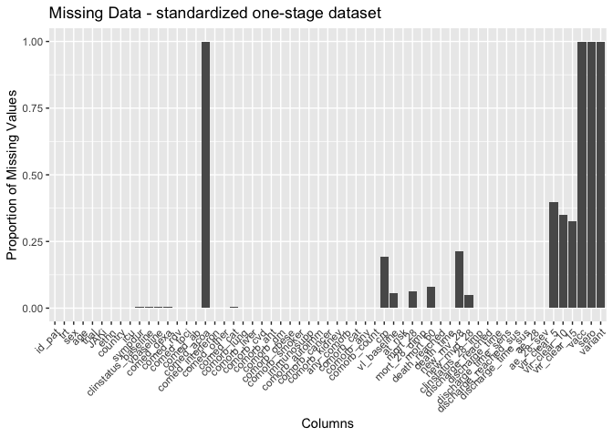

# Load packages

```r
library(tidyverse)
library(readxl)
library(writexl)
library(tableone)
library(haven) # Read sas files
library(here)
library(kableExtra)

library(jtools) # for summ() and plot_summs
library(sjPlot) # for tab_model
library(ggplot2) # survival/TTE analyses and other graphs
library(ggsurvfit) # survival/TTE analyses
library(survival) # survival/TTE analyses
library(gtsummary) # survival/TTE analyses
library(ggfortify) # autoplot
library(tidycmprsk) # competing risk analysis
library(ordinal) # clinstatus ordinal regression
library(logistf) # Firth regression in case of rare events
```

# Load Data


# Define ITT population and mark COV-BARRIER and COV-BARRIER expl.

```r
df <- df_ind_set %>% # keep only those randomized
  filter(RANDFL == "Y")
df <- df %>% # mark COV-BARRIER (main trial, all severity except MV/ECMO) and COV-BARRIER exploratory (only MV/ECMO)
  mutate(subtrial = case_when(BNIAID == "7" ~ "COV-BARRIER_MV",
                               TRUE ~ c("COV-BARRIER_main")))
addmargins(table(df$ARM, df$subtrial))
```

```
##                     
##                      COV-BARRIER_main COV-BARRIER_MV  Sum
##   Baricitinib-4mg-QD              764             51  815
##   Placebo                         761             50  811
##   Sum                            1525            101 1626
```

# Baseline Characteristics

```r
df <- df %>% # no missing in all these
  rename(id_pat = SUBJID,
         country = COUNTRY,
         randdate = RANDDT
         )
df <- df %>% # COV-BARRIER exploratory (only MV/ECMO) were recruited in ICU
  mutate(icu = case_when(subtrial == "COV-BARRIER_MV" ~ 1,
                               TRUE ~ 0))
df <- df %>%
  mutate(trt = case_when(ARM == "Baricitinib-4mg-QD" ~ 1,
                         TRUE ~ 0))
# add trial variables
df$trial <- c("COV-BARRIER")
df$JAKi <- c("Baricitinib")
df <- df %>% # no missing in sex
  mutate(sex = case_when(SEX == "F" ~ "female",
                         SEX == "M" ~ "male"))
# Ethnicity
df <- df %>% # no missing in ethnicity
  mutate(ethn = case_when(RACE == "UNKNOWN" & ETHNIC == "HISPANIC OR LATINO" ~ "HISPANIC OR LATINO",
                          TRUE ~ c(RACE)))
# AGE: add 90 to ages ">89" // age data also not available in df_demographics due to anonymization
df$age <- as.numeric(df$AGE)
df <- df %>%
  mutate(age = case_when(is.na(age) ~ 90,
                         TRUE ~ c(age)))
df %>% 
  drop_na(age) %>% 
  ggplot(aes(x = age)) +
  geom_density(fill = "blue", color = "black") +
  labs(title = "Density Plot of Age",
       x = "Age",
       y = "Density")
```

<!-- -->

```r
# Days with symptoms prior to randomization
df <- df %>% 
  mutate(sympdur = case_when(SYMHDUR == "-24" ~ "0",
                             SYMHDUR == "-22" ~ "0",
                             SYMHDUR == "-16" ~ "0",
                             SYMHDUR == "-15" ~ "0",
                             SYMHDUR == "-8" ~ "0",
                             TRUE ~ c(SYMHDUR)))
df$sympdur <- as.numeric(df$sympdur)
df %>% 
  drop_na(sympdur) %>% 
  ggplot(aes(x = sympdur)) +
  geom_density(fill = "blue", color = "black") +
  labs(title = "Density Plot of Symptom Duration",
       x = "Symptom Duration",
       y = "Density")
```

<!-- -->

```r
# Severity of COVID-19 with respect to respiratory support at randomisation, according to NIAID score
# transform all clinical scores
score_transform <- function(df, clinstatus_var, score_var) {
  df <- df %>%
    mutate({{ clinstatus_var }} :=
             case_when({{ score_var }} %in% c(1, 2, 3) ~ 1,
                       {{ score_var }} == 4 ~ 2,
                       {{ score_var }} == 5 ~ 3,
                       {{ score_var }} == 6 ~ 4,
                       {{ score_var }} == 7 ~ 5,
                       {{ score_var }} == 8 ~ 6)) %>%
    mutate({{ clinstatus_var }} := factor({{ clinstatus_var }}, levels = 1:6))
}
df <- score_transform(df, clinstatus_baseline, BNIAIDN) 
# addmargins(table(df$clinstatus_baseline, df$trt, useNA = "always")) # 7 missing
# addmargins(table(df$clinstatus_baseline, df$trt, df$subtrial, useNA = "always")) # 7 missing in COV-BARRIER main, no missing in COV-BARRIER 2 // # corresponds to publications

df <- df %>% 
  mutate(vbaseline = case_when(clinstatus_baseline == "2" | clinstatus_baseline == "3" ~ 0,
                                clinstatus_baseline == "4" | clinstatus_baseline == "5" ~ 1))

### Co-medication at baseline
# table(df$BLSTRFN, df$trt, df$subtrial, useNA = "always") # corresponds to publications
# table(df$BRMDSVFL, df$trt, df$subtrial, useNA = "always") # corresponds to publications

# check df_comed_set for prior/baseline co-medications for the following:
df$comed_toci <- 0 # excluded according to protocol
df$comed_acoa <- NA
df$comed_interferon <- 0 # excluded according to protocol

df <- df %>% 
  mutate(comed_dexa = case_when(BLSTRFN == 1 ~ 1,
                                BLSTRFN == 0 ~ 0))
df <- df %>% 
  mutate(comed_rdv = case_when(BRMDSVFL == "Y" ~ 1,
                                TRUE ~ 0))
df <- df %>% 
  mutate(comed_ab = case_when(PTHANTBI == "Y" ~ 1,
                                TRUE ~ 0))
df <- df %>% 
  mutate(comed_other = case_when(PTHOTH == "Y" ~ 1,
                                TRUE ~ 0))

# group them for the subgroup analysis, according to protocol
df <- df %>% 
  mutate(comed_cat = case_when(comed_dexa == 0 & (comed_toci == 0 | is.na(comed_toci)) ~ 1, # patients without Dexamethasone nor Tocilizumab
                               comed_dexa == 1 & comed_toci == 1 ~ 2, # patients with Dexamethasone and Tocilizumab
                               comed_dexa == 1 & (comed_toci == 0 | is.na(comed_toci)) ~ 3, # patients with Dexamethasone but no Tocilizumab
                               comed_dexa == 0 & comed_toci == 1 ~ 4)) # patients with Tocilizumab but no Dexamethasone (if exist)


### Comorbidity at baseline, including immunocompromised
df <- df %>% 
  mutate(comorb_dm = case_when(CMRDFL == "Y" ~ 1,
                              CMRDFL == "N" ~ 0))
df <- df %>%
  mutate(comorb_obese = case_when(CMROFL == "Y" ~ 1,
                                   CMROFL == "N" ~ 0))
df <- df %>%
  mutate(comorb_aht = case_when(CMRHFL == "Y" ~ 1,
                                   CMRHFL == "N" ~ 0))
df <- df %>%
  mutate(comorb_lung = case_when(CMRCFL == "Y" ~ 1,
                                  CMRCFL == "N" ~ 0))
df <- df %>%
  mutate(comorb_kidney = case_when(BRNLGR1 == "Impaired" ~ 1,
                                   TRUE ~ 0))
# take it from medicalhistory dataset
df_medicalhist_set <- df_medicalhist_set %>% 
  mutate(comorb_cancer = case_when(ASOC == "Neoplasms benign, malignant and unspecified (incl cysts and polyps)" & (grepl("Cancer", ALLT) | grepl("cancer", ALLT) | grepl("neoplasm", ALLT) | grepl("Neoplasm", ALLT) | grepl("carcinoma", ALLT) | grepl("Carcinoma", ALLT)) ~ 1))
df_medicalhist_set <- df_medicalhist_set %>% 
  mutate(comorb_liver = case_when(ALLT == "Chronic liver disease" ~ 1))
df_medicalhist_set <- df_medicalhist_set %>% 
  mutate(comorb_cvd = case_when(ASOC == "Cardiac disorders" ~ 1))
df_medicalhist_set <- df_medicalhist_set %>% 
  mutate(immunosupp = case_when(grepl("immune deficiency", ALLT) ~ 1))
df_medicalhist_set <- df_medicalhist_set %>% 
  mutate(comorb_autoimm = case_when((grepl("rheuma", ALLT) | grepl("Rheuma", ALLT) | grepl("immune", ALLT) | grepl("immune", ASOC) | grepl("immune", ADECOD)) & is.na(immunosupp) ~ 1))
# remove duplicates  
df_comorb_cancer <- df_medicalhist_set %>% 
  filter(comorb_cancer == 1) %>%
  distinct(USUBJID,comorb_cancer)
df_comorb_liver <- df_medicalhist_set %>% 
  filter(comorb_liver == 1) %>%
  distinct(USUBJID,comorb_liver)
df_comorb_cvd <- df_medicalhist_set %>% 
  filter(comorb_cvd == 1) %>%
  distinct(USUBJID,comorb_cvd)
df_immunosupp <- df_medicalhist_set %>% 
  filter(immunosupp == 1) %>%
  distinct(USUBJID,immunosupp)
df_comorb_autoimm <- df_medicalhist_set %>% 
  filter(comorb_autoimm == 1) %>%
  distinct(USUBJID,comorb_autoimm)
# merge
df <- left_join(df, df_comorb_cancer[, c("comorb_cancer", "USUBJID")], by = join_by(USUBJID == USUBJID)) ## merge to main df
df <- left_join(df, df_comorb_liver[, c("comorb_liver", "USUBJID")], by = join_by(USUBJID == USUBJID)) ## merge to main df
df <- left_join(df, df_comorb_cvd[, c("comorb_cvd", "USUBJID")], by = join_by(USUBJID == USUBJID)) ## merge to main df
df <- left_join(df, df_immunosupp[, c("immunosupp", "USUBJID")], by = join_by(USUBJID == USUBJID)) ## merge to main df
df <- left_join(df, df_comorb_autoimm[, c("comorb_autoimm", "USUBJID")], by = join_by(USUBJID == USUBJID)) ## merge to main df

# take smoking from substance use set
df_substance_use_supp <- df_substance_use_supp %>% 
  mutate(comorb_smoker = case_when(QVAL == "CURRENT" ~ 1))
df_comorb_smoker <- df_substance_use_supp %>% 
  filter(comorb_smoker == 1) %>%
  distinct(USUBJID,comorb_smoker)
df <- left_join(df, df_comorb_smoker[, c("comorb_smoker", "USUBJID")], by = join_by(USUBJID == USUBJID)) ## merge to main df

# the remaining missing have only NA in 1 comorb category => no evidence for comorbidity -> recode as 0
df <- df %>% 
  mutate(comorb_cancer = case_when(is.na(comorb_cancer) ~ 0,
                                TRUE ~ c(comorb_cancer)),
         comorb_liver = case_when(is.na(comorb_liver) ~ 0,
                                TRUE ~ c(comorb_liver)),
         comorb_cvd = case_when(is.na(comorb_cvd) ~ 0,
                                TRUE ~ c(comorb_cvd)),
         immunosupp = case_when(is.na(immunosupp) ~ 0,
                                TRUE ~ c(immunosupp)),
         comorb_autoimm = case_when(is.na(comorb_autoimm) ~ 0,
                                TRUE ~ c(comorb_autoimm)),
         comorb_smoker = case_when(is.na(comorb_smoker) ~ 0,
                                TRUE ~ c(comorb_smoker)))
df <- df %>% 
  mutate(any_comorb = case_when(comorb_lung == 1 | comorb_liver == 1 | comorb_cvd == 1 |
                                  comorb_aht == 1 | comorb_dm == 1 | comorb_obese == 1 | comorb_smoker == 1
                                | immunosupp == 1 | comorb_cancer == 1 | comorb_autoimm == 1 | comorb_kidney == 1 
                                  ~ 1,
                                comorb_lung == 0 & comorb_liver == 0 & comorb_cvd == 0 &
                                  comorb_aht == 0 & comorb_dm == 0 & comorb_obese == 0 & comorb_smoker == 0
                                & immunosupp == 0 & comorb_cancer == 0 & comorb_autoimm == 0 & comorb_kidney == 0
                                ~ 0))
# addmargins(table(df$any_comorb, df$trt, df$subtrial, useNA = "always"))

## group them for the subgroup analysis, according to protocol // count all pre-defined comorbidities per patient first
comorb <- df %>% 
  select(id_pat, comorb_lung, comorb_liver, comorb_cvd, comorb_aht, comorb_dm, comorb_obese, comorb_smoker, immunosupp, comorb_kidney, comorb_autoimm, comorb_cancer)
comorb$comorb_count <- NA
for (i in 1:dim(comorb)[[1]]) {
  comorb$comorb_count[i] <- ifelse(
    sum(comorb[i, ] %in% c(1)) > 0,
    sum(comorb[i, ] %in% c(1)),
    NA
  )
}
comorb <- comorb %>%
  mutate(comorb_count = case_when(comorb_lung == 0 & comorb_liver == 0 & comorb_cvd == 0 &
                                  comorb_aht == 0 & comorb_dm == 0 & comorb_obese == 0 & comorb_smoker == 0
                                & immunosupp == 0 & comorb_cancer == 0 & comorb_autoimm == 0 & comorb_kidney == 0 ~ 0,
                                TRUE ~ comorb_count))
df <- left_join(df, comorb[, c("comorb_count", "id_pat")], by = join_by(id_pat == id_pat)) ## merge imputed variable back
df <- df %>%
  mutate(comorb_cat = case_when(immunosupp == 1 ~ 4, # immunocompromised
                                comorb_count == 0 ~ 1, # no comorbidity
                                comorb_count == 1 ~ 2, # one comorbidity
                                comorb_count >1 & (immunosupp == 0 | is.na(immunosupp)) ~ 3)) # multiple comorbidities

## CRP
df_crp <- df_lab_set %>% 
  filter(LBTESTCD == "CRP") %>% 
  filter(VISIT == "Screening") %>% 
  filter(AVISITN == 1)
df_crp <- df_crp %>% 
  distinct(USUBJID, .keep_all = TRUE)
df_crp <- df_crp %>% 
  rename(crp = LBSTRESN)
df <- left_join(df, df_crp[, c("crp", "USUBJID")], by = join_by(USUBJID == USUBJID)) ## merge to main df
df %>% 
  drop_na(crp) %>% 
  ggplot(aes(x = crp)) +
  geom_density(fill = "blue", color = "black") +
  labs(title = "Density Plot of Symptom Duration",
       x = "CRP",
       y = "Density")
```

<!-- -->

```r
# Viremia dataset 
df_viremia <- df_microbio %>% 
  filter(MBTESTCD != "MBALL") %>% 
  filter(MBTSTDTL == "DETECTION") %>% 
  filter(MBBLFL == "Y")
df_viremia <- df_viremia %>% 
  distinct(USUBJID, .keep_all = TRUE)
df_viremia <- df_viremia %>% # viral load value <LOQ and/or undectectable
  mutate(vl_baseline = case_when(MBORRES == "POSITIVE" ~ 0,
                                 TRUE ~ 1))
df <- left_join(df, df_viremia[, c("vl_baseline", "USUBJID")], by = join_by(USUBJID == USUBJID)) ## merge to main df

# Vaccination // not available
# Variant // not available
# Serology // not available
```
Discussion points BASELINE data:
1. Double-check co-medication

# Endpoints

```r
# (i) Primary outcome: Mortality at day 28
df_ttd <- df_tte_set %>% 
  filter(PARAM == "Time to Death by Day 28") %>% 
  filter(RANDFL == "Y") # only randomised population
df_ttd <- df_ttd %>% # use censoring variable to identify deaths within 28 days
  mutate(mort_28 = case_when(CNSR == 0 ~ 1,
                             CNSR == 1 ~ 0))
df <- left_join(df, df_ttd[, c("mort_28", "USUBJID")], by = join_by(USUBJID == USUBJID)) ## merge to main df
# table(df$mort_28, df$trt, df$subtrial, useNA = "always") # corresponds to publications; they used LOVCF and no transfer to hospice

# (ii) Mortality at day 60
df_ttd <- df_tte_set %>% 
  filter(PARAM == "Time to Death by Day 60") %>% 
  filter(RANDFL == "Y") # only randomised population
df_ttd <- df_ttd %>% # use censoring variable to identify deaths within 28 days
  mutate(mort_60 = case_when(CNSR == 0 ~ 1,
                             CNSR == 1 ~ 0))
df <- left_join(df, df_ttd[, c("mort_60", "USUBJID")], by = join_by(USUBJID == USUBJID)) ## merge to main df
# table(df$mort_60, df$trt, df$subtrial, useNA = "always") # corresponds to publications; they used LOVCF and no transfer to hospice

# (iii) Time to death within max. follow-up time (systematically until 60 days!)
df_ttd <- df_tte_set %>% 
  filter(PARAM == "Time to Death") %>% 
  filter(RANDFL == "Y") # only randomised population
df_ttd <- df_ttd %>% # use censoring variable to identify deaths within 28 days
  mutate(death_reached = case_when(CNSR == 0 ~ 1,
                             CNSR == 1 ~ 0))
df <- left_join(df, df_ttd[, c("death_reached", "USUBJID")], by = join_by(USUBJID == USUBJID)) ## merge to main df
# table(df$death_reached, df$trt, df$subtrial, useNA = "always")
df_ttd <- df_tte_set %>% 
  filter(PARAM == "Time to Death by Day 60") %>% 
  filter(RANDFL == "Y") # only randomised population
df_ttd$death_time <- df_ttd$AVAL
df <- left_join(df, df_ttd[, c("death_time", "USUBJID")], by = join_by(USUBJID == USUBJID)) ## merge to main df
# table(df$death_time, df$death_reached, useNA = "always") 
# Cap at 60 days, since this was max. systematic follow-up, no deaths recorded afterwards anymore
df <- df %>% 
  mutate(death_time = case_when(death_time >60 ~ 60,
                                TRUE ~ c(death_time)))

# (iv) New mechanical ventilation among survivors within 28 days
# table(df_tte_set$PARAM)
df_mv <- df_tte_set %>% 
  filter(PARAM == "Time to invasive ventilation (OS =7)") %>% 
  filter(RANDFL == "Y") # only randomised population
df_mv$tt_mv <- df_mv$AVAL # time to MV (incl. censoring for those dead or last available visit) -> longer than 28d!
df_mv <- df_mv %>% # use censoring variable to identify MV 
  mutate(new_mv_28 = case_when(CNSR == 0 & tt_mv < 29 ~ 1,
                             CNSR == 1 | (CNSR == 0 & tt_mv > 28) ~ 0))
df <- left_join(df, df_mv[, c("new_mv_28", "USUBJID")], by = join_by(USUBJID == USUBJID)) ## merge to main df
# classify those dead within 28d and those that were MV at baseline as NA ("among survivors")
df <- df %>% 
  mutate(new_mv_28 = case_when(mort_28 == 1 | clinstatus_baseline == 5 ~ NA,
                               TRUE ~ c(new_mv_28)))
# table(df$new_mv_28, df$mort_28, useNA = "always")
# table(df$new_mv_28, df$clinstatus_baseline, useNA = "always")
# see missing data rule: the 7 with no clinstatus at all, not even baseline clinstatus -> assume clinstatus == 5
df <- df %>% 
  mutate(new_mv_28 = case_when(is.na(clinstatus_baseline) ~ 1,
                               TRUE ~ c(new_mv_28)))

# (iv) Alternative definition/analysis: New mechanical ventilation OR death within 28 days
df <- df %>% 
  mutate(new_mvd_28 = case_when(new_mv_28 == 1 | mort_28 == 1 ~ 1,
                                new_mv_28 == 0 | mort_28 == 0 ~ 0))
# table(df$new_mvd_28, df$mort_28, useNA = "always")
# table(df$new_mvd_28, df$clinstatus_baseline, useNA = "always")


# (v) Clinical status at day 28
df_cs <- df_niaid_score_set %>% 
  filter(AVISIT == "Day 28") %>%
  filter(PARAM == "NIAID OS Scale")
df_cs$clinstatus_28_niaid <- df_cs$AVAL
df <- left_join(df, df_cs[, c("clinstatus_28_niaid", "USUBJID")], by = join_by(USUBJID == USUBJID)) ## merge to main df
# table(df$clinstatus_28_niaid, useNA = "always")
df$clinstatus_28 <- NA
df <- score_transform(df, clinstatus_28, clinstatus_28_niaid) # transform the NIAID score to our score
# table(df$clinstatus_28, useNA = "always")

# df %>% # these ones are not even part of the niaid_score dataset, they withdrew on screening day or 1-2 days after. See missing data rule: If no baseline score at ALL => clinstatus == 5 (MV/ECMO); if at least a baseline score, then LOVCF
#   filter(is.na(clinstatus_28)) %>%
#   select(clinstatus_28, clinstatus_baseline, mort_28, mort_60, new_mvd_28, new_mv_28, everything()) %>%
#   View()

df <- df %>% 
  mutate(clinstatus_28_imp = case_when(is.na(clinstatus_baseline) ~ "5", # those with no clinstatus at all -> impute 5
                               TRUE ~ c(clinstatus_28)))
df <- df %>% 
  mutate(clinstatus_28_imp = case_when(is.na(clinstatus_28_imp) ~ c(clinstatus_baseline), # those with at least a baseline clinstatus -> LOVCF
                               TRUE ~ c(clinstatus_28_imp)))
df$clinstatus_28_imp <- factor(df$clinstatus_28_imp, levels = 1:6)


# (vi) Time to discharge or reaching discharge criteria up to day 28
df_ttdis <- df_tte_set %>% 
  filter(PARAM == "Time to recovery by Day 28 (OS <=3)") %>% 
  filter(RANDFL == "Y") # only randomised population
df_ttdis$discharge_time <- df_ttdis$AVAL # time to discharge -> longer than 28d!
# table(df_ttdis$EVNTDESC, df_ttdis$discharge_time) # CAVE: Those that died have all assigned 28 days!
df_ttdis <- df_ttdis %>% # use censoring variable to identify MV 
  mutate(discharge_reached = case_when(CNSR == 0 & discharge_time < 29 ~ 1,
                             CNSR == 1 | (CNSR == 0 & discharge_time > 28) ~ 0))
# table(df_ttdis$discharge_reached, df_ttdis$discharge_time, useNA = "always")
df <- left_join(df, df_ttdis[, c("discharge_reached", "discharge_time", "USUBJID")], by = join_by(USUBJID == USUBJID)) ## merge to main df
df <- df %>% # add time to death for those that died
  mutate(discharge_time = case_when(mort_28 == 1 ~ death_time,
                                    TRUE ~ discharge_time))
df <- df %>% # Cap at 28 days
  mutate(discharge_time = case_when(discharge_time >28 ~ 28,
                                TRUE ~ c(discharge_time)))
# table(df$mort_28, df$discharge_time, useNA = "always")
# table(df$discharge_reached, df$clinstatus_28, useNA = "always")

# df %>% # these ones were discharged, but then readmitted (1 even died, but after day 28)
#   filter(clinstatus_28 != 1 & discharge_reached == 1) %>%
#   select(discharge_reached, discharge_time, clinstatus_28, clinstatus_baseline, mort_28, mort_60, new_mvd_28, new_mv_28, everything()) %>%
#   View()

df <- df %>% # add 28d for those that died // Patients who died prior to day 28 are assumed not having reached discharge, i.e. counted as 28 days (as someone who has been censored on day 28). 
  mutate(discharge_time_sens = case_when(mort_28 == 1 ~ 28,
                                    TRUE ~ discharge_time))
# table(df$discharge_time, df$discharge_reached, useNA = "always")

# (vi) Sens-analysis: Alternative definition/analysis of outcome: time to sustained discharge within 28 days. There are 8 re-admissions documented in COV-BARRIER
df <- df %>% 
  mutate(discharge_reached_sus = case_when(discharge_reached == 1 & clinstatus_28 != 1 ~ 0,
                                           TRUE ~ c(discharge_reached)))
df <- df %>% 
  mutate(discharge_time_sus = case_when(discharge_reached == 1 & clinstatus_28 != 1 ~ 28,
                                           TRUE ~ c(discharge_time)))


# (vii) Viral clearance up to day 5, day 10, and day 15 (Viral load value <LOQ and/or undectectable)
df_viremia <- df_microbio %>% 
  filter(MBTESTCD != "MBALL") %>% 
  filter(MBTSTDTL == "DETECTION")
# table(df_viremia$VISITNUM, useNA = "always") # the NAs are not relevant: They are either from before randomization or after day 15
df_viremia <- df_viremia %>% 
  filter(VISITNUM %in% c(1,2,3,4,5,6,7,8,9,10,11,12,13,14,15))
df_viremia <- df_viremia %>% # viral load value <LOQ and/or undectectable
  mutate(vl = case_when(MBORRES == "POSITIVE" ~ 0,
                                 MBORRES == "NEGATIVE" ~ 1))
# Filtering and extracting the last measurement for each participant
df_vir_clear_5 <- df_viremia %>%
  filter(VISITNUM <= 5) %>%
  group_by(SUBJID) %>%
  slice_max(VISITNUM)
df_vir_clear_5$vir_clear_5 <- df_vir_clear_5$vl
# Check for duplicates in SUBJID and VL
df_vir_clear_5 <- df_vir_clear_5 %>%
  mutate(participant_duplicate = duplicated(SUBJID) | duplicated(SUBJID, fromLast = TRUE))
df_vir_clear_5 <- df_vir_clear_5 %>% # remove exact duplicates
  distinct(SUBJID, vir_clear_5, .keep_all = TRUE)
specific_duplicates <- any(duplicated(df_vir_clear_5[, c("SUBJID")]))

df_vir_clear_10 <- df_viremia %>%
  filter(VISITNUM <= 10) %>%
  group_by(SUBJID) %>%
  slice_max(VISITNUM)
df_vir_clear_10$vir_clear_10 <- df_vir_clear_10$vl
# Check for duplicates in SUBJID and VL
df_vir_clear_10 <- df_vir_clear_10 %>%
  mutate(participant_duplicate = duplicated(SUBJID) | duplicated(SUBJID, fromLast = TRUE))
df_vir_clear_10 <- df_vir_clear_10 %>% # remove exact duplicates
  distinct(SUBJID, vir_clear_10, .keep_all = TRUE)
specific_duplicates <- any(duplicated(df_vir_clear_10[, c("SUBJID")]))

df_vir_clear_15 <- df_viremia %>%
  filter(VISITNUM <= 15) %>%
  group_by(SUBJID) %>%
  slice_max(VISITNUM)
df_vir_clear_15$vir_clear_15 <- df_vir_clear_15$vl
# Check for duplicates in SUBJID and VL
df_vir_clear_15 <- df_vir_clear_15 %>%
  mutate(participant_duplicate = duplicated(SUBJID) | duplicated(SUBJID, fromLast = TRUE))
df_vir_clear_15 <- df_vir_clear_15 %>% # remove exact duplicates
  distinct(SUBJID, vir_clear_15, .keep_all = TRUE)
specific_duplicates <- any(duplicated(df_vir_clear_15[, c("SUBJID")]))

df <- left_join(df, df_vir_clear_5[, c("vir_clear_5", "USUBJID")], by = join_by(USUBJID == USUBJID)) ## merge to main df
df <- left_join(df, df_vir_clear_10[, c("vir_clear_10", "USUBJID")], by = join_by(USUBJID == USUBJID)) ## merge to main df
df <- left_join(df, df_vir_clear_15[, c("vir_clear_15", "USUBJID")], by = join_by(USUBJID == USUBJID)) ## merge to main df


# (viii) Quality of life at day 28: Not available in COV-BARRIER


# (ix) Participants with an adverse event grade 3 or 4, or a serious adverse event, excluding death, by day 28
df_ae34 <- df_ae_set %>% 
  filter(AESEV == "SEVERE" | AESER == "Y") %>% 
  filter(ASTDY <29)
# Keep just 1 id_pat (-> ANY adverse event grade 3 (severe), 4 (serious)) 
df_ae34_unique <- df_ae34 %>% distinct(USUBJID, .keep_all = TRUE)
# Assign the outcome
df_ae34_unique$ae_28 <- 1
# table(df_ae34_unique$ae_28)
# merge
df <- left_join(df, df_ae34_unique[, c("ae_28", "USUBJID")], by = join_by(USUBJID == USUBJID)) ## merge variable to main df
# the remaining missing have no AE grade 34 -> recode as 0 and exclude deaths
df <- df %>% 
  mutate(ae_28 = case_when(is.na(ae_28) ~ 0, # the LTFU were discharged
                           mort_28 == 1 ~ NA, # exclude the deaths
                                TRUE ~ ae_28))
# table(df$ae_28, df$mort_28, useNA = "always")
# addmargins(table(df$ae_28, df$trt, useNA = "always"))
# (ix) Sens-analysis: Alternative definition/analysis of outcome: incidence rate ratio (Poisson regression) -> AE per person by d28
ae_npp <- df_ae34 %>% 
  group_by(USUBJID)%>%  
  summarise(ae_28_sev = n())
df <- left_join(df, ae_npp[, c("ae_28_sev", "USUBJID")], by = join_by(USUBJID == USUBJID)) # merge variable to main df
# the remaining missing have no AE grade 34 -> recode as 0 and exclude deaths
df <- df %>% 
  mutate(ae_28_sev = case_when(is.na(ae_28_sev) ~ 0, # the LTFU were discharged
                           mort_28 == 1 ~ NA, # exclude the deaths
                                TRUE ~ ae_28_sev))
# table(df$ae_28_sev, df$mort_28, useNA = "always")
# addmargins(table(df$ae_28_sev, df$trt, useNA = "always"))

# (ix) Sens-analysis: Alternative definition/analysis of outcome: time to first (of these) adverse event, within 28 days, considering death as a competing risk (=> censor and set to 28 days)
# rediscuss if this is still a necessary analysis

# (x) Adverse events of special interest within 28 days: a) thromboembolic events (venous thromboembolism, pulmonary embolism, arterial thrombosis), b) secondary infections (bacterial pneumonia including ventilator-associated pneumonia, meningitis and encephalitis, endocarditis and bacteremia, invasive fungal infection including pulmonary aspergillosis), c) Reactivation of chronic infection including tuberculosis, herpes simplex, cytomegalovirus, herpes zoster and hepatitis B, d) serious cardiovascular and cardiac events (including stroke and myocardial infarction), e) events related to signs of bone marrow suppression (anemia, lymphocytopenia, thrombocytopenia, pancytopenia), f) malignancy, g) gastrointestinal perforation (incl. gastrointestinal bleeding/diverticulitis), h) liver dysfunction/hepatotoxicity (grade 3 and 4)

# (xi) Adverse events, any grade and serious adverse event, excluding death, within 28 days, grouped by organ classes

# df_ae <- df %>% 
#   select(id_pat, trt, x, ae_28_list, aesi_28)
# # Save
# saveRDS(df_ae, file = "df_ae_cov-barrier.RData")
```
Discussion points OUTCOME data:
1. finalize ae_28_list & aesi_28 -> separate export


# Multiple imputation using chained equation

Discussion points


# Define final dataset, set references, summarize missing data and variables

```r
# keep the overall set
df_all <- df
# reduce the df set to our standardized set across all trials
df <- df %>% 
  select(id_pat, trt, sex, age, trial, JAKi, 
         ethn, 
         country, icu, sympdur, 
         # vacc, 
         clinstatus_baseline, vbaseline,
         comed_dexa, comed_rdv, comed_toci, comed_ab, comed_acoa, comed_interferon, comed_other,
         comed_cat,
         comorb_lung, comorb_liver, comorb_cvd, comorb_aht, comorb_dm, comorb_obese, comorb_smoker, immunosupp,
         comorb_autoimm, comorb_cancer, comorb_kidney,
         any_comorb, comorb_cat, comorb_count,
         crp, 
         # sero, variant,
         vl_baseline, 
         mort_28, mort_60, death_reached, death_time,
         new_mv_28, new_mvd_28,
         clinstatus_28_imp,
         discharge_reached, discharge_time, discharge_time_sens, discharge_reached_sus, discharge_time_sus,
         ae_28, ae_28_sev,
         vir_clear_5, vir_clear_10, vir_clear_15
         )

# export for one-stage model, i.e., add missing variables 
df_os <- df
df_os$vacc <- NA
df_os$sero <- NA
df_os$variant <- NA
# Save
saveRDS(df_os, file = "df_os_cov-barrier.RData")

## set references, re-level
# df <- df %>% 
#   mutate(Treatment = relevel(Treatment, "no JAK inhibitor"))

# Create a bar plot to visualize missing values in each column
original_order <- colnames(df_os)
missing_plot <- df_os %>%
  summarise_all(~ mean(is.na(.))) %>%
  gather() %>%
  mutate(key = factor(key, levels = original_order)) %>%
  ggplot(aes(x = key, y = value)) +
  geom_bar(stat = "identity") +
  labs(x = "Columns", y = "Proportion of Missing Values", title = "Missing Data Visualization") +
  theme(axis.text.x = element_text(angle = 45, hjust = 1)) +
  ylim(0, 1)
print(missing_plot)
```

<!-- -->
Discussion points
1. Missing variables:
* Baseline:
  - comed_acoa: double-check
  - sero
  - variant
* Outcomes:
  - qol_28
2. Missing data:
  - clinstatus_baseline: 7 missing -> MICE?
  - comed_dexa & comed_cat: 7 missing -> MICE?
  - sympdur: 9 missing -> MICE?
  - crp: 316
  - vl_baseline: 89
  - new_mv_28: part of denominator
  - viral load (baseline and outcome): ignore


# (i) Primary endpoint: Mortality at day 28

```r
# adjusted for baseline patient characteristics (age and respiratory support at baseline)
addmargins(table(df$mort_28, df$trt, useNA = "always"))
```

```
##       
##           0    1 <NA>  Sum
##   0     682  733    0 1415
##   1     129   82    0  211
##   <NA>    0    0    0    0
##   Sum   811  815    0 1626
```

```r
addmargins(table(df$clinstatus_baseline, df$trt, useNA = "always"))
```

```
##       
##           0    1 <NA>  Sum
##   1       0    0    0    0
##   2      97   89    0  186
##   3     472  490    0  962
##   4     187  183    0  370
##   5      50   51    0  101
##   6       0    0    0    0
##   <NA>    5    2    0    7
##   Sum   811  815    0 1626
```

```r
# class(df$clinstatus_baseline)
mort.28 <- df %>% 
  glm(mort_28 ~ trt 
      + age + clinstatus_baseline 
      #+ comed_dexa + comed_rdv + comed_toci
      , family = "binomial", data=.)
summ(mort.28, exp = T, confint = T, model.info = T, model.fit = F, digits = 2)
```

<table class="table table-striped table-hover table-condensed table-responsive" style="width: auto !important; margin-left: auto; margin-right: auto;">
<tbody>
  <tr>
   <td style="text-align:left;font-weight: bold;"> Observations </td>
   <td style="text-align:right;"> 1619 (7 missing obs. deleted) </td>
  </tr>
  <tr>
   <td style="text-align:left;font-weight: bold;"> Dependent variable </td>
   <td style="text-align:right;"> mort_28 </td>
  </tr>
  <tr>
   <td style="text-align:left;font-weight: bold;"> Type </td>
   <td style="text-align:right;"> Generalized linear model </td>
  </tr>
  <tr>
   <td style="text-align:left;font-weight: bold;"> Family </td>
   <td style="text-align:right;"> binomial </td>
  </tr>
  <tr>
   <td style="text-align:left;font-weight: bold;"> Link </td>
   <td style="text-align:right;"> logit </td>
  </tr>
</tbody>
</table>  <table class="table table-striped table-hover table-condensed table-responsive" style="width: auto !important; margin-left: auto; margin-right: auto;border-bottom: 0;">
 <thead>
  <tr>
   <th style="text-align:left;">   </th>
   <th style="text-align:right;"> exp(Est.) </th>
   <th style="text-align:right;"> 2.5% </th>
   <th style="text-align:right;"> 97.5% </th>
   <th style="text-align:right;"> z val. </th>
   <th style="text-align:right;"> p </th>
  </tr>
 </thead>
<tbody>
  <tr>
   <td style="text-align:left;font-weight: bold;"> (Intercept) </td>
   <td style="text-align:right;"> 0.00 </td>
   <td style="text-align:right;"> 0.00 </td>
   <td style="text-align:right;"> 0.00 </td>
   <td style="text-align:right;"> -11.18 </td>
   <td style="text-align:right;"> 0.00 </td>
  </tr>
  <tr>
   <td style="text-align:left;font-weight: bold;"> trt </td>
   <td style="text-align:right;"> 0.51 </td>
   <td style="text-align:right;"> 0.37 </td>
   <td style="text-align:right;"> 0.71 </td>
   <td style="text-align:right;"> -3.95 </td>
   <td style="text-align:right;"> 0.00 </td>
  </tr>
  <tr>
   <td style="text-align:left;font-weight: bold;"> age </td>
   <td style="text-align:right;"> 1.07 </td>
   <td style="text-align:right;"> 1.05 </td>
   <td style="text-align:right;"> 1.08 </td>
   <td style="text-align:right;"> 9.27 </td>
   <td style="text-align:right;"> 0.00 </td>
  </tr>
  <tr>
   <td style="text-align:left;font-weight: bold;"> clinstatus_baseline3 </td>
   <td style="text-align:right;"> 2.75 </td>
   <td style="text-align:right;"> 1.08 </td>
   <td style="text-align:right;"> 6.99 </td>
   <td style="text-align:right;"> 2.12 </td>
   <td style="text-align:right;"> 0.03 </td>
  </tr>
  <tr>
   <td style="text-align:left;font-weight: bold;"> clinstatus_baseline4 </td>
   <td style="text-align:right;"> 10.25 </td>
   <td style="text-align:right;"> 4.02 </td>
   <td style="text-align:right;"> 26.11 </td>
   <td style="text-align:right;"> 4.87 </td>
   <td style="text-align:right;"> 0.00 </td>
  </tr>
  <tr>
   <td style="text-align:left;font-weight: bold;"> clinstatus_baseline5 </td>
   <td style="text-align:right;"> 42.01 </td>
   <td style="text-align:right;"> 15.43 </td>
   <td style="text-align:right;"> 114.34 </td>
   <td style="text-align:right;"> 7.32 </td>
   <td style="text-align:right;"> 0.00 </td>
  </tr>
</tbody>
<tfoot><tr><td style="padding: 0; " colspan="100%">
<sup></sup> Standard errors: MLE</td></tr></tfoot>
</table>
Discussion points

# (ii) Mortality at day 60

```r
table(df$mort_60, df$trt, useNA = "always")
```

```
##       
##          0   1 <NA>
##   0    664 713    0
##   1    147 102    0
##   <NA>   0   0    0
```

```r
mort.60 <- df %>% 
  glm(mort_60 ~ trt 
      + age + clinstatus_baseline 
      #+ comed_dexa + comed_rdv + comed_toci
      , family = "binomial", data=.)
summ(mort.60, exp = T, confint = T, model.info = T, model.fit = F, digits = 2)
```

<table class="table table-striped table-hover table-condensed table-responsive" style="width: auto !important; margin-left: auto; margin-right: auto;">
<tbody>
  <tr>
   <td style="text-align:left;font-weight: bold;"> Observations </td>
   <td style="text-align:right;"> 1619 (7 missing obs. deleted) </td>
  </tr>
  <tr>
   <td style="text-align:left;font-weight: bold;"> Dependent variable </td>
   <td style="text-align:right;"> mort_60 </td>
  </tr>
  <tr>
   <td style="text-align:left;font-weight: bold;"> Type </td>
   <td style="text-align:right;"> Generalized linear model </td>
  </tr>
  <tr>
   <td style="text-align:left;font-weight: bold;"> Family </td>
   <td style="text-align:right;"> binomial </td>
  </tr>
  <tr>
   <td style="text-align:left;font-weight: bold;"> Link </td>
   <td style="text-align:right;"> logit </td>
  </tr>
</tbody>
</table>  <table class="table table-striped table-hover table-condensed table-responsive" style="width: auto !important; margin-left: auto; margin-right: auto;border-bottom: 0;">
 <thead>
  <tr>
   <th style="text-align:left;">   </th>
   <th style="text-align:right;"> exp(Est.) </th>
   <th style="text-align:right;"> 2.5% </th>
   <th style="text-align:right;"> 97.5% </th>
   <th style="text-align:right;"> z val. </th>
   <th style="text-align:right;"> p </th>
  </tr>
 </thead>
<tbody>
  <tr>
   <td style="text-align:left;font-weight: bold;"> (Intercept) </td>
   <td style="text-align:right;"> 0.00 </td>
   <td style="text-align:right;"> 0.00 </td>
   <td style="text-align:right;"> 0.00 </td>
   <td style="text-align:right;"> -11.66 </td>
   <td style="text-align:right;"> 0.00 </td>
  </tr>
  <tr>
   <td style="text-align:left;font-weight: bold;"> trt </td>
   <td style="text-align:right;"> 0.57 </td>
   <td style="text-align:right;"> 0.42 </td>
   <td style="text-align:right;"> 0.78 </td>
   <td style="text-align:right;"> -3.57 </td>
   <td style="text-align:right;"> 0.00 </td>
  </tr>
  <tr>
   <td style="text-align:left;font-weight: bold;"> age </td>
   <td style="text-align:right;"> 1.06 </td>
   <td style="text-align:right;"> 1.05 </td>
   <td style="text-align:right;"> 1.08 </td>
   <td style="text-align:right;"> 9.44 </td>
   <td style="text-align:right;"> 0.00 </td>
  </tr>
  <tr>
   <td style="text-align:left;font-weight: bold;"> clinstatus_baseline3 </td>
   <td style="text-align:right;"> 2.34 </td>
   <td style="text-align:right;"> 1.05 </td>
   <td style="text-align:right;"> 5.21 </td>
   <td style="text-align:right;"> 2.08 </td>
   <td style="text-align:right;"> 0.04 </td>
  </tr>
  <tr>
   <td style="text-align:left;font-weight: bold;"> clinstatus_baseline4 </td>
   <td style="text-align:right;"> 9.49 </td>
   <td style="text-align:right;"> 4.25 </td>
   <td style="text-align:right;"> 21.19 </td>
   <td style="text-align:right;"> 5.49 </td>
   <td style="text-align:right;"> 0.00 </td>
  </tr>
  <tr>
   <td style="text-align:left;font-weight: bold;"> clinstatus_baseline5 </td>
   <td style="text-align:right;"> 35.65 </td>
   <td style="text-align:right;"> 14.77 </td>
   <td style="text-align:right;"> 86.02 </td>
   <td style="text-align:right;"> 7.95 </td>
   <td style="text-align:right;"> 0.00 </td>
  </tr>
</tbody>
<tfoot><tr><td style="padding: 0; " colspan="100%">
<sup></sup> Standard errors: MLE</td></tr></tfoot>
</table>
Discussion points

# (iii) Time to death within max. follow-up time

```r
# table(df$death_reached, df$death_time, useNA = "always")
# table(df$death_reached, df$mort_60, useNA = "always")

# df %>%
#   drop_na(death_time) %>%
#   filter(death_reached == 1) %>%
#   group_by(trt) %>%
#   summarise(median = median(death_time),
#             IQR = IQR(death_time),
#             Q1 = quantile(death_time, probs = 0.25),
#             Q3 = quantile(death_time, probs = 0.75))

# time to death, by group. Kaplan-Meier estimate of conditional survival probability.
km.ttdeath.check <- with(df, Surv(death_time, death_reached))
# head(km.ttdeath.check, 100)

km.ttdeath_trt <- survfit(Surv(death_time, death_reached) ~ trt, data=df)
# summary(km.ttdeath_trt, times = 28)
ttdeath_28d_tbl <- km.ttdeath_trt %>% 
  tbl_survfit(
    times = 28,
    label_header = "**28-d survival (95% CI)**"
  )
# Nicely formatted table
kable(ttdeath_28d_tbl, format = "markdown", table.attr = 'class="table"') %>%
  kable_styling(bootstrap_options = "striped", full_width = FALSE)
```


|**Characteristic** |**28-d survival (95% CI)** |
|:------------------|:--------------------------|
|trt                |NA                         |
|0                  |84% (81%, 86%)             |
|1                  |89% (87%, 92%)             |

```r
# autoplot(km.ttdeath_trt)
survfit2(Surv(death_time, death_reached) ~ trt, data=df) %>% 
  ggsurvfit() +
  labs(
    x = "Days",
    y = "Overall survival probability"
  ) + 
  add_confidence_interval() +
  add_risktable()
```

<!-- -->

```r
# Assessing proportional hazards // check KM curve
# ph.check <- coxph(Surv(death_time, death_reached) ~ trt
#                 , data = df)
# cz <- cox.zph(ph.check)
# print(cz)
# plot(cz)
# testing: simple log-rank
# survdiff(Surv(death_time, death_reached) ~ trt, data = df)
# testing: cox ph
ttdeath <- df %>% 
  coxph(Surv(death_time, death_reached) ~ trt 
        + age + clinstatus_baseline 
        #+ comed_dexa + comed_rdv + comed_toci
        , data =.)
ttdeath_reg_tbl <- tbl_regression(ttdeath, exp = TRUE)
# Nicely formatted table
kable(ttdeath_reg_tbl, format = "markdown", table.attr = 'class="table"') %>%
  kable_styling(bootstrap_options = "striped", full_width = FALSE)
```


|**Characteristic**  |**HR** |**95% CI** |**p-value** |
|:-------------------|:------|:----------|:-----------|
|trt                 |0.61   |0.48, 0.79 |<0.001      |
|age                 |1.05   |1.04, 1.06 |<0.001      |
|clinstatus_baseline |NA     |NA         |NA          |
|1                   |NA     |NA         |NA          |
|2                   |0.05   |0.02, 0.12 |<0.001      |
|3                   |0.12   |0.09, 0.17 |<0.001      |
|4                   |0.41   |0.30, 0.57 |<0.001      |
|5                   |NA     |NA         |NA          |
|6                   |NA     |NA         |NA          |
Discussion points

# (iv) New mechanical ventilation among survivors within 28 days

```r
addmargins(table(df$new_mv_28, df$trt, useNA = "always"))
```

```
##       
##           0    1 <NA>  Sum
##   0     596  622    0 1218
##   1      65   80    0  145
##   <NA>  150  113    0  263
##   Sum   811  815    0 1626
```

```r
new.mv.28 <- df %>% 
  glm(new_mv_28 ~ trt 
      + age 
      + clinstatus_baseline 
      #+ comed_dexa + comed_rdv + comed_toci
      , family = "binomial", data=.)
summ(new.mv.28, exp = T, confint = T, model.info = T, model.fit = F, digits = 2)
```

<table class="table table-striped table-hover table-condensed table-responsive" style="width: auto !important; margin-left: auto; margin-right: auto;">
<tbody>
  <tr>
   <td style="text-align:left;font-weight: bold;"> Observations </td>
   <td style="text-align:right;"> 1356 (270 missing obs. deleted) </td>
  </tr>
  <tr>
   <td style="text-align:left;font-weight: bold;"> Dependent variable </td>
   <td style="text-align:right;"> new_mv_28 </td>
  </tr>
  <tr>
   <td style="text-align:left;font-weight: bold;"> Type </td>
   <td style="text-align:right;"> Generalized linear model </td>
  </tr>
  <tr>
   <td style="text-align:left;font-weight: bold;"> Family </td>
   <td style="text-align:right;"> binomial </td>
  </tr>
  <tr>
   <td style="text-align:left;font-weight: bold;"> Link </td>
   <td style="text-align:right;"> logit </td>
  </tr>
</tbody>
</table>  <table class="table table-striped table-hover table-condensed table-responsive" style="width: auto !important; margin-left: auto; margin-right: auto;border-bottom: 0;">
 <thead>
  <tr>
   <th style="text-align:left;">   </th>
   <th style="text-align:right;"> exp(Est.) </th>
   <th style="text-align:right;"> 2.5% </th>
   <th style="text-align:right;"> 97.5% </th>
   <th style="text-align:right;"> z val. </th>
   <th style="text-align:right;"> p </th>
  </tr>
 </thead>
<tbody>
  <tr>
   <td style="text-align:left;font-weight: bold;"> (Intercept) </td>
   <td style="text-align:right;"> 0.01 </td>
   <td style="text-align:right;"> 0.00 </td>
   <td style="text-align:right;"> 0.04 </td>
   <td style="text-align:right;"> -6.99 </td>
   <td style="text-align:right;"> 0.00 </td>
  </tr>
  <tr>
   <td style="text-align:left;font-weight: bold;"> trt </td>
   <td style="text-align:right;"> 1.21 </td>
   <td style="text-align:right;"> 0.84 </td>
   <td style="text-align:right;"> 1.76 </td>
   <td style="text-align:right;"> 1.02 </td>
   <td style="text-align:right;"> 0.31 </td>
  </tr>
  <tr>
   <td style="text-align:left;font-weight: bold;"> age </td>
   <td style="text-align:right;"> 1.01 </td>
   <td style="text-align:right;"> 1.00 </td>
   <td style="text-align:right;"> 1.03 </td>
   <td style="text-align:right;"> 1.78 </td>
   <td style="text-align:right;"> 0.07 </td>
  </tr>
  <tr>
   <td style="text-align:left;font-weight: bold;"> clinstatus_baseline3 </td>
   <td style="text-align:right;"> 2.94 </td>
   <td style="text-align:right;"> 1.05 </td>
   <td style="text-align:right;"> 8.21 </td>
   <td style="text-align:right;"> 2.05 </td>
   <td style="text-align:right;"> 0.04 </td>
  </tr>
  <tr>
   <td style="text-align:left;font-weight: bold;"> clinstatus_baseline4 </td>
   <td style="text-align:right;"> 16.51 </td>
   <td style="text-align:right;"> 5.92 </td>
   <td style="text-align:right;"> 46.04 </td>
   <td style="text-align:right;"> 5.36 </td>
   <td style="text-align:right;"> 0.00 </td>
  </tr>
</tbody>
<tfoot><tr><td style="padding: 0; " colspan="100%">
<sup></sup> Standard errors: MLE</td></tr></tfoot>
</table>

```r
# (iv) Alternative definition/analysis: New mechanical ventilation OR death within 28 days => include all in denominator. 
addmargins(table(df$new_mvd_28, df$trt, useNA = "always"))
```

```
##       
##           0    1 <NA>  Sum
##   0     617  653    0 1270
##   1     194  162    0  356
##   <NA>    0    0    0    0
##   Sum   811  815    0 1626
```

```r
new.mvd.28 <- df %>% 
  glm(new_mvd_28 ~ trt 
      + age 
      + clinstatus_baseline 
      #+ comed_dexa + comed_rdv + comed_toci
      , family = "binomial", data=.)
summ(new.mvd.28, exp = T, confint = T, model.info = T, model.fit = F, digits = 2)
```

<table class="table table-striped table-hover table-condensed table-responsive" style="width: auto !important; margin-left: auto; margin-right: auto;">
<tbody>
  <tr>
   <td style="text-align:left;font-weight: bold;"> Observations </td>
   <td style="text-align:right;"> 1619 (7 missing obs. deleted) </td>
  </tr>
  <tr>
   <td style="text-align:left;font-weight: bold;"> Dependent variable </td>
   <td style="text-align:right;"> new_mvd_28 </td>
  </tr>
  <tr>
   <td style="text-align:left;font-weight: bold;"> Type </td>
   <td style="text-align:right;"> Generalized linear model </td>
  </tr>
  <tr>
   <td style="text-align:left;font-weight: bold;"> Family </td>
   <td style="text-align:right;"> binomial </td>
  </tr>
  <tr>
   <td style="text-align:left;font-weight: bold;"> Link </td>
   <td style="text-align:right;"> logit </td>
  </tr>
</tbody>
</table>  <table class="table table-striped table-hover table-condensed table-responsive" style="width: auto !important; margin-left: auto; margin-right: auto;border-bottom: 0;">
 <thead>
  <tr>
   <th style="text-align:left;">   </th>
   <th style="text-align:right;"> exp(Est.) </th>
   <th style="text-align:right;"> 2.5% </th>
   <th style="text-align:right;"> 97.5% </th>
   <th style="text-align:right;"> z val. </th>
   <th style="text-align:right;"> p </th>
  </tr>
 </thead>
<tbody>
  <tr>
   <td style="text-align:left;font-weight: bold;"> (Intercept) </td>
   <td style="text-align:right;"> 0.01 </td>
   <td style="text-align:right;"> 0.00 </td>
   <td style="text-align:right;"> 0.01 </td>
   <td style="text-align:right;"> -11.10 </td>
   <td style="text-align:right;"> 0.00 </td>
  </tr>
  <tr>
   <td style="text-align:left;font-weight: bold;"> trt </td>
   <td style="text-align:right;"> 0.77 </td>
   <td style="text-align:right;"> 0.59 </td>
   <td style="text-align:right;"> 1.00 </td>
   <td style="text-align:right;"> -1.99 </td>
   <td style="text-align:right;"> 0.05 </td>
  </tr>
  <tr>
   <td style="text-align:left;font-weight: bold;"> age </td>
   <td style="text-align:right;"> 1.04 </td>
   <td style="text-align:right;"> 1.03 </td>
   <td style="text-align:right;"> 1.05 </td>
   <td style="text-align:right;"> 7.88 </td>
   <td style="text-align:right;"> 0.00 </td>
  </tr>
  <tr>
   <td style="text-align:left;font-weight: bold;"> clinstatus_baseline3 </td>
   <td style="text-align:right;"> 2.90 </td>
   <td style="text-align:right;"> 1.44 </td>
   <td style="text-align:right;"> 5.86 </td>
   <td style="text-align:right;"> 2.98 </td>
   <td style="text-align:right;"> 0.00 </td>
  </tr>
  <tr>
   <td style="text-align:left;font-weight: bold;"> clinstatus_baseline4 </td>
   <td style="text-align:right;"> 15.23 </td>
   <td style="text-align:right;"> 7.51 </td>
   <td style="text-align:right;"> 30.92 </td>
   <td style="text-align:right;"> 7.54 </td>
   <td style="text-align:right;"> 0.00 </td>
  </tr>
  <tr>
   <td style="text-align:left;font-weight: bold;"> clinstatus_baseline5 </td>
   <td style="text-align:right;"> 19.12 </td>
   <td style="text-align:right;"> 8.69 </td>
   <td style="text-align:right;"> 42.04 </td>
   <td style="text-align:right;"> 7.34 </td>
   <td style="text-align:right;"> 0.00 </td>
  </tr>
</tbody>
<tfoot><tr><td style="padding: 0; " colspan="100%">
<sup></sup> Standard errors: MLE</td></tr></tfoot>
</table>
Discussion points
1. Double-check coding for new MV in Endpoints using the NIAID set

# (v) Clinical status at day 28

```r
table(df$clinstatus_28_imp, df$trt, useNA = "always")
```

```
##       
##          0   1 <NA>
##   1    602 610    0
##   2     10  14    0
##   3     23  43    0
##   4      9  14    0
##   5     38  52    0
##   6    129  82    0
##   <NA>   0   0    0
```

```r
clin.28 <- df %>% 
  clm(clinstatus_28_imp ~ trt 
      + age 
      + clinstatus_baseline 
      #+ comed_dexa + comed_rdv + comed_toci
      , link= c("logit"), data=.)
# Summary and extract coefficients
coefficients_table <- summary(clin.28)$coefficients
# Calculate Odds Ratios and Confidence Intervals
odds_ratios <- exp(coefficients_table[, "Estimate"])
ci_lower <- exp(coefficients_table[, "Estimate"] - 1.96 * coefficients_table[, "Std. Error"])
ci_upper <- exp(coefficients_table[, "Estimate"] + 1.96 * coefficients_table[, "Std. Error"])
# Create a data frame to store Odds Ratios and CIs
clin.28_tbl <- data.frame(
  "Variable" = rownames(coefficients_table),
  "Odds Ratio" = odds_ratios,
  "CI Lower" = ci_lower,
  "CI Upper" = ci_upper
)
# Nicely formatted table
kable(clin.28_tbl, format = "markdown", table.attr = 'class="table"') %>%
  kable_styling(bootstrap_options = "striped", full_width = FALSE)
```


|                     |Variable             |  Odds.Ratio|    CI.Lower|    CI.Upper|
|:--------------------|:--------------------|-----------:|-----------:|-----------:|
|1&#124;2             |1&#124;2             | 194.5183249|  86.8440079|  435.693603|
|2&#124;3             |2&#124;3             | 215.2299333|  95.9188716|  482.949011|
|3&#124;4             |3&#124;4             | 292.5379337| 129.6320251|  660.164358|
|4&#124;5             |4&#124;5             | 329.3521945| 145.6139442|  744.934619|
|5&#124;6             |5&#124;6             | 538.3433348| 235.5528161| 1230.354835|
|trt                  |trt                  |   0.8486995|   0.6655335|    1.082276|
|age                  |age                  |   1.0508064|   1.0407448|    1.060965|
|clinstatus_baseline3 |clinstatus_baseline3 |   2.0755519|   1.1979315|    3.596129|
|clinstatus_baseline4 |clinstatus_baseline4 |   8.9699380|   5.1210106|   15.711701|
|clinstatus_baseline5 |clinstatus_baseline5 |  29.0081419|  15.1267743|   55.628006|
Discussion points

# (vi) Time to discharge or reaching discharge criteria up to day 28

```r
# Kaplan-Meier estimate of conditional discharge probability
# Censoring the deaths => Cause-specific hazards, i.e., represents the rate per unit of time of the event among those not having failed from other events. Instantaneous rate of occurrence of the given type of event in subjects who are currently eventfree. But by simply censoring the competing event, we bias in favour of comparator (if treatment leads to less deaths)
km.ttdischarge.check <- with(df, Surv(discharge_time, discharge_reached))
# head(km.ttdischarge.check, 100)
km.ttdischarge_trt <- survfit(Surv(discharge_time, discharge_reached) ~ trt, data=df)
# summary(km.ttdischarge_trt, times = 28)
ttdischarge_28d_tbl <- km.ttdischarge_trt %>% 
  tbl_survfit(
    times = 28,
    label_header = "**28-d hospitalization (95% CI)**"
  )
# Nicely formatted table
kable(ttdischarge_28d_tbl, format = "markdown", table.attr = 'class="table"') %>%
  kable_styling(bootstrap_options = "striped", full_width = FALSE)
```


|**Characteristic** |**28-d hospitalization (95% CI)** |
|:------------------|:---------------------------------|
|trt                |NA                                |
|0                  |12% (9.8%, 16%)                   |
|1                  |16% (13%, 19%)                    |

```r
survfit2(Surv(discharge_time, discharge_reached) ~ trt, data=df) %>% 
  ggsurvfit() +
  labs(
    x = "Days",
    y = "Overall hospitalization probability"
  ) + 
  add_confidence_interval() +
  add_risktable()
```

<!-- -->

```r
# testing: cox ph
ttdischarge <- df %>% 
  coxph(Surv(discharge_time, discharge_reached) ~ trt 
        + age + clinstatus_baseline 
        #+ comed_dexa + comed_rdv + comed_toci
        , data =.)
ttdischarge_reg_tbl <- tbl_regression(ttdischarge, exp = TRUE)
# Nicely formatted table
kable(ttdischarge_reg_tbl, format = "markdown", table.attr = 'class="table"') %>%
  kable_styling(bootstrap_options = "striped", full_width = FALSE)
```


|**Characteristic**  |**HR** |**95% CI** |**p-value** |
|:-------------------|:------|:----------|:-----------|
|trt                 |1.07   |0.95, 1.19 |0.3         |
|age                 |0.98   |0.97, 0.98 |<0.001      |
|clinstatus_baseline |NA     |NA         |NA          |
|1                   |NA     |NA         |NA          |
|2                   |5.70   |3.90, 8.32 |<0.001      |
|3                   |5.33   |3.74, 7.60 |<0.001      |
|4                   |2.17   |1.49, 3.15 |<0.001      |
|5                   |NA     |NA         |NA          |
|6                   |NA     |NA         |NA          |

```r
# Sub-distribution hazards, i.e., represents the rate per unit of time of the event as well as the influence of competing events. Instantaneous rate of occurrence of the given type of event in subjects who have not yet experienced an event of that type.
df <- df %>% # cuminc needs a factor variable with censored patients coded as 0, the event as 1 and the competing event as 2.
  mutate(discharge_reached_comp = case_when (discharge_reached == 0 & (mort_28 == 0 | is.na(mort_28)) ~ 0,
                                             discharge_reached == 1 & (mort_28 == 0 | is.na(mort_28)) ~ 1,
                                             mort_28 == 1 ~ 2))

df$discharge_reached_comp <- as.factor(df$discharge_reached_comp) 
# table(df$discharge_reached_comp)
# table(df$discharge_reached_comp, df$discharge_time)
# table(df$discharge_reached, df$discharge_time)

# Cumulative incidence for the event=discharge (1) and the competing event=death (2)
cuminc(Surv(discharge_time, discharge_reached_comp) ~ 1, data = df)
```

```
## 
```

```
##  cuminc() 
```

```
##  Failure type "1"
```

```
## time   n.risk   estimate   std.error   95% CI          
## 5.00   1,470    0.141      0.009       0.124, 0.159    
## 10.0   827      0.468      0.013       0.443, 0.492    
## 15.0   467      0.665      0.012       0.641, 0.687    
## 20.0   252      0.735      0.011       0.713, 0.756    
## 25.0   166      0.769      0.011       0.747, 0.789
```

```
##  Failure type "2"
```

```
## time   n.risk   estimate   std.error   95% CI          
## 5.00   1,470    0.014      0.003       0.009, 0.021    
## 10.0   827      0.051      0.006       0.041, 0.062    
## 15.0   467      0.080      0.007       0.067, 0.094    
## 20.0   252      0.111      0.008       0.096, 0.127    
## 25.0   166      0.131      0.009       0.115, 0.149
```

```r
cuminc(Surv(discharge_time, discharge_reached_comp) ~ trt, data = df) %>% 
  ggcuminc(outcome = c("1", "2")) +
  ylim(c(0, 1)) + 
  labs(
    x = "Days"
  ) + 
  add_confidence_interval() +
  add_risktable()
```

<!-- -->

```r
# in int only
df_int <- df %>% 
  filter(trt == 1)
cuminc(Surv(discharge_time, discharge_reached_comp) ~ trt, data = df_int) %>% 
  ggcuminc(outcome = c("1", "2")) +
  #ylim(c(0, 1)) + 
  labs(
    x = "Days"
  ) + 
  add_confidence_interval() +
  add_risktable()
```

<!-- -->

```r
# in cont only
df_cont <- df %>% 
  filter(trt == 0)
cuminc(Surv(discharge_time, discharge_reached_comp) ~ trt, data = df_cont) %>% 
  ggcuminc(outcome = c("1", "2")) +
  #ylim(c(0, 1)) + 
  labs(
    x = "Days"
  ) + 
  add_confidence_interval() +
  add_risktable()
```

<!-- -->

```r
# testing: Fine-Gray regression
ttdischarge.comp <- crr(Surv(discharge_time, discharge_reached_comp) ~ trt 
    + age 
    #+ clinstatus_baseline
    #+ comed_dexa + comed_rdv + comed_toci
    ,data = df)
ttdischarge_comp_reg_tbl <- tbl_regression(ttdischarge.comp, exp = TRUE)
# Nicely formatted table
kable(ttdischarge_comp_reg_tbl, format = "markdown", table.attr = 'class="table"') %>%
  kable_styling(bootstrap_options = "striped", full_width = FALSE)
```


|**Characteristic** |**HR** |**95% CI** |**p-value** |
|:------------------|:------|:----------|:-----------|
|trt                |1.11   |1.00, 1.24 |0.058       |
|age                |0.98   |0.97, 0.98 |<0.001      |

```r
# Censoring and assigned worst outcome (28d) to competing event (death) // hypothetical estimand where no-one died. (Another option could be, but we don't do it, is to exclude the deaths entirely, i.e. discharge among those that survived (but that might bias in favour of those in control that died more, i.e. healthier comparator))
survfit2(Surv(discharge_time_sens, discharge_reached) ~ trt, data=df) %>% 
  ggsurvfit() +
  labs(
    x = "Days",
    y = "Overall hospitalization probability"
  ) + 
  add_confidence_interval() +
  add_risktable()
```

<!-- -->

```r
# testing: cox ph
ttdischarge.sens <- df %>% 
  coxph(Surv(discharge_time_sens, discharge_reached) ~ trt 
        + age + clinstatus_baseline 
        #+ comed_dexa + comed_rdv + comed_toci
        , data =.)
ttdischarge_sens_reg_tbl <- tbl_regression(ttdischarge.sens, exp = TRUE)
# Nicely formatted table
kable(ttdischarge_sens_reg_tbl, format = "markdown", table.attr = 'class="table"') %>%
  kable_styling(bootstrap_options = "striped", full_width = FALSE)
```


|**Characteristic**  |**HR** |**95% CI** |**p-value** |
|:-------------------|:------|:----------|:-----------|
|trt                 |1.12   |1.00, 1.25 |0.046       |
|age                 |0.97   |0.97, 0.98 |<0.001      |
|clinstatus_baseline |NA     |NA         |NA          |
|1                   |NA     |NA         |NA          |
|2                   |7.42   |5.07, 10.9 |<0.001      |
|3                   |6.70   |4.70, 9.56 |<0.001      |
|4                   |2.61   |1.80, 3.79 |<0.001      |
|5                   |NA     |NA         |NA          |
|6                   |NA     |NA         |NA          |

```r
# Assessing proportional hazards (using default discharge_time and discharge_reached) -> see KM plots, after the point when the curves really stqrt diverging, it does not cross over again
ph.check <- coxph(Surv(discharge_time, discharge_reached) ~ trt
                , data = df)
cz <- cox.zph(ph.check)
print(cz)
```

```
##        chisq df    p
## trt     2.87  1 0.09
## GLOBAL  2.87  1 0.09
```

```r
plot(cz)
```

<!-- -->

```r
# Sens-analysis: Alternative definition/analysis of outcome: time to sustained discharge within 28 days
# Use cause-specific hazards
survfit2(Surv(discharge_time_sus, discharge_reached_sus) ~ trt, data=df) %>% 
  ggsurvfit() +
  labs(
    x = "Days",
    y = "Overall sustained hospitalization probability"
  ) + 
  add_confidence_interval() +
  add_risktable()
```

<!-- -->

```r
# testing: cox ph
ttdischarge.sus <- df %>% 
  coxph(Surv(discharge_time_sus, discharge_reached_sus) ~ trt 
        + age + clinstatus_baseline 
        #+ comed_dexa + comed_rdv + comed_toci
        , data =.)
ttdischarge_sus_reg_tbl <- tbl_regression(ttdischarge.sus, exp = TRUE)
# Nicely formatted table
kable(ttdischarge_sus_reg_tbl, format = "markdown", table.attr = 'class="table"') %>%
  kable_styling(bootstrap_options = "striped", full_width = FALSE)
```


|**Characteristic**  |**HR** |**95% CI** |**p-value** |
|:-------------------|:------|:----------|:-----------|
|trt                 |1.06   |0.95, 1.18 |0.3         |
|age                 |0.98   |0.97, 0.98 |<0.001      |
|clinstatus_baseline |NA     |NA         |NA          |
|1                   |NA     |NA         |NA          |
|2                   |5.65   |3.86, 8.25 |<0.001      |
|3                   |5.20   |3.65, 7.41 |<0.001      |
|4                   |2.14   |1.48, 3.11 |<0.001      |
|5                   |NA     |NA         |NA          |
|6                   |NA     |NA         |NA          |
Discussion points
1. Use F&G for sens-analysis (sustained discharge)?

# (vii) Viral clearance up to day 5, day 10, and day 15

```r
table(df$vir_clear_5, df$trt, useNA = "always") #  (Viral load value <LOQ and/or undectectable)
```

```
##       
##          0   1 <NA>
##   0    360 374    0
##   1    126 118    0
##   <NA> 325 323    0
```

```r
# up to 5 days
vir.clear.5 <- df %>% 
  glm(vir_clear_5 ~ trt 
      + age + clinstatus_baseline 
      #+ comed_dexa + comed_rdv + comed_toci
      , family = "binomial", data=.)
summ(vir.clear.5, exp = T, confint = T, model.info = T, model.fit = F, digits = 2)
```

<table class="table table-striped table-hover table-condensed table-responsive" style="width: auto !important; margin-left: auto; margin-right: auto;">
<tbody>
  <tr>
   <td style="text-align:left;font-weight: bold;"> Observations </td>
   <td style="text-align:right;"> 978 (648 missing obs. deleted) </td>
  </tr>
  <tr>
   <td style="text-align:left;font-weight: bold;"> Dependent variable </td>
   <td style="text-align:right;"> vir_clear_5 </td>
  </tr>
  <tr>
   <td style="text-align:left;font-weight: bold;"> Type </td>
   <td style="text-align:right;"> Generalized linear model </td>
  </tr>
  <tr>
   <td style="text-align:left;font-weight: bold;"> Family </td>
   <td style="text-align:right;"> binomial </td>
  </tr>
  <tr>
   <td style="text-align:left;font-weight: bold;"> Link </td>
   <td style="text-align:right;"> logit </td>
  </tr>
</tbody>
</table>  <table class="table table-striped table-hover table-condensed table-responsive" style="width: auto !important; margin-left: auto; margin-right: auto;border-bottom: 0;">
 <thead>
  <tr>
   <th style="text-align:left;">   </th>
   <th style="text-align:right;"> exp(Est.) </th>
   <th style="text-align:right;"> 2.5% </th>
   <th style="text-align:right;"> 97.5% </th>
   <th style="text-align:right;"> z val. </th>
   <th style="text-align:right;"> p </th>
  </tr>
 </thead>
<tbody>
  <tr>
   <td style="text-align:left;font-weight: bold;"> (Intercept) </td>
   <td style="text-align:right;"> 0.57 </td>
   <td style="text-align:right;"> 0.28 </td>
   <td style="text-align:right;"> 1.17 </td>
   <td style="text-align:right;"> -1.52 </td>
   <td style="text-align:right;"> 0.13 </td>
  </tr>
  <tr>
   <td style="text-align:left;font-weight: bold;"> trt </td>
   <td style="text-align:right;"> 0.90 </td>
   <td style="text-align:right;"> 0.67 </td>
   <td style="text-align:right;"> 1.20 </td>
   <td style="text-align:right;"> -0.72 </td>
   <td style="text-align:right;"> 0.47 </td>
  </tr>
  <tr>
   <td style="text-align:left;font-weight: bold;"> age </td>
   <td style="text-align:right;"> 0.99 </td>
   <td style="text-align:right;"> 0.98 </td>
   <td style="text-align:right;"> 1.00 </td>
   <td style="text-align:right;"> -1.65 </td>
   <td style="text-align:right;"> 0.10 </td>
  </tr>
  <tr>
   <td style="text-align:left;font-weight: bold;"> clinstatus_baseline3 </td>
   <td style="text-align:right;"> 1.26 </td>
   <td style="text-align:right;"> 0.81 </td>
   <td style="text-align:right;"> 1.96 </td>
   <td style="text-align:right;"> 1.04 </td>
   <td style="text-align:right;"> 0.30 </td>
  </tr>
  <tr>
   <td style="text-align:left;font-weight: bold;"> clinstatus_baseline4 </td>
   <td style="text-align:right;"> 0.57 </td>
   <td style="text-align:right;"> 0.33 </td>
   <td style="text-align:right;"> 0.99 </td>
   <td style="text-align:right;"> -2.01 </td>
   <td style="text-align:right;"> 0.04 </td>
  </tr>
  <tr>
   <td style="text-align:left;font-weight: bold;"> clinstatus_baseline5 </td>
   <td style="text-align:right;"> 0.88 </td>
   <td style="text-align:right;"> 0.42 </td>
   <td style="text-align:right;"> 1.85 </td>
   <td style="text-align:right;"> -0.33 </td>
   <td style="text-align:right;"> 0.74 </td>
  </tr>
</tbody>
<tfoot><tr><td style="padding: 0; " colspan="100%">
<sup></sup> Standard errors: MLE</td></tr></tfoot>
</table>

```r
# up to 10 days
table(df$vir_clear_10, df$trt, useNA = "always") #  (Viral load value <LOQ and/or undectectable)
```

```
##       
##          0   1 <NA>
##   0    321 333    0
##   1    201 205    0
##   <NA> 289 277    0
```

```r
vir.clear.10 <- df %>% 
  glm(vir_clear_10 ~ trt 
      + age + clinstatus_baseline 
      #+ comed_dexa + comed_rdv + comed_toci
      , family = "binomial", data=.)
summ(vir.clear.10, exp = T, confint = T, model.info = T, model.fit = F, digits = 2)
```

<table class="table table-striped table-hover table-condensed table-responsive" style="width: auto !important; margin-left: auto; margin-right: auto;">
<tbody>
  <tr>
   <td style="text-align:left;font-weight: bold;"> Observations </td>
   <td style="text-align:right;"> 1060 (566 missing obs. deleted) </td>
  </tr>
  <tr>
   <td style="text-align:left;font-weight: bold;"> Dependent variable </td>
   <td style="text-align:right;"> vir_clear_10 </td>
  </tr>
  <tr>
   <td style="text-align:left;font-weight: bold;"> Type </td>
   <td style="text-align:right;"> Generalized linear model </td>
  </tr>
  <tr>
   <td style="text-align:left;font-weight: bold;"> Family </td>
   <td style="text-align:right;"> binomial </td>
  </tr>
  <tr>
   <td style="text-align:left;font-weight: bold;"> Link </td>
   <td style="text-align:right;"> logit </td>
  </tr>
</tbody>
</table>  <table class="table table-striped table-hover table-condensed table-responsive" style="width: auto !important; margin-left: auto; margin-right: auto;border-bottom: 0;">
 <thead>
  <tr>
   <th style="text-align:left;">   </th>
   <th style="text-align:right;"> exp(Est.) </th>
   <th style="text-align:right;"> 2.5% </th>
   <th style="text-align:right;"> 97.5% </th>
   <th style="text-align:right;"> z val. </th>
   <th style="text-align:right;"> p </th>
  </tr>
 </thead>
<tbody>
  <tr>
   <td style="text-align:left;font-weight: bold;"> (Intercept) </td>
   <td style="text-align:right;"> 1.81 </td>
   <td style="text-align:right;"> 0.97 </td>
   <td style="text-align:right;"> 3.36 </td>
   <td style="text-align:right;"> 1.87 </td>
   <td style="text-align:right;"> 0.06 </td>
  </tr>
  <tr>
   <td style="text-align:left;font-weight: bold;"> trt </td>
   <td style="text-align:right;"> 0.99 </td>
   <td style="text-align:right;"> 0.77 </td>
   <td style="text-align:right;"> 1.27 </td>
   <td style="text-align:right;"> -0.08 </td>
   <td style="text-align:right;"> 0.94 </td>
  </tr>
  <tr>
   <td style="text-align:left;font-weight: bold;"> age </td>
   <td style="text-align:right;"> 0.99 </td>
   <td style="text-align:right;"> 0.98 </td>
   <td style="text-align:right;"> 1.00 </td>
   <td style="text-align:right;"> -2.25 </td>
   <td style="text-align:right;"> 0.02 </td>
  </tr>
  <tr>
   <td style="text-align:left;font-weight: bold;"> clinstatus_baseline3 </td>
   <td style="text-align:right;"> 0.71 </td>
   <td style="text-align:right;"> 0.49 </td>
   <td style="text-align:right;"> 1.03 </td>
   <td style="text-align:right;"> -1.82 </td>
   <td style="text-align:right;"> 0.07 </td>
  </tr>
  <tr>
   <td style="text-align:left;font-weight: bold;"> clinstatus_baseline4 </td>
   <td style="text-align:right;"> 0.37 </td>
   <td style="text-align:right;"> 0.24 </td>
   <td style="text-align:right;"> 0.58 </td>
   <td style="text-align:right;"> -4.40 </td>
   <td style="text-align:right;"> 0.00 </td>
  </tr>
  <tr>
   <td style="text-align:left;font-weight: bold;"> clinstatus_baseline5 </td>
   <td style="text-align:right;"> 0.45 </td>
   <td style="text-align:right;"> 0.24 </td>
   <td style="text-align:right;"> 0.85 </td>
   <td style="text-align:right;"> -2.45 </td>
   <td style="text-align:right;"> 0.01 </td>
  </tr>
</tbody>
<tfoot><tr><td style="padding: 0; " colspan="100%">
<sup></sup> Standard errors: MLE</td></tr></tfoot>
</table>

```r
# up to 15 days
table(df$vir_clear_15, df$trt, useNA = "always") #  (Viral load value <LOQ and/or undectectable)
```

```
##       
##          0   1 <NA>
##   0    288 296    0
##   1    257 255    0
##   <NA> 266 264    0
```

```r
vir.clear.15 <- df %>% 
  glm(vir_clear_15 ~ trt 
      + age + clinstatus_baseline 
      #+ comed_dexa + comed_rdv + comed_toci
      , family = "binomial", data=.)
summ(vir.clear.15, exp = T, confint = T, model.info = T, model.fit = F, digits = 2)
```

<table class="table table-striped table-hover table-condensed table-responsive" style="width: auto !important; margin-left: auto; margin-right: auto;">
<tbody>
  <tr>
   <td style="text-align:left;font-weight: bold;"> Observations </td>
   <td style="text-align:right;"> 1096 (530 missing obs. deleted) </td>
  </tr>
  <tr>
   <td style="text-align:left;font-weight: bold;"> Dependent variable </td>
   <td style="text-align:right;"> vir_clear_15 </td>
  </tr>
  <tr>
   <td style="text-align:left;font-weight: bold;"> Type </td>
   <td style="text-align:right;"> Generalized linear model </td>
  </tr>
  <tr>
   <td style="text-align:left;font-weight: bold;"> Family </td>
   <td style="text-align:right;"> binomial </td>
  </tr>
  <tr>
   <td style="text-align:left;font-weight: bold;"> Link </td>
   <td style="text-align:right;"> logit </td>
  </tr>
</tbody>
</table>  <table class="table table-striped table-hover table-condensed table-responsive" style="width: auto !important; margin-left: auto; margin-right: auto;border-bottom: 0;">
 <thead>
  <tr>
   <th style="text-align:left;">   </th>
   <th style="text-align:right;"> exp(Est.) </th>
   <th style="text-align:right;"> 2.5% </th>
   <th style="text-align:right;"> 97.5% </th>
   <th style="text-align:right;"> z val. </th>
   <th style="text-align:right;"> p </th>
  </tr>
 </thead>
<tbody>
  <tr>
   <td style="text-align:left;font-weight: bold;"> (Intercept) </td>
   <td style="text-align:right;"> 2.80 </td>
   <td style="text-align:right;"> 1.52 </td>
   <td style="text-align:right;"> 5.14 </td>
   <td style="text-align:right;"> 3.32 </td>
   <td style="text-align:right;"> 0.00 </td>
  </tr>
  <tr>
   <td style="text-align:left;font-weight: bold;"> trt </td>
   <td style="text-align:right;"> 0.97 </td>
   <td style="text-align:right;"> 0.76 </td>
   <td style="text-align:right;"> 1.24 </td>
   <td style="text-align:right;"> -0.23 </td>
   <td style="text-align:right;"> 0.82 </td>
  </tr>
  <tr>
   <td style="text-align:left;font-weight: bold;"> age </td>
   <td style="text-align:right;"> 0.99 </td>
   <td style="text-align:right;"> 0.98 </td>
   <td style="text-align:right;"> 1.00 </td>
   <td style="text-align:right;"> -2.42 </td>
   <td style="text-align:right;"> 0.02 </td>
  </tr>
  <tr>
   <td style="text-align:left;font-weight: bold;"> clinstatus_baseline3 </td>
   <td style="text-align:right;"> 0.68 </td>
   <td style="text-align:right;"> 0.47 </td>
   <td style="text-align:right;"> 0.98 </td>
   <td style="text-align:right;"> -2.05 </td>
   <td style="text-align:right;"> 0.04 </td>
  </tr>
  <tr>
   <td style="text-align:left;font-weight: bold;"> clinstatus_baseline4 </td>
   <td style="text-align:right;"> 0.34 </td>
   <td style="text-align:right;"> 0.22 </td>
   <td style="text-align:right;"> 0.53 </td>
   <td style="text-align:right;"> -4.92 </td>
   <td style="text-align:right;"> 0.00 </td>
  </tr>
  <tr>
   <td style="text-align:left;font-weight: bold;"> clinstatus_baseline5 </td>
   <td style="text-align:right;"> 0.45 </td>
   <td style="text-align:right;"> 0.25 </td>
   <td style="text-align:right;"> 0.83 </td>
   <td style="text-align:right;"> -2.58 </td>
   <td style="text-align:right;"> 0.01 </td>
  </tr>
</tbody>
<tfoot><tr><td style="padding: 0; " colspan="100%">
<sup></sup> Standard errors: MLE</td></tr></tfoot>
</table>
Discussion points

# (viii) Quality of life at day 28 

Discussion points
1. Not available in cov-barrier

# (ix) Adverse event(s) grade 3 or 4, or a serious adverse event(s), excluding death, by day 28

```r
# table(df$ae_28, df$trt, useNA = "always")
ae.28 <- df %>% 
  glm(ae_28 ~ trt 
      + age + clinstatus_baseline 
      #+ comed_dexa + comed_rdv + comed_toci
      , family = "binomial", data=.)
summ(ae.28, exp = T, confint = T, model.info = T, model.fit = F, digits = 2)
```

<table class="table table-striped table-hover table-condensed table-responsive" style="width: auto !important; margin-left: auto; margin-right: auto;">
<tbody>
  <tr>
   <td style="text-align:left;font-weight: bold;"> Observations </td>
   <td style="text-align:right;"> 1411 (215 missing obs. deleted) </td>
  </tr>
  <tr>
   <td style="text-align:left;font-weight: bold;"> Dependent variable </td>
   <td style="text-align:right;"> ae_28 </td>
  </tr>
  <tr>
   <td style="text-align:left;font-weight: bold;"> Type </td>
   <td style="text-align:right;"> Generalized linear model </td>
  </tr>
  <tr>
   <td style="text-align:left;font-weight: bold;"> Family </td>
   <td style="text-align:right;"> binomial </td>
  </tr>
  <tr>
   <td style="text-align:left;font-weight: bold;"> Link </td>
   <td style="text-align:right;"> logit </td>
  </tr>
</tbody>
</table>  <table class="table table-striped table-hover table-condensed table-responsive" style="width: auto !important; margin-left: auto; margin-right: auto;border-bottom: 0;">
 <thead>
  <tr>
   <th style="text-align:left;">   </th>
   <th style="text-align:right;"> exp(Est.) </th>
   <th style="text-align:right;"> 2.5% </th>
   <th style="text-align:right;"> 97.5% </th>
   <th style="text-align:right;"> z val. </th>
   <th style="text-align:right;"> p </th>
  </tr>
 </thead>
<tbody>
  <tr>
   <td style="text-align:left;font-weight: bold;"> (Intercept) </td>
   <td style="text-align:right;"> 0.02 </td>
   <td style="text-align:right;"> 0.01 </td>
   <td style="text-align:right;"> 0.06 </td>
   <td style="text-align:right;"> -7.17 </td>
   <td style="text-align:right;"> 0.00 </td>
  </tr>
  <tr>
   <td style="text-align:left;font-weight: bold;"> trt </td>
   <td style="text-align:right;"> 1.24 </td>
   <td style="text-align:right;"> 0.84 </td>
   <td style="text-align:right;"> 1.83 </td>
   <td style="text-align:right;"> 1.09 </td>
   <td style="text-align:right;"> 0.28 </td>
  </tr>
  <tr>
   <td style="text-align:left;font-weight: bold;"> age </td>
   <td style="text-align:right;"> 1.02 </td>
   <td style="text-align:right;"> 1.00 </td>
   <td style="text-align:right;"> 1.03 </td>
   <td style="text-align:right;"> 2.36 </td>
   <td style="text-align:right;"> 0.02 </td>
  </tr>
  <tr>
   <td style="text-align:left;font-weight: bold;"> clinstatus_baseline3 </td>
   <td style="text-align:right;"> 1.09 </td>
   <td style="text-align:right;"> 0.54 </td>
   <td style="text-align:right;"> 2.18 </td>
   <td style="text-align:right;"> 0.23 </td>
   <td style="text-align:right;"> 0.81 </td>
  </tr>
  <tr>
   <td style="text-align:left;font-weight: bold;"> clinstatus_baseline4 </td>
   <td style="text-align:right;"> 2.72 </td>
   <td style="text-align:right;"> 1.32 </td>
   <td style="text-align:right;"> 5.60 </td>
   <td style="text-align:right;"> 2.72 </td>
   <td style="text-align:right;"> 0.01 </td>
  </tr>
  <tr>
   <td style="text-align:left;font-weight: bold;"> clinstatus_baseline5 </td>
   <td style="text-align:right;"> 6.11 </td>
   <td style="text-align:right;"> 2.52 </td>
   <td style="text-align:right;"> 14.84 </td>
   <td style="text-align:right;"> 4.00 </td>
   <td style="text-align:right;"> 0.00 </td>
  </tr>
</tbody>
<tfoot><tr><td style="padding: 0; " colspan="100%">
<sup></sup> Standard errors: MLE</td></tr></tfoot>
</table>

```r
# (ix) Sens-analysis: Alternative definition/analysis of outcome: incidence rate ratio (Poisson regression) -> AE per person by d28
# table(df$ae_28_sev, df$trt, useNA = "always")
ae.28.sev <- df %>% 
  glm(ae_28_sev ~ trt 
      + age + clinstatus_baseline 
      #+ comed_dexa + comed_rdv + comed_toci
      , family = "poisson", data=.)
summ(ae.28.sev, exp = T, confint = T, model.info = T, model.fit = F, digits = 2)
```

<table class="table table-striped table-hover table-condensed table-responsive" style="width: auto !important; margin-left: auto; margin-right: auto;">
<tbody>
  <tr>
   <td style="text-align:left;font-weight: bold;"> Observations </td>
   <td style="text-align:right;"> 1411 (215 missing obs. deleted) </td>
  </tr>
  <tr>
   <td style="text-align:left;font-weight: bold;"> Dependent variable </td>
   <td style="text-align:right;"> ae_28_sev </td>
  </tr>
  <tr>
   <td style="text-align:left;font-weight: bold;"> Type </td>
   <td style="text-align:right;"> Generalized linear model </td>
  </tr>
  <tr>
   <td style="text-align:left;font-weight: bold;"> Family </td>
   <td style="text-align:right;"> poisson </td>
  </tr>
  <tr>
   <td style="text-align:left;font-weight: bold;"> Link </td>
   <td style="text-align:right;"> log </td>
  </tr>
</tbody>
</table>  <table class="table table-striped table-hover table-condensed table-responsive" style="width: auto !important; margin-left: auto; margin-right: auto;border-bottom: 0;">
 <thead>
  <tr>
   <th style="text-align:left;">   </th>
   <th style="text-align:right;"> exp(Est.) </th>
   <th style="text-align:right;"> 2.5% </th>
   <th style="text-align:right;"> 97.5% </th>
   <th style="text-align:right;"> z val. </th>
   <th style="text-align:right;"> p </th>
  </tr>
 </thead>
<tbody>
  <tr>
   <td style="text-align:left;font-weight: bold;"> (Intercept) </td>
   <td style="text-align:right;"> 0.02 </td>
   <td style="text-align:right;"> 0.01 </td>
   <td style="text-align:right;"> 0.05 </td>
   <td style="text-align:right;"> -9.05 </td>
   <td style="text-align:right;"> 0.00 </td>
  </tr>
  <tr>
   <td style="text-align:left;font-weight: bold;"> trt </td>
   <td style="text-align:right;"> 1.29 </td>
   <td style="text-align:right;"> 0.97 </td>
   <td style="text-align:right;"> 1.71 </td>
   <td style="text-align:right;"> 1.73 </td>
   <td style="text-align:right;"> 0.08 </td>
  </tr>
  <tr>
   <td style="text-align:left;font-weight: bold;"> age </td>
   <td style="text-align:right;"> 1.02 </td>
   <td style="text-align:right;"> 1.01 </td>
   <td style="text-align:right;"> 1.03 </td>
   <td style="text-align:right;"> 3.79 </td>
   <td style="text-align:right;"> 0.00 </td>
  </tr>
  <tr>
   <td style="text-align:left;font-weight: bold;"> clinstatus_baseline3 </td>
   <td style="text-align:right;"> 1.13 </td>
   <td style="text-align:right;"> 0.65 </td>
   <td style="text-align:right;"> 1.96 </td>
   <td style="text-align:right;"> 0.45 </td>
   <td style="text-align:right;"> 0.66 </td>
  </tr>
  <tr>
   <td style="text-align:left;font-weight: bold;"> clinstatus_baseline4 </td>
   <td style="text-align:right;"> 3.06 </td>
   <td style="text-align:right;"> 1.76 </td>
   <td style="text-align:right;"> 5.33 </td>
   <td style="text-align:right;"> 3.96 </td>
   <td style="text-align:right;"> 0.00 </td>
  </tr>
  <tr>
   <td style="text-align:left;font-weight: bold;"> clinstatus_baseline5 </td>
   <td style="text-align:right;"> 4.69 </td>
   <td style="text-align:right;"> 2.42 </td>
   <td style="text-align:right;"> 9.11 </td>
   <td style="text-align:right;"> 4.57 </td>
   <td style="text-align:right;"> 0.00 </td>
  </tr>
</tbody>
<tfoot><tr><td style="padding: 0; " colspan="100%">
<sup></sup> Standard errors: MLE</td></tr></tfoot>
</table>
Discussion points

# Subgroup analysis: Ventilation requirement (proxy for disease severity) on primary endpoint

```r
table(df$clinstatus_baseline, df$mort_28, useNA = "always")
```

```
##       
##          0   1 <NA>
##   1      0   0    0
##   2    181   5    0
##   3    892  70    0
##   4    283  87    0
##   5     52  49    0
##   6      0   0    0
##   <NA>   7   0    0
```

```r
table(df$vbaseline, df$mort_28, useNA = "always")
```

```
##       
##           0    1 <NA>
##   0    1073   75    0
##   1     335  136    0
##   <NA>    7    0    0
```

```r
df$clinstatus_baseline_n <- as.numeric(df$clinstatus_baseline)

mort.28.vent <- df %>% 
  glm(mort_28 ~ trt*clinstatus_baseline_n
      + age 
      #+ clinstatus_baseline 
      #+ comed_dexa + comed_rdv + comed_toci
      , family = "binomial", data=.)
summ(mort.28.vent, exp = T, confint = T, model.info = T, model.fit = F, digits = 2)
```

<table class="table table-striped table-hover table-condensed table-responsive" style="width: auto !important; margin-left: auto; margin-right: auto;">
<tbody>
  <tr>
   <td style="text-align:left;font-weight: bold;"> Observations </td>
   <td style="text-align:right;"> 1619 (7 missing obs. deleted) </td>
  </tr>
  <tr>
   <td style="text-align:left;font-weight: bold;"> Dependent variable </td>
   <td style="text-align:right;"> mort_28 </td>
  </tr>
  <tr>
   <td style="text-align:left;font-weight: bold;"> Type </td>
   <td style="text-align:right;"> Generalized linear model </td>
  </tr>
  <tr>
   <td style="text-align:left;font-weight: bold;"> Family </td>
   <td style="text-align:right;"> binomial </td>
  </tr>
  <tr>
   <td style="text-align:left;font-weight: bold;"> Link </td>
   <td style="text-align:right;"> logit </td>
  </tr>
</tbody>
</table>  <table class="table table-striped table-hover table-condensed table-responsive" style="width: auto !important; margin-left: auto; margin-right: auto;border-bottom: 0;">
 <thead>
  <tr>
   <th style="text-align:left;">   </th>
   <th style="text-align:right;"> exp(Est.) </th>
   <th style="text-align:right;"> 2.5% </th>
   <th style="text-align:right;"> 97.5% </th>
   <th style="text-align:right;"> z val. </th>
   <th style="text-align:right;"> p </th>
  </tr>
 </thead>
<tbody>
  <tr>
   <td style="text-align:left;font-weight: bold;"> (Intercept) </td>
   <td style="text-align:right;"> 0.00 </td>
   <td style="text-align:right;"> 0.00 </td>
   <td style="text-align:right;"> 0.00 </td>
   <td style="text-align:right;"> -13.74 </td>
   <td style="text-align:right;"> 0.00 </td>
  </tr>
  <tr>
   <td style="text-align:left;font-weight: bold;"> trt </td>
   <td style="text-align:right;"> 0.76 </td>
   <td style="text-align:right;"> 0.15 </td>
   <td style="text-align:right;"> 3.94 </td>
   <td style="text-align:right;"> -0.33 </td>
   <td style="text-align:right;"> 0.74 </td>
  </tr>
  <tr>
   <td style="text-align:left;font-weight: bold;"> clinstatus_baseline_n </td>
   <td style="text-align:right;"> 3.93 </td>
   <td style="text-align:right;"> 2.92 </td>
   <td style="text-align:right;"> 5.29 </td>
   <td style="text-align:right;"> 9.05 </td>
   <td style="text-align:right;"> 0.00 </td>
  </tr>
  <tr>
   <td style="text-align:left;font-weight: bold;"> age </td>
   <td style="text-align:right;"> 1.07 </td>
   <td style="text-align:right;"> 1.05 </td>
   <td style="text-align:right;"> 1.08 </td>
   <td style="text-align:right;"> 9.28 </td>
   <td style="text-align:right;"> 0.00 </td>
  </tr>
  <tr>
   <td style="text-align:left;font-weight: bold;"> trt:clinstatus_baseline_n </td>
   <td style="text-align:right;"> 0.90 </td>
   <td style="text-align:right;"> 0.58 </td>
   <td style="text-align:right;"> 1.39 </td>
   <td style="text-align:right;"> -0.48 </td>
   <td style="text-align:right;"> 0.63 </td>
  </tr>
</tbody>
<tfoot><tr><td style="padding: 0; " colspan="100%">
<sup></sup> Standard errors: MLE</td></tr></tfoot>
</table>

```r
mort.28.vent.vb <- df %>% 
  glm(mort_28 ~ trt*vbaseline
      + age 
     # + clinstatus_baseline 
     # + comed_dexa 
     # + comed_rdv 
     # + comed_toci
      , family = "binomial", data=.)
summ(mort.28.vent.vb, exp = T, confint = T, model.info = T, model.fit = F, digits = 2)
```

<table class="table table-striped table-hover table-condensed table-responsive" style="width: auto !important; margin-left: auto; margin-right: auto;">
<tbody>
  <tr>
   <td style="text-align:left;font-weight: bold;"> Observations </td>
   <td style="text-align:right;"> 1619 (7 missing obs. deleted) </td>
  </tr>
  <tr>
   <td style="text-align:left;font-weight: bold;"> Dependent variable </td>
   <td style="text-align:right;"> mort_28 </td>
  </tr>
  <tr>
   <td style="text-align:left;font-weight: bold;"> Type </td>
   <td style="text-align:right;"> Generalized linear model </td>
  </tr>
  <tr>
   <td style="text-align:left;font-weight: bold;"> Family </td>
   <td style="text-align:right;"> binomial </td>
  </tr>
  <tr>
   <td style="text-align:left;font-weight: bold;"> Link </td>
   <td style="text-align:right;"> logit </td>
  </tr>
</tbody>
</table>  <table class="table table-striped table-hover table-condensed table-responsive" style="width: auto !important; margin-left: auto; margin-right: auto;border-bottom: 0;">
 <thead>
  <tr>
   <th style="text-align:left;">   </th>
   <th style="text-align:right;"> exp(Est.) </th>
   <th style="text-align:right;"> 2.5% </th>
   <th style="text-align:right;"> 97.5% </th>
   <th style="text-align:right;"> z val. </th>
   <th style="text-align:right;"> p </th>
  </tr>
 </thead>
<tbody>
  <tr>
   <td style="text-align:left;font-weight: bold;"> (Intercept) </td>
   <td style="text-align:right;"> 0.00 </td>
   <td style="text-align:right;"> 0.00 </td>
   <td style="text-align:right;"> 0.00 </td>
   <td style="text-align:right;"> -13.21 </td>
   <td style="text-align:right;"> 0.00 </td>
  </tr>
  <tr>
   <td style="text-align:left;font-weight: bold;"> trt </td>
   <td style="text-align:right;"> 0.60 </td>
   <td style="text-align:right;"> 0.37 </td>
   <td style="text-align:right;"> 0.98 </td>
   <td style="text-align:right;"> -2.06 </td>
   <td style="text-align:right;"> 0.04 </td>
  </tr>
  <tr>
   <td style="text-align:left;font-weight: bold;"> vbaseline </td>
   <td style="text-align:right;"> 6.33 </td>
   <td style="text-align:right;"> 4.15 </td>
   <td style="text-align:right;"> 9.67 </td>
   <td style="text-align:right;"> 8.56 </td>
   <td style="text-align:right;"> 0.00 </td>
  </tr>
  <tr>
   <td style="text-align:left;font-weight: bold;"> age </td>
   <td style="text-align:right;"> 1.06 </td>
   <td style="text-align:right;"> 1.05 </td>
   <td style="text-align:right;"> 1.08 </td>
   <td style="text-align:right;"> 9.06 </td>
   <td style="text-align:right;"> 0.00 </td>
  </tr>
  <tr>
   <td style="text-align:left;font-weight: bold;"> trt:vbaseline </td>
   <td style="text-align:right;"> 0.81 </td>
   <td style="text-align:right;"> 0.42 </td>
   <td style="text-align:right;"> 1.55 </td>
   <td style="text-align:right;"> -0.64 </td>
   <td style="text-align:right;"> 0.52 </td>
  </tr>
</tbody>
<tfoot><tr><td style="padding: 0; " colspan="100%">
<sup></sup> Standard errors: MLE</td></tr></tfoot>
</table>

```r
# effect by subgroup
mort.28.vent.vb.yes <- df %>% 
  filter(vbaseline == 1) %>% # ventilated
  glm(mort_28 ~ trt
      + age 
     # + clinstatus_baseline 
     # + comed_dexa 
     # + comed_rdv 
     # + comed_toci
      , family = "binomial", data=.)
summ(mort.28.vent.vb.yes, exp = T, confint = T, model.info = T, model.fit = F, digits = 2)
```

<table class="table table-striped table-hover table-condensed table-responsive" style="width: auto !important; margin-left: auto; margin-right: auto;">
<tbody>
  <tr>
   <td style="text-align:left;font-weight: bold;"> Observations </td>
   <td style="text-align:right;"> 471 </td>
  </tr>
  <tr>
   <td style="text-align:left;font-weight: bold;"> Dependent variable </td>
   <td style="text-align:right;"> mort_28 </td>
  </tr>
  <tr>
   <td style="text-align:left;font-weight: bold;"> Type </td>
   <td style="text-align:right;"> Generalized linear model </td>
  </tr>
  <tr>
   <td style="text-align:left;font-weight: bold;"> Family </td>
   <td style="text-align:right;"> binomial </td>
  </tr>
  <tr>
   <td style="text-align:left;font-weight: bold;"> Link </td>
   <td style="text-align:right;"> logit </td>
  </tr>
</tbody>
</table>  <table class="table table-striped table-hover table-condensed table-responsive" style="width: auto !important; margin-left: auto; margin-right: auto;border-bottom: 0;">
 <thead>
  <tr>
   <th style="text-align:left;">   </th>
   <th style="text-align:right;"> exp(Est.) </th>
   <th style="text-align:right;"> 2.5% </th>
   <th style="text-align:right;"> 97.5% </th>
   <th style="text-align:right;"> z val. </th>
   <th style="text-align:right;"> p </th>
  </tr>
 </thead>
<tbody>
  <tr>
   <td style="text-align:left;font-weight: bold;"> (Intercept) </td>
   <td style="text-align:right;"> 0.02 </td>
   <td style="text-align:right;"> 0.01 </td>
   <td style="text-align:right;"> 0.07 </td>
   <td style="text-align:right;"> -6.69 </td>
   <td style="text-align:right;"> 0.00 </td>
  </tr>
  <tr>
   <td style="text-align:left;font-weight: bold;"> trt </td>
   <td style="text-align:right;"> 0.50 </td>
   <td style="text-align:right;"> 0.32 </td>
   <td style="text-align:right;"> 0.76 </td>
   <td style="text-align:right;"> -3.22 </td>
   <td style="text-align:right;"> 0.00 </td>
  </tr>
  <tr>
   <td style="text-align:left;font-weight: bold;"> age </td>
   <td style="text-align:right;"> 1.05 </td>
   <td style="text-align:right;"> 1.04 </td>
   <td style="text-align:right;"> 1.07 </td>
   <td style="text-align:right;"> 5.93 </td>
   <td style="text-align:right;"> 0.00 </td>
  </tr>
</tbody>
<tfoot><tr><td style="padding: 0; " colspan="100%">
<sup></sup> Standard errors: MLE</td></tr></tfoot>
</table>

```r
mort.28.vent.vb.no <- df %>% 
  filter(vbaseline == 0) %>% # not ventilated
  glm(mort_28 ~ trt
      + age 
     # + clinstatus_baseline 
     # + comed_dexa 
     # + comed_rdv 
     # + comed_toci
      , family = "binomial", data=.)
summ(mort.28.vent.vb.no, exp = T, confint = T, model.info = T, model.fit = F, digits = 2)
```

<table class="table table-striped table-hover table-condensed table-responsive" style="width: auto !important; margin-left: auto; margin-right: auto;">
<tbody>
  <tr>
   <td style="text-align:left;font-weight: bold;"> Observations </td>
   <td style="text-align:right;"> 1148 </td>
  </tr>
  <tr>
   <td style="text-align:left;font-weight: bold;"> Dependent variable </td>
   <td style="text-align:right;"> mort_28 </td>
  </tr>
  <tr>
   <td style="text-align:left;font-weight: bold;"> Type </td>
   <td style="text-align:right;"> Generalized linear model </td>
  </tr>
  <tr>
   <td style="text-align:left;font-weight: bold;"> Family </td>
   <td style="text-align:right;"> binomial </td>
  </tr>
  <tr>
   <td style="text-align:left;font-weight: bold;"> Link </td>
   <td style="text-align:right;"> logit </td>
  </tr>
</tbody>
</table>  <table class="table table-striped table-hover table-condensed table-responsive" style="width: auto !important; margin-left: auto; margin-right: auto;border-bottom: 0;">
 <thead>
  <tr>
   <th style="text-align:left;">   </th>
   <th style="text-align:right;"> exp(Est.) </th>
   <th style="text-align:right;"> 2.5% </th>
   <th style="text-align:right;"> 97.5% </th>
   <th style="text-align:right;"> z val. </th>
   <th style="text-align:right;"> p </th>
  </tr>
 </thead>
<tbody>
  <tr>
   <td style="text-align:left;font-weight: bold;"> (Intercept) </td>
   <td style="text-align:right;"> 0.00 </td>
   <td style="text-align:right;"> 0.00 </td>
   <td style="text-align:right;"> 0.00 </td>
   <td style="text-align:right;"> -9.73 </td>
   <td style="text-align:right;"> 0.00 </td>
  </tr>
  <tr>
   <td style="text-align:left;font-weight: bold;"> trt </td>
   <td style="text-align:right;"> 0.59 </td>
   <td style="text-align:right;"> 0.36 </td>
   <td style="text-align:right;"> 0.96 </td>
   <td style="text-align:right;"> -2.11 </td>
   <td style="text-align:right;"> 0.03 </td>
  </tr>
  <tr>
   <td style="text-align:left;font-weight: bold;"> age </td>
   <td style="text-align:right;"> 1.08 </td>
   <td style="text-align:right;"> 1.05 </td>
   <td style="text-align:right;"> 1.10 </td>
   <td style="text-align:right;"> 6.99 </td>
   <td style="text-align:right;"> 0.00 </td>
  </tr>
</tbody>
<tfoot><tr><td style="padding: 0; " colspan="100%">
<sup></sup> Standard errors: MLE</td></tr></tfoot>
</table>

```r
# class(df$clinstatus_baseline)
mort.28.vent.rs.2 <- df %>% 
  filter(clinstatus_baseline == "2") %>% # no oxygen
  glm(mort_28 ~ trt
      + age 
     # + clinstatus_baseline 
     # + comed_dexa 
     # + comed_rdv 
     # + comed_toci
      , family = "binomial", data=.)
summ(mort.28.vent.rs.2, exp = T, confint = T, model.info = T, model.fit = F, digits = 2)
```

<table class="table table-striped table-hover table-condensed table-responsive" style="width: auto !important; margin-left: auto; margin-right: auto;">
<tbody>
  <tr>
   <td style="text-align:left;font-weight: bold;"> Observations </td>
   <td style="text-align:right;"> 186 </td>
  </tr>
  <tr>
   <td style="text-align:left;font-weight: bold;"> Dependent variable </td>
   <td style="text-align:right;"> mort_28 </td>
  </tr>
  <tr>
   <td style="text-align:left;font-weight: bold;"> Type </td>
   <td style="text-align:right;"> Generalized linear model </td>
  </tr>
  <tr>
   <td style="text-align:left;font-weight: bold;"> Family </td>
   <td style="text-align:right;"> binomial </td>
  </tr>
  <tr>
   <td style="text-align:left;font-weight: bold;"> Link </td>
   <td style="text-align:right;"> logit </td>
  </tr>
</tbody>
</table>  <table class="table table-striped table-hover table-condensed table-responsive" style="width: auto !important; margin-left: auto; margin-right: auto;border-bottom: 0;">
 <thead>
  <tr>
   <th style="text-align:left;">   </th>
   <th style="text-align:right;"> exp(Est.) </th>
   <th style="text-align:right;"> 2.5% </th>
   <th style="text-align:right;"> 97.5% </th>
   <th style="text-align:right;"> z val. </th>
   <th style="text-align:right;"> p </th>
  </tr>
 </thead>
<tbody>
  <tr>
   <td style="text-align:left;font-weight: bold;"> (Intercept) </td>
   <td style="text-align:right;"> 0.01 </td>
   <td style="text-align:right;"> 0.00 </td>
   <td style="text-align:right;"> 0.58 </td>
   <td style="text-align:right;"> -2.21 </td>
   <td style="text-align:right;"> 0.03 </td>
  </tr>
  <tr>
   <td style="text-align:left;font-weight: bold;"> trt </td>
   <td style="text-align:right;"> 0.25 </td>
   <td style="text-align:right;"> 0.03 </td>
   <td style="text-align:right;"> 2.29 </td>
   <td style="text-align:right;"> -1.23 </td>
   <td style="text-align:right;"> 0.22 </td>
  </tr>
  <tr>
   <td style="text-align:left;font-weight: bold;"> age </td>
   <td style="text-align:right;"> 1.03 </td>
   <td style="text-align:right;"> 0.96 </td>
   <td style="text-align:right;"> 1.10 </td>
   <td style="text-align:right;"> 0.77 </td>
   <td style="text-align:right;"> 0.44 </td>
  </tr>
</tbody>
<tfoot><tr><td style="padding: 0; " colspan="100%">
<sup></sup> Standard errors: MLE</td></tr></tfoot>
</table>

```r
mort.28.vent.rs.3 <- df %>% 
  filter(clinstatus_baseline == "3") %>% # LF oxygen
  glm(mort_28 ~ trt
      + age 
     # + clinstatus_baseline 
     # + comed_dexa 
     # + comed_rdv 
     # + comed_toci
      , family = "binomial", data=.)
summ(mort.28.vent.rs.3, exp = T, confint = T, model.info = T, model.fit = F, digits = 2)
```

<table class="table table-striped table-hover table-condensed table-responsive" style="width: auto !important; margin-left: auto; margin-right: auto;">
<tbody>
  <tr>
   <td style="text-align:left;font-weight: bold;"> Observations </td>
   <td style="text-align:right;"> 962 </td>
  </tr>
  <tr>
   <td style="text-align:left;font-weight: bold;"> Dependent variable </td>
   <td style="text-align:right;"> mort_28 </td>
  </tr>
  <tr>
   <td style="text-align:left;font-weight: bold;"> Type </td>
   <td style="text-align:right;"> Generalized linear model </td>
  </tr>
  <tr>
   <td style="text-align:left;font-weight: bold;"> Family </td>
   <td style="text-align:right;"> binomial </td>
  </tr>
  <tr>
   <td style="text-align:left;font-weight: bold;"> Link </td>
   <td style="text-align:right;"> logit </td>
  </tr>
</tbody>
</table>  <table class="table table-striped table-hover table-condensed table-responsive" style="width: auto !important; margin-left: auto; margin-right: auto;border-bottom: 0;">
 <thead>
  <tr>
   <th style="text-align:left;">   </th>
   <th style="text-align:right;"> exp(Est.) </th>
   <th style="text-align:right;"> 2.5% </th>
   <th style="text-align:right;"> 97.5% </th>
   <th style="text-align:right;"> z val. </th>
   <th style="text-align:right;"> p </th>
  </tr>
 </thead>
<tbody>
  <tr>
   <td style="text-align:left;font-weight: bold;"> (Intercept) </td>
   <td style="text-align:right;"> 0.00 </td>
   <td style="text-align:right;"> 0.00 </td>
   <td style="text-align:right;"> 0.00 </td>
   <td style="text-align:right;"> -9.30 </td>
   <td style="text-align:right;"> 0.00 </td>
  </tr>
  <tr>
   <td style="text-align:left;font-weight: bold;"> trt </td>
   <td style="text-align:right;"> 0.63 </td>
   <td style="text-align:right;"> 0.38 </td>
   <td style="text-align:right;"> 1.05 </td>
   <td style="text-align:right;"> -1.79 </td>
   <td style="text-align:right;"> 0.07 </td>
  </tr>
  <tr>
   <td style="text-align:left;font-weight: bold;"> age </td>
   <td style="text-align:right;"> 1.08 </td>
   <td style="text-align:right;"> 1.06 </td>
   <td style="text-align:right;"> 1.11 </td>
   <td style="text-align:right;"> 6.93 </td>
   <td style="text-align:right;"> 0.00 </td>
  </tr>
</tbody>
<tfoot><tr><td style="padding: 0; " colspan="100%">
<sup></sup> Standard errors: MLE</td></tr></tfoot>
</table>

```r
mort.28.vent.rs.4 <- df %>% 
  filter(clinstatus_baseline == "4") %>% # HF oxygen/NIV
  glm(mort_28 ~ trt
      + age 
     # + clinstatus_baseline 
     # + comed_dexa 
     # + comed_rdv 
     # + comed_toci
      , family = "binomial", data=.)
summ(mort.28.vent.rs.4, exp = T, confint = T, model.info = T, model.fit = F, digits = 2)
```

<table class="table table-striped table-hover table-condensed table-responsive" style="width: auto !important; margin-left: auto; margin-right: auto;">
<tbody>
  <tr>
   <td style="text-align:left;font-weight: bold;"> Observations </td>
   <td style="text-align:right;"> 370 </td>
  </tr>
  <tr>
   <td style="text-align:left;font-weight: bold;"> Dependent variable </td>
   <td style="text-align:right;"> mort_28 </td>
  </tr>
  <tr>
   <td style="text-align:left;font-weight: bold;"> Type </td>
   <td style="text-align:right;"> Generalized linear model </td>
  </tr>
  <tr>
   <td style="text-align:left;font-weight: bold;"> Family </td>
   <td style="text-align:right;"> binomial </td>
  </tr>
  <tr>
   <td style="text-align:left;font-weight: bold;"> Link </td>
   <td style="text-align:right;"> logit </td>
  </tr>
</tbody>
</table>  <table class="table table-striped table-hover table-condensed table-responsive" style="width: auto !important; margin-left: auto; margin-right: auto;border-bottom: 0;">
 <thead>
  <tr>
   <th style="text-align:left;">   </th>
   <th style="text-align:right;"> exp(Est.) </th>
   <th style="text-align:right;"> 2.5% </th>
   <th style="text-align:right;"> 97.5% </th>
   <th style="text-align:right;"> z val. </th>
   <th style="text-align:right;"> p </th>
  </tr>
 </thead>
<tbody>
  <tr>
   <td style="text-align:left;font-weight: bold;"> (Intercept) </td>
   <td style="text-align:right;"> 0.01 </td>
   <td style="text-align:right;"> 0.00 </td>
   <td style="text-align:right;"> 0.03 </td>
   <td style="text-align:right;"> -6.81 </td>
   <td style="text-align:right;"> 0.00 </td>
  </tr>
  <tr>
   <td style="text-align:left;font-weight: bold;"> trt </td>
   <td style="text-align:right;"> 0.46 </td>
   <td style="text-align:right;"> 0.27 </td>
   <td style="text-align:right;"> 0.77 </td>
   <td style="text-align:right;"> -2.90 </td>
   <td style="text-align:right;"> 0.00 </td>
  </tr>
  <tr>
   <td style="text-align:left;font-weight: bold;"> age </td>
   <td style="text-align:right;"> 1.07 </td>
   <td style="text-align:right;"> 1.05 </td>
   <td style="text-align:right;"> 1.09 </td>
   <td style="text-align:right;"> 5.95 </td>
   <td style="text-align:right;"> 0.00 </td>
  </tr>
</tbody>
<tfoot><tr><td style="padding: 0; " colspan="100%">
<sup></sup> Standard errors: MLE</td></tr></tfoot>
</table>

```r
mort.28.vent.rs.5 <- df %>% 
  filter(clinstatus_baseline == "5") %>% # ECMO
  glm(mort_28 ~ trt
      + age 
     # + clinstatus_baseline 
     # + comed_dexa 
     # + comed_rdv 
     # + comed_toci
      , family = "binomial", data=.)
summ(mort.28.vent.rs.5, exp = T, confint = T, model.info = T, model.fit = F, digits = 2)
```

<table class="table table-striped table-hover table-condensed table-responsive" style="width: auto !important; margin-left: auto; margin-right: auto;">
<tbody>
  <tr>
   <td style="text-align:left;font-weight: bold;"> Observations </td>
   <td style="text-align:right;"> 101 </td>
  </tr>
  <tr>
   <td style="text-align:left;font-weight: bold;"> Dependent variable </td>
   <td style="text-align:right;"> mort_28 </td>
  </tr>
  <tr>
   <td style="text-align:left;font-weight: bold;"> Type </td>
   <td style="text-align:right;"> Generalized linear model </td>
  </tr>
  <tr>
   <td style="text-align:left;font-weight: bold;"> Family </td>
   <td style="text-align:right;"> binomial </td>
  </tr>
  <tr>
   <td style="text-align:left;font-weight: bold;"> Link </td>
   <td style="text-align:right;"> logit </td>
  </tr>
</tbody>
</table>  <table class="table table-striped table-hover table-condensed table-responsive" style="width: auto !important; margin-left: auto; margin-right: auto;border-bottom: 0;">
 <thead>
  <tr>
   <th style="text-align:left;">   </th>
   <th style="text-align:right;"> exp(Est.) </th>
   <th style="text-align:right;"> 2.5% </th>
   <th style="text-align:right;"> 97.5% </th>
   <th style="text-align:right;"> z val. </th>
   <th style="text-align:right;"> p </th>
  </tr>
 </thead>
<tbody>
  <tr>
   <td style="text-align:left;font-weight: bold;"> (Intercept) </td>
   <td style="text-align:right;"> 0.17 </td>
   <td style="text-align:right;"> 0.03 </td>
   <td style="text-align:right;"> 1.14 </td>
   <td style="text-align:right;"> -1.83 </td>
   <td style="text-align:right;"> 0.07 </td>
  </tr>
  <tr>
   <td style="text-align:left;font-weight: bold;"> trt </td>
   <td style="text-align:right;"> 0.46 </td>
   <td style="text-align:right;"> 0.20 </td>
   <td style="text-align:right;"> 1.04 </td>
   <td style="text-align:right;"> -1.87 </td>
   <td style="text-align:right;"> 0.06 </td>
  </tr>
  <tr>
   <td style="text-align:left;font-weight: bold;"> age </td>
   <td style="text-align:right;"> 1.04 </td>
   <td style="text-align:right;"> 1.00 </td>
   <td style="text-align:right;"> 1.07 </td>
   <td style="text-align:right;"> 2.26 </td>
   <td style="text-align:right;"> 0.02 </td>
  </tr>
</tbody>
<tfoot><tr><td style="padding: 0; " colspan="100%">
<sup></sup> Standard errors: MLE</td></tr></tfoot>
</table>
Discussion points

# Subgroup analysis: Age on primary endpoint

```r
# table(df$age, df$mort_28, useNA = "always")
mort.28.age <- df %>% 
  glm(mort_28 ~ trt*age
      #+ age 
      + clinstatus_baseline 
      #+ comed_dexa + comed_rdv + comed_toci
      , family = "binomial", data=.)
summ(mort.28.age, exp = T, confint = T, model.info = T, model.fit = F, digits = 2)
```

<table class="table table-striped table-hover table-condensed table-responsive" style="width: auto !important; margin-left: auto; margin-right: auto;">
<tbody>
  <tr>
   <td style="text-align:left;font-weight: bold;"> Observations </td>
   <td style="text-align:right;"> 1619 (7 missing obs. deleted) </td>
  </tr>
  <tr>
   <td style="text-align:left;font-weight: bold;"> Dependent variable </td>
   <td style="text-align:right;"> mort_28 </td>
  </tr>
  <tr>
   <td style="text-align:left;font-weight: bold;"> Type </td>
   <td style="text-align:right;"> Generalized linear model </td>
  </tr>
  <tr>
   <td style="text-align:left;font-weight: bold;"> Family </td>
   <td style="text-align:right;"> binomial </td>
  </tr>
  <tr>
   <td style="text-align:left;font-weight: bold;"> Link </td>
   <td style="text-align:right;"> logit </td>
  </tr>
</tbody>
</table>  <table class="table table-striped table-hover table-condensed table-responsive" style="width: auto !important; margin-left: auto; margin-right: auto;border-bottom: 0;">
 <thead>
  <tr>
   <th style="text-align:left;">   </th>
   <th style="text-align:right;"> exp(Est.) </th>
   <th style="text-align:right;"> 2.5% </th>
   <th style="text-align:right;"> 97.5% </th>
   <th style="text-align:right;"> z val. </th>
   <th style="text-align:right;"> p </th>
  </tr>
 </thead>
<tbody>
  <tr>
   <td style="text-align:left;font-weight: bold;"> (Intercept) </td>
   <td style="text-align:right;"> 0.00 </td>
   <td style="text-align:right;"> 0.00 </td>
   <td style="text-align:right;"> 0.01 </td>
   <td style="text-align:right;"> -9.26 </td>
   <td style="text-align:right;"> 0.00 </td>
  </tr>
  <tr>
   <td style="text-align:left;font-weight: bold;"> trt </td>
   <td style="text-align:right;"> 0.12 </td>
   <td style="text-align:right;"> 0.02 </td>
   <td style="text-align:right;"> 0.73 </td>
   <td style="text-align:right;"> -2.29 </td>
   <td style="text-align:right;"> 0.02 </td>
  </tr>
  <tr>
   <td style="text-align:left;font-weight: bold;"> age </td>
   <td style="text-align:right;"> 1.06 </td>
   <td style="text-align:right;"> 1.04 </td>
   <td style="text-align:right;"> 1.08 </td>
   <td style="text-align:right;"> 6.33 </td>
   <td style="text-align:right;"> 0.00 </td>
  </tr>
  <tr>
   <td style="text-align:left;font-weight: bold;"> clinstatus_baseline3 </td>
   <td style="text-align:right;"> 2.80 </td>
   <td style="text-align:right;"> 1.10 </td>
   <td style="text-align:right;"> 7.12 </td>
   <td style="text-align:right;"> 2.16 </td>
   <td style="text-align:right;"> 0.03 </td>
  </tr>
  <tr>
   <td style="text-align:left;font-weight: bold;"> clinstatus_baseline4 </td>
   <td style="text-align:right;"> 10.37 </td>
   <td style="text-align:right;"> 4.07 </td>
   <td style="text-align:right;"> 26.43 </td>
   <td style="text-align:right;"> 4.90 </td>
   <td style="text-align:right;"> 0.00 </td>
  </tr>
  <tr>
   <td style="text-align:left;font-weight: bold;"> clinstatus_baseline5 </td>
   <td style="text-align:right;"> 43.59 </td>
   <td style="text-align:right;"> 15.98 </td>
   <td style="text-align:right;"> 118.93 </td>
   <td style="text-align:right;"> 7.37 </td>
   <td style="text-align:right;"> 0.00 </td>
  </tr>
  <tr>
   <td style="text-align:left;font-weight: bold;"> trt:age </td>
   <td style="text-align:right;"> 1.02 </td>
   <td style="text-align:right;"> 1.00 </td>
   <td style="text-align:right;"> 1.05 </td>
   <td style="text-align:right;"> 1.61 </td>
   <td style="text-align:right;"> 0.11 </td>
  </tr>
</tbody>
<tfoot><tr><td style="padding: 0; " colspan="100%">
<sup></sup> Standard errors: MLE</td></tr></tfoot>
</table>

```r
# effect by subgroup
df <- df %>% 
  mutate(age_70 = case_when(age < 70 ~ 0,
                            age > 69 ~ 1))
table(df$age_70, useNA = "always")
```

```
## 
##    0    1 <NA> 
## 1297  329    0
```

```r
mort.28.age.a70 <- df %>% 
  filter(age_70 == 1) %>% # 70 and above
  glm(mort_28 ~ trt
      # + age 
      + clinstatus_baseline 
     # + comed_dexa 
     # + comed_rdv 
     # + comed_toci
      , family = "binomial", data=.)
summ(mort.28.age.a70, exp = T, confint = T, model.info = T, model.fit = F, digits = 2)
```

<table class="table table-striped table-hover table-condensed table-responsive" style="width: auto !important; margin-left: auto; margin-right: auto;">
<tbody>
  <tr>
   <td style="text-align:left;font-weight: bold;"> Observations </td>
   <td style="text-align:right;"> 327 (2 missing obs. deleted) </td>
  </tr>
  <tr>
   <td style="text-align:left;font-weight: bold;"> Dependent variable </td>
   <td style="text-align:right;"> mort_28 </td>
  </tr>
  <tr>
   <td style="text-align:left;font-weight: bold;"> Type </td>
   <td style="text-align:right;"> Generalized linear model </td>
  </tr>
  <tr>
   <td style="text-align:left;font-weight: bold;"> Family </td>
   <td style="text-align:right;"> binomial </td>
  </tr>
  <tr>
   <td style="text-align:left;font-weight: bold;"> Link </td>
   <td style="text-align:right;"> logit </td>
  </tr>
</tbody>
</table>  <table class="table table-striped table-hover table-condensed table-responsive" style="width: auto !important; margin-left: auto; margin-right: auto;border-bottom: 0;">
 <thead>
  <tr>
   <th style="text-align:left;">   </th>
   <th style="text-align:right;"> exp(Est.) </th>
   <th style="text-align:right;"> 2.5% </th>
   <th style="text-align:right;"> 97.5% </th>
   <th style="text-align:right;"> z val. </th>
   <th style="text-align:right;"> p </th>
  </tr>
 </thead>
<tbody>
  <tr>
   <td style="text-align:left;font-weight: bold;"> (Intercept) </td>
   <td style="text-align:right;"> 0.00 </td>
   <td style="text-align:right;"> 0.00 </td>
   <td style="text-align:right;"> Inf </td>
   <td style="text-align:right;"> -0.02 </td>
   <td style="text-align:right;"> 0.98 </td>
  </tr>
  <tr>
   <td style="text-align:left;font-weight: bold;"> trt </td>
   <td style="text-align:right;"> 0.61 </td>
   <td style="text-align:right;"> 0.36 </td>
   <td style="text-align:right;"> 1.03 </td>
   <td style="text-align:right;"> -1.84 </td>
   <td style="text-align:right;"> 0.07 </td>
  </tr>
  <tr>
   <td style="text-align:left;font-weight: bold;"> clinstatus_baseline3 </td>
   <td style="text-align:right;"> 10250689.04 </td>
   <td style="text-align:right;"> 0.00 </td>
   <td style="text-align:right;"> Inf </td>
   <td style="text-align:right;"> 0.02 </td>
   <td style="text-align:right;"> 0.98 </td>
  </tr>
  <tr>
   <td style="text-align:left;font-weight: bold;"> clinstatus_baseline4 </td>
   <td style="text-align:right;"> 30996699.04 </td>
   <td style="text-align:right;"> 0.00 </td>
   <td style="text-align:right;"> Inf </td>
   <td style="text-align:right;"> 0.02 </td>
   <td style="text-align:right;"> 0.98 </td>
  </tr>
  <tr>
   <td style="text-align:left;font-weight: bold;"> clinstatus_baseline5 </td>
   <td style="text-align:right;"> 83788568.40 </td>
   <td style="text-align:right;"> 0.00 </td>
   <td style="text-align:right;"> Inf </td>
   <td style="text-align:right;"> 0.02 </td>
   <td style="text-align:right;"> 0.98 </td>
  </tr>
</tbody>
<tfoot><tr><td style="padding: 0; " colspan="100%">
<sup></sup> Standard errors: MLE</td></tr></tfoot>
</table>

```r
mort.28.age.b70 <- df %>% 
  filter(age_70 == 0) %>% # below 70
  glm(mort_28 ~ trt
      # + age 
      + clinstatus_baseline 
     # + comed_dexa 
     # + comed_rdv 
     # + comed_toci
      , family = "binomial", data=.)
summ(mort.28.age.b70, exp = T, confint = T, model.info = T, model.fit = F, digits = 2)
```

<table class="table table-striped table-hover table-condensed table-responsive" style="width: auto !important; margin-left: auto; margin-right: auto;">
<tbody>
  <tr>
   <td style="text-align:left;font-weight: bold;"> Observations </td>
   <td style="text-align:right;"> 1292 (5 missing obs. deleted) </td>
  </tr>
  <tr>
   <td style="text-align:left;font-weight: bold;"> Dependent variable </td>
   <td style="text-align:right;"> mort_28 </td>
  </tr>
  <tr>
   <td style="text-align:left;font-weight: bold;"> Type </td>
   <td style="text-align:right;"> Generalized linear model </td>
  </tr>
  <tr>
   <td style="text-align:left;font-weight: bold;"> Family </td>
   <td style="text-align:right;"> binomial </td>
  </tr>
  <tr>
   <td style="text-align:left;font-weight: bold;"> Link </td>
   <td style="text-align:right;"> logit </td>
  </tr>
</tbody>
</table>  <table class="table table-striped table-hover table-condensed table-responsive" style="width: auto !important; margin-left: auto; margin-right: auto;border-bottom: 0;">
 <thead>
  <tr>
   <th style="text-align:left;">   </th>
   <th style="text-align:right;"> exp(Est.) </th>
   <th style="text-align:right;"> 2.5% </th>
   <th style="text-align:right;"> 97.5% </th>
   <th style="text-align:right;"> z val. </th>
   <th style="text-align:right;"> p </th>
  </tr>
 </thead>
<tbody>
  <tr>
   <td style="text-align:left;font-weight: bold;"> (Intercept) </td>
   <td style="text-align:right;"> 0.04 </td>
   <td style="text-align:right;"> 0.02 </td>
   <td style="text-align:right;"> 0.10 </td>
   <td style="text-align:right;"> -6.87 </td>
   <td style="text-align:right;"> 0.00 </td>
  </tr>
  <tr>
   <td style="text-align:left;font-weight: bold;"> trt </td>
   <td style="text-align:right;"> 0.47 </td>
   <td style="text-align:right;"> 0.31 </td>
   <td style="text-align:right;"> 0.72 </td>
   <td style="text-align:right;"> -3.46 </td>
   <td style="text-align:right;"> 0.00 </td>
  </tr>
  <tr>
   <td style="text-align:left;font-weight: bold;"> clinstatus_baseline3 </td>
   <td style="text-align:right;"> 1.34 </td>
   <td style="text-align:right;"> 0.51 </td>
   <td style="text-align:right;"> 3.52 </td>
   <td style="text-align:right;"> 0.60 </td>
   <td style="text-align:right;"> 0.55 </td>
  </tr>
  <tr>
   <td style="text-align:left;font-weight: bold;"> clinstatus_baseline4 </td>
   <td style="text-align:right;"> 6.57 </td>
   <td style="text-align:right;"> 2.55 </td>
   <td style="text-align:right;"> 16.95 </td>
   <td style="text-align:right;"> 3.90 </td>
   <td style="text-align:right;"> 0.00 </td>
  </tr>
  <tr>
   <td style="text-align:left;font-weight: bold;"> clinstatus_baseline5 </td>
   <td style="text-align:right;"> 26.96 </td>
   <td style="text-align:right;"> 9.91 </td>
   <td style="text-align:right;"> 73.33 </td>
   <td style="text-align:right;"> 6.45 </td>
   <td style="text-align:right;"> 0.00 </td>
  </tr>
</tbody>
<tfoot><tr><td style="padding: 0; " colspan="100%">
<sup></sup> Standard errors: MLE</td></tr></tfoot>
</table>
Discussion points

# Subgroup analysis: Comorbidities on primary endpoint

```r
# 4 comorbidity categories as numeric/continuous, i.e., linear interaction
table(df$comorb_cat, df$mort_28, useNA = "always") 
```

```
##       
##          0   1 <NA>
##   1    348  22    0
##   2    429  49    0
##   3    622 140    0
##   4     16   0    0
##   <NA>   0   0    0
```

```r
# class(df$comorb_cat)
mort.28.comorb <- df %>%
  glm(mort_28 ~ trt*comorb_cat 
      + age 
      + clinstatus_baseline 
      #+ comed_dexa + comed_rdv + comed_toci
      , family = "binomial", data=.)
summ(mort.28.comorb, exp = T, confint = T, model.info = T, model.fit = F, digits = 2)
```

<table class="table table-striped table-hover table-condensed table-responsive" style="width: auto !important; margin-left: auto; margin-right: auto;">
<tbody>
  <tr>
   <td style="text-align:left;font-weight: bold;"> Observations </td>
   <td style="text-align:right;"> 1619 (7 missing obs. deleted) </td>
  </tr>
  <tr>
   <td style="text-align:left;font-weight: bold;"> Dependent variable </td>
   <td style="text-align:right;"> mort_28 </td>
  </tr>
  <tr>
   <td style="text-align:left;font-weight: bold;"> Type </td>
   <td style="text-align:right;"> Generalized linear model </td>
  </tr>
  <tr>
   <td style="text-align:left;font-weight: bold;"> Family </td>
   <td style="text-align:right;"> binomial </td>
  </tr>
  <tr>
   <td style="text-align:left;font-weight: bold;"> Link </td>
   <td style="text-align:right;"> logit </td>
  </tr>
</tbody>
</table>  <table class="table table-striped table-hover table-condensed table-responsive" style="width: auto !important; margin-left: auto; margin-right: auto;border-bottom: 0;">
 <thead>
  <tr>
   <th style="text-align:left;">   </th>
   <th style="text-align:right;"> exp(Est.) </th>
   <th style="text-align:right;"> 2.5% </th>
   <th style="text-align:right;"> 97.5% </th>
   <th style="text-align:right;"> z val. </th>
   <th style="text-align:right;"> p </th>
  </tr>
 </thead>
<tbody>
  <tr>
   <td style="text-align:left;font-weight: bold;"> (Intercept) </td>
   <td style="text-align:right;"> 0.00 </td>
   <td style="text-align:right;"> 0.00 </td>
   <td style="text-align:right;"> 0.00 </td>
   <td style="text-align:right;"> -10.81 </td>
   <td style="text-align:right;"> 0.00 </td>
  </tr>
  <tr>
   <td style="text-align:left;font-weight: bold;"> trt </td>
   <td style="text-align:right;"> 0.70 </td>
   <td style="text-align:right;"> 0.21 </td>
   <td style="text-align:right;"> 2.35 </td>
   <td style="text-align:right;"> -0.57 </td>
   <td style="text-align:right;"> 0.57 </td>
  </tr>
  <tr>
   <td style="text-align:left;font-weight: bold;"> comorb_cat </td>
   <td style="text-align:right;"> 1.45 </td>
   <td style="text-align:right;"> 1.08 </td>
   <td style="text-align:right;"> 1.95 </td>
   <td style="text-align:right;"> 2.48 </td>
   <td style="text-align:right;"> 0.01 </td>
  </tr>
  <tr>
   <td style="text-align:left;font-weight: bold;"> age </td>
   <td style="text-align:right;"> 1.06 </td>
   <td style="text-align:right;"> 1.05 </td>
   <td style="text-align:right;"> 1.08 </td>
   <td style="text-align:right;"> 8.61 </td>
   <td style="text-align:right;"> 0.00 </td>
  </tr>
  <tr>
   <td style="text-align:left;font-weight: bold;"> clinstatus_baseline3 </td>
   <td style="text-align:right;"> 2.87 </td>
   <td style="text-align:right;"> 1.12 </td>
   <td style="text-align:right;"> 7.32 </td>
   <td style="text-align:right;"> 2.21 </td>
   <td style="text-align:right;"> 0.03 </td>
  </tr>
  <tr>
   <td style="text-align:left;font-weight: bold;"> clinstatus_baseline4 </td>
   <td style="text-align:right;"> 10.58 </td>
   <td style="text-align:right;"> 4.14 </td>
   <td style="text-align:right;"> 27.04 </td>
   <td style="text-align:right;"> 4.93 </td>
   <td style="text-align:right;"> 0.00 </td>
  </tr>
  <tr>
   <td style="text-align:left;font-weight: bold;"> clinstatus_baseline5 </td>
   <td style="text-align:right;"> 42.20 </td>
   <td style="text-align:right;"> 15.44 </td>
   <td style="text-align:right;"> 115.32 </td>
   <td style="text-align:right;"> 7.30 </td>
   <td style="text-align:right;"> 0.00 </td>
  </tr>
  <tr>
   <td style="text-align:left;font-weight: bold;"> trt:comorb_cat </td>
   <td style="text-align:right;"> 0.88 </td>
   <td style="text-align:right;"> 0.55 </td>
   <td style="text-align:right;"> 1.39 </td>
   <td style="text-align:right;"> -0.56 </td>
   <td style="text-align:right;"> 0.57 </td>
  </tr>
</tbody>
<tfoot><tr><td style="padding: 0; " colspan="100%">
<sup></sup> Standard errors: MLE</td></tr></tfoot>
</table>

```r
# 4 comorbidity categories as factor
df$comorb_cat_f <- as.factor(df$comorb_cat)
# table(df$comorb_cat_f, df$mort_28, useNA = "always") 
mort.28.comorb.f <- df %>% 
  glm(mort_28 ~ trt*comorb_cat_f 
      + age 
      + clinstatus_baseline 
      #+ comed_dexa + comed_rdv + comed_toci
      , family = "binomial", data=.)
summ(mort.28.comorb.f, exp = T, confint = T, model.info = T, model.fit = F, digits = 2)
```

<table class="table table-striped table-hover table-condensed table-responsive" style="width: auto !important; margin-left: auto; margin-right: auto;">
<tbody>
  <tr>
   <td style="text-align:left;font-weight: bold;"> Observations </td>
   <td style="text-align:right;"> 1619 (7 missing obs. deleted) </td>
  </tr>
  <tr>
   <td style="text-align:left;font-weight: bold;"> Dependent variable </td>
   <td style="text-align:right;"> mort_28 </td>
  </tr>
  <tr>
   <td style="text-align:left;font-weight: bold;"> Type </td>
   <td style="text-align:right;"> Generalized linear model </td>
  </tr>
  <tr>
   <td style="text-align:left;font-weight: bold;"> Family </td>
   <td style="text-align:right;"> binomial </td>
  </tr>
  <tr>
   <td style="text-align:left;font-weight: bold;"> Link </td>
   <td style="text-align:right;"> logit </td>
  </tr>
</tbody>
</table>  <table class="table table-striped table-hover table-condensed table-responsive" style="width: auto !important; margin-left: auto; margin-right: auto;border-bottom: 0;">
 <thead>
  <tr>
   <th style="text-align:left;">   </th>
   <th style="text-align:right;"> exp(Est.) </th>
   <th style="text-align:right;"> 2.5% </th>
   <th style="text-align:right;"> 97.5% </th>
   <th style="text-align:right;"> z val. </th>
   <th style="text-align:right;"> p </th>
  </tr>
 </thead>
<tbody>
  <tr>
   <td style="text-align:left;font-weight: bold;"> (Intercept) </td>
   <td style="text-align:right;"> 0.00 </td>
   <td style="text-align:right;"> 0.00 </td>
   <td style="text-align:right;"> 0.00 </td>
   <td style="text-align:right;"> -10.63 </td>
   <td style="text-align:right;"> 0.00 </td>
  </tr>
  <tr>
   <td style="text-align:left;font-weight: bold;"> trt </td>
   <td style="text-align:right;"> 0.57 </td>
   <td style="text-align:right;"> 0.22 </td>
   <td style="text-align:right;"> 1.50 </td>
   <td style="text-align:right;"> -1.13 </td>
   <td style="text-align:right;"> 0.26 </td>
  </tr>
  <tr>
   <td style="text-align:left;font-weight: bold;"> comorb_cat_f2 </td>
   <td style="text-align:right;"> 1.35 </td>
   <td style="text-align:right;"> 0.65 </td>
   <td style="text-align:right;"> 2.80 </td>
   <td style="text-align:right;"> 0.80 </td>
   <td style="text-align:right;"> 0.42 </td>
  </tr>
  <tr>
   <td style="text-align:left;font-weight: bold;"> comorb_cat_f3 </td>
   <td style="text-align:right;"> 2.25 </td>
   <td style="text-align:right;"> 1.16 </td>
   <td style="text-align:right;"> 4.35 </td>
   <td style="text-align:right;"> 2.41 </td>
   <td style="text-align:right;"> 0.02 </td>
  </tr>
  <tr>
   <td style="text-align:left;font-weight: bold;"> comorb_cat_f4 </td>
   <td style="text-align:right;"> 0.00 </td>
   <td style="text-align:right;"> 0.00 </td>
   <td style="text-align:right;"> Inf </td>
   <td style="text-align:right;"> -0.02 </td>
   <td style="text-align:right;"> 0.99 </td>
  </tr>
  <tr>
   <td style="text-align:left;font-weight: bold;"> age </td>
   <td style="text-align:right;"> 1.06 </td>
   <td style="text-align:right;"> 1.05 </td>
   <td style="text-align:right;"> 1.08 </td>
   <td style="text-align:right;"> 8.48 </td>
   <td style="text-align:right;"> 0.00 </td>
  </tr>
  <tr>
   <td style="text-align:left;font-weight: bold;"> clinstatus_baseline3 </td>
   <td style="text-align:right;"> 2.80 </td>
   <td style="text-align:right;"> 1.10 </td>
   <td style="text-align:right;"> 7.16 </td>
   <td style="text-align:right;"> 2.15 </td>
   <td style="text-align:right;"> 0.03 </td>
  </tr>
  <tr>
   <td style="text-align:left;font-weight: bold;"> clinstatus_baseline4 </td>
   <td style="text-align:right;"> 10.43 </td>
   <td style="text-align:right;"> 4.07 </td>
   <td style="text-align:right;"> 26.69 </td>
   <td style="text-align:right;"> 4.89 </td>
   <td style="text-align:right;"> 0.00 </td>
  </tr>
  <tr>
   <td style="text-align:left;font-weight: bold;"> clinstatus_baseline5 </td>
   <td style="text-align:right;"> 40.43 </td>
   <td style="text-align:right;"> 14.76 </td>
   <td style="text-align:right;"> 110.74 </td>
   <td style="text-align:right;"> 7.20 </td>
   <td style="text-align:right;"> 0.00 </td>
  </tr>
  <tr>
   <td style="text-align:left;font-weight: bold;"> trt:comorb_cat_f2 </td>
   <td style="text-align:right;"> 1.05 </td>
   <td style="text-align:right;"> 0.33 </td>
   <td style="text-align:right;"> 3.36 </td>
   <td style="text-align:right;"> 0.08 </td>
   <td style="text-align:right;"> 0.94 </td>
  </tr>
  <tr>
   <td style="text-align:left;font-weight: bold;"> trt:comorb_cat_f3 </td>
   <td style="text-align:right;"> 0.79 </td>
   <td style="text-align:right;"> 0.28 </td>
   <td style="text-align:right;"> 2.25 </td>
   <td style="text-align:right;"> -0.45 </td>
   <td style="text-align:right;"> 0.65 </td>
  </tr>
  <tr>
   <td style="text-align:left;font-weight: bold;"> trt:comorb_cat_f4 </td>
   <td style="text-align:right;"> 4.16 </td>
   <td style="text-align:right;"> 0.00 </td>
   <td style="text-align:right;"> Inf </td>
   <td style="text-align:right;"> 0.00 </td>
   <td style="text-align:right;"> 1.00 </td>
  </tr>
</tbody>
<tfoot><tr><td style="padding: 0; " colspan="100%">
<sup></sup> Standard errors: MLE</td></tr></tfoot>
</table>

```r
# full comorbidity count
# table(df$comorb_count, df$mort_28, useNA = "always") 
mort.28.comorb.count <- df %>%
  glm(mort_28 ~ trt*comorb_count 
      + age 
      + clinstatus_baseline 
      #+ comed_dexa + comed_rdv + comed_toci
      , family = "binomial", data=.)
summ(mort.28.comorb.count, exp = T, confint = T, model.info = T, model.fit = F, digits = 2)
```

<table class="table table-striped table-hover table-condensed table-responsive" style="width: auto !important; margin-left: auto; margin-right: auto;">
<tbody>
  <tr>
   <td style="text-align:left;font-weight: bold;"> Observations </td>
   <td style="text-align:right;"> 1619 (7 missing obs. deleted) </td>
  </tr>
  <tr>
   <td style="text-align:left;font-weight: bold;"> Dependent variable </td>
   <td style="text-align:right;"> mort_28 </td>
  </tr>
  <tr>
   <td style="text-align:left;font-weight: bold;"> Type </td>
   <td style="text-align:right;"> Generalized linear model </td>
  </tr>
  <tr>
   <td style="text-align:left;font-weight: bold;"> Family </td>
   <td style="text-align:right;"> binomial </td>
  </tr>
  <tr>
   <td style="text-align:left;font-weight: bold;"> Link </td>
   <td style="text-align:right;"> logit </td>
  </tr>
</tbody>
</table>  <table class="table table-striped table-hover table-condensed table-responsive" style="width: auto !important; margin-left: auto; margin-right: auto;border-bottom: 0;">
 <thead>
  <tr>
   <th style="text-align:left;">   </th>
   <th style="text-align:right;"> exp(Est.) </th>
   <th style="text-align:right;"> 2.5% </th>
   <th style="text-align:right;"> 97.5% </th>
   <th style="text-align:right;"> z val. </th>
   <th style="text-align:right;"> p </th>
  </tr>
 </thead>
<tbody>
  <tr>
   <td style="text-align:left;font-weight: bold;"> (Intercept) </td>
   <td style="text-align:right;"> 0.00 </td>
   <td style="text-align:right;"> 0.00 </td>
   <td style="text-align:right;"> 0.00 </td>
   <td style="text-align:right;"> -11.05 </td>
   <td style="text-align:right;"> 0.00 </td>
  </tr>
  <tr>
   <td style="text-align:left;font-weight: bold;"> trt </td>
   <td style="text-align:right;"> 0.47 </td>
   <td style="text-align:right;"> 0.26 </td>
   <td style="text-align:right;"> 0.87 </td>
   <td style="text-align:right;"> -2.42 </td>
   <td style="text-align:right;"> 0.02 </td>
  </tr>
  <tr>
   <td style="text-align:left;font-weight: bold;"> comorb_count </td>
   <td style="text-align:right;"> 1.18 </td>
   <td style="text-align:right;"> 1.00 </td>
   <td style="text-align:right;"> 1.38 </td>
   <td style="text-align:right;"> 2.02 </td>
   <td style="text-align:right;"> 0.04 </td>
  </tr>
  <tr>
   <td style="text-align:left;font-weight: bold;"> age </td>
   <td style="text-align:right;"> 1.06 </td>
   <td style="text-align:right;"> 1.05 </td>
   <td style="text-align:right;"> 1.08 </td>
   <td style="text-align:right;"> 8.48 </td>
   <td style="text-align:right;"> 0.00 </td>
  </tr>
  <tr>
   <td style="text-align:left;font-weight: bold;"> clinstatus_baseline3 </td>
   <td style="text-align:right;"> 2.89 </td>
   <td style="text-align:right;"> 1.13 </td>
   <td style="text-align:right;"> 7.38 </td>
   <td style="text-align:right;"> 2.22 </td>
   <td style="text-align:right;"> 0.03 </td>
  </tr>
  <tr>
   <td style="text-align:left;font-weight: bold;"> clinstatus_baseline4 </td>
   <td style="text-align:right;"> 10.90 </td>
   <td style="text-align:right;"> 4.26 </td>
   <td style="text-align:right;"> 27.87 </td>
   <td style="text-align:right;"> 4.99 </td>
   <td style="text-align:right;"> 0.00 </td>
  </tr>
  <tr>
   <td style="text-align:left;font-weight: bold;"> clinstatus_baseline5 </td>
   <td style="text-align:right;"> 41.28 </td>
   <td style="text-align:right;"> 15.10 </td>
   <td style="text-align:right;"> 112.86 </td>
   <td style="text-align:right;"> 7.25 </td>
   <td style="text-align:right;"> 0.00 </td>
  </tr>
  <tr>
   <td style="text-align:left;font-weight: bold;"> trt:comorb_count </td>
   <td style="text-align:right;"> 1.04 </td>
   <td style="text-align:right;"> 0.81 </td>
   <td style="text-align:right;"> 1.34 </td>
   <td style="text-align:right;"> 0.32 </td>
   <td style="text-align:right;"> 0.75 </td>
  </tr>
</tbody>
<tfoot><tr><td style="padding: 0; " colspan="100%">
<sup></sup> Standard errors: MLE</td></tr></tfoot>
</table>

```r
# effect by subgroup
mort.28.comorb.1 <- df %>% 
  filter(comorb_cat == 1) %>% # no comorbidity
  glm(mort_28 ~ trt
      + age 
      + clinstatus_baseline 
     # + comed_dexa 
     # + comed_rdv 
     # + comed_toci
      , family = "binomial", data=.)
summ(mort.28.comorb.1, exp = T, confint = T, model.info = T, model.fit = F, digits = 2)
```

<table class="table table-striped table-hover table-condensed table-responsive" style="width: auto !important; margin-left: auto; margin-right: auto;">
<tbody>
  <tr>
   <td style="text-align:left;font-weight: bold;"> Observations </td>
   <td style="text-align:right;"> 364 (6 missing obs. deleted) </td>
  </tr>
  <tr>
   <td style="text-align:left;font-weight: bold;"> Dependent variable </td>
   <td style="text-align:right;"> mort_28 </td>
  </tr>
  <tr>
   <td style="text-align:left;font-weight: bold;"> Type </td>
   <td style="text-align:right;"> Generalized linear model </td>
  </tr>
  <tr>
   <td style="text-align:left;font-weight: bold;"> Family </td>
   <td style="text-align:right;"> binomial </td>
  </tr>
  <tr>
   <td style="text-align:left;font-weight: bold;"> Link </td>
   <td style="text-align:right;"> logit </td>
  </tr>
</tbody>
</table>  <table class="table table-striped table-hover table-condensed table-responsive" style="width: auto !important; margin-left: auto; margin-right: auto;border-bottom: 0;">
 <thead>
  <tr>
   <th style="text-align:left;">   </th>
   <th style="text-align:right;"> exp(Est.) </th>
   <th style="text-align:right;"> 2.5% </th>
   <th style="text-align:right;"> 97.5% </th>
   <th style="text-align:right;"> z val. </th>
   <th style="text-align:right;"> p </th>
  </tr>
 </thead>
<tbody>
  <tr>
   <td style="text-align:left;font-weight: bold;"> (Intercept) </td>
   <td style="text-align:right;"> 0.00 </td>
   <td style="text-align:right;"> 0.00 </td>
   <td style="text-align:right;"> Inf </td>
   <td style="text-align:right;"> -0.02 </td>
   <td style="text-align:right;"> 0.99 </td>
  </tr>
  <tr>
   <td style="text-align:left;font-weight: bold;"> trt </td>
   <td style="text-align:right;"> 0.53 </td>
   <td style="text-align:right;"> 0.20 </td>
   <td style="text-align:right;"> 1.43 </td>
   <td style="text-align:right;"> -1.25 </td>
   <td style="text-align:right;"> 0.21 </td>
  </tr>
  <tr>
   <td style="text-align:left;font-weight: bold;"> age </td>
   <td style="text-align:right;"> 1.09 </td>
   <td style="text-align:right;"> 1.05 </td>
   <td style="text-align:right;"> 1.13 </td>
   <td style="text-align:right;"> 4.53 </td>
   <td style="text-align:right;"> 0.00 </td>
  </tr>
  <tr>
   <td style="text-align:left;font-weight: bold;"> clinstatus_baseline3 </td>
   <td style="text-align:right;"> 9199105.12 </td>
   <td style="text-align:right;"> 0.00 </td>
   <td style="text-align:right;"> Inf </td>
   <td style="text-align:right;"> 0.01 </td>
   <td style="text-align:right;"> 0.99 </td>
  </tr>
  <tr>
   <td style="text-align:left;font-weight: bold;"> clinstatus_baseline4 </td>
   <td style="text-align:right;"> 35091973.84 </td>
   <td style="text-align:right;"> 0.00 </td>
   <td style="text-align:right;"> Inf </td>
   <td style="text-align:right;"> 0.01 </td>
   <td style="text-align:right;"> 0.99 </td>
  </tr>
  <tr>
   <td style="text-align:left;font-weight: bold;"> clinstatus_baseline5 </td>
   <td style="text-align:right;"> 40836101.18 </td>
   <td style="text-align:right;"> 0.00 </td>
   <td style="text-align:right;"> Inf </td>
   <td style="text-align:right;"> 0.01 </td>
   <td style="text-align:right;"> 0.99 </td>
  </tr>
</tbody>
<tfoot><tr><td style="padding: 0; " colspan="100%">
<sup></sup> Standard errors: MLE</td></tr></tfoot>
</table>

```r
mort.28.comorb.2 <- df %>% 
  filter(comorb_cat == 2) %>% # 1 comorbidity
  glm(mort_28 ~ trt
      + age 
      + clinstatus_baseline 
     # + comed_dexa 
     # + comed_rdv 
     # + comed_toci
      , family = "binomial", data=.)
summ(mort.28.comorb.2, exp = T, confint = T, model.info = T, model.fit = F, digits = 2)
```

<table class="table table-striped table-hover table-condensed table-responsive" style="width: auto !important; margin-left: auto; margin-right: auto;">
<tbody>
  <tr>
   <td style="text-align:left;font-weight: bold;"> Observations </td>
   <td style="text-align:right;"> 478 </td>
  </tr>
  <tr>
   <td style="text-align:left;font-weight: bold;"> Dependent variable </td>
   <td style="text-align:right;"> mort_28 </td>
  </tr>
  <tr>
   <td style="text-align:left;font-weight: bold;"> Type </td>
   <td style="text-align:right;"> Generalized linear model </td>
  </tr>
  <tr>
   <td style="text-align:left;font-weight: bold;"> Family </td>
   <td style="text-align:right;"> binomial </td>
  </tr>
  <tr>
   <td style="text-align:left;font-weight: bold;"> Link </td>
   <td style="text-align:right;"> logit </td>
  </tr>
</tbody>
</table>  <table class="table table-striped table-hover table-condensed table-responsive" style="width: auto !important; margin-left: auto; margin-right: auto;border-bottom: 0;">
 <thead>
  <tr>
   <th style="text-align:left;">   </th>
   <th style="text-align:right;"> exp(Est.) </th>
   <th style="text-align:right;"> 2.5% </th>
   <th style="text-align:right;"> 97.5% </th>
   <th style="text-align:right;"> z val. </th>
   <th style="text-align:right;"> p </th>
  </tr>
 </thead>
<tbody>
  <tr>
   <td style="text-align:left;font-weight: bold;"> (Intercept) </td>
   <td style="text-align:right;"> 0.00 </td>
   <td style="text-align:right;"> 0.00 </td>
   <td style="text-align:right;"> Inf </td>
   <td style="text-align:right;"> -0.02 </td>
   <td style="text-align:right;"> 0.98 </td>
  </tr>
  <tr>
   <td style="text-align:left;font-weight: bold;"> trt </td>
   <td style="text-align:right;"> 0.60 </td>
   <td style="text-align:right;"> 0.31 </td>
   <td style="text-align:right;"> 1.17 </td>
   <td style="text-align:right;"> -1.49 </td>
   <td style="text-align:right;"> 0.14 </td>
  </tr>
  <tr>
   <td style="text-align:left;font-weight: bold;"> age </td>
   <td style="text-align:right;"> 1.07 </td>
   <td style="text-align:right;"> 1.04 </td>
   <td style="text-align:right;"> 1.10 </td>
   <td style="text-align:right;"> 4.79 </td>
   <td style="text-align:right;"> 0.00 </td>
  </tr>
  <tr>
   <td style="text-align:left;font-weight: bold;"> clinstatus_baseline3 </td>
   <td style="text-align:right;"> 5514586.91 </td>
   <td style="text-align:right;"> 0.00 </td>
   <td style="text-align:right;"> Inf </td>
   <td style="text-align:right;"> 0.02 </td>
   <td style="text-align:right;"> 0.99 </td>
  </tr>
  <tr>
   <td style="text-align:left;font-weight: bold;"> clinstatus_baseline4 </td>
   <td style="text-align:right;"> 23661151.11 </td>
   <td style="text-align:right;"> 0.00 </td>
   <td style="text-align:right;"> Inf </td>
   <td style="text-align:right;"> 0.02 </td>
   <td style="text-align:right;"> 0.99 </td>
  </tr>
  <tr>
   <td style="text-align:left;font-weight: bold;"> clinstatus_baseline5 </td>
   <td style="text-align:right;"> 56859885.98 </td>
   <td style="text-align:right;"> 0.00 </td>
   <td style="text-align:right;"> Inf </td>
   <td style="text-align:right;"> 0.02 </td>
   <td style="text-align:right;"> 0.98 </td>
  </tr>
</tbody>
<tfoot><tr><td style="padding: 0; " colspan="100%">
<sup></sup> Standard errors: MLE</td></tr></tfoot>
</table>

```r
mort.28.comorb.3 <- df %>% 
  filter(comorb_cat == 3) %>% # multiple comorbidities
  glm(mort_28 ~ trt
      + age 
      + clinstatus_baseline 
     # + comed_dexa 
     # + comed_rdv 
     # + comed_toci
      , family = "binomial", data=.)
summ(mort.28.comorb.3, exp = T, confint = T, model.info = T, model.fit = F, digits = 2)
```

<table class="table table-striped table-hover table-condensed table-responsive" style="width: auto !important; margin-left: auto; margin-right: auto;">
<tbody>
  <tr>
   <td style="text-align:left;font-weight: bold;"> Observations </td>
   <td style="text-align:right;"> 761 (1 missing obs. deleted) </td>
  </tr>
  <tr>
   <td style="text-align:left;font-weight: bold;"> Dependent variable </td>
   <td style="text-align:right;"> mort_28 </td>
  </tr>
  <tr>
   <td style="text-align:left;font-weight: bold;"> Type </td>
   <td style="text-align:right;"> Generalized linear model </td>
  </tr>
  <tr>
   <td style="text-align:left;font-weight: bold;"> Family </td>
   <td style="text-align:right;"> binomial </td>
  </tr>
  <tr>
   <td style="text-align:left;font-weight: bold;"> Link </td>
   <td style="text-align:right;"> logit </td>
  </tr>
</tbody>
</table>  <table class="table table-striped table-hover table-condensed table-responsive" style="width: auto !important; margin-left: auto; margin-right: auto;border-bottom: 0;">
 <thead>
  <tr>
   <th style="text-align:left;">   </th>
   <th style="text-align:right;"> exp(Est.) </th>
   <th style="text-align:right;"> 2.5% </th>
   <th style="text-align:right;"> 97.5% </th>
   <th style="text-align:right;"> z val. </th>
   <th style="text-align:right;"> p </th>
  </tr>
 </thead>
<tbody>
  <tr>
   <td style="text-align:left;font-weight: bold;"> (Intercept) </td>
   <td style="text-align:right;"> 0.00 </td>
   <td style="text-align:right;"> 0.00 </td>
   <td style="text-align:right;"> 0.02 </td>
   <td style="text-align:right;"> -7.23 </td>
   <td style="text-align:right;"> 0.00 </td>
  </tr>
  <tr>
   <td style="text-align:left;font-weight: bold;"> trt </td>
   <td style="text-align:right;"> 0.45 </td>
   <td style="text-align:right;"> 0.29 </td>
   <td style="text-align:right;"> 0.69 </td>
   <td style="text-align:right;"> -3.67 </td>
   <td style="text-align:right;"> 0.00 </td>
  </tr>
  <tr>
   <td style="text-align:left;font-weight: bold;"> age </td>
   <td style="text-align:right;"> 1.05 </td>
   <td style="text-align:right;"> 1.03 </td>
   <td style="text-align:right;"> 1.07 </td>
   <td style="text-align:right;"> 5.33 </td>
   <td style="text-align:right;"> 0.00 </td>
  </tr>
  <tr>
   <td style="text-align:left;font-weight: bold;"> clinstatus_baseline3 </td>
   <td style="text-align:right;"> 1.89 </td>
   <td style="text-align:right;"> 0.72 </td>
   <td style="text-align:right;"> 4.99 </td>
   <td style="text-align:right;"> 1.29 </td>
   <td style="text-align:right;"> 0.20 </td>
  </tr>
  <tr>
   <td style="text-align:left;font-weight: bold;"> clinstatus_baseline4 </td>
   <td style="text-align:right;"> 6.44 </td>
   <td style="text-align:right;"> 2.43 </td>
   <td style="text-align:right;"> 17.06 </td>
   <td style="text-align:right;"> 3.75 </td>
   <td style="text-align:right;"> 0.00 </td>
  </tr>
  <tr>
   <td style="text-align:left;font-weight: bold;"> clinstatus_baseline5 </td>
   <td style="text-align:right;"> 36.64 </td>
   <td style="text-align:right;"> 12.46 </td>
   <td style="text-align:right;"> 107.70 </td>
   <td style="text-align:right;"> 6.55 </td>
   <td style="text-align:right;"> 0.00 </td>
  </tr>
</tbody>
<tfoot><tr><td style="padding: 0; " colspan="100%">
<sup></sup> Standard errors: MLE</td></tr></tfoot>
</table>

```r
mort.28.comorb.4 <- df %>% 
  filter(comorb_cat == 4) %>% # immunocompromised
  logistf(mort_28 ~ trt
      + age 
      + clinstatus_baseline 
     # + comed_dexa 
     # + comed_rdv 
     # + comed_toci
      , data=.)
summary(mort.28.comorb.4)
```

```
## logistf(formula = mort_28 ~ trt + age + clinstatus_baseline, 
##     data = .)
## 
## Model fitted by Penalized ML
## Coefficients:
##                             coef   se(coef)  lower 0.95 upper 0.95        Chisq
## (Intercept)          -2.50421125 4.39395107 -20.0199597 16.3342154 0.2041685736
## trt                   0.12960551 1.54796124  -5.8424630  5.1790051 0.0045456493
## age                   0.01029013 0.06286976  -0.2964398  0.2524609 0.0164992857
## clinstatus_baseline3 -0.29643896 1.62765958  -5.3323668  4.8390276 0.0238822223
## clinstatus_baseline4 -0.06059158 1.80207148  -5.2660529  5.1249449 0.0009207842
##                              p method
## (Intercept)          0.6513769      2
## trt                  0.9462462      2
## age                  0.8977932      2
## clinstatus_baseline3 0.8771850      2
## clinstatus_baseline4 0.9757924      2
## 
## Method: 1-Wald, 2-Profile penalized log-likelihood, 3-None
## 
## Likelihood ratio test=0.0532734 on 4 df, p=0.9996515, n=16
## Wald test = 8.750414 on 4 df, p = 0.06764986
```
Discussion points
1. Double-check comorb_cat again in Baseline chunk. Immunosuppressed only in control?!

# Subgroup analysis: Concomitant COVID-19 treatment on primary endpoint

```r
# 4 comorbidity categories as numeric/continuous, i.e., linear interaction

table(df$comed_cat, df$trt, useNA = "always")
```

```
##       
##          0   1 <NA>
##   1    169 159    0
##   3    637 654    0
##   <NA>   5   2    0
```

```r
# 1: patients without Dexamethasone nor Tocilizumab => JAKi effect alone
# 2: patients with Dexamethasone and Tocilizumab => JAKi effect with Dexa + Toci
# 3: patients with Dexamethasone but no Tocilizumab => JAKi effect with Dexa only
# 4: patients with Tocilizumab but no Dexamethasone (if exist) => JAKi effect with Toci only 
mort.28.comed <- df %>%
  glm(mort_28 ~ trt*comed_cat 
      + age 
      + clinstatus_baseline 
      # + comed_dexa 
      #+ comed_rdv 
      # + comed_toci
      , family = "binomial", data=.)
summ(mort.28.comed, exp = T, confint = T, model.info = T, model.fit = F, digits = 2)
```

<table class="table table-striped table-hover table-condensed table-responsive" style="width: auto !important; margin-left: auto; margin-right: auto;">
<tbody>
  <tr>
   <td style="text-align:left;font-weight: bold;"> Observations </td>
   <td style="text-align:right;"> 1619 (7 missing obs. deleted) </td>
  </tr>
  <tr>
   <td style="text-align:left;font-weight: bold;"> Dependent variable </td>
   <td style="text-align:right;"> mort_28 </td>
  </tr>
  <tr>
   <td style="text-align:left;font-weight: bold;"> Type </td>
   <td style="text-align:right;"> Generalized linear model </td>
  </tr>
  <tr>
   <td style="text-align:left;font-weight: bold;"> Family </td>
   <td style="text-align:right;"> binomial </td>
  </tr>
  <tr>
   <td style="text-align:left;font-weight: bold;"> Link </td>
   <td style="text-align:right;"> logit </td>
  </tr>
</tbody>
</table>  <table class="table table-striped table-hover table-condensed table-responsive" style="width: auto !important; margin-left: auto; margin-right: auto;border-bottom: 0;">
 <thead>
  <tr>
   <th style="text-align:left;">   </th>
   <th style="text-align:right;"> exp(Est.) </th>
   <th style="text-align:right;"> 2.5% </th>
   <th style="text-align:right;"> 97.5% </th>
   <th style="text-align:right;"> z val. </th>
   <th style="text-align:right;"> p </th>
  </tr>
 </thead>
<tbody>
  <tr>
   <td style="text-align:left;font-weight: bold;"> (Intercept) </td>
   <td style="text-align:right;"> 0.00 </td>
   <td style="text-align:right;"> 0.00 </td>
   <td style="text-align:right;"> 0.00 </td>
   <td style="text-align:right;"> -9.88 </td>
   <td style="text-align:right;"> 0.00 </td>
  </tr>
  <tr>
   <td style="text-align:left;font-weight: bold;"> trt </td>
   <td style="text-align:right;"> 0.30 </td>
   <td style="text-align:right;"> 0.08 </td>
   <td style="text-align:right;"> 1.15 </td>
   <td style="text-align:right;"> -1.76 </td>
   <td style="text-align:right;"> 0.08 </td>
  </tr>
  <tr>
   <td style="text-align:left;font-weight: bold;"> comed_cat </td>
   <td style="text-align:right;"> 1.07 </td>
   <td style="text-align:right;"> 0.80 </td>
   <td style="text-align:right;"> 1.44 </td>
   <td style="text-align:right;"> 0.47 </td>
   <td style="text-align:right;"> 0.64 </td>
  </tr>
  <tr>
   <td style="text-align:left;font-weight: bold;"> age </td>
   <td style="text-align:right;"> 1.07 </td>
   <td style="text-align:right;"> 1.05 </td>
   <td style="text-align:right;"> 1.08 </td>
   <td style="text-align:right;"> 9.31 </td>
   <td style="text-align:right;"> 0.00 </td>
  </tr>
  <tr>
   <td style="text-align:left;font-weight: bold;"> clinstatus_baseline3 </td>
   <td style="text-align:right;"> 2.50 </td>
   <td style="text-align:right;"> 0.97 </td>
   <td style="text-align:right;"> 6.45 </td>
   <td style="text-align:right;"> 1.90 </td>
   <td style="text-align:right;"> 0.06 </td>
  </tr>
  <tr>
   <td style="text-align:left;font-weight: bold;"> clinstatus_baseline4 </td>
   <td style="text-align:right;"> 9.07 </td>
   <td style="text-align:right;"> 3.49 </td>
   <td style="text-align:right;"> 23.55 </td>
   <td style="text-align:right;"> 4.53 </td>
   <td style="text-align:right;"> 0.00 </td>
  </tr>
  <tr>
   <td style="text-align:left;font-weight: bold;"> clinstatus_baseline5 </td>
   <td style="text-align:right;"> 37.87 </td>
   <td style="text-align:right;"> 13.70 </td>
   <td style="text-align:right;"> 104.66 </td>
   <td style="text-align:right;"> 7.01 </td>
   <td style="text-align:right;"> 0.00 </td>
  </tr>
  <tr>
   <td style="text-align:left;font-weight: bold;"> trt:comed_cat </td>
   <td style="text-align:right;"> 1.22 </td>
   <td style="text-align:right;"> 0.75 </td>
   <td style="text-align:right;"> 1.96 </td>
   <td style="text-align:right;"> 0.80 </td>
   <td style="text-align:right;"> 0.42 </td>
  </tr>
</tbody>
<tfoot><tr><td style="padding: 0; " colspan="100%">
<sup></sup> Standard errors: MLE</td></tr></tfoot>
</table>

```r
# comedication as ordinal factor
df$comed_cat_f <- factor(df$comed_cat, levels = 1:4)
# table(df$comed_cat_f, df$mort_28, useNA = "always") 
mort.28.comed.f <- df %>%
  glm(mort_28 ~ trt*comed_cat_f 
      + age 
      + clinstatus_baseline 
      # + comed_dexa 
      #+ comed_rdv 
      # + comed_toci
      , family = "binomial", data=.)
summ(mort.28.comed.f, exp = T, confint = T, model.info = T, model.fit = F, digits = 2)
```

<table class="table table-striped table-hover table-condensed table-responsive" style="width: auto !important; margin-left: auto; margin-right: auto;">
<tbody>
  <tr>
   <td style="text-align:left;font-weight: bold;"> Observations </td>
   <td style="text-align:right;"> 1619 (7 missing obs. deleted) </td>
  </tr>
  <tr>
   <td style="text-align:left;font-weight: bold;"> Dependent variable </td>
   <td style="text-align:right;"> mort_28 </td>
  </tr>
  <tr>
   <td style="text-align:left;font-weight: bold;"> Type </td>
   <td style="text-align:right;"> Generalized linear model </td>
  </tr>
  <tr>
   <td style="text-align:left;font-weight: bold;"> Family </td>
   <td style="text-align:right;"> binomial </td>
  </tr>
  <tr>
   <td style="text-align:left;font-weight: bold;"> Link </td>
   <td style="text-align:right;"> logit </td>
  </tr>
</tbody>
</table>  <table class="table table-striped table-hover table-condensed table-responsive" style="width: auto !important; margin-left: auto; margin-right: auto;border-bottom: 0;">
 <thead>
  <tr>
   <th style="text-align:left;">   </th>
   <th style="text-align:right;"> exp(Est.) </th>
   <th style="text-align:right;"> 2.5% </th>
   <th style="text-align:right;"> 97.5% </th>
   <th style="text-align:right;"> z val. </th>
   <th style="text-align:right;"> p </th>
  </tr>
 </thead>
<tbody>
  <tr>
   <td style="text-align:left;font-weight: bold;"> (Intercept) </td>
   <td style="text-align:right;"> 0.00 </td>
   <td style="text-align:right;"> 0.00 </td>
   <td style="text-align:right;"> 0.00 </td>
   <td style="text-align:right;"> -10.65 </td>
   <td style="text-align:right;"> 0.00 </td>
  </tr>
  <tr>
   <td style="text-align:left;font-weight: bold;"> trt </td>
   <td style="text-align:right;"> 0.37 </td>
   <td style="text-align:right;"> 0.15 </td>
   <td style="text-align:right;"> 0.89 </td>
   <td style="text-align:right;"> -2.23 </td>
   <td style="text-align:right;"> 0.03 </td>
  </tr>
  <tr>
   <td style="text-align:left;font-weight: bold;"> comed_cat_f3 </td>
   <td style="text-align:right;"> 1.15 </td>
   <td style="text-align:right;"> 0.64 </td>
   <td style="text-align:right;"> 2.06 </td>
   <td style="text-align:right;"> 0.47 </td>
   <td style="text-align:right;"> 0.64 </td>
  </tr>
  <tr>
   <td style="text-align:left;font-weight: bold;"> age </td>
   <td style="text-align:right;"> 1.07 </td>
   <td style="text-align:right;"> 1.05 </td>
   <td style="text-align:right;"> 1.08 </td>
   <td style="text-align:right;"> 9.31 </td>
   <td style="text-align:right;"> 0.00 </td>
  </tr>
  <tr>
   <td style="text-align:left;font-weight: bold;"> clinstatus_baseline3 </td>
   <td style="text-align:right;"> 2.50 </td>
   <td style="text-align:right;"> 0.97 </td>
   <td style="text-align:right;"> 6.45 </td>
   <td style="text-align:right;"> 1.90 </td>
   <td style="text-align:right;"> 0.06 </td>
  </tr>
  <tr>
   <td style="text-align:left;font-weight: bold;"> clinstatus_baseline4 </td>
   <td style="text-align:right;"> 9.07 </td>
   <td style="text-align:right;"> 3.49 </td>
   <td style="text-align:right;"> 23.55 </td>
   <td style="text-align:right;"> 4.53 </td>
   <td style="text-align:right;"> 0.00 </td>
  </tr>
  <tr>
   <td style="text-align:left;font-weight: bold;"> clinstatus_baseline5 </td>
   <td style="text-align:right;"> 37.87 </td>
   <td style="text-align:right;"> 13.70 </td>
   <td style="text-align:right;"> 104.66 </td>
   <td style="text-align:right;"> 7.01 </td>
   <td style="text-align:right;"> 0.00 </td>
  </tr>
  <tr>
   <td style="text-align:left;font-weight: bold;"> trt:comed_cat_f3 </td>
   <td style="text-align:right;"> 1.48 </td>
   <td style="text-align:right;"> 0.57 </td>
   <td style="text-align:right;"> 3.83 </td>
   <td style="text-align:right;"> 0.80 </td>
   <td style="text-align:right;"> 0.42 </td>
  </tr>
</tbody>
<tfoot><tr><td style="padding: 0; " colspan="100%">
<sup></sup> Standard errors: MLE</td></tr></tfoot>
</table>

```r
# effect by subgroup
mort.28.comed.1 <- df %>% 
  filter(comed_cat == 1) %>% # without Dexamethasone nor Tocilizumab
  glm(mort_28 ~ trt
      + age 
      + clinstatus_baseline 
     # + comed_dexa 
     # + comed_rdv 
     # + comed_toci
      , family = "binomial", data=.)
summ(mort.28.comed.1, exp = T, confint = T, model.info = T, model.fit = F, digits = 2)
```

<table class="table table-striped table-hover table-condensed table-responsive" style="width: auto !important; margin-left: auto; margin-right: auto;">
<tbody>
  <tr>
   <td style="text-align:left;font-weight: bold;"> Observations </td>
   <td style="text-align:right;"> 328 </td>
  </tr>
  <tr>
   <td style="text-align:left;font-weight: bold;"> Dependent variable </td>
   <td style="text-align:right;"> mort_28 </td>
  </tr>
  <tr>
   <td style="text-align:left;font-weight: bold;"> Type </td>
   <td style="text-align:right;"> Generalized linear model </td>
  </tr>
  <tr>
   <td style="text-align:left;font-weight: bold;"> Family </td>
   <td style="text-align:right;"> binomial </td>
  </tr>
  <tr>
   <td style="text-align:left;font-weight: bold;"> Link </td>
   <td style="text-align:right;"> logit </td>
  </tr>
</tbody>
</table>  <table class="table table-striped table-hover table-condensed table-responsive" style="width: auto !important; margin-left: auto; margin-right: auto;border-bottom: 0;">
 <thead>
  <tr>
   <th style="text-align:left;">   </th>
   <th style="text-align:right;"> exp(Est.) </th>
   <th style="text-align:right;"> 2.5% </th>
   <th style="text-align:right;"> 97.5% </th>
   <th style="text-align:right;"> z val. </th>
   <th style="text-align:right;"> p </th>
  </tr>
 </thead>
<tbody>
  <tr>
   <td style="text-align:left;font-weight: bold;"> (Intercept) </td>
   <td style="text-align:right;"> 0.00 </td>
   <td style="text-align:right;"> 0.00 </td>
   <td style="text-align:right;"> 0.02 </td>
   <td style="text-align:right;"> -4.73 </td>
   <td style="text-align:right;"> 0.00 </td>
  </tr>
  <tr>
   <td style="text-align:left;font-weight: bold;"> trt </td>
   <td style="text-align:right;"> 0.36 </td>
   <td style="text-align:right;"> 0.15 </td>
   <td style="text-align:right;"> 0.89 </td>
   <td style="text-align:right;"> -2.21 </td>
   <td style="text-align:right;"> 0.03 </td>
  </tr>
  <tr>
   <td style="text-align:left;font-weight: bold;"> age </td>
   <td style="text-align:right;"> 1.05 </td>
   <td style="text-align:right;"> 1.01 </td>
   <td style="text-align:right;"> 1.08 </td>
   <td style="text-align:right;"> 2.60 </td>
   <td style="text-align:right;"> 0.01 </td>
  </tr>
  <tr>
   <td style="text-align:left;font-weight: bold;"> clinstatus_baseline3 </td>
   <td style="text-align:right;"> 3.23 </td>
   <td style="text-align:right;"> 0.69 </td>
   <td style="text-align:right;"> 15.04 </td>
   <td style="text-align:right;"> 1.50 </td>
   <td style="text-align:right;"> 0.13 </td>
  </tr>
  <tr>
   <td style="text-align:left;font-weight: bold;"> clinstatus_baseline4 </td>
   <td style="text-align:right;"> 12.25 </td>
   <td style="text-align:right;"> 2.43 </td>
   <td style="text-align:right;"> 61.74 </td>
   <td style="text-align:right;"> 3.04 </td>
   <td style="text-align:right;"> 0.00 </td>
  </tr>
  <tr>
   <td style="text-align:left;font-weight: bold;"> clinstatus_baseline5 </td>
   <td style="text-align:right;"> 56.21 </td>
   <td style="text-align:right;"> 8.87 </td>
   <td style="text-align:right;"> 356.43 </td>
   <td style="text-align:right;"> 4.28 </td>
   <td style="text-align:right;"> 0.00 </td>
  </tr>
</tbody>
<tfoot><tr><td style="padding: 0; " colspan="100%">
<sup></sup> Standard errors: MLE</td></tr></tfoot>
</table>

```r
mort.28.comed.3 <- df %>% 
  filter(comed_cat == 3) %>% # Dexamethasone but no Tocilizumab
  glm(mort_28 ~ trt
      + age 
      + clinstatus_baseline 
     # + comed_dexa 
     # + comed_rdv 
     # + comed_toci
      , family = "binomial", data=.)
summ(mort.28.comed.3, exp = T, confint = T, model.info = T, model.fit = F, digits = 2)
```

<table class="table table-striped table-hover table-condensed table-responsive" style="width: auto !important; margin-left: auto; margin-right: auto;">
<tbody>
  <tr>
   <td style="text-align:left;font-weight: bold;"> Observations </td>
   <td style="text-align:right;"> 1291 </td>
  </tr>
  <tr>
   <td style="text-align:left;font-weight: bold;"> Dependent variable </td>
   <td style="text-align:right;"> mort_28 </td>
  </tr>
  <tr>
   <td style="text-align:left;font-weight: bold;"> Type </td>
   <td style="text-align:right;"> Generalized linear model </td>
  </tr>
  <tr>
   <td style="text-align:left;font-weight: bold;"> Family </td>
   <td style="text-align:right;"> binomial </td>
  </tr>
  <tr>
   <td style="text-align:left;font-weight: bold;"> Link </td>
   <td style="text-align:right;"> logit </td>
  </tr>
</tbody>
</table>  <table class="table table-striped table-hover table-condensed table-responsive" style="width: auto !important; margin-left: auto; margin-right: auto;border-bottom: 0;">
 <thead>
  <tr>
   <th style="text-align:left;">   </th>
   <th style="text-align:right;"> exp(Est.) </th>
   <th style="text-align:right;"> 2.5% </th>
   <th style="text-align:right;"> 97.5% </th>
   <th style="text-align:right;"> z val. </th>
   <th style="text-align:right;"> p </th>
  </tr>
 </thead>
<tbody>
  <tr>
   <td style="text-align:left;font-weight: bold;"> (Intercept) </td>
   <td style="text-align:right;"> 0.00 </td>
   <td style="text-align:right;"> 0.00 </td>
   <td style="text-align:right;"> 0.00 </td>
   <td style="text-align:right;"> -9.17 </td>
   <td style="text-align:right;"> 0.00 </td>
  </tr>
  <tr>
   <td style="text-align:left;font-weight: bold;"> trt </td>
   <td style="text-align:right;"> 0.54 </td>
   <td style="text-align:right;"> 0.38 </td>
   <td style="text-align:right;"> 0.77 </td>
   <td style="text-align:right;"> -3.36 </td>
   <td style="text-align:right;"> 0.00 </td>
  </tr>
  <tr>
   <td style="text-align:left;font-weight: bold;"> age </td>
   <td style="text-align:right;"> 1.07 </td>
   <td style="text-align:right;"> 1.06 </td>
   <td style="text-align:right;"> 1.09 </td>
   <td style="text-align:right;"> 8.94 </td>
   <td style="text-align:right;"> 0.00 </td>
  </tr>
  <tr>
   <td style="text-align:left;font-weight: bold;"> clinstatus_baseline3 </td>
   <td style="text-align:right;"> 2.14 </td>
   <td style="text-align:right;"> 0.64 </td>
   <td style="text-align:right;"> 7.14 </td>
   <td style="text-align:right;"> 1.23 </td>
   <td style="text-align:right;"> 0.22 </td>
  </tr>
  <tr>
   <td style="text-align:left;font-weight: bold;"> clinstatus_baseline4 </td>
   <td style="text-align:right;"> 7.66 </td>
   <td style="text-align:right;"> 2.29 </td>
   <td style="text-align:right;"> 25.60 </td>
   <td style="text-align:right;"> 3.31 </td>
   <td style="text-align:right;"> 0.00 </td>
  </tr>
  <tr>
   <td style="text-align:left;font-weight: bold;"> clinstatus_baseline5 </td>
   <td style="text-align:right;"> 31.70 </td>
   <td style="text-align:right;"> 8.91 </td>
   <td style="text-align:right;"> 112.74 </td>
   <td style="text-align:right;"> 5.34 </td>
   <td style="text-align:right;"> 0.00 </td>
  </tr>
</tbody>
<tfoot><tr><td style="padding: 0; " colspan="100%">
<sup></sup> Standard errors: MLE</td></tr></tfoot>
</table>
Discussion points

# Subgroup analysis: Vaccination on adverse events

```r
# table(df$vacc, df$trt, useNA = "always")
# ae.28.vacc <- df %>% 
#   glm(ae_28 ~ trt*vacc
#       + age 
#       #+ clinstatus_baseline 
#       #+ comed_dexa + comed_rdv + comed_toci
#       , family = "binomial", data=.)
# summ(ae.28.vacc, exp = T, confint = T, model.info = T, model.fit = F, digits = 2)
```
Discussion points
1. Vacc not available in cov-barrier

# SENS Subgroup analysis: Duration since symptom onset on primary endpoint

```r
# table(df$sympdur, df$mort_28, useNA = "always")
mort.28.symp <- df %>% 
  glm(mort_28 ~ trt*sympdur
      + age 
      + clinstatus_baseline 
      #+ comed_dexa + comed_rdv + comed_toci
      , family = "binomial", data=.)
summ(mort.28.symp, exp = T, confint = T, model.info = T, model.fit = F, digits = 2)
```

<table class="table table-striped table-hover table-condensed table-responsive" style="width: auto !important; margin-left: auto; margin-right: auto;">
<tbody>
  <tr>
   <td style="text-align:left;font-weight: bold;"> Observations </td>
   <td style="text-align:right;"> 1615 (11 missing obs. deleted) </td>
  </tr>
  <tr>
   <td style="text-align:left;font-weight: bold;"> Dependent variable </td>
   <td style="text-align:right;"> mort_28 </td>
  </tr>
  <tr>
   <td style="text-align:left;font-weight: bold;"> Type </td>
   <td style="text-align:right;"> Generalized linear model </td>
  </tr>
  <tr>
   <td style="text-align:left;font-weight: bold;"> Family </td>
   <td style="text-align:right;"> binomial </td>
  </tr>
  <tr>
   <td style="text-align:left;font-weight: bold;"> Link </td>
   <td style="text-align:right;"> logit </td>
  </tr>
</tbody>
</table>  <table class="table table-striped table-hover table-condensed table-responsive" style="width: auto !important; margin-left: auto; margin-right: auto;border-bottom: 0;">
 <thead>
  <tr>
   <th style="text-align:left;">   </th>
   <th style="text-align:right;"> exp(Est.) </th>
   <th style="text-align:right;"> 2.5% </th>
   <th style="text-align:right;"> 97.5% </th>
   <th style="text-align:right;"> z val. </th>
   <th style="text-align:right;"> p </th>
  </tr>
 </thead>
<tbody>
  <tr>
   <td style="text-align:left;font-weight: bold;"> (Intercept) </td>
   <td style="text-align:right;"> 0.00 </td>
   <td style="text-align:right;"> 0.00 </td>
   <td style="text-align:right;"> 0.00 </td>
   <td style="text-align:right;"> -10.03 </td>
   <td style="text-align:right;"> 0.00 </td>
  </tr>
  <tr>
   <td style="text-align:left;font-weight: bold;"> trt </td>
   <td style="text-align:right;"> 0.31 </td>
   <td style="text-align:right;"> 0.14 </td>
   <td style="text-align:right;"> 0.69 </td>
   <td style="text-align:right;"> -2.84 </td>
   <td style="text-align:right;"> 0.00 </td>
  </tr>
  <tr>
   <td style="text-align:left;font-weight: bold;"> sympdur </td>
   <td style="text-align:right;"> 0.95 </td>
   <td style="text-align:right;"> 0.91 </td>
   <td style="text-align:right;"> 1.00 </td>
   <td style="text-align:right;"> -2.11 </td>
   <td style="text-align:right;"> 0.04 </td>
  </tr>
  <tr>
   <td style="text-align:left;font-weight: bold;"> age </td>
   <td style="text-align:right;"> 1.07 </td>
   <td style="text-align:right;"> 1.05 </td>
   <td style="text-align:right;"> 1.08 </td>
   <td style="text-align:right;"> 9.38 </td>
   <td style="text-align:right;"> 0.00 </td>
  </tr>
  <tr>
   <td style="text-align:left;font-weight: bold;"> clinstatus_baseline3 </td>
   <td style="text-align:right;"> 2.88 </td>
   <td style="text-align:right;"> 1.13 </td>
   <td style="text-align:right;"> 7.35 </td>
   <td style="text-align:right;"> 2.21 </td>
   <td style="text-align:right;"> 0.03 </td>
  </tr>
  <tr>
   <td style="text-align:left;font-weight: bold;"> clinstatus_baseline4 </td>
   <td style="text-align:right;"> 11.35 </td>
   <td style="text-align:right;"> 4.41 </td>
   <td style="text-align:right;"> 29.20 </td>
   <td style="text-align:right;"> 5.04 </td>
   <td style="text-align:right;"> 0.00 </td>
  </tr>
  <tr>
   <td style="text-align:left;font-weight: bold;"> clinstatus_baseline5 </td>
   <td style="text-align:right;"> 50.24 </td>
   <td style="text-align:right;"> 17.92 </td>
   <td style="text-align:right;"> 140.83 </td>
   <td style="text-align:right;"> 7.45 </td>
   <td style="text-align:right;"> 0.00 </td>
  </tr>
  <tr>
   <td style="text-align:left;font-weight: bold;"> trt:sympdur </td>
   <td style="text-align:right;"> 1.05 </td>
   <td style="text-align:right;"> 0.98 </td>
   <td style="text-align:right;"> 1.12 </td>
   <td style="text-align:right;"> 1.35 </td>
   <td style="text-align:right;"> 0.18 </td>
  </tr>
</tbody>
<tfoot><tr><td style="padding: 0; " colspan="100%">
<sup></sup> Standard errors: MLE</td></tr></tfoot>
</table>

```r
# effect by subgroup
df <- df %>% 
  mutate(sympdur_cat = case_when(sympdur < 6 ~ 2,
                                 sympdur > 5 & sympdur < 11 ~ 1,
                                 sympdur > 10 ~ 0))
# table(df$sympdur_cat, useNA = "always")
# table(df$sympdur, useNA = "always")
mort.28.sympdur.a10 <- df %>% 
  filter(sympdur_cat == 0) %>% # more than 10 days
  glm(mort_28 ~ trt
      + age 
      + clinstatus_baseline 
     # + comed_dexa 
     # + comed_rdv 
     # + comed_toci
      , family = "binomial", data=.)
summ(mort.28.sympdur.a10, exp = T, confint = T, model.info = T, model.fit = F, digits = 2)
```

<table class="table table-striped table-hover table-condensed table-responsive" style="width: auto !important; margin-left: auto; margin-right: auto;">
<tbody>
  <tr>
   <td style="text-align:left;font-weight: bold;"> Observations </td>
   <td style="text-align:right;"> 771 </td>
  </tr>
  <tr>
   <td style="text-align:left;font-weight: bold;"> Dependent variable </td>
   <td style="text-align:right;"> mort_28 </td>
  </tr>
  <tr>
   <td style="text-align:left;font-weight: bold;"> Type </td>
   <td style="text-align:right;"> Generalized linear model </td>
  </tr>
  <tr>
   <td style="text-align:left;font-weight: bold;"> Family </td>
   <td style="text-align:right;"> binomial </td>
  </tr>
  <tr>
   <td style="text-align:left;font-weight: bold;"> Link </td>
   <td style="text-align:right;"> logit </td>
  </tr>
</tbody>
</table>  <table class="table table-striped table-hover table-condensed table-responsive" style="width: auto !important; margin-left: auto; margin-right: auto;border-bottom: 0;">
 <thead>
  <tr>
   <th style="text-align:left;">   </th>
   <th style="text-align:right;"> exp(Est.) </th>
   <th style="text-align:right;"> 2.5% </th>
   <th style="text-align:right;"> 97.5% </th>
   <th style="text-align:right;"> z val. </th>
   <th style="text-align:right;"> p </th>
  </tr>
 </thead>
<tbody>
  <tr>
   <td style="text-align:left;font-weight: bold;"> (Intercept) </td>
   <td style="text-align:right;"> 0.00 </td>
   <td style="text-align:right;"> 0.00 </td>
   <td style="text-align:right;"> 0.01 </td>
   <td style="text-align:right;"> -6.38 </td>
   <td style="text-align:right;"> 0.00 </td>
  </tr>
  <tr>
   <td style="text-align:left;font-weight: bold;"> trt </td>
   <td style="text-align:right;"> 0.45 </td>
   <td style="text-align:right;"> 0.28 </td>
   <td style="text-align:right;"> 0.73 </td>
   <td style="text-align:right;"> -3.26 </td>
   <td style="text-align:right;"> 0.00 </td>
  </tr>
  <tr>
   <td style="text-align:left;font-weight: bold;"> age </td>
   <td style="text-align:right;"> 1.06 </td>
   <td style="text-align:right;"> 1.03 </td>
   <td style="text-align:right;"> 1.08 </td>
   <td style="text-align:right;"> 5.30 </td>
   <td style="text-align:right;"> 0.00 </td>
  </tr>
  <tr>
   <td style="text-align:left;font-weight: bold;"> clinstatus_baseline3 </td>
   <td style="text-align:right;"> 1.33 </td>
   <td style="text-align:right;"> 0.30 </td>
   <td style="text-align:right;"> 5.95 </td>
   <td style="text-align:right;"> 0.38 </td>
   <td style="text-align:right;"> 0.71 </td>
  </tr>
  <tr>
   <td style="text-align:left;font-weight: bold;"> clinstatus_baseline4 </td>
   <td style="text-align:right;"> 5.34 </td>
   <td style="text-align:right;"> 1.22 </td>
   <td style="text-align:right;"> 23.28 </td>
   <td style="text-align:right;"> 2.23 </td>
   <td style="text-align:right;"> 0.03 </td>
  </tr>
  <tr>
   <td style="text-align:left;font-weight: bold;"> clinstatus_baseline5 </td>
   <td style="text-align:right;"> 26.40 </td>
   <td style="text-align:right;"> 5.86 </td>
   <td style="text-align:right;"> 118.92 </td>
   <td style="text-align:right;"> 4.26 </td>
   <td style="text-align:right;"> 0.00 </td>
  </tr>
</tbody>
<tfoot><tr><td style="padding: 0; " colspan="100%">
<sup></sup> Standard errors: MLE</td></tr></tfoot>
</table>

```r
mort.28.sympdur.510 <- df %>% 
  filter(sympdur_cat == 1) %>% # 5-10 days
  glm(mort_28 ~ trt
      + age 
      + clinstatus_baseline 
     # + comed_dexa 
     # + comed_rdv 
     # + comed_toci
      , family = "binomial", data=.)
summ(mort.28.sympdur.510, exp = T, confint = T, model.info = T, model.fit = F, digits = 2)
```

<table class="table table-striped table-hover table-condensed table-responsive" style="width: auto !important; margin-left: auto; margin-right: auto;">
<tbody>
  <tr>
   <td style="text-align:left;font-weight: bold;"> Observations </td>
   <td style="text-align:right;"> 678 </td>
  </tr>
  <tr>
   <td style="text-align:left;font-weight: bold;"> Dependent variable </td>
   <td style="text-align:right;"> mort_28 </td>
  </tr>
  <tr>
   <td style="text-align:left;font-weight: bold;"> Type </td>
   <td style="text-align:right;"> Generalized linear model </td>
  </tr>
  <tr>
   <td style="text-align:left;font-weight: bold;"> Family </td>
   <td style="text-align:right;"> binomial </td>
  </tr>
  <tr>
   <td style="text-align:left;font-weight: bold;"> Link </td>
   <td style="text-align:right;"> logit </td>
  </tr>
</tbody>
</table>  <table class="table table-striped table-hover table-condensed table-responsive" style="width: auto !important; margin-left: auto; margin-right: auto;border-bottom: 0;">
 <thead>
  <tr>
   <th style="text-align:left;">   </th>
   <th style="text-align:right;"> exp(Est.) </th>
   <th style="text-align:right;"> 2.5% </th>
   <th style="text-align:right;"> 97.5% </th>
   <th style="text-align:right;"> z val. </th>
   <th style="text-align:right;"> p </th>
  </tr>
 </thead>
<tbody>
  <tr>
   <td style="text-align:left;font-weight: bold;"> (Intercept) </td>
   <td style="text-align:right;"> 0.00 </td>
   <td style="text-align:right;"> 0.00 </td>
   <td style="text-align:right;"> 0.00 </td>
   <td style="text-align:right;"> -8.07 </td>
   <td style="text-align:right;"> 0.00 </td>
  </tr>
  <tr>
   <td style="text-align:left;font-weight: bold;"> trt </td>
   <td style="text-align:right;"> 0.59 </td>
   <td style="text-align:right;"> 0.35 </td>
   <td style="text-align:right;"> 0.98 </td>
   <td style="text-align:right;"> -2.02 </td>
   <td style="text-align:right;"> 0.04 </td>
  </tr>
  <tr>
   <td style="text-align:left;font-weight: bold;"> age </td>
   <td style="text-align:right;"> 1.08 </td>
   <td style="text-align:right;"> 1.06 </td>
   <td style="text-align:right;"> 1.11 </td>
   <td style="text-align:right;"> 6.98 </td>
   <td style="text-align:right;"> 0.00 </td>
  </tr>
  <tr>
   <td style="text-align:left;font-weight: bold;"> clinstatus_baseline3 </td>
   <td style="text-align:right;"> 4.47 </td>
   <td style="text-align:right;"> 1.04 </td>
   <td style="text-align:right;"> 19.21 </td>
   <td style="text-align:right;"> 2.01 </td>
   <td style="text-align:right;"> 0.04 </td>
  </tr>
  <tr>
   <td style="text-align:left;font-weight: bold;"> clinstatus_baseline4 </td>
   <td style="text-align:right;"> 21.47 </td>
   <td style="text-align:right;"> 4.89 </td>
   <td style="text-align:right;"> 94.20 </td>
   <td style="text-align:right;"> 4.06 </td>
   <td style="text-align:right;"> 0.00 </td>
  </tr>
  <tr>
   <td style="text-align:left;font-weight: bold;"> clinstatus_baseline5 </td>
   <td style="text-align:right;"> 131.29 </td>
   <td style="text-align:right;"> 14.36 </td>
   <td style="text-align:right;"> 1200.03 </td>
   <td style="text-align:right;"> 4.32 </td>
   <td style="text-align:right;"> 0.00 </td>
  </tr>
</tbody>
<tfoot><tr><td style="padding: 0; " colspan="100%">
<sup></sup> Standard errors: MLE</td></tr></tfoot>
</table>

```r
mort.28.sympdur.b5 <- df %>% 
  filter(sympdur_cat == 2) %>% # 5d or less
  glm(mort_28 ~ trt
      + age 
      + clinstatus_baseline 
     # + comed_dexa 
     # + comed_rdv 
     # + comed_toci
      , family = "binomial", data=.)
summ(mort.28.sympdur.b5, exp = T, confint = T, model.info = T, model.fit = F, digits = 2)
```

<table class="table table-striped table-hover table-condensed table-responsive" style="width: auto !important; margin-left: auto; margin-right: auto;">
<tbody>
  <tr>
   <td style="text-align:left;font-weight: bold;"> Observations </td>
   <td style="text-align:right;"> 166 (2 missing obs. deleted) </td>
  </tr>
  <tr>
   <td style="text-align:left;font-weight: bold;"> Dependent variable </td>
   <td style="text-align:right;"> mort_28 </td>
  </tr>
  <tr>
   <td style="text-align:left;font-weight: bold;"> Type </td>
   <td style="text-align:right;"> Generalized linear model </td>
  </tr>
  <tr>
   <td style="text-align:left;font-weight: bold;"> Family </td>
   <td style="text-align:right;"> binomial </td>
  </tr>
  <tr>
   <td style="text-align:left;font-weight: bold;"> Link </td>
   <td style="text-align:right;"> logit </td>
  </tr>
</tbody>
</table>  <table class="table table-striped table-hover table-condensed table-responsive" style="width: auto !important; margin-left: auto; margin-right: auto;border-bottom: 0;">
 <thead>
  <tr>
   <th style="text-align:left;">   </th>
   <th style="text-align:right;"> exp(Est.) </th>
   <th style="text-align:right;"> 2.5% </th>
   <th style="text-align:right;"> 97.5% </th>
   <th style="text-align:right;"> z val. </th>
   <th style="text-align:right;"> p </th>
  </tr>
 </thead>
<tbody>
  <tr>
   <td style="text-align:left;font-weight: bold;"> (Intercept) </td>
   <td style="text-align:right;"> 0.00 </td>
   <td style="text-align:right;"> 0.00 </td>
   <td style="text-align:right;"> 0.02 </td>
   <td style="text-align:right;"> -3.97 </td>
   <td style="text-align:right;"> 0.00 </td>
  </tr>
  <tr>
   <td style="text-align:left;font-weight: bold;"> trt </td>
   <td style="text-align:right;"> 0.33 </td>
   <td style="text-align:right;"> 0.10 </td>
   <td style="text-align:right;"> 1.12 </td>
   <td style="text-align:right;"> -1.78 </td>
   <td style="text-align:right;"> 0.08 </td>
  </tr>
  <tr>
   <td style="text-align:left;font-weight: bold;"> age </td>
   <td style="text-align:right;"> 1.07 </td>
   <td style="text-align:right;"> 1.02 </td>
   <td style="text-align:right;"> 1.12 </td>
   <td style="text-align:right;"> 2.94 </td>
   <td style="text-align:right;"> 0.00 </td>
  </tr>
  <tr>
   <td style="text-align:left;font-weight: bold;"> clinstatus_baseline3 </td>
   <td style="text-align:right;"> 3.39 </td>
   <td style="text-align:right;"> 0.39 </td>
   <td style="text-align:right;"> 29.66 </td>
   <td style="text-align:right;"> 1.10 </td>
   <td style="text-align:right;"> 0.27 </td>
  </tr>
  <tr>
   <td style="text-align:left;font-weight: bold;"> clinstatus_baseline4 </td>
   <td style="text-align:right;"> 8.12 </td>
   <td style="text-align:right;"> 0.82 </td>
   <td style="text-align:right;"> 80.89 </td>
   <td style="text-align:right;"> 1.79 </td>
   <td style="text-align:right;"> 0.07 </td>
  </tr>
  <tr>
   <td style="text-align:left;font-weight: bold;"> clinstatus_baseline5 </td>
   <td style="text-align:right;"> 25.48 </td>
   <td style="text-align:right;"> 1.86 </td>
   <td style="text-align:right;"> 348.62 </td>
   <td style="text-align:right;"> 2.43 </td>
   <td style="text-align:right;"> 0.02 </td>
  </tr>
</tbody>
<tfoot><tr><td style="padding: 0; " colspan="100%">
<sup></sup> Standard errors: MLE</td></tr></tfoot>
</table>
Discussion points

# SENS Subgroup analysis: CRP on primary endpoint

```r
# table(df$crp, df$mort_28, useNA = "always")
mort.28.crp <- df %>% 
  glm(mort_28 ~ trt*crp
      + age 
      + clinstatus_baseline 
      #+ comed_dexa + comed_rdv + comed_toci
      , family = "binomial", data=.)
summ(mort.28.crp, exp = T, confint = T, model.info = T, model.fit = F, digits = 2)
```

<table class="table table-striped table-hover table-condensed table-responsive" style="width: auto !important; margin-left: auto; margin-right: auto;">
<tbody>
  <tr>
   <td style="text-align:left;font-weight: bold;"> Observations </td>
   <td style="text-align:right;"> 1310 (316 missing obs. deleted) </td>
  </tr>
  <tr>
   <td style="text-align:left;font-weight: bold;"> Dependent variable </td>
   <td style="text-align:right;"> mort_28 </td>
  </tr>
  <tr>
   <td style="text-align:left;font-weight: bold;"> Type </td>
   <td style="text-align:right;"> Generalized linear model </td>
  </tr>
  <tr>
   <td style="text-align:left;font-weight: bold;"> Family </td>
   <td style="text-align:right;"> binomial </td>
  </tr>
  <tr>
   <td style="text-align:left;font-weight: bold;"> Link </td>
   <td style="text-align:right;"> logit </td>
  </tr>
</tbody>
</table>  <table class="table table-striped table-hover table-condensed table-responsive" style="width: auto !important; margin-left: auto; margin-right: auto;border-bottom: 0;">
 <thead>
  <tr>
   <th style="text-align:left;">   </th>
   <th style="text-align:right;"> exp(Est.) </th>
   <th style="text-align:right;"> 2.5% </th>
   <th style="text-align:right;"> 97.5% </th>
   <th style="text-align:right;"> z val. </th>
   <th style="text-align:right;"> p </th>
  </tr>
 </thead>
<tbody>
  <tr>
   <td style="text-align:left;font-weight: bold;"> (Intercept) </td>
   <td style="text-align:right;"> 0.00 </td>
   <td style="text-align:right;"> 0.00 </td>
   <td style="text-align:right;"> 0.00 </td>
   <td style="text-align:right;"> -10.37 </td>
   <td style="text-align:right;"> 0.00 </td>
  </tr>
  <tr>
   <td style="text-align:left;font-weight: bold;"> trt </td>
   <td style="text-align:right;"> 0.51 </td>
   <td style="text-align:right;"> 0.31 </td>
   <td style="text-align:right;"> 0.83 </td>
   <td style="text-align:right;"> -2.73 </td>
   <td style="text-align:right;"> 0.01 </td>
  </tr>
  <tr>
   <td style="text-align:left;font-weight: bold;"> crp </td>
   <td style="text-align:right;"> 1.00 </td>
   <td style="text-align:right;"> 1.00 </td>
   <td style="text-align:right;"> 1.00 </td>
   <td style="text-align:right;"> -0.18 </td>
   <td style="text-align:right;"> 0.85 </td>
  </tr>
  <tr>
   <td style="text-align:left;font-weight: bold;"> age </td>
   <td style="text-align:right;"> 1.07 </td>
   <td style="text-align:right;"> 1.05 </td>
   <td style="text-align:right;"> 1.08 </td>
   <td style="text-align:right;"> 8.49 </td>
   <td style="text-align:right;"> 0.00 </td>
  </tr>
  <tr>
   <td style="text-align:left;font-weight: bold;"> clinstatus_baseline3 </td>
   <td style="text-align:right;"> 2.38 </td>
   <td style="text-align:right;"> 0.92 </td>
   <td style="text-align:right;"> 6.15 </td>
   <td style="text-align:right;"> 1.80 </td>
   <td style="text-align:right;"> 0.07 </td>
  </tr>
  <tr>
   <td style="text-align:left;font-weight: bold;"> clinstatus_baseline4 </td>
   <td style="text-align:right;"> 8.46 </td>
   <td style="text-align:right;"> 3.27 </td>
   <td style="text-align:right;"> 21.93 </td>
   <td style="text-align:right;"> 4.40 </td>
   <td style="text-align:right;"> 0.00 </td>
  </tr>
  <tr>
   <td style="text-align:left;font-weight: bold;"> clinstatus_baseline5 </td>
   <td style="text-align:right;"> 32.68 </td>
   <td style="text-align:right;"> 11.63 </td>
   <td style="text-align:right;"> 91.82 </td>
   <td style="text-align:right;"> 6.62 </td>
   <td style="text-align:right;"> 0.00 </td>
  </tr>
  <tr>
   <td style="text-align:left;font-weight: bold;"> trt:crp </td>
   <td style="text-align:right;"> 1.00 </td>
   <td style="text-align:right;"> 1.00 </td>
   <td style="text-align:right;"> 1.00 </td>
   <td style="text-align:right;"> 0.52 </td>
   <td style="text-align:right;"> 0.60 </td>
  </tr>
</tbody>
<tfoot><tr><td style="padding: 0; " colspan="100%">
<sup></sup> Standard errors: MLE</td></tr></tfoot>
</table>

```r
# # truncate outliers > 500
# df <- df %>% 
#   mutate(crp_trunc = case_when(crp > 500 ~ 500,
#                                TRUE ~ crp))
# mort.28.crp.trunc <- df %>% 
#   glm(mort_28 ~ trt*crp_trunc
#       + age 
#       + clinstatus_baseline 
#       #+ comed_dexa + comed_rdv + comed_toci
#       , family = "binomial", data=.)
# summ(mort.28.crp.trunc, exp = T, confint = T, model.info = T, model.fit = F, digits = 2)

# effect by subgroup
df <- df %>% 
  mutate(crp_75 = case_when(crp < 75 ~ 1,
                            crp > 74 ~ 0))
# table(df$crp_75, useNA = "always")
mort.28.crp.b75 <- df %>% 
  filter(crp_75 == 1) %>% # below 75
  glm(mort_28 ~ trt
      + age 
      + clinstatus_baseline 
     # + comed_dexa 
     # + comed_rdv 
     # + comed_toci
      , family = "binomial", data=.)
summ(mort.28.crp.b75, exp = T, confint = T, model.info = T, model.fit = F, digits = 2)
```

<table class="table table-striped table-hover table-condensed table-responsive" style="width: auto !important; margin-left: auto; margin-right: auto;">
<tbody>
  <tr>
   <td style="text-align:left;font-weight: bold;"> Observations </td>
   <td style="text-align:right;"> 729 </td>
  </tr>
  <tr>
   <td style="text-align:left;font-weight: bold;"> Dependent variable </td>
   <td style="text-align:right;"> mort_28 </td>
  </tr>
  <tr>
   <td style="text-align:left;font-weight: bold;"> Type </td>
   <td style="text-align:right;"> Generalized linear model </td>
  </tr>
  <tr>
   <td style="text-align:left;font-weight: bold;"> Family </td>
   <td style="text-align:right;"> binomial </td>
  </tr>
  <tr>
   <td style="text-align:left;font-weight: bold;"> Link </td>
   <td style="text-align:right;"> logit </td>
  </tr>
</tbody>
</table>  <table class="table table-striped table-hover table-condensed table-responsive" style="width: auto !important; margin-left: auto; margin-right: auto;border-bottom: 0;">
 <thead>
  <tr>
   <th style="text-align:left;">   </th>
   <th style="text-align:right;"> exp(Est.) </th>
   <th style="text-align:right;"> 2.5% </th>
   <th style="text-align:right;"> 97.5% </th>
   <th style="text-align:right;"> z val. </th>
   <th style="text-align:right;"> p </th>
  </tr>
 </thead>
<tbody>
  <tr>
   <td style="text-align:left;font-weight: bold;"> (Intercept) </td>
   <td style="text-align:right;"> 0.00 </td>
   <td style="text-align:right;"> 0.00 </td>
   <td style="text-align:right;"> 0.00 </td>
   <td style="text-align:right;"> -7.63 </td>
   <td style="text-align:right;"> 0.00 </td>
  </tr>
  <tr>
   <td style="text-align:left;font-weight: bold;"> trt </td>
   <td style="text-align:right;"> 0.57 </td>
   <td style="text-align:right;"> 0.33 </td>
   <td style="text-align:right;"> 0.98 </td>
   <td style="text-align:right;"> -2.03 </td>
   <td style="text-align:right;"> 0.04 </td>
  </tr>
  <tr>
   <td style="text-align:left;font-weight: bold;"> age </td>
   <td style="text-align:right;"> 1.07 </td>
   <td style="text-align:right;"> 1.05 </td>
   <td style="text-align:right;"> 1.10 </td>
   <td style="text-align:right;"> 5.99 </td>
   <td style="text-align:right;"> 0.00 </td>
  </tr>
  <tr>
   <td style="text-align:left;font-weight: bold;"> clinstatus_baseline3 </td>
   <td style="text-align:right;"> 3.62 </td>
   <td style="text-align:right;"> 0.83 </td>
   <td style="text-align:right;"> 15.72 </td>
   <td style="text-align:right;"> 1.72 </td>
   <td style="text-align:right;"> 0.09 </td>
  </tr>
  <tr>
   <td style="text-align:left;font-weight: bold;"> clinstatus_baseline4 </td>
   <td style="text-align:right;"> 16.21 </td>
   <td style="text-align:right;"> 3.72 </td>
   <td style="text-align:right;"> 70.66 </td>
   <td style="text-align:right;"> 3.71 </td>
   <td style="text-align:right;"> 0.00 </td>
  </tr>
  <tr>
   <td style="text-align:left;font-weight: bold;"> clinstatus_baseline5 </td>
   <td style="text-align:right;"> 136.13 </td>
   <td style="text-align:right;"> 25.65 </td>
   <td style="text-align:right;"> 722.39 </td>
   <td style="text-align:right;"> 5.77 </td>
   <td style="text-align:right;"> 0.00 </td>
  </tr>
</tbody>
<tfoot><tr><td style="padding: 0; " colspan="100%">
<sup></sup> Standard errors: MLE</td></tr></tfoot>
</table>

```r
mort.28.crp.a75 <- df %>% 
  filter(crp_75 == 0) %>% # 75 and above
  glm(mort_28 ~ trt
      + age 
      + clinstatus_baseline 
     # + comed_dexa 
     # + comed_rdv 
     # + comed_toci
      , family = "binomial", data=.)
summ(mort.28.crp.a75, exp = T, confint = T, model.info = T, model.fit = F, digits = 2)
```

<table class="table table-striped table-hover table-condensed table-responsive" style="width: auto !important; margin-left: auto; margin-right: auto;">
<tbody>
  <tr>
   <td style="text-align:left;font-weight: bold;"> Observations </td>
   <td style="text-align:right;"> 581 </td>
  </tr>
  <tr>
   <td style="text-align:left;font-weight: bold;"> Dependent variable </td>
   <td style="text-align:right;"> mort_28 </td>
  </tr>
  <tr>
   <td style="text-align:left;font-weight: bold;"> Type </td>
   <td style="text-align:right;"> Generalized linear model </td>
  </tr>
  <tr>
   <td style="text-align:left;font-weight: bold;"> Family </td>
   <td style="text-align:right;"> binomial </td>
  </tr>
  <tr>
   <td style="text-align:left;font-weight: bold;"> Link </td>
   <td style="text-align:right;"> logit </td>
  </tr>
</tbody>
</table>  <table class="table table-striped table-hover table-condensed table-responsive" style="width: auto !important; margin-left: auto; margin-right: auto;border-bottom: 0;">
 <thead>
  <tr>
   <th style="text-align:left;">   </th>
   <th style="text-align:right;"> exp(Est.) </th>
   <th style="text-align:right;"> 2.5% </th>
   <th style="text-align:right;"> 97.5% </th>
   <th style="text-align:right;"> z val. </th>
   <th style="text-align:right;"> p </th>
  </tr>
 </thead>
<tbody>
  <tr>
   <td style="text-align:left;font-weight: bold;"> (Intercept) </td>
   <td style="text-align:right;"> 0.00 </td>
   <td style="text-align:right;"> 0.00 </td>
   <td style="text-align:right;"> 0.01 </td>
   <td style="text-align:right;"> -6.72 </td>
   <td style="text-align:right;"> 0.00 </td>
  </tr>
  <tr>
   <td style="text-align:left;font-weight: bold;"> trt </td>
   <td style="text-align:right;"> 0.54 </td>
   <td style="text-align:right;"> 0.33 </td>
   <td style="text-align:right;"> 0.89 </td>
   <td style="text-align:right;"> -2.43 </td>
   <td style="text-align:right;"> 0.02 </td>
  </tr>
  <tr>
   <td style="text-align:left;font-weight: bold;"> age </td>
   <td style="text-align:right;"> 1.07 </td>
   <td style="text-align:right;"> 1.05 </td>
   <td style="text-align:right;"> 1.09 </td>
   <td style="text-align:right;"> 6.05 </td>
   <td style="text-align:right;"> 0.00 </td>
  </tr>
  <tr>
   <td style="text-align:left;font-weight: bold;"> clinstatus_baseline3 </td>
   <td style="text-align:right;"> 1.10 </td>
   <td style="text-align:right;"> 0.31 </td>
   <td style="text-align:right;"> 3.88 </td>
   <td style="text-align:right;"> 0.14 </td>
   <td style="text-align:right;"> 0.89 </td>
  </tr>
  <tr>
   <td style="text-align:left;font-weight: bold;"> clinstatus_baseline4 </td>
   <td style="text-align:right;"> 2.86 </td>
   <td style="text-align:right;"> 0.81 </td>
   <td style="text-align:right;"> 10.09 </td>
   <td style="text-align:right;"> 1.64 </td>
   <td style="text-align:right;"> 0.10 </td>
  </tr>
  <tr>
   <td style="text-align:left;font-weight: bold;"> clinstatus_baseline5 </td>
   <td style="text-align:right;"> 7.78 </td>
   <td style="text-align:right;"> 2.06 </td>
   <td style="text-align:right;"> 29.35 </td>
   <td style="text-align:right;"> 3.03 </td>
   <td style="text-align:right;"> 0.00 </td>
  </tr>
</tbody>
<tfoot><tr><td style="padding: 0; " colspan="100%">
<sup></sup> Standard errors: MLE</td></tr></tfoot>
</table>
Discussion points

# SENS Subgroup analysis: Variant on primary endpoint

```r
# # table(df$variant, df$mort_28, useNA = "always")
# mort.28.var <- df %>% 
#   glm(mort_28 ~ trt*variant
#       + age 
#       + clinstatus_baseline 
#       #+ comed_dexa + comed_rdv + comed_toci
#       , family = "binomial", data=.)
# summ(mort.28.var, exp = T, confint = T, model.info = T, model.fit = F, digits = 2)
```
Discussion points
1. variant not available in cov-barrier

# Collect all treatment effect estimates across endpoints (stage one)

```r
# Empty data frame to store the results
result_df <- data.frame(
  variable = character(),
  hazard_odds_ratio = numeric(),
  ci_lower = numeric(),
  ci_upper = numeric(),
  standard_error = numeric(),
  p_value = numeric()
)

# Function to extract treatment results from different model types (glm, clm, coxph and crr)
extract_trt_results <- function(model, variable_name, n_int, n_cont) {
  if (inherits(model, "glm") || inherits(model, "clm")) {
    trt_coef <- coef(model)["trt"]
    hazard_odds_ratio <- exp(trt_coef)
    ci <- exp(confint(model)["trt", ])
    se <- summary(model)$coefficients["trt", "Std. Error"]
    p_value <- summary(model)$coefficients["trt", "Pr(>|z|)"]
  } else if (inherits(model, "coxph")) {
    trt_coef <- coef(model)["trt"]
    hazard_odds_ratio <- exp(trt_coef)
    ci <- exp(confint(model)["trt", ])
    se <- summary(model)$coefficients["trt", "se(coef)"]
    p_value <- summary(model)$coefficients["trt", "Pr(>|z|)"]
  } else if (inherits(model, "tidycrr")) {
    trt_coef <- coef(model)["trt"]
    hazard_odds_ratio <- exp(trt_coef)
    ci <- c(exp(model$tidy$conf.low[1]), exp(model$tidy$conf.high[1]))
    se <- model$tidy$std.error[1]
    p_value <- model$tidy$p.value[1]
  } else {
    stop("Unsupported model class")
  }
  # capture the results
  result <- data.frame(
    variable = variable_name,
    hazard_odds_ratio = hazard_odds_ratio,
    ci_lower = ci[1],
    ci_upper = ci[2],
    standard_error = se,
    p_value = p_value,
    n_intervention = n_int,
    n_control = n_cont
  )
  return(result)
}

# Loop through
result_list <- list()

result_list[[1]] <- extract_trt_results(mort.28, "death at day 28",
                                        addmargins(table(df$mort_28, df$trt))[3,2], addmargins(table(df$mort_28, df$trt))[3,1]) # adj: age, clinstatus
result_list[[2]] <- extract_trt_results(mort.60, "death at day 60",
                                        addmargins(table(df$mort_60, df$trt))[3,2], addmargins(table(df$mort_60, df$trt))[3,1]) # adj: age, clinstatus
result_list[[3]] <- extract_trt_results(ttdeath, "death within fup",
                                        addmargins(table(df$death_reached, df$trt))[3,2], addmargins(table(df$death_reached, df$trt))[3,1]) # adj: age, clinstatus
result_list[[4]] <- extract_trt_results(new.mv.28, "new MV within 28d",
                                        addmargins(table(df$new_mv_28, df$trt))[3,2], addmargins(table(df$new_mv_28, df$trt))[3,1]) # adj: age, clinstatus
result_list[[5]] <- extract_trt_results(new.mvd.28, "new MV or death within 28d",
                                        addmargins(table(df$new_mvd_28, df$trt))[3,2], addmargins(table(df$new_mvd_28, df$trt))[3,1]) # adj: age, clinstatus
result_list[[6]] <- extract_trt_results(clin.28, "clinical status at day 28",
                                        addmargins(table(df$clinstatus_28_imp, df$trt))[7,2], addmargins(table(df$clinstatus_28_imp, df$trt))[7,1]) # adj: age, clinstatus
result_list[[7]] <- extract_trt_results(ttdischarge, "discharge within 28 days",
                                        addmargins(table(df$discharge_reached, df$trt))[3,2], addmargins(table(df$discharge_reached, df$trt))[3,1]) # adj: age, clinstatus
result_list[[8]] <- extract_trt_results(ttdischarge.comp, "discharge within 28 days, death=comp.event",
                                        addmargins(table(df$discharge_reached, df$trt))[3,2], addmargins(table(df$discharge_reached, df$trt))[3,1]) # adj: age
result_list[[9]] <- extract_trt_results(ttdischarge.sens, "discharge within 28 days, death=hypo.event",
                                        addmargins(table(df$discharge_reached, df$trt))[3,2], addmargins(table(df$discharge_reached, df$trt))[3,1]) # adj: age, clinstatus
result_list[[10]] <- extract_trt_results(ttdischarge.sus, "sustained discharge within 28 days",
                                        addmargins(table(df$discharge_reached_sus, df$trt))[3,2], addmargins(table(df$discharge_reached_sus, df$trt))[3,1]) # adj: age, clinstatus
result_list[[11]] <- extract_trt_results(vir.clear.5, "viral clearance until day 5",
                                        addmargins(table(df$vir_clear_5, df$trt))[3,2], addmargins(table(df$vir_clear_5, df$trt))[3,1]) # adj: age, clinstatus
result_list[[12]] <- extract_trt_results(vir.clear.10, "viral clearance until day 10",
                                        addmargins(table(df$vir_clear_10, df$trt))[3,2], addmargins(table(df$vir_clear_10, df$trt))[3,1]) # adj: age, clinstatus
result_list[[13]] <- extract_trt_results(vir.clear.15, "viral clearance until day 15",
                                        addmargins(table(df$vir_clear_15, df$trt))[3,2], addmargins(table(df$vir_clear_15, df$trt))[3,1]) # adj: age, clinstatus
result_list[[14]] <- extract_trt_results(ae.28, "Any AE grade 3,4 within 28 days",
                                        addmargins(table(df$ae_28, df$trt))[3,2], addmargins(table(df$ae_28, df$trt))[3,1]) # adj: age, clinstatus
result_list[[15]] <- extract_trt_results(ae.28.sev, "AEs grade 3,4 within 28 days",
                                        addmargins(table(df$ae_28_sev, df$trt))[9,2], addmargins(table(df$ae_28_sev, df$trt))[9,1]) # adj: age, clinstatus

# Filter out NULL results and bind the results into a single data frame
result_df <- do.call(rbind, Filter(function(x) !is.null(x), result_list))

# Add the trial name and JAKi
result_df$trial <- "COV-BARRIER"
result_df$JAKi <- "Baricitinib"

# Nicely formatted table
kable(result_df, format = "markdown", table.attr = 'class="table"') %>%
  kable_styling(bootstrap_options = "striped", full_width = FALSE)
```


|      |variable                                   | hazard_odds_ratio|  ci_lower|  ci_upper| standard_error|   p_value| n_intervention| n_control|trial       |JAKi        |
|:-----|:------------------------------------------|-----------------:|---------:|---------:|--------------:|---------:|--------------:|---------:|:-----------|:-----------|
|trt   |death at day 28                            |         0.5122147| 0.3660614| 0.7121437|      0.1695550| 0.0000796|            815|       811|COV-BARRIER |Baricitinib |
|trt1  |death at day 60                            |         0.5695799| 0.4170727| 0.7743512|      0.1576866| 0.0003577|            815|       811|COV-BARRIER |Baricitinib |
|trt2  |death within fup                           |         0.6135502| 0.4763990| 0.7901861|      0.1290873| 0.0001542|            815|       811|COV-BARRIER |Baricitinib |
|trt3  |new MV within 28d                          |         1.2141615| 0.8379514| 1.7664443|      0.1899057| 0.3068554|            702|       661|COV-BARRIER |Baricitinib |
|trt4  |new MV or death within 28d                 |         0.7650942| 0.5873677| 0.9952850|      0.1344461| 0.0464203|            815|       811|COV-BARRIER |Baricitinib |
|trt5  |clinical status at day 28                  |         0.8486995| 0.6652989| 1.0821731|      0.1240389| 0.1859787|            815|       811|COV-BARRIER |Baricitinib |
|trt6  |discharge within 28 days                   |         1.0679179| 0.9544072| 1.1949288|      0.0573356| 0.2517645|            815|       811|COV-BARRIER |Baricitinib |
|trt7  |discharge within 28 days, death=comp.event |         1.1098862| 0.9966098| 1.2360378|      0.0549262| 0.0580000|            815|       811|COV-BARRIER |Baricitinib |
|trt8  |discharge within 28 days, death=hypo.event |         1.1214423| 1.0022795| 1.2547725|      0.0573167| 0.0455339|            815|       811|COV-BARRIER |Baricitinib |
|trt9  |sustained discharge within 28 days         |         1.0582193| 0.9453869| 1.1845183|      0.0575259| 0.3252680|            815|       811|COV-BARRIER |Baricitinib |
|trt10 |viral clearance until day 5                |         0.8979536| 0.6696927| 1.2033260|      0.1493832| 0.4711914|            492|       486|COV-BARRIER |Baricitinib |
|trt11 |viral clearance until day 10               |         0.9903239| 0.7700322| 1.2737250|      0.1283352| 0.9396065|            538|       522|COV-BARRIER |Baricitinib |
|trt12 |viral clearance until day 15               |         0.9717344| 0.7629677| 1.2375794|      0.1233524| 0.8161915|            551|       545|COV-BARRIER |Baricitinib |
|trt13 |Any AE grade 3,4 within 28 days            |         1.2399206| 0.8429119| 1.8344319|      0.1979152| 0.2772300|            734|       684|COV-BARRIER |Baricitinib |
|trt14 |AEs grade 3,4 within 28 days               |         1.2865106| 0.9692495| 1.7161299|      0.1454942| 0.0833500|            734|       684|COV-BARRIER |Baricitinib |

```r
# Save
saveRDS(result_df, file = "trt_effects_cov-barrier.RData")
```
Discussion points


# Collect all interaction estimates (stage one)

```r
# Empty data frame to store the results
interaction_df <- data.frame(
  variable = character(),
  log_odds_ratio = numeric(),
  ci_lower = numeric(),
  ci_upper = numeric(),
  standard_error = numeric(),
  p_value = numeric()
)
# Extract and format results for the interaction term
extract_interaction <- function(model, variable_name) {
  if (inherits(model, "glm") || inherits(model, "clm")) {
      trt_coef <- coef(model)[grep("^trt:", names(coef(model)))]
      log_odds_ratio <- exp(trt_coef)
      ci <- exp(confint(model)[grep("^trt:", names(coef(model))), ])
      se <- summary(model)$coefficients[grep("^trt:", names(coef(model))), "Std. Error"]
      p_value <- summary(model)$coefficients[grep("^trt:", names(coef(model))), "Pr(>|z|)"]
  } else if (inherits(model, "logistf")) {
      trt_coef <- coef(model)[grep("^trt:", names(coef(model)))]
      log_odds_ratio <- exp(trt_coef)
      ci <- exp(confint(model)[grep("^trt:", names(coef(model))), ])
      se <- sqrt(diag(vcov(model)))[grep("^trt:", names(coef(model)))]
      p_value <- model$prob[grep("^trt:", names(coef(model)))]
  } else {
    stop("Unsupported model class")
  }
      # capture the results
      result <- data.frame(
        variable = variable_name,
        log_odds_ratio = log_odds_ratio,
        ci_lower = ci[1],
        ci_upper = ci[2],
        standard_error = se,
        p_value = p_value
      )
    return(result)
}
# Loop through
result_list <- list()

result_list[[1]] <- extract_interaction(mort.28.vent, "respiratory support") # adj: age, clinstatus
result_list[[2]] <- extract_interaction(mort.28.vent.vb, "ventilation") # adj: age, clinstatus
result_list[[3]] <- extract_interaction(mort.28.age, "age") # adj: age, clinstatus
result_list[[4]] <- extract_interaction(mort.28.comorb, "comorbidity") # adj: age, clinstatus
result_list[[5]] <- extract_interaction(mort.28.comed, "comedication") # adj: age, clinstatus
# result_list[[x]] <- extract_interaction(ae.28.vacc, "vaccination on AEs") # vacc not available
result_list[[7]] <- extract_interaction(mort.28.symp, "symptom duration") # adj: age, clinstatus
result_list[[8]] <- extract_interaction(mort.28.crp, "crp") # adj: age, clinstatus
# result_list[[x]] <- extract_interaction(mort.28.var, "variant") # variant not available

# Filter out NULL results and bind the results into a single data frame
interaction_df <- do.call(rbind, Filter(function(x) !is.null(x), result_list))

# Add the trial name and JAKi
interaction_df$trial <- "COV-BARRIER"
interaction_df$JAKi <- "Baricitinib"

# Nicely formatted table
kable(interaction_df, format = "markdown", table.attr = 'class="table"') %>%
  kable_styling(bootstrap_options = "striped", full_width = FALSE)
```


|                          |variable            | log_odds_ratio|  ci_lower| ci_upper| standard_error|   p_value|trial       |JAKi        |
|:-------------------------|:-------------------|--------------:|---------:|--------:|--------------:|---------:|:-----------|:-----------|
|trt:clinstatus_baseline_n |respiratory support |      0.8989399| 0.5799324| 1.393538|      0.2233361| 0.6333376|COV-BARRIER |Baricitinib |
|trt:vbaseline             |ventilation         |      0.8090499| 0.4222968| 1.556292|      0.3322137| 0.5235865|COV-BARRIER |Baricitinib |
|trt:age                   |age                 |      1.0230780| 0.9953569| 1.052166|      0.0141356| 0.1065138|COV-BARRIER |Baricitinib |
|trt:comorb_cat            |comorbidity         |      0.8760702| 0.5532644| 1.397840|      0.2358566| 0.5748165|COV-BARRIER |Baricitinib |
|trt:comed_cat             |comedication        |      1.2158570| 0.7626556| 1.992092|      0.2431147| 0.4214327|COV-BARRIER |Baricitinib |
|trt:sympdur               |symptom duration    |      1.0467141| 0.9788722| 1.117538|      0.0337289| 0.1758604|COV-BARRIER |Baricitinib |
|trt:crp                   |crp                 |      1.0008137| 0.9976024| 1.003832|      0.0015700| 0.6044140|COV-BARRIER |Baricitinib |

```r
# Save
saveRDS(interaction_df, file = "int_effects_cov-barrier.RData")
```
Discussion points

# Collect all subgroup treatment effect estimates

```r
# Empty data frame to store the results
subgroup_df <- data.frame(
  variable = character(),
  hazard_odds_ratio = numeric(),
  ci_lower = numeric(),
  ci_upper = numeric(),
  standard_error = numeric(),
  p_value = numeric(),
  n_intervention = numeric(),
  n_intervention_tot = numeric(),
  n_control = numeric(),
  n_control_tot = numeric()
)

# Function to extract subgroup treatment results
extract_subgroup_results <- function(model, variable_name, n_int, n_int_tot, n_cont, n_cont_tot) {
  if (inherits(model, "glm")) {
    trt_coef <- coef(model)["trt"]
    hazard_odds_ratio <- exp(trt_coef)
    ci <- exp(confint(model)["trt", ])
    se <- summary(model)$coefficients["trt", "Std. Error"]
    p_value <- summary(model)$coefficients["trt", "Pr(>|z|)"]
  } else if (inherits(model, "logistf")) {
    trt_coef <- coef(model)[grep("^trt", names(coef(model)))]
    hazard_odds_ratio <- exp(trt_coef)
    ci <- exp(confint(model)[grep("^trt", names(coef(model))), ])
    se <- sqrt(diag(vcov(model)))[grep("^trt", names(coef(model)))]
    p_value <- model$prob[grep("^trt", names(coef(model)))]
  } else {
    stop("Unsupported model class")
  }
  # capture the results
  result <- data.frame(
    variable = variable_name,
    hazard_odds_ratio = hazard_odds_ratio,
    ci_lower = ci[1],
    ci_upper = ci[2],
    standard_error = se,
    p_value = p_value,
    n_intervention = n_int,
    n_intervention_tot = n_int_tot,
    n_control = n_cont,
    n_control_tot = n_cont_tot
  )
  return(result)
}

# Loop through
result_list <- list()

result_list[[1]] <- extract_subgroup_results(mort.28.vent.vb.yes, "High-flow or non-invasive, mechanical, or ECMO",
                                             addmargins(table(df$vbaseline, df$mort_28, df$trt))[2,2,2], 
                                             addmargins(table(df$vbaseline, df$mort_28, df$trt))[2,3,2], 
                                             addmargins(table(df$vbaseline, df$mort_28, df$trt))[2,2,1], 
                                             addmargins(table(df$vbaseline, df$mort_28, df$trt))[2,3,1]) 
result_list[[2]] <- extract_subgroup_results(mort.28.vent.vb.no, "None or low-flow oxygen",
                                             addmargins(table(df$vbaseline, df$mort_28, df$trt))[1,2,2], 
                                             addmargins(table(df$vbaseline, df$mort_28, df$trt))[1,3,2], 
                                             addmargins(table(df$vbaseline, df$mort_28, df$trt))[1,2,1], 
                                             addmargins(table(df$vbaseline, df$mort_28, df$trt))[1,3,1]) 
result_list[[3]] <- extract_subgroup_results(mort.28.vent.rs.2, "No oxygen",
                                             addmargins(table(df$clinstatus_baseline, df$mort_28, df$trt))[2,2,2], 
                                             addmargins(table(df$clinstatus_baseline, df$mort_28, df$trt))[2,3,2], 
                                             addmargins(table(df$clinstatus_baseline, df$mort_28, df$trt))[2,2,1], 
                                             addmargins(table(df$clinstatus_baseline, df$mort_28, df$trt))[2,3,1])
result_list[[4]] <- extract_subgroup_results(mort.28.vent.rs.3, "low-flow oxygen",
                                             addmargins(table(df$clinstatus_baseline, df$mort_28, df$trt))[3,2,2], 
                                             addmargins(table(df$clinstatus_baseline, df$mort_28, df$trt))[3,3,2], 
                                             addmargins(table(df$clinstatus_baseline, df$mort_28, df$trt))[3,2,1], 
                                             addmargins(table(df$clinstatus_baseline, df$mort_28, df$trt))[3,3,1])
result_list[[5]] <- extract_subgroup_results(mort.28.vent.rs.4, "high-flow oxygen / NIV",
                                             addmargins(table(df$clinstatus_baseline, df$mort_28, df$trt))[4,2,2], 
                                             addmargins(table(df$clinstatus_baseline, df$mort_28, df$trt))[4,3,2], 
                                             addmargins(table(df$clinstatus_baseline, df$mort_28, df$trt))[4,2,1], 
                                             addmargins(table(df$clinstatus_baseline, df$mort_28, df$trt))[4,3,1])
result_list[[6]] <- extract_subgroup_results(mort.28.vent.rs.5, "Mechanical ventilation / ECMO",
                                             addmargins(table(df$clinstatus_baseline, df$mort_28, df$trt))[5,2,2], 
                                             addmargins(table(df$clinstatus_baseline, df$mort_28, df$trt))[5,3,2], 
                                             addmargins(table(df$clinstatus_baseline, df$mort_28, df$trt))[5,2,1], 
                                             addmargins(table(df$clinstatus_baseline, df$mort_28, df$trt))[5,3,1]) 
result_list[[7]] <- extract_subgroup_results(mort.28.age.a70, "70 years and above",
                                             addmargins(table(df$age_70, df$mort_28, df$trt))[2,2,2], 
                                             addmargins(table(df$age_70, df$mort_28, df$trt))[2,3,2], 
                                             addmargins(table(df$age_70, df$mort_28, df$trt))[2,2,1], 
                                             addmargins(table(df$age_70, df$mort_28, df$trt))[2,3,1]) 
result_list[[8]] <- extract_subgroup_results(mort.28.age.b70, "below 70 years",
                                             addmargins(table(df$age_70, df$mort_28, df$trt))[1,2,2], 
                                             addmargins(table(df$age_70, df$mort_28, df$trt))[1,3,2], 
                                             addmargins(table(df$age_70, df$mort_28, df$trt))[1,2,1], 
                                             addmargins(table(df$age_70, df$mort_28, df$trt))[1,3,1]) 
result_list[[9]] <- extract_subgroup_results(mort.28.comorb.1, "No comorbidity",
                                             addmargins(table(df$comorb_cat_f, df$mort_28, df$trt))[1,2,2], 
                                             addmargins(table(df$comorb_cat_f, df$mort_28, df$trt))[1,3,2], 
                                             addmargins(table(df$comorb_cat_f, df$mort_28, df$trt))[1,2,1], 
                                             addmargins(table(df$comorb_cat_f, df$mort_28, df$trt))[1,3,1])
result_list[[10]] <- extract_subgroup_results(mort.28.comorb.2, "One comorbidity",
                                             addmargins(table(df$comorb_cat_f, df$mort_28, df$trt))[2,2,2], 
                                             addmargins(table(df$comorb_cat_f, df$mort_28, df$trt))[2,3,2], 
                                             addmargins(table(df$comorb_cat_f, df$mort_28, df$trt))[2,2,1], 
                                             addmargins(table(df$comorb_cat_f, df$mort_28, df$trt))[2,3,1])
result_list[[11]] <- extract_subgroup_results(mort.28.comorb.3, "Multiple comorbidities",
                                             addmargins(table(df$comorb_cat_f, df$mort_28, df$trt))[3,2,2], 
                                             addmargins(table(df$comorb_cat_f, df$mort_28, df$trt))[3,3,2], 
                                             addmargins(table(df$comorb_cat_f, df$mort_28, df$trt))[3,2,1], 
                                             addmargins(table(df$comorb_cat_f, df$mort_28, df$trt))[3,3,1])
result_list[[12]] <- extract_subgroup_results(mort.28.comorb.4, "Immunocompromised_firth",
                                             addmargins(table(df$comorb_cat_f, df$mort_28, df$trt))[4,2,2], 
                                             addmargins(table(df$comorb_cat_f, df$mort_28, df$trt))[4,3,2], 
                                             addmargins(table(df$comorb_cat_f, df$mort_28, df$trt))[4,2,1], 
                                             addmargins(table(df$comorb_cat_f, df$mort_28, df$trt))[4,3,1]) 
result_list[[13]] <- extract_subgroup_results(mort.28.comed.1, "No Dexa, no Tocilizumab",
                                             addmargins(table(df$comed_cat, df$mort_28, df$trt))[1,2,2],
                                             addmargins(table(df$comed_cat, df$mort_28, df$trt))[1,3,2],
                                             addmargins(table(df$comed_cat, df$mort_28, df$trt))[1,2,1],
                                             addmargins(table(df$comed_cat, df$mort_28, df$trt))[1,3,1])
result_list[[14]] <- extract_subgroup_results(mort.28.comed.3, "Dexa, but no Tocilizumab",
                                             addmargins(table(df$comed_cat, df$mort_28, df$trt))[2,2,2], 
                                             addmargins(table(df$comed_cat, df$mort_28, df$trt))[2,3,2], 
                                             addmargins(table(df$comed_cat, df$mort_28, df$trt))[2,2,1], 
                                             addmargins(table(df$comed_cat, df$mort_28, df$trt))[2,3,1])
result_list[[15]] <- extract_subgroup_results(mort.28.sympdur.a10, "More than 10 days",
                                             addmargins(table(df$sympdur_cat, df$mort_28, df$trt))[1,2,2], 
                                             addmargins(table(df$sympdur_cat, df$mort_28, df$trt))[1,3,2], 
                                             addmargins(table(df$sympdur_cat, df$mort_28, df$trt))[1,2,1], 
                                             addmargins(table(df$sympdur_cat, df$mort_28, df$trt))[1,3,1])
result_list[[16]] <- extract_subgroup_results(mort.28.sympdur.510, "Between 5-10 days",
                                             addmargins(table(df$sympdur_cat, df$mort_28, df$trt))[2,2,2], 
                                             addmargins(table(df$sympdur_cat, df$mort_28, df$trt))[2,3,2], 
                                             addmargins(table(df$sympdur_cat, df$mort_28, df$trt))[2,2,1], 
                                             addmargins(table(df$sympdur_cat, df$mort_28, df$trt))[2,3,1])
result_list[[17]] <- extract_subgroup_results(mort.28.sympdur.b5, "5 days and less",
                                             addmargins(table(df$sympdur_cat, df$mort_28, df$trt))[3,2,2], 
                                             addmargins(table(df$sympdur_cat, df$mort_28, df$trt))[3,3,2], 
                                             addmargins(table(df$sympdur_cat, df$mort_28, df$trt))[3,2,1], 
                                             addmargins(table(df$sympdur_cat, df$mort_28, df$trt))[3,3,1])
result_list[[18]] <- extract_subgroup_results(mort.28.crp.a75, "CRP 75 and higher",
                                             addmargins(table(df$crp_75, df$mort_28, df$trt))[1,2,2], 
                                             addmargins(table(df$crp_75, df$mort_28, df$trt))[1,3,2], 
                                             addmargins(table(df$crp_75, df$mort_28, df$trt))[1,2,1], 
                                             addmargins(table(df$crp_75, df$mort_28, df$trt))[1,3,1])
result_list[[19]] <- extract_subgroup_results(mort.28.crp.b75, "CRP below 75",
                                             addmargins(table(df$crp_75, df$mort_28, df$trt))[2,2,2], 
                                             addmargins(table(df$crp_75, df$mort_28, df$trt))[2,3,2], 
                                             addmargins(table(df$crp_75, df$mort_28, df$trt))[2,2,1], 
                                             addmargins(table(df$crp_75, df$mort_28, df$trt))[2,3,1])

# Filter out NULL results and bind the results into a single data frame
subgroup_df <- do.call(rbind, Filter(function(x) !is.null(x), result_list))

# Add the trial name and JAKi
subgroup_df$trial <- "COV-BARRIER"
subgroup_df$JAKi <- "Baricitinib"

# Nicely formatted table
kable(subgroup_df, format = "markdown", table.attr = 'class="table"') %>%
  kable_styling(bootstrap_options = "striped", full_width = FALSE)
```


|      |variable                                       | hazard_odds_ratio|  ci_lower|    ci_upper| standard_error|   p_value| n_intervention| n_intervention_tot| n_control| n_control_tot|trial       |JAKi        |
|:-----|:----------------------------------------------|-----------------:|---------:|-----------:|--------------:|---------:|--------------:|------------------:|---------:|-------------:|:-----------|:-----------|
|trt   |High-flow or non-invasive, mechanical, or ECMO |         0.4955906| 0.3218273|   0.7567131|      0.2177675| 0.0012657|             52|                234|        84|           237|COV-BARRIER |Baricitinib |
|trt1  |None or low-flow oxygen                        |         0.5874883| 0.3557303|   0.9569460|      0.2515269| 0.0344572|             30|                579|        45|           569|COV-BARRIER |Baricitinib |
|trt2  |No oxygen                                      |         0.2484911| 0.0124781|   1.7406085|      1.1341672| 0.2195823|              1|                 89|         4|            97|COV-BARRIER |Baricitinib |
|trt3  |low-flow oxygen                                |         0.6270388| 0.3726214|   1.0422895|      0.2614185| 0.0741901|             29|                490|        41|           472|COV-BARRIER |Baricitinib |
|trt4  |high-flow oxygen / NIV                         |         0.4556242| 0.2653401|   0.7690070|      0.2707261| 0.0036887|             32|                183|        55|           187|COV-BARRIER |Baricitinib |
|trt5  |Mechanical ventilation / ECMO                  |         0.4576381| 0.1989660|   1.0284640|      0.4173537| 0.0610773|             20|                 51|        29|            50|COV-BARRIER |Baricitinib |
|trt6  |70 years and above                             |         0.6133507| 0.3625743|   1.0305848|      0.2658834| 0.0659933|             39|                173|        53|           156|COV-BARRIER |Baricitinib |
|trt7  |below 70 years                                 |         0.4740923| 0.3080592|   0.7196168|      0.2159216| 0.0005470|             43|                642|        76|           655|COV-BARRIER |Baricitinib |
|trt8  |No comorbidity                                 |         0.5301876| 0.1879380|   1.4027773|      0.5062360| 0.2100543|              8|                193|        14|           177|COV-BARRIER |Baricitinib |
|trt9  |One comorbidity                                |         0.6034827| 0.3062449|   1.1620375|      0.3384483| 0.1356426|             20|                225|        29|           253|COV-BARRIER |Baricitinib |
|trt10 |Multiple comorbidities                         |         0.4503882| 0.2921377|   0.6863445|      0.2174588| 0.0002444|             54|                388|        86|           374|COV-BARRIER |Baricitinib |
|trt11 |Immunocompromised_firth                        |         1.1383792| 0.0029017| 177.5061249|      1.5479612| 0.9462462|              0|                  9|         0|             7|COV-BARRIER |Baricitinib |
|trt12 |No Dexa, no Tocilizumab                        |         0.3611242| 0.1384418|   0.8626832|      0.4611800| 0.0272068|              9|                159|        21|           169|COV-BARRIER |Baricitinib |
|trt13 |Dexa, but no Tocilizumab                       |         0.5396152| 0.3749514|   0.7713068|      0.1837410| 0.0007867|             73|                654|       108|           637|COV-BARRIER |Baricitinib |
|trt14 |More than 10 days                              |         0.4471218| 0.2729170|   0.7209429|      0.2471479| 0.0011265|             37|                389|        66|           382|COV-BARRIER |Baricitinib |
|trt15 |Between 5-10 days                              |         0.5860886| 0.3460723|   0.9787831|      0.2644233| 0.0433249|             40|                335|        50|           343|COV-BARRIER |Baricitinib |
|trt16 |5 days and less                                |         0.3328568| 0.0907239|   1.0732605|      0.6190439| 0.0755678|              5|                 89|        12|            79|COV-BARRIER |Baricitinib |
|trt17 |CRP 75 and higher                              |         0.5421801| 0.3283255|   0.8846312|      0.2521887| 0.0152085|             40|                296|        53|           285|COV-BARRIER |Baricitinib |
|trt18 |CRP below 75                                   |         0.5683886| 0.3260957|   0.9757088|      0.2786208| 0.0425943|             30|                354|        53|           375|COV-BARRIER |Baricitinib |

```r
# Save
saveRDS(subgroup_df, file = "subgroup_effects_cov-barrier.RData")
```
Discussion points

