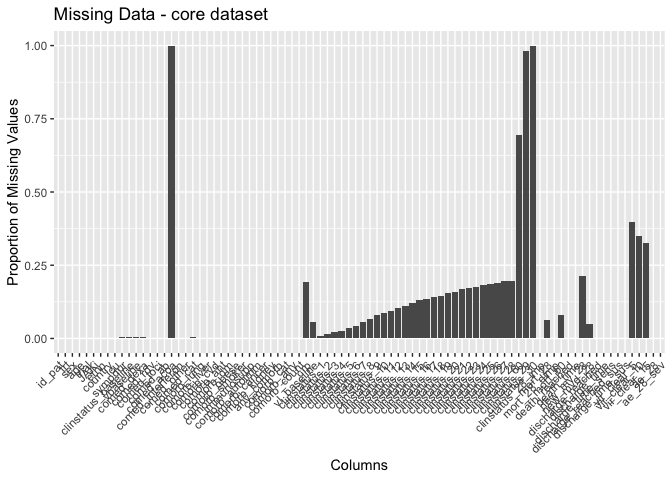
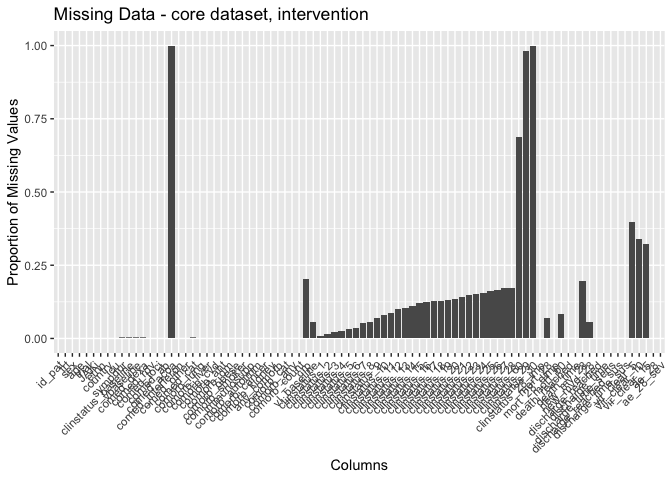
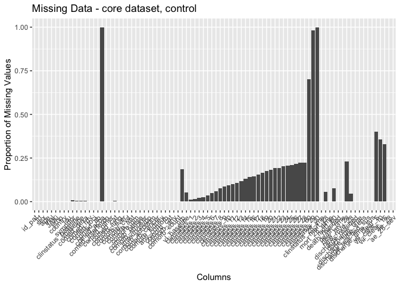
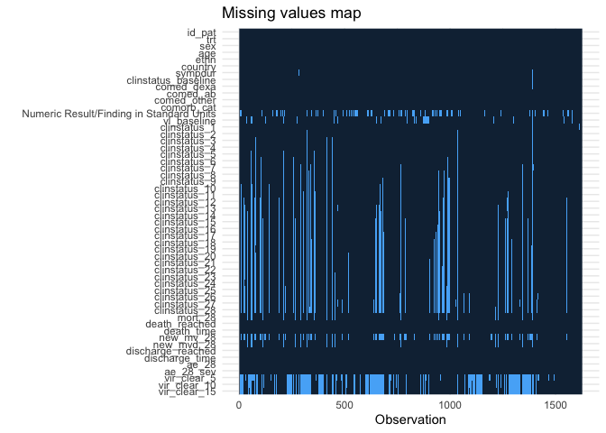
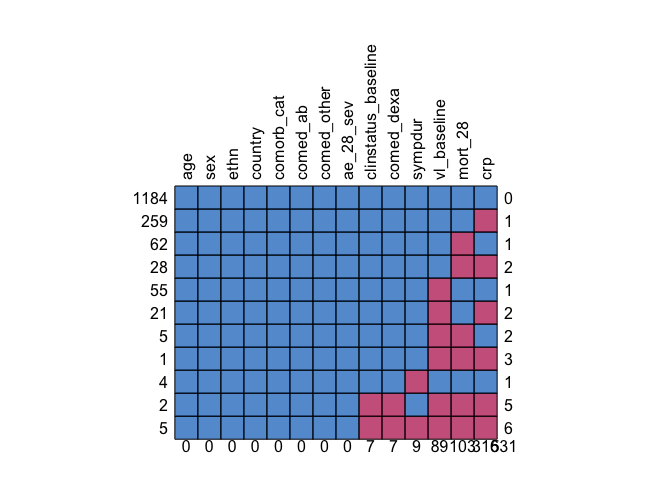
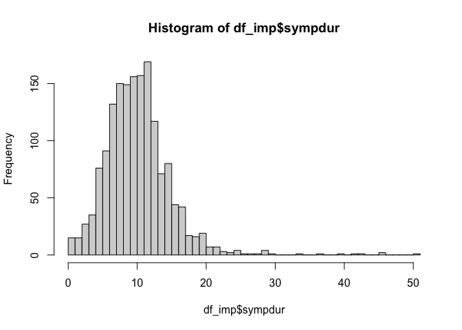
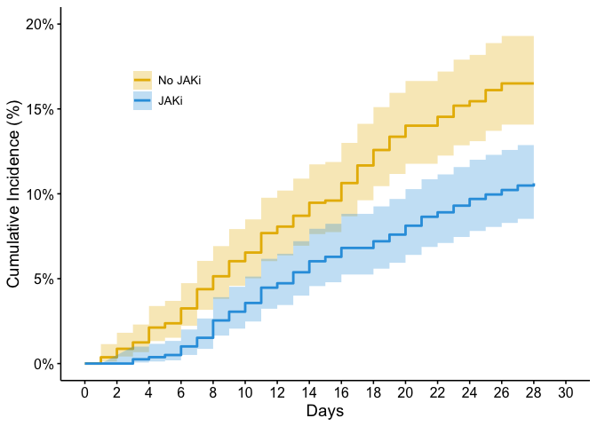
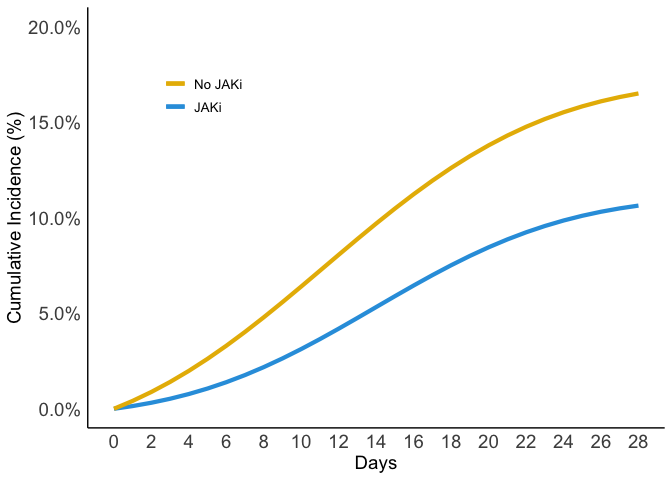

# Load packages

```r
library(tidyverse)
library(readxl)
library(writexl)
library(tableone)
library(haven) # Read sas files
library(here)
library(kableExtra)

library(jtools) # for summ() and plot_summs
library(sjPlot) # for tab_model
library(ggplot2) # survival/TTE analyses and other graphs
library(ggsurvfit) # survival/TTE analyses
library(survival) # survival/TTE analyses
library(gtsummary) # survival/TTE analyses
library(ggfortify) # autoplot
library(tidycmprsk) # competing risk analysis
library(ordinal) # clinstatus ordinal regression
library(logistf) # Firth regression in case of rare events

library(finalfit) # missing data exploration
library(mice) # multiple imputation
library(jomo) # multiple imputation
library(mitools) # multiple imputation
```

# Load Data


# Define ITT population and mark COV-BARRIER and COV-BARRIER expl.

```r
df <- df_ind_set %>% # keep only those randomized
  filter(RANDFL == "Y")
df <- df %>% # mark COV-BARRIER (main trial, all severity except MV/ECMO) and COV-BARRIER exploratory (only MV/ECMO)
  mutate(subtrial = case_when(BNIAID == "7" ~ "COV-BARRIER_MV",
                               TRUE ~ c("COV-BARRIER_main")))
addmargins(table(df$ARM, df$subtrial))
```

```
##                     
##                      COV-BARRIER_main COV-BARRIER_MV  Sum
##   Baricitinib-4mg-QD              764             51  815
##   Placebo                         761             50  811
##   Sum                            1525            101 1626
```

# Baseline Characteristics

```r
df <- df %>% # no missing in all these
  rename(id_pat = SUBJID,
         country = COUNTRY,
         randdate = RANDDT
         )
df <- df %>% # COV-BARRIER exploratory (only MV/ECMO) were recruited in ICU
  mutate(icu = case_when(subtrial == "COV-BARRIER_MV" ~ 1,
                               TRUE ~ 0))
df <- df %>%
  mutate(trt = case_when(ARM == "Baricitinib-4mg-QD" ~ 1,
                         TRUE ~ 0))
# add trial variables
df$trial <- c("COV-BARRIER")
df$JAKi <- c("Baricitinib")
df <- df %>% # no missing in sex
  mutate(sex = case_when(SEX == "F" ~ "female",
                         SEX == "M" ~ "male"))
# Ethnicity
df <- df %>% # no missing in ethnicity
  mutate(ethn = case_when(RACE == "UNKNOWN" & ETHNIC == "HISPANIC OR LATINO" ~ "HISPANIC OR LATINO",
                          TRUE ~ c(RACE)))
# AGE: add 90 to ages ">89" // age data also not available in df_demographics due to anonymization
df$age <- as.numeric(df$AGE)
df <- df %>%
  mutate(age = case_when(is.na(age) ~ 90,
                         TRUE ~ c(age)))
df %>% 
  drop_na(age) %>% 
  ggplot(aes(x = age)) +
  geom_density(fill = "blue", color = "black") +
  labs(title = "Density Plot of Age",
       x = "Age",
       y = "Density")
```

<!-- -->

```r
# Days with symptoms prior to randomization
df <- df %>% 
  mutate(sympdur = case_when(SYMHDUR == "-24" ~ "0",
                             SYMHDUR == "-22" ~ "0",
                             SYMHDUR == "-16" ~ "0",
                             SYMHDUR == "-15" ~ "0",
                             SYMHDUR == "-8" ~ "0",
                             TRUE ~ c(SYMHDUR)))
df$sympdur <- as.numeric(df$sympdur)
df %>% 
  drop_na(sympdur) %>% 
  ggplot(aes(x = sympdur)) +
  geom_density(fill = "blue", color = "black") +
  labs(title = "Density Plot of Symptom Duration",
       x = "Symptom Duration",
       y = "Density")
```

<!-- -->

```r
# Severity of COVID-19 with respect to respiratory support at randomisation, according to NIAID score
# transform all clinical scores
score_transform <- function(df, clinstatus_var, score_var) {
  df <- df %>%
    mutate({{ clinstatus_var }} :=
             case_when({{ score_var }} %in% c(1, 2, 3) ~ 1,
                       {{ score_var }} == 4 ~ 2,
                       {{ score_var }} == 5 ~ 3,
                       {{ score_var }} == 6 ~ 4,
                       {{ score_var }} == 7 ~ 5,
                       {{ score_var }} == 8 ~ 6)) %>%
    mutate({{ clinstatus_var }} := factor({{ clinstatus_var }}, levels = 1:6))
}
df <- score_transform(df, clinstatus_baseline, BNIAIDN) 
# addmargins(table(df$clinstatus_baseline, df$trt, useNA = "always")) # 7 missing
# addmargins(table(df$clinstatus_baseline, df$trt, df$subtrial, useNA = "always")) # 7 missing in COV-BARRIER main, no missing in COV-BARRIER 2 // # corresponds to publications

df <- df %>% 
  mutate(vbaseline = case_when(clinstatus_baseline == "2" | clinstatus_baseline == "3" ~ 0,
                                clinstatus_baseline == "4" | clinstatus_baseline == "5" ~ 1))

### Co-medication at baseline
# table(df$BLSTRFN, df$trt, df$subtrial, useNA = "always") # corresponds to publications
# table(df$BRMDSVFL, df$trt, df$subtrial, useNA = "always") # corresponds to publications

# check df_comed_set for prior/baseline co-medications for the following:
df$comed_toci <- 0 # excluded according to protocol
df$comed_acoa <- NA
df$comed_interferon <- 0 # excluded according to protocol

df <- df %>% 
  mutate(comed_dexa = case_when(BLSTRFN == 1 ~ 1,
                                BLSTRFN == 0 ~ 0))
df <- df %>% 
  mutate(comed_rdv = case_when(BRMDSVFL == "Y" ~ 1,
                                TRUE ~ 0))
df <- df %>% 
  mutate(comed_ab = case_when(PTHANTBI == "Y" ~ 1,
                                TRUE ~ 0))
df <- df %>% 
  mutate(comed_other = case_when(PTHOTH == "Y" ~ 1,
                                TRUE ~ 0))
# group them for the subgroup analysis, according to protocol
df <- df %>% 
  mutate(comed_cat = case_when(comed_dexa == 0 & (comed_toci == 0 | is.na(comed_toci)) ~ 1, # patients without Dexamethasone nor Tocilizumab
                               comed_dexa == 1 & (comed_toci == 0 | is.na(comed_toci)) ~ 2, # patients with Dexamethasone but no Tocilizumab
                               comed_dexa == 1 & comed_toci == 1 ~ 3, # patients with Dexamethasone and Tocilizumab
                               comed_dexa == 0 & comed_toci == 1 ~ 4)) # patients with Tocilizumab but no Dexamethasone (if exist)


### Comorbidity at baseline, including immunocompromised
df <- df %>% 
  mutate(comorb_dm = case_when(CMRDFL == "Y" ~ 1,
                              CMRDFL == "N" ~ 0))
df <- df %>%
  mutate(comorb_obese = case_when(CMROFL == "Y" ~ 1,
                                   CMROFL == "N" ~ 0))
df <- df %>%
  mutate(comorb_aht = case_when(CMRHFL == "Y" ~ 1,
                                   CMRHFL == "N" ~ 0))
df <- df %>%
  mutate(comorb_lung = case_when(CMRCFL == "Y" ~ 1,
                                  CMRCFL == "N" ~ 0))
df <- df %>%
  mutate(comorb_kidney = case_when(BRNLGR1 == "Impaired" ~ 1,
                                   TRUE ~ 0))
# take it from medicalhistory dataset
df_medicalhist_set <- df_medicalhist_set %>% 
  mutate(comorb_cancer = case_when((grepl("Cancer", ALLT) | grepl("cancer", ALLT) | grepl("neoplasm", ALLT) | grepl("Neoplasm", ALLT) | grepl("carcinoma", ALLT) | grepl("Carcinoma", ALLT)) ~ 1))
df_medicalhist_set <- df_medicalhist_set %>% 
  mutate(comorb_liver = case_when(ALLT == "Chronic liver disease" ~ 1))
df_medicalhist_set <- df_medicalhist_set %>% 
  mutate(comorb_cvd = case_when(ASOC == "Cardiac disorders" ~ 1))
df_medicalhist_set <- df_medicalhist_set %>% 
  mutate(immunosupp = case_when((grepl("immune deficiency", ALLT) | grepl("Chemo", ALLT) | grepl("Radio", ALLT)) ~ 1))
df_medicalhist_set <- df_medicalhist_set %>% 
  mutate(comorb_autoimm = case_when((grepl("rheuma", ALLT) | grepl("Rheuma", ALLT) | grepl("immune", ALLT) | grepl("immune", ASOC) | grepl("immune", ADECOD)) & is.na(immunosupp) ~ 1))
# remove duplicates  
df_comorb_cancer <- df_medicalhist_set %>% 
  filter(comorb_cancer == 1) %>%
  distinct(USUBJID,comorb_cancer)
df_comorb_liver <- df_medicalhist_set %>% 
  filter(comorb_liver == 1) %>%
  distinct(USUBJID,comorb_liver)
df_comorb_cvd <- df_medicalhist_set %>% 
  filter(comorb_cvd == 1) %>%
  distinct(USUBJID,comorb_cvd)
df_immunosupp <- df_medicalhist_set %>% 
  filter(immunosupp == 1) %>%
  distinct(USUBJID,immunosupp)
df_comorb_autoimm <- df_medicalhist_set %>% 
  filter(comorb_autoimm == 1) %>%
  distinct(USUBJID,comorb_autoimm)
# merge
df <- left_join(df, df_comorb_cancer[, c("comorb_cancer", "USUBJID")], by = join_by(USUBJID == USUBJID)) ## merge to main df
df <- left_join(df, df_comorb_liver[, c("comorb_liver", "USUBJID")], by = join_by(USUBJID == USUBJID)) ## merge to main df
df <- left_join(df, df_comorb_cvd[, c("comorb_cvd", "USUBJID")], by = join_by(USUBJID == USUBJID)) ## merge to main df
df <- left_join(df, df_immunosupp[, c("immunosupp", "USUBJID")], by = join_by(USUBJID == USUBJID)) ## merge to main df
df <- left_join(df, df_comorb_autoimm[, c("comorb_autoimm", "USUBJID")], by = join_by(USUBJID == USUBJID)) ## merge to main df

# take smoking from substance use set
df_substance_use_supp <- df_substance_use_supp %>% 
  mutate(comorb_smoker = case_when(QVAL == "CURRENT" ~ 1))
df_comorb_smoker <- df_substance_use_supp %>% 
  filter(comorb_smoker == 1) %>%
  distinct(USUBJID,comorb_smoker)
df <- left_join(df, df_comorb_smoker[, c("comorb_smoker", "USUBJID")], by = join_by(USUBJID == USUBJID)) ## merge to main df

# the remaining missing have only NA in 1 comorb category => no evidence for comorbidity -> recode as 0
# table(df$PTHIMMSP)
df <- df %>% 
  mutate(comorb_cancer = case_when(is.na(comorb_cancer) ~ 0,
                                TRUE ~ c(comorb_cancer)),
         comorb_liver = case_when(is.na(comorb_liver) ~ 0,
                                TRUE ~ c(comorb_liver)),
         comorb_cvd = case_when(is.na(comorb_cvd) ~ 0,
                                TRUE ~ c(comorb_cvd)),
         immunosupp = case_when(is.na(immunosupp) ~ 0,
                                TRUE ~ c(immunosupp)),
         comorb_autoimm = case_when(is.na(comorb_autoimm) ~ 0,
                                TRUE ~ c(comorb_autoimm)),
         comorb_smoker = case_when(is.na(comorb_smoker) ~ 0,
                                TRUE ~ c(comorb_smoker)))
df <- df %>% 
  mutate(any_comorb = case_when(comorb_lung == 1 | comorb_liver == 1 | comorb_cvd == 1 |
                                  comorb_aht == 1 | comorb_dm == 1 | comorb_obese == 1 | comorb_smoker == 1
                                | immunosupp == 1 | comorb_cancer == 1 | comorb_autoimm == 1 | comorb_kidney == 1 
                                  ~ 1,
                                comorb_lung == 0 & comorb_liver == 0 & comorb_cvd == 0 &
                                  comorb_aht == 0 & comorb_dm == 0 & comorb_obese == 0 & comorb_smoker == 0
                                & immunosupp == 0 & comorb_cancer == 0 & comorb_autoimm == 0 & comorb_kidney == 0
                                ~ 0))
# addmargins(table(df$any_comorb, df$trt, useNA = "always"))

## group them for the subgroup analysis, according to protocol // count all pre-defined comorbidities per patient first
comorb <- df %>% 
  select("id_pat", "comorb_lung", "comorb_liver", "comorb_cvd", "comorb_aht", "comorb_dm", "comorb_obese", "comorb_smoker", "immunosupp", "comorb_kidney", "comorb_autoimm", "comorb_cancer")
comorb$comorb_count <- NA
for (i in 1:dim(comorb)[[1]]) {
  comorb$comorb_count[i] <- ifelse(
    sum(comorb[i, ] %in% c(1)) > 0,
    sum(comorb[i, ] %in% c(1)),
    NA
  )
}
comorb <- comorb %>%
  mutate(comorb_count = case_when(comorb_lung == 0 & comorb_liver == 0 & comorb_cvd == 0 &
                                  comorb_aht == 0 & comorb_dm == 0 & comorb_obese == 0 & comorb_smoker == 0
                                & immunosupp == 0 & comorb_cancer == 0 & comorb_autoimm == 0 & comorb_kidney == 0 ~ 0,
                                TRUE ~ comorb_count))
df <- left_join(df, comorb[, c("comorb_count", "id_pat")], by = join_by(id_pat == id_pat)) ## merge imputed variable back
df <- df %>%
  mutate(comorb_cat = case_when(immunosupp == 1 ~ 4, # immunocompromised
                                comorb_count == 0 ~ 1, # no comorbidity
                                comorb_count == 1 ~ 2, # one comorbidity
                                comorb_count >1 & (immunosupp == 0 | is.na(immunosupp)) ~ 3)) # multiple comorbidities
# addmargins(table(df$comorb_cat, df$trt, useNA = "always"))
df <- df %>%
  mutate(comorb_any = case_when(comorb_count == 0 ~ 0, # no comorbidity
                                comorb_count >0 ~ 1)) # any comorbidity


## CRP
df_crp <- df_lab_set %>% 
  filter(LBTESTCD == "CRP") %>% 
  filter(VISIT == "Screening") %>% 
  filter(AVISITN == 1)
df_crp <- df_crp %>% 
  distinct(USUBJID, .keep_all = TRUE)
df_crp <- df_crp %>% 
  rename(crp = LBSTRESN)
df <- left_join(df, df_crp[, c("crp", "USUBJID")], by = join_by(USUBJID == USUBJID)) ## merge to main df
df %>% 
  drop_na(crp) %>% 
  ggplot(aes(x = crp)) +
  geom_density(fill = "blue", color = "black") +
  labs(title = "Density Plot of Symptom Duration",
       x = "CRP",
       y = "Density")
```

<!-- -->

```r
# Viremia dataset 
df_viremia <- df_microbio %>% 
  filter(MBTESTCD != "MBALL") %>% 
  filter(MBTSTDTL == "DETECTION") %>% 
  filter(MBBLFL == "Y")
df_viremia <- df_viremia %>% 
  distinct(USUBJID, .keep_all = TRUE)
df_viremia <- df_viremia %>% # viral load value <LOQ and/or undectectable
  mutate(vl_baseline = case_when(MBORRES == "POSITIVE" ~ 0,
                                 TRUE ~ 1))
df <- left_join(df, df_viremia[, c("vl_baseline", "USUBJID")], by = join_by(USUBJID == USUBJID)) ## merge to main df

# Vaccination // not available
# Variant // not available
# Serology // not available
```

# Endpoints

```r
# (i) Primary outcome: Mortality at day 28
df_ttd <- df_tte_set %>% # death set
  filter(PARAM == "Time to Death by Day 28") %>% 
  filter(RANDFL == "Y") # only randomised population
# discontinuation set
df_disco_any <- df_disco_set %>% 
  filter(DSDECOD != "COMPLETED" & DSDECOD != "DEATH") %>% # any other reason than these
  filter(RANDFL == "Y") %>% # only randomized population
  filter(DSSCAT == "STUDY DISPOSITION"| DSSCAT == "TREATMENT DISPOSITION") %>% # full study dispo, not only treatment or drug dispo
  distinct(USUBJID, ADT, EPOCH, DSDECOD, DSTERM)
df_disco_any <- df_disco_any %>%
  mutate(dupl = ifelse(duplicated(select(., USUBJID, ADT)), 1, 0))
df_disco_any <- df_disco_any %>%
  filter(dupl == 0)
df_disco_any <- df_disco_any %>%
  mutate(dupl2 = ifelse(duplicated(select(., USUBJID)), 1, 0))
df_disco_any <- df_disco_any %>%
  filter(dupl2 == 0)
df_ttd <- left_join(df_ttd, df_disco_any[, c("ADT", "EPOCH", "DSDECOD", "DSTERM", "USUBJID")], by = join_by(USUBJID == USUBJID)) ## merge to main df
# mark those that were censored before day 28 (i.e. stop of follow up, not because of discharge or death, but because of AE/withdrawal/LTFU/etc.)
df_ttd <- df_ttd %>% 
  mutate(disco_28 = case_when(AVAL <28 & CNSR == 1 ~ 1,
                            TRUE ~ 0))
df_ttd <- df_ttd %>% # identify deaths
  mutate(mort_28 = case_when(EVNTDESC == "Death on or before Day 28" ~ 1,
                             disco_28 == 0 ~ 0
                             ))
df <- left_join(df, df_ttd[, c("mort_28", "USUBJID")], by = join_by(USUBJID == USUBJID)) ## merge to main df
addmargins(table(df$mort_28, df$trt, df$subtrial, useNA = "always")) # corresponds to publications: "*159 deaths were reported by day 28; an additional three deaths occurred after the treatment period disposition but within 28 days."
```

```
## , ,  = COV-BARRIER_main
## 
##       
##           0    1 <NA>  Sum
##   0     617  647    0 1264
##   1     100   62    0  162
##   <NA>   44   55    0   99
##   Sum   761  764    0 1525
## 
## , ,  = COV-BARRIER_MV
## 
##       
##           0    1 <NA>  Sum
##   0      19   29    0   48
##   1      29   20    0   49
##   <NA>    2    2    0    4
##   Sum    50   51    0  101
## 
## , ,  = NA
## 
##       
##           0    1 <NA>  Sum
##   0       0    0    0    0
##   1       0    0    0    0
##   <NA>    0    0    0    0
##   Sum     0    0    0    0
## 
## , ,  = Sum
## 
##       
##           0    1 <NA>  Sum
##   0     636  676    0 1312
##   1     129   82    0  211
##   <NA>   46   57    0  103
##   Sum   811  815    0 1626
```

```r
# First, keep mort_28 as complete case

# Second, use multiple imputation (see below)

# Third, apply a deterministic imputation (see notes): we use the same rules as ACTT2 => transfer that died are already accounted for, for the remaining -> assign "alive"
df <- df %>%
  mutate(mort_28_dimp = case_when(is.na(mort_28) ~ 0,
                             TRUE ~ c(mort_28)))


# (ii) Mortality at day 60
df_ttd <- df_tte_set %>% 
  filter(PARAM == "Time to Death by Day 60") %>% 
  filter(RANDFL == "Y") # only randomised population
df_ttd <- left_join(df_ttd, df_disco_any[, c("ADT", "EPOCH", "DSDECOD", "DSTERM", "USUBJID")], by = join_by(USUBJID == USUBJID)) ## merge all disco
df_ttd <- df_ttd %>% # mark those that were censored before day 60 (i.e. stop of follow up, not because of discharge or death, but because of AE/withdrawal/LTFU/etc.)
  mutate(disco_60 = case_when(AVAL <60 & CNSR == 1 & !is.na(DSTERM) ~ 1,
                            TRUE ~ 0))
df_ttd <- df_ttd %>% # identify deaths using the censoring variable
  mutate(mort_60 = case_when(CNSR == 0 ~ 1,
                             disco_60 == 0 ~ 0))
df <- left_join(df, df_ttd[, c("mort_60", "USUBJID")], by = join_by(USUBJID == USUBJID)) ## merge to main df
addmargins(table(df$mort_60, df$trt, df$subtrial, useNA = "always"))
```

```
## , ,  = COV-BARRIER_main
## 
##       
##           0    1 <NA>  Sum
##   0     586  619    0 1205
##   1     116   79    0  195
##   <NA>   59   66    0  125
##   Sum   761  764    0 1525
## 
## , ,  = COV-BARRIER_MV
## 
##       
##           0    1 <NA>  Sum
##   0      17   27    0   44
##   1      31   23    0   54
##   <NA>    2    1    0    3
##   Sum    50   51    0  101
## 
## , ,  = NA
## 
##       
##           0    1 <NA>  Sum
##   0       0    0    0    0
##   1       0    0    0    0
##   <NA>    0    0    0    0
##   Sum     0    0    0    0
## 
## , ,  = Sum
## 
##       
##           0    1 <NA>  Sum
##   0     603  646    0 1249
##   1     147  102    0  249
##   <NA>   61   67    0  128
##   Sum   811  815    0 1626
```

```r
# (iii) Time to death within max. follow-up time (systematically until 60 days!)
df_ttd <- df_tte_set %>% 
  filter(PARAM == "Time to Death") %>% 
  filter(RANDFL == "Y")
df_ttd <- df_ttd %>% # use censoring variable to identify deaths within 28 days, don't bother about the others
  mutate(death_reached = case_when(CNSR == 0 ~ 1,
                             CNSR == 1 ~ 0))
df_ttd$death_time <- df_ttd$AVAL
df <- left_join(df, df_ttd[, c("death_reached", "death_time", "USUBJID")], by = join_by(USUBJID == USUBJID)) ## merge to main df
# table(df$death_time, df$death_reached, useNA = "always") 
# Cap at 60 days, since this was max. systematic follow-up, no deaths recorded afterwards anymore
df <- df %>% 
  mutate(death_time = case_when(death_time >60 ~ 60,
                                TRUE ~ c(death_time)))


# (iv) Alternative definition/analysis: New mechanical ventilation OR death within 28 days
# table(df_tte_set$PARAM)
df_mvd <- df_tte_set %>% 
  filter(PARAM == "Time to progression to invasive ventilation or death  (OS >= 7)") %>% # include the deaths, in order not to miss any event (subtract them in the end)
  filter(RANDFL == "Y") # only randomised population
df_mvd$tt_mv <- df_mvd$AVAL # time to MV (incl. censoring for those dead or last available visit) -> incl. longer than 28d!
df_mvd <- left_join(df_mvd, df_disco_any[, c("ADT", "EPOCH", "DSDECOD", "DSTERM", "USUBJID")], by = join_by(USUBJID == USUBJID)) ## merge all disco
df_mvd <- df_mvd %>% # mark those that were discontinued before day 28 (i.e. stop of follow up, not because of discharge or death, but because of AE/withdrawal/LTFU/etc.)
  mutate(disco_28_mvd = case_when(AVAL <28 & CNSR == 1 & !is.na(DSTERM) ~ 1,
                            TRUE ~ 0))
df_mvd <- df_mvd %>% # identify deaths using the censoring variable
  mutate(new_mvd_28 = case_when(CNSR == 0 & tt_mv < 29 ~ 1,
                             disco_28_mvd == 0 ~ 0))
df <- left_join(df, df_mvd[, c("new_mvd_28", "disco_28_mvd", "USUBJID")], by = join_by(USUBJID == USUBJID)) ## merge to main df
# table(df$new_mvd_28, df$mort_28, useNA = "always")
# table(df$clinstatus_baseline, df$new_mvd_28, useNA = "always")
# table(df$new_mvd_28, useNA = "always")
# table(df$mort_28, useNA = "always")

# (iv) New mechanical ventilation among survivors within 28 days
# table(df_tte_set$PARAM)
df_mv <- df_tte_set %>% 
  filter(PARAM == "Time to invasive ventilation (OS =7)") %>%
  filter(RANDFL == "Y") # only randomised population
df_mv$tt_mv <- df_mv$AVAL # time to MV (incl. censoring for those dead or last available visit) -> incl. longer than 28d!
df_mv <- left_join(df_mv, df_disco_any[, c("ADT", "EPOCH", "DSDECOD", "DSTERM", "USUBJID")], by = join_by(USUBJID == USUBJID)) ## merge all disco
df_mv <- df_mv %>% # mark those that were discontinued before day 28 (i.e. stop of follow up, not because of discharge or death, but because of AE/withdrawal/LTFU/etc.)
  mutate(disco_28_mv = case_when(AVAL <28 & CNSR == 1 & !is.na(DSTERM) ~ 1,
                            TRUE ~ 0))
df_mv <- df_mv %>% # identify deaths using the censoring variable
  mutate(new_mv_28 = case_when(CNSR == 0 & tt_mv < 29 ~ 1,
                             disco_28_mv == 0 ~ 0))
df <- left_join(df, df_mv[, c("new_mv_28", "disco_28_mv", "USUBJID")], by = join_by(USUBJID == USUBJID)) ## merge to main df
# table(df$new_mv_28, df$mort_28, useNA = "always")
# table(df$clinstatus_baseline, df$new_mv_28, useNA = "always")
# table(df$new_mv_28, useNA = "always")
# table(df$mort_28, useNA = "always")
# classify those dead within 28d and those that were MV at baseline as NA ("among survivors")
df <- df %>% 
  mutate(new_mv_28 = case_when(mort_28 == 1 | clinstatus_baseline == 5 ~ NA,
                               TRUE ~ c(new_mv_28)))
# table(df$new_mv_28, df$mort_28, useNA = "always")
# table(df$new_mv_28, df$clinstatus_baseline, useNA = "always")
# # see missing data rule: the 7 with no clinstatus at all, not even baseline clinstatus -> assume clinstatus == 5
# df <- df %>% 
#   mutate(new_mv_28 = case_when(is.na(clinstatus_baseline) ~ 1,
#                                TRUE ~ c(new_mv_28)))


# (vi) Time to discharge or reaching discharge criteria up to day 28
df_ttdis <- df_tte_set %>% 
  filter(PARAM == "Time to recovery by Day 28 (OS <=3)") %>% 
  filter(RANDFL == "Y")
df_ttdis$discharge_time <- df_ttdis$AVAL # time to discharge -> longer than 28d!
# table(df_ttdis$EVNTDESC, df_ttdis$discharge_time) # CAVE: Those that died have all assigned 28 days!
df_ttdis <- df_ttdis %>% # use censoring variable to identify MV 
  mutate(discharge_reached = case_when(discharge_time < 29 & CNSR == 0 ~ 1,
                                       TRUE ~ 0))
# table(df_ttdis$discharge_reached, df_ttdis$discharge_time, useNA = "always")
df <- left_join(df, df_ttdis[, c("discharge_reached", "discharge_time", "USUBJID")], by = join_by(USUBJID == USUBJID)) ## merge to main df
df <- df %>% # add time to death for those that died
  mutate(discharge_time = case_when(mort_28 == 1 ~ death_time,
                                    TRUE ~ discharge_time))
df <- df %>% # Cap at 28 days
  mutate(discharge_time = case_when(discharge_time >28 ~ 28,
                                TRUE ~ c(discharge_time)))
# table(df$discharge_reached, df$discharge_time, useNA = "always")
df <- df %>% # add 28d for those that died // Patients who died prior to day 28 are assumed not having reached discharge, i.e. counted as 28 days
  mutate(discharge_time_sens = case_when(mort_28 == 1 ~ 28,
                                    TRUE ~ discharge_time))
# table(df$discharge_reached, df$discharge_time_sens, useNA = "always") -> correct. Corresponds to # table(df_ttdis$discharge_reached, df_ttdis$discharge_time, useNA = "always")


# (v) Clinical status at day 28
## first, curate clinical score long format dataset
df_cs_long <- df_niaid_score_set %>%
  filter(PARAM == "NIAID OS Scale") %>% 
  filter(ABLFL != "Y") %>% # remove baseline clinicalstatus
  filter(VISIT != "") # remove missed visits that were LOVCF
df_cs_long <- score_transform(df_cs_long, clinstatus, AVAL) # transform the NIAID score to our score
# second, reformat into wide format
df_cs_wide <- df_cs_long %>% ## the ones with missing baseline clinstatus are missing
  pivot_wider(id_cols = c("USUBJID"),
              names_from = "VISIT",
              values_from = "clinstatus")
# table(df_cs_wide$`Day 28`)
df <- left_join(df, df_cs_wide, by = join_by(USUBJID == USUBJID)) # Merge imputed variable back
df <- df %>% 
  rename(clinstatus_1 = Screening,
         clinstatus_2 = `Day 2`,
         clinstatus_3 = `Day 3`,
         clinstatus_4 = `Day 4`,
         clinstatus_5 = `Day 5`,
         clinstatus_6 = `Day 6`,
         clinstatus_7 = `Day 7`,
         clinstatus_8 = `Day 8`,
         clinstatus_9 = `Day 9`,
         clinstatus_10 = `Day 10`,
         clinstatus_11 = `Day 11`,
         clinstatus_12 = `Day 12`,
         clinstatus_13 = `Day 13`,
         clinstatus_14 = `Day 14`,
         clinstatus_15 = `Day 15`,
         clinstatus_16 = `Day 16`,
         clinstatus_17 = `Day 17`,
         clinstatus_18 = `Day 18`,
         clinstatus_19 = `Day 19`,
         clinstatus_20 = `Day 20`,
         clinstatus_21 = `Day 21`,
         clinstatus_22 = `Day 22`,
         clinstatus_23 = `Day 23`,
         clinstatus_24 = `Day 24`,
         clinstatus_25 = `Day 25`,
         clinstatus_26 = `Day 26`,
         clinstatus_27 = `Day 27`,
         clinstatus_28 = `Day 28`,
         clinstatus_29 = `Follow-up`,
         clinstatus_30 = `Final Status`,
         clinstatus_60 = `Follow-Up Day 60`)

## Imputation according to protocol: If there was daily data for the ordinal score available but with missing data for single days, then we carried last observed value forward unless for day 28, whereby we first considered data from the window (+/-3 days) but there was nothing in that window => LVCF
# table(df$clinstatus_baseline, useNA = "always")
df <- df %>% # see imputation rules
  mutate(clinstatus_baseline_imp = case_when(is.na(clinstatus_baseline) ~ "5",
                                         TRUE ~ clinstatus_baseline))
dfcs <- df %>% 
    select(USUBJID, clinstatus_baseline_imp, clinstatus_1, clinstatus_2, clinstatus_3, clinstatus_4, clinstatus_5, clinstatus_6, clinstatus_7, clinstatus_8, clinstatus_9, clinstatus_10, clinstatus_11, clinstatus_12, clinstatus_13, clinstatus_14, clinstatus_15, clinstatus_16, clinstatus_17, clinstatus_18, clinstatus_19, clinstatus_20, clinstatus_21, clinstatus_22, clinstatus_23, clinstatus_24, clinstatus_25, clinstatus_26, clinstatus_27, clinstatus_28)
impute_last_forw = function(df){
  first = which(names(df)%in%c("clinstatus_baseline_imp"))
  last = which(names(df)%in%c("clinstatus_28"))
  for (i in 1:dim(df)[[1]]){
    for (j in first[1]:last[1]){
      p = df[i, j]
      df[i,j] <- 
        ifelse(!is.na(df[i, j]), p, df[i, j-1])
    }
  }
  df
}
dfcs <- impute_last_forw(dfcs)
dfcs <- dfcs %>% # To control, don't overwrite
  rename(clinstatus_28_imp = clinstatus_28)
df <- left_join(df, dfcs[, c("clinstatus_28_imp", "USUBJID")], by = join_by(USUBJID == USUBJID)) # Merge imputed variable back
# table(df$clinstatus_28, useNA = "always")
# table(df$clinstatus_28_imp, useNA = "always") # imputed

# df %>% # these ones were discharged, but then readmitted (1 even died, but after day 28)
#   filter(clinstatus_28 != 1 & discharge_reached == 1) %>%
#   select(discharge_reached, discharge_time, clinstatus_28, clinstatus_baseline, mort_28, mort_60, new_mvd_28, new_mv_28, everything()) %>%
#   View()

# (vi) Sens-analysis: Alternative definition/analysis of outcome: time to sustained discharge within 28 days. There are 8 re-admissions documented in COV-BARRIER
df <- df %>% 
  mutate(discharge_reached_sus = case_when(discharge_reached == 1 & clinstatus_28 != 1 ~ 0,
                                           TRUE ~ c(discharge_reached)))
df <- df %>% 
  mutate(discharge_time_sus = case_when(discharge_reached == 1 & clinstatus_28 != 1 ~ 28,
                                           TRUE ~ c(discharge_time)))
# table(df$discharge_reached_sus, df$discharge_reached)

# (vii) Viral clearance up to day 5, day 10, and day 15 (Viral load value <LOQ and/or undectectable)
df_viremia <- df_microbio %>% 
  filter(MBTESTCD != "MBALL") %>% 
  filter(MBTSTDTL == "DETECTION")
# table(df_viremia$VISITNUM, useNA = "always") # the NAs are not relevant: They are either from before randomization or after day 15
df_viremia <- df_viremia %>% 
  filter(VISITNUM %in% c(1,2,3,4,5,6,7,8,9,10,11,12,13,14,15))
df_viremia <- df_viremia %>% # viral load value <LOQ and/or undectectable
  mutate(vl = case_when(MBORRES == "POSITIVE" ~ 0,
                                 MBORRES == "NEGATIVE" ~ 1))
# Filtering and extracting the last measurement for each participant
df_vir_clear_5 <- df_viremia %>%
  filter(VISITNUM <= 5) %>%
  group_by(SUBJID) %>%
  slice_max(VISITNUM)
df_vir_clear_5$vir_clear_5 <- df_vir_clear_5$vl
# Check for duplicates in SUBJID and VL
df_vir_clear_5 <- df_vir_clear_5 %>%
  mutate(participant_duplicate = duplicated(SUBJID) | duplicated(SUBJID, fromLast = TRUE))
df_vir_clear_5 <- df_vir_clear_5 %>% # remove exact duplicates
  distinct(SUBJID, vir_clear_5, .keep_all = TRUE)
specific_duplicates <- any(duplicated(df_vir_clear_5[, c("SUBJID")]))

df_vir_clear_10 <- df_viremia %>%
  filter(VISITNUM <= 10) %>%
  group_by(SUBJID) %>%
  slice_max(VISITNUM)
df_vir_clear_10$vir_clear_10 <- df_vir_clear_10$vl
# Check for duplicates in SUBJID and VL
df_vir_clear_10 <- df_vir_clear_10 %>%
  mutate(participant_duplicate = duplicated(SUBJID) | duplicated(SUBJID, fromLast = TRUE))
df_vir_clear_10 <- df_vir_clear_10 %>% # remove exact duplicates
  distinct(SUBJID, vir_clear_10, .keep_all = TRUE)
specific_duplicates <- any(duplicated(df_vir_clear_10[, c("SUBJID")]))

df_vir_clear_15 <- df_viremia %>%
  filter(VISITNUM <= 15) %>%
  group_by(SUBJID) %>%
  slice_max(VISITNUM)
df_vir_clear_15$vir_clear_15 <- df_vir_clear_15$vl
# Check for duplicates in SUBJID and VL
df_vir_clear_15 <- df_vir_clear_15 %>%
  mutate(participant_duplicate = duplicated(SUBJID) | duplicated(SUBJID, fromLast = TRUE))
df_vir_clear_15 <- df_vir_clear_15 %>% # remove exact duplicates
  distinct(SUBJID, vir_clear_15, .keep_all = TRUE)
specific_duplicates <- any(duplicated(df_vir_clear_15[, c("SUBJID")]))

df <- left_join(df, df_vir_clear_5[, c("vir_clear_5", "USUBJID")], by = join_by(USUBJID == USUBJID)) ## merge to main df
df <- left_join(df, df_vir_clear_10[, c("vir_clear_10", "USUBJID")], by = join_by(USUBJID == USUBJID)) ## merge to main df
df <- left_join(df, df_vir_clear_15[, c("vir_clear_15", "USUBJID")], by = join_by(USUBJID == USUBJID)) ## merge to main df


# (viii) Quality of life at day 28: Not available in COV-BARRIER


# (ix) Participants with an adverse event grade 3 or 4, or a serious adverse event, excluding death, by day 28
# unique(df_ae_set$ASTDY)
df_ae34 <- df_ae_set %>% 
  filter(AESEV == "SEVERE" | AESEV == "MODERATE" | AESER == "Y") %>% 
  filter(ASTDY <29)
# Keep just 1 id_pat (-> ANY adverse event grade 3 (severe), 4 (serious)) 
df_ae34_unique <- df_ae34 %>% distinct(USUBJID, .keep_all = TRUE)
# Assign the outcome
df_ae34_unique$ae_28 <- 1
# table(df_ae34_unique$ae_28)
# merge
df <- left_join(df, df_ae34_unique[, c("ae_28", "USUBJID")], by = join_by(USUBJID == USUBJID)) ## merge variable to main df
# the remaining missing have no AE grade 34 -> recode as 0 and exclude deaths
df <- df %>% 
  mutate(ae_28 = case_when(is.na(ae_28) & mort_28 == 0 ~ 0,
                           is.na(ae_28) & mort_28 == 1 ~ NA,
                           TRUE ~ ae_28))
df <- df %>% 
  mutate(ae_28 = case_when(mort_28 == 1 ~ NA,
                           TRUE ~ ae_28))
# table(df$ae_28, df$mort_28, useNA = "always")
# addmargins(table(df$ae_28, df$trt, useNA = "always"))
# (ix) Sens-analysis: Alternative definition/analysis of outcome: incidence rate ratio (Poisson regression) -> AE per person by d28
ae_npp <- df_ae34 %>% 
  group_by(USUBJID)%>%  
  summarise(ae_28_sev = n())
df <- left_join(df, ae_npp[, c("ae_28_sev", "USUBJID")], by = join_by(USUBJID == USUBJID)) # merge variable to main df
# the remaining missing have no AE grade 34 -> recode as 0 and exclude deaths
df <- df %>% 
  mutate(ae_28_sev = case_when(is.na(ae_28_sev) & mort_28 == 0 ~ 0,
                           is.na(ae_28_sev) & mort_28 == 1 ~ NA,
                           TRUE ~ ae_28_sev))
df <- df %>% 
  mutate(ae_28_sev = case_when(mort_28 == 1 ~ NA,
                           TRUE ~ ae_28_sev))
# table(df$ae_28_sev, df$mort_28, useNA = "always")
# addmargins(table(df$ae_28_sev, df$trt, useNA = "always"))

# (ix) Sens-analysis: Alternative definition/analysis of outcome: time to first (of these) adverse event, within 28 days, considering death as a competing risk (=> censor and set to 28 days)
# re-discuss

# (x) Adverse events of special interest within 28 days: a) thromboembolic events (venous thromboembolism, pulmonary embolism, arterial thrombosis), b) secondary infections (bacterial pneumonia including ventilator-associated pneumonia, meningitis and encephalitis, endocarditis and bacteremia, invasive fungal infection including pulmonary aspergillosis), c) Reactivation of chronic infection including tuberculosis, herpes simplex, cytomegalovirus, herpes zoster and hepatitis B, d) serious cardiovascular and cardiac events (including stroke and myocardial infarction), e) events related to signs of bone marrow suppression (anemia, lymphocytopenia, thrombocytopenia, pancytopenia), f) malignancy, g) gastrointestinal perforation (incl. gastrointestinal bleeding/diverticulitis), h) liver dysfunction/hepatotoxicity (grade 3 and 4)
df_ae_tot <- df_ae_set %>% 
  filter(ASTDY <29)
df_ae_tot <- left_join(df_ae_tot, df[, c("trt", "USUBJID")], by = join_by(USUBJID == USUBJID)) 
df_ae_tot <- df_ae_tot %>% 
  rename(ae = AEDECOD,
         ae_class = AESOC,
         ae_desc = AEHLT)

df_thrombo <- df_ae_tot %>% # a) thromboembolic events (venous thromboembolism, pulmonary embolism, arterial thrombosis)
  filter(grepl("thrombos|embo|occl", ae, ignore.case = TRUE)) %>% 
  mutate(aesi = "thrombo")
df_sec_inf <- df_ae_tot %>% # b) secondary infections (bacterial pneumonia including ventilator-associated pneumonia, meningitis and encephalitis, endocarditis and bacteremia, invasive fungal infection including pulmonary aspergillosis), but not COVID-19 pneumonia!
  filter(ae_class %in% c("Infections and infestations") & !grepl("shock|herpes|COVID-19|sinusitis", ae, ignore.case = TRUE)) %>% 
  mutate(aesi = "sec_inf")
df_reactivate <- df_ae_tot %>% # c) Reactivation of chronic infection including tuberculosis, herpes simplex, cytomegalovirus, herpes zoster and hepatitis B
  filter(grepl("hepatitis|zoster|herpes|cytome|tuber|tb", ae, ignore.case = TRUE) | ae_desc %in% c("Herpes viral infections")) %>%
  mutate(aesi = "reactivate")
df_cardiac <- df_ae_tot %>% # d) serious cardiovascular and cardiac events (including stroke and myocardial infarction) (excl. hypertension)
  filter(ae_class %in% c("Cardiac disorders") | grepl("stroke|cerebrovascular|infarction|ischaemia|ischemia", ae, ignore.case = TRUE)) %>% 
  mutate(aesi = "cardiac")
df_penia <- df_ae_tot %>% # e) events related to signs of bone marrow suppression (anemia, lymphocytopenia, thrombocytopenia, pancytopenia)
  filter(grepl("penia|anemia|anaemia", ae, ignore.case = TRUE) | grepl("penia|anemia|anaemia", ae_desc, ignore.case = TRUE)) %>% 
  mutate(aesi = "penia")
df_malig <- df_ae_tot %>% # f) malignancy
  filter(ae_class %in% c("Neoplasms benign, malignant and unspecified (incl cysts and polyps)") 
         # | grepl("cancer|neopl|malig", ae, ignore.case = TRUE) | grepl("cancer|neopl|malig", ae_desc, ignore.case = TRUE)
         ) %>%
  mutate(aesi = "malig")
df_git_bl <- df_ae_tot %>% # g) gastrointestinal perforation (incl. gastrointestinal bleeding/diverticulitis)
  filter(ae_class %in% c("Hepatobiliary disorders","Gastrointestinal disorders") & (grepl("hemor|haemor|bleed", ae, ignore.case = TRUE) | grepl("hemor|haemor|bleed", ae_desc, ignore.case = TRUE))) %>% 
  mutate(aesi = "git_bl")
df_hepatox <- df_ae_tot %>% # h) liver dysfunction/hepatotoxicity (grade 3 and 4)
  filter(ae_class %in% c("Hepatobiliary disorders") & grepl("hepatox|liver injury|damage|failure|hypertrans|abnormal|hyperbili", ae, ignore.case = TRUE)) %>%
  mutate(aesi = "hepatox")
df_mods <- df_ae_tot %>% # i) Multiple organ dysfunction syndrome and septic shock
  filter(grepl("Multiple organ dysfunction syndrome|mods|shock", ae, ignore.case = TRUE)) %>% 
  mutate(aesi = "mods")

df_aesi <- rbind(df_mods, df_hepatox, df_git_bl, df_malig, df_penia, df_cardiac, df_reactivate, df_sec_inf, df_thrombo)
df_aesi <- df_aesi %>%
  rename(id_pat = USUBJID) %>% 
  select(id_pat, trt, aesi, ae, ae_desc, ae_class)
table(df_aesi$trt, df_aesi$aesi)
```

```
##    
##     cardiac git_bl hepatox malig mods penia reactivate sec_inf thrombo
##   0      60      6      15     0   52    34          8     141      29
##   1      65     10      18     1   37    53          5     150      31
```

```r
# double-check if there are any duplicate AEs within the same person and if it is the same event or distinct ones
df_aesi <- df_aesi %>% 
  group_by(id_pat) %>% 
  mutate(duplicate_id = duplicated(ae) & !is.na(ae)) %>% 
  ungroup()
df_aesi <- df_aesi %>% 
  filter(duplicate_id == F)
# Save
saveRDS(df_aesi, file = "df_aesi_cov-barrier.RData")


# (xi) Adverse events, any grade and serious adverse event, excluding death, within 28 days, grouped by organ classes
df_ae <- df_ae_tot %>%
  rename(id_pat = USUBJID) %>% 
  select(id_pat, trt, ae, ae_desc, ae_class)
# double-check if there are any duplicate AEs within the same person and if it is the same event or distinct ones
df_ae <- df_ae %>% 
  group_by(id_pat) %>% 
  mutate(duplicate_id = duplicated(ae) & !is.na(ae)) %>% 
  ungroup()
df_ae <- df_ae %>% 
  filter(duplicate_id == F)
# Save
saveRDS(df_ae, file = "df_ae_cov-barrier.RData")
```
Discussion points OUTCOME data

# Define final datasets

```r
# keep the overall set
df_all <- df
# reduce the df set to our standardized set across all trials
df <- df %>% 
  select(id_pat, trt, sex, age, trial, JAKi, 
         ethn, 
         country, icu, sympdur, 
         # vacc, 
         clinstatus_baseline, vbaseline,
         comed_dexa, comed_rdv, comed_toci, comed_ab, comed_acoa, comed_interferon, comed_other,
         comed_cat,
         comorb_lung, comorb_liver, comorb_cvd, comorb_aht, comorb_dm, comorb_obese, comorb_smoker, immunosupp,
         comorb_autoimm, comorb_cancer, comorb_kidney,
         any_comorb, comorb_cat, comorb_any, comorb_count,
         crp, 
         # sero, variant,
         vl_baseline, 
         mort_28, mort_28_dimp,
         mort_60, death_reached, death_time,
         new_mv_28, new_mvd_28,
         clinstatus_28_imp,
         discharge_reached, discharge_time, discharge_time_sens, discharge_reached_sus, discharge_time_sus,
         ae_28, ae_28_sev,
         vir_clear_5, vir_clear_10, vir_clear_15
         )

# export for one-stage model, i.e., add missing variables 
df_os <- df
df_os$vacc <- NA
df_os$sero <- NA
df_os$variant <- NA
# Save
saveRDS(df_os, file = "df_os_cov-barrier.RData")
```

# Missing data plot: One-stage dataset

```r
# Bar plot, missing data, each data point, standardized one-stage dataset
original_order <- colnames(df_os)
missing_plot <- df_os %>%
  summarise_all(~ mean(is.na(.))) %>%
  gather() %>%
  mutate(key = factor(key, levels = original_order)) %>%
  ggplot(aes(x = key, y = value)) +
  geom_bar(stat = "identity") +
  labs(x = "Columns", y = "Proportion of Missing Values", title = "Missing Data - standardized one-stage dataset") +
  theme(axis.text.x = element_text(angle = 45, hjust = 1)) +
  ylim(0, 1)
print(missing_plot)
```

<!-- -->
Discussion points
1. Missing variables:
* Baseline:
  - comed_acoa: double-check
  - sero
  - variant
* Outcomes:
  - qol_28
2. Missing data in:
  - clinstatus_baseline
  - comed_dexa & comed_cat
  - sympdur
  - crp
  - vl_baseline
  - new_mv_28: part of denominator
  - new_mvd_28
  - viral load outcomes

# Missing data: Explore

```r
# keep the core df
# names(df_all)
df_core <- df_all %>%
    select(id_pat, trt, sex, age, trial, JAKi, ethn, 
           # vacc, 
         country, icu, sympdur, clinstatus_baseline, vbaseline,
         comed_dexa, comed_rdv, comed_toci, comed_ab, comed_acoa, comed_interferon, comed_other,
         comed_cat,
         comorb_lung, comorb_liver, comorb_cvd, comorb_aht, comorb_dm, comorb_obese, comorb_smoker, immunosupp,
         comorb_autoimm, comorb_cancer, comorb_kidney,
         any_comorb, comorb_cat, comorb_any, comorb_count,
         crp, vl_baseline, 
         # sero, variant,
         clinstatus_1, clinstatus_2, clinstatus_3, clinstatus_4, clinstatus_5, clinstatus_6, clinstatus_7, clinstatus_8, clinstatus_9, clinstatus_10, clinstatus_11, clinstatus_12, clinstatus_13, clinstatus_14, clinstatus_15, clinstatus_16, clinstatus_17, clinstatus_18, clinstatus_19, clinstatus_20, clinstatus_21, clinstatus_22, clinstatus_23, clinstatus_24, clinstatus_25, clinstatus_26, clinstatus_27, clinstatus_28, clinstatus_60, clinstatus_29, clinstatus_30, 
         clinstatus_28_imp,
         mort_28, mort_28_dimp, mort_60, death_reached, death_time,
         new_mv_28, new_mvd_28,
         discharge_reached, discharge_time, discharge_time_sens, discharge_reached_sus, discharge_time_sus,
         vir_clear_5, vir_clear_10, vir_clear_15,
         ae_28, ae_28_sev
         )

# Convert character variables to factors
char_vars <- c("id_pat", "sex", "trial", "JAKi", "country", "icu", "ethn", "clinstatus_baseline", "vbaseline", 
               "comed_dexa", "comed_rdv", "comed_toci", "comed_ab", "comed_acoa", "comed_interferon", "comed_other", "comed_cat",
               "comorb_lung", "comorb_liver", "comorb_cvd", "comorb_aht", "comorb_dm", "comorb_obese", "comorb_smoker", "immunosupp", "any_comorb", "comorb_cat", "comorb_any", "comorb_autoimm","comorb_cancer", "comorb_kidney", "vl_baseline", "clinstatus_28_imp", "mort_28", "mort_28_dimp", "mort_60", "death_reached", "new_mv_28", "new_mvd_28","discharge_reached", "discharge_reached_sus", "ae_28", "vir_clear_5", "vir_clear_10", "vir_clear_15")
df_core <- df_core %>%
  mutate(across(all_of(char_vars), factor))

# Bar plot, missing data, each data point, core dataset
original_order <- colnames(df_core)
missing_plot <- df_core %>%
  summarise_all(~ mean(is.na(.))) %>%
  gather() %>%
  mutate(key = factor(key, levels = original_order)) %>%
  ggplot(aes(x = key, y = value)) +
  geom_bar(stat = "identity") +
  labs(x = "Columns", y = "Proportion of Missing Values", title = "Missing Data - core dataset") +
  theme(axis.text.x = element_text(angle = 45, hjust = 1)) +
  ylim(0, 1)
print(missing_plot)
```

<!-- -->

```r
# Bar plot, missing data, each data point, core dataset, by arm
df_core_int <- df_core %>% 
  filter(trt == 1)
original_order <- colnames(df_core_int)
missing_plot <- df_core_int %>% # Intervention arm
  summarise_all(~ mean(is.na(.))) %>%
  gather() %>%
  mutate(key = factor(key, levels = original_order)) %>%
  ggplot(aes(x = key, y = value)) +
  geom_bar(stat = "identity") +
  labs(x = "Columns", y = "Proportion of Missing Values", title = "Missing Data - core dataset, intervention") +
  theme(axis.text.x = element_text(angle = 45, hjust = 1)) +
  ylim(0, 1)
print(missing_plot)
```

<!-- -->

```r
df_core_cont <- df_core %>% 
  filter(trt == 0)
original_order <- colnames(df_core_cont)
missing_plot <- df_core_cont %>% # Control arm
  summarise_all(~ mean(is.na(.))) %>%
  gather() %>%
  mutate(key = factor(key, levels = original_order)) %>%
  ggplot(aes(x = key, y = value)) +
  geom_bar(stat = "identity") +
  labs(x = "Columns", y = "Proportion of Missing Values", title = "Missing Data - core dataset, control") +
  theme(axis.text.x = element_text(angle = 45, hjust = 1)) +
  ylim(0, 1)
print(missing_plot)
```

<!-- -->

```r
### Baseline table, by individuals with no missing data vs any missing data (or only in mort_28)
# df_core <- df_core %>% mutate(complete = ifelse(rowSums(is.na(.)) > 0, 0, 1));table(df_core$complete) # ANY missing 
df_core$resp<-ifelse(is.na(df_core$mort_28), 0, 1);table(df_core$resp) # only mort_28 missing 
```

```
## 
##    0    1 
##  103 1523
```

```r
# Assign variable list
vars.list <- c("resp", "age", "sympdur"
               ,"trt", "sex", "country", "icu", "ethn", "clinstatus_baseline", "vbaseline", 
               "comed_dexa", "comed_rdv", "comed_toci", "comed_ab", "comed_acoa", "comed_interferon", "comed_other", "comed_cat",
               "comorb_lung", "comorb_liver", "comorb_cvd", "comorb_aht", "comorb_dm", "comorb_obese", "comorb_smoker", "immunosupp", "any_comorb", "comorb_cat", "comorb_any", "comorb_count","comorb_autoimm","comorb_cancer", "comorb_kidney", "crp", "vl_baseline"
               , "mort_28", "mort_28_dimp", "mort_60", "death_reached","death_time", "new_mv_28", "new_mvd_28","discharge_reached", "discharge_time", "discharge_reached_sus", "discharge_time_sus", "ae_28", "ae_28_sev", "vir_clear_5", "vir_clear_10", "vir_clear_15")

# By completeness (only mort_28)
table_resp <- CreateTableOne(data = df_core, vars = vars.list[!vars.list %in% c("resp")], strata = "resp", includeNA = T, test = T, addOverall = TRUE)
# Print and display the table
capture.output(
  table_resp <- print(
    table_resp, 
    nonnormal = vars.list, 
    catDigits = 1, 
    SMD = TRUE, 
    showAllLevels = TRUE, 
    test = TRUE, 
    printToggle = FALSE, 
    missing = TRUE))
```

```
## character(0)
```

```r
kable(table_resp, format = "markdown", table.attr = 'class="table"', caption = "By completeness (only mort_28)") %>%
  kable_styling(bootstrap_options = "striped", full_width = FALSE)
```


Table: By completeness (only mort_28)

|                                  |level                                     |Overall               |0                     |1                     |p      |test    |Missing |
|:---------------------------------|:-----------------------------------------|:---------------------|:---------------------|:---------------------|:------|:-------|:-------|
|n                                 |                                          |1626                  |103                   |1523                  |       |        |        |
|age (median [IQR])                |                                          |58.00 [48.00, 68.00]  |58.00 [49.00, 67.50]  |58.00 [48.00, 68.00]  |0.814  |nonnorm |0.0     |
|sympdur (median [IQR])            |                                          |10.00 [8.00, 13.00]   |11.00 [7.00, 13.00]   |10.00 [8.00, 13.00]   |0.894  |nonnorm |0.6     |
|trt (median [IQR])                |                                          |1.00 [0.00, 1.00]     |1.00 [0.00, 1.00]     |0.00 [0.00, 1.00]     |0.274  |nonnorm |0.0     |
|sex (%)                           |female                                    |608 ( 37.4)           |37 ( 35.9)            |571 ( 37.5)           |0.831  |        |0.0     |
|                                  |male                                      |1018 ( 62.6)          |66 ( 64.1)            |952 ( 62.5)           |       |        |        |
|country (%)                       |ARG                                       |229 ( 14.1)           |4 (  3.9)             |225 ( 14.8)           |<0.001 |        |0.0     |
|                                  |BRA                                       |366 ( 22.5)           |14 ( 13.6)            |352 ( 23.1)           |       |        |        |
|                                  |DEU                                       |20 (  1.2)            |1 (  1.0)             |19 (  1.2)            |       |        |        |
|                                  |ESP                                       |87 (  5.4)            |9 (  8.7)             |78 (  5.1)            |       |        |        |
|                                  |GBR                                       |11 (  0.7)            |2 (  1.9)             |9 (  0.6)             |       |        |        |
|                                  |IND                                       |50 (  3.1)            |4 (  3.9)             |46 (  3.0)            |       |        |        |
|                                  |ITA                                       |25 (  1.5)            |4 (  3.9)             |21 (  1.4)            |       |        |        |
|                                  |JPN                                       |38 (  2.3)            |3 (  2.9)             |35 (  2.3)            |       |        |        |
|                                  |KOR                                       |36 (  2.2)            |3 (  2.9)             |33 (  2.2)            |       |        |        |
|                                  |MEX                                       |312 ( 19.2)           |22 ( 21.4)            |290 ( 19.0)           |       |        |        |
|                                  |RUS                                       |112 (  6.9)           |1 (  1.0)             |111 (  7.3)           |       |        |        |
|                                  |USA                                       |340 ( 20.9)           |36 ( 35.0)            |304 ( 20.0)           |       |        |        |
|icu (%)                           |0                                         |1525 ( 93.8)          |99 ( 96.1)            |1426 ( 93.6)          |0.423  |        |0.0     |
|                                  |1                                         |101 (  6.2)           |4 (  3.9)             |97 (  6.4)            |       |        |        |
|ethn (%)                          |                                          |34 (  2.1)            |1 (  1.0)             |33 (  2.2)            |0.926  |        |0.0     |
|                                  |AMERICAN INDIAN OR ALASKA NATIVE          |348 ( 21.4)           |25 ( 24.3)            |323 ( 21.2)           |       |        |        |
|                                  |ASIAN                                     |175 ( 10.8)           |12 ( 11.7)            |163 ( 10.7)           |       |        |        |
|                                  |BLACK OR AFRICAN AMERICAN                 |77 (  4.7)            |5 (  4.9)             |72 (  4.7)            |       |        |        |
|                                  |MULTIPLE                                  |5 (  0.3)             |0 (  0.0)             |5 (  0.3)             |       |        |        |
|                                  |NATIVE HAWAIIAN OR OTHER PACIFIC ISLANDER |5 (  0.3)             |0 (  0.0)             |5 (  0.3)             |       |        |        |
|                                  |WHITE                                     |982 ( 60.4)           |60 ( 58.3)            |922 ( 60.5)           |       |        |        |
|clinstatus_baseline (%)           |2                                         |186 ( 11.4)           |8 (  7.8)             |178 ( 11.7)           |<0.001 |        |0.4     |
|                                  |3                                         |962 ( 59.2)           |52 ( 50.5)            |910 ( 59.8)           |       |        |        |
|                                  |4                                         |370 ( 22.8)           |32 ( 31.1)            |338 ( 22.2)           |       |        |        |
|                                  |5                                         |101 (  6.2)           |4 (  3.9)             |97 (  6.4)            |       |        |        |
|                                  |NA                                        |7 (  0.4)             |7 (  6.8)             |0 (  0.0)             |       |        |        |
|vbaseline (%)                     |0                                         |1148 ( 70.6)          |60 ( 58.3)            |1088 ( 71.4)          |<0.001 |        |0.4     |
|                                  |1                                         |471 ( 29.0)           |36 ( 35.0)            |435 ( 28.6)           |       |        |        |
|                                  |NA                                        |7 (  0.4)             |7 (  6.8)             |0 (  0.0)             |       |        |        |
|comed_dexa (%)                    |0                                         |328 ( 20.2)           |24 ( 23.3)            |304 ( 20.0)           |<0.001 |        |0.4     |
|                                  |1                                         |1291 ( 79.4)          |72 ( 69.9)            |1219 ( 80.0)          |       |        |        |
|                                  |NA                                        |7 (  0.4)             |7 (  6.8)             |0 (  0.0)             |       |        |        |
|comed_rdv (%)                     |0                                         |1337 ( 82.2)          |81 ( 78.6)            |1256 ( 82.5)          |0.395  |        |0.0     |
|                                  |1                                         |289 ( 17.8)           |22 ( 21.4)            |267 ( 17.5)           |       |        |        |
|comed_toci (%)                    |0                                         |1626 (100.0)          |103 (100.0)           |1523 (100.0)          |NA     |        |0.0     |
|comed_ab (%)                      |0                                         |1325 ( 81.5)          |89 ( 86.4)            |1236 ( 81.2)          |0.231  |        |0.0     |
|                                  |1                                         |301 ( 18.5)           |14 ( 13.6)            |287 ( 18.8)           |       |        |        |
|comed_interferon (%)              |0                                         |1626 (100.0)          |103 (100.0)           |1523 (100.0)          |NA     |        |0.0     |
|comed_other (%)                   |0                                         |1200 ( 73.8)          |83 ( 80.6)            |1117 ( 73.3)          |0.133  |        |0.0     |
|                                  |1                                         |426 ( 26.2)           |20 ( 19.4)            |406 ( 26.7)           |       |        |        |
|comed_cat (%)                     |1                                         |328 ( 20.2)           |24 ( 23.3)            |304 ( 20.0)           |<0.001 |        |0.4     |
|                                  |2                                         |1291 ( 79.4)          |72 ( 69.9)            |1219 ( 80.0)          |       |        |        |
|                                  |NA                                        |7 (  0.4)             |7 (  6.8)             |0 (  0.0)             |       |        |        |
|comorb_lung (%)                   |0                                         |1553 ( 95.5)          |99 ( 96.1)            |1454 ( 95.5)          |0.951  |        |0.0     |
|                                  |1                                         |73 (  4.5)            |4 (  3.9)             |69 (  4.5)            |       |        |        |
|comorb_liver (%)                  |0                                         |1602 ( 98.5)          |102 ( 99.0)           |1500 ( 98.5)          |0.986  |        |0.0     |
|                                  |1                                         |24 (  1.5)            |1 (  1.0)             |23 (  1.5)            |       |        |        |
|comorb_cvd (%)                    |0                                         |1399 ( 86.0)          |92 ( 89.3)            |1307 ( 85.8)          |0.398  |        |0.0     |
|                                  |1                                         |227 ( 14.0)           |11 ( 10.7)            |216 ( 14.2)           |       |        |        |
|comorb_aht (%)                    |0                                         |840 ( 51.7)           |57 ( 55.3)            |783 ( 51.4)           |0.503  |        |0.0     |
|                                  |1                                         |786 ( 48.3)           |46 ( 44.7)            |740 ( 48.6)           |       |        |        |
|comorb_dm (%)                     |0                                         |1133 ( 69.7)          |78 ( 75.7)            |1055 ( 69.3)          |0.204  |        |0.0     |
|                                  |1                                         |493 ( 30.3)           |25 ( 24.3)            |468 ( 30.7)           |       |        |        |
|comorb_obese (%)                  |0                                         |1066 ( 65.6)          |78 ( 75.7)            |988 ( 64.9)           |0.033  |        |0.0     |
|                                  |1                                         |560 ( 34.4)           |25 ( 24.3)            |535 ( 35.1)           |       |        |        |
|comorb_smoker (%)                 |0                                         |1536 ( 94.5)          |97 ( 94.2)            |1439 ( 94.5)          |1.000  |        |0.0     |
|                                  |1                                         |90 (  5.5)            |6 (  5.8)             |84 (  5.5)            |       |        |        |
|immunosupp (%)                    |0                                         |1608 ( 98.9)          |101 ( 98.1)           |1507 ( 98.9)          |0.726  |        |0.0     |
|                                  |1                                         |18 (  1.1)            |2 (  1.9)             |16 (  1.1)            |       |        |        |
|any_comorb (%)                    |0                                         |370 ( 22.8)           |34 ( 33.0)            |336 ( 22.1)           |0.015  |        |0.0     |
|                                  |1                                         |1256 ( 77.2)          |69 ( 67.0)            |1187 ( 77.9)          |       |        |        |
|comorb_cat (%)                    |1                                         |370 ( 22.8)           |34 ( 33.0)            |336 ( 22.1)           |0.043  |        |0.0     |
|                                  |2                                         |477 ( 29.3)           |29 ( 28.2)            |448 ( 29.4)           |       |        |        |
|                                  |3                                         |761 ( 46.8)           |38 ( 36.9)            |723 ( 47.5)           |       |        |        |
|                                  |4                                         |18 (  1.1)            |2 (  1.9)             |16 (  1.1)            |       |        |        |
|comorb_any (%)                    |0                                         |370 ( 22.8)           |34 ( 33.0)            |336 ( 22.1)           |0.015  |        |0.0     |
|                                  |1                                         |1256 ( 77.2)          |69 ( 67.0)            |1187 ( 77.9)          |       |        |        |
|comorb_count (median [IQR])       |                                          |1.00 [1.00, 2.00]     |1.00 [0.00, 2.00]     |1.00 [1.00, 2.00]     |0.015  |nonnorm |0.0     |
|comorb_autoimm (%)                |0                                         |1616 ( 99.4)          |103 (100.0)           |1513 ( 99.3)          |0.862  |        |0.0     |
|                                  |1                                         |10 (  0.6)            |0 (  0.0)             |10 (  0.7)            |       |        |        |
|comorb_cancer (%)                 |0                                         |1537 ( 94.5)          |99 ( 96.1)            |1438 ( 94.4)          |0.611  |        |0.0     |
|                                  |1                                         |89 (  5.5)            |4 (  3.9)             |85 (  5.6)            |       |        |        |
|comorb_kidney (%)                 |0                                         |1409 ( 86.7)          |93 ( 90.3)            |1316 ( 86.4)          |0.331  |        |0.0     |
|                                  |1                                         |217 ( 13.3)           |10 (  9.7)            |207 ( 13.6)           |       |        |        |
|crp (median [IQR])                |                                          |65.00 [32.00, 122.90] |64.00 [35.50, 115.95] |65.00 [32.00, 123.00] |0.803  |nonnorm |19.4    |
|vl_baseline (%)                   |0                                         |1494 ( 91.9)          |90 ( 87.4)            |1404 ( 92.2)          |0.001  |        |5.5     |
|                                  |1                                         |43 (  2.6)            |0 (  0.0)             |43 (  2.8)            |       |        |        |
|                                  |NA                                        |89 (  5.5)            |13 ( 12.6)            |76 (  5.0)            |       |        |        |
|mort_28 (%)                       |0                                         |1312 ( 80.7)          |0 (  0.0)             |1312 ( 86.1)          |<0.001 |        |6.3     |
|                                  |1                                         |211 ( 13.0)           |0 (  0.0)             |211 ( 13.9)           |       |        |        |
|                                  |NA                                        |103 (  6.3)           |103 (100.0)           |0 (  0.0)             |       |        |        |
|mort_28_dimp (%)                  |0                                         |1415 ( 87.0)          |103 (100.0)           |1312 ( 86.1)          |<0.001 |        |0.0     |
|                                  |1                                         |211 ( 13.0)           |0 (  0.0)             |211 ( 13.9)           |       |        |        |
|mort_60 (%)                       |0                                         |1249 ( 76.8)          |4 (  3.9)             |1245 ( 81.7)          |<0.001 |        |7.9     |
|                                  |1                                         |249 ( 15.3)           |1 (  1.0)             |248 ( 16.3)           |       |        |        |
|                                  |NA                                        |128 (  7.9)           |98 ( 95.1)            |30 (  2.0)            |       |        |        |
|death_reached (%)                 |0                                         |1377 ( 84.7)          |102 ( 99.0)           |1275 ( 83.7)          |<0.001 |        |0.0     |
|                                  |1                                         |249 ( 15.3)           |1 (  1.0)             |248 ( 16.3)           |       |        |        |
|death_time (median [IQR])         |                                          |28.00 [28.00, 28.00]  |8.00 [3.50, 15.00]    |28.00 [28.00, 28.00]  |<0.001 |nonnorm |0.0     |
|new_mv_28 (%)                     |0                                         |1141 ( 70.2)          |0 (  0.0)             |1141 ( 74.9)          |<0.001 |        |21.3    |
|                                  |1                                         |138 (  8.5)           |16 ( 15.5)            |122 (  8.0)           |       |        |        |
|                                  |NA                                        |347 ( 21.3)           |87 ( 84.5)            |260 ( 17.1)           |       |        |        |
|new_mvd_28 (%)                    |0                                         |1142 ( 70.2)          |0 (  0.0)             |1142 ( 75.0)          |<0.001 |        |5.1     |
|                                  |1                                         |401 ( 24.7)           |20 ( 19.4)            |381 ( 25.0)           |       |        |        |
|                                  |NA                                        |83 (  5.1)            |83 ( 80.6)            |0 (  0.0)             |       |        |        |
|discharge_reached (%)             |0                                         |406 ( 25.0)           |75 ( 72.8)            |331 ( 21.7)           |<0.001 |        |0.0     |
|                                  |1                                         |1220 ( 75.0)          |28 ( 27.2)            |1192 ( 78.3)          |       |        |        |
|discharge_time (median [IQR])     |                                          |10.00 [6.00, 15.00]   |6.00 [2.00, 9.00]     |10.00 [7.00, 15.00]   |<0.001 |nonnorm |0.0     |
|discharge_reached_sus (%)         |0                                         |414 ( 25.5)           |75 ( 72.8)            |339 ( 22.3)           |<0.001 |        |0.0     |
|                                  |1                                         |1212 ( 74.5)          |28 ( 27.2)            |1184 ( 77.7)          |       |        |        |
|discharge_time_sus (median [IQR]) |                                          |10.00 [6.00, 15.00]   |6.00 [2.00, 9.00]     |10.00 [7.00, 16.00]   |<0.001 |nonnorm |0.0     |
|ae_28 (%)                         |0                                         |1011 ( 62.2)          |0 (  0.0)             |1011 ( 66.4)          |<0.001 |        |18.5    |
|                                  |1                                         |314 ( 19.3)           |13 ( 12.6)            |301 ( 19.8)           |       |        |        |
|                                  |NA                                        |301 ( 18.5)           |90 ( 87.4)            |211 ( 13.9)           |       |        |        |
|ae_28_sev (median [IQR])          |                                          |0.00 [0.00, 0.00]     |1.00 [1.00, 2.00]     |0.00 [0.00, 0.00]     |<0.001 |nonnorm |18.5    |
|vir_clear_5 (%)                   |0                                         |734 ( 45.1)           |49 ( 47.6)            |685 ( 45.0)           |0.609  |        |39.9    |
|                                  |1                                         |244 ( 15.0)           |12 ( 11.7)            |232 ( 15.2)           |       |        |        |
|                                  |NA                                        |648 ( 39.9)           |42 ( 40.8)            |606 ( 39.8)           |       |        |        |
|vir_clear_10 (%)                  |0                                         |654 ( 40.2)           |47 ( 45.6)            |607 ( 39.9)           |0.073  |        |34.8    |
|                                  |1                                         |406 ( 25.0)           |16 ( 15.5)            |390 ( 25.6)           |       |        |        |
|                                  |NA                                        |566 ( 34.8)           |40 ( 38.8)            |526 ( 34.5)           |       |        |        |
|vir_clear_15 (%)                  |0                                         |584 ( 35.9)           |44 ( 42.7)            |540 ( 35.5)           |0.013  |        |32.6    |
|                                  |1                                         |512 ( 31.5)           |19 ( 18.4)            |493 ( 32.4)           |       |        |        |
|                                  |NA                                        |530 ( 32.6)           |40 ( 38.8)            |490 ( 32.2)           |       |        |        |

```r
### Define variables to be included in imputation set
# table(df_core$vl_baseline)
df_imp <- df_core %>% 
  select("id_pat"
         , "trt", "sex", "age" , "ethn"
         , "country", "sympdur" 
         # ,"vacc" # no info
         # , "trial", "JAKi"  # only 0
         ,"clinstatus_baseline"
         # , "vbaseline" # derived
         # , "comed_rdv" # no info
         # , "comed_toci", "comed_interferon" # no info
         #,  "comed_cat", # derived
         , "comed_dexa", "comed_ab"
         # , "comed_acoa" # no info
         , "comed_other" 
         # , "comorb_lung", "comorb_liver", "comorb_cvd", "comorb_aht", "comorb_dm", "comorb_obese",
         # "comorb_smoker", "immunosupp", "comorb_autoimm", "comorb_cancer", "comorb_kidney", "any_comorb",
         # "comorb_count",
         # "comorb_any", 
         ,"comorb_cat" # derived from above, contains most information, and needed as interaction term
         ,"crp"
         ,"vl_baseline"
         # , "sero" , "variant" # very little info
         , clinstatus_1, clinstatus_2, clinstatus_3, clinstatus_4, clinstatus_5, clinstatus_6, clinstatus_7, clinstatus_8, clinstatus_9, clinstatus_10, clinstatus_11, clinstatus_12, clinstatus_13, clinstatus_14, clinstatus_15, clinstatus_16, clinstatus_17, clinstatus_18, clinstatus_19, clinstatus_20, clinstatus_21, clinstatus_22, clinstatus_23, clinstatus_24, clinstatus_25, clinstatus_26, clinstatus_27, clinstatus_28
         # , "clinstatus_28_imp" # imputed via LOVCF above
         , "mort_28"
         # , "mort_28_dimp" # imputed deterministically
         # , "mort_60" # does not contain any additional information compared to death reached
         , "death_reached", "death_time", "new_mv_28", "new_mvd_28", "discharge_reached", "discharge_time"
         # , "discharge_reached_sus", "discharge_time_sus" # same as discharge, does not contain any addition information
         , "ae_28", "ae_28_sev", "vir_clear_5", "vir_clear_10", "vir_clear_15"
         )

# First, table and visualize missing data in various ways
# df_imp %>% 
#   ff_glimpse() # from finalfit package
df_imp %>%
  missing_plot() # from finalfit package
```

<!-- -->

```r
explanatory = c("age", 
  "clinstatus_baseline", "sex",  
  "ethn", "country", "sympdur", "comorb_cat", "comed_dexa", "comed_ab", "comed_other", "crp", "vl_baseline", "ae_28_sev")
dependent = "mort_28"
df_imp %>% # from finalfit package, missing plot
  missing_pairs(dependent, explanatory, position = "fill", )
```

<!-- -->

```r
# Second, let's explore the missingness patterns
md.pattern(df_imp[,c("mort_28", "age", 
  "clinstatus_baseline", "sex",  
  "ethn", "country", "sympdur", "comorb_cat", "comed_dexa", "comed_ab", "comed_other", "crp","vl_baseline", "ae_28_sev")], rotate.names = T)
```

<!-- -->

```
##      age sex ethn country comorb_cat comed_ab comed_other clinstatus_baseline
## 1018   1   1    1       1          1        1           1                   1
## 228    1   1    1       1          1        1           1                   1
## 166    1   1    1       1          1        1           1                   1
## 31     1   1    1       1          1        1           1                   1
## 11     1   1    1       1          1        1           1                   1
## 2      1   1    1       1          1        1           1                   1
## 51     1   1    1       1          1        1           1                   1
## 26     1   1    1       1          1        1           1                   1
## 46     1   1    1       1          1        1           1                   1
## 17     1   1    1       1          1        1           1                   1
## 9      1   1    1       1          1        1           1                   1
## 4      1   1    1       1          1        1           1                   1
## 5      1   1    1       1          1        1           1                   1
## 1      1   1    1       1          1        1           1                   1
## 3      1   1    1       1          1        1           1                   1
## 1      1   1    1       1          1        1           1                   1
## 2      1   1    1       1          1        1           1                   0
## 5      1   1    1       1          1        1           1                   0
##        0   0    0       0          0        0           0                   7
##      comed_dexa sympdur vl_baseline mort_28 ae_28_sev crp    
## 1018          1       1           1       1         1   1   0
## 228           1       1           1       1         1   0   1
## 166           1       1           1       1         0   1   1
## 31            1       1           1       1         0   0   2
## 11            1       1           1       0         1   1   1
## 2             1       1           1       0         1   0   2
## 51            1       1           1       0         0   1   2
## 26            1       1           1       0         0   0   3
## 46            1       1           0       1         1   1   1
## 17            1       1           0       1         1   0   2
## 9             1       1           0       1         0   1   2
## 4             1       1           0       1         0   0   3
## 5             1       1           0       0         0   1   3
## 1             1       1           0       0         0   0   4
## 3             1       0           1       1         1   1   1
## 1             1       0           1       1         0   1   2
## 2             0       1           0       0         0   0   6
## 5             0       0           0       0         0   0   7
##               7       9          89     103       301 316 832
```

```r
# Third, let's explore if the variables from my substantive model plus auxiliary variables are associated with mort_28
mort28.aux <- glm(mort_28 ~ trt
            + age 
            + clinstatus_baseline
            + sex
            + ethn
            + country
            + sympdur
            + comorb_cat
            + comed_dexa
            + comed_ab
            + comed_other
            + vl_baseline
            + crp
            # + ae_28_sev
            ,family="binomial"
            ,data=df_imp)
summary(mort28.aux)
```

```
## 
## Call:
## glm(formula = mort_28 ~ trt + age + clinstatus_baseline + sex + 
##     ethn + country + sympdur + comorb_cat + comed_dexa + comed_ab + 
##     comed_other + vl_baseline + crp, family = "binomial", data = df_imp)
## 
## Deviance Residuals: 
##      Min        1Q    Median        3Q       Max  
## -1.99985  -0.48589  -0.24260  -0.00019   2.78156  
## 
## Coefficients:
##                                                 Estimate Std. Error z value
## (Intercept)                                   -6.740e+00  1.055e+00  -6.391
## trt                                           -6.446e-01  2.046e-01  -3.151
## age                                            7.262e-02  9.019e-03   8.051
## clinstatus_baseline3                           8.910e-01  5.332e-01   1.671
## clinstatus_baseline4                           2.278e+00  5.647e-01   4.034
## clinstatus_baseline5                           3.278e+00  6.236e-01   5.257
## sexmale                                       -2.980e-02  2.097e-01  -0.142
## ethnAMERICAN INDIAN OR ALASKA NATIVE          -3.341e+00  2.969e+00  -1.125
## ethnASIAN                                     -2.425e-01  7.633e-01  -0.318
## ethnBLACK OR AFRICAN AMERICAN                 -3.454e-01  7.991e-01  -0.432
## ethnMULTIPLE                                  -1.642e+01  2.722e+03  -0.006
## ethnNATIVE HAWAIIAN OR OTHER PACIFIC ISLANDER -1.588e+01  2.713e+03  -0.006
## ethnWHITE                                     -8.554e-03  5.987e-01  -0.014
## countryBRA                                    -1.171e+00  3.373e-01  -3.472
## countryDEU                                    -1.594e+00  1.118e+00  -1.425
## countryESP                                    -1.672e+01  7.208e+02  -0.023
## countryGBR                                     2.882e-01  1.044e+00   0.276
## countryIND                                    -1.706e+01  9.215e+02  -0.019
## countryITA                                    -2.446e+00  1.185e+00  -2.064
## countryJPN                                    -1.697e+01  1.030e+03  -0.016
## countryKOR                                    -2.772e+00  1.218e+00  -2.276
## countryMEX                                     2.098e+00  2.926e+00   0.717
## countryRUS                                    -1.831e+00  5.416e-01  -3.381
## countryUSA                                    -1.489e+00  3.661e-01  -4.066
## sympdur                                       -1.755e-02  2.344e-02  -0.749
## comorb_cat2                                    4.446e-01  3.504e-01   1.269
## comorb_cat3                                    7.567e-01  3.290e-01   2.300
## comorb_cat4                                   -1.625e+01  1.543e+03  -0.011
## comed_dexa1                                    1.480e-01  2.982e-01   0.496
## comed_ab1                                     -3.681e-01  2.742e-01  -1.343
## comed_other1                                   4.316e-01  2.451e-01   1.761
## vl_baseline1                                  -5.049e-01  8.225e-01  -0.614
## crp                                           -1.800e-04  9.309e-04  -0.193
##                                               Pr(>|z|)    
## (Intercept)                                   1.65e-10 ***
## trt                                           0.001629 ** 
## age                                           8.20e-16 ***
## clinstatus_baseline3                          0.094726 .  
## clinstatus_baseline4                          5.48e-05 ***
## clinstatus_baseline5                          1.47e-07 ***
## sexmale                                       0.886961    
## ethnAMERICAN INDIAN OR ALASKA NATIVE          0.260439    
## ethnASIAN                                     0.750685    
## ethnBLACK OR AFRICAN AMERICAN                 0.665587    
## ethnMULTIPLE                                  0.995188    
## ethnNATIVE HAWAIIAN OR OTHER PACIFIC ISLANDER 0.995329    
## ethnWHITE                                     0.988600    
## countryBRA                                    0.000517 ***
## countryDEU                                    0.154027    
## countryESP                                    0.981493    
## countryGBR                                    0.782458    
## countryIND                                    0.985230    
## countryITA                                    0.039032 *  
## countryJPN                                    0.986853    
## countryKOR                                    0.022841 *  
## countryMEX                                    0.473301    
## countryRUS                                    0.000722 ***
## countryUSA                                    4.78e-05 ***
## sympdur                                       0.454069    
## comorb_cat2                                   0.204485    
## comorb_cat3                                   0.021453 *  
## comorb_cat4                                   0.991599    
## comed_dexa1                                   0.619754    
## comed_ab1                                     0.179328    
## comed_other1                                  0.078215 .  
## vl_baseline1                                  0.539301    
## crp                                           0.846653    
## ---
## Signif. codes:  0 '***' 0.001 '**' 0.01 '*' 0.05 '.' 0.1 ' ' 1
## 
## (Dispersion parameter for binomial family taken to be 1)
## 
##     Null deviance: 959.82  on 1183  degrees of freedom
## Residual deviance: 660.21  on 1151  degrees of freedom
##   (442 observations deleted due to missingness)
## AIC: 726.21
## 
## Number of Fisher Scoring iterations: 17
```

```r
# Fourth, let's explore if they are associated with missingness of mort_28:
df_imp %>% 
  missing_compare(dependent, explanatory) %>%
    knitr::kable(row.names=FALSE, align = c("l", "l", "r", "r", "r"))
```

<table>
 <thead>
  <tr>
   <th style="text-align:left;"> Missing data analysis: mort_28 </th>
   <th style="text-align:left;">   </th>
   <th style="text-align:right;"> Not missing </th>
   <th style="text-align:right;"> Missing </th>
   <th style="text-align:right;"> p </th>
  </tr>
 </thead>
<tbody>
  <tr>
   <td style="text-align:left;"> age </td>
   <td style="text-align:left;"> Mean (SD) </td>
   <td style="text-align:right;"> 57.7 (14.0) </td>
   <td style="text-align:right;"> 57.1 (13.9) </td>
   <td style="text-align:right;"> 0.676 </td>
  </tr>
  <tr>
   <td style="text-align:left;"> clinstatus_baseline </td>
   <td style="text-align:left;"> 2 </td>
   <td style="text-align:right;"> 178 (95.7) </td>
   <td style="text-align:right;"> 8 (4.3) </td>
   <td style="text-align:right;"> 0.073 </td>
  </tr>
  <tr>
   <td style="text-align:left;">  </td>
   <td style="text-align:left;"> 3 </td>
   <td style="text-align:right;"> 910 (94.6) </td>
   <td style="text-align:right;"> 52 (5.4) </td>
   <td style="text-align:right;">  </td>
  </tr>
  <tr>
   <td style="text-align:left;">  </td>
   <td style="text-align:left;"> 4 </td>
   <td style="text-align:right;"> 338 (91.4) </td>
   <td style="text-align:right;"> 32 (8.6) </td>
   <td style="text-align:right;">  </td>
  </tr>
  <tr>
   <td style="text-align:left;">  </td>
   <td style="text-align:left;"> 5 </td>
   <td style="text-align:right;"> 97 (96.0) </td>
   <td style="text-align:right;"> 4 (4.0) </td>
   <td style="text-align:right;">  </td>
  </tr>
  <tr>
   <td style="text-align:left;"> sex </td>
   <td style="text-align:left;"> female </td>
   <td style="text-align:right;"> 571 (93.9) </td>
   <td style="text-align:right;"> 37 (6.1) </td>
   <td style="text-align:right;"> 0.831 </td>
  </tr>
  <tr>
   <td style="text-align:left;">  </td>
   <td style="text-align:left;"> male </td>
   <td style="text-align:right;"> 952 (93.5) </td>
   <td style="text-align:right;"> 66 (6.5) </td>
   <td style="text-align:right;">  </td>
  </tr>
  <tr>
   <td style="text-align:left;"> ethn </td>
   <td style="text-align:left;">  </td>
   <td style="text-align:right;"> 33 (97.1) </td>
   <td style="text-align:right;"> 1 (2.9) </td>
   <td style="text-align:right;"> 0.926 </td>
  </tr>
  <tr>
   <td style="text-align:left;">  </td>
   <td style="text-align:left;"> AMERICAN INDIAN OR ALASKA NATIVE </td>
   <td style="text-align:right;"> 323 (92.8) </td>
   <td style="text-align:right;"> 25 (7.2) </td>
   <td style="text-align:right;">  </td>
  </tr>
  <tr>
   <td style="text-align:left;">  </td>
   <td style="text-align:left;"> ASIAN </td>
   <td style="text-align:right;"> 163 (93.1) </td>
   <td style="text-align:right;"> 12 (6.9) </td>
   <td style="text-align:right;">  </td>
  </tr>
  <tr>
   <td style="text-align:left;">  </td>
   <td style="text-align:left;"> BLACK OR AFRICAN AMERICAN </td>
   <td style="text-align:right;"> 72 (93.5) </td>
   <td style="text-align:right;"> 5 (6.5) </td>
   <td style="text-align:right;">  </td>
  </tr>
  <tr>
   <td style="text-align:left;">  </td>
   <td style="text-align:left;"> MULTIPLE </td>
   <td style="text-align:right;"> 5 (100.0) </td>
   <td style="text-align:right;"> 0 (0.0) </td>
   <td style="text-align:right;">  </td>
  </tr>
  <tr>
   <td style="text-align:left;">  </td>
   <td style="text-align:left;"> NATIVE HAWAIIAN OR OTHER PACIFIC ISLANDER </td>
   <td style="text-align:right;"> 5 (100.0) </td>
   <td style="text-align:right;"> 0 (0.0) </td>
   <td style="text-align:right;">  </td>
  </tr>
  <tr>
   <td style="text-align:left;">  </td>
   <td style="text-align:left;"> WHITE </td>
   <td style="text-align:right;"> 922 (93.9) </td>
   <td style="text-align:right;"> 60 (6.1) </td>
   <td style="text-align:right;">  </td>
  </tr>
  <tr>
   <td style="text-align:left;"> country </td>
   <td style="text-align:left;"> ARG </td>
   <td style="text-align:right;"> 225 (98.3) </td>
   <td style="text-align:right;"> 4 (1.7) </td>
   <td style="text-align:right;"> &lt;0.001 </td>
  </tr>
  <tr>
   <td style="text-align:left;">  </td>
   <td style="text-align:left;"> BRA </td>
   <td style="text-align:right;"> 352 (96.2) </td>
   <td style="text-align:right;"> 14 (3.8) </td>
   <td style="text-align:right;">  </td>
  </tr>
  <tr>
   <td style="text-align:left;">  </td>
   <td style="text-align:left;"> DEU </td>
   <td style="text-align:right;"> 19 (95.0) </td>
   <td style="text-align:right;"> 1 (5.0) </td>
   <td style="text-align:right;">  </td>
  </tr>
  <tr>
   <td style="text-align:left;">  </td>
   <td style="text-align:left;"> ESP </td>
   <td style="text-align:right;"> 78 (89.7) </td>
   <td style="text-align:right;"> 9 (10.3) </td>
   <td style="text-align:right;">  </td>
  </tr>
  <tr>
   <td style="text-align:left;">  </td>
   <td style="text-align:left;"> GBR </td>
   <td style="text-align:right;"> 9 (81.8) </td>
   <td style="text-align:right;"> 2 (18.2) </td>
   <td style="text-align:right;">  </td>
  </tr>
  <tr>
   <td style="text-align:left;">  </td>
   <td style="text-align:left;"> IND </td>
   <td style="text-align:right;"> 46 (92.0) </td>
   <td style="text-align:right;"> 4 (8.0) </td>
   <td style="text-align:right;">  </td>
  </tr>
  <tr>
   <td style="text-align:left;">  </td>
   <td style="text-align:left;"> ITA </td>
   <td style="text-align:right;"> 21 (84.0) </td>
   <td style="text-align:right;"> 4 (16.0) </td>
   <td style="text-align:right;">  </td>
  </tr>
  <tr>
   <td style="text-align:left;">  </td>
   <td style="text-align:left;"> JPN </td>
   <td style="text-align:right;"> 35 (92.1) </td>
   <td style="text-align:right;"> 3 (7.9) </td>
   <td style="text-align:right;">  </td>
  </tr>
  <tr>
   <td style="text-align:left;">  </td>
   <td style="text-align:left;"> KOR </td>
   <td style="text-align:right;"> 33 (91.7) </td>
   <td style="text-align:right;"> 3 (8.3) </td>
   <td style="text-align:right;">  </td>
  </tr>
  <tr>
   <td style="text-align:left;">  </td>
   <td style="text-align:left;"> MEX </td>
   <td style="text-align:right;"> 290 (92.9) </td>
   <td style="text-align:right;"> 22 (7.1) </td>
   <td style="text-align:right;">  </td>
  </tr>
  <tr>
   <td style="text-align:left;">  </td>
   <td style="text-align:left;"> RUS </td>
   <td style="text-align:right;"> 111 (99.1) </td>
   <td style="text-align:right;"> 1 (0.9) </td>
   <td style="text-align:right;">  </td>
  </tr>
  <tr>
   <td style="text-align:left;">  </td>
   <td style="text-align:left;"> USA </td>
   <td style="text-align:right;"> 304 (89.4) </td>
   <td style="text-align:right;"> 36 (10.6) </td>
   <td style="text-align:right;">  </td>
  </tr>
  <tr>
   <td style="text-align:left;"> sympdur </td>
   <td style="text-align:left;"> Mean (SD) </td>
   <td style="text-align:right;"> 10.6 (4.7) </td>
   <td style="text-align:right;"> 10.9 (5.8) </td>
   <td style="text-align:right;"> 0.585 </td>
  </tr>
  <tr>
   <td style="text-align:left;"> comorb_cat </td>
   <td style="text-align:left;"> 1 </td>
   <td style="text-align:right;"> 336 (90.8) </td>
   <td style="text-align:right;"> 34 (9.2) </td>
   <td style="text-align:right;"> 0.043 </td>
  </tr>
  <tr>
   <td style="text-align:left;">  </td>
   <td style="text-align:left;"> 2 </td>
   <td style="text-align:right;"> 448 (93.9) </td>
   <td style="text-align:right;"> 29 (6.1) </td>
   <td style="text-align:right;">  </td>
  </tr>
  <tr>
   <td style="text-align:left;">  </td>
   <td style="text-align:left;"> 3 </td>
   <td style="text-align:right;"> 723 (95.0) </td>
   <td style="text-align:right;"> 38 (5.0) </td>
   <td style="text-align:right;">  </td>
  </tr>
  <tr>
   <td style="text-align:left;">  </td>
   <td style="text-align:left;"> 4 </td>
   <td style="text-align:right;"> 16 (88.9) </td>
   <td style="text-align:right;"> 2 (11.1) </td>
   <td style="text-align:right;">  </td>
  </tr>
  <tr>
   <td style="text-align:left;"> comed_dexa </td>
   <td style="text-align:left;"> 0 </td>
   <td style="text-align:right;"> 304 (92.7) </td>
   <td style="text-align:right;"> 24 (7.3) </td>
   <td style="text-align:right;"> 0.289 </td>
  </tr>
  <tr>
   <td style="text-align:left;">  </td>
   <td style="text-align:left;"> 1 </td>
   <td style="text-align:right;"> 1219 (94.4) </td>
   <td style="text-align:right;"> 72 (5.6) </td>
   <td style="text-align:right;">  </td>
  </tr>
  <tr>
   <td style="text-align:left;"> comed_ab </td>
   <td style="text-align:left;"> 0 </td>
   <td style="text-align:right;"> 1236 (93.3) </td>
   <td style="text-align:right;"> 89 (6.7) </td>
   <td style="text-align:right;"> 0.231 </td>
  </tr>
  <tr>
   <td style="text-align:left;">  </td>
   <td style="text-align:left;"> 1 </td>
   <td style="text-align:right;"> 287 (95.3) </td>
   <td style="text-align:right;"> 14 (4.7) </td>
   <td style="text-align:right;">  </td>
  </tr>
  <tr>
   <td style="text-align:left;"> comed_other </td>
   <td style="text-align:left;"> 0 </td>
   <td style="text-align:right;"> 1117 (93.1) </td>
   <td style="text-align:right;"> 83 (6.9) </td>
   <td style="text-align:right;"> 0.133 </td>
  </tr>
  <tr>
   <td style="text-align:left;">  </td>
   <td style="text-align:left;"> 1 </td>
   <td style="text-align:right;"> 406 (95.3) </td>
   <td style="text-align:right;"> 20 (4.7) </td>
   <td style="text-align:right;">  </td>
  </tr>
  <tr>
   <td style="text-align:left;"> Numeric Result/Finding in Standard Units </td>
   <td style="text-align:left;"> Mean (SD) </td>
   <td style="text-align:right;"> 92.4 (101.8) </td>
   <td style="text-align:right;"> 91.4 (92.2) </td>
   <td style="text-align:right;"> 0.937 </td>
  </tr>
  <tr>
   <td style="text-align:left;"> vl_baseline </td>
   <td style="text-align:left;"> 0 </td>
   <td style="text-align:right;"> 1404 (94.0) </td>
   <td style="text-align:right;"> 90 (6.0) </td>
   <td style="text-align:right;"> 0.184 </td>
  </tr>
  <tr>
   <td style="text-align:left;">  </td>
   <td style="text-align:left;"> 1 </td>
   <td style="text-align:right;"> 43 (100.0) </td>
   <td style="text-align:right;"> 0 (0.0) </td>
   <td style="text-align:right;">  </td>
  </tr>
  <tr>
   <td style="text-align:left;"> ae_28_sev </td>
   <td style="text-align:left;"> Mean (SD) </td>
   <td style="text-align:right;"> 0.5 (1.3) </td>
   <td style="text-align:right;"> 1.6 (1.1) </td>
   <td style="text-align:right;"> 0.003 </td>
  </tr>
</tbody>
</table>

```r
# Fifth, check age
summary(df_imp$age)
```

```
##    Min. 1st Qu.  Median    Mean 3rd Qu.    Max. 
##    19.0    48.0    58.0    57.7    68.0    90.0
```

```r
hist(df_imp$age, breaks=50) # looks fine
```

<!-- -->

```r
# Sixth, check sympdur
summary(df_imp$sympdur)
```

```
##    Min. 1st Qu.  Median    Mean 3rd Qu.    Max.    NA's 
##    0.00    8.00   10.00   10.62   13.00   51.00       9
```

```r
hist(df_imp$sympdur, breaks=50) # skewed -> transform
```

<!-- -->

```r
df_imp$sqsympdur=sqrt(df_imp$sympdur)
hist(df_imp$sqsympdur) # looks fine
```

<!-- -->

```r
# Seventh, check crp
summary(df_imp$crp)
```

```
##    Min. 1st Qu.  Median    Mean 3rd Qu.    Max.    NA's 
##    0.00   32.00   65.00   92.32  122.90 1320.00     316
```

```r
hist(df_imp$crp, breaks=50) # outliers
```

<!-- -->

```r
df_imp <- df_imp %>% # truncate outliers > 500
  mutate(crptrunc = case_when(crp > 500 ~ 500,
                               TRUE ~ crp))
hist(df_imp$crptrunc)
```

<!-- -->

```r
df_imp$sqcrptrunc=sqrt(df_imp$crptrunc)
hist(df_imp$sqcrptrunc) # looks fine
```

<!-- -->

```r
### Reshape to long format
# names(df_imp)
# str(df_imp)
df_imp <- df_imp %>% # rename to differentiate between baseline clinical status and follow-up clinical statuses
  rename(clinicalstatus_baseline = clinstatus_baseline)
# reshape
df_imp_long <- df_imp %>% 
  pivot_longer(cols = starts_with("clinstatus"), names_to = "time", values_to = "clinstatus")
# names(df_imp_long)
# Convert time to numeric
df_imp_long$time <- as.numeric(gsub("clinstatus_", "", df_imp_long$time))
# class(df_imp_long$time)
# summary(df_imp_long$time)
# have clinstatus as numeric
# class(df_imp_long$clinstatus)
# table(df_imp_long$clinstatus_n)
df_imp_long$clinstatus_f <- factor(df_imp_long$clinstatus, levels = 1:6)
df_imp_long$clinstatus_n <- as.numeric(df_imp_long$clinstatus_f)
# table(df_imp_long$clinstatus_n)

### We will impute separately by treatment arm, since we have to expect an effect modification between outcome x trt over time
df_imp_long_int <- df_imp_long %>% 
  filter(trt == 1)
df_imp_long_cont <- df_imp_long %>% 
  filter(trt == 0)

## Explore distribution of clinical status over time, by arm
plot_clinstat_int <- ggplot(df_imp_long_int, aes(x = time, y = clinstatus_n)) +
  stat_summary(fun = "mean", geom = "point", color = "blue", size = 3, na.rm = TRUE) +
  geom_smooth(method = "loess", se = FALSE, color = "red", na.rm = TRUE) +
  labs(title = "Distribution of Clinical Status Over Time / Intervention",
       x = "Time",
       y = "Mean Clinical Status") +
  theme_minimal()
print(plot_clinstat_int)
```

<!-- -->

```r
plot_clinstat_cont <- ggplot(df_imp_long_cont, aes(x = time, y = clinstatus_n)) +
  stat_summary(fun = "mean", geom = "point", color = "blue", size = 3, na.rm = TRUE) +
  geom_smooth(method = "loess", se = FALSE, color = "red", na.rm = TRUE) +
  labs(title = "Distribution of Clinical Status Over Time / Control",
       x = "Time",
       y = "Mean Clinical Status") +
  theme_minimal()
print(plot_clinstat_cont)
```

<!-- -->


# Pooled logistic regression to get adjusted cumulative incidence curves for time to death

## a) Adapt long format dataframe for primary endpoint (mortality within 28 days) as time to event outcome

```r
K <- 28 # set time point of assessment -> might change to 60 days!

# table(df_imp_long$time, useNA = "always")
# table(df_imp_long$clinicalstatus_baseline, useNA = "always")
# table(df_imp_long$death_reached, useNA = "always")
# table(df_imp_long$clinstatus, useNA = "always")
# table(df_imp_long$clinstatus, df_imp_long$mort_28, useNA = "always")

# person-day format, whereby updated time-varying covariate (daily clinical status) and constant time-fixed covariates
# mort_28 == 1 only at day of death, before 0. 
# CAVE: keep mort_28 = NA as NA
# censor == 1 where mort_28 == NA (within 28d) and LTFU/withdrawal
# mort_28_n only NA on the day of a censored individual
# treat/trt not time-updated, keep only time-fixed, since we will not assess any per-protocol effects

df_long <- df_imp_long %>% 
  mutate(mort_28_n = case_when(mort_28 == "1" & time == death_time ~ 1, # mark the deaths at the correct time point (cave: missing)
                               mort_28 %in% c("1","0") & time <= death_time ~ 0, # refill previous to deaths with 0
                               mort_28 == "0" ~ 0)) # refill all alive with 0
df_long <- df_long %>% 
  filter((is.na(mort_28_n) & is.na(mort_28)) | (mort_28 == "1" & mort_28_n == "1") | (mort_28 == "1" & mort_28_n == "1") | (mort_28 == "0" & mort_28_n == "0") | (mort_28 == "1" & mort_28_n == "0")) # remove mort_28_n == NA (but only when not also NA in mort_28, since these are the true missing; check 80504)
df_long <- df_long %>% # mark the censored ones (part of death_time, but mort_28/mort_28_n == NA) // censor 1 day after LTFU/withdrawal!
  mutate(censor = case_when(is.na(mort_28) & is.na(mort_28_n) 
                               & death_time <= 28 
                               & time == death_time + 1 ~ 1, # mark the censored at the correct time point (cave: missing)
                            is.na(mort_28) & is.na(mort_28_n) 
                               & death_time <= 28 
                               & time <= death_time + 1 ~ 0, # refill previous to censored with 0
                            mort_28 %in% c("1", "0") & mort_28_n %in% c(1, 0)
                               ~ 0, # refill the known ones
                            ))
df_long <- df_long %>% 
  filter(!is.na(censor)) # drop all censor == NA (after censoring event)

df_long <- df_long %>% # refill the mort_28_na == NA with 0 for the days before censoring
  mutate(mort_28_n = case_when(is.na(mort_28_n) & censor == 0 ~ 0,
                               TRUE ~ mort_28_n))

# df_long %>% 
#   select(id_pat, trt, time, censor, mort_28, mort_28_n, death_reached, death_time, clinstatus, discharge_reached, discharge_time, sex, sqcrptrunc, sqsympdur) %>% 
#   # filter(id_pat == "80804") %>%
#   # filter(id_pat == "80504") %>%
#   # filter(is.na(mort_28_n)) %>%
#   # filter(is.na(censor)) %>%
#   # filter(mort_28_n == 0 & mort_28 == "1") %>%
#   # filter(is.na(mort_28)) %>%
#   View()
# table(df_long$mort_28, df_long$mort_28_n, useNA = "always") # 102 censored, 211 deaths
# table(df_long$censor, useNA = "always") # 102 censored, 211 deaths
# table(df$mort_28, useNA = "always") # 103 missing, 211 deaths

# Number of observations at each follow-up day
table(df_long$clinicalstatus_baseline, useNA="always")
```

```
## 
##     2     3     4     5  <NA> 
##  4996 25060  8647  1961    14
```

```r
df_long <- df_long %>%
  mutate(time = time-1) %>%
  mutate(timesqr = time * time)
df_long <- df_long %>%
    mutate(clinicalstatus_baseline = case_when(is.na(clinicalstatus_baseline) ~ "5", # only for X below, see rules in Notes
                                             TRUE ~ clinicalstatus_baseline))
df_long$clinicalstatus_baseline_n <- as.numeric(df_long$clinicalstatus_baseline)
# table(df_long$clinicalstatus_baseline_n, useNA = "always")
# table(df_long$clinicalstatus_baseline, useNA = "always")
```

## b) Nonparametric Kaplan-Meier estimator to construct cumulative incidence (risk) curves for the primary outcome

```r
# Obtain Kaplan-Meier estimates

# Load required packages
if (!require("ggplot2")) install.packages("ggplot2")
library(ggplot2)
if (!require("survival")) install.packages("survival")
library(survival)
if (!require("survminer")) install.packages("survminer")
```

```
## Loading required package: survminer
```

```
## Loading required package: ggpubr
```

```
## 
## Attaching package: 'survminer'
```

```
## The following object is masked from 'package:survival':
## 
##     myeloma
```

```r
library(survminer)

# class(df_long$clinicalstatus_baseline)
# table(df_long$time, useNA = "always")
# table(df_long$clinicalstatus_baseline, useNA = "always")
# table(df_long$death_reached, useNA = "always")
# table(df_long$clinstatus, useNA = "always")

fit.km  <- survfit(Surv(time, time+1, mort_28_n) ~ trt,
                   conf.type="log-log",
                   data = df_long)

# Create cumulative incidence (risk) plot // unadjusted
plot <- ggsurvplot(
  fit.km,
  fun = "event", # plot cumulative incidence
  conf.int = TRUE, # include confidence intervals
  censor = FALSE, # don't include tick marks for events/censorings
  xlab = "Days", # label x-axis
  break.x.by = 2, # display x-axis in 1-day bins
  surv.scale = "percent", # show y-axis in %
  ylab = "Cumulative Incidence (%)", # label y-axis
  ylim = c(0,0.20), # set limits of y-axis
  legend = c(0.2, 0.8), # set legend position
  legend.labs = c("No JAKi", "JAKi"),
  legend.title = "", # set legend title to blank
  palette = c("#E7B800", "#2E9FDF")) # set colors

# Print the plot
plot
```

<!-- -->
## c) Nonparametric KM estimator to compute 28-day risks, risk difference, and risk ratio

```r
# Review KM survival estimates
summary(fit.km)
```

```
## Call: survfit(formula = Surv(time, time + 1, mort_28_n) ~ trt, data = df_long, 
##     conf.type = "log-log")
## 
## 102 observations deleted due to missingness 
##                 trt=0 
##  time n.risk n.event survival std.err lower 95% CI upper 95% CI
##     1    811       3    0.996 0.00213        0.989        0.999
##     2    802       4    0.991 0.00326        0.982        0.996
##     3    794       3    0.988 0.00390        0.977        0.993
##     4    791       7    0.979 0.00508        0.966        0.987
##     5    783       2    0.976 0.00536        0.963        0.985
##     6    781       7    0.968 0.00625        0.953        0.978
##     7    771       9    0.956 0.00722        0.940        0.968
##     8    756       6    0.949 0.00780        0.931        0.962
##     9    749       7    0.940 0.00842        0.921        0.954
##    10    741       4    0.935 0.00875        0.915        0.950
##    11    736       9    0.923 0.00943        0.903        0.940
##    12    726       3    0.920 0.00965        0.898        0.936
##    13    722       5    0.913 0.00999        0.891        0.931
##    14    717       6    0.906 0.01038        0.883        0.924
##    15    707       1    0.904 0.01045        0.882        0.923
##    16    702       8    0.894 0.01095        0.870        0.913
##    17    690       8    0.884 0.01142        0.859        0.904
##    18    680       7    0.874 0.01181        0.849        0.896
##    19    672       6    0.867 0.01212        0.841        0.889
##    20    665       5    0.860 0.01238        0.834        0.883
##    22    659       4    0.855 0.01257        0.828        0.878
##    23    652       5    0.848 0.01281        0.821        0.872
##    24    647       2    0.846 0.01291        0.818        0.869
##    25    645       5    0.839 0.01314        0.812        0.863
##    26    639       3    0.835 0.01327        0.807        0.859
## 
##                 trt=1 
##  time n.risk n.event survival std.err lower 95% CI upper 95% CI
##     3    800       2    0.998 0.00177        0.990        0.999
##     4    796       1    0.996 0.00216        0.988        0.999
##     5    792       1    0.995 0.00250        0.987        0.998
##     6    788       4    0.990 0.00354        0.980        0.995
##     7    781       4    0.985 0.00434        0.974        0.991
##     8    772       8    0.975 0.00559        0.961        0.984
##     9    760       4    0.970 0.00612        0.955        0.979
##    10    756       4    0.964 0.00661        0.949        0.975
##    11    749       7    0.955 0.00737        0.938        0.968
##    12    740       2    0.953 0.00757        0.935        0.966
##    13    736       5    0.946 0.00806        0.928        0.960
##    14    729       5    0.940 0.00851        0.921        0.954
##    15    722       2    0.937 0.00868        0.918        0.952
##    16    718       4    0.932 0.00902        0.912        0.948
##    18    712       3    0.928 0.00926        0.908        0.944
##    19    708       3    0.924 0.00950        0.903        0.941
##    20    705       4    0.919 0.00980        0.897        0.936
##    21    700       4    0.914 0.01009        0.892        0.931
##    22    696       2    0.911 0.01023        0.889        0.929
##    23    694       3    0.907 0.01043        0.884        0.926
##    24    690       3    0.903 0.01063        0.880        0.922
##    25    686       2    0.901 0.01076        0.877        0.920
##    26    683       2    0.898 0.01089        0.874        0.917
##    27    680       2    0.895 0.01102        0.871        0.915
##    28    677       1    0.894 0.01108        0.870        0.914
```

```r
summary(fit.km, times = K)
```

```
## Call: survfit(formula = Surv(time, time + 1, mort_28_n) ~ trt, data = df_long, 
##     conf.type = "log-log")
## 
## 102 observations deleted due to missingness 
##                 trt=0 
##         time       n.risk      n.event     survival      std.err lower 95% CI 
##      28.0000     636.0000     129.0000       0.8353       0.0133       0.8073 
## upper 95% CI 
##       0.8595 
## 
##                 trt=1 
##         time       n.risk      n.event     survival      std.err lower 95% CI 
##      28.0000     677.0000      82.0000       0.8939       0.0111       0.8700 
## upper 95% CI 
##       0.9137
```

```r
### 28-day risk in the No JAKi group ###
# Risk
risk0 <- 1 - summary(fit.km, times = K)$surv[1]
# 95% CI
risk0.u <- 1 - summary(fit.km, times = K)$lower[1]
risk0.l <- 1 - summary(fit.km, times = K)$upper[1]
# Print
risk0.ci <- round(c(risk0, risk0.l, risk0.u), 3)
risk0.ci
```

```
## [1] 0.165 0.141 0.193
```

```r
### 28-day risk in the JAKi group ###
# Risk
risk1 <- 1- summary(fit.km, times = K)$surv[2]
# 95% CI
risk1.u <- 1- summary(fit.km, times = K)$lower[2]
risk1.l <- 1- summary(fit.km, times = K)$upper[2]
# Print
risk1.ci <- round(c(risk1, risk1.l, risk1.u), 3)
risk1.ci
```

```
## [1] 0.106 0.086 0.130
```

```r
### 28-day risk difference ###
rd <- risk1 - risk0
round(rd, 4)
```

```
## [1] -0.0587
```

```r
### 28-day risk ratio ###
rr <- risk1 / risk0
round(rr, 2)
```

```
## [1] 0.64
```


## d) Unadjusted parametric pooled logistic regression (mortality at day 28) and construct parametric cumulative incidence (risk) curves (without 95% CI)

```r
# Fit pooled logistic model to estimate discrete hazards

# Include product terms between time and treatment
fit.pool <- glm(formula = mort_28_n==1 ~ trt + time + timesqr +
                  # age + clinicalstatus_baseline + ## adjustment: use standardization/IPTW as adjustment?!?
                                    I(trt*time) +
                                    I(trt*timesqr),
                family = binomial(link = 'logit'),
                data = df_long)

# Print results
summary(fit.pool)
```

```
## 
## Call:
## glm(formula = mort_28_n == 1 ~ trt + time + timesqr + I(trt * 
##     time) + I(trt * timesqr), family = binomial(link = "logit"), 
##     data = df_long)
## 
## Deviance Residuals: 
##     Min       1Q   Median       3Q      Max  
## -0.1341  -0.1142  -0.1027  -0.0817   3.5842  
## 
## Coefficients:
##                   Estimate Std. Error z value Pr(>|z|)    
## (Intercept)      -5.486723   0.265848 -20.639  < 2e-16 ***
## trt              -1.069585   0.480310  -2.227 0.025957 *  
## time              0.134980   0.046334   2.913 0.003577 ** 
## timesqr          -0.005838   0.001760  -3.318 0.000908 ***
## I(trt * time)     0.074070   0.078796   0.940 0.347206    
## I(trt * timesqr) -0.001720   0.002886  -0.596 0.551277    
## ---
## Signif. codes:  0 '***' 0.001 '**' 0.01 '*' 0.05 '.' 0.1 ' ' 1
## 
## (Dispersion parameter for binomial family taken to be 1)
## 
##     Null deviance: 2640.2  on 40575  degrees of freedom
## Residual deviance: 2601.4  on 40570  degrees of freedom
##   (102 observations deleted due to missingness)
## AIC: 2613.4
## 
## Number of Fisher Scoring iterations: 8
```

```r
### Transform estimates to risks at each time point in each group ###

# Create a dataset to store results
# Include all time points under each treatment level
trt0 <- data.frame(cbind(seq(0, K-1),0,(seq(0, K-1))^2))
trt1 <- data.frame(cbind(seq(0, K-1),1,(seq(0, K-1))^2))

# Set column names
colnames(trt0) <- c("time", "trt", "timesqr")
colnames(trt1) <- c("time", "trt", "timesqr")

# Extract predicted values from pooled logistic regression model
# Predicted values correspond to discrete-time hazards
trt0$p.event0 <- predict(fit.pool, trt0, type="response")
trt1$p.event1 <- predict(fit.pool, trt1, type="response")

# Estimate survival probabilities S(t) from hazards, h(t)
# S(t) = cumulative product of (1 - h(t))
trt0$surv0 <- cumprod(1 - trt0$p.event0)
trt1$surv1 <- cumprod(1 - trt1$p.event1)

# Estimate risks from survival probabilities
# Risk = 1 - S(t)
trt0$risk0 <- 1 - trt0$surv0
trt1$risk1 <- 1 - trt1$surv1

# Prepare data
graph.pred <- merge(trt0, trt1, by=c("time", "timesqr"))
# Edit data frame to reflect that risks are estimated at the END of each interval
graph.pred$time_0 <- graph.pred$time + 1
zero <- data.frame(cbind(0,0,0,0,1,0,1,0,1,0,0))
zero <- setNames(zero,names(graph.pred))
graph <- rbind(zero, graph.pred)

# Create plot (without CIs)
plot.plr <- ggplot(graph,
                   aes(x=time_0, y=risk)) + # set x and y axes
  geom_line(aes(y = risk1, # create line for JAKi group
                color = "JAKi"),
                size = 1.5) +
  geom_line(aes(y = risk0, # create line for No JAKi group
                color = "No JAKi"),
                size = 1.5) +
  xlab("Days") + # label x axis
  scale_x_continuous(limits = c(0, 28), # format x axis
                     breaks=c(0, 2, 4, 6, 8, 10, 12, 14, 16, 18, 20, 22, 24, 26, 28)) +
  ylab("Cumulative Incidence (%)") + # label y axis
  scale_y_continuous(limits=c(0, 0.20), # format y axis
                     breaks=c(0, 0.05, 0.1, 0.15, 0.20),
                     labels=c("0.0%", "5.0%",
                              "10.0%", "15.0%", "20.0%")) +
  theme_minimal()+ # set plot theme elements
  theme(axis.text = element_text(size=14), legend.position = c(0.2, 0.8),
        axis.line = element_line(colour = "black"),
        legend.title = element_blank(),
        panel.grid.major.x = element_blank(),
        panel.grid.minor.x = element_blank(),
        panel.grid.minor.y = element_blank(),
        panel.grid.major.y = element_blank())+
  font("xlab",size=14)+
  font("ylab",size=14)+
  font("legend.text",size=10)+
  scale_color_manual(values=c("#E7B800","#2E9FDF"), # set colors
                     breaks=c('No JAKi', 'JAKi'))

# Plot
plot.plr
```

<!-- -->

## e) Unadjusted parametric pooled logistic regression (mortality at day 28) and bootstrap the 95% CI

```r
if (!require("boot")) install.packages("boot")
```

```
## Loading required package: boot
```

```
## 
## Attaching package: 'boot'
```

```
## The following object is masked from 'package:survival':
## 
##     aml
```

```r
library(boot)

# 28-day risk in No JAKi group
risk0.plr <- graph$risk0[which(graph$time==K-1)]
round(risk0.plr, 3)
```

```
## [1] 0.165
```

```r
# 28-day risk in JAKi group
risk1.plr <- graph$risk1[which(graph$time==K-1)]
round(risk1.plr, 3)
```

```
## [1] 0.106
```

```r
# 28-day risk difference
rd.plr <- risk1.plr - risk0.plr
round(rd.plr, 4)
```

```
## [1] -0.0585
```

```r
# 28-day risk ratio
rr.plr <- risk1.plr / risk0.plr
round(rr.plr, 2)
```

```
## [1] 0.64
```

```r
### Obtain percentile-based bootstrapped 95% CIs for each quantity ###

# Create input list of ids (eligible persons)
df_long_ids <- data.frame(id_pat = unique(df_long$id_pat))

# Create a function to obtain risks, RD, and RR from each bootstrap sample
risk.boot <- function(data, indices) {
  # Select individuals into each bootstrapped sample
  ids <- data$id_pat
  boot.ids <- data.frame(id_pat = ids[indices])

  # Subset person-time data to individuals selected into the bootstrapped sample
  d <- left_join(boot.ids, df_long, by = "id_pat")

  # Fit pooled logistic model to estimate discrete hazards
  pool.boot <- glm(formula = mort_28_n==1 ~ trt + time + timesqr +
                                    I(trt*time) +
                                    I(trt*timesqr),
                family = binomial(link = 'logit'),
                data = d)

  # Create a dataset to store results
  # Include all time points under each treatment level
  trt0 <- data.frame(cbind(seq(0, K-1),0,(seq(0, K-1))^2))
  trt1 <- data.frame(cbind(seq(0, K-1),1,(seq(0, K-1))^2))

  # Set column names
  colnames(trt0) <- c("time", "trt", "timesqr")
  colnames(trt1) <- c("time", "trt", "timesqr")

  # Extract predicted values from pooled logistic regression model
  # Predicted values correspond to discrete-time hazards
  trt0$p.event0 <- predict(pool.boot, trt0, type="response")
  trt1$p.event1 <- predict(pool.boot, trt1, type="response")

  # Estimate survival probabilities S(t) from hazards, h(t)
  # S(t) = cumulative product of (1 - h(t))
  trt0$surv0 <- cumprod(1 - trt0$p.event0)
  trt1$surv1 <- cumprod(1 - trt1$p.event1)

  # Estimate risks from survival probabilities
  # Risk = 1 - S(t)
  trt0$risk0 <- 1 - trt0$surv0
  trt1$risk1 <- 1 - trt1$surv1

  # Merge data from two groups and format
  graph <- merge(trt0, trt1, by=c("time", "timesqr"))
  graph$rd <- graph$risk1-graph$risk0
  graph$rr <- graph$risk1/graph$risk0
  return(c(graph$risk0[which(graph$time==K-1)],
           graph$risk1[which(graph$time==K-1)],
           graph$rd[which(graph$time==K-1)],
           graph$rr[which(graph$time==K-1)]))
}

# Run bootstrap samples -- how many?
set.seed(1234)
risk.results <- boot(data = df_long_ids,
                     statistic = risk.boot,
                     R=10)

# Print point estimates from the original data
head(risk.results$t0)
```

```
## [1]  0.16466245  0.10615843 -0.05850402  0.64470335
```

```r
# 95% CI for risk in No JAKi group
boot.ci(risk.results,
        conf = 0.95,
        type = "perc",
        index = 1) # create CI for first statistic (risk0) returned by boot()
```

```
## BOOTSTRAP CONFIDENCE INTERVAL CALCULATIONS
## Based on 10 bootstrap replicates
## 
## CALL : 
## boot.ci(boot.out = risk.results, conf = 0.95, type = "perc", 
##     index = 1)
## 
## Intervals : 
## Level     Percentile     
## 95%   ( 0.1411,  0.1859 )  
## Calculations and Intervals on Original Scale
## Warning : Percentile Intervals used Extreme Quantiles
## Some percentile intervals may be unstable
```

```r
# 95% CI for risk in JAKi group
boot.ci(risk.results,
        conf = 0.95,
        type = "perc",
        index = 2) # create CI for second statistic (risk1) returned by boot()
```

```
## BOOTSTRAP CONFIDENCE INTERVAL CALCULATIONS
## Based on 10 bootstrap replicates
## 
## CALL : 
## boot.ci(boot.out = risk.results, conf = 0.95, type = "perc", 
##     index = 2)
## 
## Intervals : 
## Level     Percentile     
## 95%   ( 0.0868,  0.1149 )  
## Calculations and Intervals on Original Scale
## Warning : Percentile Intervals used Extreme Quantiles
## Some percentile intervals may be unstable
```

```r
# 95% CI for risk difference
boot.ci(risk.results,
        conf = 0.95,
        type = "perc",
        index = 3) # create CI for third statistic (rd) returned by boot()
```

```
## BOOTSTRAP CONFIDENCE INTERVAL CALCULATIONS
## Based on 10 bootstrap replicates
## 
## CALL : 
## boot.ci(boot.out = risk.results, conf = 0.95, type = "perc", 
##     index = 3)
## 
## Intervals : 
## Level     Percentile     
## 95%   (-0.0823, -0.0444 )  
## Calculations and Intervals on Original Scale
## Warning : Percentile Intervals used Extreme Quantiles
## Some percentile intervals may be unstable
```

```r
# 95% CI for risk ratio
boot.ci(risk.results,
        conf = 0.95,
        type = "perc",
        index = 4) # create CI for fourth statistic (rr) returned by boot()
```

```
## BOOTSTRAP CONFIDENCE INTERVAL CALCULATIONS
## Based on 10 bootstrap replicates
## 
## CALL : 
## boot.ci(boot.out = risk.results, conf = 0.95, type = "perc", 
##     index = 4)
## 
## Intervals : 
## Level     Percentile     
## 95%   ( 0.5571,  0.7137 )  
## Calculations and Intervals on Original Scale
## Warning : Percentile Intervals used Extreme Quantiles
## Some percentile intervals may be unstable
```

## f) Construct unadjusted parametric cumulative incidence (risk) curves, based on pooled log reg, INCL. 95% CIs using bootstrapping

```r
# need to do this by group individually // see hands-on 1

# Create input list of ids 
df_long_ids <- data.frame(id_pat = unique(df_long$id_pat))

### No JAKi group ###

# Create a function to obtain risk in no JAKi group at each time t from each bootstrap sample
risk.boot.0 <- function(data, indices) {
  # Select individuals into each bootstrapped sample
  ids <- data$id_pat
  boot.ids <- data.frame(id_pat = ids[indices])

  # Subset person-time data to individuals selected into the bootstrapped sample
  d <- left_join(boot.ids, df_long, by = "id_pat")

  # Fit pooled logistic model to estimate discrete hazards
  pool.boot <- glm(formula = mort_28_n==1 ~ trt + time + timesqr
                                    + I(trt*time) +
                                    I(trt*timesqr),
                family = binomial(link = 'logit'),
                data = d)

  # Create a dataset to store results
  # Include all time points under each treatment level
  trt0 <- data.frame(cbind(seq(0, K-1),0,(seq(0, K-1))^2))
  trt1 <- data.frame(cbind(seq(0, K-1),1,(seq(0, K-1))^2))

  # Set column names
  colnames(trt0) <- c("time", "trt", "timesqr")
  colnames(trt1) <- c("time", "trt", "timesqr")

  # Extract predicted values from pooled logistic regression model
  # Predicted values correspond to discrete-time hazards
  trt0$p.event0 <- predict(pool.boot, trt0, type="response")
  trt1$p.event1 <- predict(pool.boot, trt1, type="response")

  # Convert from discrete-time hazards to survival probabilities
  # S(t) = cumulative product of (1 - h(t))
  trt0$surv0 <- cumprod(1 - trt0$p.event0)
  trt1$surv1 <- cumprod(1 - trt1$p.event1)

  # Convert from survival to risks
  # Risk = 1 - S(t)
  trt0$risk0 <- 1 - trt0$surv0
  trt1$risk1 <- 1 - trt1$surv1

  # Merge data from two groups and format
  graph <- merge(trt0, trt1, by=c("time", "timesqr"))
  graph <- graph[order(graph$time),]
  return(graph$risk0) # return only control group risk
}

# Run bootstrap samples (ideally 500-1000)...
set.seed(1234)
risk.results.0 <- boot(data = df_long_ids,
                       statistic = risk.boot.0,
                       R=100)

# Combine relevant bootstrapped results into a dataframe
risk.boot.results.0 <- data.frame(cbind(risk0 = risk.results.0$t0, # Combines the initial risk estimates (risk0) 
                                        t(risk.results.0$t))) # with the transpose of the bootstrapped results (t(risk.results.0$t))

# Format bootstrapped results for plotting
risk.boot.graph.0 <- data.frame(cbind(time = seq(0, K-1), mean.0 = risk.boot.results.0$risk0), # Creates a data frame with time points and mean risk estimates; to include the mean risk estimate for the no JAKi group at each time point in the final formatted data frame risk.boot.graph.0
                                ll.0 = (apply((risk.boot.results.0)[,-1], 1, quantile, probs=0.025)), # Applies the quantile function to each row (indicated by 1) of risk.boot.results.0 (excluding the first column) and computes the 2.5th percentile for each row
                                ul.0 = (apply((risk.boot.results.0)[,-1], 1, quantile, probs=0.975)))


### JAKi group ###

# Create a function to obtain risk in JAKi group at each time t from each bootstrap sample
risk.boot.1 <- function(data, indices) {
  # Select individuals into each bootstrapped sample
  ids <- data$id_pat
  boot.ids <- data.frame(id_pat = ids[indices])

  # Subset person-time data to individuals selected into the bootstrapped sample
  d <- left_join(boot.ids, df_long, by = "id_pat")

  # Fit pooled logistic model to estimate discrete hazards
  pool.boot <- glm(formula = mort_28_n==1 ~ trt + time + timesqr +
                                    I(trt*time) +
                                    I(trt*timesqr),
                family = binomial(link = 'logit'),
                data = d)

  # Create a dataset to store results
  # Include all time points under each treatment level
  trt0 <- data.frame(cbind(seq(0, K-1),0,(seq(0, K-1))^2))
  trt1 <- data.frame(cbind(seq(0, K-1),1,(seq(0, K-1))^2))

  # Set column names
  colnames(trt0) <- c("time", "trt", "timesqr")
  colnames(trt1) <- c("time", "trt", "timesqr")

  # Extract predicted values from pooled logistic regression model
  # Predicted values correspond to discrete-time hazards
  trt0$p.event0 <- predict(pool.boot, trt0, type="response")
  trt1$p.event1 <- predict(pool.boot, trt1, type="response")

  # Convert from discrete-time hazards to survival probabilities
  # S(t) = cumulative product of (1 - h(t))
  trt0$surv0 <- cumprod(1 - trt0$p.event0)
  trt1$surv1 <- cumprod(1 - trt1$p.event1)

  # Convert from survival to risks
  # Risk = 1 - S(t)
  trt0$risk0 <- 1 - trt0$surv0
  trt1$risk1 <- 1 - trt1$surv1

  # Merge data from two groups and format
  graph <- merge(trt0, trt1, by=c("time", "timesqr"))
  graph <- graph[order(graph$time),]
  return(graph$risk1)
}

# Run bootstrap samples (ideally 500-1000)...
set.seed(1234)
risk.results.1 <- boot(data = df_long_ids,
                       statistic = risk.boot.1,
                       R=100)


# Combine relevant bootstrapped results into a dataframe
risk.boot.results.1 <- data.frame(cbind(risk1 = risk.results.1$t0,
                                        t(risk.results.1$t)))
# Format bootstrapped results for plotting
risk.boot.graph.1 <- data.frame(cbind(time = seq(0, K-1), mean.1 = risk.boot.results.1$risk1),
                                ll.1 = (apply((risk.boot.results.1)[,-1], 1, quantile, probs=0.025)),
                                ul.1 = (apply((risk.boot.results.1)[,-1], 1, quantile, probs=0.975)))


# Prepare data
risk.boot.graph.pred <- merge(risk.boot.graph.0, risk.boot.graph.1, by= "time")

# Edit data frame to reflect that risks are estimated at the END of each interval
risk.boot.graph.pred$time_0 <- risk.boot.graph.pred$time + 1
zero <- data.frame(cbind(0,0,0,0,0,0,0,0))
zero <- setNames(zero,names(risk.boot.graph.pred))
risk.boot.graph <- rbind(zero, risk.boot.graph.pred)

# Create plot
plot.plr.ci <- ggplot(risk.boot.graph,
                      aes(x=time_0)) + # set x and y axes
  geom_line(aes(y = mean.1, # create line for JAKi group
                color = "JAKi"),
                size = 1.5) +
  geom_ribbon(aes(ymin = ll.1, ymax = ul.1, fill = "JAKi"), alpha = 0.4) +
  geom_line(aes(y = mean.0, # create line for no vaccine group
                color = "No JAKi"),
                size = 1.5) +
  geom_ribbon(aes(ymin = ll.0, ymax = ul.0, fill = "No JAKi"), alpha=0.4) +
  xlab("Days") + # label x axis
  scale_x_continuous(limits = c(0, 28), # format x axis
                     breaks=c(0, 2, 4, 6, 8, 10, 12, 14, 16, 18, 20, 22, 24, 26, 28)) +
  ylab("Cumulative Incidence (%)") + # label y axis
  scale_y_continuous(limits=c(0, 0.20), # format y axis
                     breaks=c(0, 0.05, 0.10, 0.15, 0.20),
                     labels=c("0.0%", "5.0%",
                              "10.0%", "15.0%", "20.0%")) +
  theme_minimal()+ # set plot theme elements
  theme(axis.text = element_text(size=14), legend.position = c(0.2, 0.8),
        axis.line = element_line(colour = "black"),
        legend.title = element_blank(),
        panel.grid.major.x = element_blank(),
        panel.grid.minor.x = element_blank(),
        panel.grid.minor.y = element_blank(),
        panel.grid.major.y = element_blank())+
  font("xlab",size=14)+
  font("ylab",size=14)+
  font("legend.text",size=10)+
  scale_color_manual(values=c("#E7B800", # set colors
                              "#2E9FDF"),
                     breaks=c('No JAKi',
                              'JAKi')) +
  scale_fill_manual(values=c("#E7B800", # set colors
                              "#2E9FDF"),
                     breaks=c('No JAKi',
                              'JAKi'))

# Plot
plot.plr.ci
```

<!-- -->

## g) Getting HR from pooled log reg to compare (First, from the pooled log reg. Second, from coxph long format. Third, from coxph wide format)

```r
## FIRST
# Pooled logistic model // without product terms with time
fit.pool2 <- glm(formula = mort_28_n==1 ~ trt + time + timesqr,
                 family = binomial(link = 'logit'),
                 data = df_long)
summary(fit.pool2)
```

```
## 
## Call:
## glm(formula = mort_28_n == 1 ~ trt + time + timesqr, family = binomial(link = "logit"), 
##     data = df_long)
## 
## Deviance Residuals: 
##     Min       1Q   Median       3Q      Max  
## -0.1356  -0.1137  -0.1000  -0.0828   3.6069  
## 
## Coefficients:
##              Estimate Std. Error z value Pr(>|z|)    
## (Intercept) -5.685993   0.228002 -24.938  < 2e-16 ***
## trt         -0.484816   0.141626  -3.423 0.000619 ***
## time         0.160031   0.037293   4.291 1.78e-05 ***
## timesqr     -0.006383   0.001386  -4.606 4.11e-06 ***
## ---
## Signif. codes:  0 '***' 0.001 '**' 0.01 '*' 0.05 '.' 0.1 ' ' 1
## 
## (Dispersion parameter for binomial family taken to be 1)
## 
##     Null deviance: 2640.2  on 40575  degrees of freedom
## Residual deviance: 2603.7  on 40572  degrees of freedom
##   (102 observations deleted due to missingness)
## AIC: 2611.7
## 
## Number of Fisher Scoring iterations: 8
```

```r
# Exponentiate coefficient for random assignment
round(exp(summary(fit.pool2)$coef["trt","Estimate"]), 2)
```

```
## [1] 0.62
```

```r
# Cox proportional hazards model for comparison
fit.cox <- coxph(Surv(time, time+1, mort_28_n) ~ trt,
                 data = df_long)
summary(fit.cox)
```

```
## Call:
## coxph(formula = Surv(time, time + 1, mort_28_n) ~ trt, data = df_long)
## 
##   n= 40576, number of events= 211 
##    (102 observations deleted due to missingness)
## 
##        coef exp(coef) se(coef)      z Pr(>|z|)    
## trt -0.4839    0.6164   0.1412 -3.426 0.000613 ***
## ---
## Signif. codes:  0 '***' 0.001 '**' 0.01 '*' 0.05 '.' 0.1 ' ' 1
## 
##     exp(coef) exp(-coef) lower .95 upper .95
## trt    0.6164      1.622    0.4673     0.813
## 
## Concordance= 0.561  (se = 0.017 )
## Likelihood ratio test= 12.05  on 1 df,   p=5e-04
## Wald test            = 11.74  on 1 df,   p=6e-04
## Score (logrank) test = 11.97  on 1 df,   p=5e-04
```

```r
# Exponentiate coefficient for random assignment
round(exp(summary(fit.cox)$coef["trt","coef"]), 2)
```

```
## [1] 0.62
```

```r
## SECOND
# We can also fit this Cox proportional hazards model using only one line of data per person (i.e., a wide formatted dataset)
# Then, we need two new variables, surv_time and mort_28_n_any (same as death_time, death_reached as below but only within 28d)

# Create hosp_any, an indicator of any hospitalization over the 28-day follow-up period
df_long <- df_long %>%
  dplyr::group_by(id_pat) %>%
  dplyr::mutate(
    mort_28_n_any = ifelse(is.na(mort_28_n), NA, max(mort_28_n, na.rm = T))) %>%
  dplyr::ungroup()
table(df_long$mort_28_n_any[which(df_long$time==0)])
```

```
## 
##    0    1 
## 1414  211
```

```r
# Create surv_time, minimum of time of event, censoring due to LTFU, death, or administrative censoring
df_long <- df_long %>%
  dplyr::group_by(id_pat) %>%
  dplyr::mutate(
    surv_time = max(time)) %>%
  dplyr::ungroup()
summary(df_long$surv_time[which(df_long$time==0)])
```

```
##    Min. 1st Qu.  Median    Mean 3rd Qu.    Max. 
##    0.00   27.00   27.00   24.03   27.00   27.00
```

```r
## THIRD
# Fit Cox model with wide formatted data
fit.cox <- coxph(Surv(surv_time, mort_28_n_any) ~ trt,
                 data = df_long[which(df_long$time==0),])
summary(fit.cox)
```

```
## Call:
## coxph(formula = Surv(surv_time, mort_28_n_any) ~ trt, data = df_long[which(df_long$time == 
##     0), ])
## 
##   n= 1625, number of events= 211 
## 
##        coef exp(coef) se(coef)      z Pr(>|z|)    
## trt -0.4842    0.6162   0.1412 -3.428 0.000607 ***
## ---
## Signif. codes:  0 '***' 0.001 '**' 0.01 '*' 0.05 '.' 0.1 ' ' 1
## 
##     exp(coef) exp(-coef) lower .95 upper .95
## trt    0.6162      1.623    0.4672    0.8127
## 
## Concordance= 0.561  (se = 0.017 )
## Likelihood ratio test= 12.07  on 1 df,   p=5e-04
## Wald test            = 11.75  on 1 df,   p=6e-04
## Score (logrank) test = 11.99  on 1 df,   p=5e-04
```

```r
# Exponentiate coefficient for random assignment
round(exp(summary(fit.cox)$coef["trt","coef"]), 2)
```

```
## [1] 0.62
```

```r
# Fit Cox model with wide formatted data, ORIGINAL data - cave: longer fup time beyond 28 days!
fit.cox2 <- df %>% 
  coxph(Surv(death_time, death_reached) ~ trt 
        # + age + clinstatus_baseline
        , data =.)
summary(fit.cox2)
```

```
## Call:
## coxph(formula = Surv(death_time, death_reached) ~ trt, data = .)
## 
##   n= 1626, number of events= 249 
## 
##        coef exp(coef) se(coef)      z Pr(>|z|)    
## trt -0.4393    0.6445   0.1294 -3.395 0.000686 ***
## ---
## Signif. codes:  0 '***' 0.001 '**' 0.01 '*' 0.05 '.' 0.1 ' ' 1
## 
##     exp(coef) exp(-coef) lower .95 upper .95
## trt    0.6445      1.552    0.5001    0.8305
## 
## Concordance= 0.561  (se = 0.017 )
## Likelihood ratio test= 11.74  on 1 df,   p=6e-04
## Wald test            = 11.53  on 1 df,   p=7e-04
## Score (logrank) test = 11.71  on 1 df,   p=6e-04
```

```r
# Exponentiate coefficient for random assignment
round(exp(summary(fit.cox2)$coef["trt","coef"]), 2)
```

```
## [1] 0.64
```

## h) Adjusted parametric pooled logistic regression (mortality at day 28), using Standardization, and bootstrap the 95% CI

```r
### Standardization ###
# Load required packages
if (!require("speedglm")) install.packages("speedglm")
```

```
## Loading required package: speedglm
```

```
## Loading required package: Matrix
```

```
## 
## Attaching package: 'Matrix'
```

```
## The following objects are masked from 'package:tidyr':
## 
##     expand, pack, unpack
```

```
## Loading required package: MASS
```

```
## 
## Attaching package: 'MASS'
```

```
## The following object is masked from 'package:gtsummary':
## 
##     select
```

```
## The following object is masked from 'package:dplyr':
## 
##     select
```

```
## Loading required package: biglm
```

```
## Loading required package: DBI
```

```
## 
## Attaching package: 'speedglm'
```

```
## The following object is masked from 'package:boot':
## 
##     control
```

```r
library(speedglm)
if (!require("splitstackshape")) install.packages("splitstackshape")
```

```
## Loading required package: splitstackshape
```

```r
library("splitstackshape")

# Fit pooled logistic regression model with covariates
gf.model <- speedglm(formula = mort_28_n==1 ~ trt + time + timesqr
                     + age 
                     + as.factor(clinicalstatus_baseline) 
                     + I(trt*time) + I(trt*timesqr),
                     family = binomial(link = 'logit'),
                    data = df_long)
                    # data = df_long[df_long$censor==0,]) ## makes no difference
# summary(gf.model)

### Transform estimates to risks at each time point in each group ###

# Create dataset with all time points for each individual under each treatment level, starting at time == 0 (not 1)
treat0 <- expandRows(df_long[which(df_long$time==0),], count=K, count.is.col=F)
treat0$time <- rep(seq(0, K-1), nrow(df_long[which(df_long$time==0),]))
treat0$timesqr <- treat0$time^2
# Under no JAKi ("force" everyone to be untreated)
treat0$trt <- 0
# Under JAKi ("force" everyone to be treated)
treat1 <- treat0
treat1$trt <- 1

# Extract predicted values from pooled logistic regression model for each person-time row
# Predicted values correspond to discrete-time hazards
treat0$p.event0 <- predict(gf.model, treat0, type="response")
treat1$p.event1 <- predict(gf.model, treat1, type="response")

# Obtain predicted survival probabilities from discrete-time hazards
treat0.surv <- treat0 %>% group_by(id_pat) %>% mutate(surv0 = cumprod(1 - p.event0)) %>% ungroup()
treat1.surv <- treat1 %>% group_by(id_pat) %>% mutate(surv1 = cumprod(1 - p.event1)) %>% ungroup()

# Estimate risks from survival probabilities
# Risk = 1 - S(t)
treat0.surv$risk0 <- 1 - treat0.surv$surv0
treat1.surv$risk1 <- 1 - treat1.surv$surv1

# Get the mean in each treatment group at each time point from 0 to 27 (28 time points in total)
risk0 <- aggregate(treat0.surv[c("trt", "time", "risk0")], by=list(treat0.surv$time), FUN=mean)[c("trt", "time", "risk0")]
risk1 <- aggregate(treat1.surv[c("trt", "time", "risk1")], by=list(treat1.surv$time), FUN=mean)[c("trt", "time", "risk1")]

# Prepare data
graph.pred <- merge(risk0, risk1, by=c("time"))
# Edit data frame to reflect that risks are estimated at the END of each interval
graph.pred$time_0 <- graph.pred$time + 1
zero <- data.frame(cbind(0,0,0,1,0,0))
zero <- setNames(zero,names(graph.pred))
graph <- rbind(zero, graph.pred)

### Use pooled logistic regression estimates to compute causal estimates ###
# 28-day risk in no JAKi group
risk0.plr <- graph$risk0[which(graph$time==K-1)]
risk0.plr
```

```
## [1] 0.1653832
```

```r
# 28-day risk in JAKi group
risk1.plr <- graph$risk1[which(graph$time==K-1)]
risk1.plr
```

```
## [1] 0.1060755
```

```r
# 28-day risk difference
rd.plr <- risk1.plr - risk0.plr
rd.plr
```

```
## [1] -0.05930772
```

```r
# 28-day risk ratio
rr.plr <- risk1.plr / risk0.plr
rr.plr
```

```
## [1] 0.6413921
```

```r
### Bootstrapping ###

### Obtain percentile-based bootstrapped 95% CIs for each quantity ###

# Create input list of ids 
df_long_ids <- data.frame(id_pat = unique(df_long$id_pat))

# Create a function to obtain risks, RD, and RR from each bootstrap sample
std.boot <- function(data, indices) {
  # Select individuals into each bootstrapped sample
  ids <- data$id_pat
  boot.ids <- data.frame(id_pat = ids[indices])

  # Subset person-time data to individuals selected into the bootstrapped sample
  d <- left_join(boot.ids, df_long, by = "id_pat")

  # Fit pooled logistic model to estimate discrete hazards // STANDARDIZATION
  fit.pool1 <- speedglm(formula = mort_28_n==1 ~ trt + time + timesqr
                     + age + as.factor(clinicalstatus_baseline) +
                       I(trt*time) + I(trt*timesqr),
                     family = binomial(link = 'logit'),
                    data = d)

  # Create dataset with all time points for each individual under each treatment level
  treat0 <- expandRows(d[which(d$time==0),], count=K, count.is.col=F) ####### CAVE: RUINS THE TIME-UPDATED CLINSTATUS!!!
  treat0$time <- rep(seq(0, K-1), nrow(d[which(d$time==0),]))
  treat0$timesqr <- treat0$time^2

  # Create "trt" variable under no baseline JAKi
  treat0$trt <- 0

  # Create "trt" variable under baseline JAKi
  treat1 <- treat0
  treat1$trt <- 1

  # Extract predicted values from pooled logistic regression model for each person-time row
  # Predicted values correspond to discrete-time hazards
  treat0$p.event0 <- predict(fit.pool1, treat0, type="response")
  treat1$p.event1 <- predict(fit.pool1, treat1, type="response")
  # The above creates a person-time dataset where we have predicted discrete-time hazards
  # For each person-time row in the dataset

  # Obtain predicted survival probabilities from discrete-time hazards
  treat0.surv <- treat0 %>% group_by(id_pat) %>% mutate(surv0 = cumprod(1 - p.event0)) %>% ungroup()
  treat1.surv <- treat1 %>% group_by(id_pat) %>% mutate(surv1 = cumprod(1 - p.event1)) %>% ungroup()

  # Estimate risks from survival probabilities
  # Risk = 1 - S(t)
  treat0.surv$risk0 <- 1 - treat0.surv$surv0
  treat1.surv$risk1 <- 1 - treat1.surv$surv1

  # Get the mean in each treatment group at each time point from 0 to 27 (28 time points in total)
  risk0 <- aggregate(treat0.surv[c("trt", "time", "risk0")], by=list(treat0.surv$time), FUN=mean)[c("trt", "time", "risk0")]
  risk1 <- aggregate(treat1.surv[c("trt", "time", "risk1")], by=list(treat1.surv$time), FUN=mean)[c("trt", "time", "risk1")]

  # Prepare data
  graph.pred <- merge(risk0, risk1, by=c("time"))
  # Edit data frame to reflect that risks are estimated at the END of each interval
  graph.pred$time_0 <- graph.pred$time + 1
  zero <- data.frame(cbind(0,0,0,1,0,0))
  zero <- setNames(zero,names(graph.pred))
  graph <- rbind(zero, graph.pred)

  graph$rd <- graph$risk1-graph$risk0
  graph$rr <- graph$risk1/graph$risk0
  return(c(graph$risk0[which(graph$time==K-1)],
           graph$risk1[which(graph$time==K-1)],
           graph$rd[which(graph$time==K-1)],
           graph$rr[which(graph$time==K-1)]))

}

# Run bootstrap samples
set.seed(1234)
risk.results <- boot(data = df_long_ids,
                     statistic = std.boot,
                     R=5)


# Print point estimates from the original data
head(risk.results$t0)
```

```
## [1]  0.16538322  0.10607549 -0.05930772  0.64139212
```

```r
# 95% CI for risk in no JAKi arm
boot.ci(risk.results,
        conf = 0.95,
        type = "perc",
        index = 1) # create CI for first statistic (risk0) returned by boot()
```

```
## BOOTSTRAP CONFIDENCE INTERVAL CALCULATIONS
## Based on 5 bootstrap replicates
## 
## CALL : 
## boot.ci(boot.out = risk.results, conf = 0.95, type = "perc", 
##     index = 1)
## 
## Intervals : 
## Level     Percentile     
## 95%   ( 0.1967,  0.2191 )  
## Calculations and Intervals on Original Scale
## Warning : Percentile Intervals used Extreme Quantiles
## Some percentile intervals may be unstable
```

```r
# 95% CI for risk in JAKi arm
print(rd)
```

```
## [1] -0.05867363
```

```r
boot.ci(risk.results,
        conf = 0.95,
        type = "perc",
        index = 2) # create CI for second statistic (risk1) returned by boot()
```

```
## BOOTSTRAP CONFIDENCE INTERVAL CALCULATIONS
## Based on 5 bootstrap replicates
## 
## CALL : 
## boot.ci(boot.out = risk.results, conf = 0.95, type = "perc", 
##     index = 2)
## 
## Intervals : 
## Level     Percentile     
## 95%   ( 0.1313,  0.1502 )  
## Calculations and Intervals on Original Scale
## Warning : Percentile Intervals used Extreme Quantiles
## Some percentile intervals may be unstable
```

```r
# 95% CI for risk difference
print(rr)
```

```
## [1] 0.6438616
```

```r
boot.ci(risk.results,
        conf = 0.95,
        type = "perc",
        index = 3) # create CI for third statistic (rd) returned by boot()
```

```
## BOOTSTRAP CONFIDENCE INTERVAL CALCULATIONS
## Based on 5 bootstrap replicates
## 
## CALL : 
## boot.ci(boot.out = risk.results, conf = 0.95, type = "perc", 
##     index = 3)
## 
## Intervals : 
## Level     Percentile     
## 95%   (-0.0834, -0.0476 )  
## Calculations and Intervals on Original Scale
## Warning : Percentile Intervals used Extreme Quantiles
## Some percentile intervals may be unstable
```

```r
# 95% CI for risk ratio
boot.ci(risk.results,
        conf = 0.95,
        type = "perc",
        index = 4) # create CI for fourth statistic (rr) returned by boot()
```

```
## BOOTSTRAP CONFIDENCE INTERVAL CALCULATIONS
## Based on 5 bootstrap replicates
## 
## CALL : 
## boot.ci(boot.out = risk.results, conf = 0.95, type = "perc", 
##     index = 4)
## 
## Intervals : 
## Level     Percentile     
## 95%   ( 0.6116,  0.7593 )  
## Calculations and Intervals on Original Scale
## Warning : Percentile Intervals used Extreme Quantiles
## Some percentile intervals may be unstable
```

## i) Construct adjusted parametric cumulative incidence (risk) curves, based on pooled log reg with Standardization, INCL. 95% CIs using bootstrapping

```r
# need to do this by group individually

### No JAKi group ###

# Create input list of ids (eligible persons)
df_long_ids <- data.frame(id_pat = unique(df_long$id_pat))

# Create a function to obtain risk in no vaccine group at each time t from each bootstrap sample
std.boot.0 <- function(data, indices) {
  # Select individuals into each bootstrapped sample
  ids <- data$id_pat
  boot.ids <- data.frame(id_pat = ids[indices])

  # Subset person-time data to individuals selected into the bootstrapped sample
  d <- left_join(boot.ids, df_long, by = "id_pat")

  # Fit pooled logistic model to estimate discrete hazards
  fit.pool1 <- speedglm(formula = mort_28_n==1 ~ trt + time + timesqr
                     + age + as.factor(clinicalstatus_baseline) 
                     + I(trt*time) + I(trt*timesqr),
                     family = binomial(link = 'logit'),
                    data = df_long)
  
  # Create dataset with all time points for each individual under each treatment level
  treat0 <- expandRows(df_long[which(df_long$time==0),], count=K, count.is.col=F) ####### CAVE: RUINS THE TIME-UPDATED CLINSTATUS!!!
  treat0$time <- rep(seq(0, K-1), nrow(df_long[which(df_long$time==0),]))
  treat0$timesqr <- treat0$time^2

  # Create "trt" variable under no baseline JAKi
  treat0$trt <- 0

  # Create "trt" variable under baseline JAKi
  treat1 <- treat0
  treat1$trt <- 1
  
  # Extract predicted values from pooled logistic regression model for each person-time row
  # Predicted values correspond to discrete-time hazards
  treat0$p.event0 <- predict(fit.pool1, treat0, type="response")
  treat1$p.event1 <- predict(fit.pool1, treat1, type="response")
  # The above creates a person-time dataset where we have predicted discrete-time hazards
  # For each person-time row in the dataset

  # Obtain predicted survival probabilities from discrete-time hazards
  treat0.surv <- treat0 %>% group_by(id_pat) %>% mutate(surv0 = cumprod(1 - p.event0)) %>% ungroup()
  treat1.surv <- treat1 %>% group_by(id_pat) %>% mutate(surv1 = cumprod(1 - p.event1)) %>% ungroup()

  # Estimate risks from survival probabilities
  # Risk = 1 - S(t)
  treat0.surv$risk0 <- 1 - treat0.surv$surv0
  treat1.surv$risk1 <- 1 - treat1.surv$surv1

  # Get the mean in each treatment group at each time point from 0 to 27 (28 time points in total)
  risk0 <- aggregate(treat0.surv[c("trt", "time", "risk0")], by=list(treat0.surv$time), FUN=mean)[c("trt", "time", "risk0")]
  risk1 <- aggregate(treat1.surv[c("trt", "time", "risk1")], by=list(treat1.surv$time), FUN=mean)[c("trt", "time", "risk1")]

  # Prepare data
  
  # graph <- merge(risk0, risk1, by=c("time"))
  # graph <- graph[order(graph$time),]
  # return(graph$risk0) # return only control group risk  
  
  graph.pred <- merge(risk0, risk1, by=c("time"))
  # Edit data frame to reflect that risks are estimated at the END of each interval
  graph.pred$time_0 <- graph.pred$time + 1
  zero <- data.frame(cbind(0,0,0,1,0,0))
  zero <- setNames(zero,names(graph.pred))
  graph <- rbind(zero, graph.pred)
  # graph <- graph[order(graph$time),]

  return(graph$risk0) # return only control group risk
  # return(graph$risk0[which(graph$time==K-1)])
  
}

# Run bootstrap samples (ideally 500-1000)...
set.seed(1234)
std.results.0 <- boot(data = df_long_ids,
                       statistic = std.boot.0,
                       R=10)

# Combine relevant bootstrapped results into a dataframe
std.boot.results.0 <- data.frame(cbind(risk0 = std.results.0$t0,
                                        t(std.results.0$t)))
# Format bootstrapped results for plotting
std.boot.graph.0 <- data.frame(cbind(time = seq(0, K-1), mean.0 = std.boot.results.0$risk0),
                                ll.0 = (apply((std.boot.results.0)[,-1], 1, quantile, probs=0.025)), ####### CAVE: ADAPT
                                ul.0 = (apply((std.boot.results.0)[,-1], 1, quantile, probs=0.975))) ####### CAVE: ADAPT


### JAKi group ###

# Create input list of ids (eligible persons)
df_long_ids <- data.frame(id_pat = unique(df_long$id_pat))

# Create a function to obtain risk in JAKi group at each time t from each bootstrap sample
std.boot.1 <- function(data, indices) {
  # Select individuals into each bootstrapped sample
  ids <- data$id_pat
  boot.ids <- data.frame(id_pat = ids[indices])

  # Subset person-time data to individuals selected into the bootstrapped sample
  d <- left_join(boot.ids, df_long, by = "id_pat")

  # Fit pooled logistic model to estimate discrete hazards
  fit.pool1 <- speedglm(formula = mort_28_n==1 ~ trt + time + timesqr
                     # + age + as.factor(clinicalstatus_baseline) 
                     + I(trt*time) + I(trt*timesqr),
                     family = binomial(link = 'logit'),
                    data = d)

  # Create dataset with all time points for each individual under each treatment level
  treat0 <- expandRows(d[which(d$time==0),], count=K, count.is.col=F) ####### CAVE: RUINS THE TIME-UPDATED CLINSTATUS!!!
  treat0$time <- rep(seq(0, K-1), nrow(d[which(d$time==0),]))
  treat0$timesqr <- treat0$time^2

  # Create "trt" variable under no baseline JAKi
  treat0$trt <- 0

  # Create "trt" variable under baseline JAKi
  treat1 <- treat0
  treat1$trt <- 1
  
  # Extract predicted values from pooled logistic regression model for each person-time row
  # Predicted values correspond to discrete-time hazards
  treat0$p.event0 <- predict(fit.pool1, treat0, type="response")
  treat1$p.event1 <- predict(fit.pool1, treat1, type="response")
  # The above creates a person-time dataset where we have predicted discrete-time hazards
  # For each person-time row in the dataset

  # Obtain predicted survival probabilities from discrete-time hazards
  treat0.surv <- treat0 %>% group_by(id_pat) %>% mutate(surv0 = cumprod(1 - p.event0)) %>% ungroup()
  treat1.surv <- treat1 %>% group_by(id_pat) %>% mutate(surv1 = cumprod(1 - p.event1)) %>% ungroup()

  # Estimate risks from survival probabilities
  # Risk = 1 - S(t)
  treat0.surv$risk0 <- 1 - treat0.surv$surv0
  treat1.surv$risk1 <- 1 - treat1.surv$surv1

  # Get the mean in each treatment group at each time point from 0 to 27 (28 time points in total)
  risk0 <- aggregate(treat0.surv[c("trt", "time", "risk0")], by=list(treat0.surv$time), FUN=mean)[c("trt", "time", "risk0")]
  risk1 <- aggregate(treat1.surv[c("trt", "time", "risk1")], by=list(treat1.surv$time), FUN=mean)[c("trt", "time", "risk1")]

  # Prepare data
  graph.pred <- merge(risk0, risk1, by=c("time"))
  # Edit data frame to reflect that risks are estimated at the END of each interval
  graph.pred$time_0 <- graph.pred$time + 1
  zero <- data.frame(cbind(0,0,0,1,0,0))
  zero <- setNames(zero,names(graph.pred))
  graph <- rbind(zero, graph.pred)

  return(graph$risk1) # return only intervention group risk
}

# Run bootstrap samples (ideally 500-1000)...
set.seed(1234)
std.results.1 <- boot(data = df_long_ids,
                       statistic = std.boot.1,
                       R=10)


# Combine relevant bootstrapped results into a dataframe
std.boot.results.1 <- data.frame(cbind(risk1 = std.results.1$t0,
                                        t(std.results.1$t)))
# Format bootstrapped results for plotting
std.boot.graph.1 <- data.frame(cbind(time = seq(0, K-1), mean.1 = std.boot.results.1$risk1),
                                ll.1 = (apply((std.boot.results.1)[,-1], 1, quantile, probs=0.025)), ####### CAVE: ADAPT
                                ul.1 = (apply((std.boot.results.1)[,-1], 1, quantile, probs=0.975))) ####### CAVE: ADAPT


# Prepare data
std.boot.graph.pred <- merge(std.boot.graph.0, std.boot.graph.1, by= "time")
# Edit data frame to reflect that risks are estimated at the END of each interval
std.boot.graph.pred$time_0 <- std.boot.graph.pred$time + 1
zero <- data.frame(cbind(0,0,0,0,0,0,0,0))
zero <- setNames(zero,names(std.boot.graph.pred))
std.boot.graph <- rbind(zero, std.boot.graph.pred)

# # Create plot ### work on the PLOT 
# plot.plr.std.ci <- ggplot(std.boot.graph,
#                       aes(x=time_0)) + # set x and y axes
#   geom_line(aes(y = mean.1, # create line for JAKi group
#                 color = "JAKi"),
#                 size = 1.5) +
#   geom_ribbon(aes(ymin = ll.1, ymax = ul.1, fill = "JAKi"), alpha = 0.4) +
#   geom_line(aes(y = mean.0, # create line for no vaccine group
#                 color = "No JAKi"),
#                 size = 1.5) +
#   geom_ribbon(aes(ymin = ll.0, ymax = ul.0, fill = "No JAKi"), alpha=0.4) +
#   xlab("Days") + # label x axis
#   scale_x_continuous(limits = c(0, 28), # format x axis
#                      breaks=c(0, 2, 4, 6, 8, 10, 12, 14, 16, 18, 20, 22, 24, 26, 28)) +
#   ylab("Cumulative Incidence (%)") + # label y axis
#   scale_y_continuous(limits=c(0, 0.20), # format y axis
#                      breaks=c(0, 0.05, 0.10, 0.15, 0.20),
#                      labels=c("0.0%", "5.0%",
#                               "10.0%", "15.0%", "20.0%")) +
#   theme_minimal()+ # set plot theme elements
#   theme(axis.text = element_text(size=14), legend.position = c(0.2, 0.8),
#         axis.line = element_line(colour = "black"),
#         legend.title = element_blank(),
#         panel.grid.major.x = element_blank(),
#         panel.grid.minor.x = element_blank(),
#         panel.grid.minor.y = element_blank(),
#         panel.grid.major.y = element_blank())+
#   font("xlab",size=14)+
#   font("ylab",size=14)+
#   font("legend.text",size=10)+
#   scale_color_manual(values=c("#E7B800", # set colors
#                               "#2E9FDF"),
#                      breaks=c('No JAKi',
#                               'JAKi')) +
#   scale_fill_manual(values=c("#E7B800", # set colors
#                               "#2E9FDF"),
#                      breaks=c('No JAKi',
#                               'JAKi'))
# 
# # Plot
# plot.plr.std.ci
```

## j) Censoring due to LTFU/withdrawal, using IPCW

```r
### Fit a pooled logistic model for the denominator of the inverse probability weights for censoring due to loss to follow-up ###

# Disable printing results in scientific notation
options(scipen=999)

## create the lagged variable for clinstatus
df_long <- df_long %>%
  group_by(id_pat) %>%
  arrange(time) %>%
  mutate(clinstatus_lag = lag(clinstatus_n, n = 1, order_by = time)) %>%
  mutate(clinstatus_lag = replace_na(clinstatus_lag, 0))

psc.denom.c <- speedglm(censor == 0 ~ time + timesqr # Follow-up time modeled using linear and quadratic terms
                   + as.factor(trt) # treatment variable 
                   + as.factor(clinstatus_lag) # time-varying covariates
                   + age + as.factor(sex) # baseline covariates
                   + as.factor(ethn)
                   # + as.factor(comed_dexa) # add missing indicator? Can't have missing data
                   + as.factor(comorb_cat)
                   ,
                   family=binomial(link="logit"),
                   data=df_long)
# summary(psc.denom.c)

# Obtain predicted probabilities
df_long$psc.denom.c <- predict(psc.denom.c, df_long, type="response")

### Fit pooled logistic model for the numerator of the stabilized weights ###
psc.num.c <- speedglm(censor==0 ~ time + timesqr # Follow-up time modeled using linear and quadratic terms
                   + as.factor(trt), # treatment variable 
                 family = binomial(link="logit"),
                 data=df_long)
# summary(psc.num.c)

# Obtain predicted probabilities
df_long$psc.num.c <- predict(psc.num.c, df_long, type="response")

### Estimate each individual's time-varying stabilized inverse probability weight for censoring due to loss to follow-up ###

# Take the cumulative product at each time point
df_long <- df_long %>%
  group_by(id_pat) %>%
  mutate(
    sw_c = cumprod(psc.num.c)/cumprod(psc.denom.c)
  ) %>%
  ungroup()

# df_long %>%
#   filter(id_pat == "80504" | id_pat == "80804") %>%
#   View()
# unique(df_long$sw_c, useNA = "always")

# df_long %>%
#   filter(is.na(sw_c)) %>%
#   View()

## Now, we could multiply/add the treatment weights

### Truncate the weights at the 99th percentile ###
threshold_99 <- quantile(df_long$sw_c, 0.99)
df_long$sw_c_99 <- df_long$sw_c
df_long$sw_c_99[df_long$sw_c_99 > threshold_99] <- threshold_99

### Check distributions of weights ###
summary(df_long$sw_c_99)
```

```
##    Min. 1st Qu.  Median    Mean 3rd Qu.    Max. 
##  0.9285  0.9695  0.9850  0.9871  0.9995  1.1398
```

```r
sd(df_long$sw_c_99)
```

```
## [1] 0.02664578
```

```r
### Fit weighted pooled logistic regression with final truncated weights ###

# Include product terms between time and treatment
fit.pool <- glm(formula = mort_28_n==1 ~ trt + time + timesqr +
                  I(trt*time) +
                  I(trt*timesqr),
                family = binomial(link = 'logit'),
                data = df_long,
                weights = sw_c_99)

# Print results
# summary(fit.pool)

# Create a dataset to store results
# Include all time points under each treatment level
trt0 <- data.frame(cbind(seq(0, K-1),0,(seq(0, K-1))^2))
trt1 <- data.frame(cbind(seq(0, K-1),1,(seq(0, K-1))^2))

# Set column names
colnames(trt0) <- c("time", "trt", "timesqr")
colnames(trt1) <- c("time", "trt", "timesqr")

# Extract predicted values from pooled logistic regression model
# Predicted values correspond to discrete-time hazards
trt0$p.event0 <- predict(fit.pool, trt0, type="response")
trt1$p.event1 <- predict(fit.pool, trt1, type="response")

# Estimate survival probabilities from hazards
# S(t) = cumulative product of (1 - h(t))
trt0$surv0 <- cumprod(1 - trt0$p.event0)
trt1$surv1 <- cumprod(1 - trt1$p.event1)

# Estimate risks from survival probabilities
# Risk = 1 - S(t)
trt0$risk0 <- 1 - trt0$surv0
trt1$risk1 <- 1 - trt1$surv1

# Prepare data to estimate RD and RR - merge data from two treatment groups
graph.pred <- merge(trt0, trt1, by=c("time", "timesqr"))
# Edit data frame to reflect that risks are estimated at the END of each interval
graph.pred$time_0 <- graph.pred$time + 1
zero <- data.frame(cbind(0,0,0,0,1,0,1,0,1,0,0))
zero <- setNames(zero,names(graph.pred))
graph <- rbind(zero, graph.pred)

### Use pooled logistic regression estimates to compute causal estimates ###

# 28-day risk in control
risk0 <- graph$risk0[which(graph$time==K-1)]
risk0
```

```
## [1] 0.1660812
```

```r
# 28-day risk in intervention
risk1 <- graph$risk1[which(graph$time==K-1)]
risk1
```

```
## [1] 0.1081141
```

```r
# 28-day risk difference
rd <- risk1 - risk0
rd
```

```
## [1] -0.05796712
```

```r
# 28-day risk ratio
rr <- risk1 / risk0
rr
```

```
## [1] 0.6509712
```

```r
### Bootstrapping ###
if (!require("data.table")) install.packages("data.table")
```

```
## Loading required package: data.table
```

```
## 
## Attaching package: 'data.table'
```

```
## The following objects are masked from 'package:lubridate':
## 
##     hour, isoweek, mday, minute, month, quarter, second, wday, week,
##     yday, year
```

```
## The following objects are masked from 'package:dplyr':
## 
##     between, first, last
```

```
## The following object is masked from 'package:purrr':
## 
##     transpose
```

```r
library(data.table)

  # if (!require("tableone")) install.packages("tableone")
  # library(tableone)
  # if (!require("ggplot2")) install.packages("ggplot2")
  # library(ggplot2)
  # if (!require("boot")) install.packages("boot")
  # library(boot)
  # if (!require("dplyr")) install.packages("dplyr")
  # library(dplyr)
  # if (!require("Hmisc")) install.packages("Hmisc")
  # library(Hmisc)

# Create input list of ids (eligible persons)
df_long_ids <- data.frame(id_pat = unique(df_long$id_pat))

# Create a function to obtain risks, RD, and RR from each bootstrap sample
ipcw.boot <- function(data, indices){
  # Select individuals into each bootstrapped sample
  ids <- data$id_pat
  boot.ids <- data.frame(id_pat = ids[indices])
  boot.ids$bid <- 1:nrow(boot.ids)

  # Subset person-time data to individuals selected into the bootstrapped sample
  d <- as.data.table(left_join(boot.ids, df_long, by = "id_pat"))

  # Weights for censoring due to loss to follow-up // DENOMINATOR
  psc.denom.c <- glm(censor == 0 ~ time + timesqr # Follow-up time modeled using linear and quadratic terms
                   + as.factor(trt) # treatment variable 
                   + as.factor(clinstatus_lag) # time-varying covariates
                   + age + as.factor(sex) # baseline covariates
                   + as.factor(ethn)
                   # + as.factor(comed_dexa) # add missing indicator? Can't have missing data
                   + as.factor(comorb_cat)
                   ,
                   family=binomial(link="logit"),
                   data=d)
  d$psc.denom.c <- predict(psc.denom.c, d, type="response")
  
  # Fit pooled logistic model for the numerator of the stabilized weights ###
  psc.num.c <- glm(censor==0 ~ time + timesqr # Follow-up time modeled using linear and quadratic terms
                   + as.factor(trt), # treatment variable 
                 family = binomial(link="logit"),
                 data=d)
  d$psc.num.c <- predict(psc.num.c, d, type="response")
  
  # Take the cumulative product at each time point
  d <- d %>% arrange(bid, time)
  d <- d %>%
    group_by(bid) %>%
  mutate(
    sw_c_boot = cumprod(psc.num.c)/cumprod(psc.denom.c)
  ) %>%
  ungroup()
  
  ### Truncate the weights at the 99th percentile ###
  threshold_99_boot <- quantile(d$sw_c_boot, 0.99)
  d$sw_c_boot_99 <- d$sw_c_boot
  d$sw_c_boot_99[d$sw_c_boot_99 > threshold_99_boot] <- threshold_99_boot
  
  # Include product terms between time and treatment
  fit.pool <- glm(formula = mort_28_n==1 ~ trt + time + timesqr +
                  I(trt*time) +
                  I(trt*timesqr),
                family = binomial(link = 'logit'),
                data = d,
                weights = sw_c_boot_99)

  # Create a dataset to store results
  # Include all time points under each treatment level
  trt0 <- data.frame(cbind(seq(0, K-1),0,(seq(0, K-1))^2))
  trt1 <- data.frame(cbind(seq(0, K-1),1,(seq(0, K-1))^2))
  
  # Set column names
  colnames(trt0) <- c("time", "trt", "timesqr")
  colnames(trt1) <- c("time", "trt", "timesqr")
  
  # Extract predicted values from pooled logistic regression model
  # Predicted values correspond to discrete-time hazards
  trt0$p.event0 <- predict(fit.pool, trt0, type="response")
  trt1$p.event1 <- predict(fit.pool, trt1, type="response")
  
  # Estimate survival probabilities from hazards
  # S(t) = cumulative product of (1 - h(t))
  trt0$surv0 <- cumprod(1 - trt0$p.event0)
  trt1$surv1 <- cumprod(1 - trt1$p.event1)
  
  # Estimate risks from survival probabilities
  # Risk = 1 - S(t)
  trt0$risk0 <- 1 - trt0$surv0
  trt1$risk1 <- 1 - trt1$surv1
  
  # Prepare data to estimate RD and RR - merge data from two treatment groups
  graph.pred <- merge(trt0, trt1, by=c("time", "timesqr"))
  # Edit data frame to reflect that risks are estimated at the END of each interval
  graph.pred$time_0 <- graph.pred$time + 1
  zero <- data.frame(cbind(0,0,0,0,1,0,1,0,1,0,0))
  zero <- setNames(zero,names(graph.pred))
  graph <- rbind(zero, graph.pred)

  graph$rd <- graph$risk1-graph$risk0
  graph$rr <- graph$risk1/graph$risk0
  return(c(graph$risk0[which(graph$time==K-1)],
           graph$risk1[which(graph$time==K-1)],
           graph$rd[which(graph$time==K-1)],
           graph$rr[which(graph$time==K-1)]))
}


# Run bootstrap samples
set.seed(1234)
risk.results <- boot(data = df_long_ids,
                     statistic = ipcw.boot,
                     R=100)

# Print point estimates from the original data
head(risk.results$t0)
```

```
## [1]  0.16608118  0.10811406 -0.05796712  0.65097115
```

```r
# 95% CI for risk in CONTROL group
boot.ci(risk.results,
        conf = 0.95,
        type = "perc",
        index = 1) # create CI for first statistic (risk0) returned by boot()
```

```
## BOOTSTRAP CONFIDENCE INTERVAL CALCULATIONS
## Based on 100 bootstrap replicates
## 
## CALL : 
## boot.ci(boot.out = risk.results, conf = 0.95, type = "perc", 
##     index = 1)
## 
## Intervals : 
## Level     Percentile     
## 95%   ( 0.1451,  0.1897 )  
## Calculations and Intervals on Original Scale
## Some percentile intervals may be unstable
```

```r
# 95% CI for risk in INTERVENTION group
boot.ci(risk.results,
        conf = 0.95,
        type = "perc",
        index = 2) # create CI for second statistic (risk1) returned by boot()
```

```
## BOOTSTRAP CONFIDENCE INTERVAL CALCULATIONS
## Based on 100 bootstrap replicates
## 
## CALL : 
## boot.ci(boot.out = risk.results, conf = 0.95, type = "perc", 
##     index = 2)
## 
## Intervals : 
## Level     Percentile     
## 95%   ( 0.0829,  0.1363 )  
## Calculations and Intervals on Original Scale
## Some percentile intervals may be unstable
```

```r
# 95% CI for risk difference
print(rd)
```

```
## [1] -0.05796712
```

```r
boot.ci(risk.results,
        conf = 0.95,
        type = "perc",
        index = 3) # create CI for third statistic (rd) returned by boot()
```

```
## BOOTSTRAP CONFIDENCE INTERVAL CALCULATIONS
## Based on 100 bootstrap replicates
## 
## CALL : 
## boot.ci(boot.out = risk.results, conf = 0.95, type = "perc", 
##     index = 3)
## 
## Intervals : 
## Level     Percentile     
## 95%   (-0.0925, -0.0206 )  
## Calculations and Intervals on Original Scale
## Some percentile intervals may be unstable
```

```r
# 95% CI for risk ratio
print(rr)
```

```
## [1] 0.6509712
```

```r
boot.ci(risk.results,
        conf = 0.95,
        type = "perc",
        index = 4) # create CI for fourth statistic (rr) returned by boot()
```

```
## BOOTSTRAP CONFIDENCE INTERVAL CALCULATIONS
## Based on 100 bootstrap replicates
## 
## CALL : 
## boot.ci(boot.out = risk.results, conf = 0.95, type = "perc", 
##     index = 4)
## 
## Intervals : 
## Level     Percentile     
## 95%   ( 0.4806,  0.8615 )  
## Calculations and Intervals on Original Scale
## Some percentile intervals may be unstable
```

```r
### Construct parametric risk curves in each treatment group ###


# Create plot (without CIs)
plot.ipcw <- ggplot(graph,
                   aes(x=time_0, y=risk)) + # set x and y axes
  geom_line(aes(y = risk0, # create line for arm 1
                color = "No JAKi"),
            size = 1.5) +
  geom_line(aes(y = risk1, # create line for arm 2
                color = "JAKi"),
            size = 1.5) +
  xlab("Days") + # label x axis
    scale_x_continuous(limits = c(0, 28), # format x axis
                     breaks=c(0, 2, 4, 6, 8, 10, 12, 14, 16, 18, 20, 22, 24, 26, 28)) +
  ylab("Cumulative Incidence (%)") + # label y axis
  scale_y_continuous(limits=c(0, 0.20), # format y axis
                     breaks=c(0, 0.05, 0.10, 0.15, 0.20),
                     labels=c("0.0%", "5.0%",
                              "10.0%", "15.0%", "20.0%")) +
  theme_minimal()+ # set plot theme elements
  theme(axis.text = element_text(size=14),
        axis.title = element_text(size=14),
        axis.line = element_line(colour = "black"),
        legend.position = c(0.7, 0.8),
        legend.title = element_blank(),
        legend.text = element_text(size=10),
        panel.grid.major.x = element_blank(),
        panel.grid.minor.x = element_blank(),
        panel.grid.minor.y = element_blank(),
        panel.grid.major.y = element_blank())+
  scale_color_manual(values=c("#E7B800","#2E9FDF"), # set colors
                     breaks=c('No JAKi',
                              'JAKi'))

# Plot
plot.ipcw
```

<!-- -->

# Multiple imputation

```r
#### INTERVENTION group
## jomo only accepts numeric or factors, check and adapt
# str(df_imp_long_int)
df_imp_long_int$timesq <- sqrt(df_imp_long_int$time) # see X below
df_imp_long_int <- df_imp_long_int %>% 
    mutate(clinicalstatus_baseline = case_when(is.na(clinicalstatus_baseline) ~ "5", # only for X below, see rules in Notes
                                             TRUE ~ clinicalstatus_baseline))
attach(df_imp_long_int)
Y2<-data.frame(mort_28 # level 2 variables (baseline patient characteristics)
               , age
               , sex
               , ethn
               , country
               , comed_dexa
               , comed_ab
               , comed_other
               , comorb_cat
               , sqsympdur
               , sqcrptrunc
               , vl_baseline
               , ae_28_sev
                 )
Y<-data.frame(clinstatus_n) # level 1 variable within clustering variable
X <- cbind(1, data.frame(clinicalstatus_baseline, time, timesq)) # matrix modelling linearity of clinstatus throughout day 28
clus<-data.frame(id_pat) # clustering variable (patient)
Z<-data.frame(rep(1,dim(df_imp_long_int)[1]),df_imp_long_int[,c("time")]) # random intercept and random slope
colnames(Z)<-c("const", "time") 

nimp<-30 # set number of iterations

## run jomo
# dry run
imputed_int_mcmc<-jomo.MCMCchain(Y=Y, Y2=Y2, X=X, Z=Z, clus=clus, nburn=2)
# plot(c(1:2),imputed_int_mcmc$collectbeta[1,1,1:2],type="l")
# plot(c(1:2),imputed_int_mcmc$collectcovu[5,5,1:2],type="l")
set.seed(1569)
imputed_int <- jomo(Y=Y, Y2=Y2, X=X, Z=Z, clus=clus, nburn=1000, nbetween=1000, nimp=nimp)
# nburn<-1000
# imputed_int_mcmc<-jomo.MCMCchain(Y=Y, Y2=Y2, X=X, Z=Z, clus=clus, nburn=nburn)
# plot(c(1:nburn),imputed_int_mcmc$collectbeta[1,1,1:nburn],type="l")
# plot(c(1:nburn),imputed_int_mcmc$collectcovu[5,5,1:nburn],type="l")

# convert to jomo object, split imputations, and exclude original data (imputation "0")
imp.list_int <- imputationList(split(imputed_int, imputed_int$Imputation)[-1])

# checks
round(prop.table(table(imp.list_int[[1]]$`1`$mort_28, useNA = "always"))*100,1) # first imputed dataset
round(prop.table(table(imp.list_int[[1]]$`2`$mort_28, useNA = "always"))*100,1) # second imputed dataset
round(prop.table(table(df_imp_long_int$mort_28, useNA = "always"))*100,1) # original data
summary(imp.list_int[[1]]$`1`$comorb_cat)
summary(imp.list_int[[1]]$`2`$sqsympdur)
summary(imp.list_int[[1]]$`2`$sqcrptrunc)


#### CONTROL group
## jomo only accepts numeric or factors, check and adapt
# str(df_imp_long_cont)
df_imp_long_cont$timesq <- sqrt(df_imp_long_cont$time) # see X below
df_imp_long_cont <- df_imp_long_cont %>% 
    mutate(clinicalstatus_baseline = case_when(is.na(clinicalstatus_baseline) ~ "5", # only for X below, see rules in Notes
                                             TRUE ~ clinicalstatus_baseline))
attach(df_imp_long_cont)
Y2<-data.frame(mort_28 # level 2 variables (baseline patient characteristics)
               , age
               , sex
               , ethn
               , country
               , comed_dexa
               , comed_ab
               , comed_other
               , comorb_cat
               , sqsympdur
               , sqcrptrunc
               , vl_baseline
               , ae_28_sev
                 )
Y<-data.frame(clinstatus_n) # level 1 variable within clustering variable
X <- cbind(1, data.frame(clinicalstatus_baseline, time, timesq)) # matrix modelling linearity of clinstatus throughout day 28
clus<-data.frame(id_pat) # clustering variable (patient)
Z<-data.frame(rep(1,dim(df_imp_long_cont)[1]),df_imp_long_cont[,c("time")]) # random intercept and random slope
colnames(Z)<-c("const", "time") 

nimp<-30 # set number of iterations

# run jomo
set.seed(1569)
imputed_cont <- jomo(Y=Y, Y2=Y2, X=X, Z=Z, clus=clus, nburn=1000, nbetween=1000, nimp=nimp)
# nburn<-1000
# imputed_cont_mcmc<-jomo.MCMCchain(Y=Y, Y2=Y2, X=X, Z=Z, clus=clus, nburn=nburn)
# plot(c(1:nburn),imputed_cont_mcmc$collectbeta[1,1,1:nburn],type="l")
# plot(c(1:nburn),imputed_cont_mcmc$collectcovu[5,5,1:nburn],type="l")

# convert to jomo object, split imputations, and exclude original data (imputation "0")
imp.list_cont <- imputationList(split(imputed_cont, imputed_cont$Imputation)[-1])

# checks
round(prop.table(table(imp.list_cont[[1]]$`1`$mort_28, useNA = "always"))*100,1) # first imputed dataset
round(prop.table(table(imp.list_cont[[1]]$`2`$mort_28, useNA = "always"))*100,1) # second imputed dataset
round(prop.table(table(df_imp_long_cont$mort_28, useNA = "always"))*100,1) # original data
summary(imp.list_cont[[1]]$`1`$comorb_cat)
summary(imp.list_cont[[1]]$`2`$sqsympdur)


#### Add trt back, change from long to wide format, and finally combine the two data frames
imputed_int$trt <- 1
imputed_int_s <- imputed_int %>% # remove imputation variables, not needed anymore
  select(trt, age, sex, ethn, country, comed_dexa, comed_ab, comed_other, comorb_cat, sqsympdur, sqcrptrunc, vl_baseline, ae_28_sev, mort_28, clinicalstatus_baseline, clus, Imputation)
imputed_int_wide <- imputed_int_s %>% # change from long to wide format, i.e. remove duplicates within Imputation sets
  group_by(Imputation) %>%
  distinct(clus, .keep_all = TRUE) 

imputed_cont$trt <- 0 # treatment variable
imputed_cont_s <- imputed_cont %>% # remove imputation variables, not needed anymore
  select(trt, age, sex, ethn, country, comed_dexa, comed_ab, comed_other, comorb_cat, sqsympdur, sqcrptrunc, vl_baseline, ae_28_sev, mort_28, clinicalstatus_baseline, clus, Imputation)
imputed_cont_wide <- imputed_cont_s %>% # change from long to wide format, i.e. remove duplicates within Imputation sets
  group_by(Imputation) %>%
  distinct(clus, .keep_all = TRUE) 

imputed_combined <- rbind(imputed_cont_wide, imputed_int_wide)


#### Convert combined df to jomo object, split imputations, and exclude original data (imputation "0")
imp.list <- imputationList(split(imputed_combined, imputed_combined$Imputation)[-1])


### Checks
round(prop.table(table(imp.list[[1]]$`1`$mort_28, imp.list[[1]]$`1`$trt, useNA = "always"),2)*100,1) # first imputed dataset
round(prop.table(table(imp.list[[1]]$`2`$mort_28, imp.list[[1]]$`2`$trt, useNA = "always"),2)*100,1) # second imputed dataset
round(prop.table(table(df_imp$mort_28, df_imp$trt, useNA = "always"),2)*100,1) # original data
summary(imp.list[[1]]$`1`$comorb_cat)
summary(imp.list[[1]]$`2`$sqsympdur)
```

# (i) Primary endpoint: Mortality at day 28

```r
addmargins(table(df$mort_28, df$trt, useNA = "always"))
```

```
##       
##           0    1 <NA>  Sum
##   0     636  676    0 1312
##   1     129   82    0  211
##   <NA>   46   57    0  103
##   Sum   811  815    0 1626
```

```r
addmargins(table(df$mort_28_dimp, df$trt, useNA = "always"))
```

```
##       
##           0    1 <NA>  Sum
##   0     682  733    0 1415
##   1     129   82    0  211
##   <NA>    0    0    0    0
##   Sum   811  815    0 1626
```

```r
df$clinstatus_baseline_n <- as.numeric(df$clinstatus_baseline)

# Complete case analysis, substantive model
mort.28 <- df %>% 
  glm(mort_28 ~ trt 
      + age + clinstatus_baseline
      , family = "binomial", data=.)
summ(mort.28, exp = T, confint = T, model.info = T, model.fit = F, digits = 2)
```

<table class="table table-striped table-hover table-condensed table-responsive" style="width: auto !important; margin-left: auto; margin-right: auto;">
<tbody>
  <tr>
   <td style="text-align:left;font-weight: bold;"> Observations </td>
   <td style="text-align:right;"> 1523 (103 missing obs. deleted) </td>
  </tr>
  <tr>
   <td style="text-align:left;font-weight: bold;"> Dependent variable </td>
   <td style="text-align:right;"> mort_28 </td>
  </tr>
  <tr>
   <td style="text-align:left;font-weight: bold;"> Type </td>
   <td style="text-align:right;"> Generalized linear model </td>
  </tr>
  <tr>
   <td style="text-align:left;font-weight: bold;"> Family </td>
   <td style="text-align:right;"> binomial </td>
  </tr>
  <tr>
   <td style="text-align:left;font-weight: bold;"> Link </td>
   <td style="text-align:right;"> logit </td>
  </tr>
</tbody>
</table>  <table class="table table-striped table-hover table-condensed table-responsive" style="width: auto !important; margin-left: auto; margin-right: auto;border-bottom: 0;">
 <thead>
  <tr>
   <th style="text-align:left;">   </th>
   <th style="text-align:right;"> exp(Est.) </th>
   <th style="text-align:right;"> 2.5% </th>
   <th style="text-align:right;"> 97.5% </th>
   <th style="text-align:right;"> z val. </th>
   <th style="text-align:right;"> p </th>
  </tr>
 </thead>
<tbody>
  <tr>
   <td style="text-align:left;font-weight: bold;"> (Intercept) </td>
   <td style="text-align:right;"> 0.00 </td>
   <td style="text-align:right;"> 0.00 </td>
   <td style="text-align:right;"> 0.00 </td>
   <td style="text-align:right;"> -11.05 </td>
   <td style="text-align:right;"> 0.00 </td>
  </tr>
  <tr>
   <td style="text-align:left;font-weight: bold;"> trt </td>
   <td style="text-align:right;"> 0.51 </td>
   <td style="text-align:right;"> 0.37 </td>
   <td style="text-align:right;"> 0.72 </td>
   <td style="text-align:right;"> -3.89 </td>
   <td style="text-align:right;"> 0.00 </td>
  </tr>
  <tr>
   <td style="text-align:left;font-weight: bold;"> age </td>
   <td style="text-align:right;"> 1.07 </td>
   <td style="text-align:right;"> 1.05 </td>
   <td style="text-align:right;"> 1.08 </td>
   <td style="text-align:right;"> 9.15 </td>
   <td style="text-align:right;"> 0.00 </td>
  </tr>
  <tr>
   <td style="text-align:left;font-weight: bold;"> clinstatus_baseline3 </td>
   <td style="text-align:right;"> 2.83 </td>
   <td style="text-align:right;"> 1.11 </td>
   <td style="text-align:right;"> 7.22 </td>
   <td style="text-align:right;"> 2.18 </td>
   <td style="text-align:right;"> 0.03 </td>
  </tr>
  <tr>
   <td style="text-align:left;font-weight: bold;"> clinstatus_baseline4 </td>
   <td style="text-align:right;"> 11.17 </td>
   <td style="text-align:right;"> 4.37 </td>
   <td style="text-align:right;"> 28.54 </td>
   <td style="text-align:right;"> 5.04 </td>
   <td style="text-align:right;"> 0.00 </td>
  </tr>
  <tr>
   <td style="text-align:left;font-weight: bold;"> clinstatus_baseline5 </td>
   <td style="text-align:right;"> 43.84 </td>
   <td style="text-align:right;"> 16.03 </td>
   <td style="text-align:right;"> 119.93 </td>
   <td style="text-align:right;"> 7.36 </td>
   <td style="text-align:right;"> 0.00 </td>
  </tr>
</tbody>
<tfoot><tr><td style="padding: 0; " colspan="100%">
<sup></sup> Standard errors: MLE</td></tr></tfoot>
</table>

```r
# Deterministic imputation
mort.28.dimp <- df %>% 
  glm(mort_28_dimp ~ trt 
      + age + clinstatus_baseline
      , family = "binomial", data=.)
summ(mort.28.dimp, exp = T, confint = T, model.info = T, model.fit = F, digits = 2)
```

<table class="table table-striped table-hover table-condensed table-responsive" style="width: auto !important; margin-left: auto; margin-right: auto;">
<tbody>
  <tr>
   <td style="text-align:left;font-weight: bold;"> Observations </td>
   <td style="text-align:right;"> 1619 (7 missing obs. deleted) </td>
  </tr>
  <tr>
   <td style="text-align:left;font-weight: bold;"> Dependent variable </td>
   <td style="text-align:right;"> mort_28_dimp </td>
  </tr>
  <tr>
   <td style="text-align:left;font-weight: bold;"> Type </td>
   <td style="text-align:right;"> Generalized linear model </td>
  </tr>
  <tr>
   <td style="text-align:left;font-weight: bold;"> Family </td>
   <td style="text-align:right;"> binomial </td>
  </tr>
  <tr>
   <td style="text-align:left;font-weight: bold;"> Link </td>
   <td style="text-align:right;"> logit </td>
  </tr>
</tbody>
</table>  <table class="table table-striped table-hover table-condensed table-responsive" style="width: auto !important; margin-left: auto; margin-right: auto;border-bottom: 0;">
 <thead>
  <tr>
   <th style="text-align:left;">   </th>
   <th style="text-align:right;"> exp(Est.) </th>
   <th style="text-align:right;"> 2.5% </th>
   <th style="text-align:right;"> 97.5% </th>
   <th style="text-align:right;"> z val. </th>
   <th style="text-align:right;"> p </th>
  </tr>
 </thead>
<tbody>
  <tr>
   <td style="text-align:left;font-weight: bold;"> (Intercept) </td>
   <td style="text-align:right;"> 0.00 </td>
   <td style="text-align:right;"> 0.00 </td>
   <td style="text-align:right;"> 0.00 </td>
   <td style="text-align:right;"> -11.18 </td>
   <td style="text-align:right;"> 0.00 </td>
  </tr>
  <tr>
   <td style="text-align:left;font-weight: bold;"> trt </td>
   <td style="text-align:right;"> 0.51 </td>
   <td style="text-align:right;"> 0.37 </td>
   <td style="text-align:right;"> 0.71 </td>
   <td style="text-align:right;"> -3.95 </td>
   <td style="text-align:right;"> 0.00 </td>
  </tr>
  <tr>
   <td style="text-align:left;font-weight: bold;"> age </td>
   <td style="text-align:right;"> 1.07 </td>
   <td style="text-align:right;"> 1.05 </td>
   <td style="text-align:right;"> 1.08 </td>
   <td style="text-align:right;"> 9.27 </td>
   <td style="text-align:right;"> 0.00 </td>
  </tr>
  <tr>
   <td style="text-align:left;font-weight: bold;"> clinstatus_baseline3 </td>
   <td style="text-align:right;"> 2.75 </td>
   <td style="text-align:right;"> 1.08 </td>
   <td style="text-align:right;"> 6.99 </td>
   <td style="text-align:right;"> 2.12 </td>
   <td style="text-align:right;"> 0.03 </td>
  </tr>
  <tr>
   <td style="text-align:left;font-weight: bold;"> clinstatus_baseline4 </td>
   <td style="text-align:right;"> 10.25 </td>
   <td style="text-align:right;"> 4.02 </td>
   <td style="text-align:right;"> 26.11 </td>
   <td style="text-align:right;"> 4.87 </td>
   <td style="text-align:right;"> 0.00 </td>
  </tr>
  <tr>
   <td style="text-align:left;font-weight: bold;"> clinstatus_baseline5 </td>
   <td style="text-align:right;"> 42.01 </td>
   <td style="text-align:right;"> 15.43 </td>
   <td style="text-align:right;"> 114.34 </td>
   <td style="text-align:right;"> 7.32 </td>
   <td style="text-align:right;"> 0.00 </td>
  </tr>
</tbody>
<tfoot><tr><td style="padding: 0; " colspan="100%">
<sup></sup> Standard errors: MLE</td></tr></tfoot>
</table>

```r
# Multiple imputation analysis under MAR; use mitools package to fit imputed and combined data list and apply Rubin's rules
# mort.28.mi <- imp.list %>%
#   with(glm(mort_28 ~ trt
#            + age
#            + clinicalstatus_baseline
#            , family = binomial)) %>%
#         pool() %>%
#         summary(conf.int = T, exponentiate = T)
# mort.28.mi
```

# (i.i) Covariate adjustment for primary endpoint: Mortality at day 28

```r
# unadjusted estimator for the (absolute) risk difference
mort.28.prop.test <- prop.test(x = with(df, table(trt, mort_28)))
# print(mort.28.prop.test)
# Estimate
-diff(mort.28.prop.test$estimate)
```

```
##      prop 2 
## -0.06044803
```

```r
# Confidence Interval
mort.28.prop.test$conf.int
```

```
## [1] -0.09629979 -0.02459628
## attr(,"conf.level")
## [1] 0.95
```

```r
# P-Value
mort.28.prop.test$p.value
```

```
## [1] 0.0008376949
```

```r
# Covariate-Adjusted Analysis
# Fit the `glm` object
# Same as Complete case analysis, substantive model // but don't use piping, otherwise problem in margins::margins
df_mort28_comp <- df %>% filter(!is.na(mort_28))
mort.28.cov.adj <-
  glm(formula = mort_28 ~ trt + age + clinstatus_baseline,
      data = df_mort28_comp,
      family = binomial(link = "logit")
      )
# Print a summary of the `glm` object
summary(mort.28.cov.adj)
```

```
## 
## Call:
## glm(formula = mort_28 ~ trt + age + clinstatus_baseline, family = binomial(link = "logit"), 
##     data = df_mort28_comp)
## 
## Deviance Residuals: 
##     Min       1Q   Median       3Q      Max  
## -1.9934  -0.5047  -0.3182  -0.1812   2.8872  
## 
## Coefficients:
##                       Estimate Std. Error z value             Pr(>|z|)    
## (Intercept)          -7.215919   0.653299 -11.045 < 0.0000000000000002 ***
## trt                  -0.667312   0.171553  -3.890               0.0001 ***
## age                   0.064325   0.007027   9.154 < 0.0000000000000002 ***
## clinstatus_baseline3  1.041953   0.476878   2.185               0.0289 *  
## clinstatus_baseline4  2.413466   0.478513   5.044     0.00000045665786 ***
## clinstatus_baseline5  3.780535   0.513456   7.363     0.00000000000018 ***
## ---
## Signif. codes:  0 '***' 0.001 '**' 0.01 '*' 0.05 '.' 0.1 ' ' 1
## 
## (Dispersion parameter for binomial family taken to be 1)
## 
##     Null deviance: 1225.43  on 1522  degrees of freedom
## Residual deviance:  944.53  on 1517  degrees of freedom
## AIC: 956.53
## 
## Number of Fisher Scoring iterations: 6
```

```r
# Predict Pr{Y = 1 | Z = 1, X} // equals: E(Y|Z=1,X)
pr_y1_z1 <-
  predict(
    object = mort.28.cov.adj,
    newdata =
      df_mort28_comp %>%
      dplyr::mutate(
        trt = 1
      ),
    type = "response"
  )
# Predict Pr{Y = 1 | Z = 0, X} // equals: E(Y|Z=0,X)
pr_y1_z0 <-
  predict(
    object = mort.28.cov.adj,
    newdata =
      df_mort28_comp %>%
      dplyr::mutate(
        trt = 0
      ),
    type = "response"
  )

# Estimate RD
adj_mean = mean(pr_y1_z1) - mean(pr_y1_z0)
print(adj_mean)
```

```
## [1] -0.06195937
```

```r
# Standard Error RD
# The variance/standard error can be calculted as 1/n times the sample variance of:
# Z/P(Z=1)*[Y-E(Y|Z=1,X)] + E(Y|Z=1,X) - ((1-Z)/(1-P(1=Z))*[Y-E(Y|Z=0,X)] + E(Y|Z=0,X))
p_arm = mean(df_mort28_comp$trt==1)
adj_se = sqrt(
  var((df_mort28_comp$trt==1)/p_arm * (df_mort28_comp$mort_28 - pr_y1_z1) + pr_y1_z1 -
      ((df_mort28_comp$trt==0)/(1-p_arm) * (df_mort28_comp$mort_28-pr_y1_z0) + pr_y1_z0))/
    nrow(df_mort28_comp))
print(adj_se)
```

```
## [1] 0.01576905
```

```r
# Confidence Interval
c(adj_mean-qnorm(0.975)*adj_se, adj_mean+qnorm(0.975)*adj_se)
```

```
## [1] -0.09286613 -0.03105261
```

```r
# Or, we can obtain the standard error of the estimate two ways. The first way is using the margins::margins() command, using the robust standard errors from sandwich::vcovHC // The second way to obtain these would be the bias corrected and accelerated (BCa) non-parametric bootstrap
# Youll see that we now have a standard error, p-value under the hypothesis that the marginal effect is 0, and a 95% Confidence Interval for the estimate. 

library(sandwich)
library(margins)
mort.28.cov.adj.ame <-
  margins::margins(
    model = mort.28.cov.adj,
    # Specify treatment variable
    variables = "trt",
    # Convert to outcome scale, not link scale
    type = "response",
    # Obtain robust standard errors
    vcov = sandwich::vcovHC(x = mort.28.cov.adj, type = "HC3")
  )
summary(object = mort.28.cov.adj.ame, level = 0.95)
```

```
##  factor     AME     SE       z      p   lower   upper
##     trt -0.0621 0.0160 -3.8901 0.0001 -0.0934 -0.0308
```

```r
mort.28.ame <- summary(object = mort.28.cov.adj.ame, level = 0.95)
```

# (ii) Mortality at day 60

```r
table(df$mort_60, df$trt, useNA = "always")
```

```
##       
##          0   1 <NA>
##   0    603 646    0
##   1    147 102    0
##   <NA>  61  67    0
```

```r
mort.60 <- df %>% 
  glm(mort_60 ~ trt 
      + age + clinstatus_baseline
      , family = "binomial", data=.)
summ(mort.60, exp = T, confint = T, model.info = T, model.fit = F, digits = 2)
```

<table class="table table-striped table-hover table-condensed table-responsive" style="width: auto !important; margin-left: auto; margin-right: auto;">
<tbody>
  <tr>
   <td style="text-align:left;font-weight: bold;"> Observations </td>
   <td style="text-align:right;"> 1498 (128 missing obs. deleted) </td>
  </tr>
  <tr>
   <td style="text-align:left;font-weight: bold;"> Dependent variable </td>
   <td style="text-align:right;"> mort_60 </td>
  </tr>
  <tr>
   <td style="text-align:left;font-weight: bold;"> Type </td>
   <td style="text-align:right;"> Generalized linear model </td>
  </tr>
  <tr>
   <td style="text-align:left;font-weight: bold;"> Family </td>
   <td style="text-align:right;"> binomial </td>
  </tr>
  <tr>
   <td style="text-align:left;font-weight: bold;"> Link </td>
   <td style="text-align:right;"> logit </td>
  </tr>
</tbody>
</table>  <table class="table table-striped table-hover table-condensed table-responsive" style="width: auto !important; margin-left: auto; margin-right: auto;border-bottom: 0;">
 <thead>
  <tr>
   <th style="text-align:left;">   </th>
   <th style="text-align:right;"> exp(Est.) </th>
   <th style="text-align:right;"> 2.5% </th>
   <th style="text-align:right;"> 97.5% </th>
   <th style="text-align:right;"> z val. </th>
   <th style="text-align:right;"> p </th>
  </tr>
 </thead>
<tbody>
  <tr>
   <td style="text-align:left;font-weight: bold;"> (Intercept) </td>
   <td style="text-align:right;"> 0.00 </td>
   <td style="text-align:right;"> 0.00 </td>
   <td style="text-align:right;"> 0.00 </td>
   <td style="text-align:right;"> -11.43 </td>
   <td style="text-align:right;"> 0.00 </td>
  </tr>
  <tr>
   <td style="text-align:left;font-weight: bold;"> trt </td>
   <td style="text-align:right;"> 0.57 </td>
   <td style="text-align:right;"> 0.41 </td>
   <td style="text-align:right;"> 0.77 </td>
   <td style="text-align:right;"> -3.56 </td>
   <td style="text-align:right;"> 0.00 </td>
  </tr>
  <tr>
   <td style="text-align:left;font-weight: bold;"> age </td>
   <td style="text-align:right;"> 1.06 </td>
   <td style="text-align:right;"> 1.05 </td>
   <td style="text-align:right;"> 1.08 </td>
   <td style="text-align:right;"> 9.25 </td>
   <td style="text-align:right;"> 0.00 </td>
  </tr>
  <tr>
   <td style="text-align:left;font-weight: bold;"> clinstatus_baseline3 </td>
   <td style="text-align:right;"> 2.36 </td>
   <td style="text-align:right;"> 1.06 </td>
   <td style="text-align:right;"> 5.25 </td>
   <td style="text-align:right;"> 2.10 </td>
   <td style="text-align:right;"> 0.04 </td>
  </tr>
  <tr>
   <td style="text-align:left;font-weight: bold;"> clinstatus_baseline4 </td>
   <td style="text-align:right;"> 10.15 </td>
   <td style="text-align:right;"> 4.53 </td>
   <td style="text-align:right;"> 22.73 </td>
   <td style="text-align:right;"> 5.64 </td>
   <td style="text-align:right;"> 0.00 </td>
  </tr>
  <tr>
   <td style="text-align:left;font-weight: bold;"> clinstatus_baseline5 </td>
   <td style="text-align:right;"> 35.23 </td>
   <td style="text-align:right;"> 14.54 </td>
   <td style="text-align:right;"> 85.36 </td>
   <td style="text-align:right;"> 7.89 </td>
   <td style="text-align:right;"> 0.00 </td>
  </tr>
</tbody>
<tfoot><tr><td style="padding: 0; " colspan="100%">
<sup></sup> Standard errors: MLE</td></tr></tfoot>
</table>

# (iii) Time to death within max. follow-up time

```r
# table(df$death_reached, df$death_time, useNA = "always")
# table(df$death_reached, df$mort_60, useNA = "always")

# df %>%
#   drop_na(death_time) %>%
#   filter(death_reached == 1) %>%
#   group_by(trt) %>%
#   summarise(median = median(death_time),
#             IQR = IQR(death_time),
#             Q1 = quantile(death_time, probs = 0.25),
#             Q3 = quantile(death_time, probs = 0.75))

# time to death, by group. Kaplan-Meier estimate of conditional survival probability.
km.ttdeath.check <- with(df, Surv(death_time, death_reached))
# head(km.ttdeath.check, 100)

km.ttdeath_trt <- survfit(Surv(death_time, death_reached) ~ trt, data=df)
# summary(km.ttdeath_trt, times = 28)
ttdeath_28d_tbl <- km.ttdeath_trt %>% 
  tbl_survfit(
    times = 28,
    label_header = "**28-d survival (95% CI)**"
  )
# Nicely formatted table
kable(ttdeath_28d_tbl, format = "markdown", table.attr = 'class="table"') %>%
  kable_styling(bootstrap_options = "striped", full_width = FALSE)
```


|**Characteristic** |**28-d survival (95% CI)** |
|:------------------|:--------------------------|
|trt                |NA                         |
|0                  |84% (81%, 86%)             |
|1                  |89% (87%, 92%)             |

```r
# autoplot(km.ttdeath_trt)
survfit2(Surv(death_time, death_reached) ~ trt, data=df) %>% 
  ggsurvfit() +
  labs(
    x = "Days",
    y = "Overall survival probability"
  ) + 
  add_confidence_interval() +
  add_risktable()
```

<!-- -->

```r
# testing: simple log-rank
# survdiff(Surv(death_time, death_reached) ~ trt, data = df)
# testing: cox ph
ttdeath <- df %>% 
  coxph(Surv(death_time, death_reached) ~ trt 
        + age + clinstatus_baseline
        , data =.)
ttdeath_reg_tbl <- tbl_regression(ttdeath, exp = TRUE)
# Nicely formatted table
kable(ttdeath_reg_tbl, format = "markdown", table.attr = 'class="table"') %>%
  kable_styling(bootstrap_options = "striped", full_width = FALSE)
```


|**Characteristic**  |**HR** |**95% CI** |**p-value** |
|:-------------------|:------|:----------|:-----------|
|trt                 |0.59   |0.46, 0.77 |<0.001      |
|age                 |1.05   |1.04, 1.06 |<0.001      |
|clinstatus_baseline |NA     |NA         |NA          |
|1                   |NA     |NA         |NA          |
|2                   |0.07   |0.03, 0.15 |<0.001      |
|3                   |0.15   |0.10, 0.21 |<0.001      |
|4                   |0.43   |0.31, 0.60 |<0.001      |
|5                   |NA     |NA         |NA          |
|6                   |NA     |NA         |NA          |

# (iv) New mechanical ventilation among survivors within 28 days

```r
addmargins(table(df$new_mv_28, df$trt, useNA = "always"))
```

```
##       
##           0    1 <NA>  Sum
##   0     564  577    0 1141
##   1      60   78    0  138
##   <NA>  187  160    0  347
##   Sum   811  815    0 1626
```

```r
new.mv.28 <- df %>% 
  glm(new_mv_28 ~ trt 
      + age 
      + clinstatus_baseline
      , family = "binomial", data=.)
summ(new.mv.28, exp = T, confint = T, model.info = T, model.fit = F, digits = 2)
```

<table class="table table-striped table-hover table-condensed table-responsive" style="width: auto !important; margin-left: auto; margin-right: auto;">
<tbody>
  <tr>
   <td style="text-align:left;font-weight: bold;"> Observations </td>
   <td style="text-align:right;"> 1279 (347 missing obs. deleted) </td>
  </tr>
  <tr>
   <td style="text-align:left;font-weight: bold;"> Dependent variable </td>
   <td style="text-align:right;"> new_mv_28 </td>
  </tr>
  <tr>
   <td style="text-align:left;font-weight: bold;"> Type </td>
   <td style="text-align:right;"> Generalized linear model </td>
  </tr>
  <tr>
   <td style="text-align:left;font-weight: bold;"> Family </td>
   <td style="text-align:right;"> binomial </td>
  </tr>
  <tr>
   <td style="text-align:left;font-weight: bold;"> Link </td>
   <td style="text-align:right;"> logit </td>
  </tr>
</tbody>
</table>  <table class="table table-striped table-hover table-condensed table-responsive" style="width: auto !important; margin-left: auto; margin-right: auto;border-bottom: 0;">
 <thead>
  <tr>
   <th style="text-align:left;">   </th>
   <th style="text-align:right;"> exp(Est.) </th>
   <th style="text-align:right;"> 2.5% </th>
   <th style="text-align:right;"> 97.5% </th>
   <th style="text-align:right;"> z val. </th>
   <th style="text-align:right;"> p </th>
  </tr>
 </thead>
<tbody>
  <tr>
   <td style="text-align:left;font-weight: bold;"> (Intercept) </td>
   <td style="text-align:right;"> 0.01 </td>
   <td style="text-align:right;"> 0.00 </td>
   <td style="text-align:right;"> 0.04 </td>
   <td style="text-align:right;"> -6.97 </td>
   <td style="text-align:right;"> 0.00 </td>
  </tr>
  <tr>
   <td style="text-align:left;font-weight: bold;"> trt </td>
   <td style="text-align:right;"> 1.22 </td>
   <td style="text-align:right;"> 0.84 </td>
   <td style="text-align:right;"> 1.78 </td>
   <td style="text-align:right;"> 1.04 </td>
   <td style="text-align:right;"> 0.30 </td>
  </tr>
  <tr>
   <td style="text-align:left;font-weight: bold;"> age </td>
   <td style="text-align:right;"> 1.01 </td>
   <td style="text-align:right;"> 1.00 </td>
   <td style="text-align:right;"> 1.03 </td>
   <td style="text-align:right;"> 1.92 </td>
   <td style="text-align:right;"> 0.06 </td>
  </tr>
  <tr>
   <td style="text-align:left;font-weight: bold;"> clinstatus_baseline3 </td>
   <td style="text-align:right;"> 2.98 </td>
   <td style="text-align:right;"> 1.06 </td>
   <td style="text-align:right;"> 8.32 </td>
   <td style="text-align:right;"> 2.08 </td>
   <td style="text-align:right;"> 0.04 </td>
  </tr>
  <tr>
   <td style="text-align:left;font-weight: bold;"> clinstatus_baseline4 </td>
   <td style="text-align:right;"> 17.58 </td>
   <td style="text-align:right;"> 6.30 </td>
   <td style="text-align:right;"> 49.12 </td>
   <td style="text-align:right;"> 5.47 </td>
   <td style="text-align:right;"> 0.00 </td>
  </tr>
</tbody>
<tfoot><tr><td style="padding: 0; " colspan="100%">
<sup></sup> Standard errors: MLE</td></tr></tfoot>
</table>

```r
# (iv) Alternative definition/analysis: New mechanical ventilation OR death within 28 days => include all in denominator. 
addmargins(table(df$new_mvd_28, df$trt, useNA = "always"))
```

```
##       
##           0    1 <NA>  Sum
##   0     565  577    0 1142
##   1     210  191    0  401
##   <NA>   36   47    0   83
##   Sum   811  815    0 1626
```

```r
new.mvd.28 <- df %>% 
  glm(new_mvd_28 ~ trt 
      + age 
      + clinstatus_baseline
      , family = "binomial", data=.)
summ(new.mvd.28, exp = T, confint = T, model.info = T, model.fit = F, digits = 2)
```

<table class="table table-striped table-hover table-condensed table-responsive" style="width: auto !important; margin-left: auto; margin-right: auto;">
<tbody>
  <tr>
   <td style="text-align:left;font-weight: bold;"> Observations </td>
   <td style="text-align:right;"> 1543 (83 missing obs. deleted) </td>
  </tr>
  <tr>
   <td style="text-align:left;font-weight: bold;"> Dependent variable </td>
   <td style="text-align:right;"> new_mvd_28 </td>
  </tr>
  <tr>
   <td style="text-align:left;font-weight: bold;"> Type </td>
   <td style="text-align:right;"> Generalized linear model </td>
  </tr>
  <tr>
   <td style="text-align:left;font-weight: bold;"> Family </td>
   <td style="text-align:right;"> binomial </td>
  </tr>
  <tr>
   <td style="text-align:left;font-weight: bold;"> Link </td>
   <td style="text-align:right;"> logit </td>
  </tr>
</tbody>
</table>  <table class="table table-striped table-hover table-condensed table-responsive" style="width: auto !important; margin-left: auto; margin-right: auto;border-bottom: 0;">
 <thead>
  <tr>
   <th style="text-align:left;">   </th>
   <th style="text-align:right;"> exp(Est.) </th>
   <th style="text-align:right;"> 2.5% </th>
   <th style="text-align:right;"> 97.5% </th>
   <th style="text-align:right;"> z val. </th>
   <th style="text-align:right;"> p </th>
  </tr>
 </thead>
<tbody>
  <tr>
   <td style="text-align:left;font-weight: bold;"> (Intercept) </td>
   <td style="text-align:right;"> 0.00 </td>
   <td style="text-align:right;"> 0.00 </td>
   <td style="text-align:right;"> 0.01 </td>
   <td style="text-align:right;"> -10.83 </td>
   <td style="text-align:right;"> 0.00 </td>
  </tr>
  <tr>
   <td style="text-align:left;font-weight: bold;"> trt </td>
   <td style="text-align:right;"> 0.82 </td>
   <td style="text-align:right;"> 0.62 </td>
   <td style="text-align:right;"> 1.09 </td>
   <td style="text-align:right;"> -1.35 </td>
   <td style="text-align:right;"> 0.18 </td>
  </tr>
  <tr>
   <td style="text-align:left;font-weight: bold;"> age </td>
   <td style="text-align:right;"> 1.04 </td>
   <td style="text-align:right;"> 1.03 </td>
   <td style="text-align:right;"> 1.05 </td>
   <td style="text-align:right;"> 7.61 </td>
   <td style="text-align:right;"> 0.00 </td>
  </tr>
  <tr>
   <td style="text-align:left;font-weight: bold;"> clinstatus_baseline3 </td>
   <td style="text-align:right;"> 2.95 </td>
   <td style="text-align:right;"> 1.46 </td>
   <td style="text-align:right;"> 5.96 </td>
   <td style="text-align:right;"> 3.02 </td>
   <td style="text-align:right;"> 0.00 </td>
  </tr>
  <tr>
   <td style="text-align:left;font-weight: bold;"> clinstatus_baseline4 </td>
   <td style="text-align:right;"> 16.44 </td>
   <td style="text-align:right;"> 8.07 </td>
   <td style="text-align:right;"> 33.48 </td>
   <td style="text-align:right;"> 7.71 </td>
   <td style="text-align:right;"> 0.00 </td>
  </tr>
  <tr>
   <td style="text-align:left;font-weight: bold;"> clinstatus_baseline5 </td>
   <td style="text-align:right;"> 946548389.85 </td>
   <td style="text-align:right;"> 0.00 </td>
   <td style="text-align:right;"> Inf </td>
   <td style="text-align:right;"> 0.05 </td>
   <td style="text-align:right;"> 0.96 </td>
  </tr>
</tbody>
<tfoot><tr><td style="padding: 0; " colspan="100%">
<sup></sup> Standard errors: MLE</td></tr></tfoot>
</table>

# (v) Clinical status at day 28

```r
table(df$clinstatus_28_imp, df$trt, useNA = "always")
```

```
##       
##          0   1 <NA>
##   1    602 610    0
##   2     10  14    0
##   3     23  43    0
##   4      9  14    0
##   5     38  52    0
##   6    129  82    0
##   <NA>   0   0    0
```

```r
clin.28 <- df %>% 
  clm(clinstatus_28_imp ~ trt 
      + age 
      + clinstatus_baseline
      , link= c("logit"), data=.)
# Summary and extract coefficients
coefficients_table <- summary(clin.28)$coefficients
# Calculate Odds Ratios and Confidence Intervals
odds_ratios <- exp(coefficients_table[, "Estimate"])
ci_lower <- exp(coefficients_table[, "Estimate"] - 1.96 * coefficients_table[, "Std. Error"])
ci_upper <- exp(coefficients_table[, "Estimate"] + 1.96 * coefficients_table[, "Std. Error"])
# Create a data frame to store Odds Ratios and CIs
clin.28_tbl <- data.frame(
  "Variable" = rownames(coefficients_table),
  "Odds Ratio" = odds_ratios,
  "CI Lower" = ci_lower,
  "CI Upper" = ci_upper
)
# Nicely formatted table
kable(clin.28_tbl, format = "markdown", table.attr = 'class="table"') %>%
  kable_styling(bootstrap_options = "striped", full_width = FALSE)
```


|                     |Variable             |  Odds.Ratio|    CI.Lower|    CI.Upper|
|:--------------------|:--------------------|-----------:|-----------:|-----------:|
|1&#124;2             |1&#124;2             | 194.5183249|  86.8440079|  435.693603|
|2&#124;3             |2&#124;3             | 215.2299333|  95.9188716|  482.949011|
|3&#124;4             |3&#124;4             | 292.5379337| 129.6320251|  660.164358|
|4&#124;5             |4&#124;5             | 329.3521945| 145.6139442|  744.934619|
|5&#124;6             |5&#124;6             | 538.3433348| 235.5528161| 1230.354835|
|trt                  |trt                  |   0.8486995|   0.6655335|    1.082276|
|age                  |age                  |   1.0508064|   1.0407448|    1.060965|
|clinstatus_baseline3 |clinstatus_baseline3 |   2.0755519|   1.1979315|    3.596129|
|clinstatus_baseline4 |clinstatus_baseline4 |   8.9699380|   5.1210106|   15.711701|
|clinstatus_baseline5 |clinstatus_baseline5 |  29.0081419|  15.1267743|   55.628006|

# (vi) Time to discharge or reaching discharge criteria up to day 28

```r
# Kaplan-Meier estimate of conditional discharge probability
# Censoring the deaths => Cause-specific hazards, i.e., represents the rate per unit of time of the event among those not having failed from other events. Instantaneous rate of occurrence of the given type of event in subjects who are currently eventfree. But by simply censoring the competing event, we bias in favour of comparator (if treatment leads to less deaths)
km.ttdischarge.check <- with(df, Surv(discharge_time, discharge_reached))
# head(km.ttdischarge.check, 100)
km.ttdischarge_trt <- survfit(Surv(discharge_time, discharge_reached) ~ trt, data=df)
# summary(km.ttdischarge_trt, times = 28)
ttdischarge_28d_tbl <- km.ttdischarge_trt %>% 
  tbl_survfit(
    times = 28,
    label_header = "**28-d hospitalization (95% CI)**"
  )
# Nicely formatted table
kable(ttdischarge_28d_tbl, format = "markdown", table.attr = 'class="table"') %>%
  kable_styling(bootstrap_options = "striped", full_width = FALSE)
```


|**Characteristic** |**28-d hospitalization (95% CI)** |
|:------------------|:---------------------------------|
|trt                |NA                                |
|0                  |12% (9.8%, 16%)                   |
|1                  |16% (13%, 19%)                    |

```r
survfit2(Surv(discharge_time, discharge_reached) ~ trt, data=df) %>% 
  ggsurvfit() +
  labs(
    x = "Days",
    y = "Overall hospitalization probability"
  ) + 
  add_confidence_interval() +
  add_risktable()
```

<!-- -->

```r
# testing: cox ph
ttdischarge <- df %>% 
  coxph(Surv(discharge_time, discharge_reached) ~ trt 
        + age + clinstatus_baseline
        , data =.)
ttdischarge_reg_tbl <- tbl_regression(ttdischarge, exp = TRUE)
# Nicely formatted table
kable(ttdischarge_reg_tbl, format = "markdown", table.attr = 'class="table"') %>%
  kable_styling(bootstrap_options = "striped", full_width = FALSE)
```


|**Characteristic**  |**HR** |**95% CI** |**p-value** |
|:-------------------|:------|:----------|:-----------|
|trt                 |1.07   |0.95, 1.19 |0.3         |
|age                 |0.98   |0.97, 0.98 |<0.001      |
|clinstatus_baseline |NA     |NA         |NA          |
|1                   |NA     |NA         |NA          |
|2                   |5.70   |3.90, 8.32 |<0.001      |
|3                   |5.33   |3.74, 7.60 |<0.001      |
|4                   |2.17   |1.49, 3.15 |<0.001      |
|5                   |NA     |NA         |NA          |
|6                   |NA     |NA         |NA          |

```r
# Sub-distribution hazards, i.e., represents the rate per unit of time of the event as well as the influence of competing events. Instantaneous rate of occurrence of the given type of event in subjects who have not yet experienced an event of that type.
df <- df %>% # cuminc needs a factor variable with censored patients coded as 0, the event as 1 and the competing event as 2.
  mutate(discharge_reached_comp = case_when (discharge_reached == 0 & (mort_28 == 0 | is.na(mort_28)) ~ 0,
                                             discharge_reached == 1 & (mort_28 == 0 | is.na(mort_28)) ~ 1,
                                             mort_28 == 1 ~ 2))

df$discharge_reached_comp <- as.factor(df$discharge_reached_comp) 
# table(df$discharge_reached_comp)
# table(df$discharge_reached_comp, df$discharge_time)
# table(df$discharge_reached, df$discharge_time)

# Cumulative incidence for the event=discharge (1) and the competing event=death (2)
cuminc(Surv(discharge_time, discharge_reached_comp) ~ 1, data = df)
```

```
## 
```

```
##  cuminc() 
```

```
##  Failure type "1"
```

```
## time   n.risk   estimate   std.error   95% CI          
## 5.00   1,470    0.141      0.009       0.124, 0.159    
## 10.0   827      0.468      0.013       0.443, 0.492    
## 15.0   467      0.665      0.012       0.641, 0.687    
## 20.0   252      0.735      0.011       0.713, 0.756    
## 25.0   166      0.769      0.011       0.747, 0.789
```

```
##  Failure type "2"
```

```
## time   n.risk   estimate   std.error   95% CI          
## 5.00   1,470    0.014      0.003       0.009, 0.021    
## 10.0   827      0.051      0.006       0.041, 0.062    
## 15.0   467      0.080      0.007       0.067, 0.094    
## 20.0   252      0.111      0.008       0.096, 0.127    
## 25.0   166      0.131      0.009       0.115, 0.149
```

```r
cuminc(Surv(discharge_time, discharge_reached_comp) ~ trt, data = df) %>% 
  ggcuminc(outcome = c("1", "2")) +
  ylim(c(0, 1)) + 
  labs(
    x = "Days"
  ) + 
  add_confidence_interval() +
  add_risktable()
```

<!-- -->

```r
# in int only
df_int <- df %>% 
  filter(trt == 1)
cuminc(Surv(discharge_time, discharge_reached_comp) ~ trt, data = df_int) %>% 
  ggcuminc(outcome = c("1", "2")) +
  #ylim(c(0, 1)) + 
  labs(
    x = "Days"
  ) + 
  add_confidence_interval() +
  add_risktable()
```

<!-- -->

```r
# in cont only
df_cont <- df %>% 
  filter(trt == 0)
cuminc(Surv(discharge_time, discharge_reached_comp) ~ trt, data = df_cont) %>% 
  ggcuminc(outcome = c("1", "2")) +
  #ylim(c(0, 1)) + 
  labs(
    x = "Days"
  ) + 
  add_confidence_interval() +
  add_risktable()
```

<!-- -->

```r
# testing: Fine-Gray regression
ttdischarge.comp <- crr(Surv(discharge_time, discharge_reached_comp) ~ trt 
    + age 
    #+ clinstatus_baseline
    ,data = df)
ttdischarge_comp_reg_tbl <- tbl_regression(ttdischarge.comp, exp = TRUE)
# Nicely formatted table
kable(ttdischarge_comp_reg_tbl, format = "markdown", table.attr = 'class="table"') %>%
  kable_styling(bootstrap_options = "striped", full_width = FALSE)
```


|**Characteristic** |**HR** |**95% CI** |**p-value** |
|:------------------|:------|:----------|:-----------|
|trt                |1.11   |1.00, 1.24 |0.058       |
|age                |0.98   |0.97, 0.98 |<0.001      |

```r
# Censoring and assigned worst outcome (28d) to competing event (death) // hypothetical estimand where no-one died. (Another option could be, but we don't do it, is to exclude the deaths entirely, i.e. discharge among those that survived (but that might bias in favour of those in control that died more, i.e. healthier comparator))
survfit2(Surv(discharge_time_sens, discharge_reached) ~ trt, data=df) %>% 
  ggsurvfit() +
  labs(
    x = "Days",
    y = "Overall hospitalization probability"
  ) + 
  add_confidence_interval() +
  add_risktable()
```

<!-- -->

```r
# testing: cox ph
ttdischarge.sens <- df %>% 
  coxph(Surv(discharge_time_sens, discharge_reached) ~ trt 
        + age + clinstatus_baseline
        , data =.)
ttdischarge_sens_reg_tbl <- tbl_regression(ttdischarge.sens, exp = TRUE)
# Nicely formatted table
kable(ttdischarge_sens_reg_tbl, format = "markdown", table.attr = 'class="table"') %>%
  kable_styling(bootstrap_options = "striped", full_width = FALSE)
```


|**Characteristic**  |**HR** |**95% CI** |**p-value** |
|:-------------------|:------|:----------|:-----------|
|trt                 |1.12   |1.00, 1.25 |0.046       |
|age                 |0.97   |0.97, 0.98 |<0.001      |
|clinstatus_baseline |NA     |NA         |NA          |
|1                   |NA     |NA         |NA          |
|2                   |7.42   |5.07, 10.9 |<0.001      |
|3                   |6.70   |4.70, 9.56 |<0.001      |
|4                   |2.61   |1.80, 3.79 |<0.001      |
|5                   |NA     |NA         |NA          |
|6                   |NA     |NA         |NA          |

```r
# Sens-analysis: Alternative definition/analysis of outcome: time to sustained discharge within 28 days
# Use cause-specific hazards
survfit2(Surv(discharge_time_sus, discharge_reached_sus) ~ trt, data=df) %>% 
  ggsurvfit() +
  labs(
    x = "Days",
    y = "Overall sustained hospitalization probability"
  ) + 
  add_confidence_interval() +
  add_risktable()
```

<!-- -->

```r
# testing: cox ph
ttdischarge.sus <- df %>% 
  coxph(Surv(discharge_time_sus, discharge_reached_sus) ~ trt 
        + age + clinstatus_baseline
        , data =.)
ttdischarge_sus_reg_tbl <- tbl_regression(ttdischarge.sus, exp = TRUE)
# Nicely formatted table
kable(ttdischarge_sus_reg_tbl, format = "markdown", table.attr = 'class="table"') %>%
  kable_styling(bootstrap_options = "striped", full_width = FALSE)
```


|**Characteristic**  |**HR** |**95% CI** |**p-value** |
|:-------------------|:------|:----------|:-----------|
|trt                 |1.06   |0.95, 1.18 |0.3         |
|age                 |0.98   |0.97, 0.98 |<0.001      |
|clinstatus_baseline |NA     |NA         |NA          |
|1                   |NA     |NA         |NA          |
|2                   |5.65   |3.86, 8.25 |<0.001      |
|3                   |5.20   |3.65, 7.41 |<0.001      |
|4                   |2.14   |1.48, 3.11 |<0.001      |
|5                   |NA     |NA         |NA          |
|6                   |NA     |NA         |NA          |
Discussion points
1. Use F&G for sens-analysis (sustained discharge)?

# (vii) Viral clearance up to day 5, day 10, and day 15

```r
table(df$vir_clear_5, df$trt, useNA = "always") #  (Viral load value <LOQ and/or undectectable)
```

```
##       
##          0   1 <NA>
##   0    360 374    0
##   1    126 118    0
##   <NA> 325 323    0
```

```r
# up to 5 days
vir.clear.5 <- df %>% 
  glm(vir_clear_5 ~ trt 
      + age + clinstatus_baseline
      , family = "binomial", data=.)
summ(vir.clear.5, exp = T, confint = T, model.info = T, model.fit = F, digits = 2)
```

<table class="table table-striped table-hover table-condensed table-responsive" style="width: auto !important; margin-left: auto; margin-right: auto;">
<tbody>
  <tr>
   <td style="text-align:left;font-weight: bold;"> Observations </td>
   <td style="text-align:right;"> 978 (648 missing obs. deleted) </td>
  </tr>
  <tr>
   <td style="text-align:left;font-weight: bold;"> Dependent variable </td>
   <td style="text-align:right;"> vir_clear_5 </td>
  </tr>
  <tr>
   <td style="text-align:left;font-weight: bold;"> Type </td>
   <td style="text-align:right;"> Generalized linear model </td>
  </tr>
  <tr>
   <td style="text-align:left;font-weight: bold;"> Family </td>
   <td style="text-align:right;"> binomial </td>
  </tr>
  <tr>
   <td style="text-align:left;font-weight: bold;"> Link </td>
   <td style="text-align:right;"> logit </td>
  </tr>
</tbody>
</table>  <table class="table table-striped table-hover table-condensed table-responsive" style="width: auto !important; margin-left: auto; margin-right: auto;border-bottom: 0;">
 <thead>
  <tr>
   <th style="text-align:left;">   </th>
   <th style="text-align:right;"> exp(Est.) </th>
   <th style="text-align:right;"> 2.5% </th>
   <th style="text-align:right;"> 97.5% </th>
   <th style="text-align:right;"> z val. </th>
   <th style="text-align:right;"> p </th>
  </tr>
 </thead>
<tbody>
  <tr>
   <td style="text-align:left;font-weight: bold;"> (Intercept) </td>
   <td style="text-align:right;"> 0.57 </td>
   <td style="text-align:right;"> 0.28 </td>
   <td style="text-align:right;"> 1.17 </td>
   <td style="text-align:right;"> -1.52 </td>
   <td style="text-align:right;"> 0.13 </td>
  </tr>
  <tr>
   <td style="text-align:left;font-weight: bold;"> trt </td>
   <td style="text-align:right;"> 0.90 </td>
   <td style="text-align:right;"> 0.67 </td>
   <td style="text-align:right;"> 1.20 </td>
   <td style="text-align:right;"> -0.72 </td>
   <td style="text-align:right;"> 0.47 </td>
  </tr>
  <tr>
   <td style="text-align:left;font-weight: bold;"> age </td>
   <td style="text-align:right;"> 0.99 </td>
   <td style="text-align:right;"> 0.98 </td>
   <td style="text-align:right;"> 1.00 </td>
   <td style="text-align:right;"> -1.65 </td>
   <td style="text-align:right;"> 0.10 </td>
  </tr>
  <tr>
   <td style="text-align:left;font-weight: bold;"> clinstatus_baseline3 </td>
   <td style="text-align:right;"> 1.26 </td>
   <td style="text-align:right;"> 0.81 </td>
   <td style="text-align:right;"> 1.96 </td>
   <td style="text-align:right;"> 1.04 </td>
   <td style="text-align:right;"> 0.30 </td>
  </tr>
  <tr>
   <td style="text-align:left;font-weight: bold;"> clinstatus_baseline4 </td>
   <td style="text-align:right;"> 0.57 </td>
   <td style="text-align:right;"> 0.33 </td>
   <td style="text-align:right;"> 0.99 </td>
   <td style="text-align:right;"> -2.01 </td>
   <td style="text-align:right;"> 0.04 </td>
  </tr>
  <tr>
   <td style="text-align:left;font-weight: bold;"> clinstatus_baseline5 </td>
   <td style="text-align:right;"> 0.88 </td>
   <td style="text-align:right;"> 0.42 </td>
   <td style="text-align:right;"> 1.85 </td>
   <td style="text-align:right;"> -0.33 </td>
   <td style="text-align:right;"> 0.74 </td>
  </tr>
</tbody>
<tfoot><tr><td style="padding: 0; " colspan="100%">
<sup></sup> Standard errors: MLE</td></tr></tfoot>
</table>

```r
# up to 10 days
table(df$vir_clear_10, df$trt, useNA = "always") #  (Viral load value <LOQ and/or undectectable)
```

```
##       
##          0   1 <NA>
##   0    321 333    0
##   1    201 205    0
##   <NA> 289 277    0
```

```r
vir.clear.10 <- df %>% 
  glm(vir_clear_10 ~ trt 
      + age + clinstatus_baseline
      , family = "binomial", data=.)
summ(vir.clear.10, exp = T, confint = T, model.info = T, model.fit = F, digits = 2)
```

<table class="table table-striped table-hover table-condensed table-responsive" style="width: auto !important; margin-left: auto; margin-right: auto;">
<tbody>
  <tr>
   <td style="text-align:left;font-weight: bold;"> Observations </td>
   <td style="text-align:right;"> 1060 (566 missing obs. deleted) </td>
  </tr>
  <tr>
   <td style="text-align:left;font-weight: bold;"> Dependent variable </td>
   <td style="text-align:right;"> vir_clear_10 </td>
  </tr>
  <tr>
   <td style="text-align:left;font-weight: bold;"> Type </td>
   <td style="text-align:right;"> Generalized linear model </td>
  </tr>
  <tr>
   <td style="text-align:left;font-weight: bold;"> Family </td>
   <td style="text-align:right;"> binomial </td>
  </tr>
  <tr>
   <td style="text-align:left;font-weight: bold;"> Link </td>
   <td style="text-align:right;"> logit </td>
  </tr>
</tbody>
</table>  <table class="table table-striped table-hover table-condensed table-responsive" style="width: auto !important; margin-left: auto; margin-right: auto;border-bottom: 0;">
 <thead>
  <tr>
   <th style="text-align:left;">   </th>
   <th style="text-align:right;"> exp(Est.) </th>
   <th style="text-align:right;"> 2.5% </th>
   <th style="text-align:right;"> 97.5% </th>
   <th style="text-align:right;"> z val. </th>
   <th style="text-align:right;"> p </th>
  </tr>
 </thead>
<tbody>
  <tr>
   <td style="text-align:left;font-weight: bold;"> (Intercept) </td>
   <td style="text-align:right;"> 1.81 </td>
   <td style="text-align:right;"> 0.97 </td>
   <td style="text-align:right;"> 3.36 </td>
   <td style="text-align:right;"> 1.87 </td>
   <td style="text-align:right;"> 0.06 </td>
  </tr>
  <tr>
   <td style="text-align:left;font-weight: bold;"> trt </td>
   <td style="text-align:right;"> 0.99 </td>
   <td style="text-align:right;"> 0.77 </td>
   <td style="text-align:right;"> 1.27 </td>
   <td style="text-align:right;"> -0.08 </td>
   <td style="text-align:right;"> 0.94 </td>
  </tr>
  <tr>
   <td style="text-align:left;font-weight: bold;"> age </td>
   <td style="text-align:right;"> 0.99 </td>
   <td style="text-align:right;"> 0.98 </td>
   <td style="text-align:right;"> 1.00 </td>
   <td style="text-align:right;"> -2.25 </td>
   <td style="text-align:right;"> 0.02 </td>
  </tr>
  <tr>
   <td style="text-align:left;font-weight: bold;"> clinstatus_baseline3 </td>
   <td style="text-align:right;"> 0.71 </td>
   <td style="text-align:right;"> 0.49 </td>
   <td style="text-align:right;"> 1.03 </td>
   <td style="text-align:right;"> -1.82 </td>
   <td style="text-align:right;"> 0.07 </td>
  </tr>
  <tr>
   <td style="text-align:left;font-weight: bold;"> clinstatus_baseline4 </td>
   <td style="text-align:right;"> 0.37 </td>
   <td style="text-align:right;"> 0.24 </td>
   <td style="text-align:right;"> 0.58 </td>
   <td style="text-align:right;"> -4.40 </td>
   <td style="text-align:right;"> 0.00 </td>
  </tr>
  <tr>
   <td style="text-align:left;font-weight: bold;"> clinstatus_baseline5 </td>
   <td style="text-align:right;"> 0.45 </td>
   <td style="text-align:right;"> 0.24 </td>
   <td style="text-align:right;"> 0.85 </td>
   <td style="text-align:right;"> -2.45 </td>
   <td style="text-align:right;"> 0.01 </td>
  </tr>
</tbody>
<tfoot><tr><td style="padding: 0; " colspan="100%">
<sup></sup> Standard errors: MLE</td></tr></tfoot>
</table>

```r
# up to 15 days
table(df$vir_clear_15, df$trt, useNA = "always") #  (Viral load value <LOQ and/or undectectable)
```

```
##       
##          0   1 <NA>
##   0    288 296    0
##   1    257 255    0
##   <NA> 266 264    0
```

```r
vir.clear.15 <- df %>% 
  glm(vir_clear_15 ~ trt 
      + age + clinstatus_baseline
      , family = "binomial", data=.)
summ(vir.clear.15, exp = T, confint = T, model.info = T, model.fit = F, digits = 2)
```

<table class="table table-striped table-hover table-condensed table-responsive" style="width: auto !important; margin-left: auto; margin-right: auto;">
<tbody>
  <tr>
   <td style="text-align:left;font-weight: bold;"> Observations </td>
   <td style="text-align:right;"> 1096 (530 missing obs. deleted) </td>
  </tr>
  <tr>
   <td style="text-align:left;font-weight: bold;"> Dependent variable </td>
   <td style="text-align:right;"> vir_clear_15 </td>
  </tr>
  <tr>
   <td style="text-align:left;font-weight: bold;"> Type </td>
   <td style="text-align:right;"> Generalized linear model </td>
  </tr>
  <tr>
   <td style="text-align:left;font-weight: bold;"> Family </td>
   <td style="text-align:right;"> binomial </td>
  </tr>
  <tr>
   <td style="text-align:left;font-weight: bold;"> Link </td>
   <td style="text-align:right;"> logit </td>
  </tr>
</tbody>
</table>  <table class="table table-striped table-hover table-condensed table-responsive" style="width: auto !important; margin-left: auto; margin-right: auto;border-bottom: 0;">
 <thead>
  <tr>
   <th style="text-align:left;">   </th>
   <th style="text-align:right;"> exp(Est.) </th>
   <th style="text-align:right;"> 2.5% </th>
   <th style="text-align:right;"> 97.5% </th>
   <th style="text-align:right;"> z val. </th>
   <th style="text-align:right;"> p </th>
  </tr>
 </thead>
<tbody>
  <tr>
   <td style="text-align:left;font-weight: bold;"> (Intercept) </td>
   <td style="text-align:right;"> 2.80 </td>
   <td style="text-align:right;"> 1.52 </td>
   <td style="text-align:right;"> 5.14 </td>
   <td style="text-align:right;"> 3.32 </td>
   <td style="text-align:right;"> 0.00 </td>
  </tr>
  <tr>
   <td style="text-align:left;font-weight: bold;"> trt </td>
   <td style="text-align:right;"> 0.97 </td>
   <td style="text-align:right;"> 0.76 </td>
   <td style="text-align:right;"> 1.24 </td>
   <td style="text-align:right;"> -0.23 </td>
   <td style="text-align:right;"> 0.82 </td>
  </tr>
  <tr>
   <td style="text-align:left;font-weight: bold;"> age </td>
   <td style="text-align:right;"> 0.99 </td>
   <td style="text-align:right;"> 0.98 </td>
   <td style="text-align:right;"> 1.00 </td>
   <td style="text-align:right;"> -2.42 </td>
   <td style="text-align:right;"> 0.02 </td>
  </tr>
  <tr>
   <td style="text-align:left;font-weight: bold;"> clinstatus_baseline3 </td>
   <td style="text-align:right;"> 0.68 </td>
   <td style="text-align:right;"> 0.47 </td>
   <td style="text-align:right;"> 0.98 </td>
   <td style="text-align:right;"> -2.05 </td>
   <td style="text-align:right;"> 0.04 </td>
  </tr>
  <tr>
   <td style="text-align:left;font-weight: bold;"> clinstatus_baseline4 </td>
   <td style="text-align:right;"> 0.34 </td>
   <td style="text-align:right;"> 0.22 </td>
   <td style="text-align:right;"> 0.53 </td>
   <td style="text-align:right;"> -4.92 </td>
   <td style="text-align:right;"> 0.00 </td>
  </tr>
  <tr>
   <td style="text-align:left;font-weight: bold;"> clinstatus_baseline5 </td>
   <td style="text-align:right;"> 0.45 </td>
   <td style="text-align:right;"> 0.25 </td>
   <td style="text-align:right;"> 0.83 </td>
   <td style="text-align:right;"> -2.58 </td>
   <td style="text-align:right;"> 0.01 </td>
  </tr>
</tbody>
<tfoot><tr><td style="padding: 0; " colspan="100%">
<sup></sup> Standard errors: MLE</td></tr></tfoot>
</table>

# (viii) Quality of life at day 28 

Discussion points
1. Not available in COV-BARRIER

# (ix) Adverse event(s) grade 3 or 4, or a serious adverse event(s), excluding death, by day 28

```r
table(df$ae_28, df$trt, useNA = "always")
```

```
##       
##          0   1 <NA>
##   0    499 512    0
##   1    143 171    0
##   <NA> 169 132    0
```

```r
ae.28 <- df %>% 
  glm(ae_28 ~ trt 
      + age + clinstatus_baseline
      , family = "binomial", data=.)
summ(ae.28, exp = T, confint = T, model.info = T, model.fit = F, digits = 2)
```

<table class="table table-striped table-hover table-condensed table-responsive" style="width: auto !important; margin-left: auto; margin-right: auto;">
<tbody>
  <tr>
   <td style="text-align:left;font-weight: bold;"> Observations </td>
   <td style="text-align:right;"> 1325 (301 missing obs. deleted) </td>
  </tr>
  <tr>
   <td style="text-align:left;font-weight: bold;"> Dependent variable </td>
   <td style="text-align:right;"> ae_28 </td>
  </tr>
  <tr>
   <td style="text-align:left;font-weight: bold;"> Type </td>
   <td style="text-align:right;"> Generalized linear model </td>
  </tr>
  <tr>
   <td style="text-align:left;font-weight: bold;"> Family </td>
   <td style="text-align:right;"> binomial </td>
  </tr>
  <tr>
   <td style="text-align:left;font-weight: bold;"> Link </td>
   <td style="text-align:right;"> logit </td>
  </tr>
</tbody>
</table>  <table class="table table-striped table-hover table-condensed table-responsive" style="width: auto !important; margin-left: auto; margin-right: auto;border-bottom: 0;">
 <thead>
  <tr>
   <th style="text-align:left;">   </th>
   <th style="text-align:right;"> exp(Est.) </th>
   <th style="text-align:right;"> 2.5% </th>
   <th style="text-align:right;"> 97.5% </th>
   <th style="text-align:right;"> z val. </th>
   <th style="text-align:right;"> p </th>
  </tr>
 </thead>
<tbody>
  <tr>
   <td style="text-align:left;font-weight: bold;"> (Intercept) </td>
   <td style="text-align:right;"> 0.11 </td>
   <td style="text-align:right;"> 0.05 </td>
   <td style="text-align:right;"> 0.21 </td>
   <td style="text-align:right;"> -6.41 </td>
   <td style="text-align:right;"> 0.00 </td>
  </tr>
  <tr>
   <td style="text-align:left;font-weight: bold;"> trt </td>
   <td style="text-align:right;"> 1.10 </td>
   <td style="text-align:right;"> 0.85 </td>
   <td style="text-align:right;"> 1.44 </td>
   <td style="text-align:right;"> 0.73 </td>
   <td style="text-align:right;"> 0.46 </td>
  </tr>
  <tr>
   <td style="text-align:left;font-weight: bold;"> age </td>
   <td style="text-align:right;"> 1.02 </td>
   <td style="text-align:right;"> 1.01 </td>
   <td style="text-align:right;"> 1.03 </td>
   <td style="text-align:right;"> 3.00 </td>
   <td style="text-align:right;"> 0.00 </td>
  </tr>
  <tr>
   <td style="text-align:left;font-weight: bold;"> clinstatus_baseline3 </td>
   <td style="text-align:right;"> 0.81 </td>
   <td style="text-align:right;"> 0.54 </td>
   <td style="text-align:right;"> 1.22 </td>
   <td style="text-align:right;"> -1.01 </td>
   <td style="text-align:right;"> 0.31 </td>
  </tr>
  <tr>
   <td style="text-align:left;font-weight: bold;"> clinstatus_baseline4 </td>
   <td style="text-align:right;"> 2.04 </td>
   <td style="text-align:right;"> 1.30 </td>
   <td style="text-align:right;"> 3.20 </td>
   <td style="text-align:right;"> 3.12 </td>
   <td style="text-align:right;"> 0.00 </td>
  </tr>
  <tr>
   <td style="text-align:left;font-weight: bold;"> clinstatus_baseline5 </td>
   <td style="text-align:right;"> 13.81 </td>
   <td style="text-align:right;"> 6.41 </td>
   <td style="text-align:right;"> 29.75 </td>
   <td style="text-align:right;"> 6.70 </td>
   <td style="text-align:right;"> 0.00 </td>
  </tr>
</tbody>
<tfoot><tr><td style="padding: 0; " colspan="100%">
<sup></sup> Standard errors: MLE</td></tr></tfoot>
</table>

```r
# (ix) Sens-analysis: Alternative definition/analysis of outcome: incidence rate ratio (Poisson regression) -> AE per person by d28
table(df$ae_28_sev, df$trt, useNA = "always")
```

```
##       
##          0   1 <NA>
##   0    499 512    0
##   1     77  77    0
##   2     35  42    0
##   3     13  23    0
##   4      5   7    0
##   5      8   9    0
##   6      2   5    0
##   7      1   2    0
##   9      2   2    0
##   10     0   1    0
##   12     0   1    0
##   13     0   2    0
##   <NA> 169 132    0
```

```r
ae.28.sev <- df %>% 
  glm(ae_28_sev ~ trt 
      + age + clinstatus_baseline
      , family = "poisson", data=.)
summ(ae.28.sev, exp = T, confint = T, model.info = T, model.fit = F, digits = 2)
```

<table class="table table-striped table-hover table-condensed table-responsive" style="width: auto !important; margin-left: auto; margin-right: auto;">
<tbody>
  <tr>
   <td style="text-align:left;font-weight: bold;"> Observations </td>
   <td style="text-align:right;"> 1325 (301 missing obs. deleted) </td>
  </tr>
  <tr>
   <td style="text-align:left;font-weight: bold;"> Dependent variable </td>
   <td style="text-align:right;"> ae_28_sev </td>
  </tr>
  <tr>
   <td style="text-align:left;font-weight: bold;"> Type </td>
   <td style="text-align:right;"> Generalized linear model </td>
  </tr>
  <tr>
   <td style="text-align:left;font-weight: bold;"> Family </td>
   <td style="text-align:right;"> poisson </td>
  </tr>
  <tr>
   <td style="text-align:left;font-weight: bold;"> Link </td>
   <td style="text-align:right;"> log </td>
  </tr>
</tbody>
</table>  <table class="table table-striped table-hover table-condensed table-responsive" style="width: auto !important; margin-left: auto; margin-right: auto;border-bottom: 0;">
 <thead>
  <tr>
   <th style="text-align:left;">   </th>
   <th style="text-align:right;"> exp(Est.) </th>
   <th style="text-align:right;"> 2.5% </th>
   <th style="text-align:right;"> 97.5% </th>
   <th style="text-align:right;"> z val. </th>
   <th style="text-align:right;"> p </th>
  </tr>
 </thead>
<tbody>
  <tr>
   <td style="text-align:left;font-weight: bold;"> (Intercept) </td>
   <td style="text-align:right;"> 0.09 </td>
   <td style="text-align:right;"> 0.06 </td>
   <td style="text-align:right;"> 0.14 </td>
   <td style="text-align:right;"> -10.96 </td>
   <td style="text-align:right;"> 0.00 </td>
  </tr>
  <tr>
   <td style="text-align:left;font-weight: bold;"> trt </td>
   <td style="text-align:right;"> 1.30 </td>
   <td style="text-align:right;"> 1.12 </td>
   <td style="text-align:right;"> 1.51 </td>
   <td style="text-align:right;"> 3.37 </td>
   <td style="text-align:right;"> 0.00 </td>
  </tr>
  <tr>
   <td style="text-align:left;font-weight: bold;"> age </td>
   <td style="text-align:right;"> 1.02 </td>
   <td style="text-align:right;"> 1.02 </td>
   <td style="text-align:right;"> 1.03 </td>
   <td style="text-align:right;"> 7.41 </td>
   <td style="text-align:right;"> 0.00 </td>
  </tr>
  <tr>
   <td style="text-align:left;font-weight: bold;"> clinstatus_baseline3 </td>
   <td style="text-align:right;"> 1.05 </td>
   <td style="text-align:right;"> 0.80 </td>
   <td style="text-align:right;"> 1.38 </td>
   <td style="text-align:right;"> 0.36 </td>
   <td style="text-align:right;"> 0.72 </td>
  </tr>
  <tr>
   <td style="text-align:left;font-weight: bold;"> clinstatus_baseline4 </td>
   <td style="text-align:right;"> 2.34 </td>
   <td style="text-align:right;"> 1.77 </td>
   <td style="text-align:right;"> 3.09 </td>
   <td style="text-align:right;"> 5.96 </td>
   <td style="text-align:right;"> 0.00 </td>
  </tr>
  <tr>
   <td style="text-align:left;font-weight: bold;"> clinstatus_baseline5 </td>
   <td style="text-align:right;"> 4.48 </td>
   <td style="text-align:right;"> 3.22 </td>
   <td style="text-align:right;"> 6.21 </td>
   <td style="text-align:right;"> 8.96 </td>
   <td style="text-align:right;"> 0.00 </td>
  </tr>
</tbody>
<tfoot><tr><td style="padding: 0; " colspan="100%">
<sup></sup> Standard errors: MLE</td></tr></tfoot>
</table>

# Subgroup analysis: Ventilation requirement (proxy for disease severity) on primary endpoint

```r
table(df$clinstatus_baseline, df$mort_28, useNA = "always")
```

```
##       
##          0   1 <NA>
##   1      0   0    0
##   2    173   5    8
##   3    840  70   52
##   4    251  87   32
##   5     48  49    4
##   6      0   0    0
##   <NA>   0   0    7
```

```r
table(df$vbaseline, df$mort_28, useNA = "always")
```

```
##       
##           0    1 <NA>
##   0    1013   75   60
##   1     299  136   36
##   <NA>    0    0    7
```

```r
df$clinstatus_baseline_n <- as.numeric(df$clinstatus_baseline)

mort.28.vent <- df %>% 
  glm(mort_28 ~ trt*clinstatus_baseline_n
      + age 
      #+ clinstatus_baseline
      , family = "binomial", data=.)
summ(mort.28.vent, exp = T, confint = T, model.info = T, model.fit = F, digits = 2)
```

<table class="table table-striped table-hover table-condensed table-responsive" style="width: auto !important; margin-left: auto; margin-right: auto;">
<tbody>
  <tr>
   <td style="text-align:left;font-weight: bold;"> Observations </td>
   <td style="text-align:right;"> 1523 (103 missing obs. deleted) </td>
  </tr>
  <tr>
   <td style="text-align:left;font-weight: bold;"> Dependent variable </td>
   <td style="text-align:right;"> mort_28 </td>
  </tr>
  <tr>
   <td style="text-align:left;font-weight: bold;"> Type </td>
   <td style="text-align:right;"> Generalized linear model </td>
  </tr>
  <tr>
   <td style="text-align:left;font-weight: bold;"> Family </td>
   <td style="text-align:right;"> binomial </td>
  </tr>
  <tr>
   <td style="text-align:left;font-weight: bold;"> Link </td>
   <td style="text-align:right;"> logit </td>
  </tr>
</tbody>
</table>  <table class="table table-striped table-hover table-condensed table-responsive" style="width: auto !important; margin-left: auto; margin-right: auto;border-bottom: 0;">
 <thead>
  <tr>
   <th style="text-align:left;">   </th>
   <th style="text-align:right;"> exp(Est.) </th>
   <th style="text-align:right;"> 2.5% </th>
   <th style="text-align:right;"> 97.5% </th>
   <th style="text-align:right;"> z val. </th>
   <th style="text-align:right;"> p </th>
  </tr>
 </thead>
<tbody>
  <tr>
   <td style="text-align:left;font-weight: bold;"> (Intercept) </td>
   <td style="text-align:right;"> 0.00 </td>
   <td style="text-align:right;"> 0.00 </td>
   <td style="text-align:right;"> 0.00 </td>
   <td style="text-align:right;"> -13.68 </td>
   <td style="text-align:right;"> 0.00 </td>
  </tr>
  <tr>
   <td style="text-align:left;font-weight: bold;"> trt </td>
   <td style="text-align:right;"> 0.83 </td>
   <td style="text-align:right;"> 0.16 </td>
   <td style="text-align:right;"> 4.35 </td>
   <td style="text-align:right;"> -0.22 </td>
   <td style="text-align:right;"> 0.83 </td>
  </tr>
  <tr>
   <td style="text-align:left;font-weight: bold;"> clinstatus_baseline_n </td>
   <td style="text-align:right;"> 4.06 </td>
   <td style="text-align:right;"> 3.00 </td>
   <td style="text-align:right;"> 5.48 </td>
   <td style="text-align:right;"> 9.12 </td>
   <td style="text-align:right;"> 0.00 </td>
  </tr>
  <tr>
   <td style="text-align:left;font-weight: bold;"> age </td>
   <td style="text-align:right;"> 1.07 </td>
   <td style="text-align:right;"> 1.05 </td>
   <td style="text-align:right;"> 1.08 </td>
   <td style="text-align:right;"> 9.18 </td>
   <td style="text-align:right;"> 0.00 </td>
  </tr>
  <tr>
   <td style="text-align:left;font-weight: bold;"> trt:clinstatus_baseline_n </td>
   <td style="text-align:right;"> 0.88 </td>
   <td style="text-align:right;"> 0.56 </td>
   <td style="text-align:right;"> 1.36 </td>
   <td style="text-align:right;"> -0.58 </td>
   <td style="text-align:right;"> 0.56 </td>
  </tr>
</tbody>
<tfoot><tr><td style="padding: 0; " colspan="100%">
<sup></sup> Standard errors: MLE</td></tr></tfoot>
</table>

```r
mort.28.vent.vb <- df %>% 
  glm(mort_28 ~ trt*vbaseline
      + age 
     # + clinstatus_baseline
      , family = "binomial", data=.)
summ(mort.28.vent.vb, exp = T, confint = T, model.info = T, model.fit = F, digits = 2)
```

<table class="table table-striped table-hover table-condensed table-responsive" style="width: auto !important; margin-left: auto; margin-right: auto;">
<tbody>
  <tr>
   <td style="text-align:left;font-weight: bold;"> Observations </td>
   <td style="text-align:right;"> 1523 (103 missing obs. deleted) </td>
  </tr>
  <tr>
   <td style="text-align:left;font-weight: bold;"> Dependent variable </td>
   <td style="text-align:right;"> mort_28 </td>
  </tr>
  <tr>
   <td style="text-align:left;font-weight: bold;"> Type </td>
   <td style="text-align:right;"> Generalized linear model </td>
  </tr>
  <tr>
   <td style="text-align:left;font-weight: bold;"> Family </td>
   <td style="text-align:right;"> binomial </td>
  </tr>
  <tr>
   <td style="text-align:left;font-weight: bold;"> Link </td>
   <td style="text-align:right;"> logit </td>
  </tr>
</tbody>
</table>  <table class="table table-striped table-hover table-condensed table-responsive" style="width: auto !important; margin-left: auto; margin-right: auto;border-bottom: 0;">
 <thead>
  <tr>
   <th style="text-align:left;">   </th>
   <th style="text-align:right;"> exp(Est.) </th>
   <th style="text-align:right;"> 2.5% </th>
   <th style="text-align:right;"> 97.5% </th>
   <th style="text-align:right;"> z val. </th>
   <th style="text-align:right;"> p </th>
  </tr>
 </thead>
<tbody>
  <tr>
   <td style="text-align:left;font-weight: bold;"> (Intercept) </td>
   <td style="text-align:right;"> 0.00 </td>
   <td style="text-align:right;"> 0.00 </td>
   <td style="text-align:right;"> 0.01 </td>
   <td style="text-align:right;"> -13.00 </td>
   <td style="text-align:right;"> 0.00 </td>
  </tr>
  <tr>
   <td style="text-align:left;font-weight: bold;"> trt </td>
   <td style="text-align:right;"> 0.61 </td>
   <td style="text-align:right;"> 0.37 </td>
   <td style="text-align:right;"> 0.99 </td>
   <td style="text-align:right;"> -1.99 </td>
   <td style="text-align:right;"> 0.05 </td>
  </tr>
  <tr>
   <td style="text-align:left;font-weight: bold;"> vbaseline </td>
   <td style="text-align:right;"> 6.78 </td>
   <td style="text-align:right;"> 4.42 </td>
   <td style="text-align:right;"> 10.40 </td>
   <td style="text-align:right;"> 8.76 </td>
   <td style="text-align:right;"> 0.00 </td>
  </tr>
  <tr>
   <td style="text-align:left;font-weight: bold;"> age </td>
   <td style="text-align:right;"> 1.06 </td>
   <td style="text-align:right;"> 1.05 </td>
   <td style="text-align:right;"> 1.08 </td>
   <td style="text-align:right;"> 8.94 </td>
   <td style="text-align:right;"> 0.00 </td>
  </tr>
  <tr>
   <td style="text-align:left;font-weight: bold;"> trt:vbaseline </td>
   <td style="text-align:right;"> 0.79 </td>
   <td style="text-align:right;"> 0.41 </td>
   <td style="text-align:right;"> 1.52 </td>
   <td style="text-align:right;"> -0.71 </td>
   <td style="text-align:right;"> 0.48 </td>
  </tr>
</tbody>
<tfoot><tr><td style="padding: 0; " colspan="100%">
<sup></sup> Standard errors: MLE</td></tr></tfoot>
</table>

```r
# effect by subgroup
mort.28.vent.vb.yes <- df %>% 
  filter(vbaseline == 1) %>% # ventilated
  glm(mort_28 ~ trt
      + age 
     # + clinstatus_baseline
      , family = "binomial", data=.)
summ(mort.28.vent.vb.yes, exp = T, confint = T, model.info = T, model.fit = F, digits = 2)
```

<table class="table table-striped table-hover table-condensed table-responsive" style="width: auto !important; margin-left: auto; margin-right: auto;">
<tbody>
  <tr>
   <td style="text-align:left;font-weight: bold;"> Observations </td>
   <td style="text-align:right;"> 435 (36 missing obs. deleted) </td>
  </tr>
  <tr>
   <td style="text-align:left;font-weight: bold;"> Dependent variable </td>
   <td style="text-align:right;"> mort_28 </td>
  </tr>
  <tr>
   <td style="text-align:left;font-weight: bold;"> Type </td>
   <td style="text-align:right;"> Generalized linear model </td>
  </tr>
  <tr>
   <td style="text-align:left;font-weight: bold;"> Family </td>
   <td style="text-align:right;"> binomial </td>
  </tr>
  <tr>
   <td style="text-align:left;font-weight: bold;"> Link </td>
   <td style="text-align:right;"> logit </td>
  </tr>
</tbody>
</table>  <table class="table table-striped table-hover table-condensed table-responsive" style="width: auto !important; margin-left: auto; margin-right: auto;border-bottom: 0;">
 <thead>
  <tr>
   <th style="text-align:left;">   </th>
   <th style="text-align:right;"> exp(Est.) </th>
   <th style="text-align:right;"> 2.5% </th>
   <th style="text-align:right;"> 97.5% </th>
   <th style="text-align:right;"> z val. </th>
   <th style="text-align:right;"> p </th>
  </tr>
 </thead>
<tbody>
  <tr>
   <td style="text-align:left;font-weight: bold;"> (Intercept) </td>
   <td style="text-align:right;"> 0.03 </td>
   <td style="text-align:right;"> 0.01 </td>
   <td style="text-align:right;"> 0.09 </td>
   <td style="text-align:right;"> -6.27 </td>
   <td style="text-align:right;"> 0.00 </td>
  </tr>
  <tr>
   <td style="text-align:left;font-weight: bold;"> trt </td>
   <td style="text-align:right;"> 0.49 </td>
   <td style="text-align:right;"> 0.32 </td>
   <td style="text-align:right;"> 0.75 </td>
   <td style="text-align:right;"> -3.23 </td>
   <td style="text-align:right;"> 0.00 </td>
  </tr>
  <tr>
   <td style="text-align:left;font-weight: bold;"> age </td>
   <td style="text-align:right;"> 1.05 </td>
   <td style="text-align:right;"> 1.03 </td>
   <td style="text-align:right;"> 1.07 </td>
   <td style="text-align:right;"> 5.74 </td>
   <td style="text-align:right;"> 0.00 </td>
  </tr>
</tbody>
<tfoot><tr><td style="padding: 0; " colspan="100%">
<sup></sup> Standard errors: MLE</td></tr></tfoot>
</table>

```r
mort.28.vent.vb.no <- df %>% 
  filter(vbaseline == 0) %>% # not ventilated
  glm(mort_28 ~ trt
      + age 
     # + clinstatus_baseline
      , family = "binomial", data=.)
summ(mort.28.vent.vb.no, exp = T, confint = T, model.info = T, model.fit = F, digits = 2)
```

<table class="table table-striped table-hover table-condensed table-responsive" style="width: auto !important; margin-left: auto; margin-right: auto;">
<tbody>
  <tr>
   <td style="text-align:left;font-weight: bold;"> Observations </td>
   <td style="text-align:right;"> 1088 (60 missing obs. deleted) </td>
  </tr>
  <tr>
   <td style="text-align:left;font-weight: bold;"> Dependent variable </td>
   <td style="text-align:right;"> mort_28 </td>
  </tr>
  <tr>
   <td style="text-align:left;font-weight: bold;"> Type </td>
   <td style="text-align:right;"> Generalized linear model </td>
  </tr>
  <tr>
   <td style="text-align:left;font-weight: bold;"> Family </td>
   <td style="text-align:right;"> binomial </td>
  </tr>
  <tr>
   <td style="text-align:left;font-weight: bold;"> Link </td>
   <td style="text-align:right;"> logit </td>
  </tr>
</tbody>
</table>  <table class="table table-striped table-hover table-condensed table-responsive" style="width: auto !important; margin-left: auto; margin-right: auto;border-bottom: 0;">
 <thead>
  <tr>
   <th style="text-align:left;">   </th>
   <th style="text-align:right;"> exp(Est.) </th>
   <th style="text-align:right;"> 2.5% </th>
   <th style="text-align:right;"> 97.5% </th>
   <th style="text-align:right;"> z val. </th>
   <th style="text-align:right;"> p </th>
  </tr>
 </thead>
<tbody>
  <tr>
   <td style="text-align:left;font-weight: bold;"> (Intercept) </td>
   <td style="text-align:right;"> 0.00 </td>
   <td style="text-align:right;"> 0.00 </td>
   <td style="text-align:right;"> 0.00 </td>
   <td style="text-align:right;"> -9.68 </td>
   <td style="text-align:right;"> 0.00 </td>
  </tr>
  <tr>
   <td style="text-align:left;font-weight: bold;"> trt </td>
   <td style="text-align:right;"> 0.59 </td>
   <td style="text-align:right;"> 0.36 </td>
   <td style="text-align:right;"> 0.97 </td>
   <td style="text-align:right;"> -2.07 </td>
   <td style="text-align:right;"> 0.04 </td>
  </tr>
  <tr>
   <td style="text-align:left;font-weight: bold;"> age </td>
   <td style="text-align:right;"> 1.08 </td>
   <td style="text-align:right;"> 1.06 </td>
   <td style="text-align:right;"> 1.10 </td>
   <td style="text-align:right;"> 7.01 </td>
   <td style="text-align:right;"> 0.00 </td>
  </tr>
</tbody>
<tfoot><tr><td style="padding: 0; " colspan="100%">
<sup></sup> Standard errors: MLE</td></tr></tfoot>
</table>

```r
# class(df$clinstatus_baseline)
mort.28.vent.rs.2 <- df %>% 
  filter(clinstatus_baseline == "2") %>% # no oxygen
  glm(mort_28 ~ trt
      + age 
     # + clinstatus_baseline
      , family = "binomial", data=.)
summ(mort.28.vent.rs.2, exp = T, confint = T, model.info = T, model.fit = F, digits = 2)
```

<table class="table table-striped table-hover table-condensed table-responsive" style="width: auto !important; margin-left: auto; margin-right: auto;">
<tbody>
  <tr>
   <td style="text-align:left;font-weight: bold;"> Observations </td>
   <td style="text-align:right;"> 178 (8 missing obs. deleted) </td>
  </tr>
  <tr>
   <td style="text-align:left;font-weight: bold;"> Dependent variable </td>
   <td style="text-align:right;"> mort_28 </td>
  </tr>
  <tr>
   <td style="text-align:left;font-weight: bold;"> Type </td>
   <td style="text-align:right;"> Generalized linear model </td>
  </tr>
  <tr>
   <td style="text-align:left;font-weight: bold;"> Family </td>
   <td style="text-align:right;"> binomial </td>
  </tr>
  <tr>
   <td style="text-align:left;font-weight: bold;"> Link </td>
   <td style="text-align:right;"> logit </td>
  </tr>
</tbody>
</table>  <table class="table table-striped table-hover table-condensed table-responsive" style="width: auto !important; margin-left: auto; margin-right: auto;border-bottom: 0;">
 <thead>
  <tr>
   <th style="text-align:left;">   </th>
   <th style="text-align:right;"> exp(Est.) </th>
   <th style="text-align:right;"> 2.5% </th>
   <th style="text-align:right;"> 97.5% </th>
   <th style="text-align:right;"> z val. </th>
   <th style="text-align:right;"> p </th>
  </tr>
 </thead>
<tbody>
  <tr>
   <td style="text-align:left;font-weight: bold;"> (Intercept) </td>
   <td style="text-align:right;"> 0.01 </td>
   <td style="text-align:right;"> 0.00 </td>
   <td style="text-align:right;"> 0.60 </td>
   <td style="text-align:right;"> -2.20 </td>
   <td style="text-align:right;"> 0.03 </td>
  </tr>
  <tr>
   <td style="text-align:left;font-weight: bold;"> trt </td>
   <td style="text-align:right;"> 0.26 </td>
   <td style="text-align:right;"> 0.03 </td>
   <td style="text-align:right;"> 2.41 </td>
   <td style="text-align:right;"> -1.19 </td>
   <td style="text-align:right;"> 0.24 </td>
  </tr>
  <tr>
   <td style="text-align:left;font-weight: bold;"> age </td>
   <td style="text-align:right;"> 1.03 </td>
   <td style="text-align:right;"> 0.96 </td>
   <td style="text-align:right;"> 1.10 </td>
   <td style="text-align:right;"> 0.76 </td>
   <td style="text-align:right;"> 0.45 </td>
  </tr>
</tbody>
<tfoot><tr><td style="padding: 0; " colspan="100%">
<sup></sup> Standard errors: MLE</td></tr></tfoot>
</table>

```r
mort.28.vent.rs.3 <- df %>% 
  filter(clinstatus_baseline == "3") %>% # LF oxygen
  glm(mort_28 ~ trt
      + age 
     # + clinstatus_baseline
      , family = "binomial", data=.)
summ(mort.28.vent.rs.3, exp = T, confint = T, model.info = T, model.fit = F, digits = 2)
```

<table class="table table-striped table-hover table-condensed table-responsive" style="width: auto !important; margin-left: auto; margin-right: auto;">
<tbody>
  <tr>
   <td style="text-align:left;font-weight: bold;"> Observations </td>
   <td style="text-align:right;"> 910 (52 missing obs. deleted) </td>
  </tr>
  <tr>
   <td style="text-align:left;font-weight: bold;"> Dependent variable </td>
   <td style="text-align:right;"> mort_28 </td>
  </tr>
  <tr>
   <td style="text-align:left;font-weight: bold;"> Type </td>
   <td style="text-align:right;"> Generalized linear model </td>
  </tr>
  <tr>
   <td style="text-align:left;font-weight: bold;"> Family </td>
   <td style="text-align:right;"> binomial </td>
  </tr>
  <tr>
   <td style="text-align:left;font-weight: bold;"> Link </td>
   <td style="text-align:right;"> logit </td>
  </tr>
</tbody>
</table>  <table class="table table-striped table-hover table-condensed table-responsive" style="width: auto !important; margin-left: auto; margin-right: auto;border-bottom: 0;">
 <thead>
  <tr>
   <th style="text-align:left;">   </th>
   <th style="text-align:right;"> exp(Est.) </th>
   <th style="text-align:right;"> 2.5% </th>
   <th style="text-align:right;"> 97.5% </th>
   <th style="text-align:right;"> z val. </th>
   <th style="text-align:right;"> p </th>
  </tr>
 </thead>
<tbody>
  <tr>
   <td style="text-align:left;font-weight: bold;"> (Intercept) </td>
   <td style="text-align:right;"> 0.00 </td>
   <td style="text-align:right;"> 0.00 </td>
   <td style="text-align:right;"> 0.00 </td>
   <td style="text-align:right;"> -9.25 </td>
   <td style="text-align:right;"> 0.00 </td>
  </tr>
  <tr>
   <td style="text-align:left;font-weight: bold;"> trt </td>
   <td style="text-align:right;"> 0.63 </td>
   <td style="text-align:right;"> 0.38 </td>
   <td style="text-align:right;"> 1.05 </td>
   <td style="text-align:right;"> -1.77 </td>
   <td style="text-align:right;"> 0.08 </td>
  </tr>
  <tr>
   <td style="text-align:left;font-weight: bold;"> age </td>
   <td style="text-align:right;"> 1.08 </td>
   <td style="text-align:right;"> 1.06 </td>
   <td style="text-align:right;"> 1.11 </td>
   <td style="text-align:right;"> 6.96 </td>
   <td style="text-align:right;"> 0.00 </td>
  </tr>
</tbody>
<tfoot><tr><td style="padding: 0; " colspan="100%">
<sup></sup> Standard errors: MLE</td></tr></tfoot>
</table>

```r
mort.28.vent.rs.4 <- df %>% 
  filter(clinstatus_baseline == "4") %>% # HF oxygen/NIV
  glm(mort_28 ~ trt
      + age 
     # + clinstatus_baseline
      , family = "binomial", data=.)
summ(mort.28.vent.rs.4, exp = T, confint = T, model.info = T, model.fit = F, digits = 2)
```

<table class="table table-striped table-hover table-condensed table-responsive" style="width: auto !important; margin-left: auto; margin-right: auto;">
<tbody>
  <tr>
   <td style="text-align:left;font-weight: bold;"> Observations </td>
   <td style="text-align:right;"> 338 (32 missing obs. deleted) </td>
  </tr>
  <tr>
   <td style="text-align:left;font-weight: bold;"> Dependent variable </td>
   <td style="text-align:right;"> mort_28 </td>
  </tr>
  <tr>
   <td style="text-align:left;font-weight: bold;"> Type </td>
   <td style="text-align:right;"> Generalized linear model </td>
  </tr>
  <tr>
   <td style="text-align:left;font-weight: bold;"> Family </td>
   <td style="text-align:right;"> binomial </td>
  </tr>
  <tr>
   <td style="text-align:left;font-weight: bold;"> Link </td>
   <td style="text-align:right;"> logit </td>
  </tr>
</tbody>
</table>  <table class="table table-striped table-hover table-condensed table-responsive" style="width: auto !important; margin-left: auto; margin-right: auto;border-bottom: 0;">
 <thead>
  <tr>
   <th style="text-align:left;">   </th>
   <th style="text-align:right;"> exp(Est.) </th>
   <th style="text-align:right;"> 2.5% </th>
   <th style="text-align:right;"> 97.5% </th>
   <th style="text-align:right;"> z val. </th>
   <th style="text-align:right;"> p </th>
  </tr>
 </thead>
<tbody>
  <tr>
   <td style="text-align:left;font-weight: bold;"> (Intercept) </td>
   <td style="text-align:right;"> 0.01 </td>
   <td style="text-align:right;"> 0.00 </td>
   <td style="text-align:right;"> 0.03 </td>
   <td style="text-align:right;"> -6.48 </td>
   <td style="text-align:right;"> 0.00 </td>
  </tr>
  <tr>
   <td style="text-align:left;font-weight: bold;"> trt </td>
   <td style="text-align:right;"> 0.46 </td>
   <td style="text-align:right;"> 0.27 </td>
   <td style="text-align:right;"> 0.78 </td>
   <td style="text-align:right;"> -2.85 </td>
   <td style="text-align:right;"> 0.00 </td>
  </tr>
  <tr>
   <td style="text-align:left;font-weight: bold;"> age </td>
   <td style="text-align:right;"> 1.07 </td>
   <td style="text-align:right;"> 1.04 </td>
   <td style="text-align:right;"> 1.09 </td>
   <td style="text-align:right;"> 5.80 </td>
   <td style="text-align:right;"> 0.00 </td>
  </tr>
</tbody>
<tfoot><tr><td style="padding: 0; " colspan="100%">
<sup></sup> Standard errors: MLE</td></tr></tfoot>
</table>

```r
mort.28.vent.rs.5 <- df %>% 
  filter(clinstatus_baseline == "5") %>% # ECMO
  glm(mort_28 ~ trt
      + age 
     # + clinstatus_baseline
      , family = "binomial", data=.)
summ(mort.28.vent.rs.5, exp = T, confint = T, model.info = T, model.fit = F, digits = 2)
```

<table class="table table-striped table-hover table-condensed table-responsive" style="width: auto !important; margin-left: auto; margin-right: auto;">
<tbody>
  <tr>
   <td style="text-align:left;font-weight: bold;"> Observations </td>
   <td style="text-align:right;"> 97 (4 missing obs. deleted) </td>
  </tr>
  <tr>
   <td style="text-align:left;font-weight: bold;"> Dependent variable </td>
   <td style="text-align:right;"> mort_28 </td>
  </tr>
  <tr>
   <td style="text-align:left;font-weight: bold;"> Type </td>
   <td style="text-align:right;"> Generalized linear model </td>
  </tr>
  <tr>
   <td style="text-align:left;font-weight: bold;"> Family </td>
   <td style="text-align:right;"> binomial </td>
  </tr>
  <tr>
   <td style="text-align:left;font-weight: bold;"> Link </td>
   <td style="text-align:right;"> logit </td>
  </tr>
</tbody>
</table>  <table class="table table-striped table-hover table-condensed table-responsive" style="width: auto !important; margin-left: auto; margin-right: auto;border-bottom: 0;">
 <thead>
  <tr>
   <th style="text-align:left;">   </th>
   <th style="text-align:right;"> exp(Est.) </th>
   <th style="text-align:right;"> 2.5% </th>
   <th style="text-align:right;"> 97.5% </th>
   <th style="text-align:right;"> z val. </th>
   <th style="text-align:right;"> p </th>
  </tr>
 </thead>
<tbody>
  <tr>
   <td style="text-align:left;font-weight: bold;"> (Intercept) </td>
   <td style="text-align:right;"> 0.21 </td>
   <td style="text-align:right;"> 0.03 </td>
   <td style="text-align:right;"> 1.42 </td>
   <td style="text-align:right;"> -1.60 </td>
   <td style="text-align:right;"> 0.11 </td>
  </tr>
  <tr>
   <td style="text-align:left;font-weight: bold;"> trt </td>
   <td style="text-align:right;"> 0.44 </td>
   <td style="text-align:right;"> 0.19 </td>
   <td style="text-align:right;"> 1.02 </td>
   <td style="text-align:right;"> -1.91 </td>
   <td style="text-align:right;"> 0.06 </td>
  </tr>
  <tr>
   <td style="text-align:left;font-weight: bold;"> age </td>
   <td style="text-align:right;"> 1.03 </td>
   <td style="text-align:right;"> 1.00 </td>
   <td style="text-align:right;"> 1.07 </td>
   <td style="text-align:right;"> 2.13 </td>
   <td style="text-align:right;"> 0.03 </td>
  </tr>
</tbody>
<tfoot><tr><td style="padding: 0; " colspan="100%">
<sup></sup> Standard errors: MLE</td></tr></tfoot>
</table>

# Subgroup analysis: Age on primary endpoint

```r
# table(df$age, df$mort_28, useNA = "always")
mort.28.age <- df %>% 
  glm(mort_28 ~ trt*age
      #+ age 
      + clinstatus_baseline
      , family = "binomial", data=.)
summ(mort.28.age, exp = T, confint = T, model.info = T, model.fit = F, digits = 2)
```

<table class="table table-striped table-hover table-condensed table-responsive" style="width: auto !important; margin-left: auto; margin-right: auto;">
<tbody>
  <tr>
   <td style="text-align:left;font-weight: bold;"> Observations </td>
   <td style="text-align:right;"> 1523 (103 missing obs. deleted) </td>
  </tr>
  <tr>
   <td style="text-align:left;font-weight: bold;"> Dependent variable </td>
   <td style="text-align:right;"> mort_28 </td>
  </tr>
  <tr>
   <td style="text-align:left;font-weight: bold;"> Type </td>
   <td style="text-align:right;"> Generalized linear model </td>
  </tr>
  <tr>
   <td style="text-align:left;font-weight: bold;"> Family </td>
   <td style="text-align:right;"> binomial </td>
  </tr>
  <tr>
   <td style="text-align:left;font-weight: bold;"> Link </td>
   <td style="text-align:right;"> logit </td>
  </tr>
</tbody>
</table>  <table class="table table-striped table-hover table-condensed table-responsive" style="width: auto !important; margin-left: auto; margin-right: auto;border-bottom: 0;">
 <thead>
  <tr>
   <th style="text-align:left;">   </th>
   <th style="text-align:right;"> exp(Est.) </th>
   <th style="text-align:right;"> 2.5% </th>
   <th style="text-align:right;"> 97.5% </th>
   <th style="text-align:right;"> z val. </th>
   <th style="text-align:right;"> p </th>
  </tr>
 </thead>
<tbody>
  <tr>
   <td style="text-align:left;font-weight: bold;"> (Intercept) </td>
   <td style="text-align:right;"> 0.00 </td>
   <td style="text-align:right;"> 0.00 </td>
   <td style="text-align:right;"> 0.01 </td>
   <td style="text-align:right;"> -9.09 </td>
   <td style="text-align:right;"> 0.00 </td>
  </tr>
  <tr>
   <td style="text-align:left;font-weight: bold;"> trt </td>
   <td style="text-align:right;"> 0.11 </td>
   <td style="text-align:right;"> 0.02 </td>
   <td style="text-align:right;"> 0.70 </td>
   <td style="text-align:right;"> -2.34 </td>
   <td style="text-align:right;"> 0.02 </td>
  </tr>
  <tr>
   <td style="text-align:left;font-weight: bold;"> age </td>
   <td style="text-align:right;"> 1.06 </td>
   <td style="text-align:right;"> 1.04 </td>
   <td style="text-align:right;"> 1.07 </td>
   <td style="text-align:right;"> 6.17 </td>
   <td style="text-align:right;"> 0.00 </td>
  </tr>
  <tr>
   <td style="text-align:left;font-weight: bold;"> clinstatus_baseline3 </td>
   <td style="text-align:right;"> 2.88 </td>
   <td style="text-align:right;"> 1.13 </td>
   <td style="text-align:right;"> 7.34 </td>
   <td style="text-align:right;"> 2.22 </td>
   <td style="text-align:right;"> 0.03 </td>
  </tr>
  <tr>
   <td style="text-align:left;font-weight: bold;"> clinstatus_baseline4 </td>
   <td style="text-align:right;"> 11.35 </td>
   <td style="text-align:right;"> 4.44 </td>
   <td style="text-align:right;"> 28.99 </td>
   <td style="text-align:right;"> 5.08 </td>
   <td style="text-align:right;"> 0.00 </td>
  </tr>
  <tr>
   <td style="text-align:left;font-weight: bold;"> clinstatus_baseline5 </td>
   <td style="text-align:right;"> 45.52 </td>
   <td style="text-align:right;"> 16.60 </td>
   <td style="text-align:right;"> 124.80 </td>
   <td style="text-align:right;"> 7.42 </td>
   <td style="text-align:right;"> 0.00 </td>
  </tr>
  <tr>
   <td style="text-align:left;font-weight: bold;"> trt:age </td>
   <td style="text-align:right;"> 1.02 </td>
   <td style="text-align:right;"> 1.00 </td>
   <td style="text-align:right;"> 1.05 </td>
   <td style="text-align:right;"> 1.67 </td>
   <td style="text-align:right;"> 0.09 </td>
  </tr>
</tbody>
<tfoot><tr><td style="padding: 0; " colspan="100%">
<sup></sup> Standard errors: MLE</td></tr></tfoot>
</table>

```r
# effect by subgroup
df <- df %>% 
  mutate(age_70 = case_when(age < 70 ~ 0,
                            age > 69 ~ 1))
table(df$age_70, useNA = "always")
```

```
## 
##    0    1 <NA> 
## 1297  329    0
```

```r
mort.28.age.a70 <- df %>% 
  filter(age_70 == 1) %>% # 70 and above
  glm(mort_28 ~ trt
      # + age 
      + clinstatus_baseline
      , family = "binomial", data=.)
summ(mort.28.age.a70, exp = T, confint = T, model.info = T, model.fit = F, digits = 2)
```

<table class="table table-striped table-hover table-condensed table-responsive" style="width: auto !important; margin-left: auto; margin-right: auto;">
<tbody>
  <tr>
   <td style="text-align:left;font-weight: bold;"> Observations </td>
   <td style="text-align:right;"> 309 (20 missing obs. deleted) </td>
  </tr>
  <tr>
   <td style="text-align:left;font-weight: bold;"> Dependent variable </td>
   <td style="text-align:right;"> mort_28 </td>
  </tr>
  <tr>
   <td style="text-align:left;font-weight: bold;"> Type </td>
   <td style="text-align:right;"> Generalized linear model </td>
  </tr>
  <tr>
   <td style="text-align:left;font-weight: bold;"> Family </td>
   <td style="text-align:right;"> binomial </td>
  </tr>
  <tr>
   <td style="text-align:left;font-weight: bold;"> Link </td>
   <td style="text-align:right;"> logit </td>
  </tr>
</tbody>
</table>  <table class="table table-striped table-hover table-condensed table-responsive" style="width: auto !important; margin-left: auto; margin-right: auto;border-bottom: 0;">
 <thead>
  <tr>
   <th style="text-align:left;">   </th>
   <th style="text-align:right;"> exp(Est.) </th>
   <th style="text-align:right;"> 2.5% </th>
   <th style="text-align:right;"> 97.5% </th>
   <th style="text-align:right;"> z val. </th>
   <th style="text-align:right;"> p </th>
  </tr>
 </thead>
<tbody>
  <tr>
   <td style="text-align:left;font-weight: bold;"> (Intercept) </td>
   <td style="text-align:right;"> 0.00 </td>
   <td style="text-align:right;"> 0.00 </td>
   <td style="text-align:right;"> Inf </td>
   <td style="text-align:right;"> -0.02 </td>
   <td style="text-align:right;"> 0.98 </td>
  </tr>
  <tr>
   <td style="text-align:left;font-weight: bold;"> trt </td>
   <td style="text-align:right;"> 0.65 </td>
   <td style="text-align:right;"> 0.38 </td>
   <td style="text-align:right;"> 1.10 </td>
   <td style="text-align:right;"> -1.60 </td>
   <td style="text-align:right;"> 0.11 </td>
  </tr>
  <tr>
   <td style="text-align:left;font-weight: bold;"> clinstatus_baseline3 </td>
   <td style="text-align:right;"> 11209423.55 </td>
   <td style="text-align:right;"> 0.00 </td>
   <td style="text-align:right;"> Inf </td>
   <td style="text-align:right;"> 0.02 </td>
   <td style="text-align:right;"> 0.98 </td>
  </tr>
  <tr>
   <td style="text-align:left;font-weight: bold;"> clinstatus_baseline4 </td>
   <td style="text-align:right;"> 35258563.31 </td>
   <td style="text-align:right;"> 0.00 </td>
   <td style="text-align:right;"> Inf </td>
   <td style="text-align:right;"> 0.02 </td>
   <td style="text-align:right;"> 0.98 </td>
  </tr>
  <tr>
   <td style="text-align:left;font-weight: bold;"> clinstatus_baseline5 </td>
   <td style="text-align:right;"> 84943865.77 </td>
   <td style="text-align:right;"> 0.00 </td>
   <td style="text-align:right;"> Inf </td>
   <td style="text-align:right;"> 0.02 </td>
   <td style="text-align:right;"> 0.98 </td>
  </tr>
</tbody>
<tfoot><tr><td style="padding: 0; " colspan="100%">
<sup></sup> Standard errors: MLE</td></tr></tfoot>
</table>

```r
mort.28.age.b70 <- df %>% 
  filter(age_70 == 0) %>% # below 70
  glm(mort_28 ~ trt
      # + age 
      + clinstatus_baseline
      , family = "binomial", data=.)
summ(mort.28.age.b70, exp = T, confint = T, model.info = T, model.fit = F, digits = 2)
```

<table class="table table-striped table-hover table-condensed table-responsive" style="width: auto !important; margin-left: auto; margin-right: auto;">
<tbody>
  <tr>
   <td style="text-align:left;font-weight: bold;"> Observations </td>
   <td style="text-align:right;"> 1214 (83 missing obs. deleted) </td>
  </tr>
  <tr>
   <td style="text-align:left;font-weight: bold;"> Dependent variable </td>
   <td style="text-align:right;"> mort_28 </td>
  </tr>
  <tr>
   <td style="text-align:left;font-weight: bold;"> Type </td>
   <td style="text-align:right;"> Generalized linear model </td>
  </tr>
  <tr>
   <td style="text-align:left;font-weight: bold;"> Family </td>
   <td style="text-align:right;"> binomial </td>
  </tr>
  <tr>
   <td style="text-align:left;font-weight: bold;"> Link </td>
   <td style="text-align:right;"> logit </td>
  </tr>
</tbody>
</table>  <table class="table table-striped table-hover table-condensed table-responsive" style="width: auto !important; margin-left: auto; margin-right: auto;border-bottom: 0;">
 <thead>
  <tr>
   <th style="text-align:left;">   </th>
   <th style="text-align:right;"> exp(Est.) </th>
   <th style="text-align:right;"> 2.5% </th>
   <th style="text-align:right;"> 97.5% </th>
   <th style="text-align:right;"> z val. </th>
   <th style="text-align:right;"> p </th>
  </tr>
 </thead>
<tbody>
  <tr>
   <td style="text-align:left;font-weight: bold;"> (Intercept) </td>
   <td style="text-align:right;"> 0.04 </td>
   <td style="text-align:right;"> 0.02 </td>
   <td style="text-align:right;"> 0.11 </td>
   <td style="text-align:right;"> -6.77 </td>
   <td style="text-align:right;"> 0.00 </td>
  </tr>
  <tr>
   <td style="text-align:left;font-weight: bold;"> trt </td>
   <td style="text-align:right;"> 0.46 </td>
   <td style="text-align:right;"> 0.30 </td>
   <td style="text-align:right;"> 0.71 </td>
   <td style="text-align:right;"> -3.55 </td>
   <td style="text-align:right;"> 0.00 </td>
  </tr>
  <tr>
   <td style="text-align:left;font-weight: bold;"> clinstatus_baseline3 </td>
   <td style="text-align:right;"> 1.36 </td>
   <td style="text-align:right;"> 0.52 </td>
   <td style="text-align:right;"> 3.58 </td>
   <td style="text-align:right;"> 0.63 </td>
   <td style="text-align:right;"> 0.53 </td>
  </tr>
  <tr>
   <td style="text-align:left;font-weight: bold;"> clinstatus_baseline4 </td>
   <td style="text-align:right;"> 7.22 </td>
   <td style="text-align:right;"> 2.79 </td>
   <td style="text-align:right;"> 18.68 </td>
   <td style="text-align:right;"> 4.08 </td>
   <td style="text-align:right;"> 0.00 </td>
  </tr>
  <tr>
   <td style="text-align:left;font-weight: bold;"> clinstatus_baseline5 </td>
   <td style="text-align:right;"> 28.73 </td>
   <td style="text-align:right;"> 10.50 </td>
   <td style="text-align:right;"> 78.63 </td>
   <td style="text-align:right;"> 6.54 </td>
   <td style="text-align:right;"> 0.00 </td>
  </tr>
</tbody>
<tfoot><tr><td style="padding: 0; " colspan="100%">
<sup></sup> Standard errors: MLE</td></tr></tfoot>
</table>

# Subgroup analysis: Comorbidities on primary endpoint

```r
# 4 comorbidity categories as numeric/continuous, i.e., linear interaction
table(df$comorb_cat, df$mort_28, useNA = "always") 
```

```
##       
##          0   1 <NA>
##   1    314  22   34
##   2    399  49   29
##   3    583 140   38
##   4     16   0    2
##   <NA>   0   0    0
```

```r
# class(df$comorb_cat)
mort.28.comorb <- df %>%
  glm(mort_28 ~ trt*comorb_cat 
      + age 
      + clinstatus_baseline
      , family = "binomial", data=.)
summ(mort.28.comorb, exp = T, confint = T, model.info = T, model.fit = F, digits = 2)
```

<table class="table table-striped table-hover table-condensed table-responsive" style="width: auto !important; margin-left: auto; margin-right: auto;">
<tbody>
  <tr>
   <td style="text-align:left;font-weight: bold;"> Observations </td>
   <td style="text-align:right;"> 1523 (103 missing obs. deleted) </td>
  </tr>
  <tr>
   <td style="text-align:left;font-weight: bold;"> Dependent variable </td>
   <td style="text-align:right;"> mort_28 </td>
  </tr>
  <tr>
   <td style="text-align:left;font-weight: bold;"> Type </td>
   <td style="text-align:right;"> Generalized linear model </td>
  </tr>
  <tr>
   <td style="text-align:left;font-weight: bold;"> Family </td>
   <td style="text-align:right;"> binomial </td>
  </tr>
  <tr>
   <td style="text-align:left;font-weight: bold;"> Link </td>
   <td style="text-align:right;"> logit </td>
  </tr>
</tbody>
</table>  <table class="table table-striped table-hover table-condensed table-responsive" style="width: auto !important; margin-left: auto; margin-right: auto;border-bottom: 0;">
 <thead>
  <tr>
   <th style="text-align:left;">   </th>
   <th style="text-align:right;"> exp(Est.) </th>
   <th style="text-align:right;"> 2.5% </th>
   <th style="text-align:right;"> 97.5% </th>
   <th style="text-align:right;"> z val. </th>
   <th style="text-align:right;"> p </th>
  </tr>
 </thead>
<tbody>
  <tr>
   <td style="text-align:left;font-weight: bold;"> (Intercept) </td>
   <td style="text-align:right;"> 0.00 </td>
   <td style="text-align:right;"> 0.00 </td>
   <td style="text-align:right;"> 0.00 </td>
   <td style="text-align:right;"> -10.69 </td>
   <td style="text-align:right;"> 0.00 </td>
  </tr>
  <tr>
   <td style="text-align:left;font-weight: bold;"> trt </td>
   <td style="text-align:right;"> 0.76 </td>
   <td style="text-align:right;"> 0.23 </td>
   <td style="text-align:right;"> 2.55 </td>
   <td style="text-align:right;"> -0.45 </td>
   <td style="text-align:right;"> 0.66 </td>
  </tr>
  <tr>
   <td style="text-align:left;font-weight: bold;"> comorb_cat </td>
   <td style="text-align:right;"> 1.45 </td>
   <td style="text-align:right;"> 1.08 </td>
   <td style="text-align:right;"> 1.95 </td>
   <td style="text-align:right;"> 2.47 </td>
   <td style="text-align:right;"> 0.01 </td>
  </tr>
  <tr>
   <td style="text-align:left;font-weight: bold;"> age </td>
   <td style="text-align:right;"> 1.06 </td>
   <td style="text-align:right;"> 1.05 </td>
   <td style="text-align:right;"> 1.08 </td>
   <td style="text-align:right;"> 8.57 </td>
   <td style="text-align:right;"> 0.00 </td>
  </tr>
  <tr>
   <td style="text-align:left;font-weight: bold;"> clinstatus_baseline3 </td>
   <td style="text-align:right;"> 2.96 </td>
   <td style="text-align:right;"> 1.16 </td>
   <td style="text-align:right;"> 7.57 </td>
   <td style="text-align:right;"> 2.27 </td>
   <td style="text-align:right;"> 0.02 </td>
  </tr>
  <tr>
   <td style="text-align:left;font-weight: bold;"> clinstatus_baseline4 </td>
   <td style="text-align:right;"> 11.56 </td>
   <td style="text-align:right;"> 4.51 </td>
   <td style="text-align:right;"> 29.64 </td>
   <td style="text-align:right;"> 5.10 </td>
   <td style="text-align:right;"> 0.00 </td>
  </tr>
  <tr>
   <td style="text-align:left;font-weight: bold;"> clinstatus_baseline5 </td>
   <td style="text-align:right;"> 43.88 </td>
   <td style="text-align:right;"> 15.97 </td>
   <td style="text-align:right;"> 120.55 </td>
   <td style="text-align:right;"> 7.33 </td>
   <td style="text-align:right;"> 0.00 </td>
  </tr>
  <tr>
   <td style="text-align:left;font-weight: bold;"> trt:comorb_cat </td>
   <td style="text-align:right;"> 0.85 </td>
   <td style="text-align:right;"> 0.53 </td>
   <td style="text-align:right;"> 1.35 </td>
   <td style="text-align:right;"> -0.69 </td>
   <td style="text-align:right;"> 0.49 </td>
  </tr>
</tbody>
<tfoot><tr><td style="padding: 0; " colspan="100%">
<sup></sup> Standard errors: MLE</td></tr></tfoot>
</table>

```r
# 4 comorbidity categories as factor
df$comorb_cat_f <- as.factor(df$comorb_cat)
# table(df$comorb_cat_f, df$mort_28, useNA = "always") 
mort.28.comorb.f <- df %>% 
  glm(mort_28 ~ trt*comorb_cat_f 
      + age 
      + clinstatus_baseline
      , family = "binomial", data=.)
summ(mort.28.comorb.f, exp = T, confint = T, model.info = T, model.fit = F, digits = 2)
```

<table class="table table-striped table-hover table-condensed table-responsive" style="width: auto !important; margin-left: auto; margin-right: auto;">
<tbody>
  <tr>
   <td style="text-align:left;font-weight: bold;"> Observations </td>
   <td style="text-align:right;"> 1523 (103 missing obs. deleted) </td>
  </tr>
  <tr>
   <td style="text-align:left;font-weight: bold;"> Dependent variable </td>
   <td style="text-align:right;"> mort_28 </td>
  </tr>
  <tr>
   <td style="text-align:left;font-weight: bold;"> Type </td>
   <td style="text-align:right;"> Generalized linear model </td>
  </tr>
  <tr>
   <td style="text-align:left;font-weight: bold;"> Family </td>
   <td style="text-align:right;"> binomial </td>
  </tr>
  <tr>
   <td style="text-align:left;font-weight: bold;"> Link </td>
   <td style="text-align:right;"> logit </td>
  </tr>
</tbody>
</table>  <table class="table table-striped table-hover table-condensed table-responsive" style="width: auto !important; margin-left: auto; margin-right: auto;border-bottom: 0;">
 <thead>
  <tr>
   <th style="text-align:left;">   </th>
   <th style="text-align:right;"> exp(Est.) </th>
   <th style="text-align:right;"> 2.5% </th>
   <th style="text-align:right;"> 97.5% </th>
   <th style="text-align:right;"> z val. </th>
   <th style="text-align:right;"> p </th>
  </tr>
 </thead>
<tbody>
  <tr>
   <td style="text-align:left;font-weight: bold;"> (Intercept) </td>
   <td style="text-align:right;"> 0.00 </td>
   <td style="text-align:right;"> 0.00 </td>
   <td style="text-align:right;"> 0.00 </td>
   <td style="text-align:right;"> -10.54 </td>
   <td style="text-align:right;"> 0.00 </td>
  </tr>
  <tr>
   <td style="text-align:left;font-weight: bold;"> trt </td>
   <td style="text-align:right;"> 0.60 </td>
   <td style="text-align:right;"> 0.23 </td>
   <td style="text-align:right;"> 1.57 </td>
   <td style="text-align:right;"> -1.05 </td>
   <td style="text-align:right;"> 0.30 </td>
  </tr>
  <tr>
   <td style="text-align:left;font-weight: bold;"> comorb_cat_f2 </td>
   <td style="text-align:right;"> 1.34 </td>
   <td style="text-align:right;"> 0.64 </td>
   <td style="text-align:right;"> 2.81 </td>
   <td style="text-align:right;"> 0.79 </td>
   <td style="text-align:right;"> 0.43 </td>
  </tr>
  <tr>
   <td style="text-align:left;font-weight: bold;"> comorb_cat_f3 </td>
   <td style="text-align:right;"> 2.30 </td>
   <td style="text-align:right;"> 1.19 </td>
   <td style="text-align:right;"> 4.47 </td>
   <td style="text-align:right;"> 2.46 </td>
   <td style="text-align:right;"> 0.01 </td>
  </tr>
  <tr>
   <td style="text-align:left;font-weight: bold;"> comorb_cat_f4 </td>
   <td style="text-align:right;"> 0.00 </td>
   <td style="text-align:right;"> 0.00 </td>
   <td style="text-align:right;"> Inf </td>
   <td style="text-align:right;"> -0.02 </td>
   <td style="text-align:right;"> 0.99 </td>
  </tr>
  <tr>
   <td style="text-align:left;font-weight: bold;"> age </td>
   <td style="text-align:right;"> 1.06 </td>
   <td style="text-align:right;"> 1.05 </td>
   <td style="text-align:right;"> 1.08 </td>
   <td style="text-align:right;"> 8.45 </td>
   <td style="text-align:right;"> 0.00 </td>
  </tr>
  <tr>
   <td style="text-align:left;font-weight: bold;"> clinstatus_baseline3 </td>
   <td style="text-align:right;"> 2.90 </td>
   <td style="text-align:right;"> 1.13 </td>
   <td style="text-align:right;"> 7.43 </td>
   <td style="text-align:right;"> 2.22 </td>
   <td style="text-align:right;"> 0.03 </td>
  </tr>
  <tr>
   <td style="text-align:left;font-weight: bold;"> clinstatus_baseline4 </td>
   <td style="text-align:right;"> 11.44 </td>
   <td style="text-align:right;"> 4.46 </td>
   <td style="text-align:right;"> 29.38 </td>
   <td style="text-align:right;"> 5.07 </td>
   <td style="text-align:right;"> 0.00 </td>
  </tr>
  <tr>
   <td style="text-align:left;font-weight: bold;"> clinstatus_baseline5 </td>
   <td style="text-align:right;"> 42.02 </td>
   <td style="text-align:right;"> 15.25 </td>
   <td style="text-align:right;"> 115.76 </td>
   <td style="text-align:right;"> 7.23 </td>
   <td style="text-align:right;"> 0.00 </td>
  </tr>
  <tr>
   <td style="text-align:left;font-weight: bold;"> trt:comorb_cat_f2 </td>
   <td style="text-align:right;"> 1.05 </td>
   <td style="text-align:right;"> 0.33 </td>
   <td style="text-align:right;"> 3.40 </td>
   <td style="text-align:right;"> 0.08 </td>
   <td style="text-align:right;"> 0.93 </td>
  </tr>
  <tr>
   <td style="text-align:left;font-weight: bold;"> trt:comorb_cat_f3 </td>
   <td style="text-align:right;"> 0.73 </td>
   <td style="text-align:right;"> 0.25 </td>
   <td style="text-align:right;"> 2.10 </td>
   <td style="text-align:right;"> -0.59 </td>
   <td style="text-align:right;"> 0.55 </td>
  </tr>
  <tr>
   <td style="text-align:left;font-weight: bold;"> trt:comorb_cat_f4 </td>
   <td style="text-align:right;"> 4.71 </td>
   <td style="text-align:right;"> 0.00 </td>
   <td style="text-align:right;"> Inf </td>
   <td style="text-align:right;"> 0.00 </td>
   <td style="text-align:right;"> 1.00 </td>
  </tr>
</tbody>
<tfoot><tr><td style="padding: 0; " colspan="100%">
<sup></sup> Standard errors: MLE</td></tr></tfoot>
</table>

```r
# full comorbidity count
# table(df$comorb_count, df$mort_28, useNA = "always") 
mort.28.comorb.count <- df %>%
  glm(mort_28 ~ trt*comorb_count 
      + age 
      + clinstatus_baseline
      , family = "binomial", data=.)
summ(mort.28.comorb.count, exp = T, confint = T, model.info = T, model.fit = F, digits = 2)
```

<table class="table table-striped table-hover table-condensed table-responsive" style="width: auto !important; margin-left: auto; margin-right: auto;">
<tbody>
  <tr>
   <td style="text-align:left;font-weight: bold;"> Observations </td>
   <td style="text-align:right;"> 1523 (103 missing obs. deleted) </td>
  </tr>
  <tr>
   <td style="text-align:left;font-weight: bold;"> Dependent variable </td>
   <td style="text-align:right;"> mort_28 </td>
  </tr>
  <tr>
   <td style="text-align:left;font-weight: bold;"> Type </td>
   <td style="text-align:right;"> Generalized linear model </td>
  </tr>
  <tr>
   <td style="text-align:left;font-weight: bold;"> Family </td>
   <td style="text-align:right;"> binomial </td>
  </tr>
  <tr>
   <td style="text-align:left;font-weight: bold;"> Link </td>
   <td style="text-align:right;"> logit </td>
  </tr>
</tbody>
</table>  <table class="table table-striped table-hover table-condensed table-responsive" style="width: auto !important; margin-left: auto; margin-right: auto;border-bottom: 0;">
 <thead>
  <tr>
   <th style="text-align:left;">   </th>
   <th style="text-align:right;"> exp(Est.) </th>
   <th style="text-align:right;"> 2.5% </th>
   <th style="text-align:right;"> 97.5% </th>
   <th style="text-align:right;"> z val. </th>
   <th style="text-align:right;"> p </th>
  </tr>
 </thead>
<tbody>
  <tr>
   <td style="text-align:left;font-weight: bold;"> (Intercept) </td>
   <td style="text-align:right;"> 0.00 </td>
   <td style="text-align:right;"> 0.00 </td>
   <td style="text-align:right;"> 0.00 </td>
   <td style="text-align:right;"> -10.93 </td>
   <td style="text-align:right;"> 0.00 </td>
  </tr>
  <tr>
   <td style="text-align:left;font-weight: bold;"> trt </td>
   <td style="text-align:right;"> 0.50 </td>
   <td style="text-align:right;"> 0.27 </td>
   <td style="text-align:right;"> 0.92 </td>
   <td style="text-align:right;"> -2.23 </td>
   <td style="text-align:right;"> 0.03 </td>
  </tr>
  <tr>
   <td style="text-align:left;font-weight: bold;"> comorb_count </td>
   <td style="text-align:right;"> 1.19 </td>
   <td style="text-align:right;"> 1.01 </td>
   <td style="text-align:right;"> 1.39 </td>
   <td style="text-align:right;"> 2.07 </td>
   <td style="text-align:right;"> 0.04 </td>
  </tr>
  <tr>
   <td style="text-align:left;font-weight: bold;"> age </td>
   <td style="text-align:right;"> 1.06 </td>
   <td style="text-align:right;"> 1.05 </td>
   <td style="text-align:right;"> 1.08 </td>
   <td style="text-align:right;"> 8.42 </td>
   <td style="text-align:right;"> 0.00 </td>
  </tr>
  <tr>
   <td style="text-align:left;font-weight: bold;"> clinstatus_baseline3 </td>
   <td style="text-align:right;"> 3.00 </td>
   <td style="text-align:right;"> 1.17 </td>
   <td style="text-align:right;"> 7.65 </td>
   <td style="text-align:right;"> 2.29 </td>
   <td style="text-align:right;"> 0.02 </td>
  </tr>
  <tr>
   <td style="text-align:left;font-weight: bold;"> clinstatus_baseline4 </td>
   <td style="text-align:right;"> 11.92 </td>
   <td style="text-align:right;"> 4.65 </td>
   <td style="text-align:right;"> 30.57 </td>
   <td style="text-align:right;"> 5.16 </td>
   <td style="text-align:right;"> 0.00 </td>
  </tr>
  <tr>
   <td style="text-align:left;font-weight: bold;"> clinstatus_baseline5 </td>
   <td style="text-align:right;"> 43.11 </td>
   <td style="text-align:right;"> 15.69 </td>
   <td style="text-align:right;"> 118.48 </td>
   <td style="text-align:right;"> 7.30 </td>
   <td style="text-align:right;"> 0.00 </td>
  </tr>
  <tr>
   <td style="text-align:left;font-weight: bold;"> trt:comorb_count </td>
   <td style="text-align:right;"> 1.01 </td>
   <td style="text-align:right;"> 0.78 </td>
   <td style="text-align:right;"> 1.31 </td>
   <td style="text-align:right;"> 0.10 </td>
   <td style="text-align:right;"> 0.92 </td>
  </tr>
</tbody>
<tfoot><tr><td style="padding: 0; " colspan="100%">
<sup></sup> Standard errors: MLE</td></tr></tfoot>
</table>

```r
# any comorbidity
# table(df$comorb_any, df$mort_28, useNA = "always") 
mort.28.comorb.any <- df %>%
  glm(mort_28 ~ trt*comorb_any 
      + age 
      + clinstatus_baseline
      , family = "binomial", data=.)
summ(mort.28.comorb.any, exp = T, confint = T, model.info = T, model.fit = F, digits = 2)
```

<table class="table table-striped table-hover table-condensed table-responsive" style="width: auto !important; margin-left: auto; margin-right: auto;">
<tbody>
  <tr>
   <td style="text-align:left;font-weight: bold;"> Observations </td>
   <td style="text-align:right;"> 1523 (103 missing obs. deleted) </td>
  </tr>
  <tr>
   <td style="text-align:left;font-weight: bold;"> Dependent variable </td>
   <td style="text-align:right;"> mort_28 </td>
  </tr>
  <tr>
   <td style="text-align:left;font-weight: bold;"> Type </td>
   <td style="text-align:right;"> Generalized linear model </td>
  </tr>
  <tr>
   <td style="text-align:left;font-weight: bold;"> Family </td>
   <td style="text-align:right;"> binomial </td>
  </tr>
  <tr>
   <td style="text-align:left;font-weight: bold;"> Link </td>
   <td style="text-align:right;"> logit </td>
  </tr>
</tbody>
</table>  <table class="table table-striped table-hover table-condensed table-responsive" style="width: auto !important; margin-left: auto; margin-right: auto;border-bottom: 0;">
 <thead>
  <tr>
   <th style="text-align:left;">   </th>
   <th style="text-align:right;"> exp(Est.) </th>
   <th style="text-align:right;"> 2.5% </th>
   <th style="text-align:right;"> 97.5% </th>
   <th style="text-align:right;"> z val. </th>
   <th style="text-align:right;"> p </th>
  </tr>
 </thead>
<tbody>
  <tr>
   <td style="text-align:left;font-weight: bold;"> (Intercept) </td>
   <td style="text-align:right;"> 0.00 </td>
   <td style="text-align:right;"> 0.00 </td>
   <td style="text-align:right;"> 0.00 </td>
   <td style="text-align:right;"> -10.75 </td>
   <td style="text-align:right;"> 0.00 </td>
  </tr>
  <tr>
   <td style="text-align:left;font-weight: bold;"> trt </td>
   <td style="text-align:right;"> 0.60 </td>
   <td style="text-align:right;"> 0.23 </td>
   <td style="text-align:right;"> 1.58 </td>
   <td style="text-align:right;"> -1.04 </td>
   <td style="text-align:right;"> 0.30 </td>
  </tr>
  <tr>
   <td style="text-align:left;font-weight: bold;"> comorb_any </td>
   <td style="text-align:right;"> 1.88 </td>
   <td style="text-align:right;"> 0.99 </td>
   <td style="text-align:right;"> 3.59 </td>
   <td style="text-align:right;"> 1.92 </td>
   <td style="text-align:right;"> 0.05 </td>
  </tr>
  <tr>
   <td style="text-align:left;font-weight: bold;"> age </td>
   <td style="text-align:right;"> 1.06 </td>
   <td style="text-align:right;"> 1.05 </td>
   <td style="text-align:right;"> 1.08 </td>
   <td style="text-align:right;"> 8.81 </td>
   <td style="text-align:right;"> 0.00 </td>
  </tr>
  <tr>
   <td style="text-align:left;font-weight: bold;"> clinstatus_baseline3 </td>
   <td style="text-align:right;"> 2.87 </td>
   <td style="text-align:right;"> 1.13 </td>
   <td style="text-align:right;"> 7.33 </td>
   <td style="text-align:right;"> 2.21 </td>
   <td style="text-align:right;"> 0.03 </td>
  </tr>
  <tr>
   <td style="text-align:left;font-weight: bold;"> clinstatus_baseline4 </td>
   <td style="text-align:right;"> 11.33 </td>
   <td style="text-align:right;"> 4.43 </td>
   <td style="text-align:right;"> 28.99 </td>
   <td style="text-align:right;"> 5.07 </td>
   <td style="text-align:right;"> 0.00 </td>
  </tr>
  <tr>
   <td style="text-align:left;font-weight: bold;"> clinstatus_baseline5 </td>
   <td style="text-align:right;"> 43.38 </td>
   <td style="text-align:right;"> 15.82 </td>
   <td style="text-align:right;"> 118.95 </td>
   <td style="text-align:right;"> 7.32 </td>
   <td style="text-align:right;"> 0.00 </td>
  </tr>
  <tr>
   <td style="text-align:left;font-weight: bold;"> trt:comorb_any </td>
   <td style="text-align:right;"> 0.83 </td>
   <td style="text-align:right;"> 0.29 </td>
   <td style="text-align:right;"> 2.34 </td>
   <td style="text-align:right;"> -0.35 </td>
   <td style="text-align:right;"> 0.72 </td>
  </tr>
</tbody>
<tfoot><tr><td style="padding: 0; " colspan="100%">
<sup></sup> Standard errors: MLE</td></tr></tfoot>
</table>

```r
# effect by subgroup
mort.28.comorb.1 <- df %>% 
  filter(comorb_cat == 1) %>% # no comorbidity
  glm(mort_28 ~ trt
      + age 
      + clinstatus_baseline
      , family = "binomial", data=.)
summ(mort.28.comorb.1, exp = T, confint = T, model.info = T, model.fit = F, digits = 2)
```

<table class="table table-striped table-hover table-condensed table-responsive" style="width: auto !important; margin-left: auto; margin-right: auto;">
<tbody>
  <tr>
   <td style="text-align:left;font-weight: bold;"> Observations </td>
   <td style="text-align:right;"> 336 (34 missing obs. deleted) </td>
  </tr>
  <tr>
   <td style="text-align:left;font-weight: bold;"> Dependent variable </td>
   <td style="text-align:right;"> mort_28 </td>
  </tr>
  <tr>
   <td style="text-align:left;font-weight: bold;"> Type </td>
   <td style="text-align:right;"> Generalized linear model </td>
  </tr>
  <tr>
   <td style="text-align:left;font-weight: bold;"> Family </td>
   <td style="text-align:right;"> binomial </td>
  </tr>
  <tr>
   <td style="text-align:left;font-weight: bold;"> Link </td>
   <td style="text-align:right;"> logit </td>
  </tr>
</tbody>
</table>  <table class="table table-striped table-hover table-condensed table-responsive" style="width: auto !important; margin-left: auto; margin-right: auto;border-bottom: 0;">
 <thead>
  <tr>
   <th style="text-align:left;">   </th>
   <th style="text-align:right;"> exp(Est.) </th>
   <th style="text-align:right;"> 2.5% </th>
   <th style="text-align:right;"> 97.5% </th>
   <th style="text-align:right;"> z val. </th>
   <th style="text-align:right;"> p </th>
  </tr>
 </thead>
<tbody>
  <tr>
   <td style="text-align:left;font-weight: bold;"> (Intercept) </td>
   <td style="text-align:right;"> 0.00 </td>
   <td style="text-align:right;"> 0.00 </td>
   <td style="text-align:right;"> Inf </td>
   <td style="text-align:right;"> -0.02 </td>
   <td style="text-align:right;"> 0.99 </td>
  </tr>
  <tr>
   <td style="text-align:left;font-weight: bold;"> trt </td>
   <td style="text-align:right;"> 0.56 </td>
   <td style="text-align:right;"> 0.21 </td>
   <td style="text-align:right;"> 1.51 </td>
   <td style="text-align:right;"> -1.14 </td>
   <td style="text-align:right;"> 0.25 </td>
  </tr>
  <tr>
   <td style="text-align:left;font-weight: bold;"> age </td>
   <td style="text-align:right;"> 1.09 </td>
   <td style="text-align:right;"> 1.05 </td>
   <td style="text-align:right;"> 1.13 </td>
   <td style="text-align:right;"> 4.38 </td>
   <td style="text-align:right;"> 0.00 </td>
  </tr>
  <tr>
   <td style="text-align:left;font-weight: bold;"> clinstatus_baseline3 </td>
   <td style="text-align:right;"> 9247722.11 </td>
   <td style="text-align:right;"> 0.00 </td>
   <td style="text-align:right;"> Inf </td>
   <td style="text-align:right;"> 0.01 </td>
   <td style="text-align:right;"> 0.99 </td>
  </tr>
  <tr>
   <td style="text-align:left;font-weight: bold;"> clinstatus_baseline4 </td>
   <td style="text-align:right;"> 34626770.83 </td>
   <td style="text-align:right;"> 0.00 </td>
   <td style="text-align:right;"> Inf </td>
   <td style="text-align:right;"> 0.01 </td>
   <td style="text-align:right;"> 0.99 </td>
  </tr>
  <tr>
   <td style="text-align:left;font-weight: bold;"> clinstatus_baseline5 </td>
   <td style="text-align:right;"> 50116003.71 </td>
   <td style="text-align:right;"> 0.00 </td>
   <td style="text-align:right;"> Inf </td>
   <td style="text-align:right;"> 0.01 </td>
   <td style="text-align:right;"> 0.99 </td>
  </tr>
</tbody>
<tfoot><tr><td style="padding: 0; " colspan="100%">
<sup></sup> Standard errors: MLE</td></tr></tfoot>
</table>

```r
mort.28.comorb.2 <- df %>% 
  filter(comorb_cat == 2) %>% # 1 comorbidity
  glm(mort_28 ~ trt
      + age 
      + clinstatus_baseline
      , family = "binomial", data=.)
summ(mort.28.comorb.2, exp = T, confint = T, model.info = T, model.fit = F, digits = 2)
```

<table class="table table-striped table-hover table-condensed table-responsive" style="width: auto !important; margin-left: auto; margin-right: auto;">
<tbody>
  <tr>
   <td style="text-align:left;font-weight: bold;"> Observations </td>
   <td style="text-align:right;"> 448 (29 missing obs. deleted) </td>
  </tr>
  <tr>
   <td style="text-align:left;font-weight: bold;"> Dependent variable </td>
   <td style="text-align:right;"> mort_28 </td>
  </tr>
  <tr>
   <td style="text-align:left;font-weight: bold;"> Type </td>
   <td style="text-align:right;"> Generalized linear model </td>
  </tr>
  <tr>
   <td style="text-align:left;font-weight: bold;"> Family </td>
   <td style="text-align:right;"> binomial </td>
  </tr>
  <tr>
   <td style="text-align:left;font-weight: bold;"> Link </td>
   <td style="text-align:right;"> logit </td>
  </tr>
</tbody>
</table>  <table class="table table-striped table-hover table-condensed table-responsive" style="width: auto !important; margin-left: auto; margin-right: auto;border-bottom: 0;">
 <thead>
  <tr>
   <th style="text-align:left;">   </th>
   <th style="text-align:right;"> exp(Est.) </th>
   <th style="text-align:right;"> 2.5% </th>
   <th style="text-align:right;"> 97.5% </th>
   <th style="text-align:right;"> z val. </th>
   <th style="text-align:right;"> p </th>
  </tr>
 </thead>
<tbody>
  <tr>
   <td style="text-align:left;font-weight: bold;"> (Intercept) </td>
   <td style="text-align:right;"> 0.00 </td>
   <td style="text-align:right;"> 0.00 </td>
   <td style="text-align:right;"> Inf </td>
   <td style="text-align:right;"> -0.02 </td>
   <td style="text-align:right;"> 0.98 </td>
  </tr>
  <tr>
   <td style="text-align:left;font-weight: bold;"> trt </td>
   <td style="text-align:right;"> 0.64 </td>
   <td style="text-align:right;"> 0.33 </td>
   <td style="text-align:right;"> 1.25 </td>
   <td style="text-align:right;"> -1.30 </td>
   <td style="text-align:right;"> 0.19 </td>
  </tr>
  <tr>
   <td style="text-align:left;font-weight: bold;"> age </td>
   <td style="text-align:right;"> 1.07 </td>
   <td style="text-align:right;"> 1.04 </td>
   <td style="text-align:right;"> 1.10 </td>
   <td style="text-align:right;"> 4.77 </td>
   <td style="text-align:right;"> 0.00 </td>
  </tr>
  <tr>
   <td style="text-align:left;font-weight: bold;"> clinstatus_baseline3 </td>
   <td style="text-align:right;"> 5753759.97 </td>
   <td style="text-align:right;"> 0.00 </td>
   <td style="text-align:right;"> Inf </td>
   <td style="text-align:right;"> 0.02 </td>
   <td style="text-align:right;"> 0.99 </td>
  </tr>
  <tr>
   <td style="text-align:left;font-weight: bold;"> clinstatus_baseline4 </td>
   <td style="text-align:right;"> 28187978.85 </td>
   <td style="text-align:right;"> 0.00 </td>
   <td style="text-align:right;"> Inf </td>
   <td style="text-align:right;"> 0.02 </td>
   <td style="text-align:right;"> 0.98 </td>
  </tr>
  <tr>
   <td style="text-align:left;font-weight: bold;"> clinstatus_baseline5 </td>
   <td style="text-align:right;"> 57836185.23 </td>
   <td style="text-align:right;"> 0.00 </td>
   <td style="text-align:right;"> Inf </td>
   <td style="text-align:right;"> 0.02 </td>
   <td style="text-align:right;"> 0.98 </td>
  </tr>
</tbody>
<tfoot><tr><td style="padding: 0; " colspan="100%">
<sup></sup> Standard errors: MLE</td></tr></tfoot>
</table>

```r
mort.28.comorb.3 <- df %>% 
  filter(comorb_cat == 3) %>% # multiple comorbidities
  glm(mort_28 ~ trt
      + age 
      + clinstatus_baseline
      , family = "binomial", data=.)
summ(mort.28.comorb.3, exp = T, confint = T, model.info = T, model.fit = F, digits = 2)
```

<table class="table table-striped table-hover table-condensed table-responsive" style="width: auto !important; margin-left: auto; margin-right: auto;">
<tbody>
  <tr>
   <td style="text-align:left;font-weight: bold;"> Observations </td>
   <td style="text-align:right;"> 723 (38 missing obs. deleted) </td>
  </tr>
  <tr>
   <td style="text-align:left;font-weight: bold;"> Dependent variable </td>
   <td style="text-align:right;"> mort_28 </td>
  </tr>
  <tr>
   <td style="text-align:left;font-weight: bold;"> Type </td>
   <td style="text-align:right;"> Generalized linear model </td>
  </tr>
  <tr>
   <td style="text-align:left;font-weight: bold;"> Family </td>
   <td style="text-align:right;"> binomial </td>
  </tr>
  <tr>
   <td style="text-align:left;font-weight: bold;"> Link </td>
   <td style="text-align:right;"> logit </td>
  </tr>
</tbody>
</table>  <table class="table table-striped table-hover table-condensed table-responsive" style="width: auto !important; margin-left: auto; margin-right: auto;border-bottom: 0;">
 <thead>
  <tr>
   <th style="text-align:left;">   </th>
   <th style="text-align:right;"> exp(Est.) </th>
   <th style="text-align:right;"> 2.5% </th>
   <th style="text-align:right;"> 97.5% </th>
   <th style="text-align:right;"> z val. </th>
   <th style="text-align:right;"> p </th>
  </tr>
 </thead>
<tbody>
  <tr>
   <td style="text-align:left;font-weight: bold;"> (Intercept) </td>
   <td style="text-align:right;"> 0.00 </td>
   <td style="text-align:right;"> 0.00 </td>
   <td style="text-align:right;"> 0.02 </td>
   <td style="text-align:right;"> -7.17 </td>
   <td style="text-align:right;"> 0.00 </td>
  </tr>
  <tr>
   <td style="text-align:left;font-weight: bold;"> trt </td>
   <td style="text-align:right;"> 0.44 </td>
   <td style="text-align:right;"> 0.28 </td>
   <td style="text-align:right;"> 0.67 </td>
   <td style="text-align:right;"> -3.79 </td>
   <td style="text-align:right;"> 0.00 </td>
  </tr>
  <tr>
   <td style="text-align:left;font-weight: bold;"> age </td>
   <td style="text-align:right;"> 1.05 </td>
   <td style="text-align:right;"> 1.03 </td>
   <td style="text-align:right;"> 1.07 </td>
   <td style="text-align:right;"> 5.37 </td>
   <td style="text-align:right;"> 0.00 </td>
  </tr>
  <tr>
   <td style="text-align:left;font-weight: bold;"> clinstatus_baseline3 </td>
   <td style="text-align:right;"> 1.97 </td>
   <td style="text-align:right;"> 0.74 </td>
   <td style="text-align:right;"> 5.22 </td>
   <td style="text-align:right;"> 1.37 </td>
   <td style="text-align:right;"> 0.17 </td>
  </tr>
  <tr>
   <td style="text-align:left;font-weight: bold;"> clinstatus_baseline4 </td>
   <td style="text-align:right;"> 7.01 </td>
   <td style="text-align:right;"> 2.63 </td>
   <td style="text-align:right;"> 18.66 </td>
   <td style="text-align:right;"> 3.90 </td>
   <td style="text-align:right;"> 0.00 </td>
  </tr>
  <tr>
   <td style="text-align:left;font-weight: bold;"> clinstatus_baseline5 </td>
   <td style="text-align:right;"> 37.26 </td>
   <td style="text-align:right;"> 12.57 </td>
   <td style="text-align:right;"> 110.43 </td>
   <td style="text-align:right;"> 6.53 </td>
   <td style="text-align:right;"> 0.00 </td>
  </tr>
</tbody>
<tfoot><tr><td style="padding: 0; " colspan="100%">
<sup></sup> Standard errors: MLE</td></tr></tfoot>
</table>

```r
mort.28.comorb.4 <- df %>% 
  filter(comorb_cat == 4) %>% # immunocompromised
  logistf(mort_28 ~ trt
      + age 
      + clinstatus_baseline
      , data=.)
summary(mort.28.comorb.4)
```

```
## logistf(formula = mort_28 ~ trt + age + clinstatus_baseline, 
##     data = .)
## 
## Model fitted by Penalized ML
## Coefficients:
##                             coef   se(coef)  lower 0.95 upper 0.95       Chisq
## (Intercept)          -2.50261950 4.95866701 -23.6757348 17.4555778 0.161135267
## trt                   0.22940932 1.70218424  -6.3154086  5.7742503 0.011959185
## age                   0.01049015 0.06975672  -0.3155946  0.2601026 0.013744569
## clinstatus_baseline3 -0.40676960 1.66138867  -5.5302886  4.7867970 0.043713784
## clinstatus_baseline4 -0.11545716 1.76974066  -5.2974613  5.0686234 0.003461707
##                              p method
## (Intercept)          0.6881134      2
## trt                  0.9129185      2
## age                  0.9066721      2
## clinstatus_baseline3 0.8343870      2
## clinstatus_baseline4 0.9530825      2
## 
## Method: 1-Wald, 2-Profile penalized log-likelihood, 3-None
## 
## Likelihood ratio test=0.08435878 on 4 df, p=0.9991351, n=16
## Wald test = 8.710941 on 4 df, p = 0.06874495
```

# Subgroup analysis: Concomitant COVID-19 treatment on primary endpoint

```r
# 4 comorbidity categories as numeric/continuous, i.e., linear interaction
table(df$comed_cat, df$trt, useNA = "always")
```

```
##       
##          0   1 <NA>
##   1    169 159    0
##   2    637 654    0
##   <NA>   5   2    0
```

```r
# 1: patients without Dexamethasone nor Tocilizumab => JAKi effect alone
# 2: patients with Dexamethasone but no Tocilizumab => JAKi effect with Dexa only
# 3: patients with Dexamethasone and Tocilizumab => JAKi effect with Dexa + Toci
# 4: patients with Tocilizumab but no Dexamethasone (if exist) => JAKi effect with Toci only 
mort.28.comed <- df %>%
  glm(mort_28 ~ trt*comed_cat 
      + age 
      + clinstatus_baseline
      , family = "binomial", data=.)
summ(mort.28.comed, exp = T, confint = T, model.info = T, model.fit = F, digits = 2)
```

<table class="table table-striped table-hover table-condensed table-responsive" style="width: auto !important; margin-left: auto; margin-right: auto;">
<tbody>
  <tr>
   <td style="text-align:left;font-weight: bold;"> Observations </td>
   <td style="text-align:right;"> 1523 (103 missing obs. deleted) </td>
  </tr>
  <tr>
   <td style="text-align:left;font-weight: bold;"> Dependent variable </td>
   <td style="text-align:right;"> mort_28 </td>
  </tr>
  <tr>
   <td style="text-align:left;font-weight: bold;"> Type </td>
   <td style="text-align:right;"> Generalized linear model </td>
  </tr>
  <tr>
   <td style="text-align:left;font-weight: bold;"> Family </td>
   <td style="text-align:right;"> binomial </td>
  </tr>
  <tr>
   <td style="text-align:left;font-weight: bold;"> Link </td>
   <td style="text-align:right;"> logit </td>
  </tr>
</tbody>
</table>  <table class="table table-striped table-hover table-condensed table-responsive" style="width: auto !important; margin-left: auto; margin-right: auto;border-bottom: 0;">
 <thead>
  <tr>
   <th style="text-align:left;">   </th>
   <th style="text-align:right;"> exp(Est.) </th>
   <th style="text-align:right;"> 2.5% </th>
   <th style="text-align:right;"> 97.5% </th>
   <th style="text-align:right;"> z val. </th>
   <th style="text-align:right;"> p </th>
  </tr>
 </thead>
<tbody>
  <tr>
   <td style="text-align:left;font-weight: bold;"> (Intercept) </td>
   <td style="text-align:right;"> 0.00 </td>
   <td style="text-align:right;"> 0.00 </td>
   <td style="text-align:right;"> 0.00 </td>
   <td style="text-align:right;"> -8.83 </td>
   <td style="text-align:right;"> 0.00 </td>
  </tr>
  <tr>
   <td style="text-align:left;font-weight: bold;"> trt </td>
   <td style="text-align:right;"> 0.26 </td>
   <td style="text-align:right;"> 0.04 </td>
   <td style="text-align:right;"> 1.64 </td>
   <td style="text-align:right;"> -1.43 </td>
   <td style="text-align:right;"> 0.15 </td>
  </tr>
  <tr>
   <td style="text-align:left;font-weight: bold;"> comed_cat </td>
   <td style="text-align:right;"> 1.12 </td>
   <td style="text-align:right;"> 0.62 </td>
   <td style="text-align:right;"> 2.03 </td>
   <td style="text-align:right;"> 0.39 </td>
   <td style="text-align:right;"> 0.70 </td>
  </tr>
  <tr>
   <td style="text-align:left;font-weight: bold;"> age </td>
   <td style="text-align:right;"> 1.07 </td>
   <td style="text-align:right;"> 1.05 </td>
   <td style="text-align:right;"> 1.08 </td>
   <td style="text-align:right;"> 9.18 </td>
   <td style="text-align:right;"> 0.00 </td>
  </tr>
  <tr>
   <td style="text-align:left;font-weight: bold;"> clinstatus_baseline3 </td>
   <td style="text-align:right;"> 2.61 </td>
   <td style="text-align:right;"> 1.01 </td>
   <td style="text-align:right;"> 6.73 </td>
   <td style="text-align:right;"> 1.98 </td>
   <td style="text-align:right;"> 0.05 </td>
  </tr>
  <tr>
   <td style="text-align:left;font-weight: bold;"> clinstatus_baseline4 </td>
   <td style="text-align:right;"> 10.00 </td>
   <td style="text-align:right;"> 3.84 </td>
   <td style="text-align:right;"> 26.05 </td>
   <td style="text-align:right;"> 4.71 </td>
   <td style="text-align:right;"> 0.00 </td>
  </tr>
  <tr>
   <td style="text-align:left;font-weight: bold;"> clinstatus_baseline5 </td>
   <td style="text-align:right;"> 40.08 </td>
   <td style="text-align:right;"> 14.42 </td>
   <td style="text-align:right;"> 111.37 </td>
   <td style="text-align:right;"> 7.08 </td>
   <td style="text-align:right;"> 0.00 </td>
  </tr>
  <tr>
   <td style="text-align:left;font-weight: bold;"> trt:comed_cat </td>
   <td style="text-align:right;"> 1.43 </td>
   <td style="text-align:right;"> 0.54 </td>
   <td style="text-align:right;"> 3.75 </td>
   <td style="text-align:right;"> 0.72 </td>
   <td style="text-align:right;"> 0.47 </td>
  </tr>
</tbody>
<tfoot><tr><td style="padding: 0; " colspan="100%">
<sup></sup> Standard errors: MLE</td></tr></tfoot>
</table>

```r
# comedication as ordinal factor
df$comed_cat_f <- factor(df$comed_cat, levels = 1:4)
# table(df$comed_cat_f, df$mort_28, useNA = "always") 
mort.28.comed.f <- df %>%
  glm(mort_28 ~ trt*comed_cat_f 
      + age 
      + clinstatus_baseline
      , family = "binomial", data=.)
summ(mort.28.comed.f, exp = T, confint = T, model.info = T, model.fit = F, digits = 2)
```

<table class="table table-striped table-hover table-condensed table-responsive" style="width: auto !important; margin-left: auto; margin-right: auto;">
<tbody>
  <tr>
   <td style="text-align:left;font-weight: bold;"> Observations </td>
   <td style="text-align:right;"> 1523 (103 missing obs. deleted) </td>
  </tr>
  <tr>
   <td style="text-align:left;font-weight: bold;"> Dependent variable </td>
   <td style="text-align:right;"> mort_28 </td>
  </tr>
  <tr>
   <td style="text-align:left;font-weight: bold;"> Type </td>
   <td style="text-align:right;"> Generalized linear model </td>
  </tr>
  <tr>
   <td style="text-align:left;font-weight: bold;"> Family </td>
   <td style="text-align:right;"> binomial </td>
  </tr>
  <tr>
   <td style="text-align:left;font-weight: bold;"> Link </td>
   <td style="text-align:right;"> logit </td>
  </tr>
</tbody>
</table>  <table class="table table-striped table-hover table-condensed table-responsive" style="width: auto !important; margin-left: auto; margin-right: auto;border-bottom: 0;">
 <thead>
  <tr>
   <th style="text-align:left;">   </th>
   <th style="text-align:right;"> exp(Est.) </th>
   <th style="text-align:right;"> 2.5% </th>
   <th style="text-align:right;"> 97.5% </th>
   <th style="text-align:right;"> z val. </th>
   <th style="text-align:right;"> p </th>
  </tr>
 </thead>
<tbody>
  <tr>
   <td style="text-align:left;font-weight: bold;"> (Intercept) </td>
   <td style="text-align:right;"> 0.00 </td>
   <td style="text-align:right;"> 0.00 </td>
   <td style="text-align:right;"> 0.00 </td>
   <td style="text-align:right;"> -10.53 </td>
   <td style="text-align:right;"> 0.00 </td>
  </tr>
  <tr>
   <td style="text-align:left;font-weight: bold;"> trt </td>
   <td style="text-align:right;"> 0.38 </td>
   <td style="text-align:right;"> 0.15 </td>
   <td style="text-align:right;"> 0.92 </td>
   <td style="text-align:right;"> -2.13 </td>
   <td style="text-align:right;"> 0.03 </td>
  </tr>
  <tr>
   <td style="text-align:left;font-weight: bold;"> comed_cat_f2 </td>
   <td style="text-align:right;"> 1.12 </td>
   <td style="text-align:right;"> 0.62 </td>
   <td style="text-align:right;"> 2.03 </td>
   <td style="text-align:right;"> 0.39 </td>
   <td style="text-align:right;"> 0.70 </td>
  </tr>
  <tr>
   <td style="text-align:left;font-weight: bold;"> age </td>
   <td style="text-align:right;"> 1.07 </td>
   <td style="text-align:right;"> 1.05 </td>
   <td style="text-align:right;"> 1.08 </td>
   <td style="text-align:right;"> 9.18 </td>
   <td style="text-align:right;"> 0.00 </td>
  </tr>
  <tr>
   <td style="text-align:left;font-weight: bold;"> clinstatus_baseline3 </td>
   <td style="text-align:right;"> 2.61 </td>
   <td style="text-align:right;"> 1.01 </td>
   <td style="text-align:right;"> 6.73 </td>
   <td style="text-align:right;"> 1.98 </td>
   <td style="text-align:right;"> 0.05 </td>
  </tr>
  <tr>
   <td style="text-align:left;font-weight: bold;"> clinstatus_baseline4 </td>
   <td style="text-align:right;"> 10.00 </td>
   <td style="text-align:right;"> 3.84 </td>
   <td style="text-align:right;"> 26.05 </td>
   <td style="text-align:right;"> 4.71 </td>
   <td style="text-align:right;"> 0.00 </td>
  </tr>
  <tr>
   <td style="text-align:left;font-weight: bold;"> clinstatus_baseline5 </td>
   <td style="text-align:right;"> 40.08 </td>
   <td style="text-align:right;"> 14.42 </td>
   <td style="text-align:right;"> 111.37 </td>
   <td style="text-align:right;"> 7.08 </td>
   <td style="text-align:right;"> 0.00 </td>
  </tr>
  <tr>
   <td style="text-align:left;font-weight: bold;"> trt:comed_cat_f2 </td>
   <td style="text-align:right;"> 1.43 </td>
   <td style="text-align:right;"> 0.54 </td>
   <td style="text-align:right;"> 3.75 </td>
   <td style="text-align:right;"> 0.72 </td>
   <td style="text-align:right;"> 0.47 </td>
  </tr>
</tbody>
<tfoot><tr><td style="padding: 0; " colspan="100%">
<sup></sup> Standard errors: MLE</td></tr></tfoot>
</table>

```r
# effect by subgroup
mort.28.comed.1 <- df %>% 
  filter(comed_cat == 1) %>% # without Dexamethasone nor Tocilizumab
  glm(mort_28 ~ trt
      + age 
      + clinstatus_baseline
      , family = "binomial", data=.)
summ(mort.28.comed.1, exp = T, confint = T, model.info = T, model.fit = F, digits = 2)
```

<table class="table table-striped table-hover table-condensed table-responsive" style="width: auto !important; margin-left: auto; margin-right: auto;">
<tbody>
  <tr>
   <td style="text-align:left;font-weight: bold;"> Observations </td>
   <td style="text-align:right;"> 304 (24 missing obs. deleted) </td>
  </tr>
  <tr>
   <td style="text-align:left;font-weight: bold;"> Dependent variable </td>
   <td style="text-align:right;"> mort_28 </td>
  </tr>
  <tr>
   <td style="text-align:left;font-weight: bold;"> Type </td>
   <td style="text-align:right;"> Generalized linear model </td>
  </tr>
  <tr>
   <td style="text-align:left;font-weight: bold;"> Family </td>
   <td style="text-align:right;"> binomial </td>
  </tr>
  <tr>
   <td style="text-align:left;font-weight: bold;"> Link </td>
   <td style="text-align:right;"> logit </td>
  </tr>
</tbody>
</table>  <table class="table table-striped table-hover table-condensed table-responsive" style="width: auto !important; margin-left: auto; margin-right: auto;border-bottom: 0;">
 <thead>
  <tr>
   <th style="text-align:left;">   </th>
   <th style="text-align:right;"> exp(Est.) </th>
   <th style="text-align:right;"> 2.5% </th>
   <th style="text-align:right;"> 97.5% </th>
   <th style="text-align:right;"> z val. </th>
   <th style="text-align:right;"> p </th>
  </tr>
 </thead>
<tbody>
  <tr>
   <td style="text-align:left;font-weight: bold;"> (Intercept) </td>
   <td style="text-align:right;"> 0.00 </td>
   <td style="text-align:right;"> 0.00 </td>
   <td style="text-align:right;"> 0.02 </td>
   <td style="text-align:right;"> -4.70 </td>
   <td style="text-align:right;"> 0.00 </td>
  </tr>
  <tr>
   <td style="text-align:left;font-weight: bold;"> trt </td>
   <td style="text-align:right;"> 0.38 </td>
   <td style="text-align:right;"> 0.15 </td>
   <td style="text-align:right;"> 0.95 </td>
   <td style="text-align:right;"> -2.07 </td>
   <td style="text-align:right;"> 0.04 </td>
  </tr>
  <tr>
   <td style="text-align:left;font-weight: bold;"> age </td>
   <td style="text-align:right;"> 1.05 </td>
   <td style="text-align:right;"> 1.01 </td>
   <td style="text-align:right;"> 1.09 </td>
   <td style="text-align:right;"> 2.63 </td>
   <td style="text-align:right;"> 0.01 </td>
  </tr>
  <tr>
   <td style="text-align:left;font-weight: bold;"> clinstatus_baseline3 </td>
   <td style="text-align:right;"> 3.48 </td>
   <td style="text-align:right;"> 0.75 </td>
   <td style="text-align:right;"> 16.19 </td>
   <td style="text-align:right;"> 1.59 </td>
   <td style="text-align:right;"> 0.11 </td>
  </tr>
  <tr>
   <td style="text-align:left;font-weight: bold;"> clinstatus_baseline4 </td>
   <td style="text-align:right;"> 13.42 </td>
   <td style="text-align:right;"> 2.63 </td>
   <td style="text-align:right;"> 68.45 </td>
   <td style="text-align:right;"> 3.12 </td>
   <td style="text-align:right;"> 0.00 </td>
  </tr>
  <tr>
   <td style="text-align:left;font-weight: bold;"> clinstatus_baseline5 </td>
   <td style="text-align:right;"> 53.39 </td>
   <td style="text-align:right;"> 8.43 </td>
   <td style="text-align:right;"> 338.28 </td>
   <td style="text-align:right;"> 4.22 </td>
   <td style="text-align:right;"> 0.00 </td>
  </tr>
</tbody>
<tfoot><tr><td style="padding: 0; " colspan="100%">
<sup></sup> Standard errors: MLE</td></tr></tfoot>
</table>

```r
mort.28.comed.2 <- df %>% 
  filter(comed_cat == 2) %>% # Dexamethasone but no Tocilizumab
  glm(mort_28 ~ trt
      + age 
      + clinstatus_baseline
      , family = "binomial", data=.)
summ(mort.28.comed.2, exp = T, confint = T, model.info = T, model.fit = F, digits = 2)
```

<table class="table table-striped table-hover table-condensed table-responsive" style="width: auto !important; margin-left: auto; margin-right: auto;">
<tbody>
  <tr>
   <td style="text-align:left;font-weight: bold;"> Observations </td>
   <td style="text-align:right;"> 1219 (72 missing obs. deleted) </td>
  </tr>
  <tr>
   <td style="text-align:left;font-weight: bold;"> Dependent variable </td>
   <td style="text-align:right;"> mort_28 </td>
  </tr>
  <tr>
   <td style="text-align:left;font-weight: bold;"> Type </td>
   <td style="text-align:right;"> Generalized linear model </td>
  </tr>
  <tr>
   <td style="text-align:left;font-weight: bold;"> Family </td>
   <td style="text-align:right;"> binomial </td>
  </tr>
  <tr>
   <td style="text-align:left;font-weight: bold;"> Link </td>
   <td style="text-align:right;"> logit </td>
  </tr>
</tbody>
</table>  <table class="table table-striped table-hover table-condensed table-responsive" style="width: auto !important; margin-left: auto; margin-right: auto;border-bottom: 0;">
 <thead>
  <tr>
   <th style="text-align:left;">   </th>
   <th style="text-align:right;"> exp(Est.) </th>
   <th style="text-align:right;"> 2.5% </th>
   <th style="text-align:right;"> 97.5% </th>
   <th style="text-align:right;"> z val. </th>
   <th style="text-align:right;"> p </th>
  </tr>
 </thead>
<tbody>
  <tr>
   <td style="text-align:left;font-weight: bold;"> (Intercept) </td>
   <td style="text-align:right;"> 0.00 </td>
   <td style="text-align:right;"> 0.00 </td>
   <td style="text-align:right;"> 0.00 </td>
   <td style="text-align:right;"> -9.05 </td>
   <td style="text-align:right;"> 0.00 </td>
  </tr>
  <tr>
   <td style="text-align:left;font-weight: bold;"> trt </td>
   <td style="text-align:right;"> 0.54 </td>
   <td style="text-align:right;"> 0.37 </td>
   <td style="text-align:right;"> 0.77 </td>
   <td style="text-align:right;"> -3.33 </td>
   <td style="text-align:right;"> 0.00 </td>
  </tr>
  <tr>
   <td style="text-align:left;font-weight: bold;"> age </td>
   <td style="text-align:right;"> 1.07 </td>
   <td style="text-align:right;"> 1.05 </td>
   <td style="text-align:right;"> 1.09 </td>
   <td style="text-align:right;"> 8.80 </td>
   <td style="text-align:right;"> 0.00 </td>
  </tr>
  <tr>
   <td style="text-align:left;font-weight: bold;"> clinstatus_baseline3 </td>
   <td style="text-align:right;"> 2.16 </td>
   <td style="text-align:right;"> 0.65 </td>
   <td style="text-align:right;"> 7.24 </td>
   <td style="text-align:right;"> 1.25 </td>
   <td style="text-align:right;"> 0.21 </td>
  </tr>
  <tr>
   <td style="text-align:left;font-weight: bold;"> clinstatus_baseline4 </td>
   <td style="text-align:right;"> 8.29 </td>
   <td style="text-align:right;"> 2.48 </td>
   <td style="text-align:right;"> 27.77 </td>
   <td style="text-align:right;"> 3.43 </td>
   <td style="text-align:right;"> 0.00 </td>
  </tr>
  <tr>
   <td style="text-align:left;font-weight: bold;"> clinstatus_baseline5 </td>
   <td style="text-align:right;"> 33.32 </td>
   <td style="text-align:right;"> 9.32 </td>
   <td style="text-align:right;"> 119.11 </td>
   <td style="text-align:right;"> 5.40 </td>
   <td style="text-align:right;"> 0.00 </td>
  </tr>
</tbody>
<tfoot><tr><td style="padding: 0; " colspan="100%">
<sup></sup> Standard errors: MLE</td></tr></tfoot>
</table>

# Subgroup analysis: Vaccination on adverse events

```r
# table(df$vacc, df$trt, useNA = "always")
# ae.28.vacc <- df %>% 
#   glm(ae_28 ~ trt*vacc
#       + age 
#       #+ clinstatus_baseline 
#       #+ comed_dexa + comed_rdv + comed_toci
#       , family = "binomial", data=.)
# summ(ae.28.vacc, exp = T, confint = T, model.info = T, model.fit = F, digits = 2)
```
Discussion points
1. Vacc not available in COV-BARRIER

# SENS Subgroup analysis: Duration since symptom onset on primary endpoint

```r
# table(df$sympdur, df$mort_28, useNA = "always")
mort.28.symp <- df %>% 
  glm(mort_28 ~ trt*sympdur
      + age 
      + clinstatus_baseline
      , family = "binomial", data=.)
summ(mort.28.symp, exp = T, confint = T, model.info = T, model.fit = F, digits = 2)
```

<table class="table table-striped table-hover table-condensed table-responsive" style="width: auto !important; margin-left: auto; margin-right: auto;">
<tbody>
  <tr>
   <td style="text-align:left;font-weight: bold;"> Observations </td>
   <td style="text-align:right;"> 1519 (107 missing obs. deleted) </td>
  </tr>
  <tr>
   <td style="text-align:left;font-weight: bold;"> Dependent variable </td>
   <td style="text-align:right;"> mort_28 </td>
  </tr>
  <tr>
   <td style="text-align:left;font-weight: bold;"> Type </td>
   <td style="text-align:right;"> Generalized linear model </td>
  </tr>
  <tr>
   <td style="text-align:left;font-weight: bold;"> Family </td>
   <td style="text-align:right;"> binomial </td>
  </tr>
  <tr>
   <td style="text-align:left;font-weight: bold;"> Link </td>
   <td style="text-align:right;"> logit </td>
  </tr>
</tbody>
</table>  <table class="table table-striped table-hover table-condensed table-responsive" style="width: auto !important; margin-left: auto; margin-right: auto;border-bottom: 0;">
 <thead>
  <tr>
   <th style="text-align:left;">   </th>
   <th style="text-align:right;"> exp(Est.) </th>
   <th style="text-align:right;"> 2.5% </th>
   <th style="text-align:right;"> 97.5% </th>
   <th style="text-align:right;"> z val. </th>
   <th style="text-align:right;"> p </th>
  </tr>
 </thead>
<tbody>
  <tr>
   <td style="text-align:left;font-weight: bold;"> (Intercept) </td>
   <td style="text-align:right;"> 0.00 </td>
   <td style="text-align:right;"> 0.00 </td>
   <td style="text-align:right;"> 0.00 </td>
   <td style="text-align:right;"> -9.96 </td>
   <td style="text-align:right;"> 0.00 </td>
  </tr>
  <tr>
   <td style="text-align:left;font-weight: bold;"> trt </td>
   <td style="text-align:right;"> 0.33 </td>
   <td style="text-align:right;"> 0.15 </td>
   <td style="text-align:right;"> 0.75 </td>
   <td style="text-align:right;"> -2.65 </td>
   <td style="text-align:right;"> 0.01 </td>
  </tr>
  <tr>
   <td style="text-align:left;font-weight: bold;"> sympdur </td>
   <td style="text-align:right;"> 0.95 </td>
   <td style="text-align:right;"> 0.91 </td>
   <td style="text-align:right;"> 1.00 </td>
   <td style="text-align:right;"> -1.97 </td>
   <td style="text-align:right;"> 0.05 </td>
  </tr>
  <tr>
   <td style="text-align:left;font-weight: bold;"> age </td>
   <td style="text-align:right;"> 1.07 </td>
   <td style="text-align:right;"> 1.05 </td>
   <td style="text-align:right;"> 1.08 </td>
   <td style="text-align:right;"> 9.26 </td>
   <td style="text-align:right;"> 0.00 </td>
  </tr>
  <tr>
   <td style="text-align:left;font-weight: bold;"> clinstatus_baseline3 </td>
   <td style="text-align:right;"> 2.97 </td>
   <td style="text-align:right;"> 1.16 </td>
   <td style="text-align:right;"> 7.59 </td>
   <td style="text-align:right;"> 2.27 </td>
   <td style="text-align:right;"> 0.02 </td>
  </tr>
  <tr>
   <td style="text-align:left;font-weight: bold;"> clinstatus_baseline4 </td>
   <td style="text-align:right;"> 12.30 </td>
   <td style="text-align:right;"> 4.77 </td>
   <td style="text-align:right;"> 31.70 </td>
   <td style="text-align:right;"> 5.20 </td>
   <td style="text-align:right;"> 0.00 </td>
  </tr>
  <tr>
   <td style="text-align:left;font-weight: bold;"> clinstatus_baseline5 </td>
   <td style="text-align:right;"> 52.55 </td>
   <td style="text-align:right;"> 18.64 </td>
   <td style="text-align:right;"> 148.18 </td>
   <td style="text-align:right;"> 7.49 </td>
   <td style="text-align:right;"> 0.00 </td>
  </tr>
  <tr>
   <td style="text-align:left;font-weight: bold;"> trt:sympdur </td>
   <td style="text-align:right;"> 1.04 </td>
   <td style="text-align:right;"> 0.97 </td>
   <td style="text-align:right;"> 1.11 </td>
   <td style="text-align:right;"> 1.17 </td>
   <td style="text-align:right;"> 0.24 </td>
  </tr>
</tbody>
<tfoot><tr><td style="padding: 0; " colspan="100%">
<sup></sup> Standard errors: MLE</td></tr></tfoot>
</table>

```r
# effect by subgroup
df <- df %>% 
  mutate(sympdur_cat = case_when(sympdur < 6 ~ 2,
                                 sympdur > 5 & sympdur < 11 ~ 1,
                                 sympdur > 10 ~ 0))
# table(df$sympdur_cat, useNA = "always")
# table(df$sympdur, useNA = "always")
mort.28.sympdur.a10 <- df %>% 
  filter(sympdur_cat == 0) %>% # more than 10 days
  glm(mort_28 ~ trt
      + age 
      + clinstatus_baseline 
      , family = "binomial", data=.)
summ(mort.28.sympdur.a10, exp = T, confint = T, model.info = T, model.fit = F, digits = 2)
```

<table class="table table-striped table-hover table-condensed table-responsive" style="width: auto !important; margin-left: auto; margin-right: auto;">
<tbody>
  <tr>
   <td style="text-align:left;font-weight: bold;"> Observations </td>
   <td style="text-align:right;"> 721 (50 missing obs. deleted) </td>
  </tr>
  <tr>
   <td style="text-align:left;font-weight: bold;"> Dependent variable </td>
   <td style="text-align:right;"> mort_28 </td>
  </tr>
  <tr>
   <td style="text-align:left;font-weight: bold;"> Type </td>
   <td style="text-align:right;"> Generalized linear model </td>
  </tr>
  <tr>
   <td style="text-align:left;font-weight: bold;"> Family </td>
   <td style="text-align:right;"> binomial </td>
  </tr>
  <tr>
   <td style="text-align:left;font-weight: bold;"> Link </td>
   <td style="text-align:right;"> logit </td>
  </tr>
</tbody>
</table>  <table class="table table-striped table-hover table-condensed table-responsive" style="width: auto !important; margin-left: auto; margin-right: auto;border-bottom: 0;">
 <thead>
  <tr>
   <th style="text-align:left;">   </th>
   <th style="text-align:right;"> exp(Est.) </th>
   <th style="text-align:right;"> 2.5% </th>
   <th style="text-align:right;"> 97.5% </th>
   <th style="text-align:right;"> z val. </th>
   <th style="text-align:right;"> p </th>
  </tr>
 </thead>
<tbody>
  <tr>
   <td style="text-align:left;font-weight: bold;"> (Intercept) </td>
   <td style="text-align:right;"> 0.00 </td>
   <td style="text-align:right;"> 0.00 </td>
   <td style="text-align:right;"> 0.02 </td>
   <td style="text-align:right;"> -6.29 </td>
   <td style="text-align:right;"> 0.00 </td>
  </tr>
  <tr>
   <td style="text-align:left;font-weight: bold;"> trt </td>
   <td style="text-align:right;"> 0.44 </td>
   <td style="text-align:right;"> 0.27 </td>
   <td style="text-align:right;"> 0.71 </td>
   <td style="text-align:right;"> -3.30 </td>
   <td style="text-align:right;"> 0.00 </td>
  </tr>
  <tr>
   <td style="text-align:left;font-weight: bold;"> age </td>
   <td style="text-align:right;"> 1.05 </td>
   <td style="text-align:right;"> 1.03 </td>
   <td style="text-align:right;"> 1.08 </td>
   <td style="text-align:right;"> 5.21 </td>
   <td style="text-align:right;"> 0.00 </td>
  </tr>
  <tr>
   <td style="text-align:left;font-weight: bold;"> clinstatus_baseline3 </td>
   <td style="text-align:right;"> 1.36 </td>
   <td style="text-align:right;"> 0.30 </td>
   <td style="text-align:right;"> 6.07 </td>
   <td style="text-align:right;"> 0.40 </td>
   <td style="text-align:right;"> 0.69 </td>
  </tr>
  <tr>
   <td style="text-align:left;font-weight: bold;"> clinstatus_baseline4 </td>
   <td style="text-align:right;"> 5.90 </td>
   <td style="text-align:right;"> 1.35 </td>
   <td style="text-align:right;"> 25.86 </td>
   <td style="text-align:right;"> 2.36 </td>
   <td style="text-align:right;"> 0.02 </td>
  </tr>
  <tr>
   <td style="text-align:left;font-weight: bold;"> clinstatus_baseline5 </td>
   <td style="text-align:right;"> 27.80 </td>
   <td style="text-align:right;"> 6.14 </td>
   <td style="text-align:right;"> 125.94 </td>
   <td style="text-align:right;"> 4.31 </td>
   <td style="text-align:right;"> 0.00 </td>
  </tr>
</tbody>
<tfoot><tr><td style="padding: 0; " colspan="100%">
<sup></sup> Standard errors: MLE</td></tr></tfoot>
</table>

```r
mort.28.sympdur.510 <- df %>% 
  filter(sympdur_cat == 1) %>% # 5-10 days
  glm(mort_28 ~ trt
      + age 
      + clinstatus_baseline
      , family = "binomial", data=.)
summ(mort.28.sympdur.510, exp = T, confint = T, model.info = T, model.fit = F, digits = 2)
```

<table class="table table-striped table-hover table-condensed table-responsive" style="width: auto !important; margin-left: auto; margin-right: auto;">
<tbody>
  <tr>
   <td style="text-align:left;font-weight: bold;"> Observations </td>
   <td style="text-align:right;"> 641 (37 missing obs. deleted) </td>
  </tr>
  <tr>
   <td style="text-align:left;font-weight: bold;"> Dependent variable </td>
   <td style="text-align:right;"> mort_28 </td>
  </tr>
  <tr>
   <td style="text-align:left;font-weight: bold;"> Type </td>
   <td style="text-align:right;"> Generalized linear model </td>
  </tr>
  <tr>
   <td style="text-align:left;font-weight: bold;"> Family </td>
   <td style="text-align:right;"> binomial </td>
  </tr>
  <tr>
   <td style="text-align:left;font-weight: bold;"> Link </td>
   <td style="text-align:right;"> logit </td>
  </tr>
</tbody>
</table>  <table class="table table-striped table-hover table-condensed table-responsive" style="width: auto !important; margin-left: auto; margin-right: auto;border-bottom: 0;">
 <thead>
  <tr>
   <th style="text-align:left;">   </th>
   <th style="text-align:right;"> exp(Est.) </th>
   <th style="text-align:right;"> 2.5% </th>
   <th style="text-align:right;"> 97.5% </th>
   <th style="text-align:right;"> z val. </th>
   <th style="text-align:right;"> p </th>
  </tr>
 </thead>
<tbody>
  <tr>
   <td style="text-align:left;font-weight: bold;"> (Intercept) </td>
   <td style="text-align:right;"> 0.00 </td>
   <td style="text-align:right;"> 0.00 </td>
   <td style="text-align:right;"> 0.00 </td>
   <td style="text-align:right;"> -7.96 </td>
   <td style="text-align:right;"> 0.00 </td>
  </tr>
  <tr>
   <td style="text-align:left;font-weight: bold;"> trt </td>
   <td style="text-align:right;"> 0.61 </td>
   <td style="text-align:right;"> 0.36 </td>
   <td style="text-align:right;"> 1.04 </td>
   <td style="text-align:right;"> -1.83 </td>
   <td style="text-align:right;"> 0.07 </td>
  </tr>
  <tr>
   <td style="text-align:left;font-weight: bold;"> age </td>
   <td style="text-align:right;"> 1.08 </td>
   <td style="text-align:right;"> 1.06 </td>
   <td style="text-align:right;"> 1.10 </td>
   <td style="text-align:right;"> 6.89 </td>
   <td style="text-align:right;"> 0.00 </td>
  </tr>
  <tr>
   <td style="text-align:left;font-weight: bold;"> clinstatus_baseline3 </td>
   <td style="text-align:right;"> 4.64 </td>
   <td style="text-align:right;"> 1.08 </td>
   <td style="text-align:right;"> 19.96 </td>
   <td style="text-align:right;"> 2.06 </td>
   <td style="text-align:right;"> 0.04 </td>
  </tr>
  <tr>
   <td style="text-align:left;font-weight: bold;"> clinstatus_baseline4 </td>
   <td style="text-align:right;"> 23.26 </td>
   <td style="text-align:right;"> 5.28 </td>
   <td style="text-align:right;"> 102.51 </td>
   <td style="text-align:right;"> 4.16 </td>
   <td style="text-align:right;"> 0.00 </td>
  </tr>
  <tr>
   <td style="text-align:left;font-weight: bold;"> clinstatus_baseline5 </td>
   <td style="text-align:right;"> 125.28 </td>
   <td style="text-align:right;"> 13.74 </td>
   <td style="text-align:right;"> 1142.47 </td>
   <td style="text-align:right;"> 4.28 </td>
   <td style="text-align:right;"> 0.00 </td>
  </tr>
</tbody>
<tfoot><tr><td style="padding: 0; " colspan="100%">
<sup></sup> Standard errors: MLE</td></tr></tfoot>
</table>

```r
mort.28.sympdur.b5 <- df %>% 
  filter(sympdur_cat == 2) %>% # 5d or less
  glm(mort_28 ~ trt
      + age 
      + clinstatus_baseline
      , family = "binomial", data=.)
summ(mort.28.sympdur.b5, exp = T, confint = T, model.info = T, model.fit = F, digits = 2)
```

<table class="table table-striped table-hover table-condensed table-responsive" style="width: auto !important; margin-left: auto; margin-right: auto;">
<tbody>
  <tr>
   <td style="text-align:left;font-weight: bold;"> Observations </td>
   <td style="text-align:right;"> 157 (11 missing obs. deleted) </td>
  </tr>
  <tr>
   <td style="text-align:left;font-weight: bold;"> Dependent variable </td>
   <td style="text-align:right;"> mort_28 </td>
  </tr>
  <tr>
   <td style="text-align:left;font-weight: bold;"> Type </td>
   <td style="text-align:right;"> Generalized linear model </td>
  </tr>
  <tr>
   <td style="text-align:left;font-weight: bold;"> Family </td>
   <td style="text-align:right;"> binomial </td>
  </tr>
  <tr>
   <td style="text-align:left;font-weight: bold;"> Link </td>
   <td style="text-align:right;"> logit </td>
  </tr>
</tbody>
</table>  <table class="table table-striped table-hover table-condensed table-responsive" style="width: auto !important; margin-left: auto; margin-right: auto;border-bottom: 0;">
 <thead>
  <tr>
   <th style="text-align:left;">   </th>
   <th style="text-align:right;"> exp(Est.) </th>
   <th style="text-align:right;"> 2.5% </th>
   <th style="text-align:right;"> 97.5% </th>
   <th style="text-align:right;"> z val. </th>
   <th style="text-align:right;"> p </th>
  </tr>
 </thead>
<tbody>
  <tr>
   <td style="text-align:left;font-weight: bold;"> (Intercept) </td>
   <td style="text-align:right;"> 0.00 </td>
   <td style="text-align:right;"> 0.00 </td>
   <td style="text-align:right;"> 0.02 </td>
   <td style="text-align:right;"> -3.93 </td>
   <td style="text-align:right;"> 0.00 </td>
  </tr>
  <tr>
   <td style="text-align:left;font-weight: bold;"> trt </td>
   <td style="text-align:right;"> 0.32 </td>
   <td style="text-align:right;"> 0.09 </td>
   <td style="text-align:right;"> 1.08 </td>
   <td style="text-align:right;"> -1.83 </td>
   <td style="text-align:right;"> 0.07 </td>
  </tr>
  <tr>
   <td style="text-align:left;font-weight: bold;"> age </td>
   <td style="text-align:right;"> 1.07 </td>
   <td style="text-align:right;"> 1.02 </td>
   <td style="text-align:right;"> 1.12 </td>
   <td style="text-align:right;"> 2.94 </td>
   <td style="text-align:right;"> 0.00 </td>
  </tr>
  <tr>
   <td style="text-align:left;font-weight: bold;"> clinstatus_baseline3 </td>
   <td style="text-align:right;"> 3.78 </td>
   <td style="text-align:right;"> 0.43 </td>
   <td style="text-align:right;"> 33.32 </td>
   <td style="text-align:right;"> 1.20 </td>
   <td style="text-align:right;"> 0.23 </td>
  </tr>
  <tr>
   <td style="text-align:left;font-weight: bold;"> clinstatus_baseline4 </td>
   <td style="text-align:right;"> 8.25 </td>
   <td style="text-align:right;"> 0.82 </td>
   <td style="text-align:right;"> 83.09 </td>
   <td style="text-align:right;"> 1.79 </td>
   <td style="text-align:right;"> 0.07 </td>
  </tr>
  <tr>
   <td style="text-align:left;font-weight: bold;"> clinstatus_baseline5 </td>
   <td style="text-align:right;"> 25.58 </td>
   <td style="text-align:right;"> 1.85 </td>
   <td style="text-align:right;"> 353.05 </td>
   <td style="text-align:right;"> 2.42 </td>
   <td style="text-align:right;"> 0.02 </td>
  </tr>
</tbody>
<tfoot><tr><td style="padding: 0; " colspan="100%">
<sup></sup> Standard errors: MLE</td></tr></tfoot>
</table>

# SENS Subgroup analysis: CRP on primary endpoint

```r
# table(df$crp, df$mort_28, useNA = "always")
mort.28.crp <- df %>% 
  glm(mort_28 ~ trt*crp
      + age 
      + clinstatus_baseline
      , family = "binomial", data=.)
summ(mort.28.crp, exp = T, confint = T, model.info = T, model.fit = F, digits = 2)
```

<table class="table table-striped table-hover table-condensed table-responsive" style="width: auto !important; margin-left: auto; margin-right: auto;">
<tbody>
  <tr>
   <td style="text-align:left;font-weight: bold;"> Observations </td>
   <td style="text-align:right;"> 1243 (383 missing obs. deleted) </td>
  </tr>
  <tr>
   <td style="text-align:left;font-weight: bold;"> Dependent variable </td>
   <td style="text-align:right;"> mort_28 </td>
  </tr>
  <tr>
   <td style="text-align:left;font-weight: bold;"> Type </td>
   <td style="text-align:right;"> Generalized linear model </td>
  </tr>
  <tr>
   <td style="text-align:left;font-weight: bold;"> Family </td>
   <td style="text-align:right;"> binomial </td>
  </tr>
  <tr>
   <td style="text-align:left;font-weight: bold;"> Link </td>
   <td style="text-align:right;"> logit </td>
  </tr>
</tbody>
</table>  <table class="table table-striped table-hover table-condensed table-responsive" style="width: auto !important; margin-left: auto; margin-right: auto;border-bottom: 0;">
 <thead>
  <tr>
   <th style="text-align:left;">   </th>
   <th style="text-align:right;"> exp(Est.) </th>
   <th style="text-align:right;"> 2.5% </th>
   <th style="text-align:right;"> 97.5% </th>
   <th style="text-align:right;"> z val. </th>
   <th style="text-align:right;"> p </th>
  </tr>
 </thead>
<tbody>
  <tr>
   <td style="text-align:left;font-weight: bold;"> (Intercept) </td>
   <td style="text-align:right;"> 0.00 </td>
   <td style="text-align:right;"> 0.00 </td>
   <td style="text-align:right;"> 0.00 </td>
   <td style="text-align:right;"> -10.30 </td>
   <td style="text-align:right;"> 0.00 </td>
  </tr>
  <tr>
   <td style="text-align:left;font-weight: bold;"> trt </td>
   <td style="text-align:right;"> 0.54 </td>
   <td style="text-align:right;"> 0.33 </td>
   <td style="text-align:right;"> 0.89 </td>
   <td style="text-align:right;"> -2.43 </td>
   <td style="text-align:right;"> 0.01 </td>
  </tr>
  <tr>
   <td style="text-align:left;font-weight: bold;"> crp </td>
   <td style="text-align:right;"> 1.00 </td>
   <td style="text-align:right;"> 1.00 </td>
   <td style="text-align:right;"> 1.00 </td>
   <td style="text-align:right;"> -0.08 </td>
   <td style="text-align:right;"> 0.94 </td>
  </tr>
  <tr>
   <td style="text-align:left;font-weight: bold;"> age </td>
   <td style="text-align:right;"> 1.07 </td>
   <td style="text-align:right;"> 1.05 </td>
   <td style="text-align:right;"> 1.09 </td>
   <td style="text-align:right;"> 8.45 </td>
   <td style="text-align:right;"> 0.00 </td>
  </tr>
  <tr>
   <td style="text-align:left;font-weight: bold;"> clinstatus_baseline3 </td>
   <td style="text-align:right;"> 2.43 </td>
   <td style="text-align:right;"> 0.94 </td>
   <td style="text-align:right;"> 6.28 </td>
   <td style="text-align:right;"> 1.83 </td>
   <td style="text-align:right;"> 0.07 </td>
  </tr>
  <tr>
   <td style="text-align:left;font-weight: bold;"> clinstatus_baseline4 </td>
   <td style="text-align:right;"> 8.88 </td>
   <td style="text-align:right;"> 3.42 </td>
   <td style="text-align:right;"> 23.08 </td>
   <td style="text-align:right;"> 4.48 </td>
   <td style="text-align:right;"> 0.00 </td>
  </tr>
  <tr>
   <td style="text-align:left;font-weight: bold;"> clinstatus_baseline5 </td>
   <td style="text-align:right;"> 32.87 </td>
   <td style="text-align:right;"> 11.64 </td>
   <td style="text-align:right;"> 92.83 </td>
   <td style="text-align:right;"> 6.59 </td>
   <td style="text-align:right;"> 0.00 </td>
  </tr>
  <tr>
   <td style="text-align:left;font-weight: bold;"> trt:crp </td>
   <td style="text-align:right;"> 1.00 </td>
   <td style="text-align:right;"> 1.00 </td>
   <td style="text-align:right;"> 1.00 </td>
   <td style="text-align:right;"> 0.32 </td>
   <td style="text-align:right;"> 0.75 </td>
  </tr>
</tbody>
<tfoot><tr><td style="padding: 0; " colspan="100%">
<sup></sup> Standard errors: MLE</td></tr></tfoot>
</table>

```r
# # truncate outliers > 500
# df <- df %>% 
#   mutate(crp_trunc = case_when(crp > 500 ~ 500,
#                                TRUE ~ crp))
# mort.28.crp.trunc <- df %>% 
#   glm(mort_28 ~ trt*crp_trunc
#       + age 
#       + clinstatus_baseline
#       , family = "binomial", data=.)
# summ(mort.28.crp.trunc, exp = T, confint = T, model.info = T, model.fit = F, digits = 2)

# effect by subgroup
df <- df %>% 
  mutate(crp_75 = case_when(crp < 75 ~ 1,
                            crp > 74 ~ 0))
# table(df$crp_75, useNA = "always")
mort.28.crp.b75 <- df %>% 
  filter(crp_75 == 1) %>% # below 75
  glm(mort_28 ~ trt
      + age 
      + clinstatus_baseline
      , family = "binomial", data=.)
summ(mort.28.crp.b75, exp = T, confint = T, model.info = T, model.fit = F, digits = 2)
```

<table class="table table-striped table-hover table-condensed table-responsive" style="width: auto !important; margin-left: auto; margin-right: auto;">
<tbody>
  <tr>
   <td style="text-align:left;font-weight: bold;"> Observations </td>
   <td style="text-align:right;"> 690 (39 missing obs. deleted) </td>
  </tr>
  <tr>
   <td style="text-align:left;font-weight: bold;"> Dependent variable </td>
   <td style="text-align:right;"> mort_28 </td>
  </tr>
  <tr>
   <td style="text-align:left;font-weight: bold;"> Type </td>
   <td style="text-align:right;"> Generalized linear model </td>
  </tr>
  <tr>
   <td style="text-align:left;font-weight: bold;"> Family </td>
   <td style="text-align:right;"> binomial </td>
  </tr>
  <tr>
   <td style="text-align:left;font-weight: bold;"> Link </td>
   <td style="text-align:right;"> logit </td>
  </tr>
</tbody>
</table>  <table class="table table-striped table-hover table-condensed table-responsive" style="width: auto !important; margin-left: auto; margin-right: auto;border-bottom: 0;">
 <thead>
  <tr>
   <th style="text-align:left;">   </th>
   <th style="text-align:right;"> exp(Est.) </th>
   <th style="text-align:right;"> 2.5% </th>
   <th style="text-align:right;"> 97.5% </th>
   <th style="text-align:right;"> z val. </th>
   <th style="text-align:right;"> p </th>
  </tr>
 </thead>
<tbody>
  <tr>
   <td style="text-align:left;font-weight: bold;"> (Intercept) </td>
   <td style="text-align:right;"> 0.00 </td>
   <td style="text-align:right;"> 0.00 </td>
   <td style="text-align:right;"> 0.00 </td>
   <td style="text-align:right;"> -7.63 </td>
   <td style="text-align:right;"> 0.00 </td>
  </tr>
  <tr>
   <td style="text-align:left;font-weight: bold;"> trt </td>
   <td style="text-align:right;"> 0.60 </td>
   <td style="text-align:right;"> 0.35 </td>
   <td style="text-align:right;"> 1.05 </td>
   <td style="text-align:right;"> -1.79 </td>
   <td style="text-align:right;"> 0.07 </td>
  </tr>
  <tr>
   <td style="text-align:left;font-weight: bold;"> age </td>
   <td style="text-align:right;"> 1.07 </td>
   <td style="text-align:right;"> 1.05 </td>
   <td style="text-align:right;"> 1.10 </td>
   <td style="text-align:right;"> 6.01 </td>
   <td style="text-align:right;"> 0.00 </td>
  </tr>
  <tr>
   <td style="text-align:left;font-weight: bold;"> clinstatus_baseline3 </td>
   <td style="text-align:right;"> 3.76 </td>
   <td style="text-align:right;"> 0.86 </td>
   <td style="text-align:right;"> 16.33 </td>
   <td style="text-align:right;"> 1.77 </td>
   <td style="text-align:right;"> 0.08 </td>
  </tr>
  <tr>
   <td style="text-align:left;font-weight: bold;"> clinstatus_baseline4 </td>
   <td style="text-align:right;"> 16.55 </td>
   <td style="text-align:right;"> 3.79 </td>
   <td style="text-align:right;"> 72.25 </td>
   <td style="text-align:right;"> 3.73 </td>
   <td style="text-align:right;"> 0.00 </td>
  </tr>
  <tr>
   <td style="text-align:left;font-weight: bold;"> clinstatus_baseline5 </td>
   <td style="text-align:right;"> 145.12 </td>
   <td style="text-align:right;"> 26.84 </td>
   <td style="text-align:right;"> 784.64 </td>
   <td style="text-align:right;"> 5.78 </td>
   <td style="text-align:right;"> 0.00 </td>
  </tr>
</tbody>
<tfoot><tr><td style="padding: 0; " colspan="100%">
<sup></sup> Standard errors: MLE</td></tr></tfoot>
</table>

```r
mort.28.crp.a75 <- df %>% 
  filter(crp_75 == 0) %>% # 75 and above
  glm(mort_28 ~ trt
      + age 
      + clinstatus_baseline
      , family = "binomial", data=.)
summ(mort.28.crp.a75, exp = T, confint = T, model.info = T, model.fit = F, digits = 2)
```

<table class="table table-striped table-hover table-condensed table-responsive" style="width: auto !important; margin-left: auto; margin-right: auto;">
<tbody>
  <tr>
   <td style="text-align:left;font-weight: bold;"> Observations </td>
   <td style="text-align:right;"> 553 (28 missing obs. deleted) </td>
  </tr>
  <tr>
   <td style="text-align:left;font-weight: bold;"> Dependent variable </td>
   <td style="text-align:right;"> mort_28 </td>
  </tr>
  <tr>
   <td style="text-align:left;font-weight: bold;"> Type </td>
   <td style="text-align:right;"> Generalized linear model </td>
  </tr>
  <tr>
   <td style="text-align:left;font-weight: bold;"> Family </td>
   <td style="text-align:right;"> binomial </td>
  </tr>
  <tr>
   <td style="text-align:left;font-weight: bold;"> Link </td>
   <td style="text-align:right;"> logit </td>
  </tr>
</tbody>
</table>  <table class="table table-striped table-hover table-condensed table-responsive" style="width: auto !important; margin-left: auto; margin-right: auto;border-bottom: 0;">
 <thead>
  <tr>
   <th style="text-align:left;">   </th>
   <th style="text-align:right;"> exp(Est.) </th>
   <th style="text-align:right;"> 2.5% </th>
   <th style="text-align:right;"> 97.5% </th>
   <th style="text-align:right;"> z val. </th>
   <th style="text-align:right;"> p </th>
  </tr>
 </thead>
<tbody>
  <tr>
   <td style="text-align:left;font-weight: bold;"> (Intercept) </td>
   <td style="text-align:right;"> 0.00 </td>
   <td style="text-align:right;"> 0.00 </td>
   <td style="text-align:right;"> 0.01 </td>
   <td style="text-align:right;"> -6.58 </td>
   <td style="text-align:right;"> 0.00 </td>
  </tr>
  <tr>
   <td style="text-align:left;font-weight: bold;"> trt </td>
   <td style="text-align:right;"> 0.55 </td>
   <td style="text-align:right;"> 0.34 </td>
   <td style="text-align:right;"> 0.91 </td>
   <td style="text-align:right;"> -2.32 </td>
   <td style="text-align:right;"> 0.02 </td>
  </tr>
  <tr>
   <td style="text-align:left;font-weight: bold;"> age </td>
   <td style="text-align:right;"> 1.07 </td>
   <td style="text-align:right;"> 1.05 </td>
   <td style="text-align:right;"> 1.09 </td>
   <td style="text-align:right;"> 5.99 </td>
   <td style="text-align:right;"> 0.00 </td>
  </tr>
  <tr>
   <td style="text-align:left;font-weight: bold;"> clinstatus_baseline3 </td>
   <td style="text-align:right;"> 1.08 </td>
   <td style="text-align:right;"> 0.30 </td>
   <td style="text-align:right;"> 3.82 </td>
   <td style="text-align:right;"> 0.11 </td>
   <td style="text-align:right;"> 0.91 </td>
  </tr>
  <tr>
   <td style="text-align:left;font-weight: bold;"> clinstatus_baseline4 </td>
   <td style="text-align:right;"> 3.07 </td>
   <td style="text-align:right;"> 0.87 </td>
   <td style="text-align:right;"> 10.87 </td>
   <td style="text-align:right;"> 1.74 </td>
   <td style="text-align:right;"> 0.08 </td>
  </tr>
  <tr>
   <td style="text-align:left;font-weight: bold;"> clinstatus_baseline5 </td>
   <td style="text-align:right;"> 7.64 </td>
   <td style="text-align:right;"> 2.01 </td>
   <td style="text-align:right;"> 29.04 </td>
   <td style="text-align:right;"> 2.99 </td>
   <td style="text-align:right;"> 0.00 </td>
  </tr>
</tbody>
<tfoot><tr><td style="padding: 0; " colspan="100%">
<sup></sup> Standard errors: MLE</td></tr></tfoot>
</table>

# SENS Subgroup analysis: Variant on primary endpoint

```r
# # table(df$variant, df$mort_28, useNA = "always")
# mort.28.var <- df %>% 
#   glm(mort_28 ~ trt*variant
#       + age 
#       + clinstatus_baseline 
#       #+ comed_dexa + comed_rdv + comed_toci
#       , family = "binomial", data=.)
# summ(mort.28.var, exp = T, confint = T, model.info = T, model.fit = F, digits = 2)
```
Discussion points
1. variant not available

# Collect all treatment effect estimates across endpoints (stage one)

```r
# Empty data frame to store the results
result_df <- data.frame(
  variable = character(),
  hazard_odds_ratio = numeric(),
  ci_lower = numeric(),
  ci_upper = numeric(),
  standard_error = numeric(),
  p_value = numeric()
)

# Function to extract treatment results from different model types (glm, clm, coxph and crr)
extract_trt_results <- function(model, variable_name, n_int, n_cont) {
  if (inherits(model, "glm") || inherits(model, "clm")) {
    trt_coef <- coef(model)["trt"]
    hazard_odds_ratio <- exp(trt_coef)
    ci <- exp(confint(model)["trt", ])
    se <- summary(model)$coefficients["trt", "Std. Error"]
    p_value <- summary(model)$coefficients["trt", "Pr(>|z|)"]
  } else if (inherits(model, "coxph")) {
    trt_coef <- coef(model)["trt"]
    hazard_odds_ratio <- exp(trt_coef)
    ci <- exp(confint(model)["trt", ])
    se <- summary(model)$coefficients["trt", "se(coef)"]
    p_value <- summary(model)$coefficients["trt", "Pr(>|z|)"]
  } else if (inherits(model, "tidycrr")) {
    trt_coef <- coef(model)["trt"]
    hazard_odds_ratio <- exp(trt_coef)
    ci <- c(exp(model$tidy$conf.low[1]), exp(model$tidy$conf.high[1]))
    se <- model$tidy$std.error[1]
    p_value <- model$tidy$p.value[1]
  } else if (inherits(model, "summary.margins")) {
    hazard_odds_ratio <- model$AME ### CAVE: this is not an HR or OR, but a marginal RD
    ci <- c(model$lower, model$upper)
    se <- model$SE
    p_value <- model$p
  } else if (inherits(model, "data.frame")) {
    hazard_odds_ratio <- model$estimate[2]
    ci <- c(model$`2.5 %`[2], model$`97.5 %`[2])
    se <- model$std.error[2]
    p_value <- model$p.value[2]
  } else {
    stop("Unsupported model class")
  }
  # capture the results
  result <- data.frame(
    variable = variable_name,
    hazard_odds_ratio = hazard_odds_ratio,
    ci_lower = ci[1],
    ci_upper = ci[2],
    standard_error = se,
    p_value = p_value,
    n_intervention = n_int,
    n_control = n_cont
  )
  return(result)
}

# Loop through
result_list <- list()

result_list[[1]] <- extract_trt_results(mort.28, "death at day 28",
                                        addmargins(table(df$mort_28, df$trt))[3,2], addmargins(table(df$mort_28, df$trt))[3,1]) # adj: age, clinstatus
result_list[[2]] <- extract_trt_results(mort.28.dimp, "death at day 28_dimp",
                                        addmargins(table(df$mort_28_dimp, df$trt))[3,2], addmargins(table(df$mort_28_dimp, df$trt))[3,1]) # adj: age, clinstatus
# result_list[[3]] <- extract_trt_results(mort.28.mi, "death at day 28_mi",
#                                         addmargins(table(df$mort_28, df$trt))[3,2], addmargins(table(df$mort_28, df$trt))[3,1]) # adj: age, clinstatus
result_list[[4]] <- extract_trt_results(mort.28.ame, "death at day 28_marginal",
                                        addmargins(table(df$mort_28, df$trt))[3,2], addmargins(table(df$mort_28, df$trt))[3,1]) # adj: age, clinstatus
result_list[[5]] <- extract_trt_results(mort.60, "death at day 60",
                                        addmargins(table(df$mort_60, df$trt))[3,2], addmargins(table(df$mort_60, df$trt))[3,1]) # adj: age, clinstatus
result_list[[6]] <- extract_trt_results(ttdeath, "death within fup",
                                        addmargins(table(df$death_reached, df$trt))[3,2], addmargins(table(df$death_reached, df$trt))[3,1]) # adj: age, clinstatus
result_list[[7]] <- extract_trt_results(new.mv.28, "new MV within 28d",
                                        addmargins(table(df$new_mv_28, df$trt))[3,2], addmargins(table(df$new_mv_28, df$trt))[3,1]) # adj: age, clinstatus
result_list[[8]] <- extract_trt_results(new.mvd.28, "new MV or death within 28d",
                                        addmargins(table(df$new_mvd_28, df$trt))[3,2], addmargins(table(df$new_mvd_28, df$trt))[3,1]) # adj: age, clinstatus
result_list[[9]] <- extract_trt_results(clin.28, "clinical status at day 28",
                                        addmargins(table(df$clinstatus_28_imp, df$trt))[7,2], addmargins(table(df$clinstatus_28_imp, df$trt))[7,1]) # adj: age, clinstatus
result_list[[10]] <- extract_trt_results(ttdischarge, "discharge within 28 days",
                                        addmargins(table(df$discharge_reached, df$trt))[3,2], addmargins(table(df$discharge_reached, df$trt))[3,1]) # adj: age, clinstatus
result_list[[11]] <- extract_trt_results(ttdischarge.comp, "discharge within 28 days, death=comp.event",
                                        addmargins(table(df$discharge_reached, df$trt))[3,2], addmargins(table(df$discharge_reached, df$trt))[3,1]) # adj: age
result_list[[12]] <- extract_trt_results(ttdischarge.sens, "discharge within 28 days, death=hypo.event",
                                        addmargins(table(df$discharge_reached, df$trt))[3,2], addmargins(table(df$discharge_reached, df$trt))[3,1]) # adj: age, clinstatus
result_list[[13]] <- extract_trt_results(ttdischarge.sus, "sustained discharge within 28 days",
                                        addmargins(table(df$discharge_reached_sus, df$trt))[3,2], addmargins(table(df$discharge_reached_sus, df$trt))[3,1]) # adj: age, clinstatus
result_list[[14]] <- extract_trt_results(vir.clear.5, "viral clearance until day 5",
                                        addmargins(table(df$vir_clear_5, df$trt))[3,2], addmargins(table(df$vir_clear_5, df$trt))[3,1]) # adj: age, clinstatus
result_list[[15]] <- extract_trt_results(vir.clear.10, "viral clearance until day 10",
                                        addmargins(table(df$vir_clear_10, df$trt))[3,2], addmargins(table(df$vir_clear_10, df$trt))[3,1]) # adj: age, clinstatus
result_list[[16]] <- extract_trt_results(vir.clear.15, "viral clearance until day 15",
                                        addmargins(table(df$vir_clear_15, df$trt))[3,2], addmargins(table(df$vir_clear_15, df$trt))[3,1]) # adj: age, clinstatus
result_list[[17]] <- extract_trt_results(ae.28, "Any AE grade 3,4 within 28 days",
                                        addmargins(table(df$ae_28, df$trt))[3,2], addmargins(table(df$ae_28, df$trt))[3,1]) # adj: age, clinstatus
result_list[[18]] <- extract_trt_results(ae.28.sev, "AEs grade 3,4 within 28 days",
                                        addmargins(table(df$ae_28_sev, df$trt))[13,2], addmargins(table(df$ae_28_sev, df$trt))[13,1]) # adj: age, clinstatus

# Filter out NULL results and bind the results into a single data frame
result_df <- do.call(rbind, Filter(function(x) !is.null(x), result_list))

# Add the trial name and JAKi
result_df$trial <- "COV-BARRIER"
result_df$JAKi <- "Baricitinib"

# Nicely formatted table
kable(result_df, format = "markdown", table.attr = 'class="table"') %>%
  kable_styling(bootstrap_options = "striped", full_width = FALSE)
```


|      |variable                                   | hazard_odds_ratio|   ci_lower|   ci_upper| standard_error|   p_value| n_intervention| n_control|trial       |JAKi        |
|:-----|:------------------------------------------|-----------------:|----------:|----------:|--------------:|---------:|--------------:|---------:|:-----------|:-----------|
|trt   |death at day 28                            |         0.5130861|  0.3652288|  0.7161199|      0.1715528| 0.0001003|            758|       765|COV-BARRIER |Baricitinib |
|trt1  |death at day 28_dimp                       |         0.5122147|  0.3660614|  0.7121437|      0.1695550| 0.0000796|            815|       811|COV-BARRIER |Baricitinib |
|trt2  |death at day 28_marginal                   |        -0.0621199| -0.0934182| -0.0308217|      0.0159688| 0.0001002|            758|       765|COV-BARRIER |Baricitinib |
|trt3  |death at day 60                            |         0.5655834|  0.4121980|  0.7724540|      0.1600564| 0.0003700|            748|       750|COV-BARRIER |Baricitinib |
|trt4  |death within fup                           |         0.5946650|  0.4611551|  0.7668277|      0.1297288| 0.0000616|            815|       811|COV-BARRIER |Baricitinib |
|trt5  |new MV within 28d                          |         1.2208474|  0.8397427|  1.7819186|      0.1915855| 0.2976219|            655|       624|COV-BARRIER |Baricitinib |
|trt6  |new MV or death within 28d                 |         0.8234639|  0.6203522|  1.0917877|      0.1440924| 0.1776605|            768|       775|COV-BARRIER |Baricitinib |
|trt7  |clinical status at day 28                  |         0.8486995|  0.6652989|  1.0821731|      0.1240389| 0.1859787|            815|       811|COV-BARRIER |Baricitinib |
|trt8  |discharge within 28 days                   |         1.0679179|  0.9544072|  1.1949288|      0.0573356| 0.2517645|            815|       811|COV-BARRIER |Baricitinib |
|trt9  |discharge within 28 days, death=comp.event |         1.1098862|  0.9966098|  1.2360378|      0.0549262| 0.0580000|            815|       811|COV-BARRIER |Baricitinib |
|trt10 |discharge within 28 days, death=hypo.event |         1.1214423|  1.0022795|  1.2547725|      0.0573167| 0.0455339|            815|       811|COV-BARRIER |Baricitinib |
|trt11 |sustained discharge within 28 days         |         1.0582193|  0.9453869|  1.1845183|      0.0575259| 0.3252680|            815|       811|COV-BARRIER |Baricitinib |
|trt12 |viral clearance until day 5                |         0.8979536|  0.6696927|  1.2033260|      0.1493832| 0.4711914|            492|       486|COV-BARRIER |Baricitinib |
|trt13 |viral clearance until day 10               |         0.9903239|  0.7700322|  1.2737250|      0.1283352| 0.9396065|            538|       522|COV-BARRIER |Baricitinib |
|trt14 |viral clearance until day 15               |         0.9717344|  0.7629677|  1.2375794|      0.1233524| 0.8161915|            551|       545|COV-BARRIER |Baricitinib |
|trt15 |Any AE grade 3,4 within 28 days            |         1.1048134|  0.8459092|  1.4440171|      0.1363248| 0.4646760|            683|       642|COV-BARRIER |Baricitinib |
|trt16 |AEs grade 3,4 within 28 days               |         1.2980088|  1.1162311|  1.5115350|      0.0773026| 0.0007404|            683|       642|COV-BARRIER |Baricitinib |

```r
# Save
saveRDS(result_df, file = "trt_effects_cov-barrier.RData")
```

# Collect all interaction estimates (stage one)

```r
# Empty data frame to store the results
interaction_df <- data.frame(
  variable = character(),
  log_odds_ratio = numeric(),
  ci_lower = numeric(),
  ci_upper = numeric(),
  standard_error = numeric(),
  p_value = numeric()
)
# Extract and format results for the interaction term
extract_interaction <- function(model, variable_name) {
  if (inherits(model, "glm") || inherits(model, "clm")) {
      trt_coef <- coef(model)[grep("^trt:", names(coef(model)))]
      log_odds_ratio <- exp(trt_coef)
      ci <- exp(confint(model)[grep("^trt:", names(coef(model))), ])
      se <- summary(model)$coefficients[grep("^trt:", names(coef(model))), "Std. Error"]
      p_value <- summary(model)$coefficients[grep("^trt:", names(coef(model))), "Pr(>|z|)"]
  } else if (inherits(model, "logistf")) {
      trt_coef <- coef(model)[grep("^trt:", names(coef(model)))]
      log_odds_ratio <- exp(trt_coef)
      ci <- exp(confint(model)[grep("^trt:", names(coef(model))), ])
      se <- sqrt(diag(vcov(model)))[grep("^trt:", names(coef(model)))]
      p_value <- model$prob[grep("^trt:", names(coef(model)))]
  } else {
    stop("Unsupported model class")
  }
      # capture the results
      result <- data.frame(
        variable = variable_name,
        log_odds_ratio = log_odds_ratio,
        ci_lower = ci[1],
        ci_upper = ci[2],
        standard_error = se,
        p_value = p_value
      )
    return(result)
}
# Loop through
result_list <- list()

result_list[[1]] <- extract_interaction(mort.28.vent, "respiratory support") # adj: age, clinstatus
result_list[[2]] <- extract_interaction(mort.28.vent.vb, "ventilation") # adj: age, clinstatus
result_list[[3]] <- extract_interaction(mort.28.age, "age") # adj: age, clinstatus
result_list[[4]] <- extract_interaction(mort.28.comorb, "comorbidity") # adj: age, clinstatus
result_list[[5]] <- extract_interaction(mort.28.comorb.count, "comorbidity_count") # adj: age, clinstatus
result_list[[6]] <- extract_interaction(mort.28.comorb.any, "comorbidity_any") # adj: age, clinstatus 
result_list[[7]] <- extract_interaction(mort.28.comed, "comedication") # adj: age, clinstatus
# result_list[[8]] <- extract_interaction(ae.28.vacc, "vaccination on AEs") # vacc not available
result_list[[9]] <- extract_interaction(mort.28.symp, "symptom duration") # adj: age, clinstatus
result_list[[10]] <- extract_interaction(mort.28.crp, "crp") # adj: age, clinstatus
# result_list[[11]] <- extract_interaction(mort.28.var, "variant") # variant not available

# Filter out NULL results and bind the results into a single data frame
interaction_df <- do.call(rbind, Filter(function(x) !is.null(x), result_list))

# Add the trial name and JAKi
interaction_df$trial <- "COV-BARRIER"
interaction_df$JAKi <- "Baricitinib"

# Nicely formatted table
kable(interaction_df, format = "markdown", table.attr = 'class="table"') %>%
  kable_styling(bootstrap_options = "striped", full_width = FALSE)
```


|                          |variable            | log_odds_ratio|  ci_lower| ci_upper| standard_error|   p_value|trial       |JAKi        |
|:-------------------------|:-------------------|--------------:|---------:|--------:|--------------:|---------:|:-----------|:-----------|
|trt:clinstatus_baseline_n |respiratory support |      0.8770690| 0.5632959| 1.365549|      0.2255726| 0.5609060|COV-BARRIER |Baricitinib |
|trt:vbaseline             |ventilation         |      0.7885977| 0.4089575| 1.526940|      0.3355537| 0.4790806|COV-BARRIER |Baricitinib |
|trt:age                   |age                 |      1.0240520| 0.9961887| 1.053274|      0.0141903| 0.0939543|COV-BARRIER |Baricitinib |
|trt:comorb_cat            |comorbidity         |      0.8491513| 0.5344257| 1.359975|      0.2376823| 0.4914727|COV-BARRIER |Baricitinib |
|trt:comorb_count          |comorbidity_count   |      1.0128857| 0.7834545| 1.310115|      0.1309990| 0.9221418|COV-BARRIER |Baricitinib |
|trt:comorb_any            |comorbidity_any     |      0.8300117| 0.2988331| 2.420735|      0.5288732| 0.7246225|COV-BARRIER |Baricitinib |
|trt:comed_cat             |comedication        |      1.4282252| 0.5549093| 3.877636|      0.4923985| 0.4691455|COV-BARRIER |Baricitinib |
|trt:sympdur               |symptom duration    |      1.0402961| 0.9725413| 1.111020|      0.0338918| 0.2437633|COV-BARRIER |Baricitinib |
|trt:crp                   |crp                 |      1.0005119| 0.9972352| 1.003570|      0.0015972| 0.7486330|COV-BARRIER |Baricitinib |

```r
# Save
saveRDS(interaction_df, file = "int_effects_cov-barrier.RData")
```

# Collect all subgroup treatment effect estimates

```r
# Empty data frame to store the results
subgroup_df <- data.frame(
  variable = character(),
  hazard_odds_ratio = numeric(),
  ci_lower = numeric(),
  ci_upper = numeric(),
  standard_error = numeric(),
  p_value = numeric(),
  n_intervention = numeric(),
  n_intervention_tot = numeric(),
  n_control = numeric(),
  n_control_tot = numeric()
)

# Function to extract subgroup treatment results
extract_subgroup_results <- function(model, variable_name, n_int, n_int_tot, n_cont, n_cont_tot) {
  if (inherits(model, "glm")) {
    trt_coef <- coef(model)["trt"]
    hazard_odds_ratio <- exp(trt_coef)
    ci <- exp(confint(model)["trt", ])
    se <- summary(model)$coefficients["trt", "Std. Error"]
    p_value <- summary(model)$coefficients["trt", "Pr(>|z|)"]
  } else if (inherits(model, "logistf")) {
    trt_coef <- coef(model)[grep("^trt", names(coef(model)))]
    hazard_odds_ratio <- exp(trt_coef)
    ci <- exp(confint(model)[grep("^trt", names(coef(model))), ])
    se <- sqrt(diag(vcov(model)))[grep("^trt", names(coef(model)))]
    p_value <- model$prob[grep("^trt", names(coef(model)))]
  } else {
    stop("Unsupported model class")
  }
  # capture the results
  result <- data.frame(
    variable = variable_name,
    hazard_odds_ratio = hazard_odds_ratio,
    ci_lower = ci[1],
    ci_upper = ci[2],
    standard_error = se,
    p_value = p_value,
    n_intervention = n_int,
    n_intervention_tot = n_int_tot,
    n_control = n_cont,
    n_control_tot = n_cont_tot
  )
  return(result)
}

# Loop through
result_list <- list()

result_list[[1]] <- extract_subgroup_results(mort.28.vent.vb.yes, "High-flow or non-invasive, mechanical, or ECMO",
                                             addmargins(table(df$vbaseline, df$mort_28, df$trt))[2,2,2], 
                                             addmargins(table(df$vbaseline, df$mort_28, df$trt))[2,3,2], 
                                             addmargins(table(df$vbaseline, df$mort_28, df$trt))[2,2,1], 
                                             addmargins(table(df$vbaseline, df$mort_28, df$trt))[2,3,1]) 
result_list[[2]] <- extract_subgroup_results(mort.28.vent.vb.no, "None or low-flow oxygen",
                                             addmargins(table(df$vbaseline, df$mort_28, df$trt))[1,2,2], 
                                             addmargins(table(df$vbaseline, df$mort_28, df$trt))[1,3,2], 
                                             addmargins(table(df$vbaseline, df$mort_28, df$trt))[1,2,1], 
                                             addmargins(table(df$vbaseline, df$mort_28, df$trt))[1,3,1]) 
result_list[[3]] <- extract_subgroup_results(mort.28.vent.rs.2, "No oxygen",
                                             addmargins(table(df$clinstatus_baseline, df$mort_28, df$trt))[2,2,2], 
                                             addmargins(table(df$clinstatus_baseline, df$mort_28, df$trt))[2,3,2], 
                                             addmargins(table(df$clinstatus_baseline, df$mort_28, df$trt))[2,2,1], 
                                             addmargins(table(df$clinstatus_baseline, df$mort_28, df$trt))[2,3,1])
result_list[[4]] <- extract_subgroup_results(mort.28.vent.rs.3, "low-flow oxygen",
                                             addmargins(table(df$clinstatus_baseline, df$mort_28, df$trt))[3,2,2], 
                                             addmargins(table(df$clinstatus_baseline, df$mort_28, df$trt))[3,3,2], 
                                             addmargins(table(df$clinstatus_baseline, df$mort_28, df$trt))[3,2,1], 
                                             addmargins(table(df$clinstatus_baseline, df$mort_28, df$trt))[3,3,1])
result_list[[5]] <- extract_subgroup_results(mort.28.vent.rs.4, "high-flow oxygen / NIV",
                                             addmargins(table(df$clinstatus_baseline, df$mort_28, df$trt))[4,2,2], 
                                             addmargins(table(df$clinstatus_baseline, df$mort_28, df$trt))[4,3,2], 
                                             addmargins(table(df$clinstatus_baseline, df$mort_28, df$trt))[4,2,1], 
                                             addmargins(table(df$clinstatus_baseline, df$mort_28, df$trt))[4,3,1])
result_list[[6]] <- extract_subgroup_results(mort.28.vent.rs.5, "Mechanical ventilation / ECMO",
                                             addmargins(table(df$clinstatus_baseline, df$mort_28, df$trt))[5,2,2], 
                                             addmargins(table(df$clinstatus_baseline, df$mort_28, df$trt))[5,3,2], 
                                             addmargins(table(df$clinstatus_baseline, df$mort_28, df$trt))[5,2,1], 
                                             addmargins(table(df$clinstatus_baseline, df$mort_28, df$trt))[5,3,1]) 
result_list[[7]] <- extract_subgroup_results(mort.28.age.a70, "70 years and above",
                                             addmargins(table(df$age_70, df$mort_28, df$trt))[2,2,2], 
                                             addmargins(table(df$age_70, df$mort_28, df$trt))[2,3,2], 
                                             addmargins(table(df$age_70, df$mort_28, df$trt))[2,2,1], 
                                             addmargins(table(df$age_70, df$mort_28, df$trt))[2,3,1]) 
result_list[[8]] <- extract_subgroup_results(mort.28.age.b70, "below 70 years",
                                             addmargins(table(df$age_70, df$mort_28, df$trt))[1,2,2], 
                                             addmargins(table(df$age_70, df$mort_28, df$trt))[1,3,2], 
                                             addmargins(table(df$age_70, df$mort_28, df$trt))[1,2,1], 
                                             addmargins(table(df$age_70, df$mort_28, df$trt))[1,3,1]) 
result_list[[9]] <- extract_subgroup_results(mort.28.comorb.1, "No comorbidity",
                                             addmargins(table(df$comorb_cat_f, df$mort_28, df$trt))[1,2,2], 
                                             addmargins(table(df$comorb_cat_f, df$mort_28, df$trt))[1,3,2], 
                                             addmargins(table(df$comorb_cat_f, df$mort_28, df$trt))[1,2,1], 
                                             addmargins(table(df$comorb_cat_f, df$mort_28, df$trt))[1,3,1])
result_list[[10]] <- extract_subgroup_results(mort.28.comorb.2, "One comorbidity",
                                             addmargins(table(df$comorb_cat_f, df$mort_28, df$trt))[2,2,2], 
                                             addmargins(table(df$comorb_cat_f, df$mort_28, df$trt))[2,3,2], 
                                             addmargins(table(df$comorb_cat_f, df$mort_28, df$trt))[2,2,1], 
                                             addmargins(table(df$comorb_cat_f, df$mort_28, df$trt))[2,3,1])
result_list[[11]] <- extract_subgroup_results(mort.28.comorb.3, "Multiple comorbidities",
                                             addmargins(table(df$comorb_cat_f, df$mort_28, df$trt))[3,2,2], 
                                             addmargins(table(df$comorb_cat_f, df$mort_28, df$trt))[3,3,2], 
                                             addmargins(table(df$comorb_cat_f, df$mort_28, df$trt))[3,2,1], 
                                             addmargins(table(df$comorb_cat_f, df$mort_28, df$trt))[3,3,1])
result_list[[12]] <- extract_subgroup_results(mort.28.comorb.4, "Immunocompromised_firth",
                                             addmargins(table(df$comorb_cat_f, df$mort_28, df$trt))[4,2,2], 
                                             addmargins(table(df$comorb_cat_f, df$mort_28, df$trt))[4,3,2], 
                                             addmargins(table(df$comorb_cat_f, df$mort_28, df$trt))[4,2,1], 
                                             addmargins(table(df$comorb_cat_f, df$mort_28, df$trt))[4,3,1]) 
result_list[[13]] <- extract_subgroup_results(mort.28.comed.1, "No Dexa, no Tocilizumab",
                                             addmargins(table(df$comed_cat, df$mort_28, df$trt))[1,2,2],
                                             addmargins(table(df$comed_cat, df$mort_28, df$trt))[1,3,2],
                                             addmargins(table(df$comed_cat, df$mort_28, df$trt))[1,2,1],
                                             addmargins(table(df$comed_cat, df$mort_28, df$trt))[1,3,1])
result_list[[14]] <- extract_subgroup_results(mort.28.comed.2, "Dexa, but no Tocilizumab",
                                             addmargins(table(df$comed_cat, df$mort_28, df$trt))[2,2,2], 
                                             addmargins(table(df$comed_cat, df$mort_28, df$trt))[2,3,2], 
                                             addmargins(table(df$comed_cat, df$mort_28, df$trt))[2,2,1], 
                                             addmargins(table(df$comed_cat, df$mort_28, df$trt))[2,3,1])
result_list[[15]] <- extract_subgroup_results(mort.28.sympdur.a10, "More than 10 days",
                                             addmargins(table(df$sympdur_cat, df$mort_28, df$trt))[1,2,2], 
                                             addmargins(table(df$sympdur_cat, df$mort_28, df$trt))[1,3,2], 
                                             addmargins(table(df$sympdur_cat, df$mort_28, df$trt))[1,2,1], 
                                             addmargins(table(df$sympdur_cat, df$mort_28, df$trt))[1,3,1])
result_list[[16]] <- extract_subgroup_results(mort.28.sympdur.510, "Between 5-10 days",
                                             addmargins(table(df$sympdur_cat, df$mort_28, df$trt))[2,2,2], 
                                             addmargins(table(df$sympdur_cat, df$mort_28, df$trt))[2,3,2], 
                                             addmargins(table(df$sympdur_cat, df$mort_28, df$trt))[2,2,1], 
                                             addmargins(table(df$sympdur_cat, df$mort_28, df$trt))[2,3,1])
result_list[[17]] <- extract_subgroup_results(mort.28.sympdur.b5, "5 days and less",
                                             addmargins(table(df$sympdur_cat, df$mort_28, df$trt))[3,2,2], 
                                             addmargins(table(df$sympdur_cat, df$mort_28, df$trt))[3,3,2], 
                                             addmargins(table(df$sympdur_cat, df$mort_28, df$trt))[3,2,1], 
                                             addmargins(table(df$sympdur_cat, df$mort_28, df$trt))[3,3,1])
result_list[[18]] <- extract_subgroup_results(mort.28.crp.a75, "CRP 75 and higher",
                                             addmargins(table(df$crp_75, df$mort_28, df$trt))[1,2,2], 
                                             addmargins(table(df$crp_75, df$mort_28, df$trt))[1,3,2], 
                                             addmargins(table(df$crp_75, df$mort_28, df$trt))[1,2,1], 
                                             addmargins(table(df$crp_75, df$mort_28, df$trt))[1,3,1])
result_list[[19]] <- extract_subgroup_results(mort.28.crp.b75, "CRP below 75",
                                             addmargins(table(df$crp_75, df$mort_28, df$trt))[2,2,2], 
                                             addmargins(table(df$crp_75, df$mort_28, df$trt))[2,3,2], 
                                             addmargins(table(df$crp_75, df$mort_28, df$trt))[2,2,1], 
                                             addmargins(table(df$crp_75, df$mort_28, df$trt))[2,3,1])

# Filter out NULL results and bind the results into a single data frame
subgroup_df <- do.call(rbind, Filter(function(x) !is.null(x), result_list))

# Add the trial name and JAKi
subgroup_df$trial <- "COV-BARRIER"
subgroup_df$JAKi <- "Baricitinib"

# Nicely formatted table
kable(subgroup_df, format = "markdown", table.attr = 'class="table"') %>%
  kable_styling(bootstrap_options = "striped", full_width = FALSE)
```


|      |variable                                       | hazard_odds_ratio|  ci_lower|    ci_upper| standard_error|   p_value| n_intervention| n_intervention_tot| n_control| n_control_tot|trial       |JAKi        |
|:-----|:----------------------------------------------|-----------------:|---------:|-----------:|--------------:|---------:|--------------:|------------------:|---------:|-------------:|:-----------|:-----------|
|trt   |High-flow or non-invasive, mechanical, or ECMO |         0.4891922| 0.3155362|   0.7522581|      0.2212980| 0.0012339|             52|                217|        84|           218|COV-BARRIER |Baricitinib |
|trt1  |None or low-flow oxygen                        |         0.5931543| 0.3582739|   0.9683809|      0.2527486| 0.0387829|             30|                541|        45|           547|COV-BARRIER |Baricitinib |
|trt2  |No oxygen                                      |         0.2603719| 0.0130648|   1.8267960|      1.1348746| 0.2357326|              1|                 83|         4|            95|COV-BARRIER |Baricitinib |
|trt3  |low-flow oxygen                                |         0.6283049| 0.3722225|   1.0473152|      0.2629286| 0.0771423|             29|                458|        41|           452|COV-BARRIER |Baricitinib |
|trt4  |high-flow oxygen / NIV                         |         0.4574430| 0.2646483|   0.7778078|      0.2742737| 0.0043508|             32|                168|        55|           170|COV-BARRIER |Baricitinib |
|trt5  |Mechanical ventilation / ECMO                  |         0.4437773| 0.1896494|   1.0126645|      0.4255403| 0.0562390|             20|                 49|        29|            48|COV-BARRIER |Baricitinib |
|trt6  |70 years and above                             |         0.6487276| 0.3808324|   1.0986424|      0.2696579| 0.1085416|             39|                160|        53|           149|COV-BARRIER |Baricitinib |
|trt7  |below 70 years                                 |         0.4610049| 0.2980637|   0.7029898|      0.2183732| 0.0003912|             43|                598|        76|           616|COV-BARRIER |Baricitinib |
|trt8  |No comorbidity                                 |         0.5582887| 0.1968226|   1.4856867|      0.5091167| 0.2522577|              8|                173|        14|           163|COV-BARRIER |Baricitinib |
|trt9  |One comorbidity                                |         0.6398101| 0.3223249|   1.2423907|      0.3424055| 0.1921468|             20|                207|        29|           241|COV-BARRIER |Baricitinib |
|trt10 |Multiple comorbidities                         |         0.4352340| 0.2810257|   0.6662287|      0.2197616| 0.0001535|             54|                370|        86|           353|COV-BARRIER |Baricitinib |
|trt11 |Immunocompromised_firth                        |         1.2578568| 0.0018082| 321.9030187|      1.7021842| 0.9129185|              0|                  8|         0|             8|COV-BARRIER |Baricitinib |
|trt12 |No Dexa, no Tocilizumab                        |         0.3812643| 0.1450479|   0.9209251|      0.4659481| 0.0385026|              9|                145|        21|           159|COV-BARRIER |Baricitinib |
|trt13 |Dexa, but no Tocilizumab                       |         0.5379299| 0.3721265|   0.7721814|      0.1859546| 0.0008552|             73|                613|       108|           606|COV-BARRIER |Baricitinib |
|trt14 |More than 10 days                              |         0.4369590| 0.2648428|   0.7093433|      0.2506618| 0.0009568|             37|                363|        66|           358|COV-BARRIER |Baricitinib |
|trt15 |Between 5-10 days                              |         0.6139536| 0.3609758|   1.0302740|      0.2667360| 0.0674133|             40|                312|        50|           329|COV-BARRIER |Baricitinib |
|trt16 |5 days and less                                |         0.3162069| 0.0844070|   1.0366943|      0.6289219| 0.0671475|              5|                 82|        12|            75|COV-BARRIER |Baricitinib |
|trt17 |CRP 75 and higher                              |         0.5538630| 0.3339109|   0.9076951|      0.2544456| 0.0202297|             40|                279|        53|           274|COV-BARRIER |Baricitinib |
|trt18 |CRP below 75                                   |         0.6042953| 0.3450617|   1.0431773|      0.2812340| 0.0732920|             30|                328|        53|           362|COV-BARRIER |Baricitinib |

```r
# Save
saveRDS(subgroup_df, file = "subgroup_effects_cov-barrier.RData")
```
