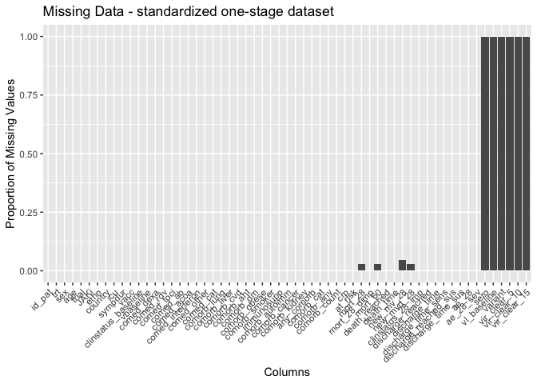

# Load packages

```r
library(tidyverse)
library(readxl)
library(writexl)
library(tableone)
library(here)
library(kableExtra)

library(jtools) # for summ() and plot_summs
library(sjPlot) # for tab_model
library(ggplot2) # survival/TTE analyses and other graphs
library(ggsurvfit) # survival/TTE analyses
library(survival) # survival/TTE analyses
library(gtsummary) # survival/TTE analyses
library(ggfortify) # autoplot
library(tidycmprsk) # competing risk analysis
library(ordinal) # clinstatus ordinal regression

library(mosaic) # OR for 2x2 table for the rare event contigency tables to apply correction
```

# Load Data


# Baseline Characteristics

```r
# without the 2 that withdrew consent right after randomization, 1 in each group => 55 per group. See publication
df$trial <- c("COVINIB")
df <- df %>%
  rename(id_pat = "Pat ID",
         trt = Trt,
         age = Age,
         sympdur = Sympdur)
df <- df %>% # no missing in sex
  mutate(sex = case_when(Sex == 1 ~ "female",
                         Sex == 2 ~ "male"))
df %>% 
  drop_na(age) %>% 
  ggplot(aes(x = age)) +
  geom_density(fill = "blue", color = "black") +
  labs(title = "Density Plot of Age",
       x = "Age",
       y = "Density")
```

<!-- -->

```r
df <- df %>% # no missing in ethnicity
  mutate(ethn = case_when(Ethn == 1 ~ "Latino",
                         Ethn == 2 ~ "Asian",
                         Ethn == 0 ~ "White"))
df$country <- c("Spain")
df$icu <- 0 # no icu patients at enrolment

# Days with symptoms prior to randomization
df %>% # no missings
  drop_na(sympdur) %>% 
  ggplot(aes(x = sympdur)) +
  geom_density(fill = "blue", color = "black") +
  labs(title = "Density Plot of Symptom Duration",
       x = "Symptom Duration",
       y = "Density")
```

<!-- -->

```r
# Severity of COVID-19 with respect to respiratory support at randomisation
df$clinstatus_baseline <- factor(df$Clinstatus_baseline, levels = 1:6) ## no missing data
addmargins(table(df$clinstatus_baseline, df$trt, useNA = "always"))
```

```
##       
##          0   1 <NA> Sum
##   1      0   0    0   0
##   2     19  16    0  35
##   3     36  39    0  75
##   4      0   0    0   0
##   5      0   0    0   0
##   6      0   0    0   0
##   <NA>   0   0    0   0
##   Sum   55  55    0 110
```

```r
# Co-medication at baseline
df$comed_toci <- 0 # see publication and correspondence with authors
df$comed_rdv <- 0 # see publication and correspondence with authors
df$comed_acoa <- 0 # no therapeutic anticoa used, see correspondence with authors
df$comed_interferon <- 0 # no interferon used, see correspondence with authors
df$comed_dexa <- df$Comed_dexa # no missing
df$comed_ab <- df$Comed_ab # no missing
df$comed_other <- df$Comed_other # no missing

## group them for the subgroup analysis, according to protocol
df <- df %>% 
  mutate(comed_cat = case_when(comed_dexa == 0 & comed_toci == 0 ~ 1, # patients without Dexamethasone nor Tocilizumab
                               comed_dexa == 1 & comed_toci == 1 ~ 2, # patients with Dexamethasone and Tocilizumab
                               comed_dexa == 1 & comed_toci == 0 ~ 3, # patients with Dexamethasone but no Tocilizumab
                               comed_dexa == 0 & comed_toci == 1 ~ 4)) # patients with Tocilizumab but no Dexamethasone (if exist)

# Comorbidity at baseline, including immunocompromised // no immunosupp in tofacov and few comorbidities
df$comorb_cancer <- 0
df$comorb_autoimm <- NA
df$comorb_kidney <- NA
df <- df %>%
  rename(comorb_lung = Comorb_lung,
         comorb_liver = Comorb_liver,
         comorb_cvd = Comerb_cvd,
         comorb_aht = Comorb_aht,
         comorb_dm = Comorb_dm,
         comorb_obese = Comorb_obese,
         comorb_smoker = Comorb_smoker,
         immunosupp = Immunosupp)
df <- df %>%
  mutate(any_comorb = case_when(comorb_lung == 1 | comorb_liver == 1 | comorb_cvd == 1 |
                                  comorb_aht == 1 | comorb_dm == 1 | comorb_obese == 1 | comorb_smoker == 1
                                | immunosupp == 1 | comorb_cancer == 1 | comorb_autoimm == 1 | comorb_kidney == 1 
                                  ~ 1,
                                comorb_lung == 0 & comorb_liver == 0 & comorb_cvd == 0 &
                                  comorb_aht == 0 & comorb_dm == 0 & comorb_obese == 0 & comorb_smoker == 0
                                & immunosupp == 0 & comorb_cancer == 0 & comorb_autoimm == 0 & comorb_kidney == 0
                                ~ 0))

# the remaining missing have no evidence for comorbidity -> recode as 0
df <- df %>% 
  mutate(any_comorb = case_when(is.na(any_comorb) ~ 0,
                                TRUE ~ any_comorb))
## group them for the subgroup analysis, according to protocol // count all pre-defined comorbidities per patient first
comorb <- df %>% 
  select(id_pat, comorb_lung, comorb_liver, comorb_cvd, comorb_aht, comorb_dm, comorb_obese, comorb_smoker, immunosupp, comorb_kidney, comorb_autoimm, comorb_cancer)
comorb$comorb_count <- NA
for (i in 1:dim(comorb)[[1]]) {
  comorb$comorb_count[i] <- ifelse(
    sum(comorb[i, ] %in% c(1)) > 0,
    sum(comorb[i, ] %in% c(1)),
    NA
  )
}
comorb <- comorb %>% 
  mutate(comorb_count = case_when(comorb_lung == 0 & comorb_liver == 0 & comorb_cvd == 0 &
                                  comorb_aht == 0 & comorb_dm == 0 & comorb_obese == 0 & comorb_smoker == 0
                                & immunosupp == 0 & comorb_cancer == 0 & comorb_autoimm == 0 & comorb_kidney == 0 ~ 0,
                                TRUE ~ comorb_count))
# the remaining missing have no evidence for comorbidity -> recode as 0
comorb <- comorb %>% 
  mutate(comorb_count = case_when(is.na(comorb_count) ~ 0,
                                TRUE ~ comorb_count))
df <- left_join(df, comorb[, c("comorb_count", "id_pat")], by = join_by(id_pat == id_pat)) ## merge imputed variable back
df <- df %>% # no missing
  mutate(comorb_cat = case_when(immunosupp == 1 ~ 4, # immunocompromised
                                comorb_count == 0 ~ 1, # no comorbidity
                                comorb_count == 1 ~ 2, # one comorbidity
                                comorb_count >1 & (immunosupp == 0 | is.na(immunosupp)) ~ 3)) # multiple comorbidities

# CRP
df$crp <- as.numeric(df$Crp) ## 1 missing
df %>% 
  drop_na(crp) %>% 
  ggplot(aes(x = crp)) +
  geom_density(fill = "blue", color = "black") +
  labs(title = "Density Plot of CRP",
       x = "CRP",
       y = "Density")
```

<!-- -->

```r
# Vaccination
df$vacc <- df$Vacc ## no missing

# Viremia
# Variant
# Serology
```
Discussion points
1) get comorb_autoimm and comorb_kidney
2) MS using Copaxone: immunosupp?


# Endpoints

```r
# time to event data
df$death_d <- as.numeric(as_date(df$Death_date) - as_date(df$Randdate)) 
df$discharge_d <- as.numeric(as_date(df$Discharge_date) - as_date(df$Randdate))
df$ltfu_d <- as.numeric(as_date(df$Withdrawal_date) - as_date(df$Randdate)) # LTFUs rather than withdrawn

# (i) Primary outcome: Mortality at day 28
df <- df %>% # corresponds to publication. 3 LTFU before day 28 => multiple imputation
  mutate(mort_28 = case_when(death_d <29 ~ 1,
                             discharge_d <29 & (is.na(ltfu_d) | ltfu_d >28) ~ 0, # all discharged were discharged alive and not to hospice, single out those that were ltfu before day 28
                             Clinstatus_28 %in% c(2,3,4,5) ~ 0, # still at hospital but alive
                             discharge_d >28 ~ 0)) # discharged later, proof of still alive

# (ii) Mortality at day 60
df <- df %>% # max fup time in COVINIB was +/- 70 days! No further deaths after day 28
  mutate(mort_60 = case_when(death_d <61 ~ 1,
                             discharge_d <61 & (is.na(ltfu_d) | ltfu_d >60) ~ 0, # all discharged were discharged alive and not to hospice, single out those that were tfu before day 60
                             Clinstatus_60 %in% c(2,3,4,5) ~ 0, # still at hospital but alive
                             discharge_d >60 ~ 0)) # discharged later, proof of still alive

# (iii) Time to death within max. follow-up time
# table(df$Clinstatus_70, useNA = "always") # 2 still hospitalized at day 70, 2 died, 3 LTFU, 103 discharged
df <- df %>%
  mutate(death_reached = case_when(mort_60 == 1 ~ 1,
                                TRUE ~ 0))
df <- df %>% # no missing and those that were discharged and afterwards have correct time to event data
  mutate(death_time = case_when(death_d >=0 ~ c(death_d), # time to death, if no time to death, then...
                                ltfu_d >=0 ~ c(ltfu_d), # time to LTFU,
                                TRUE ~ 70)) # time to max FUP: 70

# (iv) New mechanical ventilation among survivors within 28 days.
df <- df %>% 
  mutate(new_mv_28 = case_when((Clinstatus_baseline == 2 | Clinstatus_baseline == 3 | Clinstatus_baseline == 4) 
                               & (mort_28 == 0 | is.na(mort_28)) 
                               & (Clinstatus_1 == 5 | Clinstatus_2 == 5 | Clinstatus_3 == 5 | Clinstatus_4 == 5 |
                                   Clinstatus_5 == 5 | Clinstatus_6 == 5 | Clinstatus_7 == 5 | Clinstatus_8 == 5 |
                                    Clinstatus_9 == 5 | Clinstatus_10 == 5 | Clinstatus_11 == 5 | Clinstatus_12 == 5 |
                                    Clinstatus_13 == 5 | Clinstatus_14 == 5 | Clinstatus_15 == 5 | Clinstatus_16 == 5 |
                                    Clinstatus_17 == 5 | Clinstatus_18 == 5 | Clinstatus_19 == 5 | Clinstatus_20 == 5 |
                                    Clinstatus_21 == 5 | Clinstatus_22 == 5 | Clinstatus_23 == 5 | Clinstatus_24 == 5 |
                                    Clinstatus_25 == 5 | Clinstatus_26 == 5 | Clinstatus_27 == 5 | Clinstatus_28 == 5)
                               ~ 1,
                               (Clinstatus_baseline == 2 | Clinstatus_baseline == 3 | Clinstatus_baseline == 4) & mort_28 == 0
                               ~ 0))
# 5 missing: The two deaths (no MICE) and the three LTFU (but AFTER discharge) -> MICE or 0 ?

# (iv) Alternative definition/analysis: New mechanical ventilation OR death within 28 days => include all in denominator. 
df <- df %>% # the three LTFU (but AFTER discharge) -> MICE or 0 ?
  mutate(new_mvd_28 = case_when(new_mv_28 == 1 | mort_28 == 1 ~ 1,
                                new_mv_28 == 0 | mort_28 == 0 ~ 0))

# (v) Clinical status at day 28
df$clinstatus_28 <- df$Clinstatus_28

df <- df %>% # They called and followed all patients at day 28 and recorded no new serious adverse events, re-admissions or deaths besides the one that died on day 26
  mutate(clinstatus_28 = case_when(mort_28 == 1 ~ 6,
                                   discharge_d <29 ~ 1, # discharged alive / reached discharge criteria within 28d
                                   Clinstatus_28 == 3 ~ 3, # these ones are still hosp at day 28
                                   Clinstatus_28 == 4 ~ 4,
                                   Clinstatus_28 == 5 ~ 5)) 
df$clinstatus_28 <- factor(df$clinstatus_28, levels = 1:6) # no missing
df$clinstatus_28_imp <- df$clinstatus_28 # equal to clinstatus_28_imp

# (vi) Time to discharge or reaching discharge criteria up to day 28
df <- df %>% # no missing
  mutate(discharge_reached = case_when(discharge_d <29 ~ 1,
                                       TRUE ~ 0))
df <- df %>% 
  mutate(discharge_time = case_when(discharge_d >=0 ~ c(discharge_d), # time to discharge, if no time to discharge, then...
                                    ltfu_d >=0 ~ ltfu_d, # time to ltfu (but all LTFU after discharge), then...
                                    death_d >=0 ~ death_d)) # time to death
df <- df %>% # restrict to max fup time 28d
  mutate(discharge_time = case_when(discharge_time >28 ~ 28,
                                    TRUE ~ discharge_time))
df <- df %>% # add 28d for those that died
  mutate(discharge_time_sens = case_when(mort_28 == 1 ~ 28,
                                    TRUE ~ discharge_time))

# (vi) Sens-analysis: Alternative definition/analysis of outcome: time to sustained discharge within 28 days. There were no re-admissions within 28d
df$discharge_reached_sus <- df$discharge_reached
df$discharge_time_sus <- df$discharge_time


# (vii) Viral clearance up to day 5, day 10, and day 15 (Viral load value <LOQ and/or undectectable): Not available in TOFACOV
# (viii) Quality of life at day 28: Not available in TOFAVOC


# (ix) Participants with an adverse event grade 3 or 4, or a serious adverse event, excluding death, by day 28
# Remove anything in brackets (e.g. "(control)") from the "id" column -> ad under id_pat
df_ae34$id_pat <- as.numeric(sub("\\s*\\([^)]+\\)", "", df_ae34$id))
# Keep just 1 id_pat (-> ANY adverse event grade 3,4) 
df_ae34_unique <- df_ae34 %>% distinct(id_pat, .keep_all = TRUE)
# Assign the outcome
df_ae34_unique$ae_28 <- 1
# merge
df <- left_join(df, df_ae34_unique[, c("ae_28", "id_pat")], by = join_by(id_pat == id_pat)) ## merge variable to main df
# the remaining missing have no AE grade 34 -> recode as 0 and exclude deaths
df <- df %>% 
  mutate(ae_28 = case_when(is.na(ae_28) ~ 0, # the LTFU were discharged
                           mort_28 == 1 ~ NA, # exclude the deaths
                                TRUE ~ ae_28))
table(df$ae_28, df$mort_28, useNA = "always") # does not correspond to publication because they included AEs up until day 70 (see correspondence with authors)
```

```
##       
##         0  1 <NA>
##   0    82  0    3
##   1    23  0    0
##   <NA>  0  2    0
```

```r
# (ix) Sens-analysis: Alternative definition/analysis of outcome: incidence rate ratio (Poisson regression) -> AEs per person by d28
ae_npp <- df_ae34 %>% 
  group_by(id_pat)%>%  
  summarise(ae_28_sev = n())
df <- left_join(df, ae_npp[, c("ae_28_sev", "id_pat")], by = join_by(id_pat == id_pat)) # merge variable to main df
# the remaining missing have no AE grade 34 -> recode as 0 and exclude deaths
df <- df %>% 
  mutate(ae_28_sev = case_when(is.na(ae_28_sev) ~ 0, # the LTFU were discharged
                           mort_28 == 1 ~ NA, # exclude the deaths
                                TRUE ~ ae_28_sev))

# (ix) Sens-analysis: Alternative definition/analysis of outcome: time to first (of these) adverse event, within 28 days, considering death as a competing risk (=> censor and set to 28 days)
# time to first ae not available

# (x) Adverse events of special interest within 28 days: a) thromboembolic events (venous thromboembolism, pulmonary embolism, arterial thrombosis), b) secondary infections (bacterial pneumonia including ventilator-associated pneumonia, meningitis and encephalitis, endocarditis and bacteremia, invasive fungal infection including pulmonary aspergillosis), c) Reactivation of chronic infection including tuberculosis, herpes simplex, cytomegalovirus, herpes zoster and hepatitis B, d) serious cardiovascular and cardiac events (including stroke and myocardial infarction), e) events related to signs of bone marrow suppression (anemia, lymphocytopenia, thrombocytopenia, pancytopenia), f) malignancy, g) gastrointestinal perforation (incl. gastrointestinal bleeding/diverticulitis), h) liver dysfunction/hepatotoxicity (grade 3 and 4)

# ... and (xi) Adverse events, any grade and serious adverse event, excluding death, within 28 days, grouped by organ classes

# Remove anything in brackets (e.g. "(control)") from the "id" column -> ad under id_pat
df_ae12$id_pat <- as.numeric(sub("\\s*\\([^)]+\\)", "", df_ae12$id))
df_ae12$grade <- "1 or 2"
df_ae34$grade <- "3 or 4"
df_ae_comb <- rbind(df_ae12, df_ae34)
# first, work on categorizing all events -> any AE, grouped -> ae_28_list
df_ae_comb <- df_ae_comb %>% 
  mutate(ae_28_list = case_when(grepl("ALT", ae) ~ "Liver impairment",
                                grepl(paste(c("Anemia", "Neutropenia", "Thrombocytopenia"), collapse = "|"), ae) ~ "Anemia and other hematological disorders",
                                grepl(paste(c("secondary", "SECONDARY"), collapse = "|"), ae) ~ "Secondary infections",
                                grepl(paste(c("thrombo*", "embol*"), collapse = "|"), ae) ~ "Thromboembolic events",
                                grepl("ARDS", ae) ~ "Respiratory distress and other pulmonary complications",
                                grepl("Delirium", ae) ~ "Delirium",
                                grepl("Multi-organ failure/shock", ae) ~ "Multiple organ dysfunction syndrome",
                                grepl("Peripheral nervous system damage", ae) ~ "Peripheral nervous system damage",
                                grepl("Bleeding", ae) ~ "Bleeding"))
df_ae_comb <- left_join(df_ae_comb, df[, c("trt", "id_pat")], by = join_by(id_pat == id_pat)) # add trt variable
# second, define the AESI -> aesi_28
df_ae_comb <- df_ae_comb %>% 
  mutate(aesi_28 = case_when(ae_28_list == "Secondary infections" | 
                               ae_28_list == "Thromboembolic events" |
                               ae_28_list == "Anemia and other hematological disorders" |
                               (ae_28_list == "Liver impairment" & grade == "3 or 4") ~ 1,
                             TRUE ~ 0))
df_ae <- df_ae_comb %>% 
  select(id_pat, trt, ae, note, grade, ae_28_list, aesi_28)
# Save
save(df_ae, file = "df_ae_covinib.RData")
```
Discussion points
1) newmv: 5 missing: The two deaths (no MICE) and the three LTFU (but AFTER discharge) -> MICE or 0 ?


# Multiple imputation using chained equation

Discussion points
1)


# Define final dataset, set references, summarize missing data and variables

```r
# keep the overall set
df_all <- df
# reduce the df set to our standardized set across all trials
df <- df %>% 
  select(id_pat, trt, sex, age, ethn, country, icu, sympdur, vacc, clinstatus_baseline, trial,
         comed_dexa, comed_rdv, comed_toci, comed_ab, comed_acoa, comed_interferon, comed_other,
         comed_cat,
         comorb_lung, comorb_liver, comorb_cvd, comorb_aht, comorb_dm, comorb_obese, comorb_smoker, immunosupp,
         comorb_autoimm, comorb_cancer, comorb_kidney,
         any_comorb, comorb_cat, comorb_count,
         crp, 
         # sero, vl_baseline, variant,
         mort_28, mort_60, death_reached, death_time,
         new_mv_28, new_mvd_28,
         clinstatus_28_imp,
         discharge_reached, discharge_time, discharge_time_sens, discharge_reached_sus, discharge_time_sus,
         ae_28, ae_28_sev
         # vir_clear_5, vir_clear_10, vir_clear_15
         )
# export for one-stage model, i.e., add missing variables 
df_os <- df
df_os$sero <- NA
df_os$vl_baseline <- NA
df_os$variant <- NA
df_os$vir_clear_5 <- NA
df_os$vir_clear_10 <- NA
df_os$vir_clear_15 <- NA
# Save
save(df_os, file = "df_os_covinib.RData")

## set references, re-level
# df <- df %>% 
#   mutate(Treatment = relevel(Treatment, "no JAK inhibitor"))

# Create a bar plot to visualize missing values in each column
original_order <- colnames(df_os)
missing_plot <- df_os %>%
  summarise_all(~ mean(is.na(.))) %>%
  gather() %>%
  mutate(key = factor(key, levels = original_order)) %>%
  ggplot(aes(x = key, y = value)) +
  geom_bar(stat = "identity") +
  labs(x = "Columns", y = "Proportion of Missing Values", title = "Missing Data Visualization") +
  theme(axis.text.x = element_text(angle = 45, hjust = 1)) +
  ylim(0, 1)
print(missing_plot)
```

<!-- -->
Discussion points
1) Missing variables:
  Baseline:
  - variant
  - sero
  - vl_baseline
  Outcomes:
  - vir_clear_5, vir_clear_10, vir_clear_15
2) Missing data:
- NAs in mort_28/mort_60/new_mv_28/new_mvd_28: MICE
- NAs in new_mv_28 (some), ae_28, ae_28_sev: Not part of denominator


# (i) Primary outcome: Mortality at day 28

```r
# adjusted for baseline patient characteristics (age, respiratory support at baseline (ordinal scale 1-3 vs 4-5), dexamethasone use at baseline (y/n), remdesivir use at baseline (y/n), anti-IL-6 use at baseline (y/n)).
table(df$mort_28, df$trt, useNA = "always")
```

```
##       
##         0  1 <NA>
##   0    52 53    0
##   1     2  0    0
##   <NA>  1  2    0
```

```r
mort.28 <- df %>% 
  glm(mort_28 ~ trt 
      + age + clinstatus_baseline + comed_dexa + comed_rdv + comed_toci
      , family = "binomial", data=.)
```

```
## Warning: glm.fit: fitted probabilities numerically 0 or 1 occurred
```

```r
summ(mort.28, exp = T, confint = T, model.info = T, model.fit = F, digits = 2)
```

<table class="table table-striped table-hover table-condensed table-responsive" style="width: auto !important; margin-left: auto; margin-right: auto;">
<tbody>
  <tr>
   <td style="text-align:left;font-weight: bold;"> Observations </td>
   <td style="text-align:right;"> 107 (3 missing obs. deleted) </td>
  </tr>
  <tr>
   <td style="text-align:left;font-weight: bold;"> Dependent variable </td>
   <td style="text-align:right;"> mort_28 </td>
  </tr>
  <tr>
   <td style="text-align:left;font-weight: bold;"> Type </td>
   <td style="text-align:right;"> Generalized linear model </td>
  </tr>
  <tr>
   <td style="text-align:left;font-weight: bold;"> Family </td>
   <td style="text-align:right;"> binomial </td>
  </tr>
  <tr>
   <td style="text-align:left;font-weight: bold;"> Link </td>
   <td style="text-align:right;"> logit </td>
  </tr>
</tbody>
</table>  <table class="table table-striped table-hover table-condensed table-responsive" style="width: auto !important; margin-left: auto; margin-right: auto;border-bottom: 0;">
 <thead>
  <tr>
   <th style="text-align:left;">   </th>
   <th style="text-align:right;"> exp(Est.) </th>
   <th style="text-align:right;"> 2.5% </th>
   <th style="text-align:right;"> 97.5% </th>
   <th style="text-align:right;"> z val. </th>
   <th style="text-align:right;"> p </th>
  </tr>
 </thead>
<tbody>
  <tr>
   <td style="text-align:left;font-weight: bold;"> (Intercept) </td>
   <td style="text-align:right;"> 0.00 </td>
   <td style="text-align:right;"> 0.00 </td>
   <td style="text-align:right;"> Inf </td>
   <td style="text-align:right;"> -0.00 </td>
   <td style="text-align:right;"> 1.00 </td>
  </tr>
  <tr>
   <td style="text-align:left;font-weight: bold;"> trt </td>
   <td style="text-align:right;"> 0.00 </td>
   <td style="text-align:right;"> 0.00 </td>
   <td style="text-align:right;"> Inf </td>
   <td style="text-align:right;"> -0.00 </td>
   <td style="text-align:right;"> 1.00 </td>
  </tr>
  <tr>
   <td style="text-align:left;font-weight: bold;"> age </td>
   <td style="text-align:right;"> 1.10 </td>
   <td style="text-align:right;"> 0.93 </td>
   <td style="text-align:right;"> 1.31 </td>
   <td style="text-align:right;"> 1.09 </td>
   <td style="text-align:right;"> 0.28 </td>
  </tr>
  <tr>
   <td style="text-align:left;font-weight: bold;"> clinstatus_baseline3 </td>
   <td style="text-align:right;"> 58415165.95 </td>
   <td style="text-align:right;"> 0.00 </td>
   <td style="text-align:right;"> Inf </td>
   <td style="text-align:right;"> 0.00 </td>
   <td style="text-align:right;"> 1.00 </td>
  </tr>
  <tr>
   <td style="text-align:left;font-weight: bold;"> comed_dexa </td>
   <td style="text-align:right;"> 0.00 </td>
   <td style="text-align:right;"> 0.00 </td>
   <td style="text-align:right;"> Inf </td>
   <td style="text-align:right;"> -0.00 </td>
   <td style="text-align:right;"> 1.00 </td>
  </tr>
  <tr>
   <td style="text-align:left;font-weight: bold;"> comed_rdv </td>
   <td style="text-align:right;"> NA </td>
   <td style="text-align:right;"> NA </td>
   <td style="text-align:right;"> NA </td>
   <td style="text-align:right;"> NA </td>
   <td style="text-align:right;"> NA </td>
  </tr>
  <tr>
   <td style="text-align:left;font-weight: bold;"> comed_toci </td>
   <td style="text-align:right;"> NA </td>
   <td style="text-align:right;"> NA </td>
   <td style="text-align:right;"> NA </td>
   <td style="text-align:right;"> NA </td>
   <td style="text-align:right;"> NA </td>
  </tr>
</tbody>
<tfoot><tr><td style="padding: 0; " colspan="100%">
<sup></sup> Standard errors: MLE</td></tr></tfoot>
</table>

```r
# Create a 2x2 contingency table
# The oddsRatio function from the mosaic package calculates the odds ratio for a 2 x 2 contingency table and a confidence interval for the each estimate. x should be a matrix, data frame or table. "Successes" should be located in column 1 of x, and the treatment of interest should be located in row 2. The odds ratio is calculated as (Odds row 2) / (Odds row 1). The confidence interval is calculated from the log(OR) and back-transformed.
tbl <- tibble(
  Event = c(2.5, 0.5), # add the 0.5 correction
  NoEvent = c(52.5, 53.5) # add the 0.5 correction
)
oddsRatio(tbl, conf.level = 0.95, digits = 3, verbose = TRUE)
```

```
## 
## Odds Ratio
## 
## Proportions
## 	   Prop. 1:	 0.04545 
## 	   Prop. 2:	 0.009259 
## 	 Rel. Risk:	 0.2037 
## 
## Odds
## 	    Odds 1:	 0.04762 
## 	    Odds 2:	 0.009346 
## 	Odds Ratio:	 0.1963 
## 
## 95 percent confidence interval:
## 	 0.01001 < RR < 4.145 
## 	 0.009201 < OR < 4.186 
## NULL
```

```
## [1] 0.1962617
```

```r
mort.28.corr <- oddsRatio(tbl, conf.level = 0.95, digits = 3, verbose = TRUE)
```

```
## 
## Odds Ratio
## 
## Proportions
## 	   Prop. 1:	 0.04545 
## 	   Prop. 2:	 0.009259 
## 	 Rel. Risk:	 0.2037 
## 
## Odds
## 	    Odds 1:	 0.04762 
## 	    Odds 2:	 0.009346 
## 	Odds Ratio:	 0.1963 
## 
## 95 percent confidence interval:
## 	 0.01001 < RR < 4.145 
## 	 0.009201 < OR < 4.186 
## NULL
```

```r
odds_ratio <- mort.28.corr[["OR"]]
lower_bound <- c(0.009201) # how to extract directly from the object?
upper_bound <- c(4.186) # how to extract directly from the object?
# Calculate the standard error
standard_error <- (upper_bound - lower_bound) / (2 * 1.96)
# Calculate the z-score
z_score <- (log(odds_ratio) - log(1)) / standard_error
# Calculate the p-value using the z-score
p_value <- 2 * (1 - pnorm(abs(z_score)))
```
Discussion points
1) respiratory support at baseline (ordinal scale 1-3 vs 4-5 OR leave it as it is)?
2) Rare event correction -> OR -> inverse variance pooling in second stage? Or 2x2 directly into Mantel-Haenszel across several trials (https://www.ncbi.nlm.nih.gov/pmc/articles/PMC5297998/)?


