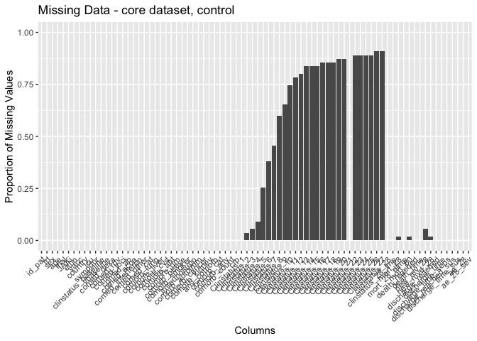
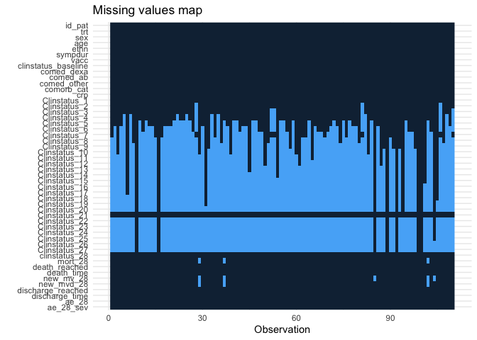
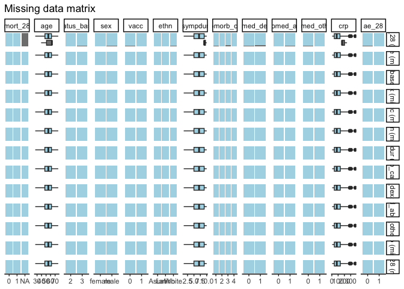
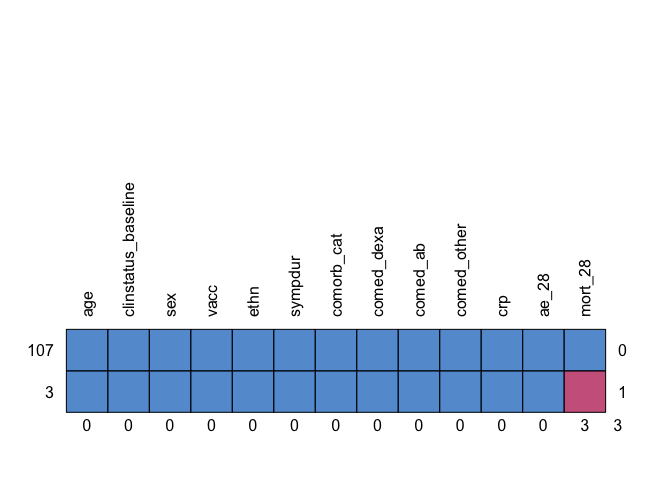

# Load packages

```r
library(tidyverse)
library(readxl)
library(writexl)
library(tableone)
library(haven) # Read sas files
library(here)
library(kableExtra)

library(jtools) # for summ() and plot_summs
library(sjPlot) # for tab_model
library(ggplot2) # survival/TTE analyses and other graphs
library(ggsurvfit) # survival/TTE analyses
library(survival) # survival/TTE analyses
library(gtsummary) # survival/TTE analyses
library(ggfortify) # autoplot
library(tidycmprsk) # competing risk analysis
library(ordinal) # clinstatus ordinal regression
library(mosaic) # OR for 0.5-corrected 2x2 table in case of rare events
library(logistf) # Firth regression in case of rare events

library(finalfit) # missing data exploration
library(mice) # multiple imputation
library(jomo) # multiple imputation
library(mitools) # multiple imputation
```

# Load Data


# Baseline Characteristics

```r
# without the 2 that withdrew consent right after randomization, 1 in each group => 55 per group. See publication
df$trial <- c("COVINIB")
df$JAKi <- c("Baricitinib")
df <- df %>%
  rename(id_pat = "Pat ID",
         trt = Trt,
         age = Age,
         sympdur = Sympdur)
df <- df %>% # no missing in sex
  mutate(sex = case_when(Sex == 1 ~ "female",
                         Sex == 2 ~ "male"))
df %>% 
  drop_na(age) %>% 
  ggplot(aes(x = age)) +
  geom_density(fill = "blue", color = "black") +
  labs(title = "Density Plot of Age",
       x = "Age",
       y = "Density")
```

<!-- -->

```r
df <- df %>% # no missing in ethnicity
  mutate(ethn = case_when(Ethn == 1 ~ "Latino",
                         Ethn == 2 ~ "Asian",
                         Ethn == 0 ~ "White"))
df$country <- c("Spain")
df$icu <- 0 # no icu patients at enrolment

# Days with symptoms prior to randomization
df %>% # no missings
  drop_na(sympdur) %>% 
  ggplot(aes(x = sympdur)) +
  geom_density(fill = "blue", color = "black") +
  labs(title = "Density Plot of Symptom Duration",
       x = "Symptom Duration",
       y = "Density")
```

<!-- -->

```r
# Severity of COVID-19 with respect to respiratory support at randomisation
df$clinstatus_baseline <- factor(df$Clinstatus_baseline, levels = 1:6) ## no missing data
addmargins(table(df$clinstatus_baseline, df$trt, useNA = "always"))
```

```
##       
##          0   1 <NA> Sum
##   1      0   0    0   0
##   2     19  16    0  35
##   3     36  39    0  75
##   4      0   0    0   0
##   5      0   0    0   0
##   6      0   0    0   0
##   <NA>   0   0    0   0
##   Sum   55  55    0 110
```

```r
df <- df %>% 
  mutate(vbaseline = case_when(clinstatus_baseline == "2" | clinstatus_baseline == "3" ~ 0,
                                clinstatus_baseline == "4" | clinstatus_baseline == "5" ~ 1))

# Co-medication at baseline
df$comed_toci <- 0 # see publication and correspondence with authors
df$comed_rdv <- 0 # see publication and correspondence with authors
df$comed_acoa <- 0 # no therapeutic anticoa used, see correspondence with authors
df$comed_interferon <- 0 # no interferon used, see correspondence with authors
df$comed_dexa <- df$Comed_dexa # no missing
df$comed_ab <- df$Comed_ab # no missing
df$comed_other <- df$Comed_other # no missing

## group them for the subgroup analysis, according to protocol
df <- df %>% 
  mutate(comed_cat = case_when(comed_dexa == 0 & comed_toci == 0 ~ 1, # patients without Dexamethasone nor Tocilizumab
                               comed_dexa == 1 & comed_toci == 1 ~ 2, # patients with Dexamethasone and Tocilizumab
                               comed_dexa == 1 & comed_toci == 0 ~ 3, # patients with Dexamethasone but no Tocilizumab
                               comed_dexa == 0 & comed_toci == 1 ~ 4)) # patients with Tocilizumab but no Dexamethasone (if exist)

# Comorbidity at baseline, including immunocompromised // no immunosupp in tofacov and few comorbidities
df_comorb <- df_comorb %>% 
  rename(id_pat = `Pat ID`)
df_comorb <- df_comorb %>% 
  rename(comorb_autoimm = Comorb_autoimm,
         comorb_kidney = Comorb_kidney)
df <- left_join(df, df_comorb[, c("comorb_autoimm", "id_pat")], by = join_by(id_pat == id_pat)) ## merge to main df
df <- left_join(df, df_comorb[, c("comorb_kidney", "id_pat")], by = join_by(id_pat == id_pat)) ## merge to main df

df$comorb_cancer <- 0 # there were not cancer cases, excluded
df <- df %>%
  rename(comorb_lung = Comorb_lung,
         comorb_liver = Comorb_liver,
         comorb_cvd = Comerb_cvd,
         comorb_aht = Comorb_aht,
         comorb_dm = Comorb_dm,
         comorb_obese = Comorb_obese,
         comorb_smoker = Comorb_smoker,
         immunosupp = Immunosupp)
df <- df %>% # no missing
  mutate(any_comorb = case_when(comorb_lung == 1 | comorb_liver == 1 | comorb_cvd == 1 |
                                  comorb_aht == 1 | comorb_dm == 1 | comorb_obese == 1 | comorb_smoker == 1
                                | immunosupp == 1 | comorb_cancer == 1 | comorb_autoimm == 1 | comorb_kidney == 1 
                                  ~ 1,
                                comorb_lung == 0 & comorb_liver == 0 & comorb_cvd == 0 &
                                  comorb_aht == 0 & comorb_dm == 0 & comorb_obese == 0 & comorb_smoker == 0
                                & immunosupp == 0 & comorb_cancer == 0 & comorb_autoimm == 0 & comorb_kidney == 0
                                ~ 0))

## group them for the subgroup analysis, according to protocol // count all pre-defined comorbidities per patient first
comorb <- df %>% 
  select(id_pat, comorb_lung, comorb_liver, comorb_cvd, comorb_aht, comorb_dm, comorb_obese, comorb_smoker, immunosupp, comorb_kidney, comorb_autoimm, comorb_cancer)
comorb$comorb_count <- NA
for (i in 1:dim(comorb)[[1]]) {
  comorb$comorb_count[i] <- ifelse(
    sum(comorb[i, ] %in% c(1)) > 0,
    sum(comorb[i, ] %in% c(1)),
    NA
  )
}
comorb <- comorb %>% 
  mutate(comorb_count = case_when(comorb_lung == 0 & comorb_liver == 0 & comorb_cvd == 0 &
                                  comorb_aht == 0 & comorb_dm == 0 & comorb_obese == 0 & comorb_smoker == 0
                                & immunosupp == 0 & comorb_cancer == 0 & comorb_autoimm == 0 & comorb_kidney == 0 ~ 0,
                                TRUE ~ comorb_count))
df <- left_join(df, comorb[, c("comorb_count", "id_pat")], by = join_by(id_pat == id_pat)) ## merge imputed variable back
df <- df %>% # no missing
  mutate(comorb_cat = case_when(immunosupp == 1 ~ 4, # immunocompromised
                                comorb_count == 0 ~ 1, # no comorbidity
                                comorb_count == 1 ~ 2, # one comorbidity
                                comorb_count >1 & (immunosupp == 0 | is.na(immunosupp)) ~ 3)) # multiple comorbidities
df <- df %>%
  mutate(comorb_any = case_when(comorb_count == 0 ~ 0, # no comorbidity
                                comorb_count >0 ~ 1)) # any comorbidity

# CRP
df$crp <- as.numeric(df$Crp) ## 1 missing
df %>% 
  drop_na(crp) %>% 
  ggplot(aes(x = crp)) +
  geom_density(fill = "blue", color = "black") +
  labs(title = "Density Plot of CRP",
       x = "CRP",
       y = "Density")
```

<!-- -->

```r
# Vaccination
df$vacc <- df$Vacc ## no missing

# Viremia
# Variant
# Serology
```
Discussion points
2. MS using Copaxone: immunosupp? -> NO, but comorb_autoimmun

# Endpoints

```r
# time to event data
df$death_d <- as.numeric(as_date(df$Death_date) - as_date(df$Randdate)) 
df$discharge_d <- as.numeric(as_date(df$Discharge_date) - as_date(df$Randdate))
df$ltfu_d <- as.numeric(as_date(df$Withdrawal_date) - as_date(df$Randdate)) # LTFUs rather than withdrawn

# (i) Primary outcome: Mortality at day 28
df <- df %>% # corresponds to publication. 3 LTFU before day 28 => multiple imputation
  mutate(mort_28 = case_when(death_d <29 ~ 1,
                             discharge_d <29 & (is.na(ltfu_d) | ltfu_d >28) ~ 0, # all discharged were discharged alive and not to hospice, single out those that were ltfu before day 28
                             Clinstatus_28 %in% c(2,3,4,5) ~ 0, # still at hospital but alive
                             discharge_d >28 ~ 0)) # discharged later, proof of still alive

table(df$mort_28, useNA = "always") # no transfer to hospice in covinib! 
```

```
## 
##    0    1 <NA> 
##  105    2    3
```

```r
# df %>%
#   select(mort_28, death_d, discharge_d, Clinstatus_28, clinstatus_baseline, everything()) %>%
#   filter(is.na(mort_28)) %>%
#   View()

# First, keep mort_28 as complete case

# Second, use multiple imputation (see below)

# Third, apply a deterministic imputation (see notes): see rules in NOTES; no transfer to hospice in covinib! -> assign "alive"
df <- df %>%
  mutate(mort_28_dimp = case_when(is.na(mort_28) ~ 0,
                             TRUE ~ c(mort_28)))


# (ii) Mortality at day 60
df <- df %>% # max fup time in COVINIB was +/- 70 days! No further deaths after day 28
  mutate(mort_60 = case_when(death_d <61 ~ 1,
                             discharge_d <61 & (is.na(ltfu_d) | ltfu_d >60) ~ 0, # all discharged were discharged alive and not to hospice, single out those that were tfu before day 60
                             Clinstatus_60 %in% c(2,3,4,5) ~ 0, # still at hospital but alive
                             discharge_d >60 ~ 0)) # discharged later, proof of still alive


# (iii) Time to death within max. follow-up time
# table(df$Clinstatus_70, useNA = "always") # 2 still hospitalized at day 70, 2 died, 3 LTFU, 103 discharged
df <- df %>%
  mutate(death_reached = case_when(mort_60 == 1 ~ 1,
                                TRUE ~ 0))
df <- df %>% # no missing and those that were discharged and afterwards have correct time to event data
  mutate(death_time = case_when(death_d >=0 ~ c(death_d), # time to death, if no time to death, then...
                                ltfu_d >=0 ~ c(ltfu_d), # time to LTFU,
                                TRUE ~ 70)) # time to max FUP: 70


# (iv) New mechanical ventilation among survivors within 28 days.
df <- df %>% 
  mutate(new_mv_28 = case_when((Clinstatus_baseline == 2 | Clinstatus_baseline == 3 | Clinstatus_baseline == 4) 
                               & (mort_28 == 0 | is.na(mort_28)) 
                               & (Clinstatus_1 == 5 | Clinstatus_2 == 5 | Clinstatus_3 == 5 | Clinstatus_4 == 5 |
                                   Clinstatus_5 == 5 | Clinstatus_6 == 5 | Clinstatus_7 == 5 | Clinstatus_8 == 5 |
                                    Clinstatus_9 == 5 | Clinstatus_10 == 5 | Clinstatus_11 == 5 | Clinstatus_12 == 5 |
                                    Clinstatus_13 == 5 | Clinstatus_14 == 5 | Clinstatus_15 == 5 | Clinstatus_16 == 5 |
                                    Clinstatus_17 == 5 | Clinstatus_18 == 5 | Clinstatus_19 == 5 | Clinstatus_20 == 5 |
                                    Clinstatus_21 == 5 | Clinstatus_22 == 5 | Clinstatus_23 == 5 | Clinstatus_24 == 5 |
                                    Clinstatus_25 == 5 | Clinstatus_26 == 5 | Clinstatus_27 == 5 | Clinstatus_28 == 5)
                               ~ 1,
                               (Clinstatus_baseline == 2 | Clinstatus_baseline == 3 | Clinstatus_baseline == 4) & mort_28 == 0
                               ~ 0))
# table(df$new_mv_28, useNA = "always") # only the 2 deaths are NA: correct. The three LTFU (AFTER discharge) were correctly accounted for with mort_28 == 0, according to our rules for missing data in mort_28 (see NOTES)


# (iv) Alternative definition/analysis: New mechanical ventilation OR death within 28 days => include all in denominator. 
df <- df %>% # The three LTFU (AFTER discharge) were correctly accounted for with mort_28 == 0, according to our rules for missing data in mort_28 (see NOTES)
  mutate(new_mvd_28 = case_when(new_mv_28 == 1 | mort_28 == 1 ~ 1,
                                new_mv_28 == 0 | mort_28 == 0 ~ 0))


# (v) Clinical status at day 28
df$clinstatus_28 <- df$Clinstatus_28

df <- df %>% # They called and followed all patients at day 28 and recorded no new serious adverse events, re-admissions or deaths besides the one that died on day 26
  mutate(clinstatus_28 = case_when(mort_28 == 1 ~ 6,
                                   discharge_d <29 ~ 1, # discharged alive / reached discharge criteria within 28d
                                   Clinstatus_28 == 3 ~ 3, # these ones are still hosp at day 28
                                   Clinstatus_28 == 4 ~ 4,
                                   Clinstatus_28 == 5 ~ 5)) 
df$clinstatus_28 <- factor(df$clinstatus_28, levels = 1:6) # no missing
df$clinstatus_28_imp <- df$clinstatus_28 # equal to clinstatus_28_imp

# (vi) Time to discharge or reaching discharge criteria up to day 28
df <- df %>% # no missing
  mutate(discharge_reached = case_when(discharge_d <29 ~ 1,
                                       TRUE ~ 0))
df <- df %>% 
  mutate(discharge_time = case_when(discharge_d >=0 ~ c(discharge_d), # time to discharge, if no time to discharge, then...
                                    ltfu_d >=0 ~ ltfu_d, # time to ltfu (but all LTFU after discharge), then...
                                    death_d >=0 ~ death_d)) # time to death
df <- df %>% # restrict to max fup time 28d
  mutate(discharge_time = case_when(discharge_time >28 ~ 28,
                                    TRUE ~ discharge_time))
df <- df %>% # add 28d for those that died
  mutate(discharge_time_sens = case_when(mort_28 == 1 ~ 28,
                                    TRUE ~ discharge_time))

# (vi) Sens-analysis: Alternative definition/analysis of outcome: time to sustained discharge within 28 days. There were no re-admissions within 28d
df$discharge_reached_sus <- df$discharge_reached
df$discharge_time_sus <- df$discharge_time


# (vii) Viral clearance up to day 5, day 10, and day 15 (Viral load value <LOQ and/or undectectable): Not available in COVINIB
# (viii) Quality of life at day 28: Not available in COVINIB


# (ix) Participants with an adverse event grade 3 or 4, or a serious adverse event, excluding death, by day 28
# Remove anything in brackets (e.g. "(control)") from the "id" column -> ad under id_pat
df_ae34$id_pat <- as.numeric(sub("\\s*\\([^)]+\\)", "", df_ae34$id))
# Keep just 1 id_pat (-> ANY adverse event grade 3,4) 
df_ae34_unique <- df_ae34 %>% distinct(id_pat, .keep_all = TRUE)
# Assign the outcome
df_ae34_unique$ae_28 <- 1
# merge
df <- left_join(df, df_ae34_unique[, c("ae_28", "id_pat")], by = join_by(id_pat == id_pat)) ## merge variable to main df
# the remaining missing have no AE grade 34 -> recode as 0 and exclude deaths
df <- df %>% 
  mutate(ae_28 = case_when(is.na(ae_28) ~ 0, # the LTFU were discharged
                           mort_28 == 1 ~ NA, # exclude the deaths
                                TRUE ~ ae_28))
# table(df$ae_28, df$mort_28, useNA = "always") # does not correspond to publication because they included AEs up until day 70 (see correspondence with authors)

# (ix) Sens-analysis: Alternative definition/analysis of outcome: incidence rate ratio (Poisson regression) -> AEs per person by d28
ae_npp <- df_ae34 %>% 
  group_by(id_pat)%>%  
  summarise(ae_28_sev = n())
df <- left_join(df, ae_npp[, c("ae_28_sev", "id_pat")], by = join_by(id_pat == id_pat)) # merge variable to main df
# the remaining missing have no AE grade 34 -> recode as 0 and exclude deaths
df <- df %>% 
  mutate(ae_28_sev = case_when(is.na(ae_28_sev) ~ 0, # the LTFU were discharged
                           mort_28 == 1 ~ NA, # exclude the deaths
                                TRUE ~ ae_28_sev))

# (ix) Sens-analysis: Alternative definition/analysis of outcome: time to first (of these) adverse event, within 28 days, considering death as a competing risk (=> censor and set to 28 days)
# time to first ae not available

# (x) Adverse events of special interest within 28 days: a) thromboembolic events (venous thromboembolism, pulmonary embolism, arterial thrombosis), b) secondary infections (bacterial pneumonia including ventilator-associated pneumonia, meningitis and encephalitis, endocarditis and bacteremia, invasive fungal infection including pulmonary aspergillosis), c) Reactivation of chronic infection including tuberculosis, herpes simplex, cytomegalovirus, herpes zoster and hepatitis B, d) serious cardiovascular and cardiac events (including stroke and myocardial infarction), e) events related to signs of bone marrow suppression (anemia, lymphocytopenia, thrombocytopenia, pancytopenia), f) malignancy, g) gastrointestinal perforation (incl. gastrointestinal bleeding/diverticulitis), h) liver dysfunction/hepatotoxicity (grade 3 and 4)

# ... and (xi) Adverse events, any grade and serious adverse event, excluding death, within 28 days, grouped by organ classes

# Remove anything in brackets (e.g. "(control)") from the "id" column -> ad under id_pat
df_ae12$id_pat <- as.numeric(sub("\\s*\\([^)]+\\)", "", df_ae12$id))
df_ae12$grade <- "1 or 2"
df_ae34$grade <- "3 or 4"
df_ae_comb <- rbind(df_ae12, df_ae34)
# first, work on categorizing all events -> any AE, grouped -> ae_28_list
df_ae_comb <- df_ae_comb %>% 
  mutate(ae_28_list = case_when(grepl("ALT", ae) ~ "Liver impairment",
                                grepl(paste(c("Anemia", "Neutropenia", "Thrombocytopenia"), collapse = "|"), ae) ~ "Anemia and other hematological disorders",
                                grepl(paste(c("secondary", "SECONDARY"), collapse = "|"), ae) ~ "Secondary infections",
                                grepl(paste(c("thrombo*", "embol*"), collapse = "|"), ae) ~ "Thromboembolic events",
                                grepl("ARDS", ae) ~ "Respiratory distress and other pulmonary complications",
                                grepl("Delirium", ae) ~ "Delirium",
                                grepl("Multi-organ failure/shock", ae) ~ "Multiple organ dysfunction syndrome",
                                grepl("Peripheral nervous system damage", ae) ~ "Peripheral nervous system damage",
                                grepl("Bleeding", ae) ~ "Bleeding"))
df_ae_comb <- left_join(df_ae_comb, df[, c("trt", "id_pat")], by = join_by(id_pat == id_pat)) # add trt variable
# second, define the AESI -> aesi_28
df_ae_comb <- df_ae_comb %>% 
  mutate(aesi_28 = case_when(ae_28_list == "Secondary infections" | 
                               ae_28_list == "Thromboembolic events" |
                               ae_28_list == "Anemia and other hematological disorders" |
                               (ae_28_list == "Liver impairment" & grade == "3 or 4") ~ 1,
                             TRUE ~ 0))
df_ae <- df_ae_comb %>% 
  select(id_pat, trt, ae, note, grade, ae_28_list, aesi_28)
df_aesi <- df_ae %>% 
  mutate(aesi = case_when(ae_28_list == "Secondary infections" ~ "sec_inf",
                          ae_28_list == "Thromboembolic events" ~ "thrombo",
                          ae_28_list == "Anemia and other hematological disorders" ~ "penia",
                          ae_28_list == "Liver impairment" & grade == "3 or 4" ~ "hepatox")) %>% 
  filter(!is.na(aesi)) %>% 
  select(id_pat, trt, aesi, ae_28_list)
# Save
saveRDS(df_aesi, file = "df_aesi_covinib.RData")
saveRDS(df_ae, file = "df_ae_covinib.RData")
```

# Define final datasets

```r
# keep the overall set
df_all <- df
# names(df_all)
# reduce the df set to our standardized set across all trials
df <- df %>% 
  select(id_pat, trt, sex, age, trial, JAKi, 
         ethn, 
         country, icu, sympdur, 
         vacc, 
         clinstatus_baseline, vbaseline,
         comed_dexa, comed_rdv, comed_toci, comed_ab, comed_acoa, comed_interferon, comed_other,
         comed_cat,
         comorb_lung, comorb_liver, comorb_cvd, comorb_aht, comorb_dm, comorb_obese, comorb_smoker, immunosupp,
         comorb_autoimm, comorb_cancer, comorb_kidney,
         any_comorb, comorb_cat, comorb_any, comorb_count,
         crp, 
         # sero, variant, vl_baseline, 
         mort_28, mort_28_dimp,
         mort_60, death_reached, death_time,
         new_mv_28, new_mvd_28,
         clinstatus_28_imp,
         discharge_reached, discharge_time, discharge_time_sens, discharge_reached_sus, discharge_time_sus,
         ae_28, ae_28_sev
         # vir_clear_5, vir_clear_10, vir_clear_15
         )

# export for one-stage model, i.e., add missing variables 
df_os <- df
df_os$sero <- NA
df_os$vl_baseline <- NA
df_os$variant <- NA
df_os$vir_clear_5 <- NA
df_os$vir_clear_10 <- NA
df_os$vir_clear_15 <- NA
# Save
saveRDS(df_os, file = "df_os_covinib.RData")
```

# Missing data plot: One-stage dataset

```r
# Bar plot, missing data, each data point, standardized one-stage dataset
original_order <- colnames(df_os)
missing_plot <- df_os %>%
  summarise_all(~ mean(is.na(.))) %>%
  gather() %>%
  mutate(key = factor(key, levels = original_order)) %>%
  ggplot(aes(x = key, y = value)) +
  geom_bar(stat = "identity") +
  labs(x = "Columns", y = "Proportion of Missing Values", title = "Missing Data - standardized one-stage dataset") +
  theme(axis.text.x = element_text(angle = 45, hjust = 1)) +
  ylim(0, 1)
print(missing_plot)
```

<!-- -->
Discussion points
1. Missing variables:
* Baseline:
  - variant
  - sero
  - vl_baseline
* Outcomes:
  - vir_clear_5, vir_clear_10, vir_clear_15
2. Missing data:
- NAs in mort_28, mort_60, new_mv_28, new_mvd_28, ae_28, ae_28_sev

# Missing data: Explore for MI

```r
# keep the core df
# names(df_all)
df_core <- df_all %>%
    select(id_pat, trt, sex, age, trial, JAKi, ethn, vacc, country, icu, sympdur, clinstatus_baseline, vbaseline,
         comed_dexa, comed_rdv, comed_toci, comed_ab, comed_acoa, comed_interferon, comed_other, comed_cat,
         comorb_lung, comorb_liver, comorb_cvd, comorb_aht, comorb_dm, comorb_obese, comorb_smoker, immunosupp,
         comorb_autoimm, comorb_cancer, comorb_kidney,
         any_comorb, comorb_cat, comorb_any, comorb_count,
         crp, 
         # sero, variant, vl_baseline, 
         Clinstatus_1, Clinstatus_2, Clinstatus_3, Clinstatus_4, Clinstatus_5, Clinstatus_6, Clinstatus_7, Clinstatus_8, Clinstatus_9, Clinstatus_10, Clinstatus_11, Clinstatus_12, Clinstatus_13, Clinstatus_14, Clinstatus_15, Clinstatus_16, Clinstatus_17, Clinstatus_18, Clinstatus_19, Clinstatus_20, Clinstatus_21, Clinstatus_22, Clinstatus_23, Clinstatus_24, Clinstatus_25, Clinstatus_26, Clinstatus_27, clinstatus_28,
         clinstatus_28_imp,
         mort_28, mort_28_dimp, mort_60, death_reached, death_time,
         new_mv_28, new_mvd_28,
         discharge_reached, discharge_time, discharge_time_sens, discharge_reached_sus, discharge_time_sus,
         # vir_clear_5, vir_clear_10, vir_clear_15,
         ae_28, ae_28_sev
         )

# Convert character variables to factors
char_vars <- c("id_pat", "sex", "trial", "JAKi", "ethn", "vacc", "country", "icu", "clinstatus_baseline", "vbaseline", 
               "comed_dexa", "comed_rdv", "comed_toci", "comed_ab", "comed_acoa", "comed_interferon", "comed_other", "comed_cat",
               "comorb_lung", "comorb_liver", "comorb_cvd", "comorb_aht", "comorb_dm", "comorb_obese", "comorb_smoker", "immunosupp", "comorb_autoimm", "comorb_cancer", "comorb_kidney", "any_comorb", "comorb_cat", "comorb_any", "clinstatus_28_imp", "mort_28", "mort_28_dimp", "mort_60", "death_reached", "new_mv_28", "new_mvd_28","discharge_reached", "discharge_reached_sus", "ae_28")
df_core <- df_core %>%
  mutate(across(all_of(char_vars), factor))

# Bar plot, missing data, each data point, core dataset
original_order <- colnames(df_core)
missing_plot <- df_core %>%
  summarise_all(~ mean(is.na(.))) %>%
  gather() %>%
  mutate(key = factor(key, levels = original_order)) %>%
  ggplot(aes(x = key, y = value)) +
  geom_bar(stat = "identity") +
  labs(x = "Columns", y = "Proportion of Missing Values", title = "Missing Data - core dataset") +
  theme(axis.text.x = element_text(angle = 45, hjust = 1)) +
  ylim(0, 1)
print(missing_plot)
```

<!-- -->

```r
# Bar plot, missing data, each data point, core dataset, by arm
df_core_int <- df_core %>% 
  filter(trt == 1)
original_order <- colnames(df_core_int)
missing_plot <- df_core_int %>% # Intervention arm
  summarise_all(~ mean(is.na(.))) %>%
  gather() %>%
  mutate(key = factor(key, levels = original_order)) %>%
  ggplot(aes(x = key, y = value)) +
  geom_bar(stat = "identity") +
  labs(x = "Columns", y = "Proportion of Missing Values", title = "Missing Data - core dataset, intervention") +
  theme(axis.text.x = element_text(angle = 45, hjust = 1)) +
  ylim(0, 1)
print(missing_plot)
```

<!-- -->

```r
df_core_cont <- df_core %>% 
  filter(trt == 0)
original_order <- colnames(df_core_cont)
missing_plot <- df_core_cont %>% # Control arm
  summarise_all(~ mean(is.na(.))) %>%
  gather() %>%
  mutate(key = factor(key, levels = original_order)) %>%
  ggplot(aes(x = key, y = value)) +
  geom_bar(stat = "identity") +
  labs(x = "Columns", y = "Proportion of Missing Values", title = "Missing Data - core dataset, control") +
  theme(axis.text.x = element_text(angle = 45, hjust = 1)) +
  ylim(0, 1)
print(missing_plot)
```

<!-- -->

```r
### Baseline table, by individuals with no missing data vs any missing data (or only in mort_28)
# df_core <- df_core %>% mutate(complete = ifelse(rowSums(is.na(.)) > 0, 0, 1));table(df_core$complete) # ANY missing 
df_core$resp<-ifelse(is.na(df_core$mort_28), 0, 1);table(df_core$resp) # only mort_28 missing 
```

```
## 
##   0   1 
##   3 107
```

```r
# Assign variable list
vars.list <- c("resp", "age", "sympdur", "trt", "sex", "trial", "JAKi", "ethn", "vacc", "country", "icu", "sympdur", "clinstatus_baseline", "vbaseline", "comed_dexa", "comed_rdv", "comed_toci", "comed_ab", "comed_acoa", "comed_interferon", "comed_other", "comed_cat",
               "comorb_lung", "comorb_liver", "comorb_cvd", "comorb_aht", "comorb_dm", "comorb_obese", "comorb_smoker", "immunosupp", "any_comorb", "comorb_cat", "comorb_any", "comorb_count","comorb_autoimm","comorb_cancer", "comorb_kidney", "crp"
               , "mort_28", "mort_28_dimp", "mort_60", "death_reached","death_time", "new_mv_28", "new_mvd_28","discharge_reached", "discharge_time", "discharge_reached_sus", "discharge_time_sus", "ae_28", "ae_28_sev")

# By completeness (only mort_28)
table_resp <- CreateTableOne(data = df_core, vars = vars.list[!vars.list %in% c("resp")], strata = "resp", includeNA = T, test = T, addOverall = TRUE)
# Print and display the table
capture.output(
  table_resp <- print(
    table_resp, 
    nonnormal = vars.list, 
    catDigits = 1, 
    SMD = TRUE, 
    showAllLevels = TRUE, 
    test = TRUE, 
    printToggle = FALSE, 
    missing = TRUE))
```

```
## character(0)
```

```r
kable(table_resp, format = "markdown", table.attr = 'class="table"', caption = "By completeness (only mort_28)") %>%
  kable_styling(bootstrap_options = "striped", full_width = FALSE)
```


Table: By completeness (only mort_28)

|                                  |level       |Overall               |0                       |1                     |p      |test    |Missing |
|:---------------------------------|:-----------|:---------------------|:-----------------------|:---------------------|:------|:-------|:-------|
|n                                 |            |110                   |3                       |107                   |       |        |        |
|age (median [IQR])                |            |55.00 [47.25, 62.00]  |63.00 [51.00, 63.00]    |55.00 [47.50, 62.00]  |0.769  |nonnorm |0.0     |
|sympdur (median [IQR])            |            |7.00 [5.00, 9.00]     |9.00 [9.00, 9.50]       |7.00 [5.00, 9.00]     |0.029  |nonnorm |0.0     |
|sympdur (median [IQR])            |            |7.00 [5.00, 9.00]     |9.00 [9.00, 9.50]       |7.00 [5.00, 9.00]     |0.029  |nonnorm |0.0     |
|trt (median [IQR])                |            |0.50 [0.00, 1.00]     |1.00 [0.50, 1.00]       |0.00 [0.00, 1.00]     |0.560  |nonnorm |0.0     |
|sex (%)                           |female      |34 ( 30.9)            |0 (  0.0)               |34 ( 31.8)            |0.588  |        |0.0     |
|                                  |male        |76 ( 69.1)            |3 (100.0)               |73 ( 68.2)            |       |        |        |
|trial (%)                         |COVINIB     |110 (100.0)           |3 (100.0)               |107 (100.0)           |NA     |        |0.0     |
|JAKi (%)                          |Baricitinib |110 (100.0)           |3 (100.0)               |107 (100.0)           |NA     |        |0.0     |
|ethn (%)                          |Asian       |1 (  0.9)             |0 (  0.0)               |1 (  0.9)             |0.710  |        |0.0     |
|                                  |Latino      |19 ( 17.3)            |0 (  0.0)               |19 ( 17.8)            |       |        |        |
|                                  |White       |90 ( 81.8)            |3 (100.0)               |87 ( 81.3)            |       |        |        |
|vacc (%)                          |0           |108 ( 98.2)           |3 (100.0)               |105 ( 98.1)           |1.000  |        |0.0     |
|                                  |1           |2 (  1.8)             |0 (  0.0)               |2 (  1.9)             |       |        |        |
|country (%)                       |Spain       |110 (100.0)           |3 (100.0)               |107 (100.0)           |NA     |        |0.0     |
|icu (%)                           |0           |110 (100.0)           |3 (100.0)               |107 (100.0)           |NA     |        |0.0     |
|sympdur (median [IQR])            |            |7.00 [5.00, 9.00]     |9.00 [9.00, 9.50]       |7.00 [5.00, 9.00]     |0.029  |nonnorm |0.0     |
|sympdur (median [IQR])            |            |7.00 [5.00, 9.00]     |9.00 [9.00, 9.50]       |7.00 [5.00, 9.00]     |0.029  |nonnorm |0.0     |
|clinstatus_baseline (%)           |2           |35 ( 31.8)            |0 (  0.0)               |35 ( 32.7)            |0.568  |        |0.0     |
|                                  |3           |75 ( 68.2)            |3 (100.0)               |72 ( 67.3)            |       |        |        |
|vbaseline (%)                     |0           |110 (100.0)           |3 (100.0)               |107 (100.0)           |NA     |        |0.0     |
|comed_dexa (%)                    |0           |94 ( 85.5)            |2 ( 66.7)               |92 ( 86.0)            |0.916  |        |0.0     |
|                                  |1           |16 ( 14.5)            |1 ( 33.3)               |15 ( 14.0)            |       |        |        |
|comed_rdv (%)                     |0           |110 (100.0)           |3 (100.0)               |107 (100.0)           |NA     |        |0.0     |
|comed_toci (%)                    |0           |110 (100.0)           |3 (100.0)               |107 (100.0)           |NA     |        |0.0     |
|comed_ab (%)                      |0           |34 ( 30.9)            |0 (  0.0)               |34 ( 31.8)            |0.588  |        |0.0     |
|                                  |1           |76 ( 69.1)            |3 (100.0)               |73 ( 68.2)            |       |        |        |
|comed_acoa (%)                    |0           |110 (100.0)           |3 (100.0)               |107 (100.0)           |NA     |        |0.0     |
|comed_interferon (%)              |0           |110 (100.0)           |3 (100.0)               |107 (100.0)           |NA     |        |0.0     |
|comed_other (%)                   |0           |107 ( 97.3)           |3 (100.0)               |104 ( 97.2)           |1.000  |        |0.0     |
|                                  |1           |3 (  2.7)             |0 (  0.0)               |3 (  2.8)             |       |        |        |
|comed_cat (%)                     |1           |94 ( 85.5)            |2 ( 66.7)               |92 ( 86.0)            |0.916  |        |0.0     |
|                                  |3           |16 ( 14.5)            |1 ( 33.3)               |15 ( 14.0)            |       |        |        |
|comorb_lung (%)                   |0           |92 ( 83.6)            |3 (100.0)               |89 ( 83.2)            |1.000  |        |0.0     |
|                                  |1           |18 ( 16.4)            |0 (  0.0)               |18 ( 16.8)            |       |        |        |
|comorb_liver (%)                  |0           |108 ( 98.2)           |3 (100.0)               |105 ( 98.1)           |1.000  |        |0.0     |
|                                  |1           |2 (  1.8)             |0 (  0.0)               |2 (  1.9)             |       |        |        |
|comorb_cvd (%)                    |0           |98 ( 89.1)            |3 (100.0)               |95 ( 88.8)            |1.000  |        |0.0     |
|                                  |1           |12 ( 10.9)            |0 (  0.0)               |12 ( 11.2)            |       |        |        |
|comorb_aht (%)                    |0           |80 ( 72.7)            |1 ( 33.3)               |79 ( 73.8)            |0.370  |        |0.0     |
|                                  |1           |30 ( 27.3)            |2 ( 66.7)               |28 ( 26.2)            |       |        |        |
|comorb_dm (%)                     |0           |94 ( 85.5)            |2 ( 66.7)               |92 ( 86.0)            |0.916  |        |0.0     |
|                                  |1           |16 ( 14.5)            |1 ( 33.3)               |15 ( 14.0)            |       |        |        |
|comorb_obese (%)                  |0           |62 ( 56.4)            |2 ( 66.7)               |60 ( 56.1)            |1.000  |        |0.0     |
|                                  |1           |48 ( 43.6)            |1 ( 33.3)               |47 ( 43.9)            |       |        |        |
|comorb_smoker (%)                 |0           |108 ( 98.2)           |3 (100.0)               |105 ( 98.1)           |1.000  |        |0.0     |
|                                  |1           |2 (  1.8)             |0 (  0.0)               |2 (  1.9)             |       |        |        |
|immunosupp (%)                    |0           |108 ( 98.2)           |3 (100.0)               |105 ( 98.1)           |1.000  |        |0.0     |
|                                  |1           |2 (  1.8)             |0 (  0.0)               |2 (  1.9)             |       |        |        |
|any_comorb (%)                    |0           |37 ( 33.6)            |1 ( 33.3)               |36 ( 33.6)            |1.000  |        |0.0     |
|                                  |1           |73 ( 66.4)            |2 ( 66.7)               |71 ( 66.4)            |       |        |        |
|comorb_cat (%)                    |1           |37 ( 33.6)            |1 ( 33.3)               |36 ( 33.6)            |0.424  |        |0.0     |
|                                  |2           |40 ( 36.4)            |0 (  0.0)               |40 ( 37.4)            |       |        |        |
|                                  |3           |31 ( 28.2)            |2 ( 66.7)               |29 ( 27.1)            |       |        |        |
|                                  |4           |2 (  1.8)             |0 (  0.0)               |2 (  1.9)             |       |        |        |
|comorb_any (%)                    |0           |37 ( 33.6)            |1 ( 33.3)               |36 ( 33.6)            |1.000  |        |0.0     |
|                                  |1           |73 ( 66.4)            |2 ( 66.7)               |71 ( 66.4)            |       |        |        |
|comorb_count (median [IQR])       |            |1.00 [0.00, 2.00]     |2.00 [1.00, 2.00]       |1.00 [0.00, 2.00]     |0.693  |nonnorm |0.0     |
|comorb_autoimm (%)                |0           |105 ( 95.5)           |3 (100.0)               |102 ( 95.3)           |1.000  |        |0.0     |
|                                  |1           |5 (  4.5)             |0 (  0.0)               |5 (  4.7)             |       |        |        |
|comorb_cancer (%)                 |0           |110 (100.0)           |3 (100.0)               |107 (100.0)           |NA     |        |0.0     |
|comorb_kidney (%)                 |0           |109 ( 99.1)           |3 (100.0)               |106 ( 99.1)           |1.000  |        |0.0     |
|                                  |1           |1 (  0.9)             |0 (  0.0)               |1 (  0.9)             |       |        |        |
|crp (median [IQR])                |            |79.15 [39.72, 134.60] |161.90 [159.65, 201.25] |77.30 [39.25, 129.25] |0.019  |nonnorm |0.0     |
|mort_28 (%)                       |0           |105 ( 95.5)           |0 (  0.0)               |105 ( 98.1)           |<0.001 |        |2.7     |
|                                  |1           |2 (  1.8)             |0 (  0.0)               |2 (  1.9)             |       |        |        |
|                                  |NA          |3 (  2.7)             |3 (100.0)               |0 (  0.0)             |       |        |        |
|mort_28_dimp (%)                  |0           |108 ( 98.2)           |3 (100.0)               |105 ( 98.1)           |1.000  |        |0.0     |
|                                  |1           |2 (  1.8)             |0 (  0.0)               |2 (  1.9)             |       |        |        |
|mort_60 (%)                       |0           |105 ( 95.5)           |0 (  0.0)               |105 ( 98.1)           |<0.001 |        |2.7     |
|                                  |1           |2 (  1.8)             |0 (  0.0)               |2 (  1.9)             |       |        |        |
|                                  |NA          |3 (  2.7)             |3 (100.0)               |0 (  0.0)             |       |        |        |
|death_reached (%)                 |0           |108 ( 98.2)           |3 (100.0)               |105 ( 98.1)           |1.000  |        |0.0     |
|                                  |1           |2 (  1.8)             |0 (  0.0)               |2 (  1.9)             |       |        |        |
|death_time (median [IQR])         |            |70.00 [70.00, 70.00]  |21.00 [21.00, 21.00]    |70.00 [70.00, 70.00]  |<0.001 |nonnorm |0.0     |
|new_mv_28 (%)                     |0           |97 ( 88.2)            |0 (  0.0)               |97 ( 90.7)            |<0.001 |        |4.5     |
|                                  |1           |8 (  7.3)             |0 (  0.0)               |8 (  7.5)             |       |        |        |
|                                  |NA          |5 (  4.5)             |3 (100.0)               |2 (  1.9)             |       |        |        |
|new_mvd_28 (%)                    |0           |97 ( 88.2)            |0 (  0.0)               |97 ( 90.7)            |<0.001 |        |2.7     |
|                                  |1           |10 (  9.1)            |0 (  0.0)               |10 (  9.3)            |       |        |        |
|                                  |NA          |3 (  2.7)             |3 (100.0)               |0 (  0.0)             |       |        |        |
|discharge_reached (%)             |0           |7 (  6.4)             |0 (  0.0)               |7 (  6.5)             |1.000  |        |0.0     |
|                                  |1           |103 ( 93.6)           |3 (100.0)               |100 ( 93.5)           |       |        |        |
|discharge_time (median [IQR])     |            |6.00 [4.00, 9.00]     |4.00 [4.00, 7.00]       |6.00 [4.00, 9.00]     |0.611  |nonnorm |0.0     |
|discharge_reached_sus (%)         |0           |7 (  6.4)             |0 (  0.0)               |7 (  6.5)             |1.000  |        |0.0     |
|                                  |1           |103 ( 93.6)           |3 (100.0)               |100 ( 93.5)           |       |        |        |
|discharge_time_sus (median [IQR]) |            |6.00 [4.00, 9.00]     |4.00 [4.00, 7.00]       |6.00 [4.00, 9.00]     |0.611  |nonnorm |0.0     |
|ae_28 (%)                         |0           |85 ( 77.3)            |3 (100.0)               |82 ( 76.6)            |0.635  |        |1.8     |
|                                  |1           |23 ( 20.9)            |0 (  0.0)               |23 ( 21.5)            |       |        |        |
|                                  |NA          |2 (  1.8)             |0 (  0.0)               |2 (  1.9)             |       |        |        |
|ae_28_sev (median [IQR])          |            |0.00 [0.00, 0.00]     |0.00 [0.00, 0.00]       |0.00 [0.00, 0.00]     |0.367  |nonnorm |1.8     |

```r
### Define variables to be included in imputation set
# table(df_core$crp, useNA = "always")
df_imp <- df_core %>% 
  select("id_pat"
         , "trt", "sex", "age" , "ethn"
         # , "country"
         , "sympdur" 
         , "vacc" # no info
         # , "trial", "JAKi"  # only 0
         , "clinstatus_baseline"
         # , "vbaseline" # derived
         # , "comed_rdv" # no info
         # , "comed_toci", "comed_interferon" # no info
         #,  "comed_cat", # derived
         , "comed_dexa", "comed_ab"
         # , "comed_acoa" # no info
         , "comed_other" 
         # , "comorb_lung", "comorb_liver", "comorb_cvd", "comorb_aht", "comorb_dm", "comorb_obese",
         # "comorb_smoker", "immunosupp", "comorb_autoimm", "comorb_cancer", "comorb_kidney", "any_comorb",
         # "comorb_count", 
         # "comorb_any", 
         ,"comorb_cat" # derived from above, contains most information, and needed as interaction term
         ,"crp"
         # ,"vl_baseline"
         # , "sero" , "variant" # very little info
         , Clinstatus_1, Clinstatus_2, Clinstatus_3, Clinstatus_4, Clinstatus_5, Clinstatus_6, Clinstatus_7, Clinstatus_8, Clinstatus_9, Clinstatus_10, Clinstatus_11, Clinstatus_12, Clinstatus_13, Clinstatus_14, Clinstatus_15, Clinstatus_16, Clinstatus_17, Clinstatus_18, Clinstatus_19, Clinstatus_20, Clinstatus_21, Clinstatus_22, Clinstatus_23, Clinstatus_24, Clinstatus_25, Clinstatus_26, Clinstatus_27, clinstatus_28
         # , "clinstatus_28_imp" # imputed via LOVCF above
         , "mort_28"
         # , "mort_28_dimp" # imputed deterministically
         # , "mort_60" # does not contain any additional information compared to death reached
         , "death_reached", "death_time", "new_mv_28", "new_mvd_28", "discharge_reached", "discharge_time"
         # , "discharge_reached_sus", "discharge_time_sus" # same as discharge, does not contain any addition information
         , "ae_28", "ae_28_sev"
         # , "vir_clear_5", "vir_clear_10", "vir_clear_15"
         )

# First, table and visualize missing data in various ways
# df_imp %>% 
#   ff_glimpse() # from finalfit package
df_imp %>%
  missing_plot() # from finalfit package
```

<!-- -->

```r
explanatory = c("age", 
  "clinstatus_baseline", "sex", "vacc",  
  "ethn", "sympdur", "comorb_cat", "comed_dexa", "comed_ab", "comed_other", "crp", "ae_28")
dependent = "mort_28"
df_imp %>% # from finalfit package, missing plot
  missing_pairs(dependent, explanatory, position = "fill", )
```

<!-- -->

```r
# Second, let's explore the missingness patterns
md.pattern(df_imp[,c("mort_28", "age", 
  "clinstatus_baseline", "sex", "vacc",  
  "ethn", "sympdur", "comorb_cat", "comed_dexa", "comed_ab", "comed_other", "crp", "ae_28")], rotate.names = T)
```

<!-- -->

```
##     age clinstatus_baseline sex vacc ethn sympdur comorb_cat comed_dexa
## 105   1                   1   1    1    1       1          1          1
## 3     1                   1   1    1    1       1          1          1
## 2     1                   1   1    1    1       1          1          1
##       0                   0   0    0    0       0          0          0
##     comed_ab comed_other crp ae_28 mort_28  
## 105        1           1   1     1       1 0
## 3          1           1   1     1       0 1
## 2          1           1   1     0       1 1
##            0           0   0     2       3 5
```

```r
# Third, let's explore if the variables from my substantive model plus auxiliary variables are associated with mort_28
mort28.aux <- glm(mort_28 ~ trt
            + age 
            + clinstatus_baseline
            + sex
            + ethn
            + vacc
            + sympdur
            + comorb_cat
            # + comed_dexa
            # + comed_ab
            # + comed_other
            + crp
            # + ae_28
            ,family="binomial"
            ,data=df_imp)
summary(mort28.aux)
```

```
## 
## Call:
## glm(formula = mort_28 ~ trt + age + clinstatus_baseline + sex + 
##     ethn + vacc + sympdur + comorb_cat + crp, family = "binomial", 
##     data = df_imp)
## 
## Deviance Residuals: 
##        Min          1Q      Median          3Q         Max  
## -9.439e-05  -2.100e-08  -2.100e-08  -2.100e-08   9.007e-05  
## 
## Coefficients:
##                        Estimate Std. Error z value Pr(>|z|)
## (Intercept)           2.467e+02  3.795e+05   0.001    0.999
## trt                  -1.163e+02  3.778e+04  -0.003    0.998
## age                   8.881e+00  2.540e+03   0.003    0.997
## clinstatus_baseline3  1.326e+02  4.414e+04   0.003    0.998
## sexmale              -9.189e+01  2.728e+04  -0.003    0.997
## ethnLatino           -5.006e+02  3.816e+05  -0.001    0.999
## ethnWhite            -5.734e+02  3.856e+05  -0.001    0.999
## vacc1                 1.074e+02  2.151e+05   0.000    1.000
## sympdur              -4.080e+01  1.127e+04  -0.004    0.997
## comorb_cat2          -3.292e+01  6.655e+04   0.000    1.000
## comorb_cat3          -1.944e+02  5.284e+04  -0.004    0.997
## comorb_cat4           1.041e+02  2.198e+05   0.000    1.000
## crp                  -5.227e-01  4.009e+02  -0.001    0.999
## 
## (Dispersion parameter for binomial family taken to be 1)
## 
##     Null deviance: 1.9881e+01  on 106  degrees of freedom
## Residual deviance: 3.5096e-08  on  94  degrees of freedom
##   (3 observations deleted due to missingness)
## AIC: 26
## 
## Number of Fisher Scoring iterations: 25
```

```r
# Fourth, let's explore if they are associated with missingness of mort_28:
df_imp %>% 
  missing_compare(dependent, explanatory) %>%
    knitr::kable(row.names=FALSE, align = c("l", "l", "r", "r", "r"))
```

<table>
 <thead>
  <tr>
   <th style="text-align:left;"> Missing data analysis: mort_28 </th>
   <th style="text-align:left;">   </th>
   <th style="text-align:right;"> Not missing </th>
   <th style="text-align:right;"> Missing </th>
   <th style="text-align:right;"> p </th>
  </tr>
 </thead>
<tbody>
  <tr>
   <td style="text-align:left;"> age </td>
   <td style="text-align:left;"> Mean (SD) </td>
   <td style="text-align:right;"> 54.6 (10.6) </td>
   <td style="text-align:right;"> 55.0 (13.9) </td>
   <td style="text-align:right;"> 0.944 </td>
  </tr>
  <tr>
   <td style="text-align:left;"> clinstatus_baseline </td>
   <td style="text-align:left;"> 2 </td>
   <td style="text-align:right;"> 35 (100.0) </td>
   <td style="text-align:right;"> 0 (0.0) </td>
   <td style="text-align:right;"> 0.568 </td>
  </tr>
  <tr>
   <td style="text-align:left;">  </td>
   <td style="text-align:left;"> 3 </td>
   <td style="text-align:right;"> 72 (96.0) </td>
   <td style="text-align:right;"> 3 (4.0) </td>
   <td style="text-align:right;">  </td>
  </tr>
  <tr>
   <td style="text-align:left;"> sex </td>
   <td style="text-align:left;"> female </td>
   <td style="text-align:right;"> 34 (100.0) </td>
   <td style="text-align:right;"> 0 (0.0) </td>
   <td style="text-align:right;"> 0.588 </td>
  </tr>
  <tr>
   <td style="text-align:left;">  </td>
   <td style="text-align:left;"> male </td>
   <td style="text-align:right;"> 73 (96.1) </td>
   <td style="text-align:right;"> 3 (3.9) </td>
   <td style="text-align:right;">  </td>
  </tr>
  <tr>
   <td style="text-align:left;"> vacc </td>
   <td style="text-align:left;"> 0 </td>
   <td style="text-align:right;"> 105 (97.2) </td>
   <td style="text-align:right;"> 3 (2.8) </td>
   <td style="text-align:right;"> 1.000 </td>
  </tr>
  <tr>
   <td style="text-align:left;">  </td>
   <td style="text-align:left;"> 1 </td>
   <td style="text-align:right;"> 2 (100.0) </td>
   <td style="text-align:right;"> 0 (0.0) </td>
   <td style="text-align:right;">  </td>
  </tr>
  <tr>
   <td style="text-align:left;"> ethn </td>
   <td style="text-align:left;"> Asian </td>
   <td style="text-align:right;"> 1 (100.0) </td>
   <td style="text-align:right;"> 0 (0.0) </td>
   <td style="text-align:right;"> 0.710 </td>
  </tr>
  <tr>
   <td style="text-align:left;">  </td>
   <td style="text-align:left;"> Latino </td>
   <td style="text-align:right;"> 19 (100.0) </td>
   <td style="text-align:right;"> 0 (0.0) </td>
   <td style="text-align:right;">  </td>
  </tr>
  <tr>
   <td style="text-align:left;">  </td>
   <td style="text-align:left;"> White </td>
   <td style="text-align:right;"> 87 (96.7) </td>
   <td style="text-align:right;"> 3 (3.3) </td>
   <td style="text-align:right;">  </td>
  </tr>
  <tr>
   <td style="text-align:left;"> sympdur </td>
   <td style="text-align:left;"> Mean (SD) </td>
   <td style="text-align:right;"> 6.9 (2.1) </td>
   <td style="text-align:right;"> 9.3 (0.6) </td>
   <td style="text-align:right;"> 0.050 </td>
  </tr>
  <tr>
   <td style="text-align:left;"> comorb_cat </td>
   <td style="text-align:left;"> 1 </td>
   <td style="text-align:right;"> 36 (97.3) </td>
   <td style="text-align:right;"> 1 (2.7) </td>
   <td style="text-align:right;"> 0.424 </td>
  </tr>
  <tr>
   <td style="text-align:left;">  </td>
   <td style="text-align:left;"> 2 </td>
   <td style="text-align:right;"> 40 (100.0) </td>
   <td style="text-align:right;"> 0 (0.0) </td>
   <td style="text-align:right;">  </td>
  </tr>
  <tr>
   <td style="text-align:left;">  </td>
   <td style="text-align:left;"> 3 </td>
   <td style="text-align:right;"> 29 (93.5) </td>
   <td style="text-align:right;"> 2 (6.5) </td>
   <td style="text-align:right;">  </td>
  </tr>
  <tr>
   <td style="text-align:left;">  </td>
   <td style="text-align:left;"> 4 </td>
   <td style="text-align:right;"> 2 (100.0) </td>
   <td style="text-align:right;"> 0 (0.0) </td>
   <td style="text-align:right;">  </td>
  </tr>
  <tr>
   <td style="text-align:left;"> comed_dexa </td>
   <td style="text-align:left;"> 0 </td>
   <td style="text-align:right;"> 92 (97.9) </td>
   <td style="text-align:right;"> 2 (2.1) </td>
   <td style="text-align:right;"> 0.916 </td>
  </tr>
  <tr>
   <td style="text-align:left;">  </td>
   <td style="text-align:left;"> 1 </td>
   <td style="text-align:right;"> 15 (93.8) </td>
   <td style="text-align:right;"> 1 (6.2) </td>
   <td style="text-align:right;">  </td>
  </tr>
  <tr>
   <td style="text-align:left;"> comed_ab </td>
   <td style="text-align:left;"> 0 </td>
   <td style="text-align:right;"> 34 (100.0) </td>
   <td style="text-align:right;"> 0 (0.0) </td>
   <td style="text-align:right;"> 0.588 </td>
  </tr>
  <tr>
   <td style="text-align:left;">  </td>
   <td style="text-align:left;"> 1 </td>
   <td style="text-align:right;"> 73 (96.1) </td>
   <td style="text-align:right;"> 3 (3.9) </td>
   <td style="text-align:right;">  </td>
  </tr>
  <tr>
   <td style="text-align:left;"> comed_other </td>
   <td style="text-align:left;"> 0 </td>
   <td style="text-align:right;"> 104 (97.2) </td>
   <td style="text-align:right;"> 3 (2.8) </td>
   <td style="text-align:right;"> 1.000 </td>
  </tr>
  <tr>
   <td style="text-align:left;">  </td>
   <td style="text-align:left;"> 1 </td>
   <td style="text-align:right;"> 3 (100.0) </td>
   <td style="text-align:right;"> 0 (0.0) </td>
   <td style="text-align:right;">  </td>
  </tr>
  <tr>
   <td style="text-align:left;"> crp </td>
   <td style="text-align:left;"> Mean (SD) </td>
   <td style="text-align:right;"> 91.2 (69.9) </td>
   <td style="text-align:right;"> 186.6 (46.8) </td>
   <td style="text-align:right;"> 0.021 </td>
  </tr>
  <tr>
   <td style="text-align:left;"> ae_28 </td>
   <td style="text-align:left;"> 0 </td>
   <td style="text-align:right;"> 82 (96.5) </td>
   <td style="text-align:right;"> 3 (3.5) </td>
   <td style="text-align:right;"> 0.843 </td>
  </tr>
  <tr>
   <td style="text-align:left;">  </td>
   <td style="text-align:left;"> 1 </td>
   <td style="text-align:right;"> 23 (100.0) </td>
   <td style="text-align:right;"> 0 (0.0) </td>
   <td style="text-align:right;">  </td>
  </tr>
</tbody>
</table>

```r
# Fifth, check age
summary(df_imp$age)
```

```
##    Min. 1st Qu.  Median    Mean 3rd Qu.    Max. 
##   26.00   47.25   55.00   54.57   62.00   77.00
```

```r
hist(df_imp$age, breaks=50) # looks fine
```

<!-- -->

```r
# Sixth, check sympdur
summary(df_imp$sympdur)
```

```
##    Min. 1st Qu.  Median    Mean 3rd Qu.    Max. 
##   1.000   5.000   7.000   6.991   9.000  10.000
```

```r
hist(df_imp$sympdur, breaks=50)
```

<!-- -->

```r
# Seventh, check crp
summary(df_imp$crp)
```

```
##    Min. 1st Qu.  Median    Mean 3rd Qu.    Max. 
##    6.00   39.73   79.15   93.81  134.60  371.20
```

```r
hist(df_imp$crp, breaks=50) # outliers
```

<!-- -->

```r
df_imp <- df_imp %>% # truncate outliers > 500
  mutate(crptrunc = case_when(crp > 500 ~ 500,
                               TRUE ~ crp))
hist(df_imp$crptrunc)
```

<!-- -->

```r
df_imp$sqcrptrunc=sqrt(df_imp$crptrunc)
hist(df_imp$sqcrptrunc) # looks fine
```

<!-- -->

```r
### Reshape to long format
# names(df_imp)
# str(df_imp)
df_imp <- df_imp %>% # rename to differentiate between baseline clinical status and follow-up clinical statuses
  rename(clinicalstatus_baseline = clinstatus_baseline)
df_imp <- df_imp %>%
  rename(clinstatus_1 = Clinstatus_1,
         clinstatus_2 = Clinstatus_2,
         clinstatus_3 = Clinstatus_3,
         clinstatus_4 = Clinstatus_4,
         clinstatus_5 = Clinstatus_5,
         clinstatus_6 = Clinstatus_6,
         clinstatus_7 = Clinstatus_7,
         clinstatus_8 = Clinstatus_8,
         clinstatus_9 = Clinstatus_9,
         clinstatus_10 = Clinstatus_10,
         clinstatus_11 = Clinstatus_11,
         clinstatus_12 = Clinstatus_12,
         clinstatus_13 = Clinstatus_13,
         clinstatus_14 = Clinstatus_14,
         clinstatus_15 = Clinstatus_15,
         clinstatus_16 = Clinstatus_16,
         clinstatus_17 = Clinstatus_17,
         clinstatus_18 = Clinstatus_18,
         clinstatus_19 = Clinstatus_19,
         clinstatus_20 = Clinstatus_20,
         clinstatus_21 = Clinstatus_21,
         clinstatus_22 = Clinstatus_22,
         clinstatus_23 = Clinstatus_23,
         clinstatus_24 = Clinstatus_24,
         clinstatus_25 = Clinstatus_25,
         clinstatus_26 = Clinstatus_26,
         clinstatus_27 = Clinstatus_27)
# reshape
df_imp$clinstatus_28 <- as.numeric(df_imp$clinstatus_28)
df_imp_long <- df_imp %>% 
  pivot_longer(cols = starts_with("clinstatus"), names_to = "time", values_to = "clinstatus")
# names(df_imp_long)
# str(df_imp_long)
# Convert time to numeric
df_imp_long$time <- as.numeric(gsub("clinstatus_", "", df_imp_long$time))
# class(df_imp_long$time)
# summary(df_imp_long$time)
df_imp_long$clinstatus_f <- factor(df_imp_long$clinstatus, levels = 1:6)

### We will impute separately by treatment arm, since we have to expect an effect modification between outcome x trt over time
df_imp_long_int <- df_imp_long %>% 
  filter(trt == 1)
df_imp_long_cont <- df_imp_long %>% 
  filter(trt == 0)

## Explore distribution of clinical status over time, by arm
plot_clinstat_int <- ggplot(df_imp_long_int, aes(x = time, y = clinstatus)) +
  stat_summary(fun = "mean", geom = "point", color = "blue", size = 3, na.rm = TRUE) +
  geom_smooth(method = "loess", se = FALSE, color = "red", na.rm = TRUE) +
  labs(title = "Distribution of Clinical Status Over Time / Intervention",
       x = "Time",
       y = "Mean Clinical Status") +
  theme_minimal()
print(plot_clinstat_int)
```

<!-- -->

```r
plot_clinstat_cont <- ggplot(df_imp_long_cont, aes(x = time, y = clinstatus)) +
  stat_summary(fun = "mean", geom = "point", color = "blue", size = 3, na.rm = TRUE) +
  geom_smooth(method = "loess", se = FALSE, color = "red", na.rm = TRUE) +
  labs(title = "Distribution of Clinical Status Over Time / Control",
       x = "Time",
       y = "Mean Clinical Status") +
  theme_minimal()
print(plot_clinstat_cont)
```

<!-- -->

# Multiple imputation

```r
#### INTERVENTION group
## jomo only accepts numeric or factors, check and adapt
str(df_imp_long_int)
df_imp_long_int$timesq <- sqrt(df_imp_long_int$time) # see X below
attach(df_imp_long_int)
Y2<-data.frame(mort_28 # level 2 variables (baseline patient characteristics)
               , age
               , sex
               , ethn
               , vacc
               , comed_dexa
               , comed_ab
               , comed_other
               , comorb_cat
               , sympdur
               , sqcrptrunc
                 )
Y<-data.frame(clinstatus_f) # level 1 variable within clustering variable
X <- cbind(1, data.frame(clinicalstatus_baseline, time, timesq)) # matrix modelling linearity of clinstatus throughout day 28
clus<-data.frame(id_pat) # clustering variable (patient)
Z<-data.frame(rep(1,dim(df_imp_long_int)[1]),df_imp_long_int[,c("time")]) # random intercept and random slope
colnames(Z)<-c("const", "time") 

nimp<-30 # set number of iterations

## run jomo
# dry run
imputed_int_mcmc<-jomo.MCMCchain(Y=Y, Y2=Y2, X=X, Z=Z, nburn=2)
# plot(c(1:2),imputed_int_mcmc$collectbeta[1,1,1:2],type="l")
# plot(c(1:2),imputed_int_mcmc$collectcovu[5,5,1:2],type="l")
set.seed(1569)
imputed_int <- jomo(Y=Y, Y2=Y2, X=X, Z=Z, clus=clus, nburn=1000, nbetween=1000, nimp=nimp)
# nburn<-1000
# imputed_int_mcmc<-jomo.MCMCchain(Y=Y, Y2=Y2, X=X, Z=Z, clus=clus, nburn=nburn)
# plot(c(1:nburn),imputed_int_mcmc$collectbeta[1,1,1:nburn],type="l")
# plot(c(1:nburn),imputed_int_mcmc$collectcovu[5,5,1:nburn],type="l")

# convert to jomo object, split imputations, and exclude original data (imputation "0")
imp.list_int <- imputationList(split(imputed_int, imputed_int$Imputation)[-1])

# checks
round(prop.table(table(imp.list_int[[1]]$`1`$mort_28, useNA = "always"))*100,1) # first imputed dataset
round(prop.table(table(imp.list_int[[1]]$`2`$mort_28, useNA = "always"))*100,1) # second imputed dataset
round(prop.table(table(df_imp_long_int$mort_28, useNA = "always"))*100,1) # original data
summary(imp.list_int[[1]]$`1`$comorb_cat)
summary(imp.list_int[[1]]$`2`$sqsympdur)
summary(imp.list_int[[1]]$`2`$sqcrptrunc)


#### CONTROL group
## jomo only accepts numeric or factors, check and adapt
# str(df_imp_long_cont)
df_imp_long_cont$timesq <- sqrt(df_imp_long_cont$time) # see X below
attach(df_imp_long_cont)
Y2<-data.frame(mort_28 # level 2 variables (baseline patient characteristics)
               , age
               , sex
               , ethn
               , vacc
               , comed_dexa
               , comed_ab
               , comed_other
               , comorb_cat
               , sympdur
               , sqcrptrunc
                 )
Y<-data.frame(clinstatus) # level 1 variable within clustering variable
X <- cbind(1, data.frame(clinicalstatus_baseline, time, timesq)) # matrix modelling linearity of clinstatus throughout day 28
clus<-data.frame(id_pat) # clustering variable (patient)
Z<-data.frame(rep(1,dim(df_imp_long_cont)[1]),df_imp_long_cont[,c("time")]) # random intercept and random slope
colnames(Z)<-c("const", "time") 

nimp<-30 # set number of iterations

# run jomo
set.seed(1569)
imputed_cont <- jomo(Y=Y, Y2=Y2, X=X, Z=Z, clus=clus, nburn=1000, nbetween=1000, nimp=nimp)
# nburn<-1000
# imputed_cont_mcmc<-jomo.MCMCchain(Y=Y, Y2=Y2, X=X, Z=Z, clus=clus, nburn=nburn)
# plot(c(1:nburn),imputed_cont_mcmc$collectbeta[1,1,1:nburn],type="l")
# plot(c(1:nburn),imputed_cont_mcmc$collectcovu[5,5,1:nburn],type="l")

# convert to jomo object, split imputations, and exclude original data (imputation "0")
imp.list_cont <- imputationList(split(imputed_cont, imputed_cont$Imputation)[-1])

# checks
round(prop.table(table(imp.list_cont[[1]]$`1`$mort_28, useNA = "always"))*100,1) # first imputed dataset
round(prop.table(table(imp.list_cont[[1]]$`2`$mort_28, useNA = "always"))*100,1) # second imputed dataset
round(prop.table(table(df_imp_long_cont$mort_28, useNA = "always"))*100,1) # original data
summary(imp.list_cont[[1]]$`1`$comorb_cat)


#### Add trt back, change from long to wide format, and finally combine the two data frames
imputed_int$trt <- 1
imputed_int_s <- imputed_int %>% # remove imputation variables, not needed anymore
  select(trt, age, sex, ethn, vacc, comed_dexa, comed_ab, comed_other, comorb_cat, sympdur, sqcrptrunc, mort_28, clinicalstatus_baseline, clus, Imputation)
imputed_int_wide <- imputed_int_s %>% # change from long to wide format, i.e. remove duplicates within Imputation sets
  group_by(Imputation) %>%
  distinct(clus, .keep_all = TRUE) 

imputed_cont$trt <- 0 # treatment variable
imputed_cont_s <- imputed_cont %>% # remove imputation variables, not needed anymore
  select(trt, age, sex, ethn, vacc, comed_dexa, comed_ab, comed_other, comorb_cat, sympdur, sqcrptrunc, mort_28, clinicalstatus_baseline, clus, Imputation)
imputed_cont_wide <- imputed_cont_s %>% # change from long to wide format, i.e. remove duplicates within Imputation sets
  group_by(Imputation) %>%
  distinct(clus, .keep_all = TRUE) 

imputed_combined <- rbind(imputed_cont_wide, imputed_int_wide)


#### Convert combined df to jomo object, split imputations, and exclude original data (imputation "0")
imp.list <- imputationList(split(imputed_combined, imputed_combined$Imputation)[-1])

### Checks
round(prop.table(table(imp.list[[1]]$`1`$mort_28, imp.list[[1]]$`1`$trt, useNA = "always"),2)*100,1) # first imputed dataset
round(prop.table(table(imp.list[[1]]$`2`$mort_28, imp.list[[1]]$`2`$trt, useNA = "always"),2)*100,1) # second imputed dataset
round(prop.table(table(df_imp$mort_28, df_imp$trt, useNA = "always"),2)*100,1) # original data
summary(imp.list[[1]]$`1`$comorb_cat)
summary(imp.list[[1]]$`2`$sqsympdur)
```

# (i) Primary outcome: Mortality at day 28

```r
# addmargins(table(df$mort_28, df$trt, useNA = "always"))
# addmargins(table(df$mort_28_dimp, df$trt, useNA = "always"))
df$clinstatus_baseline_n <- as.numeric(df$clinstatus_baseline)

# Complete case analysis, substantive model
mort.28 <- df %>% 
  glm(mort_28 ~ trt 
      + age + clinstatus_baseline
      , family = "binomial", data=.)
summ(mort.28, exp = T, confint = T, model.info = T, model.fit = F, digits = 2)
```

<table class="table table-striped table-hover table-condensed table-responsive" style="width: auto !important; margin-left: auto; margin-right: auto;">
<tbody>
  <tr>
   <td style="text-align:left;font-weight: bold;"> Observations </td>
   <td style="text-align:right;"> 107 (3 missing obs. deleted) </td>
  </tr>
  <tr>
   <td style="text-align:left;font-weight: bold;"> Dependent variable </td>
   <td style="text-align:right;"> mort_28 </td>
  </tr>
  <tr>
   <td style="text-align:left;font-weight: bold;"> Type </td>
   <td style="text-align:right;"> Generalized linear model </td>
  </tr>
  <tr>
   <td style="text-align:left;font-weight: bold;"> Family </td>
   <td style="text-align:right;"> binomial </td>
  </tr>
  <tr>
   <td style="text-align:left;font-weight: bold;"> Link </td>
   <td style="text-align:right;"> logit </td>
  </tr>
</tbody>
</table>  <table class="table table-striped table-hover table-condensed table-responsive" style="width: auto !important; margin-left: auto; margin-right: auto;border-bottom: 0;">
 <thead>
  <tr>
   <th style="text-align:left;">   </th>
   <th style="text-align:right;"> exp(Est.) </th>
   <th style="text-align:right;"> 2.5% </th>
   <th style="text-align:right;"> 97.5% </th>
   <th style="text-align:right;"> z val. </th>
   <th style="text-align:right;"> p </th>
  </tr>
 </thead>
<tbody>
  <tr>
   <td style="text-align:left;font-weight: bold;"> (Intercept) </td>
   <td style="text-align:right;"> 0.00 </td>
   <td style="text-align:right;"> 0.00 </td>
   <td style="text-align:right;"> Inf </td>
   <td style="text-align:right;"> -0.00 </td>
   <td style="text-align:right;"> 1.00 </td>
  </tr>
  <tr>
   <td style="text-align:left;font-weight: bold;"> trt </td>
   <td style="text-align:right;"> 0.00 </td>
   <td style="text-align:right;"> 0.00 </td>
   <td style="text-align:right;"> Inf </td>
   <td style="text-align:right;"> -0.00 </td>
   <td style="text-align:right;"> 1.00 </td>
  </tr>
  <tr>
   <td style="text-align:left;font-weight: bold;"> age </td>
   <td style="text-align:right;"> 1.11 </td>
   <td style="text-align:right;"> 0.93 </td>
   <td style="text-align:right;"> 1.32 </td>
   <td style="text-align:right;"> 1.16 </td>
   <td style="text-align:right;"> 0.25 </td>
  </tr>
  <tr>
   <td style="text-align:left;font-weight: bold;"> clinstatus_baseline3 </td>
   <td style="text-align:right;"> 55309387.82 </td>
   <td style="text-align:right;"> 0.00 </td>
   <td style="text-align:right;"> Inf </td>
   <td style="text-align:right;"> 0.00 </td>
   <td style="text-align:right;"> 1.00 </td>
  </tr>
</tbody>
<tfoot><tr><td style="padding: 0; " colspan="100%">
<sup></sup> Standard errors: MLE</td></tr></tfoot>
</table>

```r
# Deterministic imputation
mort.28.dimp <- df %>% 
  glm(mort_28_dimp ~ trt 
      + age + clinstatus_baseline
      , family = "binomial", data=.)
summ(mort.28.dimp, exp = T, confint = T, model.info = T, model.fit = F, digits = 2)
```

<table class="table table-striped table-hover table-condensed table-responsive" style="width: auto !important; margin-left: auto; margin-right: auto;">
<tbody>
  <tr>
   <td style="text-align:left;font-weight: bold;"> Observations </td>
   <td style="text-align:right;"> 110 </td>
  </tr>
  <tr>
   <td style="text-align:left;font-weight: bold;"> Dependent variable </td>
   <td style="text-align:right;"> mort_28_dimp </td>
  </tr>
  <tr>
   <td style="text-align:left;font-weight: bold;"> Type </td>
   <td style="text-align:right;"> Generalized linear model </td>
  </tr>
  <tr>
   <td style="text-align:left;font-weight: bold;"> Family </td>
   <td style="text-align:right;"> binomial </td>
  </tr>
  <tr>
   <td style="text-align:left;font-weight: bold;"> Link </td>
   <td style="text-align:right;"> logit </td>
  </tr>
</tbody>
</table>  <table class="table table-striped table-hover table-condensed table-responsive" style="width: auto !important; margin-left: auto; margin-right: auto;border-bottom: 0;">
 <thead>
  <tr>
   <th style="text-align:left;">   </th>
   <th style="text-align:right;"> exp(Est.) </th>
   <th style="text-align:right;"> 2.5% </th>
   <th style="text-align:right;"> 97.5% </th>
   <th style="text-align:right;"> z val. </th>
   <th style="text-align:right;"> p </th>
  </tr>
 </thead>
<tbody>
  <tr>
   <td style="text-align:left;font-weight: bold;"> (Intercept) </td>
   <td style="text-align:right;"> 0.00 </td>
   <td style="text-align:right;"> 0.00 </td>
   <td style="text-align:right;"> Inf </td>
   <td style="text-align:right;"> -0.00 </td>
   <td style="text-align:right;"> 1.00 </td>
  </tr>
  <tr>
   <td style="text-align:left;font-weight: bold;"> trt </td>
   <td style="text-align:right;"> 0.00 </td>
   <td style="text-align:right;"> 0.00 </td>
   <td style="text-align:right;"> Inf </td>
   <td style="text-align:right;"> -0.00 </td>
   <td style="text-align:right;"> 1.00 </td>
  </tr>
  <tr>
   <td style="text-align:left;font-weight: bold;"> age </td>
   <td style="text-align:right;"> 1.11 </td>
   <td style="text-align:right;"> 0.93 </td>
   <td style="text-align:right;"> 1.33 </td>
   <td style="text-align:right;"> 1.15 </td>
   <td style="text-align:right;"> 0.25 </td>
  </tr>
  <tr>
   <td style="text-align:left;font-weight: bold;"> clinstatus_baseline3 </td>
   <td style="text-align:right;"> 52973385.84 </td>
   <td style="text-align:right;"> 0.00 </td>
   <td style="text-align:right;"> Inf </td>
   <td style="text-align:right;"> 0.00 </td>
   <td style="text-align:right;"> 1.00 </td>
  </tr>
</tbody>
<tfoot><tr><td style="padding: 0; " colspan="100%">
<sup></sup> Standard errors: MLE</td></tr></tfoot>
</table>

```r
# # Multiple imputation analysis under MAR; use mitools package to fit imputed and combined data list and apply Rubin's rules
# mort.28.mi <- imp.list %>%
#   with(glm(mort_28 ~ trt
#            + age
#            + clinicalstatus_baseline
#            , family = binomial)) %>%
#         pool() %>%
#         summary(conf.int = T, exponentiate = T)
# mort.28.mi

# Create a 2x2 contingency table
# The oddsRatio function from the mosaic package calculates the odds ratio for a 2 x 2 contingency table and a confidence interval for the each estimate. x should be a matrix, data frame or table. "Successes" should be located in column 1 of x, and the treatment of interest should be located in row 2. The odds ratio is calculated as (Odds row 2) / (Odds row 1). The confidence interval is calculated from the log(OR) and back-transformed.
tbl <- tibble(
  Event = c(2.5, 0.5), # add the 0.5 correction
  NoEvent = c(52.5, 53.5) # add the 0.5 correction
)
oddsRatio(tbl, conf.level = 0.95, digits = 3, verbose = TRUE)
```

```
## 
## Odds Ratio
## 
## Proportions
## 	   Prop. 1:	 0.04545 
## 	   Prop. 2:	 0.009259 
## 	 Rel. Risk:	 0.2037 
## 
## Odds
## 	    Odds 1:	 0.04762 
## 	    Odds 2:	 0.009346 
## 	Odds Ratio:	 0.1963 
## 
## 95 percent confidence interval:
## 	 0.01001 < RR < 4.145 
## 	 0.009201 < OR < 4.186 
## NULL
```

```
## [1] 0.1962617
```

```r
mort.28.corr <- oddsRatio(tbl, conf.level = 0.95, digits = 3, verbose = TRUE)
```

```
## 
## Odds Ratio
## 
## Proportions
## 	   Prop. 1:	 0.04545 
## 	   Prop. 2:	 0.009259 
## 	 Rel. Risk:	 0.2037 
## 
## Odds
## 	    Odds 1:	 0.04762 
## 	    Odds 2:	 0.009346 
## 	Odds Ratio:	 0.1963 
## 
## 95 percent confidence interval:
## 	 0.01001 < RR < 4.145 
## 	 0.009201 < OR < 4.186 
## NULL
```

```r
# Firth regression
mort.28.firth <- df %>% 
  logistf(mort_28 ~ trt 
      + age 
      + clinstatus_baseline
      , data=.)
summary(mort.28.firth)
```

```
## logistf(formula = mort_28 ~ trt + age + clinstatus_baseline, 
##     data = .)
## 
## Model fitted by Penalized ML
## Coefficients:
##                             coef   se(coef)   lower 0.95 upper 0.95       Chisq
## (Intercept)          -7.69731293 3.51142167 -18.48334621 -0.2588515 4.176604792
## trt                  -1.70603163 1.36066586  -6.63902842  0.8272983 1.622527647
## age                   0.08330966 0.05975321  -0.06612902  0.2485043 1.189737879
## clinstatus_baseline3  0.11787779 1.43326393  -2.77606307  5.1531226 0.005028454
##                               p method
## (Intercept)          0.04098573      2
## trt                  0.20273970      2
## age                  0.27538244      2
## clinstatus_baseline3 0.94346812      2
## 
## Method: 1-Wald, 2-Profile penalized log-likelihood, 3-None
## 
## Likelihood ratio test=3.079668 on 3 df, p=0.3795042, n=107
## Wald test = 31.54765 on 3 df, p = 6.517826e-07
```

```r
mort.28.dimp.firth <- df %>% 
  logistf(mort_28_dimp ~ trt 
      + age 
      + clinstatus_baseline
      , data=.)
summary(mort.28.dimp.firth)
```

```
## logistf(formula = mort_28_dimp ~ trt + age + clinstatus_baseline, 
##     data = .)
## 
## Model fitted by Penalized ML
## Coefficients:
##                             coef   se(coef)   lower 0.95 upper 0.95       Chisq
## (Intercept)          -7.70665058 3.53970479 -18.66034269 -0.1930171 4.090167958
## trt                  -1.70270126 1.35785329  -6.63483085  0.8288759 1.618274121
## age                   0.08351837 0.06026573  -0.06787577  0.2511428 1.153354552
## clinstatus_baseline3  0.07715444 1.43266090  -2.81938144  5.1172659 0.002131824
##                               p method
## (Intercept)          0.04313336      2
## trt                  0.20333260      2
## age                  0.28284802      2
## clinstatus_baseline3 0.96317341      2
## 
## Method: 1-Wald, 2-Profile penalized log-likelihood, 3-None
## 
## Likelihood ratio test=3.03519 on 3 df, p=0.3862313, n=110
## Wald test = 32.16632 on 3 df, p = 4.827649e-07
```
Discussion points
1. Rare event correction
-- Add 0.5 correction to crosstab, calculate ORs and then inverse variance pooling in second stage?
-- 2x2 directly into Mantel-Haenszel across several trials (https://www.ncbi.nlm.nih.gov/pmc/articles/PMC5297998/)?
-- Firth regression according to R.Riley IPDMA Handbook (page 99): "Traditionally 0.5 is the value added, but Sweeting et al. suggest that a treatment arm continuity correction is more appropriate, which adds 1/(sample size of the opposite treatment group) to the number of event and non-events. In the IPD context, a similar approach is to add two extra participants to each group in a trial if it has zero events in either of the groups; one of the added participants has the event and the other does not have the event in each group. Then, a weighted regression analysis can be performed to analyse the extended IPD, with all participants weighted equally except the four added participants, who are given a weight according to Sweeting correction (i.e. 1/(sample size of the opposite treat- ment group)). However, this approach becomes problematic when adjusting for prognostic factors or extending to non-binary variables. For this reason, a more general approach is to adopt Firth regression, which is a penalisation method that reduces small sample bias for non-linear models such as logistic regression, and resolves problems related to separation. Alternatively, researchers may revert to a one-stage IPD meta-analysis approach and placing random effects on parameters (rather than stratifying parameters by trial) so that estimation of trial-specific terms are avoided."

# (i.i) Covariate adjustment for primary endpoint: Mortality at day 28

```r
# unadjusted estimator for the (absolute) risk difference
with(df, table(trt, mort_28))
```

```
##    mort_28
## trt  0  1
##   0 52  2
##   1 53  0
```

```r
mort.28.prop.test <- prop.test(x = with(df, table(trt, mort_28)))
# print(mort.28.prop.test)
# Estimate
-diff(mort.28.prop.test$estimate)
```

```
##      prop 2 
## -0.03703704
```

```r
# Confidence Interval
mort.28.prop.test$conf.int
```

```
## [1] -0.10610051  0.03202644
## attr(,"conf.level")
## [1] 0.95
```

```r
# P-Value
mort.28.prop.test$p.value
```

```
## [1] 0.4836165
```

```r
# Covariate-Adjusted Analysis
# Fit the `glm` object
# Same as Complete case analysis, substantive model // but don't use piping, otherwise problem in margins::margins
df_mort28_comp <- df %>% filter(!is.na(mort_28))
mort.28.cov.adj <-
  glm(formula = mort_28 ~ trt + age + clinstatus_baseline,
      data = df_mort28_comp,
      family = binomial(link = "logit")
      )
# Print a summary of the `glm` object
summary(mort.28.cov.adj)
```

```
## 
## Call:
## glm(formula = mort_28 ~ trt + age + clinstatus_baseline, family = binomial(link = "logit"), 
##     data = df_mort28_comp)
## 
## Deviance Residuals: 
##      Min        1Q    Median        3Q       Max  
## -0.73617  -0.19871  -0.00002  -0.00001   2.27739  
## 
## Coefficients:
##                        Estimate Std. Error z value Pr(>|z|)
## (Intercept)           -26.98202 7098.15587  -0.004    0.997
## trt                   -19.22155 6038.89885  -0.003    0.997
## age                     0.10372    0.08923   1.162    0.245
## clinstatus_baseline3   17.82845 7098.15413   0.003    0.998
## 
## (Dispersion parameter for binomial family taken to be 1)
## 
##     Null deviance: 19.881  on 106  degrees of freedom
## Residual deviance: 13.888  on 103  degrees of freedom
## AIC: 21.888
## 
## Number of Fisher Scoring iterations: 21
```

```r
# Predict Pr{Y = 1 | Z = 1, X} // equals: E(Y|Z=1,X)
pr_y1_z1 <-
  predict(
    object = mort.28.cov.adj,
    newdata =
      df_mort28_comp %>%
      dplyr::mutate(
        trt = 1
      ),
    type = "response"
  )
# Predict Pr{Y = 1 | Z = 0, X} // equals: E(Y|Z=0,X)
pr_y1_z0 <-
  predict(
    object = mort.28.cov.adj,
    newdata =
      df_mort28_comp %>%
      dplyr::mutate(
        trt = 0
      ),
    type = "response"
  )

# Estimate RD
adj_mean = mean(pr_y1_z1) - mean(pr_y1_z0)
print(adj_mean)
```

```
## [1] -0.03769945
```

```r
# Standard Error RD
# The variance/standard error can be calculted as 1/n times the sample variance of:
# Z/P(Z=1)*[Y-E(Y|Z=1,X)] + E(Y|Z=1,X) - ((1-Z)/(1-P(1=Z))*[Y-E(Y|Z=0,X)] + E(Y|Z=0,X))
p_arm = mean(df_mort28_comp$trt==1)
adj_se = sqrt(
  var((df_mort28_comp$trt==1)/p_arm * (df_mort28_comp$mort_28 - pr_y1_z1) + pr_y1_z1 -
      ((df_mort28_comp$trt==0)/(1-p_arm) * (df_mort28_comp$mort_28-pr_y1_z0) + pr_y1_z0))/
    nrow(df_mort28_comp))
print(adj_se)
```

```
## [1] 0.02562993
```

```r
# Confidence Interval
c(adj_mean-qnorm(0.975)*adj_se, adj_mean+qnorm(0.975)*adj_se)
```

```
## [1] -0.08793319  0.01253428
```

```r
# Or, we can obtain the standard error of the estimate two ways. The first way is using the margins::margins() command, using the robust standard errors from sandwich::vcovHC // The second way to obtain these would be the bias corrected and accelerated (BCa) non-parametric bootstrap
# Youll see that we now have a standard error, p-value under the hypothesis that the marginal effect is 0, and a 95% Confidence Interval for the estimate. 

library(sandwich)
library(margins)
mort.28.cov.adj.ame <-
  margins::margins(
    model = mort.28.cov.adj,
    # Specify treatment variable
    variables = "trt",
    # Convert to outcome scale, not link scale
    type = "response",
    # Obtain robust standard errors
    vcov = sandwich::vcovHC(x = mort.28.cov.adj, type = "HC3")
  )
summary(object = mort.28.cov.adj.ame, level = 0.95)
```

```
##  factor     AME     SE       z      p   lower  upper
##     trt -0.3210 0.2183 -1.4700 0.1416 -0.7489 0.1070
```

```r
mort.28.ame <- summary(object = mort.28.cov.adj.ame, level = 0.95)
# replace with manually calculated values above
mort.28.ame$AME <- adj_mean
mort.28.ame$SE <- adj_se
mort.28.ame$lower <- c(adj_mean-qnorm(0.975)*adj_se)
mort.28.ame$upper <- c(adj_mean+qnorm(0.975)*adj_se)
mort.28.ame$p <- NA
```

# (ii) Mortality at day 60

```r
# table(df$mort_60, df$trt, useNA = "always")
mort.60 <- df %>% 
  glm(mort_60 ~ trt 
      + age + clinstatus_baseline
      , family = "binomial", data=.)
summ(mort.60, exp = T, confint = T, model.info = T, model.fit = F, digits = 2)
```

<table class="table table-striped table-hover table-condensed table-responsive" style="width: auto !important; margin-left: auto; margin-right: auto;">
<tbody>
  <tr>
   <td style="text-align:left;font-weight: bold;"> Observations </td>
   <td style="text-align:right;"> 107 (3 missing obs. deleted) </td>
  </tr>
  <tr>
   <td style="text-align:left;font-weight: bold;"> Dependent variable </td>
   <td style="text-align:right;"> mort_60 </td>
  </tr>
  <tr>
   <td style="text-align:left;font-weight: bold;"> Type </td>
   <td style="text-align:right;"> Generalized linear model </td>
  </tr>
  <tr>
   <td style="text-align:left;font-weight: bold;"> Family </td>
   <td style="text-align:right;"> binomial </td>
  </tr>
  <tr>
   <td style="text-align:left;font-weight: bold;"> Link </td>
   <td style="text-align:right;"> logit </td>
  </tr>
</tbody>
</table>  <table class="table table-striped table-hover table-condensed table-responsive" style="width: auto !important; margin-left: auto; margin-right: auto;border-bottom: 0;">
 <thead>
  <tr>
   <th style="text-align:left;">   </th>
   <th style="text-align:right;"> exp(Est.) </th>
   <th style="text-align:right;"> 2.5% </th>
   <th style="text-align:right;"> 97.5% </th>
   <th style="text-align:right;"> z val. </th>
   <th style="text-align:right;"> p </th>
  </tr>
 </thead>
<tbody>
  <tr>
   <td style="text-align:left;font-weight: bold;"> (Intercept) </td>
   <td style="text-align:right;"> 0.00 </td>
   <td style="text-align:right;"> 0.00 </td>
   <td style="text-align:right;"> Inf </td>
   <td style="text-align:right;"> -0.00 </td>
   <td style="text-align:right;"> 1.00 </td>
  </tr>
  <tr>
   <td style="text-align:left;font-weight: bold;"> trt </td>
   <td style="text-align:right;"> 0.00 </td>
   <td style="text-align:right;"> 0.00 </td>
   <td style="text-align:right;"> Inf </td>
   <td style="text-align:right;"> -0.00 </td>
   <td style="text-align:right;"> 1.00 </td>
  </tr>
  <tr>
   <td style="text-align:left;font-weight: bold;"> age </td>
   <td style="text-align:right;"> 1.11 </td>
   <td style="text-align:right;"> 0.93 </td>
   <td style="text-align:right;"> 1.32 </td>
   <td style="text-align:right;"> 1.16 </td>
   <td style="text-align:right;"> 0.25 </td>
  </tr>
  <tr>
   <td style="text-align:left;font-weight: bold;"> clinstatus_baseline3 </td>
   <td style="text-align:right;"> 55309387.82 </td>
   <td style="text-align:right;"> 0.00 </td>
   <td style="text-align:right;"> Inf </td>
   <td style="text-align:right;"> 0.00 </td>
   <td style="text-align:right;"> 1.00 </td>
  </tr>
</tbody>
<tfoot><tr><td style="padding: 0; " colspan="100%">
<sup></sup> Standard errors: MLE</td></tr></tfoot>
</table>

```r
# Create a 2x2 contingency table
# The oddsRatio function from the mosaic package calculates the odds ratio for a 2 x 2 contingency table and a confidence interval for the each estimate. x should be a matrix, data frame or table. "Successes" should be located in column 1 of x, and the treatment of interest should be located in row 2. The odds ratio is calculated as (Odds row 2) / (Odds row 1). The confidence interval is calculated from the log(OR) and back-transformed.
tbl <- tibble(
  Event = c(2.5, 0.5), # add the 0.5 correction, intervention second
  NoEvent = c(52.5, 53.5) # add the 0.5 correction, intervention second
)
oddsRatio(tbl, conf.level = 0.95, digits = 3, verbose = TRUE)
```

```
## 
## Odds Ratio
## 
## Proportions
## 	   Prop. 1:	 0.04545 
## 	   Prop. 2:	 0.009259 
## 	 Rel. Risk:	 0.2037 
## 
## Odds
## 	    Odds 1:	 0.04762 
## 	    Odds 2:	 0.009346 
## 	Odds Ratio:	 0.1963 
## 
## 95 percent confidence interval:
## 	 0.01001 < RR < 4.145 
## 	 0.009201 < OR < 4.186 
## NULL
```

```
## [1] 0.1962617
```

```r
mort.60.corr <- oddsRatio(tbl, conf.level = 0.95, digits = 3, verbose = TRUE)
```

```
## 
## Odds Ratio
## 
## Proportions
## 	   Prop. 1:	 0.04545 
## 	   Prop. 2:	 0.009259 
## 	 Rel. Risk:	 0.2037 
## 
## Odds
## 	    Odds 1:	 0.04762 
## 	    Odds 2:	 0.009346 
## 	Odds Ratio:	 0.1963 
## 
## 95 percent confidence interval:
## 	 0.01001 < RR < 4.145 
## 	 0.009201 < OR < 4.186 
## NULL
```

```r
# Firth regression
mort.60.firth <- df %>% 
  logistf(mort_60 ~ trt 
      + age 
      + clinstatus_baseline
      , data=.)
summary(mort.60.firth)
```

```
## logistf(formula = mort_60 ~ trt + age + clinstatus_baseline, 
##     data = .)
## 
## Model fitted by Penalized ML
## Coefficients:
##                             coef   se(coef)   lower 0.95 upper 0.95       Chisq
## (Intercept)          -7.69731293 3.51142167 -18.48334621 -0.2588515 4.176604792
## trt                  -1.70603163 1.36066586  -6.63902842  0.8272983 1.622527647
## age                   0.08330966 0.05975321  -0.06612902  0.2485043 1.189737879
## clinstatus_baseline3  0.11787779 1.43326393  -2.77606307  5.1531226 0.005028454
##                               p method
## (Intercept)          0.04098573      2
## trt                  0.20273970      2
## age                  0.27538244      2
## clinstatus_baseline3 0.94346812      2
## 
## Method: 1-Wald, 2-Profile penalized log-likelihood, 3-None
## 
## Likelihood ratio test=3.079668 on 3 df, p=0.3795042, n=107
## Wald test = 31.54765 on 3 df, p = 6.517826e-07
```

# (iii) Time to death within max. follow-up time

```r
# KM curve
survfit2(Surv(death_time, death_reached) ~ trt, data=df) %>% 
  ggsurvfit() +
  labs(
    x = "Days",
    y = "Overall survival probability"
  ) + 
  add_confidence_interval() +
  add_risktable()
```

<!-- -->

```r
# testing: cox ph, using firth regression
# ttdeath <- df %>%
#   coxph(Surv(death_time, death_reached) ~ trt
#         + age + clinstatus_baseline
#         , data =.)
# ttdeath_reg_tbl <- tbl_regression(ttdeath, exp = TRUE)

library(coxphf)
ttdeath.firth <- df %>%
  coxphf(Surv(death_time, death_reached) ~ trt
        + age 
        # + clinstatus_baseline 
        # + comed_dexa + comed_rdv + comed_toci
        , data =.)
summary(ttdeath.firth)
```

```
## coxphf(formula = Surv(death_time, death_reached) ~ trt + age, 
##     data = .)
## 
## Model fitted by Penalized ML
## Confidence intervals and p-values by Profile Likelihood 
## 
##           coef   se(coef) exp(coef)  lower 0.95 upper 0.95    Chisq         p
## trt -1.7441827 1.94101191 0.1747878 0.001269507   2.131802 1.749118 0.1859877
## age  0.1009854 0.07617072 1.1062605 0.966858335   1.288465 2.096026 0.1476826
## 
## Likelihood ratio test=3.618911 on 2 df, p=0.1637433, n=110
## Wald test = 2.648567 on 2 df, p = 0.2659935
## 
## Covariance-Matrix:
##             trt         age
## trt 3.767527244 0.004988562
## age 0.004988562 0.005801978
```
Discussion points
1. R.Riley IPDMA handbook, page 102: "As for binary outcomes, when there are few events in some trials adaptions of Firths correction are important to reduce small sample bias in the estimated treatment effect."

# (iv) New mechanical ventilation among survivors within 28 days

```r
# table(df$new_mv_28, df$trt, useNA = "always")
new.mv.28 <- df %>% 
  glm(new_mv_28 ~ trt 
       + age + clinstatus_baseline
      , family = "binomial", data=.)
summ(new.mv.28, exp = T, confint = T, model.info = T, model.fit = F, digits = 2)
```

<table class="table table-striped table-hover table-condensed table-responsive" style="width: auto !important; margin-left: auto; margin-right: auto;">
<tbody>
  <tr>
   <td style="text-align:left;font-weight: bold;"> Observations </td>
   <td style="text-align:right;"> 105 (5 missing obs. deleted) </td>
  </tr>
  <tr>
   <td style="text-align:left;font-weight: bold;"> Dependent variable </td>
   <td style="text-align:right;"> new_mv_28 </td>
  </tr>
  <tr>
   <td style="text-align:left;font-weight: bold;"> Type </td>
   <td style="text-align:right;"> Generalized linear model </td>
  </tr>
  <tr>
   <td style="text-align:left;font-weight: bold;"> Family </td>
   <td style="text-align:right;"> binomial </td>
  </tr>
  <tr>
   <td style="text-align:left;font-weight: bold;"> Link </td>
   <td style="text-align:right;"> logit </td>
  </tr>
</tbody>
</table>  <table class="table table-striped table-hover table-condensed table-responsive" style="width: auto !important; margin-left: auto; margin-right: auto;border-bottom: 0;">
 <thead>
  <tr>
   <th style="text-align:left;">   </th>
   <th style="text-align:right;"> exp(Est.) </th>
   <th style="text-align:right;"> 2.5% </th>
   <th style="text-align:right;"> 97.5% </th>
   <th style="text-align:right;"> z val. </th>
   <th style="text-align:right;"> p </th>
  </tr>
 </thead>
<tbody>
  <tr>
   <td style="text-align:left;font-weight: bold;"> (Intercept) </td>
   <td style="text-align:right;"> 0.01 </td>
   <td style="text-align:right;"> 0.00 </td>
   <td style="text-align:right;"> 0.89 </td>
   <td style="text-align:right;"> -2.01 </td>
   <td style="text-align:right;"> 0.04 </td>
  </tr>
  <tr>
   <td style="text-align:left;font-weight: bold;"> trt </td>
   <td style="text-align:right;"> 0.27 </td>
   <td style="text-align:right;"> 0.05 </td>
   <td style="text-align:right;"> 1.43 </td>
   <td style="text-align:right;"> -1.54 </td>
   <td style="text-align:right;"> 0.12 </td>
  </tr>
  <tr>
   <td style="text-align:left;font-weight: bold;"> age </td>
   <td style="text-align:right;"> 1.04 </td>
   <td style="text-align:right;"> 0.96 </td>
   <td style="text-align:right;"> 1.13 </td>
   <td style="text-align:right;"> 1.03 </td>
   <td style="text-align:right;"> 0.31 </td>
  </tr>
  <tr>
   <td style="text-align:left;font-weight: bold;"> clinstatus_baseline3 </td>
   <td style="text-align:right;"> 1.12 </td>
   <td style="text-align:right;"> 0.18 </td>
   <td style="text-align:right;"> 7.01 </td>
   <td style="text-align:right;"> 0.12 </td>
   <td style="text-align:right;"> 0.91 </td>
  </tr>
</tbody>
<tfoot><tr><td style="padding: 0; " colspan="100%">
<sup></sup> Standard errors: MLE</td></tr></tfoot>
</table>

```r
# (iv) Alternative definition/analysis: New mechanical ventilation OR death within 28 days => include all in denominator. 
# table(df$new_mvd_28, df$trt, useNA = "always")
new.mvd.28 <- df %>% 
  glm(new_mvd_28 ~ trt 
      + age + clinstatus_baseline
      , family = "binomial", data=.)
summ(new.mvd.28, exp = T, confint = T, model.info = T, model.fit = F, digits = 2)
```

<table class="table table-striped table-hover table-condensed table-responsive" style="width: auto !important; margin-left: auto; margin-right: auto;">
<tbody>
  <tr>
   <td style="text-align:left;font-weight: bold;"> Observations </td>
   <td style="text-align:right;"> 107 (3 missing obs. deleted) </td>
  </tr>
  <tr>
   <td style="text-align:left;font-weight: bold;"> Dependent variable </td>
   <td style="text-align:right;"> new_mvd_28 </td>
  </tr>
  <tr>
   <td style="text-align:left;font-weight: bold;"> Type </td>
   <td style="text-align:right;"> Generalized linear model </td>
  </tr>
  <tr>
   <td style="text-align:left;font-weight: bold;"> Family </td>
   <td style="text-align:right;"> binomial </td>
  </tr>
  <tr>
   <td style="text-align:left;font-weight: bold;"> Link </td>
   <td style="text-align:right;"> logit </td>
  </tr>
</tbody>
</table>  <table class="table table-striped table-hover table-condensed table-responsive" style="width: auto !important; margin-left: auto; margin-right: auto;border-bottom: 0;">
 <thead>
  <tr>
   <th style="text-align:left;">   </th>
   <th style="text-align:right;"> exp(Est.) </th>
   <th style="text-align:right;"> 2.5% </th>
   <th style="text-align:right;"> 97.5% </th>
   <th style="text-align:right;"> z val. </th>
   <th style="text-align:right;"> p </th>
  </tr>
 </thead>
<tbody>
  <tr>
   <td style="text-align:left;font-weight: bold;"> (Intercept) </td>
   <td style="text-align:right;"> 0.01 </td>
   <td style="text-align:right;"> 0.00 </td>
   <td style="text-align:right;"> 0.44 </td>
   <td style="text-align:right;"> -2.34 </td>
   <td style="text-align:right;"> 0.02 </td>
  </tr>
  <tr>
   <td style="text-align:left;font-weight: bold;"> trt </td>
   <td style="text-align:right;"> 0.20 </td>
   <td style="text-align:right;"> 0.04 </td>
   <td style="text-align:right;"> 1.01 </td>
   <td style="text-align:right;"> -1.95 </td>
   <td style="text-align:right;"> 0.05 </td>
  </tr>
  <tr>
   <td style="text-align:left;font-weight: bold;"> age </td>
   <td style="text-align:right;"> 1.06 </td>
   <td style="text-align:right;"> 0.98 </td>
   <td style="text-align:right;"> 1.14 </td>
   <td style="text-align:right;"> 1.41 </td>
   <td style="text-align:right;"> 0.16 </td>
  </tr>
  <tr>
   <td style="text-align:left;font-weight: bold;"> clinstatus_baseline3 </td>
   <td style="text-align:right;"> 1.30 </td>
   <td style="text-align:right;"> 0.22 </td>
   <td style="text-align:right;"> 7.78 </td>
   <td style="text-align:right;"> 0.29 </td>
   <td style="text-align:right;"> 0.77 </td>
  </tr>
</tbody>
<tfoot><tr><td style="padding: 0; " colspan="100%">
<sup></sup> Standard errors: MLE</td></tr></tfoot>
</table>

# (v) Clinical status at day 28

```r
# table(df$clinstatus_28_imp, df$trt, useNA = "always")
clin.28 <- df %>% 
  clm(clinstatus_28_imp ~ trt 
      + age 
      + clinstatus_baseline
      , link= c("logit"), data=.)
# Summary and extract coefficients
coefficients_table <- summary(clin.28)$coefficients
# Calculate Odds Ratios and Confidence Intervals
odds_ratios <- exp(coefficients_table[, "Estimate"])
ci_lower <- exp(coefficients_table[, "Estimate"] - 1.96 * coefficients_table[, "Std. Error"])
ci_upper <- exp(coefficients_table[, "Estimate"] + 1.96 * coefficients_table[, "Std. Error"])
# Create a data frame to store Odds Ratios and CIs
clin.28_tbl <- data.frame(
  "Variable" = rownames(coefficients_table),
  "Odds Ratio" = odds_ratios,
  "CI Lower" = ci_lower,
  "CI Upper" = ci_upper
)
# Nicely formatted table
kable(clin.28_tbl, format = "markdown", table.attr = 'class="table"') %>%
  kable_styling(bootstrap_options = "striped", full_width = FALSE)
```


|                     |Variable             |   Odds.Ratio|   CI.Lower|     CI.Upper|
|:--------------------|:--------------------|------------:|----------:|------------:|
|1&#124;3             |1&#124;3             | 8.835460e+03| 21.0733183| 3.704464e+06|
|3&#124;5             |3&#124;5             | 1.716052e+04| 36.7898354| 8.004476e+06|
|5&#124;6             |5&#124;6             | 3.715527e+04| 69.7581693| 1.979000e+07|
|trt                  |trt                  | 3.212049e-01|  0.0564811| 1.826675e+00|
|age                  |age                  | 1.120213e+00|  1.0134383| 1.238236e+00|
|clinstatus_baseline3 |clinstatus_baseline3 | 1.217019e+00|  0.1180339| 1.254838e+01|

# (vi) Time to discharge or reaching discharge criteria up to day 28

```r
# Kaplan-Meier estimate of conditional discharge probability
# Just censoring => Cause-specific hazards
km.ttdischarge.check <- with(df, Surv(discharge_time, discharge_reached))
# head(km.ttdischarge.check, 100)
km.ttdischarge_trt <- survfit(Surv(discharge_time, discharge_reached) ~ trt, data=df)
# KM curve
survfit2(Surv(discharge_time, discharge_reached) ~ trt, data=df) %>% 
  ggsurvfit() +
  labs(
    x = "Days",
    y = "Overall hospitalization probability"
  ) + 
  add_confidence_interval() +
  add_risktable()
```

<!-- -->

```r
# testing: cox ph
ttdischarge <- df %>% 
  coxph(Surv(discharge_time, discharge_reached) ~ trt 
        + age + clinstatus_baseline
        , data =.)
ttdischarge_reg_tbl <- tbl_regression(ttdischarge, exp = TRUE)
# Nicely formatted table
kable(ttdischarge_reg_tbl, format = "markdown", table.attr = 'class="table"') %>%
  kable_styling(bootstrap_options = "striped", full_width = FALSE)
```


|**Characteristic**  |**HR** |**95% CI** |**p-value** |
|:-------------------|:------|:----------|:-----------|
|trt                 |1.59   |1.07, 2.36 |0.023       |
|age                 |0.98   |0.96, 1.00 |0.041       |
|clinstatus_baseline |NA     |NA         |NA          |
|1                   |NA     |NA         |NA          |
|2                   |1.77   |1.08, 2.91 |0.024       |
|3                   |NA     |NA         |NA          |
|4                   |NA     |NA         |NA          |
|5                   |NA     |NA         |NA          |
|6                   |NA     |NA         |NA          |

```r
# Sub-distribution hazards
df <- df %>% # cuminc needs a factor variable with censored patients coded as 0, the event as 1 (discharge) and the competing event as 2 (death).
  mutate(discharge_reached_comp = case_when (discharge_reached == 0 & (mort_28 == 0 | is.na(mort_28)) ~ 0,
                                             discharge_reached == 1 & (mort_28 == 0 | is.na(mort_28)) ~ 1,
                                             mort_28 == 1 ~ 2))
# table(df$discharge_reached_comp)
df$discharge_reached_comp <- as.factor(df$discharge_reached_comp)
# Cumulative incidence for competing risks
cuminc(Surv(discharge_time, discharge_reached_comp) ~ 1, data = df)
```

```
## 
```

```
##  cuminc() 
```

```
##  Failure type "1"
```

```
## time   n.risk   estimate   std.error   95% CI          
## 5.00   75       0.482      0.048       0.385, 0.572    
## 10.0   24       0.827      0.037       0.741, 0.887    
## 15.0   13       0.891      0.030       0.814, 0.937    
## 20.0   10       0.927      0.026       0.857, 0.964    
## 25.0   8        0.927      0.026       0.857, 0.964
```

```
##  Failure type "2"
```

```
## time   n.risk   estimate   std.error   95% CI          
## 5.00   75       0.000      0.000       NA, NA          
## 10.0   24       0.000      0.000       NA, NA          
## 15.0   13       0.000      0.000       NA, NA          
## 20.0   10       0.000      0.000       NA, NA          
## 25.0   8        0.009      0.010       0.001, 0.049
```

```r
cuminc(Surv(discharge_time, discharge_reached_comp) ~ trt, data = df) %>%
  ggcuminc(outcome = c("1", "2")) +
  ylim(c(0, 1)) +
  labs(
    x = "Days"
  ) +
  add_confidence_interval() +
  add_risktable()
```

<!-- -->

```r
# testing: Fine-Gray regression
ttdischarge.comp <- crr(Surv(discharge_time, discharge_reached_comp) ~ trt
    + age
    #+ clinstatus_baseline
    ,data = df)
ttdischarge_comp_reg_tbl <- tbl_regression(ttdischarge.comp, exp = TRUE)
# Nicely formatted table
kable(ttdischarge_comp_reg_tbl, format = "markdown", table.attr = 'class="table"') %>%
  kable_styling(bootstrap_options = "striped", full_width = FALSE)
```


|**Characteristic** |**HR** |**95% CI** |**p-value** |
|:------------------|:------|:----------|:-----------|
|trt                |1.53   |1.06, 2.21 |0.023       |
|age                |0.97   |0.95, 0.99 |<0.001      |

```r
# Censoring and assigned worst outcome (28d) to competing event (death) // hypothetical estimand
survfit2(Surv(discharge_time_sens, discharge_reached) ~ trt, data=df) %>% 
  ggsurvfit() +
  labs(
    x = "Days",
    y = "Overall hospitalization probability"
  ) + 
  add_confidence_interval() +
  add_risktable()
```

<!-- -->

```r
# testing: cox ph
ttdischarge.sens <- df %>% 
  coxph(Surv(discharge_time_sens, discharge_reached) ~ trt 
        + age + clinstatus_baseline
        , data =.)
ttdischarge_sens_reg_tbl <- tbl_regression(ttdischarge.sens, exp = TRUE)
# Nicely formatted table
kable(ttdischarge_sens_reg_tbl, format = "markdown", table.attr = 'class="table"') %>%
  kable_styling(bootstrap_options = "striped", full_width = FALSE)
```


|**Characteristic**  |**HR** |**95% CI** |**p-value** |
|:-------------------|:------|:----------|:-----------|
|trt                 |1.59   |1.07, 2.36 |0.022       |
|age                 |0.98   |0.96, 1.00 |0.040       |
|clinstatus_baseline |NA     |NA         |NA          |
|1                   |NA     |NA         |NA          |
|2                   |1.78   |1.08, 2.92 |0.023       |
|3                   |NA     |NA         |NA          |
|4                   |NA     |NA         |NA          |
|5                   |NA     |NA         |NA          |
|6                   |NA     |NA         |NA          |

```r
# Sens-analysis: Alternative definition/analysis of outcome: time to sustained discharge within 28 days
# Use cause-specific hazards
survfit2(Surv(discharge_time_sus, discharge_reached_sus) ~ trt, data=df) %>% 
  ggsurvfit() +
  labs(
    x = "Days",
    y = "Overall sustained hospitalization probability"
  ) + 
  add_confidence_interval() +
  add_risktable()
```

<!-- -->

```r
# testing: cox ph
ttdischarge.sus <- df %>% 
  coxph(Surv(discharge_time_sus, discharge_reached_sus) ~ trt 
        + age + clinstatus_baseline
        , data =.)
ttdischarge_sus_reg_tbl <- tbl_regression(ttdischarge.sus, exp = TRUE)
# Nicely formatted table
kable(ttdischarge_sus_reg_tbl, format = "markdown", table.attr = 'class="table"') %>%
  kable_styling(bootstrap_options = "striped", full_width = FALSE)
```


|**Characteristic**  |**HR** |**95% CI** |**p-value** |
|:-------------------|:------|:----------|:-----------|
|trt                 |1.59   |1.07, 2.36 |0.023       |
|age                 |0.98   |0.96, 1.00 |0.041       |
|clinstatus_baseline |NA     |NA         |NA          |
|1                   |NA     |NA         |NA          |
|2                   |1.77   |1.08, 2.91 |0.024       |
|3                   |NA     |NA         |NA          |
|4                   |NA     |NA         |NA          |
|5                   |NA     |NA         |NA          |
|6                   |NA     |NA         |NA          |
Discussion points
1. Use F&G for sens-analysis (sustained discharge)?

# (vii) Viral clearance up to day 5, day 10, and day 15

Discussion points
1. Not available

# (viii) Quality of life at day 28 

Discussion points
1. Not available

# (ix) Adverse event(s) grade 3 or 4, or a serious adverse event(s), excluding death, by day 28

```r
# table(df$ae_28, df$trt, useNA = "always")
ae.28 <- df %>% 
  glm(ae_28 ~ trt 
      + age + clinstatus_baseline
      , family = "binomial", data=.)
summ(ae.28, exp = T, confint = T, model.info = T, model.fit = F, digits = 2)
```

<table class="table table-striped table-hover table-condensed table-responsive" style="width: auto !important; margin-left: auto; margin-right: auto;">
<tbody>
  <tr>
   <td style="text-align:left;font-weight: bold;"> Observations </td>
   <td style="text-align:right;"> 108 (2 missing obs. deleted) </td>
  </tr>
  <tr>
   <td style="text-align:left;font-weight: bold;"> Dependent variable </td>
   <td style="text-align:right;"> ae_28 </td>
  </tr>
  <tr>
   <td style="text-align:left;font-weight: bold;"> Type </td>
   <td style="text-align:right;"> Generalized linear model </td>
  </tr>
  <tr>
   <td style="text-align:left;font-weight: bold;"> Family </td>
   <td style="text-align:right;"> binomial </td>
  </tr>
  <tr>
   <td style="text-align:left;font-weight: bold;"> Link </td>
   <td style="text-align:right;"> logit </td>
  </tr>
</tbody>
</table>  <table class="table table-striped table-hover table-condensed table-responsive" style="width: auto !important; margin-left: auto; margin-right: auto;border-bottom: 0;">
 <thead>
  <tr>
   <th style="text-align:left;">   </th>
   <th style="text-align:right;"> exp(Est.) </th>
   <th style="text-align:right;"> 2.5% </th>
   <th style="text-align:right;"> 97.5% </th>
   <th style="text-align:right;"> z val. </th>
   <th style="text-align:right;"> p </th>
  </tr>
 </thead>
<tbody>
  <tr>
   <td style="text-align:left;font-weight: bold;"> (Intercept) </td>
   <td style="text-align:right;"> 0.07 </td>
   <td style="text-align:right;"> 0.00 </td>
   <td style="text-align:right;"> 0.94 </td>
   <td style="text-align:right;"> -2.00 </td>
   <td style="text-align:right;"> 0.05 </td>
  </tr>
  <tr>
   <td style="text-align:left;font-weight: bold;"> trt </td>
   <td style="text-align:right;"> 0.80 </td>
   <td style="text-align:right;"> 0.31 </td>
   <td style="text-align:right;"> 2.03 </td>
   <td style="text-align:right;"> -0.48 </td>
   <td style="text-align:right;"> 0.63 </td>
  </tr>
  <tr>
   <td style="text-align:left;font-weight: bold;"> age </td>
   <td style="text-align:right;"> 1.02 </td>
   <td style="text-align:right;"> 0.97 </td>
   <td style="text-align:right;"> 1.07 </td>
   <td style="text-align:right;"> 0.83 </td>
   <td style="text-align:right;"> 0.41 </td>
  </tr>
  <tr>
   <td style="text-align:left;font-weight: bold;"> clinstatus_baseline3 </td>
   <td style="text-align:right;"> 1.66 </td>
   <td style="text-align:right;"> 0.52 </td>
   <td style="text-align:right;"> 5.35 </td>
   <td style="text-align:right;"> 0.86 </td>
   <td style="text-align:right;"> 0.39 </td>
  </tr>
</tbody>
<tfoot><tr><td style="padding: 0; " colspan="100%">
<sup></sup> Standard errors: MLE</td></tr></tfoot>
</table>

```r
# (ix) Sens-analysis: Alternative definition/analysis of outcome: incidence rate ratio (Poisson regression) -> AE per person by d28
# table(df$ae_28_sev, df$trt, useNA = "always")
ae.28.sev <- df %>% 
  glm(ae_28_sev ~ trt 
      + age + clinstatus_baseline
      , family = "poisson", data=.)
summ(ae.28.sev, exp = T, confint = T, model.info = T, model.fit = F, digits = 2)
```

<table class="table table-striped table-hover table-condensed table-responsive" style="width: auto !important; margin-left: auto; margin-right: auto;">
<tbody>
  <tr>
   <td style="text-align:left;font-weight: bold;"> Observations </td>
   <td style="text-align:right;"> 108 (2 missing obs. deleted) </td>
  </tr>
  <tr>
   <td style="text-align:left;font-weight: bold;"> Dependent variable </td>
   <td style="text-align:right;"> ae_28_sev </td>
  </tr>
  <tr>
   <td style="text-align:left;font-weight: bold;"> Type </td>
   <td style="text-align:right;"> Generalized linear model </td>
  </tr>
  <tr>
   <td style="text-align:left;font-weight: bold;"> Family </td>
   <td style="text-align:right;"> poisson </td>
  </tr>
  <tr>
   <td style="text-align:left;font-weight: bold;"> Link </td>
   <td style="text-align:right;"> log </td>
  </tr>
</tbody>
</table>  <table class="table table-striped table-hover table-condensed table-responsive" style="width: auto !important; margin-left: auto; margin-right: auto;border-bottom: 0;">
 <thead>
  <tr>
   <th style="text-align:left;">   </th>
   <th style="text-align:right;"> exp(Est.) </th>
   <th style="text-align:right;"> 2.5% </th>
   <th style="text-align:right;"> 97.5% </th>
   <th style="text-align:right;"> z val. </th>
   <th style="text-align:right;"> p </th>
  </tr>
 </thead>
<tbody>
  <tr>
   <td style="text-align:left;font-weight: bold;"> (Intercept) </td>
   <td style="text-align:right;"> 0.05 </td>
   <td style="text-align:right;"> 0.01 </td>
   <td style="text-align:right;"> 0.29 </td>
   <td style="text-align:right;"> -3.37 </td>
   <td style="text-align:right;"> 0.00 </td>
  </tr>
  <tr>
   <td style="text-align:left;font-weight: bold;"> trt </td>
   <td style="text-align:right;"> 0.59 </td>
   <td style="text-align:right;"> 0.33 </td>
   <td style="text-align:right;"> 1.05 </td>
   <td style="text-align:right;"> -1.80 </td>
   <td style="text-align:right;"> 0.07 </td>
  </tr>
  <tr>
   <td style="text-align:left;font-weight: bold;"> age </td>
   <td style="text-align:right;"> 1.04 </td>
   <td style="text-align:right;"> 1.01 </td>
   <td style="text-align:right;"> 1.07 </td>
   <td style="text-align:right;"> 2.55 </td>
   <td style="text-align:right;"> 0.01 </td>
  </tr>
  <tr>
   <td style="text-align:left;font-weight: bold;"> clinstatus_baseline3 </td>
   <td style="text-align:right;"> 1.16 </td>
   <td style="text-align:right;"> 0.56 </td>
   <td style="text-align:right;"> 2.39 </td>
   <td style="text-align:right;"> 0.40 </td>
   <td style="text-align:right;"> 0.69 </td>
  </tr>
</tbody>
<tfoot><tr><td style="padding: 0; " colspan="100%">
<sup></sup> Standard errors: MLE</td></tr></tfoot>
</table>

# Subgroup analysis: Ventilation requirement (proxy for disease severity) on primary endpoint

```r
table(df$clinstatus_baseline, df$mort_28, useNA = "always") # only 2 - 3 included
```

```
##       
##         0  1 <NA>
##   1     0  0    0
##   2    35  0    0
##   3    70  2    3
##   4     0  0    0
##   5     0  0    0
##   6     0  0    0
##   <NA>  0  0    0
```

```r
table(df$vbaseline, df$mort_28, useNA = "always")
```

```
##       
##          0   1 <NA>
##   0    105   2    3
##   <NA>   0   0    0
```

```r
# class(df$clinstatus_baseline)
df$clinstatus_baseline_n <- as.numeric(df$clinstatus_baseline)

mort.28.vent <- df %>% 
  glm(mort_28 ~ trt*clinstatus_baseline_n
      + age 
      #+ clinstatus_baseline
      , family = "binomial", data=.)
summ(mort.28.vent, exp = T, confint = T, model.info = T, model.fit = F, digits = 2)
```

<table class="table table-striped table-hover table-condensed table-responsive" style="width: auto !important; margin-left: auto; margin-right: auto;">
<tbody>
  <tr>
   <td style="text-align:left;font-weight: bold;"> Observations </td>
   <td style="text-align:right;"> 107 (3 missing obs. deleted) </td>
  </tr>
  <tr>
   <td style="text-align:left;font-weight: bold;"> Dependent variable </td>
   <td style="text-align:right;"> mort_28 </td>
  </tr>
  <tr>
   <td style="text-align:left;font-weight: bold;"> Type </td>
   <td style="text-align:right;"> Generalized linear model </td>
  </tr>
  <tr>
   <td style="text-align:left;font-weight: bold;"> Family </td>
   <td style="text-align:right;"> binomial </td>
  </tr>
  <tr>
   <td style="text-align:left;font-weight: bold;"> Link </td>
   <td style="text-align:right;"> logit </td>
  </tr>
</tbody>
</table>  <table class="table table-striped table-hover table-condensed table-responsive" style="width: auto !important; margin-left: auto; margin-right: auto;border-bottom: 0;">
 <thead>
  <tr>
   <th style="text-align:left;">   </th>
   <th style="text-align:right;"> exp(Est.) </th>
   <th style="text-align:right;"> 2.5% </th>
   <th style="text-align:right;"> 97.5% </th>
   <th style="text-align:right;"> z val. </th>
   <th style="text-align:right;"> p </th>
  </tr>
 </thead>
<tbody>
  <tr>
   <td style="text-align:left;font-weight: bold;"> (Intercept) </td>
   <td style="text-align:right;"> 0.00 </td>
   <td style="text-align:right;"> 0.00 </td>
   <td style="text-align:right;"> Inf </td>
   <td style="text-align:right;"> -0.00 </td>
   <td style="text-align:right;"> 1.00 </td>
  </tr>
  <tr>
   <td style="text-align:left;font-weight: bold;"> trt </td>
   <td style="text-align:right;"> 3405757158023513.00 </td>
   <td style="text-align:right;"> 0.00 </td>
   <td style="text-align:right;"> Inf </td>
   <td style="text-align:right;"> 0.00 </td>
   <td style="text-align:right;"> 1.00 </td>
  </tr>
  <tr>
   <td style="text-align:left;font-weight: bold;"> clinstatus_baseline_n </td>
   <td style="text-align:right;"> 43146385.28 </td>
   <td style="text-align:right;"> 0.00 </td>
   <td style="text-align:right;"> Inf </td>
   <td style="text-align:right;"> 0.00 </td>
   <td style="text-align:right;"> 1.00 </td>
  </tr>
  <tr>
   <td style="text-align:left;font-weight: bold;"> age </td>
   <td style="text-align:right;"> 1.11 </td>
   <td style="text-align:right;"> 0.93 </td>
   <td style="text-align:right;"> 1.32 </td>
   <td style="text-align:right;"> 1.16 </td>
   <td style="text-align:right;"> 0.25 </td>
  </tr>
  <tr>
   <td style="text-align:left;font-weight: bold;"> trt:clinstatus_baseline_n </td>
   <td style="text-align:right;"> 0.00 </td>
   <td style="text-align:right;"> 0.00 </td>
   <td style="text-align:right;"> Inf </td>
   <td style="text-align:right;"> -0.00 </td>
   <td style="text-align:right;"> 1.00 </td>
  </tr>
</tbody>
<tfoot><tr><td style="padding: 0; " colspan="100%">
<sup></sup> Standard errors: MLE</td></tr></tfoot>
</table>

```r
# Firth regression
mort.28.vent.firth <- df %>% 
  logistf(mort_28 ~ trt*clinstatus_baseline_n
      + age 
      #+ clinstatus_baseline
      , data=.)
summary(mort.28.vent.firth)
```

```
## logistf(formula = mort_28 ~ trt * clinstatus_baseline_n + age, 
##     data = .)
## 
## Model fitted by Penalized ML
## Coefficients:
##                                  coef   se(coef)   lower 0.95 upper 0.95
## (Intercept)               -7.80601920 4.68250455 -23.50757012  0.3221093
## trt                        2.42629255 6.52050898 -14.05937455 19.2057921
## clinstatus_baseline_n      0.15879460 1.55921253  -2.77886977  5.2173433
## age                        0.07976083 0.05718833  -0.06949531  0.2446570
## trt:clinstatus_baseline_n -1.37668386 2.44180577  -7.60216873  4.3858466
##                                Chisq          p method
## (Intercept)               3.47734165 0.06221461      2
## trt                       0.12419823 0.72452503      2
## clinstatus_baseline_n     0.00894597 0.92464594      2
## age                       1.07724778 0.29931406      2
## trt:clinstatus_baseline_n 0.29039989 0.58996438      2
## 
## Method: 1-Wald, 2-Profile penalized log-likelihood, 3-None
## 
## Likelihood ratio test=2.769707 on 4 df, p=0.5970731, n=107
## Wald test = 34.86843 on 4 df, p = 4.943587e-07
```

```r
# vbaseline
# mort.28.vent.vb.firth <- df %>%
#   logistf(mort_28 ~ trt*vbaseline
#       + age
#       #+ clinstatus_baseline
#       , data=.)
# summary(mort.28.vent.vb.firth)

# effect by subgroup
mort.28.vent.vb.no <- df %>%
  filter(vbaseline == 0) %>% # not ventilated
  logistf(mort_28 ~ trt
      + age
     # + clinstatus_baseline
      , data=.)
summary(mort.28.vent.vb.no)
```

```
## logistf(formula = mort_28 ~ trt + age, data = .)
## 
## Model fitted by Penalized ML
## Coefficients:
##                    coef  se(coef)   lower 0.95 upper 0.95    Chisq         p
## (Intercept) -8.62732008 3.8825486 -19.95461812 -0.9578972 5.208919 0.0224713
## trt         -1.76816715 1.4796585  -6.70812118  0.7803596 1.731365 0.1882367
## age          0.09778546 0.0610325  -0.03565871  0.2648622 1.959702 0.1615451
##             method
## (Intercept)      2
## trt              2
## age              2
## 
## Method: 1-Wald, 2-Profile penalized log-likelihood, 3-None
## 
## Likelihood ratio test=3.48449 on 2 df, p=0.1751268, n=107
## Wald test = 28.63054 on 2 df, p = 6.06677e-07
```

```r
# class(df$clinstatus_baseline)
mort.28.vent.rs.2 <- df %>%
  filter(clinstatus_baseline == "2") %>% # no oxygen
  logistf(mort_28 ~ trt
      + age
     # + clinstatus_baseline
      , data=.)
summary(mort.28.vent.rs.2)
```

```
## logistf(formula = mort_28 ~ trt + age, data = .)
## 
## Model fitted by Penalized ML
## Coefficients:
##                    coef   se(coef)  lower 0.95 upper 0.95      Chisq         p
## (Intercept) -1.79772371 3.41399342 -29.2385797  8.3225136 0.14308133 0.7052368
## trt          0.37272705 1.75628139  -5.2795174  5.8199919 0.02577254 0.8724571
## age         -0.03381112 0.07744676  -0.3577235  0.4111449 0.05892427 0.8082043
##             method
## (Intercept)      2
## trt              2
## age              2
## 
## Method: 1-Wald, 2-Profile penalized log-likelihood, 3-None
## 
## Likelihood ratio test=0.05968913 on 2 df, p=0.9705964, n=35
## Wald test = 14.23682 on 2 df, p = 0.0008100543
```

```r
mort.28.vent.rs.3 <- df %>%
  filter(clinstatus_baseline == "3") %>% # LF oxygen
  logistf(mort_28 ~ trt
      + age
     # + clinstatus_baseline
      , data=.)
summary(mort.28.vent.rs.3)
```

```
## logistf(formula = mort_28 ~ trt + age, data = .)
## 
## Model fitted by Penalized ML
## Coefficients:
##                    coef   se(coef)   lower 0.95 upper 0.95    Chisq         p
## (Intercept) -7.62184909 4.26438017 -19.31432265  1.3870121 2.665428 0.1025503
## trt         -1.69992850 1.46731210  -6.64206158  0.8564571 1.577404 0.2091351
## age          0.08489588 0.06650399  -0.06774908  0.2573674 1.182638 0.2768195
##             method
## (Intercept)      2
## trt              2
## age              2
## 
## Method: 1-Wald, 2-Profile penalized log-likelihood, 3-None
## 
## Likelihood ratio test=2.726417 on 2 df, p=0.2558386, n=72
## Wald test = 23.1948 on 2 df, p = 9.189943e-06
```
Discussion points
1. Firth regression works for clinstatus_baseline but not for vbaseline

# Subgroup analysis: Age on primary endpoint

```r
mort.28.age <- df %>% 
  glm(mort_28 ~ trt*age
      #+ age 
      + clinstatus_baseline
      , family = "binomial", data=.)
summ(mort.28.age, exp = T, confint = T, model.info = T, model.fit = F, digits = 2)
```

<table class="table table-striped table-hover table-condensed table-responsive" style="width: auto !important; margin-left: auto; margin-right: auto;">
<tbody>
  <tr>
   <td style="text-align:left;font-weight: bold;"> Observations </td>
   <td style="text-align:right;"> 107 (3 missing obs. deleted) </td>
  </tr>
  <tr>
   <td style="text-align:left;font-weight: bold;"> Dependent variable </td>
   <td style="text-align:right;"> mort_28 </td>
  </tr>
  <tr>
   <td style="text-align:left;font-weight: bold;"> Type </td>
   <td style="text-align:right;"> Generalized linear model </td>
  </tr>
  <tr>
   <td style="text-align:left;font-weight: bold;"> Family </td>
   <td style="text-align:right;"> binomial </td>
  </tr>
  <tr>
   <td style="text-align:left;font-weight: bold;"> Link </td>
   <td style="text-align:right;"> logit </td>
  </tr>
</tbody>
</table>  <table class="table table-striped table-hover table-condensed table-responsive" style="width: auto !important; margin-left: auto; margin-right: auto;border-bottom: 0;">
 <thead>
  <tr>
   <th style="text-align:left;">   </th>
   <th style="text-align:right;"> exp(Est.) </th>
   <th style="text-align:right;"> 2.5% </th>
   <th style="text-align:right;"> 97.5% </th>
   <th style="text-align:right;"> z val. </th>
   <th style="text-align:right;"> p </th>
  </tr>
 </thead>
<tbody>
  <tr>
   <td style="text-align:left;font-weight: bold;"> (Intercept) </td>
   <td style="text-align:right;"> 0.00 </td>
   <td style="text-align:right;"> 0.00 </td>
   <td style="text-align:right;"> Inf </td>
   <td style="text-align:right;"> -0.00 </td>
   <td style="text-align:right;"> 1.00 </td>
  </tr>
  <tr>
   <td style="text-align:left;font-weight: bold;"> trt </td>
   <td style="text-align:right;"> 0.00 </td>
   <td style="text-align:right;"> 0.00 </td>
   <td style="text-align:right;"> Inf </td>
   <td style="text-align:right;"> -0.00 </td>
   <td style="text-align:right;"> 1.00 </td>
  </tr>
  <tr>
   <td style="text-align:left;font-weight: bold;"> age </td>
   <td style="text-align:right;"> 1.11 </td>
   <td style="text-align:right;"> 0.93 </td>
   <td style="text-align:right;"> 1.32 </td>
   <td style="text-align:right;"> 1.16 </td>
   <td style="text-align:right;"> 0.25 </td>
  </tr>
  <tr>
   <td style="text-align:left;font-weight: bold;"> clinstatus_baseline3 </td>
   <td style="text-align:right;"> 56795517.35 </td>
   <td style="text-align:right;"> 0.00 </td>
   <td style="text-align:right;"> Inf </td>
   <td style="text-align:right;"> 0.00 </td>
   <td style="text-align:right;"> 1.00 </td>
  </tr>
  <tr>
   <td style="text-align:left;font-weight: bold;"> trt:age </td>
   <td style="text-align:right;"> 0.88 </td>
   <td style="text-align:right;"> 0.00 </td>
   <td style="text-align:right;"> Inf </td>
   <td style="text-align:right;"> -0.00 </td>
   <td style="text-align:right;"> 1.00 </td>
  </tr>
</tbody>
<tfoot><tr><td style="padding: 0; " colspan="100%">
<sup></sup> Standard errors: MLE</td></tr></tfoot>
</table>

```r
# Firth
mort.28.age.firth <- df %>%
  logistf(mort_28 ~ trt*age
      #+ age
      + clinstatus_baseline
      , data=.)
summary(mort.28.age.firth)
```

```
## logistf(formula = mort_28 ~ trt * age + clinstatus_baseline, 
##     data = .)
## 
## Model fitted by Penalized ML
## Coefficients:
##                             coef   se(coef)   lower 0.95 upper 0.95       Chisq
## (Intercept)          -8.04876445 3.83681842 -19.43921525 -0.4362033 4.405196375
## trt                   7.06159063 5.87534309 -31.05445934 24.7002116 0.498307653
## age                   0.08898433 0.06349553  -0.05958177  0.2569315 1.386181085
## clinstatus_baseline3  0.10319450 1.27102277  -2.69633935  4.9946087 0.004332509
## trt:age              -0.14384247 0.10637393  -0.58312983  0.4313976 0.635538576
##                              p method
## (Intercept)          0.0358296      2
## trt                  0.4802447      2
## age                  0.2390511      2
## clinstatus_baseline3 0.9475197      2
## trt:age              0.4253310      2
## 
## Method: 1-Wald, 2-Profile penalized log-likelihood, 3-None
## 
## Likelihood ratio test=2.901965 on 4 df, p=0.5743631, n=107
## Wald test = 35.54615 on 4 df, p = 3.587459e-07
```

```r
# effect by subgroup
df <- df %>% 
  mutate(age_70 = case_when(age < 70 ~ 0,
                            age > 69 ~ 1))
table(df$age_70, useNA = "always")
```

```
## 
##    0    1 <NA> 
##  104    6    0
```

```r
mort.28.age.a70 <- df %>%
  filter(age_70 == 1) %>% # 70 and above
  logistf(mort_28 ~ trt
     # + age
     # + clinstatus_baseline
      , data=.)
summary(mort.28.age.a70)
```

```
## logistf(formula = mort_28 ~ trt, data = .)
## 
## Model fitted by Penalized ML
## Coefficients:
##                   coef se(coef) lower 0.95 upper 0.95      Chisq         p
## (Intercept) -1.6094379 1.549193  -6.536132  0.8993577 1.45551583 0.2276449
## trt         -0.5877867 2.149934  -5.963790  4.7790885 0.07412559 0.7854220
##             method
## (Intercept)      2
## trt              2
## 
## Method: 1-Wald, 2-Profile penalized log-likelihood, 3-None
## 
## Likelihood ratio test=0.07412559 on 1 df, p=0.785422, n=6
## Wald test = 3.251804 on 1 df, p = 0.07134491
```

```r
mort.28.age.b70 <- df %>% 
  filter(age_70 == 0) %>% # below 70
  logistf(mort_28 ~ trt
      # + age 
      + clinstatus_baseline
      , data=.)
summary(mort.28.age.b70)
```

```
## logistf(formula = mort_28 ~ trt + clinstatus_baseline, data = .)
## 
## Model fitted by Penalized ML
## Coefficients:
##                           coef se(coef) lower 0.95 upper 0.95      Chisq
## (Intercept)          -3.670978 1.352053  -8.515088 -1.6889700 23.1776817
## trt                  -1.648000 1.459991  -6.587894  0.8997262  1.4833132
## clinstatus_baseline3  1.108377 1.467236  -1.455338  6.0533395  0.6129674
##                                 p method
## (Intercept)          1.477016e-06      2
## trt                  2.232569e-01      2
## clinstatus_baseline3 4.336727e-01      2
## 
## Method: 1-Wald, 2-Profile penalized log-likelihood, 3-None
## 
## Likelihood ratio test=1.99277 on 2 df, p=0.3692118, n=101
## Wald test = 32.19699 on 2 df, p = 1.019793e-07
```

# Subgroup analysis: Comorbidities on primary endpoint

```r
# 4 comorbidity categories as numeric/continuous, i.e., linear interaction
# table(df$comorb_cat, df$mort_28, useNA = "always") 
# class(df$comorb_cat)
mort.28.comorb <- df %>%
  glm(mort_28 ~ trt*comorb_cat 
      + age 
      + clinstatus_baseline
      , family = "binomial", data=.)
summ(mort.28.comorb, exp = T, confint = T, model.info = T, model.fit = F, digits = 2)
```

<table class="table table-striped table-hover table-condensed table-responsive" style="width: auto !important; margin-left: auto; margin-right: auto;">
<tbody>
  <tr>
   <td style="text-align:left;font-weight: bold;"> Observations </td>
   <td style="text-align:right;"> 107 (3 missing obs. deleted) </td>
  </tr>
  <tr>
   <td style="text-align:left;font-weight: bold;"> Dependent variable </td>
   <td style="text-align:right;"> mort_28 </td>
  </tr>
  <tr>
   <td style="text-align:left;font-weight: bold;"> Type </td>
   <td style="text-align:right;"> Generalized linear model </td>
  </tr>
  <tr>
   <td style="text-align:left;font-weight: bold;"> Family </td>
   <td style="text-align:right;"> binomial </td>
  </tr>
  <tr>
   <td style="text-align:left;font-weight: bold;"> Link </td>
   <td style="text-align:right;"> logit </td>
  </tr>
</tbody>
</table>  <table class="table table-striped table-hover table-condensed table-responsive" style="width: auto !important; margin-left: auto; margin-right: auto;border-bottom: 0;">
 <thead>
  <tr>
   <th style="text-align:left;">   </th>
   <th style="text-align:right;"> exp(Est.) </th>
   <th style="text-align:right;"> 2.5% </th>
   <th style="text-align:right;"> 97.5% </th>
   <th style="text-align:right;"> z val. </th>
   <th style="text-align:right;"> p </th>
  </tr>
 </thead>
<tbody>
  <tr>
   <td style="text-align:left;font-weight: bold;"> (Intercept) </td>
   <td style="text-align:right;"> 0.00 </td>
   <td style="text-align:right;"> 0.00 </td>
   <td style="text-align:right;"> Inf </td>
   <td style="text-align:right;"> -0.00 </td>
   <td style="text-align:right;"> 1.00 </td>
  </tr>
  <tr>
   <td style="text-align:left;font-weight: bold;"> trt </td>
   <td style="text-align:right;"> 0.00 </td>
   <td style="text-align:right;"> 0.00 </td>
   <td style="text-align:right;"> Inf </td>
   <td style="text-align:right;"> -0.00 </td>
   <td style="text-align:right;"> 1.00 </td>
  </tr>
  <tr>
   <td style="text-align:left;font-weight: bold;"> comorb_cat </td>
   <td style="text-align:right;"> 0.50 </td>
   <td style="text-align:right;"> 0.07 </td>
   <td style="text-align:right;"> 3.60 </td>
   <td style="text-align:right;"> -0.68 </td>
   <td style="text-align:right;"> 0.50 </td>
  </tr>
  <tr>
   <td style="text-align:left;font-weight: bold;"> age </td>
   <td style="text-align:right;"> 1.14 </td>
   <td style="text-align:right;"> 0.94 </td>
   <td style="text-align:right;"> 1.37 </td>
   <td style="text-align:right;"> 1.31 </td>
   <td style="text-align:right;"> 0.19 </td>
  </tr>
  <tr>
   <td style="text-align:left;font-weight: bold;"> clinstatus_baseline3 </td>
   <td style="text-align:right;"> 84456140.18 </td>
   <td style="text-align:right;"> 0.00 </td>
   <td style="text-align:right;"> Inf </td>
   <td style="text-align:right;"> 0.00 </td>
   <td style="text-align:right;"> 1.00 </td>
  </tr>
  <tr>
   <td style="text-align:left;font-weight: bold;"> trt:comorb_cat </td>
   <td style="text-align:right;"> 1.88 </td>
   <td style="text-align:right;"> 0.00 </td>
   <td style="text-align:right;"> Inf </td>
   <td style="text-align:right;"> 0.00 </td>
   <td style="text-align:right;"> 1.00 </td>
  </tr>
</tbody>
<tfoot><tr><td style="padding: 0; " colspan="100%">
<sup></sup> Standard errors: MLE</td></tr></tfoot>
</table>

```r
# table(df$comorb_cat, df$mort_28, df$trt, useNA = "always") ### too few events!
# Firth
mort.28.comorb.firth <- df %>%
  logistf(mort_28 ~ trt*comorb_cat
      + age
      + clinstatus_baseline
      , data=.)
summary(mort.28.comorb.firth)
```

```
## logistf(formula = mort_28 ~ trt * comorb_cat + age + clinstatus_baseline, 
##     data = .)
## 
## Model fitted by Penalized ML
## Coefficients:
##                             coef   se(coef)   lower 0.95 upper 0.95      Chisq
## (Intercept)          -7.36573678 3.28480092 -18.01312953 0.06413755 3.76576753
## trt                  -2.06911329 2.77909141 -28.09119731 4.26767877 0.42553105
## comorb_cat           -0.39665271 0.68896672  -2.22903988 1.19953969 0.24541005
## age                   0.08820144 0.05592989  -0.06116163 0.25762677 1.33178442
## clinstatus_baseline3  0.46810987 1.35905686  -2.56684544 5.48902481 0.08214506
## trt:comorb_cat        0.41100742 1.26630267  -3.75417008 8.66320896 0.07229336
##                               p method
## (Intercept)          0.05231184      2
## trt                  0.51418998      2
## comorb_cat           0.62032571      2
## age                  0.24848802      2
## clinstatus_baseline3 0.77441127      2
## trt:comorb_cat       0.78802645      2
## 
## Method: 1-Wald, 2-Profile penalized log-likelihood, 3-None
## 
## Likelihood ratio test=2.923141 on 5 df, p=0.711834, n=107
## Wald test = 35.15522 on 5 df, p = 1.401048e-06
```

```r
# any comorbidity
# table(df$comorb_any, df$mort_28, useNA = "always") 
mort.28.comorb.any.firth <- df %>%
  logistf(mort_28 ~ trt*comorb_any 
      + age 
      + clinstatus_baseline
      , family = "binomial", data=.)
summary(mort.28.comorb.any.firth)
```

```
## logistf(formula = mort_28 ~ trt * comorb_any + age + clinstatus_baseline, 
##     data = ., family = "binomial")
## 
## Model fitted by Penalized ML
## Coefficients:
##                             coef   se(coef)   lower 0.95 upper 0.95     Chisq
## (Intercept)          -8.19472859 3.60206742 -22.27312070 0.05336618 3.7803564
## trt                  -1.85492156 1.64955307  -7.12207759 1.46703460 1.1349265
## comorb_any           -1.39026920 1.23937014  -4.88128692 1.51680994 0.9091560
## age                   0.09809958 0.05961828  -0.05875204 0.30422403 1.4437160
## clinstatus_baseline3  0.75052145 1.39777092  -2.32911638 5.86966955 0.2043980
## trt:comorb_any        0.95992157 2.28459633  -4.93653139 7.01183160 0.1315864
##                               p method
## (Intercept)          0.05185761      2
## trt                  0.28672695      2
## comorb_any           0.34033846      2
## age                  0.22953895      2
## clinstatus_baseline3 0.65119409      2
## trt:comorb_any       0.71679285      2
## 
## Method: 1-Wald, 2-Profile penalized log-likelihood, 3-None
## 
## Likelihood ratio test=3.400719 on 5 df, p=0.6384605, n=107
## Wald test = 32.47643 on 5 df, p = 4.780504e-06
```

```r
# 4 comorbidity categories as factor
df$comorb_cat_f <- as.factor(df$comorb_cat)
# table(df$comorb_cat_f, df$mort_28, useNA = "always") 
mort.28.comorb.f <- df %>% 
  glm(mort_28 ~ trt*comorb_cat_f 
      + age 
      + clinstatus_baseline
      , family = "binomial", data=.)
summ(mort.28.comorb.f, exp = T, confint = T, model.info = T, model.fit = F, digits = 2)
```

<table class="table table-striped table-hover table-condensed table-responsive" style="width: auto !important; margin-left: auto; margin-right: auto;">
<tbody>
  <tr>
   <td style="text-align:left;font-weight: bold;"> Observations </td>
   <td style="text-align:right;"> 107 (3 missing obs. deleted) </td>
  </tr>
  <tr>
   <td style="text-align:left;font-weight: bold;"> Dependent variable </td>
   <td style="text-align:right;"> mort_28 </td>
  </tr>
  <tr>
   <td style="text-align:left;font-weight: bold;"> Type </td>
   <td style="text-align:right;"> Generalized linear model </td>
  </tr>
  <tr>
   <td style="text-align:left;font-weight: bold;"> Family </td>
   <td style="text-align:right;"> binomial </td>
  </tr>
  <tr>
   <td style="text-align:left;font-weight: bold;"> Link </td>
   <td style="text-align:right;"> logit </td>
  </tr>
</tbody>
</table>  <table class="table table-striped table-hover table-condensed table-responsive" style="width: auto !important; margin-left: auto; margin-right: auto;border-bottom: 0;">
 <thead>
  <tr>
   <th style="text-align:left;">   </th>
   <th style="text-align:right;"> exp(Est.) </th>
   <th style="text-align:right;"> 2.5% </th>
   <th style="text-align:right;"> 97.5% </th>
   <th style="text-align:right;"> z val. </th>
   <th style="text-align:right;"> p </th>
  </tr>
 </thead>
<tbody>
  <tr>
   <td style="text-align:left;font-weight: bold;"> (Intercept) </td>
   <td style="text-align:right;"> 0.00 </td>
   <td style="text-align:right;"> 0.00 </td>
   <td style="text-align:right;"> Inf </td>
   <td style="text-align:right;"> -0.01 </td>
   <td style="text-align:right;"> 1.00 </td>
  </tr>
  <tr>
   <td style="text-align:left;font-weight: bold;"> trt </td>
   <td style="text-align:right;"> 0.00 </td>
   <td style="text-align:right;"> 0.00 </td>
   <td style="text-align:right;"> Inf </td>
   <td style="text-align:right;"> -0.00 </td>
   <td style="text-align:right;"> 1.00 </td>
  </tr>
  <tr>
   <td style="text-align:left;font-weight: bold;"> comorb_cat_f2 </td>
   <td style="text-align:right;"> 0.00 </td>
   <td style="text-align:right;"> 0.00 </td>
   <td style="text-align:right;"> Inf </td>
   <td style="text-align:right;"> -0.00 </td>
   <td style="text-align:right;"> 1.00 </td>
  </tr>
  <tr>
   <td style="text-align:left;font-weight: bold;"> comorb_cat_f3 </td>
   <td style="text-align:right;"> 0.17 </td>
   <td style="text-align:right;"> 0.00 </td>
   <td style="text-align:right;"> 8.09 </td>
   <td style="text-align:right;"> -0.91 </td>
   <td style="text-align:right;"> 0.36 </td>
  </tr>
  <tr>
   <td style="text-align:left;font-weight: bold;"> comorb_cat_f4 </td>
   <td style="text-align:right;"> 0.00 </td>
   <td style="text-align:right;"> 0.00 </td>
   <td style="text-align:right;"> Inf </td>
   <td style="text-align:right;"> -0.00 </td>
   <td style="text-align:right;"> 1.00 </td>
  </tr>
  <tr>
   <td style="text-align:left;font-weight: bold;"> age </td>
   <td style="text-align:right;"> 1.19 </td>
   <td style="text-align:right;"> 0.93 </td>
   <td style="text-align:right;"> 1.54 </td>
   <td style="text-align:right;"> 1.36 </td>
   <td style="text-align:right;"> 0.17 </td>
  </tr>
  <tr>
   <td style="text-align:left;font-weight: bold;"> clinstatus_baseline3 </td>
   <td style="text-align:right;"> 126092299.90 </td>
   <td style="text-align:right;"> 0.00 </td>
   <td style="text-align:right;"> Inf </td>
   <td style="text-align:right;"> 0.00 </td>
   <td style="text-align:right;"> 1.00 </td>
  </tr>
  <tr>
   <td style="text-align:left;font-weight: bold;"> trt:comorb_cat_f2 </td>
   <td style="text-align:right;"> 3973254064.66 </td>
   <td style="text-align:right;"> 0.00 </td>
   <td style="text-align:right;"> Inf </td>
   <td style="text-align:right;"> 0.00 </td>
   <td style="text-align:right;"> 1.00 </td>
  </tr>
  <tr>
   <td style="text-align:left;font-weight: bold;"> trt:comorb_cat_f3 </td>
   <td style="text-align:right;"> 4.37 </td>
   <td style="text-align:right;"> 0.00 </td>
   <td style="text-align:right;"> Inf </td>
   <td style="text-align:right;"> 0.00 </td>
   <td style="text-align:right;"> 1.00 </td>
  </tr>
  <tr>
   <td style="text-align:left;font-weight: bold;"> trt:comorb_cat_f4 </td>
   <td style="text-align:right;"> 14397167323.67 </td>
   <td style="text-align:right;"> 0.00 </td>
   <td style="text-align:right;"> Inf </td>
   <td style="text-align:right;"> 0.00 </td>
   <td style="text-align:right;"> 1.00 </td>
  </tr>
</tbody>
<tfoot><tr><td style="padding: 0; " colspan="100%">
<sup></sup> Standard errors: MLE</td></tr></tfoot>
</table>

```r
# full comorbidity count
# table(df$comorb_count, df$mort_28, useNA = "always") 
mort.28.comorb.count <- df %>%
  glm(mort_28 ~ trt*comorb_count 
      + age 
      + clinstatus_baseline
      , family = "binomial", data=.)
summ(mort.28.comorb.count, exp = T, confint = T, model.info = T, model.fit = F, digits = 2)
```

<table class="table table-striped table-hover table-condensed table-responsive" style="width: auto !important; margin-left: auto; margin-right: auto;">
<tbody>
  <tr>
   <td style="text-align:left;font-weight: bold;"> Observations </td>
   <td style="text-align:right;"> 107 (3 missing obs. deleted) </td>
  </tr>
  <tr>
   <td style="text-align:left;font-weight: bold;"> Dependent variable </td>
   <td style="text-align:right;"> mort_28 </td>
  </tr>
  <tr>
   <td style="text-align:left;font-weight: bold;"> Type </td>
   <td style="text-align:right;"> Generalized linear model </td>
  </tr>
  <tr>
   <td style="text-align:left;font-weight: bold;"> Family </td>
   <td style="text-align:right;"> binomial </td>
  </tr>
  <tr>
   <td style="text-align:left;font-weight: bold;"> Link </td>
   <td style="text-align:right;"> logit </td>
  </tr>
</tbody>
</table>  <table class="table table-striped table-hover table-condensed table-responsive" style="width: auto !important; margin-left: auto; margin-right: auto;border-bottom: 0;">
 <thead>
  <tr>
   <th style="text-align:left;">   </th>
   <th style="text-align:right;"> exp(Est.) </th>
   <th style="text-align:right;"> 2.5% </th>
   <th style="text-align:right;"> 97.5% </th>
   <th style="text-align:right;"> z val. </th>
   <th style="text-align:right;"> p </th>
  </tr>
 </thead>
<tbody>
  <tr>
   <td style="text-align:left;font-weight: bold;"> (Intercept) </td>
   <td style="text-align:right;"> 0.00 </td>
   <td style="text-align:right;"> 0.00 </td>
   <td style="text-align:right;"> Inf </td>
   <td style="text-align:right;"> -0.00 </td>
   <td style="text-align:right;"> 1.00 </td>
  </tr>
  <tr>
   <td style="text-align:left;font-weight: bold;"> trt </td>
   <td style="text-align:right;"> 0.00 </td>
   <td style="text-align:right;"> 0.00 </td>
   <td style="text-align:right;"> Inf </td>
   <td style="text-align:right;"> -0.00 </td>
   <td style="text-align:right;"> 1.00 </td>
  </tr>
  <tr>
   <td style="text-align:left;font-weight: bold;"> comorb_count </td>
   <td style="text-align:right;"> 0.78 </td>
   <td style="text-align:right;"> 0.22 </td>
   <td style="text-align:right;"> 2.68 </td>
   <td style="text-align:right;"> -0.40 </td>
   <td style="text-align:right;"> 0.69 </td>
  </tr>
  <tr>
   <td style="text-align:left;font-weight: bold;"> age </td>
   <td style="text-align:right;"> 1.13 </td>
   <td style="text-align:right;"> 0.93 </td>
   <td style="text-align:right;"> 1.36 </td>
   <td style="text-align:right;"> 1.22 </td>
   <td style="text-align:right;"> 0.22 </td>
  </tr>
  <tr>
   <td style="text-align:left;font-weight: bold;"> clinstatus_baseline3 </td>
   <td style="text-align:right;"> 66876208.70 </td>
   <td style="text-align:right;"> 0.00 </td>
   <td style="text-align:right;"> Inf </td>
   <td style="text-align:right;"> 0.00 </td>
   <td style="text-align:right;"> 1.00 </td>
  </tr>
  <tr>
   <td style="text-align:left;font-weight: bold;"> trt:comorb_count </td>
   <td style="text-align:right;"> 1.16 </td>
   <td style="text-align:right;"> 0.00 </td>
   <td style="text-align:right;"> Inf </td>
   <td style="text-align:right;"> 0.00 </td>
   <td style="text-align:right;"> 1.00 </td>
  </tr>
</tbody>
<tfoot><tr><td style="padding: 0; " colspan="100%">
<sup></sup> Standard errors: MLE</td></tr></tfoot>
</table>

```r
mort.28.comorb.count.firth <- df %>%
  logistf(mort_28 ~ trt*comorb_count 
      + age 
      + clinstatus_baseline
      , data=.)
summary(mort.28.comorb.count.firth)
```

```
## logistf(formula = mort_28 ~ trt * comorb_count + age + clinstatus_baseline, 
##     data = .)
## 
## Model fitted by Penalized ML
## Coefficients:
##                             coef   se(coef)   lower 0.95  upper 0.95     Chisq
## (Intercept)          -7.28101903 3.21351080 -18.57806258 -0.05867312 3.9224938
## trt                  -1.91016881 1.74704915 -17.60451063  1.69459060 0.9762809
## comorb_count         -0.06519741 0.44204608  -1.25351758  0.93409864 0.0161866
## age                   0.07657548 0.05578957  -0.07423539  0.25103554 0.9134421
## clinstatus_baseline3  0.36084677 1.37077952  -2.60066861  5.37654291 0.0491284
## trt:comorb_count      0.38759081 0.68443947  -2.63772624  3.79682893 0.1878809
##                               p method
## (Intercept)          0.04764416      2
## trt                  0.32311871      2
## comorb_count         0.89876109      2
## age                  0.33920278      2
## clinstatus_baseline3 0.82458692      2
## trt:comorb_count     0.66468621      2
## 
## Method: 1-Wald, 2-Profile penalized log-likelihood, 3-None
## 
## Likelihood ratio test=3.06992 on 5 df, p=0.6892069, n=107
## Wald test = 35.31899 on 5 df, p = 1.299431e-06
```

```r
# effect by subgroup
mort.28.comorb.1 <- df %>% 
  filter(comorb_cat == 1) %>% # no comorbidity
  logistf(mort_28 ~ trt
      + age 
      + clinstatus_baseline
      , data=.)
summary(mort.28.comorb.1)
```

```
## logistf(formula = mort_28 ~ trt + age + clinstatus_baseline, 
##     data = .)
## 
## Model fitted by Penalized ML
## Coefficients:
##                             coef se(coef)   lower 0.95 upper 0.95     Chisq
## (Intercept)          -12.9536056 7.070470 -87.31095356   1.384322 2.8836047
## trt                   -2.6222674 1.870299 -12.95020483   1.310306 1.4873939
## age                    0.1745883 0.108418  -0.08055283   1.248980 1.6205481
## clinstatus_baseline3   1.2132102 1.712725  -2.36461352   8.690312 0.3729208
##                              p method
## (Intercept)          0.0894855      2
## trt                  0.2226213      2
## age                  0.2030154      2
## clinstatus_baseline3 0.5414164      2
## 
## Method: 1-Wald, 2-Profile penalized log-likelihood, 3-None
## 
## Likelihood ratio test=2.251809 on 3 df, p=0.5218158, n=36
## Wald test = 10.04415 on 3 df, p = 0.01819456
```

```r
mort.28.comorb.2 <- df %>% 
  filter(comorb_cat == 2) %>% # 1 comorbidity
  logistf(mort_28 ~ trt
      + age 
      + clinstatus_baseline
      , data=.)
summary(mort.28.comorb.2)
```

```
## logistf(formula = mort_28 ~ trt + age + clinstatus_baseline, 
##     data = .)
## 
## Model fitted by Penalized ML
## Coefficients:
##                             coef  se(coef)  lower 0.95 upper 0.95      Chisq
## (Intercept)          -3.29644965 3.2868782 -24.5304576  6.5528472 0.44770009
## trt                  -0.18010894 1.4982055  -5.6373630  6.5314379 0.00911597
## age                   0.01324931 0.0693919  -0.2959312  0.3054433 0.01186648
## clinstatus_baseline3 -0.56457657 1.5795133  -7.9207303  5.7152344 0.07239152
##                              p method
## (Intercept)          0.5034292      2
## trt                  0.9239355      2
## age                  0.9132553      2
## clinstatus_baseline3 0.7878860      2
## 
## Method: 1-Wald, 2-Profile penalized log-likelihood, 3-None
## 
## Likelihood ratio test=0.08749548 on 3 df, p=0.9932946, n=40
## Wald test = 17.38674 on 3 df, p = 0.0005884065
```

```r
mort.28.comorb.3 <- df %>% 
  filter(comorb_cat == 3) %>% # multiple comorbidities
  logistf(mort_28 ~ trt
      + age 
      + clinstatus_baseline
      , data=.)
summary(mort.28.comorb.3)
```

```
## logistf(formula = mort_28 ~ trt + age + clinstatus_baseline, 
##     data = .)
## 
## Model fitted by Penalized ML
## Coefficients:
##                             coef   se(coef)  lower 0.95 upper 0.95      Chisq
## (Intercept)          -2.96048930 4.88240585 -17.4447022  8.2743905 0.24642914
## trt                  -1.03263724 1.42119775  -6.1027713  1.9978939 0.42114454
## age                   0.02103195 0.08856832  -0.1939405  0.2712149 0.03507345
## clinstatus_baseline3 -0.30695388 1.74968822  -5.1611250  4.9861204 0.02156230
##                              p method
## (Intercept)          0.6196007      2
## trt                  0.5163665      2
## age                  0.8514418      2
## clinstatus_baseline3 0.8832575      2
## 
## Method: 1-Wald, 2-Profile penalized log-likelihood, 3-None
## 
## Likelihood ratio test=0.4486536 on 3 df, p=0.9300182, n=29
## Wald test = 13.63906 on 3 df, p = 0.003439991
```

```r
mort.28.comorb.4 <- df %>%
  filter(comorb_cat == 4) %>% # immunocompromised
  logistf(mort_28 ~ trt
      + age
     # + clinstatus_baseline
      , data=.)
summary(mort.28.comorb.4)
```

```
## logistf(formula = mort_28 ~ trt + age, data = .)
## 
## Model fitted by Penalized ML
## Coefficients:
##                      coef     se(coef) lower 0.95 upper 0.95 Chisq p method
## (Intercept) -1.098612e+00 1.6332557468 -4.5218377  1.8177659     0 1      2
## trt          6.128942e-17 2.3094100103 -5.2144198  4.2897163     0 1      2
## age          6.620676e-24 0.0005143038 -0.1008017  0.1008017     0 1      2
## 
## Method: 1-Wald, 2-Profile penalized log-likelihood, 3-None
## 
## Likelihood ratio test=-1.776357e-15 on 2 df, p=1, n=2
## Wald test = 0.9052123 on 2 df, p = 0.6359686
```

# Subgroup analysis: Concomitant COVID-19 treatment on primary endpoint

```r
# 4 comorbidity categories as numeric/continuous, i.e., linear interaction
table(df$comed_cat, df$trt, useNA = "always")
```

```
##       
##         0  1 <NA>
##   1    50 44    0
##   3     5 11    0
##   <NA>  0  0    0
```

```r
# 1: patients without Dexamethasone nor Tocilizumab => JAKi effect alone
# 2: patients with Dexamethasone and Tocilizumab => JAKi effect with Dexa + Toci
# 3: patients with Dexamethasone but no Tocilizumab => JAKi effect with Dexa only
# 4: patients with Tocilizumab but no Dexamethasone (if exist) => JAKi effect with Toci only 
mort.28.comed <- df %>%
  glm(mort_28 ~ trt*comed_cat 
      + age 
      #+ clinstatus_baseline
      , family = "binomial", data=.)
summ(mort.28.comed, exp = T, confint = T, model.info = T, model.fit = F, digits = 2)
```

<table class="table table-striped table-hover table-condensed table-responsive" style="width: auto !important; margin-left: auto; margin-right: auto;">
<tbody>
  <tr>
   <td style="text-align:left;font-weight: bold;"> Observations </td>
   <td style="text-align:right;"> 107 (3 missing obs. deleted) </td>
  </tr>
  <tr>
   <td style="text-align:left;font-weight: bold;"> Dependent variable </td>
   <td style="text-align:right;"> mort_28 </td>
  </tr>
  <tr>
   <td style="text-align:left;font-weight: bold;"> Type </td>
   <td style="text-align:right;"> Generalized linear model </td>
  </tr>
  <tr>
   <td style="text-align:left;font-weight: bold;"> Family </td>
   <td style="text-align:right;"> binomial </td>
  </tr>
  <tr>
   <td style="text-align:left;font-weight: bold;"> Link </td>
   <td style="text-align:right;"> logit </td>
  </tr>
</tbody>
</table>  <table class="table table-striped table-hover table-condensed table-responsive" style="width: auto !important; margin-left: auto; margin-right: auto;border-bottom: 0;">
 <thead>
  <tr>
   <th style="text-align:left;">   </th>
   <th style="text-align:right;"> exp(Est.) </th>
   <th style="text-align:right;"> 2.5% </th>
   <th style="text-align:right;"> 97.5% </th>
   <th style="text-align:right;"> z val. </th>
   <th style="text-align:right;"> p </th>
  </tr>
 </thead>
<tbody>
  <tr>
   <td style="text-align:left;font-weight: bold;"> (Intercept) </td>
   <td style="text-align:right;"> 0.30 </td>
   <td style="text-align:right;"> 0.00 </td>
   <td style="text-align:right;"> Inf </td>
   <td style="text-align:right;"> -0.00 </td>
   <td style="text-align:right;"> 1.00 </td>
  </tr>
  <tr>
   <td style="text-align:left;font-weight: bold;"> trt </td>
   <td style="text-align:right;"> 0.00 </td>
   <td style="text-align:right;"> 0.00 </td>
   <td style="text-align:right;"> Inf </td>
   <td style="text-align:right;"> -0.00 </td>
   <td style="text-align:right;"> 1.00 </td>
  </tr>
  <tr>
   <td style="text-align:left;font-weight: bold;"> comed_cat </td>
   <td style="text-align:right;"> 0.00 </td>
   <td style="text-align:right;"> 0.00 </td>
   <td style="text-align:right;"> Inf </td>
   <td style="text-align:right;"> -0.00 </td>
   <td style="text-align:right;"> 1.00 </td>
  </tr>
  <tr>
   <td style="text-align:left;font-weight: bold;"> age </td>
   <td style="text-align:right;"> 1.12 </td>
   <td style="text-align:right;"> 0.95 </td>
   <td style="text-align:right;"> 1.32 </td>
   <td style="text-align:right;"> 1.38 </td>
   <td style="text-align:right;"> 0.17 </td>
  </tr>
  <tr>
   <td style="text-align:left;font-weight: bold;"> trt:comed_cat </td>
   <td style="text-align:right;"> 8048.03 </td>
   <td style="text-align:right;"> 0.00 </td>
   <td style="text-align:right;"> Inf </td>
   <td style="text-align:right;"> 0.00 </td>
   <td style="text-align:right;"> 1.00 </td>
  </tr>
</tbody>
<tfoot><tr><td style="padding: 0; " colspan="100%">
<sup></sup> Standard errors: MLE</td></tr></tfoot>
</table>

```r
# Firth
mort.28.comed.firth <- df %>%
  logistf(mort_28 ~ trt*comed_cat
      + age
      + clinstatus_baseline
      , data=.)
summary(mort.28.comed.firth)
```

```
## logistf(formula = mort_28 ~ trt * comed_cat + age + clinstatus_baseline, 
##     data = .)
## 
## Model fitted by Penalized ML
## Coefficients:
##                             coef   se(coef)  lower 0.95 upper 0.95      Chisq
## (Intercept)          -7.40651370 3.60523447 -18.9873036  0.1616539 3.64164701
## trt                  -1.90476471 2.30181737  -9.4944853  2.5709132 0.64179075
## comed_cat             0.41537116 0.79671733  -2.1091417  2.0353236 0.20636973
## age                   0.07139137 0.05638853  -0.0700562  0.2360478 0.94141714
## clinstatus_baseline3  0.20121738 1.35613493  -2.6736500  5.2193221 0.01505140
## trt:comed_cat         0.31015427 1.21850548  -2.6059998  3.4524569 0.05662683
##                               p method
## (Intercept)          0.05635116      2
## trt                  0.42306308      2
## comed_cat            0.64962777      2
## age                  0.33191366      2
## clinstatus_baseline3 0.90235721      2
## trt:comed_cat        0.81190908      2
## 
## Method: 1-Wald, 2-Profile penalized log-likelihood, 3-None
## 
## Likelihood ratio test=2.895319 on 5 df, p=0.7161206, n=107
## Wald test = 36.13267 on 5 df, p = 8.935011e-07
```

```r
# effect by subgroup
mort.28.comed.1 <- df %>% 
  filter(comed_cat == 1) %>% # without Dexamethasone nor Tocilizumab
  logistf(mort_28 ~ trt
      + age 
      + clinstatus_baseline
      , data=.)
summary(mort.28.comed.1)
```

```
## logistf(formula = mort_28 ~ trt + age + clinstatus_baseline, 
##     data = .)
## 
## Model fitted by Penalized ML
## Coefficients:
##                             coef   se(coef)   lower 0.95  upper 0.95      Chisq
## (Intercept)          -7.19033934 3.48017274 -18.02751505 0.005029864 3.83472222
## trt                  -1.59091819 1.36053399  -6.52661601 0.955524844 1.37657517
## age                   0.07500161 0.05946003  -0.07005261 0.241974033 0.99299615
## clinstatus_baseline3  0.20377622 1.42826427  -2.69724692 5.236584734 0.01521286
##                               p method
## (Intercept)          0.05020131      2
## trt                  0.24068538      2
## age                  0.31901119      2
## clinstatus_baseline3 0.90183753      2
## 
## Method: 1-Wald, 2-Profile penalized log-likelihood, 3-None
## 
## Likelihood ratio test=2.685375 on 3 df, p=0.4427183, n=92
## Wald test = 29.42841 on 3 df, p = 1.820098e-06
```

```r
mort.28.comed.3 <- df %>% 
  filter(comed_cat == 3) %>% # with Dexamethasone but no Tocilizumab
  logistf(mort_28 ~ trt
      + age 
      + clinstatus_baseline
      , data=.)
summary(mort.28.comed.3)
```

```
## logistf(formula = mort_28 ~ trt + age + clinstatus_baseline, 
##     data = .)
## 
## Model fitted by Penalized ML
## Coefficients:
##                             coef  se(coef)  lower 0.95 upper 0.95       Chisq
## (Intercept)          -1.34754260 4.9366331 -25.3756681 22.5678618 0.056536985
## trt                  -0.50998067 1.8568148  -8.2553433  4.6624801 0.069791804
## age                  -0.00600195 0.1077614  -0.5548081  0.5447925 0.002315850
## clinstatus_baseline3 -0.24058239 2.4975587  -7.5463565  6.3233529 0.008474401
##                              p method
## (Intercept)          0.8120556      2
## trt                  0.7916402      2
## age                  0.9616180      2
## clinstatus_baseline3 0.9266531      2
## 
## Method: 1-Wald, 2-Profile penalized log-likelihood, 3-None
## 
## Likelihood ratio test=0.1974945 on 3 df, p=0.9779928, n=15
## Wald test = 7.988277 on 3 df, p = 0.0462546
```

# Subgroup analysis: Vaccination on adverse events

```r
table(df$vacc, df$trt, useNA = "always") # only two vaccinated, both in intervention 
```

```
##       
##         0  1 <NA>
##   0    55 53    0
##   1     0  2    0
##   <NA>  0  0    0
```

```r
ae.28.vacc <- df %>% 
  glm(ae_28 ~ trt*vacc
      + age 
      #+ clinstatus_baseline
      , family = "binomial", data=.)
summ(ae.28.vacc, exp = T, confint = T, model.info = T, model.fit = F, digits = 2)
```

<table class="table table-striped table-hover table-condensed table-responsive" style="width: auto !important; margin-left: auto; margin-right: auto;">
<tbody>
  <tr>
   <td style="text-align:left;font-weight: bold;"> Observations </td>
   <td style="text-align:right;"> 108 (2 missing obs. deleted) </td>
  </tr>
  <tr>
   <td style="text-align:left;font-weight: bold;"> Dependent variable </td>
   <td style="text-align:right;"> ae_28 </td>
  </tr>
  <tr>
   <td style="text-align:left;font-weight: bold;"> Type </td>
   <td style="text-align:right;"> Generalized linear model </td>
  </tr>
  <tr>
   <td style="text-align:left;font-weight: bold;"> Family </td>
   <td style="text-align:right;"> binomial </td>
  </tr>
  <tr>
   <td style="text-align:left;font-weight: bold;"> Link </td>
   <td style="text-align:right;"> logit </td>
  </tr>
</tbody>
</table>  <table class="table table-striped table-hover table-condensed table-responsive" style="width: auto !important; margin-left: auto; margin-right: auto;border-bottom: 0;">
 <thead>
  <tr>
   <th style="text-align:left;">   </th>
   <th style="text-align:right;"> exp(Est.) </th>
   <th style="text-align:right;"> 2.5% </th>
   <th style="text-align:right;"> 97.5% </th>
   <th style="text-align:right;"> z val. </th>
   <th style="text-align:right;"> p </th>
  </tr>
 </thead>
<tbody>
  <tr>
   <td style="text-align:left;font-weight: bold;"> (Intercept) </td>
   <td style="text-align:right;"> 0.05 </td>
   <td style="text-align:right;"> 0.00 </td>
   <td style="text-align:right;"> 0.76 </td>
   <td style="text-align:right;"> -2.17 </td>
   <td style="text-align:right;"> 0.03 </td>
  </tr>
  <tr>
   <td style="text-align:left;font-weight: bold;"> trt </td>
   <td style="text-align:right;"> 0.85 </td>
   <td style="text-align:right;"> 0.33 </td>
   <td style="text-align:right;"> 2.16 </td>
   <td style="text-align:right;"> -0.35 </td>
   <td style="text-align:right;"> 0.73 </td>
  </tr>
  <tr>
   <td style="text-align:left;font-weight: bold;"> vacc </td>
   <td style="text-align:right;"> 0.00 </td>
   <td style="text-align:right;"> 0.00 </td>
   <td style="text-align:right;"> Inf </td>
   <td style="text-align:right;"> -0.01 </td>
   <td style="text-align:right;"> 0.99 </td>
  </tr>
  <tr>
   <td style="text-align:left;font-weight: bold;"> age </td>
   <td style="text-align:right;"> 1.03 </td>
   <td style="text-align:right;"> 0.98 </td>
   <td style="text-align:right;"> 1.08 </td>
   <td style="text-align:right;"> 1.32 </td>
   <td style="text-align:right;"> 0.19 </td>
  </tr>
  <tr>
   <td style="text-align:left;font-weight: bold;"> trt:vacc </td>
   <td style="text-align:right;"> NA </td>
   <td style="text-align:right;"> NA </td>
   <td style="text-align:right;"> NA </td>
   <td style="text-align:right;"> NA </td>
   <td style="text-align:right;"> NA </td>
  </tr>
</tbody>
<tfoot><tr><td style="padding: 0; " colspan="100%">
<sup></sup> Standard errors: MLE</td></tr></tfoot>
</table>

```r
# Firth
ae.28.vacc.firth <- df %>%
  logistf(ae_28 ~ trt*vacc
      + age
      + clinstatus_baseline
      , data=.)
summary(ae.28.vacc.firth)
```

```
## logistf(formula = ae_28 ~ trt * vacc + age + clinstatus_baseline, 
##     data = .)
## 
## Model fitted by Penalized ML
## Coefficients:
##                               coef   se(coef)    lower 0.95   upper 0.95
## (Intercept)          -2.650968e+00 1.29891574   -5.41929001  -0.19066202
## trt                  -1.600508e-01 0.46115501   -1.08491385   0.75478626
## vacc                 -6.436840e-01 2.88158313 -499.16840357 225.40067600
## age                   2.136873e-02 0.02423158   -0.02608898   0.07149756
## clinstatus_baseline3  4.667196e-01 0.56222368   -0.60603990   1.65758293
## trt:vacc             -2.646978e-23 2.39953897 -470.30100205 470.30100205
##                             Chisq          p method
## (Intercept)          4.490819e+00 0.03407735      2
## trt                  1.184209e-01 0.73075345      2
## vacc                 2.842171e-14 0.99999987      2
## age                  7.660296e-01 0.38144812      2
## clinstatus_baseline3 7.013030e-01 0.40234621      2
## trt:vacc             2.842171e-14 0.99999987      2
## 
## Method: 1-Wald, 2-Profile penalized log-likelihood, 3-None
## 
## Likelihood ratio test=2.000844 on 5 df, p=0.8490283, n=108
## Wald test = 30.02017 on 5 df, p = 1.461436e-05
```

```r
# effect by subgroup
# class(df$vacc)
ae.28.vacc.1 <- df %>%
  filter(vacc == 1) %>% # vaccinated
  logistf(ae_28 ~ trt
      + age
     # + clinstatus_baseline
    , data=.)
summary(ae.28.vacc.1)
```

```
## logistf(formula = ae_28 ~ trt + age, data = .)
## 
## Model fitted by Penalized ML
## Coefficients:
##                      coef     se(coef)   lower 0.95  upper 0.95 Chisq p method
## (Intercept) -1.609283e+00 2.8561926684 -189.6067676 263.0182602     0 1      2
## trt          9.801562e-05 2.3998850838 -470.3141053 470.4234892     0 1      2
## age         -1.519622e-06 0.0005764796   -0.1141914   0.1117316     0 1      2
## 
## Method: 1-Wald, 2-Profile penalized log-likelihood, 3-None
## 
## Likelihood ratio test=-1.410229e-07 on 2 df, p=1, n=2
## Wald test = 1.079221 on 2 df, p = 0.5829752
```

```r
ae.28.vacc.0 <- df %>% 
  filter(vacc == 0) %>% # not vaccinated
  glm(ae_28 ~ trt
      + age 
      + clinstatus_baseline
      , family = "binomial", data=.)
summ(ae.28.vacc.0, exp = T, confint = T, model.info = T, model.fit = F, digits = 2)
```

<table class="table table-striped table-hover table-condensed table-responsive" style="width: auto !important; margin-left: auto; margin-right: auto;">
<tbody>
  <tr>
   <td style="text-align:left;font-weight: bold;"> Observations </td>
   <td style="text-align:right;"> 106 (2 missing obs. deleted) </td>
  </tr>
  <tr>
   <td style="text-align:left;font-weight: bold;"> Dependent variable </td>
   <td style="text-align:right;"> ae_28 </td>
  </tr>
  <tr>
   <td style="text-align:left;font-weight: bold;"> Type </td>
   <td style="text-align:right;"> Generalized linear model </td>
  </tr>
  <tr>
   <td style="text-align:left;font-weight: bold;"> Family </td>
   <td style="text-align:right;"> binomial </td>
  </tr>
  <tr>
   <td style="text-align:left;font-weight: bold;"> Link </td>
   <td style="text-align:right;"> logit </td>
  </tr>
</tbody>
</table>  <table class="table table-striped table-hover table-condensed table-responsive" style="width: auto !important; margin-left: auto; margin-right: auto;border-bottom: 0;">
 <thead>
  <tr>
   <th style="text-align:left;">   </th>
   <th style="text-align:right;"> exp(Est.) </th>
   <th style="text-align:right;"> 2.5% </th>
   <th style="text-align:right;"> 97.5% </th>
   <th style="text-align:right;"> z val. </th>
   <th style="text-align:right;"> p </th>
  </tr>
 </thead>
<tbody>
  <tr>
   <td style="text-align:left;font-weight: bold;"> (Intercept) </td>
   <td style="text-align:right;"> 0.06 </td>
   <td style="text-align:right;"> 0.00 </td>
   <td style="text-align:right;"> 0.85 </td>
   <td style="text-align:right;"> -2.08 </td>
   <td style="text-align:right;"> 0.04 </td>
  </tr>
  <tr>
   <td style="text-align:left;font-weight: bold;"> trt </td>
   <td style="text-align:right;"> 0.84 </td>
   <td style="text-align:right;"> 0.33 </td>
   <td style="text-align:right;"> 2.15 </td>
   <td style="text-align:right;"> -0.36 </td>
   <td style="text-align:right;"> 0.72 </td>
  </tr>
  <tr>
   <td style="text-align:left;font-weight: bold;"> age </td>
   <td style="text-align:right;"> 1.02 </td>
   <td style="text-align:right;"> 0.97 </td>
   <td style="text-align:right;"> 1.08 </td>
   <td style="text-align:right;"> 0.91 </td>
   <td style="text-align:right;"> 0.37 </td>
  </tr>
  <tr>
   <td style="text-align:left;font-weight: bold;"> clinstatus_baseline3 </td>
   <td style="text-align:right;"> 1.70 </td>
   <td style="text-align:right;"> 0.53 </td>
   <td style="text-align:right;"> 5.43 </td>
   <td style="text-align:right;"> 0.89 </td>
   <td style="text-align:right;"> 0.37 </td>
  </tr>
</tbody>
<tfoot><tr><td style="padding: 0; " colspan="100%">
<sup></sup> Standard errors: MLE</td></tr></tfoot>
</table>

# SENS Subgroup analysis: Duration since symptom onset on primary endpoint

```r
# table(df$sympdur, df$mort_28, useNA = "always")
mort.28.symp <- df %>% 
  glm(mort_28 ~ trt*sympdur
      + age 
      + clinstatus_baseline
      , family = "binomial", data=.)
summ(mort.28.symp, exp = T, confint = T, model.info = T, model.fit = F, digits = 2)
```

<table class="table table-striped table-hover table-condensed table-responsive" style="width: auto !important; margin-left: auto; margin-right: auto;">
<tbody>
  <tr>
   <td style="text-align:left;font-weight: bold;"> Observations </td>
   <td style="text-align:right;"> 107 (3 missing obs. deleted) </td>
  </tr>
  <tr>
   <td style="text-align:left;font-weight: bold;"> Dependent variable </td>
   <td style="text-align:right;"> mort_28 </td>
  </tr>
  <tr>
   <td style="text-align:left;font-weight: bold;"> Type </td>
   <td style="text-align:right;"> Generalized linear model </td>
  </tr>
  <tr>
   <td style="text-align:left;font-weight: bold;"> Family </td>
   <td style="text-align:right;"> binomial </td>
  </tr>
  <tr>
   <td style="text-align:left;font-weight: bold;"> Link </td>
   <td style="text-align:right;"> logit </td>
  </tr>
</tbody>
</table>  <table class="table table-striped table-hover table-condensed table-responsive" style="width: auto !important; margin-left: auto; margin-right: auto;border-bottom: 0;">
 <thead>
  <tr>
   <th style="text-align:left;">   </th>
   <th style="text-align:right;"> exp(Est.) </th>
   <th style="text-align:right;"> 2.5% </th>
   <th style="text-align:right;"> 97.5% </th>
   <th style="text-align:right;"> z val. </th>
   <th style="text-align:right;"> p </th>
  </tr>
 </thead>
<tbody>
  <tr>
   <td style="text-align:left;font-weight: bold;"> (Intercept) </td>
   <td style="text-align:right;"> 0.00 </td>
   <td style="text-align:right;"> 0.00 </td>
   <td style="text-align:right;"> Inf </td>
   <td style="text-align:right;"> -0.00 </td>
   <td style="text-align:right;"> 1.00 </td>
  </tr>
  <tr>
   <td style="text-align:left;font-weight: bold;"> trt </td>
   <td style="text-align:right;"> 0.00 </td>
   <td style="text-align:right;"> 0.00 </td>
   <td style="text-align:right;"> Inf </td>
   <td style="text-align:right;"> -0.00 </td>
   <td style="text-align:right;"> 1.00 </td>
  </tr>
  <tr>
   <td style="text-align:left;font-weight: bold;"> sympdur </td>
   <td style="text-align:right;"> 0.58 </td>
   <td style="text-align:right;"> 0.29 </td>
   <td style="text-align:right;"> 1.14 </td>
   <td style="text-align:right;"> -1.57 </td>
   <td style="text-align:right;"> 0.12 </td>
  </tr>
  <tr>
   <td style="text-align:left;font-weight: bold;"> age </td>
   <td style="text-align:right;"> 1.14 </td>
   <td style="text-align:right;"> 0.90 </td>
   <td style="text-align:right;"> 1.44 </td>
   <td style="text-align:right;"> 1.09 </td>
   <td style="text-align:right;"> 0.28 </td>
  </tr>
  <tr>
   <td style="text-align:left;font-weight: bold;"> clinstatus_baseline3 </td>
   <td style="text-align:right;"> 56187896.10 </td>
   <td style="text-align:right;"> 0.00 </td>
   <td style="text-align:right;"> Inf </td>
   <td style="text-align:right;"> 0.00 </td>
   <td style="text-align:right;"> 1.00 </td>
  </tr>
  <tr>
   <td style="text-align:left;font-weight: bold;"> trt:sympdur </td>
   <td style="text-align:right;"> 1.76 </td>
   <td style="text-align:right;"> 0.00 </td>
   <td style="text-align:right;"> Inf </td>
   <td style="text-align:right;"> 0.00 </td>
   <td style="text-align:right;"> 1.00 </td>
  </tr>
</tbody>
<tfoot><tr><td style="padding: 0; " colspan="100%">
<sup></sup> Standard errors: MLE</td></tr></tfoot>
</table>

```r
# Firth
mort.28.symp.firth <- df %>%
  logistf(mort_28 ~ trt*sympdur
      + age
      + clinstatus_baseline
      , data=.)
summary(mort.28.symp.firth)
```

```
## logistf(formula = mort_28 ~ trt * sympdur + age + clinstatus_baseline, 
##     data = .)
## 
## Model fitted by Penalized ML
## Coefficients:
##                             coef   se(coef)   lower 0.95 upper 0.95      Chisq
## (Intercept)          -4.87857319 3.50800514 -17.18172867  3.1502515 1.14393922
## trt                  -2.59543098 3.34303999 -41.99621211  8.5521982 0.32543091
## sympdur              -0.39365532 0.23533154  -1.02971063  0.1028880 2.47940144
## age                   0.07398334 0.05943427  -0.07284021  0.2928089 0.79728647
## clinstatus_baseline3  0.46740606 1.34375670  -2.53900830  5.5553396 0.07703115
## trt:sympdur           0.23606345 0.52527230  -2.85674001  4.6720416 0.09141534
##                              p method
## (Intercept)          0.2848215      2
## trt                  0.5683620      2
## sympdur              0.1153461      2
## age                  0.3719059      2
## clinstatus_baseline3 0.7813618      2
## trt:sympdur          0.7623855      2
## 
## Method: 1-Wald, 2-Profile penalized log-likelihood, 3-None
## 
## Likelihood ratio test=5.005926 on 5 df, p=0.4151574, n=107
## Wald test = 33.14407 on 5 df, p = 3.523474e-06
```

```r
# effect by subgroup
df <- df %>% 
  mutate(sympdur_cat = case_when(sympdur < 6 ~ 2,
                                 sympdur > 5 & sympdur < 11 ~ 1,
                                 sympdur > 10 ~ 0))
table(df$sympdur_cat, useNA = "always")
```

```
## 
##    1    2 <NA> 
##   80   30    0
```

```r
# table(df$sympdur, useNA = "always")
# mort.28.sympdur.a10 <- df %>%
#   filter(sympdur_cat == 0) %>% # more than 10 days
#   logistf(mort_28 ~ trt
#      # + age
#      # + clinstatus_baseline
#       , data=.)
# summ(mort.28.sympdur.a10, exp = T, confint = T, model.info = T, model.fit = F, digits = 2)

mort.28.sympdur.510 <- df %>% 
  filter(sympdur_cat == 1) %>% # 5-10 days
  logistf(mort_28 ~ trt
      + age 
      + clinstatus_baseline
      , data=.)
summary(mort.28.sympdur.510)
```

```
## logistf(formula = mort_28 ~ trt + age + clinstatus_baseline, 
##     data = .)
## 
## Model fitted by Penalized ML
## Coefficients:
##                             coef   se(coef)  lower 0.95 upper 0.95     Chisq
## (Intercept)          -7.01865515 3.72184210 -20.0992754  1.8614074 2.3740780
## trt                  -1.13583677 1.36745476  -6.1026029  1.7705083 0.5721196
## age                   0.07893878 0.06352589  -0.1100689  0.2734412 0.8211687
## clinstatus_baseline3 -0.57521247 1.44554028  -3.8240978  4.5111385 0.1008141
##                              p method
## (Intercept)          0.1233644      2
## trt                  0.4494179      2
## age                  0.3648387      2
## clinstatus_baseline3 0.7508549      2
## 
## Method: 1-Wald, 2-Profile penalized log-likelihood, 3-None
## 
## Likelihood ratio test=1.315872 on 3 df, p=0.7253677, n=77
## Wald test = 25.62315 on 3 df, p = 1.1437e-05
```

```r
mort.28.sympdur.b5 <- df %>% 
  filter(sympdur_cat == 2) %>% # 5d or less
  logistf(mort_28 ~ trt
      + age 
      + clinstatus_baseline
      , data=.)
summary(mort.28.sympdur.b5)
```

```
## logistf(formula = mort_28 ~ trt + age + clinstatus_baseline, 
##     data = .)
## 
## Model fitted by Penalized ML
## Coefficients:
##                             coef   se(coef)  lower 0.95 upper 0.95     Chisq
## (Intercept)          -3.61806711 3.25603804 -22.3919492  2.2567105 1.1785199
## trt                  -1.27568303 1.40610630  -6.2781640  1.6761841 0.6961678
## age                   0.02431957 0.06199069  -0.1109461  0.3605902 0.1028309
## clinstatus_baseline3  0.64947450 1.49214581  -3.2015685  5.7391381 0.1402952
##                              p method
## (Intercept)          0.2776575      2
## trt                  0.4040744      2
## age                  0.7484585      2
## clinstatus_baseline3 0.7079878      2
## 
## Method: 1-Wald, 2-Profile penalized log-likelihood, 3-None
## 
## Likelihood ratio test=0.9937635 on 3 df, p=0.802761, n=30
## Wald test = 13.0871 on 3 df, p = 0.004451975
```

# SENS Subgroup analysis: CRP on primary endpoint

```r
# table(df$crp, df$mort_28, useNA = "always")
mort.28.crp <- df %>% 
  glm(mort_28 ~ trt*crp
      + age 
      + clinstatus_baseline
      , family = "binomial", data=.)
summ(mort.28.crp, exp = T, confint = T, model.info = T, model.fit = F, digits = 2)
```

<table class="table table-striped table-hover table-condensed table-responsive" style="width: auto !important; margin-left: auto; margin-right: auto;">
<tbody>
  <tr>
   <td style="text-align:left;font-weight: bold;"> Observations </td>
   <td style="text-align:right;"> 107 (3 missing obs. deleted) </td>
  </tr>
  <tr>
   <td style="text-align:left;font-weight: bold;"> Dependent variable </td>
   <td style="text-align:right;"> mort_28 </td>
  </tr>
  <tr>
   <td style="text-align:left;font-weight: bold;"> Type </td>
   <td style="text-align:right;"> Generalized linear model </td>
  </tr>
  <tr>
   <td style="text-align:left;font-weight: bold;"> Family </td>
   <td style="text-align:right;"> binomial </td>
  </tr>
  <tr>
   <td style="text-align:left;font-weight: bold;"> Link </td>
   <td style="text-align:right;"> logit </td>
  </tr>
</tbody>
</table>  <table class="table table-striped table-hover table-condensed table-responsive" style="width: auto !important; margin-left: auto; margin-right: auto;border-bottom: 0;">
 <thead>
  <tr>
   <th style="text-align:left;">   </th>
   <th style="text-align:right;"> exp(Est.) </th>
   <th style="text-align:right;"> 2.5% </th>
   <th style="text-align:right;"> 97.5% </th>
   <th style="text-align:right;"> z val. </th>
   <th style="text-align:right;"> p </th>
  </tr>
 </thead>
<tbody>
  <tr>
   <td style="text-align:left;font-weight: bold;"> (Intercept) </td>
   <td style="text-align:right;"> 0.00 </td>
   <td style="text-align:right;"> 0.00 </td>
   <td style="text-align:right;"> Inf </td>
   <td style="text-align:right;"> -0.01 </td>
   <td style="text-align:right;"> 0.99 </td>
  </tr>
  <tr>
   <td style="text-align:left;font-weight: bold;"> trt </td>
   <td style="text-align:right;"> 0.00 </td>
   <td style="text-align:right;"> 0.00 </td>
   <td style="text-align:right;"> Inf </td>
   <td style="text-align:right;"> -0.00 </td>
   <td style="text-align:right;"> 1.00 </td>
  </tr>
  <tr>
   <td style="text-align:left;font-weight: bold;"> crp </td>
   <td style="text-align:right;"> 0.97 </td>
   <td style="text-align:right;"> 0.91 </td>
   <td style="text-align:right;"> 1.02 </td>
   <td style="text-align:right;"> -1.19 </td>
   <td style="text-align:right;"> 0.23 </td>
  </tr>
  <tr>
   <td style="text-align:left;font-weight: bold;"> age </td>
   <td style="text-align:right;"> 1.36 </td>
   <td style="text-align:right;"> 0.84 </td>
   <td style="text-align:right;"> 2.20 </td>
   <td style="text-align:right;"> 1.27 </td>
   <td style="text-align:right;"> 0.20 </td>
  </tr>
  <tr>
   <td style="text-align:left;font-weight: bold;"> clinstatus_baseline3 </td>
   <td style="text-align:right;"> 194541480.05 </td>
   <td style="text-align:right;"> 0.00 </td>
   <td style="text-align:right;"> Inf </td>
   <td style="text-align:right;"> 0.00 </td>
   <td style="text-align:right;"> 1.00 </td>
  </tr>
  <tr>
   <td style="text-align:left;font-weight: bold;"> trt:crp </td>
   <td style="text-align:right;"> 1.04 </td>
   <td style="text-align:right;"> 0.00 </td>
   <td style="text-align:right;"> 2977816162891940608728224032685748317437794705899027611133052679163396853758872659410931291258880.00 </td>
   <td style="text-align:right;"> 0.00 </td>
   <td style="text-align:right;"> 1.00 </td>
  </tr>
</tbody>
<tfoot><tr><td style="padding: 0; " colspan="100%">
<sup></sup> Standard errors: MLE</td></tr></tfoot>
</table>

```r
# Firth
mort.28.crp.firth <- df %>%
  logistf(mort_28 ~ trt*crp
      + age
      + clinstatus_baseline
      , data=.)
summary(mort.28.crp.firth)
```

```
## logistf(formula = mort_28 ~ trt * crp + age + clinstatus_baseline, 
##     data = .)
## 
## Model fitted by Penalized ML
## Coefficients:
##                             coef   se(coef)   lower 0.95   upper 0.95
## (Intercept)          -9.32885430 4.03398494 -29.93191986 -0.679633431
## trt                  -3.86381999 2.49016877 -19.80042772  2.516317071
## crp                  -0.00777839 0.00890177  -0.05100037  0.009314367
## age                   0.12001547 0.06877986  -0.04677471  0.450040838
## clinstatus_baseline3  0.43742506 1.32872032  -2.55985956  5.544831227
## trt:crp               0.02127433 0.01560067  -0.09531897  0.105906822
##                           Chisq         p method
## (Intercept)          4.71132230 0.0299646      2
## trt                  1.42179736 0.2331078      2
## crp                  0.59177464 0.4417337      2
## age                  1.86860021 0.1716355      2
## clinstatus_baseline3 0.06604048 0.7971916      2
## trt:crp              0.81528469 0.3665624      2
## 
## Method: 1-Wald, 2-Profile penalized log-likelihood, 3-None
## 
## Likelihood ratio test=3.820981 on 5 df, p=0.5754675, n=107
## Wald test = 30.17114 on 5 df, p = 1.36476e-05
```

```r
# effect by subgroup
df <- df %>% 
  mutate(crp_75 = case_when(crp < 75 ~ 1,
                            crp > 74 ~ 0))
# table(df$crp_75, useNA = "always")
mort.28.crp.b75 <- df %>% 
  filter(crp_75 == 1) %>% # below 75
  logistf(mort_28 ~ trt
      + age 
      + clinstatus_baseline
      , data=.)
summary(mort.28.crp.b75)
```

```
## logistf(formula = mort_28 ~ trt + age + clinstatus_baseline, 
##     data = .)
## 
## Model fitted by Penalized ML
## Coefficients:
##                             coef   se(coef)  lower 0.95 upper 0.95     Chisq
## (Intercept)          -8.27462124 4.53419086 -71.1344686   1.227947 2.5629963
## trt                  -1.41182181 1.45821970 -11.3334618   1.709593 0.7317052
## age                   0.09723724 0.07843616  -0.1025901   1.014649 0.7266918
## clinstatus_baseline3  0.69654318 1.38468540  -2.3455876   5.706936 0.1899785
##                              p method
## (Intercept)          0.1093911      2
## trt                  0.3923310      2
## age                  0.3939576      2
## clinstatus_baseline3 0.6629345      2
## 
## Method: 1-Wald, 2-Profile penalized log-likelihood, 3-None
## 
## Likelihood ratio test=1.756087 on 3 df, p=0.6245371, n=52
## Wald test = 17.14614 on 3 df, p = 0.0006594775
```

```r
mort.28.crp.a75 <- df %>% 
  filter(crp_75 == 0) %>% # 75 and above
  logistf(mort_28 ~ trt
      + age 
      + clinstatus_baseline
      , data=.)
summary(mort.28.crp.a75)
```

```
## logistf(formula = mort_28 ~ trt + age + clinstatus_baseline, 
##     data = .)
## 
## Model fitted by Penalized ML
## Coefficients:
##                             coef   se(coef)  lower 0.95 upper 0.95     Chisq
## (Intercept)          -4.54675639 3.74273013 -18.0567904  3.8000911 1.0516341
## trt                  -1.36004796 1.41684437  -6.7429779  1.7022254 0.7304801
## age                   0.05985428 0.06940027  -0.1220918  0.2672985 0.4375515
## clinstatus_baseline3 -1.68309317 1.77238295  -7.3028801  3.6520271 0.5760180
##                              p method
## (Intercept)          0.3051310      2
## trt                  0.3927276      2
## age                  0.5083066      2
## clinstatus_baseline3 0.4478774      2
## 
## Method: 1-Wald, 2-Profile penalized log-likelihood, 3-None
## 
## Likelihood ratio test=1.192437 on 3 df, p=0.7548189, n=55
## Wald test = 20.52572 on 3 df, p = 0.0001320622
```

# SENS Subgroup analysis: Variant on primary endpoint

Discussion points
1. No data on variant available

# Collect all treatment effect estimates across endpoints (stage one)

```r
# Empty data frame to store the results
result_df <- data.frame(
  variable = character(),
  hazard_odds_ratio = numeric(),
  odds_ratio = numeric(),
  ci_lower = numeric(),
  ci_upper = numeric(),
  standard_error = numeric(),
  p_value = numeric()
)
# Function to extract treatment results from different model types (glm, clm, coxph, crr, logistf)
extract_trt_results <- function(model, variable_name, n_int, n_cont) {
  if (inherits(model, "glm") || inherits(model, "clm")) {
    trt_coef <- coef(model)["trt"]
    hazard_odds_ratio <- exp(trt_coef)
    ci <- exp(confint(model)["trt", ])
    se <- summary(model)$coefficients["trt", "Std. Error"]
    p_value <- summary(model)$coefficients["trt", "Pr(>|z|)"]
  } else if (inherits(model, "logistf") || inherits(model, "coxphf")) {
    trt_coef <- coef(model)["trt"]
    hazard_odds_ratio <- exp(trt_coef)
    ci <- c(exp(model$ci.lower["trt"]), exp(model$ci.upper["trt"]))
    se <- sqrt(diag(vcov(model)))["trt"]
    p_value <- model$prob["trt"]
  } else if (inherits(model, "coxph")) {
    trt_coef <- coef(model)["trt"]
    hazard_odds_ratio <- exp(trt_coef)
    ci <- exp(confint(model)["trt", ])
    se <- summary(model)$coefficients["trt", "se(coef)"]
    p_value <- summary(model)$coefficients["trt", "Pr(>|z|)"]
  } else if (inherits(model, "tidycrr")) {
    trt_coef <- coef(model)["trt"]
    hazard_odds_ratio <- exp(trt_coef)
    ci <- c(exp(model$tidy$conf.low[1]), exp(model$tidy$conf.high[1]))
    se <- model$tidy$std.error[1]
    p_value <- model$tidy$p.value[1]
  } else if (inherits(model, "summary.margins")) {
    hazard_odds_ratio <- model$AME ### CAVE: this is not an HR or OR, but a marginal RD
    ci <- c(model$lower, model$upper)
    se <- model$SE
    p_value <- model$p
  } else if (inherits(model, "data.frame")) {
    hazard_odds_ratio <- model$estimate[2]
    ci <- c(model$`2.5 %`[2], model$`97.5 %`[2])
    se <- model$std.error[2]
    p_value <- model$p.value[2]
  } else {
    stop("Unsupported model class")
  }
  # capture the results
  result <- data.frame(
    variable = variable_name,
    hazard_odds_ratio = hazard_odds_ratio,
    ci_lower = ci[1],
    ci_upper = ci[2],
    standard_error = se,
    p_value = p_value,
    n_intervention = n_int,
    n_control = n_cont
  )
  return(result)
}

# Loop through
result_list <- list()

result_list[[1]] <- extract_trt_results(mort.28.firth, "death at day 28_firth", 
                                        addmargins(table(df$mort_28, df$trt))[3,2], addmargins(table(df$mort_28, df$trt))[3,1]) # adj: age, clinstatus
result_list[[2]] <- extract_trt_results(mort.28.dimp.firth, "death at day 28_dimp_firth", 
                                        addmargins(table(df$mort_28_dimp, df$trt))[3,2], addmargins(table(df$mort_28_dimp, df$trt))[3,1]) # adj: age, clinstatus
# result_list[[3]] <- extract_trt_results(mort.28.mi, "death at day 28_mi",
#                                         addmargins(table(df$mort_28, df$trt))[3,2], addmargins(table(df$mort_28, df$trt))[3,1]) # adj: age, clinstatus
result_list[[4]] <- extract_trt_results(mort.28.ame, "death at day 28_marginal",
                                        addmargins(table(df$mort_28, df$trt))[3,2], addmargins(table(df$mort_28, df$trt))[3,1]) # adj: age, clinstatus
result_list[[5]] <- extract_trt_results(mort.60.firth, "death at day 60_firth", 
                                        addmargins(table(df$mort_60, df$trt))[3,2], addmargins(table(df$mort_60, df$trt))[3,1]) # adj: age, clinstatus
result_list[[6]] <- extract_trt_results(ttdeath.firth, "death within fup_firth",
                                        addmargins(table(df$death_reached, df$trt))[3,2], addmargins(table(df$death_reached, df$trt))[3,1]) # adj: age
result_list[[7]] <- extract_trt_results(new.mv.28, "new MV within 28d", 
                                        addmargins(table(df$new_mv_28, df$trt))[3,2], addmargins(table(df$new_mv_28, df$trt))[3,1]) # adj: age, clinstatus
result_list[[8]] <- extract_trt_results(new.mvd.28, "new MV or death within 28d", 
                                        addmargins(table(df$new_mvd_28, df$trt))[3,2], addmargins(table(df$new_mvd_28, df$trt))[3,1]) # adj: age, clinstatus
result_list[[9]] <- extract_trt_results(clin.28, "clinical status at day 28", 
                                        addmargins(table(df$clinstatus_28_imp, df$trt))[7,2], addmargins(table(df$clinstatus_28_imp, df$trt))[7,1]) # adj: age, clinstatus
result_list[[10]] <- extract_trt_results(ttdischarge, "discharge within 28 days", 
                                        addmargins(table(df$discharge_reached, df$trt))[3,2], addmargins(table(df$discharge_reached, df$trt))[3,1]) # adj: age, clinstatus
result_list[[11]] <- extract_trt_results(ttdischarge.comp, "discharge within 28 days, death=comp.event", 
                                        addmargins(table(df$discharge_reached, df$trt))[3,2], addmargins(table(df$discharge_reached, df$trt))[3,1]) # adj: age
result_list[[12]] <- extract_trt_results(ttdischarge.sens, "discharge within 28 days, death=hypo.event", 
                                        addmargins(table(df$discharge_reached, df$trt))[3,2], addmargins(table(df$discharge_reached, df$trt))[3,1]) # adj: age, clinstatus
result_list[[13]] <- extract_trt_results(ttdischarge.sus, "sustained discharge within 28 days", 
                                         addmargins(table(df$discharge_reached_sus, df$trt))[3,2], addmargins(table(df$discharge_reached_sus, df$trt))[3,1]) # adj: age, clinstatus
result_list[[14]] <- extract_trt_results(ae.28, "any AE grade 3,4 within 28 days", 
                                         addmargins(table(df$ae_28, df$trt))[3,2], addmargins(table(df$ae_28, df$trt))[3,1]) # adj: age, clinstatus
result_list[[15]] <- extract_trt_results(ae.28.sev, "AEs grade 3,4 within 28 days", 
                                         addmargins(table(df$ae_28_sev, df$trt))[8,2], addmargins(table(df$ae_28_sev, df$trt))[8,1]) # adj: age, clinstatus

# Filter out NULL results and bind the results into a single data frame
result_df <- do.call(rbind, Filter(function(x) !is.null(x), result_list))

# Add the trial name and JAKi
result_df$trial <- "COVINIB"
result_df$JAKi <- "Baricitinib"

## Add the results from the 0.5-corrected models
# mort.28.corr
# summary(mort.28.corr)
hazard_odds_ratio <- mort.28.corr[["OR"]]
ci_lower <- c(0.009201) # how to extract directly from the object?
ci_upper <- c(4.186) # how to extract directly from the object?
standard_error <- (ci_upper - ci_lower) / (2 * 1.96)
z_score <- (log(hazard_odds_ratio) - log(1)) / standard_error
p_value <- 2 * (1 - pnorm(abs(z_score)))
new_row <- data.frame(
    variable = "death at day 28_0.5corr",
    hazard_odds_ratio = hazard_odds_ratio,
    ci_lower = ci_lower,
    ci_upper = ci_upper,
    standard_error = standard_error,
    p_value = p_value,
    n_intervention = addmargins(table(df$mort_28, df$trt))[3,2], 
    n_control = addmargins(table(df$mort_28, df$trt))[3,1],
    trial = "COVINIB",
    JAKi = "Baricitinib")
result_df <- rbind(result_df, new_row) # no adj

# mort.60.corr
# summary(mort.60.corr)
hazard_odds_ratio <- mort.60.corr[["OR"]]
ci_lower <- c(0.009201) # how to extract directly from the object?
ci_upper <- c(4.186) # how to extract directly from the object?
standard_error <- (ci_upper - ci_lower) / (2 * 1.96)
z_score <- (log(hazard_odds_ratio) - log(1)) / standard_error
p_value <- 2 * (1 - pnorm(abs(z_score)))
new_row <- data.frame(
    variable = "death at day 60_0.5corr",
    hazard_odds_ratio = hazard_odds_ratio,
    ci_lower = ci_lower,
    ci_upper = ci_upper,
    standard_error = standard_error,
    p_value = p_value,
    n_intervention = addmargins(table(df$mort_60, df$trt))[3,2],
    n_control = addmargins(table(df$mort_60, df$trt))[3,1],
    trial = "COVINIB",
    JAKi = "Baricitinib")
result_df <- rbind(result_df, new_row) # no adj

# Nicely formatted table
kable(result_df, format = "markdown", table.attr = 'class="table"') %>%
  kable_styling(bootstrap_options = "striped", full_width = FALSE)
```


|      |variable                                   | hazard_odds_ratio|   ci_lower|  ci_upper| standard_error|   p_value| n_intervention| n_control|trial   |JAKi        |
|:-----|:------------------------------------------|-----------------:|----------:|---------:|--------------:|---------:|--------------:|---------:|:-------|:-----------|
|trt   |death at day 28_firth                      |         0.1815850|  0.0013083| 2.2871313|      1.3606659| 0.2027397|             53|        54|COVINIB |Baricitinib |
|trt1  |death at day 28_dimp_firth                 |         0.1821907|  0.0013138| 2.2907423|      1.3578533| 0.2033326|             55|        55|COVINIB |Baricitinib |
|1     |death at day 28_marginal                   |        -0.0376995| -0.0879332| 0.0125343|      0.0256299|        NA|             53|        54|COVINIB |Baricitinib |
|trt2  |death at day 60_firth                      |         0.1815850|  0.0013083| 2.2871313|      1.3606659| 0.2027397|             53|        54|COVINIB |Baricitinib |
|trt3  |death within fup_firth                     |         0.1747878|  1.0012703| 8.4300468|      1.9410119| 0.1859877|             55|        55|COVINIB |Baricitinib |
|trt4  |new MV within 28d                          |         0.2704553|  0.0378052| 1.2606316|      0.8500686| 0.1239788|             53|        52|COVINIB |Baricitinib |
|trt5  |new MV or death within 28d                 |         0.1994253|  0.0285841| 0.8653293|      0.8280712| 0.0515259|             53|        54|COVINIB |Baricitinib |
|trt6  |clinical status at day 28                  |         0.3212049|  0.0428055| 1.6548681|      0.8868231| 0.2003301|             55|        55|COVINIB |Baricitinib |
|trt7  |discharge within 28 days                   |         1.5863095|  1.0663853| 2.3597266|      0.2026239| 0.0227757|             55|        55|COVINIB |Baricitinib |
|trt8  |discharge within 28 days, death=comp.event |         1.5296461|  1.0591368| 2.2091738|      0.1875454| 0.0230000|             55|        55|COVINIB |Baricitinib |
|trt9  |discharge within 28 days, death=hypo.event |         1.5895397|  1.0685224| 2.3646079|      0.2026403| 0.0221941|             55|        55|COVINIB |Baricitinib |
|trt10 |sustained discharge within 28 days         |         1.5863095|  1.0663853| 2.3597266|      0.2026239| 0.0227757|             55|        55|COVINIB |Baricitinib |
|trt11 |any AE grade 3,4 within 28 days            |         0.7968701|  0.3083398| 2.0353792|      0.4772424| 0.6342294|             55|        53|COVINIB |Baricitinib |
|trt12 |AEs grade 3,4 within 28 days               |         0.5880219|  0.3243155| 1.0415364|      0.2955431| 0.0723893|             55|        53|COVINIB |Baricitinib |
|11    |death at day 28_0.5corr                    |         0.1962617|  0.0092010| 4.1860000|      1.0655099| 0.1264643|             53|        54|COVINIB |Baricitinib |
|12    |death at day 60_0.5corr                    |         0.1962617|  0.0092010| 4.1860000|      1.0655099| 0.1264643|             53|        54|COVINIB |Baricitinib |

```r
# Save
saveRDS(result_df, file = "trt_effects_covinib.RData")
```

# Collect all interaction estimates (stage one)

```r
# Empty data frame to store the results
interaction_df <- data.frame(
  variable = character(),
  log_odds_ratio = numeric(),
  ci_lower = numeric(),
  ci_upper = numeric(),
  standard_error = numeric(),
  p_value = numeric()
)
# Extract and format results for the interaction term
extract_interaction <- function(model, variable_name) {
  if (inherits(model, "glm") || inherits(model, "clm")) {
      trt_coef <- coef(model)[grep("^trt:", names(coef(model)))]
      log_odds_ratio <- exp(trt_coef)
      ci <- exp(confint(model)[grep("^trt:", names(coef(model))), ])
      se <- summary(model)$coefficients[grep("^trt:", names(coef(model))), "Std. Error"]
      p_value <- summary(model)$coefficients[grep("^trt:", names(coef(model))), "Pr(>|z|)"]
  } else if (inherits(model, "logistf")) {
      trt_coef <- coef(model)[grep("^trt:", names(coef(model)))]
      log_odds_ratio <- exp(trt_coef)
      ci <- exp(confint(model)[grep("^trt:", names(coef(model))), ])
      se <- sqrt(diag(vcov(model)))[grep("^trt:", names(coef(model)))]
      p_value <- model$prob[grep("^trt:", names(coef(model)))]
  } else {
    stop("Unsupported model class")
  }
      # capture the results
      result <- data.frame(
        variable = variable_name,
        log_odds_ratio = log_odds_ratio,
        ci_lower = ci[1],
        ci_upper = ci[2],
        standard_error = se,
        p_value = p_value
      )
    return(result)
}

# Loop through
result_list <- list()

result_list[[1]] <- extract_interaction(mort.28.vent.firth, "respiratory support_firth")
# result_list[[2]] <- extract_interaction(mort.28.vent.vb.firth, "ventilation_firth") # does not converge
result_list[[3]] <- extract_interaction(mort.28.age.firth, "age_firth")
result_list[[4]] <- extract_interaction(mort.28.comorb.firth, "comorbidity_firth")
result_list[[5]] <- extract_interaction(mort.28.comorb.count.firth, "comorbidity_count_firth")
result_list[[6]] <- extract_interaction(mort.28.comorb.any.firth, "comorbidity_any_firth")
result_list[[7]] <- extract_interaction(mort.28.comed.firth, "comedication_firth")
result_list[[8]] <- extract_interaction(ae.28.vacc.firth, "vaccination on AEs_firth")
result_list[[9]] <- extract_interaction(mort.28.symp.firth, "symptom duration_firth")
result_list[[10]] <- extract_interaction(mort.28.crp.firth, "crp_firth")

# Filter out NULL results and bind the results into a single data frame
interaction_df <- do.call(rbind, Filter(function(x) !is.null(x), result_list))

# Add the trial name and JAKi
interaction_df$trial <- "COVINIB"
interaction_df$JAKi <- "Baricitinib"

# Nicely formatted table
kable(interaction_df, format = "markdown", table.attr = 'class="table"') %>%
  kable_styling(bootstrap_options = "striped", full_width = FALSE)
```


|                          |variable                  | log_odds_ratio|  ci_lower|      ci_upper| standard_error|   p_value|trial   |JAKi        |
|:-------------------------|:-------------------------|--------------:|---------:|-------------:|--------------:|---------:|:-------|:-----------|
|trt:clinstatus_baseline_n |respiratory support_firth |      0.2524142| 0.0004994|  8.030618e+01|      2.4418058| 0.5899644|COVINIB |Baricitinib |
|trt:age                   |age_firth                 |      0.8660242| 0.5581487|  1.539408e+00|      0.1063739| 0.4253310|COVINIB |Baricitinib |
|trt:comorb_cat            |comorbidity_firth         |      1.5083366| 0.0234199|  5.786072e+03|      1.2663027| 0.7880265|COVINIB |Baricitinib |
|trt:comorb_count          |comorbidity_count_firth   |      1.4734268| 0.0715237|  4.455966e+01|      0.6844395| 0.6646862|COVINIB |Baricitinib |
|trt:comorb_any            |comorbidity_any_firth     |      2.6114916| 0.0071795|  1.109685e+03|      2.2845963| 0.7167929|COVINIB |Baricitinib |
|trt:comed_cat             |comedication_firth        |      1.3636355| 0.0738293|  3.157788e+01|      1.2185055| 0.8119091|COVINIB |Baricitinib |
|trt:vacc                  |vaccination on AEs_firth  |      1.0000000| 0.0000000| 1.774721e+204|      2.3995390| 0.9999999|COVINIB |Baricitinib |
|trt:sympdur               |symptom duration_firth    |      1.2662547| 0.0574558|  1.069158e+02|      0.5252723| 0.7623855|COVINIB |Baricitinib |
|trt:crp                   |crp_firth                 |      1.0215022| 0.9090829|  1.111718e+00|      0.0156007| 0.3665624|COVINIB |Baricitinib |

```r
# Save
saveRDS(interaction_df, file = "int_effects_covinib.RData")
```

# Collect all subgroup treatment effect estimates

```r
# Empty data frame to store the results
subgroup_df <- data.frame(
  variable = character(),
  hazard_odds_ratio = numeric(),
  ci_lower = numeric(),
  ci_upper = numeric(),
  standard_error = numeric(),
  p_value = numeric(),
  n_intervention = numeric(),
  n_intervention_tot = numeric(),
  n_control = numeric(),
  n_control_tot = numeric()
)

# Function to extract subgroup treatment results
extract_subgroup_results <- function(model, variable_name, n_int, n_int_tot, n_cont, n_cont_tot) {
  if (inherits(model, "glm")) {
    trt_coef <- coef(model)["trt"]
    hazard_odds_ratio <- exp(trt_coef)
    ci <- exp(confint(model)["trt", ])
    se <- summary(model)$coefficients["trt", "Std. Error"]
    p_value <- summary(model)$coefficients["trt", "Pr(>|z|)"]
  } else if (inherits(model, "logistf")) {
    trt_coef <- coef(model)[grep("^trt", names(coef(model)))]
    hazard_odds_ratio <- exp(trt_coef)
    ci <- exp(confint(model)[grep("^trt", names(coef(model))), ])
    se <- sqrt(diag(vcov(model)))[grep("^trt", names(coef(model)))]
    p_value <- model$prob[grep("^trt", names(coef(model)))]
  } else {
    stop("Unsupported model class")
  }
  # capture the results
  result <- data.frame(
    variable = variable_name,
    hazard_odds_ratio = hazard_odds_ratio,
    ci_lower = ci[1],
    ci_upper = ci[2],
    standard_error = se,
    p_value = p_value,
    n_intervention = n_int,
    n_intervention_tot = n_int_tot,
    n_control = n_cont,
    n_control_tot = n_cont_tot
  )
  return(result)
}

# Loop through
result_list <- list()

# result_list[[1]] <- extract_subgroup_results(mort.28.vent.vb.yes, "High-flow or non-invasive, mechanical, or ECMO",
#                                              addmargins(table(df$vbaseline, df$mort_28, df$trt))[2,2,2], 
#                                              addmargins(table(df$vbaseline, df$mort_28, df$trt))[2,3,2], 
#                                              addmargins(table(df$vbaseline, df$mort_28, df$trt))[2,2,1], 
#                                              addmargins(table(df$vbaseline, df$mort_28, df$trt))[2,3,1]) 
result_list[[2]] <- extract_subgroup_results(mort.28.vent.vb.no, "None or low-flow oxygen_firth",
                                             addmargins(table(df$vbaseline, df$mort_28, df$trt))[1,2,2],
                                             addmargins(table(df$vbaseline, df$mort_28, df$trt))[1,3,2],
                                             addmargins(table(df$vbaseline, df$mort_28, df$trt))[1,2,1],
                                             addmargins(table(df$vbaseline, df$mort_28, df$trt))[1,3,1])
result_list[[3]] <- extract_subgroup_results(mort.28.vent.rs.2, "No oxygen_firth",
                                             addmargins(table(df$clinstatus_baseline, df$mort_28, df$trt))[2,2,2],
                                             addmargins(table(df$clinstatus_baseline, df$mort_28, df$trt))[2,3,2],
                                             addmargins(table(df$clinstatus_baseline, df$mort_28, df$trt))[2,2,1],
                                             addmargins(table(df$clinstatus_baseline, df$mort_28, df$trt))[2,3,1])
result_list[[4]] <- extract_subgroup_results(mort.28.vent.rs.3, "low-flow oxygen_firth",
                                             addmargins(table(df$clinstatus_baseline, df$mort_28, df$trt))[3,2,2],
                                             addmargins(table(df$clinstatus_baseline, df$mort_28, df$trt))[3,3,2],
                                             addmargins(table(df$clinstatus_baseline, df$mort_28, df$trt))[3,2,1],
                                             addmargins(table(df$clinstatus_baseline, df$mort_28, df$trt))[3,3,1])
# result_list[[5]] <- extract_subgroup_results(mort.28.vent.rs.4, "high-flow oxygen / NIV",
#                                              addmargins(table(df$clinstatus_baseline, df$mort_28, df$trt))[4,2,2], 
#                                              addmargins(table(df$clinstatus_baseline, df$mort_28, df$trt))[4,3,2], 
#                                              addmargins(table(df$clinstatus_baseline, df$mort_28, df$trt))[4,2,1], 
#                                              addmargins(table(df$clinstatus_baseline, df$mort_28, df$trt))[4,3,1])
# result_list[[6]] <- extract_subgroup_results(mort.28.vent.rs.5, "Mechanical ventilation / ECMO",
#                                              addmargins(table(df$clinstatus_baseline, df$mort_28, df$trt))[5,2,2], 
#                                              addmargins(table(df$clinstatus_baseline, df$mort_28, df$trt))[5,3,2], 
#                                              addmargins(table(df$clinstatus_baseline, df$mort_28, df$trt))[5,2,1], 
#                                              addmargins(table(df$clinstatus_baseline, df$mort_28, df$trt))[5,3,1]) 
result_list[[7]] <- extract_subgroup_results(mort.28.age.a70, "70 years and above_firth",
                                             addmargins(table(df$age_70, df$mort_28, df$trt))[2,2,2],
                                             addmargins(table(df$age_70, df$mort_28, df$trt))[2,3,2],
                                             addmargins(table(df$age_70, df$mort_28, df$trt))[2,2,1],
                                             addmargins(table(df$age_70, df$mort_28, df$trt))[2,3,1])
result_list[[8]] <- extract_subgroup_results(mort.28.age.b70, "below 70 years_firth",
                                             addmargins(table(df$age_70, df$mort_28, df$trt))[1,2,2], 
                                             addmargins(table(df$age_70, df$mort_28, df$trt))[1,3,2], 
                                             addmargins(table(df$age_70, df$mort_28, df$trt))[1,2,1], 
                                             addmargins(table(df$age_70, df$mort_28, df$trt))[1,3,1]) 
result_list[[9]] <- extract_subgroup_results(mort.28.comorb.1, "No comorbidity_firth",
                                             addmargins(table(df$comorb_cat_f, df$mort_28, df$trt))[1,2,2], 
                                             addmargins(table(df$comorb_cat_f, df$mort_28, df$trt))[1,3,2], 
                                             addmargins(table(df$comorb_cat_f, df$mort_28, df$trt))[1,2,1], 
                                             addmargins(table(df$comorb_cat_f, df$mort_28, df$trt))[1,3,1])
result_list[[10]] <- extract_subgroup_results(mort.28.comorb.2, "One comorbidity_firth",
                                             addmargins(table(df$comorb_cat_f, df$mort_28, df$trt))[2,2,2], 
                                             addmargins(table(df$comorb_cat_f, df$mort_28, df$trt))[2,3,2], 
                                             addmargins(table(df$comorb_cat_f, df$mort_28, df$trt))[2,2,1], 
                                             addmargins(table(df$comorb_cat_f, df$mort_28, df$trt))[2,3,1])
result_list[[11]] <- extract_subgroup_results(mort.28.comorb.3, "Multiple comorbidities_firth",
                                             addmargins(table(df$comorb_cat_f, df$mort_28, df$trt))[3,2,2], 
                                             addmargins(table(df$comorb_cat_f, df$mort_28, df$trt))[3,3,2], 
                                             addmargins(table(df$comorb_cat_f, df$mort_28, df$trt))[3,2,1], 
                                             addmargins(table(df$comorb_cat_f, df$mort_28, df$trt))[3,3,1])
result_list[[12]] <- extract_subgroup_results(mort.28.comorb.4, "Immunocompromised_firth",
                                             addmargins(table(df$comorb_cat_f, df$mort_28, df$trt))[4,2,2],
                                             addmargins(table(df$comorb_cat_f, df$mort_28, df$trt))[4,3,2],
                                             addmargins(table(df$comorb_cat_f, df$mort_28, df$trt))[4,2,1],
                                             addmargins(table(df$comorb_cat_f, df$mort_28, df$trt))[4,3,1])
result_list[[13]] <- extract_subgroup_results(mort.28.comed.1, "No Dexa, no Tocilizumab_firth",
                                             addmargins(table(df$comed_cat, df$mort_28, df$trt))[1,2,2],
                                             addmargins(table(df$comed_cat, df$mort_28, df$trt))[1,3,2],
                                             addmargins(table(df$comed_cat, df$mort_28, df$trt))[1,2,1],
                                             addmargins(table(df$comed_cat, df$mort_28, df$trt))[1,3,1])
result_list[[14]] <- extract_subgroup_results(mort.28.comed.3, "Dexa, but no Tocilizumab_firth",
                                             addmargins(table(df$comed_cat, df$mort_28, df$trt))[2,2,2], 
                                             addmargins(table(df$comed_cat, df$mort_28, df$trt))[2,3,2], 
                                             addmargins(table(df$comed_cat, df$mort_28, df$trt))[2,2,1], 
                                             addmargins(table(df$comed_cat, df$mort_28, df$trt))[2,3,1])
result_list[[15]] <- extract_subgroup_results(ae.28.vacc.1, "vaccinated_firth",
                                             addmargins(table(df$vacc, df$mort_28, df$trt))[2,2,2],
                                             addmargins(table(df$vacc, df$mort_28, df$trt))[2,3,2],
                                             addmargins(table(df$vacc, df$mort_28, df$trt))[2,2,1],
                                             addmargins(table(df$vacc, df$mort_28, df$trt))[2,3,1])
result_list[[16]] <- extract_subgroup_results(ae.28.vacc.0, "not vaccinated",
                                             addmargins(table(df$vacc, df$mort_28, df$trt))[1,2,2],
                                             addmargins(table(df$vacc, df$mort_28, df$trt))[1,3,2],
                                             addmargins(table(df$vacc, df$mort_28, df$trt))[1,2,1],
                                             addmargins(table(df$vacc, df$mort_28, df$trt))[1,3,1])
# result_list[[17]] <- extract_subgroup_results(mort.28.sympdur.a10, "More than 10 days",
#                                              addmargins(table(df$sympdur_cat, df$mort_28, df$trt))[1,2,2], 
#                                              addmargins(table(df$sympdur_cat, df$mort_28, df$trt))[1,3,2], 
#                                              addmargins(table(df$sympdur_cat, df$mort_28, df$trt))[1,2,1], 
#                                              addmargins(table(df$sympdur_cat, df$mort_28, df$trt))[1,3,1])
result_list[[18]] <- extract_subgroup_results(mort.28.sympdur.510, "Between 5-10 days_firth",
                                             addmargins(table(df$sympdur_cat, df$mort_28, df$trt))[2,2,2], 
                                             addmargins(table(df$sympdur_cat, df$mort_28, df$trt))[2,3,2], 
                                             addmargins(table(df$sympdur_cat, df$mort_28, df$trt))[2,2,1], 
                                             addmargins(table(df$sympdur_cat, df$mort_28, df$trt))[2,3,1])
result_list[[19]] <- extract_subgroup_results(mort.28.sympdur.b5, "5 days and less_firth",
                                             addmargins(table(df$sympdur_cat, df$mort_28, df$trt))[3,2,2], 
                                             addmargins(table(df$sympdur_cat, df$mort_28, df$trt))[3,3,2], 
                                             addmargins(table(df$sympdur_cat, df$mort_28, df$trt))[3,2,1], 
                                             addmargins(table(df$sympdur_cat, df$mort_28, df$trt))[3,3,1])
result_list[[20]] <- extract_subgroup_results(mort.28.crp.a75, "CRP 75 and higher_firth",
                                             addmargins(table(df$crp_75, df$mort_28, df$trt))[1,2,2], 
                                             addmargins(table(df$crp_75, df$mort_28, df$trt))[1,3,2], 
                                             addmargins(table(df$crp_75, df$mort_28, df$trt))[1,2,1], 
                                             addmargins(table(df$crp_75, df$mort_28, df$trt))[1,3,1])
result_list[[21]] <- extract_subgroup_results(mort.28.crp.b75, "CRP below 75_firth",
                                             addmargins(table(df$crp_75, df$mort_28, df$trt))[2,2,2], 
                                             addmargins(table(df$crp_75, df$mort_28, df$trt))[2,3,2], 
                                             addmargins(table(df$crp_75, df$mort_28, df$trt))[2,2,1], 
                                             addmargins(table(df$crp_75, df$mort_28, df$trt))[2,3,1])

# Filter out NULL results and bind the results into a single data frame
subgroup_df <- do.call(rbind, Filter(function(x) !is.null(x), result_list))

# Add the trial name and JAKi
subgroup_df$trial <- "COVINIB"
subgroup_df$JAKi <- "Baricitinib"

# Nicely formatted table
kable(subgroup_df, format = "markdown", table.attr = 'class="table"') %>%
  kable_styling(bootstrap_options = "striped", full_width = FALSE)
```


|      |variable                       | hazard_odds_ratio|  ci_lower|      ci_upper| standard_error|   p_value| n_intervention| n_intervention_tot| n_control| n_control_tot|trial   |JAKi        |
|:-----|:------------------------------|-----------------:|---------:|-------------:|--------------:|---------:|--------------:|------------------:|---------:|-------------:|:-------|:-----------|
|trt   |None or low-flow oxygen_firth  |         0.1706455| 0.0012210|  2.182257e+00|      1.4796585| 0.1882367|              0|                 53|         2|            54|COVINIB |Baricitinib |
|trt1  |No oxygen_firth                |         1.4516881| 0.0050949|  3.369693e+02|      1.7562814| 0.8724571|              0|                 16|         0|            19|COVINIB |Baricitinib |
|trt2  |low-flow oxygen_firth          |         0.1826966| 0.0013043|  2.354803e+00|      1.4673121| 0.2091351|              0|                 37|         2|            35|COVINIB |Baricitinib |
|trt3  |70 years and above_firth       |         0.5555556| 0.0025702|  1.189958e+02|      2.1499335| 0.7854220|              0|                  4|         0|             2|COVINIB |Baricitinib |
|trt4  |below 70 years_firth           |         0.1924344| 0.0013769|  2.458930e+00|      1.4599915| 0.2232569|              0|                 49|         2|            52|COVINIB |Baricitinib |
|trt5  |No comorbidity_firth           |         0.0726380| 0.0000024|  3.707308e+00|      1.8702986| 0.2226213|              0|                 17|         1|            19|COVINIB |Baricitinib |
|trt6  |One comorbidity_firth          |         0.8351792| 0.0035622|  6.863845e+02|      1.4982055| 0.9239355|              0|                 21|         0|            19|COVINIB |Baricitinib |
|trt7  |Multiple comorbidities_firth   |         0.3560667| 0.0022367|  7.373511e+00|      1.4211978| 0.5163665|              0|                 14|         1|            15|COVINIB |Baricitinib |
|trt8  |Immunocompromised_firth        |         1.0000000| 0.0054376|  7.294577e+01|      2.3094100| 1.0000000|              0|                  1|         0|             1|COVINIB |Baricitinib |
|trt9  |No Dexa, no Tocilizumab_firth  |         0.2037385| 0.0014640|  2.600035e+00|      1.3605340| 0.2406854|              0|                 43|         2|            49|COVINIB |Baricitinib |
|trt10 |Dexa, but no Tocilizumab_firth |         0.6005072| 0.0002599|  1.058984e+02|      1.8568148| 0.7916402|              0|                 10|         0|             5|COVINIB |Baricitinib |
|trt11 |vaccinated_firth               |         1.0000980| 0.0000000| 2.005975e+204|      2.3998851| 1.0000000|              0|                  2|         0|             0|COVINIB |Baricitinib |
|trt12 |not vaccinated                 |         0.8436332| 0.3258987|  2.160550e+00|      0.4783483| 0.7222391|              0|                 51|         2|            54|COVINIB |Baricitinib |
|trt13 |Between 5-10 days_firth        |         0.3211533| 0.0022370|  5.873839e+00|      1.3674548| 0.4494179|              0|                 15|         1|            15|COVINIB |Baricitinib |
|trt14 |5 days and less_firth          |         0.2792402| 0.0018768|  5.345121e+00|      1.4061063| 0.4040744|              0|                 53|         2|            54|COVINIB |Baricitinib |
|trt15 |CRP 75 and higher_firth        |         0.2566485| 0.0011791|  5.486143e+00|      1.4168444| 0.3927276|              0|                 30|         1|            25|COVINIB |Baricitinib |
|trt16 |CRP below 75_firth             |         0.2436989| 0.0000120|  5.526709e+00|      1.4582197| 0.3923310|              0|                 23|         1|            29|COVINIB |Baricitinib |

```r
# Save
saveRDS(subgroup_df, file = "subgroup_effects_covinib.RData")
```
