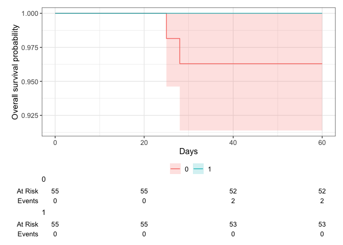

# Load packages

```r
library(tidyverse)
library(readxl)
library(writexl)
library(tableone)
library(here)
library(kableExtra)

library(jtools) # for summ() and plot_summs
library(sjPlot) # for tab_model
library(ggplot2) # survival/TTE analyses and other graphs
library(ggsurvfit) # survival/TTE analyses
library(survival) # survival/TTE analyses
library(gtsummary) # survival/TTE analyses
library(ggfortify) # autoplot
library(tidycmprsk) # competing risk analysis
library(ordinal) # clinstatus ordinal regression
library(mosaic) # Odds Ratio for 0.5-corrected 2x2 table in case of rare events
library(logistf) # Firth regression in case of rare events
```

# Load Data


# Baseline Characteristics

```r
# without the 2 that withdrew consent right after randomization, 1 in each group => 55 per group. See publication
df$trial <- c("COVINIB")
df$JAKi <- c("Baricitinib")
df <- df %>%
  rename(id_pat = "Pat ID",
         trt = Trt,
         age = Age,
         sympdur = Sympdur)
df <- df %>% # no missing in sex
  mutate(sex = case_when(Sex == 1 ~ "female",
                         Sex == 2 ~ "male"))
df %>% 
  drop_na(age) %>% 
  ggplot(aes(x = age)) +
  geom_density(fill = "blue", color = "black") +
  labs(title = "Density Plot of Age",
       x = "Age",
       y = "Density")
```

<!-- -->

```r
df <- df %>% # no missing in ethnicity
  mutate(ethn = case_when(Ethn == 1 ~ "Latino",
                         Ethn == 2 ~ "Asian",
                         Ethn == 0 ~ "White"))
df$country <- c("Spain")
df$icu <- 0 # no icu patients at enrolment

# Days with symptoms prior to randomization
df %>% # no missings
  drop_na(sympdur) %>% 
  ggplot(aes(x = sympdur)) +
  geom_density(fill = "blue", color = "black") +
  labs(title = "Density Plot of Symptom Duration",
       x = "Symptom Duration",
       y = "Density")
```

<!-- -->

```r
# Severity of COVID-19 with respect to respiratory support at randomisation
df$clinstatus_baseline <- factor(df$Clinstatus_baseline, levels = 1:6) ## no missing data
addmargins(table(df$clinstatus_baseline, df$trt, useNA = "always"))
```

```
##       
##          0   1 <NA> Sum
##   1      0   0    0   0
##   2     19  16    0  35
##   3     36  39    0  75
##   4      0   0    0   0
##   5      0   0    0   0
##   6      0   0    0   0
##   <NA>   0   0    0   0
##   Sum   55  55    0 110
```

```r
df <- df %>% 
  mutate(vbaseline = case_when(clinstatus_baseline == "2" | clinstatus_baseline == "3" ~ 0,
                                clinstatus_baseline == "4" | clinstatus_baseline == "5" ~ 1))

# Co-medication at baseline
df$comed_toci <- 0 # see publication and correspondence with authors
df$comed_rdv <- 0 # see publication and correspondence with authors
df$comed_acoa <- 0 # no therapeutic anticoa used, see correspondence with authors
df$comed_interferon <- 0 # no interferon used, see correspondence with authors
df$comed_dexa <- df$Comed_dexa # no missing
df$comed_ab <- df$Comed_ab # no missing
df$comed_other <- df$Comed_other # no missing

## group them for the subgroup analysis, according to protocol
df <- df %>% 
  mutate(comed_cat = case_when(comed_dexa == 0 & comed_toci == 0 ~ 1, # patients without Dexamethasone nor Tocilizumab
                               comed_dexa == 1 & comed_toci == 1 ~ 2, # patients with Dexamethasone and Tocilizumab
                               comed_dexa == 1 & comed_toci == 0 ~ 3, # patients with Dexamethasone but no Tocilizumab
                               comed_dexa == 0 & comed_toci == 1 ~ 4)) # patients with Tocilizumab but no Dexamethasone (if exist)

# Comorbidity at baseline, including immunocompromised // no immunosupp in tofacov and few comorbidities
df_comorb <- df_comorb %>% 
  rename(id_pat = `Pat ID`)
df_comorb <- df_comorb %>% 
  rename(comorb_autoimm = Comorb_autoimm,
         comorb_kidney = Comorb_kidney)
df <- left_join(df, df_comorb[, c("comorb_autoimm", "id_pat")], by = join_by(id_pat == id_pat)) ## merge to main df
df <- left_join(df, df_comorb[, c("comorb_kidney", "id_pat")], by = join_by(id_pat == id_pat)) ## merge to main df

df$comorb_cancer <- 0 # there were not cancer cases, excluded
df <- df %>%
  rename(comorb_lung = Comorb_lung,
         comorb_liver = Comorb_liver,
         comorb_cvd = Comerb_cvd,
         comorb_aht = Comorb_aht,
         comorb_dm = Comorb_dm,
         comorb_obese = Comorb_obese,
         comorb_smoker = Comorb_smoker,
         immunosupp = Immunosupp)
df <- df %>% # no missing
  mutate(any_comorb = case_when(comorb_lung == 1 | comorb_liver == 1 | comorb_cvd == 1 |
                                  comorb_aht == 1 | comorb_dm == 1 | comorb_obese == 1 | comorb_smoker == 1
                                | immunosupp == 1 | comorb_cancer == 1 | comorb_autoimm == 1 | comorb_kidney == 1 
                                  ~ 1,
                                comorb_lung == 0 & comorb_liver == 0 & comorb_cvd == 0 &
                                  comorb_aht == 0 & comorb_dm == 0 & comorb_obese == 0 & comorb_smoker == 0
                                & immunosupp == 0 & comorb_cancer == 0 & comorb_autoimm == 0 & comorb_kidney == 0
                                ~ 0))

## group them for the subgroup analysis, according to protocol // count all pre-defined comorbidities per patient first
comorb <- df %>% 
  select(id_pat, comorb_lung, comorb_liver, comorb_cvd, comorb_aht, comorb_dm, comorb_obese, comorb_smoker, immunosupp, comorb_kidney, comorb_autoimm, comorb_cancer)
comorb$comorb_count <- NA
for (i in 1:dim(comorb)[[1]]) {
  comorb$comorb_count[i] <- ifelse(
    sum(comorb[i, ] %in% c(1)) > 0,
    sum(comorb[i, ] %in% c(1)),
    NA
  )
}
comorb <- comorb %>% 
  mutate(comorb_count = case_when(comorb_lung == 0 & comorb_liver == 0 & comorb_cvd == 0 &
                                  comorb_aht == 0 & comorb_dm == 0 & comorb_obese == 0 & comorb_smoker == 0
                                & immunosupp == 0 & comorb_cancer == 0 & comorb_autoimm == 0 & comorb_kidney == 0 ~ 0,
                                TRUE ~ comorb_count))
df <- left_join(df, comorb[, c("comorb_count", "id_pat")], by = join_by(id_pat == id_pat)) ## merge imputed variable back
df <- df %>% # no missing
  mutate(comorb_cat = case_when(immunosupp == 1 ~ 4, # immunocompromised
                                comorb_count == 0 ~ 1, # no comorbidity
                                comorb_count == 1 ~ 2, # one comorbidity
                                comorb_count >1 & (immunosupp == 0 | is.na(immunosupp)) ~ 3)) # multiple comorbidities

# CRP
df$crp <- as.numeric(df$Crp) ## 1 missing
df %>% 
  drop_na(crp) %>% 
  ggplot(aes(x = crp)) +
  geom_density(fill = "blue", color = "black") +
  labs(title = "Density Plot of CRP",
       x = "CRP",
       y = "Density")
```

<!-- -->

```r
# Vaccination
df$vacc <- df$Vacc ## no missing

# Viremia
# Variant
# Serology
```
Discussion points
2. MS using Copaxone: immunosupp?

# Endpoints

```r
# time to event data
df$death_d <- as.numeric(as_date(df$Death_date) - as_date(df$Randdate)) 
df$discharge_d <- as.numeric(as_date(df$Discharge_date) - as_date(df$Randdate))
df$ltfu_d <- as.numeric(as_date(df$Withdrawal_date) - as_date(df$Randdate)) # LTFUs rather than withdrawn

# (i) Primary outcome: Mortality at day 28
df <- df %>% # corresponds to publication. 3 LTFU before day 28 => multiple imputation
  mutate(mort_28 = case_when(death_d <29 ~ 1,
                             discharge_d <29 & (is.na(ltfu_d) | ltfu_d >28) ~ 0, # all discharged were discharged alive and not to hospice, single out those that were ltfu before day 28
                             Clinstatus_28 %in% c(2,3,4,5) ~ 0, # still at hospital but alive
                             discharge_d >28 ~ 0)) # discharged later, proof of still alive

# table(df$mort_28, useNA = "always") # no transfer to hospice in covinib! => apply our rules for missing data in mort_28 (see NOTES)
# df %>%
#   select(mort_28, death_d, discharge_d, Clinstatus_28, clinstatus_baseline, everything()) %>%
#   filter(is.na(mort_28)) %>%
#   View()
df <- df %>% 
  mutate(mort_28 = case_when(is.na(mort_28) ~ 0,
                             TRUE ~ c(mort_28)))


# (ii) Mortality at day 60
df <- df %>% # max fup time in COVINIB was +/- 70 days! No further deaths after day 28
  mutate(mort_60 = case_when(death_d <61 ~ 1,
                             discharge_d <61 & (is.na(ltfu_d) | ltfu_d >60) ~ 0, # all discharged were discharged alive and not to hospice, single out those that were tfu before day 60
                             Clinstatus_60 %in% c(2,3,4,5) ~ 0, # still at hospital but alive
                             discharge_d >60 ~ 0)) # discharged later, proof of still alive
# table(df$mort_60, useNA = "always") # no transfer to hospice in covinib! => apply our rules for missing data in mort_28 (see NOTES)
df <- df %>% 
  mutate(mort_60 = case_when(is.na(mort_60) ~ 0,
                             TRUE ~ c(mort_60)))


# (iii) Time to death within max. follow-up time
# table(df$Clinstatus_70, useNA = "always") # 2 still hospitalized at day 70, 2 died, 3 LTFU, 103 discharged
df <- df %>%
  mutate(death_reached = case_when(mort_60 == 1 ~ 1,
                                TRUE ~ 0))
df <- df %>% # no missing and those that were discharged and afterwards have correct time to event data
  mutate(death_time = case_when(death_d >=0 ~ c(death_d), # time to death, if no time to death, then...
                                ltfu_d >=0 ~ c(ltfu_d), # time to LTFU,
                                TRUE ~ 70)) # time to max FUP: 70

# (iv) New mechanical ventilation among survivors within 28 days.
df <- df %>% 
  mutate(new_mv_28 = case_when((Clinstatus_baseline == 2 | Clinstatus_baseline == 3 | Clinstatus_baseline == 4) 
                               & (mort_28 == 0 | is.na(mort_28)) 
                               & (Clinstatus_1 == 5 | Clinstatus_2 == 5 | Clinstatus_3 == 5 | Clinstatus_4 == 5 |
                                   Clinstatus_5 == 5 | Clinstatus_6 == 5 | Clinstatus_7 == 5 | Clinstatus_8 == 5 |
                                    Clinstatus_9 == 5 | Clinstatus_10 == 5 | Clinstatus_11 == 5 | Clinstatus_12 == 5 |
                                    Clinstatus_13 == 5 | Clinstatus_14 == 5 | Clinstatus_15 == 5 | Clinstatus_16 == 5 |
                                    Clinstatus_17 == 5 | Clinstatus_18 == 5 | Clinstatus_19 == 5 | Clinstatus_20 == 5 |
                                    Clinstatus_21 == 5 | Clinstatus_22 == 5 | Clinstatus_23 == 5 | Clinstatus_24 == 5 |
                                    Clinstatus_25 == 5 | Clinstatus_26 == 5 | Clinstatus_27 == 5 | Clinstatus_28 == 5)
                               ~ 1,
                               (Clinstatus_baseline == 2 | Clinstatus_baseline == 3 | Clinstatus_baseline == 4) & mort_28 == 0
                               ~ 0))
# table(df$new_mv_28, useNA = "always") # only the 2 deaths are NA: correct. The three LTFU (AFTER discharge) were correctly accounted for with mort_28 == 0, according to our rules for missing data in mort_28 (see NOTES)


# (iv) Alternative definition/analysis: New mechanical ventilation OR death within 28 days => include all in denominator. 
df <- df %>% # The three LTFU (AFTER discharge) were correctly accounted for with mort_28 == 0, according to our rules for missing data in mort_28 (see NOTES)
  mutate(new_mvd_28 = case_when(new_mv_28 == 1 | mort_28 == 1 ~ 1,
                                new_mv_28 == 0 | mort_28 == 0 ~ 0))

# (v) Clinical status at day 28
df$clinstatus_28 <- df$Clinstatus_28

df <- df %>% # They called and followed all patients at day 28 and recorded no new serious adverse events, re-admissions or deaths besides the one that died on day 26
  mutate(clinstatus_28 = case_when(mort_28 == 1 ~ 6,
                                   discharge_d <29 ~ 1, # discharged alive / reached discharge criteria within 28d
                                   Clinstatus_28 == 3 ~ 3, # these ones are still hosp at day 28
                                   Clinstatus_28 == 4 ~ 4,
                                   Clinstatus_28 == 5 ~ 5)) 
df$clinstatus_28 <- factor(df$clinstatus_28, levels = 1:6) # no missing
df$clinstatus_28_imp <- df$clinstatus_28 # equal to clinstatus_28_imp

# (vi) Time to discharge or reaching discharge criteria up to day 28
df <- df %>% # no missing
  mutate(discharge_reached = case_when(discharge_d <29 ~ 1,
                                       TRUE ~ 0))
df <- df %>% 
  mutate(discharge_time = case_when(discharge_d >=0 ~ c(discharge_d), # time to discharge, if no time to discharge, then...
                                    ltfu_d >=0 ~ ltfu_d, # time to ltfu (but all LTFU after discharge), then...
                                    death_d >=0 ~ death_d)) # time to death
df <- df %>% # restrict to max fup time 28d
  mutate(discharge_time = case_when(discharge_time >28 ~ 28,
                                    TRUE ~ discharge_time))
df <- df %>% # add 28d for those that died
  mutate(discharge_time_sens = case_when(mort_28 == 1 ~ 28,
                                    TRUE ~ discharge_time))

# (vi) Sens-analysis: Alternative definition/analysis of outcome: time to sustained discharge within 28 days. There were no re-admissions within 28d
df$discharge_reached_sus <- df$discharge_reached
df$discharge_time_sus <- df$discharge_time


# (vii) Viral clearance up to day 5, day 10, and day 15 (Viral load value <LOQ and/or undectectable): Not available in COVINIB
# (viii) Quality of life at day 28: Not available in COVINIB


# (ix) Participants with an adverse event grade 3 or 4, or a serious adverse event, excluding death, by day 28
# Remove anything in brackets (e.g. "(control)") from the "id" column -> ad under id_pat
df_ae34$id_pat <- as.numeric(sub("\\s*\\([^)]+\\)", "", df_ae34$id))
# Keep just 1 id_pat (-> ANY adverse event grade 3,4) 
df_ae34_unique <- df_ae34 %>% distinct(id_pat, .keep_all = TRUE)
# Assign the outcome
df_ae34_unique$ae_28 <- 1
# merge
df <- left_join(df, df_ae34_unique[, c("ae_28", "id_pat")], by = join_by(id_pat == id_pat)) ## merge variable to main df
# the remaining missing have no AE grade 34 -> recode as 0 and exclude deaths
df <- df %>% 
  mutate(ae_28 = case_when(is.na(ae_28) ~ 0, # the LTFU were discharged
                           mort_28 == 1 ~ NA, # exclude the deaths
                                TRUE ~ ae_28))
# table(df$ae_28, df$mort_28, useNA = "always") # does not correspond to publication because they included AEs up until day 70 (see correspondence with authors)

# (ix) Sens-analysis: Alternative definition/analysis of outcome: incidence rate ratio (Poisson regression) -> AEs per person by d28
ae_npp <- df_ae34 %>% 
  group_by(id_pat)%>%  
  summarise(ae_28_sev = n())
df <- left_join(df, ae_npp[, c("ae_28_sev", "id_pat")], by = join_by(id_pat == id_pat)) # merge variable to main df
# the remaining missing have no AE grade 34 -> recode as 0 and exclude deaths
df <- df %>% 
  mutate(ae_28_sev = case_when(is.na(ae_28_sev) ~ 0, # the LTFU were discharged
                           mort_28 == 1 ~ NA, # exclude the deaths
                                TRUE ~ ae_28_sev))

# (ix) Sens-analysis: Alternative definition/analysis of outcome: time to first (of these) adverse event, within 28 days, considering death as a competing risk (=> censor and set to 28 days)
# time to first ae not available

# (x) Adverse events of special interest within 28 days: a) thromboembolic events (venous thromboembolism, pulmonary embolism, arterial thrombosis), b) secondary infections (bacterial pneumonia including ventilator-associated pneumonia, meningitis and encephalitis, endocarditis and bacteremia, invasive fungal infection including pulmonary aspergillosis), c) Reactivation of chronic infection including tuberculosis, herpes simplex, cytomegalovirus, herpes zoster and hepatitis B, d) serious cardiovascular and cardiac events (including stroke and myocardial infarction), e) events related to signs of bone marrow suppression (anemia, lymphocytopenia, thrombocytopenia, pancytopenia), f) malignancy, g) gastrointestinal perforation (incl. gastrointestinal bleeding/diverticulitis), h) liver dysfunction/hepatotoxicity (grade 3 and 4)

# ... and (xi) Adverse events, any grade and serious adverse event, excluding death, within 28 days, grouped by organ classes

# Remove anything in brackets (e.g. "(control)") from the "id" column -> ad under id_pat
df_ae12$id_pat <- as.numeric(sub("\\s*\\([^)]+\\)", "", df_ae12$id))
df_ae12$grade <- "1 or 2"
df_ae34$grade <- "3 or 4"
df_ae_comb <- rbind(df_ae12, df_ae34)
# first, work on categorizing all events -> any AE, grouped -> ae_28_list
df_ae_comb <- df_ae_comb %>% 
  mutate(ae_28_list = case_when(grepl("ALT", ae) ~ "Liver impairment",
                                grepl(paste(c("Anemia", "Neutropenia", "Thrombocytopenia"), collapse = "|"), ae) ~ "Anemia and other hematological disorders",
                                grepl(paste(c("secondary", "SECONDARY"), collapse = "|"), ae) ~ "Secondary infections",
                                grepl(paste(c("thrombo*", "embol*"), collapse = "|"), ae) ~ "Thromboembolic events",
                                grepl("ARDS", ae) ~ "Respiratory distress and other pulmonary complications",
                                grepl("Delirium", ae) ~ "Delirium",
                                grepl("Multi-organ failure/shock", ae) ~ "Multiple organ dysfunction syndrome",
                                grepl("Peripheral nervous system damage", ae) ~ "Peripheral nervous system damage",
                                grepl("Bleeding", ae) ~ "Bleeding"))
df_ae_comb <- left_join(df_ae_comb, df[, c("trt", "id_pat")], by = join_by(id_pat == id_pat)) # add trt variable
# second, define the AESI -> aesi_28
df_ae_comb <- df_ae_comb %>% 
  mutate(aesi_28 = case_when(ae_28_list == "Secondary infections" | 
                               ae_28_list == "Thromboembolic events" |
                               ae_28_list == "Anemia and other hematological disorders" |
                               (ae_28_list == "Liver impairment" & grade == "3 or 4") ~ 1,
                             TRUE ~ 0))
df_ae <- df_ae_comb %>% 
  select(id_pat, trt, ae, note, grade, ae_28_list, aesi_28)
# Save
saveRDS(df_ae, file = "df_ae_covinib.RData")
```
Discussion points
1. newmv: 5 missing: The two deaths (no MICE) and the three LTFU (but AFTER discharge) -> MICE or 0 ?

# Multiple imputation using chained equation

Discussion points

# Define final dataset, set references, summarize missing data and variables

```r
# keep the overall set
df_all <- df
# reduce the df set to our standardized set across all trials
df <- df %>% 
  select(id_pat, trt, sex, age, ethn, country, icu, sympdur, vacc, clinstatus_baseline, vbaseline, trial, JAKi, 
         comed_dexa, comed_rdv, comed_toci, comed_ab, comed_acoa, comed_interferon, comed_other,
         comed_cat,
         comorb_lung, comorb_liver, comorb_cvd, comorb_aht, comorb_dm, comorb_obese, comorb_smoker, immunosupp,
         comorb_autoimm, comorb_cancer, comorb_kidney,
         any_comorb, comorb_cat, comorb_count,
         crp, 
         # sero, vl_baseline, variant,
         mort_28, mort_60, death_reached, death_time,
         new_mv_28, new_mvd_28,
         clinstatus_28_imp,
         discharge_reached, discharge_time, discharge_time_sens, discharge_reached_sus, discharge_time_sus,
         ae_28, ae_28_sev
         # vir_clear_5, vir_clear_10, vir_clear_15
         )
# export for one-stage model, i.e., add missing variables 
df_os <- df
df_os$sero <- NA
df_os$vl_baseline <- NA
df_os$variant <- NA
df_os$vir_clear_5 <- NA
df_os$vir_clear_10 <- NA
df_os$vir_clear_15 <- NA
# Save
saveRDS(df_os, file = "df_os_covinib.RData")

## set references, re-level
# df <- df %>% 
#   mutate(Treatment = relevel(Treatment, "no JAK inhibitor"))

# Create a bar plot to visualize missing values in each column
original_order <- colnames(df_os)
missing_plot <- df_os %>%
  summarise_all(~ mean(is.na(.))) %>%
  gather() %>%
  mutate(key = factor(key, levels = original_order)) %>%
  ggplot(aes(x = key, y = value)) +
  geom_bar(stat = "identity") +
  labs(x = "Columns", y = "Proportion of Missing Values", title = "Missing Data Visualization") +
  theme(axis.text.x = element_text(angle = 45, hjust = 1)) +
  ylim(0, 1)
print(missing_plot)
```

<!-- -->
Discussion points
1. Missing variables:
* Baseline:
  - variant
  - sero
  - vl_baseline
* Outcomes:
  - vir_clear_5, vir_clear_10, vir_clear_15
2. Missing data:
- NAs in new_mv_28 (some), ae_28, ae_28_sev: Not part of denominator


# (i) Primary outcome: Mortality at day 28

```r
# adjusted for baseline patient characteristics (age, respiratory support at baseline).
# addmargins(table(df$mort_28, df$trt, useNA = "always"))
mort.28 <- df %>% 
  glm(mort_28 ~ trt 
      + age + clinstatus_baseline 
      #+ comed_dexa + comed_rdv + comed_toci
      , family = "binomial", data=.)
summ(mort.28, exp = T, confint = T, model.info = T, model.fit = F, digits = 2)
```

<table class="table table-striped table-hover table-condensed table-responsive" style="width: auto !important; margin-left: auto; margin-right: auto;">
<tbody>
  <tr>
   <td style="text-align:left;font-weight: bold;"> Observations </td>
   <td style="text-align:right;"> 110 </td>
  </tr>
  <tr>
   <td style="text-align:left;font-weight: bold;"> Dependent variable </td>
   <td style="text-align:right;"> mort_28 </td>
  </tr>
  <tr>
   <td style="text-align:left;font-weight: bold;"> Type </td>
   <td style="text-align:right;"> Generalized linear model </td>
  </tr>
  <tr>
   <td style="text-align:left;font-weight: bold;"> Family </td>
   <td style="text-align:right;"> binomial </td>
  </tr>
  <tr>
   <td style="text-align:left;font-weight: bold;"> Link </td>
   <td style="text-align:right;"> logit </td>
  </tr>
</tbody>
</table>  <table class="table table-striped table-hover table-condensed table-responsive" style="width: auto !important; margin-left: auto; margin-right: auto;border-bottom: 0;">
 <thead>
  <tr>
   <th style="text-align:left;">   </th>
   <th style="text-align:right;"> exp(Est.) </th>
   <th style="text-align:right;"> 2.5% </th>
   <th style="text-align:right;"> 97.5% </th>
   <th style="text-align:right;"> z val. </th>
   <th style="text-align:right;"> p </th>
  </tr>
 </thead>
<tbody>
  <tr>
   <td style="text-align:left;font-weight: bold;"> (Intercept) </td>
   <td style="text-align:right;"> 0.00 </td>
   <td style="text-align:right;"> 0.00 </td>
   <td style="text-align:right;"> Inf </td>
   <td style="text-align:right;"> -0.00 </td>
   <td style="text-align:right;"> 1.00 </td>
  </tr>
  <tr>
   <td style="text-align:left;font-weight: bold;"> trt </td>
   <td style="text-align:right;"> 0.00 </td>
   <td style="text-align:right;"> 0.00 </td>
   <td style="text-align:right;"> Inf </td>
   <td style="text-align:right;"> -0.00 </td>
   <td style="text-align:right;"> 1.00 </td>
  </tr>
  <tr>
   <td style="text-align:left;font-weight: bold;"> age </td>
   <td style="text-align:right;"> 1.11 </td>
   <td style="text-align:right;"> 0.93 </td>
   <td style="text-align:right;"> 1.33 </td>
   <td style="text-align:right;"> 1.15 </td>
   <td style="text-align:right;"> 0.25 </td>
  </tr>
  <tr>
   <td style="text-align:left;font-weight: bold;"> clinstatus_baseline3 </td>
   <td style="text-align:right;"> 52973385.84 </td>
   <td style="text-align:right;"> 0.00 </td>
   <td style="text-align:right;"> Inf </td>
   <td style="text-align:right;"> 0.00 </td>
   <td style="text-align:right;"> 1.00 </td>
  </tr>
</tbody>
<tfoot><tr><td style="padding: 0; " colspan="100%">
<sup></sup> Standard errors: MLE</td></tr></tfoot>
</table>

```r
# Create a 2x2 contingency table
# The oddsRatio function from the mosaic package calculates the odds ratio for a 2 x 2 contingency table and a confidence interval for the each estimate. x should be a matrix, data frame or table. "Successes" should be located in column 1 of x, and the treatment of interest should be located in row 2. The odds ratio is calculated as (Odds row 2) / (Odds row 1). The confidence interval is calculated from the log(OR) and back-transformed.
tbl <- tibble(
  Event = c(2.5, 0.5), # add the 0.5 correction
  NoEvent = c(52.5, 53.5) # add the 0.5 correction
)
oddsRatio(tbl, conf.level = 0.95, digits = 3, verbose = TRUE)
```

```
## 
## Odds Ratio
## 
## Proportions
## 	   Prop. 1:	 0.04545 
## 	   Prop. 2:	 0.009259 
## 	 Rel. Risk:	 0.2037 
## 
## Odds
## 	    Odds 1:	 0.04762 
## 	    Odds 2:	 0.009346 
## 	Odds Ratio:	 0.1963 
## 
## 95 percent confidence interval:
## 	 0.01001 < RR < 4.145 
## 	 0.009201 < OR < 4.186 
## NULL
```

```
## [1] 0.1962617
```

```r
mort.28.corr <- oddsRatio(tbl, conf.level = 0.95, digits = 3, verbose = TRUE)
```

```
## 
## Odds Ratio
## 
## Proportions
## 	   Prop. 1:	 0.04545 
## 	   Prop. 2:	 0.009259 
## 	 Rel. Risk:	 0.2037 
## 
## Odds
## 	    Odds 1:	 0.04762 
## 	    Odds 2:	 0.009346 
## 	Odds Ratio:	 0.1963 
## 
## 95 percent confidence interval:
## 	 0.01001 < RR < 4.145 
## 	 0.009201 < OR < 4.186 
## NULL
```

```r
# Firth regression
mort.28.firth <- df %>% 
  logistf(mort_28 ~ trt 
      + age 
      + clinstatus_baseline 
      #+ comed_dexa + comed_rdv + comed_toci
      , data=.)
# Summary and extract coefficients
coefficients_table <- summary(mort.28.firth)$coefficients
```

```
## logistf(formula = mort_28 ~ trt + age + clinstatus_baseline, 
##     data = .)
## 
## Model fitted by Penalized ML
## Coefficients:
##                             coef   se(coef)   lower 0.95 upper 0.95       Chisq
## (Intercept)          -7.70665058 3.53970479 -18.66034269 -0.1930171 4.090167958
## trt                  -1.70270126 1.35785329  -6.63483085  0.8288759 1.618274121
## age                   0.08351837 0.06026573  -0.06787577  0.2511428 1.153354552
## clinstatus_baseline3  0.07715444 1.43266090  -2.81938144  5.1172659 0.002131824
##                               p method
## (Intercept)          0.04313336      2
## trt                  0.20333260      2
## age                  0.28284802      2
## clinstatus_baseline3 0.96317341      2
## 
## Method: 1-Wald, 2-Profile penalized log-likelihood, 3-None
## 
## Likelihood ratio test=3.03519 on 3 df, p=0.3862313, n=110
## Wald test = 32.16632 on 3 df, p = 4.827649e-07
```

```r
trt_coef <- coef(mort.28.firth)["trt"]
hazard_odds_ratio <- exp(trt_coef)
ci <- c(exp(mort.28.firth$ci.lower["trt"]), exp(mort.28.firth$ci.upper["trt"]))
# Create a data frame to store Odds Ratios and CIs
mort.28.firth_tbl <- data.frame(
  # "Variable" = rownames(coefficients_table),
  "Odds Ratio" = hazard_odds_ratio,
  "CI Lower" = ci[1],
  "CI Upper" = ci[2])
# Nicely formatted table
kable(mort.28.firth_tbl, format = "markdown", table.attr = 'class="table"') %>%
  kable_styling(bootstrap_options = "striped", full_width = FALSE)
```


|    | Odds.Ratio|  CI.Lower| CI.Upper|
|:---|----------:|---------:|--------:|
|trt |  0.1821907| 0.0013138| 2.290742|
Discussion points
1. Rare event correction
-- Add 0.5 correction to crosstab, calculate ORs and then inverse variance pooling in second stage?
-- 2x2 directly into Mantel-Haenszel across several trials (https://www.ncbi.nlm.nih.gov/pmc/articles/PMC5297998/)?
-- Firth regression according to R.Riley IPDMA Handbook (page 99): "Traditionally 0.5 is the value added, but Sweeting et al. suggest that a ‘treatment arm’ continuity correction is more appropriate, which adds 1/(sample size of the opposite treatment group) to the number of event and non-events. In the IPD context, a similar approach is to add two extra participants to each group in a trial if it has zero events in either of the groups; one of the added participants has the event and the other does not have the event in each group. Then, a weighted regression analysis can be performed to analyse the extended IPD, with all participants weighted equally except the four added participants, who are given a weight according to Sweeting correction (i.e. 1/(sample size of the opposite treat- ment group)). However, this approach becomes problematic when adjusting for prognostic factors or extending to non-binary variables. For this reason, a more general approach is to adopt Firth regression, which is a penalisation method that reduces small sample bias for non-linear models such as logistic regression, and resolves problems related to separation. Alternatively, researchers may revert to a one-stage IPD meta-analysis approach and placing random effects on parameters (rather than stratifying parameters by trial) so that estimation of trial-specific terms are avoided."

# (ii) Mortality at day 60

```r
# table(df$mort_60, df$trt, useNA = "always")
mort.60 <- df %>% 
  glm(mort_60 ~ trt 
      + age + clinstatus_baseline 
      #+ comed_dexa + comed_rdv + comed_toci
      , family = "binomial", data=.)
summ(mort.60, exp = T, confint = T, model.info = T, model.fit = F, digits = 2)
```

<table class="table table-striped table-hover table-condensed table-responsive" style="width: auto !important; margin-left: auto; margin-right: auto;">
<tbody>
  <tr>
   <td style="text-align:left;font-weight: bold;"> Observations </td>
   <td style="text-align:right;"> 110 </td>
  </tr>
  <tr>
   <td style="text-align:left;font-weight: bold;"> Dependent variable </td>
   <td style="text-align:right;"> mort_60 </td>
  </tr>
  <tr>
   <td style="text-align:left;font-weight: bold;"> Type </td>
   <td style="text-align:right;"> Generalized linear model </td>
  </tr>
  <tr>
   <td style="text-align:left;font-weight: bold;"> Family </td>
   <td style="text-align:right;"> binomial </td>
  </tr>
  <tr>
   <td style="text-align:left;font-weight: bold;"> Link </td>
   <td style="text-align:right;"> logit </td>
  </tr>
</tbody>
</table>  <table class="table table-striped table-hover table-condensed table-responsive" style="width: auto !important; margin-left: auto; margin-right: auto;border-bottom: 0;">
 <thead>
  <tr>
   <th style="text-align:left;">   </th>
   <th style="text-align:right;"> exp(Est.) </th>
   <th style="text-align:right;"> 2.5% </th>
   <th style="text-align:right;"> 97.5% </th>
   <th style="text-align:right;"> z val. </th>
   <th style="text-align:right;"> p </th>
  </tr>
 </thead>
<tbody>
  <tr>
   <td style="text-align:left;font-weight: bold;"> (Intercept) </td>
   <td style="text-align:right;"> 0.00 </td>
   <td style="text-align:right;"> 0.00 </td>
   <td style="text-align:right;"> Inf </td>
   <td style="text-align:right;"> -0.00 </td>
   <td style="text-align:right;"> 1.00 </td>
  </tr>
  <tr>
   <td style="text-align:left;font-weight: bold;"> trt </td>
   <td style="text-align:right;"> 0.00 </td>
   <td style="text-align:right;"> 0.00 </td>
   <td style="text-align:right;"> Inf </td>
   <td style="text-align:right;"> -0.00 </td>
   <td style="text-align:right;"> 1.00 </td>
  </tr>
  <tr>
   <td style="text-align:left;font-weight: bold;"> age </td>
   <td style="text-align:right;"> 1.11 </td>
   <td style="text-align:right;"> 0.93 </td>
   <td style="text-align:right;"> 1.33 </td>
   <td style="text-align:right;"> 1.15 </td>
   <td style="text-align:right;"> 0.25 </td>
  </tr>
  <tr>
   <td style="text-align:left;font-weight: bold;"> clinstatus_baseline3 </td>
   <td style="text-align:right;"> 52973385.84 </td>
   <td style="text-align:right;"> 0.00 </td>
   <td style="text-align:right;"> Inf </td>
   <td style="text-align:right;"> 0.00 </td>
   <td style="text-align:right;"> 1.00 </td>
  </tr>
</tbody>
<tfoot><tr><td style="padding: 0; " colspan="100%">
<sup></sup> Standard errors: MLE</td></tr></tfoot>
</table>

```r
# Create a 2x2 contingency table
# The oddsRatio function from the mosaic package calculates the odds ratio for a 2 x 2 contingency table and a confidence interval for the each estimate. x should be a matrix, data frame or table. "Successes" should be located in column 1 of x, and the treatment of interest should be located in row 2. The odds ratio is calculated as (Odds row 2) / (Odds row 1). The confidence interval is calculated from the log(OR) and back-transformed.
tbl <- tibble(
  Event = c(2.5, 0.5), # add the 0.5 correction, intervention second
  NoEvent = c(52.5, 53.5) # add the 0.5 correction, intervention second
)
oddsRatio(tbl, conf.level = 0.95, digits = 3, verbose = TRUE)
```

```
## 
## Odds Ratio
## 
## Proportions
## 	   Prop. 1:	 0.04545 
## 	   Prop. 2:	 0.009259 
## 	 Rel. Risk:	 0.2037 
## 
## Odds
## 	    Odds 1:	 0.04762 
## 	    Odds 2:	 0.009346 
## 	Odds Ratio:	 0.1963 
## 
## 95 percent confidence interval:
## 	 0.01001 < RR < 4.145 
## 	 0.009201 < OR < 4.186 
## NULL
```

```
## [1] 0.1962617
```

```r
mort.60.corr <- oddsRatio(tbl, conf.level = 0.95, digits = 3, verbose = TRUE)
```

```
## 
## Odds Ratio
## 
## Proportions
## 	   Prop. 1:	 0.04545 
## 	   Prop. 2:	 0.009259 
## 	 Rel. Risk:	 0.2037 
## 
## Odds
## 	    Odds 1:	 0.04762 
## 	    Odds 2:	 0.009346 
## 	Odds Ratio:	 0.1963 
## 
## 95 percent confidence interval:
## 	 0.01001 < RR < 4.145 
## 	 0.009201 < OR < 4.186 
## NULL
```

```r
# Firth regression
mort.60.firth <- df %>% 
  logistf(mort_60 ~ trt 
      + age 
      + clinstatus_baseline 
      #+ comed_dexa + comed_rdv + comed_toci
      , data=.)
summary(mort.60.firth)
```

```
## logistf(formula = mort_60 ~ trt + age + clinstatus_baseline, 
##     data = .)
## 
## Model fitted by Penalized ML
## Coefficients:
##                             coef   se(coef)   lower 0.95 upper 0.95       Chisq
## (Intercept)          -7.70665058 3.53970479 -18.66034269 -0.1930171 4.090167958
## trt                  -1.70270126 1.35785329  -6.63483085  0.8288759 1.618274121
## age                   0.08351837 0.06026573  -0.06787577  0.2511428 1.153354552
## clinstatus_baseline3  0.07715444 1.43266090  -2.81938144  5.1172659 0.002131824
##                               p method
## (Intercept)          0.04313336      2
## trt                  0.20333260      2
## age                  0.28284802      2
## clinstatus_baseline3 0.96317341      2
## 
## Method: 1-Wald, 2-Profile penalized log-likelihood, 3-None
## 
## Likelihood ratio test=3.03519 on 3 df, p=0.3862313, n=110
## Wald test = 32.16632 on 3 df, p = 4.827649e-07
```

# (iii) Time to death within max. follow-up time

```r
# KM curve
survfit2(Surv(death_time, death_reached) ~ trt, data=df) %>% 
  ggsurvfit() +
  labs(
    x = "Days",
    y = "Overall survival probability"
  ) + 
  add_confidence_interval() +
  add_risktable()
```

<!-- -->

```r
# testing: cox ph
ttdeath <- df %>%
  coxph(Surv(death_time, death_reached) ~ trt
        + age + clinstatus_baseline 
        #+ comed_dexa + comed_rdv + comed_toci
        , data =.)
ttdeath_reg_tbl <- tbl_regression(ttdeath, exp = TRUE)

# ttdeath.firth <- df %>%
#   logistf(Surv(death_time, death_reached) ~ trt
#         #+ age + clinstatus_baseline + comed_dexa + comed_rdv + comed_toci
#         , data =.)
# ttdeath_reg_tbl <- tbl_regression(ttdeath, exp = TRUE)

# Nicely formatted table
kable(ttdeath_reg_tbl, format = "markdown", table.attr = 'class="table"') %>%
  kable_styling(bootstrap_options = "striped", full_width = FALSE)
```


|**Characteristic**  |**HR** |**95% CI** |**p-value** |
|:-------------------|:------|:----------|:-----------|
|trt                 |0.00   |0.00, Inf  |>0.9        |
|age                 |1.10   |0.94, 1.29 |0.2         |
|clinstatus_baseline |NA     |NA         |NA          |
|1                   |NA     |NA         |NA          |
|2                   |0.00   |0.00, Inf  |>0.9        |
|3                   |NA     |NA         |NA          |
|4                   |NA     |NA         |NA          |
|5                   |NA     |NA         |NA          |
|6                   |NA     |NA         |NA          |
Discussion points
1. R.Riley IPDMA handbook, page 102: "As for binary outcomes, when there are few events in some trials adaptions of Firth’s correction are important to reduce small sample bias in the estimated treatment effect." -> implement

# (iv) New mechanical ventilation among survivors within 28 days

```r
# table(df$new_mv_28, df$trt, useNA = "always")
new.mv.28 <- df %>% 
  glm(new_mv_28 ~ trt 
       + age + clinstatus_baseline 
       #+ comed_dexa + comed_rdv + comed_toci
      , family = "binomial", data=.)
summ(new.mv.28, exp = T, confint = T, model.info = T, model.fit = F, digits = 2)
```

<table class="table table-striped table-hover table-condensed table-responsive" style="width: auto !important; margin-left: auto; margin-right: auto;">
<tbody>
  <tr>
   <td style="text-align:left;font-weight: bold;"> Observations </td>
   <td style="text-align:right;"> 108 (2 missing obs. deleted) </td>
  </tr>
  <tr>
   <td style="text-align:left;font-weight: bold;"> Dependent variable </td>
   <td style="text-align:right;"> new_mv_28 </td>
  </tr>
  <tr>
   <td style="text-align:left;font-weight: bold;"> Type </td>
   <td style="text-align:right;"> Generalized linear model </td>
  </tr>
  <tr>
   <td style="text-align:left;font-weight: bold;"> Family </td>
   <td style="text-align:right;"> binomial </td>
  </tr>
  <tr>
   <td style="text-align:left;font-weight: bold;"> Link </td>
   <td style="text-align:right;"> logit </td>
  </tr>
</tbody>
</table>  <table class="table table-striped table-hover table-condensed table-responsive" style="width: auto !important; margin-left: auto; margin-right: auto;border-bottom: 0;">
 <thead>
  <tr>
   <th style="text-align:left;">   </th>
   <th style="text-align:right;"> exp(Est.) </th>
   <th style="text-align:right;"> 2.5% </th>
   <th style="text-align:right;"> 97.5% </th>
   <th style="text-align:right;"> z val. </th>
   <th style="text-align:right;"> p </th>
  </tr>
 </thead>
<tbody>
  <tr>
   <td style="text-align:left;font-weight: bold;"> (Intercept) </td>
   <td style="text-align:right;"> 0.01 </td>
   <td style="text-align:right;"> 0.00 </td>
   <td style="text-align:right;"> 0.92 </td>
   <td style="text-align:right;"> -2.00 </td>
   <td style="text-align:right;"> 0.05 </td>
  </tr>
  <tr>
   <td style="text-align:left;font-weight: bold;"> trt </td>
   <td style="text-align:right;"> 0.27 </td>
   <td style="text-align:right;"> 0.05 </td>
   <td style="text-align:right;"> 1.42 </td>
   <td style="text-align:right;"> -1.54 </td>
   <td style="text-align:right;"> 0.12 </td>
  </tr>
  <tr>
   <td style="text-align:left;font-weight: bold;"> age </td>
   <td style="text-align:right;"> 1.04 </td>
   <td style="text-align:right;"> 0.96 </td>
   <td style="text-align:right;"> 1.13 </td>
   <td style="text-align:right;"> 1.01 </td>
   <td style="text-align:right;"> 0.31 </td>
  </tr>
  <tr>
   <td style="text-align:left;font-weight: bold;"> clinstatus_baseline3 </td>
   <td style="text-align:right;"> 1.07 </td>
   <td style="text-align:right;"> 0.17 </td>
   <td style="text-align:right;"> 6.76 </td>
   <td style="text-align:right;"> 0.08 </td>
   <td style="text-align:right;"> 0.94 </td>
  </tr>
</tbody>
<tfoot><tr><td style="padding: 0; " colspan="100%">
<sup></sup> Standard errors: MLE</td></tr></tfoot>
</table>

```r
# (iv) Alternative definition/analysis: New mechanical ventilation OR death within 28 days => include all in denominator. 
# table(df$new_mvd_28, df$trt, useNA = "always")
new.mvd.28 <- df %>% 
  glm(new_mvd_28 ~ trt 
      + age + clinstatus_baseline 
      #+ comed_dexa + comed_rdv + comed_toci
      , family = "binomial", data=.)
summ(new.mvd.28, exp = T, confint = T, model.info = T, model.fit = F, digits = 2)
```

<table class="table table-striped table-hover table-condensed table-responsive" style="width: auto !important; margin-left: auto; margin-right: auto;">
<tbody>
  <tr>
   <td style="text-align:left;font-weight: bold;"> Observations </td>
   <td style="text-align:right;"> 110 </td>
  </tr>
  <tr>
   <td style="text-align:left;font-weight: bold;"> Dependent variable </td>
   <td style="text-align:right;"> new_mvd_28 </td>
  </tr>
  <tr>
   <td style="text-align:left;font-weight: bold;"> Type </td>
   <td style="text-align:right;"> Generalized linear model </td>
  </tr>
  <tr>
   <td style="text-align:left;font-weight: bold;"> Family </td>
   <td style="text-align:right;"> binomial </td>
  </tr>
  <tr>
   <td style="text-align:left;font-weight: bold;"> Link </td>
   <td style="text-align:right;"> logit </td>
  </tr>
</tbody>
</table>  <table class="table table-striped table-hover table-condensed table-responsive" style="width: auto !important; margin-left: auto; margin-right: auto;border-bottom: 0;">
 <thead>
  <tr>
   <th style="text-align:left;">   </th>
   <th style="text-align:right;"> exp(Est.) </th>
   <th style="text-align:right;"> 2.5% </th>
   <th style="text-align:right;"> 97.5% </th>
   <th style="text-align:right;"> z val. </th>
   <th style="text-align:right;"> p </th>
  </tr>
 </thead>
<tbody>
  <tr>
   <td style="text-align:left;font-weight: bold;"> (Intercept) </td>
   <td style="text-align:right;"> 0.01 </td>
   <td style="text-align:right;"> 0.00 </td>
   <td style="text-align:right;"> 0.45 </td>
   <td style="text-align:right;"> -2.33 </td>
   <td style="text-align:right;"> 0.02 </td>
  </tr>
  <tr>
   <td style="text-align:left;font-weight: bold;"> trt </td>
   <td style="text-align:right;"> 0.20 </td>
   <td style="text-align:right;"> 0.04 </td>
   <td style="text-align:right;"> 1.01 </td>
   <td style="text-align:right;"> -1.95 </td>
   <td style="text-align:right;"> 0.05 </td>
  </tr>
  <tr>
   <td style="text-align:left;font-weight: bold;"> age </td>
   <td style="text-align:right;"> 1.06 </td>
   <td style="text-align:right;"> 0.98 </td>
   <td style="text-align:right;"> 1.14 </td>
   <td style="text-align:right;"> 1.39 </td>
   <td style="text-align:right;"> 0.16 </td>
  </tr>
  <tr>
   <td style="text-align:left;font-weight: bold;"> clinstatus_baseline3 </td>
   <td style="text-align:right;"> 1.25 </td>
   <td style="text-align:right;"> 0.21 </td>
   <td style="text-align:right;"> 7.50 </td>
   <td style="text-align:right;"> 0.25 </td>
   <td style="text-align:right;"> 0.81 </td>
  </tr>
</tbody>
<tfoot><tr><td style="padding: 0; " colspan="100%">
<sup></sup> Standard errors: MLE</td></tr></tfoot>
</table>

# (v) Clinical status at day 28

```r
# table(df$clinstatus_28_imp, df$trt, useNA = "always")
clin.28 <- df %>% 
  clm(clinstatus_28_imp ~ trt 
      + age 
      + clinstatus_baseline 
      #+ comed_dexa + comed_rdv + comed_toci
      , link= c("logit"), data=.)
# Summary and extract coefficients
coefficients_table <- summary(clin.28)$coefficients
# Calculate Odds Ratios and Confidence Intervals
odds_ratios <- exp(coefficients_table[, "Estimate"])
ci_lower <- exp(coefficients_table[, "Estimate"] - 1.96 * coefficients_table[, "Std. Error"])
ci_upper <- exp(coefficients_table[, "Estimate"] + 1.96 * coefficients_table[, "Std. Error"])
# Create a data frame to store Odds Ratios and CIs
clin.28_tbl <- data.frame(
  "Variable" = rownames(coefficients_table),
  "Odds Ratio" = odds_ratios,
  "CI Lower" = ci_lower,
  "CI Upper" = ci_upper
)
# Nicely formatted table
kable(clin.28_tbl, format = "markdown", table.attr = 'class="table"') %>%
  kable_styling(bootstrap_options = "striped", full_width = FALSE)
```


|                     |Variable             |   Odds.Ratio|   CI.Lower|     CI.Upper|
|:--------------------|:--------------------|------------:|----------:|------------:|
|1&#124;3             |1&#124;3             | 8.835460e+03| 21.0733183| 3.704464e+06|
|3&#124;5             |3&#124;5             | 1.716052e+04| 36.7898354| 8.004476e+06|
|5&#124;6             |5&#124;6             | 3.715527e+04| 69.7581693| 1.979000e+07|
|trt                  |trt                  | 3.212049e-01|  0.0564811| 1.826675e+00|
|age                  |age                  | 1.120213e+00|  1.0134383| 1.238236e+00|
|clinstatus_baseline3 |clinstatus_baseline3 | 1.217019e+00|  0.1180339| 1.254838e+01|

# (vi) Time to discharge or reaching discharge criteria up to day 28

```r
# Kaplan-Meier estimate of conditional discharge probability
# Just censoring => Cause-specific hazards
km.ttdischarge.check <- with(df, Surv(discharge_time, discharge_reached))
# head(km.ttdischarge.check, 100)
km.ttdischarge_trt <- survfit(Surv(discharge_time, discharge_reached) ~ trt, data=df)
# KM curve
survfit2(Surv(discharge_time, discharge_reached) ~ trt, data=df) %>% 
  ggsurvfit() +
  labs(
    x = "Days",
    y = "Overall hospitalization probability"
  ) + 
  add_confidence_interval() +
  add_risktable()
```

<!-- -->

```r
# testing: cox ph
ttdischarge <- df %>% 
  coxph(Surv(discharge_time, discharge_reached) ~ trt 
        + age + clinstatus_baseline 
        #+ comed_dexa + comed_rdv + comed_toci
        , data =.)
ttdischarge_reg_tbl <- tbl_regression(ttdischarge, exp = TRUE)
# Nicely formatted table
kable(ttdischarge_reg_tbl, format = "markdown", table.attr = 'class="table"') %>%
  kable_styling(bootstrap_options = "striped", full_width = FALSE)
```


|**Characteristic**  |**HR** |**95% CI** |**p-value** |
|:-------------------|:------|:----------|:-----------|
|trt                 |1.59   |1.07, 2.36 |0.023       |
|age                 |0.98   |0.96, 1.00 |0.041       |
|clinstatus_baseline |NA     |NA         |NA          |
|1                   |NA     |NA         |NA          |
|2                   |1.77   |1.08, 2.91 |0.024       |
|3                   |NA     |NA         |NA          |
|4                   |NA     |NA         |NA          |
|5                   |NA     |NA         |NA          |
|6                   |NA     |NA         |NA          |

```r
# Sub-distribution hazards
df <- df %>% # cuminc needs a factor variable with censored patients coded as 0, the event as 1 (discharge) and the competing event as 2 (death).
  mutate(discharge_reached_comp = case_when (discharge_reached == 0 & (mort_28 == 0 | is.na(mort_28)) ~ 0,
                                             discharge_reached == 1 & (mort_28 == 0 | is.na(mort_28)) ~ 1,
                                             mort_28 == 1 ~ 2))
# table(df$discharge_reached_comp)
df$discharge_reached_comp <- as.factor(df$discharge_reached_comp)
# Cumulative incidence for competing risks
cuminc(Surv(discharge_time, discharge_reached_comp) ~ 1, data = df)
```

```
## 
```

```
## ── cuminc() ────────────────────────────────────────────────────────────────────
```

```
## • Failure type "1"
```

```
## time   n.risk   estimate   std.error   95% CI          
## 5.00   75       0.482      0.048       0.385, 0.572    
## 10.0   24       0.827      0.037       0.741, 0.887    
## 15.0   13       0.891      0.030       0.814, 0.937    
## 20.0   10       0.927      0.026       0.857, 0.964    
## 25.0   8        0.927      0.026       0.857, 0.964
```

```
## • Failure type "2"
```

```
## time   n.risk   estimate   std.error   95% CI          
## 5.00   75       0.000      0.000       NA, NA          
## 10.0   24       0.000      0.000       NA, NA          
## 15.0   13       0.000      0.000       NA, NA          
## 20.0   10       0.000      0.000       NA, NA          
## 25.0   8        0.009      0.010       0.001, 0.049
```

```r
cuminc(Surv(discharge_time, discharge_reached_comp) ~ trt, data = df) %>%
  ggcuminc(outcome = c("1", "2")) +
  ylim(c(0, 1)) +
  labs(
    x = "Days"
  ) +
  add_confidence_interval() +
  add_risktable()
```

<!-- -->

```r
# testing: Fine-Gray regression
ttdischarge.comp <- crr(Surv(discharge_time, discharge_reached_comp) ~ trt
    + age
    #+ clinstatus_baseline
    #+ comed_dexa + comed_rdv + comed_toci
    ,data = df)
ttdischarge_comp_reg_tbl <- tbl_regression(ttdischarge.comp, exp = TRUE)
# Nicely formatted table
kable(ttdischarge_comp_reg_tbl, format = "markdown", table.attr = 'class="table"') %>%
  kable_styling(bootstrap_options = "striped", full_width = FALSE)
```


|**Characteristic** |**HR** |**95% CI** |**p-value** |
|:------------------|:------|:----------|:-----------|
|trt                |1.53   |1.06, 2.21 |0.023       |
|age                |0.97   |0.95, 0.99 |<0.001      |

```r
# Censoring and assigned worst outcome (28d) to competing event (death) // hypothetical estimand
survfit2(Surv(discharge_time_sens, discharge_reached) ~ trt, data=df) %>% 
  ggsurvfit() +
  labs(
    x = "Days",
    y = "Overall hospitalization probability"
  ) + 
  add_confidence_interval() +
  add_risktable()
```

<!-- -->

```r
# testing: cox ph
ttdischarge.sens <- df %>% 
  coxph(Surv(discharge_time_sens, discharge_reached) ~ trt 
        + age + clinstatus_baseline 
        #+ comed_dexa + comed_rdv + comed_toci
        , data =.)
ttdischarge_sens_reg_tbl <- tbl_regression(ttdischarge.sens, exp = TRUE)
# Nicely formatted table
kable(ttdischarge_sens_reg_tbl, format = "markdown", table.attr = 'class="table"') %>%
  kable_styling(bootstrap_options = "striped", full_width = FALSE)
```


|**Characteristic**  |**HR** |**95% CI** |**p-value** |
|:-------------------|:------|:----------|:-----------|
|trt                 |1.59   |1.07, 2.36 |0.022       |
|age                 |0.98   |0.96, 1.00 |0.040       |
|clinstatus_baseline |NA     |NA         |NA          |
|1                   |NA     |NA         |NA          |
|2                   |1.78   |1.08, 2.92 |0.023       |
|3                   |NA     |NA         |NA          |
|4                   |NA     |NA         |NA          |
|5                   |NA     |NA         |NA          |
|6                   |NA     |NA         |NA          |

```r
# Assessing proportional hazards using default discharge_time and discharge_reached
ph.check <- coxph(Surv(discharge_time, discharge_reached) ~ trt 
                , data = df)
cz <- cox.zph(ph.check)
print(cz)
```

```
##        chisq df    p
## trt    0.443  1 0.51
## GLOBAL 0.443  1 0.51
```

```r
plot(cz)
```

<!-- -->

```r
# Sens-analysis: Alternative definition/analysis of outcome: time to sustained discharge within 28 days
# Use cause-specific hazards
survfit2(Surv(discharge_time_sus, discharge_reached_sus) ~ trt, data=df) %>% 
  ggsurvfit() +
  labs(
    x = "Days",
    y = "Overall sustained hospitalization probability"
  ) + 
  add_confidence_interval() +
  add_risktable()
```

<!-- -->

```r
# testing: cox ph
ttdischarge.sus <- df %>% 
  coxph(Surv(discharge_time_sus, discharge_reached_sus) ~ trt 
        + age + clinstatus_baseline 
        #+ comed_dexa + comed_rdv + comed_toci
        , data =.)
ttdischarge_sus_reg_tbl <- tbl_regression(ttdischarge.sus, exp = TRUE)
# Nicely formatted table
kable(ttdischarge_sus_reg_tbl, format = "markdown", table.attr = 'class="table"') %>%
  kable_styling(bootstrap_options = "striped", full_width = FALSE)
```


|**Characteristic**  |**HR** |**95% CI** |**p-value** |
|:-------------------|:------|:----------|:-----------|
|trt                 |1.59   |1.07, 2.36 |0.023       |
|age                 |0.98   |0.96, 1.00 |0.041       |
|clinstatus_baseline |NA     |NA         |NA          |
|1                   |NA     |NA         |NA          |
|2                   |1.77   |1.08, 2.91 |0.024       |
|3                   |NA     |NA         |NA          |
|4                   |NA     |NA         |NA          |
|5                   |NA     |NA         |NA          |
|6                   |NA     |NA         |NA          |
Discussion points
1. Use F&G for sens-analysis (sustained discharge)?

# (vii) Viral clearance up to day 5, day 10, and day 15

Discussion points
1. Not available

# (viii) Quality of life at day 28 

Discussion points
1. Not available

# (ix) Adverse event(s) grade 3 or 4, or a serious adverse event(s), excluding death, by day 28

```r
# table(df$ae_28, df$trt, useNA = "always")
ae.28 <- df %>% 
  glm(ae_28 ~ trt 
      + age + clinstatus_baseline 
      #+ comed_dexa + comed_rdv + comed_toci
      , family = "binomial", data=.)
summ(ae.28, exp = T, confint = T, model.info = T, model.fit = F, digits = 2)
```

<table class="table table-striped table-hover table-condensed table-responsive" style="width: auto !important; margin-left: auto; margin-right: auto;">
<tbody>
  <tr>
   <td style="text-align:left;font-weight: bold;"> Observations </td>
   <td style="text-align:right;"> 108 (2 missing obs. deleted) </td>
  </tr>
  <tr>
   <td style="text-align:left;font-weight: bold;"> Dependent variable </td>
   <td style="text-align:right;"> ae_28 </td>
  </tr>
  <tr>
   <td style="text-align:left;font-weight: bold;"> Type </td>
   <td style="text-align:right;"> Generalized linear model </td>
  </tr>
  <tr>
   <td style="text-align:left;font-weight: bold;"> Family </td>
   <td style="text-align:right;"> binomial </td>
  </tr>
  <tr>
   <td style="text-align:left;font-weight: bold;"> Link </td>
   <td style="text-align:right;"> logit </td>
  </tr>
</tbody>
</table>  <table class="table table-striped table-hover table-condensed table-responsive" style="width: auto !important; margin-left: auto; margin-right: auto;border-bottom: 0;">
 <thead>
  <tr>
   <th style="text-align:left;">   </th>
   <th style="text-align:right;"> exp(Est.) </th>
   <th style="text-align:right;"> 2.5% </th>
   <th style="text-align:right;"> 97.5% </th>
   <th style="text-align:right;"> z val. </th>
   <th style="text-align:right;"> p </th>
  </tr>
 </thead>
<tbody>
  <tr>
   <td style="text-align:left;font-weight: bold;"> (Intercept) </td>
   <td style="text-align:right;"> 0.07 </td>
   <td style="text-align:right;"> 0.00 </td>
   <td style="text-align:right;"> 0.94 </td>
   <td style="text-align:right;"> -2.00 </td>
   <td style="text-align:right;"> 0.05 </td>
  </tr>
  <tr>
   <td style="text-align:left;font-weight: bold;"> trt </td>
   <td style="text-align:right;"> 0.80 </td>
   <td style="text-align:right;"> 0.31 </td>
   <td style="text-align:right;"> 2.03 </td>
   <td style="text-align:right;"> -0.48 </td>
   <td style="text-align:right;"> 0.63 </td>
  </tr>
  <tr>
   <td style="text-align:left;font-weight: bold;"> age </td>
   <td style="text-align:right;"> 1.02 </td>
   <td style="text-align:right;"> 0.97 </td>
   <td style="text-align:right;"> 1.07 </td>
   <td style="text-align:right;"> 0.83 </td>
   <td style="text-align:right;"> 0.41 </td>
  </tr>
  <tr>
   <td style="text-align:left;font-weight: bold;"> clinstatus_baseline3 </td>
   <td style="text-align:right;"> 1.66 </td>
   <td style="text-align:right;"> 0.52 </td>
   <td style="text-align:right;"> 5.35 </td>
   <td style="text-align:right;"> 0.86 </td>
   <td style="text-align:right;"> 0.39 </td>
  </tr>
</tbody>
<tfoot><tr><td style="padding: 0; " colspan="100%">
<sup></sup> Standard errors: MLE</td></tr></tfoot>
</table>

```r
# (ix) Sens-analysis: Alternative definition/analysis of outcome: incidence rate ratio (Poisson regression) -> AE per person by d28
# table(df$ae_28_sev, df$trt, useNA = "always")
ae.28.sev <- df %>% 
  glm(ae_28_sev ~ trt 
      + age + clinstatus_baseline 
      #+ comed_dexa + comed_rdv + comed_toci
      , family = "poisson", data=.)
summ(ae.28.sev, exp = T, confint = T, model.info = T, model.fit = F, digits = 2)
```

<table class="table table-striped table-hover table-condensed table-responsive" style="width: auto !important; margin-left: auto; margin-right: auto;">
<tbody>
  <tr>
   <td style="text-align:left;font-weight: bold;"> Observations </td>
   <td style="text-align:right;"> 108 (2 missing obs. deleted) </td>
  </tr>
  <tr>
   <td style="text-align:left;font-weight: bold;"> Dependent variable </td>
   <td style="text-align:right;"> ae_28_sev </td>
  </tr>
  <tr>
   <td style="text-align:left;font-weight: bold;"> Type </td>
   <td style="text-align:right;"> Generalized linear model </td>
  </tr>
  <tr>
   <td style="text-align:left;font-weight: bold;"> Family </td>
   <td style="text-align:right;"> poisson </td>
  </tr>
  <tr>
   <td style="text-align:left;font-weight: bold;"> Link </td>
   <td style="text-align:right;"> log </td>
  </tr>
</tbody>
</table>  <table class="table table-striped table-hover table-condensed table-responsive" style="width: auto !important; margin-left: auto; margin-right: auto;border-bottom: 0;">
 <thead>
  <tr>
   <th style="text-align:left;">   </th>
   <th style="text-align:right;"> exp(Est.) </th>
   <th style="text-align:right;"> 2.5% </th>
   <th style="text-align:right;"> 97.5% </th>
   <th style="text-align:right;"> z val. </th>
   <th style="text-align:right;"> p </th>
  </tr>
 </thead>
<tbody>
  <tr>
   <td style="text-align:left;font-weight: bold;"> (Intercept) </td>
   <td style="text-align:right;"> 0.05 </td>
   <td style="text-align:right;"> 0.01 </td>
   <td style="text-align:right;"> 0.29 </td>
   <td style="text-align:right;"> -3.37 </td>
   <td style="text-align:right;"> 0.00 </td>
  </tr>
  <tr>
   <td style="text-align:left;font-weight: bold;"> trt </td>
   <td style="text-align:right;"> 0.59 </td>
   <td style="text-align:right;"> 0.33 </td>
   <td style="text-align:right;"> 1.05 </td>
   <td style="text-align:right;"> -1.80 </td>
   <td style="text-align:right;"> 0.07 </td>
  </tr>
  <tr>
   <td style="text-align:left;font-weight: bold;"> age </td>
   <td style="text-align:right;"> 1.04 </td>
   <td style="text-align:right;"> 1.01 </td>
   <td style="text-align:right;"> 1.07 </td>
   <td style="text-align:right;"> 2.55 </td>
   <td style="text-align:right;"> 0.01 </td>
  </tr>
  <tr>
   <td style="text-align:left;font-weight: bold;"> clinstatus_baseline3 </td>
   <td style="text-align:right;"> 1.16 </td>
   <td style="text-align:right;"> 0.56 </td>
   <td style="text-align:right;"> 2.39 </td>
   <td style="text-align:right;"> 0.40 </td>
   <td style="text-align:right;"> 0.69 </td>
  </tr>
</tbody>
<tfoot><tr><td style="padding: 0; " colspan="100%">
<sup></sup> Standard errors: MLE</td></tr></tfoot>
</table>

# Subgroup analysis: Ventilation requirement (proxy for disease severity) on primary endpoint

```r
table(df$clinstatus_baseline, df$mort_28, useNA = "always") # only 2 - 3 included
```

```
##       
##         0  1 <NA>
##   1     0  0    0
##   2    35  0    0
##   3    73  2    0
##   4     0  0    0
##   5     0  0    0
##   6     0  0    0
##   <NA>  0  0    0
```

```r
table(df$vbaseline, df$mort_28, useNA = "always")
```

```
##       
##          0   1 <NA>
##   0    108   2    0
##   <NA>   0   0    0
```

```r
# class(df$clinstatus_baseline)
df$clinstatus_baseline_n <- as.numeric(df$clinstatus_baseline)

mort.28.vent <- df %>% 
  glm(mort_28 ~ trt*clinstatus_baseline_n
      + age 
      #+ clinstatus_baseline 
      #+ comed_dexa + comed_rdv + comed_toci
      , family = "binomial", data=.)
summ(mort.28.vent, exp = T, confint = T, model.info = T, model.fit = F, digits = 2)
```

<table class="table table-striped table-hover table-condensed table-responsive" style="width: auto !important; margin-left: auto; margin-right: auto;">
<tbody>
  <tr>
   <td style="text-align:left;font-weight: bold;"> Observations </td>
   <td style="text-align:right;"> 110 </td>
  </tr>
  <tr>
   <td style="text-align:left;font-weight: bold;"> Dependent variable </td>
   <td style="text-align:right;"> mort_28 </td>
  </tr>
  <tr>
   <td style="text-align:left;font-weight: bold;"> Type </td>
   <td style="text-align:right;"> Generalized linear model </td>
  </tr>
  <tr>
   <td style="text-align:left;font-weight: bold;"> Family </td>
   <td style="text-align:right;"> binomial </td>
  </tr>
  <tr>
   <td style="text-align:left;font-weight: bold;"> Link </td>
   <td style="text-align:right;"> logit </td>
  </tr>
</tbody>
</table>  <table class="table table-striped table-hover table-condensed table-responsive" style="width: auto !important; margin-left: auto; margin-right: auto;border-bottom: 0;">
 <thead>
  <tr>
   <th style="text-align:left;">   </th>
   <th style="text-align:right;"> exp(Est.) </th>
   <th style="text-align:right;"> 2.5% </th>
   <th style="text-align:right;"> 97.5% </th>
   <th style="text-align:right;"> z val. </th>
   <th style="text-align:right;"> p </th>
  </tr>
 </thead>
<tbody>
  <tr>
   <td style="text-align:left;font-weight: bold;"> (Intercept) </td>
   <td style="text-align:right;"> 0.00 </td>
   <td style="text-align:right;"> 0.00 </td>
   <td style="text-align:right;"> Inf </td>
   <td style="text-align:right;"> -0.00 </td>
   <td style="text-align:right;"> 1.00 </td>
  </tr>
  <tr>
   <td style="text-align:left;font-weight: bold;"> trt </td>
   <td style="text-align:right;"> 3010497017138746.00 </td>
   <td style="text-align:right;"> 0.00 </td>
   <td style="text-align:right;"> Inf </td>
   <td style="text-align:right;"> 0.00 </td>
   <td style="text-align:right;"> 1.00 </td>
  </tr>
  <tr>
   <td style="text-align:left;font-weight: bold;"> clinstatus_baseline_n </td>
   <td style="text-align:right;"> 41283633.60 </td>
   <td style="text-align:right;"> 0.00 </td>
   <td style="text-align:right;"> Inf </td>
   <td style="text-align:right;"> 0.00 </td>
   <td style="text-align:right;"> 1.00 </td>
  </tr>
  <tr>
   <td style="text-align:left;font-weight: bold;"> age </td>
   <td style="text-align:right;"> 1.11 </td>
   <td style="text-align:right;"> 0.93 </td>
   <td style="text-align:right;"> 1.33 </td>
   <td style="text-align:right;"> 1.15 </td>
   <td style="text-align:right;"> 0.25 </td>
  </tr>
  <tr>
   <td style="text-align:left;font-weight: bold;"> trt:clinstatus_baseline_n </td>
   <td style="text-align:right;"> 0.00 </td>
   <td style="text-align:right;"> 0.00 </td>
   <td style="text-align:right;"> Inf </td>
   <td style="text-align:right;"> -0.00 </td>
   <td style="text-align:right;"> 1.00 </td>
  </tr>
</tbody>
<tfoot><tr><td style="padding: 0; " colspan="100%">
<sup></sup> Standard errors: MLE</td></tr></tfoot>
</table>

```r
# Firth regression
mort.28.vent.firth <- df %>% 
  logistf(mort_28 ~ trt*clinstatus_baseline_n
      + age 
      #+ clinstatus_baseline 
      #+ comed_dexa + comed_rdv + comed_toci
      , data=.)
summary(mort.28.vent.firth)
```

```
## logistf(formula = mort_28 ~ trt * clinstatus_baseline_n + age, 
##     data = .)
## 
## Model fitted by Penalized ML
## Coefficients:
##                                  coef   se(coef)   lower 0.95 upper 0.95
## (Intercept)               -7.72689619 4.68400066 -23.48428982  0.4115319
## trt                        2.41472155 6.51505406 -14.07105986 19.1943036
## clinstatus_baseline_n      0.11888427 1.55916161  -2.82250640  5.1841981
## age                        0.07981926 0.05764049  -0.07127278  0.2471661
## trt:clinstatus_baseline_n -1.37167018 2.43943133  -7.59666227  4.3905550
##                                 Chisq         p method
## (Intercept)               3.379065021 0.0660295      2
## trt                       0.123027482 0.7257739      2
## clinstatus_baseline_n     0.004958073 0.9438645      2
## age                       1.040759772 0.3076448      2
## trt:clinstatus_baseline_n 0.288370731 0.5912665      2
## 
## Method: 1-Wald, 2-Profile penalized log-likelihood, 3-None
## 
## Likelihood ratio test=2.742197 on 4 df, p=0.6018511, n=110
## Wald test = 35.50544 on 4 df, p = 3.657258e-07
```

```r
# vbaseline
# mort.28.vent.vb.firth <- df %>%
#   logistf(mort_28 ~ trt*vbaseline
#       + age
#       #+ clinstatus_baseline
#       #+ comed_dexa + comed_rdv + comed_toci
#       , data=.)
# summary(mort.28.vent.vb.firth)

# effect by subgroup
mort.28.vent.vb.no <- df %>%
  filter(vbaseline == 0) %>% # not ventilated
  logistf(mort_28 ~ trt
      + age
     # + clinstatus_baseline
     # + comed_dexa
     # + comed_rdv
     # + comed_toci
      , data=.)
summary(mort.28.vent.vb.no)
```

```
## logistf(formula = mort_28 ~ trt + age, data = .)
## 
## Model fitted by Penalized ML
## Coefficients:
##                    coef   se(coef)   lower 0.95 upper 0.95    Chisq          p
## (Intercept) -8.65902083 3.92481130 -20.15436139 -0.9003614 5.121395 0.02363261
## trt         -1.76384535 1.47743586  -6.70323664  0.7835077 1.723955 0.18918480
## age          0.09781723 0.06167522  -0.03709322  0.2674012 1.901655 0.16789315
##             method
## (Intercept)      2
## trt              2
## age              2
## 
## Method: 1-Wald, 2-Profile penalized log-likelihood, 3-None
## 
## Likelihood ratio test=3.454544 on 2 df, p=0.1777687, n=110
## Wald test = 29.14187 on 2 df, p = 4.698113e-07
```

```r
# class(df$clinstatus_baseline)
mort.28.vent.rs.2 <- df %>%
  filter(clinstatus_baseline == "2") %>% # no oxygen
  logistf(mort_28 ~ trt
      + age
     # + clinstatus_baseline
     # + comed_dexa
     # + comed_rdv
     # + comed_toci
      , data=.)
summary(mort.28.vent.rs.2)
```

```
## logistf(formula = mort_28 ~ trt + age, data = .)
## 
## Model fitted by Penalized ML
## Coefficients:
##                    coef   se(coef)  lower 0.95 upper 0.95      Chisq         p
## (Intercept) -1.79772371 3.41399342 -29.2385797  8.3225136 0.14308133 0.7052368
## trt          0.37272705 1.75628139  -5.2795174  5.8199919 0.02577254 0.8724571
## age         -0.03381112 0.07744676  -0.3577235  0.4111449 0.05892427 0.8082043
##             method
## (Intercept)      2
## trt              2
## age              2
## 
## Method: 1-Wald, 2-Profile penalized log-likelihood, 3-None
## 
## Likelihood ratio test=0.05968913 on 2 df, p=0.9705964, n=35
## Wald test = 14.23682 on 2 df, p = 0.0008100543
```

```r
mort.28.vent.rs.3 <- df %>%
  filter(clinstatus_baseline == "3") %>% # LF oxygen
  logistf(mort_28 ~ trt
      + age
     # + clinstatus_baseline
     # + comed_dexa
     # + comed_rdv
     # + comed_toci
      , data=.)
summary(mort.28.vent.rs.3)
```

```
## logistf(formula = mort_28 ~ trt + age, data = .)
## 
## Model fitted by Penalized ML
## Coefficients:
##                    coef   se(coef)   lower 0.95 upper 0.95    Chisq         p
## (Intercept) -7.67480403 4.31393161 -19.55412381  1.4773279 2.602205 0.1067151
## trt         -1.69467301 1.46350043  -6.63577378  0.8594375 1.569976 0.2102105
## age          0.08515515 0.06725575  -0.06981569  0.2604173 1.140610 0.2855234
##             method
## (Intercept)      2
## trt              2
## age              2
## 
## Method: 1-Wald, 2-Profile penalized log-likelihood, 3-None
## 
## Likelihood ratio test=2.708191 on 2 df, p=0.2581807, n=75
## Wald test = 23.83073 on 2 df, p = 6.686882e-06
```
Discussion points
1. Firth regression works for clinstatus_baseline but not for vbaseline

# Subgroup analysis: Age on primary endpoint

```r
mort.28.age <- df %>% 
  glm(mort_28 ~ trt*age
      #+ age 
      + clinstatus_baseline 
      #+ comed_dexa + comed_rdv + comed_toci
      , family = "binomial", data=.)
summ(mort.28.age, exp = T, confint = T, model.info = T, model.fit = F, digits = 2)
```

<table class="table table-striped table-hover table-condensed table-responsive" style="width: auto !important; margin-left: auto; margin-right: auto;">
<tbody>
  <tr>
   <td style="text-align:left;font-weight: bold;"> Observations </td>
   <td style="text-align:right;"> 110 </td>
  </tr>
  <tr>
   <td style="text-align:left;font-weight: bold;"> Dependent variable </td>
   <td style="text-align:right;"> mort_28 </td>
  </tr>
  <tr>
   <td style="text-align:left;font-weight: bold;"> Type </td>
   <td style="text-align:right;"> Generalized linear model </td>
  </tr>
  <tr>
   <td style="text-align:left;font-weight: bold;"> Family </td>
   <td style="text-align:right;"> binomial </td>
  </tr>
  <tr>
   <td style="text-align:left;font-weight: bold;"> Link </td>
   <td style="text-align:right;"> logit </td>
  </tr>
</tbody>
</table>  <table class="table table-striped table-hover table-condensed table-responsive" style="width: auto !important; margin-left: auto; margin-right: auto;border-bottom: 0;">
 <thead>
  <tr>
   <th style="text-align:left;">   </th>
   <th style="text-align:right;"> exp(Est.) </th>
   <th style="text-align:right;"> 2.5% </th>
   <th style="text-align:right;"> 97.5% </th>
   <th style="text-align:right;"> z val. </th>
   <th style="text-align:right;"> p </th>
  </tr>
 </thead>
<tbody>
  <tr>
   <td style="text-align:left;font-weight: bold;"> (Intercept) </td>
   <td style="text-align:right;"> 0.00 </td>
   <td style="text-align:right;"> 0.00 </td>
   <td style="text-align:right;"> Inf </td>
   <td style="text-align:right;"> -0.00 </td>
   <td style="text-align:right;"> 1.00 </td>
  </tr>
  <tr>
   <td style="text-align:left;font-weight: bold;"> trt </td>
   <td style="text-align:right;"> 0.00 </td>
   <td style="text-align:right;"> 0.00 </td>
   <td style="text-align:right;"> Inf </td>
   <td style="text-align:right;"> -0.00 </td>
   <td style="text-align:right;"> 1.00 </td>
  </tr>
  <tr>
   <td style="text-align:left;font-weight: bold;"> age </td>
   <td style="text-align:right;"> 1.11 </td>
   <td style="text-align:right;"> 0.93 </td>
   <td style="text-align:right;"> 1.33 </td>
   <td style="text-align:right;"> 1.15 </td>
   <td style="text-align:right;"> 0.25 </td>
  </tr>
  <tr>
   <td style="text-align:left;font-weight: bold;"> clinstatus_baseline3 </td>
   <td style="text-align:right;"> 54326231.44 </td>
   <td style="text-align:right;"> 0.00 </td>
   <td style="text-align:right;"> Inf </td>
   <td style="text-align:right;"> 0.00 </td>
   <td style="text-align:right;"> 1.00 </td>
  </tr>
  <tr>
   <td style="text-align:left;font-weight: bold;"> trt:age </td>
   <td style="text-align:right;"> 0.88 </td>
   <td style="text-align:right;"> 0.00 </td>
   <td style="text-align:right;"> Inf </td>
   <td style="text-align:right;"> -0.00 </td>
   <td style="text-align:right;"> 1.00 </td>
  </tr>
</tbody>
<tfoot><tr><td style="padding: 0; " colspan="100%">
<sup></sup> Standard errors: MLE</td></tr></tfoot>
</table>

```r
# Firth
mort.28.age.firth <- df %>%
  logistf(mort_28 ~ trt*age
      #+ age
      + clinstatus_baseline
      #+ comed_dexa + comed_rdv + comed_toci
      , data=.)
summary(mort.28.age.firth)
```

```
## logistf(formula = mort_28 ~ trt * age + clinstatus_baseline, 
##     data = .)
## 
## Model fitted by Penalized ML
## Coefficients:
##                             coef   se(coef)   lower 0.95 upper 0.95       Chisq
## (Intercept)          -8.07373741 3.87591736 -19.62342288 -0.3703441 4.315699174
## trt                   6.84918339 5.89817848 -31.24397707 24.8472878 0.498923003
## age                   0.08944092 0.06415329  -0.06154956  0.2597574 1.351044747
## clinstatus_baseline3  0.06305630 1.27050982  -2.73639628  4.9707408 0.001602083
## trt:age              -0.13997296 0.10643356  -0.59610459  0.4345390 0.643936343
##                               p method
## (Intercept)          0.03776225      2
## trt                  0.47997373      2
## age                  0.24509556      2
## clinstatus_baseline3 0.96807237      2
## trt:age              0.42228897      2
## 
## Method: 1-Wald, 2-Profile penalized log-likelihood, 3-None
## 
## Likelihood ratio test=2.863354 on 4 df, p=0.580947, n=110
## Wald test = 36.38715 on 4 df, p = 2.408724e-07
```

```r
# effect by subgroup
df <- df %>% 
  mutate(age_70 = case_when(age < 70 ~ 0,
                            age > 69 ~ 1))
table(df$age_70, useNA = "always")
```

```
## 
##    0    1 <NA> 
##  104    6    0
```

```r
mort.28.age.a70 <- df %>%
  filter(age_70 == 1) %>% # 70 and above
  logistf(mort_28 ~ trt
     # + age
     # + clinstatus_baseline
     # + comed_dexa
     # + comed_rdv
     # + comed_toci
      , data=.)
summary(mort.28.age.a70)
```

```
## logistf(formula = mort_28 ~ trt, data = .)
## 
## Model fitted by Penalized ML
## Coefficients:
##                   coef se(coef) lower 0.95 upper 0.95      Chisq         p
## (Intercept) -1.6094379 1.549193  -6.536132  0.8993577 1.45551583 0.2276449
## trt         -0.5877867 2.149934  -5.963790  4.7790885 0.07412559 0.7854220
##             method
## (Intercept)      2
## trt              2
## 
## Method: 1-Wald, 2-Profile penalized log-likelihood, 3-None
## 
## Likelihood ratio test=0.07412559 on 1 df, p=0.785422, n=6
## Wald test = 3.251804 on 1 df, p = 0.07134491
```

```r
mort.28.age.b70 <- df %>% 
  filter(age_70 == 0) %>% # below 70
  logistf(mort_28 ~ trt
      # + age 
      + clinstatus_baseline 
     # + comed_dexa 
     # + comed_rdv 
     # + comed_toci
      , data=.)
summary(mort.28.age.b70)
```

```
## logistf(formula = mort_28 ~ trt + clinstatus_baseline, data = .)
## 
## Model fitted by Penalized ML
## Coefficients:
##                           coef se(coef) lower 0.95 upper 0.95      Chisq
## (Intercept)          -3.670110 1.353187  -8.514147 -1.6884822 23.1746942
## trt                  -1.674234 1.460953  -6.613798  0.8723639  1.5372705
## clinstatus_baseline3  1.076696 1.468772  -1.487142  6.0217370  0.5753484
##                                 p method
## (Intercept)          1.479313e-06      2
## trt                  2.150245e-01      2
## clinstatus_baseline3 4.481414e-01      2
## 
## Method: 1-Wald, 2-Profile penalized log-likelihood, 3-None
## 
## Likelihood ratio test=1.998919 on 2 df, p=0.3680784, n=104
## Wald test = 32.81625 on 2 df, p = 7.482406e-08
```
Discussion points

# Subgroup analysis: Comorbidities on primary endpoint

```r
# 4 comorbidity categories as numeric/continuous, i.e., linear interaction
# table(df$comorb_cat, df$mort_28, useNA = "always") 
# class(df$comorb_cat)
mort.28.comorb <- df %>%
  glm(mort_28 ~ trt*comorb_cat 
      + age 
      + clinstatus_baseline 
      #+ comed_dexa + comed_rdv + comed_toci
      , family = "binomial", data=.)
summ(mort.28.comorb, exp = T, confint = T, model.info = T, model.fit = F, digits = 2)
```

<table class="table table-striped table-hover table-condensed table-responsive" style="width: auto !important; margin-left: auto; margin-right: auto;">
<tbody>
  <tr>
   <td style="text-align:left;font-weight: bold;"> Observations </td>
   <td style="text-align:right;"> 110 </td>
  </tr>
  <tr>
   <td style="text-align:left;font-weight: bold;"> Dependent variable </td>
   <td style="text-align:right;"> mort_28 </td>
  </tr>
  <tr>
   <td style="text-align:left;font-weight: bold;"> Type </td>
   <td style="text-align:right;"> Generalized linear model </td>
  </tr>
  <tr>
   <td style="text-align:left;font-weight: bold;"> Family </td>
   <td style="text-align:right;"> binomial </td>
  </tr>
  <tr>
   <td style="text-align:left;font-weight: bold;"> Link </td>
   <td style="text-align:right;"> logit </td>
  </tr>
</tbody>
</table>  <table class="table table-striped table-hover table-condensed table-responsive" style="width: auto !important; margin-left: auto; margin-right: auto;border-bottom: 0;">
 <thead>
  <tr>
   <th style="text-align:left;">   </th>
   <th style="text-align:right;"> exp(Est.) </th>
   <th style="text-align:right;"> 2.5% </th>
   <th style="text-align:right;"> 97.5% </th>
   <th style="text-align:right;"> z val. </th>
   <th style="text-align:right;"> p </th>
  </tr>
 </thead>
<tbody>
  <tr>
   <td style="text-align:left;font-weight: bold;"> (Intercept) </td>
   <td style="text-align:right;"> 0.00 </td>
   <td style="text-align:right;"> 0.00 </td>
   <td style="text-align:right;"> Inf </td>
   <td style="text-align:right;"> -0.00 </td>
   <td style="text-align:right;"> 1.00 </td>
  </tr>
  <tr>
   <td style="text-align:left;font-weight: bold;"> trt </td>
   <td style="text-align:right;"> 0.00 </td>
   <td style="text-align:right;"> 0.00 </td>
   <td style="text-align:right;"> Inf </td>
   <td style="text-align:right;"> -0.00 </td>
   <td style="text-align:right;"> 1.00 </td>
  </tr>
  <tr>
   <td style="text-align:left;font-weight: bold;"> comorb_cat </td>
   <td style="text-align:right;"> 0.49 </td>
   <td style="text-align:right;"> 0.07 </td>
   <td style="text-align:right;"> 3.43 </td>
   <td style="text-align:right;"> -0.72 </td>
   <td style="text-align:right;"> 0.47 </td>
  </tr>
  <tr>
   <td style="text-align:left;font-weight: bold;"> age </td>
   <td style="text-align:right;"> 1.14 </td>
   <td style="text-align:right;"> 0.94 </td>
   <td style="text-align:right;"> 1.38 </td>
   <td style="text-align:right;"> 1.32 </td>
   <td style="text-align:right;"> 0.19 </td>
  </tr>
  <tr>
   <td style="text-align:left;font-weight: bold;"> clinstatus_baseline3 </td>
   <td style="text-align:right;"> 84378464.83 </td>
   <td style="text-align:right;"> 0.00 </td>
   <td style="text-align:right;"> Inf </td>
   <td style="text-align:right;"> 0.00 </td>
   <td style="text-align:right;"> 1.00 </td>
  </tr>
  <tr>
   <td style="text-align:left;font-weight: bold;"> trt:comorb_cat </td>
   <td style="text-align:right;"> 1.88 </td>
   <td style="text-align:right;"> 0.00 </td>
   <td style="text-align:right;"> Inf </td>
   <td style="text-align:right;"> 0.00 </td>
   <td style="text-align:right;"> 1.00 </td>
  </tr>
</tbody>
<tfoot><tr><td style="padding: 0; " colspan="100%">
<sup></sup> Standard errors: MLE</td></tr></tfoot>
</table>

```r
# table(df$comorb_cat, df$mort_28, df$trt, useNA = "always") ### too few events!
# Firth
mort.28.comorb.firth <- df %>%
  logistf(mort_28 ~ trt*comorb_cat
      + age
      + clinstatus_baseline
      #+ comed_dexa + comed_rdv + comed_toci
      , data=.)
summary(mort.28.comorb.firth)
```

```
## logistf(formula = mort_28 ~ trt * comorb_cat + age + clinstatus_baseline, 
##     data = .)
## 
## Model fitted by Penalized ML
## Coefficients:
##                            coef   se(coef)   lower 0.95 upper 0.95      Chisq
## (Intercept)          -7.3817770 3.31172314 -18.17567287  0.1356948 3.68354785
## trt                  -2.0629926 2.75995371 -28.50184281  4.2304479 0.42939426
## comorb_cat           -0.4372216 0.68885062  -2.26088645  1.1644673 0.29866633
## age                   0.0893670 0.05630933  -0.06232181  0.2603002 1.33236703
## clinstatus_baseline3  0.4695207 1.36641773  -2.57732520  5.4973837 0.08197299
## trt:comorb_cat        0.4050489 1.26055931  -3.72076024  8.8011448 0.07159375
##                              p method
## (Intercept)          0.0549518      2
## trt                  0.5122863      2
## comorb_cat           0.5847197      2
## age                  0.2483846      2
## clinstatus_baseline3 0.7746413      2
## trt:comorb_cat       0.7890303      2
## 
## Method: 1-Wald, 2-Profile penalized log-likelihood, 3-None
## 
## Likelihood ratio test=2.926824 on 5 df, p=0.7112664, n=110
## Wald test = 35.71756 on 5 df, p = 1.081717e-06
```

```r
# 4 comorbidity categories as factor
df$comorb_cat_f <- as.factor(df$comorb_cat)
# table(df$comorb_cat_f, df$mort_28, useNA = "always") 
mort.28.comorb.f <- df %>% 
  glm(mort_28 ~ trt*comorb_cat_f 
      + age 
      + clinstatus_baseline 
      #+ comed_dexa + comed_rdv + comed_toci
      , family = "binomial", data=.)
summ(mort.28.comorb.f, exp = T, confint = T, model.info = T, model.fit = F, digits = 2)
```

<table class="table table-striped table-hover table-condensed table-responsive" style="width: auto !important; margin-left: auto; margin-right: auto;">
<tbody>
  <tr>
   <td style="text-align:left;font-weight: bold;"> Observations </td>
   <td style="text-align:right;"> 110 </td>
  </tr>
  <tr>
   <td style="text-align:left;font-weight: bold;"> Dependent variable </td>
   <td style="text-align:right;"> mort_28 </td>
  </tr>
  <tr>
   <td style="text-align:left;font-weight: bold;"> Type </td>
   <td style="text-align:right;"> Generalized linear model </td>
  </tr>
  <tr>
   <td style="text-align:left;font-weight: bold;"> Family </td>
   <td style="text-align:right;"> binomial </td>
  </tr>
  <tr>
   <td style="text-align:left;font-weight: bold;"> Link </td>
   <td style="text-align:right;"> logit </td>
  </tr>
</tbody>
</table>  <table class="table table-striped table-hover table-condensed table-responsive" style="width: auto !important; margin-left: auto; margin-right: auto;border-bottom: 0;">
 <thead>
  <tr>
   <th style="text-align:left;">   </th>
   <th style="text-align:right;"> exp(Est.) </th>
   <th style="text-align:right;"> 2.5% </th>
   <th style="text-align:right;"> 97.5% </th>
   <th style="text-align:right;"> z val. </th>
   <th style="text-align:right;"> p </th>
  </tr>
 </thead>
<tbody>
  <tr>
   <td style="text-align:left;font-weight: bold;"> (Intercept) </td>
   <td style="text-align:right;"> 0.00 </td>
   <td style="text-align:right;"> 0.00 </td>
   <td style="text-align:right;"> Inf </td>
   <td style="text-align:right;"> -0.01 </td>
   <td style="text-align:right;"> 1.00 </td>
  </tr>
  <tr>
   <td style="text-align:left;font-weight: bold;"> trt </td>
   <td style="text-align:right;"> 0.00 </td>
   <td style="text-align:right;"> 0.00 </td>
   <td style="text-align:right;"> Inf </td>
   <td style="text-align:right;"> -0.00 </td>
   <td style="text-align:right;"> 1.00 </td>
  </tr>
  <tr>
   <td style="text-align:left;font-weight: bold;"> comorb_cat_f2 </td>
   <td style="text-align:right;"> 0.00 </td>
   <td style="text-align:right;"> 0.00 </td>
   <td style="text-align:right;"> Inf </td>
   <td style="text-align:right;"> -0.00 </td>
   <td style="text-align:right;"> 1.00 </td>
  </tr>
  <tr>
   <td style="text-align:left;font-weight: bold;"> comorb_cat_f3 </td>
   <td style="text-align:right;"> 0.15 </td>
   <td style="text-align:right;"> 0.00 </td>
   <td style="text-align:right;"> 7.15 </td>
   <td style="text-align:right;"> -0.96 </td>
   <td style="text-align:right;"> 0.34 </td>
  </tr>
  <tr>
   <td style="text-align:left;font-weight: bold;"> comorb_cat_f4 </td>
   <td style="text-align:right;"> 0.00 </td>
   <td style="text-align:right;"> 0.00 </td>
   <td style="text-align:right;"> Inf </td>
   <td style="text-align:right;"> -0.00 </td>
   <td style="text-align:right;"> 1.00 </td>
  </tr>
  <tr>
   <td style="text-align:left;font-weight: bold;"> age </td>
   <td style="text-align:right;"> 1.20 </td>
   <td style="text-align:right;"> 0.93 </td>
   <td style="text-align:right;"> 1.55 </td>
   <td style="text-align:right;"> 1.39 </td>
   <td style="text-align:right;"> 0.16 </td>
  </tr>
  <tr>
   <td style="text-align:left;font-weight: bold;"> clinstatus_baseline3 </td>
   <td style="text-align:right;"> 127390931.07 </td>
   <td style="text-align:right;"> 0.00 </td>
   <td style="text-align:right;"> Inf </td>
   <td style="text-align:right;"> 0.00 </td>
   <td style="text-align:right;"> 1.00 </td>
  </tr>
  <tr>
   <td style="text-align:left;font-weight: bold;"> trt:comorb_cat_f2 </td>
   <td style="text-align:right;"> 4008037171.22 </td>
   <td style="text-align:right;"> 0.00 </td>
   <td style="text-align:right;"> Inf </td>
   <td style="text-align:right;"> 0.00 </td>
   <td style="text-align:right;"> 1.00 </td>
  </tr>
  <tr>
   <td style="text-align:left;font-weight: bold;"> trt:comorb_cat_f3 </td>
   <td style="text-align:right;"> 4.48 </td>
   <td style="text-align:right;"> 0.00 </td>
   <td style="text-align:right;"> Inf </td>
   <td style="text-align:right;"> 0.00 </td>
   <td style="text-align:right;"> 1.00 </td>
  </tr>
  <tr>
   <td style="text-align:left;font-weight: bold;"> trt:comorb_cat_f4 </td>
   <td style="text-align:right;"> 14702907473.34 </td>
   <td style="text-align:right;"> 0.00 </td>
   <td style="text-align:right;"> Inf </td>
   <td style="text-align:right;"> 0.00 </td>
   <td style="text-align:right;"> 1.00 </td>
  </tr>
</tbody>
<tfoot><tr><td style="padding: 0; " colspan="100%">
<sup></sup> Standard errors: MLE</td></tr></tfoot>
</table>

```r
# full comorbidity count
# table(df$comorb_count, df$mort_28, useNA = "always") 
mort.28.comorb.count <- df %>%
  glm(mort_28 ~ trt*comorb_count 
      + age 
      + clinstatus_baseline 
      #+ comed_dexa + comed_rdv + comed_toci
      , family = "binomial", data=.)
summ(mort.28.comorb.count, exp = T, confint = T, model.info = T, model.fit = F, digits = 2)
```

<table class="table table-striped table-hover table-condensed table-responsive" style="width: auto !important; margin-left: auto; margin-right: auto;">
<tbody>
  <tr>
   <td style="text-align:left;font-weight: bold;"> Observations </td>
   <td style="text-align:right;"> 110 </td>
  </tr>
  <tr>
   <td style="text-align:left;font-weight: bold;"> Dependent variable </td>
   <td style="text-align:right;"> mort_28 </td>
  </tr>
  <tr>
   <td style="text-align:left;font-weight: bold;"> Type </td>
   <td style="text-align:right;"> Generalized linear model </td>
  </tr>
  <tr>
   <td style="text-align:left;font-weight: bold;"> Family </td>
   <td style="text-align:right;"> binomial </td>
  </tr>
  <tr>
   <td style="text-align:left;font-weight: bold;"> Link </td>
   <td style="text-align:right;"> logit </td>
  </tr>
</tbody>
</table>  <table class="table table-striped table-hover table-condensed table-responsive" style="width: auto !important; margin-left: auto; margin-right: auto;border-bottom: 0;">
 <thead>
  <tr>
   <th style="text-align:left;">   </th>
   <th style="text-align:right;"> exp(Est.) </th>
   <th style="text-align:right;"> 2.5% </th>
   <th style="text-align:right;"> 97.5% </th>
   <th style="text-align:right;"> z val. </th>
   <th style="text-align:right;"> p </th>
  </tr>
 </thead>
<tbody>
  <tr>
   <td style="text-align:left;font-weight: bold;"> (Intercept) </td>
   <td style="text-align:right;"> 0.00 </td>
   <td style="text-align:right;"> 0.00 </td>
   <td style="text-align:right;"> Inf </td>
   <td style="text-align:right;"> -0.00 </td>
   <td style="text-align:right;"> 1.00 </td>
  </tr>
  <tr>
   <td style="text-align:left;font-weight: bold;"> trt </td>
   <td style="text-align:right;"> 0.00 </td>
   <td style="text-align:right;"> 0.00 </td>
   <td style="text-align:right;"> Inf </td>
   <td style="text-align:right;"> -0.00 </td>
   <td style="text-align:right;"> 1.00 </td>
  </tr>
  <tr>
   <td style="text-align:left;font-weight: bold;"> comorb_count </td>
   <td style="text-align:right;"> 0.76 </td>
   <td style="text-align:right;"> 0.22 </td>
   <td style="text-align:right;"> 2.69 </td>
   <td style="text-align:right;"> -0.42 </td>
   <td style="text-align:right;"> 0.68 </td>
  </tr>
  <tr>
   <td style="text-align:left;font-weight: bold;"> age </td>
   <td style="text-align:right;"> 1.13 </td>
   <td style="text-align:right;"> 0.93 </td>
   <td style="text-align:right;"> 1.37 </td>
   <td style="text-align:right;"> 1.22 </td>
   <td style="text-align:right;"> 0.22 </td>
  </tr>
  <tr>
   <td style="text-align:left;font-weight: bold;"> clinstatus_baseline3 </td>
   <td style="text-align:right;"> 65064052.61 </td>
   <td style="text-align:right;"> 0.00 </td>
   <td style="text-align:right;"> Inf </td>
   <td style="text-align:right;"> 0.00 </td>
   <td style="text-align:right;"> 1.00 </td>
  </tr>
  <tr>
   <td style="text-align:left;font-weight: bold;"> trt:comorb_count </td>
   <td style="text-align:right;"> 1.15 </td>
   <td style="text-align:right;"> 0.00 </td>
   <td style="text-align:right;"> Inf </td>
   <td style="text-align:right;"> 0.00 </td>
   <td style="text-align:right;"> 1.00 </td>
  </tr>
</tbody>
<tfoot><tr><td style="padding: 0; " colspan="100%">
<sup></sup> Standard errors: MLE</td></tr></tfoot>
</table>

```r
# effect by subgroup
mort.28.comorb.1 <- df %>% 
  filter(comorb_cat == 1) %>% # no comorbidity
  logistf(mort_28 ~ trt
      + age 
      + clinstatus_baseline 
     # + comed_dexa 
     # + comed_rdv 
     # + comed_toci
      , data=.)
summary(mort.28.comorb.1)
```

```
## logistf(formula = mort_28 ~ trt + age + clinstatus_baseline, 
##     data = .)
## 
## Model fitted by Penalized ML
## Coefficients:
##                             coef  se(coef)   lower 0.95 upper 0.95     Chisq
## (Intercept)          -12.8174690 6.9897991 -87.18146199   1.411220 2.8493744
## trt                   -2.5955322 1.8583987 -12.93202943   1.330451 1.4515449
## age                    0.1725042 0.1073242  -0.08140597   1.247104 1.5587873
## clinstatus_baseline3   1.1992169 1.7064253  -2.36573486   8.679505 0.3672193
##                              p method
## (Intercept)          0.0914095      2
## trt                  0.2282802      2
## age                  0.2118429      2
## clinstatus_baseline3 0.5445239      2
## 
## Method: 1-Wald, 2-Profile penalized log-likelihood, 3-None
## 
## Likelihood ratio test=2.231857 on 3 df, p=0.5257008, n=37
## Wald test = 10.15276 on 3 df, p = 0.01731126
```

```r
mort.28.comorb.2 <- df %>% 
  filter(comorb_cat == 2) %>% # 1 comorbidity
  logistf(mort_28 ~ trt
      + age 
      + clinstatus_baseline 
     # + comed_dexa 
     # + comed_rdv 
     # + comed_toci
      , data=.)
summary(mort.28.comorb.2)
```

```
## logistf(formula = mort_28 ~ trt + age + clinstatus_baseline, 
##     data = .)
## 
## Model fitted by Penalized ML
## Coefficients:
##                             coef  se(coef)  lower 0.95 upper 0.95      Chisq
## (Intercept)          -3.29644965 3.2868782 -24.5304576  6.5528472 0.44770009
## trt                  -0.18010894 1.4982055  -5.6373630  6.5314379 0.00911597
## age                   0.01324931 0.0693919  -0.2959312  0.3054433 0.01186648
## clinstatus_baseline3 -0.56457657 1.5795133  -7.9207303  5.7152344 0.07239152
##                              p method
## (Intercept)          0.5034292      2
## trt                  0.9239355      2
## age                  0.9132553      2
## clinstatus_baseline3 0.7878860      2
## 
## Method: 1-Wald, 2-Profile penalized log-likelihood, 3-None
## 
## Likelihood ratio test=0.08749548 on 3 df, p=0.9932946, n=40
## Wald test = 17.38674 on 3 df, p = 0.0005884065
```

```r
mort.28.comorb.3 <- df %>% 
  filter(comorb_cat == 3) %>% # multiple comorbidities
  logistf(mort_28 ~ trt
      + age 
      + clinstatus_baseline 
     # + comed_dexa 
     # + comed_rdv 
     # + comed_toci
      , data=.)
summary(mort.28.comorb.3)
```

```
## logistf(formula = mort_28 ~ trt + age + clinstatus_baseline, 
##     data = .)
## 
## Model fitted by Penalized ML
## Coefficients:
##                             coef   se(coef)  lower 0.95 upper 0.95      Chisq
## (Intercept)          -3.01125159 5.02557051 -17.9831609  8.5670825 0.22833842
## trt                  -1.05316386 1.41671422  -6.1172875  1.9643994 0.44313527
## age                   0.02219662 0.09130887  -0.1999314  0.2796264 0.03462029
## clinstatus_baseline3 -0.40684692 1.76050511  -5.3357098  4.9117891 0.03659437
##                              p method
## (Intercept)          0.6327586      2
## trt                  0.5056131      2
## age                  0.8523936      2
## clinstatus_baseline3 0.8482933      2
## 
## Method: 1-Wald, 2-Profile penalized log-likelihood, 3-None
## 
## Likelihood ratio test=0.4557184 on 3 df, p=0.9285064, n=31
## Wald test = 14.47185 on 3 df, p = 0.002328422
```

```r
mort.28.comorb.4 <- df %>%
  filter(comorb_cat == 4) %>% # immunocompromised
  logistf(mort_28 ~ trt
      + age
     # + clinstatus_baseline
     # + comed_dexa
     # + comed_rdv
     # + comed_toci
      , data=.)
summary(mort.28.comorb.4)
```

```
## logistf(formula = mort_28 ~ trt + age, data = .)
## 
## Model fitted by Penalized ML
## Coefficients:
##                      coef     se(coef) lower 0.95 upper 0.95 Chisq p method
## (Intercept) -1.098612e+00 1.6332557468 -4.5218377  1.8177659     0 1      2
## trt          6.128942e-17 2.3094100103 -5.2144198  4.2897163     0 1      2
## age          6.620676e-24 0.0005143038 -0.1008017  0.1008017     0 1      2
## 
## Method: 1-Wald, 2-Profile penalized log-likelihood, 3-None
## 
## Likelihood ratio test=-1.776357e-15 on 2 df, p=1, n=2
## Wald test = 0.9052123 on 2 df, p = 0.6359686
```
Discussion points

# Subgroup analysis: Concomitant COVID-19 treatment on primary endpoint

```r
# 4 comorbidity categories as numeric/continuous, i.e., linear interaction

table(df$comed_cat, df$trt, useNA = "always")
```

```
##       
##         0  1 <NA>
##   1    50 44    0
##   3     5 11    0
##   <NA>  0  0    0
```

```r
# 1: patients without Dexamethasone nor Tocilizumab => JAKi effect alone
# 2: patients with Dexamethasone and Tocilizumab => JAKi effect with Dexa + Toci
# 3: patients with Dexamethasone but no Tocilizumab => JAKi effect with Dexa only
# 4: patients with Tocilizumab but no Dexamethasone (if exist) => JAKi effect with Toci only 
mort.28.comed <- df %>%
  glm(mort_28 ~ trt*comed_cat 
      + age 
      #+ clinstatus_baseline 
      #+ comed_dexa 
      #+ comed_rdv 
      #+ comed_toci
      , family = "binomial", data=.)
summ(mort.28.comed, exp = T, confint = T, model.info = T, model.fit = F, digits = 2)
```

<table class="table table-striped table-hover table-condensed table-responsive" style="width: auto !important; margin-left: auto; margin-right: auto;">
<tbody>
  <tr>
   <td style="text-align:left;font-weight: bold;"> Observations </td>
   <td style="text-align:right;"> 110 </td>
  </tr>
  <tr>
   <td style="text-align:left;font-weight: bold;"> Dependent variable </td>
   <td style="text-align:right;"> mort_28 </td>
  </tr>
  <tr>
   <td style="text-align:left;font-weight: bold;"> Type </td>
   <td style="text-align:right;"> Generalized linear model </td>
  </tr>
  <tr>
   <td style="text-align:left;font-weight: bold;"> Family </td>
   <td style="text-align:right;"> binomial </td>
  </tr>
  <tr>
   <td style="text-align:left;font-weight: bold;"> Link </td>
   <td style="text-align:right;"> logit </td>
  </tr>
</tbody>
</table>  <table class="table table-striped table-hover table-condensed table-responsive" style="width: auto !important; margin-left: auto; margin-right: auto;border-bottom: 0;">
 <thead>
  <tr>
   <th style="text-align:left;">   </th>
   <th style="text-align:right;"> exp(Est.) </th>
   <th style="text-align:right;"> 2.5% </th>
   <th style="text-align:right;"> 97.5% </th>
   <th style="text-align:right;"> z val. </th>
   <th style="text-align:right;"> p </th>
  </tr>
 </thead>
<tbody>
  <tr>
   <td style="text-align:left;font-weight: bold;"> (Intercept) </td>
   <td style="text-align:right;"> 0.28 </td>
   <td style="text-align:right;"> 0.00 </td>
   <td style="text-align:right;"> Inf </td>
   <td style="text-align:right;"> -0.00 </td>
   <td style="text-align:right;"> 1.00 </td>
  </tr>
  <tr>
   <td style="text-align:left;font-weight: bold;"> trt </td>
   <td style="text-align:right;"> 0.00 </td>
   <td style="text-align:right;"> 0.00 </td>
   <td style="text-align:right;"> Inf </td>
   <td style="text-align:right;"> -0.00 </td>
   <td style="text-align:right;"> 1.00 </td>
  </tr>
  <tr>
   <td style="text-align:left;font-weight: bold;"> comed_cat </td>
   <td style="text-align:right;"> 0.00 </td>
   <td style="text-align:right;"> 0.00 </td>
   <td style="text-align:right;"> Inf </td>
   <td style="text-align:right;"> -0.00 </td>
   <td style="text-align:right;"> 1.00 </td>
  </tr>
  <tr>
   <td style="text-align:left;font-weight: bold;"> age </td>
   <td style="text-align:right;"> 1.12 </td>
   <td style="text-align:right;"> 0.95 </td>
   <td style="text-align:right;"> 1.32 </td>
   <td style="text-align:right;"> 1.36 </td>
   <td style="text-align:right;"> 0.17 </td>
  </tr>
  <tr>
   <td style="text-align:left;font-weight: bold;"> trt:comed_cat </td>
   <td style="text-align:right;"> 8332.61 </td>
   <td style="text-align:right;"> 0.00 </td>
   <td style="text-align:right;"> Inf </td>
   <td style="text-align:right;"> 0.00 </td>
   <td style="text-align:right;"> 1.00 </td>
  </tr>
</tbody>
<tfoot><tr><td style="padding: 0; " colspan="100%">
<sup></sup> Standard errors: MLE</td></tr></tfoot>
</table>

```r
# Firth
mort.28.comed.firth <- df %>%
  logistf(mort_28 ~ trt*comed_cat
      + age
      + clinstatus_baseline
      #+ comed_dexa + comed_rdv + comed_toci
      , data=.)
summary(mort.28.comed.firth)
```

```
## logistf(formula = mort_28 ~ trt * comed_cat + age + clinstatus_baseline, 
##     data = .)
## 
## Model fitted by Penalized ML
## Coefficients:
##                             coef   se(coef)   lower 0.95 upper 0.95       Chisq
## (Intercept)          -7.42025466 3.61530825 -19.16949455  0.2035338 3.591570950
## trt                  -1.90542297 2.30168398  -9.49395921  2.5650481 0.643504205
## comed_cat             0.43270079 0.79624548  -2.09254768  2.0607449 0.222262989
## age                   0.07130586 0.05655586  -0.07152049  0.2383497 0.916507064
## clinstatus_baseline3  0.16276823 1.35585898  -2.71466135  5.1844572 0.009752564
## trt:comed_cat         0.30837605 1.21464397  -2.60413746  3.4481615 0.056203113
##                               p method
## (Intercept)          0.05807332      2
## trt                  0.42244472      2
## comed_cat            0.63732102      2
## age                  0.33839378      2
## clinstatus_baseline3 0.92133274      2
## trt:comed_cat        0.81260097      2
## 
## Method: 1-Wald, 2-Profile penalized log-likelihood, 3-None
## 
## Likelihood ratio test=2.850711 on 5 df, p=0.7229886, n=110
## Wald test = 36.95939 on 5 df, p = 6.102807e-07
```

```r
# effect by subgroup
mort.28.comed.1 <- df %>% 
  filter(comed_cat == 1) %>% # without Dexamethasone nor Tocilizumab
  logistf(mort_28 ~ trt
      + age 
      + clinstatus_baseline 
     # + comed_dexa 
     # + comed_rdv 
     # + comed_toci
      , data=.)
summary(mort.28.comed.1)
```

```
## logistf(formula = mort_28 ~ trt + age + clinstatus_baseline, 
##     data = .)
## 
## Model fitted by Penalized ML
## Coefficients:
##                            coef   se(coef)   lower 0.95 upper 0.95      Chisq
## (Intercept)          -7.2094326 3.51964723 -18.23118838 0.07136717 3.74666742
## trt                  -1.5941851 1.36009822  -6.52900037 0.94963339 1.38583731
## age                   0.0754323 0.06018938  -0.07188109 0.24500415 0.96504762
## clinstatus_baseline3  0.1568785 1.42813947  -2.74571624 5.19356549 0.00892368
##                               p method
## (Intercept)          0.05291291      2
## trt                  0.23910934      2
## age                  0.32591840      2
## clinstatus_baseline3 0.92473960      2
## 
## Method: 1-Wald, 2-Profile penalized log-likelihood, 3-None
## 
## Likelihood ratio test=2.627097 on 3 df, p=0.4527588, n=94
## Wald test = 29.99458 on 3 df, p = 1.383688e-06
```

```r
mort.28.comed.3 <- df %>% 
  filter(comed_cat == 3) %>% # with Dexamethasone but no Tocilizumab
  logistf(mort_28 ~ trt
      + age 
      + clinstatus_baseline 
     # + comed_dexa 
     # + comed_rdv 
     # + comed_toci
      , data=.)
summary(mort.28.comed.3)
```

```
## logistf(formula = mort_28 ~ trt + age + clinstatus_baseline, 
##     data = .)
## 
## Model fitted by Penalized ML
## Coefficients:
##                              coef  se(coef)  lower 0.95 upper 0.95        Chisq
## (Intercept)          -1.731686093 4.7709735 -24.2478949 21.6127275 0.1022316708
## trt                  -0.564818392 1.8624477  -8.3460502  4.6097484 0.0849672715
## age                   0.002827212 0.1037378  -0.5328459  0.5188345 0.0005734334
## clinstatus_baseline3 -0.347471320 2.4775875  -7.2104814  5.5884137 0.0182028188
##                              p method
## (Intercept)          0.7491678      2
## trt                  0.7706755      2
## age                  0.9808953      2
## clinstatus_baseline3 0.8926768      2
## 
## Method: 1-Wald, 2-Profile penalized log-likelihood, 3-None
## 
## Likelihood ratio test=0.2457288 on 3 df, p=0.9698899, n=16
## Wald test = 8.418992 on 3 df, p = 0.03810139
```
Discussion points

# Subgroup analysis: Vaccination on adverse events

```r
table(df$vacc, df$trt, useNA = "always") # only two vaccinated, both in intervention 
```

```
##       
##         0  1 <NA>
##   0    55 53    0
##   1     0  2    0
##   <NA>  0  0    0
```

```r
ae.28.vacc <- df %>% 
  glm(ae_28 ~ trt*vacc
      + age 
      #+ clinstatus_baseline 
      #+ comed_dexa + comed_rdv + comed_toci
      , family = "binomial", data=.)
summ(ae.28.vacc, exp = T, confint = T, model.info = T, model.fit = F, digits = 2)
```

<table class="table table-striped table-hover table-condensed table-responsive" style="width: auto !important; margin-left: auto; margin-right: auto;">
<tbody>
  <tr>
   <td style="text-align:left;font-weight: bold;"> Observations </td>
   <td style="text-align:right;"> 108 (2 missing obs. deleted) </td>
  </tr>
  <tr>
   <td style="text-align:left;font-weight: bold;"> Dependent variable </td>
   <td style="text-align:right;"> ae_28 </td>
  </tr>
  <tr>
   <td style="text-align:left;font-weight: bold;"> Type </td>
   <td style="text-align:right;"> Generalized linear model </td>
  </tr>
  <tr>
   <td style="text-align:left;font-weight: bold;"> Family </td>
   <td style="text-align:right;"> binomial </td>
  </tr>
  <tr>
   <td style="text-align:left;font-weight: bold;"> Link </td>
   <td style="text-align:right;"> logit </td>
  </tr>
</tbody>
</table>  <table class="table table-striped table-hover table-condensed table-responsive" style="width: auto !important; margin-left: auto; margin-right: auto;border-bottom: 0;">
 <thead>
  <tr>
   <th style="text-align:left;">   </th>
   <th style="text-align:right;"> exp(Est.) </th>
   <th style="text-align:right;"> 2.5% </th>
   <th style="text-align:right;"> 97.5% </th>
   <th style="text-align:right;"> z val. </th>
   <th style="text-align:right;"> p </th>
  </tr>
 </thead>
<tbody>
  <tr>
   <td style="text-align:left;font-weight: bold;"> (Intercept) </td>
   <td style="text-align:right;"> 0.05 </td>
   <td style="text-align:right;"> 0.00 </td>
   <td style="text-align:right;"> 0.76 </td>
   <td style="text-align:right;"> -2.17 </td>
   <td style="text-align:right;"> 0.03 </td>
  </tr>
  <tr>
   <td style="text-align:left;font-weight: bold;"> trt </td>
   <td style="text-align:right;"> 0.85 </td>
   <td style="text-align:right;"> 0.33 </td>
   <td style="text-align:right;"> 2.16 </td>
   <td style="text-align:right;"> -0.35 </td>
   <td style="text-align:right;"> 0.73 </td>
  </tr>
  <tr>
   <td style="text-align:left;font-weight: bold;"> vacc </td>
   <td style="text-align:right;"> 0.00 </td>
   <td style="text-align:right;"> 0.00 </td>
   <td style="text-align:right;"> Inf </td>
   <td style="text-align:right;"> -0.01 </td>
   <td style="text-align:right;"> 0.99 </td>
  </tr>
  <tr>
   <td style="text-align:left;font-weight: bold;"> age </td>
   <td style="text-align:right;"> 1.03 </td>
   <td style="text-align:right;"> 0.98 </td>
   <td style="text-align:right;"> 1.08 </td>
   <td style="text-align:right;"> 1.32 </td>
   <td style="text-align:right;"> 0.19 </td>
  </tr>
  <tr>
   <td style="text-align:left;font-weight: bold;"> trt:vacc </td>
   <td style="text-align:right;"> NA </td>
   <td style="text-align:right;"> NA </td>
   <td style="text-align:right;"> NA </td>
   <td style="text-align:right;"> NA </td>
   <td style="text-align:right;"> NA </td>
  </tr>
</tbody>
<tfoot><tr><td style="padding: 0; " colspan="100%">
<sup></sup> Standard errors: MLE</td></tr></tfoot>
</table>

```r
# Firth
ae.28.vacc.firth <- df %>%
  logistf(ae_28 ~ trt*vacc
      + age
      + clinstatus_baseline
      #+ comed_dexa + comed_rdv + comed_toci
      , data=.)
summary(ae.28.vacc.firth)
```

```
## logistf(formula = ae_28 ~ trt * vacc + age + clinstatus_baseline, 
##     data = .)
## 
## Model fitted by Penalized ML
## Coefficients:
##                               coef   se(coef)    lower 0.95   upper 0.95
## (Intercept)          -2.650968e+00 1.29891574   -5.41929001  -0.19066202
## trt                  -1.600508e-01 0.46115501   -1.08491385   0.75478626
## vacc                 -6.436840e-01 2.88158313 -499.16840357 225.40067600
## age                   2.136873e-02 0.02423158   -0.02608898   0.07149756
## clinstatus_baseline3  4.667196e-01 0.56222368   -0.60603990   1.65758293
## trt:vacc             -2.646978e-23 2.39953897 -470.30100205 470.30100205
##                             Chisq          p method
## (Intercept)          4.490819e+00 0.03407735      2
## trt                  1.184209e-01 0.73075345      2
## vacc                 2.842171e-14 0.99999987      2
## age                  7.660296e-01 0.38144812      2
## clinstatus_baseline3 7.013030e-01 0.40234621      2
## trt:vacc             2.842171e-14 0.99999987      2
## 
## Method: 1-Wald, 2-Profile penalized log-likelihood, 3-None
## 
## Likelihood ratio test=2.000844 on 5 df, p=0.8490283, n=108
## Wald test = 30.02017 on 5 df, p = 1.461436e-05
```

```r
# effect by subgroup
# class(df$vacc)
ae.28.vacc.1 <- df %>%
  filter(vacc == 1) %>% # vaccinated
  logistf(ae_28 ~ trt
      + age
     # + clinstatus_baseline
     # + comed_dexa
     # + comed_rdv
     # + comed_toci
    , data=.)
summary(ae.28.vacc.1)
```

```
## logistf(formula = ae_28 ~ trt + age, data = .)
## 
## Model fitted by Penalized ML
## Coefficients:
##                      coef     se(coef)   lower 0.95  upper 0.95 Chisq p method
## (Intercept) -1.609283e+00 2.8561926684 -189.6067676 263.0182602     0 1      2
## trt          9.801562e-05 2.3998850838 -470.3141053 470.4234892     0 1      2
## age         -1.519622e-06 0.0005764796   -0.1141914   0.1117316     0 1      2
## 
## Method: 1-Wald, 2-Profile penalized log-likelihood, 3-None
## 
## Likelihood ratio test=-1.410229e-07 on 2 df, p=1, n=2
## Wald test = 1.079221 on 2 df, p = 0.5829752
```

```r
ae.28.vacc.0 <- df %>% 
  filter(vacc == 0) %>% # not vaccinated
  glm(ae_28 ~ trt
      + age 
      + clinstatus_baseline 
     # + comed_dexa 
     # + comed_rdv 
     # + comed_toci
      , family = "binomial", data=.)
summ(ae.28.vacc.0, exp = T, confint = T, model.info = T, model.fit = F, digits = 2)
```

<table class="table table-striped table-hover table-condensed table-responsive" style="width: auto !important; margin-left: auto; margin-right: auto;">
<tbody>
  <tr>
   <td style="text-align:left;font-weight: bold;"> Observations </td>
   <td style="text-align:right;"> 106 (2 missing obs. deleted) </td>
  </tr>
  <tr>
   <td style="text-align:left;font-weight: bold;"> Dependent variable </td>
   <td style="text-align:right;"> ae_28 </td>
  </tr>
  <tr>
   <td style="text-align:left;font-weight: bold;"> Type </td>
   <td style="text-align:right;"> Generalized linear model </td>
  </tr>
  <tr>
   <td style="text-align:left;font-weight: bold;"> Family </td>
   <td style="text-align:right;"> binomial </td>
  </tr>
  <tr>
   <td style="text-align:left;font-weight: bold;"> Link </td>
   <td style="text-align:right;"> logit </td>
  </tr>
</tbody>
</table>  <table class="table table-striped table-hover table-condensed table-responsive" style="width: auto !important; margin-left: auto; margin-right: auto;border-bottom: 0;">
 <thead>
  <tr>
   <th style="text-align:left;">   </th>
   <th style="text-align:right;"> exp(Est.) </th>
   <th style="text-align:right;"> 2.5% </th>
   <th style="text-align:right;"> 97.5% </th>
   <th style="text-align:right;"> z val. </th>
   <th style="text-align:right;"> p </th>
  </tr>
 </thead>
<tbody>
  <tr>
   <td style="text-align:left;font-weight: bold;"> (Intercept) </td>
   <td style="text-align:right;"> 0.06 </td>
   <td style="text-align:right;"> 0.00 </td>
   <td style="text-align:right;"> 0.85 </td>
   <td style="text-align:right;"> -2.08 </td>
   <td style="text-align:right;"> 0.04 </td>
  </tr>
  <tr>
   <td style="text-align:left;font-weight: bold;"> trt </td>
   <td style="text-align:right;"> 0.84 </td>
   <td style="text-align:right;"> 0.33 </td>
   <td style="text-align:right;"> 2.15 </td>
   <td style="text-align:right;"> -0.36 </td>
   <td style="text-align:right;"> 0.72 </td>
  </tr>
  <tr>
   <td style="text-align:left;font-weight: bold;"> age </td>
   <td style="text-align:right;"> 1.02 </td>
   <td style="text-align:right;"> 0.97 </td>
   <td style="text-align:right;"> 1.08 </td>
   <td style="text-align:right;"> 0.91 </td>
   <td style="text-align:right;"> 0.37 </td>
  </tr>
  <tr>
   <td style="text-align:left;font-weight: bold;"> clinstatus_baseline3 </td>
   <td style="text-align:right;"> 1.70 </td>
   <td style="text-align:right;"> 0.53 </td>
   <td style="text-align:right;"> 5.43 </td>
   <td style="text-align:right;"> 0.89 </td>
   <td style="text-align:right;"> 0.37 </td>
  </tr>
</tbody>
<tfoot><tr><td style="padding: 0; " colspan="100%">
<sup></sup> Standard errors: MLE</td></tr></tfoot>
</table>
Discussion points

# SENS Subgroup analysis: Duration since symptom onset on primary endpoint

```r
# table(df$sympdur, df$mort_28, useNA = "always")
mort.28.symp <- df %>% 
  glm(mort_28 ~ trt*sympdur
      + age 
      + clinstatus_baseline 
      #+ comed_dexa + comed_rdv + comed_toci
      , family = "binomial", data=.)
summ(mort.28.symp, exp = T, confint = T, model.info = T, model.fit = F, digits = 2)
```

<table class="table table-striped table-hover table-condensed table-responsive" style="width: auto !important; margin-left: auto; margin-right: auto;">
<tbody>
  <tr>
   <td style="text-align:left;font-weight: bold;"> Observations </td>
   <td style="text-align:right;"> 110 </td>
  </tr>
  <tr>
   <td style="text-align:left;font-weight: bold;"> Dependent variable </td>
   <td style="text-align:right;"> mort_28 </td>
  </tr>
  <tr>
   <td style="text-align:left;font-weight: bold;"> Type </td>
   <td style="text-align:right;"> Generalized linear model </td>
  </tr>
  <tr>
   <td style="text-align:left;font-weight: bold;"> Family </td>
   <td style="text-align:right;"> binomial </td>
  </tr>
  <tr>
   <td style="text-align:left;font-weight: bold;"> Link </td>
   <td style="text-align:right;"> logit </td>
  </tr>
</tbody>
</table>  <table class="table table-striped table-hover table-condensed table-responsive" style="width: auto !important; margin-left: auto; margin-right: auto;border-bottom: 0;">
 <thead>
  <tr>
   <th style="text-align:left;">   </th>
   <th style="text-align:right;"> exp(Est.) </th>
   <th style="text-align:right;"> 2.5% </th>
   <th style="text-align:right;"> 97.5% </th>
   <th style="text-align:right;"> z val. </th>
   <th style="text-align:right;"> p </th>
  </tr>
 </thead>
<tbody>
  <tr>
   <td style="text-align:left;font-weight: bold;"> (Intercept) </td>
   <td style="text-align:right;"> 0.00 </td>
   <td style="text-align:right;"> 0.00 </td>
   <td style="text-align:right;"> Inf </td>
   <td style="text-align:right;"> -0.00 </td>
   <td style="text-align:right;"> 1.00 </td>
  </tr>
  <tr>
   <td style="text-align:left;font-weight: bold;"> trt </td>
   <td style="text-align:right;"> 0.00 </td>
   <td style="text-align:right;"> 0.00 </td>
   <td style="text-align:right;"> Inf </td>
   <td style="text-align:right;"> -0.00 </td>
   <td style="text-align:right;"> 1.00 </td>
  </tr>
  <tr>
   <td style="text-align:left;font-weight: bold;"> sympdur </td>
   <td style="text-align:right;"> 0.57 </td>
   <td style="text-align:right;"> 0.29 </td>
   <td style="text-align:right;"> 1.13 </td>
   <td style="text-align:right;"> -1.60 </td>
   <td style="text-align:right;"> 0.11 </td>
  </tr>
  <tr>
   <td style="text-align:left;font-weight: bold;"> age </td>
   <td style="text-align:right;"> 1.14 </td>
   <td style="text-align:right;"> 0.90 </td>
   <td style="text-align:right;"> 1.44 </td>
   <td style="text-align:right;"> 1.09 </td>
   <td style="text-align:right;"> 0.28 </td>
  </tr>
  <tr>
   <td style="text-align:left;font-weight: bold;"> clinstatus_baseline3 </td>
   <td style="text-align:right;"> 55160002.41 </td>
   <td style="text-align:right;"> 0.00 </td>
   <td style="text-align:right;"> Inf </td>
   <td style="text-align:right;"> 0.00 </td>
   <td style="text-align:right;"> 1.00 </td>
  </tr>
  <tr>
   <td style="text-align:left;font-weight: bold;"> trt:sympdur </td>
   <td style="text-align:right;"> 1.76 </td>
   <td style="text-align:right;"> 0.00 </td>
   <td style="text-align:right;"> Inf </td>
   <td style="text-align:right;"> 0.00 </td>
   <td style="text-align:right;"> 1.00 </td>
  </tr>
</tbody>
<tfoot><tr><td style="padding: 0; " colspan="100%">
<sup></sup> Standard errors: MLE</td></tr></tfoot>
</table>

```r
# Firth
mort.28.symp.firth <- df %>%
  logistf(mort_28 ~ trt*sympdur
      + age
      + clinstatus_baseline
      #+ comed_dexa + comed_rdv + comed_toci
      , data=.)
summary(mort.28.symp.firth)
```

```
## logistf(formula = mort_28 ~ trt * sympdur + age + clinstatus_baseline, 
##     data = .)
## 
## Model fitted by Penalized ML
## Coefficients:
##                             coef  se(coef)   lower 0.95 upper 0.95      Chisq
## (Intercept)          -4.86643177 3.5217299 -17.27757694 3.17813009 1.12351091
## trt                  -2.69094322 3.3201723 -34.06592053 8.39369847 0.35598949
## sympdur              -0.40092414 0.2344394  -1.03431351 0.09228557 2.60135128
## age                   0.07427711 0.0597477  -0.07331908 0.29427967 0.78745464
## clinstatus_baseline3  0.46371109 1.3500972  -2.54797409 5.55806234 0.07515517
## trt:sympdur           0.25162991 0.5146759  -2.79850886 3.73650085 0.10807671
##                              p method
## (Intercept)          0.2891637      2
## trt                  0.5507421      2
## sympdur              0.1067726      2
## age                  0.3748709      2
## clinstatus_baseline3 0.7839736      2
## trt:sympdur          0.7423445      2
## 
## Method: 1-Wald, 2-Profile penalized log-likelihood, 3-None
## 
## Likelihood ratio test=5.104107 on 5 df, p=0.4033075, n=110
## Wald test = 33.71823 on 5 df, p = 2.709161e-06
```

```r
# effect by subgroup
df <- df %>% 
  mutate(sympdur_cat = case_when(sympdur < 6 ~ 2,
                                 sympdur > 5 & sympdur < 11 ~ 1,
                                 sympdur > 10 ~ 0))
table(df$sympdur_cat, useNA = "always")
```

```
## 
##    1    2 <NA> 
##   80   30    0
```

```r
# table(df$sympdur, useNA = "always")
# mort.28.sympdur.a10 <- df %>%
#   filter(sympdur_cat == 0) %>% # more than 10 days
#   logistf(mort_28 ~ trt
#      # + age
#      # + clinstatus_baseline
#      # + comed_dexa
#      # + comed_rdv
#      # + comed_toci
#       , data=.)
# summ(mort.28.sympdur.a10, exp = T, confint = T, model.info = T, model.fit = F, digits = 2)

mort.28.sympdur.510 <- df %>% 
  filter(sympdur_cat == 1) %>% # 5-10 days
  logistf(mort_28 ~ trt
      + age 
      + clinstatus_baseline 
     # + comed_dexa 
     # + comed_rdv 
     # + comed_toci
      , data=.)
summary(mort.28.sympdur.510)
```

```
## logistf(formula = mort_28 ~ trt + age + clinstatus_baseline, 
##     data = .)
## 
## Model fitted by Penalized ML
## Coefficients:
##                             coef   se(coef)  lower 0.95 upper 0.95     Chisq
## (Intercept)          -7.02178769 3.75128723 -20.3830668  1.9471351 2.3039245
## trt                  -1.13541799 1.36444473  -6.1010910  1.7705060 0.5722733
## age                   0.07904815 0.06405209  -0.1122541  0.2775145 0.7862073
## clinstatus_baseline3 -0.62510063 1.44424052  -3.8732486  4.4730110 0.1175551
##                              p method
## (Intercept)          0.1290476      2
## trt                  0.4493570      2
## age                  0.3752494      2
## clinstatus_baseline3 0.7317015      2
## 
## Method: 1-Wald, 2-Profile penalized log-likelihood, 3-None
## 
## Likelihood ratio test=1.286017 on 3 df, p=0.7324562, n=80
## Wald test = 26.23784 on 3 df, p = 8.504044e-06
```

```r
mort.28.sympdur.b5 <- df %>% 
  filter(sympdur_cat == 2) %>% # 5d or less
  logistf(mort_28 ~ trt
      + age 
      + clinstatus_baseline 
     # + comed_dexa 
     # + comed_rdv 
     # + comed_toci
      , data=.)
summary(mort.28.sympdur.b5)
```

```
## logistf(formula = mort_28 ~ trt + age + clinstatus_baseline, 
##     data = .)
## 
## Model fitted by Penalized ML
## Coefficients:
##                             coef   se(coef)  lower 0.95 upper 0.95     Chisq
## (Intercept)          -3.61806711 3.25603804 -22.3919492  2.2567105 1.1785199
## trt                  -1.27568303 1.40610630  -6.2781640  1.6761841 0.6961678
## age                   0.02431957 0.06199069  -0.1109461  0.3605902 0.1028309
## clinstatus_baseline3  0.64947450 1.49214581  -3.2015685  5.7391381 0.1402952
##                              p method
## (Intercept)          0.2776575      2
## trt                  0.4040744      2
## age                  0.7484585      2
## clinstatus_baseline3 0.7079878      2
## 
## Method: 1-Wald, 2-Profile penalized log-likelihood, 3-None
## 
## Likelihood ratio test=0.9937635 on 3 df, p=0.802761, n=30
## Wald test = 13.0871 on 3 df, p = 0.004451975
```
Discussion points

# SENS Subgroup analysis: CRP on primary endpoint

```r
# table(df$crp, df$mort_28, useNA = "always")
mort.28.crp <- df %>% 
  glm(mort_28 ~ trt*crp
      + age 
      + clinstatus_baseline 
      #+ comed_dexa + comed_rdv + comed_toci
      , family = "binomial", data=.)
summ(mort.28.crp, exp = T, confint = T, model.info = T, model.fit = F, digits = 2)
```

<table class="table table-striped table-hover table-condensed table-responsive" style="width: auto !important; margin-left: auto; margin-right: auto;">
<tbody>
  <tr>
   <td style="text-align:left;font-weight: bold;"> Observations </td>
   <td style="text-align:right;"> 110 </td>
  </tr>
  <tr>
   <td style="text-align:left;font-weight: bold;"> Dependent variable </td>
   <td style="text-align:right;"> mort_28 </td>
  </tr>
  <tr>
   <td style="text-align:left;font-weight: bold;"> Type </td>
   <td style="text-align:right;"> Generalized linear model </td>
  </tr>
  <tr>
   <td style="text-align:left;font-weight: bold;"> Family </td>
   <td style="text-align:right;"> binomial </td>
  </tr>
  <tr>
   <td style="text-align:left;font-weight: bold;"> Link </td>
   <td style="text-align:right;"> logit </td>
  </tr>
</tbody>
</table>  <table class="table table-striped table-hover table-condensed table-responsive" style="width: auto !important; margin-left: auto; margin-right: auto;border-bottom: 0;">
 <thead>
  <tr>
   <th style="text-align:left;">   </th>
   <th style="text-align:right;"> exp(Est.) </th>
   <th style="text-align:right;"> 2.5% </th>
   <th style="text-align:right;"> 97.5% </th>
   <th style="text-align:right;"> z val. </th>
   <th style="text-align:right;"> p </th>
  </tr>
 </thead>
<tbody>
  <tr>
   <td style="text-align:left;font-weight: bold;"> (Intercept) </td>
   <td style="text-align:right;"> 0.00 </td>
   <td style="text-align:right;"> 0.00 </td>
   <td style="text-align:right;"> Inf </td>
   <td style="text-align:right;"> -0.01 </td>
   <td style="text-align:right;"> 0.99 </td>
  </tr>
  <tr>
   <td style="text-align:left;font-weight: bold;"> trt </td>
   <td style="text-align:right;"> 0.00 </td>
   <td style="text-align:right;"> 0.00 </td>
   <td style="text-align:right;"> Inf </td>
   <td style="text-align:right;"> -0.00 </td>
   <td style="text-align:right;"> 1.00 </td>
  </tr>
  <tr>
   <td style="text-align:left;font-weight: bold;"> crp </td>
   <td style="text-align:right;"> 0.97 </td>
   <td style="text-align:right;"> 0.91 </td>
   <td style="text-align:right;"> 1.02 </td>
   <td style="text-align:right;"> -1.22 </td>
   <td style="text-align:right;"> 0.22 </td>
  </tr>
  <tr>
   <td style="text-align:left;font-weight: bold;"> age </td>
   <td style="text-align:right;"> 1.37 </td>
   <td style="text-align:right;"> 0.85 </td>
   <td style="text-align:right;"> 2.21 </td>
   <td style="text-align:right;"> 1.29 </td>
   <td style="text-align:right;"> 0.20 </td>
  </tr>
  <tr>
   <td style="text-align:left;font-weight: bold;"> clinstatus_baseline3 </td>
   <td style="text-align:right;"> 195794537.52 </td>
   <td style="text-align:right;"> 0.00 </td>
   <td style="text-align:right;"> Inf </td>
   <td style="text-align:right;"> 0.00 </td>
   <td style="text-align:right;"> 1.00 </td>
  </tr>
  <tr>
   <td style="text-align:left;font-weight: bold;"> trt:crp </td>
   <td style="text-align:right;"> 1.04 </td>
   <td style="text-align:right;"> 0.00 </td>
   <td style="text-align:right;"> 24411503795368001434698530777159082877010456821237512846296421103191244125401466017939456.00 </td>
   <td style="text-align:right;"> 0.00 </td>
   <td style="text-align:right;"> 1.00 </td>
  </tr>
</tbody>
<tfoot><tr><td style="padding: 0; " colspan="100%">
<sup></sup> Standard errors: MLE</td></tr></tfoot>
</table>

```r
# Firth
mort.28.crp.firth <- df %>%
  logistf(mort_28 ~ trt*crp
      + age
      + clinstatus_baseline
      #+ comed_dexa + comed_rdv + comed_toci
      , data=.)
summary(mort.28.crp.firth)
```

```
## logistf(formula = mort_28 ~ trt * crp + age + clinstatus_baseline, 
##     data = .)
## 
## Model fitted by Penalized ML
## Coefficients:
##                              coef    se(coef)   lower 0.95   upper 0.95
## (Intercept)          -9.453869032 4.089342980 -31.58828054 -0.636507843
## trt                  -3.713207259 2.454387461 -22.21696188  2.528870654
## crp                  -0.008522203 0.009222539  -0.05282785  0.009223566
## age                   0.123236338 0.069874858  -0.04739161  0.471686981
## clinstatus_baseline3  0.400734557 1.329006667  -2.59338812  5.470954602
## trt:crp               0.020210272 0.015626804  -0.09710740  0.108611415
##                           Chisq         p method
## (Intercept)          4.66177443 0.0308413      2
## trt                  1.38091642 0.2399451      2
## crp                  0.64514048 0.4218555      2
## age                  1.85415959 0.1733004      2
## clinstatus_baseline3 0.05504695 0.8145030      2
## trt:crp              0.72521305 0.3944392      2
## 
## Method: 1-Wald, 2-Profile penalized log-likelihood, 3-None
## 
## Likelihood ratio test=3.762878 on 5 df, p=0.5840352, n=110
## Wald test = 31.00425 on 5 df, p = 9.349181e-06
```

```r
# effect by subgroup
df <- df %>% 
  mutate(crp_75 = case_when(crp < 75 ~ 1,
                            crp > 74 ~ 0))
# table(df$crp_75, useNA = "always")
mort.28.crp.b75 <- df %>% 
  filter(crp_75 == 1) %>% # below 75
  logistf(mort_28 ~ trt
      + age 
      + clinstatus_baseline 
     # + comed_dexa 
     # + comed_rdv 
     # + comed_toci
      , data=.)
summary(mort.28.crp.b75)
```

```
## logistf(formula = mort_28 ~ trt + age + clinstatus_baseline, 
##     data = .)
## 
## Model fitted by Penalized ML
## Coefficients:
##                             coef   se(coef)  lower 0.95 upper 0.95     Chisq
## (Intercept)          -8.27462124 4.53419086 -71.1344686   1.227947 2.5629963
## trt                  -1.41182181 1.45821970 -11.3334618   1.709593 0.7317052
## age                   0.09723724 0.07843616  -0.1025901   1.014649 0.7266918
## clinstatus_baseline3  0.69654318 1.38468540  -2.3455876   5.706936 0.1899785
##                              p method
## (Intercept)          0.1093911      2
## trt                  0.3923310      2
## age                  0.3939576      2
## clinstatus_baseline3 0.6629345      2
## 
## Method: 1-Wald, 2-Profile penalized log-likelihood, 3-None
## 
## Likelihood ratio test=1.756087 on 3 df, p=0.6245371, n=52
## Wald test = 17.14614 on 3 df, p = 0.0006594775
```

```r
mort.28.crp.a75 <- df %>% 
  filter(crp_75 == 0) %>% # 75 and above
  logistf(mort_28 ~ trt
      + age 
      + clinstatus_baseline 
     # + comed_dexa 
     # + comed_rdv 
     # + comed_toci
      , data=.)
summary(mort.28.crp.a75)
```

```
## logistf(formula = mort_28 ~ trt + age + clinstatus_baseline, 
##     data = .)
## 
## Model fitted by Penalized ML
## Coefficients:
##                             coef   se(coef)  lower 0.95 upper 0.95     Chisq
## (Intercept)          -4.52026817 3.76903795 -18.3556767  3.8655369 0.9958003
## trt                  -1.35283475 1.40874416  -6.7536486  1.7055775 0.7259746
## age                   0.05929508 0.06990733  -0.1235702  0.2719583 0.4052166
## clinstatus_baseline3 -1.72458403 1.76746588  -7.4201128  3.6180567 0.5983414
##                              p method
## (Intercept)          0.3183288      2
## trt                  0.3941911      2
## age                  0.5244074      2
## clinstatus_baseline3 0.4392116      2
## 
## Method: 1-Wald, 2-Profile penalized log-likelihood, 3-None
## 
## Likelihood ratio test=1.19467 on 3 df, p=0.7542829, n=58
## Wald test = 21.25155 on 3 df, p = 9.334212e-05
```
Discussion points

# SENS Subgroup analysis: Variant on primary endpoint

Discussion points
1. No data on variant available

# Collect all treatment effect estimates across endpoints (stage one)

```r
# Empty data frame to store the results
result_df <- data.frame(
  variable = character(),
  hazard_odds_ratio = numeric(),
  odds_ratio = numeric(),
  ci_lower = numeric(),
  ci_upper = numeric(),
  standard_error = numeric(),
  p_value = numeric()
)
# Function to extract treatment results from different model types (glm, clm, coxph, crr, logistf)
extract_trt_results <- function(model, variable_name, n_int, n_cont) {
  if (inherits(model, "glm") || inherits(model, "clm")) {
    trt_coef <- coef(model)["trt"]
    hazard_odds_ratio <- exp(trt_coef)
    ci <- exp(confint(model)["trt", ])
    se <- summary(model)$coefficients["trt", "Std. Error"]
    p_value <- summary(model)$coefficients["trt", "Pr(>|z|)"]
  } else if (inherits(model, "coxph")) {
    trt_coef <- coef(model)["trt"]
    hazard_odds_ratio <- exp(trt_coef)
    ci <- exp(confint(model)["trt", ])
    se <- summary(model)$coefficients["trt", "se(coef)"]
    p_value <- summary(model)$coefficients["trt", "Pr(>|z|)"]
  } else if (inherits(model, "tidycrr")) {
    trt_coef <- coef(model)["trt"]
    hazard_odds_ratio <- exp(trt_coef)
    ci <- c(exp(model$tidy$conf.low[1]), exp(model$tidy$conf.high[1]))
    se <- model$tidy$std.error[1]
    p_value <- model$tidy$p.value[1]
  } else if (inherits(model, "logistf")) {
    trt_coef <- coef(model)["trt"]
    hazard_odds_ratio <- exp(trt_coef)
    ci <- c(exp(model$ci.lower["trt"]), exp(model$ci.upper["trt"]))
    se <- sqrt(diag(vcov(model)))["trt"]
    p_value <- model$prob["trt"]
  } else {
    stop("Unsupported model class")
  }
  # capture the results
  result <- data.frame(
    variable = variable_name,
    hazard_odds_ratio = hazard_odds_ratio,
    ci_lower = ci[1],
    ci_upper = ci[2],
    standard_error = se,
    p_value = p_value,
    n_intervention = n_int,
    n_control = n_cont
  )
  return(result)
}

# Loop through
result_list <- list()

result_list[[1]] <- extract_trt_results(mort.28.firth, "death at day 28_firth", 
                                        addmargins(table(df$mort_28, df$trt))[3,2], addmargins(table(df$mort_28, df$trt))[3,1]) # adj: age, clinstatus
result_list[[2]] <- extract_trt_results(mort.60.firth, "death at day 60_firth", 
                                        addmargins(table(df$mort_60, df$trt))[3,2], addmargins(table(df$mort_60, df$trt))[3,1]) # adj: age, clinstatus
# result_list[[3]] <- extract_trt_results(ttdeath, "death within fup", 
#                                         addmargins(table(df$death_reached, df$trt))[3,2], addmargins(table(df$death_reached, df$trt))[3,1]) # adj: age, clinstatus
result_list[[4]] <- extract_trt_results(new.mv.28, "new MV within 28d", 
                                        addmargins(table(df$new_mv_28, df$trt))[3,2], addmargins(table(df$new_mv_28, df$trt))[3,1]) # adj: age, clinstatus
result_list[[5]] <- extract_trt_results(new.mvd.28, "new MV or death within 28d", 
                                        addmargins(table(df$new_mvd_28, df$trt))[3,2], addmargins(table(df$new_mvd_28, df$trt))[3,1]) # adj: age, clinstatus
result_list[[6]] <- extract_trt_results(clin.28, "clinical status at day 28", 
                                        addmargins(table(df$clinstatus_28_imp, df$trt))[7,2], addmargins(table(df$clinstatus_28_imp, df$trt))[7,1]) # adj: age, clinstatus
result_list[[7]] <- extract_trt_results(ttdischarge, "discharge within 28 days", 
                                        addmargins(table(df$discharge_reached, df$trt))[3,2], addmargins(table(df$discharge_reached, df$trt))[3,1]) # adj: age, clinstatus
result_list[[8]] <- extract_trt_results(ttdischarge.comp, "discharge within 28 days, death=comp.event", 
                                        addmargins(table(df$discharge_reached, df$trt))[3,2], addmargins(table(df$discharge_reached, df$trt))[3,1]) # adj: age
result_list[[9]] <- extract_trt_results(ttdischarge.sens, "discharge within 28 days, death=hypo.event", 
                                        addmargins(table(df$discharge_reached, df$trt))[3,2], addmargins(table(df$discharge_reached, df$trt))[3,1]) # adj: age, clinstatus
result_list[[10]] <- extract_trt_results(ttdischarge.sus, "sustained discharge within 28 days", 
                                         addmargins(table(df$discharge_reached_sus, df$trt))[3,2], addmargins(table(df$discharge_reached_sus, df$trt))[3,1]) # adj: age, clinstatus
result_list[[11]] <- extract_trt_results(ae.28, "any AE grade 3,4 within 28 days", 
                                         addmargins(table(df$ae_28, df$trt))[3,2], addmargins(table(df$ae_28, df$trt))[3,1]) # adj: age, clinstatus
result_list[[12]] <- extract_trt_results(ae.28.sev, "AEs grade 3,4 within 28 days", 
                                         addmargins(table(df$ae_28_sev, df$trt))[8,2], addmargins(table(df$ae_28_sev, df$trt))[8,1]) # adj: age, clinstatus

# Filter out NULL results and bind the results into a single data frame
result_df <- do.call(rbind, Filter(function(x) !is.null(x), result_list))

# Add the trial name and JAKi
result_df$trial <- "COVINIB"
result_df$JAKi <- "Baricitinib"

## Add the results from the 0.5-corrected models
# mort.28.corr
# summary(mort.28.corr)
hazard_odds_ratio <- mort.28.corr[["OR"]]
ci_lower <- c(0.009201) # how to extract directly from the object?
ci_upper <- c(4.186) # how to extract directly from the object?
standard_error <- (ci_upper - ci_lower) / (2 * 1.96)
z_score <- (log(hazard_odds_ratio) - log(1)) / standard_error
p_value <- 2 * (1 - pnorm(abs(z_score)))
new_row <- data.frame(
    variable = "death at day 28_0.5corr",
    hazard_odds_ratio = hazard_odds_ratio,
    ci_lower = ci_lower,
    ci_upper = ci_upper,
    standard_error = standard_error,
    p_value = p_value,
    n_intervention = addmargins(table(df$mort_28, df$trt))[3,2], 
    n_control = addmargins(table(df$mort_28, df$trt))[3,1],
    trial = "COVINIB",
    JAKi = "Baricitinib")
result_df <- rbind(result_df, new_row) # no adj

# mort.60.corr
# summary(mort.60.corr)
hazard_odds_ratio <- mort.60.corr[["OR"]]
ci_lower <- c(0.009201) # how to extract directly from the object?
ci_upper <- c(4.186) # how to extract directly from the object?
standard_error <- (ci_upper - ci_lower) / (2 * 1.96)
z_score <- (log(hazard_odds_ratio) - log(1)) / standard_error
p_value <- 2 * (1 - pnorm(abs(z_score)))
new_row <- data.frame(
    variable = "death at day 60_0.5corr",
    hazard_odds_ratio = hazard_odds_ratio,
    ci_lower = ci_lower,
    ci_upper = ci_upper,
    standard_error = standard_error,
    p_value = p_value,
    n_intervention = addmargins(table(df$mort_60, df$trt))[3,2],
    n_control = addmargins(table(df$mort_60, df$trt))[3,1],
    trial = "COVINIB",
    JAKi = "Baricitinib")
result_df <- rbind(result_df, new_row) # no adj

# Nicely formatted table
kable(result_df, format = "markdown", table.attr = 'class="table"') %>%
  kable_styling(bootstrap_options = "striped", full_width = FALSE)
```


|      |variable                                   | hazard_odds_ratio|  ci_lower|  ci_upper| standard_error|   p_value| n_intervention| n_control|trial   |JAKi        |
|:-----|:------------------------------------------|-----------------:|---------:|---------:|--------------:|---------:|--------------:|---------:|:-------|:-----------|
|trt   |death at day 28_firth                      |         0.1821907| 0.0013138| 2.2907423|      1.3578533| 0.2033326|             55|        55|COVINIB |Baricitinib |
|trt1  |death at day 60_firth                      |         0.1821907| 0.0013138| 2.2907423|      1.3578533| 0.2033326|             55|        55|COVINIB |Baricitinib |
|trt2  |new MV within 28d                          |         0.2698113| 0.0378235| 1.2528273|      0.8481418| 0.1224451|             55|        53|COVINIB |Baricitinib |
|trt3  |new MV or death within 28d                 |         0.1994251| 0.0286724| 0.8616816|      0.8259909| 0.0509407|             55|        55|COVINIB |Baricitinib |
|trt4  |clinical status at day 28                  |         0.3212049| 0.0428055| 1.6548681|      0.8868231| 0.2003301|             55|        55|COVINIB |Baricitinib |
|trt5  |discharge within 28 days                   |         1.5863095| 1.0663853| 2.3597266|      0.2026239| 0.0227757|             55|        55|COVINIB |Baricitinib |
|trt6  |discharge within 28 days, death=comp.event |         1.5296461| 1.0591368| 2.2091738|      0.1875454| 0.0230000|             55|        55|COVINIB |Baricitinib |
|trt7  |discharge within 28 days, death=hypo.event |         1.5895397| 1.0685224| 2.3646079|      0.2026403| 0.0221941|             55|        55|COVINIB |Baricitinib |
|trt8  |sustained discharge within 28 days         |         1.5863095| 1.0663853| 2.3597266|      0.2026239| 0.0227757|             55|        55|COVINIB |Baricitinib |
|trt9  |any AE grade 3,4 within 28 days            |         0.7968701| 0.3083398| 2.0353792|      0.4772424| 0.6342294|             55|        53|COVINIB |Baricitinib |
|trt10 |AEs grade 3,4 within 28 days               |         0.5880219| 0.3243155| 1.0415364|      0.2955431| 0.0723893|             55|        53|COVINIB |Baricitinib |
|1     |death at day 28_0.5corr                    |         0.1962617| 0.0092010| 4.1860000|      1.0655099| 0.1264643|             55|        55|COVINIB |Baricitinib |
|11    |death at day 60_0.5corr                    |         0.1962617| 0.0092010| 4.1860000|      1.0655099| 0.1264643|             55|        55|COVINIB |Baricitinib |

```r
# Save
saveRDS(result_df, file = "trt_effects_covinib.RData")
```
Discussion points

# Collect all interaction estimates (stage one)

```r
# Empty data frame to store the results
interaction_df <- data.frame(
  variable = character(),
  log_odds_ratio = numeric(),
  ci_lower = numeric(),
  ci_upper = numeric(),
  standard_error = numeric(),
  p_value = numeric()
)
# Extract and format results for the interaction term
extract_interaction <- function(model, variable_name) {
  if (inherits(model, "glm") || inherits(model, "clm")) {
      trt_coef <- coef(model)[grep("^trt:", names(coef(model)))]
      log_odds_ratio <- exp(trt_coef)
      ci <- exp(confint(model)[grep("^trt:", names(coef(model))), ])
      se <- summary(model)$coefficients[grep("^trt:", names(coef(model))), "Std. Error"]
      p_value <- summary(model)$coefficients[grep("^trt:", names(coef(model))), "Pr(>|z|)"]
  } else if (inherits(model, "logistf")) {
      trt_coef <- coef(model)[grep("^trt:", names(coef(model)))]
      log_odds_ratio <- exp(trt_coef)
      ci <- exp(confint(model)[grep("^trt:", names(coef(model))), ])
      se <- sqrt(diag(vcov(model)))[grep("^trt:", names(coef(model)))]
      p_value <- model$prob[grep("^trt:", names(coef(model)))]
  } else {
    stop("Unsupported model class")
  }
      # capture the results
      result <- data.frame(
        variable = variable_name,
        log_odds_ratio = log_odds_ratio,
        ci_lower = ci[1],
        ci_upper = ci[2],
        standard_error = se,
        p_value = p_value
      )
    return(result)
}

# Loop through
result_list <- list()

result_list[[1]] <- extract_interaction(mort.28.vent.firth, "respiratory support_firth")
# result_list[[x]] <- extract_interaction(mort.28.vent.vb.firth, "ventilation_firth") # does not converge
result_list[[2]] <- extract_interaction(mort.28.age.firth, "age_firth")
result_list[[3]] <- extract_interaction(mort.28.comorb.firth, "comorbidity_firth")
result_list[[4]] <- extract_interaction(mort.28.comed.firth, "comedication_firth")
result_list[[5]] <- extract_interaction(ae.28.vacc.firth, "vaccination on AEs_firth") # still to come -> firth
result_list[[6]] <- extract_interaction(mort.28.symp.firth, "symptom duration_firth")
result_list[[7]] <- extract_interaction(mort.28.crp.firth, "crp_firth")

# Filter out NULL results and bind the results into a single data frame
interaction_df <- do.call(rbind, Filter(function(x) !is.null(x), result_list))

# Add the trial name and JAKi
interaction_df$trial <- "COVINIB"
interaction_df$JAKi <- "Baricitinib"

# Nicely formatted table
kable(interaction_df, format = "markdown", table.attr = 'class="table"') %>%
  kable_styling(bootstrap_options = "striped", full_width = FALSE)
```


|                          |variable                  | log_odds_ratio|  ci_lower|      ci_upper| standard_error|   p_value|trial   |JAKi        |
|:-------------------------|:-------------------------|--------------:|---------:|-------------:|--------------:|---------:|:-------|:-----------|
|trt:clinstatus_baseline_n |respiratory support_firth |      0.2536829| 0.0005021|  8.068519e+01|      2.4394313| 0.5912665|COVINIB |Baricitinib |
|trt:age                   |age_firth                 |      0.8693817| 0.5509537|  1.544251e+00|      0.1064336| 0.4222890|COVINIB |Baricitinib |
|trt:comorb_cat            |comorbidity_firth         |      1.4993758| 0.0242156|  6.641843e+03|      1.2605593| 0.7890303|COVINIB |Baricitinib |
|trt:comed_cat             |comedication_firth        |      1.3612128| 0.0739669|  3.144253e+01|      1.2146440| 0.8126010|COVINIB |Baricitinib |
|trt:vacc                  |vaccination on AEs_firth  |      1.0000000| 0.0000000| 1.774721e+204|      2.3995390| 0.9999999|COVINIB |Baricitinib |
|trt:sympdur               |symptom duration_firth    |      1.2861200| 0.0609008|  4.195094e+01|      0.5146759| 0.7423445|COVINIB |Baricitinib |
|trt:crp                   |crp_firth                 |      1.0204159| 0.9074585|  1.114729e+00|      0.0156268| 0.3944392|COVINIB |Baricitinib |

```r
# Save
saveRDS(interaction_df, file = "int_effects_covinib.RData")
```
Discussion points

# Collect all subgroup treatment effect estimates

```r
# Empty data frame to store the results
subgroup_df <- data.frame(
  variable = character(),
  hazard_odds_ratio = numeric(),
  ci_lower = numeric(),
  ci_upper = numeric(),
  standard_error = numeric(),
  p_value = numeric(),
  n_intervention = numeric(),
  n_intervention_tot = numeric(),
  n_control = numeric(),
  n_control_tot = numeric()
)

# Function to extract subgroup treatment results
extract_subgroup_results <- function(model, variable_name, n_int, n_int_tot, n_cont, n_cont_tot) {
  if (inherits(model, "glm")) {
    trt_coef <- coef(model)["trt"]
    hazard_odds_ratio <- exp(trt_coef)
    ci <- exp(confint(model)["trt", ])
    se <- summary(model)$coefficients["trt", "Std. Error"]
    p_value <- summary(model)$coefficients["trt", "Pr(>|z|)"]
  } else if (inherits(model, "logistf")) {
    trt_coef <- coef(model)[grep("^trt", names(coef(model)))]
    hazard_odds_ratio <- exp(trt_coef)
    ci <- exp(confint(model)[grep("^trt", names(coef(model))), ])
    se <- sqrt(diag(vcov(model)))[grep("^trt", names(coef(model)))]
    p_value <- model$prob[grep("^trt", names(coef(model)))]
  } else {
    stop("Unsupported model class")
  }
  # capture the results
  result <- data.frame(
    variable = variable_name,
    hazard_odds_ratio = hazard_odds_ratio,
    ci_lower = ci[1],
    ci_upper = ci[2],
    standard_error = se,
    p_value = p_value,
    n_intervention = n_int,
    n_intervention_tot = n_int_tot,
    n_control = n_cont,
    n_control_tot = n_cont_tot
  )
  return(result)
}

# Loop through
result_list <- list()

# result_list[[1]] <- extract_subgroup_results(mort.28.vent.vb.yes, "High-flow or non-invasive, mechanical, or ECMO",
#                                              addmargins(table(df$vbaseline, df$mort_28, df$trt))[2,2,2], 
#                                              addmargins(table(df$vbaseline, df$mort_28, df$trt))[2,3,2], 
#                                              addmargins(table(df$vbaseline, df$mort_28, df$trt))[2,2,1], 
#                                              addmargins(table(df$vbaseline, df$mort_28, df$trt))[2,3,1]) 
result_list[[2]] <- extract_subgroup_results(mort.28.vent.vb.no, "None or low-flow oxygen_firth",
                                             addmargins(table(df$vbaseline, df$mort_28, df$trt))[1,2,2],
                                             addmargins(table(df$vbaseline, df$mort_28, df$trt))[1,3,2],
                                             addmargins(table(df$vbaseline, df$mort_28, df$trt))[1,2,1],
                                             addmargins(table(df$vbaseline, df$mort_28, df$trt))[1,3,1])
result_list[[3]] <- extract_subgroup_results(mort.28.vent.rs.2, "No oxygen_firth",
                                             addmargins(table(df$clinstatus_baseline, df$mort_28, df$trt))[2,2,2],
                                             addmargins(table(df$clinstatus_baseline, df$mort_28, df$trt))[2,3,2],
                                             addmargins(table(df$clinstatus_baseline, df$mort_28, df$trt))[2,2,1],
                                             addmargins(table(df$clinstatus_baseline, df$mort_28, df$trt))[2,3,1])
result_list[[4]] <- extract_subgroup_results(mort.28.vent.rs.3, "low-flow oxygen_firth",
                                             addmargins(table(df$clinstatus_baseline, df$mort_28, df$trt))[3,2,2],
                                             addmargins(table(df$clinstatus_baseline, df$mort_28, df$trt))[3,3,2],
                                             addmargins(table(df$clinstatus_baseline, df$mort_28, df$trt))[3,2,1],
                                             addmargins(table(df$clinstatus_baseline, df$mort_28, df$trt))[3,3,1])
# result_list[[5]] <- extract_subgroup_results(mort.28.vent.rs.4, "high-flow oxygen / NIV",
#                                              addmargins(table(df$clinstatus_baseline, df$mort_28, df$trt))[4,2,2], 
#                                              addmargins(table(df$clinstatus_baseline, df$mort_28, df$trt))[4,3,2], 
#                                              addmargins(table(df$clinstatus_baseline, df$mort_28, df$trt))[4,2,1], 
#                                              addmargins(table(df$clinstatus_baseline, df$mort_28, df$trt))[4,3,1])
# result_list[[6]] <- extract_subgroup_results(mort.28.vent.rs.5, "Mechanical ventilation / ECMO",
#                                              addmargins(table(df$clinstatus_baseline, df$mort_28, df$trt))[5,2,2], 
#                                              addmargins(table(df$clinstatus_baseline, df$mort_28, df$trt))[5,3,2], 
#                                              addmargins(table(df$clinstatus_baseline, df$mort_28, df$trt))[5,2,1], 
#                                              addmargins(table(df$clinstatus_baseline, df$mort_28, df$trt))[5,3,1]) 
result_list[[7]] <- extract_subgroup_results(mort.28.age.a70, "70 years and above_firth",
                                             addmargins(table(df$age_70, df$mort_28, df$trt))[2,2,2],
                                             addmargins(table(df$age_70, df$mort_28, df$trt))[2,3,2],
                                             addmargins(table(df$age_70, df$mort_28, df$trt))[2,2,1],
                                             addmargins(table(df$age_70, df$mort_28, df$trt))[2,3,1])
result_list[[8]] <- extract_subgroup_results(mort.28.age.b70, "below 70 years_firth",
                                             addmargins(table(df$age_70, df$mort_28, df$trt))[1,2,2], 
                                             addmargins(table(df$age_70, df$mort_28, df$trt))[1,3,2], 
                                             addmargins(table(df$age_70, df$mort_28, df$trt))[1,2,1], 
                                             addmargins(table(df$age_70, df$mort_28, df$trt))[1,3,1]) 
result_list[[9]] <- extract_subgroup_results(mort.28.comorb.1, "No comorbidity_firth",
                                             addmargins(table(df$comorb_cat_f, df$mort_28, df$trt))[1,2,2], 
                                             addmargins(table(df$comorb_cat_f, df$mort_28, df$trt))[1,3,2], 
                                             addmargins(table(df$comorb_cat_f, df$mort_28, df$trt))[1,2,1], 
                                             addmargins(table(df$comorb_cat_f, df$mort_28, df$trt))[1,3,1])
result_list[[10]] <- extract_subgroup_results(mort.28.comorb.2, "One comorbidity_firth",
                                             addmargins(table(df$comorb_cat_f, df$mort_28, df$trt))[2,2,2], 
                                             addmargins(table(df$comorb_cat_f, df$mort_28, df$trt))[2,3,2], 
                                             addmargins(table(df$comorb_cat_f, df$mort_28, df$trt))[2,2,1], 
                                             addmargins(table(df$comorb_cat_f, df$mort_28, df$trt))[2,3,1])
result_list[[11]] <- extract_subgroup_results(mort.28.comorb.3, "Multiple comorbidities_firth",
                                             addmargins(table(df$comorb_cat_f, df$mort_28, df$trt))[3,2,2], 
                                             addmargins(table(df$comorb_cat_f, df$mort_28, df$trt))[3,3,2], 
                                             addmargins(table(df$comorb_cat_f, df$mort_28, df$trt))[3,2,1], 
                                             addmargins(table(df$comorb_cat_f, df$mort_28, df$trt))[3,3,1])
result_list[[12]] <- extract_subgroup_results(mort.28.comorb.4, "Immunocompromised_firth",
                                             addmargins(table(df$comorb_cat_f, df$mort_28, df$trt))[4,2,2],
                                             addmargins(table(df$comorb_cat_f, df$mort_28, df$trt))[4,3,2],
                                             addmargins(table(df$comorb_cat_f, df$mort_28, df$trt))[4,2,1],
                                             addmargins(table(df$comorb_cat_f, df$mort_28, df$trt))[4,3,1])
result_list[[13]] <- extract_subgroup_results(mort.28.comed.1, "No Dexa, no Tocilizumab_firth",
                                             addmargins(table(df$comed_cat, df$mort_28, df$trt))[1,2,2],
                                             addmargins(table(df$comed_cat, df$mort_28, df$trt))[1,3,2],
                                             addmargins(table(df$comed_cat, df$mort_28, df$trt))[1,2,1],
                                             addmargins(table(df$comed_cat, df$mort_28, df$trt))[1,3,1])
result_list[[14]] <- extract_subgroup_results(mort.28.comed.3, "Dexa, but no Tocilizumab_firth",
                                             addmargins(table(df$comed_cat, df$mort_28, df$trt))[2,2,2], 
                                             addmargins(table(df$comed_cat, df$mort_28, df$trt))[2,3,2], 
                                             addmargins(table(df$comed_cat, df$mort_28, df$trt))[2,2,1], 
                                             addmargins(table(df$comed_cat, df$mort_28, df$trt))[2,3,1])
result_list[[15]] <- extract_subgroup_results(ae.28.vacc.1, "vaccinated_firth",
                                             addmargins(table(df$vacc, df$mort_28, df$trt))[2,2,2],
                                             addmargins(table(df$vacc, df$mort_28, df$trt))[2,3,2],
                                             addmargins(table(df$vacc, df$mort_28, df$trt))[2,2,1],
                                             addmargins(table(df$vacc, df$mort_28, df$trt))[2,3,1])
result_list[[16]] <- extract_subgroup_results(ae.28.vacc.0, "not vaccinated",
                                             addmargins(table(df$vacc, df$mort_28, df$trt))[1,2,2],
                                             addmargins(table(df$vacc, df$mort_28, df$trt))[1,3,2],
                                             addmargins(table(df$vacc, df$mort_28, df$trt))[1,2,1],
                                             addmargins(table(df$vacc, df$mort_28, df$trt))[1,3,1])
# result_list[[17]] <- extract_subgroup_results(mort.28.sympdur.a10, "More than 10 days",
#                                              addmargins(table(df$sympdur_cat, df$mort_28, df$trt))[1,2,2], 
#                                              addmargins(table(df$sympdur_cat, df$mort_28, df$trt))[1,3,2], 
#                                              addmargins(table(df$sympdur_cat, df$mort_28, df$trt))[1,2,1], 
#                                              addmargins(table(df$sympdur_cat, df$mort_28, df$trt))[1,3,1])
result_list[[18]] <- extract_subgroup_results(mort.28.sympdur.510, "Between 5-10 days_firth",
                                             addmargins(table(df$sympdur_cat, df$mort_28, df$trt))[2,2,2], 
                                             addmargins(table(df$sympdur_cat, df$mort_28, df$trt))[2,3,2], 
                                             addmargins(table(df$sympdur_cat, df$mort_28, df$trt))[2,2,1], 
                                             addmargins(table(df$sympdur_cat, df$mort_28, df$trt))[2,3,1])
result_list[[19]] <- extract_subgroup_results(mort.28.sympdur.b5, "5 days and less_firth",
                                             addmargins(table(df$sympdur_cat, df$mort_28, df$trt))[3,2,2], 
                                             addmargins(table(df$sympdur_cat, df$mort_28, df$trt))[3,3,2], 
                                             addmargins(table(df$sympdur_cat, df$mort_28, df$trt))[3,2,1], 
                                             addmargins(table(df$sympdur_cat, df$mort_28, df$trt))[3,3,1])
result_list[[20]] <- extract_subgroup_results(mort.28.crp.a75, "CRP 75 and higher_firth",
                                             addmargins(table(df$crp_75, df$mort_28, df$trt))[1,2,2], 
                                             addmargins(table(df$crp_75, df$mort_28, df$trt))[1,3,2], 
                                             addmargins(table(df$crp_75, df$mort_28, df$trt))[1,2,1], 
                                             addmargins(table(df$crp_75, df$mort_28, df$trt))[1,3,1])
result_list[[21]] <- extract_subgroup_results(mort.28.crp.b75, "CRP below 75_firth",
                                             addmargins(table(df$crp_75, df$mort_28, df$trt))[2,2,2], 
                                             addmargins(table(df$crp_75, df$mort_28, df$trt))[2,3,2], 
                                             addmargins(table(df$crp_75, df$mort_28, df$trt))[2,2,1], 
                                             addmargins(table(df$crp_75, df$mort_28, df$trt))[2,3,1])

# Filter out NULL results and bind the results into a single data frame
subgroup_df <- do.call(rbind, Filter(function(x) !is.null(x), result_list))

# Add the trial name and JAKi
subgroup_df$trial <- "COVINIB"
subgroup_df$JAKi <- "Baricitinib"

# Nicely formatted table
kable(subgroup_df, format = "markdown", table.attr = 'class="table"') %>%
  kable_styling(bootstrap_options = "striped", full_width = FALSE)
```


|      |variable                       | hazard_odds_ratio|  ci_lower|      ci_upper| standard_error|   p_value| n_intervention| n_intervention_tot| n_control| n_control_tot|trial   |JAKi        |
|:-----|:------------------------------|-----------------:|---------:|-------------:|--------------:|---------:|--------------:|------------------:|---------:|-------------:|:-------|:-----------|
|trt   |None or low-flow oxygen_firth  |         0.1713846| 0.0012269|  2.189138e+00|      1.4774359| 0.1891848|              0|                 55|         2|            55|COVINIB |Baricitinib |
|trt1  |No oxygen_firth                |         1.4516881| 0.0050949|  3.369693e+02|      1.7562814| 0.8724571|              0|                 16|         0|            19|COVINIB |Baricitinib |
|trt2  |low-flow oxygen_firth          |         0.1836593| 0.0013126|  2.361832e+00|      1.4635004| 0.2102105|              0|                 39|         2|            36|COVINIB |Baricitinib |
|trt3  |70 years and above_firth       |         0.5555556| 0.0025702|  1.189958e+02|      2.1499335| 0.7854220|              0|                  4|         0|             2|COVINIB |Baricitinib |
|trt4  |below 70 years_firth           |         0.1874516| 0.0013417|  2.392560e+00|      1.4609525| 0.2150245|              0|                 51|         2|            53|COVINIB |Baricitinib |
|trt5  |No comorbidity_firth           |         0.0746062| 0.0000024|  3.782748e+00|      1.8583987| 0.2282802|              0|                 18|         1|            19|COVINIB |Baricitinib |
|trt6  |One comorbidity_firth          |         0.8351792| 0.0035622|  6.863845e+02|      1.4982055| 0.9239355|              0|                 21|         0|            19|COVINIB |Baricitinib |
|trt7  |Multiple comorbidities_firth   |         0.3488323| 0.0022044|  7.130628e+00|      1.4167142| 0.5056131|              0|                 15|         1|            16|COVINIB |Baricitinib |
|trt8  |Immunocompromised_firth        |         1.0000000| 0.0054376|  7.294577e+01|      2.3094100| 1.0000000|              0|                  1|         0|             1|COVINIB |Baricitinib |
|trt9  |No Dexa, no Tocilizumab_firth  |         0.2030739| 0.0014605|  2.584762e+00|      1.3600982| 0.2391093|              0|                 44|         2|            50|COVINIB |Baricitinib |
|trt10 |Dexa, but no Tocilizumab_firth |         0.5684634| 0.0002373|  1.004589e+02|      1.8624477| 0.7706755|              0|                 11|         0|             5|COVINIB |Baricitinib |
|trt11 |vaccinated_firth               |         1.0000980| 0.0000000| 2.005975e+204|      2.3998851| 1.0000000|              0|                  2|         0|             0|COVINIB |Baricitinib |
|trt12 |not vaccinated                 |         0.8436332| 0.3258987|  2.160550e+00|      0.4783483| 0.7222391|              0|                 53|         2|            55|COVINIB |Baricitinib |
|trt13 |Between 5-10 days_firth        |         0.3212878| 0.0022404|  5.873824e+00|      1.3644447| 0.4493570|              0|                 15|         1|            15|COVINIB |Baricitinib |
|trt14 |5 days and less_firth          |         0.2792402| 0.0018768|  5.345121e+00|      1.4061063| 0.4040744|              0|                 55|         2|            55|COVINIB |Baricitinib |
|trt15 |CRP 75 and higher_firth        |         0.2585064| 0.0011666|  5.504564e+00|      1.4087442| 0.3941911|              0|                 32|         1|            26|COVINIB |Baricitinib |
|trt16 |CRP below 75_firth             |         0.2436989| 0.0000120|  5.526709e+00|      1.4582197| 0.3923310|              0|                 23|         1|            29|COVINIB |Baricitinib |

```r
# Save
saveRDS(subgroup_df, file = "subgroup_effects_covinib.RData")
```
Discussion points
