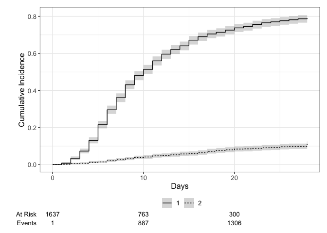

# Load packages

```r
library(tidyverse)
library(readxl)
library(writexl)
library(tableone)
library(here)
library(kableExtra)

library(jtools) # for summ() and plot_summs
library(sjPlot) # for tab_model
library(ggplot2) # survival/TTE analyses and other graphs
library(ggsurvfit) # survival/TTE analyses
library(survival) # survival/TTE analyses
library(gtsummary) # survival/TTE analyses
library(ggfortify) # autoplot
library(lme4) # glmer / clmm
library(sjPlot) # for tab_model
library(glmmTMB) # to specify estimation method explicitly -> i.e. ML
library(coxme) # for mixed-effects cox model
library(ordinal) # for ordinal regression, clm (fixed effects) & clmm (mixed effects)
library(tidycmprsk) # competing risk analysis
library(logistf) # Firth regression in case of rare events

library(meta)
library(forestplot)
library(metafor) #forest()
```

# Load standardized dataset of all trials

```r
## barisolidact
df_barisolidact <- readRDS("df_os_barisolidact.RData")
df_barisolidact <- df_barisolidact %>% 
    select(id_pat, trial, JAKi, trt, sex, age, ethn, country, icu, sympdur, vacc, clinstatus_baseline, vbaseline,
         comed_dexa, comed_rdv, comed_toci, comed_ab, comed_acoa, comed_interferon, comed_other,
         comed_cat,
         comorb_lung, comorb_liver, comorb_cvd, comorb_aht, comorb_dm, comorb_obese, comorb_smoker, immunosupp,
         comorb_autoimm, comorb_cancer, comorb_kidney, any_comorb, comorb_cat, comorb_count,
         crp, sero, vl_baseline, variant,
         mort_28, mort_60, death_reached, death_time,
         new_mv_28, new_mvd_28,
         clinstatus_28_imp,
         discharge_reached, discharge_time, discharge_time_sens, discharge_reached_sus, discharge_time_sus,
         ae_28, ae_28_sev,
         vir_clear_5, vir_clear_10, vir_clear_15)
## actt2
df_actt2 <- readRDS("df_os_actt2.RData")
df_actt2 <- df_actt2 %>% 
    select(id_pat, trial, JAKi, trt, sex, age, ethn, country, icu, sympdur, vacc, clinstatus_baseline, vbaseline,
         comed_dexa, comed_rdv, comed_toci, comed_ab, comed_acoa, comed_interferon, comed_other,
         comed_cat,
         comorb_lung, comorb_liver, comorb_cvd, comorb_aht, comorb_dm, comorb_obese, comorb_smoker, immunosupp,
         comorb_autoimm, comorb_cancer, comorb_kidney, any_comorb, comorb_cat, comorb_count,
         crp, sero, vl_baseline, variant,
         mort_28, mort_60, death_reached, death_time,
         new_mv_28, new_mvd_28,
         clinstatus_28_imp,
         discharge_reached, discharge_time, discharge_time_sens, discharge_reached_sus, discharge_time_sus,
         ae_28, ae_28_sev,
         vir_clear_5, vir_clear_10, vir_clear_15)
## ghazaeian
df_ghazaeian <- readRDS("df_os_ghazaeian.RData")
df_ghazaeian <- df_ghazaeian %>% 
    select(id_pat, trial, JAKi, trt, sex, age, ethn, country, icu, sympdur, vacc, clinstatus_baseline, vbaseline,
         comed_dexa, comed_rdv, comed_toci, comed_ab, comed_acoa, comed_interferon, comed_other,
         comed_cat,
         comorb_lung, comorb_liver, comorb_cvd, comorb_aht, comorb_dm, comorb_obese, comorb_smoker, immunosupp,
         comorb_autoimm, comorb_cancer, comorb_kidney, any_comorb, comorb_cat, comorb_count,
         crp, sero, vl_baseline, variant,
         mort_28, mort_60, death_reached, death_time,
         new_mv_28, new_mvd_28,
         clinstatus_28_imp,
         discharge_reached, discharge_time, discharge_time_sens, discharge_reached_sus, discharge_time_sus,
         ae_28, ae_28_sev,
         vir_clear_5, vir_clear_10, vir_clear_15)
## tofacov
df_tofacov <- readRDS("df_os_tofacov.RData")
df_tofacov <- df_tofacov %>% 
    select(id_pat, trial, JAKi, trt, sex, age, ethn, country, icu, sympdur, vacc, clinstatus_baseline, vbaseline,
         comed_dexa, comed_rdv, comed_toci, comed_ab, comed_acoa, comed_interferon, comed_other,
         comed_cat,
         comorb_lung, comorb_liver, comorb_cvd, comorb_aht, comorb_dm, comorb_obese, comorb_smoker, immunosupp,
         comorb_autoimm, comorb_cancer, comorb_kidney, any_comorb, comorb_cat, comorb_count,
         crp, sero, vl_baseline, variant,
         mort_28, mort_60, death_reached, death_time,
         new_mv_28, new_mvd_28,
         clinstatus_28_imp,
         discharge_reached, discharge_time, discharge_time_sens, discharge_reached_sus, discharge_time_sus,
         ae_28, ae_28_sev,
         vir_clear_5, vir_clear_10, vir_clear_15)
## covinib
df_covinib <- readRDS("df_os_covinib.RData")
df_covinib <- df_covinib %>% 
    select(id_pat, trial, JAKi, trt, sex, age, ethn, country, icu, sympdur, vacc, clinstatus_baseline, vbaseline,
         comed_dexa, comed_rdv, comed_toci, comed_ab, comed_acoa, comed_interferon, comed_other,
         comed_cat,
         comorb_lung, comorb_liver, comorb_cvd, comorb_aht, comorb_dm, comorb_obese, comorb_smoker, immunosupp,
         comorb_autoimm, comorb_cancer, comorb_kidney, any_comorb, comorb_cat, comorb_count,
         crp, sero, vl_baseline, variant,
         mort_28, mort_60, death_reached, death_time,
         new_mv_28, new_mvd_28,
         clinstatus_28_imp,
         discharge_reached, discharge_time, discharge_time_sens, discharge_reached_sus, discharge_time_sus,
         ae_28, ae_28_sev,
         vir_clear_5, vir_clear_10, vir_clear_15)
## COV-BARRIER
df_covbarrier <- readRDS("df_os_cov-barrier.RData")
df_covbarrier <- df_covbarrier %>% 
    select(id_pat, trial, JAKi, trt, sex, age, ethn, country, icu, sympdur, vacc, clinstatus_baseline, vbaseline,
         comed_dexa, comed_rdv, comed_toci, comed_ab, comed_acoa, comed_interferon, comed_other,
         comed_cat,
         comorb_lung, comorb_liver, comorb_cvd, comorb_aht, comorb_dm, comorb_obese, comorb_smoker, immunosupp,
         comorb_autoimm, comorb_cancer, comorb_kidney, any_comorb, comorb_cat, comorb_count,
         crp, sero, vl_baseline, variant,
         mort_28, mort_60, death_reached, death_time,
         new_mv_28, new_mvd_28,
         clinstatus_28_imp,
         discharge_reached, discharge_time, discharge_time_sens, discharge_reached_sus, discharge_time_sus,
         ae_28, ae_28_sev,
         vir_clear_5, vir_clear_10, vir_clear_15)
## Murugesan
df_murugesan <- readRDS("df_os_murugesan.RData")
df_murugesan <- df_murugesan %>% 
    select(id_pat, trial, JAKi, trt, sex, age, ethn, country, icu, sympdur, vacc, clinstatus_baseline, vbaseline,
         comed_dexa, comed_rdv, comed_toci, comed_ab, comed_acoa, comed_interferon, comed_other,
         comed_cat,
         comorb_lung, comorb_liver, comorb_cvd, comorb_aht, comorb_dm, comorb_obese, comorb_smoker, immunosupp,
         comorb_autoimm, comorb_cancer, comorb_kidney, any_comorb, comorb_cat, comorb_count,
         crp, sero, vl_baseline, variant,
         mort_28, mort_60, death_reached, death_time,
         new_mv_28, new_mvd_28,
         clinstatus_28_imp,
         discharge_reached, discharge_time, discharge_time_sens, discharge_reached_sus, discharge_time_sus,
         ae_28, ae_28_sev,
         vir_clear_5, vir_clear_10, vir_clear_15)

# append
df_tot <- rbind(df_barisolidact, df_actt2, df_ghazaeian, df_tofacov, df_covinib, df_covbarrier)
df_tot_Muru <- rbind(df_barisolidact, df_actt2, df_ghazaeian, df_tofacov, df_covinib, df_covbarrier, df_murugesan)

# Save
saveRDS(df_tot, file = "df_tot.RData")
saveRDS(df_tot_Muru, file = "df_tot_Muru.RData")
```


# (i) Primary outcome: Mortality at day 28

```r
addmargins(table(df_tot_Muru$trial, df_tot_Muru$mort_28, useNA = "always"))
```

```
##                
##                    0    1 <NA>  Sum
##   ACTT2          972   61    0 1033
##   Bari-Solidact  253   36    0  289
##   COV-BARRIER   1415  211    0 1626
##   COVINIB        108    2    0  110
##   Ghazaeian       90    7    0   97
##   Murugesan      100    0    0  100
##   TOFACOV        115    1    0  116
##   <NA>             0    0    0    0
##   Sum           3053  318    0 3371
```

```r
addmargins(table(df_tot_Muru$mort_28, df_tot_Muru$trt, useNA = "always"))
```

```
##       
##           0    1 <NA>  Sum
##   0    1494 1559    0 3053
##   1     193  125    0  318
##   <NA>    0    0    0    0
##   Sum  1687 1684    0 3371
```

```r
# table(df_tot_Muru$age, df_tot_Muru$trt, useNA = "always")
table(df_tot_Muru$clinstatus_baseline, df_tot_Muru$trt, useNA = "always")
```

```
##       
##          0   1 <NA>
##   1      0   0    0
##   2    253 234    0
##   3    878 912    0
##   4    422 413    0
##   5    129 123    0
##   6      0   0    0
##   <NA>   5   2    0
```

```r
table(df_tot_Muru$clinstatus_baseline, df_tot_Muru$trial, useNA = "always")
```

```
##       
##        ACTT2 Bari-Solidact COV-BARRIER COVINIB Ghazaeian Murugesan TOFACOV <NA>
##   1        0             0           0       0         0         0       0    0
##   2      142             0         186      35         2        97      25    0
##   3      564             0         962      75        95         3      91    0
##   4      216           249         370       0         0         0       0    0
##   5      111            40         101       0         0         0       0    0
##   6        0             0           0       0         0         0       0    0
##   <NA>     0             0           7       0         0         0       0    0
```

```r
table(df_tot_Muru$vbaseline, df_tot_Muru$trial, useNA = "always")
```

```
##       
##        ACTT2 Bari-Solidact COV-BARRIER COVINIB Ghazaeian Murugesan TOFACOV <NA>
##   0      706             0        1148     110        97       100     116    0
##   1      327           289         471       0         0         0       0    0
##   <NA>     0             0           7       0         0         0       0    0
```

```r
# reformatting
df_tot$trt_f <- as.factor(df_tot$trt)
df_tot$trial_f <- as.factor(df_tot$trial)
df_tot$clinstatus_baseline_n <- as.numeric(df_tot$clinstatus_baseline)
df_tot <- df_tot %>%
  mutate(trial_n = case_when(trial == "Bari-Solidact" ~ 1,
                             trial == "ACTT2" ~ 2,
                             trial == "Ghazaeian" ~ 3,
                             trial == "TOFACOV" ~ 4,
                             trial == "COVINIB" ~ 5,
                             trial == "COV-BARRIER" ~ 6,
                             # trial == "Murugesan" ~ 7
                             ))
table(df_tot$trial_n, useNA = "always")
```

```
## 
##    1    2    3    4    5    6 <NA> 
##  289 1033   97  116  110 1626    0
```

GOAL: random treatment effect, stratified trial intercept, stratified prognostic factors, AND centering the treatment variable by the proportion treated in the trial (to improve the estimation of between-study variance) AND maximum likelihood (ML) estimator (due to small trials with rare events). REML is default in glmer, for ML use glmmTMB. See notes.

### (1) common treatment effect, random trial intercept, common prognostic factors

```r
# (1) common treatment effect, random trial intercept, common prognostic factors, ML
mort28.ctreat.rtrial.ml <- glmmTMB(mort_28 ~ trt + (1|trial)
                              + age + clinstatus_baseline
                              # + comed_dexa + comed_rdv + comed_toci 
                              , data = df_tot, family = binomial)
# tab_model(mort28.ctreat.rtrial.ml)

mort28.ctreat.rtrial.ml.vb <- glmmTMB(mort_28 ~ trt + (1|trial)
                              + age + vbaseline
                              # + comed_dexa + comed_rdv + comed_toci 
                              , data = df_tot, family = binomial)
# tab_model(mort28.ctreat.rtrial.ml.vb)
```


### (2) random treatment effect, stratified trial intercept, common prognostic factors and residual variances

```r
# (2) random treatment effect, stratified trial intercept, common prognostic factors and residual variances, and WITHOUT centering the treatment variable, ML
mort28.rtreat.strial.ml <- glmmTMB(mort_28 ~ trt_f + trial_f + (trt - 1 | trial_f)
                              + age + clinstatus_baseline
                              # + comed_dexa + comed_rdv + comed_toci
                              , data = df_tot, family = binomial)
# tab_model(mort28.rtreat.strial.ml)

mort28.rtreat.strial.ml.vb <- glmmTMB(mort_28 ~ trt_f + trial_f + (trt - 1 | trial_f)
                              + age + vbaseline 
                              # + comed_dexa + comed_rdv + comed_toci
                              , data = df_tot, family = binomial)
# tab_model(mort28.rtreat.strial.ml.vb)

# The - 1 within (trt - 1 | trial_n) specifies that there is no random intercept for the grouping factor trial_n. We're specifying random slopes for the variable trt within each level of trial_n, i.e., the effect may vary from one trial to another. Together with trial_f, this gives the stratified intercept model. This is a more flexible model compared to a model with a random intercept, which assumes a common baseline for all groups.

# dummy variable for each trial (trial_1, trial_2, trial_3, etc - e.g. where trial_1 = 1 if in trial 1 and 0 otherwise)
df_tot <- df_tot %>%
  mutate(trial_1 = case_when(trial == "Bari-Solidact" ~ 1, TRUE ~ 0),
         trial_2 = case_when(trial == "ACTT2" ~ 1, TRUE ~ 0),
         trial_3 = case_when(trial == "Ghazaeian" ~ 1, TRUE ~ 0),
         trial_4 = case_when(trial == "TOFACOV" ~ 1, TRUE ~ 0),
         trial_5 = case_when(trial == "COVINIB" ~ 1, TRUE ~ 0),
         trial_6 = case_when(trial == "COV-BARRIER" ~ 1, TRUE ~ 0))

## Use "Stata syntax":
# mort28.rtreat.strial.2 <- glmer(mort_28 ~ trt_f + trial* + (trt -1 | trial_n)
#                               + age + clinstatus_baseline_n
#                               # + comed_dexa + comed_rdv + comed_toci
#                               , data = df_tot, family = binomial)
# tab_model(mort28.rtreat.strial.2)
```

### (3) random treatment effect, random trial intercept, common prognostic factors and residual variances

```r
# (3) random treatment effect, random trial intercept, common prognostic factors and residual variances, ML
mort28.rtreat.rtrial.ml <- glmmTMB(mort_28 ~ trt + (1|trt) + (1|trial_f)
                              + age + clinstatus_baseline
                              # + comed_dexa + comed_rdv + comed_toci
                              , data = df_tot, family = binomial)
# tab_model(mort28.rtreat.rtrial.ml)

mort28.rtreat.rtrial.ml.vb <- glmmTMB(mort_28 ~ trt + (1|trt) + (1|trial_f)
                              + age + vbaseline 
                              # + comed_dexa + comed_rdv + comed_toci
                              , data = df_tot, family = binomial)
# tab_model(mort28.rtreat.rtrial.ml.vb)
```

### (4) random treatment effect, stratified trial intercept, common prognostic factors and residual variances, AND centering the treatment variable

```r
# (4) random treatment effect, stratified trial intercept, common prognostic factors and residual variances, ML, but WITH centering the treatment variable

# calculate the proportion treated by trial
proportions <- df_tot %>%
  group_by(trial) %>%
  summarize(proportion_treated = sum(trt) / n())
df_tot <- left_join(df_tot, proportions[, c("proportion_treated", "trial")], by = join_by(trial == trial))
# table(df_tot$trial, df_tot$proportion_treated)

# create the centered treatment variable
df_tot$trt_centered_n <- df_tot$trt - df_tot$proportion_treated
df_tot$trt_centered_f <- as.factor(df_tot$trt_centered_n)
# table(df_tot$trial, df_tot$trt_centered_f) ## keep it minus?

# build the model. '-1' indicating there is no overall random intercept.
mort28.rtreat.strial.cent.ml <- glmmTMB(mort_28 ~ trt_centered_n + trial_f + (trt_centered_n -1 | trial_f) -1
                   + age + clinstatus_baseline
                   #+ comed_dexa + comed_rdv + comed_toci
                   , data = df_tot, family = binomial
                   )
# tab_model(mort28.rtreat.strial.cent.ml)

mort28.rtreat.strial.cent.ml.vb <- glmmTMB(mort_28 ~ trt_centered_n + trial_f + (trt_centered_n -1 | trial_f) -1 
                   + age + vbaseline 
                   #+ comed_dexa + comed_rdv + comed_toci
                   , data = df_tot, family = binomial
                   )
# tab_model(mort28.rtreat.strial.cent.ml.vb)
```

### (5) random treatment effect, stratified trial intercept, stratified prognostic factors and residual variances, with centering the treatment variable AND the prognostic variables

```r
# "Our default recommendation is to use stratified prognostic effects (i.e. estimate a separate effect of each included prognostic factor for each trial), with trial-specific centering of each prognostic factor to improve ML estimation (for the reasons explained in Section 6.2.8.3). However, if outcome data or prognostic factor categories are sparse, the stratification approach may lead to estimation difficulties, and then allowing prognostic factor effects to be random is a sensible alternative." (p. 145) Centering disentangles (i.e. makes uncorrelated) the estimation of main parameters of interest from other nuisance parameters, which leads to less downward bias in estimates of variance parameters (Figure 6.2) and thus improves coverage of 95% confidence intervals. This can be achieved by centering the covariates by their mean values within trials, such that the interaction estimate is then only based on within-trial information.

# Calculate the mean values of (continuous) prognostic factors within each trial
trial_means <- df_tot %>%
  group_by(trial) %>%
  summarize(mean_age = mean(age, na.rm = TRUE), mean_clinstatus = mean(clinstatus_baseline_n, na.rm = TRUE))
# Merge back
df_tot <- df_tot %>% left_join(trial_means, by = "trial")
# Center the age and clinstatus_baseline variables
df_tot <- df_tot %>%
  mutate(age_centered = age - mean_age, 
         clinstatus_baseline_centered = clinstatus_baseline_n - mean_clinstatus)

# df_tot %>%
#   select(trial_f, trial_n, trt, trt_centered_n, age, mean_age, age_centered, clinstatus_baseline_n, mean_clinstatus, clinstatus_baseline_centered, mort_28) %>%
#   View()


## CAVE: clinstatus_baseline is a factor -> How to center a factor? By the proportion in each level? Or not at all? 


### Add the prognostic factors stratified, i.e. create stratified variables for each prognostic factor
## uncentered
df_tot <- df_tot %>%
  mutate(age_trial_1 = case_when(trial == "Bari-Solidact" ~ age, TRUE ~ 0),
         age_trial_2 = case_when(trial == "ACTT2" ~ age, TRUE ~ 0),
         age_trial_3 = case_when(trial == "Ghazaeian" ~ age, TRUE ~ 0),
         age_trial_4 = case_when(trial == "TOFACOV" ~ age, TRUE ~ 0),
         age_trial_5 = case_when(trial == "COVINIB" ~ age, TRUE ~ 0),
         age_trial_6 = case_when(trial == "COV-BARRIER" ~ age, TRUE ~ 0))
df_tot <- df_tot %>%
  mutate(clinstat_trial_1 = case_when(trial == "Bari-Solidact" ~ clinstatus_baseline, TRUE ~ "0"),
         clinstat_trial_2 = case_when(trial == "ACTT2" ~ clinstatus_baseline, TRUE ~ "0"),
         clinstat_trial_3 = case_when(trial == "Ghazaeian" ~ clinstatus_baseline, TRUE ~ "0"),
         clinstat_trial_4 = case_when(trial == "TOFACOV" ~ clinstatus_baseline, TRUE ~ "0"),
         clinstat_trial_5 = case_when(trial == "COVINIB" ~ clinstatus_baseline, TRUE ~ "0"),
         clinstat_trial_6 = case_when(trial == "COV-BARRIER" ~ clinstatus_baseline, TRUE ~ "0"))

## centered
df_tot <- df_tot %>%
  mutate(age_cent_trial_1 = case_when(trial == "Bari-Solidact" ~ age_centered, TRUE ~ 0),
         age_cent_trial_2 = case_when(trial == "ACTT2" ~ age_centered, TRUE ~ 0),
         age_cent_trial_3 = case_when(trial == "Ghazaeian" ~ age_centered, TRUE ~ 0),
         age_cent_trial_4 = case_when(trial == "TOFACOV" ~ age_centered, TRUE ~ 0),
         age_cent_trial_5 = case_when(trial == "COVINIB" ~ age_centered, TRUE ~ 0),
         age_cent_trial_6 = case_when(trial == "COV-BARRIER" ~ age_centered, TRUE ~ 0))
df_tot <- df_tot %>%
  mutate(clinstat_cent_trial_1 = case_when(trial == "Bari-Solidact" ~ clinstatus_baseline_centered, TRUE ~ 0),
         clinstat_cent_trial_2 = case_when(trial == "ACTT2" ~ clinstatus_baseline_centered, TRUE ~ 0),
         clinstat_cent_trial_3 = case_when(trial == "Ghazaeian" ~ clinstatus_baseline_centered, TRUE ~ 0),
         clinstat_cent_trial_4 = case_when(trial == "TOFACOV" ~ clinstatus_baseline_centered, TRUE ~ 0),
         clinstat_cent_trial_5 = case_when(trial == "COVINIB" ~ clinstatus_baseline_centered, TRUE ~ 0),
         clinstat_cent_trial_6 = case_when(trial == "COV-BARRIER" ~ clinstatus_baseline_centered, TRUE ~ 0))

# df_tot %>%
#   select(trial_f, trial_n, trt, trt_centered_n, age, mean_age, age_centered, clinstatus_baseline_n, mean_clinstatus, clinstatus_baseline_centered, mort_28,
#          age_trial_1, age_cent_trial_1, age_trial_5, age_cent_trial_5, age_trial_6, age_cent_trial_6, clinstat_trial_1, clinstat_cent_trial_1, clinstat_trial_5, clinstat_cent_trial_5, clinstat_trial_6, clinstat_cent_trial_6,
#          ) %>%
#   View()


# (5) random treatment effect, stratified trial intercept, stratified prognostic factors and residual variances, with centering of the treatment variable AND the prognostic factors

# mort28.rtreat.strial.cent.ml.spf.cent <- glmmTMB(mort_28 ~ trt_centered_n
#                                                  + trial_f
#                                                  + (trt_centered_n -1 | trial_f) -1
#                                                  + age_cent_trial_1 + age_cent_trial_2 + age_cent_trial_3 + age_cent_trial_4
#                                                  + age_cent_trial_5 + age_cent_trial_6
#                                                  + clinstat_cent_trial_1 + clinstat_cent_trial_2 + clinstat_cent_trial_3
#                                                  + clinstat_cent_trial_4 + clinstat_cent_trial_5 + clinstat_cent_trial_6
#                                                  #+ comed_dexa + comed_rdv + comed_toci
#                                                  , data = df_tot, family = binomial)
# tab_model(mort28.rtreat.strial.cent.ml.spf.cent)
# mort28.rtreat.strial.cent.ml.spf.cent <- glmmTMB(mort_28 ~ trt_centered_n
#                                                  + trial_f
#                                                  + (trt_centered_n -1 | trial_f) -1
#                                                  + age_cent_trial_1 + age_cent_trial_2 + age_cent_trial_3 + age_cent_trial_4
#                                                  + age_cent_trial_5 + age_cent_trial_6
#                                                  + clinstat_trial_1 + clinstat_trial_2 + clinstat_trial_3
#                                                  + clinstat_trial_4 + clinstat_trial_5 + clinstat_trial_6
#                                                  #+ comed_dexa + comed_rdv + comed_toci
#                                                  , data = df_tot, family = binomial)
# tab_model(mort28.rtreat.strial.cent.ml.spf.cent) 

# Not all trials have all levels, cannot estimate a stratified clinstatus_baseline by trial. Moreover, not sure the centering of the factor variable clinstatus_baseline is ok like this. => Second best option: Add clinstatus_baseline as a random parameter

mort28.rtreat.strial.cent.ml.sage.cent.rclinstat <- glmmTMB(mort_28 ~ trt_centered_n 
                                                 + trial_f 
                                                 + (trt_centered_n -1 | trial_f) -1 
                                                 + age_cent_trial_1 + age_cent_trial_2 + age_cent_trial_3 + age_cent_trial_4 
                                                 + age_cent_trial_5 + age_cent_trial_6
                                                 + (clinstatus_baseline_n -1 | trial_f)
                                                 #+ comed_dexa + comed_rdv + comed_toci
                                                 , data = df_tot, family = binomial)
# tab_model(mort28.rtreat.strial.cent.ml.sage.cent.rclinstat) 

mort28.rtreat.strial.cent.ml.sage.cent.rvb <- glmmTMB(mort_28 ~ trt_centered_n 
                                                 + trial_f 
                                                 + (trt_centered_n -1 | trial_f) -1 
                                                 + age_cent_trial_1 + age_cent_trial_2 + age_cent_trial_3 + age_cent_trial_4 
                                                 + age_cent_trial_5 + age_cent_trial_6 
                                                 + (vbaseline -1 | trial_f)
                                                 #+ comed_dexa + comed_rdv + comed_toci
                                                 , data = df_tot, family = binomial)
# tab_model(mort28.rtreat.strial.cent.ml.sage.cent.rvb) 
```
Discussion:
1. Clinstatus_baseline is a factor -> How to center a factor? By the proportion in each level? More important: Not all trials have all levels, hard to estimate a stratified clinstatus_baseline by trial => Second best option: Add clinstatus_baseline as a random parameter
2. Remember to add all TRIAL centering variables if adding new trials!
3. Investigate the point that a "one-stage random effects model" equals a "two-stage fixed effects model" (only use trials without rare event problems // double-check adjustments in two-stage)


## Collect the effect estimates from all models

```r
# Empty data frame to store the results
result_df <- data.frame(
  variable = character(),
  hazard_odds_ratio = numeric(),
  ci_lower = numeric(),
  ci_upper = numeric(),
  p_value = numeric()
)
# Function to extract treatment results from two different model types (glmer -> REML, glmmTMB -> ML)
extract_trt_results <- function(model, variable_name, n_int, n_cont) {
  if (inherits(model, "glmmTMB")) {
    coefficients_table <- summary(model)$coefficients$cond
    trt_coef <- coefficients_table[grep("^trt", rownames(coefficients_table)), "Estimate"]
    hazard_odds_ratio <- exp(trt_coef)
    ci_table <- exp(confint(model))
    ci <- ci_table[grep("^trt", rownames(ci_table)), c("2.5 %", "97.5 %")]
    p_value <- coefficients_table[grep("^trt", rownames(coefficients_table)), "Pr(>|z|)"]
  } else if (inherits(model, "glmerMod")) {
    coefficients_table <- summary(model)$coefficients
    trt_coef <- coefficients_table[grep("^trt", rownames(coefficients_table)), "Estimate"]
    hazard_odds_ratio <- exp(trt_coef)
    ci_table <- exp(confint(model))
    ci <- ci_table[grep("^trt", rownames(ci_table)), c("2.5 %", "97.5 %")]
    p_value <- coefficients_table[grep("^trt", rownames(coefficients_table)), "Pr(>|z|)"]
  } else {
    stop("Unsupported model class")
  }
  # capture the results
  result <- data.frame(
    variable = variable_name,
    hazard_odds_ratio = hazard_odds_ratio,
    ci_lower = ci[1],
    ci_upper = ci[2],
    p_value = p_value,
    n_intervention = n_int,
    n_control = n_cont
  )
  return(result)
}
# Loop through
result_list <- list()

result_list[[1]] <- extract_trt_results(mort28.ctreat.rtrial.ml, "c trt, r intercept, c age/clinstatus", addmargins(table(df_tot$mort_28, df_tot$trt))[3,2], addmargins(table(df_tot$mort_28, df_tot$trt))[3,1])
# result_list[[2]] <- extract_trt_results(mort28.ctreat.rtrial.ml.vb, "c trt, r intercept, c age/clinstatus, no cent, vb", addmargins(table(df_tot$mort_28, df_tot$trt))[3,2], addmargins(table(df_tot$mort_28, df_tot$trt))[3,1])

result_list[[3]] <- extract_trt_results(mort28.rtreat.rtrial.ml, "r trt, r intercept, c age/clinstatus", addmargins(table(df_tot$mort_28, df_tot$trt))[3,2], addmargins(table(df_tot$mort_28, df_tot$trt))[3,1])
# result_list[[4]] <- extract_trt_results(mort28.rtreat.rtrial.ml.vb, "r trt, r intercept, c age/clinstatus, no cent, vb", addmargins(table(df_tot$mort_28, df_tot$trt))[3,2], addmargins(table(df_tot$mort_28, df_tot$trt))[3,1])

result_list[[5]] <- extract_trt_results(mort28.rtreat.strial.ml, "r trt, s intercept, c age/clinstatus", addmargins(table(df_tot$mort_28, df_tot$trt))[3,2], addmargins(table(df_tot$mort_28, df_tot$trt))[3,1])
# result_list[[6]] <- extract_trt_results(mort28.rtreat.strial.ml.vb, "r trt, s intercept, c age/clinstatus, no cent, vb", addmargins(table(df_tot$mort_28, df_tot$trt))[3,2], addmargins(table(df_tot$mort_28, df_tot$trt))[3,1])

result_list[[7]] <- extract_trt_results(mort28.rtreat.strial.cent.ml, "r cent trt, s intercept, c age/clinstatus", addmargins(table(df_tot$mort_28, df_tot$trt))[3,2], addmargins(table(df_tot$mort_28, df_tot$trt))[3,1])
# result_list[[8]] <- extract_trt_results(mort28.rtreat.strial.cent.ml.vb, "r trt, s intercept, c age/clinstatus, cent trt, vb", addmargins(table(df_tot$mort_28, df_tot$trt))[3,2], addmargins(table(df_tot$mort_28, df_tot$trt))[3,1])

result_list[[9]] <- extract_trt_results(mort28.rtreat.strial.cent.ml.sage.cent.rclinstat, "r cent trt, s intercept, s and cent age, r clinstatus", addmargins(table(df_tot$mort_28, df_tot$trt))[3,2], addmargins(table(df_tot$mort_28, df_tot$trt))[3,1])
# result_list[[10]] <- extract_trt_results(mort28.rtreat.strial.cent.ml.sage.cent.rvb, "r trt, s intercept, s and cent age, r clinstatus, cent trt, vb", addmargins(table(df_tot$mort_28, df_tot$trt))[3,2], addmargins(table(df_tot$mort_28, df_tot$trt))[3,1])

# Filter out NULL results and bind the results into a single data frame
result_df <- do.call(rbind, Filter(function(x) !is.null(x), result_list))

# Nicely formatted table
kable(result_df, format = "html", table.attr = 'class="table"') %>%
  kable_styling(bootstrap_options = "striped", full_width = FALSE)
```

<table class="table table table-striped" style="width: auto !important; margin-left: auto; margin-right: auto;">
 <thead>
  <tr>
   <th style="text-align:left;">   </th>
   <th style="text-align:left;"> variable </th>
   <th style="text-align:right;"> hazard_odds_ratio </th>
   <th style="text-align:right;"> ci_lower </th>
   <th style="text-align:right;"> ci_upper </th>
   <th style="text-align:right;"> p_value </th>
   <th style="text-align:right;"> n_intervention </th>
   <th style="text-align:right;"> n_control </th>
  </tr>
 </thead>
<tbody>
  <tr>
   <td style="text-align:left;"> 2.5 % </td>
   <td style="text-align:left;"> c trt, r intercept, c age/clinstatus </td>
   <td style="text-align:right;"> 0.5825613 </td>
   <td style="text-align:right;"> 0.4491458 </td>
   <td style="text-align:right;"> 0.7556068 </td>
   <td style="text-align:right;"> 4.67e-05 </td>
   <td style="text-align:right;"> 1634 </td>
   <td style="text-align:right;"> 1637 </td>
  </tr>
  <tr>
   <td style="text-align:left;"> 2.5 %1 </td>
   <td style="text-align:left;"> r trt, r intercept, c age/clinstatus </td>
   <td style="text-align:right;"> 0.5825606 </td>
   <td style="text-align:right;"> 0.4491453 </td>
   <td style="text-align:right;"> 0.7556059 </td>
   <td style="text-align:right;"> 4.67e-05 </td>
   <td style="text-align:right;"> 1634 </td>
   <td style="text-align:right;"> 1637 </td>
  </tr>
  <tr>
   <td style="text-align:left;"> 2.5 %2 </td>
   <td style="text-align:left;"> r trt, s intercept, c age/clinstatus </td>
   <td style="text-align:right;"> 0.5828403 </td>
   <td style="text-align:right;"> 0.4492055 </td>
   <td style="text-align:right;"> 0.7562302 </td>
   <td style="text-align:right;"> 4.85e-05 </td>
   <td style="text-align:right;"> 1634 </td>
   <td style="text-align:right;"> 1637 </td>
  </tr>
  <tr>
   <td style="text-align:left;"> 2.5 %3 </td>
   <td style="text-align:left;"> r cent trt, s intercept, c age/clinstatus </td>
   <td style="text-align:right;"> 0.5828406 </td>
   <td style="text-align:right;"> 0.4492058 </td>
   <td style="text-align:right;"> 0.7562306 </td>
   <td style="text-align:right;"> 4.85e-05 </td>
   <td style="text-align:right;"> 1634 </td>
   <td style="text-align:right;"> 1637 </td>
  </tr>
  <tr>
   <td style="text-align:left;"> 2.5 %4 </td>
   <td style="text-align:left;"> r cent trt, s intercept, s and cent age, r clinstatus </td>
   <td style="text-align:right;"> 0.5750015 </td>
   <td style="text-align:right;"> 0.4427118 </td>
   <td style="text-align:right;"> 0.7468218 </td>
   <td style="text-align:right;"> 3.35e-05 </td>
   <td style="text-align:right;"> 1634 </td>
   <td style="text-align:right;"> 1637 </td>
  </tr>
</tbody>
</table>


```r
# Convert necessary columns to numeric
result_df[, c("hazard_odds_ratio", "ci_lower", "ci_upper", "p_value", "n_intervention", "n_control")] <- lapply(result_df[, c("hazard_odds_ratio", "ci_lower", "ci_upper", "p_value", "n_intervention", "n_control")], as.numeric)

result_df$variable <- factor(result_df$variable, 
                             levels = c("c trt, r intercept, c age/clinstatus", 
                                        "r trt, r intercept, c age/clinstatus", 
                                        "r trt, s intercept, c age/clinstatus",
                                        "r cent trt, s intercept, c age/clinstatus",
                                        "r cent trt, s intercept, s and cent age, r clinstatus"))

# Plotting the reordered data


# Plotting
ggplot(result_df, aes(x = variable, y = hazard_odds_ratio)) +
  geom_point() +
  geom_errorbar(aes(ymin = ci_lower, ymax = ci_upper), width = 0.3) +
  labs(title = "Mortality at Day 28 - All models",
       x = "Model",
       y = "Odds Ratio") +
  theme_minimal() +
  theme(axis.text.x = element_text(angle = 45, hjust = 1),
        plot.margin = margin(l = 50, r = 10, b = 20, t = 20, unit = "pt")) +  # Adjust left margin
  scale_y_continuous(limits = c(0.4, 0.9), breaks = c(0.4, 0.5, 0.6, 0.7, 0.8, 0.9), trans = "log10") +
  coord_flip()  # Flip axes to show longer variable names
```

<!-- -->

### The main recommendations for one-stage IPD meta-analysis models using GLMMs (IPDMA handbook R.Riley)
1. *__Use a random treatment effect.__*
* Justification: Typically the included trials are conducted in different settings, populations and time periods. Therefore, some heterogeneity of treatment effect is expected. Heterogeneity might be reduced by inclusion of prognostic factors or trial-level covariates, but usually unexplained heterogeneity remains and so should be acknowledged. Homogeneity of treatment effect is a strong assumption, and often will be inappropriate due to unexplained between-trial heterogeneity. To address this, the treatment effect parameter can be made random, such that the true treatment effect in each trial is assumed drawn from a particular distribution, typically a normal distribution.

2. *__Stratify by trial the intercept and parameters for other non-treatment variables (such as prognostic factors and residual variances).__* If convergence issues arise, then consider making the intercept (and other non-treatment variables) random.
* Justification: Although a random intercept will usually give similar results to a stratified intercept, in some situations it may compromise randomisation (as it allows baseline risk information to be shared across trials). Many researchers assume nuisance parameters are common (often because this is the default in software packages), but this is not recommended as it may lead to inappropriate conclusions, as now described. (p. 138) The advantage of the stratified intercept approach is that it makes no assumptions about the distribution of intercepts across trials - and mirrors exactly the two-stage approach. The advantage of the random intercepts approach is that it requires fewer parameters to be estimated and so may reduce model convergence issues. But usually give very similar results. (p. 141 & 143)

3. *__Use trial-specific centering of the treatment variable (and any other included variables, such as prognostic factors) when using ML estimation of a one-stage model with a stratified intercept.__* 
* Justification: Simulation studies and mathematical reasoning show that this improves ML estimation of between-trial variances and the coverage of confidence intervals for the summary treatment effect. Centering disentangles (i.e. makes uncorrelated) the estimation of main parameters of interest from other nuisance parameters, which leads to less downward bias in estimates of variance parameters (Figure 6.2) and thus improves coverage of 95% confidence intervals. This can be achieved by centering the covariates by their mean values within trials, such that the interaction estimate is then only based on within-trial information. Our default recommendation is to use stratified prognostic effects (i.e. estimate a separate effect of each included prognostic factor for each trial), with trial-specific centering of each prognostic factor to improve ML estimation (for the reasons explained in Section 6.2.8.3). However, if outcome data or prognostic factor categories are sparse, the stratification approach may lead to estimation difficulties, and then allowing prognostic factor effects to be random is a sensible alternative. (p. 145) As previously discussed (Section 6.2.4.1), Jackson et al. and Riley et al. show that for one-stage models with a stratified intercept, ML estimation is improved when using trial-specific centering of treatment and other included variables.181,185 Centering disentangles (i.e. makes uncorrelated) the estimation of main parameters of interest from other nuisance parameters, which leads to less downward bias in estimates of variance parameters (Figure 6.2) and thus improves coverage of 95% confidence intervals. (p. 147)

4. For frequentist estimation of one-stage models for binary, ordinal or count outcomes, use REML estimation of the pseudo-likelihood approach unless most trials in the meta-analysis are small (in terms of participants or outcome events), which then warrants ML estimation of the exact likelihood.
* Justification: Although estimation of the exact likelihood is preferred, ML estimation is known to produce downwardly biased estimates of between-trial variances. Therefore, unless most included trials are small, REML estimation of an approximate pseudo-likelihood specification may improve estimation of between-trial variances and coverage of confidence intervals.

5. A one-stage IPD meta-analysis utilises a more exact statistical likelihood than a two-stage meta-analysis approach, which is advantageous when included trials have few participants or outcome events. (p.127)

6. The word ‘fixed’ is ambiguous; it could refer to either a common or stratified parameter, even though they imply different model specifications and assumptions. Therefore, we recommend that the word ‘fixed’ be avoided in one-stage IPD models, and encourage researchers to use common or stratified instead.

7. See sample R code here: https://www.ipdma.co.uk/one-stage-ipd-ma 

## Present the main model: "r cent trt, s intercept, s and cent age, r clinstatus"
1. Treatment parameter: Random treatment effect
2. Trial parameter: Stratified intercept by trial
3. Prognostic factor 'age': Stratified by trial
4. Prognostic factor 'clinical status': As a random parameter by trial. Not all trials have all levels, hard to estimate a stratified clinstatus_baseline by trial => Random effect as sensible alternative (see guidance above)
5. Trial-specific centering of the treatment variable and age (to improve estimation of the between-study variance). 

# (i) Mortality at day 28

```r
mort28 <- glmmTMB(mort_28 ~ trt_centered_n 
                  + trial_f # stratified intercept
                  + (trt_centered_n -1 | trial_f) -1 # random treatment effect (and centered)
                  + age_cent_trial_1 + age_cent_trial_2 + age_cent_trial_3 # stratified prognostic factor age (and centered)
                  + age_cent_trial_4 + age_cent_trial_5 + age_cent_trial_6 
                  + (clinstatus_baseline_n -1 | trial_f) # random prognostic factor clinstatus_baseline
                  , data = df_tot, family = binomial)
tab_model(mort28)
```

<table style="border-collapse:collapse; border:none;">
<tr>
<th style="border-top: double; text-align:center; font-style:normal; font-weight:bold; padding:0.2cm;  text-align:left; ">&nbsp;</th>
<th colspan="3" style="border-top: double; text-align:center; font-style:normal; font-weight:bold; padding:0.2cm; ">mort 28</th>
</tr>
<tr>
<td style=" text-align:center; border-bottom:1px solid; font-style:italic; font-weight:normal;  text-align:left; ">Predictors</td>
<td style=" text-align:center; border-bottom:1px solid; font-style:italic; font-weight:normal;  ">Odds Ratios</td>
<td style=" text-align:center; border-bottom:1px solid; font-style:italic; font-weight:normal;  ">CI</td>
<td style=" text-align:center; border-bottom:1px solid; font-style:italic; font-weight:normal;  ">p</td>
</tr>
<tr>
<td style=" padding:0.2cm; text-align:left; vertical-align:top; text-align:left; ">Trial treatment group</td>
<td style=" padding:0.2cm; text-align:left; vertical-align:top; text-align:center;  ">0.58</td>
<td style=" padding:0.2cm; text-align:left; vertical-align:top; text-align:center;  ">0.44&nbsp;&ndash;&nbsp;0.75</td>
<td style=" padding:0.2cm; text-align:left; vertical-align:top; text-align:center;  "><strong>&lt;0.001</strong></td>
</tr>
<tr>
<td style=" padding:0.2cm; text-align:left; vertical-align:top; text-align:left; ">trial f: ACTT 2</td>
<td style=" padding:0.2cm; text-align:left; vertical-align:top; text-align:center;  ">0.00</td>
<td style=" padding:0.2cm; text-align:left; vertical-align:top; text-align:center;  ">0.00&nbsp;&ndash;&nbsp;0.00</td>
<td style=" padding:0.2cm; text-align:left; vertical-align:top; text-align:center;  "><strong>&lt;0.001</strong></td>
</tr>
<tr>
<td style=" padding:0.2cm; text-align:left; vertical-align:top; text-align:left; ">trial f: Bari-Solidact</td>
<td style=" padding:0.2cm; text-align:left; vertical-align:top; text-align:center;  ">0.01</td>
<td style=" padding:0.2cm; text-align:left; vertical-align:top; text-align:center;  ">0.00&nbsp;&ndash;&nbsp;0.18</td>
<td style=" padding:0.2cm; text-align:left; vertical-align:top; text-align:center;  "><strong>0.004</strong></td>
</tr>
<tr>
<td style=" padding:0.2cm; text-align:left; vertical-align:top; text-align:left; ">trial f: COV-BARRIER</td>
<td style=" padding:0.2cm; text-align:left; vertical-align:top; text-align:center;  ">0.00</td>
<td style=" padding:0.2cm; text-align:left; vertical-align:top; text-align:center;  ">0.00&nbsp;&ndash;&nbsp;0.00</td>
<td style=" padding:0.2cm; text-align:left; vertical-align:top; text-align:center;  "><strong>&lt;0.001</strong></td>
</tr>
<tr>
<td style=" padding:0.2cm; text-align:left; vertical-align:top; text-align:left; ">trial f: COVINIB</td>
<td style=" padding:0.2cm; text-align:left; vertical-align:top; text-align:center;  ">0.00</td>
<td style=" padding:0.2cm; text-align:left; vertical-align:top; text-align:center;  ">0.00&nbsp;&ndash;&nbsp;0.51</td>
<td style=" padding:0.2cm; text-align:left; vertical-align:top; text-align:center;  "><strong>0.025</strong></td>
</tr>
<tr>
<td style=" padding:0.2cm; text-align:left; vertical-align:top; text-align:left; ">trial f: Ghazaeian</td>
<td style=" padding:0.2cm; text-align:left; vertical-align:top; text-align:center;  ">0.05</td>
<td style=" padding:0.2cm; text-align:left; vertical-align:top; text-align:center;  ">0.00&nbsp;&ndash;&nbsp;4.26</td>
<td style=" padding:0.2cm; text-align:left; vertical-align:top; text-align:center;  ">0.186</td>
</tr>
<tr>
<td style=" padding:0.2cm; text-align:left; vertical-align:top; text-align:left; ">trial f: TOFACOV</td>
<td style=" padding:0.2cm; text-align:left; vertical-align:top; text-align:center;  ">0.00</td>
<td style=" padding:0.2cm; text-align:left; vertical-align:top; text-align:center;  ">0.00&nbsp;&ndash;&nbsp;0.49</td>
<td style=" padding:0.2cm; text-align:left; vertical-align:top; text-align:center;  "><strong>0.025</strong></td>
</tr>
<tr>
<td style=" padding:0.2cm; text-align:left; vertical-align:top; text-align:left; ">age cent trial 1</td>
<td style=" padding:0.2cm; text-align:left; vertical-align:top; text-align:center;  ">1.09</td>
<td style=" padding:0.2cm; text-align:left; vertical-align:top; text-align:center;  ">1.05&nbsp;&ndash;&nbsp;1.13</td>
<td style=" padding:0.2cm; text-align:left; vertical-align:top; text-align:center;  "><strong>&lt;0.001</strong></td>
</tr>
<tr>
<td style=" padding:0.2cm; text-align:left; vertical-align:top; text-align:left; ">age cent trial 2</td>
<td style=" padding:0.2cm; text-align:left; vertical-align:top; text-align:center;  ">1.05</td>
<td style=" padding:0.2cm; text-align:left; vertical-align:top; text-align:center;  ">1.03&nbsp;&ndash;&nbsp;1.08</td>
<td style=" padding:0.2cm; text-align:left; vertical-align:top; text-align:center;  "><strong>&lt;0.001</strong></td>
</tr>
<tr>
<td style=" padding:0.2cm; text-align:left; vertical-align:top; text-align:left; ">age cent trial 3</td>
<td style=" padding:0.2cm; text-align:left; vertical-align:top; text-align:center;  ">1.03</td>
<td style=" padding:0.2cm; text-align:left; vertical-align:top; text-align:center;  ">0.98&nbsp;&ndash;&nbsp;1.08</td>
<td style=" padding:0.2cm; text-align:left; vertical-align:top; text-align:center;  ">0.273</td>
</tr>
<tr>
<td style=" padding:0.2cm; text-align:left; vertical-align:top; text-align:left; ">age cent trial 4</td>
<td style=" padding:0.2cm; text-align:left; vertical-align:top; text-align:center;  ">1.07</td>
<td style=" padding:0.2cm; text-align:left; vertical-align:top; text-align:center;  ">0.89&nbsp;&ndash;&nbsp;1.29</td>
<td style=" padding:0.2cm; text-align:left; vertical-align:top; text-align:center;  ">0.466</td>
</tr>
<tr>
<td style=" padding:0.2cm; text-align:left; vertical-align:top; text-align:left; ">age cent trial 5</td>
<td style=" padding:0.2cm; text-align:left; vertical-align:top; text-align:center;  ">1.13</td>
<td style=" padding:0.2cm; text-align:left; vertical-align:top; text-align:center;  ">0.95&nbsp;&ndash;&nbsp;1.35</td>
<td style=" padding:0.2cm; text-align:left; vertical-align:top; text-align:center;  ">0.179</td>
</tr>
<tr>
<td style=" padding:0.2cm; text-align:left; vertical-align:top; text-align:left; ">age cent trial 6</td>
<td style=" padding:0.2cm; text-align:left; vertical-align:top; text-align:center;  ">1.07</td>
<td style=" padding:0.2cm; text-align:left; vertical-align:top; text-align:center;  ">1.05&nbsp;&ndash;&nbsp;1.08</td>
<td style=" padding:0.2cm; text-align:left; vertical-align:top; text-align:center;  "><strong>&lt;0.001</strong></td>
</tr>
<tr>
<td colspan="4" style="font-weight:bold; text-align:left; padding-top:.8em;">Random Effects</td>
</tr>

<tr>
<td style=" padding:0.2cm; text-align:left; vertical-align:top; text-align:left; padding-top:0.1cm; padding-bottom:0.1cm;">&sigma;<sup>2</sup></td>
<td style=" padding:0.2cm; text-align:left; vertical-align:top; padding-top:0.1cm; padding-bottom:0.1cm; text-align:left;" colspan="3">3.29</td>
</tr>

<tr>
<td style=" padding:0.2cm; text-align:left; vertical-align:top; text-align:left; padding-top:0.1cm; padding-bottom:0.1cm;">&tau;<sub>00</sub></td>
<td style=" padding:0.2cm; text-align:left; vertical-align:top; padding-top:0.1cm; padding-bottom:0.1cm; text-align:left;" colspan="3">&nbsp;</td>

<tr>
<td style=" padding:0.2cm; text-align:left; vertical-align:top; text-align:left; padding-top:0.1cm; padding-bottom:0.1cm;">&tau;<sub>00</sub></td>
<td style=" padding:0.2cm; text-align:left; vertical-align:top; padding-top:0.1cm; padding-bottom:0.1cm; text-align:left;" colspan="3">&nbsp;</td>

<tr>
<td style=" padding:0.2cm; text-align:left; vertical-align:top; text-align:left; padding-top:0.1cm; padding-bottom:0.1cm;">&tau;<sub>11</sub> <sub>trial_f.trt_centered_n</sub></td>
<td style=" padding:0.2cm; text-align:left; vertical-align:top; padding-top:0.1cm; padding-bottom:0.1cm; text-align:left;" colspan="3">0.00</td>

<tr>
<td style=" padding:0.2cm; text-align:left; vertical-align:top; text-align:left; padding-top:0.1cm; padding-bottom:0.1cm;">&tau;<sub>11</sub> <sub>trial_f.1.clinstatus_baseline_n</sub></td>
<td style=" padding:0.2cm; text-align:left; vertical-align:top; padding-top:0.1cm; padding-bottom:0.1cm; text-align:left;" colspan="3">0.61</td>

<tr>
<td style=" padding:0.2cm; text-align:left; vertical-align:top; text-align:left; padding-top:0.1cm; padding-bottom:0.1cm;">&rho;<sub>01</sub></td>
<td style=" padding:0.2cm; text-align:left; vertical-align:top; padding-top:0.1cm; padding-bottom:0.1cm; text-align:left;" colspan="3">&nbsp;</td>

<tr>
<td style=" padding:0.2cm; text-align:left; vertical-align:top; text-align:left; padding-top:0.1cm; padding-bottom:0.1cm;">&rho;<sub>01</sub></td>
<td style=" padding:0.2cm; text-align:left; vertical-align:top; padding-top:0.1cm; padding-bottom:0.1cm; text-align:left;" colspan="3">&nbsp;</td>

<tr>
<td style=" padding:0.2cm; text-align:left; vertical-align:top; text-align:left; padding-top:0.1cm; padding-bottom:0.1cm;">N <sub>trial_f</sub></td>
<td style=" padding:0.2cm; text-align:left; vertical-align:top; padding-top:0.1cm; padding-bottom:0.1cm; text-align:left;" colspan="3">6</td>
<tr>
<td style=" padding:0.2cm; text-align:left; vertical-align:top; text-align:left; padding-top:0.1cm; padding-bottom:0.1cm; border-top:1px solid;">Observations</td>
<td style=" padding:0.2cm; text-align:left; vertical-align:top; padding-top:0.1cm; padding-bottom:0.1cm; text-align:left; border-top:1px solid;" colspan="3">3264</td>
</tr>
<tr>
<td style=" padding:0.2cm; text-align:left; vertical-align:top; text-align:left; padding-top:0.1cm; padding-bottom:0.1cm;">Marginal R<sup>2</sup> / Conditional R<sup>2</sup></td>
<td style=" padding:0.2cm; text-align:left; vertical-align:top; padding-top:0.1cm; padding-bottom:0.1cm; text-align:left;" colspan="3">0.335 / NA</td>
</tr>

</table>

# (ii) Mortality at day 60

```r
addmargins(table(df_tot_Muru$mort_60, df_tot_Muru$trt, useNA = "always"))
```

```
##       
##           0    1 <NA>  Sum
##   0    1473 1532    0 3005
##   1     214  152    0  366
##   <NA>    0    0    0    0
##   Sum  1687 1684    0 3371
```

```r
addmargins(table(df_tot_Muru$mort_60, df_tot_Muru$trial, useNA = "always"))
```

```
##       
##        ACTT2 Bari-Solidact COV-BARRIER COVINIB Ghazaeian Murugesan TOFACOV <NA>
##   0      972           243        1377     108        90       100     115    0
##   1       61            46         249       2         7         0       1    0
##   <NA>     0             0           0       0         0         0       0    0
##   Sum   1033           289        1626     110        97       100     116    0
##       
##         Sum
##   0    3005
##   1     366
##   <NA>    0
##   Sum  3371
```

```r
mort60 <- glmmTMB(mort_60 ~ trt_centered_n 
                  + trial_f 
                  + (trt_centered_n -1 | trial_f) -1 
                  + age_cent_trial_1 + age_cent_trial_2 + age_cent_trial_3
                  + age_cent_trial_4 + age_cent_trial_5 + age_cent_trial_6 
                  + (clinstatus_baseline_n -1 | trial_f)
                  , data = df_tot, family = binomial)
tab_model(mort60)
```

<table style="border-collapse:collapse; border:none;">
<tr>
<th style="border-top: double; text-align:center; font-style:normal; font-weight:bold; padding:0.2cm;  text-align:left; ">&nbsp;</th>
<th colspan="3" style="border-top: double; text-align:center; font-style:normal; font-weight:bold; padding:0.2cm; ">mort 60</th>
</tr>
<tr>
<td style=" text-align:center; border-bottom:1px solid; font-style:italic; font-weight:normal;  text-align:left; ">Predictors</td>
<td style=" text-align:center; border-bottom:1px solid; font-style:italic; font-weight:normal;  ">Odds Ratios</td>
<td style=" text-align:center; border-bottom:1px solid; font-style:italic; font-weight:normal;  ">CI</td>
<td style=" text-align:center; border-bottom:1px solid; font-style:italic; font-weight:normal;  ">p</td>
</tr>
<tr>
<td style=" padding:0.2cm; text-align:left; vertical-align:top; text-align:left; ">Trial treatment group</td>
<td style=" padding:0.2cm; text-align:left; vertical-align:top; text-align:center;  ">0.64</td>
<td style=" padding:0.2cm; text-align:left; vertical-align:top; text-align:center;  ">0.50&nbsp;&ndash;&nbsp;0.82</td>
<td style=" padding:0.2cm; text-align:left; vertical-align:top; text-align:center;  "><strong>&lt;0.001</strong></td>
</tr>
<tr>
<td style=" padding:0.2cm; text-align:left; vertical-align:top; text-align:left; ">trial f: ACTT 2</td>
<td style=" padding:0.2cm; text-align:left; vertical-align:top; text-align:center;  ">0.00</td>
<td style=" padding:0.2cm; text-align:left; vertical-align:top; text-align:center;  ">0.00&nbsp;&ndash;&nbsp;0.00</td>
<td style=" padding:0.2cm; text-align:left; vertical-align:top; text-align:center;  "><strong>&lt;0.001</strong></td>
</tr>
<tr>
<td style=" padding:0.2cm; text-align:left; vertical-align:top; text-align:left; ">trial f: Bari-Solidact</td>
<td style=" padding:0.2cm; text-align:left; vertical-align:top; text-align:center;  ">0.01</td>
<td style=" padding:0.2cm; text-align:left; vertical-align:top; text-align:center;  ">0.00&nbsp;&ndash;&nbsp;0.20</td>
<td style=" padding:0.2cm; text-align:left; vertical-align:top; text-align:center;  "><strong>0.004</strong></td>
</tr>
<tr>
<td style=" padding:0.2cm; text-align:left; vertical-align:top; text-align:left; ">trial f: COV-BARRIER</td>
<td style=" padding:0.2cm; text-align:left; vertical-align:top; text-align:center;  ">0.00</td>
<td style=" padding:0.2cm; text-align:left; vertical-align:top; text-align:center;  ">0.00&nbsp;&ndash;&nbsp;0.00</td>
<td style=" padding:0.2cm; text-align:left; vertical-align:top; text-align:center;  "><strong>&lt;0.001</strong></td>
</tr>
<tr>
<td style=" padding:0.2cm; text-align:left; vertical-align:top; text-align:left; ">trial f: COVINIB</td>
<td style=" padding:0.2cm; text-align:left; vertical-align:top; text-align:center;  ">0.00</td>
<td style=" padding:0.2cm; text-align:left; vertical-align:top; text-align:center;  ">0.00&nbsp;&ndash;&nbsp;0.52</td>
<td style=" padding:0.2cm; text-align:left; vertical-align:top; text-align:center;  "><strong>0.025</strong></td>
</tr>
<tr>
<td style=" padding:0.2cm; text-align:left; vertical-align:top; text-align:left; ">trial f: Ghazaeian</td>
<td style=" padding:0.2cm; text-align:left; vertical-align:top; text-align:center;  ">0.05</td>
<td style=" padding:0.2cm; text-align:left; vertical-align:top; text-align:center;  ">0.00&nbsp;&ndash;&nbsp;4.39</td>
<td style=" padding:0.2cm; text-align:left; vertical-align:top; text-align:center;  ">0.190</td>
</tr>
<tr>
<td style=" padding:0.2cm; text-align:left; vertical-align:top; text-align:left; ">trial f: TOFACOV</td>
<td style=" padding:0.2cm; text-align:left; vertical-align:top; text-align:center;  ">0.00</td>
<td style=" padding:0.2cm; text-align:left; vertical-align:top; text-align:center;  ">0.00&nbsp;&ndash;&nbsp;0.50</td>
<td style=" padding:0.2cm; text-align:left; vertical-align:top; text-align:center;  "><strong>0.026</strong></td>
</tr>
<tr>
<td style=" padding:0.2cm; text-align:left; vertical-align:top; text-align:left; ">age cent trial 1</td>
<td style=" padding:0.2cm; text-align:left; vertical-align:top; text-align:center;  ">1.09</td>
<td style=" padding:0.2cm; text-align:left; vertical-align:top; text-align:center;  ">1.05&nbsp;&ndash;&nbsp;1.12</td>
<td style=" padding:0.2cm; text-align:left; vertical-align:top; text-align:center;  "><strong>&lt;0.001</strong></td>
</tr>
<tr>
<td style=" padding:0.2cm; text-align:left; vertical-align:top; text-align:left; ">age cent trial 2</td>
<td style=" padding:0.2cm; text-align:left; vertical-align:top; text-align:center;  ">1.05</td>
<td style=" padding:0.2cm; text-align:left; vertical-align:top; text-align:center;  ">1.03&nbsp;&ndash;&nbsp;1.08</td>
<td style=" padding:0.2cm; text-align:left; vertical-align:top; text-align:center;  "><strong>&lt;0.001</strong></td>
</tr>
<tr>
<td style=" padding:0.2cm; text-align:left; vertical-align:top; text-align:left; ">age cent trial 3</td>
<td style=" padding:0.2cm; text-align:left; vertical-align:top; text-align:center;  ">1.03</td>
<td style=" padding:0.2cm; text-align:left; vertical-align:top; text-align:center;  ">0.98&nbsp;&ndash;&nbsp;1.08</td>
<td style=" padding:0.2cm; text-align:left; vertical-align:top; text-align:center;  ">0.273</td>
</tr>
<tr>
<td style=" padding:0.2cm; text-align:left; vertical-align:top; text-align:left; ">age cent trial 4</td>
<td style=" padding:0.2cm; text-align:left; vertical-align:top; text-align:center;  ">1.07</td>
<td style=" padding:0.2cm; text-align:left; vertical-align:top; text-align:center;  ">0.89&nbsp;&ndash;&nbsp;1.29</td>
<td style=" padding:0.2cm; text-align:left; vertical-align:top; text-align:center;  ">0.468</td>
</tr>
<tr>
<td style=" padding:0.2cm; text-align:left; vertical-align:top; text-align:left; ">age cent trial 5</td>
<td style=" padding:0.2cm; text-align:left; vertical-align:top; text-align:center;  ">1.13</td>
<td style=" padding:0.2cm; text-align:left; vertical-align:top; text-align:center;  ">0.95&nbsp;&ndash;&nbsp;1.35</td>
<td style=" padding:0.2cm; text-align:left; vertical-align:top; text-align:center;  ">0.179</td>
</tr>
<tr>
<td style=" padding:0.2cm; text-align:left; vertical-align:top; text-align:left; ">age cent trial 6</td>
<td style=" padding:0.2cm; text-align:left; vertical-align:top; text-align:center;  ">1.06</td>
<td style=" padding:0.2cm; text-align:left; vertical-align:top; text-align:center;  ">1.05&nbsp;&ndash;&nbsp;1.08</td>
<td style=" padding:0.2cm; text-align:left; vertical-align:top; text-align:center;  "><strong>&lt;0.001</strong></td>
</tr>
<tr>
<td colspan="4" style="font-weight:bold; text-align:left; padding-top:.8em;">Random Effects</td>
</tr>

<tr>
<td style=" padding:0.2cm; text-align:left; vertical-align:top; text-align:left; padding-top:0.1cm; padding-bottom:0.1cm;">&sigma;<sup>2</sup></td>
<td style=" padding:0.2cm; text-align:left; vertical-align:top; padding-top:0.1cm; padding-bottom:0.1cm; text-align:left;" colspan="3">3.29</td>
</tr>

<tr>
<td style=" padding:0.2cm; text-align:left; vertical-align:top; text-align:left; padding-top:0.1cm; padding-bottom:0.1cm;">&tau;<sub>00</sub></td>
<td style=" padding:0.2cm; text-align:left; vertical-align:top; padding-top:0.1cm; padding-bottom:0.1cm; text-align:left;" colspan="3">&nbsp;</td>

<tr>
<td style=" padding:0.2cm; text-align:left; vertical-align:top; text-align:left; padding-top:0.1cm; padding-bottom:0.1cm;">&tau;<sub>00</sub></td>
<td style=" padding:0.2cm; text-align:left; vertical-align:top; padding-top:0.1cm; padding-bottom:0.1cm; text-align:left;" colspan="3">&nbsp;</td>

<tr>
<td style=" padding:0.2cm; text-align:left; vertical-align:top; text-align:left; padding-top:0.1cm; padding-bottom:0.1cm;">&tau;<sub>11</sub> <sub>trial_f.trt_centered_n</sub></td>
<td style=" padding:0.2cm; text-align:left; vertical-align:top; padding-top:0.1cm; padding-bottom:0.1cm; text-align:left;" colspan="3">0.00</td>

<tr>
<td style=" padding:0.2cm; text-align:left; vertical-align:top; text-align:left; padding-top:0.1cm; padding-bottom:0.1cm;">&tau;<sub>11</sub> <sub>trial_f.1.clinstatus_baseline_n</sub></td>
<td style=" padding:0.2cm; text-align:left; vertical-align:top; padding-top:0.1cm; padding-bottom:0.1cm; text-align:left;" colspan="3">0.61</td>

<tr>
<td style=" padding:0.2cm; text-align:left; vertical-align:top; text-align:left; padding-top:0.1cm; padding-bottom:0.1cm;">&rho;<sub>01</sub></td>
<td style=" padding:0.2cm; text-align:left; vertical-align:top; padding-top:0.1cm; padding-bottom:0.1cm; text-align:left;" colspan="3">&nbsp;</td>

<tr>
<td style=" padding:0.2cm; text-align:left; vertical-align:top; text-align:left; padding-top:0.1cm; padding-bottom:0.1cm;">&rho;<sub>01</sub></td>
<td style=" padding:0.2cm; text-align:left; vertical-align:top; padding-top:0.1cm; padding-bottom:0.1cm; text-align:left;" colspan="3">&nbsp;</td>

<tr>
<td style=" padding:0.2cm; text-align:left; vertical-align:top; text-align:left; padding-top:0.1cm; padding-bottom:0.1cm;">N <sub>trial_f</sub></td>
<td style=" padding:0.2cm; text-align:left; vertical-align:top; padding-top:0.1cm; padding-bottom:0.1cm; text-align:left;" colspan="3">6</td>
<tr>
<td style=" padding:0.2cm; text-align:left; vertical-align:top; text-align:left; padding-top:0.1cm; padding-bottom:0.1cm; border-top:1px solid;">Observations</td>
<td style=" padding:0.2cm; text-align:left; vertical-align:top; padding-top:0.1cm; padding-bottom:0.1cm; text-align:left; border-top:1px solid;" colspan="3">3264</td>
</tr>
<tr>
<td style=" padding:0.2cm; text-align:left; vertical-align:top; text-align:left; padding-top:0.1cm; padding-bottom:0.1cm;">Marginal R<sup>2</sup> / Conditional R<sup>2</sup></td>
<td style=" padding:0.2cm; text-align:left; vertical-align:top; padding-top:0.1cm; padding-bottom:0.1cm; text-align:left;" colspan="3">0.334 / NA</td>
</tr>

</table>

# (iii) Time to death within max. follow-up time

```r
# table(df_tot$death_reached, df_tot$death_time, useNA = "always")
# table(df_tot$death_reached, df_tot$mort_60, useNA = "always") # 1 death after day 60 in Bari-Solidact

# df_tot %>%
#   drop_na(death_time) %>%
#   filter(death_reached == 1) %>%
#   group_by(trt) %>%
#   summarise(median = median(death_time),
#             IQR = IQR(death_time),
#             Q1 = quantile(death_time, probs = 0.25),
#             Q3 = quantile(death_time, probs = 0.75))

# cap at 60 days // always censor first the censoring variable..
df_tot <- df_tot %>%
  mutate(death_reached_60 = case_when(death_time >60 ~ 0,
                                   TRUE ~ c(death_reached)))
df_tot <- df_tot %>%
  mutate(death_time_60 = case_when(death_time >60 ~ 60,
                                TRUE ~ c(death_time)))

## time to death, by group. Kaplan-Meier estimate of conditional survival probability.
# km.ttdeath.check <- with(df_tot, Surv(death_time, death_reached))
# head(km.ttdeath.check, 100)
km.ttdeath_trt <- survfit(Surv(death_time, death_reached) ~ trt, data=df_tot)
# summary(km.ttdeath_trt, times = 28)
ttdeath_28d_tbl <- km.ttdeath_trt %>% 
  tbl_survfit(
    times = 28,
    label_header = "**28-d survival (95% CI)**"
  )
# Nicely formatted table
kable(ttdeath_28d_tbl, format = "markdown", table.attr = 'class="table"') %>%
  kable_styling(bootstrap_options = "striped", full_width = FALSE)
```


|**Characteristic**    |**28-d survival (95% CI)** |
|:---------------------|:--------------------------|
|Trial treatment group |NA                         |
|0                     |88% (86%, 89%)             |
|1                     |92% (91%, 93%)             |

```r
autoplot(km.ttdeath_trt)
```

<!-- -->

```r
survfit2(Surv(death_time, death_reached) ~ trt, data=df_tot) %>% 
  ggsurvfit() +
  labs(
    x = "Days",
    y = "Overall survival probability"
  ) + 
  add_confidence_interval() +
  add_risktable()
```

<!-- -->

```r
# autoplot by trial with max. 60d fup
km.ttdeath_trial <- survfit(Surv(death_time_60, death_reached_60) ~ trial, data=df_tot)
autoplot(km.ttdeath_trial)
```

<!-- -->

```r
# Assessing proportional hazards // check the KM curve: OK

# Cox proportional hazards model adhering to main model "r cent trt, s intercept, s and cent age, r clinstatus"
ttdeath <- coxme(Surv(death_time, death_reached) ~ trt_centered_n
                  + trial_f
                  + (trt_centered_n -1 | trial_f) -1
                  + age_cent_trial_1 + age_cent_trial_2 + age_cent_trial_3
                  + age_cent_trial_4 + age_cent_trial_5 + age_cent_trial_6
                  + (clinstatus_baseline_n -1 | trial_f)
                  , data = df_tot)
tab_model(ttdeath)
```

<table style="border-collapse:collapse; border:none;">
<tr>
<th style="border-top: double; text-align:center; font-style:normal; font-weight:bold; padding:0.2cm;  text-align:left; ">&nbsp;</th>
<th colspan="3" style="border-top: double; text-align:center; font-style:normal; font-weight:bold; padding:0.2cm; ">Surv(death time,death<br>reached)</th>
</tr>
<tr>
<td style=" text-align:center; border-bottom:1px solid; font-style:italic; font-weight:normal;  text-align:left; ">Predictors</td>
<td style=" text-align:center; border-bottom:1px solid; font-style:italic; font-weight:normal;  ">Estimates</td>
<td style=" text-align:center; border-bottom:1px solid; font-style:italic; font-weight:normal;  ">CI</td>
<td style=" text-align:center; border-bottom:1px solid; font-style:italic; font-weight:normal;  ">p</td>
</tr>
<tr>
<td style=" padding:0.2cm; text-align:left; vertical-align:top; text-align:left; ">Trial treatment group</td>
<td style=" padding:0.2cm; text-align:left; vertical-align:top; text-align:center;  ">0.66</td>
<td style=" padding:0.2cm; text-align:left; vertical-align:top; text-align:center;  ">0.54&nbsp;&ndash;&nbsp;0.82</td>
<td style=" padding:0.2cm; text-align:left; vertical-align:top; text-align:center;  "><strong>&lt;0.001</strong></td>
</tr>
<tr>
<td style=" padding:0.2cm; text-align:left; vertical-align:top; text-align:left; ">trial f: Bari-Solidact</td>
<td style=" padding:0.2cm; text-align:left; vertical-align:top; text-align:center;  ">9.10</td>
<td style=" padding:0.2cm; text-align:left; vertical-align:top; text-align:center;  ">0.51&nbsp;&ndash;&nbsp;161.59</td>
<td style=" padding:0.2cm; text-align:left; vertical-align:top; text-align:center;  ">0.133</td>
</tr>
<tr>
<td style=" padding:0.2cm; text-align:left; vertical-align:top; text-align:left; ">trial f: COV-BARRIER</td>
<td style=" padding:0.2cm; text-align:left; vertical-align:top; text-align:center;  ">2.87</td>
<td style=" padding:0.2cm; text-align:left; vertical-align:top; text-align:center;  ">0.74&nbsp;&ndash;&nbsp;11.08</td>
<td style=" padding:0.2cm; text-align:left; vertical-align:top; text-align:center;  ">0.127</td>
</tr>
<tr>
<td style=" padding:0.2cm; text-align:left; vertical-align:top; text-align:left; ">trial f: COVINIB</td>
<td style=" padding:0.2cm; text-align:left; vertical-align:top; text-align:center;  ">3.35</td>
<td style=" padding:0.2cm; text-align:left; vertical-align:top; text-align:center;  ">0.04&nbsp;&ndash;&nbsp;253.79</td>
<td style=" padding:0.2cm; text-align:left; vertical-align:top; text-align:center;  ">0.584</td>
</tr>
<tr>
<td style=" padding:0.2cm; text-align:left; vertical-align:top; text-align:left; ">trial f: Ghazaeian</td>
<td style=" padding:0.2cm; text-align:left; vertical-align:top; text-align:center;  ">56.84</td>
<td style=" padding:0.2cm; text-align:left; vertical-align:top; text-align:center;  ">0.95&nbsp;&ndash;&nbsp;3412.34</td>
<td style=" padding:0.2cm; text-align:left; vertical-align:top; text-align:center;  ">0.053</td>
</tr>
<tr>
<td style=" padding:0.2cm; text-align:left; vertical-align:top; text-align:left; ">trial f: TOFACOV</td>
<td style=" padding:0.2cm; text-align:left; vertical-align:top; text-align:center;  ">4.92</td>
<td style=" padding:0.2cm; text-align:left; vertical-align:top; text-align:center;  ">0.05&nbsp;&ndash;&nbsp;479.73</td>
<td style=" padding:0.2cm; text-align:left; vertical-align:top; text-align:center;  ">0.496</td>
</tr>
<tr>
<td style=" padding:0.2cm; text-align:left; vertical-align:top; text-align:left; ">age cent trial 1</td>
<td style=" padding:0.2cm; text-align:left; vertical-align:top; text-align:center;  ">1.07</td>
<td style=" padding:0.2cm; text-align:left; vertical-align:top; text-align:center;  ">1.05&nbsp;&ndash;&nbsp;1.10</td>
<td style=" padding:0.2cm; text-align:left; vertical-align:top; text-align:center;  "><strong>&lt;0.001</strong></td>
</tr>
<tr>
<td style=" padding:0.2cm; text-align:left; vertical-align:top; text-align:left; ">age cent trial 2</td>
<td style=" padding:0.2cm; text-align:left; vertical-align:top; text-align:center;  ">1.05</td>
<td style=" padding:0.2cm; text-align:left; vertical-align:top; text-align:center;  ">1.03&nbsp;&ndash;&nbsp;1.07</td>
<td style=" padding:0.2cm; text-align:left; vertical-align:top; text-align:center;  "><strong>&lt;0.001</strong></td>
</tr>
<tr>
<td style=" padding:0.2cm; text-align:left; vertical-align:top; text-align:left; ">age cent trial 3</td>
<td style=" padding:0.2cm; text-align:left; vertical-align:top; text-align:center;  ">1.03</td>
<td style=" padding:0.2cm; text-align:left; vertical-align:top; text-align:center;  ">0.98&nbsp;&ndash;&nbsp;1.08</td>
<td style=" padding:0.2cm; text-align:left; vertical-align:top; text-align:center;  ">0.246</td>
</tr>
<tr>
<td style=" padding:0.2cm; text-align:left; vertical-align:top; text-align:left; ">age cent trial 4</td>
<td style=" padding:0.2cm; text-align:left; vertical-align:top; text-align:center;  ">1.07</td>
<td style=" padding:0.2cm; text-align:left; vertical-align:top; text-align:center;  ">0.89&nbsp;&ndash;&nbsp;1.29</td>
<td style=" padding:0.2cm; text-align:left; vertical-align:top; text-align:center;  ">0.462</td>
</tr>
<tr>
<td style=" padding:0.2cm; text-align:left; vertical-align:top; text-align:left; ">age cent trial 5</td>
<td style=" padding:0.2cm; text-align:left; vertical-align:top; text-align:center;  ">1.12</td>
<td style=" padding:0.2cm; text-align:left; vertical-align:top; text-align:center;  ">0.95&nbsp;&ndash;&nbsp;1.32</td>
<td style=" padding:0.2cm; text-align:left; vertical-align:top; text-align:center;  ">0.164</td>
</tr>
<tr>
<td style=" padding:0.2cm; text-align:left; vertical-align:top; text-align:left; ">age cent trial 6</td>
<td style=" padding:0.2cm; text-align:left; vertical-align:top; text-align:center;  ">1.05</td>
<td style=" padding:0.2cm; text-align:left; vertical-align:top; text-align:center;  ">1.04&nbsp;&ndash;&nbsp;1.06</td>
<td style=" padding:0.2cm; text-align:left; vertical-align:top; text-align:center;  "><strong>&lt;0.001</strong></td>
</tr>

<tr>
<td style=" padding:0.2cm; text-align:left; vertical-align:top; text-align:left; padding-top:0.1cm; padding-bottom:0.1cm;">N <sub>trial_f</sub></td>
<td style=" padding:0.2cm; text-align:left; vertical-align:top; padding-top:0.1cm; padding-bottom:0.1cm; text-align:left;" colspan="3">6</td>
<tr>
<td style=" padding:0.2cm; text-align:left; vertical-align:top; text-align:left; padding-top:0.1cm; padding-bottom:0.1cm; border-top:1px solid;">Observations</td>
<td style=" padding:0.2cm; text-align:left; vertical-align:top; padding-top:0.1cm; padding-bottom:0.1cm; text-align:left; border-top:1px solid;" colspan="3">3264</td>
</tr>

</table>

# (iv) New mechanical ventilation or death within 28 days

```r
addmargins(table(df_tot_Muru$new_mvd_28, df_tot_Muru$trt, useNA = "always"))
```

```
##       
##           0    1 <NA>  Sum
##   0    1354 1416    0 2770
##   1     333  268    0  601
##   <NA>    0    0    0    0
##   Sum  1687 1684    0 3371
```

```r
addmargins(table(df_tot_Muru$new_mvd_28, df_tot_Muru$trial, useNA = "always"))
```

```
##       
##        ACTT2 Bari-Solidact COV-BARRIER COVINIB Ghazaeian Murugesan TOFACOV <NA>
##   0      881           216        1270     100        90       100     113    0
##   1      152            73         356      10         7         0       3    0
##   <NA>     0             0           0       0         0         0       0    0
##   Sum   1033           289        1626     110        97       100     116    0
##       
##         Sum
##   0    2770
##   1     601
##   <NA>    0
##   Sum  3371
```

```r
new.mvd28 <- glmmTMB(new_mvd_28 ~ trt_centered_n 
                  + trial_f 
                  + (trt_centered_n -1 | trial_f) -1 
                  + age_cent_trial_1 + age_cent_trial_2 + age_cent_trial_3
                  + age_cent_trial_4 + age_cent_trial_5 + age_cent_trial_6 
                  + (clinstatus_baseline_n -1 | trial_f)
                  , data = df_tot, family = binomial)
tab_model(new.mvd28)
```

<table style="border-collapse:collapse; border:none;">
<tr>
<th style="border-top: double; text-align:center; font-style:normal; font-weight:bold; padding:0.2cm;  text-align:left; ">&nbsp;</th>
<th colspan="3" style="border-top: double; text-align:center; font-style:normal; font-weight:bold; padding:0.2cm; ">new mvd 28</th>
</tr>
<tr>
<td style=" text-align:center; border-bottom:1px solid; font-style:italic; font-weight:normal;  text-align:left; ">Predictors</td>
<td style=" text-align:center; border-bottom:1px solid; font-style:italic; font-weight:normal;  ">Odds Ratios</td>
<td style=" text-align:center; border-bottom:1px solid; font-style:italic; font-weight:normal;  ">CI</td>
<td style=" text-align:center; border-bottom:1px solid; font-style:italic; font-weight:normal;  ">p</td>
</tr>
<tr>
<td style=" padding:0.2cm; text-align:left; vertical-align:top; text-align:left; ">Trial treatment group</td>
<td style=" padding:0.2cm; text-align:left; vertical-align:top; text-align:center;  ">0.75</td>
<td style=" padding:0.2cm; text-align:left; vertical-align:top; text-align:center;  ">0.62&nbsp;&ndash;&nbsp;0.91</td>
<td style=" padding:0.2cm; text-align:left; vertical-align:top; text-align:center;  "><strong>0.004</strong></td>
</tr>
<tr>
<td style=" padding:0.2cm; text-align:left; vertical-align:top; text-align:left; ">trial f: ACTT 2</td>
<td style=" padding:0.2cm; text-align:left; vertical-align:top; text-align:center;  ">0.01</td>
<td style=" padding:0.2cm; text-align:left; vertical-align:top; text-align:center;  ">0.00&nbsp;&ndash;&nbsp;0.02</td>
<td style=" padding:0.2cm; text-align:left; vertical-align:top; text-align:center;  "><strong>&lt;0.001</strong></td>
</tr>
<tr>
<td style=" padding:0.2cm; text-align:left; vertical-align:top; text-align:left; ">trial f: Bari-Solidact</td>
<td style=" padding:0.2cm; text-align:left; vertical-align:top; text-align:center;  ">0.63</td>
<td style=" padding:0.2cm; text-align:left; vertical-align:top; text-align:center;  ">0.04&nbsp;&ndash;&nbsp;10.05</td>
<td style=" padding:0.2cm; text-align:left; vertical-align:top; text-align:center;  ">0.747</td>
</tr>
<tr>
<td style=" padding:0.2cm; text-align:left; vertical-align:top; text-align:left; ">trial f: COV-BARRIER</td>
<td style=" padding:0.2cm; text-align:left; vertical-align:top; text-align:center;  ">0.00</td>
<td style=" padding:0.2cm; text-align:left; vertical-align:top; text-align:center;  ">0.00&nbsp;&ndash;&nbsp;0.01</td>
<td style=" padding:0.2cm; text-align:left; vertical-align:top; text-align:center;  "><strong>&lt;0.001</strong></td>
</tr>
<tr>
<td style=" padding:0.2cm; text-align:left; vertical-align:top; text-align:left; ">trial f: COVINIB</td>
<td style=" padding:0.2cm; text-align:left; vertical-align:top; text-align:center;  ">0.07</td>
<td style=" padding:0.2cm; text-align:left; vertical-align:top; text-align:center;  ">0.00&nbsp;&ndash;&nbsp;1.05</td>
<td style=" padding:0.2cm; text-align:left; vertical-align:top; text-align:center;  ">0.055</td>
</tr>
<tr>
<td style=" padding:0.2cm; text-align:left; vertical-align:top; text-align:left; ">trial f: Ghazaeian</td>
<td style=" padding:0.2cm; text-align:left; vertical-align:top; text-align:center;  ">0.06</td>
<td style=" padding:0.2cm; text-align:left; vertical-align:top; text-align:center;  ">0.00&nbsp;&ndash;&nbsp;2.03</td>
<td style=" padding:0.2cm; text-align:left; vertical-align:top; text-align:center;  ">0.116</td>
</tr>
<tr>
<td style=" padding:0.2cm; text-align:left; vertical-align:top; text-align:left; ">trial f: TOFACOV</td>
<td style=" padding:0.2cm; text-align:left; vertical-align:top; text-align:center;  ">0.03</td>
<td style=" padding:0.2cm; text-align:left; vertical-align:top; text-align:center;  ">0.00&nbsp;&ndash;&nbsp;0.89</td>
<td style=" padding:0.2cm; text-align:left; vertical-align:top; text-align:center;  "><strong>0.042</strong></td>
</tr>
<tr>
<td style=" padding:0.2cm; text-align:left; vertical-align:top; text-align:left; ">age cent trial 1</td>
<td style=" padding:0.2cm; text-align:left; vertical-align:top; text-align:center;  ">1.03</td>
<td style=" padding:0.2cm; text-align:left; vertical-align:top; text-align:center;  ">1.01&nbsp;&ndash;&nbsp;1.06</td>
<td style=" padding:0.2cm; text-align:left; vertical-align:top; text-align:center;  "><strong>0.003</strong></td>
</tr>
<tr>
<td style=" padding:0.2cm; text-align:left; vertical-align:top; text-align:left; ">age cent trial 2</td>
<td style=" padding:0.2cm; text-align:left; vertical-align:top; text-align:center;  ">1.04</td>
<td style=" padding:0.2cm; text-align:left; vertical-align:top; text-align:center;  ">1.03&nbsp;&ndash;&nbsp;1.05</td>
<td style=" padding:0.2cm; text-align:left; vertical-align:top; text-align:center;  "><strong>&lt;0.001</strong></td>
</tr>
<tr>
<td style=" padding:0.2cm; text-align:left; vertical-align:top; text-align:left; ">age cent trial 3</td>
<td style=" padding:0.2cm; text-align:left; vertical-align:top; text-align:center;  ">1.03</td>
<td style=" padding:0.2cm; text-align:left; vertical-align:top; text-align:center;  ">0.98&nbsp;&ndash;&nbsp;1.08</td>
<td style=" padding:0.2cm; text-align:left; vertical-align:top; text-align:center;  ">0.273</td>
</tr>
<tr>
<td style=" padding:0.2cm; text-align:left; vertical-align:top; text-align:left; ">age cent trial 4</td>
<td style=" padding:0.2cm; text-align:left; vertical-align:top; text-align:center;  ">1.04</td>
<td style=" padding:0.2cm; text-align:left; vertical-align:top; text-align:center;  ">0.94&nbsp;&ndash;&nbsp;1.15</td>
<td style=" padding:0.2cm; text-align:left; vertical-align:top; text-align:center;  ">0.465</td>
</tr>
<tr>
<td style=" padding:0.2cm; text-align:left; vertical-align:top; text-align:left; ">age cent trial 5</td>
<td style=" padding:0.2cm; text-align:left; vertical-align:top; text-align:center;  ">1.05</td>
<td style=" padding:0.2cm; text-align:left; vertical-align:top; text-align:center;  ">0.98&nbsp;&ndash;&nbsp;1.13</td>
<td style=" padding:0.2cm; text-align:left; vertical-align:top; text-align:center;  ">0.148</td>
</tr>
<tr>
<td style=" padding:0.2cm; text-align:left; vertical-align:top; text-align:left; ">age cent trial 6</td>
<td style=" padding:0.2cm; text-align:left; vertical-align:top; text-align:center;  ">1.04</td>
<td style=" padding:0.2cm; text-align:left; vertical-align:top; text-align:center;  ">1.03&nbsp;&ndash;&nbsp;1.05</td>
<td style=" padding:0.2cm; text-align:left; vertical-align:top; text-align:center;  "><strong>&lt;0.001</strong></td>
</tr>
<tr>
<td colspan="4" style="font-weight:bold; text-align:left; padding-top:.8em;">Random Effects</td>
</tr>

<tr>
<td style=" padding:0.2cm; text-align:left; vertical-align:top; text-align:left; padding-top:0.1cm; padding-bottom:0.1cm;">&sigma;<sup>2</sup></td>
<td style=" padding:0.2cm; text-align:left; vertical-align:top; padding-top:0.1cm; padding-bottom:0.1cm; text-align:left;" colspan="3">3.29</td>
</tr>

<tr>
<td style=" padding:0.2cm; text-align:left; vertical-align:top; text-align:left; padding-top:0.1cm; padding-bottom:0.1cm;">&tau;<sub>00</sub></td>
<td style=" padding:0.2cm; text-align:left; vertical-align:top; padding-top:0.1cm; padding-bottom:0.1cm; text-align:left;" colspan="3">&nbsp;</td>

<tr>
<td style=" padding:0.2cm; text-align:left; vertical-align:top; text-align:left; padding-top:0.1cm; padding-bottom:0.1cm;">&tau;<sub>00</sub></td>
<td style=" padding:0.2cm; text-align:left; vertical-align:top; padding-top:0.1cm; padding-bottom:0.1cm; text-align:left;" colspan="3">&nbsp;</td>

<tr>
<td style=" padding:0.2cm; text-align:left; vertical-align:top; text-align:left; padding-top:0.1cm; padding-bottom:0.1cm;">&tau;<sub>11</sub> <sub>trial_f.trt_centered_n</sub></td>
<td style=" padding:0.2cm; text-align:left; vertical-align:top; padding-top:0.1cm; padding-bottom:0.1cm; text-align:left;" colspan="3">0.00</td>

<tr>
<td style=" padding:0.2cm; text-align:left; vertical-align:top; text-align:left; padding-top:0.1cm; padding-bottom:0.1cm;">&tau;<sub>11</sub> <sub>trial_f.1.clinstatus_baseline_n</sub></td>
<td style=" padding:0.2cm; text-align:left; vertical-align:top; padding-top:0.1cm; padding-bottom:0.1cm; text-align:left;" colspan="3">0.37</td>

<tr>
<td style=" padding:0.2cm; text-align:left; vertical-align:top; text-align:left; padding-top:0.1cm; padding-bottom:0.1cm;">&rho;<sub>01</sub></td>
<td style=" padding:0.2cm; text-align:left; vertical-align:top; padding-top:0.1cm; padding-bottom:0.1cm; text-align:left;" colspan="3">&nbsp;</td>

<tr>
<td style=" padding:0.2cm; text-align:left; vertical-align:top; text-align:left; padding-top:0.1cm; padding-bottom:0.1cm;">&rho;<sub>01</sub></td>
<td style=" padding:0.2cm; text-align:left; vertical-align:top; padding-top:0.1cm; padding-bottom:0.1cm; text-align:left;" colspan="3">&nbsp;</td>

<tr>
<td style=" padding:0.2cm; text-align:left; vertical-align:top; text-align:left; padding-top:0.1cm; padding-bottom:0.1cm;">N <sub>trial_f</sub></td>
<td style=" padding:0.2cm; text-align:left; vertical-align:top; padding-top:0.1cm; padding-bottom:0.1cm; text-align:left;" colspan="3">6</td>
<tr>
<td style=" padding:0.2cm; text-align:left; vertical-align:top; text-align:left; padding-top:0.1cm; padding-bottom:0.1cm; border-top:1px solid;">Observations</td>
<td style=" padding:0.2cm; text-align:left; vertical-align:top; padding-top:0.1cm; padding-bottom:0.1cm; text-align:left; border-top:1px solid;" colspan="3">3264</td>
</tr>
<tr>
<td style=" padding:0.2cm; text-align:left; vertical-align:top; text-align:left; padding-top:0.1cm; padding-bottom:0.1cm;">Marginal R<sup>2</sup> / Conditional R<sup>2</sup></td>
<td style=" padding:0.2cm; text-align:left; vertical-align:top; padding-top:0.1cm; padding-bottom:0.1cm; text-align:left;" colspan="3">0.424 / NA</td>
</tr>

</table>

# (iv.i) New mechanical ventilation among survivors within 28 days

```r
addmargins(table(df_tot_Muru$new_mv_28, df_tot_Muru$trt, useNA = "always"))
```

```
##       
##           0    1 <NA>  Sum
##   0    1273 1327    0 2600
##   1     140  143    0  283
##   <NA>  274  214    0  488
##   Sum  1687 1684    0 3371
```

```r
addmargins(table(df_tot_Muru$new_mv_28, df_tot_Muru$trial, useNA = "always"))
```

```
##       
##        ACTT2 Bari-Solidact COV-BARRIER COVINIB Ghazaeian Murugesan TOFACOV <NA>
##   0      794           185        1218     100        90       100     113    0
##   1       91            37         145       8         0         0       2    0
##   <NA>   148            67         263       2         7         0       1    0
##   Sum   1033           289        1626     110        97       100     116    0
##       
##         Sum
##   0    2600
##   1     283
##   <NA>  488
##   Sum  3371
```

```r
new.mv28 <- glmmTMB(new_mv_28 ~ trt_centered_n 
                  + trial_f 
                  + (trt_centered_n -1 | trial_f) -1 
                  + age_cent_trial_1 + age_cent_trial_2 + age_cent_trial_3
                  + age_cent_trial_4 + age_cent_trial_5 + age_cent_trial_6 
                  + (clinstatus_baseline_n -1 | trial_f)
                  , data = df_tot, family = binomial)
tab_model(new.mv28)
```

<table style="border-collapse:collapse; border:none;">
<tr>
<th style="border-top: double; text-align:center; font-style:normal; font-weight:bold; padding:0.2cm;  text-align:left; ">&nbsp;</th>
<th colspan="3" style="border-top: double; text-align:center; font-style:normal; font-weight:bold; padding:0.2cm; ">new mv 28</th>
</tr>
<tr>
<td style=" text-align:center; border-bottom:1px solid; font-style:italic; font-weight:normal;  text-align:left; ">Predictors</td>
<td style=" text-align:center; border-bottom:1px solid; font-style:italic; font-weight:normal;  ">Odds Ratios</td>
<td style=" text-align:center; border-bottom:1px solid; font-style:italic; font-weight:normal;  ">CI</td>
<td style=" text-align:center; border-bottom:1px solid; font-style:italic; font-weight:normal;  ">p</td>
</tr>
<tr>
<td style=" padding:0.2cm; text-align:left; vertical-align:top; text-align:left; ">Trial treatment group</td>
<td style=" padding:0.2cm; text-align:left; vertical-align:top; text-align:center;  ">0.95</td>
<td style=" padding:0.2cm; text-align:left; vertical-align:top; text-align:center;  ">0.65&nbsp;&ndash;&nbsp;1.38</td>
<td style=" padding:0.2cm; text-align:left; vertical-align:top; text-align:center;  ">0.777</td>
</tr>
<tr>
<td style=" padding:0.2cm; text-align:left; vertical-align:top; text-align:left; ">trial f: ACTT 2</td>
<td style=" padding:0.2cm; text-align:left; vertical-align:top; text-align:center;  ">0.00</td>
<td style=" padding:0.2cm; text-align:left; vertical-align:top; text-align:center;  ">0.00&nbsp;&ndash;&nbsp;0.00</td>
<td style=" padding:0.2cm; text-align:left; vertical-align:top; text-align:center;  "><strong>&lt;0.001</strong></td>
</tr>
<tr>
<td style=" padding:0.2cm; text-align:left; vertical-align:top; text-align:left; ">trial f: Bari-Solidact</td>
<td style=" padding:0.2cm; text-align:left; vertical-align:top; text-align:center;  ">0.20</td>
<td style=" padding:0.2cm; text-align:left; vertical-align:top; text-align:center;  ">0.00&nbsp;&ndash;&nbsp;1977.53</td>
<td style=" padding:0.2cm; text-align:left; vertical-align:top; text-align:center;  ">0.729</td>
</tr>
<tr>
<td style=" padding:0.2cm; text-align:left; vertical-align:top; text-align:left; ">trial f: COV-BARRIER</td>
<td style=" padding:0.2cm; text-align:left; vertical-align:top; text-align:center;  ">0.00</td>
<td style=" padding:0.2cm; text-align:left; vertical-align:top; text-align:center;  ">0.00&nbsp;&ndash;&nbsp;0.00</td>
<td style=" padding:0.2cm; text-align:left; vertical-align:top; text-align:center;  "><strong>&lt;0.001</strong></td>
</tr>
<tr>
<td style=" padding:0.2cm; text-align:left; vertical-align:top; text-align:left; ">trial f: COVINIB</td>
<td style=" padding:0.2cm; text-align:left; vertical-align:top; text-align:center;  ">0.07</td>
<td style=" padding:0.2cm; text-align:left; vertical-align:top; text-align:center;  ">0.00&nbsp;&ndash;&nbsp;3.13</td>
<td style=" padding:0.2cm; text-align:left; vertical-align:top; text-align:center;  ">0.167</td>
</tr>
<tr>
<td style=" padding:0.2cm; text-align:left; vertical-align:top; text-align:left; ">trial f: Ghazaeian</td>
<td style=" padding:0.2cm; text-align:left; vertical-align:top; text-align:center;  ">0.00</td>
<td style=" padding:0.2cm; text-align:left; vertical-align:top; text-align:center;  ">0.00&nbsp;&ndash;&nbsp;Inf</td>
<td style=" padding:0.2cm; text-align:left; vertical-align:top; text-align:center;  ">0.995</td>
</tr>
<tr>
<td style=" padding:0.2cm; text-align:left; vertical-align:top; text-align:left; ">trial f: TOFACOV</td>
<td style=" padding:0.2cm; text-align:left; vertical-align:top; text-align:center;  ">0.07</td>
<td style=" padding:0.2cm; text-align:left; vertical-align:top; text-align:center;  ">0.00&nbsp;&ndash;&nbsp;16.91</td>
<td style=" padding:0.2cm; text-align:left; vertical-align:top; text-align:center;  ">0.345</td>
</tr>
<tr>
<td style=" padding:0.2cm; text-align:left; vertical-align:top; text-align:left; ">age cent trial 1</td>
<td style=" padding:0.2cm; text-align:left; vertical-align:top; text-align:center;  ">1.00</td>
<td style=" padding:0.2cm; text-align:left; vertical-align:top; text-align:center;  ">0.97&nbsp;&ndash;&nbsp;1.02</td>
<td style=" padding:0.2cm; text-align:left; vertical-align:top; text-align:center;  ">0.788</td>
</tr>
<tr>
<td style=" padding:0.2cm; text-align:left; vertical-align:top; text-align:left; ">age cent trial 2</td>
<td style=" padding:0.2cm; text-align:left; vertical-align:top; text-align:center;  ">1.03</td>
<td style=" padding:0.2cm; text-align:left; vertical-align:top; text-align:center;  ">1.01&nbsp;&ndash;&nbsp;1.05</td>
<td style=" padding:0.2cm; text-align:left; vertical-align:top; text-align:center;  "><strong>&lt;0.001</strong></td>
</tr>
<tr>
<td style=" padding:0.2cm; text-align:left; vertical-align:top; text-align:left; ">age cent trial 3</td>
<td style=" padding:0.2cm; text-align:left; vertical-align:top; text-align:center;  ">1.01</td>
<td style=" padding:0.2cm; text-align:left; vertical-align:top; text-align:center;  ">0.00&nbsp;&ndash;&nbsp;4454039979182248915852080423478133475884103478915265818784535132659666663311931809455571139005385630333856469941439235191568255273474598478602810385049113165634657037844480.00</td>
<td style=" padding:0.2cm; text-align:left; vertical-align:top; text-align:center;  ">1.000</td>
</tr>
<tr>
<td style=" padding:0.2cm; text-align:left; vertical-align:top; text-align:left; ">age cent trial 4</td>
<td style=" padding:0.2cm; text-align:left; vertical-align:top; text-align:center;  ">1.03</td>
<td style=" padding:0.2cm; text-align:left; vertical-align:top; text-align:center;  ">0.91&nbsp;&ndash;&nbsp;1.16</td>
<td style=" padding:0.2cm; text-align:left; vertical-align:top; text-align:center;  ">0.692</td>
</tr>
<tr>
<td style=" padding:0.2cm; text-align:left; vertical-align:top; text-align:left; ">age cent trial 5</td>
<td style=" padding:0.2cm; text-align:left; vertical-align:top; text-align:center;  ">1.04</td>
<td style=" padding:0.2cm; text-align:left; vertical-align:top; text-align:center;  ">0.96&nbsp;&ndash;&nbsp;1.12</td>
<td style=" padding:0.2cm; text-align:left; vertical-align:top; text-align:center;  ">0.343</td>
</tr>
<tr>
<td style=" padding:0.2cm; text-align:left; vertical-align:top; text-align:left; ">age cent trial 6</td>
<td style=" padding:0.2cm; text-align:left; vertical-align:top; text-align:center;  ">1.01</td>
<td style=" padding:0.2cm; text-align:left; vertical-align:top; text-align:center;  ">1.00&nbsp;&ndash;&nbsp;1.03</td>
<td style=" padding:0.2cm; text-align:left; vertical-align:top; text-align:center;  ">0.072</td>
</tr>
<tr>
<td colspan="4" style="font-weight:bold; text-align:left; padding-top:.8em;">Random Effects</td>
</tr>

<tr>
<td style=" padding:0.2cm; text-align:left; vertical-align:top; text-align:left; padding-top:0.1cm; padding-bottom:0.1cm;">&sigma;<sup>2</sup></td>
<td style=" padding:0.2cm; text-align:left; vertical-align:top; padding-top:0.1cm; padding-bottom:0.1cm; text-align:left;" colspan="3">3.29</td>
</tr>

<tr>
<td style=" padding:0.2cm; text-align:left; vertical-align:top; text-align:left; padding-top:0.1cm; padding-bottom:0.1cm;">&tau;<sub>00</sub></td>
<td style=" padding:0.2cm; text-align:left; vertical-align:top; padding-top:0.1cm; padding-bottom:0.1cm; text-align:left;" colspan="3">&nbsp;</td>

<tr>
<td style=" padding:0.2cm; text-align:left; vertical-align:top; text-align:left; padding-top:0.1cm; padding-bottom:0.1cm;">&tau;<sub>00</sub></td>
<td style=" padding:0.2cm; text-align:left; vertical-align:top; padding-top:0.1cm; padding-bottom:0.1cm; text-align:left;" colspan="3">&nbsp;</td>

<tr>
<td style=" padding:0.2cm; text-align:left; vertical-align:top; text-align:left; padding-top:0.1cm; padding-bottom:0.1cm;">&tau;<sub>11</sub> <sub>trial_f.trt_centered_n</sub></td>
<td style=" padding:0.2cm; text-align:left; vertical-align:top; padding-top:0.1cm; padding-bottom:0.1cm; text-align:left;" colspan="3">0.04</td>

<tr>
<td style=" padding:0.2cm; text-align:left; vertical-align:top; text-align:left; padding-top:0.1cm; padding-bottom:0.1cm;">&tau;<sub>11</sub> <sub>trial_f.1.clinstatus_baseline_n</sub></td>
<td style=" padding:0.2cm; text-align:left; vertical-align:top; padding-top:0.1cm; padding-bottom:0.1cm; text-align:left;" colspan="3">1.38</td>

<tr>
<td style=" padding:0.2cm; text-align:left; vertical-align:top; text-align:left; padding-top:0.1cm; padding-bottom:0.1cm;">&rho;<sub>01</sub></td>
<td style=" padding:0.2cm; text-align:left; vertical-align:top; padding-top:0.1cm; padding-bottom:0.1cm; text-align:left;" colspan="3">&nbsp;</td>

<tr>
<td style=" padding:0.2cm; text-align:left; vertical-align:top; text-align:left; padding-top:0.1cm; padding-bottom:0.1cm;">&rho;<sub>01</sub></td>
<td style=" padding:0.2cm; text-align:left; vertical-align:top; padding-top:0.1cm; padding-bottom:0.1cm; text-align:left;" colspan="3">&nbsp;</td>

<tr>
<td style=" padding:0.2cm; text-align:left; vertical-align:top; text-align:left; padding-top:0.1cm; padding-bottom:0.1cm;">ICC</td>
<td style=" padding:0.2cm; text-align:left; vertical-align:top; padding-top:0.1cm; padding-bottom:0.1cm; text-align:left;" colspan="3">0.00</td>

<tr>
<td style=" padding:0.2cm; text-align:left; vertical-align:top; text-align:left; padding-top:0.1cm; padding-bottom:0.1cm;">N <sub>trial_f</sub></td>
<td style=" padding:0.2cm; text-align:left; vertical-align:top; padding-top:0.1cm; padding-bottom:0.1cm; text-align:left;" colspan="3">6</td>
<tr>
<td style=" padding:0.2cm; text-align:left; vertical-align:top; text-align:left; padding-top:0.1cm; padding-bottom:0.1cm; border-top:1px solid;">Observations</td>
<td style=" padding:0.2cm; text-align:left; vertical-align:top; padding-top:0.1cm; padding-bottom:0.1cm; text-align:left; border-top:1px solid;" colspan="3">2776</td>
</tr>
<tr>
<td style=" padding:0.2cm; text-align:left; vertical-align:top; text-align:left; padding-top:0.1cm; padding-bottom:0.1cm;">Marginal R<sup>2</sup> / Conditional R<sup>2</sup></td>
<td style=" padding:0.2cm; text-align:left; vertical-align:top; padding-top:0.1cm; padding-bottom:0.1cm; text-align:left;" colspan="3">0.794 / 0.795</td>
</tr>

</table>

```r
# (1) common treatment effect, random trial intercept, common prognostic factors, ML
# new.mv28.ctreat.rtrial.ml <- glmmTMB(new_mv_28 ~ trt + (1|trial)
#                               + age + clinstatus_baseline
#                               , data = df_tot, family = binomial)
# tab_model(new.mv28.ctreat.rtrial.ml)
```

# (v) Clinical status at day 28

```r
addmargins(table(df_tot_Muru$clinstatus_28_imp, df_tot_Muru$trt, useNA = "always"))
```

```
##       
##           0    1 <NA>  Sum
##   1    1319 1354    0 2673
##   2      18   29    0   47
##   3      50   59    0  109
##   4      23   31    0   54
##   5      84   86    0  170
##   6     193  125    0  318
##   <NA>    0    0    0    0
##   Sum  1687 1684    0 3371
```

```r
addmargins(table(df_tot_Muru$clinstatus_28_imp, df_tot_Muru$trial, useNA = "always"))
```

```
##       
##        ACTT2 Bari-Solidact COV-BARRIER COVINIB Ghazaeian Murugesan TOFACOV <NA>
##   1      871           187        1212     103        90       100     110    0
##   2       14             9          24       0         0         0       0    0
##   3       21            18          66       3         0         0       1    0
##   4       15            13          23       0         0         0       3    0
##   5       51            26          90       2         0         0       1    0
##   6       61            36         211       2         7         0       1    0
##   <NA>     0             0           0       0         0         0       0    0
##   Sum   1033           289        1626     110        97       100     116    0
##       
##         Sum
##   1    2673
##   2      47
##   3     109
##   4      54
##   5     170
##   6     318
##   <NA>    0
##   Sum  3371
```

```r
# Ordinal regression model adhering to main model "r cent trt, s intercept, s and cent age, r clinstatus"
clin28 <- df_tot %>% 
    clmm(clinstatus_28_imp ~ trt_centered_n 
                  + trial_f 
                  + (trt_centered_n -1 | trial_f) -1 
                  + age_cent_trial_1 
                  + age_cent_trial_2
                  + age_cent_trial_3
                  + age_cent_trial_4
                  + age_cent_trial_5
                  + age_cent_trial_6 
                  + (clinstatus_baseline_n -1 | trial_f)
      , link= c("logit"), data=.)
```

```
## design is column rank deficient so dropping 1 coef
```

```r
tab_model(clin28)
```

<table style="border-collapse:collapse; border:none;">
<tr>
<th style="border-top: double; text-align:center; font-style:normal; font-weight:bold; padding:0.2cm;  text-align:left; ">&nbsp;</th>
<th colspan="3" style="border-top: double; text-align:center; font-style:normal; font-weight:bold; padding:0.2cm; ">clinstatus 28 imp</th>
</tr>
<tr>
<td style=" text-align:center; border-bottom:1px solid; font-style:italic; font-weight:normal;  text-align:left; ">Predictors</td>
<td style=" text-align:center; border-bottom:1px solid; font-style:italic; font-weight:normal;  ">Odds Ratios</td>
<td style=" text-align:center; border-bottom:1px solid; font-style:italic; font-weight:normal;  ">CI</td>
<td style=" text-align:center; border-bottom:1px solid; font-style:italic; font-weight:normal;  ">p</td>
</tr>
<tr>
<td style=" padding:0.2cm; text-align:left; vertical-align:top; text-align:left; ">1|2</td>
<td style=" padding:0.2cm; text-align:left; vertical-align:top; text-align:center;  ">7.82</td>
<td style=" padding:0.2cm; text-align:left; vertical-align:top; text-align:center;  ">0.20&nbsp;&ndash;&nbsp;302.67</td>
<td style=" padding:0.2cm; text-align:left; vertical-align:top; text-align:center;  ">0.270</td>
</tr>
<tr>
<td style=" padding:0.2cm; text-align:left; vertical-align:top; text-align:left; ">2|3</td>
<td style=" padding:0.2cm; text-align:left; vertical-align:top; text-align:center;  ">8.76</td>
<td style=" padding:0.2cm; text-align:left; vertical-align:top; text-align:center;  ">0.23&nbsp;&ndash;&nbsp;338.92</td>
<td style=" padding:0.2cm; text-align:left; vertical-align:top; text-align:center;  ">0.245</td>
</tr>
<tr>
<td style=" padding:0.2cm; text-align:left; vertical-align:top; text-align:left; ">3|4</td>
<td style=" padding:0.2cm; text-align:left; vertical-align:top; text-align:center;  ">11.66</td>
<td style=" padding:0.2cm; text-align:left; vertical-align:top; text-align:center;  ">0.30&nbsp;&ndash;&nbsp;451.28</td>
<td style=" padding:0.2cm; text-align:left; vertical-align:top; text-align:center;  ">0.188</td>
</tr>
<tr>
<td style=" padding:0.2cm; text-align:left; vertical-align:top; text-align:left; ">4|5</td>
<td style=" padding:0.2cm; text-align:left; vertical-align:top; text-align:center;  ">13.65</td>
<td style=" padding:0.2cm; text-align:left; vertical-align:top; text-align:center;  ">0.35&nbsp;&ndash;&nbsp;528.64</td>
<td style=" padding:0.2cm; text-align:left; vertical-align:top; text-align:center;  ">0.161</td>
</tr>
<tr>
<td style=" padding:0.2cm; text-align:left; vertical-align:top; text-align:left; ">5|6</td>
<td style=" padding:0.2cm; text-align:left; vertical-align:top; text-align:center;  ">24.34</td>
<td style=" padding:0.2cm; text-align:left; vertical-align:top; text-align:center;  ">0.63&nbsp;&ndash;&nbsp;943.23</td>
<td style=" padding:0.2cm; text-align:left; vertical-align:top; text-align:center;  ">0.087</td>
</tr>
<tr>
<td style=" padding:0.2cm; text-align:left; vertical-align:top; text-align:left; ">Trial treatment group</td>
<td style=" padding:0.2cm; text-align:left; vertical-align:top; text-align:center;  ">0.81</td>
<td style=" padding:0.2cm; text-align:left; vertical-align:top; text-align:center;  ">0.67&nbsp;&ndash;&nbsp;0.97</td>
<td style=" padding:0.2cm; text-align:left; vertical-align:top; text-align:center;  "><strong>0.021</strong></td>
</tr>
<tr>
<td style=" padding:0.2cm; text-align:left; vertical-align:top; text-align:left; ">trial f: ACTT 2</td>
<td style=" padding:0.2cm; text-align:left; vertical-align:top; text-align:center;  ">0.01</td>
<td style=" padding:0.2cm; text-align:left; vertical-align:top; text-align:center;  ">0.00&nbsp;&ndash;&nbsp;0.48</td>
<td style=" padding:0.2cm; text-align:left; vertical-align:top; text-align:center;  "><strong>0.019</strong></td>
</tr>
<tr>
<td style=" padding:0.2cm; text-align:left; vertical-align:top; text-align:left; ">trial f: Bari-Solidact</td>
<td style=" padding:0.2cm; text-align:left; vertical-align:top; text-align:center;  ">0.07</td>
<td style=" padding:0.2cm; text-align:left; vertical-align:top; text-align:center;  ">0.00&nbsp;&ndash;&nbsp;6.52</td>
<td style=" padding:0.2cm; text-align:left; vertical-align:top; text-align:center;  ">0.251</td>
</tr>
<tr>
<td style=" padding:0.2cm; text-align:left; vertical-align:top; text-align:left; ">trial f: COV-BARRIER</td>
<td style=" padding:0.2cm; text-align:left; vertical-align:top; text-align:center;  ">0.03</td>
<td style=" padding:0.2cm; text-align:left; vertical-align:top; text-align:center;  ">0.00&nbsp;&ndash;&nbsp;1.22</td>
<td style=" padding:0.2cm; text-align:left; vertical-align:top; text-align:center;  ">0.063</td>
</tr>
<tr>
<td style=" padding:0.2cm; text-align:left; vertical-align:top; text-align:left; ">trial f: COVINIB</td>
<td style=" padding:0.2cm; text-align:left; vertical-align:top; text-align:center;  ">0.24</td>
<td style=" padding:0.2cm; text-align:left; vertical-align:top; text-align:center;  ">0.00&nbsp;&ndash;&nbsp;49.45</td>
<td style=" padding:0.2cm; text-align:left; vertical-align:top; text-align:center;  ">0.599</td>
</tr>
<tr>
<td style=" padding:0.2cm; text-align:left; vertical-align:top; text-align:left; ">trial f: Ghazaeian</td>
<td style=" padding:0.2cm; text-align:left; vertical-align:top; text-align:center;  ">0.40</td>
<td style=" padding:0.2cm; text-align:left; vertical-align:top; text-align:center;  ">0.00&nbsp;&ndash;&nbsp;192.74</td>
<td style=" padding:0.2cm; text-align:left; vertical-align:top; text-align:center;  ">0.771</td>
</tr>
<tr>
<td style=" padding:0.2cm; text-align:left; vertical-align:top; text-align:left; ">age cent trial 1</td>
<td style=" padding:0.2cm; text-align:left; vertical-align:top; text-align:center;  ">1.05</td>
<td style=" padding:0.2cm; text-align:left; vertical-align:top; text-align:center;  ">1.03&nbsp;&ndash;&nbsp;1.08</td>
<td style=" padding:0.2cm; text-align:left; vertical-align:top; text-align:center;  "><strong>&lt;0.001</strong></td>
</tr>
<tr>
<td style=" padding:0.2cm; text-align:left; vertical-align:top; text-align:left; ">age cent trial 2</td>
<td style=" padding:0.2cm; text-align:left; vertical-align:top; text-align:center;  ">1.05</td>
<td style=" padding:0.2cm; text-align:left; vertical-align:top; text-align:center;  ">1.03&nbsp;&ndash;&nbsp;1.06</td>
<td style=" padding:0.2cm; text-align:left; vertical-align:top; text-align:center;  "><strong>&lt;0.001</strong></td>
</tr>
<tr>
<td style=" padding:0.2cm; text-align:left; vertical-align:top; text-align:left; ">age cent trial 3</td>
<td style=" padding:0.2cm; text-align:left; vertical-align:top; text-align:center;  ">1.03</td>
<td style=" padding:0.2cm; text-align:left; vertical-align:top; text-align:center;  ">0.98&nbsp;&ndash;&nbsp;1.08</td>
<td style=" padding:0.2cm; text-align:left; vertical-align:top; text-align:center;  ">0.252</td>
</tr>
<tr>
<td style=" padding:0.2cm; text-align:left; vertical-align:top; text-align:left; ">age cent trial 4</td>
<td style=" padding:0.2cm; text-align:left; vertical-align:top; text-align:center;  ">1.03</td>
<td style=" padding:0.2cm; text-align:left; vertical-align:top; text-align:center;  ">0.96&nbsp;&ndash;&nbsp;1.11</td>
<td style=" padding:0.2cm; text-align:left; vertical-align:top; text-align:center;  ">0.460</td>
</tr>
<tr>
<td style=" padding:0.2cm; text-align:left; vertical-align:top; text-align:left; ">age cent trial 5</td>
<td style=" padding:0.2cm; text-align:left; vertical-align:top; text-align:center;  ">1.12</td>
<td style=" padding:0.2cm; text-align:left; vertical-align:top; text-align:center;  ">1.02&nbsp;&ndash;&nbsp;1.23</td>
<td style=" padding:0.2cm; text-align:left; vertical-align:top; text-align:center;  "><strong>0.024</strong></td>
</tr>
<tr>
<td style=" padding:0.2cm; text-align:left; vertical-align:top; text-align:left; ">age cent trial 6</td>
<td style=" padding:0.2cm; text-align:left; vertical-align:top; text-align:center;  ">1.05</td>
<td style=" padding:0.2cm; text-align:left; vertical-align:top; text-align:center;  ">1.04&nbsp;&ndash;&nbsp;1.06</td>
<td style=" padding:0.2cm; text-align:left; vertical-align:top; text-align:center;  "><strong>&lt;0.001</strong></td>
</tr>
<tr>
<td colspan="4" style="font-weight:bold; text-align:left; padding-top:.8em;">Random Effects</td>
</tr>

<tr>
<td style=" padding:0.2cm; text-align:left; vertical-align:top; text-align:left; padding-top:0.1cm; padding-bottom:0.1cm;">&sigma;<sup>2</sup></td>
<td style=" padding:0.2cm; text-align:left; vertical-align:top; padding-top:0.1cm; padding-bottom:0.1cm; text-align:left;" colspan="3">3.29</td>
</tr>

<tr>
<td style=" padding:0.2cm; text-align:left; vertical-align:top; text-align:left; padding-top:0.1cm; padding-bottom:0.1cm;">&tau;<sub>00</sub></td>
<td style=" padding:0.2cm; text-align:left; vertical-align:top; padding-top:0.1cm; padding-bottom:0.1cm; text-align:left;" colspan="3">&nbsp;</td>

<tr>
<td style=" padding:0.2cm; text-align:left; vertical-align:top; text-align:left; padding-top:0.1cm; padding-bottom:0.1cm;">&tau;<sub>00</sub></td>
<td style=" padding:0.2cm; text-align:left; vertical-align:top; padding-top:0.1cm; padding-bottom:0.1cm; text-align:left;" colspan="3">&nbsp;</td>

<tr>
<td style=" padding:0.2cm; text-align:left; vertical-align:top; text-align:left; padding-top:0.1cm; padding-bottom:0.1cm;">&tau;<sub>11</sub> <sub>trial_f.trt_centered_n</sub></td>
<td style=" padding:0.2cm; text-align:left; vertical-align:top; padding-top:0.1cm; padding-bottom:0.1cm; text-align:left;" colspan="3">0.00</td>

<tr>
<td style=" padding:0.2cm; text-align:left; vertical-align:top; text-align:left; padding-top:0.1cm; padding-bottom:0.1cm;">&tau;<sub>11</sub> <sub>trial_f.clinstatus_baseline_n</sub></td>
<td style=" padding:0.2cm; text-align:left; vertical-align:top; padding-top:0.1cm; padding-bottom:0.1cm; text-align:left;" colspan="3">0.76</td>

<tr>
<td style=" padding:0.2cm; text-align:left; vertical-align:top; text-align:left; padding-top:0.1cm; padding-bottom:0.1cm;">&rho;<sub>01</sub></td>
<td style=" padding:0.2cm; text-align:left; vertical-align:top; padding-top:0.1cm; padding-bottom:0.1cm; text-align:left;" colspan="3">&nbsp;</td>

<tr>
<td style=" padding:0.2cm; text-align:left; vertical-align:top; text-align:left; padding-top:0.1cm; padding-bottom:0.1cm;">&rho;<sub>01</sub></td>
<td style=" padding:0.2cm; text-align:left; vertical-align:top; padding-top:0.1cm; padding-bottom:0.1cm; text-align:left;" colspan="3">&nbsp;</td>

<tr>
<td style=" padding:0.2cm; text-align:left; vertical-align:top; text-align:left; padding-top:0.1cm; padding-bottom:0.1cm;">N <sub>trial_f</sub></td>
<td style=" padding:0.2cm; text-align:left; vertical-align:top; padding-top:0.1cm; padding-bottom:0.1cm; text-align:left;" colspan="3">6</td>
<tr>
<td style=" padding:0.2cm; text-align:left; vertical-align:top; text-align:left; padding-top:0.1cm; padding-bottom:0.1cm; border-top:1px solid;">Observations</td>
<td style=" padding:0.2cm; text-align:left; vertical-align:top; padding-top:0.1cm; padding-bottom:0.1cm; text-align:left; border-top:1px solid;" colspan="3">3264</td>
</tr>
<tr>
<td style=" padding:0.2cm; text-align:left; vertical-align:top; text-align:left; padding-top:0.1cm; padding-bottom:0.1cm;">Marginal R<sup>2</sup> / Conditional R<sup>2</sup></td>
<td style=" padding:0.2cm; text-align:left; vertical-align:top; padding-top:0.1cm; padding-bottom:0.1cm; text-align:left;" colspan="3">0.447 / NA</td>
</tr>

</table>

# (vi) Time to discharge or reaching discharge criteria up to day 28. Death = Competing event

```r
# table(df_tot$discharge_reached, df_tot$discharge_time, useNA = "always")
# table(df_tot$discharge_reached, df_tot$trial, useNA = "always")
# table(df_tot$discharge_time, df_tot$trial, useNA = "always")
# 
# df_tot %>%
#   drop_na(discharge_time) %>%
#   filter(discharge_reached == 1) %>%
#   group_by(trt) %>%
#   summarise(median = median(discharge_time),
#             IQR = IQR(discharge_time),
#             Q1 = quantile(discharge_time, probs = 0.25),
#             Q3 = quantile(discharge_time, probs = 0.75))

# Kaplan-Meier estimate of conditional discharge probability
km.ttdischarge.check <- with(df_tot, Surv(discharge_time, discharge_reached))
# head(km.ttdischarge.check, 100)
km.ttdischarge_trt <- survfit(Surv(discharge_time, discharge_reached) ~ trt, data=df_tot)
# summary(km.ttdischarge_trt, times = 28)
ttdischarge_28d_tbl <- km.ttdischarge_trt %>% 
  tbl_survfit(
    times = 28,
    label_header = "**28-d hospitalization (95% CI)**"
  )
# Nicely formatted table
kable(ttdischarge_28d_tbl, format = "markdown", table.attr = 'class="table"') %>%
  kable_styling(bootstrap_options = "striped", full_width = FALSE)
```


|**Characteristic**    |**28-d hospitalization (95% CI)** |
|:---------------------|:---------------------------------|
|Trial treatment group |NA                                |
|0                     |16% (14%, 18%)                    |
|1                     |14% (13%, 16%)                    |

```r
# KM graph
survfit2(Surv(discharge_time, discharge_reached) ~ trt, data=df_tot) %>% 
  ggsurvfit() +
  labs(
    x = "Days",
    y = "Overall hospitalization probability"
  ) + 
  add_confidence_interval() +
  add_risktable()
```

<!-- -->

```r
# Assessing proportional hazards (using default discharge_time and discharge_reached) -> see KM plots, after the point when the curves really stqrt diverging, it does not cross over again: OK
ph.check <- coxph(Surv(discharge_time, discharge_reached) ~ trt
                , data = df_tot)
cz <- cox.zph(ph.check)
print(cz)
```

```
##        chisq df    p
## trt    0.355  1 0.55
## GLOBAL 0.355  1 0.55
```

```r
plot(cz)
```

<!-- -->

```r
## Sub-distribution hazards, i.e., represents the rate per unit of time of the event as well as the influence of competing events. Instantaneous rate of occurrence of the given type of event in subjects who have not yet experienced an event of that type.
df_tot <- df_tot %>% # cuminc needs a factor variable with censored patients coded as 0, the event as 1 and the competing event as 2.
  mutate(discharge_reached_comp = case_when (discharge_reached == 0 & (mort_28 == 0 | is.na(mort_28)) ~ 0,
                                             discharge_reached == 1 & (mort_28 == 0 | is.na(mort_28)) ~ 1,
                                             mort_28 == 1 ~ 2))
df_tot$discharge_reached_comp <- as.factor(df_tot$discharge_reached_comp) 
# Cumulative incidence for the event=discharge (1) and the competing event=death (2)
cuminc(Surv(discharge_time, discharge_reached_comp) ~ 1, data = df_tot)
```

```
## 
```

```
## ── cuminc() ────────────────────────────────────────────────────────────────────
```

```
## • Failure type "1"
```

```
## time   n.risk   estimate   std.error   95% CI          
## 5.00   2,720    0.226      0.007       0.212, 0.241    
## 10.0   1,490    0.540      0.009       0.522, 0.557    
## 15.0   879      0.701      0.008       0.685, 0.717    
## 20.0   560      0.764      0.008       0.749, 0.778    
## 25.0   414      0.796      0.007       0.781, 0.809
```

```
## • Failure type "2"
```

```
## time   n.risk   estimate   std.error   95% CI          
## 5.00   2,720    0.010      0.002       0.007, 0.014    
## 10.0   1,490    0.032      0.003       0.027, 0.039    
## 15.0   879      0.050      0.004       0.043, 0.058    
## 20.0   560      0.068      0.004       0.059, 0.077    
## 25.0   414      0.079      0.005       0.070, 0.089
```

```r
cuminc(Surv(discharge_time, discharge_reached_comp) ~ trt, data = df_tot) %>% 
  ggcuminc(outcome = c("1", "2")) +
  ylim(c(0, 1)) + 
  labs(
    x = "Days"
  ) + 
  add_confidence_interval() +
  add_risktable()
```

<!-- -->

```r
# in int only
df_int <- df_tot %>% 
  filter(trt == 1)
cuminc(Surv(discharge_time, discharge_reached_comp) ~ trt, data = df_int) %>% 
  ggcuminc(outcome = c("1", "2")) +
  #ylim(c(0, 1)) + 
  labs(
    x = "Days"
  ) + 
  add_confidence_interval() +
  add_risktable()
```

<!-- -->

```r
# in cont only
df_cont <- df_tot %>% 
  filter(trt == 0)
cuminc(Surv(discharge_time, discharge_reached_comp) ~ trt, data = df_cont) %>% 
  ggcuminc(outcome = c("1", "2")) +
  #ylim(c(0, 1)) + 
  labs(
    x = "Days"
  ) + 
  add_confidence_interval() +
  add_risktable()
```

<!-- -->

```r
# Fine-Gray regression model (Competing Risk regression), adhering to main model "r cent trt, s intercept, s and cent age, r clinstatus"
## problem: How to incorporate clustering and random effects?
### crr has a clustering function - however, cannot add random effects. Probably would need multistate models: https://cran.r-project.org/web/packages/survival/vignettes/compete.pdf
ttdischarge.comp <- crr(Surv(discharge_time, discharge_reached_comp) ~ trt_centered_n
                  + cluster(trial_f)
                  # + (trt_centered_n -1 | trial_f) -1
                  + age_cent_trial_1 + age_cent_trial_2 + age_cent_trial_3
                  + age_cent_trial_4 + age_cent_trial_5 + age_cent_trial_6
                  + clinstatus_baseline_n
                  # + (clinstatus_baseline_n -1 | trial_f)
                  ,data = df_tot)
```

```
## 7 cases omitted due to missing values
```

```r
ttdischarge_comp_reg_tbl <- tbl_regression(ttdischarge.comp, exp = TRUE)
# Nicely formatted table
kable(ttdischarge_comp_reg_tbl, format = "markdown", table.attr = 'class="table"') %>%
  kable_styling(bootstrap_options = "striped", full_width = FALSE)
```


|**Characteristic**    |**HR** |**95% CI** |**p-value** |
|:---------------------|:------|:----------|:-----------|
|Trial treatment group |1.16   |1.07, 1.25 |<0.001      |
|cluster(trial_f)      |NA     |NA         |NA          |
|ACTT2                 |NA     |NA         |NA          |
|Bari-Solidact         |0.90   |0.76, 1.07 |0.3         |
|COV-BARRIER           |0.58   |0.53, 0.64 |<0.001      |
|COVINIB               |1.07   |0.83, 1.38 |0.6         |
|Ghazaeian             |1.28   |1.00, 1.63 |0.048       |
|TOFACOV               |0.52   |0.45, 0.60 |<0.001      |
|age_cent_trial_1      |0.97   |0.96, 0.98 |<0.001      |
|age_cent_trial_2      |0.98   |0.97, 0.98 |<0.001      |
|age_cent_trial_3      |0.99   |0.98, 1.00 |0.2         |
|age_cent_trial_4      |0.99   |0.98, 1.00 |0.094       |
|age_cent_trial_5      |0.98   |0.96, 1.00 |0.10        |
|age_cent_trial_6      |0.98   |0.97, 0.98 |<0.001      |
|clinstatus_baseline_n |0.52   |0.49, 0.55 |<0.001      |
Discussion points:
1. crr has a clustering function - however, cannot add random effects. coxme cannot deal with competing risks. Needs a multistate model? https://cran.r-project.org/web/packages/survival/vignettes/compete.pdf

# (vi.i) Time to discharge or reaching discharge criteria up to day 28. Death = Hypothetical

```r
# Censoring and assigned worst outcome (28d) to competing event (death) // hypothetical estimand where no-one died. (Another option could be, but we don't do it, is to exclude the deaths entirely, i.e. discharge among those that survived (but that might bias in favour of those in control that died more, i.e. healthier comparator))

# Cox proportional hazards model adhering to main model "r cent trt, s intercept, s and cent age, r clinstatus"
ttdischarge.hypo <- coxme(Surv(discharge_time_sens, discharge_reached) ~ trt_centered_n
                  + trial_f
                  + (trt_centered_n -1 | trial_f) -1
                  + age_cent_trial_1 + age_cent_trial_2 + age_cent_trial_3
                  + age_cent_trial_4 + age_cent_trial_5 + age_cent_trial_6
                  + (clinstatus_baseline_n -1 | trial_f)
                  , data = df_tot)
tab_model(ttdischarge.hypo)
```

<table style="border-collapse:collapse; border:none;">
<tr>
<th style="border-top: double; text-align:center; font-style:normal; font-weight:bold; padding:0.2cm;  text-align:left; ">&nbsp;</th>
<th colspan="3" style="border-top: double; text-align:center; font-style:normal; font-weight:bold; padding:0.2cm; ">Surv(discharge time<br>sens,discharge reached)</th>
</tr>
<tr>
<td style=" text-align:center; border-bottom:1px solid; font-style:italic; font-weight:normal;  text-align:left; ">Predictors</td>
<td style=" text-align:center; border-bottom:1px solid; font-style:italic; font-weight:normal;  ">Estimates</td>
<td style=" text-align:center; border-bottom:1px solid; font-style:italic; font-weight:normal;  ">CI</td>
<td style=" text-align:center; border-bottom:1px solid; font-style:italic; font-weight:normal;  ">p</td>
</tr>
<tr>
<td style=" padding:0.2cm; text-align:left; vertical-align:top; text-align:left; ">Trial treatment group</td>
<td style=" padding:0.2cm; text-align:left; vertical-align:top; text-align:center;  ">1.16</td>
<td style=" padding:0.2cm; text-align:left; vertical-align:top; text-align:center;  ">1.07&nbsp;&ndash;&nbsp;1.26</td>
<td style=" padding:0.2cm; text-align:left; vertical-align:top; text-align:center;  "><strong>&lt;0.001</strong></td>
</tr>
<tr>
<td style=" padding:0.2cm; text-align:left; vertical-align:top; text-align:left; ">trial f: Bari-Solidact</td>
<td style=" padding:0.2cm; text-align:left; vertical-align:top; text-align:center;  ">4.11</td>
<td style=" padding:0.2cm; text-align:left; vertical-align:top; text-align:center;  ">0.62&nbsp;&ndash;&nbsp;27.31</td>
<td style=" padding:0.2cm; text-align:left; vertical-align:top; text-align:center;  ">0.143</td>
</tr>
<tr>
<td style=" padding:0.2cm; text-align:left; vertical-align:top; text-align:left; ">trial f: COV-BARRIER</td>
<td style=" padding:0.2cm; text-align:left; vertical-align:top; text-align:center;  ">0.30</td>
<td style=" padding:0.2cm; text-align:left; vertical-align:top; text-align:center;  ">0.21&nbsp;&ndash;&nbsp;0.43</td>
<td style=" padding:0.2cm; text-align:left; vertical-align:top; text-align:center;  "><strong>&lt;0.001</strong></td>
</tr>
<tr>
<td style=" padding:0.2cm; text-align:left; vertical-align:top; text-align:left; ">trial f: COVINIB</td>
<td style=" padding:0.2cm; text-align:left; vertical-align:top; text-align:center;  ">0.47</td>
<td style=" padding:0.2cm; text-align:left; vertical-align:top; text-align:center;  ">0.12&nbsp;&ndash;&nbsp;1.81</td>
<td style=" padding:0.2cm; text-align:left; vertical-align:top; text-align:center;  ">0.274</td>
</tr>
<tr>
<td style=" padding:0.2cm; text-align:left; vertical-align:top; text-align:left; ">trial f: Ghazaeian</td>
<td style=" padding:0.2cm; text-align:left; vertical-align:top; text-align:center;  ">0.21</td>
<td style=" padding:0.2cm; text-align:left; vertical-align:top; text-align:center;  ">0.01&nbsp;&ndash;&nbsp;4.10</td>
<td style=" padding:0.2cm; text-align:left; vertical-align:top; text-align:center;  ">0.302</td>
</tr>
<tr>
<td style=" padding:0.2cm; text-align:left; vertical-align:top; text-align:left; ">trial f: TOFACOV</td>
<td style=" padding:0.2cm; text-align:left; vertical-align:top; text-align:center;  ">0.06</td>
<td style=" padding:0.2cm; text-align:left; vertical-align:top; text-align:center;  ">0.02&nbsp;&ndash;&nbsp;0.22</td>
<td style=" padding:0.2cm; text-align:left; vertical-align:top; text-align:center;  "><strong>&lt;0.001</strong></td>
</tr>
<tr>
<td style=" padding:0.2cm; text-align:left; vertical-align:top; text-align:left; ">age cent trial 1</td>
<td style=" padding:0.2cm; text-align:left; vertical-align:top; text-align:center;  ">0.97</td>
<td style=" padding:0.2cm; text-align:left; vertical-align:top; text-align:center;  ">0.96&nbsp;&ndash;&nbsp;0.98</td>
<td style=" padding:0.2cm; text-align:left; vertical-align:top; text-align:center;  "><strong>&lt;0.001</strong></td>
</tr>
<tr>
<td style=" padding:0.2cm; text-align:left; vertical-align:top; text-align:left; ">age cent trial 2</td>
<td style=" padding:0.2cm; text-align:left; vertical-align:top; text-align:center;  ">0.98</td>
<td style=" padding:0.2cm; text-align:left; vertical-align:top; text-align:center;  ">0.97&nbsp;&ndash;&nbsp;0.98</td>
<td style=" padding:0.2cm; text-align:left; vertical-align:top; text-align:center;  "><strong>&lt;0.001</strong></td>
</tr>
<tr>
<td style=" padding:0.2cm; text-align:left; vertical-align:top; text-align:left; ">age cent trial 3</td>
<td style=" padding:0.2cm; text-align:left; vertical-align:top; text-align:center;  ">0.99</td>
<td style=" padding:0.2cm; text-align:left; vertical-align:top; text-align:center;  ">0.98&nbsp;&ndash;&nbsp;1.00</td>
<td style=" padding:0.2cm; text-align:left; vertical-align:top; text-align:center;  ">0.101</td>
</tr>
<tr>
<td style=" padding:0.2cm; text-align:left; vertical-align:top; text-align:left; ">age cent trial 4</td>
<td style=" padding:0.2cm; text-align:left; vertical-align:top; text-align:center;  ">0.99</td>
<td style=" padding:0.2cm; text-align:left; vertical-align:top; text-align:center;  ">0.97&nbsp;&ndash;&nbsp;1.00</td>
<td style=" padding:0.2cm; text-align:left; vertical-align:top; text-align:center;  ">0.117</td>
</tr>
<tr>
<td style=" padding:0.2cm; text-align:left; vertical-align:top; text-align:left; ">age cent trial 5</td>
<td style=" padding:0.2cm; text-align:left; vertical-align:top; text-align:center;  ">0.98</td>
<td style=" padding:0.2cm; text-align:left; vertical-align:top; text-align:center;  ">0.96&nbsp;&ndash;&nbsp;0.99</td>
<td style=" padding:0.2cm; text-align:left; vertical-align:top; text-align:center;  "><strong>0.012</strong></td>
</tr>
<tr>
<td style=" padding:0.2cm; text-align:left; vertical-align:top; text-align:left; ">age cent trial 6</td>
<td style=" padding:0.2cm; text-align:left; vertical-align:top; text-align:center;  ">0.98</td>
<td style=" padding:0.2cm; text-align:left; vertical-align:top; text-align:center;  ">0.97&nbsp;&ndash;&nbsp;0.98</td>
<td style=" padding:0.2cm; text-align:left; vertical-align:top; text-align:center;  "><strong>&lt;0.001</strong></td>
</tr>

<tr>
<td style=" padding:0.2cm; text-align:left; vertical-align:top; text-align:left; padding-top:0.1cm; padding-bottom:0.1cm;">N <sub>trial_f</sub></td>
<td style=" padding:0.2cm; text-align:left; vertical-align:top; padding-top:0.1cm; padding-bottom:0.1cm; text-align:left;" colspan="3">6</td>
<tr>
<td style=" padding:0.2cm; text-align:left; vertical-align:top; text-align:left; padding-top:0.1cm; padding-bottom:0.1cm; border-top:1px solid;">Observations</td>
<td style=" padding:0.2cm; text-align:left; vertical-align:top; padding-top:0.1cm; padding-bottom:0.1cm; text-align:left; border-top:1px solid;" colspan="3">3264</td>
</tr>

</table>

# (vi.ii) Time to discharge or reaching discharge criteria up to day 28. Death = Censored

```r
## Censoring the deaths => Cause-specific hazards, i.e., represents the rate per unit of time of the event among those not having failed from other events. Instantaneous rate of occurrence of the given type of event in individuals who are currently event‐free. But by simply censoring the competing event, we bias in favour of comparator (if treatment leads to less deaths)

# Cox proportional hazards model adhering to main model "r cent trt, s intercept, s and cent age, r clinstatus"
ttdischarge.cens <- coxme(Surv(discharge_time, discharge_reached) ~ trt_centered_n
                  + trial_f
                  + (trt_centered_n -1 | trial_f) -1
                  + age_cent_trial_1 + age_cent_trial_2 + age_cent_trial_3
                  + age_cent_trial_4 + age_cent_trial_5 + age_cent_trial_6
                  + (clinstatus_baseline_n -1 | trial_f)
                  , data = df_tot)
tab_model(ttdischarge.cens)
```

<table style="border-collapse:collapse; border:none;">
<tr>
<th style="border-top: double; text-align:center; font-style:normal; font-weight:bold; padding:0.2cm;  text-align:left; ">&nbsp;</th>
<th colspan="3" style="border-top: double; text-align:center; font-style:normal; font-weight:bold; padding:0.2cm; ">Surv(discharge<br>time,discharge reached)</th>
</tr>
<tr>
<td style=" text-align:center; border-bottom:1px solid; font-style:italic; font-weight:normal;  text-align:left; ">Predictors</td>
<td style=" text-align:center; border-bottom:1px solid; font-style:italic; font-weight:normal;  ">Estimates</td>
<td style=" text-align:center; border-bottom:1px solid; font-style:italic; font-weight:normal;  ">CI</td>
<td style=" text-align:center; border-bottom:1px solid; font-style:italic; font-weight:normal;  ">p</td>
</tr>
<tr>
<td style=" padding:0.2cm; text-align:left; vertical-align:top; text-align:left; ">Trial treatment group</td>
<td style=" padding:0.2cm; text-align:left; vertical-align:top; text-align:center;  ">1.15</td>
<td style=" padding:0.2cm; text-align:left; vertical-align:top; text-align:center;  ">1.04&nbsp;&ndash;&nbsp;1.26</td>
<td style=" padding:0.2cm; text-align:left; vertical-align:top; text-align:center;  "><strong>0.007</strong></td>
</tr>
<tr>
<td style=" padding:0.2cm; text-align:left; vertical-align:top; text-align:left; ">trial f: Bari-Solidact</td>
<td style=" padding:0.2cm; text-align:left; vertical-align:top; text-align:center;  ">3.63</td>
<td style=" padding:0.2cm; text-align:left; vertical-align:top; text-align:center;  ">0.55&nbsp;&ndash;&nbsp;24.02</td>
<td style=" padding:0.2cm; text-align:left; vertical-align:top; text-align:center;  ">0.181</td>
</tr>
<tr>
<td style=" padding:0.2cm; text-align:left; vertical-align:top; text-align:left; ">trial f: COV-BARRIER</td>
<td style=" padding:0.2cm; text-align:left; vertical-align:top; text-align:center;  ">0.25</td>
<td style=" padding:0.2cm; text-align:left; vertical-align:top; text-align:center;  ">0.17&nbsp;&ndash;&nbsp;0.36</td>
<td style=" padding:0.2cm; text-align:left; vertical-align:top; text-align:center;  "><strong>&lt;0.001</strong></td>
</tr>
<tr>
<td style=" padding:0.2cm; text-align:left; vertical-align:top; text-align:left; ">trial f: COVINIB</td>
<td style=" padding:0.2cm; text-align:left; vertical-align:top; text-align:center;  ">0.42</td>
<td style=" padding:0.2cm; text-align:left; vertical-align:top; text-align:center;  ">0.11&nbsp;&ndash;&nbsp;1.61</td>
<td style=" padding:0.2cm; text-align:left; vertical-align:top; text-align:center;  ">0.204</td>
</tr>
<tr>
<td style=" padding:0.2cm; text-align:left; vertical-align:top; text-align:left; ">trial f: Ghazaeian</td>
<td style=" padding:0.2cm; text-align:left; vertical-align:top; text-align:center;  ">0.18</td>
<td style=" padding:0.2cm; text-align:left; vertical-align:top; text-align:center;  ">0.01&nbsp;&ndash;&nbsp;3.12</td>
<td style=" padding:0.2cm; text-align:left; vertical-align:top; text-align:center;  ">0.240</td>
</tr>
<tr>
<td style=" padding:0.2cm; text-align:left; vertical-align:top; text-align:left; ">trial f: TOFACOV</td>
<td style=" padding:0.2cm; text-align:left; vertical-align:top; text-align:center;  ">0.06</td>
<td style=" padding:0.2cm; text-align:left; vertical-align:top; text-align:center;  ">0.02&nbsp;&ndash;&nbsp;0.20</td>
<td style=" padding:0.2cm; text-align:left; vertical-align:top; text-align:center;  "><strong>&lt;0.001</strong></td>
</tr>
<tr>
<td style=" padding:0.2cm; text-align:left; vertical-align:top; text-align:left; ">age cent trial 1</td>
<td style=" padding:0.2cm; text-align:left; vertical-align:top; text-align:center;  ">0.97</td>
<td style=" padding:0.2cm; text-align:left; vertical-align:top; text-align:center;  ">0.96&nbsp;&ndash;&nbsp;0.98</td>
<td style=" padding:0.2cm; text-align:left; vertical-align:top; text-align:center;  "><strong>&lt;0.001</strong></td>
</tr>
<tr>
<td style=" padding:0.2cm; text-align:left; vertical-align:top; text-align:left; ">age cent trial 2</td>
<td style=" padding:0.2cm; text-align:left; vertical-align:top; text-align:center;  ">0.98</td>
<td style=" padding:0.2cm; text-align:left; vertical-align:top; text-align:center;  ">0.97&nbsp;&ndash;&nbsp;0.98</td>
<td style=" padding:0.2cm; text-align:left; vertical-align:top; text-align:center;  "><strong>&lt;0.001</strong></td>
</tr>
<tr>
<td style=" padding:0.2cm; text-align:left; vertical-align:top; text-align:left; ">age cent trial 3</td>
<td style=" padding:0.2cm; text-align:left; vertical-align:top; text-align:center;  ">0.99</td>
<td style=" padding:0.2cm; text-align:left; vertical-align:top; text-align:center;  ">0.98&nbsp;&ndash;&nbsp;1.01</td>
<td style=" padding:0.2cm; text-align:left; vertical-align:top; text-align:center;  ">0.316</td>
</tr>
<tr>
<td style=" padding:0.2cm; text-align:left; vertical-align:top; text-align:left; ">age cent trial 4</td>
<td style=" padding:0.2cm; text-align:left; vertical-align:top; text-align:center;  ">0.99</td>
<td style=" padding:0.2cm; text-align:left; vertical-align:top; text-align:center;  ">0.97&nbsp;&ndash;&nbsp;1.00</td>
<td style=" padding:0.2cm; text-align:left; vertical-align:top; text-align:center;  ">0.100</td>
</tr>
<tr>
<td style=" padding:0.2cm; text-align:left; vertical-align:top; text-align:left; ">age cent trial 5</td>
<td style=" padding:0.2cm; text-align:left; vertical-align:top; text-align:center;  ">0.97</td>
<td style=" padding:0.2cm; text-align:left; vertical-align:top; text-align:center;  ">0.95&nbsp;&ndash;&nbsp;0.99</td>
<td style=" padding:0.2cm; text-align:left; vertical-align:top; text-align:center;  "><strong>0.007</strong></td>
</tr>
<tr>
<td style=" padding:0.2cm; text-align:left; vertical-align:top; text-align:left; ">age cent trial 6</td>
<td style=" padding:0.2cm; text-align:left; vertical-align:top; text-align:center;  ">0.98</td>
<td style=" padding:0.2cm; text-align:left; vertical-align:top; text-align:center;  ">0.98&nbsp;&ndash;&nbsp;0.98</td>
<td style=" padding:0.2cm; text-align:left; vertical-align:top; text-align:center;  "><strong>&lt;0.001</strong></td>
</tr>

<tr>
<td style=" padding:0.2cm; text-align:left; vertical-align:top; text-align:left; padding-top:0.1cm; padding-bottom:0.1cm;">N <sub>trial_f</sub></td>
<td style=" padding:0.2cm; text-align:left; vertical-align:top; padding-top:0.1cm; padding-bottom:0.1cm; text-align:left;" colspan="3">6</td>
<tr>
<td style=" padding:0.2cm; text-align:left; vertical-align:top; text-align:left; padding-top:0.1cm; padding-bottom:0.1cm; border-top:1px solid;">Observations</td>
<td style=" padding:0.2cm; text-align:left; vertical-align:top; padding-top:0.1cm; padding-bottom:0.1cm; text-align:left; border-top:1px solid;" colspan="3">3264</td>
</tr>

</table>

# (vi.iii) Time to sustained discharge or reaching discharge criteria up to day 28. Death = Censored

```r
# Sens-analysis: Alternative definition/analysis of outcome: time to sustained discharge within 28 days
# Use cause-specific hazards
# table(df_tot$discharge_reached_sus, df_tot$discharge_time_sus, useNA = "always")
# table(df_tot$discharge_reached_sus, df_tot$trial, useNA = "always")
# table(df_tot$discharge_time_sus, df_tot$trial, useNA = "always")

# Kaplan-Meier estimate of conditional discharge probability
km.ttdischarge.sus.check <- with(df_tot, Surv(discharge_time_sus, discharge_reached_sus))
# head(km.ttdischarge.sus.check, 100)
km.ttdischarge_sus_trt <- survfit(Surv(discharge_time_sus, discharge_reached_sus) ~ trt, data=df_tot)
# summary(km.ttdischarge_trt, times = 28)
ttdischarge_sus_28d_tbl <- km.ttdischarge_sus_trt %>% 
  tbl_survfit(
    times = 28,
    label_header = "**28-d sustained hospitalization (95% CI)**"
  )
# Nicely formatted table
kable(ttdischarge_sus_28d_tbl, format = "markdown", table.attr = 'class="table"') %>%
  kable_styling(bootstrap_options = "striped", full_width = FALSE)
```


|**Characteristic**    |**28-d sustained hospitalization (95% CI)** |
|:---------------------|:-------------------------------------------|
|Trial treatment group |NA                                          |
|0                     |16% (14%, 18%)                              |
|1                     |15% (13%, 17%)                              |

```r
# KM graph
survfit2(Surv(discharge_time_sus, discharge_reached_sus) ~ trt, data=df_tot) %>% 
  ggsurvfit() +
  labs(
    x = "Days",
    y = "Overall sustained hospitalization probability"
  ) + 
  add_confidence_interval() +
  add_risktable()
```

<!-- -->

```r
# Cox proportional hazards model adhering to main model "r cent trt, s intercept, s and cent age, r clinstatus"
ttdischarge.sus <- coxme(Surv(discharge_time_sus, discharge_reached_sus) ~ trt_centered_n
                  + trial_f
                  + (trt_centered_n -1 | trial_f) -1
                  + age_cent_trial_1 + age_cent_trial_2 + age_cent_trial_3
                  + age_cent_trial_4 + age_cent_trial_5 + age_cent_trial_6
                  + (clinstatus_baseline_n -1 | trial_f)
                  , data = df_tot)
tab_model(ttdischarge.sus)
```

<table style="border-collapse:collapse; border:none;">
<tr>
<th style="border-top: double; text-align:center; font-style:normal; font-weight:bold; padding:0.2cm;  text-align:left; ">&nbsp;</th>
<th colspan="3" style="border-top: double; text-align:center; font-style:normal; font-weight:bold; padding:0.2cm; ">Surv(discharge time<br>sus,discharge reached<br>sus)</th>
</tr>
<tr>
<td style=" text-align:center; border-bottom:1px solid; font-style:italic; font-weight:normal;  text-align:left; ">Predictors</td>
<td style=" text-align:center; border-bottom:1px solid; font-style:italic; font-weight:normal;  ">Estimates</td>
<td style=" text-align:center; border-bottom:1px solid; font-style:italic; font-weight:normal;  ">CI</td>
<td style=" text-align:center; border-bottom:1px solid; font-style:italic; font-weight:normal;  ">p</td>
</tr>
<tr>
<td style=" padding:0.2cm; text-align:left; vertical-align:top; text-align:left; ">Trial treatment group</td>
<td style=" padding:0.2cm; text-align:left; vertical-align:top; text-align:center;  ">1.14</td>
<td style=" padding:0.2cm; text-align:left; vertical-align:top; text-align:center;  ">1.03&nbsp;&ndash;&nbsp;1.26</td>
<td style=" padding:0.2cm; text-align:left; vertical-align:top; text-align:center;  "><strong>0.012</strong></td>
</tr>
<tr>
<td style=" padding:0.2cm; text-align:left; vertical-align:top; text-align:left; ">trial f: Bari-Solidact</td>
<td style=" padding:0.2cm; text-align:left; vertical-align:top; text-align:center;  ">3.16</td>
<td style=" padding:0.2cm; text-align:left; vertical-align:top; text-align:center;  ">0.48&nbsp;&ndash;&nbsp;20.82</td>
<td style=" padding:0.2cm; text-align:left; vertical-align:top; text-align:center;  ">0.233</td>
</tr>
<tr>
<td style=" padding:0.2cm; text-align:left; vertical-align:top; text-align:left; ">trial f: COV-BARRIER</td>
<td style=" padding:0.2cm; text-align:left; vertical-align:top; text-align:center;  ">0.25</td>
<td style=" padding:0.2cm; text-align:left; vertical-align:top; text-align:center;  ">0.17&nbsp;&ndash;&nbsp;0.36</td>
<td style=" padding:0.2cm; text-align:left; vertical-align:top; text-align:center;  "><strong>&lt;0.001</strong></td>
</tr>
<tr>
<td style=" padding:0.2cm; text-align:left; vertical-align:top; text-align:left; ">trial f: COVINIB</td>
<td style=" padding:0.2cm; text-align:left; vertical-align:top; text-align:center;  ">0.42</td>
<td style=" padding:0.2cm; text-align:left; vertical-align:top; text-align:center;  ">0.11&nbsp;&ndash;&nbsp;1.61</td>
<td style=" padding:0.2cm; text-align:left; vertical-align:top; text-align:center;  ">0.206</td>
</tr>
<tr>
<td style=" padding:0.2cm; text-align:left; vertical-align:top; text-align:left; ">trial f: Ghazaeian</td>
<td style=" padding:0.2cm; text-align:left; vertical-align:top; text-align:center;  ">0.18</td>
<td style=" padding:0.2cm; text-align:left; vertical-align:top; text-align:center;  ">0.01&nbsp;&ndash;&nbsp;3.03</td>
<td style=" padding:0.2cm; text-align:left; vertical-align:top; text-align:center;  ">0.235</td>
</tr>
<tr>
<td style=" padding:0.2cm; text-align:left; vertical-align:top; text-align:left; ">trial f: TOFACOV</td>
<td style=" padding:0.2cm; text-align:left; vertical-align:top; text-align:center;  ">0.06</td>
<td style=" padding:0.2cm; text-align:left; vertical-align:top; text-align:center;  ">0.02&nbsp;&ndash;&nbsp;0.20</td>
<td style=" padding:0.2cm; text-align:left; vertical-align:top; text-align:center;  "><strong>&lt;0.001</strong></td>
</tr>
<tr>
<td style=" padding:0.2cm; text-align:left; vertical-align:top; text-align:left; ">age cent trial 1</td>
<td style=" padding:0.2cm; text-align:left; vertical-align:top; text-align:center;  ">0.97</td>
<td style=" padding:0.2cm; text-align:left; vertical-align:top; text-align:center;  ">0.96&nbsp;&ndash;&nbsp;0.98</td>
<td style=" padding:0.2cm; text-align:left; vertical-align:top; text-align:center;  "><strong>&lt;0.001</strong></td>
</tr>
<tr>
<td style=" padding:0.2cm; text-align:left; vertical-align:top; text-align:left; ">age cent trial 2</td>
<td style=" padding:0.2cm; text-align:left; vertical-align:top; text-align:center;  ">0.98</td>
<td style=" padding:0.2cm; text-align:left; vertical-align:top; text-align:center;  ">0.97&nbsp;&ndash;&nbsp;0.98</td>
<td style=" padding:0.2cm; text-align:left; vertical-align:top; text-align:center;  "><strong>&lt;0.001</strong></td>
</tr>
<tr>
<td style=" padding:0.2cm; text-align:left; vertical-align:top; text-align:left; ">age cent trial 3</td>
<td style=" padding:0.2cm; text-align:left; vertical-align:top; text-align:center;  ">0.99</td>
<td style=" padding:0.2cm; text-align:left; vertical-align:top; text-align:center;  ">0.98&nbsp;&ndash;&nbsp;1.01</td>
<td style=" padding:0.2cm; text-align:left; vertical-align:top; text-align:center;  ">0.316</td>
</tr>
<tr>
<td style=" padding:0.2cm; text-align:left; vertical-align:top; text-align:left; ">age cent trial 4</td>
<td style=" padding:0.2cm; text-align:left; vertical-align:top; text-align:center;  ">0.99</td>
<td style=" padding:0.2cm; text-align:left; vertical-align:top; text-align:center;  ">0.97&nbsp;&ndash;&nbsp;1.00</td>
<td style=" padding:0.2cm; text-align:left; vertical-align:top; text-align:center;  ">0.102</td>
</tr>
<tr>
<td style=" padding:0.2cm; text-align:left; vertical-align:top; text-align:left; ">age cent trial 5</td>
<td style=" padding:0.2cm; text-align:left; vertical-align:top; text-align:center;  ">0.97</td>
<td style=" padding:0.2cm; text-align:left; vertical-align:top; text-align:center;  ">0.95&nbsp;&ndash;&nbsp;0.99</td>
<td style=" padding:0.2cm; text-align:left; vertical-align:top; text-align:center;  "><strong>0.007</strong></td>
</tr>
<tr>
<td style=" padding:0.2cm; text-align:left; vertical-align:top; text-align:left; ">age cent trial 6</td>
<td style=" padding:0.2cm; text-align:left; vertical-align:top; text-align:center;  ">0.98</td>
<td style=" padding:0.2cm; text-align:left; vertical-align:top; text-align:center;  ">0.97&nbsp;&ndash;&nbsp;0.98</td>
<td style=" padding:0.2cm; text-align:left; vertical-align:top; text-align:center;  "><strong>&lt;0.001</strong></td>
</tr>

<tr>
<td style=" padding:0.2cm; text-align:left; vertical-align:top; text-align:left; padding-top:0.1cm; padding-bottom:0.1cm;">N <sub>trial_f</sub></td>
<td style=" padding:0.2cm; text-align:left; vertical-align:top; padding-top:0.1cm; padding-bottom:0.1cm; text-align:left;" colspan="3">6</td>
<tr>
<td style=" padding:0.2cm; text-align:left; vertical-align:top; text-align:left; padding-top:0.1cm; padding-bottom:0.1cm; border-top:1px solid;">Observations</td>
<td style=" padding:0.2cm; text-align:left; vertical-align:top; padding-top:0.1cm; padding-bottom:0.1cm; text-align:left; border-top:1px solid;" colspan="3">3264</td>
</tr>

</table>

# (vii) Viral clearance up to day 5

```r
addmargins(table(df_tot_Muru$vir_clear_5, df_tot_Muru$trt, useNA = "always"))
```

```
##       
##           0    1 <NA>  Sum
##   0     407  418    0  825
##   1     138  136    0  274
##   <NA> 1142 1130    0 2272
##   Sum  1687 1684    0 3371
```

```r
addmargins(table(df_tot_Muru$vir_clear_5, df_tot_Muru$trial, useNA = "always"))
```

```
##       
##        ACTT2 Bari-Solidact COV-BARRIER COVINIB Ghazaeian Murugesan TOFACOV <NA>
##   0        0            91         734       0         0         0       0    0
##   1        0            30         244       0         0         0       0    0
##   <NA>  1033           168         648     110        97       100     116    0
##   Sum   1033           289        1626     110        97       100     116    0
##       
##         Sum
##   0     825
##   1     274
##   <NA> 2272
##   Sum  3371
```

```r
vir.clear5 <- glmmTMB(vir_clear_5 ~ trt_centered_n 
                  + trial_f 
                  + (trt_centered_n -1 | trial_f) -1 
                  + age_cent_trial_1 
                  + age_cent_trial_2
                  + age_cent_trial_3
                  + age_cent_trial_4
                  + age_cent_trial_5
                  + age_cent_trial_6 
                  + (clinstatus_baseline_n -1 | trial_f)
                  , data = df_tot, family = binomial)
```

```
## dropping columns from rank-deficient conditional model: age_cent_trial_2, age_cent_trial_3, age_cent_trial_4, age_cent_trial_5
```

```r
tab_model(vir.clear5)
```

```
## Model matrix is rank deficient. Parameters `age_cent_trial_2,
##   age_cent_trial_3, age_cent_trial_4, age_cent_trial_5` were not
##   estimable.
```

<table style="border-collapse:collapse; border:none;">
<tr>
<th style="border-top: double; text-align:center; font-style:normal; font-weight:bold; padding:0.2cm;  text-align:left; ">&nbsp;</th>
<th colspan="3" style="border-top: double; text-align:center; font-style:normal; font-weight:bold; padding:0.2cm; ">Viral load value<LOQ and<br>undectectable at d 3</th>
</tr>
<tr>
<td style=" text-align:center; border-bottom:1px solid; font-style:italic; font-weight:normal;  text-align:left; ">Predictors</td>
<td style=" text-align:center; border-bottom:1px solid; font-style:italic; font-weight:normal;  ">Odds Ratios</td>
<td style=" text-align:center; border-bottom:1px solid; font-style:italic; font-weight:normal;  ">CI</td>
<td style=" text-align:center; border-bottom:1px solid; font-style:italic; font-weight:normal;  ">p</td>
</tr>
<tr>
<td style=" padding:0.2cm; text-align:left; vertical-align:top; text-align:left; ">Trial treatment group</td>
<td style=" padding:0.2cm; text-align:left; vertical-align:top; text-align:center;  ">0.96</td>
<td style=" padding:0.2cm; text-align:left; vertical-align:top; text-align:center;  ">0.73&nbsp;&ndash;&nbsp;1.26</td>
<td style=" padding:0.2cm; text-align:left; vertical-align:top; text-align:center;  ">0.756</td>
</tr>
<tr>
<td style=" padding:0.2cm; text-align:left; vertical-align:top; text-align:left; ">trial f: Bari-Solidact</td>
<td style=" padding:0.2cm; text-align:left; vertical-align:top; text-align:center;  ">0.34</td>
<td style=" padding:0.2cm; text-align:left; vertical-align:top; text-align:center;  ">0.22&nbsp;&ndash;&nbsp;0.51</td>
<td style=" padding:0.2cm; text-align:left; vertical-align:top; text-align:center;  "><strong>&lt;0.001</strong></td>
</tr>
<tr>
<td style=" padding:0.2cm; text-align:left; vertical-align:top; text-align:left; ">trial f: COV-BARRIER</td>
<td style=" padding:0.2cm; text-align:left; vertical-align:top; text-align:center;  ">0.33</td>
<td style=" padding:0.2cm; text-align:left; vertical-align:top; text-align:center;  ">0.29&nbsp;&ndash;&nbsp;0.38</td>
<td style=" padding:0.2cm; text-align:left; vertical-align:top; text-align:center;  "><strong>&lt;0.001</strong></td>
</tr>
<tr>
<td style=" padding:0.2cm; text-align:left; vertical-align:top; text-align:left; ">age cent trial 1</td>
<td style=" padding:0.2cm; text-align:left; vertical-align:top; text-align:center;  ">0.97</td>
<td style=" padding:0.2cm; text-align:left; vertical-align:top; text-align:center;  ">0.94&nbsp;&ndash;&nbsp;1.01</td>
<td style=" padding:0.2cm; text-align:left; vertical-align:top; text-align:center;  ">0.128</td>
</tr>
<tr>
<td style=" padding:0.2cm; text-align:left; vertical-align:top; text-align:left; ">age cent trial 6</td>
<td style=" padding:0.2cm; text-align:left; vertical-align:top; text-align:center;  ">0.99</td>
<td style=" padding:0.2cm; text-align:left; vertical-align:top; text-align:center;  ">0.98&nbsp;&ndash;&nbsp;1.00</td>
<td style=" padding:0.2cm; text-align:left; vertical-align:top; text-align:center;  "><strong>0.038</strong></td>
</tr>
<tr>
<td colspan="4" style="font-weight:bold; text-align:left; padding-top:.8em;">Random Effects</td>
</tr>

<tr>
<td style=" padding:0.2cm; text-align:left; vertical-align:top; text-align:left; padding-top:0.1cm; padding-bottom:0.1cm;">&sigma;<sup>2</sup></td>
<td style=" padding:0.2cm; text-align:left; vertical-align:top; padding-top:0.1cm; padding-bottom:0.1cm; text-align:left;" colspan="3">3.29</td>
</tr>

<tr>
<td style=" padding:0.2cm; text-align:left; vertical-align:top; text-align:left; padding-top:0.1cm; padding-bottom:0.1cm;">&tau;<sub>00</sub></td>
<td style=" padding:0.2cm; text-align:left; vertical-align:top; padding-top:0.1cm; padding-bottom:0.1cm; text-align:left;" colspan="3">&nbsp;</td>

<tr>
<td style=" padding:0.2cm; text-align:left; vertical-align:top; text-align:left; padding-top:0.1cm; padding-bottom:0.1cm;">&tau;<sub>00</sub></td>
<td style=" padding:0.2cm; text-align:left; vertical-align:top; padding-top:0.1cm; padding-bottom:0.1cm; text-align:left;" colspan="3">&nbsp;</td>

<tr>
<td style=" padding:0.2cm; text-align:left; vertical-align:top; text-align:left; padding-top:0.1cm; padding-bottom:0.1cm;">&tau;<sub>11</sub> <sub>trial_f.trt_centered_n</sub></td>
<td style=" padding:0.2cm; text-align:left; vertical-align:top; padding-top:0.1cm; padding-bottom:0.1cm; text-align:left;" colspan="3">0.00</td>

<tr>
<td style=" padding:0.2cm; text-align:left; vertical-align:top; text-align:left; padding-top:0.1cm; padding-bottom:0.1cm;">&tau;<sub>11</sub> <sub>trial_f.1.clinstatus_baseline_n</sub></td>
<td style=" padding:0.2cm; text-align:left; vertical-align:top; padding-top:0.1cm; padding-bottom:0.1cm; text-align:left;" colspan="3">0.00</td>

<tr>
<td style=" padding:0.2cm; text-align:left; vertical-align:top; text-align:left; padding-top:0.1cm; padding-bottom:0.1cm;">&rho;<sub>01</sub></td>
<td style=" padding:0.2cm; text-align:left; vertical-align:top; padding-top:0.1cm; padding-bottom:0.1cm; text-align:left;" colspan="3">&nbsp;</td>

<tr>
<td style=" padding:0.2cm; text-align:left; vertical-align:top; text-align:left; padding-top:0.1cm; padding-bottom:0.1cm;">&rho;<sub>01</sub></td>
<td style=" padding:0.2cm; text-align:left; vertical-align:top; padding-top:0.1cm; padding-bottom:0.1cm; text-align:left;" colspan="3">&nbsp;</td>

<tr>
<td style=" padding:0.2cm; text-align:left; vertical-align:top; text-align:left; padding-top:0.1cm; padding-bottom:0.1cm;">N <sub>trial_f</sub></td>
<td style=" padding:0.2cm; text-align:left; vertical-align:top; padding-top:0.1cm; padding-bottom:0.1cm; text-align:left;" colspan="3">2</td>
<tr>
<td style=" padding:0.2cm; text-align:left; vertical-align:top; text-align:left; padding-top:0.1cm; padding-bottom:0.1cm; border-top:1px solid;">Observations</td>
<td style=" padding:0.2cm; text-align:left; vertical-align:top; padding-top:0.1cm; padding-bottom:0.1cm; text-align:left; border-top:1px solid;" colspan="3">1099</td>
</tr>
<tr>
<td style=" padding:0.2cm; text-align:left; vertical-align:top; text-align:left; padding-top:0.1cm; padding-bottom:0.1cm;">Marginal R<sup>2</sup> / Conditional R<sup>2</sup></td>
<td style=" padding:0.2cm; text-align:left; vertical-align:top; padding-top:0.1cm; padding-bottom:0.1cm; text-align:left;" colspan="3">0.010 / NA</td>
</tr>

</table>

# (viii) Viral clearance up to day 10

```r
addmargins(table(df_tot_Muru$vir_clear_10, df_tot_Muru$trt, useNA = "always"))
```

```
##       
##           0    1 <NA>  Sum
##   0     355  368    0  723
##   1     228  236    0  464
##   <NA> 1104 1080    0 2184
##   Sum  1687 1684    0 3371
```

```r
addmargins(table(df_tot_Muru$vir_clear_10, df_tot_Muru$trial, useNA = "always"))
```

```
##       
##        ACTT2 Bari-Solidact COV-BARRIER COVINIB Ghazaeian Murugesan TOFACOV <NA>
##   0        0            69         654       0         0         0       0    0
##   1        0            58         406       0         0         0       0    0
##   <NA>  1033           162         566     110        97       100     116    0
##   Sum   1033           289        1626     110        97       100     116    0
##       
##         Sum
##   0     723
##   1     464
##   <NA> 2184
##   Sum  3371
```

```r
vir.clear10 <- glmmTMB(vir_clear_10 ~ trt_centered_n 
                  + trial_f 
                  + (trt_centered_n -1 | trial_f) -1 
                  + age_cent_trial_1 
                  + age_cent_trial_2
                  + age_cent_trial_3
                  + age_cent_trial_4
                  + age_cent_trial_5
                  + age_cent_trial_6 
                  + (clinstatus_baseline_n -1 | trial_f)
                  , data = df_tot, family = binomial)
```

```
## dropping columns from rank-deficient conditional model: age_cent_trial_2, age_cent_trial_3, age_cent_trial_4, age_cent_trial_5
```

```r
tab_model(vir.clear10)
```

```
## Model matrix is rank deficient. Parameters `age_cent_trial_2,
##   age_cent_trial_3, age_cent_trial_4, age_cent_trial_5` were not
##   estimable.
```

<table style="border-collapse:collapse; border:none;">
<tr>
<th style="border-top: double; text-align:center; font-style:normal; font-weight:bold; padding:0.2cm;  text-align:left; ">&nbsp;</th>
<th colspan="3" style="border-top: double; text-align:center; font-style:normal; font-weight:bold; padding:0.2cm; ">vir clear 10</th>
</tr>
<tr>
<td style=" text-align:center; border-bottom:1px solid; font-style:italic; font-weight:normal;  text-align:left; ">Predictors</td>
<td style=" text-align:center; border-bottom:1px solid; font-style:italic; font-weight:normal;  ">Odds Ratios</td>
<td style=" text-align:center; border-bottom:1px solid; font-style:italic; font-weight:normal;  ">CI</td>
<td style=" text-align:center; border-bottom:1px solid; font-style:italic; font-weight:normal;  ">p</td>
</tr>
<tr>
<td style=" padding:0.2cm; text-align:left; vertical-align:top; text-align:left; ">Trial treatment group</td>
<td style=" padding:0.2cm; text-align:left; vertical-align:top; text-align:center;  ">1.00</td>
<td style=" padding:0.2cm; text-align:left; vertical-align:top; text-align:center;  ">0.79&nbsp;&ndash;&nbsp;1.27</td>
<td style=" padding:0.2cm; text-align:left; vertical-align:top; text-align:center;  ">0.972</td>
</tr>
<tr>
<td style=" padding:0.2cm; text-align:left; vertical-align:top; text-align:left; ">trial f: Bari-Solidact</td>
<td style=" padding:0.2cm; text-align:left; vertical-align:top; text-align:center;  ">1.46</td>
<td style=" padding:0.2cm; text-align:left; vertical-align:top; text-align:center;  ">0.16&nbsp;&ndash;&nbsp;12.98</td>
<td style=" padding:0.2cm; text-align:left; vertical-align:top; text-align:center;  ">0.735</td>
</tr>
<tr>
<td style=" padding:0.2cm; text-align:left; vertical-align:top; text-align:left; ">trial f: COV-BARRIER</td>
<td style=" padding:0.2cm; text-align:left; vertical-align:top; text-align:center;  ">1.96</td>
<td style=" padding:0.2cm; text-align:left; vertical-align:top; text-align:center;  ">1.07&nbsp;&ndash;&nbsp;3.58</td>
<td style=" padding:0.2cm; text-align:left; vertical-align:top; text-align:center;  "><strong>0.029</strong></td>
</tr>
<tr>
<td style=" padding:0.2cm; text-align:left; vertical-align:top; text-align:left; ">age cent trial 1</td>
<td style=" padding:0.2cm; text-align:left; vertical-align:top; text-align:center;  ">1.00</td>
<td style=" padding:0.2cm; text-align:left; vertical-align:top; text-align:center;  ">0.97&nbsp;&ndash;&nbsp;1.03</td>
<td style=" padding:0.2cm; text-align:left; vertical-align:top; text-align:center;  ">0.898</td>
</tr>
<tr>
<td style=" padding:0.2cm; text-align:left; vertical-align:top; text-align:left; ">age cent trial 6</td>
<td style=" padding:0.2cm; text-align:left; vertical-align:top; text-align:center;  ">0.99</td>
<td style=" padding:0.2cm; text-align:left; vertical-align:top; text-align:center;  ">0.98&nbsp;&ndash;&nbsp;1.00</td>
<td style=" padding:0.2cm; text-align:left; vertical-align:top; text-align:center;  "><strong>0.019</strong></td>
</tr>
<tr>
<td colspan="4" style="font-weight:bold; text-align:left; padding-top:.8em;">Random Effects</td>
</tr>

<tr>
<td style=" padding:0.2cm; text-align:left; vertical-align:top; text-align:left; padding-top:0.1cm; padding-bottom:0.1cm;">&sigma;<sup>2</sup></td>
<td style=" padding:0.2cm; text-align:left; vertical-align:top; padding-top:0.1cm; padding-bottom:0.1cm; text-align:left;" colspan="3">3.29</td>
</tr>

<tr>
<td style=" padding:0.2cm; text-align:left; vertical-align:top; text-align:left; padding-top:0.1cm; padding-bottom:0.1cm;">&tau;<sub>00</sub></td>
<td style=" padding:0.2cm; text-align:left; vertical-align:top; padding-top:0.1cm; padding-bottom:0.1cm; text-align:left;" colspan="3">&nbsp;</td>

<tr>
<td style=" padding:0.2cm; text-align:left; vertical-align:top; text-align:left; padding-top:0.1cm; padding-bottom:0.1cm;">&tau;<sub>00</sub></td>
<td style=" padding:0.2cm; text-align:left; vertical-align:top; padding-top:0.1cm; padding-bottom:0.1cm; text-align:left;" colspan="3">&nbsp;</td>

<tr>
<td style=" padding:0.2cm; text-align:left; vertical-align:top; text-align:left; padding-top:0.1cm; padding-bottom:0.1cm;">&tau;<sub>11</sub> <sub>trial_f.trt_centered_n</sub></td>
<td style=" padding:0.2cm; text-align:left; vertical-align:top; padding-top:0.1cm; padding-bottom:0.1cm; text-align:left;" colspan="3">0.00</td>

<tr>
<td style=" padding:0.2cm; text-align:left; vertical-align:top; text-align:left; padding-top:0.1cm; padding-bottom:0.1cm;">&tau;<sub>11</sub> <sub>trial_f.1.clinstatus_baseline_n</sub></td>
<td style=" padding:0.2cm; text-align:left; vertical-align:top; padding-top:0.1cm; padding-bottom:0.1cm; text-align:left;" colspan="3">0.07</td>

<tr>
<td style=" padding:0.2cm; text-align:left; vertical-align:top; text-align:left; padding-top:0.1cm; padding-bottom:0.1cm;">&rho;<sub>01</sub></td>
<td style=" padding:0.2cm; text-align:left; vertical-align:top; padding-top:0.1cm; padding-bottom:0.1cm; text-align:left;" colspan="3">&nbsp;</td>

<tr>
<td style=" padding:0.2cm; text-align:left; vertical-align:top; text-align:left; padding-top:0.1cm; padding-bottom:0.1cm;">&rho;<sub>01</sub></td>
<td style=" padding:0.2cm; text-align:left; vertical-align:top; padding-top:0.1cm; padding-bottom:0.1cm; text-align:left;" colspan="3">&nbsp;</td>

<tr>
<td style=" padding:0.2cm; text-align:left; vertical-align:top; text-align:left; padding-top:0.1cm; padding-bottom:0.1cm;">N <sub>trial_f</sub></td>
<td style=" padding:0.2cm; text-align:left; vertical-align:top; padding-top:0.1cm; padding-bottom:0.1cm; text-align:left;" colspan="3">2</td>
<tr>
<td style=" padding:0.2cm; text-align:left; vertical-align:top; text-align:left; padding-top:0.1cm; padding-bottom:0.1cm; border-top:1px solid;">Observations</td>
<td style=" padding:0.2cm; text-align:left; vertical-align:top; padding-top:0.1cm; padding-bottom:0.1cm; text-align:left; border-top:1px solid;" colspan="3">1187</td>
</tr>
<tr>
<td style=" padding:0.2cm; text-align:left; vertical-align:top; text-align:left; padding-top:0.1cm; padding-bottom:0.1cm;">Marginal R<sup>2</sup> / Conditional R<sup>2</sup></td>
<td style=" padding:0.2cm; text-align:left; vertical-align:top; padding-top:0.1cm; padding-bottom:0.1cm; text-align:left;" colspan="3">0.009 / NA</td>
</tr>

</table>

# (ix) Viral clearance up to day 15

```r
addmargins(table(df_tot_Muru$vir_clear_15, df_tot_Muru$trt, useNA = "always"))
```

```
##       
##           0    1 <NA>  Sum
##   0     315  326    0  641
##   1     291  292    0  583
##   <NA> 1081 1066    0 2147
##   Sum  1687 1684    0 3371
```

```r
addmargins(table(df_tot_Muru$vir_clear_15, df_tot_Muru$trial, useNA = "always"))
```

```
##       
##        ACTT2 Bari-Solidact COV-BARRIER COVINIB Ghazaeian Murugesan TOFACOV <NA>
##   0        0            57         584       0         0         0       0    0
##   1        0            71         512       0         0         0       0    0
##   <NA>  1033           161         530     110        97       100     116    0
##   Sum   1033           289        1626     110        97       100     116    0
##       
##         Sum
##   0     641
##   1     583
##   <NA> 2147
##   Sum  3371
```

```r
vir.clear15 <- glmmTMB(vir_clear_15 ~ trt_centered_n 
                  + trial_f 
                  + (trt_centered_n -1 | trial_f) -1 
                  + age_cent_trial_1 
                  + age_cent_trial_2
                  + age_cent_trial_3
                  + age_cent_trial_4
                  + age_cent_trial_5
                  + age_cent_trial_6 
                  + (clinstatus_baseline_n -1 | trial_f)
                  , data = df_tot, family = binomial)
```

```
## dropping columns from rank-deficient conditional model: age_cent_trial_2, age_cent_trial_3, age_cent_trial_4, age_cent_trial_5
```

```r
tab_model(vir.clear15)
```

```
## Model matrix is rank deficient. Parameters `age_cent_trial_2,
##   age_cent_trial_3, age_cent_trial_4, age_cent_trial_5` were not
##   estimable.
```

<table style="border-collapse:collapse; border:none;">
<tr>
<th style="border-top: double; text-align:center; font-style:normal; font-weight:bold; padding:0.2cm;  text-align:left; ">&nbsp;</th>
<th colspan="3" style="border-top: double; text-align:center; font-style:normal; font-weight:bold; padding:0.2cm; ">vir clear 15</th>
</tr>
<tr>
<td style=" text-align:center; border-bottom:1px solid; font-style:italic; font-weight:normal;  text-align:left; ">Predictors</td>
<td style=" text-align:center; border-bottom:1px solid; font-style:italic; font-weight:normal;  ">Odds Ratios</td>
<td style=" text-align:center; border-bottom:1px solid; font-style:italic; font-weight:normal;  ">CI</td>
<td style=" text-align:center; border-bottom:1px solid; font-style:italic; font-weight:normal;  ">p</td>
</tr>
<tr>
<td style=" padding:0.2cm; text-align:left; vertical-align:top; text-align:left; ">Trial treatment group</td>
<td style=" padding:0.2cm; text-align:left; vertical-align:top; text-align:center;  ">0.98</td>
<td style=" padding:0.2cm; text-align:left; vertical-align:top; text-align:center;  ">0.78&nbsp;&ndash;&nbsp;1.23</td>
<td style=" padding:0.2cm; text-align:left; vertical-align:top; text-align:center;  ">0.834</td>
</tr>
<tr>
<td style=" padding:0.2cm; text-align:left; vertical-align:top; text-align:left; ">trial f: Bari-Solidact</td>
<td style=" padding:0.2cm; text-align:left; vertical-align:top; text-align:center;  ">0.96</td>
<td style=" padding:0.2cm; text-align:left; vertical-align:top; text-align:center;  ">0.13&nbsp;&ndash;&nbsp;7.11</td>
<td style=" padding:0.2cm; text-align:left; vertical-align:top; text-align:center;  ">0.965</td>
</tr>
<tr>
<td style=" padding:0.2cm; text-align:left; vertical-align:top; text-align:left; ">trial f: COV-BARRIER</td>
<td style=" padding:0.2cm; text-align:left; vertical-align:top; text-align:center;  ">2.99</td>
<td style=" padding:0.2cm; text-align:left; vertical-align:top; text-align:center;  ">1.68&nbsp;&ndash;&nbsp;5.32</td>
<td style=" padding:0.2cm; text-align:left; vertical-align:top; text-align:center;  "><strong>&lt;0.001</strong></td>
</tr>
<tr>
<td style=" padding:0.2cm; text-align:left; vertical-align:top; text-align:left; ">age cent trial 1</td>
<td style=" padding:0.2cm; text-align:left; vertical-align:top; text-align:center;  ">1.01</td>
<td style=" padding:0.2cm; text-align:left; vertical-align:top; text-align:center;  ">0.98&nbsp;&ndash;&nbsp;1.03</td>
<td style=" padding:0.2cm; text-align:left; vertical-align:top; text-align:center;  ">0.699</td>
</tr>
<tr>
<td style=" padding:0.2cm; text-align:left; vertical-align:top; text-align:left; ">age cent trial 6</td>
<td style=" padding:0.2cm; text-align:left; vertical-align:top; text-align:center;  ">0.99</td>
<td style=" padding:0.2cm; text-align:left; vertical-align:top; text-align:center;  ">0.98&nbsp;&ndash;&nbsp;1.00</td>
<td style=" padding:0.2cm; text-align:left; vertical-align:top; text-align:center;  "><strong>0.012</strong></td>
</tr>
<tr>
<td colspan="4" style="font-weight:bold; text-align:left; padding-top:.8em;">Random Effects</td>
</tr>

<tr>
<td style=" padding:0.2cm; text-align:left; vertical-align:top; text-align:left; padding-top:0.1cm; padding-bottom:0.1cm;">&sigma;<sup>2</sup></td>
<td style=" padding:0.2cm; text-align:left; vertical-align:top; padding-top:0.1cm; padding-bottom:0.1cm; text-align:left;" colspan="3">3.29</td>
</tr>

<tr>
<td style=" padding:0.2cm; text-align:left; vertical-align:top; text-align:left; padding-top:0.1cm; padding-bottom:0.1cm;">&tau;<sub>00</sub></td>
<td style=" padding:0.2cm; text-align:left; vertical-align:top; padding-top:0.1cm; padding-bottom:0.1cm; text-align:left;" colspan="3">&nbsp;</td>

<tr>
<td style=" padding:0.2cm; text-align:left; vertical-align:top; text-align:left; padding-top:0.1cm; padding-bottom:0.1cm;">&tau;<sub>00</sub></td>
<td style=" padding:0.2cm; text-align:left; vertical-align:top; padding-top:0.1cm; padding-bottom:0.1cm; text-align:left;" colspan="3">&nbsp;</td>

<tr>
<td style=" padding:0.2cm; text-align:left; vertical-align:top; text-align:left; padding-top:0.1cm; padding-bottom:0.1cm;">&tau;<sub>11</sub> <sub>trial_f.trt_centered_n</sub></td>
<td style=" padding:0.2cm; text-align:left; vertical-align:top; padding-top:0.1cm; padding-bottom:0.1cm; text-align:left;" colspan="3">0.00</td>

<tr>
<td style=" padding:0.2cm; text-align:left; vertical-align:top; text-align:left; padding-top:0.1cm; padding-bottom:0.1cm;">&tau;<sub>11</sub> <sub>trial_f.1.clinstatus_baseline_n</sub></td>
<td style=" padding:0.2cm; text-align:left; vertical-align:top; padding-top:0.1cm; padding-bottom:0.1cm; text-align:left;" colspan="3">0.08</td>

<tr>
<td style=" padding:0.2cm; text-align:left; vertical-align:top; text-align:left; padding-top:0.1cm; padding-bottom:0.1cm;">&rho;<sub>01</sub></td>
<td style=" padding:0.2cm; text-align:left; vertical-align:top; padding-top:0.1cm; padding-bottom:0.1cm; text-align:left;" colspan="3">&nbsp;</td>

<tr>
<td style=" padding:0.2cm; text-align:left; vertical-align:top; text-align:left; padding-top:0.1cm; padding-bottom:0.1cm;">&rho;<sub>01</sub></td>
<td style=" padding:0.2cm; text-align:left; vertical-align:top; padding-top:0.1cm; padding-bottom:0.1cm; text-align:left;" colspan="3">&nbsp;</td>

<tr>
<td style=" padding:0.2cm; text-align:left; vertical-align:top; text-align:left; padding-top:0.1cm; padding-bottom:0.1cm;">N <sub>trial_f</sub></td>
<td style=" padding:0.2cm; text-align:left; vertical-align:top; padding-top:0.1cm; padding-bottom:0.1cm; text-align:left;" colspan="3">2</td>
<tr>
<td style=" padding:0.2cm; text-align:left; vertical-align:top; text-align:left; padding-top:0.1cm; padding-bottom:0.1cm; border-top:1px solid;">Observations</td>
<td style=" padding:0.2cm; text-align:left; vertical-align:top; padding-top:0.1cm; padding-bottom:0.1cm; text-align:left; border-top:1px solid;" colspan="3">1224</td>
</tr>
<tr>
<td style=" padding:0.2cm; text-align:left; vertical-align:top; text-align:left; padding-top:0.1cm; padding-bottom:0.1cm;">Marginal R<sup>2</sup> / Conditional R<sup>2</sup></td>
<td style=" padding:0.2cm; text-align:left; vertical-align:top; padding-top:0.1cm; padding-bottom:0.1cm; text-align:left;" colspan="3">0.041 / NA</td>
</tr>

</table>

# (x) Adverse event(s) grade 3 or 4, or a serious adverse event(s), excluding death, by day 28. ANY

```r
addmargins(table(df_tot_Muru$ae_28, df_tot_Muru$trt, useNA = "always"))
```

```
##       
##           0    1 <NA>  Sum
##   0     821  854    0 1675
##   1      75   89    0  164
##   <NA>  791  741    0 1532
##   Sum  1687 1684    0 3371
```

```r
addmargins(table(df_tot_Muru$ae_28, df_tot_Muru$trial, useNA = "always"))
```

```
##       
##        ACTT2 Bari-Solidact COV-BARRIER COVINIB Ghazaeian Murugesan TOFACOV <NA>
##   0        0             0        1300      85        96       100      94    0
##   1        0             0         118      23         1         0      22    0
##   <NA>  1033           289         208       2         0         0       0    0
##   Sum   1033           289        1626     110        97       100     116    0
##       
##         Sum
##   0    1675
##   1     164
##   <NA> 1532
##   Sum  3371
```

```r
ae28 <- glmmTMB(ae_28 ~ trt_centered_n 
                  + trial_f 
                  + (trt_centered_n -1 | trial_f) -1 
                  + age_cent_trial_1 
                  + age_cent_trial_2
                  + age_cent_trial_3
                  + age_cent_trial_4
                  + age_cent_trial_5
                  + age_cent_trial_6 
                  + (clinstatus_baseline_n -1 | trial_f)
                  , data = df_tot, family = binomial)
```

```
## dropping columns from rank-deficient conditional model: age_cent_trial_1, age_cent_trial_2
```

```r
tab_model(ae28)
```

```
## Model matrix is rank deficient. Parameters `age_cent_trial_1,
##   age_cent_trial_2` were not estimable.
```

<table style="border-collapse:collapse; border:none;">
<tr>
<th style="border-top: double; text-align:center; font-style:normal; font-weight:bold; padding:0.2cm;  text-align:left; ">&nbsp;</th>
<th colspan="3" style="border-top: double; text-align:center; font-style:normal; font-weight:bold; padding:0.2cm; ">ae 28</th>
</tr>
<tr>
<td style=" text-align:center; border-bottom:1px solid; font-style:italic; font-weight:normal;  text-align:left; ">Predictors</td>
<td style=" text-align:center; border-bottom:1px solid; font-style:italic; font-weight:normal;  ">Odds Ratios</td>
<td style=" text-align:center; border-bottom:1px solid; font-style:italic; font-weight:normal;  ">CI</td>
<td style=" text-align:center; border-bottom:1px solid; font-style:italic; font-weight:normal;  ">p</td>
</tr>
<tr>
<td style=" padding:0.2cm; text-align:left; vertical-align:top; text-align:left; ">Trial treatment group</td>
<td style=" padding:0.2cm; text-align:left; vertical-align:top; text-align:center;  ">1.12</td>
<td style=" padding:0.2cm; text-align:left; vertical-align:top; text-align:center;  ">0.80&nbsp;&ndash;&nbsp;1.57</td>
<td style=" padding:0.2cm; text-align:left; vertical-align:top; text-align:center;  ">0.499</td>
</tr>
<tr>
<td style=" padding:0.2cm; text-align:left; vertical-align:top; text-align:left; ">trial f: COV-BARRIER</td>
<td style=" padding:0.2cm; text-align:left; vertical-align:top; text-align:center;  ">0.01</td>
<td style=" padding:0.2cm; text-align:left; vertical-align:top; text-align:center;  ">0.00&nbsp;&ndash;&nbsp;0.02</td>
<td style=" padding:0.2cm; text-align:left; vertical-align:top; text-align:center;  "><strong>&lt;0.001</strong></td>
</tr>
<tr>
<td style=" padding:0.2cm; text-align:left; vertical-align:top; text-align:left; ">trial f: COVINIB</td>
<td style=" padding:0.2cm; text-align:left; vertical-align:top; text-align:center;  ">0.15</td>
<td style=" padding:0.2cm; text-align:left; vertical-align:top; text-align:center;  ">0.02&nbsp;&ndash;&nbsp;1.25</td>
<td style=" padding:0.2cm; text-align:left; vertical-align:top; text-align:center;  ">0.080</td>
</tr>
<tr>
<td style=" padding:0.2cm; text-align:left; vertical-align:top; text-align:left; ">trial f: Ghazaeian</td>
<td style=" padding:0.2cm; text-align:left; vertical-align:top; text-align:center;  ">0.01</td>
<td style=" padding:0.2cm; text-align:left; vertical-align:top; text-align:center;  ">0.00&nbsp;&ndash;&nbsp;0.25</td>
<td style=" padding:0.2cm; text-align:left; vertical-align:top; text-align:center;  "><strong>0.007</strong></td>
</tr>
<tr>
<td style=" padding:0.2cm; text-align:left; vertical-align:top; text-align:left; ">trial f: TOFACOV</td>
<td style=" padding:0.2cm; text-align:left; vertical-align:top; text-align:center;  ">0.04</td>
<td style=" padding:0.2cm; text-align:left; vertical-align:top; text-align:center;  ">0.00&nbsp;&ndash;&nbsp;0.83</td>
<td style=" padding:0.2cm; text-align:left; vertical-align:top; text-align:center;  "><strong>0.038</strong></td>
</tr>
<tr>
<td style=" padding:0.2cm; text-align:left; vertical-align:top; text-align:left; ">age cent trial 3</td>
<td style=" padding:0.2cm; text-align:left; vertical-align:top; text-align:center;  ">0.98</td>
<td style=" padding:0.2cm; text-align:left; vertical-align:top; text-align:center;  ">0.86&nbsp;&ndash;&nbsp;1.11</td>
<td style=" padding:0.2cm; text-align:left; vertical-align:top; text-align:center;  ">0.726</td>
</tr>
<tr>
<td style=" padding:0.2cm; text-align:left; vertical-align:top; text-align:left; ">age cent trial 4</td>
<td style=" padding:0.2cm; text-align:left; vertical-align:top; text-align:center;  ">0.92</td>
<td style=" padding:0.2cm; text-align:left; vertical-align:top; text-align:center;  ">0.88&nbsp;&ndash;&nbsp;0.97</td>
<td style=" padding:0.2cm; text-align:left; vertical-align:top; text-align:center;  "><strong>0.001</strong></td>
</tr>
<tr>
<td style=" padding:0.2cm; text-align:left; vertical-align:top; text-align:left; ">age cent trial 5</td>
<td style=" padding:0.2cm; text-align:left; vertical-align:top; text-align:center;  ">1.02</td>
<td style=" padding:0.2cm; text-align:left; vertical-align:top; text-align:center;  ">0.98&nbsp;&ndash;&nbsp;1.08</td>
<td style=" padding:0.2cm; text-align:left; vertical-align:top; text-align:center;  ">0.315</td>
</tr>
<tr>
<td style=" padding:0.2cm; text-align:left; vertical-align:top; text-align:left; ">age cent trial 6</td>
<td style=" padding:0.2cm; text-align:left; vertical-align:top; text-align:center;  ">1.02</td>
<td style=" padding:0.2cm; text-align:left; vertical-align:top; text-align:center;  ">1.00&nbsp;&ndash;&nbsp;1.03</td>
<td style=" padding:0.2cm; text-align:left; vertical-align:top; text-align:center;  "><strong>0.018</strong></td>
</tr>
<tr>
<td colspan="4" style="font-weight:bold; text-align:left; padding-top:.8em;">Random Effects</td>
</tr>

<tr>
<td style=" padding:0.2cm; text-align:left; vertical-align:top; text-align:left; padding-top:0.1cm; padding-bottom:0.1cm;">&sigma;<sup>2</sup></td>
<td style=" padding:0.2cm; text-align:left; vertical-align:top; padding-top:0.1cm; padding-bottom:0.1cm; text-align:left;" colspan="3">3.29</td>
</tr>

<tr>
<td style=" padding:0.2cm; text-align:left; vertical-align:top; text-align:left; padding-top:0.1cm; padding-bottom:0.1cm;">&tau;<sub>00</sub></td>
<td style=" padding:0.2cm; text-align:left; vertical-align:top; padding-top:0.1cm; padding-bottom:0.1cm; text-align:left;" colspan="3">&nbsp;</td>

<tr>
<td style=" padding:0.2cm; text-align:left; vertical-align:top; text-align:left; padding-top:0.1cm; padding-bottom:0.1cm;">&tau;<sub>00</sub></td>
<td style=" padding:0.2cm; text-align:left; vertical-align:top; padding-top:0.1cm; padding-bottom:0.1cm; text-align:left;" colspan="3">&nbsp;</td>

<tr>
<td style=" padding:0.2cm; text-align:left; vertical-align:top; text-align:left; padding-top:0.1cm; padding-bottom:0.1cm;">&tau;<sub>11</sub> <sub>trial_f.trt_centered_n</sub></td>
<td style=" padding:0.2cm; text-align:left; vertical-align:top; padding-top:0.1cm; padding-bottom:0.1cm; text-align:left;" colspan="3">0.00</td>

<tr>
<td style=" padding:0.2cm; text-align:left; vertical-align:top; text-align:left; padding-top:0.1cm; padding-bottom:0.1cm;">&tau;<sub>11</sub> <sub>trial_f.1.clinstatus_baseline_n</sub></td>
<td style=" padding:0.2cm; text-align:left; vertical-align:top; padding-top:0.1cm; padding-bottom:0.1cm; text-align:left;" colspan="3">0.22</td>

<tr>
<td style=" padding:0.2cm; text-align:left; vertical-align:top; text-align:left; padding-top:0.1cm; padding-bottom:0.1cm;">&rho;<sub>01</sub></td>
<td style=" padding:0.2cm; text-align:left; vertical-align:top; padding-top:0.1cm; padding-bottom:0.1cm; text-align:left;" colspan="3">&nbsp;</td>

<tr>
<td style=" padding:0.2cm; text-align:left; vertical-align:top; text-align:left; padding-top:0.1cm; padding-bottom:0.1cm;">&rho;<sub>01</sub></td>
<td style=" padding:0.2cm; text-align:left; vertical-align:top; padding-top:0.1cm; padding-bottom:0.1cm; text-align:left;" colspan="3">&nbsp;</td>

<tr>
<td style=" padding:0.2cm; text-align:left; vertical-align:top; text-align:left; padding-top:0.1cm; padding-bottom:0.1cm;">N <sub>trial_f</sub></td>
<td style=" padding:0.2cm; text-align:left; vertical-align:top; padding-top:0.1cm; padding-bottom:0.1cm; text-align:left;" colspan="3">4</td>
<tr>
<td style=" padding:0.2cm; text-align:left; vertical-align:top; text-align:left; padding-top:0.1cm; padding-bottom:0.1cm; border-top:1px solid;">Observations</td>
<td style=" padding:0.2cm; text-align:left; vertical-align:top; padding-top:0.1cm; padding-bottom:0.1cm; text-align:left; border-top:1px solid;" colspan="3">1732</td>
</tr>
<tr>
<td style=" padding:0.2cm; text-align:left; vertical-align:top; text-align:left; padding-top:0.1cm; padding-bottom:0.1cm;">Marginal R<sup>2</sup> / Conditional R<sup>2</sup></td>
<td style=" padding:0.2cm; text-align:left; vertical-align:top; padding-top:0.1cm; padding-bottom:0.1cm; text-align:left;" colspan="3">0.175 / NA</td>
</tr>

</table>

# (x.i) Adverse event(s) grade 3 or 4, or a serious adverse event(s), excluding death, by day 28. SEVERAL

```r
addmargins(table(df_tot_Muru$ae_28_sev, df_tot_Muru$trt, useNA = "always"))
```

```
##       
##           0    1 <NA>  Sum
##   0     821  854    0 1675
##   1      49   64    0  113
##   2      16   12    0   28
##   3       3    7    0   10
##   4       4    2    0    6
##   5       2    0    0    2
##   6       1    2    0    3
##   8       0    2    0    2
##   <NA>  791  741    0 1532
##   Sum  1687 1684    0 3371
```

```r
addmargins(table(df_tot_Muru$ae_28_sev, df_tot_Muru$trial, useNA = "always"))
```

```
##       
##        ACTT2 Bari-Solidact COV-BARRIER COVINIB Ghazaeian Murugesan TOFACOV <NA>
##   0        0             0        1300      85        96       100      94    0
##   1        0             0          76      14         1         0      22    0
##   2        0             0          25       3         0         0       0    0
##   3        0             0           9       1         0         0       0    0
##   4        0             0           4       2         0         0       0    0
##   5        0             0           1       1         0         0       0    0
##   6        0             0           1       2         0         0       0    0
##   8        0             0           2       0         0         0       0    0
##   <NA>  1033           289         208       2         0         0       0    0
##   Sum   1033           289        1626     110        97       100     116    0
##       
##         Sum
##   0    1675
##   1     113
##   2      28
##   3      10
##   4       6
##   5       2
##   6       3
##   8       2
##   <NA> 1532
##   Sum  3371
```

```r
ae28sev <- glmmTMB(ae_28_sev ~ trt_centered_n 
                  + trial_f 
                  + (trt_centered_n -1 | trial_f) -1 
                  + age_cent_trial_1 
                  + age_cent_trial_2
                  + age_cent_trial_3
                  + age_cent_trial_4
                  + age_cent_trial_5
                  + age_cent_trial_6 
                  + (clinstatus_baseline_n -1 | trial_f)
                  , data = df_tot, family = poisson) # double-check !
```

```
## dropping columns from rank-deficient conditional model: age_cent_trial_1, age_cent_trial_2
```

```r
tab_model(ae28sev)
```

```
## Model matrix is rank deficient. Parameters `age_cent_trial_1,
##   age_cent_trial_2` were not estimable.
```

<table style="border-collapse:collapse; border:none;">
<tr>
<th style="border-top: double; text-align:center; font-style:normal; font-weight:bold; padding:0.2cm;  text-align:left; ">&nbsp;</th>
<th colspan="3" style="border-top: double; text-align:center; font-style:normal; font-weight:bold; padding:0.2cm; ">ae 28 sev</th>
</tr>
<tr>
<td style=" text-align:center; border-bottom:1px solid; font-style:italic; font-weight:normal;  text-align:left; ">Predictors</td>
<td style=" text-align:center; border-bottom:1px solid; font-style:italic; font-weight:normal;  ">Incidence Rate Ratios</td>
<td style=" text-align:center; border-bottom:1px solid; font-style:italic; font-weight:normal;  ">CI</td>
<td style=" text-align:center; border-bottom:1px solid; font-style:italic; font-weight:normal;  ">p</td>
</tr>
<tr>
<td style=" padding:0.2cm; text-align:left; vertical-align:top; text-align:left; ">Trial treatment group</td>
<td style=" padding:0.2cm; text-align:left; vertical-align:top; text-align:center;  ">0.96</td>
<td style=" padding:0.2cm; text-align:left; vertical-align:top; text-align:center;  ">0.62&nbsp;&ndash;&nbsp;1.48</td>
<td style=" padding:0.2cm; text-align:left; vertical-align:top; text-align:center;  ">0.840</td>
</tr>
<tr>
<td style=" padding:0.2cm; text-align:left; vertical-align:top; text-align:left; ">trial f: COV-BARRIER</td>
<td style=" padding:0.2cm; text-align:left; vertical-align:top; text-align:center;  ">0.01</td>
<td style=" padding:0.2cm; text-align:left; vertical-align:top; text-align:center;  ">0.01&nbsp;&ndash;&nbsp;0.03</td>
<td style=" padding:0.2cm; text-align:left; vertical-align:top; text-align:center;  "><strong>&lt;0.001</strong></td>
</tr>
<tr>
<td style=" padding:0.2cm; text-align:left; vertical-align:top; text-align:left; ">trial f: COVINIB</td>
<td style=" padding:0.2cm; text-align:left; vertical-align:top; text-align:center;  ">0.32</td>
<td style=" padding:0.2cm; text-align:left; vertical-align:top; text-align:center;  ">0.07&nbsp;&ndash;&nbsp;1.43</td>
<td style=" padding:0.2cm; text-align:left; vertical-align:top; text-align:center;  ">0.136</td>
</tr>
<tr>
<td style=" padding:0.2cm; text-align:left; vertical-align:top; text-align:left; ">trial f: Ghazaeian</td>
<td style=" padding:0.2cm; text-align:left; vertical-align:top; text-align:center;  ">0.01</td>
<td style=" padding:0.2cm; text-align:left; vertical-align:top; text-align:center;  ">0.00&nbsp;&ndash;&nbsp;0.19</td>
<td style=" padding:0.2cm; text-align:left; vertical-align:top; text-align:center;  "><strong>0.003</strong></td>
</tr>
<tr>
<td style=" padding:0.2cm; text-align:left; vertical-align:top; text-align:left; ">trial f: TOFACOV</td>
<td style=" padding:0.2cm; text-align:left; vertical-align:top; text-align:center;  ">0.05</td>
<td style=" padding:0.2cm; text-align:left; vertical-align:top; text-align:center;  ">0.01&nbsp;&ndash;&nbsp;0.48</td>
<td style=" padding:0.2cm; text-align:left; vertical-align:top; text-align:center;  "><strong>0.009</strong></td>
</tr>
<tr>
<td style=" padding:0.2cm; text-align:left; vertical-align:top; text-align:left; ">age cent trial 3</td>
<td style=" padding:0.2cm; text-align:left; vertical-align:top; text-align:center;  ">0.98</td>
<td style=" padding:0.2cm; text-align:left; vertical-align:top; text-align:center;  ">0.86&nbsp;&ndash;&nbsp;1.11</td>
<td style=" padding:0.2cm; text-align:left; vertical-align:top; text-align:center;  ">0.727</td>
</tr>
<tr>
<td style=" padding:0.2cm; text-align:left; vertical-align:top; text-align:left; ">age cent trial 4</td>
<td style=" padding:0.2cm; text-align:left; vertical-align:top; text-align:center;  ">0.94</td>
<td style=" padding:0.2cm; text-align:left; vertical-align:top; text-align:center;  ">0.91&nbsp;&ndash;&nbsp;0.98</td>
<td style=" padding:0.2cm; text-align:left; vertical-align:top; text-align:center;  "><strong>0.002</strong></td>
</tr>
<tr>
<td style=" padding:0.2cm; text-align:left; vertical-align:top; text-align:left; ">age cent trial 5</td>
<td style=" padding:0.2cm; text-align:left; vertical-align:top; text-align:center;  ">1.04</td>
<td style=" padding:0.2cm; text-align:left; vertical-align:top; text-align:center;  ">1.01&nbsp;&ndash;&nbsp;1.07</td>
<td style=" padding:0.2cm; text-align:left; vertical-align:top; text-align:center;  "><strong>0.009</strong></td>
</tr>
<tr>
<td style=" padding:0.2cm; text-align:left; vertical-align:top; text-align:left; ">age cent trial 6</td>
<td style=" padding:0.2cm; text-align:left; vertical-align:top; text-align:center;  ">1.02</td>
<td style=" padding:0.2cm; text-align:left; vertical-align:top; text-align:center;  ">1.01&nbsp;&ndash;&nbsp;1.03</td>
<td style=" padding:0.2cm; text-align:left; vertical-align:top; text-align:center;  "><strong>&lt;0.001</strong></td>
</tr>
<tr>
<td colspan="4" style="font-weight:bold; text-align:left; padding-top:.8em;">Random Effects</td>
</tr>

<tr>
<td style=" padding:0.2cm; text-align:left; vertical-align:top; text-align:left; padding-top:0.1cm; padding-bottom:0.1cm;">&sigma;<sup>2</sup></td>
<td style=" padding:0.2cm; text-align:left; vertical-align:top; padding-top:0.1cm; padding-bottom:0.1cm; text-align:left;" colspan="3">4.05</td>
</tr>

<tr>
<td style=" padding:0.2cm; text-align:left; vertical-align:top; text-align:left; padding-top:0.1cm; padding-bottom:0.1cm;">&tau;<sub>00</sub></td>
<td style=" padding:0.2cm; text-align:left; vertical-align:top; padding-top:0.1cm; padding-bottom:0.1cm; text-align:left;" colspan="3">&nbsp;</td>

<tr>
<td style=" padding:0.2cm; text-align:left; vertical-align:top; text-align:left; padding-top:0.1cm; padding-bottom:0.1cm;">&tau;<sub>00</sub></td>
<td style=" padding:0.2cm; text-align:left; vertical-align:top; padding-top:0.1cm; padding-bottom:0.1cm; text-align:left;" colspan="3">&nbsp;</td>

<tr>
<td style=" padding:0.2cm; text-align:left; vertical-align:top; text-align:left; padding-top:0.1cm; padding-bottom:0.1cm;">&tau;<sub>11</sub> <sub>trial_f.trt_centered_n</sub></td>
<td style=" padding:0.2cm; text-align:left; vertical-align:top; padding-top:0.1cm; padding-bottom:0.1cm; text-align:left;" colspan="3">0.07</td>

<tr>
<td style=" padding:0.2cm; text-align:left; vertical-align:top; text-align:left; padding-top:0.1cm; padding-bottom:0.1cm;">&tau;<sub>11</sub> <sub>trial_f.1.clinstatus_baseline_n</sub></td>
<td style=" padding:0.2cm; text-align:left; vertical-align:top; padding-top:0.1cm; padding-bottom:0.1cm; text-align:left;" colspan="3">0.17</td>

<tr>
<td style=" padding:0.2cm; text-align:left; vertical-align:top; text-align:left; padding-top:0.1cm; padding-bottom:0.1cm;">&rho;<sub>01</sub></td>
<td style=" padding:0.2cm; text-align:left; vertical-align:top; padding-top:0.1cm; padding-bottom:0.1cm; text-align:left;" colspan="3">&nbsp;</td>

<tr>
<td style=" padding:0.2cm; text-align:left; vertical-align:top; text-align:left; padding-top:0.1cm; padding-bottom:0.1cm;">&rho;<sub>01</sub></td>
<td style=" padding:0.2cm; text-align:left; vertical-align:top; padding-top:0.1cm; padding-bottom:0.1cm; text-align:left;" colspan="3">&nbsp;</td>

<tr>
<td style=" padding:0.2cm; text-align:left; vertical-align:top; text-align:left; padding-top:0.1cm; padding-bottom:0.1cm;">ICC</td>
<td style=" padding:0.2cm; text-align:left; vertical-align:top; padding-top:0.1cm; padding-bottom:0.1cm; text-align:left;" colspan="3">0.00</td>

<tr>
<td style=" padding:0.2cm; text-align:left; vertical-align:top; text-align:left; padding-top:0.1cm; padding-bottom:0.1cm;">N <sub>trial_f</sub></td>
<td style=" padding:0.2cm; text-align:left; vertical-align:top; padding-top:0.1cm; padding-bottom:0.1cm; text-align:left;" colspan="3">4</td>
<tr>
<td style=" padding:0.2cm; text-align:left; vertical-align:top; text-align:left; padding-top:0.1cm; padding-bottom:0.1cm; border-top:1px solid;">Observations</td>
<td style=" padding:0.2cm; text-align:left; vertical-align:top; padding-top:0.1cm; padding-bottom:0.1cm; text-align:left; border-top:1px solid;" colspan="3">1732</td>
</tr>
<tr>
<td style=" padding:0.2cm; text-align:left; vertical-align:top; text-align:left; padding-top:0.1cm; padding-bottom:0.1cm;">Marginal R<sup>2</sup> / Conditional R<sup>2</sup></td>
<td style=" padding:0.2cm; text-align:left; vertical-align:top; padding-top:0.1cm; padding-bottom:0.1cm; text-align:left;" colspan="3">0.163 / 0.167</td>
</tr>

</table>

# Collect all treatment effect estimates across endpoints

```r
# Empty data frame to store the results
result_df <- data.frame(
  variable = character(),
  hazard_odds_ratio = numeric(),
  ci_lower = numeric(),
  ci_upper = numeric(),
  standard_error = numeric(),
  p_value = numeric(),
  n_intervention = numeric(),
  n_intervention_tot = numeric(),
  n_control = numeric(),
  n_control_tot = numeric()
)

# Function to extract treatment results from different model types
extract_trt_results <- function(model, variable_name, n_int, n_int_tot, n_cont, n_cont_tot) {
  if (inherits(model, "glmmTMB")) {
    trt_coef <- fixef(model)$cond[grep("^trt", names(fixef(model)$cond))]
    hazard_odds_ratio <- exp(trt_coef)
    ci <- exp(confint(model)[grep("^trt", rownames(confint(model))), ])
    se <- summary(model)$coefficients$cond[grep("^trt", rownames(summary(model)$coefficients$cond)), "Std. Error"]
    p_value <- summary(model)$coefficients$cond[grep("^trt", rownames(summary(model)$coefficients$cond)), "Pr(>|z|)"]
  } else if (inherits(model, "coxme")) {
    trt_coef <- coef(model)[grep("^trt", names(coef(model)))]
    hazard_odds_ratio <- exp(trt_coef)
    ci <- exp(confint(model)[grep("^trt", rownames(confint(model))), ])
    se <- NA
    p_value <- NA
  } else if (inherits(model, "clmm")) {
    trt_coef <- coef(model)[grep("^trt", names(coef(model)))]
    hazard_odds_ratio <- exp(trt_coef)
    ci <- exp(confint(model)[grep("^trt", rownames(confint(model))), ])
    se <- summary(model)$coefficients[grep("^trt", rownames(summary(model)$coefficients)), "Std. Error"]
    p_value <- summary(model)$coefficients[grep("^trt", rownames(summary(model)$coefficients)), "Pr(>|z|)"]
  } else if (inherits(model, "tidycrr")) {
    trt_coef <- coef(model)[grep("^trt", names(coef(model)))]
    hazard_odds_ratio <- exp(trt_coef)
    ci <- c(exp(model$tidy$conf.low[1]), exp(model$tidy$conf.high[1]))
    se <- model$tidy$std.error[1]
    p_value <- model$tidy$p.value[1]
  } else {
    stop("Unsupported model class")
  }
  # capture the results
  result <- data.frame(
    variable = variable_name,
    hazard_odds_ratio = hazard_odds_ratio,
    ci_lower = ci[1],
    ci_upper = ci[2],
    standard_error = se,
    p_value = p_value,
    n_intervention = n_int,
    n_intervention_tot = n_int_tot,
    n_control = n_cont,
    n_control_tot = n_cont_tot
  )
  return(result)
}

# Loop through
result_list <- list()

result_list[[1]] <- extract_trt_results(mort28, "death at day 28",
                                        addmargins(table(df_tot_Muru$mort_28, df_tot_Muru$trt))[2,2], 
                                        addmargins(table(df_tot_Muru$mort_28, df_tot_Muru$trt))[3,2],
                                        addmargins(table(df_tot_Muru$mort_28, df_tot_Muru$trt))[2,1],
                                        addmargins(table(df_tot_Muru$mort_28, df_tot_Muru$trt))[3,1])
result_list[[2]] <- extract_trt_results(mort60, "death at day 60",
                                        addmargins(table(df_tot_Muru$mort_60, df_tot_Muru$trt))[2,2], 
                                        addmargins(table(df_tot_Muru$mort_60, df_tot_Muru$trt))[3,2],
                                        addmargins(table(df_tot_Muru$mort_60, df_tot_Muru$trt))[2,1],
                                        addmargins(table(df_tot_Muru$mort_60, df_tot_Muru$trt))[3,1])
result_list[[3]] <- extract_trt_results(ttdeath, "death within fup",
                                        addmargins(table(df_tot_Muru$death_reached, df_tot_Muru$trt))[2,2], 
                                        addmargins(table(df_tot_Muru$death_reached, df_tot_Muru$trt))[3,2],
                                        addmargins(table(df_tot_Muru$death_reached, df_tot_Muru$trt))[2,1],
                                        addmargins(table(df_tot_Muru$death_reached, df_tot_Muru$trt))[3,1])
result_list[[4]] <- extract_trt_results(new.mvd28, "new MV or death within 28d",
                                        addmargins(table(df_tot_Muru$new_mvd_28, df_tot_Muru$trt))[2,2], 
                                        addmargins(table(df_tot_Muru$new_mvd_28, df_tot_Muru$trt))[3,2],
                                        addmargins(table(df_tot_Muru$new_mvd_28, df_tot_Muru$trt))[2,1],
                                        addmargins(table(df_tot_Muru$new_mvd_28, df_tot_Muru$trt))[3,1])
result_list[[5]] <- extract_trt_results(new.mv28, "new MV within 28d",
                                        addmargins(table(df_tot_Muru$new_mv_28, df_tot_Muru$trt))[2,2], 
                                        addmargins(table(df_tot_Muru$new_mv_28, df_tot_Muru$trt))[3,2],
                                        addmargins(table(df_tot_Muru$new_mv_28, df_tot_Muru$trt))[2,1],
                                        addmargins(table(df_tot_Muru$new_mv_28, df_tot_Muru$trt))[3,1])
result_list[[6]] <- extract_trt_results(clin28, "clinical status at day 28",
                                        addmargins(table(df_tot_Muru$clinstatus_28_imp, df_tot_Muru$trt))[7,2], 
                                        addmargins(table(df_tot_Muru$clinstatus_28_imp, df_tot_Muru$trt))[7,2],
                                        addmargins(table(df_tot_Muru$clinstatus_28_imp, df_tot_Muru$trt))[7,1],
                                        addmargins(table(df_tot_Muru$clinstatus_28_imp, df_tot_Muru$trt))[7,1])
result_list[[7]] <- extract_trt_results(ttdischarge.comp, "discharge within 28 days, death=comp.event",
                                        addmargins(table(df_tot_Muru$discharge_reached, df_tot_Muru$trt))[2,2], 
                                        addmargins(table(df_tot_Muru$discharge_reached, df_tot_Muru$trt))[3,2],
                                        addmargins(table(df_tot_Muru$discharge_reached, df_tot_Muru$trt))[2,1],
                                        addmargins(table(df_tot_Muru$discharge_reached, df_tot_Muru$trt))[3,1])
result_list[[8]] <- extract_trt_results(ttdischarge.hypo, "discharge within 28 days, death=hypo.event",
                                        addmargins(table(df_tot_Muru$discharge_reached, df_tot_Muru$trt))[2,2], 
                                        addmargins(table(df_tot_Muru$discharge_reached, df_tot_Muru$trt))[3,2],
                                        addmargins(table(df_tot_Muru$discharge_reached, df_tot_Muru$trt))[2,1],
                                        addmargins(table(df_tot_Muru$discharge_reached, df_tot_Muru$trt))[3,1])
result_list[[9]] <- extract_trt_results(ttdischarge.cens, "discharge within 28 days, death=censored",
                                        addmargins(table(df_tot_Muru$discharge_reached, df_tot_Muru$trt))[2,2], 
                                        addmargins(table(df_tot_Muru$discharge_reached, df_tot_Muru$trt))[3,2],
                                        addmargins(table(df_tot_Muru$discharge_reached, df_tot_Muru$trt))[2,1],
                                        addmargins(table(df_tot_Muru$discharge_reached, df_tot_Muru$trt))[3,1])
result_list[[10]] <- extract_trt_results(ttdischarge.sus, "sustained discharge within 28 days",
                                        addmargins(table(df_tot_Muru$discharge_reached_sus, df_tot_Muru$trt))[2,2], 
                                        addmargins(table(df_tot_Muru$discharge_reached_sus, df_tot_Muru$trt))[3,2],
                                        addmargins(table(df_tot_Muru$discharge_reached_sus, df_tot_Muru$trt))[2,1],
                                        addmargins(table(df_tot_Muru$discharge_reached_sus, df_tot_Muru$trt))[3,1])
result_list[[11]] <- extract_trt_results(vir.clear5, "viral clearance until day 5",
                                        addmargins(table(df_tot_Muru$vir_clear_5, df_tot_Muru$trt))[2,2], 
                                        addmargins(table(df_tot_Muru$vir_clear_5, df_tot_Muru$trt))[3,2],
                                        addmargins(table(df_tot_Muru$vir_clear_5, df_tot_Muru$trt))[2,1],
                                        addmargins(table(df_tot_Muru$vir_clear_5, df_tot_Muru$trt))[3,1])
result_list[[12]] <- extract_trt_results(vir.clear10, "viral clearance until day 10",
                                        addmargins(table(df_tot_Muru$vir_clear_10, df_tot_Muru$trt))[2,2], 
                                        addmargins(table(df_tot_Muru$vir_clear_10, df_tot_Muru$trt))[3,2],
                                        addmargins(table(df_tot_Muru$vir_clear_10, df_tot_Muru$trt))[2,1],
                                        addmargins(table(df_tot_Muru$vir_clear_10, df_tot_Muru$trt))[3,1])
result_list[[13]] <- extract_trt_results(vir.clear15, "viral clearance until day 15",
                                        addmargins(table(df_tot_Muru$vir_clear_15, df_tot_Muru$trt))[2,2], 
                                        addmargins(table(df_tot_Muru$vir_clear_15, df_tot_Muru$trt))[3,2],
                                        addmargins(table(df_tot_Muru$vir_clear_15, df_tot_Muru$trt))[2,1],
                                        addmargins(table(df_tot_Muru$vir_clear_15, df_tot_Muru$trt))[3,1])
result_list[[14]] <- extract_trt_results(ae28, "Any AE grade 3,4 within 28 days",
                                        addmargins(table(df_tot_Muru$ae_28, df_tot_Muru$trt))[2,2], 
                                        addmargins(table(df_tot_Muru$ae_28, df_tot_Muru$trt))[3,2],
                                        addmargins(table(df_tot_Muru$ae_28, df_tot_Muru$trt))[2,1],
                                        addmargins(table(df_tot_Muru$ae_28, df_tot_Muru$trt))[3,1])
result_list[[15]] <- extract_trt_results(ae28sev, "AEs grade 3,4 within 28 days",
                                        addmargins(table(df_tot_Muru$ae_28_sev, df_tot_Muru$trt))[9,2], 
                                        addmargins(table(df_tot_Muru$ae_28_sev, df_tot_Muru$trt))[9,2],
                                        addmargins(table(df_tot_Muru$ae_28_sev, df_tot_Muru$trt))[9,1],
                                        addmargins(table(df_tot_Muru$ae_28_sev, df_tot_Muru$trt))[9,1])

# Filter out NULL results and bind the results into a single data frame
result_df <- do.call(rbind, Filter(function(x) !is.null(x), result_list))

# Add the analysis approach
result_df$approach <- "one-stage"

# Add the coxme p-values (and se) manually - for now...

# Nicely formatted table
kable(result_df, format = "markdown", table.attr = 'class="table"') %>%
  kable_styling(bootstrap_options = "striped", full_width = FALSE)
```


|                 |variable                                   | hazard_odds_ratio|  ci_lower|  ci_upper| standard_error|   p_value| n_intervention| n_intervention_tot| n_control| n_control_tot|approach  |
|:----------------|:------------------------------------------|-----------------:|---------:|---------:|--------------:|---------:|--------------:|------------------:|---------:|-------------:|:---------|
|trt_centered_n   |death at day 28                            |         0.5750015| 0.4427118| 0.7468218|      0.1333973| 0.0000335|            125|               1684|       193|          1687|one-stage |
|trt_centered_n1  |death at day 60                            |         0.6377966| 0.4987353| 0.8156321|      0.1254839| 0.0003384|            152|               1684|       214|          1687|one-stage |
|trt_centered_n2  |death within fup                           |         0.6617221| 0.5361545| 0.8166977|             NA|        NA|            153|               1684|       214|          1687|one-stage |
|trt_centered_n3  |new MV or death within 28d                 |         0.7534419| 0.6204932| 0.9148765|      0.0990514| 0.0042612|            268|               1684|       333|          1687|one-stage |
|trt_centered_n4  |new MV within 28d                          |         0.9467134| 0.6482169| 1.3826640|      0.1932541| 0.7769071|            143|               1470|       140|          1413|one-stage |
|trt_centered_n5  |clinical status at day 28                  |         0.8058864| 0.6707016| 0.9683187|      0.0936846| 0.0212447|           1684|               1684|      1687|          1687|one-stage |
|trt_centered_n6  |discharge within 28 days, death=comp.event |         1.1568579| 1.0705768| 1.2500927|      0.0395467| 0.0002300|           1350|               1684|      1305|          1687|one-stage |
|trt_centered_n7  |discharge within 28 days, death=hypo.event |         1.1639762| 1.0736712| 1.2618765|             NA|        NA|           1350|               1684|      1305|          1687|one-stage |
|trt_centered_n8  |discharge within 28 days, death=censored   |         1.1451054| 1.0380949| 1.2631471|             NA|        NA|           1350|               1684|      1305|          1687|one-stage |
|trt_centered_n9  |sustained discharge within 28 days         |         1.1397073| 1.0292560| 1.2620113|             NA|        NA|           1342|               1684|      1303|          1687|one-stage |
|trt_centered_n10 |viral clearance until day 5                |         0.9575120| 0.7278452| 1.2596486|      0.1399260| 0.7563435|            136|                554|       138|           545|one-stage |
|trt_centered_n11 |viral clearance until day 10               |         1.0041766| 0.7928942| 1.2717594|      0.1205294| 0.9724146|            236|                604|       228|           583|one-stage |
|trt_centered_n12 |viral clearance until day 15               |         0.9758745| 0.7771049| 1.2254860|      0.1162056| 0.8335462|            292|                618|       291|           606|one-stage |
|trt_centered_n13 |Any AE grade 3,4 within 28 days            |         1.1221625| 0.8033298| 1.5675365|      0.1705376| 0.4991367|             89|                943|        75|           896|one-stage |
|trt_centered_n14 |AEs grade 3,4 within 28 days               |         0.9557576| 0.6152156| 1.4848009|      0.2247652| 0.8404441|            943|                943|       896|           896|one-stage |

```r
# Save
saveRDS(result_df, file = "overall_results_one-stage.RData")
```
Discussion points

# Plot all treatment effect estimates across endpoints

```r
# Order
result_df$variable <- factor(result_df$variable, 
                             levels = c("AEs grade 3,4 within 28 days",
                                        "Any AE grade 3,4 within 28 days",
                                        "viral clearance until day 15",
                                        "viral clearance until day 10",
                                        "viral clearance until day 5",
                                        "sustained discharge within 28 days",
                                        "discharge within 28 days, death=censored",
                                        "discharge within 28 days, death=hypo.event",
                                        "discharge within 28 days, death=comp.event",
                                        "clinical status at day 28",
                                        "new MV within 28d",
                                        "new MV or death within 28d",
                                        "death within fup",
                                        "death at day 60",
                                        "death at day 28"))
# Plotting
ggplot(result_df, aes(x = variable, y = hazard_odds_ratio)) +
  geom_point() +
  geom_errorbar(aes(ymin = ci_lower, ymax = ci_upper), width = 0.5) +
  geom_hline(yintercept = 1, linetype = "dotted", color = "red", size = 0.5) +
  labs(title = "All endpoint results - one-stage",
       x = "Endpoints",
       y = "aOR/aHR/aIRR") +
  theme_minimal() +
  scale_y_continuous(limits = c(0.4, 1.6), breaks = seq(0.4, 1.6, 0.1)) +
  coord_flip()  # Flip axes to show longer variable names
```

```
## Warning: Using `size` aesthetic for lines was deprecated in ggplot2 3.4.0.
## ℹ Please use `linewidth` instead.
## This warning is displayed once every 8 hours.
## Call `lifecycle::last_lifecycle_warnings()` to see where this warning was
## generated.
```

<!-- -->


# TREATMENT-COVARIATE INTERACTIONS

# Interaction: Respiratory support (proxy for disease severity) on primary endpoint

```r
df_tot <- df_tot %>% 
  mutate(ws_interaction_rs_cent = trt*clinstatus_baseline_centered)
# df_tot <- df_tot %>% 
#   mutate(ws_interaction_rs = trt*clinstatus_baseline_n)

rs.mort28 <- glmmTMB(mort_28 ~ trt_centered_n 
                  + trial_f # stratified intercept
                  + (trt_centered_n -1 | trial_f) -1 # random treatment effect (and centered)
                  + age_cent_trial_1 + age_cent_trial_2 + age_cent_trial_3 # stratified prognostic factor age (and centered)
                  + age_cent_trial_4 + age_cent_trial_5 + age_cent_trial_6 
                  + (clinstatus_baseline_n -1 | trial_f) # random prognostic factor clinstatus_baseline within trial
                  + ws_interaction_rs_cent # interaction term (common effect)
                  , data = df_tot, family = binomial)
summary(rs.mort28)
```

```
##  Family: binomial  ( logit )
## Formula:          
## mort_28 ~ trt_centered_n + trial_f + (trt_centered_n - 1 | trial_f) -  
##     1 + age_cent_trial_1 + age_cent_trial_2 + age_cent_trial_3 +  
##     age_cent_trial_4 + age_cent_trial_5 + age_cent_trial_6 +  
##     (clinstatus_baseline_n - 1 | trial_f) + ws_interaction_rs_cent
## Data: df_tot
## 
##      AIC      BIC   logLik deviance df.resid 
##   1673.1   1770.6   -820.6   1641.1     3248 
## 
## Random effects:
## 
## Conditional model:
##  Groups    Name                  Variance  Std.Dev. 
##  trial_f   trt_centered_n        3.912e-09 6.254e-05
##  trial_f.1 clinstatus_baseline_n 5.488e-01 7.408e-01
## Number of obs: 3264, groups:  trial_f, 6
## 
## Conditional model:
##                         Estimate Std. Error z value Pr(>|z|)    
## trt_centered_n         -0.611350   0.154727  -3.951 7.78e-05 ***
## trial_fACTT2           -7.121453   0.723285  -9.846  < 2e-16 ***
## trial_fBari-Solidact   -5.059731   1.821204  -2.778  0.00547 ** 
## trial_fCOV-BARRIER     -6.487912   0.494457 -13.121  < 2e-16 ***
## trial_fCOVINIB         -5.272646   2.297679  -2.295  0.02175 *  
## trial_fGhazaeian       -2.999933   2.171907  -1.381  0.16720    
## trial_fTOFACOV         -5.719477   2.477093  -2.309  0.02095 *  
## age_cent_trial_1        0.088850   0.018496   4.804 1.56e-06 ***
## age_cent_trial_2        0.052720   0.010419   5.060 4.19e-07 ***
## age_cent_trial_3        0.027577   0.025180   1.095  0.27344    
## age_cent_trial_4        0.069665   0.095600   0.729  0.46618    
## age_cent_trial_5        0.121685   0.090544   1.344  0.17897    
## age_cent_trial_6        0.063976   0.006895   9.278  < 2e-16 ***
## ws_interaction_rs_cent  0.133642   0.177707   0.752  0.45203    
## ---
## Signif. codes:  0 '***' 0.001 '**' 0.01 '*' 0.05 '.' 0.1 ' ' 1
```

```r
# effect by subgroup
table(df_tot$clinstatus_baseline, df_tot$mort_28, useNA = "always")
```

```
##       
##           0    1 <NA>
##   1       0    0    0
##   2     385    5    0
##   3    1690   97    0
##   4     701  134    0
##   5     170   82    0
##   6       0    0    0
##   <NA>    7    0    0
```

```r
# class(df_tot$clinstatus_baseline)
mort.28.vent.rs.2 <- df_tot %>% 
  filter(clinstatus_baseline == "2") %>% # no oxygen
  glm(mort_28 ~ trt
      + age 
     # + clinstatus_baseline
      , family = "binomial", data=.)
summ(mort.28.vent.rs.2, exp = T, confint = T, model.info = T, model.fit = F, digits = 2)
```

<table class="table table-striped table-hover table-condensed table-responsive" style="width: auto !important; margin-left: auto; margin-right: auto;">
<tbody>
  <tr>
   <td style="text-align:left;font-weight: bold;"> Observations </td>
   <td style="text-align:right;"> 390 </td>
  </tr>
  <tr>
   <td style="text-align:left;font-weight: bold;"> Dependent variable </td>
   <td style="text-align:right;"> mort_28 </td>
  </tr>
  <tr>
   <td style="text-align:left;font-weight: bold;"> Type </td>
   <td style="text-align:right;"> Generalized linear model </td>
  </tr>
  <tr>
   <td style="text-align:left;font-weight: bold;"> Family </td>
   <td style="text-align:right;"> binomial </td>
  </tr>
  <tr>
   <td style="text-align:left;font-weight: bold;"> Link </td>
   <td style="text-align:right;"> logit </td>
  </tr>
</tbody>
</table>  <table class="table table-striped table-hover table-condensed table-responsive" style="width: auto !important; margin-left: auto; margin-right: auto;border-bottom: 0;">
 <thead>
  <tr>
   <th style="text-align:left;">   </th>
   <th style="text-align:right;"> exp(Est.) </th>
   <th style="text-align:right;"> 2.5% </th>
   <th style="text-align:right;"> 97.5% </th>
   <th style="text-align:right;"> z val. </th>
   <th style="text-align:right;"> p </th>
  </tr>
 </thead>
<tbody>
  <tr>
   <td style="text-align:left;font-weight: bold;"> (Intercept) </td>
   <td style="text-align:right;"> 0.00 </td>
   <td style="text-align:right;"> 0.00 </td>
   <td style="text-align:right;"> 0.14 </td>
   <td style="text-align:right;"> -3.02 </td>
   <td style="text-align:right;"> 0.00 </td>
  </tr>
  <tr>
   <td style="text-align:left;font-weight: bold;"> trt </td>
   <td style="text-align:right;"> 0.25 </td>
   <td style="text-align:right;"> 0.03 </td>
   <td style="text-align:right;"> 2.31 </td>
   <td style="text-align:right;"> -1.22 </td>
   <td style="text-align:right;"> 0.22 </td>
  </tr>
  <tr>
   <td style="text-align:left;font-weight: bold;"> age </td>
   <td style="text-align:right;"> 1.03 </td>
   <td style="text-align:right;"> 0.97 </td>
   <td style="text-align:right;"> 1.09 </td>
   <td style="text-align:right;"> 0.99 </td>
   <td style="text-align:right;"> 0.32 </td>
  </tr>
</tbody>
<tfoot><tr><td style="padding: 0; " colspan="100%">
<sup></sup> Standard errors: MLE</td></tr></tfoot>
</table>

```r
mort.28.vent.rs.3 <- df_tot %>% 
  filter(clinstatus_baseline == "3") %>% # LF oxygen
  glm(mort_28 ~ trt
      + age 
     # + clinstatus_baseline 
      , family = "binomial", data=.)
summ(mort.28.vent.rs.3, exp = T, confint = T, model.info = T, model.fit = F, digits = 2)
```

<table class="table table-striped table-hover table-condensed table-responsive" style="width: auto !important; margin-left: auto; margin-right: auto;">
<tbody>
  <tr>
   <td style="text-align:left;font-weight: bold;"> Observations </td>
   <td style="text-align:right;"> 1787 </td>
  </tr>
  <tr>
   <td style="text-align:left;font-weight: bold;"> Dependent variable </td>
   <td style="text-align:right;"> mort_28 </td>
  </tr>
  <tr>
   <td style="text-align:left;font-weight: bold;"> Type </td>
   <td style="text-align:right;"> Generalized linear model </td>
  </tr>
  <tr>
   <td style="text-align:left;font-weight: bold;"> Family </td>
   <td style="text-align:right;"> binomial </td>
  </tr>
  <tr>
   <td style="text-align:left;font-weight: bold;"> Link </td>
   <td style="text-align:right;"> logit </td>
  </tr>
</tbody>
</table>  <table class="table table-striped table-hover table-condensed table-responsive" style="width: auto !important; margin-left: auto; margin-right: auto;border-bottom: 0;">
 <thead>
  <tr>
   <th style="text-align:left;">   </th>
   <th style="text-align:right;"> exp(Est.) </th>
   <th style="text-align:right;"> 2.5% </th>
   <th style="text-align:right;"> 97.5% </th>
   <th style="text-align:right;"> z val. </th>
   <th style="text-align:right;"> p </th>
  </tr>
 </thead>
<tbody>
  <tr>
   <td style="text-align:left;font-weight: bold;"> (Intercept) </td>
   <td style="text-align:right;"> 0.00 </td>
   <td style="text-align:right;"> 0.00 </td>
   <td style="text-align:right;"> 0.00 </td>
   <td style="text-align:right;"> -11.55 </td>
   <td style="text-align:right;"> 0.00 </td>
  </tr>
  <tr>
   <td style="text-align:left;font-weight: bold;"> trt </td>
   <td style="text-align:right;"> 0.59 </td>
   <td style="text-align:right;"> 0.38 </td>
   <td style="text-align:right;"> 0.90 </td>
   <td style="text-align:right;"> -2.43 </td>
   <td style="text-align:right;"> 0.02 </td>
  </tr>
  <tr>
   <td style="text-align:left;font-weight: bold;"> age </td>
   <td style="text-align:right;"> 1.07 </td>
   <td style="text-align:right;"> 1.05 </td>
   <td style="text-align:right;"> 1.09 </td>
   <td style="text-align:right;"> 7.77 </td>
   <td style="text-align:right;"> 0.00 </td>
  </tr>
</tbody>
<tfoot><tr><td style="padding: 0; " colspan="100%">
<sup></sup> Standard errors: MLE</td></tr></tfoot>
</table>

```r
mort.28.vent.rs.4 <- df_tot %>% 
  filter(clinstatus_baseline == "4") %>% # HF oxygen/NIV
  glm(mort_28 ~ trt
      + age 
     # + clinstatus_baseline 
      , family = "binomial", data=.)
summ(mort.28.vent.rs.4, exp = T, confint = T, model.info = T, model.fit = F, digits = 2)
```

<table class="table table-striped table-hover table-condensed table-responsive" style="width: auto !important; margin-left: auto; margin-right: auto;">
<tbody>
  <tr>
   <td style="text-align:left;font-weight: bold;"> Observations </td>
   <td style="text-align:right;"> 835 </td>
  </tr>
  <tr>
   <td style="text-align:left;font-weight: bold;"> Dependent variable </td>
   <td style="text-align:right;"> mort_28 </td>
  </tr>
  <tr>
   <td style="text-align:left;font-weight: bold;"> Type </td>
   <td style="text-align:right;"> Generalized linear model </td>
  </tr>
  <tr>
   <td style="text-align:left;font-weight: bold;"> Family </td>
   <td style="text-align:right;"> binomial </td>
  </tr>
  <tr>
   <td style="text-align:left;font-weight: bold;"> Link </td>
   <td style="text-align:right;"> logit </td>
  </tr>
</tbody>
</table>  <table class="table table-striped table-hover table-condensed table-responsive" style="width: auto !important; margin-left: auto; margin-right: auto;border-bottom: 0;">
 <thead>
  <tr>
   <th style="text-align:left;">   </th>
   <th style="text-align:right;"> exp(Est.) </th>
   <th style="text-align:right;"> 2.5% </th>
   <th style="text-align:right;"> 97.5% </th>
   <th style="text-align:right;"> z val. </th>
   <th style="text-align:right;"> p </th>
  </tr>
 </thead>
<tbody>
  <tr>
   <td style="text-align:left;font-weight: bold;"> (Intercept) </td>
   <td style="text-align:right;"> 0.00 </td>
   <td style="text-align:right;"> 0.00 </td>
   <td style="text-align:right;"> 0.01 </td>
   <td style="text-align:right;"> -10.05 </td>
   <td style="text-align:right;"> 0.00 </td>
  </tr>
  <tr>
   <td style="text-align:left;font-weight: bold;"> trt </td>
   <td style="text-align:right;"> 0.57 </td>
   <td style="text-align:right;"> 0.38 </td>
   <td style="text-align:right;"> 0.85 </td>
   <td style="text-align:right;"> -2.74 </td>
   <td style="text-align:right;"> 0.01 </td>
  </tr>
  <tr>
   <td style="text-align:left;font-weight: bold;"> age </td>
   <td style="text-align:right;"> 1.07 </td>
   <td style="text-align:right;"> 1.05 </td>
   <td style="text-align:right;"> 1.09 </td>
   <td style="text-align:right;"> 8.17 </td>
   <td style="text-align:right;"> 0.00 </td>
  </tr>
</tbody>
<tfoot><tr><td style="padding: 0; " colspan="100%">
<sup></sup> Standard errors: MLE</td></tr></tfoot>
</table>

```r
mort.28.vent.rs.5 <- df_tot %>% 
  filter(clinstatus_baseline == "5") %>% # ECMO
  glm(mort_28 ~ trt
      + age 
     # + clinstatus_baseline 
      , family = "binomial", data=.)
summ(mort.28.vent.rs.5, exp = T, confint = T, model.info = T, model.fit = F, digits = 2)
```

<table class="table table-striped table-hover table-condensed table-responsive" style="width: auto !important; margin-left: auto; margin-right: auto;">
<tbody>
  <tr>
   <td style="text-align:left;font-weight: bold;"> Observations </td>
   <td style="text-align:right;"> 252 </td>
  </tr>
  <tr>
   <td style="text-align:left;font-weight: bold;"> Dependent variable </td>
   <td style="text-align:right;"> mort_28 </td>
  </tr>
  <tr>
   <td style="text-align:left;font-weight: bold;"> Type </td>
   <td style="text-align:right;"> Generalized linear model </td>
  </tr>
  <tr>
   <td style="text-align:left;font-weight: bold;"> Family </td>
   <td style="text-align:right;"> binomial </td>
  </tr>
  <tr>
   <td style="text-align:left;font-weight: bold;"> Link </td>
   <td style="text-align:right;"> logit </td>
  </tr>
</tbody>
</table>  <table class="table table-striped table-hover table-condensed table-responsive" style="width: auto !important; margin-left: auto; margin-right: auto;border-bottom: 0;">
 <thead>
  <tr>
   <th style="text-align:left;">   </th>
   <th style="text-align:right;"> exp(Est.) </th>
   <th style="text-align:right;"> 2.5% </th>
   <th style="text-align:right;"> 97.5% </th>
   <th style="text-align:right;"> z val. </th>
   <th style="text-align:right;"> p </th>
  </tr>
 </thead>
<tbody>
  <tr>
   <td style="text-align:left;font-weight: bold;"> (Intercept) </td>
   <td style="text-align:right;"> 0.05 </td>
   <td style="text-align:right;"> 0.01 </td>
   <td style="text-align:right;"> 0.22 </td>
   <td style="text-align:right;"> -4.06 </td>
   <td style="text-align:right;"> 0.00 </td>
  </tr>
  <tr>
   <td style="text-align:left;font-weight: bold;"> trt </td>
   <td style="text-align:right;"> 0.71 </td>
   <td style="text-align:right;"> 0.41 </td>
   <td style="text-align:right;"> 1.22 </td>
   <td style="text-align:right;"> -1.24 </td>
   <td style="text-align:right;"> 0.21 </td>
  </tr>
  <tr>
   <td style="text-align:left;font-weight: bold;"> age </td>
   <td style="text-align:right;"> 1.04 </td>
   <td style="text-align:right;"> 1.02 </td>
   <td style="text-align:right;"> 1.06 </td>
   <td style="text-align:right;"> 3.52 </td>
   <td style="text-align:right;"> 0.00 </td>
  </tr>
</tbody>
<tfoot><tr><td style="padding: 0; " colspan="100%">
<sup></sup> Standard errors: MLE</td></tr></tfoot>
</table>
Discussion points:
1. See notes and https://www.ipdma.co.uk/treatment-covariate-interactions for further explanation
2. Common or random interaction effect?

# Interaction: Ventilation requirement (proxy for disease severity) on primary endpoint

```r
# calculate the proportion ventilated by trial
table(df_tot$vbaseline, df_tot$trial)
```

```
##    
##     ACTT2 Bari-Solidact COV-BARRIER COVINIB Ghazaeian TOFACOV
##   0   706             0        1148     110        97     116
##   1   327           289         471       0         0       0
```

```r
proportions <- df_tot %>%
  group_by(trial) %>%
  summarize(proportion_ventilated = sum(vbaseline, na.rm = TRUE) / sum(!is.na(vbaseline)))
df_tot <- left_join(df_tot, proportions[, c("proportion_ventilated", "trial")], by = join_by(trial == trial))
# create the centered vbaseline variable
df_tot$vbaseline_centered_n <- df_tot$vbaseline - df_tot$proportion_ventilated

df_tot <- df_tot %>% 
  mutate(ws_interaction_vb_cent = trt*vbaseline_centered_n)
# df_tot <- df_tot %>% 
#   mutate(ws_interaction_vb = trt*vbaseline)

vb.mort28 <- glmmTMB(mort_28 ~ trt_centered_n 
                  + trial_f # stratified intercept
                  + (trt_centered_n -1 | trial_f) -1 # random treatment effect (and centered)
                  + age_cent_trial_1 + age_cent_trial_2 + age_cent_trial_3 # stratified prognostic factor age (and centered)
                  + age_cent_trial_4 + age_cent_trial_5 + age_cent_trial_6 
                  + (clinstatus_baseline_n -1 | trial_f) # random prognostic factor clinstatus_baseline within trial
                  + ws_interaction_vb_cent # interaction term (common effect)
                  , data = df_tot, family = binomial)
summary(vb.mort28)
```

```
##  Family: binomial  ( logit )
## Formula:          
## mort_28 ~ trt_centered_n + trial_f + (trt_centered_n - 1 | trial_f) -  
##     1 + age_cent_trial_1 + age_cent_trial_2 + age_cent_trial_3 +  
##     age_cent_trial_4 + age_cent_trial_5 + age_cent_trial_6 +  
##     (clinstatus_baseline_n - 1 | trial_f) + ws_interaction_vb_cent
## Data: df_tot
## 
##      AIC      BIC   logLik deviance df.resid 
##   1673.6   1771.1   -820.8   1641.6     3248 
## 
## Random effects:
## 
## Conditional model:
##  Groups    Name                  Variance  Std.Dev. 
##  trial_f   trt_centered_n        6.150e-09 7.842e-05
##  trial_f.1 clinstatus_baseline_n 5.978e-01 7.732e-01
## Number of obs: 3264, groups:  trial_f, 6
## 
## Conditional model:
##                         Estimate Std. Error z value Pr(>|z|)    
## trt_centered_n         -0.565845   0.148091  -3.821 0.000133 ***
## trial_fACTT2           -7.257087   0.707274 -10.261  < 2e-16 ***
## trial_fBari-Solidact   -5.279366   1.819518  -2.902 0.003714 ** 
## trial_fCOV-BARRIER     -6.636240   0.480581 -13.809  < 2e-16 ***
## trial_fCOVINIB         -5.310395   2.358616  -2.251 0.024355 *  
## trial_fGhazaeian       -3.011435   2.258004  -1.334 0.182312    
## trial_fTOFACOV         -5.733984   2.544836  -2.253 0.024248 *  
## age_cent_trial_1        0.088790   0.018487   4.803 1.56e-06 ***
## age_cent_trial_2        0.052389   0.010413   5.031 4.87e-07 ***
## age_cent_trial_3        0.027558   0.025162   1.095 0.273404    
## age_cent_trial_4        0.069818   0.095620   0.730 0.465290    
## age_cent_trial_5        0.122131   0.090740   1.346 0.178323    
## age_cent_trial_6        0.063869   0.006894   9.264  < 2e-16 ***
## ws_interaction_vb_cent  0.052929   0.270774   0.195 0.845023    
## ---
## Signif. codes:  0 '***' 0.001 '**' 0.01 '*' 0.05 '.' 0.1 ' ' 1
```

```r
table(df_tot$vbaseline, df_tot$mort_28)
```

```
##    
##        0    1
##   0 2075  102
##   1  871  216
```

```r
# effect by subgroup
mort.28.vent.vb.yes <- df_tot %>% 
  filter(vbaseline == 1) %>% # ventilated
  glm(mort_28 ~ trt
      + age 
     # + clinstatus_baseline 
      , family = "binomial", data=.)
summ(mort.28.vent.vb.yes, exp = T, confint = T, model.info = T, model.fit = F, digits = 2)
```

<table class="table table-striped table-hover table-condensed table-responsive" style="width: auto !important; margin-left: auto; margin-right: auto;">
<tbody>
  <tr>
   <td style="text-align:left;font-weight: bold;"> Observations </td>
   <td style="text-align:right;"> 1087 </td>
  </tr>
  <tr>
   <td style="text-align:left;font-weight: bold;"> Dependent variable </td>
   <td style="text-align:right;"> mort_28 </td>
  </tr>
  <tr>
   <td style="text-align:left;font-weight: bold;"> Type </td>
   <td style="text-align:right;"> Generalized linear model </td>
  </tr>
  <tr>
   <td style="text-align:left;font-weight: bold;"> Family </td>
   <td style="text-align:right;"> binomial </td>
  </tr>
  <tr>
   <td style="text-align:left;font-weight: bold;"> Link </td>
   <td style="text-align:right;"> logit </td>
  </tr>
</tbody>
</table>  <table class="table table-striped table-hover table-condensed table-responsive" style="width: auto !important; margin-left: auto; margin-right: auto;border-bottom: 0;">
 <thead>
  <tr>
   <th style="text-align:left;">   </th>
   <th style="text-align:right;"> exp(Est.) </th>
   <th style="text-align:right;"> 2.5% </th>
   <th style="text-align:right;"> 97.5% </th>
   <th style="text-align:right;"> z val. </th>
   <th style="text-align:right;"> p </th>
  </tr>
 </thead>
<tbody>
  <tr>
   <td style="text-align:left;font-weight: bold;"> (Intercept) </td>
   <td style="text-align:right;"> 0.01 </td>
   <td style="text-align:right;"> 0.00 </td>
   <td style="text-align:right;"> 0.02 </td>
   <td style="text-align:right;"> -10.68 </td>
   <td style="text-align:right;"> 0.00 </td>
  </tr>
  <tr>
   <td style="text-align:left;font-weight: bold;"> trt </td>
   <td style="text-align:right;"> 0.63 </td>
   <td style="text-align:right;"> 0.46 </td>
   <td style="text-align:right;"> 0.86 </td>
   <td style="text-align:right;"> -2.91 </td>
   <td style="text-align:right;"> 0.00 </td>
  </tr>
  <tr>
   <td style="text-align:left;font-weight: bold;"> age </td>
   <td style="text-align:right;"> 1.06 </td>
   <td style="text-align:right;"> 1.04 </td>
   <td style="text-align:right;"> 1.07 </td>
   <td style="text-align:right;"> 8.53 </td>
   <td style="text-align:right;"> 0.00 </td>
  </tr>
</tbody>
<tfoot><tr><td style="padding: 0; " colspan="100%">
<sup></sup> Standard errors: MLE</td></tr></tfoot>
</table>

```r
mort.28.vent.vb.no <- df_tot %>% 
  filter(vbaseline == 0) %>% # not ventilated
  glm(mort_28 ~ trt
      + age 
     # + clinstatus_baseline 
      , family = "binomial", data=.)
summ(mort.28.vent.vb.no, exp = T, confint = T, model.info = T, model.fit = F, digits = 2)
```

<table class="table table-striped table-hover table-condensed table-responsive" style="width: auto !important; margin-left: auto; margin-right: auto;">
<tbody>
  <tr>
   <td style="text-align:left;font-weight: bold;"> Observations </td>
   <td style="text-align:right;"> 2177 </td>
  </tr>
  <tr>
   <td style="text-align:left;font-weight: bold;"> Dependent variable </td>
   <td style="text-align:right;"> mort_28 </td>
  </tr>
  <tr>
   <td style="text-align:left;font-weight: bold;"> Type </td>
   <td style="text-align:right;"> Generalized linear model </td>
  </tr>
  <tr>
   <td style="text-align:left;font-weight: bold;"> Family </td>
   <td style="text-align:right;"> binomial </td>
  </tr>
  <tr>
   <td style="text-align:left;font-weight: bold;"> Link </td>
   <td style="text-align:right;"> logit </td>
  </tr>
</tbody>
</table>  <table class="table table-striped table-hover table-condensed table-responsive" style="width: auto !important; margin-left: auto; margin-right: auto;border-bottom: 0;">
 <thead>
  <tr>
   <th style="text-align:left;">   </th>
   <th style="text-align:right;"> exp(Est.) </th>
   <th style="text-align:right;"> 2.5% </th>
   <th style="text-align:right;"> 97.5% </th>
   <th style="text-align:right;"> z val. </th>
   <th style="text-align:right;"> p </th>
  </tr>
 </thead>
<tbody>
  <tr>
   <td style="text-align:left;font-weight: bold;"> (Intercept) </td>
   <td style="text-align:right;"> 0.00 </td>
   <td style="text-align:right;"> 0.00 </td>
   <td style="text-align:right;"> 0.00 </td>
   <td style="text-align:right;"> -12.31 </td>
   <td style="text-align:right;"> 0.00 </td>
  </tr>
  <tr>
   <td style="text-align:left;font-weight: bold;"> trt </td>
   <td style="text-align:right;"> 0.56 </td>
   <td style="text-align:right;"> 0.37 </td>
   <td style="text-align:right;"> 0.85 </td>
   <td style="text-align:right;"> -2.71 </td>
   <td style="text-align:right;"> 0.01 </td>
  </tr>
  <tr>
   <td style="text-align:left;font-weight: bold;"> age </td>
   <td style="text-align:right;"> 1.06 </td>
   <td style="text-align:right;"> 1.05 </td>
   <td style="text-align:right;"> 1.08 </td>
   <td style="text-align:right;"> 7.93 </td>
   <td style="text-align:right;"> 0.00 </td>
  </tr>
</tbody>
<tfoot><tr><td style="padding: 0; " colspan="100%">
<sup></sup> Standard errors: MLE</td></tr></tfoot>
</table>
Discussion points

# Interaction: Age on primary endpoint

```r
df_tot <- df_tot %>% 
  mutate(ws_interaction_age_cent = trt*age_centered)

age.mort28 <- glmmTMB(mort_28 ~ trt_centered_n 
                  + trial_f # stratified intercept
                  + (trt_centered_n -1 | trial_f) -1 # random treatment effect (and centered)
                  + age_cent_trial_1 + age_cent_trial_2 + age_cent_trial_3 # stratified prognostic factor age (and centered)
                  + age_cent_trial_4 + age_cent_trial_5 + age_cent_trial_6 
                  + (clinstatus_baseline_n -1 | trial_f) # random prognostic factor clinstatus_baseline within trial
                  + ws_interaction_age_cent # interaction term (common effect), centered
                  , data = df_tot, family = binomial)
summary(age.mort28)
```

```
##  Family: binomial  ( logit )
## Formula:          
## mort_28 ~ trt_centered_n + trial_f + (trt_centered_n - 1 | trial_f) -  
##     1 + age_cent_trial_1 + age_cent_trial_2 + age_cent_trial_3 +  
##     age_cent_trial_4 + age_cent_trial_5 + age_cent_trial_6 +  
##     (clinstatus_baseline_n - 1 | trial_f) + ws_interaction_age_cent
## Data: df_tot
## 
##      AIC      BIC   logLik deviance df.resid 
##   1671.5   1768.9   -819.7   1639.5     3248 
## 
## Random effects:
## 
## Conditional model:
##  Groups    Name                  Variance  Std.Dev. 
##  trial_f   trt_centered_n        1.117e-08 0.0001057
##  trial_f.1 clinstatus_baseline_n 6.138e-01 0.7834759
## Number of obs: 3264, groups:  trial_f, 6
## 
## Conditional model:
##                          Estimate Std. Error z value Pr(>|z|)    
## trt_centered_n          -0.682728   0.161462  -4.228 2.35e-05 ***
## trial_fACTT2            -7.348288   0.691714 -10.623  < 2e-16 ***
## trial_fBari-Solidact    -5.292401   1.821618  -2.905  0.00367 ** 
## trial_fCOV-BARRIER      -6.713339   0.428180 -15.679  < 2e-16 ***
## trial_fCOVINIB          -5.344729   2.381620  -2.244  0.02482 *  
## trial_fGhazaeian        -3.045377   2.283711  -1.334  0.18236    
## trial_fTOFACOV          -5.763917   2.566558  -2.246  0.02472 *  
## age_cent_trial_1         0.081791   0.018924   4.322 1.55e-05 ***
## age_cent_trial_2         0.046552   0.011067   4.207 2.59e-05 ***
## age_cent_trial_3         0.021826   0.025417   0.859  0.39049    
## age_cent_trial_4         0.063981   0.095124   0.673  0.50120    
## age_cent_trial_5         0.117441   0.091232   1.287  0.19799    
## age_cent_trial_6         0.057168   0.008153   7.012 2.35e-12 ***
## ws_interaction_age_cent  0.015968   0.010827   1.475  0.14025    
## ---
## Signif. codes:  0 '***' 0.001 '**' 0.01 '*' 0.05 '.' 0.1 ' ' 1
```

```r
# effect by subgroup
df_tot <- df_tot %>% 
  mutate(age_70 = case_when(age < 70 ~ 0,
                            age > 69 ~ 1))
table(df_tot$age_70, useNA = "always")
```

```
## 
##    0    1 <NA> 
## 2637  634    0
```

```r
mort.28.age.a70 <- df_tot %>% 
  filter(age_70 == 1) %>% # 70 and above
  glm(mort_28 ~ trt
      # + age 
      + clinstatus_baseline 
      , family = "binomial", data=.)
summ(mort.28.age.a70, exp = T, confint = T, model.info = T, model.fit = F, digits = 2)
```

<table class="table table-striped table-hover table-condensed table-responsive" style="width: auto !important; margin-left: auto; margin-right: auto;">
<tbody>
  <tr>
   <td style="text-align:left;font-weight: bold;"> Observations </td>
   <td style="text-align:right;"> 632 (2 missing obs. deleted) </td>
  </tr>
  <tr>
   <td style="text-align:left;font-weight: bold;"> Dependent variable </td>
   <td style="text-align:right;"> mort_28 </td>
  </tr>
  <tr>
   <td style="text-align:left;font-weight: bold;"> Type </td>
   <td style="text-align:right;"> Generalized linear model </td>
  </tr>
  <tr>
   <td style="text-align:left;font-weight: bold;"> Family </td>
   <td style="text-align:right;"> binomial </td>
  </tr>
  <tr>
   <td style="text-align:left;font-weight: bold;"> Link </td>
   <td style="text-align:right;"> logit </td>
  </tr>
</tbody>
</table>  <table class="table table-striped table-hover table-condensed table-responsive" style="width: auto !important; margin-left: auto; margin-right: auto;border-bottom: 0;">
 <thead>
  <tr>
   <th style="text-align:left;">   </th>
   <th style="text-align:right;"> exp(Est.) </th>
   <th style="text-align:right;"> 2.5% </th>
   <th style="text-align:right;"> 97.5% </th>
   <th style="text-align:right;"> z val. </th>
   <th style="text-align:right;"> p </th>
  </tr>
 </thead>
<tbody>
  <tr>
   <td style="text-align:left;font-weight: bold;"> (Intercept) </td>
   <td style="text-align:right;"> 0.00 </td>
   <td style="text-align:right;"> 0.00 </td>
   <td style="text-align:right;"> Inf </td>
   <td style="text-align:right;"> -0.03 </td>
   <td style="text-align:right;"> 0.97 </td>
  </tr>
  <tr>
   <td style="text-align:left;font-weight: bold;"> trt </td>
   <td style="text-align:right;"> 0.73 </td>
   <td style="text-align:right;"> 0.48 </td>
   <td style="text-align:right;"> 1.09 </td>
   <td style="text-align:right;"> -1.55 </td>
   <td style="text-align:right;"> 0.12 </td>
  </tr>
  <tr>
   <td style="text-align:left;font-weight: bold;"> clinstatus_baseline3 </td>
   <td style="text-align:right;"> 6977533.43 </td>
   <td style="text-align:right;"> 0.00 </td>
   <td style="text-align:right;"> Inf </td>
   <td style="text-align:right;"> 0.03 </td>
   <td style="text-align:right;"> 0.98 </td>
  </tr>
  <tr>
   <td style="text-align:left;font-weight: bold;"> clinstatus_baseline4 </td>
   <td style="text-align:right;"> 20808548.28 </td>
   <td style="text-align:right;"> 0.00 </td>
   <td style="text-align:right;"> Inf </td>
   <td style="text-align:right;"> 0.03 </td>
   <td style="text-align:right;"> 0.97 </td>
  </tr>
  <tr>
   <td style="text-align:left;font-weight: bold;"> clinstatus_baseline5 </td>
   <td style="text-align:right;"> 56874303.84 </td>
   <td style="text-align:right;"> 0.00 </td>
   <td style="text-align:right;"> Inf </td>
   <td style="text-align:right;"> 0.03 </td>
   <td style="text-align:right;"> 0.97 </td>
  </tr>
</tbody>
<tfoot><tr><td style="padding: 0; " colspan="100%">
<sup></sup> Standard errors: MLE</td></tr></tfoot>
</table>

```r
mort.28.age.b70 <- df_tot %>% 
  filter(age_70 == 0) %>% # below 70
  glm(mort_28 ~ trt
      # + age 
      + clinstatus_baseline 
      , family = "binomial", data=.)
summ(mort.28.age.b70, exp = T, confint = T, model.info = T, model.fit = F, digits = 2)
```

<table class="table table-striped table-hover table-condensed table-responsive" style="width: auto !important; margin-left: auto; margin-right: auto;">
<tbody>
  <tr>
   <td style="text-align:left;font-weight: bold;"> Observations </td>
   <td style="text-align:right;"> 2632 (5 missing obs. deleted) </td>
  </tr>
  <tr>
   <td style="text-align:left;font-weight: bold;"> Dependent variable </td>
   <td style="text-align:right;"> mort_28 </td>
  </tr>
  <tr>
   <td style="text-align:left;font-weight: bold;"> Type </td>
   <td style="text-align:right;"> Generalized linear model </td>
  </tr>
  <tr>
   <td style="text-align:left;font-weight: bold;"> Family </td>
   <td style="text-align:right;"> binomial </td>
  </tr>
  <tr>
   <td style="text-align:left;font-weight: bold;"> Link </td>
   <td style="text-align:right;"> logit </td>
  </tr>
</tbody>
</table>  <table class="table table-striped table-hover table-condensed table-responsive" style="width: auto !important; margin-left: auto; margin-right: auto;border-bottom: 0;">
 <thead>
  <tr>
   <th style="text-align:left;">   </th>
   <th style="text-align:right;"> exp(Est.) </th>
   <th style="text-align:right;"> 2.5% </th>
   <th style="text-align:right;"> 97.5% </th>
   <th style="text-align:right;"> z val. </th>
   <th style="text-align:right;"> p </th>
  </tr>
 </thead>
<tbody>
  <tr>
   <td style="text-align:left;font-weight: bold;"> (Intercept) </td>
   <td style="text-align:right;"> 0.02 </td>
   <td style="text-align:right;"> 0.01 </td>
   <td style="text-align:right;"> 0.05 </td>
   <td style="text-align:right;"> -8.70 </td>
   <td style="text-align:right;"> 0.00 </td>
  </tr>
  <tr>
   <td style="text-align:left;font-weight: bold;"> trt </td>
   <td style="text-align:right;"> 0.54 </td>
   <td style="text-align:right;"> 0.39 </td>
   <td style="text-align:right;"> 0.75 </td>
   <td style="text-align:right;"> -3.66 </td>
   <td style="text-align:right;"> 0.00 </td>
  </tr>
  <tr>
   <td style="text-align:left;font-weight: bold;"> clinstatus_baseline3 </td>
   <td style="text-align:right;"> 2.36 </td>
   <td style="text-align:right;"> 0.93 </td>
   <td style="text-align:right;"> 5.98 </td>
   <td style="text-align:right;"> 1.81 </td>
   <td style="text-align:right;"> 0.07 </td>
  </tr>
  <tr>
   <td style="text-align:left;font-weight: bold;"> clinstatus_baseline4 </td>
   <td style="text-align:right;"> 8.27 </td>
   <td style="text-align:right;"> 3.30 </td>
   <td style="text-align:right;"> 20.72 </td>
   <td style="text-align:right;"> 4.51 </td>
   <td style="text-align:right;"> 0.00 </td>
  </tr>
  <tr>
   <td style="text-align:left;font-weight: bold;"> clinstatus_baseline5 </td>
   <td style="text-align:right;"> 24.87 </td>
   <td style="text-align:right;"> 9.73 </td>
   <td style="text-align:right;"> 63.55 </td>
   <td style="text-align:right;"> 6.71 </td>
   <td style="text-align:right;"> 0.00 </td>
  </tr>
</tbody>
<tfoot><tr><td style="padding: 0; " colspan="100%">
<sup></sup> Standard errors: MLE</td></tr></tfoot>
</table>

# Interaction: Comorbidity on primary endpoint

```r
# Calculate the mean values of (continuous) comorb variable
# class(df_tot$comorb_cat)
comorb_means <- df_tot %>%
  group_by(trial) %>%
  summarize(mean_comorb = mean(comorb_cat, na.rm = TRUE))
# Merge back
df_tot <- df_tot %>% left_join(comorb_means, by = "trial")
# Center comorb variables
df_tot <- df_tot %>%
  mutate(comorb_centered = comorb_cat - mean_comorb)

# interaction term
df_tot <- df_tot %>% 
  mutate(ws_interaction_comorb_cent = trt*comorb_centered)

comorb.mort28 <- glmmTMB(mort_28 ~ trt_centered_n 
                  + trial_f # stratified intercept
                  + (trt_centered_n -1 | trial_f) -1 # random treatment effect (and centered)
                  + age_cent_trial_1 + age_cent_trial_2 + age_cent_trial_3 # stratified prognostic factor age (and centered)
                  + age_cent_trial_4 + age_cent_trial_5 + age_cent_trial_6 
                  + (clinstatus_baseline_n -1 | trial_f) # random prognostic factor clinstatus_baseline within trial
                  + ws_interaction_comorb_cent # interaction term (common effect), centered
                  , data = df_tot, family = binomial)
summary(comorb.mort28)
```

```
##  Family: binomial  ( logit )
## Formula:          
## mort_28 ~ trt_centered_n + trial_f + (trt_centered_n - 1 | trial_f) -  
##     1 + age_cent_trial_1 + age_cent_trial_2 + age_cent_trial_3 +  
##     age_cent_trial_4 + age_cent_trial_5 + age_cent_trial_6 +  
##     (clinstatus_baseline_n - 1 | trial_f) + ws_interaction_comorb_cent
## Data: df_tot
## 
##      AIC      BIC   logLik deviance df.resid 
##   1665.0   1762.3   -816.5   1633.0     3230 
## 
## Random effects:
## 
## Conditional model:
##  Groups    Name                  Variance  Std.Dev. 
##  trial_f   trt_centered_n        4.409e-09 0.0000664
##  trial_f.1 clinstatus_baseline_n 6.030e-01 0.7764991
## Number of obs: 3246, groups:  trial_f, 6
## 
## Conditional model:
##                             Estimate Std. Error z value Pr(>|z|)    
## trt_centered_n             -0.633550   0.140200  -4.519 6.22e-06 ***
## trial_fACTT2               -7.327605   0.693497 -10.566  < 2e-16 ***
## trial_fBari-Solidact       -5.218786   1.817544  -2.871  0.00409 ** 
## trial_fCOV-BARRIER         -6.673291   0.427186 -15.621  < 2e-16 ***
## trial_fCOVINIB             -5.350736   2.361993  -2.265  0.02349 *  
## trial_fGhazaeian           -3.043488   2.266971  -1.343  0.17942    
## trial_fTOFACOV             -5.759373   2.560205  -2.250  0.02448 *  
## age_cent_trial_1            0.084516   0.018565   4.552 5.30e-06 ***
## age_cent_trial_2            0.051943   0.010552   4.923 8.54e-07 ***
## age_cent_trial_3            0.025168   0.024901   1.011  0.31215    
## age_cent_trial_4            0.065537   0.095601   0.686  0.49301    
## age_cent_trial_5            0.121402   0.091181   1.331  0.18304    
## age_cent_trial_6            0.062563   0.006945   9.008  < 2e-16 ***
## ws_interaction_comorb_cent  0.324072   0.141922   2.283  0.02240 *  
## ---
## Signif. codes:  0 '***' 0.001 '**' 0.01 '*' 0.05 '.' 0.1 ' ' 1
```

```r
# (1) common treatment effect, random trial intercept, common prognostic factors, ML
# comorb.mort28.trad <- glmer(mort_28 ~ (1|trial) + trt*comorb_centered
#                               + age + clinstatus_baseline_n
#                               , data = df_tot, family = binomial)
# tab_model(comorb.mort28.trad) # glmmTMB & no centering yields ~the same, 

# effect by subgroup
table(df_tot$comorb_cat, df_tot$mort_28, useNA = "always") 
```

```
##       
##           0    1 <NA>
##   1     716   33    0
##   2     874   73    0
##   3    1292  204    0
##   4      53    8    0
##   <NA>   18    0    0
```

```r
mort.28.comorb.1 <- df_tot %>% 
  filter(comorb_cat == 1) %>% # no comorbidity
  glm(mort_28 ~ trt
      + age 
      + clinstatus_baseline 
      , family = "binomial", data=.)
summ(mort.28.comorb.1, exp = T, confint = T, model.info = T, model.fit = F, digits = 2)
```

<table class="table table-striped table-hover table-condensed table-responsive" style="width: auto !important; margin-left: auto; margin-right: auto;">
<tbody>
  <tr>
   <td style="text-align:left;font-weight: bold;"> Observations </td>
   <td style="text-align:right;"> 743 (6 missing obs. deleted) </td>
  </tr>
  <tr>
   <td style="text-align:left;font-weight: bold;"> Dependent variable </td>
   <td style="text-align:right;"> mort_28 </td>
  </tr>
  <tr>
   <td style="text-align:left;font-weight: bold;"> Type </td>
   <td style="text-align:right;"> Generalized linear model </td>
  </tr>
  <tr>
   <td style="text-align:left;font-weight: bold;"> Family </td>
   <td style="text-align:right;"> binomial </td>
  </tr>
  <tr>
   <td style="text-align:left;font-weight: bold;"> Link </td>
   <td style="text-align:right;"> logit </td>
  </tr>
</tbody>
</table>  <table class="table table-striped table-hover table-condensed table-responsive" style="width: auto !important; margin-left: auto; margin-right: auto;border-bottom: 0;">
 <thead>
  <tr>
   <th style="text-align:left;">   </th>
   <th style="text-align:right;"> exp(Est.) </th>
   <th style="text-align:right;"> 2.5% </th>
   <th style="text-align:right;"> 97.5% </th>
   <th style="text-align:right;"> z val. </th>
   <th style="text-align:right;"> p </th>
  </tr>
 </thead>
<tbody>
  <tr>
   <td style="text-align:left;font-weight: bold;"> (Intercept) </td>
   <td style="text-align:right;"> 0.00 </td>
   <td style="text-align:right;"> 0.00 </td>
   <td style="text-align:right;"> Inf </td>
   <td style="text-align:right;"> -0.03 </td>
   <td style="text-align:right;"> 0.98 </td>
  </tr>
  <tr>
   <td style="text-align:left;font-weight: bold;"> trt </td>
   <td style="text-align:right;"> 0.60 </td>
   <td style="text-align:right;"> 0.28 </td>
   <td style="text-align:right;"> 1.28 </td>
   <td style="text-align:right;"> -1.31 </td>
   <td style="text-align:right;"> 0.19 </td>
  </tr>
  <tr>
   <td style="text-align:left;font-weight: bold;"> age </td>
   <td style="text-align:right;"> 1.08 </td>
   <td style="text-align:right;"> 1.05 </td>
   <td style="text-align:right;"> 1.12 </td>
   <td style="text-align:right;"> 5.44 </td>
   <td style="text-align:right;"> 0.00 </td>
  </tr>
  <tr>
   <td style="text-align:left;font-weight: bold;"> clinstatus_baseline3 </td>
   <td style="text-align:right;"> 8514004.69 </td>
   <td style="text-align:right;"> 0.00 </td>
   <td style="text-align:right;"> Inf </td>
   <td style="text-align:right;"> 0.02 </td>
   <td style="text-align:right;"> 0.99 </td>
  </tr>
  <tr>
   <td style="text-align:left;font-weight: bold;"> clinstatus_baseline4 </td>
   <td style="text-align:right;"> 24338922.81 </td>
   <td style="text-align:right;"> 0.00 </td>
   <td style="text-align:right;"> Inf </td>
   <td style="text-align:right;"> 0.02 </td>
   <td style="text-align:right;"> 0.99 </td>
  </tr>
  <tr>
   <td style="text-align:left;font-weight: bold;"> clinstatus_baseline5 </td>
   <td style="text-align:right;"> 21877392.18 </td>
   <td style="text-align:right;"> 0.00 </td>
   <td style="text-align:right;"> Inf </td>
   <td style="text-align:right;"> 0.02 </td>
   <td style="text-align:right;"> 0.99 </td>
  </tr>
</tbody>
<tfoot><tr><td style="padding: 0; " colspan="100%">
<sup></sup> Standard errors: MLE</td></tr></tfoot>
</table>

```r
mort.28.comorb.2 <- df_tot %>% 
  filter(comorb_cat == 2) %>% # 1 comorbidity
  glm(mort_28 ~ trt
      + age 
      + clinstatus_baseline 
      , family = "binomial", data=.)
summ(mort.28.comorb.2, exp = T, confint = T, model.info = T, model.fit = F, digits = 2)
```

<table class="table table-striped table-hover table-condensed table-responsive" style="width: auto !important; margin-left: auto; margin-right: auto;">
<tbody>
  <tr>
   <td style="text-align:left;font-weight: bold;"> Observations </td>
   <td style="text-align:right;"> 947 </td>
  </tr>
  <tr>
   <td style="text-align:left;font-weight: bold;"> Dependent variable </td>
   <td style="text-align:right;"> mort_28 </td>
  </tr>
  <tr>
   <td style="text-align:left;font-weight: bold;"> Type </td>
   <td style="text-align:right;"> Generalized linear model </td>
  </tr>
  <tr>
   <td style="text-align:left;font-weight: bold;"> Family </td>
   <td style="text-align:right;"> binomial </td>
  </tr>
  <tr>
   <td style="text-align:left;font-weight: bold;"> Link </td>
   <td style="text-align:right;"> logit </td>
  </tr>
</tbody>
</table>  <table class="table table-striped table-hover table-condensed table-responsive" style="width: auto !important; margin-left: auto; margin-right: auto;border-bottom: 0;">
 <thead>
  <tr>
   <th style="text-align:left;">   </th>
   <th style="text-align:right;"> exp(Est.) </th>
   <th style="text-align:right;"> 2.5% </th>
   <th style="text-align:right;"> 97.5% </th>
   <th style="text-align:right;"> z val. </th>
   <th style="text-align:right;"> p </th>
  </tr>
 </thead>
<tbody>
  <tr>
   <td style="text-align:left;font-weight: bold;"> (Intercept) </td>
   <td style="text-align:right;"> 0.00 </td>
   <td style="text-align:right;"> 0.00 </td>
   <td style="text-align:right;"> Inf </td>
   <td style="text-align:right;"> -0.04 </td>
   <td style="text-align:right;"> 0.97 </td>
  </tr>
  <tr>
   <td style="text-align:left;font-weight: bold;"> trt </td>
   <td style="text-align:right;"> 0.65 </td>
   <td style="text-align:right;"> 0.39 </td>
   <td style="text-align:right;"> 1.10 </td>
   <td style="text-align:right;"> -1.61 </td>
   <td style="text-align:right;"> 0.11 </td>
  </tr>
  <tr>
   <td style="text-align:left;font-weight: bold;"> age </td>
   <td style="text-align:right;"> 1.05 </td>
   <td style="text-align:right;"> 1.03 </td>
   <td style="text-align:right;"> 1.07 </td>
   <td style="text-align:right;"> 5.16 </td>
   <td style="text-align:right;"> 0.00 </td>
  </tr>
  <tr>
   <td style="text-align:left;font-weight: bold;"> clinstatus_baseline3 </td>
   <td style="text-align:right;"> 3923562.48 </td>
   <td style="text-align:right;"> 0.00 </td>
   <td style="text-align:right;"> Inf </td>
   <td style="text-align:right;"> 0.03 </td>
   <td style="text-align:right;"> 0.98 </td>
  </tr>
  <tr>
   <td style="text-align:left;font-weight: bold;"> clinstatus_baseline4 </td>
   <td style="text-align:right;"> 14560680.50 </td>
   <td style="text-align:right;"> 0.00 </td>
   <td style="text-align:right;"> Inf </td>
   <td style="text-align:right;"> 0.03 </td>
   <td style="text-align:right;"> 0.98 </td>
  </tr>
  <tr>
   <td style="text-align:left;font-weight: bold;"> clinstatus_baseline5 </td>
   <td style="text-align:right;"> 39133125.26 </td>
   <td style="text-align:right;"> 0.00 </td>
   <td style="text-align:right;"> Inf </td>
   <td style="text-align:right;"> 0.03 </td>
   <td style="text-align:right;"> 0.98 </td>
  </tr>
</tbody>
<tfoot><tr><td style="padding: 0; " colspan="100%">
<sup></sup> Standard errors: MLE</td></tr></tfoot>
</table>

```r
mort.28.comorb.3 <- df_tot %>% 
  filter(comorb_cat == 3) %>% # multiple comorbidities
  glm(mort_28 ~ trt
      + age 
      + clinstatus_baseline 
      , family = "binomial", data=.)
summ(mort.28.comorb.3, exp = T, confint = T, model.info = T, model.fit = F, digits = 2)
```

<table class="table table-striped table-hover table-condensed table-responsive" style="width: auto !important; margin-left: auto; margin-right: auto;">
<tbody>
  <tr>
   <td style="text-align:left;font-weight: bold;"> Observations </td>
   <td style="text-align:right;"> 1495 (1 missing obs. deleted) </td>
  </tr>
  <tr>
   <td style="text-align:left;font-weight: bold;"> Dependent variable </td>
   <td style="text-align:right;"> mort_28 </td>
  </tr>
  <tr>
   <td style="text-align:left;font-weight: bold;"> Type </td>
   <td style="text-align:right;"> Generalized linear model </td>
  </tr>
  <tr>
   <td style="text-align:left;font-weight: bold;"> Family </td>
   <td style="text-align:right;"> binomial </td>
  </tr>
  <tr>
   <td style="text-align:left;font-weight: bold;"> Link </td>
   <td style="text-align:right;"> logit </td>
  </tr>
</tbody>
</table>  <table class="table table-striped table-hover table-condensed table-responsive" style="width: auto !important; margin-left: auto; margin-right: auto;border-bottom: 0;">
 <thead>
  <tr>
   <th style="text-align:left;">   </th>
   <th style="text-align:right;"> exp(Est.) </th>
   <th style="text-align:right;"> 2.5% </th>
   <th style="text-align:right;"> 97.5% </th>
   <th style="text-align:right;"> z val. </th>
   <th style="text-align:right;"> p </th>
  </tr>
 </thead>
<tbody>
  <tr>
   <td style="text-align:left;font-weight: bold;"> (Intercept) </td>
   <td style="text-align:right;"> 0.00 </td>
   <td style="text-align:right;"> 0.00 </td>
   <td style="text-align:right;"> 0.01 </td>
   <td style="text-align:right;"> -9.79 </td>
   <td style="text-align:right;"> 0.00 </td>
  </tr>
  <tr>
   <td style="text-align:left;font-weight: bold;"> trt </td>
   <td style="text-align:right;"> 0.53 </td>
   <td style="text-align:right;"> 0.38 </td>
   <td style="text-align:right;"> 0.74 </td>
   <td style="text-align:right;"> -3.78 </td>
   <td style="text-align:right;"> 0.00 </td>
  </tr>
  <tr>
   <td style="text-align:left;font-weight: bold;"> age </td>
   <td style="text-align:right;"> 1.05 </td>
   <td style="text-align:right;"> 1.04 </td>
   <td style="text-align:right;"> 1.07 </td>
   <td style="text-align:right;"> 7.52 </td>
   <td style="text-align:right;"> 0.00 </td>
  </tr>
  <tr>
   <td style="text-align:left;font-weight: bold;"> clinstatus_baseline3 </td>
   <td style="text-align:right;"> 2.67 </td>
   <td style="text-align:right;"> 1.05 </td>
   <td style="text-align:right;"> 6.83 </td>
   <td style="text-align:right;"> 2.05 </td>
   <td style="text-align:right;"> 0.04 </td>
  </tr>
  <tr>
   <td style="text-align:left;font-weight: bold;"> clinstatus_baseline4 </td>
   <td style="text-align:right;"> 7.81 </td>
   <td style="text-align:right;"> 3.06 </td>
   <td style="text-align:right;"> 19.94 </td>
   <td style="text-align:right;"> 4.30 </td>
   <td style="text-align:right;"> 0.00 </td>
  </tr>
  <tr>
   <td style="text-align:left;font-weight: bold;"> clinstatus_baseline5 </td>
   <td style="text-align:right;"> 27.36 </td>
   <td style="text-align:right;"> 10.35 </td>
   <td style="text-align:right;"> 72.34 </td>
   <td style="text-align:right;"> 6.67 </td>
   <td style="text-align:right;"> 0.00 </td>
  </tr>
</tbody>
<tfoot><tr><td style="padding: 0; " colspan="100%">
<sup></sup> Standard errors: MLE</td></tr></tfoot>
</table>

```r
mort.28.comorb.4 <- df_tot %>% 
  filter(comorb_cat == 4) %>% # immunocompromised
  glm(mort_28 ~ trt
      + age 
      + clinstatus_baseline 
      , family = "binomial", data=.)
summ(mort.28.comorb.4, exp = T, confint = T, model.info = T, model.fit = F, digits = 2)
```

<table class="table table-striped table-hover table-condensed table-responsive" style="width: auto !important; margin-left: auto; margin-right: auto;">
<tbody>
  <tr>
   <td style="text-align:left;font-weight: bold;"> Observations </td>
   <td style="text-align:right;"> 61 </td>
  </tr>
  <tr>
   <td style="text-align:left;font-weight: bold;"> Dependent variable </td>
   <td style="text-align:right;"> mort_28 </td>
  </tr>
  <tr>
   <td style="text-align:left;font-weight: bold;"> Type </td>
   <td style="text-align:right;"> Generalized linear model </td>
  </tr>
  <tr>
   <td style="text-align:left;font-weight: bold;"> Family </td>
   <td style="text-align:right;"> binomial </td>
  </tr>
  <tr>
   <td style="text-align:left;font-weight: bold;"> Link </td>
   <td style="text-align:right;"> logit </td>
  </tr>
</tbody>
</table>  <table class="table table-striped table-hover table-condensed table-responsive" style="width: auto !important; margin-left: auto; margin-right: auto;border-bottom: 0;">
 <thead>
  <tr>
   <th style="text-align:left;">   </th>
   <th style="text-align:right;"> exp(Est.) </th>
   <th style="text-align:right;"> 2.5% </th>
   <th style="text-align:right;"> 97.5% </th>
   <th style="text-align:right;"> z val. </th>
   <th style="text-align:right;"> p </th>
  </tr>
 </thead>
<tbody>
  <tr>
   <td style="text-align:left;font-weight: bold;"> (Intercept) </td>
   <td style="text-align:right;"> 0.00 </td>
   <td style="text-align:right;"> 0.00 </td>
   <td style="text-align:right;"> Inf </td>
   <td style="text-align:right;"> -0.01 </td>
   <td style="text-align:right;"> 0.99 </td>
  </tr>
  <tr>
   <td style="text-align:left;font-weight: bold;"> trt </td>
   <td style="text-align:right;"> 3.03 </td>
   <td style="text-align:right;"> 0.44 </td>
   <td style="text-align:right;"> 20.86 </td>
   <td style="text-align:right;"> 1.12 </td>
   <td style="text-align:right;"> 0.26 </td>
  </tr>
  <tr>
   <td style="text-align:left;font-weight: bold;"> age </td>
   <td style="text-align:right;"> 1.07 </td>
   <td style="text-align:right;"> 0.98 </td>
   <td style="text-align:right;"> 1.17 </td>
   <td style="text-align:right;"> 1.44 </td>
   <td style="text-align:right;"> 0.15 </td>
  </tr>
  <tr>
   <td style="text-align:left;font-weight: bold;"> clinstatus_baseline3 </td>
   <td style="text-align:right;"> 2730573.91 </td>
   <td style="text-align:right;"> 0.00 </td>
   <td style="text-align:right;"> Inf </td>
   <td style="text-align:right;"> 0.01 </td>
   <td style="text-align:right;"> 0.99 </td>
  </tr>
  <tr>
   <td style="text-align:left;font-weight: bold;"> clinstatus_baseline4 </td>
   <td style="text-align:right;"> 20577282.58 </td>
   <td style="text-align:right;"> 0.00 </td>
   <td style="text-align:right;"> Inf </td>
   <td style="text-align:right;"> 0.01 </td>
   <td style="text-align:right;"> 0.99 </td>
  </tr>
  <tr>
   <td style="text-align:left;font-weight: bold;"> clinstatus_baseline5 </td>
   <td style="text-align:right;"> 45323809.34 </td>
   <td style="text-align:right;"> 0.00 </td>
   <td style="text-align:right;"> Inf </td>
   <td style="text-align:right;"> 0.01 </td>
   <td style="text-align:right;"> 0.99 </td>
  </tr>
</tbody>
<tfoot><tr><td style="padding: 0; " colspan="100%">
<sup></sup> Standard errors: MLE</td></tr></tfoot>
</table>

# Interaction: Comedication on primary endpoint

```r
# Calculate the mean values of (continuous) comed variable
# class(df_tot$comed_cat)
comed_means <- df_tot %>%
  group_by(trial) %>%
  summarize(mean_comed = mean(comed_cat, na.rm = TRUE))
# Merge back
df_tot <- df_tot %>% left_join(comed_means, by = "trial")
# Center comed variables
df_tot <- df_tot %>%
  mutate(comed_centered = comed_cat - mean_comed)

# interaction term
df_tot <- df_tot %>% 
  mutate(ws_interaction_comed_cent = trt*comed_centered)

comed.mort28 <- glmmTMB(mort_28 ~ trt_centered_n 
                  + trial_f # stratified intercept
                  + (trt_centered_n -1 | trial_f) -1 # random treatment effect (and centered)
                  + age_cent_trial_1 + age_cent_trial_2 + age_cent_trial_3 # stratified prognostic factor age (and centered)
                  + age_cent_trial_4 + age_cent_trial_5 + age_cent_trial_6 
                  + (clinstatus_baseline_n -1 | trial_f) # random prognostic factor clinstatus_baseline within trial
                  + ws_interaction_comed_cent # interaction term (common effect), centered
                  , data = df_tot, family = binomial)
```

```
## dropping columns from rank-deficient conditional model: age_cent_trial_2
```

```r
summary(comed.mort28)
```

```
##  Family: binomial  ( logit )
## Formula:          
## mort_28 ~ trt_centered_n + trial_f + (trt_centered_n - 1 | trial_f) -  
##     1 + age_cent_trial_1 + age_cent_trial_2 + age_cent_trial_3 +  
##     age_cent_trial_4 + age_cent_trial_5 + age_cent_trial_6 +  
##     (clinstatus_baseline_n - 1 | trial_f) + ws_interaction_comed_cent
## Data: df_tot
## 
##      AIC      BIC   logLik deviance df.resid 
##   1284.1   1364.0   -628.0   1256.1     2217 
## 
## Random effects:
## 
## Conditional model:
##  Groups    Name                  Variance  Std.Dev. 
##  trial_f   trt_centered_n        4.567e-09 6.758e-05
##  trial_f.1 clinstatus_baseline_n 4.297e-01 6.555e-01
## Number of obs: 2231, groups:  trial_f, 5
## 
## Conditional model:
##                            Estimate Std. Error z value Pr(>|z|)    
## trt_centered_n            -0.645581   0.152925  -4.222 2.43e-05 ***
## trial_fBari-Solidact      -4.947818   1.782157  -2.776   0.0055 ** 
## trial_fCOV-BARRIER        -6.627931   0.433285 -15.297  < 2e-16 ***
## trial_fCOVINIB            -5.222110   2.122341  -2.461   0.0139 *  
## trial_fGhazaeian          -2.952385   1.945756  -1.517   0.1292    
## trial_fTOFACOV            -5.667237   2.290187  -2.475   0.0133 *  
## age_cent_trial_1           0.089812   0.018529   4.847 1.25e-06 ***
## age_cent_trial_2                 NA         NA      NA       NA    
## age_cent_trial_3           0.027595   0.025198   1.095   0.2735    
## age_cent_trial_4           0.069494   0.095593   0.727   0.4672    
## age_cent_trial_5           0.124649   0.090455   1.378   0.1682    
## age_cent_trial_6           0.064522   0.006929   9.312  < 2e-16 ***
## ws_interaction_comed_cent  0.307245   0.186581   1.647   0.0996 .  
## ---
## Signif. codes:  0 '***' 0.001 '**' 0.01 '*' 0.05 '.' 0.1 ' ' 1
```

```r
# effect by subgroup
table(df_tot$comed_cat, df_tot$trt, useNA = "always")
```

```
##       
##          0   1 <NA>
##   1    232 215    0
##   2      1   0    0
##   3    881 902    0
##   <NA> 523 517    0
```

```r
# 1: patients without Dexamethasone nor Tocilizumab => JAKi effect alone
# 2: patients with Dexamethasone and Tocilizumab => JAKi effect with Dexa + Toci
# 3: patients with Dexamethasone but no Tocilizumab => JAKi effect with Dexa only
# 4: patients with Tocilizumab but no Dexamethasone (if exist) => JAKi effect with Toci only 

mort.28.comed.1 <- df_tot %>% 
  filter(comed_cat == 1) %>% # without Dexamethasone nor Tocilizumab
  glm(mort_28 ~ trt
      + age 
      + clinstatus_baseline 
      , family = "binomial", data=.)
summ(mort.28.comed.1, exp = T, confint = T, model.info = T, model.fit = F, digits = 2)
```

<table class="table table-striped table-hover table-condensed table-responsive" style="width: auto !important; margin-left: auto; margin-right: auto;">
<tbody>
  <tr>
   <td style="text-align:left;font-weight: bold;"> Observations </td>
   <td style="text-align:right;"> 447 </td>
  </tr>
  <tr>
   <td style="text-align:left;font-weight: bold;"> Dependent variable </td>
   <td style="text-align:right;"> mort_28 </td>
  </tr>
  <tr>
   <td style="text-align:left;font-weight: bold;"> Type </td>
   <td style="text-align:right;"> Generalized linear model </td>
  </tr>
  <tr>
   <td style="text-align:left;font-weight: bold;"> Family </td>
   <td style="text-align:right;"> binomial </td>
  </tr>
  <tr>
   <td style="text-align:left;font-weight: bold;"> Link </td>
   <td style="text-align:right;"> logit </td>
  </tr>
</tbody>
</table>  <table class="table table-striped table-hover table-condensed table-responsive" style="width: auto !important; margin-left: auto; margin-right: auto;border-bottom: 0;">
 <thead>
  <tr>
   <th style="text-align:left;">   </th>
   <th style="text-align:right;"> exp(Est.) </th>
   <th style="text-align:right;"> 2.5% </th>
   <th style="text-align:right;"> 97.5% </th>
   <th style="text-align:right;"> z val. </th>
   <th style="text-align:right;"> p </th>
  </tr>
 </thead>
<tbody>
  <tr>
   <td style="text-align:left;font-weight: bold;"> (Intercept) </td>
   <td style="text-align:right;"> 0.00 </td>
   <td style="text-align:right;"> 0.00 </td>
   <td style="text-align:right;"> 0.02 </td>
   <td style="text-align:right;"> -5.20 </td>
   <td style="text-align:right;"> 0.00 </td>
  </tr>
  <tr>
   <td style="text-align:left;font-weight: bold;"> trt </td>
   <td style="text-align:right;"> 0.35 </td>
   <td style="text-align:right;"> 0.15 </td>
   <td style="text-align:right;"> 0.80 </td>
   <td style="text-align:right;"> -2.48 </td>
   <td style="text-align:right;"> 0.01 </td>
  </tr>
  <tr>
   <td style="text-align:left;font-weight: bold;"> age </td>
   <td style="text-align:right;"> 1.05 </td>
   <td style="text-align:right;"> 1.02 </td>
   <td style="text-align:right;"> 1.09 </td>
   <td style="text-align:right;"> 2.84 </td>
   <td style="text-align:right;"> 0.00 </td>
  </tr>
  <tr>
   <td style="text-align:left;font-weight: bold;"> clinstatus_baseline3 </td>
   <td style="text-align:right;"> 3.36 </td>
   <td style="text-align:right;"> 0.74 </td>
   <td style="text-align:right;"> 15.29 </td>
   <td style="text-align:right;"> 1.57 </td>
   <td style="text-align:right;"> 0.12 </td>
  </tr>
  <tr>
   <td style="text-align:left;font-weight: bold;"> clinstatus_baseline4 </td>
   <td style="text-align:right;"> 10.67 </td>
   <td style="text-align:right;"> 2.18 </td>
   <td style="text-align:right;"> 52.35 </td>
   <td style="text-align:right;"> 2.92 </td>
   <td style="text-align:right;"> 0.00 </td>
  </tr>
  <tr>
   <td style="text-align:left;font-weight: bold;"> clinstatus_baseline5 </td>
   <td style="text-align:right;"> 40.67 </td>
   <td style="text-align:right;"> 6.96 </td>
   <td style="text-align:right;"> 237.53 </td>
   <td style="text-align:right;"> 4.12 </td>
   <td style="text-align:right;"> 0.00 </td>
  </tr>
</tbody>
<tfoot><tr><td style="padding: 0; " colspan="100%">
<sup></sup> Standard errors: MLE</td></tr></tfoot>
</table>

```r
# mort.28.comed.2 <- df_tot %>% 
#   filter(comed_cat == 2) %>% # without Dexamethasone nor Tocilizumab
#   glm(mort_28 ~ trt
#       + age 
#       # + clinstatus_baseline 
#       , family = "binomial", data=.)
# summ(mort.28.comed.2, exp = T, confint = T, model.info = T, model.fit = F, digits = 2)

mort.28.comed.3 <- df_tot %>% 
  filter(comed_cat == 3) %>% # Dexamethasone but no Tocilizumab
  glm(mort_28 ~ trt
      + age 
      + clinstatus_baseline 
      , family = "binomial", data=.)
summ(mort.28.comed.3, exp = T, confint = T, model.info = T, model.fit = F, digits = 2)
```

<table class="table table-striped table-hover table-condensed table-responsive" style="width: auto !important; margin-left: auto; margin-right: auto;">
<tbody>
  <tr>
   <td style="text-align:left;font-weight: bold;"> Observations </td>
   <td style="text-align:right;"> 1783 </td>
  </tr>
  <tr>
   <td style="text-align:left;font-weight: bold;"> Dependent variable </td>
   <td style="text-align:right;"> mort_28 </td>
  </tr>
  <tr>
   <td style="text-align:left;font-weight: bold;"> Type </td>
   <td style="text-align:right;"> Generalized linear model </td>
  </tr>
  <tr>
   <td style="text-align:left;font-weight: bold;"> Family </td>
   <td style="text-align:right;"> binomial </td>
  </tr>
  <tr>
   <td style="text-align:left;font-weight: bold;"> Link </td>
   <td style="text-align:right;"> logit </td>
  </tr>
</tbody>
</table>  <table class="table table-striped table-hover table-condensed table-responsive" style="width: auto !important; margin-left: auto; margin-right: auto;border-bottom: 0;">
 <thead>
  <tr>
   <th style="text-align:left;">   </th>
   <th style="text-align:right;"> exp(Est.) </th>
   <th style="text-align:right;"> 2.5% </th>
   <th style="text-align:right;"> 97.5% </th>
   <th style="text-align:right;"> z val. </th>
   <th style="text-align:right;"> p </th>
  </tr>
 </thead>
<tbody>
  <tr>
   <td style="text-align:left;font-weight: bold;"> (Intercept) </td>
   <td style="text-align:right;"> 0.00 </td>
   <td style="text-align:right;"> 0.00 </td>
   <td style="text-align:right;"> 0.00 </td>
   <td style="text-align:right;"> -10.14 </td>
   <td style="text-align:right;"> 0.00 </td>
  </tr>
  <tr>
   <td style="text-align:left;font-weight: bold;"> trt </td>
   <td style="text-align:right;"> 0.58 </td>
   <td style="text-align:right;"> 0.43 </td>
   <td style="text-align:right;"> 0.80 </td>
   <td style="text-align:right;"> -3.37 </td>
   <td style="text-align:right;"> 0.00 </td>
  </tr>
  <tr>
   <td style="text-align:left;font-weight: bold;"> age </td>
   <td style="text-align:right;"> 1.07 </td>
   <td style="text-align:right;"> 1.06 </td>
   <td style="text-align:right;"> 1.09 </td>
   <td style="text-align:right;"> 10.14 </td>
   <td style="text-align:right;"> 0.00 </td>
  </tr>
  <tr>
   <td style="text-align:left;font-weight: bold;"> clinstatus_baseline3 </td>
   <td style="text-align:right;"> 2.53 </td>
   <td style="text-align:right;"> 0.77 </td>
   <td style="text-align:right;"> 8.32 </td>
   <td style="text-align:right;"> 1.53 </td>
   <td style="text-align:right;"> 0.13 </td>
  </tr>
  <tr>
   <td style="text-align:left;font-weight: bold;"> clinstatus_baseline4 </td>
   <td style="text-align:right;"> 7.30 </td>
   <td style="text-align:right;"> 2.23 </td>
   <td style="text-align:right;"> 23.86 </td>
   <td style="text-align:right;"> 3.29 </td>
   <td style="text-align:right;"> 0.00 </td>
  </tr>
  <tr>
   <td style="text-align:left;font-weight: bold;"> clinstatus_baseline5 </td>
   <td style="text-align:right;"> 27.71 </td>
   <td style="text-align:right;"> 8.11 </td>
   <td style="text-align:right;"> 94.66 </td>
   <td style="text-align:right;"> 5.30 </td>
   <td style="text-align:right;"> 0.00 </td>
  </tr>
</tbody>
<tfoot><tr><td style="padding: 0; " colspan="100%">
<sup></sup> Standard errors: MLE</td></tr></tfoot>
</table>

# Interaction: Vaccination on AEs

```r
# calculate the proportion vaccinated by trial
table(df_tot$vacc, df_tot$trial)
```

```
##    
##     ACTT2 Bari-Solidact COV-BARRIER COVINIB Ghazaeian TOFACOV
##   0  1033           182           0     108         0     113
##   1     0           102           0       2         0       3
```

```r
proportions <- df_tot %>%
  group_by(trial) %>%
  summarize(proportion_vacc = sum(vacc, na.rm = TRUE) / sum(!is.na(vacc)))
df_tot <- left_join(df_tot, proportions[, c("proportion_vacc", "trial")], by = join_by(trial == trial))
# create the centered vacc variable
df_tot$vacc_centered_n <- df_tot$vacc - df_tot$proportion_vacc

df_tot <- df_tot %>% 
  mutate(ws_interaction_vacc_cent = trt*vacc_centered_n)

vacc.ae28 <- glmmTMB(ae_28 ~ trt_centered_n 
                  + trial_f # stratified intercept
                  + (trt_centered_n -1 | trial_f) -1 # random treatment effect (and centered)
                  + age_cent_trial_1 + age_cent_trial_2 + age_cent_trial_3 # stratified prognostic factor age (and centered)
                  + age_cent_trial_4 + age_cent_trial_5 + age_cent_trial_6 
                  + (clinstatus_baseline_n -1 | trial_f) # random prognostic factor clinstatus_baseline within trial
                  + ws_interaction_vacc_cent # interaction term (common effect)
                  , data = df_tot, family = binomial)
```

```
## dropping columns from rank-deficient conditional model: age_cent_trial_1, age_cent_trial_2, age_cent_trial_3, age_cent_trial_6
```

```r
summary(vacc.ae28)
```

```
##  Family: binomial  ( logit )
## Formula:          
## ae_28 ~ trt_centered_n + trial_f + (trt_centered_n - 1 | trial_f) -  
##     1 + age_cent_trial_1 + age_cent_trial_2 + age_cent_trial_3 +  
##     age_cent_trial_4 + age_cent_trial_5 + age_cent_trial_6 +  
##     (clinstatus_baseline_n - 1 | trial_f) + ws_interaction_vacc_cent
## Data: df_tot
## 
##      AIC      BIC   logLik deviance df.resid 
##    224.5    251.8   -104.2    208.5      216 
## 
## Random effects:
## 
## Conditional model:
##  Groups    Name                  Variance  Std.Dev. 
##  trial_f   trt_centered_n        1.202e-12 1.096e-06
##  trial_f.1 clinstatus_baseline_n 7.277e-11 8.531e-06
## Number of obs: 224, groups:  trial_f, 2
## 
## Conditional model:
##                          Estimate Std. Error z value Pr(>|z|)    
## trt_centered_n           -0.33709    0.61097  -0.552  0.58114    
## trial_fCOVINIB           -1.36290    0.32045  -4.253 2.11e-05 ***
## trial_fTOFACOV           -1.75070    0.40948  -4.275 1.91e-05 ***
## age_cent_trial_1               NA         NA      NA       NA    
## age_cent_trial_2               NA         NA      NA       NA    
## age_cent_trial_3               NA         NA      NA       NA    
## age_cent_trial_4         -0.07688    0.02398  -3.207  0.00134 ** 
## age_cent_trial_5          0.03155    0.02368   1.332  0.18272    
## age_cent_trial_6               NA         NA      NA       NA    
## ws_interaction_vacc_cent -6.52241   23.16219  -0.282  0.77825    
## ---
## Signif. codes:  0 '***' 0.001 '**' 0.01 '*' 0.05 '.' 0.1 ' ' 1
```

```r
# effect by subgroup
table(df_tot$vacc, df_tot$trt, useNA = "always") 
```

```
##       
##          0   1 <NA>
##   0    720 716    0
##   1     53  54    0
##   <NA> 864 864    0
```

```r
ae.28.vacc.1 <- df_tot %>%
  filter(vacc == 1) %>% # vaccinated
  logistf(ae_28 ~ trt
      + age
      + clinstatus_baseline
    , family = "binomial", data=.)
summary(ae.28.vacc.1)
```

```
## logistf(formula = ae_28 ~ trt + age + clinstatus_baseline, data = ., 
##     family = "binomial")
## 
## Model fitted by Penalized ML
## Coefficients:
##                             coef   se(coef)  lower 0.95 upper 0.95        Chisq
## (Intercept)           0.17759207 13.0066821 -29.4840184 31.2307198 0.0001765276
## trt                  -0.15374467  1.7762034  -6.7651503  6.1088325 0.0073480294
## age                  -0.02680475  0.2919782  -0.7301199  0.6197391 0.0080216759
## clinstatus_baseline3  0.19471714  4.8153269 -17.1896774 16.4827913 0.0015671268
##                              p method
## (Intercept)          0.9893993      2
## trt                  0.9316885      2
## age                  0.9286338      2
## clinstatus_baseline3 0.9684224      2
## 
## Method: 1-Wald, 2-Profile penalized log-likelihood, 3-None
## 
## Likelihood ratio test=0.04835402 on 3 df, p=0.9972127, n=5
## Wald test = 2.440159 on 3 df, p = 0.4862028
```

```r
ae.28.vacc.0 <- df_tot %>% 
  filter(vacc == 0) %>% # not vaccinated
  glm(ae_28 ~ trt
      + age 
      + clinstatus_baseline 
      , family = "binomial", data=.)
summ(ae.28.vacc.0, exp = T, confint = T, model.info = T, model.fit = F, digits = 2)
```

<table class="table table-striped table-hover table-condensed table-responsive" style="width: auto !important; margin-left: auto; margin-right: auto;">
<tbody>
  <tr>
   <td style="text-align:left;font-weight: bold;"> Observations </td>
   <td style="text-align:right;"> 219 (1217 missing obs. deleted) </td>
  </tr>
  <tr>
   <td style="text-align:left;font-weight: bold;"> Dependent variable </td>
   <td style="text-align:right;"> ae_28 </td>
  </tr>
  <tr>
   <td style="text-align:left;font-weight: bold;"> Type </td>
   <td style="text-align:right;"> Generalized linear model </td>
  </tr>
  <tr>
   <td style="text-align:left;font-weight: bold;"> Family </td>
   <td style="text-align:right;"> binomial </td>
  </tr>
  <tr>
   <td style="text-align:left;font-weight: bold;"> Link </td>
   <td style="text-align:right;"> logit </td>
  </tr>
</tbody>
</table>  <table class="table table-striped table-hover table-condensed table-responsive" style="width: auto !important; margin-left: auto; margin-right: auto;border-bottom: 0;">
 <thead>
  <tr>
   <th style="text-align:left;">   </th>
   <th style="text-align:right;"> exp(Est.) </th>
   <th style="text-align:right;"> 2.5% </th>
   <th style="text-align:right;"> 97.5% </th>
   <th style="text-align:right;"> z val. </th>
   <th style="text-align:right;"> p </th>
  </tr>
 </thead>
<tbody>
  <tr>
   <td style="text-align:left;font-weight: bold;"> (Intercept) </td>
   <td style="text-align:right;"> 0.98 </td>
   <td style="text-align:right;"> 0.18 </td>
   <td style="text-align:right;"> 5.33 </td>
   <td style="text-align:right;"> -0.02 </td>
   <td style="text-align:right;"> 0.98 </td>
  </tr>
  <tr>
   <td style="text-align:left;font-weight: bold;"> trt </td>
   <td style="text-align:right;"> 0.73 </td>
   <td style="text-align:right;"> 0.37 </td>
   <td style="text-align:right;"> 1.44 </td>
   <td style="text-align:right;"> -0.90 </td>
   <td style="text-align:right;"> 0.37 </td>
  </tr>
  <tr>
   <td style="text-align:left;font-weight: bold;"> age </td>
   <td style="text-align:right;"> 0.96 </td>
   <td style="text-align:right;"> 0.93 </td>
   <td style="text-align:right;"> 0.99 </td>
   <td style="text-align:right;"> -2.34 </td>
   <td style="text-align:right;"> 0.02 </td>
  </tr>
  <tr>
   <td style="text-align:left;font-weight: bold;"> clinstatus_baseline3 </td>
   <td style="text-align:right;"> 3.21 </td>
   <td style="text-align:right;"> 1.26 </td>
   <td style="text-align:right;"> 8.13 </td>
   <td style="text-align:right;"> 2.45 </td>
   <td style="text-align:right;"> 0.01 </td>
  </tr>
</tbody>
<tfoot><tr><td style="padding: 0; " colspan="100%">
<sup></sup> Standard errors: MLE</td></tr></tfoot>
</table>

# Interaction: Symptom onset on primary endpoint

```r
# Calculate the mean values of (continuous) symp variable
# class(df_tot$sympdur)
sympdur_means <- df_tot %>%
  group_by(trial) %>%
  summarize(mean_sympdur = mean(sympdur, na.rm = TRUE))
# Merge back
df_tot <- df_tot %>% left_join(sympdur_means, by = "trial")
# Center comed variables
df_tot <- df_tot %>%
  mutate(sympdur_centered = sympdur - mean_sympdur)

df_tot <- df_tot %>% 
  mutate(ws_interaction_sympdur_cent = trt*sympdur_centered)

symp.mort28 <- glmmTMB(mort_28 ~ trt_centered_n 
                  + trial_f # stratified intercept
                  + (trt_centered_n -1 | trial_f) -1 # random treatment effect (and centered)
                  + age_cent_trial_1 + age_cent_trial_2 + age_cent_trial_3 # stratified prognostic factor age (and centered)
                  + age_cent_trial_4 + age_cent_trial_5 + age_cent_trial_6 
                  + (clinstatus_baseline_n -1 | trial_f) # random prognostic factor clinstatus_baseline within trial
                  + ws_interaction_sympdur_cent # interaction term (common effect), centered
                  , data = df_tot, family = binomial)
summary(symp.mort28)
```

```
##  Family: binomial  ( logit )
## Formula:          
## mort_28 ~ trt_centered_n + trial_f + (trt_centered_n - 1 | trial_f) -  
##     1 + age_cent_trial_1 + age_cent_trial_2 + age_cent_trial_3 +  
##     age_cent_trial_4 + age_cent_trial_5 + age_cent_trial_6 +  
##     (clinstatus_baseline_n - 1 | trial_f) + ws_interaction_sympdur_cent
## Data: df_tot
## 
##      AIC      BIC   logLik deviance df.resid 
##   1663.1   1760.5   -815.6   1631.1     3228 
## 
## Random effects:
## 
## Conditional model:
##  Groups    Name                  Variance  Std.Dev. 
##  trial_f   trt_centered_n        3.694e-09 6.078e-05
##  trial_f.1 clinstatus_baseline_n 6.318e-01 7.949e-01
## Number of obs: 3244, groups:  trial_f, 6
## 
## Conditional model:
##                              Estimate Std. Error z value Pr(>|z|)    
## trt_centered_n              -0.554702   0.133709  -4.149 3.35e-05 ***
## trial_fACTT2                -7.377451   0.696505 -10.592  < 2e-16 ***
## trial_fBari-Solidact        -5.342241   1.828200  -2.922  0.00348 ** 
## trial_fCOV-BARRIER          -6.756797   0.437284 -15.452  < 2e-16 ***
## trial_fCOVINIB              -5.332936   2.403235  -2.219  0.02648 *  
## trial_fGhazaeian            -3.025943   2.315336  -1.307  0.19124    
## trial_fTOFACOV              -5.747779   2.589790  -2.219  0.02646 *  
## age_cent_trial_1             0.088380   0.018474   4.784 1.72e-06 ***
## age_cent_trial_2             0.053323   0.010524   5.067 4.05e-07 ***
## age_cent_trial_3             0.027276   0.025104   1.087  0.27725    
## age_cent_trial_4             0.069415   0.095369   0.728  0.46670    
## age_cent_trial_5             0.121928   0.090799   1.343  0.17933    
## age_cent_trial_6             0.064816   0.006943   9.336  < 2e-16 ***
## ws_interaction_sympdur_cent -0.021244   0.022497  -0.944  0.34502    
## ---
## Signif. codes:  0 '***' 0.001 '**' 0.01 '*' 0.05 '.' 0.1 ' ' 1
```

```r
# effect by subgroup
df_tot <- df_tot %>% 
  mutate(sympdur_cat = case_when(sympdur < 6 ~ 2,
                                 sympdur > 5 & sympdur < 11 ~ 1,
                                 sympdur > 10 ~ 0))
table(df_tot$sympdur_cat, useNA = "always")
```

```
## 
##    0    1    2 <NA> 
## 1165 1548  533   25
```

```r
# table(df_tot$sympdur, useNA = "always")
mort.28.sympdur.a10 <- df_tot %>% 
  filter(sympdur_cat == 0) %>% # more than 10 days
  glm(mort_28 ~ trt
      + age 
      + clinstatus_baseline 
      , family = "binomial", data=.)
summ(mort.28.sympdur.a10, exp = T, confint = T, model.info = T, model.fit = F, digits = 2)
```

<table class="table table-striped table-hover table-condensed table-responsive" style="width: auto !important; margin-left: auto; margin-right: auto;">
<tbody>
  <tr>
   <td style="text-align:left;font-weight: bold;"> Observations </td>
   <td style="text-align:right;"> 1165 </td>
  </tr>
  <tr>
   <td style="text-align:left;font-weight: bold;"> Dependent variable </td>
   <td style="text-align:right;"> mort_28 </td>
  </tr>
  <tr>
   <td style="text-align:left;font-weight: bold;"> Type </td>
   <td style="text-align:right;"> Generalized linear model </td>
  </tr>
  <tr>
   <td style="text-align:left;font-weight: bold;"> Family </td>
   <td style="text-align:right;"> binomial </td>
  </tr>
  <tr>
   <td style="text-align:left;font-weight: bold;"> Link </td>
   <td style="text-align:right;"> logit </td>
  </tr>
</tbody>
</table>  <table class="table table-striped table-hover table-condensed table-responsive" style="width: auto !important; margin-left: auto; margin-right: auto;border-bottom: 0;">
 <thead>
  <tr>
   <th style="text-align:left;">   </th>
   <th style="text-align:right;"> exp(Est.) </th>
   <th style="text-align:right;"> 2.5% </th>
   <th style="text-align:right;"> 97.5% </th>
   <th style="text-align:right;"> z val. </th>
   <th style="text-align:right;"> p </th>
  </tr>
 </thead>
<tbody>
  <tr>
   <td style="text-align:left;font-weight: bold;"> (Intercept) </td>
   <td style="text-align:right;"> 0.00 </td>
   <td style="text-align:right;"> 0.00 </td>
   <td style="text-align:right;"> 0.00 </td>
   <td style="text-align:right;"> -7.76 </td>
   <td style="text-align:right;"> 0.00 </td>
  </tr>
  <tr>
   <td style="text-align:left;font-weight: bold;"> trt </td>
   <td style="text-align:right;"> 0.44 </td>
   <td style="text-align:right;"> 0.29 </td>
   <td style="text-align:right;"> 0.68 </td>
   <td style="text-align:right;"> -3.76 </td>
   <td style="text-align:right;"> 0.00 </td>
  </tr>
  <tr>
   <td style="text-align:left;font-weight: bold;"> age </td>
   <td style="text-align:right;"> 1.06 </td>
   <td style="text-align:right;"> 1.05 </td>
   <td style="text-align:right;"> 1.08 </td>
   <td style="text-align:right;"> 6.96 </td>
   <td style="text-align:right;"> 0.00 </td>
  </tr>
  <tr>
   <td style="text-align:left;font-weight: bold;"> clinstatus_baseline3 </td>
   <td style="text-align:right;"> 1.98 </td>
   <td style="text-align:right;"> 0.45 </td>
   <td style="text-align:right;"> 8.63 </td>
   <td style="text-align:right;"> 0.91 </td>
   <td style="text-align:right;"> 0.36 </td>
  </tr>
  <tr>
   <td style="text-align:left;font-weight: bold;"> clinstatus_baseline4 </td>
   <td style="text-align:right;"> 6.27 </td>
   <td style="text-align:right;"> 1.47 </td>
   <td style="text-align:right;"> 26.72 </td>
   <td style="text-align:right;"> 2.48 </td>
   <td style="text-align:right;"> 0.01 </td>
  </tr>
  <tr>
   <td style="text-align:left;font-weight: bold;"> clinstatus_baseline5 </td>
   <td style="text-align:right;"> 31.46 </td>
   <td style="text-align:right;"> 7.23 </td>
   <td style="text-align:right;"> 136.90 </td>
   <td style="text-align:right;"> 4.60 </td>
   <td style="text-align:right;"> 0.00 </td>
  </tr>
</tbody>
<tfoot><tr><td style="padding: 0; " colspan="100%">
<sup></sup> Standard errors: MLE</td></tr></tfoot>
</table>

```r
mort.28.sympdur.510 <- df_tot %>% 
  filter(sympdur_cat == 1) %>% # 5-10 days
  glm(mort_28 ~ trt
      + age 
      + clinstatus_baseline 
      , family = "binomial", data=.)
summ(mort.28.sympdur.510, exp = T, confint = T, model.info = T, model.fit = F, digits = 2)
```

<table class="table table-striped table-hover table-condensed table-responsive" style="width: auto !important; margin-left: auto; margin-right: auto;">
<tbody>
  <tr>
   <td style="text-align:left;font-weight: bold;"> Observations </td>
   <td style="text-align:right;"> 1548 </td>
  </tr>
  <tr>
   <td style="text-align:left;font-weight: bold;"> Dependent variable </td>
   <td style="text-align:right;"> mort_28 </td>
  </tr>
  <tr>
   <td style="text-align:left;font-weight: bold;"> Type </td>
   <td style="text-align:right;"> Generalized linear model </td>
  </tr>
  <tr>
   <td style="text-align:left;font-weight: bold;"> Family </td>
   <td style="text-align:right;"> binomial </td>
  </tr>
  <tr>
   <td style="text-align:left;font-weight: bold;"> Link </td>
   <td style="text-align:right;"> logit </td>
  </tr>
</tbody>
</table>  <table class="table table-striped table-hover table-condensed table-responsive" style="width: auto !important; margin-left: auto; margin-right: auto;border-bottom: 0;">
 <thead>
  <tr>
   <th style="text-align:left;">   </th>
   <th style="text-align:right;"> exp(Est.) </th>
   <th style="text-align:right;"> 2.5% </th>
   <th style="text-align:right;"> 97.5% </th>
   <th style="text-align:right;"> z val. </th>
   <th style="text-align:right;"> p </th>
  </tr>
 </thead>
<tbody>
  <tr>
   <td style="text-align:left;font-weight: bold;"> (Intercept) </td>
   <td style="text-align:right;"> 0.00 </td>
   <td style="text-align:right;"> 0.00 </td>
   <td style="text-align:right;"> 0.00 </td>
   <td style="text-align:right;"> -9.39 </td>
   <td style="text-align:right;"> 0.00 </td>
  </tr>
  <tr>
   <td style="text-align:left;font-weight: bold;"> trt </td>
   <td style="text-align:right;"> 0.73 </td>
   <td style="text-align:right;"> 0.50 </td>
   <td style="text-align:right;"> 1.06 </td>
   <td style="text-align:right;"> -1.66 </td>
   <td style="text-align:right;"> 0.10 </td>
  </tr>
  <tr>
   <td style="text-align:left;font-weight: bold;"> age </td>
   <td style="text-align:right;"> 1.07 </td>
   <td style="text-align:right;"> 1.05 </td>
   <td style="text-align:right;"> 1.08 </td>
   <td style="text-align:right;"> 8.32 </td>
   <td style="text-align:right;"> 0.00 </td>
  </tr>
  <tr>
   <td style="text-align:left;font-weight: bold;"> clinstatus_baseline3 </td>
   <td style="text-align:right;"> 4.91 </td>
   <td style="text-align:right;"> 1.18 </td>
   <td style="text-align:right;"> 20.48 </td>
   <td style="text-align:right;"> 2.18 </td>
   <td style="text-align:right;"> 0.03 </td>
  </tr>
  <tr>
   <td style="text-align:left;font-weight: bold;"> clinstatus_baseline4 </td>
   <td style="text-align:right;"> 16.26 </td>
   <td style="text-align:right;"> 3.90 </td>
   <td style="text-align:right;"> 67.79 </td>
   <td style="text-align:right;"> 3.83 </td>
   <td style="text-align:right;"> 0.00 </td>
  </tr>
  <tr>
   <td style="text-align:left;font-weight: bold;"> clinstatus_baseline5 </td>
   <td style="text-align:right;"> 31.47 </td>
   <td style="text-align:right;"> 7.06 </td>
   <td style="text-align:right;"> 140.39 </td>
   <td style="text-align:right;"> 4.52 </td>
   <td style="text-align:right;"> 0.00 </td>
  </tr>
</tbody>
<tfoot><tr><td style="padding: 0; " colspan="100%">
<sup></sup> Standard errors: MLE</td></tr></tfoot>
</table>

```r
mort.28.sympdur.b5 <- df_tot %>% 
  filter(sympdur_cat == 2) %>% # 5d or less
  glm(mort_28 ~ trt
      + age 
      + clinstatus_baseline 
      , family = "binomial", data=.)
summ(mort.28.sympdur.b5, exp = T, confint = T, model.info = T, model.fit = F, digits = 2)
```

<table class="table table-striped table-hover table-condensed table-responsive" style="width: auto !important; margin-left: auto; margin-right: auto;">
<tbody>
  <tr>
   <td style="text-align:left;font-weight: bold;"> Observations </td>
   <td style="text-align:right;"> 531 (2 missing obs. deleted) </td>
  </tr>
  <tr>
   <td style="text-align:left;font-weight: bold;"> Dependent variable </td>
   <td style="text-align:right;"> mort_28 </td>
  </tr>
  <tr>
   <td style="text-align:left;font-weight: bold;"> Type </td>
   <td style="text-align:right;"> Generalized linear model </td>
  </tr>
  <tr>
   <td style="text-align:left;font-weight: bold;"> Family </td>
   <td style="text-align:right;"> binomial </td>
  </tr>
  <tr>
   <td style="text-align:left;font-weight: bold;"> Link </td>
   <td style="text-align:right;"> logit </td>
  </tr>
</tbody>
</table>  <table class="table table-striped table-hover table-condensed table-responsive" style="width: auto !important; margin-left: auto; margin-right: auto;border-bottom: 0;">
 <thead>
  <tr>
   <th style="text-align:left;">   </th>
   <th style="text-align:right;"> exp(Est.) </th>
   <th style="text-align:right;"> 2.5% </th>
   <th style="text-align:right;"> 97.5% </th>
   <th style="text-align:right;"> z val. </th>
   <th style="text-align:right;"> p </th>
  </tr>
 </thead>
<tbody>
  <tr>
   <td style="text-align:left;font-weight: bold;"> (Intercept) </td>
   <td style="text-align:right;"> 0.00 </td>
   <td style="text-align:right;"> 0.00 </td>
   <td style="text-align:right;"> 0.00 </td>
   <td style="text-align:right;"> -6.05 </td>
   <td style="text-align:right;"> 0.00 </td>
  </tr>
  <tr>
   <td style="text-align:left;font-weight: bold;"> trt </td>
   <td style="text-align:right;"> 0.63 </td>
   <td style="text-align:right;"> 0.32 </td>
   <td style="text-align:right;"> 1.23 </td>
   <td style="text-align:right;"> -1.37 </td>
   <td style="text-align:right;"> 0.17 </td>
  </tr>
  <tr>
   <td style="text-align:left;font-weight: bold;"> age </td>
   <td style="text-align:right;"> 1.06 </td>
   <td style="text-align:right;"> 1.04 </td>
   <td style="text-align:right;"> 1.09 </td>
   <td style="text-align:right;"> 4.75 </td>
   <td style="text-align:right;"> 0.00 </td>
  </tr>
  <tr>
   <td style="text-align:left;font-weight: bold;"> clinstatus_baseline3 </td>
   <td style="text-align:right;"> 7.94 </td>
   <td style="text-align:right;"> 1.02 </td>
   <td style="text-align:right;"> 61.48 </td>
   <td style="text-align:right;"> 1.98 </td>
   <td style="text-align:right;"> 0.05 </td>
  </tr>
  <tr>
   <td style="text-align:left;font-weight: bold;"> clinstatus_baseline4 </td>
   <td style="text-align:right;"> 24.41 </td>
   <td style="text-align:right;"> 3.10 </td>
   <td style="text-align:right;"> 192.09 </td>
   <td style="text-align:right;"> 3.04 </td>
   <td style="text-align:right;"> 0.00 </td>
  </tr>
  <tr>
   <td style="text-align:left;font-weight: bold;"> clinstatus_baseline5 </td>
   <td style="text-align:right;"> 38.88 </td>
   <td style="text-align:right;"> 4.53 </td>
   <td style="text-align:right;"> 333.72 </td>
   <td style="text-align:right;"> 3.34 </td>
   <td style="text-align:right;"> 0.00 </td>
  </tr>
</tbody>
<tfoot><tr><td style="padding: 0; " colspan="100%">
<sup></sup> Standard errors: MLE</td></tr></tfoot>
</table>

# Interaction: CRP on primary endpoint

```r
# Calculate the mean values of (continuous) symp variable
# class(df_tot$crp)
crp_means <- df_tot %>%
  group_by(trial) %>%
  summarize(mean_crp = mean(crp, na.rm = TRUE))
# Merge back
df_tot <- df_tot %>% left_join(crp_means, by = "trial")
# Center comed variables
df_tot <- df_tot %>%
  mutate(crp_centered = crp - mean_crp)

df_tot <- df_tot %>% 
  mutate(ws_interaction_crp_cent = trt*crp_centered)

crp.mort28 <- glmmTMB(mort_28 ~ trt_centered_n 
                  + trial_f # stratified intercept
                  + (trt_centered_n -1 | trial_f) -1 # random treatment effect (and centered)
                  + age_cent_trial_1 + age_cent_trial_2 + age_cent_trial_3 # stratified prognostic factor age (and centered)
                  + age_cent_trial_4 + age_cent_trial_5 + age_cent_trial_6 
                  + (clinstatus_baseline_n -1 | trial_f) # random prognostic factor clinstatus_baseline within trial
                  + ws_interaction_crp_cent # interaction term (common effect), centered
                  , data = df_tot, family = binomial)
```

```
## dropping columns from rank-deficient conditional model: age_cent_trial_2
```

```r
summary(crp.mort28)
```

```
##  Family: binomial  ( logit )
## Formula:          
## mort_28 ~ trt_centered_n + trial_f + (trt_centered_n - 1 | trial_f) -  
##     1 + age_cent_trial_1 + age_cent_trial_2 + age_cent_trial_3 +  
##     age_cent_trial_4 + age_cent_trial_5 + age_cent_trial_6 +  
##     (clinstatus_baseline_n - 1 | trial_f) + ws_interaction_crp_cent
## Data: df_tot
## 
##      AIC      BIC   logLik deviance df.resid 
##   1115.7   1193.5   -543.9   1087.7     1897 
## 
## Random effects:
## 
## Conditional model:
##  Groups    Name                  Variance  Std.Dev. 
##  trial_f   trt_centered_n        4.641e-09 6.812e-05
##  trial_f.1 clinstatus_baseline_n 4.011e-01 6.333e-01
## Number of obs: 1911, groups:  trial_f, 5
## 
## Conditional model:
##                           Estimate Std. Error z value Pr(>|z|)    
## trt_centered_n          -0.5462979  0.1616063  -3.380 0.000724 ***
## trial_fBari-Solidact    -4.9051336  1.7850714  -2.748 0.005998 ** 
## trial_fCOV-BARRIER      -6.3856731  0.4687046 -13.624  < 2e-16 ***
## trial_fCOVINIB          -5.1820323  2.0678915  -2.506 0.012212 *  
## trial_fGhazaeian        -2.9026784  1.8869662  -1.538 0.123981    
## trial_fTOFACOV          -5.6233238  2.2468902  -2.503 0.012325 *  
## age_cent_trial_1         0.0884781  0.0184059   4.807 1.53e-06 ***
## age_cent_trial_2                NA         NA      NA       NA    
## age_cent_trial_3         0.0272007  0.0252806   1.076 0.281950    
## age_cent_trial_4         0.0692929  0.0958227   0.723 0.469596    
## age_cent_trial_5         0.1227077  0.0906204   1.354 0.175709    
## age_cent_trial_6         0.0654005  0.0076924   8.502  < 2e-16 ***
## ws_interaction_crp_cent  0.0004590  0.0008587   0.535 0.592941    
## ---
## Signif. codes:  0 '***' 0.001 '**' 0.01 '*' 0.05 '.' 0.1 ' ' 1
```

```r
# effect by subgroup
df_tot <- df_tot %>% 
  mutate(crp_75 = case_when(crp < 75 ~ 1,
                            crp > 74 ~ 0))
table(df_tot$crp_75, useNA = "always")
```

```
## 
##    0    1 <NA> 
##  837 1074 1360
```

```r
mort.28.crp.b75 <- df_tot %>% 
  filter(crp_75 == 1) %>% # below 75
  glm(mort_28 ~ trt
      + age 
      + clinstatus_baseline 
      , family = "binomial", data=.)
summ(mort.28.crp.b75, exp = T, confint = T, model.info = T, model.fit = F, digits = 2)
```

<table class="table table-striped table-hover table-condensed table-responsive" style="width: auto !important; margin-left: auto; margin-right: auto;">
<tbody>
  <tr>
   <td style="text-align:left;font-weight: bold;"> Observations </td>
   <td style="text-align:right;"> 1074 </td>
  </tr>
  <tr>
   <td style="text-align:left;font-weight: bold;"> Dependent variable </td>
   <td style="text-align:right;"> mort_28 </td>
  </tr>
  <tr>
   <td style="text-align:left;font-weight: bold;"> Type </td>
   <td style="text-align:right;"> Generalized linear model </td>
  </tr>
  <tr>
   <td style="text-align:left;font-weight: bold;"> Family </td>
   <td style="text-align:right;"> binomial </td>
  </tr>
  <tr>
   <td style="text-align:left;font-weight: bold;"> Link </td>
   <td style="text-align:right;"> logit </td>
  </tr>
</tbody>
</table>  <table class="table table-striped table-hover table-condensed table-responsive" style="width: auto !important; margin-left: auto; margin-right: auto;border-bottom: 0;">
 <thead>
  <tr>
   <th style="text-align:left;">   </th>
   <th style="text-align:right;"> exp(Est.) </th>
   <th style="text-align:right;"> 2.5% </th>
   <th style="text-align:right;"> 97.5% </th>
   <th style="text-align:right;"> z val. </th>
   <th style="text-align:right;"> p </th>
  </tr>
 </thead>
<tbody>
  <tr>
   <td style="text-align:left;font-weight: bold;"> (Intercept) </td>
   <td style="text-align:right;"> 0.00 </td>
   <td style="text-align:right;"> 0.00 </td>
   <td style="text-align:right;"> 0.00 </td>
   <td style="text-align:right;"> -8.57 </td>
   <td style="text-align:right;"> 0.00 </td>
  </tr>
  <tr>
   <td style="text-align:left;font-weight: bold;"> trt </td>
   <td style="text-align:right;"> 0.56 </td>
   <td style="text-align:right;"> 0.35 </td>
   <td style="text-align:right;"> 0.90 </td>
   <td style="text-align:right;"> -2.42 </td>
   <td style="text-align:right;"> 0.02 </td>
  </tr>
  <tr>
   <td style="text-align:left;font-weight: bold;"> age </td>
   <td style="text-align:right;"> 1.07 </td>
   <td style="text-align:right;"> 1.05 </td>
   <td style="text-align:right;"> 1.09 </td>
   <td style="text-align:right;"> 6.83 </td>
   <td style="text-align:right;"> 0.00 </td>
  </tr>
  <tr>
   <td style="text-align:left;font-weight: bold;"> clinstatus_baseline3 </td>
   <td style="text-align:right;"> 4.34 </td>
   <td style="text-align:right;"> 1.02 </td>
   <td style="text-align:right;"> 18.51 </td>
   <td style="text-align:right;"> 1.99 </td>
   <td style="text-align:right;"> 0.05 </td>
  </tr>
  <tr>
   <td style="text-align:left;font-weight: bold;"> clinstatus_baseline4 </td>
   <td style="text-align:right;"> 15.28 </td>
   <td style="text-align:right;"> 3.59 </td>
   <td style="text-align:right;"> 64.96 </td>
   <td style="text-align:right;"> 3.69 </td>
   <td style="text-align:right;"> 0.00 </td>
  </tr>
  <tr>
   <td style="text-align:left;font-weight: bold;"> clinstatus_baseline5 </td>
   <td style="text-align:right;"> 72.43 </td>
   <td style="text-align:right;"> 15.24 </td>
   <td style="text-align:right;"> 344.35 </td>
   <td style="text-align:right;"> 5.38 </td>
   <td style="text-align:right;"> 0.00 </td>
  </tr>
</tbody>
<tfoot><tr><td style="padding: 0; " colspan="100%">
<sup></sup> Standard errors: MLE</td></tr></tfoot>
</table>

```r
mort.28.crp.a75 <- df_tot %>% 
  filter(crp_75 == 0) %>% # 75 and above
  glm(mort_28 ~ trt
      + age 
      + clinstatus_baseline 
      , family = "binomial", data=.)
summ(mort.28.crp.a75, exp = T, confint = T, model.info = T, model.fit = F, digits = 2)
```

<table class="table table-striped table-hover table-condensed table-responsive" style="width: auto !important; margin-left: auto; margin-right: auto;">
<tbody>
  <tr>
   <td style="text-align:left;font-weight: bold;"> Observations </td>
   <td style="text-align:right;"> 837 </td>
  </tr>
  <tr>
   <td style="text-align:left;font-weight: bold;"> Dependent variable </td>
   <td style="text-align:right;"> mort_28 </td>
  </tr>
  <tr>
   <td style="text-align:left;font-weight: bold;"> Type </td>
   <td style="text-align:right;"> Generalized linear model </td>
  </tr>
  <tr>
   <td style="text-align:left;font-weight: bold;"> Family </td>
   <td style="text-align:right;"> binomial </td>
  </tr>
  <tr>
   <td style="text-align:left;font-weight: bold;"> Link </td>
   <td style="text-align:right;"> logit </td>
  </tr>
</tbody>
</table>  <table class="table table-striped table-hover table-condensed table-responsive" style="width: auto !important; margin-left: auto; margin-right: auto;border-bottom: 0;">
 <thead>
  <tr>
   <th style="text-align:left;">   </th>
   <th style="text-align:right;"> exp(Est.) </th>
   <th style="text-align:right;"> 2.5% </th>
   <th style="text-align:right;"> 97.5% </th>
   <th style="text-align:right;"> z val. </th>
   <th style="text-align:right;"> p </th>
  </tr>
 </thead>
<tbody>
  <tr>
   <td style="text-align:left;font-weight: bold;"> (Intercept) </td>
   <td style="text-align:right;"> 0.00 </td>
   <td style="text-align:right;"> 0.00 </td>
   <td style="text-align:right;"> 0.01 </td>
   <td style="text-align:right;"> -7.58 </td>
   <td style="text-align:right;"> 0.00 </td>
  </tr>
  <tr>
   <td style="text-align:left;font-weight: bold;"> trt </td>
   <td style="text-align:right;"> 0.61 </td>
   <td style="text-align:right;"> 0.40 </td>
   <td style="text-align:right;"> 0.93 </td>
   <td style="text-align:right;"> -2.32 </td>
   <td style="text-align:right;"> 0.02 </td>
  </tr>
  <tr>
   <td style="text-align:left;font-weight: bold;"> age </td>
   <td style="text-align:right;"> 1.07 </td>
   <td style="text-align:right;"> 1.05 </td>
   <td style="text-align:right;"> 1.09 </td>
   <td style="text-align:right;"> 7.14 </td>
   <td style="text-align:right;"> 0.00 </td>
  </tr>
  <tr>
   <td style="text-align:left;font-weight: bold;"> clinstatus_baseline3 </td>
   <td style="text-align:right;"> 1.08 </td>
   <td style="text-align:right;"> 0.31 </td>
   <td style="text-align:right;"> 3.76 </td>
   <td style="text-align:right;"> 0.13 </td>
   <td style="text-align:right;"> 0.90 </td>
  </tr>
  <tr>
   <td style="text-align:left;font-weight: bold;"> clinstatus_baseline4 </td>
   <td style="text-align:right;"> 2.39 </td>
   <td style="text-align:right;"> 0.70 </td>
   <td style="text-align:right;"> 8.15 </td>
   <td style="text-align:right;"> 1.39 </td>
   <td style="text-align:right;"> 0.17 </td>
  </tr>
  <tr>
   <td style="text-align:left;font-weight: bold;"> clinstatus_baseline5 </td>
   <td style="text-align:right;"> 7.57 </td>
   <td style="text-align:right;"> 2.11 </td>
   <td style="text-align:right;"> 27.19 </td>
   <td style="text-align:right;"> 3.10 </td>
   <td style="text-align:right;"> 0.00 </td>
  </tr>
</tbody>
<tfoot><tr><td style="padding: 0; " colspan="100%">
<sup></sup> Standard errors: MLE</td></tr></tfoot>
</table>

# Collect all interaction effect estimates

```r
# Empty data frame to store the results
interaction_df <- data.frame(
  variable = character(),
  log_odds_ratio = numeric(),
  ci_lower = numeric(),
  ci_upper = numeric(),
  standard_error = numeric(),
  p_value = numeric())

# Extract and format results for the interaction term
extract_interaction <- function(model, variable_name) {
  if (inherits(model, "glmmTMB")) {
    trt_coef <- fixef(model)$cond[grep("^ws_interaction_", names(fixef(model)$cond))]
    log_odds_ratio <- exp(trt_coef)
    ci <- exp(confint(model)[grep("^ws_interaction_", rownames(confint(model))), ])
    se <- summary(model)$coefficients$cond[grep("^ws_interaction_", rownames(summary(model)$coefficients$cond)), "Std. Error"]
    p_value <- summary(model)$coefficients$cond[grep("^ws_interaction_", rownames(summary(model)$coefficients$cond)), "Pr(>|z|)"]
  } else {
    stop("Unsupported model class")
  }
  # capture the results
  result <- data.frame(
    variable = variable_name,
    log_odds_ratio = round(log_odds_ratio,3),
    ci_lower = round(ci[1],3),
    ci_upper = round(ci[2],3),
    standard_error = round(se,3),
    p_value = round(p_value,3)
  )
  return(result)
}

# Loop through
result_list <- list()

result_list[[1]] <- extract_interaction(rs.mort28, "respiratory support") 
result_list[[2]] <- extract_interaction(vb.mort28, "ventilation") 
result_list[[3]] <- extract_interaction(age.mort28, "age")
result_list[[4]] <- extract_interaction(comorb.mort28, "comorbidity") 
result_list[[5]] <- extract_interaction(comed.mort28, "comedication")
result_list[[6]] <- extract_interaction(vacc.ae28, "vaccination on AEs") 
result_list[[7]] <- extract_interaction(symp.mort28, "symptom duration") 
result_list[[8]] <- extract_interaction(crp.mort28, "crp") 

# Filter out NULL results and bind the results into a single data frame
interaction_df <- do.call(rbind, Filter(function(x) !is.null(x), result_list))

# Add the analysis approach
interaction_df$approach <- "one-stage"

# Nicely formatted table
kable(interaction_df, format = "markdown", table.attr = 'class="table"') %>%
  kable_styling(bootstrap_options = "striped", full_width = FALSE)
```


|                            |variable            | log_odds_ratio| ci_lower|     ci_upper| standard_error| p_value|approach  |
|:---------------------------|:-------------------|--------------:|--------:|------------:|--------------:|-------:|:---------|
|ws_interaction_rs_cent      |respiratory support |          1.143|    0.807| 1.619000e+00|          0.178|   0.452|one-stage |
|ws_interaction_vb_cent      |ventilation         |          1.054|    0.620| 1.793000e+00|          0.271|   0.845|one-stage |
|ws_interaction_age_cent     |age                 |          1.016|    0.995| 1.038000e+00|          0.011|   0.140|one-stage |
|ws_interaction_comorb_cent  |comorbidity         |          1.383|    1.047| 1.826000e+00|          0.142|   0.022|one-stage |
|ws_interaction_comed_cent   |comedication        |          1.360|    0.943| 1.960000e+00|          0.187|   0.100|one-stage |
|ws_interaction_vacc_cent    |vaccination on AEs  |          0.001|    0.000| 7.639185e+16|         23.162|   0.778|one-stage |
|ws_interaction_sympdur_cent |symptom duration    |          0.979|    0.937| 1.023000e+00|          0.022|   0.345|one-stage |
|ws_interaction_crp_cent     |crp                 |          1.000|    0.999| 1.002000e+00|          0.001|   0.593|one-stage |

```r
# Save
saveRDS(interaction_df, file = "int_effects_one-stage.RData")
```

# Collect all subgroup treatment effect estimates

```r
# Empty data frame to store the results
subgroup_df <- data.frame(
  variable = character(),
  hazard_odds_ratio = numeric(),
  ci_lower = numeric(),
  ci_upper = numeric(),
  standard_error = numeric(),
  p_value = numeric(),
  n_intervention = numeric(),
  n_intervention_tot = numeric(),
  n_control = numeric(),
  n_control_tot = numeric()
)

# Function to extract subgroup treatment results
extract_subgroup_results <- function(model, variable_name, n_int, n_int_tot, n_cont, n_cont_tot) {
  if (inherits(model, "glm")) {
    trt_coef <- coef(model)["trt"]
    hazard_odds_ratio <- exp(trt_coef)
    ci <- exp(confint(model)["trt", ])
    se <- summary(model)$coefficients["trt", "Std. Error"]
    p_value <- summary(model)$coefficients["trt", "Pr(>|z|)"]
  } else if (inherits(model, "logistf")) {
    trt_coef <- coef(model)[grep("^trt", names(coef(model)))]
    hazard_odds_ratio <- exp(trt_coef)
    ci <- exp(confint(model)[grep("^trt", names(coef(model))), ])
    se <- sqrt(diag(vcov(model)))[grep("^trt", names(coef(model)))]
    p_value <- model$prob[grep("^trt", names(coef(model)))]
  } else {
    stop("Unsupported model class")
  }
  # capture the results
  result <- data.frame(
    variable = variable_name,
    hazard_odds_ratio = hazard_odds_ratio,
    ci_lower = ci[1],
    ci_upper = ci[2],
    standard_error = se,
    p_value = p_value,
    n_intervention = n_int,
    n_intervention_tot = n_int_tot,
    n_control = n_cont,
    n_control_tot = n_cont_tot
  )
  return(result)
}

# Loop through
result_list <- list()

result_list[[1]] <- extract_subgroup_results(mort.28.vent.vb.yes, "High-flow or non-invasive, mechanical, or ECMO",
                                             addmargins(table(df_tot$vbaseline, df_tot$mort_28, df_tot$trt))[2,2,2], 
                                             addmargins(table(df_tot$vbaseline, df_tot$mort_28, df_tot$trt))[2,3,2], 
                                             addmargins(table(df_tot$vbaseline, df_tot$mort_28, df_tot$trt))[2,2,1], 
                                             addmargins(table(df_tot$vbaseline, df_tot$mort_28, df_tot$trt))[2,3,1]) 
result_list[[2]] <- extract_subgroup_results(mort.28.vent.vb.no, "None or low-flow oxygen",
                                             addmargins(table(df_tot$vbaseline, df_tot$mort_28, df_tot$trt))[1,2,2], 
                                             addmargins(table(df_tot$vbaseline, df_tot$mort_28, df_tot$trt))[1,3,2], 
                                             addmargins(table(df_tot$vbaseline, df_tot$mort_28, df_tot$trt))[1,2,1], 
                                             addmargins(table(df_tot$vbaseline, df_tot$mort_28, df_tot$trt))[1,3,1]) 
result_list[[3]] <- extract_subgroup_results(mort.28.vent.rs.2, "No oxygen",
                                             addmargins(table(df_tot$clinstatus_baseline, df_tot$mort_28, df_tot$trt))[2,2,2], 
                                             addmargins(table(df_tot$clinstatus_baseline, df_tot$mort_28, df_tot$trt))[2,3,2], 
                                             addmargins(table(df_tot$clinstatus_baseline, df_tot$mort_28, df_tot$trt))[2,2,1], 
                                             addmargins(table(df_tot$clinstatus_baseline, df_tot$mort_28, df_tot$trt))[2,3,1])
result_list[[4]] <- extract_subgroup_results(mort.28.vent.rs.3, "low-flow oxygen",
                                             addmargins(table(df_tot$clinstatus_baseline, df_tot$mort_28, df_tot$trt))[3,2,2], 
                                             addmargins(table(df_tot$clinstatus_baseline, df_tot$mort_28, df_tot$trt))[3,3,2], 
                                             addmargins(table(df_tot$clinstatus_baseline, df_tot$mort_28, df_tot$trt))[3,2,1], 
                                             addmargins(table(df_tot$clinstatus_baseline, df_tot$mort_28, df_tot$trt))[3,3,1])
result_list[[5]] <- extract_subgroup_results(mort.28.vent.rs.4, "high-flow oxygen / NIV",
                                             addmargins(table(df_tot$clinstatus_baseline, df_tot$mort_28, df_tot$trt))[4,2,2], 
                                             addmargins(table(df_tot$clinstatus_baseline, df_tot$mort_28, df_tot$trt))[4,3,2], 
                                             addmargins(table(df_tot$clinstatus_baseline, df_tot$mort_28, df_tot$trt))[4,2,1], 
                                             addmargins(table(df_tot$clinstatus_baseline, df_tot$mort_28, df_tot$trt))[4,3,1])
result_list[[6]] <- extract_subgroup_results(mort.28.vent.rs.5, "Mechanical ventilation / ECMO",
                                             addmargins(table(df_tot$clinstatus_baseline, df_tot$mort_28, df_tot$trt))[5,2,2], 
                                             addmargins(table(df_tot$clinstatus_baseline, df_tot$mort_28, df_tot$trt))[5,3,2], 
                                             addmargins(table(df_tot$clinstatus_baseline, df_tot$mort_28, df_tot$trt))[5,2,1], 
                                             addmargins(table(df_tot$clinstatus_baseline, df_tot$mort_28, df_tot$trt))[5,3,1]) 
result_list[[7]] <- extract_subgroup_results(mort.28.age.a70, "70 years and above",
                                             addmargins(table(df_tot$age_70, df_tot$mort_28, df_tot$trt))[2,2,2], 
                                             addmargins(table(df_tot$age_70, df_tot$mort_28, df_tot$trt))[2,3,2], 
                                             addmargins(table(df_tot$age_70, df_tot$mort_28, df_tot$trt))[2,2,1], 
                                             addmargins(table(df_tot$age_70, df_tot$mort_28, df_tot$trt))[2,3,1]) 
result_list[[8]] <- extract_subgroup_results(mort.28.age.b70, "below 70 years",
                                             addmargins(table(df_tot$age_70, df_tot$mort_28, df_tot$trt))[1,2,2], 
                                             addmargins(table(df_tot$age_70, df_tot$mort_28, df_tot$trt))[1,3,2], 
                                             addmargins(table(df_tot$age_70, df_tot$mort_28, df_tot$trt))[1,2,1], 
                                             addmargins(table(df_tot$age_70, df_tot$mort_28, df_tot$trt))[1,3,1]) 
result_list[[9]] <- extract_subgroup_results(mort.28.comorb.1, "No comorbidity",
                                             addmargins(table(df_tot$comorb_cat, df_tot$mort_28, df_tot$trt))[1,2,2], 
                                             addmargins(table(df_tot$comorb_cat, df_tot$mort_28, df_tot$trt))[1,3,2], 
                                             addmargins(table(df_tot$comorb_cat, df_tot$mort_28, df_tot$trt))[1,2,1], 
                                             addmargins(table(df_tot$comorb_cat, df_tot$mort_28, df_tot$trt))[1,3,1])
result_list[[10]] <- extract_subgroup_results(mort.28.comorb.2, "One comorbidity",
                                             addmargins(table(df_tot$comorb_cat, df_tot$mort_28, df_tot$trt))[2,2,2], 
                                             addmargins(table(df_tot$comorb_cat, df_tot$mort_28, df_tot$trt))[2,3,2], 
                                             addmargins(table(df_tot$comorb_cat, df_tot$mort_28, df_tot$trt))[2,2,1], 
                                             addmargins(table(df_tot$comorb_cat, df_tot$mort_28, df_tot$trt))[2,3,1])
result_list[[11]] <- extract_subgroup_results(mort.28.comorb.3, "Multiple comorbidities",
                                             addmargins(table(df_tot$comorb_cat, df_tot$mort_28, df_tot$trt))[3,2,2], 
                                             addmargins(table(df_tot$comorb_cat, df_tot$mort_28, df_tot$trt))[3,3,2], 
                                             addmargins(table(df_tot$comorb_cat, df_tot$mort_28, df_tot$trt))[3,2,1], 
                                             addmargins(table(df_tot$comorb_cat, df_tot$mort_28, df_tot$trt))[3,3,1])
result_list[[12]] <- extract_subgroup_results(mort.28.comorb.4, "Immunocompromised",
                                             addmargins(table(df_tot$comorb_cat, df_tot$mort_28, df_tot$trt))[4,2,2], 
                                             addmargins(table(df_tot$comorb_cat, df_tot$mort_28, df_tot$trt))[4,3,2], 
                                             addmargins(table(df_tot$comorb_cat, df_tot$mort_28, df_tot$trt))[4,2,1], 
                                             addmargins(table(df_tot$comorb_cat, df_tot$mort_28, df_tot$trt))[4,3,1]) 
result_list[[13]] <- extract_subgroup_results(mort.28.comed.1, "No Dexa, no Tocilizumab",
                                             addmargins(table(df_tot$comed_cat, df_tot$mort_28, df_tot$trt))[1,2,2],
                                             addmargins(table(df_tot$comed_cat, df_tot$mort_28, df_tot$trt))[1,3,2],
                                             addmargins(table(df_tot$comed_cat, df_tot$mort_28, df_tot$trt))[1,2,1],
                                             addmargins(table(df_tot$comed_cat, df_tot$mort_28, df_tot$trt))[1,3,1])
result_list[[14]] <- extract_subgroup_results(mort.28.comed.3, "Dexa, but no Tocilizumab",
                                             addmargins(table(df_tot$comed_cat, df_tot$mort_28, df_tot$trt))[3,2,2], 
                                             addmargins(table(df_tot$comed_cat, df_tot$mort_28, df_tot$trt))[3,3,2], 
                                             addmargins(table(df_tot$comed_cat, df_tot$mort_28, df_tot$trt))[3,2,1], 
                                             addmargins(table(df_tot$comed_cat, df_tot$mort_28, df_tot$trt))[3,3,1])
result_list[[15]] <- extract_subgroup_results(ae.28.vacc.1, "vaccinated_firth",
                                             addmargins(table(df_tot$vacc, df_tot$mort_28, df_tot$trt))[2,2,2],
                                             addmargins(table(df_tot$vacc, df_tot$mort_28, df_tot$trt))[2,3,2],
                                             addmargins(table(df_tot$vacc, df_tot$mort_28, df_tot$trt))[2,2,1],
                                             addmargins(table(df_tot$vacc, df_tot$mort_28, df_tot$trt))[2,3,1])
result_list[[16]] <- extract_subgroup_results(ae.28.vacc.0, "not vaccinated",
                                             addmargins(table(df_tot$vacc, df_tot$mort_28, df_tot$trt))[1,2,2],
                                             addmargins(table(df_tot$vacc, df_tot$mort_28, df_tot$trt))[1,3,2],
                                             addmargins(table(df_tot$vacc, df_tot$mort_28, df_tot$trt))[1,2,1],
                                             addmargins(table(df_tot$vacc, df_tot$mort_28, df_tot$trt))[1,3,1])
result_list[[17]] <- extract_subgroup_results(mort.28.sympdur.a10, "More than 10 days",
                                             addmargins(table(df_tot$sympdur_cat, df_tot$mort_28, df_tot$trt))[1,2,2], 
                                             addmargins(table(df_tot$sympdur_cat, df_tot$mort_28, df_tot$trt))[1,3,2], 
                                             addmargins(table(df_tot$sympdur_cat, df_tot$mort_28, df_tot$trt))[1,2,1], 
                                             addmargins(table(df_tot$sympdur_cat, df_tot$mort_28, df_tot$trt))[1,3,1])
result_list[[18]] <- extract_subgroup_results(mort.28.sympdur.510, "Between 5-10 days",
                                             addmargins(table(df_tot$sympdur_cat, df_tot$mort_28, df_tot$trt))[2,2,2], 
                                             addmargins(table(df_tot$sympdur_cat, df_tot$mort_28, df_tot$trt))[2,3,2], 
                                             addmargins(table(df_tot$sympdur_cat, df_tot$mort_28, df_tot$trt))[2,2,1], 
                                             addmargins(table(df_tot$sympdur_cat, df_tot$mort_28, df_tot$trt))[2,3,1])
result_list[[19]] <- extract_subgroup_results(mort.28.sympdur.b5, "5 days and less",
                                             addmargins(table(df_tot$sympdur_cat, df_tot$mort_28, df_tot$trt))[3,2,2], 
                                             addmargins(table(df_tot$sympdur_cat, df_tot$mort_28, df_tot$trt))[3,3,2], 
                                             addmargins(table(df_tot$sympdur_cat, df_tot$mort_28, df_tot$trt))[3,2,1], 
                                             addmargins(table(df_tot$sympdur_cat, df_tot$mort_28, df_tot$trt))[3,3,1])
result_list[[20]] <- extract_subgroup_results(mort.28.crp.a75, "CRP 75 and higher",
                                             addmargins(table(df_tot$crp_75, df_tot$mort_28, df_tot$trt))[1,2,2], 
                                             addmargins(table(df_tot$crp_75, df_tot$mort_28, df_tot$trt))[1,3,2], 
                                             addmargins(table(df_tot$crp_75, df_tot$mort_28, df_tot$trt))[1,2,1], 
                                             addmargins(table(df_tot$crp_75, df_tot$mort_28, df_tot$trt))[1,3,1])
result_list[[21]] <- extract_subgroup_results(mort.28.crp.b75, "CRP below 75",
                                             addmargins(table(df_tot$crp_75, df_tot$mort_28, df_tot$trt))[2,2,2], 
                                             addmargins(table(df_tot$crp_75, df_tot$mort_28, df_tot$trt))[2,3,2], 
                                             addmargins(table(df_tot$crp_75, df_tot$mort_28, df_tot$trt))[2,2,1], 
                                             addmargins(table(df_tot$crp_75, df_tot$mort_28, df_tot$trt))[2,3,1])

# Filter out NULL results and bind the results into a single data frame
subgroup_df <- do.call(rbind, Filter(function(x) !is.null(x), result_list))

# Nicely formatted table
kable(subgroup_df, format = "markdown", table.attr = 'class="table"') %>%
  kable_styling(bootstrap_options = "striped", full_width = FALSE)
```


|      |variable                                       | hazard_odds_ratio|  ci_lower|    ci_upper| standard_error|   p_value| n_intervention| n_intervention_tot| n_control| n_control_tot|
|:-----|:----------------------------------------------|-----------------:|---------:|-----------:|--------------:|---------:|--------------:|------------------:|---------:|-------------:|
|trt   |High-flow or non-invasive, mechanical, or ECMO |         0.6256755| 0.4552494|   0.8564091|      0.1610334| 0.0035916|             86|                536|       130|           551|
|trt1  |None or low-flow oxygen                        |         0.5622873| 0.3678509|   0.8492214|      0.2128023| 0.0068196|             39|               1096|        63|          1081|
|trt2  |No oxygen                                      |         0.2526139| 0.0127413|   1.7521229|      1.1300201| 0.2233825|              1|                184|         4|           206|
|trt3  |low-flow oxygen                                |         0.5880102| 0.3804498|   0.8986863|      0.2186267| 0.0151469|             38|                912|        59|           875|
|trt4  |high-flow oxygen / NIV                         |         0.5723642| 0.3821804|   0.8502101|      0.2036160| 0.0061373|             52|                413|        82|           422|
|trt5  |Mechanical ventilation / ECMO                  |         0.7061811| 0.4062477|   1.2213152|      0.2801439| 0.2143093|             34|                123|        48|           129|
|trt6  |70 years and above                             |         0.7259030| 0.4827866|   1.0871744|      0.2067538| 0.1212918|             58|                314|        82|           320|
|trt7  |below 70 years                                 |         0.5446557| 0.3918610|   0.7516332|      0.1658944| 0.0002497|             67|               1320|       111|          1317|
|trt8  |No comorbidity                                 |         0.6017695| 0.2753388|   1.2701305|      0.3867878| 0.1891582|             13|                366|        20|           383|
|trt9  |One comorbidity                                |         0.6544035| 0.3871473|   1.0928130|      0.2637688| 0.1079257|             29|                469|        44|           478|
|trt10 |Multiple comorbidities                         |         0.5305255| 0.3805152|   0.7353335|      0.1678493| 0.0001590|             77|                758|       127|           738|
|trt11 |Immunocompromised                              |         3.0257166| 0.4854215|  26.9150901|      0.9849438| 0.2609824|              6|                 33|         2|            28|
|trt12 |No Dexa, no Tocilizumab                        |         0.3459889| 0.1422488|   0.7762459|      0.4283487| 0.0132207|              9|                215|        24|           232|
|trt13 |Dexa, but no Tocilizumab                       |         0.5844991| 0.4265687|   0.7973374|      0.1593921| 0.0007543|             92|                902|       132|           881|
|trt14 |vaccinated_firth                               |         0.8574909| 0.0011533| 449.8132547|      1.7762034| 0.9316885|             11|                 54|         7|            53|
|trt15 |not vaccinated                                 |         0.7315290| 0.3677659|   1.4403809|      0.3466681| 0.3671736|             29|                716|        53|           720|
|trt16 |More than 10 days                              |         0.4410501| 0.2856263|   0.6715301|      0.2175948| 0.0001685|             42|                569|        88|           596|
|trt17 |Between 5-10 days                              |         0.7299835| 0.5016929|   1.0582697|      0.1900860| 0.0977741|             65|                783|        76|           765|
|trt18 |5 days and less                                |         0.6265552| 0.3162022|   1.2190951|      0.3423270| 0.1720309|             18|                274|        28|           259|
|trt19 |CRP 75 and higher                              |         0.6078816| 0.3972233|   0.9229761|      0.2146515| 0.0203955|             51|                418|        72|           419|
|trt20 |CRP below 75                                   |         0.5603855| 0.3481667|   0.8918467|      0.2393128| 0.0155217|             38|                529|        61|           545|

```r
# Save
saveRDS(subgroup_df, file = "subgroup_effects_one-stage.RData")
```
Discussion points

# Forestplot subgroup - on primary endpoint

```r
str(subgroup_df)
```

```
## 'data.frame':	21 obs. of  10 variables:
##  $ variable          : chr  "High-flow or non-invasive, mechanical, or ECMO" "None or low-flow oxygen" "No oxygen" "low-flow oxygen" ...
##  $ hazard_odds_ratio : num  0.626 0.562 0.253 0.588 0.572 ...
##  $ ci_lower          : num  0.4552 0.3679 0.0127 0.3804 0.3822 ...
##  $ ci_upper          : num  0.856 0.849 1.752 0.899 0.85 ...
##  $ standard_error    : num  0.161 0.213 1.13 0.219 0.204 ...
##  $ p_value           : num  0.00359 0.00682 0.22338 0.01515 0.00614 ...
##  $ n_intervention    : num  86 39 1 38 52 34 58 67 13 29 ...
##  $ n_intervention_tot: num  536 1096 184 912 413 ...
##  $ n_control         : num  130 63 4 59 82 48 82 111 20 44 ...
##  $ n_control_tot     : num  551 1081 206 875 422 ...
```

```r
# foresplot 
df_subgroup_mort28 <- subgroup_df %>% 
  filter(variable != "vaccinated_firth" & variable != "not vaccinated")

df_subgroup_mort28$inverse_variance <- 1 / df_subgroup_mort28$standard_error^2
events_i <- df_subgroup_mort28$n_intervention
tot_i <- df_subgroup_mort28$n_intervention_tot
events_c <- df_subgroup_mort28$n_control
tot_c <- df_subgroup_mort28$n_control_tot
p_int <- c("0.77", "", "0.76", "", "", "", "0.23", "", "0.78", "", "", "", "0.37", "", "0.58", "", "", "0.67","") # from the two-stage models

base_data <- tibble(mean = df_subgroup_mort28$hazard_odds_ratio,
                    lower = df_subgroup_mort28$ci_lower,
                    upper = df_subgroup_mort28$ci_upper,
                    subgroup = c("High-flow or non-invasive ventilation, mechanical ventilation, ECMO",
                                 "No ventilation at baseline: No or only low-flow oxygen",
                                 "No oxygen",
                                 "Only low-flow oxygen",
                                 "High-flow or non-invasive ventilation",
                                 "Mechanical ventilation or ECMO",
                                 "70 years of age or older",
                                 "Below 70 years of age",
                                 "No comorbidity",
                                 "One comorbidity",
                                 "Multiple comorbidities",
                                 "Immunocompromised",
                                 "No Dexamethasone, no Tocilizumab",
                                 "Dexamethasone, but no Tocilizumab",
                                 "Enrolment more than 10 days after symptom onset",
                                 "Enrolment between 5 and 10 days after symptom onset",
                                 "Enrolment 5 days or earlier after symptom onset",
                                 "C-reactive protein 75mg/L or more",
                                 "C-reactive protein less than 75mg/L"),
                    events_i = as.character(events_i),
                    tot_i = as.character(tot_i),
                    events_c = as.character(events_c),
                    tot_c = as.character(tot_c),
                    p_int = as.character(p_int))
summary <- tibble(mean  = 0.58,
                  lower = 0.41,
                  upper = 0.82,
                  subgroup = "Overall treatment effect",
                  summary = TRUE)
header <- tibble(subgroup = c("Treatment effect on 28-day mortality, by subgroup"),
                 events_i = c("Events int."),
                 tot_i = c("No. int."),
                 events_c = c("Events cont."),
                 tot_c = c("No. cont."),
                 p_int = c("p-int*"),
                 summary = TRUE)
mort28_fp <- bind_rows(header,base_data,summary)
font <- "sans"

# Open a pdf file
# pdf("mort28_fp.pdf", width=16, height=8)
mort28_fp %>%
  forestplot(labeltext = c(subgroup, events_i, tot_i, events_c, tot_c, p_int),
             txt_gp = fpTxtGp(label = gpar(fontfamily = font, cex=1),
                              ticks = gpar(cex=0.88),
                              summary = gpar(cex=1),
                              xlab = gpar(cex=0.88)),
             # title = "Treatment effect on mortality at day 28 by subgroup",
             is.summary = summary,
             graph.pos = 6,
             clip = c(0.1, 2),
             hrzl_lines = list("2" = gpar(lty = 2),
                               "4" = gpar(lty = 2),
                               "8" = gpar(lty = 2),
                               "10" = gpar(lty = 2),
                               "14" = gpar(lty = 2),
                               "16" = gpar(lty = 2),
                               "19" = gpar(lty = 2),
                               "21" = gpar(lty = 2)),
             xlog = FALSE,
             xticks = c(0,0.25,0.5,0.75,1,1.25,1.5),
             psize = sqrt(df_subgroup_mort28$inverse_variance),
             lty.ci = c(1),
             col = fpColors(box = "maroon4",
                            line = "maroon1",
                            summary = "magenta4",
                            hrz_lines = "gray63"),
             vertices = TRUE,
             xlab = "     Favours JAKi <-> Favours No JAKi",
             zero = 1,
             grid = structure(c(0.58), gp = gpar(lty = 2, col = "gray63")),
             graphwidth = unit(100, "mm"), colgap = unit(2.5, "mm")
             )
```

<!-- -->

```r
# x <- unit(0.3, 'npc')
# y <- unit(0.1, 'npc')
# grid.text('', x, y, gp = gpar(fontsize=9, font = 3))

# dev.off()
```
* The p-values for the interaction were obtained using a two-stage IPDMA approach, i.e. solely based on within-trial interactions ("deft"): 
First, to produce a treatment-covariate interaction estimate and its variance, a binomial regression was fitted in each trial separately, adjusted (where appropriate) for respiratory support and age, including the treatment and the treatment-covariate interaction, using restricted maximum likelihood estimation (with Firth penalisation correction in case of sparse data). 
Second, the interaction estimates were combined across trials in a random-effect model (the true interactions are assumed random across trials), using restricted maximum likelihood estimation and the confidence interval for the summary interaction derived using the Hartung-Knapp Sidik-Jonkman approach. 
Sizing of all squares are in proportion to the inverse of the variance of the estimates. 
For continuous covariates (age, symptom duration, CRP), a cut-off was chosen for descriptive purpose, but they were included as a continuous treatment-covariate interaction, assuming linearity. 
Similarly, ordinal covariates (detailed respiratory support, comorbidities) were included as a continuous treatment-covariate interaction, assuming linearity. 
