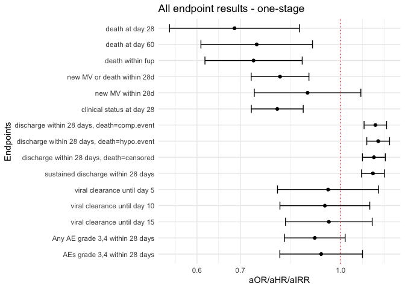

# Load packages

```r
library(tidyverse)
library(readxl)
library(writexl)
library(tableone)
library(here)
library(kableExtra)

library(jtools) # for summ() and plot_summs
library(sjPlot) # for tab_model
library(ggplot2) # survival/TTE analyses and other graphs
library(ggsurvfit) # survival/TTE analyses
library(survival) # survival/TTE analyses
library(gtsummary) # survival/TTE analyses
library(ggfortify) # autoplot
library(lme4) # glmer / clmm
library(sjPlot) # for tab_model
library(glmmTMB) # to specify estimation method explicitly -> i.e. ML
library(coxme) # for mixed-effects cox model
library(ordinal) # for ordinal regression, clm (fixed effects) & clmm (mixed effects)
library(tidycmprsk) # competing risk analysis
library(logistf) # Firth regression in case of rare events

library(meta)
library(forestplot)
library(metafor) #forest()
```

# Load standardized dataset of all trials

```r
## barisolidact
df_barisolidact <- readRDS("df_os_barisolidact.RData")
df_barisolidact <- df_barisolidact %>% 
    select(id_pat, trial, JAKi, trt, sex, age, ethn, country, icu, sympdur, vacc, clinstatus_baseline, vbaseline,
         comed_dexa, comed_rdv, comed_toci, comed_ab, comed_acoa, comed_interferon, comed_other,
         comed_cat,
         comorb_lung, comorb_liver, comorb_cvd, comorb_aht, comorb_dm, comorb_obese, comorb_smoker, immunosupp,
         comorb_autoimm, comorb_cancer, comorb_kidney, any_comorb, comorb_cat, comorb_any, comorb_count,
         crp, sero, vl_baseline, variant,
         mort_28, mort_28_dimp, mort_60, death_reached, death_time,
         new_mv_28, new_mvd_28,
         clinstatus_28_imp,
         discharge_reached, discharge_time, discharge_time_sens, discharge_reached_sus, discharge_time_sus,
         ae_28, ae_28_sev,
         vir_clear_5, vir_clear_10, vir_clear_15)
## actt2
df_actt2 <- readRDS("df_os_actt2.RData")
df_actt2 <- df_actt2 %>% 
    select(id_pat, trial, JAKi, trt, sex, age, ethn, country, icu, sympdur, vacc, clinstatus_baseline, vbaseline,
         comed_dexa, comed_rdv, comed_toci, comed_ab, comed_acoa, comed_interferon, comed_other,
         comed_cat,
         comorb_lung, comorb_liver, comorb_cvd, comorb_aht, comorb_dm, comorb_obese, comorb_smoker, immunosupp,
         comorb_autoimm, comorb_cancer, comorb_kidney, any_comorb, comorb_cat, comorb_any, comorb_count,
         crp, sero, vl_baseline, variant,
         mort_28, mort_28_dimp, mort_60, death_reached, death_time,
         new_mv_28, new_mvd_28,
         clinstatus_28_imp,
         discharge_reached, discharge_time, discharge_time_sens, discharge_reached_sus, discharge_time_sus,
         ae_28, ae_28_sev,
         vir_clear_5, vir_clear_10, vir_clear_15)
## ghazaeian
df_ghazaeian <- readRDS("df_os_ghazaeian.RData")
df_ghazaeian <- df_ghazaeian %>% 
    select(id_pat, trial, JAKi, trt, sex, age, ethn, country, icu, sympdur, vacc, clinstatus_baseline, vbaseline,
         comed_dexa, comed_rdv, comed_toci, comed_ab, comed_acoa, comed_interferon, comed_other,
         comed_cat,
         comorb_lung, comorb_liver, comorb_cvd, comorb_aht, comorb_dm, comorb_obese, comorb_smoker, immunosupp,
         comorb_autoimm, comorb_cancer, comorb_kidney, any_comorb, comorb_cat, comorb_any, comorb_count,
         crp, sero, vl_baseline, variant,
         mort_28, mort_28_dimp, mort_60, death_reached, death_time,
         new_mv_28, new_mvd_28,
         clinstatus_28_imp,
         discharge_reached, discharge_time, discharge_time_sens, discharge_reached_sus, discharge_time_sus,
         ae_28, ae_28_sev,
         vir_clear_5, vir_clear_10, vir_clear_15)
## tofacov
df_tofacov <- readRDS("df_os_tofacov.RData")
df_tofacov <- df_tofacov %>% 
    select(id_pat, trial, JAKi, trt, sex, age, ethn, country, icu, sympdur, vacc, clinstatus_baseline, vbaseline,
         comed_dexa, comed_rdv, comed_toci, comed_ab, comed_acoa, comed_interferon, comed_other,
         comed_cat,
         comorb_lung, comorb_liver, comorb_cvd, comorb_aht, comorb_dm, comorb_obese, comorb_smoker, immunosupp,
         comorb_autoimm, comorb_cancer, comorb_kidney, any_comorb, comorb_cat, comorb_any, comorb_count,
         crp, sero, vl_baseline, variant,
         mort_28, mort_28_dimp, mort_60, death_reached, death_time,
         new_mv_28, new_mvd_28,
         clinstatus_28_imp,
         discharge_reached, discharge_time, discharge_time_sens, discharge_reached_sus, discharge_time_sus,
         ae_28, ae_28_sev,
         vir_clear_5, vir_clear_10, vir_clear_15)
## covinib
df_covinib <- readRDS("df_os_covinib.RData")
df_covinib <- df_covinib %>% 
    select(id_pat, trial, JAKi, trt, sex, age, ethn, country, icu, sympdur, vacc, clinstatus_baseline, vbaseline,
         comed_dexa, comed_rdv, comed_toci, comed_ab, comed_acoa, comed_interferon, comed_other,
         comed_cat,
         comorb_lung, comorb_liver, comorb_cvd, comorb_aht, comorb_dm, comorb_obese, comorb_smoker, immunosupp,
         comorb_autoimm, comorb_cancer, comorb_kidney, any_comorb, comorb_cat, comorb_any, comorb_count,
         crp, sero, vl_baseline, variant,
         mort_28, mort_28_dimp, mort_60, death_reached, death_time,
         new_mv_28, new_mvd_28,
         clinstatus_28_imp,
         discharge_reached, discharge_time, discharge_time_sens, discharge_reached_sus, discharge_time_sus,
         ae_28, ae_28_sev,
         vir_clear_5, vir_clear_10, vir_clear_15)
## COV-BARRIER
df_covbarrier <- readRDS("df_os_cov-barrier.RData")
df_covbarrier <- df_covbarrier %>% 
    select(id_pat, trial, JAKi, trt, sex, age, ethn, country, icu, sympdur, vacc, clinstatus_baseline, vbaseline,
         comed_dexa, comed_rdv, comed_toci, comed_ab, comed_acoa, comed_interferon, comed_other,
         comed_cat,
         comorb_lung, comorb_liver, comorb_cvd, comorb_aht, comorb_dm, comorb_obese, comorb_smoker, immunosupp,
         comorb_autoimm, comorb_cancer, comorb_kidney, any_comorb, comorb_cat, comorb_any, comorb_count,
         crp, sero, vl_baseline, variant,
         mort_28, mort_28_dimp, mort_60, death_reached, death_time,
         new_mv_28, new_mvd_28,
         clinstatus_28_imp,
         discharge_reached, discharge_time, discharge_time_sens, discharge_reached_sus, discharge_time_sus,
         ae_28, ae_28_sev,
         vir_clear_5, vir_clear_10, vir_clear_15)
## Murugesan
df_murugesan <- readRDS("df_os_murugesan.RData")
df_murugesan <- df_murugesan %>% 
    select(id_pat, trial, JAKi, trt, sex, age, ethn, country, icu, sympdur, vacc, clinstatus_baseline, vbaseline,
         comed_dexa, comed_rdv, comed_toci, comed_ab, comed_acoa, comed_interferon, comed_other,
         comed_cat,
         comorb_lung, comorb_liver, comorb_cvd, comorb_aht, comorb_dm, comorb_obese, comorb_smoker, immunosupp,
         comorb_autoimm, comorb_cancer, comorb_kidney, any_comorb, comorb_cat, comorb_any, comorb_count,
         crp, sero, vl_baseline, variant,
         mort_28, mort_28_dimp, mort_60, death_reached, death_time,
         new_mv_28, new_mvd_28,
         clinstatus_28_imp,
         discharge_reached, discharge_time, discharge_time_sens, discharge_reached_sus, discharge_time_sus,
         ae_28, ae_28_sev,
         vir_clear_5, vir_clear_10, vir_clear_15)
## RECOVERY
df_recovery <- readRDS("df_os_recovery.RData")
df_recovery <- df_recovery %>% 
    select(id_pat, trial, JAKi, trt, sex, age, ethn, country, icu, sympdur, vacc, clinstatus_baseline, vbaseline,
         comed_dexa, comed_rdv, comed_toci, comed_ab, comed_acoa, comed_interferon, comed_other,
         comed_cat,
         comorb_lung, comorb_liver, comorb_cvd, comorb_aht, comorb_dm, comorb_obese, comorb_smoker, immunosupp,
         comorb_autoimm, comorb_cancer, comorb_kidney, any_comorb, comorb_cat, comorb_any, comorb_count,
         crp, sero, vl_baseline, variant,
         mort_28, mort_28_dimp, mort_60, death_reached, death_time,
         new_mv_28, new_mvd_28,
         clinstatus_28_imp,
         discharge_reached, discharge_time, discharge_time_sens, discharge_reached_sus, discharge_time_sus,
         ae_28, ae_28_sev,
         vir_clear_5, vir_clear_10, vir_clear_15)
## TACTIC-R
df_tactic_r <- readRDS("df_os_tactic-r.RData")
df_tactic_r <- df_tactic_r %>% 
    select(id_pat, trial, JAKi, trt, sex, age, ethn, country, icu, sympdur, vacc, clinstatus_baseline, vbaseline,
         comed_dexa, comed_rdv, comed_toci, comed_ab, comed_acoa, comed_interferon, comed_other,
         comed_cat,
         comorb_lung, comorb_liver, comorb_cvd, comorb_aht, comorb_dm, comorb_obese, comorb_smoker, immunosupp,
         comorb_autoimm, comorb_cancer, comorb_kidney, any_comorb, comorb_cat, comorb_any, comorb_count,
         crp, sero, vl_baseline, variant,
         mort_28, mort_28_dimp, mort_60, death_reached, death_time,
         new_mv_28, new_mvd_28,
         clinstatus_28_imp,
         discharge_reached, discharge_time, discharge_time_sens, discharge_reached_sus, discharge_time_sus,
         ae_28, ae_28_sev,
         vir_clear_5, vir_clear_10, vir_clear_15)
## PANCOVID
df_pancovid <- readRDS("df_os_pancovid.RData")
df_pancovid <- df_pancovid %>% 
    select(id_pat, trial, JAKi, trt, sex, age, ethn, country, icu, sympdur, vacc, clinstatus_baseline, vbaseline,
         comed_dexa, comed_rdv, comed_toci, comed_ab, comed_acoa, comed_interferon, comed_other,
         comed_cat,
         comorb_lung, comorb_liver, comorb_cvd, comorb_aht, comorb_dm, comorb_obese, comorb_smoker, immunosupp,
         comorb_autoimm, comorb_cancer, comorb_kidney, any_comorb, comorb_cat, comorb_any, comorb_count,
         crp, sero, vl_baseline, variant,
         mort_28, mort_28_dimp, mort_60, death_reached, death_time,
         new_mv_28, new_mvd_28,
         clinstatus_28_imp,
         discharge_reached, discharge_time, discharge_time_sens, discharge_reached_sus, discharge_time_sus,
         ae_28, ae_28_sev,
         vir_clear_5, vir_clear_10, vir_clear_15)
## STOP-COVID
df_stopcovid <- readRDS("df_os_stopcovid.RData")
df_stopcovid <- df_stopcovid %>% 
    select(id_pat, trial, JAKi, trt, sex, age, ethn, country, icu, sympdur, vacc, clinstatus_baseline, vbaseline,
         comed_dexa, comed_rdv, comed_toci, comed_ab, comed_acoa, comed_interferon, comed_other,
         comed_cat,
         comorb_lung, comorb_liver, comorb_cvd, comorb_aht, comorb_dm, comorb_obese, comorb_smoker, immunosupp,
         comorb_autoimm, comorb_cancer, comorb_kidney, any_comorb, comorb_cat, comorb_any, comorb_count,
         crp, sero, vl_baseline, variant,
         mort_28, mort_28_dimp, mort_60, death_reached, death_time,
         new_mv_28, new_mvd_28,
         clinstatus_28_imp,
         discharge_reached, discharge_time, discharge_time_sens, discharge_reached_sus, discharge_time_sus,
         ae_28, ae_28_sev,
         vir_clear_5, vir_clear_10, vir_clear_15)
## RUXCOVID-DEVENT
df_ruxcoviddevent <- readRDS("/Users/amstutzal/Library/CloudStorage/OneDrive-usb.ch/Dokumente - JAKi IPDMA data source management/General/RUXCOVID-DEVENT/df_os_ruxcoviddevent.RData")
df_ruxcoviddevent <- df_ruxcoviddevent %>% 
    select(id_pat, trial, JAKi, trt, sex, age, ethn, country, icu, sympdur, vacc, clinstatus_baseline, vbaseline,
         comed_dexa, comed_rdv, comed_toci, comed_ab, comed_acoa, comed_interferon, comed_other,
         comed_cat,
         comorb_lung, comorb_liver, comorb_cvd, comorb_aht, comorb_dm, comorb_obese, comorb_smoker, immunosupp,
         comorb_autoimm, comorb_cancer, comorb_kidney, any_comorb, comorb_cat, comorb_any, comorb_count,
         crp, sero, vl_baseline, variant,
         mort_28, mort_28_dimp, mort_60, death_reached, death_time,
         new_mv_28, new_mvd_28,
         clinstatus_28_imp,
         discharge_reached, discharge_time, discharge_time_sens, discharge_reached_sus, discharge_time_sus,
         ae_28, ae_28_sev,
         vir_clear_5, vir_clear_10, vir_clear_15)
df_ruxcoviddevent <- df_ruxcoviddevent %>% 
  mutate(age = NA)

# append
df_tot <- rbind(df_barisolidact, df_actt2, df_ghazaeian, df_tofacov, df_covinib, df_covbarrier, df_recovery, df_tactic_r, df_pancovid, df_stopcovid, df_ruxcoviddevent)
# df_tot_Muru <- rbind(df_barisolidact, df_actt2, df_ghazaeian, df_tofacov, df_covinib, df_covbarrier, df_murugesan, df_recovery)

# Save
# saveRDS(df_tot, file = "df_tot.RData")
# write_xlsx(df_tot, path = "df_tot.xlsx")
# saveRDS(df_tot_Muru, file = "df_tot_Muru.RData")
```

# (i) Primary outcome: Mortality at day 28

```r
addmargins(table(df_tot$trial, df_tot$mort_28, useNA = "always"))
```

```
##                  
##                       0     1  <NA>   Sum
##   ACTT2             925    61    47  1033
##   Bari-Solidact     241    36    12   289
##   COV-BARRIER      1312   211   103  1626
##   COVINIB           105     2     3   110
##   Ghazaeian          90     7     0    97
##   PANCOVID          268     8    11   287
##   RECOVERY         6943  1058   129  8130
##   RUXCOVID-DEVENT    92   117     2   211
##   STOP-COVID        277    12     0   289
##   TACTIC-R          233    35    14   282
##   TOFACOV           115     1     0   116
##   <NA>                0     0     0     0
##   Sum             10601  1548   321 12470
```

```r
addmargins(table(df_tot$mort_28, df_tot$trt, useNA = "always"))
```

```
##       
##            0     1  <NA>   Sum
##   0     5164  5437     0 10601
##   1      802   746     0  1548
##   <NA>   144   177     0   321
##   Sum   6110  6360     0 12470
```

```r
# table(df_tot$age, df_tot$trt, useNA = "always")
table(df_tot$clinstatus_baseline, df_tot$trt, useNA = "always")
```

```
##       
##           0    1 <NA>
##   1       0    0    0
##   2     520  491    0
##   3    3874 3936    0
##   4    1420 1517    0
##   5     291  414    0
##   6       0    0    0
##   <NA>    5    2    0
```

```r
table(df_tot$clinstatus_baseline, df_tot$trial, useNA = "always")
```

```
##       
##        ACTT2 Bari-Solidact COV-BARRIER COVINIB Ghazaeian PANCOVID RECOVERY
##   1        0             0           0       0         0        0        0
##   2      142             0         186      35         2       74      465
##   3      564             0         962      75        95      208     5504
##   4      216           249         370       0         0        5     1921
##   5      111            40         101       0         0        0      240
##   6        0             0           0       0         0        0        0
##   <NA>     0             0           7       0         0        0        0
##       
##        RUXCOVID-DEVENT STOP-COVID TACTIC-R TOFACOV <NA>
##   1                  0          0        0       0    0
##   2                  0         71       11      25    0
##   3                  0        181      130      91    0
##   4                  0         37      139       0    0
##   5                211          0        2       0    0
##   6                  0          0        0       0    0
##   <NA>               0          0        0       0    0
```

```r
table(df_tot$vbaseline, df_tot$trial, useNA = "always")
```

```
##       
##        ACTT2 Bari-Solidact COV-BARRIER COVINIB Ghazaeian PANCOVID RECOVERY
##   0      706             0        1148     110        97      282     5969
##   1      327           289         471       0         0        5     2161
##   <NA>     0             0           7       0         0        0        0
##       
##        RUXCOVID-DEVENT STOP-COVID TACTIC-R TOFACOV <NA>
##   0                  0        252      141     116    0
##   1                211         37      141       0    0
##   <NA>               0          0        0       0    0
```

```r
# reformatting
df_tot$trt_f <- as.factor(df_tot$trt)
df_tot$trial_f <- as.factor(df_tot$trial)
df_tot$clinstatus_baseline_n <- as.numeric(df_tot$clinstatus_baseline)
df_tot <- df_tot %>%
  mutate(trial_n = case_when(trial == "Bari-Solidact" ~ 1,
                             trial == "ACTT2" ~ 2,
                             trial == "Ghazaeian" ~ 3,
                             trial == "TOFACOV" ~ 4,
                             trial == "COVINIB" ~ 5,
                             trial == "COV-BARRIER" ~ 6,
                             trial == "RECOVERY" ~ 7,
                             trial == "TACTIC-R" ~ 8,
                             trial == "PANCOVID" ~ 9,
                             trial == "STOP-COVID" ~ 10,
                             trial == "RUXCOVID-DEVENT" ~ 11,
                             ))
table(df_tot$trial_n, useNA = "always")
```

```
## 
##    1    2    3    4    5    6    7    8    9   10   11 <NA> 
##  289 1033   97  116  110 1626 8130  282  287  289  211    0
```

GOAL: random treatment effect, stratified trial intercept, stratified prognostic factors, AND centering the treatment variable by the proportion treated in the trial (to improve the estimation of between-study variance) AND maximum likelihood (ML) estimator (due to small trials with rare events). REML is default in glmer, for ML use glmmTMB. See notes.

### (1) common treatment effect, random trial intercept, common prognostic factors

```r
# (1) common treatment effect, random trial intercept, common prognostic factors, ML
class(df_tot$age)
```

```
## [1] "numeric"
```

```r
mort28.ctreat.rtrial.ml <- glmmTMB(mort_28 ~ trt + (1|trial)
                              + age + clinstatus_baseline
                              , data = df_tot, family = binomial)
tab_model(mort28.ctreat.rtrial.ml)
```

<table style="border-collapse:collapse; border:none;">
<tr>
<th style="border-top: double; text-align:center; font-style:normal; font-weight:bold; padding:0.2cm;  text-align:left; ">&nbsp;</th>
<th colspan="3" style="border-top: double; text-align:center; font-style:normal; font-weight:bold; padding:0.2cm; ">mort 28</th>
</tr>
<tr>
<td style=" text-align:center; border-bottom:1px solid; font-style:italic; font-weight:normal;  text-align:left; ">Predictors</td>
<td style=" text-align:center; border-bottom:1px solid; font-style:italic; font-weight:normal;  ">Odds Ratios</td>
<td style=" text-align:center; border-bottom:1px solid; font-style:italic; font-weight:normal;  ">CI</td>
<td style=" text-align:center; border-bottom:1px solid; font-style:italic; font-weight:normal;  ">p</td>
</tr>
<tr>
<td style=" padding:0.2cm; text-align:left; vertical-align:top; text-align:left; ">(Intercept)</td>
<td style=" padding:0.2cm; text-align:left; vertical-align:top; text-align:center;  ">0.00</td>
<td style=" padding:0.2cm; text-align:left; vertical-align:top; text-align:center;  ">0.00&nbsp;&ndash;&nbsp;0.00</td>
<td style=" padding:0.2cm; text-align:left; vertical-align:top; text-align:center;  "><strong>&lt;0.001</strong></td>
</tr>
<tr>
<td style=" padding:0.2cm; text-align:left; vertical-align:top; text-align:left; ">Trial treatment group</td>
<td style=" padding:0.2cm; text-align:left; vertical-align:top; text-align:center;  ">0.75</td>
<td style=" padding:0.2cm; text-align:left; vertical-align:top; text-align:center;  ">0.66&nbsp;&ndash;&nbsp;0.84</td>
<td style=" padding:0.2cm; text-align:left; vertical-align:top; text-align:center;  "><strong>&lt;0.001</strong></td>
</tr>
<tr>
<td style=" padding:0.2cm; text-align:left; vertical-align:top; text-align:left; ">Age(years)</td>
<td style=" padding:0.2cm; text-align:left; vertical-align:top; text-align:center;  ">1.08</td>
<td style=" padding:0.2cm; text-align:left; vertical-align:top; text-align:center;  ">1.07&nbsp;&ndash;&nbsp;1.09</td>
<td style=" padding:0.2cm; text-align:left; vertical-align:top; text-align:center;  "><strong>&lt;0.001</strong></td>
</tr>
<tr>
<td style=" padding:0.2cm; text-align:left; vertical-align:top; text-align:left; ">clinstatus baseline:<br>clinstatus baseline 3</td>
<td style=" padding:0.2cm; text-align:left; vertical-align:top; text-align:center;  ">2.22</td>
<td style=" padding:0.2cm; text-align:left; vertical-align:top; text-align:center;  ">1.58&nbsp;&ndash;&nbsp;3.10</td>
<td style=" padding:0.2cm; text-align:left; vertical-align:top; text-align:center;  "><strong>&lt;0.001</strong></td>
</tr>
<tr>
<td style=" padding:0.2cm; text-align:left; vertical-align:top; text-align:left; ">clinstatus baseline:<br>clinstatus baseline 4</td>
<td style=" padding:0.2cm; text-align:left; vertical-align:top; text-align:center;  ">8.07</td>
<td style=" padding:0.2cm; text-align:left; vertical-align:top; text-align:center;  ">5.73&nbsp;&ndash;&nbsp;11.35</td>
<td style=" padding:0.2cm; text-align:left; vertical-align:top; text-align:center;  "><strong>&lt;0.001</strong></td>
</tr>
<tr>
<td style=" padding:0.2cm; text-align:left; vertical-align:top; text-align:left; ">clinstatus baseline:<br>clinstatus baseline 5</td>
<td style=" padding:0.2cm; text-align:left; vertical-align:top; text-align:center;  ">24.40</td>
<td style=" padding:0.2cm; text-align:left; vertical-align:top; text-align:center;  ">16.42&nbsp;&ndash;&nbsp;36.25</td>
<td style=" padding:0.2cm; text-align:left; vertical-align:top; text-align:center;  "><strong>&lt;0.001</strong></td>
</tr>
<tr>
<td colspan="4" style="font-weight:bold; text-align:left; padding-top:.8em;">Random Effects</td>
</tr>

<tr>
<td style=" padding:0.2cm; text-align:left; vertical-align:top; text-align:left; padding-top:0.1cm; padding-bottom:0.1cm;">&sigma;<sup>2</sup></td>
<td style=" padding:0.2cm; text-align:left; vertical-align:top; padding-top:0.1cm; padding-bottom:0.1cm; text-align:left;" colspan="3">3.29</td>
</tr>

<tr>
<td style=" padding:0.2cm; text-align:left; vertical-align:top; text-align:left; padding-top:0.1cm; padding-bottom:0.1cm;">&tau;<sub>00</sub> <sub>trial</sub></td>
<td style=" padding:0.2cm; text-align:left; vertical-align:top; padding-top:0.1cm; padding-bottom:0.1cm; text-align:left;" colspan="3">0.30</td>

<tr>
<td style=" padding:0.2cm; text-align:left; vertical-align:top; text-align:left; padding-top:0.1cm; padding-bottom:0.1cm;">ICC</td>
<td style=" padding:0.2cm; text-align:left; vertical-align:top; padding-top:0.1cm; padding-bottom:0.1cm; text-align:left;" colspan="3">0.08</td>

<tr>
<td style=" padding:0.2cm; text-align:left; vertical-align:top; text-align:left; padding-top:0.1cm; padding-bottom:0.1cm;">N <sub>trial</sub></td>
<td style=" padding:0.2cm; text-align:left; vertical-align:top; padding-top:0.1cm; padding-bottom:0.1cm; text-align:left;" colspan="3">10</td>
<tr>
<td style=" padding:0.2cm; text-align:left; vertical-align:top; text-align:left; padding-top:0.1cm; padding-bottom:0.1cm; border-top:1px solid;">Observations</td>
<td style=" padding:0.2cm; text-align:left; vertical-align:top; padding-top:0.1cm; padding-bottom:0.1cm; text-align:left; border-top:1px solid;" colspan="3">11940</td>
</tr>
<tr>
<td style=" padding:0.2cm; text-align:left; vertical-align:top; text-align:left; padding-top:0.1cm; padding-bottom:0.1cm;">Marginal R<sup>2</sup> / Conditional R<sup>2</sup></td>
<td style=" padding:0.2cm; text-align:left; vertical-align:top; padding-top:0.1cm; padding-bottom:0.1cm; text-align:left;" colspan="3">0.344 / 0.399</td>
</tr>

</table>

```r
mort28.ctreat.rtrial.ml.vb <- glmmTMB(mort_28 ~ trt + (1|trial)
                              + age + vbaseline
                              , data = df_tot, family = binomial)
# tab_model(mort28.ctreat.rtrial.ml.vb)
```

### (2) random treatment effect, random trial intercept, common prognostic factors and residual variances

```r
# (3) random treatment effect, random trial intercept, common prognostic factors and residual variances, ML
mort28.rtreat.rtrial.ml <- glmmTMB(mort_28 ~ trt + (1 + trt|trial_f)
                              + age + clinstatus_baseline
                              , data = df_tot, family = binomial)
# tab_model(mort28.rtreat.rtrial.ml)

mort28.rtreat.rtrial.ml.vb <- glmmTMB(mort_28 ~ trt + (1 + trt|trial_f)
                              + age + vbaseline
                              , data = df_tot, family = binomial)
# tab_model(mort28.rtreat.rtrial.ml.vb)
```

### (3) random treatment effect, stratified trial intercept, common prognostic factors and residual variances

```r
# (2) random treatment effect, stratified trial intercept, common prognostic factors and residual variances, and WITHOUT centering the treatment variable, ML
mort28.rtreat.strial.ml <- glmmTMB(mort_28 ~ trt_f + trial_f + (trt - 1 | trial_f)
                              + age + clinstatus_baseline
                              , data = df_tot, family = binomial)
# tab_model(mort28.rtreat.strial.ml)

mort28.rtreat.strial.ml.vb <- glmmTMB(mort_28 ~ trt_f + trial_f + (trt - 1 | trial_f)
                              + age + vbaseline 
                              , data = df_tot, family = binomial)
# tab_model(mort28.rtreat.strial.ml.vb)

# The - 1 within (trt - 1 | trial_n) specifies that there is no random intercept for the grouping factor trial_n. We're specifying random slopes for the variable trt within each level of trial_n, i.e., the effect may vary from one trial to another. Together with trial_f, this gives the stratified intercept model. This is a more flexible model compared to a model with a random intercept, which assumes a common baseline for all groups.

# dummy variable for each trial (trial_1, trial_2, trial_3, etc - e.g. where trial_1 = 1 if in trial 1 and 0 otherwise)
# df_tot <- df_tot %>%
#   mutate(trial_1 = case_when(trial == "Bari-Solidact" ~ 1, TRUE ~ 0),
#          trial_2 = case_when(trial == "ACTT2" ~ 1, TRUE ~ 0),
#          trial_3 = case_when(trial == "Ghazaeian" ~ 1, TRUE ~ 0),
#          trial_4 = case_when(trial == "TOFACOV" ~ 1, TRUE ~ 0),
#          trial_5 = case_when(trial == "COVINIB" ~ 1, TRUE ~ 0),
#          trial_6 = case_when(trial == "COV-BARRIER" ~ 1, TRUE ~ 0),
#          trial_7 = case_when(trial == "RECOVERY" ~ 1, TRUE ~ 0),
#          trial_8 = case_when(trial == "TACTIC-R" ~ 1, TRUE ~ 0))

## Use "Stata syntax":
# mort28.rtreat.strial.2 <- glmer(mort_28 ~ trt_f + trial* + (trt -1 | trial_n)
#                               + age + clinstatus_baseline_n
#                               # + comed_dexa + comed_rdv + comed_toci
#                               , data = df_tot, family = binomial)
# tab_model(mort28.rtreat.strial.2)
```

### (4) random treatment effect, stratified trial intercept, common prognostic factors and residual variances, AND centering the treatment variable

```r
# (4) random treatment effect, stratified trial intercept, common prognostic factors and residual variances, ML, but WITH centering the treatment variable

# calculate the proportion treated by trial
proportions <- df_tot %>%
  group_by(trial) %>%
  summarize(proportion_treated = sum(trt) / n())
df_tot <- left_join(df_tot, proportions[, c("proportion_treated", "trial")], by = join_by(trial == trial))
# table(df_tot$trial, df_tot$proportion_treated)

# create the centered treatment variable
df_tot$trt_centered_n <- df_tot$trt - df_tot$proportion_treated
df_tot$trt_centered_f <- as.factor(df_tot$trt_centered_n)
# table(df_tot$trial, df_tot$trt_centered_f) ## keep it minus?

# build the model. '-1' indicating there is no overall random intercept.
mort28.rtreat.strial.cent.ml <- glmmTMB(mort_28 ~ trt_centered_n + trial_f + (trt_centered_n -1 | trial_f) -1
                   + age + clinstatus_baseline
                   , data = df_tot, family = binomial
                   )
# tab_model(mort28.rtreat.strial.cent.ml)

mort28.rtreat.strial.cent.ml.vb <- glmmTMB(mort_28 ~ trt_centered_n + trial_f + (trt_centered_n -1 | trial_f) -1 
                   + age + vbaseline 
                   , data = df_tot, family = binomial
                   )
# tab_model(mort28.rtreat.strial.cent.ml.vb)
```

### (5) random treatment effect, stratified trial intercept, stratified prognostic factors and residual variances, with centering the treatment variable AND the prognostic variables

```r
# "Our default recommendation is to use stratified prognostic effects (i.e. estimate a separate effect of each included prognostic factor for each trial), with trial-specific centering of each prognostic factor to improve ML estimation (for the reasons explained in Section 6.2.8.3). However, if outcome data or prognostic factor categories are sparse, the stratification approach may lead to estimation difficulties, and then allowing prognostic factor effects to be random is a sensible alternative." (p. 145) Centering disentangles (i.e. makes uncorrelated) the estimation of main parameters of interest from other nuisance parameters, which leads to less downward bias in estimates of variance parameters (Figure 6.2) and thus improves coverage of 95% confidence intervals. This can be achieved by centering the covariates by their mean values within trials, such that the interaction estimate is then only based on within-trial information.

# Calculate the mean values of (continuous) prognostic factors within each trial
trial_means <- df_tot %>%
  group_by(trial) %>%
  summarize(mean_age = mean(age, na.rm = TRUE), mean_clinstatus = mean(clinstatus_baseline_n, na.rm = TRUE))
# Merge back
df_tot <- df_tot %>% left_join(trial_means, by = "trial")
# Center the age and clinstatus_baseline variables
df_tot <- df_tot %>%
  mutate(age_centered = age - mean_age, 
         clinstatus_baseline_centered = clinstatus_baseline_n - mean_clinstatus)

# df_tot %>%
#   select(trial_f, trial_n, trt, trt_centered_n, age, mean_age, age_centered, clinstatus_baseline_n, mean_clinstatus, clinstatus_baseline_centered, mort_28) %>%
#   View()


### Add the prognostic factors stratified, i.e. create stratified variables for each prognostic factor
## uncentered
df_tot <- df_tot %>%
  mutate(age_trial_1 = case_when(trial == "Bari-Solidact" ~ age, TRUE ~ 0),
         age_trial_2 = case_when(trial == "ACTT2" ~ age, TRUE ~ 0),
         age_trial_3 = case_when(trial == "Ghazaeian" ~ age, TRUE ~ 0),
         age_trial_4 = case_when(trial == "TOFACOV" ~ age, TRUE ~ 0),
         age_trial_5 = case_when(trial == "COVINIB" ~ age, TRUE ~ 0),
         age_trial_6 = case_when(trial == "COV-BARRIER" ~ age, TRUE ~ 0),
         age_trial_7 = case_when(trial == "RECOVERY" ~ age, TRUE ~ 0),
         age_trial_8 = case_when(trial == "TACTIC-R" ~ age, TRUE ~ 0),
         age_trial_9 = case_when(trial == "PANCOVID" ~ age, TRUE ~ 0),
         age_trial_10 = case_when(trial == "STOP-COVID" ~ age, TRUE ~ 0),
         age_trial_11 = case_when(trial == "RUXCOVID-DEVENT" ~ age, TRUE ~ 0)
         )
df_tot <- df_tot %>%
  mutate(clinstat_trial_1 = case_when(trial == "Bari-Solidact" ~ clinstatus_baseline, TRUE ~ "0"),
         clinstat_trial_2 = case_when(trial == "ACTT2" ~ clinstatus_baseline, TRUE ~ "0"),
         clinstat_trial_3 = case_when(trial == "Ghazaeian" ~ clinstatus_baseline, TRUE ~ "0"),
         clinstat_trial_4 = case_when(trial == "TOFACOV" ~ clinstatus_baseline, TRUE ~ "0"),
         clinstat_trial_5 = case_when(trial == "COVINIB" ~ clinstatus_baseline, TRUE ~ "0"),
         clinstat_trial_6 = case_when(trial == "COV-BARRIER" ~ clinstatus_baseline, TRUE ~ "0"),
         clinstat_trial_7 = case_when(trial == "RECOVERY" ~ clinstatus_baseline, TRUE ~ "0"),
         clinstat_trial_8 = case_when(trial == "TACTIC-R" ~ clinstatus_baseline, TRUE ~ "0"),
         clinstat_trial_9 = case_when(trial == "PANCOVID" ~ clinstatus_baseline, TRUE ~ "0"),
         clinstat_trial_10 = case_when(trial == "STOP-COVID" ~ clinstatus_baseline, TRUE ~ "0"),
         clinstat_trial_11 = case_when(trial == "RUXCOVID-DEVENT" ~ clinstatus_baseline, TRUE ~ "0")
         )

## centered
df_tot <- df_tot %>%
  mutate(age_cent_trial_1 = case_when(trial == "Bari-Solidact" ~ age_centered, TRUE ~ 0),
         age_cent_trial_2 = case_when(trial == "ACTT2" ~ age_centered, TRUE ~ 0),
         age_cent_trial_3 = case_when(trial == "Ghazaeian" ~ age_centered, TRUE ~ 0),
         age_cent_trial_4 = case_when(trial == "TOFACOV" ~ age_centered, TRUE ~ 0),
         age_cent_trial_5 = case_when(trial == "COVINIB" ~ age_centered, TRUE ~ 0),
         age_cent_trial_6 = case_when(trial == "COV-BARRIER" ~ age_centered, TRUE ~ 0),
         age_cent_trial_7 = case_when(trial == "RECOVERY" ~ age_centered, TRUE ~ 0),
         age_cent_trial_8 = case_when(trial == "TACTIC-R" ~ age_centered, TRUE ~ 0),
         age_cent_trial_9 = case_when(trial == "PANCOVID" ~ age_centered, TRUE ~ 0),
         age_cent_trial_10 = case_when(trial == "STOP-COVID" ~ age_centered, TRUE ~ 0),
         age_cent_trial_11 = case_when(trial == "RUXCOVID-DEVENT" ~ age_centered, TRUE ~ 0)
         )
df_tot <- df_tot %>%
  mutate(clinstat_cent_trial_1 = case_when(trial == "Bari-Solidact" ~ clinstatus_baseline_centered, TRUE ~ 0),
         clinstat_cent_trial_2 = case_when(trial == "ACTT2" ~ clinstatus_baseline_centered, TRUE ~ 0),
         clinstat_cent_trial_3 = case_when(trial == "Ghazaeian" ~ clinstatus_baseline_centered, TRUE ~ 0),
         clinstat_cent_trial_4 = case_when(trial == "TOFACOV" ~ clinstatus_baseline_centered, TRUE ~ 0),
         clinstat_cent_trial_5 = case_when(trial == "COVINIB" ~ clinstatus_baseline_centered, TRUE ~ 0),
         clinstat_cent_trial_6 = case_when(trial == "COV-BARRIER" ~ clinstatus_baseline_centered, TRUE ~ 0),
         clinstat_cent_trial_7 = case_when(trial == "RECOVERY" ~ clinstatus_baseline_centered, TRUE ~ 0),
         clinstat_cent_trial_8 = case_when(trial == "TACTIC-R" ~ clinstatus_baseline_centered, TRUE ~ 0),
         clinstat_cent_trial_9 = case_when(trial == "PANCOVID" ~ clinstatus_baseline_centered, TRUE ~ 0),
         clinstat_cent_trial_10 = case_when(trial == "STOP-COVID" ~ clinstatus_baseline_centered, TRUE ~ 0),
         clinstat_cent_trial_11 = case_when(trial == "RUXCOVID-DEVENT" ~ clinstatus_baseline_centered, TRUE ~ 0)
         )


# (5) random treatment effect, stratified trial intercept, stratified prognostic factors and residual variances, with centering of the treatment variable AND the prognostic factors

mort28.rtreat.strial.cent.ml.spf.cent <- glmmTMB(mort_28 ~ trt_centered_n
                                                 + trial_f
                                                 + (trt_centered_n -1 | trial_f) -1
                                                 + age_cent_trial_1 + age_cent_trial_2 + age_cent_trial_3 + age_cent_trial_4
                                                 + age_cent_trial_5 + age_cent_trial_6 + age_cent_trial_7 + age_cent_trial_8 + age_cent_trial_9 + age_cent_trial_10 + age_cent_trial_11
                                                 + clinstat_cent_trial_1 + clinstat_cent_trial_2 + clinstat_cent_trial_3
                                                 + clinstat_cent_trial_4 + clinstat_cent_trial_5 + clinstat_cent_trial_6 + clinstat_cent_trial_7 + clinstat_cent_trial_8 + clinstat_cent_trial_9 + clinstat_cent_trial_10 + + clinstat_cent_trial_11
                                                 , data = df_tot, family = binomial)
```

```
## dropping columns from rank-deficient conditional model: age_cent_trial_11, clinstat_cent_trial_11
```

```r
tab_model(mort28.rtreat.strial.cent.ml.spf.cent)
```

```
## Model matrix is rank deficient. Parameters `age_cent_trial_11,
##   clinstat_cent_trial_11` were not estimable.
```

<table style="border-collapse:collapse; border:none;">
<tr>
<th style="border-top: double; text-align:center; font-style:normal; font-weight:bold; padding:0.2cm;  text-align:left; ">&nbsp;</th>
<th colspan="3" style="border-top: double; text-align:center; font-style:normal; font-weight:bold; padding:0.2cm; ">mort 28</th>
</tr>
<tr>
<td style=" text-align:center; border-bottom:1px solid; font-style:italic; font-weight:normal;  text-align:left; ">Predictors</td>
<td style=" text-align:center; border-bottom:1px solid; font-style:italic; font-weight:normal;  ">Odds Ratios</td>
<td style=" text-align:center; border-bottom:1px solid; font-style:italic; font-weight:normal;  ">CI</td>
<td style=" text-align:center; border-bottom:1px solid; font-style:italic; font-weight:normal;  ">p</td>
</tr>
<tr>
<td style=" padding:0.2cm; text-align:left; vertical-align:top; text-align:left; ">Trial treatment group</td>
<td style=" padding:0.2cm; text-align:left; vertical-align:top; text-align:center;  ">0.69</td>
<td style=" padding:0.2cm; text-align:left; vertical-align:top; text-align:center;  ">0.55&nbsp;&ndash;&nbsp;0.86</td>
<td style=" padding:0.2cm; text-align:left; vertical-align:top; text-align:center;  "><strong>0.001</strong></td>
</tr>
<tr>
<td style=" padding:0.2cm; text-align:left; vertical-align:top; text-align:left; ">trial f: ACTT 2</td>
<td style=" padding:0.2cm; text-align:left; vertical-align:top; text-align:center;  ">0.03</td>
<td style=" padding:0.2cm; text-align:left; vertical-align:top; text-align:center;  ">0.02&nbsp;&ndash;&nbsp;0.05</td>
<td style=" padding:0.2cm; text-align:left; vertical-align:top; text-align:center;  "><strong>&lt;0.001</strong></td>
</tr>
<tr>
<td style=" padding:0.2cm; text-align:left; vertical-align:top; text-align:left; ">trial f: Bari-Solidact</td>
<td style=" padding:0.2cm; text-align:left; vertical-align:top; text-align:center;  ">0.09</td>
<td style=" padding:0.2cm; text-align:left; vertical-align:top; text-align:center;  ">0.05&nbsp;&ndash;&nbsp;0.15</td>
<td style=" padding:0.2cm; text-align:left; vertical-align:top; text-align:center;  "><strong>&lt;0.001</strong></td>
</tr>
<tr>
<td style=" padding:0.2cm; text-align:left; vertical-align:top; text-align:left; ">trial f: COV-BARRIER</td>
<td style=" padding:0.2cm; text-align:left; vertical-align:top; text-align:center;  ">0.09</td>
<td style=" padding:0.2cm; text-align:left; vertical-align:top; text-align:center;  ">0.07&nbsp;&ndash;&nbsp;0.11</td>
<td style=" padding:0.2cm; text-align:left; vertical-align:top; text-align:center;  "><strong>&lt;0.001</strong></td>
</tr>
<tr>
<td style=" padding:0.2cm; text-align:left; vertical-align:top; text-align:left; ">trial f: COVINIB</td>
<td style=" padding:0.2cm; text-align:left; vertical-align:top; text-align:center;  ">0.00</td>
<td style=" padding:0.2cm; text-align:left; vertical-align:top; text-align:center;  ">0.00&nbsp;&ndash;&nbsp;Inf</td>
<td style=" padding:0.2cm; text-align:left; vertical-align:top; text-align:center;  ">0.999</td>
</tr>
<tr>
<td style=" padding:0.2cm; text-align:left; vertical-align:top; text-align:left; ">trial f: Ghazaeian</td>
<td style=" padding:0.2cm; text-align:left; vertical-align:top; text-align:center;  ">0.05</td>
<td style=" padding:0.2cm; text-align:left; vertical-align:top; text-align:center;  ">0.00&nbsp;&ndash;&nbsp;775867576786724580798411605777842176.00</td>
<td style=" padding:0.2cm; text-align:left; vertical-align:top; text-align:center;  ">0.947</td>
</tr>
<tr>
<td style=" padding:0.2cm; text-align:left; vertical-align:top; text-align:left; ">trial f: PANCOVID</td>
<td style=" padding:0.2cm; text-align:left; vertical-align:top; text-align:center;  ">0.01</td>
<td style=" padding:0.2cm; text-align:left; vertical-align:top; text-align:center;  ">0.00&nbsp;&ndash;&nbsp;0.04</td>
<td style=" padding:0.2cm; text-align:left; vertical-align:top; text-align:center;  "><strong>&lt;0.001</strong></td>
</tr>
<tr>
<td style=" padding:0.2cm; text-align:left; vertical-align:top; text-align:left; ">trial f: RECOVERY</td>
<td style=" padding:0.2cm; text-align:left; vertical-align:top; text-align:center;  ">0.09</td>
<td style=" padding:0.2cm; text-align:left; vertical-align:top; text-align:center;  ">0.08&nbsp;&ndash;&nbsp;0.09</td>
<td style=" padding:0.2cm; text-align:left; vertical-align:top; text-align:center;  "><strong>&lt;0.001</strong></td>
</tr>
<tr>
<td style=" padding:0.2cm; text-align:left; vertical-align:top; text-align:left; ">trial f: STOP-COVID</td>
<td style=" padding:0.2cm; text-align:left; vertical-align:top; text-align:center;  ">0.02</td>
<td style=" padding:0.2cm; text-align:left; vertical-align:top; text-align:center;  ">0.01&nbsp;&ndash;&nbsp;0.06</td>
<td style=" padding:0.2cm; text-align:left; vertical-align:top; text-align:center;  "><strong>&lt;0.001</strong></td>
</tr>
<tr>
<td style=" padding:0.2cm; text-align:left; vertical-align:top; text-align:left; ">trial f: TACTIC-R</td>
<td style=" padding:0.2cm; text-align:left; vertical-align:top; text-align:center;  ">0.08</td>
<td style=" padding:0.2cm; text-align:left; vertical-align:top; text-align:center;  ">0.05&nbsp;&ndash;&nbsp;0.14</td>
<td style=" padding:0.2cm; text-align:left; vertical-align:top; text-align:center;  "><strong>&lt;0.001</strong></td>
</tr>
<tr>
<td style=" padding:0.2cm; text-align:left; vertical-align:top; text-align:left; ">trial f: TOFACOV</td>
<td style=" padding:0.2cm; text-align:left; vertical-align:top; text-align:center;  ">0.00</td>
<td style=" padding:0.2cm; text-align:left; vertical-align:top; text-align:center;  ">0.00&nbsp;&ndash;&nbsp;Inf</td>
<td style=" padding:0.2cm; text-align:left; vertical-align:top; text-align:center;  ">0.990</td>
</tr>
<tr>
<td style=" padding:0.2cm; text-align:left; vertical-align:top; text-align:left; ">age cent trial 1</td>
<td style=" padding:0.2cm; text-align:left; vertical-align:top; text-align:center;  ">1.09</td>
<td style=" padding:0.2cm; text-align:left; vertical-align:top; text-align:center;  ">1.05&nbsp;&ndash;&nbsp;1.13</td>
<td style=" padding:0.2cm; text-align:left; vertical-align:top; text-align:center;  "><strong>&lt;0.001</strong></td>
</tr>
<tr>
<td style=" padding:0.2cm; text-align:left; vertical-align:top; text-align:left; ">age cent trial 2</td>
<td style=" padding:0.2cm; text-align:left; vertical-align:top; text-align:center;  ">1.06</td>
<td style=" padding:0.2cm; text-align:left; vertical-align:top; text-align:center;  ">1.03&nbsp;&ndash;&nbsp;1.08</td>
<td style=" padding:0.2cm; text-align:left; vertical-align:top; text-align:center;  "><strong>&lt;0.001</strong></td>
</tr>
<tr>
<td style=" padding:0.2cm; text-align:left; vertical-align:top; text-align:left; ">age cent trial 3</td>
<td style=" padding:0.2cm; text-align:left; vertical-align:top; text-align:center;  ">1.03</td>
<td style=" padding:0.2cm; text-align:left; vertical-align:top; text-align:center;  ">0.98&nbsp;&ndash;&nbsp;1.08</td>
<td style=" padding:0.2cm; text-align:left; vertical-align:top; text-align:center;  ">0.277</td>
</tr>
<tr>
<td style=" padding:0.2cm; text-align:left; vertical-align:top; text-align:left; ">age cent trial 4</td>
<td style=" padding:0.2cm; text-align:left; vertical-align:top; text-align:center;  ">1.06</td>
<td style=" padding:0.2cm; text-align:left; vertical-align:top; text-align:center;  ">0.88&nbsp;&ndash;&nbsp;1.28</td>
<td style=" padding:0.2cm; text-align:left; vertical-align:top; text-align:center;  ">0.509</td>
</tr>
<tr>
<td style=" padding:0.2cm; text-align:left; vertical-align:top; text-align:left; ">age cent trial 5</td>
<td style=" padding:0.2cm; text-align:left; vertical-align:top; text-align:center;  ">1.11</td>
<td style=" padding:0.2cm; text-align:left; vertical-align:top; text-align:center;  ">0.93&nbsp;&ndash;&nbsp;1.33</td>
<td style=" padding:0.2cm; text-align:left; vertical-align:top; text-align:center;  ">0.250</td>
</tr>
<tr>
<td style=" padding:0.2cm; text-align:left; vertical-align:top; text-align:left; ">age cent trial 6</td>
<td style=" padding:0.2cm; text-align:left; vertical-align:top; text-align:center;  ">1.07</td>
<td style=" padding:0.2cm; text-align:left; vertical-align:top; text-align:center;  ">1.05&nbsp;&ndash;&nbsp;1.08</td>
<td style=" padding:0.2cm; text-align:left; vertical-align:top; text-align:center;  "><strong>&lt;0.001</strong></td>
</tr>
<tr>
<td style=" padding:0.2cm; text-align:left; vertical-align:top; text-align:left; ">age cent trial 7</td>
<td style=" padding:0.2cm; text-align:left; vertical-align:top; text-align:center;  ">1.08</td>
<td style=" padding:0.2cm; text-align:left; vertical-align:top; text-align:center;  ">1.08&nbsp;&ndash;&nbsp;1.09</td>
<td style=" padding:0.2cm; text-align:left; vertical-align:top; text-align:center;  "><strong>&lt;0.001</strong></td>
</tr>
<tr>
<td style=" padding:0.2cm; text-align:left; vertical-align:top; text-align:left; ">age cent trial 8</td>
<td style=" padding:0.2cm; text-align:left; vertical-align:top; text-align:center;  ">1.11</td>
<td style=" padding:0.2cm; text-align:left; vertical-align:top; text-align:center;  ">1.07&nbsp;&ndash;&nbsp;1.15</td>
<td style=" padding:0.2cm; text-align:left; vertical-align:top; text-align:center;  "><strong>&lt;0.001</strong></td>
</tr>
<tr>
<td style=" padding:0.2cm; text-align:left; vertical-align:top; text-align:left; ">age cent trial 9</td>
<td style=" padding:0.2cm; text-align:left; vertical-align:top; text-align:center;  ">1.17</td>
<td style=" padding:0.2cm; text-align:left; vertical-align:top; text-align:center;  ">1.05&nbsp;&ndash;&nbsp;1.29</td>
<td style=" padding:0.2cm; text-align:left; vertical-align:top; text-align:center;  "><strong>0.004</strong></td>
</tr>
<tr>
<td style=" padding:0.2cm; text-align:left; vertical-align:top; text-align:left; ">age cent trial 10</td>
<td style=" padding:0.2cm; text-align:left; vertical-align:top; text-align:center;  ">1.08</td>
<td style=" padding:0.2cm; text-align:left; vertical-align:top; text-align:center;  ">1.03&nbsp;&ndash;&nbsp;1.14</td>
<td style=" padding:0.2cm; text-align:left; vertical-align:top; text-align:center;  "><strong>0.002</strong></td>
</tr>
<tr>
<td style=" padding:0.2cm; text-align:left; vertical-align:top; text-align:left; ">clinstat cent trial 1</td>
<td style=" padding:0.2cm; text-align:left; vertical-align:top; text-align:center;  ">2.43</td>
<td style=" padding:0.2cm; text-align:left; vertical-align:top; text-align:center;  ">0.97&nbsp;&ndash;&nbsp;6.07</td>
<td style=" padding:0.2cm; text-align:left; vertical-align:top; text-align:center;  ">0.057</td>
</tr>
<tr>
<td style=" padding:0.2cm; text-align:left; vertical-align:top; text-align:left; ">clinstat cent trial 2</td>
<td style=" padding:0.2cm; text-align:left; vertical-align:top; text-align:center;  ">3.43</td>
<td style=" padding:0.2cm; text-align:left; vertical-align:top; text-align:center;  ">2.47&nbsp;&ndash;&nbsp;4.76</td>
<td style=" padding:0.2cm; text-align:left; vertical-align:top; text-align:center;  "><strong>&lt;0.001</strong></td>
</tr>
<tr>
<td style=" padding:0.2cm; text-align:left; vertical-align:top; text-align:left; ">clinstat cent trial 3</td>
<td style=" padding:0.2cm; text-align:left; vertical-align:top; text-align:center;  ">822168.70</td>
<td style=" padding:0.2cm; text-align:left; vertical-align:top; text-align:center;  ">0.00&nbsp;&ndash;&nbsp;Inf</td>
<td style=" padding:0.2cm; text-align:left; vertical-align:top; text-align:center;  ">0.995</td>
</tr>
<tr>
<td style=" padding:0.2cm; text-align:left; vertical-align:top; text-align:left; ">clinstat cent trial 4</td>
<td style=" padding:0.2cm; text-align:left; vertical-align:top; text-align:center;  ">1760115.34</td>
<td style=" padding:0.2cm; text-align:left; vertical-align:top; text-align:center;  ">0.00&nbsp;&ndash;&nbsp;Inf</td>
<td style=" padding:0.2cm; text-align:left; vertical-align:top; text-align:center;  ">0.996</td>
</tr>
<tr>
<td style=" padding:0.2cm; text-align:left; vertical-align:top; text-align:left; ">clinstat cent trial 5</td>
<td style=" padding:0.2cm; text-align:left; vertical-align:top; text-align:center;  ">838898500.81</td>
<td style=" padding:0.2cm; text-align:left; vertical-align:top; text-align:center;  ">0.00&nbsp;&ndash;&nbsp;Inf</td>
<td style=" padding:0.2cm; text-align:left; vertical-align:top; text-align:center;  ">1.000</td>
</tr>
<tr>
<td style=" padding:0.2cm; text-align:left; vertical-align:top; text-align:left; ">clinstat cent trial 6</td>
<td style=" padding:0.2cm; text-align:left; vertical-align:top; text-align:center;  ">3.79</td>
<td style=" padding:0.2cm; text-align:left; vertical-align:top; text-align:center;  ">3.04&nbsp;&ndash;&nbsp;4.73</td>
<td style=" padding:0.2cm; text-align:left; vertical-align:top; text-align:center;  "><strong>&lt;0.001</strong></td>
</tr>
<tr>
<td style=" padding:0.2cm; text-align:left; vertical-align:top; text-align:left; ">clinstat cent trial 7</td>
<td style=" padding:0.2cm; text-align:left; vertical-align:top; text-align:center;  ">3.19</td>
<td style=" padding:0.2cm; text-align:left; vertical-align:top; text-align:center;  ">2.84&nbsp;&ndash;&nbsp;3.58</td>
<td style=" padding:0.2cm; text-align:left; vertical-align:top; text-align:center;  "><strong>&lt;0.001</strong></td>
</tr>
<tr>
<td style=" padding:0.2cm; text-align:left; vertical-align:top; text-align:left; ">clinstat cent trial 8</td>
<td style=" padding:0.2cm; text-align:left; vertical-align:top; text-align:center;  ">3.65</td>
<td style=" padding:0.2cm; text-align:left; vertical-align:top; text-align:center;  ">1.72&nbsp;&ndash;&nbsp;7.74</td>
<td style=" padding:0.2cm; text-align:left; vertical-align:top; text-align:center;  "><strong>0.001</strong></td>
</tr>
<tr>
<td style=" padding:0.2cm; text-align:left; vertical-align:top; text-align:left; ">clinstat cent trial 9</td>
<td style=" padding:0.2cm; text-align:left; vertical-align:top; text-align:center;  ">4.11</td>
<td style=" padding:0.2cm; text-align:left; vertical-align:top; text-align:center;  ">0.51&nbsp;&ndash;&nbsp;33.01</td>
<td style=" padding:0.2cm; text-align:left; vertical-align:top; text-align:center;  ">0.183</td>
</tr>
<tr>
<td style=" padding:0.2cm; text-align:left; vertical-align:top; text-align:left; ">clinstat cent trial 10</td>
<td style=" padding:0.2cm; text-align:left; vertical-align:top; text-align:center;  ">2.16</td>
<td style=" padding:0.2cm; text-align:left; vertical-align:top; text-align:center;  ">0.77&nbsp;&ndash;&nbsp;6.02</td>
<td style=" padding:0.2cm; text-align:left; vertical-align:top; text-align:center;  ">0.143</td>
</tr>
<tr>
<td colspan="4" style="font-weight:bold; text-align:left; padding-top:.8em;">Random Effects</td>
</tr>

<tr>
<td style=" padding:0.2cm; text-align:left; vertical-align:top; text-align:left; padding-top:0.1cm; padding-bottom:0.1cm;">&sigma;<sup>2</sup></td>
<td style=" padding:0.2cm; text-align:left; vertical-align:top; padding-top:0.1cm; padding-bottom:0.1cm; text-align:left;" colspan="3">3.29</td>
</tr>

<tr>
<td style=" padding:0.2cm; text-align:left; vertical-align:top; text-align:left; padding-top:0.1cm; padding-bottom:0.1cm;">&tau;<sub>00</sub></td>
<td style=" padding:0.2cm; text-align:left; vertical-align:top; padding-top:0.1cm; padding-bottom:0.1cm; text-align:left;" colspan="3">&nbsp;</td>

<tr>
<td style=" padding:0.2cm; text-align:left; vertical-align:top; text-align:left; padding-top:0.1cm; padding-bottom:0.1cm;">&tau;<sub>00</sub></td>
<td style=" padding:0.2cm; text-align:left; vertical-align:top; padding-top:0.1cm; padding-bottom:0.1cm; text-align:left;" colspan="3">&nbsp;</td>

<tr>
<td style=" padding:0.2cm; text-align:left; vertical-align:top; text-align:left; padding-top:0.1cm; padding-bottom:0.1cm;">&tau;<sub>11</sub> <sub>trial_f.trt_centered_n</sub></td>
<td style=" padding:0.2cm; text-align:left; vertical-align:top; padding-top:0.1cm; padding-bottom:0.1cm; text-align:left;" colspan="3">0.02</td>

<tr>
<td style=" padding:0.2cm; text-align:left; vertical-align:top; text-align:left; padding-top:0.1cm; padding-bottom:0.1cm;">&rho;<sub>01</sub></td>
<td style=" padding:0.2cm; text-align:left; vertical-align:top; padding-top:0.1cm; padding-bottom:0.1cm; text-align:left;" colspan="3">&nbsp;</td>

<tr>
<td style=" padding:0.2cm; text-align:left; vertical-align:top; text-align:left; padding-top:0.1cm; padding-bottom:0.1cm;">&rho;<sub>01</sub></td>
<td style=" padding:0.2cm; text-align:left; vertical-align:top; padding-top:0.1cm; padding-bottom:0.1cm; text-align:left;" colspan="3">&nbsp;</td>

<tr>
<td style=" padding:0.2cm; text-align:left; vertical-align:top; text-align:left; padding-top:0.1cm; padding-bottom:0.1cm;">ICC</td>
<td style=" padding:0.2cm; text-align:left; vertical-align:top; padding-top:0.1cm; padding-bottom:0.1cm; text-align:left;" colspan="3">0.00</td>

<tr>
<td style=" padding:0.2cm; text-align:left; vertical-align:top; text-align:left; padding-top:0.1cm; padding-bottom:0.1cm;">N <sub>trial_f</sub></td>
<td style=" padding:0.2cm; text-align:left; vertical-align:top; padding-top:0.1cm; padding-bottom:0.1cm; text-align:left;" colspan="3">10</td>
<tr>
<td style=" padding:0.2cm; text-align:left; vertical-align:top; text-align:left; padding-top:0.1cm; padding-bottom:0.1cm; border-top:1px solid;">Observations</td>
<td style=" padding:0.2cm; text-align:left; vertical-align:top; padding-top:0.1cm; padding-bottom:0.1cm; text-align:left; border-top:1px solid;" colspan="3">11940</td>
</tr>
<tr>
<td style=" padding:0.2cm; text-align:left; vertical-align:top; text-align:left; padding-top:0.1cm; padding-bottom:0.1cm;">Marginal R<sup>2</sup> / Conditional R<sup>2</sup></td>
<td style=" padding:0.2cm; text-align:left; vertical-align:top; padding-top:0.1cm; padding-bottom:0.1cm; text-align:left;" colspan="3">0.563 / 0.564</td>
</tr>

</table>

```r
# mort28.rtreat.strial.cent.ml.spf.cent <- glmmTMB(mort_28 ~ trt_centered_n
#                                                  + trial_f
#                                                  + (trt_centered_n -1 | trial_f) -1
#                                                  + age_cent_trial_1 + age_cent_trial_2 + age_cent_trial_3 + age_cent_trial_4
#                                                  + age_cent_trial_5 + age_cent_trial_6 + age_cent_trial_7 + age_cent_trial_8
#                                                  + clinstat_trial_1 + clinstat_trial_2 + clinstat_trial_3
#                                                  + clinstat_trial_4 + clinstat_trial_5 + clinstat_trial_6 + clinstat_trial_7 + clinstat_trial_8
#                                                  , data = df_tot, family = binomial)
# tab_model(mort28.rtreat.strial.cent.ml.spf.cent)

# Not all trials have all levels, cannot estimate a stratified clinstatus_baseline by trial. Moreover, not sure the centering of the factor variable clinstatus_baseline is ok like this. => Second best option: Add clinstatus_baseline as a random parameter

mort28.rtreat.strial.cent.ml.sage.cent.rclinstat <- glmmTMB(mort_28 ~ trt_centered_n 
                                                 + trial_f 
                                                 + (trt_centered_n -1 | trial_f) -1 
                                                 + age_cent_trial_1 + age_cent_trial_2 + age_cent_trial_3 + age_cent_trial_4 
                                                 + age_cent_trial_5 + age_cent_trial_6 + age_cent_trial_7 + age_cent_trial_8 + age_cent_trial_9 + age_cent_trial_10 + age_cent_trial_11
                                                 + (clinstatus_baseline_n -1 | trial_f)
                                                 , data = df_tot, family = binomial)
```

```
## dropping columns from rank-deficient conditional model: age_cent_trial_11
```

```r
# tab_model(mort28.rtreat.strial.cent.ml.sage.cent.rclinstat) 

mort28.rtreat.strial.cent.ml.sage.cent.rvb <- glmmTMB(mort_28 ~ trt_centered_n 
                                                 + trial_f 
                                                 + (trt_centered_n -1 | trial_f) -1 
                                                 + age_cent_trial_1 + age_cent_trial_2 + age_cent_trial_3 + age_cent_trial_4 
                                                 + age_cent_trial_5 + age_cent_trial_6 + age_cent_trial_7 + age_cent_trial_8 + age_cent_trial_9 + age_cent_trial_10 + age_cent_trial_11
                                                 + (vbaseline -1 | trial_f)
                                                 , data = df_tot, family = binomial)
```

```
## dropping columns from rank-deficient conditional model: age_cent_trial_11
```

```r
# tab_model(mort28.rtreat.strial.cent.ml.sage.cent.rvb) 
```
Discussion:
1. Clinstatus_baseline is a factor -> How to center a factor? By the proportion in each level? More important: Not all trials have all levels, hard to estimate a stratified clinstatus_baseline by trial => Second best option: Add clinstatus_baseline as a random parameter
2. Remember to add all TRIAL centering variables if adding new trials!
3. Investigate the point that a "one-stage random effects model" equals a "two-stage fixed effects model" (only use trials without rare event problems // double-check adjustments in two-stage)


## Collect the effect estimates from all models

```r
# Empty data frame to store the results
result_df <- data.frame(
  variable = character(),
  hazard_odds_ratio = numeric(),
  ci_lower = numeric(),
  ci_upper = numeric(),
  p_value = numeric()
)
# Function to extract treatment results from two different model types (glmer -> REML, glmmTMB -> ML)
extract_trt_results <- function(model, variable_name, n_int, n_cont) {
  if (inherits(model, "glmmTMB")) {
    coefficients_table <- summary(model)$coefficients$cond
    trt_coef <- coefficients_table[grep("^trt", rownames(coefficients_table)), "Estimate"]
    hazard_odds_ratio <- exp(trt_coef)
    ci_table <- exp(confint(model))
    ci <- ci_table[grep("^trt", rownames(ci_table)), c("2.5 %", "97.5 %")]
    p_value <- coefficients_table[grep("^trt", rownames(coefficients_table)), "Pr(>|z|)"]
  } else if (inherits(model, "glmerMod")) {
    coefficients_table <- summary(model)$coefficients
    trt_coef <- coefficients_table[grep("^trt", rownames(coefficients_table)), "Estimate"]
    hazard_odds_ratio <- exp(trt_coef)
    ci_table <- exp(confint(model))
    ci <- ci_table[grep("^trt", rownames(ci_table)), c("2.5 %", "97.5 %")]
    p_value <- coefficients_table[grep("^trt", rownames(coefficients_table)), "Pr(>|z|)"]
  } else {
    stop("Unsupported model class")
  }
  # capture the results
  result <- data.frame(
    variable = variable_name,
    hazard_odds_ratio = hazard_odds_ratio,
    ci_lower = ci[1],
    ci_upper = ci[2],
    p_value = p_value,
    n_intervention = n_int,
    n_control = n_cont
  )
  return(result)
}
# Loop through
result_list <- list()

result_list[[1]] <- extract_trt_results(mort28.ctreat.rtrial.ml, "c trt, r intercept, c age/clinstatus", addmargins(table(df_tot$mort_28, df_tot$trt))[3,2], addmargins(table(df_tot$mort_28, df_tot$trt))[3,1])
# result_list[[2]] <- extract_trt_results(mort28.ctreat.rtrial.ml.vb, "c trt, r intercept, c age/clinstatus, no cent, vb", addmargins(table(df_tot$mort_28, df_tot$trt))[3,2], addmargins(table(df_tot$mort_28, df_tot$trt))[3,1])

result_list[[3]] <- extract_trt_results(mort28.rtreat.rtrial.ml, "r trt, r intercept, c age/clinstatus", addmargins(table(df_tot$mort_28, df_tot$trt))[3,2], addmargins(table(df_tot$mort_28, df_tot$trt))[3,1])
# result_list[[4]] <- extract_trt_results(mort28.rtreat.rtrial.ml.vb, "r trt, r intercept, c age/clinstatus, no cent, vb", addmargins(table(df_tot$mort_28, df_tot$trt))[3,2], addmargins(table(df_tot$mort_28, df_tot$trt))[3,1])

result_list[[5]] <- extract_trt_results(mort28.rtreat.strial.ml, "r trt, s intercept, c age/clinstatus", addmargins(table(df_tot$mort_28, df_tot$trt))[3,2], addmargins(table(df_tot$mort_28, df_tot$trt))[3,1])
# result_list[[6]] <- extract_trt_results(mort28.rtreat.strial.ml.vb, "r trt, s intercept, c age/clinstatus, no cent, vb", addmargins(table(df_tot$mort_28, df_tot$trt))[3,2], addmargins(table(df_tot$mort_28, df_tot$trt))[3,1])

result_list[[7]] <- extract_trt_results(mort28.rtreat.strial.cent.ml, "r cent trt, s intercept, c age/clinstatus", addmargins(table(df_tot$mort_28, df_tot$trt))[3,2], addmargins(table(df_tot$mort_28, df_tot$trt))[3,1])
# result_list[[8]] <- extract_trt_results(mort28.rtreat.strial.cent.ml.vb, "r trt, s intercept, c age/clinstatus, cent trt, vb", addmargins(table(df_tot$mort_28, df_tot$trt))[3,2], addmargins(table(df_tot$mort_28, df_tot$trt))[3,1])

result_list[[9]] <- extract_trt_results(mort28.rtreat.strial.cent.ml.sage.cent.rclinstat, "r cent trt, s intercept, s and cent age, r clinstatus", addmargins(table(df_tot$mort_28, df_tot$trt))[3,2], addmargins(table(df_tot$mort_28, df_tot$trt))[3,1])
# result_list[[10]] <- extract_trt_results(mort28.rtreat.strial.cent.ml.sage.cent.rvb, "r trt, s intercept, s and cent age, r clinstatus, cent trt, vb", addmargins(table(df_tot$mort_28, df_tot$trt))[3,2], addmargins(table(df_tot$mort_28, df_tot$trt))[3,1])

# Filter out NULL results and bind the results into a single data frame
result_df <- do.call(rbind, Filter(function(x) !is.null(x), result_list))

# Nicely formatted table
kable(result_df, format = "html", table.attr = 'class="table"') %>%
  kable_styling(bootstrap_options = "striped", full_width = FALSE)
```

<table class="table table table-striped" style="width: auto !important; margin-left: auto; margin-right: auto;">
 <thead>
  <tr>
   <th style="text-align:left;">   </th>
   <th style="text-align:left;"> variable </th>
   <th style="text-align:right;"> hazard_odds_ratio </th>
   <th style="text-align:right;"> ci_lower </th>
   <th style="text-align:right;"> ci_upper </th>
   <th style="text-align:right;"> p_value </th>
   <th style="text-align:right;"> n_intervention </th>
   <th style="text-align:right;"> n_control </th>
  </tr>
 </thead>
<tbody>
  <tr>
   <td style="text-align:left;"> 2.5 % </td>
   <td style="text-align:left;"> c trt, r intercept, c age/clinstatus </td>
   <td style="text-align:right;"> 0.7474228 </td>
   <td style="text-align:right;"> 0.6614758 </td>
   <td style="text-align:right;"> 0.8445371 </td>
   <td style="text-align:right;"> 0.0000030 </td>
   <td style="text-align:right;"> 6183 </td>
   <td style="text-align:right;"> 5966 </td>
  </tr>
  <tr>
   <td style="text-align:left;"> 2.5 %1 </td>
   <td style="text-align:left;"> r trt, r intercept, c age/clinstatus </td>
   <td style="text-align:right;"> 0.6628592 </td>
   <td style="text-align:right;"> 0.4948347 </td>
   <td style="text-align:right;"> 0.8879375 </td>
   <td style="text-align:right;"> 0.0058368 </td>
   <td style="text-align:right;"> 6183 </td>
   <td style="text-align:right;"> 5966 </td>
  </tr>
  <tr>
   <td style="text-align:left;"> 2.5 %2 </td>
   <td style="text-align:left;"> r trt, s intercept, c age/clinstatus </td>
   <td style="text-align:right;"> 0.7081593 </td>
   <td style="text-align:right;"> 0.5588302 </td>
   <td style="text-align:right;"> 0.8973916 </td>
   <td style="text-align:right;"> 0.0042908 </td>
   <td style="text-align:right;"> 6183 </td>
   <td style="text-align:right;"> 5966 </td>
  </tr>
  <tr>
   <td style="text-align:left;"> 2.5 %3 </td>
   <td style="text-align:left;"> r cent trt, s intercept, c age/clinstatus </td>
   <td style="text-align:right;"> 0.6908845 </td>
   <td style="text-align:right;"> 0.5502951 </td>
   <td style="text-align:right;"> 0.8673916 </td>
   <td style="text-align:right;"> 0.0014450 </td>
   <td style="text-align:right;"> 6183 </td>
   <td style="text-align:right;"> 5966 </td>
  </tr>
  <tr>
   <td style="text-align:left;"> 2.5 %4 </td>
   <td style="text-align:left;"> r cent trt, s intercept, s and cent age, r clinstatus </td>
   <td style="text-align:right;"> 0.6855665 </td>
   <td style="text-align:right;"> 0.5441606 </td>
   <td style="text-align:right;"> 0.8637183 </td>
   <td style="text-align:right;"> 0.0013599 </td>
   <td style="text-align:right;"> 6183 </td>
   <td style="text-align:right;"> 5966 </td>
  </tr>
</tbody>
</table>

### Plot the effect estimates and 95% CI for all models

```r
# Convert necessary columns to numeric
result_df[, c("hazard_odds_ratio", "ci_lower", "ci_upper", "p_value", "n_intervention", "n_control")] <- lapply(result_df[, c("hazard_odds_ratio", "ci_lower", "ci_upper", "p_value", "n_intervention", "n_control")], as.numeric)

result_df$variable <- factor(result_df$variable, 
                             levels = c("c trt, r intercept, c age/clinstatus", 
                                        "r trt, r intercept, c age/clinstatus", 
                                        "r trt, s intercept, c age/clinstatus",
                                        "r cent trt, s intercept, c age/clinstatus",
                                        "r cent trt, s intercept, s and cent age, r clinstatus"))

# Plotting
ggplot(result_df, aes(x = variable, y = hazard_odds_ratio)) +
  geom_point() +
  geom_errorbar(aes(ymin = ci_lower, ymax = ci_upper), width = 0.3) +
  labs(title = "Mortality at Day 28 - All models",
       x = "Model",
       y = "Odds Ratio") +
  theme_minimal() +
  scale_y_log10() +
  coord_flip()
```

<!-- -->

### The main recommendations for one-stage IPD meta-analysis models using GLMMs (IPDMA handbook R.Riley)
1. *__Use a random treatment effect.__*
* Justification: Typically the included trials are conducted in different settings, populations and time periods. Therefore, some heterogeneity of treatment effect is expected. Heterogeneity might be reduced by inclusion of prognostic factors or trial-level covariates, but usually unexplained heterogeneity remains and so should be acknowledged. Homogeneity of treatment effect is a strong assumption, and often will be inappropriate due to unexplained between-trial heterogeneity. To address this, the treatment effect parameter can be made random, such that the true treatment effect in each trial is assumed drawn from a particular distribution, typically a normal distribution.

2. *__Stratify by trial the intercept and parameters for other non-treatment variables (such as prognostic factors and residual variances).__* If convergence issues arise, then consider making the intercept (and other non-treatment variables) random.
* Justification: Although a random intercept will usually give similar results to a stratified intercept, in some situations it may compromise randomisation (as it allows baseline risk information to be shared across trials). Many researchers assume nuisance parameters are common (often because this is the default in software packages), but this is not recommended as it may lead to inappropriate conclusions, as now described. (p. 138) The advantage of the stratified intercept approach is that it makes no assumptions about the distribution of intercepts across trials - and mirrors exactly the two-stage approach. The advantage of the random intercepts approach is that it requires fewer parameters to be estimated and so may reduce model convergence issues. But usually give very similar results. (p. 141 & 143)

3. *__Use trial-specific centering of the treatment variable (and any other included variables, such as prognostic factors) when using ML estimation of a one-stage model with a stratified intercept.__* 
* Justification: Simulation studies and mathematical reasoning show that this improves ML estimation of between-trial variances and the coverage of confidence intervals for the summary treatment effect. Centering disentangles (i.e. makes uncorrelated) the estimation of main parameters of interest from other nuisance parameters, which leads to less downward bias in estimates of variance parameters (Figure 6.2) and thus improves coverage of 95% confidence intervals. This can be achieved by centering the covariates by their mean values within trials, such that the interaction estimate is then only based on within-trial information. Our default recommendation is to use stratified prognostic effects (i.e. estimate a separate effect of each included prognostic factor for each trial), with trial-specific centering of each prognostic factor to improve ML estimation (for the reasons explained in Section 6.2.8.3). However, if outcome data or prognostic factor categories are sparse, the stratification approach may lead to estimation difficulties, and then allowing prognostic factor effects to be random is a sensible alternative. (p. 145) As previously discussed (Section 6.2.4.1), Jackson et al. and Riley et al. show that for one-stage models with a stratified intercept, ML estimation is improved when using trial-specific centering of treatment and other included variables.181,185 Centering disentangles (i.e. makes uncorrelated) the estimation of main parameters of interest from other nuisance parameters, which leads to less downward bias in estimates of variance parameters (Figure 6.2) and thus improves coverage of 95% confidence intervals. (p. 147)

4. For frequentist estimation of one-stage models for binary, ordinal or count outcomes, use REML estimation of the pseudo-likelihood approach unless most trials in the meta-analysis are small (in terms of participants or outcome events), which then warrants ML estimation of the exact likelihood.
* Justification: Although estimation of the exact likelihood is preferred, ML estimation is known to produce downwardly biased estimates of between-trial variances. Therefore, unless most included trials are small, REML estimation of an approximate pseudo-likelihood specification may improve estimation of between-trial variances and coverage of confidence intervals.

5. A one-stage IPD meta-analysis utilises a more exact statistical likelihood than a two-stage meta-analysis approach, which is advantageous when included trials have few participants or outcome events. (p.127)

6. The word fixed is ambiguous; it could refer to either a common or stratified parameter, even though they imply different model specifications and assumptions. Therefore, we recommend that the word fixed be avoided in one-stage IPD models, and encourage researchers to use common or stratified instead.

7. See sample R code here: https://www.ipdma.co.uk/one-stage-ipd-ma 

## Present the main model: "r cent trt, s intercept, s and cent age, r clinstatus"
1. Treatment parameter: Random treatment effect
2. Trial parameter: Stratified intercept by trial
3. Prognostic factor 'age': Stratified by trial
4. Prognostic factor 'clinical status': As a random parameter by trial. Not all trials have all levels, hard to estimate a stratified clinstatus_baseline by trial => Random effect as sensible alternative (see guidance above)
5. Trial-specific centering of the treatment variable and age (to improve estimation of the between-study variance). 

# (i) Mortality at day 28

```r
mort28 <- glmmTMB(mort_28 ~ trt_centered_n 
                  + trial_f # stratified intercept
                  + (trt_centered_n -1 | trial_f) -1 # random treatment effect (and centered)
                  + age_cent_trial_1 + age_cent_trial_2 + age_cent_trial_3 # stratified prognostic factor age (and centered)
                  + age_cent_trial_4 + age_cent_trial_5 + age_cent_trial_6 + age_cent_trial_7 + age_cent_trial_8 + age_cent_trial_9
                  + age_cent_trial_10 + age_cent_trial_11
                  + (clinstatus_baseline_n -1 | trial_f) # random prognostic factor clinstatus_baseline
                  , data = df_tot, family = binomial)
```

```
## dropping columns from rank-deficient conditional model: age_cent_trial_11
```

```r
tab_model(mort28)
```

```
## Model matrix is rank deficient. Parameters `age_cent_trial_11` were not
##   estimable.
```

<table style="border-collapse:collapse; border:none;">
<tr>
<th style="border-top: double; text-align:center; font-style:normal; font-weight:bold; padding:0.2cm;  text-align:left; ">&nbsp;</th>
<th colspan="3" style="border-top: double; text-align:center; font-style:normal; font-weight:bold; padding:0.2cm; ">mort 28</th>
</tr>
<tr>
<td style=" text-align:center; border-bottom:1px solid; font-style:italic; font-weight:normal;  text-align:left; ">Predictors</td>
<td style=" text-align:center; border-bottom:1px solid; font-style:italic; font-weight:normal;  ">Odds Ratios</td>
<td style=" text-align:center; border-bottom:1px solid; font-style:italic; font-weight:normal;  ">CI</td>
<td style=" text-align:center; border-bottom:1px solid; font-style:italic; font-weight:normal;  ">p</td>
</tr>
<tr>
<td style=" padding:0.2cm; text-align:left; vertical-align:top; text-align:left; ">Trial treatment group</td>
<td style=" padding:0.2cm; text-align:left; vertical-align:top; text-align:center;  ">0.69</td>
<td style=" padding:0.2cm; text-align:left; vertical-align:top; text-align:center;  ">0.54&nbsp;&ndash;&nbsp;0.86</td>
<td style=" padding:0.2cm; text-align:left; vertical-align:top; text-align:center;  "><strong>0.001</strong></td>
</tr>
<tr>
<td style=" padding:0.2cm; text-align:left; vertical-align:top; text-align:left; ">trial f: ACTT 2</td>
<td style=" padding:0.2cm; text-align:left; vertical-align:top; text-align:center;  ">0.00</td>
<td style=" padding:0.2cm; text-align:left; vertical-align:top; text-align:center;  ">0.00&nbsp;&ndash;&nbsp;0.00</td>
<td style=" padding:0.2cm; text-align:left; vertical-align:top; text-align:center;  "><strong>&lt;0.001</strong></td>
</tr>
<tr>
<td style=" padding:0.2cm; text-align:left; vertical-align:top; text-align:left; ">trial f: Bari-Solidact</td>
<td style=" padding:0.2cm; text-align:left; vertical-align:top; text-align:center;  ">0.01</td>
<td style=" padding:0.2cm; text-align:left; vertical-align:top; text-align:center;  ">0.00&nbsp;&ndash;&nbsp;0.20</td>
<td style=" padding:0.2cm; text-align:left; vertical-align:top; text-align:center;  "><strong>0.004</strong></td>
</tr>
<tr>
<td style=" padding:0.2cm; text-align:left; vertical-align:top; text-align:left; ">trial f: COV-BARRIER</td>
<td style=" padding:0.2cm; text-align:left; vertical-align:top; text-align:center;  ">0.00</td>
<td style=" padding:0.2cm; text-align:left; vertical-align:top; text-align:center;  ">0.00&nbsp;&ndash;&nbsp;0.00</td>
<td style=" padding:0.2cm; text-align:left; vertical-align:top; text-align:center;  "><strong>&lt;0.001</strong></td>
</tr>
<tr>
<td style=" padding:0.2cm; text-align:left; vertical-align:top; text-align:left; ">trial f: COVINIB</td>
<td style=" padding:0.2cm; text-align:left; vertical-align:top; text-align:center;  ">0.00</td>
<td style=" padding:0.2cm; text-align:left; vertical-align:top; text-align:center;  ">0.00&nbsp;&ndash;&nbsp;0.60</td>
<td style=" padding:0.2cm; text-align:left; vertical-align:top; text-align:center;  "><strong>0.030</strong></td>
</tr>
<tr>
<td style=" padding:0.2cm; text-align:left; vertical-align:top; text-align:left; ">trial f: Ghazaeian</td>
<td style=" padding:0.2cm; text-align:left; vertical-align:top; text-align:center;  ">0.05</td>
<td style=" padding:0.2cm; text-align:left; vertical-align:top; text-align:center;  ">0.00&nbsp;&ndash;&nbsp;5.54</td>
<td style=" padding:0.2cm; text-align:left; vertical-align:top; text-align:center;  ">0.211</td>
</tr>
<tr>
<td style=" padding:0.2cm; text-align:left; vertical-align:top; text-align:left; ">trial f: PANCOVID</td>
<td style=" padding:0.2cm; text-align:left; vertical-align:top; text-align:center;  ">0.00</td>
<td style=" padding:0.2cm; text-align:left; vertical-align:top; text-align:center;  ">0.00&nbsp;&ndash;&nbsp;0.12</td>
<td style=" padding:0.2cm; text-align:left; vertical-align:top; text-align:center;  "><strong>0.002</strong></td>
</tr>
<tr>
<td style=" padding:0.2cm; text-align:left; vertical-align:top; text-align:left; ">trial f: RECOVERY</td>
<td style=" padding:0.2cm; text-align:left; vertical-align:top; text-align:center;  ">0.00</td>
<td style=" padding:0.2cm; text-align:left; vertical-align:top; text-align:center;  ">0.00&nbsp;&ndash;&nbsp;0.00</td>
<td style=" padding:0.2cm; text-align:left; vertical-align:top; text-align:center;  "><strong>&lt;0.001</strong></td>
</tr>
<tr>
<td style=" padding:0.2cm; text-align:left; vertical-align:top; text-align:left; ">trial f: STOP-COVID</td>
<td style=" padding:0.2cm; text-align:left; vertical-align:top; text-align:center;  ">0.01</td>
<td style=" padding:0.2cm; text-align:left; vertical-align:top; text-align:center;  ">0.00&nbsp;&ndash;&nbsp;0.08</td>
<td style=" padding:0.2cm; text-align:left; vertical-align:top; text-align:center;  "><strong>&lt;0.001</strong></td>
</tr>
<tr>
<td style=" padding:0.2cm; text-align:left; vertical-align:top; text-align:left; ">trial f: TACTIC-R</td>
<td style=" padding:0.2cm; text-align:left; vertical-align:top; text-align:center;  ">0.00</td>
<td style=" padding:0.2cm; text-align:left; vertical-align:top; text-align:center;  ">0.00&nbsp;&ndash;&nbsp;0.03</td>
<td style=" padding:0.2cm; text-align:left; vertical-align:top; text-align:center;  "><strong>&lt;0.001</strong></td>
</tr>
<tr>
<td style=" padding:0.2cm; text-align:left; vertical-align:top; text-align:left; ">trial f: TOFACOV</td>
<td style=" padding:0.2cm; text-align:left; vertical-align:top; text-align:center;  ">0.00</td>
<td style=" padding:0.2cm; text-align:left; vertical-align:top; text-align:center;  ">0.00&nbsp;&ndash;&nbsp;0.60</td>
<td style=" padding:0.2cm; text-align:left; vertical-align:top; text-align:center;  "><strong>0.032</strong></td>
</tr>
<tr>
<td style=" padding:0.2cm; text-align:left; vertical-align:top; text-align:left; ">age cent trial 1</td>
<td style=" padding:0.2cm; text-align:left; vertical-align:top; text-align:center;  ">1.09</td>
<td style=" padding:0.2cm; text-align:left; vertical-align:top; text-align:center;  ">1.05&nbsp;&ndash;&nbsp;1.13</td>
<td style=" padding:0.2cm; text-align:left; vertical-align:top; text-align:center;  "><strong>&lt;0.001</strong></td>
</tr>
<tr>
<td style=" padding:0.2cm; text-align:left; vertical-align:top; text-align:left; ">age cent trial 2</td>
<td style=" padding:0.2cm; text-align:left; vertical-align:top; text-align:center;  ">1.06</td>
<td style=" padding:0.2cm; text-align:left; vertical-align:top; text-align:center;  ">1.03&nbsp;&ndash;&nbsp;1.08</td>
<td style=" padding:0.2cm; text-align:left; vertical-align:top; text-align:center;  "><strong>&lt;0.001</strong></td>
</tr>
<tr>
<td style=" padding:0.2cm; text-align:left; vertical-align:top; text-align:left; ">age cent trial 3</td>
<td style=" padding:0.2cm; text-align:left; vertical-align:top; text-align:center;  ">1.03</td>
<td style=" padding:0.2cm; text-align:left; vertical-align:top; text-align:center;  ">0.98&nbsp;&ndash;&nbsp;1.08</td>
<td style=" padding:0.2cm; text-align:left; vertical-align:top; text-align:center;  ">0.273</td>
</tr>
<tr>
<td style=" padding:0.2cm; text-align:left; vertical-align:top; text-align:left; ">age cent trial 4</td>
<td style=" padding:0.2cm; text-align:left; vertical-align:top; text-align:center;  ">1.07</td>
<td style=" padding:0.2cm; text-align:left; vertical-align:top; text-align:center;  ">0.89&nbsp;&ndash;&nbsp;1.29</td>
<td style=" padding:0.2cm; text-align:left; vertical-align:top; text-align:center;  ">0.471</td>
</tr>
<tr>
<td style=" padding:0.2cm; text-align:left; vertical-align:top; text-align:left; ">age cent trial 5</td>
<td style=" padding:0.2cm; text-align:left; vertical-align:top; text-align:center;  ">1.13</td>
<td style=" padding:0.2cm; text-align:left; vertical-align:top; text-align:center;  ">0.95&nbsp;&ndash;&nbsp;1.35</td>
<td style=" padding:0.2cm; text-align:left; vertical-align:top; text-align:center;  ">0.179</td>
</tr>
<tr>
<td style=" padding:0.2cm; text-align:left; vertical-align:top; text-align:left; ">age cent trial 6</td>
<td style=" padding:0.2cm; text-align:left; vertical-align:top; text-align:center;  ">1.07</td>
<td style=" padding:0.2cm; text-align:left; vertical-align:top; text-align:center;  ">1.05&nbsp;&ndash;&nbsp;1.08</td>
<td style=" padding:0.2cm; text-align:left; vertical-align:top; text-align:center;  "><strong>&lt;0.001</strong></td>
</tr>
<tr>
<td style=" padding:0.2cm; text-align:left; vertical-align:top; text-align:left; ">age cent trial 7</td>
<td style=" padding:0.2cm; text-align:left; vertical-align:top; text-align:center;  ">1.08</td>
<td style=" padding:0.2cm; text-align:left; vertical-align:top; text-align:center;  ">1.08&nbsp;&ndash;&nbsp;1.09</td>
<td style=" padding:0.2cm; text-align:left; vertical-align:top; text-align:center;  "><strong>&lt;0.001</strong></td>
</tr>
<tr>
<td style=" padding:0.2cm; text-align:left; vertical-align:top; text-align:left; ">age cent trial 8</td>
<td style=" padding:0.2cm; text-align:left; vertical-align:top; text-align:center;  ">1.11</td>
<td style=" padding:0.2cm; text-align:left; vertical-align:top; text-align:center;  ">1.06&nbsp;&ndash;&nbsp;1.15</td>
<td style=" padding:0.2cm; text-align:left; vertical-align:top; text-align:center;  "><strong>&lt;0.001</strong></td>
</tr>
<tr>
<td style=" padding:0.2cm; text-align:left; vertical-align:top; text-align:left; ">age cent trial 9</td>
<td style=" padding:0.2cm; text-align:left; vertical-align:top; text-align:center;  ">1.16</td>
<td style=" padding:0.2cm; text-align:left; vertical-align:top; text-align:center;  ">1.05&nbsp;&ndash;&nbsp;1.29</td>
<td style=" padding:0.2cm; text-align:left; vertical-align:top; text-align:center;  "><strong>0.004</strong></td>
</tr>
<tr>
<td style=" padding:0.2cm; text-align:left; vertical-align:top; text-align:left; ">age cent trial 10</td>
<td style=" padding:0.2cm; text-align:left; vertical-align:top; text-align:center;  ">1.08</td>
<td style=" padding:0.2cm; text-align:left; vertical-align:top; text-align:center;  ">1.03&nbsp;&ndash;&nbsp;1.14</td>
<td style=" padding:0.2cm; text-align:left; vertical-align:top; text-align:center;  "><strong>0.002</strong></td>
</tr>
<tr>
<td colspan="4" style="font-weight:bold; text-align:left; padding-top:.8em;">Random Effects</td>
</tr>

<tr>
<td style=" padding:0.2cm; text-align:left; vertical-align:top; text-align:left; padding-top:0.1cm; padding-bottom:0.1cm;">&sigma;<sup>2</sup></td>
<td style=" padding:0.2cm; text-align:left; vertical-align:top; padding-top:0.1cm; padding-bottom:0.1cm; text-align:left;" colspan="3">3.29</td>
</tr>

<tr>
<td style=" padding:0.2cm; text-align:left; vertical-align:top; text-align:left; padding-top:0.1cm; padding-bottom:0.1cm;">&tau;<sub>00</sub></td>
<td style=" padding:0.2cm; text-align:left; vertical-align:top; padding-top:0.1cm; padding-bottom:0.1cm; text-align:left;" colspan="3">&nbsp;</td>

<tr>
<td style=" padding:0.2cm; text-align:left; vertical-align:top; text-align:left; padding-top:0.1cm; padding-bottom:0.1cm;">&tau;<sub>00</sub></td>
<td style=" padding:0.2cm; text-align:left; vertical-align:top; padding-top:0.1cm; padding-bottom:0.1cm; text-align:left;" colspan="3">&nbsp;</td>

<tr>
<td style=" padding:0.2cm; text-align:left; vertical-align:top; text-align:left; padding-top:0.1cm; padding-bottom:0.1cm;">&tau;<sub>11</sub> <sub>trial_f.trt_centered_n</sub></td>
<td style=" padding:0.2cm; text-align:left; vertical-align:top; padding-top:0.1cm; padding-bottom:0.1cm; text-align:left;" colspan="3">0.02</td>

<tr>
<td style=" padding:0.2cm; text-align:left; vertical-align:top; text-align:left; padding-top:0.1cm; padding-bottom:0.1cm;">&tau;<sub>11</sub> <sub>trial_f.1.clinstatus_baseline_n</sub></td>
<td style=" padding:0.2cm; text-align:left; vertical-align:top; padding-top:0.1cm; padding-bottom:0.1cm; text-align:left;" colspan="3">0.69</td>

<tr>
<td style=" padding:0.2cm; text-align:left; vertical-align:top; text-align:left; padding-top:0.1cm; padding-bottom:0.1cm;">&rho;<sub>01</sub></td>
<td style=" padding:0.2cm; text-align:left; vertical-align:top; padding-top:0.1cm; padding-bottom:0.1cm; text-align:left;" colspan="3">&nbsp;</td>

<tr>
<td style=" padding:0.2cm; text-align:left; vertical-align:top; text-align:left; padding-top:0.1cm; padding-bottom:0.1cm;">&rho;<sub>01</sub></td>
<td style=" padding:0.2cm; text-align:left; vertical-align:top; padding-top:0.1cm; padding-bottom:0.1cm; text-align:left;" colspan="3">&nbsp;</td>

<tr>
<td style=" padding:0.2cm; text-align:left; vertical-align:top; text-align:left; padding-top:0.1cm; padding-bottom:0.1cm;">ICC</td>
<td style=" padding:0.2cm; text-align:left; vertical-align:top; padding-top:0.1cm; padding-bottom:0.1cm; text-align:left;" colspan="3">0.00</td>

<tr>
<td style=" padding:0.2cm; text-align:left; vertical-align:top; text-align:left; padding-top:0.1cm; padding-bottom:0.1cm;">N <sub>trial_f</sub></td>
<td style=" padding:0.2cm; text-align:left; vertical-align:top; padding-top:0.1cm; padding-bottom:0.1cm; text-align:left;" colspan="3">10</td>
<tr>
<td style=" padding:0.2cm; text-align:left; vertical-align:top; text-align:left; padding-top:0.1cm; padding-bottom:0.1cm; border-top:1px solid;">Observations</td>
<td style=" padding:0.2cm; text-align:left; vertical-align:top; padding-top:0.1cm; padding-bottom:0.1cm; text-align:left; border-top:1px solid;" colspan="3">11940</td>
</tr>
<tr>
<td style=" padding:0.2cm; text-align:left; vertical-align:top; text-align:left; padding-top:0.1cm; padding-bottom:0.1cm;">Marginal R<sup>2</sup> / Conditional R<sup>2</sup></td>
<td style=" padding:0.2cm; text-align:left; vertical-align:top; padding-top:0.1cm; padding-bottom:0.1cm; text-align:left;" colspan="3">0.328 / 0.329</td>
</tr>

</table>

# (ii) Mortality at day 60

```r
addmargins(table(df_tot$mort_60, df_tot$trt, useNA = "always"))
```

```
##       
##            0     1  <NA>   Sum
##   0     5122  5393     0 10515
##   1      826   779     0  1605
##   <NA>   162   188     0   350
##   Sum   6110  6360     0 12470
```

```r
addmargins(table(df_tot$mort_60, df_tot$trial, useNA = "always"))
```

```
##       
##        ACTT2 Bari-Solidact COV-BARRIER COVINIB Ghazaeian PANCOVID RECOVERY
##   0      925           231        1249     105        90      266     6943
##   1       61            46         249       2         7       10     1058
##   <NA>    47            12         128       3         0       11      129
##   Sum   1033           289        1626     110        97      287     8130
##       
##        RUXCOVID-DEVENT STOP-COVID TACTIC-R TOFACOV  <NA>   Sum
##   0                 92        277      222     115     0 10515
##   1                117         12       42       1     0  1605
##   <NA>               2          0       18       0     0   350
##   Sum              211        289      282     116     0 12470
```

```r
mort60 <- glmmTMB(mort_60 ~ trt_centered_n 
                  + trial_f 
                  + (trt_centered_n -1 | trial_f) -1 
                  + age_cent_trial_1 + age_cent_trial_2 + age_cent_trial_3
                  + age_cent_trial_4 + age_cent_trial_5 + age_cent_trial_6 + age_cent_trial_7 + age_cent_trial_8 + age_cent_trial_9
                  + age_cent_trial_10 + age_cent_trial_11
                  + (clinstatus_baseline_n -1 | trial_f)
                  , data = df_tot, family = binomial)
```

```
## dropping columns from rank-deficient conditional model: age_cent_trial_11
```

```r
tab_model(mort60)
```

```
## Model matrix is rank deficient. Parameters `age_cent_trial_11` were not
##   estimable.
```

<table style="border-collapse:collapse; border:none;">
<tr>
<th style="border-top: double; text-align:center; font-style:normal; font-weight:bold; padding:0.2cm;  text-align:left; ">&nbsp;</th>
<th colspan="3" style="border-top: double; text-align:center; font-style:normal; font-weight:bold; padding:0.2cm; ">mort 60</th>
</tr>
<tr>
<td style=" text-align:center; border-bottom:1px solid; font-style:italic; font-weight:normal;  text-align:left; ">Predictors</td>
<td style=" text-align:center; border-bottom:1px solid; font-style:italic; font-weight:normal;  ">Odds Ratios</td>
<td style=" text-align:center; border-bottom:1px solid; font-style:italic; font-weight:normal;  ">CI</td>
<td style=" text-align:center; border-bottom:1px solid; font-style:italic; font-weight:normal;  ">p</td>
</tr>
<tr>
<td style=" padding:0.2cm; text-align:left; vertical-align:top; text-align:left; ">Trial treatment group</td>
<td style=" padding:0.2cm; text-align:left; vertical-align:top; text-align:center;  ">0.74</td>
<td style=" padding:0.2cm; text-align:left; vertical-align:top; text-align:center;  ">0.61&nbsp;&ndash;&nbsp;0.90</td>
<td style=" padding:0.2cm; text-align:left; vertical-align:top; text-align:center;  "><strong>0.003</strong></td>
</tr>
<tr>
<td style=" padding:0.2cm; text-align:left; vertical-align:top; text-align:left; ">trial f: ACTT 2</td>
<td style=" padding:0.2cm; text-align:left; vertical-align:top; text-align:center;  ">0.00</td>
<td style=" padding:0.2cm; text-align:left; vertical-align:top; text-align:center;  ">0.00&nbsp;&ndash;&nbsp;0.00</td>
<td style=" padding:0.2cm; text-align:left; vertical-align:top; text-align:center;  "><strong>&lt;0.001</strong></td>
</tr>
<tr>
<td style=" padding:0.2cm; text-align:left; vertical-align:top; text-align:left; ">trial f: Bari-Solidact</td>
<td style=" padding:0.2cm; text-align:left; vertical-align:top; text-align:center;  ">0.01</td>
<td style=" padding:0.2cm; text-align:left; vertical-align:top; text-align:center;  ">0.00&nbsp;&ndash;&nbsp;0.24</td>
<td style=" padding:0.2cm; text-align:left; vertical-align:top; text-align:center;  "><strong>0.005</strong></td>
</tr>
<tr>
<td style=" padding:0.2cm; text-align:left; vertical-align:top; text-align:left; ">trial f: COV-BARRIER</td>
<td style=" padding:0.2cm; text-align:left; vertical-align:top; text-align:center;  ">0.00</td>
<td style=" padding:0.2cm; text-align:left; vertical-align:top; text-align:center;  ">0.00&nbsp;&ndash;&nbsp;0.00</td>
<td style=" padding:0.2cm; text-align:left; vertical-align:top; text-align:center;  "><strong>&lt;0.001</strong></td>
</tr>
<tr>
<td style=" padding:0.2cm; text-align:left; vertical-align:top; text-align:left; ">trial f: COVINIB</td>
<td style=" padding:0.2cm; text-align:left; vertical-align:top; text-align:center;  ">0.00</td>
<td style=" padding:0.2cm; text-align:left; vertical-align:top; text-align:center;  ">0.00&nbsp;&ndash;&nbsp;0.56</td>
<td style=" padding:0.2cm; text-align:left; vertical-align:top; text-align:center;  "><strong>0.028</strong></td>
</tr>
<tr>
<td style=" padding:0.2cm; text-align:left; vertical-align:top; text-align:left; ">trial f: Ghazaeian</td>
<td style=" padding:0.2cm; text-align:left; vertical-align:top; text-align:center;  ">0.05</td>
<td style=" padding:0.2cm; text-align:left; vertical-align:top; text-align:center;  ">0.00&nbsp;&ndash;&nbsp;5.04</td>
<td style=" padding:0.2cm; text-align:left; vertical-align:top; text-align:center;  ">0.204</td>
</tr>
<tr>
<td style=" padding:0.2cm; text-align:left; vertical-align:top; text-align:left; ">trial f: PANCOVID</td>
<td style=" padding:0.2cm; text-align:left; vertical-align:top; text-align:center;  ">0.01</td>
<td style=" padding:0.2cm; text-align:left; vertical-align:top; text-align:center;  ">0.00&nbsp;&ndash;&nbsp;0.26</td>
<td style=" padding:0.2cm; text-align:left; vertical-align:top; text-align:center;  "><strong>0.006</strong></td>
</tr>
<tr>
<td style=" padding:0.2cm; text-align:left; vertical-align:top; text-align:left; ">trial f: RECOVERY</td>
<td style=" padding:0.2cm; text-align:left; vertical-align:top; text-align:center;  ">0.00</td>
<td style=" padding:0.2cm; text-align:left; vertical-align:top; text-align:center;  ">0.00&nbsp;&ndash;&nbsp;0.00</td>
<td style=" padding:0.2cm; text-align:left; vertical-align:top; text-align:center;  "><strong>&lt;0.001</strong></td>
</tr>
<tr>
<td style=" padding:0.2cm; text-align:left; vertical-align:top; text-align:left; ">trial f: STOP-COVID</td>
<td style=" padding:0.2cm; text-align:left; vertical-align:top; text-align:center;  ">0.01</td>
<td style=" padding:0.2cm; text-align:left; vertical-align:top; text-align:center;  ">0.00&nbsp;&ndash;&nbsp;0.09</td>
<td style=" padding:0.2cm; text-align:left; vertical-align:top; text-align:center;  "><strong>&lt;0.001</strong></td>
</tr>
<tr>
<td style=" padding:0.2cm; text-align:left; vertical-align:top; text-align:left; ">trial f: TACTIC-R</td>
<td style=" padding:0.2cm; text-align:left; vertical-align:top; text-align:center;  ">0.00</td>
<td style=" padding:0.2cm; text-align:left; vertical-align:top; text-align:center;  ">0.00&nbsp;&ndash;&nbsp;0.04</td>
<td style=" padding:0.2cm; text-align:left; vertical-align:top; text-align:center;  "><strong>&lt;0.001</strong></td>
</tr>
<tr>
<td style=" padding:0.2cm; text-align:left; vertical-align:top; text-align:left; ">trial f: TOFACOV</td>
<td style=" padding:0.2cm; text-align:left; vertical-align:top; text-align:center;  ">0.00</td>
<td style=" padding:0.2cm; text-align:left; vertical-align:top; text-align:center;  ">0.00&nbsp;&ndash;&nbsp;0.56</td>
<td style=" padding:0.2cm; text-align:left; vertical-align:top; text-align:center;  "><strong>0.029</strong></td>
</tr>
<tr>
<td style=" padding:0.2cm; text-align:left; vertical-align:top; text-align:left; ">age cent trial 1</td>
<td style=" padding:0.2cm; text-align:left; vertical-align:top; text-align:center;  ">1.09</td>
<td style=" padding:0.2cm; text-align:left; vertical-align:top; text-align:center;  ">1.05&nbsp;&ndash;&nbsp;1.12</td>
<td style=" padding:0.2cm; text-align:left; vertical-align:top; text-align:center;  "><strong>&lt;0.001</strong></td>
</tr>
<tr>
<td style=" padding:0.2cm; text-align:left; vertical-align:top; text-align:left; ">age cent trial 2</td>
<td style=" padding:0.2cm; text-align:left; vertical-align:top; text-align:center;  ">1.06</td>
<td style=" padding:0.2cm; text-align:left; vertical-align:top; text-align:center;  ">1.03&nbsp;&ndash;&nbsp;1.08</td>
<td style=" padding:0.2cm; text-align:left; vertical-align:top; text-align:center;  "><strong>&lt;0.001</strong></td>
</tr>
<tr>
<td style=" padding:0.2cm; text-align:left; vertical-align:top; text-align:left; ">age cent trial 3</td>
<td style=" padding:0.2cm; text-align:left; vertical-align:top; text-align:center;  ">1.03</td>
<td style=" padding:0.2cm; text-align:left; vertical-align:top; text-align:center;  ">0.98&nbsp;&ndash;&nbsp;1.08</td>
<td style=" padding:0.2cm; text-align:left; vertical-align:top; text-align:center;  ">0.273</td>
</tr>
<tr>
<td style=" padding:0.2cm; text-align:left; vertical-align:top; text-align:left; ">age cent trial 4</td>
<td style=" padding:0.2cm; text-align:left; vertical-align:top; text-align:center;  ">1.07</td>
<td style=" padding:0.2cm; text-align:left; vertical-align:top; text-align:center;  ">0.89&nbsp;&ndash;&nbsp;1.29</td>
<td style=" padding:0.2cm; text-align:left; vertical-align:top; text-align:center;  ">0.472</td>
</tr>
<tr>
<td style=" padding:0.2cm; text-align:left; vertical-align:top; text-align:left; ">age cent trial 5</td>
<td style=" padding:0.2cm; text-align:left; vertical-align:top; text-align:center;  ">1.13</td>
<td style=" padding:0.2cm; text-align:left; vertical-align:top; text-align:center;  ">0.95&nbsp;&ndash;&nbsp;1.35</td>
<td style=" padding:0.2cm; text-align:left; vertical-align:top; text-align:center;  ">0.179</td>
</tr>
<tr>
<td style=" padding:0.2cm; text-align:left; vertical-align:top; text-align:left; ">age cent trial 6</td>
<td style=" padding:0.2cm; text-align:left; vertical-align:top; text-align:center;  ">1.06</td>
<td style=" padding:0.2cm; text-align:left; vertical-align:top; text-align:center;  ">1.05&nbsp;&ndash;&nbsp;1.08</td>
<td style=" padding:0.2cm; text-align:left; vertical-align:top; text-align:center;  "><strong>&lt;0.001</strong></td>
</tr>
<tr>
<td style=" padding:0.2cm; text-align:left; vertical-align:top; text-align:left; ">age cent trial 7</td>
<td style=" padding:0.2cm; text-align:left; vertical-align:top; text-align:center;  ">1.08</td>
<td style=" padding:0.2cm; text-align:left; vertical-align:top; text-align:center;  ">1.08&nbsp;&ndash;&nbsp;1.09</td>
<td style=" padding:0.2cm; text-align:left; vertical-align:top; text-align:center;  "><strong>&lt;0.001</strong></td>
</tr>
<tr>
<td style=" padding:0.2cm; text-align:left; vertical-align:top; text-align:left; ">age cent trial 8</td>
<td style=" padding:0.2cm; text-align:left; vertical-align:top; text-align:center;  ">1.10</td>
<td style=" padding:0.2cm; text-align:left; vertical-align:top; text-align:center;  ">1.06&nbsp;&ndash;&nbsp;1.14</td>
<td style=" padding:0.2cm; text-align:left; vertical-align:top; text-align:center;  "><strong>&lt;0.001</strong></td>
</tr>
<tr>
<td style=" padding:0.2cm; text-align:left; vertical-align:top; text-align:left; ">age cent trial 9</td>
<td style=" padding:0.2cm; text-align:left; vertical-align:top; text-align:center;  ">1.12</td>
<td style=" padding:0.2cm; text-align:left; vertical-align:top; text-align:center;  ">1.03&nbsp;&ndash;&nbsp;1.22</td>
<td style=" padding:0.2cm; text-align:left; vertical-align:top; text-align:center;  "><strong>0.011</strong></td>
</tr>
<tr>
<td style=" padding:0.2cm; text-align:left; vertical-align:top; text-align:left; ">age cent trial 10</td>
<td style=" padding:0.2cm; text-align:left; vertical-align:top; text-align:center;  ">1.08</td>
<td style=" padding:0.2cm; text-align:left; vertical-align:top; text-align:center;  ">1.03&nbsp;&ndash;&nbsp;1.13</td>
<td style=" padding:0.2cm; text-align:left; vertical-align:top; text-align:center;  "><strong>0.002</strong></td>
</tr>
<tr>
<td colspan="4" style="font-weight:bold; text-align:left; padding-top:.8em;">Random Effects</td>
</tr>

<tr>
<td style=" padding:0.2cm; text-align:left; vertical-align:top; text-align:left; padding-top:0.1cm; padding-bottom:0.1cm;">&sigma;<sup>2</sup></td>
<td style=" padding:0.2cm; text-align:left; vertical-align:top; padding-top:0.1cm; padding-bottom:0.1cm; text-align:left;" colspan="3">3.29</td>
</tr>

<tr>
<td style=" padding:0.2cm; text-align:left; vertical-align:top; text-align:left; padding-top:0.1cm; padding-bottom:0.1cm;">&tau;<sub>00</sub></td>
<td style=" padding:0.2cm; text-align:left; vertical-align:top; padding-top:0.1cm; padding-bottom:0.1cm; text-align:left;" colspan="3">&nbsp;</td>

<tr>
<td style=" padding:0.2cm; text-align:left; vertical-align:top; text-align:left; padding-top:0.1cm; padding-bottom:0.1cm;">&tau;<sub>00</sub></td>
<td style=" padding:0.2cm; text-align:left; vertical-align:top; padding-top:0.1cm; padding-bottom:0.1cm; text-align:left;" colspan="3">&nbsp;</td>

<tr>
<td style=" padding:0.2cm; text-align:left; vertical-align:top; text-align:left; padding-top:0.1cm; padding-bottom:0.1cm;">&tau;<sub>11</sub> <sub>trial_f.trt_centered_n</sub></td>
<td style=" padding:0.2cm; text-align:left; vertical-align:top; padding-top:0.1cm; padding-bottom:0.1cm; text-align:left;" colspan="3">0.01</td>

<tr>
<td style=" padding:0.2cm; text-align:left; vertical-align:top; text-align:left; padding-top:0.1cm; padding-bottom:0.1cm;">&tau;<sub>11</sub> <sub>trial_f.1.clinstatus_baseline_n</sub></td>
<td style=" padding:0.2cm; text-align:left; vertical-align:top; padding-top:0.1cm; padding-bottom:0.1cm; text-align:left;" colspan="3">0.65</td>

<tr>
<td style=" padding:0.2cm; text-align:left; vertical-align:top; text-align:left; padding-top:0.1cm; padding-bottom:0.1cm;">&rho;<sub>01</sub></td>
<td style=" padding:0.2cm; text-align:left; vertical-align:top; padding-top:0.1cm; padding-bottom:0.1cm; text-align:left;" colspan="3">&nbsp;</td>

<tr>
<td style=" padding:0.2cm; text-align:left; vertical-align:top; text-align:left; padding-top:0.1cm; padding-bottom:0.1cm;">&rho;<sub>01</sub></td>
<td style=" padding:0.2cm; text-align:left; vertical-align:top; padding-top:0.1cm; padding-bottom:0.1cm; text-align:left;" colspan="3">&nbsp;</td>

<tr>
<td style=" padding:0.2cm; text-align:left; vertical-align:top; text-align:left; padding-top:0.1cm; padding-bottom:0.1cm;">ICC</td>
<td style=" padding:0.2cm; text-align:left; vertical-align:top; padding-top:0.1cm; padding-bottom:0.1cm; text-align:left;" colspan="3">0.00</td>

<tr>
<td style=" padding:0.2cm; text-align:left; vertical-align:top; text-align:left; padding-top:0.1cm; padding-bottom:0.1cm;">N <sub>trial_f</sub></td>
<td style=" padding:0.2cm; text-align:left; vertical-align:top; padding-top:0.1cm; padding-bottom:0.1cm; text-align:left;" colspan="3">10</td>
<tr>
<td style=" padding:0.2cm; text-align:left; vertical-align:top; text-align:left; padding-top:0.1cm; padding-bottom:0.1cm; border-top:1px solid;">Observations</td>
<td style=" padding:0.2cm; text-align:left; vertical-align:top; padding-top:0.1cm; padding-bottom:0.1cm; text-align:left; border-top:1px solid;" colspan="3">11911</td>
</tr>
<tr>
<td style=" padding:0.2cm; text-align:left; vertical-align:top; text-align:left; padding-top:0.1cm; padding-bottom:0.1cm;">Marginal R<sup>2</sup> / Conditional R<sup>2</sup></td>
<td style=" padding:0.2cm; text-align:left; vertical-align:top; padding-top:0.1cm; padding-bottom:0.1cm; text-align:left;" colspan="3">0.331 / 0.332</td>
</tr>

</table>

# (iii) Time to death within max. follow-up time

```r
table(df_tot$death_reached, df_tot$death_time, useNA = "always")
```

```
##       
##           0    1    2    3    4    5    6    7    8    9   10   11   12   13
##   0      22   43   37   13   16   14   15   13    7    1    6    5    4    4
##   1       2   17   60   63   93   92   99   83   79   78   60   77   64   70
##   <NA>    0    0    0    0    0    0    0    0    0    0    0    0    0    0
##       
##          14   15   16   17   18   19   20   21   22   23   24   25   26   27
##   0      34   13   10    4    2    0    5   17    9    4    6   35   75  120
##   1      69   57   63   55   37   49   45   45   41   28   32   25   26   21
##   <NA>    0    0    0    0    0    0    0    0    0    0    0    0    0    0
##       
##          28   29   30   31   33   34   35   36   37   38   39   40   41   43
##   0    8259    1    0    1    1    0    0    0    0    0    0    0    0    0
##   1      18    3    7    6    3    5    5    4    4    2    2    2    1    3
##   <NA>    0    0    0    0    0    0    0    0    0    0    0    0    0    0
##       
##          44   47   49   50   51   53   55   57   59   60 <NA>
##   0       0    0    0    0    0    0    1    0    0 2068    0
##   1       1    1    3    1    1    1    0    1    1    0    0
##   <NA>    0    0    0    0    0    0    0    0    0    0    0
```

```r
table(df_tot$death_reached, df_tot$mort_60, useNA = "always")
```

```
##       
##            0     1  <NA>
##   0    10515     0   350
##   1        0  1605     0
##   <NA>     0     0     0
```

```r
table(df_tot$trial, df_tot$death_time, useNA = "always")
```

```
##                  
##                      0    1    2    3    4    5    6    7    8    9   10   11
##   ACTT2             13    7    7    3    3    8    5    1    3    0    6    3
##   Bari-Solidact      6    4    0    1    4    2    2    1    4    2    2    1
##   COV-BARRIER        0   12   19    7   12    6   17   24   18   12   12   19
##   COVINIB            0    0    0    0    0    0    0    0    0    0    0    0
##   Ghazaeian          0    1    1    0    1    0    1    0    0    1    1    1
##   PANCOVID           0    5    0    0    1    1    3    1    0    0    0    0
##   RECOVERY           0   24   63   57   76   78   71   59   53   59   39   48
##   RUXCOVID-DEVENT    0    1    5    5    8    8    7    5    5    3    4    8
##   STOP-COVID         0    0    1    0    0    0    1    2    1    0    1    0
##   TACTIC-R           5    6    1    3    4    3    7    3    2    2    1    2
##   TOFACOV            0    0    0    0    0    0    0    0    0    0    0    0
##   <NA>               0    0    0    0    0    0    0    0    0    0    0    0
##                  
##                     12   13   14   15   16   17   18   19   20   21   22   23
##   ACTT2              3    1   33    5    8    4    2    3    8   19   10    3
##   Bari-Solidact      2    1    2    3    1    3    1    1    3    4    0    0
##   COV-BARRIER        8   12   16    9   18   10   11    9   11    4    9    9
##   COVINIB            0    0    0    0    0    0    0    0    0    3    0    0
##   Ghazaeian          0    0    0    0    0    0    0    0    0    0    0    0
##   PANCOVID           1    0    0    0    1    1    0    0    1    0    0    0
##   RECOVERY          48   51   45   44   40   32   22   28   24   30   27   16
##   RUXCOVID-DEVENT    5    7    5    4    4    7    3    7    3    2    3    4
##   STOP-COVID         0    1    0    1    0    1    0    1    0    0    0    0
##   TACTIC-R           1    1    2    4    1    1    0    0    0    0    1    0
##   TOFACOV            0    0    0    0    0    0    0    0    0    0    0    0
##   <NA>               0    0    0    0    0    0    0    0    0    0    0    0
##                  
##                     24   25   26   27   28   29   30   31   33   34   35   36
##   ACTT2              4   35   76  122  638    0    0    0    0    0    0    0
##   Bari-Solidact      0    0    0    0    1    1    2    0    0    2    1    1
##   COV-BARRIER        6    9    6    3   30    3    4    5    2    3    4    2
##   COVINIB            0    1    0    0    1    0    0    0    0    0    0    0
##   Ghazaeian          0    0    0    0   90    0    0    0    0    0    0    0
##   PANCOVID           1    1    1    0    1    0    0    0    0    0    0    1
##   RECOVERY          24   13   14   15 7030    0    0    0    0    0    0    0
##   RUXCOVID-DEVENT    2    1    2    1   92    0    0    0    0    0    0    0
##   STOP-COVID         1    0    1    0  277    0    0    0    0    0    0    0
##   TACTIC-R           0    0    0    0    2    0    1    2    2    0    0    0
##   TOFACOV            0    0    1    0  115    0    0    0    0    0    0    0
##   <NA>               0    0    0    0    0    0    0    0    0    0    0    0
##                  
##                     37   38   39   40   41   43   44   47   49   50   51   53
##   ACTT2              0    0    0    0    0    0    0    0    0    0    0    0
##   Bari-Solidact      1    1    0    0    0    0    0    0    0    0    0    0
##   COV-BARRIER        2    1    2    1    0    3    1    1    3    0    1    1
##   COVINIB            0    0    0    0    0    0    0    0    0    0    0    0
##   Ghazaeian          0    0    0    0    0    0    0    0    0    0    0    0
##   PANCOVID           0    0    0    0    0    0    0    0    0    0    0    0
##   RECOVERY           0    0    0    0    0    0    0    0    0    0    0    0
##   RUXCOVID-DEVENT    0    0    0    0    0    0    0    0    0    0    0    0
##   STOP-COVID         0    0    0    0    0    0    0    0    0    0    0    0
##   TACTIC-R           1    0    0    1    1    0    0    0    0    1    0    0
##   TOFACOV            0    0    0    0    0    0    0    0    0    0    0    0
##   <NA>               0    0    0    0    0    0    0    0    0    0    0    0
##                  
##                     55   57   59   60 <NA>
##   ACTT2              0    0    0    0    0
##   Bari-Solidact      1    1    0  227    0
##   COV-BARRIER        0    0    0 1249    0
##   COVINIB            0    0    0  105    0
##   Ghazaeian          0    0    0    0    0
##   PANCOVID           0    0    1  266    0
##   RECOVERY           0    0    0    0    0
##   RUXCOVID-DEVENT    0    0    0    0    0
##   STOP-COVID         0    0    0    0    0
##   TACTIC-R           0    0    0  221    0
##   TOFACOV            0    0    0    0    0
##   <NA>               0    0    0    0    0
```

```r
# df_tot %>%
#   drop_na(death_time) %>%
#   filter(death_reached == 1) %>%
#   group_by(trt) %>%
#   summarise(median = median(death_time),
#             IQR = IQR(death_time),
#             Q1 = quantile(death_time, probs = 0.25),
#             Q3 = quantile(death_time, probs = 0.75))

# cap at 60 days // always censor first the censoring variable..
df_tot <- df_tot %>%
  mutate(death_reached_60 = case_when(death_time >60 ~ 0,
                                   TRUE ~ c(death_reached)))
df_tot <- df_tot %>%
  mutate(death_time_60 = case_when(death_time >60 ~ 60,
                                TRUE ~ c(death_time)))

## time to death, by group. Kaplan-Meier estimate of conditional survival probability.
km.ttdeath.check <- with(df_tot, Surv(death_time_60, death_reached_60))
head(km.ttdeath.check, 100)
```

```
##   [1]  6  60+ 30  60+ 60+ 60+ 60+ 11  60+  4+ 19  60+ 60+  0  60+ 60+ 60+ 60+
##  [19] 60+ 60+ 60+ 60+ 60+ 60+ 60+ 60+ 60+ 60+ 60+ 60+ 60+  4  10  60+ 60+ 60+
##  [37] 60+ 60+  8   0+  0+ 60+ 60+ 17  60+ 60+ 60+ 60+ 60+ 60+ 60+ 60+ 60+ 60+
##  [55] 14  60+ 60+ 60+ 60+ 60+ 60+ 60+ 60+ 60+ 60+ 60+ 60+ 60+ 60+ 60+ 60+ 60+
##  [73] 60+ 60+ 60+ 60+ 60+ 60+ 60+ 60+ 60+ 60+ 60+ 60+ 20  60+ 60+ 60+ 60+ 60+
##  [91] 60+ 60+ 60+ 60+ 60+ 60+ 60+ 60+ 60+ 60+
```

```r
km.ttdeath_trt <- survfit(Surv(death_time_60, death_reached_60) ~ trt, data=df_tot)
summary(km.ttdeath_trt, times = 60)
```

```
## Call: survfit(formula = Surv(death_time_60, death_reached_60) ~ trt, 
##     data = df_tot)
## 
##                 trt=0 
##         time       n.risk      n.event     survival      std.err lower 95% CI 
##     6.00e+01     1.01e+03     8.26e+02     8.47e-01     5.89e-03     8.35e-01 
## upper 95% CI 
##     8.58e-01 
## 
##                 trt=1 
##         time       n.risk      n.event     survival      std.err lower 95% CI 
##     6.00e+01     1.05e+03     7.79e+02     8.54e-01     6.06e-03     8.42e-01 
## upper 95% CI 
##     8.66e-01
```

```r
ttdeath_60d_tbl <- km.ttdeath_trt %>% 
  tbl_survfit(
    times = 60,
    label_header = "**60-d survival (95% CI)**"
  )
# Nicely formatted table
kable(ttdeath_60d_tbl, format = "markdown", table.attr = 'class="table"') %>%
  kable_styling(bootstrap_options = "striped", full_width = FALSE)
```


|**Characteristic**    |**60-d survival (95% CI)** |
|:---------------------|:--------------------------|
|Trial treatment group |NA                         |
|0                     |85% (84%, 86%)             |
|1                     |85% (84%, 87%)             |

```r
autoplot(km.ttdeath_trt)
```

<!-- -->

```r
survfit2(Surv(death_time, death_reached) ~ trt, data=df_tot) %>% 
  ggsurvfit() +
  labs(
    x = "Days",
    y = "Overall survival probability"
  ) + 
  add_confidence_interval() +
  add_risktable()
```

<!-- -->

```r
# autoplot by trial with max. 60d fup
km.ttdeath_trial <- survfit(Surv(death_time_60, death_reached_60) ~ trial, data=df_tot)
autoplot(km.ttdeath_trial)
```

<!-- -->

```r
# Assessing proportional hazards // check the KM curve: OK

# Cox proportional hazards model adhering to main model "r cent trt, s intercept, s and cent age, r clinstatus"
ttdeath <- coxme(Surv(death_time_60, death_reached_60) ~ trt_centered_n
                  + trial_f
                  + (trt_centered_n -1 | trial_f) -1
                  + age_cent_trial_1 + age_cent_trial_2 + age_cent_trial_3
                  + age_cent_trial_4 + age_cent_trial_5 + age_cent_trial_6 + age_cent_trial_7 + age_cent_trial_8 + age_cent_trial_9
                  + age_cent_trial_10 
                 # + age_cent_trial_11
                  + (clinstatus_baseline_n -1 | trial_f)
                  , data = df_tot)
tab_model(ttdeath)
```

<table style="border-collapse:collapse; border:none;">
<tr>
<th style="border-top: double; text-align:center; font-style:normal; font-weight:bold; padding:0.2cm;  text-align:left; ">&nbsp;</th>
<th colspan="3" style="border-top: double; text-align:center; font-style:normal; font-weight:bold; padding:0.2cm; ">Surv(death time 60,death<br>reached 60)</th>
</tr>
<tr>
<td style=" text-align:center; border-bottom:1px solid; font-style:italic; font-weight:normal;  text-align:left; ">Predictors</td>
<td style=" text-align:center; border-bottom:1px solid; font-style:italic; font-weight:normal;  ">Estimates</td>
<td style=" text-align:center; border-bottom:1px solid; font-style:italic; font-weight:normal;  ">CI</td>
<td style=" text-align:center; border-bottom:1px solid; font-style:italic; font-weight:normal;  ">p</td>
</tr>
<tr>
<td style=" padding:0.2cm; text-align:left; vertical-align:top; text-align:left; ">Trial treatment group</td>
<td style=" padding:0.2cm; text-align:left; vertical-align:top; text-align:center;  ">0.73</td>
<td style=" padding:0.2cm; text-align:left; vertical-align:top; text-align:center;  ">0.62&nbsp;&ndash;&nbsp;0.87</td>
<td style=" padding:0.2cm; text-align:left; vertical-align:top; text-align:center;  "><strong>&lt;0.001</strong></td>
</tr>
<tr>
<td style=" padding:0.2cm; text-align:left; vertical-align:top; text-align:left; ">trial f: Bari-Solidact</td>
<td style=" padding:0.2cm; text-align:left; vertical-align:top; text-align:center;  ">10.43</td>
<td style=" padding:0.2cm; text-align:left; vertical-align:top; text-align:center;  ">0.59&nbsp;&ndash;&nbsp;185.66</td>
<td style=" padding:0.2cm; text-align:left; vertical-align:top; text-align:center;  ">0.110</td>
</tr>
<tr>
<td style=" padding:0.2cm; text-align:left; vertical-align:top; text-align:left; ">trial f: COV-BARRIER</td>
<td style=" padding:0.2cm; text-align:left; vertical-align:top; text-align:center;  ">2.75</td>
<td style=" padding:0.2cm; text-align:left; vertical-align:top; text-align:center;  ">0.72&nbsp;&ndash;&nbsp;10.50</td>
<td style=" padding:0.2cm; text-align:left; vertical-align:top; text-align:center;  ">0.140</td>
</tr>
<tr>
<td style=" padding:0.2cm; text-align:left; vertical-align:top; text-align:left; ">trial f: COVINIB</td>
<td style=" padding:0.2cm; text-align:left; vertical-align:top; text-align:center;  ">5.15</td>
<td style=" padding:0.2cm; text-align:left; vertical-align:top; text-align:center;  ">0.09&nbsp;&ndash;&nbsp;296.27</td>
<td style=" padding:0.2cm; text-align:left; vertical-align:top; text-align:center;  ">0.428</td>
</tr>
<tr>
<td style=" padding:0.2cm; text-align:left; vertical-align:top; text-align:left; ">trial f: Ghazaeian</td>
<td style=" padding:0.2cm; text-align:left; vertical-align:top; text-align:center;  ">53.36</td>
<td style=" padding:0.2cm; text-align:left; vertical-align:top; text-align:center;  ">1.20&nbsp;&ndash;&nbsp;2370.16</td>
<td style=" padding:0.2cm; text-align:left; vertical-align:top; text-align:center;  "><strong>0.040</strong></td>
</tr>
<tr>
<td style=" padding:0.2cm; text-align:left; vertical-align:top; text-align:left; ">trial f: PANCOVID</td>
<td style=" padding:0.2cm; text-align:left; vertical-align:top; text-align:center;  ">8.84</td>
<td style=" padding:0.2cm; text-align:left; vertical-align:top; text-align:center;  ">0.43&nbsp;&ndash;&nbsp;183.67</td>
<td style=" padding:0.2cm; text-align:left; vertical-align:top; text-align:center;  ">0.159</td>
</tr>
<tr>
<td style=" padding:0.2cm; text-align:left; vertical-align:top; text-align:left; ">trial f: RECOVERY</td>
<td style=" padding:0.2cm; text-align:left; vertical-align:top; text-align:center;  ">3.40</td>
<td style=" padding:0.2cm; text-align:left; vertical-align:top; text-align:center;  ">0.98&nbsp;&ndash;&nbsp;11.82</td>
<td style=" padding:0.2cm; text-align:left; vertical-align:top; text-align:center;  ">0.054</td>
</tr>
<tr>
<td style=" padding:0.2cm; text-align:left; vertical-align:top; text-align:left; ">trial f: RUXCOVID-DEVENT</td>
<td style=" padding:0.2cm; text-align:left; vertical-align:top; text-align:center;  ">732.51</td>
<td style=" padding:0.2cm; text-align:left; vertical-align:top; text-align:center;  ">1.50&nbsp;&ndash;&nbsp;358331.67</td>
<td style=" padding:0.2cm; text-align:left; vertical-align:top; text-align:center;  "><strong>0.037</strong></td>
</tr>
<tr>
<td style=" padding:0.2cm; text-align:left; vertical-align:top; text-align:left; ">trial f: STOP-COVID</td>
<td style=" padding:0.2cm; text-align:left; vertical-align:top; text-align:center;  ">7.16</td>
<td style=" padding:0.2cm; text-align:left; vertical-align:top; text-align:center;  ">0.51&nbsp;&ndash;&nbsp;100.45</td>
<td style=" padding:0.2cm; text-align:left; vertical-align:top; text-align:center;  ">0.144</td>
</tr>
<tr>
<td style=" padding:0.2cm; text-align:left; vertical-align:top; text-align:left; ">trial f: TACTIC-R</td>
<td style=" padding:0.2cm; text-align:left; vertical-align:top; text-align:center;  ">8.56</td>
<td style=" padding:0.2cm; text-align:left; vertical-align:top; text-align:center;  ">1.18&nbsp;&ndash;&nbsp;61.88</td>
<td style=" padding:0.2cm; text-align:left; vertical-align:top; text-align:center;  "><strong>0.033</strong></td>
</tr>
<tr>
<td style=" padding:0.2cm; text-align:left; vertical-align:top; text-align:left; ">trial f: TOFACOV</td>
<td style=" padding:0.2cm; text-align:left; vertical-align:top; text-align:center;  ">4.86</td>
<td style=" padding:0.2cm; text-align:left; vertical-align:top; text-align:center;  ">0.06&nbsp;&ndash;&nbsp;369.99</td>
<td style=" padding:0.2cm; text-align:left; vertical-align:top; text-align:center;  ">0.474</td>
</tr>
<tr>
<td style=" padding:0.2cm; text-align:left; vertical-align:top; text-align:left; ">age cent trial 1</td>
<td style=" padding:0.2cm; text-align:left; vertical-align:top; text-align:center;  ">1.08</td>
<td style=" padding:0.2cm; text-align:left; vertical-align:top; text-align:center;  ">1.05&nbsp;&ndash;&nbsp;1.10</td>
<td style=" padding:0.2cm; text-align:left; vertical-align:top; text-align:center;  "><strong>&lt;0.001</strong></td>
</tr>
<tr>
<td style=" padding:0.2cm; text-align:left; vertical-align:top; text-align:left; ">age cent trial 2</td>
<td style=" padding:0.2cm; text-align:left; vertical-align:top; text-align:center;  ">1.05</td>
<td style=" padding:0.2cm; text-align:left; vertical-align:top; text-align:center;  ">1.03&nbsp;&ndash;&nbsp;1.07</td>
<td style=" padding:0.2cm; text-align:left; vertical-align:top; text-align:center;  "><strong>&lt;0.001</strong></td>
</tr>
<tr>
<td style=" padding:0.2cm; text-align:left; vertical-align:top; text-align:left; ">age cent trial 3</td>
<td style=" padding:0.2cm; text-align:left; vertical-align:top; text-align:center;  ">1.03</td>
<td style=" padding:0.2cm; text-align:left; vertical-align:top; text-align:center;  ">0.98&nbsp;&ndash;&nbsp;1.07</td>
<td style=" padding:0.2cm; text-align:left; vertical-align:top; text-align:center;  ">0.274</td>
</tr>
<tr>
<td style=" padding:0.2cm; text-align:left; vertical-align:top; text-align:left; ">age cent trial 4</td>
<td style=" padding:0.2cm; text-align:left; vertical-align:top; text-align:center;  ">1.07</td>
<td style=" padding:0.2cm; text-align:left; vertical-align:top; text-align:center;  ">0.89&nbsp;&ndash;&nbsp;1.29</td>
<td style=" padding:0.2cm; text-align:left; vertical-align:top; text-align:center;  ">0.465</td>
</tr>
<tr>
<td style=" padding:0.2cm; text-align:left; vertical-align:top; text-align:left; ">age cent trial 5</td>
<td style=" padding:0.2cm; text-align:left; vertical-align:top; text-align:center;  ">1.12</td>
<td style=" padding:0.2cm; text-align:left; vertical-align:top; text-align:center;  ">0.95&nbsp;&ndash;&nbsp;1.33</td>
<td style=" padding:0.2cm; text-align:left; vertical-align:top; text-align:center;  ">0.167</td>
</tr>
<tr>
<td style=" padding:0.2cm; text-align:left; vertical-align:top; text-align:left; ">age cent trial 6</td>
<td style=" padding:0.2cm; text-align:left; vertical-align:top; text-align:center;  ">1.05</td>
<td style=" padding:0.2cm; text-align:left; vertical-align:top; text-align:center;  ">1.04&nbsp;&ndash;&nbsp;1.06</td>
<td style=" padding:0.2cm; text-align:left; vertical-align:top; text-align:center;  "><strong>&lt;0.001</strong></td>
</tr>
<tr>
<td style=" padding:0.2cm; text-align:left; vertical-align:top; text-align:left; ">age cent trial 7</td>
<td style=" padding:0.2cm; text-align:left; vertical-align:top; text-align:center;  ">1.07</td>
<td style=" padding:0.2cm; text-align:left; vertical-align:top; text-align:center;  ">1.07&nbsp;&ndash;&nbsp;1.08</td>
<td style=" padding:0.2cm; text-align:left; vertical-align:top; text-align:center;  "><strong>&lt;0.001</strong></td>
</tr>
<tr>
<td style=" padding:0.2cm; text-align:left; vertical-align:top; text-align:left; ">age cent trial 8</td>
<td style=" padding:0.2cm; text-align:left; vertical-align:top; text-align:center;  ">1.08</td>
<td style=" padding:0.2cm; text-align:left; vertical-align:top; text-align:center;  ">1.05&nbsp;&ndash;&nbsp;1.11</td>
<td style=" padding:0.2cm; text-align:left; vertical-align:top; text-align:center;  "><strong>&lt;0.001</strong></td>
</tr>
<tr>
<td style=" padding:0.2cm; text-align:left; vertical-align:top; text-align:left; ">age cent trial 9</td>
<td style=" padding:0.2cm; text-align:left; vertical-align:top; text-align:center;  ">1.11</td>
<td style=" padding:0.2cm; text-align:left; vertical-align:top; text-align:center;  ">1.03&nbsp;&ndash;&nbsp;1.21</td>
<td style=" padding:0.2cm; text-align:left; vertical-align:top; text-align:center;  "><strong>0.010</strong></td>
</tr>
<tr>
<td style=" padding:0.2cm; text-align:left; vertical-align:top; text-align:left; ">age cent trial 10</td>
<td style=" padding:0.2cm; text-align:left; vertical-align:top; text-align:center;  ">1.07</td>
<td style=" padding:0.2cm; text-align:left; vertical-align:top; text-align:center;  ">1.03&nbsp;&ndash;&nbsp;1.12</td>
<td style=" padding:0.2cm; text-align:left; vertical-align:top; text-align:center;  "><strong>0.002</strong></td>
</tr>

<tr>
<td style=" padding:0.2cm; text-align:left; vertical-align:top; text-align:left; padding-top:0.1cm; padding-bottom:0.1cm;">N <sub>trial_f</sub></td>
<td style=" padding:0.2cm; text-align:left; vertical-align:top; padding-top:0.1cm; padding-bottom:0.1cm; text-align:left;" colspan="3">11</td>
<tr>
<td style=" padding:0.2cm; text-align:left; vertical-align:top; text-align:left; padding-top:0.1cm; padding-bottom:0.1cm; border-top:1px solid;">Observations</td>
<td style=" padding:0.2cm; text-align:left; vertical-align:top; padding-top:0.1cm; padding-bottom:0.1cm; text-align:left; border-top:1px solid;" colspan="3">12463</td>
</tr>

</table>

# (iv) New mechanical ventilation or death within 28 days

```r
addmargins(table(df_tot$new_mvd_28, df_tot$trt, useNA = "always"))
```

```
##       
##            0     1  <NA>   Sum
##   0     4847  5127     0  9974
##   1     1155  1096     0  2251
##   <NA>   108   137     0   245
##   Sum   6110  6360     0 12470
```

```r
addmargins(table(df_tot$new_mvd_28, df_tot$trial, useNA = "always"))
```

```
##       
##        ACTT2 Bari-Solidact COV-BARRIER COVINIB Ghazaeian PANCOVID RECOVERY
##   0      847           205        1142      97        90      255     6639
##   1      152            73         401      10         7       21     1390
##   <NA>    34            11          83       3         0       11      101
##   Sum   1033           289        1626     110        97      287     8130
##       
##        RUXCOVID-DEVENT STOP-COVID TACTIC-R TOFACOV  <NA>   Sum
##   0                 92        260      234     113     0  9974
##   1                117         29       48       3     0  2251
##   <NA>               2          0        0       0     0   245
##   Sum              211        289      282     116     0 12470
```

```r
new.mvd28 <- glmmTMB(new_mvd_28 ~ trt_centered_n 
                  + trial_f 
                  + (trt_centered_n -1 | trial_f) -1 
                  + age_cent_trial_1 + age_cent_trial_2 + age_cent_trial_3
                  + age_cent_trial_4 + age_cent_trial_5 + age_cent_trial_6 + age_cent_trial_7 + age_cent_trial_8 + age_cent_trial_9
                  + age_cent_trial_10 + age_cent_trial_11
                  + (clinstatus_baseline_n -1 | trial_f)
                  , data = df_tot, family = binomial)
```

```
## dropping columns from rank-deficient conditional model: age_cent_trial_11
```

```r
tab_model(new.mvd28)
```

```
## Model matrix is rank deficient. Parameters `age_cent_trial_11` were not
##   estimable.
```

<table style="border-collapse:collapse; border:none;">
<tr>
<th style="border-top: double; text-align:center; font-style:normal; font-weight:bold; padding:0.2cm;  text-align:left; ">&nbsp;</th>
<th colspan="3" style="border-top: double; text-align:center; font-style:normal; font-weight:bold; padding:0.2cm; ">new mvd 28</th>
</tr>
<tr>
<td style=" text-align:center; border-bottom:1px solid; font-style:italic; font-weight:normal;  text-align:left; ">Predictors</td>
<td style=" text-align:center; border-bottom:1px solid; font-style:italic; font-weight:normal;  ">Odds Ratios</td>
<td style=" text-align:center; border-bottom:1px solid; font-style:italic; font-weight:normal;  ">CI</td>
<td style=" text-align:center; border-bottom:1px solid; font-style:italic; font-weight:normal;  ">p</td>
</tr>
<tr>
<td style=" padding:0.2cm; text-align:left; vertical-align:top; text-align:left; ">Trial treatment group</td>
<td style=" padding:0.2cm; text-align:left; vertical-align:top; text-align:center;  ">0.81</td>
<td style=" padding:0.2cm; text-align:left; vertical-align:top; text-align:center;  ">0.73&nbsp;&ndash;&nbsp;0.89</td>
<td style=" padding:0.2cm; text-align:left; vertical-align:top; text-align:center;  "><strong>&lt;0.001</strong></td>
</tr>
<tr>
<td style=" padding:0.2cm; text-align:left; vertical-align:top; text-align:left; ">trial f: ACTT 2</td>
<td style=" padding:0.2cm; text-align:left; vertical-align:top; text-align:center;  ">0.01</td>
<td style=" padding:0.2cm; text-align:left; vertical-align:top; text-align:center;  ">0.00&nbsp;&ndash;&nbsp;0.01</td>
<td style=" padding:0.2cm; text-align:left; vertical-align:top; text-align:center;  "><strong>&lt;0.001</strong></td>
</tr>
<tr>
<td style=" padding:0.2cm; text-align:left; vertical-align:top; text-align:left; ">trial f: Bari-Solidact</td>
<td style=" padding:0.2cm; text-align:left; vertical-align:top; text-align:center;  ">0.97</td>
<td style=" padding:0.2cm; text-align:left; vertical-align:top; text-align:center;  ">0.05&nbsp;&ndash;&nbsp;20.32</td>
<td style=" padding:0.2cm; text-align:left; vertical-align:top; text-align:center;  ">0.983</td>
</tr>
<tr>
<td style=" padding:0.2cm; text-align:left; vertical-align:top; text-align:left; ">trial f: COV-BARRIER</td>
<td style=" padding:0.2cm; text-align:left; vertical-align:top; text-align:center;  ">0.00</td>
<td style=" padding:0.2cm; text-align:left; vertical-align:top; text-align:center;  ">0.00&nbsp;&ndash;&nbsp;0.00</td>
<td style=" padding:0.2cm; text-align:left; vertical-align:top; text-align:center;  "><strong>&lt;0.001</strong></td>
</tr>
<tr>
<td style=" padding:0.2cm; text-align:left; vertical-align:top; text-align:left; ">trial f: COVINIB</td>
<td style=" padding:0.2cm; text-align:left; vertical-align:top; text-align:center;  ">0.06</td>
<td style=" padding:0.2cm; text-align:left; vertical-align:top; text-align:center;  ">0.00&nbsp;&ndash;&nbsp;1.79</td>
<td style=" padding:0.2cm; text-align:left; vertical-align:top; text-align:center;  ">0.104</td>
</tr>
<tr>
<td style=" padding:0.2cm; text-align:left; vertical-align:top; text-align:left; ">trial f: Ghazaeian</td>
<td style=" padding:0.2cm; text-align:left; vertical-align:top; text-align:center;  ">0.05</td>
<td style=" padding:0.2cm; text-align:left; vertical-align:top; text-align:center;  ">0.00&nbsp;&ndash;&nbsp;8.67</td>
<td style=" padding:0.2cm; text-align:left; vertical-align:top; text-align:center;  ">0.251</td>
</tr>
<tr>
<td style=" padding:0.2cm; text-align:left; vertical-align:top; text-align:left; ">trial f: PANCOVID</td>
<td style=" padding:0.2cm; text-align:left; vertical-align:top; text-align:center;  ">0.01</td>
<td style=" padding:0.2cm; text-align:left; vertical-align:top; text-align:center;  ">0.00&nbsp;&ndash;&nbsp;0.15</td>
<td style=" padding:0.2cm; text-align:left; vertical-align:top; text-align:center;  "><strong>0.001</strong></td>
</tr>
<tr>
<td style=" padding:0.2cm; text-align:left; vertical-align:top; text-align:left; ">trial f: RECOVERY</td>
<td style=" padding:0.2cm; text-align:left; vertical-align:top; text-align:center;  ">0.00</td>
<td style=" padding:0.2cm; text-align:left; vertical-align:top; text-align:center;  ">0.00&nbsp;&ndash;&nbsp;0.01</td>
<td style=" padding:0.2cm; text-align:left; vertical-align:top; text-align:center;  "><strong>&lt;0.001</strong></td>
</tr>
<tr>
<td style=" padding:0.2cm; text-align:left; vertical-align:top; text-align:left; ">trial f: STOP-COVID</td>
<td style=" padding:0.2cm; text-align:left; vertical-align:top; text-align:center;  ">0.01</td>
<td style=" padding:0.2cm; text-align:left; vertical-align:top; text-align:center;  ">0.00&nbsp;&ndash;&nbsp;0.05</td>
<td style=" padding:0.2cm; text-align:left; vertical-align:top; text-align:center;  "><strong>&lt;0.001</strong></td>
</tr>
<tr>
<td style=" padding:0.2cm; text-align:left; vertical-align:top; text-align:left; ">trial f: TACTIC-R</td>
<td style=" padding:0.2cm; text-align:left; vertical-align:top; text-align:center;  ">0.00</td>
<td style=" padding:0.2cm; text-align:left; vertical-align:top; text-align:center;  ">0.00&nbsp;&ndash;&nbsp;0.04</td>
<td style=" padding:0.2cm; text-align:left; vertical-align:top; text-align:center;  "><strong>&lt;0.001</strong></td>
</tr>
<tr>
<td style=" padding:0.2cm; text-align:left; vertical-align:top; text-align:left; ">trial f: TOFACOV</td>
<td style=" padding:0.2cm; text-align:left; vertical-align:top; text-align:center;  ">0.05</td>
<td style=" padding:0.2cm; text-align:left; vertical-align:top; text-align:center;  ">0.00&nbsp;&ndash;&nbsp;3.83</td>
<td style=" padding:0.2cm; text-align:left; vertical-align:top; text-align:center;  ">0.173</td>
</tr>
<tr>
<td style=" padding:0.2cm; text-align:left; vertical-align:top; text-align:left; ">age cent trial 1</td>
<td style=" padding:0.2cm; text-align:left; vertical-align:top; text-align:center;  ">1.03</td>
<td style=" padding:0.2cm; text-align:left; vertical-align:top; text-align:center;  ">1.01&nbsp;&ndash;&nbsp;1.06</td>
<td style=" padding:0.2cm; text-align:left; vertical-align:top; text-align:center;  "><strong>0.002</strong></td>
</tr>
<tr>
<td style=" padding:0.2cm; text-align:left; vertical-align:top; text-align:left; ">age cent trial 2</td>
<td style=" padding:0.2cm; text-align:left; vertical-align:top; text-align:center;  ">1.04</td>
<td style=" padding:0.2cm; text-align:left; vertical-align:top; text-align:center;  ">1.03&nbsp;&ndash;&nbsp;1.05</td>
<td style=" padding:0.2cm; text-align:left; vertical-align:top; text-align:center;  "><strong>&lt;0.001</strong></td>
</tr>
<tr>
<td style=" padding:0.2cm; text-align:left; vertical-align:top; text-align:left; ">age cent trial 3</td>
<td style=" padding:0.2cm; text-align:left; vertical-align:top; text-align:center;  ">1.03</td>
<td style=" padding:0.2cm; text-align:left; vertical-align:top; text-align:center;  ">0.98&nbsp;&ndash;&nbsp;1.08</td>
<td style=" padding:0.2cm; text-align:left; vertical-align:top; text-align:center;  ">0.273</td>
</tr>
<tr>
<td style=" padding:0.2cm; text-align:left; vertical-align:top; text-align:left; ">age cent trial 4</td>
<td style=" padding:0.2cm; text-align:left; vertical-align:top; text-align:center;  ">1.04</td>
<td style=" padding:0.2cm; text-align:left; vertical-align:top; text-align:center;  ">0.94&nbsp;&ndash;&nbsp;1.15</td>
<td style=" padding:0.2cm; text-align:left; vertical-align:top; text-align:center;  ">0.459</td>
</tr>
<tr>
<td style=" padding:0.2cm; text-align:left; vertical-align:top; text-align:left; ">age cent trial 5</td>
<td style=" padding:0.2cm; text-align:left; vertical-align:top; text-align:center;  ">1.05</td>
<td style=" padding:0.2cm; text-align:left; vertical-align:top; text-align:center;  ">0.98&nbsp;&ndash;&nbsp;1.13</td>
<td style=" padding:0.2cm; text-align:left; vertical-align:top; text-align:center;  ">0.161</td>
</tr>
<tr>
<td style=" padding:0.2cm; text-align:left; vertical-align:top; text-align:left; ">age cent trial 6</td>
<td style=" padding:0.2cm; text-align:left; vertical-align:top; text-align:center;  ">1.04</td>
<td style=" padding:0.2cm; text-align:left; vertical-align:top; text-align:center;  ">1.03&nbsp;&ndash;&nbsp;1.05</td>
<td style=" padding:0.2cm; text-align:left; vertical-align:top; text-align:center;  "><strong>&lt;0.001</strong></td>
</tr>
<tr>
<td style=" padding:0.2cm; text-align:left; vertical-align:top; text-align:left; ">age cent trial 7</td>
<td style=" padding:0.2cm; text-align:left; vertical-align:top; text-align:center;  ">1.05</td>
<td style=" padding:0.2cm; text-align:left; vertical-align:top; text-align:center;  ">1.05&nbsp;&ndash;&nbsp;1.06</td>
<td style=" padding:0.2cm; text-align:left; vertical-align:top; text-align:center;  "><strong>&lt;0.001</strong></td>
</tr>
<tr>
<td style=" padding:0.2cm; text-align:left; vertical-align:top; text-align:left; ">age cent trial 8</td>
<td style=" padding:0.2cm; text-align:left; vertical-align:top; text-align:center;  ">1.07</td>
<td style=" padding:0.2cm; text-align:left; vertical-align:top; text-align:center;  ">1.04&nbsp;&ndash;&nbsp;1.10</td>
<td style=" padding:0.2cm; text-align:left; vertical-align:top; text-align:center;  "><strong>&lt;0.001</strong></td>
</tr>
<tr>
<td style=" padding:0.2cm; text-align:left; vertical-align:top; text-align:left; ">age cent trial 9</td>
<td style=" padding:0.2cm; text-align:left; vertical-align:top; text-align:center;  ">1.06</td>
<td style=" padding:0.2cm; text-align:left; vertical-align:top; text-align:center;  ">1.00&nbsp;&ndash;&nbsp;1.12</td>
<td style=" padding:0.2cm; text-align:left; vertical-align:top; text-align:center;  "><strong>0.040</strong></td>
</tr>
<tr>
<td style=" padding:0.2cm; text-align:left; vertical-align:top; text-align:left; ">age cent trial 10</td>
<td style=" padding:0.2cm; text-align:left; vertical-align:top; text-align:center;  ">1.04</td>
<td style=" padding:0.2cm; text-align:left; vertical-align:top; text-align:center;  ">1.01&nbsp;&ndash;&nbsp;1.07</td>
<td style=" padding:0.2cm; text-align:left; vertical-align:top; text-align:center;  "><strong>0.013</strong></td>
</tr>
<tr>
<td colspan="4" style="font-weight:bold; text-align:left; padding-top:.8em;">Random Effects</td>
</tr>

<tr>
<td style=" padding:0.2cm; text-align:left; vertical-align:top; text-align:left; padding-top:0.1cm; padding-bottom:0.1cm;">&sigma;<sup>2</sup></td>
<td style=" padding:0.2cm; text-align:left; vertical-align:top; padding-top:0.1cm; padding-bottom:0.1cm; text-align:left;" colspan="3">3.29</td>
</tr>

<tr>
<td style=" padding:0.2cm; text-align:left; vertical-align:top; text-align:left; padding-top:0.1cm; padding-bottom:0.1cm;">&tau;<sub>00</sub></td>
<td style=" padding:0.2cm; text-align:left; vertical-align:top; padding-top:0.1cm; padding-bottom:0.1cm; text-align:left;" colspan="3">&nbsp;</td>

<tr>
<td style=" padding:0.2cm; text-align:left; vertical-align:top; text-align:left; padding-top:0.1cm; padding-bottom:0.1cm;">&tau;<sub>00</sub></td>
<td style=" padding:0.2cm; text-align:left; vertical-align:top; padding-top:0.1cm; padding-bottom:0.1cm; text-align:left;" colspan="3">&nbsp;</td>

<tr>
<td style=" padding:0.2cm; text-align:left; vertical-align:top; text-align:left; padding-top:0.1cm; padding-bottom:0.1cm;">&tau;<sub>11</sub> <sub>trial_f.trt_centered_n</sub></td>
<td style=" padding:0.2cm; text-align:left; vertical-align:top; padding-top:0.1cm; padding-bottom:0.1cm; text-align:left;" colspan="3">0.00</td>

<tr>
<td style=" padding:0.2cm; text-align:left; vertical-align:top; text-align:left; padding-top:0.1cm; padding-bottom:0.1cm;">&tau;<sub>11</sub> <sub>trial_f.1.clinstatus_baseline_n</sub></td>
<td style=" padding:0.2cm; text-align:left; vertical-align:top; padding-top:0.1cm; padding-bottom:0.1cm; text-align:left;" colspan="3">0.85</td>

<tr>
<td style=" padding:0.2cm; text-align:left; vertical-align:top; text-align:left; padding-top:0.1cm; padding-bottom:0.1cm;">&rho;<sub>01</sub></td>
<td style=" padding:0.2cm; text-align:left; vertical-align:top; padding-top:0.1cm; padding-bottom:0.1cm; text-align:left;" colspan="3">&nbsp;</td>

<tr>
<td style=" padding:0.2cm; text-align:left; vertical-align:top; text-align:left; padding-top:0.1cm; padding-bottom:0.1cm;">&rho;<sub>01</sub></td>
<td style=" padding:0.2cm; text-align:left; vertical-align:top; padding-top:0.1cm; padding-bottom:0.1cm; text-align:left;" colspan="3">&nbsp;</td>

<tr>
<td style=" padding:0.2cm; text-align:left; vertical-align:top; text-align:left; padding-top:0.1cm; padding-bottom:0.1cm;">N <sub>trial_f</sub></td>
<td style=" padding:0.2cm; text-align:left; vertical-align:top; padding-top:0.1cm; padding-bottom:0.1cm; text-align:left;" colspan="3">10</td>
<tr>
<td style=" padding:0.2cm; text-align:left; vertical-align:top; text-align:left; padding-top:0.1cm; padding-bottom:0.1cm; border-top:1px solid;">Observations</td>
<td style=" padding:0.2cm; text-align:left; vertical-align:top; padding-top:0.1cm; padding-bottom:0.1cm; text-align:left; border-top:1px solid;" colspan="3">12016</td>
</tr>
<tr>
<td style=" padding:0.2cm; text-align:left; vertical-align:top; text-align:left; padding-top:0.1cm; padding-bottom:0.1cm;">Marginal R<sup>2</sup> / Conditional R<sup>2</sup></td>
<td style=" padding:0.2cm; text-align:left; vertical-align:top; padding-top:0.1cm; padding-bottom:0.1cm; text-align:left;" colspan="3">0.394 / NA</td>
</tr>

</table>

# (iv.i) New mechanical ventilation among survivors within 28 days

```r
addmargins(table(df_tot$new_mv_28, df_tot$trt, useNA = "always"))
```

```
##       
##            0     1  <NA>   Sum
##   0     4706  4911     0  9617
##   1      332   319     0   651
##   <NA>  1072  1130     0  2202
##   Sum   6110  6360     0 12470
```

```r
addmargins(table(df_tot$new_mv_28, df_tot$trial, useNA = "always"))
```

```
##       
##        ACTT2 Bari-Solidact COV-BARRIER COVINIB Ghazaeian PANCOVID RECOVERY
##   0      768           174        1141      97        90      255     6487
##   1       91            37         138       8         0       13      332
##   <NA>   174            78         347       5         7       19     1311
##   Sum   1033           289        1626     110        97      287     8130
##       
##        RUXCOVID-DEVENT STOP-COVID TACTIC-R TOFACOV  <NA>   Sum
##   0                  0        260      232     113     0  9617
##   1                  0         17       13       2     0   651
##   <NA>             211         12       37       1     0  2202
##   Sum              211        289      282     116     0 12470
```

```r
new.mv28 <- glmmTMB(new_mv_28 ~ trt_centered_n 
                  + trial_f 
                  + (trt_centered_n -1 | trial_f) -1 
                  + age_cent_trial_1 + age_cent_trial_2 + age_cent_trial_3
                  + age_cent_trial_4 + age_cent_trial_5 + age_cent_trial_6 + age_cent_trial_7 + age_cent_trial_8 + age_cent_trial_9
                  + age_cent_trial_10 + age_cent_trial_11
                  + (clinstatus_baseline_n -1 | trial_f)
                  , data = df_tot, family = binomial)
```

```
## dropping columns from rank-deficient conditional model: age_cent_trial_11
```

```r
tab_model(new.mv28)
```

```
## Model matrix is rank deficient. Parameters `age_cent_trial_11` were not
##   estimable.
```

<table style="border-collapse:collapse; border:none;">
<tr>
<th style="border-top: double; text-align:center; font-style:normal; font-weight:bold; padding:0.2cm;  text-align:left; ">&nbsp;</th>
<th colspan="3" style="border-top: double; text-align:center; font-style:normal; font-weight:bold; padding:0.2cm; ">new mv 28</th>
</tr>
<tr>
<td style=" text-align:center; border-bottom:1px solid; font-style:italic; font-weight:normal;  text-align:left; ">Predictors</td>
<td style=" text-align:center; border-bottom:1px solid; font-style:italic; font-weight:normal;  ">Odds Ratios</td>
<td style=" text-align:center; border-bottom:1px solid; font-style:italic; font-weight:normal;  ">CI</td>
<td style=" text-align:center; border-bottom:1px solid; font-style:italic; font-weight:normal;  ">p</td>
</tr>
<tr>
<td style=" padding:0.2cm; text-align:left; vertical-align:top; text-align:left; ">Trial treatment group</td>
<td style=" padding:0.2cm; text-align:left; vertical-align:top; text-align:center;  ">0.89</td>
<td style=" padding:0.2cm; text-align:left; vertical-align:top; text-align:center;  ">0.74&nbsp;&ndash;&nbsp;1.07</td>
<td style=" padding:0.2cm; text-align:left; vertical-align:top; text-align:center;  ">0.223</td>
</tr>
<tr>
<td style=" padding:0.2cm; text-align:left; vertical-align:top; text-align:left; ">trial f: ACTT 2</td>
<td style=" padding:0.2cm; text-align:left; vertical-align:top; text-align:center;  ">0.00</td>
<td style=" padding:0.2cm; text-align:left; vertical-align:top; text-align:center;  ">0.00&nbsp;&ndash;&nbsp;0.00</td>
<td style=" padding:0.2cm; text-align:left; vertical-align:top; text-align:center;  "><strong>&lt;0.001</strong></td>
</tr>
<tr>
<td style=" padding:0.2cm; text-align:left; vertical-align:top; text-align:left; ">trial f: Bari-Solidact</td>
<td style=" padding:0.2cm; text-align:left; vertical-align:top; text-align:center;  ">0.21</td>
<td style=" padding:0.2cm; text-align:left; vertical-align:top; text-align:center;  ">0.00&nbsp;&ndash;&nbsp;1107.01</td>
<td style=" padding:0.2cm; text-align:left; vertical-align:top; text-align:center;  ">0.721</td>
</tr>
<tr>
<td style=" padding:0.2cm; text-align:left; vertical-align:top; text-align:left; ">trial f: COV-BARRIER</td>
<td style=" padding:0.2cm; text-align:left; vertical-align:top; text-align:center;  ">0.00</td>
<td style=" padding:0.2cm; text-align:left; vertical-align:top; text-align:center;  ">0.00&nbsp;&ndash;&nbsp;0.00</td>
<td style=" padding:0.2cm; text-align:left; vertical-align:top; text-align:center;  "><strong>&lt;0.001</strong></td>
</tr>
<tr>
<td style=" padding:0.2cm; text-align:left; vertical-align:top; text-align:left; ">trial f: COVINIB</td>
<td style=" padding:0.2cm; text-align:left; vertical-align:top; text-align:center;  ">0.06</td>
<td style=" padding:0.2cm; text-align:left; vertical-align:top; text-align:center;  ">0.00&nbsp;&ndash;&nbsp;2.70</td>
<td style=" padding:0.2cm; text-align:left; vertical-align:top; text-align:center;  ">0.150</td>
</tr>
<tr>
<td style=" padding:0.2cm; text-align:left; vertical-align:top; text-align:left; ">trial f: Ghazaeian</td>
<td style=" padding:0.2cm; text-align:left; vertical-align:top; text-align:center;  ">0.00</td>
<td style=" padding:0.2cm; text-align:left; vertical-align:top; text-align:center;  ">0.00&nbsp;&ndash;&nbsp;Inf</td>
<td style=" padding:0.2cm; text-align:left; vertical-align:top; text-align:center;  ">0.991</td>
</tr>
<tr>
<td style=" padding:0.2cm; text-align:left; vertical-align:top; text-align:left; ">trial f: PANCOVID</td>
<td style=" padding:0.2cm; text-align:left; vertical-align:top; text-align:center;  ">0.01</td>
<td style=" padding:0.2cm; text-align:left; vertical-align:top; text-align:center;  ">0.00&nbsp;&ndash;&nbsp;0.24</td>
<td style=" padding:0.2cm; text-align:left; vertical-align:top; text-align:center;  "><strong>0.005</strong></td>
</tr>
<tr>
<td style=" padding:0.2cm; text-align:left; vertical-align:top; text-align:left; ">trial f: RECOVERY</td>
<td style=" padding:0.2cm; text-align:left; vertical-align:top; text-align:center;  ">0.00</td>
<td style=" padding:0.2cm; text-align:left; vertical-align:top; text-align:center;  ">0.00&nbsp;&ndash;&nbsp;0.00</td>
<td style=" padding:0.2cm; text-align:left; vertical-align:top; text-align:center;  "><strong>&lt;0.001</strong></td>
</tr>
<tr>
<td style=" padding:0.2cm; text-align:left; vertical-align:top; text-align:left; ">trial f: STOP-COVID</td>
<td style=" padding:0.2cm; text-align:left; vertical-align:top; text-align:center;  ">0.00</td>
<td style=" padding:0.2cm; text-align:left; vertical-align:top; text-align:center;  ">0.00&nbsp;&ndash;&nbsp;0.05</td>
<td style=" padding:0.2cm; text-align:left; vertical-align:top; text-align:center;  "><strong>&lt;0.001</strong></td>
</tr>
<tr>
<td style=" padding:0.2cm; text-align:left; vertical-align:top; text-align:left; ">trial f: TACTIC-R</td>
<td style=" padding:0.2cm; text-align:left; vertical-align:top; text-align:center;  ">0.00</td>
<td style=" padding:0.2cm; text-align:left; vertical-align:top; text-align:center;  ">0.00&nbsp;&ndash;&nbsp;0.13</td>
<td style=" padding:0.2cm; text-align:left; vertical-align:top; text-align:center;  "><strong>0.002</strong></td>
</tr>
<tr>
<td style=" padding:0.2cm; text-align:left; vertical-align:top; text-align:left; ">trial f: TOFACOV</td>
<td style=" padding:0.2cm; text-align:left; vertical-align:top; text-align:center;  ">0.06</td>
<td style=" padding:0.2cm; text-align:left; vertical-align:top; text-align:center;  ">0.00&nbsp;&ndash;&nbsp;10.80</td>
<td style=" padding:0.2cm; text-align:left; vertical-align:top; text-align:center;  ">0.290</td>
</tr>
<tr>
<td style=" padding:0.2cm; text-align:left; vertical-align:top; text-align:left; ">age cent trial 1</td>
<td style=" padding:0.2cm; text-align:left; vertical-align:top; text-align:center;  ">1.00</td>
<td style=" padding:0.2cm; text-align:left; vertical-align:top; text-align:center;  ">0.97&nbsp;&ndash;&nbsp;1.03</td>
<td style=" padding:0.2cm; text-align:left; vertical-align:top; text-align:center;  ">0.891</td>
</tr>
<tr>
<td style=" padding:0.2cm; text-align:left; vertical-align:top; text-align:left; ">age cent trial 2</td>
<td style=" padding:0.2cm; text-align:left; vertical-align:top; text-align:center;  ">1.03</td>
<td style=" padding:0.2cm; text-align:left; vertical-align:top; text-align:center;  ">1.02&nbsp;&ndash;&nbsp;1.05</td>
<td style=" padding:0.2cm; text-align:left; vertical-align:top; text-align:center;  "><strong>&lt;0.001</strong></td>
</tr>
<tr>
<td style=" padding:0.2cm; text-align:left; vertical-align:top; text-align:left; ">age cent trial 3</td>
<td style=" padding:0.2cm; text-align:left; vertical-align:top; text-align:center;  ">0.99</td>
<td style=" padding:0.2cm; text-align:left; vertical-align:top; text-align:center;  ">0.00&nbsp;&ndash;&nbsp;813559987884359895574029681901973792038958966207038867454513722079133295208860274340433037111517494902784.00</td>
<td style=" padding:0.2cm; text-align:left; vertical-align:top; text-align:center;  ">1.000</td>
</tr>
<tr>
<td style=" padding:0.2cm; text-align:left; vertical-align:top; text-align:left; ">age cent trial 4</td>
<td style=" padding:0.2cm; text-align:left; vertical-align:top; text-align:center;  ">1.02</td>
<td style=" padding:0.2cm; text-align:left; vertical-align:top; text-align:center;  ">0.91&nbsp;&ndash;&nbsp;1.16</td>
<td style=" padding:0.2cm; text-align:left; vertical-align:top; text-align:center;  ">0.696</td>
</tr>
<tr>
<td style=" padding:0.2cm; text-align:left; vertical-align:top; text-align:left; ">age cent trial 5</td>
<td style=" padding:0.2cm; text-align:left; vertical-align:top; text-align:center;  ">1.04</td>
<td style=" padding:0.2cm; text-align:left; vertical-align:top; text-align:center;  ">0.96&nbsp;&ndash;&nbsp;1.12</td>
<td style=" padding:0.2cm; text-align:left; vertical-align:top; text-align:center;  ">0.343</td>
</tr>
<tr>
<td style=" padding:0.2cm; text-align:left; vertical-align:top; text-align:left; ">age cent trial 6</td>
<td style=" padding:0.2cm; text-align:left; vertical-align:top; text-align:center;  ">1.01</td>
<td style=" padding:0.2cm; text-align:left; vertical-align:top; text-align:center;  ">1.00&nbsp;&ndash;&nbsp;1.03</td>
<td style=" padding:0.2cm; text-align:left; vertical-align:top; text-align:center;  ">0.054</td>
</tr>
<tr>
<td style=" padding:0.2cm; text-align:left; vertical-align:top; text-align:left; ">age cent trial 7</td>
<td style=" padding:0.2cm; text-align:left; vertical-align:top; text-align:center;  ">0.99</td>
<td style=" padding:0.2cm; text-align:left; vertical-align:top; text-align:center;  ">0.98&nbsp;&ndash;&nbsp;1.00</td>
<td style=" padding:0.2cm; text-align:left; vertical-align:top; text-align:center;  "><strong>0.024</strong></td>
</tr>
<tr>
<td style=" padding:0.2cm; text-align:left; vertical-align:top; text-align:left; ">age cent trial 8</td>
<td style=" padding:0.2cm; text-align:left; vertical-align:top; text-align:center;  ">1.00</td>
<td style=" padding:0.2cm; text-align:left; vertical-align:top; text-align:center;  ">0.96&nbsp;&ndash;&nbsp;1.05</td>
<td style=" padding:0.2cm; text-align:left; vertical-align:top; text-align:center;  ">0.918</td>
</tr>
<tr>
<td style=" padding:0.2cm; text-align:left; vertical-align:top; text-align:left; ">age cent trial 9</td>
<td style=" padding:0.2cm; text-align:left; vertical-align:top; text-align:center;  ">1.01</td>
<td style=" padding:0.2cm; text-align:left; vertical-align:top; text-align:center;  ">0.95&nbsp;&ndash;&nbsp;1.08</td>
<td style=" padding:0.2cm; text-align:left; vertical-align:top; text-align:center;  ">0.670</td>
</tr>
<tr>
<td style=" padding:0.2cm; text-align:left; vertical-align:top; text-align:left; ">age cent trial 10</td>
<td style=" padding:0.2cm; text-align:left; vertical-align:top; text-align:center;  ">1.01</td>
<td style=" padding:0.2cm; text-align:left; vertical-align:top; text-align:center;  ">0.98&nbsp;&ndash;&nbsp;1.05</td>
<td style=" padding:0.2cm; text-align:left; vertical-align:top; text-align:center;  ">0.524</td>
</tr>
<tr>
<td colspan="4" style="font-weight:bold; text-align:left; padding-top:.8em;">Random Effects</td>
</tr>

<tr>
<td style=" padding:0.2cm; text-align:left; vertical-align:top; text-align:left; padding-top:0.1cm; padding-bottom:0.1cm;">&sigma;<sup>2</sup></td>
<td style=" padding:0.2cm; text-align:left; vertical-align:top; padding-top:0.1cm; padding-bottom:0.1cm; text-align:left;" colspan="3">3.29</td>
</tr>

<tr>
<td style=" padding:0.2cm; text-align:left; vertical-align:top; text-align:left; padding-top:0.1cm; padding-bottom:0.1cm;">&tau;<sub>00</sub></td>
<td style=" padding:0.2cm; text-align:left; vertical-align:top; padding-top:0.1cm; padding-bottom:0.1cm; text-align:left;" colspan="3">&nbsp;</td>

<tr>
<td style=" padding:0.2cm; text-align:left; vertical-align:top; text-align:left; padding-top:0.1cm; padding-bottom:0.1cm;">&tau;<sub>00</sub></td>
<td style=" padding:0.2cm; text-align:left; vertical-align:top; padding-top:0.1cm; padding-bottom:0.1cm; text-align:left;" colspan="3">&nbsp;</td>

<tr>
<td style=" padding:0.2cm; text-align:left; vertical-align:top; text-align:left; padding-top:0.1cm; padding-bottom:0.1cm;">&tau;<sub>11</sub> <sub>trial_f.trt_centered_n</sub></td>
<td style=" padding:0.2cm; text-align:left; vertical-align:top; padding-top:0.1cm; padding-bottom:0.1cm; text-align:left;" colspan="3">0.00</td>

<tr>
<td style=" padding:0.2cm; text-align:left; vertical-align:top; text-align:left; padding-top:0.1cm; padding-bottom:0.1cm;">&tau;<sub>11</sub> <sub>trial_f.1.clinstatus_baseline_n</sub></td>
<td style=" padding:0.2cm; text-align:left; vertical-align:top; padding-top:0.1cm; padding-bottom:0.1cm; text-align:left;" colspan="3">1.19</td>

<tr>
<td style=" padding:0.2cm; text-align:left; vertical-align:top; text-align:left; padding-top:0.1cm; padding-bottom:0.1cm;">&rho;<sub>01</sub></td>
<td style=" padding:0.2cm; text-align:left; vertical-align:top; padding-top:0.1cm; padding-bottom:0.1cm; text-align:left;" colspan="3">&nbsp;</td>

<tr>
<td style=" padding:0.2cm; text-align:left; vertical-align:top; text-align:left; padding-top:0.1cm; padding-bottom:0.1cm;">&rho;<sub>01</sub></td>
<td style=" padding:0.2cm; text-align:left; vertical-align:top; padding-top:0.1cm; padding-bottom:0.1cm; text-align:left;" colspan="3">&nbsp;</td>

<tr>
<td style=" padding:0.2cm; text-align:left; vertical-align:top; text-align:left; padding-top:0.1cm; padding-bottom:0.1cm;">ICC</td>
<td style=" padding:0.2cm; text-align:left; vertical-align:top; padding-top:0.1cm; padding-bottom:0.1cm; text-align:left;" colspan="3">0.00</td>

<tr>
<td style=" padding:0.2cm; text-align:left; vertical-align:top; text-align:left; padding-top:0.1cm; padding-bottom:0.1cm;">N <sub>trial_f</sub></td>
<td style=" padding:0.2cm; text-align:left; vertical-align:top; padding-top:0.1cm; padding-bottom:0.1cm; text-align:left;" colspan="3">10</td>
<tr>
<td style=" padding:0.2cm; text-align:left; vertical-align:top; text-align:left; padding-top:0.1cm; padding-bottom:0.1cm; border-top:1px solid;">Observations</td>
<td style=" padding:0.2cm; text-align:left; vertical-align:top; padding-top:0.1cm; padding-bottom:0.1cm; text-align:left; border-top:1px solid;" colspan="3">10268</td>
</tr>
<tr>
<td style=" padding:0.2cm; text-align:left; vertical-align:top; text-align:left; padding-top:0.1cm; padding-bottom:0.1cm;">Marginal R<sup>2</sup> / Conditional R<sup>2</sup></td>
<td style=" padding:0.2cm; text-align:left; vertical-align:top; padding-top:0.1cm; padding-bottom:0.1cm; text-align:left;" colspan="3">0.509 / 0.509</td>
</tr>

</table>

# (v) Clinical status at day 28

```r
addmargins(table(df_tot$clinstatus_28_imp, df_tot$trt, useNA = "always"))
```

```
##       
##            0     1  <NA>   Sum
##   1     4658  4915     0  9573
##   2       82    73     0   155
##   3      237   219     0   456
##   4      169   172     0   341
##   5      148   157     0   305
##   6      769   660     0  1429
##   <NA>    47   164     0   211
##   Sum   6110  6360     0 12470
```

```r
addmargins(table(df_tot$clinstatus_28_imp, df_tot$trial, useNA = "always"))
```

```
##       
##        ACTT2 Bari-Solidact COV-BARRIER COVINIB Ghazaeian PANCOVID RECOVERY
##   1      824           187        1212     103        90      165     6405
##   2       19             9          24       0         0       63       30
##   3       39            18          66       3         0       38      275
##   4       23            13          23       0         0        6      264
##   5       67            26          90       2         0        7      101
##   6       61            36         211       2         7        8     1055
##   <NA>     0             0           0       0         0        0        0
##   Sum   1033           289        1626     110        97      287     8130
##       
##        RUXCOVID-DEVENT STOP-COVID TACTIC-R TOFACOV  <NA>   Sum
##   1                  0        263      214     110     0  9573
##   2                  0          3        7       0     0   155
##   3                  0          5       11       1     0   456
##   4                  0          1        8       3     0   341
##   5                  0          5        6       1     0   305
##   6                  0         12       36       1     0  1429
##   <NA>             211          0        0       0     0   211
##   Sum              211        289      282     116     0 12470
```

```r
# Ordinal regression model adhering to main model "r cent trt, s intercept, s and cent age, r clinstatus"
clin28 <- df_tot %>% 
    clmm(clinstatus_28_imp ~ trt_centered_n 
                  + trial_f 
                  + (trt_centered_n -1 | trial_f) -1 
                  + age_cent_trial_1 
                  + age_cent_trial_2
                  + age_cent_trial_3
                  + age_cent_trial_4
                  + age_cent_trial_5
                  + age_cent_trial_6
                  + age_cent_trial_7 + age_cent_trial_8 + age_cent_trial_9 + age_cent_trial_10 
         + age_cent_trial_11
                  + clinstatus_baseline_n
                  # + (clinstatus_baseline_n -1 | trial_f)
      , link= c("logit"), data=.)
```

```
## design is column rank deficient so dropping 2 coef
```

```r
tab_model(clin28)
```

<table style="border-collapse:collapse; border:none;">
<tr>
<th style="border-top: double; text-align:center; font-style:normal; font-weight:bold; padding:0.2cm;  text-align:left; ">&nbsp;</th>
<th colspan="3" style="border-top: double; text-align:center; font-style:normal; font-weight:bold; padding:0.2cm; ">clinstatus 28 imp</th>
</tr>
<tr>
<td style=" text-align:center; border-bottom:1px solid; font-style:italic; font-weight:normal;  text-align:left; ">Predictors</td>
<td style=" text-align:center; border-bottom:1px solid; font-style:italic; font-weight:normal;  ">Odds Ratios</td>
<td style=" text-align:center; border-bottom:1px solid; font-style:italic; font-weight:normal;  ">CI</td>
<td style=" text-align:center; border-bottom:1px solid; font-style:italic; font-weight:normal;  ">p</td>
</tr>
<tr>
<td style=" padding:0.2cm; text-align:left; vertical-align:top; text-align:left; ">1|2</td>
<td style=" padding:0.2cm; text-align:left; vertical-align:top; text-align:center;  ">667.63</td>
<td style=" padding:0.2cm; text-align:left; vertical-align:top; text-align:center;  ">278.17&nbsp;&ndash;&nbsp;1602.39</td>
<td style=" padding:0.2cm; text-align:left; vertical-align:top; text-align:center;  "><strong>&lt;0.001</strong></td>
</tr>
<tr>
<td style=" padding:0.2cm; text-align:left; vertical-align:top; text-align:left; ">2|3</td>
<td style=" padding:0.2cm; text-align:left; vertical-align:top; text-align:center;  ">732.48</td>
<td style=" padding:0.2cm; text-align:left; vertical-align:top; text-align:center;  ">305.10&nbsp;&ndash;&nbsp;1758.51</td>
<td style=" padding:0.2cm; text-align:left; vertical-align:top; text-align:center;  "><strong>&lt;0.001</strong></td>
</tr>
<tr>
<td style=" padding:0.2cm; text-align:left; vertical-align:top; text-align:left; ">3|4</td>
<td style=" padding:0.2cm; text-align:left; vertical-align:top; text-align:center;  ">990.79</td>
<td style=" padding:0.2cm; text-align:left; vertical-align:top; text-align:center;  ">412.27&nbsp;&ndash;&nbsp;2381.10</td>
<td style=" padding:0.2cm; text-align:left; vertical-align:top; text-align:center;  "><strong>&lt;0.001</strong></td>
</tr>
<tr>
<td style=" padding:0.2cm; text-align:left; vertical-align:top; text-align:left; ">4|5</td>
<td style=" padding:0.2cm; text-align:left; vertical-align:top; text-align:center;  ">1288.11</td>
<td style=" padding:0.2cm; text-align:left; vertical-align:top; text-align:center;  ">535.47&nbsp;&ndash;&nbsp;3098.63</td>
<td style=" padding:0.2cm; text-align:left; vertical-align:top; text-align:center;  "><strong>&lt;0.001</strong></td>
</tr>
<tr>
<td style=" padding:0.2cm; text-align:left; vertical-align:top; text-align:left; ">5|6</td>
<td style=" padding:0.2cm; text-align:left; vertical-align:top; text-align:center;  ">1670.51</td>
<td style=" padding:0.2cm; text-align:left; vertical-align:top; text-align:center;  ">693.85&nbsp;&ndash;&nbsp;4021.94</td>
<td style=" padding:0.2cm; text-align:left; vertical-align:top; text-align:center;  "><strong>&lt;0.001</strong></td>
</tr>
<tr>
<td style=" padding:0.2cm; text-align:left; vertical-align:top; text-align:left; ">Trial treatment group</td>
<td style=" padding:0.2cm; text-align:left; vertical-align:top; text-align:center;  ">0.80</td>
<td style=" padding:0.2cm; text-align:left; vertical-align:top; text-align:center;  ">0.73&nbsp;&ndash;&nbsp;0.88</td>
<td style=" padding:0.2cm; text-align:left; vertical-align:top; text-align:center;  "><strong>&lt;0.001</strong></td>
</tr>
<tr>
<td style=" padding:0.2cm; text-align:left; vertical-align:top; text-align:left; ">trial f: ACTT 2</td>
<td style=" padding:0.2cm; text-align:left; vertical-align:top; text-align:center;  ">1.75</td>
<td style=" padding:0.2cm; text-align:left; vertical-align:top; text-align:center;  ">0.73&nbsp;&ndash;&nbsp;4.17</td>
<td style=" padding:0.2cm; text-align:left; vertical-align:top; text-align:center;  ">0.209</td>
</tr>
<tr>
<td style=" padding:0.2cm; text-align:left; vertical-align:top; text-align:left; ">trial f: Bari-Solidact</td>
<td style=" padding:0.2cm; text-align:left; vertical-align:top; text-align:center;  ">1.78</td>
<td style=" padding:0.2cm; text-align:left; vertical-align:top; text-align:center;  ">0.73&nbsp;&ndash;&nbsp;4.35</td>
<td style=" padding:0.2cm; text-align:left; vertical-align:top; text-align:center;  ">0.204</td>
</tr>
<tr>
<td style=" padding:0.2cm; text-align:left; vertical-align:top; text-align:left; ">trial f: COV-BARRIER</td>
<td style=" padding:0.2cm; text-align:left; vertical-align:top; text-align:center;  ">3.10</td>
<td style=" padding:0.2cm; text-align:left; vertical-align:top; text-align:center;  ">1.31&nbsp;&ndash;&nbsp;7.32</td>
<td style=" padding:0.2cm; text-align:left; vertical-align:top; text-align:center;  "><strong>0.010</strong></td>
</tr>
<tr>
<td style=" padding:0.2cm; text-align:left; vertical-align:top; text-align:left; ">trial f: COVINIB</td>
<td style=" padding:0.2cm; text-align:left; vertical-align:top; text-align:center;  ">0.84</td>
<td style=" padding:0.2cm; text-align:left; vertical-align:top; text-align:center;  ">0.20&nbsp;&ndash;&nbsp;3.46</td>
<td style=" padding:0.2cm; text-align:left; vertical-align:top; text-align:center;  ">0.807</td>
</tr>
<tr>
<td style=" padding:0.2cm; text-align:left; vertical-align:top; text-align:left; ">trial f: Ghazaeian</td>
<td style=" padding:0.2cm; text-align:left; vertical-align:top; text-align:center;  ">1.23</td>
<td style=" padding:0.2cm; text-align:left; vertical-align:top; text-align:center;  ">0.38&nbsp;&ndash;&nbsp;4.03</td>
<td style=" padding:0.2cm; text-align:left; vertical-align:top; text-align:center;  ">0.732</td>
</tr>
<tr>
<td style=" padding:0.2cm; text-align:left; vertical-align:top; text-align:left; ">trial f: PANCOVID</td>
<td style=" padding:0.2cm; text-align:left; vertical-align:top; text-align:center;  ">10.10</td>
<td style=" padding:0.2cm; text-align:left; vertical-align:top; text-align:center;  ">4.20&nbsp;&ndash;&nbsp;24.31</td>
<td style=" padding:0.2cm; text-align:left; vertical-align:top; text-align:center;  "><strong>&lt;0.001</strong></td>
</tr>
<tr>
<td style=" padding:0.2cm; text-align:left; vertical-align:top; text-align:left; ">trial f: RECOVERY</td>
<td style=" padding:0.2cm; text-align:left; vertical-align:top; text-align:center;  ">2.39</td>
<td style=" padding:0.2cm; text-align:left; vertical-align:top; text-align:center;  ">1.02&nbsp;&ndash;&nbsp;5.61</td>
<td style=" padding:0.2cm; text-align:left; vertical-align:top; text-align:center;  "><strong>0.045</strong></td>
</tr>
<tr>
<td style=" padding:0.2cm; text-align:left; vertical-align:top; text-align:left; ">trial f: STOP-COVID</td>
<td style=" padding:0.2cm; text-align:left; vertical-align:top; text-align:center;  ">1.31</td>
<td style=" padding:0.2cm; text-align:left; vertical-align:top; text-align:center;  ">0.50&nbsp;&ndash;&nbsp;3.43</td>
<td style=" padding:0.2cm; text-align:left; vertical-align:top; text-align:center;  ">0.586</td>
</tr>
<tr>
<td style=" padding:0.2cm; text-align:left; vertical-align:top; text-align:left; ">trial f: TACTIC-R</td>
<td style=" padding:0.2cm; text-align:left; vertical-align:top; text-align:center;  ">2.11</td>
<td style=" padding:0.2cm; text-align:left; vertical-align:top; text-align:center;  ">0.85&nbsp;&ndash;&nbsp;5.25</td>
<td style=" padding:0.2cm; text-align:left; vertical-align:top; text-align:center;  ">0.107</td>
</tr>
<tr>
<td style=" padding:0.2cm; text-align:left; vertical-align:top; text-align:left; ">age cent trial 1</td>
<td style=" padding:0.2cm; text-align:left; vertical-align:top; text-align:center;  ">1.05</td>
<td style=" padding:0.2cm; text-align:left; vertical-align:top; text-align:center;  ">1.03&nbsp;&ndash;&nbsp;1.08</td>
<td style=" padding:0.2cm; text-align:left; vertical-align:top; text-align:center;  "><strong>&lt;0.001</strong></td>
</tr>
<tr>
<td style=" padding:0.2cm; text-align:left; vertical-align:top; text-align:left; ">age cent trial 2</td>
<td style=" padding:0.2cm; text-align:left; vertical-align:top; text-align:center;  ">1.04</td>
<td style=" padding:0.2cm; text-align:left; vertical-align:top; text-align:center;  ">1.03&nbsp;&ndash;&nbsp;1.05</td>
<td style=" padding:0.2cm; text-align:left; vertical-align:top; text-align:center;  "><strong>&lt;0.001</strong></td>
</tr>
<tr>
<td style=" padding:0.2cm; text-align:left; vertical-align:top; text-align:left; ">age cent trial 3</td>
<td style=" padding:0.2cm; text-align:left; vertical-align:top; text-align:center;  ">1.03</td>
<td style=" padding:0.2cm; text-align:left; vertical-align:top; text-align:center;  ">0.98&nbsp;&ndash;&nbsp;1.08</td>
<td style=" padding:0.2cm; text-align:left; vertical-align:top; text-align:center;  ">0.257</td>
</tr>
<tr>
<td style=" padding:0.2cm; text-align:left; vertical-align:top; text-align:left; ">age cent trial 4</td>
<td style=" padding:0.2cm; text-align:left; vertical-align:top; text-align:center;  ">1.02</td>
<td style=" padding:0.2cm; text-align:left; vertical-align:top; text-align:center;  ">0.95&nbsp;&ndash;&nbsp;1.10</td>
<td style=" padding:0.2cm; text-align:left; vertical-align:top; text-align:center;  ">0.601</td>
</tr>
<tr>
<td style=" padding:0.2cm; text-align:left; vertical-align:top; text-align:left; ">age cent trial 5</td>
<td style=" padding:0.2cm; text-align:left; vertical-align:top; text-align:center;  ">1.11</td>
<td style=" padding:0.2cm; text-align:left; vertical-align:top; text-align:center;  ">1.00&nbsp;&ndash;&nbsp;1.22</td>
<td style=" padding:0.2cm; text-align:left; vertical-align:top; text-align:center;  "><strong>0.042</strong></td>
</tr>
<tr>
<td style=" padding:0.2cm; text-align:left; vertical-align:top; text-align:left; ">age cent trial 6</td>
<td style=" padding:0.2cm; text-align:left; vertical-align:top; text-align:center;  ">1.05</td>
<td style=" padding:0.2cm; text-align:left; vertical-align:top; text-align:center;  ">1.04&nbsp;&ndash;&nbsp;1.06</td>
<td style=" padding:0.2cm; text-align:left; vertical-align:top; text-align:center;  "><strong>&lt;0.001</strong></td>
</tr>
<tr>
<td style=" padding:0.2cm; text-align:left; vertical-align:top; text-align:left; ">age cent trial 7</td>
<td style=" padding:0.2cm; text-align:left; vertical-align:top; text-align:center;  ">1.07</td>
<td style=" padding:0.2cm; text-align:left; vertical-align:top; text-align:center;  ">1.06&nbsp;&ndash;&nbsp;1.07</td>
<td style=" padding:0.2cm; text-align:left; vertical-align:top; text-align:center;  "><strong>&lt;0.001</strong></td>
</tr>
<tr>
<td style=" padding:0.2cm; text-align:left; vertical-align:top; text-align:left; ">age cent trial 8</td>
<td style=" padding:0.2cm; text-align:left; vertical-align:top; text-align:center;  ">1.08</td>
<td style=" padding:0.2cm; text-align:left; vertical-align:top; text-align:center;  ">1.05&nbsp;&ndash;&nbsp;1.11</td>
<td style=" padding:0.2cm; text-align:left; vertical-align:top; text-align:center;  "><strong>&lt;0.001</strong></td>
</tr>
<tr>
<td style=" padding:0.2cm; text-align:left; vertical-align:top; text-align:left; ">age cent trial 9</td>
<td style=" padding:0.2cm; text-align:left; vertical-align:top; text-align:center;  ">1.01</td>
<td style=" padding:0.2cm; text-align:left; vertical-align:top; text-align:center;  ">0.98&nbsp;&ndash;&nbsp;1.03</td>
<td style=" padding:0.2cm; text-align:left; vertical-align:top; text-align:center;  ">0.469</td>
</tr>
<tr>
<td style=" padding:0.2cm; text-align:left; vertical-align:top; text-align:left; ">age cent trial 10</td>
<td style=" padding:0.2cm; text-align:left; vertical-align:top; text-align:center;  ">1.05</td>
<td style=" padding:0.2cm; text-align:left; vertical-align:top; text-align:center;  ">1.02&nbsp;&ndash;&nbsp;1.08</td>
<td style=" padding:0.2cm; text-align:left; vertical-align:top; text-align:center;  "><strong>0.003</strong></td>
</tr>
<tr>
<td style=" padding:0.2cm; text-align:left; vertical-align:top; text-align:left; ">clinstatus baseline n</td>
<td style=" padding:0.2cm; text-align:left; vertical-align:top; text-align:center;  ">3.46</td>
<td style=" padding:0.2cm; text-align:left; vertical-align:top; text-align:center;  ">3.22&nbsp;&ndash;&nbsp;3.72</td>
<td style=" padding:0.2cm; text-align:left; vertical-align:top; text-align:center;  "><strong>&lt;0.001</strong></td>
</tr>

<tr>
<td style=" padding:0.2cm; text-align:left; vertical-align:top; text-align:left; padding-top:0.1cm; padding-bottom:0.1cm;">N <sub>trial_f</sub></td>
<td style=" padding:0.2cm; text-align:left; vertical-align:top; padding-top:0.1cm; padding-bottom:0.1cm; text-align:left;" colspan="3">10</td>
<tr>
<td style=" padding:0.2cm; text-align:left; vertical-align:top; text-align:left; padding-top:0.1cm; padding-bottom:0.1cm; border-top:1px solid;">Observations</td>
<td style=" padding:0.2cm; text-align:left; vertical-align:top; padding-top:0.1cm; padding-bottom:0.1cm; text-align:left; border-top:1px solid;" colspan="3">12252</td>
</tr>

</table>

# (vi) Time to discharge or reaching discharge criteria up to day 28. Death = Competing event

```r
# table(df_tot$discharge_reached, df_tot$discharge_time, useNA = "always")
# table(df_tot$discharge_reached, df_tot$trial, useNA = "always")
# table(df_tot$discharge_time, df_tot$trial, useNA = "always")
# 
# df_tot %>%
#   drop_na(discharge_time) %>%
#   filter(discharge_reached == 1) %>%
#   group_by(trt) %>%
#   summarise(median = median(discharge_time),
#             IQR = IQR(discharge_time),
#             Q1 = quantile(discharge_time, probs = 0.25),
#             Q3 = quantile(discharge_time, probs = 0.75))

# Kaplan-Meier estimate of conditional discharge probability
km.ttdischarge.check <- with(df_tot, Surv(discharge_time, discharge_reached))
# head(km.ttdischarge.check, 100)
km.ttdischarge_trt <- survfit(Surv(discharge_time, discharge_reached) ~ trt, data=df_tot)
# summary(km.ttdischarge_trt, times = 28)
ttdischarge_28d_tbl <- km.ttdischarge_trt %>% 
  tbl_survfit(
    times = 28,
    label_header = "**28-d hospitalization (95% CI)**"
  )
# Nicely formatted table
kable(ttdischarge_28d_tbl, format = "markdown", table.attr = 'class="table"') %>%
  kable_styling(bootstrap_options = "striped", full_width = FALSE)
```


|**Characteristic**    |**28-d hospitalization (95% CI)** |
|:---------------------|:---------------------------------|
|Trial treatment group |NA                                |
|0                     |15% (14%, 16%)                    |
|1                     |14% (13%, 15%)                    |

```r
# KM graph
survfit2(Surv(discharge_time, discharge_reached) ~ trt, data=df_tot) %>% 
  ggsurvfit() +
  labs(
    x = "Days",
    y = "Overall hospitalization probability"
  ) + 
  add_confidence_interval() +
  add_risktable()
```

<!-- -->

```r
# Assessing proportional hazards (using default discharge_time and discharge_reached) -> see KM plots, after the point when the curves really stqrt diverging, it does not cross over again: OK
# ph.check <- coxph(Surv(discharge_time, discharge_reached) ~ trt
#                 , data = df_tot)
# cz <- cox.zph(ph.check)
# print(cz)
# plot(cz)

## Sub-distribution hazards, i.e., represents the rate per unit of time of the event as well as the influence of competing events. Instantaneous rate of occurrence of the given type of event in subjects who have not yet experienced an event of that type.
df_tot <- df_tot %>% # cuminc needs a factor variable with censored patients coded as 0, the event as 1 and the competing event as 2.
  mutate(discharge_reached_comp = case_when (discharge_reached == 0 & (mort_28 == 0 | is.na(mort_28)) ~ 0,
                                             discharge_reached == 1 & (mort_28 == 0 | is.na(mort_28)) ~ 1,
                                             mort_28 == 1 ~ 2))
df_tot$discharge_reached_comp <- as.factor(df_tot$discharge_reached_comp) 
# Cumulative incidence for the event=discharge (1) and the competing event=death (2)
cuminc(Surv(discharge_time, discharge_reached_comp) ~ 1, data = df_tot)
```

```
## 
```

```
##  cuminc() 
```

```
##  Failure type "1"
```

```
## time   n.risk   estimate   std.error   95% CI          
## 5.00   9,617    0.291      0.004       0.283, 0.299    
## 10.0   4,935    0.578      0.004       0.570, 0.587    
## 15.0   3,011    0.690      0.004       0.682, 0.698    
## 20.0   2,061    0.735      0.004       0.727, 0.742    
## 25.0   1,538    0.763      0.004       0.755, 0.770
```

```
##  Failure type "2"
```

```
## time   n.risk   estimate   std.error   95% CI          
## 5.00   9,617    0.027      0.001       0.024, 0.030    
## 10.0   4,935    0.060      0.002       0.056, 0.064    
## 15.0   3,011    0.086      0.003       0.081, 0.091    
## 20.0   2,061    0.105      0.003       0.100, 0.111    
## 25.0   1,538    0.117      0.003       0.112, 0.123
```

```r
cuminc(Surv(discharge_time, discharge_reached_comp) ~ trt, data = df_tot) %>% 
  ggcuminc(outcome = c("1", "2")) +
  ylim(c(0, 1)) + 
  labs(
    x = "Days"
  ) + 
  add_confidence_interval() +
  add_risktable()
```

<!-- -->

```r
# in int only
df_int <- df_tot %>% 
  filter(trt == 1)
cuminc(Surv(discharge_time, discharge_reached_comp) ~ trt, data = df_int) %>% 
  ggcuminc(outcome = c("1", "2")) +
  #ylim(c(0, 1)) + 
  labs(
    x = "Days"
  ) + 
  add_confidence_interval() +
  add_risktable()
```

<!-- -->

```r
# in cont only
df_cont <- df_tot %>% 
  filter(trt == 0)
cuminc(Surv(discharge_time, discharge_reached_comp) ~ trt, data = df_cont) %>% 
  ggcuminc(outcome = c("1", "2")) +
  #ylim(c(0, 1)) + 
  labs(
    x = "Days"
  ) + 
  add_confidence_interval() +
  add_risktable()
```

<!-- -->

```r
# Fine-Gray regression model (Competing Risk regression), adhering to main model "r cent trt, s intercept, s and cent age, r clinstatus"
## problem: How to incorporate clustering and random effects?
### crr has a clustering function - however, cannot add random effects. Probably would need multistate models: https://cran.r-project.org/web/packages/survival/vignettes/compete.pdf
ttdischarge.comp <- crr(Surv(discharge_time, discharge_reached_comp) ~ trt_centered_n
                  + cluster(trial_f)
                  # + (trt_centered_n -1 | trial_f) -1
                  + age_cent_trial_1 + age_cent_trial_2 + age_cent_trial_3
                  + age_cent_trial_4 + age_cent_trial_5 + age_cent_trial_6 + age_cent_trial_7 + age_cent_trial_8 + age_cent_trial_9
                  + age_cent_trial_10 
                  # + age_cent_trial_11
                  + clinstatus_baseline_n
                  # + (clinstatus_baseline_n -1 | trial_f)
                  ,data = df_tot)
```

```
## 7 cases omitted due to missing values
```

```r
ttdischarge_comp_reg_tbl <- tbl_regression(ttdischarge.comp, exp = TRUE)
# Nicely formatted table
kable(ttdischarge_comp_reg_tbl, format = "markdown", table.attr = 'class="table"') %>%
  kable_styling(bootstrap_options = "striped", full_width = FALSE)
```


|**Characteristic**    |**HR** |**95% CI** |**p-value** |
|:---------------------|:------|:----------|:-----------|
|Trial treatment group |1.13   |1.09, 1.18 |<0.001      |
|cluster(trial_f)      |NA     |NA         |NA          |
|ACTT2                 |NA     |NA         |NA          |
|Bari-Solidact         |0.98   |0.84, 1.14 |0.8         |
|COV-BARRIER           |0.60   |0.55, 0.65 |<0.001      |
|COVINIB               |1.01   |0.81, 1.24 |>0.9        |
|Ghazaeian             |1.17   |0.96, 1.43 |0.12        |
|PANCOVID              |0.19   |0.16, 0.21 |<0.001      |
|RECOVERY              |0.82   |0.77, 0.89 |<0.001      |
|RUXCOVID-DEVENT       |0.34   |0.26, 0.46 |<0.001      |
|STOP-COVID            |1.09   |0.93, 1.27 |0.3         |
|TACTIC-R              |1.03   |0.88, 1.21 |0.7         |
|TOFACOV               |0.53   |0.47, 0.61 |<0.001      |
|age_cent_trial_1      |0.97   |0.96, 0.98 |<0.001      |
|age_cent_trial_2      |0.98   |0.98, 0.99 |<0.001      |
|age_cent_trial_3      |0.99   |0.98, 1.00 |0.2         |
|age_cent_trial_4      |1.0    |0.99, 1.00 |0.2         |
|age_cent_trial_5      |0.98   |0.97, 1.00 |0.12        |
|age_cent_trial_6      |0.98   |0.98, 0.98 |<0.001      |
|age_cent_trial_7      |0.97   |0.97, 0.97 |<0.001      |
|age_cent_trial_8      |0.96   |0.95, 0.97 |<0.001      |
|age_cent_trial_9      |1.00   |0.99, 1.01 |0.7         |
|age_cent_trial_10     |0.98   |0.97, 0.99 |<0.001      |
|clinstatus_baseline_n |0.51   |0.49, 0.53 |<0.001      |
Discussion points:
1. crr has a clustering function - however, cannot add random effects. coxme cannot deal with competing risks. Needs a multistate model? https://cran.r-project.org/web/packages/survival/vignettes/compete.pdf

# (vi.i) Time to discharge or reaching discharge criteria up to day 28. Death = Hypothetical

```r
# Censoring and assigned worst outcome (28d) to competing event (death) // hypothetical estimand where no-one died. (Another option could be, but we don't do it, is to exclude the deaths entirely, i.e. discharge among those that survived (but that might bias in favour of those in control that died more, i.e. healthier comparator))

# Cox proportional hazards model adhering to main model "r cent trt, s intercept, s and cent age, r clinstatus"
ttdischarge.hypo <- coxme(Surv(discharge_time_sens, discharge_reached) ~ trt_centered_n
                  + trial_f
                  + (trt_centered_n -1 | trial_f) -1
                  + age_cent_trial_1 + age_cent_trial_2 + age_cent_trial_3
                  + age_cent_trial_4 + age_cent_trial_5 + age_cent_trial_6 + age_cent_trial_7 + age_cent_trial_8 + age_cent_trial_9
                  + age_cent_trial_10 
                  # + age_cent_trial_11
                  + (clinstatus_baseline_n -1 | trial_f)
                  , data = df_tot)
tab_model(ttdischarge.hypo)
```

<table style="border-collapse:collapse; border:none;">
<tr>
<th style="border-top: double; text-align:center; font-style:normal; font-weight:bold; padding:0.2cm;  text-align:left; ">&nbsp;</th>
<th colspan="3" style="border-top: double; text-align:center; font-style:normal; font-weight:bold; padding:0.2cm; ">Surv(discharge time<br>sens,discharge reached)</th>
</tr>
<tr>
<td style=" text-align:center; border-bottom:1px solid; font-style:italic; font-weight:normal;  text-align:left; ">Predictors</td>
<td style=" text-align:center; border-bottom:1px solid; font-style:italic; font-weight:normal;  ">Estimates</td>
<td style=" text-align:center; border-bottom:1px solid; font-style:italic; font-weight:normal;  ">CI</td>
<td style=" text-align:center; border-bottom:1px solid; font-style:italic; font-weight:normal;  ">p</td>
</tr>
<tr>
<td style=" padding:0.2cm; text-align:left; vertical-align:top; text-align:left; ">Trial treatment group</td>
<td style=" padding:0.2cm; text-align:left; vertical-align:top; text-align:center;  ">1.14</td>
<td style=" padding:0.2cm; text-align:left; vertical-align:top; text-align:center;  ">1.10&nbsp;&ndash;&nbsp;1.19</td>
<td style=" padding:0.2cm; text-align:left; vertical-align:top; text-align:center;  "><strong>&lt;0.001</strong></td>
</tr>
<tr>
<td style=" padding:0.2cm; text-align:left; vertical-align:top; text-align:left; ">trial f: Bari-Solidact</td>
<td style=" padding:0.2cm; text-align:left; vertical-align:top; text-align:center;  ">3.61</td>
<td style=" padding:0.2cm; text-align:left; vertical-align:top; text-align:center;  ">0.57&nbsp;&ndash;&nbsp;23.06</td>
<td style=" padding:0.2cm; text-align:left; vertical-align:top; text-align:center;  ">0.174</td>
</tr>
<tr>
<td style=" padding:0.2cm; text-align:left; vertical-align:top; text-align:left; ">trial f: COV-BARRIER</td>
<td style=" padding:0.2cm; text-align:left; vertical-align:top; text-align:center;  ">0.34</td>
<td style=" padding:0.2cm; text-align:left; vertical-align:top; text-align:center;  ">0.24&nbsp;&ndash;&nbsp;0.49</td>
<td style=" padding:0.2cm; text-align:left; vertical-align:top; text-align:center;  "><strong>&lt;0.001</strong></td>
</tr>
<tr>
<td style=" padding:0.2cm; text-align:left; vertical-align:top; text-align:left; ">trial f: COVINIB</td>
<td style=" padding:0.2cm; text-align:left; vertical-align:top; text-align:center;  ">0.50</td>
<td style=" padding:0.2cm; text-align:left; vertical-align:top; text-align:center;  ">0.14&nbsp;&ndash;&nbsp;1.83</td>
<td style=" padding:0.2cm; text-align:left; vertical-align:top; text-align:center;  ">0.295</td>
</tr>
<tr>
<td style=" padding:0.2cm; text-align:left; vertical-align:top; text-align:left; ">trial f: Ghazaeian</td>
<td style=" padding:0.2cm; text-align:left; vertical-align:top; text-align:center;  ">0.20</td>
<td style=" padding:0.2cm; text-align:left; vertical-align:top; text-align:center;  ">0.01&nbsp;&ndash;&nbsp;3.19</td>
<td style=" padding:0.2cm; text-align:left; vertical-align:top; text-align:center;  ">0.255</td>
</tr>
<tr>
<td style=" padding:0.2cm; text-align:left; vertical-align:top; text-align:left; ">trial f: PANCOVID</td>
<td style=" padding:0.2cm; text-align:left; vertical-align:top; text-align:center;  ">0.02</td>
<td style=" padding:0.2cm; text-align:left; vertical-align:top; text-align:center;  ">0.01&nbsp;&ndash;&nbsp;0.04</td>
<td style=" padding:0.2cm; text-align:left; vertical-align:top; text-align:center;  "><strong>&lt;0.001</strong></td>
</tr>
<tr>
<td style=" padding:0.2cm; text-align:left; vertical-align:top; text-align:left; ">trial f: RECOVERY</td>
<td style=" padding:0.2cm; text-align:left; vertical-align:top; text-align:center;  ">0.94</td>
<td style=" padding:0.2cm; text-align:left; vertical-align:top; text-align:center;  ">0.70&nbsp;&ndash;&nbsp;1.26</td>
<td style=" padding:0.2cm; text-align:left; vertical-align:top; text-align:center;  ">0.668</td>
</tr>
<tr>
<td style=" padding:0.2cm; text-align:left; vertical-align:top; text-align:left; ">trial f: RUXCOVID-DEVENT</td>
<td style=" padding:0.2cm; text-align:left; vertical-align:top; text-align:center;  ">0.01</td>
<td style=" padding:0.2cm; text-align:left; vertical-align:top; text-align:center;  ">0.00&nbsp;&ndash;&nbsp;3.00</td>
<td style=" padding:0.2cm; text-align:left; vertical-align:top; text-align:center;  ">0.113</td>
</tr>
<tr>
<td style=" padding:0.2cm; text-align:left; vertical-align:top; text-align:left; ">trial f: STOP-COVID</td>
<td style=" padding:0.2cm; text-align:left; vertical-align:top; text-align:center;  ">0.70</td>
<td style=" padding:0.2cm; text-align:left; vertical-align:top; text-align:center;  ">0.37&nbsp;&ndash;&nbsp;1.31</td>
<td style=" padding:0.2cm; text-align:left; vertical-align:top; text-align:center;  ">0.266</td>
</tr>
<tr>
<td style=" padding:0.2cm; text-align:left; vertical-align:top; text-align:left; ">trial f: TACTIC-R</td>
<td style=" padding:0.2cm; text-align:left; vertical-align:top; text-align:center;  ">1.62</td>
<td style=" padding:0.2cm; text-align:left; vertical-align:top; text-align:center;  ">0.68&nbsp;&ndash;&nbsp;3.86</td>
<td style=" padding:0.2cm; text-align:left; vertical-align:top; text-align:center;  ">0.273</td>
</tr>
<tr>
<td style=" padding:0.2cm; text-align:left; vertical-align:top; text-align:left; ">trial f: TOFACOV</td>
<td style=" padding:0.2cm; text-align:left; vertical-align:top; text-align:center;  ">0.08</td>
<td style=" padding:0.2cm; text-align:left; vertical-align:top; text-align:center;  ">0.02&nbsp;&ndash;&nbsp;0.27</td>
<td style=" padding:0.2cm; text-align:left; vertical-align:top; text-align:center;  "><strong>&lt;0.001</strong></td>
</tr>
<tr>
<td style=" padding:0.2cm; text-align:left; vertical-align:top; text-align:left; ">age cent trial 1</td>
<td style=" padding:0.2cm; text-align:left; vertical-align:top; text-align:center;  ">0.97</td>
<td style=" padding:0.2cm; text-align:left; vertical-align:top; text-align:center;  ">0.96&nbsp;&ndash;&nbsp;0.98</td>
<td style=" padding:0.2cm; text-align:left; vertical-align:top; text-align:center;  "><strong>&lt;0.001</strong></td>
</tr>
<tr>
<td style=" padding:0.2cm; text-align:left; vertical-align:top; text-align:left; ">age cent trial 2</td>
<td style=" padding:0.2cm; text-align:left; vertical-align:top; text-align:center;  ">0.98</td>
<td style=" padding:0.2cm; text-align:left; vertical-align:top; text-align:center;  ">0.98&nbsp;&ndash;&nbsp;0.99</td>
<td style=" padding:0.2cm; text-align:left; vertical-align:top; text-align:center;  "><strong>&lt;0.001</strong></td>
</tr>
<tr>
<td style=" padding:0.2cm; text-align:left; vertical-align:top; text-align:left; ">age cent trial 3</td>
<td style=" padding:0.2cm; text-align:left; vertical-align:top; text-align:center;  ">0.99</td>
<td style=" padding:0.2cm; text-align:left; vertical-align:top; text-align:center;  ">0.98&nbsp;&ndash;&nbsp;1.00</td>
<td style=" padding:0.2cm; text-align:left; vertical-align:top; text-align:center;  ">0.198</td>
</tr>
<tr>
<td style=" padding:0.2cm; text-align:left; vertical-align:top; text-align:left; ">age cent trial 4</td>
<td style=" padding:0.2cm; text-align:left; vertical-align:top; text-align:center;  ">0.99</td>
<td style=" padding:0.2cm; text-align:left; vertical-align:top; text-align:center;  ">0.97&nbsp;&ndash;&nbsp;1.01</td>
<td style=" padding:0.2cm; text-align:left; vertical-align:top; text-align:center;  ">0.207</td>
</tr>
<tr>
<td style=" padding:0.2cm; text-align:left; vertical-align:top; text-align:left; ">age cent trial 5</td>
<td style=" padding:0.2cm; text-align:left; vertical-align:top; text-align:center;  ">0.98</td>
<td style=" padding:0.2cm; text-align:left; vertical-align:top; text-align:center;  ">0.96&nbsp;&ndash;&nbsp;1.00</td>
<td style=" padding:0.2cm; text-align:left; vertical-align:top; text-align:center;  "><strong>0.023</strong></td>
</tr>
<tr>
<td style=" padding:0.2cm; text-align:left; vertical-align:top; text-align:left; ">age cent trial 6</td>
<td style=" padding:0.2cm; text-align:left; vertical-align:top; text-align:center;  ">0.98</td>
<td style=" padding:0.2cm; text-align:left; vertical-align:top; text-align:center;  ">0.97&nbsp;&ndash;&nbsp;0.98</td>
<td style=" padding:0.2cm; text-align:left; vertical-align:top; text-align:center;  "><strong>&lt;0.001</strong></td>
</tr>
<tr>
<td style=" padding:0.2cm; text-align:left; vertical-align:top; text-align:left; ">age cent trial 7</td>
<td style=" padding:0.2cm; text-align:left; vertical-align:top; text-align:center;  ">0.97</td>
<td style=" padding:0.2cm; text-align:left; vertical-align:top; text-align:center;  ">0.97&nbsp;&ndash;&nbsp;0.97</td>
<td style=" padding:0.2cm; text-align:left; vertical-align:top; text-align:center;  "><strong>&lt;0.001</strong></td>
</tr>
<tr>
<td style=" padding:0.2cm; text-align:left; vertical-align:top; text-align:left; ">age cent trial 8</td>
<td style=" padding:0.2cm; text-align:left; vertical-align:top; text-align:center;  ">0.95</td>
<td style=" padding:0.2cm; text-align:left; vertical-align:top; text-align:center;  ">0.94&nbsp;&ndash;&nbsp;0.96</td>
<td style=" padding:0.2cm; text-align:left; vertical-align:top; text-align:center;  "><strong>&lt;0.001</strong></td>
</tr>
<tr>
<td style=" padding:0.2cm; text-align:left; vertical-align:top; text-align:left; ">age cent trial 9</td>
<td style=" padding:0.2cm; text-align:left; vertical-align:top; text-align:center;  ">0.99</td>
<td style=" padding:0.2cm; text-align:left; vertical-align:top; text-align:center;  ">0.98&nbsp;&ndash;&nbsp;1.01</td>
<td style=" padding:0.2cm; text-align:left; vertical-align:top; text-align:center;  ">0.463</td>
</tr>
<tr>
<td style=" padding:0.2cm; text-align:left; vertical-align:top; text-align:left; ">age cent trial 10</td>
<td style=" padding:0.2cm; text-align:left; vertical-align:top; text-align:center;  ">0.97</td>
<td style=" padding:0.2cm; text-align:left; vertical-align:top; text-align:center;  ">0.97&nbsp;&ndash;&nbsp;0.98</td>
<td style=" padding:0.2cm; text-align:left; vertical-align:top; text-align:center;  "><strong>&lt;0.001</strong></td>
</tr>

<tr>
<td style=" padding:0.2cm; text-align:left; vertical-align:top; text-align:left; padding-top:0.1cm; padding-bottom:0.1cm;">N <sub>trial_f</sub></td>
<td style=" padding:0.2cm; text-align:left; vertical-align:top; padding-top:0.1cm; padding-bottom:0.1cm; text-align:left;" colspan="3">11</td>
<tr>
<td style=" padding:0.2cm; text-align:left; vertical-align:top; text-align:left; padding-top:0.1cm; padding-bottom:0.1cm; border-top:1px solid;">Observations</td>
<td style=" padding:0.2cm; text-align:left; vertical-align:top; padding-top:0.1cm; padding-bottom:0.1cm; text-align:left; border-top:1px solid;" colspan="3">12463</td>
</tr>

</table>

# (vi.ii) Time to discharge or reaching discharge criteria up to day 28. Death = Censored

```r
## Censoring the deaths => Cause-specific hazards, i.e., represents the rate per unit of time of the event among those not having failed from other events. Instantaneous rate of occurrence of the given type of event in individuals who are currently eventfree. But by simply censoring the competing event, we bias in favour of comparator (if treatment leads to less deaths)

# Cox proportional hazards model adhering to main model "r cent trt, s intercept, s and cent age, r clinstatus"
ttdischarge.cens <- coxme(Surv(discharge_time, discharge_reached) ~ trt_centered_n
                  + trial_f
                  + (trt_centered_n -1 | trial_f) -1
                  + age_cent_trial_1 + age_cent_trial_2 + age_cent_trial_3
                  + age_cent_trial_4 + age_cent_trial_5 + age_cent_trial_6 + age_cent_trial_7 + age_cent_trial_8 + age_cent_trial_9
                  + age_cent_trial_10 
                  # + age_cent_trial_11
                  + (clinstatus_baseline_n -1 | trial_f)
                  , data = df_tot)
tab_model(ttdischarge.cens)
```

<table style="border-collapse:collapse; border:none;">
<tr>
<th style="border-top: double; text-align:center; font-style:normal; font-weight:bold; padding:0.2cm;  text-align:left; ">&nbsp;</th>
<th colspan="3" style="border-top: double; text-align:center; font-style:normal; font-weight:bold; padding:0.2cm; ">Surv(discharge<br>time,discharge reached)</th>
</tr>
<tr>
<td style=" text-align:center; border-bottom:1px solid; font-style:italic; font-weight:normal;  text-align:left; ">Predictors</td>
<td style=" text-align:center; border-bottom:1px solid; font-style:italic; font-weight:normal;  ">Estimates</td>
<td style=" text-align:center; border-bottom:1px solid; font-style:italic; font-weight:normal;  ">CI</td>
<td style=" text-align:center; border-bottom:1px solid; font-style:italic; font-weight:normal;  ">p</td>
</tr>
<tr>
<td style=" padding:0.2cm; text-align:left; vertical-align:top; text-align:left; ">Trial treatment group</td>
<td style=" padding:0.2cm; text-align:left; vertical-align:top; text-align:center;  ">1.13</td>
<td style=" padding:0.2cm; text-align:left; vertical-align:top; text-align:center;  ">1.08&nbsp;&ndash;&nbsp;1.17</td>
<td style=" padding:0.2cm; text-align:left; vertical-align:top; text-align:center;  "><strong>&lt;0.001</strong></td>
</tr>
<tr>
<td style=" padding:0.2cm; text-align:left; vertical-align:top; text-align:left; ">trial f: Bari-Solidact</td>
<td style=" padding:0.2cm; text-align:left; vertical-align:top; text-align:center;  ">3.09</td>
<td style=" padding:0.2cm; text-align:left; vertical-align:top; text-align:center;  ">0.50&nbsp;&ndash;&nbsp;19.30</td>
<td style=" padding:0.2cm; text-align:left; vertical-align:top; text-align:center;  ">0.227</td>
</tr>
<tr>
<td style=" padding:0.2cm; text-align:left; vertical-align:top; text-align:left; ">trial f: COV-BARRIER</td>
<td style=" padding:0.2cm; text-align:left; vertical-align:top; text-align:center;  ">0.28</td>
<td style=" padding:0.2cm; text-align:left; vertical-align:top; text-align:center;  ">0.20&nbsp;&ndash;&nbsp;0.40</td>
<td style=" padding:0.2cm; text-align:left; vertical-align:top; text-align:center;  "><strong>&lt;0.001</strong></td>
</tr>
<tr>
<td style=" padding:0.2cm; text-align:left; vertical-align:top; text-align:left; ">trial f: COVINIB</td>
<td style=" padding:0.2cm; text-align:left; vertical-align:top; text-align:center;  ">0.43</td>
<td style=" padding:0.2cm; text-align:left; vertical-align:top; text-align:center;  ">0.12&nbsp;&ndash;&nbsp;1.55</td>
<td style=" padding:0.2cm; text-align:left; vertical-align:top; text-align:center;  ">0.196</td>
</tr>
<tr>
<td style=" padding:0.2cm; text-align:left; vertical-align:top; text-align:left; ">trial f: Ghazaeian</td>
<td style=" padding:0.2cm; text-align:left; vertical-align:top; text-align:center;  ">0.18</td>
<td style=" padding:0.2cm; text-align:left; vertical-align:top; text-align:center;  ">0.01&nbsp;&ndash;&nbsp;2.50</td>
<td style=" padding:0.2cm; text-align:left; vertical-align:top; text-align:center;  ">0.203</td>
</tr>
<tr>
<td style=" padding:0.2cm; text-align:left; vertical-align:top; text-align:left; ">trial f: PANCOVID</td>
<td style=" padding:0.2cm; text-align:left; vertical-align:top; text-align:center;  ">0.01</td>
<td style=" padding:0.2cm; text-align:left; vertical-align:top; text-align:center;  ">0.00&nbsp;&ndash;&nbsp;0.03</td>
<td style=" padding:0.2cm; text-align:left; vertical-align:top; text-align:center;  "><strong>&lt;0.001</strong></td>
</tr>
<tr>
<td style=" padding:0.2cm; text-align:left; vertical-align:top; text-align:left; ">trial f: RECOVERY</td>
<td style=" padding:0.2cm; text-align:left; vertical-align:top; text-align:center;  ">0.87</td>
<td style=" padding:0.2cm; text-align:left; vertical-align:top; text-align:center;  ">0.64&nbsp;&ndash;&nbsp;1.17</td>
<td style=" padding:0.2cm; text-align:left; vertical-align:top; text-align:center;  ">0.343</td>
</tr>
<tr>
<td style=" padding:0.2cm; text-align:left; vertical-align:top; text-align:left; ">trial f: RUXCOVID-DEVENT</td>
<td style=" padding:0.2cm; text-align:left; vertical-align:top; text-align:center;  ">0.01</td>
<td style=" padding:0.2cm; text-align:left; vertical-align:top; text-align:center;  ">0.00&nbsp;&ndash;&nbsp;2.71</td>
<td style=" padding:0.2cm; text-align:left; vertical-align:top; text-align:center;  ">0.109</td>
</tr>
<tr>
<td style=" padding:0.2cm; text-align:left; vertical-align:top; text-align:left; ">trial f: STOP-COVID</td>
<td style=" padding:0.2cm; text-align:left; vertical-align:top; text-align:center;  ">0.67</td>
<td style=" padding:0.2cm; text-align:left; vertical-align:top; text-align:center;  ">0.36&nbsp;&ndash;&nbsp;1.27</td>
<td style=" padding:0.2cm; text-align:left; vertical-align:top; text-align:center;  ">0.218</td>
</tr>
<tr>
<td style=" padding:0.2cm; text-align:left; vertical-align:top; text-align:left; ">trial f: TACTIC-R</td>
<td style=" padding:0.2cm; text-align:left; vertical-align:top; text-align:center;  ">1.03</td>
<td style=" padding:0.2cm; text-align:left; vertical-align:top; text-align:center;  ">0.43&nbsp;&ndash;&nbsp;2.47</td>
<td style=" padding:0.2cm; text-align:left; vertical-align:top; text-align:center;  ">0.954</td>
</tr>
<tr>
<td style=" padding:0.2cm; text-align:left; vertical-align:top; text-align:left; ">trial f: TOFACOV</td>
<td style=" padding:0.2cm; text-align:left; vertical-align:top; text-align:center;  ">0.07</td>
<td style=" padding:0.2cm; text-align:left; vertical-align:top; text-align:center;  ">0.02&nbsp;&ndash;&nbsp;0.23</td>
<td style=" padding:0.2cm; text-align:left; vertical-align:top; text-align:center;  "><strong>&lt;0.001</strong></td>
</tr>
<tr>
<td style=" padding:0.2cm; text-align:left; vertical-align:top; text-align:left; ">age cent trial 1</td>
<td style=" padding:0.2cm; text-align:left; vertical-align:top; text-align:center;  ">0.98</td>
<td style=" padding:0.2cm; text-align:left; vertical-align:top; text-align:center;  ">0.97&nbsp;&ndash;&nbsp;0.99</td>
<td style=" padding:0.2cm; text-align:left; vertical-align:top; text-align:center;  "><strong>&lt;0.001</strong></td>
</tr>
<tr>
<td style=" padding:0.2cm; text-align:left; vertical-align:top; text-align:left; ">age cent trial 2</td>
<td style=" padding:0.2cm; text-align:left; vertical-align:top; text-align:center;  ">0.98</td>
<td style=" padding:0.2cm; text-align:left; vertical-align:top; text-align:center;  ">0.98&nbsp;&ndash;&nbsp;0.98</td>
<td style=" padding:0.2cm; text-align:left; vertical-align:top; text-align:center;  "><strong>&lt;0.001</strong></td>
</tr>
<tr>
<td style=" padding:0.2cm; text-align:left; vertical-align:top; text-align:left; ">age cent trial 3</td>
<td style=" padding:0.2cm; text-align:left; vertical-align:top; text-align:center;  ">0.99</td>
<td style=" padding:0.2cm; text-align:left; vertical-align:top; text-align:center;  ">0.98&nbsp;&ndash;&nbsp;1.01</td>
<td style=" padding:0.2cm; text-align:left; vertical-align:top; text-align:center;  ">0.386</td>
</tr>
<tr>
<td style=" padding:0.2cm; text-align:left; vertical-align:top; text-align:left; ">age cent trial 4</td>
<td style=" padding:0.2cm; text-align:left; vertical-align:top; text-align:center;  ">0.99</td>
<td style=" padding:0.2cm; text-align:left; vertical-align:top; text-align:center;  ">0.97&nbsp;&ndash;&nbsp;1.00</td>
<td style=" padding:0.2cm; text-align:left; vertical-align:top; text-align:center;  ">0.171</td>
</tr>
<tr>
<td style=" padding:0.2cm; text-align:left; vertical-align:top; text-align:left; ">age cent trial 5</td>
<td style=" padding:0.2cm; text-align:left; vertical-align:top; text-align:center;  ">0.98</td>
<td style=" padding:0.2cm; text-align:left; vertical-align:top; text-align:center;  ">0.96&nbsp;&ndash;&nbsp;0.99</td>
<td style=" padding:0.2cm; text-align:left; vertical-align:top; text-align:center;  "><strong>0.013</strong></td>
</tr>
<tr>
<td style=" padding:0.2cm; text-align:left; vertical-align:top; text-align:left; ">age cent trial 6</td>
<td style=" padding:0.2cm; text-align:left; vertical-align:top; text-align:center;  ">0.98</td>
<td style=" padding:0.2cm; text-align:left; vertical-align:top; text-align:center;  ">0.98&nbsp;&ndash;&nbsp;0.98</td>
<td style=" padding:0.2cm; text-align:left; vertical-align:top; text-align:center;  "><strong>&lt;0.001</strong></td>
</tr>
<tr>
<td style=" padding:0.2cm; text-align:left; vertical-align:top; text-align:left; ">age cent trial 7</td>
<td style=" padding:0.2cm; text-align:left; vertical-align:top; text-align:center;  ">0.98</td>
<td style=" padding:0.2cm; text-align:left; vertical-align:top; text-align:center;  ">0.97&nbsp;&ndash;&nbsp;0.98</td>
<td style=" padding:0.2cm; text-align:left; vertical-align:top; text-align:center;  "><strong>&lt;0.001</strong></td>
</tr>
<tr>
<td style=" padding:0.2cm; text-align:left; vertical-align:top; text-align:left; ">age cent trial 8</td>
<td style=" padding:0.2cm; text-align:left; vertical-align:top; text-align:center;  ">0.96</td>
<td style=" padding:0.2cm; text-align:left; vertical-align:top; text-align:center;  ">0.95&nbsp;&ndash;&nbsp;0.97</td>
<td style=" padding:0.2cm; text-align:left; vertical-align:top; text-align:center;  "><strong>&lt;0.001</strong></td>
</tr>
<tr>
<td style=" padding:0.2cm; text-align:left; vertical-align:top; text-align:left; ">age cent trial 9</td>
<td style=" padding:0.2cm; text-align:left; vertical-align:top; text-align:center;  ">0.99</td>
<td style=" padding:0.2cm; text-align:left; vertical-align:top; text-align:center;  ">0.98&nbsp;&ndash;&nbsp;1.01</td>
<td style=" padding:0.2cm; text-align:left; vertical-align:top; text-align:center;  ">0.535</td>
</tr>
<tr>
<td style=" padding:0.2cm; text-align:left; vertical-align:top; text-align:left; ">age cent trial 10</td>
<td style=" padding:0.2cm; text-align:left; vertical-align:top; text-align:center;  ">0.98</td>
<td style=" padding:0.2cm; text-align:left; vertical-align:top; text-align:center;  ">0.97&nbsp;&ndash;&nbsp;0.98</td>
<td style=" padding:0.2cm; text-align:left; vertical-align:top; text-align:center;  "><strong>&lt;0.001</strong></td>
</tr>

<tr>
<td style=" padding:0.2cm; text-align:left; vertical-align:top; text-align:left; padding-top:0.1cm; padding-bottom:0.1cm;">N <sub>trial_f</sub></td>
<td style=" padding:0.2cm; text-align:left; vertical-align:top; padding-top:0.1cm; padding-bottom:0.1cm; text-align:left;" colspan="3">11</td>
<tr>
<td style=" padding:0.2cm; text-align:left; vertical-align:top; text-align:left; padding-top:0.1cm; padding-bottom:0.1cm; border-top:1px solid;">Observations</td>
<td style=" padding:0.2cm; text-align:left; vertical-align:top; padding-top:0.1cm; padding-bottom:0.1cm; text-align:left; border-top:1px solid;" colspan="3">12463</td>
</tr>

</table>

# (vi.iii) Time to sustained discharge or reaching discharge criteria up to day 28. Death = Censored

```r
# Sens-analysis: Alternative definition/analysis of outcome: time to sustained discharge within 28 days
# Use cause-specific hazards
# table(df_tot$discharge_reached_sus, df_tot$discharge_time_sus, useNA = "always")
# table(df_tot$discharge_reached_sus, df_tot$trial, useNA = "always")
# table(df_tot$discharge_time_sus, df_tot$trial, useNA = "always")

# Kaplan-Meier estimate of conditional discharge probability
km.ttdischarge.sus.check <- with(df_tot, Surv(discharge_time_sus, discharge_reached_sus))
# head(km.ttdischarge.sus.check, 100)
km.ttdischarge_sus_trt <- survfit(Surv(discharge_time_sus, discharge_reached_sus) ~ trt, data=df_tot)
# summary(km.ttdischarge_trt, times = 28)
ttdischarge_sus_28d_tbl <- km.ttdischarge_sus_trt %>% 
  tbl_survfit(
    times = 28,
    label_header = "**28-d sustained hospitalization (95% CI)**"
  )
# Nicely formatted table
kable(ttdischarge_sus_28d_tbl, format = "markdown", table.attr = 'class="table"') %>%
  kable_styling(bootstrap_options = "striped", full_width = FALSE)
```


|**Characteristic**    |**28-d sustained hospitalization (95% CI)** |
|:---------------------|:-------------------------------------------|
|Trial treatment group |NA                                          |
|0                     |15% (14%, 16%)                              |
|1                     |14% (13%, 15%)                              |

```r
# KM graph
survfit2(Surv(discharge_time_sus, discharge_reached_sus) ~ trt, data=df_tot) %>% 
  ggsurvfit() +
  labs(
    x = "Days",
    y = "Overall sustained hospitalization probability"
  ) + 
  add_confidence_interval() +
  add_risktable()
```

<!-- -->

```r
# Cox proportional hazards model adhering to main model "r cent trt, s intercept, s and cent age, r clinstatus"
ttdischarge.sus <- coxme(Surv(discharge_time_sus, discharge_reached_sus) ~ trt_centered_n
                  + trial_f
                  + (trt_centered_n -1 | trial_f) -1
                  + age_cent_trial_1 + age_cent_trial_2 + age_cent_trial_3
                  + age_cent_trial_4 + age_cent_trial_5 + age_cent_trial_6 + age_cent_trial_7 + age_cent_trial_8 + age_cent_trial_9
                  + age_cent_trial_10 
                  # + age_cent_trial_11
                  + (clinstatus_baseline_n -1 | trial_f)
                  , data = df_tot)
tab_model(ttdischarge.sus)
```

<table style="border-collapse:collapse; border:none;">
<tr>
<th style="border-top: double; text-align:center; font-style:normal; font-weight:bold; padding:0.2cm;  text-align:left; ">&nbsp;</th>
<th colspan="3" style="border-top: double; text-align:center; font-style:normal; font-weight:bold; padding:0.2cm; ">Surv(discharge time<br>sus,discharge reached<br>sus)</th>
</tr>
<tr>
<td style=" text-align:center; border-bottom:1px solid; font-style:italic; font-weight:normal;  text-align:left; ">Predictors</td>
<td style=" text-align:center; border-bottom:1px solid; font-style:italic; font-weight:normal;  ">Estimates</td>
<td style=" text-align:center; border-bottom:1px solid; font-style:italic; font-weight:normal;  ">CI</td>
<td style=" text-align:center; border-bottom:1px solid; font-style:italic; font-weight:normal;  ">p</td>
</tr>
<tr>
<td style=" padding:0.2cm; text-align:left; vertical-align:top; text-align:left; ">Trial treatment group</td>
<td style=" padding:0.2cm; text-align:left; vertical-align:top; text-align:center;  ">1.12</td>
<td style=" padding:0.2cm; text-align:left; vertical-align:top; text-align:center;  ">1.08&nbsp;&ndash;&nbsp;1.17</td>
<td style=" padding:0.2cm; text-align:left; vertical-align:top; text-align:center;  "><strong>&lt;0.001</strong></td>
</tr>
<tr>
<td style=" padding:0.2cm; text-align:left; vertical-align:top; text-align:left; ">trial f: Bari-Solidact</td>
<td style=" padding:0.2cm; text-align:left; vertical-align:top; text-align:center;  ">2.72</td>
<td style=" padding:0.2cm; text-align:left; vertical-align:top; text-align:center;  ">0.44&nbsp;&ndash;&nbsp;16.98</td>
<td style=" padding:0.2cm; text-align:left; vertical-align:top; text-align:center;  ">0.283</td>
</tr>
<tr>
<td style=" padding:0.2cm; text-align:left; vertical-align:top; text-align:left; ">trial f: COV-BARRIER</td>
<td style=" padding:0.2cm; text-align:left; vertical-align:top; text-align:center;  ">0.28</td>
<td style=" padding:0.2cm; text-align:left; vertical-align:top; text-align:center;  ">0.19&nbsp;&ndash;&nbsp;0.40</td>
<td style=" padding:0.2cm; text-align:left; vertical-align:top; text-align:center;  "><strong>&lt;0.001</strong></td>
</tr>
<tr>
<td style=" padding:0.2cm; text-align:left; vertical-align:top; text-align:left; ">trial f: COVINIB</td>
<td style=" padding:0.2cm; text-align:left; vertical-align:top; text-align:center;  ">0.42</td>
<td style=" padding:0.2cm; text-align:left; vertical-align:top; text-align:center;  ">0.12&nbsp;&ndash;&nbsp;1.55</td>
<td style=" padding:0.2cm; text-align:left; vertical-align:top; text-align:center;  ">0.194</td>
</tr>
<tr>
<td style=" padding:0.2cm; text-align:left; vertical-align:top; text-align:left; ">trial f: Ghazaeian</td>
<td style=" padding:0.2cm; text-align:left; vertical-align:top; text-align:center;  ">0.18</td>
<td style=" padding:0.2cm; text-align:left; vertical-align:top; text-align:center;  ">0.01&nbsp;&ndash;&nbsp;2.45</td>
<td style=" padding:0.2cm; text-align:left; vertical-align:top; text-align:center;  ">0.200</td>
</tr>
<tr>
<td style=" padding:0.2cm; text-align:left; vertical-align:top; text-align:left; ">trial f: PANCOVID</td>
<td style=" padding:0.2cm; text-align:left; vertical-align:top; text-align:center;  ">0.01</td>
<td style=" padding:0.2cm; text-align:left; vertical-align:top; text-align:center;  ">0.00&nbsp;&ndash;&nbsp;0.03</td>
<td style=" padding:0.2cm; text-align:left; vertical-align:top; text-align:center;  "><strong>&lt;0.001</strong></td>
</tr>
<tr>
<td style=" padding:0.2cm; text-align:left; vertical-align:top; text-align:left; ">trial f: RECOVERY</td>
<td style=" padding:0.2cm; text-align:left; vertical-align:top; text-align:center;  ">0.87</td>
<td style=" padding:0.2cm; text-align:left; vertical-align:top; text-align:center;  ">0.64&nbsp;&ndash;&nbsp;1.17</td>
<td style=" padding:0.2cm; text-align:left; vertical-align:top; text-align:center;  ">0.345</td>
</tr>
<tr>
<td style=" padding:0.2cm; text-align:left; vertical-align:top; text-align:left; ">trial f: RUXCOVID-DEVENT</td>
<td style=" padding:0.2cm; text-align:left; vertical-align:top; text-align:center;  ">0.01</td>
<td style=" padding:0.2cm; text-align:left; vertical-align:top; text-align:center;  ">0.00&nbsp;&ndash;&nbsp;2.57</td>
<td style=" padding:0.2cm; text-align:left; vertical-align:top; text-align:center;  ">0.106</td>
</tr>
<tr>
<td style=" padding:0.2cm; text-align:left; vertical-align:top; text-align:left; ">trial f: STOP-COVID</td>
<td style=" padding:0.2cm; text-align:left; vertical-align:top; text-align:center;  ">0.63</td>
<td style=" padding:0.2cm; text-align:left; vertical-align:top; text-align:center;  ">0.33&nbsp;&ndash;&nbsp;1.18</td>
<td style=" padding:0.2cm; text-align:left; vertical-align:top; text-align:center;  ">0.148</td>
</tr>
<tr>
<td style=" padding:0.2cm; text-align:left; vertical-align:top; text-align:left; ">trial f: TACTIC-R</td>
<td style=" padding:0.2cm; text-align:left; vertical-align:top; text-align:center;  ">1.02</td>
<td style=" padding:0.2cm; text-align:left; vertical-align:top; text-align:center;  ">0.43&nbsp;&ndash;&nbsp;2.46</td>
<td style=" padding:0.2cm; text-align:left; vertical-align:top; text-align:center;  ">0.957</td>
</tr>
<tr>
<td style=" padding:0.2cm; text-align:left; vertical-align:top; text-align:left; ">trial f: TOFACOV</td>
<td style=" padding:0.2cm; text-align:left; vertical-align:top; text-align:center;  ">0.07</td>
<td style=" padding:0.2cm; text-align:left; vertical-align:top; text-align:center;  ">0.02&nbsp;&ndash;&nbsp;0.23</td>
<td style=" padding:0.2cm; text-align:left; vertical-align:top; text-align:center;  "><strong>&lt;0.001</strong></td>
</tr>
<tr>
<td style=" padding:0.2cm; text-align:left; vertical-align:top; text-align:left; ">age cent trial 1</td>
<td style=" padding:0.2cm; text-align:left; vertical-align:top; text-align:center;  ">0.97</td>
<td style=" padding:0.2cm; text-align:left; vertical-align:top; text-align:center;  ">0.96&nbsp;&ndash;&nbsp;0.99</td>
<td style=" padding:0.2cm; text-align:left; vertical-align:top; text-align:center;  "><strong>&lt;0.001</strong></td>
</tr>
<tr>
<td style=" padding:0.2cm; text-align:left; vertical-align:top; text-align:left; ">age cent trial 2</td>
<td style=" padding:0.2cm; text-align:left; vertical-align:top; text-align:center;  ">0.98</td>
<td style=" padding:0.2cm; text-align:left; vertical-align:top; text-align:center;  ">0.98&nbsp;&ndash;&nbsp;0.98</td>
<td style=" padding:0.2cm; text-align:left; vertical-align:top; text-align:center;  "><strong>&lt;0.001</strong></td>
</tr>
<tr>
<td style=" padding:0.2cm; text-align:left; vertical-align:top; text-align:left; ">age cent trial 3</td>
<td style=" padding:0.2cm; text-align:left; vertical-align:top; text-align:center;  ">0.99</td>
<td style=" padding:0.2cm; text-align:left; vertical-align:top; text-align:center;  ">0.98&nbsp;&ndash;&nbsp;1.01</td>
<td style=" padding:0.2cm; text-align:left; vertical-align:top; text-align:center;  ">0.386</td>
</tr>
<tr>
<td style=" padding:0.2cm; text-align:left; vertical-align:top; text-align:left; ">age cent trial 4</td>
<td style=" padding:0.2cm; text-align:left; vertical-align:top; text-align:center;  ">0.99</td>
<td style=" padding:0.2cm; text-align:left; vertical-align:top; text-align:center;  ">0.97&nbsp;&ndash;&nbsp;1.00</td>
<td style=" padding:0.2cm; text-align:left; vertical-align:top; text-align:center;  ">0.172</td>
</tr>
<tr>
<td style=" padding:0.2cm; text-align:left; vertical-align:top; text-align:left; ">age cent trial 5</td>
<td style=" padding:0.2cm; text-align:left; vertical-align:top; text-align:center;  ">0.98</td>
<td style=" padding:0.2cm; text-align:left; vertical-align:top; text-align:center;  ">0.96&nbsp;&ndash;&nbsp;0.99</td>
<td style=" padding:0.2cm; text-align:left; vertical-align:top; text-align:center;  "><strong>0.013</strong></td>
</tr>
<tr>
<td style=" padding:0.2cm; text-align:left; vertical-align:top; text-align:left; ">age cent trial 6</td>
<td style=" padding:0.2cm; text-align:left; vertical-align:top; text-align:center;  ">0.98</td>
<td style=" padding:0.2cm; text-align:left; vertical-align:top; text-align:center;  ">0.98&nbsp;&ndash;&nbsp;0.98</td>
<td style=" padding:0.2cm; text-align:left; vertical-align:top; text-align:center;  "><strong>&lt;0.001</strong></td>
</tr>
<tr>
<td style=" padding:0.2cm; text-align:left; vertical-align:top; text-align:left; ">age cent trial 7</td>
<td style=" padding:0.2cm; text-align:left; vertical-align:top; text-align:center;  ">0.98</td>
<td style=" padding:0.2cm; text-align:left; vertical-align:top; text-align:center;  ">0.97&nbsp;&ndash;&nbsp;0.98</td>
<td style=" padding:0.2cm; text-align:left; vertical-align:top; text-align:center;  "><strong>&lt;0.001</strong></td>
</tr>
<tr>
<td style=" padding:0.2cm; text-align:left; vertical-align:top; text-align:left; ">age cent trial 8</td>
<td style=" padding:0.2cm; text-align:left; vertical-align:top; text-align:center;  ">0.96</td>
<td style=" padding:0.2cm; text-align:left; vertical-align:top; text-align:center;  ">0.95&nbsp;&ndash;&nbsp;0.97</td>
<td style=" padding:0.2cm; text-align:left; vertical-align:top; text-align:center;  "><strong>&lt;0.001</strong></td>
</tr>
<tr>
<td style=" padding:0.2cm; text-align:left; vertical-align:top; text-align:left; ">age cent trial 9</td>
<td style=" padding:0.2cm; text-align:left; vertical-align:top; text-align:center;  ">0.99</td>
<td style=" padding:0.2cm; text-align:left; vertical-align:top; text-align:center;  ">0.98&nbsp;&ndash;&nbsp;1.01</td>
<td style=" padding:0.2cm; text-align:left; vertical-align:top; text-align:center;  ">0.536</td>
</tr>
<tr>
<td style=" padding:0.2cm; text-align:left; vertical-align:top; text-align:left; ">age cent trial 10</td>
<td style=" padding:0.2cm; text-align:left; vertical-align:top; text-align:center;  ">0.98</td>
<td style=" padding:0.2cm; text-align:left; vertical-align:top; text-align:center;  ">0.97&nbsp;&ndash;&nbsp;0.98</td>
<td style=" padding:0.2cm; text-align:left; vertical-align:top; text-align:center;  "><strong>&lt;0.001</strong></td>
</tr>

<tr>
<td style=" padding:0.2cm; text-align:left; vertical-align:top; text-align:left; padding-top:0.1cm; padding-bottom:0.1cm;">N <sub>trial_f</sub></td>
<td style=" padding:0.2cm; text-align:left; vertical-align:top; padding-top:0.1cm; padding-bottom:0.1cm; text-align:left;" colspan="3">11</td>
<tr>
<td style=" padding:0.2cm; text-align:left; vertical-align:top; text-align:left; padding-top:0.1cm; padding-bottom:0.1cm; border-top:1px solid;">Observations</td>
<td style=" padding:0.2cm; text-align:left; vertical-align:top; padding-top:0.1cm; padding-bottom:0.1cm; text-align:left; border-top:1px solid;" colspan="3">12463</td>
</tr>

</table>

# (vii) Viral clearance up to day 5

```r
addmargins(table(df_tot$vir_clear_5, df_tot$trt, useNA = "always"))
```

```
##       
##            0     1  <NA>   Sum
##   0     4326  4448     0  8774
##   1      322   317     0   639
##   <NA>  1462  1595     0  3057
##   Sum   6110  6360     0 12470
```

```r
addmargins(table(df_tot$vir_clear_5, df_tot$trial, useNA = "always"))
```

```
##       
##        ACTT2 Bari-Solidact COV-BARRIER COVINIB Ghazaeian PANCOVID RECOVERY
##   0      496            91         734       0         0        0     7418
##   1      251            30         244       0         0        0       99
##   <NA>   286           168         648     110        97      287      613
##   Sum   1033           289        1626     110        97      287     8130
##       
##        RUXCOVID-DEVENT STOP-COVID TACTIC-R TOFACOV  <NA>   Sum
##   0                  0          0       35       0     0  8774
##   1                  0          0       15       0     0   639
##   <NA>             211        289      232     116     0  3057
##   Sum              211        289      282     116     0 12470
```

```r
vir.clear5 <- glmmTMB(vir_clear_5 ~ trt_centered_n 
                  + trial_f 
                  + (trt_centered_n -1 | trial_f) -1 
                  + age_cent_trial_1 
                  + age_cent_trial_2
                  + age_cent_trial_3
                  + age_cent_trial_4
                  + age_cent_trial_5
                  + age_cent_trial_6 + age_cent_trial_7 + age_cent_trial_8 + age_cent_trial_9 + age_cent_trial_10 + age_cent_trial_11
                  + (clinstatus_baseline_n -1 | trial_f)
                  , data = df_tot, family = binomial)
```

```
## dropping columns from rank-deficient conditional model: age_cent_trial_3, age_cent_trial_4, age_cent_trial_5, age_cent_trial_9, age_cent_trial_10, age_cent_trial_11
```

```r
tab_model(vir.clear5)
```

```
## Model matrix is rank deficient. Parameters `age_cent_trial_3,
##   age_cent_trial_4, age_cent_trial_5, age_cent_trial_9, age_cent_trial_10,
##   age_cent_trial_11` were not estimable.
```

<table style="border-collapse:collapse; border:none;">
<tr>
<th style="border-top: double; text-align:center; font-style:normal; font-weight:bold; padding:0.2cm;  text-align:left; ">&nbsp;</th>
<th colspan="3" style="border-top: double; text-align:center; font-style:normal; font-weight:bold; padding:0.2cm; ">Viral load value<LOQ and<br>undectectable at d 3</th>
</tr>
<tr>
<td style=" text-align:center; border-bottom:1px solid; font-style:italic; font-weight:normal;  text-align:left; ">Predictors</td>
<td style=" text-align:center; border-bottom:1px solid; font-style:italic; font-weight:normal;  ">Odds Ratios</td>
<td style=" text-align:center; border-bottom:1px solid; font-style:italic; font-weight:normal;  ">CI</td>
<td style=" text-align:center; border-bottom:1px solid; font-style:italic; font-weight:normal;  ">p</td>
</tr>
<tr>
<td style=" padding:0.2cm; text-align:left; vertical-align:top; text-align:left; ">Trial treatment group</td>
<td style=" padding:0.2cm; text-align:left; vertical-align:top; text-align:center;  ">0.96</td>
<td style=" padding:0.2cm; text-align:left; vertical-align:top; text-align:center;  ">0.80&nbsp;&ndash;&nbsp;1.14</td>
<td style=" padding:0.2cm; text-align:left; vertical-align:top; text-align:center;  ">0.625</td>
</tr>
<tr>
<td style=" padding:0.2cm; text-align:left; vertical-align:top; text-align:left; ">trial f: ACTT 2</td>
<td style=" padding:0.2cm; text-align:left; vertical-align:top; text-align:center;  ">1.16</td>
<td style=" padding:0.2cm; text-align:left; vertical-align:top; text-align:center;  ">0.59&nbsp;&ndash;&nbsp;2.31</td>
<td style=" padding:0.2cm; text-align:left; vertical-align:top; text-align:center;  ">0.667</td>
</tr>
<tr>
<td style=" padding:0.2cm; text-align:left; vertical-align:top; text-align:left; ">trial f: Bari-Solidact</td>
<td style=" padding:0.2cm; text-align:left; vertical-align:top; text-align:center;  ">0.48</td>
<td style=" padding:0.2cm; text-align:left; vertical-align:top; text-align:center;  ">0.10&nbsp;&ndash;&nbsp;2.44</td>
<td style=" padding:0.2cm; text-align:left; vertical-align:top; text-align:center;  ">0.379</td>
</tr>
<tr>
<td style=" padding:0.2cm; text-align:left; vertical-align:top; text-align:left; ">trial f: COV-BARRIER</td>
<td style=" padding:0.2cm; text-align:left; vertical-align:top; text-align:center;  ">0.58</td>
<td style=" padding:0.2cm; text-align:left; vertical-align:top; text-align:center;  ">0.30&nbsp;&ndash;&nbsp;1.10</td>
<td style=" padding:0.2cm; text-align:left; vertical-align:top; text-align:center;  ">0.095</td>
</tr>
<tr>
<td style=" padding:0.2cm; text-align:left; vertical-align:top; text-align:left; ">trial f: RECOVERY</td>
<td style=" padding:0.2cm; text-align:left; vertical-align:top; text-align:center;  ">0.03</td>
<td style=" padding:0.2cm; text-align:left; vertical-align:top; text-align:center;  ">0.01&nbsp;&ndash;&nbsp;0.08</td>
<td style=" padding:0.2cm; text-align:left; vertical-align:top; text-align:center;  "><strong>&lt;0.001</strong></td>
</tr>
<tr>
<td style=" padding:0.2cm; text-align:left; vertical-align:top; text-align:left; ">trial f: TACTIC-R</td>
<td style=" padding:0.2cm; text-align:left; vertical-align:top; text-align:center;  ">0.47</td>
<td style=" padding:0.2cm; text-align:left; vertical-align:top; text-align:center;  ">0.13&nbsp;&ndash;&nbsp;1.72</td>
<td style=" padding:0.2cm; text-align:left; vertical-align:top; text-align:center;  ">0.257</td>
</tr>
<tr>
<td style=" padding:0.2cm; text-align:left; vertical-align:top; text-align:left; ">age cent trial 1</td>
<td style=" padding:0.2cm; text-align:left; vertical-align:top; text-align:center;  ">0.97</td>
<td style=" padding:0.2cm; text-align:left; vertical-align:top; text-align:center;  ">0.94&nbsp;&ndash;&nbsp;1.01</td>
<td style=" padding:0.2cm; text-align:left; vertical-align:top; text-align:center;  ">0.127</td>
</tr>
<tr>
<td style=" padding:0.2cm; text-align:left; vertical-align:top; text-align:left; ">age cent trial 2</td>
<td style=" padding:0.2cm; text-align:left; vertical-align:top; text-align:center;  ">0.99</td>
<td style=" padding:0.2cm; text-align:left; vertical-align:top; text-align:center;  ">0.98&nbsp;&ndash;&nbsp;1.00</td>
<td style=" padding:0.2cm; text-align:left; vertical-align:top; text-align:center;  ">0.207</td>
</tr>
<tr>
<td style=" padding:0.2cm; text-align:left; vertical-align:top; text-align:left; ">age cent trial 6</td>
<td style=" padding:0.2cm; text-align:left; vertical-align:top; text-align:center;  ">0.99</td>
<td style=" padding:0.2cm; text-align:left; vertical-align:top; text-align:center;  ">0.98&nbsp;&ndash;&nbsp;1.00</td>
<td style=" padding:0.2cm; text-align:left; vertical-align:top; text-align:center;  ">0.066</td>
</tr>
<tr>
<td style=" padding:0.2cm; text-align:left; vertical-align:top; text-align:left; ">age cent trial 7</td>
<td style=" padding:0.2cm; text-align:left; vertical-align:top; text-align:center;  ">0.99</td>
<td style=" padding:0.2cm; text-align:left; vertical-align:top; text-align:center;  ">0.98&nbsp;&ndash;&nbsp;1.00</td>
<td style=" padding:0.2cm; text-align:left; vertical-align:top; text-align:center;  ">0.195</td>
</tr>
<tr>
<td style=" padding:0.2cm; text-align:left; vertical-align:top; text-align:left; ">age cent trial 8</td>
<td style=" padding:0.2cm; text-align:left; vertical-align:top; text-align:center;  ">1.01</td>
<td style=" padding:0.2cm; text-align:left; vertical-align:top; text-align:center;  ">0.96&nbsp;&ndash;&nbsp;1.06</td>
<td style=" padding:0.2cm; text-align:left; vertical-align:top; text-align:center;  ">0.821</td>
</tr>
<tr>
<td colspan="4" style="font-weight:bold; text-align:left; padding-top:.8em;">Random Effects</td>
</tr>

<tr>
<td style=" padding:0.2cm; text-align:left; vertical-align:top; text-align:left; padding-top:0.1cm; padding-bottom:0.1cm;">&sigma;<sup>2</sup></td>
<td style=" padding:0.2cm; text-align:left; vertical-align:top; padding-top:0.1cm; padding-bottom:0.1cm; text-align:left;" colspan="3">3.29</td>
</tr>

<tr>
<td style=" padding:0.2cm; text-align:left; vertical-align:top; text-align:left; padding-top:0.1cm; padding-bottom:0.1cm;">&tau;<sub>00</sub></td>
<td style=" padding:0.2cm; text-align:left; vertical-align:top; padding-top:0.1cm; padding-bottom:0.1cm; text-align:left;" colspan="3">&nbsp;</td>

<tr>
<td style=" padding:0.2cm; text-align:left; vertical-align:top; text-align:left; padding-top:0.1cm; padding-bottom:0.1cm;">&tau;<sub>00</sub></td>
<td style=" padding:0.2cm; text-align:left; vertical-align:top; padding-top:0.1cm; padding-bottom:0.1cm; text-align:left;" colspan="3">&nbsp;</td>

<tr>
<td style=" padding:0.2cm; text-align:left; vertical-align:top; text-align:left; padding-top:0.1cm; padding-bottom:0.1cm;">&tau;<sub>11</sub> <sub>trial_f.trt_centered_n</sub></td>
<td style=" padding:0.2cm; text-align:left; vertical-align:top; padding-top:0.1cm; padding-bottom:0.1cm; text-align:left;" colspan="3">0.00</td>

<tr>
<td style=" padding:0.2cm; text-align:left; vertical-align:top; text-align:left; padding-top:0.1cm; padding-bottom:0.1cm;">&tau;<sub>11</sub> <sub>trial_f.1.clinstatus_baseline_n</sub></td>
<td style=" padding:0.2cm; text-align:left; vertical-align:top; padding-top:0.1cm; padding-bottom:0.1cm; text-align:left;" colspan="3">0.03</td>

<tr>
<td style=" padding:0.2cm; text-align:left; vertical-align:top; text-align:left; padding-top:0.1cm; padding-bottom:0.1cm;">&rho;<sub>01</sub></td>
<td style=" padding:0.2cm; text-align:left; vertical-align:top; padding-top:0.1cm; padding-bottom:0.1cm; text-align:left;" colspan="3">&nbsp;</td>

<tr>
<td style=" padding:0.2cm; text-align:left; vertical-align:top; text-align:left; padding-top:0.1cm; padding-bottom:0.1cm;">&rho;<sub>01</sub></td>
<td style=" padding:0.2cm; text-align:left; vertical-align:top; padding-top:0.1cm; padding-bottom:0.1cm; text-align:left;" colspan="3">&nbsp;</td>

<tr>
<td style=" padding:0.2cm; text-align:left; vertical-align:top; text-align:left; padding-top:0.1cm; padding-bottom:0.1cm;">N <sub>trial_f</sub></td>
<td style=" padding:0.2cm; text-align:left; vertical-align:top; padding-top:0.1cm; padding-bottom:0.1cm; text-align:left;" colspan="3">5</td>
<tr>
<td style=" padding:0.2cm; text-align:left; vertical-align:top; text-align:left; padding-top:0.1cm; padding-bottom:0.1cm; border-top:1px solid;">Observations</td>
<td style=" padding:0.2cm; text-align:left; vertical-align:top; padding-top:0.1cm; padding-bottom:0.1cm; text-align:left; border-top:1px solid;" colspan="3">9413</td>
</tr>
<tr>
<td style=" padding:0.2cm; text-align:left; vertical-align:top; text-align:left; padding-top:0.1cm; padding-bottom:0.1cm;">Marginal R<sup>2</sup> / Conditional R<sup>2</sup></td>
<td style=" padding:0.2cm; text-align:left; vertical-align:top; padding-top:0.1cm; padding-bottom:0.1cm; text-align:left;" colspan="3">0.362 / NA</td>
</tr>

</table>

# (viii) Viral clearance up to day 10

```r
addmargins(table(df_tot$vir_clear_10, df_tot$trt, useNA = "always"))
```

```
##       
##            0     1  <NA>   Sum
##   0     4323  4469     0  8792
##   1      465   459     0   924
##   <NA>  1322  1432     0  2754
##   Sum   6110  6360     0 12470
```

```r
addmargins(table(df_tot$vir_clear_10, df_tot$trial, useNA = "always"))
```

```
##       
##        ACTT2 Bari-Solidact COV-BARRIER COVINIB Ghazaeian PANCOVID RECOVERY
##   0      456            69         654       0         0        0     7575
##   1      299            58         406       0         0        0      135
##   <NA>   278           162         566     110        97      287      420
##   Sum   1033           289        1626     110        97      287     8130
##       
##        RUXCOVID-DEVENT STOP-COVID TACTIC-R TOFACOV  <NA>   Sum
##   0                  0          0       38       0     0  8792
##   1                  0          0       26       0     0   924
##   <NA>             211        289      218     116     0  2754
##   Sum              211        289      282     116     0 12470
```

```r
vir.clear10 <- glmmTMB(vir_clear_10 ~ trt_centered_n 
                  + trial_f 
                  + (trt_centered_n -1 | trial_f) -1 
                  + age_cent_trial_1 
                  + age_cent_trial_2
                  + age_cent_trial_3
                  + age_cent_trial_4
                  + age_cent_trial_5
                  + age_cent_trial_6 + age_cent_trial_7 + age_cent_trial_8 + age_cent_trial_9 + age_cent_trial_10 + age_cent_trial_11
                  + (clinstatus_baseline_n -1 | trial_f)
                  , data = df_tot, family = binomial)
```

```
## dropping columns from rank-deficient conditional model: age_cent_trial_3, age_cent_trial_4, age_cent_trial_5, age_cent_trial_9, age_cent_trial_10, age_cent_trial_11
```

```r
tab_model(vir.clear10)
```

```
## Model matrix is rank deficient. Parameters `age_cent_trial_3,
##   age_cent_trial_4, age_cent_trial_5, age_cent_trial_9, age_cent_trial_10,
##   age_cent_trial_11` were not estimable.
```

<table style="border-collapse:collapse; border:none;">
<tr>
<th style="border-top: double; text-align:center; font-style:normal; font-weight:bold; padding:0.2cm;  text-align:left; ">&nbsp;</th>
<th colspan="3" style="border-top: double; text-align:center; font-style:normal; font-weight:bold; padding:0.2cm; ">vir clear 10</th>
</tr>
<tr>
<td style=" text-align:center; border-bottom:1px solid; font-style:italic; font-weight:normal;  text-align:left; ">Predictors</td>
<td style=" text-align:center; border-bottom:1px solid; font-style:italic; font-weight:normal;  ">Odds Ratios</td>
<td style=" text-align:center; border-bottom:1px solid; font-style:italic; font-weight:normal;  ">CI</td>
<td style=" text-align:center; border-bottom:1px solid; font-style:italic; font-weight:normal;  ">p</td>
</tr>
<tr>
<td style=" padding:0.2cm; text-align:left; vertical-align:top; text-align:left; ">Trial treatment group</td>
<td style=" padding:0.2cm; text-align:left; vertical-align:top; text-align:center;  ">0.95</td>
<td style=" padding:0.2cm; text-align:left; vertical-align:top; text-align:center;  ">0.81&nbsp;&ndash;&nbsp;1.11</td>
<td style=" padding:0.2cm; text-align:left; vertical-align:top; text-align:center;  ">0.490</td>
</tr>
<tr>
<td style=" padding:0.2cm; text-align:left; vertical-align:top; text-align:left; ">trial f: ACTT 2</td>
<td style=" padding:0.2cm; text-align:left; vertical-align:top; text-align:center;  ">1.03</td>
<td style=" padding:0.2cm; text-align:left; vertical-align:top; text-align:center;  ">0.58&nbsp;&ndash;&nbsp;1.82</td>
<td style=" padding:0.2cm; text-align:left; vertical-align:top; text-align:center;  ">0.919</td>
</tr>
<tr>
<td style=" padding:0.2cm; text-align:left; vertical-align:top; text-align:left; ">trial f: Bari-Solidact</td>
<td style=" padding:0.2cm; text-align:left; vertical-align:top; text-align:center;  ">1.22</td>
<td style=" padding:0.2cm; text-align:left; vertical-align:top; text-align:center;  ">0.22&nbsp;&ndash;&nbsp;6.70</td>
<td style=" padding:0.2cm; text-align:left; vertical-align:top; text-align:center;  ">0.818</td>
</tr>
<tr>
<td style=" padding:0.2cm; text-align:left; vertical-align:top; text-align:left; ">trial f: COV-BARRIER</td>
<td style=" padding:0.2cm; text-align:left; vertical-align:top; text-align:center;  ">1.82</td>
<td style=" padding:0.2cm; text-align:left; vertical-align:top; text-align:center;  ">1.00&nbsp;&ndash;&nbsp;3.32</td>
<td style=" padding:0.2cm; text-align:left; vertical-align:top; text-align:center;  "><strong>0.049</strong></td>
</tr>
<tr>
<td style=" padding:0.2cm; text-align:left; vertical-align:top; text-align:left; ">trial f: RECOVERY</td>
<td style=" padding:0.2cm; text-align:left; vertical-align:top; text-align:center;  ">0.04</td>
<td style=" padding:0.2cm; text-align:left; vertical-align:top; text-align:center;  ">0.02&nbsp;&ndash;&nbsp;0.10</td>
<td style=" padding:0.2cm; text-align:left; vertical-align:top; text-align:center;  "><strong>&lt;0.001</strong></td>
</tr>
<tr>
<td style=" padding:0.2cm; text-align:left; vertical-align:top; text-align:left; ">trial f: TACTIC-R</td>
<td style=" padding:0.2cm; text-align:left; vertical-align:top; text-align:center;  ">0.96</td>
<td style=" padding:0.2cm; text-align:left; vertical-align:top; text-align:center;  ">0.22&nbsp;&ndash;&nbsp;4.10</td>
<td style=" padding:0.2cm; text-align:left; vertical-align:top; text-align:center;  ">0.955</td>
</tr>
<tr>
<td style=" padding:0.2cm; text-align:left; vertical-align:top; text-align:left; ">age cent trial 1</td>
<td style=" padding:0.2cm; text-align:left; vertical-align:top; text-align:center;  ">1.00</td>
<td style=" padding:0.2cm; text-align:left; vertical-align:top; text-align:center;  ">0.97&nbsp;&ndash;&nbsp;1.03</td>
<td style=" padding:0.2cm; text-align:left; vertical-align:top; text-align:center;  ">0.910</td>
</tr>
<tr>
<td style=" padding:0.2cm; text-align:left; vertical-align:top; text-align:left; ">age cent trial 2</td>
<td style=" padding:0.2cm; text-align:left; vertical-align:top; text-align:center;  ">0.99</td>
<td style=" padding:0.2cm; text-align:left; vertical-align:top; text-align:center;  ">0.99&nbsp;&ndash;&nbsp;1.00</td>
<td style=" padding:0.2cm; text-align:left; vertical-align:top; text-align:center;  ">0.219</td>
</tr>
<tr>
<td style=" padding:0.2cm; text-align:left; vertical-align:top; text-align:left; ">age cent trial 6</td>
<td style=" padding:0.2cm; text-align:left; vertical-align:top; text-align:center;  ">0.99</td>
<td style=" padding:0.2cm; text-align:left; vertical-align:top; text-align:center;  ">0.98&nbsp;&ndash;&nbsp;1.00</td>
<td style=" padding:0.2cm; text-align:left; vertical-align:top; text-align:center;  "><strong>0.018</strong></td>
</tr>
<tr>
<td style=" padding:0.2cm; text-align:left; vertical-align:top; text-align:left; ">age cent trial 7</td>
<td style=" padding:0.2cm; text-align:left; vertical-align:top; text-align:center;  ">0.99</td>
<td style=" padding:0.2cm; text-align:left; vertical-align:top; text-align:center;  ">0.98&nbsp;&ndash;&nbsp;1.00</td>
<td style=" padding:0.2cm; text-align:left; vertical-align:top; text-align:center;  ">0.246</td>
</tr>
<tr>
<td style=" padding:0.2cm; text-align:left; vertical-align:top; text-align:left; ">age cent trial 8</td>
<td style=" padding:0.2cm; text-align:left; vertical-align:top; text-align:center;  ">1.00</td>
<td style=" padding:0.2cm; text-align:left; vertical-align:top; text-align:center;  ">0.96&nbsp;&ndash;&nbsp;1.04</td>
<td style=" padding:0.2cm; text-align:left; vertical-align:top; text-align:center;  ">0.995</td>
</tr>
<tr>
<td colspan="4" style="font-weight:bold; text-align:left; padding-top:.8em;">Random Effects</td>
</tr>

<tr>
<td style=" padding:0.2cm; text-align:left; vertical-align:top; text-align:left; padding-top:0.1cm; padding-bottom:0.1cm;">&sigma;<sup>2</sup></td>
<td style=" padding:0.2cm; text-align:left; vertical-align:top; padding-top:0.1cm; padding-bottom:0.1cm; text-align:left;" colspan="3">3.29</td>
</tr>

<tr>
<td style=" padding:0.2cm; text-align:left; vertical-align:top; text-align:left; padding-top:0.1cm; padding-bottom:0.1cm;">&tau;<sub>00</sub></td>
<td style=" padding:0.2cm; text-align:left; vertical-align:top; padding-top:0.1cm; padding-bottom:0.1cm; text-align:left;" colspan="3">&nbsp;</td>

<tr>
<td style=" padding:0.2cm; text-align:left; vertical-align:top; text-align:left; padding-top:0.1cm; padding-bottom:0.1cm;">&tau;<sub>00</sub></td>
<td style=" padding:0.2cm; text-align:left; vertical-align:top; padding-top:0.1cm; padding-bottom:0.1cm; text-align:left;" colspan="3">&nbsp;</td>

<tr>
<td style=" padding:0.2cm; text-align:left; vertical-align:top; text-align:left; padding-top:0.1cm; padding-bottom:0.1cm;">&tau;<sub>11</sub> <sub>trial_f.trt_centered_n</sub></td>
<td style=" padding:0.2cm; text-align:left; vertical-align:top; padding-top:0.1cm; padding-bottom:0.1cm; text-align:left;" colspan="3">0.00</td>

<tr>
<td style=" padding:0.2cm; text-align:left; vertical-align:top; text-align:left; padding-top:0.1cm; padding-bottom:0.1cm;">&tau;<sub>11</sub> <sub>trial_f.1.clinstatus_baseline_n</sub></td>
<td style=" padding:0.2cm; text-align:left; vertical-align:top; padding-top:0.1cm; padding-bottom:0.1cm; text-align:left;" colspan="3">0.04</td>

<tr>
<td style=" padding:0.2cm; text-align:left; vertical-align:top; text-align:left; padding-top:0.1cm; padding-bottom:0.1cm;">&rho;<sub>01</sub></td>
<td style=" padding:0.2cm; text-align:left; vertical-align:top; padding-top:0.1cm; padding-bottom:0.1cm; text-align:left;" colspan="3">&nbsp;</td>

<tr>
<td style=" padding:0.2cm; text-align:left; vertical-align:top; text-align:left; padding-top:0.1cm; padding-bottom:0.1cm;">&rho;<sub>01</sub></td>
<td style=" padding:0.2cm; text-align:left; vertical-align:top; padding-top:0.1cm; padding-bottom:0.1cm; text-align:left;" colspan="3">&nbsp;</td>

<tr>
<td style=" padding:0.2cm; text-align:left; vertical-align:top; text-align:left; padding-top:0.1cm; padding-bottom:0.1cm;">N <sub>trial_f</sub></td>
<td style=" padding:0.2cm; text-align:left; vertical-align:top; padding-top:0.1cm; padding-bottom:0.1cm; text-align:left;" colspan="3">5</td>
<tr>
<td style=" padding:0.2cm; text-align:left; vertical-align:top; text-align:left; padding-top:0.1cm; padding-bottom:0.1cm; border-top:1px solid;">Observations</td>
<td style=" padding:0.2cm; text-align:left; vertical-align:top; padding-top:0.1cm; padding-bottom:0.1cm; text-align:left; border-top:1px solid;" colspan="3">9716</td>
</tr>
<tr>
<td style=" padding:0.2cm; text-align:left; vertical-align:top; text-align:left; padding-top:0.1cm; padding-bottom:0.1cm;">Marginal R<sup>2</sup> / Conditional R<sup>2</sup></td>
<td style=" padding:0.2cm; text-align:left; vertical-align:top; padding-top:0.1cm; padding-bottom:0.1cm; text-align:left;" colspan="3">0.390 / NA</td>
</tr>

</table>

# (ix) Viral clearance up to day 15

```r
addmargins(table(df_tot$vir_clear_15, df_tot$trt, useNA = "always"))
```

```
##       
##            0     1  <NA>   Sum
##   0     4284  4424     0  8708
##   1      564   559     0  1123
##   <NA>  1262  1377     0  2639
##   Sum   6110  6360     0 12470
```

```r
addmargins(table(df_tot$vir_clear_15, df_tot$trial, useNA = "always"))
```

```
##       
##        ACTT2 Bari-Solidact COV-BARRIER COVINIB Ghazaeian PANCOVID RECOVERY
##   0      398            57         584       0         0        0     7633
##   1      361            71         512       0         0        0      150
##   <NA>   274           161         530     110        97      287      347
##   Sum   1033           289        1626     110        97      287     8130
##       
##        RUXCOVID-DEVENT STOP-COVID TACTIC-R TOFACOV  <NA>   Sum
##   0                  0          0       36       0     0  8708
##   1                  0          0       29       0     0  1123
##   <NA>             211        289      217     116     0  2639
##   Sum              211        289      282     116     0 12470
```

```r
vir.clear15 <- glmmTMB(vir_clear_15 ~ trt_centered_n 
                  + trial_f 
                  + (trt_centered_n -1 | trial_f) -1 
                  + age_cent_trial_1 
                  + age_cent_trial_2
                  + age_cent_trial_3
                  + age_cent_trial_4
                  + age_cent_trial_5
                  + age_cent_trial_6 + age_cent_trial_7 + age_cent_trial_8 + age_cent_trial_9 + age_cent_trial_10 + age_cent_trial_11
                  + (clinstatus_baseline_n -1 | trial_f)
                  , data = df_tot, family = binomial)
```

```
## dropping columns from rank-deficient conditional model: age_cent_trial_3, age_cent_trial_4, age_cent_trial_5, age_cent_trial_9, age_cent_trial_10, age_cent_trial_11
```

```r
tab_model(vir.clear15)
```

```
## Model matrix is rank deficient. Parameters `age_cent_trial_3,
##   age_cent_trial_4, age_cent_trial_5, age_cent_trial_9, age_cent_trial_10,
##   age_cent_trial_11` were not estimable.
```

<table style="border-collapse:collapse; border:none;">
<tr>
<th style="border-top: double; text-align:center; font-style:normal; font-weight:bold; padding:0.2cm;  text-align:left; ">&nbsp;</th>
<th colspan="3" style="border-top: double; text-align:center; font-style:normal; font-weight:bold; padding:0.2cm; ">vir clear 15</th>
</tr>
<tr>
<td style=" text-align:center; border-bottom:1px solid; font-style:italic; font-weight:normal;  text-align:left; ">Predictors</td>
<td style=" text-align:center; border-bottom:1px solid; font-style:italic; font-weight:normal;  ">Odds Ratios</td>
<td style=" text-align:center; border-bottom:1px solid; font-style:italic; font-weight:normal;  ">CI</td>
<td style=" text-align:center; border-bottom:1px solid; font-style:italic; font-weight:normal;  ">p</td>
</tr>
<tr>
<td style=" padding:0.2cm; text-align:left; vertical-align:top; text-align:left; ">Trial treatment group</td>
<td style=" padding:0.2cm; text-align:left; vertical-align:top; text-align:center;  ">0.96</td>
<td style=" padding:0.2cm; text-align:left; vertical-align:top; text-align:center;  ">0.82&nbsp;&ndash;&nbsp;1.12</td>
<td style=" padding:0.2cm; text-align:left; vertical-align:top; text-align:center;  ">0.593</td>
</tr>
<tr>
<td style=" padding:0.2cm; text-align:left; vertical-align:top; text-align:left; ">trial f: ACTT 2</td>
<td style=" padding:0.2cm; text-align:left; vertical-align:top; text-align:center;  ">1.34</td>
<td style=" padding:0.2cm; text-align:left; vertical-align:top; text-align:center;  ">0.77&nbsp;&ndash;&nbsp;2.32</td>
<td style=" padding:0.2cm; text-align:left; vertical-align:top; text-align:center;  ">0.297</td>
</tr>
<tr>
<td style=" padding:0.2cm; text-align:left; vertical-align:top; text-align:left; ">trial f: Bari-Solidact</td>
<td style=" padding:0.2cm; text-align:left; vertical-align:top; text-align:center;  ">1.05</td>
<td style=" padding:0.2cm; text-align:left; vertical-align:top; text-align:center;  ">0.21&nbsp;&ndash;&nbsp;5.21</td>
<td style=" padding:0.2cm; text-align:left; vertical-align:top; text-align:center;  ">0.952</td>
</tr>
<tr>
<td style=" padding:0.2cm; text-align:left; vertical-align:top; text-align:left; ">trial f: COV-BARRIER</td>
<td style=" padding:0.2cm; text-align:left; vertical-align:top; text-align:center;  ">2.77</td>
<td style=" padding:0.2cm; text-align:left; vertical-align:top; text-align:center;  ">1.56&nbsp;&ndash;&nbsp;4.92</td>
<td style=" padding:0.2cm; text-align:left; vertical-align:top; text-align:center;  "><strong>0.001</strong></td>
</tr>
<tr>
<td style=" padding:0.2cm; text-align:left; vertical-align:top; text-align:left; ">trial f: RECOVERY</td>
<td style=" padding:0.2cm; text-align:left; vertical-align:top; text-align:center;  ">0.04</td>
<td style=" padding:0.2cm; text-align:left; vertical-align:top; text-align:center;  ">0.02&nbsp;&ndash;&nbsp;0.10</td>
<td style=" padding:0.2cm; text-align:left; vertical-align:top; text-align:center;  "><strong>&lt;0.001</strong></td>
</tr>
<tr>
<td style=" padding:0.2cm; text-align:left; vertical-align:top; text-align:left; ">trial f: TACTIC-R</td>
<td style=" padding:0.2cm; text-align:left; vertical-align:top; text-align:center;  ">1.05</td>
<td style=" padding:0.2cm; text-align:left; vertical-align:top; text-align:center;  ">0.26&nbsp;&ndash;&nbsp;4.25</td>
<td style=" padding:0.2cm; text-align:left; vertical-align:top; text-align:center;  ">0.942</td>
</tr>
<tr>
<td style=" padding:0.2cm; text-align:left; vertical-align:top; text-align:left; ">age cent trial 1</td>
<td style=" padding:0.2cm; text-align:left; vertical-align:top; text-align:center;  ">1.01</td>
<td style=" padding:0.2cm; text-align:left; vertical-align:top; text-align:center;  ">0.98&nbsp;&ndash;&nbsp;1.03</td>
<td style=" padding:0.2cm; text-align:left; vertical-align:top; text-align:center;  ">0.701</td>
</tr>
<tr>
<td style=" padding:0.2cm; text-align:left; vertical-align:top; text-align:left; ">age cent trial 2</td>
<td style=" padding:0.2cm; text-align:left; vertical-align:top; text-align:center;  ">1.00</td>
<td style=" padding:0.2cm; text-align:left; vertical-align:top; text-align:center;  ">0.99&nbsp;&ndash;&nbsp;1.00</td>
<td style=" padding:0.2cm; text-align:left; vertical-align:top; text-align:center;  ">0.378</td>
</tr>
<tr>
<td style=" padding:0.2cm; text-align:left; vertical-align:top; text-align:left; ">age cent trial 6</td>
<td style=" padding:0.2cm; text-align:left; vertical-align:top; text-align:center;  ">0.99</td>
<td style=" padding:0.2cm; text-align:left; vertical-align:top; text-align:center;  ">0.98&nbsp;&ndash;&nbsp;1.00</td>
<td style=" padding:0.2cm; text-align:left; vertical-align:top; text-align:center;  "><strong>0.011</strong></td>
</tr>
<tr>
<td style=" padding:0.2cm; text-align:left; vertical-align:top; text-align:left; ">age cent trial 7</td>
<td style=" padding:0.2cm; text-align:left; vertical-align:top; text-align:center;  ">1.00</td>
<td style=" padding:0.2cm; text-align:left; vertical-align:top; text-align:center;  ">0.99&nbsp;&ndash;&nbsp;1.01</td>
<td style=" padding:0.2cm; text-align:left; vertical-align:top; text-align:center;  ">0.767</td>
</tr>
<tr>
<td style=" padding:0.2cm; text-align:left; vertical-align:top; text-align:left; ">age cent trial 8</td>
<td style=" padding:0.2cm; text-align:left; vertical-align:top; text-align:center;  ">1.01</td>
<td style=" padding:0.2cm; text-align:left; vertical-align:top; text-align:center;  ">0.96&nbsp;&ndash;&nbsp;1.05</td>
<td style=" padding:0.2cm; text-align:left; vertical-align:top; text-align:center;  ">0.814</td>
</tr>
<tr>
<td colspan="4" style="font-weight:bold; text-align:left; padding-top:.8em;">Random Effects</td>
</tr>

<tr>
<td style=" padding:0.2cm; text-align:left; vertical-align:top; text-align:left; padding-top:0.1cm; padding-bottom:0.1cm;">&sigma;<sup>2</sup></td>
<td style=" padding:0.2cm; text-align:left; vertical-align:top; padding-top:0.1cm; padding-bottom:0.1cm; text-align:left;" colspan="3">3.29</td>
</tr>

<tr>
<td style=" padding:0.2cm; text-align:left; vertical-align:top; text-align:left; padding-top:0.1cm; padding-bottom:0.1cm;">&tau;<sub>00</sub></td>
<td style=" padding:0.2cm; text-align:left; vertical-align:top; padding-top:0.1cm; padding-bottom:0.1cm; text-align:left;" colspan="3">&nbsp;</td>

<tr>
<td style=" padding:0.2cm; text-align:left; vertical-align:top; text-align:left; padding-top:0.1cm; padding-bottom:0.1cm;">&tau;<sub>00</sub></td>
<td style=" padding:0.2cm; text-align:left; vertical-align:top; padding-top:0.1cm; padding-bottom:0.1cm; text-align:left;" colspan="3">&nbsp;</td>

<tr>
<td style=" padding:0.2cm; text-align:left; vertical-align:top; text-align:left; padding-top:0.1cm; padding-bottom:0.1cm;">&tau;<sub>11</sub> <sub>trial_f.trt_centered_n</sub></td>
<td style=" padding:0.2cm; text-align:left; vertical-align:top; padding-top:0.1cm; padding-bottom:0.1cm; text-align:left;" colspan="3">0.00</td>

<tr>
<td style=" padding:0.2cm; text-align:left; vertical-align:top; text-align:left; padding-top:0.1cm; padding-bottom:0.1cm;">&tau;<sub>11</sub> <sub>trial_f.1.clinstatus_baseline_n</sub></td>
<td style=" padding:0.2cm; text-align:left; vertical-align:top; padding-top:0.1cm; padding-bottom:0.1cm; text-align:left;" colspan="3">0.04</td>

<tr>
<td style=" padding:0.2cm; text-align:left; vertical-align:top; text-align:left; padding-top:0.1cm; padding-bottom:0.1cm;">&rho;<sub>01</sub></td>
<td style=" padding:0.2cm; text-align:left; vertical-align:top; padding-top:0.1cm; padding-bottom:0.1cm; text-align:left;" colspan="3">&nbsp;</td>

<tr>
<td style=" padding:0.2cm; text-align:left; vertical-align:top; text-align:left; padding-top:0.1cm; padding-bottom:0.1cm;">&rho;<sub>01</sub></td>
<td style=" padding:0.2cm; text-align:left; vertical-align:top; padding-top:0.1cm; padding-bottom:0.1cm; text-align:left;" colspan="3">&nbsp;</td>

<tr>
<td style=" padding:0.2cm; text-align:left; vertical-align:top; text-align:left; padding-top:0.1cm; padding-bottom:0.1cm;">N <sub>trial_f</sub></td>
<td style=" padding:0.2cm; text-align:left; vertical-align:top; padding-top:0.1cm; padding-bottom:0.1cm; text-align:left;" colspan="3">5</td>
<tr>
<td style=" padding:0.2cm; text-align:left; vertical-align:top; text-align:left; padding-top:0.1cm; padding-bottom:0.1cm; border-top:1px solid;">Observations</td>
<td style=" padding:0.2cm; text-align:left; vertical-align:top; padding-top:0.1cm; padding-bottom:0.1cm; text-align:left; border-top:1px solid;" colspan="3">9831</td>
</tr>
<tr>
<td style=" padding:0.2cm; text-align:left; vertical-align:top; text-align:left; padding-top:0.1cm; padding-bottom:0.1cm;">Marginal R<sup>2</sup> / Conditional R<sup>2</sup></td>
<td style=" padding:0.2cm; text-align:left; vertical-align:top; padding-top:0.1cm; padding-bottom:0.1cm; text-align:left;" colspan="3">0.427 / NA</td>
</tr>

</table>

# (x) Adverse event(s) grade 3 or 4, or a serious adverse event(s), excluding death, by day 28. ANY

```r
addmargins(table(df_tot$ae_28, df_tot$trt, useNA = "always"))
```

```
##       
##            0     1  <NA>   Sum
##   0     5087  5324     0 10411
##   1     1023  1036     0  2059
##   <NA>     0     0     0     0
##   Sum   6110  6360     0 12470
```

```r
addmargins(table(df_tot$ae_28, df_tot$trial, useNA = "always"))
```

```
##       
##        ACTT2 Bari-Solidact COV-BARRIER COVINIB Ghazaeian PANCOVID RECOVERY
##   0      572           165        1104      85        96      247     7505
##   1      461           124         522      25         1       40      625
##   <NA>     0             0           0       0         0        0        0
##   Sum   1033           289        1626     110        97      287     8130
##       
##        RUXCOVID-DEVENT STOP-COVID TACTIC-R TOFACOV  <NA>   Sum
##   0                 98        230      215      94     0 10411
##   1                113         59       67      22     0  2059
##   <NA>               0          0        0       0     0     0
##   Sum              211        289      282     116     0 12470
```

```r
ae28 <- glmmTMB(ae_28 ~ trt_centered_n 
                  + trial_f 
                  + (trt_centered_n -1 | trial_f) -1 
                  + age_cent_trial_1 
                  + age_cent_trial_2
                  + age_cent_trial_3
                  + age_cent_trial_4
                  + age_cent_trial_5
                  + age_cent_trial_6 + age_cent_trial_7 + age_cent_trial_8 + age_cent_trial_9 + age_cent_trial_10 + age_cent_trial_11
                  + (clinstatus_baseline_n -1 | trial_f)
                  , data = df_tot, family = binomial)
```

```
## dropping columns from rank-deficient conditional model: age_cent_trial_11
```

```r
tab_model(ae28)
```

```
## Model matrix is rank deficient. Parameters `age_cent_trial_11` were not
##   estimable.
```

<table style="border-collapse:collapse; border:none;">
<tr>
<th style="border-top: double; text-align:center; font-style:normal; font-weight:bold; padding:0.2cm;  text-align:left; ">&nbsp;</th>
<th colspan="3" style="border-top: double; text-align:center; font-style:normal; font-weight:bold; padding:0.2cm; ">ae 28</th>
</tr>
<tr>
<td style=" text-align:center; border-bottom:1px solid; font-style:italic; font-weight:normal;  text-align:left; ">Predictors</td>
<td style=" text-align:center; border-bottom:1px solid; font-style:italic; font-weight:normal;  ">Odds Ratios</td>
<td style=" text-align:center; border-bottom:1px solid; font-style:italic; font-weight:normal;  ">CI</td>
<td style=" text-align:center; border-bottom:1px solid; font-style:italic; font-weight:normal;  ">p</td>
</tr>
<tr>
<td style=" padding:0.2cm; text-align:left; vertical-align:top; text-align:left; ">Trial treatment group</td>
<td style=" padding:0.2cm; text-align:left; vertical-align:top; text-align:center;  ">0.91</td>
<td style=" padding:0.2cm; text-align:left; vertical-align:top; text-align:center;  ">0.82&nbsp;&ndash;&nbsp;1.02</td>
<td style=" padding:0.2cm; text-align:left; vertical-align:top; text-align:center;  ">0.095</td>
</tr>
<tr>
<td style=" padding:0.2cm; text-align:left; vertical-align:top; text-align:left; ">trial f: ACTT 2</td>
<td style=" padding:0.2cm; text-align:left; vertical-align:top; text-align:center;  ">0.05</td>
<td style=" padding:0.2cm; text-align:left; vertical-align:top; text-align:center;  ">0.03&nbsp;&ndash;&nbsp;0.09</td>
<td style=" padding:0.2cm; text-align:left; vertical-align:top; text-align:center;  "><strong>&lt;0.001</strong></td>
</tr>
<tr>
<td style=" padding:0.2cm; text-align:left; vertical-align:top; text-align:left; ">trial f: Bari-Solidact</td>
<td style=" padding:0.2cm; text-align:left; vertical-align:top; text-align:center;  ">0.00</td>
<td style=" padding:0.2cm; text-align:left; vertical-align:top; text-align:center;  ">0.00&nbsp;&ndash;&nbsp;0.08</td>
<td style=" padding:0.2cm; text-align:left; vertical-align:top; text-align:center;  "><strong>&lt;0.001</strong></td>
</tr>
<tr>
<td style=" padding:0.2cm; text-align:left; vertical-align:top; text-align:left; ">trial f: COV-BARRIER</td>
<td style=" padding:0.2cm; text-align:left; vertical-align:top; text-align:center;  ">0.02</td>
<td style=" padding:0.2cm; text-align:left; vertical-align:top; text-align:center;  ">0.01&nbsp;&ndash;&nbsp;0.03</td>
<td style=" padding:0.2cm; text-align:left; vertical-align:top; text-align:center;  "><strong>&lt;0.001</strong></td>
</tr>
<tr>
<td style=" padding:0.2cm; text-align:left; vertical-align:top; text-align:left; ">trial f: COVINIB</td>
<td style=" padding:0.2cm; text-align:left; vertical-align:top; text-align:center;  ">0.12</td>
<td style=" padding:0.2cm; text-align:left; vertical-align:top; text-align:center;  ">0.01&nbsp;&ndash;&nbsp;1.32</td>
<td style=" padding:0.2cm; text-align:left; vertical-align:top; text-align:center;  ">0.083</td>
</tr>
<tr>
<td style=" padding:0.2cm; text-align:left; vertical-align:top; text-align:left; ">trial f: Ghazaeian</td>
<td style=" padding:0.2cm; text-align:left; vertical-align:top; text-align:center;  ">0.01</td>
<td style=" padding:0.2cm; text-align:left; vertical-align:top; text-align:center;  ">0.00&nbsp;&ndash;&nbsp;0.73</td>
<td style=" padding:0.2cm; text-align:left; vertical-align:top; text-align:center;  "><strong>0.037</strong></td>
</tr>
<tr>
<td style=" padding:0.2cm; text-align:left; vertical-align:top; text-align:left; ">trial f: PANCOVID</td>
<td style=" padding:0.2cm; text-align:left; vertical-align:top; text-align:center;  ">0.04</td>
<td style=" padding:0.2cm; text-align:left; vertical-align:top; text-align:center;  ">0.01&nbsp;&ndash;&nbsp;0.30</td>
<td style=" padding:0.2cm; text-align:left; vertical-align:top; text-align:center;  "><strong>0.002</strong></td>
</tr>
<tr>
<td style=" padding:0.2cm; text-align:left; vertical-align:top; text-align:left; ">trial f: RECOVERY</td>
<td style=" padding:0.2cm; text-align:left; vertical-align:top; text-align:center;  ">0.01</td>
<td style=" padding:0.2cm; text-align:left; vertical-align:top; text-align:center;  ">0.01&nbsp;&ndash;&nbsp;0.02</td>
<td style=" padding:0.2cm; text-align:left; vertical-align:top; text-align:center;  "><strong>&lt;0.001</strong></td>
</tr>
<tr>
<td style=" padding:0.2cm; text-align:left; vertical-align:top; text-align:left; ">trial f: STOP-COVID</td>
<td style=" padding:0.2cm; text-align:left; vertical-align:top; text-align:center;  ">0.17</td>
<td style=" padding:0.2cm; text-align:left; vertical-align:top; text-align:center;  ">0.04&nbsp;&ndash;&nbsp;0.65</td>
<td style=" padding:0.2cm; text-align:left; vertical-align:top; text-align:center;  "><strong>0.010</strong></td>
</tr>
<tr>
<td style=" padding:0.2cm; text-align:left; vertical-align:top; text-align:left; ">trial f: TACTIC-R</td>
<td style=" padding:0.2cm; text-align:left; vertical-align:top; text-align:center;  ">0.07</td>
<td style=" padding:0.2cm; text-align:left; vertical-align:top; text-align:center;  ">0.01&nbsp;&ndash;&nbsp;0.35</td>
<td style=" padding:0.2cm; text-align:left; vertical-align:top; text-align:center;  "><strong>0.002</strong></td>
</tr>
<tr>
<td style=" padding:0.2cm; text-align:left; vertical-align:top; text-align:left; ">trial f: TOFACOV</td>
<td style=" padding:0.2cm; text-align:left; vertical-align:top; text-align:center;  ">0.02</td>
<td style=" padding:0.2cm; text-align:left; vertical-align:top; text-align:center;  ">0.00&nbsp;&ndash;&nbsp;0.35</td>
<td style=" padding:0.2cm; text-align:left; vertical-align:top; text-align:center;  "><strong>0.008</strong></td>
</tr>
<tr>
<td style=" padding:0.2cm; text-align:left; vertical-align:top; text-align:left; ">age cent trial 1</td>
<td style=" padding:0.2cm; text-align:left; vertical-align:top; text-align:center;  ">1.03</td>
<td style=" padding:0.2cm; text-align:left; vertical-align:top; text-align:center;  ">1.01&nbsp;&ndash;&nbsp;1.05</td>
<td style=" padding:0.2cm; text-align:left; vertical-align:top; text-align:center;  "><strong>0.003</strong></td>
</tr>
<tr>
<td style=" padding:0.2cm; text-align:left; vertical-align:top; text-align:left; ">age cent trial 2</td>
<td style=" padding:0.2cm; text-align:left; vertical-align:top; text-align:center;  ">1.02</td>
<td style=" padding:0.2cm; text-align:left; vertical-align:top; text-align:center;  ">1.01&nbsp;&ndash;&nbsp;1.03</td>
<td style=" padding:0.2cm; text-align:left; vertical-align:top; text-align:center;  "><strong>&lt;0.001</strong></td>
</tr>
<tr>
<td style=" padding:0.2cm; text-align:left; vertical-align:top; text-align:left; ">age cent trial 3</td>
<td style=" padding:0.2cm; text-align:left; vertical-align:top; text-align:center;  ">0.98</td>
<td style=" padding:0.2cm; text-align:left; vertical-align:top; text-align:center;  ">0.86&nbsp;&ndash;&nbsp;1.11</td>
<td style=" padding:0.2cm; text-align:left; vertical-align:top; text-align:center;  ">0.724</td>
</tr>
<tr>
<td style=" padding:0.2cm; text-align:left; vertical-align:top; text-align:left; ">age cent trial 4</td>
<td style=" padding:0.2cm; text-align:left; vertical-align:top; text-align:center;  ">0.92</td>
<td style=" padding:0.2cm; text-align:left; vertical-align:top; text-align:center;  ">0.88&nbsp;&ndash;&nbsp;0.97</td>
<td style=" padding:0.2cm; text-align:left; vertical-align:top; text-align:center;  "><strong>0.001</strong></td>
</tr>
<tr>
<td style=" padding:0.2cm; text-align:left; vertical-align:top; text-align:left; ">age cent trial 5</td>
<td style=" padding:0.2cm; text-align:left; vertical-align:top; text-align:center;  ">1.03</td>
<td style=" padding:0.2cm; text-align:left; vertical-align:top; text-align:center;  ">0.98&nbsp;&ndash;&nbsp;1.08</td>
<td style=" padding:0.2cm; text-align:left; vertical-align:top; text-align:center;  ">0.218</td>
</tr>
<tr>
<td style=" padding:0.2cm; text-align:left; vertical-align:top; text-align:left; ">age cent trial 6</td>
<td style=" padding:0.2cm; text-align:left; vertical-align:top; text-align:center;  ">1.03</td>
<td style=" padding:0.2cm; text-align:left; vertical-align:top; text-align:center;  ">1.02&nbsp;&ndash;&nbsp;1.04</td>
<td style=" padding:0.2cm; text-align:left; vertical-align:top; text-align:center;  "><strong>&lt;0.001</strong></td>
</tr>
<tr>
<td style=" padding:0.2cm; text-align:left; vertical-align:top; text-align:left; ">age cent trial 7</td>
<td style=" padding:0.2cm; text-align:left; vertical-align:top; text-align:center;  ">1.02</td>
<td style=" padding:0.2cm; text-align:left; vertical-align:top; text-align:center;  ">1.01&nbsp;&ndash;&nbsp;1.03</td>
<td style=" padding:0.2cm; text-align:left; vertical-align:top; text-align:center;  "><strong>&lt;0.001</strong></td>
</tr>
<tr>
<td style=" padding:0.2cm; text-align:left; vertical-align:top; text-align:left; ">age cent trial 8</td>
<td style=" padding:0.2cm; text-align:left; vertical-align:top; text-align:center;  ">1.07</td>
<td style=" padding:0.2cm; text-align:left; vertical-align:top; text-align:center;  ">1.04&nbsp;&ndash;&nbsp;1.10</td>
<td style=" padding:0.2cm; text-align:left; vertical-align:top; text-align:center;  "><strong>&lt;0.001</strong></td>
</tr>
<tr>
<td style=" padding:0.2cm; text-align:left; vertical-align:top; text-align:left; ">age cent trial 9</td>
<td style=" padding:0.2cm; text-align:left; vertical-align:top; text-align:center;  ">1.02</td>
<td style=" padding:0.2cm; text-align:left; vertical-align:top; text-align:center;  ">0.98&nbsp;&ndash;&nbsp;1.06</td>
<td style=" padding:0.2cm; text-align:left; vertical-align:top; text-align:center;  ">0.265</td>
</tr>
<tr>
<td style=" padding:0.2cm; text-align:left; vertical-align:top; text-align:left; ">age cent trial 10</td>
<td style=" padding:0.2cm; text-align:left; vertical-align:top; text-align:center;  ">1.02</td>
<td style=" padding:0.2cm; text-align:left; vertical-align:top; text-align:center;  ">1.00&nbsp;&ndash;&nbsp;1.04</td>
<td style=" padding:0.2cm; text-align:left; vertical-align:top; text-align:center;  "><strong>0.035</strong></td>
</tr>
<tr>
<td colspan="4" style="font-weight:bold; text-align:left; padding-top:.8em;">Random Effects</td>
</tr>

<tr>
<td style=" padding:0.2cm; text-align:left; vertical-align:top; text-align:left; padding-top:0.1cm; padding-bottom:0.1cm;">&sigma;<sup>2</sup></td>
<td style=" padding:0.2cm; text-align:left; vertical-align:top; padding-top:0.1cm; padding-bottom:0.1cm; text-align:left;" colspan="3">3.29</td>
</tr>

<tr>
<td style=" padding:0.2cm; text-align:left; vertical-align:top; text-align:left; padding-top:0.1cm; padding-bottom:0.1cm;">&tau;<sub>00</sub></td>
<td style=" padding:0.2cm; text-align:left; vertical-align:top; padding-top:0.1cm; padding-bottom:0.1cm; text-align:left;" colspan="3">&nbsp;</td>

<tr>
<td style=" padding:0.2cm; text-align:left; vertical-align:top; text-align:left; padding-top:0.1cm; padding-bottom:0.1cm;">&tau;<sub>00</sub></td>
<td style=" padding:0.2cm; text-align:left; vertical-align:top; padding-top:0.1cm; padding-bottom:0.1cm; text-align:left;" colspan="3">&nbsp;</td>

<tr>
<td style=" padding:0.2cm; text-align:left; vertical-align:top; text-align:left; padding-top:0.1cm; padding-bottom:0.1cm;">&tau;<sub>11</sub> <sub>trial_f.trt_centered_n</sub></td>
<td style=" padding:0.2cm; text-align:left; vertical-align:top; padding-top:0.1cm; padding-bottom:0.1cm; text-align:left;" colspan="3">0.00</td>

<tr>
<td style=" padding:0.2cm; text-align:left; vertical-align:top; text-align:left; padding-top:0.1cm; padding-bottom:0.1cm;">&tau;<sub>11</sub> <sub>trial_f.1.clinstatus_baseline_n</sub></td>
<td style=" padding:0.2cm; text-align:left; vertical-align:top; padding-top:0.1cm; padding-bottom:0.1cm; text-align:left;" colspan="3">0.50</td>

<tr>
<td style=" padding:0.2cm; text-align:left; vertical-align:top; text-align:left; padding-top:0.1cm; padding-bottom:0.1cm;">&rho;<sub>01</sub></td>
<td style=" padding:0.2cm; text-align:left; vertical-align:top; padding-top:0.1cm; padding-bottom:0.1cm; text-align:left;" colspan="3">&nbsp;</td>

<tr>
<td style=" padding:0.2cm; text-align:left; vertical-align:top; text-align:left; padding-top:0.1cm; padding-bottom:0.1cm;">&rho;<sub>01</sub></td>
<td style=" padding:0.2cm; text-align:left; vertical-align:top; padding-top:0.1cm; padding-bottom:0.1cm; text-align:left;" colspan="3">&nbsp;</td>

<tr>
<td style=" padding:0.2cm; text-align:left; vertical-align:top; text-align:left; padding-top:0.1cm; padding-bottom:0.1cm;">N <sub>trial_f</sub></td>
<td style=" padding:0.2cm; text-align:left; vertical-align:top; padding-top:0.1cm; padding-bottom:0.1cm; text-align:left;" colspan="3">10</td>
<tr>
<td style=" padding:0.2cm; text-align:left; vertical-align:top; text-align:left; padding-top:0.1cm; padding-bottom:0.1cm; border-top:1px solid;">Observations</td>
<td style=" padding:0.2cm; text-align:left; vertical-align:top; padding-top:0.1cm; padding-bottom:0.1cm; text-align:left; border-top:1px solid;" colspan="3">12252</td>
</tr>
<tr>
<td style=" padding:0.2cm; text-align:left; vertical-align:top; text-align:left; padding-top:0.1cm; padding-bottom:0.1cm;">Marginal R<sup>2</sup> / Conditional R<sup>2</sup></td>
<td style=" padding:0.2cm; text-align:left; vertical-align:top; padding-top:0.1cm; padding-bottom:0.1cm; text-align:left;" colspan="3">0.155 / NA</td>
</tr>

</table>

# (x.i) Adverse event(s) grade 3 or 4, or a serious adverse event(s), excluding death, by day 28. SEVERAL

```r
addmargins(table(df_tot$ae_28_sev, df_tot$trt, useNA = "always"))
```

```
##       
##            0     1  <NA>   Sum
##   0     5087  5324     0 10411
##   1      605   629     0  1234
##   2      173   166     0   339
##   3       83    95     0   178
##   4       50    47     0    97
##   5       43    28     0    71
##   6       18    23     0    41
##   7       18    13     0    31
##   8        8     9     0    17
##   9        9     8     0    17
##   10       4     4     0     8
##   11       2     2     0     4
##   12       2     3     0     5
##   13       1     3     0     4
##   14       1     2     0     3
##   15       1     2     0     3
##   16       1     0     0     1
##   17       1     0     0     1
##   19       1     2     0     3
##   20       1     0     0     1
##   26       1     0     0     1
##   <NA>     0     0     0     0
##   Sum   6110  6360     0 12470
```

```r
addmargins(table(df_tot$ae_28_sev, df_tot$trial, useNA = "always"))
```

```
##       
##        ACTT2 Bari-Solidact COV-BARRIER COVINIB Ghazaeian PANCOVID RECOVERY
##   0      572           165        1104      85        96      247     7505
##   1      200            61         205      14         1       31      560
##   2       80            25         132       4         0        5       58
##   3       52            16          76       1         0        1        5
##   4       43             5          30       2         0        2        2
##   5       20             7          35       2         0        0        0
##   6       13             3          16       2         0        1        0
##   7       16             2          11       0         0        0        0
##   8       11             2           2       0         0        0        0
##   9        9             1           7       0         0        0        0
##   10       6             1           1       0         0        0        0
##   11       2             0           1       0         0        0        0
##   12       2             0           2       0         0        0        0
##   13       1             0           2       0         0        0        0
##   14       0             1           0       0         0        0        0
##   15       2             0           1       0         0        0        0
##   16       1             0           0       0         0        0        0
##   17       0             0           0       0         0        0        0
##   19       1             0           1       0         0        0        0
##   20       1             0           0       0         0        0        0
##   26       1             0           0       0         0        0        0
##   <NA>     0             0           0       0         0        0        0
##   Sum   1033           289        1626     110        97      287     8130
##       
##        RUXCOVID-DEVENT STOP-COVID TACTIC-R TOFACOV  <NA>   Sum
##   0                 98        230      215      94     0 10411
##   1                 46         44       50      22     0  1234
##   2                 18          8        9       0     0   339
##   3                 20          2        5       0     0   178
##   4                  9          2        2       0     0    97
##   5                  5          1        1       0     0    71
##   6                  4          2        0       0     0    41
##   7                  2          0        0       0     0    31
##   8                  2          0        0       0     0    17
##   9                  0          0        0       0     0    17
##   10                 0          0        0       0     0     8
##   11                 1          0        0       0     0     4
##   12                 1          0        0       0     0     5
##   13                 1          0        0       0     0     4
##   14                 2          0        0       0     0     3
##   15                 0          0        0       0     0     3
##   16                 0          0        0       0     0     1
##   17                 1          0        0       0     0     1
##   19                 1          0        0       0     0     3
##   20                 0          0        0       0     0     1
##   26                 0          0        0       0     0     1
##   <NA>               0          0        0       0     0     0
##   Sum              211        289      282     116     0 12470
```

```r
ae28sev <- glmmTMB(ae_28_sev ~ trt_centered_n 
                  + trial_f 
                  + (trt_centered_n -1 | trial_f) -1 
                  + age_cent_trial_1 
                  + age_cent_trial_2
                  + age_cent_trial_3
                  + age_cent_trial_4
                  + age_cent_trial_5
                  + age_cent_trial_6 + age_cent_trial_7 + age_cent_trial_8 + age_cent_trial_9 + age_cent_trial_10 + age_cent_trial_11
                  + (clinstatus_baseline_n -1 | trial_f)
                  , data = df_tot, family = poisson) # double-check !
```

```
## dropping columns from rank-deficient conditional model: age_cent_trial_11
```

```r
tab_model(ae28sev)
```

```
## Model matrix is rank deficient. Parameters `age_cent_trial_11` were not
##   estimable.
```

<table style="border-collapse:collapse; border:none;">
<tr>
<th style="border-top: double; text-align:center; font-style:normal; font-weight:bold; padding:0.2cm;  text-align:left; ">&nbsp;</th>
<th colspan="3" style="border-top: double; text-align:center; font-style:normal; font-weight:bold; padding:0.2cm; ">ae 28 sev</th>
</tr>
<tr>
<td style=" text-align:center; border-bottom:1px solid; font-style:italic; font-weight:normal;  text-align:left; ">Predictors</td>
<td style=" text-align:center; border-bottom:1px solid; font-style:italic; font-weight:normal;  ">Incidence Rate Ratios</td>
<td style=" text-align:center; border-bottom:1px solid; font-style:italic; font-weight:normal;  ">CI</td>
<td style=" text-align:center; border-bottom:1px solid; font-style:italic; font-weight:normal;  ">p</td>
</tr>
<tr>
<td style=" padding:0.2cm; text-align:left; vertical-align:top; text-align:left; ">Trial treatment group</td>
<td style=" padding:0.2cm; text-align:left; vertical-align:top; text-align:center;  ">0.93</td>
<td style=" padding:0.2cm; text-align:left; vertical-align:top; text-align:center;  ">0.81&nbsp;&ndash;&nbsp;1.08</td>
<td style=" padding:0.2cm; text-align:left; vertical-align:top; text-align:center;  ">0.355</td>
</tr>
<tr>
<td style=" padding:0.2cm; text-align:left; vertical-align:top; text-align:left; ">trial f: ACTT 2</td>
<td style=" padding:0.2cm; text-align:left; vertical-align:top; text-align:center;  ">0.09</td>
<td style=" padding:0.2cm; text-align:left; vertical-align:top; text-align:center;  ">0.07&nbsp;&ndash;&nbsp;0.11</td>
<td style=" padding:0.2cm; text-align:left; vertical-align:top; text-align:center;  "><strong>&lt;0.001</strong></td>
</tr>
<tr>
<td style=" padding:0.2cm; text-align:left; vertical-align:top; text-align:left; ">trial f: Bari-Solidact</td>
<td style=" padding:0.2cm; text-align:left; vertical-align:top; text-align:center;  ">0.01</td>
<td style=" padding:0.2cm; text-align:left; vertical-align:top; text-align:center;  ">0.00&nbsp;&ndash;&nbsp;0.02</td>
<td style=" padding:0.2cm; text-align:left; vertical-align:top; text-align:center;  "><strong>&lt;0.001</strong></td>
</tr>
<tr>
<td style=" padding:0.2cm; text-align:left; vertical-align:top; text-align:left; ">trial f: COV-BARRIER</td>
<td style=" padding:0.2cm; text-align:left; vertical-align:top; text-align:center;  ">0.07</td>
<td style=" padding:0.2cm; text-align:left; vertical-align:top; text-align:center;  ">0.05&nbsp;&ndash;&nbsp;0.08</td>
<td style=" padding:0.2cm; text-align:left; vertical-align:top; text-align:center;  "><strong>&lt;0.001</strong></td>
</tr>
<tr>
<td style=" padding:0.2cm; text-align:left; vertical-align:top; text-align:left; ">trial f: COVINIB</td>
<td style=" padding:0.2cm; text-align:left; vertical-align:top; text-align:center;  ">0.27</td>
<td style=" padding:0.2cm; text-align:left; vertical-align:top; text-align:center;  ">0.05&nbsp;&ndash;&nbsp;1.45</td>
<td style=" padding:0.2cm; text-align:left; vertical-align:top; text-align:center;  ">0.128</td>
</tr>
<tr>
<td style=" padding:0.2cm; text-align:left; vertical-align:top; text-align:left; ">trial f: Ghazaeian</td>
<td style=" padding:0.2cm; text-align:left; vertical-align:top; text-align:center;  ">0.01</td>
<td style=" padding:0.2cm; text-align:left; vertical-align:top; text-align:center;  ">0.00&nbsp;&ndash;&nbsp;0.46</td>
<td style=" padding:0.2cm; text-align:left; vertical-align:top; text-align:center;  "><strong>0.020</strong></td>
</tr>
<tr>
<td style=" padding:0.2cm; text-align:left; vertical-align:top; text-align:left; ">trial f: PANCOVID</td>
<td style=" padding:0.2cm; text-align:left; vertical-align:top; text-align:center;  ">0.04</td>
<td style=" padding:0.2cm; text-align:left; vertical-align:top; text-align:center;  ">0.01&nbsp;&ndash;&nbsp;0.18</td>
<td style=" padding:0.2cm; text-align:left; vertical-align:top; text-align:center;  "><strong>&lt;0.001</strong></td>
</tr>
<tr>
<td style=" padding:0.2cm; text-align:left; vertical-align:top; text-align:left; ">trial f: RECOVERY</td>
<td style=" padding:0.2cm; text-align:left; vertical-align:top; text-align:center;  ">0.01</td>
<td style=" padding:0.2cm; text-align:left; vertical-align:top; text-align:center;  ">0.01&nbsp;&ndash;&nbsp;0.02</td>
<td style=" padding:0.2cm; text-align:left; vertical-align:top; text-align:center;  "><strong>&lt;0.001</strong></td>
</tr>
<tr>
<td style=" padding:0.2cm; text-align:left; vertical-align:top; text-align:left; ">trial f: STOP-COVID</td>
<td style=" padding:0.2cm; text-align:left; vertical-align:top; text-align:center;  ">0.13</td>
<td style=" padding:0.2cm; text-align:left; vertical-align:top; text-align:center;  ">0.05&nbsp;&ndash;&nbsp;0.37</td>
<td style=" padding:0.2cm; text-align:left; vertical-align:top; text-align:center;  "><strong>&lt;0.001</strong></td>
</tr>
<tr>
<td style=" padding:0.2cm; text-align:left; vertical-align:top; text-align:left; ">trial f: TACTIC-R</td>
<td style=" padding:0.2cm; text-align:left; vertical-align:top; text-align:center;  ">0.11</td>
<td style=" padding:0.2cm; text-align:left; vertical-align:top; text-align:center;  ">0.04&nbsp;&ndash;&nbsp;0.36</td>
<td style=" padding:0.2cm; text-align:left; vertical-align:top; text-align:center;  "><strong>&lt;0.001</strong></td>
</tr>
<tr>
<td style=" padding:0.2cm; text-align:left; vertical-align:top; text-align:left; ">trial f: TOFACOV</td>
<td style=" padding:0.2cm; text-align:left; vertical-align:top; text-align:center;  ">0.03</td>
<td style=" padding:0.2cm; text-align:left; vertical-align:top; text-align:center;  ">0.00&nbsp;&ndash;&nbsp;0.34</td>
<td style=" padding:0.2cm; text-align:left; vertical-align:top; text-align:center;  "><strong>0.005</strong></td>
</tr>
<tr>
<td style=" padding:0.2cm; text-align:left; vertical-align:top; text-align:left; ">age cent trial 1</td>
<td style=" padding:0.2cm; text-align:left; vertical-align:top; text-align:center;  ">1.02</td>
<td style=" padding:0.2cm; text-align:left; vertical-align:top; text-align:center;  ">1.01&nbsp;&ndash;&nbsp;1.03</td>
<td style=" padding:0.2cm; text-align:left; vertical-align:top; text-align:center;  "><strong>&lt;0.001</strong></td>
</tr>
<tr>
<td style=" padding:0.2cm; text-align:left; vertical-align:top; text-align:left; ">age cent trial 2</td>
<td style=" padding:0.2cm; text-align:left; vertical-align:top; text-align:center;  ">1.02</td>
<td style=" padding:0.2cm; text-align:left; vertical-align:top; text-align:center;  ">1.02&nbsp;&ndash;&nbsp;1.02</td>
<td style=" padding:0.2cm; text-align:left; vertical-align:top; text-align:center;  "><strong>&lt;0.001</strong></td>
</tr>
<tr>
<td style=" padding:0.2cm; text-align:left; vertical-align:top; text-align:left; ">age cent trial 3</td>
<td style=" padding:0.2cm; text-align:left; vertical-align:top; text-align:center;  ">0.98</td>
<td style=" padding:0.2cm; text-align:left; vertical-align:top; text-align:center;  ">0.86&nbsp;&ndash;&nbsp;1.11</td>
<td style=" padding:0.2cm; text-align:left; vertical-align:top; text-align:center;  ">0.727</td>
</tr>
<tr>
<td style=" padding:0.2cm; text-align:left; vertical-align:top; text-align:left; ">age cent trial 4</td>
<td style=" padding:0.2cm; text-align:left; vertical-align:top; text-align:center;  ">0.94</td>
<td style=" padding:0.2cm; text-align:left; vertical-align:top; text-align:center;  ">0.91&nbsp;&ndash;&nbsp;0.98</td>
<td style=" padding:0.2cm; text-align:left; vertical-align:top; text-align:center;  "><strong>0.002</strong></td>
</tr>
<tr>
<td style=" padding:0.2cm; text-align:left; vertical-align:top; text-align:left; ">age cent trial 5</td>
<td style=" padding:0.2cm; text-align:left; vertical-align:top; text-align:center;  ">1.05</td>
<td style=" padding:0.2cm; text-align:left; vertical-align:top; text-align:center;  ">1.02&nbsp;&ndash;&nbsp;1.08</td>
<td style=" padding:0.2cm; text-align:left; vertical-align:top; text-align:center;  "><strong>0.002</strong></td>
</tr>
<tr>
<td style=" padding:0.2cm; text-align:left; vertical-align:top; text-align:left; ">age cent trial 6</td>
<td style=" padding:0.2cm; text-align:left; vertical-align:top; text-align:center;  ">1.03</td>
<td style=" padding:0.2cm; text-align:left; vertical-align:top; text-align:center;  ">1.02&nbsp;&ndash;&nbsp;1.03</td>
<td style=" padding:0.2cm; text-align:left; vertical-align:top; text-align:center;  "><strong>&lt;0.001</strong></td>
</tr>
<tr>
<td style=" padding:0.2cm; text-align:left; vertical-align:top; text-align:left; ">age cent trial 7</td>
<td style=" padding:0.2cm; text-align:left; vertical-align:top; text-align:center;  ">1.02</td>
<td style=" padding:0.2cm; text-align:left; vertical-align:top; text-align:center;  ">1.01&nbsp;&ndash;&nbsp;1.02</td>
<td style=" padding:0.2cm; text-align:left; vertical-align:top; text-align:center;  "><strong>&lt;0.001</strong></td>
</tr>
<tr>
<td style=" padding:0.2cm; text-align:left; vertical-align:top; text-align:left; ">age cent trial 8</td>
<td style=" padding:0.2cm; text-align:left; vertical-align:top; text-align:center;  ">1.05</td>
<td style=" padding:0.2cm; text-align:left; vertical-align:top; text-align:center;  ">1.03&nbsp;&ndash;&nbsp;1.07</td>
<td style=" padding:0.2cm; text-align:left; vertical-align:top; text-align:center;  "><strong>&lt;0.001</strong></td>
</tr>
<tr>
<td style=" padding:0.2cm; text-align:left; vertical-align:top; text-align:left; ">age cent trial 9</td>
<td style=" padding:0.2cm; text-align:left; vertical-align:top; text-align:center;  ">1.01</td>
<td style=" padding:0.2cm; text-align:left; vertical-align:top; text-align:center;  ">0.98&nbsp;&ndash;&nbsp;1.04</td>
<td style=" padding:0.2cm; text-align:left; vertical-align:top; text-align:center;  ">0.418</td>
</tr>
<tr>
<td style=" padding:0.2cm; text-align:left; vertical-align:top; text-align:left; ">age cent trial 10</td>
<td style=" padding:0.2cm; text-align:left; vertical-align:top; text-align:center;  ">1.02</td>
<td style=" padding:0.2cm; text-align:left; vertical-align:top; text-align:center;  ">1.01&nbsp;&ndash;&nbsp;1.04</td>
<td style=" padding:0.2cm; text-align:left; vertical-align:top; text-align:center;  "><strong>0.005</strong></td>
</tr>
<tr>
<td colspan="4" style="font-weight:bold; text-align:left; padding-top:.8em;">Random Effects</td>
</tr>

<tr>
<td style=" padding:0.2cm; text-align:left; vertical-align:top; text-align:left; padding-top:0.1cm; padding-bottom:0.1cm;">&sigma;<sup>2</sup></td>
<td style=" padding:0.2cm; text-align:left; vertical-align:top; padding-top:0.1cm; padding-bottom:0.1cm; text-align:left;" colspan="3">2.93</td>
</tr>

<tr>
<td style=" padding:0.2cm; text-align:left; vertical-align:top; text-align:left; padding-top:0.1cm; padding-bottom:0.1cm;">&tau;<sub>00</sub></td>
<td style=" padding:0.2cm; text-align:left; vertical-align:top; padding-top:0.1cm; padding-bottom:0.1cm; text-align:left;" colspan="3">&nbsp;</td>

<tr>
<td style=" padding:0.2cm; text-align:left; vertical-align:top; text-align:left; padding-top:0.1cm; padding-bottom:0.1cm;">&tau;<sub>00</sub></td>
<td style=" padding:0.2cm; text-align:left; vertical-align:top; padding-top:0.1cm; padding-bottom:0.1cm; text-align:left;" colspan="3">&nbsp;</td>

<tr>
<td style=" padding:0.2cm; text-align:left; vertical-align:top; text-align:left; padding-top:0.1cm; padding-bottom:0.1cm;">&tau;<sub>11</sub> <sub>trial_f.trt_centered_n</sub></td>
<td style=" padding:0.2cm; text-align:left; vertical-align:top; padding-top:0.1cm; padding-bottom:0.1cm; text-align:left;" colspan="3">0.03</td>

<tr>
<td style=" padding:0.2cm; text-align:left; vertical-align:top; text-align:left; padding-top:0.1cm; padding-bottom:0.1cm;">&tau;<sub>11</sub> <sub>trial_f.1.clinstatus_baseline_n</sub></td>
<td style=" padding:0.2cm; text-align:left; vertical-align:top; padding-top:0.1cm; padding-bottom:0.1cm; text-align:left;" colspan="3">0.37</td>

<tr>
<td style=" padding:0.2cm; text-align:left; vertical-align:top; text-align:left; padding-top:0.1cm; padding-bottom:0.1cm;">&rho;<sub>01</sub></td>
<td style=" padding:0.2cm; text-align:left; vertical-align:top; padding-top:0.1cm; padding-bottom:0.1cm; text-align:left;" colspan="3">&nbsp;</td>

<tr>
<td style=" padding:0.2cm; text-align:left; vertical-align:top; text-align:left; padding-top:0.1cm; padding-bottom:0.1cm;">&rho;<sub>01</sub></td>
<td style=" padding:0.2cm; text-align:left; vertical-align:top; padding-top:0.1cm; padding-bottom:0.1cm; text-align:left;" colspan="3">&nbsp;</td>

<tr>
<td style=" padding:0.2cm; text-align:left; vertical-align:top; text-align:left; padding-top:0.1cm; padding-bottom:0.1cm;">ICC</td>
<td style=" padding:0.2cm; text-align:left; vertical-align:top; padding-top:0.1cm; padding-bottom:0.1cm; text-align:left;" colspan="3">0.00</td>

<tr>
<td style=" padding:0.2cm; text-align:left; vertical-align:top; text-align:left; padding-top:0.1cm; padding-bottom:0.1cm;">N <sub>trial_f</sub></td>
<td style=" padding:0.2cm; text-align:left; vertical-align:top; padding-top:0.1cm; padding-bottom:0.1cm; text-align:left;" colspan="3">10</td>
<tr>
<td style=" padding:0.2cm; text-align:left; vertical-align:top; text-align:left; padding-top:0.1cm; padding-bottom:0.1cm; border-top:1px solid;">Observations</td>
<td style=" padding:0.2cm; text-align:left; vertical-align:top; padding-top:0.1cm; padding-bottom:0.1cm; text-align:left; border-top:1px solid;" colspan="3">12252</td>
</tr>
<tr>
<td style=" padding:0.2cm; text-align:left; vertical-align:top; text-align:left; padding-top:0.1cm; padding-bottom:0.1cm;">Marginal R<sup>2</sup> / Conditional R<sup>2</sup></td>
<td style=" padding:0.2cm; text-align:left; vertical-align:top; padding-top:0.1cm; padding-bottom:0.1cm; text-align:left;" colspan="3">0.237 / 0.239</td>
</tr>

</table>

# Collect all treatment effect estimates across endpoints

```r
# Empty data frame to store the results
result_df <- data.frame(
  variable = character(),
  hazard_odds_ratio = numeric(),
  ci_lower = numeric(),
  ci_upper = numeric(),
  standard_error = numeric(),
  p_value = numeric(),
  n_intervention = numeric(),
  n_intervention_tot = numeric(),
  n_control = numeric(),
  n_control_tot = numeric()
)

# Function to extract treatment results from different model types
extract_trt_results <- function(model, variable_name, n_int, n_int_tot, n_cont, n_cont_tot) {
  if (inherits(model, "glmmTMB")) {
    trt_coef <- fixef(model)$cond[grep("^trt", names(fixef(model)$cond))]
    hazard_odds_ratio <- exp(trt_coef)
    ci <- exp(confint(model)[grep("^trt", rownames(confint(model))), ])
    se <- summary(model)$coefficients$cond[grep("^trt", rownames(summary(model)$coefficients$cond)), "Std. Error"]
    p_value <- summary(model)$coefficients$cond[grep("^trt", rownames(summary(model)$coefficients$cond)), "Pr(>|z|)"]
  } else if (inherits(model, "coxme")) {
    trt_coef <- coef(model)[grep("^trt", names(coef(model)))]
    hazard_odds_ratio <- exp(trt_coef)
    ci <- exp(confint(model)[grep("^trt", rownames(confint(model))), ])
    se <- NA
    p_value <- NA
  } else if (inherits(model, "clmm")) {
    trt_coef <- coef(model)[grep("^trt", names(coef(model)))]
    hazard_odds_ratio <- exp(trt_coef)
    ci <- exp(confint(model)[grep("^trt", rownames(confint(model))), ])
    se <- summary(model)$coefficients[grep("^trt", rownames(summary(model)$coefficients)), "Std. Error"]
    p_value <- summary(model)$coefficients[grep("^trt", rownames(summary(model)$coefficients)), "Pr(>|z|)"]
  } else if (inherits(model, "tidycrr")) {
    trt_coef <- coef(model)[grep("^trt", names(coef(model)))]
    hazard_odds_ratio <- exp(trt_coef)
    ci <- c(exp(model$tidy$conf.low[1]), exp(model$tidy$conf.high[1]))
    se <- model$tidy$std.error[1]
    p_value <- model$tidy$p.value[1]
  } else {
    stop("Unsupported model class")
  }
  # capture the results
  result <- data.frame(
    variable = variable_name,
    hazard_odds_ratio = hazard_odds_ratio,
    ci_lower = ci[1],
    ci_upper = ci[2],
    standard_error = se,
    p_value = p_value,
    n_intervention = n_int,
    n_intervention_tot = n_int_tot,
    n_control = n_cont,
    n_control_tot = n_cont_tot
  )
  return(result)
}

# Loop through
result_list <- list()

result_list[[1]] <- extract_trt_results(mort28, "death at day 28",
                                        addmargins(table(df_tot$mort_28, df_tot$trt))[2,2], 
                                        addmargins(table(df_tot$mort_28, df_tot$trt))[3,2],
                                        addmargins(table(df_tot$mort_28, df_tot$trt))[2,1],
                                        addmargins(table(df_tot$mort_28, df_tot$trt))[3,1])
result_list[[2]] <- extract_trt_results(mort60, "death at day 60",
                                        addmargins(table(df_tot$mort_60, df_tot$trt))[2,2], 
                                        addmargins(table(df_tot$mort_60, df_tot$trt))[3,2],
                                        addmargins(table(df_tot$mort_60, df_tot$trt))[2,1],
                                        addmargins(table(df_tot$mort_60, df_tot$trt))[3,1])
result_list[[3]] <- extract_trt_results(ttdeath, "death within fup",
                                        addmargins(table(df_tot$death_reached, df_tot$trt))[2,2], 
                                        addmargins(table(df_tot$death_reached, df_tot$trt))[3,2],
                                        addmargins(table(df_tot$death_reached, df_tot$trt))[2,1],
                                        addmargins(table(df_tot$death_reached, df_tot$trt))[3,1])
result_list[[4]] <- extract_trt_results(new.mvd28, "new MV or death within 28d",
                                        addmargins(table(df_tot$new_mvd_28, df_tot$trt))[2,2], 
                                        addmargins(table(df_tot$new_mvd_28, df_tot$trt))[3,2],
                                        addmargins(table(df_tot$new_mvd_28, df_tot$trt))[2,1],
                                        addmargins(table(df_tot$new_mvd_28, df_tot$trt))[3,1])
result_list[[5]] <- extract_trt_results(new.mv28, "new MV within 28d",
                                        addmargins(table(df_tot$new_mv_28, df_tot$trt))[2,2], 
                                        addmargins(table(df_tot$new_mv_28, df_tot$trt))[3,2],
                                        addmargins(table(df_tot$new_mv_28, df_tot$trt))[2,1],
                                        addmargins(table(df_tot$new_mv_28, df_tot$trt))[3,1])
result_list[[6]] <- extract_trt_results(clin28, "clinical status at day 28",
                                        addmargins(table(df_tot$clinstatus_28_imp, df_tot$trt))[7,2], 
                                        addmargins(table(df_tot$clinstatus_28_imp, df_tot$trt))[7,2],
                                        addmargins(table(df_tot$clinstatus_28_imp, df_tot$trt))[7,1],
                                        addmargins(table(df_tot$clinstatus_28_imp, df_tot$trt))[7,1])
result_list[[7]] <- extract_trt_results(ttdischarge.comp, "discharge within 28 days, death=comp.event",
                                        addmargins(table(df_tot$discharge_reached, df_tot$trt))[2,2], 
                                        addmargins(table(df_tot$discharge_reached, df_tot$trt))[3,2],
                                        addmargins(table(df_tot$discharge_reached, df_tot$trt))[2,1],
                                        addmargins(table(df_tot$discharge_reached, df_tot$trt))[3,1])
result_list[[8]] <- extract_trt_results(ttdischarge.hypo, "discharge within 28 days, death=hypo.event",
                                        addmargins(table(df_tot$discharge_reached, df_tot$trt))[2,2], 
                                        addmargins(table(df_tot$discharge_reached, df_tot$trt))[3,2],
                                        addmargins(table(df_tot$discharge_reached, df_tot$trt))[2,1],
                                        addmargins(table(df_tot$discharge_reached, df_tot$trt))[3,1])
result_list[[9]] <- extract_trt_results(ttdischarge.cens, "discharge within 28 days, death=censored",
                                        addmargins(table(df_tot$discharge_reached, df_tot$trt))[2,2], 
                                        addmargins(table(df_tot$discharge_reached, df_tot$trt))[3,2],
                                        addmargins(table(df_tot$discharge_reached, df_tot$trt))[2,1],
                                        addmargins(table(df_tot$discharge_reached, df_tot$trt))[3,1])
result_list[[10]] <- extract_trt_results(ttdischarge.sus, "sustained discharge within 28 days",
                                        addmargins(table(df_tot$discharge_reached_sus, df_tot$trt))[2,2], 
                                        addmargins(table(df_tot$discharge_reached_sus, df_tot$trt))[3,2],
                                        addmargins(table(df_tot$discharge_reached_sus, df_tot$trt))[2,1],
                                        addmargins(table(df_tot$discharge_reached_sus, df_tot$trt))[3,1])
result_list[[11]] <- extract_trt_results(vir.clear5, "viral clearance until day 5",
                                        addmargins(table(df_tot$vir_clear_5, df_tot$trt))[2,2], 
                                        addmargins(table(df_tot$vir_clear_5, df_tot$trt))[3,2],
                                        addmargins(table(df_tot$vir_clear_5, df_tot$trt))[2,1],
                                        addmargins(table(df_tot$vir_clear_5, df_tot$trt))[3,1])
result_list[[12]] <- extract_trt_results(vir.clear10, "viral clearance until day 10",
                                        addmargins(table(df_tot$vir_clear_10, df_tot$trt))[2,2], 
                                        addmargins(table(df_tot$vir_clear_10, df_tot$trt))[3,2],
                                        addmargins(table(df_tot$vir_clear_10, df_tot$trt))[2,1],
                                        addmargins(table(df_tot$vir_clear_10, df_tot$trt))[3,1])
result_list[[13]] <- extract_trt_results(vir.clear15, "viral clearance until day 15",
                                        addmargins(table(df_tot$vir_clear_15, df_tot$trt))[2,2], 
                                        addmargins(table(df_tot$vir_clear_15, df_tot$trt))[3,2],
                                        addmargins(table(df_tot$vir_clear_15, df_tot$trt))[2,1],
                                        addmargins(table(df_tot$vir_clear_15, df_tot$trt))[3,1])
result_list[[14]] <- extract_trt_results(ae28, "Any AE grade 3,4 within 28 days",
                                        addmargins(table(df_tot$ae_28, df_tot$trt))[2,2], 
                                        addmargins(table(df_tot$ae_28, df_tot$trt))[3,2],
                                        addmargins(table(df_tot$ae_28, df_tot$trt))[2,1],
                                        addmargins(table(df_tot$ae_28, df_tot$trt))[3,1])
result_list[[15]] <- extract_trt_results(ae28sev, "AEs grade 3,4 within 28 days",
                                        addmargins(table(df_tot$ae_28_sev, df_tot$trt))[22,2], # UPDATE if new trials added!!!
                                        addmargins(table(df_tot$ae_28_sev, df_tot$trt))[22,2],
                                        addmargins(table(df_tot$ae_28_sev, df_tot$trt))[22,1],
                                        addmargins(table(df_tot$ae_28_sev, df_tot$trt))[22,1])

# Filter out NULL results and bind the results into a single data frame
result_df <- do.call(rbind, Filter(function(x) !is.null(x), result_list))

# Add the analysis approach
result_df$approach <- "one-stage"

# Add the coxme p-values (and se) manually - for now...

# Nicely formatted table
kable(result_df, format = "markdown", table.attr = 'class="table"') %>%
  kable_styling(bootstrap_options = "striped", full_width = FALSE)
```


|                 |variable                                   | hazard_odds_ratio|  ci_lower|  ci_upper| standard_error|   p_value| n_intervention| n_intervention_tot| n_control| n_control_tot|approach  |
|:----------------|:------------------------------------------|-----------------:|---------:|---------:|--------------:|---------:|--------------:|------------------:|---------:|-------------:|:---------|
|trt_centered_n   |death at day 28                            |         0.6855665| 0.5441606| 0.8637183|      0.1178599| 0.0013599|            746|               6183|       802|          5966|one-stage |
|trt_centered_n1  |death at day 60                            |         0.7419197| 0.6084462| 0.9046731|      0.1011920| 0.0031780|            779|               6172|       826|          5948|one-stage |
|trt_centered_n2  |death within fup                           |         0.7336834| 0.6172146| 0.8721300|             NA|        NA|            779|               6360|       826|          6110|one-stage |
|trt_centered_n3  |new MV or death within 28d                 |         0.8061209| 0.7274512| 0.8932984|      0.0523922| 0.0000390|           1096|               6223|      1155|          6002|one-stage |
|trt_centered_n4  |new MV within 28d                          |         0.8889456| 0.7355170| 1.0743794|      0.0966663| 0.2233038|            319|               5230|       332|          5038|one-stage |
|trt_centered_n5  |clinical status at day 28                  |         0.7981721| 0.7278375| 0.8753036|      0.0470654| 0.0000017|           6196|               6196|      6063|          6063|one-stage |
|trt_centered_n6  |discharge within 28 days, death=comp.event |         1.1310760| 1.0866846| 1.1772808|      0.0204279| 0.0000000|           5001|               6360|      4699|          6110|one-stage |
|trt_centered_n7  |discharge within 28 days, death=hypo.event |         1.1426118| 1.0972283| 1.1898724|             NA|        NA|           5001|               6360|      4699|          6110|one-stage |
|trt_centered_n8  |discharge within 28 days, death=censored   |         1.1253239| 1.0805281| 1.1719769|             NA|        NA|           5001|               6360|      4699|          6110|one-stage |
|trt_centered_n9  |sustained discharge within 28 days         |         1.1215775| 1.0768306| 1.1681838|             NA|        NA|           4993|               6360|      4697|          6110|one-stage |
|trt_centered_n10 |viral clearance until day 5                |         0.9562154| 0.7988836| 1.1445321|      0.0917200| 0.6254519|            317|               4765|       322|          4648|one-stage |
|trt_centered_n11 |viral clearance until day 10               |         0.9453000| 0.8057725| 1.1089880|      0.0814815| 0.4899572|            459|               4928|       465|          4788|one-stage |
|trt_centered_n12 |viral clearance until day 15               |         0.9588879| 0.8219965| 1.1185766|      0.0785923| 0.5932288|            559|               4983|       564|          4848|one-stage |
|trt_centered_n13 |Any AE grade 3,4 within 28 days            |         0.9120310| 0.8186763| 1.0160311|      0.0550955| 0.0946618|           1036|               6360|      1023|          6110|one-stage |
|trt_centered_n14 |AEs grade 3,4 within 28 days               |         0.9329850| 0.8055070| 1.0806373|      0.0749591| 0.3547647|           6360|               6360|      6110|          6110|one-stage |

```r
# Save
saveRDS(result_df, file = "overall_results_one-stage.RData")
```
Discussion points

# Plot all treatment effect estimates across endpoints

```r
# Order
result_df$variable <- factor(result_df$variable, 
                             levels = c("AEs grade 3,4 within 28 days",
                                        "Any AE grade 3,4 within 28 days",
                                        "viral clearance until day 15",
                                        "viral clearance until day 10",
                                        "viral clearance until day 5",
                                        "sustained discharge within 28 days",
                                        "discharge within 28 days, death=censored",
                                        "discharge within 28 days, death=hypo.event",
                                        "discharge within 28 days, death=comp.event",
                                        "clinical status at day 28",
                                        "new MV within 28d",
                                        "new MV or death within 28d",
                                        "death within fup",
                                        "death at day 60",
                                        "death at day 28"))
# Plotting
ggplot(result_df, aes(x = variable, y = hazard_odds_ratio)) +
  geom_point() +
  geom_errorbar(aes(ymin = ci_lower, ymax = ci_upper), width = 0.5) +
  geom_hline(yintercept = 1, linetype = "dotted", color = "red", size = 0.5) +
  labs(title = "All endpoint results - one-stage",
       x = "Endpoints",
       y = "aOR/aHR/aIRR") +
  theme_minimal() +
  scale_y_log10() +
  coord_flip()
```

<!-- -->

# Plot treatment effect estimates across endpoints, without sensitivity endpoints

```r
# Filter
main_result_df <- result_df %>% 
  filter(variable %in% c("Any AE grade 3,4 within 28 days",
                         "viral clearance until day 15",
                         "viral clearance until day 10",
                         "viral clearance until day 5",
                         "discharge within 28 days, death=comp.event",
                         "clinical status at day 28",
                         "new MV or death within 28d",
                         "death within fup",
                         "death at day 60",
                         "death at day 28"))
# Rename
main_result_df <- main_result_df %>% 
  mutate(variable = case_when(variable == "Any AE grade 3,4 within 28 days" ~ "Any AE grade 3,4 or SAE within 28 days",
                              variable == "viral clearance until day 15" ~ "Viral clearance at day 15",
                              variable == "viral clearance until day 10" ~ "Viral clearance at day 10",
                              variable == "viral clearance until day 5" ~ "Viral clearance at day 5",
                              variable == "discharge within 28 days, death=comp.event" ~ "Days until discharge within 28 days",
                              variable == "clinical status at day 28" ~ "Clinical status at day 28",
                              variable == "new MV or death within 28d" ~ "New mechanical ventilation or death at day 28",
                              variable == "death within fup" ~ "Days until death within 60 days",
                              variable == "death at day 60" ~ "All-cause mortality at day 60",
                              variable == "death at day 28" ~ "All-cause mortality at day 28",))
# Order
main_result_df$variable <- factor(main_result_df$variable, 
                             levels = c("Any AE grade 3,4 or SAE within 28 days",
                                        "Viral clearance at day 15",
                                        "Viral clearance at day 10",
                                        "Viral clearance at day 5",
                                        "Days until discharge within 28 days",
                                        "Clinical status at day 28",
                                        "New mechanical ventilation or death at day 28",
                                        "Days until death within 60 days",
                                        "All-cause mortality at day 60",
                                        "All-cause mortality at day 28"))
# Plotting
main_result_df$truncated <- ifelse(main_result_df$ci_upper > 2.0, TRUE, FALSE)
ggplot(main_result_df, aes(x = variable, y = hazard_odds_ratio)) +
  geom_point() +
  geom_errorbar(aes(ymin = ci_lower, ymax = pmin(ci_upper, 2.0)), width = 0.5) +
  geom_segment(data = subset(main_result_df, truncated),
               aes(x = variable, xend = variable, y = pmin(ci_upper, 2.0), yend = pmin(ci_upper, 2.0) + 0.1),
               arrow = arrow(length = unit(0.3, "cm")), color = "black")+
  geom_hline(yintercept = 1, linetype = "dotted", color = "red", size = 0.5) +
  labs(title = "All endpoints, one-stage approach",
       x = "Endpoints",
       y = "aOR / aHR") +
  theme_minimal() +
  scale_y_log10() +
  coord_flip()
```

<!-- -->


# Cumulative incidence curves and pooled logistic regression for time to death // data preparation

```r
# Load required packages
if (!require("speedglm")) install.packages("speedglm")
```

```
## Loading required package: speedglm
```

```
## Loading required package: MASS
```

```
## 
## Attaching package: 'MASS'
```

```
## The following object is masked from 'package:gtsummary':
## 
##     select
```

```
## The following object is masked from 'package:dplyr':
## 
##     select
```

```
## Loading required package: biglm
```

```
## Loading required package: DBI
```

```r
library(speedglm)
if (!require("splitstackshape")) install.packages("splitstackshape")
```

```
## Loading required package: splitstackshape
```

```r
library("splitstackshape")
if (!require("boot")) install.packages("boot")
```

```
## Loading required package: boot
```

```
## 
## Attaching package: 'boot'
```

```
## The following object is masked from 'package:speedglm':
## 
##     control
```

```
## The following object is masked from 'package:survival':
## 
##     aml
```

```r
library(boot)
if (!require("survminer")) install.packages("survminer")
```

```
## Loading required package: survminer
```

```
## Loading required package: ggpubr
```

```
## 
## Attaching package: 'survminer'
```

```
## The following object is masked from 'package:survival':
## 
##     myeloma
```

```r
library(survminer)

# set the max follow-up time
K <- 60

# to reduce computation time, reduce dataframe
# names(df_tot)
df_tot_long <- df_tot %>%
  dplyr::select(id_pat, trial, trt, clinstatus_baseline, age, sex, mort_28, mort_60, death_reached, death_time, death_time_60, discharge_reached, discharge_time)

# Create dataset with all time points for each individual under each treatment level, starting at time == 0 (not 1)
df_tot_long <- expandRows(df_tot_long, count=K, count.is.col=F)
df_tot_long$time <- rep(seq(0, K-1), times = nrow(df_tot_long) / K)
df_tot_long$timesqr <- df_tot_long$time^2

# table(df_tot_long$time, useNA = "always")
# table(df_tot_long$clinstatus_baseline, useNA = "always")
# table(df_tot_long$death_reached, useNA = "always")

# long person-day format
# mort_60 == 1 only at day of death, before 0. 
# CAVE: keep mort_60 = NA as NA
# mort_60_n only NA on the day of a censored individual
# treat/trt not time-updated, keep only time-fixed, since we will not assess any per-protocol effects
# censor at max trial follow-up in each trial
# death_time incorporates already the censoring!! I.e. those censored for withdrawal/LTFU have lower death_time than 28/60 and NA in mort_60
# take death_time_60, which is capped at day 60 (see time to death section above)

df_long <- df_tot_long %>% 
  filter(time <= death_time_60)

df_long <- df_long %>% # remove observations after max fup date in the 4 trials that only followed up for 28d max
  mutate(censor_admin = case_when(trial %in% c("ACTT2", "Ghazaeian", "RECOVERY", "TOFACOV", "STOP-COVID", "RUXCOVID-DEVENT") &
                               time > 28 ~ 1,
                             TRUE ~ 0))       
df_long <- df_long %>% # drop all censored        
  filter(censor_admin == 0) 

df_long <- df_long %>% # mark the deaths at the correct time point (cave: missing)
  mutate(mort_60_n = case_when(mort_60 == 1 & time == death_time_60 ~ 1))
df_long <- df_long %>% # mark the deaths at the correct time point (cave: missing)
  mutate(mort_60_n = case_when(time < death_time_60 ~ 0, 
                               TRUE ~ mort_60_n))  
df_long <- df_long %>% # mark the deaths at the correct time point (cave: missing)
  mutate(mort_60_n = case_when(is.na(mort_60) & time == death_time_60 ~ NA, 
                               TRUE ~ mort_60_n))

df_long <- df_long %>% # create censoring indicator
  mutate(censor = case_when(is.na(mort_60) & time == death_time_60 ~ 1,
                            TRUE ~ 0)) 

# table(df_long$clinstatus_baseline, useNA = "always")
df_long <- df_long %>%
    mutate(clinstatus_baseline = case_when(is.na(clinstatus_baseline) ~ "5", # only for 21, see rules in Notes
                                             TRUE ~ clinstatus_baseline))
df_long$clinstatus_baseline_n <- as.numeric(df_long$clinstatus_baseline)
# table(df_long$clinstatus_baseline_n, useNA = "always")
# table(df_long$clinstatus_baseline, useNA = "always")
# table(df_long$time, useNA = "always")

# df_long %>%
#   dplyr::select(id_pat, trial, trt, time, death_time, death_time_60, mort_28, mort_60, mort_60_n, death_reached, censor_admin, censor,  discharge_reached, discharge_time, sex, clinstatus_baseline) %>%
#   # filter(id_pat == "80804") %>%
#   # filter(id_pat == "80504") %>%
#   # filter(mort_60 == 1) %>%
#   filter(is.na(mort_60)) %>%
#   # filter(time == "-1") %>%
#   filter(trial == "ACTT2") %>%
#   View()

# table(df_long$mort_60, df_long$mort_60_n, useNA = "always") # 347 censored, 1476 deaths
# table(df_tot$mort_60, useNA = "always") # 348 missing, 1476 deaths
```

# Cumulative incidence curves and pooled logistic regression for time to death

```r
# Construct adjusted parametric cumulative incidence (risk) curves, based on pooled log reg, and adjust for baseline covariates (as primary analysis) # using IPW, including 95% CIs, using bootstrapping

# set the bootstrap R
R <- 5

# need to do this by group individually

# Create input list of ids 
df_long_ids <- data.frame(id_pat = unique(df_long$id_pat))

### No JAKi group ###

# Create a function to obtain risk in no JAKi group at each time t from each bootstrap sample
risk.boot.0 <- function(data, indices) {
  # Select individuals into each bootstrapped sample
  ids <- data$id_pat
  boot.ids <- data.frame(id_pat = ids[indices])

  # Subset person-time data to individuals selected into the bootstrapped sample
  d <- left_join(boot.ids, df_long, by = "id_pat")

  ### IPW Treatment ###
  iptw.denom <- speedglm(trt==1 ~ time + timesqr + age
                     + as.factor(clinstatus_baseline),
          family=binomial(link="logit"),
          data=d)
  #  Estimate probabilities of being treated
  d$iptw.denom <- predict(iptw.denom, d, type="response")
  # Estimate nonstabilized inverse probability weights ###
  d$w_trt <- ifelse(d$trt==1, 1/d$iptw.denom, 1/(1-d$iptw.denom))
  
  ### IPW Censoring ###
  # Weights for censoring due to loss to follow-up, withdrawal, but NOT for administrative censoring (end of follow-up) // DENOMINATOR
  ipcw.denom <- speedglm(censor == 0 ~ time + timesqr # Follow-up time modeled using linear and quadratic terms
                   + as.factor(trt)
                   + as.factor(clinstatus_baseline) 
                   + age 
                   + as.factor(sex),
                   family=binomial(link="logit"),
                   data=d)
  d$ipcw.denom <- predict(ipcw.denom, d, type="response")
  
  # Weights for censoring due to loss to follow-up, withdrawal, but NOT for administrative censoring (end of follow-up) // NUMERATOR
  ipcw.num <- speedglm(censor == 0 ~ time + timesqr # Follow-up time modeled using linear and quadratic terms
                   + as.factor(trt), # treatment variable 
                 family = binomial(link="logit"),
                 data=d)
  d$ipcw.num <- predict(ipcw.num, d, type="response")

  # Take the cumulative product at each time point
  d <- d %>% arrange(id_pat, time)
  d <- d %>%
    group_by(id_pat) %>% 
    mutate(sw_cens = cumprod(ipcw.num)/cumprod(ipcw.denom)) %>%
    ungroup() %>%
    mutate(sw_cens = ifelse(is.na(censor), 1, sw_cens)) # set NA to 1
  
  # Multiply inverse probability of treatment weights times inverse probability of censoring weights
  d$w_tot <- d$w_trt * d$sw_cens

  # # Truncate the weights at the 99th percentile
  # threshold_99 <- quantile(d$w_tot, 0.99)
  # d$w_tot_99 <- d$w_tot
  # d$w_tot_99[d$w_tot_99 > threshold_99] <- threshold_99

  
  #### Fit pooled logistic model to estimate discrete hazards
  pool.boot <- speedglm(formula = mort_60_n==1 ~ trt + time + timesqr +
                                    I(trt*time) +
                                    I(trt*timesqr),
                family = binomial(link = 'logit'),
                data = d,
                weights = d$w_tot)

  # Create a dataset to store results
  # Include all time points under each treatment level
  trt0 <- data.frame(cbind(seq(0, K-1),0,(seq(0, K-1))^2))
  trt1 <- data.frame(cbind(seq(0, K-1),1,(seq(0, K-1))^2))

  # Set column names
  colnames(trt0) <- c("time", "trt", "timesqr")
  colnames(trt1) <- c("time", "trt", "timesqr")

  # Extract predicted values from pooled logistic regression model
  # Predicted values correspond to discrete-time hazards
  trt0$p.event0 <- predict(pool.boot, trt0, type="response")
  trt1$p.event1 <- predict(pool.boot, trt1, type="response")

  # Convert from discrete-time hazards to survival probabilities
  # S(t) = cumulative product of (1 - h(t))
  trt0$surv0 <- cumprod(1 - trt0$p.event0)
  trt1$surv1 <- cumprod(1 - trt1$p.event1)

  # Convert from survival to risks
  # Risk = 1 - S(t)
  trt0$risk0 <- 1 - trt0$surv0
  trt1$risk1 <- 1 - trt1$surv1

  # Merge data from two groups and format
  graph <- merge(trt0, trt1, by=c("time", "timesqr"))
  graph <- graph[order(graph$time),]
  return(graph$risk0) # return only control group risk # extract both group estimates in one. 
}

# Run bootstrap samples
set.seed(1234)
risk.results.0 <- boot(data = df_long_ids,
                       statistic = risk.boot.0,
                       R=R)

# Combine relevant bootstrapped results into a dataframe
risk.boot.results.0 <- data.frame(cbind(risk0 = risk.results.0$t0, # Combines the initial risk estimates (risk0) 
                                        t(risk.results.0$t))) # with the transpose of the bootstrapped results (t(risk.results.0$t))

# Format bootstrapped results for plotting
risk.boot.graph.0 <- data.frame(cbind(time = seq(0, K-1), mean.0 = risk.boot.results.0$risk0), # Creates a data frame with time points and mean risk estimates; to include the mean risk estimate for the no JAKi group at each time point in the final formatted data frame risk.boot.graph.0
                                ll.0 = (apply((risk.boot.results.0)[,-1], 1, quantile, probs=0.025)), # Applies the quantile function to each row (indicated by 1) of risk.boot.results.0 (excluding the first column) and computes the 2.5th percentile for each row
                                ul.0 = (apply((risk.boot.results.0)[,-1], 1, quantile, probs=0.975)))


### JAKi group ###

# Create a function to obtain risk in JAKi group at each time t from each bootstrap sample
risk.boot.1 <- function(data, indices) {
  # Select individuals into each bootstrapped sample
  ids <- data$id_pat
  boot.ids <- data.frame(id_pat = ids[indices])

  # Subset person-time data to individuals selected into the bootstrapped sample
  d <- left_join(boot.ids, df_long, by = "id_pat")

  ### IPW Treatment ###
  iptw.denom <- speedglm(trt==1 ~ time + timesqr + age
                     + as.factor(clinstatus_baseline),
          family=binomial(link="logit"),
          data=d)
  #  Estimate probabilities of being treated
  d$iptw.denom <- predict(iptw.denom, d, type="response")
  # Estimate nonstabilized inverse probability weights ###
  d$w_trt <- ifelse(d$trt==1, 1/d$iptw.denom, 1/(1-d$iptw.denom))
  
  ### IPW Censoring ###
  # Weights for censoring due to loss to follow-up, withdrawal, or administrative censoring (end of follow-up) // DENOMINATOR
  ipcw.denom <- speedglm(censor == 0 ~ time + timesqr # Follow-up time modeled using linear and quadratic terms
                   + as.factor(trt)
                   + as.factor(clinstatus_baseline) 
                   + age 
                   + as.factor(sex),
                   family=binomial(link="logit"),
                   data=d)
  d$ipcw.denom <- predict(ipcw.denom, d, type="response")
  # Weights for censoring due to loss to follow-up, withdrawal, or administrative censoring (end of follow-up) // NUMERATOR
  ipcw.num <- speedglm(censor == 0 ~ time + timesqr # Follow-up time modeled using linear and quadratic terms
                   + as.factor(trt), # treatment variable 
                 family = binomial(link="logit"),
                 data=d)
  d$ipcw.num <- predict(ipcw.num, d, type="response")
  # Take the cumulative product at each time point
  d <- d %>% arrange(id_pat, time)
  d <- d %>%
  group_by(id_pat) %>% 
  mutate(sw_cens = cumprod(ipcw.num)/cumprod(ipcw.denom)) %>%
  ungroup() %>%
  mutate(sw_cens = ifelse(is.na(censor), 1, sw_cens)) # set NA to 1
  
  # Multiply inverse probability of treatment weights times inverse probability of censoring weights
  d$w_tot <- d$w_trt * d$sw_cens
   
  # # Truncate the weights at the 99th percentile
  # threshold_99 <- quantile(d$w_tot, 0.99)
  # d$w_tot_99 <- d$w_tot
  # d$w_tot_99[d$w_tot_99 > threshold_99] <- threshold_99

  
  ### Fit pooled logistic model to estimate discrete hazards
  pool.boot <- speedglm(formula = mort_60_n==1 ~ trt + time + timesqr +
                                    I(trt*time) +
                                    I(trt*timesqr),
                family = binomial(link = 'logit'),
                data = d,
                weights = d$w_tot)

  # Create a dataset to store results
  # Include all time points under each treatment level
  trt0 <- data.frame(cbind(seq(0, K-1),0,(seq(0, K-1))^2))
  trt1 <- data.frame(cbind(seq(0, K-1),1,(seq(0, K-1))^2))

  # Set column names
  colnames(trt0) <- c("time", "trt", "timesqr") # if adjusted in pooled log reg: use entire dataset
  colnames(trt1) <- c("time", "trt", "timesqr") # 

  # Extract predicted values from pooled logistic regression model
  # Predicted values correspond to discrete-time hazards
  trt0$p.event0 <- predict(pool.boot, trt0, type="response")
  trt1$p.event1 <- predict(pool.boot, trt1, type="response")

  # Convert from discrete-time hazards to survival probabilities
  # S(t) = cumulative product of (1 - h(t))
  trt0$surv0 <- cumprod(1 - trt0$p.event0)
  trt1$surv1 <- cumprod(1 - trt1$p.event1)

  # Convert from survival to risks
  # Risk = 1 - S(t)
  trt0$risk0 <- 1 - trt0$surv0
  trt1$risk1 <- 1 - trt1$surv1

  # Merge data from two groups and format
  graph <- merge(trt0, trt1, by=c("time", "timesqr"))
  graph <- graph[order(graph$time),]
  return(graph$risk1)
}

# Run bootstrap samples
set.seed(1234)
risk.results.1 <- boot(data = df_long_ids,
                       statistic = risk.boot.1,
                       R=R)


# Combine relevant bootstrapped results into a dataframe
risk.boot.results.1 <- data.frame(cbind(risk1 = risk.results.1$t0,
                                        t(risk.results.1$t)))
# Format bootstrapped results for plotting
risk.boot.graph.1 <- data.frame(cbind(time = seq(0, K-1), mean.1 = risk.boot.results.1$risk1),
                                ll.1 = (apply((risk.boot.results.1)[,-1], 1, quantile, probs=0.025)),
                                ul.1 = (apply((risk.boot.results.1)[,-1], 1, quantile, probs=0.975)))


# Prepare data
risk.boot.graph.pred <- merge(risk.boot.graph.0, risk.boot.graph.1, by= "time")

# Edit data frame to reflect that risks are estimated at the END of each interval
risk.boot.graph.pred$time_0 <- risk.boot.graph.pred$time + 1
zero <- data.frame(cbind(0,0,0,0,0,0,0,0))
zero <- setNames(zero,names(risk.boot.graph.pred))
risk.boot.graph <- rbind(zero, risk.boot.graph.pred)

# df_long %>%
#   dplyr::select(id_pat, trial, trt, time, death_time_60, mort_60_n, censor, sex, clinstatus_baseline, iptw.denom,w_trt, ipcw.denom, ipcw.num, w_cens, w_tot, w_tot_99) %>%
#   # filter(id_pat == "80804") %>%
#   filter(trial == "RECOVERY") %>%
#   View()
# summary(df_long$w_tot_99)
# sd(df_long$w_tot_99)


### PLOT
# Define the intersection point
intersect_x <- 28  # Example x-coordinate
intersect_y <- 0.109 # Example y-coordinate 10.8, but CAVE: RUXCOVID is out
intersect_y2 <- 0.1349 # Example y-coordinate 12.9,but CAVE: RUXCOVID is out

plot.plr.ci <- ggplot(risk.boot.graph, aes(x = time_0)) +
  geom_line(aes(y = mean.1, color = ""), size = 1.5) + # Line for JAKi group
  geom_ribbon(aes(ymin = ll.1, ymax = ul.1, fill = "JAKi"), alpha = 0.4) + # Ribbon for JAKi group
  geom_line(aes(y = mean.0, color = ""), size = 1.5) + # Line for No JAKi group
  geom_ribbon(aes(ymin = ll.0, ymax = ul.0, fill = "No JAKi"), alpha = 0.4) + # Ribbon for No JAKi group
  xlab("Days since randomisation") + # X-axis label
  scale_x_continuous(limits = c(0, 60), breaks = seq(0, 60, by = 5)) + # X-axis scale
  ylab("Cumulative Incidence (%)") + # Y-axis label
  scale_y_continuous(limits = c(0, 0.20), breaks = seq(0, 0.20, by = 0.05), 
                     labels = scales::percent_format(accuracy = 1)) + # Y-axis scale
  theme_minimal() + # Minimal theme
  theme(axis.text = element_text(size = 14), 
        legend.position = c(0.2, 0.8),
        axis.line = element_line(colour = "black"),
        legend.title = element_blank(),
        panel.grid.major.x = element_blank(),
        panel.grid.minor.x = element_blank(),
        panel.grid.minor.y = element_blank(),
        panel.grid.major.y = element_blank()) + # Custom theme settings
  font("xlab", size = 14) + # Custom font for xlab
  font("ylab", size = 14) + # Custom font for ylab
  font("legend.text", size = 10) + # Custom font for legend text
  scale_color_manual(values = c("#FFB6C1", "#87CEFA"), breaks = c('No JAKi', 'JAKi')) + # Custom colors
  scale_fill_manual(values = c("#FFB6C1", "#87CEFA"), breaks = c('No JAKi', 'JAKi')) + # Custom fill colors
  geom_segment(aes(x = 0, y = intersect_y, xend = intersect_x, yend = intersect_y), 
               linetype = "dotted", color = "grey", size = 0.5) + # first Horizontal line stopping at intersection
  geom_segment(aes(x = intersect_x, y = 0, xend = intersect_x, yend = intersect_y), 
               linetype = "dotted", color = "grey", size = 0.5) + # first Vertical line stopping at intersection
  geom_segment(aes(x = 0, y = intersect_y2, xend = intersect_x, yend = intersect_y2), 
               linetype = "dotted", color = "grey", size = 0.5) + # second Horizontal line stopping at intersection
  geom_segment(aes(x = intersect_x, y = 0, xend = intersect_x, yend = intersect_y2), 
               linetype = "dotted", color = "grey", size = 0.5) + # second Vertical line stopping at intersection
  annotate("text", x = intersect_x, y = intersect_y, label = bquote(bold(.(scales::percent_format(accuracy = 1)(intersect_y)))), 
           hjust = 0.5, vjust = -0.5, size = 4, color = "black") + # Annotation for the intersection point
  annotate("text", x = intersect_x, y = intersect_y2, label = bquote(bold(.(scales::percent_format(accuracy = 1)(intersect_y2)))), 
           hjust = 0.5, vjust = -0.5, size = 4, color = "black") # Annotation for the intersection point

# Display the plot
print(plot.plr.ci)
```


# TREATMENT-COVARIATE INTERACTIONS

# Interaction: Respiratory support (proxy for disease severity) on primary endpoint

```r
rs.mort28 <- glmmTMB(mort_28 ~ 
                  + trial_f # stratified intercept
                  + (trt_centered_n -1 | trial_f) -1 # random treatment effect (and centered)
                  + age_cent_trial_1 + age_cent_trial_2 + age_cent_trial_3 # stratified prognostic factor age (and centered)
                  + age_cent_trial_4 + age_cent_trial_5 + age_cent_trial_6 + age_cent_trial_7 + age_cent_trial_8 + age_cent_trial_9
                  + age_cent_trial_10 + age_cent_trial_11
                  # + (clinstatus_baseline_n -1 | trial_f) # random prognostic factor clinstatus_baseline within trial
                  + trt_centered_n*clinstatus_baseline_n # interaction term (common effect), centered
                  , data = df_tot, family = binomial)
```

```
## dropping columns from rank-deficient conditional model: age_cent_trial_11
```

```r
summary(rs.mort28)
```

```
##  Family: binomial  ( logit )
## Formula:          
## mort_28 ~ +trial_f + (trt_centered_n - 1 | trial_f) - 1 + age_cent_trial_1 +  
##     age_cent_trial_2 + age_cent_trial_3 + age_cent_trial_4 +  
##     age_cent_trial_5 + age_cent_trial_6 + age_cent_trial_7 +  
##     age_cent_trial_8 + age_cent_trial_9 + age_cent_trial_10 +  
##     age_cent_trial_11 + trt_centered_n * clinstatus_baseline_n
## Data: df_tot
## 
##      AIC      BIC   logLik deviance df.resid 
##   6984.5   7161.8  -3468.2   6936.5    11916 
## 
## Random effects:
## 
## Conditional model:
##  Groups  Name           Variance Std.Dev.
##  trial_f trt_centered_n 0.01365  0.1168  
## Number of obs: 11940, groups:  trial_f, 10
## 
## Conditional model:
##                                       Estimate Std. Error z value Pr(>|z|)    
## trial_fACTT2                         -7.384168   0.263346  -28.04  < 2e-16 ***
## trial_fBari-Solidact                 -7.384250   0.328944  -22.45  < 2e-16 ***
## trial_fCOV-BARRIER                   -6.220247   0.203627  -30.55  < 2e-16 ***
## trial_fCOVINIB                       -7.980608   1.168172   -6.83 8.39e-12 ***
## trial_fGhazaeian                     -6.204109   0.446448  -13.90  < 2e-16 ***
## trial_fPANCOVID                      -7.698801   0.610630  -12.61  < 2e-16 ***
## trial_fRECOVERY                      -6.333103   0.180942  -35.00  < 2e-16 ***
## trial_fSTOP-COVID                    -7.268613   0.444546  -16.35  < 2e-16 ***
## trial_fTACTIC-R                      -6.636916   0.311152  -21.33  < 2e-16 ***
## trial_fTOFACOV                       -8.466936   1.304795   -6.49 8.64e-11 ***
## age_cent_trial_1                      0.090885   0.018665    4.87 1.12e-06 ***
## age_cent_trial_2                      0.054060   0.010428    5.18 2.17e-07 ***
## age_cent_trial_3                      0.026978   0.024768    1.09  0.27605    
## age_cent_trial_4                      0.064984   0.094797    0.69  0.49303    
## age_cent_trial_5                      0.111389   0.089560    1.24  0.21360    
## age_cent_trial_6                      0.062433   0.006785    9.20  < 2e-16 ***
## age_cent_trial_7                      0.080073   0.002981   26.86  < 2e-16 ***
## age_cent_trial_8                      0.102672   0.019353    5.31 1.13e-07 ***
## age_cent_trial_9                      0.151398   0.053070    2.85  0.00433 ** 
## age_cent_trial_10                     0.080239   0.024980    3.21  0.00132 ** 
## age_cent_trial_11                           NA         NA      NA       NA    
## trt_centered_n                        0.061013   0.352784    0.17  0.86269    
## clinstatus_baseline_n                 1.192244   0.048645   24.51  < 2e-16 ***
## trt_centered_n:clinstatus_baseline_n -0.118952   0.091815   -1.30  0.19513    
## ---
## Signif. codes:  0 '***' 0.001 '**' 0.01 '*' 0.05 '.' 0.1 ' ' 1
```

```r
# effect by subgroup
table(df_tot$clinstatus_baseline, df_tot$mort_28, useNA = "always")
```

```
##       
##           0    1 <NA>
##   1       0    0    0
##   2     945   42   24
##   3    7006  628  176
##   4    2246  598   93
##   5     404  280   21
##   6       0    0    0
##   <NA>    0    0    7
```

```r
# class(df_tot$clinstatus_baseline)
mort.28.vent.rs.2 <- df_tot %>% 
  filter(clinstatus_baseline == "2") %>% # no oxygen
  glm(mort_28 ~ trt
      + age 
     # + clinstatus_baseline
      , family = "binomial", data=.)
summ(mort.28.vent.rs.2, exp = T, confint = T, model.info = T, model.fit = F, digits = 2)
```

<table class="table table-striped table-hover table-condensed table-responsive" style="width: auto !important; margin-left: auto; margin-right: auto;">
<tbody>
  <tr>
   <td style="text-align:left;font-weight: bold;"> Observations </td>
   <td style="text-align:right;"> 987 (24 missing obs. deleted) </td>
  </tr>
  <tr>
   <td style="text-align:left;font-weight: bold;"> Dependent variable </td>
   <td style="text-align:right;"> mort_28 </td>
  </tr>
  <tr>
   <td style="text-align:left;font-weight: bold;"> Type </td>
   <td style="text-align:right;"> Generalized linear model </td>
  </tr>
  <tr>
   <td style="text-align:left;font-weight: bold;"> Family </td>
   <td style="text-align:right;"> binomial </td>
  </tr>
  <tr>
   <td style="text-align:left;font-weight: bold;"> Link </td>
   <td style="text-align:right;"> logit </td>
  </tr>
</tbody>
</table>  <table class="table table-striped table-hover table-condensed table-responsive" style="width: auto !important; margin-left: auto; margin-right: auto;border-bottom: 0;">
 <thead>
  <tr>
   <th style="text-align:left;">   </th>
   <th style="text-align:right;"> exp(Est.) </th>
   <th style="text-align:right;"> 2.5% </th>
   <th style="text-align:right;"> 97.5% </th>
   <th style="text-align:right;"> z val. </th>
   <th style="text-align:right;"> p </th>
  </tr>
 </thead>
<tbody>
  <tr>
   <td style="text-align:left;font-weight: bold;"> (Intercept) </td>
   <td style="text-align:right;"> 0.00 </td>
   <td style="text-align:right;"> 0.00 </td>
   <td style="text-align:right;"> 0.00 </td>
   <td style="text-align:right;"> -8.82 </td>
   <td style="text-align:right;"> 0.00 </td>
  </tr>
  <tr>
   <td style="text-align:left;font-weight: bold;"> trt </td>
   <td style="text-align:right;"> 0.66 </td>
   <td style="text-align:right;"> 0.34 </td>
   <td style="text-align:right;"> 1.27 </td>
   <td style="text-align:right;"> -1.24 </td>
   <td style="text-align:right;"> 0.22 </td>
  </tr>
  <tr>
   <td style="text-align:left;font-weight: bold;"> age </td>
   <td style="text-align:right;"> 1.10 </td>
   <td style="text-align:right;"> 1.07 </td>
   <td style="text-align:right;"> 1.13 </td>
   <td style="text-align:right;"> 6.82 </td>
   <td style="text-align:right;"> 0.00 </td>
  </tr>
</tbody>
<tfoot><tr><td style="padding: 0; " colspan="100%">
<sup></sup> Standard errors: MLE</td></tr></tfoot>
</table>

```r
mort.28.vent.rs.3 <- df_tot %>% 
  filter(clinstatus_baseline == "3") %>% # LF oxygen
  glm(mort_28 ~ trt
      + age 
     # + clinstatus_baseline 
      , family = "binomial", data=.)
summ(mort.28.vent.rs.3, exp = T, confint = T, model.info = T, model.fit = F, digits = 2)
```

<table class="table table-striped table-hover table-condensed table-responsive" style="width: auto !important; margin-left: auto; margin-right: auto;">
<tbody>
  <tr>
   <td style="text-align:left;font-weight: bold;"> Observations </td>
   <td style="text-align:right;"> 7634 (176 missing obs. deleted) </td>
  </tr>
  <tr>
   <td style="text-align:left;font-weight: bold;"> Dependent variable </td>
   <td style="text-align:right;"> mort_28 </td>
  </tr>
  <tr>
   <td style="text-align:left;font-weight: bold;"> Type </td>
   <td style="text-align:right;"> Generalized linear model </td>
  </tr>
  <tr>
   <td style="text-align:left;font-weight: bold;"> Family </td>
   <td style="text-align:right;"> binomial </td>
  </tr>
  <tr>
   <td style="text-align:left;font-weight: bold;"> Link </td>
   <td style="text-align:right;"> logit </td>
  </tr>
</tbody>
</table>  <table class="table table-striped table-hover table-condensed table-responsive" style="width: auto !important; margin-left: auto; margin-right: auto;border-bottom: 0;">
 <thead>
  <tr>
   <th style="text-align:left;">   </th>
   <th style="text-align:right;"> exp(Est.) </th>
   <th style="text-align:right;"> 2.5% </th>
   <th style="text-align:right;"> 97.5% </th>
   <th style="text-align:right;"> z val. </th>
   <th style="text-align:right;"> p </th>
  </tr>
 </thead>
<tbody>
  <tr>
   <td style="text-align:left;font-weight: bold;"> (Intercept) </td>
   <td style="text-align:right;"> 0.00 </td>
   <td style="text-align:right;"> 0.00 </td>
   <td style="text-align:right;"> 0.00 </td>
   <td style="text-align:right;"> -29.75 </td>
   <td style="text-align:right;"> 0.00 </td>
  </tr>
  <tr>
   <td style="text-align:left;font-weight: bold;"> trt </td>
   <td style="text-align:right;"> 0.84 </td>
   <td style="text-align:right;"> 0.71 </td>
   <td style="text-align:right;"> 1.00 </td>
   <td style="text-align:right;"> -1.95 </td>
   <td style="text-align:right;"> 0.05 </td>
  </tr>
  <tr>
   <td style="text-align:left;font-weight: bold;"> age </td>
   <td style="text-align:right;"> 1.09 </td>
   <td style="text-align:right;"> 1.08 </td>
   <td style="text-align:right;"> 1.10 </td>
   <td style="text-align:right;"> 23.21 </td>
   <td style="text-align:right;"> 0.00 </td>
  </tr>
</tbody>
<tfoot><tr><td style="padding: 0; " colspan="100%">
<sup></sup> Standard errors: MLE</td></tr></tfoot>
</table>

```r
mort.28.vent.rs.4 <- df_tot %>% 
  filter(clinstatus_baseline == "4") %>% # HF oxygen/NIV
  glm(mort_28 ~ trt
      + age 
     # + clinstatus_baseline 
      , family = "binomial", data=.)
summ(mort.28.vent.rs.4, exp = T, confint = T, model.info = T, model.fit = F, digits = 2)
```

<table class="table table-striped table-hover table-condensed table-responsive" style="width: auto !important; margin-left: auto; margin-right: auto;">
<tbody>
  <tr>
   <td style="text-align:left;font-weight: bold;"> Observations </td>
   <td style="text-align:right;"> 2844 (93 missing obs. deleted) </td>
  </tr>
  <tr>
   <td style="text-align:left;font-weight: bold;"> Dependent variable </td>
   <td style="text-align:right;"> mort_28 </td>
  </tr>
  <tr>
   <td style="text-align:left;font-weight: bold;"> Type </td>
   <td style="text-align:right;"> Generalized linear model </td>
  </tr>
  <tr>
   <td style="text-align:left;font-weight: bold;"> Family </td>
   <td style="text-align:right;"> binomial </td>
  </tr>
  <tr>
   <td style="text-align:left;font-weight: bold;"> Link </td>
   <td style="text-align:right;"> logit </td>
  </tr>
</tbody>
</table>  <table class="table table-striped table-hover table-condensed table-responsive" style="width: auto !important; margin-left: auto; margin-right: auto;border-bottom: 0;">
 <thead>
  <tr>
   <th style="text-align:left;">   </th>
   <th style="text-align:right;"> exp(Est.) </th>
   <th style="text-align:right;"> 2.5% </th>
   <th style="text-align:right;"> 97.5% </th>
   <th style="text-align:right;"> z val. </th>
   <th style="text-align:right;"> p </th>
  </tr>
 </thead>
<tbody>
  <tr>
   <td style="text-align:left;font-weight: bold;"> (Intercept) </td>
   <td style="text-align:right;"> 0.01 </td>
   <td style="text-align:right;"> 0.00 </td>
   <td style="text-align:right;"> 0.01 </td>
   <td style="text-align:right;"> -19.40 </td>
   <td style="text-align:right;"> 0.00 </td>
  </tr>
  <tr>
   <td style="text-align:left;font-weight: bold;"> trt </td>
   <td style="text-align:right;"> 0.68 </td>
   <td style="text-align:right;"> 0.56 </td>
   <td style="text-align:right;"> 0.82 </td>
   <td style="text-align:right;"> -3.96 </td>
   <td style="text-align:right;"> 0.00 </td>
  </tr>
  <tr>
   <td style="text-align:left;font-weight: bold;"> age </td>
   <td style="text-align:right;"> 1.07 </td>
   <td style="text-align:right;"> 1.06 </td>
   <td style="text-align:right;"> 1.08 </td>
   <td style="text-align:right;"> 16.26 </td>
   <td style="text-align:right;"> 0.00 </td>
  </tr>
</tbody>
<tfoot><tr><td style="padding: 0; " colspan="100%">
<sup></sup> Standard errors: MLE</td></tr></tfoot>
</table>

```r
mort.28.vent.rs.5 <- df_tot %>% 
  filter(clinstatus_baseline == "5") %>% # ECMO
  glm(mort_28 ~ trt
      + age 
     # + clinstatus_baseline 
      , family = "binomial", data=.)
summ(mort.28.vent.rs.5, exp = T, confint = T, model.info = T, model.fit = F, digits = 2)
```

<table class="table table-striped table-hover table-condensed table-responsive" style="width: auto !important; margin-left: auto; margin-right: auto;">
<tbody>
  <tr>
   <td style="text-align:left;font-weight: bold;"> Observations </td>
   <td style="text-align:right;"> 475 (230 missing obs. deleted) </td>
  </tr>
  <tr>
   <td style="text-align:left;font-weight: bold;"> Dependent variable </td>
   <td style="text-align:right;"> mort_28 </td>
  </tr>
  <tr>
   <td style="text-align:left;font-weight: bold;"> Type </td>
   <td style="text-align:right;"> Generalized linear model </td>
  </tr>
  <tr>
   <td style="text-align:left;font-weight: bold;"> Family </td>
   <td style="text-align:right;"> binomial </td>
  </tr>
  <tr>
   <td style="text-align:left;font-weight: bold;"> Link </td>
   <td style="text-align:right;"> logit </td>
  </tr>
</tbody>
</table>  <table class="table table-striped table-hover table-condensed table-responsive" style="width: auto !important; margin-left: auto; margin-right: auto;border-bottom: 0;">
 <thead>
  <tr>
   <th style="text-align:left;">   </th>
   <th style="text-align:right;"> exp(Est.) </th>
   <th style="text-align:right;"> 2.5% </th>
   <th style="text-align:right;"> 97.5% </th>
   <th style="text-align:right;"> z val. </th>
   <th style="text-align:right;"> p </th>
  </tr>
 </thead>
<tbody>
  <tr>
   <td style="text-align:left;font-weight: bold;"> (Intercept) </td>
   <td style="text-align:right;"> 0.04 </td>
   <td style="text-align:right;"> 0.01 </td>
   <td style="text-align:right;"> 0.11 </td>
   <td style="text-align:right;"> -6.33 </td>
   <td style="text-align:right;"> 0.00 </td>
  </tr>
  <tr>
   <td style="text-align:left;font-weight: bold;"> trt </td>
   <td style="text-align:right;"> 0.73 </td>
   <td style="text-align:right;"> 0.49 </td>
   <td style="text-align:right;"> 1.09 </td>
   <td style="text-align:right;"> -1.53 </td>
   <td style="text-align:right;"> 0.13 </td>
  </tr>
  <tr>
   <td style="text-align:left;font-weight: bold;"> age </td>
   <td style="text-align:right;"> 1.05 </td>
   <td style="text-align:right;"> 1.03 </td>
   <td style="text-align:right;"> 1.07 </td>
   <td style="text-align:right;"> 5.75 </td>
   <td style="text-align:right;"> 0.00 </td>
  </tr>
</tbody>
<tfoot><tr><td style="padding: 0; " colspan="100%">
<sup></sup> Standard errors: MLE</td></tr></tfoot>
</table>
Discussion points:
1. See notes and https://www.ipdma.co.uk/treatment-covariate-interactions for further explanation

# Interaction: Ventilation requirement (proxy for disease severity) on primary endpoint

```r
# calculate the proportion ventilated by trial
table(df_tot$vbaseline, df_tot$trial)
```

```
##    
##     ACTT2 Bari-Solidact COV-BARRIER COVINIB Ghazaeian PANCOVID RECOVERY
##   0   706             0        1148     110        97      282     5969
##   1   327           289         471       0         0        5     2161
##    
##     RUXCOVID-DEVENT STOP-COVID TACTIC-R TOFACOV
##   0               0        252      141     116
##   1             211         37      141       0
```

```r
proportions <- df_tot %>%
  group_by(trial) %>%
  summarize(proportion_ventilated = sum(vbaseline, na.rm = TRUE) / sum(!is.na(vbaseline)))
df_tot <- left_join(df_tot, proportions[, c("proportion_ventilated", "trial")], by = join_by(trial == trial))

# create the centered vbaseline variable
df_tot$vbaseline_centered_n <- df_tot$vbaseline - df_tot$proportion_ventilated

vb.mort28 <- glmmTMB(mort_28 ~
                  + trial_f # stratified intercept
                  + (trt_centered_n -1 | trial_f) -1 # random treatment effect (and centered)
                  + age_cent_trial_1 + age_cent_trial_2 + age_cent_trial_3 # stratified prognostic factor age (and centered)
                  + age_cent_trial_4 + age_cent_trial_5 + age_cent_trial_6 + age_cent_trial_7 + age_cent_trial_8 + age_cent_trial_9
                  + age_cent_trial_10 + age_cent_trial_11
                  + (clinstatus_baseline_n -1 | trial_f) # random prognostic factor clinstatus_baseline within trial
                  + trt_centered_n*vbaseline_centered_n # interaction term (common effect), centered
                  , data = df_tot, family = binomial)
```

```
## dropping columns from rank-deficient conditional model: age_cent_trial_11
```

```r
summary(vb.mort28)
```

```
##  Family: binomial  ( logit )
## Formula:          
## mort_28 ~ +trial_f + (trt_centered_n - 1 | trial_f) - 1 + age_cent_trial_1 +  
##     age_cent_trial_2 + age_cent_trial_3 + age_cent_trial_4 +  
##     age_cent_trial_5 + age_cent_trial_6 + age_cent_trial_7 +  
##     age_cent_trial_8 + age_cent_trial_9 + age_cent_trial_10 +  
##     age_cent_trial_11 + (clinstatus_baseline_n - 1 | trial_f) +  
##     trt_centered_n * vbaseline_centered_n
## Data: df_tot
## 
##      AIC      BIC   logLik deviance df.resid 
##   7033.2   7217.9  -3491.6   6983.2    11915 
## 
## Random effects:
## 
## Conditional model:
##  Groups    Name                  Variance Std.Dev.
##  trial_f   trt_centered_n        0.01582  0.1258  
##  trial_f.1 clinstatus_baseline_n 0.37465  0.6121  
## Number of obs: 11940, groups:  trial_f, 10
## 
## Conditional model:
##                                      Estimate Std. Error z value Pr(>|z|)    
## trial_fACTT2                        -6.516955   0.742904  -8.772  < 2e-16 ***
## trial_fBari-Solidact                -4.667718   1.702716  -2.741 0.006119 ** 
## trial_fCOV-BARRIER                  -5.701237   0.517601 -11.015  < 2e-16 ***
## trial_fCOVINIB                      -5.124441   2.012350  -2.546 0.010881 *  
## trial_fGhazaeian                    -2.876833   1.832206  -1.570 0.116381    
## trial_fPANCOVID                     -5.323503   1.607416  -3.312 0.000927 ***
## trial_fRECOVERY                     -5.123642   0.397889 -12.877  < 2e-16 ***
## trial_fSTOP-COVID                   -4.572468   1.268250  -3.605 0.000312 ***
## trial_fTACTIC-R                     -4.809004   1.293642  -3.717 0.000201 ***
## trial_fTOFACOV                      -5.591261   2.199546  -2.542 0.011022 *  
## age_cent_trial_1                     0.087783   0.018350   4.784 1.72e-06 ***
## age_cent_trial_2                     0.053701   0.010524   5.102 3.35e-07 ***
## age_cent_trial_3                     0.027504   0.025083   1.097 0.272840    
## age_cent_trial_4                     0.069233   0.095816   0.723 0.469948    
## age_cent_trial_5                     0.122219   0.090116   1.356 0.175021    
## age_cent_trial_6                     0.062865   0.006941   9.057  < 2e-16 ***
## age_cent_trial_7                     0.079243   0.003010  26.324  < 2e-16 ***
## age_cent_trial_8                     0.101608   0.019556   5.196 2.04e-07 ***
## age_cent_trial_9                     0.153114   0.053339   2.871 0.004097 ** 
## age_cent_trial_10                    0.078232   0.025122   3.114 0.001845 ** 
## age_cent_trial_11                          NA         NA      NA       NA    
## trt_centered_n                      -0.325924   0.119765  -2.721 0.006501 ** 
## vbaseline_centered_n                 0.472830   0.150662   3.138 0.001699 ** 
## trt_centered_n:vbaseline_centered_n -0.239154   0.128506  -1.861 0.062739 .  
## ---
## Signif. codes:  0 '***' 0.001 '**' 0.01 '*' 0.05 '.' 0.1 ' ' 1
```

```r
# vb.mort28 <- glmmTMB(mort_28 ~
#                   + trial_f # stratified intercept
#                   + (trt_centered_n - 1 | trial_f) - 1 # random treatment effect (and centered)
#                   + age_cent_trial_1 + age_cent_trial_2 + age_cent_trial_3 # stratified prognostic factor age (and centered)
#                   + age_cent_trial_4 + age_cent_trial_5 + age_cent_trial_6 + age_cent_trial_7 + age_cent_trial_8
#                   + (clinstatus_baseline_n - 1 | trial_f) # random prognostic factor clinstatus_baseline within trial
#                   + (trt_centered_n - 1 | trial_f) * (vbaseline_centered_n - 1 | trial_f) # random interaction term
#                   , data = df_tot, family = binomial)
# summary(vb.mort28) ## but where is my p-value interaction now?

# # Using the common effect, random intercept model
# vb.mort28 <- glmmTMB(mort_28 ~ (1|trial) + age + trt*vbaseline
#                   , data = df_tot, family = binomial)
# summary(vb.mort28)


table(df_tot$vbaseline, df_tot$mort_28)
```

```
##    
##        0    1
##   0 7951  670
##   1 2650  878
```

```r
# effect by subgroup
mort.28.vent.vb.yes <- df_tot %>% 
  filter(vbaseline == 1) %>% # ventilated
  glm(mort_28 ~ trt
      + age 
     # + clinstatus_baseline 
      , family = "binomial", data=.)
summ(mort.28.vent.vb.yes, exp = T, confint = T, model.info = T, model.fit = F, digits = 2)
```

<table class="table table-striped table-hover table-condensed table-responsive" style="width: auto !important; margin-left: auto; margin-right: auto;">
<tbody>
  <tr>
   <td style="text-align:left;font-weight: bold;"> Observations </td>
   <td style="text-align:right;"> 3319 (323 missing obs. deleted) </td>
  </tr>
  <tr>
   <td style="text-align:left;font-weight: bold;"> Dependent variable </td>
   <td style="text-align:right;"> mort_28 </td>
  </tr>
  <tr>
   <td style="text-align:left;font-weight: bold;"> Type </td>
   <td style="text-align:right;"> Generalized linear model </td>
  </tr>
  <tr>
   <td style="text-align:left;font-weight: bold;"> Family </td>
   <td style="text-align:right;"> binomial </td>
  </tr>
  <tr>
   <td style="text-align:left;font-weight: bold;"> Link </td>
   <td style="text-align:right;"> logit </td>
  </tr>
</tbody>
</table>  <table class="table table-striped table-hover table-condensed table-responsive" style="width: auto !important; margin-left: auto; margin-right: auto;border-bottom: 0;">
 <thead>
  <tr>
   <th style="text-align:left;">   </th>
   <th style="text-align:right;"> exp(Est.) </th>
   <th style="text-align:right;"> 2.5% </th>
   <th style="text-align:right;"> 97.5% </th>
   <th style="text-align:right;"> z val. </th>
   <th style="text-align:right;"> p </th>
  </tr>
 </thead>
<tbody>
  <tr>
   <td style="text-align:left;font-weight: bold;"> (Intercept) </td>
   <td style="text-align:right;"> 0.01 </td>
   <td style="text-align:right;"> 0.01 </td>
   <td style="text-align:right;"> 0.01 </td>
   <td style="text-align:right;"> -20.14 </td>
   <td style="text-align:right;"> 0.00 </td>
  </tr>
  <tr>
   <td style="text-align:left;font-weight: bold;"> trt </td>
   <td style="text-align:right;"> 0.69 </td>
   <td style="text-align:right;"> 0.58 </td>
   <td style="text-align:right;"> 0.82 </td>
   <td style="text-align:right;"> -4.24 </td>
   <td style="text-align:right;"> 0.00 </td>
  </tr>
  <tr>
   <td style="text-align:left;font-weight: bold;"> age </td>
   <td style="text-align:right;"> 1.06 </td>
   <td style="text-align:right;"> 1.06 </td>
   <td style="text-align:right;"> 1.07 </td>
   <td style="text-align:right;"> 16.82 </td>
   <td style="text-align:right;"> 0.00 </td>
  </tr>
</tbody>
<tfoot><tr><td style="padding: 0; " colspan="100%">
<sup></sup> Standard errors: MLE</td></tr></tfoot>
</table>

```r
mort.28.vent.vb.no <- df_tot %>% 
  filter(vbaseline == 0) %>% # not ventilated
  glm(mort_28 ~ trt
      + age 
     # + clinstatus_baseline 
      , family = "binomial", data=.)
summ(mort.28.vent.vb.no, exp = T, confint = T, model.info = T, model.fit = F, digits = 2)
```

<table class="table table-striped table-hover table-condensed table-responsive" style="width: auto !important; margin-left: auto; margin-right: auto;">
<tbody>
  <tr>
   <td style="text-align:left;font-weight: bold;"> Observations </td>
   <td style="text-align:right;"> 8621 (200 missing obs. deleted) </td>
  </tr>
  <tr>
   <td style="text-align:left;font-weight: bold;"> Dependent variable </td>
   <td style="text-align:right;"> mort_28 </td>
  </tr>
  <tr>
   <td style="text-align:left;font-weight: bold;"> Type </td>
   <td style="text-align:right;"> Generalized linear model </td>
  </tr>
  <tr>
   <td style="text-align:left;font-weight: bold;"> Family </td>
   <td style="text-align:right;"> binomial </td>
  </tr>
  <tr>
   <td style="text-align:left;font-weight: bold;"> Link </td>
   <td style="text-align:right;"> logit </td>
  </tr>
</tbody>
</table>  <table class="table table-striped table-hover table-condensed table-responsive" style="width: auto !important; margin-left: auto; margin-right: auto;border-bottom: 0;">
 <thead>
  <tr>
   <th style="text-align:left;">   </th>
   <th style="text-align:right;"> exp(Est.) </th>
   <th style="text-align:right;"> 2.5% </th>
   <th style="text-align:right;"> 97.5% </th>
   <th style="text-align:right;"> z val. </th>
   <th style="text-align:right;"> p </th>
  </tr>
 </thead>
<tbody>
  <tr>
   <td style="text-align:left;font-weight: bold;"> (Intercept) </td>
   <td style="text-align:right;"> 0.00 </td>
   <td style="text-align:right;"> 0.00 </td>
   <td style="text-align:right;"> 0.00 </td>
   <td style="text-align:right;"> -31.12 </td>
   <td style="text-align:right;"> 0.00 </td>
  </tr>
  <tr>
   <td style="text-align:left;font-weight: bold;"> trt </td>
   <td style="text-align:right;"> 0.83 </td>
   <td style="text-align:right;"> 0.70 </td>
   <td style="text-align:right;"> 0.98 </td>
   <td style="text-align:right;"> -2.18 </td>
   <td style="text-align:right;"> 0.03 </td>
  </tr>
  <tr>
   <td style="text-align:left;font-weight: bold;"> age </td>
   <td style="text-align:right;"> 1.09 </td>
   <td style="text-align:right;"> 1.08 </td>
   <td style="text-align:right;"> 1.10 </td>
   <td style="text-align:right;"> 24.07 </td>
   <td style="text-align:right;"> 0.00 </td>
  </tr>
</tbody>
<tfoot><tr><td style="padding: 0; " colspan="100%">
<sup></sup> Standard errors: MLE</td></tr></tfoot>
</table>
Discussion points

# Interaction: Age on primary endpoint

```r
# primary model: random and centered treatment effect, stratified intercept, stratified and centered age, random clinstatus_baseline, and the interaction term
age.mort28 <- glmmTMB(mort_28 ~ 
                  + trial_f # stratified intercept
                  + (trt_centered_n -1 | trial_f) -1 # random treatment effect (and centered)
                  + age_cent_trial_1 + age_cent_trial_2 + age_cent_trial_3 # stratified prognostic factor age (and centered)
                  + age_cent_trial_4 + age_cent_trial_5 + age_cent_trial_6 + age_cent_trial_7 + age_cent_trial_8 + age_cent_trial_9
                  + age_cent_trial_10 + age_cent_trial_11
                  + (clinstatus_baseline_n -1 | trial_f) # random prognostic factor clinstatus_baseline within trial
                  + trt_centered_n*age_centered # interaction term (common effect), centered
                  , data = df_tot, family = binomial)
```

```
## dropping columns from rank-deficient conditional model: age_cent_trial_11, age_centered
```

```r
summary(age.mort28)
```

```
##  Family: binomial  ( logit )
## Formula:          
## mort_28 ~ +trial_f + (trt_centered_n - 1 | trial_f) - 1 + age_cent_trial_1 +  
##     age_cent_trial_2 + age_cent_trial_3 + age_cent_trial_4 +  
##     age_cent_trial_5 + age_cent_trial_6 + age_cent_trial_7 +  
##     age_cent_trial_8 + age_cent_trial_9 + age_cent_trial_10 +  
##     age_cent_trial_11 + (clinstatus_baseline_n - 1 | trial_f) +  
##     trt_centered_n * age_centered
## Data: df_tot
## 
##      AIC      BIC   logLik deviance df.resid 
##   7040.4   7217.7  -3496.2   6992.4    11916 
## 
## Random effects:
## 
## Conditional model:
##  Groups    Name                  Variance Std.Dev.
##  trial_f   trt_centered_n        0.0160   0.1265  
##  trial_f.1 clinstatus_baseline_n 0.6892   0.8302  
## Number of obs: 11940, groups:  trial_f, 10
## 
## Conditional model:
##                              Estimate Std. Error z value Pr(>|z|)    
## trial_fACTT2                -7.382317   0.692197 -10.665  < 2e-16 ***
## trial_fBari-Solidact        -5.154541   1.810736  -2.847 0.004418 ** 
## trial_fCOV-BARRIER          -6.674841   0.428558 -15.575  < 2e-16 ***
## trial_fCOVINIB              -5.347571   2.465322  -2.169 0.030074 *  
## trial_fGhazaeian            -3.029466   2.408669  -1.258 0.208488    
## trial_fPANCOVID             -5.931033   1.951280  -3.040 0.002369 ** 
## trial_fRECOVERY             -6.209572   0.215156 -28.861  < 2e-16 ***
## trial_fSTOP-COVID           -5.208694   1.417505  -3.675 0.000238 ***
## trial_fTACTIC-R             -6.218781   1.307073  -4.758 1.96e-06 ***
## trial_fTOFACOV              -5.757673   2.672982  -2.154 0.031238 *  
## age_cent_trial_1             0.088785   0.018389   4.828 1.38e-06 ***
## age_cent_trial_2             0.055322   0.010521   5.258 1.45e-07 ***
## age_cent_trial_3             0.028306   0.025110   1.127 0.259625    
## age_cent_trial_4             0.070168   0.095507   0.735 0.462527    
## age_cent_trial_5             0.123199   0.090634   1.359 0.174050    
## age_cent_trial_6             0.064154   0.006940   9.245  < 2e-16 ***
## age_cent_trial_7             0.079850   0.003017  26.469  < 2e-16 ***
## age_cent_trial_8             0.102403   0.019639   5.214 1.85e-07 ***
## age_cent_trial_9             0.152544   0.053045   2.876 0.004031 ** 
## age_cent_trial_10            0.076897   0.025046   3.070 0.002139 ** 
## age_cent_trial_11                  NA         NA      NA       NA    
## trt_centered_n              -0.464871   0.123344  -3.769 0.000164 ***
## age_centered                       NA         NA      NA       NA    
## trt_centered_n:age_centered  0.010537   0.005024   2.097 0.035965 *  
## ---
## Signif. codes:  0 '***' 0.001 '**' 0.01 '*' 0.05 '.' 0.1 ' ' 1
```

```r
# If adjustments are not centered and stratified
# age.mort28 <- glmmTMB(mort_28 ~  
#                   + trial_f # stratified intercept
#                   + (trt_centered_n -1 | trial_f) -1 # random treatment effect (and centered)
#                   + clinstatus_baseline_n
#                   + trt_centered_n*age_centered # interaction term (common effect), centered
#                   , data = df_tot, family = binomial)
# summary(age.mort28)
# 
# # Using the common effect, random intercept model
# age.mort28 <- glmmTMB(mort_28 ~ (1|trial) + clinstatus_baseline + trt*age
#                   , data = df_tot, family = binomial)
# summary(age.mort28)
# # Using the common effect, random intercept model, but with treatment centering (does not make the difference)
# age.mort28 <- glmmTMB(mort_28 ~ (1|trial) + clinstatus_baseline + trt_centered_n*age_centered
#                   , data = df_tot, family = binomial)
# summary(age.mort28)

# effect by subgroup
df_tot <- df_tot %>% 
  mutate(age_70 = case_when(age < 70 ~ 0,
                            age > 69 ~ 1))
table(df_tot$age_70, useNA = "always")
```

```
## 
##    0    1 <NA> 
## 9453 2806  211
```

```r
mort.28.age.a70 <- df_tot %>% 
  filter(age_70 == 1) %>% # 70 and above
  glm(mort_28 ~ trt
      # + age 
      + clinstatus_baseline 
      , family = "binomial", data=.)
summ(mort.28.age.a70, exp = T, confint = T, model.info = T, model.fit = F, digits = 2)
```

<table class="table table-striped table-hover table-condensed table-responsive" style="width: auto !important; margin-left: auto; margin-right: auto;">
<tbody>
  <tr>
   <td style="text-align:left;font-weight: bold;"> Observations </td>
   <td style="text-align:right;"> 2725 (81 missing obs. deleted) </td>
  </tr>
  <tr>
   <td style="text-align:left;font-weight: bold;"> Dependent variable </td>
   <td style="text-align:right;"> mort_28 </td>
  </tr>
  <tr>
   <td style="text-align:left;font-weight: bold;"> Type </td>
   <td style="text-align:right;"> Generalized linear model </td>
  </tr>
  <tr>
   <td style="text-align:left;font-weight: bold;"> Family </td>
   <td style="text-align:right;"> binomial </td>
  </tr>
  <tr>
   <td style="text-align:left;font-weight: bold;"> Link </td>
   <td style="text-align:right;"> logit </td>
  </tr>
</tbody>
</table>  <table class="table table-striped table-hover table-condensed table-responsive" style="width: auto !important; margin-left: auto; margin-right: auto;border-bottom: 0;">
 <thead>
  <tr>
   <th style="text-align:left;">   </th>
   <th style="text-align:right;"> exp(Est.) </th>
   <th style="text-align:right;"> 2.5% </th>
   <th style="text-align:right;"> 97.5% </th>
   <th style="text-align:right;"> z val. </th>
   <th style="text-align:right;"> p </th>
  </tr>
 </thead>
<tbody>
  <tr>
   <td style="text-align:left;font-weight: bold;"> (Intercept) </td>
   <td style="text-align:right;"> 0.15 </td>
   <td style="text-align:right;"> 0.11 </td>
   <td style="text-align:right;"> 0.22 </td>
   <td style="text-align:right;"> -9.75 </td>
   <td style="text-align:right;"> 0.00 </td>
  </tr>
  <tr>
   <td style="text-align:left;font-weight: bold;"> trt </td>
   <td style="text-align:right;"> 0.90 </td>
   <td style="text-align:right;"> 0.75 </td>
   <td style="text-align:right;"> 1.07 </td>
   <td style="text-align:right;"> -1.23 </td>
   <td style="text-align:right;"> 0.22 </td>
  </tr>
  <tr>
   <td style="text-align:left;font-weight: bold;"> clinstatus_baseline3 </td>
   <td style="text-align:right;"> 1.96 </td>
   <td style="text-align:right;"> 1.34 </td>
   <td style="text-align:right;"> 2.88 </td>
   <td style="text-align:right;"> 3.46 </td>
   <td style="text-align:right;"> 0.00 </td>
  </tr>
  <tr>
   <td style="text-align:left;font-weight: bold;"> clinstatus_baseline4 </td>
   <td style="text-align:right;"> 5.03 </td>
   <td style="text-align:right;"> 3.38 </td>
   <td style="text-align:right;"> 7.48 </td>
   <td style="text-align:right;"> 7.96 </td>
   <td style="text-align:right;"> 0.00 </td>
  </tr>
  <tr>
   <td style="text-align:left;font-weight: bold;"> clinstatus_baseline5 </td>
   <td style="text-align:right;"> 11.51 </td>
   <td style="text-align:right;"> 6.32 </td>
   <td style="text-align:right;"> 20.97 </td>
   <td style="text-align:right;"> 7.98 </td>
   <td style="text-align:right;"> 0.00 </td>
  </tr>
</tbody>
<tfoot><tr><td style="padding: 0; " colspan="100%">
<sup></sup> Standard errors: MLE</td></tr></tfoot>
</table>

```r
mort.28.age.b70 <- df_tot %>% 
  filter(age_70 == 0) %>% # below 70
  glm(mort_28 ~ trt
      # + age 
      + clinstatus_baseline 
      , family = "binomial", data=.)
summ(mort.28.age.b70, exp = T, confint = T, model.info = T, model.fit = F, digits = 2)
```

<table class="table table-striped table-hover table-condensed table-responsive" style="width: auto !important; margin-left: auto; margin-right: auto;">
<tbody>
  <tr>
   <td style="text-align:left;font-weight: bold;"> Observations </td>
   <td style="text-align:right;"> 9215 (238 missing obs. deleted) </td>
  </tr>
  <tr>
   <td style="text-align:left;font-weight: bold;"> Dependent variable </td>
   <td style="text-align:right;"> mort_28 </td>
  </tr>
  <tr>
   <td style="text-align:left;font-weight: bold;"> Type </td>
   <td style="text-align:right;"> Generalized linear model </td>
  </tr>
  <tr>
   <td style="text-align:left;font-weight: bold;"> Family </td>
   <td style="text-align:right;"> binomial </td>
  </tr>
  <tr>
   <td style="text-align:left;font-weight: bold;"> Link </td>
   <td style="text-align:right;"> logit </td>
  </tr>
</tbody>
</table>  <table class="table table-striped table-hover table-condensed table-responsive" style="width: auto !important; margin-left: auto; margin-right: auto;border-bottom: 0;">
 <thead>
  <tr>
   <th style="text-align:left;">   </th>
   <th style="text-align:right;"> exp(Est.) </th>
   <th style="text-align:right;"> 2.5% </th>
   <th style="text-align:right;"> 97.5% </th>
   <th style="text-align:right;"> z val. </th>
   <th style="text-align:right;"> p </th>
  </tr>
 </thead>
<tbody>
  <tr>
   <td style="text-align:left;font-weight: bold;"> (Intercept) </td>
   <td style="text-align:right;"> 0.01 </td>
   <td style="text-align:right;"> 0.01 </td>
   <td style="text-align:right;"> 0.03 </td>
   <td style="text-align:right;"> -12.54 </td>
   <td style="text-align:right;"> 0.00 </td>
  </tr>
  <tr>
   <td style="text-align:left;font-weight: bold;"> trt </td>
   <td style="text-align:right;"> 0.70 </td>
   <td style="text-align:right;"> 0.59 </td>
   <td style="text-align:right;"> 0.82 </td>
   <td style="text-align:right;"> -4.39 </td>
   <td style="text-align:right;"> 0.00 </td>
  </tr>
  <tr>
   <td style="text-align:left;font-weight: bold;"> clinstatus_baseline3 </td>
   <td style="text-align:right;"> 3.39 </td>
   <td style="text-align:right;"> 1.73 </td>
   <td style="text-align:right;"> 6.63 </td>
   <td style="text-align:right;"> 3.57 </td>
   <td style="text-align:right;"> 0.00 </td>
  </tr>
  <tr>
   <td style="text-align:left;font-weight: bold;"> clinstatus_baseline4 </td>
   <td style="text-align:right;"> 14.24 </td>
   <td style="text-align:right;"> 7.30 </td>
   <td style="text-align:right;"> 27.78 </td>
   <td style="text-align:right;"> 7.79 </td>
   <td style="text-align:right;"> 0.00 </td>
  </tr>
  <tr>
   <td style="text-align:left;font-weight: bold;"> clinstatus_baseline5 </td>
   <td style="text-align:right;"> 33.74 </td>
   <td style="text-align:right;"> 16.89 </td>
   <td style="text-align:right;"> 67.43 </td>
   <td style="text-align:right;"> 9.96 </td>
   <td style="text-align:right;"> 0.00 </td>
  </tr>
</tbody>
<tfoot><tr><td style="padding: 0; " colspan="100%">
<sup></sup> Standard errors: MLE</td></tr></tfoot>
</table>

# Interaction: Comorbidity on primary endpoint

```r
# Calculate the mean values of (continuous) comorb variable
# class(df_tot$comorb_cat)
comorb_means <- df_tot %>%
  group_by(trial) %>%
  summarize(mean_comorb = mean(comorb_cat, na.rm = TRUE))
# Merge back
df_tot <- df_tot %>% left_join(comorb_means, by = "trial")
# Center comorb variables
# df_tot <- df_tot %>%
#   mutate(comorb_centered = comorb_cat - mean_comorb)
# table(df_tot$comorb_cat_n)
df_tot$comorb_cat_n <- as.numeric(df_tot$comorb_cat)

comorb.mort28 <- glmmTMB(mort_28 ~ 
                  + trial_f # stratified intercept
                  + (trt_centered_n -1 | trial_f) -1 # random treatment effect (and centered)
                  + age_cent_trial_1 + age_cent_trial_2 + age_cent_trial_3 # stratified prognostic factor age (and centered)
                  + age_cent_trial_4 + age_cent_trial_5 + age_cent_trial_6 + age_cent_trial_7 + age_cent_trial_8 + age_cent_trial_9
                  + age_cent_trial_10 + age_cent_trial_11
                  + (clinstatus_baseline_n -1 | trial_f) # random prognostic factor clinstatus_baseline within trial
                  + trt_centered_n*comorb_cat_n # interaction term (common effect), centered
                  , data = df_tot, family = binomial)
```

```
## dropping columns from rank-deficient conditional model: age_cent_trial_11
```

```r
summary(comorb.mort28)
```

```
##  Family: binomial  ( logit )
## Formula:          
## mort_28 ~ +trial_f + (trt_centered_n - 1 | trial_f) - 1 + age_cent_trial_1 +  
##     age_cent_trial_2 + age_cent_trial_3 + age_cent_trial_4 +  
##     age_cent_trial_5 + age_cent_trial_6 + age_cent_trial_7 +  
##     age_cent_trial_8 + age_cent_trial_9 + age_cent_trial_10 +  
##     age_cent_trial_11 + (clinstatus_baseline_n - 1 | trial_f) +  
##     trt_centered_n * comorb_cat_n
## Data: df_tot
## 
##      AIC      BIC   logLik deviance df.resid 
##   6955.2   7139.9  -3452.6   6905.2    11915 
## 
## Random effects:
## 
## Conditional model:
##  Groups    Name                  Variance Std.Dev.
##  trial_f   trt_centered_n        0.03942  0.1986  
##  trial_f.1 clinstatus_baseline_n 0.67945  0.8243  
## Number of obs: 11940, groups:  trial_f, 10
## 
## Conditional model:
##                              Estimate Std. Error z value Pr(>|z|)    
## trial_fACTT2                -8.369638   0.702571 -11.913  < 2e-16 ***
## trial_fBari-Solidact        -5.756905   1.813127  -3.175 0.001498 ** 
## trial_fCOV-BARRIER          -7.571256   0.443033 -17.090  < 2e-16 ***
## trial_fCOVINIB              -6.153812   2.463245  -2.498 0.012481 *  
## trial_fGhazaeian            -3.853416   2.396843  -1.608 0.107900    
## trial_fPANCOVID             -6.715309   1.948568  -3.446 0.000568 ***
## trial_fRECOVERY             -6.895737   0.231462 -29.792  < 2e-16 ***
## trial_fSTOP-COVID           -6.364919   1.448281  -4.395 1.11e-05 ***
## trial_fTACTIC-R             -7.292147   1.326639  -5.497 3.87e-08 ***
## trial_fTOFACOV              -6.498812   2.670261  -2.434 0.014942 *  
## age_cent_trial_1             0.077431   0.018744   4.131 3.61e-05 ***
## age_cent_trial_2             0.051373   0.010671   4.814 1.48e-06 ***
## age_cent_trial_3             0.022349   0.025633   0.872 0.383278    
## age_cent_trial_4             0.056315   0.093926   0.600 0.548796    
## age_cent_trial_5             0.115406   0.091018   1.268 0.204820    
## age_cent_trial_6             0.060219   0.007051   8.540  < 2e-16 ***
## age_cent_trial_7             0.072170   0.003122  23.116  < 2e-16 ***
## age_cent_trial_8             0.095122   0.019814   4.801 1.58e-06 ***
## age_cent_trial_9             0.140643   0.052113   2.699 0.006959 ** 
## age_cent_trial_10            0.075576   0.025995   2.907 0.003645 ** 
## age_cent_trial_11                  NA         NA      NA       NA    
## trt_centered_n              -0.831764   0.244696  -3.399 0.000676 ***
## comorb_cat_n                 0.398199   0.042440   9.383  < 2e-16 ***
## trt_centered_n:comorb_cat_n  0.177041   0.081931   2.161 0.030706 *  
## ---
## Signif. codes:  0 '***' 0.001 '**' 0.01 '*' 0.05 '.' 0.1 ' ' 1
```

```r
# # If adjustments are not centered and stratified (does not make the big difference)
# comorb.mort28 <- glmmTMB(mort_28 ~
#                   + trial_f # stratified intercept
#                   + (trt_centered_n -1 | trial_f) -1 # random treatment effect (and centered)
#                   + clinstatus_baseline_n
#                   + age
#                   + trt_centered_n*comorb_cat_n # interaction term (common effect), centered
#                   , data = df_tot, family = binomial)
# summary(comorb.mort28)
# 
# # Using the common effect, random intercept model
# comorb.mort28 <- glmmTMB(mort_28 ~ (1|trial) + clinstatus_baseline_n + age + trt*comorb_cat_n
#                   , data = df_tot, family = binomial)
# summary(comorb.mort28)

# Comorbidity Count
comorb.count.mort28 <- glmmTMB(mort_28 ~ 
                  + trial_f # stratified intercept
                  + (trt_centered_n -1 | trial_f) -1 # random treatment effect (and centered)
                  + age_cent_trial_1 + age_cent_trial_2 + age_cent_trial_3 # stratified prognostic factor age (and centered)
                  + age_cent_trial_4 + age_cent_trial_5 + age_cent_trial_6 + age_cent_trial_7 + age_cent_trial_8 + age_cent_trial_9
                  + age_cent_trial_10 + age_cent_trial_11
                  + (clinstatus_baseline_n -1 | trial_f) # random prognostic factor clinstatus_baseline within trial
                  + trt_centered_n*comorb_count # interaction term (common effect), centered
                  , data = df_tot, family = binomial)
```

```
## dropping columns from rank-deficient conditional model: age_cent_trial_11
```

```r
summary(comorb.count.mort28)
```

```
##  Family: binomial  ( logit )
## Formula:          
## mort_28 ~ +trial_f + (trt_centered_n - 1 | trial_f) - 1 + age_cent_trial_1 +  
##     age_cent_trial_2 + age_cent_trial_3 + age_cent_trial_4 +  
##     age_cent_trial_5 + age_cent_trial_6 + age_cent_trial_7 +  
##     age_cent_trial_8 + age_cent_trial_9 + age_cent_trial_10 +  
##     age_cent_trial_11 + (clinstatus_baseline_n - 1 | trial_f) +  
##     trt_centered_n * comorb_count
## Data: df_tot
## 
##      AIC      BIC   logLik deviance df.resid 
##   6961.1   7145.7  -3455.5   6911.1    11908 
## 
## Random effects:
## 
## Conditional model:
##  Groups    Name                  Variance Std.Dev.
##  trial_f   trt_centered_n        0.03639  0.1908  
##  trial_f.1 clinstatus_baseline_n 0.68723  0.8290  
## Number of obs: 11933, groups:  trial_f, 10
## 
## Conditional model:
##                              Estimate Std. Error z value Pr(>|z|)    
## trial_fACTT2                -8.104281   0.704504 -11.504  < 2e-16 ***
## trial_fBari-Solidact        -5.017318   1.826195  -2.747  0.00601 ** 
## trial_fCOV-BARRIER          -7.142234   0.437559 -16.323  < 2e-16 ***
## trial_fCOVINIB              -5.700953   2.478646  -2.300  0.02145 *  
## trial_fGhazaeian            -3.363116   2.410388  -1.395  0.16294    
## trial_fPANCOVID             -6.191133   1.960919  -3.157  0.00159 ** 
## trial_fRECOVERY             -6.424499   0.217824 -29.494  < 2e-16 ***
## trial_fSTOP-COVID           -5.895654   1.441675  -4.089 4.32e-05 ***
## trial_fTACTIC-R             -7.003435   1.337565  -5.236 1.64e-07 ***
## trial_fTOFACOV              -6.007774   2.676727  -2.244  0.02480 *  
## age_cent_trial_1             0.078693   0.018973   4.148 3.36e-05 ***
## age_cent_trial_2             0.048732   0.010774   4.523 6.09e-06 ***
## age_cent_trial_3             0.020442   0.025338   0.807  0.41979    
## age_cent_trial_4             0.057500   0.093877   0.613  0.54020    
## age_cent_trial_5             0.109507   0.090221   1.214  0.22484    
## age_cent_trial_6             0.058540   0.007120   8.222  < 2e-16 ***
## age_cent_trial_7             0.073395   0.003089  23.760  < 2e-16 ***
## age_cent_trial_8             0.091032   0.020162   4.515 6.33e-06 ***
## age_cent_trial_9             0.136620   0.051574   2.649  0.00807 ** 
## age_cent_trial_10            0.076815   0.026136   2.939  0.00329 ** 
## age_cent_trial_11                  NA         NA      NA       NA    
## trt_centered_n              -0.566849   0.180419  -3.142  0.00168 ** 
## comorb_count                 0.285364   0.030912   9.231  < 2e-16 ***
## trt_centered_n:comorb_count  0.085869   0.059992   1.431  0.15233    
## ---
## Signif. codes:  0 '***' 0.001 '**' 0.01 '*' 0.05 '.' 0.1 ' ' 1
```

```r
# Any Comorbidity
comorb.any.mort28 <- glmmTMB(mort_28 ~ 
                  + trial_f # stratified intercept
                  + (trt_centered_n -1 | trial_f) -1 # random treatment effect (and centered)
                  + age_cent_trial_1 + age_cent_trial_2 + age_cent_trial_3 # stratified prognostic factor age (and centered)
                  + age_cent_trial_4 + age_cent_trial_5 + age_cent_trial_6 + age_cent_trial_7 + age_cent_trial_8 + age_cent_trial_9
                  + age_cent_trial_10 + age_cent_trial_11
                  + (clinstatus_baseline_n -1 | trial_f) # random prognostic factor clinstatus_baseline within trial
                  + trt_centered_n*comorb_any # interaction term (common effect), centered
                  , data = df_tot, family = binomial)
```

```
## dropping columns from rank-deficient conditional model: age_cent_trial_11
```

```r
summary(comorb.any.mort28)
```

```
##  Family: binomial  ( logit )
## Formula:          
## mort_28 ~ +trial_f + (trt_centered_n - 1 | trial_f) - 1 + age_cent_trial_1 +  
##     age_cent_trial_2 + age_cent_trial_3 + age_cent_trial_4 +  
##     age_cent_trial_5 + age_cent_trial_6 + age_cent_trial_7 +  
##     age_cent_trial_8 + age_cent_trial_9 + age_cent_trial_10 +  
##     age_cent_trial_11 + (clinstatus_baseline_n - 1 | trial_f) +  
##     trt_centered_n * comorb_any
## Data: df_tot
## 
##      AIC      BIC   logLik deviance df.resid 
##   6993.6   7178.3  -3471.8   6943.6    11915 
## 
## Random effects:
## 
## Conditional model:
##  Groups    Name                  Variance Std.Dev.
##  trial_f   trt_centered_n        0.03271  0.1809  
##  trial_f.1 clinstatus_baseline_n 0.69123  0.8314  
## Number of obs: 11940, groups:  trial_f, 10
## 
## Conditional model:
##                            Estimate Std. Error z value Pr(>|z|)    
## trial_fACTT2              -7.805096   0.698121 -11.180  < 2e-16 ***
## trial_fBari-Solidact      -5.519325   1.817167  -3.037  0.00239 ** 
## trial_fCOV-BARRIER        -7.057301   0.433724 -16.271  < 2e-16 ***
## trial_fCOVINIB            -5.699644   2.468085  -2.309  0.02092 *  
## trial_fGhazaeian          -3.343677   2.416525  -1.384  0.16646    
## trial_fPANCOVID           -6.295910   1.955847  -3.219  0.00129 ** 
## trial_fRECOVERY           -6.468909   0.220583 -29.326  < 2e-16 ***
## trial_fSTOP-COVID         -5.789934   1.439170  -4.023 5.74e-05 ***
## trial_fTACTIC-R           -6.691327   1.312786  -5.097 3.45e-07 ***
## trial_fTOFACOV            -6.090172   2.680285  -2.272  0.02307 *  
## age_cent_trial_1           0.082430   0.018647   4.421 9.84e-06 ***
## age_cent_trial_2           0.053275   0.010548   5.051 4.40e-07 ***
## age_cent_trial_3           0.025904   0.025344   1.022  0.30673    
## age_cent_trial_4           0.061781   0.094823   0.652  0.51470    
## age_cent_trial_5           0.119863   0.090218   1.329  0.18398    
## age_cent_trial_6           0.062083   0.006994   8.876  < 2e-16 ***
## age_cent_trial_7           0.074066   0.003113  23.789  < 2e-16 ***
## age_cent_trial_8           0.099264   0.019675   5.045 4.53e-07 ***
## age_cent_trial_9           0.146428   0.053004   2.763  0.00573 ** 
## age_cent_trial_10          0.077304   0.025546   3.026  0.00248 ** 
## age_cent_trial_11                NA         NA      NA       NA    
## trt_centered_n            -0.683176   0.176610  -3.868  0.00011 ***
## comorb_any                 0.510892   0.073787   6.924 4.39e-12 ***
## trt_centered_n:comorb_any  0.359934   0.143083   2.516  0.01188 *  
## ---
## Signif. codes:  0 '***' 0.001 '**' 0.01 '*' 0.05 '.' 0.1 ' ' 1
```

```r
# effect by subgroup
table(df_tot$comorb_cat, df_tot$mort_28, useNA = "always") 
```

```
##       
##           0    1 <NA>
##   1    4824  382  116
##   2    3191  485   97
##   3    2509  665  103
##   4      77   16    5
##   <NA>    0    0    0
```

```r
mort.28.comorb.1 <- df_tot %>% 
  filter(comorb_cat == 1) %>% # no comorbidity
  glm(mort_28 ~ trt
      + age 
      + clinstatus_baseline 
      , family = "binomial", data=.)
summ(mort.28.comorb.1, exp = T, confint = T, model.info = T, model.fit = F, digits = 2)
```

<table class="table table-striped table-hover table-condensed table-responsive" style="width: auto !important; margin-left: auto; margin-right: auto;">
<tbody>
  <tr>
   <td style="text-align:left;font-weight: bold;"> Observations </td>
   <td style="text-align:right;"> 5182 (140 missing obs. deleted) </td>
  </tr>
  <tr>
   <td style="text-align:left;font-weight: bold;"> Dependent variable </td>
   <td style="text-align:right;"> mort_28 </td>
  </tr>
  <tr>
   <td style="text-align:left;font-weight: bold;"> Type </td>
   <td style="text-align:right;"> Generalized linear model </td>
  </tr>
  <tr>
   <td style="text-align:left;font-weight: bold;"> Family </td>
   <td style="text-align:right;"> binomial </td>
  </tr>
  <tr>
   <td style="text-align:left;font-weight: bold;"> Link </td>
   <td style="text-align:right;"> logit </td>
  </tr>
</tbody>
</table>  <table class="table table-striped table-hover table-condensed table-responsive" style="width: auto !important; margin-left: auto; margin-right: auto;border-bottom: 0;">
 <thead>
  <tr>
   <th style="text-align:left;">   </th>
   <th style="text-align:right;"> exp(Est.) </th>
   <th style="text-align:right;"> 2.5% </th>
   <th style="text-align:right;"> 97.5% </th>
   <th style="text-align:right;"> z val. </th>
   <th style="text-align:right;"> p </th>
  </tr>
 </thead>
<tbody>
  <tr>
   <td style="text-align:left;font-weight: bold;"> (Intercept) </td>
   <td style="text-align:right;"> 0.00 </td>
   <td style="text-align:right;"> 0.00 </td>
   <td style="text-align:right;"> 0.00 </td>
   <td style="text-align:right;"> -14.42 </td>
   <td style="text-align:right;"> 0.00 </td>
  </tr>
  <tr>
   <td style="text-align:left;font-weight: bold;"> trt </td>
   <td style="text-align:right;"> 0.59 </td>
   <td style="text-align:right;"> 0.47 </td>
   <td style="text-align:right;"> 0.74 </td>
   <td style="text-align:right;"> -4.46 </td>
   <td style="text-align:right;"> 0.00 </td>
  </tr>
  <tr>
   <td style="text-align:left;font-weight: bold;"> age </td>
   <td style="text-align:right;"> 1.08 </td>
   <td style="text-align:right;"> 1.07 </td>
   <td style="text-align:right;"> 1.09 </td>
   <td style="text-align:right;"> 16.21 </td>
   <td style="text-align:right;"> 0.00 </td>
  </tr>
  <tr>
   <td style="text-align:left;font-weight: bold;"> clinstatus_baseline3 </td>
   <td style="text-align:right;"> 4.31 </td>
   <td style="text-align:right;"> 1.56 </td>
   <td style="text-align:right;"> 11.89 </td>
   <td style="text-align:right;"> 2.83 </td>
   <td style="text-align:right;"> 0.00 </td>
  </tr>
  <tr>
   <td style="text-align:left;font-weight: bold;"> clinstatus_baseline4 </td>
   <td style="text-align:right;"> 17.56 </td>
   <td style="text-align:right;"> 6.35 </td>
   <td style="text-align:right;"> 48.52 </td>
   <td style="text-align:right;"> 5.53 </td>
   <td style="text-align:right;"> 0.00 </td>
  </tr>
  <tr>
   <td style="text-align:left;font-weight: bold;"> clinstatus_baseline5 </td>
   <td style="text-align:right;"> 46.11 </td>
   <td style="text-align:right;"> 15.74 </td>
   <td style="text-align:right;"> 135.07 </td>
   <td style="text-align:right;"> 6.99 </td>
   <td style="text-align:right;"> 0.00 </td>
  </tr>
</tbody>
<tfoot><tr><td style="padding: 0; " colspan="100%">
<sup></sup> Standard errors: MLE</td></tr></tfoot>
</table>

```r
mort.28.comorb.2 <- df_tot %>% 
  filter(comorb_cat == 2) %>% # 1 comorbidity
  glm(mort_28 ~ trt
      + age 
      + clinstatus_baseline 
      , family = "binomial", data=.)
summ(mort.28.comorb.2, exp = T, confint = T, model.info = T, model.fit = F, digits = 2)
```

<table class="table table-striped table-hover table-condensed table-responsive" style="width: auto !important; margin-left: auto; margin-right: auto;">
<tbody>
  <tr>
   <td style="text-align:left;font-weight: bold;"> Observations </td>
   <td style="text-align:right;"> 3633 (140 missing obs. deleted) </td>
  </tr>
  <tr>
   <td style="text-align:left;font-weight: bold;"> Dependent variable </td>
   <td style="text-align:right;"> mort_28 </td>
  </tr>
  <tr>
   <td style="text-align:left;font-weight: bold;"> Type </td>
   <td style="text-align:right;"> Generalized linear model </td>
  </tr>
  <tr>
   <td style="text-align:left;font-weight: bold;"> Family </td>
   <td style="text-align:right;"> binomial </td>
  </tr>
  <tr>
   <td style="text-align:left;font-weight: bold;"> Link </td>
   <td style="text-align:right;"> logit </td>
  </tr>
</tbody>
</table>  <table class="table table-striped table-hover table-condensed table-responsive" style="width: auto !important; margin-left: auto; margin-right: auto;border-bottom: 0;">
 <thead>
  <tr>
   <th style="text-align:left;">   </th>
   <th style="text-align:right;"> exp(Est.) </th>
   <th style="text-align:right;"> 2.5% </th>
   <th style="text-align:right;"> 97.5% </th>
   <th style="text-align:right;"> z val. </th>
   <th style="text-align:right;"> p </th>
  </tr>
 </thead>
<tbody>
  <tr>
   <td style="text-align:left;font-weight: bold;"> (Intercept) </td>
   <td style="text-align:right;"> 0.00 </td>
   <td style="text-align:right;"> 0.00 </td>
   <td style="text-align:right;"> 0.00 </td>
   <td style="text-align:right;"> -18.05 </td>
   <td style="text-align:right;"> 0.00 </td>
  </tr>
  <tr>
   <td style="text-align:left;font-weight: bold;"> trt </td>
   <td style="text-align:right;"> 0.88 </td>
   <td style="text-align:right;"> 0.71 </td>
   <td style="text-align:right;"> 1.09 </td>
   <td style="text-align:right;"> -1.16 </td>
   <td style="text-align:right;"> 0.25 </td>
  </tr>
  <tr>
   <td style="text-align:left;font-weight: bold;"> age </td>
   <td style="text-align:right;"> 1.08 </td>
   <td style="text-align:right;"> 1.07 </td>
   <td style="text-align:right;"> 1.09 </td>
   <td style="text-align:right;"> 16.39 </td>
   <td style="text-align:right;"> 0.00 </td>
  </tr>
  <tr>
   <td style="text-align:left;font-weight: bold;"> clinstatus_baseline3 </td>
   <td style="text-align:right;"> 3.02 </td>
   <td style="text-align:right;"> 1.63 </td>
   <td style="text-align:right;"> 5.58 </td>
   <td style="text-align:right;"> 3.53 </td>
   <td style="text-align:right;"> 0.00 </td>
  </tr>
  <tr>
   <td style="text-align:left;font-weight: bold;"> clinstatus_baseline4 </td>
   <td style="text-align:right;"> 10.25 </td>
   <td style="text-align:right;"> 5.49 </td>
   <td style="text-align:right;"> 19.15 </td>
   <td style="text-align:right;"> 7.30 </td>
   <td style="text-align:right;"> 0.00 </td>
  </tr>
  <tr>
   <td style="text-align:left;font-weight: bold;"> clinstatus_baseline5 </td>
   <td style="text-align:right;"> 30.71 </td>
   <td style="text-align:right;"> 14.91 </td>
   <td style="text-align:right;"> 63.25 </td>
   <td style="text-align:right;"> 9.29 </td>
   <td style="text-align:right;"> 0.00 </td>
  </tr>
</tbody>
<tfoot><tr><td style="padding: 0; " colspan="100%">
<sup></sup> Standard errors: MLE</td></tr></tfoot>
</table>

```r
mort.28.comorb.3 <- df_tot %>% 
  filter(comorb_cat == 3) %>% # multiple comorbidities
  glm(mort_28 ~ trt
      + age 
      + clinstatus_baseline 
      , family = "binomial", data=.)
summ(mort.28.comorb.3, exp = T, confint = T, model.info = T, model.fit = F, digits = 2)
```

<table class="table table-striped table-hover table-condensed table-responsive" style="width: auto !important; margin-left: auto; margin-right: auto;">
<tbody>
  <tr>
   <td style="text-align:left;font-weight: bold;"> Observations </td>
   <td style="text-align:right;"> 3032 (245 missing obs. deleted) </td>
  </tr>
  <tr>
   <td style="text-align:left;font-weight: bold;"> Dependent variable </td>
   <td style="text-align:right;"> mort_28 </td>
  </tr>
  <tr>
   <td style="text-align:left;font-weight: bold;"> Type </td>
   <td style="text-align:right;"> Generalized linear model </td>
  </tr>
  <tr>
   <td style="text-align:left;font-weight: bold;"> Family </td>
   <td style="text-align:right;"> binomial </td>
  </tr>
  <tr>
   <td style="text-align:left;font-weight: bold;"> Link </td>
   <td style="text-align:right;"> logit </td>
  </tr>
</tbody>
</table>  <table class="table table-striped table-hover table-condensed table-responsive" style="width: auto !important; margin-left: auto; margin-right: auto;border-bottom: 0;">
 <thead>
  <tr>
   <th style="text-align:left;">   </th>
   <th style="text-align:right;"> exp(Est.) </th>
   <th style="text-align:right;"> 2.5% </th>
   <th style="text-align:right;"> 97.5% </th>
   <th style="text-align:right;"> z val. </th>
   <th style="text-align:right;"> p </th>
  </tr>
 </thead>
<tbody>
  <tr>
   <td style="text-align:left;font-weight: bold;"> (Intercept) </td>
   <td style="text-align:right;"> 0.00 </td>
   <td style="text-align:right;"> 0.00 </td>
   <td style="text-align:right;"> 0.00 </td>
   <td style="text-align:right;"> -16.95 </td>
   <td style="text-align:right;"> 0.00 </td>
  </tr>
  <tr>
   <td style="text-align:left;font-weight: bold;"> trt </td>
   <td style="text-align:right;"> 0.78 </td>
   <td style="text-align:right;"> 0.64 </td>
   <td style="text-align:right;"> 0.95 </td>
   <td style="text-align:right;"> -2.47 </td>
   <td style="text-align:right;"> 0.01 </td>
  </tr>
  <tr>
   <td style="text-align:left;font-weight: bold;"> age </td>
   <td style="text-align:right;"> 1.07 </td>
   <td style="text-align:right;"> 1.06 </td>
   <td style="text-align:right;"> 1.08 </td>
   <td style="text-align:right;"> 13.95 </td>
   <td style="text-align:right;"> 0.00 </td>
  </tr>
  <tr>
   <td style="text-align:left;font-weight: bold;"> clinstatus_baseline3 </td>
   <td style="text-align:right;"> 2.10 </td>
   <td style="text-align:right;"> 1.36 </td>
   <td style="text-align:right;"> 3.23 </td>
   <td style="text-align:right;"> 3.34 </td>
   <td style="text-align:right;"> 0.00 </td>
  </tr>
  <tr>
   <td style="text-align:left;font-weight: bold;"> clinstatus_baseline4 </td>
   <td style="text-align:right;"> 6.19 </td>
   <td style="text-align:right;"> 3.96 </td>
   <td style="text-align:right;"> 9.68 </td>
   <td style="text-align:right;"> 8.01 </td>
   <td style="text-align:right;"> 0.00 </td>
  </tr>
  <tr>
   <td style="text-align:left;font-weight: bold;"> clinstatus_baseline5 </td>
   <td style="text-align:right;"> 13.17 </td>
   <td style="text-align:right;"> 7.71 </td>
   <td style="text-align:right;"> 22.48 </td>
   <td style="text-align:right;"> 9.45 </td>
   <td style="text-align:right;"> 0.00 </td>
  </tr>
</tbody>
<tfoot><tr><td style="padding: 0; " colspan="100%">
<sup></sup> Standard errors: MLE</td></tr></tfoot>
</table>

```r
mort.28.comorb.4 <- df_tot %>% 
  filter(comorb_cat == 4) %>% # immunocompromised
  glm(mort_28 ~ trt
      + age 
      + clinstatus_baseline 
      , family = "binomial", data=.)
summ(mort.28.comorb.4, exp = T, confint = T, model.info = T, model.fit = F, digits = 2)
```

<table class="table table-striped table-hover table-condensed table-responsive" style="width: auto !important; margin-left: auto; margin-right: auto;">
<tbody>
  <tr>
   <td style="text-align:left;font-weight: bold;"> Observations </td>
   <td style="text-align:right;"> 93 (5 missing obs. deleted) </td>
  </tr>
  <tr>
   <td style="text-align:left;font-weight: bold;"> Dependent variable </td>
   <td style="text-align:right;"> mort_28 </td>
  </tr>
  <tr>
   <td style="text-align:left;font-weight: bold;"> Type </td>
   <td style="text-align:right;"> Generalized linear model </td>
  </tr>
  <tr>
   <td style="text-align:left;font-weight: bold;"> Family </td>
   <td style="text-align:right;"> binomial </td>
  </tr>
  <tr>
   <td style="text-align:left;font-weight: bold;"> Link </td>
   <td style="text-align:right;"> logit </td>
  </tr>
</tbody>
</table>  <table class="table table-striped table-hover table-condensed table-responsive" style="width: auto !important; margin-left: auto; margin-right: auto;border-bottom: 0;">
 <thead>
  <tr>
   <th style="text-align:left;">   </th>
   <th style="text-align:right;"> exp(Est.) </th>
   <th style="text-align:right;"> 2.5% </th>
   <th style="text-align:right;"> 97.5% </th>
   <th style="text-align:right;"> z val. </th>
   <th style="text-align:right;"> p </th>
  </tr>
 </thead>
<tbody>
  <tr>
   <td style="text-align:left;font-weight: bold;"> (Intercept) </td>
   <td style="text-align:right;"> 0.00 </td>
   <td style="text-align:right;"> 0.00 </td>
   <td style="text-align:right;"> Inf </td>
   <td style="text-align:right;"> -0.01 </td>
   <td style="text-align:right;"> 0.99 </td>
  </tr>
  <tr>
   <td style="text-align:left;font-weight: bold;"> trt </td>
   <td style="text-align:right;"> 2.56 </td>
   <td style="text-align:right;"> 0.57 </td>
   <td style="text-align:right;"> 11.41 </td>
   <td style="text-align:right;"> 1.23 </td>
   <td style="text-align:right;"> 0.22 </td>
  </tr>
  <tr>
   <td style="text-align:left;font-weight: bold;"> age </td>
   <td style="text-align:right;"> 1.12 </td>
   <td style="text-align:right;"> 1.04 </td>
   <td style="text-align:right;"> 1.20 </td>
   <td style="text-align:right;"> 2.88 </td>
   <td style="text-align:right;"> 0.00 </td>
  </tr>
  <tr>
   <td style="text-align:left;font-weight: bold;"> clinstatus_baseline3 </td>
   <td style="text-align:right;"> 2290362.39 </td>
   <td style="text-align:right;"> 0.00 </td>
   <td style="text-align:right;"> Inf </td>
   <td style="text-align:right;"> 0.01 </td>
   <td style="text-align:right;"> 0.99 </td>
  </tr>
  <tr>
   <td style="text-align:left;font-weight: bold;"> clinstatus_baseline4 </td>
   <td style="text-align:right;"> 31401789.30 </td>
   <td style="text-align:right;"> 0.00 </td>
   <td style="text-align:right;"> Inf </td>
   <td style="text-align:right;"> 0.01 </td>
   <td style="text-align:right;"> 0.99 </td>
  </tr>
  <tr>
   <td style="text-align:left;font-weight: bold;"> clinstatus_baseline5 </td>
   <td style="text-align:right;"> 35178191.81 </td>
   <td style="text-align:right;"> 0.00 </td>
   <td style="text-align:right;"> Inf </td>
   <td style="text-align:right;"> 0.01 </td>
   <td style="text-align:right;"> 0.99 </td>
  </tr>
</tbody>
<tfoot><tr><td style="padding: 0; " colspan="100%">
<sup></sup> Standard errors: MLE</td></tr></tfoot>
</table>

# Interaction: Comedication on primary endpoint

```r
# Calculate the mean values of (continuous) comed variable
# class(df_tot$comed_cat)
comed_means <- df_tot %>%
  group_by(trial) %>%
  summarize(mean_comed = mean(comed_cat, na.rm = TRUE))
# Merge back
df_tot <- df_tot %>% left_join(comed_means, by = "trial")
# Center comed variables
# df_tot <- df_tot %>%
#   mutate(comed_centered = comed_cat - mean_comed)
df_tot$comed_cat_n <- as.numeric(df_tot$comed_cat)

comed.mort28 <- glmmTMB(mort_28 ~ 
                  + trial_f # stratified intercept
                  + (trt_centered_n -1 | trial_f) -1 # random treatment effect (and centered)
                  + age_cent_trial_1 + age_cent_trial_2 + age_cent_trial_3 # stratified prognostic factor age (and centered)
                  + age_cent_trial_4 + age_cent_trial_5 + age_cent_trial_6 + age_cent_trial_7 + age_cent_trial_8 + age_cent_trial_9
                  + age_cent_trial_10 + age_cent_trial_11
                  + (clinstatus_baseline_n -1 | trial_f) # random prognostic factor clinstatus_baseline within trial
                  + trt_centered_n*comed_cat_n # interaction term (common effect), centered
                  , data = df_tot, family = binomial)
```

```
## dropping columns from rank-deficient conditional model: age_cent_trial_11
```

```r
summary(comed.mort28)
```

```
##  Family: binomial  ( logit )
## Formula:          
## mort_28 ~ +trial_f + (trt_centered_n - 1 | trial_f) - 1 + age_cent_trial_1 +  
##     age_cent_trial_2 + age_cent_trial_3 + age_cent_trial_4 +  
##     age_cent_trial_5 + age_cent_trial_6 + age_cent_trial_7 +  
##     age_cent_trial_8 + age_cent_trial_9 + age_cent_trial_10 +  
##     age_cent_trial_11 + (clinstatus_baseline_n - 1 | trial_f) +  
##     trt_centered_n * comed_cat_n
## Data: df_tot
## 
##      AIC      BIC   logLik deviance df.resid 
##   7045.8   7230.5  -3497.9   6995.8    11915 
## 
## Random effects:
## 
## Conditional model:
##  Groups    Name                  Variance Std.Dev.
##  trial_f   trt_centered_n        0.01759  0.1326  
##  trial_f.1 clinstatus_baseline_n 0.68102  0.8252  
## Number of obs: 11940, groups:  trial_f, 10
## 
## Conditional model:
##                             Estimate Std. Error z value Pr(>|z|)    
## trial_fACTT2               -7.413842   0.695026 -10.667  < 2e-16 ***
## trial_fBari-Solidact       -5.285009   1.812774  -2.915 0.003552 ** 
## trial_fCOV-BARRIER         -6.762811   0.442160 -15.295  < 2e-16 ***
## trial_fCOVINIB             -5.403206   2.456714  -2.199 0.027852 *  
## trial_fGhazaeian           -3.142799   2.401207  -1.309 0.190588    
## trial_fPANCOVID            -6.036380   1.950762  -3.094 0.001972 ** 
## trial_fRECOVERY            -6.288789   0.234677 -26.798  < 2e-16 ***
## trial_fSTOP-COVID          -5.372836   1.426993  -3.765 0.000166 ***
## trial_fTACTIC-R            -6.329898   1.314127  -4.817 1.46e-06 ***
## trial_fTOFACOV             -5.871210   2.666175  -2.202 0.027658 *  
## age_cent_trial_1            0.088381   0.018432   4.795 1.63e-06 ***
## age_cent_trial_2            0.054280   0.010543   5.149 2.62e-07 ***
## age_cent_trial_3            0.027509   0.025093   1.096 0.272949    
## age_cent_trial_4            0.068947   0.095903   0.719 0.472187    
## age_cent_trial_5            0.121784   0.090335   1.348 0.177617    
## age_cent_trial_6            0.063704   0.006939   9.181  < 2e-16 ***
## age_cent_trial_7            0.079727   0.003018  26.419  < 2e-16 ***
## age_cent_trial_8            0.101803   0.019699   5.168 2.37e-07 ***
## age_cent_trial_9            0.151850   0.053203   2.854 0.004315 ** 
## age_cent_trial_10           0.077917   0.025240   3.087 0.002022 ** 
## age_cent_trial_11                 NA         NA      NA       NA    
## trt_centered_n             -0.416302   0.251313  -1.657 0.097619 .  
## comed_cat_n                 0.066242   0.066866   0.991 0.321846    
## trt_centered_n:comed_cat_n  0.021524   0.121535   0.177 0.859430    
## ---
## Signif. codes:  0 '***' 0.001 '**' 0.01 '*' 0.05 '.' 0.1 ' ' 1
```

```r
# # Using the common effect, random intercept model
# comed.mort28 <- glmmTMB(mort_28 ~ (1|trial) + clinstatus_baseline_n + age + trt*comed_cat_n
#                   , data = df_tot, family = binomial)
# summary(comed.mort28)

# effect by subgroup
table(df_tot$comed_cat, df_tot$trt, useNA = "always")
```

```
##       
##           0    1 <NA>
##   1     966  952    0
##   2    3835 4055    0
##   3    1288 1333    0
##   4      16   18    0
##   <NA>    5    2    0
```

```r
# 1: patients without Dexamethasone nor Tocilizumab => JAKi effect alone
# 2: patients with Dexamethasone and Tocilizumab => JAKi effect with Dexa + Toci
# 3: patients with Dexamethasone but no Tocilizumab => JAKi effect with Dexa only
# 4: patients with Tocilizumab but no Dexamethasone (if exist) => JAKi effect with Toci only 

mort.28.comed.1 <- df_tot %>% 
  filter(comed_cat == 1) %>% # without Dexamethasone nor Tocilizumab
  glm(mort_28 ~ trt
      + age 
      + clinstatus_baseline 
      , family = "binomial", data=.)
summ(mort.28.comed.1, exp = T, confint = T, model.info = T, model.fit = F, digits = 2)
```

<table class="table table-striped table-hover table-condensed table-responsive" style="width: auto !important; margin-left: auto; margin-right: auto;">
<tbody>
  <tr>
   <td style="text-align:left;font-weight: bold;"> Observations </td>
   <td style="text-align:right;"> 1795 (123 missing obs. deleted) </td>
  </tr>
  <tr>
   <td style="text-align:left;font-weight: bold;"> Dependent variable </td>
   <td style="text-align:right;"> mort_28 </td>
  </tr>
  <tr>
   <td style="text-align:left;font-weight: bold;"> Type </td>
   <td style="text-align:right;"> Generalized linear model </td>
  </tr>
  <tr>
   <td style="text-align:left;font-weight: bold;"> Family </td>
   <td style="text-align:right;"> binomial </td>
  </tr>
  <tr>
   <td style="text-align:left;font-weight: bold;"> Link </td>
   <td style="text-align:right;"> logit </td>
  </tr>
</tbody>
</table>  <table class="table table-striped table-hover table-condensed table-responsive" style="width: auto !important; margin-left: auto; margin-right: auto;border-bottom: 0;">
 <thead>
  <tr>
   <th style="text-align:left;">   </th>
   <th style="text-align:right;"> exp(Est.) </th>
   <th style="text-align:right;"> 2.5% </th>
   <th style="text-align:right;"> 97.5% </th>
   <th style="text-align:right;"> z val. </th>
   <th style="text-align:right;"> p </th>
  </tr>
 </thead>
<tbody>
  <tr>
   <td style="text-align:left;font-weight: bold;"> (Intercept) </td>
   <td style="text-align:right;"> 0.00 </td>
   <td style="text-align:right;"> 0.00 </td>
   <td style="text-align:right;"> 0.00 </td>
   <td style="text-align:right;"> -12.12 </td>
   <td style="text-align:right;"> 0.00 </td>
  </tr>
  <tr>
   <td style="text-align:left;font-weight: bold;"> trt </td>
   <td style="text-align:right;"> 0.61 </td>
   <td style="text-align:right;"> 0.42 </td>
   <td style="text-align:right;"> 0.90 </td>
   <td style="text-align:right;"> -2.51 </td>
   <td style="text-align:right;"> 0.01 </td>
  </tr>
  <tr>
   <td style="text-align:left;font-weight: bold;"> age </td>
   <td style="text-align:right;"> 1.07 </td>
   <td style="text-align:right;"> 1.05 </td>
   <td style="text-align:right;"> 1.08 </td>
   <td style="text-align:right;"> 8.67 </td>
   <td style="text-align:right;"> 0.00 </td>
  </tr>
  <tr>
   <td style="text-align:left;font-weight: bold;"> clinstatus_baseline3 </td>
   <td style="text-align:right;"> 1.20 </td>
   <td style="text-align:right;"> 0.70 </td>
   <td style="text-align:right;"> 2.06 </td>
   <td style="text-align:right;"> 0.68 </td>
   <td style="text-align:right;"> 0.50 </td>
  </tr>
  <tr>
   <td style="text-align:left;font-weight: bold;"> clinstatus_baseline4 </td>
   <td style="text-align:right;"> 3.75 </td>
   <td style="text-align:right;"> 2.12 </td>
   <td style="text-align:right;"> 6.64 </td>
   <td style="text-align:right;"> 4.54 </td>
   <td style="text-align:right;"> 0.00 </td>
  </tr>
  <tr>
   <td style="text-align:left;font-weight: bold;"> clinstatus_baseline5 </td>
   <td style="text-align:right;"> 10.94 </td>
   <td style="text-align:right;"> 5.87 </td>
   <td style="text-align:right;"> 20.38 </td>
   <td style="text-align:right;"> 7.54 </td>
   <td style="text-align:right;"> 0.00 </td>
  </tr>
</tbody>
<tfoot><tr><td style="padding: 0; " colspan="100%">
<sup></sup> Standard errors: MLE</td></tr></tfoot>
</table>

```r
mort.28.comed.2 <- df_tot %>%
  filter(comed_cat == 2) %>% # Dexamethasone but no Tocilizumab
  glm(mort_28 ~ trt
      + age
      # + clinstatus_baseline
      , family = "binomial", data=.)
summ(mort.28.comed.2, exp = T, confint = T, model.info = T, model.fit = F, digits = 2)
```

<table class="table table-striped table-hover table-condensed table-responsive" style="width: auto !important; margin-left: auto; margin-right: auto;">
<tbody>
  <tr>
   <td style="text-align:left;font-weight: bold;"> Observations </td>
   <td style="text-align:right;"> 7529 (361 missing obs. deleted) </td>
  </tr>
  <tr>
   <td style="text-align:left;font-weight: bold;"> Dependent variable </td>
   <td style="text-align:right;"> mort_28 </td>
  </tr>
  <tr>
   <td style="text-align:left;font-weight: bold;"> Type </td>
   <td style="text-align:right;"> Generalized linear model </td>
  </tr>
  <tr>
   <td style="text-align:left;font-weight: bold;"> Family </td>
   <td style="text-align:right;"> binomial </td>
  </tr>
  <tr>
   <td style="text-align:left;font-weight: bold;"> Link </td>
   <td style="text-align:right;"> logit </td>
  </tr>
</tbody>
</table>  <table class="table table-striped table-hover table-condensed table-responsive" style="width: auto !important; margin-left: auto; margin-right: auto;border-bottom: 0;">
 <thead>
  <tr>
   <th style="text-align:left;">   </th>
   <th style="text-align:right;"> exp(Est.) </th>
   <th style="text-align:right;"> 2.5% </th>
   <th style="text-align:right;"> 97.5% </th>
   <th style="text-align:right;"> z val. </th>
   <th style="text-align:right;"> p </th>
  </tr>
 </thead>
<tbody>
  <tr>
   <td style="text-align:left;font-weight: bold;"> (Intercept) </td>
   <td style="text-align:right;"> 0.00 </td>
   <td style="text-align:right;"> 0.00 </td>
   <td style="text-align:right;"> 0.00 </td>
   <td style="text-align:right;"> -30.18 </td>
   <td style="text-align:right;"> 0.00 </td>
  </tr>
  <tr>
   <td style="text-align:left;font-weight: bold;"> trt </td>
   <td style="text-align:right;"> 0.82 </td>
   <td style="text-align:right;"> 0.70 </td>
   <td style="text-align:right;"> 0.94 </td>
   <td style="text-align:right;"> -2.73 </td>
   <td style="text-align:right;"> 0.01 </td>
  </tr>
  <tr>
   <td style="text-align:left;font-weight: bold;"> age </td>
   <td style="text-align:right;"> 1.07 </td>
   <td style="text-align:right;"> 1.07 </td>
   <td style="text-align:right;"> 1.08 </td>
   <td style="text-align:right;"> 23.13 </td>
   <td style="text-align:right;"> 0.00 </td>
  </tr>
</tbody>
<tfoot><tr><td style="padding: 0; " colspan="100%">
<sup></sup> Standard errors: MLE</td></tr></tfoot>
</table>

```r
mort.28.comed.3 <- df_tot %>% 
  filter(comed_cat == 3) %>% # Dexamethasone and Tocilizumab
  glm(mort_28 ~ trt
      + age 
      + clinstatus_baseline 
      , family = "binomial", data=.)
summ(mort.28.comed.3, exp = T, confint = T, model.info = T, model.fit = F, digits = 2)
```

<table class="table table-striped table-hover table-condensed table-responsive" style="width: auto !important; margin-left: auto; margin-right: auto;">
<tbody>
  <tr>
   <td style="text-align:left;font-weight: bold;"> Observations </td>
   <td style="text-align:right;"> 2582 (39 missing obs. deleted) </td>
  </tr>
  <tr>
   <td style="text-align:left;font-weight: bold;"> Dependent variable </td>
   <td style="text-align:right;"> mort_28 </td>
  </tr>
  <tr>
   <td style="text-align:left;font-weight: bold;"> Type </td>
   <td style="text-align:right;"> Generalized linear model </td>
  </tr>
  <tr>
   <td style="text-align:left;font-weight: bold;"> Family </td>
   <td style="text-align:right;"> binomial </td>
  </tr>
  <tr>
   <td style="text-align:left;font-weight: bold;"> Link </td>
   <td style="text-align:right;"> logit </td>
  </tr>
</tbody>
</table>  <table class="table table-striped table-hover table-condensed table-responsive" style="width: auto !important; margin-left: auto; margin-right: auto;border-bottom: 0;">
 <thead>
  <tr>
   <th style="text-align:left;">   </th>
   <th style="text-align:right;"> exp(Est.) </th>
   <th style="text-align:right;"> 2.5% </th>
   <th style="text-align:right;"> 97.5% </th>
   <th style="text-align:right;"> z val. </th>
   <th style="text-align:right;"> p </th>
  </tr>
 </thead>
<tbody>
  <tr>
   <td style="text-align:left;font-weight: bold;"> (Intercept) </td>
   <td style="text-align:right;"> 0.00 </td>
   <td style="text-align:right;"> 0.00 </td>
   <td style="text-align:right;"> Inf </td>
   <td style="text-align:right;"> -0.05 </td>
   <td style="text-align:right;"> 0.96 </td>
  </tr>
  <tr>
   <td style="text-align:left;font-weight: bold;"> trt </td>
   <td style="text-align:right;"> 0.69 </td>
   <td style="text-align:right;"> 0.54 </td>
   <td style="text-align:right;"> 0.87 </td>
   <td style="text-align:right;"> -3.05 </td>
   <td style="text-align:right;"> 0.00 </td>
  </tr>
  <tr>
   <td style="text-align:left;font-weight: bold;"> age </td>
   <td style="text-align:right;"> 1.09 </td>
   <td style="text-align:right;"> 1.08 </td>
   <td style="text-align:right;"> 1.10 </td>
   <td style="text-align:right;"> 15.64 </td>
   <td style="text-align:right;"> 0.00 </td>
  </tr>
  <tr>
   <td style="text-align:left;font-weight: bold;"> clinstatus_baseline3 </td>
   <td style="text-align:right;"> 1058635.36 </td>
   <td style="text-align:right;"> 0.00 </td>
   <td style="text-align:right;"> Inf </td>
   <td style="text-align:right;"> 0.03 </td>
   <td style="text-align:right;"> 0.97 </td>
  </tr>
  <tr>
   <td style="text-align:left;font-weight: bold;"> clinstatus_baseline4 </td>
   <td style="text-align:right;"> 3854070.11 </td>
   <td style="text-align:right;"> 0.00 </td>
   <td style="text-align:right;"> Inf </td>
   <td style="text-align:right;"> 0.03 </td>
   <td style="text-align:right;"> 0.97 </td>
  </tr>
  <tr>
   <td style="text-align:left;font-weight: bold;"> clinstatus_baseline5 </td>
   <td style="text-align:right;"> 11484423.54 </td>
   <td style="text-align:right;"> 0.00 </td>
   <td style="text-align:right;"> Inf </td>
   <td style="text-align:right;"> 0.04 </td>
   <td style="text-align:right;"> 0.97 </td>
  </tr>
</tbody>
<tfoot><tr><td style="padding: 0; " colspan="100%">
<sup></sup> Standard errors: MLE</td></tr></tfoot>
</table>

```r
mort.28.comed.4 <- df_tot %>% 
  filter(comed_cat == 4) %>% # Tocilizumab but no Dexamethasone
  glm(mort_28 ~ trt
      + age 
      + clinstatus_baseline 
      , family = "binomial", data=.)
summ(mort.28.comed.4, exp = T, confint = T, model.info = T, model.fit = F, digits = 2)
```

<table class="table table-striped table-hover table-condensed table-responsive" style="width: auto !important; margin-left: auto; margin-right: auto;">
<tbody>
  <tr>
   <td style="text-align:left;font-weight: bold;"> Observations </td>
   <td style="text-align:right;"> 34 </td>
  </tr>
  <tr>
   <td style="text-align:left;font-weight: bold;"> Dependent variable </td>
   <td style="text-align:right;"> mort_28 </td>
  </tr>
  <tr>
   <td style="text-align:left;font-weight: bold;"> Type </td>
   <td style="text-align:right;"> Generalized linear model </td>
  </tr>
  <tr>
   <td style="text-align:left;font-weight: bold;"> Family </td>
   <td style="text-align:right;"> binomial </td>
  </tr>
  <tr>
   <td style="text-align:left;font-weight: bold;"> Link </td>
   <td style="text-align:right;"> logit </td>
  </tr>
</tbody>
</table>  <table class="table table-striped table-hover table-condensed table-responsive" style="width: auto !important; margin-left: auto; margin-right: auto;border-bottom: 0;">
 <thead>
  <tr>
   <th style="text-align:left;">   </th>
   <th style="text-align:right;"> exp(Est.) </th>
   <th style="text-align:right;"> 2.5% </th>
   <th style="text-align:right;"> 97.5% </th>
   <th style="text-align:right;"> z val. </th>
   <th style="text-align:right;"> p </th>
  </tr>
 </thead>
<tbody>
  <tr>
   <td style="text-align:left;font-weight: bold;"> (Intercept) </td>
   <td style="text-align:right;"> 0.01 </td>
   <td style="text-align:right;"> 0.00 </td>
   <td style="text-align:right;"> 0.53 </td>
   <td style="text-align:right;"> -2.28 </td>
   <td style="text-align:right;"> 0.02 </td>
  </tr>
  <tr>
   <td style="text-align:left;font-weight: bold;"> trt </td>
   <td style="text-align:right;"> 2.49 </td>
   <td style="text-align:right;"> 0.49 </td>
   <td style="text-align:right;"> 12.67 </td>
   <td style="text-align:right;"> 1.10 </td>
   <td style="text-align:right;"> 0.27 </td>
  </tr>
  <tr>
   <td style="text-align:left;font-weight: bold;"> age </td>
   <td style="text-align:right;"> 1.05 </td>
   <td style="text-align:right;"> 0.99 </td>
   <td style="text-align:right;"> 1.11 </td>
   <td style="text-align:right;"> 1.68 </td>
   <td style="text-align:right;"> 0.09 </td>
  </tr>
  <tr>
   <td style="text-align:left;font-weight: bold;"> clinstatus_baseline4 </td>
   <td style="text-align:right;"> 3.69 </td>
   <td style="text-align:right;"> 0.67 </td>
   <td style="text-align:right;"> 20.17 </td>
   <td style="text-align:right;"> 1.50 </td>
   <td style="text-align:right;"> 0.13 </td>
  </tr>
  <tr>
   <td style="text-align:left;font-weight: bold;"> clinstatus_baseline5 </td>
   <td style="text-align:right;"> 0.00 </td>
   <td style="text-align:right;"> 0.00 </td>
   <td style="text-align:right;"> Inf </td>
   <td style="text-align:right;"> -0.01 </td>
   <td style="text-align:right;"> 1.00 </td>
  </tr>
</tbody>
<tfoot><tr><td style="padding: 0; " colspan="100%">
<sup></sup> Standard errors: MLE</td></tr></tfoot>
</table>

# Interaction: Vaccination on AEs

```r
# calculate the proportion vaccinated by trial
table(df_tot$vacc, df_tot$trial)
```

```
##    
##     ACTT2 Bari-Solidact COV-BARRIER COVINIB Ghazaeian PANCOVID RECOVERY
##   0  1033           182           0     108         0      250     4710
##   1     0           102           0       2         0       37     3420
##    
##     RUXCOVID-DEVENT STOP-COVID TACTIC-R TOFACOV
##   0             211        289        0     113
##   1               0          0        0       3
```

```r
proportions <- df_tot %>%
  group_by(trial) %>%
  summarize(proportion_vacc = sum(vacc, na.rm = TRUE) / sum(!is.na(vacc)))
df_tot <- left_join(df_tot, proportions[, c("proportion_vacc", "trial")], by = join_by(trial == trial))
# create the centered vacc variable
df_tot$vacc_centered_n <- df_tot$vacc - df_tot$proportion_vacc

vacc.ae28 <- glmmTMB(ae_28 ~  
                  + trial_f # stratified intercept
                  + (trt_centered_n -1 | trial_f) -1 # random treatment effect (and centered)
                  + age_cent_trial_1 + age_cent_trial_2 + age_cent_trial_3 # stratified prognostic factor age (and centered)
                  + age_cent_trial_4 + age_cent_trial_5 + age_cent_trial_6 + age_cent_trial_7 + age_cent_trial_8 + age_cent_trial_9
                  + age_cent_trial_10 + age_cent_trial_11
                  + (clinstatus_baseline_n -1 | trial_f) # random prognostic factor clinstatus_baseline within trial
                  + trt_centered_n*vacc_centered_n # interaction term (common effect), centered
                  , data = df_tot, family = binomial)
```

```
## dropping columns from rank-deficient conditional model: age_cent_trial_3, age_cent_trial_6, age_cent_trial_8, age_cent_trial_11
```

```r
summary(vacc.ae28)
```

```
##  Family: binomial  ( logit )
## Formula:          
## ae_28 ~ +trial_f + (trt_centered_n - 1 | trial_f) - 1 + age_cent_trial_1 +  
##     age_cent_trial_2 + age_cent_trial_3 + age_cent_trial_4 +  
##     age_cent_trial_5 + age_cent_trial_6 + age_cent_trial_7 +  
##     age_cent_trial_8 + age_cent_trial_9 + age_cent_trial_10 +  
##     age_cent_trial_11 + (clinstatus_baseline_n - 1 | trial_f) +  
##     trt_centered_n * vacc_centered_n
## Data: df_tot
## 
##      AIC      BIC   logLik deviance df.resid 
##   6736.2   6873.7  -3349.1   6698.2    10230 
## 
## Random effects:
## 
## Conditional model:
##  Groups    Name                  Variance  Std.Dev. 
##  trial_f   trt_centered_n        2.576e-09 5.076e-05
##  trial_f.1 clinstatus_baseline_n 5.304e-01 7.283e-01
## Number of obs: 10249, groups:  trial_f, 7
## 
## Conditional model:
##                                 Estimate Std. Error z value Pr(>|z|)    
## trial_fACTT2                   -2.967883   0.293765 -10.103  < 2e-16 ***
## trial_fBari-Solidact           -5.384865   1.561451  -3.449 0.000563 ***
## trial_fCOVINIB                 -2.188609   1.270244  -1.723 0.084892 .  
## trial_fPANCOVID                -3.215536   1.026242  -3.133 0.001728 ** 
## trial_fRECOVERY                -4.496992   0.225750 -19.920  < 2e-16 ***
## trial_fSTOP-COVID              -1.804409   0.699394  -2.580 0.009881 ** 
## trial_fTOFACOV                 -4.159533   1.660536  -2.505 0.012247 *  
## age_cent_trial_1                0.029697   0.009902   2.999 0.002708 ** 
## age_cent_trial_2                0.018479   0.004319   4.279 1.88e-05 ***
## age_cent_trial_3                      NA         NA      NA       NA    
## age_cent_trial_4               -0.083806   0.024993  -3.353 0.000799 ***
## age_cent_trial_5                0.030134   0.024530   1.228 0.219272    
## age_cent_trial_6                      NA         NA      NA       NA    
## age_cent_trial_7                0.022252   0.003037   7.326 2.36e-13 ***
## age_cent_trial_8                      NA         NA      NA       NA    
## age_cent_trial_9                0.022074   0.019504   1.132 0.257741    
## age_cent_trial_10               0.022760   0.010804   2.107 0.035150 *  
## age_cent_trial_11                     NA         NA      NA       NA    
## trt_centered_n                 -0.095621   0.064350  -1.486 0.137295    
## vacc_centered_n                -0.185267   0.084640  -2.189 0.028606 *  
## trt_centered_n:vacc_centered_n  0.213681   0.159739   1.338 0.180998    
## ---
## Signif. codes:  0 '***' 0.001 '**' 0.01 '*' 0.05 '.' 0.1 ' ' 1
```

```r
# # Using the common effect, random intercept model
# comed.ae28 <- glmmTMB(ae_28 ~ (1|trial) + clinstatus_baseline_n + age + trt*vacc_centered_n
#                   , data = df_tot, family = binomial)
# summary(comed.ae28)

# effect by subgroup
table(df_tot$vacc, df_tot$trt, useNA = "always") 
```

```
##       
##           0    1 <NA>
##   0    3365 3531    0
##   1    1736 1828    0
##   <NA> 1009 1001    0
```

```r
ae.28.vacc.1 <- df_tot %>%
  filter(vacc == 1) %>% # vaccinated
  logistf(ae_28 ~ trt
      + age
      + clinstatus_baseline
    , family = "binomial", data=.)
summary(ae.28.vacc.1)
```

```
## logistf(formula = ae_28 ~ trt + age + clinstatus_baseline, data = ., 
##     family = "binomial")
## 
## Model fitted by Penalized ML
## Coefficients:
##                             coef    se(coef)  lower 0.95  upper 0.95
## (Intercept)          -4.61894616 0.458625337 -5.55453224 -3.74692929
## trt                   0.02830525 0.119855995 -0.20693241  0.26421601
## age                   0.02522201 0.004693714  0.01608624  0.03455292
## clinstatus_baseline3  0.33091823 0.315307632 -0.24498526  1.00418112
## clinstatus_baseline4  1.06460743 0.320507031  0.47684365  1.74638852
## clinstatus_baseline5  2.32178944 0.398371396  1.55984671  3.13486029
##                            Chisq            p method
## (Intercept)                  Inf 0.000000e+00      2
## trt                   0.05556903 8.136415e-01      2
## age                  30.24965619 3.798586e-08      2
## clinstatus_baseline3  1.19322450 2.746801e-01      2
## clinstatus_baseline4 13.99463101 1.833334e-04      2
## clinstatus_baseline5 36.57198572 1.471311e-09      2
## 
## Method: 1-Wald, 2-Profile penalized log-likelihood, 3-None
## 
## Likelihood ratio test=95.97847 on 5 df, p=0, n=3564
## Wald test = 1459.938 on 5 df, p = 0
```

```r
ae.28.vacc.0 <- df_tot %>% 
  filter(vacc == 0) %>% # not vaccinated
  glm(ae_28 ~ trt
      + age 
      + clinstatus_baseline 
      , family = "binomial", data=.)
summ(ae.28.vacc.0, exp = T, confint = T, model.info = T, model.fit = F, digits = 2)
```

<table class="table table-striped table-hover table-condensed table-responsive" style="width: auto !important; margin-left: auto; margin-right: auto;">
<tbody>
  <tr>
   <td style="text-align:left;font-weight: bold;"> Observations </td>
   <td style="text-align:right;"> 6685 (211 missing obs. deleted) </td>
  </tr>
  <tr>
   <td style="text-align:left;font-weight: bold;"> Dependent variable </td>
   <td style="text-align:right;"> ae_28 </td>
  </tr>
  <tr>
   <td style="text-align:left;font-weight: bold;"> Type </td>
   <td style="text-align:right;"> Generalized linear model </td>
  </tr>
  <tr>
   <td style="text-align:left;font-weight: bold;"> Family </td>
   <td style="text-align:right;"> binomial </td>
  </tr>
  <tr>
   <td style="text-align:left;font-weight: bold;"> Link </td>
   <td style="text-align:right;"> logit </td>
  </tr>
</tbody>
</table>  <table class="table table-striped table-hover table-condensed table-responsive" style="width: auto !important; margin-left: auto; margin-right: auto;border-bottom: 0;">
 <thead>
  <tr>
   <th style="text-align:left;">   </th>
   <th style="text-align:right;"> exp(Est.) </th>
   <th style="text-align:right;"> 2.5% </th>
   <th style="text-align:right;"> 97.5% </th>
   <th style="text-align:right;"> z val. </th>
   <th style="text-align:right;"> p </th>
  </tr>
 </thead>
<tbody>
  <tr>
   <td style="text-align:left;font-weight: bold;"> (Intercept) </td>
   <td style="text-align:right;"> 0.05 </td>
   <td style="text-align:right;"> 0.03 </td>
   <td style="text-align:right;"> 0.07 </td>
   <td style="text-align:right;"> -15.81 </td>
   <td style="text-align:right;"> 0.00 </td>
  </tr>
  <tr>
   <td style="text-align:left;font-weight: bold;"> trt </td>
   <td style="text-align:right;"> 0.86 </td>
   <td style="text-align:right;"> 0.75 </td>
   <td style="text-align:right;"> 0.98 </td>
   <td style="text-align:right;"> -2.25 </td>
   <td style="text-align:right;"> 0.02 </td>
  </tr>
  <tr>
   <td style="text-align:left;font-weight: bold;"> age </td>
   <td style="text-align:right;"> 1.02 </td>
   <td style="text-align:right;"> 1.02 </td>
   <td style="text-align:right;"> 1.03 </td>
   <td style="text-align:right;"> 8.91 </td>
   <td style="text-align:right;"> 0.00 </td>
  </tr>
  <tr>
   <td style="text-align:left;font-weight: bold;"> clinstatus_baseline3 </td>
   <td style="text-align:right;"> 0.84 </td>
   <td style="text-align:right;"> 0.65 </td>
   <td style="text-align:right;"> 1.07 </td>
   <td style="text-align:right;"> -1.41 </td>
   <td style="text-align:right;"> 0.16 </td>
  </tr>
  <tr>
   <td style="text-align:left;font-weight: bold;"> clinstatus_baseline4 </td>
   <td style="text-align:right;"> 1.77 </td>
   <td style="text-align:right;"> 1.36 </td>
   <td style="text-align:right;"> 2.30 </td>
   <td style="text-align:right;"> 4.23 </td>
   <td style="text-align:right;"> 0.00 </td>
  </tr>
  <tr>
   <td style="text-align:left;font-weight: bold;"> clinstatus_baseline5 </td>
   <td style="text-align:right;"> 5.64 </td>
   <td style="text-align:right;"> 4.08 </td>
   <td style="text-align:right;"> 7.78 </td>
   <td style="text-align:right;"> 10.50 </td>
   <td style="text-align:right;"> 0.00 </td>
  </tr>
</tbody>
<tfoot><tr><td style="padding: 0; " colspan="100%">
<sup></sup> Standard errors: MLE</td></tr></tfoot>
</table>

# Interaction: Symptom onset on primary endpoint

```r
# Calculate the mean values of (continuous) symp variable
# class(df_tot$sympdur)
sympdur_means <- df_tot %>%
  group_by(trial) %>%
  summarize(mean_sympdur = mean(sympdur, na.rm = TRUE))
# Merge back
df_tot <- df_tot %>% left_join(sympdur_means, by = "trial")
# Center comed variables
df_tot <- df_tot %>%
  mutate(sympdur_centered = sympdur - mean_sympdur)

symp.mort28 <- glmmTMB(mort_28 ~ 
                  + trial_f # stratified intercept
                  + (trt_centered_n -1 | trial_f) -1 # random treatment effect (and centered)
                  + age_cent_trial_1 + age_cent_trial_2 + age_cent_trial_3 # stratified prognostic factor age (and centered)
                  + age_cent_trial_4 + age_cent_trial_5 + age_cent_trial_6 + age_cent_trial_7 + age_cent_trial_8 + age_cent_trial_9
                  + age_cent_trial_10 + age_cent_trial_11
                  + (clinstatus_baseline_n -1 | trial_f) # random prognostic factor clinstatus_baseline within trial
                  + trt_centered_n*sympdur_centered # interaction term (common effect), centered
                  , data = df_tot, family = binomial)
```

```
## dropping columns from rank-deficient conditional model: age_cent_trial_11
```

```r
summary(symp.mort28)
```

```
##  Family: binomial  ( logit )
## Formula:          
## mort_28 ~ +trial_f + (trt_centered_n - 1 | trial_f) - 1 + age_cent_trial_1 +  
##     age_cent_trial_2 + age_cent_trial_3 + age_cent_trial_4 +  
##     age_cent_trial_5 + age_cent_trial_6 + age_cent_trial_7 +  
##     age_cent_trial_8 + age_cent_trial_9 + age_cent_trial_10 +  
##     age_cent_trial_11 + (clinstatus_baseline_n - 1 | trial_f) +  
##     trt_centered_n * sympdur_centered
## Data: df_tot
## 
##      AIC      BIC   logLik deviance df.resid 
##   6995.3   7179.9  -3472.6   6945.3    11906 
## 
## Random effects:
## 
## Conditional model:
##  Groups    Name                  Variance Std.Dev.
##  trial_f   trt_centered_n        0.01873  0.1368  
##  trial_f.1 clinstatus_baseline_n 0.74714  0.8644  
## Number of obs: 11931, groups:  trial_f, 10
## 
## Conditional model:
##                                  Estimate Std. Error z value Pr(>|z|)    
## trial_fACTT2                    -7.430871   0.694385 -10.701  < 2e-16 ***
## trial_fBari-Solidact            -5.282592   1.829255  -2.888  0.00388 ** 
## trial_fCOV-BARRIER              -6.965704   0.437221 -15.932  < 2e-16 ***
## trial_fCOVINIB                  -5.388631   2.531377  -2.129  0.03328 *  
## trial_fGhazaeian                -3.047760   2.497570  -1.220  0.22235    
## trial_fPANCOVID                 -6.014977   1.993123  -3.018  0.00255 ** 
## trial_fRECOVERY                 -6.377477   0.218329 -29.210  < 2e-16 ***
## trial_fSTOP-COVID               -5.232902   1.428919  -3.662  0.00025 ***
## trial_fTACTIC-R                 -6.371963   1.324289  -4.812 1.50e-06 ***
## trial_fTOFACOV                  -5.774817   2.745176  -2.104  0.03541 *  
## age_cent_trial_1                 0.087910   0.018619   4.722 2.34e-06 ***
## age_cent_trial_2                 0.054434   0.010543   5.163 2.43e-07 ***
## age_cent_trial_3                 0.026687   0.025149   1.061  0.28863    
## age_cent_trial_4                 0.068794   0.095086   0.723  0.46938    
## age_cent_trial_5                 0.121415   0.090960   1.335  0.18193    
## age_cent_trial_6                 0.064381   0.006973   9.234  < 2e-16 ***
## age_cent_trial_7                 0.078259   0.003005  26.040  < 2e-16 ***
## age_cent_trial_8                 0.101981   0.019702   5.176 2.27e-07 ***
## age_cent_trial_9                 0.147340   0.052744   2.793  0.00521 ** 
## age_cent_trial_10                0.077491   0.025718   3.013  0.00259 ** 
## age_cent_trial_11                      NA         NA      NA       NA    
## trt_centered_n                  -0.386117   0.118901  -3.247  0.00116 ** 
## sympdur_centered                -0.042179   0.006611  -6.380 1.77e-10 ***
## trt_centered_n:sympdur_centered -0.003089   0.012905  -0.239  0.81080    
## ---
## Signif. codes:  0 '***' 0.001 '**' 0.01 '*' 0.05 '.' 0.1 ' ' 1
```

```r
# # Using the common effect, random intercept model
# symp.mort28 <- glmmTMB(mort_28 ~ (1|trial) + clinstatus_baseline_n + age + trt*sympdur_centered
#                   , data = df_tot, family = binomial)
# summary(symp.mort28)

# effect by subgroup
df_tot <- df_tot %>% 
  mutate(sympdur_cat = case_when(sympdur < 6 ~ 2,
                                 sympdur > 5 & sympdur < 11 ~ 1,
                                 sympdur > 10 ~ 0))
table(df_tot$sympdur_cat, useNA = "always")
```

```
## 
##    0    1    2 <NA> 
## 4916 5519 1795  240
```

```r
# table(df_tot$sympdur, useNA = "always")
mort.28.sympdur.a10 <- df_tot %>% 
  filter(sympdur_cat == 0) %>% # more than 10 days
  glm(mort_28 ~ trt
      + age 
      + clinstatus_baseline 
      , family = "binomial", data=.)
summ(mort.28.sympdur.a10, exp = T, confint = T, model.info = T, model.fit = F, digits = 2)
```

<table class="table table-striped table-hover table-condensed table-responsive" style="width: auto !important; margin-left: auto; margin-right: auto;">
<tbody>
  <tr>
   <td style="text-align:left;font-weight: bold;"> Observations </td>
   <td style="text-align:right;"> 4795 (121 missing obs. deleted) </td>
  </tr>
  <tr>
   <td style="text-align:left;font-weight: bold;"> Dependent variable </td>
   <td style="text-align:right;"> mort_28 </td>
  </tr>
  <tr>
   <td style="text-align:left;font-weight: bold;"> Type </td>
   <td style="text-align:right;"> Generalized linear model </td>
  </tr>
  <tr>
   <td style="text-align:left;font-weight: bold;"> Family </td>
   <td style="text-align:right;"> binomial </td>
  </tr>
  <tr>
   <td style="text-align:left;font-weight: bold;"> Link </td>
   <td style="text-align:right;"> logit </td>
  </tr>
</tbody>
</table>  <table class="table table-striped table-hover table-condensed table-responsive" style="width: auto !important; margin-left: auto; margin-right: auto;border-bottom: 0;">
 <thead>
  <tr>
   <th style="text-align:left;">   </th>
   <th style="text-align:right;"> exp(Est.) </th>
   <th style="text-align:right;"> 2.5% </th>
   <th style="text-align:right;"> 97.5% </th>
   <th style="text-align:right;"> z val. </th>
   <th style="text-align:right;"> p </th>
  </tr>
 </thead>
<tbody>
  <tr>
   <td style="text-align:left;font-weight: bold;"> (Intercept) </td>
   <td style="text-align:right;"> 0.00 </td>
   <td style="text-align:right;"> 0.00 </td>
   <td style="text-align:right;"> 0.00 </td>
   <td style="text-align:right;"> -14.62 </td>
   <td style="text-align:right;"> 0.00 </td>
  </tr>
  <tr>
   <td style="text-align:left;font-weight: bold;"> trt </td>
   <td style="text-align:right;"> 0.68 </td>
   <td style="text-align:right;"> 0.56 </td>
   <td style="text-align:right;"> 0.84 </td>
   <td style="text-align:right;"> -3.68 </td>
   <td style="text-align:right;"> 0.00 </td>
  </tr>
  <tr>
   <td style="text-align:left;font-weight: bold;"> age </td>
   <td style="text-align:right;"> 1.08 </td>
   <td style="text-align:right;"> 1.07 </td>
   <td style="text-align:right;"> 1.09 </td>
   <td style="text-align:right;"> 16.63 </td>
   <td style="text-align:right;"> 0.00 </td>
  </tr>
  <tr>
   <td style="text-align:left;font-weight: bold;"> clinstatus_baseline3 </td>
   <td style="text-align:right;"> 3.72 </td>
   <td style="text-align:right;"> 1.36 </td>
   <td style="text-align:right;"> 10.21 </td>
   <td style="text-align:right;"> 2.55 </td>
   <td style="text-align:right;"> 0.01 </td>
  </tr>
  <tr>
   <td style="text-align:left;font-weight: bold;"> clinstatus_baseline4 </td>
   <td style="text-align:right;"> 15.88 </td>
   <td style="text-align:right;"> 5.80 </td>
   <td style="text-align:right;"> 43.51 </td>
   <td style="text-align:right;"> 5.38 </td>
   <td style="text-align:right;"> 0.00 </td>
  </tr>
  <tr>
   <td style="text-align:left;font-weight: bold;"> clinstatus_baseline5 </td>
   <td style="text-align:right;"> 55.13 </td>
   <td style="text-align:right;"> 19.56 </td>
   <td style="text-align:right;"> 155.33 </td>
   <td style="text-align:right;"> 7.59 </td>
   <td style="text-align:right;"> 0.00 </td>
  </tr>
</tbody>
<tfoot><tr><td style="padding: 0; " colspan="100%">
<sup></sup> Standard errors: MLE</td></tr></tfoot>
</table>

```r
mort.28.sympdur.510 <- df_tot %>% 
  filter(sympdur_cat == 1) %>% # 5-10 days
  glm(mort_28 ~ trt
      + age 
      + clinstatus_baseline 
      , family = "binomial", data=.)
summ(mort.28.sympdur.510, exp = T, confint = T, model.info = T, model.fit = F, digits = 2)
```

<table class="table table-striped table-hover table-condensed table-responsive" style="width: auto !important; margin-left: auto; margin-right: auto;">
<tbody>
  <tr>
   <td style="text-align:left;font-weight: bold;"> Observations </td>
   <td style="text-align:right;"> 5392 (127 missing obs. deleted) </td>
  </tr>
  <tr>
   <td style="text-align:left;font-weight: bold;"> Dependent variable </td>
   <td style="text-align:right;"> mort_28 </td>
  </tr>
  <tr>
   <td style="text-align:left;font-weight: bold;"> Type </td>
   <td style="text-align:right;"> Generalized linear model </td>
  </tr>
  <tr>
   <td style="text-align:left;font-weight: bold;"> Family </td>
   <td style="text-align:right;"> binomial </td>
  </tr>
  <tr>
   <td style="text-align:left;font-weight: bold;"> Link </td>
   <td style="text-align:right;"> logit </td>
  </tr>
</tbody>
</table>  <table class="table table-striped table-hover table-condensed table-responsive" style="width: auto !important; margin-left: auto; margin-right: auto;border-bottom: 0;">
 <thead>
  <tr>
   <th style="text-align:left;">   </th>
   <th style="text-align:right;"> exp(Est.) </th>
   <th style="text-align:right;"> 2.5% </th>
   <th style="text-align:right;"> 97.5% </th>
   <th style="text-align:right;"> z val. </th>
   <th style="text-align:right;"> p </th>
  </tr>
 </thead>
<tbody>
  <tr>
   <td style="text-align:left;font-weight: bold;"> (Intercept) </td>
   <td style="text-align:right;"> 0.00 </td>
   <td style="text-align:right;"> 0.00 </td>
   <td style="text-align:right;"> 0.00 </td>
   <td style="text-align:right;"> -21.59 </td>
   <td style="text-align:right;"> 0.00 </td>
  </tr>
  <tr>
   <td style="text-align:left;font-weight: bold;"> trt </td>
   <td style="text-align:right;"> 0.77 </td>
   <td style="text-align:right;"> 0.64 </td>
   <td style="text-align:right;"> 0.92 </td>
   <td style="text-align:right;"> -2.80 </td>
   <td style="text-align:right;"> 0.01 </td>
  </tr>
  <tr>
   <td style="text-align:left;font-weight: bold;"> age </td>
   <td style="text-align:right;"> 1.08 </td>
   <td style="text-align:right;"> 1.07 </td>
   <td style="text-align:right;"> 1.09 </td>
   <td style="text-align:right;"> 19.85 </td>
   <td style="text-align:right;"> 0.00 </td>
  </tr>
  <tr>
   <td style="text-align:left;font-weight: bold;"> clinstatus_baseline3 </td>
   <td style="text-align:right;"> 2.72 </td>
   <td style="text-align:right;"> 1.63 </td>
   <td style="text-align:right;"> 4.54 </td>
   <td style="text-align:right;"> 3.82 </td>
   <td style="text-align:right;"> 0.00 </td>
  </tr>
  <tr>
   <td style="text-align:left;font-weight: bold;"> clinstatus_baseline4 </td>
   <td style="text-align:right;"> 10.92 </td>
   <td style="text-align:right;"> 6.48 </td>
   <td style="text-align:right;"> 18.41 </td>
   <td style="text-align:right;"> 8.97 </td>
   <td style="text-align:right;"> 0.00 </td>
  </tr>
  <tr>
   <td style="text-align:left;font-weight: bold;"> clinstatus_baseline5 </td>
   <td style="text-align:right;"> 21.91 </td>
   <td style="text-align:right;"> 11.66 </td>
   <td style="text-align:right;"> 41.16 </td>
   <td style="text-align:right;"> 9.59 </td>
   <td style="text-align:right;"> 0.00 </td>
  </tr>
</tbody>
<tfoot><tr><td style="padding: 0; " colspan="100%">
<sup></sup> Standard errors: MLE</td></tr></tfoot>
</table>

```r
mort.28.sympdur.b5 <- df_tot %>% 
  filter(sympdur_cat == 2) %>% # 5d or less
  glm(mort_28 ~ trt
      + age 
      + clinstatus_baseline 
      , family = "binomial", data=.)
summ(mort.28.sympdur.b5, exp = T, confint = T, model.info = T, model.fit = F, digits = 2)
```

<table class="table table-striped table-hover table-condensed table-responsive" style="width: auto !important; margin-left: auto; margin-right: auto;">
<tbody>
  <tr>
   <td style="text-align:left;font-weight: bold;"> Observations </td>
   <td style="text-align:right;"> 1744 (51 missing obs. deleted) </td>
  </tr>
  <tr>
   <td style="text-align:left;font-weight: bold;"> Dependent variable </td>
   <td style="text-align:right;"> mort_28 </td>
  </tr>
  <tr>
   <td style="text-align:left;font-weight: bold;"> Type </td>
   <td style="text-align:right;"> Generalized linear model </td>
  </tr>
  <tr>
   <td style="text-align:left;font-weight: bold;"> Family </td>
   <td style="text-align:right;"> binomial </td>
  </tr>
  <tr>
   <td style="text-align:left;font-weight: bold;"> Link </td>
   <td style="text-align:right;"> logit </td>
  </tr>
</tbody>
</table>  <table class="table table-striped table-hover table-condensed table-responsive" style="width: auto !important; margin-left: auto; margin-right: auto;border-bottom: 0;">
 <thead>
  <tr>
   <th style="text-align:left;">   </th>
   <th style="text-align:right;"> exp(Est.) </th>
   <th style="text-align:right;"> 2.5% </th>
   <th style="text-align:right;"> 97.5% </th>
   <th style="text-align:right;"> z val. </th>
   <th style="text-align:right;"> p </th>
  </tr>
 </thead>
<tbody>
  <tr>
   <td style="text-align:left;font-weight: bold;"> (Intercept) </td>
   <td style="text-align:right;"> 0.00 </td>
   <td style="text-align:right;"> 0.00 </td>
   <td style="text-align:right;"> 0.00 </td>
   <td style="text-align:right;"> -14.93 </td>
   <td style="text-align:right;"> 0.00 </td>
  </tr>
  <tr>
   <td style="text-align:left;font-weight: bold;"> trt </td>
   <td style="text-align:right;"> 0.87 </td>
   <td style="text-align:right;"> 0.67 </td>
   <td style="text-align:right;"> 1.14 </td>
   <td style="text-align:right;"> -0.98 </td>
   <td style="text-align:right;"> 0.33 </td>
  </tr>
  <tr>
   <td style="text-align:left;font-weight: bold;"> age </td>
   <td style="text-align:right;"> 1.07 </td>
   <td style="text-align:right;"> 1.06 </td>
   <td style="text-align:right;"> 1.08 </td>
   <td style="text-align:right;"> 12.52 </td>
   <td style="text-align:right;"> 0.00 </td>
  </tr>
  <tr>
   <td style="text-align:left;font-weight: bold;"> clinstatus_baseline3 </td>
   <td style="text-align:right;"> 2.69 </td>
   <td style="text-align:right;"> 1.64 </td>
   <td style="text-align:right;"> 4.43 </td>
   <td style="text-align:right;"> 3.90 </td>
   <td style="text-align:right;"> 0.00 </td>
  </tr>
  <tr>
   <td style="text-align:left;font-weight: bold;"> clinstatus_baseline4 </td>
   <td style="text-align:right;"> 5.68 </td>
   <td style="text-align:right;"> 3.30 </td>
   <td style="text-align:right;"> 9.76 </td>
   <td style="text-align:right;"> 6.28 </td>
   <td style="text-align:right;"> 0.00 </td>
  </tr>
  <tr>
   <td style="text-align:left;font-weight: bold;"> clinstatus_baseline5 </td>
   <td style="text-align:right;"> 8.45 </td>
   <td style="text-align:right;"> 3.80 </td>
   <td style="text-align:right;"> 18.77 </td>
   <td style="text-align:right;"> 5.24 </td>
   <td style="text-align:right;"> 0.00 </td>
  </tr>
</tbody>
<tfoot><tr><td style="padding: 0; " colspan="100%">
<sup></sup> Standard errors: MLE</td></tr></tfoot>
</table>

# Interaction: CRP on primary endpoint

```r
# Calculate the mean values of (continuous) symp variable
# class(df_tot$crp)
crp_means <- df_tot %>%
  group_by(trial) %>%
  summarize(mean_crp = mean(crp, na.rm = TRUE))
# Merge back
df_tot <- df_tot %>% left_join(crp_means, by = "trial")
# Center comed variables
df_tot <- df_tot %>%
  mutate(crp_centered = crp - mean_crp)

crp.mort28 <- glmmTMB(mort_28 ~ 
                  + trial_f # stratified intercept
                  + (trt_centered_n -1 | trial_f) -1 # random treatment effect (and centered)
                  + age_cent_trial_1 + age_cent_trial_2 + age_cent_trial_3 # stratified prognostic factor age (and centered)
                  + age_cent_trial_4 + age_cent_trial_5 + age_cent_trial_6 + age_cent_trial_7 + age_cent_trial_8 + age_cent_trial_9
                  + age_cent_trial_10 + age_cent_trial_11
                  + (clinstatus_baseline_n -1 | trial_f) # random prognostic factor clinstatus_baseline within trial
                  + trt_centered_n*crp_centered # interaction term (common effect), centered
                  , data = df_tot, family = binomial)
```

```
## dropping columns from rank-deficient conditional model: age_cent_trial_10, age_cent_trial_11
```

```r
summary(crp.mort28)
```

```
##  Family: binomial  ( logit )
## Formula:          
## mort_28 ~ +trial_f + (trt_centered_n - 1 | trial_f) - 1 + age_cent_trial_1 +  
##     age_cent_trial_2 + age_cent_trial_3 + age_cent_trial_4 +  
##     age_cent_trial_5 + age_cent_trial_6 + age_cent_trial_7 +  
##     age_cent_trial_8 + age_cent_trial_9 + age_cent_trial_10 +  
##     age_cent_trial_11 + (clinstatus_baseline_n - 1 | trial_f) +  
##     trt_centered_n * crp_centered
## Data: df_tot
## 
##      AIC      BIC   logLik deviance df.resid 
##   6718.1   6886.5  -3336.0   6672.1    11144 
## 
## Random effects:
## 
## Conditional model:
##  Groups    Name                  Variance  Std.Dev. 
##  trial_f   trt_centered_n        3.090e-08 0.0001758
##  trial_f.1 clinstatus_baseline_n 6.803e-01 0.8247732
## Number of obs: 11167, groups:  trial_f, 9
## 
## Conditional model:
##                               Estimate Std. Error z value Pr(>|z|)    
## trial_fACTT2                -7.200e+00  6.982e-01 -10.312  < 2e-16 ***
## trial_fBari-Solidact        -5.120e+00  1.816e+00  -2.820  0.00481 ** 
## trial_fCOV-BARRIER          -6.373e+00  4.608e-01 -13.831  < 2e-16 ***
## trial_fCOVINIB              -5.326e+00  2.454e+00  -2.171  0.02994 *  
## trial_fGhazaeian            -2.975e+00  2.398e+00  -1.240  0.21485    
## trial_fPANCOVID             -5.378e+00  2.030e+00  -2.649  0.00806 ** 
## trial_fRECOVERY             -6.170e+00  2.158e-01 -28.589  < 2e-16 ***
## trial_fTACTIC-R             -6.189e+00  1.309e+00  -4.728 2.27e-06 ***
## trial_fTOFACOV              -5.718e+00  2.670e+00  -2.142  0.03221 *  
## age_cent_trial_1             8.802e-02  1.833e-02   4.803 1.57e-06 ***
## age_cent_trial_2             5.475e-02  1.071e-02   5.112 3.19e-07 ***
## age_cent_trial_3             2.740e-02  2.514e-02   1.090  0.27587    
## age_cent_trial_4             6.840e-02  9.624e-02   0.711  0.47726    
## age_cent_trial_5             1.220e-01  9.088e-02   1.342  0.17954    
## age_cent_trial_6             6.532e-02  7.709e-03   8.473  < 2e-16 ***
## age_cent_trial_7             7.897e-02  3.017e-03  26.176  < 2e-16 ***
## age_cent_trial_8             1.008e-01  1.968e-02   5.122 3.03e-07 ***
## age_cent_trial_9             1.887e-01  6.398e-02   2.950  0.00318 ** 
## age_cent_trial_10                   NA         NA      NA       NA    
## age_cent_trial_11                   NA         NA      NA       NA    
## trt_centered_n              -2.581e-01  6.386e-02  -4.042 5.30e-05 ***
## crp_centered                -8.432e-05  3.205e-04  -0.263  0.79250    
## trt_centered_n:crp_centered  1.987e-06  6.305e-04   0.003  0.99749    
## ---
## Signif. codes:  0 '***' 0.001 '**' 0.01 '*' 0.05 '.' 0.1 ' ' 1
```

```r
# # Using the common effect, random intercept model
# crp.mort28 <- glmmTMB(mort_28 ~ (1|trial) + clinstatus_baseline_n + age + trt*crp_centered
#                   , data = df_tot, family = binomial)
# summary(crp.mort28)

# effect by subgroup
df_tot <- df_tot %>% 
  mutate(crp_75 = case_when(crp < 75 ~ 1,
                            crp > 74 ~ 0))
table(df_tot$crp_75, useNA = "always")
```

```
## 
##    0    1 <NA> 
## 6502 5133  835
```

```r
mort.28.crp.b75 <- df_tot %>% 
  filter(crp_75 == 1) %>% # below 75
  glm(mort_28 ~ trt
      + age 
      + clinstatus_baseline 
      , family = "binomial", data=.)
summ(mort.28.crp.b75, exp = T, confint = T, model.info = T, model.fit = F, digits = 2)
```

<table class="table table-striped table-hover table-condensed table-responsive" style="width: auto !important; margin-left: auto; margin-right: auto;">
<tbody>
  <tr>
   <td style="text-align:left;font-weight: bold;"> Observations </td>
   <td style="text-align:right;"> 4972 (161 missing obs. deleted) </td>
  </tr>
  <tr>
   <td style="text-align:left;font-weight: bold;"> Dependent variable </td>
   <td style="text-align:right;"> mort_28 </td>
  </tr>
  <tr>
   <td style="text-align:left;font-weight: bold;"> Type </td>
   <td style="text-align:right;"> Generalized linear model </td>
  </tr>
  <tr>
   <td style="text-align:left;font-weight: bold;"> Family </td>
   <td style="text-align:right;"> binomial </td>
  </tr>
  <tr>
   <td style="text-align:left;font-weight: bold;"> Link </td>
   <td style="text-align:right;"> logit </td>
  </tr>
</tbody>
</table>  <table class="table table-striped table-hover table-condensed table-responsive" style="width: auto !important; margin-left: auto; margin-right: auto;border-bottom: 0;">
 <thead>
  <tr>
   <th style="text-align:left;">   </th>
   <th style="text-align:right;"> exp(Est.) </th>
   <th style="text-align:right;"> 2.5% </th>
   <th style="text-align:right;"> 97.5% </th>
   <th style="text-align:right;"> z val. </th>
   <th style="text-align:right;"> p </th>
  </tr>
 </thead>
<tbody>
  <tr>
   <td style="text-align:left;font-weight: bold;"> (Intercept) </td>
   <td style="text-align:right;"> 0.00 </td>
   <td style="text-align:right;"> 0.00 </td>
   <td style="text-align:right;"> 0.00 </td>
   <td style="text-align:right;"> -21.32 </td>
   <td style="text-align:right;"> 0.00 </td>
  </tr>
  <tr>
   <td style="text-align:left;font-weight: bold;"> trt </td>
   <td style="text-align:right;"> 0.80 </td>
   <td style="text-align:right;"> 0.66 </td>
   <td style="text-align:right;"> 0.97 </td>
   <td style="text-align:right;"> -2.26 </td>
   <td style="text-align:right;"> 0.02 </td>
  </tr>
  <tr>
   <td style="text-align:left;font-weight: bold;"> age </td>
   <td style="text-align:right;"> 1.07 </td>
   <td style="text-align:right;"> 1.07 </td>
   <td style="text-align:right;"> 1.08 </td>
   <td style="text-align:right;"> 18.29 </td>
   <td style="text-align:right;"> 0.00 </td>
  </tr>
  <tr>
   <td style="text-align:left;font-weight: bold;"> clinstatus_baseline3 </td>
   <td style="text-align:right;"> 2.25 </td>
   <td style="text-align:right;"> 1.42 </td>
   <td style="text-align:right;"> 3.57 </td>
   <td style="text-align:right;"> 3.45 </td>
   <td style="text-align:right;"> 0.00 </td>
  </tr>
  <tr>
   <td style="text-align:left;font-weight: bold;"> clinstatus_baseline4 </td>
   <td style="text-align:right;"> 9.30 </td>
   <td style="text-align:right;"> 5.82 </td>
   <td style="text-align:right;"> 14.88 </td>
   <td style="text-align:right;"> 9.31 </td>
   <td style="text-align:right;"> 0.00 </td>
  </tr>
  <tr>
   <td style="text-align:left;font-weight: bold;"> clinstatus_baseline5 </td>
   <td style="text-align:right;"> 23.15 </td>
   <td style="text-align:right;"> 13.24 </td>
   <td style="text-align:right;"> 40.47 </td>
   <td style="text-align:right;"> 11.03 </td>
   <td style="text-align:right;"> 0.00 </td>
  </tr>
</tbody>
<tfoot><tr><td style="padding: 0; " colspan="100%">
<sup></sup> Standard errors: MLE</td></tr></tfoot>
</table>

```r
mort.28.crp.a75 <- df_tot %>% 
  filter(crp_75 == 0) %>% # 75 and above
  glm(mort_28 ~ trt
      + age 
      + clinstatus_baseline 
      , family = "binomial", data=.)
summ(mort.28.crp.a75, exp = T, confint = T, model.info = T, model.fit = F, digits = 2)
```

<table class="table table-striped table-hover table-condensed table-responsive" style="width: auto !important; margin-left: auto; margin-right: auto;">
<tbody>
  <tr>
   <td style="text-align:left;font-weight: bold;"> Observations </td>
   <td style="text-align:right;"> 6195 (307 missing obs. deleted) </td>
  </tr>
  <tr>
   <td style="text-align:left;font-weight: bold;"> Dependent variable </td>
   <td style="text-align:right;"> mort_28 </td>
  </tr>
  <tr>
   <td style="text-align:left;font-weight: bold;"> Type </td>
   <td style="text-align:right;"> Generalized linear model </td>
  </tr>
  <tr>
   <td style="text-align:left;font-weight: bold;"> Family </td>
   <td style="text-align:right;"> binomial </td>
  </tr>
  <tr>
   <td style="text-align:left;font-weight: bold;"> Link </td>
   <td style="text-align:right;"> logit </td>
  </tr>
</tbody>
</table>  <table class="table table-striped table-hover table-condensed table-responsive" style="width: auto !important; margin-left: auto; margin-right: auto;border-bottom: 0;">
 <thead>
  <tr>
   <th style="text-align:left;">   </th>
   <th style="text-align:right;"> exp(Est.) </th>
   <th style="text-align:right;"> 2.5% </th>
   <th style="text-align:right;"> 97.5% </th>
   <th style="text-align:right;"> z val. </th>
   <th style="text-align:right;"> p </th>
  </tr>
 </thead>
<tbody>
  <tr>
   <td style="text-align:left;font-weight: bold;"> (Intercept) </td>
   <td style="text-align:right;"> 0.00 </td>
   <td style="text-align:right;"> 0.00 </td>
   <td style="text-align:right;"> 0.00 </td>
   <td style="text-align:right;"> -22.02 </td>
   <td style="text-align:right;"> 0.00 </td>
  </tr>
  <tr>
   <td style="text-align:left;font-weight: bold;"> trt </td>
   <td style="text-align:right;"> 0.78 </td>
   <td style="text-align:right;"> 0.66 </td>
   <td style="text-align:right;"> 0.91 </td>
   <td style="text-align:right;"> -3.04 </td>
   <td style="text-align:right;"> 0.00 </td>
  </tr>
  <tr>
   <td style="text-align:left;font-weight: bold;"> age </td>
   <td style="text-align:right;"> 1.08 </td>
   <td style="text-align:right;"> 1.08 </td>
   <td style="text-align:right;"> 1.09 </td>
   <td style="text-align:right;"> 22.47 </td>
   <td style="text-align:right;"> 0.00 </td>
  </tr>
  <tr>
   <td style="text-align:left;font-weight: bold;"> clinstatus_baseline3 </td>
   <td style="text-align:right;"> 2.08 </td>
   <td style="text-align:right;"> 1.25 </td>
   <td style="text-align:right;"> 3.47 </td>
   <td style="text-align:right;"> 2.81 </td>
   <td style="text-align:right;"> 0.00 </td>
  </tr>
  <tr>
   <td style="text-align:left;font-weight: bold;"> clinstatus_baseline4 </td>
   <td style="text-align:right;"> 6.21 </td>
   <td style="text-align:right;"> 3.71 </td>
   <td style="text-align:right;"> 10.42 </td>
   <td style="text-align:right;"> 6.93 </td>
   <td style="text-align:right;"> 0.00 </td>
  </tr>
  <tr>
   <td style="text-align:left;font-weight: bold;"> clinstatus_baseline5 </td>
   <td style="text-align:right;"> 15.33 </td>
   <td style="text-align:right;"> 8.61 </td>
   <td style="text-align:right;"> 27.31 </td>
   <td style="text-align:right;"> 9.27 </td>
   <td style="text-align:right;"> 0.00 </td>
  </tr>
</tbody>
<tfoot><tr><td style="padding: 0; " colspan="100%">
<sup></sup> Standard errors: MLE</td></tr></tfoot>
</table>

# Collect all interaction effect estimates

```r
# Empty data frame to store the results
interaction_df <- data.frame(
  variable = character(),
  log_odds_ratio = numeric(),
  ci_lower = numeric(),
  ci_upper = numeric(),
  standard_error = numeric(),
  p_value = numeric())

# Extract and format results for the interaction term
extract_interaction <- function(model, variable_name) {
  if (inherits(model, "glmmTMB")) {
    trt_coef <- fixef(model)$cond[grep("^trt_centered_n:", names(fixef(model)$cond))]
    log_odds_ratio <- exp(trt_coef)
    ci <- exp(confint(model)[grep("^trt_centered_n:", rownames(confint(model))), ])
    se <- summary(model)$coefficients$cond[grep("^trt_centered_n:", rownames(summary(model)$coefficients$cond)), "Std. Error"]
    p_value <- summary(model)$coefficients$cond[grep("^trt_centered_n:", rownames(summary(model)$coefficients$cond)), "Pr(>|z|)"]
  } else {
    stop("Unsupported model class")
  }
  # capture the results
  result <- data.frame(
    variable = variable_name,
    log_odds_ratio = round(log_odds_ratio,3),
    ci_lower = round(ci[1],3),
    ci_upper = round(ci[2],3),
    standard_error = round(se,3),
    p_value = round(p_value,3)
  )
  return(result)
}

# Loop through
result_list <- list()

class(comorb.any.mort28)
```

```
## [1] "glmmTMB"
```

```r
result_list[[1]] <- extract_interaction(rs.mort28, "respiratory support") 
result_list[[2]] <- extract_interaction(vb.mort28, "ventilation") 
result_list[[3]] <- extract_interaction(age.mort28, "age")
result_list[[4]] <- extract_interaction(comorb.mort28, "comorbidity") 
result_list[[5]] <- extract_interaction(comorb.count.mort28, "comorbidity count") 
result_list[[6]] <- extract_interaction(comorb.any.mort28, "any comorbidity") 
result_list[[7]] <- extract_interaction(comed.mort28, "comedication")
result_list[[8]] <- extract_interaction(vacc.ae28, "vaccination on AEs") 
result_list[[9]] <- extract_interaction(symp.mort28, "symptom duration") 
result_list[[10]] <- extract_interaction(crp.mort28, "crp") 

# Filter out NULL results and bind the results into a single data frame
interaction_df <- do.call(rbind, Filter(function(x) !is.null(x), result_list))

# Add the analysis approach
interaction_df$approach <- "one-stage"

# Nicely formatted table
kable(interaction_df, format = "markdown", table.attr = 'class="table"') %>%
  kable_styling(bootstrap_options = "striped", full_width = FALSE)
```


|                                     |variable            | log_odds_ratio| ci_lower| ci_upper| standard_error| p_value|approach  |
|:------------------------------------|:-------------------|--------------:|--------:|--------:|--------------:|-------:|:---------|
|trt_centered_n:clinstatus_baseline_n |respiratory support |          0.888|    0.742|    1.063|          0.092|   0.195|one-stage |
|trt_centered_n:vbaseline_centered_n  |ventilation         |          0.787|    0.612|    1.013|          0.129|   0.063|one-stage |
|trt_centered_n:age_centered          |age                 |          1.011|    1.001|    1.021|          0.005|   0.036|one-stage |
|trt_centered_n:comorb_cat_n          |comorbidity         |          1.194|    1.017|    1.402|          0.082|   0.031|one-stage |
|trt_centered_n:comorb_count          |comorbidity count   |          1.090|    0.969|    1.226|          0.060|   0.152|one-stage |
|trt_centered_n:comorb_any            |any comorbidity     |          1.433|    1.083|    1.897|          0.143|   0.012|one-stage |
|trt_centered_n:comed_cat_n           |comedication        |          1.022|    0.805|    1.297|          0.122|   0.859|one-stage |
|trt_centered_n:vacc_centered_n       |vaccination on AEs  |          1.238|    0.905|    1.693|          0.160|   0.181|one-stage |
|trt_centered_n:sympdur_centered      |symptom duration    |          0.997|    0.972|    1.022|          0.013|   0.811|one-stage |
|trt_centered_n:crp_centered          |crp                 |          1.000|    0.999|    1.001|          0.001|   0.997|one-stage |

```r
# Save
saveRDS(interaction_df, file = "int_effects_one-stage.RData")
```

# Collect all subgroup treatment effect estimates

```r
# Empty data frame to store the results
subgroup_df <- data.frame(
  variable = character(),
  hazard_odds_ratio = numeric(),
  ci_lower = numeric(),
  ci_upper = numeric(),
  standard_error = numeric(),
  p_value = numeric(),
  n_intervention = numeric(),
  n_intervention_tot = numeric(),
  n_control = numeric(),
  n_control_tot = numeric()
)

# Function to extract subgroup treatment results
extract_subgroup_results <- function(model, variable_name, n_int, n_int_tot, n_cont, n_cont_tot) {
  if (inherits(model, "glm")) {
    trt_coef <- coef(model)["trt"]
    hazard_odds_ratio <- exp(trt_coef)
    ci <- exp(confint(model)["trt", ])
    se <- summary(model)$coefficients["trt", "Std. Error"]
    p_value <- summary(model)$coefficients["trt", "Pr(>|z|)"]
  } else if (inherits(model, "logistf")) {
    trt_coef <- coef(model)[grep("^trt", names(coef(model)))]
    hazard_odds_ratio <- exp(trt_coef)
    ci <- exp(confint(model)[grep("^trt", names(coef(model))), ])
    se <- sqrt(diag(vcov(model)))[grep("^trt", names(coef(model)))]
    p_value <- model$prob[grep("^trt", names(coef(model)))]
  } else {
    stop("Unsupported model class")
  }
  # capture the results
  result <- data.frame(
    variable = variable_name,
    hazard_odds_ratio = hazard_odds_ratio,
    ci_lower = ci[1],
    ci_upper = ci[2],
    standard_error = se,
    p_value = p_value,
    n_intervention = n_int,
    n_intervention_tot = n_int_tot,
    n_control = n_cont,
    n_control_tot = n_cont_tot
  )
  return(result)
}

# Loop through
result_list <- list()

result_list[[1]] <- extract_subgroup_results(mort.28.vent.vb.yes, "High-flow or non-invasive, mechanical, or ECMO",
                                             addmargins(table(df_tot$vbaseline, df_tot$mort_28, df_tot$trt))[2,2,2], 
                                             addmargins(table(df_tot$vbaseline, df_tot$mort_28, df_tot$trt))[2,3,2], 
                                             addmargins(table(df_tot$vbaseline, df_tot$mort_28, df_tot$trt))[2,2,1], 
                                             addmargins(table(df_tot$vbaseline, df_tot$mort_28, df_tot$trt))[2,3,1]) 
result_list[[2]] <- extract_subgroup_results(mort.28.vent.vb.no, "None or low-flow oxygen",
                                             addmargins(table(df_tot$vbaseline, df_tot$mort_28, df_tot$trt))[1,2,2], 
                                             addmargins(table(df_tot$vbaseline, df_tot$mort_28, df_tot$trt))[1,3,2], 
                                             addmargins(table(df_tot$vbaseline, df_tot$mort_28, df_tot$trt))[1,2,1], 
                                             addmargins(table(df_tot$vbaseline, df_tot$mort_28, df_tot$trt))[1,3,1]) 
result_list[[3]] <- extract_subgroup_results(mort.28.vent.rs.2, "No oxygen",
                                             addmargins(table(df_tot$clinstatus_baseline, df_tot$mort_28, df_tot$trt))[2,2,2], 
                                             addmargins(table(df_tot$clinstatus_baseline, df_tot$mort_28, df_tot$trt))[2,3,2], 
                                             addmargins(table(df_tot$clinstatus_baseline, df_tot$mort_28, df_tot$trt))[2,2,1], 
                                             addmargins(table(df_tot$clinstatus_baseline, df_tot$mort_28, df_tot$trt))[2,3,1])
result_list[[4]] <- extract_subgroup_results(mort.28.vent.rs.3, "low-flow oxygen",
                                             addmargins(table(df_tot$clinstatus_baseline, df_tot$mort_28, df_tot$trt))[3,2,2], 
                                             addmargins(table(df_tot$clinstatus_baseline, df_tot$mort_28, df_tot$trt))[3,3,2], 
                                             addmargins(table(df_tot$clinstatus_baseline, df_tot$mort_28, df_tot$trt))[3,2,1], 
                                             addmargins(table(df_tot$clinstatus_baseline, df_tot$mort_28, df_tot$trt))[3,3,1])
result_list[[5]] <- extract_subgroup_results(mort.28.vent.rs.4, "high-flow oxygen / NIV",
                                             addmargins(table(df_tot$clinstatus_baseline, df_tot$mort_28, df_tot$trt))[4,2,2], 
                                             addmargins(table(df_tot$clinstatus_baseline, df_tot$mort_28, df_tot$trt))[4,3,2], 
                                             addmargins(table(df_tot$clinstatus_baseline, df_tot$mort_28, df_tot$trt))[4,2,1], 
                                             addmargins(table(df_tot$clinstatus_baseline, df_tot$mort_28, df_tot$trt))[4,3,1])
result_list[[6]] <- extract_subgroup_results(mort.28.vent.rs.5, "Mechanical ventilation / ECMO",
                                             addmargins(table(df_tot$clinstatus_baseline, df_tot$mort_28, df_tot$trt))[5,2,2], 
                                             addmargins(table(df_tot$clinstatus_baseline, df_tot$mort_28, df_tot$trt))[5,3,2], 
                                             addmargins(table(df_tot$clinstatus_baseline, df_tot$mort_28, df_tot$trt))[5,2,1], 
                                             addmargins(table(df_tot$clinstatus_baseline, df_tot$mort_28, df_tot$trt))[5,3,1]) 
result_list[[7]] <- extract_subgroup_results(mort.28.age.a70, "70 years and above",
                                             addmargins(table(df_tot$age_70, df_tot$mort_28, df_tot$trt))[2,2,2], 
                                             addmargins(table(df_tot$age_70, df_tot$mort_28, df_tot$trt))[2,3,2], 
                                             addmargins(table(df_tot$age_70, df_tot$mort_28, df_tot$trt))[2,2,1], 
                                             addmargins(table(df_tot$age_70, df_tot$mort_28, df_tot$trt))[2,3,1]) 
result_list[[8]] <- extract_subgroup_results(mort.28.age.b70, "below 70 years",
                                             addmargins(table(df_tot$age_70, df_tot$mort_28, df_tot$trt))[1,2,2], 
                                             addmargins(table(df_tot$age_70, df_tot$mort_28, df_tot$trt))[1,3,2], 
                                             addmargins(table(df_tot$age_70, df_tot$mort_28, df_tot$trt))[1,2,1], 
                                             addmargins(table(df_tot$age_70, df_tot$mort_28, df_tot$trt))[1,3,1]) 
result_list[[9]] <- extract_subgroup_results(mort.28.comorb.1, "No comorbidity",
                                             addmargins(table(df_tot$comorb_cat, df_tot$mort_28, df_tot$trt))[1,2,2], 
                                             addmargins(table(df_tot$comorb_cat, df_tot$mort_28, df_tot$trt))[1,3,2], 
                                             addmargins(table(df_tot$comorb_cat, df_tot$mort_28, df_tot$trt))[1,2,1], 
                                             addmargins(table(df_tot$comorb_cat, df_tot$mort_28, df_tot$trt))[1,3,1])
result_list[[10]] <- extract_subgroup_results(mort.28.comorb.2, "One comorbidity",
                                             addmargins(table(df_tot$comorb_cat, df_tot$mort_28, df_tot$trt))[2,2,2], 
                                             addmargins(table(df_tot$comorb_cat, df_tot$mort_28, df_tot$trt))[2,3,2], 
                                             addmargins(table(df_tot$comorb_cat, df_tot$mort_28, df_tot$trt))[2,2,1], 
                                             addmargins(table(df_tot$comorb_cat, df_tot$mort_28, df_tot$trt))[2,3,1])
result_list[[11]] <- extract_subgroup_results(mort.28.comorb.3, "Multiple comorbidities",
                                             addmargins(table(df_tot$comorb_cat, df_tot$mort_28, df_tot$trt))[3,2,2], 
                                             addmargins(table(df_tot$comorb_cat, df_tot$mort_28, df_tot$trt))[3,3,2], 
                                             addmargins(table(df_tot$comorb_cat, df_tot$mort_28, df_tot$trt))[3,2,1], 
                                             addmargins(table(df_tot$comorb_cat, df_tot$mort_28, df_tot$trt))[3,3,1])
result_list[[12]] <- extract_subgroup_results(mort.28.comorb.4, "Immunocompromised",
                                             addmargins(table(df_tot$comorb_cat, df_tot$mort_28, df_tot$trt))[4,2,2], 
                                             addmargins(table(df_tot$comorb_cat, df_tot$mort_28, df_tot$trt))[4,3,2], 
                                             addmargins(table(df_tot$comorb_cat, df_tot$mort_28, df_tot$trt))[4,2,1], 
                                             addmargins(table(df_tot$comorb_cat, df_tot$mort_28, df_tot$trt))[4,3,1]) 
result_list[[13]] <- extract_subgroup_results(mort.28.comed.1, "No Dexa, no Tocilizumab",
                                             addmargins(table(df_tot$comed_cat, df_tot$mort_28, df_tot$trt))[1,2,2],
                                             addmargins(table(df_tot$comed_cat, df_tot$mort_28, df_tot$trt))[1,3,2],
                                             addmargins(table(df_tot$comed_cat, df_tot$mort_28, df_tot$trt))[1,2,1],
                                             addmargins(table(df_tot$comed_cat, df_tot$mort_28, df_tot$trt))[1,3,1])
result_list[[14]] <- extract_subgroup_results(mort.28.comed.2, "Dexa and Tocilizumab",
                                             addmargins(table(df_tot$comed_cat, df_tot$mort_28, df_tot$trt))[2,2,2],
                                             addmargins(table(df_tot$comed_cat, df_tot$mort_28, df_tot$trt))[2,3,2],
                                             addmargins(table(df_tot$comed_cat, df_tot$mort_28, df_tot$trt))[2,2,1],
                                             addmargins(table(df_tot$comed_cat, df_tot$mort_28, df_tot$trt))[2,3,1])
result_list[[15]] <- extract_subgroup_results(mort.28.comed.3, "Dexa, but no Tocilizumab",
                                             addmargins(table(df_tot$comed_cat, df_tot$mort_28, df_tot$trt))[3,2,2], 
                                             addmargins(table(df_tot$comed_cat, df_tot$mort_28, df_tot$trt))[3,3,2], 
                                             addmargins(table(df_tot$comed_cat, df_tot$mort_28, df_tot$trt))[3,2,1], 
                                             addmargins(table(df_tot$comed_cat, df_tot$mort_28, df_tot$trt))[3,3,1])
result_list[[16]] <- extract_subgroup_results(mort.28.comed.4, "Tocilizumab, but no Dexa",
                                             addmargins(table(df_tot$comed_cat, df_tot$mort_28, df_tot$trt))[4,2,2], 
                                             addmargins(table(df_tot$comed_cat, df_tot$mort_28, df_tot$trt))[4,3,2], 
                                             addmargins(table(df_tot$comed_cat, df_tot$mort_28, df_tot$trt))[4,2,1], 
                                             addmargins(table(df_tot$comed_cat, df_tot$mort_28, df_tot$trt))[4,3,1])
result_list[[17]] <- extract_subgroup_results(ae.28.vacc.1, "vaccinated_firth",
                                             addmargins(table(df_tot$vacc, df_tot$mort_28, df_tot$trt))[2,2,2],
                                             addmargins(table(df_tot$vacc, df_tot$mort_28, df_tot$trt))[2,3,2],
                                             addmargins(table(df_tot$vacc, df_tot$mort_28, df_tot$trt))[2,2,1],
                                             addmargins(table(df_tot$vacc, df_tot$mort_28, df_tot$trt))[2,3,1])
result_list[[18]] <- extract_subgroup_results(ae.28.vacc.0, "not vaccinated",
                                             addmargins(table(df_tot$vacc, df_tot$mort_28, df_tot$trt))[1,2,2],
                                             addmargins(table(df_tot$vacc, df_tot$mort_28, df_tot$trt))[1,3,2],
                                             addmargins(table(df_tot$vacc, df_tot$mort_28, df_tot$trt))[1,2,1],
                                             addmargins(table(df_tot$vacc, df_tot$mort_28, df_tot$trt))[1,3,1])
result_list[[19]] <- extract_subgroup_results(mort.28.sympdur.a10, "More than 10 days",
                                             addmargins(table(df_tot$sympdur_cat, df_tot$mort_28, df_tot$trt))[1,2,2], 
                                             addmargins(table(df_tot$sympdur_cat, df_tot$mort_28, df_tot$trt))[1,3,2], 
                                             addmargins(table(df_tot$sympdur_cat, df_tot$mort_28, df_tot$trt))[1,2,1], 
                                             addmargins(table(df_tot$sympdur_cat, df_tot$mort_28, df_tot$trt))[1,3,1])
result_list[[20]] <- extract_subgroup_results(mort.28.sympdur.510, "Between 5-10 days",
                                             addmargins(table(df_tot$sympdur_cat, df_tot$mort_28, df_tot$trt))[2,2,2], 
                                             addmargins(table(df_tot$sympdur_cat, df_tot$mort_28, df_tot$trt))[2,3,2], 
                                             addmargins(table(df_tot$sympdur_cat, df_tot$mort_28, df_tot$trt))[2,2,1], 
                                             addmargins(table(df_tot$sympdur_cat, df_tot$mort_28, df_tot$trt))[2,3,1])
result_list[[21]] <- extract_subgroup_results(mort.28.sympdur.b5, "5 days and less",
                                             addmargins(table(df_tot$sympdur_cat, df_tot$mort_28, df_tot$trt))[3,2,2], 
                                             addmargins(table(df_tot$sympdur_cat, df_tot$mort_28, df_tot$trt))[3,3,2], 
                                             addmargins(table(df_tot$sympdur_cat, df_tot$mort_28, df_tot$trt))[3,2,1], 
                                             addmargins(table(df_tot$sympdur_cat, df_tot$mort_28, df_tot$trt))[3,3,1])
result_list[[22]] <- extract_subgroup_results(mort.28.crp.a75, "CRP 75 and higher",
                                             addmargins(table(df_tot$crp_75, df_tot$mort_28, df_tot$trt))[1,2,2], 
                                             addmargins(table(df_tot$crp_75, df_tot$mort_28, df_tot$trt))[1,3,2], 
                                             addmargins(table(df_tot$crp_75, df_tot$mort_28, df_tot$trt))[1,2,1], 
                                             addmargins(table(df_tot$crp_75, df_tot$mort_28, df_tot$trt))[1,3,1])
result_list[[23]] <- extract_subgroup_results(mort.28.crp.b75, "CRP below 75",
                                             addmargins(table(df_tot$crp_75, df_tot$mort_28, df_tot$trt))[2,2,2], 
                                             addmargins(table(df_tot$crp_75, df_tot$mort_28, df_tot$trt))[2,3,2], 
                                             addmargins(table(df_tot$crp_75, df_tot$mort_28, df_tot$trt))[2,2,1], 
                                             addmargins(table(df_tot$crp_75, df_tot$mort_28, df_tot$trt))[2,3,1])

# Filter out NULL results and bind the results into a single data frame
subgroup_df <- do.call(rbind, Filter(function(x) !is.null(x), result_list))

# Nicely formatted table
kable(subgroup_df, format = "markdown", table.attr = 'class="table"') %>%
  kable_styling(bootstrap_options = "striped", full_width = FALSE)
```


|      |variable                                       | hazard_odds_ratio|  ci_lower|   ci_upper| standard_error|   p_value| n_intervention| n_intervention_tot| n_control| n_control_tot|
|:-----|:----------------------------------------------|-----------------:|---------:|----------:|--------------:|---------:|--------------:|------------------:|---------:|-------------:|
|trt   |High-flow or non-invasive, mechanical, or ECMO |         0.6895978| 0.5805756|  0.8185242|      0.0875968| 0.0000221|            427|               1868|       451|          1660|
|trt1  |None or low-flow oxygen                        |         0.8305799| 0.7024485|  0.9816404|      0.0853402| 0.0296159|            319|               4315|       351|          4306|
|trt2  |No oxygen                                      |         0.6605493| 0.3379910|  1.2673168|      0.3350549| 0.2158428|             18|                478|        24|           509|
|trt3  |low-flow oxygen                                |         0.8412777| 0.7069855|  1.0006446|      0.0885865| 0.0510556|            301|               3837|       327|          3797|
|trt4  |high-flow oxygen / NIV                         |         0.6770675| 0.5579590|  0.8208207|      0.0984409| 0.0000744|            271|               1467|       327|          1377|
|trt5  |Mechanical ventilation / ECMO                  |         0.7343038| 0.4931504|  1.0913801|      0.2024191| 0.1270825|            156|                401|       124|           283|
|trt6  |70 years and above                             |         0.8960090| 0.7524330|  1.0669286|      0.0890663| 0.2176340|            363|               1403|       377|          1322|
|trt7  |below 70 years                                 |         0.6958065| 0.5915289|  0.8176550|      0.0825543| 0.0000112|            299|               4618|       392|          4597|
|trt8  |No comorbidity                                 |         0.5893461| 0.4664261|  0.7425993|      0.1185551| 0.0000082|            159|               2607|       223|          2599|
|trt9  |One comorbidity                                |         0.8820841| 0.7130308|  1.0907989|      0.1084016| 0.2470946|            239|               1867|       246|          1809|
|trt10 |Multiple comorbidities                         |         0.7827511| 0.6443728|  0.9502897|      0.0990689| 0.0134200|            338|               1661|       327|          1513|
|trt11 |Immunocompromised                              |         2.5555239| 0.6056284| 12.8367621|      0.7633247| 0.2190074|             10|                 48|         6|            45|
|trt12 |No Dexa, no Tocilizumab                        |         0.6120514| 0.4151217|  0.8953542|      0.1956907| 0.0121159|             71|                909|        87|           919|
|trt13 |Dexa and Tocilizumab                           |         0.8151060| 0.7035418|  0.9440505|      0.0749909| 0.0064076|            493|               3952|       497|          3753|
|trt14 |Dexa, but no Tocilizumab                       |         0.6864221| 0.5386564|  0.8732361|      0.1231756| 0.0022530|            174|               1304|       214|          1278|
|trt15 |Tocilizumab, but no Dexa                       |         2.4876095| 0.5116709| 14.1863269|      0.8307323| 0.2726367|              8|                 18|         4|            16|
|trt16 |vaccinated_firth                               |         1.0287096| 0.8130746|  1.3024095|      0.1198560| 0.8136415|            274|               1796|       284|          1706|
|trt17 |not vaccinated                                 |         0.8551885| 0.7459245|  0.9802170|      0.0696633| 0.0247320|            369|               3450|       368|          3305|
|trt18 |More than 10 days                              |         0.6814467| 0.5550377|  0.8355602|      0.1043037| 0.0002359|            219|               2426|       286|          2369|
|trt19 |Between 5-10 days                              |         0.7694156| 0.6400953|  0.9242015|      0.0936682| 0.0051351|            294|               2704|       328|          2688|
|trt20 |5 days and less                                |         0.8740458| 0.6678312|  1.1432850|      0.1370505| 0.3259601|            149|                887|       154|           857|
|trt21 |CRP 75 and higher                              |         0.7772257| 0.6604360|  0.9141876|      0.0829199| 0.0023707|            425|               3217|       452|          3125|
|trt22 |CRP below 75                                   |         0.8017471| 0.6619078|  0.9705665|      0.0976023| 0.0235802|            293|               2547|       308|          2474|

```r
# Save
saveRDS(subgroup_df, file = "subgroup_effects_one-stage.RData")
```
Discussion points

# Forestplot subgroup - on primary endpoint

```r
# df_subgroup_mort28 <- subgroup_df %>% 
#   filter(variable != "vaccinated_firth" & variable != "not vaccinated")
# 
# df_subgroup_mort28$inverse_variance <- 1 / df_subgroup_mort28$standard_error^2
# events_i <- df_subgroup_mort28$n_intervention
# tot_i <- df_subgroup_mort28$n_intervention_tot
# events_c <- df_subgroup_mort28$n_control
# tot_c <- df_subgroup_mort28$n_control_tot
# # p_int <- df_subgroup_mort28$p_value
# # p_int <- round(p_int,2)
# p_int <- c("0", "", "0", "", "", "", "0", "", "0", "", "", "", "0", "", "","","0", "", "", "0","") # from the two-stage models
# 
# base_data <- tibble(mean = df_subgroup_mort28$hazard_odds_ratio,
#                     lower = df_subgroup_mort28$ci_lower,
#                     upper = df_subgroup_mort28$ci_upper,
#                     subgroup = c("Ventilation at baseline: High-flow or non-invasive ventilation, mechanical ventilation, ECMO",
#                                  "No ventilation at baseline: No or only low-flow oxygen",
#                                  "No oxygen",
#                                  "Only low-flow oxygen",
#                                  "High-flow or non-invasive ventilation",
#                                  "Mechanical ventilation or ECMO",
#                                  "70 years of age or older",
#                                  "Below 70 years of age",
#                                  "No comorbidity",
#                                  "One comorbidity",
#                                  "Multiple comorbidities",
#                                  "Immunocompromised",
#                                  "No Dexamethasone, no Tocilizumab",
#                                  "Dexamethasone and Tocilizumab",
#                                  "Dexamethasone, but no Tocilizumab",
#                                  "Tocilizumab, but no Dexamethasone",
#                                  "Enrolment more than 10 days after symptom onset",
#                                  "Enrolment between 5 and 10 days after symptom onset",
#                                  "Enrolment 5 days or earlier after symptom onset",
#                                  "C-reactive protein 75mg/L or more",
#                                  "C-reactive protein less than 75mg/L"),
#                     events_i = as.character(events_i),
#                     tot_i = as.character(tot_i),
#                     events_c = as.character(events_c),
#                     tot_c = as.character(tot_c),
#                     p_int = as.character(p_int))
# summary <- tibble(mean  = 0.69,
#                   lower = 0.54,
#                   upper = 0.88,
#                   subgroup = "Overall treatment effect",
#                   summary = TRUE)
# header <- tibble(subgroup = c("Treatment effect on 28-day mortality, by subgroup"),
#                  events_i = c("Events int."),
#                  tot_i = c("No. int."),
#                  events_c = c("Events cont."),
#                  tot_c = c("No. cont."),
#                  p_int = c("p-int*"),
#                  summary = TRUE)
# mort28_fp <- bind_rows(header,base_data,summary)
# font <- "sans"
# 
# # Open a pdf file
# # pdf("mort28_fp.pdf", width=16, height=8)
# mort28_fp %>%
#   forestplot(labeltext = c(subgroup, events_i, tot_i, events_c, tot_c, p_int),
#              txt_gp = fpTxtGp(label = gpar(fontfamily = font, cex=1),
#                               ticks = gpar(cex=0.88),
#                               summary = gpar(cex=1),
#                               xlab = gpar(cex=0.88)),
#              # title = "Treatment effect on mortality at day 28 by subgroup",
#              is.summary = summary,
#              graph.pos = 6,
#              clip = c(0.1, 2),
#              hrzl_lines = list("2" = gpar(lty = 2),
#                                "4" = gpar(lty = 2),
#                                "8" = gpar(lty = 2),
#                                "10" = gpar(lty = 2),
#                                "14" = gpar(lty = 2),
#                                "18" = gpar(lty = 2),
#                                "21" = gpar(lty = 2),
#                                "23" = gpar(lty = 2)),
#              xlog = FALSE,
#              xticks = c(0,0.25,0.5,0.75,1,1.25,1.5),
#              psize = sqrt(df_subgroup_mort28$inverse_variance),
#              lty.ci = c(1),
#              col = fpColors(box = "maroon4",
#                             line = "maroon1",
#                             summary = "magenta4",
#                             hrz_lines = "gray63"),
#              vertices = TRUE,
#              xlab = "     Favours JAKi <-> Favours No JAKi",
#              zero = 1,
#              grid = structure(c(0.69), gp = gpar(lty = 2, col = "gray63")),
#              graphwidth = unit(100, "mm"), colgap = unit(2.5, "mm")
#              )
# 
# # x <- unit(0.3, 'npc')
# # y <- unit(0.1, 'npc')
# # grid.text('', x, y, gp = gpar(fontsize=9, font = 3))
# 
# # dev.off()
```
* The p-values for the interaction were obtained using a two-stage IPDMA approach, i.e. solely based on within-trial interactions ("deft"): 
First, to produce a treatment-covariate interaction estimate and its variance, a binomial regression was fitted in each trial separately, adjusted (where appropriate) for respiratory support and age, including the treatment and the treatment-covariate interaction, using restricted maximum likelihood estimation (with Firth penalisation correction in case of sparse data). 
Second, the interaction estimates were combined across trials in a random-effect model (the true interactions are assumed random across trials), using restricted maximum likelihood estimation and the confidence interval for the summary interaction derived using the Hartung-Knapp Sidik-Jonkman approach. 
Sizing of all squares are in proportion to the inverse of the variance of the estimates. 
For continuous covariates (age, symptom duration, CRP), a cut-off was chosen for descriptive purpose, but they were included as a continuous treatment-covariate interaction, assuming linearity. 
Similarly, ordinal covariates (detailed respiratory support, comorbidities) were included as a continuous treatment-covariate interaction, assuming linearity. 

# Absolute Effect Estimates

```r
## see cochrane handbook: https://handbook-5-1.cochrane.org/chapter_12/12_5_4_3_computing_absolute_risk_reduction_or_nnt_from_an_odds.htm
## https://training.cochrane.org/handbook/current/chapter-14#section-14-1-5-2

# All-cause mortality at day 28, no. (%)
# intervention: 667/6159 (10.8)
# control: 764/5916 (12.9)
# aOR 0.71 (0.58 to 0.87), p = 0.004

# assumed comparator risk (ACR) based on control group of the IPDMA dataset
acr <- 764/5916
# acr <- 0.0181 # OpenSAFELY 28-day in-hospital mortality rate for 2023
# corresponding intervention risk per 1000
or <- c(0.71)

1000*(or*acr/(1-acr+(or*acr)))
```

```
## [1] 95.25783
```

```r
# number fewer per 1000
1000*(acr-(or*acr/(1-acr+(or*acr))))
```

```
## [1] 33.88348
```

```r
# NNT
1/(acr-(or*acr/(1-acr+(or*acr))))
```

```
## [1] 29.51291
```

```r
# 95% CI for number fewer per 1000
ll <- c(0.58)
1000*(acr-(ll*acr/(1-acr+(ll*acr))))
```

```
## [1] 49.94373
```

```r
ul <- c(0.87)
1000*(acr-(ul*acr/(1-acr+(ul*acr))))
```

```
## [1] 14.86994
```

```r
# New MV death by day 28, no. (%)
# aOR 0.81 (0.74-0.90)
# assumed comparator risk (ACR) based on control group of the IPDMA dataset
acr <- 1113/5952
# corresponding intervention risk per 1000
or <- c(0.81)

1000*(or*acr/(1-acr+(or*acr)))
```

```
## [1] 157.0465
```

```r
# number fewer per 1000
1000*(acr-(or*acr/(1-acr+(or*acr))))
```

```
## [1] 29.94949
```

```r
# NNT
1/(acr-(or*acr/(1-acr+(or*acr))))
```

```
## [1] 33.38955
```

```r
# 95% CI for number fewer per 1000
ll <- c(0.74)
1000*(acr-(ll*acr/(1-acr+(ll*acr))))
```

```
## [1] 41.54739
```

```r
ul <- c(0.90)
1000*(acr-(ul*acr/(1-acr+(ul*acr))))
```

```
## [1] 15.49255
```

```r
# AEs by day 28, no. (%)
# aOR 0.95 (0.84-1.07)
# assumed comparator risk (ACR) based on control group of the IPDMA dataset
acr <- 697/5210
# corresponding intervention risk per 1000
or <- c(0.95)

1000*(or*acr/(1-acr+(or*acr)))
```

```
## [1] 127.948
```

```r
# number fewer per 1000
1000*(acr-(or*acr/(1-acr+(or*acr))))
```

```
## [1] 5.833208
```

```r
# NNT
1/(acr-(or*acr/(1-acr+(or*acr))))
```

```
## [1] 171.4323
```

```r
# 95% CI for number fewer per 1000
ll <- c(0.84)
1000*(acr-(ll*acr/(1-acr+(ll*acr))))
```

```
## [1] 18.94696
```

```r
ul <- c(1.07)
1000*(acr-(ul*acr/(1-acr+(ul*acr))))
```

```
## [1] -8.036605
```

```r
#### time-to-event outcomes
### Time to death within 60d

## aHR 0.78 (0.67 to 0.91)
df_tot %>%
  filter(trt == 0) %>% 
  # filter(death_reached_60 == 1) %>%
  summarise(median = median(death_time_60),
            IQR = IQR(death_time_60),
            Q1 = quantile(death_time_60, probs = 0.25),
            Q3 = quantile(death_time_60, probs = 0.75))
```

```
## # A tibble: 1  4
##   median   IQR    Q1    Q3
##    <dbl> <dbl> <dbl> <dbl>
## 1     28     0    28    28
```

```r
## median time to event in control, in days / and HR with ll and ul
median.c <- 11
hr <- c(0.78)
ll <- c(0.67)
ul <- c(0.91)
# corresponding median time to event in intervention
m.i <- median.c/hr
m.i
```

```
## [1] 14.10256
```

```r
# difference
m.i-median.c
```

```
## [1] 3.102564
```

```r
#ll
m.i_ll <- median.c/ll
m.i_ll-median.c
```

```
## [1] 5.41791
```

```r
#ul
m.i_ul <- median.c/ul
m.i_ul+median.c
```

```
## [1] 23.08791
```

```r
### Time to discharge within 28d

## aHR 1.10 (1.05 to 1.15)
df_tot %>%
  filter(trt == 0) %>% 
  # filter(discharge_reached == 1) %>% 
  summarise(median = median(discharge_time),
            IQR = IQR(discharge_time),
            Q1 = quantile(discharge_time, probs = 0.25),
            Q3 = quantile(discharge_time, probs = 0.75))
```

```
## # A tibble: 1  4
##   median   IQR    Q1    Q3
##    <dbl> <dbl> <dbl> <dbl>
## 1      8     9     5    14
```

```r
## median time to event in control, in days / and HR with ll and ul
median.c <- 8
hr <- c(1.10)
ll <- c(1.05)
ul <- c(1.15)
# corresponding median time to event in intervention
m.i <- median.c/hr
m.i
```

```
## [1] 7.272727
```

```r
# difference
m.i-median.c
```

```
## [1] -0.7272727
```

```r
#ll
m.i_ll <- median.c/ll
m.i_ll
```

```
## [1] 7.619048
```

```r
#ul
m.i_ul <- median.c/ul
m.i_ul
```

```
## [1] 6.956522
```

```r
## NNT
# assumed comparator risk (ACR) based on control group of the IPDMA dataset
acr <- 4664/6063 # see ordinal score
acr <- 0.02
hr <- c(1.10)
ll <- c(1.05)
ul <- c(1.15)
# NNT for discharge at day 28
nnt <- 1/((acr^hr)-acr)
nnt
```

```
## [1] -154.437
```

```r
# 96%CI for discharge at day 28
nnt_ll <- 1/((acr^ll)-acr)
nnt_ll
```

```
## [1] -281.4367
```

```r
nnt_ul <- 1/((acr^ul)-acr)
nnt_ul
```

```
## [1] -112.6385
```

```r
# addmargins(table(df_tot$clinstatus_28_imp, df_tot$trt))
```

# Exploratory: Explore treatment heterogeneity using causal trees

```r
library(causalweight)
library(aggTrees)

df_ctree <- df_tot %>% 
  dplyr::select(mort_28_dimp, trt
         , "age"
         , "sex"
         , "clinstatus_baseline"
         , "comorb_cat"
         , "JAKi"
         , "trial"
         , "comed_cat"
         , "sympdur"
         , "vacc"
         , "crp"
         , "ethn"
         )

# Remove attributes
attributes(df_ctree$trt) <- NULL
attributes(df_ctree$age) <- NULL 
attributes(df_ctree$sex) <- NULL
# str(df_ctree)

# Sex
df_ctree <- df_ctree %>%
  mutate(sex = case_when(sex == "male" | sex == "M" | sex == "2" ~ 0,
                         sex == "female" | sex == "F" | sex == "1" ~ 1))

# clinstatus_baseline
df_ctree$clinstatus_baseline <- as.numeric(df_ctree$clinstatus_baseline)

# JAKi
df_ctree <- df_ctree %>%
  mutate(JAKi = case_when(JAKi == "Baricitinib" ~ 1,
                         JAKi == "Tofacitinib" ~ 0))
# Ethnicity
df_ctree <- df_ctree %>%
  mutate(ethn = case_when(ethn == "AMERICAN INDIAN OR ALASKA NATIVE" ~ 1,
                             ethn == "BLACK OR AFRICAN AMERICAN" ~ 2,
                             ethn == "Asian" | ethn == "ASIAN" ~ 3,
                             ethn == "caucasian" | ethn == "White" | ethn == "WHITE" ~ 4,
                             ethn == "HISPANIC OR LATINO" | ethn == "Latino" ~ 5,
                             ethn == "MIXED" | ethn == "MULTIPLE" ~ 6,
                             ethn == "NATIVE HAWAIIAN OR OTHER PACIFIC ISLANDER" ~ 7,
                             ethn == "Persian/Mazani" ~ 8))
# trial
df_ctree <- df_ctree %>%
  mutate(trial = case_when(trial == "Bari-Solidact" ~ 1,
                             trial == "ACTT2" ~ 2,
                             trial == "Ghazaeian" ~ 3,
                             trial == "TOFACOV" ~ 4,
                             trial == "COVINIB" ~ 5,
                             trial == "COV-BARRIER" ~ 6,
                             trial == "RECOVERY" ~ 7,
                           trial == "TACTIC-R" ~ 8,
                           trial == "PANCOVID" ~ 9,
                             # trial == "Murugesan" ~ 8
                             ))
# summary(df_ctree)
df_ctree <- na.omit(df_ctree)
df_ctree <- as.data.frame(df_ctree)
# str(df_ctree)

Y=df_ctree[,1] # outcome, binary, numeric
D=df_ctree[,2] # treatment, binary, numeric
X=as.matrix(df_ctree[,3:13]) # define covariates, all as numeric
set.seed(1) # set seed
het=build_aggtree(y=Y, D=D, X=X) # estimate effect heterogeneity based on tree
summary(het)
print(het)
results <- inference_aggtree(het, n_groups = 9)
summary(results$model) # Coefficient of leafk is GATE in k-th leaf.
# results$gates_diff_pairs$gates_diff # GATEs differences.
# results$gates_diff_pairs$holm_pvalues # p-values

plot(het, sequence = T) # plot tree with heterogeneous effects
```
Notes: Nodes with predictions smaller (in our case: more effect on mortality) than the ATE (i.e., the root prediction) are colored in blue shades, and nodes with predictions larger than the ATE are colored in red shades. Moreover, predictions that are more distant in absolute value from the ATE get darker shades.

Aggregation Trees: Nonparametric data-driven approach to discovering heterogeneous subgroups in a selection-on-observables framework, i.e. to define groups whereby each group has similar treatment effects, but across groups distinct differences in treatment effect. The approach constructs a sequence of groupings, one for each level of granularity. Groupings are nested and feature an optimality property. For each grouping, we obtain point estimation and standard errors for the group average treatment effects (GATEs). Additionally, we assess whether systematic heterogeneity is found by testing the hypotheses that the differences in the GATEs across all pairs of groups are zero. Finally, we investigate the driving mechanisms of effect heterogeneity by computing the average characteristics of units in each group. Aggregation trees are a three-step procedure. First, the conditional average treatment effects (CATEs) are estimated using any estimator. Second, a tree is grown to approximate the CATEs. Third, the tree is pruned to derive a nested sequence of optimal groupings, one for each granularity level. For each level of granularity, we can obtain point estimation and inference about the GATEs. Hypothesis testing: inference_aggtree uses the standard errors obtained by fitting the linear models above to test the hypotheses that the GATEs are different across all pairs of leaves. Here, we adjust p-values to account for multiple hypotheses testing using Holms procedure. inference_aggtree takes as input an aggTrees object constructed by build_aggtree. Then, for the desired granularity level, chosen via the n_groups argument, it provides point estimation and standard errors for the GATEs. Additionally, it performs some hypothesis testing to assess whether we find systematic heterogeneity and computes the average characteristics of the units in each group to investigate the driving mechanisms.

https://riccardo-df.github.io/aggTrees/articles/aggTrees-vignette.html

# Multivariate interaction

```r
# x.mort28 <- glmmTMB(mort_28 ~ 
#                   + trial_f # stratified intercept
#                   + (trt_centered_n -1 | trial_f) -1 # random treatment effect (and centered)
#                   + age_cent_trial_1 + age_cent_trial_2 + age_cent_trial_3 # stratified prognostic factor age (and centered)
#                   + age_cent_trial_4 + age_cent_trial_5 + age_cent_trial_6 + age_cent_trial_7 + age_cent_trial_8
#                   + (clinstatus_baseline_n -1 | trial_f) # random prognostic factor clinstatus_baseline within trial
#                   + trt_centered_n*age_centered
#                   # + trt_centered_n*comorb_cat_n
#                   , data = df_tot, family = binomial)
# summary(x.mort28)
```

