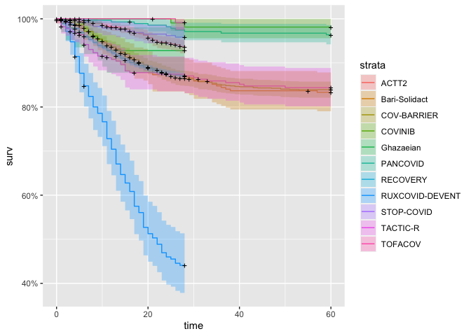
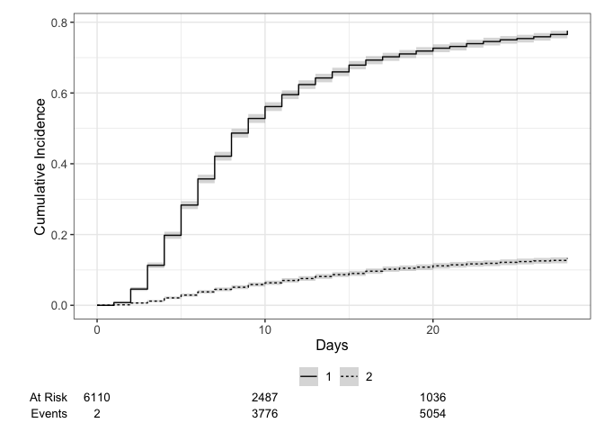

# Load packages

```r
library(tidyverse)
library(readxl)
library(writexl)
library(tableone)
library(here)
library(kableExtra)

library(jtools) # for summ() and plot_summs
library(sjPlot) # for tab_model
library(ggplot2) # survival/TTE analyses and other graphs
library(ggsurvfit) # survival/TTE analyses
library(survival) # survival/TTE analyses
library(gtsummary) # survival/TTE analyses
library(ggfortify) # autoplot
library(lme4) # glmer / clmm
library(sjPlot) # for tab_model
library(glmmTMB) # to specify estimation method explicitly -> i.e. ML
library(coxme) # for mixed-effects cox model
library(ordinal) # for ordinal regression, clm (fixed effects) & clmm (mixed effects)
library(tidycmprsk) # competing risk analysis
library(logistf) # Firth regression in case of rare events

library(meta)
library(forestplot)
library(metafor) #forest()
```

# Load standardized dataset of all trials

```r
## barisolidact
df_barisolidact <- readRDS("df_os_barisolidact.RData")
df_barisolidact <- df_barisolidact %>% 
    select(id_pat, trial, JAKi, trt, sex, age, ethn, country, icu, sympdur, vacc, clinstatus_baseline, vbaseline,
         comed_dexa, comed_rdv, comed_toci, comed_ab, comed_acoa, comed_interferon, comed_other,
         comed_cat,
         comorb_lung, comorb_liver, comorb_cvd, comorb_aht, comorb_dm, comorb_obese, comorb_smoker, immunosupp,
         comorb_autoimm, comorb_cancer, comorb_kidney, any_comorb, comorb_cat, comorb_count,
         crp, sero, vl_baseline, variant,
         mort_28, mort_28_dimp, mort_60, death_reached, death_time,
         new_mv_28, new_mvd_28,
         clinstatus_28_imp,
         discharge_reached, discharge_time, discharge_time_sens, discharge_reached_sus, discharge_time_sus,
         ae_28, ae_28_sev,
         vir_clear_5, vir_clear_10, vir_clear_15)
## actt2
df_actt2 <- readRDS("df_os_actt2.RData")
df_actt2 <- df_actt2 %>% 
    select(id_pat, trial, JAKi, trt, sex, age, ethn, country, icu, sympdur, vacc, clinstatus_baseline, vbaseline,
         comed_dexa, comed_rdv, comed_toci, comed_ab, comed_acoa, comed_interferon, comed_other,
         comed_cat,
         comorb_lung, comorb_liver, comorb_cvd, comorb_aht, comorb_dm, comorb_obese, comorb_smoker, immunosupp,
         comorb_autoimm, comorb_cancer, comorb_kidney, any_comorb, comorb_cat, comorb_count,
         crp, sero, vl_baseline, variant,
         mort_28, mort_28_dimp, mort_60, death_reached, death_time,
         new_mv_28, new_mvd_28,
         clinstatus_28_imp,
         discharge_reached, discharge_time, discharge_time_sens, discharge_reached_sus, discharge_time_sus,
         ae_28, ae_28_sev,
         vir_clear_5, vir_clear_10, vir_clear_15)
## ghazaeian
df_ghazaeian <- readRDS("df_os_ghazaeian.RData")
df_ghazaeian <- df_ghazaeian %>% 
    select(id_pat, trial, JAKi, trt, sex, age, ethn, country, icu, sympdur, vacc, clinstatus_baseline, vbaseline,
         comed_dexa, comed_rdv, comed_toci, comed_ab, comed_acoa, comed_interferon, comed_other,
         comed_cat,
         comorb_lung, comorb_liver, comorb_cvd, comorb_aht, comorb_dm, comorb_obese, comorb_smoker, immunosupp,
         comorb_autoimm, comorb_cancer, comorb_kidney, any_comorb, comorb_cat, comorb_count,
         crp, sero, vl_baseline, variant,
         mort_28, mort_28_dimp, mort_60, death_reached, death_time,
         new_mv_28, new_mvd_28,
         clinstatus_28_imp,
         discharge_reached, discharge_time, discharge_time_sens, discharge_reached_sus, discharge_time_sus,
         ae_28, ae_28_sev,
         vir_clear_5, vir_clear_10, vir_clear_15)
## tofacov
df_tofacov <- readRDS("df_os_tofacov.RData")
df_tofacov <- df_tofacov %>% 
    select(id_pat, trial, JAKi, trt, sex, age, ethn, country, icu, sympdur, vacc, clinstatus_baseline, vbaseline,
         comed_dexa, comed_rdv, comed_toci, comed_ab, comed_acoa, comed_interferon, comed_other,
         comed_cat,
         comorb_lung, comorb_liver, comorb_cvd, comorb_aht, comorb_dm, comorb_obese, comorb_smoker, immunosupp,
         comorb_autoimm, comorb_cancer, comorb_kidney, any_comorb, comorb_cat, comorb_count,
         crp, sero, vl_baseline, variant,
         mort_28, mort_28_dimp, mort_60, death_reached, death_time,
         new_mv_28, new_mvd_28,
         clinstatus_28_imp,
         discharge_reached, discharge_time, discharge_time_sens, discharge_reached_sus, discharge_time_sus,
         ae_28, ae_28_sev,
         vir_clear_5, vir_clear_10, vir_clear_15)
## covinib
df_covinib <- readRDS("df_os_covinib.RData")
df_covinib <- df_covinib %>% 
    select(id_pat, trial, JAKi, trt, sex, age, ethn, country, icu, sympdur, vacc, clinstatus_baseline, vbaseline,
         comed_dexa, comed_rdv, comed_toci, comed_ab, comed_acoa, comed_interferon, comed_other,
         comed_cat,
         comorb_lung, comorb_liver, comorb_cvd, comorb_aht, comorb_dm, comorb_obese, comorb_smoker, immunosupp,
         comorb_autoimm, comorb_cancer, comorb_kidney, any_comorb, comorb_cat, comorb_count,
         crp, sero, vl_baseline, variant,
         mort_28, mort_28_dimp, mort_60, death_reached, death_time,
         new_mv_28, new_mvd_28,
         clinstatus_28_imp,
         discharge_reached, discharge_time, discharge_time_sens, discharge_reached_sus, discharge_time_sus,
         ae_28, ae_28_sev,
         vir_clear_5, vir_clear_10, vir_clear_15)
## COV-BARRIER
df_covbarrier <- readRDS("df_os_cov-barrier.RData")
df_covbarrier <- df_covbarrier %>% 
    select(id_pat, trial, JAKi, trt, sex, age, ethn, country, icu, sympdur, vacc, clinstatus_baseline, vbaseline,
         comed_dexa, comed_rdv, comed_toci, comed_ab, comed_acoa, comed_interferon, comed_other,
         comed_cat,
         comorb_lung, comorb_liver, comorb_cvd, comorb_aht, comorb_dm, comorb_obese, comorb_smoker, immunosupp,
         comorb_autoimm, comorb_cancer, comorb_kidney, any_comorb, comorb_cat, comorb_count,
         crp, sero, vl_baseline, variant,
         mort_28, mort_28_dimp, mort_60, death_reached, death_time,
         new_mv_28, new_mvd_28,
         clinstatus_28_imp,
         discharge_reached, discharge_time, discharge_time_sens, discharge_reached_sus, discharge_time_sus,
         ae_28, ae_28_sev,
         vir_clear_5, vir_clear_10, vir_clear_15)
## Murugesan
df_murugesan <- readRDS("df_os_murugesan.RData")
df_murugesan <- df_murugesan %>% 
    select(id_pat, trial, JAKi, trt, sex, age, ethn, country, icu, sympdur, vacc, clinstatus_baseline, vbaseline,
         comed_dexa, comed_rdv, comed_toci, comed_ab, comed_acoa, comed_interferon, comed_other,
         comed_cat,
         comorb_lung, comorb_liver, comorb_cvd, comorb_aht, comorb_dm, comorb_obese, comorb_smoker, immunosupp,
         comorb_autoimm, comorb_cancer, comorb_kidney, any_comorb, comorb_cat, comorb_count,
         crp, sero, vl_baseline, variant,
         mort_28, mort_28_dimp, mort_60, death_reached, death_time,
         new_mv_28, new_mvd_28,
         clinstatus_28_imp,
         discharge_reached, discharge_time, discharge_time_sens, discharge_reached_sus, discharge_time_sus,
         ae_28, ae_28_sev,
         vir_clear_5, vir_clear_10, vir_clear_15)
## RECOVERY
df_recovery <- readRDS("df_os_recovery.RData")
df_recovery <- df_recovery %>% 
    select(id_pat, trial, JAKi, trt, sex, age, ethn, country, icu, sympdur, vacc, clinstatus_baseline, vbaseline,
         comed_dexa, comed_rdv, comed_toci, comed_ab, comed_acoa, comed_interferon, comed_other,
         comed_cat,
         comorb_lung, comorb_liver, comorb_cvd, comorb_aht, comorb_dm, comorb_obese, comorb_smoker, immunosupp,
         comorb_autoimm, comorb_cancer, comorb_kidney, any_comorb, comorb_cat, comorb_count,
         crp, sero, vl_baseline, variant,
         mort_28, mort_28_dimp, mort_60, death_reached, death_time,
         new_mv_28, new_mvd_28,
         clinstatus_28_imp,
         discharge_reached, discharge_time, discharge_time_sens, discharge_reached_sus, discharge_time_sus,
         ae_28, ae_28_sev,
         vir_clear_5, vir_clear_10, vir_clear_15)

# append
df_tot <- rbind(df_barisolidact, df_actt2, df_ghazaeian, df_tofacov, df_covinib, df_covbarrier, df_recovery)
df_tot_Muru <- rbind(df_barisolidact, df_actt2, df_ghazaeian, df_tofacov, df_covinib, df_covbarrier, df_murugesan, df_recovery)

# Save
saveRDS(df_tot, file = "df_tot.RData")
write_xlsx(df_tot, path = "df_tot.xlsx")
saveRDS(df_tot_Muru, file = "df_tot_Muru.RData")
```


# (i) Primary outcome: Mortality at day 28

```r
addmargins(table(df_tot$trial, df_tot$mort_28, useNA = "always"))
```

```
##                
##                     0     1  <NA>   Sum
##   ACTT2           925    61    47  1033
##   Bari-Solidact   241    36    12   289
##   COV-BARRIER    1312   211   103  1626
##   COVINIB         105     2     3   110
##   Ghazaeian        90     7     0    97
##   RECOVERY       6966  1061   130  8157
##   TOFACOV         115     1     0   116
##   <NA>              0     0     0     0
##   Sum            9754  1379   295 11428
```

```r
addmargins(table(df_tot$mort_28, df_tot$trt, useNA = "always"))
```

```
##       
##            0     1  <NA>   Sum
##   0     4774  4980     0  9754
##   1      739   640     0  1379
##   <NA>   132   163     0   295
##   Sum   5645  5783     0 11428
```

```r
# table(df_tot$age, df_tot$trt, useNA = "always")
table(df_tot$clinstatus_baseline, df_tot$trt, useNA = "always")
```

```
##       
##           0    1 <NA>
##   1       0    0    0
##   2     443  412    0
##   3    3618 3682    0
##   4    1333 1429    0
##   5     246  258    0
##   6       0    0    0
##   <NA>    5    2    0
```

```r
table(df_tot$clinstatus_baseline, df_tot$trial, useNA = "always")
```

```
##       
##        ACTT2 Bari-Solidact COV-BARRIER COVINIB Ghazaeian RECOVERY TOFACOV <NA>
##   1        0             0           0       0         0        0       0    0
##   2      142             0         186      35         2      465      25    0
##   3      564             0         962      75        95     5513      91    0
##   4      216           249         370       0         0     1927       0    0
##   5      111            40         101       0         0      252       0    0
##   6        0             0           0       0         0        0       0    0
##   <NA>     0             0           7       0         0        0       0    0
```

```r
table(df_tot$vbaseline, df_tot$trial, useNA = "always")
```

```
##       
##        ACTT2 Bari-Solidact COV-BARRIER COVINIB Ghazaeian RECOVERY TOFACOV <NA>
##   0      706             0        1148     110        97     5978     116    0
##   1      327           289         471       0         0     2179       0    0
##   <NA>     0             0           7       0         0        0       0    0
```

```r
# reformatting
df_tot$trt_f <- as.factor(df_tot$trt)
df_tot$trial_f <- as.factor(df_tot$trial)
df_tot$clinstatus_baseline_n <- as.numeric(df_tot$clinstatus_baseline)
df_tot <- df_tot %>%
  mutate(trial_n = case_when(trial == "Bari-Solidact" ~ 1,
                             trial == "ACTT2" ~ 2,
                             trial == "Ghazaeian" ~ 3,
                             trial == "TOFACOV" ~ 4,
                             trial == "COVINIB" ~ 5,
                             trial == "COV-BARRIER" ~ 6,
                             trial == "RECOVERY" ~ 7,
                             # trial == "Murugesan" ~ 8
                             ))
table(df_tot$trial_n, useNA = "always")
```

```
## 
##    1    2    3    4    5    6    7 <NA> 
##  289 1033   97  116  110 1626 8157    0
```

GOAL: random treatment effect, stratified trial intercept, stratified prognostic factors, AND centering the treatment variable by the proportion treated in the trial (to improve the estimation of between-study variance) AND maximum likelihood (ML) estimator (due to small trials with rare events). REML is default in glmer, for ML use glmmTMB. See notes.

### (1) common treatment effect, random trial intercept, common prognostic factors

```r
# (1) common treatment effect, random trial intercept, common prognostic factors, ML
mort28.ctreat.rtrial.ml <- glmmTMB(mort_28 ~ trt + (1|trial)
                              + age + clinstatus_baseline
                              , data = df_tot, family = binomial)
tab_model(mort28.ctreat.rtrial.ml)
```

<table style="border-collapse:collapse; border:none;">
<tr>
<th style="border-top: double; text-align:center; font-style:normal; font-weight:bold; padding:0.2cm;  text-align:left; ">&nbsp;</th>
<th colspan="3" style="border-top: double; text-align:center; font-style:normal; font-weight:bold; padding:0.2cm; ">mort 28</th>
</tr>
<tr>
<td style=" text-align:center; border-bottom:1px solid; font-style:italic; font-weight:normal;  text-align:left; ">Predictors</td>
<td style=" text-align:center; border-bottom:1px solid; font-style:italic; font-weight:normal;  ">Odds Ratios</td>
<td style=" text-align:center; border-bottom:1px solid; font-style:italic; font-weight:normal;  ">CI</td>
<td style=" text-align:center; border-bottom:1px solid; font-style:italic; font-weight:normal;  ">p</td>
</tr>
<tr>
<td style=" padding:0.2cm; text-align:left; vertical-align:top; text-align:left; ">(Intercept)</td>
<td style=" padding:0.2cm; text-align:left; vertical-align:top; text-align:center;  ">0.00</td>
<td style=" padding:0.2cm; text-align:left; vertical-align:top; text-align:center;  ">0.00&nbsp;&ndash;&nbsp;0.00</td>
<td style=" padding:0.2cm; text-align:left; vertical-align:top; text-align:center;  "><strong>&lt;0.001</strong></td>
</tr>
<tr>
<td style=" padding:0.2cm; text-align:left; vertical-align:top; text-align:left; ">Trial treatment group</td>
<td style=" padding:0.2cm; text-align:left; vertical-align:top; text-align:center;  ">0.75</td>
<td style=" padding:0.2cm; text-align:left; vertical-align:top; text-align:center;  ">0.67&nbsp;&ndash;&nbsp;0.85</td>
<td style=" padding:0.2cm; text-align:left; vertical-align:top; text-align:center;  "><strong>&lt;0.001</strong></td>
</tr>
<tr>
<td style=" padding:0.2cm; text-align:left; vertical-align:top; text-align:left; ">Age(years)</td>
<td style=" padding:0.2cm; text-align:left; vertical-align:top; text-align:center;  ">1.08</td>
<td style=" padding:0.2cm; text-align:left; vertical-align:top; text-align:center;  ">1.07&nbsp;&ndash;&nbsp;1.08</td>
<td style=" padding:0.2cm; text-align:left; vertical-align:top; text-align:center;  "><strong>&lt;0.001</strong></td>
</tr>
<tr>
<td style=" padding:0.2cm; text-align:left; vertical-align:top; text-align:left; ">clinstatus baseline:<br>clinstatus baseline 3</td>
<td style=" padding:0.2cm; text-align:left; vertical-align:top; text-align:center;  ">2.18</td>
<td style=" padding:0.2cm; text-align:left; vertical-align:top; text-align:center;  ">1.54&nbsp;&ndash;&nbsp;3.09</td>
<td style=" padding:0.2cm; text-align:left; vertical-align:top; text-align:center;  "><strong>&lt;0.001</strong></td>
</tr>
<tr>
<td style=" padding:0.2cm; text-align:left; vertical-align:top; text-align:left; ">clinstatus baseline:<br>clinstatus baseline 4</td>
<td style=" padding:0.2cm; text-align:left; vertical-align:top; text-align:center;  ">7.83</td>
<td style=" padding:0.2cm; text-align:left; vertical-align:top; text-align:center;  ">5.49&nbsp;&ndash;&nbsp;11.16</td>
<td style=" padding:0.2cm; text-align:left; vertical-align:top; text-align:center;  "><strong>&lt;0.001</strong></td>
</tr>
<tr>
<td style=" padding:0.2cm; text-align:left; vertical-align:top; text-align:left; ">clinstatus baseline:<br>clinstatus baseline 5</td>
<td style=" padding:0.2cm; text-align:left; vertical-align:top; text-align:center;  ">24.80</td>
<td style=" padding:0.2cm; text-align:left; vertical-align:top; text-align:center;  ">16.53&nbsp;&ndash;&nbsp;37.20</td>
<td style=" padding:0.2cm; text-align:left; vertical-align:top; text-align:center;  "><strong>&lt;0.001</strong></td>
</tr>
<tr>
<td colspan="4" style="font-weight:bold; text-align:left; padding-top:.8em;">Random Effects</td>
</tr>

<tr>
<td style=" padding:0.2cm; text-align:left; vertical-align:top; text-align:left; padding-top:0.1cm; padding-bottom:0.1cm;">&sigma;<sup>2</sup></td>
<td style=" padding:0.2cm; text-align:left; vertical-align:top; padding-top:0.1cm; padding-bottom:0.1cm; text-align:left;" colspan="3">3.29</td>
</tr>

<tr>
<td style=" padding:0.2cm; text-align:left; vertical-align:top; text-align:left; padding-top:0.1cm; padding-bottom:0.1cm;">&tau;<sub>00</sub> <sub>trial</sub></td>
<td style=" padding:0.2cm; text-align:left; vertical-align:top; padding-top:0.1cm; padding-bottom:0.1cm; text-align:left;" colspan="3">0.34</td>

<tr>
<td style=" padding:0.2cm; text-align:left; vertical-align:top; text-align:left; padding-top:0.1cm; padding-bottom:0.1cm;">ICC</td>
<td style=" padding:0.2cm; text-align:left; vertical-align:top; padding-top:0.1cm; padding-bottom:0.1cm; text-align:left;" colspan="3">0.09</td>

<tr>
<td style=" padding:0.2cm; text-align:left; vertical-align:top; text-align:left; padding-top:0.1cm; padding-bottom:0.1cm;">N <sub>trial</sub></td>
<td style=" padding:0.2cm; text-align:left; vertical-align:top; padding-top:0.1cm; padding-bottom:0.1cm; text-align:left;" colspan="3">7</td>
<tr>
<td style=" padding:0.2cm; text-align:left; vertical-align:top; text-align:left; padding-top:0.1cm; padding-bottom:0.1cm; border-top:1px solid;">Observations</td>
<td style=" padding:0.2cm; text-align:left; vertical-align:top; padding-top:0.1cm; padding-bottom:0.1cm; text-align:left; border-top:1px solid;" colspan="3">11133</td>
</tr>
<tr>
<td style=" padding:0.2cm; text-align:left; vertical-align:top; text-align:left; padding-top:0.1cm; padding-bottom:0.1cm;">Marginal R<sup>2</sup> / Conditional R<sup>2</sup></td>
<td style=" padding:0.2cm; text-align:left; vertical-align:top; padding-top:0.1cm; padding-bottom:0.1cm; text-align:left;" colspan="3">0.341 / 0.403</td>
</tr>

</table>

```r
mort28.ctreat.rtrial.ml.vb <- glmmTMB(mort_28 ~ trt + (1|trial)
                              + age + vbaseline
                              , data = df_tot, family = binomial)
# tab_model(mort28.ctreat.rtrial.ml.vb)
```

### (2) random treatment effect, random trial intercept, common prognostic factors and residual variances

```r
# (3) random treatment effect, random trial intercept, common prognostic factors and residual variances, ML
mort28.rtreat.rtrial.ml <- glmmTMB(mort_28 ~ trt + (1 + trt|trial_f)
                              + age + clinstatus_baseline
                              , data = df_tot, family = binomial)
# tab_model(mort28.rtreat.rtrial.ml)

mort28.rtreat.rtrial.ml.vb <- glmmTMB(mort_28 ~ trt + (1 + trt|trial_f)
                              + age + vbaseline
                              , data = df_tot, family = binomial)
# tab_model(mort28.rtreat.rtrial.ml.vb)
```

### (3) random treatment effect, stratified trial intercept, common prognostic factors and residual variances

```r
# (2) random treatment effect, stratified trial intercept, common prognostic factors and residual variances, and WITHOUT centering the treatment variable, ML
mort28.rtreat.strial.ml <- glmmTMB(mort_28 ~ trt_f + trial_f + (trt - 1 | trial_f)
                              + age + clinstatus_baseline
                              , data = df_tot, family = binomial)
# tab_model(mort28.rtreat.strial.ml)

mort28.rtreat.strial.ml.vb <- glmmTMB(mort_28 ~ trt_f + trial_f + (trt - 1 | trial_f)
                              + age + vbaseline 
                              , data = df_tot, family = binomial)
# tab_model(mort28.rtreat.strial.ml.vb)

# The - 1 within (trt - 1 | trial_n) specifies that there is no random intercept for the grouping factor trial_n. We're specifying random slopes for the variable trt within each level of trial_n, i.e., the effect may vary from one trial to another. Together with trial_f, this gives the stratified intercept model. This is a more flexible model compared to a model with a random intercept, which assumes a common baseline for all groups.

# dummy variable for each trial (trial_1, trial_2, trial_3, etc - e.g. where trial_1 = 1 if in trial 1 and 0 otherwise)
# df_tot <- df_tot %>%
#   mutate(trial_1 = case_when(trial == "Bari-Solidact" ~ 1, TRUE ~ 0),
#          trial_2 = case_when(trial == "ACTT2" ~ 1, TRUE ~ 0),
#          trial_3 = case_when(trial == "Ghazaeian" ~ 1, TRUE ~ 0),
#          trial_4 = case_when(trial == "TOFACOV" ~ 1, TRUE ~ 0),
#          trial_5 = case_when(trial == "COVINIB" ~ 1, TRUE ~ 0),
#          trial_6 = case_when(trial == "COV-BARRIER" ~ 1, TRUE ~ 0),
#          trial_7 = case_when(trial == "RECOVERY" ~ 1, TRUE ~ 0))

## Use "Stata syntax":
# mort28.rtreat.strial.2 <- glmer(mort_28 ~ trt_f + trial* + (trt -1 | trial_n)
#                               + age + clinstatus_baseline_n
#                               # + comed_dexa + comed_rdv + comed_toci
#                               , data = df_tot, family = binomial)
# tab_model(mort28.rtreat.strial.2)
```

### (4) random treatment effect, stratified trial intercept, common prognostic factors and residual variances, AND centering the treatment variable

```r
# (4) random treatment effect, stratified trial intercept, common prognostic factors and residual variances, ML, but WITH centering the treatment variable

# calculate the proportion treated by trial
proportions <- df_tot %>%
  group_by(trial) %>%
  summarize(proportion_treated = sum(trt) / n())
df_tot <- left_join(df_tot, proportions[, c("proportion_treated", "trial")], by = join_by(trial == trial))
# table(df_tot$trial, df_tot$proportion_treated)

# create the centered treatment variable
df_tot$trt_centered_n <- df_tot$trt - df_tot$proportion_treated
df_tot$trt_centered_f <- as.factor(df_tot$trt_centered_n)
# table(df_tot$trial, df_tot$trt_centered_f) ## keep it minus?

# build the model. '-1' indicating there is no overall random intercept.
mort28.rtreat.strial.cent.ml <- glmmTMB(mort_28 ~ trt_centered_n + trial_f + (trt_centered_n -1 | trial_f) -1
                   + age + clinstatus_baseline
                   , data = df_tot, family = binomial
                   )
# tab_model(mort28.rtreat.strial.cent.ml)

mort28.rtreat.strial.cent.ml.vb <- glmmTMB(mort_28 ~ trt_centered_n + trial_f + (trt_centered_n -1 | trial_f) -1 
                   + age + vbaseline 
                   , data = df_tot, family = binomial
                   )
# tab_model(mort28.rtreat.strial.cent.ml.vb)
```

### (5) random treatment effect, stratified trial intercept, stratified prognostic factors and residual variances, with centering the treatment variable AND the prognostic variables

```r
# "Our default recommendation is to use stratified prognostic effects (i.e. estimate a separate effect of each included prognostic factor for each trial), with trial-specific centering of each prognostic factor to improve ML estimation (for the reasons explained in Section 6.2.8.3). However, if outcome data or prognostic factor categories are sparse, the stratification approach may lead to estimation difficulties, and then allowing prognostic factor effects to be random is a sensible alternative." (p. 145) Centering disentangles (i.e. makes uncorrelated) the estimation of main parameters of interest from other nuisance parameters, which leads to less downward bias in estimates of variance parameters (Figure 6.2) and thus improves coverage of 95% confidence intervals. This can be achieved by centering the covariates by their mean values within trials, such that the interaction estimate is then only based on within-trial information.

# Calculate the mean values of (continuous) prognostic factors within each trial
trial_means <- df_tot %>%
  group_by(trial) %>%
  summarize(mean_age = mean(age, na.rm = TRUE), mean_clinstatus = mean(clinstatus_baseline_n, na.rm = TRUE))
# Merge back
df_tot <- df_tot %>% left_join(trial_means, by = "trial")
# Center the age and clinstatus_baseline variables
df_tot <- df_tot %>%
  mutate(age_centered = age - mean_age, 
         clinstatus_baseline_centered = clinstatus_baseline_n - mean_clinstatus)

# df_tot %>%
#   select(trial_f, trial_n, trt, trt_centered_n, age, mean_age, age_centered, clinstatus_baseline_n, mean_clinstatus, clinstatus_baseline_centered, mort_28) %>%
#   View()


### Add the prognostic factors stratified, i.e. create stratified variables for each prognostic factor
## uncentered
df_tot <- df_tot %>%
  mutate(age_trial_1 = case_when(trial == "Bari-Solidact" ~ age, TRUE ~ 0),
         age_trial_2 = case_when(trial == "ACTT2" ~ age, TRUE ~ 0),
         age_trial_3 = case_when(trial == "Ghazaeian" ~ age, TRUE ~ 0),
         age_trial_4 = case_when(trial == "TOFACOV" ~ age, TRUE ~ 0),
         age_trial_5 = case_when(trial == "COVINIB" ~ age, TRUE ~ 0),
         age_trial_6 = case_when(trial == "COV-BARRIER" ~ age, TRUE ~ 0),
         age_trial_7 = case_when(trial == "RECOVERY" ~ age, TRUE ~ 0))
df_tot <- df_tot %>%
  mutate(clinstat_trial_1 = case_when(trial == "Bari-Solidact" ~ clinstatus_baseline, TRUE ~ "0"),
         clinstat_trial_2 = case_when(trial == "ACTT2" ~ clinstatus_baseline, TRUE ~ "0"),
         clinstat_trial_3 = case_when(trial == "Ghazaeian" ~ clinstatus_baseline, TRUE ~ "0"),
         clinstat_trial_4 = case_when(trial == "TOFACOV" ~ clinstatus_baseline, TRUE ~ "0"),
         clinstat_trial_5 = case_when(trial == "COVINIB" ~ clinstatus_baseline, TRUE ~ "0"),
         clinstat_trial_6 = case_when(trial == "COV-BARRIER" ~ clinstatus_baseline, TRUE ~ "0"),
         clinstat_trial_7 = case_when(trial == "RECOVERY" ~ clinstatus_baseline, TRUE ~ "0"))

## centered
df_tot <- df_tot %>%
  mutate(age_cent_trial_1 = case_when(trial == "Bari-Solidact" ~ age_centered, TRUE ~ 0),
         age_cent_trial_2 = case_when(trial == "ACTT2" ~ age_centered, TRUE ~ 0),
         age_cent_trial_3 = case_when(trial == "Ghazaeian" ~ age_centered, TRUE ~ 0),
         age_cent_trial_4 = case_when(trial == "TOFACOV" ~ age_centered, TRUE ~ 0),
         age_cent_trial_5 = case_when(trial == "COVINIB" ~ age_centered, TRUE ~ 0),
         age_cent_trial_6 = case_when(trial == "COV-BARRIER" ~ age_centered, TRUE ~ 0),
         age_cent_trial_7 = case_when(trial == "RECOVERY" ~ age_centered, TRUE ~ 0))
df_tot <- df_tot %>%
  mutate(clinstat_cent_trial_1 = case_when(trial == "Bari-Solidact" ~ clinstatus_baseline_centered, TRUE ~ 0),
         clinstat_cent_trial_2 = case_when(trial == "ACTT2" ~ clinstatus_baseline_centered, TRUE ~ 0),
         clinstat_cent_trial_3 = case_when(trial == "Ghazaeian" ~ clinstatus_baseline_centered, TRUE ~ 0),
         clinstat_cent_trial_4 = case_when(trial == "TOFACOV" ~ clinstatus_baseline_centered, TRUE ~ 0),
         clinstat_cent_trial_5 = case_when(trial == "COVINIB" ~ clinstatus_baseline_centered, TRUE ~ 0),
         clinstat_cent_trial_6 = case_when(trial == "COV-BARRIER" ~ clinstatus_baseline_centered, TRUE ~ 0),
         clinstat_cent_trial_7 = case_when(trial == "RECOVERY" ~ clinstatus_baseline_centered, TRUE ~ 0))

# df_tot %>%
#   select(trial_f, trial_n, trt, trt_centered_n, age, mean_age, age_centered, clinstatus_baseline_n, mean_clinstatus, clinstatus_baseline_centered, mort_28,
#          age_trial_1, age_cent_trial_1, age_trial_5, age_cent_trial_5, age_trial_6, age_cent_trial_6, clinstat_trial_1, clinstat_cent_trial_1, clinstat_trial_5, clinstat_cent_trial_5, clinstat_trial_6, clinstat_cent_trial_6,
#          ) %>%
#   View()


# (5) random treatment effect, stratified trial intercept, stratified prognostic factors and residual variances, with centering of the treatment variable AND the prognostic factors

mort28.rtreat.strial.cent.ml.spf.cent <- glmmTMB(mort_28 ~ trt_centered_n
                                                 + trial_f
                                                 + (trt_centered_n -1 | trial_f) -1
                                                 + age_cent_trial_1 + age_cent_trial_2 + age_cent_trial_3 + age_cent_trial_4
                                                 + age_cent_trial_5 + age_cent_trial_6 + age_cent_trial_7
                                                 + clinstat_cent_trial_1 + clinstat_cent_trial_2 + clinstat_cent_trial_3
                                                 + clinstat_cent_trial_4 + clinstat_cent_trial_5 + clinstat_cent_trial_6 + clinstat_cent_trial_7
                                                 , data = df_tot, family = binomial)
tab_model(mort28.rtreat.strial.cent.ml.spf.cent)
```

<table style="border-collapse:collapse; border:none;">
<tr>
<th style="border-top: double; text-align:center; font-style:normal; font-weight:bold; padding:0.2cm;  text-align:left; ">&nbsp;</th>
<th colspan="3" style="border-top: double; text-align:center; font-style:normal; font-weight:bold; padding:0.2cm; ">mort 28</th>
</tr>
<tr>
<td style=" text-align:center; border-bottom:1px solid; font-style:italic; font-weight:normal;  text-align:left; ">Predictors</td>
<td style=" text-align:center; border-bottom:1px solid; font-style:italic; font-weight:normal;  ">Odds Ratios</td>
<td style=" text-align:center; border-bottom:1px solid; font-style:italic; font-weight:normal;  ">CI</td>
<td style=" text-align:center; border-bottom:1px solid; font-style:italic; font-weight:normal;  ">p</td>
</tr>
<tr>
<td style=" padding:0.2cm; text-align:left; vertical-align:top; text-align:left; ">Trial treatment group</td>
<td style=" padding:0.2cm; text-align:left; vertical-align:top; text-align:center;  ">0.69</td>
<td style=" padding:0.2cm; text-align:left; vertical-align:top; text-align:center;  ">0.54&nbsp;&ndash;&nbsp;0.88</td>
<td style=" padding:0.2cm; text-align:left; vertical-align:top; text-align:center;  "><strong>0.003</strong></td>
</tr>
<tr>
<td style=" padding:0.2cm; text-align:left; vertical-align:top; text-align:left; ">trial f: ACTT 2</td>
<td style=" padding:0.2cm; text-align:left; vertical-align:top; text-align:center;  ">0.03</td>
<td style=" padding:0.2cm; text-align:left; vertical-align:top; text-align:center;  ">0.02&nbsp;&ndash;&nbsp;0.05</td>
<td style=" padding:0.2cm; text-align:left; vertical-align:top; text-align:center;  "><strong>&lt;0.001</strong></td>
</tr>
<tr>
<td style=" padding:0.2cm; text-align:left; vertical-align:top; text-align:left; ">trial f: Bari-Solidact</td>
<td style=" padding:0.2cm; text-align:left; vertical-align:top; text-align:center;  ">0.09</td>
<td style=" padding:0.2cm; text-align:left; vertical-align:top; text-align:center;  ">0.05&nbsp;&ndash;&nbsp;0.15</td>
<td style=" padding:0.2cm; text-align:left; vertical-align:top; text-align:center;  "><strong>&lt;0.001</strong></td>
</tr>
<tr>
<td style=" padding:0.2cm; text-align:left; vertical-align:top; text-align:left; ">trial f: COV-BARRIER</td>
<td style=" padding:0.2cm; text-align:left; vertical-align:top; text-align:center;  ">0.09</td>
<td style=" padding:0.2cm; text-align:left; vertical-align:top; text-align:center;  ">0.07&nbsp;&ndash;&nbsp;0.11</td>
<td style=" padding:0.2cm; text-align:left; vertical-align:top; text-align:center;  "><strong>&lt;0.001</strong></td>
</tr>
<tr>
<td style=" padding:0.2cm; text-align:left; vertical-align:top; text-align:left; ">trial f: COVINIB</td>
<td style=" padding:0.2cm; text-align:left; vertical-align:top; text-align:center;  ">0.00</td>
<td style=" padding:0.2cm; text-align:left; vertical-align:top; text-align:center;  ">0.00&nbsp;&ndash;&nbsp;Inf</td>
<td style=" padding:0.2cm; text-align:left; vertical-align:top; text-align:center;  ">0.999</td>
</tr>
<tr>
<td style=" padding:0.2cm; text-align:left; vertical-align:top; text-align:left; ">trial f: Ghazaeian</td>
<td style=" padding:0.2cm; text-align:left; vertical-align:top; text-align:center;  ">0.06</td>
<td style=" padding:0.2cm; text-align:left; vertical-align:top; text-align:center;  ">0.00&nbsp;&ndash;&nbsp;1722386035604166699252711424.00</td>
<td style=" padding:0.2cm; text-align:left; vertical-align:top; text-align:center;  ">0.931</td>
</tr>
<tr>
<td style=" padding:0.2cm; text-align:left; vertical-align:top; text-align:left; ">trial f: RECOVERY</td>
<td style=" padding:0.2cm; text-align:left; vertical-align:top; text-align:center;  ">0.09</td>
<td style=" padding:0.2cm; text-align:left; vertical-align:top; text-align:center;  ">0.08&nbsp;&ndash;&nbsp;0.09</td>
<td style=" padding:0.2cm; text-align:left; vertical-align:top; text-align:center;  "><strong>&lt;0.001</strong></td>
</tr>
<tr>
<td style=" padding:0.2cm; text-align:left; vertical-align:top; text-align:left; ">trial f: TOFACOV</td>
<td style=" padding:0.2cm; text-align:left; vertical-align:top; text-align:center;  ">0.00</td>
<td style=" padding:0.2cm; text-align:left; vertical-align:top; text-align:center;  ">0.00&nbsp;&ndash;&nbsp;Inf</td>
<td style=" padding:0.2cm; text-align:left; vertical-align:top; text-align:center;  ">0.994</td>
</tr>
<tr>
<td style=" padding:0.2cm; text-align:left; vertical-align:top; text-align:left; ">age cent trial 1</td>
<td style=" padding:0.2cm; text-align:left; vertical-align:top; text-align:center;  ">1.09</td>
<td style=" padding:0.2cm; text-align:left; vertical-align:top; text-align:center;  ">1.05&nbsp;&ndash;&nbsp;1.13</td>
<td style=" padding:0.2cm; text-align:left; vertical-align:top; text-align:center;  "><strong>&lt;0.001</strong></td>
</tr>
<tr>
<td style=" padding:0.2cm; text-align:left; vertical-align:top; text-align:left; ">age cent trial 2</td>
<td style=" padding:0.2cm; text-align:left; vertical-align:top; text-align:center;  ">1.06</td>
<td style=" padding:0.2cm; text-align:left; vertical-align:top; text-align:center;  ">1.03&nbsp;&ndash;&nbsp;1.08</td>
<td style=" padding:0.2cm; text-align:left; vertical-align:top; text-align:center;  "><strong>&lt;0.001</strong></td>
</tr>
<tr>
<td style=" padding:0.2cm; text-align:left; vertical-align:top; text-align:left; ">age cent trial 3</td>
<td style=" padding:0.2cm; text-align:left; vertical-align:top; text-align:center;  ">1.03</td>
<td style=" padding:0.2cm; text-align:left; vertical-align:top; text-align:center;  ">0.98&nbsp;&ndash;&nbsp;1.08</td>
<td style=" padding:0.2cm; text-align:left; vertical-align:top; text-align:center;  ">0.277</td>
</tr>
<tr>
<td style=" padding:0.2cm; text-align:left; vertical-align:top; text-align:left; ">age cent trial 4</td>
<td style=" padding:0.2cm; text-align:left; vertical-align:top; text-align:center;  ">1.06</td>
<td style=" padding:0.2cm; text-align:left; vertical-align:top; text-align:center;  ">0.88&nbsp;&ndash;&nbsp;1.28</td>
<td style=" padding:0.2cm; text-align:left; vertical-align:top; text-align:center;  ">0.509</td>
</tr>
<tr>
<td style=" padding:0.2cm; text-align:left; vertical-align:top; text-align:left; ">age cent trial 5</td>
<td style=" padding:0.2cm; text-align:left; vertical-align:top; text-align:center;  ">1.11</td>
<td style=" padding:0.2cm; text-align:left; vertical-align:top; text-align:center;  ">0.93&nbsp;&ndash;&nbsp;1.33</td>
<td style=" padding:0.2cm; text-align:left; vertical-align:top; text-align:center;  ">0.250</td>
</tr>
<tr>
<td style=" padding:0.2cm; text-align:left; vertical-align:top; text-align:left; ">age cent trial 6</td>
<td style=" padding:0.2cm; text-align:left; vertical-align:top; text-align:center;  ">1.07</td>
<td style=" padding:0.2cm; text-align:left; vertical-align:top; text-align:center;  ">1.05&nbsp;&ndash;&nbsp;1.08</td>
<td style=" padding:0.2cm; text-align:left; vertical-align:top; text-align:center;  "><strong>&lt;0.001</strong></td>
</tr>
<tr>
<td style=" padding:0.2cm; text-align:left; vertical-align:top; text-align:left; ">age cent trial 7</td>
<td style=" padding:0.2cm; text-align:left; vertical-align:top; text-align:center;  ">1.08</td>
<td style=" padding:0.2cm; text-align:left; vertical-align:top; text-align:center;  ">1.08&nbsp;&ndash;&nbsp;1.09</td>
<td style=" padding:0.2cm; text-align:left; vertical-align:top; text-align:center;  "><strong>&lt;0.001</strong></td>
</tr>
<tr>
<td style=" padding:0.2cm; text-align:left; vertical-align:top; text-align:left; ">clinstat cent trial 1</td>
<td style=" padding:0.2cm; text-align:left; vertical-align:top; text-align:center;  ">2.43</td>
<td style=" padding:0.2cm; text-align:left; vertical-align:top; text-align:center;  ">0.97&nbsp;&ndash;&nbsp;6.07</td>
<td style=" padding:0.2cm; text-align:left; vertical-align:top; text-align:center;  ">0.057</td>
</tr>
<tr>
<td style=" padding:0.2cm; text-align:left; vertical-align:top; text-align:left; ">clinstat cent trial 2</td>
<td style=" padding:0.2cm; text-align:left; vertical-align:top; text-align:center;  ">3.43</td>
<td style=" padding:0.2cm; text-align:left; vertical-align:top; text-align:center;  ">2.47&nbsp;&ndash;&nbsp;4.76</td>
<td style=" padding:0.2cm; text-align:left; vertical-align:top; text-align:center;  "><strong>&lt;0.001</strong></td>
</tr>
<tr>
<td style=" padding:0.2cm; text-align:left; vertical-align:top; text-align:left; ">clinstat cent trial 3</td>
<td style=" padding:0.2cm; text-align:left; vertical-align:top; text-align:center;  ">481985.36</td>
<td style=" padding:0.2cm; text-align:left; vertical-align:top; text-align:center;  ">0.00&nbsp;&ndash;&nbsp;Inf</td>
<td style=" padding:0.2cm; text-align:left; vertical-align:top; text-align:center;  ">0.994</td>
</tr>
<tr>
<td style=" padding:0.2cm; text-align:left; vertical-align:top; text-align:left; ">clinstat cent trial 4</td>
<td style=" padding:0.2cm; text-align:left; vertical-align:top; text-align:center;  ">6218921.86</td>
<td style=" padding:0.2cm; text-align:left; vertical-align:top; text-align:center;  ">0.00&nbsp;&ndash;&nbsp;Inf</td>
<td style=" padding:0.2cm; text-align:left; vertical-align:top; text-align:center;  ">0.998</td>
</tr>
<tr>
<td style=" padding:0.2cm; text-align:left; vertical-align:top; text-align:left; ">clinstat cent trial 5</td>
<td style=" padding:0.2cm; text-align:left; vertical-align:top; text-align:center;  ">271699040.57</td>
<td style=" padding:0.2cm; text-align:left; vertical-align:top; text-align:center;  ">0.00&nbsp;&ndash;&nbsp;Inf</td>
<td style=" padding:0.2cm; text-align:left; vertical-align:top; text-align:center;  ">0.999</td>
</tr>
<tr>
<td style=" padding:0.2cm; text-align:left; vertical-align:top; text-align:left; ">clinstat cent trial 6</td>
<td style=" padding:0.2cm; text-align:left; vertical-align:top; text-align:center;  ">3.79</td>
<td style=" padding:0.2cm; text-align:left; vertical-align:top; text-align:center;  ">3.04&nbsp;&ndash;&nbsp;4.73</td>
<td style=" padding:0.2cm; text-align:left; vertical-align:top; text-align:center;  "><strong>&lt;0.001</strong></td>
</tr>
<tr>
<td style=" padding:0.2cm; text-align:left; vertical-align:top; text-align:left; ">clinstat cent trial 7</td>
<td style=" padding:0.2cm; text-align:left; vertical-align:top; text-align:center;  ">3.21</td>
<td style=" padding:0.2cm; text-align:left; vertical-align:top; text-align:center;  ">2.86&nbsp;&ndash;&nbsp;3.60</td>
<td style=" padding:0.2cm; text-align:left; vertical-align:top; text-align:center;  "><strong>&lt;0.001</strong></td>
</tr>
<tr>
<td colspan="4" style="font-weight:bold; text-align:left; padding-top:.8em;">Random Effects</td>
</tr>

<tr>
<td style=" padding:0.2cm; text-align:left; vertical-align:top; text-align:left; padding-top:0.1cm; padding-bottom:0.1cm;">&sigma;<sup>2</sup></td>
<td style=" padding:0.2cm; text-align:left; vertical-align:top; padding-top:0.1cm; padding-bottom:0.1cm; text-align:left;" colspan="3">3.29</td>
</tr>

<tr>
<td style=" padding:0.2cm; text-align:left; vertical-align:top; text-align:left; padding-top:0.1cm; padding-bottom:0.1cm;">&tau;<sub>00</sub></td>
<td style=" padding:0.2cm; text-align:left; vertical-align:top; padding-top:0.1cm; padding-bottom:0.1cm; text-align:left;" colspan="3">&nbsp;</td>

<tr>
<td style=" padding:0.2cm; text-align:left; vertical-align:top; text-align:left; padding-top:0.1cm; padding-bottom:0.1cm;">&tau;<sub>00</sub></td>
<td style=" padding:0.2cm; text-align:left; vertical-align:top; padding-top:0.1cm; padding-bottom:0.1cm; text-align:left;" colspan="3">&nbsp;</td>

<tr>
<td style=" padding:0.2cm; text-align:left; vertical-align:top; text-align:left; padding-top:0.1cm; padding-bottom:0.1cm;">&tau;<sub>11</sub> <sub>trial_f.trt_centered_n</sub></td>
<td style=" padding:0.2cm; text-align:left; vertical-align:top; padding-top:0.1cm; padding-bottom:0.1cm; text-align:left;" colspan="3">0.02</td>

<tr>
<td style=" padding:0.2cm; text-align:left; vertical-align:top; text-align:left; padding-top:0.1cm; padding-bottom:0.1cm;">&rho;<sub>01</sub></td>
<td style=" padding:0.2cm; text-align:left; vertical-align:top; padding-top:0.1cm; padding-bottom:0.1cm; text-align:left;" colspan="3">&nbsp;</td>

<tr>
<td style=" padding:0.2cm; text-align:left; vertical-align:top; text-align:left; padding-top:0.1cm; padding-bottom:0.1cm;">&rho;<sub>01</sub></td>
<td style=" padding:0.2cm; text-align:left; vertical-align:top; padding-top:0.1cm; padding-bottom:0.1cm; text-align:left;" colspan="3">&nbsp;</td>

<tr>
<td style=" padding:0.2cm; text-align:left; vertical-align:top; text-align:left; padding-top:0.1cm; padding-bottom:0.1cm;">ICC</td>
<td style=" padding:0.2cm; text-align:left; vertical-align:top; padding-top:0.1cm; padding-bottom:0.1cm; text-align:left;" colspan="3">0.00</td>

<tr>
<td style=" padding:0.2cm; text-align:left; vertical-align:top; text-align:left; padding-top:0.1cm; padding-bottom:0.1cm;">N <sub>trial_f</sub></td>
<td style=" padding:0.2cm; text-align:left; vertical-align:top; padding-top:0.1cm; padding-bottom:0.1cm; text-align:left;" colspan="3">7</td>
<tr>
<td style=" padding:0.2cm; text-align:left; vertical-align:top; text-align:left; padding-top:0.1cm; padding-bottom:0.1cm; border-top:1px solid;">Observations</td>
<td style=" padding:0.2cm; text-align:left; vertical-align:top; padding-top:0.1cm; padding-bottom:0.1cm; text-align:left; border-top:1px solid;" colspan="3">11133</td>
</tr>
<tr>
<td style=" padding:0.2cm; text-align:left; vertical-align:top; text-align:left; padding-top:0.1cm; padding-bottom:0.1cm;">Marginal R<sup>2</sup> / Conditional R<sup>2</sup></td>
<td style=" padding:0.2cm; text-align:left; vertical-align:top; padding-top:0.1cm; padding-bottom:0.1cm; text-align:left;" colspan="3">0.562 / 0.563</td>
</tr>

</table>

```r
# mort28.rtreat.strial.cent.ml.spf.cent <- glmmTMB(mort_28 ~ trt_centered_n
#                                                  + trial_f
#                                                  + (trt_centered_n -1 | trial_f) -1
#                                                  + age_cent_trial_1 + age_cent_trial_2 + age_cent_trial_3 + age_cent_trial_4
#                                                  + age_cent_trial_5 + age_cent_trial_6 + age_cent_trial_7
#                                                  + clinstat_trial_1 + clinstat_trial_2 + clinstat_trial_3
#                                                  + clinstat_trial_4 + clinstat_trial_5 + clinstat_trial_6 + clinstat_trial_7
#                                                  , data = df_tot, family = binomial)
# tab_model(mort28.rtreat.strial.cent.ml.spf.cent)

# Not all trials have all levels, cannot estimate a stratified clinstatus_baseline by trial. Moreover, not sure the centering of the factor variable clinstatus_baseline is ok like this. => Second best option: Add clinstatus_baseline as a random parameter

mort28.rtreat.strial.cent.ml.sage.cent.rclinstat <- glmmTMB(mort_28 ~ trt_centered_n 
                                                 + trial_f 
                                                 + (trt_centered_n -1 | trial_f) -1 
                                                 + age_cent_trial_1 + age_cent_trial_2 + age_cent_trial_3 + age_cent_trial_4 
                                                 + age_cent_trial_5 + age_cent_trial_6 + age_cent_trial_7
                                                 + (clinstatus_baseline_n -1 | trial_f)
                                                 , data = df_tot, family = binomial)
# tab_model(mort28.rtreat.strial.cent.ml.sage.cent.rclinstat) 

mort28.rtreat.strial.cent.ml.sage.cent.rvb <- glmmTMB(mort_28 ~ trt_centered_n 
                                                 + trial_f 
                                                 + (trt_centered_n -1 | trial_f) -1 
                                                 + age_cent_trial_1 + age_cent_trial_2 + age_cent_trial_3 + age_cent_trial_4 
                                                 + age_cent_trial_5 + age_cent_trial_6 + age_cent_trial_7
                                                 + (vbaseline -1 | trial_f)
                                                 , data = df_tot, family = binomial)
# tab_model(mort28.rtreat.strial.cent.ml.sage.cent.rvb) 
```
Discussion:
1. Clinstatus_baseline is a factor -> How to center a factor? By the proportion in each level? More important: Not all trials have all levels, hard to estimate a stratified clinstatus_baseline by trial => Second best option: Add clinstatus_baseline as a random parameter
2. Remember to add all TRIAL centering variables if adding new trials!
3. Investigate the point that a "one-stage random effects model" equals a "two-stage fixed effects model" (only use trials without rare event problems // double-check adjustments in two-stage)


## Collect the effect estimates from all models

```r
# Empty data frame to store the results
result_df <- data.frame(
  variable = character(),
  hazard_odds_ratio = numeric(),
  ci_lower = numeric(),
  ci_upper = numeric(),
  p_value = numeric()
)
# Function to extract treatment results from two different model types (glmer -> REML, glmmTMB -> ML)
extract_trt_results <- function(model, variable_name, n_int, n_cont) {
  if (inherits(model, "glmmTMB")) {
    coefficients_table <- summary(model)$coefficients$cond
    trt_coef <- coefficients_table[grep("^trt", rownames(coefficients_table)), "Estimate"]
    hazard_odds_ratio <- exp(trt_coef)
    ci_table <- exp(confint(model))
    ci <- ci_table[grep("^trt", rownames(ci_table)), c("2.5 %", "97.5 %")]
    p_value <- coefficients_table[grep("^trt", rownames(coefficients_table)), "Pr(>|z|)"]
  } else if (inherits(model, "glmerMod")) {
    coefficients_table <- summary(model)$coefficients
    trt_coef <- coefficients_table[grep("^trt", rownames(coefficients_table)), "Estimate"]
    hazard_odds_ratio <- exp(trt_coef)
    ci_table <- exp(confint(model))
    ci <- ci_table[grep("^trt", rownames(ci_table)), c("2.5 %", "97.5 %")]
    p_value <- coefficients_table[grep("^trt", rownames(coefficients_table)), "Pr(>|z|)"]
  } else {
    stop("Unsupported model class")
  }
  # capture the results
  result <- data.frame(
    variable = variable_name,
    hazard_odds_ratio = hazard_odds_ratio,
    ci_lower = ci[1],
    ci_upper = ci[2],
    p_value = p_value,
    n_intervention = n_int,
    n_control = n_cont
  )
  return(result)
}
# Loop through
result_list <- list()

result_list[[1]] <- extract_trt_results(mort28.ctreat.rtrial.ml, "c trt, r intercept, c age/clinstatus", addmargins(table(df_tot$mort_28, df_tot$trt))[3,2], addmargins(table(df_tot$mort_28, df_tot$trt))[3,1])
# result_list[[2]] <- extract_trt_results(mort28.ctreat.rtrial.ml.vb, "c trt, r intercept, c age/clinstatus, no cent, vb", addmargins(table(df_tot$mort_28, df_tot$trt))[3,2], addmargins(table(df_tot$mort_28, df_tot$trt))[3,1])

result_list[[3]] <- extract_trt_results(mort28.rtreat.rtrial.ml, "r trt, r intercept, c age/clinstatus", addmargins(table(df_tot$mort_28, df_tot$trt))[3,2], addmargins(table(df_tot$mort_28, df_tot$trt))[3,1])
# result_list[[4]] <- extract_trt_results(mort28.rtreat.rtrial.ml.vb, "r trt, r intercept, c age/clinstatus, no cent, vb", addmargins(table(df_tot$mort_28, df_tot$trt))[3,2], addmargins(table(df_tot$mort_28, df_tot$trt))[3,1])

result_list[[5]] <- extract_trt_results(mort28.rtreat.strial.ml, "r trt, s intercept, c age/clinstatus", addmargins(table(df_tot$mort_28, df_tot$trt))[3,2], addmargins(table(df_tot$mort_28, df_tot$trt))[3,1])
# result_list[[6]] <- extract_trt_results(mort28.rtreat.strial.ml.vb, "r trt, s intercept, c age/clinstatus, no cent, vb", addmargins(table(df_tot$mort_28, df_tot$trt))[3,2], addmargins(table(df_tot$mort_28, df_tot$trt))[3,1])

result_list[[7]] <- extract_trt_results(mort28.rtreat.strial.cent.ml, "r cent trt, s intercept, c age/clinstatus", addmargins(table(df_tot$mort_28, df_tot$trt))[3,2], addmargins(table(df_tot$mort_28, df_tot$trt))[3,1])
# result_list[[8]] <- extract_trt_results(mort28.rtreat.strial.cent.ml.vb, "r trt, s intercept, c age/clinstatus, cent trt, vb", addmargins(table(df_tot$mort_28, df_tot$trt))[3,2], addmargins(table(df_tot$mort_28, df_tot$trt))[3,1])

result_list[[9]] <- extract_trt_results(mort28.rtreat.strial.cent.ml.sage.cent.rclinstat, "r cent trt, s intercept, s and cent age, r clinstatus", addmargins(table(df_tot$mort_28, df_tot$trt))[3,2], addmargins(table(df_tot$mort_28, df_tot$trt))[3,1])
# result_list[[10]] <- extract_trt_results(mort28.rtreat.strial.cent.ml.sage.cent.rvb, "r trt, s intercept, s and cent age, r clinstatus, cent trt, vb", addmargins(table(df_tot$mort_28, df_tot$trt))[3,2], addmargins(table(df_tot$mort_28, df_tot$trt))[3,1])

# Filter out NULL results and bind the results into a single data frame
result_df <- do.call(rbind, Filter(function(x) !is.null(x), result_list))

# Nicely formatted table
kable(result_df, format = "html", table.attr = 'class="table"') %>%
  kable_styling(bootstrap_options = "striped", full_width = FALSE)
```

<table class="table table table-striped" style="width: auto !important; margin-left: auto; margin-right: auto;">
 <thead>
  <tr>
   <th style="text-align:left;">   </th>
   <th style="text-align:left;"> variable </th>
   <th style="text-align:right;"> hazard_odds_ratio </th>
   <th style="text-align:right;"> ci_lower </th>
   <th style="text-align:right;"> ci_upper </th>
   <th style="text-align:right;"> p_value </th>
   <th style="text-align:right;"> n_intervention </th>
   <th style="text-align:right;"> n_control </th>
  </tr>
 </thead>
<tbody>
  <tr>
   <td style="text-align:left;"> 2.5 % </td>
   <td style="text-align:left;"> c trt, r intercept, c age/clinstatus </td>
   <td style="text-align:right;"> 0.7538645 </td>
   <td style="text-align:right;"> 0.6656165 </td>
   <td style="text-align:right;"> 0.8538125 </td>
   <td style="text-align:right;"> 0.0000087 </td>
   <td style="text-align:right;"> 5620 </td>
   <td style="text-align:right;"> 5513 </td>
  </tr>
  <tr>
   <td style="text-align:left;"> 2.5 %1 </td>
   <td style="text-align:left;"> r trt, r intercept, c age/clinstatus </td>
   <td style="text-align:right;"> 0.6913542 </td>
   <td style="text-align:right;"> 0.5080356 </td>
   <td style="text-align:right;"> 0.9408211 </td>
   <td style="text-align:right;"> 0.0188732 </td>
   <td style="text-align:right;"> 5620 </td>
   <td style="text-align:right;"> 5513 </td>
  </tr>
  <tr>
   <td style="text-align:left;"> 2.5 %2 </td>
   <td style="text-align:left;"> r trt, s intercept, c age/clinstatus </td>
   <td style="text-align:right;"> 0.7088258 </td>
   <td style="text-align:right;"> 0.5563632 </td>
   <td style="text-align:right;"> 0.9030685 </td>
   <td style="text-align:right;"> 0.0053516 </td>
   <td style="text-align:right;"> 5620 </td>
   <td style="text-align:right;"> 5513 </td>
  </tr>
  <tr>
   <td style="text-align:left;"> 2.5 %3 </td>
   <td style="text-align:left;"> r cent trt, s intercept, c age/clinstatus </td>
   <td style="text-align:right;"> 0.6958416 </td>
   <td style="text-align:right;"> 0.5464758 </td>
   <td style="text-align:right;"> 0.8860328 </td>
   <td style="text-align:right;"> 0.0032668 </td>
   <td style="text-align:right;"> 5620 </td>
   <td style="text-align:right;"> 5513 </td>
  </tr>
  <tr>
   <td style="text-align:left;"> 2.5 %4 </td>
   <td style="text-align:left;"> r cent trt, s intercept, s and cent age, r clinstatus </td>
   <td style="text-align:right;"> 0.6917988 </td>
   <td style="text-align:right;"> 0.5422814 </td>
   <td style="text-align:right;"> 0.8825410 </td>
   <td style="text-align:right;"> 0.0030203 </td>
   <td style="text-align:right;"> 5620 </td>
   <td style="text-align:right;"> 5513 </td>
  </tr>
</tbody>
</table>

### Plot the effect estimates and 95% CI for all endpoints

```r
# Convert necessary columns to numeric
result_df[, c("hazard_odds_ratio", "ci_lower", "ci_upper", "p_value", "n_intervention", "n_control")] <- lapply(result_df[, c("hazard_odds_ratio", "ci_lower", "ci_upper", "p_value", "n_intervention", "n_control")], as.numeric)

result_df$variable <- factor(result_df$variable, 
                             levels = c("c trt, r intercept, c age/clinstatus", 
                                        "r trt, r intercept, c age/clinstatus", 
                                        "r trt, s intercept, c age/clinstatus",
                                        "r cent trt, s intercept, c age/clinstatus",
                                        "r cent trt, s intercept, s and cent age, r clinstatus"))

# Plotting the reordered data


# Plotting
ggplot(result_df, aes(x = variable, y = hazard_odds_ratio)) +
  geom_point() +
  geom_errorbar(aes(ymin = ci_lower, ymax = ci_upper), width = 0.3) +
  labs(title = "Mortality at Day 28 - All models",
       x = "Model",
       y = "Odds Ratio") +
  theme_minimal() +
  theme(axis.text.x = element_text(angle = 45, hjust = 1),
        plot.margin = margin(l = 50, r = 10, b = 20, t = 20, unit = "pt")) +  # Adjust left margin
  scale_y_continuous(limits = c(0.5, 1.0), breaks = c(0.5, 0.55, 0.6, 0.65, 0.7, 0.75, 0.8, 0.85, 0.9, 0.95, 1.0), trans = "log10") +
  coord_flip()  # Flip axes to show longer variable names
```

<!-- -->

### The main recommendations for one-stage IPD meta-analysis models using GLMMs (IPDMA handbook R.Riley)
1. *__Use a random treatment effect.__*
* Justification: Typically the included trials are conducted in different settings, populations and time periods. Therefore, some heterogeneity of treatment effect is expected. Heterogeneity might be reduced by inclusion of prognostic factors or trial-level covariates, but usually unexplained heterogeneity remains and so should be acknowledged. Homogeneity of treatment effect is a strong assumption, and often will be inappropriate due to unexplained between-trial heterogeneity. To address this, the treatment effect parameter can be made random, such that the true treatment effect in each trial is assumed drawn from a particular distribution, typically a normal distribution.

2. *__Stratify by trial the intercept and parameters for other non-treatment variables (such as prognostic factors and residual variances).__* If convergence issues arise, then consider making the intercept (and other non-treatment variables) random.
* Justification: Although a random intercept will usually give similar results to a stratified intercept, in some situations it may compromise randomisation (as it allows baseline risk information to be shared across trials). Many researchers assume nuisance parameters are common (often because this is the default in software packages), but this is not recommended as it may lead to inappropriate conclusions, as now described. (p. 138) The advantage of the stratified intercept approach is that it makes no assumptions about the distribution of intercepts across trials - and mirrors exactly the two-stage approach. The advantage of the random intercepts approach is that it requires fewer parameters to be estimated and so may reduce model convergence issues. But usually give very similar results. (p. 141 & 143)

3. *__Use trial-specific centering of the treatment variable (and any other included variables, such as prognostic factors) when using ML estimation of a one-stage model with a stratified intercept.__* 
* Justification: Simulation studies and mathematical reasoning show that this improves ML estimation of between-trial variances and the coverage of confidence intervals for the summary treatment effect. Centering disentangles (i.e. makes uncorrelated) the estimation of main parameters of interest from other nuisance parameters, which leads to less downward bias in estimates of variance parameters (Figure 6.2) and thus improves coverage of 95% confidence intervals. This can be achieved by centering the covariates by their mean values within trials, such that the interaction estimate is then only based on within-trial information. Our default recommendation is to use stratified prognostic effects (i.e. estimate a separate effect of each included prognostic factor for each trial), with trial-specific centering of each prognostic factor to improve ML estimation (for the reasons explained in Section 6.2.8.3). However, if outcome data or prognostic factor categories are sparse, the stratification approach may lead to estimation difficulties, and then allowing prognostic factor effects to be random is a sensible alternative. (p. 145) As previously discussed (Section 6.2.4.1), Jackson et al. and Riley et al. show that for one-stage models with a stratified intercept, ML estimation is improved when using trial-specific centering of treatment and other included variables.181,185 Centering disentangles (i.e. makes uncorrelated) the estimation of main parameters of interest from other nuisance parameters, which leads to less downward bias in estimates of variance parameters (Figure 6.2) and thus improves coverage of 95% confidence intervals. (p. 147)

4. For frequentist estimation of one-stage models for binary, ordinal or count outcomes, use REML estimation of the pseudo-likelihood approach unless most trials in the meta-analysis are small (in terms of participants or outcome events), which then warrants ML estimation of the exact likelihood.
* Justification: Although estimation of the exact likelihood is preferred, ML estimation is known to produce downwardly biased estimates of between-trial variances. Therefore, unless most included trials are small, REML estimation of an approximate pseudo-likelihood specification may improve estimation of between-trial variances and coverage of confidence intervals.

5. A one-stage IPD meta-analysis utilises a more exact statistical likelihood than a two-stage meta-analysis approach, which is advantageous when included trials have few participants or outcome events. (p.127)

6. The word fixed is ambiguous; it could refer to either a common or stratified parameter, even though they imply different model specifications and assumptions. Therefore, we recommend that the word fixed be avoided in one-stage IPD models, and encourage researchers to use common or stratified instead.

7. See sample R code here: https://www.ipdma.co.uk/one-stage-ipd-ma 

## Present the main model: "r cent trt, s intercept, s and cent age, r clinstatus"
1. Treatment parameter: Random treatment effect
2. Trial parameter: Stratified intercept by trial
3. Prognostic factor 'age': Stratified by trial
4. Prognostic factor 'clinical status': As a random parameter by trial. Not all trials have all levels, hard to estimate a stratified clinstatus_baseline by trial => Random effect as sensible alternative (see guidance above)
5. Trial-specific centering of the treatment variable and age (to improve estimation of the between-study variance). 

# (i) Mortality at day 28

```r
mort28 <- glmmTMB(mort_28 ~ trt_centered_n 
                  + trial_f # stratified intercept
                  + (trt_centered_n -1 | trial_f) -1 # random treatment effect (and centered)
                  + age_cent_trial_1 + age_cent_trial_2 + age_cent_trial_3 # stratified prognostic factor age (and centered)
                  + age_cent_trial_4 + age_cent_trial_5 + age_cent_trial_6 + age_cent_trial_7 
                  + (clinstatus_baseline_n -1 | trial_f) # random prognostic factor clinstatus_baseline
                  , data = df_tot, family = binomial)
tab_model(mort28)
```

<table style="border-collapse:collapse; border:none;">
<tr>
<th style="border-top: double; text-align:center; font-style:normal; font-weight:bold; padding:0.2cm;  text-align:left; ">&nbsp;</th>
<th colspan="3" style="border-top: double; text-align:center; font-style:normal; font-weight:bold; padding:0.2cm; ">mort 28</th>
</tr>
<tr>
<td style=" text-align:center; border-bottom:1px solid; font-style:italic; font-weight:normal;  text-align:left; ">Predictors</td>
<td style=" text-align:center; border-bottom:1px solid; font-style:italic; font-weight:normal;  ">Odds Ratios</td>
<td style=" text-align:center; border-bottom:1px solid; font-style:italic; font-weight:normal;  ">CI</td>
<td style=" text-align:center; border-bottom:1px solid; font-style:italic; font-weight:normal;  ">p</td>
</tr>
<tr>
<td style=" padding:0.2cm; text-align:left; vertical-align:top; text-align:left; ">Trial treatment group</td>
<td style=" padding:0.2cm; text-align:left; vertical-align:top; text-align:center;  ">0.69</td>
<td style=" padding:0.2cm; text-align:left; vertical-align:top; text-align:center;  ">0.54&nbsp;&ndash;&nbsp;0.88</td>
<td style=" padding:0.2cm; text-align:left; vertical-align:top; text-align:center;  "><strong>0.003</strong></td>
</tr>
<tr>
<td style=" padding:0.2cm; text-align:left; vertical-align:top; text-align:left; ">trial f: ACTT 2</td>
<td style=" padding:0.2cm; text-align:left; vertical-align:top; text-align:center;  ">0.00</td>
<td style=" padding:0.2cm; text-align:left; vertical-align:top; text-align:center;  ">0.00&nbsp;&ndash;&nbsp;0.00</td>
<td style=" padding:0.2cm; text-align:left; vertical-align:top; text-align:center;  "><strong>&lt;0.001</strong></td>
</tr>
<tr>
<td style=" padding:0.2cm; text-align:left; vertical-align:top; text-align:left; ">trial f: Bari-Solidact</td>
<td style=" padding:0.2cm; text-align:left; vertical-align:top; text-align:center;  ">0.01</td>
<td style=" padding:0.2cm; text-align:left; vertical-align:top; text-align:center;  ">0.00&nbsp;&ndash;&nbsp;0.20</td>
<td style=" padding:0.2cm; text-align:left; vertical-align:top; text-align:center;  "><strong>0.004</strong></td>
</tr>
<tr>
<td style=" padding:0.2cm; text-align:left; vertical-align:top; text-align:left; ">trial f: COV-BARRIER</td>
<td style=" padding:0.2cm; text-align:left; vertical-align:top; text-align:center;  ">0.00</td>
<td style=" padding:0.2cm; text-align:left; vertical-align:top; text-align:center;  ">0.00&nbsp;&ndash;&nbsp;0.00</td>
<td style=" padding:0.2cm; text-align:left; vertical-align:top; text-align:center;  "><strong>&lt;0.001</strong></td>
</tr>
<tr>
<td style=" padding:0.2cm; text-align:left; vertical-align:top; text-align:left; ">trial f: COVINIB</td>
<td style=" padding:0.2cm; text-align:left; vertical-align:top; text-align:center;  ">0.00</td>
<td style=" padding:0.2cm; text-align:left; vertical-align:top; text-align:center;  ">0.00&nbsp;&ndash;&nbsp;0.66</td>
<td style=" padding:0.2cm; text-align:left; vertical-align:top; text-align:center;  "><strong>0.034</strong></td>
</tr>
<tr>
<td style=" padding:0.2cm; text-align:left; vertical-align:top; text-align:left; ">trial f: Ghazaeian</td>
<td style=" padding:0.2cm; text-align:left; vertical-align:top; text-align:center;  ">0.05</td>
<td style=" padding:0.2cm; text-align:left; vertical-align:top; text-align:center;  ">0.00&nbsp;&ndash;&nbsp;6.29</td>
<td style=" padding:0.2cm; text-align:left; vertical-align:top; text-align:center;  ">0.223</td>
</tr>
<tr>
<td style=" padding:0.2cm; text-align:left; vertical-align:top; text-align:left; ">trial f: RECOVERY</td>
<td style=" padding:0.2cm; text-align:left; vertical-align:top; text-align:center;  ">0.00</td>
<td style=" padding:0.2cm; text-align:left; vertical-align:top; text-align:center;  ">0.00&nbsp;&ndash;&nbsp;0.00</td>
<td style=" padding:0.2cm; text-align:left; vertical-align:top; text-align:center;  "><strong>&lt;0.001</strong></td>
</tr>
<tr>
<td style=" padding:0.2cm; text-align:left; vertical-align:top; text-align:left; ">trial f: TOFACOV</td>
<td style=" padding:0.2cm; text-align:left; vertical-align:top; text-align:center;  ">0.00</td>
<td style=" padding:0.2cm; text-align:left; vertical-align:top; text-align:center;  ">0.00&nbsp;&ndash;&nbsp;0.67</td>
<td style=" padding:0.2cm; text-align:left; vertical-align:top; text-align:center;  "><strong>0.035</strong></td>
</tr>
<tr>
<td style=" padding:0.2cm; text-align:left; vertical-align:top; text-align:left; ">age cent trial 1</td>
<td style=" padding:0.2cm; text-align:left; vertical-align:top; text-align:center;  ">1.09</td>
<td style=" padding:0.2cm; text-align:left; vertical-align:top; text-align:center;  ">1.05&nbsp;&ndash;&nbsp;1.13</td>
<td style=" padding:0.2cm; text-align:left; vertical-align:top; text-align:center;  "><strong>&lt;0.001</strong></td>
</tr>
<tr>
<td style=" padding:0.2cm; text-align:left; vertical-align:top; text-align:left; ">age cent trial 2</td>
<td style=" padding:0.2cm; text-align:left; vertical-align:top; text-align:center;  ">1.06</td>
<td style=" padding:0.2cm; text-align:left; vertical-align:top; text-align:center;  ">1.03&nbsp;&ndash;&nbsp;1.08</td>
<td style=" padding:0.2cm; text-align:left; vertical-align:top; text-align:center;  "><strong>&lt;0.001</strong></td>
</tr>
<tr>
<td style=" padding:0.2cm; text-align:left; vertical-align:top; text-align:left; ">age cent trial 3</td>
<td style=" padding:0.2cm; text-align:left; vertical-align:top; text-align:center;  ">1.03</td>
<td style=" padding:0.2cm; text-align:left; vertical-align:top; text-align:center;  ">0.98&nbsp;&ndash;&nbsp;1.08</td>
<td style=" padding:0.2cm; text-align:left; vertical-align:top; text-align:center;  ">0.273</td>
</tr>
<tr>
<td style=" padding:0.2cm; text-align:left; vertical-align:top; text-align:left; ">age cent trial 4</td>
<td style=" padding:0.2cm; text-align:left; vertical-align:top; text-align:center;  ">1.07</td>
<td style=" padding:0.2cm; text-align:left; vertical-align:top; text-align:center;  ">0.89&nbsp;&ndash;&nbsp;1.29</td>
<td style=" padding:0.2cm; text-align:left; vertical-align:top; text-align:center;  ">0.471</td>
</tr>
<tr>
<td style=" padding:0.2cm; text-align:left; vertical-align:top; text-align:left; ">age cent trial 5</td>
<td style=" padding:0.2cm; text-align:left; vertical-align:top; text-align:center;  ">1.13</td>
<td style=" padding:0.2cm; text-align:left; vertical-align:top; text-align:center;  ">0.95&nbsp;&ndash;&nbsp;1.35</td>
<td style=" padding:0.2cm; text-align:left; vertical-align:top; text-align:center;  ">0.180</td>
</tr>
<tr>
<td style=" padding:0.2cm; text-align:left; vertical-align:top; text-align:left; ">age cent trial 6</td>
<td style=" padding:0.2cm; text-align:left; vertical-align:top; text-align:center;  ">1.07</td>
<td style=" padding:0.2cm; text-align:left; vertical-align:top; text-align:center;  ">1.05&nbsp;&ndash;&nbsp;1.08</td>
<td style=" padding:0.2cm; text-align:left; vertical-align:top; text-align:center;  "><strong>&lt;0.001</strong></td>
</tr>
<tr>
<td style=" padding:0.2cm; text-align:left; vertical-align:top; text-align:left; ">age cent trial 7</td>
<td style=" padding:0.2cm; text-align:left; vertical-align:top; text-align:center;  ">1.08</td>
<td style=" padding:0.2cm; text-align:left; vertical-align:top; text-align:center;  ">1.08&nbsp;&ndash;&nbsp;1.09</td>
<td style=" padding:0.2cm; text-align:left; vertical-align:top; text-align:center;  "><strong>&lt;0.001</strong></td>
</tr>
<tr>
<td colspan="4" style="font-weight:bold; text-align:left; padding-top:.8em;">Random Effects</td>
</tr>

<tr>
<td style=" padding:0.2cm; text-align:left; vertical-align:top; text-align:left; padding-top:0.1cm; padding-bottom:0.1cm;">&sigma;<sup>2</sup></td>
<td style=" padding:0.2cm; text-align:left; vertical-align:top; padding-top:0.1cm; padding-bottom:0.1cm; text-align:left;" colspan="3">3.29</td>
</tr>

<tr>
<td style=" padding:0.2cm; text-align:left; vertical-align:top; text-align:left; padding-top:0.1cm; padding-bottom:0.1cm;">&tau;<sub>00</sub></td>
<td style=" padding:0.2cm; text-align:left; vertical-align:top; padding-top:0.1cm; padding-bottom:0.1cm; text-align:left;" colspan="3">&nbsp;</td>

<tr>
<td style=" padding:0.2cm; text-align:left; vertical-align:top; text-align:left; padding-top:0.1cm; padding-bottom:0.1cm;">&tau;<sub>00</sub></td>
<td style=" padding:0.2cm; text-align:left; vertical-align:top; padding-top:0.1cm; padding-bottom:0.1cm; text-align:left;" colspan="3">&nbsp;</td>

<tr>
<td style=" padding:0.2cm; text-align:left; vertical-align:top; text-align:left; padding-top:0.1cm; padding-bottom:0.1cm;">&tau;<sub>11</sub> <sub>trial_f.trt_centered_n</sub></td>
<td style=" padding:0.2cm; text-align:left; vertical-align:top; padding-top:0.1cm; padding-bottom:0.1cm; text-align:left;" colspan="3">0.02</td>

<tr>
<td style=" padding:0.2cm; text-align:left; vertical-align:top; text-align:left; padding-top:0.1cm; padding-bottom:0.1cm;">&tau;<sub>11</sub> <sub>trial_f.1.clinstatus_baseline_n</sub></td>
<td style=" padding:0.2cm; text-align:left; vertical-align:top; padding-top:0.1cm; padding-bottom:0.1cm; text-align:left;" colspan="3">0.74</td>

<tr>
<td style=" padding:0.2cm; text-align:left; vertical-align:top; text-align:left; padding-top:0.1cm; padding-bottom:0.1cm;">&rho;<sub>01</sub></td>
<td style=" padding:0.2cm; text-align:left; vertical-align:top; padding-top:0.1cm; padding-bottom:0.1cm; text-align:left;" colspan="3">&nbsp;</td>

<tr>
<td style=" padding:0.2cm; text-align:left; vertical-align:top; text-align:left; padding-top:0.1cm; padding-bottom:0.1cm;">&rho;<sub>01</sub></td>
<td style=" padding:0.2cm; text-align:left; vertical-align:top; padding-top:0.1cm; padding-bottom:0.1cm; text-align:left;" colspan="3">&nbsp;</td>

<tr>
<td style=" padding:0.2cm; text-align:left; vertical-align:top; text-align:left; padding-top:0.1cm; padding-bottom:0.1cm;">ICC</td>
<td style=" padding:0.2cm; text-align:left; vertical-align:top; padding-top:0.1cm; padding-bottom:0.1cm; text-align:left;" colspan="3">0.00</td>

<tr>
<td style=" padding:0.2cm; text-align:left; vertical-align:top; text-align:left; padding-top:0.1cm; padding-bottom:0.1cm;">N <sub>trial_f</sub></td>
<td style=" padding:0.2cm; text-align:left; vertical-align:top; padding-top:0.1cm; padding-bottom:0.1cm; text-align:left;" colspan="3">7</td>
<tr>
<td style=" padding:0.2cm; text-align:left; vertical-align:top; text-align:left; padding-top:0.1cm; padding-bottom:0.1cm; border-top:1px solid;">Observations</td>
<td style=" padding:0.2cm; text-align:left; vertical-align:top; padding-top:0.1cm; padding-bottom:0.1cm; text-align:left; border-top:1px solid;" colspan="3">11133</td>
</tr>
<tr>
<td style=" padding:0.2cm; text-align:left; vertical-align:top; text-align:left; padding-top:0.1cm; padding-bottom:0.1cm;">Marginal R<sup>2</sup> / Conditional R<sup>2</sup></td>
<td style=" padding:0.2cm; text-align:left; vertical-align:top; padding-top:0.1cm; padding-bottom:0.1cm; text-align:left;" colspan="3">0.323 / 0.324</td>
</tr>

</table>

# (ii) Mortality at day 60

```r
addmargins(table(df_tot$mort_60, df_tot$trt, useNA = "always"))
```

```
##       
##            0     1  <NA>   Sum
##   0     4738  4943     0  9681
##   1      760   667     0  1427
##   <NA>   147   173     0   320
##   Sum   5645  5783     0 11428
```

```r
addmargins(table(df_tot$mort_60, df_tot$trial, useNA = "always"))
```

```
##       
##        ACTT2 Bari-Solidact COV-BARRIER COVINIB Ghazaeian RECOVERY TOFACOV  <NA>
##   0      925           231        1249     105        90     6966     115     0
##   1       61            46         249       2         7     1061       1     0
##   <NA>    47            12         128       3         0      130       0     0
##   Sum   1033           289        1626     110        97     8157     116     0
##       
##          Sum
##   0     9681
##   1     1427
##   <NA>   320
##   Sum  11428
```

```r
mort60 <- glmmTMB(mort_60 ~ trt_centered_n 
                  + trial_f 
                  + (trt_centered_n -1 | trial_f) -1 
                  + age_cent_trial_1 + age_cent_trial_2 + age_cent_trial_3
                  + age_cent_trial_4 + age_cent_trial_5 + age_cent_trial_6 + age_cent_trial_7 
                  + (clinstatus_baseline_n -1 | trial_f)
                  , data = df_tot, family = binomial)
tab_model(mort60)
```

<table style="border-collapse:collapse; border:none;">
<tr>
<th style="border-top: double; text-align:center; font-style:normal; font-weight:bold; padding:0.2cm;  text-align:left; ">&nbsp;</th>
<th colspan="3" style="border-top: double; text-align:center; font-style:normal; font-weight:bold; padding:0.2cm; ">mort 60</th>
</tr>
<tr>
<td style=" text-align:center; border-bottom:1px solid; font-style:italic; font-weight:normal;  text-align:left; ">Predictors</td>
<td style=" text-align:center; border-bottom:1px solid; font-style:italic; font-weight:normal;  ">Odds Ratios</td>
<td style=" text-align:center; border-bottom:1px solid; font-style:italic; font-weight:normal;  ">CI</td>
<td style=" text-align:center; border-bottom:1px solid; font-style:italic; font-weight:normal;  ">p</td>
</tr>
<tr>
<td style=" padding:0.2cm; text-align:left; vertical-align:top; text-align:left; ">Trial treatment group</td>
<td style=" padding:0.2cm; text-align:left; vertical-align:top; text-align:center;  ">0.74</td>
<td style=" padding:0.2cm; text-align:left; vertical-align:top; text-align:center;  ">0.60&nbsp;&ndash;&nbsp;0.91</td>
<td style=" padding:0.2cm; text-align:left; vertical-align:top; text-align:center;  "><strong>0.005</strong></td>
</tr>
<tr>
<td style=" padding:0.2cm; text-align:left; vertical-align:top; text-align:left; ">trial f: ACTT 2</td>
<td style=" padding:0.2cm; text-align:left; vertical-align:top; text-align:center;  ">0.00</td>
<td style=" padding:0.2cm; text-align:left; vertical-align:top; text-align:center;  ">0.00&nbsp;&ndash;&nbsp;0.00</td>
<td style=" padding:0.2cm; text-align:left; vertical-align:top; text-align:center;  "><strong>&lt;0.001</strong></td>
</tr>
<tr>
<td style=" padding:0.2cm; text-align:left; vertical-align:top; text-align:left; ">trial f: Bari-Solidact</td>
<td style=" padding:0.2cm; text-align:left; vertical-align:top; text-align:center;  ">0.01</td>
<td style=" padding:0.2cm; text-align:left; vertical-align:top; text-align:center;  ">0.00&nbsp;&ndash;&nbsp;0.23</td>
<td style=" padding:0.2cm; text-align:left; vertical-align:top; text-align:center;  "><strong>0.005</strong></td>
</tr>
<tr>
<td style=" padding:0.2cm; text-align:left; vertical-align:top; text-align:left; ">trial f: COV-BARRIER</td>
<td style=" padding:0.2cm; text-align:left; vertical-align:top; text-align:center;  ">0.00</td>
<td style=" padding:0.2cm; text-align:left; vertical-align:top; text-align:center;  ">0.00&nbsp;&ndash;&nbsp;0.00</td>
<td style=" padding:0.2cm; text-align:left; vertical-align:top; text-align:center;  "><strong>&lt;0.001</strong></td>
</tr>
<tr>
<td style=" padding:0.2cm; text-align:left; vertical-align:top; text-align:left; ">trial f: COVINIB</td>
<td style=" padding:0.2cm; text-align:left; vertical-align:top; text-align:center;  ">0.00</td>
<td style=" padding:0.2cm; text-align:left; vertical-align:top; text-align:center;  ">0.00&nbsp;&ndash;&nbsp;0.66</td>
<td style=" padding:0.2cm; text-align:left; vertical-align:top; text-align:center;  "><strong>0.034</strong></td>
</tr>
<tr>
<td style=" padding:0.2cm; text-align:left; vertical-align:top; text-align:left; ">trial f: Ghazaeian</td>
<td style=" padding:0.2cm; text-align:left; vertical-align:top; text-align:center;  ">0.05</td>
<td style=" padding:0.2cm; text-align:left; vertical-align:top; text-align:center;  ">0.00&nbsp;&ndash;&nbsp;6.31</td>
<td style=" padding:0.2cm; text-align:left; vertical-align:top; text-align:center;  ">0.224</td>
</tr>
<tr>
<td style=" padding:0.2cm; text-align:left; vertical-align:top; text-align:left; ">trial f: RECOVERY</td>
<td style=" padding:0.2cm; text-align:left; vertical-align:top; text-align:center;  ">0.00</td>
<td style=" padding:0.2cm; text-align:left; vertical-align:top; text-align:center;  ">0.00&nbsp;&ndash;&nbsp;0.00</td>
<td style=" padding:0.2cm; text-align:left; vertical-align:top; text-align:center;  "><strong>&lt;0.001</strong></td>
</tr>
<tr>
<td style=" padding:0.2cm; text-align:left; vertical-align:top; text-align:left; ">trial f: TOFACOV</td>
<td style=" padding:0.2cm; text-align:left; vertical-align:top; text-align:center;  ">0.00</td>
<td style=" padding:0.2cm; text-align:left; vertical-align:top; text-align:center;  ">0.00&nbsp;&ndash;&nbsp;0.67</td>
<td style=" padding:0.2cm; text-align:left; vertical-align:top; text-align:center;  "><strong>0.035</strong></td>
</tr>
<tr>
<td style=" padding:0.2cm; text-align:left; vertical-align:top; text-align:left; ">age cent trial 1</td>
<td style=" padding:0.2cm; text-align:left; vertical-align:top; text-align:center;  ">1.09</td>
<td style=" padding:0.2cm; text-align:left; vertical-align:top; text-align:center;  ">1.05&nbsp;&ndash;&nbsp;1.12</td>
<td style=" padding:0.2cm; text-align:left; vertical-align:top; text-align:center;  "><strong>&lt;0.001</strong></td>
</tr>
<tr>
<td style=" padding:0.2cm; text-align:left; vertical-align:top; text-align:left; ">age cent trial 2</td>
<td style=" padding:0.2cm; text-align:left; vertical-align:top; text-align:center;  ">1.06</td>
<td style=" padding:0.2cm; text-align:left; vertical-align:top; text-align:center;  ">1.03&nbsp;&ndash;&nbsp;1.08</td>
<td style=" padding:0.2cm; text-align:left; vertical-align:top; text-align:center;  "><strong>&lt;0.001</strong></td>
</tr>
<tr>
<td style=" padding:0.2cm; text-align:left; vertical-align:top; text-align:left; ">age cent trial 3</td>
<td style=" padding:0.2cm; text-align:left; vertical-align:top; text-align:center;  ">1.03</td>
<td style=" padding:0.2cm; text-align:left; vertical-align:top; text-align:center;  ">0.98&nbsp;&ndash;&nbsp;1.08</td>
<td style=" padding:0.2cm; text-align:left; vertical-align:top; text-align:center;  ">0.273</td>
</tr>
<tr>
<td style=" padding:0.2cm; text-align:left; vertical-align:top; text-align:left; ">age cent trial 4</td>
<td style=" padding:0.2cm; text-align:left; vertical-align:top; text-align:center;  ">1.07</td>
<td style=" padding:0.2cm; text-align:left; vertical-align:top; text-align:center;  ">0.89&nbsp;&ndash;&nbsp;1.29</td>
<td style=" padding:0.2cm; text-align:left; vertical-align:top; text-align:center;  ">0.473</td>
</tr>
<tr>
<td style=" padding:0.2cm; text-align:left; vertical-align:top; text-align:left; ">age cent trial 5</td>
<td style=" padding:0.2cm; text-align:left; vertical-align:top; text-align:center;  ">1.13</td>
<td style=" padding:0.2cm; text-align:left; vertical-align:top; text-align:center;  ">0.95&nbsp;&ndash;&nbsp;1.35</td>
<td style=" padding:0.2cm; text-align:left; vertical-align:top; text-align:center;  ">0.181</td>
</tr>
<tr>
<td style=" padding:0.2cm; text-align:left; vertical-align:top; text-align:left; ">age cent trial 6</td>
<td style=" padding:0.2cm; text-align:left; vertical-align:top; text-align:center;  ">1.06</td>
<td style=" padding:0.2cm; text-align:left; vertical-align:top; text-align:center;  ">1.05&nbsp;&ndash;&nbsp;1.08</td>
<td style=" padding:0.2cm; text-align:left; vertical-align:top; text-align:center;  "><strong>&lt;0.001</strong></td>
</tr>
<tr>
<td style=" padding:0.2cm; text-align:left; vertical-align:top; text-align:left; ">age cent trial 7</td>
<td style=" padding:0.2cm; text-align:left; vertical-align:top; text-align:center;  ">1.08</td>
<td style=" padding:0.2cm; text-align:left; vertical-align:top; text-align:center;  ">1.08&nbsp;&ndash;&nbsp;1.09</td>
<td style=" padding:0.2cm; text-align:left; vertical-align:top; text-align:center;  "><strong>&lt;0.001</strong></td>
</tr>
<tr>
<td colspan="4" style="font-weight:bold; text-align:left; padding-top:.8em;">Random Effects</td>
</tr>

<tr>
<td style=" padding:0.2cm; text-align:left; vertical-align:top; text-align:left; padding-top:0.1cm; padding-bottom:0.1cm;">&sigma;<sup>2</sup></td>
<td style=" padding:0.2cm; text-align:left; vertical-align:top; padding-top:0.1cm; padding-bottom:0.1cm; text-align:left;" colspan="3">3.29</td>
</tr>

<tr>
<td style=" padding:0.2cm; text-align:left; vertical-align:top; text-align:left; padding-top:0.1cm; padding-bottom:0.1cm;">&tau;<sub>00</sub></td>
<td style=" padding:0.2cm; text-align:left; vertical-align:top; padding-top:0.1cm; padding-bottom:0.1cm; text-align:left;" colspan="3">&nbsp;</td>

<tr>
<td style=" padding:0.2cm; text-align:left; vertical-align:top; text-align:left; padding-top:0.1cm; padding-bottom:0.1cm;">&tau;<sub>00</sub></td>
<td style=" padding:0.2cm; text-align:left; vertical-align:top; padding-top:0.1cm; padding-bottom:0.1cm; text-align:left;" colspan="3">&nbsp;</td>

<tr>
<td style=" padding:0.2cm; text-align:left; vertical-align:top; text-align:left; padding-top:0.1cm; padding-bottom:0.1cm;">&tau;<sub>11</sub> <sub>trial_f.trt_centered_n</sub></td>
<td style=" padding:0.2cm; text-align:left; vertical-align:top; padding-top:0.1cm; padding-bottom:0.1cm; text-align:left;" colspan="3">0.01</td>

<tr>
<td style=" padding:0.2cm; text-align:left; vertical-align:top; text-align:left; padding-top:0.1cm; padding-bottom:0.1cm;">&tau;<sub>11</sub> <sub>trial_f.1.clinstatus_baseline_n</sub></td>
<td style=" padding:0.2cm; text-align:left; vertical-align:top; padding-top:0.1cm; padding-bottom:0.1cm; text-align:left;" colspan="3">0.73</td>

<tr>
<td style=" padding:0.2cm; text-align:left; vertical-align:top; text-align:left; padding-top:0.1cm; padding-bottom:0.1cm;">&rho;<sub>01</sub></td>
<td style=" padding:0.2cm; text-align:left; vertical-align:top; padding-top:0.1cm; padding-bottom:0.1cm; text-align:left;" colspan="3">&nbsp;</td>

<tr>
<td style=" padding:0.2cm; text-align:left; vertical-align:top; text-align:left; padding-top:0.1cm; padding-bottom:0.1cm;">&rho;<sub>01</sub></td>
<td style=" padding:0.2cm; text-align:left; vertical-align:top; padding-top:0.1cm; padding-bottom:0.1cm; text-align:left;" colspan="3">&nbsp;</td>

<tr>
<td style=" padding:0.2cm; text-align:left; vertical-align:top; text-align:left; padding-top:0.1cm; padding-bottom:0.1cm;">ICC</td>
<td style=" padding:0.2cm; text-align:left; vertical-align:top; padding-top:0.1cm; padding-bottom:0.1cm; text-align:left;" colspan="3">0.00</td>

<tr>
<td style=" padding:0.2cm; text-align:left; vertical-align:top; text-align:left; padding-top:0.1cm; padding-bottom:0.1cm;">N <sub>trial_f</sub></td>
<td style=" padding:0.2cm; text-align:left; vertical-align:top; padding-top:0.1cm; padding-bottom:0.1cm; text-align:left;" colspan="3">7</td>
<tr>
<td style=" padding:0.2cm; text-align:left; vertical-align:top; text-align:left; padding-top:0.1cm; padding-bottom:0.1cm; border-top:1px solid;">Observations</td>
<td style=" padding:0.2cm; text-align:left; vertical-align:top; padding-top:0.1cm; padding-bottom:0.1cm; text-align:left; border-top:1px solid;" colspan="3">11108</td>
</tr>
<tr>
<td style=" padding:0.2cm; text-align:left; vertical-align:top; text-align:left; padding-top:0.1cm; padding-bottom:0.1cm;">Marginal R<sup>2</sup> / Conditional R<sup>2</sup></td>
<td style=" padding:0.2cm; text-align:left; vertical-align:top; padding-top:0.1cm; padding-bottom:0.1cm; text-align:left;" colspan="3">0.321 / 0.321</td>
</tr>

</table>

# (iii) Time to death within max. follow-up time

```r
# table(df_tot$death_reached, df_tot$death_time, useNA = "always")
# table(df_tot$death_reached, df_tot$mort_60, useNA = "always") # 1 death after day 60 in Bari-Solidact

# df_tot %>%
#   drop_na(death_time) %>%
#   filter(death_reached == 1) %>%
#   group_by(trt) %>%
#   summarise(median = median(death_time),
#             IQR = IQR(death_time),
#             Q1 = quantile(death_time, probs = 0.25),
#             Q3 = quantile(death_time, probs = 0.75))

# cap at 60 days // always censor first the censoring variable..
df_tot <- df_tot %>%
  mutate(death_reached_60 = case_when(death_time >60 ~ 0,
                                   TRUE ~ c(death_reached)))
df_tot <- df_tot %>%
  mutate(death_time_60 = case_when(death_time >60 ~ 60,
                                TRUE ~ c(death_time)))

## time to death, by group. Kaplan-Meier estimate of conditional survival probability.
# km.ttdeath.check <- with(df_tot, Surv(death_time, death_reached))
# head(km.ttdeath.check, 100)
km.ttdeath_trt <- survfit(Surv(death_time, death_reached) ~ trt, data=df_tot)
# summary(km.ttdeath_trt, times = 28)
ttdeath_28d_tbl <- km.ttdeath_trt %>% 
  tbl_survfit(
    times = 28,
    label_header = "**28-d survival (95% CI)**"
  )
# Nicely formatted table
kable(ttdeath_28d_tbl, format = "markdown", table.attr = 'class="table"') %>%
  kable_styling(bootstrap_options = "striped", full_width = FALSE)
```


|**Characteristic**    |**28-d survival (95% CI)** |
|:---------------------|:--------------------------|
|Trial treatment group |NA                         |
|0                     |87% (86%, 88%)             |
|1                     |89% (88%, 89%)             |

```r
autoplot(km.ttdeath_trt)
```

<!-- -->

```r
survfit2(Surv(death_time, death_reached) ~ trt, data=df_tot) %>% 
  ggsurvfit() +
  labs(
    x = "Days",
    y = "Overall survival probability"
  ) + 
  add_confidence_interval() +
  add_risktable()
```

<!-- -->

```r
# autoplot by trial with max. 60d fup
km.ttdeath_trial <- survfit(Surv(death_time_60, death_reached_60) ~ trial, data=df_tot)
autoplot(km.ttdeath_trial)
```

<!-- -->

```r
# Assessing proportional hazards // check the KM curve: OK

# Cox proportional hazards model adhering to main model "r cent trt, s intercept, s and cent age, r clinstatus"
ttdeath <- coxme(Surv(death_time, death_reached) ~ trt_centered_n
                  + trial_f
                  + (trt_centered_n -1 | trial_f) -1
                  + age_cent_trial_1 + age_cent_trial_2 + age_cent_trial_3
                  + age_cent_trial_4 + age_cent_trial_5 + age_cent_trial_6 + age_cent_trial_7
                  + (clinstatus_baseline_n -1 | trial_f)
                  , data = df_tot)
tab_model(ttdeath)
```

<table style="border-collapse:collapse; border:none;">
<tr>
<th style="border-top: double; text-align:center; font-style:normal; font-weight:bold; padding:0.2cm;  text-align:left; ">&nbsp;</th>
<th colspan="3" style="border-top: double; text-align:center; font-style:normal; font-weight:bold; padding:0.2cm; ">Surv(death time,death<br>reached)</th>
</tr>
<tr>
<td style=" text-align:center; border-bottom:1px solid; font-style:italic; font-weight:normal;  text-align:left; ">Predictors</td>
<td style=" text-align:center; border-bottom:1px solid; font-style:italic; font-weight:normal;  ">Estimates</td>
<td style=" text-align:center; border-bottom:1px solid; font-style:italic; font-weight:normal;  ">CI</td>
<td style=" text-align:center; border-bottom:1px solid; font-style:italic; font-weight:normal;  ">p</td>
</tr>
<tr>
<td style=" padding:0.2cm; text-align:left; vertical-align:top; text-align:left; ">Trial treatment group</td>
<td style=" padding:0.2cm; text-align:left; vertical-align:top; text-align:center;  ">0.76</td>
<td style=" padding:0.2cm; text-align:left; vertical-align:top; text-align:center;  ">0.63&nbsp;&ndash;&nbsp;0.91</td>
<td style=" padding:0.2cm; text-align:left; vertical-align:top; text-align:center;  "><strong>0.004</strong></td>
</tr>
<tr>
<td style=" padding:0.2cm; text-align:left; vertical-align:top; text-align:left; ">trial f: Bari-Solidact</td>
<td style=" padding:0.2cm; text-align:left; vertical-align:top; text-align:center;  ">8.86</td>
<td style=" padding:0.2cm; text-align:left; vertical-align:top; text-align:center;  ">0.48&nbsp;&ndash;&nbsp;162.08</td>
<td style=" padding:0.2cm; text-align:left; vertical-align:top; text-align:center;  ">0.141</td>
</tr>
<tr>
<td style=" padding:0.2cm; text-align:left; vertical-align:top; text-align:left; ">trial f: COV-BARRIER</td>
<td style=" padding:0.2cm; text-align:left; vertical-align:top; text-align:center;  ">4.65</td>
<td style=" padding:0.2cm; text-align:left; vertical-align:top; text-align:center;  ">1.21&nbsp;&ndash;&nbsp;17.97</td>
<td style=" padding:0.2cm; text-align:left; vertical-align:top; text-align:center;  "><strong>0.026</strong></td>
</tr>
<tr>
<td style=" padding:0.2cm; text-align:left; vertical-align:top; text-align:left; ">trial f: COVINIB</td>
<td style=" padding:0.2cm; text-align:left; vertical-align:top; text-align:center;  ">0.73</td>
<td style=" padding:0.2cm; text-align:left; vertical-align:top; text-align:center;  ">0.01&nbsp;&ndash;&nbsp;55.55</td>
<td style=" padding:0.2cm; text-align:left; vertical-align:top; text-align:center;  ">0.888</td>
</tr>
<tr>
<td style=" padding:0.2cm; text-align:left; vertical-align:top; text-align:left; ">trial f: Ghazaeian</td>
<td style=" padding:0.2cm; text-align:left; vertical-align:top; text-align:center;  ">56.84</td>
<td style=" padding:0.2cm; text-align:left; vertical-align:top; text-align:center;  ">0.89&nbsp;&ndash;&nbsp;3643.59</td>
<td style=" padding:0.2cm; text-align:left; vertical-align:top; text-align:center;  ">0.057</td>
</tr>
<tr>
<td style=" padding:0.2cm; text-align:left; vertical-align:top; text-align:left; ">trial f: RECOVERY</td>
<td style=" padding:0.2cm; text-align:left; vertical-align:top; text-align:center;  ">3.80</td>
<td style=" padding:0.2cm; text-align:left; vertical-align:top; text-align:center;  ">1.08&nbsp;&ndash;&nbsp;13.32</td>
<td style=" padding:0.2cm; text-align:left; vertical-align:top; text-align:center;  "><strong>0.037</strong></td>
</tr>
<tr>
<td style=" padding:0.2cm; text-align:left; vertical-align:top; text-align:left; ">trial f: TOFACOV</td>
<td style=" padding:0.2cm; text-align:left; vertical-align:top; text-align:center;  ">4.91</td>
<td style=" padding:0.2cm; text-align:left; vertical-align:top; text-align:center;  ">0.05&nbsp;&ndash;&nbsp;505.80</td>
<td style=" padding:0.2cm; text-align:left; vertical-align:top; text-align:center;  ">0.501</td>
</tr>
<tr>
<td style=" padding:0.2cm; text-align:left; vertical-align:top; text-align:left; ">age cent trial 1</td>
<td style=" padding:0.2cm; text-align:left; vertical-align:top; text-align:center;  ">1.08</td>
<td style=" padding:0.2cm; text-align:left; vertical-align:top; text-align:center;  ">1.05&nbsp;&ndash;&nbsp;1.11</td>
<td style=" padding:0.2cm; text-align:left; vertical-align:top; text-align:center;  "><strong>&lt;0.001</strong></td>
</tr>
<tr>
<td style=" padding:0.2cm; text-align:left; vertical-align:top; text-align:left; ">age cent trial 2</td>
<td style=" padding:0.2cm; text-align:left; vertical-align:top; text-align:center;  ">1.05</td>
<td style=" padding:0.2cm; text-align:left; vertical-align:top; text-align:center;  ">1.03&nbsp;&ndash;&nbsp;1.07</td>
<td style=" padding:0.2cm; text-align:left; vertical-align:top; text-align:center;  "><strong>&lt;0.001</strong></td>
</tr>
<tr>
<td style=" padding:0.2cm; text-align:left; vertical-align:top; text-align:left; ">age cent trial 3</td>
<td style=" padding:0.2cm; text-align:left; vertical-align:top; text-align:center;  ">1.03</td>
<td style=" padding:0.2cm; text-align:left; vertical-align:top; text-align:center;  ">0.98&nbsp;&ndash;&nbsp;1.08</td>
<td style=" padding:0.2cm; text-align:left; vertical-align:top; text-align:center;  ">0.248</td>
</tr>
<tr>
<td style=" padding:0.2cm; text-align:left; vertical-align:top; text-align:left; ">age cent trial 4</td>
<td style=" padding:0.2cm; text-align:left; vertical-align:top; text-align:center;  ">1.07</td>
<td style=" padding:0.2cm; text-align:left; vertical-align:top; text-align:center;  ">0.89&nbsp;&ndash;&nbsp;1.29</td>
<td style=" padding:0.2cm; text-align:left; vertical-align:top; text-align:center;  ">0.466</td>
</tr>
<tr>
<td style=" padding:0.2cm; text-align:left; vertical-align:top; text-align:left; ">age cent trial 5</td>
<td style=" padding:0.2cm; text-align:left; vertical-align:top; text-align:center;  ">1.12</td>
<td style=" padding:0.2cm; text-align:left; vertical-align:top; text-align:center;  ">0.95&nbsp;&ndash;&nbsp;1.32</td>
<td style=" padding:0.2cm; text-align:left; vertical-align:top; text-align:center;  ">0.163</td>
</tr>
<tr>
<td style=" padding:0.2cm; text-align:left; vertical-align:top; text-align:left; ">age cent trial 6</td>
<td style=" padding:0.2cm; text-align:left; vertical-align:top; text-align:center;  ">1.05</td>
<td style=" padding:0.2cm; text-align:left; vertical-align:top; text-align:center;  ">1.04&nbsp;&ndash;&nbsp;1.06</td>
<td style=" padding:0.2cm; text-align:left; vertical-align:top; text-align:center;  "><strong>&lt;0.001</strong></td>
</tr>
<tr>
<td style=" padding:0.2cm; text-align:left; vertical-align:top; text-align:left; ">age cent trial 7</td>
<td style=" padding:0.2cm; text-align:left; vertical-align:top; text-align:center;  ">1.07</td>
<td style=" padding:0.2cm; text-align:left; vertical-align:top; text-align:center;  ">1.07&nbsp;&ndash;&nbsp;1.08</td>
<td style=" padding:0.2cm; text-align:left; vertical-align:top; text-align:center;  "><strong>&lt;0.001</strong></td>
</tr>

<tr>
<td style=" padding:0.2cm; text-align:left; vertical-align:top; text-align:left; padding-top:0.1cm; padding-bottom:0.1cm;">N <sub>trial_f</sub></td>
<td style=" padding:0.2cm; text-align:left; vertical-align:top; padding-top:0.1cm; padding-bottom:0.1cm; text-align:left;" colspan="3">7</td>
<tr>
<td style=" padding:0.2cm; text-align:left; vertical-align:top; text-align:left; padding-top:0.1cm; padding-bottom:0.1cm; border-top:1px solid;">Observations</td>
<td style=" padding:0.2cm; text-align:left; vertical-align:top; padding-top:0.1cm; padding-bottom:0.1cm; text-align:left; border-top:1px solid;" colspan="3">11291</td>
</tr>

</table>

# (iv) New mechanical ventilation or death within 28 days

```r
addmargins(table(df_tot$new_mvd_28, df_tot$trt, useNA = "always"))
```

```
##       
##            0     1  <NA>   Sum
##   0     4471  4683     0  9154
##   1     1071   970     0  2041
##   <NA>   103   130     0   233
##   Sum   5645  5783     0 11428
```

```r
addmargins(table(df_tot$new_mvd_28, df_tot$trial, useNA = "always"))
```

```
##       
##        ACTT2 Bari-Solidact COV-BARRIER COVINIB Ghazaeian RECOVERY TOFACOV  <NA>
##   0      847           205        1142      97        90     6660     113     0
##   1      152            73         401      10         7     1395       3     0
##   <NA>    34            11          83       3         0      102       0     0
##   Sum   1033           289        1626     110        97     8157     116     0
##       
##          Sum
##   0     9154
##   1     2041
##   <NA>   233
##   Sum  11428
```

```r
new.mvd28 <- glmmTMB(new_mvd_28 ~ trt_centered_n 
                  + trial_f 
                  + (trt_centered_n -1 | trial_f) -1 
                  + age_cent_trial_1 + age_cent_trial_2 + age_cent_trial_3
                  + age_cent_trial_4 + age_cent_trial_5 + age_cent_trial_6 + age_cent_trial_7 
                  + (clinstatus_baseline_n -1 | trial_f)
                  , data = df_tot, family = binomial)
tab_model(new.mvd28)
```

<table style="border-collapse:collapse; border:none;">
<tr>
<th style="border-top: double; text-align:center; font-style:normal; font-weight:bold; padding:0.2cm;  text-align:left; ">&nbsp;</th>
<th colspan="3" style="border-top: double; text-align:center; font-style:normal; font-weight:bold; padding:0.2cm; ">new mvd 28</th>
</tr>
<tr>
<td style=" text-align:center; border-bottom:1px solid; font-style:italic; font-weight:normal;  text-align:left; ">Predictors</td>
<td style=" text-align:center; border-bottom:1px solid; font-style:italic; font-weight:normal;  ">Odds Ratios</td>
<td style=" text-align:center; border-bottom:1px solid; font-style:italic; font-weight:normal;  ">CI</td>
<td style=" text-align:center; border-bottom:1px solid; font-style:italic; font-weight:normal;  ">p</td>
</tr>
<tr>
<td style=" padding:0.2cm; text-align:left; vertical-align:top; text-align:left; ">Trial treatment group</td>
<td style=" padding:0.2cm; text-align:left; vertical-align:top; text-align:center;  ">0.81</td>
<td style=" padding:0.2cm; text-align:left; vertical-align:top; text-align:center;  ">0.73&nbsp;&ndash;&nbsp;0.90</td>
<td style=" padding:0.2cm; text-align:left; vertical-align:top; text-align:center;  "><strong>&lt;0.001</strong></td>
</tr>
<tr>
<td style=" padding:0.2cm; text-align:left; vertical-align:top; text-align:left; ">trial f: ACTT 2</td>
<td style=" padding:0.2cm; text-align:left; vertical-align:top; text-align:center;  ">0.01</td>
<td style=" padding:0.2cm; text-align:left; vertical-align:top; text-align:center;  ">0.00&nbsp;&ndash;&nbsp;0.01</td>
<td style=" padding:0.2cm; text-align:left; vertical-align:top; text-align:center;  "><strong>&lt;0.001</strong></td>
</tr>
<tr>
<td style=" padding:0.2cm; text-align:left; vertical-align:top; text-align:left; ">trial f: Bari-Solidact</td>
<td style=" padding:0.2cm; text-align:left; vertical-align:top; text-align:center;  ">0.97</td>
<td style=" padding:0.2cm; text-align:left; vertical-align:top; text-align:center;  ">0.05&nbsp;&ndash;&nbsp;20.49</td>
<td style=" padding:0.2cm; text-align:left; vertical-align:top; text-align:center;  ">0.984</td>
</tr>
<tr>
<td style=" padding:0.2cm; text-align:left; vertical-align:top; text-align:left; ">trial f: COV-BARRIER</td>
<td style=" padding:0.2cm; text-align:left; vertical-align:top; text-align:center;  ">0.00</td>
<td style=" padding:0.2cm; text-align:left; vertical-align:top; text-align:center;  ">0.00&nbsp;&ndash;&nbsp;0.00</td>
<td style=" padding:0.2cm; text-align:left; vertical-align:top; text-align:center;  "><strong>&lt;0.001</strong></td>
</tr>
<tr>
<td style=" padding:0.2cm; text-align:left; vertical-align:top; text-align:left; ">trial f: COVINIB</td>
<td style=" padding:0.2cm; text-align:left; vertical-align:top; text-align:center;  ">0.06</td>
<td style=" padding:0.2cm; text-align:left; vertical-align:top; text-align:center;  ">0.00&nbsp;&ndash;&nbsp;1.81</td>
<td style=" padding:0.2cm; text-align:left; vertical-align:top; text-align:center;  ">0.105</td>
</tr>
<tr>
<td style=" padding:0.2cm; text-align:left; vertical-align:top; text-align:left; ">trial f: Ghazaeian</td>
<td style=" padding:0.2cm; text-align:left; vertical-align:top; text-align:center;  ">0.05</td>
<td style=" padding:0.2cm; text-align:left; vertical-align:top; text-align:center;  ">0.00&nbsp;&ndash;&nbsp;9.02</td>
<td style=" padding:0.2cm; text-align:left; vertical-align:top; text-align:center;  ">0.255</td>
</tr>
<tr>
<td style=" padding:0.2cm; text-align:left; vertical-align:top; text-align:left; ">trial f: RECOVERY</td>
<td style=" padding:0.2cm; text-align:left; vertical-align:top; text-align:center;  ">0.00</td>
<td style=" padding:0.2cm; text-align:left; vertical-align:top; text-align:center;  ">0.00&nbsp;&ndash;&nbsp;0.01</td>
<td style=" padding:0.2cm; text-align:left; vertical-align:top; text-align:center;  "><strong>&lt;0.001</strong></td>
</tr>
<tr>
<td style=" padding:0.2cm; text-align:left; vertical-align:top; text-align:left; ">trial f: TOFACOV</td>
<td style=" padding:0.2cm; text-align:left; vertical-align:top; text-align:center;  ">0.05</td>
<td style=" padding:0.2cm; text-align:left; vertical-align:top; text-align:center;  ">0.00&nbsp;&ndash;&nbsp;4.00</td>
<td style=" padding:0.2cm; text-align:left; vertical-align:top; text-align:center;  ">0.178</td>
</tr>
<tr>
<td style=" padding:0.2cm; text-align:left; vertical-align:top; text-align:left; ">age cent trial 1</td>
<td style=" padding:0.2cm; text-align:left; vertical-align:top; text-align:center;  ">1.03</td>
<td style=" padding:0.2cm; text-align:left; vertical-align:top; text-align:center;  ">1.01&nbsp;&ndash;&nbsp;1.06</td>
<td style=" padding:0.2cm; text-align:left; vertical-align:top; text-align:center;  "><strong>0.002</strong></td>
</tr>
<tr>
<td style=" padding:0.2cm; text-align:left; vertical-align:top; text-align:left; ">age cent trial 2</td>
<td style=" padding:0.2cm; text-align:left; vertical-align:top; text-align:center;  ">1.04</td>
<td style=" padding:0.2cm; text-align:left; vertical-align:top; text-align:center;  ">1.03&nbsp;&ndash;&nbsp;1.05</td>
<td style=" padding:0.2cm; text-align:left; vertical-align:top; text-align:center;  "><strong>&lt;0.001</strong></td>
</tr>
<tr>
<td style=" padding:0.2cm; text-align:left; vertical-align:top; text-align:left; ">age cent trial 3</td>
<td style=" padding:0.2cm; text-align:left; vertical-align:top; text-align:center;  ">1.03</td>
<td style=" padding:0.2cm; text-align:left; vertical-align:top; text-align:center;  ">0.98&nbsp;&ndash;&nbsp;1.08</td>
<td style=" padding:0.2cm; text-align:left; vertical-align:top; text-align:center;  ">0.272</td>
</tr>
<tr>
<td style=" padding:0.2cm; text-align:left; vertical-align:top; text-align:left; ">age cent trial 4</td>
<td style=" padding:0.2cm; text-align:left; vertical-align:top; text-align:center;  ">1.04</td>
<td style=" padding:0.2cm; text-align:left; vertical-align:top; text-align:center;  ">0.94&nbsp;&ndash;&nbsp;1.15</td>
<td style=" padding:0.2cm; text-align:left; vertical-align:top; text-align:center;  ">0.459</td>
</tr>
<tr>
<td style=" padding:0.2cm; text-align:left; vertical-align:top; text-align:left; ">age cent trial 5</td>
<td style=" padding:0.2cm; text-align:left; vertical-align:top; text-align:center;  ">1.05</td>
<td style=" padding:0.2cm; text-align:left; vertical-align:top; text-align:center;  ">0.98&nbsp;&ndash;&nbsp;1.13</td>
<td style=" padding:0.2cm; text-align:left; vertical-align:top; text-align:center;  ">0.161</td>
</tr>
<tr>
<td style=" padding:0.2cm; text-align:left; vertical-align:top; text-align:left; ">age cent trial 6</td>
<td style=" padding:0.2cm; text-align:left; vertical-align:top; text-align:center;  ">1.04</td>
<td style=" padding:0.2cm; text-align:left; vertical-align:top; text-align:center;  ">1.03&nbsp;&ndash;&nbsp;1.05</td>
<td style=" padding:0.2cm; text-align:left; vertical-align:top; text-align:center;  "><strong>&lt;0.001</strong></td>
</tr>
<tr>
<td style=" padding:0.2cm; text-align:left; vertical-align:top; text-align:left; ">age cent trial 7</td>
<td style=" padding:0.2cm; text-align:left; vertical-align:top; text-align:center;  ">1.05</td>
<td style=" padding:0.2cm; text-align:left; vertical-align:top; text-align:center;  ">1.05&nbsp;&ndash;&nbsp;1.06</td>
<td style=" padding:0.2cm; text-align:left; vertical-align:top; text-align:center;  "><strong>&lt;0.001</strong></td>
</tr>
<tr>
<td colspan="4" style="font-weight:bold; text-align:left; padding-top:.8em;">Random Effects</td>
</tr>

<tr>
<td style=" padding:0.2cm; text-align:left; vertical-align:top; text-align:left; padding-top:0.1cm; padding-bottom:0.1cm;">&sigma;<sup>2</sup></td>
<td style=" padding:0.2cm; text-align:left; vertical-align:top; padding-top:0.1cm; padding-bottom:0.1cm; text-align:left;" colspan="3">3.29</td>
</tr>

<tr>
<td style=" padding:0.2cm; text-align:left; vertical-align:top; text-align:left; padding-top:0.1cm; padding-bottom:0.1cm;">&tau;<sub>00</sub></td>
<td style=" padding:0.2cm; text-align:left; vertical-align:top; padding-top:0.1cm; padding-bottom:0.1cm; text-align:left;" colspan="3">&nbsp;</td>

<tr>
<td style=" padding:0.2cm; text-align:left; vertical-align:top; text-align:left; padding-top:0.1cm; padding-bottom:0.1cm;">&tau;<sub>00</sub></td>
<td style=" padding:0.2cm; text-align:left; vertical-align:top; padding-top:0.1cm; padding-bottom:0.1cm; text-align:left;" colspan="3">&nbsp;</td>

<tr>
<td style=" padding:0.2cm; text-align:left; vertical-align:top; text-align:left; padding-top:0.1cm; padding-bottom:0.1cm;">&tau;<sub>11</sub> <sub>trial_f.trt_centered_n</sub></td>
<td style=" padding:0.2cm; text-align:left; vertical-align:top; padding-top:0.1cm; padding-bottom:0.1cm; text-align:left;" colspan="3">0.00</td>

<tr>
<td style=" padding:0.2cm; text-align:left; vertical-align:top; text-align:left; padding-top:0.1cm; padding-bottom:0.1cm;">&tau;<sub>11</sub> <sub>trial_f.1.clinstatus_baseline_n</sub></td>
<td style=" padding:0.2cm; text-align:left; vertical-align:top; padding-top:0.1cm; padding-bottom:0.1cm; text-align:left;" colspan="3">0.87</td>

<tr>
<td style=" padding:0.2cm; text-align:left; vertical-align:top; text-align:left; padding-top:0.1cm; padding-bottom:0.1cm;">&rho;<sub>01</sub></td>
<td style=" padding:0.2cm; text-align:left; vertical-align:top; padding-top:0.1cm; padding-bottom:0.1cm; text-align:left;" colspan="3">&nbsp;</td>

<tr>
<td style=" padding:0.2cm; text-align:left; vertical-align:top; text-align:left; padding-top:0.1cm; padding-bottom:0.1cm;">&rho;<sub>01</sub></td>
<td style=" padding:0.2cm; text-align:left; vertical-align:top; padding-top:0.1cm; padding-bottom:0.1cm; text-align:left;" colspan="3">&nbsp;</td>

<tr>
<td style=" padding:0.2cm; text-align:left; vertical-align:top; text-align:left; padding-top:0.1cm; padding-bottom:0.1cm;">N <sub>trial_f</sub></td>
<td style=" padding:0.2cm; text-align:left; vertical-align:top; padding-top:0.1cm; padding-bottom:0.1cm; text-align:left;" colspan="3">7</td>
<tr>
<td style=" padding:0.2cm; text-align:left; vertical-align:top; text-align:left; padding-top:0.1cm; padding-bottom:0.1cm; border-top:1px solid;">Observations</td>
<td style=" padding:0.2cm; text-align:left; vertical-align:top; padding-top:0.1cm; padding-bottom:0.1cm; text-align:left; border-top:1px solid;" colspan="3">11195</td>
</tr>
<tr>
<td style=" padding:0.2cm; text-align:left; vertical-align:top; text-align:left; padding-top:0.1cm; padding-bottom:0.1cm;">Marginal R<sup>2</sup> / Conditional R<sup>2</sup></td>
<td style=" padding:0.2cm; text-align:left; vertical-align:top; padding-top:0.1cm; padding-bottom:0.1cm; text-align:left;" colspan="3">0.405 / NA</td>
</tr>

</table>

# (iv.i) New mechanical ventilation among survivors within 28 days

```r
addmargins(table(df_tot$new_mv_28, df_tot$trt, useNA = "always"))
```

```
##       
##            0     1  <NA>   Sum
##   0     4344  4539     0  8883
##   1      311   299     0   610
##   <NA>   990   945     0  1935
##   Sum   5645  5783     0 11428
```

```r
addmargins(table(df_tot$new_mv_28, df_tot$trial, useNA = "always"))
```

```
##       
##        ACTT2 Bari-Solidact COV-BARRIER COVINIB Ghazaeian RECOVERY TOFACOV  <NA>
##   0      768           174        1141      97        90     6500     113     0
##   1       91            37         138       8         0      334       2     0
##   <NA>   174            78         347       5         7     1323       1     0
##   Sum   1033           289        1626     110        97     8157     116     0
##       
##          Sum
##   0     8883
##   1      610
##   <NA>  1935
##   Sum  11428
```

```r
new.mv28 <- glmmTMB(new_mv_28 ~ trt_centered_n 
                  + trial_f 
                  + (trt_centered_n -1 | trial_f) -1 
                  + age_cent_trial_1 + age_cent_trial_2 + age_cent_trial_3
                  + age_cent_trial_4 + age_cent_trial_5 + age_cent_trial_6 + age_cent_trial_7 
                  + (clinstatus_baseline_n -1 | trial_f)
                  , data = df_tot, family = binomial)
tab_model(new.mv28)
```

<table style="border-collapse:collapse; border:none;">
<tr>
<th style="border-top: double; text-align:center; font-style:normal; font-weight:bold; padding:0.2cm;  text-align:left; ">&nbsp;</th>
<th colspan="3" style="border-top: double; text-align:center; font-style:normal; font-weight:bold; padding:0.2cm; ">new mv 28</th>
</tr>
<tr>
<td style=" text-align:center; border-bottom:1px solid; font-style:italic; font-weight:normal;  text-align:left; ">Predictors</td>
<td style=" text-align:center; border-bottom:1px solid; font-style:italic; font-weight:normal;  ">Odds Ratios</td>
<td style=" text-align:center; border-bottom:1px solid; font-style:italic; font-weight:normal;  ">CI</td>
<td style=" text-align:center; border-bottom:1px solid; font-style:italic; font-weight:normal;  ">p</td>
</tr>
<tr>
<td style=" padding:0.2cm; text-align:left; vertical-align:top; text-align:left; ">Trial treatment group</td>
<td style=" padding:0.2cm; text-align:left; vertical-align:top; text-align:center;  ">0.90</td>
<td style=" padding:0.2cm; text-align:left; vertical-align:top; text-align:center;  ">0.72&nbsp;&ndash;&nbsp;1.12</td>
<td style=" padding:0.2cm; text-align:left; vertical-align:top; text-align:center;  ">0.332</td>
</tr>
<tr>
<td style=" padding:0.2cm; text-align:left; vertical-align:top; text-align:left; ">trial f: ACTT 2</td>
<td style=" padding:0.2cm; text-align:left; vertical-align:top; text-align:center;  ">0.00</td>
<td style=" padding:0.2cm; text-align:left; vertical-align:top; text-align:center;  ">0.00&nbsp;&ndash;&nbsp;0.00</td>
<td style=" padding:0.2cm; text-align:left; vertical-align:top; text-align:center;  "><strong>&lt;0.001</strong></td>
</tr>
<tr>
<td style=" padding:0.2cm; text-align:left; vertical-align:top; text-align:left; ">trial f: Bari-Solidact</td>
<td style=" padding:0.2cm; text-align:left; vertical-align:top; text-align:center;  ">0.21</td>
<td style=" padding:0.2cm; text-align:left; vertical-align:top; text-align:center;  ">0.00&nbsp;&ndash;&nbsp;3122.87</td>
<td style=" padding:0.2cm; text-align:left; vertical-align:top; text-align:center;  ">0.750</td>
</tr>
<tr>
<td style=" padding:0.2cm; text-align:left; vertical-align:top; text-align:left; ">trial f: COV-BARRIER</td>
<td style=" padding:0.2cm; text-align:left; vertical-align:top; text-align:center;  ">0.00</td>
<td style=" padding:0.2cm; text-align:left; vertical-align:top; text-align:center;  ">0.00&nbsp;&ndash;&nbsp;0.00</td>
<td style=" padding:0.2cm; text-align:left; vertical-align:top; text-align:center;  "><strong>&lt;0.001</strong></td>
</tr>
<tr>
<td style=" padding:0.2cm; text-align:left; vertical-align:top; text-align:left; ">trial f: COVINIB</td>
<td style=" padding:0.2cm; text-align:left; vertical-align:top; text-align:center;  ">0.06</td>
<td style=" padding:0.2cm; text-align:left; vertical-align:top; text-align:center;  ">0.00&nbsp;&ndash;&nbsp;3.13</td>
<td style=" padding:0.2cm; text-align:left; vertical-align:top; text-align:center;  ">0.165</td>
</tr>
<tr>
<td style=" padding:0.2cm; text-align:left; vertical-align:top; text-align:left; ">trial f: Ghazaeian</td>
<td style=" padding:0.2cm; text-align:left; vertical-align:top; text-align:center;  ">0.00</td>
<td style=" padding:0.2cm; text-align:left; vertical-align:top; text-align:center;  ">0.00&nbsp;&ndash;&nbsp;Inf</td>
<td style=" padding:0.2cm; text-align:left; vertical-align:top; text-align:center;  ">0.991</td>
</tr>
<tr>
<td style=" padding:0.2cm; text-align:left; vertical-align:top; text-align:left; ">trial f: RECOVERY</td>
<td style=" padding:0.2cm; text-align:left; vertical-align:top; text-align:center;  ">0.00</td>
<td style=" padding:0.2cm; text-align:left; vertical-align:top; text-align:center;  ">0.00&nbsp;&ndash;&nbsp;0.00</td>
<td style=" padding:0.2cm; text-align:left; vertical-align:top; text-align:center;  "><strong>&lt;0.001</strong></td>
</tr>
<tr>
<td style=" padding:0.2cm; text-align:left; vertical-align:top; text-align:left; ">trial f: TOFACOV</td>
<td style=" padding:0.2cm; text-align:left; vertical-align:top; text-align:center;  ">0.08</td>
<td style=" padding:0.2cm; text-align:left; vertical-align:top; text-align:center;  ">0.00&nbsp;&ndash;&nbsp;19.75</td>
<td style=" padding:0.2cm; text-align:left; vertical-align:top; text-align:center;  ">0.367</td>
</tr>
<tr>
<td style=" padding:0.2cm; text-align:left; vertical-align:top; text-align:left; ">age cent trial 1</td>
<td style=" padding:0.2cm; text-align:left; vertical-align:top; text-align:center;  ">1.00</td>
<td style=" padding:0.2cm; text-align:left; vertical-align:top; text-align:center;  ">0.97&nbsp;&ndash;&nbsp;1.03</td>
<td style=" padding:0.2cm; text-align:left; vertical-align:top; text-align:center;  ">0.891</td>
</tr>
<tr>
<td style=" padding:0.2cm; text-align:left; vertical-align:top; text-align:left; ">age cent trial 2</td>
<td style=" padding:0.2cm; text-align:left; vertical-align:top; text-align:center;  ">1.03</td>
<td style=" padding:0.2cm; text-align:left; vertical-align:top; text-align:center;  ">1.02&nbsp;&ndash;&nbsp;1.05</td>
<td style=" padding:0.2cm; text-align:left; vertical-align:top; text-align:center;  "><strong>&lt;0.001</strong></td>
</tr>
<tr>
<td style=" padding:0.2cm; text-align:left; vertical-align:top; text-align:left; ">age cent trial 3</td>
<td style=" padding:0.2cm; text-align:left; vertical-align:top; text-align:center;  ">1.02</td>
<td style=" padding:0.2cm; text-align:left; vertical-align:top; text-align:center;  ">0.00&nbsp;&ndash;&nbsp;13048902680246249839974456145638884780514954986830340318600290280286964839360522543968550912.00</td>
<td style=" padding:0.2cm; text-align:left; vertical-align:top; text-align:center;  ">1.000</td>
</tr>
<tr>
<td style=" padding:0.2cm; text-align:left; vertical-align:top; text-align:left; ">age cent trial 4</td>
<td style=" padding:0.2cm; text-align:left; vertical-align:top; text-align:center;  ">1.03</td>
<td style=" padding:0.2cm; text-align:left; vertical-align:top; text-align:center;  ">0.91&nbsp;&ndash;&nbsp;1.16</td>
<td style=" padding:0.2cm; text-align:left; vertical-align:top; text-align:center;  ">0.688</td>
</tr>
<tr>
<td style=" padding:0.2cm; text-align:left; vertical-align:top; text-align:left; ">age cent trial 5</td>
<td style=" padding:0.2cm; text-align:left; vertical-align:top; text-align:center;  ">1.04</td>
<td style=" padding:0.2cm; text-align:left; vertical-align:top; text-align:center;  ">0.96&nbsp;&ndash;&nbsp;1.12</td>
<td style=" padding:0.2cm; text-align:left; vertical-align:top; text-align:center;  ">0.345</td>
</tr>
<tr>
<td style=" padding:0.2cm; text-align:left; vertical-align:top; text-align:left; ">age cent trial 6</td>
<td style=" padding:0.2cm; text-align:left; vertical-align:top; text-align:center;  ">1.01</td>
<td style=" padding:0.2cm; text-align:left; vertical-align:top; text-align:center;  ">1.00&nbsp;&ndash;&nbsp;1.03</td>
<td style=" padding:0.2cm; text-align:left; vertical-align:top; text-align:center;  ">0.054</td>
</tr>
<tr>
<td style=" padding:0.2cm; text-align:left; vertical-align:top; text-align:left; ">age cent trial 7</td>
<td style=" padding:0.2cm; text-align:left; vertical-align:top; text-align:center;  ">0.99</td>
<td style=" padding:0.2cm; text-align:left; vertical-align:top; text-align:center;  ">0.98&nbsp;&ndash;&nbsp;1.00</td>
<td style=" padding:0.2cm; text-align:left; vertical-align:top; text-align:center;  "><strong>0.018</strong></td>
</tr>
<tr>
<td colspan="4" style="font-weight:bold; text-align:left; padding-top:.8em;">Random Effects</td>
</tr>

<tr>
<td style=" padding:0.2cm; text-align:left; vertical-align:top; text-align:left; padding-top:0.1cm; padding-bottom:0.1cm;">&sigma;<sup>2</sup></td>
<td style=" padding:0.2cm; text-align:left; vertical-align:top; padding-top:0.1cm; padding-bottom:0.1cm; text-align:left;" colspan="3">3.29</td>
</tr>

<tr>
<td style=" padding:0.2cm; text-align:left; vertical-align:top; text-align:left; padding-top:0.1cm; padding-bottom:0.1cm;">&tau;<sub>00</sub></td>
<td style=" padding:0.2cm; text-align:left; vertical-align:top; padding-top:0.1cm; padding-bottom:0.1cm; text-align:left;" colspan="3">&nbsp;</td>

<tr>
<td style=" padding:0.2cm; text-align:left; vertical-align:top; text-align:left; padding-top:0.1cm; padding-bottom:0.1cm;">&tau;<sub>00</sub></td>
<td style=" padding:0.2cm; text-align:left; vertical-align:top; padding-top:0.1cm; padding-bottom:0.1cm; text-align:left;" colspan="3">&nbsp;</td>

<tr>
<td style=" padding:0.2cm; text-align:left; vertical-align:top; text-align:left; padding-top:0.1cm; padding-bottom:0.1cm;">&tau;<sub>11</sub> <sub>trial_f.trt_centered_n</sub></td>
<td style=" padding:0.2cm; text-align:left; vertical-align:top; padding-top:0.1cm; padding-bottom:0.1cm; text-align:left;" colspan="3">0.01</td>

<tr>
<td style=" padding:0.2cm; text-align:left; vertical-align:top; text-align:left; padding-top:0.1cm; padding-bottom:0.1cm;">&tau;<sub>11</sub> <sub>trial_f.1.clinstatus_baseline_n</sub></td>
<td style=" padding:0.2cm; text-align:left; vertical-align:top; padding-top:0.1cm; padding-bottom:0.1cm; text-align:left;" colspan="3">1.50</td>

<tr>
<td style=" padding:0.2cm; text-align:left; vertical-align:top; text-align:left; padding-top:0.1cm; padding-bottom:0.1cm;">&rho;<sub>01</sub></td>
<td style=" padding:0.2cm; text-align:left; vertical-align:top; padding-top:0.1cm; padding-bottom:0.1cm; text-align:left;" colspan="3">&nbsp;</td>

<tr>
<td style=" padding:0.2cm; text-align:left; vertical-align:top; text-align:left; padding-top:0.1cm; padding-bottom:0.1cm;">&rho;<sub>01</sub></td>
<td style=" padding:0.2cm; text-align:left; vertical-align:top; padding-top:0.1cm; padding-bottom:0.1cm; text-align:left;" colspan="3">&nbsp;</td>

<tr>
<td style=" padding:0.2cm; text-align:left; vertical-align:top; text-align:left; padding-top:0.1cm; padding-bottom:0.1cm;">ICC</td>
<td style=" padding:0.2cm; text-align:left; vertical-align:top; padding-top:0.1cm; padding-bottom:0.1cm; text-align:left;" colspan="3">0.00</td>

<tr>
<td style=" padding:0.2cm; text-align:left; vertical-align:top; text-align:left; padding-top:0.1cm; padding-bottom:0.1cm;">N <sub>trial_f</sub></td>
<td style=" padding:0.2cm; text-align:left; vertical-align:top; padding-top:0.1cm; padding-bottom:0.1cm; text-align:left;" colspan="3">7</td>
<tr>
<td style=" padding:0.2cm; text-align:left; vertical-align:top; text-align:left; padding-top:0.1cm; padding-bottom:0.1cm; border-top:1px solid;">Observations</td>
<td style=" padding:0.2cm; text-align:left; vertical-align:top; padding-top:0.1cm; padding-bottom:0.1cm; text-align:left; border-top:1px solid;" colspan="3">9493</td>
</tr>
<tr>
<td style=" padding:0.2cm; text-align:left; vertical-align:top; text-align:left; padding-top:0.1cm; padding-bottom:0.1cm;">Marginal R<sup>2</sup> / Conditional R<sup>2</sup></td>
<td style=" padding:0.2cm; text-align:left; vertical-align:top; padding-top:0.1cm; padding-bottom:0.1cm; text-align:left;" colspan="3">0.509 / 0.509</td>
</tr>

</table>

# (v) Clinical status at day 28

```r
addmargins(table(df_tot$clinstatus_28_imp, df_tot$trt, useNA = "always"))
```

```
##       
##            0     1  <NA>   Sum
##   1     4359  4592     0  8951
##   2       39    43     0    82
##   3      206   196     0   402
##   4      164   164     0   328
##   5      139   150     0   289
##   6      738   638     0  1376
##   <NA>     0     0     0     0
##   Sum   5645  5783     0 11428
```

```r
addmargins(table(df_tot$clinstatus_28_imp, df_tot$trial, useNA = "always"))
```

```
##       
##        ACTT2 Bari-Solidact COV-BARRIER COVINIB Ghazaeian RECOVERY TOFACOV  <NA>
##   1      824           187        1212     103        90     6425     110     0
##   2       19             9          24       0         0       30       0     0
##   3       39            18          66       3         0      275       1     0
##   4       23            13          23       0         0      266       3     0
##   5       67            26          90       2         0      103       1     0
##   6       61            36         211       2         7     1058       1     0
##   <NA>     0             0           0       0         0        0       0     0
##   Sum   1033           289        1626     110        97     8157     116     0
##       
##          Sum
##   1     8951
##   2       82
##   3      402
##   4      328
##   5      289
##   6     1376
##   <NA>     0
##   Sum  11428
```

```r
# Ordinal regression model adhering to main model "r cent trt, s intercept, s and cent age, r clinstatus"
clin28 <- df_tot %>% 
    clmm(clinstatus_28_imp ~ trt_centered_n 
                  + trial_f 
                  + (trt_centered_n -1 | trial_f) -1 
                  + age_cent_trial_1 
                  + age_cent_trial_2
                  + age_cent_trial_3
                  + age_cent_trial_4
                  + age_cent_trial_5
                  + age_cent_trial_6
                  + age_cent_trial_7
                  + clinstatus_baseline_n
                  # + (clinstatus_baseline_n -1 | trial_f)
      , link= c("logit"), data=.)
```

```
## design is column rank deficient so dropping 1 coef
```

```r
tab_model(clin28)
```

<table style="border-collapse:collapse; border:none;">
<tr>
<th style="border-top: double; text-align:center; font-style:normal; font-weight:bold; padding:0.2cm;  text-align:left; ">&nbsp;</th>
<th colspan="3" style="border-top: double; text-align:center; font-style:normal; font-weight:bold; padding:0.2cm; ">clinstatus 28 imp</th>
</tr>
<tr>
<td style=" text-align:center; border-bottom:1px solid; font-style:italic; font-weight:normal;  text-align:left; ">Predictors</td>
<td style=" text-align:center; border-bottom:1px solid; font-style:italic; font-weight:normal;  ">Odds Ratios</td>
<td style=" text-align:center; border-bottom:1px solid; font-style:italic; font-weight:normal;  ">CI</td>
<td style=" text-align:center; border-bottom:1px solid; font-style:italic; font-weight:normal;  ">p</td>
</tr>
<tr>
<td style=" padding:0.2cm; text-align:left; vertical-align:top; text-align:left; ">1|2</td>
<td style=" padding:0.2cm; text-align:left; vertical-align:top; text-align:center;  ">732.07</td>
<td style=" padding:0.2cm; text-align:left; vertical-align:top; text-align:center;  ">298.38&nbsp;&ndash;&nbsp;1796.09</td>
<td style=" padding:0.2cm; text-align:left; vertical-align:top; text-align:center;  "><strong>&lt;0.001</strong></td>
</tr>
<tr>
<td style=" padding:0.2cm; text-align:left; vertical-align:top; text-align:left; ">2|3</td>
<td style=" padding:0.2cm; text-align:left; vertical-align:top; text-align:center;  ">771.82</td>
<td style=" padding:0.2cm; text-align:left; vertical-align:top; text-align:center;  ">314.53&nbsp;&ndash;&nbsp;1893.98</td>
<td style=" padding:0.2cm; text-align:left; vertical-align:top; text-align:center;  "><strong>&lt;0.001</strong></td>
</tr>
<tr>
<td style=" padding:0.2cm; text-align:left; vertical-align:top; text-align:left; ">3|4</td>
<td style=" padding:0.2cm; text-align:left; vertical-align:top; text-align:center;  ">1025.33</td>
<td style=" padding:0.2cm; text-align:left; vertical-align:top; text-align:center;  ">417.39&nbsp;&ndash;&nbsp;2518.78</td>
<td style=" padding:0.2cm; text-align:left; vertical-align:top; text-align:center;  "><strong>&lt;0.001</strong></td>
</tr>
<tr>
<td style=" padding:0.2cm; text-align:left; vertical-align:top; text-align:left; ">4|5</td>
<td style=" padding:0.2cm; text-align:left; vertical-align:top; text-align:center;  ">1340.24</td>
<td style=" padding:0.2cm; text-align:left; vertical-align:top; text-align:center;  ">544.97&nbsp;&ndash;&nbsp;3296.01</td>
<td style=" padding:0.2cm; text-align:left; vertical-align:top; text-align:center;  "><strong>&lt;0.001</strong></td>
</tr>
<tr>
<td style=" padding:0.2cm; text-align:left; vertical-align:top; text-align:left; ">5|6</td>
<td style=" padding:0.2cm; text-align:left; vertical-align:top; text-align:center;  ">1736.96</td>
<td style=" padding:0.2cm; text-align:left; vertical-align:top; text-align:center;  ">705.63&nbsp;&ndash;&nbsp;4275.60</td>
<td style=" padding:0.2cm; text-align:left; vertical-align:top; text-align:center;  "><strong>&lt;0.001</strong></td>
</tr>
<tr>
<td style=" padding:0.2cm; text-align:left; vertical-align:top; text-align:left; ">Trial treatment group</td>
<td style=" padding:0.2cm; text-align:left; vertical-align:top; text-align:center;  ">0.80</td>
<td style=" padding:0.2cm; text-align:left; vertical-align:top; text-align:center;  ">0.73&nbsp;&ndash;&nbsp;0.89</td>
<td style=" padding:0.2cm; text-align:left; vertical-align:top; text-align:center;  "><strong>&lt;0.001</strong></td>
</tr>
<tr>
<td style=" padding:0.2cm; text-align:left; vertical-align:top; text-align:left; ">trial f: ACTT 2</td>
<td style=" padding:0.2cm; text-align:left; vertical-align:top; text-align:center;  ">1.65</td>
<td style=" padding:0.2cm; text-align:left; vertical-align:top; text-align:center;  ">0.68&nbsp;&ndash;&nbsp;4.00</td>
<td style=" padding:0.2cm; text-align:left; vertical-align:top; text-align:center;  ">0.269</td>
</tr>
<tr>
<td style=" padding:0.2cm; text-align:left; vertical-align:top; text-align:left; ">trial f: Bari-Solidact</td>
<td style=" padding:0.2cm; text-align:left; vertical-align:top; text-align:center;  ">1.66</td>
<td style=" padding:0.2cm; text-align:left; vertical-align:top; text-align:center;  ">0.67&nbsp;&ndash;&nbsp;4.10</td>
<td style=" padding:0.2cm; text-align:left; vertical-align:top; text-align:center;  ">0.276</td>
</tr>
<tr>
<td style=" padding:0.2cm; text-align:left; vertical-align:top; text-align:left; ">trial f: COV-BARRIER</td>
<td style=" padding:0.2cm; text-align:left; vertical-align:top; text-align:center;  ">2.96</td>
<td style=" padding:0.2cm; text-align:left; vertical-align:top; text-align:center;  ">1.23&nbsp;&ndash;&nbsp;7.11</td>
<td style=" padding:0.2cm; text-align:left; vertical-align:top; text-align:center;  "><strong>0.015</strong></td>
</tr>
<tr>
<td style=" padding:0.2cm; text-align:left; vertical-align:top; text-align:left; ">trial f: COVINIB</td>
<td style=" padding:0.2cm; text-align:left; vertical-align:top; text-align:center;  ">0.83</td>
<td style=" padding:0.2cm; text-align:left; vertical-align:top; text-align:center;  ">0.20&nbsp;&ndash;&nbsp;3.47</td>
<td style=" padding:0.2cm; text-align:left; vertical-align:top; text-align:center;  ">0.800</td>
</tr>
<tr>
<td style=" padding:0.2cm; text-align:left; vertical-align:top; text-align:left; ">trial f: Ghazaeian</td>
<td style=" padding:0.2cm; text-align:left; vertical-align:top; text-align:center;  ">1.22</td>
<td style=" padding:0.2cm; text-align:left; vertical-align:top; text-align:center;  ">0.37&nbsp;&ndash;&nbsp;4.03</td>
<td style=" padding:0.2cm; text-align:left; vertical-align:top; text-align:center;  ">0.748</td>
</tr>
<tr>
<td style=" padding:0.2cm; text-align:left; vertical-align:top; text-align:left; ">trial f: RECOVERY</td>
<td style=" padding:0.2cm; text-align:left; vertical-align:top; text-align:center;  ">2.31</td>
<td style=" padding:0.2cm; text-align:left; vertical-align:top; text-align:center;  ">0.97&nbsp;&ndash;&nbsp;5.51</td>
<td style=" padding:0.2cm; text-align:left; vertical-align:top; text-align:center;  ">0.060</td>
</tr>
<tr>
<td style=" padding:0.2cm; text-align:left; vertical-align:top; text-align:left; ">age cent trial 1</td>
<td style=" padding:0.2cm; text-align:left; vertical-align:top; text-align:center;  ">1.05</td>
<td style=" padding:0.2cm; text-align:left; vertical-align:top; text-align:center;  ">1.03&nbsp;&ndash;&nbsp;1.08</td>
<td style=" padding:0.2cm; text-align:left; vertical-align:top; text-align:center;  "><strong>&lt;0.001</strong></td>
</tr>
<tr>
<td style=" padding:0.2cm; text-align:left; vertical-align:top; text-align:left; ">age cent trial 2</td>
<td style=" padding:0.2cm; text-align:left; vertical-align:top; text-align:center;  ">1.04</td>
<td style=" padding:0.2cm; text-align:left; vertical-align:top; text-align:center;  ">1.03&nbsp;&ndash;&nbsp;1.05</td>
<td style=" padding:0.2cm; text-align:left; vertical-align:top; text-align:center;  "><strong>&lt;0.001</strong></td>
</tr>
<tr>
<td style=" padding:0.2cm; text-align:left; vertical-align:top; text-align:left; ">age cent trial 3</td>
<td style=" padding:0.2cm; text-align:left; vertical-align:top; text-align:center;  ">1.03</td>
<td style=" padding:0.2cm; text-align:left; vertical-align:top; text-align:center;  ">0.98&nbsp;&ndash;&nbsp;1.08</td>
<td style=" padding:0.2cm; text-align:left; vertical-align:top; text-align:center;  ">0.258</td>
</tr>
<tr>
<td style=" padding:0.2cm; text-align:left; vertical-align:top; text-align:left; ">age cent trial 4</td>
<td style=" padding:0.2cm; text-align:left; vertical-align:top; text-align:center;  ">1.02</td>
<td style=" padding:0.2cm; text-align:left; vertical-align:top; text-align:center;  ">0.95&nbsp;&ndash;&nbsp;1.10</td>
<td style=" padding:0.2cm; text-align:left; vertical-align:top; text-align:center;  ">0.600</td>
</tr>
<tr>
<td style=" padding:0.2cm; text-align:left; vertical-align:top; text-align:left; ">age cent trial 5</td>
<td style=" padding:0.2cm; text-align:left; vertical-align:top; text-align:center;  ">1.10</td>
<td style=" padding:0.2cm; text-align:left; vertical-align:top; text-align:center;  ">1.00&nbsp;&ndash;&nbsp;1.22</td>
<td style=" padding:0.2cm; text-align:left; vertical-align:top; text-align:center;  "><strong>0.044</strong></td>
</tr>
<tr>
<td style=" padding:0.2cm; text-align:left; vertical-align:top; text-align:left; ">age cent trial 6</td>
<td style=" padding:0.2cm; text-align:left; vertical-align:top; text-align:center;  ">1.05</td>
<td style=" padding:0.2cm; text-align:left; vertical-align:top; text-align:center;  ">1.04&nbsp;&ndash;&nbsp;1.06</td>
<td style=" padding:0.2cm; text-align:left; vertical-align:top; text-align:center;  "><strong>&lt;0.001</strong></td>
</tr>
<tr>
<td style=" padding:0.2cm; text-align:left; vertical-align:top; text-align:left; ">age cent trial 7</td>
<td style=" padding:0.2cm; text-align:left; vertical-align:top; text-align:center;  ">1.07</td>
<td style=" padding:0.2cm; text-align:left; vertical-align:top; text-align:center;  ">1.06&nbsp;&ndash;&nbsp;1.07</td>
<td style=" padding:0.2cm; text-align:left; vertical-align:top; text-align:center;  "><strong>&lt;0.001</strong></td>
</tr>
<tr>
<td style=" padding:0.2cm; text-align:left; vertical-align:top; text-align:left; ">clinstatus baseline n</td>
<td style=" padding:0.2cm; text-align:left; vertical-align:top; text-align:center;  ">3.58</td>
<td style=" padding:0.2cm; text-align:left; vertical-align:top; text-align:center;  ">3.32&nbsp;&ndash;&nbsp;3.86</td>
<td style=" padding:0.2cm; text-align:left; vertical-align:top; text-align:center;  "><strong>&lt;0.001</strong></td>
</tr>
<tr>
<td colspan="4" style="font-weight:bold; text-align:left; padding-top:.8em;">Random Effects</td>
</tr>

<tr>
<td style=" padding:0.2cm; text-align:left; vertical-align:top; text-align:left; padding-top:0.1cm; padding-bottom:0.1cm;">&sigma;<sup>2</sup></td>
<td style=" padding:0.2cm; text-align:left; vertical-align:top; padding-top:0.1cm; padding-bottom:0.1cm; text-align:left;" colspan="3">3.29</td>
</tr>

<tr>
<td style=" padding:0.2cm; text-align:left; vertical-align:top; text-align:left; padding-top:0.1cm; padding-bottom:0.1cm;">&tau;<sub>00</sub></td>
<td style=" padding:0.2cm; text-align:left; vertical-align:top; padding-top:0.1cm; padding-bottom:0.1cm; text-align:left;" colspan="3">&nbsp;</td>

<tr>
<td style=" padding:0.2cm; text-align:left; vertical-align:top; text-align:left; padding-top:0.1cm; padding-bottom:0.1cm;">&tau;<sub>00</sub></td>
<td style=" padding:0.2cm; text-align:left; vertical-align:top; padding-top:0.1cm; padding-bottom:0.1cm; text-align:left;" colspan="3">&nbsp;</td>

<tr>
<td style=" padding:0.2cm; text-align:left; vertical-align:top; text-align:left; padding-top:0.1cm; padding-bottom:0.1cm;">&tau;<sub>11</sub> <sub>trial_f.trt_centered_n</sub></td>
<td style=" padding:0.2cm; text-align:left; vertical-align:top; padding-top:0.1cm; padding-bottom:0.1cm; text-align:left;" colspan="3">0.00</td>

<tr>
<td style=" padding:0.2cm; text-align:left; vertical-align:top; text-align:left; padding-top:0.1cm; padding-bottom:0.1cm;">&rho;<sub>01</sub></td>
<td style=" padding:0.2cm; text-align:left; vertical-align:top; padding-top:0.1cm; padding-bottom:0.1cm; text-align:left;" colspan="3">&nbsp;</td>

<tr>
<td style=" padding:0.2cm; text-align:left; vertical-align:top; text-align:left; padding-top:0.1cm; padding-bottom:0.1cm;">&rho;<sub>01</sub></td>
<td style=" padding:0.2cm; text-align:left; vertical-align:top; padding-top:0.1cm; padding-bottom:0.1cm; text-align:left;" colspan="3">&nbsp;</td>

<tr>
<td style=" padding:0.2cm; text-align:left; vertical-align:top; text-align:left; padding-top:0.1cm; padding-bottom:0.1cm;">N <sub>trial_f</sub></td>
<td style=" padding:0.2cm; text-align:left; vertical-align:top; padding-top:0.1cm; padding-bottom:0.1cm; text-align:left;" colspan="3">7</td>
<tr>
<td style=" padding:0.2cm; text-align:left; vertical-align:top; text-align:left; padding-top:0.1cm; padding-bottom:0.1cm; border-top:1px solid;">Observations</td>
<td style=" padding:0.2cm; text-align:left; vertical-align:top; padding-top:0.1cm; padding-bottom:0.1cm; text-align:left; border-top:1px solid;" colspan="3">11421</td>
</tr>
<tr>
<td style=" padding:0.2cm; text-align:left; vertical-align:top; text-align:left; padding-top:0.1cm; padding-bottom:0.1cm;">Marginal R<sup>2</sup> / Conditional R<sup>2</sup></td>
<td style=" padding:0.2cm; text-align:left; vertical-align:top; padding-top:0.1cm; padding-bottom:0.1cm; text-align:left;" colspan="3">0.353 / NA</td>
</tr>

</table>

# (vi) Time to discharge or reaching discharge criteria up to day 28. Death = Competing event

```r
# table(df_tot$discharge_reached, df_tot$discharge_time, useNA = "always")
# table(df_tot$discharge_reached, df_tot$trial, useNA = "always")
# table(df_tot$discharge_time, df_tot$trial, useNA = "always")
# 
# df_tot %>%
#   drop_na(discharge_time) %>%
#   filter(discharge_reached == 1) %>%
#   group_by(trt) %>%
#   summarise(median = median(discharge_time),
#             IQR = IQR(discharge_time),
#             Q1 = quantile(discharge_time, probs = 0.25),
#             Q3 = quantile(discharge_time, probs = 0.75))

# Kaplan-Meier estimate of conditional discharge probability
km.ttdischarge.check <- with(df_tot, Surv(discharge_time, discharge_reached))
# head(km.ttdischarge.check, 100)
km.ttdischarge_trt <- survfit(Surv(discharge_time, discharge_reached) ~ trt, data=df_tot)
# summary(km.ttdischarge_trt, times = 28)
ttdischarge_28d_tbl <- km.ttdischarge_trt %>% 
  tbl_survfit(
    times = 28,
    label_header = "**28-d hospitalization (95% CI)**"
  )
# Nicely formatted table
kable(ttdischarge_28d_tbl, format = "markdown", table.attr = 'class="table"') %>%
  kable_styling(bootstrap_options = "striped", full_width = FALSE)
```


|**Characteristic**    |**28-d hospitalization (95% CI)** |
|:---------------------|:---------------------------------|
|Trial treatment group |NA                                |
|0                     |14% (13%, 15%)                    |
|1                     |13% (12%, 14%)                    |

```r
# KM graph
survfit2(Surv(discharge_time, discharge_reached) ~ trt, data=df_tot) %>% 
  ggsurvfit() +
  labs(
    x = "Days",
    y = "Overall hospitalization probability"
  ) + 
  add_confidence_interval() +
  add_risktable()
```

<!-- -->

```r
# Assessing proportional hazards (using default discharge_time and discharge_reached) -> see KM plots, after the point when the curves really stqrt diverging, it does not cross over again: OK
# ph.check <- coxph(Surv(discharge_time, discharge_reached) ~ trt
#                 , data = df_tot)
# cz <- cox.zph(ph.check)
# print(cz)
# plot(cz)

## Sub-distribution hazards, i.e., represents the rate per unit of time of the event as well as the influence of competing events. Instantaneous rate of occurrence of the given type of event in subjects who have not yet experienced an event of that type.
df_tot <- df_tot %>% # cuminc needs a factor variable with censored patients coded as 0, the event as 1 and the competing event as 2.
  mutate(discharge_reached_comp = case_when (discharge_reached == 0 & (mort_28 == 0 | is.na(mort_28)) ~ 0,
                                             discharge_reached == 1 & (mort_28 == 0 | is.na(mort_28)) ~ 1,
                                             mort_28 == 1 ~ 2))
df_tot$discharge_reached_comp <- as.factor(df_tot$discharge_reached_comp) 
# Cumulative incidence for the event=discharge (1) and the competing event=death (2)
cuminc(Surv(discharge_time, discharge_reached_comp) ~ 1, data = df_tot)
```

```
## 
```

```
##  cuminc() 
```

```
##  Failure type "1"
```

```
## time   n.risk   estimate   std.error   95% CI          
## 5.00   8,803    0.296      0.004       0.288, 0.305    
## 10.0   4,359    0.596      0.005       0.587, 0.605    
## 15.0   2,547    0.713      0.004       0.705, 0.721    
## 20.0   1,658    0.759      0.004       0.751, 0.767    
## 25.0   1,180    0.787      0.004       0.779, 0.794
```

```
##  Failure type "2"
```

```
## time   n.risk   estimate   std.error   95% CI          
## 5.00   8,803    0.026      0.001       0.023, 0.029    
## 10.0   4,359    0.058      0.002       0.054, 0.063    
## 15.0   2,547    0.083      0.003       0.078, 0.089    
## 20.0   1,658    0.102      0.003       0.096, 0.107    
## 25.0   1,180    0.114      0.003       0.108, 0.120
```

```r
cuminc(Surv(discharge_time, discharge_reached_comp) ~ trt, data = df_tot) %>% 
  ggcuminc(outcome = c("1", "2")) +
  ylim(c(0, 1)) + 
  labs(
    x = "Days"
  ) + 
  add_confidence_interval() +
  add_risktable()
```

<!-- -->

```r
# in int only
df_int <- df_tot %>% 
  filter(trt == 1)
cuminc(Surv(discharge_time, discharge_reached_comp) ~ trt, data = df_int) %>% 
  ggcuminc(outcome = c("1", "2")) +
  #ylim(c(0, 1)) + 
  labs(
    x = "Days"
  ) + 
  add_confidence_interval() +
  add_risktable()
```

<!-- -->

```r
# in cont only
df_cont <- df_tot %>% 
  filter(trt == 0)
cuminc(Surv(discharge_time, discharge_reached_comp) ~ trt, data = df_cont) %>% 
  ggcuminc(outcome = c("1", "2")) +
  #ylim(c(0, 1)) + 
  labs(
    x = "Days"
  ) + 
  add_confidence_interval() +
  add_risktable()
```

<!-- -->

```r
# Fine-Gray regression model (Competing Risk regression), adhering to main model "r cent trt, s intercept, s and cent age, r clinstatus"
## problem: How to incorporate clustering and random effects?
### crr has a clustering function - however, cannot add random effects. Probably would need multistate models: https://cran.r-project.org/web/packages/survival/vignettes/compete.pdf
ttdischarge.comp <- crr(Surv(discharge_time, discharge_reached_comp) ~ trt_centered_n
                  + cluster(trial_f)
                  # + (trt_centered_n -1 | trial_f) -1
                  + age_cent_trial_1 + age_cent_trial_2 + age_cent_trial_3
                  + age_cent_trial_4 + age_cent_trial_5 + age_cent_trial_6 + age_cent_trial_7
                  + clinstatus_baseline_n
                  # + (clinstatus_baseline_n -1 | trial_f)
                  ,data = df_tot)
```

```
## 7 cases omitted due to missing values
```

```r
ttdischarge_comp_reg_tbl <- tbl_regression(ttdischarge.comp, exp = TRUE)
# Nicely formatted table
kable(ttdischarge_comp_reg_tbl, format = "markdown", table.attr = 'class="table"') %>%
  kable_styling(bootstrap_options = "striped", full_width = FALSE)
```


|**Characteristic**    |**HR** |**95% CI** |**p-value** |
|:---------------------|:------|:----------|:-----------|
|Trial treatment group |1.13   |1.08, 1.17 |<0.001      |
|cluster(trial_f)      |NA     |NA         |NA          |
|ACTT2                 |NA     |NA         |NA          |
|Bari-Solidact         |1.00   |0.86, 1.17 |>0.9        |
|COV-BARRIER           |0.60   |0.55, 0.65 |<0.001      |
|COVINIB               |1.00   |0.81, 1.24 |>0.9        |
|Ghazaeian             |1.18   |0.97, 1.43 |0.11        |
|RECOVERY              |0.83   |0.77, 0.89 |<0.001      |
|TOFACOV               |0.52   |0.46, 0.60 |<0.001      |
|age_cent_trial_1      |0.97   |0.96, 0.98 |<0.001      |
|age_cent_trial_2      |0.98   |0.98, 0.99 |<0.001      |
|age_cent_trial_3      |0.99   |0.98, 1.00 |0.2         |
|age_cent_trial_4      |1.0    |0.99, 1.00 |0.2         |
|age_cent_trial_5      |0.99   |0.97, 1.00 |0.14        |
|age_cent_trial_6      |0.98   |0.98, 0.98 |<0.001      |
|age_cent_trial_7      |0.97   |0.97, 0.97 |<0.001      |
|clinstatus_baseline_n |0.50   |0.49, 0.52 |<0.001      |
Discussion points:
1. crr has a clustering function - however, cannot add random effects. coxme cannot deal with competing risks. Needs a multistate model? https://cran.r-project.org/web/packages/survival/vignettes/compete.pdf

# (vi.i) Time to discharge or reaching discharge criteria up to day 28. Death = Hypothetical

```r
# Censoring and assigned worst outcome (28d) to competing event (death) // hypothetical estimand where no-one died. (Another option could be, but we don't do it, is to exclude the deaths entirely, i.e. discharge among those that survived (but that might bias in favour of those in control that died more, i.e. healthier comparator))

# Cox proportional hazards model adhering to main model "r cent trt, s intercept, s and cent age, r clinstatus"
ttdischarge.hypo <- coxme(Surv(discharge_time_sens, discharge_reached) ~ trt_centered_n
                  + trial_f
                  + (trt_centered_n -1 | trial_f) -1
                  + age_cent_trial_1 + age_cent_trial_2 + age_cent_trial_3
                  + age_cent_trial_4 + age_cent_trial_5 + age_cent_trial_6 + age_cent_trial_7
                  + (clinstatus_baseline_n -1 | trial_f)
                  , data = df_tot)
tab_model(ttdischarge.hypo)
```

<table style="border-collapse:collapse; border:none;">
<tr>
<th style="border-top: double; text-align:center; font-style:normal; font-weight:bold; padding:0.2cm;  text-align:left; ">&nbsp;</th>
<th colspan="3" style="border-top: double; text-align:center; font-style:normal; font-weight:bold; padding:0.2cm; ">Surv(discharge time<br>sens,discharge reached)</th>
</tr>
<tr>
<td style=" text-align:center; border-bottom:1px solid; font-style:italic; font-weight:normal;  text-align:left; ">Predictors</td>
<td style=" text-align:center; border-bottom:1px solid; font-style:italic; font-weight:normal;  ">Estimates</td>
<td style=" text-align:center; border-bottom:1px solid; font-style:italic; font-weight:normal;  ">CI</td>
<td style=" text-align:center; border-bottom:1px solid; font-style:italic; font-weight:normal;  ">p</td>
</tr>
<tr>
<td style=" padding:0.2cm; text-align:left; vertical-align:top; text-align:left; ">Trial treatment group</td>
<td style=" padding:0.2cm; text-align:left; vertical-align:top; text-align:center;  ">1.14</td>
<td style=" padding:0.2cm; text-align:left; vertical-align:top; text-align:center;  ">1.09&nbsp;&ndash;&nbsp;1.19</td>
<td style=" padding:0.2cm; text-align:left; vertical-align:top; text-align:center;  "><strong>&lt;0.001</strong></td>
</tr>
<tr>
<td style=" padding:0.2cm; text-align:left; vertical-align:top; text-align:left; ">trial f: Bari-Solidact</td>
<td style=" padding:0.2cm; text-align:left; vertical-align:top; text-align:center;  ">3.87</td>
<td style=" padding:0.2cm; text-align:left; vertical-align:top; text-align:center;  ">0.59&nbsp;&ndash;&nbsp;25.43</td>
<td style=" padding:0.2cm; text-align:left; vertical-align:top; text-align:center;  ">0.159</td>
</tr>
<tr>
<td style=" padding:0.2cm; text-align:left; vertical-align:top; text-align:left; ">trial f: COV-BARRIER</td>
<td style=" padding:0.2cm; text-align:left; vertical-align:top; text-align:center;  ">0.33</td>
<td style=" padding:0.2cm; text-align:left; vertical-align:top; text-align:center;  ">0.23&nbsp;&ndash;&nbsp;0.48</td>
<td style=" padding:0.2cm; text-align:left; vertical-align:top; text-align:center;  "><strong>&lt;0.001</strong></td>
</tr>
<tr>
<td style=" padding:0.2cm; text-align:left; vertical-align:top; text-align:left; ">trial f: COVINIB</td>
<td style=" padding:0.2cm; text-align:left; vertical-align:top; text-align:center;  ">0.53</td>
<td style=" padding:0.2cm; text-align:left; vertical-align:top; text-align:center;  ">0.14&nbsp;&ndash;&nbsp;1.98</td>
<td style=" padding:0.2cm; text-align:left; vertical-align:top; text-align:center;  ">0.347</td>
</tr>
<tr>
<td style=" padding:0.2cm; text-align:left; vertical-align:top; text-align:left; ">trial f: Ghazaeian</td>
<td style=" padding:0.2cm; text-align:left; vertical-align:top; text-align:center;  ">0.21</td>
<td style=" padding:0.2cm; text-align:left; vertical-align:top; text-align:center;  ">0.01&nbsp;&ndash;&nbsp;3.66</td>
<td style=" padding:0.2cm; text-align:left; vertical-align:top; text-align:center;  ">0.283</td>
</tr>
<tr>
<td style=" padding:0.2cm; text-align:left; vertical-align:top; text-align:left; ">trial f: RECOVERY</td>
<td style=" padding:0.2cm; text-align:left; vertical-align:top; text-align:center;  ">0.97</td>
<td style=" padding:0.2cm; text-align:left; vertical-align:top; text-align:center;  ">0.72&nbsp;&ndash;&nbsp;1.31</td>
<td style=" padding:0.2cm; text-align:left; vertical-align:top; text-align:center;  ">0.839</td>
</tr>
<tr>
<td style=" padding:0.2cm; text-align:left; vertical-align:top; text-align:left; ">trial f: TOFACOV</td>
<td style=" padding:0.2cm; text-align:left; vertical-align:top; text-align:center;  ">0.08</td>
<td style=" padding:0.2cm; text-align:left; vertical-align:top; text-align:center;  ">0.02&nbsp;&ndash;&nbsp;0.27</td>
<td style=" padding:0.2cm; text-align:left; vertical-align:top; text-align:center;  "><strong>&lt;0.001</strong></td>
</tr>
<tr>
<td style=" padding:0.2cm; text-align:left; vertical-align:top; text-align:left; ">age cent trial 1</td>
<td style=" padding:0.2cm; text-align:left; vertical-align:top; text-align:center;  ">0.97</td>
<td style=" padding:0.2cm; text-align:left; vertical-align:top; text-align:center;  ">0.96&nbsp;&ndash;&nbsp;0.98</td>
<td style=" padding:0.2cm; text-align:left; vertical-align:top; text-align:center;  "><strong>&lt;0.001</strong></td>
</tr>
<tr>
<td style=" padding:0.2cm; text-align:left; vertical-align:top; text-align:left; ">age cent trial 2</td>
<td style=" padding:0.2cm; text-align:left; vertical-align:top; text-align:center;  ">0.98</td>
<td style=" padding:0.2cm; text-align:left; vertical-align:top; text-align:center;  ">0.98&nbsp;&ndash;&nbsp;0.99</td>
<td style=" padding:0.2cm; text-align:left; vertical-align:top; text-align:center;  "><strong>&lt;0.001</strong></td>
</tr>
<tr>
<td style=" padding:0.2cm; text-align:left; vertical-align:top; text-align:left; ">age cent trial 3</td>
<td style=" padding:0.2cm; text-align:left; vertical-align:top; text-align:center;  ">0.99</td>
<td style=" padding:0.2cm; text-align:left; vertical-align:top; text-align:center;  ">0.98&nbsp;&ndash;&nbsp;1.00</td>
<td style=" padding:0.2cm; text-align:left; vertical-align:top; text-align:center;  ">0.206</td>
</tr>
<tr>
<td style=" padding:0.2cm; text-align:left; vertical-align:top; text-align:left; ">age cent trial 4</td>
<td style=" padding:0.2cm; text-align:left; vertical-align:top; text-align:center;  ">0.99</td>
<td style=" padding:0.2cm; text-align:left; vertical-align:top; text-align:center;  ">0.97&nbsp;&ndash;&nbsp;1.01</td>
<td style=" padding:0.2cm; text-align:left; vertical-align:top; text-align:center;  ">0.206</td>
</tr>
<tr>
<td style=" padding:0.2cm; text-align:left; vertical-align:top; text-align:left; ">age cent trial 5</td>
<td style=" padding:0.2cm; text-align:left; vertical-align:top; text-align:center;  ">0.98</td>
<td style=" padding:0.2cm; text-align:left; vertical-align:top; text-align:center;  ">0.96&nbsp;&ndash;&nbsp;1.00</td>
<td style=" padding:0.2cm; text-align:left; vertical-align:top; text-align:center;  "><strong>0.028</strong></td>
</tr>
<tr>
<td style=" padding:0.2cm; text-align:left; vertical-align:top; text-align:left; ">age cent trial 6</td>
<td style=" padding:0.2cm; text-align:left; vertical-align:top; text-align:center;  ">0.98</td>
<td style=" padding:0.2cm; text-align:left; vertical-align:top; text-align:center;  ">0.98&nbsp;&ndash;&nbsp;0.98</td>
<td style=" padding:0.2cm; text-align:left; vertical-align:top; text-align:center;  "><strong>&lt;0.001</strong></td>
</tr>
<tr>
<td style=" padding:0.2cm; text-align:left; vertical-align:top; text-align:left; ">age cent trial 7</td>
<td style=" padding:0.2cm; text-align:left; vertical-align:top; text-align:center;  ">0.97</td>
<td style=" padding:0.2cm; text-align:left; vertical-align:top; text-align:center;  ">0.97&nbsp;&ndash;&nbsp;0.97</td>
<td style=" padding:0.2cm; text-align:left; vertical-align:top; text-align:center;  "><strong>&lt;0.001</strong></td>
</tr>

<tr>
<td style=" padding:0.2cm; text-align:left; vertical-align:top; text-align:left; padding-top:0.1cm; padding-bottom:0.1cm;">N <sub>trial_f</sub></td>
<td style=" padding:0.2cm; text-align:left; vertical-align:top; padding-top:0.1cm; padding-bottom:0.1cm; text-align:left;" colspan="3">7</td>
<tr>
<td style=" padding:0.2cm; text-align:left; vertical-align:top; text-align:left; padding-top:0.1cm; padding-bottom:0.1cm; border-top:1px solid;">Observations</td>
<td style=" padding:0.2cm; text-align:left; vertical-align:top; padding-top:0.1cm; padding-bottom:0.1cm; text-align:left; border-top:1px solid;" colspan="3">11421</td>
</tr>

</table>

# (vi.ii) Time to discharge or reaching discharge criteria up to day 28. Death = Censored

```r
## Censoring the deaths => Cause-specific hazards, i.e., represents the rate per unit of time of the event among those not having failed from other events. Instantaneous rate of occurrence of the given type of event in individuals who are currently eventfree. But by simply censoring the competing event, we bias in favour of comparator (if treatment leads to less deaths)

# Cox proportional hazards model adhering to main model "r cent trt, s intercept, s and cent age, r clinstatus"
ttdischarge.cens <- coxme(Surv(discharge_time, discharge_reached) ~ trt_centered_n
                  + trial_f
                  + (trt_centered_n -1 | trial_f) -1
                  + age_cent_trial_1 + age_cent_trial_2 + age_cent_trial_3
                  + age_cent_trial_4 + age_cent_trial_5 + age_cent_trial_6 + age_cent_trial_7
                  + (clinstatus_baseline_n -1 | trial_f)
                  , data = df_tot)
tab_model(ttdischarge.cens)
```

<table style="border-collapse:collapse; border:none;">
<tr>
<th style="border-top: double; text-align:center; font-style:normal; font-weight:bold; padding:0.2cm;  text-align:left; ">&nbsp;</th>
<th colspan="3" style="border-top: double; text-align:center; font-style:normal; font-weight:bold; padding:0.2cm; ">Surv(discharge<br>time,discharge reached)</th>
</tr>
<tr>
<td style=" text-align:center; border-bottom:1px solid; font-style:italic; font-weight:normal;  text-align:left; ">Predictors</td>
<td style=" text-align:center; border-bottom:1px solid; font-style:italic; font-weight:normal;  ">Estimates</td>
<td style=" text-align:center; border-bottom:1px solid; font-style:italic; font-weight:normal;  ">CI</td>
<td style=" text-align:center; border-bottom:1px solid; font-style:italic; font-weight:normal;  ">p</td>
</tr>
<tr>
<td style=" padding:0.2cm; text-align:left; vertical-align:top; text-align:left; ">Trial treatment group</td>
<td style=" padding:0.2cm; text-align:left; vertical-align:top; text-align:center;  ">1.12</td>
<td style=" padding:0.2cm; text-align:left; vertical-align:top; text-align:center;  ">1.08&nbsp;&ndash;&nbsp;1.17</td>
<td style=" padding:0.2cm; text-align:left; vertical-align:top; text-align:center;  "><strong>&lt;0.001</strong></td>
</tr>
<tr>
<td style=" padding:0.2cm; text-align:left; vertical-align:top; text-align:left; ">trial f: Bari-Solidact</td>
<td style=" padding:0.2cm; text-align:left; vertical-align:top; text-align:center;  ">3.45</td>
<td style=" padding:0.2cm; text-align:left; vertical-align:top; text-align:center;  ">0.53&nbsp;&ndash;&nbsp;22.56</td>
<td style=" padding:0.2cm; text-align:left; vertical-align:top; text-align:center;  ">0.197</td>
</tr>
<tr>
<td style=" padding:0.2cm; text-align:left; vertical-align:top; text-align:left; ">trial f: COV-BARRIER</td>
<td style=" padding:0.2cm; text-align:left; vertical-align:top; text-align:center;  ">0.28</td>
<td style=" padding:0.2cm; text-align:left; vertical-align:top; text-align:center;  ">0.20&nbsp;&ndash;&nbsp;0.40</td>
<td style=" padding:0.2cm; text-align:left; vertical-align:top; text-align:center;  "><strong>&lt;0.001</strong></td>
</tr>
<tr>
<td style=" padding:0.2cm; text-align:left; vertical-align:top; text-align:left; ">trial f: COVINIB</td>
<td style=" padding:0.2cm; text-align:left; vertical-align:top; text-align:center;  ">0.47</td>
<td style=" padding:0.2cm; text-align:left; vertical-align:top; text-align:center;  ">0.13&nbsp;&ndash;&nbsp;1.76</td>
<td style=" padding:0.2cm; text-align:left; vertical-align:top; text-align:center;  ">0.263</td>
</tr>
<tr>
<td style=" padding:0.2cm; text-align:left; vertical-align:top; text-align:left; ">trial f: Ghazaeian</td>
<td style=" padding:0.2cm; text-align:left; vertical-align:top; text-align:center;  ">0.19</td>
<td style=" padding:0.2cm; text-align:left; vertical-align:top; text-align:center;  ">0.01&nbsp;&ndash;&nbsp;3.01</td>
<td style=" padding:0.2cm; text-align:left; vertical-align:top; text-align:center;  ">0.238</td>
</tr>
<tr>
<td style=" padding:0.2cm; text-align:left; vertical-align:top; text-align:left; ">trial f: RECOVERY</td>
<td style=" padding:0.2cm; text-align:left; vertical-align:top; text-align:center;  ">0.90</td>
<td style=" padding:0.2cm; text-align:left; vertical-align:top; text-align:center;  ">0.67&nbsp;&ndash;&nbsp;1.21</td>
<td style=" padding:0.2cm; text-align:left; vertical-align:top; text-align:center;  ">0.473</td>
</tr>
<tr>
<td style=" padding:0.2cm; text-align:left; vertical-align:top; text-align:left; ">trial f: TOFACOV</td>
<td style=" padding:0.2cm; text-align:left; vertical-align:top; text-align:center;  ">0.07</td>
<td style=" padding:0.2cm; text-align:left; vertical-align:top; text-align:center;  ">0.02&nbsp;&ndash;&nbsp;0.24</td>
<td style=" padding:0.2cm; text-align:left; vertical-align:top; text-align:center;  "><strong>&lt;0.001</strong></td>
</tr>
<tr>
<td style=" padding:0.2cm; text-align:left; vertical-align:top; text-align:left; ">age cent trial 1</td>
<td style=" padding:0.2cm; text-align:left; vertical-align:top; text-align:center;  ">0.98</td>
<td style=" padding:0.2cm; text-align:left; vertical-align:top; text-align:center;  ">0.97&nbsp;&ndash;&nbsp;0.99</td>
<td style=" padding:0.2cm; text-align:left; vertical-align:top; text-align:center;  "><strong>&lt;0.001</strong></td>
</tr>
<tr>
<td style=" padding:0.2cm; text-align:left; vertical-align:top; text-align:left; ">age cent trial 2</td>
<td style=" padding:0.2cm; text-align:left; vertical-align:top; text-align:center;  ">0.98</td>
<td style=" padding:0.2cm; text-align:left; vertical-align:top; text-align:center;  ">0.98&nbsp;&ndash;&nbsp;0.98</td>
<td style=" padding:0.2cm; text-align:left; vertical-align:top; text-align:center;  "><strong>&lt;0.001</strong></td>
</tr>
<tr>
<td style=" padding:0.2cm; text-align:left; vertical-align:top; text-align:left; ">age cent trial 3</td>
<td style=" padding:0.2cm; text-align:left; vertical-align:top; text-align:center;  ">0.99</td>
<td style=" padding:0.2cm; text-align:left; vertical-align:top; text-align:center;  ">0.98&nbsp;&ndash;&nbsp;1.01</td>
<td style=" padding:0.2cm; text-align:left; vertical-align:top; text-align:center;  ">0.380</td>
</tr>
<tr>
<td style=" padding:0.2cm; text-align:left; vertical-align:top; text-align:left; ">age cent trial 4</td>
<td style=" padding:0.2cm; text-align:left; vertical-align:top; text-align:center;  ">0.99</td>
<td style=" padding:0.2cm; text-align:left; vertical-align:top; text-align:center;  ">0.97&nbsp;&ndash;&nbsp;1.00</td>
<td style=" padding:0.2cm; text-align:left; vertical-align:top; text-align:center;  ">0.169</td>
</tr>
<tr>
<td style=" padding:0.2cm; text-align:left; vertical-align:top; text-align:left; ">age cent trial 5</td>
<td style=" padding:0.2cm; text-align:left; vertical-align:top; text-align:center;  ">0.98</td>
<td style=" padding:0.2cm; text-align:left; vertical-align:top; text-align:center;  ">0.96&nbsp;&ndash;&nbsp;1.00</td>
<td style=" padding:0.2cm; text-align:left; vertical-align:top; text-align:center;  "><strong>0.018</strong></td>
</tr>
<tr>
<td style=" padding:0.2cm; text-align:left; vertical-align:top; text-align:left; ">age cent trial 6</td>
<td style=" padding:0.2cm; text-align:left; vertical-align:top; text-align:center;  ">0.98</td>
<td style=" padding:0.2cm; text-align:left; vertical-align:top; text-align:center;  ">0.98&nbsp;&ndash;&nbsp;0.99</td>
<td style=" padding:0.2cm; text-align:left; vertical-align:top; text-align:center;  "><strong>&lt;0.001</strong></td>
</tr>
<tr>
<td style=" padding:0.2cm; text-align:left; vertical-align:top; text-align:left; ">age cent trial 7</td>
<td style=" padding:0.2cm; text-align:left; vertical-align:top; text-align:center;  ">0.98</td>
<td style=" padding:0.2cm; text-align:left; vertical-align:top; text-align:center;  ">0.97&nbsp;&ndash;&nbsp;0.98</td>
<td style=" padding:0.2cm; text-align:left; vertical-align:top; text-align:center;  "><strong>&lt;0.001</strong></td>
</tr>

<tr>
<td style=" padding:0.2cm; text-align:left; vertical-align:top; text-align:left; padding-top:0.1cm; padding-bottom:0.1cm;">N <sub>trial_f</sub></td>
<td style=" padding:0.2cm; text-align:left; vertical-align:top; padding-top:0.1cm; padding-bottom:0.1cm; text-align:left;" colspan="3">7</td>
<tr>
<td style=" padding:0.2cm; text-align:left; vertical-align:top; text-align:left; padding-top:0.1cm; padding-bottom:0.1cm; border-top:1px solid;">Observations</td>
<td style=" padding:0.2cm; text-align:left; vertical-align:top; padding-top:0.1cm; padding-bottom:0.1cm; text-align:left; border-top:1px solid;" colspan="3">11421</td>
</tr>

</table>

# (vi.iii) Time to sustained discharge or reaching discharge criteria up to day 28. Death = Censored

```r
# Sens-analysis: Alternative definition/analysis of outcome: time to sustained discharge within 28 days
# Use cause-specific hazards
# table(df_tot$discharge_reached_sus, df_tot$discharge_time_sus, useNA = "always")
# table(df_tot$discharge_reached_sus, df_tot$trial, useNA = "always")
# table(df_tot$discharge_time_sus, df_tot$trial, useNA = "always")

# Kaplan-Meier estimate of conditional discharge probability
km.ttdischarge.sus.check <- with(df_tot, Surv(discharge_time_sus, discharge_reached_sus))
# head(km.ttdischarge.sus.check, 100)
km.ttdischarge_sus_trt <- survfit(Surv(discharge_time_sus, discharge_reached_sus) ~ trt, data=df_tot)
# summary(km.ttdischarge_trt, times = 28)
ttdischarge_sus_28d_tbl <- km.ttdischarge_sus_trt %>% 
  tbl_survfit(
    times = 28,
    label_header = "**28-d sustained hospitalization (95% CI)**"
  )
# Nicely formatted table
kable(ttdischarge_sus_28d_tbl, format = "markdown", table.attr = 'class="table"') %>%
  kable_styling(bootstrap_options = "striped", full_width = FALSE)
```


|**Characteristic**    |**28-d sustained hospitalization (95% CI)** |
|:---------------------|:-------------------------------------------|
|Trial treatment group |NA                                          |
|0                     |14% (13%, 15%)                              |
|1                     |13% (12%, 14%)                              |

```r
# KM graph
survfit2(Surv(discharge_time_sus, discharge_reached_sus) ~ trt, data=df_tot) %>% 
  ggsurvfit() +
  labs(
    x = "Days",
    y = "Overall sustained hospitalization probability"
  ) + 
  add_confidence_interval() +
  add_risktable()
```

<!-- -->

```r
# Cox proportional hazards model adhering to main model "r cent trt, s intercept, s and cent age, r clinstatus"
ttdischarge.sus <- coxme(Surv(discharge_time_sus, discharge_reached_sus) ~ trt_centered_n
                  + trial_f
                  + (trt_centered_n -1 | trial_f) -1
                  + age_cent_trial_1 + age_cent_trial_2 + age_cent_trial_3
                  + age_cent_trial_4 + age_cent_trial_5 + age_cent_trial_6 + age_cent_trial_7
                  + (clinstatus_baseline_n -1 | trial_f)
                  , data = df_tot)
tab_model(ttdischarge.sus)
```

<table style="border-collapse:collapse; border:none;">
<tr>
<th style="border-top: double; text-align:center; font-style:normal; font-weight:bold; padding:0.2cm;  text-align:left; ">&nbsp;</th>
<th colspan="3" style="border-top: double; text-align:center; font-style:normal; font-weight:bold; padding:0.2cm; ">Surv(discharge time<br>sus,discharge reached<br>sus)</th>
</tr>
<tr>
<td style=" text-align:center; border-bottom:1px solid; font-style:italic; font-weight:normal;  text-align:left; ">Predictors</td>
<td style=" text-align:center; border-bottom:1px solid; font-style:italic; font-weight:normal;  ">Estimates</td>
<td style=" text-align:center; border-bottom:1px solid; font-style:italic; font-weight:normal;  ">CI</td>
<td style=" text-align:center; border-bottom:1px solid; font-style:italic; font-weight:normal;  ">p</td>
</tr>
<tr>
<td style=" padding:0.2cm; text-align:left; vertical-align:top; text-align:left; ">Trial treatment group</td>
<td style=" padding:0.2cm; text-align:left; vertical-align:top; text-align:center;  ">1.12</td>
<td style=" padding:0.2cm; text-align:left; vertical-align:top; text-align:center;  ">1.07&nbsp;&ndash;&nbsp;1.17</td>
<td style=" padding:0.2cm; text-align:left; vertical-align:top; text-align:center;  "><strong>&lt;0.001</strong></td>
</tr>
<tr>
<td style=" padding:0.2cm; text-align:left; vertical-align:top; text-align:left; ">trial f: Bari-Solidact</td>
<td style=" padding:0.2cm; text-align:left; vertical-align:top; text-align:center;  ">3.04</td>
<td style=" padding:0.2cm; text-align:left; vertical-align:top; text-align:center;  ">0.47&nbsp;&ndash;&nbsp;19.88</td>
<td style=" padding:0.2cm; text-align:left; vertical-align:top; text-align:center;  ">0.246</td>
</tr>
<tr>
<td style=" padding:0.2cm; text-align:left; vertical-align:top; text-align:left; ">trial f: COV-BARRIER</td>
<td style=" padding:0.2cm; text-align:left; vertical-align:top; text-align:center;  ">0.28</td>
<td style=" padding:0.2cm; text-align:left; vertical-align:top; text-align:center;  ">0.19&nbsp;&ndash;&nbsp;0.40</td>
<td style=" padding:0.2cm; text-align:left; vertical-align:top; text-align:center;  "><strong>&lt;0.001</strong></td>
</tr>
<tr>
<td style=" padding:0.2cm; text-align:left; vertical-align:top; text-align:left; ">trial f: COVINIB</td>
<td style=" padding:0.2cm; text-align:left; vertical-align:top; text-align:center;  ">0.47</td>
<td style=" padding:0.2cm; text-align:left; vertical-align:top; text-align:center;  ">0.13&nbsp;&ndash;&nbsp;1.75</td>
<td style=" padding:0.2cm; text-align:left; vertical-align:top; text-align:center;  ">0.261</td>
</tr>
<tr>
<td style=" padding:0.2cm; text-align:left; vertical-align:top; text-align:left; ">trial f: Ghazaeian</td>
<td style=" padding:0.2cm; text-align:left; vertical-align:top; text-align:center;  ">0.19</td>
<td style=" padding:0.2cm; text-align:left; vertical-align:top; text-align:center;  ">0.01&nbsp;&ndash;&nbsp;2.96</td>
<td style=" padding:0.2cm; text-align:left; vertical-align:top; text-align:center;  ">0.234</td>
</tr>
<tr>
<td style=" padding:0.2cm; text-align:left; vertical-align:top; text-align:left; ">trial f: RECOVERY</td>
<td style=" padding:0.2cm; text-align:left; vertical-align:top; text-align:center;  ">0.90</td>
<td style=" padding:0.2cm; text-align:left; vertical-align:top; text-align:center;  ">0.67&nbsp;&ndash;&nbsp;1.21</td>
<td style=" padding:0.2cm; text-align:left; vertical-align:top; text-align:center;  ">0.477</td>
</tr>
<tr>
<td style=" padding:0.2cm; text-align:left; vertical-align:top; text-align:left; ">trial f: TOFACOV</td>
<td style=" padding:0.2cm; text-align:left; vertical-align:top; text-align:center;  ">0.07</td>
<td style=" padding:0.2cm; text-align:left; vertical-align:top; text-align:center;  ">0.02&nbsp;&ndash;&nbsp;0.24</td>
<td style=" padding:0.2cm; text-align:left; vertical-align:top; text-align:center;  "><strong>&lt;0.001</strong></td>
</tr>
<tr>
<td style=" padding:0.2cm; text-align:left; vertical-align:top; text-align:left; ">age cent trial 1</td>
<td style=" padding:0.2cm; text-align:left; vertical-align:top; text-align:center;  ">0.98</td>
<td style=" padding:0.2cm; text-align:left; vertical-align:top; text-align:center;  ">0.96&nbsp;&ndash;&nbsp;0.99</td>
<td style=" padding:0.2cm; text-align:left; vertical-align:top; text-align:center;  "><strong>&lt;0.001</strong></td>
</tr>
<tr>
<td style=" padding:0.2cm; text-align:left; vertical-align:top; text-align:left; ">age cent trial 2</td>
<td style=" padding:0.2cm; text-align:left; vertical-align:top; text-align:center;  ">0.98</td>
<td style=" padding:0.2cm; text-align:left; vertical-align:top; text-align:center;  ">0.98&nbsp;&ndash;&nbsp;0.98</td>
<td style=" padding:0.2cm; text-align:left; vertical-align:top; text-align:center;  "><strong>&lt;0.001</strong></td>
</tr>
<tr>
<td style=" padding:0.2cm; text-align:left; vertical-align:top; text-align:left; ">age cent trial 3</td>
<td style=" padding:0.2cm; text-align:left; vertical-align:top; text-align:center;  ">0.99</td>
<td style=" padding:0.2cm; text-align:left; vertical-align:top; text-align:center;  ">0.98&nbsp;&ndash;&nbsp;1.01</td>
<td style=" padding:0.2cm; text-align:left; vertical-align:top; text-align:center;  ">0.380</td>
</tr>
<tr>
<td style=" padding:0.2cm; text-align:left; vertical-align:top; text-align:left; ">age cent trial 4</td>
<td style=" padding:0.2cm; text-align:left; vertical-align:top; text-align:center;  ">0.99</td>
<td style=" padding:0.2cm; text-align:left; vertical-align:top; text-align:center;  ">0.97&nbsp;&ndash;&nbsp;1.00</td>
<td style=" padding:0.2cm; text-align:left; vertical-align:top; text-align:center;  ">0.170</td>
</tr>
<tr>
<td style=" padding:0.2cm; text-align:left; vertical-align:top; text-align:left; ">age cent trial 5</td>
<td style=" padding:0.2cm; text-align:left; vertical-align:top; text-align:center;  ">0.98</td>
<td style=" padding:0.2cm; text-align:left; vertical-align:top; text-align:center;  ">0.96&nbsp;&ndash;&nbsp;1.00</td>
<td style=" padding:0.2cm; text-align:left; vertical-align:top; text-align:center;  "><strong>0.018</strong></td>
</tr>
<tr>
<td style=" padding:0.2cm; text-align:left; vertical-align:top; text-align:left; ">age cent trial 6</td>
<td style=" padding:0.2cm; text-align:left; vertical-align:top; text-align:center;  ">0.98</td>
<td style=" padding:0.2cm; text-align:left; vertical-align:top; text-align:center;  ">0.98&nbsp;&ndash;&nbsp;0.98</td>
<td style=" padding:0.2cm; text-align:left; vertical-align:top; text-align:center;  "><strong>&lt;0.001</strong></td>
</tr>
<tr>
<td style=" padding:0.2cm; text-align:left; vertical-align:top; text-align:left; ">age cent trial 7</td>
<td style=" padding:0.2cm; text-align:left; vertical-align:top; text-align:center;  ">0.98</td>
<td style=" padding:0.2cm; text-align:left; vertical-align:top; text-align:center;  ">0.97&nbsp;&ndash;&nbsp;0.98</td>
<td style=" padding:0.2cm; text-align:left; vertical-align:top; text-align:center;  "><strong>&lt;0.001</strong></td>
</tr>

<tr>
<td style=" padding:0.2cm; text-align:left; vertical-align:top; text-align:left; padding-top:0.1cm; padding-bottom:0.1cm;">N <sub>trial_f</sub></td>
<td style=" padding:0.2cm; text-align:left; vertical-align:top; padding-top:0.1cm; padding-bottom:0.1cm; text-align:left;" colspan="3">7</td>
<tr>
<td style=" padding:0.2cm; text-align:left; vertical-align:top; text-align:left; padding-top:0.1cm; padding-bottom:0.1cm; border-top:1px solid;">Observations</td>
<td style=" padding:0.2cm; text-align:left; vertical-align:top; padding-top:0.1cm; padding-bottom:0.1cm; text-align:left; border-top:1px solid;" colspan="3">11421</td>
</tr>

</table>

# (vii) Viral clearance up to day 5

```r
addmargins(table(df_tot$vir_clear_5, df_tot$trt, useNA = "always"))
```

```
##       
##            0     1  <NA>   Sum
##   0     4312  4430     0  8742
##   1      313   311     0   624
##   <NA>  1020  1042     0  2062
##   Sum   5645  5783     0 11428
```

```r
addmargins(table(df_tot$vir_clear_5, df_tot$trial, useNA = "always"))
```

```
##       
##        ACTT2 Bari-Solidact COV-BARRIER COVINIB Ghazaeian RECOVERY TOFACOV  <NA>
##   0      496            91         734       0         0     7421       0     0
##   1      251            30         244       0         0       99       0     0
##   <NA>   286           168         648     110        97      637     116     0
##   Sum   1033           289        1626     110        97     8157     116     0
##       
##          Sum
##   0     8742
##   1      624
##   <NA>  2062
##   Sum  11428
```

```r
vir.clear5 <- glmmTMB(vir_clear_5 ~ trt_centered_n 
                  + trial_f 
                  + (trt_centered_n -1 | trial_f) -1 
                  + age_cent_trial_1 
                  + age_cent_trial_2
                  + age_cent_trial_3
                  + age_cent_trial_4
                  + age_cent_trial_5
                  + age_cent_trial_6 + age_cent_trial_7
                  + (clinstatus_baseline_n -1 | trial_f)
                  , data = df_tot, family = binomial)
```

```
## dropping columns from rank-deficient conditional model: age_cent_trial_3, age_cent_trial_4, age_cent_trial_5
```

```r
tab_model(vir.clear5)
```

```
## Model matrix is rank deficient. Parameters `age_cent_trial_3,
##   age_cent_trial_4, age_cent_trial_5` were not estimable.
```

<table style="border-collapse:collapse; border:none;">
<tr>
<th style="border-top: double; text-align:center; font-style:normal; font-weight:bold; padding:0.2cm;  text-align:left; ">&nbsp;</th>
<th colspan="3" style="border-top: double; text-align:center; font-style:normal; font-weight:bold; padding:0.2cm; ">Viral load value<LOQ and<br>undectectable at d 3</th>
</tr>
<tr>
<td style=" text-align:center; border-bottom:1px solid; font-style:italic; font-weight:normal;  text-align:left; ">Predictors</td>
<td style=" text-align:center; border-bottom:1px solid; font-style:italic; font-weight:normal;  ">Odds Ratios</td>
<td style=" text-align:center; border-bottom:1px solid; font-style:italic; font-weight:normal;  ">CI</td>
<td style=" text-align:center; border-bottom:1px solid; font-style:italic; font-weight:normal;  ">p</td>
</tr>
<tr>
<td style=" padding:0.2cm; text-align:left; vertical-align:top; text-align:left; ">Trial treatment group</td>
<td style=" padding:0.2cm; text-align:left; vertical-align:top; text-align:center;  ">0.97</td>
<td style=" padding:0.2cm; text-align:left; vertical-align:top; text-align:center;  ">0.81&nbsp;&ndash;&nbsp;1.16</td>
<td style=" padding:0.2cm; text-align:left; vertical-align:top; text-align:center;  ">0.741</td>
</tr>
<tr>
<td style=" padding:0.2cm; text-align:left; vertical-align:top; text-align:left; ">trial f: ACTT 2</td>
<td style=" padding:0.2cm; text-align:left; vertical-align:top; text-align:center;  ">1.25</td>
<td style=" padding:0.2cm; text-align:left; vertical-align:top; text-align:center;  ">0.65&nbsp;&ndash;&nbsp;2.41</td>
<td style=" padding:0.2cm; text-align:left; vertical-align:top; text-align:center;  ">0.499</td>
</tr>
<tr>
<td style=" padding:0.2cm; text-align:left; vertical-align:top; text-align:left; ">trial f: Bari-Solidact</td>
<td style=" padding:0.2cm; text-align:left; vertical-align:top; text-align:center;  ">0.59</td>
<td style=" padding:0.2cm; text-align:left; vertical-align:top; text-align:center;  ">0.08&nbsp;&ndash;&nbsp;4.52</td>
<td style=" padding:0.2cm; text-align:left; vertical-align:top; text-align:center;  ">0.608</td>
</tr>
<tr>
<td style=" padding:0.2cm; text-align:left; vertical-align:top; text-align:left; ">trial f: COV-BARRIER</td>
<td style=" padding:0.2cm; text-align:left; vertical-align:top; text-align:center;  ">0.61</td>
<td style=" padding:0.2cm; text-align:left; vertical-align:top; text-align:center;  ">0.32&nbsp;&ndash;&nbsp;1.16</td>
<td style=" padding:0.2cm; text-align:left; vertical-align:top; text-align:center;  ">0.133</td>
</tr>
<tr>
<td style=" padding:0.2cm; text-align:left; vertical-align:top; text-align:left; ">trial f: RECOVERY</td>
<td style=" padding:0.2cm; text-align:left; vertical-align:top; text-align:center;  ">0.03</td>
<td style=" padding:0.2cm; text-align:left; vertical-align:top; text-align:center;  ">0.01&nbsp;&ndash;&nbsp;0.09</td>
<td style=" padding:0.2cm; text-align:left; vertical-align:top; text-align:center;  "><strong>&lt;0.001</strong></td>
</tr>
<tr>
<td style=" padding:0.2cm; text-align:left; vertical-align:top; text-align:left; ">age cent trial 1</td>
<td style=" padding:0.2cm; text-align:left; vertical-align:top; text-align:center;  ">0.97</td>
<td style=" padding:0.2cm; text-align:left; vertical-align:top; text-align:center;  ">0.94&nbsp;&ndash;&nbsp;1.01</td>
<td style=" padding:0.2cm; text-align:left; vertical-align:top; text-align:center;  ">0.128</td>
</tr>
<tr>
<td style=" padding:0.2cm; text-align:left; vertical-align:top; text-align:left; ">age cent trial 2</td>
<td style=" padding:0.2cm; text-align:left; vertical-align:top; text-align:center;  ">0.99</td>
<td style=" padding:0.2cm; text-align:left; vertical-align:top; text-align:center;  ">0.98&nbsp;&ndash;&nbsp;1.00</td>
<td style=" padding:0.2cm; text-align:left; vertical-align:top; text-align:center;  ">0.214</td>
</tr>
<tr>
<td style=" padding:0.2cm; text-align:left; vertical-align:top; text-align:left; ">age cent trial 6</td>
<td style=" padding:0.2cm; text-align:left; vertical-align:top; text-align:center;  ">0.99</td>
<td style=" padding:0.2cm; text-align:left; vertical-align:top; text-align:center;  ">0.98&nbsp;&ndash;&nbsp;1.00</td>
<td style=" padding:0.2cm; text-align:left; vertical-align:top; text-align:center;  ">0.069</td>
</tr>
<tr>
<td style=" padding:0.2cm; text-align:left; vertical-align:top; text-align:left; ">age cent trial 7</td>
<td style=" padding:0.2cm; text-align:left; vertical-align:top; text-align:center;  ">0.99</td>
<td style=" padding:0.2cm; text-align:left; vertical-align:top; text-align:center;  ">0.98&nbsp;&ndash;&nbsp;1.00</td>
<td style=" padding:0.2cm; text-align:left; vertical-align:top; text-align:center;  ">0.196</td>
</tr>
<tr>
<td colspan="4" style="font-weight:bold; text-align:left; padding-top:.8em;">Random Effects</td>
</tr>

<tr>
<td style=" padding:0.2cm; text-align:left; vertical-align:top; text-align:left; padding-top:0.1cm; padding-bottom:0.1cm;">&sigma;<sup>2</sup></td>
<td style=" padding:0.2cm; text-align:left; vertical-align:top; padding-top:0.1cm; padding-bottom:0.1cm; text-align:left;" colspan="3">3.29</td>
</tr>

<tr>
<td style=" padding:0.2cm; text-align:left; vertical-align:top; text-align:left; padding-top:0.1cm; padding-bottom:0.1cm;">&tau;<sub>00</sub></td>
<td style=" padding:0.2cm; text-align:left; vertical-align:top; padding-top:0.1cm; padding-bottom:0.1cm; text-align:left;" colspan="3">&nbsp;</td>

<tr>
<td style=" padding:0.2cm; text-align:left; vertical-align:top; text-align:left; padding-top:0.1cm; padding-bottom:0.1cm;">&tau;<sub>00</sub></td>
<td style=" padding:0.2cm; text-align:left; vertical-align:top; padding-top:0.1cm; padding-bottom:0.1cm; text-align:left;" colspan="3">&nbsp;</td>

<tr>
<td style=" padding:0.2cm; text-align:left; vertical-align:top; text-align:left; padding-top:0.1cm; padding-bottom:0.1cm;">&tau;<sub>11</sub> <sub>trial_f.trt_centered_n</sub></td>
<td style=" padding:0.2cm; text-align:left; vertical-align:top; padding-top:0.1cm; padding-bottom:0.1cm; text-align:left;" colspan="3">0.00</td>

<tr>
<td style=" padding:0.2cm; text-align:left; vertical-align:top; text-align:left; padding-top:0.1cm; padding-bottom:0.1cm;">&tau;<sub>11</sub> <sub>trial_f.1.clinstatus_baseline_n</sub></td>
<td style=" padding:0.2cm; text-align:left; vertical-align:top; padding-top:0.1cm; padding-bottom:0.1cm; text-align:left;" colspan="3">0.05</td>

<tr>
<td style=" padding:0.2cm; text-align:left; vertical-align:top; text-align:left; padding-top:0.1cm; padding-bottom:0.1cm;">&rho;<sub>01</sub></td>
<td style=" padding:0.2cm; text-align:left; vertical-align:top; padding-top:0.1cm; padding-bottom:0.1cm; text-align:left;" colspan="3">&nbsp;</td>

<tr>
<td style=" padding:0.2cm; text-align:left; vertical-align:top; text-align:left; padding-top:0.1cm; padding-bottom:0.1cm;">&rho;<sub>01</sub></td>
<td style=" padding:0.2cm; text-align:left; vertical-align:top; padding-top:0.1cm; padding-bottom:0.1cm; text-align:left;" colspan="3">&nbsp;</td>

<tr>
<td style=" padding:0.2cm; text-align:left; vertical-align:top; text-align:left; padding-top:0.1cm; padding-bottom:0.1cm;">N <sub>trial_f</sub></td>
<td style=" padding:0.2cm; text-align:left; vertical-align:top; padding-top:0.1cm; padding-bottom:0.1cm; text-align:left;" colspan="3">4</td>
<tr>
<td style=" padding:0.2cm; text-align:left; vertical-align:top; text-align:left; padding-top:0.1cm; padding-bottom:0.1cm; border-top:1px solid;">Observations</td>
<td style=" padding:0.2cm; text-align:left; vertical-align:top; padding-top:0.1cm; padding-bottom:0.1cm; text-align:left; border-top:1px solid;" colspan="3">9366</td>
</tr>
<tr>
<td style=" padding:0.2cm; text-align:left; vertical-align:top; text-align:left; padding-top:0.1cm; padding-bottom:0.1cm;">Marginal R<sup>2</sup> / Conditional R<sup>2</sup></td>
<td style=" padding:0.2cm; text-align:left; vertical-align:top; padding-top:0.1cm; padding-bottom:0.1cm; text-align:left;" colspan="3">0.349 / NA</td>
</tr>

</table>

# (viii) Viral clearance up to day 10

```r
addmargins(table(df_tot$vir_clear_10, df_tot$trt, useNA = "always"))
```

```
##       
##            0     1  <NA>   Sum
##   0     4312  4454     0  8766
##   1      453   446     0   899
##   <NA>   880   883     0  1763
##   Sum   5645  5783     0 11428
```

```r
addmargins(table(df_tot$vir_clear_10, df_tot$trial, useNA = "always"))
```

```
##       
##        ACTT2 Bari-Solidact COV-BARRIER COVINIB Ghazaeian RECOVERY TOFACOV  <NA>
##   0      456            69         654       0         0     7587       0     0
##   1      299            58         406       0         0      136       0     0
##   <NA>   278           162         566     110        97      434     116     0
##   Sum   1033           289        1626     110        97     8157     116     0
##       
##          Sum
##   0     8766
##   1      899
##   <NA>  1763
##   Sum  11428
```

```r
vir.clear10 <- glmmTMB(vir_clear_10 ~ trt_centered_n 
                  + trial_f 
                  + (trt_centered_n -1 | trial_f) -1 
                  + age_cent_trial_1 
                  + age_cent_trial_2
                  + age_cent_trial_3
                  + age_cent_trial_4
                  + age_cent_trial_5
                  + age_cent_trial_6 + age_cent_trial_7
                  + (clinstatus_baseline_n -1 | trial_f)
                  , data = df_tot, family = binomial)
```

```
## dropping columns from rank-deficient conditional model: age_cent_trial_3, age_cent_trial_4, age_cent_trial_5
```

```r
tab_model(vir.clear10)
```

```
## Model matrix is rank deficient. Parameters `age_cent_trial_3,
##   age_cent_trial_4, age_cent_trial_5` were not estimable.
```

<table style="border-collapse:collapse; border:none;">
<tr>
<th style="border-top: double; text-align:center; font-style:normal; font-weight:bold; padding:0.2cm;  text-align:left; ">&nbsp;</th>
<th colspan="3" style="border-top: double; text-align:center; font-style:normal; font-weight:bold; padding:0.2cm; ">vir clear 10</th>
</tr>
<tr>
<td style=" text-align:center; border-bottom:1px solid; font-style:italic; font-weight:normal;  text-align:left; ">Predictors</td>
<td style=" text-align:center; border-bottom:1px solid; font-style:italic; font-weight:normal;  ">Odds Ratios</td>
<td style=" text-align:center; border-bottom:1px solid; font-style:italic; font-weight:normal;  ">CI</td>
<td style=" text-align:center; border-bottom:1px solid; font-style:italic; font-weight:normal;  ">p</td>
</tr>
<tr>
<td style=" padding:0.2cm; text-align:left; vertical-align:top; text-align:left; ">Trial treatment group</td>
<td style=" padding:0.2cm; text-align:left; vertical-align:top; text-align:center;  ">0.95</td>
<td style=" padding:0.2cm; text-align:left; vertical-align:top; text-align:center;  ">0.80&nbsp;&ndash;&nbsp;1.11</td>
<td style=" padding:0.2cm; text-align:left; vertical-align:top; text-align:center;  ">0.501</td>
</tr>
<tr>
<td style=" padding:0.2cm; text-align:left; vertical-align:top; text-align:left; ">trial f: ACTT 2</td>
<td style=" padding:0.2cm; text-align:left; vertical-align:top; text-align:center;  ">1.05</td>
<td style=" padding:0.2cm; text-align:left; vertical-align:top; text-align:center;  ">0.59&nbsp;&ndash;&nbsp;1.86</td>
<td style=" padding:0.2cm; text-align:left; vertical-align:top; text-align:center;  ">0.870</td>
</tr>
<tr>
<td style=" padding:0.2cm; text-align:left; vertical-align:top; text-align:left; ">trial f: Bari-Solidact</td>
<td style=" padding:0.2cm; text-align:left; vertical-align:top; text-align:center;  ">1.35</td>
<td style=" padding:0.2cm; text-align:left; vertical-align:top; text-align:center;  ">0.20&nbsp;&ndash;&nbsp;9.29</td>
<td style=" padding:0.2cm; text-align:left; vertical-align:top; text-align:center;  ">0.759</td>
</tr>
<tr>
<td style=" padding:0.2cm; text-align:left; vertical-align:top; text-align:left; ">trial f: COV-BARRIER</td>
<td style=" padding:0.2cm; text-align:left; vertical-align:top; text-align:center;  ">1.91</td>
<td style=" padding:0.2cm; text-align:left; vertical-align:top; text-align:center;  ">1.06&nbsp;&ndash;&nbsp;3.42</td>
<td style=" padding:0.2cm; text-align:left; vertical-align:top; text-align:center;  "><strong>0.031</strong></td>
</tr>
<tr>
<td style=" padding:0.2cm; text-align:left; vertical-align:top; text-align:left; ">trial f: RECOVERY</td>
<td style=" padding:0.2cm; text-align:left; vertical-align:top; text-align:center;  ">0.04</td>
<td style=" padding:0.2cm; text-align:left; vertical-align:top; text-align:center;  ">0.02&nbsp;&ndash;&nbsp;0.11</td>
<td style=" padding:0.2cm; text-align:left; vertical-align:top; text-align:center;  "><strong>&lt;0.001</strong></td>
</tr>
<tr>
<td style=" padding:0.2cm; text-align:left; vertical-align:top; text-align:left; ">age cent trial 1</td>
<td style=" padding:0.2cm; text-align:left; vertical-align:top; text-align:center;  ">1.00</td>
<td style=" padding:0.2cm; text-align:left; vertical-align:top; text-align:center;  ">0.97&nbsp;&ndash;&nbsp;1.03</td>
<td style=" padding:0.2cm; text-align:left; vertical-align:top; text-align:center;  ">0.910</td>
</tr>
<tr>
<td style=" padding:0.2cm; text-align:left; vertical-align:top; text-align:left; ">age cent trial 2</td>
<td style=" padding:0.2cm; text-align:left; vertical-align:top; text-align:center;  ">0.99</td>
<td style=" padding:0.2cm; text-align:left; vertical-align:top; text-align:center;  ">0.99&nbsp;&ndash;&nbsp;1.00</td>
<td style=" padding:0.2cm; text-align:left; vertical-align:top; text-align:center;  ">0.221</td>
</tr>
<tr>
<td style=" padding:0.2cm; text-align:left; vertical-align:top; text-align:left; ">age cent trial 6</td>
<td style=" padding:0.2cm; text-align:left; vertical-align:top; text-align:center;  ">0.99</td>
<td style=" padding:0.2cm; text-align:left; vertical-align:top; text-align:center;  ">0.98&nbsp;&ndash;&nbsp;1.00</td>
<td style=" padding:0.2cm; text-align:left; vertical-align:top; text-align:center;  "><strong>0.018</strong></td>
</tr>
<tr>
<td style=" padding:0.2cm; text-align:left; vertical-align:top; text-align:left; ">age cent trial 7</td>
<td style=" padding:0.2cm; text-align:left; vertical-align:top; text-align:center;  ">0.99</td>
<td style=" padding:0.2cm; text-align:left; vertical-align:top; text-align:center;  ">0.98&nbsp;&ndash;&nbsp;1.00</td>
<td style=" padding:0.2cm; text-align:left; vertical-align:top; text-align:center;  ">0.172</td>
</tr>
<tr>
<td colspan="4" style="font-weight:bold; text-align:left; padding-top:.8em;">Random Effects</td>
</tr>

<tr>
<td style=" padding:0.2cm; text-align:left; vertical-align:top; text-align:left; padding-top:0.1cm; padding-bottom:0.1cm;">&sigma;<sup>2</sup></td>
<td style=" padding:0.2cm; text-align:left; vertical-align:top; padding-top:0.1cm; padding-bottom:0.1cm; text-align:left;" colspan="3">3.29</td>
</tr>

<tr>
<td style=" padding:0.2cm; text-align:left; vertical-align:top; text-align:left; padding-top:0.1cm; padding-bottom:0.1cm;">&tau;<sub>00</sub></td>
<td style=" padding:0.2cm; text-align:left; vertical-align:top; padding-top:0.1cm; padding-bottom:0.1cm; text-align:left;" colspan="3">&nbsp;</td>

<tr>
<td style=" padding:0.2cm; text-align:left; vertical-align:top; text-align:left; padding-top:0.1cm; padding-bottom:0.1cm;">&tau;<sub>00</sub></td>
<td style=" padding:0.2cm; text-align:left; vertical-align:top; padding-top:0.1cm; padding-bottom:0.1cm; text-align:left;" colspan="3">&nbsp;</td>

<tr>
<td style=" padding:0.2cm; text-align:left; vertical-align:top; text-align:left; padding-top:0.1cm; padding-bottom:0.1cm;">&tau;<sub>11</sub> <sub>trial_f.trt_centered_n</sub></td>
<td style=" padding:0.2cm; text-align:left; vertical-align:top; padding-top:0.1cm; padding-bottom:0.1cm; text-align:left;" colspan="3">0.00</td>

<tr>
<td style=" padding:0.2cm; text-align:left; vertical-align:top; text-align:left; padding-top:0.1cm; padding-bottom:0.1cm;">&tau;<sub>11</sub> <sub>trial_f.1.clinstatus_baseline_n</sub></td>
<td style=" padding:0.2cm; text-align:left; vertical-align:top; padding-top:0.1cm; padding-bottom:0.1cm; text-align:left;" colspan="3">0.06</td>

<tr>
<td style=" padding:0.2cm; text-align:left; vertical-align:top; text-align:left; padding-top:0.1cm; padding-bottom:0.1cm;">&rho;<sub>01</sub></td>
<td style=" padding:0.2cm; text-align:left; vertical-align:top; padding-top:0.1cm; padding-bottom:0.1cm; text-align:left;" colspan="3">&nbsp;</td>

<tr>
<td style=" padding:0.2cm; text-align:left; vertical-align:top; text-align:left; padding-top:0.1cm; padding-bottom:0.1cm;">&rho;<sub>01</sub></td>
<td style=" padding:0.2cm; text-align:left; vertical-align:top; padding-top:0.1cm; padding-bottom:0.1cm; text-align:left;" colspan="3">&nbsp;</td>

<tr>
<td style=" padding:0.2cm; text-align:left; vertical-align:top; text-align:left; padding-top:0.1cm; padding-bottom:0.1cm;">N <sub>trial_f</sub></td>
<td style=" padding:0.2cm; text-align:left; vertical-align:top; padding-top:0.1cm; padding-bottom:0.1cm; text-align:left;" colspan="3">4</td>
<tr>
<td style=" padding:0.2cm; text-align:left; vertical-align:top; text-align:left; padding-top:0.1cm; padding-bottom:0.1cm; border-top:1px solid;">Observations</td>
<td style=" padding:0.2cm; text-align:left; vertical-align:top; padding-top:0.1cm; padding-bottom:0.1cm; text-align:left; border-top:1px solid;" colspan="3">9665</td>
</tr>
<tr>
<td style=" padding:0.2cm; text-align:left; vertical-align:top; text-align:left; padding-top:0.1cm; padding-bottom:0.1cm;">Marginal R<sup>2</sup> / Conditional R<sup>2</sup></td>
<td style=" padding:0.2cm; text-align:left; vertical-align:top; padding-top:0.1cm; padding-bottom:0.1cm; text-align:left;" colspan="3">0.379 / NA</td>
</tr>

</table>

# (ix) Viral clearance up to day 15

```r
addmargins(table(df_tot$vir_clear_15, df_tot$trt, useNA = "always"))
```

```
##       
##            0     1  <NA>   Sum
##   0     4274  4412     0  8686
##   1      551   544     0  1095
##   <NA>   820   827     0  1647
##   Sum   5645  5783     0 11428
```

```r
addmargins(table(df_tot$vir_clear_15, df_tot$trial, useNA = "always"))
```

```
##       
##        ACTT2 Bari-Solidact COV-BARRIER COVINIB Ghazaeian RECOVERY TOFACOV  <NA>
##   0      398            57         584       0         0     7647       0     0
##   1      361            71         512       0         0      151       0     0
##   <NA>   274           161         530     110        97      359     116     0
##   Sum   1033           289        1626     110        97     8157     116     0
##       
##          Sum
##   0     8686
##   1     1095
##   <NA>  1647
##   Sum  11428
```

```r
vir.clear15 <- glmmTMB(vir_clear_15 ~ trt_centered_n 
                  + trial_f 
                  + (trt_centered_n -1 | trial_f) -1 
                  + age_cent_trial_1 
                  + age_cent_trial_2
                  + age_cent_trial_3
                  + age_cent_trial_4
                  + age_cent_trial_5
                  + age_cent_trial_6 + age_cent_trial_7
                  + (clinstatus_baseline_n -1 | trial_f)
                  , data = df_tot, family = binomial)
```

```
## dropping columns from rank-deficient conditional model: age_cent_trial_3, age_cent_trial_4, age_cent_trial_5
```

```r
tab_model(vir.clear15)
```

```
## Model matrix is rank deficient. Parameters `age_cent_trial_3,
##   age_cent_trial_4, age_cent_trial_5` were not estimable.
```

<table style="border-collapse:collapse; border:none;">
<tr>
<th style="border-top: double; text-align:center; font-style:normal; font-weight:bold; padding:0.2cm;  text-align:left; ">&nbsp;</th>
<th colspan="3" style="border-top: double; text-align:center; font-style:normal; font-weight:bold; padding:0.2cm; ">vir clear 15</th>
</tr>
<tr>
<td style=" text-align:center; border-bottom:1px solid; font-style:italic; font-weight:normal;  text-align:left; ">Predictors</td>
<td style=" text-align:center; border-bottom:1px solid; font-style:italic; font-weight:normal;  ">Odds Ratios</td>
<td style=" text-align:center; border-bottom:1px solid; font-style:italic; font-weight:normal;  ">CI</td>
<td style=" text-align:center; border-bottom:1px solid; font-style:italic; font-weight:normal;  ">p</td>
</tr>
<tr>
<td style=" padding:0.2cm; text-align:left; vertical-align:top; text-align:left; ">Trial treatment group</td>
<td style=" padding:0.2cm; text-align:left; vertical-align:top; text-align:center;  ">0.96</td>
<td style=" padding:0.2cm; text-align:left; vertical-align:top; text-align:center;  ">0.82&nbsp;&ndash;&nbsp;1.12</td>
<td style=" padding:0.2cm; text-align:left; vertical-align:top; text-align:center;  ">0.575</td>
</tr>
<tr>
<td style=" padding:0.2cm; text-align:left; vertical-align:top; text-align:left; ">trial f: ACTT 2</td>
<td style=" padding:0.2cm; text-align:left; vertical-align:top; text-align:center;  ">1.36</td>
<td style=" padding:0.2cm; text-align:left; vertical-align:top; text-align:center;  ">0.78&nbsp;&ndash;&nbsp;2.37</td>
<td style=" padding:0.2cm; text-align:left; vertical-align:top; text-align:center;  ">0.279</td>
</tr>
<tr>
<td style=" padding:0.2cm; text-align:left; vertical-align:top; text-align:left; ">trial f: Bari-Solidact</td>
<td style=" padding:0.2cm; text-align:left; vertical-align:top; text-align:center;  ">1.01</td>
<td style=" padding:0.2cm; text-align:left; vertical-align:top; text-align:center;  ">0.17&nbsp;&ndash;&nbsp;6.06</td>
<td style=" padding:0.2cm; text-align:left; vertical-align:top; text-align:center;  ">0.995</td>
</tr>
<tr>
<td style=" padding:0.2cm; text-align:left; vertical-align:top; text-align:left; ">trial f: COV-BARRIER</td>
<td style=" padding:0.2cm; text-align:left; vertical-align:top; text-align:center;  ">2.89</td>
<td style=" padding:0.2cm; text-align:left; vertical-align:top; text-align:center;  ">1.64&nbsp;&ndash;&nbsp;5.09</td>
<td style=" padding:0.2cm; text-align:left; vertical-align:top; text-align:center;  "><strong>&lt;0.001</strong></td>
</tr>
<tr>
<td style=" padding:0.2cm; text-align:left; vertical-align:top; text-align:left; ">trial f: RECOVERY</td>
<td style=" padding:0.2cm; text-align:left; vertical-align:top; text-align:center;  ">0.05</td>
<td style=" padding:0.2cm; text-align:left; vertical-align:top; text-align:center;  ">0.02&nbsp;&ndash;&nbsp;0.11</td>
<td style=" padding:0.2cm; text-align:left; vertical-align:top; text-align:center;  "><strong>&lt;0.001</strong></td>
</tr>
<tr>
<td style=" padding:0.2cm; text-align:left; vertical-align:top; text-align:left; ">age cent trial 1</td>
<td style=" padding:0.2cm; text-align:left; vertical-align:top; text-align:center;  ">1.01</td>
<td style=" padding:0.2cm; text-align:left; vertical-align:top; text-align:center;  ">0.98&nbsp;&ndash;&nbsp;1.03</td>
<td style=" padding:0.2cm; text-align:left; vertical-align:top; text-align:center;  ">0.702</td>
</tr>
<tr>
<td style=" padding:0.2cm; text-align:left; vertical-align:top; text-align:left; ">age cent trial 2</td>
<td style=" padding:0.2cm; text-align:left; vertical-align:top; text-align:center;  ">1.00</td>
<td style=" padding:0.2cm; text-align:left; vertical-align:top; text-align:center;  ">0.99&nbsp;&ndash;&nbsp;1.01</td>
<td style=" padding:0.2cm; text-align:left; vertical-align:top; text-align:center;  ">0.381</td>
</tr>
<tr>
<td style=" padding:0.2cm; text-align:left; vertical-align:top; text-align:left; ">age cent trial 6</td>
<td style=" padding:0.2cm; text-align:left; vertical-align:top; text-align:center;  ">0.99</td>
<td style=" padding:0.2cm; text-align:left; vertical-align:top; text-align:center;  ">0.98&nbsp;&ndash;&nbsp;1.00</td>
<td style=" padding:0.2cm; text-align:left; vertical-align:top; text-align:center;  "><strong>0.011</strong></td>
</tr>
<tr>
<td style=" padding:0.2cm; text-align:left; vertical-align:top; text-align:left; ">age cent trial 7</td>
<td style=" padding:0.2cm; text-align:left; vertical-align:top; text-align:center;  ">1.00</td>
<td style=" padding:0.2cm; text-align:left; vertical-align:top; text-align:center;  ">0.99&nbsp;&ndash;&nbsp;1.01</td>
<td style=" padding:0.2cm; text-align:left; vertical-align:top; text-align:center;  ">0.626</td>
</tr>
<tr>
<td colspan="4" style="font-weight:bold; text-align:left; padding-top:.8em;">Random Effects</td>
</tr>

<tr>
<td style=" padding:0.2cm; text-align:left; vertical-align:top; text-align:left; padding-top:0.1cm; padding-bottom:0.1cm;">&sigma;<sup>2</sup></td>
<td style=" padding:0.2cm; text-align:left; vertical-align:top; padding-top:0.1cm; padding-bottom:0.1cm; text-align:left;" colspan="3">3.29</td>
</tr>

<tr>
<td style=" padding:0.2cm; text-align:left; vertical-align:top; text-align:left; padding-top:0.1cm; padding-bottom:0.1cm;">&tau;<sub>00</sub></td>
<td style=" padding:0.2cm; text-align:left; vertical-align:top; padding-top:0.1cm; padding-bottom:0.1cm; text-align:left;" colspan="3">&nbsp;</td>

<tr>
<td style=" padding:0.2cm; text-align:left; vertical-align:top; text-align:left; padding-top:0.1cm; padding-bottom:0.1cm;">&tau;<sub>00</sub></td>
<td style=" padding:0.2cm; text-align:left; vertical-align:top; padding-top:0.1cm; padding-bottom:0.1cm; text-align:left;" colspan="3">&nbsp;</td>

<tr>
<td style=" padding:0.2cm; text-align:left; vertical-align:top; text-align:left; padding-top:0.1cm; padding-bottom:0.1cm;">&tau;<sub>11</sub> <sub>trial_f.trt_centered_n</sub></td>
<td style=" padding:0.2cm; text-align:left; vertical-align:top; padding-top:0.1cm; padding-bottom:0.1cm; text-align:left;" colspan="3">0.00</td>

<tr>
<td style=" padding:0.2cm; text-align:left; vertical-align:top; text-align:left; padding-top:0.1cm; padding-bottom:0.1cm;">&tau;<sub>11</sub> <sub>trial_f.1.clinstatus_baseline_n</sub></td>
<td style=" padding:0.2cm; text-align:left; vertical-align:top; padding-top:0.1cm; padding-bottom:0.1cm; text-align:left;" colspan="3">0.06</td>

<tr>
<td style=" padding:0.2cm; text-align:left; vertical-align:top; text-align:left; padding-top:0.1cm; padding-bottom:0.1cm;">&rho;<sub>01</sub></td>
<td style=" padding:0.2cm; text-align:left; vertical-align:top; padding-top:0.1cm; padding-bottom:0.1cm; text-align:left;" colspan="3">&nbsp;</td>

<tr>
<td style=" padding:0.2cm; text-align:left; vertical-align:top; text-align:left; padding-top:0.1cm; padding-bottom:0.1cm;">&rho;<sub>01</sub></td>
<td style=" padding:0.2cm; text-align:left; vertical-align:top; padding-top:0.1cm; padding-bottom:0.1cm; text-align:left;" colspan="3">&nbsp;</td>

<tr>
<td style=" padding:0.2cm; text-align:left; vertical-align:top; text-align:left; padding-top:0.1cm; padding-bottom:0.1cm;">N <sub>trial_f</sub></td>
<td style=" padding:0.2cm; text-align:left; vertical-align:top; padding-top:0.1cm; padding-bottom:0.1cm; text-align:left;" colspan="3">4</td>
<tr>
<td style=" padding:0.2cm; text-align:left; vertical-align:top; text-align:left; padding-top:0.1cm; padding-bottom:0.1cm; border-top:1px solid;">Observations</td>
<td style=" padding:0.2cm; text-align:left; vertical-align:top; padding-top:0.1cm; padding-bottom:0.1cm; text-align:left; border-top:1px solid;" colspan="3">9781</td>
</tr>
<tr>
<td style=" padding:0.2cm; text-align:left; vertical-align:top; text-align:left; padding-top:0.1cm; padding-bottom:0.1cm;">Marginal R<sup>2</sup> / Conditional R<sup>2</sup></td>
<td style=" padding:0.2cm; text-align:left; vertical-align:top; padding-top:0.1cm; padding-bottom:0.1cm; text-align:left;" colspan="3">0.416 / NA</td>
</tr>

</table>

# (x) Adverse event(s) grade 3 or 4, or a serious adverse event(s), excluding death, by day 28. ANY

```r
addmargins(table(df_tot$ae_28, df_tot$trt, useNA = "always"))
```

```
##       
##            0     1  <NA>   Sum
##   0     4182  4382     0  8564
##   1      640   652     0  1292
##   <NA>   823   749     0  1572
##   Sum   5645  5783     0 11428
```

```r
addmargins(table(df_tot$ae_28, df_tot$trial, useNA = "always"))
```

```
##       
##        ACTT2 Bari-Solidact COV-BARRIER COVINIB Ghazaeian RECOVERY TOFACOV  <NA>
##   0      562           194        1011      85        96     6522      94     0
##   1      410            63         314      23         1      459      22     0
##   <NA>    61            32         301       2         0     1176       0     0
##   Sum   1033           289        1626     110        97     8157     116     0
##       
##          Sum
##   0     8564
##   1     1292
##   <NA>  1572
##   Sum  11428
```

```r
ae28 <- glmmTMB(ae_28 ~ trt_centered_n 
                  + trial_f 
                  + (trt_centered_n -1 | trial_f) -1 
                  + age_cent_trial_1 
                  + age_cent_trial_2
                  + age_cent_trial_3
                  + age_cent_trial_4
                  + age_cent_trial_5
                  + age_cent_trial_6 + age_cent_trial_7
                  + (clinstatus_baseline_n -1 | trial_f)
                  , data = df_tot, family = binomial)
tab_model(ae28)
```

<table style="border-collapse:collapse; border:none;">
<tr>
<th style="border-top: double; text-align:center; font-style:normal; font-weight:bold; padding:0.2cm;  text-align:left; ">&nbsp;</th>
<th colspan="3" style="border-top: double; text-align:center; font-style:normal; font-weight:bold; padding:0.2cm; ">ae 28</th>
</tr>
<tr>
<td style=" text-align:center; border-bottom:1px solid; font-style:italic; font-weight:normal;  text-align:left; ">Predictors</td>
<td style=" text-align:center; border-bottom:1px solid; font-style:italic; font-weight:normal;  ">Odds Ratios</td>
<td style=" text-align:center; border-bottom:1px solid; font-style:italic; font-weight:normal;  ">CI</td>
<td style=" text-align:center; border-bottom:1px solid; font-style:italic; font-weight:normal;  ">p</td>
</tr>
<tr>
<td style=" padding:0.2cm; text-align:left; vertical-align:top; text-align:left; ">Trial treatment group</td>
<td style=" padding:0.2cm; text-align:left; vertical-align:top; text-align:center;  ">0.95</td>
<td style=" padding:0.2cm; text-align:left; vertical-align:top; text-align:center;  ">0.83&nbsp;&ndash;&nbsp;1.08</td>
<td style=" padding:0.2cm; text-align:left; vertical-align:top; text-align:center;  ">0.403</td>
</tr>
<tr>
<td style=" padding:0.2cm; text-align:left; vertical-align:top; text-align:left; ">trial f: ACTT 2</td>
<td style=" padding:0.2cm; text-align:left; vertical-align:top; text-align:center;  ">0.06</td>
<td style=" padding:0.2cm; text-align:left; vertical-align:top; text-align:center;  ">0.04&nbsp;&ndash;&nbsp;0.12</td>
<td style=" padding:0.2cm; text-align:left; vertical-align:top; text-align:center;  "><strong>&lt;0.001</strong></td>
</tr>
<tr>
<td style=" padding:0.2cm; text-align:left; vertical-align:top; text-align:left; ">trial f: Bari-Solidact</td>
<td style=" padding:0.2cm; text-align:left; vertical-align:top; text-align:center;  ">0.02</td>
<td style=" padding:0.2cm; text-align:left; vertical-align:top; text-align:center;  ">0.00&nbsp;&ndash;&nbsp;0.32</td>
<td style=" padding:0.2cm; text-align:left; vertical-align:top; text-align:center;  "><strong>0.007</strong></td>
</tr>
<tr>
<td style=" padding:0.2cm; text-align:left; vertical-align:top; text-align:left; ">trial f: COV-BARRIER</td>
<td style=" padding:0.2cm; text-align:left; vertical-align:top; text-align:center;  ">0.02</td>
<td style=" padding:0.2cm; text-align:left; vertical-align:top; text-align:center;  ">0.01&nbsp;&ndash;&nbsp;0.05</td>
<td style=" padding:0.2cm; text-align:left; vertical-align:top; text-align:center;  "><strong>&lt;0.001</strong></td>
</tr>
<tr>
<td style=" padding:0.2cm; text-align:left; vertical-align:top; text-align:left; ">trial f: COVINIB</td>
<td style=" padding:0.2cm; text-align:left; vertical-align:top; text-align:center;  ">0.13</td>
<td style=" padding:0.2cm; text-align:left; vertical-align:top; text-align:center;  ">0.01&nbsp;&ndash;&nbsp;1.34</td>
<td style=" padding:0.2cm; text-align:left; vertical-align:top; text-align:center;  ">0.086</td>
</tr>
<tr>
<td style=" padding:0.2cm; text-align:left; vertical-align:top; text-align:left; ">trial f: Ghazaeian</td>
<td style=" padding:0.2cm; text-align:left; vertical-align:top; text-align:center;  ">0.01</td>
<td style=" padding:0.2cm; text-align:left; vertical-align:top; text-align:center;  ">0.00&nbsp;&ndash;&nbsp;0.51</td>
<td style=" padding:0.2cm; text-align:left; vertical-align:top; text-align:center;  "><strong>0.024</strong></td>
</tr>
<tr>
<td style=" padding:0.2cm; text-align:left; vertical-align:top; text-align:left; ">trial f: RECOVERY</td>
<td style=" padding:0.2cm; text-align:left; vertical-align:top; text-align:center;  ">0.01</td>
<td style=" padding:0.2cm; text-align:left; vertical-align:top; text-align:center;  ">0.01&nbsp;&ndash;&nbsp;0.02</td>
<td style=" padding:0.2cm; text-align:left; vertical-align:top; text-align:center;  "><strong>&lt;0.001</strong></td>
</tr>
<tr>
<td style=" padding:0.2cm; text-align:left; vertical-align:top; text-align:left; ">trial f: TOFACOV</td>
<td style=" padding:0.2cm; text-align:left; vertical-align:top; text-align:center;  ">0.02</td>
<td style=" padding:0.2cm; text-align:left; vertical-align:top; text-align:center;  ">0.00&nbsp;&ndash;&nbsp;0.44</td>
<td style=" padding:0.2cm; text-align:left; vertical-align:top; text-align:center;  "><strong>0.013</strong></td>
</tr>
<tr>
<td style=" padding:0.2cm; text-align:left; vertical-align:top; text-align:left; ">age cent trial 1</td>
<td style=" padding:0.2cm; text-align:left; vertical-align:top; text-align:center;  ">1.02</td>
<td style=" padding:0.2cm; text-align:left; vertical-align:top; text-align:center;  ">0.99&nbsp;&ndash;&nbsp;1.04</td>
<td style=" padding:0.2cm; text-align:left; vertical-align:top; text-align:center;  ">0.136</td>
</tr>
<tr>
<td style=" padding:0.2cm; text-align:left; vertical-align:top; text-align:left; ">age cent trial 2</td>
<td style=" padding:0.2cm; text-align:left; vertical-align:top; text-align:center;  ">1.01</td>
<td style=" padding:0.2cm; text-align:left; vertical-align:top; text-align:center;  ">1.00&nbsp;&ndash;&nbsp;1.02</td>
<td style=" padding:0.2cm; text-align:left; vertical-align:top; text-align:center;  "><strong>0.003</strong></td>
</tr>
<tr>
<td style=" padding:0.2cm; text-align:left; vertical-align:top; text-align:left; ">age cent trial 3</td>
<td style=" padding:0.2cm; text-align:left; vertical-align:top; text-align:center;  ">0.98</td>
<td style=" padding:0.2cm; text-align:left; vertical-align:top; text-align:center;  ">0.86&nbsp;&ndash;&nbsp;1.11</td>
<td style=" padding:0.2cm; text-align:left; vertical-align:top; text-align:center;  ">0.725</td>
</tr>
<tr>
<td style=" padding:0.2cm; text-align:left; vertical-align:top; text-align:left; ">age cent trial 4</td>
<td style=" padding:0.2cm; text-align:left; vertical-align:top; text-align:center;  ">0.92</td>
<td style=" padding:0.2cm; text-align:left; vertical-align:top; text-align:center;  ">0.88&nbsp;&ndash;&nbsp;0.97</td>
<td style=" padding:0.2cm; text-align:left; vertical-align:top; text-align:center;  "><strong>0.001</strong></td>
</tr>
<tr>
<td style=" padding:0.2cm; text-align:left; vertical-align:top; text-align:left; ">age cent trial 5</td>
<td style=" padding:0.2cm; text-align:left; vertical-align:top; text-align:center;  ">1.02</td>
<td style=" padding:0.2cm; text-align:left; vertical-align:top; text-align:center;  ">0.98&nbsp;&ndash;&nbsp;1.08</td>
<td style=" padding:0.2cm; text-align:left; vertical-align:top; text-align:center;  ">0.327</td>
</tr>
<tr>
<td style=" padding:0.2cm; text-align:left; vertical-align:top; text-align:left; ">age cent trial 6</td>
<td style=" padding:0.2cm; text-align:left; vertical-align:top; text-align:center;  ">1.01</td>
<td style=" padding:0.2cm; text-align:left; vertical-align:top; text-align:center;  ">1.00&nbsp;&ndash;&nbsp;1.02</td>
<td style=" padding:0.2cm; text-align:left; vertical-align:top; text-align:center;  "><strong>0.004</strong></td>
</tr>
<tr>
<td style=" padding:0.2cm; text-align:left; vertical-align:top; text-align:left; ">age cent trial 7</td>
<td style=" padding:0.2cm; text-align:left; vertical-align:top; text-align:center;  ">1.02</td>
<td style=" padding:0.2cm; text-align:left; vertical-align:top; text-align:center;  ">1.01&nbsp;&ndash;&nbsp;1.03</td>
<td style=" padding:0.2cm; text-align:left; vertical-align:top; text-align:center;  "><strong>&lt;0.001</strong></td>
</tr>
<tr>
<td colspan="4" style="font-weight:bold; text-align:left; padding-top:.8em;">Random Effects</td>
</tr>

<tr>
<td style=" padding:0.2cm; text-align:left; vertical-align:top; text-align:left; padding-top:0.1cm; padding-bottom:0.1cm;">&sigma;<sup>2</sup></td>
<td style=" padding:0.2cm; text-align:left; vertical-align:top; padding-top:0.1cm; padding-bottom:0.1cm; text-align:left;" colspan="3">3.29</td>
</tr>

<tr>
<td style=" padding:0.2cm; text-align:left; vertical-align:top; text-align:left; padding-top:0.1cm; padding-bottom:0.1cm;">&tau;<sub>00</sub></td>
<td style=" padding:0.2cm; text-align:left; vertical-align:top; padding-top:0.1cm; padding-bottom:0.1cm; text-align:left;" colspan="3">&nbsp;</td>

<tr>
<td style=" padding:0.2cm; text-align:left; vertical-align:top; text-align:left; padding-top:0.1cm; padding-bottom:0.1cm;">&tau;<sub>00</sub></td>
<td style=" padding:0.2cm; text-align:left; vertical-align:top; padding-top:0.1cm; padding-bottom:0.1cm; text-align:left;" colspan="3">&nbsp;</td>

<tr>
<td style=" padding:0.2cm; text-align:left; vertical-align:top; text-align:left; padding-top:0.1cm; padding-bottom:0.1cm;">&tau;<sub>11</sub> <sub>trial_f.trt_centered_n</sub></td>
<td style=" padding:0.2cm; text-align:left; vertical-align:top; padding-top:0.1cm; padding-bottom:0.1cm; text-align:left;" colspan="3">0.00</td>

<tr>
<td style=" padding:0.2cm; text-align:left; vertical-align:top; text-align:left; padding-top:0.1cm; padding-bottom:0.1cm;">&tau;<sub>11</sub> <sub>trial_f.1.clinstatus_baseline_n</sub></td>
<td style=" padding:0.2cm; text-align:left; vertical-align:top; padding-top:0.1cm; padding-bottom:0.1cm; text-align:left;" colspan="3">0.40</td>

<tr>
<td style=" padding:0.2cm; text-align:left; vertical-align:top; text-align:left; padding-top:0.1cm; padding-bottom:0.1cm;">&rho;<sub>01</sub></td>
<td style=" padding:0.2cm; text-align:left; vertical-align:top; padding-top:0.1cm; padding-bottom:0.1cm; text-align:left;" colspan="3">&nbsp;</td>

<tr>
<td style=" padding:0.2cm; text-align:left; vertical-align:top; text-align:left; padding-top:0.1cm; padding-bottom:0.1cm;">&rho;<sub>01</sub></td>
<td style=" padding:0.2cm; text-align:left; vertical-align:top; padding-top:0.1cm; padding-bottom:0.1cm; text-align:left;" colspan="3">&nbsp;</td>

<tr>
<td style=" padding:0.2cm; text-align:left; vertical-align:top; text-align:left; padding-top:0.1cm; padding-bottom:0.1cm;">N <sub>trial_f</sub></td>
<td style=" padding:0.2cm; text-align:left; vertical-align:top; padding-top:0.1cm; padding-bottom:0.1cm; text-align:left;" colspan="3">7</td>
<tr>
<td style=" padding:0.2cm; text-align:left; vertical-align:top; text-align:left; padding-top:0.1cm; padding-bottom:0.1cm; border-top:1px solid;">Observations</td>
<td style=" padding:0.2cm; text-align:left; vertical-align:top; padding-top:0.1cm; padding-bottom:0.1cm; text-align:left; border-top:1px solid;" colspan="3">9856</td>
</tr>
<tr>
<td style=" padding:0.2cm; text-align:left; vertical-align:top; text-align:left; padding-top:0.1cm; padding-bottom:0.1cm;">Marginal R<sup>2</sup> / Conditional R<sup>2</sup></td>
<td style=" padding:0.2cm; text-align:left; vertical-align:top; padding-top:0.1cm; padding-bottom:0.1cm; text-align:left;" colspan="3">0.127 / NA</td>
</tr>

</table>

# (x.i) Adverse event(s) grade 3 or 4, or a serious adverse event(s), excluding death, by day 28. SEVERAL

```r
addmargins(table(df_tot$ae_28_sev, df_tot$trt, useNA = "always"))
```

```
##       
##            0     1  <NA>   Sum
##   0     4182  4382     0  8564
##   1      414   428     0   842
##   2      104    95     0   199
##   3       40    49     0    89
##   4       31    25     0    56
##   5       18    16     0    34
##   6        6    12     0    18
##   7        9     9     0    18
##   8        3     5     0     8
##   9        5     5     0    10
##   10       3     3     0     6
##   11       1     2     0     3
##   12       1     1     0     2
##   13       1     2     0     3
##   16       1     0     0     1
##   20       1     0     0     1
##   22       1     0     0     1
##   26       1     0     0     1
##   <NA>   823   749     0  1572
##   Sum   5645  5783     0 11428
```

```r
addmargins(table(df_tot$ae_28_sev, df_tot$trial, useNA = "always"))
```

```
##       
##        ACTT2 Bari-Solidact COV-BARRIER COVINIB Ghazaeian RECOVERY TOFACOV  <NA>
##   0      562           194        1011      85        96     6522      94     0
##   1      198            34         154      14         1      419      22     0
##   2       77             8          77       3         0       34       0     0
##   3       38            10          36       1         0        4       0     0
##   4       36             4          12       2         0        2       0     0
##   5       15             1          17       1         0        0       0     0
##   6        7             2           7       2         0        0       0     0
##   7       13             2           3       0         0        0       0     0
##   8        7             1           0       0         0        0       0     0
##   9        6             0           4       0         0        0       0     0
##   10       4             1           1       0         0        0       0     0
##   11       3             0           0       0         0        0       0     0
##   12       1             0           1       0         0        0       0     0
##   13       1             0           2       0         0        0       0     0
##   16       1             0           0       0         0        0       0     0
##   20       1             0           0       0         0        0       0     0
##   22       1             0           0       0         0        0       0     0
##   26       1             0           0       0         0        0       0     0
##   <NA>    61            32         301       2         0     1176       0     0
##   Sum   1033           289        1626     110        97     8157     116     0
##       
##          Sum
##   0     8564
##   1      842
##   2      199
##   3       89
##   4       56
##   5       34
##   6       18
##   7       18
##   8        8
##   9       10
##   10       6
##   11       3
##   12       2
##   13       3
##   16       1
##   20       1
##   22       1
##   26       1
##   <NA>  1572
##   Sum  11428
```

```r
ae28sev <- glmmTMB(ae_28_sev ~ trt_centered_n 
                  + trial_f 
                  + (trt_centered_n -1 | trial_f) -1 
                  + age_cent_trial_1 
                  + age_cent_trial_2
                  + age_cent_trial_3
                  + age_cent_trial_4
                  + age_cent_trial_5
                  + age_cent_trial_6 + age_cent_trial_7
                  + (clinstatus_baseline_n -1 | trial_f)
                  , data = df_tot, family = poisson) # double-check !
tab_model(ae28sev)
```

<table style="border-collapse:collapse; border:none;">
<tr>
<th style="border-top: double; text-align:center; font-style:normal; font-weight:bold; padding:0.2cm;  text-align:left; ">&nbsp;</th>
<th colspan="3" style="border-top: double; text-align:center; font-style:normal; font-weight:bold; padding:0.2cm; ">ae 28 sev</th>
</tr>
<tr>
<td style=" text-align:center; border-bottom:1px solid; font-style:italic; font-weight:normal;  text-align:left; ">Predictors</td>
<td style=" text-align:center; border-bottom:1px solid; font-style:italic; font-weight:normal;  ">Incidence Rate Ratios</td>
<td style=" text-align:center; border-bottom:1px solid; font-style:italic; font-weight:normal;  ">CI</td>
<td style=" text-align:center; border-bottom:1px solid; font-style:italic; font-weight:normal;  ">p</td>
</tr>
<tr>
<td style=" padding:0.2cm; text-align:left; vertical-align:top; text-align:left; ">Trial treatment group</td>
<td style=" padding:0.2cm; text-align:left; vertical-align:top; text-align:center;  ">0.96</td>
<td style=" padding:0.2cm; text-align:left; vertical-align:top; text-align:center;  ">0.78&nbsp;&ndash;&nbsp;1.19</td>
<td style=" padding:0.2cm; text-align:left; vertical-align:top; text-align:center;  ">0.727</td>
</tr>
<tr>
<td style=" padding:0.2cm; text-align:left; vertical-align:top; text-align:left; ">trial f: ACTT 2</td>
<td style=" padding:0.2cm; text-align:left; vertical-align:top; text-align:center;  ">0.08</td>
<td style=" padding:0.2cm; text-align:left; vertical-align:top; text-align:center;  ">0.06&nbsp;&ndash;&nbsp;0.11</td>
<td style=" padding:0.2cm; text-align:left; vertical-align:top; text-align:center;  "><strong>&lt;0.001</strong></td>
</tr>
<tr>
<td style=" padding:0.2cm; text-align:left; vertical-align:top; text-align:left; ">trial f: Bari-Solidact</td>
<td style=" padding:0.2cm; text-align:left; vertical-align:top; text-align:center;  ">0.01</td>
<td style=" padding:0.2cm; text-align:left; vertical-align:top; text-align:center;  ">0.00&nbsp;&ndash;&nbsp;0.03</td>
<td style=" padding:0.2cm; text-align:left; vertical-align:top; text-align:center;  "><strong>&lt;0.001</strong></td>
</tr>
<tr>
<td style=" padding:0.2cm; text-align:left; vertical-align:top; text-align:left; ">trial f: COV-BARRIER</td>
<td style=" padding:0.2cm; text-align:left; vertical-align:top; text-align:center;  ">0.06</td>
<td style=" padding:0.2cm; text-align:left; vertical-align:top; text-align:center;  ">0.05&nbsp;&ndash;&nbsp;0.09</td>
<td style=" padding:0.2cm; text-align:left; vertical-align:top; text-align:center;  "><strong>&lt;0.001</strong></td>
</tr>
<tr>
<td style=" padding:0.2cm; text-align:left; vertical-align:top; text-align:left; ">trial f: COVINIB</td>
<td style=" padding:0.2cm; text-align:left; vertical-align:top; text-align:center;  ">0.30</td>
<td style=" padding:0.2cm; text-align:left; vertical-align:top; text-align:center;  ">0.05&nbsp;&ndash;&nbsp;1.66</td>
<td style=" padding:0.2cm; text-align:left; vertical-align:top; text-align:center;  ">0.169</td>
</tr>
<tr>
<td style=" padding:0.2cm; text-align:left; vertical-align:top; text-align:left; ">trial f: Ghazaeian</td>
<td style=" padding:0.2cm; text-align:left; vertical-align:top; text-align:center;  ">0.01</td>
<td style=" padding:0.2cm; text-align:left; vertical-align:top; text-align:center;  ">0.00&nbsp;&ndash;&nbsp;0.53</td>
<td style=" padding:0.2cm; text-align:left; vertical-align:top; text-align:center;  "><strong>0.025</strong></td>
</tr>
<tr>
<td style=" padding:0.2cm; text-align:left; vertical-align:top; text-align:left; ">trial f: RECOVERY</td>
<td style=" padding:0.2cm; text-align:left; vertical-align:top; text-align:center;  ">0.01</td>
<td style=" padding:0.2cm; text-align:left; vertical-align:top; text-align:center;  ">0.01&nbsp;&ndash;&nbsp;0.02</td>
<td style=" padding:0.2cm; text-align:left; vertical-align:top; text-align:center;  "><strong>&lt;0.001</strong></td>
</tr>
<tr>
<td style=" padding:0.2cm; text-align:left; vertical-align:top; text-align:left; ">trial f: TOFACOV</td>
<td style=" padding:0.2cm; text-align:left; vertical-align:top; text-align:center;  ">0.02</td>
<td style=" padding:0.2cm; text-align:left; vertical-align:top; text-align:center;  ">0.00&nbsp;&ndash;&nbsp;0.35</td>
<td style=" padding:0.2cm; text-align:left; vertical-align:top; text-align:center;  "><strong>0.006</strong></td>
</tr>
<tr>
<td style=" padding:0.2cm; text-align:left; vertical-align:top; text-align:left; ">age cent trial 1</td>
<td style=" padding:0.2cm; text-align:left; vertical-align:top; text-align:center;  ">1.01</td>
<td style=" padding:0.2cm; text-align:left; vertical-align:top; text-align:center;  ">1.00&nbsp;&ndash;&nbsp;1.03</td>
<td style=" padding:0.2cm; text-align:left; vertical-align:top; text-align:center;  ">0.056</td>
</tr>
<tr>
<td style=" padding:0.2cm; text-align:left; vertical-align:top; text-align:left; ">age cent trial 2</td>
<td style=" padding:0.2cm; text-align:left; vertical-align:top; text-align:center;  ">1.02</td>
<td style=" padding:0.2cm; text-align:left; vertical-align:top; text-align:center;  ">1.02&nbsp;&ndash;&nbsp;1.02</td>
<td style=" padding:0.2cm; text-align:left; vertical-align:top; text-align:center;  "><strong>&lt;0.001</strong></td>
</tr>
<tr>
<td style=" padding:0.2cm; text-align:left; vertical-align:top; text-align:left; ">age cent trial 3</td>
<td style=" padding:0.2cm; text-align:left; vertical-align:top; text-align:center;  ">0.98</td>
<td style=" padding:0.2cm; text-align:left; vertical-align:top; text-align:center;  ">0.86&nbsp;&ndash;&nbsp;1.11</td>
<td style=" padding:0.2cm; text-align:left; vertical-align:top; text-align:center;  ">0.727</td>
</tr>
<tr>
<td style=" padding:0.2cm; text-align:left; vertical-align:top; text-align:left; ">age cent trial 4</td>
<td style=" padding:0.2cm; text-align:left; vertical-align:top; text-align:center;  ">0.94</td>
<td style=" padding:0.2cm; text-align:left; vertical-align:top; text-align:center;  ">0.91&nbsp;&ndash;&nbsp;0.98</td>
<td style=" padding:0.2cm; text-align:left; vertical-align:top; text-align:center;  "><strong>0.001</strong></td>
</tr>
<tr>
<td style=" padding:0.2cm; text-align:left; vertical-align:top; text-align:left; ">age cent trial 5</td>
<td style=" padding:0.2cm; text-align:left; vertical-align:top; text-align:center;  ">1.04</td>
<td style=" padding:0.2cm; text-align:left; vertical-align:top; text-align:center;  ">1.01&nbsp;&ndash;&nbsp;1.07</td>
<td style=" padding:0.2cm; text-align:left; vertical-align:top; text-align:center;  "><strong>0.010</strong></td>
</tr>
<tr>
<td style=" padding:0.2cm; text-align:left; vertical-align:top; text-align:left; ">age cent trial 6</td>
<td style=" padding:0.2cm; text-align:left; vertical-align:top; text-align:center;  ">1.02</td>
<td style=" padding:0.2cm; text-align:left; vertical-align:top; text-align:center;  ">1.02&nbsp;&ndash;&nbsp;1.03</td>
<td style=" padding:0.2cm; text-align:left; vertical-align:top; text-align:center;  "><strong>&lt;0.001</strong></td>
</tr>
<tr>
<td style=" padding:0.2cm; text-align:left; vertical-align:top; text-align:left; ">age cent trial 7</td>
<td style=" padding:0.2cm; text-align:left; vertical-align:top; text-align:center;  ">1.02</td>
<td style=" padding:0.2cm; text-align:left; vertical-align:top; text-align:center;  ">1.01&nbsp;&ndash;&nbsp;1.03</td>
<td style=" padding:0.2cm; text-align:left; vertical-align:top; text-align:center;  "><strong>&lt;0.001</strong></td>
</tr>
<tr>
<td colspan="4" style="font-weight:bold; text-align:left; padding-top:.8em;">Random Effects</td>
</tr>

<tr>
<td style=" padding:0.2cm; text-align:left; vertical-align:top; text-align:left; padding-top:0.1cm; padding-bottom:0.1cm;">&sigma;<sup>2</sup></td>
<td style=" padding:0.2cm; text-align:left; vertical-align:top; padding-top:0.1cm; padding-bottom:0.1cm; text-align:left;" colspan="3">2.92</td>
</tr>

<tr>
<td style=" padding:0.2cm; text-align:left; vertical-align:top; text-align:left; padding-top:0.1cm; padding-bottom:0.1cm;">&tau;<sub>00</sub></td>
<td style=" padding:0.2cm; text-align:left; vertical-align:top; padding-top:0.1cm; padding-bottom:0.1cm; text-align:left;" colspan="3">&nbsp;</td>

<tr>
<td style=" padding:0.2cm; text-align:left; vertical-align:top; text-align:left; padding-top:0.1cm; padding-bottom:0.1cm;">&tau;<sub>00</sub></td>
<td style=" padding:0.2cm; text-align:left; vertical-align:top; padding-top:0.1cm; padding-bottom:0.1cm; text-align:left;" colspan="3">&nbsp;</td>

<tr>
<td style=" padding:0.2cm; text-align:left; vertical-align:top; text-align:left; padding-top:0.1cm; padding-bottom:0.1cm;">&tau;<sub>11</sub> <sub>trial_f.trt_centered_n</sub></td>
<td style=" padding:0.2cm; text-align:left; vertical-align:top; padding-top:0.1cm; padding-bottom:0.1cm; text-align:left;" colspan="3">0.04</td>

<tr>
<td style=" padding:0.2cm; text-align:left; vertical-align:top; text-align:left; padding-top:0.1cm; padding-bottom:0.1cm;">&tau;<sub>11</sub> <sub>trial_f.1.clinstatus_baseline_n</sub></td>
<td style=" padding:0.2cm; text-align:left; vertical-align:top; padding-top:0.1cm; padding-bottom:0.1cm; text-align:left;" colspan="3">0.41</td>

<tr>
<td style=" padding:0.2cm; text-align:left; vertical-align:top; text-align:left; padding-top:0.1cm; padding-bottom:0.1cm;">&rho;<sub>01</sub></td>
<td style=" padding:0.2cm; text-align:left; vertical-align:top; padding-top:0.1cm; padding-bottom:0.1cm; text-align:left;" colspan="3">&nbsp;</td>

<tr>
<td style=" padding:0.2cm; text-align:left; vertical-align:top; text-align:left; padding-top:0.1cm; padding-bottom:0.1cm;">&rho;<sub>01</sub></td>
<td style=" padding:0.2cm; text-align:left; vertical-align:top; padding-top:0.1cm; padding-bottom:0.1cm; text-align:left;" colspan="3">&nbsp;</td>

<tr>
<td style=" padding:0.2cm; text-align:left; vertical-align:top; text-align:left; padding-top:0.1cm; padding-bottom:0.1cm;">ICC</td>
<td style=" padding:0.2cm; text-align:left; vertical-align:top; padding-top:0.1cm; padding-bottom:0.1cm; text-align:left;" colspan="3">0.00</td>

<tr>
<td style=" padding:0.2cm; text-align:left; vertical-align:top; text-align:left; padding-top:0.1cm; padding-bottom:0.1cm;">N <sub>trial_f</sub></td>
<td style=" padding:0.2cm; text-align:left; vertical-align:top; padding-top:0.1cm; padding-bottom:0.1cm; text-align:left;" colspan="3">7</td>
<tr>
<td style=" padding:0.2cm; text-align:left; vertical-align:top; text-align:left; padding-top:0.1cm; padding-bottom:0.1cm; border-top:1px solid;">Observations</td>
<td style=" padding:0.2cm; text-align:left; vertical-align:top; padding-top:0.1cm; padding-bottom:0.1cm; text-align:left; border-top:1px solid;" colspan="3">9856</td>
</tr>
<tr>
<td style=" padding:0.2cm; text-align:left; vertical-align:top; text-align:left; padding-top:0.1cm; padding-bottom:0.1cm;">Marginal R<sup>2</sup> / Conditional R<sup>2</sup></td>
<td style=" padding:0.2cm; text-align:left; vertical-align:top; padding-top:0.1cm; padding-bottom:0.1cm; text-align:left;" colspan="3">0.231 / 0.233</td>
</tr>

</table>

# Collect all treatment effect estimates across endpoints

```r
# Empty data frame to store the results
result_df <- data.frame(
  variable = character(),
  hazard_odds_ratio = numeric(),
  ci_lower = numeric(),
  ci_upper = numeric(),
  standard_error = numeric(),
  p_value = numeric(),
  n_intervention = numeric(),
  n_intervention_tot = numeric(),
  n_control = numeric(),
  n_control_tot = numeric()
)

# Function to extract treatment results from different model types
extract_trt_results <- function(model, variable_name, n_int, n_int_tot, n_cont, n_cont_tot) {
  if (inherits(model, "glmmTMB")) {
    trt_coef <- fixef(model)$cond[grep("^trt", names(fixef(model)$cond))]
    hazard_odds_ratio <- exp(trt_coef)
    ci <- exp(confint(model)[grep("^trt", rownames(confint(model))), ])
    se <- summary(model)$coefficients$cond[grep("^trt", rownames(summary(model)$coefficients$cond)), "Std. Error"]
    p_value <- summary(model)$coefficients$cond[grep("^trt", rownames(summary(model)$coefficients$cond)), "Pr(>|z|)"]
  } else if (inherits(model, "coxme")) {
    trt_coef <- coef(model)[grep("^trt", names(coef(model)))]
    hazard_odds_ratio <- exp(trt_coef)
    ci <- exp(confint(model)[grep("^trt", rownames(confint(model))), ])
    se <- NA
    p_value <- NA
  } else if (inherits(model, "clmm")) {
    trt_coef <- coef(model)[grep("^trt", names(coef(model)))]
    hazard_odds_ratio <- exp(trt_coef)
    ci <- exp(confint(model)[grep("^trt", rownames(confint(model))), ])
    se <- summary(model)$coefficients[grep("^trt", rownames(summary(model)$coefficients)), "Std. Error"]
    p_value <- summary(model)$coefficients[grep("^trt", rownames(summary(model)$coefficients)), "Pr(>|z|)"]
  } else if (inherits(model, "tidycrr")) {
    trt_coef <- coef(model)[grep("^trt", names(coef(model)))]
    hazard_odds_ratio <- exp(trt_coef)
    ci <- c(exp(model$tidy$conf.low[1]), exp(model$tidy$conf.high[1]))
    se <- model$tidy$std.error[1]
    p_value <- model$tidy$p.value[1]
  } else {
    stop("Unsupported model class")
  }
  # capture the results
  result <- data.frame(
    variable = variable_name,
    hazard_odds_ratio = hazard_odds_ratio,
    ci_lower = ci[1],
    ci_upper = ci[2],
    standard_error = se,
    p_value = p_value,
    n_intervention = n_int,
    n_intervention_tot = n_int_tot,
    n_control = n_cont,
    n_control_tot = n_cont_tot
  )
  return(result)
}

# Loop through
result_list <- list()

result_list[[1]] <- extract_trt_results(mort28, "death at day 28",
                                        addmargins(table(df_tot$mort_28, df_tot$trt))[2,2], 
                                        addmargins(table(df_tot$mort_28, df_tot$trt))[3,2],
                                        addmargins(table(df_tot$mort_28, df_tot$trt))[2,1],
                                        addmargins(table(df_tot$mort_28, df_tot$trt))[3,1])
result_list[[2]] <- extract_trt_results(mort60, "death at day 60",
                                        addmargins(table(df_tot$mort_60, df_tot$trt))[2,2], 
                                        addmargins(table(df_tot$mort_60, df_tot$trt))[3,2],
                                        addmargins(table(df_tot$mort_60, df_tot$trt))[2,1],
                                        addmargins(table(df_tot$mort_60, df_tot$trt))[3,1])
result_list[[3]] <- extract_trt_results(ttdeath, "death within fup",
                                        addmargins(table(df_tot$death_reached, df_tot$trt))[2,2], 
                                        addmargins(table(df_tot$death_reached, df_tot$trt))[3,2],
                                        addmargins(table(df_tot$death_reached, df_tot$trt))[2,1],
                                        addmargins(table(df_tot$death_reached, df_tot$trt))[3,1])
result_list[[4]] <- extract_trt_results(new.mvd28, "new MV or death within 28d",
                                        addmargins(table(df_tot$new_mvd_28, df_tot$trt))[2,2], 
                                        addmargins(table(df_tot$new_mvd_28, df_tot$trt))[3,2],
                                        addmargins(table(df_tot$new_mvd_28, df_tot$trt))[2,1],
                                        addmargins(table(df_tot$new_mvd_28, df_tot$trt))[3,1])
result_list[[5]] <- extract_trt_results(new.mv28, "new MV within 28d",
                                        addmargins(table(df_tot$new_mv_28, df_tot$trt))[2,2], 
                                        addmargins(table(df_tot$new_mv_28, df_tot$trt))[3,2],
                                        addmargins(table(df_tot$new_mv_28, df_tot$trt))[2,1],
                                        addmargins(table(df_tot$new_mv_28, df_tot$trt))[3,1])
result_list[[6]] <- extract_trt_results(clin28, "clinical status at day 28",
                                        addmargins(table(df_tot$clinstatus_28_imp, df_tot$trt))[7,2], 
                                        addmargins(table(df_tot$clinstatus_28_imp, df_tot$trt))[7,2],
                                        addmargins(table(df_tot$clinstatus_28_imp, df_tot$trt))[7,1],
                                        addmargins(table(df_tot$clinstatus_28_imp, df_tot$trt))[7,1])
result_list[[7]] <- extract_trt_results(ttdischarge.comp, "discharge within 28 days, death=comp.event",
                                        addmargins(table(df_tot$discharge_reached, df_tot$trt))[2,2], 
                                        addmargins(table(df_tot$discharge_reached, df_tot$trt))[3,2],
                                        addmargins(table(df_tot$discharge_reached, df_tot$trt))[2,1],
                                        addmargins(table(df_tot$discharge_reached, df_tot$trt))[3,1])
result_list[[8]] <- extract_trt_results(ttdischarge.hypo, "discharge within 28 days, death=hypo.event",
                                        addmargins(table(df_tot$discharge_reached, df_tot$trt))[2,2], 
                                        addmargins(table(df_tot$discharge_reached, df_tot$trt))[3,2],
                                        addmargins(table(df_tot$discharge_reached, df_tot$trt))[2,1],
                                        addmargins(table(df_tot$discharge_reached, df_tot$trt))[3,1])
result_list[[9]] <- extract_trt_results(ttdischarge.cens, "discharge within 28 days, death=censored",
                                        addmargins(table(df_tot$discharge_reached, df_tot$trt))[2,2], 
                                        addmargins(table(df_tot$discharge_reached, df_tot$trt))[3,2],
                                        addmargins(table(df_tot$discharge_reached, df_tot$trt))[2,1],
                                        addmargins(table(df_tot$discharge_reached, df_tot$trt))[3,1])
result_list[[10]] <- extract_trt_results(ttdischarge.sus, "sustained discharge within 28 days",
                                        addmargins(table(df_tot$discharge_reached_sus, df_tot$trt))[2,2], 
                                        addmargins(table(df_tot$discharge_reached_sus, df_tot$trt))[3,2],
                                        addmargins(table(df_tot$discharge_reached_sus, df_tot$trt))[2,1],
                                        addmargins(table(df_tot$discharge_reached_sus, df_tot$trt))[3,1])
result_list[[11]] <- extract_trt_results(vir.clear5, "viral clearance until day 5",
                                        addmargins(table(df_tot$vir_clear_5, df_tot$trt))[2,2], 
                                        addmargins(table(df_tot$vir_clear_5, df_tot$trt))[3,2],
                                        addmargins(table(df_tot$vir_clear_5, df_tot$trt))[2,1],
                                        addmargins(table(df_tot$vir_clear_5, df_tot$trt))[3,1])
result_list[[12]] <- extract_trt_results(vir.clear10, "viral clearance until day 10",
                                        addmargins(table(df_tot$vir_clear_10, df_tot$trt))[2,2], 
                                        addmargins(table(df_tot$vir_clear_10, df_tot$trt))[3,2],
                                        addmargins(table(df_tot$vir_clear_10, df_tot$trt))[2,1],
                                        addmargins(table(df_tot$vir_clear_10, df_tot$trt))[3,1])
result_list[[13]] <- extract_trt_results(vir.clear15, "viral clearance until day 15",
                                        addmargins(table(df_tot$vir_clear_15, df_tot$trt))[2,2], 
                                        addmargins(table(df_tot$vir_clear_15, df_tot$trt))[3,2],
                                        addmargins(table(df_tot$vir_clear_15, df_tot$trt))[2,1],
                                        addmargins(table(df_tot$vir_clear_15, df_tot$trt))[3,1])
result_list[[14]] <- extract_trt_results(ae28, "Any AE grade 3,4 within 28 days",
                                        addmargins(table(df_tot$ae_28, df_tot$trt))[2,2], 
                                        addmargins(table(df_tot$ae_28, df_tot$trt))[3,2],
                                        addmargins(table(df_tot$ae_28, df_tot$trt))[2,1],
                                        addmargins(table(df_tot$ae_28, df_tot$trt))[3,1])
result_list[[15]] <- extract_trt_results(ae28sev, "AEs grade 3,4 within 28 days",
                                        addmargins(table(df_tot$ae_28_sev, df_tot$trt))[9,2], 
                                        addmargins(table(df_tot$ae_28_sev, df_tot$trt))[9,2],
                                        addmargins(table(df_tot$ae_28_sev, df_tot$trt))[9,1],
                                        addmargins(table(df_tot$ae_28_sev, df_tot$trt))[9,1])

# Filter out NULL results and bind the results into a single data frame
result_df <- do.call(rbind, Filter(function(x) !is.null(x), result_list))

# Add the analysis approach
result_df$approach <- "one-stage"

# Add the coxme p-values (and se) manually - for now...

# Nicely formatted table
kable(result_df, format = "markdown", table.attr = 'class="table"') %>%
  kable_styling(bootstrap_options = "striped", full_width = FALSE)
```


|                 |variable                                   | hazard_odds_ratio|  ci_lower|  ci_upper| standard_error|   p_value| n_intervention| n_intervention_tot| n_control| n_control_tot|approach  |
|:----------------|:------------------------------------------|-----------------:|---------:|---------:|--------------:|---------:|--------------:|------------------:|---------:|-------------:|:---------|
|trt_centered_n   |death at day 28                            |         0.6917988| 0.5422814| 0.8825410|      0.1242421| 0.0030203|            640|               5620|       739|          5513|one-stage |
|trt_centered_n1  |death at day 60                            |         0.7423450| 0.6037738| 0.9127194|      0.1054175| 0.0047089|            667|               5610|       760|          5498|one-stage |
|trt_centered_n2  |death within fup                           |         0.7582577| 0.6289457| 0.9141563|             NA|        NA|            668|               5708|       760|          5590|one-stage |
|trt_centered_n3  |new MV or death within 28d                 |         0.8078486| 0.7270777| 0.8975923|      0.0537466| 0.0000718|            970|               5653|      1071|          5542|one-stage |
|trt_centered_n4  |new MV within 28d                          |         0.8952464| 0.7158227| 1.1196433|      0.1141176| 0.3322115|            299|               4838|       311|          4655|one-stage |
|trt_centered_n5  |clinical status at day 28                  |         0.8041121| 0.7303711| 0.8852983|      0.0490753| 0.0000089|           5783|               5783|      5645|          5645|one-stage |
|trt_centered_n6  |discharge within 28 days, death=comp.event |         1.1269889| 1.0817615| 1.1741071|      0.0208976| 0.0000000|           4639|               5783|      4391|          5645|one-stage |
|trt_centered_n7  |discharge within 28 days, death=hypo.event |         1.1370881| 1.0906484| 1.1855052|             NA|        NA|           4639|               5783|      4391|          5645|one-stage |
|trt_centered_n8  |discharge within 28 days, death=censored   |         1.1217397| 1.0755950| 1.1698640|             NA|        NA|           4639|               5783|      4391|          5645|one-stage |
|trt_centered_n9  |sustained discharge within 28 days         |         1.1199537| 1.0741297| 1.1677327|             NA|        NA|           4631|               5783|      4389|          5645|one-stage |
|trt_centered_n10 |viral clearance until day 5                |         0.9698536| 0.8086150| 1.1632433|      0.0927681| 0.7414273|            311|               4741|       313|          4625|one-stage |
|trt_centered_n11 |viral clearance until day 10               |         0.9460580| 0.8048494| 1.1120413|      0.0824754| 0.5013680|            446|               4900|       453|          4765|one-stage |
|trt_centered_n12 |viral clearance until day 15               |         0.9563870| 0.8183559| 1.1176996|      0.0795246| 0.5749741|            544|               4956|       551|          4825|one-stage |
|trt_centered_n13 |Any AE grade 3,4 within 28 days            |         0.9469845| 0.8334360| 1.0760029|      0.0651674| 0.4032186|            652|               5034|       640|          4822|one-stage |
|trt_centered_n14 |AEs grade 3,4 within 28 days               |         0.9630125| 0.7794604| 1.1897884|      0.1078920| 0.7268484|              5|                  5|         3|             3|one-stage |

```r
# Save
saveRDS(result_df, file = "overall_results_one-stage.RData")
```
Discussion points

# Plot all treatment effect estimates across endpoints

```r
# Order
result_df$variable <- factor(result_df$variable, 
                             levels = c("AEs grade 3,4 within 28 days",
                                        "Any AE grade 3,4 within 28 days",
                                        "viral clearance until day 15",
                                        "viral clearance until day 10",
                                        "viral clearance until day 5",
                                        "sustained discharge within 28 days",
                                        "discharge within 28 days, death=censored",
                                        "discharge within 28 days, death=hypo.event",
                                        "discharge within 28 days, death=comp.event",
                                        "clinical status at day 28",
                                        "new MV within 28d",
                                        "new MV or death within 28d",
                                        "death within fup",
                                        "death at day 60",
                                        "death at day 28"))
# Plotting
ggplot(result_df, aes(x = variable, y = hazard_odds_ratio)) +
  geom_point() +
  geom_errorbar(aes(ymin = ci_lower, ymax = ci_upper), width = 0.5) +
  geom_hline(yintercept = 1, linetype = "dotted", color = "red", size = 0.5) +
  labs(title = "All endpoint results - one-stage",
       x = "Endpoints",
       y = "aOR/aHR/aIRR") +
  theme_minimal() +
  scale_y_continuous(limits = c(0.4, 1.6), breaks = seq(0.4, 1.6, 0.1)) +
  coord_flip()  # Flip axes to show longer variable names
```

<!-- -->


# TREATMENT-COVARIATE INTERACTIONS

# Interaction: Respiratory support (proxy for disease severity) on primary endpoint

```r
rs.mort28 <- glmmTMB(mort_28 ~ 
                  + trial_f # stratified intercept
                  + (trt_centered_n -1 | trial_f) -1 # random treatment effect (and centered)
                  + age_cent_trial_1 + age_cent_trial_2 + age_cent_trial_3 # stratified prognostic factor age (and centered)
                  + age_cent_trial_4 + age_cent_trial_5 + age_cent_trial_6 + age_cent_trial_7
                  # + (clinstatus_baseline_n -1 | trial_f) # random prognostic factor clinstatus_baseline within trial
                  + trt_centered_n*clinstatus_baseline_n # interaction term (common effect), centered
                  , data = df_tot, family = binomial)
summary(rs.mort28)
```

```
##  Family: binomial  ( logit )
## Formula:          
## mort_28 ~ +trial_f + (trt_centered_n - 1 | trial_f) - 1 + age_cent_trial_1 +  
##     age_cent_trial_2 + age_cent_trial_3 + age_cent_trial_4 +  
##     age_cent_trial_5 + age_cent_trial_6 + age_cent_trial_7 +  
##     trt_centered_n * clinstatus_baseline_n
## Data: df_tot
## 
##      AIC      BIC   logLik deviance df.resid 
##   6686.9   6818.6  -3325.5   6650.9    11115 
## 
## Random effects:
## 
## Conditional model:
##  Groups  Name           Variance Std.Dev.
##  trial_f trt_centered_n 0.01334  0.1155  
## Number of obs: 11133, groups:  trial_f, 7
## 
## Conditional model:
##                                       Estimate Std. Error z value Pr(>|z|)    
## trial_fACTT2                         -7.409283   0.265332  -27.92  < 2e-16 ***
## trial_fBari-Solidact                 -7.410350   0.330567  -22.42  < 2e-16 ***
## trial_fCOV-BARRIER                   -6.242700   0.205642  -30.36  < 2e-16 ***
## trial_fCOVINIB                       -7.998245   1.168947   -6.84 7.80e-12 ***
## trial_fGhazaeian                     -6.222075   0.446971  -13.92  < 2e-16 ***
## trial_fRECOVERY                      -6.351754   0.182994  -34.71  < 2e-16 ***
## trial_fTOFACOV                       -8.484567   1.305022   -6.50 7.95e-11 ***
## age_cent_trial_1                      0.090896   0.018667    4.87 1.12e-06 ***
## age_cent_trial_2                      0.054150   0.010438    5.19 2.13e-07 ***
## age_cent_trial_3                      0.026978   0.024763    1.09    0.276    
## age_cent_trial_4                      0.064906   0.094821    0.68    0.494    
## age_cent_trial_5                      0.111396   0.089621    1.24    0.214    
## age_cent_trial_6                      0.062458   0.006789    9.20  < 2e-16 ***
## age_cent_trial_7                      0.078848   0.002955   26.68  < 2e-16 ***
## trt_centered_n                        0.089919   0.361543    0.25    0.804    
## clinstatus_baseline_n                 1.198568   0.049224   24.35  < 2e-16 ***
## trt_centered_n:clinstatus_baseline_n -0.122837   0.093436   -1.31    0.189    
## ---
## Signif. codes:  0 '***' 0.001 '**' 0.01 '*' 0.05 '.' 0.1 ' ' 1
```

```r
# effect by subgroup
table(df_tot$clinstatus_baseline, df_tot$mort_28, useNA = "always")
```

```
##       
##           0    1 <NA>
##   1       0    0    0
##   2     797   39   19
##   3    6532  606  162
##   4    2107  568   87
##   5     318  166   20
##   6       0    0    0
##   <NA>    0    0    7
```

```r
# class(df_tot$clinstatus_baseline)
mort.28.vent.rs.2 <- df_tot %>% 
  filter(clinstatus_baseline == "2") %>% # no oxygen
  glm(mort_28 ~ trt
      + age 
     # + clinstatus_baseline
      , family = "binomial", data=.)
summ(mort.28.vent.rs.2, exp = T, confint = T, model.info = T, model.fit = F, digits = 2)
```

<table class="table table-striped table-hover table-condensed table-responsive" style="width: auto !important; margin-left: auto; margin-right: auto;">
<tbody>
  <tr>
   <td style="text-align:left;font-weight: bold;"> Observations </td>
   <td style="text-align:right;"> 836 (19 missing obs. deleted) </td>
  </tr>
  <tr>
   <td style="text-align:left;font-weight: bold;"> Dependent variable </td>
   <td style="text-align:right;"> mort_28 </td>
  </tr>
  <tr>
   <td style="text-align:left;font-weight: bold;"> Type </td>
   <td style="text-align:right;"> Generalized linear model </td>
  </tr>
  <tr>
   <td style="text-align:left;font-weight: bold;"> Family </td>
   <td style="text-align:right;"> binomial </td>
  </tr>
  <tr>
   <td style="text-align:left;font-weight: bold;"> Link </td>
   <td style="text-align:right;"> logit </td>
  </tr>
</tbody>
</table>  <table class="table table-striped table-hover table-condensed table-responsive" style="width: auto !important; margin-left: auto; margin-right: auto;border-bottom: 0;">
 <thead>
  <tr>
   <th style="text-align:left;">   </th>
   <th style="text-align:right;"> exp(Est.) </th>
   <th style="text-align:right;"> 2.5% </th>
   <th style="text-align:right;"> 97.5% </th>
   <th style="text-align:right;"> z val. </th>
   <th style="text-align:right;"> p </th>
  </tr>
 </thead>
<tbody>
  <tr>
   <td style="text-align:left;font-weight: bold;"> (Intercept) </td>
   <td style="text-align:right;"> 0.00 </td>
   <td style="text-align:right;"> 0.00 </td>
   <td style="text-align:right;"> 0.00 </td>
   <td style="text-align:right;"> -8.49 </td>
   <td style="text-align:right;"> 0.00 </td>
  </tr>
  <tr>
   <td style="text-align:left;font-weight: bold;"> trt </td>
   <td style="text-align:right;"> 0.61 </td>
   <td style="text-align:right;"> 0.30 </td>
   <td style="text-align:right;"> 1.21 </td>
   <td style="text-align:right;"> -1.41 </td>
   <td style="text-align:right;"> 0.16 </td>
  </tr>
  <tr>
   <td style="text-align:left;font-weight: bold;"> age </td>
   <td style="text-align:right;"> 1.10 </td>
   <td style="text-align:right;"> 1.07 </td>
   <td style="text-align:right;"> 1.13 </td>
   <td style="text-align:right;"> 6.61 </td>
   <td style="text-align:right;"> 0.00 </td>
  </tr>
</tbody>
<tfoot><tr><td style="padding: 0; " colspan="100%">
<sup></sup> Standard errors: MLE</td></tr></tfoot>
</table>

```r
mort.28.vent.rs.3 <- df_tot %>% 
  filter(clinstatus_baseline == "3") %>% # LF oxygen
  glm(mort_28 ~ trt
      + age 
     # + clinstatus_baseline 
      , family = "binomial", data=.)
summ(mort.28.vent.rs.3, exp = T, confint = T, model.info = T, model.fit = F, digits = 2)
```

<table class="table table-striped table-hover table-condensed table-responsive" style="width: auto !important; margin-left: auto; margin-right: auto;">
<tbody>
  <tr>
   <td style="text-align:left;font-weight: bold;"> Observations </td>
   <td style="text-align:right;"> 7138 (162 missing obs. deleted) </td>
  </tr>
  <tr>
   <td style="text-align:left;font-weight: bold;"> Dependent variable </td>
   <td style="text-align:right;"> mort_28 </td>
  </tr>
  <tr>
   <td style="text-align:left;font-weight: bold;"> Type </td>
   <td style="text-align:right;"> Generalized linear model </td>
  </tr>
  <tr>
   <td style="text-align:left;font-weight: bold;"> Family </td>
   <td style="text-align:right;"> binomial </td>
  </tr>
  <tr>
   <td style="text-align:left;font-weight: bold;"> Link </td>
   <td style="text-align:right;"> logit </td>
  </tr>
</tbody>
</table>  <table class="table table-striped table-hover table-condensed table-responsive" style="width: auto !important; margin-left: auto; margin-right: auto;border-bottom: 0;">
 <thead>
  <tr>
   <th style="text-align:left;">   </th>
   <th style="text-align:right;"> exp(Est.) </th>
   <th style="text-align:right;"> 2.5% </th>
   <th style="text-align:right;"> 97.5% </th>
   <th style="text-align:right;"> z val. </th>
   <th style="text-align:right;"> p </th>
  </tr>
 </thead>
<tbody>
  <tr>
   <td style="text-align:left;font-weight: bold;"> (Intercept) </td>
   <td style="text-align:right;"> 0.00 </td>
   <td style="text-align:right;"> 0.00 </td>
   <td style="text-align:right;"> 0.00 </td>
   <td style="text-align:right;"> -29.32 </td>
   <td style="text-align:right;"> 0.00 </td>
  </tr>
  <tr>
   <td style="text-align:left;font-weight: bold;"> trt </td>
   <td style="text-align:right;"> 0.86 </td>
   <td style="text-align:right;"> 0.72 </td>
   <td style="text-align:right;"> 1.02 </td>
   <td style="text-align:right;"> -1.69 </td>
   <td style="text-align:right;"> 0.09 </td>
  </tr>
  <tr>
   <td style="text-align:left;font-weight: bold;"> age </td>
   <td style="text-align:right;"> 1.09 </td>
   <td style="text-align:right;"> 1.08 </td>
   <td style="text-align:right;"> 1.10 </td>
   <td style="text-align:right;"> 22.93 </td>
   <td style="text-align:right;"> 0.00 </td>
  </tr>
</tbody>
<tfoot><tr><td style="padding: 0; " colspan="100%">
<sup></sup> Standard errors: MLE</td></tr></tfoot>
</table>

```r
mort.28.vent.rs.4 <- df_tot %>% 
  filter(clinstatus_baseline == "4") %>% # HF oxygen/NIV
  glm(mort_28 ~ trt
      + age 
     # + clinstatus_baseline 
      , family = "binomial", data=.)
summ(mort.28.vent.rs.4, exp = T, confint = T, model.info = T, model.fit = F, digits = 2)
```

<table class="table table-striped table-hover table-condensed table-responsive" style="width: auto !important; margin-left: auto; margin-right: auto;">
<tbody>
  <tr>
   <td style="text-align:left;font-weight: bold;"> Observations </td>
   <td style="text-align:right;"> 2675 (87 missing obs. deleted) </td>
  </tr>
  <tr>
   <td style="text-align:left;font-weight: bold;"> Dependent variable </td>
   <td style="text-align:right;"> mort_28 </td>
  </tr>
  <tr>
   <td style="text-align:left;font-weight: bold;"> Type </td>
   <td style="text-align:right;"> Generalized linear model </td>
  </tr>
  <tr>
   <td style="text-align:left;font-weight: bold;"> Family </td>
   <td style="text-align:right;"> binomial </td>
  </tr>
  <tr>
   <td style="text-align:left;font-weight: bold;"> Link </td>
   <td style="text-align:right;"> logit </td>
  </tr>
</tbody>
</table>  <table class="table table-striped table-hover table-condensed table-responsive" style="width: auto !important; margin-left: auto; margin-right: auto;border-bottom: 0;">
 <thead>
  <tr>
   <th style="text-align:left;">   </th>
   <th style="text-align:right;"> exp(Est.) </th>
   <th style="text-align:right;"> 2.5% </th>
   <th style="text-align:right;"> 97.5% </th>
   <th style="text-align:right;"> z val. </th>
   <th style="text-align:right;"> p </th>
  </tr>
 </thead>
<tbody>
  <tr>
   <td style="text-align:left;font-weight: bold;"> (Intercept) </td>
   <td style="text-align:right;"> 0.01 </td>
   <td style="text-align:right;"> 0.00 </td>
   <td style="text-align:right;"> 0.01 </td>
   <td style="text-align:right;"> -18.74 </td>
   <td style="text-align:right;"> 0.00 </td>
  </tr>
  <tr>
   <td style="text-align:left;font-weight: bold;"> trt </td>
   <td style="text-align:right;"> 0.67 </td>
   <td style="text-align:right;"> 0.55 </td>
   <td style="text-align:right;"> 0.82 </td>
   <td style="text-align:right;"> -3.90 </td>
   <td style="text-align:right;"> 0.00 </td>
  </tr>
  <tr>
   <td style="text-align:left;font-weight: bold;"> age </td>
   <td style="text-align:right;"> 1.07 </td>
   <td style="text-align:right;"> 1.06 </td>
   <td style="text-align:right;"> 1.08 </td>
   <td style="text-align:right;"> 15.72 </td>
   <td style="text-align:right;"> 0.00 </td>
  </tr>
</tbody>
<tfoot><tr><td style="padding: 0; " colspan="100%">
<sup></sup> Standard errors: MLE</td></tr></tfoot>
</table>

```r
mort.28.vent.rs.5 <- df_tot %>% 
  filter(clinstatus_baseline == "5") %>% # ECMO
  glm(mort_28 ~ trt
      + age 
     # + clinstatus_baseline 
      , family = "binomial", data=.)
summ(mort.28.vent.rs.5, exp = T, confint = T, model.info = T, model.fit = F, digits = 2)
```

<table class="table table-striped table-hover table-condensed table-responsive" style="width: auto !important; margin-left: auto; margin-right: auto;">
<tbody>
  <tr>
   <td style="text-align:left;font-weight: bold;"> Observations </td>
   <td style="text-align:right;"> 484 (20 missing obs. deleted) </td>
  </tr>
  <tr>
   <td style="text-align:left;font-weight: bold;"> Dependent variable </td>
   <td style="text-align:right;"> mort_28 </td>
  </tr>
  <tr>
   <td style="text-align:left;font-weight: bold;"> Type </td>
   <td style="text-align:right;"> Generalized linear model </td>
  </tr>
  <tr>
   <td style="text-align:left;font-weight: bold;"> Family </td>
   <td style="text-align:right;"> binomial </td>
  </tr>
  <tr>
   <td style="text-align:left;font-weight: bold;"> Link </td>
   <td style="text-align:right;"> logit </td>
  </tr>
</tbody>
</table>  <table class="table table-striped table-hover table-condensed table-responsive" style="width: auto !important; margin-left: auto; margin-right: auto;border-bottom: 0;">
 <thead>
  <tr>
   <th style="text-align:left;">   </th>
   <th style="text-align:right;"> exp(Est.) </th>
   <th style="text-align:right;"> 2.5% </th>
   <th style="text-align:right;"> 97.5% </th>
   <th style="text-align:right;"> z val. </th>
   <th style="text-align:right;"> p </th>
  </tr>
 </thead>
<tbody>
  <tr>
   <td style="text-align:left;font-weight: bold;"> (Intercept) </td>
   <td style="text-align:right;"> 0.06 </td>
   <td style="text-align:right;"> 0.02 </td>
   <td style="text-align:right;"> 0.15 </td>
   <td style="text-align:right;"> -6.07 </td>
   <td style="text-align:right;"> 0.00 </td>
  </tr>
  <tr>
   <td style="text-align:left;font-weight: bold;"> trt </td>
   <td style="text-align:right;"> 0.73 </td>
   <td style="text-align:right;"> 0.49 </td>
   <td style="text-align:right;"> 1.07 </td>
   <td style="text-align:right;"> -1.61 </td>
   <td style="text-align:right;"> 0.11 </td>
  </tr>
  <tr>
   <td style="text-align:left;font-weight: bold;"> age </td>
   <td style="text-align:right;"> 1.04 </td>
   <td style="text-align:right;"> 1.03 </td>
   <td style="text-align:right;"> 1.06 </td>
   <td style="text-align:right;"> 5.46 </td>
   <td style="text-align:right;"> 0.00 </td>
  </tr>
</tbody>
<tfoot><tr><td style="padding: 0; " colspan="100%">
<sup></sup> Standard errors: MLE</td></tr></tfoot>
</table>
Discussion points:
1. See notes and https://www.ipdma.co.uk/treatment-covariate-interactions for further explanation

# Interaction: Ventilation requirement (proxy for disease severity) on primary endpoint

```r
# calculate the proportion ventilated by trial
table(df_tot$vbaseline, df_tot$trial)
```

```
##    
##     ACTT2 Bari-Solidact COV-BARRIER COVINIB Ghazaeian RECOVERY TOFACOV
##   0   706             0        1148     110        97     5978     116
##   1   327           289         471       0         0     2179       0
```

```r
proportions <- df_tot %>%
  group_by(trial) %>%
  summarize(proportion_ventilated = sum(vbaseline, na.rm = TRUE) / sum(!is.na(vbaseline)))
df_tot <- left_join(df_tot, proportions[, c("proportion_ventilated", "trial")], by = join_by(trial == trial))
# create the centered vbaseline variable
df_tot$vbaseline_centered_n <- df_tot$vbaseline - df_tot$proportion_ventilated

vb.mort28 <- glmmTMB(mort_28 ~
                  + trial_f # stratified intercept
                  + (trt_centered_n -1 | trial_f) -1 # random treatment effect (and centered)
                  + age_cent_trial_1 + age_cent_trial_2 + age_cent_trial_3 # stratified prognostic factor age (and centered)
                  + age_cent_trial_4 + age_cent_trial_5 + age_cent_trial_6 + age_cent_trial_7
                  + (clinstatus_baseline_n -1 | trial_f) # random prognostic factor clinstatus_baseline within trial
                  + trt_centered_n*vbaseline_centered_n # interaction term (common effect), centered
                  , data = df_tot, family = binomial)
summary(vb.mort28)
```

```
##  Family: binomial  ( logit )
## Formula:          
## mort_28 ~ +trial_f + (trt_centered_n - 1 | trial_f) - 1 + age_cent_trial_1 +  
##     age_cent_trial_2 + age_cent_trial_3 + age_cent_trial_4 +  
##     age_cent_trial_5 + age_cent_trial_6 + age_cent_trial_7 +  
##     (clinstatus_baseline_n - 1 | trial_f) + trt_centered_n *  
##     vbaseline_centered_n
## Data: df_tot
## 
##      AIC      BIC   logLik deviance df.resid 
##   6723.8   6862.8  -3342.9   6685.8    11114 
## 
## Random effects:
## 
## Conditional model:
##  Groups    Name                  Variance Std.Dev.
##  trial_f   trt_centered_n        0.01621  0.1273  
##  trial_f.1 clinstatus_baseline_n 0.51405  0.7170  
## Number of obs: 11133, groups:  trial_f, 7
## 
## Conditional model:
##                                      Estimate Std. Error z value Pr(>|z|)    
## trial_fACTT2                        -6.753883   0.740536  -9.120  < 2e-16 ***
## trial_fBari-Solidact                -4.941020   1.777099  -2.780  0.00543 ** 
## trial_fCOV-BARRIER                  -5.945814   0.515346 -11.538  < 2e-16 ***
## trial_fCOVINIB                      -5.220820   2.230652  -2.340  0.01926 *  
## trial_fGhazaeian                    -2.933026   2.114717  -1.387  0.16545    
## trial_fRECOVERY                     -5.408868   0.397926 -13.593  < 2e-16 ***
## trial_fTOFACOV                      -5.663186   2.428200  -2.332  0.01969 *  
## age_cent_trial_1                     0.087965   0.018389   4.783 1.72e-06 ***
## age_cent_trial_2                     0.053901   0.010544   5.112 3.19e-07 ***
## age_cent_trial_3                     0.027501   0.025078   1.097  0.27281    
## age_cent_trial_4                     0.069081   0.095896   0.720  0.47129    
## age_cent_trial_5                     0.121887   0.090358   1.349  0.17736    
## age_cent_trial_6                     0.063028   0.006943   9.077  < 2e-16 ***
## age_cent_trial_7                     0.078082   0.002982  26.181  < 2e-16 ***
## trt_centered_n                      -0.314081   0.124341  -2.526  0.01154 *  
## vbaseline_centered_n                 0.355690   0.150391   2.365  0.01802 *  
## trt_centered_n:vbaseline_centered_n -0.237953   0.130477  -1.824  0.06819 .  
## ---
## Signif. codes:  0 '***' 0.001 '**' 0.01 '*' 0.05 '.' 0.1 ' ' 1
```

```r
# vb.mort28 <- glmmTMB(mort_28 ~
#                   + trial_f # stratified intercept
#                   + (trt_centered_n - 1 | trial_f) - 1 # random treatment effect (and centered)
#                   + age_cent_trial_1 + age_cent_trial_2 + age_cent_trial_3 # stratified prognostic factor age (and centered)
#                   + age_cent_trial_4 + age_cent_trial_5 + age_cent_trial_6 + age_cent_trial_7
#                   + (clinstatus_baseline_n - 1 | trial_f) # random prognostic factor clinstatus_baseline within trial
#                   + (trt_centered_n - 1 | trial_f) * (vbaseline_centered_n - 1 | trial_f) # random interaction term
#                   , data = df_tot, family = binomial)
# summary(vb.mort28) ## but where is my p-value interaction now?

# # Using the common effect, random intercept model
# vb.mort28 <- glmmTMB(mort_28 ~ (1|trial) + age + trt*vbaseline
#                   , data = df_tot, family = binomial)
# summary(vb.mort28)


table(df_tot$vbaseline, df_tot$mort_28)
```

```
##    
##        0    1
##   0 7329  645
##   1 2425  734
```

```r
# effect by subgroup
mort.28.vent.vb.yes <- df_tot %>% 
  filter(vbaseline == 1) %>% # ventilated
  glm(mort_28 ~ trt
      + age 
     # + clinstatus_baseline 
      , family = "binomial", data=.)
summ(mort.28.vent.vb.yes, exp = T, confint = T, model.info = T, model.fit = F, digits = 2)
```

<table class="table table-striped table-hover table-condensed table-responsive" style="width: auto !important; margin-left: auto; margin-right: auto;">
<tbody>
  <tr>
   <td style="text-align:left;font-weight: bold;"> Observations </td>
   <td style="text-align:right;"> 3159 (107 missing obs. deleted) </td>
  </tr>
  <tr>
   <td style="text-align:left;font-weight: bold;"> Dependent variable </td>
   <td style="text-align:right;"> mort_28 </td>
  </tr>
  <tr>
   <td style="text-align:left;font-weight: bold;"> Type </td>
   <td style="text-align:right;"> Generalized linear model </td>
  </tr>
  <tr>
   <td style="text-align:left;font-weight: bold;"> Family </td>
   <td style="text-align:right;"> binomial </td>
  </tr>
  <tr>
   <td style="text-align:left;font-weight: bold;"> Link </td>
   <td style="text-align:right;"> logit </td>
  </tr>
</tbody>
</table>  <table class="table table-striped table-hover table-condensed table-responsive" style="width: auto !important; margin-left: auto; margin-right: auto;border-bottom: 0;">
 <thead>
  <tr>
   <th style="text-align:left;">   </th>
   <th style="text-align:right;"> exp(Est.) </th>
   <th style="text-align:right;"> 2.5% </th>
   <th style="text-align:right;"> 97.5% </th>
   <th style="text-align:right;"> z val. </th>
   <th style="text-align:right;"> p </th>
  </tr>
 </thead>
<tbody>
  <tr>
   <td style="text-align:left;font-weight: bold;"> (Intercept) </td>
   <td style="text-align:right;"> 0.01 </td>
   <td style="text-align:right;"> 0.01 </td>
   <td style="text-align:right;"> 0.02 </td>
   <td style="text-align:right;"> -19.32 </td>
   <td style="text-align:right;"> 0.00 </td>
  </tr>
  <tr>
   <td style="text-align:left;font-weight: bold;"> trt </td>
   <td style="text-align:right;"> 0.69 </td>
   <td style="text-align:right;"> 0.58 </td>
   <td style="text-align:right;"> 0.82 </td>
   <td style="text-align:right;"> -4.18 </td>
   <td style="text-align:right;"> 0.00 </td>
  </tr>
  <tr>
   <td style="text-align:left;font-weight: bold;"> age </td>
   <td style="text-align:right;"> 1.06 </td>
   <td style="text-align:right;"> 1.05 </td>
   <td style="text-align:right;"> 1.07 </td>
   <td style="text-align:right;"> 16.06 </td>
   <td style="text-align:right;"> 0.00 </td>
  </tr>
</tbody>
<tfoot><tr><td style="padding: 0; " colspan="100%">
<sup></sup> Standard errors: MLE</td></tr></tfoot>
</table>

```r
mort.28.vent.vb.no <- df_tot %>% 
  filter(vbaseline == 0) %>% # not ventilated
  glm(mort_28 ~ trt
      + age 
     # + clinstatus_baseline 
      , family = "binomial", data=.)
summ(mort.28.vent.vb.no, exp = T, confint = T, model.info = T, model.fit = F, digits = 2)
```

<table class="table table-striped table-hover table-condensed table-responsive" style="width: auto !important; margin-left: auto; margin-right: auto;">
<tbody>
  <tr>
   <td style="text-align:left;font-weight: bold;"> Observations </td>
   <td style="text-align:right;"> 7974 (181 missing obs. deleted) </td>
  </tr>
  <tr>
   <td style="text-align:left;font-weight: bold;"> Dependent variable </td>
   <td style="text-align:right;"> mort_28 </td>
  </tr>
  <tr>
   <td style="text-align:left;font-weight: bold;"> Type </td>
   <td style="text-align:right;"> Generalized linear model </td>
  </tr>
  <tr>
   <td style="text-align:left;font-weight: bold;"> Family </td>
   <td style="text-align:right;"> binomial </td>
  </tr>
  <tr>
   <td style="text-align:left;font-weight: bold;"> Link </td>
   <td style="text-align:right;"> logit </td>
  </tr>
</tbody>
</table>  <table class="table table-striped table-hover table-condensed table-responsive" style="width: auto !important; margin-left: auto; margin-right: auto;border-bottom: 0;">
 <thead>
  <tr>
   <th style="text-align:left;">   </th>
   <th style="text-align:right;"> exp(Est.) </th>
   <th style="text-align:right;"> 2.5% </th>
   <th style="text-align:right;"> 97.5% </th>
   <th style="text-align:right;"> z val. </th>
   <th style="text-align:right;"> p </th>
  </tr>
 </thead>
<tbody>
  <tr>
   <td style="text-align:left;font-weight: bold;"> (Intercept) </td>
   <td style="text-align:right;"> 0.00 </td>
   <td style="text-align:right;"> 0.00 </td>
   <td style="text-align:right;"> 0.00 </td>
   <td style="text-align:right;"> -30.64 </td>
   <td style="text-align:right;"> 0.00 </td>
  </tr>
  <tr>
   <td style="text-align:left;font-weight: bold;"> trt </td>
   <td style="text-align:right;"> 0.84 </td>
   <td style="text-align:right;"> 0.71 </td>
   <td style="text-align:right;"> 1.00 </td>
   <td style="text-align:right;"> -1.95 </td>
   <td style="text-align:right;"> 0.05 </td>
  </tr>
  <tr>
   <td style="text-align:left;font-weight: bold;"> age </td>
   <td style="text-align:right;"> 1.09 </td>
   <td style="text-align:right;"> 1.08 </td>
   <td style="text-align:right;"> 1.09 </td>
   <td style="text-align:right;"> 23.78 </td>
   <td style="text-align:right;"> 0.00 </td>
  </tr>
</tbody>
<tfoot><tr><td style="padding: 0; " colspan="100%">
<sup></sup> Standard errors: MLE</td></tr></tfoot>
</table>
Discussion points

# Interaction: Age on primary endpoint

```r
# primary model: random and centered treatment effect, stratified intercept, stratified and centered age, random clinstatus_baseline, and the interaction term
age.mort28 <- glmmTMB(mort_28 ~ 
                  + trial_f # stratified intercept
                  + (trt_centered_n -1 | trial_f) -1 # random treatment effect (and centered)
                  + age_cent_trial_1 + age_cent_trial_2 + age_cent_trial_3 # stratified prognostic factor age (and centered)
                  + age_cent_trial_4 + age_cent_trial_5 + age_cent_trial_6 + age_cent_trial_7
                  + (clinstatus_baseline_n -1 | trial_f) # random prognostic factor clinstatus_baseline within trial
                  + trt_centered_n*age_centered # interaction term (common effect), centered
                  , data = df_tot, family = binomial)
```

```
## dropping columns from rank-deficient conditional model: age_centered
```

```r
summary(age.mort28)
```

```
##  Family: binomial  ( logit )
## Formula:          
## mort_28 ~ +trial_f + (trt_centered_n - 1 | trial_f) - 1 + age_cent_trial_1 +  
##     age_cent_trial_2 + age_cent_trial_3 + age_cent_trial_4 +  
##     age_cent_trial_5 + age_cent_trial_6 + age_cent_trial_7 +  
##     (clinstatus_baseline_n - 1 | trial_f) + trt_centered_n *      age_centered
## Data: df_tot
## 
##      AIC      BIC   logLik deviance df.resid 
##   6727.6   6859.3  -3345.8   6691.6    11115 
## 
## Random effects:
## 
## Conditional model:
##  Groups    Name                  Variance Std.Dev.
##  trial_f   trt_centered_n        0.01698  0.1303  
##  trial_f.1 clinstatus_baseline_n 0.73901  0.8597  
## Number of obs: 11133, groups:  trial_f, 7
## 
## Conditional model:
##                              Estimate Std. Error z value Pr(>|z|)    
## trial_fACTT2                -7.390490   0.694468 -10.642  < 2e-16 ***
## trial_fBari-Solidact        -5.203516   1.829945  -2.844 0.004462 ** 
## trial_fCOV-BARRIER          -6.677497   0.429325 -15.553  < 2e-16 ***
## trial_fCOVINIB              -5.375280   2.529320  -2.125 0.033571 *  
## trial_fGhazaeian            -3.047142   2.486843  -1.225 0.220460    
## trial_fRECOVERY             -6.229782   0.214709 -29.015  < 2e-16 ***
## trial_fTOFACOV              -5.773841   2.739268  -2.108 0.035048 *  
## age_cent_trial_1             0.088728   0.018404   4.821 1.43e-06 ***
## age_cent_trial_2             0.055239   0.010531   5.245 1.56e-07 ***
## age_cent_trial_3             0.028183   0.025107   1.123 0.261649    
## age_cent_trial_4             0.069944   0.095573   0.732 0.464263    
## age_cent_trial_5             0.122856   0.090683   1.355 0.175487    
## age_cent_trial_6             0.064077   0.006942   9.230  < 2e-16 ***
## age_cent_trial_7             0.078578   0.002987  26.304  < 2e-16 ***
## trt_centered_n              -0.445323   0.128494  -3.466 0.000529 ***
## age_centered                       NA         NA      NA       NA    
## trt_centered_n:age_centered  0.009318   0.005058   1.842 0.065440 .  
## ---
## Signif. codes:  0 '***' 0.001 '**' 0.01 '*' 0.05 '.' 0.1 ' ' 1
```

```r
# If adjustments are not centered and stratified
# age.mort28 <- glmmTMB(mort_28 ~  
#                   + trial_f # stratified intercept
#                   + (trt_centered_n -1 | trial_f) -1 # random treatment effect (and centered)
#                   + clinstatus_baseline_n
#                   + trt_centered_n*age_centered # interaction term (common effect), centered
#                   , data = df_tot, family = binomial)
# summary(age.mort28)
# 
# # Using the common effect, random intercept model
# age.mort28 <- glmmTMB(mort_28 ~ (1|trial) + clinstatus_baseline + trt*age
#                   , data = df_tot, family = binomial)
# summary(age.mort28)
# # Using the common effect, random intercept model, but with treatment centering (does not make the difference)
# age.mort28 <- glmmTMB(mort_28 ~ (1|trial) + clinstatus_baseline + trt_centered_n*age_centered
#                   , data = df_tot, family = binomial)
# summary(age.mort28)

# effect by subgroup
df_tot <- df_tot %>% 
  mutate(age_70 = case_when(age < 70 ~ 0,
                            age > 69 ~ 1))
table(df_tot$age_70, useNA = "always")
```

```
## 
##    0    1 <NA> 
## 8866 2562    0
```

```r
mort.28.age.a70 <- df_tot %>% 
  filter(age_70 == 1) %>% # 70 and above
  glm(mort_28 ~ trt
      # + age 
      + clinstatus_baseline 
      , family = "binomial", data=.)
summ(mort.28.age.a70, exp = T, confint = T, model.info = T, model.fit = F, digits = 2)
```

<table class="table table-striped table-hover table-condensed table-responsive" style="width: auto !important; margin-left: auto; margin-right: auto;">
<tbody>
  <tr>
   <td style="text-align:left;font-weight: bold;"> Observations </td>
   <td style="text-align:right;"> 2489 (73 missing obs. deleted) </td>
  </tr>
  <tr>
   <td style="text-align:left;font-weight: bold;"> Dependent variable </td>
   <td style="text-align:right;"> mort_28 </td>
  </tr>
  <tr>
   <td style="text-align:left;font-weight: bold;"> Type </td>
   <td style="text-align:right;"> Generalized linear model </td>
  </tr>
  <tr>
   <td style="text-align:left;font-weight: bold;"> Family </td>
   <td style="text-align:right;"> binomial </td>
  </tr>
  <tr>
   <td style="text-align:left;font-weight: bold;"> Link </td>
   <td style="text-align:right;"> logit </td>
  </tr>
</tbody>
</table>  <table class="table table-striped table-hover table-condensed table-responsive" style="width: auto !important; margin-left: auto; margin-right: auto;border-bottom: 0;">
 <thead>
  <tr>
   <th style="text-align:left;">   </th>
   <th style="text-align:right;"> exp(Est.) </th>
   <th style="text-align:right;"> 2.5% </th>
   <th style="text-align:right;"> 97.5% </th>
   <th style="text-align:right;"> z val. </th>
   <th style="text-align:right;"> p </th>
  </tr>
 </thead>
<tbody>
  <tr>
   <td style="text-align:left;font-weight: bold;"> (Intercept) </td>
   <td style="text-align:right;"> 0.18 </td>
   <td style="text-align:right;"> 0.12 </td>
   <td style="text-align:right;"> 0.27 </td>
   <td style="text-align:right;"> -8.57 </td>
   <td style="text-align:right;"> 0.00 </td>
  </tr>
  <tr>
   <td style="text-align:left;font-weight: bold;"> trt </td>
   <td style="text-align:right;"> 0.91 </td>
   <td style="text-align:right;"> 0.76 </td>
   <td style="text-align:right;"> 1.09 </td>
   <td style="text-align:right;"> -1.05 </td>
   <td style="text-align:right;"> 0.29 </td>
  </tr>
  <tr>
   <td style="text-align:left;font-weight: bold;"> clinstatus_baseline3 </td>
   <td style="text-align:right;"> 1.76 </td>
   <td style="text-align:right;"> 1.18 </td>
   <td style="text-align:right;"> 2.63 </td>
   <td style="text-align:right;"> 2.79 </td>
   <td style="text-align:right;"> 0.01 </td>
  </tr>
  <tr>
   <td style="text-align:left;font-weight: bold;"> clinstatus_baseline4 </td>
   <td style="text-align:right;"> 4.27 </td>
   <td style="text-align:right;"> 2.83 </td>
   <td style="text-align:right;"> 6.47 </td>
   <td style="text-align:right;"> 6.88 </td>
   <td style="text-align:right;"> 0.00 </td>
  </tr>
  <tr>
   <td style="text-align:left;font-weight: bold;"> clinstatus_baseline5 </td>
   <td style="text-align:right;"> 10.16 </td>
   <td style="text-align:right;"> 5.50 </td>
   <td style="text-align:right;"> 18.78 </td>
   <td style="text-align:right;"> 7.40 </td>
   <td style="text-align:right;"> 0.00 </td>
  </tr>
</tbody>
<tfoot><tr><td style="padding: 0; " colspan="100%">
<sup></sup> Standard errors: MLE</td></tr></tfoot>
</table>

```r
mort.28.age.b70 <- df_tot %>% 
  filter(age_70 == 0) %>% # below 70
  glm(mort_28 ~ trt
      # + age 
      + clinstatus_baseline 
      , family = "binomial", data=.)
summ(mort.28.age.b70, exp = T, confint = T, model.info = T, model.fit = F, digits = 2)
```

<table class="table table-striped table-hover table-condensed table-responsive" style="width: auto !important; margin-left: auto; margin-right: auto;">
<tbody>
  <tr>
   <td style="text-align:left;font-weight: bold;"> Observations </td>
   <td style="text-align:right;"> 8644 (222 missing obs. deleted) </td>
  </tr>
  <tr>
   <td style="text-align:left;font-weight: bold;"> Dependent variable </td>
   <td style="text-align:right;"> mort_28 </td>
  </tr>
  <tr>
   <td style="text-align:left;font-weight: bold;"> Type </td>
   <td style="text-align:right;"> Generalized linear model </td>
  </tr>
  <tr>
   <td style="text-align:left;font-weight: bold;"> Family </td>
   <td style="text-align:right;"> binomial </td>
  </tr>
  <tr>
   <td style="text-align:left;font-weight: bold;"> Link </td>
   <td style="text-align:right;"> logit </td>
  </tr>
</tbody>
</table>  <table class="table table-striped table-hover table-condensed table-responsive" style="width: auto !important; margin-left: auto; margin-right: auto;border-bottom: 0;">
 <thead>
  <tr>
   <th style="text-align:left;">   </th>
   <th style="text-align:right;"> exp(Est.) </th>
   <th style="text-align:right;"> 2.5% </th>
   <th style="text-align:right;"> 97.5% </th>
   <th style="text-align:right;"> z val. </th>
   <th style="text-align:right;"> p </th>
  </tr>
 </thead>
<tbody>
  <tr>
   <td style="text-align:left;font-weight: bold;"> (Intercept) </td>
   <td style="text-align:right;"> 0.02 </td>
   <td style="text-align:right;"> 0.01 </td>
   <td style="text-align:right;"> 0.03 </td>
   <td style="text-align:right;"> -11.74 </td>
   <td style="text-align:right;"> 0.00 </td>
  </tr>
  <tr>
   <td style="text-align:left;font-weight: bold;"> trt </td>
   <td style="text-align:right;"> 0.70 </td>
   <td style="text-align:right;"> 0.59 </td>
   <td style="text-align:right;"> 0.82 </td>
   <td style="text-align:right;"> -4.30 </td>
   <td style="text-align:right;"> 0.00 </td>
  </tr>
  <tr>
   <td style="text-align:left;font-weight: bold;"> clinstatus_baseline3 </td>
   <td style="text-align:right;"> 3.43 </td>
   <td style="text-align:right;"> 1.69 </td>
   <td style="text-align:right;"> 6.96 </td>
   <td style="text-align:right;"> 3.40 </td>
   <td style="text-align:right;"> 0.00 </td>
  </tr>
  <tr>
   <td style="text-align:left;font-weight: bold;"> clinstatus_baseline4 </td>
   <td style="text-align:right;"> 13.97 </td>
   <td style="text-align:right;"> 6.89 </td>
   <td style="text-align:right;"> 28.34 </td>
   <td style="text-align:right;"> 7.31 </td>
   <td style="text-align:right;"> 0.00 </td>
  </tr>
  <tr>
   <td style="text-align:left;font-weight: bold;"> clinstatus_baseline5 </td>
   <td style="text-align:right;"> 32.69 </td>
   <td style="text-align:right;"> 15.77 </td>
   <td style="text-align:right;"> 67.77 </td>
   <td style="text-align:right;"> 9.37 </td>
   <td style="text-align:right;"> 0.00 </td>
  </tr>
</tbody>
<tfoot><tr><td style="padding: 0; " colspan="100%">
<sup></sup> Standard errors: MLE</td></tr></tfoot>
</table>

# Interaction: Comorbidity on primary endpoint

```r
# Calculate the mean values of (continuous) comorb variable
# class(df_tot$comorb_cat)
comorb_means <- df_tot %>%
  group_by(trial) %>%
  summarize(mean_comorb = mean(comorb_cat, na.rm = TRUE))
# Merge back
df_tot <- df_tot %>% left_join(comorb_means, by = "trial")
# Center comorb variables
# df_tot <- df_tot %>%
#   mutate(comorb_centered = comorb_cat - mean_comorb)
# table(df_tot$comorb_cat_n)
df_tot$comorb_cat_n <- as.numeric(df_tot$comorb_cat)

comorb.mort28 <- glmmTMB(mort_28 ~ 
                  + trial_f # stratified intercept
                  + (trt_centered_n -1 | trial_f) -1 # random treatment effect (and centered)
                  + age_cent_trial_1 + age_cent_trial_2 + age_cent_trial_3 # stratified prognostic factor age (and centered)
                  + age_cent_trial_4 + age_cent_trial_5 + age_cent_trial_6 + age_cent_trial_7
                  + (clinstatus_baseline_n -1 | trial_f) # random prognostic factor clinstatus_baseline within trial
                  + trt_centered_n*comorb_cat_n # interaction term (common effect), centered
                  , data = df_tot, family = binomial)
summary(comorb.mort28)
```

```
##  Family: binomial  ( logit )
## Formula:          
## mort_28 ~ +trial_f + (trt_centered_n - 1 | trial_f) - 1 + age_cent_trial_1 +  
##     age_cent_trial_2 + age_cent_trial_3 + age_cent_trial_4 +  
##     age_cent_trial_5 + age_cent_trial_6 + age_cent_trial_7 +  
##     (clinstatus_baseline_n - 1 | trial_f) + trt_centered_n *      comorb_cat_n
## Data: df_tot
## 
##      AIC      BIC   logLik deviance df.resid 
##   6639.2   6778.2  -3300.6   6601.2    11107 
## 
## Random effects:
## 
## Conditional model:
##  Groups    Name                  Variance Std.Dev.
##  trial_f   trt_centered_n        0.0426   0.2064  
##  trial_f.1 clinstatus_baseline_n 0.7174   0.8470  
## Number of obs: 11126, groups:  trial_f, 7
## 
## Conditional model:
##                              Estimate Std. Error z value Pr(>|z|)    
## trial_fACTT2                -8.402185   0.705055 -11.917  < 2e-16 ***
## trial_fBari-Solidact        -5.812654   1.830072  -3.176  0.00149 ** 
## trial_fCOV-BARRIER          -7.607383   0.444570 -17.112  < 2e-16 ***
## trial_fCOVINIB              -6.202520   2.513746  -2.467  0.01361 *  
## trial_fGhazaeian            -3.895482   2.457675  -1.585  0.11296    
## trial_fRECOVERY             -6.940802   0.231892 -29.931  < 2e-16 ***
## trial_fTOFACOV              -6.535742   2.722874  -2.400  0.01638 *  
## age_cent_trial_1             0.077102   0.018766   4.109 3.98e-05 ***
## age_cent_trial_2             0.051209   0.010679   4.795 1.63e-06 ***
## age_cent_trial_3             0.022172   0.025662   0.864  0.38758    
## age_cent_trial_4             0.055794   0.093911   0.594  0.55244    
## age_cent_trial_5             0.115148   0.091148   1.263  0.20648    
## age_cent_trial_6             0.060136   0.007058   8.520  < 2e-16 ***
## age_cent_trial_7             0.070731   0.003098  22.833  < 2e-16 ***
## trt_centered_n              -0.806812   0.250254  -3.224  0.00126 ** 
## comorb_cat_n                 0.411105   0.043312   9.492  < 2e-16 ***
## trt_centered_n:comorb_cat_n  0.173517   0.083895   2.068  0.03862 *  
## ---
## Signif. codes:  0 '***' 0.001 '**' 0.01 '*' 0.05 '.' 0.1 ' ' 1
```

```r
# # If adjustments are not centered and stratified (does not make the big difference)
# comorb.mort28 <- glmmTMB(mort_28 ~
#                   + trial_f # stratified intercept
#                   + (trt_centered_n -1 | trial_f) -1 # random treatment effect (and centered)
#                   + clinstatus_baseline_n
#                   + age
#                   + trt_centered_n*comorb_cat_n # interaction term (common effect), centered
#                   , data = df_tot, family = binomial)
# summary(comorb.mort28)
# 
# # Using the common effect, random intercept model
# comorb.mort28 <- glmmTMB(mort_28 ~ (1|trial) + clinstatus_baseline_n + age + trt*comorb_cat_n
#                   , data = df_tot, family = binomial)
# summary(comorb.mort28)

# Comorbidity Count
comorb.count.mort28 <- glmmTMB(mort_28 ~ 
                  + trial_f # stratified intercept
                  + (trt_centered_n -1 | trial_f) -1 # random treatment effect (and centered)
                  + age_cent_trial_1 + age_cent_trial_2 + age_cent_trial_3 # stratified prognostic factor age (and centered)
                  + age_cent_trial_4 + age_cent_trial_5 + age_cent_trial_6 + age_cent_trial_7
                  + (clinstatus_baseline_n -1 | trial_f) # random prognostic factor clinstatus_baseline within trial
                  + trt_centered_n*comorb_count # interaction term (common effect), centered
                  , data = df_tot, family = binomial)
summary(comorb.count.mort28)
```

```
##  Family: binomial  ( logit )
## Formula:          
## mort_28 ~ +trial_f + (trt_centered_n - 1 | trial_f) - 1 + age_cent_trial_1 +  
##     age_cent_trial_2 + age_cent_trial_3 + age_cent_trial_4 +  
##     age_cent_trial_5 + age_cent_trial_6 + age_cent_trial_7 +  
##     (clinstatus_baseline_n - 1 | trial_f) + trt_centered_n *      comorb_count
## Data: df_tot
## 
##      AIC      BIC   logLik deviance df.resid 
##   6644.8   6783.8  -3303.4   6606.8    11107 
## 
## Random effects:
## 
## Conditional model:
##  Groups    Name                  Variance Std.Dev.
##  trial_f   trt_centered_n        0.03927  0.1982  
##  trial_f.1 clinstatus_baseline_n 0.72062  0.8489  
## Number of obs: 11126, groups:  trial_f, 7
## 
## Conditional model:
##                              Estimate Std. Error z value Pr(>|z|)    
## trial_fACTT2                -8.164115   0.708091 -11.530  < 2e-16 ***
## trial_fBari-Solidact        -5.041301   1.842711  -2.736  0.00622 ** 
## trial_fCOV-BARRIER          -7.179258   0.439425 -16.338  < 2e-16 ***
## trial_fCOVINIB              -5.741688   2.524304  -2.275  0.02293 *  
## trial_fGhazaeian            -3.393848   2.464296  -1.377  0.16845    
## trial_fRECOVERY             -6.459718   0.217722 -29.670  < 2e-16 ***
## trial_fTOFACOV              -6.032244   2.723205  -2.215  0.02675 *  
## age_cent_trial_1             0.078253   0.019023   4.114 3.89e-05 ***
## age_cent_trial_2             0.048530   0.010799   4.494 6.99e-06 ***
## age_cent_trial_3             0.020003   0.025357   0.789  0.43020    
## age_cent_trial_4             0.056761   0.093833   0.605  0.54523    
## age_cent_trial_5             0.108820   0.090319   1.205  0.22827    
## age_cent_trial_6             0.058310   0.007136   8.171 3.06e-16 ***
## age_cent_trial_7             0.071879   0.003066  23.444  < 2e-16 ***
## trt_centered_n              -0.547752   0.186992  -2.929  0.00340 ** 
## comorb_count                 0.300652   0.032037   9.384  < 2e-16 ***
## trt_centered_n:comorb_count  0.085786   0.062667   1.369  0.17103    
## ---
## Signif. codes:  0 '***' 0.001 '**' 0.01 '*' 0.05 '.' 0.1 ' ' 1
```

```r
# effect by subgroup
table(df_tot$comorb_cat, df_tot$mort_28, useNA = "always") 
```

```
##       
##           0    1 <NA>
##   1    4658  365   99
##   2    2949  449   92
##   3    2090  557   88
##   4      50    8    5
##   <NA>    7    0   11
```

```r
mort.28.comorb.1 <- df_tot %>% 
  filter(comorb_cat == 1) %>% # no comorbidity
  glm(mort_28 ~ trt
      + age 
      + clinstatus_baseline 
      , family = "binomial", data=.)
summ(mort.28.comorb.1, exp = T, confint = T, model.info = T, model.fit = F, digits = 2)
```

<table class="table table-striped table-hover table-condensed table-responsive" style="width: auto !important; margin-left: auto; margin-right: auto;">
<tbody>
  <tr>
   <td style="text-align:left;font-weight: bold;"> Observations </td>
   <td style="text-align:right;"> 5023 (99 missing obs. deleted) </td>
  </tr>
  <tr>
   <td style="text-align:left;font-weight: bold;"> Dependent variable </td>
   <td style="text-align:right;"> mort_28 </td>
  </tr>
  <tr>
   <td style="text-align:left;font-weight: bold;"> Type </td>
   <td style="text-align:right;"> Generalized linear model </td>
  </tr>
  <tr>
   <td style="text-align:left;font-weight: bold;"> Family </td>
   <td style="text-align:right;"> binomial </td>
  </tr>
  <tr>
   <td style="text-align:left;font-weight: bold;"> Link </td>
   <td style="text-align:right;"> logit </td>
  </tr>
</tbody>
</table>  <table class="table table-striped table-hover table-condensed table-responsive" style="width: auto !important; margin-left: auto; margin-right: auto;border-bottom: 0;">
 <thead>
  <tr>
   <th style="text-align:left;">   </th>
   <th style="text-align:right;"> exp(Est.) </th>
   <th style="text-align:right;"> 2.5% </th>
   <th style="text-align:right;"> 97.5% </th>
   <th style="text-align:right;"> z val. </th>
   <th style="text-align:right;"> p </th>
  </tr>
 </thead>
<tbody>
  <tr>
   <td style="text-align:left;font-weight: bold;"> (Intercept) </td>
   <td style="text-align:right;"> 0.00 </td>
   <td style="text-align:right;"> 0.00 </td>
   <td style="text-align:right;"> 0.00 </td>
   <td style="text-align:right;"> -13.00 </td>
   <td style="text-align:right;"> 0.00 </td>
  </tr>
  <tr>
   <td style="text-align:left;font-weight: bold;"> trt </td>
   <td style="text-align:right;"> 0.61 </td>
   <td style="text-align:right;"> 0.48 </td>
   <td style="text-align:right;"> 0.76 </td>
   <td style="text-align:right;"> -4.22 </td>
   <td style="text-align:right;"> 0.00 </td>
  </tr>
  <tr>
   <td style="text-align:left;font-weight: bold;"> age </td>
   <td style="text-align:right;"> 1.07 </td>
   <td style="text-align:right;"> 1.06 </td>
   <td style="text-align:right;"> 1.08 </td>
   <td style="text-align:right;"> 15.77 </td>
   <td style="text-align:right;"> 0.00 </td>
  </tr>
  <tr>
   <td style="text-align:left;font-weight: bold;"> clinstatus_baseline3 </td>
   <td style="text-align:right;"> 5.23 </td>
   <td style="text-align:right;"> 1.64 </td>
   <td style="text-align:right;"> 16.75 </td>
   <td style="text-align:right;"> 2.79 </td>
   <td style="text-align:right;"> 0.01 </td>
  </tr>
  <tr>
   <td style="text-align:left;font-weight: bold;"> clinstatus_baseline4 </td>
   <td style="text-align:right;"> 20.91 </td>
   <td style="text-align:right;"> 6.52 </td>
   <td style="text-align:right;"> 67.07 </td>
   <td style="text-align:right;"> 5.11 </td>
   <td style="text-align:right;"> 0.00 </td>
  </tr>
  <tr>
   <td style="text-align:left;font-weight: bold;"> clinstatus_baseline5 </td>
   <td style="text-align:right;"> 59.02 </td>
   <td style="text-align:right;"> 17.54 </td>
   <td style="text-align:right;"> 198.62 </td>
   <td style="text-align:right;"> 6.59 </td>
   <td style="text-align:right;"> 0.00 </td>
  </tr>
</tbody>
<tfoot><tr><td style="padding: 0; " colspan="100%">
<sup></sup> Standard errors: MLE</td></tr></tfoot>
</table>

```r
mort.28.comorb.2 <- df_tot %>% 
  filter(comorb_cat == 2) %>% # 1 comorbidity
  glm(mort_28 ~ trt
      + age 
      + clinstatus_baseline 
      , family = "binomial", data=.)
summ(mort.28.comorb.2, exp = T, confint = T, model.info = T, model.fit = F, digits = 2)
```

<table class="table table-striped table-hover table-condensed table-responsive" style="width: auto !important; margin-left: auto; margin-right: auto;">
<tbody>
  <tr>
   <td style="text-align:left;font-weight: bold;"> Observations </td>
   <td style="text-align:right;"> 3398 (92 missing obs. deleted) </td>
  </tr>
  <tr>
   <td style="text-align:left;font-weight: bold;"> Dependent variable </td>
   <td style="text-align:right;"> mort_28 </td>
  </tr>
  <tr>
   <td style="text-align:left;font-weight: bold;"> Type </td>
   <td style="text-align:right;"> Generalized linear model </td>
  </tr>
  <tr>
   <td style="text-align:left;font-weight: bold;"> Family </td>
   <td style="text-align:right;"> binomial </td>
  </tr>
  <tr>
   <td style="text-align:left;font-weight: bold;"> Link </td>
   <td style="text-align:right;"> logit </td>
  </tr>
</tbody>
</table>  <table class="table table-striped table-hover table-condensed table-responsive" style="width: auto !important; margin-left: auto; margin-right: auto;border-bottom: 0;">
 <thead>
  <tr>
   <th style="text-align:left;">   </th>
   <th style="text-align:right;"> exp(Est.) </th>
   <th style="text-align:right;"> 2.5% </th>
   <th style="text-align:right;"> 97.5% </th>
   <th style="text-align:right;"> z val. </th>
   <th style="text-align:right;"> p </th>
  </tr>
 </thead>
<tbody>
  <tr>
   <td style="text-align:left;font-weight: bold;"> (Intercept) </td>
   <td style="text-align:right;"> 0.00 </td>
   <td style="text-align:right;"> 0.00 </td>
   <td style="text-align:right;"> 0.00 </td>
   <td style="text-align:right;"> -17.00 </td>
   <td style="text-align:right;"> 0.00 </td>
  </tr>
  <tr>
   <td style="text-align:left;font-weight: bold;"> trt </td>
   <td style="text-align:right;"> 0.88 </td>
   <td style="text-align:right;"> 0.71 </td>
   <td style="text-align:right;"> 1.09 </td>
   <td style="text-align:right;"> -1.15 </td>
   <td style="text-align:right;"> 0.25 </td>
  </tr>
  <tr>
   <td style="text-align:left;font-weight: bold;"> age </td>
   <td style="text-align:right;"> 1.08 </td>
   <td style="text-align:right;"> 1.07 </td>
   <td style="text-align:right;"> 1.09 </td>
   <td style="text-align:right;"> 15.97 </td>
   <td style="text-align:right;"> 0.00 </td>
  </tr>
  <tr>
   <td style="text-align:left;font-weight: bold;"> clinstatus_baseline3 </td>
   <td style="text-align:right;"> 3.11 </td>
   <td style="text-align:right;"> 1.59 </td>
   <td style="text-align:right;"> 6.09 </td>
   <td style="text-align:right;"> 3.32 </td>
   <td style="text-align:right;"> 0.00 </td>
  </tr>
  <tr>
   <td style="text-align:left;font-weight: bold;"> clinstatus_baseline4 </td>
   <td style="text-align:right;"> 10.41 </td>
   <td style="text-align:right;"> 5.27 </td>
   <td style="text-align:right;"> 20.57 </td>
   <td style="text-align:right;"> 6.74 </td>
   <td style="text-align:right;"> 0.00 </td>
  </tr>
  <tr>
   <td style="text-align:left;font-weight: bold;"> clinstatus_baseline5 </td>
   <td style="text-align:right;"> 30.08 </td>
   <td style="text-align:right;"> 13.91 </td>
   <td style="text-align:right;"> 65.04 </td>
   <td style="text-align:right;"> 8.65 </td>
   <td style="text-align:right;"> 0.00 </td>
  </tr>
</tbody>
<tfoot><tr><td style="padding: 0; " colspan="100%">
<sup></sup> Standard errors: MLE</td></tr></tfoot>
</table>

```r
mort.28.comorb.3 <- df_tot %>% 
  filter(comorb_cat == 3) %>% # multiple comorbidities
  glm(mort_28 ~ trt
      + age 
      + clinstatus_baseline 
      , family = "binomial", data=.)
summ(mort.28.comorb.3, exp = T, confint = T, model.info = T, model.fit = F, digits = 2)
```

<table class="table table-striped table-hover table-condensed table-responsive" style="width: auto !important; margin-left: auto; margin-right: auto;">
<tbody>
  <tr>
   <td style="text-align:left;font-weight: bold;"> Observations </td>
   <td style="text-align:right;"> 2647 (88 missing obs. deleted) </td>
  </tr>
  <tr>
   <td style="text-align:left;font-weight: bold;"> Dependent variable </td>
   <td style="text-align:right;"> mort_28 </td>
  </tr>
  <tr>
   <td style="text-align:left;font-weight: bold;"> Type </td>
   <td style="text-align:right;"> Generalized linear model </td>
  </tr>
  <tr>
   <td style="text-align:left;font-weight: bold;"> Family </td>
   <td style="text-align:right;"> binomial </td>
  </tr>
  <tr>
   <td style="text-align:left;font-weight: bold;"> Link </td>
   <td style="text-align:right;"> logit </td>
  </tr>
</tbody>
</table>  <table class="table table-striped table-hover table-condensed table-responsive" style="width: auto !important; margin-left: auto; margin-right: auto;border-bottom: 0;">
 <thead>
  <tr>
   <th style="text-align:left;">   </th>
   <th style="text-align:right;"> exp(Est.) </th>
   <th style="text-align:right;"> 2.5% </th>
   <th style="text-align:right;"> 97.5% </th>
   <th style="text-align:right;"> z val. </th>
   <th style="text-align:right;"> p </th>
  </tr>
 </thead>
<tbody>
  <tr>
   <td style="text-align:left;font-weight: bold;"> (Intercept) </td>
   <td style="text-align:right;"> 0.00 </td>
   <td style="text-align:right;"> 0.00 </td>
   <td style="text-align:right;"> 0.00 </td>
   <td style="text-align:right;"> -15.69 </td>
   <td style="text-align:right;"> 0.00 </td>
  </tr>
  <tr>
   <td style="text-align:left;font-weight: bold;"> trt </td>
   <td style="text-align:right;"> 0.78 </td>
   <td style="text-align:right;"> 0.64 </td>
   <td style="text-align:right;"> 0.96 </td>
   <td style="text-align:right;"> -2.37 </td>
   <td style="text-align:right;"> 0.02 </td>
  </tr>
  <tr>
   <td style="text-align:left;font-weight: bold;"> age </td>
   <td style="text-align:right;"> 1.06 </td>
   <td style="text-align:right;"> 1.05 </td>
   <td style="text-align:right;"> 1.07 </td>
   <td style="text-align:right;"> 13.31 </td>
   <td style="text-align:right;"> 0.00 </td>
  </tr>
  <tr>
   <td style="text-align:left;font-weight: bold;"> clinstatus_baseline3 </td>
   <td style="text-align:right;"> 1.84 </td>
   <td style="text-align:right;"> 1.18 </td>
   <td style="text-align:right;"> 2.87 </td>
   <td style="text-align:right;"> 2.70 </td>
   <td style="text-align:right;"> 0.01 </td>
  </tr>
  <tr>
   <td style="text-align:left;font-weight: bold;"> clinstatus_baseline4 </td>
   <td style="text-align:right;"> 5.02 </td>
   <td style="text-align:right;"> 3.18 </td>
   <td style="text-align:right;"> 7.93 </td>
   <td style="text-align:right;"> 6.94 </td>
   <td style="text-align:right;"> 0.00 </td>
  </tr>
  <tr>
   <td style="text-align:left;font-weight: bold;"> clinstatus_baseline5 </td>
   <td style="text-align:right;"> 10.60 </td>
   <td style="text-align:right;"> 6.17 </td>
   <td style="text-align:right;"> 18.23 </td>
   <td style="text-align:right;"> 8.54 </td>
   <td style="text-align:right;"> 0.00 </td>
  </tr>
</tbody>
<tfoot><tr><td style="padding: 0; " colspan="100%">
<sup></sup> Standard errors: MLE</td></tr></tfoot>
</table>

```r
mort.28.comorb.4 <- df_tot %>% 
  filter(comorb_cat == 4) %>% # immunocompromised
  glm(mort_28 ~ trt
      + age 
      + clinstatus_baseline 
      , family = "binomial", data=.)
summ(mort.28.comorb.4, exp = T, confint = T, model.info = T, model.fit = F, digits = 2)
```

<table class="table table-striped table-hover table-condensed table-responsive" style="width: auto !important; margin-left: auto; margin-right: auto;">
<tbody>
  <tr>
   <td style="text-align:left;font-weight: bold;"> Observations </td>
   <td style="text-align:right;"> 58 (5 missing obs. deleted) </td>
  </tr>
  <tr>
   <td style="text-align:left;font-weight: bold;"> Dependent variable </td>
   <td style="text-align:right;"> mort_28 </td>
  </tr>
  <tr>
   <td style="text-align:left;font-weight: bold;"> Type </td>
   <td style="text-align:right;"> Generalized linear model </td>
  </tr>
  <tr>
   <td style="text-align:left;font-weight: bold;"> Family </td>
   <td style="text-align:right;"> binomial </td>
  </tr>
  <tr>
   <td style="text-align:left;font-weight: bold;"> Link </td>
   <td style="text-align:right;"> logit </td>
  </tr>
</tbody>
</table>  <table class="table table-striped table-hover table-condensed table-responsive" style="width: auto !important; margin-left: auto; margin-right: auto;border-bottom: 0;">
 <thead>
  <tr>
   <th style="text-align:left;">   </th>
   <th style="text-align:right;"> exp(Est.) </th>
   <th style="text-align:right;"> 2.5% </th>
   <th style="text-align:right;"> 97.5% </th>
   <th style="text-align:right;"> z val. </th>
   <th style="text-align:right;"> p </th>
  </tr>
 </thead>
<tbody>
  <tr>
   <td style="text-align:left;font-weight: bold;"> (Intercept) </td>
   <td style="text-align:right;"> 0.00 </td>
   <td style="text-align:right;"> 0.00 </td>
   <td style="text-align:right;"> Inf </td>
   <td style="text-align:right;"> -0.01 </td>
   <td style="text-align:right;"> 0.99 </td>
  </tr>
  <tr>
   <td style="text-align:left;font-weight: bold;"> trt </td>
   <td style="text-align:right;"> 2.70 </td>
   <td style="text-align:right;"> 0.37 </td>
   <td style="text-align:right;"> 19.63 </td>
   <td style="text-align:right;"> 0.98 </td>
   <td style="text-align:right;"> 0.33 </td>
  </tr>
  <tr>
   <td style="text-align:left;font-weight: bold;"> age </td>
   <td style="text-align:right;"> 1.08 </td>
   <td style="text-align:right;"> 0.98 </td>
   <td style="text-align:right;"> 1.18 </td>
   <td style="text-align:right;"> 1.52 </td>
   <td style="text-align:right;"> 0.13 </td>
  </tr>
  <tr>
   <td style="text-align:left;font-weight: bold;"> clinstatus_baseline3 </td>
   <td style="text-align:right;"> 3476144.08 </td>
   <td style="text-align:right;"> 0.00 </td>
   <td style="text-align:right;"> Inf </td>
   <td style="text-align:right;"> 0.01 </td>
   <td style="text-align:right;"> 0.99 </td>
  </tr>
  <tr>
   <td style="text-align:left;font-weight: bold;"> clinstatus_baseline4 </td>
   <td style="text-align:right;"> 23513416.59 </td>
   <td style="text-align:right;"> 0.00 </td>
   <td style="text-align:right;"> Inf </td>
   <td style="text-align:right;"> 0.01 </td>
   <td style="text-align:right;"> 0.99 </td>
  </tr>
  <tr>
   <td style="text-align:left;font-weight: bold;"> clinstatus_baseline5 </td>
   <td style="text-align:right;"> 43958422.41 </td>
   <td style="text-align:right;"> 0.00 </td>
   <td style="text-align:right;"> Inf </td>
   <td style="text-align:right;"> 0.01 </td>
   <td style="text-align:right;"> 0.99 </td>
  </tr>
</tbody>
<tfoot><tr><td style="padding: 0; " colspan="100%">
<sup></sup> Standard errors: MLE</td></tr></tfoot>
</table>

# Interaction: Comedication on primary endpoint

```r
# Calculate the mean values of (continuous) comed variable
# class(df_tot$comed_cat)
comed_means <- df_tot %>%
  group_by(trial) %>%
  summarize(mean_comed = mean(comed_cat, na.rm = TRUE))
# Merge back
df_tot <- df_tot %>% left_join(comed_means, by = "trial")
# Center comed variables
# df_tot <- df_tot %>%
#   mutate(comed_centered = comed_cat - mean_comed)
df_tot$comed_cat_n <- as.numeric(df_tot$comed_cat)

comed.mort28 <- glmmTMB(mort_28 ~ 
                  + trial_f # stratified intercept
                  + (trt_centered_n -1 | trial_f) -1 # random treatment effect (and centered)
                  + age_cent_trial_1 + age_cent_trial_2 + age_cent_trial_3 # stratified prognostic factor age (and centered)
                  + age_cent_trial_4 + age_cent_trial_5 + age_cent_trial_6 + age_cent_trial_7
                  + (clinstatus_baseline_n -1 | trial_f) # random prognostic factor clinstatus_baseline within trial
                  + + trt_centered_n*comed_cat_n # interaction term (common effect), centered
                  , data = df_tot, family = binomial)
summary(comed.mort28)
```

```
##  Family: binomial  ( logit )
## Formula:          
## mort_28 ~ +trial_f + (trt_centered_n - 1 | trial_f) - 1 + age_cent_trial_1 +  
##     age_cent_trial_2 + age_cent_trial_3 + age_cent_trial_4 +  
##     age_cent_trial_5 + age_cent_trial_6 + age_cent_trial_7 +  
##     (clinstatus_baseline_n - 1 | trial_f) + +trt_centered_n *      comed_cat_n
## Data: df_tot
## 
##      AIC      BIC   logLik deviance df.resid 
##   6729.4   6868.5  -3345.7   6691.4    11114 
## 
## Random effects:
## 
## Conditional model:
##  Groups    Name                  Variance Std.Dev.
##  trial_f   trt_centered_n        0.02328  0.1526  
##  trial_f.1 clinstatus_baseline_n 0.73555  0.8576  
## Number of obs: 11133, groups:  trial_f, 7
## 
## Conditional model:
##                             Estimate Std. Error z value Pr(>|z|)    
## trial_fACTT2               -7.418822   0.697717 -10.633  < 2e-16 ***
## trial_fBari-Solidact       -5.284672   1.835007  -2.880  0.00398 ** 
## trial_fCOV-BARRIER         -6.747842   0.448085 -15.059  < 2e-16 ***
## trial_fCOVINIB             -5.423712   2.530052  -2.144  0.03206 *  
## trial_fGhazaeian           -3.125422   2.491946  -1.254  0.20977    
## trial_fRECOVERY            -6.336348   0.276917 -22.882  < 2e-16 ***
## trial_fTOFACOV             -5.857819   2.743948  -2.135  0.03278 *  
## age_cent_trial_1            0.088592   0.018449   4.802 1.57e-06 ***
## age_cent_trial_2            0.053664   0.010552   5.086 3.67e-07 ***
## age_cent_trial_3            0.027495   0.025065   1.097  0.27266    
## age_cent_trial_4            0.068626   0.096017   0.715  0.47478    
## age_cent_trial_5            0.121232   0.089866   1.349  0.17733    
## age_cent_trial_6            0.063663   0.006950   9.160  < 2e-16 ***
## age_cent_trial_7            0.078235   0.002979  26.259  < 2e-16 ***
## trt_centered_n             -0.809952   0.276957  -2.924  0.00345 ** 
## comed_cat_n                 0.036321   0.055679   0.652  0.51420    
## trt_centered_n:comed_cat_n  0.178149   0.099188   1.796  0.07248 .  
## ---
## Signif. codes:  0 '***' 0.001 '**' 0.01 '*' 0.05 '.' 0.1 ' ' 1
```

```r
# # Using the common effect, random intercept model
# comed.mort28 <- glmmTMB(mort_28 ~ (1|trial) + clinstatus_baseline_n + age + trt*comed_cat_n
#                   , data = df_tot, family = binomial)
# summary(comed.mort28)

# effect by subgroup
table(df_tot$comed_cat, df_tot$trt, useNA = "always")
```

```
##       
##           0    1 <NA>
##   1     907  883    0
##   2    1271 1324    0
##   3    3446 3556    0
##   4      16   18    0
##   <NA>    5    2    0
```

```r
# 1: patients without Dexamethasone nor Tocilizumab => JAKi effect alone
# 2: patients with Dexamethasone and Tocilizumab => JAKi effect with Dexa + Toci
# 3: patients with Dexamethasone but no Tocilizumab => JAKi effect with Dexa only
# 4: patients with Tocilizumab but no Dexamethasone (if exist) => JAKi effect with Toci only 

mort.28.comed.1 <- df_tot %>% 
  filter(comed_cat == 1) %>% # without Dexamethasone nor Tocilizumab
  glm(mort_28 ~ trt
      + age 
      + clinstatus_baseline 
      , family = "binomial", data=.)
summ(mort.28.comed.1, exp = T, confint = T, model.info = T, model.fit = F, digits = 2)
```

<table class="table table-striped table-hover table-condensed table-responsive" style="width: auto !important; margin-left: auto; margin-right: auto;">
<tbody>
  <tr>
   <td style="text-align:left;font-weight: bold;"> Observations </td>
   <td style="text-align:right;"> 1703 (87 missing obs. deleted) </td>
  </tr>
  <tr>
   <td style="text-align:left;font-weight: bold;"> Dependent variable </td>
   <td style="text-align:right;"> mort_28 </td>
  </tr>
  <tr>
   <td style="text-align:left;font-weight: bold;"> Type </td>
   <td style="text-align:right;"> Generalized linear model </td>
  </tr>
  <tr>
   <td style="text-align:left;font-weight: bold;"> Family </td>
   <td style="text-align:right;"> binomial </td>
  </tr>
  <tr>
   <td style="text-align:left;font-weight: bold;"> Link </td>
   <td style="text-align:right;"> logit </td>
  </tr>
</tbody>
</table>  <table class="table table-striped table-hover table-condensed table-responsive" style="width: auto !important; margin-left: auto; margin-right: auto;border-bottom: 0;">
 <thead>
  <tr>
   <th style="text-align:left;">   </th>
   <th style="text-align:right;"> exp(Est.) </th>
   <th style="text-align:right;"> 2.5% </th>
   <th style="text-align:right;"> 97.5% </th>
   <th style="text-align:right;"> z val. </th>
   <th style="text-align:right;"> p </th>
  </tr>
 </thead>
<tbody>
  <tr>
   <td style="text-align:left;font-weight: bold;"> (Intercept) </td>
   <td style="text-align:right;"> 0.00 </td>
   <td style="text-align:right;"> 0.00 </td>
   <td style="text-align:right;"> 0.00 </td>
   <td style="text-align:right;"> -11.53 </td>
   <td style="text-align:right;"> 0.00 </td>
  </tr>
  <tr>
   <td style="text-align:left;font-weight: bold;"> trt </td>
   <td style="text-align:right;"> 0.63 </td>
   <td style="text-align:right;"> 0.43 </td>
   <td style="text-align:right;"> 0.93 </td>
   <td style="text-align:right;"> -2.32 </td>
   <td style="text-align:right;"> 0.02 </td>
  </tr>
  <tr>
   <td style="text-align:left;font-weight: bold;"> age </td>
   <td style="text-align:right;"> 1.06 </td>
   <td style="text-align:right;"> 1.05 </td>
   <td style="text-align:right;"> 1.08 </td>
   <td style="text-align:right;"> 8.00 </td>
   <td style="text-align:right;"> 0.00 </td>
  </tr>
  <tr>
   <td style="text-align:left;font-weight: bold;"> clinstatus_baseline3 </td>
   <td style="text-align:right;"> 1.12 </td>
   <td style="text-align:right;"> 0.65 </td>
   <td style="text-align:right;"> 1.94 </td>
   <td style="text-align:right;"> 0.41 </td>
   <td style="text-align:right;"> 0.68 </td>
  </tr>
  <tr>
   <td style="text-align:left;font-weight: bold;"> clinstatus_baseline4 </td>
   <td style="text-align:right;"> 3.36 </td>
   <td style="text-align:right;"> 1.87 </td>
   <td style="text-align:right;"> 6.05 </td>
   <td style="text-align:right;"> 4.04 </td>
   <td style="text-align:right;"> 0.00 </td>
  </tr>
  <tr>
   <td style="text-align:left;font-weight: bold;"> clinstatus_baseline5 </td>
   <td style="text-align:right;"> 11.08 </td>
   <td style="text-align:right;"> 5.96 </td>
   <td style="text-align:right;"> 20.60 </td>
   <td style="text-align:right;"> 7.61 </td>
   <td style="text-align:right;"> 0.00 </td>
  </tr>
</tbody>
<tfoot><tr><td style="padding: 0; " colspan="100%">
<sup></sup> Standard errors: MLE</td></tr></tfoot>
</table>

```r
mort.28.comed.2 <- df_tot %>%
  filter(comed_cat == 2) %>% # without Dexamethasone nor Tocilizumab
  glm(mort_28 ~ trt
      + age
      # + clinstatus_baseline
      , family = "binomial", data=.)
summ(mort.28.comed.2, exp = T, confint = T, model.info = T, model.fit = F, digits = 2)
```

<table class="table table-striped table-hover table-condensed table-responsive" style="width: auto !important; margin-left: auto; margin-right: auto;">
<tbody>
  <tr>
   <td style="text-align:left;font-weight: bold;"> Observations </td>
   <td style="text-align:right;"> 2558 (37 missing obs. deleted) </td>
  </tr>
  <tr>
   <td style="text-align:left;font-weight: bold;"> Dependent variable </td>
   <td style="text-align:right;"> mort_28 </td>
  </tr>
  <tr>
   <td style="text-align:left;font-weight: bold;"> Type </td>
   <td style="text-align:right;"> Generalized linear model </td>
  </tr>
  <tr>
   <td style="text-align:left;font-weight: bold;"> Family </td>
   <td style="text-align:right;"> binomial </td>
  </tr>
  <tr>
   <td style="text-align:left;font-weight: bold;"> Link </td>
   <td style="text-align:right;"> logit </td>
  </tr>
</tbody>
</table>  <table class="table table-striped table-hover table-condensed table-responsive" style="width: auto !important; margin-left: auto; margin-right: auto;border-bottom: 0;">
 <thead>
  <tr>
   <th style="text-align:left;">   </th>
   <th style="text-align:right;"> exp(Est.) </th>
   <th style="text-align:right;"> 2.5% </th>
   <th style="text-align:right;"> 97.5% </th>
   <th style="text-align:right;"> z val. </th>
   <th style="text-align:right;"> p </th>
  </tr>
 </thead>
<tbody>
  <tr>
   <td style="text-align:left;font-weight: bold;"> (Intercept) </td>
   <td style="text-align:right;"> 0.00 </td>
   <td style="text-align:right;"> 0.00 </td>
   <td style="text-align:right;"> 0.01 </td>
   <td style="text-align:right;"> -18.72 </td>
   <td style="text-align:right;"> 0.00 </td>
  </tr>
  <tr>
   <td style="text-align:left;font-weight: bold;"> trt </td>
   <td style="text-align:right;"> 0.73 </td>
   <td style="text-align:right;"> 0.58 </td>
   <td style="text-align:right;"> 0.92 </td>
   <td style="text-align:right;"> -2.64 </td>
   <td style="text-align:right;"> 0.01 </td>
  </tr>
  <tr>
   <td style="text-align:left;font-weight: bold;"> age </td>
   <td style="text-align:right;"> 1.07 </td>
   <td style="text-align:right;"> 1.06 </td>
   <td style="text-align:right;"> 1.08 </td>
   <td style="text-align:right;"> 14.92 </td>
   <td style="text-align:right;"> 0.00 </td>
  </tr>
</tbody>
<tfoot><tr><td style="padding: 0; " colspan="100%">
<sup></sup> Standard errors: MLE</td></tr></tfoot>
</table>

```r
mort.28.comed.3 <- df_tot %>% 
  filter(comed_cat == 3) %>% # Dexamethasone but no Tocilizumab
  glm(mort_28 ~ trt
      + age 
      + clinstatus_baseline 
      , family = "binomial", data=.)
summ(mort.28.comed.3, exp = T, confint = T, model.info = T, model.fit = F, digits = 2)
```

<table class="table table-striped table-hover table-condensed table-responsive" style="width: auto !important; margin-left: auto; margin-right: auto;">
<tbody>
  <tr>
   <td style="text-align:left;font-weight: bold;"> Observations </td>
   <td style="text-align:right;"> 6838 (164 missing obs. deleted) </td>
  </tr>
  <tr>
   <td style="text-align:left;font-weight: bold;"> Dependent variable </td>
   <td style="text-align:right;"> mort_28 </td>
  </tr>
  <tr>
   <td style="text-align:left;font-weight: bold;"> Type </td>
   <td style="text-align:right;"> Generalized linear model </td>
  </tr>
  <tr>
   <td style="text-align:left;font-weight: bold;"> Family </td>
   <td style="text-align:right;"> binomial </td>
  </tr>
  <tr>
   <td style="text-align:left;font-weight: bold;"> Link </td>
   <td style="text-align:right;"> logit </td>
  </tr>
</tbody>
</table>  <table class="table table-striped table-hover table-condensed table-responsive" style="width: auto !important; margin-left: auto; margin-right: auto;border-bottom: 0;">
 <thead>
  <tr>
   <th style="text-align:left;">   </th>
   <th style="text-align:right;"> exp(Est.) </th>
   <th style="text-align:right;"> 2.5% </th>
   <th style="text-align:right;"> 97.5% </th>
   <th style="text-align:right;"> z val. </th>
   <th style="text-align:right;"> p </th>
  </tr>
 </thead>
<tbody>
  <tr>
   <td style="text-align:left;font-weight: bold;"> (Intercept) </td>
   <td style="text-align:right;"> 0.00 </td>
   <td style="text-align:right;"> 0.00 </td>
   <td style="text-align:right;"> 0.00 </td>
   <td style="text-align:right;"> -22.44 </td>
   <td style="text-align:right;"> 0.00 </td>
  </tr>
  <tr>
   <td style="text-align:left;font-weight: bold;"> trt </td>
   <td style="text-align:right;"> 0.79 </td>
   <td style="text-align:right;"> 0.68 </td>
   <td style="text-align:right;"> 0.93 </td>
   <td style="text-align:right;"> -2.89 </td>
   <td style="text-align:right;"> 0.00 </td>
  </tr>
  <tr>
   <td style="text-align:left;font-weight: bold;"> age </td>
   <td style="text-align:right;"> 1.08 </td>
   <td style="text-align:right;"> 1.07 </td>
   <td style="text-align:right;"> 1.09 </td>
   <td style="text-align:right;"> 23.23 </td>
   <td style="text-align:right;"> 0.00 </td>
  </tr>
  <tr>
   <td style="text-align:left;font-weight: bold;"> clinstatus_baseline3 </td>
   <td style="text-align:right;"> 2.35 </td>
   <td style="text-align:right;"> 1.40 </td>
   <td style="text-align:right;"> 3.93 </td>
   <td style="text-align:right;"> 3.24 </td>
   <td style="text-align:right;"> 0.00 </td>
  </tr>
  <tr>
   <td style="text-align:left;font-weight: bold;"> clinstatus_baseline4 </td>
   <td style="text-align:right;"> 7.34 </td>
   <td style="text-align:right;"> 4.33 </td>
   <td style="text-align:right;"> 12.43 </td>
   <td style="text-align:right;"> 7.42 </td>
   <td style="text-align:right;"> 0.00 </td>
  </tr>
  <tr>
   <td style="text-align:left;font-weight: bold;"> clinstatus_baseline5 </td>
   <td style="text-align:right;"> 22.75 </td>
   <td style="text-align:right;"> 12.53 </td>
   <td style="text-align:right;"> 41.30 </td>
   <td style="text-align:right;"> 10.27 </td>
   <td style="text-align:right;"> 0.00 </td>
  </tr>
</tbody>
<tfoot><tr><td style="padding: 0; " colspan="100%">
<sup></sup> Standard errors: MLE</td></tr></tfoot>
</table>

```r
mort.28.comed.4 <- df_tot %>% 
  filter(comed_cat == 4) %>% # Dexamethasone but no Tocilizumab
  glm(mort_28 ~ trt
      + age 
      + clinstatus_baseline 
      , family = "binomial", data=.)
summ(mort.28.comed.4, exp = T, confint = T, model.info = T, model.fit = F, digits = 2)
```

<table class="table table-striped table-hover table-condensed table-responsive" style="width: auto !important; margin-left: auto; margin-right: auto;">
<tbody>
  <tr>
   <td style="text-align:left;font-weight: bold;"> Observations </td>
   <td style="text-align:right;"> 34 </td>
  </tr>
  <tr>
   <td style="text-align:left;font-weight: bold;"> Dependent variable </td>
   <td style="text-align:right;"> mort_28 </td>
  </tr>
  <tr>
   <td style="text-align:left;font-weight: bold;"> Type </td>
   <td style="text-align:right;"> Generalized linear model </td>
  </tr>
  <tr>
   <td style="text-align:left;font-weight: bold;"> Family </td>
   <td style="text-align:right;"> binomial </td>
  </tr>
  <tr>
   <td style="text-align:left;font-weight: bold;"> Link </td>
   <td style="text-align:right;"> logit </td>
  </tr>
</tbody>
</table>  <table class="table table-striped table-hover table-condensed table-responsive" style="width: auto !important; margin-left: auto; margin-right: auto;border-bottom: 0;">
 <thead>
  <tr>
   <th style="text-align:left;">   </th>
   <th style="text-align:right;"> exp(Est.) </th>
   <th style="text-align:right;"> 2.5% </th>
   <th style="text-align:right;"> 97.5% </th>
   <th style="text-align:right;"> z val. </th>
   <th style="text-align:right;"> p </th>
  </tr>
 </thead>
<tbody>
  <tr>
   <td style="text-align:left;font-weight: bold;"> (Intercept) </td>
   <td style="text-align:right;"> 0.01 </td>
   <td style="text-align:right;"> 0.00 </td>
   <td style="text-align:right;"> 0.53 </td>
   <td style="text-align:right;"> -2.28 </td>
   <td style="text-align:right;"> 0.02 </td>
  </tr>
  <tr>
   <td style="text-align:left;font-weight: bold;"> trt </td>
   <td style="text-align:right;"> 2.49 </td>
   <td style="text-align:right;"> 0.49 </td>
   <td style="text-align:right;"> 12.67 </td>
   <td style="text-align:right;"> 1.10 </td>
   <td style="text-align:right;"> 0.27 </td>
  </tr>
  <tr>
   <td style="text-align:left;font-weight: bold;"> age </td>
   <td style="text-align:right;"> 1.05 </td>
   <td style="text-align:right;"> 0.99 </td>
   <td style="text-align:right;"> 1.11 </td>
   <td style="text-align:right;"> 1.68 </td>
   <td style="text-align:right;"> 0.09 </td>
  </tr>
  <tr>
   <td style="text-align:left;font-weight: bold;"> clinstatus_baseline4 </td>
   <td style="text-align:right;"> 3.69 </td>
   <td style="text-align:right;"> 0.67 </td>
   <td style="text-align:right;"> 20.17 </td>
   <td style="text-align:right;"> 1.50 </td>
   <td style="text-align:right;"> 0.13 </td>
  </tr>
  <tr>
   <td style="text-align:left;font-weight: bold;"> clinstatus_baseline5 </td>
   <td style="text-align:right;"> 0.00 </td>
   <td style="text-align:right;"> 0.00 </td>
   <td style="text-align:right;"> Inf </td>
   <td style="text-align:right;"> -0.01 </td>
   <td style="text-align:right;"> 1.00 </td>
  </tr>
</tbody>
<tfoot><tr><td style="padding: 0; " colspan="100%">
<sup></sup> Standard errors: MLE</td></tr></tfoot>
</table>

# Interaction: Vaccination on AEs

```r
# calculate the proportion vaccinated by trial
table(df_tot$vacc, df_tot$trial)
```

```
##    
##     ACTT2 Bari-Solidact COV-BARRIER COVINIB Ghazaeian RECOVERY TOFACOV
##   0  1033           182           0     108         0     4737     113
##   1     0           102           0       2         0     3420       3
```

```r
proportions <- df_tot %>%
  group_by(trial) %>%
  summarize(proportion_vacc = sum(vacc, na.rm = TRUE) / sum(!is.na(vacc)))
df_tot <- left_join(df_tot, proportions[, c("proportion_vacc", "trial")], by = join_by(trial == trial))
# create the centered vacc variable
df_tot$vacc_centered_n <- df_tot$vacc - df_tot$proportion_vacc

vacc.ae28 <- glmmTMB(ae_28 ~  
                  + trial_f # stratified intercept
                  + (trt_centered_n -1 | trial_f) -1 # random treatment effect (and centered)
                  + age_cent_trial_1 + age_cent_trial_2 + age_cent_trial_3 # stratified prognostic factor age (and centered)
                  + age_cent_trial_4 + age_cent_trial_5 + age_cent_trial_6 + age_cent_trial_7
                  + (clinstatus_baseline_n -1 | trial_f) # random prognostic factor clinstatus_baseline within trial
                  + trt_centered_n*vacc_centered_n # interaction term (common effect), centered
                  , data = df_tot, family = binomial)
```

```
## dropping columns from rank-deficient conditional model: age_cent_trial_3, age_cent_trial_6
```

```r
summary(vacc.ae28)
```

```
##  Family: binomial  ( logit )
## Formula:          
## ae_28 ~ +trial_f + (trt_centered_n - 1 | trial_f) - 1 + age_cent_trial_1 +  
##     age_cent_trial_2 + age_cent_trial_3 + age_cent_trial_4 +  
##     age_cent_trial_5 + age_cent_trial_6 + age_cent_trial_7 +  
##     (clinstatus_baseline_n - 1 | trial_f) + trt_centered_n *  
##     vacc_centered_n
## Data: df_tot
## 
##      AIC      BIC   logLik deviance df.resid 
##   5072.3   5177.9  -2521.2   5042.3     8414 
## 
## Random effects:
## 
## Conditional model:
##  Groups    Name                  Variance  Std.Dev. 
##  trial_f   trt_centered_n        2.688e-09 5.184e-05
##  trial_f.1 clinstatus_baseline_n 4.163e-01 6.452e-01
## Number of obs: 8429, groups:  trial_f, 5
## 
## Conditional model:
##                                 Estimate Std. Error z value Pr(>|z|)    
## trial_fACTT2                   -2.735157   0.300180  -9.112  < 2e-16 ***
## trial_fBari-Solidact           -4.098474   1.604452  -2.554 0.010636 *  
## trial_fCOVINIB                 -2.082718   1.225825  -1.699 0.089313 .  
## trial_fRECOVERY                -4.515398   0.268437 -16.821  < 2e-16 ***
## trial_fTOFACOV                 -3.876476   1.679772  -2.308 0.021014 *  
## age_cent_trial_1                0.019363   0.011964   1.618 0.105558    
## age_cent_trial_2                0.013362   0.004427   3.019 0.002539 ** 
## age_cent_trial_3                      NA         NA      NA       NA    
## age_cent_trial_4               -0.082984   0.024915  -3.331 0.000866 ***
## age_cent_trial_5                0.024668   0.024742   0.997 0.318773    
## age_cent_trial_6                      NA         NA      NA       NA    
## age_cent_trial_7                0.023500   0.003577   6.569 5.05e-11 ***
## trt_centered_n                 -0.110016   0.074790  -1.471 0.141292    
## vacc_centered_n                -0.218219   0.100337  -2.175 0.029640 *  
## trt_centered_n:vacc_centered_n -0.014678   0.188553  -0.078 0.937950    
## ---
## Signif. codes:  0 '***' 0.001 '**' 0.01 '*' 0.05 '.' 0.1 ' ' 1
```

```r
# # Using the common effect, random intercept model
# comed.ae28 <- glmmTMB(ae_28 ~ (1|trial) + clinstatus_baseline_n + age + trt*vacc_centered_n
#                   , data = df_tot, family = binomial)
# summary(comed.ae28)

# effect by subgroup
table(df_tot$vacc, df_tot$trt, useNA = "always") 
```

```
##       
##           0    1 <NA>
##   0    3063 3110    0
##   1    1718 1809    0
##   <NA>  864  864    0
```

```r
ae.28.vacc.1 <- df_tot %>%
  filter(vacc == 1) %>% # vaccinated
  logistf(ae_28 ~ trt
      + age
      + clinstatus_baseline
    , family = "binomial", data=.)
summary(ae.28.vacc.1)
```

```
## logistf(formula = ae_28 ~ trt + age + clinstatus_baseline, data = ., 
##     family = "binomial")
## 
## Model fitted by Penalized ML
## Coefficients:
##                             coef    se(coef) lower 0.95  upper 0.95      Chisq
## (Intercept)          -4.42872793 0.520941793 -5.4911138 -3.43583572        Inf
## trt                  -0.11621940 0.145212661 -0.4021684  0.16955747  0.6364805
## age                   0.02459797 0.005692007  0.0135058  0.03594314 19.3408425
## clinstatus_baseline3  0.10901779 0.334244832 -0.5022164  0.82400021  0.1086537
## clinstatus_baseline4  0.79182985 0.344532286  0.1568868  1.52352729  6.1542671
## clinstatus_baseline5  2.18864657 0.471337606  1.2669635  3.13413305 20.6345575
##                                 p method
## (Intercept)          0.000000e+00      2
## trt                  4.249881e-01      2
## age                  1.093424e-05      2
## clinstatus_baseline3 7.416821e-01      2
## clinstatus_baseline4 1.310954e-02      2
## clinstatus_baseline5 5.558370e-06      2
## 
## Method: 1-Wald, 2-Profile penalized log-likelihood, 3-None
## 
## Likelihood ratio test=56.41951 on 5 df, p=6.66045e-11, n=2921
## Wald test = 1201.493 on 5 df, p = 0
```

```r
ae.28.vacc.0 <- df_tot %>% 
  filter(vacc == 0) %>% # not vaccinated
  glm(ae_28 ~ trt
      + age 
      + clinstatus_baseline 
      , family = "binomial", data=.)
summ(ae.28.vacc.0, exp = T, confint = T, model.info = T, model.fit = F, digits = 2)
```

<table class="table table-striped table-hover table-condensed table-responsive" style="width: auto !important; margin-left: auto; margin-right: auto;">
<tbody>
  <tr>
   <td style="text-align:left;font-weight: bold;"> Observations </td>
   <td style="text-align:right;"> 5508 (665 missing obs. deleted) </td>
  </tr>
  <tr>
   <td style="text-align:left;font-weight: bold;"> Dependent variable </td>
   <td style="text-align:right;"> ae_28 </td>
  </tr>
  <tr>
   <td style="text-align:left;font-weight: bold;"> Type </td>
   <td style="text-align:right;"> Generalized linear model </td>
  </tr>
  <tr>
   <td style="text-align:left;font-weight: bold;"> Family </td>
   <td style="text-align:right;"> binomial </td>
  </tr>
  <tr>
   <td style="text-align:left;font-weight: bold;"> Link </td>
   <td style="text-align:right;"> logit </td>
  </tr>
</tbody>
</table>  <table class="table table-striped table-hover table-condensed table-responsive" style="width: auto !important; margin-left: auto; margin-right: auto;border-bottom: 0;">
 <thead>
  <tr>
   <th style="text-align:left;">   </th>
   <th style="text-align:right;"> exp(Est.) </th>
   <th style="text-align:right;"> 2.5% </th>
   <th style="text-align:right;"> 97.5% </th>
   <th style="text-align:right;"> z val. </th>
   <th style="text-align:right;"> p </th>
  </tr>
 </thead>
<tbody>
  <tr>
   <td style="text-align:left;font-weight: bold;"> (Intercept) </td>
   <td style="text-align:right;"> 0.05 </td>
   <td style="text-align:right;"> 0.03 </td>
   <td style="text-align:right;"> 0.07 </td>
   <td style="text-align:right;"> -14.13 </td>
   <td style="text-align:right;"> 0.00 </td>
  </tr>
  <tr>
   <td style="text-align:left;font-weight: bold;"> trt </td>
   <td style="text-align:right;"> 0.89 </td>
   <td style="text-align:right;"> 0.76 </td>
   <td style="text-align:right;"> 1.04 </td>
   <td style="text-align:right;"> -1.45 </td>
   <td style="text-align:right;"> 0.15 </td>
  </tr>
  <tr>
   <td style="text-align:left;font-weight: bold;"> age </td>
   <td style="text-align:right;"> 1.02 </td>
   <td style="text-align:right;"> 1.02 </td>
   <td style="text-align:right;"> 1.03 </td>
   <td style="text-align:right;"> 8.21 </td>
   <td style="text-align:right;"> 0.00 </td>
  </tr>
  <tr>
   <td style="text-align:left;font-weight: bold;"> clinstatus_baseline3 </td>
   <td style="text-align:right;"> 0.73 </td>
   <td style="text-align:right;"> 0.55 </td>
   <td style="text-align:right;"> 0.98 </td>
   <td style="text-align:right;"> -2.12 </td>
   <td style="text-align:right;"> 0.03 </td>
  </tr>
  <tr>
   <td style="text-align:left;font-weight: bold;"> clinstatus_baseline4 </td>
   <td style="text-align:right;"> 1.45 </td>
   <td style="text-align:right;"> 1.07 </td>
   <td style="text-align:right;"> 1.98 </td>
   <td style="text-align:right;"> 2.39 </td>
   <td style="text-align:right;"> 0.02 </td>
  </tr>
  <tr>
   <td style="text-align:left;font-weight: bold;"> clinstatus_baseline5 </td>
   <td style="text-align:right;"> 4.88 </td>
   <td style="text-align:right;"> 3.35 </td>
   <td style="text-align:right;"> 7.11 </td>
   <td style="text-align:right;"> 8.26 </td>
   <td style="text-align:right;"> 0.00 </td>
  </tr>
</tbody>
<tfoot><tr><td style="padding: 0; " colspan="100%">
<sup></sup> Standard errors: MLE</td></tr></tfoot>
</table>

# Interaction: Symptom onset on primary endpoint

```r
# Calculate the mean values of (continuous) symp variable
# class(df_tot$sympdur)
sympdur_means <- df_tot %>%
  group_by(trial) %>%
  summarize(mean_sympdur = mean(sympdur, na.rm = TRUE))
# Merge back
df_tot <- df_tot %>% left_join(sympdur_means, by = "trial")
# Center comed variables
df_tot <- df_tot %>%
  mutate(sympdur_centered = sympdur - mean_sympdur)

symp.mort28 <- glmmTMB(mort_28 ~ 
                  + trial_f # stratified intercept
                  + (trt_centered_n -1 | trial_f) -1 # random treatment effect (and centered)
                  + age_cent_trial_1 + age_cent_trial_2 + age_cent_trial_3 # stratified prognostic factor age (and centered)
                  + age_cent_trial_4 + age_cent_trial_5 + age_cent_trial_6 + age_cent_trial_7
                  + (clinstatus_baseline_n -1 | trial_f) # random prognostic factor clinstatus_baseline within trial
                  + trt_centered_n*sympdur_centered # interaction term (common effect), centered
                  , data = df_tot, family = binomial)
summary(symp.mort28)
```

```
##  Family: binomial  ( logit )
## Formula:          
## mort_28 ~ +trial_f + (trt_centered_n - 1 | trial_f) - 1 + age_cent_trial_1 +  
##     age_cent_trial_2 + age_cent_trial_3 + age_cent_trial_4 +  
##     age_cent_trial_5 + age_cent_trial_6 + age_cent_trial_7 +  
##     (clinstatus_baseline_n - 1 | trial_f) + trt_centered_n *  
##     sympdur_centered
## Data: df_tot
## 
##      AIC      BIC   logLik deviance df.resid 
##   6681.1   6820.1  -3321.6   6643.1    11109 
## 
## Random effects:
## 
## Conditional model:
##  Groups    Name                  Variance Std.Dev.
##  trial_f   trt_centered_n        0.02004  0.1416  
##  trial_f.1 clinstatus_baseline_n 0.80453  0.8970  
## Number of obs: 11128, groups:  trial_f, 7
## 
## Conditional model:
##                                  Estimate Std. Error z value Pr(>|z|)    
## trial_fACTT2                    -7.446509   0.696676 -10.689  < 2e-16 ***
## trial_fBari-Solidact            -5.336516   1.848618  -2.887  0.00389 ** 
## trial_fCOV-BARRIER              -6.983795   0.438458 -15.928  < 2e-16 ***
## trial_fCOVINIB                  -5.423597   2.601812  -2.085  0.03711 *  
## trial_fGhazaeian                -3.070265   2.583130  -1.189  0.23460    
## trial_fRECOVERY                 -6.407336   0.218183 -29.367  < 2e-16 ***
## trial_fTOFACOV                  -5.795597   2.818476  -2.056  0.03975 *  
## age_cent_trial_1                 0.087922   0.018638   4.717 2.39e-06 ***
## age_cent_trial_2                 0.054491   0.010550   5.165 2.40e-07 ***
## age_cent_trial_3                 0.026664   0.025151   1.060  0.28909    
## age_cent_trial_4                 0.068729   0.095091   0.723  0.46982    
## age_cent_trial_5                 0.121314   0.091075   1.332  0.18285    
## age_cent_trial_6                 0.064402   0.006975   9.233  < 2e-16 ***
## age_cent_trial_7                 0.077058   0.002976  25.894  < 2e-16 ***
## trt_centered_n                  -0.375395   0.125278  -2.996  0.00273 ** 
## sympdur_centered                -0.043710   0.006805  -6.423 1.34e-10 ***
## trt_centered_n:sympdur_centered -0.001867   0.013263  -0.141  0.88806    
## ---
## Signif. codes:  0 '***' 0.001 '**' 0.01 '*' 0.05 '.' 0.1 ' ' 1
```

```r
# # Using the common effect, random intercept model
# symp.mort28 <- glmmTMB(mort_28 ~ (1|trial) + clinstatus_baseline_n + age + trt*sympdur_centered
#                   , data = df_tot, family = binomial)
# summary(symp.mort28)

# effect by subgroup
df_tot <- df_tot %>% 
  mutate(sympdur_cat = case_when(sympdur < 6 ~ 2,
                                 sympdur > 5 & sympdur < 11 ~ 1,
                                 sympdur > 10 ~ 0))
table(df_tot$sympdur_cat, useNA = "always")
```

```
## 
##    0    1    2 <NA> 
## 3868 5405 2130   25
```

```r
# table(df_tot$sympdur, useNA = "always")
mort.28.sympdur.a10 <- df_tot %>% 
  filter(sympdur_cat == 0) %>% # more than 10 days
  glm(mort_28 ~ trt
      + age 
      + clinstatus_baseline 
      , family = "binomial", data=.)
summ(mort.28.sympdur.a10, exp = T, confint = T, model.info = T, model.fit = F, digits = 2)
```

<table class="table table-striped table-hover table-condensed table-responsive" style="width: auto !important; margin-left: auto; margin-right: auto;">
<tbody>
  <tr>
   <td style="text-align:left;font-weight: bold;"> Observations </td>
   <td style="text-align:right;"> 3768 (100 missing obs. deleted) </td>
  </tr>
  <tr>
   <td style="text-align:left;font-weight: bold;"> Dependent variable </td>
   <td style="text-align:right;"> mort_28 </td>
  </tr>
  <tr>
   <td style="text-align:left;font-weight: bold;"> Type </td>
   <td style="text-align:right;"> Generalized linear model </td>
  </tr>
  <tr>
   <td style="text-align:left;font-weight: bold;"> Family </td>
   <td style="text-align:right;"> binomial </td>
  </tr>
  <tr>
   <td style="text-align:left;font-weight: bold;"> Link </td>
   <td style="text-align:right;"> logit </td>
  </tr>
</tbody>
</table>  <table class="table table-striped table-hover table-condensed table-responsive" style="width: auto !important; margin-left: auto; margin-right: auto;border-bottom: 0;">
 <thead>
  <tr>
   <th style="text-align:left;">   </th>
   <th style="text-align:right;"> exp(Est.) </th>
   <th style="text-align:right;"> 2.5% </th>
   <th style="text-align:right;"> 97.5% </th>
   <th style="text-align:right;"> z val. </th>
   <th style="text-align:right;"> p </th>
  </tr>
 </thead>
<tbody>
  <tr>
   <td style="text-align:left;font-weight: bold;"> (Intercept) </td>
   <td style="text-align:right;"> 0.00 </td>
   <td style="text-align:right;"> 0.00 </td>
   <td style="text-align:right;"> 0.00 </td>
   <td style="text-align:right;"> -12.45 </td>
   <td style="text-align:right;"> 0.00 </td>
  </tr>
  <tr>
   <td style="text-align:left;font-weight: bold;"> trt </td>
   <td style="text-align:right;"> 0.68 </td>
   <td style="text-align:right;"> 0.54 </td>
   <td style="text-align:right;"> 0.85 </td>
   <td style="text-align:right;"> -3.41 </td>
   <td style="text-align:right;"> 0.00 </td>
  </tr>
  <tr>
   <td style="text-align:left;font-weight: bold;"> age </td>
   <td style="text-align:right;"> 1.07 </td>
   <td style="text-align:right;"> 1.06 </td>
   <td style="text-align:right;"> 1.08 </td>
   <td style="text-align:right;"> 14.61 </td>
   <td style="text-align:right;"> 0.00 </td>
  </tr>
  <tr>
   <td style="text-align:left;font-weight: bold;"> clinstatus_baseline3 </td>
   <td style="text-align:right;"> 3.68 </td>
   <td style="text-align:right;"> 1.15 </td>
   <td style="text-align:right;"> 11.81 </td>
   <td style="text-align:right;"> 2.19 </td>
   <td style="text-align:right;"> 0.03 </td>
  </tr>
  <tr>
   <td style="text-align:left;font-weight: bold;"> clinstatus_baseline4 </td>
   <td style="text-align:right;"> 15.42 </td>
   <td style="text-align:right;"> 4.82 </td>
   <td style="text-align:right;"> 49.32 </td>
   <td style="text-align:right;"> 4.61 </td>
   <td style="text-align:right;"> 0.00 </td>
  </tr>
  <tr>
   <td style="text-align:left;font-weight: bold;"> clinstatus_baseline5 </td>
   <td style="text-align:right;"> 55.10 </td>
   <td style="text-align:right;"> 16.81 </td>
   <td style="text-align:right;"> 180.56 </td>
   <td style="text-align:right;"> 6.62 </td>
   <td style="text-align:right;"> 0.00 </td>
  </tr>
</tbody>
<tfoot><tr><td style="padding: 0; " colspan="100%">
<sup></sup> Standard errors: MLE</td></tr></tfoot>
</table>

```r
mort.28.sympdur.510 <- df_tot %>% 
  filter(sympdur_cat == 1) %>% # 5-10 days
  glm(mort_28 ~ trt
      + age 
      + clinstatus_baseline 
      , family = "binomial", data=.)
summ(mort.28.sympdur.510, exp = T, confint = T, model.info = T, model.fit = F, digits = 2)
```

<table class="table table-striped table-hover table-condensed table-responsive" style="width: auto !important; margin-left: auto; margin-right: auto;">
<tbody>
  <tr>
   <td style="text-align:left;font-weight: bold;"> Observations </td>
   <td style="text-align:right;"> 5283 (122 missing obs. deleted) </td>
  </tr>
  <tr>
   <td style="text-align:left;font-weight: bold;"> Dependent variable </td>
   <td style="text-align:right;"> mort_28 </td>
  </tr>
  <tr>
   <td style="text-align:left;font-weight: bold;"> Type </td>
   <td style="text-align:right;"> Generalized linear model </td>
  </tr>
  <tr>
   <td style="text-align:left;font-weight: bold;"> Family </td>
   <td style="text-align:right;"> binomial </td>
  </tr>
  <tr>
   <td style="text-align:left;font-weight: bold;"> Link </td>
   <td style="text-align:right;"> logit </td>
  </tr>
</tbody>
</table>  <table class="table table-striped table-hover table-condensed table-responsive" style="width: auto !important; margin-left: auto; margin-right: auto;border-bottom: 0;">
 <thead>
  <tr>
   <th style="text-align:left;">   </th>
   <th style="text-align:right;"> exp(Est.) </th>
   <th style="text-align:right;"> 2.5% </th>
   <th style="text-align:right;"> 97.5% </th>
   <th style="text-align:right;"> z val. </th>
   <th style="text-align:right;"> p </th>
  </tr>
 </thead>
<tbody>
  <tr>
   <td style="text-align:left;font-weight: bold;"> (Intercept) </td>
   <td style="text-align:right;"> 0.00 </td>
   <td style="text-align:right;"> 0.00 </td>
   <td style="text-align:right;"> 0.00 </td>
   <td style="text-align:right;"> -20.54 </td>
   <td style="text-align:right;"> 0.00 </td>
  </tr>
  <tr>
   <td style="text-align:left;font-weight: bold;"> trt </td>
   <td style="text-align:right;"> 0.79 </td>
   <td style="text-align:right;"> 0.66 </td>
   <td style="text-align:right;"> 0.96 </td>
   <td style="text-align:right;"> -2.39 </td>
   <td style="text-align:right;"> 0.02 </td>
  </tr>
  <tr>
   <td style="text-align:left;font-weight: bold;"> age </td>
   <td style="text-align:right;"> 1.08 </td>
   <td style="text-align:right;"> 1.07 </td>
   <td style="text-align:right;"> 1.09 </td>
   <td style="text-align:right;"> 19.92 </td>
   <td style="text-align:right;"> 0.00 </td>
  </tr>
  <tr>
   <td style="text-align:left;font-weight: bold;"> clinstatus_baseline3 </td>
   <td style="text-align:right;"> 2.48 </td>
   <td style="text-align:right;"> 1.41 </td>
   <td style="text-align:right;"> 4.38 </td>
   <td style="text-align:right;"> 3.15 </td>
   <td style="text-align:right;"> 0.00 </td>
  </tr>
  <tr>
   <td style="text-align:left;font-weight: bold;"> clinstatus_baseline4 </td>
   <td style="text-align:right;"> 9.70 </td>
   <td style="text-align:right;"> 5.47 </td>
   <td style="text-align:right;"> 17.22 </td>
   <td style="text-align:right;"> 7.76 </td>
   <td style="text-align:right;"> 0.00 </td>
  </tr>
  <tr>
   <td style="text-align:left;font-weight: bold;"> clinstatus_baseline5 </td>
   <td style="text-align:right;"> 19.23 </td>
   <td style="text-align:right;"> 9.82 </td>
   <td style="text-align:right;"> 37.65 </td>
   <td style="text-align:right;"> 8.63 </td>
   <td style="text-align:right;"> 0.00 </td>
  </tr>
</tbody>
<tfoot><tr><td style="padding: 0; " colspan="100%">
<sup></sup> Standard errors: MLE</td></tr></tfoot>
</table>

```r
mort.28.sympdur.b5 <- df_tot %>% 
  filter(sympdur_cat == 2) %>% # 5d or less
  glm(mort_28 ~ trt
      + age 
      + clinstatus_baseline 
      , family = "binomial", data=.)
summ(mort.28.sympdur.b5, exp = T, confint = T, model.info = T, model.fit = F, digits = 2)
```

<table class="table table-striped table-hover table-condensed table-responsive" style="width: auto !important; margin-left: auto; margin-right: auto;">
<tbody>
  <tr>
   <td style="text-align:left;font-weight: bold;"> Observations </td>
   <td style="text-align:right;"> 2077 (53 missing obs. deleted) </td>
  </tr>
  <tr>
   <td style="text-align:left;font-weight: bold;"> Dependent variable </td>
   <td style="text-align:right;"> mort_28 </td>
  </tr>
  <tr>
   <td style="text-align:left;font-weight: bold;"> Type </td>
   <td style="text-align:right;"> Generalized linear model </td>
  </tr>
  <tr>
   <td style="text-align:left;font-weight: bold;"> Family </td>
   <td style="text-align:right;"> binomial </td>
  </tr>
  <tr>
   <td style="text-align:left;font-weight: bold;"> Link </td>
   <td style="text-align:right;"> logit </td>
  </tr>
</tbody>
</table>  <table class="table table-striped table-hover table-condensed table-responsive" style="width: auto !important; margin-left: auto; margin-right: auto;border-bottom: 0;">
 <thead>
  <tr>
   <th style="text-align:left;">   </th>
   <th style="text-align:right;"> exp(Est.) </th>
   <th style="text-align:right;"> 2.5% </th>
   <th style="text-align:right;"> 97.5% </th>
   <th style="text-align:right;"> z val. </th>
   <th style="text-align:right;"> p </th>
  </tr>
 </thead>
<tbody>
  <tr>
   <td style="text-align:left;font-weight: bold;"> (Intercept) </td>
   <td style="text-align:right;"> 0.00 </td>
   <td style="text-align:right;"> 0.00 </td>
   <td style="text-align:right;"> 0.00 </td>
   <td style="text-align:right;"> -15.66 </td>
   <td style="text-align:right;"> 0.00 </td>
  </tr>
  <tr>
   <td style="text-align:left;font-weight: bold;"> trt </td>
   <td style="text-align:right;"> 0.82 </td>
   <td style="text-align:right;"> 0.64 </td>
   <td style="text-align:right;"> 1.05 </td>
   <td style="text-align:right;"> -1.58 </td>
   <td style="text-align:right;"> 0.11 </td>
  </tr>
  <tr>
   <td style="text-align:left;font-weight: bold;"> age </td>
   <td style="text-align:right;"> 1.07 </td>
   <td style="text-align:right;"> 1.06 </td>
   <td style="text-align:right;"> 1.08 </td>
   <td style="text-align:right;"> 13.41 </td>
   <td style="text-align:right;"> 0.00 </td>
  </tr>
  <tr>
   <td style="text-align:left;font-weight: bold;"> clinstatus_baseline3 </td>
   <td style="text-align:right;"> 2.53 </td>
   <td style="text-align:right;"> 1.56 </td>
   <td style="text-align:right;"> 4.10 </td>
   <td style="text-align:right;"> 3.76 </td>
   <td style="text-align:right;"> 0.00 </td>
  </tr>
  <tr>
   <td style="text-align:left;font-weight: bold;"> clinstatus_baseline4 </td>
   <td style="text-align:right;"> 5.64 </td>
   <td style="text-align:right;"> 3.35 </td>
   <td style="text-align:right;"> 9.48 </td>
   <td style="text-align:right;"> 6.53 </td>
   <td style="text-align:right;"> 0.00 </td>
  </tr>
  <tr>
   <td style="text-align:left;font-weight: bold;"> clinstatus_baseline5 </td>
   <td style="text-align:right;"> 10.24 </td>
   <td style="text-align:right;"> 4.89 </td>
   <td style="text-align:right;"> 21.46 </td>
   <td style="text-align:right;"> 6.17 </td>
   <td style="text-align:right;"> 0.00 </td>
  </tr>
</tbody>
<tfoot><tr><td style="padding: 0; " colspan="100%">
<sup></sup> Standard errors: MLE</td></tr></tfoot>
</table>

# Interaction: CRP on primary endpoint

```r
# Calculate the mean values of (continuous) symp variable
# class(df_tot$crp)
crp_means <- df_tot %>%
  group_by(trial) %>%
  summarize(mean_crp = mean(crp, na.rm = TRUE))
# Merge back
df_tot <- df_tot %>% left_join(crp_means, by = "trial")
# Center comed variables
df_tot <- df_tot %>%
  mutate(crp_centered = crp - mean_crp)

crp.mort28 <- glmmTMB(mort_28 ~ 
                  + trial_f # stratified intercept
                  + (trt_centered_n -1 | trial_f) -1 # random treatment effect (and centered)
                  + age_cent_trial_1 + age_cent_trial_2 + age_cent_trial_3 # stratified prognostic factor age (and centered)
                  + age_cent_trial_4 + age_cent_trial_5 + age_cent_trial_6 + age_cent_trial_7
                  + (clinstatus_baseline_n -1 | trial_f) # random prognostic factor clinstatus_baseline within trial
                  + trt_centered_n*crp_centered # interaction term (common effect), centered
                  , data = df_tot, family = binomial)
summary(crp.mort28)
```

```
##  Family: binomial  ( logit )
## Formula:          
## mort_28 ~ +trial_f + (trt_centered_n - 1 | trial_f) - 1 + age_cent_trial_1 +  
##     age_cent_trial_2 + age_cent_trial_3 + age_cent_trial_4 +  
##     age_cent_trial_5 + age_cent_trial_6 + age_cent_trial_7 +  
##     (clinstatus_baseline_n - 1 | trial_f) + trt_centered_n *      crp_centered
## Data: df_tot
## 
##      AIC      BIC   logLik deviance df.resid 
##   6489.2   6627.5  -3225.6   6451.2    10685 
## 
## Random effects:
## 
## Conditional model:
##  Groups    Name                  Variance  Std.Dev. 
##  trial_f   trt_centered_n        2.021e-08 0.0001421
##  trial_f.1 clinstatus_baseline_n 6.882e-01 0.8295805
## Number of obs: 10704, groups:  trial_f, 7
## 
## Conditional model:
##                               Estimate Std. Error z value Pr(>|z|)    
## trial_fACTT2                -7.204e+00  6.996e-01 -10.298  < 2e-16 ***
## trial_fBari-Solidact        -5.130e+00  1.825e+00  -2.811  0.00494 ** 
## trial_fCOV-BARRIER          -6.376e+00  4.614e-01 -13.820  < 2e-16 ***
## trial_fCOVINIB              -5.331e+00  2.465e+00  -2.162  0.03058 *  
## trial_fGhazaeian            -2.978e+00  2.411e+00  -1.235  0.21685    
## trial_fRECOVERY             -6.184e+00  2.158e-01 -28.657  < 2e-16 ***
## trial_fTOFACOV              -5.721e+00  2.681e+00  -2.134  0.03285 *  
## age_cent_trial_1             8.802e-02  1.833e-02   4.802 1.57e-06 ***
## age_cent_trial_2             5.474e-02  1.071e-02   5.111 3.21e-07 ***
## age_cent_trial_3             2.740e-02  2.514e-02   1.090  0.27578    
## age_cent_trial_4             6.841e-02  9.624e-02   0.711  0.47721    
## age_cent_trial_5             1.220e-01  9.088e-02   1.342  0.17960    
## age_cent_trial_6             6.532e-02  7.709e-03   8.472  < 2e-16 ***
## age_cent_trial_7             7.854e-02  3.004e-03  26.149  < 2e-16 ***
## trt_centered_n              -2.588e-01  6.487e-02  -3.989 6.62e-05 ***
## crp_centered                -1.006e-04  3.234e-04  -0.311  0.75570    
## trt_centered_n:crp_centered -2.483e-05  6.362e-04  -0.039  0.96887    
## ---
## Signif. codes:  0 '***' 0.001 '**' 0.01 '*' 0.05 '.' 0.1 ' ' 1
```

```r
# # Using the common effect, random intercept model
# crp.mort28 <- glmmTMB(mort_28 ~ (1|trial) + clinstatus_baseline_n + age + trt*crp_centered
#                   , data = df_tot, family = binomial)
# summary(crp.mort28)

# effect by subgroup
df_tot <- df_tot %>% 
  mutate(crp_75 = case_when(crp < 75 ~ 1,
                            crp > 74 ~ 0))
table(df_tot$crp_75, useNA = "always")
```

```
## 
##    0    1 <NA> 
## 6063 4888  477
```

```r
mort.28.crp.b75 <- df_tot %>% 
  filter(crp_75 == 1) %>% # below 75
  glm(mort_28 ~ trt
      + age 
      + clinstatus_baseline 
      , family = "binomial", data=.)
summ(mort.28.crp.b75, exp = T, confint = T, model.info = T, model.fit = F, digits = 2)
```

<table class="table table-striped table-hover table-condensed table-responsive" style="width: auto !important; margin-left: auto; margin-right: auto;">
<tbody>
  <tr>
   <td style="text-align:left;font-weight: bold;"> Observations </td>
   <td style="text-align:right;"> 4789 (99 missing obs. deleted) </td>
  </tr>
  <tr>
   <td style="text-align:left;font-weight: bold;"> Dependent variable </td>
   <td style="text-align:right;"> mort_28 </td>
  </tr>
  <tr>
   <td style="text-align:left;font-weight: bold;"> Type </td>
   <td style="text-align:right;"> Generalized linear model </td>
  </tr>
  <tr>
   <td style="text-align:left;font-weight: bold;"> Family </td>
   <td style="text-align:right;"> binomial </td>
  </tr>
  <tr>
   <td style="text-align:left;font-weight: bold;"> Link </td>
   <td style="text-align:right;"> logit </td>
  </tr>
</tbody>
</table>  <table class="table table-striped table-hover table-condensed table-responsive" style="width: auto !important; margin-left: auto; margin-right: auto;border-bottom: 0;">
 <thead>
  <tr>
   <th style="text-align:left;">   </th>
   <th style="text-align:right;"> exp(Est.) </th>
   <th style="text-align:right;"> 2.5% </th>
   <th style="text-align:right;"> 97.5% </th>
   <th style="text-align:right;"> z val. </th>
   <th style="text-align:right;"> p </th>
  </tr>
 </thead>
<tbody>
  <tr>
   <td style="text-align:left;font-weight: bold;"> (Intercept) </td>
   <td style="text-align:right;"> 0.00 </td>
   <td style="text-align:right;"> 0.00 </td>
   <td style="text-align:right;"> 0.00 </td>
   <td style="text-align:right;"> -21.04 </td>
   <td style="text-align:right;"> 0.00 </td>
  </tr>
  <tr>
   <td style="text-align:left;font-weight: bold;"> trt </td>
   <td style="text-align:right;"> 0.80 </td>
   <td style="text-align:right;"> 0.66 </td>
   <td style="text-align:right;"> 0.97 </td>
   <td style="text-align:right;"> -2.30 </td>
   <td style="text-align:right;"> 0.02 </td>
  </tr>
  <tr>
   <td style="text-align:left;font-weight: bold;"> age </td>
   <td style="text-align:right;"> 1.07 </td>
   <td style="text-align:right;"> 1.07 </td>
   <td style="text-align:right;"> 1.08 </td>
   <td style="text-align:right;"> 18.31 </td>
   <td style="text-align:right;"> 0.00 </td>
  </tr>
  <tr>
   <td style="text-align:left;font-weight: bold;"> clinstatus_baseline3 </td>
   <td style="text-align:right;"> 2.31 </td>
   <td style="text-align:right;"> 1.44 </td>
   <td style="text-align:right;"> 3.70 </td>
   <td style="text-align:right;"> 3.47 </td>
   <td style="text-align:right;"> 0.00 </td>
  </tr>
  <tr>
   <td style="text-align:left;font-weight: bold;"> clinstatus_baseline4 </td>
   <td style="text-align:right;"> 9.32 </td>
   <td style="text-align:right;"> 5.76 </td>
   <td style="text-align:right;"> 15.08 </td>
   <td style="text-align:right;"> 9.09 </td>
   <td style="text-align:right;"> 0.00 </td>
  </tr>
  <tr>
   <td style="text-align:left;font-weight: bold;"> clinstatus_baseline5 </td>
   <td style="text-align:right;"> 23.09 </td>
   <td style="text-align:right;"> 13.08 </td>
   <td style="text-align:right;"> 40.74 </td>
   <td style="text-align:right;"> 10.84 </td>
   <td style="text-align:right;"> 0.00 </td>
  </tr>
</tbody>
<tfoot><tr><td style="padding: 0; " colspan="100%">
<sup></sup> Standard errors: MLE</td></tr></tfoot>
</table>

```r
mort.28.crp.a75 <- df_tot %>% 
  filter(crp_75 == 0) %>% # 75 and above
  glm(mort_28 ~ trt
      + age 
      + clinstatus_baseline 
      , family = "binomial", data=.)
summ(mort.28.crp.a75, exp = T, confint = T, model.info = T, model.fit = F, digits = 2)
```

<table class="table table-striped table-hover table-condensed table-responsive" style="width: auto !important; margin-left: auto; margin-right: auto;">
<tbody>
  <tr>
   <td style="text-align:left;font-weight: bold;"> Observations </td>
   <td style="text-align:right;"> 5915 (148 missing obs. deleted) </td>
  </tr>
  <tr>
   <td style="text-align:left;font-weight: bold;"> Dependent variable </td>
   <td style="text-align:right;"> mort_28 </td>
  </tr>
  <tr>
   <td style="text-align:left;font-weight: bold;"> Type </td>
   <td style="text-align:right;"> Generalized linear model </td>
  </tr>
  <tr>
   <td style="text-align:left;font-weight: bold;"> Family </td>
   <td style="text-align:right;"> binomial </td>
  </tr>
  <tr>
   <td style="text-align:left;font-weight: bold;"> Link </td>
   <td style="text-align:right;"> logit </td>
  </tr>
</tbody>
</table>  <table class="table table-striped table-hover table-condensed table-responsive" style="width: auto !important; margin-left: auto; margin-right: auto;border-bottom: 0;">
 <thead>
  <tr>
   <th style="text-align:left;">   </th>
   <th style="text-align:right;"> exp(Est.) </th>
   <th style="text-align:right;"> 2.5% </th>
   <th style="text-align:right;"> 97.5% </th>
   <th style="text-align:right;"> z val. </th>
   <th style="text-align:right;"> p </th>
  </tr>
 </thead>
<tbody>
  <tr>
   <td style="text-align:left;font-weight: bold;"> (Intercept) </td>
   <td style="text-align:right;"> 0.00 </td>
   <td style="text-align:right;"> 0.00 </td>
   <td style="text-align:right;"> 0.00 </td>
   <td style="text-align:right;"> -21.18 </td>
   <td style="text-align:right;"> 0.00 </td>
  </tr>
  <tr>
   <td style="text-align:left;font-weight: bold;"> trt </td>
   <td style="text-align:right;"> 0.78 </td>
   <td style="text-align:right;"> 0.66 </td>
   <td style="text-align:right;"> 0.92 </td>
   <td style="text-align:right;"> -2.97 </td>
   <td style="text-align:right;"> 0.00 </td>
  </tr>
  <tr>
   <td style="text-align:left;font-weight: bold;"> age </td>
   <td style="text-align:right;"> 1.08 </td>
   <td style="text-align:right;"> 1.07 </td>
   <td style="text-align:right;"> 1.09 </td>
   <td style="text-align:right;"> 21.92 </td>
   <td style="text-align:right;"> 0.00 </td>
  </tr>
  <tr>
   <td style="text-align:left;font-weight: bold;"> clinstatus_baseline3 </td>
   <td style="text-align:right;"> 2.02 </td>
   <td style="text-align:right;"> 1.20 </td>
   <td style="text-align:right;"> 3.43 </td>
   <td style="text-align:right;"> 2.62 </td>
   <td style="text-align:right;"> 0.01 </td>
  </tr>
  <tr>
   <td style="text-align:left;font-weight: bold;"> clinstatus_baseline4 </td>
   <td style="text-align:right;"> 5.77 </td>
   <td style="text-align:right;"> 3.38 </td>
   <td style="text-align:right;"> 9.83 </td>
   <td style="text-align:right;"> 6.44 </td>
   <td style="text-align:right;"> 0.00 </td>
  </tr>
  <tr>
   <td style="text-align:left;font-weight: bold;"> clinstatus_baseline5 </td>
   <td style="text-align:right;"> 14.70 </td>
   <td style="text-align:right;"> 8.14 </td>
   <td style="text-align:right;"> 26.53 </td>
   <td style="text-align:right;"> 8.92 </td>
   <td style="text-align:right;"> 0.00 </td>
  </tr>
</tbody>
<tfoot><tr><td style="padding: 0; " colspan="100%">
<sup></sup> Standard errors: MLE</td></tr></tfoot>
</table>

# Collect all interaction effect estimates

```r
# Empty data frame to store the results
interaction_df <- data.frame(
  variable = character(),
  log_odds_ratio = numeric(),
  ci_lower = numeric(),
  ci_upper = numeric(),
  standard_error = numeric(),
  p_value = numeric())

# Extract and format results for the interaction term
extract_interaction <- function(model, variable_name) {
  if (inherits(model, "glmmTMB")) {
    trt_coef <- fixef(model)$cond[grep("^trt_centered_n:", names(fixef(model)$cond))]
    log_odds_ratio <- exp(trt_coef)
    ci <- exp(confint(model)[grep("^trt_centered_n:", rownames(confint(model))), ])
    se <- summary(model)$coefficients$cond[grep("^trt_centered_n:", rownames(summary(model)$coefficients$cond)), "Std. Error"]
    p_value <- summary(model)$coefficients$cond[grep("^trt_centered_n:", rownames(summary(model)$coefficients$cond)), "Pr(>|z|)"]
  } else {
    stop("Unsupported model class")
  }
  # capture the results
  result <- data.frame(
    variable = variable_name,
    log_odds_ratio = round(log_odds_ratio,3),
    ci_lower = round(ci[1],3),
    ci_upper = round(ci[2],3),
    standard_error = round(se,3),
    p_value = round(p_value,3)
  )
  return(result)
}

# Loop through
result_list <- list()

result_list[[1]] <- extract_interaction(rs.mort28, "respiratory support") 
result_list[[2]] <- extract_interaction(vb.mort28, "ventilation") 
result_list[[3]] <- extract_interaction(age.mort28, "age")
result_list[[4]] <- extract_interaction(comorb.mort28, "comorbidity") 
result_list[[5]] <- extract_interaction(comorb.count.mort28, "comorbidity count") 
result_list[[6]] <- extract_interaction(comed.mort28, "comedication")
result_list[[7]] <- extract_interaction(vacc.ae28, "vaccination on AEs") 
result_list[[8]] <- extract_interaction(symp.mort28, "symptom duration") 
result_list[[9]] <- extract_interaction(crp.mort28, "crp") 

# Filter out NULL results and bind the results into a single data frame
interaction_df <- do.call(rbind, Filter(function(x) !is.null(x), result_list))

# Add the analysis approach
interaction_df$approach <- "one-stage"

# Nicely formatted table
kable(interaction_df, format = "markdown", table.attr = 'class="table"') %>%
  kable_styling(bootstrap_options = "striped", full_width = FALSE)
```


|                                     |variable            | log_odds_ratio| ci_lower| ci_upper| standard_error| p_value|approach  |
|:------------------------------------|:-------------------|--------------:|--------:|--------:|--------------:|-------:|:---------|
|trt_centered_n:clinstatus_baseline_n |respiratory support |          0.884|    0.736|    1.062|          0.093|   0.189|one-stage |
|trt_centered_n:vbaseline_centered_n  |ventilation         |          0.788|    0.610|    1.018|          0.130|   0.068|one-stage |
|trt_centered_n:age_centered          |age                 |          1.009|    0.999|    1.019|          0.005|   0.065|one-stage |
|trt_centered_n:comorb_cat_n          |comorbidity         |          1.189|    1.009|    1.402|          0.084|   0.039|one-stage |
|trt_centered_n:comorb_count          |comorbidity count   |          1.090|    0.964|    1.232|          0.063|   0.171|one-stage |
|trt_centered_n:comed_cat_n           |comedication        |          1.195|    0.984|    1.451|          0.099|   0.072|one-stage |
|trt_centered_n:vacc_centered_n       |vaccination on AEs  |          0.985|    0.681|    1.426|          0.189|   0.938|one-stage |
|trt_centered_n:sympdur_centered      |symptom duration    |          0.998|    0.973|    1.024|          0.013|   0.888|one-stage |
|trt_centered_n:crp_centered          |crp                 |          1.000|    0.999|    1.001|          0.001|   0.969|one-stage |

```r
# Save
saveRDS(interaction_df, file = "int_effects_one-stage.RData")
```

# Collect all subgroup treatment effect estimates

```r
# Empty data frame to store the results
subgroup_df <- data.frame(
  variable = character(),
  hazard_odds_ratio = numeric(),
  ci_lower = numeric(),
  ci_upper = numeric(),
  standard_error = numeric(),
  p_value = numeric(),
  n_intervention = numeric(),
  n_intervention_tot = numeric(),
  n_control = numeric(),
  n_control_tot = numeric()
)

# Function to extract subgroup treatment results
extract_subgroup_results <- function(model, variable_name, n_int, n_int_tot, n_cont, n_cont_tot) {
  if (inherits(model, "glm")) {
    trt_coef <- coef(model)["trt"]
    hazard_odds_ratio <- exp(trt_coef)
    ci <- exp(confint(model)["trt", ])
    se <- summary(model)$coefficients["trt", "Std. Error"]
    p_value <- summary(model)$coefficients["trt", "Pr(>|z|)"]
  } else if (inherits(model, "logistf")) {
    trt_coef <- coef(model)[grep("^trt", names(coef(model)))]
    hazard_odds_ratio <- exp(trt_coef)
    ci <- exp(confint(model)[grep("^trt", names(coef(model))), ])
    se <- sqrt(diag(vcov(model)))[grep("^trt", names(coef(model)))]
    p_value <- model$prob[grep("^trt", names(coef(model)))]
  } else {
    stop("Unsupported model class")
  }
  # capture the results
  result <- data.frame(
    variable = variable_name,
    hazard_odds_ratio = hazard_odds_ratio,
    ci_lower = ci[1],
    ci_upper = ci[2],
    standard_error = se,
    p_value = p_value,
    n_intervention = n_int,
    n_intervention_tot = n_int_tot,
    n_control = n_cont,
    n_control_tot = n_cont_tot
  )
  return(result)
}

# Loop through
result_list <- list()

result_list[[1]] <- extract_subgroup_results(mort.28.vent.vb.yes, "High-flow or non-invasive, mechanical, or ECMO",
                                             addmargins(table(df_tot$vbaseline, df_tot$mort_28, df_tot$trt))[2,2,2], 
                                             addmargins(table(df_tot$vbaseline, df_tot$mort_28, df_tot$trt))[2,3,2], 
                                             addmargins(table(df_tot$vbaseline, df_tot$mort_28, df_tot$trt))[2,2,1], 
                                             addmargins(table(df_tot$vbaseline, df_tot$mort_28, df_tot$trt))[2,3,1]) 
result_list[[2]] <- extract_subgroup_results(mort.28.vent.vb.no, "None or low-flow oxygen",
                                             addmargins(table(df_tot$vbaseline, df_tot$mort_28, df_tot$trt))[1,2,2], 
                                             addmargins(table(df_tot$vbaseline, df_tot$mort_28, df_tot$trt))[1,3,2], 
                                             addmargins(table(df_tot$vbaseline, df_tot$mort_28, df_tot$trt))[1,2,1], 
                                             addmargins(table(df_tot$vbaseline, df_tot$mort_28, df_tot$trt))[1,3,1]) 
result_list[[3]] <- extract_subgroup_results(mort.28.vent.rs.2, "No oxygen",
                                             addmargins(table(df_tot$clinstatus_baseline, df_tot$mort_28, df_tot$trt))[2,2,2], 
                                             addmargins(table(df_tot$clinstatus_baseline, df_tot$mort_28, df_tot$trt))[2,3,2], 
                                             addmargins(table(df_tot$clinstatus_baseline, df_tot$mort_28, df_tot$trt))[2,2,1], 
                                             addmargins(table(df_tot$clinstatus_baseline, df_tot$mort_28, df_tot$trt))[2,3,1])
result_list[[4]] <- extract_subgroup_results(mort.28.vent.rs.3, "low-flow oxygen",
                                             addmargins(table(df_tot$clinstatus_baseline, df_tot$mort_28, df_tot$trt))[3,2,2], 
                                             addmargins(table(df_tot$clinstatus_baseline, df_tot$mort_28, df_tot$trt))[3,3,2], 
                                             addmargins(table(df_tot$clinstatus_baseline, df_tot$mort_28, df_tot$trt))[3,2,1], 
                                             addmargins(table(df_tot$clinstatus_baseline, df_tot$mort_28, df_tot$trt))[3,3,1])
result_list[[5]] <- extract_subgroup_results(mort.28.vent.rs.4, "high-flow oxygen / NIV",
                                             addmargins(table(df_tot$clinstatus_baseline, df_tot$mort_28, df_tot$trt))[4,2,2], 
                                             addmargins(table(df_tot$clinstatus_baseline, df_tot$mort_28, df_tot$trt))[4,3,2], 
                                             addmargins(table(df_tot$clinstatus_baseline, df_tot$mort_28, df_tot$trt))[4,2,1], 
                                             addmargins(table(df_tot$clinstatus_baseline, df_tot$mort_28, df_tot$trt))[4,3,1])
result_list[[6]] <- extract_subgroup_results(mort.28.vent.rs.5, "Mechanical ventilation / ECMO",
                                             addmargins(table(df_tot$clinstatus_baseline, df_tot$mort_28, df_tot$trt))[5,2,2], 
                                             addmargins(table(df_tot$clinstatus_baseline, df_tot$mort_28, df_tot$trt))[5,3,2], 
                                             addmargins(table(df_tot$clinstatus_baseline, df_tot$mort_28, df_tot$trt))[5,2,1], 
                                             addmargins(table(df_tot$clinstatus_baseline, df_tot$mort_28, df_tot$trt))[5,3,1]) 
result_list[[7]] <- extract_subgroup_results(mort.28.age.a70, "70 years and above",
                                             addmargins(table(df_tot$age_70, df_tot$mort_28, df_tot$trt))[2,2,2], 
                                             addmargins(table(df_tot$age_70, df_tot$mort_28, df_tot$trt))[2,3,2], 
                                             addmargins(table(df_tot$age_70, df_tot$mort_28, df_tot$trt))[2,2,1], 
                                             addmargins(table(df_tot$age_70, df_tot$mort_28, df_tot$trt))[2,3,1]) 
result_list[[8]] <- extract_subgroup_results(mort.28.age.b70, "below 70 years",
                                             addmargins(table(df_tot$age_70, df_tot$mort_28, df_tot$trt))[1,2,2], 
                                             addmargins(table(df_tot$age_70, df_tot$mort_28, df_tot$trt))[1,3,2], 
                                             addmargins(table(df_tot$age_70, df_tot$mort_28, df_tot$trt))[1,2,1], 
                                             addmargins(table(df_tot$age_70, df_tot$mort_28, df_tot$trt))[1,3,1]) 
result_list[[9]] <- extract_subgroup_results(mort.28.comorb.1, "No comorbidity",
                                             addmargins(table(df_tot$comorb_cat, df_tot$mort_28, df_tot$trt))[1,2,2], 
                                             addmargins(table(df_tot$comorb_cat, df_tot$mort_28, df_tot$trt))[1,3,2], 
                                             addmargins(table(df_tot$comorb_cat, df_tot$mort_28, df_tot$trt))[1,2,1], 
                                             addmargins(table(df_tot$comorb_cat, df_tot$mort_28, df_tot$trt))[1,3,1])
result_list[[10]] <- extract_subgroup_results(mort.28.comorb.2, "One comorbidity",
                                             addmargins(table(df_tot$comorb_cat, df_tot$mort_28, df_tot$trt))[2,2,2], 
                                             addmargins(table(df_tot$comorb_cat, df_tot$mort_28, df_tot$trt))[2,3,2], 
                                             addmargins(table(df_tot$comorb_cat, df_tot$mort_28, df_tot$trt))[2,2,1], 
                                             addmargins(table(df_tot$comorb_cat, df_tot$mort_28, df_tot$trt))[2,3,1])
result_list[[11]] <- extract_subgroup_results(mort.28.comorb.3, "Multiple comorbidities",
                                             addmargins(table(df_tot$comorb_cat, df_tot$mort_28, df_tot$trt))[3,2,2], 
                                             addmargins(table(df_tot$comorb_cat, df_tot$mort_28, df_tot$trt))[3,3,2], 
                                             addmargins(table(df_tot$comorb_cat, df_tot$mort_28, df_tot$trt))[3,2,1], 
                                             addmargins(table(df_tot$comorb_cat, df_tot$mort_28, df_tot$trt))[3,3,1])
result_list[[12]] <- extract_subgroup_results(mort.28.comorb.4, "Immunocompromised",
                                             addmargins(table(df_tot$comorb_cat, df_tot$mort_28, df_tot$trt))[4,2,2], 
                                             addmargins(table(df_tot$comorb_cat, df_tot$mort_28, df_tot$trt))[4,3,2], 
                                             addmargins(table(df_tot$comorb_cat, df_tot$mort_28, df_tot$trt))[4,2,1], 
                                             addmargins(table(df_tot$comorb_cat, df_tot$mort_28, df_tot$trt))[4,3,1]) 
result_list[[13]] <- extract_subgroup_results(mort.28.comed.1, "No Dexa, no Tocilizumab",
                                             addmargins(table(df_tot$comed_cat, df_tot$mort_28, df_tot$trt))[1,2,2],
                                             addmargins(table(df_tot$comed_cat, df_tot$mort_28, df_tot$trt))[1,3,2],
                                             addmargins(table(df_tot$comed_cat, df_tot$mort_28, df_tot$trt))[1,2,1],
                                             addmargins(table(df_tot$comed_cat, df_tot$mort_28, df_tot$trt))[1,3,1])
result_list[[14]] <- extract_subgroup_results(mort.28.comed.2, "Dexa and Tocilizumab",
                                             addmargins(table(df_tot$comed_cat, df_tot$mort_28, df_tot$trt))[2,2,2],
                                             addmargins(table(df_tot$comed_cat, df_tot$mort_28, df_tot$trt))[2,3,2],
                                             addmargins(table(df_tot$comed_cat, df_tot$mort_28, df_tot$trt))[2,2,1],
                                             addmargins(table(df_tot$comed_cat, df_tot$mort_28, df_tot$trt))[2,3,1])
result_list[[15]] <- extract_subgroup_results(mort.28.comed.3, "Dexa, but no Tocilizumab",
                                             addmargins(table(df_tot$comed_cat, df_tot$mort_28, df_tot$trt))[3,2,2], 
                                             addmargins(table(df_tot$comed_cat, df_tot$mort_28, df_tot$trt))[3,3,2], 
                                             addmargins(table(df_tot$comed_cat, df_tot$mort_28, df_tot$trt))[3,2,1], 
                                             addmargins(table(df_tot$comed_cat, df_tot$mort_28, df_tot$trt))[3,3,1])
result_list[[16]] <- extract_subgroup_results(mort.28.comed.4, "Tocilizumab, but no Dexa",
                                             addmargins(table(df_tot$comed_cat, df_tot$mort_28, df_tot$trt))[4,2,2], 
                                             addmargins(table(df_tot$comed_cat, df_tot$mort_28, df_tot$trt))[4,3,2], 
                                             addmargins(table(df_tot$comed_cat, df_tot$mort_28, df_tot$trt))[4,2,1], 
                                             addmargins(table(df_tot$comed_cat, df_tot$mort_28, df_tot$trt))[4,3,1])
result_list[[17]] <- extract_subgroup_results(ae.28.vacc.1, "vaccinated_firth",
                                             addmargins(table(df_tot$vacc, df_tot$mort_28, df_tot$trt))[2,2,2],
                                             addmargins(table(df_tot$vacc, df_tot$mort_28, df_tot$trt))[2,3,2],
                                             addmargins(table(df_tot$vacc, df_tot$mort_28, df_tot$trt))[2,2,1],
                                             addmargins(table(df_tot$vacc, df_tot$mort_28, df_tot$trt))[2,3,1])
result_list[[18]] <- extract_subgroup_results(ae.28.vacc.0, "not vaccinated",
                                             addmargins(table(df_tot$vacc, df_tot$mort_28, df_tot$trt))[1,2,2],
                                             addmargins(table(df_tot$vacc, df_tot$mort_28, df_tot$trt))[1,3,2],
                                             addmargins(table(df_tot$vacc, df_tot$mort_28, df_tot$trt))[1,2,1],
                                             addmargins(table(df_tot$vacc, df_tot$mort_28, df_tot$trt))[1,3,1])
result_list[[19]] <- extract_subgroup_results(mort.28.sympdur.a10, "More than 10 days",
                                             addmargins(table(df_tot$sympdur_cat, df_tot$mort_28, df_tot$trt))[1,2,2], 
                                             addmargins(table(df_tot$sympdur_cat, df_tot$mort_28, df_tot$trt))[1,3,2], 
                                             addmargins(table(df_tot$sympdur_cat, df_tot$mort_28, df_tot$trt))[1,2,1], 
                                             addmargins(table(df_tot$sympdur_cat, df_tot$mort_28, df_tot$trt))[1,3,1])
result_list[[20]] <- extract_subgroup_results(mort.28.sympdur.510, "Between 5-10 days",
                                             addmargins(table(df_tot$sympdur_cat, df_tot$mort_28, df_tot$trt))[2,2,2], 
                                             addmargins(table(df_tot$sympdur_cat, df_tot$mort_28, df_tot$trt))[2,3,2], 
                                             addmargins(table(df_tot$sympdur_cat, df_tot$mort_28, df_tot$trt))[2,2,1], 
                                             addmargins(table(df_tot$sympdur_cat, df_tot$mort_28, df_tot$trt))[2,3,1])
result_list[[21]] <- extract_subgroup_results(mort.28.sympdur.b5, "5 days and less",
                                             addmargins(table(df_tot$sympdur_cat, df_tot$mort_28, df_tot$trt))[3,2,2], 
                                             addmargins(table(df_tot$sympdur_cat, df_tot$mort_28, df_tot$trt))[3,3,2], 
                                             addmargins(table(df_tot$sympdur_cat, df_tot$mort_28, df_tot$trt))[3,2,1], 
                                             addmargins(table(df_tot$sympdur_cat, df_tot$mort_28, df_tot$trt))[3,3,1])
result_list[[22]] <- extract_subgroup_results(mort.28.crp.a75, "CRP 75 and higher",
                                             addmargins(table(df_tot$crp_75, df_tot$mort_28, df_tot$trt))[1,2,2], 
                                             addmargins(table(df_tot$crp_75, df_tot$mort_28, df_tot$trt))[1,3,2], 
                                             addmargins(table(df_tot$crp_75, df_tot$mort_28, df_tot$trt))[1,2,1], 
                                             addmargins(table(df_tot$crp_75, df_tot$mort_28, df_tot$trt))[1,3,1])
result_list[[23]] <- extract_subgroup_results(mort.28.crp.b75, "CRP below 75",
                                             addmargins(table(df_tot$crp_75, df_tot$mort_28, df_tot$trt))[2,2,2], 
                                             addmargins(table(df_tot$crp_75, df_tot$mort_28, df_tot$trt))[2,3,2], 
                                             addmargins(table(df_tot$crp_75, df_tot$mort_28, df_tot$trt))[2,2,1], 
                                             addmargins(table(df_tot$crp_75, df_tot$mort_28, df_tot$trt))[2,3,1])

# Filter out NULL results and bind the results into a single data frame
subgroup_df <- do.call(rbind, Filter(function(x) !is.null(x), result_list))

# Nicely formatted table
kable(subgroup_df, format = "markdown", table.attr = 'class="table"') %>%
  kable_styling(bootstrap_options = "striped", full_width = FALSE)
```


|      |variable                                       | hazard_odds_ratio|  ci_lower|   ci_upper| standard_error|   p_value| n_intervention| n_intervention_tot| n_control| n_control_tot|
|:-----|:----------------------------------------------|-----------------:|---------:|----------:|--------------:|---------:|--------------:|------------------:|---------:|-------------:|
|trt   |High-flow or non-invasive, mechanical, or ECMO |         0.6887660| 0.5781355|  0.8199919|      0.0891274| 0.0000287|            330|               1627|       404|          1532|
|trt1  |None or low-flow oxygen                        |         0.8432676| 0.7103421|  1.0006571|      0.0873827| 0.0510745|            310|               3993|       335|          3981|
|trt2  |No oxygen                                      |         0.6076829| 0.2993328|  1.2032332|      0.3525421| 0.1576890|             16|                402|        23|           434|
|trt3  |low-flow oxygen                                |         0.8582753| 0.7185661|  1.0247740|      0.0905186| 0.0913371|            294|               3591|       312|          3547|
|trt4  |high-flow oxygen / NIV                         |         0.6738980| 0.5524562|  0.8212143|      0.1010889| 0.0000945|            256|               1380|       312|          1295|
|trt5  |Mechanical ventilation / ECMO                  |         0.7250328| 0.4895872|  1.0718047|      0.1996659| 0.1073146|             74|                247|        92|           237|
|trt6  |70 years and above                             |         0.9082597| 0.7587955|  1.0871286|      0.0917016| 0.2940282|            347|               1277|       359|          1212|
|trt7  |below 70 years                                 |         0.6974697| 0.5915599|  0.8215280|      0.0837443| 0.0000169|            293|               4343|       380|          4301|
|trt8  |No comorbidity                                 |         0.6053112| 0.4787723|  0.7632565|      0.1188891| 0.0000242|            148|               2504|       217|          2519|
|trt9  |One comorbidity                                |         0.8804609| 0.7091156|  1.0928089|      0.1102738| 0.2483002|            221|               1721|       228|          1677|
|trt10 |Multiple comorbidities                         |         0.7846135| 0.6417376|  0.9587892|      0.1023837| 0.0178282|            265|               1360|       292|          1287|
|trt11 |Immunocompromised                              |         2.7030057| 0.4070860| 25.2191278|      1.0116896| 0.3256690|              6|                 31|         2|            27|
|trt12 |No Dexa, no Tocilizumab                        |         0.6287941| 0.4230043|  0.9273779|      0.1998270| 0.0202456|             50|                841|        78|           862|
|trt13 |Dexa and Tocilizumab                           |         0.7316379| 0.5798085|  0.9219991|      0.1182593| 0.0082360|            174|               1297|       210|          1261|
|trt14 |Dexa, but no Tocilizumab                       |         0.7935281| 0.6780920|  0.9282422|      0.0800839| 0.0038795|            408|               3464|       447|          3374|
|trt15 |Tocilizumab, but no Dexa                       |         2.4876095| 0.5116709| 14.1863269|      0.8307323| 0.2726367|              8|                 18|         4|            16|
|trt16 |vaccinated_firth                               |         0.8902799| 0.6688681|  1.1847804|      0.1452127| 0.4249881|            274|               1778|       283|          1688|
|trt17 |not vaccinated                                 |         0.8907153| 0.7614166|  1.0417643|      0.0799486| 0.1477401|            281|               3035|       323|          3008|
|trt18 |More than 10 days                              |         0.6777222| 0.5413826|  0.8471425|      0.1141556| 0.0006549|            184|               1916|       243|          1852|
|trt19 |Between 5-10 days                              |         0.7945252| 0.6574529|  0.9594910|      0.0963987| 0.0170311|            277|               2630|       309|          2653|
|trt20 |5 days and less                                |         0.8215714| 0.6432198|  1.0487625|      0.1246405| 0.1148356|            179|               1073|       186|          1004|
|trt21 |CRP 75 and higher                              |         0.7776873| 0.6586417|  0.9177500|      0.0846046| 0.0029603|            351|               2965|       413|          2950|
|trt22 |CRP below 75                                   |         0.7967131| 0.6562714|  0.9666257|      0.0987451| 0.0213641|            268|               2419|       294|          2370|

```r
# Save
saveRDS(subgroup_df, file = "subgroup_effects_one-stage.RData")
```
Discussion points

# Forestplot subgroup - on primary endpoint

```r
# str(subgroup_df)
# foresplot 
df_subgroup_mort28 <- subgroup_df %>% 
  filter(variable != "vaccinated_firth" & variable != "not vaccinated")

df_subgroup_mort28$inverse_variance <- 1 / df_subgroup_mort28$standard_error^2
events_i <- df_subgroup_mort28$n_intervention
tot_i <- df_subgroup_mort28$n_intervention_tot
events_c <- df_subgroup_mort28$n_control
tot_c <- df_subgroup_mort28$n_control_tot
# p_int <- df_subgroup_mort28$p_value
# p_int <- round(p_int,2)
p_int <- c("0", "", "0", "", "", "", "0", "", "0", "", "", "", "0", "", "","","0", "", "", "0","") # from the two-stage models

base_data <- tibble(mean = df_subgroup_mort28$hazard_odds_ratio,
                    lower = df_subgroup_mort28$ci_lower,
                    upper = df_subgroup_mort28$ci_upper,
                    subgroup = c("Ventilation at baseline: High-flow or non-invasive ventilation, mechanical ventilation, ECMO",
                                 "No ventilation at baseline: No or only low-flow oxygen",
                                 "No oxygen",
                                 "Only low-flow oxygen",
                                 "High-flow or non-invasive ventilation",
                                 "Mechanical ventilation or ECMO",
                                 "70 years of age or older",
                                 "Below 70 years of age",
                                 "No comorbidity",
                                 "One comorbidity",
                                 "Multiple comorbidities",
                                 "Immunocompromised",
                                 "No Dexamethasone, no Tocilizumab",
                                 "Dexamethasone and Tocilizumab",
                                 "Dexamethasone, but no Tocilizumab",
                                 "Tocilizumab, but no Dexamethasone",
                                 "Enrolment more than 10 days after symptom onset",
                                 "Enrolment between 5 and 10 days after symptom onset",
                                 "Enrolment 5 days or earlier after symptom onset",
                                 "C-reactive protein 75mg/L or more",
                                 "C-reactive protein less than 75mg/L"),
                    events_i = as.character(events_i),
                    tot_i = as.character(tot_i),
                    events_c = as.character(events_c),
                    tot_c = as.character(tot_c),
                    p_int = as.character(p_int))
summary <- tibble(mean  = 0.69,
                  lower = 0.54,
                  upper = 0.88,
                  subgroup = "Overall treatment effect",
                  summary = TRUE)
header <- tibble(subgroup = c("Treatment effect on 28-day mortality, by subgroup"),
                 events_i = c("Events int."),
                 tot_i = c("No. int."),
                 events_c = c("Events cont."),
                 tot_c = c("No. cont."),
                 p_int = c("p-int*"),
                 summary = TRUE)
mort28_fp <- bind_rows(header,base_data,summary)
font <- "sans"

# Open a pdf file
# pdf("mort28_fp.pdf", width=16, height=8)
mort28_fp %>%
  forestplot(labeltext = c(subgroup, events_i, tot_i, events_c, tot_c, p_int),
             txt_gp = fpTxtGp(label = gpar(fontfamily = font, cex=1),
                              ticks = gpar(cex=0.88),
                              summary = gpar(cex=1),
                              xlab = gpar(cex=0.88)),
             # title = "Treatment effect on mortality at day 28 by subgroup",
             is.summary = summary,
             graph.pos = 6,
             clip = c(0.1, 2),
             hrzl_lines = list("2" = gpar(lty = 2),
                               "4" = gpar(lty = 2),
                               "8" = gpar(lty = 2),
                               "10" = gpar(lty = 2),
                               "14" = gpar(lty = 2),
                               "18" = gpar(lty = 2),
                               "21" = gpar(lty = 2),
                               "23" = gpar(lty = 2)),
             xlog = FALSE,
             xticks = c(0,0.25,0.5,0.75,1,1.25,1.5),
             psize = sqrt(df_subgroup_mort28$inverse_variance),
             lty.ci = c(1),
             col = fpColors(box = "maroon4",
                            line = "maroon1",
                            summary = "magenta4",
                            hrz_lines = "gray63"),
             vertices = TRUE,
             xlab = "     Favours JAKi <-> Favours No JAKi",
             zero = 1,
             grid = structure(c(0.69), gp = gpar(lty = 2, col = "gray63")),
             graphwidth = unit(100, "mm"), colgap = unit(2.5, "mm")
             )
```

<!-- -->

```r
# x <- unit(0.3, 'npc')
# y <- unit(0.1, 'npc')
# grid.text('', x, y, gp = gpar(fontsize=9, font = 3))

# dev.off()
```
* The p-values for the interaction were obtained using a two-stage IPDMA approach, i.e. solely based on within-trial interactions ("deft"): 
First, to produce a treatment-covariate interaction estimate and its variance, a binomial regression was fitted in each trial separately, adjusted (where appropriate) for respiratory support and age, including the treatment and the treatment-covariate interaction, using restricted maximum likelihood estimation (with Firth penalisation correction in case of sparse data). 
Second, the interaction estimates were combined across trials in a random-effect model (the true interactions are assumed random across trials), using restricted maximum likelihood estimation and the confidence interval for the summary interaction derived using the Hartung-Knapp Sidik-Jonkman approach. 
Sizing of all squares are in proportion to the inverse of the variance of the estimates. 
For continuous covariates (age, symptom duration, CRP), a cut-off was chosen for descriptive purpose, but they were included as a continuous treatment-covariate interaction, assuming linearity. 
Similarly, ordinal covariates (detailed respiratory support, comorbidities) were included as a continuous treatment-covariate interaction, assuming linearity. 
