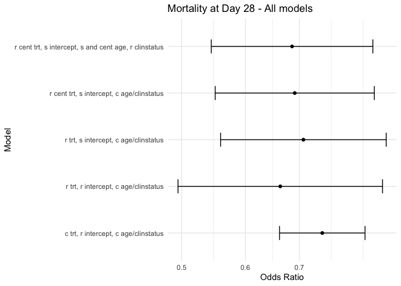

# Load packages

```r
library(tidyverse)
library(readxl)
library(writexl)
library(tableone)
library(here)
library(kableExtra)

library(jtools) # for summ() and plot_summs
library(sjPlot) # for tab_model
library(ggplot2) # survival/TTE analyses and other graphs
library(ggfortify) # autoplot
library(lme4) # glmer / clmm
library(sjPlot) # for tab_model
library(glmmTMB) # to specify estimation method explicitly -> i.e. ML
```

# Load standardized dataset of all trials

```r
## barisolidact
df_barisolidact <- readRDS("df_os_barisolidact.RData")
df_barisolidact <- df_barisolidact %>% 
    select(id_pat, trial, JAKi, trt, sex, age, ethn, country, icu, sympdur, vacc, clinstatus_baseline,
         comed_dexa, comed_rdv, comed_toci, comed_ab, comed_acoa, comed_interferon, comed_other,
         comed_cat,
         comorb_lung, comorb_liver, comorb_cvd, comorb_aht, comorb_dm, comorb_obese, comorb_smoker, immunosupp,
         comorb_autoimm, comorb_cancer, comorb_kidney, any_comorb, comorb_cat, comorb_count,
         crp, sero, vl_baseline, variant,
         mort_28, mort_60, death_reached, death_time,
         new_mv_28, new_mvd_28,
         clinstatus_28_imp,
         discharge_reached, discharge_time, discharge_time_sens, discharge_reached_sus, discharge_time_sus,
         ae_28, ae_28_sev,
         vir_clear_5, vir_clear_10, vir_clear_15)
## actt2
df_actt2 <- readRDS("df_os_actt2.RData")
df_actt2 <- df_actt2 %>% 
    select(id_pat, trial, JAKi, trt, sex, age, ethn, country, icu, sympdur, vacc, clinstatus_baseline,
         comed_dexa, comed_rdv, comed_toci, comed_ab, comed_acoa, comed_interferon, comed_other,
         comed_cat,
         comorb_lung, comorb_liver, comorb_cvd, comorb_aht, comorb_dm, comorb_obese, comorb_smoker, immunosupp,
         comorb_autoimm, comorb_cancer, comorb_kidney, any_comorb, comorb_cat, comorb_count,
         crp, sero, vl_baseline, variant,
         mort_28, mort_60, death_reached, death_time,
         new_mv_28, new_mvd_28,
         clinstatus_28_imp,
         discharge_reached, discharge_time, discharge_time_sens, discharge_reached_sus, discharge_time_sus,
         ae_28, ae_28_sev,
         vir_clear_5, vir_clear_10, vir_clear_15)
## ghazaeian
df_ghazaeian <- readRDS("df_os_ghazaeian.RData")
df_ghazaeian <- df_ghazaeian %>% 
    select(id_pat, trial, JAKi, trt, sex, age, ethn, country, icu, sympdur, vacc, clinstatus_baseline,
         comed_dexa, comed_rdv, comed_toci, comed_ab, comed_acoa, comed_interferon, comed_other,
         comed_cat,
         comorb_lung, comorb_liver, comorb_cvd, comorb_aht, comorb_dm, comorb_obese, comorb_smoker, immunosupp,
         comorb_autoimm, comorb_cancer, comorb_kidney, any_comorb, comorb_cat, comorb_count,
         crp, sero, vl_baseline, variant,
         mort_28, mort_60, death_reached, death_time,
         new_mv_28, new_mvd_28,
         clinstatus_28_imp,
         discharge_reached, discharge_time, discharge_time_sens, discharge_reached_sus, discharge_time_sus,
         ae_28, ae_28_sev,
         vir_clear_5, vir_clear_10, vir_clear_15)
## tofacov
df_tofacov <- readRDS("df_os_tofacov.RData")
df_tofacov <- df_tofacov %>% 
    select(id_pat, trial, JAKi, trt, sex, age, ethn, country, icu, sympdur, vacc, clinstatus_baseline,
         comed_dexa, comed_rdv, comed_toci, comed_ab, comed_acoa, comed_interferon, comed_other,
         comed_cat,
         comorb_lung, comorb_liver, comorb_cvd, comorb_aht, comorb_dm, comorb_obese, comorb_smoker, immunosupp,
         comorb_autoimm, comorb_cancer, comorb_kidney, any_comorb, comorb_cat, comorb_count,
         crp, sero, vl_baseline, variant,
         mort_28, mort_60, death_reached, death_time,
         new_mv_28, new_mvd_28,
         clinstatus_28_imp,
         discharge_reached, discharge_time, discharge_time_sens, discharge_reached_sus, discharge_time_sus,
         ae_28, ae_28_sev,
         vir_clear_5, vir_clear_10, vir_clear_15)
## covinib
df_covinib <- readRDS("df_os_covinib.RData")
df_covinib <- df_covinib %>% 
    select(id_pat, trial, JAKi, trt, sex, age, ethn, country, icu, sympdur, vacc, clinstatus_baseline,
         comed_dexa, comed_rdv, comed_toci, comed_ab, comed_acoa, comed_interferon, comed_other,
         comed_cat,
         comorb_lung, comorb_liver, comorb_cvd, comorb_aht, comorb_dm, comorb_obese, comorb_smoker, immunosupp,
         comorb_autoimm, comorb_cancer, comorb_kidney, any_comorb, comorb_cat, comorb_count,
         crp, sero, vl_baseline, variant,
         mort_28, mort_60, death_reached, death_time,
         new_mv_28, new_mvd_28,
         clinstatus_28_imp,
         discharge_reached, discharge_time, discharge_time_sens, discharge_reached_sus, discharge_time_sus,
         ae_28, ae_28_sev,
         vir_clear_5, vir_clear_10, vir_clear_15)
## COV-BARRIER
df_covbarrier <- readRDS("df_os_cov-barrier.RData")
df_covbarrier <- df_covbarrier %>% 
    select(id_pat, trial, JAKi, trt, sex, age, ethn, country, icu, sympdur, vacc, clinstatus_baseline,
         comed_dexa, comed_rdv, comed_toci, comed_ab, comed_acoa, comed_interferon, comed_other,
         comed_cat,
         comorb_lung, comorb_liver, comorb_cvd, comorb_aht, comorb_dm, comorb_obese, comorb_smoker, immunosupp,
         comorb_autoimm, comorb_cancer, comorb_kidney, any_comorb, comorb_cat, comorb_count,
         crp, sero, vl_baseline, variant,
         mort_28, mort_60, death_reached, death_time,
         new_mv_28, new_mvd_28,
         clinstatus_28_imp,
         discharge_reached, discharge_time, discharge_time_sens, discharge_reached_sus, discharge_time_sus,
         ae_28, ae_28_sev,
         vir_clear_5, vir_clear_10, vir_clear_15)

# append
df_tot <- rbind(df_barisolidact, df_actt2, df_ghazaeian, df_tofacov, df_covinib, df_covbarrier)
```


# (i) Primary outcome: Mortality at day 28

```r
addmargins(table(df_tot$trial, df_tot$mort_28, useNA = "always"))
```

```
##                
##                    0    1 <NA>  Sum
##   ACTT2          972   61    0 1033
##   Bari-Solidact  253   36    0  289
##   COV-BARRIER   1415  211    0 1626
##   COVINIB        108    2    0  110
##   Ghazaeian       90    7    0   97
##   TOFACOV        115    1    0  116
##   <NA>             0    0    0    0
##   Sum           2953  318    0 3271
```

```r
addmargins(table(df_tot$mort_28, df_tot$trt, useNA = "always"))
```

```
##       
##           0    1 <NA>  Sum
##   0    1444 1509    0 2953
##   1     193  125    0  318
##   <NA>    0    0    0    0
##   Sum  1637 1634    0 3271
```

```r
# table(df_tot$age, df_tot$trt, useNA = "always")
table(df_tot$clinstatus_baseline, df_tot$trt, useNA = "always")
```

```
##       
##          0   1 <NA>
##   1      0   0    0
##   2    206 184    0
##   3    875 912    0
##   4    422 413    0
##   5    129 123    0
##   6      0   0    0
##   <NA>   5   2    0
```

```r
table(df_tot$clinstatus_baseline, df_tot$trial, useNA = "always")
```

```
##       
##        ACTT2 Bari-Solidact COV-BARRIER COVINIB Ghazaeian TOFACOV <NA>
##   1        0             0           0       0         0       0    0
##   2      142             0         186      35         2      25    0
##   3      564             0         962      75        95      91    0
##   4      216           249         370       0         0       0    0
##   5      111            40         101       0         0       0    0
##   6        0             0           0       0         0       0    0
##   <NA>     0             0           7       0         0       0    0
```

```r
# table(df_tot$comed_dexa, df_tot$trt, useNA = "always")
# table(df_tot$comed_rdv, df_tot$trt, useNA = "always")
# table(df_tot$comed_toci, df_tot$trt, useNA = "always")

# reformatting
df_tot$trt_f <- as.factor(df_tot$trt)
df_tot$trial_f <- as.factor(df_tot$trial)

df_tot <- df_tot %>% 
  mutate(vbaseline = case_when(clinstatus_baseline == "2" | clinstatus_baseline == "3" ~ 0,
                                clinstatus_baseline == "4" | clinstatus_baseline == "5" ~ 1))
# table(df_tot$vbaseline, df_tot$trial, useNA = "always")

df_tot$clinstatus_baseline_n <- as.numeric(df_tot$clinstatus_baseline)
df_tot <- df_tot %>%
  mutate(trial_n = case_when(trial == "Bari-Solidact" ~ 1,
                             trial == "ACTT2" ~ 2,
                             trial == "Ghazaeian" ~ 3,
                             trial == "TOFACOV" ~ 4,
                             trial == "COVINIB" ~ 5,
                             trial == "COV-BARRIER" ~ 6))
# table(df_tot$trial_n, useNA = "always")
```

GOAL: random treatment effect, stratified trial intercept, stratified prognostic factors, AND centering the treatment variable by the proportion treated in the trial (to improve the estimation of between-study variance) AND maximum likelihood (ML) estimator (due to small trials with rare events). REML is default in glmer, for ML use glmmTMB. See notes.

### (1) common treatment effect, random trial intercept, common prognostic factors

```r
# (1) common treatment effect, random trial intercept, common prognostic factors, ML
mort28.ctreat.rtrial.ml <- glmmTMB(mort_28 ~ trt + (1|trial)
                              + age + clinstatus_baseline
                              # + comed_dexa + comed_rdv + comed_toci 
                              , data = df_tot, family = binomial)
# tab_model(mort28.ctreat.rtrial.ml)

mort28.ctreat.rtrial.ml.vb <- glmmTMB(mort_28 ~ trt + (1|trial)
                              + age + vbaseline
                              # + comed_dexa + comed_rdv + comed_toci 
                              , data = df_tot, family = binomial)
# tab_model(mort28.ctreat.rtrial.ml.vb)
```


### (2) random treatment effect, stratified trial intercept, common prognostic factors and residual variances

```r
# (2) random treatment effect, stratified trial intercept, common prognostic factors and residual variances, and WITHOUT centering the treatment variable, ML
mort28.rtreat.strial.ml <- glmmTMB(mort_28 ~ trt_f + trial_f + (trt - 1 | trial_f)
                              + age + clinstatus_baseline
                              # + comed_dexa + comed_rdv + comed_toci
                              , data = df_tot, family = binomial)
# tab_model(mort28.rtreat.strial.ml)

mort28.rtreat.strial.ml.vb <- glmmTMB(mort_28 ~ trt_f + trial_f + (trt - 1 | trial_f)
                              + age + vbaseline 
                              # + comed_dexa + comed_rdv + comed_toci
                              , data = df_tot, family = binomial)
# tab_model(mort28.rtreat.strial.ml.vb)

# The - 1 within (trt - 1 | trial_n) specifies that there is no random intercept for the grouping factor trial_n. We're specifying random slopes for the variable trt within each level of trial_n, i.e., the effect may vary from one trial to another. Together with trial_f, this gives the stratified intercept model. This is a more flexible model compared to a model with a random intercept, which assumes a common baseline for all groups.

# dummy variable for each trial (trial_1, trial_2, trial_3, etc - e.g. where trial_1 = 1 if in trial 1 and 0 otherwise)
df_tot <- df_tot %>%
  mutate(trial_1 = case_when(trial == "Bari-Solidact" ~ 1, TRUE ~ 0),
         trial_2 = case_when(trial == "ACTT2" ~ 1, TRUE ~ 0),
         trial_3 = case_when(trial == "Ghazaeian" ~ 1, TRUE ~ 0),
         trial_4 = case_when(trial == "TOFACOV" ~ 1, TRUE ~ 0),
         trial_5 = case_when(trial == "COVINIB" ~ 1, TRUE ~ 0),
         trial_6 = case_when(trial == "COV-BARRIER" ~ 1, TRUE ~ 0))

## Use "Stata syntax":
# mort28.rtreat.strial.2 <- glmer(mort_28 ~ trt_f + trial* + (trt -1 | trial_n)
#                               + age + clinstatus_baseline_n
#                               # + comed_dexa + comed_rdv + comed_toci
#                               , data = df_tot, family = binomial)
# tab_model(mort28.rtreat.strial.2)
```

### (3) random treatment effect, random trial intercept, common prognostic factors and residual variances

```r
# (3) random treatment effect, random trial intercept, common prognostic factors and residual variances, ML
mort28.rtreat.rtrial.ml <- glmmTMB(mort_28 ~ trt + (1|trt) + (1|trial_f)
                              + age + clinstatus_baseline
                              # + comed_dexa + comed_rdv + comed_toci
                              , data = df_tot, family = binomial)
# tab_model(mort28.rtreat.rtrial.ml)

mort28.rtreat.rtrial.ml.vb <- glmmTMB(mort_28 ~ trt + (1|trt) + (1|trial_f)
                              + age + vbaseline 
                              # + comed_dexa + comed_rdv + comed_toci
                              , data = df_tot, family = binomial)
# tab_model(mort28.rtreat.rtrial.ml.vb)
```

### (4) random treatment effect, stratified trial intercept, common prognostic factors and residual variances, centering the treatment variable

```r
# (4) random treatment effect, stratified trial intercept, common prognostic factors and residual variances, ML, but WITH centering the treatment variable

# calculate the proportion treated by trial
proportions <- df_tot %>%
  group_by(trial) %>%
  summarize(proportion_treated = sum(trt) / n())
df_tot <- left_join(df_tot, proportions[, c("proportion_treated", "trial")], by = join_by(trial == trial))
# table(df_tot$trial, df_tot$proportion_treated)

# create the centered treatment variable
df_tot$trt_centered_n <- df_tot$trt - df_tot$proportion_treated
df_tot$trt_centered_f <- as.factor(df_tot$trt_centered_n)
# table(df_tot$trial, df_tot$trt_centered_f) ## keep it minus?

# build the model. '-1' indicating there is no overall random intercept.
mort28.rtreat.strial.cent.ml <- glmmTMB(mort_28 ~ trt_centered_n + trial_f + (trt_centered_n -1 | trial_f) -1
                   + age + clinstatus_baseline
                   #+ comed_dexa + comed_rdv + comed_toci
                   , data = df_tot, family = binomial
                   )
# tab_model(mort28.rtreat.strial.cent.ml)

mort28.rtreat.strial.cent.ml.vb <- glmmTMB(mort_28 ~ trt_centered_n + trial_f + (trt_centered_n -1 | trial_f) -1 
                   + age + vbaseline 
                   #+ comed_dexa + comed_rdv + comed_toci
                   , data = df_tot, family = binomial
                   )
# tab_model(mort28.rtreat.strial.cent.ml.vb)
```

### (5) random treatment effect, stratified trial intercept, stratified prognostic factors and residual variances, with centering the treatment variable AND the prognostic variables

```r
# "Our default recommendation is to use stratified prognostic effects (i.e. estimate a separate effect of each included prognostic factor for each trial), with trial-specific centering of each prognostic factor to improve ML estimation (for the reasons explained in Section 6.2.8.3). However, if outcome data or prognostic factor categories are sparse, the stratification approach may lead to estimation difficulties, and then allowing prognostic factor effects to be random is a sensible alternative." (p. 145) Centering disentangles (i.e. makes uncorrelated) the estimation of main parameters of interest from other nuisance parameters, which leads to less downward bias in estimates of variance parameters (Figure 6.2) and thus improves coverage of 95% confidence intervals. This can be achieved by centering the covariates by their mean values within trials, such that the interaction estimate is then only based on within-trial information.

# Calculate the mean values of (continuous) prognostic factors within each trial
trial_means <- df_tot %>%
  group_by(trial) %>%
  summarize(mean_age = mean(age, na.rm = TRUE), mean_clinstatus = mean(clinstatus_baseline_n, na.rm = TRUE))
# Merge back
df_tot <- df_tot %>% left_join(trial_means, by = "trial")
# Center the age and clinstatus_baseline variables
df_tot <- df_tot %>%
  mutate(age_centered = age - mean_age, 
         clinstatus_baseline_centered = clinstatus_baseline_n - mean_clinstatus)

# df_tot %>%
#   select(trial_f, trial_n, trt, trt_centered_n, age, mean_age, age_centered, clinstatus_baseline_n, mean_clinstatus, clinstatus_baseline_centered, mort_28) %>%
#   View()


## CAVE: clinstatus_baseline is a factor -> How to center a factor? By the proportion in each level? Or not at all? 


# # (5a) random treatment effect, stratified trial intercept, common prognostic factors and residual variances, with centering of the treatment variable AND the prognostic factors
# mort28.rtreat.strial.cent.ml.cpf.cent <- glmmTMB(mort_28 ~ trt_centered_n + trial_f + (trt_centered_n -1 | trial_f) -1 + age_centered + clinstatus_baseline_centered
#                    #+ comed_dexa + comed_rdv + comed_toci
#                    , data = df_tot, family = binomial
#                    )
# tab_model(mort28.rtreat.strial.cent.ml.pf.cent)
# 
# mort28.rtreat.strial.cent.ml.cpf.cent.vb <- glmmTMB(mort_28 ~ trt_centered_n + trial_f + (trt_centered_n -1 | trial_f) -1 + age_centered + vbaseline
#                    #+ comed_dexa + comed_rdv + comed_toci
#                    , data = df_tot, family = binomial
#                    )
# tab_model(mort28.rtreat.strial.cent.ml.pf.cent.vb)

# # (5b) random treatment effect, stratified trial intercept, random prognostic factors and residual variances, with centering of the treatment variable AND the prognostic factors AND maximum likelihood (ML)
# mort28.rtreat.strial.cent.ml.rpf.cent <- glmmTMB(mort_28 ~ trt_centered_n + trial_f + (trt_centered_n -1 | trial_f) -1 + (age_centered -1 | trial_f) + (clinstatus_baseline_centered -1 | trial_f)
#                    #+ comed_dexa + comed_rdv + comed_toci
#                    , data = df_tot, family = binomial
#                    )
# tab_model(mort28.rtreat.strial.cent.ml.rpf.cent)
# 
# mort28.rtreat.strial.cent.ml.rpf.cent.vb <- glmmTMB(mort_28 ~ trt_centered_n + trial_f + (trt_centered_n -1 | trial_f) -1 + (age_centered -1 | trial_f) + (vbaseline -1 | trial_f)
#                    #+ comed_dexa + comed_rdv + comed_toci
#                    , data = df_tot, family = binomial
#                    )
# tab_model(mort28.rtreat.strial.cent.ml.rpf.cent.vb)

# # (5c) random treatment effect, stratified trial intercept, random prognostic factors and residual variances, with centering of the treatment variable BUT not the prognostic factors
# mort28.rtreat.strial.cent.ml.rpf <- glmmTMB(mort_28 ~ trt_centered_n + trial_f + (trt_centered_n -1 | trial_f) -1 + (age -1 | trial_f) + (clinstatus_baseline_n -1 | trial_f)
#                    #+ comed_dexa + comed_rdv + comed_toci
#                    , data = df_tot, family = binomial
#                    )
# tab_model(mort28.rtreat.strial.cent.ml.rpf)
# 
# mort28.rtreat.strial.cent.ml.rpf.vb <- glmmTMB(mort_28 ~ trt_centered_n + trial_f + (trt_centered_n -1 | trial_f) -1 + (age -1 | trial_f) + (vbaseline -1 | trial_f)
#                    #+ comed_dexa + comed_rdv + comed_toci
#                    , data = df_tot, family = binomial
#                    )
# tab_model(mort28.rtreat.strial.cent.ml.rpf.vb)


### Add the prognostic factors stratified, i.e. create stratified variables for each prognostic factor
## uncentered
df_tot <- df_tot %>%
  mutate(age_trial_1 = case_when(trial == "Bari-Solidact" ~ age, TRUE ~ 0),
         age_trial_2 = case_when(trial == "ACTT2" ~ age, TRUE ~ 0),
         age_trial_3 = case_when(trial == "Ghazaeian" ~ age, TRUE ~ 0),
         age_trial_4 = case_when(trial == "TOFACOV" ~ age, TRUE ~ 0),
         age_trial_5 = case_when(trial == "COVINIB" ~ age, TRUE ~ 0),
         age_trial_6 = case_when(trial == "COV-BARRIER" ~ age, TRUE ~ 0))
df_tot <- df_tot %>%
  mutate(clinstat_trial_1 = case_when(trial == "Bari-Solidact" ~ clinstatus_baseline, TRUE ~ "0"),
         clinstat_trial_2 = case_when(trial == "ACTT2" ~ clinstatus_baseline, TRUE ~ "0"),
         clinstat_trial_3 = case_when(trial == "Ghazaeian" ~ clinstatus_baseline, TRUE ~ "0"),
         clinstat_trial_4 = case_when(trial == "TOFACOV" ~ clinstatus_baseline, TRUE ~ "0"),
         clinstat_trial_5 = case_when(trial == "COVINIB" ~ clinstatus_baseline, TRUE ~ "0"),
         clinstat_trial_6 = case_when(trial == "COV-BARRIER" ~ clinstatus_baseline, TRUE ~ "0"))

## centered
df_tot <- df_tot %>%
  mutate(age_cent_trial_1 = case_when(trial == "Bari-Solidact" ~ age_centered, TRUE ~ 0),
         age_cent_trial_2 = case_when(trial == "ACTT2" ~ age_centered, TRUE ~ 0),
         age_cent_trial_3 = case_when(trial == "Ghazaeian" ~ age_centered, TRUE ~ 0),
         age_cent_trial_4 = case_when(trial == "TOFACOV" ~ age_centered, TRUE ~ 0),
         age_cent_trial_5 = case_when(trial == "COVINIB" ~ age_centered, TRUE ~ 0),
         age_cent_trial_6 = case_when(trial == "COV-BARRIER" ~ age_centered, TRUE ~ 0))
df_tot <- df_tot %>%
  mutate(clinstat_cent_trial_1 = case_when(trial == "Bari-Solidact" ~ clinstatus_baseline_centered, TRUE ~ 0),
         clinstat_cent_trial_2 = case_when(trial == "ACTT2" ~ clinstatus_baseline_centered, TRUE ~ 0),
         clinstat_cent_trial_3 = case_when(trial == "Ghazaeian" ~ clinstatus_baseline_centered, TRUE ~ 0),
         clinstat_cent_trial_4 = case_when(trial == "TOFACOV" ~ clinstatus_baseline_centered, TRUE ~ 0),
         clinstat_cent_trial_5 = case_when(trial == "COVINIB" ~ clinstatus_baseline_centered, TRUE ~ 0),
         clinstat_cent_trial_6 = case_when(trial == "COV-BARRIER" ~ clinstatus_baseline_centered, TRUE ~ 0))

# df_tot %>%
#   select(trial_f, trial_n, trt, trt_centered_n, age, mean_age, age_centered, clinstatus_baseline_n, mean_clinstatus, clinstatus_baseline_centered, mort_28,
#          age_trial_1, age_cent_trial_1, age_trial_5, age_cent_trial_5, age_trial_6, age_cent_trial_6, clinstat_trial_1, clinstat_cent_trial_1, clinstat_trial_5, clinstat_cent_trial_5, clinstat_trial_6, clinstat_cent_trial_6,
#          ) %>%
#   View()


# (5d) random treatment effect, stratified trial intercept, stratified prognostic factors and residual variances, with centering of the treatment variable AND the prognostic factors
# mort28.rtreat.strial.cent.ml.spf.cent <- glmmTMB(mort_28 ~ trt_centered_n 
#                                                  + trial_f 
#                                                  + (trt_centered_n -1 | trial_f) -1 
#                                                  + age_cent_trial_1 + age_cent_trial_2 + age_cent_trial_3 + age_cent_trial_4 
#                                                  + age_cent_trial_5 + age_cent_trial_6 
#                                                  + clinstat_cent_trial_1 + clinstat_cent_trial_2 + clinstat_cent_trial_3 
#                                                  + clinstat_cent_trial_4 + clinstat_cent_trial_5 + clinstat_cent_trial_6
#                                                  #+ comed_dexa + comed_rdv + comed_toci
#                                                  , data = df_tot, family = binomial)
# tab_model(mort28.rtreat.strial.cent.ml.spf.cent) 
# mort28.rtreat.strial.cent.ml.spf.cent <- glmmTMB(mort_28 ~ trt_centered_n 
#                                                  + trial_f 
#                                                  + (trt_centered_n -1 | trial_f) -1 
#                                                  + age_cent_trial_1 + age_cent_trial_2 + age_cent_trial_3 + age_cent_trial_4 
#                                                  + age_cent_trial_5 + age_cent_trial_6 
#                                                  + clinstat_trial_1 + clinstat_trial_2 + clinstat_trial_3 
#                                                  + clinstat_trial_4 + clinstat_trial_5 + clinstat_trial_6
#                                                  #+ comed_dexa + comed_rdv + comed_toci
#                                                  , data = df_tot, family = binomial)
# tab_model(mort28.rtreat.strial.cent.ml.spf.cent) # Not all trials have all levels, cannot estimate a stratified clinstatus_baseline by trial. Moreover, not sure the centering of the factor variable clinstatus_baseline is ok like this. => Second best option: Add clinstatus_baseline as a random parameter

mort28.rtreat.strial.cent.ml.sage.cent.rclinstat <- glmmTMB(mort_28 ~ trt_centered_n 
                                                 + trial_f 
                                                 + (trt_centered_n -1 | trial_f) -1 
                                                 + age_cent_trial_1 + age_cent_trial_2 + age_cent_trial_3 + age_cent_trial_4 
                                                 + age_cent_trial_5 + age_cent_trial_6 
                                                 + (clinstatus_baseline_n -1 | trial_f)
                                                 #+ comed_dexa + comed_rdv + comed_toci
                                                 , data = df_tot, family = binomial)
# tab_model(mort28.rtreat.strial.cent.ml.sage.cent.rclinstat) 

mort28.rtreat.strial.cent.ml.sage.cent.rvb <- glmmTMB(mort_28 ~ trt_centered_n 
                                                 + trial_f 
                                                 + (trt_centered_n -1 | trial_f) -1 
                                                 + age_cent_trial_1 + age_cent_trial_2 + age_cent_trial_3 + age_cent_trial_4 
                                                 + age_cent_trial_5 + age_cent_trial_6 
                                                 + (vbaseline -1 | trial_f)
                                                 #+ comed_dexa + comed_rdv + comed_toci
                                                 , data = df_tot, family = binomial)
# tab_model(mort28.rtreat.strial.cent.ml.sage.cent.rvb) 
```
Discussion:
1. Clinstatus_baseline is a factor -> How to center a factor? By the proportion in each level? More important: Not all trials have all levels, hard to estimate a stratified clinstatus_baseline by trial => Second best option: Add clinstatus_baseline as a random parameter
2. Remember to add all TRIAL centering variables if adding new trials!
3. Investigate the point that a "one-stage random effects model" equals a "two-stage fixed effects model" (only use trials without rare event problems // double-check adjustments in two-stage)


## Collect the effect estimates from all models

```r
# Empty data frame to store the results
result_df <- data.frame(
  variable = character(),
  hazard_odds_ratio = numeric(),
  ci_lower = numeric(),
  ci_upper = numeric(),
  p_value = numeric()
)
# Function to extract treatment results from two different model types (glmer -> REML, glmmTMB -> ML)
extract_trt_results <- function(model, variable_name, n_int, n_cont) {
  if (inherits(model, "glmmTMB")) {
    coefficients_table <- summary(model)$coefficients$cond
    trt_coef <- coefficients_table[grep("^trt", rownames(coefficients_table)), "Estimate"]
    hazard_odds_ratio <- exp(trt_coef)
    ci_table <- exp(confint(model))
    ci <- ci_table[grep("^trt", rownames(ci_table)), c("2.5 %", "97.5 %")]
    p_value <- coefficients_table[grep("^trt", rownames(coefficients_table)), "Pr(>|z|)"]
  } else if (inherits(model, "glmerMod")) {
    coefficients_table <- summary(model)$coefficients
    trt_coef <- coefficients_table[grep("^trt", rownames(coefficients_table)), "Estimate"]
    hazard_odds_ratio <- exp(trt_coef)
    ci_table <- exp(confint(model))
    ci <- ci_table[grep("^trt", rownames(ci_table)), c("2.5 %", "97.5 %")]
    p_value <- coefficients_table[grep("^trt", rownames(coefficients_table)), "Pr(>|z|)"]
  } else {
    stop("Unsupported model class")
  }
  # capture the results
  result <- data.frame(
    variable = variable_name,
    hazard_odds_ratio = hazard_odds_ratio,
    ci_lower = ci[1],
    ci_upper = ci[2],
    p_value = p_value,
    n_intervention = n_int,
    n_control = n_cont
  )
  return(result)
}
# Loop through
result_list <- list()

result_list[[1]] <- extract_trt_results(mort28.ctreat.rtrial.ml, "c trt, r intercept, c age/clinstatus, no cent", addmargins(table(df_tot$mort_28, df_tot$trt))[3,2], addmargins(table(df_tot$mort_28, df_tot$trt))[3,1])
result_list[[2]] <- extract_trt_results(mort28.ctreat.rtrial.ml.vb, "c trt, r intercept, c age/clinstatus, no cent, vb", addmargins(table(df_tot$mort_28, df_tot$trt))[3,2], addmargins(table(df_tot$mort_28, df_tot$trt))[3,1])

result_list[[3]] <- extract_trt_results(mort28.rtreat.rtrial.ml, "r trt, r intercept, c age/clinstatus, no cent", addmargins(table(df_tot$mort_28, df_tot$trt))[3,2], addmargins(table(df_tot$mort_28, df_tot$trt))[3,1])
result_list[[4]] <- extract_trt_results(mort28.rtreat.rtrial.ml.vb, "r trt, r intercept, c age/clinstatus, no cent, vb", addmargins(table(df_tot$mort_28, df_tot$trt))[3,2], addmargins(table(df_tot$mort_28, df_tot$trt))[3,1])

result_list[[5]] <- extract_trt_results(mort28.rtreat.strial.ml, "r trt, s intercept, c age/clinstatus, no cent", addmargins(table(df_tot$mort_28, df_tot$trt))[3,2], addmargins(table(df_tot$mort_28, df_tot$trt))[3,1])
result_list[[6]] <- extract_trt_results(mort28.rtreat.strial.ml.vb, "r trt, s intercept, c age/clinstatus, no cent, vb", addmargins(table(df_tot$mort_28, df_tot$trt))[3,2], addmargins(table(df_tot$mort_28, df_tot$trt))[3,1])

result_list[[7]] <- extract_trt_results(mort28.rtreat.strial.cent.ml, "r trt, s intercept, c age/clinstatus, cent trt", addmargins(table(df_tot$mort_28, df_tot$trt))[3,2], addmargins(table(df_tot$mort_28, df_tot$trt))[3,1])
result_list[[8]] <- extract_trt_results(mort28.rtreat.strial.cent.ml.vb, "r trt, s intercept, c age/clinstatus, cent trt, vb", addmargins(table(df_tot$mort_28, df_tot$trt))[3,2], addmargins(table(df_tot$mort_28, df_tot$trt))[3,1])

result_list[[9]] <- extract_trt_results(mort28.rtreat.strial.cent.ml.sage.cent.rclinstat, "r trt, s intercept, s and cent age, r clinstatus, cent trt", addmargins(table(df_tot$mort_28, df_tot$trt))[3,2], addmargins(table(df_tot$mort_28, df_tot$trt))[3,1])

result_list[[10]] <- extract_trt_results(mort28.rtreat.strial.cent.ml.sage.cent.rvb, "r trt, s intercept, s and cent age, r clinstatus, cent trt, vb", addmargins(table(df_tot$mort_28, df_tot$trt))[3,2], addmargins(table(df_tot$mort_28, df_tot$trt))[3,1])

# Filter out NULL results and bind the results into a single data frame
result_df <- do.call(rbind, Filter(function(x) !is.null(x), result_list))

# Nicely formatted table
kable(result_df, format = "html", table.attr = 'class="table"') %>%
  kable_styling(bootstrap_options = "striped", full_width = FALSE)
```

<table class="table table table-striped" style="width: auto !important; margin-left: auto; margin-right: auto;">
 <thead>
  <tr>
   <th style="text-align:left;">   </th>
   <th style="text-align:left;"> variable </th>
   <th style="text-align:right;"> hazard_odds_ratio </th>
   <th style="text-align:right;"> ci_lower </th>
   <th style="text-align:right;"> ci_upper </th>
   <th style="text-align:right;"> p_value </th>
   <th style="text-align:right;"> n_intervention </th>
   <th style="text-align:right;"> n_control </th>
  </tr>
 </thead>
<tbody>
  <tr>
   <td style="text-align:left;"> 2.5 % </td>
   <td style="text-align:left;"> c trt, r intercept, c age/clinstatus, no cent </td>
   <td style="text-align:right;"> 0.5825613 </td>
   <td style="text-align:right;"> 0.4491458 </td>
   <td style="text-align:right;"> 0.7556068 </td>
   <td style="text-align:right;"> 4.67e-05 </td>
   <td style="text-align:right;"> 1634 </td>
   <td style="text-align:right;"> 1637 </td>
  </tr>
  <tr>
   <td style="text-align:left;"> 2.5 %1 </td>
   <td style="text-align:left;"> c trt, r intercept, c age/clinstatus, no cent, vb </td>
   <td style="text-align:right;"> 0.5872180 </td>
   <td style="text-align:right;"> 0.4544374 </td>
   <td style="text-align:right;"> 0.7587955 </td>
   <td style="text-align:right;"> 4.69e-05 </td>
   <td style="text-align:right;"> 1634 </td>
   <td style="text-align:right;"> 1637 </td>
  </tr>
  <tr>
   <td style="text-align:left;"> 2.5 %2 </td>
   <td style="text-align:left;"> r trt, r intercept, c age/clinstatus, no cent </td>
   <td style="text-align:right;"> 0.5825606 </td>
   <td style="text-align:right;"> 0.4491453 </td>
   <td style="text-align:right;"> 0.7556059 </td>
   <td style="text-align:right;"> 4.67e-05 </td>
   <td style="text-align:right;"> 1634 </td>
   <td style="text-align:right;"> 1637 </td>
  </tr>
  <tr>
   <td style="text-align:left;"> 2.5 %3 </td>
   <td style="text-align:left;"> r trt, r intercept, c age/clinstatus, no cent, vb </td>
   <td style="text-align:right;"> 0.5872180 </td>
   <td style="text-align:right;"> 0.4544373 </td>
   <td style="text-align:right;"> 0.7587955 </td>
   <td style="text-align:right;"> 4.69e-05 </td>
   <td style="text-align:right;"> 1634 </td>
   <td style="text-align:right;"> 1637 </td>
  </tr>
  <tr>
   <td style="text-align:left;"> 2.5 %4 </td>
   <td style="text-align:left;"> r trt, s intercept, c age/clinstatus, no cent </td>
   <td style="text-align:right;"> 0.5828403 </td>
   <td style="text-align:right;"> 0.4492055 </td>
   <td style="text-align:right;"> 0.7562302 </td>
   <td style="text-align:right;"> 4.85e-05 </td>
   <td style="text-align:right;"> 1634 </td>
   <td style="text-align:right;"> 1637 </td>
  </tr>
  <tr>
   <td style="text-align:left;"> 2.5 %5 </td>
   <td style="text-align:left;"> r trt, s intercept, c age/clinstatus, no cent, vb </td>
   <td style="text-align:right;"> 0.5875129 </td>
   <td style="text-align:right;"> 0.4545284 </td>
   <td style="text-align:right;"> 0.7594055 </td>
   <td style="text-align:right;"> 4.87e-05 </td>
   <td style="text-align:right;"> 1634 </td>
   <td style="text-align:right;"> 1637 </td>
  </tr>
  <tr>
   <td style="text-align:left;"> 2.5 %6 </td>
   <td style="text-align:left;"> r trt, s intercept, c age/clinstatus, cent trt </td>
   <td style="text-align:right;"> 0.5828406 </td>
   <td style="text-align:right;"> 0.4492058 </td>
   <td style="text-align:right;"> 0.7562306 </td>
   <td style="text-align:right;"> 4.85e-05 </td>
   <td style="text-align:right;"> 1634 </td>
   <td style="text-align:right;"> 1637 </td>
  </tr>
  <tr>
   <td style="text-align:left;"> 2.5 %7 </td>
   <td style="text-align:left;"> r trt, s intercept, c age/clinstatus, cent trt, vb </td>
   <td style="text-align:right;"> 0.5875102 </td>
   <td style="text-align:right;"> 0.4545262 </td>
   <td style="text-align:right;"> 0.7594023 </td>
   <td style="text-align:right;"> 4.87e-05 </td>
   <td style="text-align:right;"> 1634 </td>
   <td style="text-align:right;"> 1637 </td>
  </tr>
  <tr>
   <td style="text-align:left;"> 2.5 %8 </td>
   <td style="text-align:left;"> r trt, s intercept, s and cent age, r clinstatus, cent trt </td>
   <td style="text-align:right;"> 0.5750015 </td>
   <td style="text-align:right;"> 0.4427118 </td>
   <td style="text-align:right;"> 0.7468218 </td>
   <td style="text-align:right;"> 3.35e-05 </td>
   <td style="text-align:right;"> 1634 </td>
   <td style="text-align:right;"> 1637 </td>
  </tr>
  <tr>
   <td style="text-align:left;"> 2.5 %9 </td>
   <td style="text-align:left;"> r trt, s intercept, s and cent age, r clinstatus, cent trt, vb </td>
   <td style="text-align:right;"> 0.5829509 </td>
   <td style="text-align:right;"> 0.4506374 </td>
   <td style="text-align:right;"> 0.7541135 </td>
   <td style="text-align:right;"> 3.98e-05 </td>
   <td style="text-align:right;"> 1634 </td>
   <td style="text-align:right;"> 1637 </td>
  </tr>
</tbody>
</table>


```r
# Convert necessary columns to numeric
result_df[, c("hazard_odds_ratio", "ci_lower", "ci_upper", "p_value", "n_intervention", "n_control")] <- lapply(result_df[, c("hazard_odds_ratio", "ci_lower", "ci_upper", "p_value", "n_intervention", "n_control")], as.numeric)

# Plotting
ggplot(result_df, aes(x = variable, y = hazard_odds_ratio)) +
  geom_point() +
  geom_errorbar(aes(ymin = ci_lower, ymax = ci_upper), width = 0.3) +
  labs(title = "Mortality at Day 28 - All models",
       x = "Model",
       y = "Odds Ratio") +
  theme_minimal() +
  theme(axis.text.x = element_text(angle = 45, hjust = 1),
        plot.margin = margin(l = 50, r = 10, b = 20, t = 20, unit = "pt")) +  # Adjust left margin
  scale_y_continuous(limits = c(0.4, 0.9), breaks = c(0.4, 0.5, 0.6, 0.7, 0.8, 0.9), trans = "log10") +
  coord_flip()  # Flip axes to show longer variable names
```

<!-- -->

### The main recommendations for one-stage IPD meta-analysis models using GLMMs (IPDMA handbook R.Riley)
1. *__Use a random treatment effect.__*
* Justification: Typically the included trials are conducted in different settings, populations and time periods. Therefore, some heterogeneity of treatment effect is expected. Heterogeneity might be reduced by inclusion of prognostic factors or trial-level covariates, but usually unexplained heterogeneity remains and so should be acknowledged. Homogeneity of treatment effect is a strong assumption, and often will be inappropriate due to unexplained between-trial heterogeneity. To address this, the treatment effect parameter can be made random, such that the true treatment effect in each trial is assumed drawn from a particular distribution, typically a normal distribution.

2. *__Stratify by trial the intercept and parameters for other non-treatment variables (such as prognostic factors and residual variances).__* If convergence issues arise, then consider making the intercept (and other non-treatment variables) random.
* Justification: Although a random intercept will usually give similar results to a stratified intercept, in some situations it may compromise randomisation (as it allows baseline risk information to be shared across trials). Many researchers assume nuisance parameters are common (often because this is the default in software packages), but this is not recommended as it may lead to inappropriate conclusions, as now described. (p. 138) The advantage of the stratified intercept approach is that it makes no assumptions about the distribution of intercepts across trials - and mirrors exactly the two-stage approach. The advantage of the random intercepts approach is that it requires fewer parameters to be estimated and so may reduce model convergence issues. But usually give very similar results. (p. 141 & 143)

3. *__Use trial-specific centering of the treatment variable (and any other included variables, such as prognostic factors) when using ML estimation of a one-stage model with a stratified intercept.__* 
* Justification: Simulation studies and mathematical reasoning show that this improves ML estimation of between-trial variances and the coverage of confidence intervals for the summary treatment effect. Centering disentangles (i.e. makes uncorrelated) the estimation of main parameters of interest from other nuisance parameters, which leads to less downward bias in estimates of variance parameters (Figure 6.2) and thus improves coverage of 95% confidence intervals. This can be achieved by centering the covariates by their mean values within trials, such that the interaction estimate is then only based on within-trial information. Our default recommendation is to use stratified prognostic effects (i.e. estimate a separate effect of each included prognostic factor for each trial), with trial-specific centering of each prognostic factor to improve ML estimation (for the reasons explained in Section 6.2.8.3). However, if outcome data or prognostic factor categories are sparse, the stratification approach may lead to estimation difficulties, and then allowing prognostic factor effects to be random is a sensible alternative. (p. 145) As previously discussed (Section 6.2.4.1), Jackson et al. and Riley et al. show that for one-stage models with a stratified intercept, ML estimation is improved when using trial-specific centering of treatment and other included variables.181,185 Centering disentangles (i.e. makes uncorrelated) the estimation of main parameters of interest from other nuisance parameters, which leads to less downward bias in estimates of variance parameters (Figure 6.2) and thus improves coverage of 95% confidence intervals. (p. 147)

4. For frequentist estimation of one-stage models for binary, ordinal or count outcomes, use REML estimation of the pseudo-likelihood approach unless most trials in the meta-analysis are small (in terms of participants or outcome events), which then warrants ML estimation of the exact likelihood.
* Justification: Although estimation of the exact likelihood is preferred, ML estimation is known to produce downwardly biased estimates of between-trial variances. Therefore, unless most included trials are small, REML estimation of an approximate pseudo-likelihood specification may improve estimation of between-trial variances and coverage of confidence intervals.

5. A one-stage IPD meta-analysis utilises a more exact statistical likelihood than a two-stage meta-analysis approach, which is advantageous when included trials have few participants or outcome events. (p.127)

6. The word ‘fixed’ is ambiguous; it could refer to either a common or stratified parameter, even though they imply different model specifications and assumptions. Therefore, we recommend that the word ‘fixed’ be avoided in one-stage IPD models, and encourage researchers to use common or stratified instead.

7. See sample R code here: https://www.ipdma.co.uk/one-stage-ipd-ma 

## Present the main model: "r trt, s intercept, s and cent age, r clinstatus, cent trt"
1. Treatment parameter: Random treatment effect
2. Trial parameter: Stratified intercept by trial
3. Prognostic factor 'age': Stratified by trial
4. Prognostic factor 'clinical status': As a random parameter by trial. Not all trials have all levels, hard to estimate a stratified clinstatus_baseline by trial => Random effect as sensible alternative (see guidance above)
5. Trial-specific centering of the treatment variable and age (to improve estimation of the between-study variance). 


```r
mort28 <- glmmTMB(mort_28 ~ trt_centered_n 
                  + trial_f 
                  + (trt_centered_n -1 | trial_f) -1 
                  + age_cent_trial_1 + age_cent_trial_2 + age_cent_trial_3 
                  + age_cent_trial_4 + age_cent_trial_5 + age_cent_trial_6 
                  + (clinstatus_baseline_n -1 | trial_f) # random prognostic factor clinstatus_baseline
                  , data = df_tot, family = binomial)
tab_model(mort28)
```

<table style="border-collapse:collapse; border:none;">
<tr>
<th style="border-top: double; text-align:center; font-style:normal; font-weight:bold; padding:0.2cm;  text-align:left; ">&nbsp;</th>
<th colspan="3" style="border-top: double; text-align:center; font-style:normal; font-weight:bold; padding:0.2cm; ">mort 28</th>
</tr>
<tr>
<td style=" text-align:center; border-bottom:1px solid; font-style:italic; font-weight:normal;  text-align:left; ">Predictors</td>
<td style=" text-align:center; border-bottom:1px solid; font-style:italic; font-weight:normal;  ">Odds Ratios</td>
<td style=" text-align:center; border-bottom:1px solid; font-style:italic; font-weight:normal;  ">CI</td>
<td style=" text-align:center; border-bottom:1px solid; font-style:italic; font-weight:normal;  ">p</td>
</tr>
<tr>
<td style=" padding:0.2cm; text-align:left; vertical-align:top; text-align:left; ">Trial treatment group</td>
<td style=" padding:0.2cm; text-align:left; vertical-align:top; text-align:center;  ">0.58</td>
<td style=" padding:0.2cm; text-align:left; vertical-align:top; text-align:center;  ">0.44&nbsp;&ndash;&nbsp;0.75</td>
<td style=" padding:0.2cm; text-align:left; vertical-align:top; text-align:center;  "><strong>&lt;0.001</strong></td>
</tr>
<tr>
<td style=" padding:0.2cm; text-align:left; vertical-align:top; text-align:left; ">trial f: ACTT 2</td>
<td style=" padding:0.2cm; text-align:left; vertical-align:top; text-align:center;  ">0.00</td>
<td style=" padding:0.2cm; text-align:left; vertical-align:top; text-align:center;  ">0.00&nbsp;&ndash;&nbsp;0.00</td>
<td style=" padding:0.2cm; text-align:left; vertical-align:top; text-align:center;  "><strong>&lt;0.001</strong></td>
</tr>
<tr>
<td style=" padding:0.2cm; text-align:left; vertical-align:top; text-align:left; ">trial f: Bari-Solidact</td>
<td style=" padding:0.2cm; text-align:left; vertical-align:top; text-align:center;  ">0.01</td>
<td style=" padding:0.2cm; text-align:left; vertical-align:top; text-align:center;  ">0.00&nbsp;&ndash;&nbsp;0.18</td>
<td style=" padding:0.2cm; text-align:left; vertical-align:top; text-align:center;  "><strong>0.004</strong></td>
</tr>
<tr>
<td style=" padding:0.2cm; text-align:left; vertical-align:top; text-align:left; ">trial f: COV-BARRIER</td>
<td style=" padding:0.2cm; text-align:left; vertical-align:top; text-align:center;  ">0.00</td>
<td style=" padding:0.2cm; text-align:left; vertical-align:top; text-align:center;  ">0.00&nbsp;&ndash;&nbsp;0.00</td>
<td style=" padding:0.2cm; text-align:left; vertical-align:top; text-align:center;  "><strong>&lt;0.001</strong></td>
</tr>
<tr>
<td style=" padding:0.2cm; text-align:left; vertical-align:top; text-align:left; ">trial f: COVINIB</td>
<td style=" padding:0.2cm; text-align:left; vertical-align:top; text-align:center;  ">0.00</td>
<td style=" padding:0.2cm; text-align:left; vertical-align:top; text-align:center;  ">0.00&nbsp;&ndash;&nbsp;0.51</td>
<td style=" padding:0.2cm; text-align:left; vertical-align:top; text-align:center;  "><strong>0.025</strong></td>
</tr>
<tr>
<td style=" padding:0.2cm; text-align:left; vertical-align:top; text-align:left; ">trial f: Ghazaeian</td>
<td style=" padding:0.2cm; text-align:left; vertical-align:top; text-align:center;  ">0.05</td>
<td style=" padding:0.2cm; text-align:left; vertical-align:top; text-align:center;  ">0.00&nbsp;&ndash;&nbsp;4.26</td>
<td style=" padding:0.2cm; text-align:left; vertical-align:top; text-align:center;  ">0.186</td>
</tr>
<tr>
<td style=" padding:0.2cm; text-align:left; vertical-align:top; text-align:left; ">trial f: TOFACOV</td>
<td style=" padding:0.2cm; text-align:left; vertical-align:top; text-align:center;  ">0.00</td>
<td style=" padding:0.2cm; text-align:left; vertical-align:top; text-align:center;  ">0.00&nbsp;&ndash;&nbsp;0.49</td>
<td style=" padding:0.2cm; text-align:left; vertical-align:top; text-align:center;  "><strong>0.025</strong></td>
</tr>
<tr>
<td style=" padding:0.2cm; text-align:left; vertical-align:top; text-align:left; ">age cent trial 1</td>
<td style=" padding:0.2cm; text-align:left; vertical-align:top; text-align:center;  ">1.09</td>
<td style=" padding:0.2cm; text-align:left; vertical-align:top; text-align:center;  ">1.05&nbsp;&ndash;&nbsp;1.13</td>
<td style=" padding:0.2cm; text-align:left; vertical-align:top; text-align:center;  "><strong>&lt;0.001</strong></td>
</tr>
<tr>
<td style=" padding:0.2cm; text-align:left; vertical-align:top; text-align:left; ">age cent trial 2</td>
<td style=" padding:0.2cm; text-align:left; vertical-align:top; text-align:center;  ">1.05</td>
<td style=" padding:0.2cm; text-align:left; vertical-align:top; text-align:center;  ">1.03&nbsp;&ndash;&nbsp;1.08</td>
<td style=" padding:0.2cm; text-align:left; vertical-align:top; text-align:center;  "><strong>&lt;0.001</strong></td>
</tr>
<tr>
<td style=" padding:0.2cm; text-align:left; vertical-align:top; text-align:left; ">age cent trial 3</td>
<td style=" padding:0.2cm; text-align:left; vertical-align:top; text-align:center;  ">1.03</td>
<td style=" padding:0.2cm; text-align:left; vertical-align:top; text-align:center;  ">0.98&nbsp;&ndash;&nbsp;1.08</td>
<td style=" padding:0.2cm; text-align:left; vertical-align:top; text-align:center;  ">0.273</td>
</tr>
<tr>
<td style=" padding:0.2cm; text-align:left; vertical-align:top; text-align:left; ">age cent trial 4</td>
<td style=" padding:0.2cm; text-align:left; vertical-align:top; text-align:center;  ">1.07</td>
<td style=" padding:0.2cm; text-align:left; vertical-align:top; text-align:center;  ">0.89&nbsp;&ndash;&nbsp;1.29</td>
<td style=" padding:0.2cm; text-align:left; vertical-align:top; text-align:center;  ">0.466</td>
</tr>
<tr>
<td style=" padding:0.2cm; text-align:left; vertical-align:top; text-align:left; ">age cent trial 5</td>
<td style=" padding:0.2cm; text-align:left; vertical-align:top; text-align:center;  ">1.13</td>
<td style=" padding:0.2cm; text-align:left; vertical-align:top; text-align:center;  ">0.95&nbsp;&ndash;&nbsp;1.35</td>
<td style=" padding:0.2cm; text-align:left; vertical-align:top; text-align:center;  ">0.179</td>
</tr>
<tr>
<td style=" padding:0.2cm; text-align:left; vertical-align:top; text-align:left; ">age cent trial 6</td>
<td style=" padding:0.2cm; text-align:left; vertical-align:top; text-align:center;  ">1.07</td>
<td style=" padding:0.2cm; text-align:left; vertical-align:top; text-align:center;  ">1.05&nbsp;&ndash;&nbsp;1.08</td>
<td style=" padding:0.2cm; text-align:left; vertical-align:top; text-align:center;  "><strong>&lt;0.001</strong></td>
</tr>
<tr>
<td colspan="4" style="font-weight:bold; text-align:left; padding-top:.8em;">Random Effects</td>
</tr>

<tr>
<td style=" padding:0.2cm; text-align:left; vertical-align:top; text-align:left; padding-top:0.1cm; padding-bottom:0.1cm;">&sigma;<sup>2</sup></td>
<td style=" padding:0.2cm; text-align:left; vertical-align:top; padding-top:0.1cm; padding-bottom:0.1cm; text-align:left;" colspan="3">3.29</td>
</tr>

<tr>
<td style=" padding:0.2cm; text-align:left; vertical-align:top; text-align:left; padding-top:0.1cm; padding-bottom:0.1cm;">&tau;<sub>00</sub></td>
<td style=" padding:0.2cm; text-align:left; vertical-align:top; padding-top:0.1cm; padding-bottom:0.1cm; text-align:left;" colspan="3">&nbsp;</td>

<tr>
<td style=" padding:0.2cm; text-align:left; vertical-align:top; text-align:left; padding-top:0.1cm; padding-bottom:0.1cm;">&tau;<sub>00</sub></td>
<td style=" padding:0.2cm; text-align:left; vertical-align:top; padding-top:0.1cm; padding-bottom:0.1cm; text-align:left;" colspan="3">&nbsp;</td>

<tr>
<td style=" padding:0.2cm; text-align:left; vertical-align:top; text-align:left; padding-top:0.1cm; padding-bottom:0.1cm;">&tau;<sub>11</sub> <sub>trial_f.trt_centered_n</sub></td>
<td style=" padding:0.2cm; text-align:left; vertical-align:top; padding-top:0.1cm; padding-bottom:0.1cm; text-align:left;" colspan="3">0.00</td>

<tr>
<td style=" padding:0.2cm; text-align:left; vertical-align:top; text-align:left; padding-top:0.1cm; padding-bottom:0.1cm;">&tau;<sub>11</sub> <sub>trial_f.1.clinstatus_baseline_n</sub></td>
<td style=" padding:0.2cm; text-align:left; vertical-align:top; padding-top:0.1cm; padding-bottom:0.1cm; text-align:left;" colspan="3">0.61</td>

<tr>
<td style=" padding:0.2cm; text-align:left; vertical-align:top; text-align:left; padding-top:0.1cm; padding-bottom:0.1cm;">&rho;<sub>01</sub></td>
<td style=" padding:0.2cm; text-align:left; vertical-align:top; padding-top:0.1cm; padding-bottom:0.1cm; text-align:left;" colspan="3">&nbsp;</td>

<tr>
<td style=" padding:0.2cm; text-align:left; vertical-align:top; text-align:left; padding-top:0.1cm; padding-bottom:0.1cm;">&rho;<sub>01</sub></td>
<td style=" padding:0.2cm; text-align:left; vertical-align:top; padding-top:0.1cm; padding-bottom:0.1cm; text-align:left;" colspan="3">&nbsp;</td>

<tr>
<td style=" padding:0.2cm; text-align:left; vertical-align:top; text-align:left; padding-top:0.1cm; padding-bottom:0.1cm;">N <sub>trial_f</sub></td>
<td style=" padding:0.2cm; text-align:left; vertical-align:top; padding-top:0.1cm; padding-bottom:0.1cm; text-align:left;" colspan="3">6</td>
<tr>
<td style=" padding:0.2cm; text-align:left; vertical-align:top; text-align:left; padding-top:0.1cm; padding-bottom:0.1cm; border-top:1px solid;">Observations</td>
<td style=" padding:0.2cm; text-align:left; vertical-align:top; padding-top:0.1cm; padding-bottom:0.1cm; text-align:left; border-top:1px solid;" colspan="3">3264</td>
</tr>
<tr>
<td style=" padding:0.2cm; text-align:left; vertical-align:top; text-align:left; padding-top:0.1cm; padding-bottom:0.1cm;">Marginal R<sup>2</sup> / Conditional R<sup>2</sup></td>
<td style=" padding:0.2cm; text-align:left; vertical-align:top; padding-top:0.1cm; padding-bottom:0.1cm; text-align:left;" colspan="3">0.335 / NA</td>
</tr>

</table>


# new MV or death

```r
addmargins(table(df_tot$trial, df_tot$new_mvd_28, useNA = "always"))
```

```
##                
##                    0    1 <NA>  Sum
##   ACTT2          881  152    0 1033
##   Bari-Solidact  216   73    0  289
##   COV-BARRIER   1270  356    0 1626
##   COVINIB        100   10    0  110
##   Ghazaeian       90    7    0   97
##   TOFACOV        113    3    0  116
##   <NA>             0    0    0    0
##   Sum           2670  601    0 3271
```

```r
# addmargins(table(df_tot$mort_28, df_tot$trt, useNA = "always"))
# table(df_tot$age, df_tot$trt, useNA = "always")
# table(df_tot$clinstatus_baseline, df_tot$trt, useNA = "always")
# table(df_tot$comed_dexa, df_tot$trt, useNA = "always")
# table(df_tot$comed_rdv, df_tot$trt, useNA = "always")
# table(df_tot$comed_toci, df_tot$trt, useNA = "always")

# new.mvd.28.os <- glmer(new_mvd_28 ~ (1|trial) + trt + age + clinstatus_baseline
#                    + comed_dexa + comed_rdv + comed_toci, 
#                    data = df_tot, family = binomial)
# tab_model(new.mvd.28.os)
```

