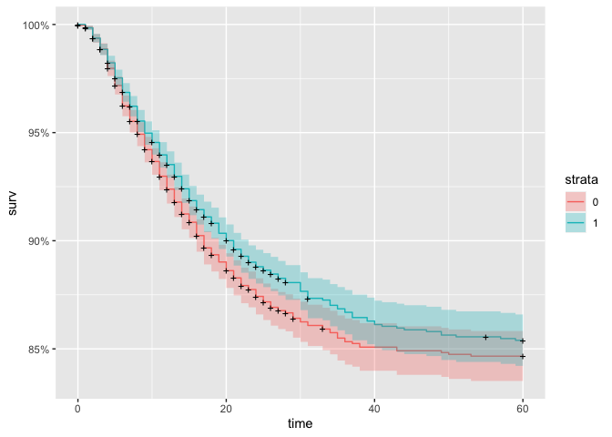
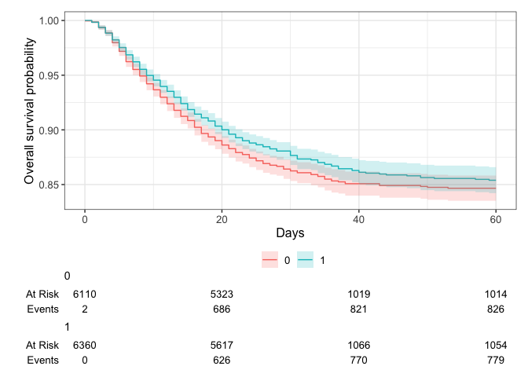
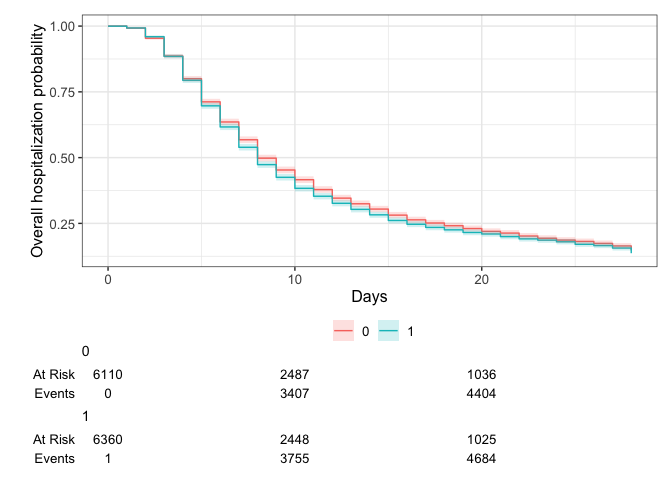
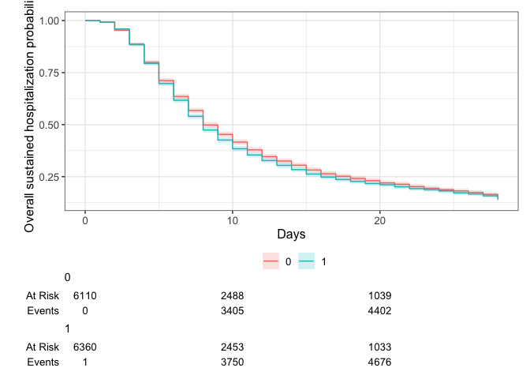
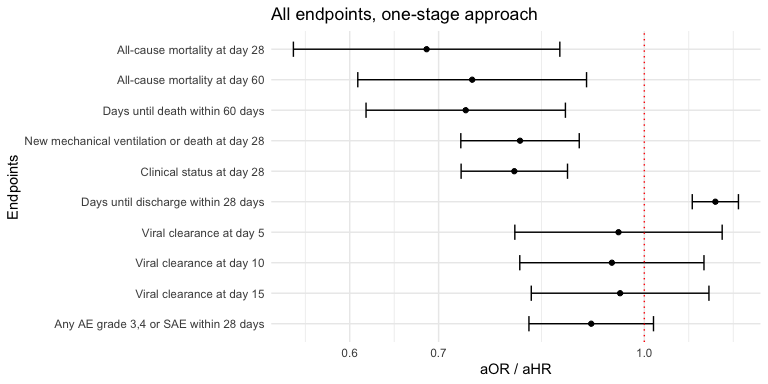

# Load packages

```r
library(tidyverse)
library(readxl)
library(writexl)
library(tableone)
library(here)
library(kableExtra)

library(jtools) # for summ() and plot_summs
library(sjPlot) # for tab_model
library(ggplot2) # survival/TTE analyses and other graphs
library(ggsurvfit) # survival/TTE analyses
library(survival) # survival/TTE analyses
library(gtsummary) # survival/TTE analyses
library(ggfortify) # autoplot
library(lme4) # glmer / clmm
library(sjPlot) # for tab_model
library(glmmTMB) # to specify estimation method explicitly -> i.e. ML
library(coxme) # for mixed-effects cox model
library(ordinal) # for ordinal regression, clm (fixed effects) & clmm (mixed effects)
library(tidycmprsk) # competing risk analysis
library(logistf) # Firth regression in case of rare events

library(meta)
library(forestplot)
library(metafor) #forest()
```

# Load standardized dataset of all trials

```r
## barisolidact
df_barisolidact <- readRDS("df_os_barisolidact.RData")
df_barisolidact <- df_barisolidact %>% 
    select(id_pat, trial, JAKi, trt, sex, age, ethn, country, icu, sympdur, vacc, clinstatus_baseline, vbaseline,
         comed_dexa, comed_rdv, comed_toci, comed_ab, comed_acoa, comed_interferon, comed_other,
         comed_cat,
         comorb_lung, comorb_liver, comorb_cvd, comorb_aht, comorb_dm, comorb_obese, comorb_smoker, immunosupp,
         comorb_autoimm, comorb_cancer, comorb_kidney, any_comorb, comorb_cat, comorb_any, comorb_count,
         crp, sero, vl_baseline, variant,
         mort_28, mort_28_dimp, mort_60, death_reached, death_time,
         new_mv_28, new_mvd_28,
         clinstatus_28_imp,
         discharge_reached, discharge_time, discharge_time_sens, discharge_reached_sus, discharge_time_sus,
         ae_28, ae_28_sev,
         vir_clear_5, vir_clear_10, vir_clear_15)
## actt2
df_actt2 <- readRDS("df_os_actt2.RData")
df_actt2 <- df_actt2 %>% 
    select(id_pat, trial, JAKi, trt, sex, age, ethn, country, icu, sympdur, vacc, clinstatus_baseline, vbaseline,
         comed_dexa, comed_rdv, comed_toci, comed_ab, comed_acoa, comed_interferon, comed_other,
         comed_cat,
         comorb_lung, comorb_liver, comorb_cvd, comorb_aht, comorb_dm, comorb_obese, comorb_smoker, immunosupp,
         comorb_autoimm, comorb_cancer, comorb_kidney, any_comorb, comorb_cat, comorb_any, comorb_count,
         crp, sero, vl_baseline, variant,
         mort_28, mort_28_dimp, mort_60, death_reached, death_time,
         new_mv_28, new_mvd_28,
         clinstatus_28_imp,
         discharge_reached, discharge_time, discharge_time_sens, discharge_reached_sus, discharge_time_sus,
         ae_28, ae_28_sev,
         vir_clear_5, vir_clear_10, vir_clear_15)
## ghazaeian
df_ghazaeian <- readRDS("df_os_ghazaeian.RData")
df_ghazaeian <- df_ghazaeian %>% 
    select(id_pat, trial, JAKi, trt, sex, age, ethn, country, icu, sympdur, vacc, clinstatus_baseline, vbaseline,
         comed_dexa, comed_rdv, comed_toci, comed_ab, comed_acoa, comed_interferon, comed_other,
         comed_cat,
         comorb_lung, comorb_liver, comorb_cvd, comorb_aht, comorb_dm, comorb_obese, comorb_smoker, immunosupp,
         comorb_autoimm, comorb_cancer, comorb_kidney, any_comorb, comorb_cat, comorb_any, comorb_count,
         crp, sero, vl_baseline, variant,
         mort_28, mort_28_dimp, mort_60, death_reached, death_time,
         new_mv_28, new_mvd_28,
         clinstatus_28_imp,
         discharge_reached, discharge_time, discharge_time_sens, discharge_reached_sus, discharge_time_sus,
         ae_28, ae_28_sev,
         vir_clear_5, vir_clear_10, vir_clear_15)
## tofacov
df_tofacov <- readRDS("df_os_tofacov.RData")
df_tofacov <- df_tofacov %>% 
    select(id_pat, trial, JAKi, trt, sex, age, ethn, country, icu, sympdur, vacc, clinstatus_baseline, vbaseline,
         comed_dexa, comed_rdv, comed_toci, comed_ab, comed_acoa, comed_interferon, comed_other,
         comed_cat,
         comorb_lung, comorb_liver, comorb_cvd, comorb_aht, comorb_dm, comorb_obese, comorb_smoker, immunosupp,
         comorb_autoimm, comorb_cancer, comorb_kidney, any_comorb, comorb_cat, comorb_any, comorb_count,
         crp, sero, vl_baseline, variant,
         mort_28, mort_28_dimp, mort_60, death_reached, death_time,
         new_mv_28, new_mvd_28,
         clinstatus_28_imp,
         discharge_reached, discharge_time, discharge_time_sens, discharge_reached_sus, discharge_time_sus,
         ae_28, ae_28_sev,
         vir_clear_5, vir_clear_10, vir_clear_15)
## covinib
df_covinib <- readRDS("df_os_covinib.RData")
df_covinib <- df_covinib %>% 
    select(id_pat, trial, JAKi, trt, sex, age, ethn, country, icu, sympdur, vacc, clinstatus_baseline, vbaseline,
         comed_dexa, comed_rdv, comed_toci, comed_ab, comed_acoa, comed_interferon, comed_other,
         comed_cat,
         comorb_lung, comorb_liver, comorb_cvd, comorb_aht, comorb_dm, comorb_obese, comorb_smoker, immunosupp,
         comorb_autoimm, comorb_cancer, comorb_kidney, any_comorb, comorb_cat, comorb_any, comorb_count,
         crp, sero, vl_baseline, variant,
         mort_28, mort_28_dimp, mort_60, death_reached, death_time,
         new_mv_28, new_mvd_28,
         clinstatus_28_imp,
         discharge_reached, discharge_time, discharge_time_sens, discharge_reached_sus, discharge_time_sus,
         ae_28, ae_28_sev,
         vir_clear_5, vir_clear_10, vir_clear_15)
## COV-BARRIER
df_covbarrier <- readRDS("df_os_cov-barrier.RData")
df_covbarrier <- df_covbarrier %>% 
    select(id_pat, trial, JAKi, trt, sex, age, ethn, country, icu, sympdur, vacc, clinstatus_baseline, vbaseline,
         comed_dexa, comed_rdv, comed_toci, comed_ab, comed_acoa, comed_interferon, comed_other,
         comed_cat,
         comorb_lung, comorb_liver, comorb_cvd, comorb_aht, comorb_dm, comorb_obese, comorb_smoker, immunosupp,
         comorb_autoimm, comorb_cancer, comorb_kidney, any_comorb, comorb_cat, comorb_any, comorb_count,
         crp, sero, vl_baseline, variant,
         mort_28, mort_28_dimp, mort_60, death_reached, death_time,
         new_mv_28, new_mvd_28,
         clinstatus_28_imp,
         discharge_reached, discharge_time, discharge_time_sens, discharge_reached_sus, discharge_time_sus,
         ae_28, ae_28_sev,
         vir_clear_5, vir_clear_10, vir_clear_15)
## Murugesan
df_murugesan <- readRDS("df_os_murugesan.RData")
df_murugesan <- df_murugesan %>% 
    select(id_pat, trial, JAKi, trt, sex, age, ethn, country, icu, sympdur, vacc, clinstatus_baseline, vbaseline,
         comed_dexa, comed_rdv, comed_toci, comed_ab, comed_acoa, comed_interferon, comed_other,
         comed_cat,
         comorb_lung, comorb_liver, comorb_cvd, comorb_aht, comorb_dm, comorb_obese, comorb_smoker, immunosupp,
         comorb_autoimm, comorb_cancer, comorb_kidney, any_comorb, comorb_cat, comorb_any, comorb_count,
         crp, sero, vl_baseline, variant,
         mort_28, mort_28_dimp, mort_60, death_reached, death_time,
         new_mv_28, new_mvd_28,
         clinstatus_28_imp,
         discharge_reached, discharge_time, discharge_time_sens, discharge_reached_sus, discharge_time_sus,
         ae_28, ae_28_sev,
         vir_clear_5, vir_clear_10, vir_clear_15)
## RECOVERY
df_recovery <- readRDS("df_os_recovery.RData")
df_recovery <- df_recovery %>% 
    select(id_pat, trial, JAKi, trt, sex, age, ethn, country, icu, sympdur, vacc, clinstatus_baseline, vbaseline,
         comed_dexa, comed_rdv, comed_toci, comed_ab, comed_acoa, comed_interferon, comed_other,
         comed_cat,
         comorb_lung, comorb_liver, comorb_cvd, comorb_aht, comorb_dm, comorb_obese, comorb_smoker, immunosupp,
         comorb_autoimm, comorb_cancer, comorb_kidney, any_comorb, comorb_cat, comorb_any, comorb_count,
         crp, sero, vl_baseline, variant,
         mort_28, mort_28_dimp, mort_60, death_reached, death_time,
         new_mv_28, new_mvd_28,
         clinstatus_28_imp,
         discharge_reached, discharge_time, discharge_time_sens, discharge_reached_sus, discharge_time_sus,
         ae_28, ae_28_sev,
         vir_clear_5, vir_clear_10, vir_clear_15)
## TACTIC-R
df_tactic_r <- readRDS("df_os_tactic-r.RData")
df_tactic_r <- df_tactic_r %>% 
    select(id_pat, trial, JAKi, trt, sex, age, ethn, country, icu, sympdur, vacc, clinstatus_baseline, vbaseline,
         comed_dexa, comed_rdv, comed_toci, comed_ab, comed_acoa, comed_interferon, comed_other,
         comed_cat,
         comorb_lung, comorb_liver, comorb_cvd, comorb_aht, comorb_dm, comorb_obese, comorb_smoker, immunosupp,
         comorb_autoimm, comorb_cancer, comorb_kidney, any_comorb, comorb_cat, comorb_any, comorb_count,
         crp, sero, vl_baseline, variant,
         mort_28, mort_28_dimp, mort_60, death_reached, death_time,
         new_mv_28, new_mvd_28,
         clinstatus_28_imp,
         discharge_reached, discharge_time, discharge_time_sens, discharge_reached_sus, discharge_time_sus,
         ae_28, ae_28_sev,
         vir_clear_5, vir_clear_10, vir_clear_15)
## PANCOVID
df_pancovid <- readRDS("df_os_pancovid.RData")
df_pancovid <- df_pancovid %>% 
    select(id_pat, trial, JAKi, trt, sex, age, ethn, country, icu, sympdur, vacc, clinstatus_baseline, vbaseline,
         comed_dexa, comed_rdv, comed_toci, comed_ab, comed_acoa, comed_interferon, comed_other,
         comed_cat,
         comorb_lung, comorb_liver, comorb_cvd, comorb_aht, comorb_dm, comorb_obese, comorb_smoker, immunosupp,
         comorb_autoimm, comorb_cancer, comorb_kidney, any_comorb, comorb_cat, comorb_any, comorb_count,
         crp, sero, vl_baseline, variant,
         mort_28, mort_28_dimp, mort_60, death_reached, death_time,
         new_mv_28, new_mvd_28,
         clinstatus_28_imp,
         discharge_reached, discharge_time, discharge_time_sens, discharge_reached_sus, discharge_time_sus,
         ae_28, ae_28_sev,
         vir_clear_5, vir_clear_10, vir_clear_15)


# append
df_tot <- rbind(df_barisolidact, df_actt2, df_ghazaeian, df_tofacov, df_covinib, df_covbarrier, df_recovery, df_tactic_r, df_pancovid)
# df_tot_Muru <- rbind(df_barisolidact, df_actt2, df_ghazaeian, df_tofacov, df_covinib, df_covbarrier, df_murugesan, df_recovery)

# Save
saveRDS(df_tot, file = "df_tot.RData")
write_xlsx(df_tot, path = "df_tot.xlsx")
# saveRDS(df_tot_Muru, file = "df_tot_Muru.RData")
```

# (i) Primary outcome: Mortality at day 28

```r
addmargins(table(df_tot$trial, df_tot$mort_28, useNA = "always"))
```

```
##                
##                     0     1  <NA>   Sum
##   ACTT2           925    61    47  1033
##   Bari-Solidact   241    36    12   289
##   COV-BARRIER    1312   211   103  1626
##   COVINIB         105     2     3   110
##   Ghazaeian        90     7     0    97
##   PANCOVID        268     8    11   287
##   RECOVERY       6943  1058   129  8130
##   TACTIC-R        233    35    14   282
##   TOFACOV         115     1     0   116
##   <NA>              0     0     0     0
##   Sum           10232  1419   319 11970
```

```r
addmargins(table(df_tot$mort_28, df_tot$trt, useNA = "always"))
```

```
##       
##            0     1  <NA>   Sum
##   0     5013  5219     0 10232
##   1      761   658     0  1419
##   <NA>   144   175     0   319
##   Sum   5918  6052     0 11970
```

```r
# table(df_tot$age, df_tot$trt, useNA = "always")
table(df_tot$clinstatus_baseline, df_tot$trt, useNA = "always")
```

```
##       
##           0    1 <NA>
##   1       0    0    0
##   2     483  457    0
##   3    3784 3845    0
##   4    1402 1498    0
##   5     244  250    0
##   6       0    0    0
##   <NA>    5    2    0
```

```r
table(df_tot$clinstatus_baseline, df_tot$trial, useNA = "always")
```

```
##       
##        ACTT2 Bari-Solidact COV-BARRIER COVINIB Ghazaeian PANCOVID RECOVERY
##   1        0             0           0       0         0        0        0
##   2      142             0         186      35         2       74      465
##   3      564             0         962      75        95      208     5504
##   4      216           249         370       0         0        5     1921
##   5      111            40         101       0         0        0      240
##   6        0             0           0       0         0        0        0
##   <NA>     0             0           7       0         0        0        0
##       
##        TACTIC-R TOFACOV <NA>
##   1           0       0    0
##   2          11      25    0
##   3         130      91    0
##   4         139       0    0
##   5           2       0    0
##   6           0       0    0
##   <NA>        0       0    0
```

```r
table(df_tot$vbaseline, df_tot$trial, useNA = "always")
```

```
##       
##        ACTT2 Bari-Solidact COV-BARRIER COVINIB Ghazaeian PANCOVID RECOVERY
##   0      706             0        1148     110        97      282     5969
##   1      327           289         471       0         0        5     2161
##   <NA>     0             0           7       0         0        0        0
##       
##        TACTIC-R TOFACOV <NA>
##   0         141     116    0
##   1         141       0    0
##   <NA>        0       0    0
```

```r
# reformatting
df_tot$trt_f <- as.factor(df_tot$trt)
df_tot$trial_f <- as.factor(df_tot$trial)
df_tot$clinstatus_baseline_n <- as.numeric(df_tot$clinstatus_baseline)
df_tot <- df_tot %>%
  mutate(trial_n = case_when(trial == "Bari-Solidact" ~ 1,
                             trial == "ACTT2" ~ 2,
                             trial == "Ghazaeian" ~ 3,
                             trial == "TOFACOV" ~ 4,
                             trial == "COVINIB" ~ 5,
                             trial == "COV-BARRIER" ~ 6,
                             trial == "RECOVERY" ~ 7,
                             trial == "TACTIC-R" ~ 8,
                             trial == "PANCOVID" ~ 9,
                             ))
table(df_tot$trial_n, useNA = "always")
```

```
## 
##    1    2    3    4    5    6    7    8    9 <NA> 
##  289 1033   97  116  110 1626 8130  282  287    0
```

GOAL: random treatment effect, stratified trial intercept, stratified prognostic factors, AND centering the treatment variable by the proportion treated in the trial (to improve the estimation of between-study variance) AND maximum likelihood (ML) estimator (due to small trials with rare events). REML is default in glmer, for ML use glmmTMB. See notes.

### (1) common treatment effect, random trial intercept, common prognostic factors

```r
# (1) common treatment effect, random trial intercept, common prognostic factors, ML
mort28.ctreat.rtrial.ml <- glmmTMB(mort_28 ~ trt + (1|trial)
                              + age + clinstatus_baseline
                              , data = df_tot, family = binomial)
tab_model(mort28.ctreat.rtrial.ml)
```

<table style="border-collapse:collapse; border:none;">
<tr>
<th style="border-top: double; text-align:center; font-style:normal; font-weight:bold; padding:0.2cm;  text-align:left; ">&nbsp;</th>
<th colspan="3" style="border-top: double; text-align:center; font-style:normal; font-weight:bold; padding:0.2cm; ">mort 28</th>
</tr>
<tr>
<td style=" text-align:center; border-bottom:1px solid; font-style:italic; font-weight:normal;  text-align:left; ">Predictors</td>
<td style=" text-align:center; border-bottom:1px solid; font-style:italic; font-weight:normal;  ">Odds Ratios</td>
<td style=" text-align:center; border-bottom:1px solid; font-style:italic; font-weight:normal;  ">CI</td>
<td style=" text-align:center; border-bottom:1px solid; font-style:italic; font-weight:normal;  ">p</td>
</tr>
<tr>
<td style=" padding:0.2cm; text-align:left; vertical-align:top; text-align:left; ">(Intercept)</td>
<td style=" padding:0.2cm; text-align:left; vertical-align:top; text-align:center;  ">0.00</td>
<td style=" padding:0.2cm; text-align:left; vertical-align:top; text-align:center;  ">0.00&nbsp;&ndash;&nbsp;0.00</td>
<td style=" padding:0.2cm; text-align:left; vertical-align:top; text-align:center;  "><strong>&lt;0.001</strong></td>
</tr>
<tr>
<td style=" padding:0.2cm; text-align:left; vertical-align:top; text-align:left; ">Trial treatment group</td>
<td style=" padding:0.2cm; text-align:left; vertical-align:top; text-align:center;  ">0.75</td>
<td style=" padding:0.2cm; text-align:left; vertical-align:top; text-align:center;  ">0.66&nbsp;&ndash;&nbsp;0.85</td>
<td style=" padding:0.2cm; text-align:left; vertical-align:top; text-align:center;  "><strong>&lt;0.001</strong></td>
</tr>
<tr>
<td style=" padding:0.2cm; text-align:left; vertical-align:top; text-align:left; ">Age(years)</td>
<td style=" padding:0.2cm; text-align:left; vertical-align:top; text-align:center;  ">1.08</td>
<td style=" padding:0.2cm; text-align:left; vertical-align:top; text-align:center;  ">1.07&nbsp;&ndash;&nbsp;1.09</td>
<td style=" padding:0.2cm; text-align:left; vertical-align:top; text-align:center;  "><strong>&lt;0.001</strong></td>
</tr>
<tr>
<td style=" padding:0.2cm; text-align:left; vertical-align:top; text-align:left; ">clinstatus baseline:<br>clinstatus baseline 3</td>
<td style=" padding:0.2cm; text-align:left; vertical-align:top; text-align:center;  ">2.18</td>
<td style=" padding:0.2cm; text-align:left; vertical-align:top; text-align:center;  ">1.55&nbsp;&ndash;&nbsp;3.06</td>
<td style=" padding:0.2cm; text-align:left; vertical-align:top; text-align:center;  "><strong>&lt;0.001</strong></td>
</tr>
<tr>
<td style=" padding:0.2cm; text-align:left; vertical-align:top; text-align:left; ">clinstatus baseline:<br>clinstatus baseline 4</td>
<td style=" padding:0.2cm; text-align:left; vertical-align:top; text-align:center;  ">8.00</td>
<td style=" padding:0.2cm; text-align:left; vertical-align:top; text-align:center;  ">5.66&nbsp;&ndash;&nbsp;11.30</td>
<td style=" padding:0.2cm; text-align:left; vertical-align:top; text-align:center;  "><strong>&lt;0.001</strong></td>
</tr>
<tr>
<td style=" padding:0.2cm; text-align:left; vertical-align:top; text-align:left; ">clinstatus baseline:<br>clinstatus baseline 5</td>
<td style=" padding:0.2cm; text-align:left; vertical-align:top; text-align:center;  ">24.10</td>
<td style=" padding:0.2cm; text-align:left; vertical-align:top; text-align:center;  ">16.16&nbsp;&ndash;&nbsp;35.93</td>
<td style=" padding:0.2cm; text-align:left; vertical-align:top; text-align:center;  "><strong>&lt;0.001</strong></td>
</tr>
<tr>
<td colspan="4" style="font-weight:bold; text-align:left; padding-top:.8em;">Random Effects</td>
</tr>

<tr>
<td style=" padding:0.2cm; text-align:left; vertical-align:top; text-align:left; padding-top:0.1cm; padding-bottom:0.1cm;">&sigma;<sup>2</sup></td>
<td style=" padding:0.2cm; text-align:left; vertical-align:top; padding-top:0.1cm; padding-bottom:0.1cm; text-align:left;" colspan="3">3.29</td>
</tr>

<tr>
<td style=" padding:0.2cm; text-align:left; vertical-align:top; text-align:left; padding-top:0.1cm; padding-bottom:0.1cm;">&tau;<sub>00</sub> <sub>trial</sub></td>
<td style=" padding:0.2cm; text-align:left; vertical-align:top; padding-top:0.1cm; padding-bottom:0.1cm; text-align:left;" colspan="3">0.34</td>

<tr>
<td style=" padding:0.2cm; text-align:left; vertical-align:top; text-align:left; padding-top:0.1cm; padding-bottom:0.1cm;">ICC</td>
<td style=" padding:0.2cm; text-align:left; vertical-align:top; padding-top:0.1cm; padding-bottom:0.1cm; text-align:left;" colspan="3">0.09</td>

<tr>
<td style=" padding:0.2cm; text-align:left; vertical-align:top; text-align:left; padding-top:0.1cm; padding-bottom:0.1cm;">N <sub>trial</sub></td>
<td style=" padding:0.2cm; text-align:left; vertical-align:top; padding-top:0.1cm; padding-bottom:0.1cm; text-align:left;" colspan="3">9</td>
<tr>
<td style=" padding:0.2cm; text-align:left; vertical-align:top; text-align:left; padding-top:0.1cm; padding-bottom:0.1cm; border-top:1px solid;">Observations</td>
<td style=" padding:0.2cm; text-align:left; vertical-align:top; padding-top:0.1cm; padding-bottom:0.1cm; text-align:left; border-top:1px solid;" colspan="3">11651</td>
</tr>
<tr>
<td style=" padding:0.2cm; text-align:left; vertical-align:top; text-align:left; padding-top:0.1cm; padding-bottom:0.1cm;">Marginal R<sup>2</sup> / Conditional R<sup>2</sup></td>
<td style=" padding:0.2cm; text-align:left; vertical-align:top; padding-top:0.1cm; padding-bottom:0.1cm; text-align:left;" colspan="3">0.342 / 0.404</td>
</tr>

</table>

```r
mort28.ctreat.rtrial.ml.vb <- glmmTMB(mort_28 ~ trt + (1|trial)
                              + age + vbaseline
                              , data = df_tot, family = binomial)
# tab_model(mort28.ctreat.rtrial.ml.vb)
```

### (2) random treatment effect, random trial intercept, common prognostic factors and residual variances

```r
# (3) random treatment effect, random trial intercept, common prognostic factors and residual variances, ML
mort28.rtreat.rtrial.ml <- glmmTMB(mort_28 ~ trt + (1 + trt|trial_f)
                              + age + clinstatus_baseline
                              , data = df_tot, family = binomial)
# tab_model(mort28.rtreat.rtrial.ml)

mort28.rtreat.rtrial.ml.vb <- glmmTMB(mort_28 ~ trt + (1 + trt|trial_f)
                              + age + vbaseline
                              , data = df_tot, family = binomial)
# tab_model(mort28.rtreat.rtrial.ml.vb)
```

### (3) random treatment effect, stratified trial intercept, common prognostic factors and residual variances

```r
# (2) random treatment effect, stratified trial intercept, common prognostic factors and residual variances, and WITHOUT centering the treatment variable, ML
mort28.rtreat.strial.ml <- glmmTMB(mort_28 ~ trt_f + trial_f + (trt - 1 | trial_f)
                              + age + clinstatus_baseline
                              , data = df_tot, family = binomial)
# tab_model(mort28.rtreat.strial.ml)

mort28.rtreat.strial.ml.vb <- glmmTMB(mort_28 ~ trt_f + trial_f + (trt - 1 | trial_f)
                              + age + vbaseline 
                              , data = df_tot, family = binomial)
# tab_model(mort28.rtreat.strial.ml.vb)

# The - 1 within (trt - 1 | trial_n) specifies that there is no random intercept for the grouping factor trial_n. We're specifying random slopes for the variable trt within each level of trial_n, i.e., the effect may vary from one trial to another. Together with trial_f, this gives the stratified intercept model. This is a more flexible model compared to a model with a random intercept, which assumes a common baseline for all groups.

# dummy variable for each trial (trial_1, trial_2, trial_3, etc - e.g. where trial_1 = 1 if in trial 1 and 0 otherwise)
# df_tot <- df_tot %>%
#   mutate(trial_1 = case_when(trial == "Bari-Solidact" ~ 1, TRUE ~ 0),
#          trial_2 = case_when(trial == "ACTT2" ~ 1, TRUE ~ 0),
#          trial_3 = case_when(trial == "Ghazaeian" ~ 1, TRUE ~ 0),
#          trial_4 = case_when(trial == "TOFACOV" ~ 1, TRUE ~ 0),
#          trial_5 = case_when(trial == "COVINIB" ~ 1, TRUE ~ 0),
#          trial_6 = case_when(trial == "COV-BARRIER" ~ 1, TRUE ~ 0),
#          trial_7 = case_when(trial == "RECOVERY" ~ 1, TRUE ~ 0),
#          trial_8 = case_when(trial == "TACTIC-R" ~ 1, TRUE ~ 0))

## Use "Stata syntax":
# mort28.rtreat.strial.2 <- glmer(mort_28 ~ trt_f + trial* + (trt -1 | trial_n)
#                               + age + clinstatus_baseline_n
#                               # + comed_dexa + comed_rdv + comed_toci
#                               , data = df_tot, family = binomial)
# tab_model(mort28.rtreat.strial.2)
```

### (4) random treatment effect, stratified trial intercept, common prognostic factors and residual variances, AND centering the treatment variable

```r
# (4) random treatment effect, stratified trial intercept, common prognostic factors and residual variances, ML, but WITH centering the treatment variable

# calculate the proportion treated by trial
proportions <- df_tot %>%
  group_by(trial) %>%
  summarize(proportion_treated = sum(trt) / n())
df_tot <- left_join(df_tot, proportions[, c("proportion_treated", "trial")], by = join_by(trial == trial))
# table(df_tot$trial, df_tot$proportion_treated)

# create the centered treatment variable
df_tot$trt_centered_n <- df_tot$trt - df_tot$proportion_treated
df_tot$trt_centered_f <- as.factor(df_tot$trt_centered_n)
# table(df_tot$trial, df_tot$trt_centered_f) ## keep it minus?

# build the model. '-1' indicating there is no overall random intercept.
mort28.rtreat.strial.cent.ml <- glmmTMB(mort_28 ~ trt_centered_n + trial_f + (trt_centered_n -1 | trial_f) -1
                   + age + clinstatus_baseline
                   , data = df_tot, family = binomial
                   )
# tab_model(mort28.rtreat.strial.cent.ml)

mort28.rtreat.strial.cent.ml.vb <- glmmTMB(mort_28 ~ trt_centered_n + trial_f + (trt_centered_n -1 | trial_f) -1 
                   + age + vbaseline 
                   , data = df_tot, family = binomial
                   )
# tab_model(mort28.rtreat.strial.cent.ml.vb)
```

### (5) random treatment effect, stratified trial intercept, stratified prognostic factors and residual variances, with centering the treatment variable AND the prognostic variables

```r
# "Our default recommendation is to use stratified prognostic effects (i.e. estimate a separate effect of each included prognostic factor for each trial), with trial-specific centering of each prognostic factor to improve ML estimation (for the reasons explained in Section 6.2.8.3). However, if outcome data or prognostic factor categories are sparse, the stratification approach may lead to estimation difficulties, and then allowing prognostic factor effects to be random is a sensible alternative." (p. 145) Centering disentangles (i.e. makes uncorrelated) the estimation of main parameters of interest from other nuisance parameters, which leads to less downward bias in estimates of variance parameters (Figure 6.2) and thus improves coverage of 95% confidence intervals. This can be achieved by centering the covariates by their mean values within trials, such that the interaction estimate is then only based on within-trial information.

# Calculate the mean values of (continuous) prognostic factors within each trial
trial_means <- df_tot %>%
  group_by(trial) %>%
  summarize(mean_age = mean(age, na.rm = TRUE), mean_clinstatus = mean(clinstatus_baseline_n, na.rm = TRUE))
# Merge back
df_tot <- df_tot %>% left_join(trial_means, by = "trial")
# Center the age and clinstatus_baseline variables
df_tot <- df_tot %>%
  mutate(age_centered = age - mean_age, 
         clinstatus_baseline_centered = clinstatus_baseline_n - mean_clinstatus)

# df_tot %>%
#   select(trial_f, trial_n, trt, trt_centered_n, age, mean_age, age_centered, clinstatus_baseline_n, mean_clinstatus, clinstatus_baseline_centered, mort_28) %>%
#   View()


### Add the prognostic factors stratified, i.e. create stratified variables for each prognostic factor
## uncentered
df_tot <- df_tot %>%
  mutate(age_trial_1 = case_when(trial == "Bari-Solidact" ~ age, TRUE ~ 0),
         age_trial_2 = case_when(trial == "ACTT2" ~ age, TRUE ~ 0),
         age_trial_3 = case_when(trial == "Ghazaeian" ~ age, TRUE ~ 0),
         age_trial_4 = case_when(trial == "TOFACOV" ~ age, TRUE ~ 0),
         age_trial_5 = case_when(trial == "COVINIB" ~ age, TRUE ~ 0),
         age_trial_6 = case_when(trial == "COV-BARRIER" ~ age, TRUE ~ 0),
         age_trial_7 = case_when(trial == "RECOVERY" ~ age, TRUE ~ 0),
         age_trial_8 = case_when(trial == "TACTIC-R" ~ age, TRUE ~ 0),
         age_trial_9 = case_when(trial == "PANCOVID" ~ age, TRUE ~ 0))
df_tot <- df_tot %>%
  mutate(clinstat_trial_1 = case_when(trial == "Bari-Solidact" ~ clinstatus_baseline, TRUE ~ "0"),
         clinstat_trial_2 = case_when(trial == "ACTT2" ~ clinstatus_baseline, TRUE ~ "0"),
         clinstat_trial_3 = case_when(trial == "Ghazaeian" ~ clinstatus_baseline, TRUE ~ "0"),
         clinstat_trial_4 = case_when(trial == "TOFACOV" ~ clinstatus_baseline, TRUE ~ "0"),
         clinstat_trial_5 = case_when(trial == "COVINIB" ~ clinstatus_baseline, TRUE ~ "0"),
         clinstat_trial_6 = case_when(trial == "COV-BARRIER" ~ clinstatus_baseline, TRUE ~ "0"),
         clinstat_trial_7 = case_when(trial == "RECOVERY" ~ clinstatus_baseline, TRUE ~ "0"),
         clinstat_trial_8 = case_when(trial == "TACTIC-R" ~ clinstatus_baseline, TRUE ~ "0"),
         clinstat_trial_9 = case_when(trial == "PANCOVID" ~ clinstatus_baseline, TRUE ~ "0"))

## centered
df_tot <- df_tot %>%
  mutate(age_cent_trial_1 = case_when(trial == "Bari-Solidact" ~ age_centered, TRUE ~ 0),
         age_cent_trial_2 = case_when(trial == "ACTT2" ~ age_centered, TRUE ~ 0),
         age_cent_trial_3 = case_when(trial == "Ghazaeian" ~ age_centered, TRUE ~ 0),
         age_cent_trial_4 = case_when(trial == "TOFACOV" ~ age_centered, TRUE ~ 0),
         age_cent_trial_5 = case_when(trial == "COVINIB" ~ age_centered, TRUE ~ 0),
         age_cent_trial_6 = case_when(trial == "COV-BARRIER" ~ age_centered, TRUE ~ 0),
         age_cent_trial_7 = case_when(trial == "RECOVERY" ~ age_centered, TRUE ~ 0),
         age_cent_trial_8 = case_when(trial == "TACTIC-R" ~ age_centered, TRUE ~ 0),
         age_cent_trial_9 = case_when(trial == "PANCOVID" ~ age_centered, TRUE ~ 0))
df_tot <- df_tot %>%
  mutate(clinstat_cent_trial_1 = case_when(trial == "Bari-Solidact" ~ clinstatus_baseline_centered, TRUE ~ 0),
         clinstat_cent_trial_2 = case_when(trial == "ACTT2" ~ clinstatus_baseline_centered, TRUE ~ 0),
         clinstat_cent_trial_3 = case_when(trial == "Ghazaeian" ~ clinstatus_baseline_centered, TRUE ~ 0),
         clinstat_cent_trial_4 = case_when(trial == "TOFACOV" ~ clinstatus_baseline_centered, TRUE ~ 0),
         clinstat_cent_trial_5 = case_when(trial == "COVINIB" ~ clinstatus_baseline_centered, TRUE ~ 0),
         clinstat_cent_trial_6 = case_when(trial == "COV-BARRIER" ~ clinstatus_baseline_centered, TRUE ~ 0),
         clinstat_cent_trial_7 = case_when(trial == "RECOVERY" ~ clinstatus_baseline_centered, TRUE ~ 0),
         clinstat_cent_trial_8 = case_when(trial == "TACTIC-R" ~ clinstatus_baseline_centered, TRUE ~ 0),
         clinstat_cent_trial_9 = case_when(trial == "PANCOVID" ~ clinstatus_baseline_centered, TRUE ~ 0))


# (5) random treatment effect, stratified trial intercept, stratified prognostic factors and residual variances, with centering of the treatment variable AND the prognostic factors

mort28.rtreat.strial.cent.ml.spf.cent <- glmmTMB(mort_28 ~ trt_centered_n
                                                 + trial_f
                                                 + (trt_centered_n -1 | trial_f) -1
                                                 + age_cent_trial_1 + age_cent_trial_2 + age_cent_trial_3 + age_cent_trial_4
                                                 + age_cent_trial_5 + age_cent_trial_6 + age_cent_trial_7 + age_cent_trial_8 + age_cent_trial_9
                                                 + clinstat_cent_trial_1 + clinstat_cent_trial_2 + clinstat_cent_trial_3
                                                 + clinstat_cent_trial_4 + clinstat_cent_trial_5 + clinstat_cent_trial_6 + clinstat_cent_trial_7 + clinstat_cent_trial_8 + clinstat_cent_trial_9
                                                 , data = df_tot, family = binomial)
tab_model(mort28.rtreat.strial.cent.ml.spf.cent)
```

<table style="border-collapse:collapse; border:none;">
<tr>
<th style="border-top: double; text-align:center; font-style:normal; font-weight:bold; padding:0.2cm;  text-align:left; ">&nbsp;</th>
<th colspan="3" style="border-top: double; text-align:center; font-style:normal; font-weight:bold; padding:0.2cm; ">mort 28</th>
</tr>
<tr>
<td style=" text-align:center; border-bottom:1px solid; font-style:italic; font-weight:normal;  text-align:left; ">Predictors</td>
<td style=" text-align:center; border-bottom:1px solid; font-style:italic; font-weight:normal;  ">Odds Ratios</td>
<td style=" text-align:center; border-bottom:1px solid; font-style:italic; font-weight:normal;  ">CI</td>
<td style=" text-align:center; border-bottom:1px solid; font-style:italic; font-weight:normal;  ">p</td>
</tr>
<tr>
<td style=" padding:0.2cm; text-align:left; vertical-align:top; text-align:left; ">Trial treatment group</td>
<td style=" padding:0.2cm; text-align:left; vertical-align:top; text-align:center;  ">0.70</td>
<td style=" padding:0.2cm; text-align:left; vertical-align:top; text-align:center;  ">0.56&nbsp;&ndash;&nbsp;0.87</td>
<td style=" padding:0.2cm; text-align:left; vertical-align:top; text-align:center;  "><strong>0.002</strong></td>
</tr>
<tr>
<td style=" padding:0.2cm; text-align:left; vertical-align:top; text-align:left; ">trial f: ACTT 2</td>
<td style=" padding:0.2cm; text-align:left; vertical-align:top; text-align:center;  ">0.03</td>
<td style=" padding:0.2cm; text-align:left; vertical-align:top; text-align:center;  ">0.02&nbsp;&ndash;&nbsp;0.05</td>
<td style=" padding:0.2cm; text-align:left; vertical-align:top; text-align:center;  "><strong>&lt;0.001</strong></td>
</tr>
<tr>
<td style=" padding:0.2cm; text-align:left; vertical-align:top; text-align:left; ">trial f: Bari-Solidact</td>
<td style=" padding:0.2cm; text-align:left; vertical-align:top; text-align:center;  ">0.09</td>
<td style=" padding:0.2cm; text-align:left; vertical-align:top; text-align:center;  ">0.05&nbsp;&ndash;&nbsp;0.15</td>
<td style=" padding:0.2cm; text-align:left; vertical-align:top; text-align:center;  "><strong>&lt;0.001</strong></td>
</tr>
<tr>
<td style=" padding:0.2cm; text-align:left; vertical-align:top; text-align:left; ">trial f: COV-BARRIER</td>
<td style=" padding:0.2cm; text-align:left; vertical-align:top; text-align:center;  ">0.09</td>
<td style=" padding:0.2cm; text-align:left; vertical-align:top; text-align:center;  ">0.07&nbsp;&ndash;&nbsp;0.11</td>
<td style=" padding:0.2cm; text-align:left; vertical-align:top; text-align:center;  "><strong>&lt;0.001</strong></td>
</tr>
<tr>
<td style=" padding:0.2cm; text-align:left; vertical-align:top; text-align:left; ">trial f: COVINIB</td>
<td style=" padding:0.2cm; text-align:left; vertical-align:top; text-align:center;  ">0.00</td>
<td style=" padding:0.2cm; text-align:left; vertical-align:top; text-align:center;  ">0.00&nbsp;&ndash;&nbsp;Inf</td>
<td style=" padding:0.2cm; text-align:left; vertical-align:top; text-align:center;  ">0.999</td>
</tr>
<tr>
<td style=" padding:0.2cm; text-align:left; vertical-align:top; text-align:left; ">trial f: Ghazaeian</td>
<td style=" padding:0.2cm; text-align:left; vertical-align:top; text-align:center;  ">0.06</td>
<td style=" padding:0.2cm; text-align:left; vertical-align:top; text-align:center;  ">0.00&nbsp;&ndash;&nbsp;20305418014096206650671104.00</td>
<td style=" padding:0.2cm; text-align:left; vertical-align:top; text-align:center;  ">0.926</td>
</tr>
<tr>
<td style=" padding:0.2cm; text-align:left; vertical-align:top; text-align:left; ">trial f: PANCOVID</td>
<td style=" padding:0.2cm; text-align:left; vertical-align:top; text-align:center;  ">0.01</td>
<td style=" padding:0.2cm; text-align:left; vertical-align:top; text-align:center;  ">0.00&nbsp;&ndash;&nbsp;0.04</td>
<td style=" padding:0.2cm; text-align:left; vertical-align:top; text-align:center;  "><strong>&lt;0.001</strong></td>
</tr>
<tr>
<td style=" padding:0.2cm; text-align:left; vertical-align:top; text-align:left; ">trial f: RECOVERY</td>
<td style=" padding:0.2cm; text-align:left; vertical-align:top; text-align:center;  ">0.09</td>
<td style=" padding:0.2cm; text-align:left; vertical-align:top; text-align:center;  ">0.08&nbsp;&ndash;&nbsp;0.09</td>
<td style=" padding:0.2cm; text-align:left; vertical-align:top; text-align:center;  "><strong>&lt;0.001</strong></td>
</tr>
<tr>
<td style=" padding:0.2cm; text-align:left; vertical-align:top; text-align:left; ">trial f: TACTIC-R</td>
<td style=" padding:0.2cm; text-align:left; vertical-align:top; text-align:center;  ">0.08</td>
<td style=" padding:0.2cm; text-align:left; vertical-align:top; text-align:center;  ">0.05&nbsp;&ndash;&nbsp;0.14</td>
<td style=" padding:0.2cm; text-align:left; vertical-align:top; text-align:center;  "><strong>&lt;0.001</strong></td>
</tr>
<tr>
<td style=" padding:0.2cm; text-align:left; vertical-align:top; text-align:left; ">trial f: TOFACOV</td>
<td style=" padding:0.2cm; text-align:left; vertical-align:top; text-align:center;  ">0.00</td>
<td style=" padding:0.2cm; text-align:left; vertical-align:top; text-align:center;  ">0.00&nbsp;&ndash;&nbsp;Inf</td>
<td style=" padding:0.2cm; text-align:left; vertical-align:top; text-align:center;  ">0.995</td>
</tr>
<tr>
<td style=" padding:0.2cm; text-align:left; vertical-align:top; text-align:left; ">age cent trial 1</td>
<td style=" padding:0.2cm; text-align:left; vertical-align:top; text-align:center;  ">1.09</td>
<td style=" padding:0.2cm; text-align:left; vertical-align:top; text-align:center;  ">1.05&nbsp;&ndash;&nbsp;1.13</td>
<td style=" padding:0.2cm; text-align:left; vertical-align:top; text-align:center;  "><strong>&lt;0.001</strong></td>
</tr>
<tr>
<td style=" padding:0.2cm; text-align:left; vertical-align:top; text-align:left; ">age cent trial 2</td>
<td style=" padding:0.2cm; text-align:left; vertical-align:top; text-align:center;  ">1.06</td>
<td style=" padding:0.2cm; text-align:left; vertical-align:top; text-align:center;  ">1.03&nbsp;&ndash;&nbsp;1.08</td>
<td style=" padding:0.2cm; text-align:left; vertical-align:top; text-align:center;  "><strong>&lt;0.001</strong></td>
</tr>
<tr>
<td style=" padding:0.2cm; text-align:left; vertical-align:top; text-align:left; ">age cent trial 3</td>
<td style=" padding:0.2cm; text-align:left; vertical-align:top; text-align:center;  ">1.03</td>
<td style=" padding:0.2cm; text-align:left; vertical-align:top; text-align:center;  ">0.98&nbsp;&ndash;&nbsp;1.08</td>
<td style=" padding:0.2cm; text-align:left; vertical-align:top; text-align:center;  ">0.277</td>
</tr>
<tr>
<td style=" padding:0.2cm; text-align:left; vertical-align:top; text-align:left; ">age cent trial 4</td>
<td style=" padding:0.2cm; text-align:left; vertical-align:top; text-align:center;  ">1.06</td>
<td style=" padding:0.2cm; text-align:left; vertical-align:top; text-align:center;  ">0.88&nbsp;&ndash;&nbsp;1.28</td>
<td style=" padding:0.2cm; text-align:left; vertical-align:top; text-align:center;  ">0.509</td>
</tr>
<tr>
<td style=" padding:0.2cm; text-align:left; vertical-align:top; text-align:left; ">age cent trial 5</td>
<td style=" padding:0.2cm; text-align:left; vertical-align:top; text-align:center;  ">1.11</td>
<td style=" padding:0.2cm; text-align:left; vertical-align:top; text-align:center;  ">0.93&nbsp;&ndash;&nbsp;1.33</td>
<td style=" padding:0.2cm; text-align:left; vertical-align:top; text-align:center;  ">0.250</td>
</tr>
<tr>
<td style=" padding:0.2cm; text-align:left; vertical-align:top; text-align:left; ">age cent trial 6</td>
<td style=" padding:0.2cm; text-align:left; vertical-align:top; text-align:center;  ">1.07</td>
<td style=" padding:0.2cm; text-align:left; vertical-align:top; text-align:center;  ">1.05&nbsp;&ndash;&nbsp;1.08</td>
<td style=" padding:0.2cm; text-align:left; vertical-align:top; text-align:center;  "><strong>&lt;0.001</strong></td>
</tr>
<tr>
<td style=" padding:0.2cm; text-align:left; vertical-align:top; text-align:left; ">age cent trial 7</td>
<td style=" padding:0.2cm; text-align:left; vertical-align:top; text-align:center;  ">1.08</td>
<td style=" padding:0.2cm; text-align:left; vertical-align:top; text-align:center;  ">1.08&nbsp;&ndash;&nbsp;1.09</td>
<td style=" padding:0.2cm; text-align:left; vertical-align:top; text-align:center;  "><strong>&lt;0.001</strong></td>
</tr>
<tr>
<td style=" padding:0.2cm; text-align:left; vertical-align:top; text-align:left; ">age cent trial 8</td>
<td style=" padding:0.2cm; text-align:left; vertical-align:top; text-align:center;  ">1.11</td>
<td style=" padding:0.2cm; text-align:left; vertical-align:top; text-align:center;  ">1.07&nbsp;&ndash;&nbsp;1.15</td>
<td style=" padding:0.2cm; text-align:left; vertical-align:top; text-align:center;  "><strong>&lt;0.001</strong></td>
</tr>
<tr>
<td style=" padding:0.2cm; text-align:left; vertical-align:top; text-align:left; ">age cent trial 9</td>
<td style=" padding:0.2cm; text-align:left; vertical-align:top; text-align:center;  ">1.17</td>
<td style=" padding:0.2cm; text-align:left; vertical-align:top; text-align:center;  ">1.05&nbsp;&ndash;&nbsp;1.29</td>
<td style=" padding:0.2cm; text-align:left; vertical-align:top; text-align:center;  "><strong>0.004</strong></td>
</tr>
<tr>
<td style=" padding:0.2cm; text-align:left; vertical-align:top; text-align:left; ">clinstat cent trial 1</td>
<td style=" padding:0.2cm; text-align:left; vertical-align:top; text-align:center;  ">2.43</td>
<td style=" padding:0.2cm; text-align:left; vertical-align:top; text-align:center;  ">0.97&nbsp;&ndash;&nbsp;6.07</td>
<td style=" padding:0.2cm; text-align:left; vertical-align:top; text-align:center;  ">0.057</td>
</tr>
<tr>
<td style=" padding:0.2cm; text-align:left; vertical-align:top; text-align:left; ">clinstat cent trial 2</td>
<td style=" padding:0.2cm; text-align:left; vertical-align:top; text-align:center;  ">3.43</td>
<td style=" padding:0.2cm; text-align:left; vertical-align:top; text-align:center;  ">2.47&nbsp;&ndash;&nbsp;4.76</td>
<td style=" padding:0.2cm; text-align:left; vertical-align:top; text-align:center;  "><strong>&lt;0.001</strong></td>
</tr>
<tr>
<td style=" padding:0.2cm; text-align:left; vertical-align:top; text-align:left; ">clinstat cent trial 3</td>
<td style=" padding:0.2cm; text-align:left; vertical-align:top; text-align:center;  ">417835.60</td>
<td style=" padding:0.2cm; text-align:left; vertical-align:top; text-align:center;  ">0.00&nbsp;&ndash;&nbsp;Inf</td>
<td style=" padding:0.2cm; text-align:left; vertical-align:top; text-align:center;  ">0.993</td>
</tr>
<tr>
<td style=" padding:0.2cm; text-align:left; vertical-align:top; text-align:left; ">clinstat cent trial 4</td>
<td style=" padding:0.2cm; text-align:left; vertical-align:top; text-align:center;  ">7242591.18</td>
<td style=" padding:0.2cm; text-align:left; vertical-align:top; text-align:center;  ">0.00&nbsp;&ndash;&nbsp;Inf</td>
<td style=" padding:0.2cm; text-align:left; vertical-align:top; text-align:center;  ">0.998</td>
</tr>
<tr>
<td style=" padding:0.2cm; text-align:left; vertical-align:top; text-align:left; ">clinstat cent trial 5</td>
<td style=" padding:0.2cm; text-align:left; vertical-align:top; text-align:center;  ">392658539.23</td>
<td style=" padding:0.2cm; text-align:left; vertical-align:top; text-align:center;  ">0.00&nbsp;&ndash;&nbsp;Inf</td>
<td style=" padding:0.2cm; text-align:left; vertical-align:top; text-align:center;  ">0.999</td>
</tr>
<tr>
<td style=" padding:0.2cm; text-align:left; vertical-align:top; text-align:left; ">clinstat cent trial 6</td>
<td style=" padding:0.2cm; text-align:left; vertical-align:top; text-align:center;  ">3.79</td>
<td style=" padding:0.2cm; text-align:left; vertical-align:top; text-align:center;  ">3.03&nbsp;&ndash;&nbsp;4.72</td>
<td style=" padding:0.2cm; text-align:left; vertical-align:top; text-align:center;  "><strong>&lt;0.001</strong></td>
</tr>
<tr>
<td style=" padding:0.2cm; text-align:left; vertical-align:top; text-align:left; ">clinstat cent trial 7</td>
<td style=" padding:0.2cm; text-align:left; vertical-align:top; text-align:center;  ">3.19</td>
<td style=" padding:0.2cm; text-align:left; vertical-align:top; text-align:center;  ">2.84&nbsp;&ndash;&nbsp;3.58</td>
<td style=" padding:0.2cm; text-align:left; vertical-align:top; text-align:center;  "><strong>&lt;0.001</strong></td>
</tr>
<tr>
<td style=" padding:0.2cm; text-align:left; vertical-align:top; text-align:left; ">clinstat cent trial 8</td>
<td style=" padding:0.2cm; text-align:left; vertical-align:top; text-align:center;  ">3.65</td>
<td style=" padding:0.2cm; text-align:left; vertical-align:top; text-align:center;  ">1.72&nbsp;&ndash;&nbsp;7.73</td>
<td style=" padding:0.2cm; text-align:left; vertical-align:top; text-align:center;  "><strong>0.001</strong></td>
</tr>
<tr>
<td style=" padding:0.2cm; text-align:left; vertical-align:top; text-align:left; ">clinstat cent trial 9</td>
<td style=" padding:0.2cm; text-align:left; vertical-align:top; text-align:center;  ">4.13</td>
<td style=" padding:0.2cm; text-align:left; vertical-align:top; text-align:center;  ">0.51&nbsp;&ndash;&nbsp;33.18</td>
<td style=" padding:0.2cm; text-align:left; vertical-align:top; text-align:center;  ">0.182</td>
</tr>
<tr>
<td colspan="4" style="font-weight:bold; text-align:left; padding-top:.8em;">Random Effects</td>
</tr>

<tr>
<td style=" padding:0.2cm; text-align:left; vertical-align:top; text-align:left; padding-top:0.1cm; padding-bottom:0.1cm;">&sigma;<sup>2</sup></td>
<td style=" padding:0.2cm; text-align:left; vertical-align:top; padding-top:0.1cm; padding-bottom:0.1cm; text-align:left;" colspan="3">3.29</td>
</tr>

<tr>
<td style=" padding:0.2cm; text-align:left; vertical-align:top; text-align:left; padding-top:0.1cm; padding-bottom:0.1cm;">&tau;<sub>00</sub></td>
<td style=" padding:0.2cm; text-align:left; vertical-align:top; padding-top:0.1cm; padding-bottom:0.1cm; text-align:left;" colspan="3">&nbsp;</td>

<tr>
<td style=" padding:0.2cm; text-align:left; vertical-align:top; text-align:left; padding-top:0.1cm; padding-bottom:0.1cm;">&tau;<sub>00</sub></td>
<td style=" padding:0.2cm; text-align:left; vertical-align:top; padding-top:0.1cm; padding-bottom:0.1cm; text-align:left;" colspan="3">&nbsp;</td>

<tr>
<td style=" padding:0.2cm; text-align:left; vertical-align:top; text-align:left; padding-top:0.1cm; padding-bottom:0.1cm;">&tau;<sub>11</sub> <sub>trial_f.trt_centered_n</sub></td>
<td style=" padding:0.2cm; text-align:left; vertical-align:top; padding-top:0.1cm; padding-bottom:0.1cm; text-align:left;" colspan="3">0.02</td>

<tr>
<td style=" padding:0.2cm; text-align:left; vertical-align:top; text-align:left; padding-top:0.1cm; padding-bottom:0.1cm;">&rho;<sub>01</sub></td>
<td style=" padding:0.2cm; text-align:left; vertical-align:top; padding-top:0.1cm; padding-bottom:0.1cm; text-align:left;" colspan="3">&nbsp;</td>

<tr>
<td style=" padding:0.2cm; text-align:left; vertical-align:top; text-align:left; padding-top:0.1cm; padding-bottom:0.1cm;">&rho;<sub>01</sub></td>
<td style=" padding:0.2cm; text-align:left; vertical-align:top; padding-top:0.1cm; padding-bottom:0.1cm; text-align:left;" colspan="3">&nbsp;</td>

<tr>
<td style=" padding:0.2cm; text-align:left; vertical-align:top; text-align:left; padding-top:0.1cm; padding-bottom:0.1cm;">ICC</td>
<td style=" padding:0.2cm; text-align:left; vertical-align:top; padding-top:0.1cm; padding-bottom:0.1cm; text-align:left;" colspan="3">0.00</td>

<tr>
<td style=" padding:0.2cm; text-align:left; vertical-align:top; text-align:left; padding-top:0.1cm; padding-bottom:0.1cm;">N <sub>trial_f</sub></td>
<td style=" padding:0.2cm; text-align:left; vertical-align:top; padding-top:0.1cm; padding-bottom:0.1cm; text-align:left;" colspan="3">9</td>
<tr>
<td style=" padding:0.2cm; text-align:left; vertical-align:top; text-align:left; padding-top:0.1cm; padding-bottom:0.1cm; border-top:1px solid;">Observations</td>
<td style=" padding:0.2cm; text-align:left; vertical-align:top; padding-top:0.1cm; padding-bottom:0.1cm; text-align:left; border-top:1px solid;" colspan="3">11651</td>
</tr>
<tr>
<td style=" padding:0.2cm; text-align:left; vertical-align:top; text-align:left; padding-top:0.1cm; padding-bottom:0.1cm;">Marginal R<sup>2</sup> / Conditional R<sup>2</sup></td>
<td style=" padding:0.2cm; text-align:left; vertical-align:top; padding-top:0.1cm; padding-bottom:0.1cm; text-align:left;" colspan="3">0.566 / 0.566</td>
</tr>

</table>

```r
# mort28.rtreat.strial.cent.ml.spf.cent <- glmmTMB(mort_28 ~ trt_centered_n
#                                                  + trial_f
#                                                  + (trt_centered_n -1 | trial_f) -1
#                                                  + age_cent_trial_1 + age_cent_trial_2 + age_cent_trial_3 + age_cent_trial_4
#                                                  + age_cent_trial_5 + age_cent_trial_6 + age_cent_trial_7 + age_cent_trial_8
#                                                  + clinstat_trial_1 + clinstat_trial_2 + clinstat_trial_3
#                                                  + clinstat_trial_4 + clinstat_trial_5 + clinstat_trial_6 + clinstat_trial_7 + clinstat_trial_8
#                                                  , data = df_tot, family = binomial)
# tab_model(mort28.rtreat.strial.cent.ml.spf.cent)

# Not all trials have all levels, cannot estimate a stratified clinstatus_baseline by trial. Moreover, not sure the centering of the factor variable clinstatus_baseline is ok like this. => Second best option: Add clinstatus_baseline as a random parameter

mort28.rtreat.strial.cent.ml.sage.cent.rclinstat <- glmmTMB(mort_28 ~ trt_centered_n 
                                                 + trial_f 
                                                 + (trt_centered_n -1 | trial_f) -1 
                                                 + age_cent_trial_1 + age_cent_trial_2 + age_cent_trial_3 + age_cent_trial_4 
                                                 + age_cent_trial_5 + age_cent_trial_6 + age_cent_trial_7 + age_cent_trial_8 + age_cent_trial_9
                                                 + (clinstatus_baseline_n -1 | trial_f)
                                                 , data = df_tot, family = binomial)
# tab_model(mort28.rtreat.strial.cent.ml.sage.cent.rclinstat) 

mort28.rtreat.strial.cent.ml.sage.cent.rvb <- glmmTMB(mort_28 ~ trt_centered_n 
                                                 + trial_f 
                                                 + (trt_centered_n -1 | trial_f) -1 
                                                 + age_cent_trial_1 + age_cent_trial_2 + age_cent_trial_3 + age_cent_trial_4 
                                                 + age_cent_trial_5 + age_cent_trial_6 + age_cent_trial_7 + age_cent_trial_8 + age_cent_trial_9
                                                 + (vbaseline -1 | trial_f)
                                                 , data = df_tot, family = binomial)
# tab_model(mort28.rtreat.strial.cent.ml.sage.cent.rvb) 
```
Discussion:
1. Clinstatus_baseline is a factor -> How to center a factor? By the proportion in each level? More important: Not all trials have all levels, hard to estimate a stratified clinstatus_baseline by trial => Second best option: Add clinstatus_baseline as a random parameter
2. Remember to add all TRIAL centering variables if adding new trials!
3. Investigate the point that a "one-stage random effects model" equals a "two-stage fixed effects model" (only use trials without rare event problems // double-check adjustments in two-stage)


## Collect the effect estimates from all models

```r
# Empty data frame to store the results
result_df <- data.frame(
  variable = character(),
  hazard_odds_ratio = numeric(),
  ci_lower = numeric(),
  ci_upper = numeric(),
  p_value = numeric()
)
# Function to extract treatment results from two different model types (glmer -> REML, glmmTMB -> ML)
extract_trt_results <- function(model, variable_name, n_int, n_cont) {
  if (inherits(model, "glmmTMB")) {
    coefficients_table <- summary(model)$coefficients$cond
    trt_coef <- coefficients_table[grep("^trt", rownames(coefficients_table)), "Estimate"]
    hazard_odds_ratio <- exp(trt_coef)
    ci_table <- exp(confint(model))
    ci <- ci_table[grep("^trt", rownames(ci_table)), c("2.5 %", "97.5 %")]
    p_value <- coefficients_table[grep("^trt", rownames(coefficients_table)), "Pr(>|z|)"]
  } else if (inherits(model, "glmerMod")) {
    coefficients_table <- summary(model)$coefficients
    trt_coef <- coefficients_table[grep("^trt", rownames(coefficients_table)), "Estimate"]
    hazard_odds_ratio <- exp(trt_coef)
    ci_table <- exp(confint(model))
    ci <- ci_table[grep("^trt", rownames(ci_table)), c("2.5 %", "97.5 %")]
    p_value <- coefficients_table[grep("^trt", rownames(coefficients_table)), "Pr(>|z|)"]
  } else {
    stop("Unsupported model class")
  }
  # capture the results
  result <- data.frame(
    variable = variable_name,
    hazard_odds_ratio = hazard_odds_ratio,
    ci_lower = ci[1],
    ci_upper = ci[2],
    p_value = p_value,
    n_intervention = n_int,
    n_control = n_cont
  )
  return(result)
}
# Loop through
result_list <- list()

result_list[[1]] <- extract_trt_results(mort28.ctreat.rtrial.ml, "c trt, r intercept, c age/clinstatus", addmargins(table(df_tot$mort_28, df_tot$trt))[3,2], addmargins(table(df_tot$mort_28, df_tot$trt))[3,1])
# result_list[[2]] <- extract_trt_results(mort28.ctreat.rtrial.ml.vb, "c trt, r intercept, c age/clinstatus, no cent, vb", addmargins(table(df_tot$mort_28, df_tot$trt))[3,2], addmargins(table(df_tot$mort_28, df_tot$trt))[3,1])

result_list[[3]] <- extract_trt_results(mort28.rtreat.rtrial.ml, "r trt, r intercept, c age/clinstatus", addmargins(table(df_tot$mort_28, df_tot$trt))[3,2], addmargins(table(df_tot$mort_28, df_tot$trt))[3,1])
# result_list[[4]] <- extract_trt_results(mort28.rtreat.rtrial.ml.vb, "r trt, r intercept, c age/clinstatus, no cent, vb", addmargins(table(df_tot$mort_28, df_tot$trt))[3,2], addmargins(table(df_tot$mort_28, df_tot$trt))[3,1])

result_list[[5]] <- extract_trt_results(mort28.rtreat.strial.ml, "r trt, s intercept, c age/clinstatus", addmargins(table(df_tot$mort_28, df_tot$trt))[3,2], addmargins(table(df_tot$mort_28, df_tot$trt))[3,1])
# result_list[[6]] <- extract_trt_results(mort28.rtreat.strial.ml.vb, "r trt, s intercept, c age/clinstatus, no cent, vb", addmargins(table(df_tot$mort_28, df_tot$trt))[3,2], addmargins(table(df_tot$mort_28, df_tot$trt))[3,1])

result_list[[7]] <- extract_trt_results(mort28.rtreat.strial.cent.ml, "r cent trt, s intercept, c age/clinstatus", addmargins(table(df_tot$mort_28, df_tot$trt))[3,2], addmargins(table(df_tot$mort_28, df_tot$trt))[3,1])
# result_list[[8]] <- extract_trt_results(mort28.rtreat.strial.cent.ml.vb, "r trt, s intercept, c age/clinstatus, cent trt, vb", addmargins(table(df_tot$mort_28, df_tot$trt))[3,2], addmargins(table(df_tot$mort_28, df_tot$trt))[3,1])

result_list[[9]] <- extract_trt_results(mort28.rtreat.strial.cent.ml.sage.cent.rclinstat, "r cent trt, s intercept, s and cent age, r clinstatus", addmargins(table(df_tot$mort_28, df_tot$trt))[3,2], addmargins(table(df_tot$mort_28, df_tot$trt))[3,1])
# result_list[[10]] <- extract_trt_results(mort28.rtreat.strial.cent.ml.sage.cent.rvb, "r trt, s intercept, s and cent age, r clinstatus, cent trt, vb", addmargins(table(df_tot$mort_28, df_tot$trt))[3,2], addmargins(table(df_tot$mort_28, df_tot$trt))[3,1])

# Filter out NULL results and bind the results into a single data frame
result_df <- do.call(rbind, Filter(function(x) !is.null(x), result_list))

# Nicely formatted table
kable(result_df, format = "html", table.attr = 'class="table"') %>%
  kable_styling(bootstrap_options = "striped", full_width = FALSE)
```

<table class="table table table-striped" style="width: auto !important; margin-left: auto; margin-right: auto;">
 <thead>
  <tr>
   <th style="text-align:left;">   </th>
   <th style="text-align:left;"> variable </th>
   <th style="text-align:right;"> hazard_odds_ratio </th>
   <th style="text-align:right;"> ci_lower </th>
   <th style="text-align:right;"> ci_upper </th>
   <th style="text-align:right;"> p_value </th>
   <th style="text-align:right;"> n_intervention </th>
   <th style="text-align:right;"> n_control </th>
  </tr>
 </thead>
<tbody>
  <tr>
   <td style="text-align:left;"> 2.5 % </td>
   <td style="text-align:left;"> c trt, r intercept, c age/clinstatus </td>
   <td style="text-align:right;"> 0.7518571 </td>
   <td style="text-align:right;"> 0.6649858 </td>
   <td style="text-align:right;"> 0.8500769 </td>
   <td style="text-align:right;"> 0.0000053 </td>
   <td style="text-align:right;"> 5877 </td>
   <td style="text-align:right;"> 5774 </td>
  </tr>
  <tr>
   <td style="text-align:left;"> 2.5 %1 </td>
   <td style="text-align:left;"> r trt, r intercept, c age/clinstatus </td>
   <td style="text-align:right;"> 0.6828818 </td>
   <td style="text-align:right;"> 0.5079994 </td>
   <td style="text-align:right;"> 0.9179688 </td>
   <td style="text-align:right;"> 0.0115037 </td>
   <td style="text-align:right;"> 5877 </td>
   <td style="text-align:right;"> 5774 </td>
  </tr>
  <tr>
   <td style="text-align:left;"> 2.5 %2 </td>
   <td style="text-align:left;"> r trt, s intercept, c age/clinstatus </td>
   <td style="text-align:right;"> 0.7518260 </td>
   <td style="text-align:right;"> 0.6649244 </td>
   <td style="text-align:right;"> 0.8500852 </td>
   <td style="text-align:right;"> 0.0000053 </td>
   <td style="text-align:right;"> 5877 </td>
   <td style="text-align:right;"> 5774 </td>
  </tr>
  <tr>
   <td style="text-align:left;"> 2.5 %3 </td>
   <td style="text-align:left;"> r cent trt, s intercept, c age/clinstatus </td>
   <td style="text-align:right;"> 0.7026253 </td>
   <td style="text-align:right;"> 0.5624269 </td>
   <td style="text-align:right;"> 0.8777714 </td>
   <td style="text-align:right;"> 0.0018833 </td>
   <td style="text-align:right;"> 5877 </td>
   <td style="text-align:right;"> 5774 </td>
  </tr>
  <tr>
   <td style="text-align:left;"> 2.5 %4 </td>
   <td style="text-align:left;"> r cent trt, s intercept, s and cent age, r clinstatus </td>
   <td style="text-align:right;"> 0.6949719 </td>
   <td style="text-align:right;"> 0.5532796 </td>
   <td style="text-align:right;"> 0.8729510 </td>
   <td style="text-align:right;"> 0.0017603 </td>
   <td style="text-align:right;"> 5877 </td>
   <td style="text-align:right;"> 5774 </td>
  </tr>
</tbody>
</table>

### Plot the effect estimates and 95% CI for all models

```r
# Convert necessary columns to numeric
result_df[, c("hazard_odds_ratio", "ci_lower", "ci_upper", "p_value", "n_intervention", "n_control")] <- lapply(result_df[, c("hazard_odds_ratio", "ci_lower", "ci_upper", "p_value", "n_intervention", "n_control")], as.numeric)

result_df$variable <- factor(result_df$variable, 
                             levels = c("c trt, r intercept, c age/clinstatus", 
                                        "r trt, r intercept, c age/clinstatus", 
                                        "r trt, s intercept, c age/clinstatus",
                                        "r cent trt, s intercept, c age/clinstatus",
                                        "r cent trt, s intercept, s and cent age, r clinstatus"))

# Plotting
ggplot(result_df, aes(x = variable, y = hazard_odds_ratio)) +
  geom_point() +
  geom_errorbar(aes(ymin = ci_lower, ymax = ci_upper), width = 0.3) +
  labs(title = "Mortality at Day 28 - All models",
       x = "Model",
       y = "Odds Ratio") +
  theme_minimal() +
  scale_y_log10() +
  coord_flip()
```

<!-- -->

### The main recommendations for one-stage IPD meta-analysis models using GLMMs (IPDMA handbook R.Riley)
1. *__Use a random treatment effect.__*
* Justification: Typically the included trials are conducted in different settings, populations and time periods. Therefore, some heterogeneity of treatment effect is expected. Heterogeneity might be reduced by inclusion of prognostic factors or trial-level covariates, but usually unexplained heterogeneity remains and so should be acknowledged. Homogeneity of treatment effect is a strong assumption, and often will be inappropriate due to unexplained between-trial heterogeneity. To address this, the treatment effect parameter can be made random, such that the true treatment effect in each trial is assumed drawn from a particular distribution, typically a normal distribution.

2. *__Stratify by trial the intercept and parameters for other non-treatment variables (such as prognostic factors and residual variances).__* If convergence issues arise, then consider making the intercept (and other non-treatment variables) random.
* Justification: Although a random intercept will usually give similar results to a stratified intercept, in some situations it may compromise randomisation (as it allows baseline risk information to be shared across trials). Many researchers assume nuisance parameters are common (often because this is the default in software packages), but this is not recommended as it may lead to inappropriate conclusions, as now described. (p. 138) The advantage of the stratified intercept approach is that it makes no assumptions about the distribution of intercepts across trials - and mirrors exactly the two-stage approach. The advantage of the random intercepts approach is that it requires fewer parameters to be estimated and so may reduce model convergence issues. But usually give very similar results. (p. 141 & 143)

3. *__Use trial-specific centering of the treatment variable (and any other included variables, such as prognostic factors) when using ML estimation of a one-stage model with a stratified intercept.__* 
* Justification: Simulation studies and mathematical reasoning show that this improves ML estimation of between-trial variances and the coverage of confidence intervals for the summary treatment effect. Centering disentangles (i.e. makes uncorrelated) the estimation of main parameters of interest from other nuisance parameters, which leads to less downward bias in estimates of variance parameters (Figure 6.2) and thus improves coverage of 95% confidence intervals. This can be achieved by centering the covariates by their mean values within trials, such that the interaction estimate is then only based on within-trial information. Our default recommendation is to use stratified prognostic effects (i.e. estimate a separate effect of each included prognostic factor for each trial), with trial-specific centering of each prognostic factor to improve ML estimation (for the reasons explained in Section 6.2.8.3). However, if outcome data or prognostic factor categories are sparse, the stratification approach may lead to estimation difficulties, and then allowing prognostic factor effects to be random is a sensible alternative. (p. 145) As previously discussed (Section 6.2.4.1), Jackson et al. and Riley et al. show that for one-stage models with a stratified intercept, ML estimation is improved when using trial-specific centering of treatment and other included variables.181,185 Centering disentangles (i.e. makes uncorrelated) the estimation of main parameters of interest from other nuisance parameters, which leads to less downward bias in estimates of variance parameters (Figure 6.2) and thus improves coverage of 95% confidence intervals. (p. 147)

4. For frequentist estimation of one-stage models for binary, ordinal or count outcomes, use REML estimation of the pseudo-likelihood approach unless most trials in the meta-analysis are small (in terms of participants or outcome events), which then warrants ML estimation of the exact likelihood.
* Justification: Although estimation of the exact likelihood is preferred, ML estimation is known to produce downwardly biased estimates of between-trial variances. Therefore, unless most included trials are small, REML estimation of an approximate pseudo-likelihood specification may improve estimation of between-trial variances and coverage of confidence intervals.

5. A one-stage IPD meta-analysis utilises a more exact statistical likelihood than a two-stage meta-analysis approach, which is advantageous when included trials have few participants or outcome events. (p.127)

6. The word fixed is ambiguous; it could refer to either a common or stratified parameter, even though they imply different model specifications and assumptions. Therefore, we recommend that the word fixed be avoided in one-stage IPD models, and encourage researchers to use common or stratified instead.

7. See sample R code here: https://www.ipdma.co.uk/one-stage-ipd-ma 

## Present the main model: "r cent trt, s intercept, s and cent age, r clinstatus"
1. Treatment parameter: Random treatment effect
2. Trial parameter: Stratified intercept by trial
3. Prognostic factor 'age': Stratified by trial
4. Prognostic factor 'clinical status': As a random parameter by trial. Not all trials have all levels, hard to estimate a stratified clinstatus_baseline by trial => Random effect as sensible alternative (see guidance above)
5. Trial-specific centering of the treatment variable and age (to improve estimation of the between-study variance). 

# (i) Mortality at day 28

```r
mort28 <- glmmTMB(mort_28 ~ trt_centered_n 
                  + trial_f # stratified intercept
                  + (trt_centered_n -1 | trial_f) -1 # random treatment effect (and centered)
                  + age_cent_trial_1 + age_cent_trial_2 + age_cent_trial_3 # stratified prognostic factor age (and centered)
                  + age_cent_trial_4 + age_cent_trial_5 + age_cent_trial_6 + age_cent_trial_7 + age_cent_trial_8 + age_cent_trial_9
                  + (clinstatus_baseline_n -1 | trial_f) # random prognostic factor clinstatus_baseline
                  , data = df_tot, family = binomial)
tab_model(mort28)
```

<table style="border-collapse:collapse; border:none;">
<tr>
<th style="border-top: double; text-align:center; font-style:normal; font-weight:bold; padding:0.2cm;  text-align:left; ">&nbsp;</th>
<th colspan="3" style="border-top: double; text-align:center; font-style:normal; font-weight:bold; padding:0.2cm; ">mort 28</th>
</tr>
<tr>
<td style=" text-align:center; border-bottom:1px solid; font-style:italic; font-weight:normal;  text-align:left; ">Predictors</td>
<td style=" text-align:center; border-bottom:1px solid; font-style:italic; font-weight:normal;  ">Odds Ratios</td>
<td style=" text-align:center; border-bottom:1px solid; font-style:italic; font-weight:normal;  ">CI</td>
<td style=" text-align:center; border-bottom:1px solid; font-style:italic; font-weight:normal;  ">p</td>
</tr>
<tr>
<td style=" padding:0.2cm; text-align:left; vertical-align:top; text-align:left; ">Trial treatment group</td>
<td style=" padding:0.2cm; text-align:left; vertical-align:top; text-align:center;  ">0.69</td>
<td style=" padding:0.2cm; text-align:left; vertical-align:top; text-align:center;  ">0.55&nbsp;&ndash;&nbsp;0.87</td>
<td style=" padding:0.2cm; text-align:left; vertical-align:top; text-align:center;  "><strong>0.002</strong></td>
</tr>
<tr>
<td style=" padding:0.2cm; text-align:left; vertical-align:top; text-align:left; ">trial f: ACTT 2</td>
<td style=" padding:0.2cm; text-align:left; vertical-align:top; text-align:center;  ">0.00</td>
<td style=" padding:0.2cm; text-align:left; vertical-align:top; text-align:center;  ">0.00&nbsp;&ndash;&nbsp;0.00</td>
<td style=" padding:0.2cm; text-align:left; vertical-align:top; text-align:center;  "><strong>&lt;0.001</strong></td>
</tr>
<tr>
<td style=" padding:0.2cm; text-align:left; vertical-align:top; text-align:left; ">trial f: Bari-Solidact</td>
<td style=" padding:0.2cm; text-align:left; vertical-align:top; text-align:center;  ">0.01</td>
<td style=" padding:0.2cm; text-align:left; vertical-align:top; text-align:center;  ">0.00&nbsp;&ndash;&nbsp;0.19</td>
<td style=" padding:0.2cm; text-align:left; vertical-align:top; text-align:center;  "><strong>0.004</strong></td>
</tr>
<tr>
<td style=" padding:0.2cm; text-align:left; vertical-align:top; text-align:left; ">trial f: COV-BARRIER</td>
<td style=" padding:0.2cm; text-align:left; vertical-align:top; text-align:center;  ">0.00</td>
<td style=" padding:0.2cm; text-align:left; vertical-align:top; text-align:center;  ">0.00&nbsp;&ndash;&nbsp;0.00</td>
<td style=" padding:0.2cm; text-align:left; vertical-align:top; text-align:center;  "><strong>&lt;0.001</strong></td>
</tr>
<tr>
<td style=" padding:0.2cm; text-align:left; vertical-align:top; text-align:left; ">trial f: COVINIB</td>
<td style=" padding:0.2cm; text-align:left; vertical-align:top; text-align:center;  ">0.00</td>
<td style=" padding:0.2cm; text-align:left; vertical-align:top; text-align:center;  ">0.00&nbsp;&ndash;&nbsp;0.67</td>
<td style=" padding:0.2cm; text-align:left; vertical-align:top; text-align:center;  "><strong>0.034</strong></td>
</tr>
<tr>
<td style=" padding:0.2cm; text-align:left; vertical-align:top; text-align:left; ">trial f: Ghazaeian</td>
<td style=" padding:0.2cm; text-align:left; vertical-align:top; text-align:center;  ">0.05</td>
<td style=" padding:0.2cm; text-align:left; vertical-align:top; text-align:center;  ">0.00&nbsp;&ndash;&nbsp;6.40</td>
<td style=" padding:0.2cm; text-align:left; vertical-align:top; text-align:center;  ">0.224</td>
</tr>
<tr>
<td style=" padding:0.2cm; text-align:left; vertical-align:top; text-align:left; ">trial f: PANCOVID</td>
<td style=" padding:0.2cm; text-align:left; vertical-align:top; text-align:center;  ">0.00</td>
<td style=" padding:0.2cm; text-align:left; vertical-align:top; text-align:center;  ">0.00&nbsp;&ndash;&nbsp;0.13</td>
<td style=" padding:0.2cm; text-align:left; vertical-align:top; text-align:center;  "><strong>0.003</strong></td>
</tr>
<tr>
<td style=" padding:0.2cm; text-align:left; vertical-align:top; text-align:left; ">trial f: RECOVERY</td>
<td style=" padding:0.2cm; text-align:left; vertical-align:top; text-align:center;  ">0.00</td>
<td style=" padding:0.2cm; text-align:left; vertical-align:top; text-align:center;  ">0.00&nbsp;&ndash;&nbsp;0.00</td>
<td style=" padding:0.2cm; text-align:left; vertical-align:top; text-align:center;  "><strong>&lt;0.001</strong></td>
</tr>
<tr>
<td style=" padding:0.2cm; text-align:left; vertical-align:top; text-align:left; ">trial f: TACTIC-R</td>
<td style=" padding:0.2cm; text-align:left; vertical-align:top; text-align:center;  ">0.00</td>
<td style=" padding:0.2cm; text-align:left; vertical-align:top; text-align:center;  ">0.00&nbsp;&ndash;&nbsp;0.03</td>
<td style=" padding:0.2cm; text-align:left; vertical-align:top; text-align:center;  "><strong>&lt;0.001</strong></td>
</tr>
<tr>
<td style=" padding:0.2cm; text-align:left; vertical-align:top; text-align:left; ">trial f: TOFACOV</td>
<td style=" padding:0.2cm; text-align:left; vertical-align:top; text-align:center;  ">0.00</td>
<td style=" padding:0.2cm; text-align:left; vertical-align:top; text-align:center;  ">0.00&nbsp;&ndash;&nbsp;0.68</td>
<td style=" padding:0.2cm; text-align:left; vertical-align:top; text-align:center;  "><strong>0.036</strong></td>
</tr>
<tr>
<td style=" padding:0.2cm; text-align:left; vertical-align:top; text-align:left; ">age cent trial 1</td>
<td style=" padding:0.2cm; text-align:left; vertical-align:top; text-align:center;  ">1.09</td>
<td style=" padding:0.2cm; text-align:left; vertical-align:top; text-align:center;  ">1.05&nbsp;&ndash;&nbsp;1.13</td>
<td style=" padding:0.2cm; text-align:left; vertical-align:top; text-align:center;  "><strong>&lt;0.001</strong></td>
</tr>
<tr>
<td style=" padding:0.2cm; text-align:left; vertical-align:top; text-align:left; ">age cent trial 2</td>
<td style=" padding:0.2cm; text-align:left; vertical-align:top; text-align:center;  ">1.06</td>
<td style=" padding:0.2cm; text-align:left; vertical-align:top; text-align:center;  ">1.03&nbsp;&ndash;&nbsp;1.08</td>
<td style=" padding:0.2cm; text-align:left; vertical-align:top; text-align:center;  "><strong>&lt;0.001</strong></td>
</tr>
<tr>
<td style=" padding:0.2cm; text-align:left; vertical-align:top; text-align:left; ">age cent trial 3</td>
<td style=" padding:0.2cm; text-align:left; vertical-align:top; text-align:center;  ">1.03</td>
<td style=" padding:0.2cm; text-align:left; vertical-align:top; text-align:center;  ">0.98&nbsp;&ndash;&nbsp;1.08</td>
<td style=" padding:0.2cm; text-align:left; vertical-align:top; text-align:center;  ">0.273</td>
</tr>
<tr>
<td style=" padding:0.2cm; text-align:left; vertical-align:top; text-align:left; ">age cent trial 4</td>
<td style=" padding:0.2cm; text-align:left; vertical-align:top; text-align:center;  ">1.07</td>
<td style=" padding:0.2cm; text-align:left; vertical-align:top; text-align:center;  ">0.89&nbsp;&ndash;&nbsp;1.29</td>
<td style=" padding:0.2cm; text-align:left; vertical-align:top; text-align:center;  ">0.471</td>
</tr>
<tr>
<td style=" padding:0.2cm; text-align:left; vertical-align:top; text-align:left; ">age cent trial 5</td>
<td style=" padding:0.2cm; text-align:left; vertical-align:top; text-align:center;  ">1.13</td>
<td style=" padding:0.2cm; text-align:left; vertical-align:top; text-align:center;  ">0.95&nbsp;&ndash;&nbsp;1.35</td>
<td style=" padding:0.2cm; text-align:left; vertical-align:top; text-align:center;  ">0.180</td>
</tr>
<tr>
<td style=" padding:0.2cm; text-align:left; vertical-align:top; text-align:left; ">age cent trial 6</td>
<td style=" padding:0.2cm; text-align:left; vertical-align:top; text-align:center;  ">1.07</td>
<td style=" padding:0.2cm; text-align:left; vertical-align:top; text-align:center;  ">1.05&nbsp;&ndash;&nbsp;1.08</td>
<td style=" padding:0.2cm; text-align:left; vertical-align:top; text-align:center;  "><strong>&lt;0.001</strong></td>
</tr>
<tr>
<td style=" padding:0.2cm; text-align:left; vertical-align:top; text-align:left; ">age cent trial 7</td>
<td style=" padding:0.2cm; text-align:left; vertical-align:top; text-align:center;  ">1.08</td>
<td style=" padding:0.2cm; text-align:left; vertical-align:top; text-align:center;  ">1.08&nbsp;&ndash;&nbsp;1.09</td>
<td style=" padding:0.2cm; text-align:left; vertical-align:top; text-align:center;  "><strong>&lt;0.001</strong></td>
</tr>
<tr>
<td style=" padding:0.2cm; text-align:left; vertical-align:top; text-align:left; ">age cent trial 8</td>
<td style=" padding:0.2cm; text-align:left; vertical-align:top; text-align:center;  ">1.11</td>
<td style=" padding:0.2cm; text-align:left; vertical-align:top; text-align:center;  ">1.07&nbsp;&ndash;&nbsp;1.15</td>
<td style=" padding:0.2cm; text-align:left; vertical-align:top; text-align:center;  "><strong>&lt;0.001</strong></td>
</tr>
<tr>
<td style=" padding:0.2cm; text-align:left; vertical-align:top; text-align:left; ">age cent trial 9</td>
<td style=" padding:0.2cm; text-align:left; vertical-align:top; text-align:center;  ">1.16</td>
<td style=" padding:0.2cm; text-align:left; vertical-align:top; text-align:center;  ">1.05&nbsp;&ndash;&nbsp;1.29</td>
<td style=" padding:0.2cm; text-align:left; vertical-align:top; text-align:center;  "><strong>0.004</strong></td>
</tr>
<tr>
<td colspan="4" style="font-weight:bold; text-align:left; padding-top:.8em;">Random Effects</td>
</tr>

<tr>
<td style=" padding:0.2cm; text-align:left; vertical-align:top; text-align:left; padding-top:0.1cm; padding-bottom:0.1cm;">&sigma;<sup>2</sup></td>
<td style=" padding:0.2cm; text-align:left; vertical-align:top; padding-top:0.1cm; padding-bottom:0.1cm; text-align:left;" colspan="3">3.29</td>
</tr>

<tr>
<td style=" padding:0.2cm; text-align:left; vertical-align:top; text-align:left; padding-top:0.1cm; padding-bottom:0.1cm;">&tau;<sub>00</sub></td>
<td style=" padding:0.2cm; text-align:left; vertical-align:top; padding-top:0.1cm; padding-bottom:0.1cm; text-align:left;" colspan="3">&nbsp;</td>

<tr>
<td style=" padding:0.2cm; text-align:left; vertical-align:top; text-align:left; padding-top:0.1cm; padding-bottom:0.1cm;">&tau;<sub>00</sub></td>
<td style=" padding:0.2cm; text-align:left; vertical-align:top; padding-top:0.1cm; padding-bottom:0.1cm; text-align:left;" colspan="3">&nbsp;</td>

<tr>
<td style=" padding:0.2cm; text-align:left; vertical-align:top; text-align:left; padding-top:0.1cm; padding-bottom:0.1cm;">&tau;<sub>11</sub> <sub>trial_f.trt_centered_n</sub></td>
<td style=" padding:0.2cm; text-align:left; vertical-align:top; padding-top:0.1cm; padding-bottom:0.1cm; text-align:left;" colspan="3">0.02</td>

<tr>
<td style=" padding:0.2cm; text-align:left; vertical-align:top; text-align:left; padding-top:0.1cm; padding-bottom:0.1cm;">&tau;<sub>11</sub> <sub>trial_f.1.clinstatus_baseline_n</sub></td>
<td style=" padding:0.2cm; text-align:left; vertical-align:top; padding-top:0.1cm; padding-bottom:0.1cm; text-align:left;" colspan="3">0.74</td>

<tr>
<td style=" padding:0.2cm; text-align:left; vertical-align:top; text-align:left; padding-top:0.1cm; padding-bottom:0.1cm;">&rho;<sub>01</sub></td>
<td style=" padding:0.2cm; text-align:left; vertical-align:top; padding-top:0.1cm; padding-bottom:0.1cm; text-align:left;" colspan="3">&nbsp;</td>

<tr>
<td style=" padding:0.2cm; text-align:left; vertical-align:top; text-align:left; padding-top:0.1cm; padding-bottom:0.1cm;">&rho;<sub>01</sub></td>
<td style=" padding:0.2cm; text-align:left; vertical-align:top; padding-top:0.1cm; padding-bottom:0.1cm; text-align:left;" colspan="3">&nbsp;</td>

<tr>
<td style=" padding:0.2cm; text-align:left; vertical-align:top; text-align:left; padding-top:0.1cm; padding-bottom:0.1cm;">ICC</td>
<td style=" padding:0.2cm; text-align:left; vertical-align:top; padding-top:0.1cm; padding-bottom:0.1cm; text-align:left;" colspan="3">0.00</td>

<tr>
<td style=" padding:0.2cm; text-align:left; vertical-align:top; text-align:left; padding-top:0.1cm; padding-bottom:0.1cm;">N <sub>trial_f</sub></td>
<td style=" padding:0.2cm; text-align:left; vertical-align:top; padding-top:0.1cm; padding-bottom:0.1cm; text-align:left;" colspan="3">9</td>
<tr>
<td style=" padding:0.2cm; text-align:left; vertical-align:top; text-align:left; padding-top:0.1cm; padding-bottom:0.1cm; border-top:1px solid;">Observations</td>
<td style=" padding:0.2cm; text-align:left; vertical-align:top; padding-top:0.1cm; padding-bottom:0.1cm; text-align:left; border-top:1px solid;" colspan="3">11651</td>
</tr>
<tr>
<td style=" padding:0.2cm; text-align:left; vertical-align:top; text-align:left; padding-top:0.1cm; padding-bottom:0.1cm;">Marginal R<sup>2</sup> / Conditional R<sup>2</sup></td>
<td style=" padding:0.2cm; text-align:left; vertical-align:top; padding-top:0.1cm; padding-bottom:0.1cm; text-align:left;" colspan="3">0.325 / 0.326</td>
</tr>

</table>

# (ii) Mortality at day 60

```r
addmargins(table(df_tot$mort_60, df_tot$trt, useNA = "always"))
```

```
##       
##            0     1  <NA>   Sum
##   0     4971  5175     0 10146
##   1      785   691     0  1476
##   <NA>   162   186     0   348
##   Sum   5918  6052     0 11970
```

```r
addmargins(table(df_tot$mort_60, df_tot$trial, useNA = "always"))
```

```
##       
##        ACTT2 Bari-Solidact COV-BARRIER COVINIB Ghazaeian PANCOVID RECOVERY
##   0      925           231        1249     105        90      266     6943
##   1       61            46         249       2         7       10     1058
##   <NA>    47            12         128       3         0       11      129
##   Sum   1033           289        1626     110        97      287     8130
##       
##        TACTIC-R TOFACOV  <NA>   Sum
##   0         222     115     0 10146
##   1          42       1     0  1476
##   <NA>       18       0     0   348
##   Sum       282     116     0 11970
```

```r
mort60 <- glmmTMB(mort_60 ~ trt_centered_n 
                  + trial_f 
                  + (trt_centered_n -1 | trial_f) -1 
                  + age_cent_trial_1 + age_cent_trial_2 + age_cent_trial_3
                  + age_cent_trial_4 + age_cent_trial_5 + age_cent_trial_6 + age_cent_trial_7 + age_cent_trial_8 + age_cent_trial_9
                  + (clinstatus_baseline_n -1 | trial_f)
                  , data = df_tot, family = binomial)
tab_model(mort60)
```

<table style="border-collapse:collapse; border:none;">
<tr>
<th style="border-top: double; text-align:center; font-style:normal; font-weight:bold; padding:0.2cm;  text-align:left; ">&nbsp;</th>
<th colspan="3" style="border-top: double; text-align:center; font-style:normal; font-weight:bold; padding:0.2cm; ">mort 60</th>
</tr>
<tr>
<td style=" text-align:center; border-bottom:1px solid; font-style:italic; font-weight:normal;  text-align:left; ">Predictors</td>
<td style=" text-align:center; border-bottom:1px solid; font-style:italic; font-weight:normal;  ">Odds Ratios</td>
<td style=" text-align:center; border-bottom:1px solid; font-style:italic; font-weight:normal;  ">CI</td>
<td style=" text-align:center; border-bottom:1px solid; font-style:italic; font-weight:normal;  ">p</td>
</tr>
<tr>
<td style=" padding:0.2cm; text-align:left; vertical-align:top; text-align:left; ">Trial treatment group</td>
<td style=" padding:0.2cm; text-align:left; vertical-align:top; text-align:center;  ">0.75</td>
<td style=" padding:0.2cm; text-align:left; vertical-align:top; text-align:center;  ">0.61&nbsp;&ndash;&nbsp;0.92</td>
<td style=" padding:0.2cm; text-align:left; vertical-align:top; text-align:center;  "><strong>0.005</strong></td>
</tr>
<tr>
<td style=" padding:0.2cm; text-align:left; vertical-align:top; text-align:left; ">trial f: ACTT 2</td>
<td style=" padding:0.2cm; text-align:left; vertical-align:top; text-align:center;  ">0.00</td>
<td style=" padding:0.2cm; text-align:left; vertical-align:top; text-align:center;  ">0.00&nbsp;&ndash;&nbsp;0.00</td>
<td style=" padding:0.2cm; text-align:left; vertical-align:top; text-align:center;  "><strong>&lt;0.001</strong></td>
</tr>
<tr>
<td style=" padding:0.2cm; text-align:left; vertical-align:top; text-align:left; ">trial f: Bari-Solidact</td>
<td style=" padding:0.2cm; text-align:left; vertical-align:top; text-align:center;  ">0.01</td>
<td style=" padding:0.2cm; text-align:left; vertical-align:top; text-align:center;  ">0.00&nbsp;&ndash;&nbsp;0.24</td>
<td style=" padding:0.2cm; text-align:left; vertical-align:top; text-align:center;  "><strong>0.005</strong></td>
</tr>
<tr>
<td style=" padding:0.2cm; text-align:left; vertical-align:top; text-align:left; ">trial f: COV-BARRIER</td>
<td style=" padding:0.2cm; text-align:left; vertical-align:top; text-align:center;  ">0.00</td>
<td style=" padding:0.2cm; text-align:left; vertical-align:top; text-align:center;  ">0.00&nbsp;&ndash;&nbsp;0.00</td>
<td style=" padding:0.2cm; text-align:left; vertical-align:top; text-align:center;  "><strong>&lt;0.001</strong></td>
</tr>
<tr>
<td style=" padding:0.2cm; text-align:left; vertical-align:top; text-align:left; ">trial f: COVINIB</td>
<td style=" padding:0.2cm; text-align:left; vertical-align:top; text-align:center;  ">0.00</td>
<td style=" padding:0.2cm; text-align:left; vertical-align:top; text-align:center;  ">0.00&nbsp;&ndash;&nbsp;0.61</td>
<td style=" padding:0.2cm; text-align:left; vertical-align:top; text-align:center;  "><strong>0.031</strong></td>
</tr>
<tr>
<td style=" padding:0.2cm; text-align:left; vertical-align:top; text-align:left; ">trial f: Ghazaeian</td>
<td style=" padding:0.2cm; text-align:left; vertical-align:top; text-align:center;  ">0.05</td>
<td style=" padding:0.2cm; text-align:left; vertical-align:top; text-align:center;  ">0.00&nbsp;&ndash;&nbsp;5.74</td>
<td style=" padding:0.2cm; text-align:left; vertical-align:top; text-align:center;  ">0.216</td>
</tr>
<tr>
<td style=" padding:0.2cm; text-align:left; vertical-align:top; text-align:left; ">trial f: PANCOVID</td>
<td style=" padding:0.2cm; text-align:left; vertical-align:top; text-align:center;  ">0.01</td>
<td style=" padding:0.2cm; text-align:left; vertical-align:top; text-align:center;  ">0.00&nbsp;&ndash;&nbsp;0.27</td>
<td style=" padding:0.2cm; text-align:left; vertical-align:top; text-align:center;  "><strong>0.006</strong></td>
</tr>
<tr>
<td style=" padding:0.2cm; text-align:left; vertical-align:top; text-align:left; ">trial f: RECOVERY</td>
<td style=" padding:0.2cm; text-align:left; vertical-align:top; text-align:center;  ">0.00</td>
<td style=" padding:0.2cm; text-align:left; vertical-align:top; text-align:center;  ">0.00&nbsp;&ndash;&nbsp;0.00</td>
<td style=" padding:0.2cm; text-align:left; vertical-align:top; text-align:center;  "><strong>&lt;0.001</strong></td>
</tr>
<tr>
<td style=" padding:0.2cm; text-align:left; vertical-align:top; text-align:left; ">trial f: TACTIC-R</td>
<td style=" padding:0.2cm; text-align:left; vertical-align:top; text-align:center;  ">0.00</td>
<td style=" padding:0.2cm; text-align:left; vertical-align:top; text-align:center;  ">0.00&nbsp;&ndash;&nbsp;0.04</td>
<td style=" padding:0.2cm; text-align:left; vertical-align:top; text-align:center;  "><strong>&lt;0.001</strong></td>
</tr>
<tr>
<td style=" padding:0.2cm; text-align:left; vertical-align:top; text-align:left; ">trial f: TOFACOV</td>
<td style=" padding:0.2cm; text-align:left; vertical-align:top; text-align:center;  ">0.00</td>
<td style=" padding:0.2cm; text-align:left; vertical-align:top; text-align:center;  ">0.00&nbsp;&ndash;&nbsp;0.62</td>
<td style=" padding:0.2cm; text-align:left; vertical-align:top; text-align:center;  "><strong>0.033</strong></td>
</tr>
<tr>
<td style=" padding:0.2cm; text-align:left; vertical-align:top; text-align:left; ">age cent trial 1</td>
<td style=" padding:0.2cm; text-align:left; vertical-align:top; text-align:center;  ">1.09</td>
<td style=" padding:0.2cm; text-align:left; vertical-align:top; text-align:center;  ">1.05&nbsp;&ndash;&nbsp;1.12</td>
<td style=" padding:0.2cm; text-align:left; vertical-align:top; text-align:center;  "><strong>&lt;0.001</strong></td>
</tr>
<tr>
<td style=" padding:0.2cm; text-align:left; vertical-align:top; text-align:left; ">age cent trial 2</td>
<td style=" padding:0.2cm; text-align:left; vertical-align:top; text-align:center;  ">1.06</td>
<td style=" padding:0.2cm; text-align:left; vertical-align:top; text-align:center;  ">1.03&nbsp;&ndash;&nbsp;1.08</td>
<td style=" padding:0.2cm; text-align:left; vertical-align:top; text-align:center;  "><strong>&lt;0.001</strong></td>
</tr>
<tr>
<td style=" padding:0.2cm; text-align:left; vertical-align:top; text-align:left; ">age cent trial 3</td>
<td style=" padding:0.2cm; text-align:left; vertical-align:top; text-align:center;  ">1.03</td>
<td style=" padding:0.2cm; text-align:left; vertical-align:top; text-align:center;  ">0.98&nbsp;&ndash;&nbsp;1.08</td>
<td style=" padding:0.2cm; text-align:left; vertical-align:top; text-align:center;  ">0.273</td>
</tr>
<tr>
<td style=" padding:0.2cm; text-align:left; vertical-align:top; text-align:left; ">age cent trial 4</td>
<td style=" padding:0.2cm; text-align:left; vertical-align:top; text-align:center;  ">1.07</td>
<td style=" padding:0.2cm; text-align:left; vertical-align:top; text-align:center;  ">0.89&nbsp;&ndash;&nbsp;1.29</td>
<td style=" padding:0.2cm; text-align:left; vertical-align:top; text-align:center;  ">0.473</td>
</tr>
<tr>
<td style=" padding:0.2cm; text-align:left; vertical-align:top; text-align:left; ">age cent trial 5</td>
<td style=" padding:0.2cm; text-align:left; vertical-align:top; text-align:center;  ">1.13</td>
<td style=" padding:0.2cm; text-align:left; vertical-align:top; text-align:center;  ">0.95&nbsp;&ndash;&nbsp;1.35</td>
<td style=" padding:0.2cm; text-align:left; vertical-align:top; text-align:center;  ">0.180</td>
</tr>
<tr>
<td style=" padding:0.2cm; text-align:left; vertical-align:top; text-align:left; ">age cent trial 6</td>
<td style=" padding:0.2cm; text-align:left; vertical-align:top; text-align:center;  ">1.06</td>
<td style=" padding:0.2cm; text-align:left; vertical-align:top; text-align:center;  ">1.05&nbsp;&ndash;&nbsp;1.08</td>
<td style=" padding:0.2cm; text-align:left; vertical-align:top; text-align:center;  "><strong>&lt;0.001</strong></td>
</tr>
<tr>
<td style=" padding:0.2cm; text-align:left; vertical-align:top; text-align:left; ">age cent trial 7</td>
<td style=" padding:0.2cm; text-align:left; vertical-align:top; text-align:center;  ">1.08</td>
<td style=" padding:0.2cm; text-align:left; vertical-align:top; text-align:center;  ">1.08&nbsp;&ndash;&nbsp;1.09</td>
<td style=" padding:0.2cm; text-align:left; vertical-align:top; text-align:center;  "><strong>&lt;0.001</strong></td>
</tr>
<tr>
<td style=" padding:0.2cm; text-align:left; vertical-align:top; text-align:left; ">age cent trial 8</td>
<td style=" padding:0.2cm; text-align:left; vertical-align:top; text-align:center;  ">1.10</td>
<td style=" padding:0.2cm; text-align:left; vertical-align:top; text-align:center;  ">1.06&nbsp;&ndash;&nbsp;1.14</td>
<td style=" padding:0.2cm; text-align:left; vertical-align:top; text-align:center;  "><strong>&lt;0.001</strong></td>
</tr>
<tr>
<td style=" padding:0.2cm; text-align:left; vertical-align:top; text-align:left; ">age cent trial 9</td>
<td style=" padding:0.2cm; text-align:left; vertical-align:top; text-align:center;  ">1.12</td>
<td style=" padding:0.2cm; text-align:left; vertical-align:top; text-align:center;  ">1.03&nbsp;&ndash;&nbsp;1.22</td>
<td style=" padding:0.2cm; text-align:left; vertical-align:top; text-align:center;  "><strong>0.011</strong></td>
</tr>
<tr>
<td colspan="4" style="font-weight:bold; text-align:left; padding-top:.8em;">Random Effects</td>
</tr>

<tr>
<td style=" padding:0.2cm; text-align:left; vertical-align:top; text-align:left; padding-top:0.1cm; padding-bottom:0.1cm;">&sigma;<sup>2</sup></td>
<td style=" padding:0.2cm; text-align:left; vertical-align:top; padding-top:0.1cm; padding-bottom:0.1cm; text-align:left;" colspan="3">3.29</td>
</tr>

<tr>
<td style=" padding:0.2cm; text-align:left; vertical-align:top; text-align:left; padding-top:0.1cm; padding-bottom:0.1cm;">&tau;<sub>00</sub></td>
<td style=" padding:0.2cm; text-align:left; vertical-align:top; padding-top:0.1cm; padding-bottom:0.1cm; text-align:left;" colspan="3">&nbsp;</td>

<tr>
<td style=" padding:0.2cm; text-align:left; vertical-align:top; text-align:left; padding-top:0.1cm; padding-bottom:0.1cm;">&tau;<sub>00</sub></td>
<td style=" padding:0.2cm; text-align:left; vertical-align:top; padding-top:0.1cm; padding-bottom:0.1cm; text-align:left;" colspan="3">&nbsp;</td>

<tr>
<td style=" padding:0.2cm; text-align:left; vertical-align:top; text-align:left; padding-top:0.1cm; padding-bottom:0.1cm;">&tau;<sub>11</sub> <sub>trial_f.trt_centered_n</sub></td>
<td style=" padding:0.2cm; text-align:left; vertical-align:top; padding-top:0.1cm; padding-bottom:0.1cm; text-align:left;" colspan="3">0.00</td>

<tr>
<td style=" padding:0.2cm; text-align:left; vertical-align:top; text-align:left; padding-top:0.1cm; padding-bottom:0.1cm;">&tau;<sub>11</sub> <sub>trial_f.1.clinstatus_baseline_n</sub></td>
<td style=" padding:0.2cm; text-align:left; vertical-align:top; padding-top:0.1cm; padding-bottom:0.1cm; text-align:left;" colspan="3">0.70</td>

<tr>
<td style=" padding:0.2cm; text-align:left; vertical-align:top; text-align:left; padding-top:0.1cm; padding-bottom:0.1cm;">&rho;<sub>01</sub></td>
<td style=" padding:0.2cm; text-align:left; vertical-align:top; padding-top:0.1cm; padding-bottom:0.1cm; text-align:left;" colspan="3">&nbsp;</td>

<tr>
<td style=" padding:0.2cm; text-align:left; vertical-align:top; text-align:left; padding-top:0.1cm; padding-bottom:0.1cm;">&rho;<sub>01</sub></td>
<td style=" padding:0.2cm; text-align:left; vertical-align:top; padding-top:0.1cm; padding-bottom:0.1cm; text-align:left;" colspan="3">&nbsp;</td>

<tr>
<td style=" padding:0.2cm; text-align:left; vertical-align:top; text-align:left; padding-top:0.1cm; padding-bottom:0.1cm;">ICC</td>
<td style=" padding:0.2cm; text-align:left; vertical-align:top; padding-top:0.1cm; padding-bottom:0.1cm; text-align:left;" colspan="3">0.00</td>

<tr>
<td style=" padding:0.2cm; text-align:left; vertical-align:top; text-align:left; padding-top:0.1cm; padding-bottom:0.1cm;">N <sub>trial_f</sub></td>
<td style=" padding:0.2cm; text-align:left; vertical-align:top; padding-top:0.1cm; padding-bottom:0.1cm; text-align:left;" colspan="3">9</td>
<tr>
<td style=" padding:0.2cm; text-align:left; vertical-align:top; text-align:left; padding-top:0.1cm; padding-bottom:0.1cm; border-top:1px solid;">Observations</td>
<td style=" padding:0.2cm; text-align:left; vertical-align:top; padding-top:0.1cm; padding-bottom:0.1cm; text-align:left; border-top:1px solid;" colspan="3">11622</td>
</tr>
<tr>
<td style=" padding:0.2cm; text-align:left; vertical-align:top; text-align:left; padding-top:0.1cm; padding-bottom:0.1cm;">Marginal R<sup>2</sup> / Conditional R<sup>2</sup></td>
<td style=" padding:0.2cm; text-align:left; vertical-align:top; padding-top:0.1cm; padding-bottom:0.1cm; text-align:left;" colspan="3">0.329 / 0.329</td>
</tr>

</table>

# (iii) Time to death within max. follow-up time

```r
table(df_tot$death_reached, df_tot$death_time, useNA = "always")
```

```
##       
##           0    1    2    3    4    5    6    7    8    9   10   11   12   13
##   0      22   43   37   13   15   14   14   13    7    1    6    5    4    4
##   1       2   16   54   58   86   84   92   76   73   75   55   69   59   62
##   <NA>    0    0    0    0    0    0    0    0    0    0    0    0    0    0
##       
##          14   15   16   17   18   19   20   21   22   23   24   25   26   27
##   0      34   13   10    4    2    0    5   17    9    4    6   35   75  120
##   1      64   52   59   47   34   41   42   43   38   24   29   24   23   20
##   <NA>    0    0    0    0    0    0    0    0    0    0    0    0    0    0
##       
##          28   29   30   31   33   34   35   36   37   38   39   40   41   43
##   0    7890    1    0    1    1    0    0    0    0    0    0    0    0    0
##   1      18    3    7    6    3    5    5    4    4    2    2    2    1    3
##   <NA>    0    0    0    0    0    0    0    0    0    0    0    0    0    0
##       
##          44   47   49   50   51   53   55   57   59   60 <NA>
##   0       0    0    0    0    0    0    1    0    0 2068    0
##   1       1    1    3    1    1    1    0    1    1    0    0
##   <NA>    0    0    0    0    0    0    0    0    0    0    0
```

```r
table(df_tot$death_reached, df_tot$mort_60, useNA = "always")
```

```
##       
##            0     1  <NA>
##   0    10146     0   348
##   1        0  1476     0
##   <NA>     0     0     0
```

```r
table(df_tot$trial, df_tot$death_time, useNA = "always")
```

```
##                
##                    0    1    2    3    4    5    6    7    8    9   10   11
##   ACTT2           13    7    7    3    3    8    5    1    3    0    6    3
##   Bari-Solidact    6    4    0    1    4    2    2    1    4    2    2    1
##   COV-BARRIER      0   12   19    7   12    6   17   24   18   12   12   19
##   COVINIB          0    0    0    0    0    0    0    0    0    0    0    0
##   Ghazaeian        0    1    1    0    1    0    1    0    0    1    1    1
##   PANCOVID         0    5    0    0    1    1    3    1    0    0    0    0
##   RECOVERY         0   24   63   57   76   78   71   59   53   59   39   48
##   TACTIC-R         5    6    1    3    4    3    7    3    2    2    1    2
##   TOFACOV          0    0    0    0    0    0    0    0    0    0    0    0
##   <NA>             0    0    0    0    0    0    0    0    0    0    0    0
##                
##                   12   13   14   15   16   17   18   19   20   21   22   23
##   ACTT2            3    1   33    5    8    4    2    3    8   19   10    3
##   Bari-Solidact    2    1    2    3    1    3    1    1    3    4    0    0
##   COV-BARRIER      8   12   16    9   18   10   11    9   11    4    9    9
##   COVINIB          0    0    0    0    0    0    0    0    0    3    0    0
##   Ghazaeian        0    0    0    0    0    0    0    0    0    0    0    0
##   PANCOVID         1    0    0    0    1    1    0    0    1    0    0    0
##   RECOVERY        48   51   45   44   40   32   22   28   24   30   27   16
##   TACTIC-R         1    1    2    4    1    1    0    0    0    0    1    0
##   TOFACOV          0    0    0    0    0    0    0    0    0    0    0    0
##   <NA>             0    0    0    0    0    0    0    0    0    0    0    0
##                
##                   24   25   26   27   28   29   30   31   33   34   35   36
##   ACTT2            4   35   76  122  638    0    0    0    0    0    0    0
##   Bari-Solidact    0    0    0    0    1    1    2    0    0    2    1    1
##   COV-BARRIER      6    9    6    3   30    3    4    5    2    3    4    2
##   COVINIB          0    1    0    0    1    0    0    0    0    0    0    0
##   Ghazaeian        0    0    0    0   90    0    0    0    0    0    0    0
##   PANCOVID         1    1    1    0    1    0    0    0    0    0    0    1
##   RECOVERY        24   13   14   15 7030    0    0    0    0    0    0    0
##   TACTIC-R         0    0    0    0    2    0    1    2    2    0    0    0
##   TOFACOV          0    0    1    0  115    0    0    0    0    0    0    0
##   <NA>             0    0    0    0    0    0    0    0    0    0    0    0
##                
##                   37   38   39   40   41   43   44   47   49   50   51   53
##   ACTT2            0    0    0    0    0    0    0    0    0    0    0    0
##   Bari-Solidact    1    1    0    0    0    0    0    0    0    0    0    0
##   COV-BARRIER      2    1    2    1    0    3    1    1    3    0    1    1
##   COVINIB          0    0    0    0    0    0    0    0    0    0    0    0
##   Ghazaeian        0    0    0    0    0    0    0    0    0    0    0    0
##   PANCOVID         0    0    0    0    0    0    0    0    0    0    0    0
##   RECOVERY         0    0    0    0    0    0    0    0    0    0    0    0
##   TACTIC-R         1    0    0    1    1    0    0    0    0    1    0    0
##   TOFACOV          0    0    0    0    0    0    0    0    0    0    0    0
##   <NA>             0    0    0    0    0    0    0    0    0    0    0    0
##                
##                   55   57   59   60 <NA>
##   ACTT2            0    0    0    0    0
##   Bari-Solidact    1    1    0  227    0
##   COV-BARRIER      0    0    0 1249    0
##   COVINIB          0    0    0  105    0
##   Ghazaeian        0    0    0    0    0
##   PANCOVID         0    0    1  266    0
##   RECOVERY         0    0    0    0    0
##   TACTIC-R         0    0    0  221    0
##   TOFACOV          0    0    0    0    0
##   <NA>             0    0    0    0    0
```

```r
# df_tot %>%
#   drop_na(death_time) %>%
#   filter(death_reached == 1) %>%
#   group_by(trt) %>%
#   summarise(median = median(death_time),
#             IQR = IQR(death_time),
#             Q1 = quantile(death_time, probs = 0.25),
#             Q3 = quantile(death_time, probs = 0.75))

# cap at 60 days // always censor first the censoring variable..
df_tot <- df_tot %>%
  mutate(death_reached_60 = case_when(death_time >60 ~ 0,
                                   TRUE ~ c(death_reached)))
df_tot <- df_tot %>%
  mutate(death_time_60 = case_when(death_time >60 ~ 60,
                                TRUE ~ c(death_time)))

## time to death, by group. Kaplan-Meier estimate of conditional survival probability.
km.ttdeath.check <- with(df_tot, Surv(death_time_60, death_reached_60))
head(km.ttdeath.check, 100)
```

```
##   [1]  6  60+ 30  60+ 60+ 60+ 60+ 11  60+  4+ 19  60+ 60+  0  60+ 60+ 60+ 60+
##  [19] 60+ 60+ 60+ 60+ 60+ 60+ 60+ 60+ 60+ 60+ 60+ 60+ 60+  4  10  60+ 60+ 60+
##  [37] 60+ 60+  8   0+  0+ 60+ 60+ 17  60+ 60+ 60+ 60+ 60+ 60+ 60+ 60+ 60+ 60+
##  [55] 14  60+ 60+ 60+ 60+ 60+ 60+ 60+ 60+ 60+ 60+ 60+ 60+ 60+ 60+ 60+ 60+ 60+
##  [73] 60+ 60+ 60+ 60+ 60+ 60+ 60+ 60+ 60+ 60+ 60+ 60+ 20  60+ 60+ 60+ 60+ 60+
##  [91] 60+ 60+ 60+ 60+ 60+ 60+ 60+ 60+ 60+ 60+
```

```r
km.ttdeath_trt <- survfit(Surv(death_time_60, death_reached_60) ~ trt, data=df_tot)
summary(km.ttdeath_trt, times = 60)
```

```
## Call: survfit(formula = Surv(death_time_60, death_reached_60) ~ trt, 
##     data = df_tot)
## 
##                 trt=0 
##         time       n.risk      n.event     survival      std.err lower 95% CI 
##     6.00e+01     1.01e+03     7.85e+02     8.49e-01     5.92e-03     8.38e-01 
## upper 95% CI 
##     8.61e-01 
## 
##                 trt=1 
##         time       n.risk      n.event     survival      std.err lower 95% CI 
##     6.00e+01     1.05e+03     6.91e+02     8.62e-01     6.08e-03     8.51e-01 
## upper 95% CI 
##     8.74e-01
```

```r
ttdeath_60d_tbl <- km.ttdeath_trt %>% 
  tbl_survfit(
    times = 60,
    label_header = "**60-d survival (95% CI)**"
  )
# Nicely formatted table
kable(ttdeath_60d_tbl, format = "markdown", table.attr = 'class="table"') %>%
  kable_styling(bootstrap_options = "striped", full_width = FALSE)
```


|**Characteristic**    |**60-d survival (95% CI)** |
|:---------------------|:--------------------------|
|Trial treatment group |NA                         |
|0                     |85% (84%, 86%)             |
|1                     |86% (85%, 87%)             |

```r
autoplot(km.ttdeath_trt)
```

<!-- -->

```r
survfit2(Surv(death_time, death_reached) ~ trt, data=df_tot) %>% 
  ggsurvfit() +
  labs(
    x = "Days",
    y = "Overall survival probability"
  ) + 
  add_confidence_interval() +
  add_risktable()
```

<!-- -->

```r
# autoplot by trial with max. 60d fup
km.ttdeath_trial <- survfit(Surv(death_time_60, death_reached_60) ~ trial, data=df_tot)
autoplot(km.ttdeath_trial)
```

<!-- -->

```r
# Assessing proportional hazards // check the KM curve: OK

# Cox proportional hazards model adhering to main model "r cent trt, s intercept, s and cent age, r clinstatus"
ttdeath <- coxme(Surv(death_time_60, death_reached_60) ~ trt_centered_n
                  + trial_f
                  + (trt_centered_n -1 | trial_f) -1
                  + age_cent_trial_1 + age_cent_trial_2 + age_cent_trial_3
                  + age_cent_trial_4 + age_cent_trial_5 + age_cent_trial_6 + age_cent_trial_7 + age_cent_trial_8 + age_cent_trial_9
                  + (clinstatus_baseline_n -1 | trial_f)
                  , data = df_tot)
tab_model(ttdeath)
```

<table style="border-collapse:collapse; border:none;">
<tr>
<th style="border-top: double; text-align:center; font-style:normal; font-weight:bold; padding:0.2cm;  text-align:left; ">&nbsp;</th>
<th colspan="3" style="border-top: double; text-align:center; font-style:normal; font-weight:bold; padding:0.2cm; ">Surv(death time 60,death<br>reached 60)</th>
</tr>
<tr>
<td style=" text-align:center; border-bottom:1px solid; font-style:italic; font-weight:normal;  text-align:left; ">Predictors</td>
<td style=" text-align:center; border-bottom:1px solid; font-style:italic; font-weight:normal;  ">Estimates</td>
<td style=" text-align:center; border-bottom:1px solid; font-style:italic; font-weight:normal;  ">CI</td>
<td style=" text-align:center; border-bottom:1px solid; font-style:italic; font-weight:normal;  ">p</td>
</tr>
<tr>
<td style=" padding:0.2cm; text-align:left; vertical-align:top; text-align:left; ">Trial treatment group</td>
<td style=" padding:0.2cm; text-align:left; vertical-align:top; text-align:center;  ">0.78</td>
<td style=" padding:0.2cm; text-align:left; vertical-align:top; text-align:center;  ">0.67&nbsp;&ndash;&nbsp;0.91</td>
<td style=" padding:0.2cm; text-align:left; vertical-align:top; text-align:center;  "><strong>0.001</strong></td>
</tr>
<tr>
<td style=" padding:0.2cm; text-align:left; vertical-align:top; text-align:left; ">trial f: Bari-Solidact</td>
<td style=" padding:0.2cm; text-align:left; vertical-align:top; text-align:center;  ">9.95</td>
<td style=" padding:0.2cm; text-align:left; vertical-align:top; text-align:center;  ">0.54&nbsp;&ndash;&nbsp;184.88</td>
<td style=" padding:0.2cm; text-align:left; vertical-align:top; text-align:center;  ">0.123</td>
</tr>
<tr>
<td style=" padding:0.2cm; text-align:left; vertical-align:top; text-align:left; ">trial f: COV-BARRIER</td>
<td style=" padding:0.2cm; text-align:left; vertical-align:top; text-align:center;  ">2.87</td>
<td style=" padding:0.2cm; text-align:left; vertical-align:top; text-align:center;  ">0.74&nbsp;&ndash;&nbsp;11.06</td>
<td style=" padding:0.2cm; text-align:left; vertical-align:top; text-align:center;  ">0.126</td>
</tr>
<tr>
<td style=" padding:0.2cm; text-align:left; vertical-align:top; text-align:left; ">trial f: COVINIB</td>
<td style=" padding:0.2cm; text-align:left; vertical-align:top; text-align:center;  ">5.09</td>
<td style=" padding:0.2cm; text-align:left; vertical-align:top; text-align:center;  ">0.07&nbsp;&ndash;&nbsp;366.04</td>
<td style=" padding:0.2cm; text-align:left; vertical-align:top; text-align:center;  ">0.456</td>
</tr>
<tr>
<td style=" padding:0.2cm; text-align:left; vertical-align:top; text-align:left; ">trial f: Ghazaeian</td>
<td style=" padding:0.2cm; text-align:left; vertical-align:top; text-align:center;  ">54.20</td>
<td style=" padding:0.2cm; text-align:left; vertical-align:top; text-align:center;  ">0.91&nbsp;&ndash;&nbsp;3221.64</td>
<td style=" padding:0.2cm; text-align:left; vertical-align:top; text-align:center;  ">0.055</td>
</tr>
<tr>
<td style=" padding:0.2cm; text-align:left; vertical-align:top; text-align:left; ">trial f: PANCOVID</td>
<td style=" padding:0.2cm; text-align:left; vertical-align:top; text-align:center;  ">8.42</td>
<td style=" padding:0.2cm; text-align:left; vertical-align:top; text-align:center;  ">0.35&nbsp;&ndash;&nbsp;200.41</td>
<td style=" padding:0.2cm; text-align:left; vertical-align:top; text-align:center;  ">0.188</td>
</tr>
<tr>
<td style=" padding:0.2cm; text-align:left; vertical-align:top; text-align:left; ">trial f: RECOVERY</td>
<td style=" padding:0.2cm; text-align:left; vertical-align:top; text-align:center;  ">3.54</td>
<td style=" padding:0.2cm; text-align:left; vertical-align:top; text-align:center;  ">1.01&nbsp;&ndash;&nbsp;12.39</td>
<td style=" padding:0.2cm; text-align:left; vertical-align:top; text-align:center;  "><strong>0.048</strong></td>
</tr>
<tr>
<td style=" padding:0.2cm; text-align:left; vertical-align:top; text-align:left; ">trial f: TACTIC-R</td>
<td style=" padding:0.2cm; text-align:left; vertical-align:top; text-align:center;  ">8.46</td>
<td style=" padding:0.2cm; text-align:left; vertical-align:top; text-align:center;  ">1.15&nbsp;&ndash;&nbsp;62.42</td>
<td style=" padding:0.2cm; text-align:left; vertical-align:top; text-align:center;  "><strong>0.036</strong></td>
</tr>
<tr>
<td style=" padding:0.2cm; text-align:left; vertical-align:top; text-align:left; ">trial f: TOFACOV</td>
<td style=" padding:0.2cm; text-align:left; vertical-align:top; text-align:center;  ">4.93</td>
<td style=" padding:0.2cm; text-align:left; vertical-align:top; text-align:center;  ">0.05&nbsp;&ndash;&nbsp;473.66</td>
<td style=" padding:0.2cm; text-align:left; vertical-align:top; text-align:center;  ">0.493</td>
</tr>
<tr>
<td style=" padding:0.2cm; text-align:left; vertical-align:top; text-align:left; ">age cent trial 1</td>
<td style=" padding:0.2cm; text-align:left; vertical-align:top; text-align:center;  ">1.08</td>
<td style=" padding:0.2cm; text-align:left; vertical-align:top; text-align:center;  ">1.05&nbsp;&ndash;&nbsp;1.10</td>
<td style=" padding:0.2cm; text-align:left; vertical-align:top; text-align:center;  "><strong>&lt;0.001</strong></td>
</tr>
<tr>
<td style=" padding:0.2cm; text-align:left; vertical-align:top; text-align:left; ">age cent trial 2</td>
<td style=" padding:0.2cm; text-align:left; vertical-align:top; text-align:center;  ">1.05</td>
<td style=" padding:0.2cm; text-align:left; vertical-align:top; text-align:center;  ">1.03&nbsp;&ndash;&nbsp;1.07</td>
<td style=" padding:0.2cm; text-align:left; vertical-align:top; text-align:center;  "><strong>&lt;0.001</strong></td>
</tr>
<tr>
<td style=" padding:0.2cm; text-align:left; vertical-align:top; text-align:left; ">age cent trial 3</td>
<td style=" padding:0.2cm; text-align:left; vertical-align:top; text-align:center;  ">1.03</td>
<td style=" padding:0.2cm; text-align:left; vertical-align:top; text-align:center;  ">0.98&nbsp;&ndash;&nbsp;1.07</td>
<td style=" padding:0.2cm; text-align:left; vertical-align:top; text-align:center;  ">0.273</td>
</tr>
<tr>
<td style=" padding:0.2cm; text-align:left; vertical-align:top; text-align:left; ">age cent trial 4</td>
<td style=" padding:0.2cm; text-align:left; vertical-align:top; text-align:center;  ">1.07</td>
<td style=" padding:0.2cm; text-align:left; vertical-align:top; text-align:center;  ">0.89&nbsp;&ndash;&nbsp;1.29</td>
<td style=" padding:0.2cm; text-align:left; vertical-align:top; text-align:center;  ">0.466</td>
</tr>
<tr>
<td style=" padding:0.2cm; text-align:left; vertical-align:top; text-align:left; ">age cent trial 5</td>
<td style=" padding:0.2cm; text-align:left; vertical-align:top; text-align:center;  ">1.12</td>
<td style=" padding:0.2cm; text-align:left; vertical-align:top; text-align:center;  ">0.95&nbsp;&ndash;&nbsp;1.33</td>
<td style=" padding:0.2cm; text-align:left; vertical-align:top; text-align:center;  ">0.169</td>
</tr>
<tr>
<td style=" padding:0.2cm; text-align:left; vertical-align:top; text-align:left; ">age cent trial 6</td>
<td style=" padding:0.2cm; text-align:left; vertical-align:top; text-align:center;  ">1.05</td>
<td style=" padding:0.2cm; text-align:left; vertical-align:top; text-align:center;  ">1.04&nbsp;&ndash;&nbsp;1.06</td>
<td style=" padding:0.2cm; text-align:left; vertical-align:top; text-align:center;  "><strong>&lt;0.001</strong></td>
</tr>
<tr>
<td style=" padding:0.2cm; text-align:left; vertical-align:top; text-align:left; ">age cent trial 7</td>
<td style=" padding:0.2cm; text-align:left; vertical-align:top; text-align:center;  ">1.07</td>
<td style=" padding:0.2cm; text-align:left; vertical-align:top; text-align:center;  ">1.07&nbsp;&ndash;&nbsp;1.08</td>
<td style=" padding:0.2cm; text-align:left; vertical-align:top; text-align:center;  "><strong>&lt;0.001</strong></td>
</tr>
<tr>
<td style=" padding:0.2cm; text-align:left; vertical-align:top; text-align:left; ">age cent trial 8</td>
<td style=" padding:0.2cm; text-align:left; vertical-align:top; text-align:center;  ">1.08</td>
<td style=" padding:0.2cm; text-align:left; vertical-align:top; text-align:center;  ">1.05&nbsp;&ndash;&nbsp;1.11</td>
<td style=" padding:0.2cm; text-align:left; vertical-align:top; text-align:center;  "><strong>&lt;0.001</strong></td>
</tr>
<tr>
<td style=" padding:0.2cm; text-align:left; vertical-align:top; text-align:left; ">age cent trial 9</td>
<td style=" padding:0.2cm; text-align:left; vertical-align:top; text-align:center;  ">1.11</td>
<td style=" padding:0.2cm; text-align:left; vertical-align:top; text-align:center;  ">1.03&nbsp;&ndash;&nbsp;1.21</td>
<td style=" padding:0.2cm; text-align:left; vertical-align:top; text-align:center;  "><strong>0.010</strong></td>
</tr>

<tr>
<td style=" padding:0.2cm; text-align:left; vertical-align:top; text-align:left; padding-top:0.1cm; padding-bottom:0.1cm;">N <sub>trial_f</sub></td>
<td style=" padding:0.2cm; text-align:left; vertical-align:top; padding-top:0.1cm; padding-bottom:0.1cm; text-align:left;" colspan="3">9</td>
<tr>
<td style=" padding:0.2cm; text-align:left; vertical-align:top; text-align:left; padding-top:0.1cm; padding-bottom:0.1cm; border-top:1px solid;">Observations</td>
<td style=" padding:0.2cm; text-align:left; vertical-align:top; padding-top:0.1cm; padding-bottom:0.1cm; text-align:left; border-top:1px solid;" colspan="3">11963</td>
</tr>

</table>

# (iv) New mechanical ventilation or death within 28 days

```r
addmargins(table(df_tot$new_mvd_28, df_tot$trt, useNA = "always"))
```

```
##       
##            0     1  <NA>   Sum
##   0     4705  4917     0  9622
##   1     1105  1000     0  2105
##   <NA>   108   135     0   243
##   Sum   5918  6052     0 11970
```

```r
addmargins(table(df_tot$new_mvd_28, df_tot$trial, useNA = "always"))
```

```
##       
##        ACTT2 Bari-Solidact COV-BARRIER COVINIB Ghazaeian PANCOVID RECOVERY
##   0      847           205        1142      97        90      255     6639
##   1      152            73         401      10         7       21     1390
##   <NA>    34            11          83       3         0       11      101
##   Sum   1033           289        1626     110        97      287     8130
##       
##        TACTIC-R TOFACOV  <NA>   Sum
##   0         234     113     0  9622
##   1          48       3     0  2105
##   <NA>        0       0     0   243
##   Sum       282     116     0 11970
```

```r
new.mvd28 <- glmmTMB(new_mvd_28 ~ trt_centered_n 
                  + trial_f 
                  + (trt_centered_n -1 | trial_f) -1 
                  + age_cent_trial_1 + age_cent_trial_2 + age_cent_trial_3
                  + age_cent_trial_4 + age_cent_trial_5 + age_cent_trial_6 + age_cent_trial_7 + age_cent_trial_8 + age_cent_trial_9
                  + (clinstatus_baseline_n -1 | trial_f)
                  , data = df_tot, family = binomial)
tab_model(new.mvd28)
```

<table style="border-collapse:collapse; border:none;">
<tr>
<th style="border-top: double; text-align:center; font-style:normal; font-weight:bold; padding:0.2cm;  text-align:left; ">&nbsp;</th>
<th colspan="3" style="border-top: double; text-align:center; font-style:normal; font-weight:bold; padding:0.2cm; ">new mvd 28</th>
</tr>
<tr>
<td style=" text-align:center; border-bottom:1px solid; font-style:italic; font-weight:normal;  text-align:left; ">Predictors</td>
<td style=" text-align:center; border-bottom:1px solid; font-style:italic; font-weight:normal;  ">Odds Ratios</td>
<td style=" text-align:center; border-bottom:1px solid; font-style:italic; font-weight:normal;  ">CI</td>
<td style=" text-align:center; border-bottom:1px solid; font-style:italic; font-weight:normal;  ">p</td>
</tr>
<tr>
<td style=" padding:0.2cm; text-align:left; vertical-align:top; text-align:left; ">Trial treatment group</td>
<td style=" padding:0.2cm; text-align:left; vertical-align:top; text-align:center;  ">0.81</td>
<td style=" padding:0.2cm; text-align:left; vertical-align:top; text-align:center;  ">0.73&nbsp;&ndash;&nbsp;0.90</td>
<td style=" padding:0.2cm; text-align:left; vertical-align:top; text-align:center;  "><strong>&lt;0.001</strong></td>
</tr>
<tr>
<td style=" padding:0.2cm; text-align:left; vertical-align:top; text-align:left; ">trial f: ACTT 2</td>
<td style=" padding:0.2cm; text-align:left; vertical-align:top; text-align:center;  ">0.01</td>
<td style=" padding:0.2cm; text-align:left; vertical-align:top; text-align:center;  ">0.00&nbsp;&ndash;&nbsp;0.01</td>
<td style=" padding:0.2cm; text-align:left; vertical-align:top; text-align:center;  "><strong>&lt;0.001</strong></td>
</tr>
<tr>
<td style=" padding:0.2cm; text-align:left; vertical-align:top; text-align:left; ">trial f: Bari-Solidact</td>
<td style=" padding:0.2cm; text-align:left; vertical-align:top; text-align:center;  ">0.97</td>
<td style=" padding:0.2cm; text-align:left; vertical-align:top; text-align:center;  ">0.05&nbsp;&ndash;&nbsp;20.36</td>
<td style=" padding:0.2cm; text-align:left; vertical-align:top; text-align:center;  ">0.983</td>
</tr>
<tr>
<td style=" padding:0.2cm; text-align:left; vertical-align:top; text-align:left; ">trial f: COV-BARRIER</td>
<td style=" padding:0.2cm; text-align:left; vertical-align:top; text-align:center;  ">0.00</td>
<td style=" padding:0.2cm; text-align:left; vertical-align:top; text-align:center;  ">0.00&nbsp;&ndash;&nbsp;0.00</td>
<td style=" padding:0.2cm; text-align:left; vertical-align:top; text-align:center;  "><strong>&lt;0.001</strong></td>
</tr>
<tr>
<td style=" padding:0.2cm; text-align:left; vertical-align:top; text-align:left; ">trial f: COVINIB</td>
<td style=" padding:0.2cm; text-align:left; vertical-align:top; text-align:center;  ">0.06</td>
<td style=" padding:0.2cm; text-align:left; vertical-align:top; text-align:center;  ">0.00&nbsp;&ndash;&nbsp;1.79</td>
<td style=" padding:0.2cm; text-align:left; vertical-align:top; text-align:center;  ">0.104</td>
</tr>
<tr>
<td style=" padding:0.2cm; text-align:left; vertical-align:top; text-align:left; ">trial f: Ghazaeian</td>
<td style=" padding:0.2cm; text-align:left; vertical-align:top; text-align:center;  ">0.05</td>
<td style=" padding:0.2cm; text-align:left; vertical-align:top; text-align:center;  ">0.00&nbsp;&ndash;&nbsp;8.79</td>
<td style=" padding:0.2cm; text-align:left; vertical-align:top; text-align:center;  ">0.252</td>
</tr>
<tr>
<td style=" padding:0.2cm; text-align:left; vertical-align:top; text-align:left; ">trial f: PANCOVID</td>
<td style=" padding:0.2cm; text-align:left; vertical-align:top; text-align:center;  ">0.01</td>
<td style=" padding:0.2cm; text-align:left; vertical-align:top; text-align:center;  ">0.00&nbsp;&ndash;&nbsp;0.15</td>
<td style=" padding:0.2cm; text-align:left; vertical-align:top; text-align:center;  "><strong>0.001</strong></td>
</tr>
<tr>
<td style=" padding:0.2cm; text-align:left; vertical-align:top; text-align:left; ">trial f: RECOVERY</td>
<td style=" padding:0.2cm; text-align:left; vertical-align:top; text-align:center;  ">0.00</td>
<td style=" padding:0.2cm; text-align:left; vertical-align:top; text-align:center;  ">0.00&nbsp;&ndash;&nbsp;0.01</td>
<td style=" padding:0.2cm; text-align:left; vertical-align:top; text-align:center;  "><strong>&lt;0.001</strong></td>
</tr>
<tr>
<td style=" padding:0.2cm; text-align:left; vertical-align:top; text-align:left; ">trial f: TACTIC-R</td>
<td style=" padding:0.2cm; text-align:left; vertical-align:top; text-align:center;  ">0.00</td>
<td style=" padding:0.2cm; text-align:left; vertical-align:top; text-align:center;  ">0.00&nbsp;&ndash;&nbsp;0.04</td>
<td style=" padding:0.2cm; text-align:left; vertical-align:top; text-align:center;  "><strong>&lt;0.001</strong></td>
</tr>
<tr>
<td style=" padding:0.2cm; text-align:left; vertical-align:top; text-align:left; ">trial f: TOFACOV</td>
<td style=" padding:0.2cm; text-align:left; vertical-align:top; text-align:center;  ">0.05</td>
<td style=" padding:0.2cm; text-align:left; vertical-align:top; text-align:center;  ">0.00&nbsp;&ndash;&nbsp;3.89</td>
<td style=" padding:0.2cm; text-align:left; vertical-align:top; text-align:center;  ">0.174</td>
</tr>
<tr>
<td style=" padding:0.2cm; text-align:left; vertical-align:top; text-align:left; ">age cent trial 1</td>
<td style=" padding:0.2cm; text-align:left; vertical-align:top; text-align:center;  ">1.03</td>
<td style=" padding:0.2cm; text-align:left; vertical-align:top; text-align:center;  ">1.01&nbsp;&ndash;&nbsp;1.06</td>
<td style=" padding:0.2cm; text-align:left; vertical-align:top; text-align:center;  "><strong>0.002</strong></td>
</tr>
<tr>
<td style=" padding:0.2cm; text-align:left; vertical-align:top; text-align:left; ">age cent trial 2</td>
<td style=" padding:0.2cm; text-align:left; vertical-align:top; text-align:center;  ">1.04</td>
<td style=" padding:0.2cm; text-align:left; vertical-align:top; text-align:center;  ">1.03&nbsp;&ndash;&nbsp;1.05</td>
<td style=" padding:0.2cm; text-align:left; vertical-align:top; text-align:center;  "><strong>&lt;0.001</strong></td>
</tr>
<tr>
<td style=" padding:0.2cm; text-align:left; vertical-align:top; text-align:left; ">age cent trial 3</td>
<td style=" padding:0.2cm; text-align:left; vertical-align:top; text-align:center;  ">1.03</td>
<td style=" padding:0.2cm; text-align:left; vertical-align:top; text-align:center;  ">0.98&nbsp;&ndash;&nbsp;1.08</td>
<td style=" padding:0.2cm; text-align:left; vertical-align:top; text-align:center;  ">0.273</td>
</tr>
<tr>
<td style=" padding:0.2cm; text-align:left; vertical-align:top; text-align:left; ">age cent trial 4</td>
<td style=" padding:0.2cm; text-align:left; vertical-align:top; text-align:center;  ">1.04</td>
<td style=" padding:0.2cm; text-align:left; vertical-align:top; text-align:center;  ">0.94&nbsp;&ndash;&nbsp;1.15</td>
<td style=" padding:0.2cm; text-align:left; vertical-align:top; text-align:center;  ">0.459</td>
</tr>
<tr>
<td style=" padding:0.2cm; text-align:left; vertical-align:top; text-align:left; ">age cent trial 5</td>
<td style=" padding:0.2cm; text-align:left; vertical-align:top; text-align:center;  ">1.05</td>
<td style=" padding:0.2cm; text-align:left; vertical-align:top; text-align:center;  ">0.98&nbsp;&ndash;&nbsp;1.13</td>
<td style=" padding:0.2cm; text-align:left; vertical-align:top; text-align:center;  ">0.161</td>
</tr>
<tr>
<td style=" padding:0.2cm; text-align:left; vertical-align:top; text-align:left; ">age cent trial 6</td>
<td style=" padding:0.2cm; text-align:left; vertical-align:top; text-align:center;  ">1.04</td>
<td style=" padding:0.2cm; text-align:left; vertical-align:top; text-align:center;  ">1.03&nbsp;&ndash;&nbsp;1.05</td>
<td style=" padding:0.2cm; text-align:left; vertical-align:top; text-align:center;  "><strong>&lt;0.001</strong></td>
</tr>
<tr>
<td style=" padding:0.2cm; text-align:left; vertical-align:top; text-align:left; ">age cent trial 7</td>
<td style=" padding:0.2cm; text-align:left; vertical-align:top; text-align:center;  ">1.05</td>
<td style=" padding:0.2cm; text-align:left; vertical-align:top; text-align:center;  ">1.05&nbsp;&ndash;&nbsp;1.06</td>
<td style=" padding:0.2cm; text-align:left; vertical-align:top; text-align:center;  "><strong>&lt;0.001</strong></td>
</tr>
<tr>
<td style=" padding:0.2cm; text-align:left; vertical-align:top; text-align:left; ">age cent trial 8</td>
<td style=" padding:0.2cm; text-align:left; vertical-align:top; text-align:center;  ">1.07</td>
<td style=" padding:0.2cm; text-align:left; vertical-align:top; text-align:center;  ">1.04&nbsp;&ndash;&nbsp;1.10</td>
<td style=" padding:0.2cm; text-align:left; vertical-align:top; text-align:center;  "><strong>&lt;0.001</strong></td>
</tr>
<tr>
<td style=" padding:0.2cm; text-align:left; vertical-align:top; text-align:left; ">age cent trial 9</td>
<td style=" padding:0.2cm; text-align:left; vertical-align:top; text-align:center;  ">1.06</td>
<td style=" padding:0.2cm; text-align:left; vertical-align:top; text-align:center;  ">1.00&nbsp;&ndash;&nbsp;1.12</td>
<td style=" padding:0.2cm; text-align:left; vertical-align:top; text-align:center;  "><strong>0.040</strong></td>
</tr>
<tr>
<td colspan="4" style="font-weight:bold; text-align:left; padding-top:.8em;">Random Effects</td>
</tr>

<tr>
<td style=" padding:0.2cm; text-align:left; vertical-align:top; text-align:left; padding-top:0.1cm; padding-bottom:0.1cm;">&sigma;<sup>2</sup></td>
<td style=" padding:0.2cm; text-align:left; vertical-align:top; padding-top:0.1cm; padding-bottom:0.1cm; text-align:left;" colspan="3">3.29</td>
</tr>

<tr>
<td style=" padding:0.2cm; text-align:left; vertical-align:top; text-align:left; padding-top:0.1cm; padding-bottom:0.1cm;">&tau;<sub>00</sub></td>
<td style=" padding:0.2cm; text-align:left; vertical-align:top; padding-top:0.1cm; padding-bottom:0.1cm; text-align:left;" colspan="3">&nbsp;</td>

<tr>
<td style=" padding:0.2cm; text-align:left; vertical-align:top; text-align:left; padding-top:0.1cm; padding-bottom:0.1cm;">&tau;<sub>00</sub></td>
<td style=" padding:0.2cm; text-align:left; vertical-align:top; padding-top:0.1cm; padding-bottom:0.1cm; text-align:left;" colspan="3">&nbsp;</td>

<tr>
<td style=" padding:0.2cm; text-align:left; vertical-align:top; text-align:left; padding-top:0.1cm; padding-bottom:0.1cm;">&tau;<sub>11</sub> <sub>trial_f.trt_centered_n</sub></td>
<td style=" padding:0.2cm; text-align:left; vertical-align:top; padding-top:0.1cm; padding-bottom:0.1cm; text-align:left;" colspan="3">0.00</td>

<tr>
<td style=" padding:0.2cm; text-align:left; vertical-align:top; text-align:left; padding-top:0.1cm; padding-bottom:0.1cm;">&tau;<sub>11</sub> <sub>trial_f.1.clinstatus_baseline_n</sub></td>
<td style=" padding:0.2cm; text-align:left; vertical-align:top; padding-top:0.1cm; padding-bottom:0.1cm; text-align:left;" colspan="3">0.86</td>

<tr>
<td style=" padding:0.2cm; text-align:left; vertical-align:top; text-align:left; padding-top:0.1cm; padding-bottom:0.1cm;">&rho;<sub>01</sub></td>
<td style=" padding:0.2cm; text-align:left; vertical-align:top; padding-top:0.1cm; padding-bottom:0.1cm; text-align:left;" colspan="3">&nbsp;</td>

<tr>
<td style=" padding:0.2cm; text-align:left; vertical-align:top; text-align:left; padding-top:0.1cm; padding-bottom:0.1cm;">&rho;<sub>01</sub></td>
<td style=" padding:0.2cm; text-align:left; vertical-align:top; padding-top:0.1cm; padding-bottom:0.1cm; text-align:left;" colspan="3">&nbsp;</td>

<tr>
<td style=" padding:0.2cm; text-align:left; vertical-align:top; text-align:left; padding-top:0.1cm; padding-bottom:0.1cm;">N <sub>trial_f</sub></td>
<td style=" padding:0.2cm; text-align:left; vertical-align:top; padding-top:0.1cm; padding-bottom:0.1cm; text-align:left;" colspan="3">9</td>
<tr>
<td style=" padding:0.2cm; text-align:left; vertical-align:top; text-align:left; padding-top:0.1cm; padding-bottom:0.1cm; border-top:1px solid;">Observations</td>
<td style=" padding:0.2cm; text-align:left; vertical-align:top; padding-top:0.1cm; padding-bottom:0.1cm; text-align:left; border-top:1px solid;" colspan="3">11727</td>
</tr>
<tr>
<td style=" padding:0.2cm; text-align:left; vertical-align:top; text-align:left; padding-top:0.1cm; padding-bottom:0.1cm;">Marginal R<sup>2</sup> / Conditional R<sup>2</sup></td>
<td style=" padding:0.2cm; text-align:left; vertical-align:top; padding-top:0.1cm; padding-bottom:0.1cm; text-align:left;" colspan="3">0.398 / NA</td>
</tr>

</table>

# (iv.i) New mechanical ventilation among survivors within 28 days

```r
addmargins(table(df_tot$new_mv_28, df_tot$trt, useNA = "always"))
```

```
##       
##            0     1  <NA>   Sum
##   0     4578  4779     0  9357
##   1      323   311     0   634
##   <NA>  1017   962     0  1979
##   Sum   5918  6052     0 11970
```

```r
addmargins(table(df_tot$new_mv_28, df_tot$trial, useNA = "always"))
```

```
##       
##        ACTT2 Bari-Solidact COV-BARRIER COVINIB Ghazaeian PANCOVID RECOVERY
##   0      768           174        1141      97        90      255     6487
##   1       91            37         138       8         0       13      332
##   <NA>   174            78         347       5         7       19     1311
##   Sum   1033           289        1626     110        97      287     8130
##       
##        TACTIC-R TOFACOV  <NA>   Sum
##   0         232     113     0  9357
##   1          13       2     0   634
##   <NA>       37       1     0  1979
##   Sum       282     116     0 11970
```

```r
new.mv28 <- glmmTMB(new_mv_28 ~ trt_centered_n 
                  + trial_f 
                  + (trt_centered_n -1 | trial_f) -1 
                  + age_cent_trial_1 + age_cent_trial_2 + age_cent_trial_3
                  + age_cent_trial_4 + age_cent_trial_5 + age_cent_trial_6 + age_cent_trial_7 + age_cent_trial_8 + age_cent_trial_9
                  + (clinstatus_baseline_n -1 | trial_f)
                  , data = df_tot, family = binomial)
tab_model(new.mv28)
```

<table style="border-collapse:collapse; border:none;">
<tr>
<th style="border-top: double; text-align:center; font-style:normal; font-weight:bold; padding:0.2cm;  text-align:left; ">&nbsp;</th>
<th colspan="3" style="border-top: double; text-align:center; font-style:normal; font-weight:bold; padding:0.2cm; ">new mv 28</th>
</tr>
<tr>
<td style=" text-align:center; border-bottom:1px solid; font-style:italic; font-weight:normal;  text-align:left; ">Predictors</td>
<td style=" text-align:center; border-bottom:1px solid; font-style:italic; font-weight:normal;  ">Odds Ratios</td>
<td style=" text-align:center; border-bottom:1px solid; font-style:italic; font-weight:normal;  ">CI</td>
<td style=" text-align:center; border-bottom:1px solid; font-style:italic; font-weight:normal;  ">p</td>
</tr>
<tr>
<td style=" padding:0.2cm; text-align:left; vertical-align:top; text-align:left; ">Trial treatment group</td>
<td style=" padding:0.2cm; text-align:left; vertical-align:top; text-align:center;  ">0.89</td>
<td style=" padding:0.2cm; text-align:left; vertical-align:top; text-align:center;  ">0.73&nbsp;&ndash;&nbsp;1.09</td>
<td style=" padding:0.2cm; text-align:left; vertical-align:top; text-align:center;  ">0.260</td>
</tr>
<tr>
<td style=" padding:0.2cm; text-align:left; vertical-align:top; text-align:left; ">trial f: ACTT 2</td>
<td style=" padding:0.2cm; text-align:left; vertical-align:top; text-align:center;  ">0.00</td>
<td style=" padding:0.2cm; text-align:left; vertical-align:top; text-align:center;  ">0.00&nbsp;&ndash;&nbsp;0.00</td>
<td style=" padding:0.2cm; text-align:left; vertical-align:top; text-align:center;  "><strong>&lt;0.001</strong></td>
</tr>
<tr>
<td style=" padding:0.2cm; text-align:left; vertical-align:top; text-align:left; ">trial f: Bari-Solidact</td>
<td style=" padding:0.2cm; text-align:left; vertical-align:top; text-align:center;  ">0.21</td>
<td style=" padding:0.2cm; text-align:left; vertical-align:top; text-align:center;  ">0.00&nbsp;&ndash;&nbsp;1281.39</td>
<td style=" padding:0.2cm; text-align:left; vertical-align:top; text-align:center;  ">0.725</td>
</tr>
<tr>
<td style=" padding:0.2cm; text-align:left; vertical-align:top; text-align:left; ">trial f: COV-BARRIER</td>
<td style=" padding:0.2cm; text-align:left; vertical-align:top; text-align:center;  ">0.00</td>
<td style=" padding:0.2cm; text-align:left; vertical-align:top; text-align:center;  ">0.00&nbsp;&ndash;&nbsp;0.00</td>
<td style=" padding:0.2cm; text-align:left; vertical-align:top; text-align:center;  "><strong>&lt;0.001</strong></td>
</tr>
<tr>
<td style=" padding:0.2cm; text-align:left; vertical-align:top; text-align:left; ">trial f: COVINIB</td>
<td style=" padding:0.2cm; text-align:left; vertical-align:top; text-align:center;  ">0.06</td>
<td style=" padding:0.2cm; text-align:left; vertical-align:top; text-align:center;  ">0.00&nbsp;&ndash;&nbsp;2.76</td>
<td style=" padding:0.2cm; text-align:left; vertical-align:top; text-align:center;  ">0.152</td>
</tr>
<tr>
<td style=" padding:0.2cm; text-align:left; vertical-align:top; text-align:left; ">trial f: Ghazaeian</td>
<td style=" padding:0.2cm; text-align:left; vertical-align:top; text-align:center;  ">0.00</td>
<td style=" padding:0.2cm; text-align:left; vertical-align:top; text-align:center;  ">0.00&nbsp;&ndash;&nbsp;Inf</td>
<td style=" padding:0.2cm; text-align:left; vertical-align:top; text-align:center;  ">0.991</td>
</tr>
<tr>
<td style=" padding:0.2cm; text-align:left; vertical-align:top; text-align:left; ">trial f: PANCOVID</td>
<td style=" padding:0.2cm; text-align:left; vertical-align:top; text-align:center;  ">0.01</td>
<td style=" padding:0.2cm; text-align:left; vertical-align:top; text-align:center;  ">0.00&nbsp;&ndash;&nbsp;0.24</td>
<td style=" padding:0.2cm; text-align:left; vertical-align:top; text-align:center;  "><strong>0.006</strong></td>
</tr>
<tr>
<td style=" padding:0.2cm; text-align:left; vertical-align:top; text-align:left; ">trial f: RECOVERY</td>
<td style=" padding:0.2cm; text-align:left; vertical-align:top; text-align:center;  ">0.00</td>
<td style=" padding:0.2cm; text-align:left; vertical-align:top; text-align:center;  ">0.00&nbsp;&ndash;&nbsp;0.00</td>
<td style=" padding:0.2cm; text-align:left; vertical-align:top; text-align:center;  "><strong>&lt;0.001</strong></td>
</tr>
<tr>
<td style=" padding:0.2cm; text-align:left; vertical-align:top; text-align:left; ">trial f: TACTIC-R</td>
<td style=" padding:0.2cm; text-align:left; vertical-align:top; text-align:center;  ">0.00</td>
<td style=" padding:0.2cm; text-align:left; vertical-align:top; text-align:center;  ">0.00&nbsp;&ndash;&nbsp;0.13</td>
<td style=" padding:0.2cm; text-align:left; vertical-align:top; text-align:center;  "><strong>0.002</strong></td>
</tr>
<tr>
<td style=" padding:0.2cm; text-align:left; vertical-align:top; text-align:left; ">trial f: TOFACOV</td>
<td style=" padding:0.2cm; text-align:left; vertical-align:top; text-align:center;  ">0.06</td>
<td style=" padding:0.2cm; text-align:left; vertical-align:top; text-align:center;  ">0.00&nbsp;&ndash;&nbsp;11.88</td>
<td style=" padding:0.2cm; text-align:left; vertical-align:top; text-align:center;  ">0.302</td>
</tr>
<tr>
<td style=" padding:0.2cm; text-align:left; vertical-align:top; text-align:left; ">age cent trial 1</td>
<td style=" padding:0.2cm; text-align:left; vertical-align:top; text-align:center;  ">1.00</td>
<td style=" padding:0.2cm; text-align:left; vertical-align:top; text-align:center;  ">0.97&nbsp;&ndash;&nbsp;1.03</td>
<td style=" padding:0.2cm; text-align:left; vertical-align:top; text-align:center;  ">0.891</td>
</tr>
<tr>
<td style=" padding:0.2cm; text-align:left; vertical-align:top; text-align:left; ">age cent trial 2</td>
<td style=" padding:0.2cm; text-align:left; vertical-align:top; text-align:center;  ">1.03</td>
<td style=" padding:0.2cm; text-align:left; vertical-align:top; text-align:center;  ">1.02&nbsp;&ndash;&nbsp;1.05</td>
<td style=" padding:0.2cm; text-align:left; vertical-align:top; text-align:center;  "><strong>&lt;0.001</strong></td>
</tr>
<tr>
<td style=" padding:0.2cm; text-align:left; vertical-align:top; text-align:left; ">age cent trial 3</td>
<td style=" padding:0.2cm; text-align:left; vertical-align:top; text-align:center;  ">0.99</td>
<td style=" padding:0.2cm; text-align:left; vertical-align:top; text-align:center;  ">0.00&nbsp;&ndash;&nbsp;15986978266423513522376808489747507728634219834248018314882562044964491591500555337711374248706048.00</td>
<td style=" padding:0.2cm; text-align:left; vertical-align:top; text-align:center;  ">1.000</td>
</tr>
<tr>
<td style=" padding:0.2cm; text-align:left; vertical-align:top; text-align:left; ">age cent trial 4</td>
<td style=" padding:0.2cm; text-align:left; vertical-align:top; text-align:center;  ">1.02</td>
<td style=" padding:0.2cm; text-align:left; vertical-align:top; text-align:center;  ">0.91&nbsp;&ndash;&nbsp;1.16</td>
<td style=" padding:0.2cm; text-align:left; vertical-align:top; text-align:center;  ">0.695</td>
</tr>
<tr>
<td style=" padding:0.2cm; text-align:left; vertical-align:top; text-align:left; ">age cent trial 5</td>
<td style=" padding:0.2cm; text-align:left; vertical-align:top; text-align:center;  ">1.04</td>
<td style=" padding:0.2cm; text-align:left; vertical-align:top; text-align:center;  ">0.96&nbsp;&ndash;&nbsp;1.12</td>
<td style=" padding:0.2cm; text-align:left; vertical-align:top; text-align:center;  ">0.343</td>
</tr>
<tr>
<td style=" padding:0.2cm; text-align:left; vertical-align:top; text-align:left; ">age cent trial 6</td>
<td style=" padding:0.2cm; text-align:left; vertical-align:top; text-align:center;  ">1.01</td>
<td style=" padding:0.2cm; text-align:left; vertical-align:top; text-align:center;  ">1.00&nbsp;&ndash;&nbsp;1.03</td>
<td style=" padding:0.2cm; text-align:left; vertical-align:top; text-align:center;  ">0.054</td>
</tr>
<tr>
<td style=" padding:0.2cm; text-align:left; vertical-align:top; text-align:left; ">age cent trial 7</td>
<td style=" padding:0.2cm; text-align:left; vertical-align:top; text-align:center;  ">0.99</td>
<td style=" padding:0.2cm; text-align:left; vertical-align:top; text-align:center;  ">0.98&nbsp;&ndash;&nbsp;1.00</td>
<td style=" padding:0.2cm; text-align:left; vertical-align:top; text-align:center;  "><strong>0.024</strong></td>
</tr>
<tr>
<td style=" padding:0.2cm; text-align:left; vertical-align:top; text-align:left; ">age cent trial 8</td>
<td style=" padding:0.2cm; text-align:left; vertical-align:top; text-align:center;  ">1.00</td>
<td style=" padding:0.2cm; text-align:left; vertical-align:top; text-align:center;  ">0.96&nbsp;&ndash;&nbsp;1.05</td>
<td style=" padding:0.2cm; text-align:left; vertical-align:top; text-align:center;  ">0.918</td>
</tr>
<tr>
<td style=" padding:0.2cm; text-align:left; vertical-align:top; text-align:left; ">age cent trial 9</td>
<td style=" padding:0.2cm; text-align:left; vertical-align:top; text-align:center;  ">1.01</td>
<td style=" padding:0.2cm; text-align:left; vertical-align:top; text-align:center;  ">0.95&nbsp;&ndash;&nbsp;1.08</td>
<td style=" padding:0.2cm; text-align:left; vertical-align:top; text-align:center;  ">0.670</td>
</tr>
<tr>
<td colspan="4" style="font-weight:bold; text-align:left; padding-top:.8em;">Random Effects</td>
</tr>

<tr>
<td style=" padding:0.2cm; text-align:left; vertical-align:top; text-align:left; padding-top:0.1cm; padding-bottom:0.1cm;">&sigma;<sup>2</sup></td>
<td style=" padding:0.2cm; text-align:left; vertical-align:top; padding-top:0.1cm; padding-bottom:0.1cm; text-align:left;" colspan="3">3.29</td>
</tr>

<tr>
<td style=" padding:0.2cm; text-align:left; vertical-align:top; text-align:left; padding-top:0.1cm; padding-bottom:0.1cm;">&tau;<sub>00</sub></td>
<td style=" padding:0.2cm; text-align:left; vertical-align:top; padding-top:0.1cm; padding-bottom:0.1cm; text-align:left;" colspan="3">&nbsp;</td>

<tr>
<td style=" padding:0.2cm; text-align:left; vertical-align:top; text-align:left; padding-top:0.1cm; padding-bottom:0.1cm;">&tau;<sub>00</sub></td>
<td style=" padding:0.2cm; text-align:left; vertical-align:top; padding-top:0.1cm; padding-bottom:0.1cm; text-align:left;" colspan="3">&nbsp;</td>

<tr>
<td style=" padding:0.2cm; text-align:left; vertical-align:top; text-align:left; padding-top:0.1cm; padding-bottom:0.1cm;">&tau;<sub>11</sub> <sub>trial_f.trt_centered_n</sub></td>
<td style=" padding:0.2cm; text-align:left; vertical-align:top; padding-top:0.1cm; padding-bottom:0.1cm; text-align:left;" colspan="3">0.01</td>

<tr>
<td style=" padding:0.2cm; text-align:left; vertical-align:top; text-align:left; padding-top:0.1cm; padding-bottom:0.1cm;">&tau;<sub>11</sub> <sub>trial_f.1.clinstatus_baseline_n</sub></td>
<td style=" padding:0.2cm; text-align:left; vertical-align:top; padding-top:0.1cm; padding-bottom:0.1cm; text-align:left;" colspan="3">1.23</td>

<tr>
<td style=" padding:0.2cm; text-align:left; vertical-align:top; text-align:left; padding-top:0.1cm; padding-bottom:0.1cm;">&rho;<sub>01</sub></td>
<td style=" padding:0.2cm; text-align:left; vertical-align:top; padding-top:0.1cm; padding-bottom:0.1cm; text-align:left;" colspan="3">&nbsp;</td>

<tr>
<td style=" padding:0.2cm; text-align:left; vertical-align:top; text-align:left; padding-top:0.1cm; padding-bottom:0.1cm;">&rho;<sub>01</sub></td>
<td style=" padding:0.2cm; text-align:left; vertical-align:top; padding-top:0.1cm; padding-bottom:0.1cm; text-align:left;" colspan="3">&nbsp;</td>

<tr>
<td style=" padding:0.2cm; text-align:left; vertical-align:top; text-align:left; padding-top:0.1cm; padding-bottom:0.1cm;">ICC</td>
<td style=" padding:0.2cm; text-align:left; vertical-align:top; padding-top:0.1cm; padding-bottom:0.1cm; text-align:left;" colspan="3">0.00</td>

<tr>
<td style=" padding:0.2cm; text-align:left; vertical-align:top; text-align:left; padding-top:0.1cm; padding-bottom:0.1cm;">N <sub>trial_f</sub></td>
<td style=" padding:0.2cm; text-align:left; vertical-align:top; padding-top:0.1cm; padding-bottom:0.1cm; text-align:left;" colspan="3">9</td>
<tr>
<td style=" padding:0.2cm; text-align:left; vertical-align:top; text-align:left; padding-top:0.1cm; padding-bottom:0.1cm; border-top:1px solid;">Observations</td>
<td style=" padding:0.2cm; text-align:left; vertical-align:top; padding-top:0.1cm; padding-bottom:0.1cm; text-align:left; border-top:1px solid;" colspan="3">9991</td>
</tr>
<tr>
<td style=" padding:0.2cm; text-align:left; vertical-align:top; text-align:left; padding-top:0.1cm; padding-bottom:0.1cm;">Marginal R<sup>2</sup> / Conditional R<sup>2</sup></td>
<td style=" padding:0.2cm; text-align:left; vertical-align:top; padding-top:0.1cm; padding-bottom:0.1cm; text-align:left;" colspan="3">0.508 / 0.509</td>
</tr>

</table>

# (v) Clinical status at day 28

```r
addmargins(table(df_tot$clinstatus_28_imp, df_tot$trt, useNA = "always"))
```

```
##       
##            0     1  <NA>   Sum
##   1     4529  4781     0  9310
##   2       79    73     0   152
##   3      236   215     0   451
##   4      169   171     0   340
##   5      144   156     0   300
##   6      761   656     0  1417
##   <NA>     0     0     0     0
##   Sum   5918  6052     0 11970
```

```r
addmargins(table(df_tot$clinstatus_28_imp, df_tot$trial, useNA = "always"))
```

```
##       
##        ACTT2 Bari-Solidact COV-BARRIER COVINIB Ghazaeian PANCOVID RECOVERY
##   1      824           187        1212     103        90      165     6405
##   2       19             9          24       0         0       63       30
##   3       39            18          66       3         0       38      275
##   4       23            13          23       0         0        6      264
##   5       67            26          90       2         0        7      101
##   6       61            36         211       2         7        8     1055
##   <NA>     0             0           0       0         0        0        0
##   Sum   1033           289        1626     110        97      287     8130
##       
##        TACTIC-R TOFACOV  <NA>   Sum
##   1         214     110     0  9310
##   2           7       0     0   152
##   3          11       1     0   451
##   4           8       3     0   340
##   5           6       1     0   300
##   6          36       1     0  1417
##   <NA>        0       0     0     0
##   Sum       282     116     0 11970
```

```r
# Ordinal regression model adhering to main model "r cent trt, s intercept, s and cent age, r clinstatus"
clin28 <- df_tot %>% 
    clmm(clinstatus_28_imp ~ trt_centered_n 
                  + trial_f 
                  + (trt_centered_n -1 | trial_f) -1 
                  + age_cent_trial_1 
                  + age_cent_trial_2
                  + age_cent_trial_3
                  + age_cent_trial_4
                  + age_cent_trial_5
                  + age_cent_trial_6
                  + age_cent_trial_7 + age_cent_trial_8 + age_cent_trial_9
                  + clinstatus_baseline_n
                  # + (clinstatus_baseline_n -1 | trial_f)
      , link= c("logit"), data=.)
```

```
## design is column rank deficient so dropping 1 coef
```

```r
tab_model(clin28)
```

<table style="border-collapse:collapse; border:none;">
<tr>
<th style="border-top: double; text-align:center; font-style:normal; font-weight:bold; padding:0.2cm;  text-align:left; ">&nbsp;</th>
<th colspan="3" style="border-top: double; text-align:center; font-style:normal; font-weight:bold; padding:0.2cm; ">clinstatus 28 imp</th>
</tr>
<tr>
<td style=" text-align:center; border-bottom:1px solid; font-style:italic; font-weight:normal;  text-align:left; ">Predictors</td>
<td style=" text-align:center; border-bottom:1px solid; font-style:italic; font-weight:normal;  ">Odds Ratios</td>
<td style=" text-align:center; border-bottom:1px solid; font-style:italic; font-weight:normal;  ">CI</td>
<td style=" text-align:center; border-bottom:1px solid; font-style:italic; font-weight:normal;  ">p</td>
</tr>
<tr>
<td style=" padding:0.2cm; text-align:left; vertical-align:top; text-align:left; ">1|2</td>
<td style=" padding:0.2cm; text-align:left; vertical-align:top; text-align:center;  ">670.08</td>
<td style=" padding:0.2cm; text-align:left; vertical-align:top; text-align:center;  ">277.61&nbsp;&ndash;&nbsp;1617.37</td>
<td style=" padding:0.2cm; text-align:left; vertical-align:top; text-align:center;  "><strong>&lt;0.001</strong></td>
</tr>
<tr>
<td style=" padding:0.2cm; text-align:left; vertical-align:top; text-align:left; ">2|3</td>
<td style=" padding:0.2cm; text-align:left; vertical-align:top; text-align:center;  ">734.72</td>
<td style=" padding:0.2cm; text-align:left; vertical-align:top; text-align:center;  ">304.31&nbsp;&ndash;&nbsp;1773.89</td>
<td style=" padding:0.2cm; text-align:left; vertical-align:top; text-align:center;  "><strong>&lt;0.001</strong></td>
</tr>
<tr>
<td style=" padding:0.2cm; text-align:left; vertical-align:top; text-align:left; ">3|4</td>
<td style=" padding:0.2cm; text-align:left; vertical-align:top; text-align:center;  ">994.30</td>
<td style=" padding:0.2cm; text-align:left; vertical-align:top; text-align:center;  ">411.39&nbsp;&ndash;&nbsp;2403.18</td>
<td style=" padding:0.2cm; text-align:left; vertical-align:top; text-align:center;  "><strong>&lt;0.001</strong></td>
</tr>
<tr>
<td style=" padding:0.2cm; text-align:left; vertical-align:top; text-align:left; ">4|5</td>
<td style=" padding:0.2cm; text-align:left; vertical-align:top; text-align:center;  ">1296.01</td>
<td style=" padding:0.2cm; text-align:left; vertical-align:top; text-align:center;  ">535.68&nbsp;&ndash;&nbsp;3135.56</td>
<td style=" padding:0.2cm; text-align:left; vertical-align:top; text-align:center;  "><strong>&lt;0.001</strong></td>
</tr>
<tr>
<td style=" padding:0.2cm; text-align:left; vertical-align:top; text-align:left; ">5|6</td>
<td style=" padding:0.2cm; text-align:left; vertical-align:top; text-align:center;  ">1678.40</td>
<td style=" padding:0.2cm; text-align:left; vertical-align:top; text-align:center;  ">693.13&nbsp;&ndash;&nbsp;4064.22</td>
<td style=" padding:0.2cm; text-align:left; vertical-align:top; text-align:center;  "><strong>&lt;0.001</strong></td>
</tr>
<tr>
<td style=" padding:0.2cm; text-align:left; vertical-align:top; text-align:left; ">Trial treatment group</td>
<td style=" padding:0.2cm; text-align:left; vertical-align:top; text-align:center;  ">0.80</td>
<td style=" padding:0.2cm; text-align:left; vertical-align:top; text-align:center;  ">0.73&nbsp;&ndash;&nbsp;0.88</td>
<td style=" padding:0.2cm; text-align:left; vertical-align:top; text-align:center;  "><strong>&lt;0.001</strong></td>
</tr>
<tr>
<td style=" padding:0.2cm; text-align:left; vertical-align:top; text-align:left; ">trial f: ACTT 2</td>
<td style=" padding:0.2cm; text-align:left; vertical-align:top; text-align:center;  ">1.73</td>
<td style=" padding:0.2cm; text-align:left; vertical-align:top; text-align:center;  ">0.72&nbsp;&ndash;&nbsp;4.14</td>
<td style=" padding:0.2cm; text-align:left; vertical-align:top; text-align:center;  ">0.222</td>
</tr>
<tr>
<td style=" padding:0.2cm; text-align:left; vertical-align:top; text-align:left; ">trial f: Bari-Solidact</td>
<td style=" padding:0.2cm; text-align:left; vertical-align:top; text-align:center;  ">1.76</td>
<td style=" padding:0.2cm; text-align:left; vertical-align:top; text-align:center;  ">0.72&nbsp;&ndash;&nbsp;4.30</td>
<td style=" padding:0.2cm; text-align:left; vertical-align:top; text-align:center;  ">0.217</td>
</tr>
<tr>
<td style=" padding:0.2cm; text-align:left; vertical-align:top; text-align:left; ">trial f: COV-BARRIER</td>
<td style=" padding:0.2cm; text-align:left; vertical-align:top; text-align:center;  ">3.06</td>
<td style=" padding:0.2cm; text-align:left; vertical-align:top; text-align:center;  ">1.29&nbsp;&ndash;&nbsp;7.28</td>
<td style=" padding:0.2cm; text-align:left; vertical-align:top; text-align:center;  "><strong>0.011</strong></td>
</tr>
<tr>
<td style=" padding:0.2cm; text-align:left; vertical-align:top; text-align:left; ">trial f: COVINIB</td>
<td style=" padding:0.2cm; text-align:left; vertical-align:top; text-align:center;  ">0.83</td>
<td style=" padding:0.2cm; text-align:left; vertical-align:top; text-align:center;  ">0.20&nbsp;&ndash;&nbsp;3.45</td>
<td style=" padding:0.2cm; text-align:left; vertical-align:top; text-align:center;  ">0.799</td>
</tr>
<tr>
<td style=" padding:0.2cm; text-align:left; vertical-align:top; text-align:left; ">trial f: Ghazaeian</td>
<td style=" padding:0.2cm; text-align:left; vertical-align:top; text-align:center;  ">1.22</td>
<td style=" padding:0.2cm; text-align:left; vertical-align:top; text-align:center;  ">0.37&nbsp;&ndash;&nbsp;4.01</td>
<td style=" padding:0.2cm; text-align:left; vertical-align:top; text-align:center;  ">0.741</td>
</tr>
<tr>
<td style=" padding:0.2cm; text-align:left; vertical-align:top; text-align:left; ">trial f: PANCOVID</td>
<td style=" padding:0.2cm; text-align:left; vertical-align:top; text-align:center;  ">10.04</td>
<td style=" padding:0.2cm; text-align:left; vertical-align:top; text-align:center;  ">4.16&nbsp;&ndash;&nbsp;24.27</td>
<td style=" padding:0.2cm; text-align:left; vertical-align:top; text-align:center;  "><strong>&lt;0.001</strong></td>
</tr>
<tr>
<td style=" padding:0.2cm; text-align:left; vertical-align:top; text-align:left; ">trial f: RECOVERY</td>
<td style=" padding:0.2cm; text-align:left; vertical-align:top; text-align:center;  ">2.37</td>
<td style=" padding:0.2cm; text-align:left; vertical-align:top; text-align:center;  ">1.00&nbsp;&ndash;&nbsp;5.58</td>
<td style=" padding:0.2cm; text-align:left; vertical-align:top; text-align:center;  "><strong>0.049</strong></td>
</tr>
<tr>
<td style=" padding:0.2cm; text-align:left; vertical-align:top; text-align:left; ">trial f: TACTIC-R</td>
<td style=" padding:0.2cm; text-align:left; vertical-align:top; text-align:center;  ">2.09</td>
<td style=" padding:0.2cm; text-align:left; vertical-align:top; text-align:center;  ">0.84&nbsp;&ndash;&nbsp;5.22</td>
<td style=" padding:0.2cm; text-align:left; vertical-align:top; text-align:center;  ">0.113</td>
</tr>
<tr>
<td style=" padding:0.2cm; text-align:left; vertical-align:top; text-align:left; ">age cent trial 1</td>
<td style=" padding:0.2cm; text-align:left; vertical-align:top; text-align:center;  ">1.05</td>
<td style=" padding:0.2cm; text-align:left; vertical-align:top; text-align:center;  ">1.03&nbsp;&ndash;&nbsp;1.08</td>
<td style=" padding:0.2cm; text-align:left; vertical-align:top; text-align:center;  "><strong>&lt;0.001</strong></td>
</tr>
<tr>
<td style=" padding:0.2cm; text-align:left; vertical-align:top; text-align:left; ">age cent trial 2</td>
<td style=" padding:0.2cm; text-align:left; vertical-align:top; text-align:center;  ">1.04</td>
<td style=" padding:0.2cm; text-align:left; vertical-align:top; text-align:center;  ">1.03&nbsp;&ndash;&nbsp;1.05</td>
<td style=" padding:0.2cm; text-align:left; vertical-align:top; text-align:center;  "><strong>&lt;0.001</strong></td>
</tr>
<tr>
<td style=" padding:0.2cm; text-align:left; vertical-align:top; text-align:left; ">age cent trial 3</td>
<td style=" padding:0.2cm; text-align:left; vertical-align:top; text-align:center;  ">1.03</td>
<td style=" padding:0.2cm; text-align:left; vertical-align:top; text-align:center;  ">0.98&nbsp;&ndash;&nbsp;1.08</td>
<td style=" padding:0.2cm; text-align:left; vertical-align:top; text-align:center;  ">0.258</td>
</tr>
<tr>
<td style=" padding:0.2cm; text-align:left; vertical-align:top; text-align:left; ">age cent trial 4</td>
<td style=" padding:0.2cm; text-align:left; vertical-align:top; text-align:center;  ">1.02</td>
<td style=" padding:0.2cm; text-align:left; vertical-align:top; text-align:center;  ">0.95&nbsp;&ndash;&nbsp;1.10</td>
<td style=" padding:0.2cm; text-align:left; vertical-align:top; text-align:center;  ">0.598</td>
</tr>
<tr>
<td style=" padding:0.2cm; text-align:left; vertical-align:top; text-align:left; ">age cent trial 5</td>
<td style=" padding:0.2cm; text-align:left; vertical-align:top; text-align:center;  ">1.11</td>
<td style=" padding:0.2cm; text-align:left; vertical-align:top; text-align:center;  ">1.00&nbsp;&ndash;&nbsp;1.22</td>
<td style=" padding:0.2cm; text-align:left; vertical-align:top; text-align:center;  "><strong>0.042</strong></td>
</tr>
<tr>
<td style=" padding:0.2cm; text-align:left; vertical-align:top; text-align:left; ">age cent trial 6</td>
<td style=" padding:0.2cm; text-align:left; vertical-align:top; text-align:center;  ">1.05</td>
<td style=" padding:0.2cm; text-align:left; vertical-align:top; text-align:center;  ">1.04&nbsp;&ndash;&nbsp;1.06</td>
<td style=" padding:0.2cm; text-align:left; vertical-align:top; text-align:center;  "><strong>&lt;0.001</strong></td>
</tr>
<tr>
<td style=" padding:0.2cm; text-align:left; vertical-align:top; text-align:left; ">age cent trial 7</td>
<td style=" padding:0.2cm; text-align:left; vertical-align:top; text-align:center;  ">1.07</td>
<td style=" padding:0.2cm; text-align:left; vertical-align:top; text-align:center;  ">1.06&nbsp;&ndash;&nbsp;1.07</td>
<td style=" padding:0.2cm; text-align:left; vertical-align:top; text-align:center;  "><strong>&lt;0.001</strong></td>
</tr>
<tr>
<td style=" padding:0.2cm; text-align:left; vertical-align:top; text-align:left; ">age cent trial 8</td>
<td style=" padding:0.2cm; text-align:left; vertical-align:top; text-align:center;  ">1.08</td>
<td style=" padding:0.2cm; text-align:left; vertical-align:top; text-align:center;  ">1.05&nbsp;&ndash;&nbsp;1.11</td>
<td style=" padding:0.2cm; text-align:left; vertical-align:top; text-align:center;  "><strong>&lt;0.001</strong></td>
</tr>
<tr>
<td style=" padding:0.2cm; text-align:left; vertical-align:top; text-align:left; ">age cent trial 9</td>
<td style=" padding:0.2cm; text-align:left; vertical-align:top; text-align:center;  ">1.01</td>
<td style=" padding:0.2cm; text-align:left; vertical-align:top; text-align:center;  ">0.98&nbsp;&ndash;&nbsp;1.03</td>
<td style=" padding:0.2cm; text-align:left; vertical-align:top; text-align:center;  ">0.475</td>
</tr>
<tr>
<td style=" padding:0.2cm; text-align:left; vertical-align:top; text-align:left; ">clinstatus baseline n</td>
<td style=" padding:0.2cm; text-align:left; vertical-align:top; text-align:center;  ">3.47</td>
<td style=" padding:0.2cm; text-align:left; vertical-align:top; text-align:center;  ">3.23&nbsp;&ndash;&nbsp;3.74</td>
<td style=" padding:0.2cm; text-align:left; vertical-align:top; text-align:center;  "><strong>&lt;0.001</strong></td>
</tr>
<tr>
<td colspan="4" style="font-weight:bold; text-align:left; padding-top:.8em;">Random Effects</td>
</tr>

<tr>
<td style=" padding:0.2cm; text-align:left; vertical-align:top; text-align:left; padding-top:0.1cm; padding-bottom:0.1cm;">&sigma;<sup>2</sup></td>
<td style=" padding:0.2cm; text-align:left; vertical-align:top; padding-top:0.1cm; padding-bottom:0.1cm; text-align:left;" colspan="3">3.29</td>
</tr>

<tr>
<td style=" padding:0.2cm; text-align:left; vertical-align:top; text-align:left; padding-top:0.1cm; padding-bottom:0.1cm;">&tau;<sub>00</sub></td>
<td style=" padding:0.2cm; text-align:left; vertical-align:top; padding-top:0.1cm; padding-bottom:0.1cm; text-align:left;" colspan="3">&nbsp;</td>

<tr>
<td style=" padding:0.2cm; text-align:left; vertical-align:top; text-align:left; padding-top:0.1cm; padding-bottom:0.1cm;">&tau;<sub>00</sub></td>
<td style=" padding:0.2cm; text-align:left; vertical-align:top; padding-top:0.1cm; padding-bottom:0.1cm; text-align:left;" colspan="3">&nbsp;</td>

<tr>
<td style=" padding:0.2cm; text-align:left; vertical-align:top; text-align:left; padding-top:0.1cm; padding-bottom:0.1cm;">&tau;<sub>11</sub> <sub>trial_f.trt_centered_n</sub></td>
<td style=" padding:0.2cm; text-align:left; vertical-align:top; padding-top:0.1cm; padding-bottom:0.1cm; text-align:left;" colspan="3">0.00</td>

<tr>
<td style=" padding:0.2cm; text-align:left; vertical-align:top; text-align:left; padding-top:0.1cm; padding-bottom:0.1cm;">&rho;<sub>01</sub></td>
<td style=" padding:0.2cm; text-align:left; vertical-align:top; padding-top:0.1cm; padding-bottom:0.1cm; text-align:left;" colspan="3">&nbsp;</td>

<tr>
<td style=" padding:0.2cm; text-align:left; vertical-align:top; text-align:left; padding-top:0.1cm; padding-bottom:0.1cm;">&rho;<sub>01</sub></td>
<td style=" padding:0.2cm; text-align:left; vertical-align:top; padding-top:0.1cm; padding-bottom:0.1cm; text-align:left;" colspan="3">&nbsp;</td>

<tr>
<td style=" padding:0.2cm; text-align:left; vertical-align:top; text-align:left; padding-top:0.1cm; padding-bottom:0.1cm;">N <sub>trial_f</sub></td>
<td style=" padding:0.2cm; text-align:left; vertical-align:top; padding-top:0.1cm; padding-bottom:0.1cm; text-align:left;" colspan="3">9</td>
<tr>
<td style=" padding:0.2cm; text-align:left; vertical-align:top; text-align:left; padding-top:0.1cm; padding-bottom:0.1cm; border-top:1px solid;">Observations</td>
<td style=" padding:0.2cm; text-align:left; vertical-align:top; padding-top:0.1cm; padding-bottom:0.1cm; text-align:left; border-top:1px solid;" colspan="3">11963</td>
</tr>
<tr>
<td style=" padding:0.2cm; text-align:left; vertical-align:top; text-align:left; padding-top:0.1cm; padding-bottom:0.1cm;">Marginal R<sup>2</sup> / Conditional R<sup>2</sup></td>
<td style=" padding:0.2cm; text-align:left; vertical-align:top; padding-top:0.1cm; padding-bottom:0.1cm; text-align:left;" colspan="3">0.441 / NA</td>
</tr>

</table>

# (vi) Time to discharge or reaching discharge criteria up to day 28. Death = Competing event

```r
# table(df_tot$discharge_reached, df_tot$discharge_time, useNA = "always")
# table(df_tot$discharge_reached, df_tot$trial, useNA = "always")
# table(df_tot$discharge_time, df_tot$trial, useNA = "always")
# 
# df_tot %>%
#   drop_na(discharge_time) %>%
#   filter(discharge_reached == 1) %>%
#   group_by(trt) %>%
#   summarise(median = median(discharge_time),
#             IQR = IQR(discharge_time),
#             Q1 = quantile(discharge_time, probs = 0.25),
#             Q3 = quantile(discharge_time, probs = 0.75))

# Kaplan-Meier estimate of conditional discharge probability
km.ttdischarge.check <- with(df_tot, Surv(discharge_time, discharge_reached))
# head(km.ttdischarge.check, 100)
km.ttdischarge_trt <- survfit(Surv(discharge_time, discharge_reached) ~ trt, data=df_tot)
# summary(km.ttdischarge_trt, times = 28)
ttdischarge_28d_tbl <- km.ttdischarge_trt %>% 
  tbl_survfit(
    times = 28,
    label_header = "**28-d hospitalization (95% CI)**"
  )
# Nicely formatted table
kable(ttdischarge_28d_tbl, format = "markdown", table.attr = 'class="table"') %>%
  kable_styling(bootstrap_options = "striped", full_width = FALSE)
```


|**Characteristic**    |**28-d hospitalization (95% CI)** |
|:---------------------|:---------------------------------|
|Trial treatment group |NA                                |
|0                     |15% (14%, 16%)                    |
|1                     |13% (12%, 14%)                    |

```r
# KM graph
survfit2(Surv(discharge_time, discharge_reached) ~ trt, data=df_tot) %>% 
  ggsurvfit() +
  labs(
    x = "Days",
    y = "Overall hospitalization probability"
  ) + 
  add_confidence_interval() +
  add_risktable()
```

<!-- -->

```r
# Assessing proportional hazards (using default discharge_time and discharge_reached) -> see KM plots, after the point when the curves really stqrt diverging, it does not cross over again: OK
# ph.check <- coxph(Surv(discharge_time, discharge_reached) ~ trt
#                 , data = df_tot)
# cz <- cox.zph(ph.check)
# print(cz)
# plot(cz)

## Sub-distribution hazards, i.e., represents the rate per unit of time of the event as well as the influence of competing events. Instantaneous rate of occurrence of the given type of event in subjects who have not yet experienced an event of that type.
df_tot <- df_tot %>% # cuminc needs a factor variable with censored patients coded as 0, the event as 1 and the competing event as 2.
  mutate(discharge_reached_comp = case_when (discharge_reached == 0 & (mort_28 == 0 | is.na(mort_28)) ~ 0,
                                             discharge_reached == 1 & (mort_28 == 0 | is.na(mort_28)) ~ 1,
                                             mort_28 == 1 ~ 2))
df_tot$discharge_reached_comp <- as.factor(df_tot$discharge_reached_comp) 
# Cumulative incidence for the event=discharge (1) and the competing event=death (2)
cuminc(Surv(discharge_time, discharge_reached_comp) ~ 1, data = df_tot)
```

```
## 
```

```
##  cuminc() 
```

```
##  Failure type "1"
```

```
## time   n.risk   estimate   std.error   95% CI          
## 5.00   9,250    0.291      0.004       0.283, 0.300    
## 10.0   4,707    0.583      0.005       0.574, 0.592    
## 15.0   2,853    0.697      0.004       0.689, 0.705    
## 20.0   1,953    0.742      0.004       0.734, 0.749    
## 25.0   1,465    0.769      0.004       0.761, 0.777
```

```
##  Failure type "2"
```

```
## time   n.risk   estimate   std.error   95% CI          
## 5.00   9,250    0.026      0.001       0.023, 0.029    
## 10.0   4,707    0.058      0.002       0.054, 0.062    
## 15.0   2,853    0.083      0.003       0.078, 0.088    
## 20.0   1,953    0.100      0.003       0.095, 0.106    
## 25.0   1,465    0.112      0.003       0.106, 0.117
```

```r
cuminc(Surv(discharge_time, discharge_reached_comp) ~ trt, data = df_tot) %>% 
  ggcuminc(outcome = c("1", "2")) +
  ylim(c(0, 1)) + 
  labs(
    x = "Days"
  ) + 
  add_confidence_interval() +
  add_risktable()
```

<!-- -->

```r
# in int only
df_int <- df_tot %>% 
  filter(trt == 1)
cuminc(Surv(discharge_time, discharge_reached_comp) ~ trt, data = df_int) %>% 
  ggcuminc(outcome = c("1", "2")) +
  #ylim(c(0, 1)) + 
  labs(
    x = "Days"
  ) + 
  add_confidence_interval() +
  add_risktable()
```

<!-- -->

```r
# in cont only
df_cont <- df_tot %>% 
  filter(trt == 0)
cuminc(Surv(discharge_time, discharge_reached_comp) ~ trt, data = df_cont) %>% 
  ggcuminc(outcome = c("1", "2")) +
  #ylim(c(0, 1)) + 
  labs(
    x = "Days"
  ) + 
  add_confidence_interval() +
  add_risktable()
```

<!-- -->

```r
# Fine-Gray regression model (Competing Risk regression), adhering to main model "r cent trt, s intercept, s and cent age, r clinstatus"
## problem: How to incorporate clustering and random effects?
### crr has a clustering function - however, cannot add random effects. Probably would need multistate models: https://cran.r-project.org/web/packages/survival/vignettes/compete.pdf
ttdischarge.comp <- crr(Surv(discharge_time, discharge_reached_comp) ~ trt_centered_n
                  + cluster(trial_f)
                  # + (trt_centered_n -1 | trial_f) -1
                  + age_cent_trial_1 + age_cent_trial_2 + age_cent_trial_3
                  + age_cent_trial_4 + age_cent_trial_5 + age_cent_trial_6 + age_cent_trial_7 + age_cent_trial_8 + age_cent_trial_9
                  + clinstatus_baseline_n
                  # + (clinstatus_baseline_n -1 | trial_f)
                  ,data = df_tot)
```

```
## 7 cases omitted due to missing values
```

```r
ttdischarge_comp_reg_tbl <- tbl_regression(ttdischarge.comp, exp = TRUE)
# Nicely formatted table
kable(ttdischarge_comp_reg_tbl, format = "markdown", table.attr = 'class="table"') %>%
  kable_styling(bootstrap_options = "striped", full_width = FALSE)
```


|**Characteristic**    |**HR** |**95% CI** |**p-value** |
|:---------------------|:------|:----------|:-----------|
|Trial treatment group |1.13   |1.08, 1.17 |<0.001      |
|cluster(trial_f)      |NA     |NA         |NA          |
|ACTT2                 |NA     |NA         |NA          |
|Bari-Solidact         |0.98   |0.84, 1.15 |0.8         |
|COV-BARRIER           |0.60   |0.55, 0.65 |<0.001      |
|COVINIB               |1.01   |0.81, 1.24 |>0.9        |
|Ghazaeian             |1.17   |0.96, 1.43 |0.12        |
|PANCOVID              |0.19   |0.16, 0.21 |<0.001      |
|RECOVERY              |0.82   |0.77, 0.89 |<0.001      |
|TACTIC-R              |1.04   |0.88, 1.22 |0.7         |
|TOFACOV               |0.53   |0.46, 0.61 |<0.001      |
|age_cent_trial_1      |0.97   |0.96, 0.98 |<0.001      |
|age_cent_trial_2      |0.98   |0.98, 0.99 |<0.001      |
|age_cent_trial_3      |0.99   |0.98, 1.00 |0.2         |
|age_cent_trial_4      |1.0    |0.99, 1.00 |0.2         |
|age_cent_trial_5      |0.98   |0.97, 1.00 |0.12        |
|age_cent_trial_6      |0.98   |0.98, 0.98 |<0.001      |
|age_cent_trial_7      |0.97   |0.97, 0.97 |<0.001      |
|age_cent_trial_8      |0.96   |0.95, 0.97 |<0.001      |
|age_cent_trial_9      |1.00   |0.99, 1.01 |0.7         |
|clinstatus_baseline_n |0.51   |0.49, 0.53 |<0.001      |
Discussion points:
1. crr has a clustering function - however, cannot add random effects. coxme cannot deal with competing risks. Needs a multistate model? https://cran.r-project.org/web/packages/survival/vignettes/compete.pdf

# (vi.i) Time to discharge or reaching discharge criteria up to day 28. Death = Hypothetical

```r
# Censoring and assigned worst outcome (28d) to competing event (death) // hypothetical estimand where no-one died. (Another option could be, but we don't do it, is to exclude the deaths entirely, i.e. discharge among those that survived (but that might bias in favour of those in control that died more, i.e. healthier comparator))

# Cox proportional hazards model adhering to main model "r cent trt, s intercept, s and cent age, r clinstatus"
ttdischarge.hypo <- coxme(Surv(discharge_time_sens, discharge_reached) ~ trt_centered_n
                  + trial_f
                  + (trt_centered_n -1 | trial_f) -1
                  + age_cent_trial_1 + age_cent_trial_2 + age_cent_trial_3
                  + age_cent_trial_4 + age_cent_trial_5 + age_cent_trial_6 + age_cent_trial_7 + age_cent_trial_8 + age_cent_trial_9
                  + (clinstatus_baseline_n -1 | trial_f)
                  , data = df_tot)
tab_model(ttdischarge.hypo)
```

<table style="border-collapse:collapse; border:none;">
<tr>
<th style="border-top: double; text-align:center; font-style:normal; font-weight:bold; padding:0.2cm;  text-align:left; ">&nbsp;</th>
<th colspan="3" style="border-top: double; text-align:center; font-style:normal; font-weight:bold; padding:0.2cm; ">Surv(discharge time<br>sens,discharge reached)</th>
</tr>
<tr>
<td style=" text-align:center; border-bottom:1px solid; font-style:italic; font-weight:normal;  text-align:left; ">Predictors</td>
<td style=" text-align:center; border-bottom:1px solid; font-style:italic; font-weight:normal;  ">Estimates</td>
<td style=" text-align:center; border-bottom:1px solid; font-style:italic; font-weight:normal;  ">CI</td>
<td style=" text-align:center; border-bottom:1px solid; font-style:italic; font-weight:normal;  ">p</td>
</tr>
<tr>
<td style=" padding:0.2cm; text-align:left; vertical-align:top; text-align:left; ">Trial treatment group</td>
<td style=" padding:0.2cm; text-align:left; vertical-align:top; text-align:center;  ">1.14</td>
<td style=" padding:0.2cm; text-align:left; vertical-align:top; text-align:center;  ">1.09&nbsp;&ndash;&nbsp;1.18</td>
<td style=" padding:0.2cm; text-align:left; vertical-align:top; text-align:center;  "><strong>&lt;0.001</strong></td>
</tr>
<tr>
<td style=" padding:0.2cm; text-align:left; vertical-align:top; text-align:left; ">trial f: Bari-Solidact</td>
<td style=" padding:0.2cm; text-align:left; vertical-align:top; text-align:center;  ">3.92</td>
<td style=" padding:0.2cm; text-align:left; vertical-align:top; text-align:center;  ">0.60&nbsp;&ndash;&nbsp;25.75</td>
<td style=" padding:0.2cm; text-align:left; vertical-align:top; text-align:center;  ">0.155</td>
</tr>
<tr>
<td style=" padding:0.2cm; text-align:left; vertical-align:top; text-align:left; ">trial f: COV-BARRIER</td>
<td style=" padding:0.2cm; text-align:left; vertical-align:top; text-align:center;  ">0.34</td>
<td style=" padding:0.2cm; text-align:left; vertical-align:top; text-align:center;  ">0.24&nbsp;&ndash;&nbsp;0.48</td>
<td style=" padding:0.2cm; text-align:left; vertical-align:top; text-align:center;  "><strong>&lt;0.001</strong></td>
</tr>
<tr>
<td style=" padding:0.2cm; text-align:left; vertical-align:top; text-align:left; ">trial f: COVINIB</td>
<td style=" padding:0.2cm; text-align:left; vertical-align:top; text-align:center;  ">0.52</td>
<td style=" padding:0.2cm; text-align:left; vertical-align:top; text-align:center;  ">0.14&nbsp;&ndash;&nbsp;1.91</td>
<td style=" padding:0.2cm; text-align:left; vertical-align:top; text-align:center;  ">0.321</td>
</tr>
<tr>
<td style=" padding:0.2cm; text-align:left; vertical-align:top; text-align:left; ">trial f: Ghazaeian</td>
<td style=" padding:0.2cm; text-align:left; vertical-align:top; text-align:center;  ">0.21</td>
<td style=" padding:0.2cm; text-align:left; vertical-align:top; text-align:center;  ">0.01&nbsp;&ndash;&nbsp;3.65</td>
<td style=" padding:0.2cm; text-align:left; vertical-align:top; text-align:center;  ">0.282</td>
</tr>
<tr>
<td style=" padding:0.2cm; text-align:left; vertical-align:top; text-align:left; ">trial f: PANCOVID</td>
<td style=" padding:0.2cm; text-align:left; vertical-align:top; text-align:center;  ">0.02</td>
<td style=" padding:0.2cm; text-align:left; vertical-align:top; text-align:center;  ">0.01&nbsp;&ndash;&nbsp;0.04</td>
<td style=" padding:0.2cm; text-align:left; vertical-align:top; text-align:center;  "><strong>&lt;0.001</strong></td>
</tr>
<tr>
<td style=" padding:0.2cm; text-align:left; vertical-align:top; text-align:left; ">trial f: RECOVERY</td>
<td style=" padding:0.2cm; text-align:left; vertical-align:top; text-align:center;  ">0.94</td>
<td style=" padding:0.2cm; text-align:left; vertical-align:top; text-align:center;  ">0.69&nbsp;&ndash;&nbsp;1.26</td>
<td style=" padding:0.2cm; text-align:left; vertical-align:top; text-align:center;  ">0.662</td>
</tr>
<tr>
<td style=" padding:0.2cm; text-align:left; vertical-align:top; text-align:left; ">trial f: TACTIC-R</td>
<td style=" padding:0.2cm; text-align:left; vertical-align:top; text-align:center;  ">1.66</td>
<td style=" padding:0.2cm; text-align:left; vertical-align:top; text-align:center;  ">0.69&nbsp;&ndash;&nbsp;3.95</td>
<td style=" padding:0.2cm; text-align:left; vertical-align:top; text-align:center;  ">0.255</td>
</tr>
<tr>
<td style=" padding:0.2cm; text-align:left; vertical-align:top; text-align:left; ">trial f: TOFACOV</td>
<td style=" padding:0.2cm; text-align:left; vertical-align:top; text-align:center;  ">0.08</td>
<td style=" padding:0.2cm; text-align:left; vertical-align:top; text-align:center;  ">0.02&nbsp;&ndash;&nbsp;0.27</td>
<td style=" padding:0.2cm; text-align:left; vertical-align:top; text-align:center;  "><strong>&lt;0.001</strong></td>
</tr>
<tr>
<td style=" padding:0.2cm; text-align:left; vertical-align:top; text-align:left; ">age cent trial 1</td>
<td style=" padding:0.2cm; text-align:left; vertical-align:top; text-align:center;  ">0.97</td>
<td style=" padding:0.2cm; text-align:left; vertical-align:top; text-align:center;  ">0.96&nbsp;&ndash;&nbsp;0.98</td>
<td style=" padding:0.2cm; text-align:left; vertical-align:top; text-align:center;  "><strong>&lt;0.001</strong></td>
</tr>
<tr>
<td style=" padding:0.2cm; text-align:left; vertical-align:top; text-align:left; ">age cent trial 2</td>
<td style=" padding:0.2cm; text-align:left; vertical-align:top; text-align:center;  ">0.98</td>
<td style=" padding:0.2cm; text-align:left; vertical-align:top; text-align:center;  ">0.98&nbsp;&ndash;&nbsp;0.99</td>
<td style=" padding:0.2cm; text-align:left; vertical-align:top; text-align:center;  "><strong>&lt;0.001</strong></td>
</tr>
<tr>
<td style=" padding:0.2cm; text-align:left; vertical-align:top; text-align:left; ">age cent trial 3</td>
<td style=" padding:0.2cm; text-align:left; vertical-align:top; text-align:center;  ">0.99</td>
<td style=" padding:0.2cm; text-align:left; vertical-align:top; text-align:center;  ">0.98&nbsp;&ndash;&nbsp;1.00</td>
<td style=" padding:0.2cm; text-align:left; vertical-align:top; text-align:center;  ">0.197</td>
</tr>
<tr>
<td style=" padding:0.2cm; text-align:left; vertical-align:top; text-align:left; ">age cent trial 4</td>
<td style=" padding:0.2cm; text-align:left; vertical-align:top; text-align:center;  ">0.99</td>
<td style=" padding:0.2cm; text-align:left; vertical-align:top; text-align:center;  ">0.97&nbsp;&ndash;&nbsp;1.01</td>
<td style=" padding:0.2cm; text-align:left; vertical-align:top; text-align:center;  ">0.208</td>
</tr>
<tr>
<td style=" padding:0.2cm; text-align:left; vertical-align:top; text-align:left; ">age cent trial 5</td>
<td style=" padding:0.2cm; text-align:left; vertical-align:top; text-align:center;  ">0.98</td>
<td style=" padding:0.2cm; text-align:left; vertical-align:top; text-align:center;  ">0.96&nbsp;&ndash;&nbsp;1.00</td>
<td style=" padding:0.2cm; text-align:left; vertical-align:top; text-align:center;  "><strong>0.025</strong></td>
</tr>
<tr>
<td style=" padding:0.2cm; text-align:left; vertical-align:top; text-align:left; ">age cent trial 6</td>
<td style=" padding:0.2cm; text-align:left; vertical-align:top; text-align:center;  ">0.98</td>
<td style=" padding:0.2cm; text-align:left; vertical-align:top; text-align:center;  ">0.97&nbsp;&ndash;&nbsp;0.98</td>
<td style=" padding:0.2cm; text-align:left; vertical-align:top; text-align:center;  "><strong>&lt;0.001</strong></td>
</tr>
<tr>
<td style=" padding:0.2cm; text-align:left; vertical-align:top; text-align:left; ">age cent trial 7</td>
<td style=" padding:0.2cm; text-align:left; vertical-align:top; text-align:center;  ">0.97</td>
<td style=" padding:0.2cm; text-align:left; vertical-align:top; text-align:center;  ">0.97&nbsp;&ndash;&nbsp;0.97</td>
<td style=" padding:0.2cm; text-align:left; vertical-align:top; text-align:center;  "><strong>&lt;0.001</strong></td>
</tr>
<tr>
<td style=" padding:0.2cm; text-align:left; vertical-align:top; text-align:left; ">age cent trial 8</td>
<td style=" padding:0.2cm; text-align:left; vertical-align:top; text-align:center;  ">0.95</td>
<td style=" padding:0.2cm; text-align:left; vertical-align:top; text-align:center;  ">0.94&nbsp;&ndash;&nbsp;0.96</td>
<td style=" padding:0.2cm; text-align:left; vertical-align:top; text-align:center;  "><strong>&lt;0.001</strong></td>
</tr>
<tr>
<td style=" padding:0.2cm; text-align:left; vertical-align:top; text-align:left; ">age cent trial 9</td>
<td style=" padding:0.2cm; text-align:left; vertical-align:top; text-align:center;  ">0.99</td>
<td style=" padding:0.2cm; text-align:left; vertical-align:top; text-align:center;  ">0.98&nbsp;&ndash;&nbsp;1.01</td>
<td style=" padding:0.2cm; text-align:left; vertical-align:top; text-align:center;  ">0.464</td>
</tr>

<tr>
<td style=" padding:0.2cm; text-align:left; vertical-align:top; text-align:left; padding-top:0.1cm; padding-bottom:0.1cm;">N <sub>trial_f</sub></td>
<td style=" padding:0.2cm; text-align:left; vertical-align:top; padding-top:0.1cm; padding-bottom:0.1cm; text-align:left;" colspan="3">9</td>
<tr>
<td style=" padding:0.2cm; text-align:left; vertical-align:top; text-align:left; padding-top:0.1cm; padding-bottom:0.1cm; border-top:1px solid;">Observations</td>
<td style=" padding:0.2cm; text-align:left; vertical-align:top; padding-top:0.1cm; padding-bottom:0.1cm; text-align:left; border-top:1px solid;" colspan="3">11963</td>
</tr>

</table>

# (vi.ii) Time to discharge or reaching discharge criteria up to day 28. Death = Censored

```r
## Censoring the deaths => Cause-specific hazards, i.e., represents the rate per unit of time of the event among those not having failed from other events. Instantaneous rate of occurrence of the given type of event in individuals who are currently eventfree. But by simply censoring the competing event, we bias in favour of comparator (if treatment leads to less deaths)

# Cox proportional hazards model adhering to main model "r cent trt, s intercept, s and cent age, r clinstatus"
ttdischarge.cens <- coxme(Surv(discharge_time, discharge_reached) ~ trt_centered_n
                  + trial_f
                  + (trt_centered_n -1 | trial_f) -1
                  + age_cent_trial_1 + age_cent_trial_2 + age_cent_trial_3
                  + age_cent_trial_4 + age_cent_trial_5 + age_cent_trial_6 + age_cent_trial_7 + age_cent_trial_8 + age_cent_trial_9
                  + (clinstatus_baseline_n -1 | trial_f)
                  , data = df_tot)
tab_model(ttdischarge.cens)
```

<table style="border-collapse:collapse; border:none;">
<tr>
<th style="border-top: double; text-align:center; font-style:normal; font-weight:bold; padding:0.2cm;  text-align:left; ">&nbsp;</th>
<th colspan="3" style="border-top: double; text-align:center; font-style:normal; font-weight:bold; padding:0.2cm; ">Surv(discharge<br>time,discharge reached)</th>
</tr>
<tr>
<td style=" text-align:center; border-bottom:1px solid; font-style:italic; font-weight:normal;  text-align:left; ">Predictors</td>
<td style=" text-align:center; border-bottom:1px solid; font-style:italic; font-weight:normal;  ">Estimates</td>
<td style=" text-align:center; border-bottom:1px solid; font-style:italic; font-weight:normal;  ">CI</td>
<td style=" text-align:center; border-bottom:1px solid; font-style:italic; font-weight:normal;  ">p</td>
</tr>
<tr>
<td style=" padding:0.2cm; text-align:left; vertical-align:top; text-align:left; ">Trial treatment group</td>
<td style=" padding:0.2cm; text-align:left; vertical-align:top; text-align:center;  ">1.12</td>
<td style=" padding:0.2cm; text-align:left; vertical-align:top; text-align:center;  ">1.08&nbsp;&ndash;&nbsp;1.17</td>
<td style=" padding:0.2cm; text-align:left; vertical-align:top; text-align:center;  "><strong>&lt;0.001</strong></td>
</tr>
<tr>
<td style=" padding:0.2cm; text-align:left; vertical-align:top; text-align:left; ">trial f: Bari-Solidact</td>
<td style=" padding:0.2cm; text-align:left; vertical-align:top; text-align:center;  ">3.34</td>
<td style=" padding:0.2cm; text-align:left; vertical-align:top; text-align:center;  ">0.52&nbsp;&ndash;&nbsp;21.45</td>
<td style=" padding:0.2cm; text-align:left; vertical-align:top; text-align:center;  ">0.204</td>
</tr>
<tr>
<td style=" padding:0.2cm; text-align:left; vertical-align:top; text-align:left; ">trial f: COV-BARRIER</td>
<td style=" padding:0.2cm; text-align:left; vertical-align:top; text-align:center;  ">0.28</td>
<td style=" padding:0.2cm; text-align:left; vertical-align:top; text-align:center;  ">0.19&nbsp;&ndash;&nbsp;0.40</td>
<td style=" padding:0.2cm; text-align:left; vertical-align:top; text-align:center;  "><strong>&lt;0.001</strong></td>
</tr>
<tr>
<td style=" padding:0.2cm; text-align:left; vertical-align:top; text-align:left; ">trial f: COVINIB</td>
<td style=" padding:0.2cm; text-align:left; vertical-align:top; text-align:center;  ">0.44</td>
<td style=" padding:0.2cm; text-align:left; vertical-align:top; text-align:center;  ">0.12&nbsp;&ndash;&nbsp;1.62</td>
<td style=" padding:0.2cm; text-align:left; vertical-align:top; text-align:center;  ">0.216</td>
</tr>
<tr>
<td style=" padding:0.2cm; text-align:left; vertical-align:top; text-align:left; ">trial f: Ghazaeian</td>
<td style=" padding:0.2cm; text-align:left; vertical-align:top; text-align:center;  ">0.18</td>
<td style=" padding:0.2cm; text-align:left; vertical-align:top; text-align:center;  ">0.01&nbsp;&ndash;&nbsp;2.77</td>
<td style=" padding:0.2cm; text-align:left; vertical-align:top; text-align:center;  ">0.221</td>
</tr>
<tr>
<td style=" padding:0.2cm; text-align:left; vertical-align:top; text-align:left; ">trial f: PANCOVID</td>
<td style=" padding:0.2cm; text-align:left; vertical-align:top; text-align:center;  ">0.01</td>
<td style=" padding:0.2cm; text-align:left; vertical-align:top; text-align:center;  ">0.00&nbsp;&ndash;&nbsp;0.03</td>
<td style=" padding:0.2cm; text-align:left; vertical-align:top; text-align:center;  "><strong>&lt;0.001</strong></td>
</tr>
<tr>
<td style=" padding:0.2cm; text-align:left; vertical-align:top; text-align:left; ">trial f: RECOVERY</td>
<td style=" padding:0.2cm; text-align:left; vertical-align:top; text-align:center;  ">0.87</td>
<td style=" padding:0.2cm; text-align:left; vertical-align:top; text-align:center;  ">0.64&nbsp;&ndash;&nbsp;1.16</td>
<td style=" padding:0.2cm; text-align:left; vertical-align:top; text-align:center;  ">0.340</td>
</tr>
<tr>
<td style=" padding:0.2cm; text-align:left; vertical-align:top; text-align:left; ">trial f: TACTIC-R</td>
<td style=" padding:0.2cm; text-align:left; vertical-align:top; text-align:center;  ">1.04</td>
<td style=" padding:0.2cm; text-align:left; vertical-align:top; text-align:center;  ">0.43&nbsp;&ndash;&nbsp;2.52</td>
<td style=" padding:0.2cm; text-align:left; vertical-align:top; text-align:center;  ">0.923</td>
</tr>
<tr>
<td style=" padding:0.2cm; text-align:left; vertical-align:top; text-align:left; ">trial f: TOFACOV</td>
<td style=" padding:0.2cm; text-align:left; vertical-align:top; text-align:center;  ">0.07</td>
<td style=" padding:0.2cm; text-align:left; vertical-align:top; text-align:center;  ">0.02&nbsp;&ndash;&nbsp;0.23</td>
<td style=" padding:0.2cm; text-align:left; vertical-align:top; text-align:center;  "><strong>&lt;0.001</strong></td>
</tr>
<tr>
<td style=" padding:0.2cm; text-align:left; vertical-align:top; text-align:left; ">age cent trial 1</td>
<td style=" padding:0.2cm; text-align:left; vertical-align:top; text-align:center;  ">0.98</td>
<td style=" padding:0.2cm; text-align:left; vertical-align:top; text-align:center;  ">0.97&nbsp;&ndash;&nbsp;0.99</td>
<td style=" padding:0.2cm; text-align:left; vertical-align:top; text-align:center;  "><strong>&lt;0.001</strong></td>
</tr>
<tr>
<td style=" padding:0.2cm; text-align:left; vertical-align:top; text-align:left; ">age cent trial 2</td>
<td style=" padding:0.2cm; text-align:left; vertical-align:top; text-align:center;  ">0.98</td>
<td style=" padding:0.2cm; text-align:left; vertical-align:top; text-align:center;  ">0.98&nbsp;&ndash;&nbsp;0.98</td>
<td style=" padding:0.2cm; text-align:left; vertical-align:top; text-align:center;  "><strong>&lt;0.001</strong></td>
</tr>
<tr>
<td style=" padding:0.2cm; text-align:left; vertical-align:top; text-align:left; ">age cent trial 3</td>
<td style=" padding:0.2cm; text-align:left; vertical-align:top; text-align:center;  ">0.99</td>
<td style=" padding:0.2cm; text-align:left; vertical-align:top; text-align:center;  ">0.98&nbsp;&ndash;&nbsp;1.01</td>
<td style=" padding:0.2cm; text-align:left; vertical-align:top; text-align:center;  ">0.383</td>
</tr>
<tr>
<td style=" padding:0.2cm; text-align:left; vertical-align:top; text-align:left; ">age cent trial 4</td>
<td style=" padding:0.2cm; text-align:left; vertical-align:top; text-align:center;  ">0.99</td>
<td style=" padding:0.2cm; text-align:left; vertical-align:top; text-align:center;  ">0.97&nbsp;&ndash;&nbsp;1.00</td>
<td style=" padding:0.2cm; text-align:left; vertical-align:top; text-align:center;  ">0.172</td>
</tr>
<tr>
<td style=" padding:0.2cm; text-align:left; vertical-align:top; text-align:left; ">age cent trial 5</td>
<td style=" padding:0.2cm; text-align:left; vertical-align:top; text-align:center;  ">0.98</td>
<td style=" padding:0.2cm; text-align:left; vertical-align:top; text-align:center;  ">0.96&nbsp;&ndash;&nbsp;1.00</td>
<td style=" padding:0.2cm; text-align:left; vertical-align:top; text-align:center;  "><strong>0.014</strong></td>
</tr>
<tr>
<td style=" padding:0.2cm; text-align:left; vertical-align:top; text-align:left; ">age cent trial 6</td>
<td style=" padding:0.2cm; text-align:left; vertical-align:top; text-align:center;  ">0.98</td>
<td style=" padding:0.2cm; text-align:left; vertical-align:top; text-align:center;  ">0.98&nbsp;&ndash;&nbsp;0.98</td>
<td style=" padding:0.2cm; text-align:left; vertical-align:top; text-align:center;  "><strong>&lt;0.001</strong></td>
</tr>
<tr>
<td style=" padding:0.2cm; text-align:left; vertical-align:top; text-align:left; ">age cent trial 7</td>
<td style=" padding:0.2cm; text-align:left; vertical-align:top; text-align:center;  ">0.98</td>
<td style=" padding:0.2cm; text-align:left; vertical-align:top; text-align:center;  ">0.97&nbsp;&ndash;&nbsp;0.98</td>
<td style=" padding:0.2cm; text-align:left; vertical-align:top; text-align:center;  "><strong>&lt;0.001</strong></td>
</tr>
<tr>
<td style=" padding:0.2cm; text-align:left; vertical-align:top; text-align:left; ">age cent trial 8</td>
<td style=" padding:0.2cm; text-align:left; vertical-align:top; text-align:center;  ">0.96</td>
<td style=" padding:0.2cm; text-align:left; vertical-align:top; text-align:center;  ">0.95&nbsp;&ndash;&nbsp;0.97</td>
<td style=" padding:0.2cm; text-align:left; vertical-align:top; text-align:center;  "><strong>&lt;0.001</strong></td>
</tr>
<tr>
<td style=" padding:0.2cm; text-align:left; vertical-align:top; text-align:left; ">age cent trial 9</td>
<td style=" padding:0.2cm; text-align:left; vertical-align:top; text-align:center;  ">0.99</td>
<td style=" padding:0.2cm; text-align:left; vertical-align:top; text-align:center;  ">0.98&nbsp;&ndash;&nbsp;1.01</td>
<td style=" padding:0.2cm; text-align:left; vertical-align:top; text-align:center;  ">0.535</td>
</tr>

<tr>
<td style=" padding:0.2cm; text-align:left; vertical-align:top; text-align:left; padding-top:0.1cm; padding-bottom:0.1cm;">N <sub>trial_f</sub></td>
<td style=" padding:0.2cm; text-align:left; vertical-align:top; padding-top:0.1cm; padding-bottom:0.1cm; text-align:left;" colspan="3">9</td>
<tr>
<td style=" padding:0.2cm; text-align:left; vertical-align:top; text-align:left; padding-top:0.1cm; padding-bottom:0.1cm; border-top:1px solid;">Observations</td>
<td style=" padding:0.2cm; text-align:left; vertical-align:top; padding-top:0.1cm; padding-bottom:0.1cm; text-align:left; border-top:1px solid;" colspan="3">11963</td>
</tr>

</table>

# (vi.iii) Time to sustained discharge or reaching discharge criteria up to day 28. Death = Censored

```r
# Sens-analysis: Alternative definition/analysis of outcome: time to sustained discharge within 28 days
# Use cause-specific hazards
# table(df_tot$discharge_reached_sus, df_tot$discharge_time_sus, useNA = "always")
# table(df_tot$discharge_reached_sus, df_tot$trial, useNA = "always")
# table(df_tot$discharge_time_sus, df_tot$trial, useNA = "always")

# Kaplan-Meier estimate of conditional discharge probability
km.ttdischarge.sus.check <- with(df_tot, Surv(discharge_time_sus, discharge_reached_sus))
# head(km.ttdischarge.sus.check, 100)
km.ttdischarge_sus_trt <- survfit(Surv(discharge_time_sus, discharge_reached_sus) ~ trt, data=df_tot)
# summary(km.ttdischarge_trt, times = 28)
ttdischarge_sus_28d_tbl <- km.ttdischarge_sus_trt %>% 
  tbl_survfit(
    times = 28,
    label_header = "**28-d sustained hospitalization (95% CI)**"
  )
# Nicely formatted table
kable(ttdischarge_sus_28d_tbl, format = "markdown", table.attr = 'class="table"') %>%
  kable_styling(bootstrap_options = "striped", full_width = FALSE)
```


|**Characteristic**    |**28-d sustained hospitalization (95% CI)** |
|:---------------------|:-------------------------------------------|
|Trial treatment group |NA                                          |
|0                     |15% (14%, 16%)                              |
|1                     |13% (12%, 14%)                              |

```r
# KM graph
survfit2(Surv(discharge_time_sus, discharge_reached_sus) ~ trt, data=df_tot) %>% 
  ggsurvfit() +
  labs(
    x = "Days",
    y = "Overall sustained hospitalization probability"
  ) + 
  add_confidence_interval() +
  add_risktable()
```

<!-- -->

```r
# Cox proportional hazards model adhering to main model "r cent trt, s intercept, s and cent age, r clinstatus"
ttdischarge.sus <- coxme(Surv(discharge_time_sus, discharge_reached_sus) ~ trt_centered_n
                  + trial_f
                  + (trt_centered_n -1 | trial_f) -1
                  + age_cent_trial_1 + age_cent_trial_2 + age_cent_trial_3
                  + age_cent_trial_4 + age_cent_trial_5 + age_cent_trial_6 + age_cent_trial_7 + age_cent_trial_8 + age_cent_trial_9
                  + (clinstatus_baseline_n -1 | trial_f)
                  , data = df_tot)
tab_model(ttdischarge.sus)
```

<table style="border-collapse:collapse; border:none;">
<tr>
<th style="border-top: double; text-align:center; font-style:normal; font-weight:bold; padding:0.2cm;  text-align:left; ">&nbsp;</th>
<th colspan="3" style="border-top: double; text-align:center; font-style:normal; font-weight:bold; padding:0.2cm; ">Surv(discharge time<br>sus,discharge reached<br>sus)</th>
</tr>
<tr>
<td style=" text-align:center; border-bottom:1px solid; font-style:italic; font-weight:normal;  text-align:left; ">Predictors</td>
<td style=" text-align:center; border-bottom:1px solid; font-style:italic; font-weight:normal;  ">Estimates</td>
<td style=" text-align:center; border-bottom:1px solid; font-style:italic; font-weight:normal;  ">CI</td>
<td style=" text-align:center; border-bottom:1px solid; font-style:italic; font-weight:normal;  ">p</td>
</tr>
<tr>
<td style=" padding:0.2cm; text-align:left; vertical-align:top; text-align:left; ">Trial treatment group</td>
<td style=" padding:0.2cm; text-align:left; vertical-align:top; text-align:center;  ">1.12</td>
<td style=" padding:0.2cm; text-align:left; vertical-align:top; text-align:center;  ">1.07&nbsp;&ndash;&nbsp;1.17</td>
<td style=" padding:0.2cm; text-align:left; vertical-align:top; text-align:center;  "><strong>&lt;0.001</strong></td>
</tr>
<tr>
<td style=" padding:0.2cm; text-align:left; vertical-align:top; text-align:left; ">trial f: Bari-Solidact</td>
<td style=" padding:0.2cm; text-align:left; vertical-align:top; text-align:center;  ">2.96</td>
<td style=" padding:0.2cm; text-align:left; vertical-align:top; text-align:center;  ">0.46&nbsp;&ndash;&nbsp;19.03</td>
<td style=" padding:0.2cm; text-align:left; vertical-align:top; text-align:center;  ">0.253</td>
</tr>
<tr>
<td style=" padding:0.2cm; text-align:left; vertical-align:top; text-align:left; ">trial f: COV-BARRIER</td>
<td style=" padding:0.2cm; text-align:left; vertical-align:top; text-align:center;  ">0.28</td>
<td style=" padding:0.2cm; text-align:left; vertical-align:top; text-align:center;  ">0.19&nbsp;&ndash;&nbsp;0.40</td>
<td style=" padding:0.2cm; text-align:left; vertical-align:top; text-align:center;  "><strong>&lt;0.001</strong></td>
</tr>
<tr>
<td style=" padding:0.2cm; text-align:left; vertical-align:top; text-align:left; ">trial f: COVINIB</td>
<td style=" padding:0.2cm; text-align:left; vertical-align:top; text-align:center;  ">0.44</td>
<td style=" padding:0.2cm; text-align:left; vertical-align:top; text-align:center;  ">0.12&nbsp;&ndash;&nbsp;1.62</td>
<td style=" padding:0.2cm; text-align:left; vertical-align:top; text-align:center;  ">0.217</td>
</tr>
<tr>
<td style=" padding:0.2cm; text-align:left; vertical-align:top; text-align:left; ">trial f: Ghazaeian</td>
<td style=" padding:0.2cm; text-align:left; vertical-align:top; text-align:center;  ">0.18</td>
<td style=" padding:0.2cm; text-align:left; vertical-align:top; text-align:center;  ">0.01&nbsp;&ndash;&nbsp;2.74</td>
<td style=" padding:0.2cm; text-align:left; vertical-align:top; text-align:center;  ">0.219</td>
</tr>
<tr>
<td style=" padding:0.2cm; text-align:left; vertical-align:top; text-align:left; ">trial f: PANCOVID</td>
<td style=" padding:0.2cm; text-align:left; vertical-align:top; text-align:center;  ">0.01</td>
<td style=" padding:0.2cm; text-align:left; vertical-align:top; text-align:center;  ">0.00&nbsp;&ndash;&nbsp;0.03</td>
<td style=" padding:0.2cm; text-align:left; vertical-align:top; text-align:center;  "><strong>&lt;0.001</strong></td>
</tr>
<tr>
<td style=" padding:0.2cm; text-align:left; vertical-align:top; text-align:left; ">trial f: RECOVERY</td>
<td style=" padding:0.2cm; text-align:left; vertical-align:top; text-align:center;  ">0.87</td>
<td style=" padding:0.2cm; text-align:left; vertical-align:top; text-align:center;  ">0.64&nbsp;&ndash;&nbsp;1.17</td>
<td style=" padding:0.2cm; text-align:left; vertical-align:top; text-align:center;  ">0.343</td>
</tr>
<tr>
<td style=" padding:0.2cm; text-align:left; vertical-align:top; text-align:left; ">trial f: TACTIC-R</td>
<td style=" padding:0.2cm; text-align:left; vertical-align:top; text-align:center;  ">1.04</td>
<td style=" padding:0.2cm; text-align:left; vertical-align:top; text-align:center;  ">0.43&nbsp;&ndash;&nbsp;2.52</td>
<td style=" padding:0.2cm; text-align:left; vertical-align:top; text-align:center;  ">0.922</td>
</tr>
<tr>
<td style=" padding:0.2cm; text-align:left; vertical-align:top; text-align:left; ">trial f: TOFACOV</td>
<td style=" padding:0.2cm; text-align:left; vertical-align:top; text-align:center;  ">0.07</td>
<td style=" padding:0.2cm; text-align:left; vertical-align:top; text-align:center;  ">0.02&nbsp;&ndash;&nbsp;0.23</td>
<td style=" padding:0.2cm; text-align:left; vertical-align:top; text-align:center;  "><strong>&lt;0.001</strong></td>
</tr>
<tr>
<td style=" padding:0.2cm; text-align:left; vertical-align:top; text-align:left; ">age cent trial 1</td>
<td style=" padding:0.2cm; text-align:left; vertical-align:top; text-align:center;  ">0.97</td>
<td style=" padding:0.2cm; text-align:left; vertical-align:top; text-align:center;  ">0.96&nbsp;&ndash;&nbsp;0.99</td>
<td style=" padding:0.2cm; text-align:left; vertical-align:top; text-align:center;  "><strong>&lt;0.001</strong></td>
</tr>
<tr>
<td style=" padding:0.2cm; text-align:left; vertical-align:top; text-align:left; ">age cent trial 2</td>
<td style=" padding:0.2cm; text-align:left; vertical-align:top; text-align:center;  ">0.98</td>
<td style=" padding:0.2cm; text-align:left; vertical-align:top; text-align:center;  ">0.98&nbsp;&ndash;&nbsp;0.98</td>
<td style=" padding:0.2cm; text-align:left; vertical-align:top; text-align:center;  "><strong>&lt;0.001</strong></td>
</tr>
<tr>
<td style=" padding:0.2cm; text-align:left; vertical-align:top; text-align:left; ">age cent trial 3</td>
<td style=" padding:0.2cm; text-align:left; vertical-align:top; text-align:center;  ">0.99</td>
<td style=" padding:0.2cm; text-align:left; vertical-align:top; text-align:center;  ">0.98&nbsp;&ndash;&nbsp;1.01</td>
<td style=" padding:0.2cm; text-align:left; vertical-align:top; text-align:center;  ">0.383</td>
</tr>
<tr>
<td style=" padding:0.2cm; text-align:left; vertical-align:top; text-align:left; ">age cent trial 4</td>
<td style=" padding:0.2cm; text-align:left; vertical-align:top; text-align:center;  ">0.99</td>
<td style=" padding:0.2cm; text-align:left; vertical-align:top; text-align:center;  ">0.97&nbsp;&ndash;&nbsp;1.00</td>
<td style=" padding:0.2cm; text-align:left; vertical-align:top; text-align:center;  ">0.172</td>
</tr>
<tr>
<td style=" padding:0.2cm; text-align:left; vertical-align:top; text-align:left; ">age cent trial 5</td>
<td style=" padding:0.2cm; text-align:left; vertical-align:top; text-align:center;  ">0.98</td>
<td style=" padding:0.2cm; text-align:left; vertical-align:top; text-align:center;  ">0.96&nbsp;&ndash;&nbsp;1.00</td>
<td style=" padding:0.2cm; text-align:left; vertical-align:top; text-align:center;  "><strong>0.014</strong></td>
</tr>
<tr>
<td style=" padding:0.2cm; text-align:left; vertical-align:top; text-align:left; ">age cent trial 6</td>
<td style=" padding:0.2cm; text-align:left; vertical-align:top; text-align:center;  ">0.98</td>
<td style=" padding:0.2cm; text-align:left; vertical-align:top; text-align:center;  ">0.98&nbsp;&ndash;&nbsp;0.98</td>
<td style=" padding:0.2cm; text-align:left; vertical-align:top; text-align:center;  "><strong>&lt;0.001</strong></td>
</tr>
<tr>
<td style=" padding:0.2cm; text-align:left; vertical-align:top; text-align:left; ">age cent trial 7</td>
<td style=" padding:0.2cm; text-align:left; vertical-align:top; text-align:center;  ">0.98</td>
<td style=" padding:0.2cm; text-align:left; vertical-align:top; text-align:center;  ">0.97&nbsp;&ndash;&nbsp;0.98</td>
<td style=" padding:0.2cm; text-align:left; vertical-align:top; text-align:center;  "><strong>&lt;0.001</strong></td>
</tr>
<tr>
<td style=" padding:0.2cm; text-align:left; vertical-align:top; text-align:left; ">age cent trial 8</td>
<td style=" padding:0.2cm; text-align:left; vertical-align:top; text-align:center;  ">0.96</td>
<td style=" padding:0.2cm; text-align:left; vertical-align:top; text-align:center;  ">0.95&nbsp;&ndash;&nbsp;0.97</td>
<td style=" padding:0.2cm; text-align:left; vertical-align:top; text-align:center;  "><strong>&lt;0.001</strong></td>
</tr>
<tr>
<td style=" padding:0.2cm; text-align:left; vertical-align:top; text-align:left; ">age cent trial 9</td>
<td style=" padding:0.2cm; text-align:left; vertical-align:top; text-align:center;  ">0.99</td>
<td style=" padding:0.2cm; text-align:left; vertical-align:top; text-align:center;  ">0.98&nbsp;&ndash;&nbsp;1.01</td>
<td style=" padding:0.2cm; text-align:left; vertical-align:top; text-align:center;  ">0.535</td>
</tr>

<tr>
<td style=" padding:0.2cm; text-align:left; vertical-align:top; text-align:left; padding-top:0.1cm; padding-bottom:0.1cm;">N <sub>trial_f</sub></td>
<td style=" padding:0.2cm; text-align:left; vertical-align:top; padding-top:0.1cm; padding-bottom:0.1cm; text-align:left;" colspan="3">9</td>
<tr>
<td style=" padding:0.2cm; text-align:left; vertical-align:top; text-align:left; padding-top:0.1cm; padding-bottom:0.1cm; border-top:1px solid;">Observations</td>
<td style=" padding:0.2cm; text-align:left; vertical-align:top; padding-top:0.1cm; padding-bottom:0.1cm; text-align:left; border-top:1px solid;" colspan="3">11963</td>
</tr>

</table>

# (vii) Viral clearance up to day 5

```r
addmargins(table(df_tot$vir_clear_5, df_tot$trt, useNA = "always"))
```

```
##       
##            0     1  <NA>   Sum
##   0     4326  4448     0  8774
##   1      322   317     0   639
##   <NA>  1270  1287     0  2557
##   Sum   5918  6052     0 11970
```

```r
addmargins(table(df_tot$vir_clear_5, df_tot$trial, useNA = "always"))
```

```
##       
##        ACTT2 Bari-Solidact COV-BARRIER COVINIB Ghazaeian PANCOVID RECOVERY
##   0      496            91         734       0         0        0     7418
##   1      251            30         244       0         0        0       99
##   <NA>   286           168         648     110        97      287      613
##   Sum   1033           289        1626     110        97      287     8130
##       
##        TACTIC-R TOFACOV  <NA>   Sum
##   0          35       0     0  8774
##   1          15       0     0   639
##   <NA>      232     116     0  2557
##   Sum       282     116     0 11970
```

```r
vir.clear5 <- glmmTMB(vir_clear_5 ~ trt_centered_n 
                  + trial_f 
                  + (trt_centered_n -1 | trial_f) -1 
                  + age_cent_trial_1 
                  + age_cent_trial_2
                  + age_cent_trial_3
                  + age_cent_trial_4
                  + age_cent_trial_5
                  + age_cent_trial_6 + age_cent_trial_7 + age_cent_trial_8 + age_cent_trial_9
                  + (clinstatus_baseline_n -1 | trial_f)
                  , data = df_tot, family = binomial)
```

```
## dropping columns from rank-deficient conditional model: age_cent_trial_3, age_cent_trial_4, age_cent_trial_5, age_cent_trial_9
```

```r
tab_model(vir.clear5)
```

```
## Model matrix is rank deficient. Parameters `age_cent_trial_3,
##   age_cent_trial_4, age_cent_trial_5, age_cent_trial_9` were not
##   estimable.
```

<table style="border-collapse:collapse; border:none;">
<tr>
<th style="border-top: double; text-align:center; font-style:normal; font-weight:bold; padding:0.2cm;  text-align:left; ">&nbsp;</th>
<th colspan="3" style="border-top: double; text-align:center; font-style:normal; font-weight:bold; padding:0.2cm; ">Viral load value<LOQ and<br>undectectable at d 3</th>
</tr>
<tr>
<td style=" text-align:center; border-bottom:1px solid; font-style:italic; font-weight:normal;  text-align:left; ">Predictors</td>
<td style=" text-align:center; border-bottom:1px solid; font-style:italic; font-weight:normal;  ">Odds Ratios</td>
<td style=" text-align:center; border-bottom:1px solid; font-style:italic; font-weight:normal;  ">CI</td>
<td style=" text-align:center; border-bottom:1px solid; font-style:italic; font-weight:normal;  ">p</td>
</tr>
<tr>
<td style=" padding:0.2cm; text-align:left; vertical-align:top; text-align:left; ">Trial treatment group</td>
<td style=" padding:0.2cm; text-align:left; vertical-align:top; text-align:center;  ">0.96</td>
<td style=" padding:0.2cm; text-align:left; vertical-align:top; text-align:center;  ">0.80&nbsp;&ndash;&nbsp;1.14</td>
<td style=" padding:0.2cm; text-align:left; vertical-align:top; text-align:center;  ">0.625</td>
</tr>
<tr>
<td style=" padding:0.2cm; text-align:left; vertical-align:top; text-align:left; ">trial f: ACTT 2</td>
<td style=" padding:0.2cm; text-align:left; vertical-align:top; text-align:center;  ">1.16</td>
<td style=" padding:0.2cm; text-align:left; vertical-align:top; text-align:center;  ">0.59&nbsp;&ndash;&nbsp;2.31</td>
<td style=" padding:0.2cm; text-align:left; vertical-align:top; text-align:center;  ">0.667</td>
</tr>
<tr>
<td style=" padding:0.2cm; text-align:left; vertical-align:top; text-align:left; ">trial f: Bari-Solidact</td>
<td style=" padding:0.2cm; text-align:left; vertical-align:top; text-align:center;  ">0.48</td>
<td style=" padding:0.2cm; text-align:left; vertical-align:top; text-align:center;  ">0.10&nbsp;&ndash;&nbsp;2.44</td>
<td style=" padding:0.2cm; text-align:left; vertical-align:top; text-align:center;  ">0.379</td>
</tr>
<tr>
<td style=" padding:0.2cm; text-align:left; vertical-align:top; text-align:left; ">trial f: COV-BARRIER</td>
<td style=" padding:0.2cm; text-align:left; vertical-align:top; text-align:center;  ">0.58</td>
<td style=" padding:0.2cm; text-align:left; vertical-align:top; text-align:center;  ">0.30&nbsp;&ndash;&nbsp;1.10</td>
<td style=" padding:0.2cm; text-align:left; vertical-align:top; text-align:center;  ">0.095</td>
</tr>
<tr>
<td style=" padding:0.2cm; text-align:left; vertical-align:top; text-align:left; ">trial f: RECOVERY</td>
<td style=" padding:0.2cm; text-align:left; vertical-align:top; text-align:center;  ">0.03</td>
<td style=" padding:0.2cm; text-align:left; vertical-align:top; text-align:center;  ">0.01&nbsp;&ndash;&nbsp;0.08</td>
<td style=" padding:0.2cm; text-align:left; vertical-align:top; text-align:center;  "><strong>&lt;0.001</strong></td>
</tr>
<tr>
<td style=" padding:0.2cm; text-align:left; vertical-align:top; text-align:left; ">trial f: TACTIC-R</td>
<td style=" padding:0.2cm; text-align:left; vertical-align:top; text-align:center;  ">0.47</td>
<td style=" padding:0.2cm; text-align:left; vertical-align:top; text-align:center;  ">0.13&nbsp;&ndash;&nbsp;1.72</td>
<td style=" padding:0.2cm; text-align:left; vertical-align:top; text-align:center;  ">0.257</td>
</tr>
<tr>
<td style=" padding:0.2cm; text-align:left; vertical-align:top; text-align:left; ">age cent trial 1</td>
<td style=" padding:0.2cm; text-align:left; vertical-align:top; text-align:center;  ">0.97</td>
<td style=" padding:0.2cm; text-align:left; vertical-align:top; text-align:center;  ">0.94&nbsp;&ndash;&nbsp;1.01</td>
<td style=" padding:0.2cm; text-align:left; vertical-align:top; text-align:center;  ">0.127</td>
</tr>
<tr>
<td style=" padding:0.2cm; text-align:left; vertical-align:top; text-align:left; ">age cent trial 2</td>
<td style=" padding:0.2cm; text-align:left; vertical-align:top; text-align:center;  ">0.99</td>
<td style=" padding:0.2cm; text-align:left; vertical-align:top; text-align:center;  ">0.98&nbsp;&ndash;&nbsp;1.00</td>
<td style=" padding:0.2cm; text-align:left; vertical-align:top; text-align:center;  ">0.207</td>
</tr>
<tr>
<td style=" padding:0.2cm; text-align:left; vertical-align:top; text-align:left; ">age cent trial 6</td>
<td style=" padding:0.2cm; text-align:left; vertical-align:top; text-align:center;  ">0.99</td>
<td style=" padding:0.2cm; text-align:left; vertical-align:top; text-align:center;  ">0.98&nbsp;&ndash;&nbsp;1.00</td>
<td style=" padding:0.2cm; text-align:left; vertical-align:top; text-align:center;  ">0.066</td>
</tr>
<tr>
<td style=" padding:0.2cm; text-align:left; vertical-align:top; text-align:left; ">age cent trial 7</td>
<td style=" padding:0.2cm; text-align:left; vertical-align:top; text-align:center;  ">0.99</td>
<td style=" padding:0.2cm; text-align:left; vertical-align:top; text-align:center;  ">0.98&nbsp;&ndash;&nbsp;1.00</td>
<td style=" padding:0.2cm; text-align:left; vertical-align:top; text-align:center;  ">0.195</td>
</tr>
<tr>
<td style=" padding:0.2cm; text-align:left; vertical-align:top; text-align:left; ">age cent trial 8</td>
<td style=" padding:0.2cm; text-align:left; vertical-align:top; text-align:center;  ">1.01</td>
<td style=" padding:0.2cm; text-align:left; vertical-align:top; text-align:center;  ">0.96&nbsp;&ndash;&nbsp;1.06</td>
<td style=" padding:0.2cm; text-align:left; vertical-align:top; text-align:center;  ">0.821</td>
</tr>
<tr>
<td colspan="4" style="font-weight:bold; text-align:left; padding-top:.8em;">Random Effects</td>
</tr>

<tr>
<td style=" padding:0.2cm; text-align:left; vertical-align:top; text-align:left; padding-top:0.1cm; padding-bottom:0.1cm;">&sigma;<sup>2</sup></td>
<td style=" padding:0.2cm; text-align:left; vertical-align:top; padding-top:0.1cm; padding-bottom:0.1cm; text-align:left;" colspan="3">3.29</td>
</tr>

<tr>
<td style=" padding:0.2cm; text-align:left; vertical-align:top; text-align:left; padding-top:0.1cm; padding-bottom:0.1cm;">&tau;<sub>00</sub></td>
<td style=" padding:0.2cm; text-align:left; vertical-align:top; padding-top:0.1cm; padding-bottom:0.1cm; text-align:left;" colspan="3">&nbsp;</td>

<tr>
<td style=" padding:0.2cm; text-align:left; vertical-align:top; text-align:left; padding-top:0.1cm; padding-bottom:0.1cm;">&tau;<sub>00</sub></td>
<td style=" padding:0.2cm; text-align:left; vertical-align:top; padding-top:0.1cm; padding-bottom:0.1cm; text-align:left;" colspan="3">&nbsp;</td>

<tr>
<td style=" padding:0.2cm; text-align:left; vertical-align:top; text-align:left; padding-top:0.1cm; padding-bottom:0.1cm;">&tau;<sub>11</sub> <sub>trial_f.trt_centered_n</sub></td>
<td style=" padding:0.2cm; text-align:left; vertical-align:top; padding-top:0.1cm; padding-bottom:0.1cm; text-align:left;" colspan="3">0.00</td>

<tr>
<td style=" padding:0.2cm; text-align:left; vertical-align:top; text-align:left; padding-top:0.1cm; padding-bottom:0.1cm;">&tau;<sub>11</sub> <sub>trial_f.1.clinstatus_baseline_n</sub></td>
<td style=" padding:0.2cm; text-align:left; vertical-align:top; padding-top:0.1cm; padding-bottom:0.1cm; text-align:left;" colspan="3">0.03</td>

<tr>
<td style=" padding:0.2cm; text-align:left; vertical-align:top; text-align:left; padding-top:0.1cm; padding-bottom:0.1cm;">&rho;<sub>01</sub></td>
<td style=" padding:0.2cm; text-align:left; vertical-align:top; padding-top:0.1cm; padding-bottom:0.1cm; text-align:left;" colspan="3">&nbsp;</td>

<tr>
<td style=" padding:0.2cm; text-align:left; vertical-align:top; text-align:left; padding-top:0.1cm; padding-bottom:0.1cm;">&rho;<sub>01</sub></td>
<td style=" padding:0.2cm; text-align:left; vertical-align:top; padding-top:0.1cm; padding-bottom:0.1cm; text-align:left;" colspan="3">&nbsp;</td>

<tr>
<td style=" padding:0.2cm; text-align:left; vertical-align:top; text-align:left; padding-top:0.1cm; padding-bottom:0.1cm;">N <sub>trial_f</sub></td>
<td style=" padding:0.2cm; text-align:left; vertical-align:top; padding-top:0.1cm; padding-bottom:0.1cm; text-align:left;" colspan="3">5</td>
<tr>
<td style=" padding:0.2cm; text-align:left; vertical-align:top; text-align:left; padding-top:0.1cm; padding-bottom:0.1cm; border-top:1px solid;">Observations</td>
<td style=" padding:0.2cm; text-align:left; vertical-align:top; padding-top:0.1cm; padding-bottom:0.1cm; text-align:left; border-top:1px solid;" colspan="3">9413</td>
</tr>
<tr>
<td style=" padding:0.2cm; text-align:left; vertical-align:top; text-align:left; padding-top:0.1cm; padding-bottom:0.1cm;">Marginal R<sup>2</sup> / Conditional R<sup>2</sup></td>
<td style=" padding:0.2cm; text-align:left; vertical-align:top; padding-top:0.1cm; padding-bottom:0.1cm; text-align:left;" colspan="3">0.362 / NA</td>
</tr>

</table>

# (viii) Viral clearance up to day 10

```r
addmargins(table(df_tot$vir_clear_10, df_tot$trt, useNA = "always"))
```

```
##       
##            0     1  <NA>   Sum
##   0     4323  4469     0  8792
##   1      465   459     0   924
##   <NA>  1130  1124     0  2254
##   Sum   5918  6052     0 11970
```

```r
addmargins(table(df_tot$vir_clear_10, df_tot$trial, useNA = "always"))
```

```
##       
##        ACTT2 Bari-Solidact COV-BARRIER COVINIB Ghazaeian PANCOVID RECOVERY
##   0      456            69         654       0         0        0     7575
##   1      299            58         406       0         0        0      135
##   <NA>   278           162         566     110        97      287      420
##   Sum   1033           289        1626     110        97      287     8130
##       
##        TACTIC-R TOFACOV  <NA>   Sum
##   0          38       0     0  8792
##   1          26       0     0   924
##   <NA>      218     116     0  2254
##   Sum       282     116     0 11970
```

```r
vir.clear10 <- glmmTMB(vir_clear_10 ~ trt_centered_n 
                  + trial_f 
                  + (trt_centered_n -1 | trial_f) -1 
                  + age_cent_trial_1 
                  + age_cent_trial_2
                  + age_cent_trial_3
                  + age_cent_trial_4
                  + age_cent_trial_5
                  + age_cent_trial_6 + age_cent_trial_7 + age_cent_trial_8 + age_cent_trial_9
                  + (clinstatus_baseline_n -1 | trial_f)
                  , data = df_tot, family = binomial)
```

```
## dropping columns from rank-deficient conditional model: age_cent_trial_3, age_cent_trial_4, age_cent_trial_5, age_cent_trial_9
```

```r
tab_model(vir.clear10)
```

```
## Model matrix is rank deficient. Parameters `age_cent_trial_3,
##   age_cent_trial_4, age_cent_trial_5, age_cent_trial_9` were not
##   estimable.
```

<table style="border-collapse:collapse; border:none;">
<tr>
<th style="border-top: double; text-align:center; font-style:normal; font-weight:bold; padding:0.2cm;  text-align:left; ">&nbsp;</th>
<th colspan="3" style="border-top: double; text-align:center; font-style:normal; font-weight:bold; padding:0.2cm; ">vir clear 10</th>
</tr>
<tr>
<td style=" text-align:center; border-bottom:1px solid; font-style:italic; font-weight:normal;  text-align:left; ">Predictors</td>
<td style=" text-align:center; border-bottom:1px solid; font-style:italic; font-weight:normal;  ">Odds Ratios</td>
<td style=" text-align:center; border-bottom:1px solid; font-style:italic; font-weight:normal;  ">CI</td>
<td style=" text-align:center; border-bottom:1px solid; font-style:italic; font-weight:normal;  ">p</td>
</tr>
<tr>
<td style=" padding:0.2cm; text-align:left; vertical-align:top; text-align:left; ">Trial treatment group</td>
<td style=" padding:0.2cm; text-align:left; vertical-align:top; text-align:center;  ">0.95</td>
<td style=" padding:0.2cm; text-align:left; vertical-align:top; text-align:center;  ">0.81&nbsp;&ndash;&nbsp;1.11</td>
<td style=" padding:0.2cm; text-align:left; vertical-align:top; text-align:center;  ">0.490</td>
</tr>
<tr>
<td style=" padding:0.2cm; text-align:left; vertical-align:top; text-align:left; ">trial f: ACTT 2</td>
<td style=" padding:0.2cm; text-align:left; vertical-align:top; text-align:center;  ">1.03</td>
<td style=" padding:0.2cm; text-align:left; vertical-align:top; text-align:center;  ">0.58&nbsp;&ndash;&nbsp;1.82</td>
<td style=" padding:0.2cm; text-align:left; vertical-align:top; text-align:center;  ">0.919</td>
</tr>
<tr>
<td style=" padding:0.2cm; text-align:left; vertical-align:top; text-align:left; ">trial f: Bari-Solidact</td>
<td style=" padding:0.2cm; text-align:left; vertical-align:top; text-align:center;  ">1.22</td>
<td style=" padding:0.2cm; text-align:left; vertical-align:top; text-align:center;  ">0.22&nbsp;&ndash;&nbsp;6.70</td>
<td style=" padding:0.2cm; text-align:left; vertical-align:top; text-align:center;  ">0.818</td>
</tr>
<tr>
<td style=" padding:0.2cm; text-align:left; vertical-align:top; text-align:left; ">trial f: COV-BARRIER</td>
<td style=" padding:0.2cm; text-align:left; vertical-align:top; text-align:center;  ">1.82</td>
<td style=" padding:0.2cm; text-align:left; vertical-align:top; text-align:center;  ">1.00&nbsp;&ndash;&nbsp;3.32</td>
<td style=" padding:0.2cm; text-align:left; vertical-align:top; text-align:center;  "><strong>0.049</strong></td>
</tr>
<tr>
<td style=" padding:0.2cm; text-align:left; vertical-align:top; text-align:left; ">trial f: RECOVERY</td>
<td style=" padding:0.2cm; text-align:left; vertical-align:top; text-align:center;  ">0.04</td>
<td style=" padding:0.2cm; text-align:left; vertical-align:top; text-align:center;  ">0.02&nbsp;&ndash;&nbsp;0.10</td>
<td style=" padding:0.2cm; text-align:left; vertical-align:top; text-align:center;  "><strong>&lt;0.001</strong></td>
</tr>
<tr>
<td style=" padding:0.2cm; text-align:left; vertical-align:top; text-align:left; ">trial f: TACTIC-R</td>
<td style=" padding:0.2cm; text-align:left; vertical-align:top; text-align:center;  ">0.96</td>
<td style=" padding:0.2cm; text-align:left; vertical-align:top; text-align:center;  ">0.22&nbsp;&ndash;&nbsp;4.10</td>
<td style=" padding:0.2cm; text-align:left; vertical-align:top; text-align:center;  ">0.955</td>
</tr>
<tr>
<td style=" padding:0.2cm; text-align:left; vertical-align:top; text-align:left; ">age cent trial 1</td>
<td style=" padding:0.2cm; text-align:left; vertical-align:top; text-align:center;  ">1.00</td>
<td style=" padding:0.2cm; text-align:left; vertical-align:top; text-align:center;  ">0.97&nbsp;&ndash;&nbsp;1.03</td>
<td style=" padding:0.2cm; text-align:left; vertical-align:top; text-align:center;  ">0.910</td>
</tr>
<tr>
<td style=" padding:0.2cm; text-align:left; vertical-align:top; text-align:left; ">age cent trial 2</td>
<td style=" padding:0.2cm; text-align:left; vertical-align:top; text-align:center;  ">0.99</td>
<td style=" padding:0.2cm; text-align:left; vertical-align:top; text-align:center;  ">0.99&nbsp;&ndash;&nbsp;1.00</td>
<td style=" padding:0.2cm; text-align:left; vertical-align:top; text-align:center;  ">0.219</td>
</tr>
<tr>
<td style=" padding:0.2cm; text-align:left; vertical-align:top; text-align:left; ">age cent trial 6</td>
<td style=" padding:0.2cm; text-align:left; vertical-align:top; text-align:center;  ">0.99</td>
<td style=" padding:0.2cm; text-align:left; vertical-align:top; text-align:center;  ">0.98&nbsp;&ndash;&nbsp;1.00</td>
<td style=" padding:0.2cm; text-align:left; vertical-align:top; text-align:center;  "><strong>0.018</strong></td>
</tr>
<tr>
<td style=" padding:0.2cm; text-align:left; vertical-align:top; text-align:left; ">age cent trial 7</td>
<td style=" padding:0.2cm; text-align:left; vertical-align:top; text-align:center;  ">0.99</td>
<td style=" padding:0.2cm; text-align:left; vertical-align:top; text-align:center;  ">0.98&nbsp;&ndash;&nbsp;1.00</td>
<td style=" padding:0.2cm; text-align:left; vertical-align:top; text-align:center;  ">0.246</td>
</tr>
<tr>
<td style=" padding:0.2cm; text-align:left; vertical-align:top; text-align:left; ">age cent trial 8</td>
<td style=" padding:0.2cm; text-align:left; vertical-align:top; text-align:center;  ">1.00</td>
<td style=" padding:0.2cm; text-align:left; vertical-align:top; text-align:center;  ">0.96&nbsp;&ndash;&nbsp;1.04</td>
<td style=" padding:0.2cm; text-align:left; vertical-align:top; text-align:center;  ">0.995</td>
</tr>
<tr>
<td colspan="4" style="font-weight:bold; text-align:left; padding-top:.8em;">Random Effects</td>
</tr>

<tr>
<td style=" padding:0.2cm; text-align:left; vertical-align:top; text-align:left; padding-top:0.1cm; padding-bottom:0.1cm;">&sigma;<sup>2</sup></td>
<td style=" padding:0.2cm; text-align:left; vertical-align:top; padding-top:0.1cm; padding-bottom:0.1cm; text-align:left;" colspan="3">3.29</td>
</tr>

<tr>
<td style=" padding:0.2cm; text-align:left; vertical-align:top; text-align:left; padding-top:0.1cm; padding-bottom:0.1cm;">&tau;<sub>00</sub></td>
<td style=" padding:0.2cm; text-align:left; vertical-align:top; padding-top:0.1cm; padding-bottom:0.1cm; text-align:left;" colspan="3">&nbsp;</td>

<tr>
<td style=" padding:0.2cm; text-align:left; vertical-align:top; text-align:left; padding-top:0.1cm; padding-bottom:0.1cm;">&tau;<sub>00</sub></td>
<td style=" padding:0.2cm; text-align:left; vertical-align:top; padding-top:0.1cm; padding-bottom:0.1cm; text-align:left;" colspan="3">&nbsp;</td>

<tr>
<td style=" padding:0.2cm; text-align:left; vertical-align:top; text-align:left; padding-top:0.1cm; padding-bottom:0.1cm;">&tau;<sub>11</sub> <sub>trial_f.trt_centered_n</sub></td>
<td style=" padding:0.2cm; text-align:left; vertical-align:top; padding-top:0.1cm; padding-bottom:0.1cm; text-align:left;" colspan="3">0.00</td>

<tr>
<td style=" padding:0.2cm; text-align:left; vertical-align:top; text-align:left; padding-top:0.1cm; padding-bottom:0.1cm;">&tau;<sub>11</sub> <sub>trial_f.1.clinstatus_baseline_n</sub></td>
<td style=" padding:0.2cm; text-align:left; vertical-align:top; padding-top:0.1cm; padding-bottom:0.1cm; text-align:left;" colspan="3">0.04</td>

<tr>
<td style=" padding:0.2cm; text-align:left; vertical-align:top; text-align:left; padding-top:0.1cm; padding-bottom:0.1cm;">&rho;<sub>01</sub></td>
<td style=" padding:0.2cm; text-align:left; vertical-align:top; padding-top:0.1cm; padding-bottom:0.1cm; text-align:left;" colspan="3">&nbsp;</td>

<tr>
<td style=" padding:0.2cm; text-align:left; vertical-align:top; text-align:left; padding-top:0.1cm; padding-bottom:0.1cm;">&rho;<sub>01</sub></td>
<td style=" padding:0.2cm; text-align:left; vertical-align:top; padding-top:0.1cm; padding-bottom:0.1cm; text-align:left;" colspan="3">&nbsp;</td>

<tr>
<td style=" padding:0.2cm; text-align:left; vertical-align:top; text-align:left; padding-top:0.1cm; padding-bottom:0.1cm;">N <sub>trial_f</sub></td>
<td style=" padding:0.2cm; text-align:left; vertical-align:top; padding-top:0.1cm; padding-bottom:0.1cm; text-align:left;" colspan="3">5</td>
<tr>
<td style=" padding:0.2cm; text-align:left; vertical-align:top; text-align:left; padding-top:0.1cm; padding-bottom:0.1cm; border-top:1px solid;">Observations</td>
<td style=" padding:0.2cm; text-align:left; vertical-align:top; padding-top:0.1cm; padding-bottom:0.1cm; text-align:left; border-top:1px solid;" colspan="3">9716</td>
</tr>
<tr>
<td style=" padding:0.2cm; text-align:left; vertical-align:top; text-align:left; padding-top:0.1cm; padding-bottom:0.1cm;">Marginal R<sup>2</sup> / Conditional R<sup>2</sup></td>
<td style=" padding:0.2cm; text-align:left; vertical-align:top; padding-top:0.1cm; padding-bottom:0.1cm; text-align:left;" colspan="3">0.390 / NA</td>
</tr>

</table>

# (ix) Viral clearance up to day 15

```r
addmargins(table(df_tot$vir_clear_15, df_tot$trt, useNA = "always"))
```

```
##       
##            0     1  <NA>   Sum
##   0     4284  4424     0  8708
##   1      564   559     0  1123
##   <NA>  1070  1069     0  2139
##   Sum   5918  6052     0 11970
```

```r
addmargins(table(df_tot$vir_clear_15, df_tot$trial, useNA = "always"))
```

```
##       
##        ACTT2 Bari-Solidact COV-BARRIER COVINIB Ghazaeian PANCOVID RECOVERY
##   0      398            57         584       0         0        0     7633
##   1      361            71         512       0         0        0      150
##   <NA>   274           161         530     110        97      287      347
##   Sum   1033           289        1626     110        97      287     8130
##       
##        TACTIC-R TOFACOV  <NA>   Sum
##   0          36       0     0  8708
##   1          29       0     0  1123
##   <NA>      217     116     0  2139
##   Sum       282     116     0 11970
```

```r
vir.clear15 <- glmmTMB(vir_clear_15 ~ trt_centered_n 
                  + trial_f 
                  + (trt_centered_n -1 | trial_f) -1 
                  + age_cent_trial_1 
                  + age_cent_trial_2
                  + age_cent_trial_3
                  + age_cent_trial_4
                  + age_cent_trial_5
                  + age_cent_trial_6 + age_cent_trial_7 + age_cent_trial_8 + age_cent_trial_9
                  + (clinstatus_baseline_n -1 | trial_f)
                  , data = df_tot, family = binomial)
```

```
## dropping columns from rank-deficient conditional model: age_cent_trial_3, age_cent_trial_4, age_cent_trial_5, age_cent_trial_9
```

```r
tab_model(vir.clear15)
```

```
## Model matrix is rank deficient. Parameters `age_cent_trial_3,
##   age_cent_trial_4, age_cent_trial_5, age_cent_trial_9` were not
##   estimable.
```

<table style="border-collapse:collapse; border:none;">
<tr>
<th style="border-top: double; text-align:center; font-style:normal; font-weight:bold; padding:0.2cm;  text-align:left; ">&nbsp;</th>
<th colspan="3" style="border-top: double; text-align:center; font-style:normal; font-weight:bold; padding:0.2cm; ">vir clear 15</th>
</tr>
<tr>
<td style=" text-align:center; border-bottom:1px solid; font-style:italic; font-weight:normal;  text-align:left; ">Predictors</td>
<td style=" text-align:center; border-bottom:1px solid; font-style:italic; font-weight:normal;  ">Odds Ratios</td>
<td style=" text-align:center; border-bottom:1px solid; font-style:italic; font-weight:normal;  ">CI</td>
<td style=" text-align:center; border-bottom:1px solid; font-style:italic; font-weight:normal;  ">p</td>
</tr>
<tr>
<td style=" padding:0.2cm; text-align:left; vertical-align:top; text-align:left; ">Trial treatment group</td>
<td style=" padding:0.2cm; text-align:left; vertical-align:top; text-align:center;  ">0.96</td>
<td style=" padding:0.2cm; text-align:left; vertical-align:top; text-align:center;  ">0.82&nbsp;&ndash;&nbsp;1.12</td>
<td style=" padding:0.2cm; text-align:left; vertical-align:top; text-align:center;  ">0.593</td>
</tr>
<tr>
<td style=" padding:0.2cm; text-align:left; vertical-align:top; text-align:left; ">trial f: ACTT 2</td>
<td style=" padding:0.2cm; text-align:left; vertical-align:top; text-align:center;  ">1.34</td>
<td style=" padding:0.2cm; text-align:left; vertical-align:top; text-align:center;  ">0.77&nbsp;&ndash;&nbsp;2.32</td>
<td style=" padding:0.2cm; text-align:left; vertical-align:top; text-align:center;  ">0.297</td>
</tr>
<tr>
<td style=" padding:0.2cm; text-align:left; vertical-align:top; text-align:left; ">trial f: Bari-Solidact</td>
<td style=" padding:0.2cm; text-align:left; vertical-align:top; text-align:center;  ">1.05</td>
<td style=" padding:0.2cm; text-align:left; vertical-align:top; text-align:center;  ">0.21&nbsp;&ndash;&nbsp;5.21</td>
<td style=" padding:0.2cm; text-align:left; vertical-align:top; text-align:center;  ">0.952</td>
</tr>
<tr>
<td style=" padding:0.2cm; text-align:left; vertical-align:top; text-align:left; ">trial f: COV-BARRIER</td>
<td style=" padding:0.2cm; text-align:left; vertical-align:top; text-align:center;  ">2.77</td>
<td style=" padding:0.2cm; text-align:left; vertical-align:top; text-align:center;  ">1.56&nbsp;&ndash;&nbsp;4.92</td>
<td style=" padding:0.2cm; text-align:left; vertical-align:top; text-align:center;  "><strong>0.001</strong></td>
</tr>
<tr>
<td style=" padding:0.2cm; text-align:left; vertical-align:top; text-align:left; ">trial f: RECOVERY</td>
<td style=" padding:0.2cm; text-align:left; vertical-align:top; text-align:center;  ">0.04</td>
<td style=" padding:0.2cm; text-align:left; vertical-align:top; text-align:center;  ">0.02&nbsp;&ndash;&nbsp;0.10</td>
<td style=" padding:0.2cm; text-align:left; vertical-align:top; text-align:center;  "><strong>&lt;0.001</strong></td>
</tr>
<tr>
<td style=" padding:0.2cm; text-align:left; vertical-align:top; text-align:left; ">trial f: TACTIC-R</td>
<td style=" padding:0.2cm; text-align:left; vertical-align:top; text-align:center;  ">1.05</td>
<td style=" padding:0.2cm; text-align:left; vertical-align:top; text-align:center;  ">0.26&nbsp;&ndash;&nbsp;4.25</td>
<td style=" padding:0.2cm; text-align:left; vertical-align:top; text-align:center;  ">0.942</td>
</tr>
<tr>
<td style=" padding:0.2cm; text-align:left; vertical-align:top; text-align:left; ">age cent trial 1</td>
<td style=" padding:0.2cm; text-align:left; vertical-align:top; text-align:center;  ">1.01</td>
<td style=" padding:0.2cm; text-align:left; vertical-align:top; text-align:center;  ">0.98&nbsp;&ndash;&nbsp;1.03</td>
<td style=" padding:0.2cm; text-align:left; vertical-align:top; text-align:center;  ">0.701</td>
</tr>
<tr>
<td style=" padding:0.2cm; text-align:left; vertical-align:top; text-align:left; ">age cent trial 2</td>
<td style=" padding:0.2cm; text-align:left; vertical-align:top; text-align:center;  ">1.00</td>
<td style=" padding:0.2cm; text-align:left; vertical-align:top; text-align:center;  ">0.99&nbsp;&ndash;&nbsp;1.00</td>
<td style=" padding:0.2cm; text-align:left; vertical-align:top; text-align:center;  ">0.378</td>
</tr>
<tr>
<td style=" padding:0.2cm; text-align:left; vertical-align:top; text-align:left; ">age cent trial 6</td>
<td style=" padding:0.2cm; text-align:left; vertical-align:top; text-align:center;  ">0.99</td>
<td style=" padding:0.2cm; text-align:left; vertical-align:top; text-align:center;  ">0.98&nbsp;&ndash;&nbsp;1.00</td>
<td style=" padding:0.2cm; text-align:left; vertical-align:top; text-align:center;  "><strong>0.011</strong></td>
</tr>
<tr>
<td style=" padding:0.2cm; text-align:left; vertical-align:top; text-align:left; ">age cent trial 7</td>
<td style=" padding:0.2cm; text-align:left; vertical-align:top; text-align:center;  ">1.00</td>
<td style=" padding:0.2cm; text-align:left; vertical-align:top; text-align:center;  ">0.99&nbsp;&ndash;&nbsp;1.01</td>
<td style=" padding:0.2cm; text-align:left; vertical-align:top; text-align:center;  ">0.767</td>
</tr>
<tr>
<td style=" padding:0.2cm; text-align:left; vertical-align:top; text-align:left; ">age cent trial 8</td>
<td style=" padding:0.2cm; text-align:left; vertical-align:top; text-align:center;  ">1.01</td>
<td style=" padding:0.2cm; text-align:left; vertical-align:top; text-align:center;  ">0.96&nbsp;&ndash;&nbsp;1.05</td>
<td style=" padding:0.2cm; text-align:left; vertical-align:top; text-align:center;  ">0.814</td>
</tr>
<tr>
<td colspan="4" style="font-weight:bold; text-align:left; padding-top:.8em;">Random Effects</td>
</tr>

<tr>
<td style=" padding:0.2cm; text-align:left; vertical-align:top; text-align:left; padding-top:0.1cm; padding-bottom:0.1cm;">&sigma;<sup>2</sup></td>
<td style=" padding:0.2cm; text-align:left; vertical-align:top; padding-top:0.1cm; padding-bottom:0.1cm; text-align:left;" colspan="3">3.29</td>
</tr>

<tr>
<td style=" padding:0.2cm; text-align:left; vertical-align:top; text-align:left; padding-top:0.1cm; padding-bottom:0.1cm;">&tau;<sub>00</sub></td>
<td style=" padding:0.2cm; text-align:left; vertical-align:top; padding-top:0.1cm; padding-bottom:0.1cm; text-align:left;" colspan="3">&nbsp;</td>

<tr>
<td style=" padding:0.2cm; text-align:left; vertical-align:top; text-align:left; padding-top:0.1cm; padding-bottom:0.1cm;">&tau;<sub>00</sub></td>
<td style=" padding:0.2cm; text-align:left; vertical-align:top; padding-top:0.1cm; padding-bottom:0.1cm; text-align:left;" colspan="3">&nbsp;</td>

<tr>
<td style=" padding:0.2cm; text-align:left; vertical-align:top; text-align:left; padding-top:0.1cm; padding-bottom:0.1cm;">&tau;<sub>11</sub> <sub>trial_f.trt_centered_n</sub></td>
<td style=" padding:0.2cm; text-align:left; vertical-align:top; padding-top:0.1cm; padding-bottom:0.1cm; text-align:left;" colspan="3">0.00</td>

<tr>
<td style=" padding:0.2cm; text-align:left; vertical-align:top; text-align:left; padding-top:0.1cm; padding-bottom:0.1cm;">&tau;<sub>11</sub> <sub>trial_f.1.clinstatus_baseline_n</sub></td>
<td style=" padding:0.2cm; text-align:left; vertical-align:top; padding-top:0.1cm; padding-bottom:0.1cm; text-align:left;" colspan="3">0.04</td>

<tr>
<td style=" padding:0.2cm; text-align:left; vertical-align:top; text-align:left; padding-top:0.1cm; padding-bottom:0.1cm;">&rho;<sub>01</sub></td>
<td style=" padding:0.2cm; text-align:left; vertical-align:top; padding-top:0.1cm; padding-bottom:0.1cm; text-align:left;" colspan="3">&nbsp;</td>

<tr>
<td style=" padding:0.2cm; text-align:left; vertical-align:top; text-align:left; padding-top:0.1cm; padding-bottom:0.1cm;">&rho;<sub>01</sub></td>
<td style=" padding:0.2cm; text-align:left; vertical-align:top; padding-top:0.1cm; padding-bottom:0.1cm; text-align:left;" colspan="3">&nbsp;</td>

<tr>
<td style=" padding:0.2cm; text-align:left; vertical-align:top; text-align:left; padding-top:0.1cm; padding-bottom:0.1cm;">N <sub>trial_f</sub></td>
<td style=" padding:0.2cm; text-align:left; vertical-align:top; padding-top:0.1cm; padding-bottom:0.1cm; text-align:left;" colspan="3">5</td>
<tr>
<td style=" padding:0.2cm; text-align:left; vertical-align:top; text-align:left; padding-top:0.1cm; padding-bottom:0.1cm; border-top:1px solid;">Observations</td>
<td style=" padding:0.2cm; text-align:left; vertical-align:top; padding-top:0.1cm; padding-bottom:0.1cm; text-align:left; border-top:1px solid;" colspan="3">9831</td>
</tr>
<tr>
<td style=" padding:0.2cm; text-align:left; vertical-align:top; text-align:left; padding-top:0.1cm; padding-bottom:0.1cm;">Marginal R<sup>2</sup> / Conditional R<sup>2</sup></td>
<td style=" padding:0.2cm; text-align:left; vertical-align:top; padding-top:0.1cm; padding-bottom:0.1cm; text-align:left;" colspan="3">0.427 / NA</td>
</tr>

</table>

# (x) Adverse event(s) grade 3 or 4, or a serious adverse event(s), excluding death, by day 28. ANY

```r
addmargins(table(df_tot$ae_28, df_tot$trt, useNA = "always"))
```

```
##       
##            0     1  <NA>   Sum
##   0     4395  4586     0  8981
##   1      676   698     0  1374
##   <NA>   847   768     0  1615
##   Sum   5918  6052     0 11970
```

```r
addmargins(table(df_tot$ae_28, df_tot$trial, useNA = "always"))
```

```
##       
##        ACTT2 Bari-Solidact COV-BARRIER COVINIB Ghazaeian PANCOVID RECOVERY
##   0      572           165        1011      85        96      244     6499
##   1      400            88         314      23         1       35      459
##   <NA>    61            36         301       2         0        8     1172
##   Sum   1033           289        1626     110        97      287     8130
##       
##        TACTIC-R TOFACOV  <NA>   Sum
##   0         215      94     0  8981
##   1          32      22     0  1374
##   <NA>       35       0     0  1615
##   Sum       282     116     0 11970
```

```r
ae28 <- glmmTMB(ae_28 ~ trt_centered_n 
                  + trial_f 
                  + (trt_centered_n -1 | trial_f) -1 
                  + age_cent_trial_1 
                  + age_cent_trial_2
                  + age_cent_trial_3
                  + age_cent_trial_4
                  + age_cent_trial_5
                  + age_cent_trial_6 + age_cent_trial_7 + age_cent_trial_8 + age_cent_trial_9
                  + (clinstatus_baseline_n -1 | trial_f)
                  , data = df_tot, family = binomial)
tab_model(ae28)
```

<table style="border-collapse:collapse; border:none;">
<tr>
<th style="border-top: double; text-align:center; font-style:normal; font-weight:bold; padding:0.2cm;  text-align:left; ">&nbsp;</th>
<th colspan="3" style="border-top: double; text-align:center; font-style:normal; font-weight:bold; padding:0.2cm; ">ae 28</th>
</tr>
<tr>
<td style=" text-align:center; border-bottom:1px solid; font-style:italic; font-weight:normal;  text-align:left; ">Predictors</td>
<td style=" text-align:center; border-bottom:1px solid; font-style:italic; font-weight:normal;  ">Odds Ratios</td>
<td style=" text-align:center; border-bottom:1px solid; font-style:italic; font-weight:normal;  ">CI</td>
<td style=" text-align:center; border-bottom:1px solid; font-style:italic; font-weight:normal;  ">p</td>
</tr>
<tr>
<td style=" padding:0.2cm; text-align:left; vertical-align:top; text-align:left; ">Trial treatment group</td>
<td style=" padding:0.2cm; text-align:left; vertical-align:top; text-align:center;  ">0.97</td>
<td style=" padding:0.2cm; text-align:left; vertical-align:top; text-align:center;  ">0.86&nbsp;&ndash;&nbsp;1.10</td>
<td style=" padding:0.2cm; text-align:left; vertical-align:top; text-align:center;  ">0.611</td>
</tr>
<tr>
<td style=" padding:0.2cm; text-align:left; vertical-align:top; text-align:left; ">trial f: ACTT 2</td>
<td style=" padding:0.2cm; text-align:left; vertical-align:top; text-align:center;  ">0.06</td>
<td style=" padding:0.2cm; text-align:left; vertical-align:top; text-align:center;  ">0.04&nbsp;&ndash;&nbsp;0.11</td>
<td style=" padding:0.2cm; text-align:left; vertical-align:top; text-align:center;  "><strong>&lt;0.001</strong></td>
</tr>
<tr>
<td style=" padding:0.2cm; text-align:left; vertical-align:top; text-align:left; ">trial f: Bari-Solidact</td>
<td style=" padding:0.2cm; text-align:left; vertical-align:top; text-align:center;  ">0.00</td>
<td style=" padding:0.2cm; text-align:left; vertical-align:top; text-align:center;  ">0.00&nbsp;&ndash;&nbsp;0.11</td>
<td style=" padding:0.2cm; text-align:left; vertical-align:top; text-align:center;  "><strong>0.001</strong></td>
</tr>
<tr>
<td style=" padding:0.2cm; text-align:left; vertical-align:top; text-align:left; ">trial f: COV-BARRIER</td>
<td style=" padding:0.2cm; text-align:left; vertical-align:top; text-align:center;  ">0.02</td>
<td style=" padding:0.2cm; text-align:left; vertical-align:top; text-align:center;  ">0.01&nbsp;&ndash;&nbsp;0.05</td>
<td style=" padding:0.2cm; text-align:left; vertical-align:top; text-align:center;  "><strong>&lt;0.001</strong></td>
</tr>
<tr>
<td style=" padding:0.2cm; text-align:left; vertical-align:top; text-align:left; ">trial f: COVINIB</td>
<td style=" padding:0.2cm; text-align:left; vertical-align:top; text-align:center;  ">0.13</td>
<td style=" padding:0.2cm; text-align:left; vertical-align:top; text-align:center;  ">0.01&nbsp;&ndash;&nbsp;1.34</td>
<td style=" padding:0.2cm; text-align:left; vertical-align:top; text-align:center;  ">0.086</td>
</tr>
<tr>
<td style=" padding:0.2cm; text-align:left; vertical-align:top; text-align:left; ">trial f: Ghazaeian</td>
<td style=" padding:0.2cm; text-align:left; vertical-align:top; text-align:center;  ">0.01</td>
<td style=" padding:0.2cm; text-align:left; vertical-align:top; text-align:center;  ">0.00&nbsp;&ndash;&nbsp;0.56</td>
<td style=" padding:0.2cm; text-align:left; vertical-align:top; text-align:center;  "><strong>0.027</strong></td>
</tr>
<tr>
<td style=" padding:0.2cm; text-align:left; vertical-align:top; text-align:left; ">trial f: PANCOVID</td>
<td style=" padding:0.2cm; text-align:left; vertical-align:top; text-align:center;  ">0.04</td>
<td style=" padding:0.2cm; text-align:left; vertical-align:top; text-align:center;  ">0.01&nbsp;&ndash;&nbsp;0.34</td>
<td style=" padding:0.2cm; text-align:left; vertical-align:top; text-align:center;  "><strong>0.003</strong></td>
</tr>
<tr>
<td style=" padding:0.2cm; text-align:left; vertical-align:top; text-align:left; ">trial f: RECOVERY</td>
<td style=" padding:0.2cm; text-align:left; vertical-align:top; text-align:center;  ">0.01</td>
<td style=" padding:0.2cm; text-align:left; vertical-align:top; text-align:center;  ">0.01&nbsp;&ndash;&nbsp;0.02</td>
<td style=" padding:0.2cm; text-align:left; vertical-align:top; text-align:center;  "><strong>&lt;0.001</strong></td>
</tr>
<tr>
<td style=" padding:0.2cm; text-align:left; vertical-align:top; text-align:left; ">trial f: TACTIC-R</td>
<td style=" padding:0.2cm; text-align:left; vertical-align:top; text-align:center;  ">0.26</td>
<td style=" padding:0.2cm; text-align:left; vertical-align:top; text-align:center;  ">0.04&nbsp;&ndash;&nbsp;1.78</td>
<td style=" padding:0.2cm; text-align:left; vertical-align:top; text-align:center;  ">0.168</td>
</tr>
<tr>
<td style=" padding:0.2cm; text-align:left; vertical-align:top; text-align:left; ">trial f: TOFACOV</td>
<td style=" padding:0.2cm; text-align:left; vertical-align:top; text-align:center;  ">0.02</td>
<td style=" padding:0.2cm; text-align:left; vertical-align:top; text-align:center;  ">0.00&nbsp;&ndash;&nbsp;0.40</td>
<td style=" padding:0.2cm; text-align:left; vertical-align:top; text-align:center;  "><strong>0.011</strong></td>
</tr>
<tr>
<td style=" padding:0.2cm; text-align:left; vertical-align:top; text-align:left; ">age cent trial 1</td>
<td style=" padding:0.2cm; text-align:left; vertical-align:top; text-align:center;  ">1.01</td>
<td style=" padding:0.2cm; text-align:left; vertical-align:top; text-align:center;  ">0.99&nbsp;&ndash;&nbsp;1.03</td>
<td style=" padding:0.2cm; text-align:left; vertical-align:top; text-align:center;  ">0.371</td>
</tr>
<tr>
<td style=" padding:0.2cm; text-align:left; vertical-align:top; text-align:left; ">age cent trial 2</td>
<td style=" padding:0.2cm; text-align:left; vertical-align:top; text-align:center;  ">1.01</td>
<td style=" padding:0.2cm; text-align:left; vertical-align:top; text-align:center;  ">1.01&nbsp;&ndash;&nbsp;1.02</td>
<td style=" padding:0.2cm; text-align:left; vertical-align:top; text-align:center;  "><strong>0.001</strong></td>
</tr>
<tr>
<td style=" padding:0.2cm; text-align:left; vertical-align:top; text-align:left; ">age cent trial 3</td>
<td style=" padding:0.2cm; text-align:left; vertical-align:top; text-align:center;  ">0.98</td>
<td style=" padding:0.2cm; text-align:left; vertical-align:top; text-align:center;  ">0.86&nbsp;&ndash;&nbsp;1.11</td>
<td style=" padding:0.2cm; text-align:left; vertical-align:top; text-align:center;  ">0.725</td>
</tr>
<tr>
<td style=" padding:0.2cm; text-align:left; vertical-align:top; text-align:left; ">age cent trial 4</td>
<td style=" padding:0.2cm; text-align:left; vertical-align:top; text-align:center;  ">0.92</td>
<td style=" padding:0.2cm; text-align:left; vertical-align:top; text-align:center;  ">0.88&nbsp;&ndash;&nbsp;0.97</td>
<td style=" padding:0.2cm; text-align:left; vertical-align:top; text-align:center;  "><strong>0.001</strong></td>
</tr>
<tr>
<td style=" padding:0.2cm; text-align:left; vertical-align:top; text-align:left; ">age cent trial 5</td>
<td style=" padding:0.2cm; text-align:left; vertical-align:top; text-align:center;  ">1.02</td>
<td style=" padding:0.2cm; text-align:left; vertical-align:top; text-align:center;  ">0.98&nbsp;&ndash;&nbsp;1.08</td>
<td style=" padding:0.2cm; text-align:left; vertical-align:top; text-align:center;  ">0.331</td>
</tr>
<tr>
<td style=" padding:0.2cm; text-align:left; vertical-align:top; text-align:left; ">age cent trial 6</td>
<td style=" padding:0.2cm; text-align:left; vertical-align:top; text-align:center;  ">1.01</td>
<td style=" padding:0.2cm; text-align:left; vertical-align:top; text-align:center;  ">1.00&nbsp;&ndash;&nbsp;1.02</td>
<td style=" padding:0.2cm; text-align:left; vertical-align:top; text-align:center;  "><strong>0.004</strong></td>
</tr>
<tr>
<td style=" padding:0.2cm; text-align:left; vertical-align:top; text-align:left; ">age cent trial 7</td>
<td style=" padding:0.2cm; text-align:left; vertical-align:top; text-align:center;  ">1.02</td>
<td style=" padding:0.2cm; text-align:left; vertical-align:top; text-align:center;  ">1.01&nbsp;&ndash;&nbsp;1.03</td>
<td style=" padding:0.2cm; text-align:left; vertical-align:top; text-align:center;  "><strong>&lt;0.001</strong></td>
</tr>
<tr>
<td style=" padding:0.2cm; text-align:left; vertical-align:top; text-align:left; ">age cent trial 8</td>
<td style=" padding:0.2cm; text-align:left; vertical-align:top; text-align:center;  ">1.03</td>
<td style=" padding:0.2cm; text-align:left; vertical-align:top; text-align:center;  ">1.00&nbsp;&ndash;&nbsp;1.07</td>
<td style=" padding:0.2cm; text-align:left; vertical-align:top; text-align:center;  "><strong>0.040</strong></td>
</tr>
<tr>
<td style=" padding:0.2cm; text-align:left; vertical-align:top; text-align:left; ">age cent trial 9</td>
<td style=" padding:0.2cm; text-align:left; vertical-align:top; text-align:center;  ">1.01</td>
<td style=" padding:0.2cm; text-align:left; vertical-align:top; text-align:center;  ">0.97&nbsp;&ndash;&nbsp;1.05</td>
<td style=" padding:0.2cm; text-align:left; vertical-align:top; text-align:center;  ">0.734</td>
</tr>
<tr>
<td colspan="4" style="font-weight:bold; text-align:left; padding-top:.8em;">Random Effects</td>
</tr>

<tr>
<td style=" padding:0.2cm; text-align:left; vertical-align:top; text-align:left; padding-top:0.1cm; padding-bottom:0.1cm;">&sigma;<sup>2</sup></td>
<td style=" padding:0.2cm; text-align:left; vertical-align:top; padding-top:0.1cm; padding-bottom:0.1cm; text-align:left;" colspan="3">3.29</td>
</tr>

<tr>
<td style=" padding:0.2cm; text-align:left; vertical-align:top; text-align:left; padding-top:0.1cm; padding-bottom:0.1cm;">&tau;<sub>00</sub></td>
<td style=" padding:0.2cm; text-align:left; vertical-align:top; padding-top:0.1cm; padding-bottom:0.1cm; text-align:left;" colspan="3">&nbsp;</td>

<tr>
<td style=" padding:0.2cm; text-align:left; vertical-align:top; text-align:left; padding-top:0.1cm; padding-bottom:0.1cm;">&tau;<sub>00</sub></td>
<td style=" padding:0.2cm; text-align:left; vertical-align:top; padding-top:0.1cm; padding-bottom:0.1cm; text-align:left;" colspan="3">&nbsp;</td>

<tr>
<td style=" padding:0.2cm; text-align:left; vertical-align:top; text-align:left; padding-top:0.1cm; padding-bottom:0.1cm;">&tau;<sub>11</sub> <sub>trial_f.trt_centered_n</sub></td>
<td style=" padding:0.2cm; text-align:left; vertical-align:top; padding-top:0.1cm; padding-bottom:0.1cm; text-align:left;" colspan="3">0.00</td>

<tr>
<td style=" padding:0.2cm; text-align:left; vertical-align:top; text-align:left; padding-top:0.1cm; padding-bottom:0.1cm;">&tau;<sub>11</sub> <sub>trial_f.1.clinstatus_baseline_n</sub></td>
<td style=" padding:0.2cm; text-align:left; vertical-align:top; padding-top:0.1cm; padding-bottom:0.1cm; text-align:left;" colspan="3">0.42</td>

<tr>
<td style=" padding:0.2cm; text-align:left; vertical-align:top; text-align:left; padding-top:0.1cm; padding-bottom:0.1cm;">&rho;<sub>01</sub></td>
<td style=" padding:0.2cm; text-align:left; vertical-align:top; padding-top:0.1cm; padding-bottom:0.1cm; text-align:left;" colspan="3">&nbsp;</td>

<tr>
<td style=" padding:0.2cm; text-align:left; vertical-align:top; text-align:left; padding-top:0.1cm; padding-bottom:0.1cm;">&rho;<sub>01</sub></td>
<td style=" padding:0.2cm; text-align:left; vertical-align:top; padding-top:0.1cm; padding-bottom:0.1cm; text-align:left;" colspan="3">&nbsp;</td>

<tr>
<td style=" padding:0.2cm; text-align:left; vertical-align:top; text-align:left; padding-top:0.1cm; padding-bottom:0.1cm;">N <sub>trial_f</sub></td>
<td style=" padding:0.2cm; text-align:left; vertical-align:top; padding-top:0.1cm; padding-bottom:0.1cm; text-align:left;" colspan="3">9</td>
<tr>
<td style=" padding:0.2cm; text-align:left; vertical-align:top; text-align:left; padding-top:0.1cm; padding-bottom:0.1cm; border-top:1px solid;">Observations</td>
<td style=" padding:0.2cm; text-align:left; vertical-align:top; padding-top:0.1cm; padding-bottom:0.1cm; text-align:left; border-top:1px solid;" colspan="3">10355</td>
</tr>
<tr>
<td style=" padding:0.2cm; text-align:left; vertical-align:top; text-align:left; padding-top:0.1cm; padding-bottom:0.1cm;">Marginal R<sup>2</sup> / Conditional R<sup>2</sup></td>
<td style=" padding:0.2cm; text-align:left; vertical-align:top; padding-top:0.1cm; padding-bottom:0.1cm; text-align:left;" colspan="3">0.175 / NA</td>
</tr>

</table>

# (x.i) Adverse event(s) grade 3 or 4, or a serious adverse event(s), excluding death, by day 28. SEVERAL

```r
addmargins(table(df_tot$ae_28_sev, df_tot$trt, useNA = "always"))
```

```
##       
##            0     1  <NA>   Sum
##   0     4395  4586     0  8981
##   1      441   464     0   905
##   2      110   103     0   213
##   3       43    49     0    92
##   4       32    27     0    59
##   5       18    15     0    33
##   6        7    14     0    21
##   7        7     7     0    14
##   8        4     6     0    10
##   9        5     6     0    11
##   10       2     3     0     5
##   11       1     1     0     2
##   12       1     1     0     2
##   13       1     2     0     3
##   16       1     0     0     1
##   19       1     0     0     1
##   20       1     0     0     1
##   26       1     0     0     1
##   <NA>   847   768     0  1615
##   Sum   5918  6052     0 11970
```

```r
addmargins(table(df_tot$ae_28_sev, df_tot$trial, useNA = "always"))
```

```
##       
##        ACTT2 Bari-Solidact COV-BARRIER COVINIB Ghazaeian PANCOVID RECOVERY
##   0      572           165        1011      85        96      244     6499
##   1      194            49         154      14         1       27      419
##   2       75            15          77       3         0        5       34
##   3       37            11          36       1         0        1        4
##   4       36             4          12       2         0        2        2
##   5       13             2          17       1         0        0        0
##   6        9             3           7       2         0        0        0
##   7       10             1           3       0         0        0        0
##   8        9             1           0       0         0        0        0
##   9        6             1           4       0         0        0        0
##   10       3             1           1       0         0        0        0
##   11       2             0           0       0         0        0        0
##   12       1             0           1       0         0        0        0
##   13       1             0           2       0         0        0        0
##   16       1             0           0       0         0        0        0
##   19       1             0           0       0         0        0        0
##   20       1             0           0       0         0        0        0
##   26       1             0           0       0         0        0        0
##   <NA>    61            36         301       2         0        8     1172
##   Sum   1033           289        1626     110        97      287     8130
##       
##        TACTIC-R TOFACOV  <NA>   Sum
##   0         215      94     0  8981
##   1          25      22     0   905
##   2           4       0     0   213
##   3           2       0     0    92
##   4           1       0     0    59
##   5           0       0     0    33
##   6           0       0     0    21
##   7           0       0     0    14
##   8           0       0     0    10
##   9           0       0     0    11
##   10          0       0     0     5
##   11          0       0     0     2
##   12          0       0     0     2
##   13          0       0     0     3
##   16          0       0     0     1
##   19          0       0     0     1
##   20          0       0     0     1
##   26          0       0     0     1
##   <NA>       35       0     0  1615
##   Sum       282     116     0 11970
```

```r
ae28sev <- glmmTMB(ae_28_sev ~ trt_centered_n 
                  + trial_f 
                  + (trt_centered_n -1 | trial_f) -1 
                  + age_cent_trial_1 
                  + age_cent_trial_2
                  + age_cent_trial_3
                  + age_cent_trial_4
                  + age_cent_trial_5
                  + age_cent_trial_6 + age_cent_trial_7 + age_cent_trial_8 + age_cent_trial_9
                  + (clinstatus_baseline_n -1 | trial_f)
                  , data = df_tot, family = poisson) # double-check !
tab_model(ae28sev)
```

<table style="border-collapse:collapse; border:none;">
<tr>
<th style="border-top: double; text-align:center; font-style:normal; font-weight:bold; padding:0.2cm;  text-align:left; ">&nbsp;</th>
<th colspan="3" style="border-top: double; text-align:center; font-style:normal; font-weight:bold; padding:0.2cm; ">ae 28 sev</th>
</tr>
<tr>
<td style=" text-align:center; border-bottom:1px solid; font-style:italic; font-weight:normal;  text-align:left; ">Predictors</td>
<td style=" text-align:center; border-bottom:1px solid; font-style:italic; font-weight:normal;  ">Incidence Rate Ratios</td>
<td style=" text-align:center; border-bottom:1px solid; font-style:italic; font-weight:normal;  ">CI</td>
<td style=" text-align:center; border-bottom:1px solid; font-style:italic; font-weight:normal;  ">p</td>
</tr>
<tr>
<td style=" padding:0.2cm; text-align:left; vertical-align:top; text-align:left; ">Trial treatment group</td>
<td style=" padding:0.2cm; text-align:left; vertical-align:top; text-align:center;  ">1.00</td>
<td style=" padding:0.2cm; text-align:left; vertical-align:top; text-align:center;  ">0.83&nbsp;&ndash;&nbsp;1.21</td>
<td style=" padding:0.2cm; text-align:left; vertical-align:top; text-align:center;  ">0.978</td>
</tr>
<tr>
<td style=" padding:0.2cm; text-align:left; vertical-align:top; text-align:left; ">trial f: ACTT 2</td>
<td style=" padding:0.2cm; text-align:left; vertical-align:top; text-align:center;  ">0.08</td>
<td style=" padding:0.2cm; text-align:left; vertical-align:top; text-align:center;  ">0.06&nbsp;&ndash;&nbsp;0.10</td>
<td style=" padding:0.2cm; text-align:left; vertical-align:top; text-align:center;  "><strong>&lt;0.001</strong></td>
</tr>
<tr>
<td style=" padding:0.2cm; text-align:left; vertical-align:top; text-align:left; ">trial f: Bari-Solidact</td>
<td style=" padding:0.2cm; text-align:left; vertical-align:top; text-align:center;  ">0.01</td>
<td style=" padding:0.2cm; text-align:left; vertical-align:top; text-align:center;  ">0.00&nbsp;&ndash;&nbsp;0.02</td>
<td style=" padding:0.2cm; text-align:left; vertical-align:top; text-align:center;  "><strong>&lt;0.001</strong></td>
</tr>
<tr>
<td style=" padding:0.2cm; text-align:left; vertical-align:top; text-align:left; ">trial f: COV-BARRIER</td>
<td style=" padding:0.2cm; text-align:left; vertical-align:top; text-align:center;  ">0.06</td>
<td style=" padding:0.2cm; text-align:left; vertical-align:top; text-align:center;  ">0.05&nbsp;&ndash;&nbsp;0.09</td>
<td style=" padding:0.2cm; text-align:left; vertical-align:top; text-align:center;  "><strong>&lt;0.001</strong></td>
</tr>
<tr>
<td style=" padding:0.2cm; text-align:left; vertical-align:top; text-align:left; ">trial f: COVINIB</td>
<td style=" padding:0.2cm; text-align:left; vertical-align:top; text-align:center;  ">0.30</td>
<td style=" padding:0.2cm; text-align:left; vertical-align:top; text-align:center;  ">0.06&nbsp;&ndash;&nbsp;1.64</td>
<td style=" padding:0.2cm; text-align:left; vertical-align:top; text-align:center;  ">0.166</td>
</tr>
<tr>
<td style=" padding:0.2cm; text-align:left; vertical-align:top; text-align:left; ">trial f: Ghazaeian</td>
<td style=" padding:0.2cm; text-align:left; vertical-align:top; text-align:center;  ">0.01</td>
<td style=" padding:0.2cm; text-align:left; vertical-align:top; text-align:center;  ">0.00&nbsp;&ndash;&nbsp;0.47</td>
<td style=" padding:0.2cm; text-align:left; vertical-align:top; text-align:center;  "><strong>0.021</strong></td>
</tr>
<tr>
<td style=" padding:0.2cm; text-align:left; vertical-align:top; text-align:left; ">trial f: PANCOVID</td>
<td style=" padding:0.2cm; text-align:left; vertical-align:top; text-align:center;  ">0.03</td>
<td style=" padding:0.2cm; text-align:left; vertical-align:top; text-align:center;  ">0.01&nbsp;&ndash;&nbsp;0.20</td>
<td style=" padding:0.2cm; text-align:left; vertical-align:top; text-align:center;  "><strong>&lt;0.001</strong></td>
</tr>
<tr>
<td style=" padding:0.2cm; text-align:left; vertical-align:top; text-align:left; ">trial f: RECOVERY</td>
<td style=" padding:0.2cm; text-align:left; vertical-align:top; text-align:center;  ">0.01</td>
<td style=" padding:0.2cm; text-align:left; vertical-align:top; text-align:center;  ">0.01&nbsp;&ndash;&nbsp;0.02</td>
<td style=" padding:0.2cm; text-align:left; vertical-align:top; text-align:center;  "><strong>&lt;0.001</strong></td>
</tr>
<tr>
<td style=" padding:0.2cm; text-align:left; vertical-align:top; text-align:left; ">trial f: TACTIC-R</td>
<td style=" padding:0.2cm; text-align:left; vertical-align:top; text-align:center;  ">0.18</td>
<td style=" padding:0.2cm; text-align:left; vertical-align:top; text-align:center;  ">0.04&nbsp;&ndash;&nbsp;0.87</td>
<td style=" padding:0.2cm; text-align:left; vertical-align:top; text-align:center;  "><strong>0.033</strong></td>
</tr>
<tr>
<td style=" padding:0.2cm; text-align:left; vertical-align:top; text-align:left; ">trial f: TOFACOV</td>
<td style=" padding:0.2cm; text-align:left; vertical-align:top; text-align:center;  ">0.03</td>
<td style=" padding:0.2cm; text-align:left; vertical-align:top; text-align:center;  ">0.00&nbsp;&ndash;&nbsp;0.35</td>
<td style=" padding:0.2cm; text-align:left; vertical-align:top; text-align:center;  "><strong>0.006</strong></td>
</tr>
<tr>
<td style=" padding:0.2cm; text-align:left; vertical-align:top; text-align:left; ">age cent trial 1</td>
<td style=" padding:0.2cm; text-align:left; vertical-align:top; text-align:center;  ">1.01</td>
<td style=" padding:0.2cm; text-align:left; vertical-align:top; text-align:center;  ">1.00&nbsp;&ndash;&nbsp;1.02</td>
<td style=" padding:0.2cm; text-align:left; vertical-align:top; text-align:center;  ">0.088</td>
</tr>
<tr>
<td style=" padding:0.2cm; text-align:left; vertical-align:top; text-align:left; ">age cent trial 2</td>
<td style=" padding:0.2cm; text-align:left; vertical-align:top; text-align:center;  ">1.02</td>
<td style=" padding:0.2cm; text-align:left; vertical-align:top; text-align:center;  ">1.02&nbsp;&ndash;&nbsp;1.02</td>
<td style=" padding:0.2cm; text-align:left; vertical-align:top; text-align:center;  "><strong>&lt;0.001</strong></td>
</tr>
<tr>
<td style=" padding:0.2cm; text-align:left; vertical-align:top; text-align:left; ">age cent trial 3</td>
<td style=" padding:0.2cm; text-align:left; vertical-align:top; text-align:center;  ">0.98</td>
<td style=" padding:0.2cm; text-align:left; vertical-align:top; text-align:center;  ">0.86&nbsp;&ndash;&nbsp;1.11</td>
<td style=" padding:0.2cm; text-align:left; vertical-align:top; text-align:center;  ">0.728</td>
</tr>
<tr>
<td style=" padding:0.2cm; text-align:left; vertical-align:top; text-align:left; ">age cent trial 4</td>
<td style=" padding:0.2cm; text-align:left; vertical-align:top; text-align:center;  ">0.94</td>
<td style=" padding:0.2cm; text-align:left; vertical-align:top; text-align:center;  ">0.91&nbsp;&ndash;&nbsp;0.98</td>
<td style=" padding:0.2cm; text-align:left; vertical-align:top; text-align:center;  "><strong>0.001</strong></td>
</tr>
<tr>
<td style=" padding:0.2cm; text-align:left; vertical-align:top; text-align:left; ">age cent trial 5</td>
<td style=" padding:0.2cm; text-align:left; vertical-align:top; text-align:center;  ">1.04</td>
<td style=" padding:0.2cm; text-align:left; vertical-align:top; text-align:center;  ">1.01&nbsp;&ndash;&nbsp;1.07</td>
<td style=" padding:0.2cm; text-align:left; vertical-align:top; text-align:center;  "><strong>0.011</strong></td>
</tr>
<tr>
<td style=" padding:0.2cm; text-align:left; vertical-align:top; text-align:left; ">age cent trial 6</td>
<td style=" padding:0.2cm; text-align:left; vertical-align:top; text-align:center;  ">1.02</td>
<td style=" padding:0.2cm; text-align:left; vertical-align:top; text-align:center;  ">1.02&nbsp;&ndash;&nbsp;1.03</td>
<td style=" padding:0.2cm; text-align:left; vertical-align:top; text-align:center;  "><strong>&lt;0.001</strong></td>
</tr>
<tr>
<td style=" padding:0.2cm; text-align:left; vertical-align:top; text-align:left; ">age cent trial 7</td>
<td style=" padding:0.2cm; text-align:left; vertical-align:top; text-align:center;  ">1.02</td>
<td style=" padding:0.2cm; text-align:left; vertical-align:top; text-align:center;  ">1.01&nbsp;&ndash;&nbsp;1.03</td>
<td style=" padding:0.2cm; text-align:left; vertical-align:top; text-align:center;  "><strong>&lt;0.001</strong></td>
</tr>
<tr>
<td style=" padding:0.2cm; text-align:left; vertical-align:top; text-align:left; ">age cent trial 8</td>
<td style=" padding:0.2cm; text-align:left; vertical-align:top; text-align:center;  ">1.04</td>
<td style=" padding:0.2cm; text-align:left; vertical-align:top; text-align:center;  ">1.01&nbsp;&ndash;&nbsp;1.06</td>
<td style=" padding:0.2cm; text-align:left; vertical-align:top; text-align:center;  "><strong>0.006</strong></td>
</tr>
<tr>
<td style=" padding:0.2cm; text-align:left; vertical-align:top; text-align:left; ">age cent trial 9</td>
<td style=" padding:0.2cm; text-align:left; vertical-align:top; text-align:center;  ">1.00</td>
<td style=" padding:0.2cm; text-align:left; vertical-align:top; text-align:center;  ">0.97&nbsp;&ndash;&nbsp;1.03</td>
<td style=" padding:0.2cm; text-align:left; vertical-align:top; text-align:center;  ">0.919</td>
</tr>
<tr>
<td colspan="4" style="font-weight:bold; text-align:left; padding-top:.8em;">Random Effects</td>
</tr>

<tr>
<td style=" padding:0.2cm; text-align:left; vertical-align:top; text-align:left; padding-top:0.1cm; padding-bottom:0.1cm;">&sigma;<sup>2</sup></td>
<td style=" padding:0.2cm; text-align:left; vertical-align:top; padding-top:0.1cm; padding-bottom:0.1cm; text-align:left;" colspan="3">2.97</td>
</tr>

<tr>
<td style=" padding:0.2cm; text-align:left; vertical-align:top; text-align:left; padding-top:0.1cm; padding-bottom:0.1cm;">&tau;<sub>00</sub></td>
<td style=" padding:0.2cm; text-align:left; vertical-align:top; padding-top:0.1cm; padding-bottom:0.1cm; text-align:left;" colspan="3">&nbsp;</td>

<tr>
<td style=" padding:0.2cm; text-align:left; vertical-align:top; text-align:left; padding-top:0.1cm; padding-bottom:0.1cm;">&tau;<sub>00</sub></td>
<td style=" padding:0.2cm; text-align:left; vertical-align:top; padding-top:0.1cm; padding-bottom:0.1cm; text-align:left;" colspan="3">&nbsp;</td>

<tr>
<td style=" padding:0.2cm; text-align:left; vertical-align:top; text-align:left; padding-top:0.1cm; padding-bottom:0.1cm;">&tau;<sub>11</sub> <sub>trial_f.trt_centered_n</sub></td>
<td style=" padding:0.2cm; text-align:left; vertical-align:top; padding-top:0.1cm; padding-bottom:0.1cm; text-align:left;" colspan="3">0.04</td>

<tr>
<td style=" padding:0.2cm; text-align:left; vertical-align:top; text-align:left; padding-top:0.1cm; padding-bottom:0.1cm;">&tau;<sub>11</sub> <sub>trial_f.1.clinstatus_baseline_n</sub></td>
<td style=" padding:0.2cm; text-align:left; vertical-align:top; padding-top:0.1cm; padding-bottom:0.1cm; text-align:left;" colspan="3">0.38</td>

<tr>
<td style=" padding:0.2cm; text-align:left; vertical-align:top; text-align:left; padding-top:0.1cm; padding-bottom:0.1cm;">&rho;<sub>01</sub></td>
<td style=" padding:0.2cm; text-align:left; vertical-align:top; padding-top:0.1cm; padding-bottom:0.1cm; text-align:left;" colspan="3">&nbsp;</td>

<tr>
<td style=" padding:0.2cm; text-align:left; vertical-align:top; text-align:left; padding-top:0.1cm; padding-bottom:0.1cm;">&rho;<sub>01</sub></td>
<td style=" padding:0.2cm; text-align:left; vertical-align:top; padding-top:0.1cm; padding-bottom:0.1cm; text-align:left;" colspan="3">&nbsp;</td>

<tr>
<td style=" padding:0.2cm; text-align:left; vertical-align:top; text-align:left; padding-top:0.1cm; padding-bottom:0.1cm;">ICC</td>
<td style=" padding:0.2cm; text-align:left; vertical-align:top; padding-top:0.1cm; padding-bottom:0.1cm; text-align:left;" colspan="3">0.00</td>

<tr>
<td style=" padding:0.2cm; text-align:left; vertical-align:top; text-align:left; padding-top:0.1cm; padding-bottom:0.1cm;">N <sub>trial_f</sub></td>
<td style=" padding:0.2cm; text-align:left; vertical-align:top; padding-top:0.1cm; padding-bottom:0.1cm; text-align:left;" colspan="3">9</td>
<tr>
<td style=" padding:0.2cm; text-align:left; vertical-align:top; text-align:left; padding-top:0.1cm; padding-bottom:0.1cm; border-top:1px solid;">Observations</td>
<td style=" padding:0.2cm; text-align:left; vertical-align:top; padding-top:0.1cm; padding-bottom:0.1cm; text-align:left; border-top:1px solid;" colspan="3">10355</td>
</tr>
<tr>
<td style=" padding:0.2cm; text-align:left; vertical-align:top; text-align:left; padding-top:0.1cm; padding-bottom:0.1cm;">Marginal R<sup>2</sup> / Conditional R<sup>2</sup></td>
<td style=" padding:0.2cm; text-align:left; vertical-align:top; padding-top:0.1cm; padding-bottom:0.1cm; text-align:left;" colspan="3">0.243 / 0.246</td>
</tr>

</table>

# Collect all treatment effect estimates across endpoints

```r
# Empty data frame to store the results
result_df <- data.frame(
  variable = character(),
  hazard_odds_ratio = numeric(),
  ci_lower = numeric(),
  ci_upper = numeric(),
  standard_error = numeric(),
  p_value = numeric(),
  n_intervention = numeric(),
  n_intervention_tot = numeric(),
  n_control = numeric(),
  n_control_tot = numeric()
)

# Function to extract treatment results from different model types
extract_trt_results <- function(model, variable_name, n_int, n_int_tot, n_cont, n_cont_tot) {
  if (inherits(model, "glmmTMB")) {
    trt_coef <- fixef(model)$cond[grep("^trt", names(fixef(model)$cond))]
    hazard_odds_ratio <- exp(trt_coef)
    ci <- exp(confint(model)[grep("^trt", rownames(confint(model))), ])
    se <- summary(model)$coefficients$cond[grep("^trt", rownames(summary(model)$coefficients$cond)), "Std. Error"]
    p_value <- summary(model)$coefficients$cond[grep("^trt", rownames(summary(model)$coefficients$cond)), "Pr(>|z|)"]
  } else if (inherits(model, "coxme")) {
    trt_coef <- coef(model)[grep("^trt", names(coef(model)))]
    hazard_odds_ratio <- exp(trt_coef)
    ci <- exp(confint(model)[grep("^trt", rownames(confint(model))), ])
    se <- NA
    p_value <- NA
  } else if (inherits(model, "clmm")) {
    trt_coef <- coef(model)[grep("^trt", names(coef(model)))]
    hazard_odds_ratio <- exp(trt_coef)
    ci <- exp(confint(model)[grep("^trt", rownames(confint(model))), ])
    se <- summary(model)$coefficients[grep("^trt", rownames(summary(model)$coefficients)), "Std. Error"]
    p_value <- summary(model)$coefficients[grep("^trt", rownames(summary(model)$coefficients)), "Pr(>|z|)"]
  } else if (inherits(model, "tidycrr")) {
    trt_coef <- coef(model)[grep("^trt", names(coef(model)))]
    hazard_odds_ratio <- exp(trt_coef)
    ci <- c(exp(model$tidy$conf.low[1]), exp(model$tidy$conf.high[1]))
    se <- model$tidy$std.error[1]
    p_value <- model$tidy$p.value[1]
  } else {
    stop("Unsupported model class")
  }
  # capture the results
  result <- data.frame(
    variable = variable_name,
    hazard_odds_ratio = hazard_odds_ratio,
    ci_lower = ci[1],
    ci_upper = ci[2],
    standard_error = se,
    p_value = p_value,
    n_intervention = n_int,
    n_intervention_tot = n_int_tot,
    n_control = n_cont,
    n_control_tot = n_cont_tot
  )
  return(result)
}

# Loop through
result_list <- list()

result_list[[1]] <- extract_trt_results(mort28, "death at day 28",
                                        addmargins(table(df_tot$mort_28, df_tot$trt))[2,2], 
                                        addmargins(table(df_tot$mort_28, df_tot$trt))[3,2],
                                        addmargins(table(df_tot$mort_28, df_tot$trt))[2,1],
                                        addmargins(table(df_tot$mort_28, df_tot$trt))[3,1])
result_list[[2]] <- extract_trt_results(mort60, "death at day 60",
                                        addmargins(table(df_tot$mort_60, df_tot$trt))[2,2], 
                                        addmargins(table(df_tot$mort_60, df_tot$trt))[3,2],
                                        addmargins(table(df_tot$mort_60, df_tot$trt))[2,1],
                                        addmargins(table(df_tot$mort_60, df_tot$trt))[3,1])
result_list[[3]] <- extract_trt_results(ttdeath, "death within fup",
                                        addmargins(table(df_tot$death_reached, df_tot$trt))[2,2], 
                                        addmargins(table(df_tot$death_reached, df_tot$trt))[3,2],
                                        addmargins(table(df_tot$death_reached, df_tot$trt))[2,1],
                                        addmargins(table(df_tot$death_reached, df_tot$trt))[3,1])
result_list[[4]] <- extract_trt_results(new.mvd28, "new MV or death within 28d",
                                        addmargins(table(df_tot$new_mvd_28, df_tot$trt))[2,2], 
                                        addmargins(table(df_tot$new_mvd_28, df_tot$trt))[3,2],
                                        addmargins(table(df_tot$new_mvd_28, df_tot$trt))[2,1],
                                        addmargins(table(df_tot$new_mvd_28, df_tot$trt))[3,1])
result_list[[5]] <- extract_trt_results(new.mv28, "new MV within 28d",
                                        addmargins(table(df_tot$new_mv_28, df_tot$trt))[2,2], 
                                        addmargins(table(df_tot$new_mv_28, df_tot$trt))[3,2],
                                        addmargins(table(df_tot$new_mv_28, df_tot$trt))[2,1],
                                        addmargins(table(df_tot$new_mv_28, df_tot$trt))[3,1])
result_list[[6]] <- extract_trt_results(clin28, "clinical status at day 28",
                                        addmargins(table(df_tot$clinstatus_28_imp, df_tot$trt))[7,2], 
                                        addmargins(table(df_tot$clinstatus_28_imp, df_tot$trt))[7,2],
                                        addmargins(table(df_tot$clinstatus_28_imp, df_tot$trt))[7,1],
                                        addmargins(table(df_tot$clinstatus_28_imp, df_tot$trt))[7,1])
result_list[[7]] <- extract_trt_results(ttdischarge.comp, "discharge within 28 days, death=comp.event",
                                        addmargins(table(df_tot$discharge_reached, df_tot$trt))[2,2], 
                                        addmargins(table(df_tot$discharge_reached, df_tot$trt))[3,2],
                                        addmargins(table(df_tot$discharge_reached, df_tot$trt))[2,1],
                                        addmargins(table(df_tot$discharge_reached, df_tot$trt))[3,1])
result_list[[8]] <- extract_trt_results(ttdischarge.hypo, "discharge within 28 days, death=hypo.event",
                                        addmargins(table(df_tot$discharge_reached, df_tot$trt))[2,2], 
                                        addmargins(table(df_tot$discharge_reached, df_tot$trt))[3,2],
                                        addmargins(table(df_tot$discharge_reached, df_tot$trt))[2,1],
                                        addmargins(table(df_tot$discharge_reached, df_tot$trt))[3,1])
result_list[[9]] <- extract_trt_results(ttdischarge.cens, "discharge within 28 days, death=censored",
                                        addmargins(table(df_tot$discharge_reached, df_tot$trt))[2,2], 
                                        addmargins(table(df_tot$discharge_reached, df_tot$trt))[3,2],
                                        addmargins(table(df_tot$discharge_reached, df_tot$trt))[2,1],
                                        addmargins(table(df_tot$discharge_reached, df_tot$trt))[3,1])
result_list[[10]] <- extract_trt_results(ttdischarge.sus, "sustained discharge within 28 days",
                                        addmargins(table(df_tot$discharge_reached_sus, df_tot$trt))[2,2], 
                                        addmargins(table(df_tot$discharge_reached_sus, df_tot$trt))[3,2],
                                        addmargins(table(df_tot$discharge_reached_sus, df_tot$trt))[2,1],
                                        addmargins(table(df_tot$discharge_reached_sus, df_tot$trt))[3,1])
result_list[[11]] <- extract_trt_results(vir.clear5, "viral clearance until day 5",
                                        addmargins(table(df_tot$vir_clear_5, df_tot$trt))[2,2], 
                                        addmargins(table(df_tot$vir_clear_5, df_tot$trt))[3,2],
                                        addmargins(table(df_tot$vir_clear_5, df_tot$trt))[2,1],
                                        addmargins(table(df_tot$vir_clear_5, df_tot$trt))[3,1])
result_list[[12]] <- extract_trt_results(vir.clear10, "viral clearance until day 10",
                                        addmargins(table(df_tot$vir_clear_10, df_tot$trt))[2,2], 
                                        addmargins(table(df_tot$vir_clear_10, df_tot$trt))[3,2],
                                        addmargins(table(df_tot$vir_clear_10, df_tot$trt))[2,1],
                                        addmargins(table(df_tot$vir_clear_10, df_tot$trt))[3,1])
result_list[[13]] <- extract_trt_results(vir.clear15, "viral clearance until day 15",
                                        addmargins(table(df_tot$vir_clear_15, df_tot$trt))[2,2], 
                                        addmargins(table(df_tot$vir_clear_15, df_tot$trt))[3,2],
                                        addmargins(table(df_tot$vir_clear_15, df_tot$trt))[2,1],
                                        addmargins(table(df_tot$vir_clear_15, df_tot$trt))[3,1])
result_list[[14]] <- extract_trt_results(ae28, "Any AE grade 3,4 within 28 days",
                                        addmargins(table(df_tot$ae_28, df_tot$trt))[2,2], 
                                        addmargins(table(df_tot$ae_28, df_tot$trt))[3,2],
                                        addmargins(table(df_tot$ae_28, df_tot$trt))[2,1],
                                        addmargins(table(df_tot$ae_28, df_tot$trt))[3,1])
result_list[[15]] <- extract_trt_results(ae28sev, "AEs grade 3,4 within 28 days",
                                        addmargins(table(df_tot$ae_28_sev, df_tot$trt))[9,2], 
                                        addmargins(table(df_tot$ae_28_sev, df_tot$trt))[9,2],
                                        addmargins(table(df_tot$ae_28_sev, df_tot$trt))[9,1],
                                        addmargins(table(df_tot$ae_28_sev, df_tot$trt))[9,1])

# Filter out NULL results and bind the results into a single data frame
result_df <- do.call(rbind, Filter(function(x) !is.null(x), result_list))

# Add the analysis approach
result_df$approach <- "one-stage"

# Add the coxme p-values (and se) manually - for now...

# Nicely formatted table
kable(result_df, format = "markdown", table.attr = 'class="table"') %>%
  kable_styling(bootstrap_options = "striped", full_width = FALSE)
```


|                 |variable                                   | hazard_odds_ratio|  ci_lower|  ci_upper| standard_error|   p_value| n_intervention| n_intervention_tot| n_control| n_control_tot|approach  |
|:----------------|:------------------------------------------|-----------------:|---------:|---------:|--------------:|---------:|--------------:|------------------:|---------:|-------------:|:---------|
|trt_centered_n   |death at day 28                            |         0.6949719| 0.5532796| 0.8729510|      0.1163327| 0.0017603|            658|               5877|       761|          5774|one-stage |
|trt_centered_n1  |death at day 60                            |         0.7513189| 0.6148563| 0.9180683|      0.1022680| 0.0051765|            691|               5866|       785|          5756|one-stage |
|trt_centered_n2  |death within fup                           |         0.7835167| 0.6745436| 0.9100945|             NA|        NA|            691|               6052|       785|          5918|one-stage |
|trt_centered_n3  |new MV or death within 28d                 |         0.8086119| 0.7290693| 0.8968329|      0.0528328| 0.0000580|           1000|               5917|      1105|          5810|one-stage |
|trt_centered_n4  |new MV within 28d                          |         0.8923321| 0.7317947| 1.0880875|      0.1011949| 0.2602852|            311|               5090|       323|          4901|one-stage |
|trt_centered_n5  |clinical status at day 28                  |         0.8009900| 0.7299842| 0.8789025|      0.0473608| 0.0000028|           6052|               6052|      5918|          5918|one-stage |
|trt_centered_n6  |discharge within 28 days, death=comp.event |         1.1251613| 1.0804459| 1.1717273|      0.0206905| 0.0000000|           4827|               6052|      4564|          5918|one-stage |
|trt_centered_n7  |discharge within 28 days, death=hypo.event |         1.1360300| 1.0905402| 1.1834173|             NA|        NA|           4827|               6052|      4564|          5918|one-stage |
|trt_centered_n8  |discharge within 28 days, death=censored   |         1.1208699| 1.0757316| 1.1679023|             NA|        NA|           4827|               6052|      4564|          5918|one-stage |
|trt_centered_n9  |sustained discharge within 28 days         |         1.1190308| 1.0735610| 1.1664264|             NA|        NA|           4819|               6052|      4562|          5918|one-stage |
|trt_centered_n10 |viral clearance until day 5                |         0.9562154| 0.7988836| 1.1445321|      0.0917200| 0.6254519|            317|               4765|       322|          4648|one-stage |
|trt_centered_n11 |viral clearance until day 10               |         0.9453000| 0.8057725| 1.1089880|      0.0814815| 0.4899572|            459|               4928|       465|          4788|one-stage |
|trt_centered_n12 |viral clearance until day 15               |         0.9588879| 0.8219965| 1.1185766|      0.0785923| 0.5932288|            559|               4983|       564|          4848|one-stage |
|trt_centered_n13 |Any AE grade 3,4 within 28 days            |         0.9684139| 0.8558274| 1.0958114|      0.0630577| 0.6107596|            698|               5284|       676|          5071|one-stage |
|trt_centered_n14 |AEs grade 3,4 within 28 days               |         1.0026605| 0.8320339| 1.2082777|      0.0951747| 0.9777286|              6|                  6|         4|             4|one-stage |

```r
# Save
saveRDS(result_df, file = "overall_results_one-stage.RData")
```
Discussion points

# Plot all treatment effect estimates across endpoints

```r
# Order
result_df$variable <- factor(result_df$variable, 
                             levels = c("AEs grade 3,4 within 28 days",
                                        "Any AE grade 3,4 within 28 days",
                                        "viral clearance until day 15",
                                        "viral clearance until day 10",
                                        "viral clearance until day 5",
                                        "sustained discharge within 28 days",
                                        "discharge within 28 days, death=censored",
                                        "discharge within 28 days, death=hypo.event",
                                        "discharge within 28 days, death=comp.event",
                                        "clinical status at day 28",
                                        "new MV within 28d",
                                        "new MV or death within 28d",
                                        "death within fup",
                                        "death at day 60",
                                        "death at day 28"))
# Plotting
ggplot(result_df, aes(x = variable, y = hazard_odds_ratio)) +
  geom_point() +
  geom_errorbar(aes(ymin = ci_lower, ymax = ci_upper), width = 0.5) +
  geom_hline(yintercept = 1, linetype = "dotted", color = "red", size = 0.5) +
  labs(title = "All endpoint results - one-stage",
       x = "Endpoints",
       y = "aOR/aHR/aIRR") +
  theme_minimal() +
  scale_y_log10() +
  coord_flip()
```

<!-- -->

# Plot treatment effect estimates across endpoints, without sensitivity endpoints

```r
# Filter
main_result_df <- result_df %>% 
  filter(variable %in% c("Any AE grade 3,4 within 28 days",
                         "viral clearance until day 15",
                         "viral clearance until day 10",
                         "viral clearance until day 5",
                         "discharge within 28 days, death=comp.event",
                         "clinical status at day 28",
                         "new MV or death within 28d",
                         "death within fup",
                         "death at day 60",
                         "death at day 28"))
# Rename
main_result_df <- main_result_df %>% 
  mutate(variable = case_when(variable == "Any AE grade 3,4 within 28 days" ~ "Any AE grade 3,4 or SAE within 28 days",
                              variable == "viral clearance until day 15" ~ "Viral clearance at day 15",
                              variable == "viral clearance until day 10" ~ "Viral clearance at day 10",
                              variable == "viral clearance until day 5" ~ "Viral clearance at day 5",
                              variable == "discharge within 28 days, death=comp.event" ~ "Days until discharge within 28 days",
                              variable == "clinical status at day 28" ~ "Clinical status at day 28",
                              variable == "new MV or death within 28d" ~ "New mechanical ventilation or death at day 28",
                              variable == "death within fup" ~ "Days until death within 60 days",
                              variable == "death at day 60" ~ "All-cause mortality at day 60",
                              variable == "death at day 28" ~ "All-cause mortality at day 28",))
# Order
main_result_df$variable <- factor(main_result_df$variable, 
                             levels = c("Any AE grade 3,4 or SAE within 28 days",
                                        "Viral clearance at day 15",
                                        "Viral clearance at day 10",
                                        "Viral clearance at day 5",
                                        "Days until discharge within 28 days",
                                        "Clinical status at day 28",
                                        "New mechanical ventilation or death at day 28",
                                        "Days until death within 60 days",
                                        "All-cause mortality at day 60",
                                        "All-cause mortality at day 28"))
# Plotting
main_result_df$truncated <- ifelse(main_result_df$ci_upper > 2.0, TRUE, FALSE)
ggplot(main_result_df, aes(x = variable, y = hazard_odds_ratio)) +
  geom_point() +
  geom_errorbar(aes(ymin = ci_lower, ymax = pmin(ci_upper, 2.0)), width = 0.5) +
  geom_segment(data = subset(main_result_df, truncated),
               aes(x = variable, xend = variable, y = pmin(ci_upper, 2.0), yend = pmin(ci_upper, 2.0) + 0.1),
               arrow = arrow(length = unit(0.3, "cm")), color = "black")+
  geom_hline(yintercept = 1, linetype = "dotted", color = "red", size = 0.5) +
  labs(title = "All endpoints, one-stage approach",
       x = "Endpoints",
       y = "aOR / aHR") +
  theme_minimal() +
  scale_y_log10() +
  coord_flip()
```

<!-- -->


# Cumulative incidence curves and pooled logistic regression for time to death // data preparation

```r
# Load required packages
if (!require("speedglm")) install.packages("speedglm")
```

```
## Loading required package: speedglm
```

```
## Loading required package: MASS
```

```
## 
## Attaching package: 'MASS'
```

```
## The following object is masked from 'package:gtsummary':
## 
##     select
```

```
## The following object is masked from 'package:dplyr':
## 
##     select
```

```
## Loading required package: biglm
```

```
## Loading required package: DBI
```

```r
library(speedglm)
if (!require("splitstackshape")) install.packages("splitstackshape")
```

```
## Loading required package: splitstackshape
```

```r
library("splitstackshape")
if (!require("boot")) install.packages("boot")
```

```
## Loading required package: boot
```

```
## 
## Attaching package: 'boot'
```

```
## The following object is masked from 'package:speedglm':
## 
##     control
```

```
## The following object is masked from 'package:survival':
## 
##     aml
```

```r
library(boot)
if (!require("survminer")) install.packages("survminer")
```

```
## Loading required package: survminer
```

```
## Loading required package: ggpubr
```

```
## 
## Attaching package: 'survminer'
```

```
## The following object is masked from 'package:survival':
## 
##     myeloma
```

```r
library(survminer)

# set the max follow-up time
K <- 60

# to reduce computation time, reduce dataframe
# names(df_tot)
df_tot_long <- df_tot %>%
  dplyr::select(id_pat, trial, trt, clinstatus_baseline, age, sex, mort_28, mort_60, death_reached, death_time, death_time_60, discharge_reached, discharge_time)

# Create dataset with all time points for each individual under each treatment level, starting at time == 0 (not 1)
df_tot_long <- expandRows(df_tot_long, count=K, count.is.col=F)
df_tot_long$time <- rep(seq(0, K-1), times = nrow(df_tot_long) / K)
df_tot_long$timesqr <- df_tot_long$time^2

# table(df_tot_long$time, useNA = "always")
# table(df_tot_long$clinstatus_baseline, useNA = "always")
# table(df_tot_long$death_reached, useNA = "always")

# long person-day format
# mort_60 == 1 only at day of death, before 0. 
# CAVE: keep mort_60 = NA as NA
# mort_60_n only NA on the day of a censored individual
# treat/trt not time-updated, keep only time-fixed, since we will not assess any per-protocol effects
# censor at max trial follow-up in each trial
# death_time incorporates already the censoring!! I.e. those censored for withdrawal/LTFU have lower death_time than 28/60 but NA in mort_60
# take death_time_60, which is capped at day 60 (see time to death section above)

df_long <- df_tot_long %>% 
  filter(time <= death_time_60)

df_long <- df_long %>% # mark the deaths at the correct time point (cave: missing)
  mutate(mort_60_n = case_when(mort_60 == 1 & time == death_time_60 ~ 1))
df_long <- df_long %>% # mark the deaths at the correct time point (cave: missing)
  mutate(mort_60_n = case_when(time < death_time_60 ~ 0, 
                               TRUE ~ mort_60_n))  
df_long <- df_long %>% # mark the deaths at the correct time point (cave: missing)
  mutate(mort_60_n = case_when(is.na(mort_60) & time == death_time_60 ~ NA, 
                               TRUE ~ mort_60_n))
df_long <- df_long %>% # remove observations after max fup date in the 4 trials that only followed up for 28d max
  mutate(censor = case_when(trial %in% c("ACTT2", "Ghazaeian", "RECOVERY", "TOFACOV") &
                               time > 28 ~ 1,
                             TRUE ~ 0))       
df_long <- df_long %>% 
  filter(censor == 0) # drop all censored         

# 
# 
# 
# df_long <- df_long %>% # if mort_60 == NA (i.e. LTFU/withdrew) before day 60, then replace mort_60_n with NA at last fup
#   mutate(mort_60_n = case_when(is.na(mort_60)
#                                & time == death_time_60 ~ NA,
#                              TRUE ~ mort_60_n))
# 
# 
# 
# 
# df_long <- df_long %>% 
#   filter((is.na(mort_60_n) & is.na(mort_60)) | (mort_60 == "1" & mort_60_n == "1") | (mort_60 == "1" & mort_60_n == "1") | (mort_60 == "0" & mort_60_n == "0") | (mort_60 == "1" & mort_60_n == "0")) # remove mort_60_n == NA (but only when not also NA in mort_60, since these are the true missing; check 80504)
# 
# df_long <- df_long %>% # mark the censored ones (part of death_time, but mort_60/mort_60_n == NA) // censor 1 day after LTFU/withdrawal!
#   mutate(censor = case_when(is.na(mort_60) & is.na(mort_60_n) 
#                                & death_time <= 60 
#                                & time == death_time + 1 ~ 1, # mark the censored at the correct time point (cave: missing)
#                             is.na(mort_60) & is.na(mort_60_n) 
#                                & death_time <= 60 
#                                & time <= death_time + 1 ~ 0, # refill previous to censored with 0
#                             mort_60 %in% c("1", "0") & mort_60_n %in% c(1, 0)
#                                ~ 0, # refill the known ones
#                             ))
# 
# 
# 
# df_long <- df_long %>% # refill the mort_60_na == NA with 0 for the days before censoring
#   mutate(mort_60_n = case_when(is.na(mort_60_n) & censor == 0 ~ 0,
#                                TRUE ~ mort_60_n))
# 
# # df_long %>%
# #   dplyr::select(id_pat, trial, trt, time, censor, mort_60, mort_60_n, death_reached, death_time, death_time_60, discharge_reached, discharge_time, sex, clinstatus_baseline) %>%
# #   # filter(id_pat == "80804") %>%
# #   # filter(id_pat == "80504") %>%
# #   # filter(is.na(mort_60_n)) %>%
# #   # filter(is.na(censor)) %>%
# #   # filter(mort_60_n == 0 & mort_60 == "1") %>%
# #   filter(trial == "Bari-Solidact") %>%
# #   View()
# 
# 


# df_long <- df_long %>%
#   mutate(time = time-1) %>%
#   mutate(timesqr = time * time)

table(df_long$clinstatus_baseline, useNA = "always")
```

```
## 
##      1      2      3      4      5      6   <NA> 
##      0  34663 244577  89816  13850      0     14
```

```r
df_long <- df_long %>%
    mutate(clinstatus_baseline = case_when(is.na(clinstatus_baseline) ~ "5", # only for 21, see rules in Notes
                                             TRUE ~ clinstatus_baseline))
df_long$clinstatus_baseline_n <- as.numeric(df_long$clinstatus_baseline)
table(df_long$clinstatus_baseline_n, useNA = "always")
```

```
## 
##      2      3      4      5   <NA> 
##  34663 244577  89816  13864      0
```

```r
table(df_long$clinstatus_baseline, useNA = "always")
```

```
## 
##      2      3      4      5   <NA> 
##  34663 244577  89816  13864      0
```

```r
table(df_long$time, useNA = "always")
```

```
## 
##     0     1     2     3     4     5     6     7     8     9    10    11    12 
## 11970 11946 11887 11796 11725 11624 11526 11420 11331 11251 11175 11114 11040 
##    13    14    15    16    17    18    19    20    21    22    23    24    25 
## 10977 10911 10813 10748 10679 10628 10592 10551 10504 10444 10397 10369 10334 
##    26    27    28    29    30    31    32    33    34    35    36    37    38 
## 10275 10177 10037  2129  2125  2118  2111  2111  2107  2102  2097  2093  2089 
##    39    40    41    42    43    44    45    46    47    48    49    50    51 
##  2087  2085  2083  2082  2082  2079  2078  2078  2078  2077  2077  2074  2073 
##    52    53    54    55    56    57    58    59  <NA> 
##  2072  2072  2071  2071  2070  2070  2069  2069     0
```

```r
df_long %>%
  dplyr::select(id_pat, trial, trt, time, death_time, death_time_60, mort_28, mort_60, mort_60_n, death_reached, discharge_reached, discharge_time, sex, clinstatus_baseline) %>%
  # filter(id_pat == "80804") %>%
  # filter(id_pat == "80504") %>%
  # filter(mort_60 == 1) %>%
  # filter(is.na(mort_60)) %>%
  # filter(time == "-1") %>%
  filter(trial == "RECOVERY") %>%
  View()

table(df_long$mort_60, df_long$mort_60_n, useNA = "always") # 347 censored, 1476 deaths
```

```
##       
##             0      1   <NA>
##   0    349040      0   8079
##   1     19238   1476      0
##   <NA>   4740      0    347
```

```r
table(df_tot$mort_60, useNA = "always") # 348 missing, 1476 deaths
```

```
## 
##     0     1  <NA> 
## 10146  1476   348
```

```r
# check Ghazaeian and PANCOVID and // ACTT2 has a few with death_time_60 == 0 and mort_60 == NA but is fine
```

# Cumulative incidence curves and pooled logistic regression for time to death // data preparation

```r
# Construct adjusted parametric cumulative incidence (risk) curves, based on pooled log reg, and adjust for baseline covariates (as primary analysis) # using IPW, including 95% CIs, using bootstrapping

# set the bootstrap R
R <- 50

# need to do this by group individually

# Create input list of ids 
df_long_ids <- data.frame(id_pat = unique(df_long$id_pat))

### No JAKi group ###

# Create a function to obtain risk in no JAKi group at each time t from each bootstrap sample
risk.boot.0 <- function(data, indices) {
  # Select individuals into each bootstrapped sample
  ids <- data$id_pat
  boot.ids <- data.frame(id_pat = ids[indices])

  # Subset person-time data to individuals selected into the bootstrapped sample
  d <- left_join(boot.ids, df_long, by = "id_pat")

  ### IPW ###
  ipw.denom <- speedglm(trt==1 ~ time + timesqr + age 
                     + as.factor(clinstatus_baseline),
          family=binomial(link="logit"),
          data=d)
  #  Estimate probabilities of being treated
  d$ipw.denom <- predict(ipw.denom, d, type="response")
  # Estimate nonstabilized inverse probability weights ###
  d$w_a <- ifelse(d$trt==1,
                              1/d$ipw.denom,
                              1/(1-d$ipw.denom))
  ### IPW ###

  # Fit pooled logistic model to estimate discrete hazards
  pool.boot <- glm(formula = mort_60_n==1 ~ trt + time + timesqr
                                    + I(trt*time) +
                                    I(trt*timesqr),
                family = binomial(link = 'logit'),
                data = d,
                weights = d$w_a)

  # Create a dataset to store results
  # Include all time points under each treatment level
  trt0 <- data.frame(cbind(seq(0, K-1),0,(seq(0, K-1))^2))
  trt1 <- data.frame(cbind(seq(0, K-1),1,(seq(0, K-1))^2))

  # Set column names
  colnames(trt0) <- c("time", "trt", "timesqr")
  colnames(trt1) <- c("time", "trt", "timesqr")

  # Extract predicted values from pooled logistic regression model
  # Predicted values correspond to discrete-time hazards
  trt0$p.event0 <- predict(pool.boot, trt0, type="response")
  trt1$p.event1 <- predict(pool.boot, trt1, type="response")

  # Convert from discrete-time hazards to survival probabilities
  # S(t) = cumulative product of (1 - h(t))
  trt0$surv0 <- cumprod(1 - trt0$p.event0)
  trt1$surv1 <- cumprod(1 - trt1$p.event1)

  # Convert from survival to risks
  # Risk = 1 - S(t)
  trt0$risk0 <- 1 - trt0$surv0
  trt1$risk1 <- 1 - trt1$surv1

  # Merge data from two groups and format
  graph <- merge(trt0, trt1, by=c("time", "timesqr"))
  graph <- graph[order(graph$time),]
  return(graph$risk0) # return only control group risk
}

# Run bootstrap samples (ideally 500-1000)...
set.seed(1234)
risk.results.0 <- boot(data = df_long_ids,
                       statistic = risk.boot.0,
                       R=R)

# Combine relevant bootstrapped results into a dataframe
risk.boot.results.0 <- data.frame(cbind(risk0 = risk.results.0$t0, # Combines the initial risk estimates (risk0) 
                                        t(risk.results.0$t))) # with the transpose of the bootstrapped results (t(risk.results.0$t))

# Format bootstrapped results for plotting
risk.boot.graph.0 <- data.frame(cbind(time = seq(0, K-1), mean.0 = risk.boot.results.0$risk0), # Creates a data frame with time points and mean risk estimates; to include the mean risk estimate for the no JAKi group at each time point in the final formatted data frame risk.boot.graph.0
                                ll.0 = (apply((risk.boot.results.0)[,-1], 1, quantile, probs=0.025)), # Applies the quantile function to each row (indicated by 1) of risk.boot.results.0 (excluding the first column) and computes the 2.5th percentile for each row
                                ul.0 = (apply((risk.boot.results.0)[,-1], 1, quantile, probs=0.975)))


### JAKi group ###

# Create a function to obtain risk in JAKi group at each time t from each bootstrap sample
risk.boot.1 <- function(data, indices) {
  # Select individuals into each bootstrapped sample
  ids <- data$id_pat
  boot.ids <- data.frame(id_pat = ids[indices])

  # Subset person-time data to individuals selected into the bootstrapped sample
  d <- left_join(boot.ids, df_long, by = "id_pat")

### IPW ###
  ipw.denom <- speedglm(trt==1 ~ time + timesqr + age 
                     + as.factor(clinstatus_baseline),
          family=binomial(link="logit"),
          data=d)
  #  Estimate probabilities of being treated
  d$ipw.denom <- predict(ipw.denom, d, type="response")
  # Estimate nonstabilized inverse probability weights ###
  d$w_a <- ifelse(d$trt==1,
                              1/d$ipw.denom,
                              1/(1-d$ipw.denom))
  ### IPW ###  
  
  
  # Fit pooled logistic model to estimate discrete hazards
  pool.boot <- glm(formula = mort_60_n==1 ~ trt + time + timesqr +
                                    I(trt*time) +
                                    I(trt*timesqr),
                family = binomial(link = 'logit'),
                data = d,
                weights = d$w_a)

  # Create a dataset to store results
  # Include all time points under each treatment level
  trt0 <- data.frame(cbind(seq(0, K-1),0,(seq(0, K-1))^2))
  trt1 <- data.frame(cbind(seq(0, K-1),1,(seq(0, K-1))^2))

  # Set column names
  colnames(trt0) <- c("time", "trt", "timesqr")
  colnames(trt1) <- c("time", "trt", "timesqr")

  # Extract predicted values from pooled logistic regression model
  # Predicted values correspond to discrete-time hazards
  trt0$p.event0 <- predict(pool.boot, trt0, type="response")
  trt1$p.event1 <- predict(pool.boot, trt1, type="response")

  # Convert from discrete-time hazards to survival probabilities
  # S(t) = cumulative product of (1 - h(t))
  trt0$surv0 <- cumprod(1 - trt0$p.event0)
  trt1$surv1 <- cumprod(1 - trt1$p.event1)

  # Convert from survival to risks
  # Risk = 1 - S(t)
  trt0$risk0 <- 1 - trt0$surv0
  trt1$risk1 <- 1 - trt1$surv1

  # Merge data from two groups and format
  graph <- merge(trt0, trt1, by=c("time", "timesqr"))
  graph <- graph[order(graph$time),]
  return(graph$risk1)
}

# Run bootstrap samples (ideally 500-1000)...
set.seed(1234)
risk.results.1 <- boot(data = df_long_ids,
                       statistic = risk.boot.1,
                       R=R)


# Combine relevant bootstrapped results into a dataframe
risk.boot.results.1 <- data.frame(cbind(risk1 = risk.results.1$t0,
                                        t(risk.results.1$t)))
# Format bootstrapped results for plotting
risk.boot.graph.1 <- data.frame(cbind(time = seq(0, K-1), mean.1 = risk.boot.results.1$risk1),
                                ll.1 = (apply((risk.boot.results.1)[,-1], 1, quantile, probs=0.025)),
                                ul.1 = (apply((risk.boot.results.1)[,-1], 1, quantile, probs=0.975)))


# Prepare data
risk.boot.graph.pred <- merge(risk.boot.graph.0, risk.boot.graph.1, by= "time")

# Edit data frame to reflect that risks are estimated at the END of each interval
risk.boot.graph.pred$time_0 <- risk.boot.graph.pred$time + 1
zero <- data.frame(cbind(0,0,0,0,0,0,0,0))
zero <- setNames(zero,names(risk.boot.graph.pred))
risk.boot.graph <- rbind(zero, risk.boot.graph.pred)


### PLOT
# Define the intersection point
intersect_x <- 28  # Example x-coordinate
intersect_y <- 0.108 # Example y-coordinate 10.8, but CAVE: RUXCOVID is out
intersect_y2 <- 0.134 # Example y-coordinate 12.9,but CAVE: RUXCOVID is out

plot.plr.ci <- ggplot(risk.boot.graph, aes(x = time_0)) +
  geom_line(aes(y = mean.1, color = ""), size = 1.5) + # Line for JAKi group
  geom_ribbon(aes(ymin = ll.1, ymax = ul.1, fill = "JAKi"), alpha = 0.4) + # Ribbon for JAKi group
  geom_line(aes(y = mean.0, color = ""), size = 1.5) + # Line for No JAKi group
  geom_ribbon(aes(ymin = ll.0, ymax = ul.0, fill = "No JAKi"), alpha = 0.4) + # Ribbon for No JAKi group
  xlab("Days") + # X-axis label
  scale_x_continuous(limits = c(0, 60), breaks = seq(0, 60, by = 5)) + # X-axis scale
  ylab("Cumulative Incidence (%)") + # Y-axis label
  scale_y_continuous(limits = c(0, 0.20), breaks = seq(0, 0.20, by = 0.05), 
                     labels = scales::percent_format(accuracy = 1)) + # Y-axis scale
  theme_minimal() + # Minimal theme
  theme(axis.text = element_text(size = 14), 
        legend.position = c(0.2, 0.8),
        axis.line = element_line(colour = "black"),
        legend.title = element_blank(),
        panel.grid.major.x = element_blank(),
        panel.grid.minor.x = element_blank(),
        panel.grid.minor.y = element_blank(),
        panel.grid.major.y = element_blank()) + # Custom theme settings
  font("xlab", size = 14) + # Custom font for xlab
  font("ylab", size = 14) + # Custom font for ylab
  font("legend.text", size = 10) + # Custom font for legend text
  scale_color_manual(values = c("#FFB6C1", "#87CEFA"), breaks = c('No JAKi', 'JAKi')) + # Custom colors
  scale_fill_manual(values = c("#FFB6C1", "#87CEFA"), breaks = c('No JAKi', 'JAKi')) + # Custom fill colors
  geom_segment(aes(x = 0, y = intersect_y, xend = intersect_x, yend = intersect_y), 
               linetype = "dotted", color = "grey", size = 0.5) + # first Horizontal line stopping at intersection
  geom_segment(aes(x = intersect_x, y = 0, xend = intersect_x, yend = intersect_y), 
               linetype = "dotted", color = "grey", size = 0.5) + # first Vertical line stopping at intersection
  geom_segment(aes(x = 0, y = intersect_y2, xend = intersect_x, yend = intersect_y2), 
               linetype = "dotted", color = "grey", size = 0.5) + # second Horizontal line stopping at intersection
  geom_segment(aes(x = intersect_x, y = 0, xend = intersect_x, yend = intersect_y2), 
               linetype = "dotted", color = "grey", size = 0.5) + # second Vertical line stopping at intersection
  annotate("text", x = intersect_x, y = intersect_y, label = bquote(bold(.(scales::percent_format(accuracy = 1)(intersect_y)))), 
           hjust = 0.5, vjust = -0.5, size = 4, color = "black") + # Annotation for the intersection point
  annotate("text", x = intersect_x, y = intersect_y2, label = bquote(bold(.(scales::percent_format(accuracy = 1)(intersect_y2)))), 
           hjust = 0.5, vjust = -0.5, size = 4, color = "black") # Annotation for the intersection point

# Display the plot
print(plot.plr.ci)
```

<!-- -->


# TREATMENT-COVARIATE INTERACTIONS

# Interaction: Respiratory support (proxy for disease severity) on primary endpoint

```r
rs.mort28 <- glmmTMB(mort_28 ~ 
                  + trial_f # stratified intercept
                  + (trt_centered_n -1 | trial_f) -1 # random treatment effect (and centered)
                  + age_cent_trial_1 + age_cent_trial_2 + age_cent_trial_3 # stratified prognostic factor age (and centered)
                  + age_cent_trial_4 + age_cent_trial_5 + age_cent_trial_6 + age_cent_trial_7 + age_cent_trial_8 + age_cent_trial_9
                  # + (clinstatus_baseline_n -1 | trial_f) # random prognostic factor clinstatus_baseline within trial
                  + trt_centered_n*clinstatus_baseline_n # interaction term (common effect), centered
                  , data = df_tot, family = binomial)
summary(rs.mort28)
```

```
##  Family: binomial  ( logit )
## Formula:          
## mort_28 ~ +trial_f + (trt_centered_n - 1 | trial_f) - 1 + age_cent_trial_1 +  
##     age_cent_trial_2 + age_cent_trial_3 + age_cent_trial_4 +  
##     age_cent_trial_5 + age_cent_trial_6 + age_cent_trial_7 +  
##     age_cent_trial_8 + age_cent_trial_9 + trt_centered_n * clinstatus_baseline_n
## Data: df_tot
## 
##      AIC      BIC   logLik deviance df.resid 
##   6893.4   7055.4  -3424.7   6849.4    11629 
## 
## Random effects:
## 
## Conditional model:
##  Groups  Name           Variance Std.Dev.
##  trial_f trt_centered_n 0.01141  0.1068  
## Number of obs: 11651, groups:  trial_f, 9
## 
## Conditional model:
##                                       Estimate Std. Error z value Pr(>|z|)    
## trial_fACTT2                         -7.396762   0.264076  -28.01  < 2e-16 ***
## trial_fBari-Solidact                 -7.397262   0.329466  -22.45  < 2e-16 ***
## trial_fCOV-BARRIER                   -6.230620   0.204344  -30.49  < 2e-16 ***
## trial_fCOVINIB                       -7.989177   1.169093   -6.83 8.28e-12 ***
## trial_fGhazaeian                     -6.212480   0.446570  -13.91  < 2e-16 ***
## trial_fPANCOVID                      -7.705770   0.610550  -12.62  < 2e-16 ***
## trial_fRECOVERY                      -6.344908   0.181709  -34.92  < 2e-16 ***
## trial_fTACTIC-R                      -6.648708   0.311654  -21.33  < 2e-16 ***
## trial_fTOFACOV                       -8.475347   1.305003   -6.49 8.33e-11 ***
## age_cent_trial_1                      0.090876   0.018663    4.87 1.12e-06 ***
## age_cent_trial_2                      0.054115   0.010433    5.19 2.14e-07 ***
## age_cent_trial_3                      0.026980   0.024762    1.09  0.27590    
## age_cent_trial_4                      0.064892   0.094835    0.68  0.49381    
## age_cent_trial_5                      0.111442   0.089647    1.24  0.21382    
## age_cent_trial_6                      0.062407   0.006785    9.20  < 2e-16 ***
## age_cent_trial_7                      0.080123   0.002983   26.86  < 2e-16 ***
## age_cent_trial_8                      0.102676   0.019359    5.30 1.13e-07 ***
## age_cent_trial_9                      0.151259   0.053051    2.85  0.00436 ** 
## trt_centered_n                        0.111669   0.354481    0.32  0.75275    
## clinstatus_baseline_n                 1.195544   0.048855   24.47  < 2e-16 ***
## trt_centered_n:clinstatus_baseline_n -0.127831   0.092426   -1.38  0.16665    
## ---
## Signif. codes:  0 '***' 0.001 '**' 0.01 '*' 0.05 '.' 0.1 ' ' 1
```

```r
# effect by subgroup
table(df_tot$clinstatus_baseline, df_tot$mort_28, useNA = "always")
```

```
##       
##           0    1 <NA>
##   1       0    0    0
##   2     875   41   24
##   3    6834  619  176
##   4    2211  596   93
##   5     312  163   19
##   6       0    0    0
##   <NA>    0    0    7
```

```r
# class(df_tot$clinstatus_baseline)
mort.28.vent.rs.2 <- df_tot %>% 
  filter(clinstatus_baseline == "2") %>% # no oxygen
  glm(mort_28 ~ trt
      + age 
     # + clinstatus_baseline
      , family = "binomial", data=.)
summ(mort.28.vent.rs.2, exp = T, confint = T, model.info = T, model.fit = F, digits = 2)
```

<table class="table table-striped table-hover table-condensed table-responsive" style="width: auto !important; margin-left: auto; margin-right: auto;">
<tbody>
  <tr>
   <td style="text-align:left;font-weight: bold;"> Observations </td>
   <td style="text-align:right;"> 916 (24 missing obs. deleted) </td>
  </tr>
  <tr>
   <td style="text-align:left;font-weight: bold;"> Dependent variable </td>
   <td style="text-align:right;"> mort_28 </td>
  </tr>
  <tr>
   <td style="text-align:left;font-weight: bold;"> Type </td>
   <td style="text-align:right;"> Generalized linear model </td>
  </tr>
  <tr>
   <td style="text-align:left;font-weight: bold;"> Family </td>
   <td style="text-align:right;"> binomial </td>
  </tr>
  <tr>
   <td style="text-align:left;font-weight: bold;"> Link </td>
   <td style="text-align:right;"> logit </td>
  </tr>
</tbody>
</table>  <table class="table table-striped table-hover table-condensed table-responsive" style="width: auto !important; margin-left: auto; margin-right: auto;border-bottom: 0;">
 <thead>
  <tr>
   <th style="text-align:left;">   </th>
   <th style="text-align:right;"> exp(Est.) </th>
   <th style="text-align:right;"> 2.5% </th>
   <th style="text-align:right;"> 97.5% </th>
   <th style="text-align:right;"> z val. </th>
   <th style="text-align:right;"> p </th>
  </tr>
 </thead>
<tbody>
  <tr>
   <td style="text-align:left;font-weight: bold;"> (Intercept) </td>
   <td style="text-align:right;"> 0.00 </td>
   <td style="text-align:right;"> 0.00 </td>
   <td style="text-align:right;"> 0.00 </td>
   <td style="text-align:right;"> -8.66 </td>
   <td style="text-align:right;"> 0.00 </td>
  </tr>
  <tr>
   <td style="text-align:left;font-weight: bold;"> trt </td>
   <td style="text-align:right;"> 0.68 </td>
   <td style="text-align:right;"> 0.35 </td>
   <td style="text-align:right;"> 1.32 </td>
   <td style="text-align:right;"> -1.15 </td>
   <td style="text-align:right;"> 0.25 </td>
  </tr>
  <tr>
   <td style="text-align:left;font-weight: bold;"> age </td>
   <td style="text-align:right;"> 1.10 </td>
   <td style="text-align:right;"> 1.07 </td>
   <td style="text-align:right;"> 1.13 </td>
   <td style="text-align:right;"> 6.74 </td>
   <td style="text-align:right;"> 0.00 </td>
  </tr>
</tbody>
<tfoot><tr><td style="padding: 0; " colspan="100%">
<sup></sup> Standard errors: MLE</td></tr></tfoot>
</table>

```r
mort.28.vent.rs.3 <- df_tot %>% 
  filter(clinstatus_baseline == "3") %>% # LF oxygen
  glm(mort_28 ~ trt
      + age 
     # + clinstatus_baseline 
      , family = "binomial", data=.)
summ(mort.28.vent.rs.3, exp = T, confint = T, model.info = T, model.fit = F, digits = 2)
```

<table class="table table-striped table-hover table-condensed table-responsive" style="width: auto !important; margin-left: auto; margin-right: auto;">
<tbody>
  <tr>
   <td style="text-align:left;font-weight: bold;"> Observations </td>
   <td style="text-align:right;"> 7453 (176 missing obs. deleted) </td>
  </tr>
  <tr>
   <td style="text-align:left;font-weight: bold;"> Dependent variable </td>
   <td style="text-align:right;"> mort_28 </td>
  </tr>
  <tr>
   <td style="text-align:left;font-weight: bold;"> Type </td>
   <td style="text-align:right;"> Generalized linear model </td>
  </tr>
  <tr>
   <td style="text-align:left;font-weight: bold;"> Family </td>
   <td style="text-align:right;"> binomial </td>
  </tr>
  <tr>
   <td style="text-align:left;font-weight: bold;"> Link </td>
   <td style="text-align:right;"> logit </td>
  </tr>
</tbody>
</table>  <table class="table table-striped table-hover table-condensed table-responsive" style="width: auto !important; margin-left: auto; margin-right: auto;border-bottom: 0;">
 <thead>
  <tr>
   <th style="text-align:left;">   </th>
   <th style="text-align:right;"> exp(Est.) </th>
   <th style="text-align:right;"> 2.5% </th>
   <th style="text-align:right;"> 97.5% </th>
   <th style="text-align:right;"> z val. </th>
   <th style="text-align:right;"> p </th>
  </tr>
 </thead>
<tbody>
  <tr>
   <td style="text-align:left;font-weight: bold;"> (Intercept) </td>
   <td style="text-align:right;"> 0.00 </td>
   <td style="text-align:right;"> 0.00 </td>
   <td style="text-align:right;"> 0.00 </td>
   <td style="text-align:right;"> -29.46 </td>
   <td style="text-align:right;"> 0.00 </td>
  </tr>
  <tr>
   <td style="text-align:left;font-weight: bold;"> trt </td>
   <td style="text-align:right;"> 0.85 </td>
   <td style="text-align:right;"> 0.71 </td>
   <td style="text-align:right;"> 1.01 </td>
   <td style="text-align:right;"> -1.86 </td>
   <td style="text-align:right;"> 0.06 </td>
  </tr>
  <tr>
   <td style="text-align:left;font-weight: bold;"> age </td>
   <td style="text-align:right;"> 1.09 </td>
   <td style="text-align:right;"> 1.08 </td>
   <td style="text-align:right;"> 1.10 </td>
   <td style="text-align:right;"> 22.98 </td>
   <td style="text-align:right;"> 0.00 </td>
  </tr>
</tbody>
<tfoot><tr><td style="padding: 0; " colspan="100%">
<sup></sup> Standard errors: MLE</td></tr></tfoot>
</table>

```r
mort.28.vent.rs.4 <- df_tot %>% 
  filter(clinstatus_baseline == "4") %>% # HF oxygen/NIV
  glm(mort_28 ~ trt
      + age 
     # + clinstatus_baseline 
      , family = "binomial", data=.)
summ(mort.28.vent.rs.4, exp = T, confint = T, model.info = T, model.fit = F, digits = 2)
```

<table class="table table-striped table-hover table-condensed table-responsive" style="width: auto !important; margin-left: auto; margin-right: auto;">
<tbody>
  <tr>
   <td style="text-align:left;font-weight: bold;"> Observations </td>
   <td style="text-align:right;"> 2807 (93 missing obs. deleted) </td>
  </tr>
  <tr>
   <td style="text-align:left;font-weight: bold;"> Dependent variable </td>
   <td style="text-align:right;"> mort_28 </td>
  </tr>
  <tr>
   <td style="text-align:left;font-weight: bold;"> Type </td>
   <td style="text-align:right;"> Generalized linear model </td>
  </tr>
  <tr>
   <td style="text-align:left;font-weight: bold;"> Family </td>
   <td style="text-align:right;"> binomial </td>
  </tr>
  <tr>
   <td style="text-align:left;font-weight: bold;"> Link </td>
   <td style="text-align:right;"> logit </td>
  </tr>
</tbody>
</table>  <table class="table table-striped table-hover table-condensed table-responsive" style="width: auto !important; margin-left: auto; margin-right: auto;border-bottom: 0;">
 <thead>
  <tr>
   <th style="text-align:left;">   </th>
   <th style="text-align:right;"> exp(Est.) </th>
   <th style="text-align:right;"> 2.5% </th>
   <th style="text-align:right;"> 97.5% </th>
   <th style="text-align:right;"> z val. </th>
   <th style="text-align:right;"> p </th>
  </tr>
 </thead>
<tbody>
  <tr>
   <td style="text-align:left;font-weight: bold;"> (Intercept) </td>
   <td style="text-align:right;"> 0.01 </td>
   <td style="text-align:right;"> 0.00 </td>
   <td style="text-align:right;"> 0.01 </td>
   <td style="text-align:right;"> -19.28 </td>
   <td style="text-align:right;"> 0.00 </td>
  </tr>
  <tr>
   <td style="text-align:left;font-weight: bold;"> trt </td>
   <td style="text-align:right;"> 0.68 </td>
   <td style="text-align:right;"> 0.56 </td>
   <td style="text-align:right;"> 0.82 </td>
   <td style="text-align:right;"> -3.91 </td>
   <td style="text-align:right;"> 0.00 </td>
  </tr>
  <tr>
   <td style="text-align:left;font-weight: bold;"> age </td>
   <td style="text-align:right;"> 1.07 </td>
   <td style="text-align:right;"> 1.06 </td>
   <td style="text-align:right;"> 1.08 </td>
   <td style="text-align:right;"> 16.20 </td>
   <td style="text-align:right;"> 0.00 </td>
  </tr>
</tbody>
<tfoot><tr><td style="padding: 0; " colspan="100%">
<sup></sup> Standard errors: MLE</td></tr></tfoot>
</table>

```r
mort.28.vent.rs.5 <- df_tot %>% 
  filter(clinstatus_baseline == "5") %>% # ECMO
  glm(mort_28 ~ trt
      + age 
     # + clinstatus_baseline 
      , family = "binomial", data=.)
summ(mort.28.vent.rs.5, exp = T, confint = T, model.info = T, model.fit = F, digits = 2)
```

<table class="table table-striped table-hover table-condensed table-responsive" style="width: auto !important; margin-left: auto; margin-right: auto;">
<tbody>
  <tr>
   <td style="text-align:left;font-weight: bold;"> Observations </td>
   <td style="text-align:right;"> 475 (19 missing obs. deleted) </td>
  </tr>
  <tr>
   <td style="text-align:left;font-weight: bold;"> Dependent variable </td>
   <td style="text-align:right;"> mort_28 </td>
  </tr>
  <tr>
   <td style="text-align:left;font-weight: bold;"> Type </td>
   <td style="text-align:right;"> Generalized linear model </td>
  </tr>
  <tr>
   <td style="text-align:left;font-weight: bold;"> Family </td>
   <td style="text-align:right;"> binomial </td>
  </tr>
  <tr>
   <td style="text-align:left;font-weight: bold;"> Link </td>
   <td style="text-align:right;"> logit </td>
  </tr>
</tbody>
</table>  <table class="table table-striped table-hover table-condensed table-responsive" style="width: auto !important; margin-left: auto; margin-right: auto;border-bottom: 0;">
 <thead>
  <tr>
   <th style="text-align:left;">   </th>
   <th style="text-align:right;"> exp(Est.) </th>
   <th style="text-align:right;"> 2.5% </th>
   <th style="text-align:right;"> 97.5% </th>
   <th style="text-align:right;"> z val. </th>
   <th style="text-align:right;"> p </th>
  </tr>
 </thead>
<tbody>
  <tr>
   <td style="text-align:left;font-weight: bold;"> (Intercept) </td>
   <td style="text-align:right;"> 0.04 </td>
   <td style="text-align:right;"> 0.01 </td>
   <td style="text-align:right;"> 0.11 </td>
   <td style="text-align:right;"> -6.33 </td>
   <td style="text-align:right;"> 0.00 </td>
  </tr>
  <tr>
   <td style="text-align:left;font-weight: bold;"> trt </td>
   <td style="text-align:right;"> 0.73 </td>
   <td style="text-align:right;"> 0.49 </td>
   <td style="text-align:right;"> 1.09 </td>
   <td style="text-align:right;"> -1.53 </td>
   <td style="text-align:right;"> 0.13 </td>
  </tr>
  <tr>
   <td style="text-align:left;font-weight: bold;"> age </td>
   <td style="text-align:right;"> 1.05 </td>
   <td style="text-align:right;"> 1.03 </td>
   <td style="text-align:right;"> 1.07 </td>
   <td style="text-align:right;"> 5.75 </td>
   <td style="text-align:right;"> 0.00 </td>
  </tr>
</tbody>
<tfoot><tr><td style="padding: 0; " colspan="100%">
<sup></sup> Standard errors: MLE</td></tr></tfoot>
</table>
Discussion points:
1. See notes and https://www.ipdma.co.uk/treatment-covariate-interactions for further explanation

# Interaction: Ventilation requirement (proxy for disease severity) on primary endpoint

```r
# calculate the proportion ventilated by trial
table(df_tot$vbaseline, df_tot$trial)
```

```
##    
##     ACTT2 Bari-Solidact COV-BARRIER COVINIB Ghazaeian PANCOVID RECOVERY
##   0   706             0        1148     110        97      282     5969
##   1   327           289         471       0         0        5     2161
##    
##     TACTIC-R TOFACOV
##   0      141     116
##   1      141       0
```

```r
proportions <- df_tot %>%
  group_by(trial) %>%
  summarize(proportion_ventilated = sum(vbaseline, na.rm = TRUE) / sum(!is.na(vbaseline)))
df_tot <- left_join(df_tot, proportions[, c("proportion_ventilated", "trial")], by = join_by(trial == trial))

# create the centered vbaseline variable
df_tot$vbaseline_centered_n <- df_tot$vbaseline - df_tot$proportion_ventilated

vb.mort28 <- glmmTMB(mort_28 ~
                  + trial_f # stratified intercept
                  + (trt_centered_n -1 | trial_f) -1 # random treatment effect (and centered)
                  + age_cent_trial_1 + age_cent_trial_2 + age_cent_trial_3 # stratified prognostic factor age (and centered)
                  + age_cent_trial_4 + age_cent_trial_5 + age_cent_trial_6 + age_cent_trial_7 + age_cent_trial_8 + age_cent_trial_9
                  + (clinstatus_baseline_n -1 | trial_f) # random prognostic factor clinstatus_baseline within trial
                  + trt_centered_n*vbaseline_centered_n # interaction term (common effect), centered
                  , data = df_tot, family = binomial)
summary(vb.mort28)
```

```
##  Family: binomial  ( logit )
## Formula:          
## mort_28 ~ +trial_f + (trt_centered_n - 1 | trial_f) - 1 + age_cent_trial_1 +  
##     age_cent_trial_2 + age_cent_trial_3 + age_cent_trial_4 +  
##     age_cent_trial_5 + age_cent_trial_6 + age_cent_trial_7 +  
##     age_cent_trial_8 + age_cent_trial_9 + (clinstatus_baseline_n -  
##     1 | trial_f) + trt_centered_n * vbaseline_centered_n
## Data: df_tot
## 
##      AIC      BIC   logLik deviance df.resid 
##   6938.2   7107.5  -3446.1   6892.2    11628 
## 
## Random effects:
## 
## Conditional model:
##  Groups    Name                  Variance Std.Dev.
##  trial_f   trt_centered_n        0.01433  0.1197  
##  trial_f.1 clinstatus_baseline_n 0.41537  0.6445  
## Number of obs: 11651, groups:  trial_f, 9
## 
## Conditional model:
##                                      Estimate Std. Error z value Pr(>|z|)    
## trial_fACTT2                        -6.543237   0.743240  -8.804  < 2e-16 ***
## trial_fBari-Solidact                -4.760357   1.730538  -2.751 0.005945 ** 
## trial_fCOV-BARRIER                  -5.710200   0.516636 -11.053  < 2e-16 ***
## trial_fCOVINIB                      -5.152892   2.079512  -2.478 0.013215 *  
## trial_fGhazaeian                    -2.891821   1.920134  -1.506 0.132054    
## trial_fPANCOVID                     -5.396902   1.662838  -3.246 0.001172 ** 
## trial_fRECOVERY                     -5.126159   0.397838 -12.885  < 2e-16 ***
## trial_fTACTIC-R                     -4.869947   1.308881  -3.721 0.000199 ***
## trial_fTOFACOV                      -5.612905   2.270189  -2.472 0.013419 *  
## age_cent_trial_1                     0.087808   0.018359   4.783 1.73e-06 ***
## age_cent_trial_2                     0.053790   0.010535   5.106 3.30e-07 ***
## age_cent_trial_3                     0.027500   0.025077   1.097 0.272807    
## age_cent_trial_4                     0.069157   0.095859   0.721 0.470632    
## age_cent_trial_5                     0.122149   0.090237   1.354 0.175848    
## age_cent_trial_6                     0.062853   0.006942   9.054  < 2e-16 ***
## age_cent_trial_7                     0.079252   0.003011  26.324  < 2e-16 ***
## age_cent_trial_8                     0.101783   0.019593   5.195 2.05e-07 ***
## age_cent_trial_9                     0.153021   0.053337   2.869 0.004118 ** 
## trt_centered_n                      -0.309702   0.117536  -2.635 0.008415 ** 
## vbaseline_centered_n                 0.472734   0.150828   3.134 0.001723 ** 
## trt_centered_n:vbaseline_centered_n -0.243051   0.129030  -1.884 0.059609 .  
## ---
## Signif. codes:  0 '***' 0.001 '**' 0.01 '*' 0.05 '.' 0.1 ' ' 1
```

```r
# vb.mort28 <- glmmTMB(mort_28 ~
#                   + trial_f # stratified intercept
#                   + (trt_centered_n - 1 | trial_f) - 1 # random treatment effect (and centered)
#                   + age_cent_trial_1 + age_cent_trial_2 + age_cent_trial_3 # stratified prognostic factor age (and centered)
#                   + age_cent_trial_4 + age_cent_trial_5 + age_cent_trial_6 + age_cent_trial_7 + age_cent_trial_8
#                   + (clinstatus_baseline_n - 1 | trial_f) # random prognostic factor clinstatus_baseline within trial
#                   + (trt_centered_n - 1 | trial_f) * (vbaseline_centered_n - 1 | trial_f) # random interaction term
#                   , data = df_tot, family = binomial)
# summary(vb.mort28) ## but where is my p-value interaction now?

# # Using the common effect, random intercept model
# vb.mort28 <- glmmTMB(mort_28 ~ (1|trial) + age + trt*vbaseline
#                   , data = df_tot, family = binomial)
# summary(vb.mort28)


table(df_tot$vbaseline, df_tot$mort_28)
```

```
##    
##        0    1
##   0 7709  660
##   1 2523  759
```

```r
# effect by subgroup
mort.28.vent.vb.yes <- df_tot %>% 
  filter(vbaseline == 1) %>% # ventilated
  glm(mort_28 ~ trt
      + age 
     # + clinstatus_baseline 
      , family = "binomial", data=.)
summ(mort.28.vent.vb.yes, exp = T, confint = T, model.info = T, model.fit = F, digits = 2)
```

<table class="table table-striped table-hover table-condensed table-responsive" style="width: auto !important; margin-left: auto; margin-right: auto;">
<tbody>
  <tr>
   <td style="text-align:left;font-weight: bold;"> Observations </td>
   <td style="text-align:right;"> 3282 (112 missing obs. deleted) </td>
  </tr>
  <tr>
   <td style="text-align:left;font-weight: bold;"> Dependent variable </td>
   <td style="text-align:right;"> mort_28 </td>
  </tr>
  <tr>
   <td style="text-align:left;font-weight: bold;"> Type </td>
   <td style="text-align:right;"> Generalized linear model </td>
  </tr>
  <tr>
   <td style="text-align:left;font-weight: bold;"> Family </td>
   <td style="text-align:right;"> binomial </td>
  </tr>
  <tr>
   <td style="text-align:left;font-weight: bold;"> Link </td>
   <td style="text-align:right;"> logit </td>
  </tr>
</tbody>
</table>  <table class="table table-striped table-hover table-condensed table-responsive" style="width: auto !important; margin-left: auto; margin-right: auto;border-bottom: 0;">
 <thead>
  <tr>
   <th style="text-align:left;">   </th>
   <th style="text-align:right;"> exp(Est.) </th>
   <th style="text-align:right;"> 2.5% </th>
   <th style="text-align:right;"> 97.5% </th>
   <th style="text-align:right;"> z val. </th>
   <th style="text-align:right;"> p </th>
  </tr>
 </thead>
<tbody>
  <tr>
   <td style="text-align:left;font-weight: bold;"> (Intercept) </td>
   <td style="text-align:right;"> 0.01 </td>
   <td style="text-align:right;"> 0.01 </td>
   <td style="text-align:right;"> 0.01 </td>
   <td style="text-align:right;"> -20.02 </td>
   <td style="text-align:right;"> 0.00 </td>
  </tr>
  <tr>
   <td style="text-align:left;font-weight: bold;"> trt </td>
   <td style="text-align:right;"> 0.69 </td>
   <td style="text-align:right;"> 0.58 </td>
   <td style="text-align:right;"> 0.82 </td>
   <td style="text-align:right;"> -4.20 </td>
   <td style="text-align:right;"> 0.00 </td>
  </tr>
  <tr>
   <td style="text-align:left;font-weight: bold;"> age </td>
   <td style="text-align:right;"> 1.06 </td>
   <td style="text-align:right;"> 1.06 </td>
   <td style="text-align:right;"> 1.07 </td>
   <td style="text-align:right;"> 16.76 </td>
   <td style="text-align:right;"> 0.00 </td>
  </tr>
</tbody>
<tfoot><tr><td style="padding: 0; " colspan="100%">
<sup></sup> Standard errors: MLE</td></tr></tfoot>
</table>

```r
mort.28.vent.vb.no <- df_tot %>% 
  filter(vbaseline == 0) %>% # not ventilated
  glm(mort_28 ~ trt
      + age 
     # + clinstatus_baseline 
      , family = "binomial", data=.)
summ(mort.28.vent.vb.no, exp = T, confint = T, model.info = T, model.fit = F, digits = 2)
```

<table class="table table-striped table-hover table-condensed table-responsive" style="width: auto !important; margin-left: auto; margin-right: auto;">
<tbody>
  <tr>
   <td style="text-align:left;font-weight: bold;"> Observations </td>
   <td style="text-align:right;"> 8369 (200 missing obs. deleted) </td>
  </tr>
  <tr>
   <td style="text-align:left;font-weight: bold;"> Dependent variable </td>
   <td style="text-align:right;"> mort_28 </td>
  </tr>
  <tr>
   <td style="text-align:left;font-weight: bold;"> Type </td>
   <td style="text-align:right;"> Generalized linear model </td>
  </tr>
  <tr>
   <td style="text-align:left;font-weight: bold;"> Family </td>
   <td style="text-align:right;"> binomial </td>
  </tr>
  <tr>
   <td style="text-align:left;font-weight: bold;"> Link </td>
   <td style="text-align:right;"> logit </td>
  </tr>
</tbody>
</table>  <table class="table table-striped table-hover table-condensed table-responsive" style="width: auto !important; margin-left: auto; margin-right: auto;border-bottom: 0;">
 <thead>
  <tr>
   <th style="text-align:left;">   </th>
   <th style="text-align:right;"> exp(Est.) </th>
   <th style="text-align:right;"> 2.5% </th>
   <th style="text-align:right;"> 97.5% </th>
   <th style="text-align:right;"> z val. </th>
   <th style="text-align:right;"> p </th>
  </tr>
 </thead>
<tbody>
  <tr>
   <td style="text-align:left;font-weight: bold;"> (Intercept) </td>
   <td style="text-align:right;"> 0.00 </td>
   <td style="text-align:right;"> 0.00 </td>
   <td style="text-align:right;"> 0.00 </td>
   <td style="text-align:right;"> -30.79 </td>
   <td style="text-align:right;"> 0.00 </td>
  </tr>
  <tr>
   <td style="text-align:left;font-weight: bold;"> trt </td>
   <td style="text-align:right;"> 0.84 </td>
   <td style="text-align:right;"> 0.71 </td>
   <td style="text-align:right;"> 0.99 </td>
   <td style="text-align:right;"> -2.07 </td>
   <td style="text-align:right;"> 0.04 </td>
  </tr>
  <tr>
   <td style="text-align:left;font-weight: bold;"> age </td>
   <td style="text-align:right;"> 1.09 </td>
   <td style="text-align:right;"> 1.08 </td>
   <td style="text-align:right;"> 1.10 </td>
   <td style="text-align:right;"> 23.83 </td>
   <td style="text-align:right;"> 0.00 </td>
  </tr>
</tbody>
<tfoot><tr><td style="padding: 0; " colspan="100%">
<sup></sup> Standard errors: MLE</td></tr></tfoot>
</table>
Discussion points

# Interaction: Age on primary endpoint

```r
# primary model: random and centered treatment effect, stratified intercept, stratified and centered age, random clinstatus_baseline, and the interaction term
age.mort28 <- glmmTMB(mort_28 ~ 
                  + trial_f # stratified intercept
                  + (trt_centered_n -1 | trial_f) -1 # random treatment effect (and centered)
                  + age_cent_trial_1 + age_cent_trial_2 + age_cent_trial_3 # stratified prognostic factor age (and centered)
                  + age_cent_trial_4 + age_cent_trial_5 + age_cent_trial_6 + age_cent_trial_7 + age_cent_trial_8 + age_cent_trial_9
                  + (clinstatus_baseline_n -1 | trial_f) # random prognostic factor clinstatus_baseline within trial
                  + trt_centered_n*age_centered # interaction term (common effect), centered
                  , data = df_tot, family = binomial)
```

```
## dropping columns from rank-deficient conditional model: age_centered
```

```r
summary(age.mort28)
```

```
##  Family: binomial  ( logit )
## Formula:          
## mort_28 ~ +trial_f + (trt_centered_n - 1 | trial_f) - 1 + age_cent_trial_1 +  
##     age_cent_trial_2 + age_cent_trial_3 + age_cent_trial_4 +  
##     age_cent_trial_5 + age_cent_trial_6 + age_cent_trial_7 +  
##     age_cent_trial_8 + age_cent_trial_9 + (clinstatus_baseline_n -  
##     1 | trial_f) + trt_centered_n * age_centered
## Data: df_tot
## 
##      AIC      BIC   logLik deviance df.resid 
##   6945.2   7107.2  -3450.6   6901.2    11629 
## 
## Random effects:
## 
## Conditional model:
##  Groups    Name                  Variance Std.Dev.
##  trial_f   trt_centered_n        0.01466  0.1211  
##  trial_f.1 clinstatus_baseline_n 0.74542  0.8634  
## Number of obs: 11651, groups:  trial_f, 9
## 
## Conditional model:
##                              Estimate Std. Error z value Pr(>|z|)    
## trial_fACTT2                -7.396690   0.693544 -10.665  < 2e-16 ***
## trial_fBari-Solidact        -5.208135   1.825786  -2.853 0.004337 ** 
## trial_fCOV-BARRIER          -6.678333   0.428841 -15.573  < 2e-16 ***
## trial_fCOVINIB              -5.380813   2.535584  -2.122 0.033828 *  
## trial_fGhazaeian            -3.050090   2.495477  -1.222 0.221614    
## trial_fPANCOVID             -6.007400   2.000510  -3.003 0.002674 ** 
## trial_fRECOVERY             -6.211389   0.215204 -28.863  < 2e-16 ***
## trial_fTACTIC-R             -6.264651   1.317497  -4.755 1.98e-06 ***
## trial_fTOFACOV              -5.778122   2.746916  -2.103 0.035423 *  
## age_cent_trial_1             0.088787   0.018394   4.827 1.39e-06 ***
## age_cent_trial_2             0.055400   0.010527   5.263 1.42e-07 ***
## age_cent_trial_3             0.028300   0.025104   1.127 0.259624    
## age_cent_trial_4             0.070074   0.095520   0.734 0.463186    
## age_cent_trial_5             0.123119   0.090748   1.357 0.174871    
## age_cent_trial_6             0.064136   0.006941   9.240  < 2e-16 ***
## age_cent_trial_7             0.079866   0.003017  26.468  < 2e-16 ***
## age_cent_trial_8             0.102524   0.019663   5.214 1.85e-07 ***
## age_cent_trial_9             0.152446   0.053039   2.874 0.004050 ** 
## trt_centered_n              -0.453116   0.121173  -3.739 0.000184 ***
## age_centered                       NA         NA      NA       NA    
## trt_centered_n:age_centered  0.010850   0.005051   2.148 0.031705 *  
## ---
## Signif. codes:  0 '***' 0.001 '**' 0.01 '*' 0.05 '.' 0.1 ' ' 1
```

```r
# If adjustments are not centered and stratified
# age.mort28 <- glmmTMB(mort_28 ~  
#                   + trial_f # stratified intercept
#                   + (trt_centered_n -1 | trial_f) -1 # random treatment effect (and centered)
#                   + clinstatus_baseline_n
#                   + trt_centered_n*age_centered # interaction term (common effect), centered
#                   , data = df_tot, family = binomial)
# summary(age.mort28)
# 
# # Using the common effect, random intercept model
# age.mort28 <- glmmTMB(mort_28 ~ (1|trial) + clinstatus_baseline + trt*age
#                   , data = df_tot, family = binomial)
# summary(age.mort28)
# # Using the common effect, random intercept model, but with treatment centering (does not make the difference)
# age.mort28 <- glmmTMB(mort_28 ~ (1|trial) + clinstatus_baseline + trt_centered_n*age_centered
#                   , data = df_tot, family = binomial)
# summary(age.mort28)

# effect by subgroup
df_tot <- df_tot %>% 
  mutate(age_70 = case_when(age < 70 ~ 0,
                            age > 69 ~ 1))
table(df_tot$age_70, useNA = "always")
```

```
## 
##    0    1 <NA> 
## 9220 2750    0
```

```r
mort.28.age.a70 <- df_tot %>% 
  filter(age_70 == 1) %>% # 70 and above
  glm(mort_28 ~ trt
      # + age 
      + clinstatus_baseline 
      , family = "binomial", data=.)
summ(mort.28.age.a70, exp = T, confint = T, model.info = T, model.fit = F, digits = 2)
```

<table class="table table-striped table-hover table-condensed table-responsive" style="width: auto !important; margin-left: auto; margin-right: auto;">
<tbody>
  <tr>
   <td style="text-align:left;font-weight: bold;"> Observations </td>
   <td style="text-align:right;"> 2669 (81 missing obs. deleted) </td>
  </tr>
  <tr>
   <td style="text-align:left;font-weight: bold;"> Dependent variable </td>
   <td style="text-align:right;"> mort_28 </td>
  </tr>
  <tr>
   <td style="text-align:left;font-weight: bold;"> Type </td>
   <td style="text-align:right;"> Generalized linear model </td>
  </tr>
  <tr>
   <td style="text-align:left;font-weight: bold;"> Family </td>
   <td style="text-align:right;"> binomial </td>
  </tr>
  <tr>
   <td style="text-align:left;font-weight: bold;"> Link </td>
   <td style="text-align:right;"> logit </td>
  </tr>
</tbody>
</table>  <table class="table table-striped table-hover table-condensed table-responsive" style="width: auto !important; margin-left: auto; margin-right: auto;border-bottom: 0;">
 <thead>
  <tr>
   <th style="text-align:left;">   </th>
   <th style="text-align:right;"> exp(Est.) </th>
   <th style="text-align:right;"> 2.5% </th>
   <th style="text-align:right;"> 97.5% </th>
   <th style="text-align:right;"> z val. </th>
   <th style="text-align:right;"> p </th>
  </tr>
 </thead>
<tbody>
  <tr>
   <td style="text-align:left;font-weight: bold;"> (Intercept) </td>
   <td style="text-align:right;"> 0.17 </td>
   <td style="text-align:right;"> 0.11 </td>
   <td style="text-align:right;"> 0.24 </td>
   <td style="text-align:right;"> -9.33 </td>
   <td style="text-align:right;"> 0.00 </td>
  </tr>
  <tr>
   <td style="text-align:left;font-weight: bold;"> trt </td>
   <td style="text-align:right;"> 0.90 </td>
   <td style="text-align:right;"> 0.76 </td>
   <td style="text-align:right;"> 1.07 </td>
   <td style="text-align:right;"> -1.17 </td>
   <td style="text-align:right;"> 0.24 </td>
  </tr>
  <tr>
   <td style="text-align:left;font-weight: bold;"> clinstatus_baseline3 </td>
   <td style="text-align:right;"> 1.84 </td>
   <td style="text-align:right;"> 1.25 </td>
   <td style="text-align:right;"> 2.70 </td>
   <td style="text-align:right;"> 3.11 </td>
   <td style="text-align:right;"> 0.00 </td>
  </tr>
  <tr>
   <td style="text-align:left;font-weight: bold;"> clinstatus_baseline4 </td>
   <td style="text-align:right;"> 4.75 </td>
   <td style="text-align:right;"> 3.18 </td>
   <td style="text-align:right;"> 7.08 </td>
   <td style="text-align:right;"> 7.64 </td>
   <td style="text-align:right;"> 0.00 </td>
  </tr>
  <tr>
   <td style="text-align:left;font-weight: bold;"> clinstatus_baseline5 </td>
   <td style="text-align:right;"> 10.70 </td>
   <td style="text-align:right;"> 5.87 </td>
   <td style="text-align:right;"> 19.51 </td>
   <td style="text-align:right;"> 7.73 </td>
   <td style="text-align:right;"> 0.00 </td>
  </tr>
</tbody>
<tfoot><tr><td style="padding: 0; " colspan="100%">
<sup></sup> Standard errors: MLE</td></tr></tfoot>
</table>

```r
mort.28.age.b70 <- df_tot %>% 
  filter(age_70 == 0) %>% # below 70
  glm(mort_28 ~ trt
      # + age 
      + clinstatus_baseline 
      , family = "binomial", data=.)
summ(mort.28.age.b70, exp = T, confint = T, model.info = T, model.fit = F, digits = 2)
```

<table class="table table-striped table-hover table-condensed table-responsive" style="width: auto !important; margin-left: auto; margin-right: auto;">
<tbody>
  <tr>
   <td style="text-align:left;font-weight: bold;"> Observations </td>
   <td style="text-align:right;"> 8982 (238 missing obs. deleted) </td>
  </tr>
  <tr>
   <td style="text-align:left;font-weight: bold;"> Dependent variable </td>
   <td style="text-align:right;"> mort_28 </td>
  </tr>
  <tr>
   <td style="text-align:left;font-weight: bold;"> Type </td>
   <td style="text-align:right;"> Generalized linear model </td>
  </tr>
  <tr>
   <td style="text-align:left;font-weight: bold;"> Family </td>
   <td style="text-align:right;"> binomial </td>
  </tr>
  <tr>
   <td style="text-align:left;font-weight: bold;"> Link </td>
   <td style="text-align:right;"> logit </td>
  </tr>
</tbody>
</table>  <table class="table table-striped table-hover table-condensed table-responsive" style="width: auto !important; margin-left: auto; margin-right: auto;border-bottom: 0;">
 <thead>
  <tr>
   <th style="text-align:left;">   </th>
   <th style="text-align:right;"> exp(Est.) </th>
   <th style="text-align:right;"> 2.5% </th>
   <th style="text-align:right;"> 97.5% </th>
   <th style="text-align:right;"> z val. </th>
   <th style="text-align:right;"> p </th>
  </tr>
 </thead>
<tbody>
  <tr>
   <td style="text-align:left;font-weight: bold;"> (Intercept) </td>
   <td style="text-align:right;"> 0.01 </td>
   <td style="text-align:right;"> 0.01 </td>
   <td style="text-align:right;"> 0.03 </td>
   <td style="text-align:right;"> -11.95 </td>
   <td style="text-align:right;"> 0.00 </td>
  </tr>
  <tr>
   <td style="text-align:left;font-weight: bold;"> trt </td>
   <td style="text-align:right;"> 0.70 </td>
   <td style="text-align:right;"> 0.59 </td>
   <td style="text-align:right;"> 0.82 </td>
   <td style="text-align:right;"> -4.31 </td>
   <td style="text-align:right;"> 0.00 </td>
  </tr>
  <tr>
   <td style="text-align:left;font-weight: bold;"> clinstatus_baseline3 </td>
   <td style="text-align:right;"> 3.56 </td>
   <td style="text-align:right;"> 1.75 </td>
   <td style="text-align:right;"> 7.23 </td>
   <td style="text-align:right;"> 3.51 </td>
   <td style="text-align:right;"> 0.00 </td>
  </tr>
  <tr>
   <td style="text-align:left;font-weight: bold;"> clinstatus_baseline4 </td>
   <td style="text-align:right;"> 14.96 </td>
   <td style="text-align:right;"> 7.38 </td>
   <td style="text-align:right;"> 30.34 </td>
   <td style="text-align:right;"> 7.50 </td>
   <td style="text-align:right;"> 0.00 </td>
  </tr>
  <tr>
   <td style="text-align:left;font-weight: bold;"> clinstatus_baseline5 </td>
   <td style="text-align:right;"> 35.09 </td>
   <td style="text-align:right;"> 16.91 </td>
   <td style="text-align:right;"> 72.83 </td>
   <td style="text-align:right;"> 9.55 </td>
   <td style="text-align:right;"> 0.00 </td>
  </tr>
</tbody>
<tfoot><tr><td style="padding: 0; " colspan="100%">
<sup></sup> Standard errors: MLE</td></tr></tfoot>
</table>

# Interaction: Comorbidity on primary endpoint

```r
# Calculate the mean values of (continuous) comorb variable
# class(df_tot$comorb_cat)
comorb_means <- df_tot %>%
  group_by(trial) %>%
  summarize(mean_comorb = mean(comorb_cat, na.rm = TRUE))
# Merge back
df_tot <- df_tot %>% left_join(comorb_means, by = "trial")
# Center comorb variables
# df_tot <- df_tot %>%
#   mutate(comorb_centered = comorb_cat - mean_comorb)
# table(df_tot$comorb_cat_n)
df_tot$comorb_cat_n <- as.numeric(df_tot$comorb_cat)

comorb.mort28 <- glmmTMB(mort_28 ~ 
                  + trial_f # stratified intercept
                  + (trt_centered_n -1 | trial_f) -1 # random treatment effect (and centered)
                  + age_cent_trial_1 + age_cent_trial_2 + age_cent_trial_3 # stratified prognostic factor age (and centered)
                  + age_cent_trial_4 + age_cent_trial_5 + age_cent_trial_6 + age_cent_trial_7 + age_cent_trial_8 + age_cent_trial_9
                  + (clinstatus_baseline_n -1 | trial_f) # random prognostic factor clinstatus_baseline within trial
                  + trt_centered_n*comorb_cat_n # interaction term (common effect), centered
                  , data = df_tot, family = binomial)
summary(comorb.mort28)
```

```
##  Family: binomial  ( logit )
## Formula:          
## mort_28 ~ +trial_f + (trt_centered_n - 1 | trial_f) - 1 + age_cent_trial_1 +  
##     age_cent_trial_2 + age_cent_trial_3 + age_cent_trial_4 +  
##     age_cent_trial_5 + age_cent_trial_6 + age_cent_trial_7 +  
##     age_cent_trial_8 + age_cent_trial_9 + (clinstatus_baseline_n -  
##     1 | trial_f) + trt_centered_n * comorb_cat_n
## Data: df_tot
## 
##      AIC      BIC   logLik deviance df.resid 
##   6860.6   7030.0  -3407.3   6814.6    11628 
## 
## Random effects:
## 
## Conditional model:
##  Groups    Name                  Variance Std.Dev.
##  trial_f   trt_centered_n        0.03904  0.1976  
##  trial_f.1 clinstatus_baseline_n 0.72418  0.8510  
## Number of obs: 11651, groups:  trial_f, 9
## 
## Conditional model:
##                              Estimate Std. Error z value Pr(>|z|)    
## trial_fACTT2                -8.382945   0.703780 -11.911  < 2e-16 ***
## trial_fBari-Solidact        -5.799434   1.826397  -3.175 0.001497 ** 
## trial_fCOV-BARRIER          -7.576444   0.443389 -17.088  < 2e-16 ***
## trial_fCOVINIB              -6.180606   2.519897  -2.453 0.014178 *  
## trial_fGhazaeian            -3.871057   2.467112  -1.569 0.116633    
## trial_fPANCOVID             -6.776265   1.989349  -3.406 0.000659 ***
## trial_fRECOVERY             -6.898265   0.231628 -29.782  < 2e-16 ***
## trial_fTACTIC-R             -7.333233   1.336046  -5.489 4.05e-08 ***
## trial_fTOFACOV              -6.515423   2.730881  -2.386 0.017041 *  
## age_cent_trial_1             0.077395   0.018749   4.128 3.66e-05 ***
## age_cent_trial_2             0.051431   0.010677   4.817 1.46e-06 ***
## age_cent_trial_3             0.022315   0.025622   0.871 0.383792    
## age_cent_trial_4             0.056208   0.093978   0.598 0.549772    
## age_cent_trial_5             0.115340   0.091113   1.266 0.205546    
## age_cent_trial_6             0.060206   0.007052   8.537  < 2e-16 ***
## age_cent_trial_7             0.072159   0.003123  23.106  < 2e-16 ***
## age_cent_trial_8             0.095179   0.019836   4.798 1.60e-06 ***
## age_cent_trial_9             0.140507   0.052102   2.697 0.007002 ** 
## trt_centered_n              -0.818433   0.244069  -3.353 0.000799 ***
## comorb_cat_n                 0.398959   0.042623   9.360  < 2e-16 ***
## trt_centered_n:comorb_cat_n  0.178444   0.082235   2.170 0.030013 *  
## ---
## Signif. codes:  0 '***' 0.001 '**' 0.01 '*' 0.05 '.' 0.1 ' ' 1
```

```r
# # If adjustments are not centered and stratified (does not make the big difference)
# comorb.mort28 <- glmmTMB(mort_28 ~
#                   + trial_f # stratified intercept
#                   + (trt_centered_n -1 | trial_f) -1 # random treatment effect (and centered)
#                   + clinstatus_baseline_n
#                   + age
#                   + trt_centered_n*comorb_cat_n # interaction term (common effect), centered
#                   , data = df_tot, family = binomial)
# summary(comorb.mort28)
# 
# # Using the common effect, random intercept model
# comorb.mort28 <- glmmTMB(mort_28 ~ (1|trial) + clinstatus_baseline_n + age + trt*comorb_cat_n
#                   , data = df_tot, family = binomial)
# summary(comorb.mort28)

# Comorbidity Count
comorb.count.mort28 <- glmmTMB(mort_28 ~ 
                  + trial_f # stratified intercept
                  + (trt_centered_n -1 | trial_f) -1 # random treatment effect (and centered)
                  + age_cent_trial_1 + age_cent_trial_2 + age_cent_trial_3 # stratified prognostic factor age (and centered)
                  + age_cent_trial_4 + age_cent_trial_5 + age_cent_trial_6 + age_cent_trial_7 + age_cent_trial_8 + age_cent_trial_9
                  + (clinstatus_baseline_n -1 | trial_f) # random prognostic factor clinstatus_baseline within trial
                  + trt_centered_n*comorb_count # interaction term (common effect), centered
                  , data = df_tot, family = binomial)
summary(comorb.count.mort28)
```

```
##  Family: binomial  ( logit )
## Formula:          
## mort_28 ~ +trial_f + (trt_centered_n - 1 | trial_f) - 1 + age_cent_trial_1 +  
##     age_cent_trial_2 + age_cent_trial_3 + age_cent_trial_4 +  
##     age_cent_trial_5 + age_cent_trial_6 + age_cent_trial_7 +  
##     age_cent_trial_8 + age_cent_trial_9 + (clinstatus_baseline_n -  
##     1 | trial_f) + trt_centered_n * comorb_count
## Data: df_tot
## 
##      AIC      BIC   logLik deviance df.resid 
##   6866.4   7035.7  -3410.2   6820.4    11621 
## 
## Random effects:
## 
## Conditional model:
##  Groups    Name                  Variance Std.Dev.
##  trial_f   trt_centered_n        0.03582  0.1893  
##  trial_f.1 clinstatus_baseline_n 0.73257  0.8559  
## Number of obs: 11644, groups:  trial_f, 9
## 
## Conditional model:
##                              Estimate Std. Error z value Pr(>|z|)    
## trial_fACTT2                -8.119558   0.705825 -11.504  < 2e-16 ***
## trial_fBari-Solidact        -5.054575   1.840058  -2.747  0.00601 ** 
## trial_fCOV-BARRIER          -7.147720   0.437915 -16.322  < 2e-16 ***
## trial_fCOVINIB              -5.727156   2.536603  -2.258  0.02396 *  
## trial_fGhazaeian            -3.379161   2.481314  -1.362  0.17325    
## trial_fPANCOVID             -6.250052   2.002248  -3.122  0.00180 ** 
## trial_fRECOVERY             -6.426507   0.217884 -29.495  < 2e-16 ***
## trial_fTACTIC-R             -7.047072   1.347222  -5.231 1.69e-07 ***
## trial_fTOFACOV              -6.023700   2.737649  -2.200  0.02778 *  
## age_cent_trial_1             0.078646   0.018980   4.144 3.42e-05 ***
## age_cent_trial_2             0.048775   0.010782   4.524 6.07e-06 ***
## age_cent_trial_3             0.020386   0.025329   0.805  0.42091    
## age_cent_trial_4             0.057388   0.093922   0.611  0.54119    
## age_cent_trial_5             0.109408   0.090317   1.211  0.22575    
## age_cent_trial_6             0.058514   0.007122   8.216  < 2e-16 ***
## age_cent_trial_7             0.073376   0.003090  23.747  < 2e-16 ***
## age_cent_trial_8             0.091071   0.020187   4.511 6.44e-06 ***
## age_cent_trial_9             0.136460   0.051562   2.647  0.00813 ** 
## trt_centered_n              -0.551557   0.179807  -3.067  0.00216 ** 
## comorb_count                 0.286377   0.031077   9.215  < 2e-16 ***
## trt_centered_n:comorb_count  0.086209   0.060290   1.430  0.15274    
## ---
## Signif. codes:  0 '***' 0.001 '**' 0.01 '*' 0.05 '.' 0.1 ' ' 1
```

```r
# Any Comorbidity
comorb.any.mort28 <- glmmTMB(mort_28 ~ 
                  + trial_f # stratified intercept
                  + (trt_centered_n -1 | trial_f) -1 # random treatment effect (and centered)
                  + age_cent_trial_1 + age_cent_trial_2 + age_cent_trial_3 # stratified prognostic factor age (and centered)
                  + age_cent_trial_4 + age_cent_trial_5 + age_cent_trial_6 + age_cent_trial_7 + age_cent_trial_8 + age_cent_trial_9
                  + (clinstatus_baseline_n -1 | trial_f) # random prognostic factor clinstatus_baseline within trial
                  + trt_centered_n*comorb_any # interaction term (common effect), centered
                  , data = df_tot, family = binomial)
summary(comorb.any.mort28)
```

```
##  Family: binomial  ( logit )
## Formula:          
## mort_28 ~ +trial_f + (trt_centered_n - 1 | trial_f) - 1 + age_cent_trial_1 +  
##     age_cent_trial_2 + age_cent_trial_3 + age_cent_trial_4 +  
##     age_cent_trial_5 + age_cent_trial_6 + age_cent_trial_7 +  
##     age_cent_trial_8 + age_cent_trial_9 + (clinstatus_baseline_n -  
##     1 | trial_f) + trt_centered_n * comorb_any
## Data: df_tot
## 
##      AIC      BIC   logLik deviance df.resid 
##   6899.5   7068.9  -3426.8   6853.5    11628 
## 
## Random effects:
## 
## Conditional model:
##  Groups    Name                  Variance Std.Dev.
##  trial_f   trt_centered_n        0.03194  0.1787  
##  trial_f.1 clinstatus_baseline_n 0.74058  0.8606  
## Number of obs: 11651, groups:  trial_f, 9
## 
## Conditional model:
##                            Estimate Std. Error z value Pr(>|z|)    
## trial_fACTT2              -7.814695   0.699350 -11.174  < 2e-16 ***
## trial_fBari-Solidact      -5.565525   1.830740  -3.040 0.002365 ** 
## trial_fCOV-BARRIER        -7.058501   0.433995 -16.264  < 2e-16 ***
## trial_fCOVINIB            -5.726607   2.530002  -2.263 0.023606 *  
## trial_fGhazaeian          -3.358090   2.493266  -1.347 0.178024    
## trial_fPANCOVID           -6.359742   1.999647  -3.180 0.001471 ** 
## trial_fRECOVERY           -6.468164   0.220604 -29.320  < 2e-16 ***
## trial_fTACTIC-R           -6.729727   1.322326  -5.089 3.59e-07 ***
## trial_fTOFACOV            -6.105732   2.745763  -2.224 0.026169 *  
## age_cent_trial_1           0.082442   0.018651   4.420 9.86e-06 ***
## age_cent_trial_2           0.053339   0.010553   5.054 4.32e-07 ***
## age_cent_trial_3           0.025902   0.025338   1.022 0.306655    
## age_cent_trial_4           0.061714   0.094860   0.651 0.515322    
## age_cent_trial_5           0.119798   0.090314   1.326 0.184686    
## age_cent_trial_6           0.062078   0.006995   8.875  < 2e-16 ***
## age_cent_trial_7           0.074087   0.003114  23.792  < 2e-16 ***
## age_cent_trial_8           0.099364   0.019698   5.044 4.55e-07 ***
## age_cent_trial_9           0.146342   0.053005   2.761 0.005764 ** 
## trt_centered_n            -0.662084   0.175671  -3.769 0.000164 ***
## comorb_any                 0.508237   0.073969   6.871 6.38e-12 ***
## trt_centered_n:comorb_any  0.353036   0.143398   2.462 0.013819 *  
## ---
## Signif. codes:  0 '***' 0.001 '**' 0.01 '*' 0.05 '.' 0.1 ' ' 1
```

```r
# effect by subgroup
table(df_tot$comorb_cat, df_tot$mort_28, useNA = "always") 
```

```
##       
##           0    1 <NA>
##   1    4750  367  116
##   2    3076  458   97
##   3    2329  578  101
##   4      77   16    5
##   <NA>    0    0    0
```

```r
mort.28.comorb.1 <- df_tot %>% 
  filter(comorb_cat == 1) %>% # no comorbidity
  glm(mort_28 ~ trt
      + age 
      + clinstatus_baseline 
      , family = "binomial", data=.)
summ(mort.28.comorb.1, exp = T, confint = T, model.info = T, model.fit = F, digits = 2)
```

<table class="table table-striped table-hover table-condensed table-responsive" style="width: auto !important; margin-left: auto; margin-right: auto;">
<tbody>
  <tr>
   <td style="text-align:left;font-weight: bold;"> Observations </td>
   <td style="text-align:right;"> 5117 (116 missing obs. deleted) </td>
  </tr>
  <tr>
   <td style="text-align:left;font-weight: bold;"> Dependent variable </td>
   <td style="text-align:right;"> mort_28 </td>
  </tr>
  <tr>
   <td style="text-align:left;font-weight: bold;"> Type </td>
   <td style="text-align:right;"> Generalized linear model </td>
  </tr>
  <tr>
   <td style="text-align:left;font-weight: bold;"> Family </td>
   <td style="text-align:right;"> binomial </td>
  </tr>
  <tr>
   <td style="text-align:left;font-weight: bold;"> Link </td>
   <td style="text-align:right;"> logit </td>
  </tr>
</tbody>
</table>  <table class="table table-striped table-hover table-condensed table-responsive" style="width: auto !important; margin-left: auto; margin-right: auto;border-bottom: 0;">
 <thead>
  <tr>
   <th style="text-align:left;">   </th>
   <th style="text-align:right;"> exp(Est.) </th>
   <th style="text-align:right;"> 2.5% </th>
   <th style="text-align:right;"> 97.5% </th>
   <th style="text-align:right;"> z val. </th>
   <th style="text-align:right;"> p </th>
  </tr>
 </thead>
<tbody>
  <tr>
   <td style="text-align:left;font-weight: bold;"> (Intercept) </td>
   <td style="text-align:right;"> 0.00 </td>
   <td style="text-align:right;"> 0.00 </td>
   <td style="text-align:right;"> 0.00 </td>
   <td style="text-align:right;"> -14.33 </td>
   <td style="text-align:right;"> 0.00 </td>
  </tr>
  <tr>
   <td style="text-align:left;font-weight: bold;"> trt </td>
   <td style="text-align:right;"> 0.60 </td>
   <td style="text-align:right;"> 0.47 </td>
   <td style="text-align:right;"> 0.75 </td>
   <td style="text-align:right;"> -4.36 </td>
   <td style="text-align:right;"> 0.00 </td>
  </tr>
  <tr>
   <td style="text-align:left;font-weight: bold;"> age </td>
   <td style="text-align:right;"> 1.08 </td>
   <td style="text-align:right;"> 1.07 </td>
   <td style="text-align:right;"> 1.09 </td>
   <td style="text-align:right;"> 16.17 </td>
   <td style="text-align:right;"> 0.00 </td>
  </tr>
  <tr>
   <td style="text-align:left;font-weight: bold;"> clinstatus_baseline3 </td>
   <td style="text-align:right;"> 4.19 </td>
   <td style="text-align:right;"> 1.52 </td>
   <td style="text-align:right;"> 11.55 </td>
   <td style="text-align:right;"> 2.76 </td>
   <td style="text-align:right;"> 0.01 </td>
  </tr>
  <tr>
   <td style="text-align:left;font-weight: bold;"> clinstatus_baseline4 </td>
   <td style="text-align:right;"> 17.15 </td>
   <td style="text-align:right;"> 6.20 </td>
   <td style="text-align:right;"> 47.47 </td>
   <td style="text-align:right;"> 5.47 </td>
   <td style="text-align:right;"> 0.00 </td>
  </tr>
  <tr>
   <td style="text-align:left;font-weight: bold;"> clinstatus_baseline5 </td>
   <td style="text-align:right;"> 44.60 </td>
   <td style="text-align:right;"> 15.21 </td>
   <td style="text-align:right;"> 130.79 </td>
   <td style="text-align:right;"> 6.92 </td>
   <td style="text-align:right;"> 0.00 </td>
  </tr>
</tbody>
<tfoot><tr><td style="padding: 0; " colspan="100%">
<sup></sup> Standard errors: MLE</td></tr></tfoot>
</table>

```r
mort.28.comorb.2 <- df_tot %>% 
  filter(comorb_cat == 2) %>% # 1 comorbidity
  glm(mort_28 ~ trt
      + age 
      + clinstatus_baseline 
      , family = "binomial", data=.)
summ(mort.28.comorb.2, exp = T, confint = T, model.info = T, model.fit = F, digits = 2)
```

<table class="table table-striped table-hover table-condensed table-responsive" style="width: auto !important; margin-left: auto; margin-right: auto;">
<tbody>
  <tr>
   <td style="text-align:left;font-weight: bold;"> Observations </td>
   <td style="text-align:right;"> 3534 (97 missing obs. deleted) </td>
  </tr>
  <tr>
   <td style="text-align:left;font-weight: bold;"> Dependent variable </td>
   <td style="text-align:right;"> mort_28 </td>
  </tr>
  <tr>
   <td style="text-align:left;font-weight: bold;"> Type </td>
   <td style="text-align:right;"> Generalized linear model </td>
  </tr>
  <tr>
   <td style="text-align:left;font-weight: bold;"> Family </td>
   <td style="text-align:right;"> binomial </td>
  </tr>
  <tr>
   <td style="text-align:left;font-weight: bold;"> Link </td>
   <td style="text-align:right;"> logit </td>
  </tr>
</tbody>
</table>  <table class="table table-striped table-hover table-condensed table-responsive" style="width: auto !important; margin-left: auto; margin-right: auto;border-bottom: 0;">
 <thead>
  <tr>
   <th style="text-align:left;">   </th>
   <th style="text-align:right;"> exp(Est.) </th>
   <th style="text-align:right;"> 2.5% </th>
   <th style="text-align:right;"> 97.5% </th>
   <th style="text-align:right;"> z val. </th>
   <th style="text-align:right;"> p </th>
  </tr>
 </thead>
<tbody>
  <tr>
   <td style="text-align:left;font-weight: bold;"> (Intercept) </td>
   <td style="text-align:right;"> 0.00 </td>
   <td style="text-align:right;"> 0.00 </td>
   <td style="text-align:right;"> 0.00 </td>
   <td style="text-align:right;"> -17.60 </td>
   <td style="text-align:right;"> 0.00 </td>
  </tr>
  <tr>
   <td style="text-align:left;font-weight: bold;"> trt </td>
   <td style="text-align:right;"> 0.88 </td>
   <td style="text-align:right;"> 0.71 </td>
   <td style="text-align:right;"> 1.09 </td>
   <td style="text-align:right;"> -1.21 </td>
   <td style="text-align:right;"> 0.23 </td>
  </tr>
  <tr>
   <td style="text-align:left;font-weight: bold;"> age </td>
   <td style="text-align:right;"> 1.08 </td>
   <td style="text-align:right;"> 1.07 </td>
   <td style="text-align:right;"> 1.09 </td>
   <td style="text-align:right;"> 16.13 </td>
   <td style="text-align:right;"> 0.00 </td>
  </tr>
  <tr>
   <td style="text-align:left;font-weight: bold;"> clinstatus_baseline3 </td>
   <td style="text-align:right;"> 3.17 </td>
   <td style="text-align:right;"> 1.67 </td>
   <td style="text-align:right;"> 6.01 </td>
   <td style="text-align:right;"> 3.54 </td>
   <td style="text-align:right;"> 0.00 </td>
  </tr>
  <tr>
   <td style="text-align:left;font-weight: bold;"> clinstatus_baseline4 </td>
   <td style="text-align:right;"> 10.83 </td>
   <td style="text-align:right;"> 5.66 </td>
   <td style="text-align:right;"> 20.75 </td>
   <td style="text-align:right;"> 7.19 </td>
   <td style="text-align:right;"> 0.00 </td>
  </tr>
  <tr>
   <td style="text-align:left;font-weight: bold;"> clinstatus_baseline5 </td>
   <td style="text-align:right;"> 31.84 </td>
   <td style="text-align:right;"> 15.13 </td>
   <td style="text-align:right;"> 67.01 </td>
   <td style="text-align:right;"> 9.11 </td>
   <td style="text-align:right;"> 0.00 </td>
  </tr>
</tbody>
<tfoot><tr><td style="padding: 0; " colspan="100%">
<sup></sup> Standard errors: MLE</td></tr></tfoot>
</table>

```r
mort.28.comorb.3 <- df_tot %>% 
  filter(comorb_cat == 3) %>% # multiple comorbidities
  glm(mort_28 ~ trt
      + age 
      + clinstatus_baseline 
      , family = "binomial", data=.)
summ(mort.28.comorb.3, exp = T, confint = T, model.info = T, model.fit = F, digits = 2)
```

<table class="table table-striped table-hover table-condensed table-responsive" style="width: auto !important; margin-left: auto; margin-right: auto;">
<tbody>
  <tr>
   <td style="text-align:left;font-weight: bold;"> Observations </td>
   <td style="text-align:right;"> 2907 (101 missing obs. deleted) </td>
  </tr>
  <tr>
   <td style="text-align:left;font-weight: bold;"> Dependent variable </td>
   <td style="text-align:right;"> mort_28 </td>
  </tr>
  <tr>
   <td style="text-align:left;font-weight: bold;"> Type </td>
   <td style="text-align:right;"> Generalized linear model </td>
  </tr>
  <tr>
   <td style="text-align:left;font-weight: bold;"> Family </td>
   <td style="text-align:right;"> binomial </td>
  </tr>
  <tr>
   <td style="text-align:left;font-weight: bold;"> Link </td>
   <td style="text-align:right;"> logit </td>
  </tr>
</tbody>
</table>  <table class="table table-striped table-hover table-condensed table-responsive" style="width: auto !important; margin-left: auto; margin-right: auto;border-bottom: 0;">
 <thead>
  <tr>
   <th style="text-align:left;">   </th>
   <th style="text-align:right;"> exp(Est.) </th>
   <th style="text-align:right;"> 2.5% </th>
   <th style="text-align:right;"> 97.5% </th>
   <th style="text-align:right;"> z val. </th>
   <th style="text-align:right;"> p </th>
  </tr>
 </thead>
<tbody>
  <tr>
   <td style="text-align:left;font-weight: bold;"> (Intercept) </td>
   <td style="text-align:right;"> 0.00 </td>
   <td style="text-align:right;"> 0.00 </td>
   <td style="text-align:right;"> 0.00 </td>
   <td style="text-align:right;"> -16.46 </td>
   <td style="text-align:right;"> 0.00 </td>
  </tr>
  <tr>
   <td style="text-align:left;font-weight: bold;"> trt </td>
   <td style="text-align:right;"> 0.79 </td>
   <td style="text-align:right;"> 0.65 </td>
   <td style="text-align:right;"> 0.96 </td>
   <td style="text-align:right;"> -2.35 </td>
   <td style="text-align:right;"> 0.02 </td>
  </tr>
  <tr>
   <td style="text-align:left;font-weight: bold;"> age </td>
   <td style="text-align:right;"> 1.07 </td>
   <td style="text-align:right;"> 1.06 </td>
   <td style="text-align:right;"> 1.08 </td>
   <td style="text-align:right;"> 13.75 </td>
   <td style="text-align:right;"> 0.00 </td>
  </tr>
  <tr>
   <td style="text-align:left;font-weight: bold;"> clinstatus_baseline3 </td>
   <td style="text-align:right;"> 1.92 </td>
   <td style="text-align:right;"> 1.24 </td>
   <td style="text-align:right;"> 2.98 </td>
   <td style="text-align:right;"> 2.93 </td>
   <td style="text-align:right;"> 0.00 </td>
  </tr>
  <tr>
   <td style="text-align:left;font-weight: bold;"> clinstatus_baseline4 </td>
   <td style="text-align:right;"> 5.61 </td>
   <td style="text-align:right;"> 3.57 </td>
   <td style="text-align:right;"> 8.79 </td>
   <td style="text-align:right;"> 7.51 </td>
   <td style="text-align:right;"> 0.00 </td>
  </tr>
  <tr>
   <td style="text-align:left;font-weight: bold;"> clinstatus_baseline5 </td>
   <td style="text-align:right;"> 11.81 </td>
   <td style="text-align:right;"> 6.90 </td>
   <td style="text-align:right;"> 20.22 </td>
   <td style="text-align:right;"> 9.00 </td>
   <td style="text-align:right;"> 0.00 </td>
  </tr>
</tbody>
<tfoot><tr><td style="padding: 0; " colspan="100%">
<sup></sup> Standard errors: MLE</td></tr></tfoot>
</table>

```r
mort.28.comorb.4 <- df_tot %>% 
  filter(comorb_cat == 4) %>% # immunocompromised
  glm(mort_28 ~ trt
      + age 
      + clinstatus_baseline 
      , family = "binomial", data=.)
summ(mort.28.comorb.4, exp = T, confint = T, model.info = T, model.fit = F, digits = 2)
```

<table class="table table-striped table-hover table-condensed table-responsive" style="width: auto !important; margin-left: auto; margin-right: auto;">
<tbody>
  <tr>
   <td style="text-align:left;font-weight: bold;"> Observations </td>
   <td style="text-align:right;"> 93 (5 missing obs. deleted) </td>
  </tr>
  <tr>
   <td style="text-align:left;font-weight: bold;"> Dependent variable </td>
   <td style="text-align:right;"> mort_28 </td>
  </tr>
  <tr>
   <td style="text-align:left;font-weight: bold;"> Type </td>
   <td style="text-align:right;"> Generalized linear model </td>
  </tr>
  <tr>
   <td style="text-align:left;font-weight: bold;"> Family </td>
   <td style="text-align:right;"> binomial </td>
  </tr>
  <tr>
   <td style="text-align:left;font-weight: bold;"> Link </td>
   <td style="text-align:right;"> logit </td>
  </tr>
</tbody>
</table>  <table class="table table-striped table-hover table-condensed table-responsive" style="width: auto !important; margin-left: auto; margin-right: auto;border-bottom: 0;">
 <thead>
  <tr>
   <th style="text-align:left;">   </th>
   <th style="text-align:right;"> exp(Est.) </th>
   <th style="text-align:right;"> 2.5% </th>
   <th style="text-align:right;"> 97.5% </th>
   <th style="text-align:right;"> z val. </th>
   <th style="text-align:right;"> p </th>
  </tr>
 </thead>
<tbody>
  <tr>
   <td style="text-align:left;font-weight: bold;"> (Intercept) </td>
   <td style="text-align:right;"> 0.00 </td>
   <td style="text-align:right;"> 0.00 </td>
   <td style="text-align:right;"> Inf </td>
   <td style="text-align:right;"> -0.01 </td>
   <td style="text-align:right;"> 0.99 </td>
  </tr>
  <tr>
   <td style="text-align:left;font-weight: bold;"> trt </td>
   <td style="text-align:right;"> 2.56 </td>
   <td style="text-align:right;"> 0.57 </td>
   <td style="text-align:right;"> 11.41 </td>
   <td style="text-align:right;"> 1.23 </td>
   <td style="text-align:right;"> 0.22 </td>
  </tr>
  <tr>
   <td style="text-align:left;font-weight: bold;"> age </td>
   <td style="text-align:right;"> 1.12 </td>
   <td style="text-align:right;"> 1.04 </td>
   <td style="text-align:right;"> 1.20 </td>
   <td style="text-align:right;"> 2.88 </td>
   <td style="text-align:right;"> 0.00 </td>
  </tr>
  <tr>
   <td style="text-align:left;font-weight: bold;"> clinstatus_baseline3 </td>
   <td style="text-align:right;"> 2290362.39 </td>
   <td style="text-align:right;"> 0.00 </td>
   <td style="text-align:right;"> Inf </td>
   <td style="text-align:right;"> 0.01 </td>
   <td style="text-align:right;"> 0.99 </td>
  </tr>
  <tr>
   <td style="text-align:left;font-weight: bold;"> clinstatus_baseline4 </td>
   <td style="text-align:right;"> 31401789.30 </td>
   <td style="text-align:right;"> 0.00 </td>
   <td style="text-align:right;"> Inf </td>
   <td style="text-align:right;"> 0.01 </td>
   <td style="text-align:right;"> 0.99 </td>
  </tr>
  <tr>
   <td style="text-align:left;font-weight: bold;"> clinstatus_baseline5 </td>
   <td style="text-align:right;"> 35178191.81 </td>
   <td style="text-align:right;"> 0.00 </td>
   <td style="text-align:right;"> Inf </td>
   <td style="text-align:right;"> 0.01 </td>
   <td style="text-align:right;"> 0.99 </td>
  </tr>
</tbody>
<tfoot><tr><td style="padding: 0; " colspan="100%">
<sup></sup> Standard errors: MLE</td></tr></tfoot>
</table>

# Interaction: Comedication on primary endpoint

```r
# Calculate the mean values of (continuous) comed variable
# class(df_tot$comed_cat)
comed_means <- df_tot %>%
  group_by(trial) %>%
  summarize(mean_comed = mean(comed_cat, na.rm = TRUE))
# Merge back
df_tot <- df_tot %>% left_join(comed_means, by = "trial")
# Center comed variables
# df_tot <- df_tot %>%
#   mutate(comed_centered = comed_cat - mean_comed)
df_tot$comed_cat_n <- as.numeric(df_tot$comed_cat)

comed.mort28 <- glmmTMB(mort_28 ~ 
                  + trial_f # stratified intercept
                  + (trt_centered_n -1 | trial_f) -1 # random treatment effect (and centered)
                  + age_cent_trial_1 + age_cent_trial_2 + age_cent_trial_3 # stratified prognostic factor age (and centered)
                  + age_cent_trial_4 + age_cent_trial_5 + age_cent_trial_6 + age_cent_trial_7 + age_cent_trial_8 + age_cent_trial_9
                  + (clinstatus_baseline_n -1 | trial_f) # random prognostic factor clinstatus_baseline within trial
                  + trt_centered_n*comed_cat_n # interaction term (common effect), centered
                  , data = df_tot, family = binomial)
summary(comed.mort28)
```

```
##  Family: binomial  ( logit )
## Formula:          
## mort_28 ~ +trial_f + (trt_centered_n - 1 | trial_f) - 1 + age_cent_trial_1 +  
##     age_cent_trial_2 + age_cent_trial_3 + age_cent_trial_4 +  
##     age_cent_trial_5 + age_cent_trial_6 + age_cent_trial_7 +  
##     age_cent_trial_8 + age_cent_trial_9 + (clinstatus_baseline_n -  
##     1 | trial_f) + trt_centered_n * comed_cat_n
## Data: df_tot
## 
##      AIC      BIC   logLik deviance df.resid 
##   6951.0   7120.4  -3452.5   6905.0    11628 
## 
## Random effects:
## 
## Conditional model:
##  Groups    Name                  Variance Std.Dev.
##  trial_f   trt_centered_n        0.01718  0.1311  
##  trial_f.1 clinstatus_baseline_n 0.73519  0.8574  
## Number of obs: 11651, groups:  trial_f, 9
## 
## Conditional model:
##                             Estimate Std. Error z value Pr(>|z|)    
## trial_fACTT2               -7.420128   0.696364 -10.656  < 2e-16 ***
## trial_fBari-Solidact       -5.325004   1.827614  -2.914  0.00357 ** 
## trial_fCOV-BARRIER         -6.755101   0.442502 -15.266  < 2e-16 ***
## trial_fCOVINIB             -5.427438   2.524794  -2.150  0.03158 *  
## trial_fGhazaeian           -3.147475   2.485558  -1.266  0.20540    
## trial_fPANCOVID            -6.095033   1.998897  -3.049  0.00229 ** 
## trial_fRECOVERY            -6.279611   0.234729 -26.753  < 2e-16 ***
## trial_fTACTIC-R            -6.362883   1.324407  -4.804 1.55e-06 ***
## trial_fTOFACOV             -5.877040   2.737764  -2.147  0.03182 *  
## age_cent_trial_1            0.088382   0.018439   4.793 1.64e-06 ***
## age_cent_trial_2            0.054355   0.010549   5.153 2.57e-07 ***
## age_cent_trial_3            0.027504   0.025088   1.096  0.27295    
## age_cent_trial_4            0.068893   0.095926   0.718  0.47264    
## age_cent_trial_5            0.121663   0.090443   1.345  0.17857    
## age_cent_trial_6            0.063682   0.006939   9.178  < 2e-16 ***
## age_cent_trial_7            0.079700   0.003018  26.412  < 2e-16 ***
## age_cent_trial_8            0.101878   0.019722   5.166 2.40e-07 ***
## age_cent_trial_9            0.151790   0.053205   2.853  0.00433 ** 
## trt_centered_n             -0.392577   0.253648  -1.548  0.12169    
## comed_cat_n                 0.059031   0.067128   0.879  0.37919    
## trt_centered_n:comed_cat_n  0.015762   0.121913   0.129  0.89713    
## ---
## Signif. codes:  0 '***' 0.001 '**' 0.01 '*' 0.05 '.' 0.1 ' ' 1
```

```r
# # Using the common effect, random intercept model
# comed.mort28 <- glmmTMB(mort_28 ~ (1|trial) + clinstatus_baseline_n + age + trt*comed_cat_n
#                   , data = df_tot, family = binomial)
# summary(comed.mort28)

# effect by subgroup
table(df_tot$comed_cat, df_tot$trt, useNA = "always")
```

```
##       
##           0    1 <NA>
##   1     927  896    0
##   2    3682 3803    0
##   3    1288 1333    0
##   4      16   18    0
##   <NA>    5    2    0
```

```r
# 1: patients without Dexamethasone nor Tocilizumab => JAKi effect alone
# 2: patients with Dexamethasone and Tocilizumab => JAKi effect with Dexa + Toci
# 3: patients with Dexamethasone but no Tocilizumab => JAKi effect with Dexa only
# 4: patients with Tocilizumab but no Dexamethasone (if exist) => JAKi effect with Toci only 

mort.28.comed.1 <- df_tot %>% 
  filter(comed_cat == 1) %>% # without Dexamethasone nor Tocilizumab
  glm(mort_28 ~ trt
      + age 
      + clinstatus_baseline 
      , family = "binomial", data=.)
summ(mort.28.comed.1, exp = T, confint = T, model.info = T, model.fit = F, digits = 2)
```

<table class="table table-striped table-hover table-condensed table-responsive" style="width: auto !important; margin-left: auto; margin-right: auto;">
<tbody>
  <tr>
   <td style="text-align:left;font-weight: bold;"> Observations </td>
   <td style="text-align:right;"> 1733 (90 missing obs. deleted) </td>
  </tr>
  <tr>
   <td style="text-align:left;font-weight: bold;"> Dependent variable </td>
   <td style="text-align:right;"> mort_28 </td>
  </tr>
  <tr>
   <td style="text-align:left;font-weight: bold;"> Type </td>
   <td style="text-align:right;"> Generalized linear model </td>
  </tr>
  <tr>
   <td style="text-align:left;font-weight: bold;"> Family </td>
   <td style="text-align:right;"> binomial </td>
  </tr>
  <tr>
   <td style="text-align:left;font-weight: bold;"> Link </td>
   <td style="text-align:right;"> logit </td>
  </tr>
</tbody>
</table>  <table class="table table-striped table-hover table-condensed table-responsive" style="width: auto !important; margin-left: auto; margin-right: auto;border-bottom: 0;">
 <thead>
  <tr>
   <th style="text-align:left;">   </th>
   <th style="text-align:right;"> exp(Est.) </th>
   <th style="text-align:right;"> 2.5% </th>
   <th style="text-align:right;"> 97.5% </th>
   <th style="text-align:right;"> z val. </th>
   <th style="text-align:right;"> p </th>
  </tr>
 </thead>
<tbody>
  <tr>
   <td style="text-align:left;font-weight: bold;"> (Intercept) </td>
   <td style="text-align:right;"> 0.00 </td>
   <td style="text-align:right;"> 0.00 </td>
   <td style="text-align:right;"> 0.00 </td>
   <td style="text-align:right;"> -11.92 </td>
   <td style="text-align:right;"> 0.00 </td>
  </tr>
  <tr>
   <td style="text-align:left;font-weight: bold;"> trt </td>
   <td style="text-align:right;"> 0.63 </td>
   <td style="text-align:right;"> 0.43 </td>
   <td style="text-align:right;"> 0.92 </td>
   <td style="text-align:right;"> -2.38 </td>
   <td style="text-align:right;"> 0.02 </td>
  </tr>
  <tr>
   <td style="text-align:left;font-weight: bold;"> age </td>
   <td style="text-align:right;"> 1.07 </td>
   <td style="text-align:right;"> 1.05 </td>
   <td style="text-align:right;"> 1.08 </td>
   <td style="text-align:right;"> 8.57 </td>
   <td style="text-align:right;"> 0.00 </td>
  </tr>
  <tr>
   <td style="text-align:left;font-weight: bold;"> clinstatus_baseline3 </td>
   <td style="text-align:right;"> 1.15 </td>
   <td style="text-align:right;"> 0.67 </td>
   <td style="text-align:right;"> 1.98 </td>
   <td style="text-align:right;"> 0.52 </td>
   <td style="text-align:right;"> 0.60 </td>
  </tr>
  <tr>
   <td style="text-align:left;font-weight: bold;"> clinstatus_baseline4 </td>
   <td style="text-align:right;"> 3.66 </td>
   <td style="text-align:right;"> 2.06 </td>
   <td style="text-align:right;"> 6.48 </td>
   <td style="text-align:right;"> 4.44 </td>
   <td style="text-align:right;"> 0.00 </td>
  </tr>
  <tr>
   <td style="text-align:left;font-weight: bold;"> clinstatus_baseline5 </td>
   <td style="text-align:right;"> 10.35 </td>
   <td style="text-align:right;"> 5.55 </td>
   <td style="text-align:right;"> 19.29 </td>
   <td style="text-align:right;"> 7.35 </td>
   <td style="text-align:right;"> 0.00 </td>
  </tr>
</tbody>
<tfoot><tr><td style="padding: 0; " colspan="100%">
<sup></sup> Standard errors: MLE</td></tr></tfoot>
</table>

```r
mort.28.comed.2 <- df_tot %>%
  filter(comed_cat == 2) %>% # Dexamethasone but no Tocilizumab
  glm(mort_28 ~ trt
      + age
      # + clinstatus_baseline
      , family = "binomial", data=.)
summ(mort.28.comed.2, exp = T, confint = T, model.info = T, model.fit = F, digits = 2)
```

<table class="table table-striped table-hover table-condensed table-responsive" style="width: auto !important; margin-left: auto; margin-right: auto;">
<tbody>
  <tr>
   <td style="text-align:left;font-weight: bold;"> Observations </td>
   <td style="text-align:right;"> 7302 (183 missing obs. deleted) </td>
  </tr>
  <tr>
   <td style="text-align:left;font-weight: bold;"> Dependent variable </td>
   <td style="text-align:right;"> mort_28 </td>
  </tr>
  <tr>
   <td style="text-align:left;font-weight: bold;"> Type </td>
   <td style="text-align:right;"> Generalized linear model </td>
  </tr>
  <tr>
   <td style="text-align:left;font-weight: bold;"> Family </td>
   <td style="text-align:right;"> binomial </td>
  </tr>
  <tr>
   <td style="text-align:left;font-weight: bold;"> Link </td>
   <td style="text-align:right;"> logit </td>
  </tr>
</tbody>
</table>  <table class="table table-striped table-hover table-condensed table-responsive" style="width: auto !important; margin-left: auto; margin-right: auto;border-bottom: 0;">
 <thead>
  <tr>
   <th style="text-align:left;">   </th>
   <th style="text-align:right;"> exp(Est.) </th>
   <th style="text-align:right;"> 2.5% </th>
   <th style="text-align:right;"> 97.5% </th>
   <th style="text-align:right;"> z val. </th>
   <th style="text-align:right;"> p </th>
  </tr>
 </thead>
<tbody>
  <tr>
   <td style="text-align:left;font-weight: bold;"> (Intercept) </td>
   <td style="text-align:right;"> 0.00 </td>
   <td style="text-align:right;"> 0.00 </td>
   <td style="text-align:right;"> 0.00 </td>
   <td style="text-align:right;"> -29.80 </td>
   <td style="text-align:right;"> 0.00 </td>
  </tr>
  <tr>
   <td style="text-align:left;font-weight: bold;"> trt </td>
   <td style="text-align:right;"> 0.82 </td>
   <td style="text-align:right;"> 0.70 </td>
   <td style="text-align:right;"> 0.95 </td>
   <td style="text-align:right;"> -2.70 </td>
   <td style="text-align:right;"> 0.01 </td>
  </tr>
  <tr>
   <td style="text-align:left;font-weight: bold;"> age </td>
   <td style="text-align:right;"> 1.07 </td>
   <td style="text-align:right;"> 1.07 </td>
   <td style="text-align:right;"> 1.08 </td>
   <td style="text-align:right;"> 22.87 </td>
   <td style="text-align:right;"> 0.00 </td>
  </tr>
</tbody>
<tfoot><tr><td style="padding: 0; " colspan="100%">
<sup></sup> Standard errors: MLE</td></tr></tfoot>
</table>

```r
mort.28.comed.3 <- df_tot %>% 
  filter(comed_cat == 3) %>% # Dexamethasone and Tocilizumab
  glm(mort_28 ~ trt
      + age 
      + clinstatus_baseline 
      , family = "binomial", data=.)
summ(mort.28.comed.3, exp = T, confint = T, model.info = T, model.fit = F, digits = 2)
```

<table class="table table-striped table-hover table-condensed table-responsive" style="width: auto !important; margin-left: auto; margin-right: auto;">
<tbody>
  <tr>
   <td style="text-align:left;font-weight: bold;"> Observations </td>
   <td style="text-align:right;"> 2582 (39 missing obs. deleted) </td>
  </tr>
  <tr>
   <td style="text-align:left;font-weight: bold;"> Dependent variable </td>
   <td style="text-align:right;"> mort_28 </td>
  </tr>
  <tr>
   <td style="text-align:left;font-weight: bold;"> Type </td>
   <td style="text-align:right;"> Generalized linear model </td>
  </tr>
  <tr>
   <td style="text-align:left;font-weight: bold;"> Family </td>
   <td style="text-align:right;"> binomial </td>
  </tr>
  <tr>
   <td style="text-align:left;font-weight: bold;"> Link </td>
   <td style="text-align:right;"> logit </td>
  </tr>
</tbody>
</table>  <table class="table table-striped table-hover table-condensed table-responsive" style="width: auto !important; margin-left: auto; margin-right: auto;border-bottom: 0;">
 <thead>
  <tr>
   <th style="text-align:left;">   </th>
   <th style="text-align:right;"> exp(Est.) </th>
   <th style="text-align:right;"> 2.5% </th>
   <th style="text-align:right;"> 97.5% </th>
   <th style="text-align:right;"> z val. </th>
   <th style="text-align:right;"> p </th>
  </tr>
 </thead>
<tbody>
  <tr>
   <td style="text-align:left;font-weight: bold;"> (Intercept) </td>
   <td style="text-align:right;"> 0.00 </td>
   <td style="text-align:right;"> 0.00 </td>
   <td style="text-align:right;"> Inf </td>
   <td style="text-align:right;"> -0.05 </td>
   <td style="text-align:right;"> 0.96 </td>
  </tr>
  <tr>
   <td style="text-align:left;font-weight: bold;"> trt </td>
   <td style="text-align:right;"> 0.69 </td>
   <td style="text-align:right;"> 0.54 </td>
   <td style="text-align:right;"> 0.87 </td>
   <td style="text-align:right;"> -3.05 </td>
   <td style="text-align:right;"> 0.00 </td>
  </tr>
  <tr>
   <td style="text-align:left;font-weight: bold;"> age </td>
   <td style="text-align:right;"> 1.09 </td>
   <td style="text-align:right;"> 1.08 </td>
   <td style="text-align:right;"> 1.10 </td>
   <td style="text-align:right;"> 15.64 </td>
   <td style="text-align:right;"> 0.00 </td>
  </tr>
  <tr>
   <td style="text-align:left;font-weight: bold;"> clinstatus_baseline3 </td>
   <td style="text-align:right;"> 1058635.36 </td>
   <td style="text-align:right;"> 0.00 </td>
   <td style="text-align:right;"> Inf </td>
   <td style="text-align:right;"> 0.03 </td>
   <td style="text-align:right;"> 0.97 </td>
  </tr>
  <tr>
   <td style="text-align:left;font-weight: bold;"> clinstatus_baseline4 </td>
   <td style="text-align:right;"> 3854070.11 </td>
   <td style="text-align:right;"> 0.00 </td>
   <td style="text-align:right;"> Inf </td>
   <td style="text-align:right;"> 0.03 </td>
   <td style="text-align:right;"> 0.97 </td>
  </tr>
  <tr>
   <td style="text-align:left;font-weight: bold;"> clinstatus_baseline5 </td>
   <td style="text-align:right;"> 11484423.54 </td>
   <td style="text-align:right;"> 0.00 </td>
   <td style="text-align:right;"> Inf </td>
   <td style="text-align:right;"> 0.04 </td>
   <td style="text-align:right;"> 0.97 </td>
  </tr>
</tbody>
<tfoot><tr><td style="padding: 0; " colspan="100%">
<sup></sup> Standard errors: MLE</td></tr></tfoot>
</table>

```r
mort.28.comed.4 <- df_tot %>% 
  filter(comed_cat == 4) %>% # Tocilizumab but no Dexamethasone
  glm(mort_28 ~ trt
      + age 
      + clinstatus_baseline 
      , family = "binomial", data=.)
summ(mort.28.comed.4, exp = T, confint = T, model.info = T, model.fit = F, digits = 2)
```

<table class="table table-striped table-hover table-condensed table-responsive" style="width: auto !important; margin-left: auto; margin-right: auto;">
<tbody>
  <tr>
   <td style="text-align:left;font-weight: bold;"> Observations </td>
   <td style="text-align:right;"> 34 </td>
  </tr>
  <tr>
   <td style="text-align:left;font-weight: bold;"> Dependent variable </td>
   <td style="text-align:right;"> mort_28 </td>
  </tr>
  <tr>
   <td style="text-align:left;font-weight: bold;"> Type </td>
   <td style="text-align:right;"> Generalized linear model </td>
  </tr>
  <tr>
   <td style="text-align:left;font-weight: bold;"> Family </td>
   <td style="text-align:right;"> binomial </td>
  </tr>
  <tr>
   <td style="text-align:left;font-weight: bold;"> Link </td>
   <td style="text-align:right;"> logit </td>
  </tr>
</tbody>
</table>  <table class="table table-striped table-hover table-condensed table-responsive" style="width: auto !important; margin-left: auto; margin-right: auto;border-bottom: 0;">
 <thead>
  <tr>
   <th style="text-align:left;">   </th>
   <th style="text-align:right;"> exp(Est.) </th>
   <th style="text-align:right;"> 2.5% </th>
   <th style="text-align:right;"> 97.5% </th>
   <th style="text-align:right;"> z val. </th>
   <th style="text-align:right;"> p </th>
  </tr>
 </thead>
<tbody>
  <tr>
   <td style="text-align:left;font-weight: bold;"> (Intercept) </td>
   <td style="text-align:right;"> 0.01 </td>
   <td style="text-align:right;"> 0.00 </td>
   <td style="text-align:right;"> 0.53 </td>
   <td style="text-align:right;"> -2.28 </td>
   <td style="text-align:right;"> 0.02 </td>
  </tr>
  <tr>
   <td style="text-align:left;font-weight: bold;"> trt </td>
   <td style="text-align:right;"> 2.49 </td>
   <td style="text-align:right;"> 0.49 </td>
   <td style="text-align:right;"> 12.67 </td>
   <td style="text-align:right;"> 1.10 </td>
   <td style="text-align:right;"> 0.27 </td>
  </tr>
  <tr>
   <td style="text-align:left;font-weight: bold;"> age </td>
   <td style="text-align:right;"> 1.05 </td>
   <td style="text-align:right;"> 0.99 </td>
   <td style="text-align:right;"> 1.11 </td>
   <td style="text-align:right;"> 1.68 </td>
   <td style="text-align:right;"> 0.09 </td>
  </tr>
  <tr>
   <td style="text-align:left;font-weight: bold;"> clinstatus_baseline4 </td>
   <td style="text-align:right;"> 3.69 </td>
   <td style="text-align:right;"> 0.67 </td>
   <td style="text-align:right;"> 20.17 </td>
   <td style="text-align:right;"> 1.50 </td>
   <td style="text-align:right;"> 0.13 </td>
  </tr>
  <tr>
   <td style="text-align:left;font-weight: bold;"> clinstatus_baseline5 </td>
   <td style="text-align:right;"> 0.00 </td>
   <td style="text-align:right;"> 0.00 </td>
   <td style="text-align:right;"> Inf </td>
   <td style="text-align:right;"> -0.01 </td>
   <td style="text-align:right;"> 1.00 </td>
  </tr>
</tbody>
<tfoot><tr><td style="padding: 0; " colspan="100%">
<sup></sup> Standard errors: MLE</td></tr></tfoot>
</table>

# Interaction: Vaccination on AEs

```r
# calculate the proportion vaccinated by trial
table(df_tot$vacc, df_tot$trial)
```

```
##    
##     ACTT2 Bari-Solidact COV-BARRIER COVINIB Ghazaeian PANCOVID RECOVERY
##   0  1033           182           0     108         0      250     4710
##   1     0           102           0       2         0       37     3420
##    
##     TACTIC-R TOFACOV
##   0        0     113
##   1        0       3
```

```r
proportions <- df_tot %>%
  group_by(trial) %>%
  summarize(proportion_vacc = sum(vacc, na.rm = TRUE) / sum(!is.na(vacc)))
df_tot <- left_join(df_tot, proportions[, c("proportion_vacc", "trial")], by = join_by(trial == trial))
# create the centered vacc variable
df_tot$vacc_centered_n <- df_tot$vacc - df_tot$proportion_vacc

vacc.ae28 <- glmmTMB(ae_28 ~  
                  + trial_f # stratified intercept
                  + (trt_centered_n -1 | trial_f) -1 # random treatment effect (and centered)
                  + age_cent_trial_1 + age_cent_trial_2 + age_cent_trial_3 # stratified prognostic factor age (and centered)
                  + age_cent_trial_4 + age_cent_trial_5 + age_cent_trial_6 + age_cent_trial_7 + age_cent_trial_8 + age_cent_trial_9
                  + (clinstatus_baseline_n -1 | trial_f) # random prognostic factor clinstatus_baseline within trial
                  + trt_centered_n*vacc_centered_n # interaction term (common effect), centered
                  , data = df_tot, family = binomial)
```

```
## dropping columns from rank-deficient conditional model: age_cent_trial_3, age_cent_trial_6, age_cent_trial_8
```

```r
summary(vacc.ae28)
```

```
##  Family: binomial  ( logit )
## Formula:          
## ae_28 ~ +trial_f + (trt_centered_n - 1 | trial_f) - 1 + age_cent_trial_1 +  
##     age_cent_trial_2 + age_cent_trial_3 + age_cent_trial_4 +  
##     age_cent_trial_5 + age_cent_trial_6 + age_cent_trial_7 +  
##     age_cent_trial_8 + age_cent_trial_9 + (clinstatus_baseline_n -  
##     1 | trial_f) + trt_centered_n * vacc_centered_n
## Data: df_tot
## 
##      AIC      BIC   logLik deviance df.resid 
##   5316.1   5436.3  -2641.0   5282.1     8664 
## 
## Random effects:
## 
## Conditional model:
##  Groups    Name                  Variance  Std.Dev. 
##  trial_f   trt_centered_n        2.487e-09 4.987e-05
##  trial_f.1 clinstatus_baseline_n 5.685e-01 7.540e-01
## Number of obs: 8681, groups:  trial_f, 6
## 
## Conditional model:
##                                 Estimate Std. Error z value Pr(>|z|)    
## trial_fACTT2                   -2.762113   0.299837  -9.212  < 2e-16 ***
## trial_fBari-Solidact           -5.538676   1.688347  -3.281 0.001036 ** 
## trial_fCOVINIB                 -2.183651   1.294038  -1.687 0.091513 .  
## trial_fPANCOVID                -3.193435   1.075973  -2.968 0.002998 ** 
## trial_fRECOVERY                -4.528176   0.268392 -16.871  < 2e-16 ***
## trial_fTOFACOV                 -4.230729   1.727890  -2.448 0.014345 *  
## age_cent_trial_1                0.010898   0.010856   1.004 0.315434    
## age_cent_trial_2                0.014574   0.004450   3.275 0.001057 ** 
## age_cent_trial_3                      NA         NA      NA       NA    
## age_cent_trial_4               -0.084210   0.025079  -3.358 0.000786 ***
## age_cent_trial_5                0.024038   0.024853   0.967 0.333448    
## age_cent_trial_6                      NA         NA      NA       NA    
## age_cent_trial_7                0.023173   0.003601   6.435 1.24e-10 ***
## age_cent_trial_8                      NA         NA      NA       NA    
## age_cent_trial_9                0.007292   0.020126   0.362 0.717127    
## trt_centered_n                 -0.092782   0.072967  -1.272 0.203530    
## vacc_centered_n                -0.233150   0.098175  -2.375 0.017556 *  
## trt_centered_n:vacc_centered_n -0.015663   0.185002  -0.085 0.932529    
## ---
## Signif. codes:  0 '***' 0.001 '**' 0.01 '*' 0.05 '.' 0.1 ' ' 1
```

```r
# # Using the common effect, random intercept model
# comed.ae28 <- glmmTMB(ae_28 ~ (1|trial) + clinstatus_baseline_n + age + trt*vacc_centered_n
#                   , data = df_tot, family = binomial)
# summary(comed.ae28)

# effect by subgroup
table(df_tot$vacc, df_tot$trt, useNA = "always") 
```

```
##       
##           0    1 <NA>
##   0    3173 3223    0
##   1    1736 1828    0
##   <NA> 1009 1001    0
```

```r
ae.28.vacc.1 <- df_tot %>%
  filter(vacc == 1) %>% # vaccinated
  logistf(ae_28 ~ trt
      + age
      + clinstatus_baseline
    , family = "binomial", data=.)
summary(ae.28.vacc.1)
```

```
## logistf(formula = ae_28 ~ trt + age + clinstatus_baseline, data = ., 
##     family = "binomial")
## 
## Model fitted by Penalized ML
## Coefficients:
##                             coef    se(coef)  lower 0.95  upper 0.95
## (Intercept)          -4.28173860 0.503800263 -5.30693110 -3.32020885
## trt                  -0.12584103 0.142359317 -0.40615887  0.15421104
## age                   0.02333023 0.005575377  0.01246409  0.03443578
## clinstatus_baseline3  0.07037612 0.320410252 -0.51770238  0.75237826
## clinstatus_baseline4  0.79647289 0.330422901  0.18550814  1.49490432
## clinstatus_baseline5  2.12131222 0.461391345  1.21562185  3.04232180
##                            Chisq            p method
## (Intercept)                  Inf 0.000000e+00      2
## trt                   0.77677369 3.781297e-01      2
## age                  18.09297756 2.103759e-05      2
## clinstatus_baseline3  0.04882486 8.251209e-01      2
## clinstatus_baseline4  6.75663062 9.339995e-03      2
## clinstatus_baseline5 19.95117448 7.944514e-06      2
## 
## Method: 1-Wald, 2-Profile penalized log-likelihood, 3-None
## 
## Likelihood ratio test=57.60072 on 5 df, p=3.802247e-11, n=2955
## Wald test = 1219.258 on 5 df, p = 0
```

```r
ae.28.vacc.0 <- df_tot %>% 
  filter(vacc == 0) %>% # not vaccinated
  glm(ae_28 ~ trt
      + age 
      + clinstatus_baseline 
      , family = "binomial", data=.)
summ(ae.28.vacc.0, exp = T, confint = T, model.info = T, model.fit = F, digits = 2)
```

<table class="table table-striped table-hover table-condensed table-responsive" style="width: auto !important; margin-left: auto; margin-right: auto;">
<tbody>
  <tr>
   <td style="text-align:left;font-weight: bold;"> Observations </td>
   <td style="text-align:right;"> 5726 (670 missing obs. deleted) </td>
  </tr>
  <tr>
   <td style="text-align:left;font-weight: bold;"> Dependent variable </td>
   <td style="text-align:right;"> ae_28 </td>
  </tr>
  <tr>
   <td style="text-align:left;font-weight: bold;"> Type </td>
   <td style="text-align:right;"> Generalized linear model </td>
  </tr>
  <tr>
   <td style="text-align:left;font-weight: bold;"> Family </td>
   <td style="text-align:right;"> binomial </td>
  </tr>
  <tr>
   <td style="text-align:left;font-weight: bold;"> Link </td>
   <td style="text-align:right;"> logit </td>
  </tr>
</tbody>
</table>  <table class="table table-striped table-hover table-condensed table-responsive" style="width: auto !important; margin-left: auto; margin-right: auto;border-bottom: 0;">
 <thead>
  <tr>
   <th style="text-align:left;">   </th>
   <th style="text-align:right;"> exp(Est.) </th>
   <th style="text-align:right;"> 2.5% </th>
   <th style="text-align:right;"> 97.5% </th>
   <th style="text-align:right;"> z val. </th>
   <th style="text-align:right;"> p </th>
  </tr>
 </thead>
<tbody>
  <tr>
   <td style="text-align:left;font-weight: bold;"> (Intercept) </td>
   <td style="text-align:right;"> 0.05 </td>
   <td style="text-align:right;"> 0.03 </td>
   <td style="text-align:right;"> 0.07 </td>
   <td style="text-align:right;"> -14.55 </td>
   <td style="text-align:right;"> 0.00 </td>
  </tr>
  <tr>
   <td style="text-align:left;font-weight: bold;"> trt </td>
   <td style="text-align:right;"> 0.91 </td>
   <td style="text-align:right;"> 0.78 </td>
   <td style="text-align:right;"> 1.06 </td>
   <td style="text-align:right;"> -1.25 </td>
   <td style="text-align:right;"> 0.21 </td>
  </tr>
  <tr>
   <td style="text-align:left;font-weight: bold;"> age </td>
   <td style="text-align:right;"> 1.02 </td>
   <td style="text-align:right;"> 1.02 </td>
   <td style="text-align:right;"> 1.03 </td>
   <td style="text-align:right;"> 8.02 </td>
   <td style="text-align:right;"> 0.00 </td>
  </tr>
  <tr>
   <td style="text-align:left;font-weight: bold;"> clinstatus_baseline3 </td>
   <td style="text-align:right;"> 0.79 </td>
   <td style="text-align:right;"> 0.60 </td>
   <td style="text-align:right;"> 1.05 </td>
   <td style="text-align:right;"> -1.64 </td>
   <td style="text-align:right;"> 0.10 </td>
  </tr>
  <tr>
   <td style="text-align:left;font-weight: bold;"> clinstatus_baseline4 </td>
   <td style="text-align:right;"> 1.74 </td>
   <td style="text-align:right;"> 1.30 </td>
   <td style="text-align:right;"> 2.34 </td>
   <td style="text-align:right;"> 3.69 </td>
   <td style="text-align:right;"> 0.00 </td>
  </tr>
  <tr>
   <td style="text-align:left;font-weight: bold;"> clinstatus_baseline5 </td>
   <td style="text-align:right;"> 6.12 </td>
   <td style="text-align:right;"> 4.23 </td>
   <td style="text-align:right;"> 8.85 </td>
   <td style="text-align:right;"> 9.61 </td>
   <td style="text-align:right;"> 0.00 </td>
  </tr>
</tbody>
<tfoot><tr><td style="padding: 0; " colspan="100%">
<sup></sup> Standard errors: MLE</td></tr></tfoot>
</table>

# Interaction: Symptom onset on primary endpoint

```r
# Calculate the mean values of (continuous) symp variable
# class(df_tot$sympdur)
sympdur_means <- df_tot %>%
  group_by(trial) %>%
  summarize(mean_sympdur = mean(sympdur, na.rm = TRUE))
# Merge back
df_tot <- df_tot %>% left_join(sympdur_means, by = "trial")
# Center comed variables
df_tot <- df_tot %>%
  mutate(sympdur_centered = sympdur - mean_sympdur)

symp.mort28 <- glmmTMB(mort_28 ~ 
                  + trial_f # stratified intercept
                  + (trt_centered_n -1 | trial_f) -1 # random treatment effect (and centered)
                  + age_cent_trial_1 + age_cent_trial_2 + age_cent_trial_3 # stratified prognostic factor age (and centered)
                  + age_cent_trial_4 + age_cent_trial_5 + age_cent_trial_6 + age_cent_trial_7 + age_cent_trial_8 + age_cent_trial_9
                  + (clinstatus_baseline_n -1 | trial_f) # random prognostic factor clinstatus_baseline within trial
                  + trt_centered_n*sympdur_centered # interaction term (common effect), centered
                  , data = df_tot, family = binomial)
summary(symp.mort28)
```

```
##  Family: binomial  ( logit )
## Formula:          
## mort_28 ~ +trial_f + (trt_centered_n - 1 | trial_f) - 1 + age_cent_trial_1 +  
##     age_cent_trial_2 + age_cent_trial_3 + age_cent_trial_4 +  
##     age_cent_trial_5 + age_cent_trial_6 + age_cent_trial_7 +  
##     age_cent_trial_8 + age_cent_trial_9 + (clinstatus_baseline_n -  
##     1 | trial_f) + trt_centered_n * sympdur_centered
## Data: df_tot
## 
##      AIC      BIC   logLik deviance df.resid 
##   6902.2   7071.5  -3428.1   6856.2    11621 
## 
## Random effects:
## 
## Conditional model:
##  Groups    Name                  Variance Std.Dev.
##  trial_f   trt_centered_n        0.01782  0.1335  
##  trial_f.1 clinstatus_baseline_n 0.80944  0.8997  
## Number of obs: 11644, groups:  trial_f, 9
## 
## Conditional model:
##                                  Estimate Std. Error z value Pr(>|z|)    
## trial_fACTT2                    -7.442625   0.695665 -10.699  < 2e-16 ***
## trial_fBari-Solidact            -5.336298   1.843596  -2.895  0.00380 ** 
## trial_fCOV-BARRIER              -6.964542   0.437443 -15.921  < 2e-16 ***
## trial_fCOVINIB                  -5.425022   2.605796  -2.082  0.03735 *  
## trial_fGhazaeian                -3.070045   2.589376  -1.186  0.23577    
## trial_fPANCOVID                 -6.093350   2.043496  -2.982  0.00287 ** 
## trial_fRECOVERY                 -6.375341   0.218337 -29.200  < 2e-16 ***
## trial_fTACTIC-R                 -6.416856   1.334524  -4.808 1.52e-06 ***
## trial_fTOFACOV                  -5.796410   2.823873  -2.053  0.04011 *  
## age_cent_trial_1                 0.087931   0.018622   4.722 2.34e-06 ***
## age_cent_trial_2                 0.054500   0.010550   5.166 2.39e-07 ***
## age_cent_trial_3                 0.026693   0.025142   1.062  0.28839    
## age_cent_trial_4                 0.068719   0.095122   0.722  0.47003    
## age_cent_trial_5                 0.121285   0.091050   1.332  0.18284    
## age_cent_trial_6                 0.064374   0.006973   9.232  < 2e-16 ***
## age_cent_trial_7                 0.078276   0.003005  26.045  < 2e-16 ***
## age_cent_trial_8                 0.102073   0.019727   5.174 2.29e-07 ***
## age_cent_trial_9                 0.147342   0.052751   2.793  0.00522 ** 
## trt_centered_n                  -0.373011   0.117539  -3.173  0.00151 ** 
## sympdur_centered                -0.041516   0.006639  -6.253 4.02e-10 ***
## trt_centered_n:sympdur_centered -0.003095   0.012961  -0.239  0.81125    
## ---
## Signif. codes:  0 '***' 0.001 '**' 0.01 '*' 0.05 '.' 0.1 ' ' 1
```

```r
# # Using the common effect, random intercept model
# symp.mort28 <- glmmTMB(mort_28 ~ (1|trial) + clinstatus_baseline_n + age + trt*sympdur_centered
#                   , data = df_tot, family = binomial)
# summary(symp.mort28)

# effect by subgroup
df_tot <- df_tot %>% 
  mutate(sympdur_cat = case_when(sympdur < 6 ~ 2,
                                 sympdur > 5 & sympdur < 11 ~ 1,
                                 sympdur > 10 ~ 0))
table(df_tot$sympdur_cat, useNA = "always")
```

```
## 
##    0    1    2 <NA> 
## 4812 5381 1750   27
```

```r
# table(df_tot$sympdur, useNA = "always")
mort.28.sympdur.a10 <- df_tot %>% 
  filter(sympdur_cat == 0) %>% # more than 10 days
  glm(mort_28 ~ trt
      + age 
      + clinstatus_baseline 
      , family = "binomial", data=.)
summ(mort.28.sympdur.a10, exp = T, confint = T, model.info = T, model.fit = F, digits = 2)
```

<table class="table table-striped table-hover table-condensed table-responsive" style="width: auto !important; margin-left: auto; margin-right: auto;">
<tbody>
  <tr>
   <td style="text-align:left;font-weight: bold;"> Observations </td>
   <td style="text-align:right;"> 4691 (121 missing obs. deleted) </td>
  </tr>
  <tr>
   <td style="text-align:left;font-weight: bold;"> Dependent variable </td>
   <td style="text-align:right;"> mort_28 </td>
  </tr>
  <tr>
   <td style="text-align:left;font-weight: bold;"> Type </td>
   <td style="text-align:right;"> Generalized linear model </td>
  </tr>
  <tr>
   <td style="text-align:left;font-weight: bold;"> Family </td>
   <td style="text-align:right;"> binomial </td>
  </tr>
  <tr>
   <td style="text-align:left;font-weight: bold;"> Link </td>
   <td style="text-align:right;"> logit </td>
  </tr>
</tbody>
</table>  <table class="table table-striped table-hover table-condensed table-responsive" style="width: auto !important; margin-left: auto; margin-right: auto;border-bottom: 0;">
 <thead>
  <tr>
   <th style="text-align:left;">   </th>
   <th style="text-align:right;"> exp(Est.) </th>
   <th style="text-align:right;"> 2.5% </th>
   <th style="text-align:right;"> 97.5% </th>
   <th style="text-align:right;"> z val. </th>
   <th style="text-align:right;"> p </th>
  </tr>
 </thead>
<tbody>
  <tr>
   <td style="text-align:left;font-weight: bold;"> (Intercept) </td>
   <td style="text-align:right;"> 0.00 </td>
   <td style="text-align:right;"> 0.00 </td>
   <td style="text-align:right;"> 0.00 </td>
   <td style="text-align:right;"> -14.40 </td>
   <td style="text-align:right;"> 0.00 </td>
  </tr>
  <tr>
   <td style="text-align:left;font-weight: bold;"> trt </td>
   <td style="text-align:right;"> 0.69 </td>
   <td style="text-align:right;"> 0.56 </td>
   <td style="text-align:right;"> 0.85 </td>
   <td style="text-align:right;"> -3.54 </td>
   <td style="text-align:right;"> 0.00 </td>
  </tr>
  <tr>
   <td style="text-align:left;font-weight: bold;"> age </td>
   <td style="text-align:right;"> 1.08 </td>
   <td style="text-align:right;"> 1.07 </td>
   <td style="text-align:right;"> 1.09 </td>
   <td style="text-align:right;"> 16.52 </td>
   <td style="text-align:right;"> 0.00 </td>
  </tr>
  <tr>
   <td style="text-align:left;font-weight: bold;"> clinstatus_baseline3 </td>
   <td style="text-align:right;"> 3.45 </td>
   <td style="text-align:right;"> 1.25 </td>
   <td style="text-align:right;"> 9.49 </td>
   <td style="text-align:right;"> 2.40 </td>
   <td style="text-align:right;"> 0.02 </td>
  </tr>
  <tr>
   <td style="text-align:left;font-weight: bold;"> clinstatus_baseline4 </td>
   <td style="text-align:right;"> 14.58 </td>
   <td style="text-align:right;"> 5.31 </td>
   <td style="text-align:right;"> 40.03 </td>
   <td style="text-align:right;"> 5.20 </td>
   <td style="text-align:right;"> 0.00 </td>
  </tr>
  <tr>
   <td style="text-align:left;font-weight: bold;"> clinstatus_baseline5 </td>
   <td style="text-align:right;"> 50.43 </td>
   <td style="text-align:right;"> 17.86 </td>
   <td style="text-align:right;"> 142.42 </td>
   <td style="text-align:right;"> 7.40 </td>
   <td style="text-align:right;"> 0.00 </td>
  </tr>
</tbody>
<tfoot><tr><td style="padding: 0; " colspan="100%">
<sup></sup> Standard errors: MLE</td></tr></tfoot>
</table>

```r
mort.28.sympdur.510 <- df_tot %>% 
  filter(sympdur_cat == 1) %>% # 5-10 days
  glm(mort_28 ~ trt
      + age 
      + clinstatus_baseline 
      , family = "binomial", data=.)
summ(mort.28.sympdur.510, exp = T, confint = T, model.info = T, model.fit = F, digits = 2)
```

<table class="table table-striped table-hover table-condensed table-responsive" style="width: auto !important; margin-left: auto; margin-right: auto;">
<tbody>
  <tr>
   <td style="text-align:left;font-weight: bold;"> Observations </td>
   <td style="text-align:right;"> 5254 (127 missing obs. deleted) </td>
  </tr>
  <tr>
   <td style="text-align:left;font-weight: bold;"> Dependent variable </td>
   <td style="text-align:right;"> mort_28 </td>
  </tr>
  <tr>
   <td style="text-align:left;font-weight: bold;"> Type </td>
   <td style="text-align:right;"> Generalized linear model </td>
  </tr>
  <tr>
   <td style="text-align:left;font-weight: bold;"> Family </td>
   <td style="text-align:right;"> binomial </td>
  </tr>
  <tr>
   <td style="text-align:left;font-weight: bold;"> Link </td>
   <td style="text-align:right;"> logit </td>
  </tr>
</tbody>
</table>  <table class="table table-striped table-hover table-condensed table-responsive" style="width: auto !important; margin-left: auto; margin-right: auto;border-bottom: 0;">
 <thead>
  <tr>
   <th style="text-align:left;">   </th>
   <th style="text-align:right;"> exp(Est.) </th>
   <th style="text-align:right;"> 2.5% </th>
   <th style="text-align:right;"> 97.5% </th>
   <th style="text-align:right;"> z val. </th>
   <th style="text-align:right;"> p </th>
  </tr>
 </thead>
<tbody>
  <tr>
   <td style="text-align:left;font-weight: bold;"> (Intercept) </td>
   <td style="text-align:right;"> 0.00 </td>
   <td style="text-align:right;"> 0.00 </td>
   <td style="text-align:right;"> 0.00 </td>
   <td style="text-align:right;"> -21.11 </td>
   <td style="text-align:right;"> 0.00 </td>
  </tr>
  <tr>
   <td style="text-align:left;font-weight: bold;"> trt </td>
   <td style="text-align:right;"> 0.77 </td>
   <td style="text-align:right;"> 0.64 </td>
   <td style="text-align:right;"> 0.93 </td>
   <td style="text-align:right;"> -2.75 </td>
   <td style="text-align:right;"> 0.01 </td>
  </tr>
  <tr>
   <td style="text-align:left;font-weight: bold;"> age </td>
   <td style="text-align:right;"> 1.08 </td>
   <td style="text-align:right;"> 1.07 </td>
   <td style="text-align:right;"> 1.09 </td>
   <td style="text-align:right;"> 19.71 </td>
   <td style="text-align:right;"> 0.00 </td>
  </tr>
  <tr>
   <td style="text-align:left;font-weight: bold;"> clinstatus_baseline3 </td>
   <td style="text-align:right;"> 2.66 </td>
   <td style="text-align:right;"> 1.57 </td>
   <td style="text-align:right;"> 4.51 </td>
   <td style="text-align:right;"> 3.62 </td>
   <td style="text-align:right;"> 0.00 </td>
  </tr>
  <tr>
   <td style="text-align:left;font-weight: bold;"> clinstatus_baseline4 </td>
   <td style="text-align:right;"> 10.72 </td>
   <td style="text-align:right;"> 6.26 </td>
   <td style="text-align:right;"> 18.35 </td>
   <td style="text-align:right;"> 8.65 </td>
   <td style="text-align:right;"> 0.00 </td>
  </tr>
  <tr>
   <td style="text-align:left;font-weight: bold;"> clinstatus_baseline5 </td>
   <td style="text-align:right;"> 21.21 </td>
   <td style="text-align:right;"> 11.15 </td>
   <td style="text-align:right;"> 40.36 </td>
   <td style="text-align:right;"> 9.31 </td>
   <td style="text-align:right;"> 0.00 </td>
  </tr>
</tbody>
<tfoot><tr><td style="padding: 0; " colspan="100%">
<sup></sup> Standard errors: MLE</td></tr></tfoot>
</table>

```r
mort.28.sympdur.b5 <- df_tot %>% 
  filter(sympdur_cat == 2) %>% # 5d or less
  glm(mort_28 ~ trt
      + age 
      + clinstatus_baseline 
      , family = "binomial", data=.)
summ(mort.28.sympdur.b5, exp = T, confint = T, model.info = T, model.fit = F, digits = 2)
```

<table class="table table-striped table-hover table-condensed table-responsive" style="width: auto !important; margin-left: auto; margin-right: auto;">
<tbody>
  <tr>
   <td style="text-align:left;font-weight: bold;"> Observations </td>
   <td style="text-align:right;"> 1699 (51 missing obs. deleted) </td>
  </tr>
  <tr>
   <td style="text-align:left;font-weight: bold;"> Dependent variable </td>
   <td style="text-align:right;"> mort_28 </td>
  </tr>
  <tr>
   <td style="text-align:left;font-weight: bold;"> Type </td>
   <td style="text-align:right;"> Generalized linear model </td>
  </tr>
  <tr>
   <td style="text-align:left;font-weight: bold;"> Family </td>
   <td style="text-align:right;"> binomial </td>
  </tr>
  <tr>
   <td style="text-align:left;font-weight: bold;"> Link </td>
   <td style="text-align:right;"> logit </td>
  </tr>
</tbody>
</table>  <table class="table table-striped table-hover table-condensed table-responsive" style="width: auto !important; margin-left: auto; margin-right: auto;border-bottom: 0;">
 <thead>
  <tr>
   <th style="text-align:left;">   </th>
   <th style="text-align:right;"> exp(Est.) </th>
   <th style="text-align:right;"> 2.5% </th>
   <th style="text-align:right;"> 97.5% </th>
   <th style="text-align:right;"> z val. </th>
   <th style="text-align:right;"> p </th>
  </tr>
 </thead>
<tbody>
  <tr>
   <td style="text-align:left;font-weight: bold;"> (Intercept) </td>
   <td style="text-align:right;"> 0.00 </td>
   <td style="text-align:right;"> 0.00 </td>
   <td style="text-align:right;"> 0.00 </td>
   <td style="text-align:right;"> -14.72 </td>
   <td style="text-align:right;"> 0.00 </td>
  </tr>
  <tr>
   <td style="text-align:left;font-weight: bold;"> trt </td>
   <td style="text-align:right;"> 0.87 </td>
   <td style="text-align:right;"> 0.67 </td>
   <td style="text-align:right;"> 1.14 </td>
   <td style="text-align:right;"> -0.98 </td>
   <td style="text-align:right;"> 0.33 </td>
  </tr>
  <tr>
   <td style="text-align:left;font-weight: bold;"> age </td>
   <td style="text-align:right;"> 1.07 </td>
   <td style="text-align:right;"> 1.06 </td>
   <td style="text-align:right;"> 1.08 </td>
   <td style="text-align:right;"> 12.41 </td>
   <td style="text-align:right;"> 0.00 </td>
  </tr>
  <tr>
   <td style="text-align:left;font-weight: bold;"> clinstatus_baseline3 </td>
   <td style="text-align:right;"> 2.65 </td>
   <td style="text-align:right;"> 1.61 </td>
   <td style="text-align:right;"> 4.36 </td>
   <td style="text-align:right;"> 3.82 </td>
   <td style="text-align:right;"> 0.00 </td>
  </tr>
  <tr>
   <td style="text-align:left;font-weight: bold;"> clinstatus_baseline4 </td>
   <td style="text-align:right;"> 5.72 </td>
   <td style="text-align:right;"> 3.32 </td>
   <td style="text-align:right;"> 9.87 </td>
   <td style="text-align:right;"> 6.27 </td>
   <td style="text-align:right;"> 0.00 </td>
  </tr>
  <tr>
   <td style="text-align:left;font-weight: bold;"> clinstatus_baseline5 </td>
   <td style="text-align:right;"> 8.28 </td>
   <td style="text-align:right;"> 3.72 </td>
   <td style="text-align:right;"> 18.42 </td>
   <td style="text-align:right;"> 5.18 </td>
   <td style="text-align:right;"> 0.00 </td>
  </tr>
</tbody>
<tfoot><tr><td style="padding: 0; " colspan="100%">
<sup></sup> Standard errors: MLE</td></tr></tfoot>
</table>

# Interaction: CRP on primary endpoint

```r
# Calculate the mean values of (continuous) symp variable
# class(df_tot$crp)
crp_means <- df_tot %>%
  group_by(trial) %>%
  summarize(mean_crp = mean(crp, na.rm = TRUE))
# Merge back
df_tot <- df_tot %>% left_join(crp_means, by = "trial")
# Center comed variables
df_tot <- df_tot %>%
  mutate(crp_centered = crp - mean_crp)

crp.mort28 <- glmmTMB(mort_28 ~ 
                  + trial_f # stratified intercept
                  + (trt_centered_n -1 | trial_f) -1 # random treatment effect (and centered)
                  + age_cent_trial_1 + age_cent_trial_2 + age_cent_trial_3 # stratified prognostic factor age (and centered)
                  + age_cent_trial_4 + age_cent_trial_5 + age_cent_trial_6 + age_cent_trial_7 + age_cent_trial_8 + age_cent_trial_9
                  + (clinstatus_baseline_n -1 | trial_f) # random prognostic factor clinstatus_baseline within trial
                  + trt_centered_n*crp_centered # interaction term (common effect), centered
                  , data = df_tot, family = binomial)
summary(crp.mort28)
```

```
##  Family: binomial  ( logit )
## Formula:          
## mort_28 ~ +trial_f + (trt_centered_n - 1 | trial_f) - 1 + age_cent_trial_1 +  
##     age_cent_trial_2 + age_cent_trial_3 + age_cent_trial_4 +  
##     age_cent_trial_5 + age_cent_trial_6 + age_cent_trial_7 +  
##     age_cent_trial_8 + age_cent_trial_9 + (clinstatus_baseline_n -  
##     1 | trial_f) + trt_centered_n * crp_centered
## Data: df_tot
## 
##      AIC      BIC   logLik deviance df.resid 
##   6718.1   6886.5  -3336.0   6672.1    11144 
## 
## Random effects:
## 
## Conditional model:
##  Groups    Name                  Variance  Std.Dev. 
##  trial_f   trt_centered_n        3.090e-08 0.0001758
##  trial_f.1 clinstatus_baseline_n 6.803e-01 0.8247732
## Number of obs: 11167, groups:  trial_f, 9
## 
## Conditional model:
##                               Estimate Std. Error z value Pr(>|z|)    
## trial_fACTT2                -7.200e+00  6.982e-01 -10.312  < 2e-16 ***
## trial_fBari-Solidact        -5.120e+00  1.816e+00  -2.820  0.00481 ** 
## trial_fCOV-BARRIER          -6.373e+00  4.608e-01 -13.831  < 2e-16 ***
## trial_fCOVINIB              -5.326e+00  2.454e+00  -2.171  0.02994 *  
## trial_fGhazaeian            -2.975e+00  2.398e+00  -1.240  0.21485    
## trial_fPANCOVID             -5.378e+00  2.030e+00  -2.649  0.00806 ** 
## trial_fRECOVERY             -6.170e+00  2.158e-01 -28.589  < 2e-16 ***
## trial_fTACTIC-R             -6.189e+00  1.309e+00  -4.728 2.27e-06 ***
## trial_fTOFACOV              -5.718e+00  2.670e+00  -2.142  0.03221 *  
## age_cent_trial_1             8.802e-02  1.833e-02   4.803 1.57e-06 ***
## age_cent_trial_2             5.475e-02  1.071e-02   5.112 3.19e-07 ***
## age_cent_trial_3             2.740e-02  2.514e-02   1.090  0.27587    
## age_cent_trial_4             6.840e-02  9.624e-02   0.711  0.47726    
## age_cent_trial_5             1.220e-01  9.088e-02   1.342  0.17954    
## age_cent_trial_6             6.532e-02  7.709e-03   8.473  < 2e-16 ***
## age_cent_trial_7             7.897e-02  3.017e-03  26.176  < 2e-16 ***
## age_cent_trial_8             1.008e-01  1.968e-02   5.122 3.03e-07 ***
## age_cent_trial_9             1.887e-01  6.398e-02   2.950  0.00318 ** 
## trt_centered_n              -2.581e-01  6.386e-02  -4.042 5.30e-05 ***
## crp_centered                -8.432e-05  3.205e-04  -0.263  0.79250    
## trt_centered_n:crp_centered  1.987e-06  6.305e-04   0.003  0.99749    
## ---
## Signif. codes:  0 '***' 0.001 '**' 0.01 '*' 0.05 '.' 0.1 ' ' 1
```

```r
# # Using the common effect, random intercept model
# crp.mort28 <- glmmTMB(mort_28 ~ (1|trial) + clinstatus_baseline_n + age + trt*crp_centered
#                   , data = df_tot, family = binomial)
# summary(crp.mort28)

# effect by subgroup
df_tot <- df_tot %>% 
  mutate(crp_75 = case_when(crp < 75 ~ 1,
                            crp > 74 ~ 0))
table(df_tot$crp_75, useNA = "always")
```

```
## 
##    0    1 <NA> 
## 6354 5083  533
```

```r
mort.28.crp.b75 <- df_tot %>% 
  filter(crp_75 == 1) %>% # below 75
  glm(mort_28 ~ trt
      + age 
      + clinstatus_baseline 
      , family = "binomial", data=.)
summ(mort.28.crp.b75, exp = T, confint = T, model.info = T, model.fit = F, digits = 2)
```

<table class="table table-striped table-hover table-condensed table-responsive" style="width: auto !important; margin-left: auto; margin-right: auto;">
<tbody>
  <tr>
   <td style="text-align:left;font-weight: bold;"> Observations </td>
   <td style="text-align:right;"> 4972 (111 missing obs. deleted) </td>
  </tr>
  <tr>
   <td style="text-align:left;font-weight: bold;"> Dependent variable </td>
   <td style="text-align:right;"> mort_28 </td>
  </tr>
  <tr>
   <td style="text-align:left;font-weight: bold;"> Type </td>
   <td style="text-align:right;"> Generalized linear model </td>
  </tr>
  <tr>
   <td style="text-align:left;font-weight: bold;"> Family </td>
   <td style="text-align:right;"> binomial </td>
  </tr>
  <tr>
   <td style="text-align:left;font-weight: bold;"> Link </td>
   <td style="text-align:right;"> logit </td>
  </tr>
</tbody>
</table>  <table class="table table-striped table-hover table-condensed table-responsive" style="width: auto !important; margin-left: auto; margin-right: auto;border-bottom: 0;">
 <thead>
  <tr>
   <th style="text-align:left;">   </th>
   <th style="text-align:right;"> exp(Est.) </th>
   <th style="text-align:right;"> 2.5% </th>
   <th style="text-align:right;"> 97.5% </th>
   <th style="text-align:right;"> z val. </th>
   <th style="text-align:right;"> p </th>
  </tr>
 </thead>
<tbody>
  <tr>
   <td style="text-align:left;font-weight: bold;"> (Intercept) </td>
   <td style="text-align:right;"> 0.00 </td>
   <td style="text-align:right;"> 0.00 </td>
   <td style="text-align:right;"> 0.00 </td>
   <td style="text-align:right;"> -21.32 </td>
   <td style="text-align:right;"> 0.00 </td>
  </tr>
  <tr>
   <td style="text-align:left;font-weight: bold;"> trt </td>
   <td style="text-align:right;"> 0.80 </td>
   <td style="text-align:right;"> 0.66 </td>
   <td style="text-align:right;"> 0.97 </td>
   <td style="text-align:right;"> -2.26 </td>
   <td style="text-align:right;"> 0.02 </td>
  </tr>
  <tr>
   <td style="text-align:left;font-weight: bold;"> age </td>
   <td style="text-align:right;"> 1.07 </td>
   <td style="text-align:right;"> 1.07 </td>
   <td style="text-align:right;"> 1.08 </td>
   <td style="text-align:right;"> 18.29 </td>
   <td style="text-align:right;"> 0.00 </td>
  </tr>
  <tr>
   <td style="text-align:left;font-weight: bold;"> clinstatus_baseline3 </td>
   <td style="text-align:right;"> 2.25 </td>
   <td style="text-align:right;"> 1.42 </td>
   <td style="text-align:right;"> 3.57 </td>
   <td style="text-align:right;"> 3.45 </td>
   <td style="text-align:right;"> 0.00 </td>
  </tr>
  <tr>
   <td style="text-align:left;font-weight: bold;"> clinstatus_baseline4 </td>
   <td style="text-align:right;"> 9.30 </td>
   <td style="text-align:right;"> 5.82 </td>
   <td style="text-align:right;"> 14.88 </td>
   <td style="text-align:right;"> 9.31 </td>
   <td style="text-align:right;"> 0.00 </td>
  </tr>
  <tr>
   <td style="text-align:left;font-weight: bold;"> clinstatus_baseline5 </td>
   <td style="text-align:right;"> 23.15 </td>
   <td style="text-align:right;"> 13.24 </td>
   <td style="text-align:right;"> 40.47 </td>
   <td style="text-align:right;"> 11.03 </td>
   <td style="text-align:right;"> 0.00 </td>
  </tr>
</tbody>
<tfoot><tr><td style="padding: 0; " colspan="100%">
<sup></sup> Standard errors: MLE</td></tr></tfoot>
</table>

```r
mort.28.crp.a75 <- df_tot %>% 
  filter(crp_75 == 0) %>% # 75 and above
  glm(mort_28 ~ trt
      + age 
      + clinstatus_baseline 
      , family = "binomial", data=.)
summ(mort.28.crp.a75, exp = T, confint = T, model.info = T, model.fit = F, digits = 2)
```

<table class="table table-striped table-hover table-condensed table-responsive" style="width: auto !important; margin-left: auto; margin-right: auto;">
<tbody>
  <tr>
   <td style="text-align:left;font-weight: bold;"> Observations </td>
   <td style="text-align:right;"> 6195 (159 missing obs. deleted) </td>
  </tr>
  <tr>
   <td style="text-align:left;font-weight: bold;"> Dependent variable </td>
   <td style="text-align:right;"> mort_28 </td>
  </tr>
  <tr>
   <td style="text-align:left;font-weight: bold;"> Type </td>
   <td style="text-align:right;"> Generalized linear model </td>
  </tr>
  <tr>
   <td style="text-align:left;font-weight: bold;"> Family </td>
   <td style="text-align:right;"> binomial </td>
  </tr>
  <tr>
   <td style="text-align:left;font-weight: bold;"> Link </td>
   <td style="text-align:right;"> logit </td>
  </tr>
</tbody>
</table>  <table class="table table-striped table-hover table-condensed table-responsive" style="width: auto !important; margin-left: auto; margin-right: auto;border-bottom: 0;">
 <thead>
  <tr>
   <th style="text-align:left;">   </th>
   <th style="text-align:right;"> exp(Est.) </th>
   <th style="text-align:right;"> 2.5% </th>
   <th style="text-align:right;"> 97.5% </th>
   <th style="text-align:right;"> z val. </th>
   <th style="text-align:right;"> p </th>
  </tr>
 </thead>
<tbody>
  <tr>
   <td style="text-align:left;font-weight: bold;"> (Intercept) </td>
   <td style="text-align:right;"> 0.00 </td>
   <td style="text-align:right;"> 0.00 </td>
   <td style="text-align:right;"> 0.00 </td>
   <td style="text-align:right;"> -22.02 </td>
   <td style="text-align:right;"> 0.00 </td>
  </tr>
  <tr>
   <td style="text-align:left;font-weight: bold;"> trt </td>
   <td style="text-align:right;"> 0.78 </td>
   <td style="text-align:right;"> 0.66 </td>
   <td style="text-align:right;"> 0.91 </td>
   <td style="text-align:right;"> -3.04 </td>
   <td style="text-align:right;"> 0.00 </td>
  </tr>
  <tr>
   <td style="text-align:left;font-weight: bold;"> age </td>
   <td style="text-align:right;"> 1.08 </td>
   <td style="text-align:right;"> 1.08 </td>
   <td style="text-align:right;"> 1.09 </td>
   <td style="text-align:right;"> 22.47 </td>
   <td style="text-align:right;"> 0.00 </td>
  </tr>
  <tr>
   <td style="text-align:left;font-weight: bold;"> clinstatus_baseline3 </td>
   <td style="text-align:right;"> 2.08 </td>
   <td style="text-align:right;"> 1.25 </td>
   <td style="text-align:right;"> 3.47 </td>
   <td style="text-align:right;"> 2.81 </td>
   <td style="text-align:right;"> 0.00 </td>
  </tr>
  <tr>
   <td style="text-align:left;font-weight: bold;"> clinstatus_baseline4 </td>
   <td style="text-align:right;"> 6.21 </td>
   <td style="text-align:right;"> 3.71 </td>
   <td style="text-align:right;"> 10.42 </td>
   <td style="text-align:right;"> 6.93 </td>
   <td style="text-align:right;"> 0.00 </td>
  </tr>
  <tr>
   <td style="text-align:left;font-weight: bold;"> clinstatus_baseline5 </td>
   <td style="text-align:right;"> 15.33 </td>
   <td style="text-align:right;"> 8.61 </td>
   <td style="text-align:right;"> 27.31 </td>
   <td style="text-align:right;"> 9.27 </td>
   <td style="text-align:right;"> 0.00 </td>
  </tr>
</tbody>
<tfoot><tr><td style="padding: 0; " colspan="100%">
<sup></sup> Standard errors: MLE</td></tr></tfoot>
</table>

# Collect all interaction effect estimates

```r
# Empty data frame to store the results
interaction_df <- data.frame(
  variable = character(),
  log_odds_ratio = numeric(),
  ci_lower = numeric(),
  ci_upper = numeric(),
  standard_error = numeric(),
  p_value = numeric())

# Extract and format results for the interaction term
extract_interaction <- function(model, variable_name) {
  if (inherits(model, "glmmTMB")) {
    trt_coef <- fixef(model)$cond[grep("^trt_centered_n:", names(fixef(model)$cond))]
    log_odds_ratio <- exp(trt_coef)
    ci <- exp(confint(model)[grep("^trt_centered_n:", rownames(confint(model))), ])
    se <- summary(model)$coefficients$cond[grep("^trt_centered_n:", rownames(summary(model)$coefficients$cond)), "Std. Error"]
    p_value <- summary(model)$coefficients$cond[grep("^trt_centered_n:", rownames(summary(model)$coefficients$cond)), "Pr(>|z|)"]
  } else {
    stop("Unsupported model class")
  }
  # capture the results
  result <- data.frame(
    variable = variable_name,
    log_odds_ratio = round(log_odds_ratio,3),
    ci_lower = round(ci[1],3),
    ci_upper = round(ci[2],3),
    standard_error = round(se,3),
    p_value = round(p_value,3)
  )
  return(result)
}

# Loop through
result_list <- list()

class(comorb.any.mort28)
```

```
## [1] "glmmTMB"
```

```r
result_list[[1]] <- extract_interaction(rs.mort28, "respiratory support") 
result_list[[2]] <- extract_interaction(vb.mort28, "ventilation") 
result_list[[3]] <- extract_interaction(age.mort28, "age")
result_list[[4]] <- extract_interaction(comorb.mort28, "comorbidity") 
result_list[[5]] <- extract_interaction(comorb.count.mort28, "comorbidity count") 
result_list[[6]] <- extract_interaction(comorb.any.mort28, "any comorbidity") 
result_list[[7]] <- extract_interaction(comed.mort28, "comedication")
result_list[[8]] <- extract_interaction(vacc.ae28, "vaccination on AEs") 
result_list[[9]] <- extract_interaction(symp.mort28, "symptom duration") 
result_list[[10]] <- extract_interaction(crp.mort28, "crp") 

# Filter out NULL results and bind the results into a single data frame
interaction_df <- do.call(rbind, Filter(function(x) !is.null(x), result_list))

# Add the analysis approach
interaction_df$approach <- "one-stage"

# Nicely formatted table
kable(interaction_df, format = "markdown", table.attr = 'class="table"') %>%
  kable_styling(bootstrap_options = "striped", full_width = FALSE)
```


|                                     |variable            | log_odds_ratio| ci_lower| ci_upper| standard_error| p_value|approach  |
|:------------------------------------|:-------------------|--------------:|--------:|--------:|--------------:|-------:|:---------|
|trt_centered_n:clinstatus_baseline_n |respiratory support |          0.880|    0.734|    1.055|          0.092|   0.167|one-stage |
|trt_centered_n:vbaseline_centered_n  |ventilation         |          0.784|    0.609|    1.010|          0.129|   0.060|one-stage |
|trt_centered_n:age_centered          |age                 |          1.011|    1.001|    1.021|          0.005|   0.032|one-stage |
|trt_centered_n:comorb_cat_n          |comorbidity         |          1.195|    1.017|    1.404|          0.082|   0.030|one-stage |
|trt_centered_n:comorb_count          |comorbidity count   |          1.090|    0.969|    1.227|          0.060|   0.153|one-stage |
|trt_centered_n:comorb_any            |any comorbidity     |          1.423|    1.075|    1.885|          0.143|   0.014|one-stage |
|trt_centered_n:comed_cat_n           |comedication        |          1.016|    0.800|    1.290|          0.122|   0.897|one-stage |
|trt_centered_n:vacc_centered_n       |vaccination on AEs  |          0.984|    0.685|    1.415|          0.185|   0.933|one-stage |
|trt_centered_n:sympdur_centered      |symptom duration    |          0.997|    0.972|    1.023|          0.013|   0.811|one-stage |
|trt_centered_n:crp_centered          |crp                 |          1.000|    0.999|    1.001|          0.001|   0.997|one-stage |

```r
# Save
saveRDS(interaction_df, file = "int_effects_one-stage.RData")
```

# Collect all subgroup treatment effect estimates

```r
# Empty data frame to store the results
subgroup_df <- data.frame(
  variable = character(),
  hazard_odds_ratio = numeric(),
  ci_lower = numeric(),
  ci_upper = numeric(),
  standard_error = numeric(),
  p_value = numeric(),
  n_intervention = numeric(),
  n_intervention_tot = numeric(),
  n_control = numeric(),
  n_control_tot = numeric()
)

# Function to extract subgroup treatment results
extract_subgroup_results <- function(model, variable_name, n_int, n_int_tot, n_cont, n_cont_tot) {
  if (inherits(model, "glm")) {
    trt_coef <- coef(model)["trt"]
    hazard_odds_ratio <- exp(trt_coef)
    ci <- exp(confint(model)["trt", ])
    se <- summary(model)$coefficients["trt", "Std. Error"]
    p_value <- summary(model)$coefficients["trt", "Pr(>|z|)"]
  } else if (inherits(model, "logistf")) {
    trt_coef <- coef(model)[grep("^trt", names(coef(model)))]
    hazard_odds_ratio <- exp(trt_coef)
    ci <- exp(confint(model)[grep("^trt", names(coef(model))), ])
    se <- sqrt(diag(vcov(model)))[grep("^trt", names(coef(model)))]
    p_value <- model$prob[grep("^trt", names(coef(model)))]
  } else {
    stop("Unsupported model class")
  }
  # capture the results
  result <- data.frame(
    variable = variable_name,
    hazard_odds_ratio = hazard_odds_ratio,
    ci_lower = ci[1],
    ci_upper = ci[2],
    standard_error = se,
    p_value = p_value,
    n_intervention = n_int,
    n_intervention_tot = n_int_tot,
    n_control = n_cont,
    n_control_tot = n_cont_tot
  )
  return(result)
}

# Loop through
result_list <- list()

result_list[[1]] <- extract_subgroup_results(mort.28.vent.vb.yes, "High-flow or non-invasive, mechanical, or ECMO",
                                             addmargins(table(df_tot$vbaseline, df_tot$mort_28, df_tot$trt))[2,2,2], 
                                             addmargins(table(df_tot$vbaseline, df_tot$mort_28, df_tot$trt))[2,3,2], 
                                             addmargins(table(df_tot$vbaseline, df_tot$mort_28, df_tot$trt))[2,2,1], 
                                             addmargins(table(df_tot$vbaseline, df_tot$mort_28, df_tot$trt))[2,3,1]) 
result_list[[2]] <- extract_subgroup_results(mort.28.vent.vb.no, "None or low-flow oxygen",
                                             addmargins(table(df_tot$vbaseline, df_tot$mort_28, df_tot$trt))[1,2,2], 
                                             addmargins(table(df_tot$vbaseline, df_tot$mort_28, df_tot$trt))[1,3,2], 
                                             addmargins(table(df_tot$vbaseline, df_tot$mort_28, df_tot$trt))[1,2,1], 
                                             addmargins(table(df_tot$vbaseline, df_tot$mort_28, df_tot$trt))[1,3,1]) 
result_list[[3]] <- extract_subgroup_results(mort.28.vent.rs.2, "No oxygen",
                                             addmargins(table(df_tot$clinstatus_baseline, df_tot$mort_28, df_tot$trt))[2,2,2], 
                                             addmargins(table(df_tot$clinstatus_baseline, df_tot$mort_28, df_tot$trt))[2,3,2], 
                                             addmargins(table(df_tot$clinstatus_baseline, df_tot$mort_28, df_tot$trt))[2,2,1], 
                                             addmargins(table(df_tot$clinstatus_baseline, df_tot$mort_28, df_tot$trt))[2,3,1])
result_list[[4]] <- extract_subgroup_results(mort.28.vent.rs.3, "low-flow oxygen",
                                             addmargins(table(df_tot$clinstatus_baseline, df_tot$mort_28, df_tot$trt))[3,2,2], 
                                             addmargins(table(df_tot$clinstatus_baseline, df_tot$mort_28, df_tot$trt))[3,3,2], 
                                             addmargins(table(df_tot$clinstatus_baseline, df_tot$mort_28, df_tot$trt))[3,2,1], 
                                             addmargins(table(df_tot$clinstatus_baseline, df_tot$mort_28, df_tot$trt))[3,3,1])
result_list[[5]] <- extract_subgroup_results(mort.28.vent.rs.4, "high-flow oxygen / NIV",
                                             addmargins(table(df_tot$clinstatus_baseline, df_tot$mort_28, df_tot$trt))[4,2,2], 
                                             addmargins(table(df_tot$clinstatus_baseline, df_tot$mort_28, df_tot$trt))[4,3,2], 
                                             addmargins(table(df_tot$clinstatus_baseline, df_tot$mort_28, df_tot$trt))[4,2,1], 
                                             addmargins(table(df_tot$clinstatus_baseline, df_tot$mort_28, df_tot$trt))[4,3,1])
result_list[[6]] <- extract_subgroup_results(mort.28.vent.rs.5, "Mechanical ventilation / ECMO",
                                             addmargins(table(df_tot$clinstatus_baseline, df_tot$mort_28, df_tot$trt))[5,2,2], 
                                             addmargins(table(df_tot$clinstatus_baseline, df_tot$mort_28, df_tot$trt))[5,3,2], 
                                             addmargins(table(df_tot$clinstatus_baseline, df_tot$mort_28, df_tot$trt))[5,2,1], 
                                             addmargins(table(df_tot$clinstatus_baseline, df_tot$mort_28, df_tot$trt))[5,3,1]) 
result_list[[7]] <- extract_subgroup_results(mort.28.age.a70, "70 years and above",
                                             addmargins(table(df_tot$age_70, df_tot$mort_28, df_tot$trt))[2,2,2], 
                                             addmargins(table(df_tot$age_70, df_tot$mort_28, df_tot$trt))[2,3,2], 
                                             addmargins(table(df_tot$age_70, df_tot$mort_28, df_tot$trt))[2,2,1], 
                                             addmargins(table(df_tot$age_70, df_tot$mort_28, df_tot$trt))[2,3,1]) 
result_list[[8]] <- extract_subgroup_results(mort.28.age.b70, "below 70 years",
                                             addmargins(table(df_tot$age_70, df_tot$mort_28, df_tot$trt))[1,2,2], 
                                             addmargins(table(df_tot$age_70, df_tot$mort_28, df_tot$trt))[1,3,2], 
                                             addmargins(table(df_tot$age_70, df_tot$mort_28, df_tot$trt))[1,2,1], 
                                             addmargins(table(df_tot$age_70, df_tot$mort_28, df_tot$trt))[1,3,1]) 
result_list[[9]] <- extract_subgroup_results(mort.28.comorb.1, "No comorbidity",
                                             addmargins(table(df_tot$comorb_cat, df_tot$mort_28, df_tot$trt))[1,2,2], 
                                             addmargins(table(df_tot$comorb_cat, df_tot$mort_28, df_tot$trt))[1,3,2], 
                                             addmargins(table(df_tot$comorb_cat, df_tot$mort_28, df_tot$trt))[1,2,1], 
                                             addmargins(table(df_tot$comorb_cat, df_tot$mort_28, df_tot$trt))[1,3,1])
result_list[[10]] <- extract_subgroup_results(mort.28.comorb.2, "One comorbidity",
                                             addmargins(table(df_tot$comorb_cat, df_tot$mort_28, df_tot$trt))[2,2,2], 
                                             addmargins(table(df_tot$comorb_cat, df_tot$mort_28, df_tot$trt))[2,3,2], 
                                             addmargins(table(df_tot$comorb_cat, df_tot$mort_28, df_tot$trt))[2,2,1], 
                                             addmargins(table(df_tot$comorb_cat, df_tot$mort_28, df_tot$trt))[2,3,1])
result_list[[11]] <- extract_subgroup_results(mort.28.comorb.3, "Multiple comorbidities",
                                             addmargins(table(df_tot$comorb_cat, df_tot$mort_28, df_tot$trt))[3,2,2], 
                                             addmargins(table(df_tot$comorb_cat, df_tot$mort_28, df_tot$trt))[3,3,2], 
                                             addmargins(table(df_tot$comorb_cat, df_tot$mort_28, df_tot$trt))[3,2,1], 
                                             addmargins(table(df_tot$comorb_cat, df_tot$mort_28, df_tot$trt))[3,3,1])
result_list[[12]] <- extract_subgroup_results(mort.28.comorb.4, "Immunocompromised",
                                             addmargins(table(df_tot$comorb_cat, df_tot$mort_28, df_tot$trt))[4,2,2], 
                                             addmargins(table(df_tot$comorb_cat, df_tot$mort_28, df_tot$trt))[4,3,2], 
                                             addmargins(table(df_tot$comorb_cat, df_tot$mort_28, df_tot$trt))[4,2,1], 
                                             addmargins(table(df_tot$comorb_cat, df_tot$mort_28, df_tot$trt))[4,3,1]) 
result_list[[13]] <- extract_subgroup_results(mort.28.comed.1, "No Dexa, no Tocilizumab",
                                             addmargins(table(df_tot$comed_cat, df_tot$mort_28, df_tot$trt))[1,2,2],
                                             addmargins(table(df_tot$comed_cat, df_tot$mort_28, df_tot$trt))[1,3,2],
                                             addmargins(table(df_tot$comed_cat, df_tot$mort_28, df_tot$trt))[1,2,1],
                                             addmargins(table(df_tot$comed_cat, df_tot$mort_28, df_tot$trt))[1,3,1])
result_list[[14]] <- extract_subgroup_results(mort.28.comed.2, "Dexa and Tocilizumab",
                                             addmargins(table(df_tot$comed_cat, df_tot$mort_28, df_tot$trt))[2,2,2],
                                             addmargins(table(df_tot$comed_cat, df_tot$mort_28, df_tot$trt))[2,3,2],
                                             addmargins(table(df_tot$comed_cat, df_tot$mort_28, df_tot$trt))[2,2,1],
                                             addmargins(table(df_tot$comed_cat, df_tot$mort_28, df_tot$trt))[2,3,1])
result_list[[15]] <- extract_subgroup_results(mort.28.comed.3, "Dexa, but no Tocilizumab",
                                             addmargins(table(df_tot$comed_cat, df_tot$mort_28, df_tot$trt))[3,2,2], 
                                             addmargins(table(df_tot$comed_cat, df_tot$mort_28, df_tot$trt))[3,3,2], 
                                             addmargins(table(df_tot$comed_cat, df_tot$mort_28, df_tot$trt))[3,2,1], 
                                             addmargins(table(df_tot$comed_cat, df_tot$mort_28, df_tot$trt))[3,3,1])
result_list[[16]] <- extract_subgroup_results(mort.28.comed.4, "Tocilizumab, but no Dexa",
                                             addmargins(table(df_tot$comed_cat, df_tot$mort_28, df_tot$trt))[4,2,2], 
                                             addmargins(table(df_tot$comed_cat, df_tot$mort_28, df_tot$trt))[4,3,2], 
                                             addmargins(table(df_tot$comed_cat, df_tot$mort_28, df_tot$trt))[4,2,1], 
                                             addmargins(table(df_tot$comed_cat, df_tot$mort_28, df_tot$trt))[4,3,1])
result_list[[17]] <- extract_subgroup_results(ae.28.vacc.1, "vaccinated_firth",
                                             addmargins(table(df_tot$vacc, df_tot$mort_28, df_tot$trt))[2,2,2],
                                             addmargins(table(df_tot$vacc, df_tot$mort_28, df_tot$trt))[2,3,2],
                                             addmargins(table(df_tot$vacc, df_tot$mort_28, df_tot$trt))[2,2,1],
                                             addmargins(table(df_tot$vacc, df_tot$mort_28, df_tot$trt))[2,3,1])
result_list[[18]] <- extract_subgroup_results(ae.28.vacc.0, "not vaccinated",
                                             addmargins(table(df_tot$vacc, df_tot$mort_28, df_tot$trt))[1,2,2],
                                             addmargins(table(df_tot$vacc, df_tot$mort_28, df_tot$trt))[1,3,2],
                                             addmargins(table(df_tot$vacc, df_tot$mort_28, df_tot$trt))[1,2,1],
                                             addmargins(table(df_tot$vacc, df_tot$mort_28, df_tot$trt))[1,3,1])
result_list[[19]] <- extract_subgroup_results(mort.28.sympdur.a10, "More than 10 days",
                                             addmargins(table(df_tot$sympdur_cat, df_tot$mort_28, df_tot$trt))[1,2,2], 
                                             addmargins(table(df_tot$sympdur_cat, df_tot$mort_28, df_tot$trt))[1,3,2], 
                                             addmargins(table(df_tot$sympdur_cat, df_tot$mort_28, df_tot$trt))[1,2,1], 
                                             addmargins(table(df_tot$sympdur_cat, df_tot$mort_28, df_tot$trt))[1,3,1])
result_list[[20]] <- extract_subgroup_results(mort.28.sympdur.510, "Between 5-10 days",
                                             addmargins(table(df_tot$sympdur_cat, df_tot$mort_28, df_tot$trt))[2,2,2], 
                                             addmargins(table(df_tot$sympdur_cat, df_tot$mort_28, df_tot$trt))[2,3,2], 
                                             addmargins(table(df_tot$sympdur_cat, df_tot$mort_28, df_tot$trt))[2,2,1], 
                                             addmargins(table(df_tot$sympdur_cat, df_tot$mort_28, df_tot$trt))[2,3,1])
result_list[[21]] <- extract_subgroup_results(mort.28.sympdur.b5, "5 days and less",
                                             addmargins(table(df_tot$sympdur_cat, df_tot$mort_28, df_tot$trt))[3,2,2], 
                                             addmargins(table(df_tot$sympdur_cat, df_tot$mort_28, df_tot$trt))[3,3,2], 
                                             addmargins(table(df_tot$sympdur_cat, df_tot$mort_28, df_tot$trt))[3,2,1], 
                                             addmargins(table(df_tot$sympdur_cat, df_tot$mort_28, df_tot$trt))[3,3,1])
result_list[[22]] <- extract_subgroup_results(mort.28.crp.a75, "CRP 75 and higher",
                                             addmargins(table(df_tot$crp_75, df_tot$mort_28, df_tot$trt))[1,2,2], 
                                             addmargins(table(df_tot$crp_75, df_tot$mort_28, df_tot$trt))[1,3,2], 
                                             addmargins(table(df_tot$crp_75, df_tot$mort_28, df_tot$trt))[1,2,1], 
                                             addmargins(table(df_tot$crp_75, df_tot$mort_28, df_tot$trt))[1,3,1])
result_list[[23]] <- extract_subgroup_results(mort.28.crp.b75, "CRP below 75",
                                             addmargins(table(df_tot$crp_75, df_tot$mort_28, df_tot$trt))[2,2,2], 
                                             addmargins(table(df_tot$crp_75, df_tot$mort_28, df_tot$trt))[2,3,2], 
                                             addmargins(table(df_tot$crp_75, df_tot$mort_28, df_tot$trt))[2,2,1], 
                                             addmargins(table(df_tot$crp_75, df_tot$mort_28, df_tot$trt))[2,3,1])

# Filter out NULL results and bind the results into a single data frame
subgroup_df <- do.call(rbind, Filter(function(x) !is.null(x), result_list))

# Nicely formatted table
kable(subgroup_df, format = "markdown", table.attr = 'class="table"') %>%
  kable_styling(bootstrap_options = "striped", full_width = FALSE)
```


|      |variable                                       | hazard_odds_ratio|  ci_lower|   ci_upper| standard_error|   p_value| n_intervention| n_intervention_tot| n_control| n_control_tot|
|:-----|:----------------------------------------------|-----------------:|---------:|----------:|--------------:|---------:|--------------:|------------------:|---------:|-------------:|
|trt   |High-flow or non-invasive, mechanical, or ECMO |         0.6915112| 0.5819232|  0.8211733|      0.0878298| 0.0000267|            342|               1687|       417|          1595|
|trt1  |None or low-flow oxygen                        |         0.8365361| 0.7065149|  0.9900687|      0.0860481| 0.0380558|            316|               4190|       344|          4179|
|trt2  |No oxygen                                      |         0.6757661| 0.3428083|  1.3099603|      0.3398500| 0.2488366|             18|                444|        23|           472|
|trt3  |low-flow oxygen                                |         0.8468455| 0.7107565|  1.0085843|      0.0892450| 0.0625039|            298|               3746|       321|          3707|
|trt4  |high-flow oxygen / NIV                         |         0.6794080| 0.5595549|  0.8241562|      0.0987466| 0.0000906|            270|               1448|       326|          1359|
|trt5  |Mechanical ventilation / ECMO                  |         0.7343038| 0.4931504|  1.0913801|      0.2024191| 0.1270825|             72|                239|        91|           236|
|trt6  |70 years and above                             |         0.9005764| 0.7555070|  1.0734619|      0.0895834| 0.2424158|            361|               1374|       374|          1295|
|trt7  |below 70 years                                 |         0.6994241| 0.5940777|  0.8226449|      0.0830092| 0.0000166|            297|               4503|       387|          4479|
|trt8  |No comorbidity                                 |         0.5962554| 0.4717798|  0.7515216|      0.1186903| 0.0000132|            148|               2554|       219|          2563|
|trt9  |One comorbidity                                |         0.8763902| 0.7076532|  1.0849528|      0.1089614| 0.2259250|            225|               1791|       233|          1743|
|trt10 |Multiple comorbidities                         |         0.7907651| 0.6499323|  0.9615949|      0.0998939| 0.0187716|            275|               1484|       303|          1423|
|trt11 |Immunocompromised                              |         2.5555239| 0.6056284| 12.8367621|      0.7633247| 0.2190074|             10|                 48|         6|            45|
|trt12 |No Dexa, no Tocilizumab                        |         0.6265313| 0.4245063|  0.9177484|      0.1962885| 0.0172195|             52|                853|        81|           880|
|trt13 |Dexa and Tocilizumab                           |         0.8157084| 0.7032728|  0.9458156|      0.0755652| 0.0070249|            424|               3702|       462|          3600|
|trt14 |Dexa, but no Tocilizumab                       |         0.6864221| 0.5386564|  0.8732361|      0.1231756| 0.0022530|            174|               1304|       214|          1278|
|trt15 |Tocilizumab, but no Dexa                       |         2.4876095| 0.5116709| 14.1863269|      0.8307323| 0.2726367|              8|                 18|         4|            16|
|trt16 |vaccinated_firth                               |         0.8817550| 0.6662043|  1.1667371|      0.1423593| 0.3781297|            274|               1796|       284|          1706|
|trt17 |not vaccinated                                 |         0.9067384| 0.7777862|  1.0569210|      0.0782087| 0.2106443|            281|               3144|       327|          3113|
|trt18 |More than 10 days                              |         0.6901877| 0.5618475|  0.8467891|      0.1045984| 0.0003927|            219|               2372|       283|          2319|
|trt19 |Between 5-10 days                              |         0.7715076| 0.6411690|  0.9276836|      0.0941996| 0.0058904|            292|               2633|       325|          2621|
|trt20 |5 days and less                                |         0.8730587| 0.6656019|  1.1445965|      0.1381943| 0.3259367|            147|                869|       152|           830|
|trt21 |CRP 75 and higher                              |         0.7772257| 0.6604360|  0.9141876|      0.0829199| 0.0023707|            367|               3102|       430|          3093|
|trt22 |CRP below 75                                   |         0.8017471| 0.6619078|  0.9705665|      0.0976023| 0.0235802|            272|               2511|       299|          2461|

```r
# Save
saveRDS(subgroup_df, file = "subgroup_effects_one-stage.RData")
```
Discussion points

# Forestplot subgroup - on primary endpoint

```r
# df_subgroup_mort28 <- subgroup_df %>% 
#   filter(variable != "vaccinated_firth" & variable != "not vaccinated")
# 
# df_subgroup_mort28$inverse_variance <- 1 / df_subgroup_mort28$standard_error^2
# events_i <- df_subgroup_mort28$n_intervention
# tot_i <- df_subgroup_mort28$n_intervention_tot
# events_c <- df_subgroup_mort28$n_control
# tot_c <- df_subgroup_mort28$n_control_tot
# # p_int <- df_subgroup_mort28$p_value
# # p_int <- round(p_int,2)
# p_int <- c("0", "", "0", "", "", "", "0", "", "0", "", "", "", "0", "", "","","0", "", "", "0","") # from the two-stage models
# 
# base_data <- tibble(mean = df_subgroup_mort28$hazard_odds_ratio,
#                     lower = df_subgroup_mort28$ci_lower,
#                     upper = df_subgroup_mort28$ci_upper,
#                     subgroup = c("Ventilation at baseline: High-flow or non-invasive ventilation, mechanical ventilation, ECMO",
#                                  "No ventilation at baseline: No or only low-flow oxygen",
#                                  "No oxygen",
#                                  "Only low-flow oxygen",
#                                  "High-flow or non-invasive ventilation",
#                                  "Mechanical ventilation or ECMO",
#                                  "70 years of age or older",
#                                  "Below 70 years of age",
#                                  "No comorbidity",
#                                  "One comorbidity",
#                                  "Multiple comorbidities",
#                                  "Immunocompromised",
#                                  "No Dexamethasone, no Tocilizumab",
#                                  "Dexamethasone and Tocilizumab",
#                                  "Dexamethasone, but no Tocilizumab",
#                                  "Tocilizumab, but no Dexamethasone",
#                                  "Enrolment more than 10 days after symptom onset",
#                                  "Enrolment between 5 and 10 days after symptom onset",
#                                  "Enrolment 5 days or earlier after symptom onset",
#                                  "C-reactive protein 75mg/L or more",
#                                  "C-reactive protein less than 75mg/L"),
#                     events_i = as.character(events_i),
#                     tot_i = as.character(tot_i),
#                     events_c = as.character(events_c),
#                     tot_c = as.character(tot_c),
#                     p_int = as.character(p_int))
# summary <- tibble(mean  = 0.69,
#                   lower = 0.54,
#                   upper = 0.88,
#                   subgroup = "Overall treatment effect",
#                   summary = TRUE)
# header <- tibble(subgroup = c("Treatment effect on 28-day mortality, by subgroup"),
#                  events_i = c("Events int."),
#                  tot_i = c("No. int."),
#                  events_c = c("Events cont."),
#                  tot_c = c("No. cont."),
#                  p_int = c("p-int*"),
#                  summary = TRUE)
# mort28_fp <- bind_rows(header,base_data,summary)
# font <- "sans"
# 
# # Open a pdf file
# # pdf("mort28_fp.pdf", width=16, height=8)
# mort28_fp %>%
#   forestplot(labeltext = c(subgroup, events_i, tot_i, events_c, tot_c, p_int),
#              txt_gp = fpTxtGp(label = gpar(fontfamily = font, cex=1),
#                               ticks = gpar(cex=0.88),
#                               summary = gpar(cex=1),
#                               xlab = gpar(cex=0.88)),
#              # title = "Treatment effect on mortality at day 28 by subgroup",
#              is.summary = summary,
#              graph.pos = 6,
#              clip = c(0.1, 2),
#              hrzl_lines = list("2" = gpar(lty = 2),
#                                "4" = gpar(lty = 2),
#                                "8" = gpar(lty = 2),
#                                "10" = gpar(lty = 2),
#                                "14" = gpar(lty = 2),
#                                "18" = gpar(lty = 2),
#                                "21" = gpar(lty = 2),
#                                "23" = gpar(lty = 2)),
#              xlog = FALSE,
#              xticks = c(0,0.25,0.5,0.75,1,1.25,1.5),
#              psize = sqrt(df_subgroup_mort28$inverse_variance),
#              lty.ci = c(1),
#              col = fpColors(box = "maroon4",
#                             line = "maroon1",
#                             summary = "magenta4",
#                             hrz_lines = "gray63"),
#              vertices = TRUE,
#              xlab = "     Favours JAKi <-> Favours No JAKi",
#              zero = 1,
#              grid = structure(c(0.69), gp = gpar(lty = 2, col = "gray63")),
#              graphwidth = unit(100, "mm"), colgap = unit(2.5, "mm")
#              )
# 
# # x <- unit(0.3, 'npc')
# # y <- unit(0.1, 'npc')
# # grid.text('', x, y, gp = gpar(fontsize=9, font = 3))
# 
# # dev.off()
```
* The p-values for the interaction were obtained using a two-stage IPDMA approach, i.e. solely based on within-trial interactions ("deft"): 
First, to produce a treatment-covariate interaction estimate and its variance, a binomial regression was fitted in each trial separately, adjusted (where appropriate) for respiratory support and age, including the treatment and the treatment-covariate interaction, using restricted maximum likelihood estimation (with Firth penalisation correction in case of sparse data). 
Second, the interaction estimates were combined across trials in a random-effect model (the true interactions are assumed random across trials), using restricted maximum likelihood estimation and the confidence interval for the summary interaction derived using the Hartung-Knapp Sidik-Jonkman approach. 
Sizing of all squares are in proportion to the inverse of the variance of the estimates. 
For continuous covariates (age, symptom duration, CRP), a cut-off was chosen for descriptive purpose, but they were included as a continuous treatment-covariate interaction, assuming linearity. 
Similarly, ordinal covariates (detailed respiratory support, comorbidities) were included as a continuous treatment-covariate interaction, assuming linearity. 

# Absolute Effect Estimates

```r
## see cochrane handbook: https://handbook-5-1.cochrane.org/chapter_12/12_5_4_3_computing_absolute_risk_reduction_or_nnt_from_an_odds.htm
## https://training.cochrane.org/handbook/current/chapter-14#section-14-1-5-2

# All-cause mortality at day 28, no. (%)
# intervention: 667/6159 (10.8)
# control: 764/5916 (12.9)
# aOR 0.71 (0.58 to 0.87), p = 0.004

# assumed comparator risk (ACR) based on control group of the IPDMA dataset
acr <- 764/5916
# acr <- 0.02 # CDC mortality rate
# corresponding intervention risk per 1000
or <- c(0.71)

1000*(or*acr/(1-acr+(or*acr)))
```

```
## [1] 95.25783
```

```r
# number fewer per 1000
1000*(acr-(or*acr/(1-acr+(or*acr))))
```

```
## [1] 33.88348
```

```r
# NNT
1/(acr-(or*acr/(1-acr+(or*acr))))
```

```
## [1] 29.51291
```

```r
# 95% CI for number fewer per 1000
ll <- c(0.58)
1000*(acr-(ll*acr/(1-acr+(ll*acr))))
```

```
## [1] 49.94373
```

```r
ul <- c(0.87)
1000*(acr-(ul*acr/(1-acr+(ul*acr))))
```

```
## [1] 14.86994
```

```r
# New MV death by day 28, no. (%)
# aOR 0.81 (0.74-0.90)
# assumed comparator risk (ACR) based on control group of the IPDMA dataset
acr <- 1113/5952
# corresponding intervention risk per 1000
or <- c(0.81)

1000*(or*acr/(1-acr+(or*acr)))
```

```
## [1] 157.0465
```

```r
# number fewer per 1000
1000*(acr-(or*acr/(1-acr+(or*acr))))
```

```
## [1] 29.94949
```

```r
# NNT
1/(acr-(or*acr/(1-acr+(or*acr))))
```

```
## [1] 33.38955
```

```r
# 95% CI for number fewer per 1000
ll <- c(0.74)
1000*(acr-(ll*acr/(1-acr+(ll*acr))))
```

```
## [1] 41.54739
```

```r
ul <- c(0.90)
1000*(acr-(ul*acr/(1-acr+(ul*acr))))
```

```
## [1] 15.49255
```

```r
# AEs by day 28, no. (%)
# aOR 0.95 (0.84-1.07)
# assumed comparator risk (ACR) based on control group of the IPDMA dataset
acr <- 697/5210
# corresponding intervention risk per 1000
or <- c(0.95)

1000*(or*acr/(1-acr+(or*acr)))
```

```
## [1] 127.948
```

```r
# number fewer per 1000
1000*(acr-(or*acr/(1-acr+(or*acr))))
```

```
## [1] 5.833208
```

```r
# NNT
1/(acr-(or*acr/(1-acr+(or*acr))))
```

```
## [1] 171.4323
```

```r
# 95% CI for number fewer per 1000
ll <- c(0.84)
1000*(acr-(ll*acr/(1-acr+(ll*acr))))
```

```
## [1] 18.94696
```

```r
ul <- c(1.07)
1000*(acr-(ul*acr/(1-acr+(ul*acr))))
```

```
## [1] -8.036605
```

```r
# Time to death within 60d
# aHR 0.78 (0.65 to 0.94),
# p = 0.013
df_tot %>%
  filter(trt == 1) %>% 
  filter(death_reached_60 == 1) %>%
  summarise(median = median(death_time_60),
            IQR = IQR(death_time_60),
            Q1 = quantile(death_time_60, probs = 0.25),
            Q3 = quantile(death_time_60, probs = 0.75))
```

```
## # A tibble: 1  4
##   median   IQR    Q1    Q3
##    <dbl> <dbl> <dbl> <dbl>
## 1     12    13     6    19
```

```r
### time-to-event outcome
# median time to event in control, in days / and HR with ll and ul
median.c <- 11
hr <- c(0.78)
ll <- c(0.65)
ul <- c(0.94)
# corresponding median time to event in intervention
m.i <- median.c/hr
m.i
```

```
## [1] 14.10256
```

```r
# difference
m.i-median.c
```

```
## [1] 3.102564
```

```r
#ll
m.i_ll <- median.c/ll
m.i_ll-median.c
```

```
## [1] 5.923077
```

```r
#ul
m.i_ul <- median.c/ul
m.i_ul+median.c
```

```
## [1] 22.70213
```

```r
# Time to discharge within 28d
# aHR 1.10 (1.05 to 1.15)
df_tot %>%
  filter(trt == 0) %>% 
  # filter(discharge_reached == 1) %>% 
  summarise(median = median(discharge_time),
            IQR = IQR(discharge_time),
            Q1 = quantile(discharge_time, probs = 0.25),
            Q3 = quantile(discharge_time, probs = 0.75))
```

```
## # A tibble: 1  4
##   median   IQR    Q1    Q3
##    <dbl> <dbl> <dbl> <dbl>
## 1      8    10     5    15
```

```r
### time-to-event outcome
# median time to event in control, in days / and HR with ll and ul
median.c <- 8
hr <- c(1.10)
ll <- c(1.05)
ul <- c(1.15)
# corresponding median time to event in intervention
m.i <- median.c/hr
m.i
```

```
## [1] 7.272727
```

```r
# difference
m.i-median.c
```

```
## [1] -0.7272727
```

```r
#ll
m.i_ll <- median.c/ll
m.i_ll
```

```
## [1] 7.619048
```

```r
#ul
m.i_ul <- median.c/ul
m.i_ul
```

```
## [1] 6.956522
```

```r
# addmargins(table(df_tot$clinstatus_28_imp, df_tot$trt))
```

# Exploratory: Explore treatment heterogeneity using causal trees

```r
library(causalweight)
```

```
## Loading required package: ranger
```

```r
library(aggTrees)

df_ctree <- df_tot %>% 
  dplyr::select(mort_28_dimp, trt
         , "age"
         , "sex"
         , "clinstatus_baseline"
         , "comorb_cat"
         , "JAKi"
         , "trial"
         , "comed_cat"
         , "sympdur"
         , "vacc"
         , "crp"
         , "ethn"
         )

# Remove attributes
attributes(df_ctree$trt) <- NULL
attributes(df_ctree$age) <- NULL 
attributes(df_ctree$sex) <- NULL
# str(df_ctree)

# Sex
df_ctree <- df_ctree %>%
  mutate(sex = case_when(sex == "male" | sex == "M" | sex == "2" ~ 0,
                         sex == "female" | sex == "F" | sex == "1" ~ 1))

# clinstatus_baseline
df_ctree$clinstatus_baseline <- as.numeric(df_ctree$clinstatus_baseline)

# JAKi
df_ctree <- df_ctree %>%
  mutate(JAKi = case_when(JAKi == "Baricitinib" ~ 1,
                         JAKi == "Tofacitinib" ~ 0))
# Ethnicity
df_ctree <- df_ctree %>%
  mutate(ethn = case_when(ethn == "AMERICAN INDIAN OR ALASKA NATIVE" ~ 1,
                             ethn == "BLACK OR AFRICAN AMERICAN" ~ 2,
                             ethn == "Asian" | ethn == "ASIAN" ~ 3,
                             ethn == "caucasian" | ethn == "White" | ethn == "WHITE" ~ 4,
                             ethn == "HISPANIC OR LATINO" | ethn == "Latino" ~ 5,
                             ethn == "MIXED" | ethn == "MULTIPLE" ~ 6,
                             ethn == "NATIVE HAWAIIAN OR OTHER PACIFIC ISLANDER" ~ 7,
                             ethn == "Persian/Mazani" ~ 8))
# trial
df_ctree <- df_ctree %>%
  mutate(trial = case_when(trial == "Bari-Solidact" ~ 1,
                             trial == "ACTT2" ~ 2,
                             trial == "Ghazaeian" ~ 3,
                             trial == "TOFACOV" ~ 4,
                             trial == "COVINIB" ~ 5,
                             trial == "COV-BARRIER" ~ 6,
                             trial == "RECOVERY" ~ 7,
                           trial == "TACTIC-R" ~ 8,
                           trial == "PANCOVID" ~ 9,
                             # trial == "Murugesan" ~ 8
                             ))
# summary(df_ctree)
df_ctree <- na.omit(df_ctree)
df_ctree <- as.data.frame(df_ctree)
# str(df_ctree)

Y=df_ctree[,1] # outcome, binary, numeric
D=df_ctree[,2] # treatment, binary, numeric
X=as.matrix(df_ctree[,3:13]) # define covariates, all as numeric
set.seed(1) # set seed
het=build_aggtree(y=Y, D=D, X=X) # estimate effect heterogeneity based on tree
summary(het)
```

```
## Honest estimates: TRUE 
## Call:
## rpart::rpart(formula = cates ~ ., data = data.frame(cates = cates[training_idx], 
##     X_tr), method = "anova", model = TRUE, control = rpart::rpart.control(...))
##   n= 4194 
## 
##           CP nsplit rel error    xerror        xstd
## 1 0.47957552      0 1.0000000 1.0005056 0.021835129
## 2 0.17322304      1 0.5204245 0.5281081 0.011765191
## 3 0.08370619      2 0.3472014 0.3575314 0.009923858
## 4 0.06764856      3 0.2634952 0.2684356 0.006493486
## 5 0.02136643      4 0.1958467 0.2034435 0.005656507
## 6 0.01948320      5 0.1744803 0.1771733 0.004733455
## 7 0.01904212      6 0.1549971 0.1740686 0.004639157
## 8 0.01155176      7 0.1359549 0.1498234 0.004090754
## 9 0.01000000      8 0.1244032 0.1324424 0.003675487
## 
## Variable importance
##                 age clinstatus_baseline          comorb_cat           comed_cat 
##                  55                  27                  11                   2 
##               trial                 crp             sympdur 
##                   2                   2                   1 
## 
## Node number 1: 4194 observations,    complexity param=0.4795755
##   mean=-0.02724308, MSE=2.387165e-05 
##   left son=2 (3292 obs) right son=3 (902 obs)
##   Primary splits:
##       age                 < 70.5   to the left,  improve=0.47957550, (0 missing)
##       clinstatus_baseline < 3.5    to the right, improve=0.26971230, (0 missing)
##       comorb_cat          < 1.5    to the left,  improve=0.22629230, (0 missing)
##       vacc                < 0.5    to the left,  improve=0.08441467, (0 missing)
##       crp                 < 125.3  to the right, improve=0.07638472, (0 missing)
##   Surrogate splits:
##       sympdur < 0.5    to the right, agree=0.785, adj=0.002, (0 split)
## 
## Node number 2: 3292 observations,    complexity param=0.173223
##   mean=-0.02262259, MSE=1.09185e-05 
##   left son=4 (870 obs) right son=5 (2422 obs)
##   Primary splits:
##       clinstatus_baseline < 3.5    to the right, improve=0.48249610, (0 missing)
##       comorb_cat          < 1.5    to the left,  improve=0.21442480, (0 missing)
##       age                 < 65.5   to the left,  improve=0.12959380, (0 missing)
##       crp                 < 128.8  to the right, improve=0.11876110, (0 missing)
##       comed_cat           < 2.5    to the right, improve=0.08059658, (0 missing)
##   Surrogate splits:
##       crp < 314.5  to the right, agree=0.738, adj=0.009, (0 split)
## 
## Node number 3: 902 observations,    complexity param=0.08370619
##   mean=-0.04339254, MSE=1.791575e-05 
##   left son=6 (214 obs) right son=7 (688 obs)
##   Primary splits:
##       clinstatus_baseline < 3.5    to the right, improve=0.5185933, (0 missing)
##       crp                 < 114.25 to the right, improve=0.2183229, (0 missing)
##       age                 < 74.5   to the left,  improve=0.1475321, (0 missing)
##       comorb_cat          < 1.5    to the left,  improve=0.1342497, (0 missing)
##       comed_cat           < 2.5    to the right, improve=0.1257703, (0 missing)
##   Surrogate splits:
##       comed_cat < 2.5    to the right, agree=0.767, adj=0.019, (0 split)
##       crp       < 388.5  to the right, agree=0.765, adj=0.009, (0 split)
## 
## Node number 4: 870 observations,    complexity param=0.01904212
##   mean=-0.05965079, MSE=5.133606e-06 
##   left son=8 (437 obs) right son=9 (433 obs)
##   Primary splits:
##       comorb_cat < 1.5    to the left,  improve=0.42685890, (0 missing)
##       age        < 65.5   to the left,  improve=0.17997920, (0 missing)
##       crp        < 74.65  to the right, improve=0.16241050, (0 missing)
##       vacc       < 0.5    to the left,  improve=0.07223535, (0 missing)
##       sympdur    < 10.5   to the right, improve=0.04324518, (0 missing)
##   Surrogate splits:
##       comed_cat < 2.5    to the right, agree=0.622, adj=0.240, (0 split)
##       age       < 54.5   to the left,  agree=0.615, adj=0.226, (0 split)
##       trial     < 4.5    to the right, agree=0.614, adj=0.224, (0 split)
##       sympdur   < 10.5   to the right, agree=0.576, adj=0.148, (0 split)
##       crp       < 22.5   to the left,  agree=0.536, adj=0.067, (0 split)
## 
## Node number 5: 2422 observations,    complexity param=0.06764856
##   mean=-0.009338722, MSE=5.835989e-06 
##   left son=10 (1324 obs) right son=11 (1098 obs)
##   Primary splits:
##       comorb_cat < 1.5    to the left,  improve=0.47916030, (0 missing)
##       age        < 65.5   to the left,  improve=0.28843610, (0 missing)
##       crp        < 128.7  to the right, improve=0.15345390, (0 missing)
##       sympdur    < 6.5    to the right, improve=0.05351083, (0 missing)
##       vacc       < 0.5    to the left,  improve=0.05045786, (0 missing)
##   Surrogate splits:
##       trial     < 6      to the right, agree=0.641, adj=0.209, (0 split)
##       comed_cat < 1.5    to the right, agree=0.633, adj=0.191, (0 split)
##       age       < 59.5   to the left,  agree=0.618, adj=0.158, (0 split)
##       sympdur   < 6.5    to the right, agree=0.568, adj=0.047, (0 split)
##       ethn      < 4.5    to the left,  agree=0.564, adj=0.038, (0 split)
## 
## Node number 6: 214 observations
##   mean=0.009482143, MSE=9.350696e-06 
## 
## Node number 7: 688 observations,    complexity param=0.0194832
##   mean=-0.05865608, MSE=8.398962e-06 
##   left son=14 (159 obs) right son=15 (529 obs)
##   Primary splits:
##       comorb_cat < 1.5    to the left,  improve=0.33756470, (0 missing)
##       crp        < 111.5  to the right, improve=0.27238540, (0 missing)
##       age        < 74.5   to the left,  improve=0.18564680, (0 missing)
##       vacc       < 0.5    to the left,  improve=0.07397241, (0 missing)
##       comed_cat  < 2.5    to the right, improve=0.05838720, (0 missing)
##   Surrogate splits:
##       sympdur < 40.5   to the right, agree=0.77, adj=0.006, (0 split)
## 
## Node number 8: 437 observations
##   mean=-0.08115487, MSE=2.184611e-06 
## 
## Node number 9: 433 observations
##   mean=-0.03759012, MSE=3.70695e-06 
## 
## Node number 10: 1324 observations
##   mean=-0.01280902, MSE=1.980668e-06 
## 
## Node number 11: 1098 observations,    complexity param=0.02136643
##   mean=-0.004635599, MSE=4.316524e-06 
##   left son=22 (902 obs) right son=23 (196 obs)
##   Primary splits:
##       age     < 65.5   to the left,  improve=0.45134250, (0 missing)
##       crp     < 121.31 to the right, improve=0.30934700, (0 missing)
##       vacc    < 0.5    to the left,  improve=0.09339111, (0 missing)
##       trial   < 3      to the left,  improve=0.03982388, (0 missing)
##       sympdur < 6.5    to the right, improve=0.03808196, (0 missing)
##   Surrogate splits:
##       sympdur < 1.5    to the right, agree=0.822, adj=0.005, (0 split)
## 
## Node number 14: 159 observations
##   mean=0.04989163, MSE=5.949929e-06 
## 
## Node number 15: 529 observations,    complexity param=0.01155176
##   mean=-0.09069611, MSE=5.447702e-06 
##   left son=30 (166 obs) right son=31 (363 obs)
##   Primary splits:
##       crp       < 118.5  to the right, improve=0.40131940, (0 missing)
##       age       < 73.5   to the left,  improve=0.19747050, (0 missing)
##       vacc      < 0.5    to the left,  improve=0.11824760, (0 missing)
##       trial     < 3      to the left,  improve=0.04465299, (0 missing)
##       comed_cat < 2.5    to the right, improve=0.03028933, (0 missing)
##   Surrogate splits:
##       comorb_cat < 3.5    to the right, agree=0.69, adj=0.012, (0 split)
##       ethn       < 4.5    to the right, agree=0.69, adj=0.012, (0 split)
## 
## Node number 22: 902 observations
##   mean=-0.006744905, MSE=1.911793e-06 
## 
## Node number 23: 196 observations
##   mean=0.005898525, MSE=4.469127e-06 
## 
## Node number 30: 166 observations
##   mean=-0.06741943, MSE=3.431187e-06 
## 
## Node number 31: 363 observations
##   mean=-0.1028736, MSE=3.183805e-06
```

```r
print(het)
```

```
## Honest estimates: TRUE 
## n= 4194 
## 
## node), split, n, deviance, yval
##       * denotes terminal node
## 
##  1) root 4194 0.1001177000 -0.027243080  
##    2) age< 70.5 3292 0.0359436900 -0.022622590  
##      4) clinstatus_baseline>=3.5 870 0.0044662370 -0.059650790  
##        8) comorb_cat< 1.5 437 0.0009546750 -0.081154870 *
##        9) comorb_cat>=1.5 433 0.0016051090 -0.037590120 *
##      5) clinstatus_baseline< 3.5 2422 0.0141347600 -0.009338722  
##       10) comorb_cat< 1.5 1324 0.0026224040 -0.012809020 *
##       11) comorb_cat>=1.5 1098 0.0047395430 -0.004635599  
##         22) age< 65.5 902 0.0017244370 -0.006744905 *
##         23) age>=65.5 196 0.0008759489  0.005898525 *
##    3) age>=70.5 902 0.0161600100 -0.043392540  
##      6) clinstatus_baseline>=3.5 214 0.0020010490  0.009482143 *
##      7) clinstatus_baseline< 3.5 688 0.0057784860 -0.058656080  
##       14) comorb_cat< 1.5 159 0.0009460388  0.049891630 *
##       15) comorb_cat>=1.5 529 0.0028818340 -0.090696110  
##         30) crp>=118.5 166 0.0005695771 -0.067419430 *
##         31) crp< 118.5 363 0.0011557210 -0.102873600 *
```

```r
results <- inference_aggtree(het, n_groups = 9)
summary(results$model) # Coefficient of leafk is GATE in k-th leaf.
```

```
## 
## Call:
## estimatr::lm_robust(formula = scores ~ 0 + leaf, data = data.frame(scores = scores, 
##     leaf = leaves), se_type = "HC1")
## 
## Standard error type:  HC1 
## 
## Coefficients:
##        Estimate Std. Error t value Pr(>|t|) CI Lower  CI Upper   DF
## leaf1 -0.102874   0.043744 -2.3517  0.01873 -0.18864 -0.017112 4185
## leaf2 -0.081155   0.033523 -2.4209  0.01552 -0.14688 -0.015432 4185
## leaf3 -0.067419   0.062307 -1.0820  0.27929 -0.18957  0.054736 4185
## leaf4 -0.037590   0.039119 -0.9609  0.33665 -0.11428  0.039104 4185
## leaf5 -0.012809   0.008851 -1.4472  0.14790 -0.03016  0.004543 4185
## leaf6 -0.006745   0.014781 -0.4563  0.64818 -0.03572  0.022234 4185
## leaf7  0.005899   0.049148  0.1200  0.90448 -0.09046  0.102254 4185
## leaf8  0.009482   0.070921  0.1337  0.89365 -0.12956  0.148524 4185
## leaf9  0.049892   0.056799  0.8784  0.37978 -0.06146  0.161248 4185
## 
## Multiple R-squared:  0.005649 ,	Adjusted R-squared:  0.003511 
## F-statistic: 1.844 on 9 and 4185 DF,  p-value: 0.05584
```

```r
# results$gates_diff_pairs$gates_diff # GATEs differences.
# results$gates_diff_pairs$holm_pvalues # p-values

plot(het, sequence = T) # plot tree with heterogeneous effects
```

<!-- --><!-- --><!-- --><!-- --><!-- --><!-- --><!-- --><!-- -->
Notes: Nodes with predictions smaller (in our case: more effect on mortality) than the ATE (i.e., the root prediction) are colored in blue shades, and nodes with predictions larger than the ATE are colored in red shades. Moreover, predictions that are more distant in absolute value from the ATE get darker shades.

Aggregation Trees: Nonparametric data-driven approach to discovering heterogeneous subgroups in a selection-on-observables framework, i.e. to define groups whereby each group has similar treatment effects, but across groups distinct differences in treatment effect. The approach constructs a sequence of groupings, one for each level of granularity. Groupings are nested and feature an optimality property. For each grouping, we obtain point estimation and standard errors for the group average treatment effects (GATEs). Additionally, we assess whether systematic heterogeneity is found by testing the hypotheses that the differences in the GATEs across all pairs of groups are zero. Finally, we investigate the driving mechanisms of effect heterogeneity by computing the average characteristics of units in each group. Aggregation trees are a three-step procedure. First, the conditional average treatment effects (CATEs) are estimated using any estimator. Second, a tree is grown to approximate the CATEs. Third, the tree is pruned to derive a nested sequence of optimal groupings, one for each granularity level. For each level of granularity, we can obtain point estimation and inference about the GATEs. Hypothesis testing: inference_aggtree uses the standard errors obtained by fitting the linear models above to test the hypotheses that the GATEs are different across all pairs of leaves. Here, we adjust p-values to account for multiple hypotheses testing using Holms procedure. inference_aggtree takes as input an aggTrees object constructed by build_aggtree. Then, for the desired granularity level, chosen via the n_groups argument, it provides point estimation and standard errors for the GATEs. Additionally, it performs some hypothesis testing to assess whether we find systematic heterogeneity and computes the average characteristics of the units in each group to investigate the driving mechanisms.

https://riccardo-df.github.io/aggTrees/articles/aggTrees-vignette.html

# Multivariate interaction

```r
# x.mort28 <- glmmTMB(mort_28 ~ 
#                   + trial_f # stratified intercept
#                   + (trt_centered_n -1 | trial_f) -1 # random treatment effect (and centered)
#                   + age_cent_trial_1 + age_cent_trial_2 + age_cent_trial_3 # stratified prognostic factor age (and centered)
#                   + age_cent_trial_4 + age_cent_trial_5 + age_cent_trial_6 + age_cent_trial_7 + age_cent_trial_8
#                   + (clinstatus_baseline_n -1 | trial_f) # random prognostic factor clinstatus_baseline within trial
#                   + trt_centered_n*age_centered
#                   # + trt_centered_n*comorb_cat_n
#                   , data = df_tot, family = binomial)
# summary(x.mort28)
```

