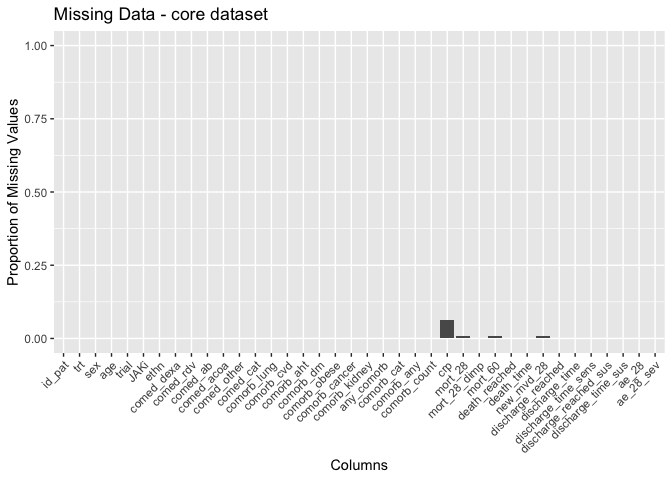
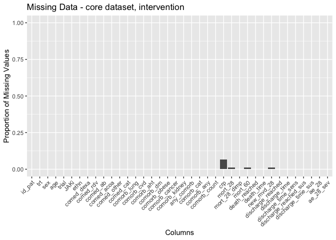
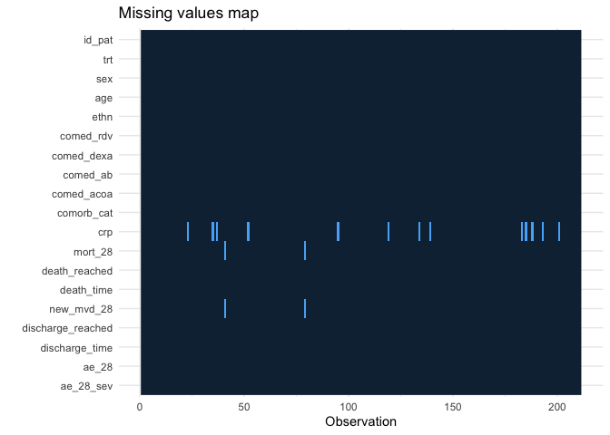
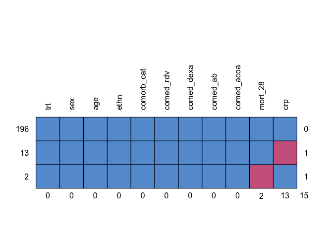

# Load packages

```r
library(tidyverse)
library(readxl)
library(writexl)
library(tableone)
library(haven) # Read sas files
library(here)
library(kableExtra)

library(jtools) # for summ() and plot_summs
library(sjPlot) # for tab_model
library(ggplot2) # survival/TTE analyses and other graphs
library(ggsurvfit) # survival/TTE analyses
library(survival) # survival/TTE analyses
library(gtsummary) # survival/TTE analyses
library(ggfortify) # autoplot
library(tidycmprsk) # competing risk analysis
library(ordinal) # clinstatus ordinal regression
library(mosaic) # OR for 0.5-corrected 2x2 table in case of rare events
library(logistf) # Firth regression in case of rare events

library(finalfit) # missing data exploration
library(mice) # multiple imputation
library(jomo) # multiple imputation
library(mitools) # multiple imputation
```

# Load Data


# Missing data plot: One-stage dataset

```r
df_os <- df
# Bar plot, missing data, each data point, standardized one-stage dataset
original_order <- colnames(df_os)
missing_plot <- df_os %>%
  summarise_all(~ mean(is.na(.))) %>%
  gather() %>%
  mutate(key = factor(key, levels = original_order)) %>%
  ggplot(aes(x = key, y = value)) +
  geom_bar(stat = "identity") +
  labs(x = "Columns", y = "Proportion of Missing Values", title = "Missing Data - standardized one-stage dataset") +
  theme(axis.text.x = element_text(angle = 45, hjust = 1)) +
  ylim(0, 1)
print(missing_plot)
```

<!-- -->
Discussion points
1. Missing variables:
* Baseline:
  - variant
  - sero
  - vl_baseline
  - icu
  - comorb liver, smoker, autoimmun, immuno
  - country (!!!)
  - sympdur (!!!)
  - AGE (!!!!!) -> only binary!
* Outcomes:
  - vir_clear_5, vir_clear_10, vir_clear_15
  - clinstatus_28_imp (!!!)
  - new_mv_28 -> because all started with clinstatus_baseline == 5
2. Missing data:
- mort_28
- crp

# Missing data: Explore for MI

```r
# keep the core df
df_core <- df_os %>%
  select(id_pat, trt, sex, age, trial, JAKi, ethn, 
        # vacc, country, icu, sympdur, clinstatus_baseline, vbaseline, # no information, all have 5
         comed_dexa, comed_rdv, 
         # comed_toci, 
         comed_ab, comed_acoa, 
         # comed_interferon, 
         comed_other, comed_cat, 
        comorb_lung, 
         # comorb_liver, 
         comorb_cvd, comorb_aht, comorb_dm, comorb_obese, comorb_cancer, comorb_kidney,
         # comorb_smoker, immunosupp,comorb_autoimm, 
         any_comorb, comorb_cat, comorb_any, comorb_count,
         crp, 
         # vl_baseline, sero, variant,
         # clinstatus_28_imp,
         mort_28, mort_28_dimp, mort_60, death_reached, death_time,
         # new_mv_28, 
         new_mvd_28,
         discharge_reached, discharge_time, discharge_time_sens, discharge_reached_sus, discharge_time_sus,
         # vir_clear_5, vir_clear_10, vir_clear_15,
         ae_28, ae_28_sev)
str(df_core)
```

```
## 'data.frame':	211 obs. of  38 variables:
##  $ id_pat               : chr  "014167" "014308" "014322" "014369" ...
##  $ trt                  : num  1 1 0 1 1 0 1 1 1 1 ...
##  $ sex                  : chr  "male" "male" "female" "male" ...
##  $ age                  : num  NA NA NA NA NA NA NA NA NA NA ...
##  $ trial                : chr  "RUXCOVID-DEVENT" "RUXCOVID-DEVENT" "RUXCOVID-DEVENT" "RUXCOVID-DEVENT" ...
##  $ JAKi                 : chr  "Ruxolitinib" "Ruxolitinib" "Ruxolitinib" "Ruxolitinib" ...
##  $ ethn                 : chr  "BLACK OR AFRICAN AMERICAN" "WHITE" "WHITE" "WHITE" ...
##  $ comed_dexa           : num  1 1 1 1 1 1 1 1 1 1 ...
##  $ comed_rdv            : num  1 1 1 1 0 1 1 1 0 0 ...
##  $ comed_ab             : num  1 0 0 1 1 1 1 1 1 0 ...
##  $ comed_acoa           : num  1 1 1 1 1 1 1 1 1 1 ...
##  $ comed_other          : num  1 1 1 1 1 1 1 1 1 1 ...
##  $ comed_cat            : num  2 2 2 2 2 2 2 2 2 2 ...
##  $ comorb_lung          : num  0 1 0 0 0 0 0 1 0 0 ...
##  $ comorb_cvd           : num  0 0 0 0 0 0 0 0 0 0 ...
##  $ comorb_aht           : num  0 1 1 1 1 0 1 1 0 1 ...
##  $ comorb_dm            : num  0 1 0 0 0 0 0 0 1 1 ...
##  $ comorb_obese         : num  0 0 0 1 1 1 0 0 0 1 ...
##  $ comorb_cancer        : num  0 0 0 0 0 0 0 0 0 0 ...
##  $ comorb_kidney        : num  0 0 0 0 0 0 0 0 0 0 ...
##  $ any_comorb           : num  0 1 1 1 1 1 1 1 1 1 ...
##  $ comorb_cat           : num  1 3 2 3 3 2 2 3 2 3 ...
##  $ comorb_any           : num  0 1 1 1 1 1 1 1 1 1 ...
##  $ comorb_count         : num  0 3 1 2 2 1 1 2 1 3 ...
##  $ crp                  : num  414 330 107 254 234 ...
##  $ mort_28              : num  0 1 1 1 1 1 1 1 1 1 ...
##  $ mort_28_dimp         : num  0 1 1 1 1 1 1 1 1 1 ...
##  $ mort_60              : num  0 1 1 1 1 1 1 1 1 1 ...
##  $ death_reached        : num  0 1 1 1 1 1 1 1 1 1 ...
##  $ death_time           : num  28 13 2 17 5 5 19 7 22 13 ...
##  $ new_mvd_28           : num  0 1 1 1 1 1 1 1 1 1 ...
##  $ discharge_reached    : num  1 0 0 0 0 0 0 0 0 0 ...
##  $ discharge_time       : num  23 13 2 17 5 5 19 7 22 13 ...
##  $ discharge_time_sens  : num  23 28 28 28 28 28 28 28 28 28 ...
##  $ discharge_reached_sus: num  1 0 0 0 0 0 0 0 0 0 ...
##  $ discharge_time_sus   : num  23 13 2 17 5 5 19 7 22 13 ...
##  $ ae_28                : num  1 0 0 1 1 1 1 1 1 0 ...
##  $ ae_28_sev            : num  3 0 0 1 3 1 4 1 4 0 ...
```

```r
# Convert character variables to factors
char_vars <- c("id_pat", "sex", "trial", "JAKi", "ethn",
               "comed_dexa", "comed_rdv", "comed_ab", "comed_acoa", "comed_other", "comed_cat",
               "comorb_lung", "comorb_cvd", "comorb_aht", "comorb_dm", "comorb_obese", "any_comorb", "comorb_cat", "comorb_any", "comorb_cancer", "comorb_kidney", "mort_28", "mort_28_dimp", "mort_60", "death_reached", "new_mvd_28","discharge_reached", "discharge_reached_sus", "ae_28")
df_core <- df_core %>%
  mutate(across(all_of(char_vars), factor))

# Bar plot, missing data, each data point, core dataset
original_order <- colnames(df_core)
missing_plot <- df_core %>%
  summarise_all(~ mean(is.na(.))) %>%
  gather() %>%
  mutate(key = factor(key, levels = original_order)) %>%
  ggplot(aes(x = key, y = value)) +
  geom_bar(stat = "identity") +
  labs(x = "Columns", y = "Proportion of Missing Values", title = "Missing Data - core dataset") +
  theme(axis.text.x = element_text(angle = 45, hjust = 1)) +
  ylim(0, 1)
print(missing_plot)
```

<!-- -->

```r
# Bar plot, missing data, each data point, core dataset, by arm
df_core_int <- df_core %>% 
  filter(trt == 1)
original_order <- colnames(df_core_int)
missing_plot <- df_core_int %>% # Intervention arm
  summarise_all(~ mean(is.na(.))) %>%
  gather() %>%
  mutate(key = factor(key, levels = original_order)) %>%
  ggplot(aes(x = key, y = value)) +
  geom_bar(stat = "identity") +
  labs(x = "Columns", y = "Proportion of Missing Values", title = "Missing Data - core dataset, intervention") +
  theme(axis.text.x = element_text(angle = 45, hjust = 1)) +
  ylim(0, 1)
print(missing_plot)
```

<!-- -->

```r
df_core_cont <- df_core %>% 
  filter(trt == 0)
original_order <- colnames(df_core_cont)
missing_plot <- df_core_cont %>% # Control arm
  summarise_all(~ mean(is.na(.))) %>%
  gather() %>%
  mutate(key = factor(key, levels = original_order)) %>%
  ggplot(aes(x = key, y = value)) +
  geom_bar(stat = "identity") +
  labs(x = "Columns", y = "Proportion of Missing Values", title = "Missing Data - core dataset, control") +
  theme(axis.text.x = element_text(angle = 45, hjust = 1)) +
  ylim(0, 1)
print(missing_plot)
```

<!-- -->

```r
### Baseline table, by individuals with no missing data vs any missing data (or only in mort_28)
# df_core <- df_core %>% mutate(complete = ifelse(rowSums(is.na(.)) > 0, 0, 1));table(df_core$complete) # ANY missing 
df_core$resp<-ifelse(is.na(df_core$mort_28), 0, 1);table(df_core$resp) # only mort_28 missing 
```

```
## 
##   0   1 
##   2 209
```

```r
# Assign variable list
vars.list <- c("resp", "age", 
               "trt", "sex", "ethn",
               "comed_dexa", "comed_rdv", "comed_ab", "comed_acoa", "comed_other", "comed_cat",
               "comorb_lung", "comorb_cvd", "comorb_aht", "comorb_dm", "comorb_obese", "any_comorb", "comorb_cat", "comorb_any", "comorb_count", "comorb_cancer", "comorb_kidney", "crp",
               "mort_28", "mort_28_dimp", "mort_60", "death_reached","death_time", "new_mvd_28","discharge_reached", "discharge_time", "discharge_reached_sus", "discharge_time_sus", "ae_28", "ae_28_sev")

# By completeness (only mort_28)
table_resp <- CreateTableOne(data = df_core, vars = vars.list[!vars.list %in% c("resp")], strata = "resp", includeNA = T, test = T, addOverall = TRUE)
# Print and display the table
capture.output(
  table_resp <- print(
    table_resp, 
    nonnormal = vars.list, 
    catDigits = 1, 
    SMD = TRUE, 
    showAllLevels = TRUE, 
    test = TRUE, 
    printToggle = FALSE, 
    missing = TRUE))
```

```
## character(0)
```

```r
kable(table_resp, format = "markdown", table.attr = 'class="table"', caption = "By completeness (only mort_28)") %>%
  kable_styling(bootstrap_options = "striped", full_width = FALSE)
```


Table: By completeness (only mort_28)

|                                  |level                            |Overall                |0                     |1                      |p      |test    |Missing |
|:---------------------------------|:--------------------------------|:----------------------|:---------------------|:----------------------|:------|:-------|:-------|
|n                                 |                                 |211                    |2                     |209                    |       |        |        |
|trt (median [IQR])                |                                 |1.00 [1.00, 1.00]      |1.00 [1.00, 1.00]     |1.00 [1.00, 1.00]      |0.448  |nonnorm |0.0     |
|sex (%)                           |female                           |74 (35.1)              |1 ( 50.0)             |73 (34.9)              |1.000  |        |0.0     |
|                                  |male                             |137 (64.9)             |1 ( 50.0)             |136 (65.1)             |       |        |        |
|ethn (%)                          |                                 |3 ( 1.4)               |0 (  0.0)             |3 ( 1.4)               |0.814  |        |0.0     |
|                                  |AMERICAN INDIAN OR ALASKA NATIVE |2 ( 0.9)               |0 (  0.0)             |2 ( 1.0)               |       |        |        |
|                                  |ASIAN                            |6 ( 2.8)               |0 (  0.0)             |6 ( 2.9)               |       |        |        |
|                                  |BLACK OR AFRICAN AMERICAN        |25 (11.8)              |1 ( 50.0)             |24 (11.5)              |       |        |        |
|                                  |NOT REPORTED                     |20 ( 9.5)              |0 (  0.0)             |20 ( 9.6)              |       |        |        |
|                                  |OTHER                            |6 ( 2.8)               |0 (  0.0)             |6 ( 2.9)               |       |        |        |
|                                  |WHITE                            |149 (70.6)             |1 ( 50.0)             |148 (70.8)             |       |        |        |
|comed_dexa (%)                    |0                                |33 (15.6)              |0 (  0.0)             |33 (15.8)              |1.000  |        |0.0     |
|                                  |1                                |178 (84.4)             |2 (100.0)             |176 (84.2)             |       |        |        |
|comed_rdv (%)                     |0                                |97 (46.0)              |1 ( 50.0)             |96 (45.9)              |1.000  |        |0.0     |
|                                  |1                                |114 (54.0)             |1 ( 50.0)             |113 (54.1)             |       |        |        |
|comed_ab (%)                      |0                                |38 (18.0)              |1 ( 50.0)             |37 (17.7)              |0.796  |        |0.0     |
|                                  |1                                |173 (82.0)             |1 ( 50.0)             |172 (82.3)             |       |        |        |
|comed_acoa (%)                    |0                                |36 (17.1)              |0 (  0.0)             |36 (17.2)              |1.000  |        |0.0     |
|                                  |1                                |175 (82.9)             |2 (100.0)             |173 (82.8)             |       |        |        |
|comed_other (%)                   |0                                |18 ( 8.5)              |0 (  0.0)             |18 ( 8.6)              |1.000  |        |0.0     |
|                                  |1                                |193 (91.5)             |2 (100.0)             |191 (91.4)             |       |        |        |
|comed_cat (%)                     |1                                |33 (15.6)              |0 (  0.0)             |33 (15.8)              |1.000  |        |0.0     |
|                                  |2                                |178 (84.4)             |2 (100.0)             |176 (84.2)             |       |        |        |
|comorb_lung (%)                   |0                                |158 (74.9)             |1 ( 50.0)             |157 (75.1)             |1.000  |        |0.0     |
|                                  |1                                |53 (25.1)              |1 ( 50.0)             |52 (24.9)              |       |        |        |
|comorb_cvd (%)                    |0                                |179 (84.8)             |2 (100.0)             |177 (84.7)             |1.000  |        |0.0     |
|                                  |1                                |32 (15.2)              |0 (  0.0)             |32 (15.3)              |       |        |        |
|comorb_aht (%)                    |0                                |68 (32.2)              |1 ( 50.0)             |67 (32.1)              |1.000  |        |0.0     |
|                                  |1                                |143 (67.8)             |1 ( 50.0)             |142 (67.9)             |       |        |        |
|comorb_dm (%)                     |0                                |105 (49.8)             |0 (  0.0)             |105 (50.2)             |0.482  |        |0.0     |
|                                  |1                                |106 (50.2)             |2 (100.0)             |104 (49.8)             |       |        |        |
|comorb_obese (%)                  |0                                |113 (53.6)             |0 (  0.0)             |113 (54.1)             |0.416  |        |0.0     |
|                                  |1                                |98 (46.4)              |2 (100.0)             |96 (45.9)              |       |        |        |
|any_comorb (%)                    |0                                |24 (11.4)              |0 (  0.0)             |24 (11.5)              |1.000  |        |0.0     |
|                                  |1                                |187 (88.6)             |2 (100.0)             |185 (88.5)             |       |        |        |
|comorb_cat (%)                    |1                                |24 (11.4)              |0 (  0.0)             |24 (11.5)              |0.625  |        |0.0     |
|                                  |2                                |43 (20.4)              |0 (  0.0)             |43 (20.6)              |       |        |        |
|                                  |3                                |144 (68.2)             |2 (100.0)             |142 (67.9)             |       |        |        |
|comorb_any (%)                    |0                                |24 (11.4)              |0 (  0.0)             |24 (11.5)              |1.000  |        |0.0     |
|                                  |1                                |187 (88.6)             |2 (100.0)             |185 (88.5)             |       |        |        |
|comorb_count (median [IQR])       |                                 |2.00 [1.00, 3.00]      |3.00 [2.50, 3.50]     |2.00 [1.00, 3.00]      |0.398  |nonnorm |0.0     |
|comorb_cancer (%)                 |0                                |202 (95.7)             |2 (100.0)             |200 (95.7)             |1.000  |        |0.0     |
|                                  |1                                |9 ( 4.3)               |0 (  0.0)             |9 ( 4.3)               |       |        |        |
|comorb_kidney (%)                 |0                                |183 (86.7)             |2 (100.0)             |181 (86.6)             |1.000  |        |0.0     |
|                                  |1                                |28 (13.3)              |0 (  0.0)             |28 (13.4)              |       |        |        |
|crp (median [IQR])                |                                 |167.65 [74.50, 346.02] |69.95 [37.48, 102.43] |171.70 [75.50, 353.02] |0.159  |nonnorm |6.2     |
|mort_28 (%)                       |0                                |92 (43.6)              |0 (  0.0)             |92 (44.0)              |<0.001 |        |0.9     |
|                                  |1                                |117 (55.5)             |0 (  0.0)             |117 (56.0)             |       |        |        |
|                                  |NA                               |2 ( 0.9)               |2 (100.0)             |0 ( 0.0)               |       |        |        |
|mort_28_dimp (%)                  |0                                |94 (44.5)              |2 (100.0)             |92 (44.0)              |0.384  |        |0.0     |
|                                  |1                                |117 (55.5)             |0 (  0.0)             |117 (56.0)             |       |        |        |
|mort_60 (%)                       |0                                |92 (43.6)              |0 (  0.0)             |92 (44.0)              |<0.001 |        |0.9     |
|                                  |1                                |117 (55.5)             |0 (  0.0)             |117 (56.0)             |       |        |        |
|                                  |NA                               |2 ( 0.9)               |2 (100.0)             |0 ( 0.0)               |       |        |        |
|death_reached (%)                 |0                                |94 (44.5)              |2 (100.0)             |92 (44.0)              |0.384  |        |0.0     |
|                                  |1                                |117 (55.5)             |0 (  0.0)             |117 (56.0)             |       |        |        |
|death_time (median [IQR])         |                                 |21.00 [11.00, 28.00]   |5.00 [4.50, 5.50]     |22.00 [11.00, 28.00]   |0.044  |nonnorm |0.0     |
|new_mvd_28 (%)                    |0                                |92 (43.6)              |0 (  0.0)             |92 (44.0)              |<0.001 |        |0.9     |
|                                  |1                                |117 (55.5)             |0 (  0.0)             |117 (56.0)             |       |        |        |
|                                  |NA                               |2 ( 0.9)               |2 (100.0)             |0 ( 0.0)               |       |        |        |
|discharge_reached (%)             |0                                |165 (78.2)             |2 (100.0)             |163 (78.0)             |1.000  |        |0.0     |
|                                  |1                                |46 (21.8)              |0 (  0.0)             |46 (22.0)              |       |        |        |
|discharge_time (median [IQR])     |                                 |17.00 [9.00, 26.00]    |5.00 [4.50, 5.50]     |17.00 [10.00, 26.00]   |0.056  |nonnorm |0.0     |
|discharge_reached_sus (%)         |0                                |165 (78.2)             |2 (100.0)             |163 (78.0)             |1.000  |        |0.0     |
|                                  |1                                |46 (21.8)              |0 (  0.0)             |46 (22.0)              |       |        |        |
|discharge_time_sus (median [IQR]) |                                 |17.00 [9.00, 26.00]    |5.00 [4.50, 5.50]     |17.00 [10.00, 26.00]   |0.056  |nonnorm |0.0     |
|ae_28 (%)                         |0                                |98 (46.4)              |2 (100.0)             |96 (45.9)              |0.416  |        |0.0     |
|                                  |1                                |113 (53.6)             |0 (  0.0)             |113 (54.1)             |       |        |        |
|ae_28_sev (median [IQR])          |                                 |1.00 [0.00, 2.00]      |0.00 [0.00, 0.00]     |1.00 [0.00, 2.00]      |0.163  |nonnorm |0.0     |

```r
### Define variables to be included in imputation set
# table(df_core$vl_baseline)
df_imp <- df_core %>% 
  select("id_pat"
         , "trt", "sex", "age" , "ethn"
         # , "country" # only 1 level
         # , "sympdur", "vacc"
         # , "trial", "JAKi"  # only 0
         # ,"clinstatus_baseline"
         # , "vbaseline" # derived
         , "comed_rdv" # no info
         # , "comed_toci"
         # , "comed_interferon" # no info
         #,  "comed_cat", # derived
         , "comed_dexa", "comed_ab"
         , "comed_acoa"
         # , "comed_other" # not much info
         # , "comorb_lung", "comorb_liver", "comorb_cvd", "comorb_aht", "comorb_dm", "comorb_obese",
         # "comorb_smoker", "immunosupp", "comorb_autoimm", "comorb_cancer", "comorb_kidney", "any_comorb",
         # "comorb_count",  
         # "comorb_any", 
         , "comorb_cat" # derived from above, contains most information, and needed as interaction term
         , "crp"
         # , "vl_baseline"
         # , "sero"
         # , "variant" # very little info
         # , "clinstatus_28_imp" # imputed via LOVCF above
         , "mort_28"
         # , "mort_28_dimp" # imputed deterministically
         # , "mort_60" # does not contain any additional information compared to death reached
         , "death_reached", "death_time", 
         # "new_mv_28", 
         "new_mvd_28", "discharge_reached", "discharge_time"
         # , "discharge_reached_sus", "discharge_time_sus" # same as discharge, does not contain any addition information
         , "ae_28", "ae_28_sev"
         # , "vir_clear_5", "vir_clear_10", "vir_clear_15"
         )
# names(df_imp)
# First, table and visualize missing data in various ways // focus on baseline variables, since we will not use jomo for RECOVERY (no daily clinical score)
df_imp %>%
  missing_plot() # from finalfit package
```

<!-- -->

```r
explanatory = c("trt", "sex", "age", "ethn", "comorb_cat", "crp", "comed_rdv", "comed_dexa", "comed_ab", "comed_acoa")
dependent = "mort_28"
df_imp %>% # from finalfit package, missing plot
  missing_pairs(dependent, explanatory, position = "fill", )
```

<!-- -->

```r
# Second, let's explore the missingness patterns
md.pattern(df_imp[,c("trt", "sex", "age", "ethn", "comorb_cat", "crp", "comed_rdv", "comed_dexa", "comed_ab", "comed_acoa", "mort_28")], rotate.names = T)
```

<!-- -->

```
##     trt sex ethn comorb_cat comed_rdv comed_dexa comed_ab comed_acoa mort_28
## 196   1   1    1          1         1          1        1          1       1
## 13    1   1    1          1         1          1        1          1       1
## 2     1   1    1          1         1          1        1          1       0
##       0   0    0          0         0          0        0          0       2
##     crp age    
## 196   1   0   1
## 13    0   0   2
## 2     1   0   2
##      13 211 226
```

```r
# Third, let's explore if the variables from my substantive model plus auxiliary variables are associated with mort_28 
mort28.aux <- glm(mort_28 ~ 
                    trt + sex + 
                    # age + 
                    ethn + comorb_cat + crp 
                  + comed_rdv + comed_dexa 
                  + comed_ab + comed_acoa
            ,family="binomial"
            ,data=df_imp)
summary(mort28.aux)
```

```
## 
## Call:
## glm(formula = mort_28 ~ trt + sex + ethn + comorb_cat + crp + 
##     comed_rdv + comed_dexa + comed_ab + comed_acoa, family = "binomial", 
##     data = df_imp)
## 
## Deviance Residuals: 
##     Min       1Q   Median       3Q      Max  
## -2.1010  -1.0072   0.4285   1.0617   1.9673  
## 
## Coefficients:
##                                        Estimate Std. Error z value Pr(>|z|)   
## (Intercept)                           4.1957622  1.6283289   2.577  0.00997 **
## trt                                  -1.0003212  0.4222581  -2.369  0.01784 * 
## sexmale                               0.7982295  0.3632564   2.197  0.02799 * 
## ethnAMERICAN INDIAN OR ALASKA NATIVE -1.5645054  1.9899103  -0.786  0.43174   
## ethnASIAN                            -0.9109653  1.7051011  -0.534  0.59316   
## ethnBLACK OR AFRICAN AMERICAN        -1.7058884  1.4416042  -1.183  0.23668   
## ethnNOT REPORTED                     -2.0242467  1.4716699  -1.375  0.16898   
## ethnOTHER                            -0.7494397  1.5828486  -0.473  0.63587   
## ethnWHITE                            -0.7764138  1.3696907  -0.567  0.57081   
## comorb_cat2                          -0.5257517  0.5946128  -0.884  0.37659   
## comorb_cat3                          -0.2804607  0.5004869  -0.560  0.57522   
## crp                                  -0.0002371  0.0002163  -1.097  0.27286   
## comed_rdv1                           -0.1218303  0.3539858  -0.344  0.73072   
## comed_dexa1                           0.0860853  0.5912483   0.146  0.88424   
## comed_ab1                            -1.8190113  0.6729351  -2.703  0.00687 **
## comed_acoa1                          -0.8017676  0.6037691  -1.328  0.18420   
## ---
## Signif. codes:  0 '***' 0.001 '**' 0.01 '*' 0.05 '.' 0.1 ' ' 1
## 
## (Dispersion parameter for binomial family taken to be 1)
## 
##     Null deviance: 268.77  on 195  degrees of freedom
## Residual deviance: 227.06  on 180  degrees of freedom
##   (15 observations deleted due to missingness)
## AIC: 259.06
## 
## Number of Fisher Scoring iterations: 4
```

```r
# Fourth, let's explore if they are associated with missingness of mort_28 // We can assess this using a generalized additive model (GAM)
df_imp_mar_glm <-
  mgcv::gam(
    formula = 
      is.na(mort_28) ~
      trt + sex + 
      # age + 
      ethn + comorb_cat + crp 
      + comed_rdv + comed_dexa 
      + comed_ab + comed_acoa
    , family = binomial(link = "logit"),
    data = df_imp
  )
summary(df_imp_mar_glm)
```

```
## 
## Family: binomial 
## Link function: logit 
## 
## Formula:
## is.na(mort_28) ~ trt + sex + ethn + comorb_cat + crp + comed_rdv + 
##     comed_dexa + comed_ab + comed_acoa
## 
## Parametric coefficients:
##                                        Estimate Std. Error z value Pr(>|z|)
## (Intercept)                          -5.847e+01  2.760e+04  -0.002    0.998
## trt                                   1.442e+01  1.127e+04   0.001    0.999
## sexmale                               3.277e+00  7.193e+00   0.456    0.649
## ethnAMERICAN INDIAN OR ALASKA NATIVE -1.533e+01  9.777e+04   0.000    1.000
## ethnASIAN                             5.196e+01  2.372e+04   0.002    0.998
## ethnBLACK OR AFRICAN AMERICAN         5.134e+00  3.651e+04   0.000    1.000
## ethnNOT REPORTED                     -3.111e+01  4.235e+04  -0.001    0.999
## ethnOTHER                            -2.949e+01  4.795e+04  -0.001    1.000
## ethnWHITE                            -1.210e+01  3.651e+04   0.000    1.000
## comorb_cat2                          -2.599e+00  2.460e+04   0.000    1.000
## comorb_cat3                           2.248e+01  2.190e+04   0.001    0.999
## crp                                  -8.248e-02  7.951e-02  -1.037    0.300
## comed_rdv1                           -9.104e+00  1.681e+01  -0.542    0.588
## comed_dexa1                           2.188e+01  3.566e+04   0.001    1.000
## comed_ab1                            -5.934e+00  5.364e+00  -1.106    0.269
## comed_acoa1                           1.453e+01  9.664e+03   0.002    0.999
## 
## 
## R-sq.(adj) =  0.351   Deviance explained = 70.8%
## UBRE = -0.80542  Scale est. = 1         n = 198
```

```r
# df_imp %>% 
#   missing_compare(dependent, explanatory) %>%
#     knitr::kable(row.names=FALSE, align = c("l", "l", "r", "r", "r"))

# Fifth, check age
# summary(df_imp$age)
# hist(df_imp$age, breaks=50) # looks fine

# Sixth, check sympdur

# Seventh, check crp
summary(df_imp$crp)
```

```
##    Min. 1st Qu.  Median    Mean 3rd Qu.    Max.    NA's 
##     0.0    74.5   167.7   495.6   346.0  4492.0      13
```

```r
hist(df_imp$crp, breaks=50) # skewed and outlier -> transform & truncate
```

<!-- -->

```r
df_imp$sqcrp=sqrt(df_imp$crp)
hist(df_imp$sqcrp, breaks=50)
```

<!-- -->

```r
df_imp <- df_imp %>% # truncate outliers > 500
  mutate(crptrunc = case_when(crp > 500 ~ 500,
                               TRUE ~ crp))
hist(df_imp$crptrunc, breaks=50)
```

<!-- -->

```r
df_imp$sqcrptrunc=sqrt(df_imp$crptrunc)
hist(df_imp$sqcrptrunc)
```

<!-- -->

```r
### Reshape to long format // not needed since we don't have daily clinical score


### We will impute separately by treatment arm, since we have to expect an effect modification between outcome x trt over time
df_imp_int <- df_imp %>% 
  filter(trt == 1)
df_imp_cont <- df_imp %>% 
  filter(trt == 0)
```

# Multiple imputation

```r
#### INTERVENTION group
## jomo only accepts numeric or factors, check and adapt
# str(df_imp_int)
table(df$mort_28, df$trt, useNA = "always")
attach(df_imp_int)
Y<-data.frame(mort_28
               # , age
               , sex
               , ethn
               , comorb_cat
               , sqcrptrunc
               , comed_rdv
               , comed_acoa
               , comed_dexa
               , comed_ab
                 )
nimp<-3 # set number of iterations

## run jomo
# dry run
imputed_int_mcmc<-jomo.MCMCchain(Y=Y, nburn=2)
# plot(c(1:2),imputed_int_mcmc$collectbeta[1,1,1:2],type="l")
# plot(c(1:2),imputed_int_mcmc$collectcovu[5,5,1:2],type="l")
set.seed(1569)
imputed_int <- jomo(Y=Y, nburn=1000, nbetween=1000, nimp=nimp)
# nburn<-1000
# imputed_int_mcmc<-jomo.MCMCchain(Y=Y, nburn=nburn)
# plot(c(1:nburn),imputed_int_mcmc$collectbeta[1,1,1:nburn],type="l")
# plot(c(1:nburn),imputed_int_mcmc$collectcovu[5,5,1:nburn],type="l")

# convert to jomo object, split imputations, and exclude original data (imputation "0")
imp.list_int <- imputationList(split(imputed_int, imputed_int$Imputation)[-1])

# checks
round(prop.table(table(imp.list_int[[1]]$`1`$mort_28, useNA = "always"))*100,1) # first imputed dataset
round(prop.table(table(imp.list_int[[1]]$`2`$mort_28, useNA = "always"))*100,1) # second imputed dataset
round(prop.table(table(df_imp_int$mort_28, useNA = "always"))*100,1) # original data


#### CONTROL group
## jomo only accepts numeric or factors, check and adapt
# str(df_imp_cont)
attach(df_imp_cont)
Y<-data.frame(mort_28
               # , age
               , sex
               , ethn
               , comorb_cat
               , sqcrptrunc
               , comed_rdv
               , comed_acoa
               , comed_dexa
               , comed_ab
                 )
nimp<-3 # set number of iterations

## run jomo
# dry run
imputed_cont_mcmc<-jomo.MCMCchain(Y=Y, nburn=2)
# plot(c(1:2),imputed_cont_mcmc$collectbeta[1,1,1:2],type="l")
# plot(c(1:2),imputed_cont_mcmc$collectcovu[5,5,1:2],type="l")
set.seed(1569)
imputed_cont <- jomo(Y=Y, nburn=1000, nbetween=1000, nimp=nimp)
# nburn<-1000
# imputed_cont_mcmc<-jomo.MCMCchain(Y=Y, nburn=nburn)
# plot(c(1:nburn),imputed_cont_mcmc$collectbeta[1,1,1:nburn],type="l")
# plot(c(1:nburn),imputed_cont_mcmc$collectcovu[5,5,1:nburn],type="l")

# convert to jomo object, split imputations, and exclude original data (imputation "0")
imp.list_cont <- imputationList(split(imputed_cont, imputed_cont$Imputation)[-1])

# checks
round(prop.table(table(imp.list_cont[[1]]$`1`$mort_28, useNA = "always"))*100,1) # first imputed dataset
round(prop.table(table(imp.list_cont[[1]]$`2`$mort_28, useNA = "always"))*100,1) # second imputed dataset
round(prop.table(table(df_imp_cont$mort_28, useNA = "always"))*100,1) # original data


#### Add trt back, change from long to wide format, and finally combine the two data frames
imputed_int$trt <- 1
imputed_int_s <- imputed_int %>% # remove imputation variables, not needed anymore
  select(trt, 
         # age, 
         mort_28, sex, comorb_cat, sqcrptrunc, comed_rdv, comed_acoa, comed_dexa, comed_ab, Imputation)

imputed_cont$trt <- 0 # treatment variable
imputed_cont_s <- imputed_cont %>% # remove imputation variables, not needed anymore
  select(trt, 
         # age, 
         mort_28, sex, comorb_cat, sqcrptrunc, comed_rdv, comed_acoa, comed_dexa, comed_ab, Imputation)

imputed_combined <- rbind(imputed_cont_s, imputed_int_s)


#### Convert combined df to jomo object, split imputations, and exclude original data (imputation "0")
imp.list <- imputationList(split(imputed_combined, imputed_combined$Imputation)[-1])


### Checks
round(prop.table(table(imp.list[[1]]$`1`$mort_28, imp.list[[1]]$`1`$trt, useNA = "always"),2)*100,1) # first imputed dataset
round(prop.table(table(imp.list[[1]]$`2`$mort_28, imp.list[[1]]$`2`$trt, useNA = "always"),2)*100,1) # second imputed dataset
round(prop.table(table(df_imp$mort_28, df_imp$trt, useNA = "always"),2)*100,1) # original data
summary(imp.list[[1]]$`1`$comorb_cat)
summary(imp.list[[1]]$`2`$sqcrptrunc)
```

# (i) Primary outcome: Mortality at day 28

```r
# addmargins(table(df$mort_28, df$trt, useNA = "always"))
# addmargins(table(df$mort_28_dimp, df$trt, useNA = "always"))
df$clinstatus_baseline_n <- as.numeric(df$clinstatus_baseline)

# Complete case analysis, substantive model
mort.28 <- df %>% 
  glm(mort_28 ~ trt 
      # + age 
      # + clinstatus_baseline # not possible in ruxcovid devent, all came into the trial with clinstatus == 5
      , family = "binomial", data=.)
summ(mort.28, exp = T, confint = T, model.info = T, model.fit = F, digits = 2)
```

<table class="table table-striped table-hover table-condensed table-responsive" style="width: auto !important; margin-left: auto; margin-right: auto;">
<tbody>
  <tr>
   <td style="text-align:left;font-weight: bold;"> Observations </td>
   <td style="text-align:right;"> 209 (2 missing obs. deleted) </td>
  </tr>
  <tr>
   <td style="text-align:left;font-weight: bold;"> Dependent variable </td>
   <td style="text-align:right;"> mort_28 </td>
  </tr>
  <tr>
   <td style="text-align:left;font-weight: bold;"> Type </td>
   <td style="text-align:right;"> Generalized linear model </td>
  </tr>
  <tr>
   <td style="text-align:left;font-weight: bold;"> Family </td>
   <td style="text-align:right;"> binomial </td>
  </tr>
  <tr>
   <td style="text-align:left;font-weight: bold;"> Link </td>
   <td style="text-align:right;"> logit </td>
  </tr>
</tbody>
</table>  <table class="table table-striped table-hover table-condensed table-responsive" style="width: auto !important; margin-left: auto; margin-right: auto;border-bottom: 0;">
 <thead>
  <tr>
   <th style="text-align:left;">   </th>
   <th style="text-align:right;"> exp(Est.) </th>
   <th style="text-align:right;"> 2.5% </th>
   <th style="text-align:right;"> 97.5% </th>
   <th style="text-align:right;"> z val. </th>
   <th style="text-align:right;"> p </th>
  </tr>
 </thead>
<tbody>
  <tr>
   <td style="text-align:left;font-weight: bold;"> (Intercept) </td>
   <td style="text-align:right;"> 2.36 </td>
   <td style="text-align:right;"> 1.26 </td>
   <td style="text-align:right;"> 4.40 </td>
   <td style="text-align:right;"> 2.69 </td>
   <td style="text-align:right;"> 0.01 </td>
  </tr>
  <tr>
   <td style="text-align:left;font-weight: bold;"> trt </td>
   <td style="text-align:right;"> 0.46 </td>
   <td style="text-align:right;"> 0.23 </td>
   <td style="text-align:right;"> 0.92 </td>
   <td style="text-align:right;"> -2.20 </td>
   <td style="text-align:right;"> 0.03 </td>
  </tr>
</tbody>
<tfoot><tr><td style="padding: 0; " colspan="100%">
<sup></sup> Standard errors: MLE</td></tr></tfoot>
</table>

```r
# Deterministic imputation
mort.28.dimp <- df %>% 
  glm(mort_28_dimp ~ trt 
      # + age
      , family = "binomial", data=.)
summ(mort.28.dimp, exp = T, confint = T, model.info = T, model.fit = F, digits = 2)
```

<table class="table table-striped table-hover table-condensed table-responsive" style="width: auto !important; margin-left: auto; margin-right: auto;">
<tbody>
  <tr>
   <td style="text-align:left;font-weight: bold;"> Observations </td>
   <td style="text-align:right;"> 211 </td>
  </tr>
  <tr>
   <td style="text-align:left;font-weight: bold;"> Dependent variable </td>
   <td style="text-align:right;"> mort_28_dimp </td>
  </tr>
  <tr>
   <td style="text-align:left;font-weight: bold;"> Type </td>
   <td style="text-align:right;"> Generalized linear model </td>
  </tr>
  <tr>
   <td style="text-align:left;font-weight: bold;"> Family </td>
   <td style="text-align:right;"> binomial </td>
  </tr>
  <tr>
   <td style="text-align:left;font-weight: bold;"> Link </td>
   <td style="text-align:right;"> logit </td>
  </tr>
</tbody>
</table>  <table class="table table-striped table-hover table-condensed table-responsive" style="width: auto !important; margin-left: auto; margin-right: auto;border-bottom: 0;">
 <thead>
  <tr>
   <th style="text-align:left;">   </th>
   <th style="text-align:right;"> exp(Est.) </th>
   <th style="text-align:right;"> 2.5% </th>
   <th style="text-align:right;"> 97.5% </th>
   <th style="text-align:right;"> z val. </th>
   <th style="text-align:right;"> p </th>
  </tr>
 </thead>
<tbody>
  <tr>
   <td style="text-align:left;font-weight: bold;"> (Intercept) </td>
   <td style="text-align:right;"> 2.36 </td>
   <td style="text-align:right;"> 1.26 </td>
   <td style="text-align:right;"> 4.40 </td>
   <td style="text-align:right;"> 2.69 </td>
   <td style="text-align:right;"> 0.01 </td>
  </tr>
  <tr>
   <td style="text-align:left;font-weight: bold;"> trt </td>
   <td style="text-align:right;"> 0.45 </td>
   <td style="text-align:right;"> 0.22 </td>
   <td style="text-align:right;"> 0.89 </td>
   <td style="text-align:right;"> -2.28 </td>
   <td style="text-align:right;"> 0.02 </td>
  </tr>
</tbody>
<tfoot><tr><td style="padding: 0; " colspan="100%">
<sup></sup> Standard errors: MLE</td></tr></tfoot>
</table>

```r
# # Multiple imputation analysis under MAR; use mitools package to fit imputed and combined data list and apply Rubin's rules
# mort.28.mi <- imp.list %>%
#   with(glm(mort_28 ~ trt
#            + age
#            , family = binomial)) %>%
#         pool() %>%
#         summary(conf.int = T, exponentiate = T)
# mort.28.mi
```

# (i.i) Covariate adjustment for primary endpoint: Mortality at day 28

```r
# unadjusted estimator for the (absolute) risk difference
with(df, table(trt, mort_28))
```

```
##    mort_28
## trt  0  1
##   0 14 33
##   1 78 84
```

```r
mort.28.prop.test <- prop.test(x = with(df, table(trt, mort_28)))
# print(mort.28.prop.test)
# Estimate
-diff(mort.28.prop.test$estimate)
```

```
##     prop 2 
## -0.1836091
```

```r
# Confidence Interval
mort.28.prop.test$conf.int
```

```
## [1] -0.3490378 -0.0181805
## attr(,"conf.level")
## [1] 0.95
```

```r
# P-Value
mort.28.prop.test$p.value
```

```
## [1] 0.03886623
```

```r
# Covariate-Adjusted Analysis
# Fit the `glm` object
# Same as Complete case analysis, substantive model // but don't use piping, otherwise problem in margins::margins
df_mort28_comp <- df %>% filter(!is.na(mort_28))
mort.28.cov.adj <-
  glm(formula = mort_28 ~ trt 
      # + age 
      ,data = df_mort28_comp
      ,family = binomial(link = "logit")
      )
# Print a summary of the `glm` object
summary(mort.28.cov.adj)
```

```
## 
## Call:
## glm(formula = mort_28 ~ trt, family = binomial(link = "logit"), 
##     data = df_mort28_comp)
## 
## Deviance Residuals: 
##    Min      1Q  Median      3Q     Max  
## -1.556  -1.209   0.841   1.146   1.146  
## 
## Coefficients:
##             Estimate Std. Error z value Pr(>|z|)   
## (Intercept)   0.8575     0.3190   2.688  0.00718 **
## trt          -0.7833     0.3556  -2.203  0.02761 * 
## ---
## Signif. codes:  0 '***' 0.001 '**' 0.01 '*' 0.05 '.' 0.1 ' ' 1
## 
## (Dispersion parameter for binomial family taken to be 1)
## 
##     Null deviance: 286.74  on 208  degrees of freedom
## Residual deviance: 281.61  on 207  degrees of freedom
## AIC: 285.61
## 
## Number of Fisher Scoring iterations: 4
```

```r
# Predict Pr{Y = 1 | Z = 1, X} // equals: E(Y|Z=1,X)
pr_y1_z1 <-
  predict(
    object = mort.28.cov.adj,
    newdata =
      df_mort28_comp %>%
      dplyr::mutate(
        trt = 1
      ),
    type = "response"
  )
# Predict Pr{Y = 1 | Z = 0, X} // equals: E(Y|Z=0,X)
pr_y1_z0 <-
  predict(
    object = mort.28.cov.adj,
    newdata =
      df_mort28_comp %>%
      dplyr::mutate(
        trt = 0
      ),
    type = "response"
  )

# Estimate RD
adj_mean = mean(pr_y1_z1) - mean(pr_y1_z0)
print(adj_mean)
```

```
## [1] -0.1836091
```

```r
# Standard Error RD
# The variance/standard error can be calculted as 1/n times the sample variance of:
# Z/P(Z=1)*[Y-E(Y|Z=1,X)] + E(Y|Z=1,X) - ((1-Z)/(1-P(1=Z))*[Y-E(Y|Z=0,X)] + E(Y|Z=0,X))
p_arm = mean(df_mort28_comp$trt==1)
adj_se = sqrt(
  var((df_mort28_comp$trt==1)/p_arm * (df_mort28_comp$mort_28 - pr_y1_z1) + pr_y1_z1 -
      ((df_mort28_comp$trt==0)/(1-p_arm) * (df_mort28_comp$mort_28-pr_y1_z0) + pr_y1_z0))/
    nrow(df_mort28_comp))
print(adj_se)
```

```
## [1] 0.07758722
```

```r
# Confidence Interval
c(adj_mean-qnorm(0.975)*adj_se, adj_mean+qnorm(0.975)*adj_se)
```

```
## [1] -0.33567730 -0.03154098
```

```r
# Or, we can obtain the standard error of the estimate two ways. The first way is using the margins::margins() command, using the robust standard errors from sandwich::vcovHC // The second way to obtain these would be the bias corrected and accelerated (BCa) non-parametric bootstrap
# You’ll see that we now have a standard error, p-value under the hypothesis that the marginal effect is 0, and a 95% Confidence Interval for the estimate. 

library(sandwich)
library(margins)
mort.28.cov.adj.ame <-
  margins::margins(
    model = mort.28.cov.adj,
    # Specify treatment variable
    variables = "trt",
    # Convert to outcome scale, not link scale
    type = "response",
    # Obtain robust standard errors
    vcov = sandwich::vcovHC(x = mort.28.cov.adj, type = "HC3")
  )
summary(object = mort.28.cov.adj.ame, level = 0.95)
```

```
##  factor     AME     SE       z      p   lower   upper
##     trt -0.1884 0.0832 -2.2644 0.0236 -0.3515 -0.0253
```

```r
mort.28.ame <- summary(object = mort.28.cov.adj.ame, level = 0.95)
```

# (ii) Mortality at day 60

```r
table(df$mort_60, df$trt, useNA = "always")
```

```
##       
##         0  1 <NA>
##   0    14 78    0
##   1    33 84    0
##   <NA>  0  2    0
```

```r
mort.60 <- df %>% 
  glm(mort_60 ~ trt 
      # + age 
      , family = "binomial", data=.)
summ(mort.60, exp = T, confint = T, model.info = T, model.fit = F, digits = 2)
```

<table class="table table-striped table-hover table-condensed table-responsive" style="width: auto !important; margin-left: auto; margin-right: auto;">
<tbody>
  <tr>
   <td style="text-align:left;font-weight: bold;"> Observations </td>
   <td style="text-align:right;"> 209 (2 missing obs. deleted) </td>
  </tr>
  <tr>
   <td style="text-align:left;font-weight: bold;"> Dependent variable </td>
   <td style="text-align:right;"> mort_60 </td>
  </tr>
  <tr>
   <td style="text-align:left;font-weight: bold;"> Type </td>
   <td style="text-align:right;"> Generalized linear model </td>
  </tr>
  <tr>
   <td style="text-align:left;font-weight: bold;"> Family </td>
   <td style="text-align:right;"> binomial </td>
  </tr>
  <tr>
   <td style="text-align:left;font-weight: bold;"> Link </td>
   <td style="text-align:right;"> logit </td>
  </tr>
</tbody>
</table>  <table class="table table-striped table-hover table-condensed table-responsive" style="width: auto !important; margin-left: auto; margin-right: auto;border-bottom: 0;">
 <thead>
  <tr>
   <th style="text-align:left;">   </th>
   <th style="text-align:right;"> exp(Est.) </th>
   <th style="text-align:right;"> 2.5% </th>
   <th style="text-align:right;"> 97.5% </th>
   <th style="text-align:right;"> z val. </th>
   <th style="text-align:right;"> p </th>
  </tr>
 </thead>
<tbody>
  <tr>
   <td style="text-align:left;font-weight: bold;"> (Intercept) </td>
   <td style="text-align:right;"> 2.36 </td>
   <td style="text-align:right;"> 1.26 </td>
   <td style="text-align:right;"> 4.40 </td>
   <td style="text-align:right;"> 2.69 </td>
   <td style="text-align:right;"> 0.01 </td>
  </tr>
  <tr>
   <td style="text-align:left;font-weight: bold;"> trt </td>
   <td style="text-align:right;"> 0.46 </td>
   <td style="text-align:right;"> 0.23 </td>
   <td style="text-align:right;"> 0.92 </td>
   <td style="text-align:right;"> -2.20 </td>
   <td style="text-align:right;"> 0.03 </td>
  </tr>
</tbody>
<tfoot><tr><td style="padding: 0; " colspan="100%">
<sup></sup> Standard errors: MLE</td></tr></tfoot>
</table>

# (iii) Time to death within max. follow-up time

```r
# table(df$death_reached, df$death_time, useNA = "always")
# table(df$death_reached, df$mort_60, useNA = "always")

# df %>%
#   drop_na(death_time) %>%
#   filter(death_reached == 1) %>%
#   group_by(trt) %>%
#   summarise(median = median(death_time),
#             IQR = IQR(death_time),
#             Q1 = quantile(death_time, probs = 0.25),
#             Q3 = quantile(death_time, probs = 0.75))

# time to death, by group. Kaplan-Meier estimate of conditional survival probability.
km.ttdeath.check <- with(df, Surv(death_time, death_reached))
# head(km.ttdeath.check, 100)

km.ttdeath_trt <- survfit(Surv(death_time, death_reached) ~ trt, data=df)
# summary(km.ttdeath_trt, times = 28)
ttdeath_28d_tbl <- km.ttdeath_trt %>% 
  tbl_survfit(
    times = 28,
    label_header = "**28-d survival (95% CI)**"
  )
# Nicely formatted table
kable(ttdeath_28d_tbl, format = "markdown", table.attr = 'class="table"') %>%
  kable_styling(bootstrap_options = "striped", full_width = FALSE)
```


|**Characteristic** |**28-d survival (95% CI)** |
|:------------------|:--------------------------|
|trt                |NA                         |
|0                  |30% (19%, 46%)             |
|1                  |48% (41%, 57%)             |

```r
# autoplot(km.ttdeath_trt)
survfit2(Surv(death_time, death_reached) ~ trt, data=df) %>% 
  ggsurvfit() +
  labs(
    x = "Days",
    y = "Overall survival probability"
  ) + 
  add_confidence_interval() +
  add_risktable()
```

<!-- -->

```r
# testing: simple log-rank
# survdiff(Surv(death_time, death_reached) ~ trt, data = df)
# testing: cox ph
ttdeath <- df %>% 
  coxph(Surv(death_time, death_reached) ~ trt 
        # + age 
        , data =.)
ttdeath_reg_tbl <- tbl_regression(ttdeath, exp = TRUE)
# Nicely formatted table
kable(ttdeath_reg_tbl, format = "markdown", table.attr = 'class="table"') %>%
  kable_styling(bootstrap_options = "striped", full_width = FALSE)
```


|**Characteristic** |**HR** |**95% CI** |**p-value** |
|:------------------|:------|:----------|:-----------|
|trt                |0.51   |0.34, 0.77 |0.001       |

# (iv) New mechanical ventilation among survivors within 28 days

```r
# table(df$new_mv_28, df$trt, useNA = "always") // not available in ruxcovid-devent
# new.mv.28 <- df %>% 
#   glm(new_mv_28 ~ trt 
#        # + age 
#       , family = "binomial", data=.)
# summ(new.mv.28, exp = T, confint = T, model.info = T, model.fit = F, digits = 2)

# (iv) Alternative definition/analysis: New mechanical ventilation OR death within 28 days => include all in denominator. 
# table(df$new_mvd_28, df$trt, useNA = "always")
new.mvd.28 <- df %>% 
  glm(new_mvd_28 ~ trt 
      # + age 
      , family = "binomial", data=.)
summ(new.mvd.28, exp = T, confint = T, model.info = T, model.fit = F, digits = 2)
```

<table class="table table-striped table-hover table-condensed table-responsive" style="width: auto !important; margin-left: auto; margin-right: auto;">
<tbody>
  <tr>
   <td style="text-align:left;font-weight: bold;"> Observations </td>
   <td style="text-align:right;"> 209 (2 missing obs. deleted) </td>
  </tr>
  <tr>
   <td style="text-align:left;font-weight: bold;"> Dependent variable </td>
   <td style="text-align:right;"> new_mvd_28 </td>
  </tr>
  <tr>
   <td style="text-align:left;font-weight: bold;"> Type </td>
   <td style="text-align:right;"> Generalized linear model </td>
  </tr>
  <tr>
   <td style="text-align:left;font-weight: bold;"> Family </td>
   <td style="text-align:right;"> binomial </td>
  </tr>
  <tr>
   <td style="text-align:left;font-weight: bold;"> Link </td>
   <td style="text-align:right;"> logit </td>
  </tr>
</tbody>
</table>  <table class="table table-striped table-hover table-condensed table-responsive" style="width: auto !important; margin-left: auto; margin-right: auto;border-bottom: 0;">
 <thead>
  <tr>
   <th style="text-align:left;">   </th>
   <th style="text-align:right;"> exp(Est.) </th>
   <th style="text-align:right;"> 2.5% </th>
   <th style="text-align:right;"> 97.5% </th>
   <th style="text-align:right;"> z val. </th>
   <th style="text-align:right;"> p </th>
  </tr>
 </thead>
<tbody>
  <tr>
   <td style="text-align:left;font-weight: bold;"> (Intercept) </td>
   <td style="text-align:right;"> 2.36 </td>
   <td style="text-align:right;"> 1.26 </td>
   <td style="text-align:right;"> 4.40 </td>
   <td style="text-align:right;"> 2.69 </td>
   <td style="text-align:right;"> 0.01 </td>
  </tr>
  <tr>
   <td style="text-align:left;font-weight: bold;"> trt </td>
   <td style="text-align:right;"> 0.46 </td>
   <td style="text-align:right;"> 0.23 </td>
   <td style="text-align:right;"> 0.92 </td>
   <td style="text-align:right;"> -2.20 </td>
   <td style="text-align:right;"> 0.03 </td>
  </tr>
</tbody>
<tfoot><tr><td style="padding: 0; " colspan="100%">
<sup></sup> Standard errors: MLE</td></tr></tfoot>
</table>
Discussion points
1. new_mv_28 not available, only new_mvd_28

# (v) Clinical status at day 28

```r
# table(df$clinstatus_28_imp, df$trt, useNA = "always") // not available in ruxcovid-devent
# clin.28 <- df %>% 
#   clm(clinstatus_28_imp ~ trt 
#       + age 
#       + clinstatus_baseline
#       , link= c("logit"), data=.)
# # Summary and extract coefficients
# coefficients_table <- summary(clin.28)$coefficients
# # Calculate Odds Ratios and Confidence Intervals
# odds_ratios <- exp(coefficients_table[, "Estimate"])
# ci_lower <- exp(coefficients_table[, "Estimate"] - 1.96 * coefficients_table[, "Std. Error"])
# ci_upper <- exp(coefficients_table[, "Estimate"] + 1.96 * coefficients_table[, "Std. Error"])
# # Create a data frame to store Odds Ratios and CIs
# clin.28_tbl <- data.frame(
#   "Variable" = rownames(coefficients_table),
#   "Odds Ratio" = odds_ratios,
#   "CI Lower" = ci_lower,
#   "CI Upper" = ci_upper
# )
# # Nicely formatted table
# kable(clin.28_tbl, format = "markdown", table.attr = 'class="table"') %>%
#   kable_styling(bootstrap_options = "striped", full_width = FALSE)
```
Discussion points
1. Not available

# (vi) Time to discharge or reaching discharge criteria up to day 28

```r
# Kaplan-Meier estimate of conditional discharge probability
# Just censoring => Cause-specific hazards
km.ttdischarge.check <- with(df, Surv(discharge_time, discharge_reached))
# head(km.ttdischarge.check, 100)
km.ttdischarge_trt <- survfit(Surv(discharge_time, discharge_reached) ~ trt, data=df)
# KM curve
survfit2(Surv(discharge_time, discharge_reached) ~ trt, data=df) %>% 
  ggsurvfit() +
  labs(
    x = "Days",
    y = "Overall hospitalization probability"
  ) + 
  add_confidence_interval() +
  add_risktable()
```

<!-- -->

```r
# testing: cox ph
ttdischarge <- df %>% 
  coxph(Surv(discharge_time, discharge_reached) ~ trt 
        # + age 
        , data =.)
ttdischarge_reg_tbl <- tbl_regression(ttdischarge, exp = TRUE)
# Nicely formatted table
kable(ttdischarge_reg_tbl, format = "markdown", table.attr = 'class="table"') %>%
  kable_styling(bootstrap_options = "striped", full_width = FALSE)
```


|**Characteristic** |**HR** |**95% CI** |**p-value** |
|:------------------|:------|:----------|:-----------|
|trt                |1.20   |0.51, 2.83 |0.7         |

```r
# Sub-distribution hazards
df <- df %>% # cuminc needs a factor variable with censored patients coded as 0, the event as 1 (discharge) and the competing event as 2 (death).
  mutate(discharge_reached_comp = case_when (discharge_reached == 0 & (mort_28 == 0 | is.na(mort_28)) ~ 0,
                                             discharge_reached == 1 & (mort_28 == 0 | is.na(mort_28)) ~ 1,
                                             mort_28 == 1 ~ 2))
# table(df$discharge_reached_comp)
df$discharge_reached_comp <- as.factor(df$discharge_reached_comp)
# Cumulative incidence for competing risks
cuminc(Surv(discharge_time, discharge_reached_comp) ~ 1, data = df)
```

```
## 
```

```
## ── cuminc() ────────────────────────────────────────────────────────────────────
```

```
## • Failure type "1"
```

```
## time   n.risk   estimate   std.error   95% CI          
## 5.00   192      0.005      0.005       0.000, 0.025    
## 10.0   157      0.048      0.015       0.024, 0.083    
## 15.0   119      0.086      0.019       0.053, 0.129    
## 20.0   86       0.124      0.023       0.084, 0.173    
## 25.0   58       0.187      0.027       0.137, 0.242
```

```
## • Failure type "2"
```

```
## time   n.risk   estimate   std.error   95% CI          
## 5.00   192      0.123      0.023       0.083, 0.172    
## 10.0   157      0.233      0.029       0.179, 0.293    
## 15.0   119      0.372      0.033       0.307, 0.438    
## 20.0   86       0.487      0.035       0.418, 0.553    
## 25.0   58       0.545      0.034       0.475, 0.610
```

```r
cuminc(Surv(discharge_time, discharge_reached_comp) ~ trt, data = df) %>%
  ggcuminc(outcome = c("1", "2")) +
  ylim(c(0, 1)) +
  labs(
    x = "Days"
  ) +
  add_confidence_interval() +
  add_risktable()
```

<!-- -->

```r
# testing: Fine-Gray regression
ttdischarge.comp <- crr(Surv(discharge_time, discharge_reached_comp) ~ trt
    # + age
    ,data = df)
ttdischarge_comp_reg_tbl <- tbl_regression(ttdischarge.comp, exp = TRUE)
# Nicely formatted table
kable(ttdischarge_comp_reg_tbl, format = "markdown", table.attr = 'class="table"') %>%
  kable_styling(bootstrap_options = "striped", full_width = FALSE)
```


|**Characteristic** |**HR** |**95% CI** |**p-value** |
|:------------------|:------|:----------|:-----------|
|trt                |2.02   |0.85, 4.80 |0.11        |

```r
# Censoring and assigned worst outcome (28d) to competing event (death) // hypothetical estimand
survfit2(Surv(discharge_time_sens, discharge_reached) ~ trt, data=df) %>% 
  ggsurvfit() +
  labs(
    x = "Days",
    y = "Overall hospitalization probability"
  ) + 
  add_confidence_interval() +
  add_risktable()
```

<!-- -->

```r
# testing: cox ph
ttdischarge.sens <- df %>% 
  coxph(Surv(discharge_time_sens, discharge_reached) ~ trt 
        # + age 
        , data =.)
ttdischarge_sens_reg_tbl <- tbl_regression(ttdischarge.sens, exp = TRUE)
# Nicely formatted table
kable(ttdischarge_sens_reg_tbl, format = "markdown", table.attr = 'class="table"') %>%
  kable_styling(bootstrap_options = "striped", full_width = FALSE)
```


|**Characteristic** |**HR** |**95% CI** |**p-value** |
|:------------------|:------|:----------|:-----------|
|trt                |2.03   |0.86, 4.78 |0.11        |

```r
# Sens-analysis: Alternative definition/analysis of outcome: time to sustained discharge within 28 days
# Use cause-specific hazards
survfit2(Surv(discharge_time_sus, discharge_reached_sus) ~ trt, data=df) %>% 
  ggsurvfit() +
  labs(
    x = "Days",
    y = "Overall sustained hospitalization probability"
  ) + 
  add_confidence_interval() +
  add_risktable()
```

<!-- -->

```r
# testing: cox ph
ttdischarge.sus <- df %>% 
  coxph(Surv(discharge_time_sus, discharge_reached_sus) ~ trt 
        # + age 
        , data =.)
ttdischarge_sus_reg_tbl <- tbl_regression(ttdischarge.sus, exp = TRUE)
# Nicely formatted table
kable(ttdischarge_sus_reg_tbl, format = "markdown", table.attr = 'class="table"') %>%
  kable_styling(bootstrap_options = "striped", full_width = FALSE)
```


|**Characteristic** |**HR** |**95% CI** |**p-value** |
|:------------------|:------|:----------|:-----------|
|trt                |1.20   |0.51, 2.83 |0.7         |

# (vii) Viral clearance up to day 5, day 10, and day 15

Discussion points
1. Not available

# (viii) Quality of life at day 28 

Discussion points
1. Not available

# (ix) Adverse event(s) grade 3 or 4, or a serious adverse event(s), excluding death, by day 28

```r
# table(df$ae_28, df$trt, useNA = "always")
ae.28 <- df %>% 
  glm(ae_28 ~ trt 
      # + age 
      , family = "binomial", data=.)
summ(ae.28, exp = T, confint = T, model.info = T, model.fit = F, digits = 2)
```

<table class="table table-striped table-hover table-condensed table-responsive" style="width: auto !important; margin-left: auto; margin-right: auto;">
<tbody>
  <tr>
   <td style="text-align:left;font-weight: bold;"> Observations </td>
   <td style="text-align:right;"> 211 </td>
  </tr>
  <tr>
   <td style="text-align:left;font-weight: bold;"> Dependent variable </td>
   <td style="text-align:right;"> ae_28 </td>
  </tr>
  <tr>
   <td style="text-align:left;font-weight: bold;"> Type </td>
   <td style="text-align:right;"> Generalized linear model </td>
  </tr>
  <tr>
   <td style="text-align:left;font-weight: bold;"> Family </td>
   <td style="text-align:right;"> binomial </td>
  </tr>
  <tr>
   <td style="text-align:left;font-weight: bold;"> Link </td>
   <td style="text-align:right;"> logit </td>
  </tr>
</tbody>
</table>  <table class="table table-striped table-hover table-condensed table-responsive" style="width: auto !important; margin-left: auto; margin-right: auto;border-bottom: 0;">
 <thead>
  <tr>
   <th style="text-align:left;">   </th>
   <th style="text-align:right;"> exp(Est.) </th>
   <th style="text-align:right;"> 2.5% </th>
   <th style="text-align:right;"> 97.5% </th>
   <th style="text-align:right;"> z val. </th>
   <th style="text-align:right;"> p </th>
  </tr>
 </thead>
<tbody>
  <tr>
   <td style="text-align:left;font-weight: bold;"> (Intercept) </td>
   <td style="text-align:right;"> 1.35 </td>
   <td style="text-align:right;"> 0.76 </td>
   <td style="text-align:right;"> 2.41 </td>
   <td style="text-align:right;"> 1.02 </td>
   <td style="text-align:right;"> 0.31 </td>
  </tr>
  <tr>
   <td style="text-align:left;font-weight: bold;"> trt </td>
   <td style="text-align:right;"> 0.82 </td>
   <td style="text-align:right;"> 0.42 </td>
   <td style="text-align:right;"> 1.57 </td>
   <td style="text-align:right;"> -0.61 </td>
   <td style="text-align:right;"> 0.54 </td>
  </tr>
</tbody>
<tfoot><tr><td style="padding: 0; " colspan="100%">
<sup></sup> Standard errors: MLE</td></tr></tfoot>
</table>

```r
# (ix) Sens-analysis: Alternative definition/analysis of outcome: incidence rate ratio (Poisson regression) -> AE per person by d28
# table(df$ae_28_sev, df$trt, useNA = "always")
ae.28.sev <- df %>% 
  glm(ae_28_sev ~ trt 
      # + age 
      , family = "poisson", data=.)
summ(ae.28.sev, exp = T, confint = T, model.info = T, model.fit = F, digits = 2)
```

<table class="table table-striped table-hover table-condensed table-responsive" style="width: auto !important; margin-left: auto; margin-right: auto;">
<tbody>
  <tr>
   <td style="text-align:left;font-weight: bold;"> Observations </td>
   <td style="text-align:right;"> 211 </td>
  </tr>
  <tr>
   <td style="text-align:left;font-weight: bold;"> Dependent variable </td>
   <td style="text-align:right;"> ae_28_sev </td>
  </tr>
  <tr>
   <td style="text-align:left;font-weight: bold;"> Type </td>
   <td style="text-align:right;"> Generalized linear model </td>
  </tr>
  <tr>
   <td style="text-align:left;font-weight: bold;"> Family </td>
   <td style="text-align:right;"> poisson </td>
  </tr>
  <tr>
   <td style="text-align:left;font-weight: bold;"> Link </td>
   <td style="text-align:right;"> log </td>
  </tr>
</tbody>
</table>  <table class="table table-striped table-hover table-condensed table-responsive" style="width: auto !important; margin-left: auto; margin-right: auto;border-bottom: 0;">
 <thead>
  <tr>
   <th style="text-align:left;">   </th>
   <th style="text-align:right;"> exp(Est.) </th>
   <th style="text-align:right;"> 2.5% </th>
   <th style="text-align:right;"> 97.5% </th>
   <th style="text-align:right;"> z val. </th>
   <th style="text-align:right;"> p </th>
  </tr>
 </thead>
<tbody>
  <tr>
   <td style="text-align:left;font-weight: bold;"> (Intercept) </td>
   <td style="text-align:right;"> 1.87 </td>
   <td style="text-align:right;"> 1.52 </td>
   <td style="text-align:right;"> 2.31 </td>
   <td style="text-align:right;"> 5.88 </td>
   <td style="text-align:right;"> 0.00 </td>
  </tr>
  <tr>
   <td style="text-align:left;font-weight: bold;"> trt </td>
   <td style="text-align:right;"> 0.88 </td>
   <td style="text-align:right;"> 0.69 </td>
   <td style="text-align:right;"> 1.11 </td>
   <td style="text-align:right;"> -1.08 </td>
   <td style="text-align:right;"> 0.28 </td>
  </tr>
</tbody>
<tfoot><tr><td style="padding: 0; " colspan="100%">
<sup></sup> Standard errors: MLE</td></tr></tfoot>
</table>

# Subgroup analysis: Ventilation requirement (proxy for disease severity) on primary endpoint

```r
# table(df$clinstatus_baseline, df$mort_28, useNA = "always") 
# table(df$vbaseline, df$mort_28, useNA = "always")
# # class(df$clinstatus_baseline)
# df$clinstatus_baseline_n <- as.numeric(df$clinstatus_baseline)
# 
# mort.28.vent <- df %>% 
#   glm(mort_28 ~ trt*clinstatus_baseline_n
#       + age 
#       #+ clinstatus_baseline
#       , family = "binomial", data=.)
# summ(mort.28.vent, exp = T, confint = T, model.info = T, model.fit = F, digits = 2)

# vbaseline
# mort.28.vent.vb <- df %>% 
#   glm(mort_28 ~ trt*vbaseline
#       # + age 
#       #+ clinstatus_baseline
#       , family = "binomial", data=.)
# summ(mort.28.vent.vb, exp = T, confint = T, model.info = T, model.fit = F, digits = 2)

# effect by subgroup
mort.28.vent.vb.yes <- df %>% 
  filter(vbaseline == 1) %>% # ventilated
  glm(mort_28 ~ trt
      # + age 
      , family = "binomial", data=.)
summ(mort.28.vent.vb.yes, exp = T, confint = T, model.info = T, model.fit = F, digits = 2)
```

<table class="table table-striped table-hover table-condensed table-responsive" style="width: auto !important; margin-left: auto; margin-right: auto;">
<tbody>
  <tr>
   <td style="text-align:left;font-weight: bold;"> Observations </td>
   <td style="text-align:right;"> 209 (2 missing obs. deleted) </td>
  </tr>
  <tr>
   <td style="text-align:left;font-weight: bold;"> Dependent variable </td>
   <td style="text-align:right;"> mort_28 </td>
  </tr>
  <tr>
   <td style="text-align:left;font-weight: bold;"> Type </td>
   <td style="text-align:right;"> Generalized linear model </td>
  </tr>
  <tr>
   <td style="text-align:left;font-weight: bold;"> Family </td>
   <td style="text-align:right;"> binomial </td>
  </tr>
  <tr>
   <td style="text-align:left;font-weight: bold;"> Link </td>
   <td style="text-align:right;"> logit </td>
  </tr>
</tbody>
</table>  <table class="table table-striped table-hover table-condensed table-responsive" style="width: auto !important; margin-left: auto; margin-right: auto;border-bottom: 0;">
 <thead>
  <tr>
   <th style="text-align:left;">   </th>
   <th style="text-align:right;"> exp(Est.) </th>
   <th style="text-align:right;"> 2.5% </th>
   <th style="text-align:right;"> 97.5% </th>
   <th style="text-align:right;"> z val. </th>
   <th style="text-align:right;"> p </th>
  </tr>
 </thead>
<tbody>
  <tr>
   <td style="text-align:left;font-weight: bold;"> (Intercept) </td>
   <td style="text-align:right;"> 2.36 </td>
   <td style="text-align:right;"> 1.26 </td>
   <td style="text-align:right;"> 4.40 </td>
   <td style="text-align:right;"> 2.69 </td>
   <td style="text-align:right;"> 0.01 </td>
  </tr>
  <tr>
   <td style="text-align:left;font-weight: bold;"> trt </td>
   <td style="text-align:right;"> 0.46 </td>
   <td style="text-align:right;"> 0.23 </td>
   <td style="text-align:right;"> 0.92 </td>
   <td style="text-align:right;"> -2.20 </td>
   <td style="text-align:right;"> 0.03 </td>
  </tr>
</tbody>
<tfoot><tr><td style="padding: 0; " colspan="100%">
<sup></sup> Standard errors: MLE</td></tr></tfoot>
</table>

```r
# mort.28.vent.vb.no <- df %>% 
#   filter(vbaseline == 0) %>% # not ventilated
#   glm(mort_28 ~ trt
#       # + age 
#       , family = "binomial", data=.)
# summ(mort.28.vent.vb.no, exp = T, confint = T, model.info = T, model.fit = F, digits = 2)

table(df$clinstatus_baseline)
```

```
## 
##   1   2   3   4   5   6 
##   0   0   0   0 211   0
```

```r
# mort.28.vent.rs.2.firth <- df %>% 
#   filter(clinstatus_baseline == "2") %>% # no oxygen
#   logistf(mort_28 ~ trt
#       + age 
#      # + clinstatus_baseline 
#       , data=.)
# summary(mort.28.vent.rs.2.firth)
# mort.28.vent.rs.3 <- df %>% 
#   filter(clinstatus_baseline == "3") %>% # LF oxygen
#   glm(mort_28 ~ trt
#       + age 
#      # + clinstatus_baseline 
#       , family = "binomial", data=.)
# summ(mort.28.vent.rs.3, exp = T, confint = T, model.info = T, model.fit = F, digits = 2)
# mort.28.vent.rs.4 <- df %>% 
#   filter(clinstatus_baseline == "4") %>% # HF oxygen/NIV
#   glm(mort_28 ~ trt
#       + age 
#      # + clinstatus_baseline 
#       , family = "binomial", data=.)
# summ(mort.28.vent.rs.4, exp = T, confint = T, model.info = T, model.fit = F, digits = 2)
mort.28.vent.rs.5 <- df %>%
  filter(clinstatus_baseline == "5") %>% # ECMO was not eligible for participation!
  glm(mort_28 ~ trt
      # + age
      , family = "binomial", data=.)
summ(mort.28.vent.rs.5, exp = T, confint = T, model.info = T, model.fit = F, digits = 2)
```

<table class="table table-striped table-hover table-condensed table-responsive" style="width: auto !important; margin-left: auto; margin-right: auto;">
<tbody>
  <tr>
   <td style="text-align:left;font-weight: bold;"> Observations </td>
   <td style="text-align:right;"> 209 (2 missing obs. deleted) </td>
  </tr>
  <tr>
   <td style="text-align:left;font-weight: bold;"> Dependent variable </td>
   <td style="text-align:right;"> mort_28 </td>
  </tr>
  <tr>
   <td style="text-align:left;font-weight: bold;"> Type </td>
   <td style="text-align:right;"> Generalized linear model </td>
  </tr>
  <tr>
   <td style="text-align:left;font-weight: bold;"> Family </td>
   <td style="text-align:right;"> binomial </td>
  </tr>
  <tr>
   <td style="text-align:left;font-weight: bold;"> Link </td>
   <td style="text-align:right;"> logit </td>
  </tr>
</tbody>
</table>  <table class="table table-striped table-hover table-condensed table-responsive" style="width: auto !important; margin-left: auto; margin-right: auto;border-bottom: 0;">
 <thead>
  <tr>
   <th style="text-align:left;">   </th>
   <th style="text-align:right;"> exp(Est.) </th>
   <th style="text-align:right;"> 2.5% </th>
   <th style="text-align:right;"> 97.5% </th>
   <th style="text-align:right;"> z val. </th>
   <th style="text-align:right;"> p </th>
  </tr>
 </thead>
<tbody>
  <tr>
   <td style="text-align:left;font-weight: bold;"> (Intercept) </td>
   <td style="text-align:right;"> 2.36 </td>
   <td style="text-align:right;"> 1.26 </td>
   <td style="text-align:right;"> 4.40 </td>
   <td style="text-align:right;"> 2.69 </td>
   <td style="text-align:right;"> 0.01 </td>
  </tr>
  <tr>
   <td style="text-align:left;font-weight: bold;"> trt </td>
   <td style="text-align:right;"> 0.46 </td>
   <td style="text-align:right;"> 0.23 </td>
   <td style="text-align:right;"> 0.92 </td>
   <td style="text-align:right;"> -2.20 </td>
   <td style="text-align:right;"> 0.03 </td>
  </tr>
</tbody>
<tfoot><tr><td style="padding: 0; " colspan="100%">
<sup></sup> Standard errors: MLE</td></tr></tfoot>
</table>
Discussion points
1. All have clinicalstatus == 5 (ventilated) => no interaction estimates, only subgroup estimates for vb = yes and rs == 5

# Subgroup analysis: Age on primary endpoint

```r
# mort.28.age <- df %>% 
#   glm(mort_28 ~ trt*age
#       # + age 
#       + clinstatus_baseline 
#       , family = "binomial", data=.)
# summ(mort.28.age, exp = T, confint = T, model.info = T, model.fit = F, digits = 2)
# 
# # effect by subgroup
# df <- df %>% 
#   mutate(age_70 = case_when(age < 70 ~ 0,
#                             age > 69 ~ 1))
# # table(df$age_70, useNA = "always")
# mort.28.age.a70 <- df %>% 
#   filter(age_70 == 1) %>% # 70 and above
#   glm(mort_28 ~ trt
#       # + age 
#       + clinstatus_baseline 
#       , family = "binomial", data=.)
# summ(mort.28.age.a70, exp = T, confint = T, model.info = T, model.fit = F, digits = 2)
# 
# mort.28.age.b70 <- df %>% 
#   filter(age_70 == 0) %>% # below 70
#   glm(mort_28 ~ trt
#       # + age 
#       + clinstatus_baseline 
#       , family = "binomial", data=.)
# summ(mort.28.age.b70, exp = T, confint = T, model.info = T, model.fit = F, digits = 2)
```
Discussion points
1. Age not available as continuous variable -> exclude from interaction and subgroup estimates, only use for adjustment

# Subgroup analysis: Comorbidities on primary endpoint

```r
# 4 comorbidity categories as numeric/continuous, i.e., linear interaction
table(df$comorb_cat, df$mort_28, useNA = "always") 
```

```
##       
##         0  1 <NA>
##   1    10 14    0
##   2    20 23    0
##   3    62 80    2
##   <NA>  0  0    0
```

```r
# class(df$comorb_cat)
mort.28.comorb <- df %>%
  glm(mort_28 ~ trt*comorb_cat 
      # + age 
      , family = "binomial", data=.)
summ(mort.28.comorb, exp = T, confint = T, model.info = T, model.fit = F, digits = 2)
```

<table class="table table-striped table-hover table-condensed table-responsive" style="width: auto !important; margin-left: auto; margin-right: auto;">
<tbody>
  <tr>
   <td style="text-align:left;font-weight: bold;"> Observations </td>
   <td style="text-align:right;"> 209 (2 missing obs. deleted) </td>
  </tr>
  <tr>
   <td style="text-align:left;font-weight: bold;"> Dependent variable </td>
   <td style="text-align:right;"> mort_28 </td>
  </tr>
  <tr>
   <td style="text-align:left;font-weight: bold;"> Type </td>
   <td style="text-align:right;"> Generalized linear model </td>
  </tr>
  <tr>
   <td style="text-align:left;font-weight: bold;"> Family </td>
   <td style="text-align:right;"> binomial </td>
  </tr>
  <tr>
   <td style="text-align:left;font-weight: bold;"> Link </td>
   <td style="text-align:right;"> logit </td>
  </tr>
</tbody>
</table>  <table class="table table-striped table-hover table-condensed table-responsive" style="width: auto !important; margin-left: auto; margin-right: auto;border-bottom: 0;">
 <thead>
  <tr>
   <th style="text-align:left;">   </th>
   <th style="text-align:right;"> exp(Est.) </th>
   <th style="text-align:right;"> 2.5% </th>
   <th style="text-align:right;"> 97.5% </th>
   <th style="text-align:right;"> z val. </th>
   <th style="text-align:right;"> p </th>
  </tr>
 </thead>
<tbody>
  <tr>
   <td style="text-align:left;font-weight: bold;"> (Intercept) </td>
   <td style="text-align:right;"> 0.56 </td>
   <td style="text-align:right;"> 0.07 </td>
   <td style="text-align:right;"> 4.22 </td>
   <td style="text-align:right;"> -0.57 </td>
   <td style="text-align:right;"> 0.57 </td>
  </tr>
  <tr>
   <td style="text-align:left;font-weight: bold;"> trt </td>
   <td style="text-align:right;"> 2.54 </td>
   <td style="text-align:right;"> 0.23 </td>
   <td style="text-align:right;"> 27.53 </td>
   <td style="text-align:right;"> 0.77 </td>
   <td style="text-align:right;"> 0.44 </td>
  </tr>
  <tr>
   <td style="text-align:left;font-weight: bold;"> comorb_cat </td>
   <td style="text-align:right;"> 1.86 </td>
   <td style="text-align:right;"> 0.80 </td>
   <td style="text-align:right;"> 4.35 </td>
   <td style="text-align:right;"> 1.44 </td>
   <td style="text-align:right;"> 0.15 </td>
  </tr>
  <tr>
   <td style="text-align:left;font-weight: bold;"> trt:comorb_cat </td>
   <td style="text-align:right;"> 0.48 </td>
   <td style="text-align:right;"> 0.18 </td>
   <td style="text-align:right;"> 1.27 </td>
   <td style="text-align:right;"> -1.47 </td>
   <td style="text-align:right;"> 0.14 </td>
  </tr>
</tbody>
<tfoot><tr><td style="padding: 0; " colspan="100%">
<sup></sup> Standard errors: MLE</td></tr></tfoot>
</table>

```r
# 4 comorbidity categories as factor
df$comorb_cat_f <- as.factor(df$comorb_cat)
# table(df$comorb_cat_f, df$mort_28, useNA = "always") 
mort.28.comorb.f <- df %>% 
  glm(mort_28 ~ trt*comorb_cat_f 
      # + age 
      , family = "binomial", data=.)
summ(mort.28.comorb.f, exp = T, confint = T, model.info = T, model.fit = F, digits = 2)
```

<table class="table table-striped table-hover table-condensed table-responsive" style="width: auto !important; margin-left: auto; margin-right: auto;">
<tbody>
  <tr>
   <td style="text-align:left;font-weight: bold;"> Observations </td>
   <td style="text-align:right;"> 209 (2 missing obs. deleted) </td>
  </tr>
  <tr>
   <td style="text-align:left;font-weight: bold;"> Dependent variable </td>
   <td style="text-align:right;"> mort_28 </td>
  </tr>
  <tr>
   <td style="text-align:left;font-weight: bold;"> Type </td>
   <td style="text-align:right;"> Generalized linear model </td>
  </tr>
  <tr>
   <td style="text-align:left;font-weight: bold;"> Family </td>
   <td style="text-align:right;"> binomial </td>
  </tr>
  <tr>
   <td style="text-align:left;font-weight: bold;"> Link </td>
   <td style="text-align:right;"> logit </td>
  </tr>
</tbody>
</table>  <table class="table table-striped table-hover table-condensed table-responsive" style="width: auto !important; margin-left: auto; margin-right: auto;border-bottom: 0;">
 <thead>
  <tr>
   <th style="text-align:left;">   </th>
   <th style="text-align:right;"> exp(Est.) </th>
   <th style="text-align:right;"> 2.5% </th>
   <th style="text-align:right;"> 97.5% </th>
   <th style="text-align:right;"> z val. </th>
   <th style="text-align:right;"> p </th>
  </tr>
 </thead>
<tbody>
  <tr>
   <td style="text-align:left;font-weight: bold;"> (Intercept) </td>
   <td style="text-align:right;"> 0.75 </td>
   <td style="text-align:right;"> 0.17 </td>
   <td style="text-align:right;"> 3.35 </td>
   <td style="text-align:right;"> -0.38 </td>
   <td style="text-align:right;"> 0.71 </td>
  </tr>
  <tr>
   <td style="text-align:left;font-weight: bold;"> trt </td>
   <td style="text-align:right;"> 2.44 </td>
   <td style="text-align:right;"> 0.41 </td>
   <td style="text-align:right;"> 14.75 </td>
   <td style="text-align:right;"> 0.97 </td>
   <td style="text-align:right;"> 0.33 </td>
  </tr>
  <tr>
   <td style="text-align:left;font-weight: bold;"> comorb_cat_f2 </td>
   <td style="text-align:right;"> 3.67 </td>
   <td style="text-align:right;"> 0.56 </td>
   <td style="text-align:right;"> 24.13 </td>
   <td style="text-align:right;"> 1.35 </td>
   <td style="text-align:right;"> 0.18 </td>
  </tr>
  <tr>
   <td style="text-align:left;font-weight: bold;"> comorb_cat_f3 </td>
   <td style="text-align:right;"> 4.22 </td>
   <td style="text-align:right;"> 0.73 </td>
   <td style="text-align:right;"> 24.44 </td>
   <td style="text-align:right;"> 1.61 </td>
   <td style="text-align:right;"> 0.11 </td>
  </tr>
  <tr>
   <td style="text-align:left;font-weight: bold;"> trt:comorb_cat_f2 </td>
   <td style="text-align:right;"> 0.11 </td>
   <td style="text-align:right;"> 0.01 </td>
   <td style="text-align:right;"> 1.07 </td>
   <td style="text-align:right;"> -1.90 </td>
   <td style="text-align:right;"> 0.06 </td>
  </tr>
  <tr>
   <td style="text-align:left;font-weight: bold;"> trt:comorb_cat_f3 </td>
   <td style="text-align:right;"> 0.14 </td>
   <td style="text-align:right;"> 0.02 </td>
   <td style="text-align:right;"> 1.09 </td>
   <td style="text-align:right;"> -1.87 </td>
   <td style="text-align:right;"> 0.06 </td>
  </tr>
</tbody>
<tfoot><tr><td style="padding: 0; " colspan="100%">
<sup></sup> Standard errors: MLE</td></tr></tfoot>
</table>

```r
# full comorbidity count
# table(df$comorb_count, df$mort_28, useNA = "always") 
mort.28.comorb.count <- df %>%
  glm(mort_28 ~ trt*comorb_count 
      # + age 
      , family = "binomial", data=.)
summ(mort.28.comorb.count, exp = T, confint = T, model.info = T, model.fit = F, digits = 2)
```

<table class="table table-striped table-hover table-condensed table-responsive" style="width: auto !important; margin-left: auto; margin-right: auto;">
<tbody>
  <tr>
   <td style="text-align:left;font-weight: bold;"> Observations </td>
   <td style="text-align:right;"> 209 (2 missing obs. deleted) </td>
  </tr>
  <tr>
   <td style="text-align:left;font-weight: bold;"> Dependent variable </td>
   <td style="text-align:right;"> mort_28 </td>
  </tr>
  <tr>
   <td style="text-align:left;font-weight: bold;"> Type </td>
   <td style="text-align:right;"> Generalized linear model </td>
  </tr>
  <tr>
   <td style="text-align:left;font-weight: bold;"> Family </td>
   <td style="text-align:right;"> binomial </td>
  </tr>
  <tr>
   <td style="text-align:left;font-weight: bold;"> Link </td>
   <td style="text-align:right;"> logit </td>
  </tr>
</tbody>
</table>  <table class="table table-striped table-hover table-condensed table-responsive" style="width: auto !important; margin-left: auto; margin-right: auto;border-bottom: 0;">
 <thead>
  <tr>
   <th style="text-align:left;">   </th>
   <th style="text-align:right;"> exp(Est.) </th>
   <th style="text-align:right;"> 2.5% </th>
   <th style="text-align:right;"> 97.5% </th>
   <th style="text-align:right;"> z val. </th>
   <th style="text-align:right;"> p </th>
  </tr>
 </thead>
<tbody>
  <tr>
   <td style="text-align:left;font-weight: bold;"> (Intercept) </td>
   <td style="text-align:right;"> 1.33 </td>
   <td style="text-align:right;"> 0.48 </td>
   <td style="text-align:right;"> 3.68 </td>
   <td style="text-align:right;"> 0.54 </td>
   <td style="text-align:right;"> 0.59 </td>
  </tr>
  <tr>
   <td style="text-align:left;font-weight: bold;"> trt </td>
   <td style="text-align:right;"> 0.76 </td>
   <td style="text-align:right;"> 0.23 </td>
   <td style="text-align:right;"> 2.48 </td>
   <td style="text-align:right;"> -0.46 </td>
   <td style="text-align:right;"> 0.65 </td>
  </tr>
  <tr>
   <td style="text-align:left;font-weight: bold;"> comorb_count </td>
   <td style="text-align:right;"> 1.36 </td>
   <td style="text-align:right;"> 0.86 </td>
   <td style="text-align:right;"> 2.15 </td>
   <td style="text-align:right;"> 1.31 </td>
   <td style="text-align:right;"> 0.19 </td>
  </tr>
  <tr>
   <td style="text-align:left;font-weight: bold;"> trt:comorb_count </td>
   <td style="text-align:right;"> 0.76 </td>
   <td style="text-align:right;"> 0.45 </td>
   <td style="text-align:right;"> 1.26 </td>
   <td style="text-align:right;"> -1.06 </td>
   <td style="text-align:right;"> 0.29 </td>
  </tr>
</tbody>
<tfoot><tr><td style="padding: 0; " colspan="100%">
<sup></sup> Standard errors: MLE</td></tr></tfoot>
</table>

```r
# any comorbidity
# table(df$comorb_any, df$mort_28, useNA = "always")
mort.28.comorb.any <- df %>%
  glm(mort_28 ~ trt*comorb_any 
      # + age 
      , family = "binomial", data=.)
summ(mort.28.comorb.any, exp = T, confint = T, model.info = T, model.fit = F, digits = 2)
```

<table class="table table-striped table-hover table-condensed table-responsive" style="width: auto !important; margin-left: auto; margin-right: auto;">
<tbody>
  <tr>
   <td style="text-align:left;font-weight: bold;"> Observations </td>
   <td style="text-align:right;"> 209 (2 missing obs. deleted) </td>
  </tr>
  <tr>
   <td style="text-align:left;font-weight: bold;"> Dependent variable </td>
   <td style="text-align:right;"> mort_28 </td>
  </tr>
  <tr>
   <td style="text-align:left;font-weight: bold;"> Type </td>
   <td style="text-align:right;"> Generalized linear model </td>
  </tr>
  <tr>
   <td style="text-align:left;font-weight: bold;"> Family </td>
   <td style="text-align:right;"> binomial </td>
  </tr>
  <tr>
   <td style="text-align:left;font-weight: bold;"> Link </td>
   <td style="text-align:right;"> logit </td>
  </tr>
</tbody>
</table>  <table class="table table-striped table-hover table-condensed table-responsive" style="width: auto !important; margin-left: auto; margin-right: auto;border-bottom: 0;">
 <thead>
  <tr>
   <th style="text-align:left;">   </th>
   <th style="text-align:right;"> exp(Est.) </th>
   <th style="text-align:right;"> 2.5% </th>
   <th style="text-align:right;"> 97.5% </th>
   <th style="text-align:right;"> z val. </th>
   <th style="text-align:right;"> p </th>
  </tr>
 </thead>
<tbody>
  <tr>
   <td style="text-align:left;font-weight: bold;"> (Intercept) </td>
   <td style="text-align:right;"> 0.75 </td>
   <td style="text-align:right;"> 0.17 </td>
   <td style="text-align:right;"> 3.35 </td>
   <td style="text-align:right;"> -0.38 </td>
   <td style="text-align:right;"> 0.71 </td>
  </tr>
  <tr>
   <td style="text-align:left;font-weight: bold;"> trt </td>
   <td style="text-align:right;"> 2.44 </td>
   <td style="text-align:right;"> 0.41 </td>
   <td style="text-align:right;"> 14.75 </td>
   <td style="text-align:right;"> 0.97 </td>
   <td style="text-align:right;"> 0.33 </td>
  </tr>
  <tr>
   <td style="text-align:left;font-weight: bold;"> comorb_any </td>
   <td style="text-align:right;"> 4.00 </td>
   <td style="text-align:right;"> 0.76 </td>
   <td style="text-align:right;"> 21.02 </td>
   <td style="text-align:right;"> 1.64 </td>
   <td style="text-align:right;"> 0.10 </td>
  </tr>
  <tr>
   <td style="text-align:left;font-weight: bold;"> trt:comorb_any </td>
   <td style="text-align:right;"> 0.14 </td>
   <td style="text-align:right;"> 0.02 </td>
   <td style="text-align:right;"> 0.98 </td>
   <td style="text-align:right;"> -1.98 </td>
   <td style="text-align:right;"> 0.05 </td>
  </tr>
</tbody>
<tfoot><tr><td style="padding: 0; " colspan="100%">
<sup></sup> Standard errors: MLE</td></tr></tfoot>
</table>

```r
# comorbidities without immunosuppressed
# table(df$comorb_cat, df$mort_28, useNA = "always")
df <- df %>% 
  mutate(comorb_noimmuno = case_when(comorb_cat == 4 ~ NA,
                              TRUE ~ comorb_cat))
# table(df$comorb_noimmuno, df$mort_28, useNA = "always")
mort.28.comorb.noimmuno <- df %>%
  glm(mort_28 ~ trt*comorb_noimmuno 
      # + age 
      , family = "binomial", data=.)
summ(mort.28.comorb.noimmuno, exp = T, confint = T, model.info = T, model.fit = F, digits = 2)
```

<table class="table table-striped table-hover table-condensed table-responsive" style="width: auto !important; margin-left: auto; margin-right: auto;">
<tbody>
  <tr>
   <td style="text-align:left;font-weight: bold;"> Observations </td>
   <td style="text-align:right;"> 209 (2 missing obs. deleted) </td>
  </tr>
  <tr>
   <td style="text-align:left;font-weight: bold;"> Dependent variable </td>
   <td style="text-align:right;"> mort_28 </td>
  </tr>
  <tr>
   <td style="text-align:left;font-weight: bold;"> Type </td>
   <td style="text-align:right;"> Generalized linear model </td>
  </tr>
  <tr>
   <td style="text-align:left;font-weight: bold;"> Family </td>
   <td style="text-align:right;"> binomial </td>
  </tr>
  <tr>
   <td style="text-align:left;font-weight: bold;"> Link </td>
   <td style="text-align:right;"> logit </td>
  </tr>
</tbody>
</table>  <table class="table table-striped table-hover table-condensed table-responsive" style="width: auto !important; margin-left: auto; margin-right: auto;border-bottom: 0;">
 <thead>
  <tr>
   <th style="text-align:left;">   </th>
   <th style="text-align:right;"> exp(Est.) </th>
   <th style="text-align:right;"> 2.5% </th>
   <th style="text-align:right;"> 97.5% </th>
   <th style="text-align:right;"> z val. </th>
   <th style="text-align:right;"> p </th>
  </tr>
 </thead>
<tbody>
  <tr>
   <td style="text-align:left;font-weight: bold;"> (Intercept) </td>
   <td style="text-align:right;"> 0.56 </td>
   <td style="text-align:right;"> 0.07 </td>
   <td style="text-align:right;"> 4.22 </td>
   <td style="text-align:right;"> -0.57 </td>
   <td style="text-align:right;"> 0.57 </td>
  </tr>
  <tr>
   <td style="text-align:left;font-weight: bold;"> trt </td>
   <td style="text-align:right;"> 2.54 </td>
   <td style="text-align:right;"> 0.23 </td>
   <td style="text-align:right;"> 27.53 </td>
   <td style="text-align:right;"> 0.77 </td>
   <td style="text-align:right;"> 0.44 </td>
  </tr>
  <tr>
   <td style="text-align:left;font-weight: bold;"> comorb_noimmuno </td>
   <td style="text-align:right;"> 1.86 </td>
   <td style="text-align:right;"> 0.80 </td>
   <td style="text-align:right;"> 4.35 </td>
   <td style="text-align:right;"> 1.44 </td>
   <td style="text-align:right;"> 0.15 </td>
  </tr>
  <tr>
   <td style="text-align:left;font-weight: bold;"> trt:comorb_noimmuno </td>
   <td style="text-align:right;"> 0.48 </td>
   <td style="text-align:right;"> 0.18 </td>
   <td style="text-align:right;"> 1.27 </td>
   <td style="text-align:right;"> -1.47 </td>
   <td style="text-align:right;"> 0.14 </td>
  </tr>
</tbody>
<tfoot><tr><td style="padding: 0; " colspan="100%">
<sup></sup> Standard errors: MLE</td></tr></tfoot>
</table>

```r
# effect by subgroup
mort.28.comorb.1 <- df %>% 
  filter(comorb_cat == 1) %>% # no comorbidity
  glm(mort_28 ~ trt
      # + age 
      , family = "binomial", data=.)
summ(mort.28.comorb.1, exp = T, confint = T, model.info = T, model.fit = F, digits = 2)
```

<table class="table table-striped table-hover table-condensed table-responsive" style="width: auto !important; margin-left: auto; margin-right: auto;">
<tbody>
  <tr>
   <td style="text-align:left;font-weight: bold;"> Observations </td>
   <td style="text-align:right;"> 24 </td>
  </tr>
  <tr>
   <td style="text-align:left;font-weight: bold;"> Dependent variable </td>
   <td style="text-align:right;"> mort_28 </td>
  </tr>
  <tr>
   <td style="text-align:left;font-weight: bold;"> Type </td>
   <td style="text-align:right;"> Generalized linear model </td>
  </tr>
  <tr>
   <td style="text-align:left;font-weight: bold;"> Family </td>
   <td style="text-align:right;"> binomial </td>
  </tr>
  <tr>
   <td style="text-align:left;font-weight: bold;"> Link </td>
   <td style="text-align:right;"> logit </td>
  </tr>
</tbody>
</table>  <table class="table table-striped table-hover table-condensed table-responsive" style="width: auto !important; margin-left: auto; margin-right: auto;border-bottom: 0;">
 <thead>
  <tr>
   <th style="text-align:left;">   </th>
   <th style="text-align:right;"> exp(Est.) </th>
   <th style="text-align:right;"> 2.5% </th>
   <th style="text-align:right;"> 97.5% </th>
   <th style="text-align:right;"> z val. </th>
   <th style="text-align:right;"> p </th>
  </tr>
 </thead>
<tbody>
  <tr>
   <td style="text-align:left;font-weight: bold;"> (Intercept) </td>
   <td style="text-align:right;"> 0.75 </td>
   <td style="text-align:right;"> 0.17 </td>
   <td style="text-align:right;"> 3.35 </td>
   <td style="text-align:right;"> -0.38 </td>
   <td style="text-align:right;"> 0.71 </td>
  </tr>
  <tr>
   <td style="text-align:left;font-weight: bold;"> trt </td>
   <td style="text-align:right;"> 2.44 </td>
   <td style="text-align:right;"> 0.41 </td>
   <td style="text-align:right;"> 14.75 </td>
   <td style="text-align:right;"> 0.97 </td>
   <td style="text-align:right;"> 0.33 </td>
  </tr>
</tbody>
<tfoot><tr><td style="padding: 0; " colspan="100%">
<sup></sup> Standard errors: MLE</td></tr></tfoot>
</table>

```r
mort.28.comorb.2 <- df %>% 
  filter(comorb_cat == 2) %>% # 1 comorbidity
  glm(mort_28 ~ trt
      # + age 
      , family = "binomial", data=.)
summ(mort.28.comorb.2, exp = T, confint = T, model.info = T, model.fit = F, digits = 2)
```

<table class="table table-striped table-hover table-condensed table-responsive" style="width: auto !important; margin-left: auto; margin-right: auto;">
<tbody>
  <tr>
   <td style="text-align:left;font-weight: bold;"> Observations </td>
   <td style="text-align:right;"> 43 </td>
  </tr>
  <tr>
   <td style="text-align:left;font-weight: bold;"> Dependent variable </td>
   <td style="text-align:right;"> mort_28 </td>
  </tr>
  <tr>
   <td style="text-align:left;font-weight: bold;"> Type </td>
   <td style="text-align:right;"> Generalized linear model </td>
  </tr>
  <tr>
   <td style="text-align:left;font-weight: bold;"> Family </td>
   <td style="text-align:right;"> binomial </td>
  </tr>
  <tr>
   <td style="text-align:left;font-weight: bold;"> Link </td>
   <td style="text-align:right;"> logit </td>
  </tr>
</tbody>
</table>  <table class="table table-striped table-hover table-condensed table-responsive" style="width: auto !important; margin-left: auto; margin-right: auto;border-bottom: 0;">
 <thead>
  <tr>
   <th style="text-align:left;">   </th>
   <th style="text-align:right;"> exp(Est.) </th>
   <th style="text-align:right;"> 2.5% </th>
   <th style="text-align:right;"> 97.5% </th>
   <th style="text-align:right;"> z val. </th>
   <th style="text-align:right;"> p </th>
  </tr>
 </thead>
<tbody>
  <tr>
   <td style="text-align:left;font-weight: bold;"> (Intercept) </td>
   <td style="text-align:right;"> 2.75 </td>
   <td style="text-align:right;"> 0.88 </td>
   <td style="text-align:right;"> 8.64 </td>
   <td style="text-align:right;"> 1.73 </td>
   <td style="text-align:right;"> 0.08 </td>
  </tr>
  <tr>
   <td style="text-align:left;font-weight: bold;"> trt </td>
   <td style="text-align:right;"> 0.27 </td>
   <td style="text-align:right;"> 0.07 </td>
   <td style="text-align:right;"> 1.07 </td>
   <td style="text-align:right;"> -1.86 </td>
   <td style="text-align:right;"> 0.06 </td>
  </tr>
</tbody>
<tfoot><tr><td style="padding: 0; " colspan="100%">
<sup></sup> Standard errors: MLE</td></tr></tfoot>
</table>

```r
mort.28.comorb.3 <- df %>% 
  filter(comorb_cat == 3) %>% # multiple comorbidities
  glm(mort_28 ~ trt
      # + age 
      , family = "binomial", data=.)
summ(mort.28.comorb.3, exp = T, confint = T, model.info = T, model.fit = F, digits = 2)
```

<table class="table table-striped table-hover table-condensed table-responsive" style="width: auto !important; margin-left: auto; margin-right: auto;">
<tbody>
  <tr>
   <td style="text-align:left;font-weight: bold;"> Observations </td>
   <td style="text-align:right;"> 142 (2 missing obs. deleted) </td>
  </tr>
  <tr>
   <td style="text-align:left;font-weight: bold;"> Dependent variable </td>
   <td style="text-align:right;"> mort_28 </td>
  </tr>
  <tr>
   <td style="text-align:left;font-weight: bold;"> Type </td>
   <td style="text-align:right;"> Generalized linear model </td>
  </tr>
  <tr>
   <td style="text-align:left;font-weight: bold;"> Family </td>
   <td style="text-align:right;"> binomial </td>
  </tr>
  <tr>
   <td style="text-align:left;font-weight: bold;"> Link </td>
   <td style="text-align:right;"> logit </td>
  </tr>
</tbody>
</table>  <table class="table table-striped table-hover table-condensed table-responsive" style="width: auto !important; margin-left: auto; margin-right: auto;border-bottom: 0;">
 <thead>
  <tr>
   <th style="text-align:left;">   </th>
   <th style="text-align:right;"> exp(Est.) </th>
   <th style="text-align:right;"> 2.5% </th>
   <th style="text-align:right;"> 97.5% </th>
   <th style="text-align:right;"> z val. </th>
   <th style="text-align:right;"> p </th>
  </tr>
 </thead>
<tbody>
  <tr>
   <td style="text-align:left;font-weight: bold;"> (Intercept) </td>
   <td style="text-align:right;"> 3.17 </td>
   <td style="text-align:right;"> 1.26 </td>
   <td style="text-align:right;"> 7.93 </td>
   <td style="text-align:right;"> 2.46 </td>
   <td style="text-align:right;"> 0.01 </td>
  </tr>
  <tr>
   <td style="text-align:left;font-weight: bold;"> trt </td>
   <td style="text-align:right;"> 0.34 </td>
   <td style="text-align:right;"> 0.13 </td>
   <td style="text-align:right;"> 0.92 </td>
   <td style="text-align:right;"> -2.12 </td>
   <td style="text-align:right;"> 0.03 </td>
  </tr>
</tbody>
<tfoot><tr><td style="padding: 0; " colspan="100%">
<sup></sup> Standard errors: MLE</td></tr></tfoot>
</table>

```r
# mort.28.comorb.4 <- df %>% 
#   filter(comorb_cat == 4) %>% # immunocompromised: none in RUXCOVID-DEVENT
#   logistf(mort_28 ~ trt
#       + age 
#       + clinstatus_baseline 
#       , data=.)
# summary(mort.28.comorb.4)
```

# Subgroup analysis: Concomitant COVID-19 treatment on primary endpoint

```r
# 4 comorbidity categories as numeric/continuous, i.e., linear interaction

table(df$comed_cat, df$trt, useNA = "always")
```

```
##       
##          0   1 <NA>
##   1      7  26    0
##   2     40 138    0
##   <NA>   0   0    0
```

```r
# 1: patients without Dexamethasone nor Tocilizumab => JAKi effect alone
# 2: patients with Dexamethasone but no Tocilizumab => JAKi effect with Dexa only
# 3: patients with Dexamethasone and Tocilizumab => JAKi effect with Dexa + Toci
# 4: patients with Tocilizumab but no Dexamethasone (if exist) => JAKi effect with Toci only 
mort.28.comed <- df %>%
  glm(mort_28 ~ trt*comed_cat 
      # + age 
      , family = "binomial", data=.)
summ(mort.28.comed, exp = T, confint = T, model.info = T, model.fit = F, digits = 2)
```

<table class="table table-striped table-hover table-condensed table-responsive" style="width: auto !important; margin-left: auto; margin-right: auto;">
<tbody>
  <tr>
   <td style="text-align:left;font-weight: bold;"> Observations </td>
   <td style="text-align:right;"> 209 (2 missing obs. deleted) </td>
  </tr>
  <tr>
   <td style="text-align:left;font-weight: bold;"> Dependent variable </td>
   <td style="text-align:right;"> mort_28 </td>
  </tr>
  <tr>
   <td style="text-align:left;font-weight: bold;"> Type </td>
   <td style="text-align:right;"> Generalized linear model </td>
  </tr>
  <tr>
   <td style="text-align:left;font-weight: bold;"> Family </td>
   <td style="text-align:right;"> binomial </td>
  </tr>
  <tr>
   <td style="text-align:left;font-weight: bold;"> Link </td>
   <td style="text-align:right;"> logit </td>
  </tr>
</tbody>
</table>  <table class="table table-striped table-hover table-condensed table-responsive" style="width: auto !important; margin-left: auto; margin-right: auto;border-bottom: 0;">
 <thead>
  <tr>
   <th style="text-align:left;">   </th>
   <th style="text-align:right;"> exp(Est.) </th>
   <th style="text-align:right;"> 2.5% </th>
   <th style="text-align:right;"> 97.5% </th>
   <th style="text-align:right;"> z val. </th>
   <th style="text-align:right;"> p </th>
  </tr>
 </thead>
<tbody>
  <tr>
   <td style="text-align:left;font-weight: bold;"> (Intercept) </td>
   <td style="text-align:right;"> 2.68 </td>
   <td style="text-align:right;"> 0.09 </td>
   <td style="text-align:right;"> 76.24 </td>
   <td style="text-align:right;"> 0.58 </td>
   <td style="text-align:right;"> 0.56 </td>
  </tr>
  <tr>
   <td style="text-align:left;font-weight: bold;"> trt </td>
   <td style="text-align:right;"> 3.00 </td>
   <td style="text-align:right;"> 0.07 </td>
   <td style="text-align:right;"> 132.37 </td>
   <td style="text-align:right;"> 0.57 </td>
   <td style="text-align:right;"> 0.57 </td>
  </tr>
  <tr>
   <td style="text-align:left;font-weight: bold;"> comed_cat </td>
   <td style="text-align:right;"> 0.93 </td>
   <td style="text-align:right;"> 0.16 </td>
   <td style="text-align:right;"> 5.50 </td>
   <td style="text-align:right;"> -0.08 </td>
   <td style="text-align:right;"> 0.94 </td>
  </tr>
  <tr>
   <td style="text-align:left;font-weight: bold;"> trt:comed_cat </td>
   <td style="text-align:right;"> 0.36 </td>
   <td style="text-align:right;"> 0.05 </td>
   <td style="text-align:right;"> 2.68 </td>
   <td style="text-align:right;"> -1.00 </td>
   <td style="text-align:right;"> 0.32 </td>
  </tr>
</tbody>
<tfoot><tr><td style="padding: 0; " colspan="100%">
<sup></sup> Standard errors: MLE</td></tr></tfoot>
</table>

```r
# comedication as ordinal factor
df$comed_cat_f <- factor(df$comed_cat, levels = 1:4)
# table(df$comed_cat_f, df$mort_28, useNA = "always") 
mort.28.comed.f <- df %>%
  glm(mort_28 ~ trt*comed_cat_f 
      # + age 
      , family = "binomial", data=.)
summ(mort.28.comed.f, exp = T, confint = T, model.info = T, model.fit = F, digits = 2)
```

<table class="table table-striped table-hover table-condensed table-responsive" style="width: auto !important; margin-left: auto; margin-right: auto;">
<tbody>
  <tr>
   <td style="text-align:left;font-weight: bold;"> Observations </td>
   <td style="text-align:right;"> 209 (2 missing obs. deleted) </td>
  </tr>
  <tr>
   <td style="text-align:left;font-weight: bold;"> Dependent variable </td>
   <td style="text-align:right;"> mort_28 </td>
  </tr>
  <tr>
   <td style="text-align:left;font-weight: bold;"> Type </td>
   <td style="text-align:right;"> Generalized linear model </td>
  </tr>
  <tr>
   <td style="text-align:left;font-weight: bold;"> Family </td>
   <td style="text-align:right;"> binomial </td>
  </tr>
  <tr>
   <td style="text-align:left;font-weight: bold;"> Link </td>
   <td style="text-align:right;"> logit </td>
  </tr>
</tbody>
</table>  <table class="table table-striped table-hover table-condensed table-responsive" style="width: auto !important; margin-left: auto; margin-right: auto;border-bottom: 0;">
 <thead>
  <tr>
   <th style="text-align:left;">   </th>
   <th style="text-align:right;"> exp(Est.) </th>
   <th style="text-align:right;"> 2.5% </th>
   <th style="text-align:right;"> 97.5% </th>
   <th style="text-align:right;"> z val. </th>
   <th style="text-align:right;"> p </th>
  </tr>
 </thead>
<tbody>
  <tr>
   <td style="text-align:left;font-weight: bold;"> (Intercept) </td>
   <td style="text-align:right;"> 2.50 </td>
   <td style="text-align:right;"> 0.49 </td>
   <td style="text-align:right;"> 12.89 </td>
   <td style="text-align:right;"> 1.10 </td>
   <td style="text-align:right;"> 0.27 </td>
  </tr>
  <tr>
   <td style="text-align:left;font-weight: bold;"> trt </td>
   <td style="text-align:right;"> 1.09 </td>
   <td style="text-align:right;"> 0.17 </td>
   <td style="text-align:right;"> 6.94 </td>
   <td style="text-align:right;"> 0.09 </td>
   <td style="text-align:right;"> 0.93 </td>
  </tr>
  <tr>
   <td style="text-align:left;font-weight: bold;"> comed_cat_f2 </td>
   <td style="text-align:right;"> 0.93 </td>
   <td style="text-align:right;"> 0.16 </td>
   <td style="text-align:right;"> 5.50 </td>
   <td style="text-align:right;"> -0.08 </td>
   <td style="text-align:right;"> 0.94 </td>
  </tr>
  <tr>
   <td style="text-align:left;font-weight: bold;"> trt:comed_cat_f2 </td>
   <td style="text-align:right;"> 0.36 </td>
   <td style="text-align:right;"> 0.05 </td>
   <td style="text-align:right;"> 2.68 </td>
   <td style="text-align:right;"> -1.00 </td>
   <td style="text-align:right;"> 0.32 </td>
  </tr>
</tbody>
<tfoot><tr><td style="padding: 0; " colspan="100%">
<sup></sup> Standard errors: MLE</td></tr></tfoot>
</table>

```r
# effect by subgroup
mort.28.comed.1 <- df %>% 
  filter(comed_cat == 1) %>% # without Dexamethasone nor Tocilizumab
  glm(mort_28 ~ trt
      # + age 
      , family = "binomial", data=.)
summ(mort.28.comed.1, exp = T, confint = T, model.info = T, model.fit = F, digits = 2)
```

<table class="table table-striped table-hover table-condensed table-responsive" style="width: auto !important; margin-left: auto; margin-right: auto;">
<tbody>
  <tr>
   <td style="text-align:left;font-weight: bold;"> Observations </td>
   <td style="text-align:right;"> 33 </td>
  </tr>
  <tr>
   <td style="text-align:left;font-weight: bold;"> Dependent variable </td>
   <td style="text-align:right;"> mort_28 </td>
  </tr>
  <tr>
   <td style="text-align:left;font-weight: bold;"> Type </td>
   <td style="text-align:right;"> Generalized linear model </td>
  </tr>
  <tr>
   <td style="text-align:left;font-weight: bold;"> Family </td>
   <td style="text-align:right;"> binomial </td>
  </tr>
  <tr>
   <td style="text-align:left;font-weight: bold;"> Link </td>
   <td style="text-align:right;"> logit </td>
  </tr>
</tbody>
</table>  <table class="table table-striped table-hover table-condensed table-responsive" style="width: auto !important; margin-left: auto; margin-right: auto;border-bottom: 0;">
 <thead>
  <tr>
   <th style="text-align:left;">   </th>
   <th style="text-align:right;"> exp(Est.) </th>
   <th style="text-align:right;"> 2.5% </th>
   <th style="text-align:right;"> 97.5% </th>
   <th style="text-align:right;"> z val. </th>
   <th style="text-align:right;"> p </th>
  </tr>
 </thead>
<tbody>
  <tr>
   <td style="text-align:left;font-weight: bold;"> (Intercept) </td>
   <td style="text-align:right;"> 2.50 </td>
   <td style="text-align:right;"> 0.49 </td>
   <td style="text-align:right;"> 12.89 </td>
   <td style="text-align:right;"> 1.10 </td>
   <td style="text-align:right;"> 0.27 </td>
  </tr>
  <tr>
   <td style="text-align:left;font-weight: bold;"> trt </td>
   <td style="text-align:right;"> 1.09 </td>
   <td style="text-align:right;"> 0.17 </td>
   <td style="text-align:right;"> 6.94 </td>
   <td style="text-align:right;"> 0.09 </td>
   <td style="text-align:right;"> 0.93 </td>
  </tr>
</tbody>
<tfoot><tr><td style="padding: 0; " colspan="100%">
<sup></sup> Standard errors: MLE</td></tr></tfoot>
</table>

```r
mort.28.comed.2 <- df %>% 
  filter(comed_cat == 2) %>% # Dexamethasone but no Tocilizumab
  glm(mort_28 ~ trt
      # + age 
      , family = "binomial", data=.)
summ(mort.28.comed.2, exp = T, confint = T, model.info = T, model.fit = F, digits = 2)
```

<table class="table table-striped table-hover table-condensed table-responsive" style="width: auto !important; margin-left: auto; margin-right: auto;">
<tbody>
  <tr>
   <td style="text-align:left;font-weight: bold;"> Observations </td>
   <td style="text-align:right;"> 176 (2 missing obs. deleted) </td>
  </tr>
  <tr>
   <td style="text-align:left;font-weight: bold;"> Dependent variable </td>
   <td style="text-align:right;"> mort_28 </td>
  </tr>
  <tr>
   <td style="text-align:left;font-weight: bold;"> Type </td>
   <td style="text-align:right;"> Generalized linear model </td>
  </tr>
  <tr>
   <td style="text-align:left;font-weight: bold;"> Family </td>
   <td style="text-align:right;"> binomial </td>
  </tr>
  <tr>
   <td style="text-align:left;font-weight: bold;"> Link </td>
   <td style="text-align:right;"> logit </td>
  </tr>
</tbody>
</table>  <table class="table table-striped table-hover table-condensed table-responsive" style="width: auto !important; margin-left: auto; margin-right: auto;border-bottom: 0;">
 <thead>
  <tr>
   <th style="text-align:left;">   </th>
   <th style="text-align:right;"> exp(Est.) </th>
   <th style="text-align:right;"> 2.5% </th>
   <th style="text-align:right;"> 97.5% </th>
   <th style="text-align:right;"> z val. </th>
   <th style="text-align:right;"> p </th>
  </tr>
 </thead>
<tbody>
  <tr>
   <td style="text-align:left;font-weight: bold;"> (Intercept) </td>
   <td style="text-align:right;"> 2.33 </td>
   <td style="text-align:right;"> 1.19 </td>
   <td style="text-align:right;"> 4.59 </td>
   <td style="text-align:right;"> 2.46 </td>
   <td style="text-align:right;"> 0.01 </td>
  </tr>
  <tr>
   <td style="text-align:left;font-weight: bold;"> trt </td>
   <td style="text-align:right;"> 0.39 </td>
   <td style="text-align:right;"> 0.18 </td>
   <td style="text-align:right;"> 0.84 </td>
   <td style="text-align:right;"> -2.43 </td>
   <td style="text-align:right;"> 0.02 </td>
  </tr>
</tbody>
<tfoot><tr><td style="padding: 0; " colspan="100%">
<sup></sup> Standard errors: MLE</td></tr></tfoot>
</table>

# Subgroup analysis: Vaccination on adverse events

```r
# table(df$ae_28, df$vacc)
# ae.28.vacc.firth <- df %>%
#   logistf(ae_28 ~ trt*vacc
#       + age
#       + clinstatus_baseline
#       , data=.)
# summary(ae.28.vacc.firth)
```
Discussion points
1. No-one vaccinated

# POST HOC Subgroup analysis: At risk on adverse events

```r
# # table(df$ae_28, df$at_risk, useNA = "always")
# # table(df$at_risk)
# ae.28.atrisk <- df %>%
#   glm(ae_28 ~ trt*at_risk
#       + age
#       , family = "binomial", data=.)
# summ(ae.28.atrisk, exp = T, confint = T, model.info = T, model.fit = F, digits = 2)
# 
# # effect by subgroup
# ae.28.atrisk.0 <- df %>% 
#   filter(at_risk == 0) %>% # not at risk
#   glm(ae_28 ~ trt
#       + age 
#       , family = "binomial", data=.)
# summ(ae.28.atrisk.0, exp = T, confint = T, model.info = T, model.fit = F, digits = 2)
# 
# ae.28.atrisk.1 <- df %>% 
#   filter(at_risk == 1) %>% # at risk
#   glm(ae_28 ~ trt
#       + age 
#       , family = "binomial", data=.)
# summ(ae.28.atrisk.1, exp = T, confint = T, model.info = T, model.fit = F, digits = 2)
```

# POST HOC Subgroup analysis: Concomitant COVID-19 treatment on adverse events

```r
# 4 comorbidity categories as numeric/continuous, i.e., linear interaction
table(df$comed_cat, df$ae_28, useNA = "always")
```

```
##       
##         0  1 <NA>
##   1    11 22    0
##   2    87 91    0
##   <NA>  0  0    0
```

```r
# 1: patients without Dexamethasone nor Tocilizumab => JAKi effect alone
# 2: patients with Dexamethasone but no Tocilizumab => JAKi effect with Dexa only
# 3: patients with Dexamethasone and Tocilizumab => JAKi effect with Dexa + Toci
# 4: patients with Tocilizumab but no Dexamethasone (if exist) => JAKi effect with Toci only 
ae.28.comed <- df %>%
  glm(ae_28 ~ trt*comed_cat 
      # + age 
      , family = "binomial", data=.)
summ(ae.28.comed, exp = T, confint = T, model.info = T, model.fit = F, digits = 2)
```

<table class="table table-striped table-hover table-condensed table-responsive" style="width: auto !important; margin-left: auto; margin-right: auto;">
<tbody>
  <tr>
   <td style="text-align:left;font-weight: bold;"> Observations </td>
   <td style="text-align:right;"> 211 </td>
  </tr>
  <tr>
   <td style="text-align:left;font-weight: bold;"> Dependent variable </td>
   <td style="text-align:right;"> ae_28 </td>
  </tr>
  <tr>
   <td style="text-align:left;font-weight: bold;"> Type </td>
   <td style="text-align:right;"> Generalized linear model </td>
  </tr>
  <tr>
   <td style="text-align:left;font-weight: bold;"> Family </td>
   <td style="text-align:right;"> binomial </td>
  </tr>
  <tr>
   <td style="text-align:left;font-weight: bold;"> Link </td>
   <td style="text-align:right;"> logit </td>
  </tr>
</tbody>
</table>  <table class="table table-striped table-hover table-condensed table-responsive" style="width: auto !important; margin-left: auto; margin-right: auto;border-bottom: 0;">
 <thead>
  <tr>
   <th style="text-align:left;">   </th>
   <th style="text-align:right;"> exp(Est.) </th>
   <th style="text-align:right;"> 2.5% </th>
   <th style="text-align:right;"> 97.5% </th>
   <th style="text-align:right;"> z val. </th>
   <th style="text-align:right;"> p </th>
  </tr>
 </thead>
<tbody>
  <tr>
   <td style="text-align:left;font-weight: bold;"> (Intercept) </td>
   <td style="text-align:right;"> 32.57 </td>
   <td style="text-align:right;"> 0.45 </td>
   <td style="text-align:right;"> 2351.19 </td>
   <td style="text-align:right;"> 1.60 </td>
   <td style="text-align:right;"> 0.11 </td>
  </tr>
  <tr>
   <td style="text-align:left;font-weight: bold;"> trt </td>
   <td style="text-align:right;"> 0.08 </td>
   <td style="text-align:right;"> 0.00 </td>
   <td style="text-align:right;"> 7.40 </td>
   <td style="text-align:right;"> -1.10 </td>
   <td style="text-align:right;"> 0.27 </td>
  </tr>
  <tr>
   <td style="text-align:left;font-weight: bold;"> comed_cat </td>
   <td style="text-align:right;"> 0.18 </td>
   <td style="text-align:right;"> 0.02 </td>
   <td style="text-align:right;"> 1.67 </td>
   <td style="text-align:right;"> -1.50 </td>
   <td style="text-align:right;"> 0.13 </td>
  </tr>
  <tr>
   <td style="text-align:left;font-weight: bold;"> trt:comed_cat </td>
   <td style="text-align:right;"> 3.49 </td>
   <td style="text-align:right;"> 0.33 </td>
   <td style="text-align:right;"> 37.25 </td>
   <td style="text-align:right;"> 1.04 </td>
   <td style="text-align:right;"> 0.30 </td>
  </tr>
</tbody>
<tfoot><tr><td style="padding: 0; " colspan="100%">
<sup></sup> Standard errors: MLE</td></tr></tfoot>
</table>

```r
# effect by subgroup
ae.28.comed.1 <- df %>% 
  filter(comed_cat == 1) %>% # without Dexamethasone nor Tocilizumab
  glm(ae_28 ~ trt
      # + age 
      , family = "binomial", data=.)
summ(ae.28.comed.1, exp = T, confint = T, model.info = T, model.fit = F, digits = 2)
```

<table class="table table-striped table-hover table-condensed table-responsive" style="width: auto !important; margin-left: auto; margin-right: auto;">
<tbody>
  <tr>
   <td style="text-align:left;font-weight: bold;"> Observations </td>
   <td style="text-align:right;"> 33 </td>
  </tr>
  <tr>
   <td style="text-align:left;font-weight: bold;"> Dependent variable </td>
   <td style="text-align:right;"> ae_28 </td>
  </tr>
  <tr>
   <td style="text-align:left;font-weight: bold;"> Type </td>
   <td style="text-align:right;"> Generalized linear model </td>
  </tr>
  <tr>
   <td style="text-align:left;font-weight: bold;"> Family </td>
   <td style="text-align:right;"> binomial </td>
  </tr>
  <tr>
   <td style="text-align:left;font-weight: bold;"> Link </td>
   <td style="text-align:right;"> logit </td>
  </tr>
</tbody>
</table>  <table class="table table-striped table-hover table-condensed table-responsive" style="width: auto !important; margin-left: auto; margin-right: auto;border-bottom: 0;">
 <thead>
  <tr>
   <th style="text-align:left;">   </th>
   <th style="text-align:right;"> exp(Est.) </th>
   <th style="text-align:right;"> 2.5% </th>
   <th style="text-align:right;"> 97.5% </th>
   <th style="text-align:right;"> z val. </th>
   <th style="text-align:right;"> p </th>
  </tr>
 </thead>
<tbody>
  <tr>
   <td style="text-align:left;font-weight: bold;"> (Intercept) </td>
   <td style="text-align:right;"> 6.00 </td>
   <td style="text-align:right;"> 0.72 </td>
   <td style="text-align:right;"> 49.84 </td>
   <td style="text-align:right;"> 1.66 </td>
   <td style="text-align:right;"> 0.10 </td>
  </tr>
  <tr>
   <td style="text-align:left;font-weight: bold;"> trt </td>
   <td style="text-align:right;"> 0.27 </td>
   <td style="text-align:right;"> 0.03 </td>
   <td style="text-align:right;"> 2.55 </td>
   <td style="text-align:right;"> -1.15 </td>
   <td style="text-align:right;"> 0.25 </td>
  </tr>
</tbody>
<tfoot><tr><td style="padding: 0; " colspan="100%">
<sup></sup> Standard errors: MLE</td></tr></tfoot>
</table>

```r
ae.28.comed.2 <- df %>% 
  filter(comed_cat == 2) %>% # Dexamethasone but no Tocilizumab
  glm(ae_28 ~ trt
      # + age 
      , family = "binomial", data=.)
summ(ae.28.comed.2, exp = T, confint = T, model.info = T, model.fit = F, digits = 2)
```

<table class="table table-striped table-hover table-condensed table-responsive" style="width: auto !important; margin-left: auto; margin-right: auto;">
<tbody>
  <tr>
   <td style="text-align:left;font-weight: bold;"> Observations </td>
   <td style="text-align:right;"> 178 </td>
  </tr>
  <tr>
   <td style="text-align:left;font-weight: bold;"> Dependent variable </td>
   <td style="text-align:right;"> ae_28 </td>
  </tr>
  <tr>
   <td style="text-align:left;font-weight: bold;"> Type </td>
   <td style="text-align:right;"> Generalized linear model </td>
  </tr>
  <tr>
   <td style="text-align:left;font-weight: bold;"> Family </td>
   <td style="text-align:right;"> binomial </td>
  </tr>
  <tr>
   <td style="text-align:left;font-weight: bold;"> Link </td>
   <td style="text-align:right;"> logit </td>
  </tr>
</tbody>
</table>  <table class="table table-striped table-hover table-condensed table-responsive" style="width: auto !important; margin-left: auto; margin-right: auto;border-bottom: 0;">
 <thead>
  <tr>
   <th style="text-align:left;">   </th>
   <th style="text-align:right;"> exp(Est.) </th>
   <th style="text-align:right;"> 2.5% </th>
   <th style="text-align:right;"> 97.5% </th>
   <th style="text-align:right;"> z val. </th>
   <th style="text-align:right;"> p </th>
  </tr>
 </thead>
<tbody>
  <tr>
   <td style="text-align:left;font-weight: bold;"> (Intercept) </td>
   <td style="text-align:right;"> 1.11 </td>
   <td style="text-align:right;"> 0.59 </td>
   <td style="text-align:right;"> 2.06 </td>
   <td style="text-align:right;"> 0.32 </td>
   <td style="text-align:right;"> 0.75 </td>
  </tr>
  <tr>
   <td style="text-align:left;font-weight: bold;"> trt </td>
   <td style="text-align:right;"> 0.93 </td>
   <td style="text-align:right;"> 0.46 </td>
   <td style="text-align:right;"> 1.88 </td>
   <td style="text-align:right;"> -0.20 </td>
   <td style="text-align:right;"> 0.84 </td>
  </tr>
</tbody>
<tfoot><tr><td style="padding: 0; " colspan="100%">
<sup></sup> Standard errors: MLE</td></tr></tfoot>
</table>

# SENS Subgroup analysis: Duration since symptom onset on primary endpoint

```r
# # table(df$sympdur, df$mort_28, useNA = "always")
# mort.28.symp <- df %>% 
#   glm(mort_28 ~ trt*sympdur
#       + age 
#       + clinstatus_baseline 
#       , family = "binomial", data=.)
# summ(mort.28.symp, exp = T, confint = T, model.info = T, model.fit = F, digits = 2)
# 
# # effect by subgroup
# df <- df %>% 
#   mutate(sympdur_cat = case_when(sympdur < 6 ~ 2,
#                                  sympdur > 5 & sympdur < 11 ~ 1,
#                                  sympdur > 10 ~ 0))
# # table(df$sympdur_cat, useNA = "always")
# # table(df$sympdur, useNA = "always")
# mort.28.sympdur.a10.firth <- df %>% 
#   filter(sympdur_cat == 0) %>% # more than 10 days
#   logistf(mort_28 ~ trt
#       + age 
#       + clinstatus_baseline 
#       , family = "binomial", data=.)
# summary(mort.28.sympdur.a10.firth)
# 
# mort.28.sympdur.510 <- df %>% 
#   filter(sympdur_cat == 1) %>% # 5-10 days
#   glm(mort_28 ~ trt
#       + age 
#       + clinstatus_baseline 
#       , family = "binomial", data=.)
# summ(mort.28.sympdur.510, exp = T, confint = T, model.info = T, model.fit = F, digits = 2)
# 
# mort.28.sympdur.b5 <- df %>% 
#   filter(sympdur_cat == 2) %>% # 5d or less
#   glm(mort_28 ~ trt
#       + age 
#       + clinstatus_baseline 
#       , family = "binomial", data=.)
# summ(mort.28.sympdur.b5, exp = T, confint = T, model.info = T, model.fit = F, digits = 2)
```
Discussion points
1. Symptom duration data not available in ruxcovid-devent

# SENS Subgroup analysis: CRP on primary endpoint

```r
# table(df$crp, df$mort_28, useNA = "always")
mort.28.crp <- df %>% 
  glm(mort_28 ~ trt*crp
      # + age 
      , family = "binomial", data=.)
summ(mort.28.crp, exp = T, confint = T, model.info = T, model.fit = F, digits = 2)
```

<table class="table table-striped table-hover table-condensed table-responsive" style="width: auto !important; margin-left: auto; margin-right: auto;">
<tbody>
  <tr>
   <td style="text-align:left;font-weight: bold;"> Observations </td>
   <td style="text-align:right;"> 196 (15 missing obs. deleted) </td>
  </tr>
  <tr>
   <td style="text-align:left;font-weight: bold;"> Dependent variable </td>
   <td style="text-align:right;"> mort_28 </td>
  </tr>
  <tr>
   <td style="text-align:left;font-weight: bold;"> Type </td>
   <td style="text-align:right;"> Generalized linear model </td>
  </tr>
  <tr>
   <td style="text-align:left;font-weight: bold;"> Family </td>
   <td style="text-align:right;"> binomial </td>
  </tr>
  <tr>
   <td style="text-align:left;font-weight: bold;"> Link </td>
   <td style="text-align:right;"> logit </td>
  </tr>
</tbody>
</table>  <table class="table table-striped table-hover table-condensed table-responsive" style="width: auto !important; margin-left: auto; margin-right: auto;border-bottom: 0;">
 <thead>
  <tr>
   <th style="text-align:left;">   </th>
   <th style="text-align:right;"> exp(Est.) </th>
   <th style="text-align:right;"> 2.5% </th>
   <th style="text-align:right;"> 97.5% </th>
   <th style="text-align:right;"> z val. </th>
   <th style="text-align:right;"> p </th>
  </tr>
 </thead>
<tbody>
  <tr>
   <td style="text-align:left;font-weight: bold;"> (Intercept) </td>
   <td style="text-align:right;"> 2.28 </td>
   <td style="text-align:right;"> 1.10 </td>
   <td style="text-align:right;"> 4.74 </td>
   <td style="text-align:right;"> 2.21 </td>
   <td style="text-align:right;"> 0.03 </td>
  </tr>
  <tr>
   <td style="text-align:left;font-weight: bold;"> trt </td>
   <td style="text-align:right;"> 0.56 </td>
   <td style="text-align:right;"> 0.25 </td>
   <td style="text-align:right;"> 1.28 </td>
   <td style="text-align:right;"> -1.37 </td>
   <td style="text-align:right;"> 0.17 </td>
  </tr>
  <tr>
   <td style="text-align:left;font-weight: bold;"> crp </td>
   <td style="text-align:right;"> 1.00 </td>
   <td style="text-align:right;"> 1.00 </td>
   <td style="text-align:right;"> 1.00 </td>
   <td style="text-align:right;"> -0.16 </td>
   <td style="text-align:right;"> 0.87 </td>
  </tr>
  <tr>
   <td style="text-align:left;font-weight: bold;"> trt:crp </td>
   <td style="text-align:right;"> 1.00 </td>
   <td style="text-align:right;"> 1.00 </td>
   <td style="text-align:right;"> 1.00 </td>
   <td style="text-align:right;"> -0.71 </td>
   <td style="text-align:right;"> 0.48 </td>
  </tr>
</tbody>
<tfoot><tr><td style="padding: 0; " colspan="100%">
<sup></sup> Standard errors: MLE</td></tr></tfoot>
</table>

```r
# # truncate outliers > 500
# df <- df %>%
#   mutate(crp_trunc = case_when(crp > 500 ~ 500,
#                                TRUE ~ crp))
# mort.28.crp.trunc <- df %>%
#   glm(mort_28 ~ trt*crp_trunc
#       # + age
#       , family = "binomial", data=.)
# summ(mort.28.crp.trunc, exp = T, confint = T, model.info = T, model.fit = F, digits = 2)

# effect by subgroup
df <- df %>% 
  mutate(crp_75 = case_when(crp < 75 ~ 1,
                            crp > 74 ~ 0))
# table(df$crp_75, useNA = "always")
mort.28.crp.b75 <- df %>% 
  filter(crp_75 == 1) %>% # below 75
  glm(mort_28 ~ trt
      # + age 
      , family = "binomial", data=.)
summ(mort.28.crp.b75, exp = T, confint = T, model.info = T, model.fit = F, digits = 2)
```

<table class="table table-striped table-hover table-condensed table-responsive" style="width: auto !important; margin-left: auto; margin-right: auto;">
<tbody>
  <tr>
   <td style="text-align:left;font-weight: bold;"> Observations </td>
   <td style="text-align:right;"> 49 (1 missing obs. deleted) </td>
  </tr>
  <tr>
   <td style="text-align:left;font-weight: bold;"> Dependent variable </td>
   <td style="text-align:right;"> mort_28 </td>
  </tr>
  <tr>
   <td style="text-align:left;font-weight: bold;"> Type </td>
   <td style="text-align:right;"> Generalized linear model </td>
  </tr>
  <tr>
   <td style="text-align:left;font-weight: bold;"> Family </td>
   <td style="text-align:right;"> binomial </td>
  </tr>
  <tr>
   <td style="text-align:left;font-weight: bold;"> Link </td>
   <td style="text-align:right;"> logit </td>
  </tr>
</tbody>
</table>  <table class="table table-striped table-hover table-condensed table-responsive" style="width: auto !important; margin-left: auto; margin-right: auto;border-bottom: 0;">
 <thead>
  <tr>
   <th style="text-align:left;">   </th>
   <th style="text-align:right;"> exp(Est.) </th>
   <th style="text-align:right;"> 2.5% </th>
   <th style="text-align:right;"> 97.5% </th>
   <th style="text-align:right;"> z val. </th>
   <th style="text-align:right;"> p </th>
  </tr>
 </thead>
<tbody>
  <tr>
   <td style="text-align:left;font-weight: bold;"> (Intercept) </td>
   <td style="text-align:right;"> 2.25 </td>
   <td style="text-align:right;"> 0.69 </td>
   <td style="text-align:right;"> 7.31 </td>
   <td style="text-align:right;"> 1.35 </td>
   <td style="text-align:right;"> 0.18 </td>
  </tr>
  <tr>
   <td style="text-align:left;font-weight: bold;"> trt </td>
   <td style="text-align:right;"> 0.62 </td>
   <td style="text-align:right;"> 0.16 </td>
   <td style="text-align:right;"> 2.40 </td>
   <td style="text-align:right;"> -0.69 </td>
   <td style="text-align:right;"> 0.49 </td>
  </tr>
</tbody>
<tfoot><tr><td style="padding: 0; " colspan="100%">
<sup></sup> Standard errors: MLE</td></tr></tfoot>
</table>

```r
mort.28.crp.a75 <- df %>% 
  filter(crp_75 == 0) %>% # 75 and above
  glm(mort_28 ~ trt
      # + age 
      , family = "binomial", data=.)
summ(mort.28.crp.a75, exp = T, confint = T, model.info = T, model.fit = F, digits = 2)
```

<table class="table table-striped table-hover table-condensed table-responsive" style="width: auto !important; margin-left: auto; margin-right: auto;">
<tbody>
  <tr>
   <td style="text-align:left;font-weight: bold;"> Observations </td>
   <td style="text-align:right;"> 147 (1 missing obs. deleted) </td>
  </tr>
  <tr>
   <td style="text-align:left;font-weight: bold;"> Dependent variable </td>
   <td style="text-align:right;"> mort_28 </td>
  </tr>
  <tr>
   <td style="text-align:left;font-weight: bold;"> Type </td>
   <td style="text-align:right;"> Generalized linear model </td>
  </tr>
  <tr>
   <td style="text-align:left;font-weight: bold;"> Family </td>
   <td style="text-align:right;"> binomial </td>
  </tr>
  <tr>
   <td style="text-align:left;font-weight: bold;"> Link </td>
   <td style="text-align:right;"> logit </td>
  </tr>
</tbody>
</table>  <table class="table table-striped table-hover table-condensed table-responsive" style="width: auto !important; margin-left: auto; margin-right: auto;border-bottom: 0;">
 <thead>
  <tr>
   <th style="text-align:left;">   </th>
   <th style="text-align:right;"> exp(Est.) </th>
   <th style="text-align:right;"> 2.5% </th>
   <th style="text-align:right;"> 97.5% </th>
   <th style="text-align:right;"> z val. </th>
   <th style="text-align:right;"> p </th>
  </tr>
 </thead>
<tbody>
  <tr>
   <td style="text-align:left;font-weight: bold;"> (Intercept) </td>
   <td style="text-align:right;"> 2.20 </td>
   <td style="text-align:right;"> 1.04 </td>
   <td style="text-align:right;"> 4.65 </td>
   <td style="text-align:right;"> 2.07 </td>
   <td style="text-align:right;"> 0.04 </td>
  </tr>
  <tr>
   <td style="text-align:left;font-weight: bold;"> trt </td>
   <td style="text-align:right;"> 0.46 </td>
   <td style="text-align:right;"> 0.20 </td>
   <td style="text-align:right;"> 1.06 </td>
   <td style="text-align:right;"> -1.82 </td>
   <td style="text-align:right;"> 0.07 </td>
  </tr>
</tbody>
<tfoot><tr><td style="padding: 0; " colspan="100%">
<sup></sup> Standard errors: MLE</td></tr></tfoot>
</table>

# SENS Subgroup analysis: Variant on primary endpoint

Discussion points
1. Variant data not available

# Collect all treatment effect estimates across endpoints (stage one)

```r
# Empty data frame to store the results
result_df <- data.frame(
  variable = character(),
  hazard_odds_ratio = numeric(),
  ci_lower = numeric(),
  ci_upper = numeric(),
  standard_error = numeric(),
  p_value = numeric(),
  n_int = numeric(),
  n_cont = numeric(),
  e_int = numeric(),
  e_cont = numeric()
)

# Function to extract treatment results from different model types (glm, clm, coxph and crr)
extract_trt_results <- function(model, variable_name, n_int, n_cont, e_int, e_cont) {
  if (inherits(model, "glm") || inherits(model, "clm")) {
    trt_coef <- coef(model)["trt"]
    hazard_odds_ratio <- exp(trt_coef)
    ci <- exp(confint(model)["trt", ])
    se <- summary(model)$coefficients["trt", "Std. Error"]
    p_value <- summary(model)$coefficients["trt", "Pr(>|z|)"]
  } else if (inherits(model, "coxph")) {
    trt_coef <- coef(model)["trt"]
    hazard_odds_ratio <- exp(trt_coef)
    ci <- exp(confint(model)["trt", ])
    se <- summary(model)$coefficients["trt", "se(coef)"]
    p_value <- summary(model)$coefficients["trt", "Pr(>|z|)"]
  } else if (inherits(model, "tidycrr")) {
    trt_coef <- coef(model)["trt"]
    hazard_odds_ratio <- exp(trt_coef)
    ci <- c(exp(model$tidy$conf.low[1]), exp(model$tidy$conf.high[1]))
    se <- model$tidy$std.error[1]
    p_value <- model$tidy$p.value[1]
  } else if (inherits(model, "summary.margins")) {
    hazard_odds_ratio <- model$AME ### CAVE: this is not an HR or OR, but a marginal RD
    ci <- c(model$lower, model$upper)
    se <- model$SE
    p_value <- model$p
  } else if (inherits(model, "data.frame")) {
    hazard_odds_ratio <- model$estimate[2]
    ci <- c(model$`2.5 %`[2], model$`97.5 %`[2])
    se <- model$std.error[2]
    p_value <- model$p.value[2]
  } else {
    stop("Unsupported model class")
  }
  # capture the results
  result <- data.frame(
    variable = variable_name,
    hazard_odds_ratio = hazard_odds_ratio,
    ci_lower = ci[1],
    ci_upper = ci[2],
    standard_error = se,
    p_value = p_value,
    n_int = n_int,
    n_cont = n_cont,
    e_int = e_int,
    e_cont = e_cont
  )
  return(result)
}

# Loop through
result_list <- list()

result_list[[1]] <- extract_trt_results(mort.28, "death at day 28",
                                        addmargins(table(df$mort_28, df$trt))[3,2], 
                                        addmargins(table(df$mort_28, df$trt))[3,1],
                                        addmargins(table(df$mort_28, df$trt))[2,2],
                                        addmargins(table(df$mort_28, df$trt))[2,1])
result_list[[2]] <- extract_trt_results(mort.28.dimp, "death at day 28_dimp",
                                        addmargins(table(df$mort_28_dimp, df$trt))[3,2], 
                                        addmargins(table(df$mort_28_dimp, df$trt))[3,1],
                                        addmargins(table(df$mort_28_dimp, df$trt))[2,2], 
                                        addmargins(table(df$mort_28_dimp, df$trt))[2,1])
# result_list[[3]] <- extract_trt_results(mort.28.mi, "death at day 28_mi",
#                                         addmargins(table(df$mort_28, df$trt))[3,2], 
#                                         addmargins(table(df$mort_28, df$trt))[3,1],
#                                         addmargins(table(df$mort_28, df$trt))[2,2], 
#                                         addmargins(table(df$mort_28, df$trt))[2,1]) 
result_list[[4]] <- extract_trt_results(mort.28.ame, "death at day 28_marginal",
                                        addmargins(table(df$mort_28, df$trt))[3,2], 
                                        addmargins(table(df$mort_28, df$trt))[3,1],
                                        addmargins(table(df$mort_28, df$trt))[2,2], 
                                        addmargins(table(df$mort_28, df$trt))[2,1])
result_list[[5]] <- extract_trt_results(mort.60, "death at day 60",
                                        addmargins(table(df$mort_60, df$trt))[3,2], 
                                        addmargins(table(df$mort_60, df$trt))[3,1],
                                        addmargins(table(df$mort_60, df$trt))[2,2], 
                                        addmargins(table(df$mort_60, df$trt))[2,1])
result_list[[6]] <- extract_trt_results(ttdeath, "death within fup",
                                        addmargins(table(df$death_reached, df$trt))[3,2], 
                                        addmargins(table(df$death_reached, df$trt))[3,1],
                                        addmargins(table(df$death_reached, df$trt))[2,2], 
                                        addmargins(table(df$death_reached, df$trt))[2,1])
# result_list[[7]] <- extract_trt_results(new.mv.28, "new MV within 28d",
#                                         addmargins(table(df$new_mv_28, df$trt))[3,2], 
#                                         addmargins(table(df$new_mv_28, df$trt))[3,1],
#                                         addmargins(table(df$new_mv_28, df$trt))[2,2], 
#                                         addmargins(table(df$new_mv_28, df$trt))[2,1])
result_list[[8]] <- extract_trt_results(new.mvd.28, "new MV or death within 28d",
                                        addmargins(table(df$new_mvd_28, df$trt))[3,2], 
                                        addmargins(table(df$new_mvd_28, df$trt))[3,1],
                                        addmargins(table(df$new_mvd_28, df$trt))[2,2], 
                                        addmargins(table(df$new_mvd_28, df$trt))[2,1])
# result_list[[9]] <- extract_trt_results(clin.28, "clinical status at day 28",
#                                         addmargins(table(df$clinstatus_28_imp, df$trt))[7,2], 
#                                         addmargins(table(df$clinstatus_28_imp, df$trt))[7,1],
#                                         NA,
#                                         NA)
result_list[[10]] <- extract_trt_results(ttdischarge, "discharge within 28 days",
                                        addmargins(table(df$discharge_reached, df$trt))[3,2], 
                                        addmargins(table(df$discharge_reached, df$trt))[3,1],
                                        addmargins(table(df$discharge_reached, df$trt))[2,2], 
                                        addmargins(table(df$discharge_reached, df$trt))[2,1])
result_list[[11]] <- extract_trt_results(ttdischarge.comp, "discharge within 28 days, death=comp.event",
                                        addmargins(table(df$discharge_reached, df$trt))[3,2], 
                                        addmargins(table(df$discharge_reached, df$trt))[3,1],
                                        addmargins(table(df$discharge_reached, df$trt))[2,2], 
                                        addmargins(table(df$discharge_reached, df$trt))[2,1])
result_list[[12]] <- extract_trt_results(ttdischarge.sens, "discharge within 28 days, death=hypo.event",
                                        addmargins(table(df$discharge_reached, df$trt))[3,2], 
                                        addmargins(table(df$discharge_reached, df$trt))[3,1],
                                        addmargins(table(df$discharge_reached, df$trt))[2,2], 
                                        addmargins(table(df$discharge_reached, df$trt))[2,1])
result_list[[13]] <- extract_trt_results(ttdischarge.sus, "sustained discharge within 28 days",
                                         addmargins(table(df$discharge_reached_sus, df$trt))[3,2], 
                                         addmargins(table(df$discharge_reached_sus, df$trt))[3,1],
                                         addmargins(table(df$discharge_reached_sus, df$trt))[2,2], 
                                         addmargins(table(df$discharge_reached_sus, df$trt))[2,1])
# result_list[[14]] <- extract_trt_results(vir.clear.5, "viral clearance until day 5",
#                                         addmargins(table(df$vir_clear_5, df$trt))[3,2], 
#                                         addmargins(table(df$vir_clear_5, df$trt))[3,1],
#                                         addmargins(table(df$vir_clear_5, df$trt))[2,2], 
#                                         addmargins(table(df$vir_clear_5, df$trt))[2,1]) 
# result_list[[15]] <- extract_trt_results(vir.clear.10, "viral clearance until day 10",
#                                         addmargins(table(df$vir_clear_10, df$trt))[3,2], 
#                                         addmargins(table(df$vir_clear_10, df$trt))[3,1],
#                                         addmargins(table(df$vir_clear_10, df$trt))[2,2], 
#                                         addmargins(table(df$vir_clear_10, df$trt))[2,1])
# result_list[[16]] <- extract_trt_results(vir.clear.15, "viral clearance until day 15",
#                                         addmargins(table(df$vir_clear_15, df$trt))[3,2], 
#                                         addmargins(table(df$vir_clear_15, df$trt))[3,1],
#                                         addmargins(table(df$vir_clear_15, df$trt))[2,2], 
#                                         addmargins(table(df$vir_clear_15, df$trt))[2,1])
result_list[[17]] <- extract_trt_results(ae.28, "Any AE grade 3,4 within 28 days",
                                         addmargins(table(df$ae_28, df$trt))[3,2], 
                                         addmargins(table(df$ae_28, df$trt))[3,1],
                                         addmargins(table(df$ae_28, df$trt))[2,2], 
                                         addmargins(table(df$ae_28, df$trt))[2,1])
result_list[[18]] <- extract_trt_results(ae.28.sev, "AEs grade 3,4 within 28 days",
                                         addmargins(table(df$ae_28_sev, df$trt))[16,2], 
                                         addmargins(table(df$ae_28_sev, df$trt))[16,1],
                                         NA,
                                         NA)

# Filter out NULL results and bind the results into a single data frame
result_df <- do.call(rbind, Filter(function(x) !is.null(x), result_list))

# Add the trial name and JAKi
result_df$trial <- "RUXCOVID-DEVENT"
result_df$JAKi <- "Ruxolitinib"

# Nicely formatted table
kable(result_df, format = "markdown", table.attr = 'class="table"') %>%
  kable_styling(bootstrap_options = "striped", full_width = FALSE)
```


|      |variable                                   | hazard_odds_ratio|   ci_lower|   ci_upper| standard_error|   p_value| n_int| n_cont| e_int| e_cont|trial           |JAKi        |
|:-----|:------------------------------------------|-----------------:|----------:|----------:|--------------:|---------:|-----:|------:|-----:|------:|:---------------|:-----------|
|trt   |death at day 28                            |         0.4568765|  0.2217937|  0.9016964|      0.3556076| 0.0276069|   162|     47|    84|     33|RUXCOVID-DEVENT |Ruxolitinib |
|trt1  |death at day 28_dimp                       |         0.4454545|  0.2164186|  0.8782999|      0.3551567| 0.0227916|   164|     47|    84|     33|RUXCOVID-DEVENT |Ruxolitinib |
|trt2  |death at day 28_marginal                   |        -0.1884303| -0.3515289| -0.0253317|      0.0832151| 0.0235510|   162|     47|    84|     33|RUXCOVID-DEVENT |Ruxolitinib |
|trt3  |death at day 60                            |         0.4568765|  0.2217937|  0.9016964|      0.3556076| 0.0276069|   162|     47|    84|     33|RUXCOVID-DEVENT |Ruxolitinib |
|trt4  |death within fup                           |         0.5138024|  0.3429291|  0.7698178|      0.2062870| 0.0012461|   164|     47|    84|     33|RUXCOVID-DEVENT |Ruxolitinib |
|trt5  |new MV or death within 28d                 |         0.4568765|  0.2217937|  0.9016964|      0.3556076| 0.0276069|   162|     47|    84|     33|RUXCOVID-DEVENT |Ruxolitinib |
|trt6  |discharge within 28 days                   |         1.1978060|  0.5068550|  2.8306700|      0.4387947| 0.6808270|   164|     47|    40|      6|RUXCOVID-DEVENT |Ruxolitinib |
|trt7  |discharge within 28 days, death=comp.event |         2.0194051|  0.8492534|  4.8018614|      0.4419472| 0.1100000|   164|     47|    40|      6|RUXCOVID-DEVENT |Ruxolitinib |
|trt8  |discharge within 28 days, death=hypo.event |         2.0268710|  0.8593017|  4.7808658|      0.4378287| 0.1066078|   164|     47|    40|      6|RUXCOVID-DEVENT |Ruxolitinib |
|trt9  |sustained discharge within 28 days         |         1.1978060|  0.5068550|  2.8306700|      0.4387947| 0.6808270|   164|     47|    40|      6|RUXCOVID-DEVENT |Ruxolitinib |
|trt10 |Any AE grade 3,4 within 28 days            |         0.8167142|  0.4205332|  1.5659281|      0.3338880| 0.5442563|   164|     47|    86|     27|RUXCOVID-DEVENT |Ruxolitinib |
|trt11 |AEs grade 3,4 within 28 days               |         0.8760394|  0.6918092|  1.1202759|      0.1228051| 0.2811780|   164|     47|    NA|     NA|RUXCOVID-DEVENT |Ruxolitinib |

```r
# Save
saveRDS(result_df, file = "trt_effects_ruxcoviddevent.RData")
```

# Collect all interaction estimates (stage one)

```r
# Empty data frame to store the results
interaction_df <- data.frame(
  variable = character(),
  log_odds_ratio = numeric(),
  ci_lower = numeric(),
  ci_upper = numeric(),
  standard_error = numeric(),
  p_value = numeric()
)
# Extract and format results for the interaction term
extract_interaction <- function(model, variable_name) {
  if (inherits(model, "glm") || inherits(model, "clm")) {
      trt_coef <- coef(model)[grep("^trt:", names(coef(model)))]
      log_odds_ratio <- exp(trt_coef)
      ci <- exp(confint(model)[grep("^trt:", names(coef(model))), ])
      se <- summary(model)$coefficients[grep("^trt:", names(coef(model))), "Std. Error"]
      p_value <- summary(model)$coefficients[grep("^trt:", names(coef(model))), "Pr(>|z|)"]
  } else if (inherits(model, "logistf")) {
      trt_coef <- coef(model)[grep("^trt:", names(coef(model)))]
      log_odds_ratio <- exp(trt_coef)
      ci <- exp(confint(model)[grep("^trt:", names(coef(model))), ])
      se <- sqrt(diag(vcov(model)))[grep("^trt:", names(coef(model)))]
      p_value <- model$prob[grep("^trt:", names(coef(model)))]
  } else {
    stop("Unsupported model class")
  }
      # capture the results
      result <- data.frame(
        variable = variable_name,
        log_odds_ratio = log_odds_ratio,
        ci_lower = ci[1],
        ci_upper = ci[2],
        standard_error = se,
        p_value = p_value
      )
    return(result)
}
# Loop through
result_list <- list()

# result_list[[1]] <- extract_interaction(mort.28.vent, "respiratory support") 
# result_list[[2]] <- extract_interaction(mort.28.vent.vb, "ventilation") 
# result_list[[3]] <- extract_interaction(mort.28.age, "age") # ADD !!!!!!!!
result_list[[4]] <- extract_interaction(mort.28.comorb, "comorbidity") 
result_list[[5]] <- extract_interaction(mort.28.comorb.count, "comorbidity_count") 
result_list[[6]] <- extract_interaction(mort.28.comorb.any, "comorbidity_any") 
result_list[[7]] <- extract_interaction(mort.28.comorb.noimmuno, "comorbidity_noimmuno") 
result_list[[8]] <- extract_interaction(mort.28.comed, "comedication") 
# result_list[[9]] <- extract_interaction(ae.28.vacc, "vaccination on AEs")
# result_list[[10]] <- extract_interaction(mort.28.symp, "symptom duration") 
result_list[[11]] <- extract_interaction(mort.28.crp, "crp") 
# result_list[[12]] <- extract_interaction(mort.28.var, "variant") 
# result_list[[13]] <- extract_interaction(ae.28.atrisk, "at risk on AEs") # ADD !!!!!!!!
result_list[[14]] <- extract_interaction(ae.28.comed, "comedication on AEs") 

# Filter out NULL results and bind the results into a single data frame
interaction_df <- do.call(rbind, Filter(function(x) !is.null(x), result_list))

# Add the trial name and JAKi
interaction_df$trial <- "RUXCOVID-DEVENT"
interaction_df$JAKi <- "Ruxolitinib"

# Nicely formatted table
kable(interaction_df, format = "markdown", table.attr = 'class="table"') %>%
  kable_styling(bootstrap_options = "striped", full_width = FALSE)
```


|                    |variable             | log_odds_ratio|  ci_lower|   ci_upper| standard_error|   p_value|trial           |JAKi        |
|:-------------------|:--------------------|--------------:|---------:|----------:|--------------:|---------:|:---------------|:-----------|
|trt:comorb_cat      |comorbidity          |      0.4840184| 0.1791700|  1.2659227|      0.4932600| 0.1412654|RUXCOVID-DEVENT |Ruxolitinib |
|trt:comorb_count    |comorbidity_count    |      0.7579706| 0.4393585|  1.2387733|      0.2609033| 0.2881810|RUXCOVID-DEVENT |Ruxolitinib |
|trt:comorb_any      |comorbidity_any      |      0.1382576| 0.0178232|  0.9689438|      1.0009144| 0.0480609|RUXCOVID-DEVENT |Ruxolitinib |
|trt:comorb_noimmuno |comorbidity_noimmuno |      0.4840184| 0.1791700|  1.2659227|      0.4932600| 0.1412654|RUXCOVID-DEVENT |Ruxolitinib |
|trt:comed_cat       |comedication         |      0.3613788| 0.0517802|  3.2790700|      1.0217652| 0.3191786|RUXCOVID-DEVENT |Ruxolitinib |
|trt:crp             |crp                  |      0.9997231| 0.9989015|  1.0004677|      0.0003878| 0.4752039|RUXCOVID-DEVENT |Ruxolitinib |
|trt:comed_cat1      |comedication on AEs  |      3.4926471| 0.4300852| 75.5511283|      1.2076459| 0.3003803|RUXCOVID-DEVENT |Ruxolitinib |

```r
# Save
saveRDS(interaction_df, file = "int_effects_ruxcoviddevent.RData")
```

# Collect all subgroup treatment effect estimates

```r
# Empty data frame to store the results
subgroup_df <- data.frame(
  variable = character(),
  hazard_odds_ratio = numeric(),
  ci_lower = numeric(),
  ci_upper = numeric(),
  standard_error = numeric(),
  p_value = numeric(),
  n_intervention = numeric(),
  n_intervention_tot = numeric(),
  n_control = numeric(),
  n_control_tot = numeric()
)

# Function to extract subgroup treatment results
extract_subgroup_results <- function(model, variable_name, n_int, n_int_tot, n_cont, n_cont_tot) {
  if (inherits(model, "glm")) {
    trt_coef <- coef(model)["trt"]
    hazard_odds_ratio <- exp(trt_coef)
    ci <- exp(confint(model)["trt", ])
    se <- summary(model)$coefficients["trt", "Std. Error"]
    p_value <- summary(model)$coefficients["trt", "Pr(>|z|)"]
  } else if (inherits(model, "logistf")) {
    trt_coef <- coef(model)[grep("^trt", names(coef(model)))]
    hazard_odds_ratio <- exp(trt_coef)
    ci <- exp(confint(model)[grep("^trt", names(coef(model))), ])
    se <- sqrt(diag(vcov(model)))[grep("^trt", names(coef(model)))]
    p_value <- model$prob[grep("^trt", names(coef(model)))]
  } else {
    stop("Unsupported model class")
  }
  # capture the results
  result <- data.frame(
    variable = variable_name,
    hazard_odds_ratio = hazard_odds_ratio,
    ci_lower = ci[1],
    ci_upper = ci[2],
    standard_error = se,
    p_value = p_value,
    n_intervention = n_int,
    n_intervention_tot = n_int_tot,
    n_control = n_cont,
    n_control_tot = n_cont_tot
  )
  return(result)
}

# Loop through
result_list <- list()

result_list[[1]] <- extract_subgroup_results(mort.28.vent.vb.yes, "High-flow or non-invasive, mechanical, or ECMO",
                                             addmargins(table(df$vbaseline, df$mort_28, df$trt))[2,2,2], 
                                             addmargins(table(df$vbaseline, df$mort_28, df$trt))[2,3,2], 
                                             addmargins(table(df$vbaseline, df$mort_28, df$trt))[2,2,1], 
                                             addmargins(table(df$vbaseline, df$mort_28, df$trt))[2,3,1]) 
# result_list[[2]] <- extract_subgroup_results(mort.28.vent.vb.no, "None or low-flow oxygen",
#                                              addmargins(table(df$vbaseline, df$mort_28, df$trt))[1,2,2], 
#                                              addmargins(table(df$vbaseline, df$mort_28, df$trt))[1,3,2], 
#                                              addmargins(table(df$vbaseline, df$mort_28, df$trt))[1,2,1], 
#                                              addmargins(table(df$vbaseline, df$mort_28, df$trt))[1,3,1]) 
# result_list[[3]] <- extract_subgroup_results(mort.28.vent.rs.2.firth, "No oxygen_firth",
#                                              addmargins(table(df$clinstatus_baseline, df$mort_28, df$trt))[2,2,2], 
#                                              addmargins(table(df$clinstatus_baseline, df$mort_28, df$trt))[2,3,2], 
#                                              addmargins(table(df$clinstatus_baseline, df$mort_28, df$trt))[2,2,1], 
#                                              addmargins(table(df$clinstatus_baseline, df$mort_28, df$trt))[2,3,1])
# result_list[[4]] <- extract_subgroup_results(mort.28.vent.rs.3, "low-flow oxygen",
#                                              addmargins(table(df$clinstatus_baseline, df$mort_28, df$trt))[3,2,2], 
#                                              addmargins(table(df$clinstatus_baseline, df$mort_28, df$trt))[3,3,2], 
#                                              addmargins(table(df$clinstatus_baseline, df$mort_28, df$trt))[3,2,1], 
#                                              addmargins(table(df$clinstatus_baseline, df$mort_28, df$trt))[3,3,1])
# result_list[[5]] <- extract_subgroup_results(mort.28.vent.rs.4, "high-flow oxygen / NIV",
#                                              addmargins(table(df$clinstatus_baseline, df$mort_28, df$trt))[4,2,2], 
#                                              addmargins(table(df$clinstatus_baseline, df$mort_28, df$trt))[4,3,2], 
#                                              addmargins(table(df$clinstatus_baseline, df$mort_28, df$trt))[4,2,1], 
#                                              addmargins(table(df$clinstatus_baseline, df$mort_28, df$trt))[4,3,1])
result_list[[6]] <- extract_subgroup_results(mort.28.vent.rs.5, "Mechanical ventilation / ECMO",
                                             addmargins(table(df$clinstatus_baseline, df$mort_28, df$trt))[5,2,2],
                                             addmargins(table(df$clinstatus_baseline, df$mort_28, df$trt))[5,3,2],
                                             addmargins(table(df$clinstatus_baseline, df$mort_28, df$trt))[5,2,1],
                                             addmargins(table(df$clinstatus_baseline, df$mort_28, df$trt))[5,3,1])
# result_list[[7]] <- extract_subgroup_results(mort.28.age.a70, "70 years and above",
#                                              addmargins(table(df$age_70, df$mort_28, df$trt))[2,2,2], 
#                                              addmargins(table(df$age_70, df$mort_28, df$trt))[2,3,2], 
#                                              addmargins(table(df$age_70, df$mort_28, df$trt))[2,2,1], 
#                                              addmargins(table(df$age_70, df$mort_28, df$trt))[2,3,1]) 
# result_list[[8]] <- extract_subgroup_results(mort.28.age.b70, "below 70 years",
#                                              addmargins(table(df$age_70, df$mort_28, df$trt))[1,2,2], 
#                                              addmargins(table(df$age_70, df$mort_28, df$trt))[1,3,2], 
#                                              addmargins(table(df$age_70, df$mort_28, df$trt))[1,2,1], 
#                                              addmargins(table(df$age_70, df$mort_28, df$trt))[1,3,1]) 
result_list[[9]] <- extract_subgroup_results(mort.28.comorb.1, "No comorbidity",
                                             addmargins(table(df$comorb_cat_f, df$mort_28, df$trt))[1,2,2], 
                                             addmargins(table(df$comorb_cat_f, df$mort_28, df$trt))[1,3,2], 
                                             addmargins(table(df$comorb_cat_f, df$mort_28, df$trt))[1,2,1], 
                                             addmargins(table(df$comorb_cat_f, df$mort_28, df$trt))[1,3,1])
result_list[[10]] <- extract_subgroup_results(mort.28.comorb.2, "One comorbidity",
                                             addmargins(table(df$comorb_cat_f, df$mort_28, df$trt))[2,2,2], 
                                             addmargins(table(df$comorb_cat_f, df$mort_28, df$trt))[2,3,2], 
                                             addmargins(table(df$comorb_cat_f, df$mort_28, df$trt))[2,2,1], 
                                             addmargins(table(df$comorb_cat_f, df$mort_28, df$trt))[2,3,1])
result_list[[11]] <- extract_subgroup_results(mort.28.comorb.3, "Multiple comorbidities",
                                             addmargins(table(df$comorb_cat_f, df$mort_28, df$trt))[3,2,2], 
                                             addmargins(table(df$comorb_cat_f, df$mort_28, df$trt))[3,3,2], 
                                             addmargins(table(df$comorb_cat_f, df$mort_28, df$trt))[3,2,1], 
                                             addmargins(table(df$comorb_cat_f, df$mort_28, df$trt))[3,3,1])
# result_list[[12]] <- extract_subgroup_results(mort.28.comorb.4, "Immunocompromised",
#                                              addmargins(table(df$comorb_cat_f, df$mort_28, df$trt))[4,2,2], 
#                                              addmargins(table(df$comorb_cat_f, df$mort_28, df$trt))[4,3,2], 
#                                              addmargins(table(df$comorb_cat_f, df$mort_28, df$trt))[4,2,1], 
#                                              addmargins(table(df$comorb_cat_f, df$mort_28, df$trt))[4,3,1]) 
result_list[[13]] <- extract_subgroup_results(mort.28.comed.1, "No Dexa, no Tocilizumab",
                                             addmargins(table(df$comed_cat, df$mort_28, df$trt))[1,2,2],
                                             addmargins(table(df$comed_cat, df$mort_28, df$trt))[1,3,2],
                                             addmargins(table(df$comed_cat, df$mort_28, df$trt))[1,2,1],
                                             addmargins(table(df$comed_cat, df$mort_28, df$trt))[1,3,1])
result_list[[14]] <- extract_subgroup_results(mort.28.comed.2, "Dexa, but no Tocilizumab",
                                             addmargins(table(df$comed_cat, df$mort_28, df$trt))[2,2,2], 
                                             addmargins(table(df$comed_cat, df$mort_28, df$trt))[2,3,2], 
                                             addmargins(table(df$comed_cat, df$mort_28, df$trt))[2,2,1], 
                                             addmargins(table(df$comed_cat, df$mort_28, df$trt))[2,3,1])
# result_list[[15]] <- extract_subgroup_results(mort.28.sympdur.a10, "More than 10 days",
#                                              addmargins(table(df$sympdur_cat, df$mort_28, df$trt))[1,2,2], 
#                                              addmargins(table(df$sympdur_cat, df$mort_28, df$trt))[1,3,2], 
#                                              addmargins(table(df$sympdur_cat, df$mort_28, df$trt))[1,2,1], 
#                                              addmargins(table(df$sympdur_cat, df$mort_28, df$trt))[1,3,1])
# result_list[[16]] <- extract_subgroup_results(mort.28.sympdur.510, "Between 5-10 days",
#                                              addmargins(table(df$sympdur_cat, df$mort_28, df$trt))[2,2,2], 
#                                              addmargins(table(df$sympdur_cat, df$mort_28, df$trt))[2,3,2], 
#                                              addmargins(table(df$sympdur_cat, df$mort_28, df$trt))[2,2,1], 
#                                              addmargins(table(df$sympdur_cat, df$mort_28, df$trt))[2,3,1])
# result_list[[17]] <- extract_subgroup_results(mort.28.sympdur.b5, "5 days and less",
#                                              addmargins(table(df$sympdur_cat, df$mort_28, df$trt))[3,2,2], 
#                                              addmargins(table(df$sympdur_cat, df$mort_28, df$trt))[3,3,2], 
#                                              addmargins(table(df$sympdur_cat, df$mort_28, df$trt))[3,2,1], 
#                                              addmargins(table(df$sympdur_cat, df$mort_28, df$trt))[3,3,1])
result_list[[18]] <- extract_subgroup_results(mort.28.crp.a75, "CRP 75 and higher",
                                             addmargins(table(df$crp_75, df$mort_28, df$trt))[1,2,2],
                                             addmargins(table(df$crp_75, df$mort_28, df$trt))[1,3,2],
                                             addmargins(table(df$crp_75, df$mort_28, df$trt))[1,2,1],
                                             addmargins(table(df$crp_75, df$mort_28, df$trt))[1,3,1])
result_list[[19]] <- extract_subgroup_results(mort.28.crp.b75, "CRP below 75",
                                             addmargins(table(df$crp_75, df$mort_28, df$trt))[2,2,2],
                                             addmargins(table(df$crp_75, df$mort_28, df$trt))[2,3,2],
                                             addmargins(table(df$crp_75, df$mort_28, df$trt))[2,2,1],
                                             addmargins(table(df$crp_75, df$mort_28, df$trt))[2,3,1])
# result_list[[20]] <- extract_subgroup_results(ae.28.atrisk.0, "Not at risk",
#                                              addmargins(table(df$at_risk, df$ae_28, df$trt))[1,2,2],
#                                              addmargins(table(df$at_risk, df$ae_28, df$trt))[1,3,2],
#                                              addmargins(table(df$at_risk, df$ae_28, df$trt))[1,2,1],
#                                              addmargins(table(df$at_risk, df$ae_28, df$trt))[1,3,1])
# result_list[[21]] <- extract_subgroup_results(ae.28.atrisk.1, "At risk",
#                                              addmargins(table(df$at_risk, df$ae_28, df$trt))[2,2,2],
#                                              addmargins(table(df$at_risk, df$ae_28, df$trt))[2,3,2],
#                                              addmargins(table(df$at_risk, df$ae_28, df$trt))[2,2,1],
#                                              addmargins(table(df$at_risk, df$ae_28, df$trt))[2,3,1])
result_list[[22]] <- extract_subgroup_results(ae.28.comed.1, "No Dexa, no Tocilizumab_AE",
                                             addmargins(table(df$comed_cat, df$ae_28, df$trt))[1,2,2],
                                             addmargins(table(df$comed_cat, df$ae_28, df$trt))[1,3,2],
                                             addmargins(table(df$comed_cat, df$ae_28, df$trt))[1,2,1],
                                             addmargins(table(df$comed_cat, df$ae_28, df$trt))[1,3,1])
result_list[[23]] <- extract_subgroup_results(ae.28.comed.2, "Dexa, but no Tocilizumab_AE",
                                             addmargins(table(df$comed_cat, df$ae_28, df$trt))[2,2,2],
                                             addmargins(table(df$comed_cat, df$ae_28, df$trt))[2,3,2],
                                             addmargins(table(df$comed_cat, df$ae_28, df$trt))[2,2,1],
                                             addmargins(table(df$comed_cat, df$ae_28, df$trt))[2,3,1])


# Filter out NULL results and bind the results into a single data frame
subgroup_df <- do.call(rbind, Filter(function(x) !is.null(x), result_list))

# Add the trial name and JAKi
subgroup_df$trial <- "RUXCOVID-DEVENT"
subgroup_df$JAKi <- "Ruxolitinib"

# Nicely formatted table
kable(subgroup_df, format = "markdown", table.attr = 'class="table"') %>%
  kable_styling(bootstrap_options = "striped", full_width = FALSE)
```


|      |variable                                       | hazard_odds_ratio|  ci_lower|   ci_upper| standard_error|   p_value| n_intervention| n_intervention_tot| n_control| n_control_tot|trial           |JAKi        |
|:-----|:----------------------------------------------|-----------------:|---------:|----------:|--------------:|---------:|--------------:|------------------:|---------:|-------------:|:---------------|:-----------|
|trt   |High-flow or non-invasive, mechanical, or ECMO |         0.4568765| 0.2217937|  0.9016964|      0.3556076| 0.0276069|             84|                162|        33|            47|RUXCOVID-DEVENT |Ruxolitinib |
|trt1  |Mechanical ventilation / ECMO                  |         0.4568765| 0.2217937|  0.9016964|      0.3556076| 0.0276069|             84|                162|        33|            47|RUXCOVID-DEVENT |Ruxolitinib |
|trt2  |No comorbidity                                 |         2.4444444| 0.4082814| 16.2931189|      0.9170109| 0.3297051|             11|                 17|         3|             7|RUXCOVID-DEVENT |Ruxolitinib |
|trt3  |One comorbidity                                |         0.2727273| 0.0626773|  1.0135426|      0.6976689| 0.0625579|             12|                 28|        11|            15|RUXCOVID-DEVENT |Ruxolitinib |
|trt4  |Multiple comorbidities                         |         0.3439850| 0.1182842|  0.8785949|      0.5035360| 0.0340628|             61|                117|        19|            25|RUXCOVID-DEVENT |Ruxolitinib |
|trt5  |No Dexa, no Tocilizumab                        |         1.0857143| 0.1339856|  6.4639142|      0.9463020| 0.9307473|             19|                 26|         5|             7|RUXCOVID-DEVENT |Ruxolitinib |
|trt6  |Dexa, but no Tocilizumab                       |         0.3923541| 0.1788308|  0.8187779|      0.3853785| 0.0151941|             65|                136|        28|            40|RUXCOVID-DEVENT |Ruxolitinib |
|trt7  |CRP 75 and higher                              |         0.4625199| 0.1941471|  1.0402907|      0.4245464| 0.0693381|             58|                115|        22|            32|RUXCOVID-DEVENT |Ruxolitinib |
|trt8  |CRP below 75                                   |         0.6222222| 0.1462764|  2.3077139|      0.6894901| 0.4913717|             21|                 36|         9|            13|RUXCOVID-DEVENT |Ruxolitinib |
|trt9  |No Dexa, no Tocilizumab_AE                     |         0.2666667| 0.0130904|  1.8939711|      1.1528948| 0.2516020|             16|                 26|         6|             7|RUXCOVID-DEVENT |Ruxolitinib |
|trt10 |Dexa, but no Tocilizumab_AE                    |         0.9313725| 0.4576209|  1.8862254|      0.3595027| 0.8432314|             70|                138|        21|            40|RUXCOVID-DEVENT |Ruxolitinib |

```r
# Save
saveRDS(subgroup_df, file = "subgroup_effects_ruxcoviddevent.RData")
```

