# Load packages

```r
library(tidyverse)
library(readxl)
library(writexl)
library(tableone)
library(haven) # Read sas files
library(here)
library(kableExtra)

library(jtools) # for summ() and plot_summs
library(sjPlot) # for tab_model
library(ggplot2) # survival/TTE analyses and other graphs
library(ggsurvfit) # survival/TTE analyses
library(survival) # survival/TTE analyses
library(gtsummary) # survival/TTE analyses
library(ggfortify) # autoplot
library(tidycmprsk) # competing risk analysis
library(ordinal) # clinstatus ordinal regression
library(mosaic) # OR for 0.5-corrected 2x2 table in case of rare events
library(logistf) # Firth regression in case of rare events

library(finalfit) # missing data exploration
library(mice) # multiple imputation
library(jomo) # multiple imputation
library(mitools) # multiple imputation
```

# Load Data


# Baseline Characteristics

```r
df$trial <- c("TOFACOV")
df$JAKi <- c("Tofacitinib")
df <- df %>%
  rename(id_pat = ID)
df <- df %>% # no missing in sex
  mutate(sex = case_when(sex == 1 ~ "female",
                         sex == 2 ~ "male"))

df %>% 
  drop_na(age) %>% 
  ggplot(aes(x = age)) +
  geom_density(fill = "blue", color = "black") +
  labs(title = "Density Plot of Age",
       x = "Age",
       y = "Density")
```

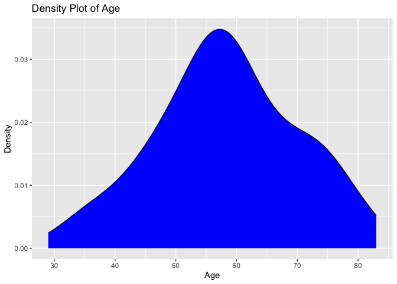<!-- -->

```r
# no missing in sex and age and ethnicity, no duplicates in ID, trt according to publication, add country
df$country <- c("Italy")
df$icu <- 0 # no icu patients at enrolment

# Days with symptoms prior to randomization
df %>% # no missings
  drop_na(sympdur) %>% 
  ggplot(aes(x = sympdur)) +
  geom_density(fill = "blue", color = "black") +
  labs(title = "Density Plot of Symptom Duration",
       x = "Symptom Duration",
       y = "Density")
```

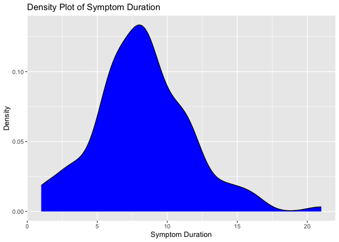<!-- -->

```r
# Severity of COVID-19 with respect to respiratory support at randomisation // tofacov only recruited mild (2) and moderate (3) covid-19, noone with any kind of ventilation (4 above)
df$clinstatus_baseline <- factor(df$clinstatus_baseline, levels = 1:6) ## no missing data
addmargins(table(df$clinstatus_baseline, df$trt, useNA = "always"))
```

```
##       
##          0   1 <NA> Sum
##   1      0   0    0   0
##   2     16   9    0  25
##   3     42  49    0  91
##   4      0   0    0   0
##   5      0   0    0   0
##   6      0   0    0   0
##   <NA>   0   0    0   0
##   Sum   58  58    0 116
```

```r
df <- df %>% 
  mutate(vbaseline = case_when(clinstatus_baseline == "2" | clinstatus_baseline == "3" ~ 0,
                                clinstatus_baseline == "4" | clinstatus_baseline == "5" ~ 1))

# Co-medication at baseline
df$comed_toci <- 0 # see publication: "It is noteworthy that no patients have received tocilizumab. Concomitant use of tofacitinib and tocilizumab was prohibited by protocol"
df$comed_interferon <- 0 # no interferon used

## group them for the subgroup analysis, according to protocol
df <- df %>% 
  mutate(comed_cat = case_when(comed_dexa == 0 & comed_toci == 0 ~ 1, # patients without Dexamethasone nor Tocilizumab
                               comed_dexa == 1 & comed_toci == 0 ~ 2, # patients with Dexamethasone but no Tocilizumab
                               comed_dexa == 1 & comed_toci == 1 ~ 3, # patients with Dexamethasone and Tocilizumab
                               comed_dexa == 0 & comed_toci == 1 ~ 4)) # patients with Tocilizumab but no Dexamethasone (if exist)

# Comorbidity at baseline, including immunocompromised // no immunosupp in tofacov and few comorbidities
df$comorb_cancer <- NA
df$comorb_autoimm <- NA
df$comorb_kidney <- NA
df <- df %>% # 18 missing - as in publication
  mutate(any_comorb = case_when(comorb_lung == 1 | comorb_liver == 1 | comorb_cvd == 1 |
                                  comorb_aht == 1 | comorb_dm == 1 | comorb_obese == 1 | comorb_smoker == 1
                                | immunosupp == 1 | comorb_cancer == 1 | comorb_autoimm == 1 | comorb_kidney == 1 
                                  ~ 1,
                                comorb_lung == 0 & comorb_liver == 0 & comorb_cvd == 0 &
                                  comorb_aht == 0 & comorb_dm == 0 & comorb_obese == 0 & comorb_smoker == 0
                                & immunosupp == 0 & comorb_cancer == 0 & comorb_autoimm == 0 & comorb_kidney == 0
                                ~ 0))
# the remaining missing have no evidence for comorbidity -> recode as 0
df <- df %>% 
  mutate(any_comorb = case_when(is.na(any_comorb) ~ 0,
                                TRUE ~ any_comorb))
## group them for the subgroup analysis, according to protocol // count all pre-defined comorbidities per patient first
comorb <- df %>% 
  select(id_pat, comorb_lung, comorb_liver, comorb_cvd, comorb_aht, comorb_dm, comorb_obese, comorb_smoker, immunosupp, comorb_kidney, comorb_autoimm, comorb_cancer)
comorb$comorb_count <- NA
for (i in 1:dim(comorb)[[1]]) {
  comorb$comorb_count[i] <- ifelse(
    sum(comorb[i, ] %in% c(1)) > 0,
    sum(comorb[i, ] %in% c(1)),
    NA
  )
}
comorb <- comorb %>% 
  mutate(comorb_count = case_when(comorb_lung == 0 & comorb_liver == 0 & comorb_cvd == 0 &
                                  comorb_aht == 0 & comorb_dm == 0 & comorb_obese == 0 & comorb_smoker == 0
                                & immunosupp == 0 & comorb_cancer == 0 & comorb_autoimm == 0 & comorb_kidney == 0 ~ 0,
                                TRUE ~ comorb_count))
# the remaining missing have no evidence for comorbidity -> recode as 0
comorb <- comorb %>% 
  mutate(comorb_count = case_when(is.na(comorb_count) ~ 0,
                                TRUE ~ comorb_count))
df <- left_join(df, comorb[, c("comorb_count", "id_pat")], by = join_by(id_pat == id_pat)) ## merge imputed variable back
df <- df %>% # no missing
  mutate(comorb_cat = case_when(immunosupp == 1 ~ 4, # immunocompromised
                                comorb_count == 0 ~ 1, # no comorbidity
                                comorb_count == 1 & (immunosupp == 0 | is.na(immunosupp)) ~ 2, # one comorbidity
                                comorb_count >1 & (immunosupp == 0 | is.na(immunosupp)) ~ 3)) # multiple comorbidities
df <- df %>%
  mutate(comorb_any = case_when(comorb_count == 0 ~ 0, # no comorbidity
                                comorb_count >0 ~ 1)) # any comorbidity

# CRP
df$crp <- as.numeric(df$`crp mg/L`) ## 1 missing
df %>% 
  drop_na(crp) %>% 
  ggplot(aes(x = crp)) +
  geom_density(fill = "blue", color = "black") +
  labs(title = "Density Plot of CRP",
       x = "CRP",
       y = "Density")
```

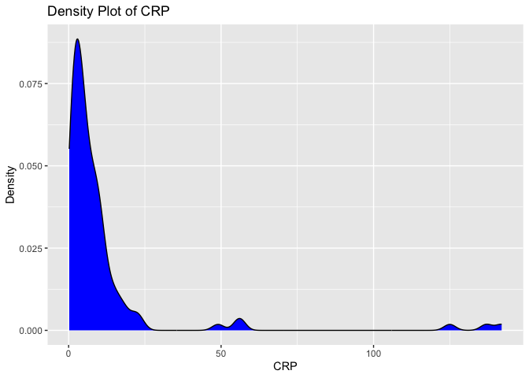<!-- -->

```r
# Vaccination
# table(df$vacc, useNA = "always") # no missing

# Viremia
# Variant
# Serology


# At risk for AEs with JAKi
df <- df %>%
  mutate(at_risk = case_when(age>=65 | comorb_cvd==1 | comorb_smoker==1 ~ 1, # at risk
                             TRUE ~ 0)) # not at risk
```

# Endpoints

```r
# time to event data
df$death_d <- as.numeric(df$death_date - df$randdate) 
df$discharge_d <- as.numeric(df$discharge_date - df$randdate)

# (i) Primary outcome: Mortality at day 28
df <- df %>% # corresponds to publication: only 1 death (in tofa arm)
  mutate(mort_28 = case_when(death_d <29 ~ 1, 
                             TRUE ~ 0 # Tofacov hat complete follow-up, only 1 died, all others were alive at day 28
                             )) 
df$mort_28_dimp <- df$mort_28 # to be consistent with other trials


# (ii) Mortality at day 60
df$mort_60 <- df$mort_28 # max fup time in TOFACOV was 28 days; thus mort_60 imputed from mort_28


# (iii) Time to death within max. follow-up time
df$death_reached <- df$mort_28
df <- df %>% # no missing and those that were discharged and afterwards have correct time to event data
  mutate(death_time = case_when(death_d >=0 ~ c(death_d), # time to death, if no time to death, then...
                                TRUE ~ 28)) # time to death censoring data (there were no withdrawals/LTFU)
# max follow-up time in TOFACOV was 28 days => no restriction of time window to 60 days.

# table(df$mort_28, useNA = "always") # correct
# table(df$mort_60, useNA = "always") # correct
# table(df$mort_60, df$mort_28, useNA = "always") # correct
# table(df$mort_60, df$death_reached, useNA = "always") # correct
# table(df$death_reached, df$death_time, useNA = "always") # correct


# (iv) New mechanical ventilation among survivors within 28 days. TOFACOV only included clinstatus 2 and 3.
df <- df %>% # the 1 that died is NA => correct
  mutate(new_mv_28 = case_when(mort_28 == 0 & (clinstatus_2 == 5 | clinstatus_7 == 5 | clinstatus_14 == 5) ~ 1,
                               mort_28 == 0 ~ 0))

# (iv) Alternative definition/analysis: New mechanical ventilation OR death within 28 days => include all in denominator. 
df <- df %>% # no missing anymore => correct
  mutate(new_mvd_28 = case_when(new_mv_28 == 1 | mort_28 == 1 ~ 1,
                                new_mv_28 == 0 | mort_28 == 0 ~ 0))


# (v) Clinical status at day 28
df <- df %>% # They called and followed all patients at day 28 and recorded no new serious adverse events, re-admissions or deaths besides the one that died on day 26
  mutate(clinstatus_28 = case_when(mort_28 == 1 ~ 6,
                                   discharge_d <29 ~ 1, # discharged alive / reached discharge criteria within 28d
                                   clinstatus_14 == 3 ~ 3, # these ones are still hosp at day 28
                                   clinstatus_14 == 4 ~ 4,
                                   clinstatus_14 == 5 ~ 5)) 
df$clinstatus_28 <- factor(df$clinstatus_28, levels = 1:6) # no missing
df$clinstatus_28_imp <- df$clinstatus_28 # equal to clinstatus_28_imp

# (vi) Time to discharge or reaching discharge criteria up to day 28
df <- df %>%
  mutate(discharge_reached = case_when(discharge_d <29 ~ 1,
                                       TRUE ~ 0))
df <- df %>% 
  mutate(discharge_time = case_when(discharge_d >=0 ~ c(discharge_d), # time to discharge, if no time to discharge, then...
                                    death_d >=0 ~ death_d)) # time to discharge censoring time
df <- df %>% # restrict to max fup time 28d
  mutate(discharge_time = case_when(discharge_time >28 ~ 28,
                                    TRUE ~ discharge_time))
df <- df %>% # add 28d for those that died
  mutate(discharge_time_sens = case_when(mort_28 == 1 ~ 28,
                                    TRUE ~ discharge_time))

# (vi) Sens-analysis: Alternative definition/analysis of outcome: time to sustained discharge within 28 days. There were no re-admissions within 28d
df$discharge_reached_sus <- df$discharge_reached
df$discharge_time_sus <- df$discharge_time


# (vii) Viral clearance up to day 5, day 10, and day 15 (Viral load value <LOQ and/or undectectable): Not available in TOFACOV
# (viii) Quality of life at day 28: Not available in TOFAVOC


# (ix) Participants with an adverse event grade 3 or 4, or a serious adverse event, excluding death, by day 28
table(df$ae_28, df$trt, useNA = "always")
```

```
##       
##         0  1 <NA>
##   0    45 49    0
##   1    13  9    0
##   <NA>  0  0    0
```

```r
# table(df$ae_28, df$mort_28, useNA = "always") # corresponds to publication and excludes the death

# (ix) Sens-analysis: Alternative definition/analysis of outcome: incidence rate ratio (Poisson regression) -> AE per person by d28
df$ae_28_sev <- df$ae_28 # there were only 1 AE grade 3/4 per person 

# (ix) Sens-analysis: Alternative definition/analysis of outcome: time to first (of these) adverse event, within 28 days, considering death as a competing risk (=> censor and set to 28 days)
# time to first ae not available

# (x) Adverse events of special interest within 28 days: a) thromboembolic events (venous thromboembolism, pulmonary embolism, arterial thrombosis), b) secondary infections (bacterial pneumonia including ventilator-associated pneumonia, meningitis and encephalitis, endocarditis and bacteremia, invasive fungal infection including pulmonary aspergillosis), c) Reactivation of chronic infection including tuberculosis, herpes simplex, cytomegalovirus, herpes zoster and hepatitis B, d) serious cardiovascular and cardiac events (including stroke and myocardial infarction), e) events related to signs of bone marrow suppression (anemia, lymphocytopenia, thrombocytopenia, pancytopenia), f) malignancy, g) gastrointestinal perforation (incl. gastrointestinal bleeding/diverticulitis), h) liver dysfunction/hepatotoxicity (grade 3 and 4)
df_aesi <- df %>% # these were >5 ULN 
  mutate(aesi = case_when(ae_28_spec == "Pulmonary embolism" ~ "thrombo",
                             ae_28_spec == "ALT increase" ~ "hepatox")) %>% 
  filter(!is.na(aesi)) %>% 
  filter(ae_28 == 1) %>% 
  select(id_pat, trt, ae_28_spec, aesi) %>% 
  rename(ae = ae_28_spec)
# Save
saveRDS(df_aesi, file = "df_aesi_tofacov.RData")


# (xi) Adverse events, any grade and serious adverse event, excluding death, within 28 days, grouped by organ classes
df_ae <- df %>% # these were >5 ULN 
  mutate(aesi = case_when(ae_28_spec == "Pulmonary embolism" ~ "thrombo",
                             ae_28_spec == "ALT increase" ~ "hepatox")) %>%
  filter(ae_28 == 1) %>% 
  select(id_pat, trt, ae_28_spec, aesi) %>% 
  rename(ae = ae_28_spec)
# Save
saveRDS(df_ae, file = "df_ae_tofacov.RData")
```
Discussion points
1. Outcome definition "new_mv_28" differs to original trial publication (included new non-invasive ventilations, i.e. clinstatus == 4)

# Define final datasets

```r
# keep the overall set
df_all <- df
# reduce the df set to our standardized set across all trials
df <- df %>% 
  select(id_pat, JAKi, trt, sex, age, ethn, country, icu, sympdur, vacc, clinstatus_baseline, vbaseline, trial,
         comed_dexa, comed_rdv, comed_toci, comed_ab, comed_acoa, comed_interferon, comed_other,
         comed_cat,
         comorb_lung, comorb_liver, comorb_cvd, comorb_aht, comorb_dm, comorb_obese, comorb_smoker, immunosupp,
         comorb_autoimm, comorb_cancer, comorb_kidney,
         any_comorb, comorb_cat, comorb_any, comorb_count,
         crp, at_risk,
         # sero, vl_baseline, variant,
         mort_28, mort_28_dimp, mort_60, death_reached, death_time,
         new_mv_28, new_mvd_28,
         clinstatus_28_imp,
         discharge_reached, discharge_time, discharge_time_sens, discharge_reached_sus, discharge_time_sus,
         ae_28, ae_28_sev
         # vir_clear_5, vir_clear_10, vir_clear_15
         )
# export for one-stage model, i.e., add missing variables 
df_os <- df
df_os$sero <- NA
df_os$vl_baseline <- NA
df_os$variant <- NA
df_os$vir_clear_5 <- NA
df_os$vir_clear_10 <- NA
df_os$vir_clear_15 <- NA
# Save
saveRDS(df_os, file = "df_os_tofacov.RData")
```

# Missing data plot: One-stage dataset

```r
# Bar plot, missing data, each data point, standardized one-stage dataset
original_order <- colnames(df_os)
missing_plot <- df_os %>%
  summarise_all(~ mean(is.na(.))) %>%
  gather() %>%
  mutate(key = factor(key, levels = original_order)) %>%
  ggplot(aes(x = key, y = value)) +
  geom_bar(stat = "identity") +
  labs(x = "Columns", y = "Proportion of Missing Values", title = "Missing Data - standardized one-stage dataset") +
  theme(axis.text.x = element_text(angle = 45, hjust = 1)) +
  ylim(0, 1)
print(missing_plot)
```

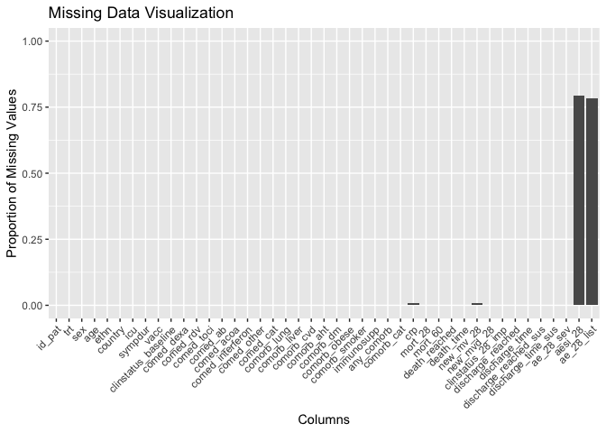<!-- -->
Discussion points
1. Missing variables:
* Baseline:
  - variant
  - sero
  - vl_baseline
  - clarify comorbidity categories (autoimmun, CKD, cancer)
* Outcomes:
  - vir_clear_5, vir_clear_10, vir_clear_15
2. Missing data:
- 1 NA in crp 
- NAs in new_mv_28: Not part of denominator

# Missing data: Explore for MI

```r
# keep the core df
# names(df_all)
df_core <- df_all %>% 
  select(id_pat, JAKi, trt, sex, age, ethn, country, icu, sympdur, vacc, clinstatus_baseline, vbaseline, trial,
         comed_dexa, comed_rdv, comed_toci, comed_ab, comed_acoa, comed_interferon, comed_other,
         comed_cat,
         comorb_lung, comorb_liver, comorb_cvd, comorb_aht, comorb_dm, comorb_obese, comorb_smoker, immunosupp,
         comorb_autoimm, comorb_cancer, comorb_kidney,
         any_comorb, comorb_cat, comorb_any, comorb_count,
         crp, 
         # sero, vl_baseline, variant,
         clinstatus_2, clinstatus_7, clinstatus_14,
         mort_28, mort_28_dimp, mort_60, death_reached, death_time,
         new_mv_28, new_mvd_28,
         clinstatus_28_imp,
         discharge_reached, discharge_time, discharge_time_sens, discharge_reached_sus, discharge_time_sus,
         ae_28, ae_28_sev
         # vir_clear_5, vir_clear_10, vir_clear_15
         )

# Convert character variables to factors
char_vars <- c("id_pat", "sex", "trial", "JAKi", "ethn", "vacc", "country", "icu", "clinstatus_baseline", "vbaseline", 
               "comed_dexa", "comed_rdv", "comed_toci", "comed_ab", "comed_acoa", "comed_interferon", "comed_other", "comed_cat",
               "comorb_lung", "comorb_liver", "comorb_cvd", "comorb_aht", "comorb_dm", "comorb_obese", "comorb_smoker", "immunosupp", "comorb_autoimm", "comorb_cancer", "comorb_kidney", "any_comorb", "comorb_cat", "comorb_any", "clinstatus_28_imp", "mort_28", "mort_28_dimp", "mort_60", "death_reached", "new_mv_28", "new_mvd_28","discharge_reached", "discharge_reached_sus", "ae_28")
df_core <- df_core %>%
  mutate(across(all_of(char_vars), factor))

# Bar plot, missing data, each data point, core dataset
original_order <- colnames(df_core)
missing_plot <- df_core %>%
  summarise_all(~ mean(is.na(.))) %>%
  gather() %>%
  mutate(key = factor(key, levels = original_order)) %>%
  ggplot(aes(x = key, y = value)) +
  geom_bar(stat = "identity") +
  labs(x = "Columns", y = "Proportion of Missing Values", title = "Missing Data - core dataset") +
  theme(axis.text.x = element_text(angle = 45, hjust = 1)) +
  ylim(0, 1)
print(missing_plot)
```

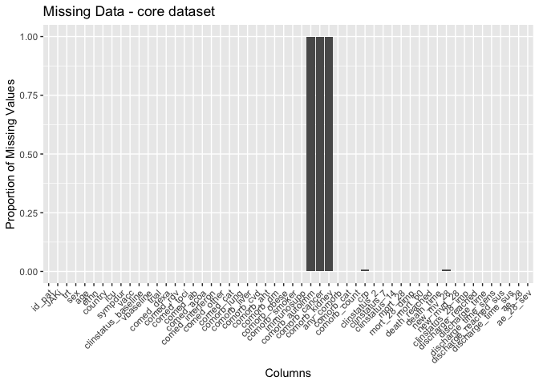<!-- -->

```r
# Bar plot, missing data, each data point, core dataset, by arm
df_core_int <- df_core %>% 
  filter(trt == 1)
original_order <- colnames(df_core_int)
missing_plot <- df_core_int %>% # Intervention arm
  summarise_all(~ mean(is.na(.))) %>%
  gather() %>%
  mutate(key = factor(key, levels = original_order)) %>%
  ggplot(aes(x = key, y = value)) +
  geom_bar(stat = "identity") +
  labs(x = "Columns", y = "Proportion of Missing Values", title = "Missing Data - core dataset, intervention") +
  theme(axis.text.x = element_text(angle = 45, hjust = 1)) +
  ylim(0, 1)
print(missing_plot)
```

<!-- -->

```r
df_core_cont <- df_core %>% 
  filter(trt == 0)
original_order <- colnames(df_core_cont)
missing_plot <- df_core_cont %>% # Control arm
  summarise_all(~ mean(is.na(.))) %>%
  gather() %>%
  mutate(key = factor(key, levels = original_order)) %>%
  ggplot(aes(x = key, y = value)) +
  geom_bar(stat = "identity") +
  labs(x = "Columns", y = "Proportion of Missing Values", title = "Missing Data - core dataset, control") +
  theme(axis.text.x = element_text(angle = 45, hjust = 1)) +
  ylim(0, 1)
print(missing_plot)
```

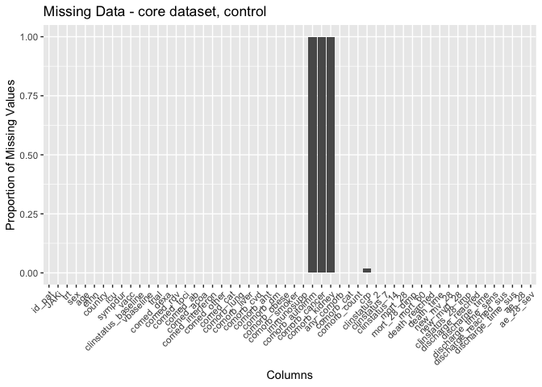<!-- -->

```r
#### only CRP missing -> MI
### Baseline table, by individuals with no missing data vs any missing data (or only in crp)
df_core$resp<-ifelse(is.na(df_core$crp), 0, 1);table(df_core$resp) # only mort_28 missing 
```

```
## 
##   0   1 
##   1 115
```

```r
# Assign variable list
vars.list <- c("resp", "age", "sympdur", "trt", "sex", "trial", "JAKi", "ethn", "vacc", "country", "icu", "sympdur", "clinstatus_baseline", "vbaseline", "comed_dexa", "comed_rdv", "comed_toci", "comed_ab", "comed_acoa", "comed_interferon", "comed_other", "comed_cat",
               "comorb_lung", "comorb_liver", "comorb_cvd", "comorb_aht", "comorb_dm", "comorb_obese", "comorb_smoker", "immunosupp", "any_comorb", "comorb_cat", "comorb_any", "comorb_count","comorb_autoimm","comorb_cancer", "comorb_kidney", "crp"
               , "mort_28", "mort_28_dimp", "mort_60", "death_reached","death_time", "new_mv_28", "new_mvd_28","discharge_reached", "discharge_time", "discharge_reached_sus", "discharge_time_sus", "ae_28", "ae_28_sev")

# By completeness (only mort_28)
table_resp <- CreateTableOne(data = df_core, vars = vars.list[!vars.list %in% c("resp")], strata = "resp", includeNA = T, test = T, addOverall = TRUE)
# Print and display the table
capture.output(
  table_resp <- print(
    table_resp, 
    nonnormal = vars.list, 
    catDigits = 1, 
    SMD = TRUE, 
    showAllLevels = TRUE, 
    test = TRUE, 
    printToggle = FALSE, 
    missing = TRUE))
```

```
## character(0)
```

```r
kable(table_resp, format = "markdown", table.attr = 'class="table"', caption = "By completeness (only crp)") %>%
  kable_styling(bootstrap_options = "striped", full_width = FALSE)
```


Table: By completeness (only crp)

|                                  |level       |Overall              |0                    |1                    |p     |test    |Missing |
|:---------------------------------|:-----------|:--------------------|:--------------------|:--------------------|:-----|:-------|:-------|
|n                                 |            |116                  |1                    |115                  |      |        |        |
|age (median [IQR])                |            |58.00 [50.75, 66.25] |45.00 [45.00, 45.00] |58.00 [51.00, 66.50] |0.204 |nonnorm |0.0     |
|sympdur (median [IQR])            |            |8.00 [6.00, 10.00]   |6.00 [6.00, 6.00]    |8.00 [6.00, 10.00]   |0.359 |nonnorm |0.0     |
|sympdur (median [IQR])            |            |8.00 [6.00, 10.00]   |6.00 [6.00, 6.00]    |8.00 [6.00, 10.00]   |0.359 |nonnorm |0.0     |
|trt (median [IQR])                |            |0.50 [0.00, 1.00]    |0.00 [0.00, 0.00]    |1.00 [0.00, 1.00]    |0.317 |nonnorm |0.0     |
|sex (%)                           |female      |36 ( 31.0)           |1 (100.0)            |35 ( 30.4)           |0.681 |        |0.0     |
|                                  |male        |80 ( 69.0)           |0 (  0.0)            |80 ( 69.6)           |      |        |        |
|trial (%)                         |TOFACOV     |116 (100.0)          |1 (100.0)            |115 (100.0)          |NA    |        |0.0     |
|JAKi (%)                          |Tofacitinib |116 (100.0)          |1 (100.0)            |115 (100.0)          |NA    |        |0.0     |
|ethn (%)                          |caucasian   |116 (100.0)          |1 (100.0)            |115 (100.0)          |NA    |        |0.0     |
|vacc (%)                          |0           |113 ( 97.4)          |1 (100.0)            |112 ( 97.4)          |1.000 |        |0.0     |
|                                  |1           |3 (  2.6)            |0 (  0.0)            |3 (  2.6)            |      |        |        |
|country (%)                       |Italy       |116 (100.0)          |1 (100.0)            |115 (100.0)          |NA    |        |0.0     |
|icu (%)                           |0           |116 (100.0)          |1 (100.0)            |115 (100.0)          |NA    |        |0.0     |
|sympdur (median [IQR])            |            |8.00 [6.00, 10.00]   |6.00 [6.00, 6.00]    |8.00 [6.00, 10.00]   |0.359 |nonnorm |0.0     |
|sympdur (median [IQR])            |            |8.00 [6.00, 10.00]   |6.00 [6.00, 6.00]    |8.00 [6.00, 10.00]   |0.359 |nonnorm |0.0     |
|clinstatus_baseline (%)           |2           |25 ( 21.6)           |1 (100.0)            |24 ( 20.9)           |0.487 |        |0.0     |
|                                  |3           |91 ( 78.4)           |0 (  0.0)            |91 ( 79.1)           |      |        |        |
|vbaseline (%)                     |0           |116 (100.0)          |1 (100.0)            |115 (100.0)          |NA    |        |0.0     |
|comed_dexa (%)                    |0           |7 (  6.0)            |0 (  0.0)            |7 (  6.1)            |1.000 |        |0.0     |
|                                  |1           |109 ( 94.0)          |1 (100.0)            |108 ( 93.9)          |      |        |        |
|comed_rdv (%)                     |0           |13 ( 11.2)           |0 (  0.0)            |13 ( 11.3)           |1.000 |        |0.0     |
|                                  |1           |103 ( 88.8)          |1 (100.0)            |102 ( 88.7)          |      |        |        |
|comed_toci (%)                    |0           |116 (100.0)          |1 (100.0)            |115 (100.0)          |NA    |        |0.0     |
|comed_ab (%)                      |0           |42 ( 36.2)           |0 (  0.0)            |42 ( 36.5)           |1.000 |        |0.0     |
|                                  |1           |74 ( 63.8)           |1 (100.0)            |73 ( 63.5)           |      |        |        |
|comed_acoa (%)                    |0           |24 ( 20.7)           |0 (  0.0)            |24 ( 20.9)           |1.000 |        |0.0     |
|                                  |1           |92 ( 79.3)           |1 (100.0)            |91 ( 79.1)           |      |        |        |
|comed_interferon (%)              |0           |116 (100.0)          |1 (100.0)            |115 (100.0)          |NA    |        |0.0     |
|comed_other (%)                   |0           |116 (100.0)          |1 (100.0)            |115 (100.0)          |NA    |        |0.0     |
|comed_cat (%)                     |1           |7 (  6.0)            |0 (  0.0)            |7 (  6.1)            |1.000 |        |0.0     |
|                                  |2           |109 ( 94.0)          |1 (100.0)            |108 ( 93.9)          |      |        |        |
|comorb_lung (%)                   |0           |110 ( 94.8)          |1 (100.0)            |109 ( 94.8)          |1.000 |        |0.0     |
|                                  |1           |6 (  5.2)            |0 (  0.0)            |6 (  5.2)            |      |        |        |
|comorb_liver (%)                  |0           |116 (100.0)          |1 (100.0)            |115 (100.0)          |NA    |        |0.0     |
|comorb_cvd (%)                    |0           |115 ( 99.1)          |1 (100.0)            |114 ( 99.1)          |1.000 |        |0.0     |
|                                  |1           |1 (  0.9)            |0 (  0.0)            |1 (  0.9)            |      |        |        |
|comorb_aht (%)                    |0           |65 ( 56.0)           |1 (100.0)            |64 ( 55.7)           |1.000 |        |0.0     |
|                                  |1           |51 ( 44.0)           |0 (  0.0)            |51 ( 44.3)           |      |        |        |
|comorb_dm (%)                     |0           |108 ( 93.1)          |1 (100.0)            |107 ( 93.0)          |1.000 |        |0.0     |
|                                  |1           |8 (  6.9)            |0 (  0.0)            |8 (  7.0)            |      |        |        |
|comorb_obese (%)                  |0           |87 ( 75.0)           |0 (  0.0)            |87 ( 75.7)           |0.562 |        |0.0     |
|                                  |1           |29 ( 25.0)           |1 (100.0)            |28 ( 24.3)           |      |        |        |
|comorb_smoker (%)                 |0           |107 ( 92.2)          |1 (100.0)            |106 ( 92.2)          |1.000 |        |0.0     |
|                                  |1           |9 (  7.8)            |0 (  0.0)            |9 (  7.8)            |      |        |        |
|immunosupp (%)                    |0           |116 (100.0)          |1 (100.0)            |115 (100.0)          |NA    |        |0.0     |
|any_comorb (%)                    |0           |44 ( 37.9)           |0 (  0.0)            |44 ( 38.3)           |1.000 |        |0.0     |
|                                  |1           |72 ( 62.1)           |1 (100.0)            |71 ( 61.7)           |      |        |        |
|comorb_cat (%)                    |1           |44 ( 37.9)           |0 (  0.0)            |44 ( 38.3)           |0.464 |        |0.0     |
|                                  |2           |46 ( 39.7)           |1 (100.0)            |45 ( 39.1)           |      |        |        |
|                                  |3           |26 ( 22.4)           |0 (  0.0)            |26 ( 22.6)           |      |        |        |
|comorb_any (%)                    |0           |44 ( 37.9)           |0 (  0.0)            |44 ( 38.3)           |1.000 |        |0.0     |
|                                  |1           |72 ( 62.1)           |1 (100.0)            |71 ( 61.7)           |      |        |        |
|comorb_count (median [IQR])       |            |1.00 [0.00, 1.00]    |1.00 [1.00, 1.00]    |1.00 [0.00, 1.00]    |0.774 |nonnorm |0.0     |
|crp (median [IQR])                |            |4.90 [2.40, 9.75]    |NA [NA, NA]          |4.90 [2.40, 9.75]    |NA    |nonnorm |0.9     |
|mort_28 (%)                       |0           |115 ( 99.1)          |1 (100.0)            |114 ( 99.1)          |1.000 |        |0.0     |
|                                  |1           |1 (  0.9)            |0 (  0.0)            |1 (  0.9)            |      |        |        |
|mort_28_dimp (%)                  |0           |115 ( 99.1)          |1 (100.0)            |114 ( 99.1)          |1.000 |        |0.0     |
|                                  |1           |1 (  0.9)            |0 (  0.0)            |1 (  0.9)            |      |        |        |
|mort_60 (%)                       |0           |115 ( 99.1)          |1 (100.0)            |114 ( 99.1)          |1.000 |        |0.0     |
|                                  |1           |1 (  0.9)            |0 (  0.0)            |1 (  0.9)            |      |        |        |
|death_reached (%)                 |0           |115 ( 99.1)          |1 (100.0)            |114 ( 99.1)          |1.000 |        |0.0     |
|                                  |1           |1 (  0.9)            |0 (  0.0)            |1 (  0.9)            |      |        |        |
|death_time (median [IQR])         |            |28.00 [28.00, 28.00] |28.00 [28.00, 28.00] |28.00 [28.00, 28.00] |0.926 |nonnorm |0.0     |
|new_mv_28 (%)                     |0           |113 ( 97.4)          |1 (100.0)            |112 ( 97.4)          |0.987 |        |0.9     |
|                                  |1           |2 (  1.7)            |0 (  0.0)            |2 (  1.7)            |      |        |        |
|                                  |NA          |1 (  0.9)            |0 (  0.0)            |1 (  0.9)            |      |        |        |
|new_mvd_28 (%)                    |0           |113 ( 97.4)          |1 (100.0)            |112 ( 97.4)          |1.000 |        |0.0     |
|                                  |1           |3 (  2.6)            |0 (  0.0)            |3 (  2.6)            |      |        |        |
|discharge_reached (%)             |0           |6 (  5.2)            |0 (  0.0)            |6 (  5.2)            |1.000 |        |0.0     |
|                                  |1           |110 ( 94.8)          |1 (100.0)            |109 ( 94.8)          |      |        |        |
|discharge_time (median [IQR])     |            |12.00 [9.00, 16.00]  |8.00 [8.00, 8.00]    |12.00 [9.00, 16.00]  |0.262 |nonnorm |0.0     |
|discharge_reached_sus (%)         |0           |6 (  5.2)            |0 (  0.0)            |6 (  5.2)            |1.000 |        |0.0     |
|                                  |1           |110 ( 94.8)          |1 (100.0)            |109 ( 94.8)          |      |        |        |
|discharge_time_sus (median [IQR]) |            |12.00 [9.00, 16.00]  |8.00 [8.00, 8.00]    |12.00 [9.00, 16.00]  |0.262 |nonnorm |0.0     |
|ae_28 (%)                         |0           |94 ( 81.0)           |1 (100.0)            |93 ( 80.9)           |1.000 |        |0.0     |
|                                  |1           |22 ( 19.0)           |0 (  0.0)            |22 ( 19.1)           |      |        |        |
|ae_28_sev (median [IQR])          |            |0.00 [0.00, 0.00]    |0.00 [0.00, 0.00]    |0.00 [0.00, 0.00]    |0.629 |nonnorm |0.0     |

```r
### Define variables to be included in imputation set
# table(df_core$comorb_cat, useNA = "always")
df_imp <- df_core %>% 
  select("id_pat"
         , "trt", "sex", "age" 
         # , "ethn" # no info
         # , "country" # no info
         , "sympdur" 
         , "vacc"
         # , "trial", "JAKi"  # only 0
         , "clinstatus_baseline"
         # , "vbaseline" # derived
         , "comed_rdv"
         # , "comed_toci", "comed_interferon" # no info
         #,  "comed_cat", # derived
         , "comed_dexa", "comed_ab"
         , "comed_acoa" # no info
         # , "comed_other" # no info
         # , "comorb_lung", "comorb_liver", "comorb_cvd", "comorb_aht", "comorb_dm", "comorb_obese",
         # "comorb_smoker", "immunosupp", "comorb_autoimm", "comorb_cancer", "comorb_kidney", "any_comorb",
         # "comorb_count", 
         # "comorb_any", 
         ,"comorb_cat" # derived from above, contains most information, and needed as interaction term
         ,"crp"
         # ,"vl_baseline"
         # , "sero" , "variant" # no info
         , clinstatus_2, clinstatus_7, clinstatus_14, clinstatus_28_imp
         # , "clinstatus_28_imp" # imputed via LOVCF above
         , "mort_28"
         # , "mort_28_dimp" # imputed deterministically
         # , "mort_60" # does not contain any additional information compared to death reached
         , "death_reached", "death_time", "new_mv_28", "new_mvd_28", "discharge_reached", "discharge_time"
         # , "discharge_reached_sus", "discharge_time_sus" # same as discharge, does not contain any addition information
         , "ae_28", "ae_28_sev"
         # , "vir_clear_5", "vir_clear_10", "vir_clear_15"
         )

# First, table and visualize missing data in various ways
# df_imp %>% 
#   ff_glimpse() # from finalfit package
df_imp %>%
  missing_plot() # from finalfit package
```

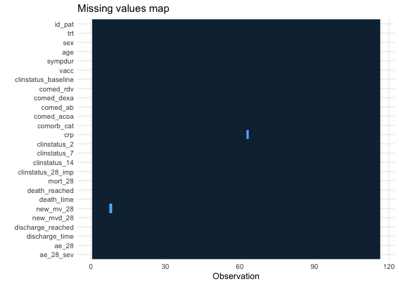<!-- -->

```r
explanatory = c("age", 
  "clinstatus_baseline", "sex", "vacc",  
  "sympdur", "comorb_cat", "comed_rdv", "comed_dexa", "comed_ab", "comed_acoa", "mort_28", "ae_28_sev")
dependent = "crp"
df_imp %>% # from finalfit package, missing plot
  missing_pairs(dependent, explanatory, position = "fill", )
```

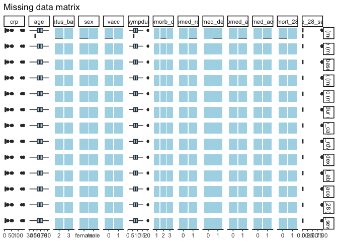<!-- -->

```r
# Second, let's explore the missingness patterns
md.pattern(df_imp[,c("age", "crp",
  "clinstatus_baseline", "sex", "vacc",  
  "sympdur", "comorb_cat", "comed_rdv", "comed_dexa", "comed_ab", "comed_acoa", "mort_28", "ae_28_sev")], rotate.names = T)
```

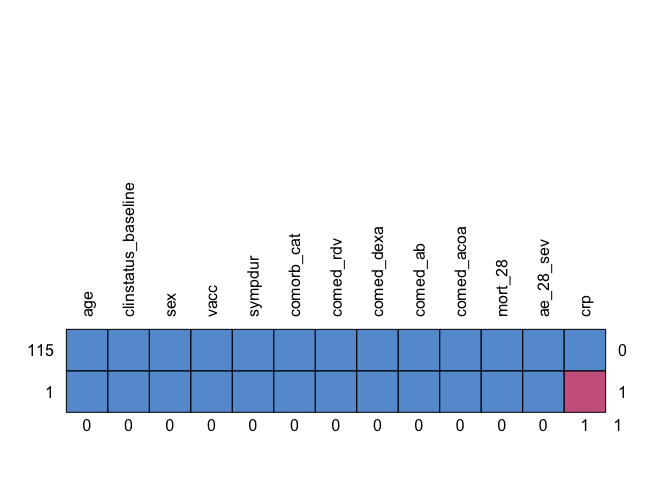<!-- -->

```
##     age clinstatus_baseline sex vacc sympdur comorb_cat comed_rdv comed_dexa
## 115   1                   1   1    1       1          1         1          1
## 1     1                   1   1    1       1          1         1          1
##       0                   0   0    0       0          0         0          0
##     comed_ab comed_acoa mort_28 ae_28_sev crp  
## 115        1          1       1         1   1 0
## 1          1          1       1         1   0 1
##            0          0       0         0   1 1
```

```r
# Third, let's explore if the variables from my substantive model plus auxiliary variables are associated with crp
mort28.aux <- lm(crp ~
            + age 
            + clinstatus_baseline
            + sex
            + vacc
            + sympdur
            + comorb_cat
            + comed_dexa
            + comed_ab
            + comed_acoa
            + comed_rdv
            + mort_28
            + clinstatus_28_imp
            + ae_28_sev
            ,family="binomial"
            ,data=df_imp)
summary(mort28.aux)
```

```
## 
## Call:
## lm(formula = crp ~ +age + clinstatus_baseline + sex + vacc + 
##     sympdur + comorb_cat + comed_dexa + comed_ab + comed_acoa + 
##     comed_rdv + mort_28 + clinstatus_28_imp + ae_28_sev, data = df_imp, 
##     family = "binomial")
## 
## Residuals:
##     Min      1Q  Median      3Q     Max 
## -26.375  -9.390  -3.202   3.168 120.152 
## 
## Coefficients: (1 not defined because of singularities)
##                      Estimate Std. Error t value Pr(>|t|)   
## (Intercept)           19.7055    16.1994   1.216  0.22674   
## age                   -0.3792     0.2348  -1.615  0.10954   
## clinstatus_baseline3  -2.3207     5.8303  -0.398  0.69147   
## sexmale                2.2197     5.0075   0.443  0.65855   
## vacc1                 -4.6864    14.5029  -0.323  0.74728   
## sympdur               -0.4781     0.6756  -0.708  0.48081   
## comorb_cat2            3.1228     4.9961   0.625  0.53339   
## comorb_cat3           19.6648     6.7277   2.923  0.00431 **
## comed_dexa1           16.6617     9.8689   1.688  0.09453 . 
## comed_ab1              4.6711     4.6783   0.998  0.32051   
## comed_acoa1            3.3237     5.4871   0.606  0.54610   
## comed_rdv1            -8.5472     7.0394  -1.214  0.22759   
## mort_281              -3.2336    22.9149  -0.141  0.88807   
## clinstatus_28_imp3    -9.5696    23.5244  -0.407  0.68505   
## clinstatus_28_imp4   -15.1649    13.4696  -1.126  0.26297   
## clinstatus_28_imp5     7.0372    23.7472   0.296  0.76760   
## clinstatus_28_imp6         NA         NA      NA       NA   
## ae_28_sev             -6.5856     6.2649  -1.051  0.29576   
## ---
## Signif. codes:  0 '***' 0.001 '**' 0.01 '*' 0.05 '.' 0.1 ' ' 1
## 
## Residual standard error: 22.25 on 98 degrees of freedom
##   (1 observation deleted due to missingness)
## Multiple R-squared:  0.1475,	Adjusted R-squared:  0.008274 
## F-statistic: 1.059 on 16 and 98 DF,  p-value: 0.4039
```

```r
# Fourth, let's explore if they are associated with missingness of crp:
df_imp %>% 
  missing_compare(dependent, explanatory) %>%
    knitr::kable(row.names=FALSE, align = c("l", "l", "r", "r", "r"))
```

<table>
 <thead>
  <tr>
   <th style="text-align:left;"> Missing data analysis: crp </th>
   <th style="text-align:left;">   </th>
   <th style="text-align:right;"> Not missing </th>
   <th style="text-align:right;"> Missing </th>
   <th style="text-align:right;"> p </th>
  </tr>
 </thead>
<tbody>
  <tr>
   <td style="text-align:left;"> age </td>
   <td style="text-align:left;"> Mean (SD) </td>
   <td style="text-align:right;"> 58.4 (11.7) </td>
   <td style="text-align:right;"> 45.0 (NA) </td>
   <td style="text-align:right;"> 0.258 </td>
  </tr>
  <tr>
   <td style="text-align:left;"> clinstatus_baseline </td>
   <td style="text-align:left;"> 2 </td>
   <td style="text-align:right;"> 24 (96.0) </td>
   <td style="text-align:right;"> 1 (4.0) </td>
   <td style="text-align:right;"> 0.487 </td>
  </tr>
  <tr>
   <td style="text-align:left;">  </td>
   <td style="text-align:left;"> 3 </td>
   <td style="text-align:right;"> 91 (100.0) </td>
   <td style="text-align:right;"> 0 (0.0) </td>
   <td style="text-align:right;">  </td>
  </tr>
  <tr>
   <td style="text-align:left;"> sex </td>
   <td style="text-align:left;"> female </td>
   <td style="text-align:right;"> 35 (97.2) </td>
   <td style="text-align:right;"> 1 (2.8) </td>
   <td style="text-align:right;"> 0.681 </td>
  </tr>
  <tr>
   <td style="text-align:left;">  </td>
   <td style="text-align:left;"> male </td>
   <td style="text-align:right;"> 80 (100.0) </td>
   <td style="text-align:right;"> 0 (0.0) </td>
   <td style="text-align:right;">  </td>
  </tr>
  <tr>
   <td style="text-align:left;"> vacc </td>
   <td style="text-align:left;"> 0 </td>
   <td style="text-align:right;"> 112 (99.1) </td>
   <td style="text-align:right;"> 1 (0.9) </td>
   <td style="text-align:right;"> 1.000 </td>
  </tr>
  <tr>
   <td style="text-align:left;">  </td>
   <td style="text-align:left;"> 1 </td>
   <td style="text-align:right;"> 3 (100.0) </td>
   <td style="text-align:right;"> 0 (0.0) </td>
   <td style="text-align:right;">  </td>
  </tr>
  <tr>
   <td style="text-align:left;"> sympdur </td>
   <td style="text-align:left;"> Mean (SD) </td>
   <td style="text-align:right;"> 8.2 (3.5) </td>
   <td style="text-align:right;"> 6.0 (NA) </td>
   <td style="text-align:right;"> 0.521 </td>
  </tr>
  <tr>
   <td style="text-align:left;"> comorb_cat </td>
   <td style="text-align:left;"> 1 </td>
   <td style="text-align:right;"> 44 (100.0) </td>
   <td style="text-align:right;"> 0 (0.0) </td>
   <td style="text-align:right;"> 0.464 </td>
  </tr>
  <tr>
   <td style="text-align:left;">  </td>
   <td style="text-align:left;"> 2 </td>
   <td style="text-align:right;"> 45 (97.8) </td>
   <td style="text-align:right;"> 1 (2.2) </td>
   <td style="text-align:right;">  </td>
  </tr>
  <tr>
   <td style="text-align:left;">  </td>
   <td style="text-align:left;"> 3 </td>
   <td style="text-align:right;"> 26 (100.0) </td>
   <td style="text-align:right;"> 0 (0.0) </td>
   <td style="text-align:right;">  </td>
  </tr>
  <tr>
   <td style="text-align:left;"> comed_rdv </td>
   <td style="text-align:left;"> 0 </td>
   <td style="text-align:right;"> 13 (100.0) </td>
   <td style="text-align:right;"> 0 (0.0) </td>
   <td style="text-align:right;"> 1.000 </td>
  </tr>
  <tr>
   <td style="text-align:left;">  </td>
   <td style="text-align:left;"> 1 </td>
   <td style="text-align:right;"> 102 (99.0) </td>
   <td style="text-align:right;"> 1 (1.0) </td>
   <td style="text-align:right;">  </td>
  </tr>
  <tr>
   <td style="text-align:left;"> comed_dexa </td>
   <td style="text-align:left;"> 0 </td>
   <td style="text-align:right;"> 7 (100.0) </td>
   <td style="text-align:right;"> 0 (0.0) </td>
   <td style="text-align:right;"> 1.000 </td>
  </tr>
  <tr>
   <td style="text-align:left;">  </td>
   <td style="text-align:left;"> 1 </td>
   <td style="text-align:right;"> 108 (99.1) </td>
   <td style="text-align:right;"> 1 (0.9) </td>
   <td style="text-align:right;">  </td>
  </tr>
  <tr>
   <td style="text-align:left;"> comed_ab </td>
   <td style="text-align:left;"> 0 </td>
   <td style="text-align:right;"> 42 (100.0) </td>
   <td style="text-align:right;"> 0 (0.0) </td>
   <td style="text-align:right;"> 1.000 </td>
  </tr>
  <tr>
   <td style="text-align:left;">  </td>
   <td style="text-align:left;"> 1 </td>
   <td style="text-align:right;"> 73 (98.6) </td>
   <td style="text-align:right;"> 1 (1.4) </td>
   <td style="text-align:right;">  </td>
  </tr>
  <tr>
   <td style="text-align:left;"> comed_acoa </td>
   <td style="text-align:left;"> 0 </td>
   <td style="text-align:right;"> 24 (100.0) </td>
   <td style="text-align:right;"> 0 (0.0) </td>
   <td style="text-align:right;"> 1.000 </td>
  </tr>
  <tr>
   <td style="text-align:left;">  </td>
   <td style="text-align:left;"> 1 </td>
   <td style="text-align:right;"> 91 (98.9) </td>
   <td style="text-align:right;"> 1 (1.1) </td>
   <td style="text-align:right;">  </td>
  </tr>
  <tr>
   <td style="text-align:left;"> mort_28 </td>
   <td style="text-align:left;"> 0 </td>
   <td style="text-align:right;"> 114 (99.1) </td>
   <td style="text-align:right;"> 1 (0.9) </td>
   <td style="text-align:right;"> 1.000 </td>
  </tr>
  <tr>
   <td style="text-align:left;">  </td>
   <td style="text-align:left;"> 1 </td>
   <td style="text-align:right;"> 1 (100.0) </td>
   <td style="text-align:right;"> 0 (0.0) </td>
   <td style="text-align:right;">  </td>
  </tr>
  <tr>
   <td style="text-align:left;"> ae_28_sev </td>
   <td style="text-align:left;"> 0 </td>
   <td style="text-align:right;"> 93 (98.9) </td>
   <td style="text-align:right;"> 1 (1.1) </td>
   <td style="text-align:right;"> 1.000 </td>
  </tr>
  <tr>
   <td style="text-align:left;">  </td>
   <td style="text-align:left;"> 1 </td>
   <td style="text-align:right;"> 22 (100.0) </td>
   <td style="text-align:right;"> 0 (0.0) </td>
   <td style="text-align:right;">  </td>
  </tr>
</tbody>
</table>

```r
# Fifth, check age
summary(df_imp$age)
```

```
##    Min. 1st Qu.  Median    Mean 3rd Qu.    Max. 
##   29.00   50.75   58.00   58.29   66.25   83.00
```

```r
hist(df_imp$age, breaks=50) # looks fine
```

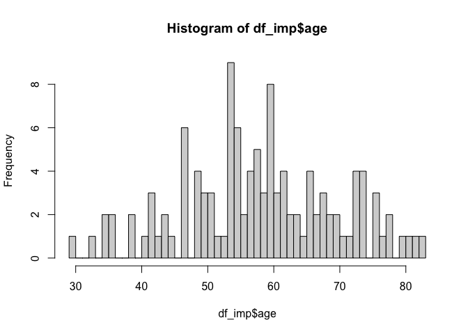<!-- -->

```r
# Sixth, check sympdur
summary(df_imp$sympdur)
```

```
##    Min. 1st Qu.  Median    Mean 3rd Qu.    Max. 
##   1.000   6.000   8.000   8.216  10.000  21.000
```

```r
hist(df_imp$sympdur, breaks=50)
```

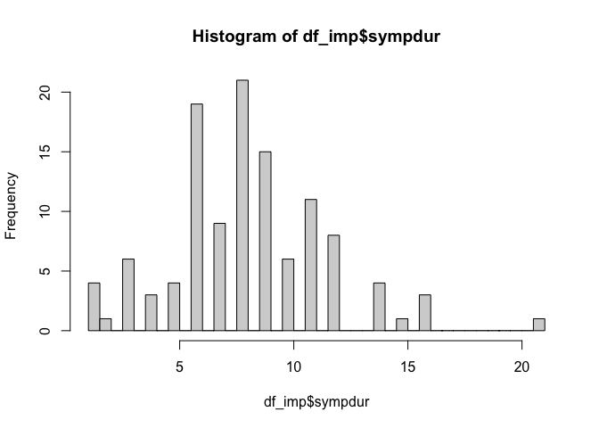<!-- -->

```r
# Seventh, check crp
summary(df_imp$crp)
```

```
##    Min. 1st Qu.  Median    Mean 3rd Qu.    Max.    NA's 
##    0.20    2.40    4.90   10.83    9.75  142.00       1
```

```r
hist(df_imp$crp, breaks=50) # outliers
```

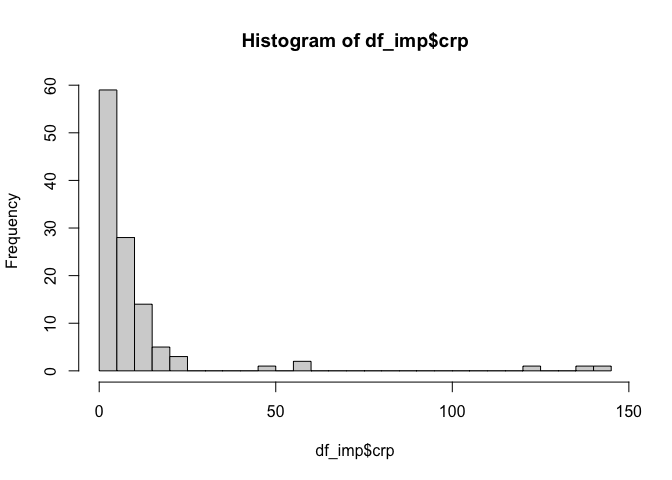<!-- -->

```r
# df_imp <- df_imp %>% # truncate outliers > 500
#   mutate(crptrunc = case_when(crp > 500 ~ 500,
#                                TRUE ~ crp))
# hist(df_imp$crptrunc)
# df_imp$sqcrptrunc=sqrt(df_imp$crptrunc)
# hist(df_imp$sqcrptrunc) # looks fine


### Reshape to long format
# names(df_imp)
# str(df_imp)
df_imp <- df_imp %>% # rename to differentiate between baseline clinical status and follow-up clinical statuses
  rename(clinicalstatus_baseline = clinstatus_baseline)

# reshape
df_imp$clinstatus_28_imp <- as.numeric(df_imp$clinstatus_28_imp)
df_imp_long <- df_imp %>% 
  pivot_longer(cols = starts_with("clinstatus"), names_to = "time", values_to = "clinstatus")
names(df_imp_long)
```

```
##  [1] "id_pat"                  "trt"                    
##  [3] "sex"                     "age"                    
##  [5] "sympdur"                 "vacc"                   
##  [7] "clinicalstatus_baseline" "comed_rdv"              
##  [9] "comed_dexa"              "comed_ab"               
## [11] "comed_acoa"              "comorb_cat"             
## [13] "crp"                     "mort_28"                
## [15] "death_reached"           "death_time"             
## [17] "new_mv_28"               "new_mvd_28"             
## [19] "discharge_reached"       "discharge_time"         
## [21] "ae_28"                   "ae_28_sev"              
## [23] "time"                    "clinstatus"
```

```r
# Convert time to numeric
df_imp_long$time <- as.numeric(gsub("clinstatus_", "", df_imp_long$time))
# class(df_imp_long$time)
# summary(df_imp_long$time)
# have clinstatus as numeric
df_imp_long$clinstatus_f <- factor(df_imp_long$clinstatus, levels = 1:6)

### We will impute separately by treatment arm, since we have to expect an effect modification between outcome x trt over time
df_imp_long_int <- df_imp_long %>% 
  filter(trt == 1)
df_imp_long_cont <- df_imp_long %>% 
  filter(trt == 0)

## Explore distribution of clinical status over time, by arm
plot_clinstat_int <- ggplot(df_imp_long_int, aes(x = time, y = clinstatus)) +
  stat_summary(fun = "mean", geom = "point", color = "blue", size = 3, na.rm = TRUE) +
  geom_smooth(method = "loess", se = FALSE, color = "red", na.rm = TRUE) +
  labs(title = "Distribution of Clinical Status Over Time / Intervention",
       x = "Time",
       y = "Mean Clinical Status") +
  theme_minimal()
print(plot_clinstat_int)
```

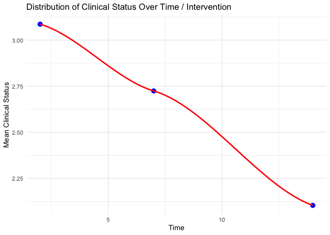<!-- -->

```r
plot_clinstat_cont <- ggplot(df_imp_long_cont, aes(x = time, y = clinstatus)) +
  stat_summary(fun = "mean", geom = "point", color = "blue", size = 3, na.rm = TRUE) +
  geom_smooth(method = "loess", se = FALSE, color = "red", na.rm = TRUE) +
  labs(title = "Distribution of Clinical Status Over Time / Control",
       x = "Time",
       y = "Mean Clinical Status") +
  theme_minimal()
print(plot_clinstat_cont)
```

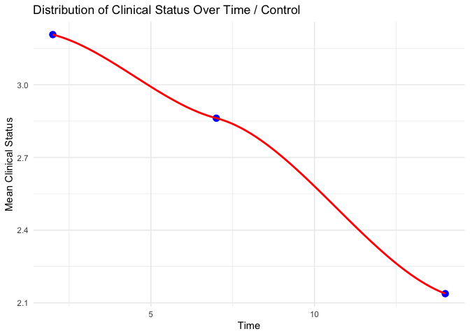<!-- -->

# Multiple imputation // only CRP is missing: No MI for CRP, as per protocol

```r
# #### INTERVENTION group
# ## jomo only accepts numeric or factors, check and adapt
# # str(df_imp_long_int)
# df_imp_long_int$timesq <- sqrt(df_imp_long_int$time) # see X below
# attach(df_imp_long_int)
# Y2<-data.frame(mort_28 # level 2 variables (baseline patient characteristics)
#                , age
#                , sex
#                , ethn
#                , vacc
#                , comed_dexa
#                , comed_ab
#                , comed_other
#                , comorb_cat
#                , sympdur
#                , sqcrptrunc
#                  )
# Y<-data.frame(clinstatus) # level 1 variable within clustering variable
# X<-data.frame(clinicalstatus_baseline # matrix modelling linearity of clinstatus throughout day 28
#               , time
#               , timesq)
# clus<-data.frame(id_pat) # clustering variable (patient)
# Z<-data.frame(rep(1,dim(df_imp_long_int)[1]),df_imp_long_int[,c("time")]) # random intercept and random slope
# colnames(Z)<-c("const", "time") 
# 
# nimp<-50 # set number of iterations
# 
# ## run jomo
# # dry run
# imputed_int_mcmc<-jomo.MCMCchain(Y=Y, Y2=Y2, X=X, Z=Z, clus=clus, nburn=2) ## clinstatus_baseline has 7 missings
# # plot(c(1:2),imputed_int_mcmc$collectbeta[1,1,1:2],type="l")
# # plot(c(1:2),imputed_int_mcmc$collectcovu[5,5,1:2],type="l")
# set.seed(1569)
# imputed_int <- jomo(Y=Y, Y2=Y2, X=X, Z=Z, clus=clus, nburn=1000, nbetween=1000, nimp=nimp)
# # nburn<-1000
# # imputed_int_mcmc<-jomo.MCMCchain(Y=Y, Y2=Y2, X=X, Z=Z, clus=clus, nburn=nburn)
# # plot(c(1:nburn),imputed_int_mcmc$collectbeta[1,1,1:nburn],type="l")
# # plot(c(1:nburn),imputed_int_mcmc$collectcovu[5,5,1:nburn],type="l")
# 
# # convert to jomo object, split imputations, and exclude original data (imputation "0")
# imp.list_int <- imputationList(split(imputed_int, imputed_int$Imputation)[-1])
# 
# # checks
# round(prop.table(table(imp.list_int[[1]]$`1`$mort_28, useNA = "always"))*100,1) # first imputed dataset
# round(prop.table(table(imp.list_int[[1]]$`2`$mort_28, useNA = "always"))*100,1) # second imputed dataset
# round(prop.table(table(df_imp_long_int$mort_28, useNA = "always"))*100,1) # original data
# summary(imp.list_int[[1]]$`1`$comorb_cat)
# summary(imp.list_int[[1]]$`2`$sqsympdur)
# summary(imp.list_int[[1]]$`2`$sqcrptrunc)
# 
# 
# #### CONTROL group
# ## jomo only accepts numeric or factors, check and adapt
# # str(df_imp_long_cont)
# df_imp_long_cont$timesq <- sqrt(df_imp_long_cont$time) # see X below
# attach(df_imp_long_cont)
# Y2<-data.frame(mort_28 # level 2 variables (baseline patient characteristics)
#                , age
#                , sex
#                , ethn
#                , country
#                , comed_dexa
#                , comed_ab
#                , comed_other
#                , comorb_cat
#                , sqsympdur
#                , sqcrptrunc
#                , vl_baseline
#                , ae_28_sev
#                  )
# Y<-data.frame(clinstatus_n) # level 1 variable within clustering variable
# X<-data.frame(clinicalstatus_baseline # matrix modelling linearity of clinstatus throughout day 28
#               , time
#               , timesq)
# clus<-data.frame(id_pat) # clustering variable (patient)
# Z<-data.frame(rep(1,dim(df_imp_long_cont)[1]),df_imp_long_cont[,c("time")]) # random intercept and random slope
# colnames(Z)<-c("const", "time") 
# 
# nimp<-50 # set number of iterations
# 
# # run jomo
# set.seed(1569)
# imputed_cont <- jomo(Y=Y, Y2=Y2, X=X, Z=Z, clus=clus, nburn=1000, nbetween=1000, nimp=nimp)
# # nburn<-1000
# # imputed_cont_mcmc<-jomo.MCMCchain(Y=Y, Y2=Y2, X=X, Z=Z, clus=clus, nburn=nburn)
# # plot(c(1:nburn),imputed_cont_mcmc$collectbeta[1,1,1:nburn],type="l")
# # plot(c(1:nburn),imputed_cont_mcmc$collectcovu[5,5,1:nburn],type="l")
# 
# # convert to jomo object, split imputations, and exclude original data (imputation "0")
# imp.list_cont <- imputationList(split(imputed_cont, imputed_cont$Imputation)[-1])
# 
# # checks
# round(prop.table(table(imp.list_cont[[1]]$`1`$mort_28, useNA = "always"))*100,1) # first imputed dataset
# round(prop.table(table(imp.list_cont[[1]]$`2`$mort_28, useNA = "always"))*100,1) # second imputed dataset
# round(prop.table(table(df_imp_long_cont$mort_28, useNA = "always"))*100,1) # original data
# summary(imp.list_cont[[1]]$`1`$comorb_cat)
# summary(imp.list_cont[[1]]$`2`$sqsympdur)
# 
# 
# #### Add trt back, change from long to wide format, and finally combine the two data frames
# imputed_int$trt <- 1
# imputed_int_s <- imputed_int %>% # remove imputation variables, not needed anymore
#   select(trt, age, sqsympdur, mort_28, sex, comorb_cat, sqcrptrunc, clinicalstatus_baseline, clus, Imputation)
# imputed_int_wide <- imputed_int_s %>% # change from long to wide format, i.e. remove duplicates within Imputation sets
#   group_by(Imputation) %>%
#   distinct(clus, .keep_all = TRUE) 
# 
# imputed_cont$trt <- 0 # treatment variable
# imputed_cont_s <- imputed_cont %>% # remove imputation variables, not needed anymore
#   select(trt, age, sqsympdur, mort_28, sex, comorb_cat, sqcrptrunc, clinicalstatus_baseline, clus, Imputation)
# imputed_cont_wide <- imputed_cont_s %>% # change from long to wide format, i.e. remove duplicates within Imputation sets
#   group_by(Imputation) %>%
#   distinct(clus, .keep_all = TRUE) 
# 
# imputed_combined <- rbind(imputed_cont_wide, imputed_int_wide)
# 
# 
# #### Convert combined df to jomo object, split imputations, and exclude original data (imputation "0")
# imp.list <- imputationList(split(imputed_combined, imputed_combined$Imputation)[-1])
# 
# 
# ### Checks
# round(prop.table(table(imp.list[[1]]$`1`$mort_28, imp.list[[1]]$`1`$trt, useNA = "always"),2)*100,1) # first imputed dataset
# round(prop.table(table(imp.list[[1]]$`2`$mort_28, imp.list[[1]]$`2`$trt, useNA = "always"),2)*100,1) # second imputed dataset
# round(prop.table(table(df_imp$mort_28, df_imp$trt, useNA = "always"),2)*100,1) # original data
# summary(imp.list[[1]]$`1`$comorb_cat)
# summary(imp.list[[1]]$`2`$sqsympdur)
```

# (i) Primary outcome: Mortality at day 28

```r
# adjusted for baseline patient characteristics (age, respiratory support at baseline (ordinal scale 1-3 vs 4-5), dexamethasone use at baseline (y/n), remdesivir use at baseline (y/n), anti-IL-6 use at baseline (y/n)).
addmargins(table(df$mort_28, df$trt, useNA = "always"))
```

```
##       
##          0   1 <NA> Sum
##   0     58  57    0 115
##   1      0   1    0   1
##   <NA>   0   0    0   0
##   Sum   58  58    0 116
```

```r
mort.28 <- df %>% 
  glm(mort_28 ~ trt 
      + age + clinstatus_baseline
      , family = "binomial", data=.)
```

```
## Warning: glm.fit: fitted probabilities numerically 0 or 1 occurred
```

```r
summ(mort.28, exp = T, confint = T, model.info = T, model.fit = F, digits = 2)
```

<table class="table table-striped table-hover table-condensed table-responsive" style="width: auto !important; margin-left: auto; margin-right: auto;">
<tbody>
  <tr>
   <td style="text-align:left;font-weight: bold;"> Observations </td>
   <td style="text-align:right;"> 116 </td>
  </tr>
  <tr>
   <td style="text-align:left;font-weight: bold;"> Dependent variable </td>
   <td style="text-align:right;"> mort_28 </td>
  </tr>
  <tr>
   <td style="text-align:left;font-weight: bold;"> Type </td>
   <td style="text-align:right;"> Generalized linear model </td>
  </tr>
  <tr>
   <td style="text-align:left;font-weight: bold;"> Family </td>
   <td style="text-align:right;"> binomial </td>
  </tr>
  <tr>
   <td style="text-align:left;font-weight: bold;"> Link </td>
   <td style="text-align:right;"> logit </td>
  </tr>
</tbody>
</table>  <table class="table table-striped table-hover table-condensed table-responsive" style="width: auto !important; margin-left: auto; margin-right: auto;border-bottom: 0;">
 <thead>
  <tr>
   <th style="text-align:left;">   </th>
   <th style="text-align:right;"> exp(Est.) </th>
   <th style="text-align:right;"> 2.5% </th>
   <th style="text-align:right;"> 97.5% </th>
   <th style="text-align:right;"> z val. </th>
   <th style="text-align:right;"> p </th>
  </tr>
 </thead>
<tbody>
  <tr>
   <td style="text-align:left;font-weight: bold;"> (Intercept) </td>
   <td style="text-align:right;"> 0.00 </td>
   <td style="text-align:right;"> 0.00 </td>
   <td style="text-align:right;"> Inf </td>
   <td style="text-align:right;"> -0.00 </td>
   <td style="text-align:right;"> 1.00 </td>
  </tr>
  <tr>
   <td style="text-align:left;font-weight: bold;"> trt </td>
   <td style="text-align:right;"> 72873545.01 </td>
   <td style="text-align:right;"> 0.00 </td>
   <td style="text-align:right;"> Inf </td>
   <td style="text-align:right;"> 0.00 </td>
   <td style="text-align:right;"> 1.00 </td>
  </tr>
  <tr>
   <td style="text-align:left;font-weight: bold;"> age </td>
   <td style="text-align:right;"> 1.06 </td>
   <td style="text-align:right;"> 0.87 </td>
   <td style="text-align:right;"> 1.29 </td>
   <td style="text-align:right;"> 0.54 </td>
   <td style="text-align:right;"> 0.59 </td>
  </tr>
  <tr>
   <td style="text-align:left;font-weight: bold;"> clinstatus_baseline3 </td>
   <td style="text-align:right;"> 20985489.76 </td>
   <td style="text-align:right;"> 0.00 </td>
   <td style="text-align:right;"> Inf </td>
   <td style="text-align:right;"> 0.00 </td>
   <td style="text-align:right;"> 1.00 </td>
  </tr>
</tbody>
<tfoot><tr><td style="padding: 0; " colspan="100%">
<sup></sup> Standard errors: MLE</td></tr></tfoot>
</table>

```r
mort.28.dimp <- df %>% 
  glm(mort_28_dimp ~ trt 
      + age + clinstatus_baseline
      , family = "binomial", data=.)
```

```
## Warning: glm.fit: fitted probabilities numerically 0 or 1 occurred
```

```r
summ(mort.28.dimp, exp = T, confint = T, model.info = T, model.fit = F, digits = 2)
```

<table class="table table-striped table-hover table-condensed table-responsive" style="width: auto !important; margin-left: auto; margin-right: auto;">
<tbody>
  <tr>
   <td style="text-align:left;font-weight: bold;"> Observations </td>
   <td style="text-align:right;"> 116 </td>
  </tr>
  <tr>
   <td style="text-align:left;font-weight: bold;"> Dependent variable </td>
   <td style="text-align:right;"> mort_28_dimp </td>
  </tr>
  <tr>
   <td style="text-align:left;font-weight: bold;"> Type </td>
   <td style="text-align:right;"> Generalized linear model </td>
  </tr>
  <tr>
   <td style="text-align:left;font-weight: bold;"> Family </td>
   <td style="text-align:right;"> binomial </td>
  </tr>
  <tr>
   <td style="text-align:left;font-weight: bold;"> Link </td>
   <td style="text-align:right;"> logit </td>
  </tr>
</tbody>
</table>  <table class="table table-striped table-hover table-condensed table-responsive" style="width: auto !important; margin-left: auto; margin-right: auto;border-bottom: 0;">
 <thead>
  <tr>
   <th style="text-align:left;">   </th>
   <th style="text-align:right;"> exp(Est.) </th>
   <th style="text-align:right;"> 2.5% </th>
   <th style="text-align:right;"> 97.5% </th>
   <th style="text-align:right;"> z val. </th>
   <th style="text-align:right;"> p </th>
  </tr>
 </thead>
<tbody>
  <tr>
   <td style="text-align:left;font-weight: bold;"> (Intercept) </td>
   <td style="text-align:right;"> 0.00 </td>
   <td style="text-align:right;"> 0.00 </td>
   <td style="text-align:right;"> Inf </td>
   <td style="text-align:right;"> -0.00 </td>
   <td style="text-align:right;"> 1.00 </td>
  </tr>
  <tr>
   <td style="text-align:left;font-weight: bold;"> trt </td>
   <td style="text-align:right;"> 72873545.01 </td>
   <td style="text-align:right;"> 0.00 </td>
   <td style="text-align:right;"> Inf </td>
   <td style="text-align:right;"> 0.00 </td>
   <td style="text-align:right;"> 1.00 </td>
  </tr>
  <tr>
   <td style="text-align:left;font-weight: bold;"> age </td>
   <td style="text-align:right;"> 1.06 </td>
   <td style="text-align:right;"> 0.87 </td>
   <td style="text-align:right;"> 1.29 </td>
   <td style="text-align:right;"> 0.54 </td>
   <td style="text-align:right;"> 0.59 </td>
  </tr>
  <tr>
   <td style="text-align:left;font-weight: bold;"> clinstatus_baseline3 </td>
   <td style="text-align:right;"> 20985489.76 </td>
   <td style="text-align:right;"> 0.00 </td>
   <td style="text-align:right;"> Inf </td>
   <td style="text-align:right;"> 0.00 </td>
   <td style="text-align:right;"> 1.00 </td>
  </tr>
</tbody>
<tfoot><tr><td style="padding: 0; " colspan="100%">
<sup></sup> Standard errors: MLE</td></tr></tfoot>
</table>

```r
# Create a 2x2 contingency table
# The oddsRatio function from the mosaic package calculates the odds ratio for a 2 x 2 contingency table and a confidence interval for the each estimate. x should be a matrix, data frame or table. "Successes" should be located in column 1 of x, and the treatment of interest should be located in row 2. The odds ratio is calculated as (Odds row 2) / (Odds row 1). The confidence interval is calculated from the log(OR) and back-transformed.
tbl <- tibble(
  Event = c(0.5, 1.5), # add the 0.5 correction
  NoEvent = c(58.5, 57.5) # add the 0.5 correction
)
oddsRatio(tbl, conf.level = 0.95, digits = 3, verbose = TRUE)
```

```
## 
## Odds Ratio
## 
## Proportions
## 	   Prop. 1:	 0.008475 
## 	   Prop. 2:	 0.02542 
## 	 Rel. Risk:	 3 
## 
## Odds
## 	    Odds 1:	 0.008547 
## 	    Odds 2:	 0.02609 
## 	Odds Ratio:	 3.052 
## 
## 95 percent confidence interval:
## 	 0.1247 < RR < 72.15 
## 	 0.1218 < OR < 76.48 
## NULL
```

```
## [1] 3.052174
```

```r
mort.28.corr <- oddsRatio(tbl, conf.level = 0.95, digits = 3, verbose = TRUE)
```

```
## 
## Odds Ratio
## 
## Proportions
## 	   Prop. 1:	 0.008475 
## 	   Prop. 2:	 0.02542 
## 	 Rel. Risk:	 3 
## 
## Odds
## 	    Odds 1:	 0.008547 
## 	    Odds 2:	 0.02609 
## 	Odds Ratio:	 3.052 
## 
## 95 percent confidence interval:
## 	 0.1247 < RR < 72.15 
## 	 0.1218 < OR < 76.48 
## NULL
```

```r
# Firth regression
mort.28.firth <- df %>% 
  logistf(mort_28 ~ trt 
      + age 
      + clinstatus_baseline 
      , data=.)
mort.28.dimp.firth <- df %>% 
  logistf(mort_28_dimp ~ trt 
      + age 
      + clinstatus_baseline 
      , data=.)
# Summary and extract coefficients
coefficients_table <- summary(mort.28.firth)$coefficients
```

```
## logistf(formula = mort_28 ~ trt + age + clinstatus_baseline, 
##     data = .)
## 
## Model fitted by Penalized ML
## Coefficients:
##                             coef   se(coef)  lower 0.95 upper 0.95     Chisq
## (Intercept)          -5.97943297 3.40806831 -18.5108789   1.862989 2.0515218
## trt                   0.93081380 1.31481383  -2.0623642   5.940524 0.3529721
## age                   0.03681375 0.05439356  -0.1169191   0.222023 0.2168682
## clinstatus_baseline3 -0.63524967 1.42652908  -4.0880030   4.467239 0.1163283
##                              p method
## (Intercept)          0.1520541      2
## trt                  0.5524355      2
## age                  0.6414366      2
## clinstatus_baseline3 0.7330513      2
## 
## Method: 1-Wald, 2-Profile penalized log-likelihood, 3-None
## 
## Likelihood ratio test=0.6253987 on 3 df, p=0.8905941, n=116
## Wald test = 36.19611 on 3 df, p = 6.806486e-08
```

```r
trt_coef <- coef(mort.28.firth)["trt"]
hazard_odds_ratio <- exp(trt_coef)
ci <- c(exp(mort.28.firth$ci.lower["trt"]), exp(mort.28.firth$ci.upper["trt"]))
# Create a data frame to store Odds Ratios and CIs
mort.28.firth_tbl <- data.frame(
  # "Variable" = rownames(coefficients_table),
  "Odds Ratio" = hazard_odds_ratio,
  "CI Lower" = ci[1],
  "CI Upper" = ci[2])
# Nicely formatted table
kable(mort.28.firth_tbl, format = "markdown", table.attr = 'class="table"') %>%
  kable_styling(bootstrap_options = "striped", full_width = FALSE)
```

```
## Warning in kable_styling(., bootstrap_options = "striped", full_width = FALSE):
## Please specify format in kable. kableExtra can customize either HTML or LaTeX
## outputs. See https://haozhu233.github.io/kableExtra/ for details.
```


|    | Odds.Ratio| CI.Lower| CI.Upper|
|:---|----------:|--------:|--------:|
|trt |   2.536573| 0.127153| 380.1341|
Discussion points
1. Rare event correction
-- Add 0.5 correction to crosstab, calculate ORs and then inverse variance pooling in second stage?
-- 2x2 directly into Mantel-Haenszel across several trials (https://www.ncbi.nlm.nih.gov/pmc/articles/PMC5297998/)?
-- Firth regression according to R.Riley IPDMA Handbook (page 99): "Traditionally 0.5 is the value added, but Sweeting et al. suggest that a ‘treatment arm’ continuity correction is more appropriate, which adds 1/(sample size of the opposite treatment group) to the number of event and non-events. In the IPD context, a similar approach is to add two extra participants to each group in a trial if it has zero events in either of the groups; one of the added participants has the event and the other does not have the event in each group. Then, a weighted regression analysis can be performed to analyse the extended IPD, with all participants weighted equally except the four added participants, who are given a weight according to Sweeting correction (i.e. 1/(sample size of the opposite treat- ment group)). However, this approach becomes problematic when adjusting for prognostic factors or extending to non-binary variables. For this reason, a more general approach is to adopt Firth regression, which is a penalisation method that reduces small sample bias for non-linear models such as logistic regression, and resolves problems related to separation. Alternatively, researchers may revert to a one-stage IPD meta-analysis approach and placing random effects on parameters (rather than stratifying parameters by trial) so that estimation of trial-specific terms are avoided."

# (i.i) Covariate adjustment for primary endpoint: Mortality at day 28

```r
# unadjusted estimator for the (absolute) risk difference
with(df, table(trt, mort_28))
```

```
##    mort_28
## trt  0  1
##   0 58  0
##   1 57  1
```

```r
mort.28.prop.test <- prop.test(x = with(df, table(trt, mort_28)))
# print(mort.28.prop.test)
# # Estimate
-diff(mort.28.prop.test$estimate)
```

```
##     prop 2 
## 0.01724138
```

```r
# # Confidence Interval
mort.28.prop.test$conf.int
```

```
## [1] -0.03349990  0.06798266
## attr(,"conf.level")
## [1] 0.95
```

```r
# # P-Value
mort.28.prop.test$p.value
```

```
## [1] 1
```

```r
# Covariate-Adjusted Analysis
# Fit the `glm` object
# Same as Complete case analysis, substantive model // but don't use piping, otherwise problem in margins::margins
df_mort28_comp <- df %>% filter(!is.na(mort_28))
mort.28.cov.adj <-
  glm(formula = mort_28 ~ trt + age + clinstatus_baseline,
      data = df_mort28_comp,
      family = binomial(link = "logit")
      )
# Print a summary of the `glm` object
summary(mort.28.cov.adj)
```

```
## 
## Call:
## glm(formula = mort_28 ~ trt + age + clinstatus_baseline, family = binomial(link = "logit"), 
##     data = df_mort28_comp)
## 
## Deviance Residuals: 
##      Min        1Q    Median        3Q       Max  
## -0.32137  -0.17332  -0.00003  -0.00002   2.73242  
## 
## Coefficients:
##                        Estimate Std. Error z value Pr(>|z|)
## (Intercept)            -42.3638 10294.0418  -0.004    0.997
## trt                     18.1042  5924.7052   0.003    0.998
## age                      0.0551     0.1013   0.544    0.586
## clinstatus_baseline3    16.8593  8418.1442   0.002    0.998
## 
## (Dispersion parameter for binomial family taken to be 1)
## 
##     Null deviance: 11.4985  on 115  degrees of freedom
## Residual deviance:  9.4455  on 112  degrees of freedom
## AIC: 17.446
## 
## Number of Fisher Scoring iterations: 21
```

```r
# Predict Pr{Y = 1 | Z = 1, X} // equals: E(Y|Z=1,X)
pr_y1_z1 <-
  predict(
    object = mort.28.cov.adj,
    newdata =
      df_mort28_comp %>%
      dplyr::mutate(
        trt = 1
      ),
    type = "response"
  )
# Predict Pr{Y = 1 | Z = 0, X} // equals: E(Y|Z=0,X)
pr_y1_z0 <-
  predict(
    object = mort.28.cov.adj,
    newdata =
      df_mort28_comp %>%
      dplyr::mutate(
        trt = 0
      ),
    type = "response"
  )

# Estimate RD
adj_mean = mean(pr_y1_z1) - mean(pr_y1_z0)
print(adj_mean)
```

```
## [1] 0.01503258
```

```r
# Standard Error RD
# The variance/standard error can be calculted as 1/n times the sample variance of:
# Z/P(Z=1)*[Y-E(Y|Z=1,X)] + E(Y|Z=1,X) - ((1-Z)/(1-P(1=Z))*[Y-E(Y|Z=0,X)] + E(Y|Z=0,X))
p_arm = mean(df_mort28_comp$trt==1)
adj_se = sqrt(
  var((df_mort28_comp$trt==1)/p_arm * (df_mort28_comp$mort_28 - pr_y1_z1) + pr_y1_z1 -
      ((df_mort28_comp$trt==0)/(1-p_arm) * (df_mort28_comp$mort_28-pr_y1_z0) + pr_y1_z0))/
    nrow(df_mort28_comp))
print(adj_se)
```

```
## [1] 0.01715212
```

```r
# Confidence Interval
c(adj_mean-qnorm(0.975)*adj_se, adj_mean+qnorm(0.975)*adj_se)
```

```
## [1] -0.01858497  0.04865012
```

```r
# Or, we can obtain the standard error of the estimate two ways. The first way is using the margins::margins() command, using the robust standard errors from sandwich::vcovHC // The second way to obtain these would be the bias corrected and accelerated (BCa) non-parametric bootstrap
# You’ll see that we now have a standard error, p-value under the hypothesis that the marginal effect is 0, and a 95% Confidence Interval for the estimate. 

library(sandwich)
library(margins)
mort.28.cov.adj.ame <-
  margins::margins(
    model = mort.28.cov.adj,
    # Specify treatment variable
    variables = "trt",
    # Convert to outcome scale, not link scale
    type = "response",
    # Obtain robust standard errors
    vcov = sandwich::vcovHC(x = mort.28.cov.adj, type = "HC3")
  )
summary(object = mort.28.cov.adj.ame, level = 0.95)
```

```
##  factor    AME     SE      z      p   lower  upper
##     trt 0.1518 0.1585 0.9578 0.3382 -0.1589 0.4625
```

```r
mort.28.ame <- summary(object = mort.28.cov.adj.ame, level = 0.95)
# replace with manually calculated values above
mort.28.ame$AME <- adj_mean
mort.28.ame$SE <- adj_se
mort.28.ame$lower <- c(adj_mean-qnorm(0.975)*adj_se)
mort.28.ame$upper <- c(adj_mean+qnorm(0.975)*adj_se)
mort.28.ame$p <- NA
```

# (ii) Mortality at day 60

```r
table(df$mort_60, df$trt, useNA = "always")
```

```
##       
##         0  1 <NA>
##   0    58 57    0
##   1     0  1    0
##   <NA>  0  0    0
```

```r
mort.60 <- df %>% 
  glm(mort_60 ~ trt 
      + age + clinstatus_baseline
      , family = "binomial", data=.)
```

```
## Warning: glm.fit: fitted probabilities numerically 0 or 1 occurred
```

```r
summ(mort.60, exp = T, confint = T, model.info = T, model.fit = F, digits = 2)
```

<table class="table table-striped table-hover table-condensed table-responsive" style="width: auto !important; margin-left: auto; margin-right: auto;">
<tbody>
  <tr>
   <td style="text-align:left;font-weight: bold;"> Observations </td>
   <td style="text-align:right;"> 116 </td>
  </tr>
  <tr>
   <td style="text-align:left;font-weight: bold;"> Dependent variable </td>
   <td style="text-align:right;"> mort_60 </td>
  </tr>
  <tr>
   <td style="text-align:left;font-weight: bold;"> Type </td>
   <td style="text-align:right;"> Generalized linear model </td>
  </tr>
  <tr>
   <td style="text-align:left;font-weight: bold;"> Family </td>
   <td style="text-align:right;"> binomial </td>
  </tr>
  <tr>
   <td style="text-align:left;font-weight: bold;"> Link </td>
   <td style="text-align:right;"> logit </td>
  </tr>
</tbody>
</table>  <table class="table table-striped table-hover table-condensed table-responsive" style="width: auto !important; margin-left: auto; margin-right: auto;border-bottom: 0;">
 <thead>
  <tr>
   <th style="text-align:left;">   </th>
   <th style="text-align:right;"> exp(Est.) </th>
   <th style="text-align:right;"> 2.5% </th>
   <th style="text-align:right;"> 97.5% </th>
   <th style="text-align:right;"> z val. </th>
   <th style="text-align:right;"> p </th>
  </tr>
 </thead>
<tbody>
  <tr>
   <td style="text-align:left;font-weight: bold;"> (Intercept) </td>
   <td style="text-align:right;"> 0.00 </td>
   <td style="text-align:right;"> 0.00 </td>
   <td style="text-align:right;"> Inf </td>
   <td style="text-align:right;"> -0.00 </td>
   <td style="text-align:right;"> 1.00 </td>
  </tr>
  <tr>
   <td style="text-align:left;font-weight: bold;"> trt </td>
   <td style="text-align:right;"> 72873545.01 </td>
   <td style="text-align:right;"> 0.00 </td>
   <td style="text-align:right;"> Inf </td>
   <td style="text-align:right;"> 0.00 </td>
   <td style="text-align:right;"> 1.00 </td>
  </tr>
  <tr>
   <td style="text-align:left;font-weight: bold;"> age </td>
   <td style="text-align:right;"> 1.06 </td>
   <td style="text-align:right;"> 0.87 </td>
   <td style="text-align:right;"> 1.29 </td>
   <td style="text-align:right;"> 0.54 </td>
   <td style="text-align:right;"> 0.59 </td>
  </tr>
  <tr>
   <td style="text-align:left;font-weight: bold;"> clinstatus_baseline3 </td>
   <td style="text-align:right;"> 20985489.76 </td>
   <td style="text-align:right;"> 0.00 </td>
   <td style="text-align:right;"> Inf </td>
   <td style="text-align:right;"> 0.00 </td>
   <td style="text-align:right;"> 1.00 </td>
  </tr>
</tbody>
<tfoot><tr><td style="padding: 0; " colspan="100%">
<sup></sup> Standard errors: MLE</td></tr></tfoot>
</table>

```r
# Create a 2x2 contingency table
# The oddsRatio function from the mosaic package calculates the odds ratio for a 2 x 2 contingency table and a confidence interval for the each estimate. x should be a matrix, data frame or table. "Successes" should be located in column 1 of x, and the treatment of interest should be located in row 2. The odds ratio is calculated as (Odds row 2) / (Odds row 1). The confidence interval is calculated from the log(OR) and back-transformed.
tbl <- tibble(
  Event = c(0.5, 1.5), # add the 0.5 correction
  NoEvent = c(58.5, 57.5) # add the 0.5 correction
)
oddsRatio(tbl, conf.level = 0.95, digits = 3, verbose = TRUE)
```

```
## 
## Odds Ratio
## 
## Proportions
## 	   Prop. 1:	 0.008475 
## 	   Prop. 2:	 0.02542 
## 	 Rel. Risk:	 3 
## 
## Odds
## 	    Odds 1:	 0.008547 
## 	    Odds 2:	 0.02609 
## 	Odds Ratio:	 3.052 
## 
## 95 percent confidence interval:
## 	 0.1247 < RR < 72.15 
## 	 0.1218 < OR < 76.48 
## NULL
```

```
## [1] 3.052174
```

```r
mort.60.corr <- oddsRatio(tbl, conf.level = 0.95, digits = 3, verbose = TRUE)
```

```
## 
## Odds Ratio
## 
## Proportions
## 	   Prop. 1:	 0.008475 
## 	   Prop. 2:	 0.02542 
## 	 Rel. Risk:	 3 
## 
## Odds
## 	    Odds 1:	 0.008547 
## 	    Odds 2:	 0.02609 
## 	Odds Ratio:	 3.052 
## 
## 95 percent confidence interval:
## 	 0.1247 < RR < 72.15 
## 	 0.1218 < OR < 76.48 
## NULL
```

```r
# Firth regression
mort.60.firth <- df %>% 
  logistf(mort_60 ~ trt 
      + age 
      + clinstatus_baseline
      , data=.)
summary(mort.60.firth)
```

```
## logistf(formula = mort_60 ~ trt + age + clinstatus_baseline, 
##     data = .)
## 
## Model fitted by Penalized ML
## Coefficients:
##                             coef   se(coef)  lower 0.95 upper 0.95     Chisq
## (Intercept)          -5.97943297 3.40806831 -18.5108789   1.862989 2.0515218
## trt                   0.93081380 1.31481383  -2.0623642   5.940524 0.3529721
## age                   0.03681375 0.05439356  -0.1169191   0.222023 0.2168682
## clinstatus_baseline3 -0.63524967 1.42652908  -4.0880030   4.467239 0.1163283
##                              p method
## (Intercept)          0.1520541      2
## trt                  0.5524355      2
## age                  0.6414366      2
## clinstatus_baseline3 0.7330513      2
## 
## Method: 1-Wald, 2-Profile penalized log-likelihood, 3-None
## 
## Likelihood ratio test=0.6253987 on 3 df, p=0.8905941, n=116
## Wald test = 36.19611 on 3 df, p = 6.806486e-08
```

# (iii) Time to death within max. follow-up time

```r
# KM curve
survfit2(Surv(death_time, death_reached) ~ trt, data=df) %>% 
  ggsurvfit() +
  labs(
    x = "Days",
    y = "Overall survival probability"
  ) + 
  add_confidence_interval() +
  add_risktable()
```

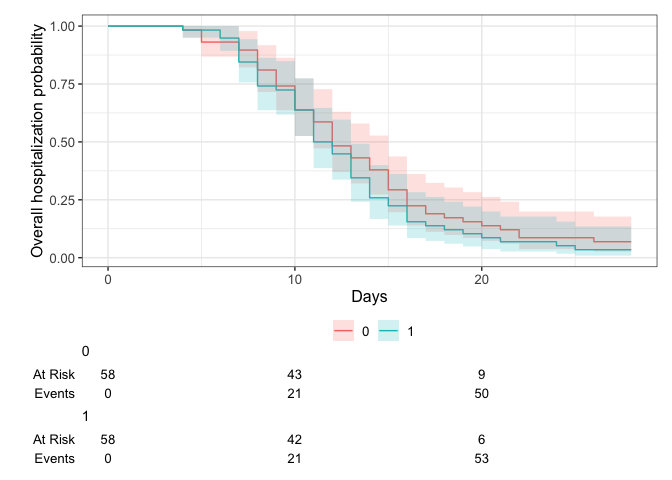<!-- -->

```r
# # testing: cox ph
# ttdeath <- df %>% 
#   coxph(Surv(death_time, death_reached) ~ trt 
#         + age + clinstatus_baseline + comed_dexa + comed_rdv + comed_toci
#         , data =.)
# ttdeath_reg_tbl <- tbl_regression(ttdeath, exp = TRUE)
# # Nicely formatted table
# kable(ttdeath_reg_tbl, format = "markdown", table.attr = 'class="table"') %>%
#   kable_styling(bootstrap_options = "striped", full_width = FALSE)

library(coxphf)
ttdeath.firth <- df %>%
  coxphf(Surv(death_time, death_reached) ~ trt
        # + age
        # + clinstatus_baseline
        # + comed_dexa + comed_rdv + comed_toci
        , data =.)
summary(ttdeath.firth)
```

```
## coxphf(formula = Surv(death_time, death_reached) ~ trt, data = .)
## 
## Model fitted by Penalized ML
## Confidence intervals and p-values by Profile Likelihood 
## 
##         coef se(coef) exp(coef) lower 0.95 upper 0.95     Chisq         p
## trt 1.098612 2.309401         3  0.1600409   437.7607 0.5232481 0.4694594
## 
## Likelihood ratio test=0.5232481 on 1 df, p=0.4694594, n=116
## Wald test = 0.2263029 on 1 df, p = 0.6342788
## 
## Covariance-Matrix:
##          trt
## trt 5.333333
```
Discussion points
1. Result illogical. R.Riley IPDMA handbook, page 102: "As for binary outcomes, when there are few events in some trials adaptions of Firth’s correction are important to reduce small sample bias in the estimated treatment effect."

# (iv) New mechanical ventilation among survivors within 28 days

```r
table(df$new_mv_28, df$trt, useNA = "always")
```

```
##       
##         0  1 <NA>
##   0    56 57    0
##   1     2  0    0
##   <NA>  0  1    0
```

```r
new.mv.28 <- df %>% 
  glm(new_mv_28 ~ trt 
       + age + clinstatus_baseline
      , family = "binomial", data=.)
summ(new.mv.28, exp = T, confint = T, model.info = T, model.fit = F, digits = 2)
```

<table class="table table-striped table-hover table-condensed table-responsive" style="width: auto !important; margin-left: auto; margin-right: auto;">
<tbody>
  <tr>
   <td style="text-align:left;font-weight: bold;"> Observations </td>
   <td style="text-align:right;"> 115 (1 missing obs. deleted) </td>
  </tr>
  <tr>
   <td style="text-align:left;font-weight: bold;"> Dependent variable </td>
   <td style="text-align:right;"> new_mv_28 </td>
  </tr>
  <tr>
   <td style="text-align:left;font-weight: bold;"> Type </td>
   <td style="text-align:right;"> Generalized linear model </td>
  </tr>
  <tr>
   <td style="text-align:left;font-weight: bold;"> Family </td>
   <td style="text-align:right;"> binomial </td>
  </tr>
  <tr>
   <td style="text-align:left;font-weight: bold;"> Link </td>
   <td style="text-align:right;"> logit </td>
  </tr>
</tbody>
</table>  <table class="table table-striped table-hover table-condensed table-responsive" style="width: auto !important; margin-left: auto; margin-right: auto;border-bottom: 0;">
 <thead>
  <tr>
   <th style="text-align:left;">   </th>
   <th style="text-align:right;"> exp(Est.) </th>
   <th style="text-align:right;"> 2.5% </th>
   <th style="text-align:right;"> 97.5% </th>
   <th style="text-align:right;"> z val. </th>
   <th style="text-align:right;"> p </th>
  </tr>
 </thead>
<tbody>
  <tr>
   <td style="text-align:left;font-weight: bold;"> (Intercept) </td>
   <td style="text-align:right;"> 0.01 </td>
   <td style="text-align:right;"> 0.00 </td>
   <td style="text-align:right;"> 18.48 </td>
   <td style="text-align:right;"> -1.21 </td>
   <td style="text-align:right;"> 0.23 </td>
  </tr>
  <tr>
   <td style="text-align:left;font-weight: bold;"> trt </td>
   <td style="text-align:right;"> 0.00 </td>
   <td style="text-align:right;"> 0.00 </td>
   <td style="text-align:right;"> Inf </td>
   <td style="text-align:right;"> -0.00 </td>
   <td style="text-align:right;"> 1.00 </td>
  </tr>
  <tr>
   <td style="text-align:left;font-weight: bold;"> age </td>
   <td style="text-align:right;"> 1.03 </td>
   <td style="text-align:right;"> 0.91 </td>
   <td style="text-align:right;"> 1.17 </td>
   <td style="text-align:right;"> 0.54 </td>
   <td style="text-align:right;"> 0.59 </td>
  </tr>
  <tr>
   <td style="text-align:left;font-weight: bold;"> clinstatus_baseline3 </td>
   <td style="text-align:right;"> 0.33 </td>
   <td style="text-align:right;"> 0.02 </td>
   <td style="text-align:right;"> 5.88 </td>
   <td style="text-align:right;"> -0.75 </td>
   <td style="text-align:right;"> 0.45 </td>
  </tr>
</tbody>
<tfoot><tr><td style="padding: 0; " colspan="100%">
<sup></sup> Standard errors: MLE</td></tr></tfoot>
</table>

```r
# Create a 2x2 contingency table
# The oddsRatio function from the mosaic package calculates the odds ratio for a 2 x 2 contingency table and a confidence interval for the each estimate. x should be a matrix, data frame or table. "Successes" should be located in column 1 of x, and the treatment of interest should be located in row 2. The odds ratio is calculated as (Odds row 2) / (Odds row 1). The confidence interval is calculated from the log(OR) and back-transformed.
tbl <- tibble(
  Event = c(2.5, 0.5), # add the 0.5 correction, intervention second
  NoEvent = c(56.5, 57.5) # add the 0.5 correction, intervention second
)
oddsRatio(tbl, conf.level = 0.95, digits = 3, verbose = TRUE)
```

```
## 
## Odds Ratio
## 
## Proportions
## 	   Prop. 1:	 0.04237 
## 	   Prop. 2:	 0.008621 
## 	 Rel. Risk:	 0.2034 
## 
## Odds
## 	    Odds 1:	 0.04425 
## 	    Odds 2:	 0.008696 
## 	Odds Ratio:	 0.1965 
## 
## 95 percent confidence interval:
## 	 0.009982 < RR < 4.147 
## 	 0.009228 < OR < 4.185 
## NULL
```

```
## [1] 0.1965217
```

```r
new.mv.28.corr <- oddsRatio(tbl, conf.level = 0.95, digits = 3, verbose = TRUE)
```

```
## 
## Odds Ratio
## 
## Proportions
## 	   Prop. 1:	 0.04237 
## 	   Prop. 2:	 0.008621 
## 	 Rel. Risk:	 0.2034 
## 
## Odds
## 	    Odds 1:	 0.04425 
## 	    Odds 2:	 0.008696 
## 	Odds Ratio:	 0.1965 
## 
## 95 percent confidence interval:
## 	 0.009982 < RR < 4.147 
## 	 0.009228 < OR < 4.185 
## NULL
```

```r
# Firth regression
new.mv.28.firth <- df %>% 
  logistf(new_mv_28 ~ trt 
      + age 
      + clinstatus_baseline
      , data=.)
summary(new.mv.28.firth)
```

```
## logistf(formula = new_mv_28 ~ trt + age + clinstatus_baseline, 
##     data = .)
## 
## Model fitted by Penalized ML
## Coefficients:
##                             coef   se(coef)   lower 0.95 upper 0.95     Chisq
## (Intercept)          -3.70330228 2.68482708 -11.60142923  2.0867439 1.4662024
## trt                  -1.52578589 1.38538287  -6.47294833  1.0568553 1.2231683
## age                   0.02584219 0.04442852  -0.08156533  0.1465753 0.2242723
## clinstatus_baseline3 -1.04967936 1.06322779  -3.62069382  1.5168250 0.7462878
##                              p method
## (Intercept)          0.2259458      2
## trt                  0.2687398      2
## age                  0.6358037      2
## clinstatus_baseline3 0.3876541      2
## 
## Method: 1-Wald, 2-Profile penalized log-likelihood, 3-None
## 
## Likelihood ratio test=2.49746 on 3 df, p=0.4757502, n=115
## Wald test = 36.15491 on 3 df, p = 6.944379e-08
```

```r
# (iv) Alternative definition/analysis: New mechanical ventilation OR death within 28 days => include all in denominator. 
table(df$new_mvd_28, df$trt, useNA = "always")
```

```
##       
##         0  1 <NA>
##   0    56 57    0
##   1     2  1    0
##   <NA>  0  0    0
```

```r
new.mvd.28 <- df %>% 
  glm(new_mvd_28 ~ trt 
      + age + clinstatus_baseline
      , family = "binomial", data=.)
summ(new.mvd.28, exp = T, confint = T, model.info = T, model.fit = F, digits = 2)
```

<table class="table table-striped table-hover table-condensed table-responsive" style="width: auto !important; margin-left: auto; margin-right: auto;">
<tbody>
  <tr>
   <td style="text-align:left;font-weight: bold;"> Observations </td>
   <td style="text-align:right;"> 116 </td>
  </tr>
  <tr>
   <td style="text-align:left;font-weight: bold;"> Dependent variable </td>
   <td style="text-align:right;"> new_mvd_28 </td>
  </tr>
  <tr>
   <td style="text-align:left;font-weight: bold;"> Type </td>
   <td style="text-align:right;"> Generalized linear model </td>
  </tr>
  <tr>
   <td style="text-align:left;font-weight: bold;"> Family </td>
   <td style="text-align:right;"> binomial </td>
  </tr>
  <tr>
   <td style="text-align:left;font-weight: bold;"> Link </td>
   <td style="text-align:right;"> logit </td>
  </tr>
</tbody>
</table>  <table class="table table-striped table-hover table-condensed table-responsive" style="width: auto !important; margin-left: auto; margin-right: auto;border-bottom: 0;">
 <thead>
  <tr>
   <th style="text-align:left;">   </th>
   <th style="text-align:right;"> exp(Est.) </th>
   <th style="text-align:right;"> 2.5% </th>
   <th style="text-align:right;"> 97.5% </th>
   <th style="text-align:right;"> z val. </th>
   <th style="text-align:right;"> p </th>
  </tr>
 </thead>
<tbody>
  <tr>
   <td style="text-align:left;font-weight: bold;"> (Intercept) </td>
   <td style="text-align:right;"> 0.00 </td>
   <td style="text-align:right;"> 0.00 </td>
   <td style="text-align:right;"> 2.81 </td>
   <td style="text-align:right;"> -1.65 </td>
   <td style="text-align:right;"> 0.10 </td>
  </tr>
  <tr>
   <td style="text-align:left;font-weight: bold;"> trt </td>
   <td style="text-align:right;"> 0.50 </td>
   <td style="text-align:right;"> 0.04 </td>
   <td style="text-align:right;"> 6.08 </td>
   <td style="text-align:right;"> -0.54 </td>
   <td style="text-align:right;"> 0.59 </td>
  </tr>
  <tr>
   <td style="text-align:left;font-weight: bold;"> age </td>
   <td style="text-align:right;"> 1.05 </td>
   <td style="text-align:right;"> 0.94 </td>
   <td style="text-align:right;"> 1.16 </td>
   <td style="text-align:right;"> 0.83 </td>
   <td style="text-align:right;"> 0.41 </td>
  </tr>
  <tr>
   <td style="text-align:left;font-weight: bold;"> clinstatus_baseline3 </td>
   <td style="text-align:right;"> 0.49 </td>
   <td style="text-align:right;"> 0.04 </td>
   <td style="text-align:right;"> 6.36 </td>
   <td style="text-align:right;"> -0.54 </td>
   <td style="text-align:right;"> 0.59 </td>
  </tr>
</tbody>
<tfoot><tr><td style="padding: 0; " colspan="100%">
<sup></sup> Standard errors: MLE</td></tr></tfoot>
</table>

# (v) Clinical status at day 28

```r
table(df$clinstatus_28_imp, df$trt, useNA = "always")
```

```
##       
##         0  1 <NA>
##   1    54 56    0
##   2     0  0    0
##   3     1  0    0
##   4     2  1    0
##   5     1  0    0
##   6     0  1    0
##   <NA>  0  0    0
```

```r
clin.28 <- df %>% 
  clm(clinstatus_28_imp ~ trt 
      + age 
      + clinstatus_baseline
      , link= c("logit"), data=.)
# Summary and extract coefficients
coefficients_table <- summary(clin.28)$coefficients
# Calculate Odds Ratios and Confidence Intervals
odds_ratios <- exp(coefficients_table[, "Estimate"])
ci_lower <- exp(coefficients_table[, "Estimate"] - 1.96 * coefficients_table[, "Std. Error"])
ci_upper <- exp(coefficients_table[, "Estimate"] + 1.96 * coefficients_table[, "Std. Error"])
# Create a data frame to store Odds Ratios and CIs
clin.28_tbl <- data.frame(
  "Variable" = rownames(coefficients_table),
  "Odds Ratio" = odds_ratios,
  "CI Lower" = ci_lower,
  "CI Upper" = ci_upper
)
# Nicely formatted table
kable(clin.28_tbl, format = "markdown", table.attr = 'class="table"') %>%
  kable_styling(bootstrap_options = "striped", full_width = FALSE)
```


|                     |Variable             |  Odds.Ratio|  CI.Lower|     CI.Upper|
|:--------------------|:--------------------|-----------:|---------:|------------:|
|1&#124;3             |1&#124;3             |  57.7909514| 0.6554262|  5095.606679|
|3&#124;4             |3&#124;4             |  70.1706418| 0.7838329|  6281.847626|
|4&#124;5             |4&#124;5             | 180.9459366| 1.7693640| 18504.633137|
|5&#124;6             |5&#124;6             | 365.0447896| 2.9065778| 45846.939661|
|trt                  |trt                  |   0.5089991| 0.0861019|     3.008993|
|age                  |age                  |   1.0319903| 0.9590140|     1.110520|
|clinstatus_baseline3 |clinstatus_baseline3 |   0.5393065| 0.0859819|     3.382705|

# (vi) Time to discharge or reaching discharge criteria up to day 28

```r
# Kaplan-Meier estimate of conditional discharge probability
# Just censoring => Cause-specific hazards
km.ttdischarge.check <- with(df, Surv(discharge_time, discharge_reached))
head(km.ttdischarge.check, 100)
```

```
##   [1]  8  13  16  17  25  16  17  26+ 19  11  11  13  10  14  15  18   7  11 
##  [19]  7   8  11  10  13   5  12  22  11  15  12  20   7  10   8  22   8  14 
##  [37] 28+ 10   8  24  19  10  12   7   6  16  16  16  11  11  10  13   7   9 
##  [55] 11   8   8   7  15  14  18   6   8  10  13   5   4  16  13  14  11  10 
##  [73] 13  26  13  15  14   7   9  15  10  12  28+  8   7  12  21   4  11  12 
##  [91] 14   8  12  14  15  15  12   9  11  17
```

```r
km.ttdischarge_trt <- survfit(Surv(discharge_time, discharge_reached) ~ trt, data=df)
# KM curve
survfit2(Surv(discharge_time, discharge_reached) ~ trt, data=df) %>% 
  ggsurvfit() +
  labs(
    x = "Days",
    y = "Overall hospitalization probability"
  ) + 
  add_confidence_interval() +
  add_risktable()
```

<!-- -->

```r
# testing: cox ph
ttdischarge <- df %>% 
  coxph(Surv(discharge_time, discharge_reached) ~ trt 
        + age + clinstatus_baseline
        , data =.)
ttdischarge_reg_tbl <- tbl_regression(ttdischarge, exp = TRUE)
# Nicely formatted table
kable(ttdischarge_reg_tbl, format = "markdown", table.attr = 'class="table"') %>%
  kable_styling(bootstrap_options = "striped", full_width = FALSE)
```


|**Characteristic**  |**HR** |**95% CI** |**p-value** |
|:-------------------|:------|:----------|:-----------|
|trt                 |1.28   |0.88, 1.87 |0.2         |
|age                 |0.98   |0.96, 0.99 |0.007       |
|clinstatus_baseline |NA     |NA         |NA          |
|1                   |NA     |NA         |NA          |
|2                   |1.11   |0.69, 1.78 |0.7         |
|3                   |NA     |NA         |NA          |
|4                   |NA     |NA         |NA          |
|5                   |NA     |NA         |NA          |
|6                   |NA     |NA         |NA          |

```r
# Sub-distribution hazards, i.e., represents the rate per unit of time of the event as well as the influence of competing events. Instantaneous rate of occurrence of the given type of event in subjects who have not yet experienced an event of that type.
df <- df %>% # cuminc needs a factor variable with censored patients coded as 0, the event as 1 and the competing event as 2.
  mutate(discharge_reached_comp = case_when (discharge_reached == 0 & (mort_28 == 0 | is.na(mort_28)) ~ 0,
                                             discharge_reached == 1 & (mort_28 == 0 | is.na(mort_28)) ~ 1,
                                             mort_28 == 1 ~ 2))
df$discharge_reached_comp <- as.factor(df$discharge_reached_comp)
table(df$discharge_reached_comp)
```

```
## 
##   0   1   2 
##   5 110   1
```

```r
# Cumulative incidence for competing risks
cuminc(Surv(discharge_time, discharge_reached_comp) ~ 1, data = df)
```

```
## 
```

```
## ── cuminc() ────────────────────────────────────────────────────────────────────
```

```
## • Failure type "1"
```

```
## time   n.risk   estimate   std.error   95% CI          
## 5.00   114      0.043      0.019       0.016, 0.092    
## 10.0   85       0.362      0.045       0.275, 0.449    
## 15.0   37       0.741      0.041       0.650, 0.812    
## 20.0   15       0.888      0.030       0.813, 0.934    
## 25.0   8        0.940      0.023       0.874, 0.972
```

```
## • Failure type "2"
```

```
## time   n.risk   estimate   std.error   95% CI    
## 5.00   114      0.000      0.000       NA, NA    
## 10.0   85       0.000      0.000       NA, NA    
## 15.0   37       0.000      0.000       NA, NA    
## 20.0   15       0.000      0.000       NA, NA    
## 25.0   8        0.000      0.000       NA, NA
```

```r
cuminc(Surv(discharge_time, discharge_reached_comp) ~ trt, data = df) %>%
  ggcuminc(outcome = c("1", "2")) +
  ylim(c(0, 1)) +
  labs(
    x = "Days"
  ) +
  add_confidence_interval() +
  add_risktable()
```

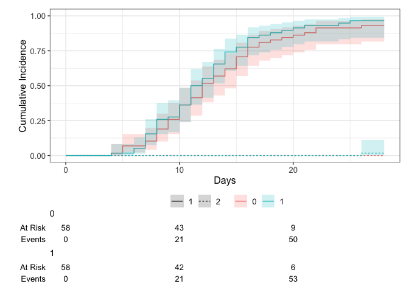<!-- -->

```r
# in int only
df_int <- df %>% 
  filter(trt == 1)
cuminc(Surv(discharge_time, discharge_reached_comp) ~ trt, data = df_int) %>% 
  ggcuminc(outcome = c("1", "2")) +
  #ylim(c(0, 1)) + 
  labs(
    x = "Days"
  ) + 
  add_confidence_interval() +
  add_risktable()
```

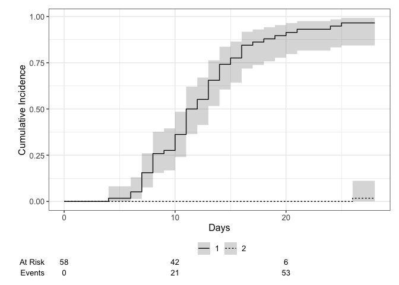<!-- -->

```r
# in cont only
# df_cont <- df %>% 
#   filter(trt == 0)
# cuminc(Surv(discharge_time, discharge_reached_comp) ~ trt, data = df_cont) %>% 
#   ggcuminc(outcome = c("1", "2")) +
#   #ylim(c(0, 1)) + 
#   labs(
#     x = "Days"
#   ) + 
#   add_confidence_interval() +
#   add_risktable()
# testing: Fine-Gray regression
ttdischarge.comp <- crr(Surv(discharge_time, discharge_reached_comp) ~ trt
    + age
    #+ clinstatus_baseline
    ,data = df)
ttdischarge_comp_reg_tbl <- tbl_regression(ttdischarge.comp, exp = TRUE)
# Nicely formatted table
kable(ttdischarge_comp_reg_tbl, format = "markdown", table.attr = 'class="table"') %>%
  kable_styling(bootstrap_options = "striped", full_width = FALSE)
```


|**Characteristic** |**HR** |**95% CI** |**p-value** |
|:------------------|:------|:----------|:-----------|
|trt                |1.26   |0.88, 1.80 |0.2         |
|age                |0.98   |0.96, 0.99 |0.002       |

```r
# Censoring and assigned worst outcome (28d) to competing event (death) // hypothetical estimand
survfit2(Surv(discharge_time_sens, discharge_reached) ~ trt, data=df) %>% 
  ggsurvfit() +
  labs(
    x = "Days",
    y = "Overall hospitalization probability"
  ) + 
  add_confidence_interval() +
  add_risktable()
```

<!-- -->

```r
# testing: cox ph
ttdischarge.sens <- df %>% 
  coxph(Surv(discharge_time_sens, discharge_reached) ~ trt 
        + age + clinstatus_baseline
        , data =.)
ttdischarge_sens_reg_tbl <- tbl_regression(ttdischarge.sens, exp = TRUE)
# Nicely formatted table
kable(ttdischarge_sens_reg_tbl, format = "markdown", table.attr = 'class="table"') %>%
  kable_styling(bootstrap_options = "striped", full_width = FALSE)
```


|**Characteristic**  |**HR** |**95% CI** |**p-value** |
|:-------------------|:------|:----------|:-----------|
|trt                 |1.28   |0.88, 1.87 |0.2         |
|age                 |0.98   |0.96, 0.99 |0.007       |
|clinstatus_baseline |NA     |NA         |NA          |
|1                   |NA     |NA         |NA          |
|2                   |1.11   |0.69, 1.78 |0.7         |
|3                   |NA     |NA         |NA          |
|4                   |NA     |NA         |NA          |
|5                   |NA     |NA         |NA          |
|6                   |NA     |NA         |NA          |

```r
# Sens-analysis: Alternative definition/analysis of outcome: time to sustained discharge within 28 days
# Use cause-specific hazards
km.ttdischarge_sus_trt <- survfit(Surv(discharge_time_sus, discharge_reached_sus) ~ trt, data=df)
ttdischarge_sus_28d_tbl <- km.ttdischarge_sus_trt %>% 
  tbl_survfit(
    times = 28,
    label_header = "**28-d sustained hospitalization (95% CI)**"
  )
# Nicely formatted table
kable(ttdischarge_sus_28d_tbl, format = "markdown", table.attr = 'class="table"') %>%
  kable_styling(bootstrap_options = "striped", full_width = FALSE)
```


|**Characteristic** |**28-d sustained hospitalization (95% CI)** |
|:------------------|:-------------------------------------------|
|trt                |NA                                          |
|0                  |6.9% (2.7%, 18%)                            |
|1                  |3.4% (0.9%, 13%)                            |

```r
#KM curve
survfit2(Surv(discharge_time_sus, discharge_reached_sus) ~ trt, data=df) %>% 
  ggsurvfit() +
  labs(
    x = "Days",
    y = "Overall sustained hospitalization probability"
  ) + 
  add_confidence_interval() +
  add_risktable()
```

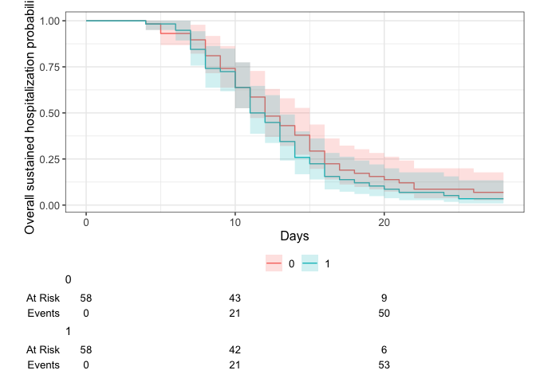<!-- -->

```r
# testing: cox ph
ttdischarge.sus <- df %>% 
  coxph(Surv(discharge_time_sus, discharge_reached_sus) ~ trt 
        + age + clinstatus_baseline
        , data =.)
ttdischarge_sus_reg_tbl <- tbl_regression(ttdischarge.sus, exp = TRUE)
# Nicely formatted table
kable(ttdischarge_sus_reg_tbl, format = "markdown", table.attr = 'class="table"') %>%
  kable_styling(bootstrap_options = "striped", full_width = FALSE)
```


|**Characteristic**  |**HR** |**95% CI** |**p-value** |
|:-------------------|:------|:----------|:-----------|
|trt                 |1.28   |0.88, 1.87 |0.2         |
|age                 |0.98   |0.96, 0.99 |0.007       |
|clinstatus_baseline |NA     |NA         |NA          |
|1                   |NA     |NA         |NA          |
|2                   |1.11   |0.69, 1.78 |0.7         |
|3                   |NA     |NA         |NA          |
|4                   |NA     |NA         |NA          |
|5                   |NA     |NA         |NA          |
|6                   |NA     |NA         |NA          |

# (vii) Viral clearance up to day 5, day 10, and day 15

Discussion points
1. Not available

# (viii) Quality of life at day 28 

Discussion points
1. Not available

# (ix) Adverse event(s) grade 3 or 4, or a serious adverse event(s), excluding death, by day 28

```r
table(df$ae_28, df$trt, useNA = "always") 
```

```
##       
##         0  1 <NA>
##   0    45 49    0
##   1    13  9    0
##   <NA>  0  0    0
```

```r
ae.28 <- df %>% 
  glm(ae_28 ~ trt 
      + age + clinstatus_baseline
      , family = "binomial", data=.)
summ(ae.28, exp = T, confint = T, model.info = T, model.fit = F, digits = 2)
```

<table class="table table-striped table-hover table-condensed table-responsive" style="width: auto !important; margin-left: auto; margin-right: auto;">
<tbody>
  <tr>
   <td style="text-align:left;font-weight: bold;"> Observations </td>
   <td style="text-align:right;"> 116 </td>
  </tr>
  <tr>
   <td style="text-align:left;font-weight: bold;"> Dependent variable </td>
   <td style="text-align:right;"> ae_28 </td>
  </tr>
  <tr>
   <td style="text-align:left;font-weight: bold;"> Type </td>
   <td style="text-align:right;"> Generalized linear model </td>
  </tr>
  <tr>
   <td style="text-align:left;font-weight: bold;"> Family </td>
   <td style="text-align:right;"> binomial </td>
  </tr>
  <tr>
   <td style="text-align:left;font-weight: bold;"> Link </td>
   <td style="text-align:right;"> logit </td>
  </tr>
</tbody>
</table>  <table class="table table-striped table-hover table-condensed table-responsive" style="width: auto !important; margin-left: auto; margin-right: auto;border-bottom: 0;">
 <thead>
  <tr>
   <th style="text-align:left;">   </th>
   <th style="text-align:right;"> exp(Est.) </th>
   <th style="text-align:right;"> 2.5% </th>
   <th style="text-align:right;"> 97.5% </th>
   <th style="text-align:right;"> z val. </th>
   <th style="text-align:right;"> p </th>
  </tr>
 </thead>
<tbody>
  <tr>
   <td style="text-align:left;font-weight: bold;"> (Intercept) </td>
   <td style="text-align:right;"> 8.41 </td>
   <td style="text-align:right;"> 0.50 </td>
   <td style="text-align:right;"> 140.83 </td>
   <td style="text-align:right;"> 1.48 </td>
   <td style="text-align:right;"> 0.14 </td>
  </tr>
  <tr>
   <td style="text-align:left;font-weight: bold;"> trt </td>
   <td style="text-align:right;"> 0.69 </td>
   <td style="text-align:right;"> 0.25 </td>
   <td style="text-align:right;"> 1.96 </td>
   <td style="text-align:right;"> -0.69 </td>
   <td style="text-align:right;"> 0.49 </td>
  </tr>
  <tr>
   <td style="text-align:left;font-weight: bold;"> age </td>
   <td style="text-align:right;"> 0.91 </td>
   <td style="text-align:right;"> 0.87 </td>
   <td style="text-align:right;"> 0.96 </td>
   <td style="text-align:right;"> -3.37 </td>
   <td style="text-align:right;"> 0.00 </td>
  </tr>
  <tr>
   <td style="text-align:left;font-weight: bold;"> clinstatus_baseline3 </td>
   <td style="text-align:right;"> 6.17 </td>
   <td style="text-align:right;"> 1.19 </td>
   <td style="text-align:right;"> 31.92 </td>
   <td style="text-align:right;"> 2.17 </td>
   <td style="text-align:right;"> 0.03 </td>
  </tr>
</tbody>
<tfoot><tr><td style="padding: 0; " colspan="100%">
<sup></sup> Standard errors: MLE</td></tr></tfoot>
</table>

```r
# (ix) Sens-analysis: Alternative definition/analysis of outcome: incidence rate ratio (Poisson regression) -> AE per person by d28
table(df$ae_28_sev, df$trt, useNA = "always") 
```

```
##       
##         0  1 <NA>
##   0    45 49    0
##   1    13  9    0
##   <NA>  0  0    0
```

```r
ae.28.sev <- df %>% 
  glm(ae_28_sev ~ trt 
      + age + clinstatus_baseline
      , family = "binomial", data=.)
summ(ae.28.sev, exp = T, confint = T, model.info = T, model.fit = F, digits = 2)
```

<table class="table table-striped table-hover table-condensed table-responsive" style="width: auto !important; margin-left: auto; margin-right: auto;">
<tbody>
  <tr>
   <td style="text-align:left;font-weight: bold;"> Observations </td>
   <td style="text-align:right;"> 116 </td>
  </tr>
  <tr>
   <td style="text-align:left;font-weight: bold;"> Dependent variable </td>
   <td style="text-align:right;"> ae_28_sev </td>
  </tr>
  <tr>
   <td style="text-align:left;font-weight: bold;"> Type </td>
   <td style="text-align:right;"> Generalized linear model </td>
  </tr>
  <tr>
   <td style="text-align:left;font-weight: bold;"> Family </td>
   <td style="text-align:right;"> binomial </td>
  </tr>
  <tr>
   <td style="text-align:left;font-weight: bold;"> Link </td>
   <td style="text-align:right;"> logit </td>
  </tr>
</tbody>
</table>  <table class="table table-striped table-hover table-condensed table-responsive" style="width: auto !important; margin-left: auto; margin-right: auto;border-bottom: 0;">
 <thead>
  <tr>
   <th style="text-align:left;">   </th>
   <th style="text-align:right;"> exp(Est.) </th>
   <th style="text-align:right;"> 2.5% </th>
   <th style="text-align:right;"> 97.5% </th>
   <th style="text-align:right;"> z val. </th>
   <th style="text-align:right;"> p </th>
  </tr>
 </thead>
<tbody>
  <tr>
   <td style="text-align:left;font-weight: bold;"> (Intercept) </td>
   <td style="text-align:right;"> 8.41 </td>
   <td style="text-align:right;"> 0.50 </td>
   <td style="text-align:right;"> 140.83 </td>
   <td style="text-align:right;"> 1.48 </td>
   <td style="text-align:right;"> 0.14 </td>
  </tr>
  <tr>
   <td style="text-align:left;font-weight: bold;"> trt </td>
   <td style="text-align:right;"> 0.69 </td>
   <td style="text-align:right;"> 0.25 </td>
   <td style="text-align:right;"> 1.96 </td>
   <td style="text-align:right;"> -0.69 </td>
   <td style="text-align:right;"> 0.49 </td>
  </tr>
  <tr>
   <td style="text-align:left;font-weight: bold;"> age </td>
   <td style="text-align:right;"> 0.91 </td>
   <td style="text-align:right;"> 0.87 </td>
   <td style="text-align:right;"> 0.96 </td>
   <td style="text-align:right;"> -3.37 </td>
   <td style="text-align:right;"> 0.00 </td>
  </tr>
  <tr>
   <td style="text-align:left;font-weight: bold;"> clinstatus_baseline3 </td>
   <td style="text-align:right;"> 6.17 </td>
   <td style="text-align:right;"> 1.19 </td>
   <td style="text-align:right;"> 31.92 </td>
   <td style="text-align:right;"> 2.17 </td>
   <td style="text-align:right;"> 0.03 </td>
  </tr>
</tbody>
<tfoot><tr><td style="padding: 0; " colspan="100%">
<sup></sup> Standard errors: MLE</td></tr></tfoot>
</table>

# Subgroup analysis: Ventilation requirement (proxy for disease severity) on primary endpoint

```r
table(df$clinstatus_baseline, df$mort_28, useNA = "always") # only 2 - 3 included
```

```
##       
##         0  1 <NA>
##   1     0  0    0
##   2    25  0    0
##   3    90  1    0
##   4     0  0    0
##   5     0  0    0
##   6     0  0    0
##   <NA>  0  0    0
```

```r
table(df$vbaseline, df$mort_28, useNA = "always")
```

```
##       
##          0   1 <NA>
##   0    115   1    0
##   <NA>   0   0    0
```

```r
# class(df$clinstatus_baseline)
df$clinstatus_baseline_n <- as.numeric(df$clinstatus_baseline)

mort.28.vent <- df %>% 
  glm(mort_28 ~ trt*clinstatus_baseline_n
      + age 
      #+ clinstatus_baseline
      , family = "binomial", data=.)
summ(mort.28.vent, exp = T, confint = T, model.info = T, model.fit = F, digits = 2)
```

<table class="table table-striped table-hover table-condensed table-responsive" style="width: auto !important; margin-left: auto; margin-right: auto;">
<tbody>
  <tr>
   <td style="text-align:left;font-weight: bold;"> Observations </td>
   <td style="text-align:right;"> 116 </td>
  </tr>
  <tr>
   <td style="text-align:left;font-weight: bold;"> Dependent variable </td>
   <td style="text-align:right;"> mort_28 </td>
  </tr>
  <tr>
   <td style="text-align:left;font-weight: bold;"> Type </td>
   <td style="text-align:right;"> Generalized linear model </td>
  </tr>
  <tr>
   <td style="text-align:left;font-weight: bold;"> Family </td>
   <td style="text-align:right;"> binomial </td>
  </tr>
  <tr>
   <td style="text-align:left;font-weight: bold;"> Link </td>
   <td style="text-align:right;"> logit </td>
  </tr>
</tbody>
</table>  <table class="table table-striped table-hover table-condensed table-responsive" style="width: auto !important; margin-left: auto; margin-right: auto;border-bottom: 0;">
 <thead>
  <tr>
   <th style="text-align:left;">   </th>
   <th style="text-align:right;"> exp(Est.) </th>
   <th style="text-align:right;"> 2.5% </th>
   <th style="text-align:right;"> 97.5% </th>
   <th style="text-align:right;"> z val. </th>
   <th style="text-align:right;"> p </th>
  </tr>
 </thead>
<tbody>
  <tr>
   <td style="text-align:left;font-weight: bold;"> (Intercept) </td>
   <td style="text-align:right;"> 0.00 </td>
   <td style="text-align:right;"> 0.00 </td>
   <td style="text-align:right;"> Inf </td>
   <td style="text-align:right;"> -0.00 </td>
   <td style="text-align:right;"> 1.00 </td>
  </tr>
  <tr>
   <td style="text-align:left;font-weight: bold;"> trt </td>
   <td style="text-align:right;"> 0.00 </td>
   <td style="text-align:right;"> 0.00 </td>
   <td style="text-align:right;"> Inf </td>
   <td style="text-align:right;"> -0.00 </td>
   <td style="text-align:right;"> 1.00 </td>
  </tr>
  <tr>
   <td style="text-align:left;font-weight: bold;"> clinstatus_baseline_n </td>
   <td style="text-align:right;"> 0.87 </td>
   <td style="text-align:right;"> 0.00 </td>
   <td style="text-align:right;"> Inf </td>
   <td style="text-align:right;"> -0.00 </td>
   <td style="text-align:right;"> 1.00 </td>
  </tr>
  <tr>
   <td style="text-align:left;font-weight: bold;"> age </td>
   <td style="text-align:right;"> 1.06 </td>
   <td style="text-align:right;"> 0.87 </td>
   <td style="text-align:right;"> 1.29 </td>
   <td style="text-align:right;"> 0.54 </td>
   <td style="text-align:right;"> 0.59 </td>
  </tr>
  <tr>
   <td style="text-align:left;font-weight: bold;"> trt:clinstatus_baseline_n </td>
   <td style="text-align:right;"> 85316601.06 </td>
   <td style="text-align:right;"> 0.00 </td>
   <td style="text-align:right;"> Inf </td>
   <td style="text-align:right;"> 0.00 </td>
   <td style="text-align:right;"> 1.00 </td>
  </tr>
</tbody>
<tfoot><tr><td style="padding: 0; " colspan="100%">
<sup></sup> Standard errors: MLE</td></tr></tfoot>
</table>

```r
# Firth regression
mort.28.vent.firth <- df %>% 
  logistf(mort_28 ~ trt*clinstatus_baseline_n
      + age 
      #+ clinstatus_baseline
      , data=.)
summary(mort.28.vent.firth)
```

```
## logistf(formula = mort_28 ~ trt * clinstatus_baseline_n + age, 
##     data = .)
## 
## Model fitted by Penalized ML
## Coefficients:
##                                 coef   se(coef)  lower 0.95 upper 0.95
## (Intercept)               -3.2719151 5.48175235 -20.2414990  9.9029586
## trt                        0.2985309 6.55931056 -16.7691637 17.1177534
## clinstatus_baseline_n     -0.9854861 1.85699259  -6.2226183  4.2499943
## age                        0.0330367 0.05057323  -0.1164178  0.2133745
## trt:clinstatus_baseline_n  0.1725666 2.46213114  -5.7594220  6.5363323
##                                 Chisq         p method
## (Intercept)               0.248363350 0.6182299      2
## trt                       0.001747816 0.9666526      2
## clinstatus_baseline_n     0.229625149 0.6318019      2
## age                       0.180322783 0.6710960      2
## trt:clinstatus_baseline_n 0.004130705 0.9487548      2
## 
## Method: 1-Wald, 2-Profile penalized log-likelihood, 3-None
## 
## Likelihood ratio test=0.7666195 on 4 df, p=0.9428663, n=116
## Wald test = 38.97522 on 4 df, p = 7.049024e-08
```

```r
# vbaseline
# mort.28.vent.vb.firth <- df %>%
#   logistf(mort_28 ~ trt*vbaseline
#       + age
#       #+ clinstatus_baseline
#       #+ comed_dexa + comed_rdv + comed_toci
#       , data=.)
# summary(mort.28.vent.vb.firth)

# effect by subgroup
mort.28.vent.vb.no <- df %>%
  filter(vbaseline == 0) %>% # not ventilated
  logistf(mort_28 ~ trt
      + age
     # + clinstatus_baseline
      , data=.)
summary(mort.28.vent.vb.no)
```

```
## logistf(formula = mort_28 ~ trt + age, data = .)
## 
## Model fitted by Penalized ML
## Coefficients:
##                    coef   se(coef)  lower 0.95 upper 0.95     Chisq         p
## (Intercept) -7.14340178 3.90759561 -21.2335307  1.3221648 2.5595396 0.1096305
## trt          0.97032815 1.46011787  -1.9772794  5.9577560 0.3987958 0.5277118
## age          0.04386122 0.05859247  -0.1106749  0.2348662 0.3040268 0.5813689
##             method
## (Intercept)      2
## trt              2
## age              2
## 
## Method: 1-Wald, 2-Profile penalized log-likelihood, 3-None
## 
## Likelihood ratio test=0.7950089 on 2 df, p=0.6719949, n=116
## Wald test = 32.59003 on 2 df, p = 8.378488e-08
```

```r
# class(df$clinstatus_baseline)
mort.28.vent.rs.2 <- df %>%
  filter(clinstatus_baseline == "2") %>% # no oxygen
  logistf(mort_28 ~ trt
      + age
     # + clinstatus_baseline
      , data=.)
summary(mort.28.vent.rs.2)
```

```
## logistf(formula = mort_28 ~ trt + age, data = .)
## 
## Model fitted by Penalized ML
## Coefficients:
##                     coef   se(coef)  lower 0.95 upper 0.95       Chisq
## (Intercept) -3.232934283 4.42421963 -29.3836680 12.8752174 0.279439125
## trt          0.330616463 1.71658602  -4.9280769  5.6772575 0.025862261
## age          0.004217313 0.07665781  -0.3915885  0.3820289 0.001403669
##                     p method
## (Intercept) 0.5970691      2
## trt         0.8722372      2
## age         0.9701138      2
## 
## Method: 1-Wald, 2-Profile penalized log-likelihood, 3-None
## 
## Likelihood ratio test=0.02597619 on 2 df, p=0.9870959, n=25
## Wald test = 11.63406 on 2 df, p = 0.002976432
```

```r
mort.28.vent.rs.3 <- df %>%
  filter(clinstatus_baseline == "3") %>% # LF oxygen
  logistf(mort_28 ~ trt
      + age
     # + clinstatus_baseline
      , data=.)
summary(mort.28.vent.rs.3)
```

```
## logistf(formula = mort_28 ~ trt + age, data = .)
## 
## Model fitted by Penalized ML
## Coefficients:
##                    coef   se(coef)  lower 0.95 upper 0.95     Chisq         p
## (Intercept) -6.33770754 3.92488113 -20.4760908  2.1444752 1.8486948 0.1739353
## trt          0.78448622 1.45644363  -2.1703592  5.7765742 0.2540861 0.6142125
## age          0.03601989 0.05925393  -0.1212842  0.2263057 0.1842327 0.6677607
##             method
## (Intercept)      2
## trt              2
## age              2
## 
## Method: 1-Wald, 2-Profile penalized log-likelihood, 3-None
## 
## Likelihood ratio test=0.529698 on 2 df, p=0.7673218, n=91
## Wald test = 29.34023 on 2 df, p = 4.254522e-07
```
Discussion points
1. Firth regression works for clinstatus_baseline but not for vbaseline

# Subgroup analysis: Age on primary endpoint

```r
mort.28.age <- df %>% 
  glm(mort_28 ~ trt*age
      # + age 
      + clinstatus_baseline
      , family = "binomial", data=.)
summ(mort.28.age, exp = T, confint = T, model.info = T, model.fit = F, digits = 2)
```

<table class="table table-striped table-hover table-condensed table-responsive" style="width: auto !important; margin-left: auto; margin-right: auto;">
<tbody>
  <tr>
   <td style="text-align:left;font-weight: bold;"> Observations </td>
   <td style="text-align:right;"> 116 </td>
  </tr>
  <tr>
   <td style="text-align:left;font-weight: bold;"> Dependent variable </td>
   <td style="text-align:right;"> mort_28 </td>
  </tr>
  <tr>
   <td style="text-align:left;font-weight: bold;"> Type </td>
   <td style="text-align:right;"> Generalized linear model </td>
  </tr>
  <tr>
   <td style="text-align:left;font-weight: bold;"> Family </td>
   <td style="text-align:right;"> binomial </td>
  </tr>
  <tr>
   <td style="text-align:left;font-weight: bold;"> Link </td>
   <td style="text-align:right;"> logit </td>
  </tr>
</tbody>
</table>  <table class="table table-striped table-hover table-condensed table-responsive" style="width: auto !important; margin-left: auto; margin-right: auto;border-bottom: 0;">
 <thead>
  <tr>
   <th style="text-align:left;">   </th>
   <th style="text-align:right;"> exp(Est.) </th>
   <th style="text-align:right;"> 2.5% </th>
   <th style="text-align:right;"> 97.5% </th>
   <th style="text-align:right;"> z val. </th>
   <th style="text-align:right;"> p </th>
  </tr>
 </thead>
<tbody>
  <tr>
   <td style="text-align:left;font-weight: bold;"> (Intercept) </td>
   <td style="text-align:right;"> 0.00 </td>
   <td style="text-align:right;"> 0.00 </td>
   <td style="text-align:right;"> Inf </td>
   <td style="text-align:right;"> -0.00 </td>
   <td style="text-align:right;"> 1.00 </td>
  </tr>
  <tr>
   <td style="text-align:left;font-weight: bold;"> trt </td>
   <td style="text-align:right;"> 1870508.55 </td>
   <td style="text-align:right;"> 0.00 </td>
   <td style="text-align:right;"> Inf </td>
   <td style="text-align:right;"> 0.00 </td>
   <td style="text-align:right;"> 1.00 </td>
  </tr>
  <tr>
   <td style="text-align:left;font-weight: bold;"> age </td>
   <td style="text-align:right;"> 0.99 </td>
   <td style="text-align:right;"> 0.00 </td>
   <td style="text-align:right;"> Inf </td>
   <td style="text-align:right;"> -0.00 </td>
   <td style="text-align:right;"> 1.00 </td>
  </tr>
  <tr>
   <td style="text-align:left;font-weight: bold;"> clinstatus_baseline3 </td>
   <td style="text-align:right;"> 21193488.21 </td>
   <td style="text-align:right;"> 0.00 </td>
   <td style="text-align:right;"> Inf </td>
   <td style="text-align:right;"> 0.00 </td>
   <td style="text-align:right;"> 1.00 </td>
  </tr>
  <tr>
   <td style="text-align:left;font-weight: bold;"> trt:age </td>
   <td style="text-align:right;"> 1.06 </td>
   <td style="text-align:right;"> 0.00 </td>
   <td style="text-align:right;"> Inf </td>
   <td style="text-align:right;"> 0.00 </td>
   <td style="text-align:right;"> 1.00 </td>
  </tr>
</tbody>
<tfoot><tr><td style="padding: 0; " colspan="100%">
<sup></sup> Standard errors: MLE</td></tr></tfoot>
</table>

```r
# Firth regression
mort.28.age.firth <- df %>% 
  logistf(mort_28 ~ trt*age
      #+ age 
      + clinstatus_baseline 
      , data=.)
summary(mort.28.age.firth)
```

```
## logistf(formula = mort_28 ~ trt * age + clinstatus_baseline, 
##     data = .)
## 
## Model fitted by Penalized ML
## Coefficients:
##                              coef   se(coef)  lower 0.95 upper 0.95       Chisq
## (Intercept)          -3.153113060 4.26694731 -36.7142218 14.0235160 0.186757343
## trt                  -2.111494712 5.84633082 -20.5170468 32.1374275 0.048702484
## age                  -0.005528684 0.07431855  -0.4537184  0.4523733 0.001596772
## clinstatus_baseline3 -0.591659973 1.31452379  -4.0155295  4.4745543 0.105284167
## trt:age               0.046003905 0.09733690  -0.4132915  0.5103446 0.082057382
##                              p method
## (Intercept)          0.6656293      2
## trt                  0.8253366      2
## age                  0.9681253      2
## clinstatus_baseline3 0.7455783      2
## trt:age              0.7745284      2
## 
## Method: 1-Wald, 2-Profile penalized log-likelihood, 3-None
## 
## Likelihood ratio test=0.5489885 on 4 df, p=0.96856, n=116
## Wald test = 39.92096 on 4 df, p = 4.494437e-08
```

```r
# effect by subgroup // adapted to cut-off 65, see deft plot!
df <- df %>% 
  mutate(age_70 = case_when(age < 65 ~ 0,
                            age > 64 ~ 1))

mort.28.age.a70.firth <- df %>%
  filter(age_70 == 1) %>% # 70 and above
  logistf(mort_28 ~ trt
     # + age
      + clinstatus_baseline
      , data=.)
summary(mort.28.age.a70.firth)
```

```
## logistf(formula = mort_28 ~ trt + clinstatus_baseline, data = .)
## 
## Model fitted by Penalized ML
## Coefficients:
##                            coef se(coef) lower 0.95 upper 0.95     Chisq
## (Intercept)          -2.5524477 1.491142  -7.578965 -0.2703118 5.0692167
## trt                   1.0699546 1.491761  -1.977233  6.1298676 0.4532162
## clinstatus_baseline3 -0.8873996 1.633198  -4.421353  4.2418115 0.2149586
##                               p method
## (Intercept)          0.02435439      2
## trt                  0.50081156      2
## clinstatus_baseline3 0.64290836      2
## 
## Method: 1-Wald, 2-Profile penalized log-likelihood, 3-None
## 
## Likelihood ratio test=0.5141832 on 2 df, p=0.7732974, n=34
## Wald test = 14.9285 on 2 df, p = 0.0005732141
```

```r
tab_model(mort.28.age.a70.firth)
```

<table style="border-collapse:collapse; border:none;">
<tr>
<th style="border-top: double; text-align:center; font-style:normal; font-weight:bold; padding:0.2cm;  text-align:left; ">&nbsp;</th>
<th colspan="3" style="border-top: double; text-align:center; font-style:normal; font-weight:bold; padding:0.2cm; ">mort 28</th>
</tr>
<tr>
<td style=" text-align:center; border-bottom:1px solid; font-style:italic; font-weight:normal;  text-align:left; ">Predictors</td>
<td style=" text-align:center; border-bottom:1px solid; font-style:italic; font-weight:normal;  ">Odds Ratios</td>
<td style=" text-align:center; border-bottom:1px solid; font-style:italic; font-weight:normal;  ">CI</td>
<td style=" text-align:center; border-bottom:1px solid; font-style:italic; font-weight:normal;  ">p</td>
</tr>
<tr>
<td style=" padding:0.2cm; text-align:left; vertical-align:top; text-align:left; ">(Intercept)</td>
<td style=" padding:0.2cm; text-align:left; vertical-align:top; text-align:center;  ">0.08</td>
<td style=" padding:0.2cm; text-align:left; vertical-align:top; text-align:center;  ">0.00&nbsp;&ndash;&nbsp;1.45</td>
<td style=" padding:0.2cm; text-align:left; vertical-align:top; text-align:center;  "><strong>0.024</strong></td>
</tr>
<tr>
<td style=" padding:0.2cm; text-align:left; vertical-align:top; text-align:left; ">trt</td>
<td style=" padding:0.2cm; text-align:left; vertical-align:top; text-align:center;  ">2.92</td>
<td style=" padding:0.2cm; text-align:left; vertical-align:top; text-align:center;  ">0.16&nbsp;&ndash;&nbsp;54.26</td>
<td style=" padding:0.2cm; text-align:left; vertical-align:top; text-align:center;  ">0.501</td>
</tr>
<tr>
<td style=" padding:0.2cm; text-align:left; vertical-align:top; text-align:left; ">clinstatus baseline [3]</td>
<td style=" padding:0.2cm; text-align:left; vertical-align:top; text-align:center;  ">0.41</td>
<td style=" padding:0.2cm; text-align:left; vertical-align:top; text-align:center;  ">0.02&nbsp;&ndash;&nbsp;10.11</td>
<td style=" padding:0.2cm; text-align:left; vertical-align:top; text-align:center;  ">0.643</td>
</tr>
<tr>
<td style=" padding:0.2cm; text-align:left; vertical-align:top; text-align:left; padding-top:0.1cm; padding-bottom:0.1cm; border-top:1px solid;">Observations</td>
<td style=" padding:0.2cm; text-align:left; vertical-align:top; padding-top:0.1cm; padding-bottom:0.1cm; text-align:left; border-top:1px solid;" colspan="3">34</td>
</tr>
<tr>
<td style=" padding:0.2cm; text-align:left; vertical-align:top; text-align:left; padding-top:0.1cm; padding-bottom:0.1cm;">R<sup>2</sup></td>
<td style=" padding:0.2cm; text-align:left; vertical-align:top; padding-top:0.1cm; padding-bottom:0.1cm; text-align:left;" colspan="3">1.000</td>
</tr>

</table>

```r
mort.28.age.b70.firth <- df %>% 
  filter(age_70 == 0) %>% # below 70
  logistf(mort_28 ~ trt
      # + age 
      + clinstatus_baseline 
      , data=.)
summary(mort.28.age.b70.firth)
```

```
## logistf(formula = mort_28 ~ trt + clinstatus_baseline, data = .)
## 
## Model fitted by Penalized ML
## Coefficients:
##                            coef se(coef) lower 0.95 upper 0.95        Chisq
## (Intercept)          -3.3849804 1.385988  -8.404373  -1.264752 14.274233929
## trt                   0.1091219 1.665971  -5.151994   5.388888  0.002833658
## clinstatus_baseline3 -1.0820434 1.666725  -6.355694   4.185129  0.267631868
##                                 p method
## (Intercept)          0.0001580131      2
## trt                  0.9575469719      2
## clinstatus_baseline3 0.6049247772      2
## 
## Method: 1-Wald, 2-Profile penalized log-likelihood, 3-None
## 
## Likelihood ratio test=0.2719344 on 2 df, p=0.8728713, n=82
## Wald test = 22.58359 on 2 df, p = 1.247485e-05
```

```r
tab_model(mort.28.age.b70.firth)
```

<table style="border-collapse:collapse; border:none;">
<tr>
<th style="border-top: double; text-align:center; font-style:normal; font-weight:bold; padding:0.2cm;  text-align:left; ">&nbsp;</th>
<th colspan="3" style="border-top: double; text-align:center; font-style:normal; font-weight:bold; padding:0.2cm; ">mort 28</th>
</tr>
<tr>
<td style=" text-align:center; border-bottom:1px solid; font-style:italic; font-weight:normal;  text-align:left; ">Predictors</td>
<td style=" text-align:center; border-bottom:1px solid; font-style:italic; font-weight:normal;  ">Odds Ratios</td>
<td style=" text-align:center; border-bottom:1px solid; font-style:italic; font-weight:normal;  ">CI</td>
<td style=" text-align:center; border-bottom:1px solid; font-style:italic; font-weight:normal;  ">p</td>
</tr>
<tr>
<td style=" padding:0.2cm; text-align:left; vertical-align:top; text-align:left; ">(Intercept)</td>
<td style=" padding:0.2cm; text-align:left; vertical-align:top; text-align:center;  ">0.03</td>
<td style=" padding:0.2cm; text-align:left; vertical-align:top; text-align:center;  ">0.00&nbsp;&ndash;&nbsp;0.51</td>
<td style=" padding:0.2cm; text-align:left; vertical-align:top; text-align:center;  "><strong>&lt;0.001</strong></td>
</tr>
<tr>
<td style=" padding:0.2cm; text-align:left; vertical-align:top; text-align:left; ">trt</td>
<td style=" padding:0.2cm; text-align:left; vertical-align:top; text-align:center;  ">1.12</td>
<td style=" padding:0.2cm; text-align:left; vertical-align:top; text-align:center;  ">0.04&nbsp;&ndash;&nbsp;29.21</td>
<td style=" padding:0.2cm; text-align:left; vertical-align:top; text-align:center;  ">0.958</td>
</tr>
<tr>
<td style=" padding:0.2cm; text-align:left; vertical-align:top; text-align:left; ">clinstatus baseline [3]</td>
<td style=" padding:0.2cm; text-align:left; vertical-align:top; text-align:center;  ">0.34</td>
<td style=" padding:0.2cm; text-align:left; vertical-align:top; text-align:center;  ">0.01&nbsp;&ndash;&nbsp;8.89</td>
<td style=" padding:0.2cm; text-align:left; vertical-align:top; text-align:center;  ">0.605</td>
</tr>
<tr>
<td style=" padding:0.2cm; text-align:left; vertical-align:top; text-align:left; padding-top:0.1cm; padding-bottom:0.1cm; border-top:1px solid;">Observations</td>
<td style=" padding:0.2cm; text-align:left; vertical-align:top; padding-top:0.1cm; padding-bottom:0.1cm; text-align:left; border-top:1px solid;" colspan="3">82</td>
</tr>

</table>

# Subgroup analysis: Comorbidities on primary endpoint

```r
# 4 comorbidity categories as numeric/continuous, i.e., linear interaction
table(df$comorb_cat, df$mort_28, useNA = "always") 
```

```
##       
##         0  1 <NA>
##   1    44  0    0
##   2    45  1    0
##   3    26  0    0
##   <NA>  0  0    0
```

```r
# class(df$comorb_cat)
mort.28.comorb <- df %>%
  glm(mort_28 ~ trt*comorb_cat 
      #+ age 
      + clinstatus_baseline
      , family = "binomial", data=.)
summ(mort.28.comorb, exp = T, confint = T, model.info = T, model.fit = F, digits = 2)
```

<table class="table table-striped table-hover table-condensed table-responsive" style="width: auto !important; margin-left: auto; margin-right: auto;">
<tbody>
  <tr>
   <td style="text-align:left;font-weight: bold;"> Observations </td>
   <td style="text-align:right;"> 116 </td>
  </tr>
  <tr>
   <td style="text-align:left;font-weight: bold;"> Dependent variable </td>
   <td style="text-align:right;"> mort_28 </td>
  </tr>
  <tr>
   <td style="text-align:left;font-weight: bold;"> Type </td>
   <td style="text-align:right;"> Generalized linear model </td>
  </tr>
  <tr>
   <td style="text-align:left;font-weight: bold;"> Family </td>
   <td style="text-align:right;"> binomial </td>
  </tr>
  <tr>
   <td style="text-align:left;font-weight: bold;"> Link </td>
   <td style="text-align:right;"> logit </td>
  </tr>
</tbody>
</table>  <table class="table table-striped table-hover table-condensed table-responsive" style="width: auto !important; margin-left: auto; margin-right: auto;border-bottom: 0;">
 <thead>
  <tr>
   <th style="text-align:left;">   </th>
   <th style="text-align:right;"> exp(Est.) </th>
   <th style="text-align:right;"> 2.5% </th>
   <th style="text-align:right;"> 97.5% </th>
   <th style="text-align:right;"> z val. </th>
   <th style="text-align:right;"> p </th>
  </tr>
 </thead>
<tbody>
  <tr>
   <td style="text-align:left;font-weight: bold;"> (Intercept) </td>
   <td style="text-align:right;"> 0.00 </td>
   <td style="text-align:right;"> 0.00 </td>
   <td style="text-align:right;"> Inf </td>
   <td style="text-align:right;"> -0.00 </td>
   <td style="text-align:right;"> 1.00 </td>
  </tr>
  <tr>
   <td style="text-align:left;font-weight: bold;"> trt </td>
   <td style="text-align:right;"> 129907636.46 </td>
   <td style="text-align:right;"> 0.00 </td>
   <td style="text-align:right;"> Inf </td>
   <td style="text-align:right;"> 0.00 </td>
   <td style="text-align:right;"> 1.00 </td>
  </tr>
  <tr>
   <td style="text-align:left;font-weight: bold;"> comorb_cat </td>
   <td style="text-align:right;"> 1.02 </td>
   <td style="text-align:right;"> 0.00 </td>
   <td style="text-align:right;"> Inf </td>
   <td style="text-align:right;"> 0.00 </td>
   <td style="text-align:right;"> 1.00 </td>
  </tr>
  <tr>
   <td style="text-align:left;font-weight: bold;"> clinstatus_baseline3 </td>
   <td style="text-align:right;"> 42584824.93 </td>
   <td style="text-align:right;"> 0.00 </td>
   <td style="text-align:right;"> Inf </td>
   <td style="text-align:right;"> 0.00 </td>
   <td style="text-align:right;"> 1.00 </td>
  </tr>
  <tr>
   <td style="text-align:left;font-weight: bold;"> trt:comorb_cat </td>
   <td style="text-align:right;"> 0.82 </td>
   <td style="text-align:right;"> 0.00 </td>
   <td style="text-align:right;"> Inf </td>
   <td style="text-align:right;"> -0.00 </td>
   <td style="text-align:right;"> 1.00 </td>
  </tr>
</tbody>
<tfoot><tr><td style="padding: 0; " colspan="100%">
<sup></sup> Standard errors: MLE</td></tr></tfoot>
</table>

```r
# table(df$comorb_cat, df$mort_28, df$trt, useNA = "always") ### too few events!
# Firth
mort.28.comorb.firth <- df %>%
  logistf(mort_28 ~ trt*comorb_cat
      + age
      + clinstatus_baseline
      , data=.)
summary(mort.28.comorb.firth)
```

```
## logistf(formula = mort_28 ~ trt * comorb_cat + age + clinstatus_baseline, 
##     data = .)
## 
## Model fitted by Penalized ML
## Coefficients:
##                            coef   se(coef)  lower 0.95 upper 0.95      Chisq
## (Intercept)          -6.1974901 3.49236230 -19.9340044  3.5482353 1.67096948
## trt                   1.4830285 2.87658210  -5.9881297 14.2610283 0.17285131
## comorb_cat            0.2153509 1.14765131  -4.4769398  4.9130028 0.01890664
## age                   0.0372507 0.05209276  -0.1092691  0.2442125 0.22601062
## clinstatus_baseline3 -0.1832448 1.32740121  -3.5803501  4.8597758 0.01110141
## trt:comorb_cat       -0.5006967 1.38110092  -5.2101194  4.4804300 0.07993648
##                              p method
## (Intercept)          0.1961287      2
## trt                  0.6775901      2
## comorb_cat           0.8906345      2
## age                  0.6344978      2
## clinstatus_baseline3 0.9160876      2
## trt:comorb_cat       0.7773835      2
## 
## Method: 1-Wald, 2-Profile penalized log-likelihood, 3-None
## 
## Likelihood ratio test=0.5279316 on 5 df, p=0.9910648, n=116
## Wald test = 41.79501 on 5 df, p = 6.480676e-08
```

```r
# 4 comorbidity categories as factor
df$comorb_cat_f <- as.factor(df$comorb_cat)
# table(df$comorb_cat_f, df$mort_28, useNA = "always") 
mort.28.comorb.f <- df %>% 
  glm(mort_28 ~ trt*comorb_cat_f 
      + age 
      + clinstatus_baseline
      , family = "binomial", data=.)
summ(mort.28.comorb.f, exp = T, confint = T, model.info = T, model.fit = F, digits = 2)
```

<table class="table table-striped table-hover table-condensed table-responsive" style="width: auto !important; margin-left: auto; margin-right: auto;">
<tbody>
  <tr>
   <td style="text-align:left;font-weight: bold;"> Observations </td>
   <td style="text-align:right;"> 116 </td>
  </tr>
  <tr>
   <td style="text-align:left;font-weight: bold;"> Dependent variable </td>
   <td style="text-align:right;"> mort_28 </td>
  </tr>
  <tr>
   <td style="text-align:left;font-weight: bold;"> Type </td>
   <td style="text-align:right;"> Generalized linear model </td>
  </tr>
  <tr>
   <td style="text-align:left;font-weight: bold;"> Family </td>
   <td style="text-align:right;"> binomial </td>
  </tr>
  <tr>
   <td style="text-align:left;font-weight: bold;"> Link </td>
   <td style="text-align:right;"> logit </td>
  </tr>
</tbody>
</table>  <table class="table table-striped table-hover table-condensed table-responsive" style="width: auto !important; margin-left: auto; margin-right: auto;border-bottom: 0;">
 <thead>
  <tr>
   <th style="text-align:left;">   </th>
   <th style="text-align:right;"> exp(Est.) </th>
   <th style="text-align:right;"> 2.5% </th>
   <th style="text-align:right;"> 97.5% </th>
   <th style="text-align:right;"> z val. </th>
   <th style="text-align:right;"> p </th>
  </tr>
 </thead>
<tbody>
  <tr>
   <td style="text-align:left;font-weight: bold;"> (Intercept) </td>
   <td style="text-align:right;"> 0.00 </td>
   <td style="text-align:right;"> 0.00 </td>
   <td style="text-align:right;"> Inf </td>
   <td style="text-align:right;"> -0.00 </td>
   <td style="text-align:right;"> 1.00 </td>
  </tr>
  <tr>
   <td style="text-align:left;font-weight: bold;"> trt </td>
   <td style="text-align:right;"> 1.43 </td>
   <td style="text-align:right;"> 0.00 </td>
   <td style="text-align:right;"> Inf </td>
   <td style="text-align:right;"> 0.00 </td>
   <td style="text-align:right;"> 1.00 </td>
  </tr>
  <tr>
   <td style="text-align:left;font-weight: bold;"> comorb_cat_f2 </td>
   <td style="text-align:right;"> 1.29 </td>
   <td style="text-align:right;"> 0.00 </td>
   <td style="text-align:right;"> Inf </td>
   <td style="text-align:right;"> 0.00 </td>
   <td style="text-align:right;"> 1.00 </td>
  </tr>
  <tr>
   <td style="text-align:left;font-weight: bold;"> comorb_cat_f3 </td>
   <td style="text-align:right;"> 0.40 </td>
   <td style="text-align:right;"> 0.00 </td>
   <td style="text-align:right;"> Inf </td>
   <td style="text-align:right;"> -0.00 </td>
   <td style="text-align:right;"> 1.00 </td>
  </tr>
  <tr>
   <td style="text-align:left;font-weight: bold;"> age </td>
   <td style="text-align:right;"> 1.06 </td>
   <td style="text-align:right;"> 0.88 </td>
   <td style="text-align:right;"> 1.28 </td>
   <td style="text-align:right;"> 0.62 </td>
   <td style="text-align:right;"> 0.54 </td>
  </tr>
  <tr>
   <td style="text-align:left;font-weight: bold;"> clinstatus_baseline3 </td>
   <td style="text-align:right;"> 39082391.86 </td>
   <td style="text-align:right;"> 0.00 </td>
   <td style="text-align:right;"> Inf </td>
   <td style="text-align:right;"> 0.00 </td>
   <td style="text-align:right;"> 1.00 </td>
  </tr>
  <tr>
   <td style="text-align:left;font-weight: bold;"> trt:comorb_cat_f2 </td>
   <td style="text-align:right;"> 254702003.25 </td>
   <td style="text-align:right;"> 0.00 </td>
   <td style="text-align:right;"> Inf </td>
   <td style="text-align:right;"> 0.00 </td>
   <td style="text-align:right;"> 1.00 </td>
  </tr>
  <tr>
   <td style="text-align:left;font-weight: bold;"> trt:comorb_cat_f3 </td>
   <td style="text-align:right;"> 0.66 </td>
   <td style="text-align:right;"> 0.00 </td>
   <td style="text-align:right;"> Inf </td>
   <td style="text-align:right;"> -0.00 </td>
   <td style="text-align:right;"> 1.00 </td>
  </tr>
</tbody>
<tfoot><tr><td style="padding: 0; " colspan="100%">
<sup></sup> Standard errors: MLE</td></tr></tfoot>
</table>

```r
# full comorbidity count
# table(df$comorb_count, df$mort_28, useNA = "always") 
mort.28.comorb.count <- df %>%
  glm(mort_28 ~ trt*comorb_count 
      + age 
      + clinstatus_baseline
      , family = "binomial", data=.)
summ(mort.28.comorb.count, exp = T, confint = T, model.info = T, model.fit = F, digits = 2)
```

<table class="table table-striped table-hover table-condensed table-responsive" style="width: auto !important; margin-left: auto; margin-right: auto;">
<tbody>
  <tr>
   <td style="text-align:left;font-weight: bold;"> Observations </td>
   <td style="text-align:right;"> 116 </td>
  </tr>
  <tr>
   <td style="text-align:left;font-weight: bold;"> Dependent variable </td>
   <td style="text-align:right;"> mort_28 </td>
  </tr>
  <tr>
   <td style="text-align:left;font-weight: bold;"> Type </td>
   <td style="text-align:right;"> Generalized linear model </td>
  </tr>
  <tr>
   <td style="text-align:left;font-weight: bold;"> Family </td>
   <td style="text-align:right;"> binomial </td>
  </tr>
  <tr>
   <td style="text-align:left;font-weight: bold;"> Link </td>
   <td style="text-align:right;"> logit </td>
  </tr>
</tbody>
</table>  <table class="table table-striped table-hover table-condensed table-responsive" style="width: auto !important; margin-left: auto; margin-right: auto;border-bottom: 0;">
 <thead>
  <tr>
   <th style="text-align:left;">   </th>
   <th style="text-align:right;"> exp(Est.) </th>
   <th style="text-align:right;"> 2.5% </th>
   <th style="text-align:right;"> 97.5% </th>
   <th style="text-align:right;"> z val. </th>
   <th style="text-align:right;"> p </th>
  </tr>
 </thead>
<tbody>
  <tr>
   <td style="text-align:left;font-weight: bold;"> (Intercept) </td>
   <td style="text-align:right;"> 0.00 </td>
   <td style="text-align:right;"> 0.00 </td>
   <td style="text-align:right;"> Inf </td>
   <td style="text-align:right;"> -0.00 </td>
   <td style="text-align:right;"> 1.00 </td>
  </tr>
  <tr>
   <td style="text-align:left;font-weight: bold;"> trt </td>
   <td style="text-align:right;"> 106204046.72 </td>
   <td style="text-align:right;"> 0.00 </td>
   <td style="text-align:right;"> Inf </td>
   <td style="text-align:right;"> 0.00 </td>
   <td style="text-align:right;"> 1.00 </td>
  </tr>
  <tr>
   <td style="text-align:left;font-weight: bold;"> comorb_count </td>
   <td style="text-align:right;"> 0.62 </td>
   <td style="text-align:right;"> 0.00 </td>
   <td style="text-align:right;"> Inf </td>
   <td style="text-align:right;"> -0.00 </td>
   <td style="text-align:right;"> 1.00 </td>
  </tr>
  <tr>
   <td style="text-align:left;font-weight: bold;"> age </td>
   <td style="text-align:right;"> 1.09 </td>
   <td style="text-align:right;"> 0.86 </td>
   <td style="text-align:right;"> 1.37 </td>
   <td style="text-align:right;"> 0.71 </td>
   <td style="text-align:right;"> 0.48 </td>
  </tr>
  <tr>
   <td style="text-align:left;font-weight: bold;"> clinstatus_baseline3 </td>
   <td style="text-align:right;"> 30224817.31 </td>
   <td style="text-align:right;"> 0.00 </td>
   <td style="text-align:right;"> Inf </td>
   <td style="text-align:right;"> 0.00 </td>
   <td style="text-align:right;"> 1.00 </td>
  </tr>
  <tr>
   <td style="text-align:left;font-weight: bold;"> trt:comorb_count </td>
   <td style="text-align:right;"> 0.79 </td>
   <td style="text-align:right;"> 0.00 </td>
   <td style="text-align:right;"> Inf </td>
   <td style="text-align:right;"> -0.00 </td>
   <td style="text-align:right;"> 1.00 </td>
  </tr>
</tbody>
<tfoot><tr><td style="padding: 0; " colspan="100%">
<sup></sup> Standard errors: MLE</td></tr></tfoot>
</table>

```r
mort.28.comorb.count.firth <- df %>%
  logistf(mort_28 ~ trt*comorb_count 
      + age 
      + clinstatus_baseline
      , data=.)
summary(mort.28.comorb.count.firth)
```

```
## logistf(formula = mort_28 ~ trt * comorb_count + age + clinstatus_baseline, 
##     data = .)
## 
## Model fitted by Penalized ML
## Coefficients:
##                            coef  se(coef)  lower 0.95 upper 0.95      Chisq
## (Intercept)          -6.3418276 3.2644175 -19.0373714  1.7710427 2.27603806
## trt                   1.1189731 1.6891517  -3.1226259 10.4442309 0.28157734
## comorb_count          0.3616077 0.9993201  -4.2478169  4.3671173 0.06710516
## age                   0.0403858 0.0527170  -0.1047694  0.2346446 0.27521893
## clinstatus_baseline3 -0.2385988 1.3503602  -3.6783412  4.8058317 0.01858253
## trt:comorb_count     -0.5460109 1.1610445  -4.4989836  4.2722550 0.12290283
##                              p method
## (Intercept)          0.1313871      2
## trt                  0.5956692      2
## comorb_count         0.7955993      2
## age                  0.5998522      2
## clinstatus_baseline3 0.8915701      2
## trt:comorb_count     0.7259072      2
## 
## Method: 1-Wald, 2-Profile penalized log-likelihood, 3-None
## 
## Likelihood ratio test=0.6816019 on 5 df, p=0.9839631, n=116
## Wald test = 40.88568 on 5 df, p = 9.895196e-08
```

```r
# any comorbidity
# table(df$comorb_any, df$mort_28, useNA = "always") 
mort.28.comorb.any.firth <- df %>%
  logistf(mort_28 ~ trt*comorb_any 
      + age 
      + clinstatus_baseline
      , family = "binomial", data=.)
summary(mort.28.comorb.any.firth)
```

```
## logistf(formula = mort_28 ~ trt * comorb_any + age + clinstatus_baseline, 
##     data = ., family = "binomial")
## 
## Model fitted by Penalized ML
## Coefficients:
##                             coef   se(coef)  lower 0.95 upper 0.95       Chisq
## (Intercept)          -3.86683689 2.92543871 -15.3187258  3.3754200 0.983760788
## trt                   0.15751270 1.77626627  -5.1268094  5.4274678 0.005848955
## comorb_any           -0.24274576 1.70473430  -5.5301500  5.0194269 0.014010311
## age                   0.01310893 0.04781847  -0.1247921  0.1989576 0.032924538
## clinstatus_baseline3 -0.68068026 1.25718576  -4.3781970  4.4929394 0.121189018
## trt:comorb_any        0.70885026 2.33893168  -5.3729206  7.4915038 0.060879949
##                              p method
## (Intercept)          0.3212721      2
## trt                  0.9390385      2
## comorb_any           0.9057783      2
## age                  0.8560134      2
## clinstatus_baseline3 0.7277485      2
## trt:comorb_any       0.8051105      2
## 
## Method: 1-Wald, 2-Profile penalized log-likelihood, 3-None
## 
## Likelihood ratio test=0.3863851 on 5 df, p=0.9956963, n=116
## Wald test = 42.66118 on 5 df, p = 4.32792e-08
```

```r
# comorbidities without immunosuppressed
# table(df$comorb_cat, df$mort_28, useNA = "always")
df <- df %>% 
  mutate(comorb_noimmuno = case_when(comorb_cat == 4 ~ NA,
                              TRUE ~ comorb_cat))
# table(df$comorb_noimmuno, df$mort_28, useNA = "always")
mort.28.comorb.noimmuno.firth <- df %>%
  logistf(mort_28 ~ trt*comorb_noimmuno 
      + age 
      + clinstatus_baseline
      , family = "binomial", data=.)
summary(mort.28.comorb.noimmuno.firth)
```

```
## logistf(formula = mort_28 ~ trt * comorb_noimmuno + age + clinstatus_baseline, 
##     data = ., family = "binomial")
## 
## Model fitted by Penalized ML
## Coefficients:
##                            coef   se(coef)  lower 0.95 upper 0.95      Chisq
## (Intercept)          -6.1974901 3.49236230 -19.9340044  3.5482353 1.67096948
## trt                   1.4830285 2.87658210  -5.9881297 14.2610283 0.17285131
## comorb_noimmuno       0.2153509 1.14765131  -4.4769398  4.9130028 0.01890664
## age                   0.0372507 0.05209276  -0.1092691  0.2442125 0.22601062
## clinstatus_baseline3 -0.1832448 1.32740121  -3.5803501  4.8597758 0.01110141
## trt:comorb_noimmuno  -0.5006967 1.38110092  -5.2101194  4.4804300 0.07993648
##                              p method
## (Intercept)          0.1961287      2
## trt                  0.6775901      2
## comorb_noimmuno      0.8906345      2
## age                  0.6344978      2
## clinstatus_baseline3 0.9160876      2
## trt:comorb_noimmuno  0.7773835      2
## 
## Method: 1-Wald, 2-Profile penalized log-likelihood, 3-None
## 
## Likelihood ratio test=0.5279316 on 5 df, p=0.9910648, n=116
## Wald test = 41.79501 on 5 df, p = 6.480676e-08
```

```r
# effect by subgroup
mort.28.comorb.1 <- df %>% 
  filter(comorb_cat == 1) %>% # no comorbidity
  logistf(mort_28 ~ trt
      + age 
      + clinstatus_baseline
      , data=.)
summary(mort.28.comorb.1)
```

```
## logistf(formula = mort_28 ~ trt + age + clinstatus_baseline, 
##     data = .)
## 
## Model fitted by Penalized ML
## Coefficients:
##                             coef   se(coef)  lower 0.95 upper 0.95       Chisq
## (Intercept)          -0.56534384 4.08730180 -29.2913778 14.8749059 0.008770424
## trt                   0.09697534 1.49762352  -5.2286186  5.3033879 0.002250269
## age                  -0.04518876 0.07516703  -0.3480642  0.4060678 0.114187582
## clinstatus_baseline3 -0.41855700 1.54096654  -5.4612713  4.8405551 0.043532193
##                              p method
## (Intercept)          0.9253868      2
## trt                  0.9621649      2
## age                  0.7354261      2
## clinstatus_baseline3 0.8347264      2
## 
## Method: 1-Wald, 2-Profile penalized log-likelihood, 3-None
## 
## Likelihood ratio test=0.20556 on 3 df, p=0.9766868, n=44
## Wald test = 17.82867 on 3 df, p = 0.0004771236
```

```r
mort.28.comorb.2 <- df %>% 
  filter(comorb_cat == 2) %>% # 1 comorbidity
  logistf(mort_28 ~ trt
      + age 
      + clinstatus_baseline
      , data=.)
summary(mort.28.comorb.2)
```

```
## logistf(formula = mort_28 ~ trt + age + clinstatus_baseline, 
##     data = .)
## 
## Model fitted by Penalized ML
## Coefficients:
##                             coef   se(coef)  lower 0.95 upper 0.95      Chisq
## (Intercept)          -4.66553214 3.26717756 -17.0419966  2.1112154 1.64943400
## trt                   0.97175562 1.40770062  -2.2051054  6.2200947 0.31705318
## age                   0.02835415 0.05056001  -0.1035356  0.2048529 0.18393185
## clinstatus_baseline3 -0.47978692 1.49036516  -4.0257040  4.7416189 0.05919996
##                              p method
## (Intercept)          0.1990360      2
## trt                  0.5733840      2
## age                  0.6680158      2
## clinstatus_baseline3 0.8077649      2
## 
## Method: 1-Wald, 2-Profile penalized log-likelihood, 3-None
## 
## Likelihood ratio test=0.5679102 on 3 df, p=0.9037377, n=46
## Wald test = 19.64791 on 3 df, p = 0.0002007837
```

```r
mort.28.comorb.3 <- df %>% 
  filter(comorb_cat == 3) %>% # multiple comorbidities
  logistf(mort_28 ~ trt
      + age 
      + clinstatus_baseline
      , data=.)
summary(mort.28.comorb.3)
```

```
## logistf(formula = mort_28 ~ trt + age + clinstatus_baseline, 
##     data = .)
## 
## Model fitted by Penalized ML
## Coefficients:
##                              coef   se(coef)  lower 0.95 upper 0.95       Chisq
## (Intercept)          -1.026140396 5.12762874 -27.3535965 24.3572615 0.026856636
## trt                  -0.942889647 1.69685303  -6.1302050  4.1426501 0.229323994
## age                  -0.001150347 0.07715316  -0.4032249  0.4158065 0.000144702
## clinstatus_baseline3 -1.246596103 2.01025280  -8.7789342  4.0507797 0.344200227
##                              p method
## (Intercept)          0.8698257      2
## trt                  0.6320255      2
## age                  0.9904023      2
## clinstatus_baseline3 0.5574147      2
## 
## Method: 1-Wald, 2-Profile penalized log-likelihood, 3-None
## 
## Likelihood ratio test=0.9779681 on 3 df, p=0.8065828, n=26
## Wald test = 11.56237 on 3 df, p = 0.009043025
```

```r
# mort.28.comorb.4 <- df %>%
#   filter(comorb_cat == 4) %>% # immunocompromised
#   logistf(mort_28 ~ trt
#      # + age
#      # + clinstatus_baseline
#       , data=.)
# summ(mort.28.comorb.4, exp = T, confint = T, model.info = T, model.fit = F, digits = 2)
```

# Subgroup analysis: Concomitant COVID-19 treatment on primary endpoint

```r
# 4 comorbidity categories as numeric/continuous, i.e., linear interaction

table(df$comed_cat, df$trt, useNA = "always")
```

```
##       
##         0  1 <NA>
##   1     3  4    0
##   2    55 54    0
##   <NA>  0  0    0
```

```r
# 1: patients without Dexamethasone nor Tocilizumab => JAKi effect alone
# 2: patients with Dexamethasone but no Tocilizumab => JAKi effect with Dexa only
# 3: patients with Dexamethasone and Tocilizumab => JAKi effect with Dexa + Toci
# 4: patients with Tocilizumab but no Dexamethasone (if exist) => JAKi effect with Toci only 
mort.28.comed <- df %>%
  glm(mort_28 ~ trt*comed_cat 
      + age 
      + clinstatus_baseline
      , family = "binomial", data=.)
summ(mort.28.comed, exp = T, confint = T, model.info = T, model.fit = F, digits = 2)
```

<table class="table table-striped table-hover table-condensed table-responsive" style="width: auto !important; margin-left: auto; margin-right: auto;">
<tbody>
  <tr>
   <td style="text-align:left;font-weight: bold;"> Observations </td>
   <td style="text-align:right;"> 116 </td>
  </tr>
  <tr>
   <td style="text-align:left;font-weight: bold;"> Dependent variable </td>
   <td style="text-align:right;"> mort_28 </td>
  </tr>
  <tr>
   <td style="text-align:left;font-weight: bold;"> Type </td>
   <td style="text-align:right;"> Generalized linear model </td>
  </tr>
  <tr>
   <td style="text-align:left;font-weight: bold;"> Family </td>
   <td style="text-align:right;"> binomial </td>
  </tr>
  <tr>
   <td style="text-align:left;font-weight: bold;"> Link </td>
   <td style="text-align:right;"> logit </td>
  </tr>
</tbody>
</table>  <table class="table table-striped table-hover table-condensed table-responsive" style="width: auto !important; margin-left: auto; margin-right: auto;border-bottom: 0;">
 <thead>
  <tr>
   <th style="text-align:left;">   </th>
   <th style="text-align:right;"> exp(Est.) </th>
   <th style="text-align:right;"> 2.5% </th>
   <th style="text-align:right;"> 97.5% </th>
   <th style="text-align:right;"> z val. </th>
   <th style="text-align:right;"> p </th>
  </tr>
 </thead>
<tbody>
  <tr>
   <td style="text-align:left;font-weight: bold;"> (Intercept) </td>
   <td style="text-align:right;"> 0.00 </td>
   <td style="text-align:right;"> 0.00 </td>
   <td style="text-align:right;"> Inf </td>
   <td style="text-align:right;"> -0.00 </td>
   <td style="text-align:right;"> 1.00 </td>
  </tr>
  <tr>
   <td style="text-align:left;font-weight: bold;"> trt </td>
   <td style="text-align:right;"> 0.00 </td>
   <td style="text-align:right;"> 0.00 </td>
   <td style="text-align:right;"> Inf </td>
   <td style="text-align:right;"> -0.00 </td>
   <td style="text-align:right;"> 1.00 </td>
  </tr>
  <tr>
   <td style="text-align:left;font-weight: bold;"> comed_cat </td>
   <td style="text-align:right;"> 0.62 </td>
   <td style="text-align:right;"> 0.00 </td>
   <td style="text-align:right;"> Inf </td>
   <td style="text-align:right;"> -0.00 </td>
   <td style="text-align:right;"> 1.00 </td>
  </tr>
  <tr>
   <td style="text-align:left;font-weight: bold;"> age </td>
   <td style="text-align:right;"> 1.05 </td>
   <td style="text-align:right;"> 0.86 </td>
   <td style="text-align:right;"> 1.28 </td>
   <td style="text-align:right;"> 0.52 </td>
   <td style="text-align:right;"> 0.60 </td>
  </tr>
  <tr>
   <td style="text-align:left;font-weight: bold;"> clinstatus_baseline3 </td>
   <td style="text-align:right;"> 19023441.00 </td>
   <td style="text-align:right;"> 0.00 </td>
   <td style="text-align:right;"> Inf </td>
   <td style="text-align:right;"> 0.00 </td>
   <td style="text-align:right;"> 1.00 </td>
  </tr>
  <tr>
   <td style="text-align:left;font-weight: bold;"> trt:comed_cat </td>
   <td style="text-align:right;"> 63484089.58 </td>
   <td style="text-align:right;"> 0.00 </td>
   <td style="text-align:right;"> Inf </td>
   <td style="text-align:right;"> 0.00 </td>
   <td style="text-align:right;"> 1.00 </td>
  </tr>
</tbody>
<tfoot><tr><td style="padding: 0; " colspan="100%">
<sup></sup> Standard errors: MLE</td></tr></tfoot>
</table>

```r
# Firth
mort.28.comed.firth <- df %>%
  logistf(mort_28 ~ trt*comed_cat
      + age
      + clinstatus_baseline
      , data=.)
summary(mort.28.comed.firth)
```

```
## logistf(formula = mort_28 ~ trt * comed_cat + age + clinstatus_baseline, 
##     data = .)
## 
## Model fitted by Penalized ML
## Coefficients:
##                             coef   se(coef)  lower 0.95 upper 0.95       Chisq
## (Intercept)          -0.22477222 3.49766342 -11.2368780  7.7344192 0.003024968
## trt                  -1.63194109 4.23490715 -12.8014608  9.4199863 0.124807645
## comed_cat            -2.76070864 1.95618543  -8.6082962  2.6474118 1.348885440
## age                   0.03107433 0.05417469  -0.1156687  0.2132648 0.157451927
## clinstatus_baseline3 -0.48180484 1.30095050  -3.8744734  4.5918258 0.070326830
## trt:comed_cat         1.28496423 2.42822523  -4.6999774  7.7633323 0.223873355
##                              p method
## (Intercept)          0.9561387      2
## trt                  0.7238776      2
## comed_cat            0.2454731      2
## age                  0.6915134      2
## clinstatus_baseline3 0.7908615      2
## trt:comed_cat        0.6361043      2
## 
## Method: 1-Wald, 2-Profile penalized log-likelihood, 3-None
## 
## Likelihood ratio test=2.103473 on 5 df, p=0.8346502, n=116
## Wald test = 38.22587 on 5 df, p = 3.398847e-07
```

```r
# effect by subgroup
mort.28.comed.1 <- df %>% 
  filter(comed_cat == 1) %>% # without Dexamethasone nor Tocilizumab
  logistf(mort_28 ~ trt
      + age 
      + clinstatus_baseline
      , data=.)
summary(mort.28.comed.1)
```

```
## logistf(formula = mort_28 ~ trt + age + clinstatus_baseline, 
##     data = .)
## 
## Model fitted by Penalized ML
## Coefficients:
##                              coef   se(coef) lower 0.95 upper 0.95        Chisq
## (Intercept)          -1.616128346 11.3873768 -40.071980  37.746744 0.0177218843
## trt                  -0.307090373  1.9546827  -5.880772   5.689702 0.0200390181
## age                   0.003853772  0.3044972  -1.074997   1.037616 0.0001408906
## clinstatus_baseline3  0.129267652  5.2098231 -19.789170  14.713909 0.0005337294
##                              p method
## (Intercept)          0.8940957      2
## trt                  0.8874282      2
## age                  0.9905295      2
## clinstatus_baseline3 0.9815684      2
## 
## Method: 1-Wald, 2-Profile penalized log-likelihood, 3-None
## 
## Likelihood ratio test=0.04746607 on 3 df, p=0.9972884, n=7
## Wald test = 3.685375 on 3 df, p = 0.2975035
```

```r
mort.28.comed.2 <- df %>% 
  filter(comed_cat == 2) %>% # with Dexamethasone but no Tocilizumab
  logistf(mort_28 ~ trt
      + age 
      + clinstatus_baseline
      , data=.)
summary(mort.28.comed.2)
```

```
## logistf(formula = mort_28 ~ trt + age + clinstatus_baseline, 
##     data = .)
## 
## Model fitted by Penalized ML
## Coefficients:
##                             coef   se(coef)  lower 0.95 upper 0.95     Chisq
## (Intercept)          -5.66695823 3.48401779 -18.3924543   2.342647 1.7280792
## trt                   0.94030979 1.31732024  -2.0684667   5.965124 0.3540038
## age                   0.03241497 0.05496303  -0.1181257   0.220403 0.1653982
## clinstatus_baseline3 -0.62482904 1.42863347  -4.0329636   4.465074 0.1144285
##                              p method
## (Intercept)          0.1886564      2
## trt                  0.5518554      2
## age                  0.6842343      2
## clinstatus_baseline3 0.7351576      2
## 
## Method: 1-Wald, 2-Profile penalized log-likelihood, 3-None
## 
## Likelihood ratio test=0.5876141 on 3 df, p=0.8992619, n=109
## Wald test = 35.10237 on 3 df, p = 1.159065e-07
```

# Subgroup analysis: Vaccination on adverse events

```r
table(df$vacc, df$ae_28, useNA = "always") # none of the vaccinated had an adverse event
```

```
##       
##         0  1 <NA>
##   0    91 22    0
##   1     3  0    0
##   <NA>  0  0    0
```

```r
ae.28.vacc <- df %>% 
  glm(ae_28 ~ trt*vacc
      #+ age 
      + clinstatus_baseline
      , family = "binomial", data=.)
summ(ae.28.vacc, exp = T, confint = T, model.info = T, model.fit = F, digits = 2)
```

<table class="table table-striped table-hover table-condensed table-responsive" style="width: auto !important; margin-left: auto; margin-right: auto;">
<tbody>
  <tr>
   <td style="text-align:left;font-weight: bold;"> Observations </td>
   <td style="text-align:right;"> 116 </td>
  </tr>
  <tr>
   <td style="text-align:left;font-weight: bold;"> Dependent variable </td>
   <td style="text-align:right;"> ae_28 </td>
  </tr>
  <tr>
   <td style="text-align:left;font-weight: bold;"> Type </td>
   <td style="text-align:right;"> Generalized linear model </td>
  </tr>
  <tr>
   <td style="text-align:left;font-weight: bold;"> Family </td>
   <td style="text-align:right;"> binomial </td>
  </tr>
  <tr>
   <td style="text-align:left;font-weight: bold;"> Link </td>
   <td style="text-align:right;"> logit </td>
  </tr>
</tbody>
</table>  <table class="table table-striped table-hover table-condensed table-responsive" style="width: auto !important; margin-left: auto; margin-right: auto;border-bottom: 0;">
 <thead>
  <tr>
   <th style="text-align:left;">   </th>
   <th style="text-align:right;"> exp(Est.) </th>
   <th style="text-align:right;"> 2.5% </th>
   <th style="text-align:right;"> 97.5% </th>
   <th style="text-align:right;"> z val. </th>
   <th style="text-align:right;"> p </th>
  </tr>
 </thead>
<tbody>
  <tr>
   <td style="text-align:left;font-weight: bold;"> (Intercept) </td>
   <td style="text-align:right;"> 0.11 </td>
   <td style="text-align:right;"> 0.03 </td>
   <td style="text-align:right;"> 0.50 </td>
   <td style="text-align:right;"> -2.89 </td>
   <td style="text-align:right;"> 0.00 </td>
  </tr>
  <tr>
   <td style="text-align:left;font-weight: bold;"> trt </td>
   <td style="text-align:right;"> 0.54 </td>
   <td style="text-align:right;"> 0.21 </td>
   <td style="text-align:right;"> 1.42 </td>
   <td style="text-align:right;"> -1.24 </td>
   <td style="text-align:right;"> 0.21 </td>
  </tr>
  <tr>
   <td style="text-align:left;font-weight: bold;"> vacc </td>
   <td style="text-align:right;"> 0.00 </td>
   <td style="text-align:right;"> 0.00 </td>
   <td style="text-align:right;"> Inf </td>
   <td style="text-align:right;"> -0.01 </td>
   <td style="text-align:right;"> 0.99 </td>
  </tr>
  <tr>
   <td style="text-align:left;font-weight: bold;"> clinstatus_baseline3 </td>
   <td style="text-align:right;"> 3.41 </td>
   <td style="text-align:right;"> 0.72 </td>
   <td style="text-align:right;"> 16.10 </td>
   <td style="text-align:right;"> 1.55 </td>
   <td style="text-align:right;"> 0.12 </td>
  </tr>
  <tr>
   <td style="text-align:left;font-weight: bold;"> trt:vacc </td>
   <td style="text-align:right;"> 3.80 </td>
   <td style="text-align:right;"> 0.00 </td>
   <td style="text-align:right;"> Inf </td>
   <td style="text-align:right;"> 0.00 </td>
   <td style="text-align:right;"> 1.00 </td>
  </tr>
</tbody>
<tfoot><tr><td style="padding: 0; " colspan="100%">
<sup></sup> Standard errors: MLE</td></tr></tfoot>
</table>

```r
# Firth
ae.28.vacc.firth <- df %>%
  logistf(ae_28 ~ trt*vacc
      + age
      + clinstatus_baseline
      , data=.)
summary(ae.28.vacc.firth)
```

```
## logistf(formula = ae_28 ~ trt * vacc + age + clinstatus_baseline, 
##     data = .)
## 
## Model fitted by Penalized ML
## Coefficients:
##                             coef  se(coef) lower 0.95  upper 0.95       Chisq
## (Intercept)           2.22032271 1.3262247 -0.4395627  4.96842208  2.69338691
## trt                  -0.37497723 0.5073212 -1.4038036  0.63471059  0.53296720
## vacc                 -0.26886437 1.5790037 -5.2341283  2.39822020  0.02967295
## age                  -0.08294611 0.0244643 -0.1367367 -0.03719186 13.77015021
## clinstatus_baseline3  1.45723708 0.7376331  0.1119267  3.19834398  4.57722442
## trt:vacc              0.97453524 2.3583074 -4.6350838  6.64015421  0.16593938
##                                 p method
## (Intercept)          0.1007654228      2
## trt                  0.4653620521      2
## vacc                 0.8632343981      2
## age                  0.0002065928      2
## clinstatus_baseline3 0.0323996551      2
## trt:vacc             0.6837461136      2
## 
## Method: 1-Wald, 2-Profile penalized log-likelihood, 3-None
## 
## Likelihood ratio test=17.2353 on 5 df, p=0.004074501, n=116
## Wald test = 35.88648 on 5 df, p = 1.000787e-06
```

```r
# effect by subgroup
# class(df$vacc)
ae.28.vacc.1 <- df %>%
  filter(vacc == 1) %>% # vaccinated
  logistf(ae_28 ~ trt
      + age
      + clinstatus_baseline
      , data=.)
summary(ae.28.vacc.1)
```

```
## logistf(formula = ae_28 ~ trt + age + clinstatus_baseline, data = .)
## 
## Model fitted by Penalized ML
## Coefficients:
##                              coef se(coef)  lower 0.95 upper 0.95 Chisq p
## (Intercept)          -1.215084194 60146644 -311.642181 309.097654     0 1
## trt                   0.007434559  3839147  -19.862177  22.719975     0 1
## age                   0.002478127  1279716   -6.429638   7.091112     0 1
## clinstatus_baseline3 -0.024781436 12797158  -86.845217  81.266991     0 1
##                      method
## (Intercept)               2
## trt                       2
## age                       2
## clinstatus_baseline3      2
## 
## Method: 1-Wald, 2-Profile penalized log-likelihood, 3-None
## 
## Likelihood ratio test=-8.317604e-08 on 3 df, p=1, n=3
```

```
## 
##  Variance-Covariance matrix is singular
```

```
## 
## Wald test = NA on 3 df, p = NA
```

```r
ae.28.vacc.0 <- df %>% 
  filter(vacc == 0) %>% # not vaccinated
  glm(ae_28 ~ trt
      + age 
      + clinstatus_baseline
      , family = "binomial", data=.)
summ(ae.28.vacc.0, exp = T, confint = T, model.info = T, model.fit = F, digits = 2)
```

<table class="table table-striped table-hover table-condensed table-responsive" style="width: auto !important; margin-left: auto; margin-right: auto;">
<tbody>
  <tr>
   <td style="text-align:left;font-weight: bold;"> Observations </td>
   <td style="text-align:right;"> 113 </td>
  </tr>
  <tr>
   <td style="text-align:left;font-weight: bold;"> Dependent variable </td>
   <td style="text-align:right;"> ae_28 </td>
  </tr>
  <tr>
   <td style="text-align:left;font-weight: bold;"> Type </td>
   <td style="text-align:right;"> Generalized linear model </td>
  </tr>
  <tr>
   <td style="text-align:left;font-weight: bold;"> Family </td>
   <td style="text-align:right;"> binomial </td>
  </tr>
  <tr>
   <td style="text-align:left;font-weight: bold;"> Link </td>
   <td style="text-align:right;"> logit </td>
  </tr>
</tbody>
</table>  <table class="table table-striped table-hover table-condensed table-responsive" style="width: auto !important; margin-left: auto; margin-right: auto;border-bottom: 0;">
 <thead>
  <tr>
   <th style="text-align:left;">   </th>
   <th style="text-align:right;"> exp(Est.) </th>
   <th style="text-align:right;"> 2.5% </th>
   <th style="text-align:right;"> 97.5% </th>
   <th style="text-align:right;"> z val. </th>
   <th style="text-align:right;"> p </th>
  </tr>
 </thead>
<tbody>
  <tr>
   <td style="text-align:left;font-weight: bold;"> (Intercept) </td>
   <td style="text-align:right;"> 9.51 </td>
   <td style="text-align:right;"> 0.56 </td>
   <td style="text-align:right;"> 160.14 </td>
   <td style="text-align:right;"> 1.56 </td>
   <td style="text-align:right;"> 0.12 </td>
  </tr>
  <tr>
   <td style="text-align:left;font-weight: bold;"> trt </td>
   <td style="text-align:right;"> 0.68 </td>
   <td style="text-align:right;"> 0.24 </td>
   <td style="text-align:right;"> 1.92 </td>
   <td style="text-align:right;"> -0.73 </td>
   <td style="text-align:right;"> 0.46 </td>
  </tr>
  <tr>
   <td style="text-align:left;font-weight: bold;"> age </td>
   <td style="text-align:right;"> 0.92 </td>
   <td style="text-align:right;"> 0.87 </td>
   <td style="text-align:right;"> 0.96 </td>
   <td style="text-align:right;"> -3.38 </td>
   <td style="text-align:right;"> 0.00 </td>
  </tr>
  <tr>
   <td style="text-align:left;font-weight: bold;"> clinstatus_baseline3 </td>
   <td style="text-align:right;"> 5.50 </td>
   <td style="text-align:right;"> 1.05 </td>
   <td style="text-align:right;"> 28.79 </td>
   <td style="text-align:right;"> 2.02 </td>
   <td style="text-align:right;"> 0.04 </td>
  </tr>
</tbody>
<tfoot><tr><td style="padding: 0; " colspan="100%">
<sup></sup> Standard errors: MLE</td></tr></tfoot>
</table>

# POST HOC Subgroup analysis: At risk on adverse events

```r
# table(df$ae_28, df$at_risk, df$trt, useNA = "always")
ae.28.atrisk <- df %>%
  glm(ae_28 ~ trt*at_risk
      + age
      + clinstatus_baseline
      , family = "binomial", data=.)
summ(ae.28.atrisk, exp = T, confint = T, model.info = T, model.fit = F, digits = 2)
```

<table class="table table-striped table-hover table-condensed table-responsive" style="width: auto !important; margin-left: auto; margin-right: auto;">
<tbody>
  <tr>
   <td style="text-align:left;font-weight: bold;"> Observations </td>
   <td style="text-align:right;"> 116 </td>
  </tr>
  <tr>
   <td style="text-align:left;font-weight: bold;"> Dependent variable </td>
   <td style="text-align:right;"> ae_28 </td>
  </tr>
  <tr>
   <td style="text-align:left;font-weight: bold;"> Type </td>
   <td style="text-align:right;"> Generalized linear model </td>
  </tr>
  <tr>
   <td style="text-align:left;font-weight: bold;"> Family </td>
   <td style="text-align:right;"> binomial </td>
  </tr>
  <tr>
   <td style="text-align:left;font-weight: bold;"> Link </td>
   <td style="text-align:right;"> logit </td>
  </tr>
</tbody>
</table>  <table class="table table-striped table-hover table-condensed table-responsive" style="width: auto !important; margin-left: auto; margin-right: auto;border-bottom: 0;">
 <thead>
  <tr>
   <th style="text-align:left;">   </th>
   <th style="text-align:right;"> exp(Est.) </th>
   <th style="text-align:right;"> 2.5% </th>
   <th style="text-align:right;"> 97.5% </th>
   <th style="text-align:right;"> z val. </th>
   <th style="text-align:right;"> p </th>
  </tr>
 </thead>
<tbody>
  <tr>
   <td style="text-align:left;font-weight: bold;"> (Intercept) </td>
   <td style="text-align:right;"> 4.03 </td>
   <td style="text-align:right;"> 0.16 </td>
   <td style="text-align:right;"> 101.45 </td>
   <td style="text-align:right;"> 0.85 </td>
   <td style="text-align:right;"> 0.40 </td>
  </tr>
  <tr>
   <td style="text-align:left;font-weight: bold;"> trt </td>
   <td style="text-align:right;"> 0.67 </td>
   <td style="text-align:right;"> 0.22 </td>
   <td style="text-align:right;"> 2.04 </td>
   <td style="text-align:right;"> -0.70 </td>
   <td style="text-align:right;"> 0.48 </td>
  </tr>
  <tr>
   <td style="text-align:left;font-weight: bold;"> at_risk </td>
   <td style="text-align:right;"> 0.40 </td>
   <td style="text-align:right;"> 0.04 </td>
   <td style="text-align:right;"> 4.30 </td>
   <td style="text-align:right;"> -0.76 </td>
   <td style="text-align:right;"> 0.45 </td>
  </tr>
  <tr>
   <td style="text-align:left;font-weight: bold;"> age </td>
   <td style="text-align:right;"> 0.93 </td>
   <td style="text-align:right;"> 0.87 </td>
   <td style="text-align:right;"> 0.99 </td>
   <td style="text-align:right;"> -2.23 </td>
   <td style="text-align:right;"> 0.03 </td>
  </tr>
  <tr>
   <td style="text-align:left;font-weight: bold;"> clinstatus_baseline3 </td>
   <td style="text-align:right;"> 5.78 </td>
   <td style="text-align:right;"> 1.14 </td>
   <td style="text-align:right;"> 29.40 </td>
   <td style="text-align:right;"> 2.11 </td>
   <td style="text-align:right;"> 0.03 </td>
  </tr>
  <tr>
   <td style="text-align:left;font-weight: bold;"> trt:at_risk </td>
   <td style="text-align:right;"> 1.10 </td>
   <td style="text-align:right;"> 0.05 </td>
   <td style="text-align:right;"> 24.05 </td>
   <td style="text-align:right;"> 0.06 </td>
   <td style="text-align:right;"> 0.95 </td>
  </tr>
</tbody>
<tfoot><tr><td style="padding: 0; " colspan="100%">
<sup></sup> Standard errors: MLE</td></tr></tfoot>
</table>

```r
# effect by subgroup
ae.28.atrisk.0 <- df %>% 
  filter(at_risk == 0) %>% # not at risk
  glm(ae_28 ~ trt
      + age 
      + clinstatus_baseline 
      , family = "binomial", data=.)
summ(ae.28.atrisk.0, exp = T, confint = T, model.info = T, model.fit = F, digits = 2)
```

<table class="table table-striped table-hover table-condensed table-responsive" style="width: auto !important; margin-left: auto; margin-right: auto;">
<tbody>
  <tr>
   <td style="text-align:left;font-weight: bold;"> Observations </td>
   <td style="text-align:right;"> 76 </td>
  </tr>
  <tr>
   <td style="text-align:left;font-weight: bold;"> Dependent variable </td>
   <td style="text-align:right;"> ae_28 </td>
  </tr>
  <tr>
   <td style="text-align:left;font-weight: bold;"> Type </td>
   <td style="text-align:right;"> Generalized linear model </td>
  </tr>
  <tr>
   <td style="text-align:left;font-weight: bold;"> Family </td>
   <td style="text-align:right;"> binomial </td>
  </tr>
  <tr>
   <td style="text-align:left;font-weight: bold;"> Link </td>
   <td style="text-align:right;"> logit </td>
  </tr>
</tbody>
</table>  <table class="table table-striped table-hover table-condensed table-responsive" style="width: auto !important; margin-left: auto; margin-right: auto;border-bottom: 0;">
 <thead>
  <tr>
   <th style="text-align:left;">   </th>
   <th style="text-align:right;"> exp(Est.) </th>
   <th style="text-align:right;"> 2.5% </th>
   <th style="text-align:right;"> 97.5% </th>
   <th style="text-align:right;"> z val. </th>
   <th style="text-align:right;"> p </th>
  </tr>
 </thead>
<tbody>
  <tr>
   <td style="text-align:left;font-weight: bold;"> (Intercept) </td>
   <td style="text-align:right;"> 2.53 </td>
   <td style="text-align:right;"> 0.08 </td>
   <td style="text-align:right;"> 76.70 </td>
   <td style="text-align:right;"> 0.53 </td>
   <td style="text-align:right;"> 0.59 </td>
  </tr>
  <tr>
   <td style="text-align:left;font-weight: bold;"> trt </td>
   <td style="text-align:right;"> 0.66 </td>
   <td style="text-align:right;"> 0.22 </td>
   <td style="text-align:right;"> 1.97 </td>
   <td style="text-align:right;"> -0.75 </td>
   <td style="text-align:right;"> 0.45 </td>
  </tr>
  <tr>
   <td style="text-align:left;font-weight: bold;"> age </td>
   <td style="text-align:right;"> 0.94 </td>
   <td style="text-align:right;"> 0.88 </td>
   <td style="text-align:right;"> 1.01 </td>
   <td style="text-align:right;"> -1.77 </td>
   <td style="text-align:right;"> 0.08 </td>
  </tr>
  <tr>
   <td style="text-align:left;font-weight: bold;"> clinstatus_baseline3 </td>
   <td style="text-align:right;"> 5.04 </td>
   <td style="text-align:right;"> 0.99 </td>
   <td style="text-align:right;"> 25.58 </td>
   <td style="text-align:right;"> 1.95 </td>
   <td style="text-align:right;"> 0.05 </td>
  </tr>
</tbody>
<tfoot><tr><td style="padding: 0; " colspan="100%">
<sup></sup> Standard errors: MLE</td></tr></tfoot>
</table>

```r
ae.28.atrisk.1 <- df %>% 
  filter(at_risk == 1) %>% # at risk
  glm(ae_28 ~ trt
      + age 
      + clinstatus_baseline 
      , family = "binomial", data=.)
summ(ae.28.atrisk.1, exp = T, confint = T, model.info = T, model.fit = F, digits = 2)
```

<table class="table table-striped table-hover table-condensed table-responsive" style="width: auto !important; margin-left: auto; margin-right: auto;">
<tbody>
  <tr>
   <td style="text-align:left;font-weight: bold;"> Observations </td>
   <td style="text-align:right;"> 40 </td>
  </tr>
  <tr>
   <td style="text-align:left;font-weight: bold;"> Dependent variable </td>
   <td style="text-align:right;"> ae_28 </td>
  </tr>
  <tr>
   <td style="text-align:left;font-weight: bold;"> Type </td>
   <td style="text-align:right;"> Generalized linear model </td>
  </tr>
  <tr>
   <td style="text-align:left;font-weight: bold;"> Family </td>
   <td style="text-align:right;"> binomial </td>
  </tr>
  <tr>
   <td style="text-align:left;font-weight: bold;"> Link </td>
   <td style="text-align:right;"> logit </td>
  </tr>
</tbody>
</table>  <table class="table table-striped table-hover table-condensed table-responsive" style="width: auto !important; margin-left: auto; margin-right: auto;border-bottom: 0;">
 <thead>
  <tr>
   <th style="text-align:left;">   </th>
   <th style="text-align:right;"> exp(Est.) </th>
   <th style="text-align:right;"> 2.5% </th>
   <th style="text-align:right;"> 97.5% </th>
   <th style="text-align:right;"> z val. </th>
   <th style="text-align:right;"> p </th>
  </tr>
 </thead>
<tbody>
  <tr>
   <td style="text-align:left;font-weight: bold;"> (Intercept) </td>
   <td style="text-align:right;"> 0.00 </td>
   <td style="text-align:right;"> 0.00 </td>
   <td style="text-align:right;"> Inf </td>
   <td style="text-align:right;"> -0.00 </td>
   <td style="text-align:right;"> 1.00 </td>
  </tr>
  <tr>
   <td style="text-align:left;font-weight: bold;"> trt </td>
   <td style="text-align:right;"> 0.52 </td>
   <td style="text-align:right;"> 0.02 </td>
   <td style="text-align:right;"> 12.30 </td>
   <td style="text-align:right;"> -0.41 </td>
   <td style="text-align:right;"> 0.68 </td>
  </tr>
  <tr>
   <td style="text-align:left;font-weight: bold;"> age </td>
   <td style="text-align:right;"> 0.83 </td>
   <td style="text-align:right;"> 0.67 </td>
   <td style="text-align:right;"> 1.04 </td>
   <td style="text-align:right;"> -1.63 </td>
   <td style="text-align:right;"> 0.10 </td>
  </tr>
  <tr>
   <td style="text-align:left;font-weight: bold;"> clinstatus_baseline3 </td>
   <td style="text-align:right;"> 197705259.00 </td>
   <td style="text-align:right;"> 0.00 </td>
   <td style="text-align:right;"> Inf </td>
   <td style="text-align:right;"> 0.01 </td>
   <td style="text-align:right;"> 1.00 </td>
  </tr>
</tbody>
<tfoot><tr><td style="padding: 0; " colspan="100%">
<sup></sup> Standard errors: MLE</td></tr></tfoot>
</table>

# POST HOC Subgroup analysis: Concomitant COVID-19 treatment on adverse events

```r
# 4 comorbidity categories as numeric/continuous, i.e., linear interaction
# table(df$comed_cat, df$ae_28, df$trt, useNA = "always")
# 1: patients without Dexamethasone nor Tocilizumab => JAKi effect alone
# 2: patients with Dexamethasone but no Tocilizumab => JAKi effect with Dexa only
# 3: patients with Dexamethasone and Tocilizumab => JAKi effect with Dexa + Toci
# 4: patients with Tocilizumab but no Dexamethasone (if exist) => JAKi effect with Toci only 
ae.28.comed.firth <- df %>%
  logistf(ae_28 ~ trt*comed_cat 
      + age 
      + clinstatus_baseline 
      , data=.)
summary(ae.28.comed.firth)
```

```
## logistf(formula = ae_28 ~ trt * comed_cat + age + clinstatus_baseline, 
##     data = .)
## 
## Model fitted by Penalized ML
## Coefficients:
##                             coef   se(coef)  lower 0.95  upper 0.95       Chisq
## (Intercept)           2.83238792 2.31134676  -2.3266037  7.43986621  1.32340226
## trt                  -2.37981966 3.60513621 -12.6918382  4.25847093  0.46920036
## comed_cat            -0.30447319 1.09500705  -2.4526978  2.18248513  0.07456591
## age                  -0.08402119 0.02461794  -0.1382530 -0.03794415 13.93713298
## clinstatus_baseline3  1.45413599 0.73447825   0.1063357  3.19524083  4.53724724
## trt:comed_cat         1.07476441 1.85794325  -2.3628360  6.28202471  0.35376013
##                                 p method
## (Intercept)          0.2499823625      2
## trt                  0.4933552708      2
## comed_cat            0.7848012549      2
## age                  0.0001890271      2
## clinstatus_baseline3 0.0331648846      2
## trt:comed_cat        0.5519922927      2
## 
## Method: 1-Wald, 2-Profile penalized log-likelihood, 3-None
## 
## Likelihood ratio test=17.89453 on 5 df, p=0.003081537, n=116
## Wald test = 35.92651 on 5 df, p = 9.82506e-07
```

```r
# effect by subgroup
ae.28.comed.1.firth <- df %>% 
  filter(comed_cat == 1) %>% # without Dexamethasone nor Tocilizumab
  logistf(ae_28 ~ trt
      + age 
      + clinstatus_baseline 
      , data=.)
summary(ae.28.comed.1.firth)
```

```
## logistf(formula = ae_28 ~ trt + age + clinstatus_baseline, data = .)
## 
## Model fitted by Penalized ML
## Coefficients:
##                            coef  se(coef) lower 0.95 upper 0.95      Chisq
## (Intercept)           8.3301545 10.526709 -11.908515 37.2326966 0.62627296
## trt                  -0.5360868  1.776930  -5.636956  4.0959531 0.08050938
## age                  -0.2556076  0.283923  -1.057154  0.2898991 0.82202934
## clinstatus_baseline3  5.2003401  4.939125  -4.530152 20.7325218 1.10182183
##                              p method
## (Intercept)          0.4287257      2
## trt                  0.7766083      2
## age                  0.3645875      2
## clinstatus_baseline3 0.2938666      2
## 
## Method: 1-Wald, 2-Profile penalized log-likelihood, 3-None
## 
## Likelihood ratio test=2.026191 on 3 df, p=0.5669884, n=7
## Wald test = 2.78757 on 3 df, p = 0.4255502
```

```r
ae.28.comed.2 <- df %>% 
  filter(comed_cat == 2) %>% # Dexamethasone but no Tocilizumab
  glm(ae_28 ~ trt
      + age 
      + clinstatus_baseline 
      , family = "binomial", data=.)
summ(ae.28.comed.2, exp = T, confint = T, model.info = T, model.fit = F, digits = 2)
```

<table class="table table-striped table-hover table-condensed table-responsive" style="width: auto !important; margin-left: auto; margin-right: auto;">
<tbody>
  <tr>
   <td style="text-align:left;font-weight: bold;"> Observations </td>
   <td style="text-align:right;"> 109 </td>
  </tr>
  <tr>
   <td style="text-align:left;font-weight: bold;"> Dependent variable </td>
   <td style="text-align:right;"> ae_28 </td>
  </tr>
  <tr>
   <td style="text-align:left;font-weight: bold;"> Type </td>
   <td style="text-align:right;"> Generalized linear model </td>
  </tr>
  <tr>
   <td style="text-align:left;font-weight: bold;"> Family </td>
   <td style="text-align:right;"> binomial </td>
  </tr>
  <tr>
   <td style="text-align:left;font-weight: bold;"> Link </td>
   <td style="text-align:right;"> logit </td>
  </tr>
</tbody>
</table>  <table class="table table-striped table-hover table-condensed table-responsive" style="width: auto !important; margin-left: auto; margin-right: auto;border-bottom: 0;">
 <thead>
  <tr>
   <th style="text-align:left;">   </th>
   <th style="text-align:right;"> exp(Est.) </th>
   <th style="text-align:right;"> 2.5% </th>
   <th style="text-align:right;"> 97.5% </th>
   <th style="text-align:right;"> z val. </th>
   <th style="text-align:right;"> p </th>
  </tr>
 </thead>
<tbody>
  <tr>
   <td style="text-align:left;font-weight: bold;"> (Intercept) </td>
   <td style="text-align:right;"> 12.29 </td>
   <td style="text-align:right;"> 0.64 </td>
   <td style="text-align:right;"> 238.01 </td>
   <td style="text-align:right;"> 1.66 </td>
   <td style="text-align:right;"> 0.10 </td>
  </tr>
  <tr>
   <td style="text-align:left;font-weight: bold;"> trt </td>
   <td style="text-align:right;"> 0.81 </td>
   <td style="text-align:right;"> 0.28 </td>
   <td style="text-align:right;"> 2.35 </td>
   <td style="text-align:right;"> -0.40 </td>
   <td style="text-align:right;"> 0.69 </td>
  </tr>
  <tr>
   <td style="text-align:left;font-weight: bold;"> age </td>
   <td style="text-align:right;"> 0.91 </td>
   <td style="text-align:right;"> 0.87 </td>
   <td style="text-align:right;"> 0.96 </td>
   <td style="text-align:right;"> -3.39 </td>
   <td style="text-align:right;"> 0.00 </td>
  </tr>
  <tr>
   <td style="text-align:left;font-weight: bold;"> clinstatus_baseline3 </td>
   <td style="text-align:right;"> 4.31 </td>
   <td style="text-align:right;"> 0.84 </td>
   <td style="text-align:right;"> 22.20 </td>
   <td style="text-align:right;"> 1.75 </td>
   <td style="text-align:right;"> 0.08 </td>
  </tr>
</tbody>
<tfoot><tr><td style="padding: 0; " colspan="100%">
<sup></sup> Standard errors: MLE</td></tr></tfoot>
</table>

# SENS Subgroup analysis: Duration since symptom onset on primary endpoint

```r
# table(df$sympdur, df$mort_28, useNA = "always")
mort.28.symp <- df %>% 
  glm(mort_28 ~ trt*sympdur
      #+ age 
      + clinstatus_baseline
      , family = "binomial", data=.)
summ(mort.28.symp, exp = T, confint = T, model.info = T, model.fit = F, digits = 2)
```

<table class="table table-striped table-hover table-condensed table-responsive" style="width: auto !important; margin-left: auto; margin-right: auto;">
<tbody>
  <tr>
   <td style="text-align:left;font-weight: bold;"> Observations </td>
   <td style="text-align:right;"> 116 </td>
  </tr>
  <tr>
   <td style="text-align:left;font-weight: bold;"> Dependent variable </td>
   <td style="text-align:right;"> mort_28 </td>
  </tr>
  <tr>
   <td style="text-align:left;font-weight: bold;"> Type </td>
   <td style="text-align:right;"> Generalized linear model </td>
  </tr>
  <tr>
   <td style="text-align:left;font-weight: bold;"> Family </td>
   <td style="text-align:right;"> binomial </td>
  </tr>
  <tr>
   <td style="text-align:left;font-weight: bold;"> Link </td>
   <td style="text-align:right;"> logit </td>
  </tr>
</tbody>
</table>  <table class="table table-striped table-hover table-condensed table-responsive" style="width: auto !important; margin-left: auto; margin-right: auto;border-bottom: 0;">
 <thead>
  <tr>
   <th style="text-align:left;">   </th>
   <th style="text-align:right;"> exp(Est.) </th>
   <th style="text-align:right;"> 2.5% </th>
   <th style="text-align:right;"> 97.5% </th>
   <th style="text-align:right;"> z val. </th>
   <th style="text-align:right;"> p </th>
  </tr>
 </thead>
<tbody>
  <tr>
   <td style="text-align:left;font-weight: bold;"> (Intercept) </td>
   <td style="text-align:right;"> 0.00 </td>
   <td style="text-align:right;"> 0.00 </td>
   <td style="text-align:right;"> Inf </td>
   <td style="text-align:right;"> -0.00 </td>
   <td style="text-align:right;"> 1.00 </td>
  </tr>
  <tr>
   <td style="text-align:left;font-weight: bold;"> trt </td>
   <td style="text-align:right;"> 196781671.52 </td>
   <td style="text-align:right;"> 0.00 </td>
   <td style="text-align:right;"> Inf </td>
   <td style="text-align:right;"> 0.00 </td>
   <td style="text-align:right;"> 1.00 </td>
  </tr>
  <tr>
   <td style="text-align:left;font-weight: bold;"> sympdur </td>
   <td style="text-align:right;"> 1.02 </td>
   <td style="text-align:right;"> 0.00 </td>
   <td style="text-align:right;"> Inf </td>
   <td style="text-align:right;"> 0.00 </td>
   <td style="text-align:right;"> 1.00 </td>
  </tr>
  <tr>
   <td style="text-align:left;font-weight: bold;"> clinstatus_baseline3 </td>
   <td style="text-align:right;"> 45425920.31 </td>
   <td style="text-align:right;"> 0.00 </td>
   <td style="text-align:right;"> Inf </td>
   <td style="text-align:right;"> 0.00 </td>
   <td style="text-align:right;"> 1.00 </td>
  </tr>
  <tr>
   <td style="text-align:left;font-weight: bold;"> trt:sympdur </td>
   <td style="text-align:right;"> 0.91 </td>
   <td style="text-align:right;"> 0.00 </td>
   <td style="text-align:right;"> Inf </td>
   <td style="text-align:right;"> -0.00 </td>
   <td style="text-align:right;"> 1.00 </td>
  </tr>
</tbody>
<tfoot><tr><td style="padding: 0; " colspan="100%">
<sup></sup> Standard errors: MLE</td></tr></tfoot>
</table>

```r
# Firth
mort.28.symp.firth <- df %>%
  logistf(mort_28 ~ trt*sympdur
      + age
      + clinstatus_baseline
      , data=.)
summary(mort.28.symp.firth)
```

```
## logistf(formula = mort_28 ~ trt * sympdur + age + clinstatus_baseline, 
##     data = .)
## 
## Model fitted by Penalized ML
## Coefficients:
##                             coef   se(coef)  lower 0.95 upper 0.95      Chisq
## (Intercept)          -7.44323179 3.51002730 -21.8530906  3.1955865 1.92485515
## trt                   2.43423415 2.69136020  -6.2170932 14.4827201 0.34570583
## sympdur               0.15671013 0.17114449  -1.2970134  0.8156939 0.27037458
## age                   0.03996805 0.04874731  -0.1059485  0.2155475 0.27853858
## clinstatus_baseline3 -0.35154990 1.32350743  -3.9144765  4.7136145 0.03844599
## trt:sympdur          -0.19411530 0.25898343  -0.9460954  1.3192837 0.22423499
##                              p method
## (Intercept)          0.1653224      2
## trt                  0.5565541      2
## sympdur              0.6030806      2
## age                  0.5976607      2
## clinstatus_baseline3 0.8445503      2
## trt:sympdur          0.6358318      2
## 
## Method: 1-Wald, 2-Profile penalized log-likelihood, 3-None
## 
## Likelihood ratio test=0.9314626 on 5 df, p=0.9679022, n=116
## Wald test = 39.23802 on 5 df, p = 2.126747e-07
```

```r
# effect by subgroup
df <- df %>% 
  mutate(sympdur_cat = case_when(sympdur < 6 ~ 2,
                                 sympdur > 5 & sympdur < 11 ~ 1,
                                 sympdur > 10 ~ 0))
table(df$sympdur_cat, useNA = "always")
```

```
## 
##    0    1    2 <NA> 
##   28   70   18    0
```

```r
# table(df$sympdur, useNA = "always")
mort.28.sympdur.a10 <- df %>%
  filter(sympdur_cat == 0) %>% # more than 10 days
  logistf(mort_28 ~ trt
      + age
      + clinstatus_baseline
      , data=.)
summary(mort.28.sympdur.a10)
```

```
## logistf(formula = mort_28 ~ trt + age + clinstatus_baseline, 
##     data = .)
## 
## Model fitted by Penalized ML
## Coefficients:
##                             coef   se(coef)  lower 0.95 upper 0.95      Chisq
## (Intercept)          -2.68307422 3.77213424 -22.1348501 11.8446978 0.27809959
## trt                  -0.30151076 1.81790728  -5.5426811  4.9322922 0.02218269
## age                   0.01451281 0.06309598  -0.3640446  0.2881181 0.02520124
## clinstatus_baseline3 -1.02909648 1.85741991  -6.3035484  5.4324809 0.24367266
##                              p method
## (Intercept)          0.5979495      2
## trt                  0.8816021      2
## age                  0.8738666      2
## clinstatus_baseline3 0.6215660      2
## 
## Method: 1-Wald, 2-Profile penalized log-likelihood, 3-None
## 
## Likelihood ratio test=0.4248858 on 3 df, p=0.935055, n=28
## Wald test = 12.91001 on 3 df, p = 0.004835301
```

```r
mort.28.sympdur.510 <- df %>% 
  filter(sympdur_cat == 1) %>% # 5-10 days
  logistf(mort_28 ~ trt
      + age 
      + clinstatus_baseline
      , data=.)
summary(mort.28.sympdur.510)
```

```
## logistf(formula = mort_28 ~ trt + age + clinstatus_baseline, 
##     data = .)
## 
## Model fitted by Penalized ML
## Coefficients:
##                             coef   se(coef)  lower 0.95 upper 0.95      Chisq
## (Intercept)          -5.13933707 3.36654286 -18.5776756  2.1749529 1.71879450
## trt                   0.79480329 1.30960224  -2.2028363  5.7681507 0.25672149
## age                   0.02980985 0.05505191  -0.1090339  0.2335679 0.14233506
## clinstatus_baseline3 -0.38195633 1.46763309  -4.2730224  4.7123601 0.04290084
##                              p method
## (Intercept)          0.1898483      2
## trt                  0.6123815      2
## age                  0.7059706      2
## clinstatus_baseline3 0.8359121      2
## 
## Method: 1-Wald, 2-Profile penalized log-likelihood, 3-None
## 
## Likelihood ratio test=0.4854826 on 3 df, p=0.9220691, n=70
## Wald test = 27.06445 on 3 df, p = 5.707014e-06
```

```r
mort.28.sympdur.b5 <- df %>% 
  filter(sympdur_cat == 2) %>% # 5d or less
  logistf(mort_28 ~ trt
      + age 
      + clinstatus_baseline
      , data=.)
summary(mort.28.sympdur.b5)
```

```
## logistf(formula = mort_28 ~ trt + age + clinstatus_baseline, 
##     data = .)
## 
## Model fitted by Penalized ML
## Coefficients:
##                              coef  se(coef)  lower 0.95 upper 0.95        Chisq
## (Intercept)          -2.101065405 3.3383137 -19.4584955  7.7072545 0.2399094967
## trt                  -0.037304012 1.5390619  -5.1771730  5.0785004 0.0003808146
## age                   0.006235068 0.0589822  -0.2633622  0.2700848 0.0060577795
## clinstatus_baseline3 -0.906332058 1.5890945  -6.0498869  4.8163823 0.1862358178
##                              p method
## (Intercept)          0.6242715      2
## trt                  0.9844307      2
## age                  0.9379619      2
## clinstatus_baseline3 0.6660682      2
## 
## Method: 1-Wald, 2-Profile penalized log-likelihood, 3-None
## 
## Likelihood ratio test=0.212583 on 3 df, p=0.9755329, n=18
## Wald test = 9.233842 on 3 df, p = 0.0263381
```

# SENS Subgroup analysis: CRP on primary endpoint

```r
# table(df$crp, df$mort_28, useNA = "always")
mort.28.crp <- df %>% 
  glm(mort_28 ~ trt*crp
      #+ age 
      + clinstatus_baseline
      , family = "binomial", data=.)
summ(mort.28.crp, exp = T, confint = T, model.info = T, model.fit = F, digits = 2)
```

<table class="table table-striped table-hover table-condensed table-responsive" style="width: auto !important; margin-left: auto; margin-right: auto;">
<tbody>
  <tr>
   <td style="text-align:left;font-weight: bold;"> Observations </td>
   <td style="text-align:right;"> 115 (1 missing obs. deleted) </td>
  </tr>
  <tr>
   <td style="text-align:left;font-weight: bold;"> Dependent variable </td>
   <td style="text-align:right;"> mort_28 </td>
  </tr>
  <tr>
   <td style="text-align:left;font-weight: bold;"> Type </td>
   <td style="text-align:right;"> Generalized linear model </td>
  </tr>
  <tr>
   <td style="text-align:left;font-weight: bold;"> Family </td>
   <td style="text-align:right;"> binomial </td>
  </tr>
  <tr>
   <td style="text-align:left;font-weight: bold;"> Link </td>
   <td style="text-align:right;"> logit </td>
  </tr>
</tbody>
</table>  <table class="table table-striped table-hover table-condensed table-responsive" style="width: auto !important; margin-left: auto; margin-right: auto;border-bottom: 0;">
 <thead>
  <tr>
   <th style="text-align:left;">   </th>
   <th style="text-align:right;"> exp(Est.) </th>
   <th style="text-align:right;"> 2.5% </th>
   <th style="text-align:right;"> 97.5% </th>
   <th style="text-align:right;"> z val. </th>
   <th style="text-align:right;"> p </th>
  </tr>
 </thead>
<tbody>
  <tr>
   <td style="text-align:left;font-weight: bold;"> (Intercept) </td>
   <td style="text-align:right;"> 0.00 </td>
   <td style="text-align:right;"> 0.00 </td>
   <td style="text-align:right;"> Inf </td>
   <td style="text-align:right;"> -0.00 </td>
   <td style="text-align:right;"> 1.00 </td>
  </tr>
  <tr>
   <td style="text-align:left;font-weight: bold;"> trt </td>
   <td style="text-align:right;"> 909013439.09 </td>
   <td style="text-align:right;"> 0.00 </td>
   <td style="text-align:right;"> Inf </td>
   <td style="text-align:right;"> 0.00 </td>
   <td style="text-align:right;"> 1.00 </td>
  </tr>
  <tr>
   <td style="text-align:left;font-weight: bold;"> crp </td>
   <td style="text-align:right;"> 1.00 </td>
   <td style="text-align:right;"> 0.00 </td>
   <td style="text-align:right;"> 1026552886925690348386098895145811187960049329875093989884560541143522725935986954483162978991393951746051661507921409972488716947627486948234965619952058146569042877891837891713063466391736156160.00 </td>
   <td style="text-align:right;"> 0.00 </td>
   <td style="text-align:right;"> 1.00 </td>
  </tr>
  <tr>
   <td style="text-align:left;font-weight: bold;"> clinstatus_baseline3 </td>
   <td style="text-align:right;"> 89119490.50 </td>
   <td style="text-align:right;"> 0.00 </td>
   <td style="text-align:right;"> Inf </td>
   <td style="text-align:right;"> 0.00 </td>
   <td style="text-align:right;"> 1.00 </td>
  </tr>
  <tr>
   <td style="text-align:left;font-weight: bold;"> trt:crp </td>
   <td style="text-align:right;"> 0.54 </td>
   <td style="text-align:right;"> 0.00 </td>
   <td style="text-align:right;"> 552088627005640187519605630400711098743375745596145427017002148040258498445035021331959834751063431027616502211161471902007154571440302953948185472087405815681456564872373636186675886549960228864.00 </td>
   <td style="text-align:right;"> -0.00 </td>
   <td style="text-align:right;"> 1.00 </td>
  </tr>
</tbody>
<tfoot><tr><td style="padding: 0; " colspan="100%">
<sup></sup> Standard errors: MLE</td></tr></tfoot>
</table>

```r
# Firth
mort.28.crp.firth <- df %>%
  logistf(mort_28 ~ trt*crp
      + age
      + clinstatus_baseline
      , data=.)
summary(mort.28.crp.firth)
```

```
## logistf(formula = mort_28 ~ trt * crp + age + clinstatus_baseline, 
##     data = .)
## 
## Model fitted by Penalized ML
## Coefficients:
##                             coef   se(coef)   lower 0.95 upper 0.95      Chisq
## (Intercept)          -5.71046757 3.28473303 -23.99612919 1.50377342 2.32781159
## trt                   1.02536779 1.42716321  -2.09636826 6.42200694 0.39761356
## crp                   0.02310643 0.01463668  -0.02601088 0.08459481 1.35409973
## age                   0.02418354 0.04574737  -0.10191592 0.21472325 0.15723871
## clinstatus_baseline3 -0.18957281 1.37119905  -3.91530452 7.05445805 0.01094041
## trt:crp              -0.01077639 0.02456728  -0.72766666 0.04539572 0.15331441
##                              p method
## (Intercept)          0.1270804      2
## trt                  0.5283243      2
## crp                  0.2445627      2
## age                  0.6917116      2
## clinstatus_baseline3 0.9166961      2
## trt:crp              0.6953879      2
## 
## Method: 1-Wald, 2-Profile penalized log-likelihood, 3-None
## 
## Likelihood ratio test=2.551362 on 5 df, p=0.7687408, n=115
## Wald test = 37.40883 on 5 df, p = 4.959046e-07
```

```r
# effect by subgroup
df <- df %>% 
  mutate(crp_75 = case_when(crp < 75 ~ 1,
                            crp > 74 ~ 0))
# table(df$crp_75, useNA = "always")
mort.28.crp.b75 <- df %>% 
  filter(crp_75 == 1) %>% # below 75
  logistf(mort_28 ~ trt
      + age 
      + clinstatus_baseline
      , data=.)
summary(mort.28.crp.b75)
```

```
## logistf(formula = mort_28 ~ trt + age + clinstatus_baseline, 
##     data = .)
## 
## Model fitted by Penalized ML
## Coefficients:
##                             coef   se(coef)  lower 0.95 upper 0.95     Chisq
## (Intercept)          -6.18030755 3.49697940 -18.7967439  1.9366635 2.0762633
## trt                   0.93216389 1.31515298  -2.0343489  5.9229491 0.3626498
## age                   0.04113225 0.05507749  -0.1153517  0.2255609 0.2706335
## clinstatus_baseline3 -0.68742176 1.42178808  -4.0693534  4.3930387 0.1389786
##                              p method
## (Intercept)          0.1496060      2
## trt                  0.5470383      2
## age                  0.6029071      2
## clinstatus_baseline3 0.7092985      2
## 
## Method: 1-Wald, 2-Profile penalized log-likelihood, 3-None
## 
## Likelihood ratio test=0.6835189 on 3 df, p=0.8770735, n=112
## Wald test = 35.23037 on 3 df, p = 1.089085e-07
```

```r
mort.28.crp.a75 <- df %>% 
  filter(crp_75 == 0) %>% # 75 and above
  logistf(mort_28 ~ trt
      + age 
      + clinstatus_baseline
      , data=.)
summary(mort.28.crp.a75)
```

```
## logistf(formula = mort_28 ~ trt + age + clinstatus_baseline, 
##     data = .)
## 
## Model fitted by Penalized ML
## Coefficients:
##                               coef   se(coef)  lower 0.95 upper 0.95
## (Intercept)          -1.098612e+00 4.14723084 -462.169725  264.21247
## trt                   1.260325e-15 3.39844000 -373.915379   88.48602
## age                  -7.366771e-17 0.07843134   -2.068268    6.85987
## clinstatus_baseline3  1.370451e-16 1.33333247 -261.328531  261.32853
##                             Chisq         p method
## (Intercept)          6.661338e-15 0.9999999      2
## trt                  8.881784e-16 1.0000000      2
## age                  2.886580e-15 1.0000000      2
## clinstatus_baseline3 2.220446e-16 1.0000000      2
## 
## Method: 1-Wald, 2-Profile penalized log-likelihood, 3-None
## 
## Likelihood ratio test=-2.88658e-15 on 3 df, p=1, n=3
## Wald test = 1.357818 on 3 df, p = 0.7154514
```

# SENS Subgroup analysis: Variant on primary endpoint

Discussion points
1. No data on variant available

# Collect all treatment effect estimates across endpoints (stage one)

```r
# Empty data frame to store the results
result_df <- data.frame(
  variable = character(),
  hazard_odds_ratio = numeric(),
  odds_ratio = numeric(),
  ci_lower = numeric(),
  ci_upper = numeric(),
  standard_error = numeric(),
  p_value = numeric(),
  n_int = numeric(),
  n_cont = numeric(),
  e_int = numeric(),
  e_cont = numeric()
)
# Function to extract treatment results from different model types (glm, clm, coxph, crr, logistf)
extract_trt_results <- function(model, variable_name, n_int, n_cont, e_int, e_cont) {
  if (inherits(model, "glm") || inherits(model, "clm")) {
    trt_coef <- coef(model)["trt"]
    hazard_odds_ratio <- exp(trt_coef)
    ci <- exp(confint(model)["trt", ])
    se <- summary(model)$coefficients["trt", "Std. Error"]
    p_value <- summary(model)$coefficients["trt", "Pr(>|z|)"]
  } else if (inherits(model, "logistf") || inherits(model, "coxphf")) {
    trt_coef <- coef(model)["trt"]
    hazard_odds_ratio <- exp(trt_coef)
    ci <- c(exp(model$ci.lower["trt"]), exp(model$ci.upper["trt"]))
    se <- sqrt(diag(vcov(model)))["trt"]
    p_value <- model$prob["trt"]
  } else if (inherits(model, "coxph")) {
    trt_coef <- coef(model)["trt"]
    hazard_odds_ratio <- exp(trt_coef)
    ci <- exp(confint(model)["trt", ])
    se <- summary(model)$coefficients["trt", "se(coef)"]
    p_value <- summary(model)$coefficients["trt", "Pr(>|z|)"]
  } else if (inherits(model, "tidycrr")) {
    trt_coef <- coef(model)["trt"]
    hazard_odds_ratio <- exp(trt_coef)
    ci <- c(exp(model$tidy$conf.low[1]), exp(model$tidy$conf.high[1]))
    se <- model$tidy$std.error[1]
    p_value <- model$tidy$p.value[1]
  } else if (inherits(model, "summary.margins")) {
    hazard_odds_ratio <- model$AME ### CAVE: this is not an HR or OR, but a marginal RD
    ci <- c(model$lower, model$upper)
    se <- model$SE
    p_value <- model$p
  } else {
    stop("Unsupported model class")
  }
  # capture the results
  result <- data.frame(
    variable = variable_name,
    hazard_odds_ratio = hazard_odds_ratio,
    ci_lower = ci[1],
    ci_upper = ci[2],
    standard_error = se,
    p_value = p_value,
    n_int = n_int,
    n_cont = n_cont,
    e_int = e_int,
    e_cont = e_cont
  )
  return(result)
}

# Loop through
result_list <- list()

result_list[[1]] <- extract_trt_results(mort.28.firth, "death at day 28_firth",
                                        addmargins(table(df$mort_28, df$trt))[3,2], 
                                        addmargins(table(df$mort_28, df$trt))[3,1],
                                        addmargins(table(df$mort_28, df$trt))[2,2],
                                        addmargins(table(df$mort_28, df$trt))[2,1])
result_list[[2]] <- extract_trt_results(mort.28.dimp.firth, "death at day 28_dimp_firth",
                                        addmargins(table(df$mort_28_dimp, df$trt))[3,2], 
                                        addmargins(table(df$mort_28_dimp, df$trt))[3,1],
                                        addmargins(table(df$mort_28_dimp, df$trt))[2,2], 
                                        addmargins(table(df$mort_28_dimp, df$trt))[2,1])
result_list[[3]] <- extract_trt_results(mort.28.ame, "death at day 28_marginal",
                                        addmargins(table(df$mort_28, df$trt))[3,2], 
                                        addmargins(table(df$mort_28, df$trt))[3,1],
                                        addmargins(table(df$mort_28, df$trt))[2,2], 
                                        addmargins(table(df$mort_28, df$trt))[2,1])
result_list[[4]] <- extract_trt_results(mort.60.firth, "death at day 60_firth",
                                        addmargins(table(df$mort_60, df$trt))[3,2], 
                                        addmargins(table(df$mort_60, df$trt))[3,1],
                                        addmargins(table(df$mort_60, df$trt))[2,2], 
                                        addmargins(table(df$mort_60, df$trt))[2,1])
result_list[[5]] <- extract_trt_results(ttdeath.firth, "death within fup_firth",
                                        addmargins(table(df$death_reached, df$trt))[3,2], 
                                        addmargins(table(df$death_reached, df$trt))[3,1],
                                        addmargins(table(df$death_reached, df$trt))[2,2], 
                                        addmargins(table(df$death_reached, df$trt))[2,1])
result_list[[6]] <- extract_trt_results(new.mv.28.firth, "new MV within 28d_firth",
                                        addmargins(table(df$new_mv_28, df$trt))[3,2], 
                                        addmargins(table(df$new_mv_28, df$trt))[3,1],
                                        addmargins(table(df$new_mv_28, df$trt))[2,2], 
                                        addmargins(table(df$new_mv_28, df$trt))[2,1])
result_list[[7]] <- extract_trt_results(new.mvd.28, "new MV or death within 28d",
                                        addmargins(table(df$new_mvd_28, df$trt))[3,2], 
                                        addmargins(table(df$new_mvd_28, df$trt))[3,1],
                                        addmargins(table(df$new_mvd_28, df$trt))[2,2], 
                                        addmargins(table(df$new_mvd_28, df$trt))[2,1])
result_list[[8]] <- extract_trt_results(clin.28, "clinical status at day 28",
                                        addmargins(table(df$clinstatus_28_imp, df$trt))[7,2], 
                                        addmargins(table(df$clinstatus_28_imp, df$trt))[7,1],
                                        NA,
                                        NA)
result_list[[9]] <- extract_trt_results(ttdischarge, "discharge within 28 days",
                                        addmargins(table(df$discharge_reached, df$trt))[3,2], 
                                        addmargins(table(df$discharge_reached, df$trt))[3,1],
                                        addmargins(table(df$discharge_reached, df$trt))[2,2], 
                                        addmargins(table(df$discharge_reached, df$trt))[2,1])
result_list[[10]] <- extract_trt_results(ttdischarge.comp, "discharge within 28 days, death=comp.event",
                                        addmargins(table(df$discharge_reached, df$trt))[3,2], 
                                        addmargins(table(df$discharge_reached, df$trt))[3,1],
                                        addmargins(table(df$discharge_reached, df$trt))[2,2], 
                                        addmargins(table(df$discharge_reached, df$trt))[2,1])
result_list[[11]] <- extract_trt_results(ttdischarge.sens, "discharge within 28 days, death=hypo.event",
                                        addmargins(table(df$discharge_reached, df$trt))[3,2], 
                                        addmargins(table(df$discharge_reached, df$trt))[3,1],
                                        addmargins(table(df$discharge_reached, df$trt))[2,2], 
                                        addmargins(table(df$discharge_reached, df$trt))[2,1])
result_list[[12]] <- extract_trt_results(ttdischarge.sus, "sustained discharge within 28 days",
                                         addmargins(table(df$discharge_reached_sus, df$trt))[3,2], 
                                         addmargins(table(df$discharge_reached_sus, df$trt))[3,1],
                                         addmargins(table(df$discharge_reached_sus, df$trt))[2,2], 
                                         addmargins(table(df$discharge_reached_sus, df$trt))[2,1])
result_list[[13]] <- extract_trt_results(ae.28, "any AE grade 3,4 within 28 days",
                                         addmargins(table(df$ae_28, df$trt))[3,2], 
                                         addmargins(table(df$ae_28, df$trt))[3,1],
                                         addmargins(table(df$ae_28, df$trt))[2,2], 
                                         addmargins(table(df$ae_28, df$trt))[2,1])
result_list[[14]] <- extract_trt_results(ae.28.sev, "AEs grade 3,4 within 28 days",
                                         addmargins(table(df$ae_28_sev, df$trt))[3,2], 
                                         addmargins(table(df$ae_28_sev, df$trt))[3,1],
                                         NA,
                                         NA)

# Filter out NULL results and bind the results into a single data frame
result_df <- do.call(rbind, Filter(function(x) !is.null(x), result_list))

# Add the trial name and JAKi
result_df$trial <- "TOFACOV"
result_df$JAKi <- "Tofacitinib"

# ### Add the rare event results
# ## Add the results from the 0.5-corrected models
# # mort.28.corr
# # summary(mort.28.corr)
# hazard_odds_ratio <- mort.28.corr[["OR"]]
# ci_lower <- c(0.1218) # how to extract directly from the object?
# ci_upper <- c(76.48) # how to extract directly from the object?
# standard_error <- (ci_upper - ci_lower) / (2 * 1.96)
# z_score <- (log(hazard_odds_ratio) - log(1)) / standard_error
# p_value <- 2 * (1 - pnorm(abs(z_score)))
# new_row <- data.frame(
#     variable = "death at day 28_0.5-corr",
#     hazard_odds_ratio = hazard_odds_ratio,
#     ci_lower = ci_lower,
#     ci_upper = ci_upper,
#     standard_error = standard_error,
#     p_value = p_value,
#     n_intervention = addmargins(table(df$mort_28, df$trt))[3,2], 
#     n_control = addmargins(table(df$mort_28, df$trt))[3,1],
#     trial = "TOFACOV",
#     JAKi = "Tofacitinib")
# result_df <- rbind(result_df, new_row) # no adj
# 
# # mort.60.corr
# # summary(mort.60.corr)
# hazard_odds_ratio <- mort.60.corr[["OR"]]
# ci_lower <- c(0.1218) # how to extract directly from the object?
# ci_upper <- c(76.48) # how to extract directly from the object?
# standard_error <- (ci_upper - ci_lower) / (2 * 1.96)
# z_score <- (log(hazard_odds_ratio) - log(1)) / standard_error
# p_value <- 2 * (1 - pnorm(abs(z_score)))
# new_row <- data.frame(
#     variable = "death at day 60_0.5-corr",
#     hazard_odds_ratio = hazard_odds_ratio,
#     ci_lower = ci_lower,
#     ci_upper = ci_upper,
#     standard_error = standard_error,
#     p_value = p_value,
#     n_intervention = addmargins(table(df$mort_60, df$trt))[3,2], 
#     n_control = addmargins(table(df$mort_60, df$trt))[3,1],
#     trial = "TOFACOV",
#     JAKi = "Tofacitinib")
# result_df <- rbind(result_df, new_row) # no adj
# 
# # new.mv.28.corr
# # summary(new.mv.28.corr)
# hazard_odds_ratio <- new.mv.28.corr[["OR"]]
# ci_lower <- c(0.009228) # how to extract directly from the object?
# ci_upper <- c(4.185) # how to extract directly from the object?
# standard_error <- (ci_upper - ci_lower) / (2 * 1.96)
# z_score <- (log(hazard_odds_ratio) - log(1)) / standard_error
# p_value <- 2 * (1 - pnorm(abs(z_score)))
# new_row <- data.frame(
#     variable = "new MV within 28d_0.5-corr",
#     hazard_odds_ratio = hazard_odds_ratio,
#     ci_lower = ci_lower,
#     ci_upper = ci_upper,
#     standard_error = standard_error,
#     p_value = p_value,
#     n_intervention = addmargins(table(df$new_mv_28, df$trt))[3,2], 
#     n_control = addmargins(table(df$new_mv_28, df$trt))[3,1],
#     trial = "TOFACOV",
#     JAKi = "Tofacitinib")
# result_df <- rbind(result_df, new_row) # no adj

# Nicely formatted table
kable(result_df, format = "markdown", table.attr = 'class="table"') %>%
  kable_styling(bootstrap_options = "striped", full_width = FALSE)
```


|      |variable                                   | hazard_odds_ratio|   ci_lower|      ci_upper| standard_error|   p_value| n_int| n_cont| e_int| e_cont|trial   |JAKi        |
|:-----|:------------------------------------------|-----------------:|----------:|-------------:|--------------:|---------:|-----:|------:|-----:|------:|:-------|:-----------|
|trt   |death at day 28_firth                      |         2.5365726|  0.1271530|  3.801341e+02|      1.3148138| 0.5524355|    58|     58|     1|      0|TOFACOV |Tofacitinib |
|trt1  |death at day 28_dimp_firth                 |         2.5365726|  0.1271530|  3.801341e+02|      1.3148138| 0.5524355|    58|     58|     1|      0|TOFACOV |Tofacitinib |
|1     |death at day 28_marginal                   |         0.0150326| -0.0185850|  4.865010e-02|      0.0171521|        NA|    58|     58|     1|      0|TOFACOV |Tofacitinib |
|trt2  |death at day 60_firth                      |         2.5365726|  0.1271530|  3.801341e+02|      1.3148138| 0.5524355|    58|     58|     1|      0|TOFACOV |Tofacitinib |
|trt3  |death within fup_firth                     |         3.0000000|  1.1735588| 1.309377e+190|      2.3094011| 0.4694594|    58|     58|     1|      0|TOFACOV |Tofacitinib |
|trt4  |new MV within 28d_firth                    |         0.2174501|  0.0015447|  2.877308e+00|      1.3853829| 0.2687398|    57|     58|     0|      2|TOFACOV |Tofacitinib |
|trt5  |new MV or death within 28d                 |         0.5033582|  0.0222146|  5.794909e+00|      1.2708458| 0.5890904|    58|     58|     1|      2|TOFACOV |Tofacitinib |
|trt6  |clinical status at day 28                  |         0.5089991|  0.0666734|  2.843006e+00|      0.9065891| 0.4563383|    58|     58|    NA|     NA|TOFACOV |Tofacitinib |
|trt7  |discharge within 28 days                   |         1.2836003|  0.8804226|  1.871408e+00|      0.1923618| 0.1943172|    58|     58|    56|     54|TOFACOV |Tofacitinib |
|trt8  |discharge within 28 days, death=comp.event |         1.2562193|  0.8760345|  1.801398e+00|      0.1839098| 0.2100000|    58|     58|    56|     54|TOFACOV |Tofacitinib |
|trt9  |discharge within 28 days, death=hypo.event |         1.2836003|  0.8804226|  1.871408e+00|      0.1923618| 0.1943172|    58|     58|    56|     54|TOFACOV |Tofacitinib |
|trt10 |sustained discharge within 28 days         |         1.2836003|  0.8804226|  1.871408e+00|      0.1923618| 0.1943172|    58|     58|    56|     54|TOFACOV |Tofacitinib |
|trt11 |any AE grade 3,4 within 28 days            |         0.6936245|  0.2408177|  1.956966e+00|      0.5287298| 0.4890045|    58|     58|     9|     13|TOFACOV |Tofacitinib |
|trt12 |AEs grade 3,4 within 28 days               |         0.6936245|  0.2408177|  1.956966e+00|      0.5287298| 0.4890045|    58|     58|    NA|     NA|TOFACOV |Tofacitinib |

```r
# Save
saveRDS(result_df, file = "trt_effects_tofacov.RData")
```

# Collect all interaction estimates (stage one)

```r
# Empty data frame to store the results
interaction_df <- data.frame(
  variable = character(),
  log_odds_ratio = numeric(),
  ci_lower = numeric(),
  ci_upper = numeric(),
  standard_error = numeric(),
  p_value = numeric()
)
# Extract and format results for the interaction term
extract_interaction <- function(model, variable_name) {
  if (inherits(model, "glm") || inherits(model, "clm")) {
      trt_coef <- coef(model)[grep("^trt:", names(coef(model)))]
      log_odds_ratio <- exp(trt_coef)
      ci <- exp(confint(model)[grep("^trt:", names(coef(model))), ])
      se <- summary(model)$coefficients[grep("^trt:", names(coef(model))), "Std. Error"]
      p_value <- summary(model)$coefficients[grep("^trt:", names(coef(model))), "Pr(>|z|)"]
  } else if (inherits(model, "logistf")) {
      trt_coef <- coef(model)[grep("^trt:", names(coef(model)))]
      log_odds_ratio <- exp(trt_coef)
      ci <- exp(confint(model)[grep("^trt:", names(coef(model))), ])
      se <- sqrt(diag(vcov(model)))[grep("^trt:", names(coef(model)))]
      p_value <- model$prob[grep("^trt:", names(coef(model)))]
  } else {
    stop("Unsupported model class")
  }
      # capture the results
      result <- data.frame(
        variable = variable_name,
        log_odds_ratio = log_odds_ratio,
        ci_lower = ci[1],
        ci_upper = ci[2],
        standard_error = se,
        p_value = p_value
      )
    return(result)
}
# Loop through
result_list <- list()

result_list[[1]] <- extract_interaction(mort.28.vent.firth, "respiratory support_firth")
# result_list[[2]] <- extract_interaction(mort.28.vent.vb.firth, "ventilation_firth") # does not converge
result_list[[3]] <- extract_interaction(mort.28.age.firth, "age_firth")
result_list[[4]] <- extract_interaction(mort.28.comorb.firth, "comorbidity_firth")
result_list[[5]] <- extract_interaction(mort.28.comorb.count.firth, "comorbidity_count_firth")
result_list[[6]] <- extract_interaction(mort.28.comorb.any.firth, "comorbidity_any_firth")
result_list[[7]] <- extract_interaction(mort.28.comorb.noimmuno.firth, "comorbidity_noimmuno_firth")
result_list[[8]] <- extract_interaction(mort.28.comed.firth, "comedication_firth")
result_list[[9]] <- extract_interaction(ae.28.vacc.firth, "vaccination on AEs_firth")
result_list[[10]] <- extract_interaction(mort.28.symp.firth, "symptom duration_firth")
result_list[[11]] <- extract_interaction(mort.28.crp.firth, "crp_firth")
# result_list[[12]] <- extract_interaction(mort.28.var, "variant") # adapt function to tell which p-int to extract
result_list[[13]] <- extract_interaction(ae.28.atrisk, "at risk on AEs") # adj: age, clinstatus
result_list[[14]] <- extract_interaction(ae.28.comed.firth, "comedication on AEs_firth") # adj: age, clinstatus

# Filter out NULL results and bind the results into a single data frame
interaction_df <- do.call(rbind, Filter(function(x) !is.null(x), result_list))

# Add the trial name and JAKi
interaction_df$trial <- "TOFACOV"
interaction_df$JAKi <- "Tofacitinib"

# Nicely formatted table
kable(interaction_df, format = "markdown", table.attr = 'class="table"') %>%
  kable_styling(bootstrap_options = "striped", full_width = FALSE)
```


|                          |variable                   | log_odds_ratio|  ci_lower|    ci_upper| standard_error|   p_value|trial   |JAKi        |
|:-------------------------|:--------------------------|--------------:|---------:|-----------:|--------------:|---------:|:-------|:-----------|
|trt:clinstatus_baseline_n |respiratory support_firth  |      1.1883509| 0.0031529|  689.752137|      2.4621311| 0.9487548|TOFACOV |Tofacitinib |
|trt:age                   |age_firth                  |      1.0470785| 0.6614695|    1.665865|      0.0973369| 0.7745284|TOFACOV |Tofacitinib |
|trt:comorb_cat            |comorbidity_firth          |      0.6061082| 0.0054610|   88.272626|      1.3811009| 0.7773835|TOFACOV |Tofacitinib |
|trt:comorb_count          |comorbidity_count_firth    |      0.5792559| 0.0111203|   71.683097|      1.1610445| 0.7259072|TOFACOV |Tofacitinib |
|trt:comorb_any            |comorbidity_any_firth      |      2.0316540| 0.0046406| 1792.745926|      2.3389317| 0.8051105|TOFACOV |Tofacitinib |
|trt:comorb_noimmuno       |comorbidity_noimmuno_firth |      0.6061082| 0.0054610|   88.272626|      1.3811009| 0.7773835|TOFACOV |Tofacitinib |
|trt:comed_cat             |comedication_firth         |      3.6145387| 0.0090955| 2352.731675|      2.4282252| 0.6361043|TOFACOV |Tofacitinib |
|trt:vacc                  |vaccination on AEs_firth   |      2.6499354| 0.0097053|  765.212989|      2.3583074| 0.6837461|TOFACOV |Tofacitinib |
|trt:sympdur               |symptom duration_firth     |      0.8235629| 0.3882541|    3.740741|      0.2589834| 0.6358318|TOFACOV |Tofacitinib |
|trt:crp                   |crp_firth                  |      0.9892815| 0.4830348|    1.046442|      0.0245673| 0.6953879|TOFACOV |Tofacitinib |
|trt:at_risk               |at risk on AEs             |      1.0998251| 0.0348928|   34.581506|      1.5739799| 0.9517952|TOFACOV |Tofacitinib |
|trt:comed_cat1            |comedication on AEs_firth  |      2.9293027| 0.0941528|  534.870524|      1.8579432| 0.5519923|TOFACOV |Tofacitinib |

```r
# Save
saveRDS(interaction_df, file = "int_effects_tofacov.RData")
```

# Collect all subgroup treatment effect estimates

```r
# Empty data frame to store the results
subgroup_df <- data.frame(
  variable = character(),
  hazard_odds_ratio = numeric(),
  ci_lower = numeric(),
  ci_upper = numeric(),
  standard_error = numeric(),
  p_value = numeric(),
  n_intervention = numeric(),
  n_intervention_tot = numeric(),
  n_control = numeric(),
  n_control_tot = numeric()
)

# Function to extract subgroup treatment results
extract_subgroup_results <- function(model, variable_name, n_int, n_int_tot, n_cont, n_cont_tot) {
  if (inherits(model, "glm")) {
    trt_coef <- coef(model)["trt"]
    hazard_odds_ratio <- exp(trt_coef)
    ci <- exp(confint(model)["trt", ])
    se <- summary(model)$coefficients["trt", "Std. Error"]
    p_value <- summary(model)$coefficients["trt", "Pr(>|z|)"]
  } else if (inherits(model, "logistf")) {
    trt_coef <- coef(model)[grep("^trt", names(coef(model)))]
    hazard_odds_ratio <- exp(trt_coef)
    ci <- exp(confint(model)[grep("^trt", names(coef(model))), ])
    se <- sqrt(diag(vcov(model)))[grep("^trt", names(coef(model)))]
    p_value <- model$prob[grep("^trt", names(coef(model)))]
  } else {
    stop("Unsupported model class")
  }
  # capture the results
  result <- data.frame(
    variable = variable_name,
    hazard_odds_ratio = hazard_odds_ratio,
    ci_lower = ci[1],
    ci_upper = ci[2],
    standard_error = se,
    p_value = p_value,
    n_intervention = n_int,
    n_intervention_tot = n_int_tot,
    n_control = n_cont,
    n_control_tot = n_cont_tot
  )
  return(result)
}

# Loop through
result_list <- list()

# result_list[[1]] <- extract_subgroup_results(mort.28.vent.vb.yes, "High-flow or non-invasive, mechanical, or ECMO",
#                                              addmargins(table(df$vbaseline, df$mort_28, df$trt))[2,2,2], 
#                                              addmargins(table(df$vbaseline, df$mort_28, df$trt))[2,3,2], 
#                                              addmargins(table(df$vbaseline, df$mort_28, df$trt))[2,2,1], 
#                                              addmargins(table(df$vbaseline, df$mort_28, df$trt))[2,3,1]) 
result_list[[2]] <- extract_subgroup_results(mort.28.vent.vb.no, "None or low-flow oxygen_firth",
                                             addmargins(table(df$vbaseline, df$mort_28, df$trt))[1,2,2],
                                             addmargins(table(df$vbaseline, df$mort_28, df$trt))[1,3,2],
                                             addmargins(table(df$vbaseline, df$mort_28, df$trt))[1,2,1],
                                             addmargins(table(df$vbaseline, df$mort_28, df$trt))[1,3,1])
result_list[[3]] <- extract_subgroup_results(mort.28.vent.rs.2, "No oxygen_firth",
                                             addmargins(table(df$clinstatus_baseline, df$mort_28, df$trt))[2,2,2],
                                             addmargins(table(df$clinstatus_baseline, df$mort_28, df$trt))[2,3,2],
                                             addmargins(table(df$clinstatus_baseline, df$mort_28, df$trt))[2,2,1],
                                             addmargins(table(df$clinstatus_baseline, df$mort_28, df$trt))[2,3,1])
result_list[[4]] <- extract_subgroup_results(mort.28.vent.rs.3, "low-flow oxygen_firth",
                                             addmargins(table(df$clinstatus_baseline, df$mort_28, df$trt))[3,2,2],
                                             addmargins(table(df$clinstatus_baseline, df$mort_28, df$trt))[3,3,2],
                                             addmargins(table(df$clinstatus_baseline, df$mort_28, df$trt))[3,2,1],
                                             addmargins(table(df$clinstatus_baseline, df$mort_28, df$trt))[3,3,1])
# result_list[[5]] <- extract_subgroup_results(mort.28.vent.rs.4, "high-flow oxygen / NIV",
#                                              addmargins(table(df$clinstatus_baseline, df$mort_28, df$trt))[4,2,2], 
#                                              addmargins(table(df$clinstatus_baseline, df$mort_28, df$trt))[4,3,2], 
#                                              addmargins(table(df$clinstatus_baseline, df$mort_28, df$trt))[4,2,1], 
#                                              addmargins(table(df$clinstatus_baseline, df$mort_28, df$trt))[4,3,1])
# result_list[[6]] <- extract_subgroup_results(mort.28.vent.rs.5, "Mechanical ventilation / ECMO",
#                                              addmargins(table(df$clinstatus_baseline, df$mort_28, df$trt))[5,2,2], 
#                                              addmargins(table(df$clinstatus_baseline, df$mort_28, df$trt))[5,3,2], 
#                                              addmargins(table(df$clinstatus_baseline, df$mort_28, df$trt))[5,2,1], 
#                                              addmargins(table(df$clinstatus_baseline, df$mort_28, df$trt))[5,3,1]) 
result_list[[7]] <- extract_subgroup_results(mort.28.age.a70.firth, "70 years and above_firth",
                                             addmargins(table(df$age_70, df$mort_28, df$trt))[2,2,2],
                                             addmargins(table(df$age_70, df$mort_28, df$trt))[2,3,2],
                                             addmargins(table(df$age_70, df$mort_28, df$trt))[2,2,1],
                                             addmargins(table(df$age_70, df$mort_28, df$trt))[2,3,1])
result_list[[8]] <- extract_subgroup_results(mort.28.age.b70.firth, "below 70 years_firth",
                                             addmargins(table(df$age_70, df$mort_28, df$trt))[1,2,2], 
                                             addmargins(table(df$age_70, df$mort_28, df$trt))[1,3,2], 
                                             addmargins(table(df$age_70, df$mort_28, df$trt))[1,2,1], 
                                             addmargins(table(df$age_70, df$mort_28, df$trt))[1,3,1]) 
result_list[[9]] <- extract_subgroup_results(mort.28.comorb.1, "No comorbidity_firth",
                                             addmargins(table(df$comorb_cat_f, df$mort_28, df$trt))[1,2,2], 
                                             addmargins(table(df$comorb_cat_f, df$mort_28, df$trt))[1,3,2], 
                                             addmargins(table(df$comorb_cat_f, df$mort_28, df$trt))[1,2,1], 
                                             addmargins(table(df$comorb_cat_f, df$mort_28, df$trt))[1,3,1])
result_list[[10]] <- extract_subgroup_results(mort.28.comorb.2, "One comorbidity_firth",
                                             addmargins(table(df$comorb_cat_f, df$mort_28, df$trt))[2,2,2], 
                                             addmargins(table(df$comorb_cat_f, df$mort_28, df$trt))[2,3,2], 
                                             addmargins(table(df$comorb_cat_f, df$mort_28, df$trt))[2,2,1], 
                                             addmargins(table(df$comorb_cat_f, df$mort_28, df$trt))[2,3,1])
result_list[[11]] <- extract_subgroup_results(mort.28.comorb.3, "Multiple comorbidities_firth",
                                             addmargins(table(df$comorb_cat_f, df$mort_28, df$trt))[3,2,2], 
                                             addmargins(table(df$comorb_cat_f, df$mort_28, df$trt))[3,3,2], 
                                             addmargins(table(df$comorb_cat_f, df$mort_28, df$trt))[3,2,1], 
                                             addmargins(table(df$comorb_cat_f, df$mort_28, df$trt))[3,3,1])
# result_list[[12]] <- extract_subgroup_results(mort.28.comorb.4, "Immunocompromised",
#                                              addmargins(table(df$comorb_cat_f, df$mort_28, df$trt))[4,2,2], 
#                                              addmargins(table(df$comorb_cat_f, df$mort_28, df$trt))[4,3,2], 
#                                              addmargins(table(df$comorb_cat_f, df$mort_28, df$trt))[4,2,1], 
#                                              addmargins(table(df$comorb_cat_f, df$mort_28, df$trt))[4,3,1]) 
result_list[[13]] <- extract_subgroup_results(mort.28.comed.1, "No Dexa, no Tocilizumab_firth",
                                             addmargins(table(df$comed_cat, df$mort_28, df$trt))[1,2,2],
                                             addmargins(table(df$comed_cat, df$mort_28, df$trt))[1,3,2],
                                             addmargins(table(df$comed_cat, df$mort_28, df$trt))[1,2,1],
                                             addmargins(table(df$comed_cat, df$mort_28, df$trt))[1,3,1])
result_list[[14]] <- extract_subgroup_results(mort.28.comed.2, "Dexa, but no Tocilizumab_firth",
                                             addmargins(table(df$comed_cat, df$mort_28, df$trt))[2,2,2], 
                                             addmargins(table(df$comed_cat, df$mort_28, df$trt))[2,3,2], 
                                             addmargins(table(df$comed_cat, df$mort_28, df$trt))[2,2,1], 
                                             addmargins(table(df$comed_cat, df$mort_28, df$trt))[2,3,1])
result_list[[15]] <- extract_subgroup_results(ae.28.vacc.1, "vaccinated_firth",
                                             addmargins(table(df$vacc, df$ae_28, df$trt))[2,2,2],
                                             addmargins(table(df$vacc, df$ae_28, df$trt))[2,3,2],
                                             addmargins(table(df$vacc, df$ae_28, df$trt))[2,2,1],
                                             addmargins(table(df$vacc, df$ae_28, df$trt))[2,3,1])
result_list[[16]] <- extract_subgroup_results(ae.28.vacc.0, "not vaccinated",
                                             addmargins(table(df$vacc, df$ae_28, df$trt))[1,2,2],
                                             addmargins(table(df$vacc, df$ae_28, df$trt))[1,3,2],
                                             addmargins(table(df$vacc, df$ae_28, df$trt))[1,2,1],
                                             addmargins(table(df$vacc, df$ae_28, df$trt))[1,3,1])
result_list[[17]] <- extract_subgroup_results(mort.28.sympdur.a10, "More than 10 days_firth",
                                             addmargins(table(df$sympdur_cat, df$mort_28, df$trt))[1,2,2],
                                             addmargins(table(df$sympdur_cat, df$mort_28, df$trt))[1,3,2],
                                             addmargins(table(df$sympdur_cat, df$mort_28, df$trt))[1,2,1],
                                             addmargins(table(df$sympdur_cat, df$mort_28, df$trt))[1,3,1])
result_list[[18]] <- extract_subgroup_results(mort.28.sympdur.510, "Between 5-10 days_firth",
                                             addmargins(table(df$sympdur_cat, df$mort_28, df$trt))[2,2,2], 
                                             addmargins(table(df$sympdur_cat, df$mort_28, df$trt))[2,3,2], 
                                             addmargins(table(df$sympdur_cat, df$mort_28, df$trt))[2,2,1], 
                                             addmargins(table(df$sympdur_cat, df$mort_28, df$trt))[2,3,1])
result_list[[19]] <- extract_subgroup_results(mort.28.sympdur.b5, "5 days and less_firth",
                                             addmargins(table(df$sympdur_cat, df$mort_28, df$trt))[3,2,2], 
                                             addmargins(table(df$sympdur_cat, df$mort_28, df$trt))[3,3,2], 
                                             addmargins(table(df$sympdur_cat, df$mort_28, df$trt))[3,2,1], 
                                             addmargins(table(df$sympdur_cat, df$mort_28, df$trt))[3,3,1])
result_list[[20]] <- extract_subgroup_results(mort.28.crp.a75, "CRP 75 and higher_firth",
                                             addmargins(table(df$crp_75, df$mort_28, df$trt))[1,2,2], 
                                             addmargins(table(df$crp_75, df$mort_28, df$trt))[1,3,2], 
                                             addmargins(table(df$crp_75, df$mort_28, df$trt))[1,2,1], 
                                             addmargins(table(df$crp_75, df$mort_28, df$trt))[1,3,1])
result_list[[21]] <- extract_subgroup_results(mort.28.crp.b75, "CRP below 75_firth",
                                             addmargins(table(df$crp_75, df$mort_28, df$trt))[2,2,2], 
                                             addmargins(table(df$crp_75, df$mort_28, df$trt))[2,3,2], 
                                             addmargins(table(df$crp_75, df$mort_28, df$trt))[2,2,1], 
                                             addmargins(table(df$crp_75, df$mort_28, df$trt))[2,3,1])
result_list[[22]] <- extract_subgroup_results(ae.28.atrisk.0, "Not at risk",
                                             addmargins(table(df$at_risk, df$ae_28, df$trt))[1,2,2],
                                             addmargins(table(df$at_risk, df$ae_28, df$trt))[1,3,2],
                                             addmargins(table(df$at_risk, df$ae_28, df$trt))[1,2,1],
                                             addmargins(table(df$at_risk, df$ae_28, df$trt))[1,3,1])
result_list[[23]] <- extract_subgroup_results(ae.28.atrisk.1, "At risk",
                                             addmargins(table(df$at_risk, df$ae_28, df$trt))[2,2,2],
                                             addmargins(table(df$at_risk, df$ae_28, df$trt))[2,3,2],
                                             addmargins(table(df$at_risk, df$ae_28, df$trt))[2,2,1],
                                             addmargins(table(df$at_risk, df$ae_28, df$trt))[2,3,1])
result_list[[24]] <- extract_subgroup_results(ae.28.comed.1.firth, "No Dexa, no Tocilizumab_AE_firth",
                                             addmargins(table(df$comed_cat, df$ae_28, df$trt))[1,2,2],
                                             addmargins(table(df$comed_cat, df$ae_28, df$trt))[1,3,2],
                                             addmargins(table(df$comed_cat, df$ae_28, df$trt))[1,2,1],
                                             addmargins(table(df$comed_cat, df$ae_28, df$trt))[1,3,1])
result_list[[25]] <- extract_subgroup_results(ae.28.comed.2, "Dexa, but no Tocilizumab_AE",
                                             addmargins(table(df$comed_cat, df$ae_28, df$trt))[2,2,2],
                                             addmargins(table(df$comed_cat, df$ae_28, df$trt))[2,3,2],
                                             addmargins(table(df$comed_cat, df$ae_28, df$trt))[2,2,1],
                                             addmargins(table(df$comed_cat, df$ae_28, df$trt))[2,3,1])

# Filter out NULL results and bind the results into a single data frame
subgroup_df <- do.call(rbind, Filter(function(x) !is.null(x), result_list))

# Add the trial name and JAKi
subgroup_df$trial <- "TOFACOV"
subgroup_df$JAKi <- "Tofacitinib"

# Nicely formatted table
kable(subgroup_df, format = "markdown", table.attr = 'class="table"') %>%
  kable_styling(bootstrap_options = "striped", full_width = FALSE)
```


|      |variable                         | hazard_odds_ratio|  ci_lower|     ci_upper| standard_error|   p_value| n_intervention| n_intervention_tot| n_control| n_control_tot|trial   |JAKi        |
|:-----|:--------------------------------|-----------------:|---------:|------------:|--------------:|---------:|--------------:|------------------:|---------:|-------------:|:-------|:-----------|
|trt   |None or low-flow oxygen_firth    |         2.6388102| 0.1384454| 3.867413e+02|   1.460118e+00| 0.5277118|              1|                 58|         0|            58|TOFACOV |Tofacitinib |
|trt1  |No oxygen_firth                  |         1.3918259| 0.0072404| 2.921471e+02|   1.716586e+00| 0.8722372|              0|                  9|         0|            16|TOFACOV |Tofacitinib |
|trt2  |low-flow oxygen_firth            |         2.1912808| 0.1141366| 3.226519e+02|   1.456444e+00| 0.6142125|              1|                 49|         0|            42|TOFACOV |Tofacitinib |
|trt3  |70 years and above_firth         |         2.9152473| 0.1384519| 4.593753e+02|   1.491761e+00| 0.5008116|              1|                 17|         0|            17|TOFACOV |Tofacitinib |
|trt4  |below 70 years_firth             |         1.1152983| 0.0057878| 2.189598e+02|   1.665971e+00| 0.9575470|              0|                 41|         0|            41|TOFACOV |Tofacitinib |
|trt5  |No comorbidity_firth             |         1.1018332| 0.0053609| 2.010167e+02|   1.497623e+00| 0.9621649|              0|                 19|         0|            25|TOFACOV |Tofacitinib |
|trt6  |One comorbidity_firth            |         2.6425798| 0.1102389| 5.027508e+02|   1.407701e+00| 0.5733840|              1|                 22|         0|            24|TOFACOV |Tofacitinib |
|trt7  |Multiple comorbidities_firth     |         0.3895007| 0.0021761| 6.296948e+01|   1.696853e+00| 0.6320255|              0|                 17|         0|             9|TOFACOV |Tofacitinib |
|trt8  |No Dexa, no Tocilizumab_firth    |         0.7355841| 0.0027926| 2.958054e+02|   1.954683e+00| 0.8874282|              0|                  4|         0|             3|TOFACOV |Tofacitinib |
|trt9  |Dexa, but no Tocilizumab_firth   |         2.5607746| 0.1263794| 3.896015e+02|   1.317320e+00| 0.5518554|              1|                 54|         0|            55|TOFACOV |Tofacitinib |
|trt10 |vaccinated_firth                 |         1.0074623| 0.0000000| 7.364779e+09|   3.839147e+06| 1.0000000|              0|                  1|         0|             2|TOFACOV |Tofacitinib |
|trt11 |not vaccinated                   |         0.6777994| 0.2341347| 1.922727e+00|   5.314252e-01| 0.4642826|              9|                 57|        13|            56|TOFACOV |Tofacitinib |
|trt12 |More than 10 days_firth          |         0.7396999| 0.0039160| 1.386971e+02|   1.817907e+00| 0.8816021|              0|                 14|         0|            14|TOFACOV |Tofacitinib |
|trt13 |Between 5-10 days_firth          |         2.2140054| 0.1104893| 3.199455e+02|   1.309602e+00| 0.6123815|              1|                 36|         0|            34|TOFACOV |Tofacitinib |
|trt14 |5 days and less_firth            |         0.9633832| 0.0056439| 1.605331e+02|   1.539062e+00| 0.9844307|              0|                  8|         0|            10|TOFACOV |Tofacitinib |
|trt15 |CRP 75 and higher_firth          |         1.0000000| 0.0000000| 2.685274e+38|   3.398440e+00| 1.0000000|              0|                  1|         0|             2|TOFACOV |Tofacitinib |
|trt16 |CRP below 75_firth               |         2.5399995| 0.1307656| 3.735116e+02|   1.315153e+00| 0.5470383|              1|                 57|         0|            55|TOFACOV |Tofacitinib |
|trt17 |Not at risk                      |         0.6561957| 0.2128490| 1.967351e+00|   5.612381e-01| 0.4528602|              8|                 37|        12|            39|TOFACOV |Tofacitinib |
|trt18 |At risk                          |         0.5175578| 0.0131880| 1.666108e+01|   1.616498e+00| 0.6836812|              1|                 21|         1|            19|TOFACOV |Tofacitinib |
|trt19 |No Dexa, no Tocilizumab_AE_firth |         0.5850331| 0.0035637| 6.009659e+01|   1.776930e+00| 0.7766083|              0|                  4|         1|             3|TOFACOV |Tofacitinib |
|trt20 |Dexa, but no Tocilizumab_AE      |         0.8061029| 0.2724618| 2.361720e+00|   5.448572e-01| 0.6924024|              9|                 54|        12|            55|TOFACOV |Tofacitinib |

```r
# Save
saveRDS(subgroup_df, file = "subgroup_effects_tofacov.RData")
```
