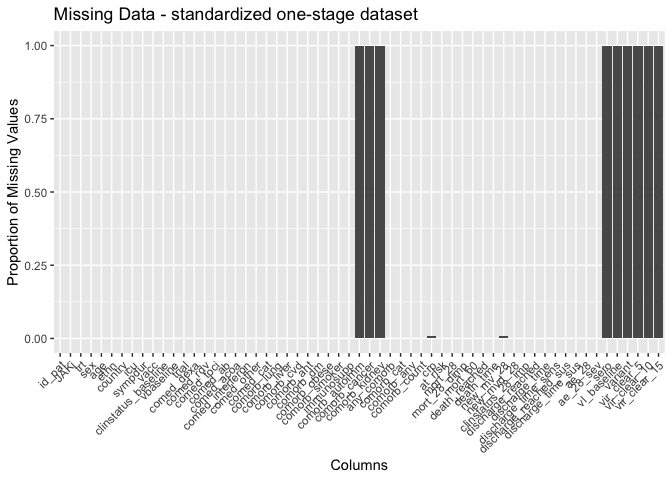

# Load packages

```r
library(tidyverse)
library(readxl)
library(writexl)
library(tableone)
library(here)
library(kableExtra)

library(jtools) # for summ() and plot_summs
library(sjPlot) # for tab_model
library(ggplot2) # survival/TTE analyses and other graphs
library(ggsurvfit) # survival/TTE analyses
library(survival) # survival/TTE analyses
library(gtsummary) # survival/TTE analyses
library(ggfortify) # autoplot
library(tidycmprsk) # competing risk analysis
library(ordinal) # clinstatus ordinal regression
library(mosaic) # OR for 0.5-corrected 2x2 table in case of rare events
library(logistf) # Firth regression in case of rare events
```

# Load Data


# Baseline Characteristics

```r
df$trial <- c("TOFACOV")
df <- df %>%
  rename(id_pat = ID)
df <- df %>% # no missing in sex
  mutate(sex = case_when(sex == 1 ~ "female",
                         sex == 2 ~ "male"))

df %>% 
  drop_na(age) %>% 
  ggplot(aes(x = age)) +
  geom_density(fill = "blue", color = "black") +
  labs(title = "Density Plot of Age",
       x = "Age",
       y = "Density")
```

<!-- -->

```r
# no missing in sex and age and ethnicity, no duplicates in ID, trt according to publication, add country
df$country <- c("Italy")
df$icu <- 0 # no icu patients at enrolment

# Days with symptoms prior to randomization
df %>% # no missings
  drop_na(sympdur) %>% 
  ggplot(aes(x = sympdur)) +
  geom_density(fill = "blue", color = "black") +
  labs(title = "Density Plot of Symptom Duration",
       x = "Symptom Duration",
       y = "Density")
```

<!-- -->

```r
# Severity of COVID-19 with respect to respiratory support at randomisation // tofacov only recruited mild (2) and moderate (3) covid-19, noone with any kind of ventilation (4 above)
df$clinstatus_baseline <- factor(df$clinstatus_baseline, levels = 1:6) ## no missing data
addmargins(table(df$clinstatus_baseline, df$trt, useNA = "always"))
```

```
##       
##          0   1 <NA> Sum
##   1      0   0    0   0
##   2     16   9    0  25
##   3     42  49    0  91
##   4      0   0    0   0
##   5      0   0    0   0
##   6      0   0    0   0
##   <NA>   0   0    0   0
##   Sum   58  58    0 116
```

```r
# Co-medication at baseline
df$comed_toci <- 0 # see publication: "It is noteworthy that no patients have received tocilizumab. Concomitant use of tofacitinib and tocilizumab was prohibited by protocol"
df$comed_interferon <- 0 # no interferon used

## group them for the subgroup analysis, according to protocol
df <- df %>% 
  mutate(comed_cat = case_when(comed_dexa == 0 & comed_toci == 0 ~ 1, # patients without Dexamethasone nor Tocilizumab
                               comed_dexa == 1 & comed_toci == 1 ~ 2, # patients with Dexamethasone and Tocilizumab
                               comed_dexa == 1 & comed_toci == 0 ~ 3, # patients with Dexamethasone but no Tocilizumab
                               comed_dexa == 0 & comed_toci == 1 ~ 4)) # patients with Tocilizumab but no Dexamethasone (if exist)

# Comorbidity at baseline, including immunocompromised // no immunosupp in tofacov and few comorbidities
df$comorb_cancer <- NA
df$comorb_autoimm <- NA
df$comorb_kidney <- NA
df <- df %>% # 18 missing - as in publication
  mutate(any_comorb = case_when(comorb_lung == 1 | comorb_liver == 1 | comorb_cvd == 1 |
                                  comorb_aht == 1 | comorb_dm == 1 | comorb_obese == 1 | comorb_smoker == 1
                                | immunosupp == 1 | comorb_cancer == 1 | comorb_autoimm == 1 | comorb_kidney == 1 
                                  ~ 1,
                                comorb_lung == 0 & comorb_liver == 0 & comorb_cvd == 0 &
                                  comorb_aht == 0 & comorb_dm == 0 & comorb_obese == 0 & comorb_smoker == 0
                                & immunosupp == 0 & comorb_cancer == 0 & comorb_autoimm == 0 & comorb_kidney == 0
                                ~ 0))
# the remaining missing have no evidence for comorbidity -> recode as 0
df <- df %>% 
  mutate(any_comorb = case_when(is.na(any_comorb) ~ 0,
                                TRUE ~ any_comorb))
## group them for the subgroup analysis, according to protocol // count all pre-defined comorbidities per patient first
comorb <- df %>% 
  select(id_pat, comorb_lung, comorb_liver, comorb_cvd, comorb_aht, comorb_dm, comorb_obese, comorb_smoker, immunosupp, comorb_kidney, comorb_autoimm, comorb_cancer)
comorb$comorb_count <- NA
for (i in 1:dim(comorb)[[1]]) {
  comorb$comorb_count[i] <- ifelse(
    sum(comorb[i, ] %in% c(1)) > 0,
    sum(comorb[i, ] %in% c(1)),
    NA
  )
}
comorb <- comorb %>% 
  mutate(comorb_count = case_when(comorb_lung == 0 & comorb_liver == 0 & comorb_cvd == 0 &
                                  comorb_aht == 0 & comorb_dm == 0 & comorb_obese == 0 & comorb_smoker == 0
                                & immunosupp == 0 & comorb_cancer == 0 & comorb_autoimm == 0 & comorb_kidney == 0 ~ 0,
                                TRUE ~ comorb_count))
# the remaining missing have no evidence for comorbidity -> recode as 0
comorb <- comorb %>% 
  mutate(comorb_count = case_when(is.na(comorb_count) ~ 0,
                                TRUE ~ comorb_count))
df <- left_join(df, comorb[, c("comorb_count", "id_pat")], by = join_by(id_pat == id_pat)) ## merge imputed variable back
df <- df %>% # no missing
  mutate(comorb_cat = case_when(immunosupp == 1 ~ 4, # immunocompromised
                                comorb_count == 0 ~ 1, # no comorbidity
                                comorb_count == 1 ~ 2, # one comorbidity
                                comorb_count >1 & (immunosupp == 0 | is.na(immunosupp)) ~ 3)) # multiple comorbidities

# CRP
df$crp <- as.numeric(df$`crp mg/L`) ## 1 missing
df %>% 
  drop_na(crp) %>% 
  ggplot(aes(x = crp)) +
  geom_density(fill = "blue", color = "black") +
  labs(title = "Density Plot of CRP",
       x = "CRP",
       y = "Density")
```

<!-- -->

```r
# Vaccination
# table(df$vacc, useNA = "always") # no missing

# Viremia
# Variant
# Serology
```
Discussion points


# Endpoints

```r
# time to event data
df$death_d <- as.numeric(df$death_date - df$randdate) 
df$discharge_d <- as.numeric(df$discharge_date - df$randdate)

# (i) Primary outcome: Mortality at day 28
df <- df %>% # corresponds to publication: only 1 death (in tofa arm)
  mutate(mort_28 = case_when(death_d <29 ~ 1, 
                             TRUE ~ 0)) 

# (ii) Mortality at day 60
df$mort_60 <- df$mort_28 # max fup time in TOFACOV was 28 days; thus mort_60 imputed from mort_28


# (iii) Time to death within max. follow-up time
df$death_reached <- df$mort_28
df <- df %>% # no missing and those that were discharged and afterwards have correct time to event data
  mutate(death_time = case_when(death_d >=0 ~ c(death_d), # time to death, if no time to death, then...
                                TRUE ~ 28)) # time to death censoring data (there were no withdrawals/LTFU)


# (iv) New mechanical ventilation among survivors within 28 days. TOFACOV only included clinstatus 2 and 3.
df <- df %>% # the 1 that died is NA => correct
  mutate(new_mv_28 = case_when(mort_28 == 0 & (clinstatus_2 == 5 | clinstatus_7 == 5 | clinstatus_14 == 5) ~ 1,
                               mort_28 == 0 ~ 0))

# (iv) Alternative definition/analysis: New mechanical ventilation OR death within 28 days => include all in denominator. 
df <- df %>% # no missing anymore => correct
  mutate(new_mvd_28 = case_when(new_mv_28 == 1 | mort_28 == 1 ~ 1,
                                new_mv_28 == 0 | mort_28 == 0 ~ 0))


# (v) Clinical status at day 28
df <- df %>% # They called and followed all patients at day 28 and recorded no new serious adverse events, re-admissions or deaths besides the one that died on day 26
  mutate(clinstatus_28 = case_when(mort_28 == 1 ~ 6,
                                   discharge_d <29 ~ 1, # discharged alive / reached discharge criteria within 28d
                                   clinstatus_14 == 3 ~ 3, # these ones are still hosp at day 28
                                   clinstatus_14 == 4 ~ 4,
                                   clinstatus_14 == 5 ~ 5)) 
df$clinstatus_28 <- factor(df$clinstatus_28, levels = 1:6) # no missing
df$clinstatus_28_imp <- df$clinstatus_28 # equal to clinstatus_28_imp

# (vi) Time to discharge or reaching discharge criteria up to day 28
df <- df %>%
  mutate(discharge_reached = case_when(discharge_d <29 ~ 1,
                                       TRUE ~ 0))
df <- df %>% 
  mutate(discharge_time = case_when(discharge_d >=0 ~ c(discharge_d), # time to discharge, if no time to discharge, then...
                                    death_d >=0 ~ death_d)) # time to discharge censoring time
df <- df %>% # restrict to max fup time 28d
  mutate(discharge_time = case_when(discharge_time >28 ~ 28,
                                    TRUE ~ discharge_time))
df <- df %>% # add 28d for those that died
  mutate(discharge_time_sens = case_when(mort_28 == 1 ~ 28,
                                    TRUE ~ discharge_time))

# (vi) Sens-analysis: Alternative definition/analysis of outcome: time to sustained discharge within 28 days. There were no re-admissions within 28d
df$discharge_reached_sus <- df$discharge_reached
df$discharge_time_sus <- df$discharge_time


# (vii) Viral clearance up to day 5, day 10, and day 15 (Viral load value <LOQ and/or undectectable): Not available in TOFACOV
# (viii) Quality of life at day 28: Not available in TOFAVOC


# (ix) Participants with an adverse event grade 3 or 4, or a serious adverse event, excluding death, by day 28
# table(df$ae_28, df$trt, useNA = "always")
# table(df$ae_28, df$mort_28, useNA = "always") # corresponds to publication and excludes the death

# (ix) Sens-analysis: Alternative definition/analysis of outcome: incidence rate ratio (Poisson regression) -> AE per person by d28
df$ae_28_sev <- df$ae_28 # there were only 1 AE grade 3/4 per person 

# (ix) Sens-analysis: Alternative definition/analysis of outcome: time to first (of these) adverse event, within 28 days, considering death as a competing risk (=> censor and set to 28 days)
# time to first ae not available

# (x) Adverse events of special interest within 28 days: a) thromboembolic events (venous thromboembolism, pulmonary embolism, arterial thrombosis), b) secondary infections (bacterial pneumonia including ventilator-associated pneumonia, meningitis and encephalitis, endocarditis and bacteremia, invasive fungal infection including pulmonary aspergillosis), c) Reactivation of chronic infection including tuberculosis, herpes simplex, cytomegalovirus, herpes zoster and hepatitis B, d) serious cardiovascular and cardiac events (including stroke and myocardial infarction), e) events related to signs of bone marrow suppression (anemia, lymphocytopenia, thrombocytopenia, pancytopenia), f) malignancy, g) gastrointestinal perforation (incl. gastrointestinal bleeding/diverticulitis), h) liver dysfunction/hepatotoxicity (grade 3 and 4)
df <- df %>% 
  mutate(aesi_28 = case_when(ae_28_spec == "Pulmonary embolism" ~ "thromboembolic events",
                             ae_28_spec == "ALT increase" ~ "liver dysfunction/hepatotoxicity (grade 3 and 4)")) # these were >5 ULN

# (xi) Adverse events, any grade and serious adverse event, excluding death, within 28 days, grouped by organ classes
df <- df %>% 
  mutate(ae_28_list = case_when(ae_28_spec == "Pulmonary embolism" ~ "thromboembolic events",
                             ae_28_spec == "ALT increase" ~ "liver dysfunction/hepatotoxicity (grade 3 and 4)",
                             ae_28_spec == "Pneumomediastinum" ~ "pneumomediastinum"))
df_ae <- df %>% 
  select(id_pat, trt, ae_28_spec, ae_28_list, aesi_28)
# Save
save(df_ae, file = "df_ae_tofacitinib.RData")
```
Discussion points
1) Get time to first adverse event?
2) Outcome definition "new_mv_28" differs to original trial publication (included new non-invasive ventilations, i.e. clinstatus == 4)


# Multiple imputation using chained equation

Discussion points
1)


# Define final dataset, set references, summarize missing data and variables

```r
# keep the overall set
df_all <- df
# reduce the df set to our standardized set across all trials
df <- df %>% 
  select(id_pat, trt, sex, age, ethn, country, icu, sympdur, vacc, clinstatus_baseline, trial,
         comed_dexa, comed_rdv, comed_toci, comed_ab, comed_acoa, comed_interferon, comed_other,
         comed_cat,
         comorb_lung, comorb_liver, comorb_cvd, comorb_aht, comorb_dm, comorb_obese, comorb_smoker, immunosupp,
         comorb_autoimm, comorb_cancer, comorb_kidney,
         any_comorb, comorb_cat, comorb_count,
         crp, 
         # sero, vl_baseline, variant,
         mort_28, mort_60, death_reached, death_time,
         new_mv_28, new_mvd_28,
         clinstatus_28_imp,
         discharge_reached, discharge_time, discharge_time_sens, discharge_reached_sus, discharge_time_sus,
         ae_28, ae_28_sev
         # vir_clear_5, vir_clear_10, vir_clear_15
         )
# export for one-stage model, i.e., add missing variables 
df_os <- df
df_os$sero <- NA
df_os$vl_baseline <- NA
df_os$variant <- NA
df_os$vir_clear_5 <- NA
df_os$vir_clear_10 <- NA
df_os$vir_clear_15 <- NA
# Save
save(df_os, file = "df_os_tofacov.RData")

## set references, re-level
# df <- df %>% 
#   mutate(Treatment = relevel(Treatment, "no JAK inhibitor"))

# Create a bar plot to visualize missing values in each column
original_order <- colnames(df_os)
missing_plot <- df_os %>%
  summarise_all(~ mean(is.na(.))) %>%
  gather() %>%
  mutate(key = factor(key, levels = original_order)) %>%
  ggplot(aes(x = key, y = value)) +
  geom_bar(stat = "identity") +
  labs(x = "Columns", y = "Proportion of Missing Values", title = "Missing Data Visualization") +
  theme(axis.text.x = element_text(angle = 45, hjust = 1)) +
  ylim(0, 1)
print(missing_plot)
```

<!-- -->
Discussion points
1) Missing variables:
  Baseline:
  - variant
  - sero
  - vl_baseline
  - clarify comorbidity categories (autoimmun, CKD, cancer)
  Outcomes:
  - vir_clear_5, vir_clear_10, vir_clear_15
2) Missing data:
- 1 NA in crp 
- NAs in new_mv_28, aesi_28, ae_28_list: Not part of denominator


# (i) Primary outcome: Mortality at day 28

```r
# adjusted for baseline patient characteristics (age, respiratory support at baseline (ordinal scale 1-3 vs 4-5), dexamethasone use at baseline (y/n), remdesivir use at baseline (y/n), anti-IL-6 use at baseline (y/n)).
table(df$mort_28, df$trt, useNA = "always")
```

```
##       
##         0  1 <NA>
##   0    58 57    0
##   1     0  1    0
##   <NA>  0  0    0
```

```r
mort.28 <- df %>% 
  glm(mort_28 ~ trt 
      + age + clinstatus_baseline + comed_dexa + comed_rdv + comed_toci
      , family = "binomial", data=.)
```

```
## Warning: glm.fit: fitted probabilities numerically 0 or 1 occurred
```

```r
summ(mort.28, exp = T, confint = T, model.info = T, model.fit = F, digits = 2)
```

<table class="table table-striped table-hover table-condensed table-responsive" style="width: auto !important; margin-left: auto; margin-right: auto;">
<tbody>
  <tr>
   <td style="text-align:left;font-weight: bold;"> Observations </td>
   <td style="text-align:right;"> 116 </td>
  </tr>
  <tr>
   <td style="text-align:left;font-weight: bold;"> Dependent variable </td>
   <td style="text-align:right;"> mort_28 </td>
  </tr>
  <tr>
   <td style="text-align:left;font-weight: bold;"> Type </td>
   <td style="text-align:right;"> Generalized linear model </td>
  </tr>
  <tr>
   <td style="text-align:left;font-weight: bold;"> Family </td>
   <td style="text-align:right;"> binomial </td>
  </tr>
  <tr>
   <td style="text-align:left;font-weight: bold;"> Link </td>
   <td style="text-align:right;"> logit </td>
  </tr>
</tbody>
</table>  <table class="table table-striped table-hover table-condensed table-responsive" style="width: auto !important; margin-left: auto; margin-right: auto;border-bottom: 0;">
 <thead>
  <tr>
   <th style="text-align:left;">   </th>
   <th style="text-align:right;"> exp(Est.) </th>
   <th style="text-align:right;"> 2.5% </th>
   <th style="text-align:right;"> 97.5% </th>
   <th style="text-align:right;"> z val. </th>
   <th style="text-align:right;"> p </th>
  </tr>
 </thead>
<tbody>
  <tr>
   <td style="text-align:left;font-weight: bold;"> (Intercept) </td>
   <td style="text-align:right;"> 0.00 </td>
   <td style="text-align:right;"> 0.00 </td>
   <td style="text-align:right;"> Inf </td>
   <td style="text-align:right;"> -0.00 </td>
   <td style="text-align:right;"> 1.00 </td>
  </tr>
  <tr>
   <td style="text-align:left;font-weight: bold;"> trt </td>
   <td style="text-align:right;"> 60748713.19 </td>
   <td style="text-align:right;"> 0.00 </td>
   <td style="text-align:right;"> Inf </td>
   <td style="text-align:right;"> 0.00 </td>
   <td style="text-align:right;"> 1.00 </td>
  </tr>
  <tr>
   <td style="text-align:left;font-weight: bold;"> age </td>
   <td style="text-align:right;"> 1.06 </td>
   <td style="text-align:right;"> 0.87 </td>
   <td style="text-align:right;"> 1.29 </td>
   <td style="text-align:right;"> 0.54 </td>
   <td style="text-align:right;"> 0.59 </td>
  </tr>
  <tr>
   <td style="text-align:left;font-weight: bold;"> clinstatus_baseline3 </td>
   <td style="text-align:right;"> 15824440.38 </td>
   <td style="text-align:right;"> 0.00 </td>
   <td style="text-align:right;"> Inf </td>
   <td style="text-align:right;"> 0.00 </td>
   <td style="text-align:right;"> 1.00 </td>
  </tr>
  <tr>
   <td style="text-align:left;font-weight: bold;"> comed_dexa </td>
   <td style="text-align:right;"> 20474205.42 </td>
   <td style="text-align:right;"> 0.00 </td>
   <td style="text-align:right;"> Inf </td>
   <td style="text-align:right;"> 0.00 </td>
   <td style="text-align:right;"> 1.00 </td>
  </tr>
  <tr>
   <td style="text-align:left;font-weight: bold;"> comed_rdv </td>
   <td style="text-align:right;"> 26683312.39 </td>
   <td style="text-align:right;"> 0.00 </td>
   <td style="text-align:right;"> Inf </td>
   <td style="text-align:right;"> 0.00 </td>
   <td style="text-align:right;"> 1.00 </td>
  </tr>
  <tr>
   <td style="text-align:left;font-weight: bold;"> comed_toci </td>
   <td style="text-align:right;"> NA </td>
   <td style="text-align:right;"> NA </td>
   <td style="text-align:right;"> NA </td>
   <td style="text-align:right;"> NA </td>
   <td style="text-align:right;"> NA </td>
  </tr>
</tbody>
<tfoot><tr><td style="padding: 0; " colspan="100%">
<sup></sup> Standard errors: MLE</td></tr></tfoot>
</table>

```r
# Create a 2x2 contingency table
# The oddsRatio function from the mosaic package calculates the odds ratio for a 2 x 2 contingency table and a confidence interval for the each estimate. x should be a matrix, data frame or table. "Successes" should be located in column 1 of x, and the treatment of interest should be located in row 2. The odds ratio is calculated as (Odds row 2) / (Odds row 1). The confidence interval is calculated from the log(OR) and back-transformed.
tbl <- tibble(
  Event = c(0.5, 1.5), # add the 0.5 correction
  NoEvent = c(58.5, 57.5) # add the 0.5 correction
)
oddsRatio(tbl, conf.level = 0.95, digits = 3, verbose = TRUE)
```

```
## 
## Odds Ratio
## 
## Proportions
## 	   Prop. 1:	 0.008475 
## 	   Prop. 2:	 0.02542 
## 	 Rel. Risk:	 3 
## 
## Odds
## 	    Odds 1:	 0.008547 
## 	    Odds 2:	 0.02609 
## 	Odds Ratio:	 3.052 
## 
## 95 percent confidence interval:
## 	 0.1247 < RR < 72.15 
## 	 0.1218 < OR < 76.48 
## NULL
```

```
## [1] 3.052174
```

```r
mort.28.corr <- oddsRatio(tbl, conf.level = 0.95, digits = 3, verbose = TRUE)
```

```
## 
## Odds Ratio
## 
## Proportions
## 	   Prop. 1:	 0.008475 
## 	   Prop. 2:	 0.02542 
## 	 Rel. Risk:	 3 
## 
## Odds
## 	    Odds 1:	 0.008547 
## 	    Odds 2:	 0.02609 
## 	Odds Ratio:	 3.052 
## 
## 95 percent confidence interval:
## 	 0.1247 < RR < 72.15 
## 	 0.1218 < OR < 76.48 
## NULL
```

```r
# Firth regression
mort.28.firth <- df %>% 
  logistf(mort_28 ~ trt 
      + age 
      + clinstatus_baseline 
      #+ comed_dexa + comed_rdv + comed_toci
      , data=.)
# Summary and extract coefficients
coefficients_table <- summary(mort.28.firth)$coefficients
```

```
## logistf(formula = mort_28 ~ trt + age + clinstatus_baseline, 
##     data = .)
## 
## Model fitted by Penalized ML
## Coefficients:
##                             coef   se(coef)  lower 0.95 upper 0.95     Chisq
## (Intercept)          -5.97943297 3.40806831 -18.5108789   1.862989 2.0515218
## trt                   0.93081380 1.31481383  -2.0623642   5.940524 0.3529721
## age                   0.03681375 0.05439356  -0.1169191   0.222023 0.2168682
## clinstatus_baseline3 -0.63524967 1.42652908  -4.0880030   4.467239 0.1163283
##                              p method
## (Intercept)          0.1520541      2
## trt                  0.5524355      2
## age                  0.6414366      2
## clinstatus_baseline3 0.7330513      2
## 
## Method: 1-Wald, 2-Profile penalized log-likelihood, 3-None
## 
## Likelihood ratio test=0.6253987 on 3 df, p=0.8905941, n=116
## Wald test = 36.19611 on 3 df, p = 6.806486e-08
```

```r
trt_coef <- coef(mort.28.firth)["trt"]
hazard_odds_ratio <- exp(trt_coef)
ci <- c(exp(mort.28.firth$ci.lower["trt"]), exp(mort.28.firth$ci.upper["trt"]))
# Create a data frame to store Odds Ratios and CIs
mort.28.firth_tbl <- data.frame(
  # "Variable" = rownames(coefficients_table),
  "Odds Ratio" = hazard_odds_ratio,
  "CI Lower" = ci[1],
  "CI Upper" = ci[2])
# Nicely formatted table
kable(mort.28.firth_tbl, format = "markdown", table.attr = 'class="table"') %>%
  kable_styling(bootstrap_options = "striped", full_width = FALSE)
```

```
## Warning in kable_styling(., bootstrap_options = "striped", full_width = FALSE):
## Please specify format in kable. kableExtra can customize either HTML or LaTeX
## outputs. See https://haozhu233.github.io/kableExtra/ for details.
```


|    | Odds.Ratio| CI.Lower| CI.Upper|
|:---|----------:|--------:|--------:|
|trt |   2.536573| 0.127153| 380.1341|
Discussion points
1) Respiratory support at baseline (ordinal scale 1-3 vs 4-5 OR leave it as it is)?
2) Rare event correction
-- Add 0.5 correction to crosstab, calculate ORs and then inverse variance pooling in second stage?
-- 2x2 directly into Mantel-Haenszel across several trials (https://www.ncbi.nlm.nih.gov/pmc/articles/PMC5297998/)?
-- Firth regression according to R.Riley IPDMA Handbook (page 99): "Traditionally 0.5 is the value added, but Sweeting et al. suggest that a ‘treatment arm’ continuity correction is more appropriate, which adds 1/(sample size of the opposite treatment group) to the number of event and non-events. In the IPD context, a similar approach is to add two extra participants to each group in a trial if it has zero events in either of the groups; one of the added participants has the event and the other does not have the event in each group. Then, a weighted regression analysis can be performed to analyse the extended IPD, with all participants weighted equally except the four added participants, who are given a weight according to Sweeting correction (i.e. 1/(sample size of the opposite treat- ment group)). However, this approach becomes problematic when adjusting for prognostic factors or extending to non-binary variables. For this reason, a more general approach is to adopt Firth regression, which is a penalisation method that reduces small sample bias for non-linear models such as logistic regression, and resolves problems related to separation. Alternatively, researchers may revert to a one-stage IPD meta-analysis approach and placing random effects on parameters (rather than stratifying parameters by trial) so that estimation of trial-specific terms are avoided."


# (ii) Mortality at day 60

```r
table(df$mort_60, df$trt, useNA = "always")
```

```
##       
##         0  1 <NA>
##   0    58 57    0
##   1     0  1    0
##   <NA>  0  0    0
```

```r
mort.60 <- df %>% 
  glm(mort_60 ~ trt 
      + age + clinstatus_baseline + comed_dexa + comed_rdv + comed_toci
      , family = "binomial", data=.)
```

```
## Warning: glm.fit: fitted probabilities numerically 0 or 1 occurred
```

```r
summ(mort.60, exp = T, confint = T, model.info = T, model.fit = F, digits = 2)
```

<table class="table table-striped table-hover table-condensed table-responsive" style="width: auto !important; margin-left: auto; margin-right: auto;">
<tbody>
  <tr>
   <td style="text-align:left;font-weight: bold;"> Observations </td>
   <td style="text-align:right;"> 116 </td>
  </tr>
  <tr>
   <td style="text-align:left;font-weight: bold;"> Dependent variable </td>
   <td style="text-align:right;"> mort_60 </td>
  </tr>
  <tr>
   <td style="text-align:left;font-weight: bold;"> Type </td>
   <td style="text-align:right;"> Generalized linear model </td>
  </tr>
  <tr>
   <td style="text-align:left;font-weight: bold;"> Family </td>
   <td style="text-align:right;"> binomial </td>
  </tr>
  <tr>
   <td style="text-align:left;font-weight: bold;"> Link </td>
   <td style="text-align:right;"> logit </td>
  </tr>
</tbody>
</table>  <table class="table table-striped table-hover table-condensed table-responsive" style="width: auto !important; margin-left: auto; margin-right: auto;border-bottom: 0;">
 <thead>
  <tr>
   <th style="text-align:left;">   </th>
   <th style="text-align:right;"> exp(Est.) </th>
   <th style="text-align:right;"> 2.5% </th>
   <th style="text-align:right;"> 97.5% </th>
   <th style="text-align:right;"> z val. </th>
   <th style="text-align:right;"> p </th>
  </tr>
 </thead>
<tbody>
  <tr>
   <td style="text-align:left;font-weight: bold;"> (Intercept) </td>
   <td style="text-align:right;"> 0.00 </td>
   <td style="text-align:right;"> 0.00 </td>
   <td style="text-align:right;"> Inf </td>
   <td style="text-align:right;"> -0.00 </td>
   <td style="text-align:right;"> 1.00 </td>
  </tr>
  <tr>
   <td style="text-align:left;font-weight: bold;"> trt </td>
   <td style="text-align:right;"> 60748713.19 </td>
   <td style="text-align:right;"> 0.00 </td>
   <td style="text-align:right;"> Inf </td>
   <td style="text-align:right;"> 0.00 </td>
   <td style="text-align:right;"> 1.00 </td>
  </tr>
  <tr>
   <td style="text-align:left;font-weight: bold;"> age </td>
   <td style="text-align:right;"> 1.06 </td>
   <td style="text-align:right;"> 0.87 </td>
   <td style="text-align:right;"> 1.29 </td>
   <td style="text-align:right;"> 0.54 </td>
   <td style="text-align:right;"> 0.59 </td>
  </tr>
  <tr>
   <td style="text-align:left;font-weight: bold;"> clinstatus_baseline3 </td>
   <td style="text-align:right;"> 15824440.38 </td>
   <td style="text-align:right;"> 0.00 </td>
   <td style="text-align:right;"> Inf </td>
   <td style="text-align:right;"> 0.00 </td>
   <td style="text-align:right;"> 1.00 </td>
  </tr>
  <tr>
   <td style="text-align:left;font-weight: bold;"> comed_dexa </td>
   <td style="text-align:right;"> 20474205.42 </td>
   <td style="text-align:right;"> 0.00 </td>
   <td style="text-align:right;"> Inf </td>
   <td style="text-align:right;"> 0.00 </td>
   <td style="text-align:right;"> 1.00 </td>
  </tr>
  <tr>
   <td style="text-align:left;font-weight: bold;"> comed_rdv </td>
   <td style="text-align:right;"> 26683312.39 </td>
   <td style="text-align:right;"> 0.00 </td>
   <td style="text-align:right;"> Inf </td>
   <td style="text-align:right;"> 0.00 </td>
   <td style="text-align:right;"> 1.00 </td>
  </tr>
  <tr>
   <td style="text-align:left;font-weight: bold;"> comed_toci </td>
   <td style="text-align:right;"> NA </td>
   <td style="text-align:right;"> NA </td>
   <td style="text-align:right;"> NA </td>
   <td style="text-align:right;"> NA </td>
   <td style="text-align:right;"> NA </td>
  </tr>
</tbody>
<tfoot><tr><td style="padding: 0; " colspan="100%">
<sup></sup> Standard errors: MLE</td></tr></tfoot>
</table>

```r
# Create a 2x2 contingency table
# The oddsRatio function from the mosaic package calculates the odds ratio for a 2 x 2 contingency table and a confidence interval for the each estimate. x should be a matrix, data frame or table. "Successes" should be located in column 1 of x, and the treatment of interest should be located in row 2. The odds ratio is calculated as (Odds row 2) / (Odds row 1). The confidence interval is calculated from the log(OR) and back-transformed.
tbl <- tibble(
  Event = c(0.5, 1.5), # add the 0.5 correction
  NoEvent = c(58.5, 57.5) # add the 0.5 correction
)
oddsRatio(tbl, conf.level = 0.95, digits = 3, verbose = TRUE)
```

```
## 
## Odds Ratio
## 
## Proportions
## 	   Prop. 1:	 0.008475 
## 	   Prop. 2:	 0.02542 
## 	 Rel. Risk:	 3 
## 
## Odds
## 	    Odds 1:	 0.008547 
## 	    Odds 2:	 0.02609 
## 	Odds Ratio:	 3.052 
## 
## 95 percent confidence interval:
## 	 0.1247 < RR < 72.15 
## 	 0.1218 < OR < 76.48 
## NULL
```

```
## [1] 3.052174
```

```r
mort.60.corr <- oddsRatio(tbl, conf.level = 0.95, digits = 3, verbose = TRUE)
```

```
## 
## Odds Ratio
## 
## Proportions
## 	   Prop. 1:	 0.008475 
## 	   Prop. 2:	 0.02542 
## 	 Rel. Risk:	 3 
## 
## Odds
## 	    Odds 1:	 0.008547 
## 	    Odds 2:	 0.02609 
## 	Odds Ratio:	 3.052 
## 
## 95 percent confidence interval:
## 	 0.1247 < RR < 72.15 
## 	 0.1218 < OR < 76.48 
## NULL
```

```r
# Firth regression
mort.60.firth <- df %>% 
  logistf(mort_60 ~ trt 
      + age 
      + clinstatus_baseline 
      #+ comed_dexa + comed_rdv + comed_toci
      , data=.)
summary(mort.60.firth)
```

```
## logistf(formula = mort_60 ~ trt + age + clinstatus_baseline, 
##     data = .)
## 
## Model fitted by Penalized ML
## Coefficients:
##                             coef   se(coef)  lower 0.95 upper 0.95     Chisq
## (Intercept)          -5.97943297 3.40806831 -18.5108789   1.862989 2.0515218
## trt                   0.93081380 1.31481383  -2.0623642   5.940524 0.3529721
## age                   0.03681375 0.05439356  -0.1169191   0.222023 0.2168682
## clinstatus_baseline3 -0.63524967 1.42652908  -4.0880030   4.467239 0.1163283
##                              p method
## (Intercept)          0.1520541      2
## trt                  0.5524355      2
## age                  0.6414366      2
## clinstatus_baseline3 0.7330513      2
## 
## Method: 1-Wald, 2-Profile penalized log-likelihood, 3-None
## 
## Likelihood ratio test=0.6253987 on 3 df, p=0.8905941, n=116
## Wald test = 36.19611 on 3 df, p = 6.806486e-08
```
Discussion points
1) 


# (iii) Time to death within max. follow-up time

```r
# KM curve
survfit2(Surv(death_time, death_reached) ~ trt, data=df) %>% 
  ggsurvfit() +
  labs(
    x = "Days",
    y = "Overall survival probability"
  ) + 
  add_confidence_interval() +
  add_risktable()
```

<!-- -->

```r
# # testing: cox ph
# ttdeath <- df %>% 
#   coxph(Surv(death_time, death_reached) ~ trt 
#         + age + clinstatus_baseline + comed_dexa + comed_rdv + comed_toci
#         , data =.)
# ttdeath_reg_tbl <- tbl_regression(ttdeath, exp = TRUE)
# # Nicely formatted table
# kable(ttdeath_reg_tbl, format = "markdown", table.attr = 'class="table"') %>%
#   kable_styling(bootstrap_options = "striped", full_width = FALSE)
```
Discussion points
1) Result illogical. Time to event analysis not possible? R.Riley IPDMA handbook, page 102: "As for binary outcomes, when there are few events in some trials adaptions of Firth’s correction are important to reduce small sample bias in the estimated treatment effect." -> implement


# (iv) New mechanical ventilation among survivors within 28 days

```r
table(df$new_mv_28, df$trt, useNA = "always")
```

```
##       
##         0  1 <NA>
##   0    56 57    0
##   1     2  0    0
##   <NA>  0  1    0
```

```r
new.mv.28 <- df %>% 
  glm(new_mv_28 ~ trt 
       + age + clinstatus_baseline 
       + comed_dexa + comed_rdv + comed_toci
      , family = "binomial", data=.)
```

```
## Warning: glm.fit: fitted probabilities numerically 0 or 1 occurred
```

```r
summ(new.mv.28, exp = T, confint = T, model.info = T, model.fit = F, digits = 2)
```

<table class="table table-striped table-hover table-condensed table-responsive" style="width: auto !important; margin-left: auto; margin-right: auto;">
<tbody>
  <tr>
   <td style="text-align:left;font-weight: bold;"> Observations </td>
   <td style="text-align:right;"> 115 (1 missing obs. deleted) </td>
  </tr>
  <tr>
   <td style="text-align:left;font-weight: bold;"> Dependent variable </td>
   <td style="text-align:right;"> new_mv_28 </td>
  </tr>
  <tr>
   <td style="text-align:left;font-weight: bold;"> Type </td>
   <td style="text-align:right;"> Generalized linear model </td>
  </tr>
  <tr>
   <td style="text-align:left;font-weight: bold;"> Family </td>
   <td style="text-align:right;"> binomial </td>
  </tr>
  <tr>
   <td style="text-align:left;font-weight: bold;"> Link </td>
   <td style="text-align:right;"> logit </td>
  </tr>
</tbody>
</table>  <table class="table table-striped table-hover table-condensed table-responsive" style="width: auto !important; margin-left: auto; margin-right: auto;border-bottom: 0;">
 <thead>
  <tr>
   <th style="text-align:left;">   </th>
   <th style="text-align:right;"> exp(Est.) </th>
   <th style="text-align:right;"> 2.5% </th>
   <th style="text-align:right;"> 97.5% </th>
   <th style="text-align:right;"> z val. </th>
   <th style="text-align:right;"> p </th>
  </tr>
 </thead>
<tbody>
  <tr>
   <td style="text-align:left;font-weight: bold;"> (Intercept) </td>
   <td style="text-align:right;"> 0.00 </td>
   <td style="text-align:right;"> 0.00 </td>
   <td style="text-align:right;"> Inf </td>
   <td style="text-align:right;"> -0.00 </td>
   <td style="text-align:right;"> 1.00 </td>
  </tr>
  <tr>
   <td style="text-align:left;font-weight: bold;"> trt </td>
   <td style="text-align:right;"> 0.00 </td>
   <td style="text-align:right;"> 0.00 </td>
   <td style="text-align:right;"> Inf </td>
   <td style="text-align:right;"> -0.00 </td>
   <td style="text-align:right;"> 1.00 </td>
  </tr>
  <tr>
   <td style="text-align:left;font-weight: bold;"> age </td>
   <td style="text-align:right;"> 1.03 </td>
   <td style="text-align:right;"> 0.91 </td>
   <td style="text-align:right;"> 1.17 </td>
   <td style="text-align:right;"> 0.51 </td>
   <td style="text-align:right;"> 0.61 </td>
  </tr>
  <tr>
   <td style="text-align:left;font-weight: bold;"> clinstatus_baseline3 </td>
   <td style="text-align:right;"> 0.32 </td>
   <td style="text-align:right;"> 0.02 </td>
   <td style="text-align:right;"> 5.62 </td>
   <td style="text-align:right;"> -0.78 </td>
   <td style="text-align:right;"> 0.44 </td>
  </tr>
  <tr>
   <td style="text-align:left;font-weight: bold;"> comed_dexa </td>
   <td style="text-align:right;"> 12138754.52 </td>
   <td style="text-align:right;"> 0.00 </td>
   <td style="text-align:right;"> Inf </td>
   <td style="text-align:right;"> 0.00 </td>
   <td style="text-align:right;"> 1.00 </td>
  </tr>
  <tr>
   <td style="text-align:left;font-weight: bold;"> comed_rdv </td>
   <td style="text-align:right;"> 67625684.12 </td>
   <td style="text-align:right;"> 0.00 </td>
   <td style="text-align:right;"> Inf </td>
   <td style="text-align:right;"> 0.00 </td>
   <td style="text-align:right;"> 1.00 </td>
  </tr>
  <tr>
   <td style="text-align:left;font-weight: bold;"> comed_toci </td>
   <td style="text-align:right;"> NA </td>
   <td style="text-align:right;"> NA </td>
   <td style="text-align:right;"> NA </td>
   <td style="text-align:right;"> NA </td>
   <td style="text-align:right;"> NA </td>
  </tr>
</tbody>
<tfoot><tr><td style="padding: 0; " colspan="100%">
<sup></sup> Standard errors: MLE</td></tr></tfoot>
</table>

```r
# Create a 2x2 contingency table
# The oddsRatio function from the mosaic package calculates the odds ratio for a 2 x 2 contingency table and a confidence interval for the each estimate. x should be a matrix, data frame or table. "Successes" should be located in column 1 of x, and the treatment of interest should be located in row 2. The odds ratio is calculated as (Odds row 2) / (Odds row 1). The confidence interval is calculated from the log(OR) and back-transformed.
tbl <- tibble(
  Event = c(2.5, 0.5), # add the 0.5 correction, intervention second
  NoEvent = c(56.5, 57.5) # add the 0.5 correction, intervention second
)
oddsRatio(tbl, conf.level = 0.95, digits = 3, verbose = TRUE)
```

```
## 
## Odds Ratio
## 
## Proportions
## 	   Prop. 1:	 0.04237 
## 	   Prop. 2:	 0.008621 
## 	 Rel. Risk:	 0.2034 
## 
## Odds
## 	    Odds 1:	 0.04425 
## 	    Odds 2:	 0.008696 
## 	Odds Ratio:	 0.1965 
## 
## 95 percent confidence interval:
## 	 0.009982 < RR < 4.147 
## 	 0.009228 < OR < 4.185 
## NULL
```

```
## [1] 0.1965217
```

```r
new.mv.28.corr <- oddsRatio(tbl, conf.level = 0.95, digits = 3, verbose = TRUE)
```

```
## 
## Odds Ratio
## 
## Proportions
## 	   Prop. 1:	 0.04237 
## 	   Prop. 2:	 0.008621 
## 	 Rel. Risk:	 0.2034 
## 
## Odds
## 	    Odds 1:	 0.04425 
## 	    Odds 2:	 0.008696 
## 	Odds Ratio:	 0.1965 
## 
## 95 percent confidence interval:
## 	 0.009982 < RR < 4.147 
## 	 0.009228 < OR < 4.185 
## NULL
```

```r
# Firth regression
new.mv.28.firth <- df %>% 
  logistf(new_mv_28 ~ trt 
      + age 
      + clinstatus_baseline 
      #+ comed_dexa + comed_rdv + comed_toci
      , data=.)
summary(new.mv.28.firth)
```

```
## logistf(formula = new_mv_28 ~ trt + age + clinstatus_baseline, 
##     data = .)
## 
## Model fitted by Penalized ML
## Coefficients:
##                             coef   se(coef)   lower 0.95 upper 0.95     Chisq
## (Intercept)          -3.70330228 2.68482708 -11.60142923  2.0867439 1.4662024
## trt                  -1.52578589 1.38538287  -6.47294833  1.0568553 1.2231683
## age                   0.02584219 0.04442852  -0.08156533  0.1465753 0.2242723
## clinstatus_baseline3 -1.04967936 1.06322779  -3.62069382  1.5168250 0.7462878
##                              p method
## (Intercept)          0.2259458      2
## trt                  0.2687398      2
## age                  0.6358037      2
## clinstatus_baseline3 0.3876541      2
## 
## Method: 1-Wald, 2-Profile penalized log-likelihood, 3-None
## 
## Likelihood ratio test=2.49746 on 3 df, p=0.4757502, n=115
## Wald test = 36.15491 on 3 df, p = 6.944379e-08
```

```r
# (iv) Alternative definition/analysis: New mechanical ventilation OR death within 28 days => include all in denominator. 
table(df$new_mvd_28, df$trt, useNA = "always")
```

```
##       
##         0  1 <NA>
##   0    56 57    0
##   1     2  1    0
##   <NA>  0  0    0
```

```r
new.mvd.28 <- df %>% 
  glm(new_mvd_28 ~ trt 
      + age + clinstatus_baseline + comed_dexa + comed_rdv + comed_toci
      , family = "binomial", data=.)
```

```
## Warning: glm.fit: fitted probabilities numerically 0 or 1 occurred
```

```r
summ(new.mvd.28, exp = T, confint = T, model.info = T, model.fit = F, digits = 2)
```

<table class="table table-striped table-hover table-condensed table-responsive" style="width: auto !important; margin-left: auto; margin-right: auto;">
<tbody>
  <tr>
   <td style="text-align:left;font-weight: bold;"> Observations </td>
   <td style="text-align:right;"> 116 </td>
  </tr>
  <tr>
   <td style="text-align:left;font-weight: bold;"> Dependent variable </td>
   <td style="text-align:right;"> new_mvd_28 </td>
  </tr>
  <tr>
   <td style="text-align:left;font-weight: bold;"> Type </td>
   <td style="text-align:right;"> Generalized linear model </td>
  </tr>
  <tr>
   <td style="text-align:left;font-weight: bold;"> Family </td>
   <td style="text-align:right;"> binomial </td>
  </tr>
  <tr>
   <td style="text-align:left;font-weight: bold;"> Link </td>
   <td style="text-align:right;"> logit </td>
  </tr>
</tbody>
</table>  <table class="table table-striped table-hover table-condensed table-responsive" style="width: auto !important; margin-left: auto; margin-right: auto;border-bottom: 0;">
 <thead>
  <tr>
   <th style="text-align:left;">   </th>
   <th style="text-align:right;"> exp(Est.) </th>
   <th style="text-align:right;"> 2.5% </th>
   <th style="text-align:right;"> 97.5% </th>
   <th style="text-align:right;"> z val. </th>
   <th style="text-align:right;"> p </th>
  </tr>
 </thead>
<tbody>
  <tr>
   <td style="text-align:left;font-weight: bold;"> (Intercept) </td>
   <td style="text-align:right;"> 0.00 </td>
   <td style="text-align:right;"> 0.00 </td>
   <td style="text-align:right;"> Inf </td>
   <td style="text-align:right;"> -0.01 </td>
   <td style="text-align:right;"> 0.99 </td>
  </tr>
  <tr>
   <td style="text-align:left;font-weight: bold;"> trt </td>
   <td style="text-align:right;"> 0.47 </td>
   <td style="text-align:right;"> 0.04 </td>
   <td style="text-align:right;"> 5.85 </td>
   <td style="text-align:right;"> -0.59 </td>
   <td style="text-align:right;"> 0.56 </td>
  </tr>
  <tr>
   <td style="text-align:left;font-weight: bold;"> age </td>
   <td style="text-align:right;"> 1.04 </td>
   <td style="text-align:right;"> 0.94 </td>
   <td style="text-align:right;"> 1.16 </td>
   <td style="text-align:right;"> 0.80 </td>
   <td style="text-align:right;"> 0.42 </td>
  </tr>
  <tr>
   <td style="text-align:left;font-weight: bold;"> clinstatus_baseline3 </td>
   <td style="text-align:right;"> 0.46 </td>
   <td style="text-align:right;"> 0.04 </td>
   <td style="text-align:right;"> 5.98 </td>
   <td style="text-align:right;"> -0.59 </td>
   <td style="text-align:right;"> 0.55 </td>
  </tr>
  <tr>
   <td style="text-align:left;font-weight: bold;"> comed_dexa </td>
   <td style="text-align:right;"> 4828951.07 </td>
   <td style="text-align:right;"> 0.00 </td>
   <td style="text-align:right;"> Inf </td>
   <td style="text-align:right;"> 0.00 </td>
   <td style="text-align:right;"> 1.00 </td>
  </tr>
  <tr>
   <td style="text-align:left;font-weight: bold;"> comed_rdv </td>
   <td style="text-align:right;"> 12495327.54 </td>
   <td style="text-align:right;"> 0.00 </td>
   <td style="text-align:right;"> Inf </td>
   <td style="text-align:right;"> 0.01 </td>
   <td style="text-align:right;"> 1.00 </td>
  </tr>
  <tr>
   <td style="text-align:left;font-weight: bold;"> comed_toci </td>
   <td style="text-align:right;"> NA </td>
   <td style="text-align:right;"> NA </td>
   <td style="text-align:right;"> NA </td>
   <td style="text-align:right;"> NA </td>
   <td style="text-align:right;"> NA </td>
  </tr>
</tbody>
<tfoot><tr><td style="padding: 0; " colspan="100%">
<sup></sup> Standard errors: MLE</td></tr></tfoot>
</table>
Discussion points
1)


# (v) Clinical status at day 28

```r
table(df$clinstatus_28_imp, df$trt, useNA = "always")
```

```
##       
##         0  1 <NA>
##   1    54 56    0
##   2     0  0    0
##   3     1  0    0
##   4     2  1    0
##   5     1  0    0
##   6     0  1    0
##   <NA>  0  0    0
```

```r
clin.28 <- df %>% 
  clm(clinstatus_28_imp ~ trt 
      + age 
      + clinstatus_baseline 
      #+ comed_dexa + comed_rdv + comed_toci
      , link= c("logit"), data=.)
# Summary and extract coefficients
coefficients_table <- summary(clin.28)$coefficients
# Calculate Odds Ratios and Confidence Intervals
odds_ratios <- exp(coefficients_table[, "Estimate"])
ci_lower <- exp(coefficients_table[, "Estimate"] - 1.96 * coefficients_table[, "Std. Error"])
ci_upper <- exp(coefficients_table[, "Estimate"] + 1.96 * coefficients_table[, "Std. Error"])
# Create a data frame to store Odds Ratios and CIs
clin.28_tbl <- data.frame(
  "Variable" = rownames(coefficients_table),
  "Odds Ratio" = odds_ratios,
  "CI Lower" = ci_lower,
  "CI Upper" = ci_upper
)
# Nicely formatted table
kable(clin.28_tbl, format = "markdown", table.attr = 'class="table"') %>%
  kable_styling(bootstrap_options = "striped", full_width = FALSE)
```


|                     |Variable             |  Odds.Ratio|  CI.Lower|     CI.Upper|
|:--------------------|:--------------------|-----------:|---------:|------------:|
|1&#124;3             |1&#124;3             |  57.7909514| 0.6554262|  5095.606679|
|3&#124;4             |3&#124;4             |  70.1706418| 0.7838329|  6281.847626|
|4&#124;5             |4&#124;5             | 180.9459366| 1.7693640| 18504.633137|
|5&#124;6             |5&#124;6             | 365.0447896| 2.9065778| 45846.939661|
|trt                  |trt                  |   0.5089991| 0.0861019|     3.008993|
|age                  |age                  |   1.0319903| 0.9590140|     1.110520|
|clinstatus_baseline3 |clinstatus_baseline3 |   0.5393065| 0.0859819|     3.382705|
Discussion points
1) 


# (vi) Time to discharge or reaching discharge criteria up to day 28

```r
# Kaplan-Meier estimate of conditional discharge probability
# Just censoring => Cause-specific hazards
km.ttdischarge.check <- with(df, Surv(discharge_time, discharge_reached))
head(km.ttdischarge.check, 100)
```

```
##   [1]  8  13  16  17  25  16  17  26+ 19  11  11  13  10  14  15  18   7  11 
##  [19]  7   8  11  10  13   5  12  22  11  15  12  20   7  10   8  22   8  14 
##  [37] 28+ 10   8  24  19  10  12   7   6  16  16  16  11  11  10  13   7   9 
##  [55] 11   8   8   7  15  14  18   6   8  10  13   5   4  16  13  14  11  10 
##  [73] 13  26  13  15  14   7   9  15  10  12  28+  8   7  12  21   4  11  12 
##  [91] 14   8  12  14  15  15  12   9  11  17
```

```r
km.ttdischarge_trt <- survfit(Surv(discharge_time, discharge_reached) ~ trt, data=df)
# KM curve
survfit2(Surv(discharge_time, discharge_reached) ~ trt, data=df) %>% 
  ggsurvfit() +
  labs(
    x = "Days",
    y = "Overall hospitalization probability"
  ) + 
  add_confidence_interval() +
  add_risktable()
```

<!-- -->

```r
# testing: cox ph
ttdischarge <- df %>% 
  coxph(Surv(discharge_time, discharge_reached) ~ trt 
        + age + clinstatus_baseline + comed_dexa + comed_rdv + comed_toci
        , data =.)
ttdischarge_reg_tbl <- tbl_regression(ttdischarge, exp = TRUE)
# Nicely formatted table
kable(ttdischarge_reg_tbl, format = "markdown", table.attr = 'class="table"') %>%
  kable_styling(bootstrap_options = "striped", full_width = FALSE)
```


|**Characteristic**  |**HR** |**95% CI** |**p-value** |
|:-------------------|:------|:----------|:-----------|
|trt                 |1.27   |0.86, 1.88 |0.2         |
|age                 |0.98   |0.96, 1.00 |0.012       |
|clinstatus_baseline |NA     |NA         |NA          |
|1                   |NA     |NA         |NA          |
|2                   |1.06   |0.65, 1.71 |0.8         |
|3                   |NA     |NA         |NA          |
|4                   |NA     |NA         |NA          |
|5                   |NA     |NA         |NA          |
|6                   |NA     |NA         |NA          |
|comed_dexa          |0.61   |0.27, 1.38 |0.2         |
|comed_rdv           |0.82   |0.45, 1.50 |0.5         |
|comed_toci          |NA     |NA         |NA          |

```r
# Sub-distribution hazards, i.e., represents the rate per unit of time of the event as well as the influence of competing events. Instantaneous rate of occurrence of the given type of event in subjects who have not yet experienced an event of that type.
df <- df %>% # cuminc needs a factor variable with censored patients coded as 0, the event as 1 and the competing event as 2.
  mutate(discharge_reached_comp = case_when (discharge_reached == 0 & (mort_28 == 0 | is.na(mort_28)) ~ 0,
                                             discharge_reached == 1 & (mort_28 == 0 | is.na(mort_28)) ~ 1,
                                             mort_28 == 1 ~ 2))
df$discharge_reached_comp <- as.factor(df$discharge_reached_comp)
table(df$discharge_reached_comp)
```

```
## 
##   0   1   2 
##   5 110   1
```

```r
# Cumulative incidence for competing risks
cuminc(Surv(discharge_time, discharge_reached_comp) ~ 1, data = df)
```

```
## 
```

```
## ── cuminc() ────────────────────────────────────────────────────────────────────
```

```
## • Failure type "1"
```

```
## time   n.risk   estimate   std.error   95% CI          
## 5.00   114      0.043      0.019       0.016, 0.092    
## 10.0   85       0.362      0.045       0.275, 0.449    
## 15.0   37       0.741      0.041       0.650, 0.812    
## 20.0   15       0.888      0.030       0.813, 0.934    
## 25.0   8        0.940      0.023       0.874, 0.972
```

```
## • Failure type "2"
```

```
## time   n.risk   estimate   std.error   95% CI    
## 5.00   114      0.000      0.000       NA, NA    
## 10.0   85       0.000      0.000       NA, NA    
## 15.0   37       0.000      0.000       NA, NA    
## 20.0   15       0.000      0.000       NA, NA    
## 25.0   8        0.000      0.000       NA, NA
```

```r
cuminc(Surv(discharge_time, discharge_reached_comp) ~ trt, data = df) %>%
  ggcuminc(outcome = c("1", "2")) +
  ylim(c(0, 1)) +
  labs(
    x = "Days"
  ) +
  add_confidence_interval() +
  add_risktable()
```

<!-- -->

```r
# in int only
df_int <- df %>% 
  filter(trt == 1)
cuminc(Surv(discharge_time, discharge_reached_comp) ~ trt, data = df_int) %>% 
  ggcuminc(outcome = c("1", "2")) +
  #ylim(c(0, 1)) + 
  labs(
    x = "Days"
  ) + 
  add_confidence_interval() +
  add_risktable()
```

<!-- -->

```r
# in cont only
# df_cont <- df %>% 
#   filter(trt == 0)
# cuminc(Surv(discharge_time, discharge_reached_comp) ~ trt, data = df_cont) %>% 
#   ggcuminc(outcome = c("1", "2")) +
#   #ylim(c(0, 1)) + 
#   labs(
#     x = "Days"
#   ) + 
#   add_confidence_interval() +
#   add_risktable()
# testing: Fine-Gray regression
ttdischarge.comp <- crr(Surv(discharge_time, discharge_reached_comp) ~ trt
    + age
    #+ clinstatus_baseline
    + comed_dexa + comed_rdv + comed_toci,
    data = df)
ttdischarge_comp_reg_tbl <- tbl_regression(ttdischarge.comp, exp = TRUE)
# Nicely formatted table
kable(ttdischarge_comp_reg_tbl, format = "markdown", table.attr = 'class="table"') %>%
  kable_styling(bootstrap_options = "striped", full_width = FALSE)
```


|**Characteristic** |**HR** |**95% CI** |**p-value** |
|:------------------|:------|:----------|:-----------|
|trt                |1.25   |0.87, 1.81 |0.2         |
|age                |0.98   |0.97, 0.99 |0.004       |
|comed_dexa         |0.63   |0.35, 1.15 |0.13        |
|comed_rdv          |0.81   |0.46, 1.43 |0.5         |

```r
# Censoring and assigned worst outcome (28d) to competing event (death) // hypothetical estimand
survfit2(Surv(discharge_time_sens, discharge_reached) ~ trt, data=df) %>% 
  ggsurvfit() +
  labs(
    x = "Days",
    y = "Overall hospitalization probability"
  ) + 
  add_confidence_interval() +
  add_risktable()
```

<!-- -->

```r
# testing: cox ph
ttdischarge.sens <- df %>% 
  coxph(Surv(discharge_time_sens, discharge_reached) ~ trt 
        + age + clinstatus_baseline + comed_dexa + comed_rdv + comed_toci
        , data =.)
ttdischarge_sens_reg_tbl <- tbl_regression(ttdischarge.sens, exp = TRUE)
# Nicely formatted table
kable(ttdischarge_sens_reg_tbl, format = "markdown", table.attr = 'class="table"') %>%
  kable_styling(bootstrap_options = "striped", full_width = FALSE)
```


|**Characteristic**  |**HR** |**95% CI** |**p-value** |
|:-------------------|:------|:----------|:-----------|
|trt                 |1.27   |0.86, 1.88 |0.2         |
|age                 |0.98   |0.96, 1.00 |0.012       |
|clinstatus_baseline |NA     |NA         |NA          |
|1                   |NA     |NA         |NA          |
|2                   |1.06   |0.65, 1.71 |0.8         |
|3                   |NA     |NA         |NA          |
|4                   |NA     |NA         |NA          |
|5                   |NA     |NA         |NA          |
|6                   |NA     |NA         |NA          |
|comed_dexa          |0.61   |0.27, 1.38 |0.2         |
|comed_rdv           |0.82   |0.45, 1.50 |0.5         |
|comed_toci          |NA     |NA         |NA          |

```r
# Assessing proportional hazards using default discharge_time and discharge_reached
ph.check <- coxph(Surv(discharge_time, discharge_reached) ~ trt
                , data = df)
cz <- cox.zph(ph.check)
print(cz)
```

```
##         chisq df    p
## trt    0.0116  1 0.91
## GLOBAL 0.0116  1 0.91
```

```r
plot(cz)
```

<!-- -->

```r
# Sens-analysis: Alternative definition/analysis of outcome: time to sustained discharge within 28 days
# Use cause-specific hazards
km.ttdischarge_sus_trt <- survfit(Surv(discharge_time_sus, discharge_reached_sus) ~ trt, data=df)
ttdischarge_sus_28d_tbl <- km.ttdischarge_sus_trt %>% 
  tbl_survfit(
    times = 28,
    label_header = "**28-d sustained hospitalization (95% CI)**"
  )
# Nicely formatted table
kable(ttdischarge_sus_28d_tbl, format = "markdown", table.attr = 'class="table"') %>%
  kable_styling(bootstrap_options = "striped", full_width = FALSE)
```


|**Characteristic** |**28-d sustained hospitalization (95% CI)** |
|:------------------|:-------------------------------------------|
|trt                |NA                                          |
|0                  |6.9% (2.7%, 18%)                            |
|1                  |3.4% (0.9%, 13%)                            |

```r
#KM curve
survfit2(Surv(discharge_time_sus, discharge_reached_sus) ~ trt, data=df) %>% 
  ggsurvfit() +
  labs(
    x = "Days",
    y = "Overall sustained hospitalization probability"
  ) + 
  add_confidence_interval() +
  add_risktable()
```

<!-- -->

```r
# testing: cox ph
ttdischarge.sus <- df %>% 
  coxph(Surv(discharge_time_sus, discharge_reached_sus) ~ trt 
        + age + clinstatus_baseline + comed_dexa + comed_rdv + comed_toci
        , data =.)
ttdischarge_sus_reg_tbl <- tbl_regression(ttdischarge.sus, exp = TRUE)
# Nicely formatted table
kable(ttdischarge_sus_reg_tbl, format = "markdown", table.attr = 'class="table"') %>%
  kable_styling(bootstrap_options = "striped", full_width = FALSE)
```


|**Characteristic**  |**HR** |**95% CI** |**p-value** |
|:-------------------|:------|:----------|:-----------|
|trt                 |1.27   |0.86, 1.88 |0.2         |
|age                 |0.98   |0.96, 1.00 |0.012       |
|clinstatus_baseline |NA     |NA         |NA          |
|1                   |NA     |NA         |NA          |
|2                   |1.06   |0.65, 1.71 |0.8         |
|3                   |NA     |NA         |NA          |
|4                   |NA     |NA         |NA          |
|5                   |NA     |NA         |NA          |
|6                   |NA     |NA         |NA          |
|comed_dexa          |0.61   |0.27, 1.38 |0.2         |
|comed_rdv           |0.82   |0.45, 1.50 |0.5         |
|comed_toci          |NA     |NA         |NA          |
Discussion points


# (vii) Viral clearance up to day 5, day 10, and day 15

Discussion points
1) Not available


# (viii) Quality of life at day 28 

Discussion points
1) Not available


# (ix) Adverse event(s) grade 3 or 4, or a serious adverse event(s), excluding death, by day 28

```r
table(df$ae_28, df$trt, useNA = "always") 
```

```
##       
##         0  1 <NA>
##   0    45 49    0
##   1    13  9    0
##   <NA>  0  0    0
```

```r
ae.28 <- df %>% 
  glm(ae_28 ~ trt 
      + age + clinstatus_baseline + comed_dexa + comed_rdv + comed_toci
      , family = "binomial", data=.)
summ(ae.28, exp = T, confint = T, model.info = T, model.fit = F, digits = 2)
```

<table class="table table-striped table-hover table-condensed table-responsive" style="width: auto !important; margin-left: auto; margin-right: auto;">
<tbody>
  <tr>
   <td style="text-align:left;font-weight: bold;"> Observations </td>
   <td style="text-align:right;"> 116 </td>
  </tr>
  <tr>
   <td style="text-align:left;font-weight: bold;"> Dependent variable </td>
   <td style="text-align:right;"> ae_28 </td>
  </tr>
  <tr>
   <td style="text-align:left;font-weight: bold;"> Type </td>
   <td style="text-align:right;"> Generalized linear model </td>
  </tr>
  <tr>
   <td style="text-align:left;font-weight: bold;"> Family </td>
   <td style="text-align:right;"> binomial </td>
  </tr>
  <tr>
   <td style="text-align:left;font-weight: bold;"> Link </td>
   <td style="text-align:right;"> logit </td>
  </tr>
</tbody>
</table>  <table class="table table-striped table-hover table-condensed table-responsive" style="width: auto !important; margin-left: auto; margin-right: auto;border-bottom: 0;">
 <thead>
  <tr>
   <th style="text-align:left;">   </th>
   <th style="text-align:right;"> exp(Est.) </th>
   <th style="text-align:right;"> 2.5% </th>
   <th style="text-align:right;"> 97.5% </th>
   <th style="text-align:right;"> z val. </th>
   <th style="text-align:right;"> p </th>
  </tr>
 </thead>
<tbody>
  <tr>
   <td style="text-align:left;font-weight: bold;"> (Intercept) </td>
   <td style="text-align:right;"> 2.47 </td>
   <td style="text-align:right;"> 0.05 </td>
   <td style="text-align:right;"> 117.36 </td>
   <td style="text-align:right;"> 0.46 </td>
   <td style="text-align:right;"> 0.65 </td>
  </tr>
  <tr>
   <td style="text-align:left;font-weight: bold;"> trt </td>
   <td style="text-align:right;"> 0.67 </td>
   <td style="text-align:right;"> 0.23 </td>
   <td style="text-align:right;"> 1.91 </td>
   <td style="text-align:right;"> -0.75 </td>
   <td style="text-align:right;"> 0.45 </td>
  </tr>
  <tr>
   <td style="text-align:left;font-weight: bold;"> age </td>
   <td style="text-align:right;"> 0.91 </td>
   <td style="text-align:right;"> 0.87 </td>
   <td style="text-align:right;"> 0.96 </td>
   <td style="text-align:right;"> -3.36 </td>
   <td style="text-align:right;"> 0.00 </td>
  </tr>
  <tr>
   <td style="text-align:left;font-weight: bold;"> clinstatus_baseline3 </td>
   <td style="text-align:right;"> 5.20 </td>
   <td style="text-align:right;"> 0.99 </td>
   <td style="text-align:right;"> 27.27 </td>
   <td style="text-align:right;"> 1.95 </td>
   <td style="text-align:right;"> 0.05 </td>
  </tr>
  <tr>
   <td style="text-align:left;font-weight: bold;"> comed_dexa </td>
   <td style="text-align:right;"> 1.70 </td>
   <td style="text-align:right;"> 0.18 </td>
   <td style="text-align:right;"> 16.15 </td>
   <td style="text-align:right;"> 0.46 </td>
   <td style="text-align:right;"> 0.64 </td>
  </tr>
  <tr>
   <td style="text-align:left;font-weight: bold;"> comed_rdv </td>
   <td style="text-align:right;"> 2.79 </td>
   <td style="text-align:right;"> 0.26 </td>
   <td style="text-align:right;"> 29.93 </td>
   <td style="text-align:right;"> 0.85 </td>
   <td style="text-align:right;"> 0.40 </td>
  </tr>
  <tr>
   <td style="text-align:left;font-weight: bold;"> comed_toci </td>
   <td style="text-align:right;"> NA </td>
   <td style="text-align:right;"> NA </td>
   <td style="text-align:right;"> NA </td>
   <td style="text-align:right;"> NA </td>
   <td style="text-align:right;"> NA </td>
  </tr>
</tbody>
<tfoot><tr><td style="padding: 0; " colspan="100%">
<sup></sup> Standard errors: MLE</td></tr></tfoot>
</table>

```r
# (ix) Sens-analysis: Alternative definition/analysis of outcome: incidence rate ratio (Poisson regression) -> AE per person by d28
table(df$ae_28_sev, df$trt, useNA = "always") 
```

```
##       
##         0  1 <NA>
##   0    45 49    0
##   1    13  9    0
##   <NA>  0  0    0
```

```r
ae.28.sev <- df %>% 
  glm(ae_28_sev ~ trt 
      + age + clinstatus_baseline + comed_dexa + comed_rdv + comed_toci
      , family = "binomial", data=.)
summ(ae.28.sev, exp = T, confint = T, model.info = T, model.fit = F, digits = 2)
```

<table class="table table-striped table-hover table-condensed table-responsive" style="width: auto !important; margin-left: auto; margin-right: auto;">
<tbody>
  <tr>
   <td style="text-align:left;font-weight: bold;"> Observations </td>
   <td style="text-align:right;"> 116 </td>
  </tr>
  <tr>
   <td style="text-align:left;font-weight: bold;"> Dependent variable </td>
   <td style="text-align:right;"> ae_28_sev </td>
  </tr>
  <tr>
   <td style="text-align:left;font-weight: bold;"> Type </td>
   <td style="text-align:right;"> Generalized linear model </td>
  </tr>
  <tr>
   <td style="text-align:left;font-weight: bold;"> Family </td>
   <td style="text-align:right;"> binomial </td>
  </tr>
  <tr>
   <td style="text-align:left;font-weight: bold;"> Link </td>
   <td style="text-align:right;"> logit </td>
  </tr>
</tbody>
</table>  <table class="table table-striped table-hover table-condensed table-responsive" style="width: auto !important; margin-left: auto; margin-right: auto;border-bottom: 0;">
 <thead>
  <tr>
   <th style="text-align:left;">   </th>
   <th style="text-align:right;"> exp(Est.) </th>
   <th style="text-align:right;"> 2.5% </th>
   <th style="text-align:right;"> 97.5% </th>
   <th style="text-align:right;"> z val. </th>
   <th style="text-align:right;"> p </th>
  </tr>
 </thead>
<tbody>
  <tr>
   <td style="text-align:left;font-weight: bold;"> (Intercept) </td>
   <td style="text-align:right;"> 2.47 </td>
   <td style="text-align:right;"> 0.05 </td>
   <td style="text-align:right;"> 117.36 </td>
   <td style="text-align:right;"> 0.46 </td>
   <td style="text-align:right;"> 0.65 </td>
  </tr>
  <tr>
   <td style="text-align:left;font-weight: bold;"> trt </td>
   <td style="text-align:right;"> 0.67 </td>
   <td style="text-align:right;"> 0.23 </td>
   <td style="text-align:right;"> 1.91 </td>
   <td style="text-align:right;"> -0.75 </td>
   <td style="text-align:right;"> 0.45 </td>
  </tr>
  <tr>
   <td style="text-align:left;font-weight: bold;"> age </td>
   <td style="text-align:right;"> 0.91 </td>
   <td style="text-align:right;"> 0.87 </td>
   <td style="text-align:right;"> 0.96 </td>
   <td style="text-align:right;"> -3.36 </td>
   <td style="text-align:right;"> 0.00 </td>
  </tr>
  <tr>
   <td style="text-align:left;font-weight: bold;"> clinstatus_baseline3 </td>
   <td style="text-align:right;"> 5.20 </td>
   <td style="text-align:right;"> 0.99 </td>
   <td style="text-align:right;"> 27.27 </td>
   <td style="text-align:right;"> 1.95 </td>
   <td style="text-align:right;"> 0.05 </td>
  </tr>
  <tr>
   <td style="text-align:left;font-weight: bold;"> comed_dexa </td>
   <td style="text-align:right;"> 1.70 </td>
   <td style="text-align:right;"> 0.18 </td>
   <td style="text-align:right;"> 16.15 </td>
   <td style="text-align:right;"> 0.46 </td>
   <td style="text-align:right;"> 0.64 </td>
  </tr>
  <tr>
   <td style="text-align:left;font-weight: bold;"> comed_rdv </td>
   <td style="text-align:right;"> 2.79 </td>
   <td style="text-align:right;"> 0.26 </td>
   <td style="text-align:right;"> 29.93 </td>
   <td style="text-align:right;"> 0.85 </td>
   <td style="text-align:right;"> 0.40 </td>
  </tr>
  <tr>
   <td style="text-align:left;font-weight: bold;"> comed_toci </td>
   <td style="text-align:right;"> NA </td>
   <td style="text-align:right;"> NA </td>
   <td style="text-align:right;"> NA </td>
   <td style="text-align:right;"> NA </td>
   <td style="text-align:right;"> NA </td>
  </tr>
</tbody>
<tfoot><tr><td style="padding: 0; " colspan="100%">
<sup></sup> Standard errors: MLE</td></tr></tfoot>
</table>
Discussion points
1) no time to first AE available


# Subgroup analysis: Ventilation requirement (proxy for disease severity) on primary endpoint

```r
# table(df$clinstatus_baseline, df$mort_28, useNA = "always") # only 2 - 3 included
# table(df$clinstatus_baseline, df$mort_28, df$trt, useNA = "always") # 0 in 2x2 table
# class(df$clinstatus_baseline)
df$clinstatus_baseline_f <- df$clinstatus_baseline
df$clinstatus_baseline <- as.numeric(df$clinstatus_baseline)

mort.28.vent <- df %>% 
  glm(mort_28 ~ trt*clinstatus_baseline
      + age 
      #+ clinstatus_baseline 
      #+ comed_dexa + comed_rdv + comed_toci
      , family = "binomial", data=.)
summ(mort.28.vent, exp = T, confint = T, model.info = T, model.fit = F, digits = 2)
```

<table class="table table-striped table-hover table-condensed table-responsive" style="width: auto !important; margin-left: auto; margin-right: auto;">
<tbody>
  <tr>
   <td style="text-align:left;font-weight: bold;"> Observations </td>
   <td style="text-align:right;"> 116 </td>
  </tr>
  <tr>
   <td style="text-align:left;font-weight: bold;"> Dependent variable </td>
   <td style="text-align:right;"> mort_28 </td>
  </tr>
  <tr>
   <td style="text-align:left;font-weight: bold;"> Type </td>
   <td style="text-align:right;"> Generalized linear model </td>
  </tr>
  <tr>
   <td style="text-align:left;font-weight: bold;"> Family </td>
   <td style="text-align:right;"> binomial </td>
  </tr>
  <tr>
   <td style="text-align:left;font-weight: bold;"> Link </td>
   <td style="text-align:right;"> logit </td>
  </tr>
</tbody>
</table>  <table class="table table-striped table-hover table-condensed table-responsive" style="width: auto !important; margin-left: auto; margin-right: auto;border-bottom: 0;">
 <thead>
  <tr>
   <th style="text-align:left;">   </th>
   <th style="text-align:right;"> exp(Est.) </th>
   <th style="text-align:right;"> 2.5% </th>
   <th style="text-align:right;"> 97.5% </th>
   <th style="text-align:right;"> z val. </th>
   <th style="text-align:right;"> p </th>
  </tr>
 </thead>
<tbody>
  <tr>
   <td style="text-align:left;font-weight: bold;"> (Intercept) </td>
   <td style="text-align:right;"> 0.00 </td>
   <td style="text-align:right;"> 0.00 </td>
   <td style="text-align:right;"> Inf </td>
   <td style="text-align:right;"> -0.00 </td>
   <td style="text-align:right;"> 1.00 </td>
  </tr>
  <tr>
   <td style="text-align:left;font-weight: bold;"> trt </td>
   <td style="text-align:right;"> 0.00 </td>
   <td style="text-align:right;"> 0.00 </td>
   <td style="text-align:right;"> Inf </td>
   <td style="text-align:right;"> -0.00 </td>
   <td style="text-align:right;"> 1.00 </td>
  </tr>
  <tr>
   <td style="text-align:left;font-weight: bold;"> clinstatus_baseline </td>
   <td style="text-align:right;"> 0.87 </td>
   <td style="text-align:right;"> 0.00 </td>
   <td style="text-align:right;"> Inf </td>
   <td style="text-align:right;"> -0.00 </td>
   <td style="text-align:right;"> 1.00 </td>
  </tr>
  <tr>
   <td style="text-align:left;font-weight: bold;"> age </td>
   <td style="text-align:right;"> 1.06 </td>
   <td style="text-align:right;"> 0.87 </td>
   <td style="text-align:right;"> 1.29 </td>
   <td style="text-align:right;"> 0.54 </td>
   <td style="text-align:right;"> 0.59 </td>
  </tr>
  <tr>
   <td style="text-align:left;font-weight: bold;"> trt:clinstatus_baseline </td>
   <td style="text-align:right;"> 85316601.06 </td>
   <td style="text-align:right;"> 0.00 </td>
   <td style="text-align:right;"> Inf </td>
   <td style="text-align:right;"> 0.00 </td>
   <td style="text-align:right;"> 1.00 </td>
  </tr>
</tbody>
<tfoot><tr><td style="padding: 0; " colspan="100%">
<sup></sup> Standard errors: MLE</td></tr></tfoot>
</table>

```r
# Firth regression
mort.28.vent.firth <- df %>% 
  logistf(mort_28 ~ trt*clinstatus_baseline
      + age 
      #+ clinstatus_baseline 
      #+ comed_dexa + comed_rdv + comed_toci
      , data=.)
summary(mort.28.vent.firth)
```

```
## logistf(formula = mort_28 ~ trt * clinstatus_baseline + age, 
##     data = .)
## 
## Model fitted by Penalized ML
## Coefficients:
##                               coef   se(coef)  lower 0.95 upper 0.95
## (Intercept)             -3.2719151 5.48175235 -20.2414990  9.9029586
## trt                      0.2985309 6.55931056 -16.7691637 17.1177534
## clinstatus_baseline     -0.9854861 1.85699259  -6.2226183  4.2499943
## age                      0.0330367 0.05057323  -0.1164178  0.2133745
## trt:clinstatus_baseline  0.1725666 2.46213114  -5.7594220  6.5363323
##                               Chisq         p method
## (Intercept)             0.248363350 0.6182299      2
## trt                     0.001747816 0.9666526      2
## clinstatus_baseline     0.229625149 0.6318019      2
## age                     0.180322783 0.6710960      2
## trt:clinstatus_baseline 0.004130705 0.9487548      2
## 
## Method: 1-Wald, 2-Profile penalized log-likelihood, 3-None
## 
## Likelihood ratio test=0.7666195 on 4 df, p=0.9428663, n=116
## Wald test = 38.97522 on 4 df, p = 7.049024e-08
```
Discussion points
1) Does any interaction estimation make sense?
2) Firth regression?


# Subgroup analysis: Age on primary endpoint

```r
mort.28.age <- df %>% 
  glm(mort_28 ~ trt*age
      # + age 
      #+ clinstatus_baseline + comed_dexa + comed_rdv + comed_toci
      , family = "binomial", data=.)
summ(mort.28.age, exp = T, confint = T, model.info = T, model.fit = F, digits = 2)
```

<table class="table table-striped table-hover table-condensed table-responsive" style="width: auto !important; margin-left: auto; margin-right: auto;">
<tbody>
  <tr>
   <td style="text-align:left;font-weight: bold;"> Observations </td>
   <td style="text-align:right;"> 116 </td>
  </tr>
  <tr>
   <td style="text-align:left;font-weight: bold;"> Dependent variable </td>
   <td style="text-align:right;"> mort_28 </td>
  </tr>
  <tr>
   <td style="text-align:left;font-weight: bold;"> Type </td>
   <td style="text-align:right;"> Generalized linear model </td>
  </tr>
  <tr>
   <td style="text-align:left;font-weight: bold;"> Family </td>
   <td style="text-align:right;"> binomial </td>
  </tr>
  <tr>
   <td style="text-align:left;font-weight: bold;"> Link </td>
   <td style="text-align:right;"> logit </td>
  </tr>
</tbody>
</table>  <table class="table table-striped table-hover table-condensed table-responsive" style="width: auto !important; margin-left: auto; margin-right: auto;border-bottom: 0;">
 <thead>
  <tr>
   <th style="text-align:left;">   </th>
   <th style="text-align:right;"> exp(Est.) </th>
   <th style="text-align:right;"> 2.5% </th>
   <th style="text-align:right;"> 97.5% </th>
   <th style="text-align:right;"> z val. </th>
   <th style="text-align:right;"> p </th>
  </tr>
 </thead>
<tbody>
  <tr>
   <td style="text-align:left;font-weight: bold;"> (Intercept) </td>
   <td style="text-align:right;"> 0.00 </td>
   <td style="text-align:right;"> 0.00 </td>
   <td style="text-align:right;"> Inf </td>
   <td style="text-align:right;"> -0.00 </td>
   <td style="text-align:right;"> 1.00 </td>
  </tr>
  <tr>
   <td style="text-align:left;font-weight: bold;"> trt </td>
   <td style="text-align:right;"> 683909.30 </td>
   <td style="text-align:right;"> 0.00 </td>
   <td style="text-align:right;"> Inf </td>
   <td style="text-align:right;"> 0.00 </td>
   <td style="text-align:right;"> 1.00 </td>
  </tr>
  <tr>
   <td style="text-align:left;font-weight: bold;"> age </td>
   <td style="text-align:right;"> 1.00 </td>
   <td style="text-align:right;"> 0.00 </td>
   <td style="text-align:right;"> 22254991874353913391360888744316350202458545349904378189349222438755525849025189120864751498025063554004448084848661027302668015862035935479954789928444279257382661406140180001688607732406012399700919314365080343739229669959413876075664517631082105904658765086312162656256.00 </td>
   <td style="text-align:right;"> -0.00 </td>
   <td style="text-align:right;"> 1.00 </td>
  </tr>
  <tr>
   <td style="text-align:left;font-weight: bold;"> trt:age </td>
   <td style="text-align:right;"> 1.07 </td>
   <td style="text-align:right;"> 0.00 </td>
   <td style="text-align:right;"> 23738996647053011584235251093851689084453794320139168227948259287222078724819913629550855485550658392967876381312220411234917211082022699687372172119610036171513463964048418554284389678584045903022356258146144431399024680047207157417411157743991418367964047300830408212480.00 </td>
   <td style="text-align:right;"> 0.00 </td>
   <td style="text-align:right;"> 1.00 </td>
  </tr>
</tbody>
<tfoot><tr><td style="padding: 0; " colspan="100%">
<sup></sup> Standard errors: MLE</td></tr></tfoot>
</table>

```r
# Firth regression
mort.28.age.firth <- df %>% 
  logistf(mort_28 ~ trt*age
      #+ age 
      + clinstatus_baseline 
      #+ comed_dexa + comed_rdv + comed_toci
      , data=.)
summary(mort.28.age.firth)
```

```
## logistf(formula = mort_28 ~ trt * age + clinstatus_baseline, 
##     data = .)
## 
## Model fitted by Penalized ML
## Coefficients:
##                             coef   se(coef)  lower 0.95 upper 0.95       Chisq
## (Intercept)         -1.969793115 5.26393350 -34.2799368 17.1625610 0.055097258
## trt                 -2.111494712 5.84633082 -20.5170468 32.1374275 0.048702484
## age                 -0.005528684 0.07431855  -0.4537184  0.4523733 0.001596772
## clinstatus_baseline -0.591659973 1.31452379  -4.0155295  4.4745543 0.105284167
## trt:age              0.046003905 0.09733690  -0.4132915  0.5103446 0.082057382
##                             p method
## (Intercept)         0.8144198      2
## trt                 0.8253366      2
## age                 0.9681253      2
## clinstatus_baseline 0.7455783      2
## trt:age             0.7745284      2
## 
## Method: 1-Wald, 2-Profile penalized log-likelihood, 3-None
## 
## Likelihood ratio test=0.5489885 on 4 df, p=0.96856, n=116
## Wald test = 39.92096 on 4 df, p = 4.494437e-08
```
Discussion points
1) Does any interaction estimation make sense?
2) Firth regression?


# Subgroup analysis: Comorbidities on primary endpoint

```r
# 4 comorbidity categories as numeric/continuous, i.e., linear interaction
table(df$comorb_cat, df$mort_28, useNA = "always") 
```

```
##       
##         0  1 <NA>
##   1    44  0    0
##   2    45  1    0
##   3    26  0    0
##   <NA>  0  0    0
```

```r
# class(df$comorb_cat)
mort.28.comorb <- df %>%
  glm(mort_28 ~ trt*comorb_cat 
      #+ age 
      #+ clinstatus_baseline 
      #+ comed_dexa + comed_rdv + comed_toci
      , family = "binomial", data=.)
summ(mort.28.comorb, exp = T, confint = T, model.info = T, model.fit = F, digits = 2)
```

<table class="table table-striped table-hover table-condensed table-responsive" style="width: auto !important; margin-left: auto; margin-right: auto;">
<tbody>
  <tr>
   <td style="text-align:left;font-weight: bold;"> Observations </td>
   <td style="text-align:right;"> 116 </td>
  </tr>
  <tr>
   <td style="text-align:left;font-weight: bold;"> Dependent variable </td>
   <td style="text-align:right;"> mort_28 </td>
  </tr>
  <tr>
   <td style="text-align:left;font-weight: bold;"> Type </td>
   <td style="text-align:right;"> Generalized linear model </td>
  </tr>
  <tr>
   <td style="text-align:left;font-weight: bold;"> Family </td>
   <td style="text-align:right;"> binomial </td>
  </tr>
  <tr>
   <td style="text-align:left;font-weight: bold;"> Link </td>
   <td style="text-align:right;"> logit </td>
  </tr>
</tbody>
</table>  <table class="table table-striped table-hover table-condensed table-responsive" style="width: auto !important; margin-left: auto; margin-right: auto;border-bottom: 0;">
 <thead>
  <tr>
   <th style="text-align:left;">   </th>
   <th style="text-align:right;"> exp(Est.) </th>
   <th style="text-align:right;"> 2.5% </th>
   <th style="text-align:right;"> 97.5% </th>
   <th style="text-align:right;"> z val. </th>
   <th style="text-align:right;"> p </th>
  </tr>
 </thead>
<tbody>
  <tr>
   <td style="text-align:left;font-weight: bold;"> (Intercept) </td>
   <td style="text-align:right;"> 0.00 </td>
   <td style="text-align:right;"> 0.00 </td>
   <td style="text-align:right;"> Inf </td>
   <td style="text-align:right;"> -0.00 </td>
   <td style="text-align:right;"> 1.00 </td>
  </tr>
  <tr>
   <td style="text-align:left;font-weight: bold;"> trt </td>
   <td style="text-align:right;"> 36427348.34 </td>
   <td style="text-align:right;"> 0.00 </td>
   <td style="text-align:right;"> Inf </td>
   <td style="text-align:right;"> 0.00 </td>
   <td style="text-align:right;"> 1.00 </td>
  </tr>
  <tr>
   <td style="text-align:left;font-weight: bold;"> comorb_cat </td>
   <td style="text-align:right;"> 1.00 </td>
   <td style="text-align:right;"> 0.00 </td>
   <td style="text-align:right;"> Inf </td>
   <td style="text-align:right;"> -0.00 </td>
   <td style="text-align:right;"> 1.00 </td>
  </tr>
  <tr>
   <td style="text-align:left;font-weight: bold;"> trt:comorb_cat </td>
   <td style="text-align:right;"> 1.06 </td>
   <td style="text-align:right;"> 0.00 </td>
   <td style="text-align:right;"> Inf </td>
   <td style="text-align:right;"> 0.00 </td>
   <td style="text-align:right;"> 1.00 </td>
  </tr>
</tbody>
<tfoot><tr><td style="padding: 0; " colspan="100%">
<sup></sup> Standard errors: MLE</td></tr></tfoot>
</table>

```r
# table(df$comorb_cat, df$mort_28, df$trt, useNA = "always") ### too few events!
# 4 comorbidity categories as factor
df$comorb_cat_f <- as.factor(df$comorb_cat)
# table(df$comorb_cat_f, df$mort_28, useNA = "always") 
mort.28.comorb.f <- df %>% 
  glm(mort_28 ~ trt*comorb_cat_f 
      + age 
      #+ clinstatus_baseline + comed_dexa + comed_rdv + comed_toci
      , family = "binomial", data=.)
summ(mort.28.comorb.f, exp = T, confint = T, model.info = T, model.fit = F, digits = 2)
```

<table class="table table-striped table-hover table-condensed table-responsive" style="width: auto !important; margin-left: auto; margin-right: auto;">
<tbody>
  <tr>
   <td style="text-align:left;font-weight: bold;"> Observations </td>
   <td style="text-align:right;"> 116 </td>
  </tr>
  <tr>
   <td style="text-align:left;font-weight: bold;"> Dependent variable </td>
   <td style="text-align:right;"> mort_28 </td>
  </tr>
  <tr>
   <td style="text-align:left;font-weight: bold;"> Type </td>
   <td style="text-align:right;"> Generalized linear model </td>
  </tr>
  <tr>
   <td style="text-align:left;font-weight: bold;"> Family </td>
   <td style="text-align:right;"> binomial </td>
  </tr>
  <tr>
   <td style="text-align:left;font-weight: bold;"> Link </td>
   <td style="text-align:right;"> logit </td>
  </tr>
</tbody>
</table>  <table class="table table-striped table-hover table-condensed table-responsive" style="width: auto !important; margin-left: auto; margin-right: auto;border-bottom: 0;">
 <thead>
  <tr>
   <th style="text-align:left;">   </th>
   <th style="text-align:right;"> exp(Est.) </th>
   <th style="text-align:right;"> 2.5% </th>
   <th style="text-align:right;"> 97.5% </th>
   <th style="text-align:right;"> z val. </th>
   <th style="text-align:right;"> p </th>
  </tr>
 </thead>
<tbody>
  <tr>
   <td style="text-align:left;font-weight: bold;"> (Intercept) </td>
   <td style="text-align:right;"> 0.00 </td>
   <td style="text-align:right;"> 0.00 </td>
   <td style="text-align:right;"> Inf </td>
   <td style="text-align:right;"> -0.00 </td>
   <td style="text-align:right;"> 1.00 </td>
  </tr>
  <tr>
   <td style="text-align:left;font-weight: bold;"> trt </td>
   <td style="text-align:right;"> 1.14 </td>
   <td style="text-align:right;"> 0.00 </td>
   <td style="text-align:right;"> Inf </td>
   <td style="text-align:right;"> 0.00 </td>
   <td style="text-align:right;"> 1.00 </td>
  </tr>
  <tr>
   <td style="text-align:left;font-weight: bold;"> comorb_cat_f2 </td>
   <td style="text-align:right;"> 0.83 </td>
   <td style="text-align:right;"> 0.00 </td>
   <td style="text-align:right;"> Inf </td>
   <td style="text-align:right;"> -0.00 </td>
   <td style="text-align:right;"> 1.00 </td>
  </tr>
  <tr>
   <td style="text-align:left;font-weight: bold;"> comorb_cat_f3 </td>
   <td style="text-align:right;"> 0.45 </td>
   <td style="text-align:right;"> 0.00 </td>
   <td style="text-align:right;"> Inf </td>
   <td style="text-align:right;"> -0.00 </td>
   <td style="text-align:right;"> 1.00 </td>
  </tr>
  <tr>
   <td style="text-align:left;font-weight: bold;"> age </td>
   <td style="text-align:right;"> 1.06 </td>
   <td style="text-align:right;"> 0.88 </td>
   <td style="text-align:right;"> 1.29 </td>
   <td style="text-align:right;"> 0.63 </td>
   <td style="text-align:right;"> 0.53 </td>
  </tr>
  <tr>
   <td style="text-align:left;font-weight: bold;"> trt:comorb_cat_f2 </td>
   <td style="text-align:right;"> 212480772.79 </td>
   <td style="text-align:right;"> 0.00 </td>
   <td style="text-align:right;"> Inf </td>
   <td style="text-align:right;"> 0.00 </td>
   <td style="text-align:right;"> 1.00 </td>
  </tr>
  <tr>
   <td style="text-align:left;font-weight: bold;"> trt:comorb_cat_f3 </td>
   <td style="text-align:right;"> 0.93 </td>
   <td style="text-align:right;"> 0.00 </td>
   <td style="text-align:right;"> Inf </td>
   <td style="text-align:right;"> -0.00 </td>
   <td style="text-align:right;"> 1.00 </td>
  </tr>
</tbody>
<tfoot><tr><td style="padding: 0; " colspan="100%">
<sup></sup> Standard errors: MLE</td></tr></tfoot>
</table>

```r
# full comorbidity count
# table(df$comorb_count, df$mort_28, useNA = "always") 
mort.28.comorb.count <- df %>%
  glm(mort_28 ~ trt*comorb_count 
      + age 
      + clinstatus_baseline + comed_dexa + comed_rdv + comed_toci
      , family = "binomial", data=.)
summ(mort.28.comorb.count, exp = T, confint = T, model.info = T, model.fit = F, digits = 2)
```

<table class="table table-striped table-hover table-condensed table-responsive" style="width: auto !important; margin-left: auto; margin-right: auto;">
<tbody>
  <tr>
   <td style="text-align:left;font-weight: bold;"> Observations </td>
   <td style="text-align:right;"> 116 </td>
  </tr>
  <tr>
   <td style="text-align:left;font-weight: bold;"> Dependent variable </td>
   <td style="text-align:right;"> mort_28 </td>
  </tr>
  <tr>
   <td style="text-align:left;font-weight: bold;"> Type </td>
   <td style="text-align:right;"> Generalized linear model </td>
  </tr>
  <tr>
   <td style="text-align:left;font-weight: bold;"> Family </td>
   <td style="text-align:right;"> binomial </td>
  </tr>
  <tr>
   <td style="text-align:left;font-weight: bold;"> Link </td>
   <td style="text-align:right;"> logit </td>
  </tr>
</tbody>
</table>  <table class="table table-striped table-hover table-condensed table-responsive" style="width: auto !important; margin-left: auto; margin-right: auto;border-bottom: 0;">
 <thead>
  <tr>
   <th style="text-align:left;">   </th>
   <th style="text-align:right;"> exp(Est.) </th>
   <th style="text-align:right;"> 2.5% </th>
   <th style="text-align:right;"> 97.5% </th>
   <th style="text-align:right;"> z val. </th>
   <th style="text-align:right;"> p </th>
  </tr>
 </thead>
<tbody>
  <tr>
   <td style="text-align:left;font-weight: bold;"> (Intercept) </td>
   <td style="text-align:right;"> 0.00 </td>
   <td style="text-align:right;"> 0.00 </td>
   <td style="text-align:right;"> Inf </td>
   <td style="text-align:right;"> -0.00 </td>
   <td style="text-align:right;"> 1.00 </td>
  </tr>
  <tr>
   <td style="text-align:left;font-weight: bold;"> trt </td>
   <td style="text-align:right;"> 119104387.04 </td>
   <td style="text-align:right;"> 0.00 </td>
   <td style="text-align:right;"> Inf </td>
   <td style="text-align:right;"> 0.00 </td>
   <td style="text-align:right;"> 1.00 </td>
  </tr>
  <tr>
   <td style="text-align:left;font-weight: bold;"> comorb_count </td>
   <td style="text-align:right;"> 0.73 </td>
   <td style="text-align:right;"> 0.00 </td>
   <td style="text-align:right;"> Inf </td>
   <td style="text-align:right;"> -0.00 </td>
   <td style="text-align:right;"> 1.00 </td>
  </tr>
  <tr>
   <td style="text-align:left;font-weight: bold;"> age </td>
   <td style="text-align:right;"> 1.09 </td>
   <td style="text-align:right;"> 0.86 </td>
   <td style="text-align:right;"> 1.39 </td>
   <td style="text-align:right;"> 0.74 </td>
   <td style="text-align:right;"> 0.46 </td>
  </tr>
  <tr>
   <td style="text-align:left;font-weight: bold;"> clinstatus_baseline </td>
   <td style="text-align:right;"> 24209776.13 </td>
   <td style="text-align:right;"> 0.00 </td>
   <td style="text-align:right;"> Inf </td>
   <td style="text-align:right;"> 0.00 </td>
   <td style="text-align:right;"> 1.00 </td>
  </tr>
  <tr>
   <td style="text-align:left;font-weight: bold;"> comed_dexa </td>
   <td style="text-align:right;"> 7289281.19 </td>
   <td style="text-align:right;"> 0.00 </td>
   <td style="text-align:right;"> Inf </td>
   <td style="text-align:right;"> 0.00 </td>
   <td style="text-align:right;"> 1.00 </td>
  </tr>
  <tr>
   <td style="text-align:left;font-weight: bold;"> comed_rdv </td>
   <td style="text-align:right;"> 48417698.52 </td>
   <td style="text-align:right;"> 0.00 </td>
   <td style="text-align:right;"> Inf </td>
   <td style="text-align:right;"> 0.00 </td>
   <td style="text-align:right;"> 1.00 </td>
  </tr>
  <tr>
   <td style="text-align:left;font-weight: bold;"> comed_toci </td>
   <td style="text-align:right;"> NA </td>
   <td style="text-align:right;"> NA </td>
   <td style="text-align:right;"> NA </td>
   <td style="text-align:right;"> NA </td>
   <td style="text-align:right;"> NA </td>
  </tr>
  <tr>
   <td style="text-align:left;font-weight: bold;"> trt:comorb_count </td>
   <td style="text-align:right;"> 0.59 </td>
   <td style="text-align:right;"> 0.00 </td>
   <td style="text-align:right;"> Inf </td>
   <td style="text-align:right;"> -0.00 </td>
   <td style="text-align:right;"> 1.00 </td>
  </tr>
</tbody>
<tfoot><tr><td style="padding: 0; " colspan="100%">
<sup></sup> Standard errors: MLE</td></tr></tfoot>
</table>
Discussion points
1) Does any interaction estimation make sense?


# Subgroup analysis: Concomitant COVID-19 treatment on primary endpoint

```r
# 4 comorbidity categories as numeric/continuous, i.e., linear interaction

# table(df$comed_cat, df$trt, useNA = "always")
# 1: patients without Dexamethasone nor Tocilizumab => JAKi effect alone
# 2: patients with Dexamethasone and Tocilizumab => JAKi effect with Dexa + Toci
# 3: patients with Dexamethasone but no Tocilizumab => JAKi effect with Dexa only
# 4: patients with Tocilizumab but no Dexamethasone (if exist) => JAKi effect with Toci only 
mort.28.comed <- df %>%
  glm(mort_28 ~ trt*comed_cat 
      + age 
      + clinstatus_baseline 
      #+ comed_dexa 
      #+ comed_rdv 
      #+ comed_toci
      , family = "binomial", data=.)
summ(mort.28.comed, exp = T, confint = T, model.info = T, model.fit = F, digits = 2)
```

<table class="table table-striped table-hover table-condensed table-responsive" style="width: auto !important; margin-left: auto; margin-right: auto;">
<tbody>
  <tr>
   <td style="text-align:left;font-weight: bold;"> Observations </td>
   <td style="text-align:right;"> 116 </td>
  </tr>
  <tr>
   <td style="text-align:left;font-weight: bold;"> Dependent variable </td>
   <td style="text-align:right;"> mort_28 </td>
  </tr>
  <tr>
   <td style="text-align:left;font-weight: bold;"> Type </td>
   <td style="text-align:right;"> Generalized linear model </td>
  </tr>
  <tr>
   <td style="text-align:left;font-weight: bold;"> Family </td>
   <td style="text-align:right;"> binomial </td>
  </tr>
  <tr>
   <td style="text-align:left;font-weight: bold;"> Link </td>
   <td style="text-align:right;"> logit </td>
  </tr>
</tbody>
</table>  <table class="table table-striped table-hover table-condensed table-responsive" style="width: auto !important; margin-left: auto; margin-right: auto;border-bottom: 0;">
 <thead>
  <tr>
   <th style="text-align:left;">   </th>
   <th style="text-align:right;"> exp(Est.) </th>
   <th style="text-align:right;"> 2.5% </th>
   <th style="text-align:right;"> 97.5% </th>
   <th style="text-align:right;"> z val. </th>
   <th style="text-align:right;"> p </th>
  </tr>
 </thead>
<tbody>
  <tr>
   <td style="text-align:left;font-weight: bold;"> (Intercept) </td>
   <td style="text-align:right;"> 0.00 </td>
   <td style="text-align:right;"> 0.00 </td>
   <td style="text-align:right;"> Inf </td>
   <td style="text-align:right;"> -0.00 </td>
   <td style="text-align:right;"> 1.00 </td>
  </tr>
  <tr>
   <td style="text-align:left;font-weight: bold;"> trt </td>
   <td style="text-align:right;"> 0.00 </td>
   <td style="text-align:right;"> 0.00 </td>
   <td style="text-align:right;"> Inf </td>
   <td style="text-align:right;"> -0.00 </td>
   <td style="text-align:right;"> 1.00 </td>
  </tr>
  <tr>
   <td style="text-align:left;font-weight: bold;"> comed_cat </td>
   <td style="text-align:right;"> 0.79 </td>
   <td style="text-align:right;"> 0.00 </td>
   <td style="text-align:right;"> Inf </td>
   <td style="text-align:right;"> -0.00 </td>
   <td style="text-align:right;"> 1.00 </td>
  </tr>
  <tr>
   <td style="text-align:left;font-weight: bold;"> age </td>
   <td style="text-align:right;"> 1.05 </td>
   <td style="text-align:right;"> 0.86 </td>
   <td style="text-align:right;"> 1.28 </td>
   <td style="text-align:right;"> 0.52 </td>
   <td style="text-align:right;"> 0.60 </td>
  </tr>
  <tr>
   <td style="text-align:left;font-weight: bold;"> clinstatus_baseline </td>
   <td style="text-align:right;"> 19023441.19 </td>
   <td style="text-align:right;"> 0.00 </td>
   <td style="text-align:right;"> Inf </td>
   <td style="text-align:right;"> 0.00 </td>
   <td style="text-align:right;"> 1.00 </td>
  </tr>
  <tr>
   <td style="text-align:left;font-weight: bold;"> trt:comed_cat </td>
   <td style="text-align:right;"> 7967.69 </td>
   <td style="text-align:right;"> 0.00 </td>
   <td style="text-align:right;"> Inf </td>
   <td style="text-align:right;"> 0.00 </td>
   <td style="text-align:right;"> 1.00 </td>
  </tr>
</tbody>
<tfoot><tr><td style="padding: 0; " colspan="100%">
<sup></sup> Standard errors: MLE</td></tr></tfoot>
</table>
Discussion points
1) Numerical or ordinal?
2) Does any interaction estimation make sense?


# Subgroup analysis: Vaccination on adverse events

```r
table(df$vacc, df$ae_28, useNA = "always") # none of the vaccinated had an adverse event
```

```
##       
##         0  1 <NA>
##   0    91 22    0
##   1     3  0    0
##   <NA>  0  0    0
```

```r
ae.28.vacc <- df %>% 
  glm(ae_28 ~ trt*vacc
      #+ age 
      #+ clinstatus_baseline 
      #+ comed_dexa + comed_rdv + comed_toci
      , family = "binomial", data=.)
summ(ae.28.vacc, exp = T, confint = T, model.info = T, model.fit = F, digits = 2)
```

<table class="table table-striped table-hover table-condensed table-responsive" style="width: auto !important; margin-left: auto; margin-right: auto;">
<tbody>
  <tr>
   <td style="text-align:left;font-weight: bold;"> Observations </td>
   <td style="text-align:right;"> 116 </td>
  </tr>
  <tr>
   <td style="text-align:left;font-weight: bold;"> Dependent variable </td>
   <td style="text-align:right;"> ae_28 </td>
  </tr>
  <tr>
   <td style="text-align:left;font-weight: bold;"> Type </td>
   <td style="text-align:right;"> Generalized linear model </td>
  </tr>
  <tr>
   <td style="text-align:left;font-weight: bold;"> Family </td>
   <td style="text-align:right;"> binomial </td>
  </tr>
  <tr>
   <td style="text-align:left;font-weight: bold;"> Link </td>
   <td style="text-align:right;"> logit </td>
  </tr>
</tbody>
</table>  <table class="table table-striped table-hover table-condensed table-responsive" style="width: auto !important; margin-left: auto; margin-right: auto;border-bottom: 0;">
 <thead>
  <tr>
   <th style="text-align:left;">   </th>
   <th style="text-align:right;"> exp(Est.) </th>
   <th style="text-align:right;"> 2.5% </th>
   <th style="text-align:right;"> 97.5% </th>
   <th style="text-align:right;"> z val. </th>
   <th style="text-align:right;"> p </th>
  </tr>
 </thead>
<tbody>
  <tr>
   <td style="text-align:left;font-weight: bold;"> (Intercept) </td>
   <td style="text-align:right;"> 0.30 </td>
   <td style="text-align:right;"> 0.16 </td>
   <td style="text-align:right;"> 0.56 </td>
   <td style="text-align:right;"> -3.78 </td>
   <td style="text-align:right;"> 0.00 </td>
  </tr>
  <tr>
   <td style="text-align:left;font-weight: bold;"> trt </td>
   <td style="text-align:right;"> 0.62 </td>
   <td style="text-align:right;"> 0.24 </td>
   <td style="text-align:right;"> 1.59 </td>
   <td style="text-align:right;"> -0.99 </td>
   <td style="text-align:right;"> 0.32 </td>
  </tr>
  <tr>
   <td style="text-align:left;font-weight: bold;"> vacc </td>
   <td style="text-align:right;"> 0.00 </td>
   <td style="text-align:right;"> 0.00 </td>
   <td style="text-align:right;"> Inf </td>
   <td style="text-align:right;"> -0.01 </td>
   <td style="text-align:right;"> 0.99 </td>
  </tr>
  <tr>
   <td style="text-align:left;font-weight: bold;"> trt:vacc </td>
   <td style="text-align:right;"> 1.61 </td>
   <td style="text-align:right;"> 0.00 </td>
   <td style="text-align:right;"> Inf </td>
   <td style="text-align:right;"> 0.00 </td>
   <td style="text-align:right;"> 1.00 </td>
  </tr>
</tbody>
<tfoot><tr><td style="padding: 0; " colspan="100%">
<sup></sup> Standard errors: MLE</td></tr></tfoot>
</table>
Discussion points
1) 


# SENS Subgroup analysis: Duration since symptom onset on primary endpoint

```r
# table(df$sympdur, df$mort_28, useNA = "always")
mort.28.symp <- df %>% 
  glm(mort_28 ~ trt*sympdur
      #+ age 
      #+ clinstatus_baseline + comed_dexa + comed_rdv + comed_toci
      , family = "binomial", data=.)
summ(mort.28.symp, exp = T, confint = T, model.info = T, model.fit = F, digits = 2)
```

<table class="table table-striped table-hover table-condensed table-responsive" style="width: auto !important; margin-left: auto; margin-right: auto;">
<tbody>
  <tr>
   <td style="text-align:left;font-weight: bold;"> Observations </td>
   <td style="text-align:right;"> 116 </td>
  </tr>
  <tr>
   <td style="text-align:left;font-weight: bold;"> Dependent variable </td>
   <td style="text-align:right;"> mort_28 </td>
  </tr>
  <tr>
   <td style="text-align:left;font-weight: bold;"> Type </td>
   <td style="text-align:right;"> Generalized linear model </td>
  </tr>
  <tr>
   <td style="text-align:left;font-weight: bold;"> Family </td>
   <td style="text-align:right;"> binomial </td>
  </tr>
  <tr>
   <td style="text-align:left;font-weight: bold;"> Link </td>
   <td style="text-align:right;"> logit </td>
  </tr>
</tbody>
</table>  <table class="table table-striped table-hover table-condensed table-responsive" style="width: auto !important; margin-left: auto; margin-right: auto;border-bottom: 0;">
 <thead>
  <tr>
   <th style="text-align:left;">   </th>
   <th style="text-align:right;"> exp(Est.) </th>
   <th style="text-align:right;"> 2.5% </th>
   <th style="text-align:right;"> 97.5% </th>
   <th style="text-align:right;"> z val. </th>
   <th style="text-align:right;"> p </th>
  </tr>
 </thead>
<tbody>
  <tr>
   <td style="text-align:left;font-weight: bold;"> (Intercept) </td>
   <td style="text-align:right;"> 0.00 </td>
   <td style="text-align:right;"> 0.00 </td>
   <td style="text-align:right;"> Inf </td>
   <td style="text-align:right;"> -0.00 </td>
   <td style="text-align:right;"> 1.00 </td>
  </tr>
  <tr>
   <td style="text-align:left;font-weight: bold;"> trt </td>
   <td style="text-align:right;"> 50441723.95 </td>
   <td style="text-align:right;"> 0.00 </td>
   <td style="text-align:right;"> Inf </td>
   <td style="text-align:right;"> 0.00 </td>
   <td style="text-align:right;"> 1.00 </td>
  </tr>
  <tr>
   <td style="text-align:left;font-weight: bold;"> sympdur </td>
   <td style="text-align:right;"> 1.00 </td>
   <td style="text-align:right;"> 0.00 </td>
   <td style="text-align:right;"> Inf </td>
   <td style="text-align:right;"> 0.00 </td>
   <td style="text-align:right;"> 1.00 </td>
  </tr>
  <tr>
   <td style="text-align:left;font-weight: bold;"> trt:sympdur </td>
   <td style="text-align:right;"> 0.97 </td>
   <td style="text-align:right;"> 0.00 </td>
   <td style="text-align:right;"> Inf </td>
   <td style="text-align:right;"> -0.00 </td>
   <td style="text-align:right;"> 1.00 </td>
  </tr>
</tbody>
<tfoot><tr><td style="padding: 0; " colspan="100%">
<sup></sup> Standard errors: MLE</td></tr></tfoot>
</table>
Discussion points
1) Does any estimation make sense?


# SENS Subgroup analysis: CRP on primary endpoint

```r
# table(df$crp, df$mort_28, useNA = "always")
mort.28.crp <- df %>% 
  glm(mort_28 ~ trt*crp
      #+ age 
      #+ clinstatus_baseline + comed_dexa + comed_rdv + comed_toci
      , family = "binomial", data=.)
summ(mort.28.crp, exp = T, confint = T, model.info = T, model.fit = F, digits = 2)
```

<table class="table table-striped table-hover table-condensed table-responsive" style="width: auto !important; margin-left: auto; margin-right: auto;">
<tbody>
  <tr>
   <td style="text-align:left;font-weight: bold;"> Observations </td>
   <td style="text-align:right;"> 115 (1 missing obs. deleted) </td>
  </tr>
  <tr>
   <td style="text-align:left;font-weight: bold;"> Dependent variable </td>
   <td style="text-align:right;"> mort_28 </td>
  </tr>
  <tr>
   <td style="text-align:left;font-weight: bold;"> Type </td>
   <td style="text-align:right;"> Generalized linear model </td>
  </tr>
  <tr>
   <td style="text-align:left;font-weight: bold;"> Family </td>
   <td style="text-align:right;"> binomial </td>
  </tr>
  <tr>
   <td style="text-align:left;font-weight: bold;"> Link </td>
   <td style="text-align:right;"> logit </td>
  </tr>
</tbody>
</table>  <table class="table table-striped table-hover table-condensed table-responsive" style="width: auto !important; margin-left: auto; margin-right: auto;border-bottom: 0;">
 <thead>
  <tr>
   <th style="text-align:left;">   </th>
   <th style="text-align:right;"> exp(Est.) </th>
   <th style="text-align:right;"> 2.5% </th>
   <th style="text-align:right;"> 97.5% </th>
   <th style="text-align:right;"> z val. </th>
   <th style="text-align:right;"> p </th>
  </tr>
 </thead>
<tbody>
  <tr>
   <td style="text-align:left;font-weight: bold;"> (Intercept) </td>
   <td style="text-align:right;"> 0.00 </td>
   <td style="text-align:right;"> 0.00 </td>
   <td style="text-align:right;"> Inf </td>
   <td style="text-align:right;"> -0.00 </td>
   <td style="text-align:right;"> 1.00 </td>
  </tr>
  <tr>
   <td style="text-align:left;font-weight: bold;"> trt </td>
   <td style="text-align:right;"> 937489014.20 </td>
   <td style="text-align:right;"> 0.00 </td>
   <td style="text-align:right;"> Inf </td>
   <td style="text-align:right;"> 0.00 </td>
   <td style="text-align:right;"> 1.00 </td>
  </tr>
  <tr>
   <td style="text-align:left;font-weight: bold;"> crp </td>
   <td style="text-align:right;"> 1.00 </td>
   <td style="text-align:right;"> 0.00 </td>
   <td style="text-align:right;"> 5830545269486062300905274527740247955869192700731545047136761618201249200193668149074520297599644866968187465486968732935580118003263526493935121939658693966423179289351511947952625685487729670475497601612382208.00 </td>
   <td style="text-align:right;"> -0.00 </td>
   <td style="text-align:right;"> 1.00 </td>
  </tr>
  <tr>
   <td style="text-align:left;font-weight: bold;"> trt:crp </td>
   <td style="text-align:right;"> 0.52 </td>
   <td style="text-align:right;"> 0.00 </td>
   <td style="text-align:right;"> 3066871805115260905069349987029288480278421033154845780417067526674164869423053033097353797608650624669123671094209150765962541497999157248996751732576889851061164936985877626261260706212665752802920328322875392.00 </td>
   <td style="text-align:right;"> -0.00 </td>
   <td style="text-align:right;"> 1.00 </td>
  </tr>
</tbody>
<tfoot><tr><td style="padding: 0; " colspan="100%">
<sup></sup> Standard errors: MLE</td></tr></tfoot>
</table>
Discussion points
1) Does any estimation make sense?


# SENS Subgroup analysis: variant on primary endpoint

Discussion points
1) No data on variant available


# Collect all treatment effect estimates across endpoints (stage one)

```r
# Empty data frame to store the results
result_df <- data.frame(
  variable = character(),
  hazard_odds_ratio = numeric(),
  odds_ratio = numeric(),
  ci_lower = numeric(),
  ci_upper = numeric(),
  standard_error = numeric(),
  p_value = numeric()
)
# Function to extract treatment results from different model types (glm, clm, coxph and crr)
extract_trt_results <- function(model, variable_name) {
  if (inherits(model, "glm") || inherits(model, "clm")) {
    trt_coef <- coef(model)["trt"]
    hazard_odds_ratio <- exp(trt_coef)
    ci <- exp(confint(model)["trt", ])
    se <- summary(model)$coefficients["trt", "Std. Error"]
    p_value <- summary(model)$coefficients["trt", "Pr(>|z|)"]
  } else if (inherits(model, "coxph")) {
    trt_coef <- coef(model)["trt"]
    hazard_odds_ratio <- exp(trt_coef)
    ci <- exp(confint(model)["trt", ])
    se <- summary(model)$coefficients["trt", "se(coef)"]
    p_value <- summary(model)$coefficients["trt", "Pr(>|z|)"]
  } else if (inherits(model, "tidycrr")) {
    trt_coef <- coef(model)["trt"]
    hazard_odds_ratio <- exp(trt_coef)
    ci <- c(exp(model$tidy$conf.low[1]), exp(model$tidy$conf.high[1]))
    se <- model$tidy$std.error[1]
    p_value <- model$tidy$p.value[1]
  } else {
    stop("Unsupported model class")
  }
  # capture the results
  result <- data.frame(
    variable = variable_name,
    hazard_odds_ratio = hazard_odds_ratio,
    ci_lower = ci[1],
    ci_upper = ci[2],
    standard_error = se,
    p_value = p_value
  )
  return(result)
}

# Loop through
result_list <- list()

# result_list[[1]] <- extract_trt_results(mort.28, "death at day 28")
# result_list[[3]] <- extract_trt_results(mort.60, "death at day 60")
# # result_list[[5]] <- extract_trt_results(ttdeath, "death within fup")
# result_list[[6]] <- extract_trt_results(new.mv.28, "new MV within 28d")
result_list[[7]] <- extract_trt_results(new.mvd.28, "new MV or death within 28d") # adj: age, clinstatus, comed
result_list[[8]] <- extract_trt_results(clin.28, "clinical status at day 28") # adj: age, clinstatus
result_list[[9]] <- extract_trt_results(ttdischarge, "discharge within 28 days") # adj: age, clinstatus, comed
result_list[[10]] <- extract_trt_results(ttdischarge.comp, "discharge within 28 days, death=comp.event") # adj: age,  comed
result_list[[11]] <- extract_trt_results(ttdischarge.sens, "discharge within 28 days, death=hypo.event") # adj: age, clinstatus, comed
result_list[[12]] <- extract_trt_results(ttdischarge.sus, "sustained discharge within 28 days") # adj: age, clinstatus, comed
result_list[[13]] <- extract_trt_results(ae.28, "any AE grade 3,4 within 28 days") # adj: age, clinstatus, comed
result_list[[14]] <- extract_trt_results(ae.28.sev, "AEs grade 3,4 within 28 days") # adj: age, clinstatus, comed

# Filter out NULL results and bind the results into a single data frame
result_df <- do.call(rbind, Filter(function(x) !is.null(x), result_list))
# Add the trial name
result_df$trial <- "TOFACOV"

### Add the rare event results
## Add the results from the firth regressions
# mort.28.firth
# summary(mort.28.firth)
hazard_odds_ratio <- exp(coef(mort.28.firth)["trt"])
ci_lower <- exp(mort.28.firth$ci.lower["trt"])
ci_upper <- exp(mort.28.firth$ci.upper["trt"])
standard_error <- c(1.31481383) # how to extract directly from the object?
p_value <- c(0.5524355) # how to extract directly from the object?
new_row <- data.frame(
    variable = "death at day 28_firth",
    hazard_odds_ratio = hazard_odds_ratio,
    ci_lower = ci_lower,
    ci_upper = ci_upper,
    standard_error = standard_error,
    p_value = p_value,
    trial = "TOFACOV")
result_df <- rbind(result_df, new_row) # adj: age, clinstatus

# mort.60.firth
# summary(mort.60.firth)
hazard_odds_ratio <- exp(coef(mort.60.firth)["trt"])
ci_lower <- exp(mort.60.firth$ci.lower["trt"])
ci_upper <- exp(mort.60.firth$ci.upper["trt"])
standard_error <- c(1.31481383) # how to extract directly from the object?
p_value <- c(0.5524355) # how to extract directly from the object?
new_row <- data.frame(
    variable = "death at day 60_firth",
    hazard_odds_ratio = hazard_odds_ratio,
    ci_lower = ci_lower,
    ci_upper = ci_upper,
    standard_error = standard_error,
    p_value = p_value,
    trial = "TOFACOV")
result_df <- rbind(result_df, new_row) # adj: age, clinstatus

# new.mv.28.firth
# summary(new.mv.28.firth)
hazard_odds_ratio <- exp(coef(new.mv.28.firth)["trt"])
ci_lower <- exp(new.mv.28.firth$ci.lower["trt"])
ci_upper <- exp(new.mv.28.firth$ci.upper["trt"])
standard_error <- c(1.38538287) # how to extract directly from the object?
p_value <- c(0.2687398) # how to extract directly from the object?
new_row <- data.frame(
    variable = "new MV within 28d_firth",
    hazard_odds_ratio = hazard_odds_ratio,
    ci_lower = ci_lower,
    ci_upper = ci_upper,
    standard_error = standard_error,
    p_value = p_value,
    trial = "TOFACOV")
result_df <- rbind(result_df, new_row) # adj: age, clinstatus

## Add the results from the 0.5-corrected models
# mort.28.corr
# summary(mort.28.corr)
hazard_odds_ratio <- mort.28.corr[["OR"]]
ci_lower <- c(0.1218) # how to extract directly from the object?
ci_upper <- c(76.48) # how to extract directly from the object?
standard_error <- (ci_upper - ci_lower) / (2 * 1.96)
z_score <- (log(hazard_odds_ratio) - log(1)) / standard_error
p_value <- 2 * (1 - pnorm(abs(z_score)))
new_row <- data.frame(
    variable = "death at day 28_0.5-corr",
    hazard_odds_ratio = hazard_odds_ratio,
    ci_lower = ci_lower,
    ci_upper = ci_upper,
    standard_error = standard_error,
    p_value = p_value,
    trial = "TOFACOV")
result_df <- rbind(result_df, new_row) # no adj

# mort.60.corr
# summary(mort.60.corr)
hazard_odds_ratio <- mort.60.corr[["OR"]]
ci_lower <- c(0.1218) # how to extract directly from the object?
ci_upper <- c(76.48) # how to extract directly from the object?
standard_error <- (ci_upper - ci_lower) / (2 * 1.96)
z_score <- (log(hazard_odds_ratio) - log(1)) / standard_error
p_value <- 2 * (1 - pnorm(abs(z_score)))
new_row <- data.frame(
    variable = "death at day 60_0.5-corr",
    hazard_odds_ratio = hazard_odds_ratio,
    ci_lower = ci_lower,
    ci_upper = ci_upper,
    standard_error = standard_error,
    p_value = p_value,
    trial = "TOFACOV")
result_df <- rbind(result_df, new_row) # no adj

# new.mv.28.corr
# summary(new.mv.28.corr)
hazard_odds_ratio <- new.mv.28.corr[["OR"]]
ci_lower <- c(0.009228) # how to extract directly from the object?
ci_upper <- c(4.185) # how to extract directly from the object?
standard_error <- (ci_upper - ci_lower) / (2 * 1.96)
z_score <- (log(hazard_odds_ratio) - log(1)) / standard_error
p_value <- 2 * (1 - pnorm(abs(z_score)))
new_row <- data.frame(
    variable = "new MV within 28d_0.5-corr",
    hazard_odds_ratio = hazard_odds_ratio,
    ci_lower = ci_lower,
    ci_upper = ci_upper,
    standard_error = standard_error,
    p_value = p_value,
    trial = "TOFACOV")
result_df <- rbind(result_df, new_row) # no adj

# Nicely formatted table
kable(result_df, format = "markdown", table.attr = 'class="table"') %>%
  kable_styling(bootstrap_options = "striped", full_width = FALSE)
```


|      |variable                                   | hazard_odds_ratio|  ci_lower|   ci_upper| standard_error|   p_value|trial   |
|:-----|:------------------------------------------|-----------------:|---------:|----------:|--------------:|---------:|:-------|
|trt   |new MV or death within 28d                 |         0.4681645| 0.0202358|   5.583582|      1.2882088| 0.5557673|TOFACOV |
|trt1  |clinical status at day 28                  |         0.5089991| 0.0666734|   2.843006|      0.9065891| 0.4563383|TOFACOV |
|trt2  |discharge within 28 days                   |         1.2713952| 0.8582254|   1.883475|      0.2005156| 0.2311167|TOFACOV |
|trt3  |discharge within 28 days, death=comp.event |         1.2522755| 0.8672011|   1.808339|      0.1874762| 0.2300000|TOFACOV |
|trt4  |discharge within 28 days, death=hypo.event |         1.2713952| 0.8582254|   1.883475|      0.2005156| 0.2311167|TOFACOV |
|trt5  |sustained discharge within 28 days         |         1.2713952| 0.8582254|   1.883475|      0.2005156| 0.2311167|TOFACOV |
|trt6  |any AE grade 3,4 within 28 days            |         0.6683255| 0.2294475|   1.908066|      0.5346138| 0.4509827|TOFACOV |
|trt7  |AEs grade 3,4 within 28 days               |         0.6683255| 0.2294475|   1.908066|      0.5346138| 0.4509827|TOFACOV |
|trt8  |death at day 28_firth                      |         2.5365726| 0.1271530| 380.134092|      1.3148138| 0.5524355|TOFACOV |
|trt9  |death at day 60_firth                      |         2.5365726| 0.1271530| 380.134092|      1.3148138| 0.5524355|TOFACOV |
|trt10 |new MV within 28d_firth                    |         0.2174501| 0.0015447|   2.877308|      1.3853829| 0.2687398|TOFACOV |
|1     |death at day 28_0.5-corr                   |         3.0521739| 0.1218000|  76.480000|     19.4791327| 0.9543185|TOFACOV |
|11    |death at day 60_0.5-corr                   |         3.0521739| 0.1218000|  76.480000|     19.4791327| 0.9543185|TOFACOV |
|12    |new MV within 28d_0.5-corr                 |         0.1965217| 0.0092280|   4.185000|      1.0652480| 0.1266797|TOFACOV |

```r
# Save
save(result_df, file = "trt_effects_tofacov.RData")
```
Discussion points
1) Adjustments across all models


# Collect all interaction estimates (stage one)

```r
# Empty data frame to store the results
interaction_df <- data.frame(
  variable = character(),
  log_odds_ratio = numeric(),
  ci_lower = numeric(),
  ci_upper = numeric(),
  standard_error = numeric(),
  p_value = numeric()
)
# Extract and format results for the interaction term
extract_interaction <- function(model, variable_name) {
      trt_coef <- coef(model)[grep("^trt:", names(coef(model)))]
      log_odds_ratio <- exp(trt_coef)
      ci <- exp(confint(model)[grep("^trt:", names(coef(model))), ])
      se <- summary(model)$coefficients[grep("^trt:", names(coef(model))), "Std. Error"]
      p_value <- summary(model)$coefficients[grep("^trt:", names(coef(model))), "Pr(>|z|)"]
      # capture the results
      result <- data.frame(
        variable = variable_name,
        log_odds_ratio = log_odds_ratio,
        ci_lower = ci[1],
        ci_upper = ci[2],
        standard_error = se,
        p_value = p_value
      )
    return(result)
}
# Loop through
result_list <- list()

result_list[[1]] <- extract_interaction(mort.28.vent, "respiratory support")
# result_list[[2]] <- extract_interaction(mort.28.age, "age")
# result_list[[3]] <- extract_interaction(mort.28.comorb, "comorbidity")
# result_list[[4]] <- extract_interaction(mort.28.comed, "comedication")
# result_list[[5]] <- extract_interaction(ae.28.vacc, "vaccination on AEs")
# result_list[[6]] <- extract_interaction(mort.28.symp, "symptom duration")
# result_list[[7]] <- extract_interaction(mort.28.crp, "crp")

# Filter out NULL results and bind the results into a single data frame
interaction_df <- do.call(rbind, Filter(function(x) !is.null(x), result_list))

# Add the trial name
interaction_df$trial <- "TOFACOV"

# Nicely formatted table
kable(interaction_df, format = "markdown", table.attr = 'class="table"') %>%
  kable_styling(bootstrap_options = "striped", full_width = FALSE)
```


|                        |variable            | log_odds_ratio| ci_lower| ci_upper| standard_error|   p_value|trial   |
|:-----------------------|:-------------------|--------------:|--------:|--------:|--------------:|---------:|:-------|
|trt:clinstatus_baseline |respiratory support |       85316601|        0|      Inf|       21023.07| 0.9993069|TOFACOV |

```r
# Save
save(interaction_df, file = "int_effects_tofacov.RData")
```
Discussion points
1) Can we really use ANY interaction estimates from TOFACOV?

