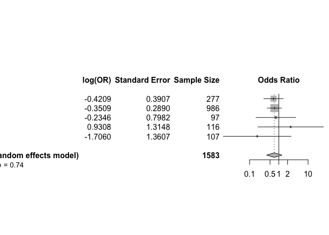

# Load packages

```r
library(tidyverse)
library(readxl)
library(writexl)
library(tableone)
library(here)
library(kableExtra)

library(jtools) # for summ() and plot_summs
library(sjPlot) # for tab_model
library(ggplot2) # survival/TTE analyses and other graphs
library(ggfortify) # autoplot
library(meta)
```

# Load treatment effect estimates from all trials

```r
df_barisolidact <- readRDS("trt_effects_barisolidact.RData")
df_actt2 <- readRDS("trt_effects_actt2.RData")
df_ghazaeian <- readRDS("trt_effects_ghazaeian.RData")
df_tofacov <- readRDS("trt_effects_tofacov.RData")
df_covinib <- readRDS("trt_effects_covinib.RData")
df_covbarrier <- readRDS("trt_effects_cov-barrier.RData")
# df_murugesan <- readRDS("trt_effects_murugesan.RData")
```

# Reshape dataframes for all treatment effect estimates

```r
### Create a list of all data frames / trials
list_df <- list(df_barisolidact, df_actt2, df_ghazaeian, df_tofacov, df_covinib, df_covbarrier) # add all trials

## Mortality at day 28
outcomes <- "death at day 28"
outcomes.firth <- "death at day 28_firth" # depends on which estimates to include
# Initialize an empty data frame to store the selected rows
df_mort28 <- data.frame()
# Loop through the list of data frames
for (df in list_df) {
  selected_rows <- df %>% filter(variable == outcomes | variable == outcomes.firth)
  df_mort28 <- rbind(df_mort28, selected_rows)
}

## Mortality at day 60
outcomes <- "death at day 60"
outcomes.firth <- "death at day 60_firth"
df_mort60 <- data.frame()
for (df in list_df) {
  selected_rows <- df %>% filter(variable == outcomes | variable == outcomes.firth)
  df_mort60 <- rbind(df_mort60, selected_rows)
}

## Death within fup
outcomes <- "death within fup"
outcomes.firth <- "death within fup_firth"
df_ttdeath <- data.frame()
for (df in list_df) {
  selected_rows <- df %>% filter(variable == outcomes | variable == outcomes.firth)
  df_ttdeath <- rbind(df_ttdeath, selected_rows)
}

## new MV within 28d
outcomes <- "new MV within 28d"
outcomes.firth <- "new MV within 28d_firth"
df_new_mv28 <- data.frame()
for (df in list_df) {
  selected_rows <- df %>% filter(variable == outcomes | variable == outcomes.firth)
  df_new_mv28 <- rbind(df_new_mv28, selected_rows)
}

## new MV or death within 28d
outcomes <- "new MV or death within 28d"
outcomes.firth <- "new MV or death within 28d_firth"
df_new_mvd28 <- data.frame()
for (df in list_df) {
  selected_rows <- df %>% filter(variable == outcomes | variable == outcomes.firth)
  df_new_mvd28 <- rbind(df_new_mvd28, selected_rows)
}

## new MV or death within 28d
outcomes <- "new MV or death within 28d"
outcomes.firth <- "new MV or death within 28d_firth"
df_new_mvd28 <- data.frame()
for (df in list_df) {
  selected_rows <- df %>% filter(variable == outcomes | variable == outcomes.firth)
  df_new_mvd28 <- rbind(df_new_mvd28, selected_rows)
}

## clinical status at day 28
outcomes <- "clinical status at day 28"
outcomes.firth <- "clinical status at day 28_firth"
df_clin28 <- data.frame()
for (df in list_df) {
  selected_rows <- df %>% filter(variable == outcomes | variable == outcomes.firth)
  df_clin28 <- rbind(df_clin28, selected_rows)
}

## discharge within 28 days
outcomes <- "discharge within 28 days"
outcomes.firth <- "discharge within 28 days_firth"
df_ttdischarge <- data.frame()
for (df in list_df) {
  selected_rows <- df %>% filter(variable == outcomes | variable == outcomes.firth)
  df_ttdischarge <- rbind(df_ttdischarge, selected_rows)
}

## discharge within 28 days, death=comp.event
outcomes <- "discharge within 28 days, death=comp.event"
outcomes.firth <- "discharge within 28 days, death=comp.event_firth"
df_ttdischarge_comp <- data.frame()
for (df in list_df) {
  selected_rows <- df %>% filter(variable == outcomes | variable == outcomes.firth)
  df_ttdischarge_comp <- rbind(df_ttdischarge_comp, selected_rows)
}

## discharge within 28 days, death=hypo.event
outcomes <- "discharge within 28 days, death=hypo.event"
outcomes.firth <- "discharge within 28 days, death=hypo.event_firth"
df_ttdischarge_hypo <- data.frame()
for (df in list_df) {
  selected_rows <- df %>% filter(variable == outcomes | variable == outcomes.firth)
  df_ttdischarge_hypo <- rbind(df_ttdischarge_hypo, selected_rows)
}

## sustained discharge within 28 days
outcomes <- "sustained discharge within 28 days"
outcomes.firth <- "sustained discharge within 28 days_firth"
df_ttdischarge_sus <- data.frame()
for (df in list_df) {
  selected_rows <- df %>% filter(variable == outcomes | variable == outcomes.firth)
  df_ttdischarge_sus <- rbind(df_ttdischarge_sus, selected_rows)
}

## viral clearance until day 5
outcomes <- "viral clearance until day 5"
outcomes.firth <- "viral clearance until day 5_firth"
df_vir_clear_5 <- data.frame()
for (df in list_df) {
  selected_rows <- df %>% filter(variable == outcomes | variable == outcomes.firth)
  df_vir_clear_5 <- rbind(df_vir_clear_5, selected_rows)
}

## viral clearance until day 10
outcomes <- "viral clearance until day 10"
outcomes.firth <- "viral clearance until day 10_firth"
df_vir_clear_10 <- data.frame()
for (df in list_df) {
  selected_rows <- df %>% filter(variable == outcomes | variable == outcomes.firth)
  df_vir_clear_10 <- rbind(df_vir_clear_10, selected_rows)
}

## viral clearance until day 15
outcomes <- "viral clearance until day 15"
outcomes.firth <- "viral clearance until day 15_firth"
df_vir_clear_15 <- data.frame()
for (df in list_df) {
  selected_rows <- df %>% filter(variable == outcomes | variable == outcomes.firth)
  df_vir_clear_15 <- rbind(df_vir_clear_15, selected_rows)
}

## Any AE grade 3,4 within 28 days
outcomes <- "Any AE grade 3,4 within 28 days"
outcomes2 <- "any AE grade 3,4 within 28 days"
outcomes.firth <- "Any AE grade 3,4 within 28 days_firth"
outcomes.firth2 <- "any AE grade 3,4 within 28 days_firth"
df_ae28 <- data.frame()
for (df in list_df) {
  selected_rows <- df %>% filter(variable == outcomes | variable == outcomes2 | variable == outcomes.firth | variable == outcomes.firth2)
  df_ae28 <- rbind(df_ae28, selected_rows)
}

## AEs grade 3,4 within 28 days
outcomes <- "AEs grade 3,4 within 28 days"
outcomes.firth <- "AEs grade 3,4 within 28 days_firth"
df_ae28sev <- data.frame()
for (df in list_df) {
  selected_rows <- df %>% filter(variable == outcomes | variable == outcomes.firth)
  df_ae28sev <- rbind(df_ae28sev, selected_rows)
}
```

# (i) Primary outcome: Mortality at day 28

```r
str(df_mort28)
```

```
## 'data.frame':	6 obs. of  10 variables:
##  $ variable         : chr  "death at day 28" "death at day 28" "death at day 28" "death at day 28_firth" ...
##  $ hazard_odds_ratio: num  0.64 0.737 0.791 2.537 0.182 ...
##  $ ci_lower         : num  0.29477 0.41582 0.14728 0.12715 0.00131 ...
##  $ ci_upper         : num  1.36 1.29 3.83 380.13 2.29 ...
##  $ standard_error   : num  0.387 0.287 0.798 1.315 1.358 ...
##  $ p_value          : num  0.25 0.287 0.769 0.552 0.203 ...
##  $ n_intervention   : num  145 515 46 58 55 815
##  $ n_control        : num  144 518 51 58 55 811
##  $ trial            : chr  "Bari-SolidAct" "ACTT-2" "Ghazaeian" "TOFACOV" ...
##  $ JAKi             : chr  "Baricitinib" "Baricitinib" "Tofacitinib" "Tofacitinib" ...
```

```r
mort28 <- metagen(TE = log(hazard_odds_ratio),
                      seTE = standard_error,
                      studlab = trial,
                      data = df_mort28,
                      n.e = n_intervention + n_control,
                      # n.c = n_control,
                      sm = "OR",
                      fixed = F,
                      random = T,
                      prediction = F,
                      method.tau = "REML", # same results with ML (-> see one-stage!)
                      hakn = T, # Hartung-Knapp- Sidik-Jonkman (HKSJ) modified estimate of the variance / 95% CI -> notes
                      adhoc.hakn.ci = "se", # Argument 'adhoc.hakn.ci' must be "", "se", "ci", or "IQWiG6".
                      title = "Average treatment effect - mortality 28 days",
                      # subset = trial %in% c("Bari-SolidAct", "ACTT-2", "Ghazaeian") # exclude entirely
                      # exclude = trial %in% c("Bari-SolidAct", "ACTT-2", "Ghazaeian") # include in forestplot but exclude from analysis
                      )
summary(mort28)
```

```
## Review:     Average treatment effect - mortality 28 days
## 
##                   OR            95%-CI %W(random)
## Bari-SolidAct 0.6404 [0.2998;  1.3677]       11.9
## ACTT-2        0.7368 [0.4197;  1.2933]       21.6
## Ghazaeian     0.7909 [0.1654;  3.7807]        2.8
## TOFACOV       2.5366 [0.1928; 33.3748]        1.0
## COVINIB       0.1822 [0.0127;  2.6082]        1.0
## COV-BARRIER   0.5122 [0.3674;  0.7141]       61.8
## 
## Number of studies: k = 6
## Number of observations: o = 3271
## 
##                                  OR           95%-CI     t p-value
## Random effects model (HK-SE) 0.5795 [0.4114; 0.8164] -4.09  0.0094
## 
## Quantifying heterogeneity:
##  tau^2 = 0 [0.0000; 2.5985]; tau = 0 [0.0000; 1.6120]
##  I^2 = 0.0% [0.0%; 74.6%]; H = 1.00 [1.00; 1.99]
## 
## Test of heterogeneity:
##     Q d.f. p-value
##  3.43    5  0.6333
## 
## Details on meta-analytical method:
## - Inverse variance method
## - Restricted maximum-likelihood estimator for tau^2
## - Q-Profile method for confidence interval of tau^2 and tau
## - Hartung-Knapp adjustment for random effects model (df = 5)
```

```r
forest.meta(mort28,
            # hetstat = T,
            # rightcols = c("w.random"),
            leftcols = c("studlab", "TE", "seTE", "n.e"),
            leftlabs = c("Trial", "log(OR)", "Standard Error", "Sample Size"),
            text.random = "Average treatment effect (random effects model)",
            title = "Average treatment effect - mortality 28 days", # get the title into the figure
            # xlim = c(0.15,5),
            # xlab = "Average treatment effect (95% CI)"
            )
```

<!-- -->

```r
# Open a pdf file
# pdf("./fp_aggregated.pdf", width=9, height=4)
# forest.meta(i.mort28_adhoc_se,
#             xlim = c(0.1,5),
#             xlab = "                  Favours Remdesivir <-> Favours No Remdesivir",
#             fs.xlab = 9)
# dev.off()
```
Discussion points:
1. REML or ML ? -> Give the exact same result, but the one-stage uses ML (including centering) due to rare events. REML is preferred (see notes), but to correspond with one-stage, a sens-analysis with ML is probably worth it. The choice of estimator might have the biggest influence on the 95%CI, larger than other model parameter choices.

# (ii) Mortality at day 60

```r
str(df_mort60)
```

```
## 'data.frame':	6 obs. of  10 variables:
##  $ variable         : chr  "death at day 60" "death at day 60" "death at day 60" "death at day 60_firth" ...
##  $ hazard_odds_ratio: num  0.89 0.737 0.791 2.537 0.182 ...
##  $ ci_lower         : num  0.44951 0.41582 0.14728 0.12715 0.00131 ...
##  $ ci_upper         : num  1.75 1.29 3.83 380.13 2.29 ...
##  $ standard_error   : num  0.346 0.287 0.798 1.315 1.358 ...
##  $ p_value          : num  0.736 0.287 0.769 0.552 0.203 ...
##  $ n_intervention   : num  145 515 46 58 55 815
##  $ n_control        : num  144 518 51 58 55 811
##  $ trial            : chr  "Bari-SolidAct" "ACTT-2" "Ghazaeian" "TOFACOV" ...
##  $ JAKi             : chr  "Baricitinib" "Baricitinib" "Tofacitinib" "Tofacitinib" ...
```

```r
mort60 <- metagen(TE = log(hazard_odds_ratio),
                      seTE = standard_error,
                      studlab = trial,
                      data = df_mort60,
                      n.e = n_intervention + n_control,
                      # n.c = n_control,
                      sm = "OR",
                      fixed = F,
                      random = T,
                      prediction = F,
                      method.tau = "REML", # same results with ML (-> see one-stage!)
                      hakn = T, # Hartung-Knapp- Sidik-Jonkman (HKSJ) modified estimate of the variance / 95% CI -> notes
                      adhoc.hakn.ci = "se", # Argument 'adhoc.hakn.ci' must be "", "se", "ci", or "IQWiG6".
                      title = "Average treatment effect - mortality 60 days",
                      # subset = trial %in% c("Bari-SolidAct", "ACTT-2", "Ghazaeian") # exclude entirely
                      # exclude = trial %in% c("Bari-SolidAct", "ACTT-2", "Ghazaeian") # include in forestplot but exclude from analysis
                      )
summary(mort60)
```

```
## Review:     Average treatment effect - mortality 60 days
## 
##                   OR            95%-CI %W(random)
## Bari-SolidAct 0.8900 [0.4520;  1.7522]       13.3
## ACTT-2        0.7368 [0.4197;  1.2933]       19.3
## Ghazaeian     0.7909 [0.1654;  3.7807]        2.5
## TOFACOV       2.5366 [0.1928; 33.3748]        0.9
## COVINIB       0.1822 [0.0127;  2.6082]        0.9
## COV-BARRIER   0.5696 [0.4181;  0.7758]       63.1
## 
## Number of studies: k = 6
## Number of observations: o = 3271
## 
##                                  OR           95%-CI     t p-value
## Random effects model (HK-SE) 0.6430 [0.4646; 0.8898] -3.49  0.0174
## 
## Quantifying heterogeneity:
##  tau^2 = 0.0004 [0.0000; 2.6022]; tau = 0.0211 [0.0000; 1.6131]
##  I^2 = 0.0% [0.0%; 74.6%]; H = 1.00 [1.00; 1.99]
## 
## Test of heterogeneity:
##     Q d.f. p-value
##  3.72    5  0.5904
## 
## Details on meta-analytical method:
## - Inverse variance method
## - Restricted maximum-likelihood estimator for tau^2
## - Q-Profile method for confidence interval of tau^2 and tau
## - Hartung-Knapp adjustment for random effects model (df = 5)
```

```r
forest.meta(mort60,
            # hetstat = T,
            # rightcols = c("w.random"),
            leftcols = c("studlab", "TE", "seTE", "n.e"),
            leftlabs = c("Trial", "log(OR)", "Standard Error", "Sample Size"),
            text.random = "Average treatment effect (random effects model)",
            title = "Average treatment effect - mortality 60 days", # get the title into the figure
            # xlim = c(0.15,5),
            # xlab = "Average treatment effect (95% CI)"
            )
```

<!-- -->
Discussion points

# (iii) Time to death within max. follow-up time

```r
str(df_ttdeath)
```

```
## 'data.frame':	4 obs. of  10 variables:
##  $ variable         : chr  "death within fup" "death within fup" "death within fup" "death within fup"
##  $ hazard_odds_ratio: num  0.773 0.741 0.838 0.614
##  $ ci_lower         : num  0.432 0.442 0.187 0.476
##  $ ci_upper         : num  1.38 1.24 3.75 0.79
##  $ standard_error   : num  0.296 0.264 0.764 0.129
##  $ p_value          : num  0.384572 0.256266 0.817035 0.000154
##  $ n_intervention   : num  145 515 46 815
##  $ n_control        : num  144 518 51 811
##  $ trial            : chr  "Bari-SolidAct" "ACTT-2" "Ghazaeian" "COV-BARRIER"
##  $ JAKi             : chr  "Baricitinib" "Baricitinib" "Tofacitinib" "Baricitinib"
```

```r
ttdeath <- metagen(TE = log(hazard_odds_ratio),
                      seTE = standard_error,
                      studlab = trial,
                      data = df_ttdeath,
                      n.e = n_intervention + n_control,
                      # n.c = n_control,
                      sm = "OR",
                      fixed = F,
                      random = T,
                      prediction = F,
                      method.tau = "REML", # same results with ML (-> see one-stage!)
                      hakn = T, # Hartung-Knapp- Sidik-Jonkman (HKSJ) modified estimate of the variance / 95% CI -> notes
                      adhoc.hakn.ci = "se", # Argument 'adhoc.hakn.ci' must be "", "se", "ci", or "IQWiG6".
                      title = "Average treatment effect - time to death",
                      # subset = trial %in% c("Bari-SolidAct", "ACTT-2", "Ghazaeian") # exclude entirely
                      # exclude = trial %in% c("Bari-SolidAct", "ACTT-2", "Ghazaeian") # include in forestplot but exclude from analysis
                      )
summary(ttdeath)
```

```
## Review:     Average treatment effect - time to death
## 
##                   OR           95%-CI %W(random)
## Bari-SolidAct 0.7727 [0.4322; 1.3817]       13.0
## ACTT-2        0.7409 [0.4415; 1.2434]       16.4
## Ghazaeian     0.8380 [0.1874; 3.7469]        2.0
## COV-BARRIER   0.6136 [0.4764; 0.7902]       68.6
## 
## Number of studies: k = 4
## Number of observations: o = 3045
## 
##                                  OR           95%-CI     t p-value
## Random effects model (HK-SE) 0.6561 [0.4668; 0.9221] -3.94  0.0291
## 
## Quantifying heterogeneity:
##  tau^2 = 0 [0.0000; 0.1376]; tau = 0 [0.0000; 0.3709]
##  I^2 = 0.0% [0.0%; 84.7%]; H = 1.00 [1.00; 2.56]
## 
## Test of heterogeneity:
##     Q d.f. p-value
##  0.89    3  0.8281
## 
## Details on meta-analytical method:
## - Inverse variance method
## - Restricted maximum-likelihood estimator for tau^2
## - Q-Profile method for confidence interval of tau^2 and tau
## - Hartung-Knapp adjustment for random effects model (df = 3)
```

```r
forest.meta(ttdeath,
            # hetstat = T,
            # rightcols = c("w.random"),
            leftcols = c("studlab", "TE", "seTE", "n.e"),
            leftlabs = c("Trial", "log(OR)", "Standard Error", "Sample Size"),
            text.random = "Average treatment effect (random effects model)",
            title = "Average treatment effect - time to death", # get the title into the figure
            # xlim = c(0.15,5),
            # xlab = "Average treatment effect (95% CI)"
            )
```

<!-- -->
Discussion points

# (iv) New mechanical ventilation or death within 28 days

```r
str(df_new_mvd28)
```

```
## 'data.frame':	6 obs. of  10 variables:
##  $ variable         : chr  "new MV or death within 28d" "new MV or death within 28d" "new MV or death within 28d" "new MV or death within 28d" ...
##  $ hazard_odds_ratio: num  1.016 0.71 0.791 0.503 0.199 ...
##  $ ci_lower         : num  0.5916 0.4833 0.1473 0.0222 0.0287 ...
##  $ ci_upper         : num  1.747 1.038 3.826 5.795 0.862 ...
##  $ standard_error   : num  0.276 0.195 0.798 1.271 0.826 ...
##  $ p_value          : num  0.9528 0.078 0.7688 0.5891 0.0509 ...
##  $ n_intervention   : num  145 515 46 58 55 815
##  $ n_control        : num  144 518 51 58 55 811
##  $ trial            : chr  "Bari-SolidAct" "ACTT-2" "Ghazaeian" "TOFACOV" ...
##  $ JAKi             : chr  "Baricitinib" "Baricitinib" "Tofacitinib" "Tofacitinib" ...
```

```r
new.mvd28 <- metagen(TE = log(hazard_odds_ratio),
                      seTE = standard_error,
                      studlab = trial,
                      data = df_new_mvd28,
                      n.e = n_intervention + n_control,
                      # n.c = n_control,
                      sm = "OR",
                      fixed = F,
                      random = T,
                      prediction = F,
                      method.tau = "REML", # same results with ML (-> see one-stage!)
                      hakn = T, # Hartung-Knapp- Sidik-Jonkman (HKSJ) modified estimate of the variance / 95% CI -> notes
                      adhoc.hakn.ci = "se", # Argument 'adhoc.hakn.ci' must be "", "se", "ci", or "IQWiG6".
                      title = "Average treatment effect - New MV or death within 28 days",
                      # subset = trial %in% c("Bari-SolidAct", "ACTT-2", "Ghazaeian") # exclude entirely
                      # exclude = trial %in% c("Bari-SolidAct", "ACTT-2", "Ghazaeian") # include in forestplot but exclude from analysis
                      )
summary(new.mvd28)
```

```
## Review:     Average treatment effect - New MV or death within 28 days
## 
##                   OR           95%-CI %W(random)
## Bari-SolidAct 1.0165 [0.5923; 1.7443]       13.4
## ACTT-2        0.7097 [0.4846; 1.0392]       26.8
## Ghazaeian     0.7909 [0.1654; 3.7807]        1.6
## TOFACOV       0.5034 [0.0417; 6.0761]        0.6
## COVINIB       0.1994 [0.0395; 1.0066]        1.5
## COV-BARRIER   0.7651 [0.5879; 0.9958]       56.1
## 
## Number of studies: k = 6
## Number of observations: o = 3271
## 
##                                  OR           95%-CI     t p-value
## Random effects model (HK-SE) 0.7618 [0.5880; 0.9870] -2.70  0.0428
## 
## Quantifying heterogeneity:
##  tau^2 = 0 [0.0000; 1.4870]; tau = 0 [0.0000; 1.2194]
##  I^2 = 0.0% [0.0%; 74.6%]; H = 1.00 [1.00; 1.99]
## 
## Test of heterogeneity:
##     Q d.f. p-value
##  3.97    5  0.5537
## 
## Details on meta-analytical method:
## - Inverse variance method
## - Restricted maximum-likelihood estimator for tau^2
## - Q-Profile method for confidence interval of tau^2 and tau
## - Hartung-Knapp adjustment for random effects model (df = 5)
```

```r
forest.meta(new.mvd28,
            # hetstat = T,
            # rightcols = c("w.random"),
            leftcols = c("studlab", "TE", "seTE", "n.e"),
            leftlabs = c("Trial", "log(OR)", "Standard Error", "Sample Size"),
            text.random = "Average treatment effect (random effects model)",
            title = "Average treatment effect - New MV or death within 28 days", # get the title into the figure
            # xlim = c(0.15,5),
            # xlab = "Average treatment effect (95% CI)"
            )
```

<!-- -->
Discussion points

# (iv.i) New mechanical ventilation among survivors within 28 days

```r
str(df_new_mv28)
```

```
## 'data.frame':	5 obs. of  10 variables:
##  $ variable         : chr  "new MV within 28d" "new MV within 28d" "new MV within 28d_firth" "new MV within 28d" ...
##  $ hazard_odds_ratio: num  1.483 0.705 0.217 0.27 1.214
##  $ ci_lower         : num  0.72932 0.4374 0.00154 0.03782 0.83795
##  $ ci_upper         : num  3.09 1.13 2.88 1.25 1.77
##  $ standard_error   : num  0.366 0.242 1.385 0.848 0.19
##  $ p_value          : num  0.281 0.149 0.269 0.122 0.307
##  $ n_intervention   : num  114 449 57 55 702
##  $ n_control        : num  108 436 58 53 661
##  $ trial            : chr  "Bari-SolidAct" "ACTT-2" "TOFACOV" "COVINIB" ...
##  $ JAKi             : chr  "Baricitinib" "Baricitinib" "Tofacitinib" "Baricitinib" ...
```

```r
new.mv28 <- metagen(TE = log(hazard_odds_ratio),
                      seTE = standard_error,
                      studlab = trial,
                      data = df_new_mv28,
                      n.e = n_intervention + n_control,
                      # n.c = n_control,
                      sm = "OR",
                      fixed = F,
                      random = T,
                      prediction = F,
                      method.tau = "REML", # same results with ML (-> see one-stage!)
                      hakn = T, # Hartung-Knapp- Sidik-Jonkman (HKSJ) modified estimate of the variance / 95% CI -> notes
                      adhoc.hakn.ci = "se", # Argument 'adhoc.hakn.ci' must be "", "se", "ci", or "IQWiG6".
                      title = "Average treatment effect - New MV among survivors within 28 days",
                      # subset = trial %in% c("Bari-SolidAct", "ACTT-2", "Ghazaeian") # exclude entirely
                      # exclude = trial %in% c("Bari-SolidAct", "ACTT-2", "Ghazaeian") # include in forestplot but exclude from analysis
                      )
summary(new.mv28)
```

```
## Review:     Average treatment effect - New MV among survivors within 28 days
## 
##                   OR           95%-CI %W(random)
## Bari-SolidAct 1.4835 [0.7243; 3.0383]       21.7
## ACTT-2        0.7055 [0.4394; 1.1328]       32.2
## TOFACOV       0.2175 [0.0144; 3.2855]        2.5
## COVINIB       0.2698 [0.0512; 1.4223]        6.1
## COV-BARRIER   1.2142 [0.8368; 1.7617]       37.6
## 
## Number of studies: k = 5
## Number of observations: o = 2693
## 
##                                  OR           95%-CI     t p-value
## Random effects model (HK-SE) 0.9306 [0.4685; 1.8488] -0.29  0.7857
## 
## Quantifying heterogeneity:
##  tau^2 = 0.0968 [0.0000; 5.4203]; tau = 0.3112 [0.0000; 2.3281]
##  I^2 = 49.3% [0.0%; 81.4%]; H = 1.40 [1.00; 2.32]
## 
## Test of heterogeneity:
##     Q d.f. p-value
##  7.89    4  0.0957
## 
## Details on meta-analytical method:
## - Inverse variance method
## - Restricted maximum-likelihood estimator for tau^2
## - Q-Profile method for confidence interval of tau^2 and tau
## - Hartung-Knapp adjustment for random effects model (df = 4)
```

```r
forest.meta(new.mv28,
            # hetstat = T,
            # rightcols = c("w.random"),
            leftcols = c("studlab", "TE", "seTE", "n.e"),
            leftlabs = c("Trial", "log(OR)", "Standard Error", "Sample Size"),
            text.random = "Average treatment effect (random effects model)",
            title = "Average treatment effect - New MV among survivors within 28 days", # get the title into the figure
            # xlim = c(0.15,5),
            # xlab = "Average treatment effect (95% CI)"
            )
```

<!-- -->
Discussion points

# (v) Clinical status at day 28

```r
str(df_clin28)
```

```
## 'data.frame':	6 obs. of  10 variables:
##  $ variable         : chr  "clinical status at day 28" "clinical status at day 28" "clinical status at day 28" "clinical status at day 28" ...
##  $ hazard_odds_ratio: num  0.945 0.703 0.826 0.509 0.321 ...
##  $ ci_lower         : num  0.5773 0.4833 0.1539 0.0667 0.0428 ...
##  $ ci_upper         : num  1.55 1.02 3.99 2.84 1.65 ...
##  $ standard_error   : num  0.251 0.19 0.798 0.907 0.887 ...
##  $ p_value          : num  0.8219 0.0638 0.8102 0.4563 0.2003 ...
##  $ n_intervention   : num  145 515 46 58 55 815
##  $ n_control        : num  144 518 51 58 55 811
##  $ trial            : chr  "Bari-SolidAct" "ACTT-2" "Ghazaeian" "TOFACOV" ...
##  $ JAKi             : chr  "Baricitinib" "Baricitinib" "Tofacitinib" "Tofacitinib" ...
```

```r
clin28 <- metagen(TE = log(hazard_odds_ratio),
                      seTE = standard_error,
                      studlab = trial,
                      data = df_clin28,
                      n.e = n_intervention + n_control,
                      # n.c = n_control,
                      sm = "OR",
                      fixed = F,
                      random = T,
                      prediction = F,
                      method.tau = "REML", # same results with ML (-> see one-stage!)
                      hakn = T, # Hartung-Knapp- Sidik-Jonkman (HKSJ) modified estimate of the variance / 95% CI -> notes
                      adhoc.hakn.ci = "se", # Argument 'adhoc.hakn.ci' must be "", "se", "ci", or "IQWiG6".
                      title = "Average treatment effect - Clinical status at day 28",
                      # subset = trial %in% c("Bari-SolidAct", "ACTT-2", "Ghazaeian") # exclude entirely
                      # exclude = trial %in% c("Bari-SolidAct", "ACTT-2", "Ghazaeian") # include in forestplot but exclude from analysis
                      )
summary(clin28)
```

```
## Review:     Average treatment effect - Clinical status at day 28
## 
##                   OR           95%-CI %W(random)
## Bari-SolidAct 0.9451 [0.5778; 1.5456]       14.1
## ACTT-2        0.7031 [0.4845; 1.0204]       24.6
## Ghazaeian     0.8256 [0.1729; 3.9418]        1.4
## TOFACOV       0.5090 [0.0861; 3.0089]        1.1
## COVINIB       0.3212 [0.0565; 1.8266]        1.1
## COV-BARRIER   0.8487 [0.6655; 1.0823]       57.7
## 
## Number of studies: k = 6
## Number of observations: o = 3271
## 
##                                  OR           95%-CI     t p-value
## Random effects model (HK-SE) 0.8089 [0.6349; 1.0306] -2.25  0.0742
## 
## Quantifying heterogeneity:
##  tau^2 = 0 [0.0000; 0.4620]; tau = 0 [0.0000; 0.6797]
##  I^2 = 0.0% [0.0%; 74.6%]; H = 1.00 [1.00; 1.99]
## 
## Test of heterogeneity:
##     Q d.f. p-value
##  2.42    5  0.7878
## 
## Details on meta-analytical method:
## - Inverse variance method
## - Restricted maximum-likelihood estimator for tau^2
## - Q-Profile method for confidence interval of tau^2 and tau
## - Hartung-Knapp adjustment for random effects model (df = 5)
```

```r
forest.meta(clin28,
            # hetstat = T,
            # rightcols = c("w.random"),
            leftcols = c("studlab", "TE", "seTE", "n.e"),
            leftlabs = c("Trial", "log(OR)", "Standard Error", "Sample Size"),
            text.random = "Average treatment effect (random effects model)",
            title = "Average treatment effect - Clinical status at day 28", # get the title into the figure
            # xlim = c(0.15,5),
            # xlab = "Average treatment effect (95% CI)"
            )
```

<!-- -->
Discussion points

# (vi) Time to discharge or reaching discharge criteria up to day 28. Death = Competing event

```r
str(df_ttdischarge_comp)
```

```
## 'data.frame':	6 obs. of  10 variables:
##  $ variable         : chr  "discharge within 28 days, death=comp.event" "discharge within 28 days, death=comp.event" "discharge within 28 days, death=comp.event" "discharge within 28 days, death=comp.event" ...
##  $ hazard_odds_ratio: num  1.113 1.16 0.738 1.256 1.53 ...
##  $ ci_lower         : num  0.847 1.02 0.48 0.876 1.059 ...
##  $ ci_upper         : num  1.46 1.32 1.14 1.8 2.21 ...
##  $ standard_error   : num  0.1396 0.0656 0.2198 0.1839 0.1875 ...
##  $ p_value          : num  0.44 0.024 0.167 0.21 0.023 ...
##  $ n_intervention   : num  145 515 46 58 55 815
##  $ n_control        : num  144 518 51 58 55 811
##  $ trial            : chr  "Bari-SolidAct" "ACTT-2" "Ghazaeian" "TOFACOV" ...
##  $ JAKi             : chr  "Baricitinib" "Baricitinib" "Tofacitinib" "Tofacitinib" ...
```

```r
ttdischarge.comp <- metagen(TE = log(hazard_odds_ratio),
                      seTE = standard_error,
                      studlab = trial,
                      data = df_ttdischarge_comp,
                      n.e = n_intervention + n_control,
                      # n.c = n_control,
                      sm = "OR",
                      fixed = F,
                      random = T,
                      prediction = F,
                      method.tau = "REML", # same results with ML (-> see one-stage!)
                      hakn = T, # Hartung-Knapp- Sidik-Jonkman (HKSJ) modified estimate of the variance / 95% CI -> notes
                      adhoc.hakn.ci = "se", # Argument 'adhoc.hakn.ci' must be "", "se", "ci", or "IQWiG6".
                      title = "Average treatment effect - Time to discharge within 28 days",
                      # subset = trial %in% c("Bari-SolidAct", "ACTT-2", "Ghazaeian") # exclude entirely
                      # exclude = trial %in% c("Bari-SolidAct", "ACTT-2", "Ghazaeian") # include in forestplot but exclude from analysis
                      )
summary(ttdischarge.comp)
```

```
## Review:     Average treatment effect - Time to discharge within 28 days
## 
##                   OR           95%-CI %W(random)
## Bari-SolidAct 1.1133 [0.8468; 1.4636]        7.4
## ACTT-2        1.1601 [1.0202; 1.3192]       33.5
## Ghazaeian     0.7381 [0.4798; 1.1355]        3.0
## TOFACOV       1.2562 [0.8760; 1.8014]        4.3
## COVINIB       1.5296 [1.0591; 2.2092]        4.1
## COV-BARRIER   1.1099 [0.9966; 1.2360]       47.7
## 
## Number of studies: k = 6
## Number of observations: o = 3271
## 
##                                  OR           95%-CI    t p-value
## Random effects model (HK-SE) 1.1338 [1.0104; 1.2722] 2.80  0.0379
## 
## Quantifying heterogeneity:
##  tau^2 < 0.0001 [0.0000; 0.3003]; tau = 0.0018 [0.0000; 0.5480]
##  I^2 = 28.2% [0.0%; 70.4%]; H = 1.18 [1.00; 1.84]
## 
## Test of heterogeneity:
##     Q d.f. p-value
##  6.97    5  0.2232
## 
## Details on meta-analytical method:
## - Inverse variance method
## - Restricted maximum-likelihood estimator for tau^2
## - Q-Profile method for confidence interval of tau^2 and tau
## - Hartung-Knapp adjustment for random effects model (df = 5)
```

```r
forest.meta(ttdischarge.comp,
            # hetstat = T,
            # rightcols = c("w.random"),
            leftcols = c("studlab", "TE", "seTE", "n.e"),
            leftlabs = c("Trial", "log(OR)", "Standard Error", "Sample Size"),
            text.random = "Average treatment effect (random effects model)",
            title = "Average treatment effect - Time to discharge within 28 days", # get the title into the figure
            # xlim = c(0.15,5),
            # xlab = "Average treatment effect (95% CI)"
            )
```

<!-- -->
Discussion points

# (vi.i) Time to discharge or reaching discharge criteria up to day 28. Death = Hypothetical

```r
str(df_ttdischarge_hypo)
```

```
## 'data.frame':	6 obs. of  10 variables:
##  $ variable         : chr  "discharge within 28 days, death=hypo.event" "discharge within 28 days, death=hypo.event" "discharge within 28 days, death=hypo.event" "discharge within 28 days, death=hypo.event" ...
##  $ hazard_odds_ratio: num  1.083 1.211 0.823 1.284 1.59 ...
##  $ ci_lower         : num  0.816 1.057 0.54 0.88 1.069 ...
##  $ ci_upper         : num  1.44 1.39 1.25 1.87 2.36 ...
##  $ standard_error   : num  0.1442 0.0694 0.215 0.1924 0.2026 ...
##  $ p_value          : num  0.5816 0.00583 0.36545 0.19432 0.02219 ...
##  $ n_intervention   : num  145 515 46 58 55 815
##  $ n_control        : num  144 518 51 58 55 811
##  $ trial            : chr  "Bari-SolidAct" "ACTT-2" "Ghazaeian" "TOFACOV" ...
##  $ JAKi             : chr  "Baricitinib" "Baricitinib" "Tofacitinib" "Tofacitinib" ...
```

```r
ttdischarge.hypo <- metagen(TE = log(hazard_odds_ratio),
                      seTE = standard_error,
                      studlab = trial,
                      data = df_ttdischarge_hypo,
                      n.e = n_intervention + n_control,
                      # n.c = n_control,
                      sm = "OR",
                      fixed = F,
                      random = T,
                      prediction = F,
                      method.tau = "REML", # same results with ML (-> see one-stage!)
                      hakn = T, # Hartung-Knapp- Sidik-Jonkman (HKSJ) modified estimate of the variance / 95% CI -> notes
                      adhoc.hakn.ci = "se", # Argument 'adhoc.hakn.ci' must be "", "se", "ci", or "IQWiG6".
                      title = "Average treatment effect - Time to discharge within 28 days",
                      # subset = trial %in% c("Bari-SolidAct", "ACTT-2", "Ghazaeian") # exclude entirely
                      # exclude = trial %in% c("Bari-SolidAct", "ACTT-2", "Ghazaeian") # include in forestplot but exclude from analysis
                      )
summary(ttdischarge.hypo)
```

```
## Review:     Average treatment effect - Time to discharge within 28 days
## 
##                   OR           95%-CI %W(random)
## Bari-SolidAct 1.0827 [0.8162; 1.4361]        7.6
## ACTT-2        1.2108 [1.0569; 1.3872]       32.8
## Ghazaeian     0.8232 [0.5401; 1.2546]        3.4
## TOFACOV       1.2836 [0.8804; 1.8714]        4.3
## COVINIB       1.5895 [1.0685; 2.3646]        3.8
## COV-BARRIER   1.1214 [1.0023; 1.2548]       48.1
## 
## Number of studies: k = 6
## Number of observations: o = 3271
## 
##                                  OR           95%-CI    t p-value
## Random effects model (HK-SE) 1.1569 [1.0325; 1.2962] 3.29  0.0216
## 
## Quantifying heterogeneity:
##  tau^2 < 0.0001 [0.0000; 0.2401]; tau = 0.0015 [0.0000; 0.4900]
##  I^2 = 19.3% [0.0%; 64.0%]; H = 1.11 [1.00; 1.67]
## 
## Test of heterogeneity:
##     Q d.f. p-value
##  6.19    5  0.2879
## 
## Details on meta-analytical method:
## - Inverse variance method
## - Restricted maximum-likelihood estimator for tau^2
## - Q-Profile method for confidence interval of tau^2 and tau
## - Hartung-Knapp adjustment for random effects model (df = 5)
```

```r
forest.meta(ttdischarge.hypo,
            # hetstat = T,
            # rightcols = c("w.random"),
            leftcols = c("studlab", "TE", "seTE", "n.e"),
            leftlabs = c("Trial", "log(OR)", "Standard Error", "Sample Size"),
            text.random = "Average treatment effect (random effects model)",
            title = "Average treatment effect - Time to discharge within 28 days", # get the title into the figure
            # xlim = c(0.15,5),
            # xlab = "Average treatment effect (95% CI)"
            )
```

<!-- -->
Discussion points

# (vi.ii) Time to discharge or reaching discharge criteria up to day 28. Death = Censored

```r
str(df_ttdischarge)
```

```
## 'data.frame':	6 obs. of  10 variables:
##  $ variable         : chr  "discharge within 28 days" "discharge within 28 days" "discharge within 28 days" "discharge within 28 days" ...
##  $ hazard_odds_ratio: num  1.072 1.214 0.738 1.284 1.586 ...
##  $ ci_lower         : num  0.808 1.06 0.48 0.88 1.066 ...
##  $ ci_upper         : num  1.42 1.39 1.14 1.87 2.36 ...
##  $ standard_error   : num  0.1441 0.0694 0.2198 0.1924 0.2026 ...
##  $ p_value          : num  0.62921 0.00519 0.16705 0.19432 0.02278 ...
##  $ n_intervention   : num  145 515 46 58 55 815
##  $ n_control        : num  144 518 51 58 55 811
##  $ trial            : chr  "Bari-SolidAct" "ACTT-2" "Ghazaeian" "TOFACOV" ...
##  $ JAKi             : chr  "Baricitinib" "Baricitinib" "Tofacitinib" "Tofacitinib" ...
```

```r
ttdischarge.cens <- metagen(TE = log(hazard_odds_ratio),
                      seTE = standard_error,
                      studlab = trial,
                      data = df_ttdischarge,
                      n.e = n_intervention + n_control,
                      # n.c = n_control,
                      sm = "OR",
                      fixed = F,
                      random = T,
                      prediction = F,
                      method.tau = "REML", # same results with ML (-> see one-stage!)
                      hakn = T, # Hartung-Knapp- Sidik-Jonkman (HKSJ) modified estimate of the variance / 95% CI -> notes
                      adhoc.hakn.ci = "se", # Argument 'adhoc.hakn.ci' must be "", "se", "ci", or "IQWiG6".
                      title = "Average treatment effect - Time to discharge within 28 days",
                      # subset = trial %in% c("Bari-SolidAct", "ACTT-2", "Ghazaeian") # exclude entirely
                      # exclude = trial %in% c("Bari-SolidAct", "ACTT-2", "Ghazaeian") # include in forestplot but exclude from analysis
                      )
summary(ttdischarge.cens)
```

```
## Review:     Average treatment effect - Time to discharge within 28 days
## 
##                   OR           95%-CI %W(random)
## Bari-SolidAct 1.0721 [0.8083; 1.4219]       11.5
## ACTT-2        1.2141 [1.0596; 1.3910]       31.6
## Ghazaeian     0.7381 [0.4798; 1.1355]        5.5
## TOFACOV       1.2836 [0.8804; 1.8714]        7.0
## COVINIB       1.5863 [1.0664; 2.3597]        6.4
## COV-BARRIER   1.0679 [0.9544; 1.1949]       38.0
## 
## Number of studies: k = 6
## Number of observations: o = 3271
## 
##                                  OR           95%-CI    t p-value
## Random effects model (HK-SE) 1.1326 [0.9565; 1.3411] 1.89  0.1167
## 
## Quantifying heterogeneity:
##  tau^2 = 0.0043 [0.0000; 0.3459]; tau = 0.0658 [0.0000; 0.5881]
##  I^2 = 45.4% [0.0%; 78.4%]; H = 1.35 [1.00; 2.15]
## 
## Test of heterogeneity:
##     Q d.f. p-value
##  9.16    5  0.1027
## 
## Details on meta-analytical method:
## - Inverse variance method
## - Restricted maximum-likelihood estimator for tau^2
## - Q-Profile method for confidence interval of tau^2 and tau
## - Hartung-Knapp adjustment for random effects model (df = 5)
```

```r
forest.meta(ttdischarge.cens,
            # hetstat = T,
            # rightcols = c("w.random"),
            leftcols = c("studlab", "TE", "seTE", "n.e"),
            leftlabs = c("Trial", "log(OR)", "Standard Error", "Sample Size"),
            text.random = "Average treatment effect (random effects model)",
            title = "Average treatment effect - Time to discharge within 28 days", # get the title into the figure
            # xlim = c(0.15,5),
            # xlab = "Average treatment effect (95% CI)"
            )
```

<!-- -->
Discussion points

# (vi.iii) Time to SUSTAINED discharge or reaching discharge criteria up to day 28. Death = Censored

```r
str(df_ttdischarge_sus)
```

```
## 'data.frame':	6 obs. of  10 variables:
##  $ variable         : chr  "sustained discharge within 28 days" "sustained discharge within 28 days" "sustained discharge within 28 days" "sustained discharge within 28 days" ...
##  $ hazard_odds_ratio: num  1.055 1.214 0.738 1.284 1.586 ...
##  $ ci_lower         : num  0.795 1.06 0.48 0.88 1.066 ...
##  $ ci_upper         : num  1.4 1.39 1.14 1.87 2.36 ...
##  $ standard_error   : num  0.1448 0.0694 0.2198 0.1924 0.2026 ...
##  $ p_value          : num  0.70965 0.00519 0.16705 0.19432 0.02278 ...
##  $ n_intervention   : num  145 515 46 58 55 815
##  $ n_control        : num  144 518 51 58 55 811
##  $ trial            : chr  "Bari-SolidAct" "ACTT-2" "Ghazaeian" "TOFACOV" ...
##  $ JAKi             : chr  "Baricitinib" "Baricitinib" "Tofacitinib" "Tofacitinib" ...
```

```r
ttdischarge.sus <- metagen(TE = log(hazard_odds_ratio),
                      seTE = standard_error,
                      studlab = trial,
                      data = df_ttdischarge_sus,
                      n.e = n_intervention + n_control,
                      # n.c = n_control,
                      sm = "OR",
                      fixed = F,
                      random = T,
                      prediction = F,
                      method.tau = "REML", # same results with ML (-> see one-stage!)
                      hakn = T, # Hartung-Knapp- Sidik-Jonkman (HKSJ) modified estimate of the variance / 95% CI -> notes
                      adhoc.hakn.ci = "se", # Argument 'adhoc.hakn.ci' must be "", "se", "ci", or "IQWiG6".
                      title = "Average treatment effect - Time to sustained discharge within 28 days",
                      # subset = trial %in% c("Bari-SolidAct", "ACTT-2", "Ghazaeian") # exclude entirely
                      # exclude = trial %in% c("Bari-SolidAct", "ACTT-2", "Ghazaeian") # include in forestplot but exclude from analysis
                      )
summary(ttdischarge.sus)
```

```
## Review:     Average treatment effect - Time to sustained discharge within 28 ...
## 
##                   OR           95%-CI %W(random)
## Bari-SolidAct 1.0554 [0.7946; 1.4017]       12.3
## ACTT-2        1.2141 [1.0596; 1.3910]       30.9
## Ghazaeian     0.7381 [0.4798; 1.1355]        6.1
## TOFACOV       1.2836 [0.8804; 1.8714]        7.7
## COVINIB       1.5863 [1.0664; 2.3597]        7.0
## COV-BARRIER   1.0582 [0.9454; 1.1845]       36.1
## 
## Number of studies: k = 6
## Number of observations: o = 3271
## 
##                                  OR           95%-CI    t p-value
## Random effects model (HK-SE) 1.1276 [0.9435; 1.3475] 1.73  0.1438
## 
## Quantifying heterogeneity:
##  tau^2 = 0.0058 [0.0000; 0.3498]; tau = 0.0761 [0.0000; 0.5914]
##  I^2 = 47.6% [0.0%; 79.2%]; H = 1.38 [1.00; 2.19]
## 
## Test of heterogeneity:
##     Q d.f. p-value
##  9.54    5  0.0892
## 
## Details on meta-analytical method:
## - Inverse variance method
## - Restricted maximum-likelihood estimator for tau^2
## - Q-Profile method for confidence interval of tau^2 and tau
## - Hartung-Knapp adjustment for random effects model (df = 5)
```

```r
forest.meta(ttdischarge.sus,
            # hetstat = T,
            # rightcols = c("w.random"),
            leftcols = c("studlab", "TE", "seTE", "n.e"),
            leftlabs = c("Trial", "log(OR)", "Standard Error", "Sample Size"),
            text.random = "Average treatment effect (random effects model)",
            title = "Average treatment effect - Time to sustained discharge within 28 days", # get the title into the figure
            # xlim = c(0.15,5),
            # xlab = "Average treatment effect (95% CI)"
            )
```

<!-- -->
Discussion points

# (vii) Viral clearance up to day 5

```r
str(df_vir_clear_5)
```

```
## 'data.frame':	2 obs. of  10 variables:
##  $ variable         : chr  "viral clearance until day 5" "viral clearance until day 5"
##  $ hazard_odds_ratio: num  1.495 0.898
##  $ ci_lower         : num  0.639 0.67
##  $ ci_upper         : num  3.58 1.2
##  $ standard_error   : num  0.437 0.149
##  $ p_value          : num  0.358 0.471
##  $ n_intervention   : num  62 492
##  $ n_control        : num  59 486
##  $ trial            : chr  "Bari-SolidAct" "COV-BARRIER"
##  $ JAKi             : chr  "Baricitinib" "Baricitinib"
```

```r
vir.clear5 <- metagen(TE = log(hazard_odds_ratio),
                      seTE = standard_error,
                      studlab = trial,
                      data = df_vir_clear_5,
                      n.e = n_intervention + n_control,
                      # n.c = n_control,
                      sm = "OR",
                      fixed = F,
                      random = T,
                      prediction = F,
                      method.tau = "REML", # same results with ML (-> see one-stage!)
                      hakn = T, # Hartung-Knapp- Sidik-Jonkman (HKSJ) modified estimate of the variance / 95% CI -> notes
                      adhoc.hakn.ci = "se", # Argument 'adhoc.hakn.ci' must be "", "se", "ci", or "IQWiG6".
                      title = "Average treatment effect - Viral clearance up to day 5",
                      # subset = trial %in% c("Bari-SolidAct", "ACTT-2", "Ghazaeian") # exclude entirely
                      # exclude = trial %in% c("Bari-SolidAct", "ACTT-2", "Ghazaeian") # include in forestplot but exclude from analysis
                      )
summary(vir.clear5)
```

```
## Review:     Average treatment effect - Viral clearance up to day 5
## 
##                   OR           95%-CI %W(random)
## Bari-SolidAct 1.4947 [0.6349; 3.5190]       17.5
## COV-BARRIER   0.8980 [0.6700; 1.2034]       82.5
## 
## Number of studies: k = 2
## Number of observations: o = 1099
## 
##                                  OR            95%-CI     t p-value
## Random effects model (HK-SE) 0.9820 [0.0837; 11.5267] -0.09  0.9404
## 
## Quantifying heterogeneity:
##  tau^2 = 0.0233; tau = 0.1525; I^2 = 17.9%; H = 1.10
## 
## Test of heterogeneity:
##     Q d.f. p-value
##  1.22    1  0.2697
## 
## Details on meta-analytical method:
## - Inverse variance method
## - Restricted maximum-likelihood estimator for tau^2
## - Hartung-Knapp adjustment for random effects model (df = 1)
```

```r
forest.meta(vir.clear5,
            # hetstat = T,
            # rightcols = c("w.random"),
            leftcols = c("studlab", "TE", "seTE", "n.e"),
            leftlabs = c("Trial", "log(OR)", "Standard Error", "Sample Size"),
            text.random = "Average treatment effect (random effects model)",
            title = "Average treatment effect - Viral clearance up to day 5", # get the title into the figure
            # xlim = c(0.15,5),
            # xlab = "Average treatment effect (95% CI)"
            )
```

<!-- -->
Discussion points

# (viii) Viral clearance up to day 10

```r
str(df_vir_clear_10)
```

```
## 'data.frame':	2 obs. of  10 variables:
##  $ variable         : chr  "viral clearance until day 10" "viral clearance until day 10"
##  $ hazard_odds_ratio: num  1.09 0.99
##  $ ci_lower         : num  0.536 0.77
##  $ ci_upper         : num  2.21 1.27
##  $ standard_error   : num  0.361 0.128
##  $ p_value          : num  0.815 0.94
##  $ n_intervention   : num  66 538
##  $ n_control        : num  61 522
##  $ trial            : chr  "Bari-SolidAct" "COV-BARRIER"
##  $ JAKi             : chr  "Baricitinib" "Baricitinib"
```

```r
vir.clear10 <- metagen(TE = log(hazard_odds_ratio),
                      seTE = standard_error,
                      studlab = trial,
                      data = df_vir_clear_10,
                      n.e = n_intervention + n_control,
                      # n.c = n_control,
                      sm = "OR",
                      fixed = F,
                      random = T,
                      prediction = F,
                      method.tau = "REML", # same results with ML (-> see one-stage!)
                      hakn = T, # Hartung-Knapp- Sidik-Jonkman (HKSJ) modified estimate of the variance / 95% CI -> notes
                      adhoc.hakn.ci = "se", # Argument 'adhoc.hakn.ci' must be "", "se", "ci", or "IQWiG6".
                      title = "Average treatment effect - Viral clearance up to day 10",
                      # subset = trial %in% c("Bari-SolidAct", "ACTT-2", "Ghazaeian") # exclude entirely
                      # exclude = trial %in% c("Bari-SolidAct", "ACTT-2", "Ghazaeian") # include in forestplot but exclude from analysis
                      )
summary(vir.clear10)
```

```
## Review:     Average treatment effect - Viral clearance up to day 10
## 
##                   OR           95%-CI %W(random)
## Bari-SolidAct 1.0882 [0.5367; 2.2064]       11.2
## COV-BARRIER   0.9903 [0.7701; 1.2736]       88.8
## 
## Number of studies: k = 2
## Number of observations: o = 1187
## 
##                                  OR           95%-CI    t p-value
## Random effects model (HK-SE) 1.0009 [0.2154; 4.6513] 0.01  0.9954
## 
## Quantifying heterogeneity:
##  tau^2 = 0; tau = 0; I^2 = 0.0%; H = 1.00
## 
## Test of heterogeneity:
##     Q d.f. p-value
##  0.06    1  0.8054
## 
## Details on meta-analytical method:
## - Inverse variance method
## - Restricted maximum-likelihood estimator for tau^2
## - Hartung-Knapp adjustment for random effects model (df = 1)
```

```r
forest.meta(vir.clear10,
            # hetstat = T,
            # rightcols = c("w.random"),
            leftcols = c("studlab", "TE", "seTE", "n.e"),
            leftlabs = c("Trial", "log(OR)", "Standard Error", "Sample Size"),
            text.random = "Average treatment effect (random effects model)",
            title = "Average treatment effect - Viral clearance up to day 10", # get the title into the figure
            # xlim = c(0.15,5),
            # xlab = "Average treatment effect (95% CI)"
            )
```

<!-- -->
Discussion points

# (ix) Viral clearance up to day 15

```r
str(df_vir_clear_15)
```

```
## 'data.frame':	2 obs. of  10 variables:
##  $ variable         : chr  "viral clearance until day 15" "viral clearance until day 15"
##  $ hazard_odds_ratio: num  1.004 0.972
##  $ ci_lower         : num  0.496 0.763
##  $ ci_upper         : num  2.03 1.24
##  $ standard_error   : num  0.359 0.123
##  $ p_value          : num  0.991 0.816
##  $ n_intervention   : num  67 551
##  $ n_control        : num  61 545
##  $ trial            : chr  "Bari-SolidAct" "COV-BARRIER"
##  $ JAKi             : chr  "Baricitinib" "Baricitinib"
```

```r
vir.clear15 <- metagen(TE = log(hazard_odds_ratio),
                      seTE = standard_error,
                      studlab = trial,
                      data = df_vir_clear_15,
                      n.e = n_intervention + n_control,
                      # n.c = n_control,
                      sm = "OR",
                      fixed = F,
                      random = T,
                      prediction = F,
                      method.tau = "REML", # same results with ML (-> see one-stage!)
                      hakn = T, # Hartung-Knapp- Sidik-Jonkman (HKSJ) modified estimate of the variance / 95% CI -> notes
                      adhoc.hakn.ci = "se", # Argument 'adhoc.hakn.ci' must be "", "se", "ci", or "IQWiG6".
                      title = "Average treatment effect - Viral clearance up to day 15",
                      # subset = trial %in% c("Bari-SolidAct", "ACTT-2", "Ghazaeian") # exclude entirely
                      # exclude = trial %in% c("Bari-SolidAct", "ACTT-2", "Ghazaeian") # include in forestplot but exclude from analysis
                      )
summary(vir.clear15)
```

```
## Review:     Average treatment effect - Viral clearance up to day 15
## 
##                   OR           95%-CI %W(random)
## Bari-SolidAct 1.0042 [0.4970; 2.0290]       10.6
## COV-BARRIER   0.9717 [0.7630; 1.2375]       89.4
## 
## Number of studies: k = 2
## Number of observations: o = 1224
## 
##                                  OR           95%-CI     t p-value
## Random effects model (HK-SE) 0.9751 [0.2215; 4.2931] -0.22  0.8646
## 
## Quantifying heterogeneity:
##  tau^2 = 0; tau = 0; I^2 = 0.0%; H = 1.00
## 
## Test of heterogeneity:
##     Q d.f. p-value
##  0.01    1  0.9309
## 
## Details on meta-analytical method:
## - Inverse variance method
## - Restricted maximum-likelihood estimator for tau^2
## - Hartung-Knapp adjustment for random effects model (df = 1)
```

```r
forest.meta(vir.clear15,
            # hetstat = T,
            # rightcols = c("w.random"),
            leftcols = c("studlab", "TE", "seTE", "n.e"),
            leftlabs = c("Trial", "log(OR)", "Standard Error", "Sample Size"),
            text.random = "Average treatment effect (random effects model)",
            title = "Average treatment effect - Viral clearance up to day 15", # get the title into the figure
            # xlim = c(0.15,5),
            # xlab = "Average treatment effect (95% CI)"
            )
```

<!-- -->
Discussion points

# (x) Adverse event(s) grade 3 or 4, or a serious adverse event(s), excluding death, by day 28. ANY

```r
str(df_ae28)
```

```
## 'data.frame':	4 obs. of  10 variables:
##  $ variable         : chr  "any AE grade 3,4 within 28 days_firth" "any AE grade 3,4 within 28 days" "any AE grade 3,4 within 28 days" "Any AE grade 3,4 within 28 days"
##  $ hazard_odds_ratio: num  3.225 0.694 0.797 1.24
##  $ ci_lower         : num  0.17 0.241 0.308 0.843
##  $ ci_upper         : num  472.45 1.96 2.04 1.83
##  $ standard_error   : num  1.476 0.529 0.477 0.198
##  $ p_value          : num  0.441 0.489 0.634 0.277
##  $ n_intervention   : num  46 58 55 734
##  $ n_control        : num  51 58 53 684
##  $ trial            : chr  "Ghazaeian" "TOFACOV" "COVINIB" "COV-BARRIER"
##  $ JAKi             : chr  "Tofacitinib" "Tofacitinib" "Baricitinib" "Baricitinib"
```

```r
ae28 <- metagen(TE = log(hazard_odds_ratio),
                      seTE = standard_error,
                      studlab = trial,
                      data = df_ae28,
                      n.e = n_intervention + n_control,
                      # n.c = n_control,
                      sm = "OR",
                      fixed = F,
                      random = T,
                      prediction = F,
                      method.tau = "REML", # same results with ML (-> see one-stage!)
                      hakn = T, # Hartung-Knapp- Sidik-Jonkman (HKSJ) modified estimate of the variance / 95% CI -> notes
                      adhoc.hakn.ci = "se", # Argument 'adhoc.hakn.ci' must be "", "se", "ci", or "IQWiG6".
                      title = "Average treatment effect - dverse event(s) grade 3 or 4, or a serious adverse event(s), excluding death, by day 28. ANY",
                      # subset = trial %in% c("Bari-SolidAct", "ACTT-2", "Ghazaeian") # exclude entirely
                      # exclude = trial %in% c("Bari-SolidAct", "ACTT-2", "Ghazaeian") # include in forestplot but exclude from analysis
                      )
summary(ae28)
```

```
## Review:     Average treatment effect - dverse event(s) grade 3 or 4, or a se ...
## 
##                 OR            95%-CI %W(random)
## Ghazaeian   3.2247 [0.1787; 58.1925]        1.4
## TOFACOV     0.6936 [0.2461;  1.9552]       10.5
## COVINIB     0.7969 [0.3127;  2.0306]       12.9
## COV-BARRIER 1.2399 [0.8413;  1.8275]       75.2
## 
## Number of studies: k = 4
## Number of observations: o = 1739
## 
##                                  OR           95%-CI    t p-value
## Random effects model (HK-SE) 1.1158 [0.6463; 1.9266] 0.64  0.5684
## 
## Quantifying heterogeneity:
##  tau^2 = 0 [0.0000; 5.2235]; tau = 0 [0.0000; 2.2855]
##  I^2 = 0.0% [0.0%; 84.7%]; H = 1.00 [1.00; 2.56]
## 
## Test of heterogeneity:
##     Q d.f. p-value
##  2.11    3  0.5505
## 
## Details on meta-analytical method:
## - Inverse variance method
## - Restricted maximum-likelihood estimator for tau^2
## - Q-Profile method for confidence interval of tau^2 and tau
## - Hartung-Knapp adjustment for random effects model (df = 3)
```

```r
forest.meta(ae28,
            # hetstat = T,
            # rightcols = c("w.random"),
            leftcols = c("studlab", "TE", "seTE", "n.e"),
            leftlabs = c("Trial", "log(OR)", "Standard Error", "Sample Size"),
            text.random = "Average treatment effect (random effects model)",
            title = "Average treatment effect - dverse event(s) grade 3 or 4, or a serious adverse event(s), excluding death, by day 28. ANY", # get the title into the figure
            # xlim = c(0.15,5),
            # xlab = "Average treatment effect (95% CI)"
            )
```

<!-- -->
Discussion points

# (x.i) Adverse event(s) grade 3 or 4, or a serious adverse event(s), excluding death, by day 28. SEVERAL

```r
str(df_ae28sev)
```

```
## 'data.frame':	4 obs. of  10 variables:
##  $ variable         : chr  "AEs grade 3,4 within 28 days_firth" "AEs grade 3,4 within 28 days" "AEs grade 3,4 within 28 days" "AEs grade 3,4 within 28 days"
##  $ hazard_odds_ratio: num  3.225 0.694 0.588 1.287
##  $ ci_lower         : num  0.17 0.241 0.324 0.969
##  $ ci_upper         : num  472.45 1.96 1.04 1.72
##  $ standard_error   : num  1.476 0.529 0.296 0.145
##  $ p_value          : num  0.4412 0.489 0.0724 0.0834
##  $ n_intervention   : num  46 58 55 734
##  $ n_control        : num  51 58 53 684
##  $ trial            : chr  "Ghazaeian" "TOFACOV" "COVINIB" "COV-BARRIER"
##  $ JAKi             : chr  "Tofacitinib" "Tofacitinib" "Baricitinib" "Baricitinib"
```

```r
ae28sev <- metagen(TE = log(hazard_odds_ratio),
                      seTE = standard_error,
                      studlab = trial,
                      data = df_ae28sev,
                      n.e = n_intervention + n_control,
                      # n.c = n_control,
                      sm = "OR",
                      fixed = F,
                      random = T,
                      prediction = F,
                      method.tau = "REML", # same results with ML (-> see one-stage!)
                      hakn = T, # Hartung-Knapp- Sidik-Jonkman (HKSJ) modified estimate of the variance / 95% CI -> notes
                      adhoc.hakn.ci = "se", # Argument 'adhoc.hakn.ci' must be "", "se", "ci", or "IQWiG6".
                      title = "Average treatment effect - Adverse event(s) grade 3 or 4, or a serious adverse event(s), excluding death, by day 28. SEVERAL",
                      # subset = trial %in% c("Bari-SolidAct", "ACTT-2", "Ghazaeian") # exclude entirely
                      # exclude = trial %in% c("Bari-SolidAct", "ACTT-2", "Ghazaeian") # include in forestplot but exclude from analysis
                      )
summary(ae28sev)
```

```
## Review:     Average treatment effect - Adverse event(s) grade 3 or 4, or a s ...
## 
##                 OR            95%-CI %W(random)
## Ghazaeian   3.2247 [0.1787; 58.1925]        3.3
## TOFACOV     0.6936 [0.2461;  1.9552]       18.0
## COVINIB     0.5880 [0.3295;  1.0494]       32.8
## COV-BARRIER 1.2865 [0.9673;  1.7110]       45.9
## 
## Number of studies: k = 4
## Number of observations: o = 1739
## 
##                                  OR           95%-CI     t p-value
## Random effects model (HK-SE) 0.9175 [0.3803; 2.2132] -0.31  0.7760
## 
## Quantifying heterogeneity:
##  tau^2 = 0.1458 [0.0000; 6.9235]; tau = 0.3818 [0.0000; 2.6313]
##  I^2 = 56.7% [0.0%; 85.6%]; H = 1.52 [1.00; 2.64]
## 
## Test of heterogeneity:
##     Q d.f. p-value
##  6.93    3  0.0742
## 
## Details on meta-analytical method:
## - Inverse variance method
## - Restricted maximum-likelihood estimator for tau^2
## - Q-Profile method for confidence interval of tau^2 and tau
## - Hartung-Knapp adjustment for random effects model (df = 3)
```

```r
forest.meta(ae28sev,
            # hetstat = T,
            # rightcols = c("w.random"),
            leftcols = c("studlab", "TE", "seTE", "n.e"),
            leftlabs = c("Trial", "log(OR)", "Standard Error", "Sample Size"),
            text.random = "Average treatment effect (random effects model)",
            title = "Average treatment effect - Adverse event(s) grade 3 or 4, or a serious adverse event(s), excluding death, by day 28. SEVERAL", # get the title into the figure
            # xlim = c(0.15,5),
            # xlab = "Average treatment effect (95% CI)"
            )
```

<!-- -->
Discussion points


