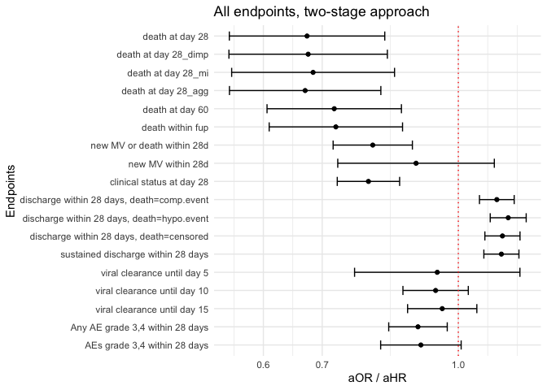
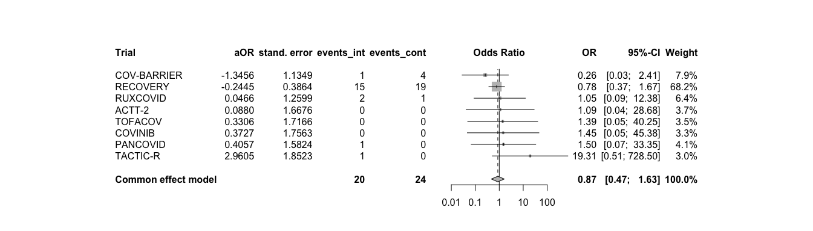
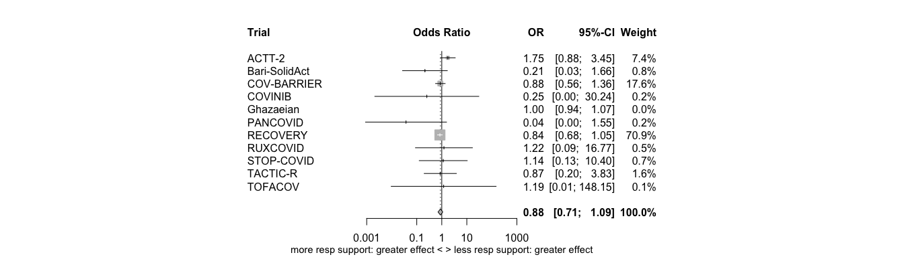
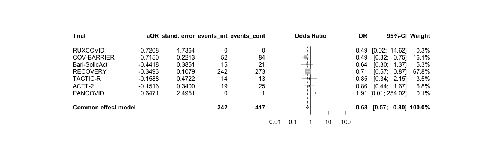
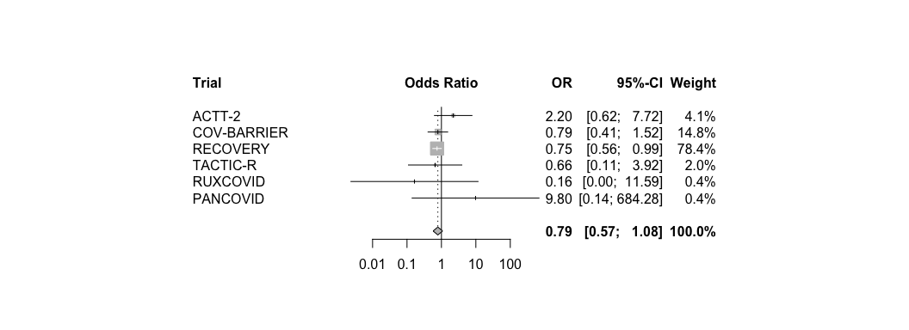
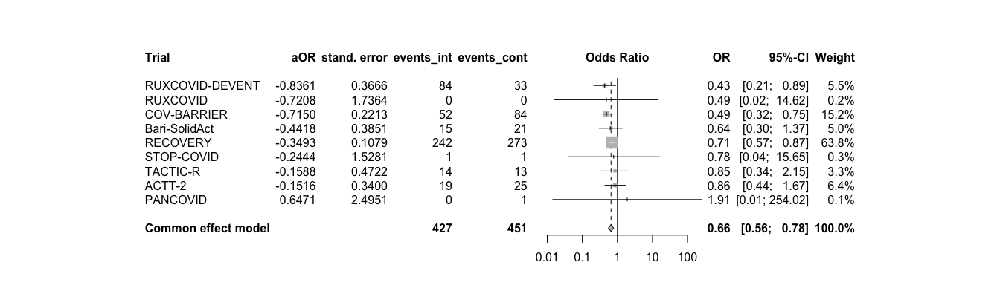
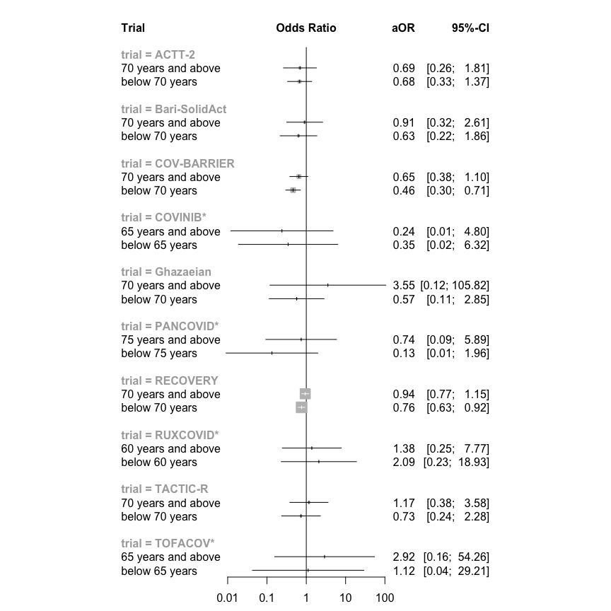
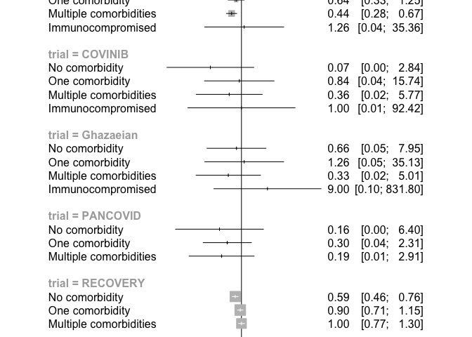
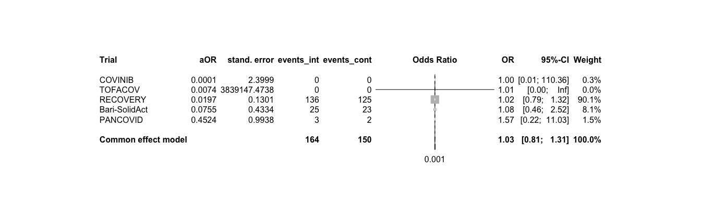
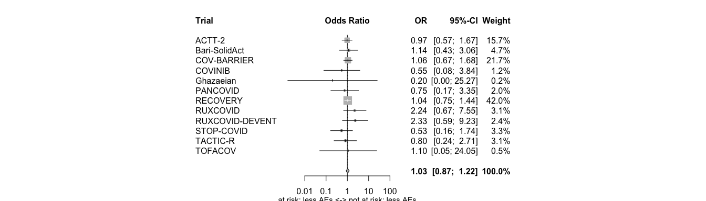

# Load packages

```r
library(tidyverse)
library(readxl)
library(writexl)
library(tableone)
library(here)
library(kableExtra)

library(jtools) # for summ() and plot_summs
library(sjPlot) # for tab_model
library(ggplot2) # survival/TTE analyses and other graphs
library(ggfortify) # autoplot
library(meta)
library(forestplot)
library(metafor) #forest()
library(logistf) # Firth regression in case of rare events
```

# Load tot dataset for descriptive purpose (from descriptive.Rmd -> run before!)

```r
df_tot <- readRDS("df_tot_rux.RData") # without Murugesan, but with RUXCOVID for descriptive purpose
```

# Load treatment effect estimates from all trials

```r
df_barisolidact <- readRDS("trt_effects_barisolidact.RData")
df_actt2 <- readRDS("trt_effects_actt2.RData")
df_ghazaeian <- readRDS("trt_effects_ghazaeian.RData")
df_tofacov <- readRDS("trt_effects_tofacov.RData")
df_covinib <- readRDS("trt_effects_covinib.RData")
df_covbarrier <- readRDS("trt_effects_cov-barrier.RData")
df_recovery <- readRDS("trt_effects_recovery.RData")
df_tactic_r <- readRDS("trt_effects_tactic-r.RData")
df_ruxcovid <- readRDS("trt_effects_ruxcovid_07052024.RData")
df_pancovid <- readRDS("trt_effects_pancovid.RData")
```

# Reshape dataframes for all treatment effect estimates

```r
### Create a list of all data frames / trials
list_df <- list(df_barisolidact, df_actt2, df_ghazaeian, df_tofacov, df_covinib, df_covbarrier, df_recovery, df_tactic_r, df_ruxcovid, df_pancovid) # add all trials

## Mortality at day 28
outcomes <- "death at day 28"
outcomes.firth <- "death at day 28_firth" # depends on which estimates to include
# Initialize an empty data frame to store the selected rows
df_mort28 <- data.frame()
# Loop through the list of data frames
for (df in list_df) {
  selected_rows <- df %>% filter(variable == outcomes | variable == outcomes.firth)
  df_mort28 <- rbind(df_mort28, selected_rows)
}

## Mortality at day 60
outcomes <- "death at day 60"
outcomes.firth <- "death at day 60_firth"
df_mort60 <- data.frame()
for (df in list_df) {
  selected_rows <- df %>% filter(variable == outcomes | variable == outcomes.firth)
  df_mort60 <- rbind(df_mort60, selected_rows)
}

## Death within fup
outcomes <- "death within fup"
outcomes.firth <- "death within fup_firth"
df_ttdeath <- data.frame()
for (df in list_df) {
  selected_rows <- df %>% filter(variable == outcomes | variable == outcomes.firth)
  df_ttdeath <- rbind(df_ttdeath, selected_rows)
}

## Mortality at day 28: average marginal effect
outcomes <- "death at day 28_marginal"
outcomes.firth <- "death at day 28_marginal_firth"
df_mort28_ame <- data.frame()
for (df in list_df) {
  selected_rows <- df %>% filter(variable == outcomes | variable == outcomes.firth)
  df_mort28_ame <- rbind(df_mort28_ame, selected_rows)
}

## Mortality at day 28: deterministic imputation
outcomes <- "death at day 28_dimp"
outcomes.firth <- "death at day 28_dimp_firth"
df_mort28_dimp <- data.frame()
for (df in list_df) {
  selected_rows <- df %>% filter(variable == outcomes | variable == outcomes.firth)
  df_mort28_dimp <- rbind(df_mort28_dimp, selected_rows)
}

## new MV within 28d
outcomes <- "new MV within 28d"
outcomes.firth <- "new MV within 28d_firth"
df_new_mv28 <- data.frame()
for (df in list_df) {
  selected_rows <- df %>% filter(variable == outcomes | variable == outcomes.firth)
  df_new_mv28 <- rbind(df_new_mv28, selected_rows)
}

## new MV or death within 28d
outcomes <- "new MV or death within 28d"
outcomes.firth <- "new MV or death within 28d_firth"
df_new_mvd28 <- data.frame()
for (df in list_df) {
  selected_rows <- df %>% filter(variable == outcomes | variable == outcomes.firth)
  df_new_mvd28 <- rbind(df_new_mvd28, selected_rows)
}

## new MV or death within 28d
outcomes <- "new MV or death within 28d"
outcomes.firth <- "new MV or death within 28d_firth"
df_new_mvd28 <- data.frame()
for (df in list_df) {
  selected_rows <- df %>% filter(variable == outcomes | variable == outcomes.firth)
  df_new_mvd28 <- rbind(df_new_mvd28, selected_rows)
}

## clinical status at day 28
outcomes <- "clinical status at day 28"
outcomes.firth <- "clinical status at day 28_firth"
df_clin28 <- data.frame()
for (df in list_df) {
  selected_rows <- df %>% filter(variable == outcomes | variable == outcomes.firth)
  df_clin28 <- rbind(df_clin28, selected_rows)
}

## discharge within 28 days
outcomes <- "discharge within 28 days"
outcomes.firth <- "discharge within 28 days_firth"
df_ttdischarge <- data.frame()
for (df in list_df) {
  selected_rows <- df %>% filter(variable == outcomes | variable == outcomes.firth)
  df_ttdischarge <- rbind(df_ttdischarge, selected_rows)
}

## discharge within 28 days, death=comp.event
outcomes <- "discharge within 28 days, death=comp.event"
outcomes.firth <- "discharge within 28 days, death=comp.event_firth"
df_ttdischarge_comp <- data.frame()
for (df in list_df) {
  selected_rows <- df %>% filter(variable == outcomes | variable == outcomes.firth)
  df_ttdischarge_comp <- rbind(df_ttdischarge_comp, selected_rows)
}

## discharge within 28 days, death=hypo.event
outcomes <- "discharge within 28 days, death=hypo.event"
outcomes.firth <- "discharge within 28 days, death=hypo.event_firth"
df_ttdischarge_hypo <- data.frame()
for (df in list_df) {
  selected_rows <- df %>% filter(variable == outcomes | variable == outcomes.firth)
  df_ttdischarge_hypo <- rbind(df_ttdischarge_hypo, selected_rows)
}

## sustained discharge within 28 days
outcomes <- "sustained discharge within 28 days"
outcomes.firth <- "sustained discharge within 28 days_firth"
df_ttdischarge_sus <- data.frame()
for (df in list_df) {
  selected_rows <- df %>% filter(variable == outcomes | variable == outcomes.firth)
  df_ttdischarge_sus <- rbind(df_ttdischarge_sus, selected_rows)
}

## viral clearance until day 5
outcomes <- "viral clearance until day 5"
outcomes.firth <- "viral clearance until day 5_firth"
df_vir_clear_5 <- data.frame()
for (df in list_df) {
  selected_rows <- df %>% filter(variable == outcomes | variable == outcomes.firth)
  df_vir_clear_5 <- rbind(df_vir_clear_5, selected_rows)
}

## viral clearance until day 10
outcomes <- "viral clearance until day 10"
outcomes.firth <- "viral clearance until day 10_firth"
df_vir_clear_10 <- data.frame()
for (df in list_df) {
  selected_rows <- df %>% filter(variable == outcomes | variable == outcomes.firth)
  df_vir_clear_10 <- rbind(df_vir_clear_10, selected_rows)
}

## viral clearance until day 15
outcomes <- "viral clearance until day 15"
outcomes.firth <- "viral clearance until day 15_firth"
df_vir_clear_15 <- data.frame()
for (df in list_df) {
  selected_rows <- df %>% filter(variable == outcomes | variable == outcomes.firth)
  df_vir_clear_15 <- rbind(df_vir_clear_15, selected_rows)
}

## Any AE grade 3,4 within 28 days
outcomes <- "Any AE grade 3,4 within 28 days"
outcomes2 <- "any AE grade 3,4 within 28 days"
outcomes.firth <- "Any AE grade 3,4 within 28 days_firth"
outcomes.firth2 <- "any AE grade 3,4 within 28 days_firth"
df_ae28 <- data.frame()
for (df in list_df) {
  selected_rows <- df %>% filter(variable == outcomes | variable == outcomes2 | variable == outcomes.firth | variable == outcomes.firth2)
  df_ae28 <- rbind(df_ae28, selected_rows)
}

## AEs grade 3,4 within 28 days
outcomes <- "AEs grade 3,4 within 28 days"
outcomes.firth <- "AEs grade 3,4 within 28 days_firth"
df_ae28sev <- data.frame()
for (df in list_df) {
  selected_rows <- df %>% filter(variable == outcomes | variable == outcomes.firth)
  df_ae28sev <- rbind(df_ae28sev, selected_rows)
}
```

# (i) Primary outcome: Mortality at day 28

```r
# str(df_mort28)
mort28 <- metagen(TE = log(hazard_odds_ratio),
                      seTE = standard_error,
                      studlab = trial,
                      data = df_mort28,
                      # n.e = n_intervention + n_control,
                      n.e = n_intervention,
                      n.c = n_control,
                      sm = "OR",
                      fixed = F,
                      random = T,
                      prediction = T,
                      method.tau = "ML", # same results with ML (-> see one-stage!)
                      hakn = T, # Hartung-Knapp- Sidik-Jonkman (HKSJ) modified estimate of the variance / 95% CI -> notes
                      adhoc.hakn.ci = "", # Argument 'adhoc.hakn.ci' must be "", "se", "ci", or "IQWiG6".
                      title = "Average treatment effect - mortality 28 days",
                      # subset = trial %in% c("Bari-SolidAct", "ACTT-2", "Ghazaeian") # exclude entirely
                      # exclude = trial %in% c("RUXCOVID") # include in forestplot but exclude from analysis
                      )
summary(mort28)
```

```
## Review:     Average treatment effect - mortality 28 days
## 
##                   OR            95%-CI %W(random)
## Bari-SolidAct 0.6573 [0.3068;  1.4084]        6.2
## ACTT-2        0.7041 [0.3996;  1.2406]       10.4
## Ghazaeian     0.7909 [0.1654;  3.7807]        1.6
## TOFACOV       2.5366 [0.1928; 33.3748]        0.6
## COVINIB       0.1816 [0.0126;  2.6139]        0.6
## COV-BARRIER   0.5131 [0.3666;  0.7182]       22.9
## RECOVERY      0.8109 [0.7034;  0.9349]       48.9
## TACTIC-R      0.8119 [0.3571;  1.8458]        5.4
## RUXCOVID      1.4674 [0.3805;  5.6590]        2.1
## PANCOVID      0.2920 [0.0515;  1.6567]        1.3
## 
## Number of studies: k = 10
## Number of observations: o = 12075
## 
##                               OR           95%-CI     t p-value
## Random effects model (HK) 0.7085 [0.5758; 0.8718] -3.76  0.0045
## Prediction interval              [0.4875; 1.0298]              
## 
## Quantifying heterogeneity:
##  tau^2 = 0.0159 [0.0000; 0.6284]; tau = 0.1262 [0.0000; 0.7927]
##  I^2 = 12.5% [0.0%; 53.6%]; H = 1.07 [1.00; 1.47]
## 
## Test of heterogeneity:
##      Q d.f. p-value
##  10.28    9  0.3281
## 
## Details on meta-analytical method:
## - Inverse variance method
## - Maximum-likelihood estimator for tau^2
## - Q-Profile method for confidence interval of tau^2 and tau
## - Hartung-Knapp adjustment for random effects model (df = 9)
## - Prediction interval based on t-distribution (df = 8)
```

```r
forest.meta(mort28,
            # hetstat = T,
            rightcols = c("effect", "ci", "w.random"),
            rightlabs = c("aOR", "95%-CI", "Weight"),
            # leftcols = c("studlab", "seTE", "n.e"),
            # leftlabs = c("Trial", "Standard Error", "Sample Size"),
            leftcols = c("studlab", "n.e", "n.c"),
            leftlabs = c("Trial", "Total Intervention", "Total Control"),
            text.random = "Average treatment effect (random effects model)",
            title = "Average treatment effect - mortality 28 days", # get the title into the figure
            xlim = c(0.15,5),
            sortvar = +TE,
            label.left = "Favours JAKi",  
            label.right = "Favours No JAKi"
            # xlab = "Average treatment effect (95% CI)"
            )
```

<!-- -->

```r
# Open a pdf file
# pdf("./fp_aggregated.pdf", width=9, height=4)
# forest.meta(i.mort28_adhoc_se,
#             xlim = c(0.1,5),
#             xlab = "                  Favours JAKi <-> Favours No JAKi",
#             fs.xlab = 9)
# dev.off()
```
Discussion points:
1. REML or ML -> Give the exact same result, but the one-stage uses ML (including centering) due to rare events. The choice of estimator might have the biggest influence on the 95%CI, larger than other model parameter choices.

# Funnel plot

```r
## funnel plot (contour enhanced)
funnel(mort28)
```

<!-- -->

```r
funnel(mort28, common = TRUE,
  level = 0.95, contour = c(0.9, 0.95, 0.99),
  col.contour = c("darkgreen", "green", "lightgreen"),
  lwd = 2, cex = 1.5, pch = 16, studlab = TRUE, cex.studlab = 1.1)
```

<!-- -->

```r
# legend(0.05, 0.05,
#   c("0.1 > p > 0.05", "0.05 > p > 0.01", "< 0.01"),
#   fill = c("darkgreen", "green", "lightgreen"))
# par(oldpar)
```

# (i.i) Primary outcome: Including the non-IPD RCTs

```r
# first, add more columns to df_mort28
df_mort28 <- df_mort28 %>% 
  mutate(recruitment_period = case_when(trial == "Bari-SolidAct" ~ "06.2021-03.2022",
                                        trial == "ACTT-2" ~ "05.2020-07.2020",
                                        trial == "Ghazaeian" ~ "08.2021-11.2021",
                                        trial == "TOFACOV" ~ "09.2020-12.2021",
                                        trial == "COVINIB" ~ "09.2020-06.2021",
                                        trial == "COV-BARRIER" ~ "06.2020-01.2021",
                                        trial == "RECOVERY" ~ "02.2021-12.2021", 
                                        trial == "TACTIC-R" ~ "05.2020-05.2021",
                                        trial == "RUXCOVID" ~ "04.2020-09.2020",
                                        trial == "PANCOVID" ~ "10.2020-09.2021",
                                        ))
df_mort28 <- df_mort28 %>% 
  mutate(recruitment_period_cat = case_when(trial == "ACTT-2" ~ "mid2020",
                                            trial == "COV-BARRIER" ~ "mid2020",
                                            trial == "RECOVERY" ~ "beg2021",
                                            trial == "TOFACOV" ~ "beg2021",
                                            trial == "COVINIB" ~ "beg2021",
                                            trial == "Ghazaeian" ~ "mid2021",
                                            trial == "Bari-SolidAct" ~ "mid2021",
                                            trial == "TACTIC-R" ~ "beg2021",
                                            trial == "RUXCOVID" ~ "mid2020",
                                            trial == "PANCOVID" ~ "beg2021",
                                        ))

df_mort28 <- df_mort28 %>% 
  mutate(rob_mort28 = case_when(trial == "ACTT-2" ~ "low risk",
                                            trial == "COV-BARRIER" ~ "low risk",
                                            trial == "RECOVERY" ~ "low risk",
                                            trial == "TOFACOV" ~ "low risk",
                                            trial == "COVINIB" ~ "low risk",
                                            trial == "Ghazaeian" ~ "low risk",
                                            trial == "Bari-SolidAct" ~ "low risk",
                                trial == "TACTIC-R" ~ "low risk",
                                trial == "RUXCOVID" ~ "low risk",
                                trial == "PANCOVID" ~ "low risk",
                                        ))

#### read in aggregate data
## PRE-VENT
df_prevent <- read_excel("/Users/amstutzal/Library/CloudStorage/OneDrive-usb.ch/Dokumente - JAKi IPDMA data source management/General/non-IPD/JAKi_IPDMA_aggr_data.xlsx", sheet = "PRE-VENT")
# analyse with same model
addmargins(table(df_prevent$mort_28, df_prevent$trt, useNA = "always"))
```

```
##       
##          0   1 <NA> Sum
##   0     93  89    0 182
##   1      8  10    0  18
##   <NA>   0   0    0   0
##   Sum  101  99    0 200
```

```r
mort.28.prevent <- df_prevent %>% 
  glm(mort_28 ~ trt
      , family = "binomial", data=.)
summ(mort.28.prevent, exp = T, confint = T, model.info = T, model.fit = F, digits = 2)
```

<table class="table table-striped table-hover table-condensed table-responsive" style="width: auto !important; margin-left: auto; margin-right: auto;">
<tbody>
  <tr>
   <td style="text-align:left;font-weight: bold;"> Observations </td>
   <td style="text-align:right;"> 200 </td>
  </tr>
  <tr>
   <td style="text-align:left;font-weight: bold;"> Dependent variable </td>
   <td style="text-align:right;"> mort_28 </td>
  </tr>
  <tr>
   <td style="text-align:left;font-weight: bold;"> Type </td>
   <td style="text-align:right;"> Generalized linear model </td>
  </tr>
  <tr>
   <td style="text-align:left;font-weight: bold;"> Family </td>
   <td style="text-align:right;"> binomial </td>
  </tr>
  <tr>
   <td style="text-align:left;font-weight: bold;"> Link </td>
   <td style="text-align:right;"> logit </td>
  </tr>
</tbody>
</table>  <table class="table table-striped table-hover table-condensed table-responsive" style="width: auto !important; margin-left: auto; margin-right: auto;border-bottom: 0;">
 <thead>
  <tr>
   <th style="text-align:left;">   </th>
   <th style="text-align:right;"> exp(Est.) </th>
   <th style="text-align:right;"> 2.5% </th>
   <th style="text-align:right;"> 97.5% </th>
   <th style="text-align:right;"> z val. </th>
   <th style="text-align:right;"> p </th>
  </tr>
 </thead>
<tbody>
  <tr>
   <td style="text-align:left;font-weight: bold;"> (Intercept) </td>
   <td style="text-align:right;"> 0.09 </td>
   <td style="text-align:right;"> 0.04 </td>
   <td style="text-align:right;"> 0.18 </td>
   <td style="text-align:right;"> -6.66 </td>
   <td style="text-align:right;"> 0.00 </td>
  </tr>
  <tr>
   <td style="text-align:left;font-weight: bold;"> trt </td>
   <td style="text-align:right;"> 1.31 </td>
   <td style="text-align:right;"> 0.49 </td>
   <td style="text-align:right;"> 3.46 </td>
   <td style="text-align:right;"> 0.54 </td>
   <td style="text-align:right;"> 0.59 </td>
  </tr>
</tbody>
<tfoot><tr><td style="padding: 0; " colspan="100%">
<sup></sup> Standard errors: MLE</td></tr></tfoot>
</table>

```r
# add effect estimates and other parameters to df_mort28
row_prevent <- tibble(
  variable = "death at day 28",
  hazard_odds_ratio = exp(coef(mort.28.prevent)["trt"]),
  ci_lower = exp(confint(mort.28.prevent)["trt", ])[1],
  ci_upper = exp(confint(mort.28.prevent)["trt", ])[2],
  standard_error = summary(mort.28.prevent)$coefficients["trt", "Std. Error"],
  p_value = summary(mort.28.prevent)$coefficients["trt", "Pr(>|z|)"],
  n_intervention = addmargins(table(df_prevent$mort_28, df_prevent$trt, useNA = "always"))[4,2],
  n_control = addmargins(table(df_prevent$mort_28, df_prevent$trt, useNA = "always"))[4,1],
  trial = "PRE-VENT*",
  JAKi = "Pacritinib",
  recruitment_period = "06.2020-02.2021",
  recruitment_period_cat = "mid2020",
  rob_mort28 = "low risk")
```

```
## Waiting for profiling to be done...
## Waiting for profiling to be done...
```

```r
## CAO
df_cao <- read_excel("/Users/amstutzal/Library/CloudStorage/OneDrive-usb.ch/Dokumente - JAKi IPDMA data source management/General/non-IPD/JAKi_IPDMA_aggr_data.xlsx", sheet = "CAO")
# analyse with same model
addmargins(table(df_cao$mort_28, df_cao$trt, useNA = "always"))
```

```
##       
##         0  1 <NA> Sum
##   0    18 20    0  38
##   1     3  0    0   3
##   <NA>  0  0    0   0
##   Sum  21 20    0  41
```

```r
mort.28.cao <- df_cao %>% 
  logistf(mort_28 ~ trt
      , family = "binomial", data=.)
summary(mort.28.cao)
```

```
## logistf(formula = mort_28 ~ trt, data = ., family = "binomial")
## 
## Model fitted by Penalized ML
## Coefficients:
##                  coef  se(coef) lower 0.95 upper 0.95     Chisq            p
## (Intercept) -1.665008 0.5828965  -2.996461 -0.6391919 11.219466 0.0008094379
## trt         -2.048564 1.5454930  -6.975291  0.3788351  2.610367 0.1061671667
##             method
## (Intercept)      2
## trt              2
## 
## Method: 1-Wald, 2-Profile penalized log-likelihood, 3-None
## 
## Likelihood ratio test=2.610367 on 1 df, p=0.1061672, n=41
## Wald test = 14.89037 on 1 df, p = 0.0001139429
```

```r
# add effect estimates and other parameters to df_mort28
row_cao <- tibble(
  variable = "death at day 28",
  hazard_odds_ratio = exp(coef(mort.28.cao)["trt"]),
  ci_lower = exp(mort.28.cao$ci.lower["trt"]),
  ci_upper = exp(mort.28.cao$ci.upper["trt"]),
  standard_error = sqrt(diag(vcov(mort.28.cao)))["trt"],
  p_value = mort.28.cao$prob["trt"],
  n_intervention = addmargins(table(df_cao$mort_28, df_cao$trt, useNA = "always"))[4,2],
  n_control = addmargins(table(df_cao$mort_28, df_cao$trt, useNA = "always"))[4,1],
  trial = "CAO*",
  JAKi = "Ruxolitinib",
  recruitment_period = "02.2020",
  recruitment_period_cat = "beg2020",
  rob_mort28 = "low risk")

# ## Pancovid
# df_pancovid <- read_excel("/Users/amstutzal/Library/CloudStorage/OneDrive-usb.ch/Dokumente - JAKi IPDMA data source management/General/non-IPD/JAKi_IPDMA_aggr_data.xlsx", sheet = "Pancovid")
# # analyse with same model
# addmargins(table(df_pancovid$mort_28, df_pancovid$trt, useNA = "always"))
# mort.28.pancovid <- df_pancovid %>% 
#   glm(mort_28 ~ trt
#       , family = "binomial", data=.)
# summ(mort.28.pancovid, exp = T, confint = T, model.info = T, model.fit = F, digits = 2)
# # add effect estimates and other parameters to df_mort28
# row_pancovid <- tibble(
#   variable = "death at day 28",
#   hazard_odds_ratio = exp(coef(mort.28.pancovid)["trt"]),
#   ci_lower = exp(confint(mort.28.pancovid)["trt", ])[1],
#   ci_upper = exp(confint(mort.28.pancovid)["trt", ])[2],
#   standard_error = summary(mort.28.pancovid)$coefficients["trt", "Std. Error"],
#   p_value = summary(mort.28.pancovid)$coefficients["trt", "Pr(>|z|)"],
#   n_intervention = addmargins(table(df_pancovid$mort_28, df_pancovid$trt, useNA = "always"))[4,2],
#   n_control = addmargins(table(df_pancovid$mort_28, df_pancovid$trt, useNA = "always"))[4,1],
#   trial = "Pancovid*",
#   JAKi = "Baricitinib",
#   recruitment_period = "10.2020-09.2021",
#   recruitment_period_cat = "beg2021",
#   rob_mort28 = "low risk")

## STOP-COVID
df_stopcovid <- read_excel("/Users/amstutzal/Library/CloudStorage/OneDrive-usb.ch/Dokumente - JAKi IPDMA data source management/General/non-IPD/JAKi_IPDMA_aggr_data.xlsx", sheet = "STOP-COVID")
# analyse with same model
addmargins(table(df_stopcovid$mort_28, df_stopcovid$trt, useNA = "always"))
```

```
##       
##          0   1 <NA> Sum
##   0    137 140    0 277
##   1      8   4    0  12
##   <NA>   0   0    0   0
##   Sum  145 144    0 289
```

```r
mort.28.stopcovid <- df_stopcovid %>% 
  glm(mort_28 ~ trt
      , family = "binomial", data=.)
summ(mort.28.stopcovid, exp = T, confint = T, model.info = T, model.fit = F, digits = 2)
```

<table class="table table-striped table-hover table-condensed table-responsive" style="width: auto !important; margin-left: auto; margin-right: auto;">
<tbody>
  <tr>
   <td style="text-align:left;font-weight: bold;"> Observations </td>
   <td style="text-align:right;"> 289 </td>
  </tr>
  <tr>
   <td style="text-align:left;font-weight: bold;"> Dependent variable </td>
   <td style="text-align:right;"> mort_28 </td>
  </tr>
  <tr>
   <td style="text-align:left;font-weight: bold;"> Type </td>
   <td style="text-align:right;"> Generalized linear model </td>
  </tr>
  <tr>
   <td style="text-align:left;font-weight: bold;"> Family </td>
   <td style="text-align:right;"> binomial </td>
  </tr>
  <tr>
   <td style="text-align:left;font-weight: bold;"> Link </td>
   <td style="text-align:right;"> logit </td>
  </tr>
</tbody>
</table>  <table class="table table-striped table-hover table-condensed table-responsive" style="width: auto !important; margin-left: auto; margin-right: auto;border-bottom: 0;">
 <thead>
  <tr>
   <th style="text-align:left;">   </th>
   <th style="text-align:right;"> exp(Est.) </th>
   <th style="text-align:right;"> 2.5% </th>
   <th style="text-align:right;"> 97.5% </th>
   <th style="text-align:right;"> z val. </th>
   <th style="text-align:right;"> p </th>
  </tr>
 </thead>
<tbody>
  <tr>
   <td style="text-align:left;font-weight: bold;"> (Intercept) </td>
   <td style="text-align:right;"> 0.06 </td>
   <td style="text-align:right;"> 0.03 </td>
   <td style="text-align:right;"> 0.12 </td>
   <td style="text-align:right;"> -7.81 </td>
   <td style="text-align:right;"> 0.00 </td>
  </tr>
  <tr>
   <td style="text-align:left;font-weight: bold;"> trt </td>
   <td style="text-align:right;"> 0.49 </td>
   <td style="text-align:right;"> 0.14 </td>
   <td style="text-align:right;"> 1.66 </td>
   <td style="text-align:right;"> -1.15 </td>
   <td style="text-align:right;"> 0.25 </td>
  </tr>
</tbody>
<tfoot><tr><td style="padding: 0; " colspan="100%">
<sup></sup> Standard errors: MLE</td></tr></tfoot>
</table>

```r
# add effect estimates and other parameters to df_mort28
row_stopcovid <- tibble(
  variable = "death at day 28",
  hazard_odds_ratio = exp(coef(mort.28.stopcovid)["trt"]),
  ci_lower = exp(confint(mort.28.stopcovid)["trt", ])[1],
  ci_upper = exp(confint(mort.28.stopcovid)["trt", ])[2],
  standard_error = summary(mort.28.stopcovid)$coefficients["trt", "Std. Error"],
  p_value = summary(mort.28.stopcovid)$coefficients["trt", "Pr(>|z|)"],
  n_intervention = addmargins(table(df_stopcovid$mort_28, df_stopcovid$trt, useNA = "always"))[4,2],
  n_control = addmargins(table(df_stopcovid$mort_28, df_stopcovid$trt, useNA = "always"))[4,1],
  trial = "STOP-COVID*",
  JAKi = "Tofacitinib",
  recruitment_period = "09.2020-12.2020",
  recruitment_period_cat = "mid2020",
  rob_mort28 = "low risk")
```

```
## Waiting for profiling to be done...
## Waiting for profiling to be done...
```

```r
## RUXCOVID-DEVENT
df_ruxcoviddevent <- read_excel("/Users/amstutzal/Library/CloudStorage/OneDrive-usb.ch/Dokumente - JAKi IPDMA data source management/General/non-IPD/JAKi_IPDMA_aggr_data.xlsx", sheet = "RUXCOVID-DEVENT")
# analyse with same model
addmargins(table(df_ruxcoviddevent$mort_28, df_ruxcoviddevent$trt, useNA = "always"))
```

```
##       
##          0   1 <NA> Sum
##   0     14  80    0  94
##   1     33  84    0 117
##   <NA>   0   0    0   0
##   Sum   47 164    0 211
```

```r
mort.28.ruxcoviddevent <- df_ruxcoviddevent %>% 
  glm(mort_28 ~ trt
      , family = "binomial", data=.)
summ(mort.28.ruxcoviddevent, exp = T, confint = T, model.info = T, model.fit = F, digits = 2)
```

<table class="table table-striped table-hover table-condensed table-responsive" style="width: auto !important; margin-left: auto; margin-right: auto;">
<tbody>
  <tr>
   <td style="text-align:left;font-weight: bold;"> Observations </td>
   <td style="text-align:right;"> 211 </td>
  </tr>
  <tr>
   <td style="text-align:left;font-weight: bold;"> Dependent variable </td>
   <td style="text-align:right;"> mort_28 </td>
  </tr>
  <tr>
   <td style="text-align:left;font-weight: bold;"> Type </td>
   <td style="text-align:right;"> Generalized linear model </td>
  </tr>
  <tr>
   <td style="text-align:left;font-weight: bold;"> Family </td>
   <td style="text-align:right;"> binomial </td>
  </tr>
  <tr>
   <td style="text-align:left;font-weight: bold;"> Link </td>
   <td style="text-align:right;"> logit </td>
  </tr>
</tbody>
</table>  <table class="table table-striped table-hover table-condensed table-responsive" style="width: auto !important; margin-left: auto; margin-right: auto;border-bottom: 0;">
 <thead>
  <tr>
   <th style="text-align:left;">   </th>
   <th style="text-align:right;"> exp(Est.) </th>
   <th style="text-align:right;"> 2.5% </th>
   <th style="text-align:right;"> 97.5% </th>
   <th style="text-align:right;"> z val. </th>
   <th style="text-align:right;"> p </th>
  </tr>
 </thead>
<tbody>
  <tr>
   <td style="text-align:left;font-weight: bold;"> (Intercept) </td>
   <td style="text-align:right;"> 2.36 </td>
   <td style="text-align:right;"> 1.26 </td>
   <td style="text-align:right;"> 4.40 </td>
   <td style="text-align:right;"> 2.69 </td>
   <td style="text-align:right;"> 0.01 </td>
  </tr>
  <tr>
   <td style="text-align:left;font-weight: bold;"> trt </td>
   <td style="text-align:right;"> 0.45 </td>
   <td style="text-align:right;"> 0.22 </td>
   <td style="text-align:right;"> 0.89 </td>
   <td style="text-align:right;"> -2.28 </td>
   <td style="text-align:right;"> 0.02 </td>
  </tr>
</tbody>
<tfoot><tr><td style="padding: 0; " colspan="100%">
<sup></sup> Standard errors: MLE</td></tr></tfoot>
</table>

```r
# add effect estimates and other parameters to df_mort28
row_ruxcoviddevent <- tibble(
  variable = "death at day 28",
  hazard_odds_ratio = exp(coef(mort.28.ruxcoviddevent)["trt"]),
  ci_lower = exp(confint(mort.28.ruxcoviddevent)["trt", ])[1],
  ci_upper = exp(confint(mort.28.ruxcoviddevent)["trt", ])[2],
  standard_error = summary(mort.28.ruxcoviddevent)$coefficients["trt", "Std. Error"],
  p_value = summary(mort.28.ruxcoviddevent)$coefficients["trt", "Pr(>|z|)"],
  n_intervention = addmargins(table(df_ruxcoviddevent$mort_28, df_ruxcoviddevent$trt, useNA = "always"))[4,2],
  n_control = addmargins(table(df_ruxcoviddevent$mort_28, df_ruxcoviddevent$trt, useNA = "always"))[4,1],
  trial = "RUXCOVID-DEVENT*",
  JAKi = "Ruxolitinib",
  recruitment_period = "05.2020-12.2020",
  recruitment_period_cat = "mid2020",
  rob_mort28 = "low risk")
```

```
## Waiting for profiling to be done...
## Waiting for profiling to be done...
```

```r
## RUXCOVID
# df_ruxcovid <- read_excel("/Users/amstutzal/Library/CloudStorage/OneDrive-usb.ch/Dokumente - JAKi IPDMA data source management/General/non-IPD/JAKi_IPDMA_aggr_data.xlsx", sheet = "RUXCOVID")
# # analyse with same model
# addmargins(table(df_ruxcovid$mort_28, df_ruxcovid$trt, useNA = "always"))
# mort.28.ruxcovid <- df_ruxcovid %>% 
#   glm(mort_28 ~ trt
#       , family = "binomial", data=.)
# summ(mort.28.ruxcovid, exp = T, confint = T, model.info = T, model.fit = F, digits = 2)
# # add effect estimates and other parameters to df_mort28
# row_ruxcovid <- tibble(
#   variable = "death at day 28",
#   hazard_odds_ratio = exp(coef(mort.28.ruxcovid)["trt"]),
#   ci_lower = exp(confint(mort.28.ruxcovid)["trt", ])[1],
#   ci_upper = exp(confint(mort.28.ruxcovid)["trt", ])[2],
#   standard_error = summary(mort.28.ruxcovid)$coefficients["trt", "Std. Error"],
#   p_value = summary(mort.28.ruxcovid)$coefficients["trt", "Pr(>|z|)"],
#   n_intervention = addmargins(table(df_ruxcovid$mort_28, df_ruxcovid$trt, useNA = "always"))[4,2],
#   n_control = addmargins(table(df_ruxcovid$mort_28, df_ruxcovid$trt, useNA = "always"))[4,1],
#   trial = "RUXCOVID*",
#   JAKi = "Ruxolitinib",
#   recruitment_period = "04.2020-09.2020",
#   recruitment_period_cat = "mid2020",
#   rob_mort28 = "low risk")

# ## TACTIC-R
# df_tacticr <- read_excel("/Users/amstutzal/Library/CloudStorage/OneDrive-usb.ch/Dokumente - JAKi IPDMA data source management/General/non-IPD/JAKi_IPDMA_aggr_data.xlsx", sheet = "TACTIC-R")
# # analyse with same model
# addmargins(table(df_tacticr$mort_28, df_tacticr$trt, useNA = "always"))
# mort.28.tacticr <- df_tacticr %>% 
#   glm(mort_28 ~ trt
#       , family = "binomial", data=.)
# summ(mort.28.tacticr, exp = T, confint = T, model.info = T, model.fit = F, digits = 2)
# # add effect estimates and other parameters to df_mort28
# row_tacticr <- tibble(
#   variable = "death at day 28",
#   hazard_odds_ratio = exp(coef(mort.28.tacticr)["trt"]),
#   ci_lower = exp(confint(mort.28.tacticr)["trt", ])[1],
#   ci_upper = exp(confint(mort.28.tacticr)["trt", ])[2],
#   standard_error = summary(mort.28.tacticr)$coefficients["trt", "Std. Error"],
#   p_value = summary(mort.28.tacticr)$coefficients["trt", "Pr(>|z|)"],
#   n_intervention = addmargins(table(df_tacticr$mort_28, df_tacticr$trt, useNA = "always"))[4,2],
#   n_control = addmargins(table(df_tacticr$mort_28, df_tacticr$trt, useNA = "always"))[4,1],
#   trial = "TACTIC-R*",
#   JAKi = "Baricitinib",
#   recruitment_period = "05.2020-05.2021",
#   recruitment_period_cat = "beg2021",
#   rob_mort28 = "low risk")

## Dastan
df_dastan <- read_excel("/Users/amstutzal/Library/CloudStorage/OneDrive-usb.ch/Dokumente - JAKi IPDMA data source management/General/non-IPD/JAKi_IPDMA_aggr_data.xlsx", sheet = "Dastan")
# analyse with same model
addmargins(table(df_dastan$mort_28, df_dastan$trt, useNA = "always"))
```

```
##       
##         0  1 <NA> Sum
##   0    32 34    0  66
##   1     2  0    0   2
##   <NA>  0  0    0   0
##   Sum  34 34    0  68
```

```r
mort.28.dastan <- df_dastan %>% 
  logistf(mort_28 ~ trt
      , family = "binomial", data=.)
summary(mort.28.dastan)
```

```
## logistf(formula = mort_28 ~ trt, data = ., family = "binomial")
## 
## Model fitted by Penalized ML
## Coefficients:
##                  coef  se(coef) lower 0.95 upper 0.95     Chisq            p
## (Intercept) -2.564949 0.6563301  -4.152264 -1.4678989 30.507998 3.324930e-08
## trt         -1.669157 1.5683605  -6.610664  0.8879405  1.515226 2.183433e-01
##             method
## (Intercept)      2
## trt              2
## 
## Method: 1-Wald, 2-Profile penalized log-likelihood, 3-None
## 
## Likelihood ratio test=1.515226 on 1 df, p=0.2183433, n=68
## Wald test = 24.10837 on 1 df, p = 9.106353e-07
```

```r
# add effect estimates and other parameters to df_mort28
row_dastan <- tibble(
  variable = "death at day 28",
  hazard_odds_ratio = exp(coef(mort.28.dastan)["trt"]),
  ci_lower = exp(mort.28.dastan$ci.lower["trt"]),
  ci_upper = exp(mort.28.dastan$ci.upper["trt"]),
  standard_error = sqrt(diag(vcov(mort.28.dastan)))["trt"],
  p_value = mort.28.dastan$prob["trt"],
  n_intervention = addmargins(table(df_dastan$mort_28, df_dastan$trt, useNA = "always"))[4,2],
  n_control = addmargins(table(df_dastan$mort_28, df_dastan$trt, useNA = "always"))[4,1],
  trial = "Dastan*",
  JAKi = "Baricitinib",
  recruitment_period = "03.2022-08.2022",
  recruitment_period_cat = "beg2022",
  rob_mort28 = "Some concerns")

## Singh
df_singh <- read_excel("/Users/amstutzal/Library/CloudStorage/OneDrive-usb.ch/Dokumente - JAKi IPDMA data source management/General/non-IPD/JAKi_IPDMA_aggr_data.xlsx", sheet = "Singh")
# analyse with same model
addmargins(table(df_singh$mort_28, df_singh$trt, useNA = "always"))
```

```
##       
##          0   1 <NA> Sum
##   0     89  97    0 186
##   1     13   6    0  19
##   <NA>   0   0    0   0
##   Sum  102 103    0 205
```

```r
mort.28.singh <- df_singh %>% 
  glm(mort_28 ~ trt
      , family = "binomial", data=.)
summ(mort.28.singh, exp = T, confint = T, model.info = T, model.fit = F, digits = 2)
```

<table class="table table-striped table-hover table-condensed table-responsive" style="width: auto !important; margin-left: auto; margin-right: auto;">
<tbody>
  <tr>
   <td style="text-align:left;font-weight: bold;"> Observations </td>
   <td style="text-align:right;"> 205 </td>
  </tr>
  <tr>
   <td style="text-align:left;font-weight: bold;"> Dependent variable </td>
   <td style="text-align:right;"> mort_28 </td>
  </tr>
  <tr>
   <td style="text-align:left;font-weight: bold;"> Type </td>
   <td style="text-align:right;"> Generalized linear model </td>
  </tr>
  <tr>
   <td style="text-align:left;font-weight: bold;"> Family </td>
   <td style="text-align:right;"> binomial </td>
  </tr>
  <tr>
   <td style="text-align:left;font-weight: bold;"> Link </td>
   <td style="text-align:right;"> logit </td>
  </tr>
</tbody>
</table>  <table class="table table-striped table-hover table-condensed table-responsive" style="width: auto !important; margin-left: auto; margin-right: auto;border-bottom: 0;">
 <thead>
  <tr>
   <th style="text-align:left;">   </th>
   <th style="text-align:right;"> exp(Est.) </th>
   <th style="text-align:right;"> 2.5% </th>
   <th style="text-align:right;"> 97.5% </th>
   <th style="text-align:right;"> z val. </th>
   <th style="text-align:right;"> p </th>
  </tr>
 </thead>
<tbody>
  <tr>
   <td style="text-align:left;font-weight: bold;"> (Intercept) </td>
   <td style="text-align:right;"> 0.15 </td>
   <td style="text-align:right;"> 0.08 </td>
   <td style="text-align:right;"> 0.26 </td>
   <td style="text-align:right;"> -6.48 </td>
   <td style="text-align:right;"> 0.00 </td>
  </tr>
  <tr>
   <td style="text-align:left;font-weight: bold;"> trt </td>
   <td style="text-align:right;"> 0.42 </td>
   <td style="text-align:right;"> 0.15 </td>
   <td style="text-align:right;"> 1.16 </td>
   <td style="text-align:right;"> -1.67 </td>
   <td style="text-align:right;"> 0.10 </td>
  </tr>
</tbody>
<tfoot><tr><td style="padding: 0; " colspan="100%">
<sup></sup> Standard errors: MLE</td></tr></tfoot>
</table>

```r
# add effect estimates and other parameters to df_mort28
row_singh <- tibble(
  variable = "death at day 28",
  hazard_odds_ratio = exp(coef(mort.28.singh)["trt"]),
  ci_lower = exp(confint(mort.28.singh)["trt", ])[1],
  ci_upper = exp(confint(mort.28.singh)["trt", ])[2],
  standard_error = summary(mort.28.singh)$coefficients["trt", "Std. Error"],
  p_value = summary(mort.28.singh)$coefficients["trt", "Pr(>|z|)"],
  n_intervention = addmargins(table(df_singh$mort_28, df_singh$trt, useNA = "always"))[4,2],
  n_control = addmargins(table(df_singh$mort_28, df_singh$trt, useNA = "always"))[4,1],
  trial = "Singh*",
  JAKi = "Nezulcitinib",
  recruitment_period = "06.2020-04.2021",
  recruitment_period_cat = "mid2021",
  rob_mort28 = "low risk")
```

```
## Waiting for profiling to be done...
## Waiting for profiling to be done...
```

```r
# Add the new rows to your existing dataframe
df_mort28_agg <- bind_rows(df_mort28, row_prevent, row_cao, row_stopcovid, row_ruxcoviddevent, row_dastan, row_singh)


# Forestplot
# str(df_mort28_agg)
mort28.agg <- metagen(TE = log(hazard_odds_ratio),
                      seTE = standard_error,
                      studlab = trial,
                      data = df_mort28_agg,
                      n.e = n_intervention,
                      n.c = n_control,
                      # n.e = n_intervention + n_control,
                      sm = "OR",
                      fixed = F,
                      random = T,
                      prediction = T,
                      # subgroup = JAKi,
                      method.tau = "ML", # same results with ML (-> see one-stage!)
                      hakn = T, # Hartung-Knapp- Sidik-Jonkman (HKSJ) modified estimate of the variance / 95% CI -> notes
                      # adhoc.hakn.ci = "", # 'adhoc.hakn.ci' in case of I-squared 0 (either "", "se", "ci", or "IQWiG6").
                      title = "Average treatment effect - mortality 28 days",
                      # subset = trial %in% c("Bari-SolidAct", "ACTT-2", "Ghazaeian") # exclude entirely
                      # exclude = trial %in% c("Bari-SolidAct", "ACTT-2", "Ghazaeian") # include in forestplot but exclude from analysis
                      )
summary(mort28.agg)
```

```
## Review:     Average treatment effect - mortality 28 days
## 
##                      OR            95%-CI %W(random)
## Bari-SolidAct    0.6573 [0.3068;  1.4084]        5.8
## ACTT-2           0.7041 [0.3996;  1.2406]        9.5
## Ghazaeian        0.7909 [0.1654;  3.7807]        1.5
## TOFACOV          2.5366 [0.1928; 33.3748]        0.6
## COVINIB          0.1816 [0.0126;  2.6139]        0.5
## COV-BARRIER      0.5131 [0.3666;  0.7182]       19.5
## RECOVERY         0.8109 [0.7034;  0.9349]       37.0
## TACTIC-R         0.8119 [0.3571;  1.8458]        5.1
## RUXCOVID         1.4674 [0.3805;  5.6590]        2.0
## PANCOVID         0.2920 [0.0515;  1.6567]        1.2
## PRE-VENT*        1.3062 [0.4931;  3.4597]        3.7
## CAO*             0.1289 [0.0062;  2.6659]        0.4
## STOP-COVID*      0.4893 [0.1440;  1.6625]        2.4
## RUXCOVID-DEVENT* 0.4455 [0.2221;  0.8935]        6.8
## Dastan*          0.1884 [0.0087;  4.0746]        0.4
## Singh*           0.4235 [0.1544;  1.1618]        3.5
## 
## Number of studies: k = 16
## Number of observations: o = 13089
## 
##                               OR           95%-CI     t p-value
## Random effects model (HK) 0.6715 [0.5525; 0.8160] -4.36  0.0006
## Prediction interval              [0.4582; 0.9839]              
## 
## Quantifying heterogeneity:
##  tau^2 = 0.0217 [0.0000; 0.3793]; tau = 0.1474 [0.0000; 0.6158]
##  I^2 = 13.5% [0.0%; 50.8%]; H = 1.08 [1.00; 1.43]
## 
## Test of heterogeneity:
##      Q d.f. p-value
##  17.35   15  0.2984
## 
## Details on meta-analytical method:
## - Inverse variance method
## - Maximum-likelihood estimator for tau^2
## - Q-Profile method for confidence interval of tau^2 and tau
## - Hartung-Knapp adjustment for random effects model (df = 15)
## - Prediction interval based on t-distribution (df = 14)
```

```r
forest.meta(mort28.agg,
            rightcols = c("effect", "ci", "w.random"),
            rightlabs = c("aOR", "95%-CI", "Weight"),
            leftcols = c("studlab", 
                         "n.e", "n.c"),
            leftlabs = c("Trial",
                         "Total Intervention", "Total Control"),
            sortvar = +TE,
            text.random = "Average treatment effect (RE model)",
            title = "Average treatment effect - mortality 28 days", # get the title into the figure
            xlim = c(0.10,5),
            label.left = "Favours JAKi",  
            label.right = "Favours No JAKi"
            # xlab = "Average treatment effect (95% CI)"
            )
```

<!-- -->

```r
# Open a pdf file
# pdf("./fp_aggregated.pdf", width=9, height=4)
# forest.meta(i.mort28_adhoc_se,
#             xlim = c(0.1,5),
#             xlab = "                  Favours JAKi <-> Favours No JAKi",
#             fs.xlab = 9)
# dev.off()
```
Discussion points:
* How much do the true effects vary, and over what specific interval?
a. The confidence interval tells us that the mean effect size in the universe of comparable studies probably falls in the interval -xxx to -xxx.
b. The prediction interval tells us that in any single study (selected at random from the universe of comparable studies) the true effect size will usually fall between -xxx and +xxx.
The confidence interval is based on the standard error of the mean and speaks to the precision of the mean. The prediction interval is based on the standard deviation of true effects and speaks to the dispersion of those effects.
Researchers often assume that if the effect is beneficial and statistically significant, it must be helpful in all populations. However, this is a mistake. The fact that an effect is statisti- cally significant tells us (for example) that the treatment is associated with a benefit on average. It may still be associ- ated with harm in some populations.
a. The results are statistically significant because the confidence interval excludes zero. However, this speaks only to the mean effect size.
b. The dispersion of effects is an entirely separate matter.

# Funnel plot

```r
## funnel plot (contour enhanced)
funnel(mort28.agg)
```

<!-- -->

```r
funnel(mort28.agg, common = TRUE,
  level = 0.95, contour = c(0.9, 0.95, 0.99),
  col.contour = c("grey", "lightgrey", "lightyellow"),
  lwd = 2, cex = 1.5, pch = 16, studlab = TRUE, cex.studlab = 1.0)
```

<!-- -->

```r
# legend(0.05, 0.05,
#   c("0.1 > p > 0.05", "0.05 > p > 0.01", "< 0.01"),
#   fill = c("darkgreen", "green", "lightgreen"))
# par(oldpar)
```

# (i.ii) Primary outcome: Meta-regression by JAKi, including the non-IPD RCTs

```r
# meta-regression by JAKi
mort28.agg.jaki <- update.meta(mort28.agg, 
                               subgroup = JAKi)
forest.meta(mort28.agg.jaki,
            hetstat = F,
            rightcols = c("effect", "ci", "w.random"),
            rightlabs = c("aOR", "95%-CI", "Weight"),
            leftcols = c("studlab", 
                         "n.e", "n.c"),
            leftlabs = c("Trial",
                         "Total Intervention", "Total Control"),
            sortvar = +TE,
            test.subgroup.random = TRUE,
            prediction = F,
            text.random = "Average treatment effect (RE model)",
            title = "Average treatment effect - mortality 28 days", # get the title into the figure
            xlim = c(0.03,30),
            label.left = "Favours JAKi",  
            label.right = "Favours No JAKi"
            # xlab = "Average treatment effect (95% CI)"
            )
```

<!-- -->

```r
# Print only subgroup results
# forest(mort28.agg.jaki, layout = "subgroup", calcwidth.hetstat = TRUE)
```

# (i.iii) Primary outcome: Meta-regression by Recruitment Period, including the non-IPD RCTs

```r
# meta-regression by recruitment period
# mort28.agg.rec <- update.meta(mort28.agg, 
#                                subgroup = recruitment_period_cat)
# forest.meta(mort28.agg.rec,
#             leftcols = c("studlab", 
#                          # "TE", 
#                          # "seTE", 
#                          "n.e"),
#             leftlabs = c("Trial", 
#                          # "log(OR)", 
#                          # "Standard Error", 
#                          "Sample Size"),
#             sortvar = +TE,
#             test.subgroup.random = TRUE,
#             text.random = "Average treatment effect (RE model)",
#             title = "Average treatment effect - mortality 28 days",
#             xlim = c(0.03,30),
#             # xlab = "Average treatment effect (95% CI)"
#             )
```

# (i.iv) Primary outcome: Meta-regression by RoB, including the non-IPD RCTs // except 1: all low-risk

```r
# # meta-regression by RoB
# mort28.agg.rob <- update.meta(mort28.agg,
#                                subgroup = rob_mort28)
# forest.meta(mort28.agg.rob,
#             leftcols = c("studlab",
#                          # "TE",
#                          # "seTE",
#                          "n.e"),
#             leftlabs = c("Trial",
#                          # "log(OR)",
#                          # "Standard Error",
#                          "Sample Size"),
#             sortvar = +TE,
#             test.subgroup.random = TRUE,
#             text.random = "Average treatment effect (RE model)",
#             title = "Average treatment effect - mortality 28 days",
#             xlim = c(0.03,30),
#             # xlab = "Average treatment effect (95% CI)"
#             )
```

# (i.v) Primary outcome: Covariate-adjusted Average marginal effects (RDs)

```r
# str(df_mort60)
mort28.ame <- metagen(TE = hazard_odds_ratio,
                      seTE = standard_error,
                      studlab = trial,
                      data = df_mort28_ame,
                      n.e = n_intervention + n_control,
                      # n.c = n_control,
                      # sm = "SMD",
                      fixed = F,
                      random = T,
                      prediction = F,
                      method.tau = "ML", 
                      hakn = T,
                      adhoc.hakn.ci = "", 
                      title = "Covariate-adjusted average marginal effect - mortality 28 days",
                      # exclude = trial %in% c("Bari-SolidAct", "ACTT-2", "Ghazaeian") # include in forestplot but exclude from analysis
                      )
summary(mort28.ame)
```

```
## Review:     Covariate-adjusted average marginal effect - mortality 28 days
## 
##                                   95%-CI %W(random)
## Bari-SolidAct -0.0411 [-0.1170;  0.0348]        3.8
## ACTT-2        -0.0177 [-0.0465;  0.0111]       14.1
## Ghazaeian     -0.0155 [-0.1229;  0.0920]        2.0
## TOFACOV        0.0150 [-0.0186;  0.0487]       12.1
## COVINIB       -0.0377 [-0.0879;  0.0125]        7.3
## COV-BARRIER   -0.0621 [-0.0934; -0.0308]       13.1
## RECOVERY      -0.0200 [-0.0336; -0.0063]       22.0
## TACTIC-R      -0.0183 [-0.0966;  0.0601]        3.6
## RUXCOVID       0.0094 [-0.0216;  0.0404]       13.2
## PANCOVID      -0.0311 [-0.0755;  0.0133]        8.7
## 
## Number of studies: k = 10
## Number of observations: o = 12083
## 
##                                               95%-CI     t p-value
## Random effects model (HK) -0.0199 [-0.0376; -0.0023] -2.56  0.0308
## 
## Quantifying heterogeneity:
##  tau^2 = 0.0003 [0.0000; 0.0014]; tau = 0.0160 [0.0000; 0.0375]
##  I^2 = 42.4% [0.0%; 72.4%]; H = 1.32 [1.00; 1.90]
## 
## Test of heterogeneity:
##      Q d.f. p-value
##  15.62    9  0.0753
## 
## Details on meta-analytical method:
## - Inverse variance method
## - Maximum-likelihood estimator for tau^2
## - Q-Profile method for confidence interval of tau^2 and tau
## - Hartung-Knapp adjustment for random effects model (df = 9)
```

```r
forest.meta(mort28.ame,
            hetstat = T,
            # rightcols = c("w.random"),
            leftcols = c("studlab", "TE", "seTE", "n.e"),
            leftlabs = c("Trial", "Risk Difference", "Standard Error", "Sample Size"),
            # text.common = "Average marginal effect (common effects model)*",
            text.random = "Average marginal effect (random effects model)*",
            title = "Covariate-adjusted average marginal effect - mortality 28 days",
            # xlim = c(-0.01,0.1),
            sortvar = +TE,
            # xlab = "Covariate-adjusted average marginal effect (95% CI)"
            )
```

<!-- -->
*Covariate-Adjusted Analysis for Marginal Estimands based on https://arxiv.org/abs/2306.05823 & FDA guidance https://www.fda.gov/media/148910/download

# (i) Primary outcome: Deterministic imputation

```r
# str(df_mort28_dimp)
mort28.dimp <- metagen(TE = log(hazard_odds_ratio),
                      seTE = standard_error,
                      studlab = trial,
                      data = df_mort28_dimp,
                      n.e = n_intervention + n_control,
                      # n.c = n_control,
                      sm = "OR",
                      fixed = F,
                      random = T,
                      prediction = T,
                      method.tau = "ML", # same results with ML (-> see one-stage!)
                      hakn = T, # Hartung-Knapp- Sidik-Jonkman (HKSJ) modified estimate of the variance / 95% CI -> notes
                      adhoc.hakn.ci = "", # Argument 'adhoc.hakn.ci' must be "", "se", "ci", or "IQWiG6".
                      title = "Average treatment effect, deterministic imputation - mortality 28 days",
                      # subset = trial %in% c("Bari-SolidAct", "ACTT-2", "Ghazaeian") # exclude entirely
                      # exclude = trial %in% c("Bari-SolidAct", "ACTT-2", "Ghazaeian") # include in forestplot but exclude from analysis
                      )
summary(mort28.dimp)
```

```
## Review:     Average treatment effect, deterministic imputation - mortality 2 ...
## 
##                   OR            95%-CI %W(random)
## Bari-SolidAct 0.6404 [0.2998;  1.3677]        6.0
## ACTT-2        0.7368 [0.4197;  1.2933]       10.2
## Ghazaeian     0.7909 [0.1654;  3.7807]        1.5
## TOFACOV       2.5366 [0.1928; 33.3748]        0.6
## COVINIB       0.1822 [0.0127;  2.6082]        0.5
## COV-BARRIER   0.5122 [0.3674;  0.7141]       22.8
## RECOVERY      0.8030 [0.6969;  0.9253]       49.7
## TACTIC-R      0.8966 [0.4011;  2.0045]        5.4
## RUXCOVID      1.4777 [0.3832;  5.6984]        2.0
## PANCOVID      0.2836 [0.0498;  1.6143]        1.2
## 
## Number of studies: k = 10
## Number of observations: o = 12402
## 
##                               OR           95%-CI     t p-value
## Random effects model (HK) 0.7115 [0.5779; 0.8760] -3.70  0.0049
## Prediction interval              [0.4957; 1.0213]              
## 
## Quantifying heterogeneity:
##  tau^2 = 0.0147 [0.0000; 0.6833]; tau = 0.1211 [0.0000; 0.8266]
##  I^2 = 13.7% [0.0%; 55.0%]; H = 1.08 [1.00; 1.49]
## 
## Test of heterogeneity:
##      Q d.f. p-value
##  10.43    9  0.3167
## 
## Details on meta-analytical method:
## - Inverse variance method
## - Maximum-likelihood estimator for tau^2
## - Q-Profile method for confidence interval of tau^2 and tau
## - Hartung-Knapp adjustment for random effects model (df = 9)
## - Prediction interval based on t-distribution (df = 8)
```

```r
forest.meta(mort28.dimp,
            # hetstat = T,
            # rightcols = c("w.random"),
            leftcols = c("studlab", "TE", "seTE", "n.e"),
            leftlabs = c("Trial", "log(OR)", "Standard Error", "Sample Size"),
            text.random = "Average treatment effect (random effects model)",
            title = "Average treatment effect, deterministic imputation - mortality 28 days", # get the title into the figure
            xlim = c(0.15,5),
            sortvar = +TE,
            # xlab = "Average treatment effect (95% CI)"
            )
```

<!-- -->
Discussion points:

# (i.vii) Primary outcome: Multiple imputation

```r
# ## Mortality at day 28: multiple imputation
# outcomes <- "death at day 28_mi"
# outcomes.firth <- "death at day 28_mi_firth"
# df_mort28_mi <- data.frame()
# for (df in list_df) {
#   selected_rows <- df %>% filter(variable == outcomes | variable == outcomes.firth)
#   df_mort28_mi <- rbind(df_mort28_mi, selected_rows)
# }
# # Save
# saveRDS(df_mort28_mi, file = "trt_effects_mi.RData") # collected on 7.5.24: Bari, ACTT2, RECOVERY, COV-BARRIER, TACTIC-R


### UPDATE on 14.5.24
# df_mort28_mi <- readRDS("trt_effects_mi.RData")
# df_pancovid_mi <- readRDS("trt_effects_pancovid.RData")
# df_pancovid_mi <- df_pancovid_mi %>%
#   filter(variable == "death at day 28_mi")
# df_ruxcovid_mi <- readRDS("trt_effects_ruxcovid.RData")
# df_ruxcovid_mi <- df_ruxcovid_mi %>%
#   filter(variable == "death at day 28_mi") %>% 
#   mutate(JAKi = case_when(JAKi == "Baricitinib" ~ "Ruxolitinib",
#                           TRUE ~ JAKi))
# df_mort28_mi <- rbind(df_mort28_mi, df_ruxcovid_mi, df_pancovid_mi)
# Save
# saveRDS(df_mort28_mi, file = "trt_effects_mi_14052024.RData") # updated on 14.5.24: incl. PANCOVID and RUXCOVID

# LOAD
df_mort28_mi <- readRDS("trt_effects_mi_14052024.RData")
# str(df_mort28_mi)
# no MI from ghazaeian, tofacov -> add their df_mort28 estimates and covinib
df_mort28_mi_add <- df_mort28_dimp %>% 
  filter(trial == "Ghazaeian" | trial == "TOFACOV" | trial == "COVINIB")
df_mort28_mi_ext <- rbind(df_mort28_mi, df_mort28_mi_add)

mort28.mi <- metagen(TE = log(hazard_odds_ratio),
                      seTE = standard_error,
                      studlab = trial,
                      data = df_mort28_mi_ext,
                      n.e = n_intervention + n_control,
                      # n.c = n_control,
                      sm = "OR",
                      fixed = F,
                      random = T,
                      prediction = T,
                      method.tau = "ML", # same results with ML (-> see one-stage!)
                      hakn = T, # Hartung-Knapp- Sidik-Jonkman (HKSJ) modified estimate of the variance / 95% CI -> notes
                      adhoc.hakn.ci = "", # Argument 'adhoc.hakn.ci' must be "", "se", "ci", or "IQWiG6".
                      title = "Average treatment effect, multiple imputation - mortality 28 days",
                      # subset = trial %in% c("Bari-SolidAct", "ACTT-2", "Ghazaeian") # exclude entirely
                      # exclude = trial %in% c("Bari-SolidAct", "ACTT-2", "Ghazaeian") # include in forestplot but exclude from analysis
                      )
summary(mort28.mi)
```

```
## Review:     Average treatment effect, multiple imputation - mortality 28 days
## 
##                   OR            95%-CI %W(random)
## Bari-SolidAct 0.6486 [0.3031;  1.3877]        6.3
## ACTT-2        0.7344 [0.4147;  1.3007]       10.4
## COV-BARRIER   0.5106 [0.3645;  0.7152]       22.9
## RECOVERY      0.8118 [0.7040;  0.9361]       48.3
## TACTIC-R      1.0507 [0.4769;  2.3152]        5.9
## RUXCOVID      1.3425 [0.3504;  5.1438]        2.2
## PANCOVID      0.2840 [0.0500;  1.6133]        1.3
## Ghazaeian     0.7909 [0.1654;  3.7807]        1.6
## TOFACOV       2.5366 [0.1928; 33.3748]        0.6
## COVINIB       0.1822 [0.0127;  2.6082]        0.6
## 
## Number of studies: k = 10
## Number of observations: o = 12078
## 
##                               OR           95%-CI     t p-value
## Random effects model (HK) 0.7198 [0.5791; 0.8948] -3.42  0.0077
## Prediction interval              [0.4926; 1.0518]              
## 
## Quantifying heterogeneity:
##  tau^2 = 0.0165 [0.0000; 0.6869]; tau = 0.1285 [0.0000; 0.8288]
##  I^2 = 17.2% [0.0%; 58.3%]; H = 1.10 [1.00; 1.55]
## 
## Test of heterogeneity:
##      Q d.f. p-value
##  10.87    9  0.2846
## 
## Details on meta-analytical method:
## - Inverse variance method
## - Maximum-likelihood estimator for tau^2
## - Q-Profile method for confidence interval of tau^2 and tau
## - Hartung-Knapp adjustment for random effects model (df = 9)
## - Prediction interval based on t-distribution (df = 8)
```

```r
forest.meta(mort28.mi,
            # hetstat = T,
            # rightcols = c("w.random"),
            leftcols = c("studlab", "TE", "seTE", "n.e"),
            leftlabs = c("Trial", "log(OR)", "Standard Error", "Sample Size"),
            text.random = "Average treatment effect (random effects model)",
            title = "Average treatment effect, multiple imputation - mortality 28 days", # get the title into the figure
            xlim = c(0.15,5),
            sortvar = +TE,
            # xlab = "Average treatment effect (95% CI)"
            )
```

<!-- -->

# (ii) Mortality at day 60

```r
# str(df_mort60)
mort60 <- metagen(TE = log(hazard_odds_ratio),
                      seTE = standard_error,
                      studlab = trial,
                      data = df_mort60,
                      n.e = n_intervention + n_control,
                      # n.c = n_control,
                      sm = "OR",
                      fixed = F,
                      random = T,
                      prediction = T,
                      method.tau = "ML", # same results with ML (-> see one-stage!)
                      hakn = T, # Hartung-Knapp- Sidik-Jonkman (HKSJ) modified estimate of the variance / 95% CI -> notes
                      adhoc.hakn.ci = "", # Argument 'adhoc.hakn.ci' must be "", "se", "ci", or "IQWiG6".
                      title = "Average treatment effect - mortality 60 days",
                      # subset = trial %in% c("Bari-SolidAct", "ACTT-2", "Ghazaeian") # exclude entirely
                      # exclude = trial %in% c("Bari-SolidAct", "ACTT-2", "Ghazaeian") # include in forestplot but exclude from analysis
                      )
summary(mort60)
```

```
## Review:     Average treatment effect - mortality 60 days
## 
##                   OR            95%-CI %W(random)
## Bari-SolidAct 0.9170 [0.4640;  1.8125]        3.2
## ACTT-2        0.7041 [0.3996;  1.2406]        4.6
## Ghazaeian     0.7909 [0.1654;  3.7807]        0.6
## TOFACOV       2.5366 [0.1928; 33.3748]        0.2
## COVINIB       0.1816 [0.0126;  2.6139]        0.2
## COV-BARRIER   0.5656 [0.4133;  0.7740]       14.9
## RECOVERY      0.8109 [0.7034;  0.9349]       72.3
## TACTIC-R      0.9559 [0.4482;  2.0384]        2.6
## RUXCOVID      1.4674 [0.3805;  5.6590]        0.8
## PANCOVID      0.3737 [0.0876;  1.5941]        0.7
## 
## Number of studies: k = 10
## Number of observations: o = 12046
## 
##                               OR           95%-CI     t p-value
## Random effects model (HK) 0.7688 [0.6703; 0.8817] -4.34  0.0019
## Prediction interval              [0.6668; 0.8864]              
## 
## Quantifying heterogeneity:
##  tau^2 = 0 [0.0000; 0.5345]; tau = 0 [0.0000; 0.7311]
##  I^2 = 0.0% [0.0%; 62.4%]; H = 1.00 [1.00; 1.63]
## 
## Test of heterogeneity:
##     Q d.f. p-value
##  8.67    9  0.4686
## 
## Details on meta-analytical method:
## - Inverse variance method
## - Maximum-likelihood estimator for tau^2
## - Q-Profile method for confidence interval of tau^2 and tau
## - Hartung-Knapp adjustment for random effects model (df = 9)
## - Prediction interval based on t-distribution (df = 8)
```

```r
forest.meta(mort60,
            # hetstat = T,
            # rightcols = c("w.random"),
            leftcols = c("studlab", "TE", "seTE", "n.e"),
            leftlabs = c("Trial", "log(OR)", "Standard Error", "Sample Size"),
            text.random = "Average treatment effect (random effects model)",
            title = "Average treatment effect - mortality 60 days", # get the title into the figure
            xlim = c(0.15,5),
            sortvar = +TE,
            # xlab = "Average treatment effect (95% CI)"
            )
```

<!-- -->
Discussion points

# (iii) Time to death within max. follow-up time

```r
# str(df_ttdeath) # COVINIB and TOFACOV have not enough data for time to event
ttdeath <- metagen(TE = log(hazard_odds_ratio),
                      seTE = standard_error,
                      studlab = trial,
                      data = df_ttdeath,
                      n.e = n_intervention + n_control,
                      # n.c = n_control,
                      sm = "OR",
                      fixed = F,
                      random = T,
                      prediction = T,
                      method.tau = "ML", # same results with ML (-> see one-stage!)
                      hakn = T, # Hartung-Knapp- Sidik-Jonkman (HKSJ) modified estimate of the variance / 95% CI -> notes
                      adhoc.hakn.ci = "", # Argument 'adhoc.hakn.ci' must be "", "se", "ci", or "IQWiG6".
                      title = "Average treatment effect - time to death",
                      # subset = trial %in% c("Bari-SolidAct", "ACTT-2", "Ghazaeian") # exclude entirely
                      # exclude = trial %in% c("Bari-SolidAct", "ACTT-2", "Ghazaeian") # include in forestplot but exclude from analysis
                      )
summary(ttdeath)
```

```
## Review:     Average treatment effect - time to death
## 
##                   OR             95%-CI %W(random)
## Bari-SolidAct 0.7727 [0.4322;   1.3817]        8.0
## ACTT-2        0.7409 [0.4415;   1.2434]        9.7
## Ghazaeian     0.8380 [0.1874;   3.7469]        1.4
## TOFACOV       3.0000 [0.0325; 277.2599]        0.2
## COVINIB       0.1748 [0.0039;   7.8470]        0.2
## COV-BARRIER   0.5947 [0.4612;   0.7668]       25.9
## RECOVERY      0.8531 [0.7562;   0.9626]       44.0
## TACTIC-R      1.3103 [0.7133;   2.4068]        7.4
## RUXCOVID      1.4336 [0.3855;   5.3314]        1.8
## PANCOVID      0.4164 [0.1021;   1.6983]        1.5
## 
## Number of studies: k = 10
## Number of observations: o = 12273
## 
##                               OR           95%-CI     t p-value
## Random effects model (HK) 0.7820 [0.6471; 0.9451] -2.94  0.0166
## Prediction interval              [0.5511; 1.1098]              
## 
## Quantifying heterogeneity:
##  tau^2 = 0.0148 [0.0000; 0.3218]; tau = 0.1218 [0.0000; 0.5672]
##  I^2 = 21.4% [0.0%; 61.5%]; H = 1.13 [1.00; 1.61]
## 
## Test of heterogeneity:
##      Q d.f. p-value
##  11.45    9  0.2459
## 
## Details on meta-analytical method:
## - Inverse variance method
## - Maximum-likelihood estimator for tau^2
## - Q-Profile method for confidence interval of tau^2 and tau
## - Hartung-Knapp adjustment for random effects model (df = 9)
## - Prediction interval based on t-distribution (df = 8)
```

```r
forest.meta(ttdeath,
            # hetstat = T,
            # rightcols = c("w.random"),
            leftcols = c("studlab", "TE", "seTE", "n.e"),
            leftlabs = c("Trial", "log(OR)", "Standard Error", "Sample Size"),
            text.random = "Average treatment effect (random effects model)",
            title = "Average treatment effect - time to death", # get the title into the figure
            xlim = c(0.15,5),
            sortvar = +TE,
            # xlab = "Average treatment effect (95% CI)"
            )
```

<!-- -->
Discussion points

# (iv) New mechanical ventilation or death within 28 days

```r
# str(df_new_mvd28)
new.mvd28 <- metagen(TE = log(hazard_odds_ratio),
                      seTE = standard_error,
                      studlab = trial,
                      data = df_new_mvd28,
                      n.e = n_intervention + n_control,
                      # n.c = n_control,
                      sm = "OR",
                      fixed = F,
                      random = T,
                      prediction = T,
                      method.tau = "ML", # same results with ML (-> see one-stage!)
                      hakn = T, # Hartung-Knapp- Sidik-Jonkman (HKSJ) modified estimate of the variance / 95% CI -> notes
                      adhoc.hakn.ci = "ci", # Argument 'adhoc.hakn.ci' must be "", "se", "ci", or "IQWiG6".
                      title = "Average treatment effect - New MV or death within 28 days",
                      # subset = trial %in% c("Bari-SolidAct", "ACTT-2", "Ghazaeian") # exclude entirely
                      # exclude = trial %in% c("Bari-SolidAct", "ACTT-2", "Ghazaeian") # include in forestplot but exclude from analysis
                      )
summary(new.mvd28)
```

```
## Review:     Average treatment effect - New MV or death within 28 days
## 
##                   OR           95%-CI %W(random)
## Bari-SolidAct 1.0501 [0.6091; 1.8106]        3.6
## ACTT-2        0.6874 [0.4680; 1.0096]        7.3
## Ghazaeian     0.7909 [0.1654; 3.7807]        0.4
## TOFACOV       0.5034 [0.0417; 6.0761]        0.2
## COVINIB       0.1994 [0.0393; 1.0107]        0.4
## COV-BARRIER   0.8235 [0.6209; 1.0922]       13.5
## RECOVERY      0.8153 [0.7201; 0.9232]       69.6
## TACTIC-R      0.8714 [0.4408; 1.7225]        2.3
## RUXCOVID      1.2640 [0.5321; 3.0025]        1.4
## PANCOVID      0.6133 [0.2380; 1.5807]        1.2
## 
## Number of studies: k = 10
## Number of observations: o = 12151
## 
##                                  OR           95%-CI     t  p-value
## Random effects model (HK-CI) 0.8119 [0.7319; 0.9006] -3.94 < 0.0001
## Prediction interval                 [0.7187; 0.9173]               
## 
## Quantifying heterogeneity:
##  tau^2 = 0 [0.0000; 0.3518]; tau = 0 [0.0000; 0.5931]
##  I^2 = 0.0% [0.0%; 62.4%]; H = 1.00 [1.00; 1.63]
## 
## Test of heterogeneity:
##     Q d.f. p-value
##  5.99    9  0.7407
## 
## Details on meta-analytical method:
## - Inverse variance method
## - Maximum-likelihood estimator for tau^2
## - Q-Profile method for confidence interval of tau^2 and tau
## - Hartung-Knapp adjustment for random effects model (df = )
## - Prediction interval based on t-distribution (df = 8)
```

```r
forest.meta(new.mvd28,
            # hetstat = T,
            # rightcols = c("w.random"),
            leftcols = c("studlab", "TE", "seTE", "n.e"),
            leftlabs = c("Trial", "log(OR)", "Standard Error", "Sample Size"),
            text.random = "Average treatment effect (random effects model)",
            title = "Average treatment effect - New MV or death within 28 days", # get the title into the figure
            xlim = c(0.15,5),
            sortvar = +TE,
            # xlab = "Average treatment effect (95% CI)"
            )
```

<!-- -->
Discussion points

# (iv.i) New mechanical ventilation among survivors within 28 days

```r
# str(df_new_mv28)
new.mv28 <- metagen(TE = log(hazard_odds_ratio),
                      seTE = standard_error,
                      studlab = trial,
                      data = df_new_mv28,
                      n.e = n_intervention + n_control,
                      # n.c = n_control,
                      sm = "OR",
                      fixed = F,
                      random = T,
                      prediction = T,
                      method.tau = "ML", # same results with ML (-> see one-stage!)
                      hakn = T, # Hartung-Knapp- Sidik-Jonkman (HKSJ) modified estimate of the variance / 95% CI -> notes
                      adhoc.hakn.ci = "", # Argument 'adhoc.hakn.ci' must be "", "se", "ci", or "IQWiG6".
                      title = "Average treatment effect - New MV among survivors within 28 days",
                      # subset = trial %in% c("Bari-SolidAct", "ACTT-2", "Ghazaeian") # exclude entirely
                      # exclude = trial %in% c("Bari-SolidAct", "ACTT-2", "Ghazaeian") # include in forestplot but exclude from analysis
                      )
summary(new.mv28)
```

```
## Review:     Average treatment effect - New MV among survivors within 28 days
## 
##                   OR           95%-CI %W(random)
## Bari-SolidAct 1.5355 [0.7471; 3.1562]        6.4
## ACTT-2        0.6873 [0.4269; 1.1068]       14.0
## TOFACOV       0.2175 [0.0144; 3.2855]        0.5
## COVINIB       0.2705 [0.0511; 1.4311]        1.2
## COV-BARRIER   1.2208 [0.8387; 1.7772]       21.4
## RECOVERY      0.8229 [0.6575; 1.0299]       48.5
## TACTIC-R      0.8583 [0.2765; 2.6645]        2.7
## RUXCOVID      1.0889 [0.3573; 3.3186]        2.7
## PANCOVID      0.8630 [0.2767; 2.6922]        2.6
## 
## Number of studies: k = 9
## Number of observations: o = 10313
## 
##                               OR           95%-CI     t p-value
## Random effects model (HK) 0.8997 [0.7137; 1.1341] -1.05  0.3232
## Prediction interval              [0.6767; 1.1961]              
## 
## Quantifying heterogeneity:
##  tau^2 = 0.0055 [0.0000; 0.7986]; tau = 0.0741 [0.0000; 0.8936]
##  I^2 = 17.1% [0.0%; 59.1%]; H = 1.10 [1.00; 1.56]
## 
## Test of heterogeneity:
##     Q d.f. p-value
##  9.65    8  0.2903
## 
## Details on meta-analytical method:
## - Inverse variance method
## - Maximum-likelihood estimator for tau^2
## - Q-Profile method for confidence interval of tau^2 and tau
## - Hartung-Knapp adjustment for random effects model (df = 8)
## - Prediction interval based on t-distribution (df = 7)
```

```r
forest.meta(new.mv28,
            # hetstat = T,
            # rightcols = c("w.random"),
            leftcols = c("studlab", "TE", "seTE", "n.e"),
            leftlabs = c("Trial", "log(OR)", "Standard Error", "Sample Size"),
            text.random = "Average treatment effect (random effects model)",
            title = "Average treatment effect - New MV among survivors within 28 days", # get the title into the figure
            xlim = c(0.15,5),
            sortvar = +TE,
            # xlab = "Average treatment effect (95% CI)"
            )
```

<!-- -->
Discussion points:
1. Ghazaeian: new_mv_28: Besides the deaths no-one was intubated, and the deaths are excluded => no further events than death => not a single event in either arm!

# (v) Clinical status at day 28

```r
# str(df_clin28)
clin28 <- metagen(TE = log(hazard_odds_ratio),
                      seTE = standard_error,
                      studlab = trial,
                      data = df_clin28,
                      n.e = n_intervention + n_control,
                      # n.c = n_control,
                      sm = "OR",
                      fixed = F,
                      random = T,
                      prediction = T,
                      method.tau = "ML", # same results with ML (-> see one-stage!)
                      hakn = T, # Hartung-Knapp- Sidik-Jonkman (HKSJ) modified estimate of the variance / 95% CI -> notes
                      adhoc.hakn.ci = "ci", # Argument 'adhoc.hakn.ci' must be "", "se", "ci", or "IQWiG6".
                      title = "Average treatment effect - Clinical status at day 28",
                      # subset = trial %in% c("Bari-SolidAct", "ACTT-2", "Ghazaeian") # exclude entirely
                      # exclude = trial %in% c("Bari-SolidAct", "ACTT-2", "Ghazaeian") # include in forestplot but exclude from analysis
                      )
summary(clin28)
```

```
## Review:     Average treatment effect - Clinical status at day 28
## 
##                   OR           95%-CI %W(random)
## Bari-SolidAct 0.9451 [0.5778; 1.5456]        3.6
## ACTT-2        0.6928 [0.4970; 0.9659]        7.8
## Ghazaeian     0.8256 [0.1729; 3.9418]        0.4
## TOFACOV       0.5090 [0.0861; 3.0089]        0.3
## COVINIB       0.3212 [0.0565; 1.8266]        0.3
## COV-BARRIER   0.8487 [0.6655; 1.0823]       14.6
## RECOVERY      0.7987 [0.7119; 0.8962]       65.3
## TACTIC-R      0.8437 [0.4686; 1.5188]        2.5
## RUXCOVID      1.1528 [0.5237; 2.5377]        1.4
## PANCOVID      0.5660 [0.3521; 0.9099]        3.8
## 
## Number of studies: k = 10
## Number of observations: o = 12391
## 
##                                  OR           95%-CI     t  p-value
## Random effects model (HK-CI) 0.7934 [0.7229; 0.8707] -4.88 < 0.0001
## Prediction interval                 [0.7111; 0.8852]               
## 
## Quantifying heterogeneity:
##  tau^2 = 0 [0.0000; 0.1052]; tau = 0 [0.0000; 0.3243]
##  I^2 = 0.0% [0.0%; 62.4%]; H = 1.00 [1.00; 1.63]
## 
## Test of heterogeneity:
##     Q d.f. p-value
##  5.56    9  0.7827
## 
## Details on meta-analytical method:
## - Inverse variance method
## - Maximum-likelihood estimator for tau^2
## - Q-Profile method for confidence interval of tau^2 and tau
## - Hartung-Knapp adjustment for random effects model (df = )
## - Prediction interval based on t-distribution (df = 8)
```

```r
forest.meta(clin28,
            # hetstat = T,
            # rightcols = c("w.random"),
            leftcols = c("studlab", "TE", "seTE", "n.e"),
            leftlabs = c("Trial", "log(OR)", "Standard Error", "Sample Size"),
            text.random = "Average treatment effect (random effects model)",
            title = "Average treatment effect - Clinical status at day 28", # get the title into the figure
            xlim = c(0.15,5),
            sortvar = +TE,
            # xlab = "Average treatment effect (95% CI)"
            )
```

<!-- -->
Discussion points

# (vi) Time to discharge or reaching discharge criteria up to day 28. Death = Competing event

```r
# str(df_ttdischarge_comp)
ttdischarge.comp <- metagen(TE = log(hazard_odds_ratio),
                      seTE = standard_error,
                      studlab = trial,
                      data = df_ttdischarge_comp,
                      n.e = n_intervention + n_control,
                      # n.c = n_control,
                      sm = "OR",
                      fixed = F,
                      random = T,
                      prediction = T,
                      method.tau = "ML", # same results with ML (-> see one-stage!)
                      hakn = T, # Hartung-Knapp- Sidik-Jonkman (HKSJ) modified estimate of the variance / 95% CI -> notes
                      adhoc.hakn.ci = "", # Argument 'adhoc.hakn.ci' must be "", "se", "ci", or "IQWiG6".
                      title = "Average treatment effect - Time to discharge within 28 days",
                      # subset = trial %in% c("Bari-SolidAct", "ACTT-2", "Ghazaeian") # exclude entirely
                      # exclude = trial %in% c("Bari-SolidAct", "ACTT-2", "Ghazaeian") # include in forestplot but exclude from analysis
                      )
summary(ttdischarge.comp)
```

```
## Review:     Average treatment effect - Time to discharge within 28 days
## 
##                   OR           95%-CI %W(random)
## Bari-SolidAct 1.1133 [0.8468; 1.4636]        1.9
## ACTT-2        1.1601 [1.0202; 1.3192]        8.8
## Ghazaeian     0.7381 [0.4798; 1.1355]        0.8
## TOFACOV       1.2562 [0.8760; 1.8014]        1.1
## COVINIB       1.5296 [1.0591; 2.2092]        1.1
## COV-BARRIER   1.1099 [0.9966; 1.2360]       12.6
## RECOVERY      1.0930 [1.0429; 1.1454]       65.9
## TACTIC-R      0.9763 [0.7555; 1.2615]        2.2
## RUXCOVID      1.0212 [0.8293; 1.2575]        3.4
## PANCOVID      1.2612 [0.9755; 1.6307]        2.2
## 
## Number of studies: k = 10
## Number of observations: o = 12395
## 
##                               OR           95%-CI    t p-value
## Random effects model (HK) 1.1018 [1.0516; 1.1543] 4.70  0.0011
## Prediction interval              [1.0532; 1.1525]             
## 
## Quantifying heterogeneity:
##  tau^2 < 0.0001 [0.0000; 0.0828]; tau = 0.0017 [0.0000; 0.2877]
##  I^2 = 10.7% [0.0%; 51.2%]; H = 1.06 [1.00; 1.43]
## 
## Test of heterogeneity:
##      Q d.f. p-value
##  10.08    9  0.3442
## 
## Details on meta-analytical method:
## - Inverse variance method
## - Maximum-likelihood estimator for tau^2
## - Q-Profile method for confidence interval of tau^2 and tau
## - Hartung-Knapp adjustment for random effects model (df = 9)
## - Prediction interval based on t-distribution (df = 8)
```

```r
forest.meta(ttdischarge.comp,
            # hetstat = T,
            # rightcols = c("w.random"),
            leftcols = c("studlab", "TE", "seTE", "n.e"),
            leftlabs = c("Trial", "log(OR)", "Standard Error", "Sample Size"),
            text.random = "Average treatment effect (random effects model)",
            title = "Average treatment effect - Time to discharge within 28 days", # get the title into the figure
            xlim = c(0.15,5),
            sortvar = +TE,
            # xlab = "Average treatment effect (95% CI)"
            )
```

<!-- -->
Discussion points

# (vi.i) Time to discharge or reaching discharge criteria up to day 28. Death = Hypothetical

```r
# str(df_ttdischarge_hypo)
ttdischarge.hypo <- metagen(TE = log(hazard_odds_ratio),
                      seTE = standard_error,
                      studlab = trial,
                      data = df_ttdischarge_hypo,
                      n.e = n_intervention + n_control,
                      # n.c = n_control,
                      sm = "OR",
                      fixed = F,
                      random = T,
                      prediction = T,
                      method.tau = "ML", # same results with ML (-> see one-stage!)
                      hakn = T, # Hartung-Knapp- Sidik-Jonkman (HKSJ) modified estimate of the variance / 95% CI -> notes
                      adhoc.hakn.ci = "", # Argument 'adhoc.hakn.ci' must be "", "se", "ci", or "IQWiG6".
                      title = "Average treatment effect - Time to discharge within 28 days",
                      # subset = trial %in% c("Bari-SolidAct", "ACTT-2", "Ghazaeian") # exclude entirely
                      # exclude = trial %in% c("Bari-SolidAct", "ACTT-2", "Ghazaeian") # include in forestplot but exclude from analysis
                      )
summary(ttdischarge.hypo)
```

```
## Review:     Average treatment effect - Time to discharge within 28 days
## 
##                   OR           95%-CI %W(random)
## Bari-SolidAct 1.0827 [0.8162; 1.4361]        2.0
## ACTT-2        1.2108 [1.0569; 1.3872]        8.6
## Ghazaeian     0.8232 [0.5401; 1.2546]        0.9
## TOFACOV       1.2836 [0.8804; 1.8714]        1.1
## COVINIB       1.5895 [1.0685; 2.3646]        1.0
## COV-BARRIER   1.1214 [1.0023; 1.2548]       12.6
## RECOVERY      1.1327 [1.0787; 1.1895]       66.3
## TACTIC-R      0.9920 [0.7589; 1.2967]        2.2
## RUXCOVID      1.0181 [0.8266; 1.2541]        3.7
## PANCOVID      1.3901 [1.0186; 1.8972]        1.6
## 
## Number of studies: k = 10
## Number of observations: o = 12395
## 
##                               OR           95%-CI    t p-value
## Random effects model (HK) 1.1351 [1.0811; 1.1917] 5.89  0.0002
## Prediction interval              [1.0829; 1.1897]             
## 
## Quantifying heterogeneity:
##  tau^2 < 0.0001 [0.0000; 0.0781]; tau = 0.0015 [0.0000; 0.2794]
##  I^2 = 10.7% [0.0%; 51.2%]; H = 1.06 [1.00; 1.43]
## 
## Test of heterogeneity:
##      Q d.f. p-value
##  10.08    9  0.3442
## 
## Details on meta-analytical method:
## - Inverse variance method
## - Maximum-likelihood estimator for tau^2
## - Q-Profile method for confidence interval of tau^2 and tau
## - Hartung-Knapp adjustment for random effects model (df = 9)
## - Prediction interval based on t-distribution (df = 8)
```

```r
forest.meta(ttdischarge.hypo,
            # hetstat = T,
            # rightcols = c("w.random"),
            leftcols = c("studlab", "TE", "seTE", "n.e"),
            leftlabs = c("Trial", "log(OR)", "Standard Error", "Sample Size"),
            text.random = "Average treatment effect (random effects model)",
            title = "Average treatment effect - Time to discharge within 28 days", # get the title into the figure
            xlim = c(0.15,5),
            sortvar = +TE,
            # xlab = "Average treatment effect (95% CI)"
            )
```

<!-- -->
Discussion points

# (vi.ii) Time to discharge or reaching discharge criteria up to day 28. Death = Censored

```r
# str(df_ttdischarge)
ttdischarge.cens <- metagen(TE = log(hazard_odds_ratio),
                      seTE = standard_error,
                      studlab = trial,
                      data = df_ttdischarge,
                      n.e = n_intervention + n_control,
                      # n.c = n_control,
                      sm = "OR",
                      fixed = F,
                      random = T,
                      prediction = T,
                      method.tau = "ML", # same results with ML (-> see one-stage!)
                      hakn = T, # Hartung-Knapp- Sidik-Jonkman (HKSJ) modified estimate of the variance / 95% CI -> notes
                      adhoc.hakn.ci = "", # Argument 'adhoc.hakn.ci' must be "", "se", "ci", or "IQWiG6".
                      title = "Average treatment effect - Time to discharge within 28 days",
                      # subset = trial %in% c("Bari-SolidAct", "ACTT-2", "Ghazaeian") # exclude entirely
                      # exclude = trial %in% c("Bari-SolidAct", "ACTT-2", "Ghazaeian") # include in forestplot but exclude from analysis
                      )
summary(ttdischarge.cens)
```

```
## Review:     Average treatment effect - Time to discharge within 28 days
## 
##                   OR           95%-CI %W(random)
## Bari-SolidAct 1.0721 [0.8083; 1.4219]        2.0
## ACTT-2        1.2141 [1.0596; 1.3910]        8.6
## Ghazaeian     0.7381 [0.4798; 1.1355]        0.9
## TOFACOV       1.2836 [0.8804; 1.8714]        1.1
## COVINIB       1.5863 [1.0664; 2.3597]        1.0
## COV-BARRIER   1.0679 [0.9544; 1.1949]       12.6
## RECOVERY      1.1217 [1.0682; 1.1779]       66.4
## TACTIC-R      1.0080 [0.7709; 1.3179]        2.2
## RUXCOVID      1.0304 [0.8364; 1.2692]        3.7
## PANCOVID      1.3210 [0.9682; 1.8024]        1.6
## 
## Number of studies: k = 10
## Number of observations: o = 12395
## 
##                               OR           95%-CI    t p-value
## Random effects model (HK) 1.1198 [1.0632; 1.1796] 4.93  0.0008
## Prediction interval              [1.0685; 1.1737]             
## 
## Quantifying heterogeneity:
##  tau^2 < 0.0001 [0.0000; 0.0969]; tau = 0.0012 [0.0000; 0.3112]
##  I^2 = 21.6% [0.0%; 61.6%]; H = 1.13 [1.00; 1.61]
## 
## Test of heterogeneity:
##      Q d.f. p-value
##  11.48    9  0.2441
## 
## Details on meta-analytical method:
## - Inverse variance method
## - Maximum-likelihood estimator for tau^2
## - Q-Profile method for confidence interval of tau^2 and tau
## - Hartung-Knapp adjustment for random effects model (df = 9)
## - Prediction interval based on t-distribution (df = 8)
```

```r
forest.meta(ttdischarge.cens,
            # hetstat = T,
            # rightcols = c("w.random"),
            leftcols = c("studlab", "TE", "seTE", "n.e"),
            leftlabs = c("Trial", "log(OR)", "Standard Error", "Sample Size"),
            text.random = "Average treatment effect (random effects model)",
            title = "Average treatment effect - Time to discharge within 28 days", # get the title into the figure
            xlim = c(0.15,5),
            sortvar = +TE,
            # xlab = "Average treatment effect (95% CI)"
            )
```

<!-- -->
Discussion points

# (vi.iii) Time to sustained discharge or reaching discharge criteria up to day 28. Death = Censored

```r
# str(df_ttdischarge_sus)
ttdischarge.sus <- metagen(TE = log(hazard_odds_ratio),
                      seTE = standard_error,
                      studlab = trial,
                      data = df_ttdischarge_sus,
                      n.e = n_intervention + n_control,
                      # n.c = n_control,
                      sm = "OR",
                      fixed = F,
                      random = T,
                      prediction = T,
                      method.tau = "ML", # same results with ML (-> see one-stage!)
                      hakn = T, # Hartung-Knapp- Sidik-Jonkman (HKSJ) modified estimate of the variance / 95% CI -> notes
                      adhoc.hakn.ci = "", # Argument 'adhoc.hakn.ci' must be "", "se", "ci", or "IQWiG6".
                      title = "Average treatment effect - Time to sustained discharge within 28 days",
                      # subset = trial %in% c("Bari-SolidAct", "ACTT-2", "Ghazaeian") # exclude entirely
                      # exclude = trial %in% c("Bari-SolidAct", "ACTT-2", "Ghazaeian") # include in forestplot but exclude from analysis
                      )
summary(ttdischarge.sus)
```

```
## Review:     Average treatment effect - Time to sustained discharge within 28 ...
## 
##                   OR           95%-CI %W(random)
## Bari-SolidAct 1.0554 [0.7946; 1.4017]        2.0
## ACTT-2        1.2141 [1.0596; 1.3910]        8.6
## Ghazaeian     0.7381 [0.4798; 1.1355]        0.9
## TOFACOV       1.2836 [0.8804; 1.8714]        1.1
## COVINIB       1.5863 [1.0664; 2.3597]        1.0
## COV-BARRIER   1.0582 [0.9454; 1.1845]       12.5
## RECOVERY      1.1217 [1.0682; 1.1779]       66.5
## TACTIC-R      1.0080 [0.7709; 1.3179]        2.2
## RUXCOVID      1.0304 [0.8364; 1.2692]        3.7
## PANCOVID      1.3210 [0.9682; 1.8024]        1.6
## 
## Number of studies: k = 10
## Number of observations: o = 12395
## 
##                               OR           95%-CI    t p-value
## Random effects model (HK) 1.1183 [1.0608; 1.1789] 4.79  0.0010
## Prediction interval              [1.0670; 1.1720]             
## 
## Quantifying heterogeneity:
##  tau^2 < 0.0001 [0.0000; 0.0981]; tau = 0.0009 [0.0000; 0.3132]
##  I^2 = 24.0% [0.0%; 63.1%]; H = 1.15 [1.00; 1.65]
## 
## Test of heterogeneity:
##      Q d.f. p-value
##  11.84    9  0.2227
## 
## Details on meta-analytical method:
## - Inverse variance method
## - Maximum-likelihood estimator for tau^2
## - Q-Profile method for confidence interval of tau^2 and tau
## - Hartung-Knapp adjustment for random effects model (df = 9)
## - Prediction interval based on t-distribution (df = 8)
```

```r
forest.meta(ttdischarge.sus,
            # hetstat = T,
            # rightcols = c("w.random"),
            leftcols = c("studlab", "TE", "seTE", "n.e"),
            leftlabs = c("Trial", "log(OR)", "Standard Error", "Sample Size"),
            text.random = "Average treatment effect (random effects model)",
            title = "Average treatment effect - Time to sustained discharge within 28 days", # get the title into the figure
            xlim = c(0.15,5),
            sortvar = +TE,
            # xlab = "Average treatment effect (95% CI)"
            )
```

<!-- -->
Discussion points

# (vii) Viral clearance up to day 5

```r
# str(df_vir_clear_5)
vir.clear5 <- metagen(TE = log(hazard_odds_ratio),
                      seTE = standard_error,
                      studlab = trial,
                      data = df_vir_clear_5,
                      n.e = n_intervention + n_control,
                      # n.c = n_control,
                      sm = "OR",
                      fixed = F,
                      random = T,
                      prediction = T,
                      method.tau = "ML", # same results with ML (-> see one-stage!)
                      hakn = T, # Hartung-Knapp- Sidik-Jonkman (HKSJ) modified estimate of the variance / 95% CI -> notes
                      adhoc.hakn.ci = "ci", # Argument 'adhoc.hakn.ci' must be "", "se", "ci", or "IQWiG6".
                      title = "Average treatment effect - Viral clearance up to day 5",
                      # subset = trial %in% c("Bari-SolidAct", "ACTT-2", "Ghazaeian") # exclude entirely
                      # exclude = trial %in% c("Bari-SolidAct", "ACTT-2", "Ghazaeian") # include in forestplot but exclude from analysis
                      )
summary(vir.clear5)
```

```
## Review:     Average treatment effect - Viral clearance up to day 5
## 
##                   OR           95%-CI %W(random)
## Bari-SolidAct 1.4947 [0.6349; 3.5190]        4.5
## ACTT-2        0.9731 [0.7149; 1.3244]       34.6
## COV-BARRIER   0.8980 [0.6700; 1.2034]       38.3
## RECOVERY      0.9713 [0.6530; 1.4447]       20.8
## TACTIC-R      0.3945 [0.1009; 1.5426]        1.8
## 
## Number of studies: k = 5
## Number of observations: o = 9413
## 
##                                  OR           95%-CI     t p-value
## Random effects model (HK-CI) 0.9463 [0.7620; 1.1752] -0.71  0.5184
## Prediction interval                 [0.7050; 1.2702]              
## 
## Quantifying heterogeneity:
##  tau^2 < 0.0001 [0.0000; 1.5710]; tau = 0.0014 [0.0000; 1.2534]
##  I^2 = 0.0% [0.0%; 79.2%]; H = 1.00 [1.00; 2.19]
## 
## Test of heterogeneity:
##     Q d.f. p-value
##  2.85    4  0.5836
## 
## Details on meta-analytical method:
## - Inverse variance method
## - Maximum-likelihood estimator for tau^2
## - Q-Profile method for confidence interval of tau^2 and tau
## - Hartung-Knapp adjustment for random effects model (df = 4)
## - Prediction interval based on t-distribution (df = 3)
```

```r
forest.meta(vir.clear5,
            # hetstat = T,
            # rightcols = c("w.random"),
            leftcols = c("studlab", "TE", "seTE", "n.e"),
            leftlabs = c("Trial", "log(OR)", "Standard Error", "Sample Size"),
            text.random = "Average treatment effect (random effects model)",
            title = "Average treatment effect - Viral clearance up to day 5", # get the title into the figure
            xlim = c(0.15,5),
            sortvar = +TE,
            # xlab = "Average treatment effect (95% CI)"
            )
```

<!-- -->
Discussion points:
1. No VL data from Ghazaeian, TOFACOV, COVINIB, RUXCOVID

# (viii) Viral clearance up to day 10

```r
# str(df_vir_clear_10)
vir.clear10 <- metagen(TE = log(hazard_odds_ratio),
                      seTE = standard_error,
                      studlab = trial,
                      data = df_vir_clear_10,
                      n.e = n_intervention + n_control,
                      # n.c = n_control,
                      sm = "OR",
                      fixed = F,
                      random = T,
                      prediction = T,
                      method.tau = "ML", # same results with ML (-> see one-stage!)
                      hakn = T, # Hartung-Knapp- Sidik-Jonkman (HKSJ) modified estimate of the variance / 95% CI -> notes
                      adhoc.hakn.ci = "ci", # Argument 'adhoc.hakn.ci' must be "", "se", "ci", or "IQWiG6".
                      title = "Average treatment effect - Viral clearance up to day 10",
                      # subset = trial %in% c("Bari-SolidAct", "ACTT-2", "Ghazaeian") # exclude entirely
                      # exclude = trial %in% c("Bari-SolidAct", "ACTT-2", "Ghazaeian") # include in forestplot but exclude from analysis
                      )
summary(vir.clear10)
```

```
## Review:     Average treatment effect - Viral clearance up to day 10
## 
##                   OR           95%-CI %W(random)
## Bari-SolidAct 1.0882 [0.5367; 2.2064]        5.2
## ACTT-2        0.8881 [0.6620; 1.1914]       29.8
## COV-BARRIER   0.9903 [0.7701; 1.2736]       40.7
## RECOVERY      0.9141 [0.6500; 1.2856]       22.1
## TACTIC-R      0.8137 [0.2793; 2.3706]        2.3
## 
## Number of studies: k = 5
## Number of observations: o = 9716
## 
##                                  OR           95%-CI     t p-value
## Random effects model (HK-CI) 0.9423 [0.8026; 1.1062] -0.73  0.4674
## Prediction interval                 [0.7262; 1.2226]              
## 
## Quantifying heterogeneity:
##  tau^2 = 0 [0.0000; 0.0058]; tau = 0 [0.0000; 0.0759]
##  I^2 = 0.0% [0.0%; 79.2%]; H = 1.00 [1.00; 2.19]
## 
## Test of heterogeneity:
##     Q d.f. p-value
##  0.57    4  0.9665
## 
## Details on meta-analytical method:
## - Inverse variance method
## - Maximum-likelihood estimator for tau^2
## - Q-Profile method for confidence interval of tau^2 and tau
## - Hartung-Knapp adjustment for random effects model (df = )
## - Prediction interval based on t-distribution (df = 3)
```

```r
forest.meta(vir.clear10,
            # hetstat = T,
            # rightcols = c("w.random"),
            leftcols = c("studlab", "TE", "seTE", "n.e"),
            leftlabs = c("Trial", "log(OR)", "Standard Error", "Sample Size"),
            text.random = "Average treatment effect (random effects model)",
            title = "Average treatment effect - Viral clearance up to day 10", # get the title into the figure
            xlim = c(0.15,5),
            sortvar = +TE,
            # xlab = "Average treatment effect (95% CI)"
            )
```

<!-- -->
Discussion points:
1. No VL data from Ghazaeian, TOFACOV, COVINIB, RUXCOVID

# (ix) Viral clearance up to day 15

```r
# str(df_vir_clear_15)
vir.clear15 <- metagen(TE = log(hazard_odds_ratio),
                      seTE = standard_error,
                      studlab = trial,
                      data = df_vir_clear_15,
                      n.e = n_intervention + n_control,
                      # n.c = n_control,
                      sm = "OR",
                      fixed = F,
                      random = T,
                      prediction = T,
                      method.tau = "ML", # same results with ML (-> see one-stage!)
                      hakn = T, # Hartung-Knapp- Sidik-Jonkman (HKSJ) modified estimate of the variance / 95% CI -> notes
                      adhoc.hakn.ci = "ci", # Argument 'adhoc.hakn.ci' must be "", "se", "ci", or "IQWiG6".
                      title = "Average treatment effect - Viral clearance up to day 15",
                      # subset = trial %in% c("Bari-SolidAct", "ACTT-2", "Ghazaeian") # exclude entirely
                      # exclude = trial %in% c("Bari-SolidAct", "ACTT-2", "Ghazaeian") # include in forestplot but exclude from analysis
                      )
summary(vir.clear15)
```

```
## Review:     Average treatment effect - Viral clearance up to day 15
## 
##                   OR           95%-CI %W(random)
## Bari-SolidAct 1.0042 [0.4970; 2.0290]        4.8
## ACTT-2        1.0197 [0.7661; 1.3573]       29.2
## COV-BARRIER   0.9717 [0.7630; 1.2375]       40.9
## RECOVERY      0.8551 [0.6183; 1.1825]       22.8
## TACTIC-R      0.9679 [0.3441; 2.7229]        2.2
## 
## Number of studies: k = 5
## Number of observations: o = 9831
## 
##                                  OR           95%-CI     t p-value
## Random effects model (HK-CI) 0.9587 [0.8213; 1.1191] -0.53  0.5930
## Prediction interval                 [0.7458; 1.2324]              
## 
## Quantifying heterogeneity:
##  tau^2 = 0 [0.0000; 0.0108]; tau = 0 [0.0000; 0.1038]
##  I^2 = 0.0% [0.0%; 79.2%]; H = 1.00 [1.00; 2.19]
## 
## Test of heterogeneity:
##     Q d.f. p-value
##  0.69    4  0.9530
## 
## Details on meta-analytical method:
## - Inverse variance method
## - Maximum-likelihood estimator for tau^2
## - Q-Profile method for confidence interval of tau^2 and tau
## - Hartung-Knapp adjustment for random effects model (df = )
## - Prediction interval based on t-distribution (df = 3)
```

```r
forest.meta(vir.clear15,
            # hetstat = T,
            # rightcols = c("w.random"),
            leftcols = c("studlab", "TE", "seTE", "n.e"),
            leftlabs = c("Trial", "log(OR)", "Standard Error", "Sample Size"),
            text.random = "Average treatment effect (random effects model)",
            title = "Average treatment effect - Viral clearance up to day 15", # get the title into the figure
            xlim = c(0.15,5),
            sortvar = +TE,
            # xlab = "Average treatment effect (95% CI)"
            )
```

<!-- -->
Discussion points:
1. No VL data from Ghazaeian, TOFACOV, COVINIB, RUXCOVID

# (x) Adverse event(s) grade 3 or 4, or a serious adverse event(s), excluding death, by day 28. ANY

```r
# str(df_ae28)
ae28 <- metagen(TE = log(hazard_odds_ratio),
                      seTE = standard_error,
                      studlab = trial,
                      data = df_ae28,
                      n.e = n_intervention,
                      n.c = n_control,
                      sm = "OR",
                      fixed = F,
                      random = T,
                      prediction = T,
                      method.tau = "ML", # same results with ML (-> see one-stage!)
                      hakn = T, # Hartung-Knapp- Sidik-Jonkman (HKSJ) modified estimate of the variance / 95% CI -> notes
                      adhoc.hakn.ci = "ci", # Argument 'adhoc.hakn.ci' must be "", "se", "ci", or "IQWiG6".
                      title = "Average treatment effect - dverse event(s) grade 3 or 4, or a serious adverse event(s), excluding death, by day 28. ANY",
                      # subset = trial %in% c("Bari-SolidAct", "ACTT-2", "Ghazaeian") # exclude entirely
                      # exclude = trial %in% c("Bari-SolidAct", "ACTT-2", "Ghazaeian") # include in forestplot but exclude from analysis
                      )
summary(ae28)
```

```
## Review:     Average treatment effect - dverse event(s) grade 3 or 4, or a se ...
## 
##                   OR            95%-CI %W(random)
## Bari-SolidAct 0.9098 [0.5319;  1.5559]        5.2
## ACTT-2        0.9214 [0.7034;  1.2070]       20.5
## Ghazaeian     3.2247 [0.1787; 58.1925]        0.2
## TOFACOV       0.6936 [0.2461;  1.9552]        1.4
## COVINIB       0.7969 [0.3127;  2.0306]        1.7
## COV-BARRIER   1.1048 [0.8458;  1.4432]       20.9
## RECOVERY      0.9094 [0.7513;  1.1007]       40.9
## TACTIC-R      1.3389 [0.6219;  2.8825]        2.5
## RUXCOVID      0.5830 [0.3116;  1.0908]        3.8
## PANCOVID      1.1944 [0.5820;  2.4513]        2.9
## 
## Number of studies: k = 10
## Number of observations: o = 10767
## 
##                                  OR           95%-CI     t p-value
## Random effects model (HK-CI) 0.9469 [0.8380; 1.0699] -0.88  0.3814
## Prediction interval                 [0.8201; 1.0933]              
## 
## Quantifying heterogeneity:
##  tau^2 = 0 [0.0000; 0.1408]; tau = 0 [0.0000; 0.3753]
##  I^2 = 0.0% [0.0%; 62.4%]; H = 1.00 [1.00; 1.63]
## 
## Test of heterogeneity:
##     Q d.f. p-value
##  6.17    9  0.7231
## 
## Details on meta-analytical method:
## - Inverse variance method
## - Maximum-likelihood estimator for tau^2
## - Q-Profile method for confidence interval of tau^2 and tau
## - Hartung-Knapp adjustment for random effects model (df = )
## - Prediction interval based on t-distribution (df = 8)
```

```r
forest.meta(ae28,
            # hetstat = T,
            # rightcols = c("w.random"),
            leftcols = c("studlab", "n.e", "n.c"),
            leftlabs = c("Trial", "Total Intervention", "Total Control"),
            text.random = "Average treatment effect (random effects model)",
            title = "Average treatment effect - adverse event(s) grade 3 or 4, or a serious adverse event(s), excluding death, by day 28. ANY", # get the title into the figure
            xlim = c(0.2,5),
            sortvar = +TE,
            # xlab = "Average treatment effect (95% CI)"
            )
```

<!-- -->

# (x) Meta-regression by RoB: Adverse event(s) grade 3 or 4, or a serious adverse event(s), excluding death, by day 28. ANY

```r
df_ae28 <- df_ae28 %>% 
  mutate("Risk of Bias" = case_when(trial == "ACTT-2" ~ "low risk",
                                            trial == "COV-BARRIER" ~ "low risk",
                                            trial == "RECOVERY" ~ "some concerns",
                                            trial == "TOFACOV" ~ "some concerns",
                                            trial == "COVINIB" ~ "some concerns",
                                            trial == "Ghazaeian" ~ "low risk",
                                            trial == "Bari-SolidAct" ~ "low risk",
                                trial == "TACTIC-R" ~ "some concerns",
                                trial == "RUXCOVID" ~ "low risk",
                                trial == "PANCOVID" ~ "some concerns",
                                        ))

# meta-regression by RoB
ae28.rob <- update.meta(ae28,
                        subgroup = df_ae28$`Risk of Bias`)
forest.meta(ae28.rob,
            hetstat = F,
            rightcols = c("effect", "ci", "w.random"),
            rightlabs = c("aOR", "95%-CI", "Weight"),
            leftcols = c("studlab", 
                         "n.e", "n.c"),
            leftlabs = c("Trial",
                         "Total Intervention", "Total Control"),
            sortvar = +TE,
            test.subgroup.random = T,
            text.random = "Average treatment effect (RE model)",
            xlim = c(0.2,5),
            label.left = "Favours JAKi",  
            label.right = "Favours No JAKi"
            )
```

<!-- -->

# (x.i) Adverse event(s) grade 3 or 4, or a serious adverse event(s), excluding death, by day 28. SEVERAL

```r
# str(df_ae28sev)
ae28sev <- metagen(TE = log(hazard_odds_ratio),
                      seTE = standard_error,
                      studlab = trial,
                      data = df_ae28sev,
                      n.e = n_intervention + n_control,
                      # n.c = n_control,
                      sm = "OR",
                      fixed = F,
                      random = T,
                      prediction = T,
                      method.tau = "ML", # same results with ML (-> see one-stage!)
                      hakn = T, # Hartung-Knapp- Sidik-Jonkman (HKSJ) modified estimate of the variance / 95% CI -> notes
                      adhoc.hakn.ci = "", # Argument 'adhoc.hakn.ci' must be "", "se", "ci", or "IQWiG6".
                      title = "Average treatment effect - Adverse event(s) grade 3 or 4, or a serious adverse event(s), excluding death, by day 28. SEVERAL",
                      # subset = trial %in% c("Bari-SolidAct", "ACTT-2", "Ghazaeian") # exclude entirely
                      # exclude = trial %in% c("Bari-SolidAct", "ACTT-2", "Ghazaeian") # include in forestplot but exclude from analysis
                      )
summary(ae28sev)
```

```
## Review:     Average treatment effect - Adverse event(s) grade 3 or 4, or a s ...
## 
##                   OR            95%-CI %W(random)
## Bari-SolidAct 1.2667 [0.9501;  1.6887]       13.6
## ACTT-2        0.8107 [0.7182;  0.9150]       17.8
## Ghazaeian     3.2247 [0.1787; 58.1925]        0.5
## TOFACOV       0.6936 [0.2461;  1.9552]        3.1
## COVINIB       0.5880 [0.3295;  1.0494]        7.3
## COV-BARRIER   1.2980 [1.1155;  1.5104]       17.2
## RECOVERY      0.8576 [0.7204;  1.0210]       16.7
## TACTIC-R      1.4542 [0.7426;  2.8476]        6.0
## RUXCOVID      0.5844 [0.3870;  0.8826]       10.5
## PANCOVID      1.1318 [0.6377;  2.0088]        7.4
## 
## Number of studies: k = 10
## Number of observations: o = 10515
## 
##                               OR           95%-CI     t p-value
## Random effects model (HK) 0.9463 [0.7466; 1.1994] -0.53  0.6111
## Prediction interval              [0.5278; 1.6966]              
## 
## Quantifying heterogeneity:
##  tau^2 = 0.0538 [0.0124; 0.3927]; tau = 0.2320 [0.1112; 0.6267]
##  I^2 = 76.9% [57.5%; 87.5%]; H = 2.08 [1.53; 2.82]
## 
## Test of heterogeneity:
##      Q d.f.  p-value
##  38.97    9 < 0.0001
## 
## Details on meta-analytical method:
## - Inverse variance method
## - Maximum-likelihood estimator for tau^2
## - Q-Profile method for confidence interval of tau^2 and tau
## - Hartung-Knapp adjustment for random effects model (df = 9)
## - Prediction interval based on t-distribution (df = 8)
```

```r
forest.meta(ae28sev,
            # hetstat = T,
            # rightcols = c("w.random"),
            leftcols = c("studlab", "TE", "seTE", "n.e"),
            leftlabs = c("Trial", "log(OR)", "Standard Error", "Sample Size"),
            text.random = "Average treatment effect (random effects model)",
            title = "Average treatment effect - Adverse event(s) grade 3 or 4, or a serious adverse event(s), excluding death, by day 28. SEVERAL", # get the title into the figure
            xlim = c(0.15,5),
            sortvar = +TE,
            # xlab = "Average treatment effect (95% CI)"
            )
```

<!-- -->
Discussion points

# Collect all treatment effect estimates across endpoints

```r
# Empty data frame to store the results
result_df <- data.frame(
  variable = character(),
  hazard_odds_ratio = numeric(),
  ci_lower = numeric(),
  ci_upper = numeric(),
  standard_error = numeric(),
  p_value = numeric(),
  n_intervention = numeric(),
  n_intervention_tot = numeric(),
  n_control = numeric(),
  n_control_tot = numeric()
)

# Function to extract treatment results from different model types
extract_trt_results <- function(model, variable_name, n_int, n_int_tot, n_cont, n_cont_tot) {
  if (inherits(model, "metagen")) {
    hazard_odds_ratio <- exp(summary(model)$TE.random)
    ci.lower <- exp(summary(model)$lower.random)
    ci.upper <- exp(summary(model)$upper.random)
    se <- summary(model)$seTE.random
    p_value <- summary(model)$pval.random
  } else {
    stop("Unsupported model class")
  }
  # capture the results
  result <- data.frame(
    variable = variable_name,
    hazard_odds_ratio = hazard_odds_ratio,
    ci_lower = ci.lower,
    ci_upper = ci.upper,
    standard_error = se,
    p_value = p_value,
    n_intervention = n_int,
    n_intervention_tot = n_int_tot,
    n_control = n_cont,
    n_control_tot = n_cont_tot
  )
  return(result)
}

# Loop through
result_list <- list()

result_list[[1]] <- extract_trt_results(mort28, "death at day 28",
                                        addmargins(table(df_tot$mort_28, df_tot$trt))[2,2], 
                                        addmargins(table(df_tot$mort_28, df_tot$trt))[3,2],
                                        addmargins(table(df_tot$mort_28, df_tot$trt))[2,1],
                                        addmargins(table(df_tot$mort_28, df_tot$trt))[3,1])
result_list[[2]] <- extract_trt_results(mort28.dimp, "death at day 28_dimp",
                                        addmargins(table(df_tot$mort_28_dimp, df_tot$trt))[2,2], 
                                        addmargins(table(df_tot$mort_28_dimp, df_tot$trt))[3,2],
                                        addmargins(table(df_tot$mort_28_dimp, df_tot$trt))[2,1],
                                        addmargins(table(df_tot$mort_28_dimp, df_tot$trt))[3,1])
result_list[[3]] <- extract_trt_results(mort28.mi, "death at day 28_mi",
                                        addmargins(table(df_tot$mort_28, df_tot$trt))[2,2], 
                                        addmargins(table(df_tot$mort_28, df_tot$trt))[3,2],
                                        addmargins(table(df_tot$mort_28, df_tot$trt))[2,1],
                                        addmargins(table(df_tot$mort_28, df_tot$trt))[3,1])
result_list[[4]] <- extract_trt_results(mort28.agg, "death at day 28_agg",
                                        addmargins(table(df_tot$mort_28, df_tot$trt))[2,2], # CAVE: counts are without non-IPD!
                                        addmargins(table(df_tot$mort_28, df_tot$trt))[3,2],
                                        addmargins(table(df_tot$mort_28, df_tot$trt))[2,1],
                                        addmargins(table(df_tot$mort_28, df_tot$trt))[3,1])
result_list[[5]] <- extract_trt_results(mort60, "death at day 60",
                                        addmargins(table(df_tot$mort_60, df_tot$trt))[2,2], 
                                        addmargins(table(df_tot$mort_60, df_tot$trt))[3,2],
                                        addmargins(table(df_tot$mort_60, df_tot$trt))[2,1],
                                        addmargins(table(df_tot$mort_60, df_tot$trt))[3,1])
result_list[[6]] <- extract_trt_results(ttdeath, "death within fup",
                                        addmargins(table(df_tot$death_reached, df_tot$trt))[2,2], 
                                        addmargins(table(df_tot$death_reached, df_tot$trt))[3,2],
                                        addmargins(table(df_tot$death_reached, df_tot$trt))[2,1],
                                        addmargins(table(df_tot$death_reached, df_tot$trt))[3,1])
result_list[[7]] <- extract_trt_results(new.mvd28, "new MV or death within 28d",
                                        addmargins(table(df_tot$new_mvd_28, df_tot$trt))[2,2], 
                                        addmargins(table(df_tot$new_mvd_28, df_tot$trt))[3,2],
                                        addmargins(table(df_tot$new_mvd_28, df_tot$trt))[2,1],
                                        addmargins(table(df_tot$new_mvd_28, df_tot$trt))[3,1])
result_list[[8]] <- extract_trt_results(new.mv28, "new MV within 28d",
                                        addmargins(table(df_tot$new_mv_28, df_tot$trt))[2,2], 
                                        addmargins(table(df_tot$new_mv_28, df_tot$trt))[3,2],
                                        addmargins(table(df_tot$new_mv_28, df_tot$trt))[2,1],
                                        addmargins(table(df_tot$new_mv_28, df_tot$trt))[3,1])
result_list[[9]] <- extract_trt_results(clin28, "clinical status at day 28",
                                        addmargins(table(df_tot$clinstatus_28_imp, df_tot$trt))[7,2], 
                                        addmargins(table(df_tot$clinstatus_28_imp, df_tot$trt))[7,2],
                                        addmargins(table(df_tot$clinstatus_28_imp, df_tot$trt))[7,1],
                                        addmargins(table(df_tot$clinstatus_28_imp, df_tot$trt))[7,1])
result_list[[10]] <- extract_trt_results(ttdischarge.comp, "discharge within 28 days, death=comp.event",
                                        addmargins(table(df_tot$discharge_reached, df_tot$trt))[2,2], 
                                        addmargins(table(df_tot$discharge_reached, df_tot$trt))[3,2],
                                        addmargins(table(df_tot$discharge_reached, df_tot$trt))[2,1],
                                        addmargins(table(df_tot$discharge_reached, df_tot$trt))[3,1])
result_list[[11]] <- extract_trt_results(ttdischarge.hypo, "discharge within 28 days, death=hypo.event",
                                        addmargins(table(df_tot$discharge_reached, df_tot$trt))[2,2], 
                                        addmargins(table(df_tot$discharge_reached, df_tot$trt))[3,2],
                                        addmargins(table(df_tot$discharge_reached, df_tot$trt))[2,1],
                                        addmargins(table(df_tot$discharge_reached, df_tot$trt))[3,1])
result_list[[12]] <- extract_trt_results(ttdischarge.cens, "discharge within 28 days, death=censored",
                                        addmargins(table(df_tot$discharge_reached, df_tot$trt))[2,2], 
                                        addmargins(table(df_tot$discharge_reached, df_tot$trt))[3,2],
                                        addmargins(table(df_tot$discharge_reached, df_tot$trt))[2,1],
                                        addmargins(table(df_tot$discharge_reached, df_tot$trt))[3,1])
result_list[[13]] <- extract_trt_results(ttdischarge.sus, "sustained discharge within 28 days",
                                        addmargins(table(df_tot$discharge_reached_sus, df_tot$trt))[2,2], 
                                        addmargins(table(df_tot$discharge_reached_sus, df_tot$trt))[3,2],
                                        addmargins(table(df_tot$discharge_reached_sus, df_tot$trt))[2,1],
                                        addmargins(table(df_tot$discharge_reached_sus, df_tot$trt))[3,1])
result_list[[14]] <- extract_trt_results(vir.clear5, "viral clearance until day 5",
                                        addmargins(table(df_tot$vir_clear_5, df_tot$trt))[2,2], 
                                        addmargins(table(df_tot$vir_clear_5, df_tot$trt))[3,2],
                                        addmargins(table(df_tot$vir_clear_5, df_tot$trt))[2,1],
                                        addmargins(table(df_tot$vir_clear_5, df_tot$trt))[3,1])
result_list[[15]] <- extract_trt_results(vir.clear10, "viral clearance until day 10",
                                        addmargins(table(df_tot$vir_clear_10, df_tot$trt))[2,2], 
                                        addmargins(table(df_tot$vir_clear_10, df_tot$trt))[3,2],
                                        addmargins(table(df_tot$vir_clear_10, df_tot$trt))[2,1],
                                        addmargins(table(df_tot$vir_clear_10, df_tot$trt))[3,1])
result_list[[16]] <- extract_trt_results(vir.clear15, "viral clearance until day 15",
                                        addmargins(table(df_tot$vir_clear_15, df_tot$trt))[2,2], 
                                        addmargins(table(df_tot$vir_clear_15, df_tot$trt))[3,2],
                                        addmargins(table(df_tot$vir_clear_15, df_tot$trt))[2,1],
                                        addmargins(table(df_tot$vir_clear_15, df_tot$trt))[3,1])
result_list[[17]] <- extract_trt_results(ae28, "Any AE grade 3,4 within 28 days",
                                        addmargins(table(df_tot$ae_28, df_tot$trt))[2,2], 
                                        addmargins(table(df_tot$ae_28, df_tot$trt))[3,2],
                                        addmargins(table(df_tot$ae_28, df_tot$trt))[2,1],
                                        addmargins(table(df_tot$ae_28, df_tot$trt))[3,1])
result_list[[18]] <- extract_trt_results(ae28sev, "AEs grade 3,4 within 28 days",
                                        addmargins(table(df_tot$ae_28_sev, df_tot$trt))[9,2], 
                                        addmargins(table(df_tot$ae_28_sev, df_tot$trt))[9,2],
                                        addmargins(table(df_tot$ae_28_sev, df_tot$trt))[9,1],
                                        addmargins(table(df_tot$ae_28_sev, df_tot$trt))[9,1])

# Filter out NULL results and bind the results into a single data frame
result_df <- do.call(rbind, Filter(function(x) !is.null(x), result_list))

# Add the analysis approach
result_df$approach <- "two-stage"

# Nicely formatted table
kable(result_df, format = "markdown", table.attr = 'class="table"') %>%
  kable_styling(bootstrap_options = "striped", full_width = FALSE)
```


|variable                                   | hazard_odds_ratio|  ci_lower|  ci_upper| standard_error|   p_value| n_intervention| n_intervention_tot| n_control| n_control_tot|approach  |
|:------------------------------------------|-----------------:|---------:|---------:|--------------:|---------:|--------------:|------------------:|---------:|-------------:|:---------|
|death at day 28                            |         0.7085112| 0.5758061| 0.8718006|      0.0916801| 0.0044947|            667|               6159|       764|          5916|two-stage |
|death at day 28_dimp                       |         0.7115181| 0.5779297| 0.8759855|      0.0919249| 0.0049014|            667|               6339|       764|          6063|two-stage |
|death at day 28_mi                         |         0.7198414| 0.5790670| 0.8948388|      0.0961970| 0.0076618|            667|               6159|       764|          5916|two-stage |
|death at day 28_agg                        |         0.6714559| 0.5525446| 0.8159576|      0.0914467| 0.0005650|            667|               6159|       764|          5916|two-stage |
|death at day 60                            |         0.7688075| 0.6703457| 0.8817317|      0.0605825| 0.0018781|            700|               6148|       788|          5898|two-stage |
|death within fup                           |         0.7820327| 0.6471337| 0.9450523|      0.0837005| 0.0165576|            702|               6264|       789|          6009|two-stage |
|new MV or death within 28d                 |         0.8119202| 0.7319354| 0.9006457|      0.0529142| 0.0000823|           1021|               6199|      1113|          5952|two-stage |
|new MV within 28d                          |         0.8996797| 0.7136961| 1.1341291|      0.1004255| 0.3232391|            323|               5363|       328|          5040|two-stage |
|clinical status at day 28                  |         0.7933730| 0.7228844| 0.8707349|      0.0474724| 0.0000011|           6334|               6334|      6057|          6057|two-stage |
|discharge within 28 days, death=comp.event |         1.1017572| 1.0515857| 1.1543224|      0.0206030| 0.0011146|           5087|               6335|      4699|          6060|two-stage |
|discharge within 28 days, death=hypo.event |         1.1350594| 1.0811205| 1.1916894|      0.0215224| 0.0002330|           5087|               6335|      4699|          6060|two-stage |
|discharge within 28 days, death=censored   |         1.1198491| 1.0631547| 1.1795669|      0.0229663| 0.0008148|           5087|               6335|      4699|          6060|two-stage |
|sustained discharge within 28 days         |         1.1182814| 1.0608116| 1.1788647|      0.0233224| 0.0009827|           5079|               6335|      4697|          6060|two-stage |
|viral clearance until day 5                |         0.9463025| 0.7619593| 1.1752444|      0.0780383| 0.5184358|            317|               4765|       322|          4648|two-stage |
|viral clearance until day 10               |         0.9422592| 0.8026161| 1.1061982|      0.0818402| 0.4673982|            459|               4928|       465|          4788|two-stage |
|viral clearance until day 15               |         0.9586996| 0.8213219| 1.1190557|      0.0789110| 0.5929997|            559|               4983|       564|          4848|two-stage |
|Any AE grade 3,4 within 28 days            |         0.9469009| 0.8380103| 1.0699406|      0.0623297| 0.3813785|            725|               5557|       697|          5210|two-stage |
|AEs grade 3,4 within 28 days               |         0.9462924| 0.7465857| 1.1994194|      0.1047855| 0.6110515|              6|                  6|         4|             4|two-stage |

```r
# Save
saveRDS(result_df, file = "overall_results_two-stage.RData")
```
Discussion points

# Plot all treatment effect estimates across endpoints

```r
# Order
result_df$variable <- factor(result_df$variable, 
                             levels = c("AEs grade 3,4 within 28 days",
                                        "Any AE grade 3,4 within 28 days",
                                        "viral clearance until day 15",
                                        "viral clearance until day 10",
                                        "viral clearance until day 5",
                                        "sustained discharge within 28 days",
                                        "discharge within 28 days, death=censored",
                                        "discharge within 28 days, death=hypo.event",
                                        "discharge within 28 days, death=comp.event",
                                        "clinical status at day 28",
                                        "new MV within 28d",
                                        "new MV or death within 28d",
                                        "death within fup",
                                        "death at day 60",
                                        "death at day 28_agg", # CAVE: counts are without non-IPD!
                                        "death at day 28_mi",
                                        "death at day 28_dimp",
                                        "death at day 28"))

# Plotting
result_df$truncated <- ifelse(result_df$ci_upper > 2.0, TRUE, FALSE)  # Truncate at upper CI 2.0, and add arrow for those
ggplot(result_df, aes(x = variable, y = hazard_odds_ratio)) +
  geom_point() +
  geom_errorbar(aes(ymin = ci_lower, ymax = pmin(ci_upper, 2.0)), width = 0.5) +
  geom_segment(data = subset(result_df, truncated),
               aes(x = variable, xend = variable, y = pmin(ci_upper, 2.0), yend = pmin(ci_upper, 2.0) + 0.1),
               arrow = arrow(length = unit(0.3, "cm")), color = "black") +
  geom_hline(yintercept = 1, linetype = "dotted", color = "red", size = 0.5) +
  labs(title = "All endpoint results - two-stage",
       x = "Endpoints",
       y = "aOR/aHR/aIRR") +
  theme_minimal() +
  scale_y_continuous(limits = c(0.4, 1.6), breaks = seq(0.4, 1.6, 0.1)) +
  coord_flip()
```

```
## Warning: Using `size` aesthetic for lines was deprecated in ggplot2 3.4.0.
##  Please use `linewidth` instead.
## This warning is displayed once every 8 hours.
## Call `lifecycle::last_lifecycle_warnings()` to see where this warning was
## generated.
```

<!-- -->

# Plot treatment effect estimates across endpoints, without sensitivity endpoints

```r
# Filter
main_result_df <- result_df %>% 
  filter(variable %in% c("Any AE grade 3,4 within 28 days",
                         "viral clearance until day 15",
                         "viral clearance until day 10",
                         "viral clearance until day 5",
                         "discharge within 28 days, death=comp.event",
                         "clinical status at day 28",
                         "new MV or death within 28d",
                         "death within fup",
                         "death at day 60",
                         "death at day 28"))
# Rename
main_result_df <- main_result_df %>% 
  mutate(variable = case_when(variable == "Any AE grade 3,4 within 28 days" ~ "Any AE grade 3,4 or SAE within 28 days",
                              variable == "viral clearance until day 15" ~ "Viral clearance at day 15",
                              variable == "viral clearance until day 10" ~ "Viral clearance at day 10",
                              variable == "viral clearance until day 5" ~ "Viral clearance at day 5",
                              variable == "discharge within 28 days, death=comp.event" ~ "Days until discharge within 28 days",
                              variable == "clinical status at day 28" ~ "Clinical status at day 28",
                              variable == "new MV or death within 28d" ~ "New mechanical ventilation or death at day 28",
                              variable == "death within fup" ~ "Days until death within 60 days",
                              variable == "death at day 60" ~ "All-cause mortality at day 60",
                              variable == "death at day 28" ~ "All-cause mortality at day 28",))
# Order
main_result_df$variable <- factor(main_result_df$variable, 
                             levels = c("Any AE grade 3,4 or SAE within 28 days",
                                        "Viral clearance at day 15",
                                        "Viral clearance at day 10",
                                        "Viral clearance at day 5",
                                        "Days until discharge within 28 days",
                                        "Clinical status at day 28",
                                        "New mechanical ventilation or death at day 28",
                                        "Days until death within 60 days",
                                        "All-cause mortality at day 60",
                                        "All-cause mortality at day 28"))
# Plotting
main_result_df$truncated <- ifelse(main_result_df$ci_upper > 2.0, TRUE, FALSE)  # Truncate at upper CI 2.0, and add arrow for those
ggplot(main_result_df, aes(x = variable, y = hazard_odds_ratio)) +
  geom_point() +
  geom_errorbar(aes(ymin = ci_lower, ymax = pmin(ci_upper, 2.0)), width = 0.5) +
  geom_segment(data = subset(main_result_df, truncated),
               aes(x = variable, xend = variable, y = pmin(ci_upper, 2.0), yend = pmin(ci_upper, 2.0) + 0.1),
               arrow = arrow(length = unit(0.3, "cm")), color = "black") +
  geom_hline(yintercept = 1, linetype = "dotted", color = "red", size = 0.5) +
  labs(title = "All endpoints, two-stage approach",
       x = "Endpoints",
       y = "aOR / aHR") +
  theme_minimal() +
  scale_y_continuous(limits = c(0.5, 1.3), breaks = seq(0.5, 1.3, 0.1)) +
  coord_flip()
```

<!-- -->

# Plot sensitivity treatment effect estimates across endpoints

```r
# Filter
sens_result_df <- result_df %>% 
  filter(variable %in% c("AEs grade 3,4 within 28 days",
                         "sustained discharge within 28 days",
                         "new MV within 28d",
                         "death at day 28_mi"))
# Rename
sens_result_df <- sens_result_df %>% 
  mutate(variable = case_when(variable == "AEs grade 3,4 within 28 days" ~ "AEs grade 3,4 or SAE within 28 days*",
                              variable == "sustained discharge within 28 days" ~ "Days until sustained discharge within 28 days",
                              variable == "new MV within 28d" ~ "New mechanical ventilation, among survivors, at day 28",
                              variable == "death at day 28_mi" ~ "All-cause mortality at day 28, incl. multiple imputation"))
# Order
sens_result_df$variable <- factor(sens_result_df$variable, 
                             levels = c("AEs grade 3,4 or SAE within 28 days*",
                                        "Days until sustained discharge within 28 days",
                                        "New mechanical ventilation, among survivors, at day 28",
                                        "All-cause mortality at day 28, incl. multiple imputation"))
# Plotting
sens_result_df$truncated <- ifelse(sens_result_df$ci_upper > 2.0, TRUE, FALSE)  # Truncate at upper CI 2.0, and add arrow for those
ggplot(sens_result_df, aes(x = variable, y = hazard_odds_ratio)) +
  geom_point() +
  geom_errorbar(aes(ymin = ci_lower, ymax = pmin(ci_upper, 2.0)), width = 0.5) +
  geom_segment(data = subset(sens_result_df, truncated),
               aes(x = variable, xend = variable, y = pmin(ci_upper, 2.0), yend = pmin(ci_upper, 2.0) + 0.1),
               arrow = arrow(length = unit(0.3, "cm")), color = "black") +
  geom_hline(yintercept = 1, linetype = "dotted", color = "red", size = 0.5) +
  labs(title = "Sensitivity analysis: Alternative endpoint definitions",
       x = "Endpoints",
       y = "aOR / aHR / aIRR") +
  theme_minimal() +
  scale_y_continuous(limits = c(0.5, 1.3), breaks = seq(0.5, 1.3, 0.1)) +
  coord_flip()
```

<!-- -->

# Plot sensitivity treatment effect estimates across endpoints, to contrast against above

```r
# Filter
main_red_result_df <- result_df %>% 
  filter(variable %in% c("Any AE grade 3,4 within 28 days",
                         "discharge within 28 days, death=comp.event",
                         "new MV or death within 28d",
                         "death at day 28"))
# Rename
main_red_result_df <- main_red_result_df %>% 
  mutate(variable = case_when(variable == "Any AE grade 3,4 within 28 days" ~ "Any AE grade 3,4 or SAE within 28 days",
                              variable == "discharge within 28 days, death=comp.event" ~ "Days until discharge within 28 days",
                              variable == "new MV or death within 28d" ~ "New mechanical ventilation or death at day 28",
                              variable == "death at day 28" ~ "All-cause mortality at day 28",))
# Order
main_red_result_df$variable <- factor(main_red_result_df$variable, 
                             levels = c("Any AE grade 3,4 or SAE within 28 days",
                                        "Days until discharge within 28 days",
                                        "New mechanical ventilation or death at day 28",
                                        "All-cause mortality at day 28"))
# Plotting
main_red_result_df$truncated <- ifelse(main_red_result_df$ci_upper > 2.0, TRUE, FALSE)  # Truncate at upper CI 2.0, and add arrow for those
ggplot(main_red_result_df, aes(x = variable, y = hazard_odds_ratio)) +
  geom_point() +
  geom_errorbar(aes(ymin = ci_lower, ymax = pmin(ci_upper, 2.0)), width = 0.5) +
  geom_segment(data = subset(main_red_result_df, truncated),
               aes(x = variable, xend = variable, y = pmin(ci_upper, 2.0), yend = pmin(ci_upper, 2.0) + 0.1),
               arrow = arrow(length = unit(0.3, "cm")), color = "black") +
  geom_hline(yintercept = 1, linetype = "dotted", color = "red", size = 0.5) +
  labs(title = "To contrast alternative endpoint definitions",
       x = "Endpoints",
       y = "aOR / aHR") +
  theme_minimal() +
  scale_y_continuous(limits = c(0.5, 1.3), breaks = seq(0.5, 1.3, 0.1)) +
  coord_flip()
```

<!-- -->


# TREATMENT-COVARIATE INTERACTIONS
# Load treatment-covariate interaction estimates from all trials (on primary endpoint - and vacc.ae)

```r
df_int_barisolidact <- readRDS("int_effects_barisolidact.RData")
df_int_actt2 <- readRDS("int_effects_actt2.RData")
df_int_ghazaeian <- readRDS("int_effects_ghazaeian.RData")
df_int_tofacov <- readRDS("int_effects_tofacov.RData")
df_int_covinib <- readRDS("int_effects_covinib.RData")
df_int_covbarrier <- readRDS("int_effects_cov-barrier.RData")
df_int_recovery <- readRDS("int_effects_recovery.RData")
df_int_tactic_r <- readRDS("int_effects_tactic-r.RData")
df_int_ruxcovid <- readRDS("int_effects_ruxcovid_07052024.RData")
df_int_pancovid <- readRDS("int_effects_pancovid.RData")
```

# Reshape dataframes for all treatment-covariate interaction estimates (on primary endpoint - and vacc.ae)

```r
### Create a list of all data frames / trials
list_int_df <- list(df_int_barisolidact, df_int_actt2, df_int_ghazaeian, df_int_tofacov, df_int_covinib, df_int_covbarrier, df_int_recovery, df_int_tactic_r, df_int_ruxcovid, df_int_pancovid) # add all trials

## Respiratory support on Mortality at day 28
outcomes <- "respiratory support"
outcomes.firth <- "respiratory support_firth" # depends on which estimates to include
# Initialize an empty data frame to store the selected rows
df_rs_mort28 <- data.frame()
# Loop through the list of data frames
for (df in list_int_df) {
  selected_rows <- df %>% filter(variable == outcomes | variable == outcomes.firth)
  df_rs_mort28 <- rbind(df_rs_mort28, selected_rows)
}

## Ventilation on Mortality at day 28
outcomes <- "ventilation"
outcomes.firth <- "ventilation_firth" # depends on which estimates to include
# Initialize an empty data frame to store the selected rows
df_vb_mort28 <- data.frame()
# Loop through the list of data frames
for (df in list_int_df) {
  selected_rows <- df %>% filter(variable == outcomes | variable == outcomes.firth)
  df_vb_mort28 <- rbind(df_vb_mort28, selected_rows)
}

## Age on Mortality at day 28
outcomes <- "age"
outcomes.firth <- "age_firth" # depends on which estimates to include
# Initialize an empty data frame to store the selected rows
df_age_mort28 <- data.frame()
# Loop through the list of data frames
for (df in list_int_df) {
  selected_rows <- df %>% filter(variable == outcomes | variable == outcomes.firth)
  df_age_mort28 <- rbind(df_age_mort28, selected_rows)
}

## Comorbidity on Mortality at day 28
outcomes <- "comorbidity"
outcomes.firth <- "comorbidity_firth" # depends on which estimates to include
# Initialize an empty data frame to store the selected rows
df_comorb_mort28 <- data.frame()
# Loop through the list of data frames
for (df in list_int_df) {
  selected_rows <- df %>% filter(variable == outcomes | variable == outcomes.firth)
  df_comorb_mort28 <- rbind(df_comorb_mort28, selected_rows)
}

## Comorbidity Count on Mortality at day 28
outcomes <- "comorbidity_count"
outcomes.firth <- "comorbidity_count_firth" # depends on which estimates to include
# Initialize an empty data frame to store the selected rows
df_comorb_count_mort28 <- data.frame()
# Loop through the list of data frames
for (df in list_int_df) {
  selected_rows <- df %>% filter(variable == outcomes | variable == outcomes.firth)
  df_comorb_count_mort28 <- rbind(df_comorb_count_mort28, selected_rows)
}

## Any Comorbidity on Mortality at day 28
outcomes <- "comorbidity_any"
outcomes.firth <- "comorbidity_any_firth" # depends on which estimates to include
# Initialize an empty data frame to store the selected rows
df_comorb_any_mort28 <- data.frame()
# Loop through the list of data frames
for (df in list_int_df) {
  selected_rows <- df %>% filter(variable == outcomes | variable == outcomes.firth)
  df_comorb_any_mort28 <- rbind(df_comorb_any_mort28, selected_rows)
}

## Comedication on Mortality at day 28
outcomes <- "comedication"
outcomes.firth <- "comedication_firth" # depends on which estimates to include
# Initialize an empty data frame to store the selected rows
df_comed_mort28 <- data.frame()
# Loop through the list of data frames
for (df in list_int_df) {
  selected_rows <- df %>% filter(variable == outcomes | variable == outcomes.firth)
  df_comed_mort28 <- rbind(df_comed_mort28, selected_rows)
}

## Vacc on AEs
outcomes <- "vaccination on AEs"
outcomes.firth <- "vaccination on AEs_firth" # depends on which estimates to include
# Initialize an empty data frame to store the selected rows
df_vacc_ae28 <- data.frame()
# Loop through the list of data frames
for (df in list_int_df) {
  selected_rows <- df %>% filter(variable == outcomes | variable == outcomes.firth)
  df_vacc_ae28 <- rbind(df_vacc_ae28, selected_rows)
}

## Symptom duration on Mortality at day 28
outcomes <- "symptom duration"
outcomes.firth <- "symptom duration_firth" # depends on which estimates to include
# Initialize an empty data frame to store the selected rows
df_symp_mort28 <- data.frame()
# Loop through the list of data frames
for (df in list_int_df) {
  selected_rows <- df %>% filter(variable == outcomes | variable == outcomes.firth)
  df_symp_mort28 <- rbind(df_symp_mort28, selected_rows)
}

## CRP on Mortality at day 28
outcomes <- "crp"
outcomes.firth <- "crp_firth" # depends on which estimates to include
# Initialize an empty data frame to store the selected rows
df_crp_mort28 <- data.frame()
# Loop through the list of data frames
for (df in list_int_df) {
  selected_rows <- df %>% filter(variable == outcomes | variable == outcomes.firth)
  df_crp_mort28 <- rbind(df_crp_mort28, selected_rows)
}
```

# Load subgroup effects from all trials (on primary endpoint - and vacc.ae)

```r
df_subgroup_actt2 <- readRDS("subgroup_effects_ACTT2.RData")
df_subgroup_covbarrier <- readRDS("subgroup_effects_cov-barrier.RData")
df_subgroup_barisolidact <- readRDS("subgroup_effects_barisolidact.RData")
df_subgroup_covinib <- readRDS("subgroup_effects_covinib.RData")
df_subgroup_tofacov <- readRDS("subgroup_effects_tofacov.RData")
df_subgroup_ghazaeian <- readRDS("subgroup_effects_ghazaeian.RData")
df_subgroup_recovery <- readRDS("subgroup_effects_recovery.RData")
df_subgroup_tactic_r <- readRDS("subgroup_effects_tactic-r.RData")
df_subgroup_ruxcovid <- readRDS("subgroup_effects_ruxcovid_07052024.RData")
df_subgroup_pancovid <- readRDS("subgroup_effects_pancovid.RData")
```

# Reshape dataframes for subgroup estimates by trial

```r
### Create a list of all data frames / trials
list_subgroup_df <- list(df_subgroup_actt2, df_subgroup_covbarrier, df_subgroup_barisolidact, df_subgroup_covinib, df_subgroup_tofacov, df_subgroup_ghazaeian, df_subgroup_recovery, df_subgroup_tactic_r, df_subgroup_ruxcovid, df_subgroup_pancovid) # add all trials

## Respiratory support
outcomes1 <- "No oxygen"
outcomes1.firth <- "No oxygen_firth"
outcomes2 <- "low-flow oxygen"
outcomes2.firth <- "low-flow oxygen_firth"
outcomes3 <- "high-flow oxygen / NIV"
outcomes3.firth <- "high-flow oxygen / NIV_firth"
outcomes4 <- "Mechanical ventilation / ECMO"
outcomes4.firth <- "Mechanical ventilation / ECMO_firth"
# Initialize an empty data frame to store the selected rows
df_sg_rs_mort28 <- data.frame()
# Loop through the list of data frames
for (df in list_subgroup_df) {
  selected_rows <- df %>% filter(variable == outcomes1 | variable == outcomes1.firth
                                 | variable == outcomes2 | variable == outcomes2.firth
                                 | variable == outcomes3 | variable == outcomes3.firth
                                 | variable == outcomes4 | variable == outcomes4.firth)
  df_sg_rs_mort28 <- rbind(df_sg_rs_mort28, selected_rows)
}

## Ventilation
outcomes1 <- "None or low-flow oxygen"
outcomes1.firth <- "None or low-flow oxygen_firth"
outcomes2 <- "High-flow or non-invasive, mechanical, or ECMO"
outcomes2.firth <- "High-flow or non-invasive, mechanical, or ECMO_firth"
# Initialize an empty data frame to store the selected rows
df_sg_vb_mort28 <- data.frame()
# Loop through the list of data frames
for (df in list_subgroup_df) {
  selected_rows <- df %>% filter(variable == outcomes1 | variable == outcomes1.firth
                                 | variable == outcomes2 | variable == outcomes2.firth)
  df_sg_vb_mort28 <- rbind(df_sg_vb_mort28, selected_rows)
}

## Age
outcomes1 <- "70 years and above"
outcomes1.firth <- "70 years and above_firth"
outcomes2 <- "below 70 years"
outcomes2.firth <- "below 70 years_firth"
# Initialize an empty data frame to store the selected rows
df_sg_age_mort28 <- data.frame()
# Loop through the list of data frames
for (df in list_subgroup_df) {
  selected_rows <- df %>% filter(variable == outcomes1 | variable == outcomes1.firth
                                 | variable == outcomes2 | variable == outcomes2.firth)
  df_sg_age_mort28 <- rbind(df_sg_age_mort28, selected_rows)
}

## Comorbidity
outcomes1 <- "No comorbidity"
outcomes1.firth <- "No comorbidity_firth"
outcomes2 <- "One comorbidity"
outcomes2.firth <- "One comorbidity_firth"
outcomes3 <- "Multiple comorbidities"
outcomes3.firth <- "Multiple comorbidities_firth"
outcomes4 <- "Immunocompromised"
outcomes4.firth <- "Immunocompromised_firth"
# Initialize an empty data frame to store the selected rows
df_sg_comorb_mort28 <- data.frame()
# Loop through the list of data frames
for (df in list_subgroup_df) {
  selected_rows <- df %>% filter(variable == outcomes1 | variable == outcomes1.firth
                                 | variable == outcomes2 | variable == outcomes2.firth
                                 | variable == outcomes3 | variable == outcomes3.firth
                                 | variable == outcomes4 | variable == outcomes4.firth)
  df_sg_comorb_mort28 <- rbind(df_sg_comorb_mort28, selected_rows)
}

## Comedication
outcomes1 <- "No Dexa, no Tocilizumab"
outcomes1.firth <- "No Dexa, no Tocilizumab_firth"
outcomes2 <- "Dexa, but no Tocilizumab"
outcomes2.firth <- "Dexa, but no Tocilizumab_firth"
outcomes3 <- "Dexa and Tocilizumab"
outcomes3.firth <- "Dexa and Tocilizumab_firth"
outcomes4 <- "Tocilizumab, but no Dexa"
outcomes4.firth <- "Tocilizumab, but no Dexa_firth"
# Initialize an empty data frame to store the selected rows
df_sg_comed_mort28 <- data.frame()
# Loop through the list of data frames
for (df in list_subgroup_df) {
  selected_rows <- df %>% filter(variable == outcomes1 | variable == outcomes1.firth
                                  | variable == outcomes2 | variable == outcomes2.firth
                                 | variable == outcomes3 | variable == outcomes3.firth
                                | variable == outcomes4 | variable == outcomes4.firth
                                 )
  df_sg_comed_mort28 <- rbind(df_sg_comed_mort28, selected_rows)
}

## Vaccination on AEs
outcomes1 <- "vaccinated"
outcomes1.firth <- "vaccinated_firth"
outcomes2 <- "not vaccinated"
outcomes2.firth <- "not vaccinated_firth"
# Initialize an empty data frame to store the selected rows
df_sg_vacc_ae28 <- data.frame()
# Loop through the list of data frames
for (df in list_subgroup_df) {
  selected_rows <- df %>% filter(variable == outcomes1 | variable == outcomes1.firth
                                 | variable == outcomes2 | variable == outcomes2.firth)
  df_sg_vacc_ae28 <- rbind(df_sg_vacc_ae28, selected_rows)
}

## Symptom onset
outcomes1 <- "More than 10 days"
outcomes1.firth <- "More than 10 days_firth"
outcomes2 <- "Between 5-10 days"
outcomes2.firth <- "Between 5-10 days_firth"
outcomes3 <- "5 days and less"
outcomes3.firth <- "5 days and less_firth"
# Initialize an empty data frame to store the selected rows
df_sg_symp_mort28 <- data.frame()
# Loop through the list of data frames
for (df in list_subgroup_df) {
  selected_rows <- df %>% filter(variable == outcomes1 | variable == outcomes1.firth
                                 | variable == outcomes2 | variable == outcomes2.firth
                                 | variable == outcomes3 | variable == outcomes3.firth)
  df_sg_symp_mort28 <- rbind(df_sg_symp_mort28, selected_rows)
}

## CRP
outcomes1 <- "CRP 75 and higher"
outcomes1.firth <- "CRP 75 and higher_firth"
outcomes2 <- "CRP below 75"
outcomes2.firth <- "CRP below 75_firth"
# Initialize an empty data frame to store the selected rows
df_sg_crp_mort28 <- data.frame()
# Loop through the list of data frames
for (df in list_subgroup_df) {
  selected_rows <- df %>% filter(variable == outcomes1 | variable == outcomes1.firth
                                 | variable == outcomes2 | variable == outcomes2.firth)
  df_sg_crp_mort28 <- rbind(df_sg_crp_mort28, selected_rows)
}
```

# Reshape dataframes for each subgroup estimate

```r
## Respiratory support: No oxygen
outcomes1 <- "No oxygen"
outcomes1.firth <- "No oxygen_firth"
# Initialize an empty data frame to store the selected rows
df_sg_no_ox_mort28 <- data.frame()
# Loop through the list of data frames
for (df in list_subgroup_df) {
  selected_rows <- df %>% filter(variable == outcomes1 | variable == outcomes1.firth)
  df_sg_no_ox_mort28 <- rbind(df_sg_no_ox_mort28, selected_rows)
}

## Respiratory support: low oxygen
outcomes1 <- "low-flow oxygen"
outcomes1.firth <- "low-flow oxygen_firth"
# Initialize an empty data frame to store the selected rows
df_sg_low_ox_mort28 <- data.frame()
# Loop through the list of data frames
for (df in list_subgroup_df) {
  selected_rows <- df %>% filter(variable == outcomes1 | variable == outcomes1.firth)
  df_sg_low_ox_mort28 <- rbind(df_sg_low_ox_mort28, selected_rows)
}

## Respiratory support: niv
outcomes1 <- "high-flow oxygen / NIV"
outcomes1.firth <- "high-flow oxygen / NIV_firth"
# Initialize an empty data frame to store the selected rows
df_sg_niv_mort28 <- data.frame()
# Loop through the list of data frames
for (df in list_subgroup_df) {
  selected_rows <- df %>% filter(variable == outcomes1 | variable == outcomes1.firth)
  df_sg_niv_mort28 <- rbind(df_sg_niv_mort28, selected_rows)
}

## Respiratory support: ecmo
outcomes1 <- "Mechanical ventilation / ECMO"
outcomes1.firth <- "Mechanical ventilation / ECMO_firth"
# Initialize an empty data frame to store the selected rows
df_sg_ecmo_mort28 <- data.frame()
# Loop through the list of data frames
for (df in list_subgroup_df) {
  selected_rows <- df %>% filter(variable == outcomes1 | variable == outcomes1.firth)
  df_sg_ecmo_mort28 <- rbind(df_sg_ecmo_mort28, selected_rows)
}


## Ventilation: No ventilation
outcomes1 <- "None or low-flow oxygen"
outcomes1.firth <- "None or low-flow oxygen_firth"
# Initialize an empty data frame to store the selected rows
df_sg_no_vent_mort28 <- data.frame()
# Loop through the list of data frames
for (df in list_subgroup_df) {
  selected_rows <- df %>% filter(variable == outcomes1 | variable == outcomes1.firth)
  df_sg_no_vent_mort28 <- rbind(df_sg_no_vent_mort28, selected_rows)
}

## Ventilation: Ventilation
outcomes1 <- "High-flow or non-invasive, mechanical, or ECMO"
outcomes1.firth <- "High-flow or non-invasive, mechanical, or ECMO_firth"
# Initialize an empty data frame to store the selected rows
df_sg_vent_mort28 <- data.frame()
# Loop through the list of data frames
for (df in list_subgroup_df) {
  selected_rows <- df %>% filter(variable == outcomes1 | variable == outcomes1.firth)
  df_sg_vent_mort28 <- rbind(df_sg_vent_mort28, selected_rows)
}


## Age: 70 and above
outcomes1 <- "70 years and above"
outcomes1.firth <- "70 years and above_firth"
# Initialize an empty data frame to store the selected rows
df_sg_old_mort28 <- data.frame()
# Loop through the list of data frames
for (df in list_subgroup_df) {
  selected_rows <- df %>% filter(variable == outcomes1 | variable == outcomes1.firth)
  df_sg_old_mort28 <- rbind(df_sg_old_mort28, selected_rows)
}

## Age: below 70
outcomes1 <- "below 70 years"
outcomes1.firth <- "below 70 years_firth"
# Initialize an empty data frame to store the selected rows
df_sg_young_mort28 <- data.frame()
# Loop through the list of data frames
for (df in list_subgroup_df) {
  selected_rows <- df %>% filter(variable == outcomes1 | variable == outcomes1.firth)
  df_sg_young_mort28 <- rbind(df_sg_young_mort28, selected_rows)
}


## Comorbidity: No comorbidity
outcomes1 <- "No comorbidity"
outcomes1.firth <- "No comorbidity_firth"
# Initialize an empty data frame to store the selected rows
df_sg_no_comorb_mort28 <- data.frame()
# Loop through the list of data frames
for (df in list_subgroup_df) {
  selected_rows <- df %>% filter(variable == outcomes1 | variable == outcomes1.firth)
  df_sg_no_comorb_mort28 <- rbind(df_sg_no_comorb_mort28, selected_rows)
}

## Comorbidity: One comorbidity
outcomes1 <- "One comorbidity"
outcomes1.firth <- "One comorbidity_firth"
# Initialize an empty data frame to store the selected rows
df_sg_one_comorb_mort28 <- data.frame()
# Loop through the list of data frames
for (df in list_subgroup_df) {
  selected_rows <- df %>% filter(variable == outcomes1 | variable == outcomes1.firth)
  df_sg_one_comorb_mort28 <- rbind(df_sg_one_comorb_mort28, selected_rows)
}

## Comorbidity: Multiple comorbidities
outcomes1 <- "Multiple comorbidities"
outcomes1.firth <- "Multiple comorbidities_firth"
# Initialize an empty data frame to store the selected rows
df_sg_mult_comorb_mort28 <- data.frame()
# Loop through the list of data frames
for (df in list_subgroup_df) {
  selected_rows <- df %>% filter(variable == outcomes1 | variable == outcomes1.firth)
  df_sg_mult_comorb_mort28 <- rbind(df_sg_mult_comorb_mort28, selected_rows)
}

## Comorbidity: Immunosuppressed
outcomes1 <- "Immunocompromised"
outcomes1.firth <- "Immunocompromised_firth"
# Initialize an empty data frame to store the selected rows
df_sg_immun_mort28 <- data.frame()
# Loop through the list of data frames
for (df in list_subgroup_df) {
  selected_rows <- df %>% filter(variable == outcomes1 | variable == outcomes1.firth)
  df_sg_immun_mort28 <- rbind(df_sg_immun_mort28, selected_rows)
}


## Comedication: No Dexa, no Tocilizumab
outcomes1 <- "No Dexa, no Tocilizumab"
outcomes1.firth <- "No Dexa, no Tocilizumab_firth"
# Initialize an empty data frame to store the selected rows
df_sg_no_comed_mort28 <- data.frame()
# Loop through the list of data frames
for (df in list_subgroup_df) {
  selected_rows <- df %>% filter(variable == outcomes1 | variable == outcomes1.firth)
  df_sg_no_comed_mort28 <- rbind(df_sg_no_comed_mort28, selected_rows)
}

## Comedication: Dexa, but no Tocilizumab
outcomes1 <- "Dexa, but no Tocilizumab"
outcomes1.firth <- "Dexa, but no Tocilizumab_firth"
# Initialize an empty data frame to store the selected rows
df_sg_dexa_mort28 <- data.frame()
# Loop through the list of data frames
for (df in list_subgroup_df) {
  selected_rows <- df %>% filter(variable == outcomes1 | variable == outcomes1.firth)
  df_sg_dexa_mort28 <- rbind(df_sg_dexa_mort28, selected_rows)
}

## Comedication: Dexa and Tocilizumab
outcomes1 <- "Dexa and Tocilizumab"
outcomes1.firth <- "Dexa and Tocilizumab_firth"
# Initialize an empty data frame to store the selected rows
df_sg_dexa_toci_mort28 <- data.frame()
# Loop through the list of data frames
for (df in list_subgroup_df) {
  selected_rows <- df %>% filter(variable == outcomes1 | variable == outcomes1.firth)
  df_sg_dexa_toci_mort28 <- rbind(df_sg_dexa_toci_mort28, selected_rows)
}

## Comedication: Tocilizumab but no Dexa
outcomes1 <- "Tocilizumab, but no Dexa"
outcomes1.firth <- "Tocilizumab, but no Dexa_firth"
# Initialize an empty data frame to store the selected rows
df_sg_toci_mort28 <- data.frame()
# Loop through the list of data frames
for (df in list_subgroup_df) {
  selected_rows <- df %>% filter(variable == outcomes1 | variable == outcomes1.firth)
  df_sg_toci_mort28 <- rbind(df_sg_toci_mort28, selected_rows)
}


## Symptom onset: More than 10 days
outcomes1 <- "More than 10 days"
outcomes1.firth <- "More than 10 days_firth"
# Initialize an empty data frame to store the selected rows
df_sg_m10_mort28 <- data.frame()
# Loop through the list of data frames
for (df in list_subgroup_df) {
  selected_rows <- df %>% filter(variable == outcomes1 | variable == outcomes1.firth)
  df_sg_m10_mort28 <- rbind(df_sg_m10_mort28, selected_rows)
}

## Symptom onset: Between 5-10 days
outcomes1 <- "Between 5-10 days"
outcomes1.firth <- "Between 5-10 days_firth"
# Initialize an empty data frame to store the selected rows
df_sg_510_mort28 <- data.frame()
# Loop through the list of data frames
for (df in list_subgroup_df) {
  selected_rows <- df %>% filter(variable == outcomes1 | variable == outcomes1.firth)
  df_sg_510_mort28 <- rbind(df_sg_510_mort28, selected_rows)
}

## Symptom onset: 5 days and less
outcomes1 <- "5 days and less"
outcomes1.firth <- "5 days and less_firth"
# Initialize an empty data frame to store the selected rows
df_sg_5_mort28 <- data.frame()
# Loop through the list of data frames
for (df in list_subgroup_df) {
  selected_rows <- df %>% filter(variable == outcomes1 | variable == outcomes1.firth)
  df_sg_5_mort28 <- rbind(df_sg_5_mort28, selected_rows)
}


## CRP: Above 75
outcomes1 <- "CRP 75 and higher"
outcomes1.firth <- "CRP 75 and higher_firth"
# Initialize an empty data frame to store the selected rows
df_sg_crpabove75_mort28 <- data.frame()
# Loop through the list of data frames
for (df in list_subgroup_df) {
  selected_rows <- df %>% filter(variable == outcomes1 | variable == outcomes1.firth)
  df_sg_crpabove75_mort28 <- rbind(df_sg_crpabove75_mort28, selected_rows)
}

## CRP: Below 75
outcomes1 <- "CRP below 75"
outcomes1.firth <- "CRP below 75_firth"
# Initialize an empty data frame to store the selected rows
df_sg_crpbelow75_mort28 <- data.frame()
# Loop through the list of data frames
for (df in list_subgroup_df) {
  selected_rows <- df %>% filter(variable == outcomes1 | variable == outcomes1.firth)
  df_sg_crpbelow75_mort28 <- rbind(df_sg_crpbelow75_mort28, selected_rows)
}


## Vaccination on AEs: Vaccinated
outcomes1 <- "vaccinated"
outcomes1.firth <- "vaccinated_firth"
# Initialize an empty data frame to store the selected rows
df_sg_vaccyes_ae28 <- data.frame()
# Loop through the list of data frames
for (df in list_subgroup_df) {
  selected_rows <- df %>% filter(variable == outcomes1 | variable == outcomes1.firth)
  df_sg_vaccyes_ae28 <- rbind(df_sg_vaccyes_ae28, selected_rows)
}

## Vaccination on AEs: Not Vaccinated
outcomes1 <- "not vaccinated"
outcomes1.firth <- "not vaccinated_firth"
# Initialize an empty data frame to store the selected rows
df_sg_vaccno_ae28 <- data.frame()
# Loop through the list of data frames
for (df in list_subgroup_df) {
  selected_rows <- df %>% filter(variable == outcomes1 | variable == outcomes1.firth)
  df_sg_vaccno_ae28 <- rbind(df_sg_vaccno_ae28, selected_rows)
}
```

# Interaction: Respiratory support (proxy for disease severity) on primary endpoint

```r
# str(df_rs_mort28)
## "Ghazaeian" do only have events in 1 subgroup ? -> see deft: do not include! "(insufficient data)"
rs.mort28 <- metagen(TE = log(log_odds_ratio),
                      seTE = standard_error,
                      studlab = trial,
                      data = df_rs_mort28,
                      # n.e = n_intervention + n_control,
                      # n.c = n_control,
                      sm = "log(Ratio of OR)",
                      fixed = F, # the true interaction is assumed the same in all trials 
                      random = T, # the true interactions are assumed random across trials
                      method.tau = "ML", # same results with ML (-> see one-stage!)
                      hakn = T, # Hartung-Knapp- Sidik-Jonkman (HKSJ) modified estimate of the variance / 95% CI -> notes
                      adhoc.hakn.ci = "", # Argument 'adhoc.hakn.ci' must be "", "se", "ci", or "IQWiG6".
                      title = "Treatment-covariate interaction on primary endpoint: Respiratory support",
                      subset = trial %in% c("COV-BARRIER", "ACTT-2", "Bari-SolidAct", "TOFACOV", "COVINIB", "RECOVERY", "TACTIC-R", "RUXCOVID", "PANCOVID"), #### ADD NEW TRIALS!
                      # exclude = trial %in% c("Ghazaeian") # incl in plot but exclude from analysis
                      )
summary(rs.mort28)
```

```
## Review:     Treatment-covariate interaction on primary endpoint: Respiratory ...
## 
##               log(Ratio of OR)            95%-CI %W(random)
## Bari-SolidAct          -1.5507 [-3.6105; 0.5090]        0.8
## ACTT-2                  0.5576 [-0.1231; 1.2383]        7.5
## TOFACOV                 0.1726 [-4.6531; 4.9983]        0.1
## COVINIB                -1.3767 [-6.1625; 3.4092]        0.2
## COV-BARRIER            -0.1312 [-0.5733; 0.3109]       17.7
## RECOVERY               -0.1719 [-0.3922; 0.0483]       71.4
## TACTIC-R               -0.1375 [-1.6185; 1.3435]        1.6
## RUXCOVID                0.1982 [-2.4232; 2.8197]        0.5
## PANCOVID               -3.2906 [-7.0169; 0.4357]        0.2
## 
## Number of studies: k = 9
## 
##                           log(Ratio of OR)            95%-CI     t p-value
## Random effects model (HK)          -0.1281 [-0.3601; 0.1039] -1.27  0.2387
## 
## Quantifying heterogeneity:
##  tau^2 = 0 [0.0000; 2.9373]; tau = 0 [0.0000; 1.7139]
##  I^2 = 11.0% [0.0%; 68.7%]; H = 1.06 [1.00; 1.79]
## 
## Test of heterogeneity:
##     Q d.f. p-value
##  8.99    8  0.3435
## 
## Details on meta-analytical method:
## - Inverse variance method
## - Maximum-likelihood estimator for tau^2
## - Q-Profile method for confidence interval of tau^2 and tau
## - Hartung-Knapp adjustment for random effects model (df = 8)
```

```r
forest.meta(rs.mort28,
            hetstat = F,
            leftcols = c("studlab"),
            leftlabs = c("Trial"),
            # text.common = "Average interaction effect (common effect model)*",
            # text.random = "Average interaction effect (random effect model)*",
            text.random = "",
            title = "Treatment-covariate interaction on primary endpoint: Respiratory support",
            # xlab = "more resp support: greater effect <-> less resp support: greater effect",
            xlab.pos = 0.7,
            fs.xlab = 11
            )
```

<!-- -->

# Subgroups: Respiratory support (proxy for disease severity) on primary endpoint: Descriptive by trial

```r
# Calculate the inverse variance
df_sg_rs_mort28$inverse_variance <- 1 / df_sg_rs_mort28$standard_error^2

# Insert ACTT2 title
empty_row <- data.frame(
  variable = "ACTT2",
  hazard_odds_ratio = -1,
  ci_lower = -1,
  ci_upper = -1,
  standard_error = NA,
  p_value = NA,
  n_intervention = NA,
  n_intervention_tot = NA,
  n_control = NA,
  n_control_tot = NA,
  trial = NA,
  JAKi = NA,
  inverse_variance = NA
)
df_sg_rs_mort28 <- rbind(empty_row, df_sg_rs_mort28)

# Insert cov-barrier title
empty_row <- data.frame(
  variable = "COV-BARRIER",
  hazard_odds_ratio = -1,
  ci_lower = -1,
  ci_upper = -1,
  standard_error = NA,
  p_value = NA,
  n_intervention = NA,
  n_intervention_tot = NA,
  n_control = NA,
  n_control_tot = NA,
  trial = NA,
  JAKi = NA,
  inverse_variance = NA
)
# Split the dataframe into two parts before and after the third row
first_part <- df_sg_rs_mort28[1:5, ]
second_part <- df_sg_rs_mort28[6:nrow(df_sg_rs_mort28), ]
# Insert the empty row before/after
df_sg_rs_mort28 <- rbind(first_part, empty_row, second_part)

# Insert bari-solidact title
empty_row <- data.frame(
  variable = "BARI-SOLIDACT",
  hazard_odds_ratio = -1,
  ci_lower = -1,
  ci_upper = -1,
  standard_error = NA,
  p_value = NA,
  n_intervention = NA,
  n_intervention_tot = NA,
  n_control = NA,
  n_control_tot = NA,
  trial = NA,
  JAKi = NA,
  inverse_variance = NA
)
# Split the dataframe into two parts before and after the third row
first_part <- df_sg_rs_mort28[1:10, ]
second_part <- df_sg_rs_mort28[11:nrow(df_sg_rs_mort28), ]
# Insert the empty row before/after
df_sg_rs_mort28 <- rbind(first_part, empty_row, second_part)

# Insert Covinib title
empty_row <- data.frame(
  variable = "COVINIB",
  hazard_odds_ratio = -1,
  ci_lower = -1,
  ci_upper = -1,
  standard_error = NA,
  p_value = NA,
  n_intervention = NA,
  n_intervention_tot = NA,
  n_control = NA,
  n_control_tot = NA,
  trial = NA,
  JAKi = NA,
  inverse_variance = NA
)
# Split the dataframe into two parts before and after the third row
first_part <- df_sg_rs_mort28[1:13, ]
second_part <- df_sg_rs_mort28[14:nrow(df_sg_rs_mort28), ]
# Insert the empty row before/after
df_sg_rs_mort28 <- rbind(first_part, empty_row, second_part)

# Insert TOFACOV title
empty_row <- data.frame(
  variable = "TOFACOV",
  hazard_odds_ratio = -1,
  ci_lower = -1,
  ci_upper = -1,
  standard_error = NA,
  p_value = NA,
  n_intervention = NA,
  n_intervention_tot = NA,
  n_control = NA,
  n_control_tot = NA,
  trial = NA,
  JAKi = NA,
  inverse_variance = NA
)
# Split the dataframe into two parts before and after the third row
first_part <- df_sg_rs_mort28[1:16, ]
second_part <- df_sg_rs_mort28[17:nrow(df_sg_rs_mort28), ]
# Insert the empty row before/after
df_sg_rs_mort28 <- rbind(first_part, empty_row, second_part)

# Insert Ghazaeian title
empty_row <- data.frame(
  variable = "GHAZAEIAN",
  hazard_odds_ratio = -1,
  ci_lower = -1,
  ci_upper = -1,
  standard_error = NA,
  p_value = NA,
  n_intervention = NA,
  n_intervention_tot = NA,
  n_control = NA,
  n_control_tot = NA,
  trial = NA,
  JAKi = NA,
  inverse_variance = NA
)
# Split the dataframe into two parts before and after the third row
first_part <- df_sg_rs_mort28[1:19, ]
second_part <- df_sg_rs_mort28[20:nrow(df_sg_rs_mort28), ]
# Insert the empty row before/after
df_sg_rs_mort28 <- rbind(first_part, empty_row, second_part)

# Insert RECOVERY title
empty_row <- data.frame(
  variable = "RECOVERY",
  hazard_odds_ratio = -1,
  ci_lower = -1,
  ci_upper = -1,
  standard_error = NA,
  p_value = NA,
  n_intervention = NA,
  n_intervention_tot = NA,
  n_control = NA,
  n_control_tot = NA,
  trial = NA,
  JAKi = NA,
  inverse_variance = NA
)
# Split the dataframe into two parts before and after the third row
first_part <- df_sg_rs_mort28[1:21, ]
second_part <- df_sg_rs_mort28[22:nrow(df_sg_rs_mort28), ]
# Insert the empty row before/after
df_sg_rs_mort28 <- rbind(first_part, empty_row, second_part)

# Insert TACTIC-R title
empty_row <- data.frame(
  variable = "TACTIC-R",
  hazard_odds_ratio = -1,
  ci_lower = -1,
  ci_upper = -1,
  standard_error = NA,
  p_value = NA,
  n_intervention = NA,
  n_intervention_tot = NA,
  n_control = NA,
  n_control_tot = NA,
  trial = NA,
  JAKi = NA,
  inverse_variance = NA
)
# Split the dataframe into two parts before and after the third row
first_part <- df_sg_rs_mort28[1:26, ]
second_part <- df_sg_rs_mort28[27:nrow(df_sg_rs_mort28), ]
# Insert the empty row before/after
df_sg_rs_mort28 <- rbind(first_part, empty_row, second_part)

# Insert RUXCOVID title
empty_row <- data.frame(
  variable = "RUXCOVID",
  hazard_odds_ratio = -1,
  ci_lower = -1,
  ci_upper = -1,
  standard_error = NA,
  p_value = NA,
  n_intervention = NA,
  n_intervention_tot = NA,
  n_control = NA,
  n_control_tot = NA,
  trial = NA,
  JAKi = NA,
  inverse_variance = NA
)
# Split the dataframe into two parts before and after the third row
first_part <- df_sg_rs_mort28[1:30, ]
second_part <- df_sg_rs_mort28[31:nrow(df_sg_rs_mort28), ]
# Insert the empty row before/after
df_sg_rs_mort28 <- rbind(first_part, empty_row, second_part)

# Insert PANCOVID title
empty_row <- data.frame(
  variable = "PANCOVID",
  hazard_odds_ratio = -1,
  ci_lower = -1,
  ci_upper = -1,
  standard_error = NA,
  p_value = NA,
  n_intervention = NA,
  n_intervention_tot = NA,
  n_control = NA,
  n_control_tot = NA,
  trial = NA,
  JAKi = NA,
  inverse_variance = NA
)
# Split the dataframe into two parts before and after the third row
first_part <- df_sg_rs_mort28[1:34, ]
second_part <- df_sg_rs_mort28[35:nrow(df_sg_rs_mort28), ]
# Insert the empty row before/after
df_sg_rs_mort28 <- rbind(first_part, empty_row, second_part)


# Create a forest plot
# pdf("sg_vb_mort28.pdf", width=10, height=8)
forest(df_sg_rs_mort28$hazard_odds_ratio,
       ci.lb = df_sg_rs_mort28$ci_lower,
       ci.ub = df_sg_rs_mort28$ci_upper,
       slab = df_sg_rs_mort28$variable,
       alim = c(0, 2),
       xlab = "Favours JAK inhibitor < > Favours no JAK inhibitor",
       cex = 0.5,
       refline = 1,
       annotate = F,
       lwd.ci = 1,
       psize = sqrt(df_sg_rs_mort28$inverse_variance),
       )
```

<!-- -->

```r
# dev.off()
```

# Subgroups: Respiratory support (proxy for disease severity) on primary endpoint: Pooled across trials

```r
# No oxygen
rs.no.ox.mort28 <- metagen(TE = log(hazard_odds_ratio),
                      seTE = standard_error,
                      studlab = trial,
                      data = df_sg_no_ox_mort28,
                      n.e = n_intervention,
                      n.c = n_control,
                      sm = "OR",
                      fixed = T, # the true subgroup effect is assumed the same in all trials
                      random = F)
summary(rs.no.ox.mort28)
```

```
##                  OR             95%-CI %W(common)
## ACTT-2       1.0920 [0.0416;  28.6849]        3.7
## COV-BARRIER  0.2604 [0.0282;   2.4077]        7.9
## COVINIB      1.4517 [0.0464;  45.3756]        3.3
## TOFACOV      1.3918 [0.0481;  40.2481]        3.5
## RECOVERY     0.7831 [0.3672;   1.6699]       68.2
## TACTIC-R    19.3071 [0.5117; 728.5009]        3.0
## RUXCOVID     1.0477 [0.0887;  12.3789]        6.4
## PANCOVID     1.5003 [0.0675;  33.3510]        4.1
## 
## Number of studies: k = 8
## Number of observations: o = 44
## 
##                         OR           95%-CI     z p-value
## Common effect model 0.8703 [0.4656; 1.6268] -0.44  0.6634
## 
## Quantifying heterogeneity:
##  tau^2 = 0 [0.0000; 3.4413]; tau = 0 [0.0000; 1.8551]
##  I^2 = 0.0% [0.0%; 67.6%]; H = 1.00 [1.00; 1.76]
## 
## Test of heterogeneity:
##     Q d.f. p-value
##  4.32    7  0.7419
## 
## Details on meta-analytical method:
## - Inverse variance method
## - Restricted maximum-likelihood estimator for tau^2
## - Q-Profile method for confidence interval of tau^2 and tau
```

```r
forest.meta(rs.no.ox.mort28,
            hetstat = F,
            leftcols = c("studlab", "TE", "seTE", "n.e", "n.c"),
            leftlabs = c("Trial", "aOR", "stand. error", "events_int", "events_cont"),
            sortvar = +TE)
```

<!-- -->

```r
# low-flow oxygen
rs.low.ox.mort28 <- metagen(TE = log(hazard_odds_ratio),
                      seTE = standard_error,
                      studlab = trial,
                      data = df_sg_low_ox_mort28,
                      n.e = n_intervention,
                      n.c = n_control,
                      sm = "OR",
                      fixed = T, 
                      random = F)
summary(rs.low.ox.mort28)
```

```
##                 OR            95%-CI %W(common)
## ACTT-2      0.4214 [0.1445;  1.2287]        2.7
## COV-BARRIER 0.6283 [0.3753;  1.0519]       11.7
## COVINIB     0.1827 [0.0103;  3.2412]        0.4
## TOFACOV     2.1913 [0.1262; 38.0562]        0.4
## Ghazaeian   0.7909 [0.1655;  3.7805]        1.3
## RECOVERY    0.9179 [0.7542;  1.1172]       80.7
## TACTIC-R    0.7614 [0.1349;  4.2987]        1.0
## RUXCOVID    1.6975 [0.3345;  8.6144]        1.2
## PANCOVID    0.1732 [0.0190;  1.5784]        0.6
## 
## Number of studies: k = 9
## Number of observations: o = 628
## 
##                         OR           95%-CI     z p-value
## Common effect model 0.8511 [0.7134; 1.0153] -1.79  0.0733
## 
## Quantifying heterogeneity:
##  tau^2 = 0.0346 [0.0000; 1.4168]; tau = 0.1860 [0.0000; 1.1903]
##  I^2 = 0.0% [0.0%; 64.8%]; H = 1.00 [1.00; 1.69]
## 
## Test of heterogeneity:
##     Q d.f. p-value
##  7.79    8  0.4540
## 
## Details on meta-analytical method:
## - Inverse variance method
## - Restricted maximum-likelihood estimator for tau^2
## - Q-Profile method for confidence interval of tau^2 and tau
```

```r
forest.meta(rs.low.ox.mort28,
            hetstat = F,
            leftcols = c("studlab", "TE", "seTE", "n.e", "n.c"),
            leftlabs = c("Trial", "aOR", "stand. error", "events_int", "events_cont"),
            sortvar = +TE)
```

<!-- -->

```r
# NIV
rs.niv.mort28 <- metagen(TE = log(hazard_odds_ratio),
                      seTE = standard_error,
                      studlab = trial,
                      data = df_sg_niv_mort28,
                      n.e = n_intervention,
                      n.c = n_control,
                      sm = "OR",
                      fixed = T, 
                      random = F)
summary(rs.niv.mort28)
```

```
##                   OR             95%-CI %W(common)
## ACTT-2        0.5655 [0.2103;   1.5205]        3.9
## COV-BARRIER   0.4574 [0.2672;   0.7831]       13.3
## Bari-SolidAct 0.8860 [0.3733;   2.1028]        5.1
## RECOVERY      0.6962 [0.5534;   0.8758]       72.9
## TACTIC-R      0.7355 [0.2852;   1.8962]        4.3
## RUXCOVID      0.4864 [0.0162;  14.6213]        0.3
## PANCOVID      1.9100 [0.0144; 254.0245]        0.2
## 
## Number of studies: k = 7
## Number of observations: o = 596
## 
##                         OR           95%-CI     z  p-value
## Common effect model 0.6630 [0.5451; 0.8065] -4.11 < 0.0001
## 
## Quantifying heterogeneity:
##  tau^2 = 0 [0.0000; 0.1282]; tau = 0 [0.0000; 0.3580]
##  I^2 = 0.0% [0.0%; 70.8%]; H = 1.00 [1.00; 1.85]
## 
## Test of heterogeneity:
##     Q d.f. p-value
##  2.79    6  0.8342
## 
## Details on meta-analytical method:
## - Inverse variance method
## - Restricted maximum-likelihood estimator for tau^2
## - Q-Profile method for confidence interval of tau^2 and tau
```

```r
forest.meta(rs.niv.mort28,
            hetstat = F,
            leftcols = c("studlab", "TE", "seTE", "n.e", "n.c"),
            leftlabs = c("Trial", "aOR", "stand. error", "events_int", "events_cont"),
            sortvar = +TE)
```

<!-- -->

```r
# ECMO
rs.ecmo.mort28 <- metagen(TE = log(hazard_odds_ratio),
                      seTE = standard_error,
                      studlab = trial,
                      data = df_sg_ecmo_mort28,
                      n.e = n_intervention,
                      n.c = n_control,
                      sm = "OR",
                      fixed = T, 
                      random = F)
summary(rs.ecmo.mort28)
```

```
##                   OR           95%-CI %W(common)
## ACTT-2        1.3802 [0.5170; 3.6847]       17.9
## COV-BARRIER   0.4438 [0.1927; 1.0218]       24.9
## Bari-SolidAct 0.2364 [0.0393; 1.4222]        5.4
## RECOVERY      0.7467 [0.4191; 1.3304]       51.8
## 
## Number of studies: k = 4
## Number of observations: o = 163
## 
##                         OR           95%-CI     z p-value
## Common effect model 0.6886 [0.4543; 1.0437] -1.76  0.0787
## 
## Quantifying heterogeneity:
##  tau^2 = 0.0496 [0.0000; 7.3343]; tau = 0.2228 [0.0000; 2.7082]
##  I^2 = 32.3% [0.0%; 75.9%]; H = 1.22 [1.00; 2.04]
## 
## Test of heterogeneity:
##     Q d.f. p-value
##  4.43    3  0.2185
## 
## Details on meta-analytical method:
## - Inverse variance method
## - Restricted maximum-likelihood estimator for tau^2
## - Q-Profile method for confidence interval of tau^2 and tau
```

```r
forest.meta(rs.ecmo.mort28,
            hetstat = F,
            leftcols = c("studlab", "TE", "seTE", "n.e", "n.c"),
            leftlabs = c("Trial", "aOR", "stand. error", "events_int", "events_cont"),
            sortvar = +TE)
```

<!-- -->

# Interaction: Ventilation requirement (proxy for disease severity) on primary endpoint

```r
# str(df_vb_mort28)
## "TOFACOV", "COVINIB", "Ghazaeian" and "Bari-SolidAct" do only have 1 of 2 subgroups -> see deft: do not include! "(insufficient data)"
vb.mort28 <- metagen(TE = log(log_odds_ratio),
                      seTE = standard_error,
                      studlab = trial,
                      data = df_vb_mort28,
                      # n.e = n_intervention + n_control,
                      # n.c = n_control,
                      sm = "log(Ratio of OR)",
                      fixed = F, # the true interaction is assumed the same in all trials 
                      random = T, # the true interactions are assumed random across trials
                      method.tau = "ML", # same results with ML (-> see one-stage!)
                      hakn = T, # Hartung-Knapp- Sidik-Jonkman (HKSJ) modified estimate of the variance / 95% CI -> notes
                      adhoc.hakn.ci = "", # Argument 'adhoc.hakn.ci' must be "", "se", "ci", or "IQWiG6".
                      title = "Treatment-covariate interaction on primary endpoint: Ventilation requirement",
                      subset = trial %in% c("COV-BARRIER", "ACTT-2", "RECOVERY", "TACTIC-R", "RUXCOVID", "PANCOVID"), #### ADD NEW TRIALS!
                      # exclude = trial %in% c("TOFACOV", "COVINIB", "Ghazaeian") # incl in plot but exclude from analysis
                      )
summary(vb.mort28)
```

```
## Review:     Treatment-covariate interaction on primary endpoint: Ventilation ...
## 
##             log(Ratio of OR)                  95%-CI %W(random)
## ACTT-2                0.7867 [   -0.4700;    2.0435]        4.1
## COV-BARRIER          -0.2375 [   -0.8952;    0.4202]       14.9
## RECOVERY             -0.2927 [   -0.5786;   -0.0069]       78.7
## TACTIC-R             -0.4204 [   -2.2060;    1.3652]        2.0
## RUXCOVID             -1.8027 [   -6.0556;    2.4502]        0.4
## PANCOVID            -12.6569 [-4715.6792; 4690.3655]        0.0
## 
## Number of studies: k = 6
## 
##                           log(Ratio of OR)            95%-CI     t p-value
## Random effects model (HK)          -0.2485 [-0.5166; 0.0195] -2.38  0.0629
## 
## Quantifying heterogeneity:
##  tau^2 = 0 [0.0000; 1.9043]; tau = 0 [0.0000; 1.3800]
##  I^2 = 0.0% [0.0%; 74.6%]; H = 1.00 [1.00; 1.99]
## 
## Test of heterogeneity:
##     Q d.f. p-value
##  3.25    5  0.6618
## 
## Details on meta-analytical method:
## - Inverse variance method
## - Maximum-likelihood estimator for tau^2
## - Q-Profile method for confidence interval of tau^2 and tau
## - Hartung-Knapp adjustment for random effects model (df = 5)
```

```r
# Open a pdf file
# pdf("vb_mort28.pdf", width=11, height=4)
forest.meta(vb.mort28,
            hetstat = F,
            leftcols = c("studlab"),
            leftlabs = c("Trial"),
            # text.common = "Average interaction effect (common effect model)*",
            # text.random = "Average interaction effect (random effect model)*",
            text.random = "",
            title = "Treatment-covariate interaction on primary endpoint: Ventilation requirement",
            # xlab = "ventilated: greater effect <-> not ventilated: greater effect",
            xlab.pos = 0.7,
            fs.xlab = 11
            )
```

<!-- -->

```r
# dev.off()
```

# Subgroups: Ventilation requirement (proxy for disease severity) on primary endpoint: Descriptive

```r
# Calculate the inverse variance
df_sg_vb_mort28$inverse_variance <- 1 / df_sg_vb_mort28$standard_error^2

# Insert ACTT2 title
empty_row <- data.frame(
  variable = "ACTT2",
  hazard_odds_ratio = -1,
  ci_lower = -1,
  ci_upper = -1,
  standard_error = NA,
  p_value = NA,
  n_intervention = NA,
  n_intervention_tot = NA,
  n_control = NA,
  n_control_tot = NA,
  trial = NA,
  JAKi = NA,
  inverse_variance = NA
)
df_sg_vb_mort28 <- rbind(empty_row, df_sg_vb_mort28)

# Insert cov-barrier title
empty_row <- data.frame(
  variable = "COV-BARRIER",
  hazard_odds_ratio = -1,
  ci_lower = -1,
  ci_upper = -1,
  standard_error = NA,
  p_value = NA,
  n_intervention = NA,
  n_intervention_tot = NA,
  n_control = NA,
  n_control_tot = NA,
  trial = NA,
  JAKi = NA,
  inverse_variance = NA
)
# Split the dataframe into two parts before and after the third row
first_part <- df_sg_vb_mort28[1:3, ]
second_part <- df_sg_vb_mort28[4:nrow(df_sg_vb_mort28), ]
# Insert the empty row before/after
df_sg_vb_mort28 <- rbind(first_part, empty_row, second_part)

# Insert bari-solidact title
empty_row <- data.frame(
  variable = "BARI-SOLIDACT",
  hazard_odds_ratio = -1,
  ci_lower = -1,
  ci_upper = -1,
  standard_error = NA,
  p_value = NA,
  n_intervention = NA,
  n_intervention_tot = NA,
  n_control = NA,
  n_control_tot = NA,
  trial = NA,
  JAKi = NA,
  inverse_variance = NA
)
# Split the dataframe into two parts before and after the third row
first_part <- df_sg_vb_mort28[1:6, ]
second_part <- df_sg_vb_mort28[7:nrow(df_sg_vb_mort28), ]
# Insert the empty row before/after
df_sg_vb_mort28 <- rbind(first_part, empty_row, second_part)

# Insert Covinib title
empty_row <- data.frame(
  variable = "COVINIB",
  hazard_odds_ratio = -1,
  ci_lower = -1,
  ci_upper = -1,
  standard_error = NA,
  p_value = NA,
  n_intervention = NA,
  n_intervention_tot = NA,
  n_control = NA,
  n_control_tot = NA,
  trial = NA,
  JAKi = NA,
  inverse_variance = NA
)
# Split the dataframe into two parts before and after the third row
first_part <- df_sg_vb_mort28[1:8, ]
second_part <- df_sg_vb_mort28[9:nrow(df_sg_vb_mort28), ]
# Insert the empty row before/after
df_sg_vb_mort28 <- rbind(first_part, empty_row, second_part)

# Insert TOFACOV title
empty_row <- data.frame(
  variable = "TOFACOV",
  hazard_odds_ratio = -1,
  ci_lower = -1,
  ci_upper = -1,
  standard_error = NA,
  p_value = NA,
  n_intervention = NA,
  n_intervention_tot = NA,
  n_control = NA,
  n_control_tot = NA,
  trial = NA,
  JAKi = NA,
  inverse_variance = NA
)
# Split the dataframe into two parts before and after the third row
first_part <- df_sg_vb_mort28[1:10, ]
second_part <- df_sg_vb_mort28[11:nrow(df_sg_vb_mort28), ]
# Insert the empty row before/after
df_sg_vb_mort28 <- rbind(first_part, empty_row, second_part)

# Insert Ghazaeian title
empty_row <- data.frame(
  variable = "GHAZAEIAN",
  hazard_odds_ratio = -1,
  ci_lower = -1,
  ci_upper = -1,
  standard_error = NA,
  p_value = NA,
  n_intervention = NA,
  n_intervention_tot = NA,
  n_control = NA,
  n_control_tot = NA,
  trial = NA,
  JAKi = NA,
  inverse_variance = NA
)
# Split the dataframe into two parts before and after the third row
first_part <- df_sg_vb_mort28[1:12, ]
second_part <- df_sg_vb_mort28[13:nrow(df_sg_vb_mort28), ]
# Insert the empty row before/after
df_sg_vb_mort28 <- rbind(first_part, empty_row, second_part)

# Insert RECOVERY title
empty_row <- data.frame(
  variable = "RECOVERY",
  hazard_odds_ratio = -1,
  ci_lower = -1,
  ci_upper = -1,
  standard_error = NA,
  p_value = NA,
  n_intervention = NA,
  n_intervention_tot = NA,
  n_control = NA,
  n_control_tot = NA,
  trial = NA,
  JAKi = NA,
  inverse_variance = NA
)
# Split the dataframe into two parts before and after the third row
first_part <- df_sg_vb_mort28[1:14, ]
second_part <- df_sg_vb_mort28[15:nrow(df_sg_vb_mort28), ]
# Insert the empty row before/after
df_sg_vb_mort28 <- rbind(first_part, empty_row, second_part)

# Insert TACTIC-R title
empty_row <- data.frame(
  variable = "TACTIC-R",
  hazard_odds_ratio = -1,
  ci_lower = -1,
  ci_upper = -1,
  standard_error = NA,
  p_value = NA,
  n_intervention = NA,
  n_intervention_tot = NA,
  n_control = NA,
  n_control_tot = NA,
  trial = NA,
  JAKi = NA,
  inverse_variance = NA
)
# Split the dataframe into two parts before and after the third row
first_part <- df_sg_vb_mort28[1:17, ]
second_part <- df_sg_vb_mort28[18:nrow(df_sg_vb_mort28), ]
# Insert the empty row before/after
df_sg_vb_mort28 <- rbind(first_part, empty_row, second_part)

# Insert RUXCOVID title
empty_row <- data.frame(
  variable = "RUXCOVID",
  hazard_odds_ratio = -1,
  ci_lower = -1,
  ci_upper = -1,
  standard_error = NA,
  p_value = NA,
  n_intervention = NA,
  n_intervention_tot = NA,
  n_control = NA,
  n_control_tot = NA,
  trial = NA,
  JAKi = NA,
  inverse_variance = NA
)
# Split the dataframe into two parts before and after the third row
first_part <- df_sg_vb_mort28[1:20, ]
second_part <- df_sg_vb_mort28[21:nrow(df_sg_vb_mort28), ]
# Insert the empty row before/after
df_sg_vb_mort28 <- rbind(first_part, empty_row, second_part)

# Insert PANCOVID title
empty_row <- data.frame(
  variable = "PANCOVID",
  hazard_odds_ratio = -1,
  ci_lower = -1,
  ci_upper = -1,
  standard_error = NA,
  p_value = NA,
  n_intervention = NA,
  n_intervention_tot = NA,
  n_control = NA,
  n_control_tot = NA,
  trial = NA,
  JAKi = NA,
  inverse_variance = NA
)
# Split the dataframe into two parts before and after the third row
first_part <- df_sg_vb_mort28[1:23, ]
second_part <- df_sg_vb_mort28[24:nrow(df_sg_vb_mort28), ]
# Insert the empty row before/after
df_sg_vb_mort28 <- rbind(first_part, empty_row, second_part)


# Create a forest plot
# pdf("sg_vb_mort28.pdf", width=10, height=8)
forest(df_sg_vb_mort28$hazard_odds_ratio,
       ci.lb = df_sg_vb_mort28$ci_lower,
       ci.ub = df_sg_vb_mort28$ci_upper,
       slab = df_sg_vb_mort28$variable,
       alim = c(0, 3),
       xlab = "Favours JAK inhibitor < > Favours no JAK inhibitor",
       cex = 0.5,
       refline = 1,
       annotate = F,
       lwd.ci = 1,
       psize = sqrt(df_sg_vb_mort28$inverse_variance),
       )
```

<!-- -->

```r
# dev.off()
```

# Subgroups: Ventilation requirement (proxy for disease severity) on primary endpoint: Pooled across trials

```r
# No ventilation
no.vent.mort28 <- metagen(TE = log(hazard_odds_ratio),
                      seTE = standard_error,
                      studlab = trial,
                      data = df_sg_no_vent_mort28,
                      n.e = n_intervention,
                      n.c = n_control,
                      sm = "OR",
                      fixed = T, # the true subgroup effect is assumed the same in all trials
                      random = F)
summary(no.vent.mort28)
```

```
##                 OR            95%-CI %W(common)
## ACTT-2      0.3916 [0.1349;  1.1368]        2.5
## COV-BARRIER 0.5932 [0.3614;  0.9734]       11.8
## COVINIB     0.1706 [0.0094;  3.1016]        0.3
## TOFACOV     2.6388 [0.1509; 46.1597]        0.4
## Ghazaeian   0.8256 [0.1729;  3.9416]        1.2
## RECOVERY    0.9131 [0.7553;  1.1038]       80.2
## TACTIC-R    1.4550 [0.2842;  7.4487]        1.1
## RUXCOVID    1.4771 [0.3837;  5.6860]        1.6
## PANCOVID    0.2853 [0.0513;  1.5873]        1.0
## 
## Number of studies: k = 9
## Number of observations: o = 672
## 
##                         OR           95%-CI     z p-value
## Common effect model 0.8478 [0.7153; 1.0048] -1.90  0.0568
## 
## Quantifying heterogeneity:
##  tau^2 = 0.0420 [0.0000; 1.4867]; tau = 0.2049 [0.0000; 1.2193]
##  I^2 = 11.1% [0.0%; 52.4%]; H = 1.06 [1.00; 1.45]
## 
## Test of heterogeneity:
##     Q d.f. p-value
##  9.00    8  0.3423
## 
## Details on meta-analytical method:
## - Inverse variance method
## - Restricted maximum-likelihood estimator for tau^2
## - Q-Profile method for confidence interval of tau^2 and tau
```

```r
forest.meta(no.vent.mort28,
            hetstat = F,
            leftcols = c("studlab", "TE", "seTE", "n.e", "n.c"),
            leftlabs = c("Trial", "aOR", "stand. error", "events_int", "events_cont"),
            sortvar = +TE)
```

<!-- -->

```r
# Ventilation
vent.mort28 <- metagen(TE = log(hazard_odds_ratio),
                      seTE = standard_error,
                      studlab = trial,
                      data = df_sg_vent_mort28,
                      n.e = n_intervention,
                      n.c = n_control,
                      sm = "OR",
                      fixed = T, # the true subgroup effect is assumed the same in all trials
                      random = F)
summary(vent.mort28)
```

```
##                   OR             95%-CI %W(common)
## ACTT-2        0.8593 [0.4413;   1.6734]        6.8
## COV-BARRIER   0.4892 [0.3170;   0.7548]       16.1
## Bari-SolidAct 0.6429 [0.3022;   1.3676]        5.3
## RECOVERY      0.7052 [0.5708;   0.8712]       67.8
## TACTIC-R      0.8532 [0.3382;   2.1525]        3.5
## RUXCOVID      0.4864 [0.0162;  14.6213]        0.3
## PANCOVID      1.9100 [0.0144; 254.0245]        0.1
## 
## Number of studies: k = 7
## Number of observations: o = 759
## 
##                         OR           95%-CI     z  p-value
## Common effect model 0.6753 [0.5674; 0.8037] -4.42 < 0.0001
## 
## Quantifying heterogeneity:
##  tau^2 = 0 [0.0000; 0.1222]; tau = 0 [0.0000; 0.3496]
##  I^2 = 0.0% [0.0%; 70.8%]; H = 1.00 [1.00; 1.85]
## 
## Test of heterogeneity:
##     Q d.f. p-value
##  3.26    6  0.7760
## 
## Details on meta-analytical method:
## - Inverse variance method
## - Restricted maximum-likelihood estimator for tau^2
## - Q-Profile method for confidence interval of tau^2 and tau
```

```r
forest.meta(vent.mort28,
            hetstat = F,
            leftcols = c("studlab", "TE", "seTE", "n.e", "n.c"),
            leftlabs = c("Trial", "aOR", "stand. error", "events_int", "events_cont"),
            sortvar = +TE)
```

<!-- -->

# Interaction: Age on primary endpoint

```r
# str(df_age_mort28)
age.mort28 <- metagen(TE = log(log_odds_ratio),
                      seTE = standard_error,
                      studlab = trial,
                      data = df_age_mort28,
                      # n.e = n_intervention + n_control,
                      # n.c = n_control,
                      sm = "log(Ratio of OR)",
                      fixed = F, # the true interaction is assumed the same in all trials 
                      random = T, # the true interactions are assumed random across trials
                      method.tau = "ML", # same results with ML (-> see one-stage!)
                      hakn = T, # Hartung-Knapp- Sidik-Jonkman (HKSJ) modified estimate of the variance / 95% CI -> notes
                      adhoc.hakn.ci = "ci", # Argument 'adhoc.hakn.ci' must be "", "se", "ci", or "IQWiG6".
                      title = "Treatment-covariate interaction on primary endpoint: Age",
                      # subset = trial %in% c("COV-BARRIER", "ACTT-2"),
                      # exclude = trial %in% c("TOFACOV", "COVINIB", "Ghazaeian") # incl in plot but exclude from analysis
                      )
summary(age.mort28)
```

```
## Review:     Treatment-covariate interaction on primary endpoint: Age
## 
##               log(Ratio of OR)            95%-CI %W(random)
## Bari-SolidAct           0.0263 [-0.0476; 0.1002]        1.8
## ACTT-2                 -0.0076 [-0.0497; 0.0346]        5.5
## Ghazaeian               0.0492 [-0.0549; 0.1534]        0.9
## TOFACOV                 0.0460 [-0.1448; 0.2368]        0.3
## COVINIB                -0.1438 [-0.3523; 0.0646]        0.2
## COV-BARRIER             0.0238 [-0.0040; 0.0516]       12.6
## RECOVERY                0.0080 [-0.0033; 0.0193]       76.5
## TACTIC-R                0.0530 [-0.0305; 0.1366]        1.4
## RUXCOVID                0.0128 [-0.1117; 0.1374]        0.6
## PANCOVID                0.0303 [-0.2176; 0.2782]        0.2
## 
## Number of studies: k = 10
## 
##                              log(Ratio of OR)           95%-CI    t p-value
## Random effects model (HK-CI)           0.0103 [0.0004; 0.0202] 2.04  0.0410
## 
## Quantifying heterogeneity:
##  tau^2 = 0 [0.0000; 0.0026]; tau = 0 [0.0000; 0.0510]
##  I^2 = 0.0% [0.0%; 62.4%]; H = 1.00 [1.00; 1.63]
## 
## Test of heterogeneity:
##     Q d.f. p-value
##  5.73    9  0.7661
## 
## Details on meta-analytical method:
## - Inverse variance method
## - Maximum-likelihood estimator for tau^2
## - Q-Profile method for confidence interval of tau^2 and tau
## - Hartung-Knapp adjustment for random effects model (df = )
```

```r
# pdf("age.mort28.pdf", width=11, height=4)
forest.meta(age.mort28,
            hetstat = F,
            leftcols = c("studlab"),
            leftlabs = c("Trial"),
            # text.common = "Average interaction effect (common effect model)*",
            # text.random = "Average interaction effect (random effect model)*",
            text.random = "",
            title = "Treatment-covariate interaction on primary endpoint: Age",
            xlim = c(-0.1,0.1),
            # xlab = "younger: greater effect <-> older: greater effect",
            xlab.pos = -0.02,
            fs.xlab = 11
            )
```

<!-- -->

# Subgroups: Age on primary endpoint: Descriptive

```r
# Calculate the inverse variance
df_sg_age_mort28$inverse_variance <- 1 / df_sg_age_mort28$standard_error^2

# Insert ACTT2 title
empty_row <- data.frame(
  variable = "ACTT2",
  hazard_odds_ratio = -1,
  ci_lower = -1,
  ci_upper = -1,
  standard_error = NA,
  p_value = NA,
  n_intervention = NA,
  n_intervention_tot = NA,
  n_control = NA,
  n_control_tot = NA,
  trial = NA,
  JAKi = NA,
  inverse_variance = NA
)
df_sg_age_mort28 <- rbind(empty_row, df_sg_age_mort28)

# Insert cov-barrier title
empty_row <- data.frame(
  variable = "COV-BARRIER",
  hazard_odds_ratio = -1,
  ci_lower = -1,
  ci_upper = -1,
  standard_error = NA,
  p_value = NA,
  n_intervention = NA,
  n_intervention_tot = NA,
  n_control = NA,
  n_control_tot = NA,
  trial = NA,
  JAKi = NA,
  inverse_variance = NA
)
# Split the dataframe into two parts before and after the third row
first_part <- df_sg_age_mort28[1:3, ]
second_part <- df_sg_age_mort28[4:nrow(df_sg_age_mort28), ]
# Insert the empty row before/after
df_sg_age_mort28 <- rbind(first_part, empty_row, second_part)

# Insert bari-solidact title
empty_row <- data.frame(
  variable = "BARI-SOLIDACT",
  hazard_odds_ratio = -1,
  ci_lower = -1,
  ci_upper = -1,
  standard_error = NA,
  p_value = NA,
  n_intervention = NA,
  n_intervention_tot = NA,
  n_control = NA,
  n_control_tot = NA,
  trial = NA,
  JAKi = NA,
  inverse_variance = NA
)
# Split the dataframe into two parts before and after the third row
first_part <- df_sg_age_mort28[1:6, ]
second_part <- df_sg_age_mort28[7:nrow(df_sg_age_mort28), ]
# Insert the empty row before/after
df_sg_age_mort28 <- rbind(first_part, empty_row, second_part)

# Insert Covinib title
empty_row <- data.frame(
  variable = "COVINIB",
  hazard_odds_ratio = -1,
  ci_lower = -1,
  ci_upper = -1,
  standard_error = NA,
  p_value = NA,
  n_intervention = NA,
  n_intervention_tot = NA,
  n_control = NA,
  n_control_tot = NA,
  trial = NA,
  JAKi = NA,
  inverse_variance = NA
)
# Split the dataframe into two parts before and after the third row
first_part <- df_sg_age_mort28[1:9, ]
second_part <- df_sg_age_mort28[10:nrow(df_sg_age_mort28), ]
# Insert the empty row before/after
df_sg_age_mort28 <- rbind(first_part, empty_row, second_part)

# Insert TOFACOV title
empty_row <- data.frame(
  variable = "TOFACOV",
  hazard_odds_ratio = -1,
  ci_lower = -1,
  ci_upper = -1,
  standard_error = NA,
  p_value = NA,
  n_intervention = NA,
  n_intervention_tot = NA,
  n_control = NA,
  n_control_tot = NA,
  trial = NA,
  JAKi = NA,
  inverse_variance = NA
)
# Split the dataframe into two parts before and after the third row
first_part <- df_sg_age_mort28[1:12, ]
second_part <- df_sg_age_mort28[13:nrow(df_sg_age_mort28), ]
# Insert the empty row before/after
df_sg_age_mort28 <- rbind(first_part, empty_row, second_part)

# Insert Ghazaeian title
empty_row <- data.frame(
  variable = "GHAZAEIAN",
  hazard_odds_ratio = -1,
  ci_lower = -1,
  ci_upper = -1,
  standard_error = NA,
  p_value = NA,
  n_intervention = NA,
  n_intervention_tot = NA,
  n_control = NA,
  n_control_tot = NA,
  trial = NA,
  JAKi = NA,
  inverse_variance = NA
)
# Split the dataframe into two parts before and after the third row
first_part <- df_sg_age_mort28[1:15, ]
second_part <- df_sg_age_mort28[16:nrow(df_sg_age_mort28), ]
# Insert the empty row before/after
df_sg_age_mort28 <- rbind(first_part, empty_row, second_part)

# Insert RECOVERY title
empty_row <- data.frame(
  variable = "RECOVERY",
  hazard_odds_ratio = -1,
  ci_lower = -1,
  ci_upper = -1,
  standard_error = NA,
  p_value = NA,
  n_intervention = NA,
  n_intervention_tot = NA,
  n_control = NA,
  n_control_tot = NA,
  trial = NA,
  JAKi = NA,
  inverse_variance = NA
)
# Split the dataframe into two parts before and after the third row
first_part <- df_sg_age_mort28[1:18, ]
second_part <- df_sg_age_mort28[19:nrow(df_sg_age_mort28), ]
# Insert the empty row before/after
df_sg_age_mort28 <- rbind(first_part, empty_row, second_part)

# Insert TACTIC-R title
empty_row <- data.frame(
  variable = "TACTIC-R",
  hazard_odds_ratio = -1,
  ci_lower = -1,
  ci_upper = -1,
  standard_error = NA,
  p_value = NA,
  n_intervention = NA,
  n_intervention_tot = NA,
  n_control = NA,
  n_control_tot = NA,
  trial = NA,
  JAKi = NA,
  inverse_variance = NA
)
# Split the dataframe into two parts before and after the third row
first_part <- df_sg_age_mort28[1:21, ]
second_part <- df_sg_age_mort28[22:nrow(df_sg_age_mort28), ]
# Insert the empty row before/after
df_sg_age_mort28 <- rbind(first_part, empty_row, second_part)

# Insert RUXCOVID title
empty_row <- data.frame(
  variable = "RUXCOVID",
  hazard_odds_ratio = -1,
  ci_lower = -1,
  ci_upper = -1,
  standard_error = NA,
  p_value = NA,
  n_intervention = NA,
  n_intervention_tot = NA,
  n_control = NA,
  n_control_tot = NA,
  trial = NA,
  JAKi = NA,
  inverse_variance = NA
)
# Split the dataframe into two parts before and after the third row
first_part <- df_sg_age_mort28[1:24, ]
second_part <- df_sg_age_mort28[25:nrow(df_sg_age_mort28), ]
# Insert the empty row before/after
df_sg_age_mort28 <- rbind(first_part, empty_row, second_part)

# Insert PANCOVID title
empty_row <- data.frame(
  variable = "PANCOVID",
  hazard_odds_ratio = -1,
  ci_lower = -1,
  ci_upper = -1,
  standard_error = NA,
  p_value = NA,
  n_intervention = NA,
  n_intervention_tot = NA,
  n_control = NA,
  n_control_tot = NA,
  trial = NA,
  JAKi = NA,
  inverse_variance = NA
)
# Split the dataframe into two parts before and after the third row
first_part <- df_sg_age_mort28[1:27, ]
second_part <- df_sg_age_mort28[28:nrow(df_sg_age_mort28), ]
# Insert the empty row before/after
df_sg_age_mort28 <- rbind(first_part, empty_row, second_part)

df_sg_age_mort28$variable <- gsub("_firth$", "", df_sg_age_mort28$variable)

# Create a forest plot
# pdf("sg_age_mort28.pdf", width=10, height=8)
forest(df_sg_age_mort28$hazard_odds_ratio,
       ci.lb = df_sg_age_mort28$ci_lower,
       ci.ub = df_sg_age_mort28$ci_upper,
       slab = df_sg_age_mort28$variable,
       alim = c(0, 2),
       xlab = "Favours JAK inhibitor < > Favours no JAK inhibitor",
       cex = 0.5,
       refline = 1,
       annotate = F,
       lwd.ci = 1,
       psize = sqrt(df_sg_age_mort28$inverse_variance),
       )
```

<!-- -->

```r
# dev.off()
```

# Subgroups: Age on primary endpoint: Pooled across trials

```r
# Age 70 years or older
age.above70.mort28 <- metagen(TE = log(hazard_odds_ratio),
                      seTE = standard_error,
                      studlab = trial,
                      data = df_sg_old_mort28,
                      n.e = n_intervention,
                      n.c = n_control,
                      sm = "OR",
                      fixed = T, # the true subgroup effect is assumed the same in all trials
                      random = F)
summary(age.above70.mort28)
```

```
##                   OR             95%-CI %W(common)
## ACTT-2        0.6904 [0.2639;   1.8060]        3.4
## COV-BARRIER   0.6487 [0.3824;   1.1005]       11.3
## Bari-SolidAct 0.9118 [0.3189;   2.6069]        2.9
## COVINIB       0.5556 [0.0082;  37.5625]        0.2
## TOFACOV       0.6800 [0.0123;  37.7107]        0.2
## Ghazaeian     3.5455 [0.1188; 105.8203]        0.3
## RECOVERY      0.9414 [0.7692;   1.1521]       77.2
## TACTIC-R      1.1695 [0.3822;   3.5787]        2.5
## RUXCOVID      1.3829 [0.2462;   7.7685]        1.1
## PANCOVID      0.3086 [0.0568;   1.6781]        1.1
## 
## Number of studies: k = 10
## Number of observations: o = 742
## 
##                         OR           95%-CI     z p-value
## Common effect model 0.8918 [0.7468; 1.0649] -1.27  0.2058
## 
## Quantifying heterogeneity:
##  tau^2 = 0.0013 [0.0000; 0.1771]; tau = 0.0359 [0.0000; 0.4209]
##  I^2 = 0.0% [0.0%; 62.4%]; H = 1.00 [1.00; 1.63]
## 
## Test of heterogeneity:
##     Q d.f. p-value
##  4.62    9  0.8657
## 
## Details on meta-analytical method:
## - Inverse variance method
## - Restricted maximum-likelihood estimator for tau^2
## - Q-Profile method for confidence interval of tau^2 and tau
```

```r
forest.meta(age.above70.mort28,
            hetstat = F,
            leftcols = c("studlab", "TE", "seTE", "n.e", "n.c"),
            leftlabs = c("Trial", "aOR", "stand. error", "events_int", "events_cont"),
            sortvar = +TE)
```

<!-- -->

```r
# Age below 70 years
age.below70.mort28 <- metagen(TE = log(hazard_odds_ratio),
                      seTE = standard_error,
                      studlab = trial,
                      data = df_sg_young_mort28,
                      n.e = n_intervention,
                      n.c = n_control,
                      sm = "OR",
                      fixed = T, # the true subgroup effect is assumed the same in all trials
                      random = F)
summary(age.below70.mort28)
```

```
##                   OR            95%-CI %W(common)
## ACTT-2        0.6762 [0.3346;  1.3666]        5.4
## COV-BARRIER   0.4610 [0.3005;  0.7073]       14.6
## Bari-SolidAct 0.6336 [0.2161;  1.8583]        2.3
## COVINIB       0.1924 [0.0110;  3.3653]        0.3
## TOFACOV       3.0013 [0.1729; 52.0999]        0.3
## Ghazaeian     0.5700 [0.1141;  2.8473]        1.0
## RECOVERY      0.7614 [0.6289;  0.9218]       73.1
## TACTIC-R      0.7340 [0.2362;  2.2812]        2.1
## RUXCOVID      2.0882 [0.2304; 18.9276]        0.5
## PANCOVID      1.1214 [0.0634; 19.8484]        0.3
## 
## Number of studies: k = 10
## Number of observations: o = 689
## 
##                         OR           95%-CI     z  p-value
## Common effect model 0.7023 [0.5964; 0.8270] -4.24 < 0.0001
## 
## Quantifying heterogeneity:
##  tau^2 = 0.0275 [0.0000; 0.4350]; tau = 0.1659 [0.0000; 0.6596]
##  I^2 = 0.0% [0.0%; 62.4%]; H = 1.00 [1.00; 1.63]
## 
## Test of heterogeneity:
##     Q d.f. p-value
##  7.34    9  0.6018
## 
## Details on meta-analytical method:
## - Inverse variance method
## - Restricted maximum-likelihood estimator for tau^2
## - Q-Profile method for confidence interval of tau^2 and tau
```

```r
forest.meta(age.below70.mort28,
            hetstat = F,
            leftcols = c("studlab", "TE", "seTE", "n.e", "n.c"),
            leftlabs = c("Trial", "aOR", "stand. error", "events_int", "events_cont"),
            sortvar = +TE)
```

<!-- -->

# Interaction: Comorbidity on primary endpoint

```r
# str(df_comorb_mort28)
comorb.mort28 <- metagen(TE = log(log_odds_ratio),
                      seTE = standard_error,
                      studlab = trial,
                      data = df_comorb_mort28,
                      # n.e = n_intervention + n_control,
                      # n.c = n_control,
                      sm = "log(Ratio of OR)",
                      fixed = F, # the true interaction is assumed the same in all trials 
                      random = T, # the true interactions are assumed random across trials
                      method.tau = "ML", # same results with ML (-> see one-stage!)
                      hakn = T, # Hartung-Knapp- Sidik-Jonkman (HKSJ) modified estimate of the variance / 95% CI -> notes
                      adhoc.hakn.ci = "ci", # Argument 'adhoc.hakn.ci' must be "", "se", "ci", or "IQWiG6".
                      title = "Treatment-covariate interaction on primary endpoint: Comorbidity",
                      prediction = T,
                      # subset = trial %in% c("COV-BARRIER", "ACTT-2"),
                      # exclude = trial %in% c("TOFACOV", "COVINIB", "Ghazaeian") # incl in plot but exclude from analysis
                      )
summary(comorb.mort28)
```

```
## Review:     Treatment-covariate interaction on primary endpoint: Comorbidity
## 
##               log(Ratio of OR)            95%-CI %W(random)
## Bari-SolidAct           0.0940 [-0.8479; 1.0359]        2.9
## ACTT-2                 -0.2122 [-1.0799; 0.6556]        3.4
## Ghazaeian               0.6492 [-1.2128; 2.5111]        0.7
## TOFACOV                -0.5007 [-3.2076; 2.2062]        0.4
## COVINIB                 0.4110 [-2.0709; 2.8929]        0.4
## COV-BARRIER            -0.1635 [-0.6294; 0.3023]       11.9
## RECOVERY                0.2680 [ 0.0846; 0.4514]       76.7
## TACTIC-R                0.2240 [-0.7754; 1.2235]        2.6
## RUXCOVID               -0.6122 [-2.7661; 1.5417]        0.6
## PANCOVID               -0.9682 [-3.3564; 1.4200]        0.5
## 
## Number of studies: k = 10
## 
##                              log(Ratio of OR)            95%-CI    t p-value
## Random effects model (HK-CI)           0.1843 [ 0.0237; 0.3449] 2.25  0.0245
## Prediction interval                           [-0.0046; 0.3733]             
## 
## Quantifying heterogeneity:
##  tau^2 = 0 [0.0000; 0.0912]; tau = 0 [0.0000; 0.3020]
##  I^2 = 0.0% [0.0%; 62.4%]; H = 1.00 [1.00; 1.63]
## 
## Test of heterogeneity:
##     Q d.f. p-value
##  5.72    9  0.7673
## 
## Details on meta-analytical method:
## - Inverse variance method
## - Maximum-likelihood estimator for tau^2
## - Q-Profile method for confidence interval of tau^2 and tau
## - Hartung-Knapp adjustment for random effects model (df = )
## - Prediction interval based on t-distribution (df = 8)
```

```r
forest.meta(comorb.mort28,
            hetstat = F,
            leftcols = c("studlab"),
            leftlabs = c("Trial"),
            # text.common = "Average interaction effect (common effect model)*",
            # text.random = "Average interaction effect (random effect model)*",
            text.random = "",
            title = "Treatment-covariate interaction on primary endpoint: Comorbidity",
            xlab = "more comorbidity: greater effect <-> less comorbidity: greater effect",
            xlab.pos = 0.0,
            fs.xlab = 11
)
```

<!-- -->

```r
### SENS
# str(df_comorb_count_mort28)
comorb.count.mort28 <- metagen(TE = log(log_odds_ratio),
                      seTE = standard_error,
                      studlab = trial,
                      data = df_comorb_count_mort28,
                      # n.e = n_intervention + n_control,
                      # n.c = n_control,
                      sm = "log(Ratio of OR)",
                      fixed = F, # the true interaction is assumed the same in all trials 
                      random = T, # the true interactions are assumed random across trials
                      method.tau = "ML", # same results with ML (-> see one-stage!)
                      hakn = T, # Hartung-Knapp- Sidik-Jonkman (HKSJ) modified estimate of the variance / 95% CI -> notes
                      adhoc.hakn.ci = "ci", # Argument 'adhoc.hakn.ci' must be "", "se", "ci", or "IQWiG6".
                      title = "Treatment-covariate interaction on primary endpoint: Comorbidity Count",
                      # subset = trial %in% c("COV-BARRIER", "ACTT-2"),
                      # exclude = trial %in% c("TOFACOV", "COVINIB", "Ghazaeian") # incl in plot but exclude from analysis
                      )
summary(comorb.count.mort28)
```

```
## Review:     Treatment-covariate interaction on primary endpoint: Comorbidity ...
## 
##               log(Ratio of OR)            95%-CI %W(random)
## Bari-SolidAct           0.2151 [-0.3574; 0.7877]        4.3
## ACTT-2                 -0.1959 [-0.5972; 0.2054]        8.7
## Ghazaeian               0.5025 [-0.8298; 1.8347]        0.8
## TOFACOV                -0.5460 [-2.8216; 1.7296]        0.3
## COVINIB                 0.3876 [-0.9539; 1.7291]        0.8
## COV-BARRIER             0.0128 [-0.2439; 0.2696]       21.2
## RECOVERY                0.1643 [ 0.0083; 0.3203]       57.3
## TACTIC-R                0.0284 [-0.5128; 0.5696]        4.8
## RUXCOVID               -0.2401 [-1.1306; 0.6503]        1.8
## PANCOVID               -0.8384 [-3.0815; 1.4046]        0.3
## 
## Number of studies: k = 10
## 
##                              log(Ratio of OR)            95%-CI    t p-value
## Random effects model (HK-CI)           0.0893 [-0.0288; 0.2074] 1.48  0.1383
## 
## Quantifying heterogeneity:
##  tau^2 = 0 [0.0000; 0.0630]; tau = 0 [0.0000; 0.2510]
##  I^2 = 0.0% [0.0%; 62.4%]; H = 1.00 [1.00; 1.63]
## 
## Test of heterogeneity:
##     Q d.f. p-value
##  5.44    9  0.7940
## 
## Details on meta-analytical method:
## - Inverse variance method
## - Maximum-likelihood estimator for tau^2
## - Q-Profile method for confidence interval of tau^2 and tau
## - Hartung-Knapp adjustment for random effects model (df = )
```

```r
forest.meta(comorb.count.mort28,
            hetstat = F,
            leftcols = c("studlab"),
            leftlabs = c("Trial"),
            # text.common = "Average interaction effect (common effect model)*",
            # text.random = "Average interaction effect (random effect model)*",
            text.random = "",
            title = "Treatment-covariate interaction on primary endpoint: Comorbidity",
            xlab = "more comorbidity: greater effect <-> less comorbidity: greater effect",
            xlab.pos = 0.0,
            fs.xlab = 11
)
```

<!-- -->

```r
# str(df_comorb_any_mort28)
comorb.any.mort28 <- metagen(TE = log(log_odds_ratio),
                      seTE = standard_error,
                      studlab = trial,
                      data = df_comorb_any_mort28,
                      # n.e = n_intervention + n_control,
                      # n.c = n_control,
                      sm = "log(Ratio of OR)",
                      fixed = F, # the true interaction is assumed the same in all trials 
                      random = T, # the true interactions are assumed random across trials
                      method.tau = "ML", # same results with ML (-> see one-stage!)
                      hakn = T, # Hartung-Knapp- Sidik-Jonkman (HKSJ) modified estimate of the variance / 95% CI -> notes
                      adhoc.hakn.ci = "ci", # Argument 'adhoc.hakn.ci' must be "", "se", "ci", or "IQWiG6".
                      title = "Treatment-covariate interaction on primary endpoint: Any Comorbidity",
                      # subset = trial %in% c("COV-BARRIER", "ACTT-2"),
                      # exclude = trial %in% c("TOFACOV", "COVINIB", "Ghazaeian") # incl in plot but exclude from analysis
                      )
summary(comorb.any.mort28)
```

```
## Review:     Treatment-covariate interaction on primary endpoint: Any Comorbidity
## 
##               log(Ratio of OR)            95%-CI %W(random)
## Bari-SolidAct          -0.2150 [-2.4303; 2.0003]        1.6
## ACTT-2                 -1.2343 [-3.7983; 1.3296]        1.2
## Ghazaeian               0.2132 [-3.0408; 3.4672]        0.7
## TOFACOV                 0.7089 [-3.8754; 5.2931]        0.4
## COVINIB                 0.9599 [-3.5178; 5.4376]        0.4
## COV-BARRIER            -0.1863 [-1.2229; 0.8503]        7.3
## RECOVERY                0.4639 [ 0.1619; 0.7659]       86.1
## TACTIC-R                0.5101 [-2.2618; 3.2819]        1.0
## RUXCOVID                0.1256 [-3.2751; 3.5264]        0.7
## PANCOVID               -0.9807 [-4.6331; 2.6716]        0.6
## 
## Number of studies: k = 10
## 
##                              log(Ratio of OR)           95%-CI    t p-value
## Random effects model (HK-CI)           0.3759 [0.0956; 0.6561] 2.63  0.0086
## 
## Quantifying heterogeneity:
##  tau^2 = 0 [0.0000; 0.1184]; tau = 0 [0.0000; 0.3441]
##  I^2 = 0.0% [0.0%; 62.4%]; H = 1.00 [1.00; 1.63]
## 
## Test of heterogeneity:
##     Q d.f. p-value
##  3.90    9  0.9179
## 
## Details on meta-analytical method:
## - Inverse variance method
## - Maximum-likelihood estimator for tau^2
## - Q-Profile method for confidence interval of tau^2 and tau
## - Hartung-Knapp adjustment for random effects model (df = )
```

```r
forest.meta(comorb.any.mort28,
            hetstat = F,
            leftcols = c("studlab"),
            leftlabs = c("Trial"),
            # text.common = "Average interaction effect (common effect model)*",
            # text.random = "Average interaction effect (random effect model)*",
            text.random = "",
            title = "Treatment-covariate interaction on primary endpoint: Comorbidity",
            xlab = "any comorbidity: greater effect <-> no comorbidity: greater effect",
            xlab.pos = 0.0,
            fs.xlab = 11
)
```

<!-- -->

# Subgroups: Comorbidity on primary endpoint: Descriptive

```r
# Calculate the inverse variance
df_sg_comorb_mort28$inverse_variance <- 1 / df_sg_comorb_mort28$standard_error^2

# Insert ACTT2 title
empty_row <- data.frame(
  variable = "ACTT2",
  hazard_odds_ratio = -1,
  ci_lower = -1,
  ci_upper = -1,
  standard_error = NA,
  p_value = NA,
  n_intervention = NA,
  n_intervention_tot = NA,
  n_control = NA,
  n_control_tot = NA,
  trial = NA,
  JAKi = NA,
  inverse_variance = NA
)
df_sg_comorb_mort28 <- rbind(empty_row, df_sg_comorb_mort28)

# Insert cov-barrier title
empty_row <- data.frame(
  variable = "COV-BARRIER",
  hazard_odds_ratio = -1,
  ci_lower = -1,
  ci_upper = -1,
  standard_error = NA,
  p_value = NA,
  n_intervention = NA,
  n_intervention_tot = NA,
  n_control = NA,
  n_control_tot = NA,
  trial = NA,
  JAKi = NA,
  inverse_variance = NA
)
# Split the dataframe into two parts before and after the third row
first_part <- df_sg_comorb_mort28[1:5, ]
second_part <- df_sg_comorb_mort28[6:nrow(df_sg_comorb_mort28), ]
# Insert the empty row before/after
df_sg_comorb_mort28 <- rbind(first_part, empty_row, second_part)

# Insert bari-solidact title
empty_row <- data.frame(
  variable = "BARI-SOLIDACT",
  hazard_odds_ratio = -1,
  ci_lower = -1,
  ci_upper = -1,
  standard_error = NA,
  p_value = NA,
  n_intervention = NA,
  n_intervention_tot = NA,
  n_control = NA,
  n_control_tot = NA,
  trial = NA,
  JAKi = NA,
  inverse_variance = NA
)
# Split the dataframe into two parts before and after the third row
first_part <- df_sg_comorb_mort28[1:10, ]
second_part <- df_sg_comorb_mort28[11:nrow(df_sg_comorb_mort28), ]
# Insert the empty row before/after
df_sg_comorb_mort28 <- rbind(first_part, empty_row, second_part)

# Insert Covinib title
empty_row <- data.frame(
  variable = "COVINIB",
  hazard_odds_ratio = -1,
  ci_lower = -1,
  ci_upper = -1,
  standard_error = NA,
  p_value = NA,
  n_intervention = NA,
  n_intervention_tot = NA,
  n_control = NA,
  n_control_tot = NA,
  trial = NA,
  JAKi = NA,
  inverse_variance = NA
)
# Split the dataframe into two parts before and after the third row
first_part <- df_sg_comorb_mort28[1:15, ]
second_part <- df_sg_comorb_mort28[16:nrow(df_sg_comorb_mort28), ]
# Insert the empty row before/after
df_sg_comorb_mort28 <- rbind(first_part, empty_row, second_part)

# Insert TOFACOV title
empty_row <- data.frame(
  variable = "TOFACOV",
  hazard_odds_ratio = -1,
  ci_lower = -1,
  ci_upper = -1,
  standard_error = NA,
  p_value = NA,
  n_intervention = NA,
  n_intervention_tot = NA,
  n_control = NA,
  n_control_tot = NA,
  trial = NA,
  JAKi = NA,
  inverse_variance = NA
)
# Split the dataframe into two parts before and after the third row
first_part <- df_sg_comorb_mort28[1:20, ]
second_part <- df_sg_comorb_mort28[21:nrow(df_sg_comorb_mort28), ]
# Insert the empty row before/after
df_sg_comorb_mort28 <- rbind(first_part, empty_row, second_part)

# Insert Ghazaeian title
empty_row <- data.frame(
  variable = "GHAZAEIAN",
  hazard_odds_ratio = -1,
  ci_lower = -1,
  ci_upper = -1,
  standard_error = NA,
  p_value = NA,
  n_intervention = NA,
  n_intervention_tot = NA,
  n_control = NA,
  n_control_tot = NA,
  trial = NA,
  JAKi = NA,
  inverse_variance = NA
)
# Split the dataframe into two parts before and after the third row
first_part <- df_sg_comorb_mort28[1:24, ]
second_part <- df_sg_comorb_mort28[25:nrow(df_sg_comorb_mort28), ]
# Insert the empty row before/after
df_sg_comorb_mort28 <- rbind(first_part, empty_row, second_part)

# Insert RECOVERY title
empty_row <- data.frame(
  variable = "RECOVERY",
  hazard_odds_ratio = -1,
  ci_lower = -1,
  ci_upper = -1,
  standard_error = NA,
  p_value = NA,
  n_intervention = NA,
  n_intervention_tot = NA,
  n_control = NA,
  n_control_tot = NA,
  trial = NA,
  JAKi = NA,
  inverse_variance = NA
)
# Split the dataframe into two parts before and after the third row
first_part <- df_sg_comorb_mort28[1:29, ]
second_part <- df_sg_comorb_mort28[30:nrow(df_sg_comorb_mort28), ]
# Insert the empty row before/after
df_sg_comorb_mort28 <- rbind(first_part, empty_row, second_part)

# Insert TACTIC-R title
empty_row <- data.frame(
  variable = "TACTIC-R",
  hazard_odds_ratio = -1,
  ci_lower = -1,
  ci_upper = -1,
  standard_error = NA,
  p_value = NA,
  n_intervention = NA,
  n_intervention_tot = NA,
  n_control = NA,
  n_control_tot = NA,
  trial = NA,
  JAKi = NA,
  inverse_variance = NA
)
# Split the dataframe into two parts before and after the third row
first_part <- df_sg_comorb_mort28[1:33, ]
second_part <- df_sg_comorb_mort28[34:nrow(df_sg_comorb_mort28), ]
# Insert the empty row before/after
df_sg_comorb_mort28 <- rbind(first_part, empty_row, second_part)

# Insert RUXCOVID title
empty_row <- data.frame(
  variable = "RUXCOVID",
  hazard_odds_ratio = -1,
  ci_lower = -1,
  ci_upper = -1,
  standard_error = NA,
  p_value = NA,
  n_intervention = NA,
  n_intervention_tot = NA,
  n_control = NA,
  n_control_tot = NA,
  trial = NA,
  JAKi = NA,
  inverse_variance = NA
)
# Split the dataframe into two parts before and after the third row
first_part <- df_sg_comorb_mort28[1:38, ]
second_part <- df_sg_comorb_mort28[39:nrow(df_sg_comorb_mort28), ]
# Insert the empty row before/after
df_sg_comorb_mort28 <- rbind(first_part, empty_row, second_part)

# Insert PANCOVID title
empty_row <- data.frame(
  variable = "PANCOVID",
  hazard_odds_ratio = -1,
  ci_lower = -1,
  ci_upper = -1,
  standard_error = NA,
  p_value = NA,
  n_intervention = NA,
  n_intervention_tot = NA,
  n_control = NA,
  n_control_tot = NA,
  trial = NA,
  JAKi = NA,
  inverse_variance = NA
)
# Split the dataframe into two parts before and after the third row
first_part <- df_sg_comorb_mort28[1:42, ]
second_part <- df_sg_comorb_mort28[43:nrow(df_sg_comorb_mort28), ]
# Insert the empty row before/after
df_sg_comorb_mort28 <- rbind(first_part, empty_row, second_part)

df_sg_comorb_mort28$variable <- gsub("_firth$", "", df_sg_comorb_mort28$variable)

# Create a forest plot
# pdf("sg_vb_mort28.pdf", width=10, height=8)
forest(df_sg_comorb_mort28$hazard_odds_ratio,
       ci.lb = df_sg_comorb_mort28$ci_lower,
       ci.ub = df_sg_comorb_mort28$ci_upper,
       slab = df_sg_comorb_mort28$variable,
       alim = c(0, 2),
       xlab = "Favours JAK inhibitor < > Favours no JAK inhibitor",
       cex = 0.5,
       refline = 1,
       annotate = F,
       lwd.ci = 1,
       psize = sqrt(df_sg_comorb_mort28$inverse_variance),
       )
```

<!-- -->

```r
# dev.off()
```

# Subgroups: Comorbidity on primary endpoint: Pooled across trials

```r
# No comorbidity
no.comorb.mort28 <- metagen(TE = log(hazard_odds_ratio),
                      seTE = standard_error,
                      studlab = trial,
                      data = df_sg_no_comorb_mort28,
                      n.e = n_intervention,
                      n.c = n_control,
                      sm = "OR",
                      fixed = T, # the true subgroup effect is assumed the same in all trials
                      random = F)
summary(no.comorb.mort28)
```

```
##                   OR            95%-CI %W(common)
## ACTT-2        1.2952 [0.0855; 19.6131]        0.7
## COV-BARRIER   0.5583 [0.2058;  1.5143]        5.5
## Bari-SolidAct 0.7929 [0.0850;  7.4008]        1.1
## COVINIB       0.0726 [0.0019;  2.8390]        0.4
## TOFACOV       1.1018 [0.0585; 20.7441]        0.6
## Ghazaeian     0.6585 [0.0545;  7.9515]        0.9
## RECOVERY      0.5901 [0.4605;  0.7561]       89.0
## TACTIC-R      0.4901 [0.0327;  7.3446]        0.7
## RUXCOVID      1.0973 [0.0576; 20.8949]        0.6
## PANCOVID      0.1569 [0.0038;  6.4039]        0.4
## 
## Number of studies: k = 10
## Number of observations: o = 368
## 
##                         OR           95%-CI     z  p-value
## Common effect model 0.5899 [0.4669; 0.7453] -4.42 < 0.0001
## 
## Quantifying heterogeneity:
##  tau^2 = 0; tau = 0; I^2 = 0.0% [0.0%; 62.4%]; H = 1.00 [1.00; 1.63]
## 
## Test of heterogeneity:
##     Q d.f. p-value
##  2.51    9  0.9805
## 
## Details on meta-analytical method:
## - Inverse variance method
## - Restricted maximum-likelihood estimator for tau^2
```

```r
forest.meta(no.comorb.mort28,
            hetstat = F,
            leftcols = c("studlab", "TE", "seTE", "n.e", "n.c"),
            leftlabs = c("Trial", "aOR", "stand. error", "events_int", "events_cont"),
            sortvar = +TE)
```

<!-- -->

```r
# One comorbidity
one.comorb.mort28 <- metagen(TE = log(hazard_odds_ratio),
                      seTE = standard_error,
                      studlab = trial,
                      data = df_sg_one_comorb_mort28,
                      n.e = n_intervention,
                      n.c = n_control,
                      sm = "OR",
                      fixed = T, 
                      random = F)
summary(one.comorb.mort28)
```

```
##                   OR            95%-CI %W(common)
## ACTT-2        0.7249 [0.2337;  2.2484]        3.6
## COV-BARRIER   0.6398 [0.3270;  1.2517]       10.2
## Bari-SolidAct 0.7583 [0.1125;  5.1119]        1.3
## COVINIB       0.8352 [0.0443; 15.7418]        0.5
## TOFACOV       2.6426 [0.1674; 41.7124]        0.6
## Ghazaeian     1.2592 [0.0451; 35.1269]        0.4
## RECOVERY      0.9027 [0.7102;  1.1474]       80.1
## TACTIC-R      1.4596 [0.2164;  9.8430]        1.3
## RUXCOVID      2.4121 [0.2328; 24.9889]        0.8
## PANCOVID      0.3019 [0.0395;  2.3070]        1.1
## 
## Number of studies: k = 10
## Number of observations: o = 463
## 
##                         OR           95%-CI     z p-value
## Common effect model 0.8710 [0.7027; 1.0796] -1.26  0.2075
## 
## Quantifying heterogeneity:
##  tau^2 = 0 [0.0000; 0.2134]; tau = 0 [0.0000; 0.4620]
##  I^2 = 0.0% [0.0%; 62.4%]; H = 1.00 [1.00; 1.63]
## 
## Test of heterogeneity:
##     Q d.f. p-value
##  3.74    9  0.9276
## 
## Details on meta-analytical method:
## - Inverse variance method
## - Restricted maximum-likelihood estimator for tau^2
## - Q-Profile method for confidence interval of tau^2 and tau
```

```r
forest.meta(one.comorb.mort28,
            hetstat = F,
            leftcols = c("studlab", "TE", "seTE", "n.e", "n.c"),
            leftlabs = c("Trial", "aOR", "stand. error", "events_int", "events_cont"),
            sortvar = +TE)
```

<!-- -->

```r
# Multiple comorbidity
mult.comorb.mort28 <- metagen(TE = log(hazard_odds_ratio),
                      seTE = standard_error,
                      studlab = trial,
                      data = df_sg_mult_comorb_mort28,
                      n.e = n_intervention,
                      n.c = n_control,
                      sm = "OR",
                      fixed = T, 
                      random = F,
                      exclude = trial %in% c("TOFACOV", "COVINIB")
                      )
summary(mult.comorb.mort28)
```

```
##                   OR            95%-CI %W(common) exclude
## ACTT-2        0.4953 [0.2382;  1.0303]        7.7        
## COV-BARRIER   0.4352 [0.2829;  0.6696]       22.4        
## Bari-SolidAct 0.7853 [0.2708;  2.2772]        3.7        
## COVINIB       0.3561 [0.0220;  5.7711]        0.0       *
## TOFACOV       0.3895 [0.0140; 10.8361]        0.0       *
## Ghazaeian     0.3298 [0.0217;  5.0076]        0.6        
## RECOVERY      1.0041 [0.7729;  1.3044]       60.7        
## TACTIC-R      0.5951 [0.1891;  1.8724]        3.2        
## RUXCOVID      0.9901 [0.1623;  6.0405]        1.3        
## PANCOVID      0.1874 [0.0121;  2.9133]        0.6        
## 
## Number of studies: k = 8
## Number of observations: o = 584
## 
##                         OR           95%-CI     z p-value
## Common effect model 0.7565 [0.6171; 0.9276] -2.68  0.0073
## 
## Quantifying heterogeneity:
##  tau^2 = 0.1144 [0.0000; 0.5221]; tau = 0.3383 [0.0000; 0.7226]
##  I^2 = 49.0% [0.0%; 77.3%]; H = 1.40 [1.00; 2.10]
## 
## Test of heterogeneity:
##      Q d.f. p-value
##  13.72    7  0.0564
## 
## Details on meta-analytical method:
## - Inverse variance method
## - Restricted maximum-likelihood estimator for tau^2
## - Q-Profile method for confidence interval of tau^2 and tau
```

```r
forest.meta(mult.comorb.mort28,
            hetstat = F,
            leftcols = c("studlab", "TE", "seTE", "n.e", "n.c"),
            leftlabs = c("Trial", "aOR", "stand. error", "events_int", "events_cont"),
            sortvar = +TE)
```

<!-- -->

```r
# Immunosuppressed
immun.comorb.mort28 <- metagen(TE = log(hazard_odds_ratio),
                      seTE = standard_error,
                      studlab = trial,
                      data = df_sg_immun_mort28,
                      n.e = n_intervention,
                      n.c = n_control,
                      sm = "OR",
                      fixed = T, 
                      random = F,
                      )
summary(immun.comorb.mort28)
```

```
##                   OR             95%-CI %W(common)
## ACTT-2        1.9815 [0.1023;  38.3933]       20.1
## COV-BARRIER   1.2579 [0.0447;  35.3617]       15.9
## Bari-SolidAct 0.7265 [0.0470;  11.2330]       23.6
## COVINIB       1.0000 [0.0108;  92.4216]        8.6
## Ghazaeian     9.0000 [0.0974; 831.7956]        8.6
## TACTIC-R      4.1181 [0.2585;  65.6097]       23.1
## 
## Number of studies: k = 6
## Number of observations: o = 16
## 
##                         OR           95%-CI    z p-value
## Common effect model 1.8504 [0.4893; 6.9980] 0.91  0.3646
## 
## Quantifying heterogeneity:
##  tau^2 = 0 [0.0000; 1.8374]; tau = 0 [0.0000; 1.3555]
##  I^2 = 0.0% [0.0%; 74.6%]; H = 1.00 [1.00; 1.99]
## 
## Test of heterogeneity:
##     Q d.f. p-value
##  1.36    5  0.9284
## 
## Details on meta-analytical method:
## - Inverse variance method
## - Restricted maximum-likelihood estimator for tau^2
## - Q-Profile method for confidence interval of tau^2 and tau
```

```r
forest.meta(immun.comorb.mort28,
            hetstat = F,
            leftcols = c("studlab", "TE", "seTE", "n.e", "n.c"),
            leftlabs = c("Trial", "aOR", "stand. error", "events_int", "events_cont"),
            sortvar = +TE)
```

<!-- -->

# Interaction: Comedication on primary endpoint

```r
# str(df_comed_mort28)
## "Ghazaeian" do only have 1 subgroup -> see deft: do not include! "(insufficient data)"
comed.mort28 <- metagen(TE = log(log_odds_ratio),
                      seTE = standard_error,
                      studlab = trial,
                      data = df_comed_mort28,
                      # n.e = n_intervention + n_control,
                      # n.c = n_control,
                      sm = "log(Ratio of OR)",
                      fixed = F, # the true interaction is assumed the same in all trials 
                      random = T, # the true interactions are assumed random across trials
                      method.tau = "ML", # same results with ML (-> see one-stage!)
                      hakn = T, # Hartung-Knapp- Sidik-Jonkman (HKSJ) modified estimate of the variance / 95% CI -> notes
                      adhoc.hakn.ci = "ci", # Argument 'adhoc.hakn.ci' must be "", "se", "ci", or "IQWiG6".
                      title = "Treatment-covariate interaction on primary endpoint: Comedication",
                      subset = trial %in% c("COV-BARRIER", "Bari-SolidAct", "ACTT-2", "TOFACOV", "COVINIB", "RECOVERY", "TACTIC-R", "RUXCOVID", "PANCOVID"), #### ADD NEW TRIALS!
                      # exclude = trial %in% c("Ghazaeian") # incl in plot but exclude from analysis
                      )
summary(comed.mort28)
```

```
## Review:     Treatment-covariate interaction on primary endpoint: Comedication
## 
##               log(Ratio of OR)                  95%-CI %W(random)
## Bari-SolidAct           1.0200 [   -2.5015;    4.5416]        0.5
## ACTT-2                  0.7782 [   -1.4785;    3.0349]        1.2
## TOFACOV                 1.2850 [   -3.4743;    6.0442]        0.3
## COVINIB                 0.6203 [   -4.1561;    5.3968]        0.3
## COV-BARRIER             0.3564 [   -0.6087;    1.3215]        6.4
## RECOVERY               -0.0576 [   -0.3153;    0.2000]       89.2
## TACTIC-R               -0.9218 [   -2.9115;    1.0679]        1.5
## RUXCOVID                0.1612 [   -2.6609;    2.9833]        0.7
## PANCOVID              -15.1702 [-3275.4752; 3245.1348]        0.0
## 
## Number of studies: k = 9
## 
##                              log(Ratio of OR)            95%-CI     t p-value
## Random effects model (HK-CI)          -0.0225 [-0.2659; 0.2209] -0.18  0.8565
## 
## Quantifying heterogeneity:
##  tau^2 = 0 [0.0000; 0.0974]; tau = 0 [0.0000; 0.3120]
##  I^2 = 0.0% [0.0%; 64.8%]; H = 1.00 [1.00; 1.69]
## 
## Test of heterogeneity:
##     Q d.f. p-value
##  2.64    8  0.9547
## 
## Details on meta-analytical method:
## - Inverse variance method
## - Maximum-likelihood estimator for tau^2
## - Q-Profile method for confidence interval of tau^2 and tau
## - Hartung-Knapp adjustment for random effects model (df = )
```

```r
forest.meta(comed.mort28,
            hetstat = F,
            leftcols = c("studlab"),
            leftlabs = c("Trial"),
            # text.common = "Average interaction effect (common effect model)*",
            # text.random = "Average interaction effect (random effect model)*",
            text.random = "",
            title = "Treatment-covariate interaction on primary endpoint: Comorbidity",
            xlab = "more comedication: greater effect <-> less comedication: greater effect",
            xlab.pos = 0.0,
            fs.xlab = 11
)
```

<!-- -->

# Subgroups: Comedication on primary endpoint: Descriptive

```r
# Calculate the inverse variance
df_sg_comed_mort28$inverse_variance <- 1 / df_sg_comed_mort28$standard_error^2

# Insert ACTT2 title
empty_row <- data.frame(
  variable = "ACTT2",
  hazard_odds_ratio = -1,
  ci_lower = -1,
  ci_upper = -1,
  standard_error = NA,
  p_value = NA,
  n_intervention = NA,
  n_intervention_tot = NA,
  n_control = NA,
  n_control_tot = NA,
  trial = NA,
  JAKi = NA,
  inverse_variance = NA
)
df_sg_comed_mort28 <- rbind(empty_row, df_sg_comed_mort28)

# Insert cov-barrier title
empty_row <- data.frame(
  variable = "COV-BARRIER",
  hazard_odds_ratio = -1,
  ci_lower = -1,
  ci_upper = -1,
  standard_error = NA,
  p_value = NA,
  n_intervention = NA,
  n_intervention_tot = NA,
  n_control = NA,
  n_control_tot = NA,
  trial = NA,
  JAKi = NA,
  inverse_variance = NA
)
# Split the dataframe into two parts before and after the third row
first_part <- df_sg_comed_mort28[1:3, ]
second_part <- df_sg_comed_mort28[4:nrow(df_sg_comed_mort28), ]
# Insert the empty row before/after
df_sg_comed_mort28 <- rbind(first_part, empty_row, second_part)

# Insert bari-solidact title
empty_row <- data.frame(
  variable = "BARI-SOLIDACT",
  hazard_odds_ratio = -1,
  ci_lower = -1,
  ci_upper = -1,
  standard_error = NA,
  p_value = NA,
  n_intervention = NA,
  n_intervention_tot = NA,
  n_control = NA,
  n_control_tot = NA,
  trial = NA,
  JAKi = NA,
  inverse_variance = NA
)
# Split the dataframe into two parts before and after the third row
first_part <- df_sg_comed_mort28[1:6, ]
second_part <- df_sg_comed_mort28[7:nrow(df_sg_comed_mort28), ]
# Insert the empty row before/after
df_sg_comed_mort28 <- rbind(first_part, empty_row, second_part)

# Insert Covinib title
empty_row <- data.frame(
  variable = "COVINIB",
  hazard_odds_ratio = -1,
  ci_lower = -1,
  ci_upper = -1,
  standard_error = NA,
  p_value = NA,
  n_intervention = NA,
  n_intervention_tot = NA,
  n_control = NA,
  n_control_tot = NA,
  trial = NA,
  JAKi = NA,
  inverse_variance = NA
)
# Split the dataframe into two parts before and after the third row
first_part <- df_sg_comed_mort28[1:9, ]
second_part <- df_sg_comed_mort28[10:nrow(df_sg_comed_mort28), ]
# Insert the empty row before/after
df_sg_comed_mort28 <- rbind(first_part, empty_row, second_part)

# Insert TOFACOV title
empty_row <- data.frame(
  variable = "TOFACOV",
  hazard_odds_ratio = -1,
  ci_lower = -1,
  ci_upper = -1,
  standard_error = NA,
  p_value = NA,
  n_intervention = NA,
  n_intervention_tot = NA,
  n_control = NA,
  n_control_tot = NA,
  trial = NA,
  JAKi = NA,
  inverse_variance = NA
)
# Split the dataframe into two parts before and after the third row
first_part <- df_sg_comed_mort28[1:12, ]
second_part <- df_sg_comed_mort28[13:nrow(df_sg_comed_mort28), ]
# Insert the empty row before/after
df_sg_comed_mort28 <- rbind(first_part, empty_row, second_part)

# Insert Ghazaeian title
empty_row <- data.frame(
  variable = "GHAZAEIAN",
  hazard_odds_ratio = -1,
  ci_lower = -1,
  ci_upper = -1,
  standard_error = NA,
  p_value = NA,
  n_intervention = NA,
  n_intervention_tot = NA,
  n_control = NA,
  n_control_tot = NA,
  trial = NA,
  JAKi = NA,
  inverse_variance = NA
)
# Split the dataframe into two parts before and after the third row
first_part <- df_sg_comed_mort28[1:15, ]
second_part <- df_sg_comed_mort28[16:nrow(df_sg_comed_mort28), ]
# Insert the empty row before/after
df_sg_comed_mort28 <- rbind(first_part, empty_row, second_part)

# Insert RECOVERY title
empty_row <- data.frame(
  variable = "RECOVERY",
  hazard_odds_ratio = -1,
  ci_lower = -1,
  ci_upper = -1,
  standard_error = NA,
  p_value = NA,
  n_intervention = NA,
  n_intervention_tot = NA,
  n_control = NA,
  n_control_tot = NA,
  trial = NA,
  JAKi = NA,
  inverse_variance = NA
)
# Split the dataframe into two parts before and after the third row
first_part <- df_sg_comed_mort28[1:17, ]
second_part <- df_sg_comed_mort28[18:nrow(df_sg_comed_mort28), ]
# Insert the empty row before/after
df_sg_comed_mort28 <- rbind(first_part, empty_row, second_part)

# Insert TACTIC-R title
empty_row <- data.frame(
  variable = "TACTIC-R",
  hazard_odds_ratio = -1,
  ci_lower = -1,
  ci_upper = -1,
  standard_error = NA,
  p_value = NA,
  n_intervention = NA,
  n_intervention_tot = NA,
  n_control = NA,
  n_control_tot = NA,
  trial = NA,
  JAKi = NA,
  inverse_variance = NA
)
# Split the dataframe into two parts before and after the third row
first_part <- df_sg_comed_mort28[1:22, ]
second_part <- df_sg_comed_mort28[23:nrow(df_sg_comed_mort28), ]
# Insert the empty row before/after
df_sg_comed_mort28 <- rbind(first_part, empty_row, second_part)

# Insert RUXCOVID title
empty_row <- data.frame(
  variable = "RUXCOVID",
  hazard_odds_ratio = -1,
  ci_lower = -1,
  ci_upper = -1,
  standard_error = NA,
  p_value = NA,
  n_intervention = NA,
  n_intervention_tot = NA,
  n_control = NA,
  n_control_tot = NA,
  trial = NA,
  JAKi = NA,
  inverse_variance = NA
)
# Split the dataframe into two parts before and after the third row
first_part <- df_sg_comed_mort28[1:26, ]
second_part <- df_sg_comed_mort28[27:nrow(df_sg_comed_mort28), ]
# Insert the empty row before/after
df_sg_comed_mort28 <- rbind(first_part, empty_row, second_part)

# Insert PANCOVID title
empty_row <- data.frame(
  variable = "PANCOVID",
  hazard_odds_ratio = -1,
  ci_lower = -1,
  ci_upper = -1,
  standard_error = NA,
  p_value = NA,
  n_intervention = NA,
  n_intervention_tot = NA,
  n_control = NA,
  n_control_tot = NA,
  trial = NA,
  JAKi = NA,
  inverse_variance = NA
)
# Split the dataframe into two parts before and after the third row
first_part <- df_sg_comed_mort28[1:29, ]
second_part <- df_sg_comed_mort28[30:nrow(df_sg_comed_mort28), ]
# Insert the empty row before/after
df_sg_comed_mort28 <- rbind(first_part, empty_row, second_part)


# Create a forest plot
# pdf("sg_vb_mort28.pdf", width=10, height=8)
forest(df_sg_comed_mort28$hazard_odds_ratio,
       ci.lb = df_sg_comed_mort28$ci_lower,
       ci.ub = df_sg_comed_mort28$ci_upper,
       slab = df_sg_comed_mort28$variable,
       alim = c(0, 2),
       xlab = "Favours JAK inhibitor < > Favours no JAK inhibitor",
       cex = 0.5,
       refline = 1,
       annotate = F,
       lwd.ci = 1,
       psize = sqrt(df_sg_comed_mort28$inverse_variance),
       )
```

<!-- -->

```r
# dev.off()
```

# Subgroups: Comedication on primary endpoint: Pooled across trials

```r
# No comedication
no.comed.mort28 <- metagen(TE = log(hazard_odds_ratio),
                      seTE = standard_error,
                      studlab = trial,
                      data = df_sg_no_comed_mort28,
                      n.e = n_intervention,
                      n.c = n_control,
                      sm = "OR",
                      fixed = T, # the true subgroup effect is assumed the same in all trials
                      random = F)
summary(no.comed.mort28)
```

```
##                   OR            95%-CI %W(common)
## ACTT-2        0.6654 [0.3696;  1.1980]       43.1
## COV-BARRIER   0.3813 [0.1530;  0.9503]       17.9
## Bari-SolidAct 0.3455 [0.0092; 12.9587]        1.1
## COVINIB       0.2037 [0.0142;  2.9320]        2.1
## TOFACOV       0.7356 [0.0160; 33.9204]        1.0
## RECOVERY      0.7070 [0.3288;  1.5201]       25.4
## TACTIC-R      1.4950 [0.2268;  9.8560]        4.2
## RUXCOVID      1.4644 [0.2691;  7.9679]        5.2
## 
## Number of studies: k = 8
## Number of observations: o = 140
## 
##                         OR           95%-CI     z p-value
## Common effect model 0.6390 [0.4344; 0.9401] -2.27  0.0230
## 
## Quantifying heterogeneity:
##  tau^2 = 0 [0.0000; 0.8321]; tau = 0 [0.0000; 0.9122]
##  I^2 = 0.0% [0.0%; 67.6%]; H = 1.00 [1.00; 1.76]
## 
## Test of heterogeneity:
##     Q d.f. p-value
##  3.84    7  0.7985
## 
## Details on meta-analytical method:
## - Inverse variance method
## - Restricted maximum-likelihood estimator for tau^2
## - Q-Profile method for confidence interval of tau^2 and tau
```

```r
forest.meta(no.comed.mort28,
            hetstat = F,
            leftcols = c("studlab", "TE", "seTE", "n.e", "n.c"),
            leftlabs = c("Trial", "aOR", "stand. error", "events_int", "events_cont"),
            sortvar = +TE)
```

<!-- -->

```r
# Dexa, but no Toci
dexa.comed.mort28 <- metagen(TE = log(hazard_odds_ratio),
                      seTE = standard_error,
                      studlab = trial,
                      data = df_sg_dexa_mort28,
                      n.e = n_intervention,
                      n.c = n_control,
                      sm = "OR",
                      fixed = T, 
                      random = F)
summary(dexa.comed.mort28)
```

```
##                   OR            95%-CI %W(common)
## ACTT-2        2.9175 [0.2253; 37.7799]        0.4
## COV-BARRIER   0.5379 [0.3736;  0.7745]       18.2
## Bari-SolidAct 0.6923 [0.3177;  1.5086]        4.0
## COVINIB       0.6005 [0.0158; 22.8582]        0.2
## TOFACOV       2.5608 [0.1937; 33.8592]        0.4
## Ghazaeian     0.7909 [0.1654;  3.7807]        1.0
## RECOVERY      0.8684 [0.7233;  1.0425]       72.4
## TACTIC-R      0.8411 [0.3149;  2.2462]        2.5
## RUXCOVID      1.7042 [0.1750; 16.5979]        0.5
## PANCOVID      0.5974 [0.0769;  4.6422]        0.6
## 
## Number of studies: k = 10
## Number of observations: o = 891
## 
##                         OR           95%-CI     z p-value
## Common effect model 0.7943 [0.6799; 0.9279] -2.90  0.0037
## 
## Quantifying heterogeneity:
##  tau^2 = 0.0359 [0.0000; 0.2256]; tau = 0.1896 [0.0000; 0.4750]
##  I^2 = 0.0% [0.0%; 62.4%]; H = 1.00 [1.00; 1.63]
## 
## Test of heterogeneity:
##     Q d.f. p-value
##  7.75    9  0.5596
## 
## Details on meta-analytical method:
## - Inverse variance method
## - Restricted maximum-likelihood estimator for tau^2
## - Q-Profile method for confidence interval of tau^2 and tau
```

```r
forest.meta(dexa.comed.mort28,
            hetstat = F,
            leftcols = c("studlab", "TE", "seTE", "n.e", "n.c"),
            leftlabs = c("Trial", "aOR", "stand. error", "events_int", "events_cont"),
            sortvar = +TE)
```

<!-- -->

```r
# Dexa and Toci
dexa.toci.comed.mort28 <- metagen(TE = log(hazard_odds_ratio),
                      seTE = standard_error,
                      studlab = trial,
                      data = df_sg_dexa_toci_mort28,
                      n.e = n_intervention,
                      n.c = n_control,
                      sm = "OR",
                      fixed = T, 
                      random = F)
summary(dexa.toci.comed.mort28)
```

```
##              OR            95%-CI %W(common)
## RECOVERY 0.6961 [0.5461;  0.8873]       99.1
## TACTIC-R 0.2649 [0.0059; 11.8648]        0.4
## PANCOVID 0.5405 [0.0204; 14.3223]        0.5
## 
## Number of studies: k = 3
## Number of observations: o = 388
## 
##                         OR           95%-CI     z p-value
## Common effect model 0.6924 [0.5439; 0.8816] -2.98  0.0029
## 
## Quantifying heterogeneity:
##  tau^2 = 0 [0.0000; 7.5573]; tau = 0 [0.0000; 2.7491]
##  I^2 = 0.0% [0.0%; 89.6%]; H = 1.00 [1.00; 3.10]
## 
## Test of heterogeneity:
##     Q d.f. p-value
##  0.27    2  0.8741
## 
## Details on meta-analytical method:
## - Inverse variance method
## - Restricted maximum-likelihood estimator for tau^2
## - Q-Profile method for confidence interval of tau^2 and tau
```

```r
forest.meta(dexa.toci.comed.mort28,
            hetstat = F,
            leftcols = c("studlab", "TE", "seTE", "n.e", "n.c"),
            leftlabs = c("Trial", "aOR", "stand. error", "events_int", "events_cont"),
            sortvar = +TE)
```

<!-- -->

```r
# No dexa, but toci
toci.comed.mort28 <- metagen(TE = log(hazard_odds_ratio),
                      seTE = standard_error,
                      studlab = trial,
                      data = df_sg_toci_mort28,
                      n.e = n_intervention,
                      n.c = n_control,
                      sm = "OR",
                      fixed = T, 
                      random = F)
summary(toci.comed.mort28)
```

```
## Number of observations: o = 12
## 
##              OR            95%-CI    z p-value
## RECOVERY 2.4876 [0.4883; 12.6737] 1.10  0.2726
```

```r
forest.meta(toci.comed.mort28,
            hetstat = F,
            leftcols = c("studlab", "TE", "seTE", "n.e", "n.c"),
            leftlabs = c("Trial", "aOR", "stand. error", "events_int", "events_cont"),
            sortvar = +TE)
```

<!-- -->

# Interaction: Vaccination on AEs

```r
# str(df_vacc_ae28)
vacc.ae28 <- metagen(TE = log(log_odds_ratio),
                      seTE = standard_error,
                      studlab = trial,
                      data = df_vacc_ae28,
                      # n.e = n_intervention + n_control,
                      # n.c = n_control,
                      sm = "log(Ratio of OR)",
                      fixed = F, # the true interaction is assumed the same in all trials 
                      random = T, # the true interactions are assumed random across trials
                      method.tau = "ML", # same results with ML (-> see one-stage!)
                      hakn = T, # Hartung-Knapp- Sidik-Jonkman (HKSJ) modified estimate of the variance / 95% CI -> notes
                      adhoc.hakn.ci = "ci", # Argument 'adhoc.hakn.ci' must be "", "se", "ci", or "IQWiG6".
                      title = "Treatment-covariate interaction on AEs: vaccination",
                      # subset = trial %in% c("COV-BARRIER", "Bari-SolidAct", "ACTT-2", "TOFACOV", "COVINIB"),
                      # exclude = trial %in% c("TOFACOV", "COVINIB", "Ghazaeian") # incl in plot but exclude from analysis
                      )
summary(vacc.ae28)
```

```
## Review:     Treatment-covariate interaction on AEs: vaccination
## 
##               log(Ratio of OR)            95%-CI %W(random)
## Bari-SolidAct           0.3383 [-0.8210; 1.4976]        9.7
## TOFACOV                 0.9745 [-3.6477; 5.5967]        0.6
## COVINIB                 0.0000 [-4.7030; 4.7030]        0.6
## RECOVERY               -0.0530 [-0.4431; 0.3371]       86.0
## PANCOVID                0.2834 [-1.7978; 2.3647]        3.0
## 
## Number of studies: k = 5
## 
##                              log(Ratio of OR)            95%-CI    t p-value
## Random effects model (HK-CI)           0.0019 [-0.3599; 0.3637] 0.01  0.9918
## 
## Quantifying heterogeneity:
##  tau^2 = 0 [0.0000; 0.0749]; tau = 0 [0.0000; 0.2737]
##  I^2 = 0.0% [0.0%; 79.2%]; H = 1.00 [1.00; 2.19]
## 
## Test of heterogeneity:
##     Q d.f. p-value
##  0.64    4  0.9585
## 
## Details on meta-analytical method:
## - Inverse variance method
## - Maximum-likelihood estimator for tau^2
## - Q-Profile method for confidence interval of tau^2 and tau
## - Hartung-Knapp adjustment for random effects model (df = )
```

```r
forest.meta(vacc.ae28,
            hetstat = F,
            leftcols = c("studlab"),
            leftlabs = c("Trial"),
            # text.common = "Average interaction effect (common effect model)*",
            # text.random = "Average interaction effect (random effect model)*",
            text.random = "",
            title = "Treatment-covariate interaction on primary endpoint: Comorbidity",
            xlab = "vaccination: greater effect <-> no vaccination: greater effect",
            xlab.pos = 0.0,
            fs.xlab = 11
)
```

<!-- -->

# Subgroups: Vaccination on AEs: Descriptive

```r
# Calculate the inverse variance
df_sg_vacc_ae28$inverse_variance <- 1 / df_sg_vacc_ae28$standard_error^2

# Insert bari-solidact title
empty_row <- data.frame(
  variable = "BARI-SOLIDACT",
  hazard_odds_ratio = -1,
  ci_lower = -1,
  ci_upper = -1,
  standard_error = NA,
  p_value = NA,
  n_intervention = NA,
  n_intervention_tot = NA,
  n_control = NA,
  n_control_tot = NA,
  trial = NA,
  JAKi = NA,
  inverse_variance = NA
)
df_sg_vacc_ae28 <- rbind(empty_row, df_sg_vacc_ae28)

# Insert Covinib title
empty_row <- data.frame(
  variable = "COVINIB",
  hazard_odds_ratio = -1,
  ci_lower = -1,
  ci_upper = -1,
  standard_error = NA,
  p_value = NA,
  n_intervention = NA,
  n_intervention_tot = NA,
  n_control = NA,
  n_control_tot = NA,
  trial = NA,
  JAKi = NA,
  inverse_variance = NA
)
# Split the dataframe into two parts before and after the third row
first_part <- df_sg_vacc_ae28[1:3, ]
second_part <- df_sg_vacc_ae28[4:nrow(df_sg_vacc_ae28), ]
# Insert the empty row before/after
df_sg_vacc_ae28 <- rbind(first_part, empty_row, second_part)

# Insert TOFACOV title
empty_row <- data.frame(
  variable = "TOFACOV",
  hazard_odds_ratio = -1,
  ci_lower = -1,
  ci_upper = -1,
  standard_error = NA,
  p_value = NA,
  n_intervention = NA,
  n_intervention_tot = NA,
  n_control = NA,
  n_control_tot = NA,
  trial = NA,
  JAKi = NA,
  inverse_variance = NA
)
# Split the dataframe into two parts before and after the third row
first_part <- df_sg_vacc_ae28[1:6, ]
second_part <- df_sg_vacc_ae28[7:nrow(df_sg_vacc_ae28), ]
# Insert the empty row before/after
df_sg_vacc_ae28 <- rbind(first_part, empty_row, second_part)

# Insert RECOVERY title
empty_row <- data.frame(
  variable = "RECOVERY",
  hazard_odds_ratio = -1,
  ci_lower = -1,
  ci_upper = -1,
  standard_error = NA,
  p_value = NA,
  n_intervention = NA,
  n_intervention_tot = NA,
  n_control = NA,
  n_control_tot = NA,
  trial = NA,
  JAKi = NA,
  inverse_variance = NA
)
# Split the dataframe into two parts before and after the third row
first_part <- df_sg_vacc_ae28[1:9, ]
second_part <- df_sg_vacc_ae28[10:nrow(df_sg_vacc_ae28), ]
# Insert the empty row before/after
df_sg_vacc_ae28 <- rbind(first_part, empty_row, second_part)

# Insert PANCOVID title
empty_row <- data.frame(
  variable = "PANCOVID",
  hazard_odds_ratio = -1,
  ci_lower = -1,
  ci_upper = -1,
  standard_error = NA,
  p_value = NA,
  n_intervention = NA,
  n_intervention_tot = NA,
  n_control = NA,
  n_control_tot = NA,
  trial = NA,
  JAKi = NA,
  inverse_variance = NA
)
# Split the dataframe into two parts before and after the third row
first_part <- df_sg_vacc_ae28[1:12, ]
second_part <- df_sg_vacc_ae28[13:nrow(df_sg_vacc_ae28), ]
# Insert the empty row before/after
df_sg_vacc_ae28 <- rbind(first_part, empty_row, second_part)

# Create a forest plot
# pdf("sg_vb_mort28.pdf", width=10, height=8)
forest(df_sg_vacc_ae28$hazard_odds_ratio,
       ci.lb = df_sg_vacc_ae28$ci_lower,
       ci.ub = df_sg_vacc_ae28$ci_upper,
       slab = df_sg_vacc_ae28$variable,
       alim = c(0, 2),
       xlab = "Favours JAK inhibitor < > Favours no JAK inhibitor",
       cex = 0.5,
       refline = 1,
       annotate = F,
       lwd.ci = 1,
       psize = sqrt(df_sg_vacc_ae28$inverse_variance),
       )
```

<!-- -->

```r
# dev.off()
```

# Subgroups: Vaccination on AEs: Pooled across trials

```r
# Vaccinated
vacc.yes.ae28 <- metagen(TE = log(hazard_odds_ratio),
                      seTE = standard_error,
                      studlab = trial,
                      data = df_sg_vaccyes_ae28,
                      n.e = n_intervention,
                      n.c = n_control,
                      sm = "OR",
                      fixed = T, 
                      random = F)
summary(vacc.yes.ae28)
```

```
##                   OR             95%-CI %W(common)
## Bari-SolidAct 1.0153 [0.3866;   2.6670]        8.7
## COVINIB       1.0001 [0.0091; 110.3643]        0.4
## TOFACOV       1.0075 [0.0000;      Inf]        0.0
## RECOVERY      0.8843 [0.6530;   1.1975]       88.7
## PANCOVID      1.4750 [0.2101;  10.3555]        2.1
## 
## Number of studies: k = 5
## Number of observations: o = 558
## 
##                         OR           95%-CI     z p-value
## Common effect model 0.9054 [0.6804; 1.2047] -0.68  0.4951
## 
## Quantifying heterogeneity:
##  tau^2 = 0; tau = 0; I^2 = 0.0% [0.0%; 79.2%]; H = 1.00 [1.00; 2.19]
## 
## Test of heterogeneity:
##     Q d.f. p-value
##  0.32    4  0.9885
## 
## Details on meta-analytical method:
## - Inverse variance method
## - Restricted maximum-likelihood estimator for tau^2
```

```r
forest.meta(vacc.yes.ae28,
            hetstat = F,
            leftcols = c("studlab", "TE", "seTE", "n.e", "n.c"),
            leftlabs = c("Trial", "aOR", "stand. error", "events_int", "events_cont"),
            sortvar = +TE)
```

<!-- -->

```r
# Unvaccinated
vacc.no.ae28 <- metagen(TE = log(hazard_odds_ratio),
                      seTE = standard_error,
                      studlab = trial,
                      data = df_sg_vaccno_ae28,
                      n.e = n_intervention,
                      n.c = n_control,
                      sm = "OR",
                      fixed = T, 
                      random = F)
summary(vacc.no.ae28)
```

```
##                   OR           95%-CI %W(common)
## Bari-SolidAct 0.7785 [0.3958; 1.5314]        9.8
## COVINIB       0.8436 [0.3304; 2.1544]        5.1
## TOFACOV       0.6778 [0.2392; 1.9207]        4.1
## RECOVERY      0.9245 [0.7227; 1.1825]       73.6
## PANCOVID      1.1430 [0.5261; 2.4836]        7.4
## 
## Number of studies: k = 5
## Number of observations: o = 547
## 
##                         OR           95%-CI     z p-value
## Common effect model 0.9076 [0.7347; 1.1211] -0.90  0.3683
## 
## Quantifying heterogeneity:
##  tau^2 = 0 [0.0000; 0.1307]; tau = 0 [0.0000; 0.3616]
##  I^2 = 0.0% [0.0%; 79.2%]; H = 1.00 [1.00; 2.19]
## 
## Test of heterogeneity:
##     Q d.f. p-value
##  0.88    4  0.9269
## 
## Details on meta-analytical method:
## - Inverse variance method
## - Restricted maximum-likelihood estimator for tau^2
## - Q-Profile method for confidence interval of tau^2 and tau
```

```r
forest.meta(vacc.no.ae28,
            hetstat = F,
            leftcols = c("studlab", "TE", "seTE", "n.e", "n.c"),
            leftlabs = c("Trial", "aOR", "stand. error", "events_int", "events_cont"),
            sortvar = +TE)
```

<!-- -->

# Interaction: Symptom onset on primary endpoint

```r
# str(df_symp_mort28)
symp.mort28 <- metagen(TE = log(log_odds_ratio),
                      seTE = standard_error,
                      studlab = trial,
                      data = df_symp_mort28,
                      # n.e = n_intervention + n_control,
                      # n.c = n_control,
                      sm = "log(Ratio of OR)",
                      fixed = F, # the true interaction is assumed the same in all trials 
                      random = T, # the true interactions are assumed random across trials
                      method.tau = "ML", # same results with ML (-> see one-stage!)
                      hakn = T, # Hartung-Knapp- Sidik-Jonkman (HKSJ) modified estimate of the variance / 95% CI -> notes
                      adhoc.hakn.ci = "ci", # Argument 'adhoc.hakn.ci' must be "", "se", "ci", or "IQWiG6".
                      title = "Treatment-covariate interaction on primary endpoint: Symptom duration",
                      # subset = trial %in% c("COV-BARRIER", "Bari-SolidAct", "ACTT-2", "TOFACOV", "COVINIB"),
                      # exclude = trial %in% c("TOFACOV", "COVINIB", "Ghazaeian") # incl in plot but exclude from analysis
                      )
summary(symp.mort28)
```

```
## Review:     Treatment-covariate interaction on primary endpoint: Symptom dur ...
## 
##               log(Ratio of OR)            95%-CI %W(random)
## Bari-SolidAct          -0.2114 [-0.4436; 0.0207]        1.2
## ACTT-2                 -0.0484 [-0.1877; 0.0910]        3.3
## Ghazaeian               0.1787 [-0.4549; 0.8123]        0.2
## TOFACOV                -0.1941 [-0.7017; 0.3135]        0.3
## COVINIB                 0.2361 [-0.7935; 1.2656]        0.1
## COV-BARRIER             0.0395 [-0.0269; 0.1059]       14.6
## RECOVERY               -0.0031 [-0.0322; 0.0261]       76.0
## TACTIC-R               -0.0052 [-0.1467; 0.1363]        3.2
## RUXCOVID                0.0249 [-0.2327; 0.2825]        1.0
## PANCOVID               -0.5214 [-1.1356; 0.0928]        0.2
## 
## Number of studies: k = 10
## 
##                              log(Ratio of OR)            95%-CI     t p-value
## Random effects model (HK-CI)          -0.0016 [-0.0308; 0.0276] -0.12  0.9050
## 
## Quantifying heterogeneity:
##  tau^2 = 0 [0.0000; 0.0624]; tau = 0 [0.0000; 0.2499]
##  I^2 = 0.0% [0.0%; 62.4%]; H = 1.00 [1.00; 1.63]
## 
## Test of heterogeneity:
##     Q d.f. p-value
##  8.92    9  0.4451
## 
## Details on meta-analytical method:
## - Inverse variance method
## - Maximum-likelihood estimator for tau^2
## - Q-Profile method for confidence interval of tau^2 and tau
## - Hartung-Knapp adjustment for random effects model (df = 9)
```

```r
forest.meta(symp.mort28,
            hetstat = F,
            leftcols = c("studlab"),
            leftlabs = c("Trial"),
            # text.common = "Average interaction effect (common effect model)*",
            # text.random = "Average interaction effect (random effect model)*",
            text.random = "",
            title = "Treatment-covariate interaction on primary endpoint:Symptom duration",
            xlab = "shorter duration: greater effect <-> longer duration: greater effect",
            xlab.pos = 0.0,
            fs.xlab = 11
)
```

<!-- -->

# Subgroups: Symptom onset on primary endpoint: Descriptive

```r
# Calculate the inverse variance
df_sg_symp_mort28$inverse_variance <- 1 / df_sg_symp_mort28$standard_error^2

# Insert ACTT2 title
empty_row <- data.frame(
  variable = "ACTT2",
  hazard_odds_ratio = -1,
  ci_lower = -1,
  ci_upper = -1,
  standard_error = NA,
  p_value = NA,
  n_intervention = NA,
  n_intervention_tot = NA,
  n_control = NA,
  n_control_tot = NA,
  trial = NA,
  JAKi = NA,
  inverse_variance = NA
)
df_sg_symp_mort28 <- rbind(empty_row, df_sg_symp_mort28)

# Insert cov-barrier title
empty_row <- data.frame(
  variable = "COV-BARRIER",
  hazard_odds_ratio = -1,
  ci_lower = -1,
  ci_upper = -1,
  standard_error = NA,
  p_value = NA,
  n_intervention = NA,
  n_intervention_tot = NA,
  n_control = NA,
  n_control_tot = NA,
  trial = NA,
  JAKi = NA,
  inverse_variance = NA
)
# Split the dataframe into two parts before and after the third row
first_part <- df_sg_symp_mort28[1:4, ]
second_part <- df_sg_symp_mort28[5:nrow(df_sg_symp_mort28), ]
# Insert the empty row before/after
df_sg_symp_mort28 <- rbind(first_part, empty_row, second_part)

# Insert bari-solidact title
empty_row <- data.frame(
  variable = "BARI-SOLIDACT",
  hazard_odds_ratio = -1,
  ci_lower = -1,
  ci_upper = -1,
  standard_error = NA,
  p_value = NA,
  n_intervention = NA,
  n_intervention_tot = NA,
  n_control = NA,
  n_control_tot = NA,
  trial = NA,
  JAKi = NA,
  inverse_variance = NA
)
# Split the dataframe into two parts before and after the third row
first_part <- df_sg_symp_mort28[1:8, ]
second_part <- df_sg_symp_mort28[9:nrow(df_sg_symp_mort28), ]
# Insert the empty row before/after
df_sg_symp_mort28 <- rbind(first_part, empty_row, second_part)

# Insert Covinib title
empty_row <- data.frame(
  variable = "COVINIB",
  hazard_odds_ratio = -1,
  ci_lower = -1,
  ci_upper = -1,
  standard_error = NA,
  p_value = NA,
  n_intervention = NA,
  n_intervention_tot = NA,
  n_control = NA,
  n_control_tot = NA,
  trial = NA,
  JAKi = NA,
  inverse_variance = NA
)
# Split the dataframe into two parts before and after the third row
first_part <- df_sg_symp_mort28[1:12, ]
second_part <- df_sg_symp_mort28[13:nrow(df_sg_symp_mort28), ]
# Insert the empty row before/after
df_sg_symp_mort28 <- rbind(first_part, empty_row, second_part)

# Insert TOFACOV title
empty_row <- data.frame(
  variable = "TOFACOV",
  hazard_odds_ratio = -1,
  ci_lower = -1,
  ci_upper = -1,
  standard_error = NA,
  p_value = NA,
  n_intervention = NA,
  n_intervention_tot = NA,
  n_control = NA,
  n_control_tot = NA,
  trial = NA,
  JAKi = NA,
  inverse_variance = NA
)
# Split the dataframe into two parts before and after the third row
first_part <- df_sg_symp_mort28[1:15, ]
second_part <- df_sg_symp_mort28[16:nrow(df_sg_symp_mort28), ]
# Insert the empty row before/after
df_sg_symp_mort28 <- rbind(first_part, empty_row, second_part)

# Insert Ghazaeian title
empty_row <- data.frame(
  variable = "GHAZAEIAN",
  hazard_odds_ratio = -1,
  ci_lower = -1,
  ci_upper = -1,
  standard_error = NA,
  p_value = NA,
  n_intervention = NA,
  n_intervention_tot = NA,
  n_control = NA,
  n_control_tot = NA,
  trial = NA,
  JAKi = NA,
  inverse_variance = NA
)
# Split the dataframe into two parts before and after the third row
first_part <- df_sg_symp_mort28[1:19, ]
second_part <- df_sg_symp_mort28[20:nrow(df_sg_symp_mort28), ]
# Insert the empty row before/after
df_sg_symp_mort28 <- rbind(first_part, empty_row, second_part)

# Insert RECOVERY title
empty_row <- data.frame(
  variable = "RECOVERY",
  hazard_odds_ratio = -1,
  ci_lower = -1,
  ci_upper = -1,
  standard_error = NA,
  p_value = NA,
  n_intervention = NA,
  n_intervention_tot = NA,
  n_control = NA,
  n_control_tot = NA,
  trial = NA,
  JAKi = NA,
  inverse_variance = NA
)
# Split the dataframe into two parts before and after the third row
first_part <- df_sg_symp_mort28[1:23, ]
second_part <- df_sg_symp_mort28[24:nrow(df_sg_symp_mort28), ]
# Insert the empty row before/after
df_sg_symp_mort28 <- rbind(first_part, empty_row, second_part)

# Insert TACTIC-R title
empty_row <- data.frame(
  variable = "TACTIC-R",
  hazard_odds_ratio = -1,
  ci_lower = -1,
  ci_upper = -1,
  standard_error = NA,
  p_value = NA,
  n_intervention = NA,
  n_intervention_tot = NA,
  n_control = NA,
  n_control_tot = NA,
  trial = NA,
  JAKi = NA,
  inverse_variance = NA
)
# Split the dataframe into two parts before and after the third row
first_part <- df_sg_symp_mort28[1:27, ]
second_part <- df_sg_symp_mort28[28:nrow(df_sg_symp_mort28), ]
# Insert the empty row before/after
df_sg_symp_mort28 <- rbind(first_part, empty_row, second_part)

# Insert RUXCOVID title
empty_row <- data.frame(
  variable = "RUXCOVID",
  hazard_odds_ratio = -1,
  ci_lower = -1,
  ci_upper = -1,
  standard_error = NA,
  p_value = NA,
  n_intervention = NA,
  n_intervention_tot = NA,
  n_control = NA,
  n_control_tot = NA,
  trial = NA,
  JAKi = NA,
  inverse_variance = NA
)
# Split the dataframe into two parts before and after the third row
first_part <- df_sg_symp_mort28[1:31, ]
second_part <- df_sg_symp_mort28[32:nrow(df_sg_symp_mort28), ]
# Insert the empty row before/after
df_sg_symp_mort28 <- rbind(first_part, empty_row, second_part)

# Insert PANCOVID title
empty_row <- data.frame(
  variable = "PANCOVID",
  hazard_odds_ratio = -1,
  ci_lower = -1,
  ci_upper = -1,
  standard_error = NA,
  p_value = NA,
  n_intervention = NA,
  n_intervention_tot = NA,
  n_control = NA,
  n_control_tot = NA,
  trial = NA,
  JAKi = NA,
  inverse_variance = NA
)
# Split the dataframe into two parts before and after the third row
first_part <- df_sg_symp_mort28[1:35, ]
second_part <- df_sg_symp_mort28[36:nrow(df_sg_symp_mort28), ]
# Insert the empty row before/after
df_sg_symp_mort28 <- rbind(first_part, empty_row, second_part)


# Create a forest plot
# pdf("sg_vb_mort28.pdf", width=10, height=8)
forest(df_sg_symp_mort28$hazard_odds_ratio,
       ci.lb = df_sg_symp_mort28$ci_lower,
       ci.ub = df_sg_symp_mort28$ci_upper,
       slab = df_sg_symp_mort28$variable,
       alim = c(0, 2),
       xlab = "Favours JAK inhibitor < > Favours no JAK inhibitor",
       cex = 0.5,
       refline = 1,
       annotate = F,
       lwd.ci = 1,
       psize = sqrt(df_sg_symp_mort28$inverse_variance),
       )
```

<!-- -->

```r
# dev.off()
```

# Subgroups: Symptom onset on primary endpoint: Pooled across trials

```r
# Enrolment more than 10 days after symptom onset
sympdur.m10.mort28 <- metagen(TE = log(hazard_odds_ratio),
                      seTE = standard_error,
                      studlab = trial,
                      data = df_sg_m10_mort28,
                      n.e = n_intervention,
                      n.c = n_control,
                      sm = "OR",
                      fixed = T, 
                      random = F)
summary(sympdur.m10.mort28)
```

```
##                   OR            95%-CI %W(common)
## ACTT-2        0.5058 [0.1104;  2.3172]        1.9
## COV-BARRIER   0.4370 [0.2673;  0.7142]       17.9
## Bari-SolidAct 0.0740 [0.0072;  0.7617]        0.8
## TOFACOV       0.7397 [0.0210; 26.0892]        0.3
## Ghazaeian     2.9024 [0.1123; 74.9911]        0.4
## RECOVERY      0.7991 [0.6273;  1.0178]       73.7
## TACTIC-R      0.5046 [0.1532;  1.6615]        3.0
## RUXCOVID      1.2047 [0.2129;  6.8161]        1.4
## PANCOVID      0.1682 [0.0094;  3.0026]        0.5
## 
## Number of studies: k = 9
## Number of observations: o = 508
## 
##                         OR           95%-CI     z p-value
## Common effect model 0.6901 [0.5607; 0.8495] -3.50  0.0005
## 
## Quantifying heterogeneity:
##  tau^2 = 0.0856 [0.0000; 2.4057]; tau = 0.2925 [0.0000; 1.5510]
##  I^2 = 25.6% [0.0%; 65.1%]; H = 1.16 [1.00; 1.69]
## 
## Test of heterogeneity:
##      Q d.f. p-value
##  10.75    8  0.2162
## 
## Details on meta-analytical method:
## - Inverse variance method
## - Restricted maximum-likelihood estimator for tau^2
## - Q-Profile method for confidence interval of tau^2 and tau
```

```r
forest.meta(sympdur.m10.mort28,
            hetstat = F,
            leftcols = c("studlab", "TE", "seTE", "n.e", "n.c"),
            leftlabs = c("Trial", "aOR", "stand. error", "events_int", "events_cont"),
            sortvar = +TE)
```

<!-- -->

```r
# Enrolment between 5 and 10 days after symptom onset
sympdur.510.mort28 <- metagen(TE = log(hazard_odds_ratio),
                      seTE = standard_error,
                      studlab = trial,
                      data = df_sg_510_mort28,
                      n.e = n_intervention,
                      n.c = n_control,
                      sm = "OR",
                      fixed = T, 
                      random = F)
summary(sympdur.510.mort28)
```

```
##                   OR            95%-CI %W(common)
## ACTT-2        0.7311 [0.3360;  1.5909]        5.8
## COV-BARRIER   0.6140 [0.3640;  1.0356]       12.9
## Bari-SolidAct 1.0123 [0.3099;  3.3064]        2.5
## COVINIB       0.3212 [0.0220;  4.6848]        0.5
## TOFACOV       2.2140 [0.1700; 28.8346]        0.5
## Ghazaeian     0.4834 [0.0410;  5.7064]        0.6
## RECOVERY      0.7563 [0.6087;  0.9397]       74.9
## TACTIC-R      1.2964 [0.2578;  6.5186]        1.4
## RUXCOVID      1.6878 [0.1161; 24.5438]        0.5
## PANCOVID      0.4977 [0.0280;  8.8500]        0.4
## 
## Number of studies: k = 10
## Number of observations: o = 619
## 
##                         OR           95%-CI     z p-value
## Common effect model 0.7464 [0.6186; 0.9007] -3.05  0.0023
## 
## Quantifying heterogeneity:
##  tau^2 = 0 [0.0000; 0.0210]; tau = 0 [0.0000; 0.1450]
##  I^2 = 0.0% [0.0%; 62.4%]; H = 1.00 [1.00; 1.63]
## 
## Test of heterogeneity:
##     Q d.f. p-value
##  2.88    9  0.9689
## 
## Details on meta-analytical method:
## - Inverse variance method
## - Restricted maximum-likelihood estimator for tau^2
## - Q-Profile method for confidence interval of tau^2 and tau
```

```r
forest.meta(sympdur.510.mort28,
            hetstat = F,
            leftcols = c("studlab", "TE", "seTE", "n.e", "n.c"),
            leftlabs = c("Trial", "aOR", "stand. error", "events_int", "events_cont"),
            sortvar = +TE)
```

<!-- -->

```r
# Enrolment less than 5 days after symptom onset
sympdur.5.mort28 <- metagen(TE = log(hazard_odds_ratio),
                      seTE = standard_error,
                      studlab = trial,
                      data = df_sg_5_mort28,
                      n.e = n_intervention,
                      n.c = n_control,
                      sm = "OR",
                      fixed = T, 
                      random = F)
summary(sympdur.5.mort28)
```

```
##                   OR            95%-CI %W(common)
## ACTT-2        0.7105 [0.2317;  2.1788]        6.2
## COV-BARRIER   0.3162 [0.0922;  1.0847]        5.1
## Bari-SolidAct 1.6344 [0.2845;  9.3901]        2.5
## COVINIB       0.2792 [0.0177;  4.3940]        1.0
## TOFACOV       0.9634 [0.0472; 19.6721]        0.8
## Ghazaeian     0.5675 [0.0204; 15.7584]        0.7
## RECOVERY      0.9395 [0.6882;  1.2826]       79.7
## TACTIC-R      0.7875 [0.0937;  6.6163]        1.7
## RUXCOVID      0.1098 [0.0012;  9.9632]        0.4
## PANCOVID      0.5685 [0.0744;  4.3421]        1.9
## 
## Number of studies: k = 10
## Number of observations: o = 304
## 
##                         OR           95%-CI     z p-value
## Common effect model 0.8546 [0.6472; 1.1284] -1.11  0.2678
## 
## Quantifying heterogeneity:
##  tau^2 = 0.0249 [0.0000; 0.3730]; tau = 0.1579 [0.0000; 0.6108]
##  I^2 = 0.0% [0.0%; 62.4%]; H = 1.00 [1.00; 1.63]
## 
## Test of heterogeneity:
##     Q d.f. p-value
##  5.14    9  0.8219
## 
## Details on meta-analytical method:
## - Inverse variance method
## - Restricted maximum-likelihood estimator for tau^2
## - Q-Profile method for confidence interval of tau^2 and tau
```

```r
forest.meta(sympdur.5.mort28,
            hetstat = F,
            leftcols = c("studlab", "TE", "seTE", "n.e", "n.c"),
            leftlabs = c("Trial", "aOR", "stand. error", "events_int", "events_cont"),
            sortvar = +TE)
```

<!-- -->

# Interaction: CRP on primary endpoint

```r
# str(df_crp_mort28)
crp.mort28 <- metagen(TE = log(log_odds_ratio),
                      seTE = standard_error,
                      studlab = trial,
                      data = df_crp_mort28,
                      # n.e = n_intervention + n_control,
                      # n.c = n_control,
                      sm = "log(Ratio of OR)",
                      fixed = F, # the true interaction is assumed the same in all trials 
                      random = T, # the true interactions are assumed random across trials
                      method.tau = "ML", # same results with ML (-> see one-stage!)
                      hakn = T, # Hartung-Knapp- Sidik-Jonkman (HKSJ) modified estimate of the variance / 95% CI -> notes
                      adhoc.hakn.ci = "ci", # Argument 'adhoc.hakn.ci' must be "", "se", "ci", or "IQWiG6".
                      title = "Treatment-covariate interaction on primary endpoint: CRP",
                      # subset = trial %in% c("COV-BARRIER", "Bari-SolidAct", "ACTT-2", "TOFACOV", "COVINIB"),
                      # exclude = trial %in% c("TOFACOV", "COVINIB", "Ghazaeian") # incl in plot but exclude from analysis
                      )
summary(crp.mort28)
```

```
## Review:     Treatment-covariate interaction on primary endpoint: CRP
## 
##               log(Ratio of OR)            95%-CI %W(random)
## Bari-SolidAct           0.0001 [-0.0029; 0.0031]       18.3
## ACTT-2                 -0.0017 [-0.0065; 0.0031]        7.1
## Ghazaeian              -0.0034 [-0.0418; 0.0351]        0.1
## TOFACOV                -0.0108 [-0.0589; 0.0374]        0.1
## COVINIB                 0.0213 [-0.0093; 0.0519]        0.2
## COV-BARRIER             0.0005 [-0.0026; 0.0036]       16.9
## RECOVERY                0.0001 [-0.0016; 0.0019]       55.5
## TACTIC-R                0.0009 [-0.0101; 0.0119]        1.4
## RUXCOVID               -0.0060 [-0.0259; 0.0139]        0.4
## PANCOVID               -0.0260 [-0.0759; 0.0239]        0.1
## 
## Number of studies: k = 10
## 
##                              log(Ratio of OR)            95%-CI    t p-value
## Random effects model (HK-CI)           0.0001 [-0.0012; 0.0013] 0.08  0.9332
## 
## Quantifying heterogeneity:
##  tau^2 = 0 [0.0000; 0.0001]; tau = 0 [0.0000; 0.0103]
##  I^2 = 0.0% [0.0%; 62.4%]; H = 1.00 [1.00; 1.63]
## 
## Test of heterogeneity:
##     Q d.f. p-value
##  4.10    9  0.9050
## 
## Details on meta-analytical method:
## - Inverse variance method
## - Maximum-likelihood estimator for tau^2
## - Q-Profile method for confidence interval of tau^2 and tau
## - Hartung-Knapp adjustment for random effects model (df = )
```

```r
forest.meta(crp.mort28,
            hetstat = F,
            leftcols = c("studlab"),
            leftlabs = c("Trial"),
            # text.common = "Average interaction effect (common effect model)*",
            # text.random = "Average interaction effect (random effect model)*",
            text.random = "",
            title = "Treatment-covariate interaction on primary endpoint:Symptom duration",
            xlab = "lower CRP: greater effect <-> higher CRP: greater effect",
            xlab.pos = 0.0,
            fs.xlab = 11
)
```

<!-- -->

# Subgroups: CRP on primary endpoint: Descriptive

```r
# Calculate the inverse variance
df_sg_crp_mort28$inverse_variance <- 1 / df_sg_crp_mort28$standard_error^2

# Insert ACTT2 title
empty_row <- data.frame(
  variable = "ACTT2",
  hazard_odds_ratio = -1,
  ci_lower = -1,
  ci_upper = -1,
  standard_error = NA,
  p_value = NA,
  n_intervention = NA,
  n_intervention_tot = NA,
  n_control = NA,
  n_control_tot = NA,
  trial = NA,
  JAKi = NA,
  inverse_variance = NA
)
df_sg_crp_mort28 <- rbind(empty_row, df_sg_crp_mort28)

# Insert cov-barrier title
empty_row <- data.frame(
  variable = "COV-BARRIER",
  hazard_odds_ratio = -1,
  ci_lower = -1,
  ci_upper = -1,
  standard_error = NA,
  p_value = NA,
  n_intervention = NA,
  n_intervention_tot = NA,
  n_control = NA,
  n_control_tot = NA,
  trial = NA,
  JAKi = NA,
  inverse_variance = NA
)
# Split the dataframe into two parts before and after the third row
first_part <- df_sg_crp_mort28[1:3, ]
second_part <- df_sg_crp_mort28[4:nrow(df_sg_crp_mort28), ]
# Insert the empty row before/after
df_sg_crp_mort28 <- rbind(first_part, empty_row, second_part)

# Insert bari-solidact title
empty_row <- data.frame(
  variable = "BARI-SOLIDACT",
  hazard_odds_ratio = -1,
  ci_lower = -1,
  ci_upper = -1,
  standard_error = NA,
  p_value = NA,
  n_intervention = NA,
  n_intervention_tot = NA,
  n_control = NA,
  n_control_tot = NA,
  trial = NA,
  JAKi = NA,
  inverse_variance = NA
)
# Split the dataframe into two parts before and after the third row
first_part <- df_sg_crp_mort28[1:6, ]
second_part <- df_sg_crp_mort28[7:nrow(df_sg_crp_mort28), ]
# Insert the empty row before/after
df_sg_crp_mort28 <- rbind(first_part, empty_row, second_part)

# Insert Covinib title
empty_row <- data.frame(
  variable = "COVINIB",
  hazard_odds_ratio = -1,
  ci_lower = -1,
  ci_upper = -1,
  standard_error = NA,
  p_value = NA,
  n_intervention = NA,
  n_intervention_tot = NA,
  n_control = NA,
  n_control_tot = NA,
  trial = NA,
  JAKi = NA,
  inverse_variance = NA
)
# Split the dataframe into two parts before and after the third row
first_part <- df_sg_crp_mort28[1:9, ]
second_part <- df_sg_crp_mort28[10:nrow(df_sg_crp_mort28), ]
# Insert the empty row before/after
df_sg_crp_mort28 <- rbind(first_part, empty_row, second_part)

# Insert TOFACOV title
empty_row <- data.frame(
  variable = "TOFACOV",
  hazard_odds_ratio = -1,
  ci_lower = -1,
  ci_upper = -1,
  standard_error = NA,
  p_value = NA,
  n_intervention = NA,
  n_intervention_tot = NA,
  n_control = NA,
  n_control_tot = NA,
  trial = NA,
  JAKi = NA,
  inverse_variance = NA
)
# Split the dataframe into two parts before and after the third row
first_part <- df_sg_crp_mort28[1:12, ]
second_part <- df_sg_crp_mort28[13:nrow(df_sg_crp_mort28), ]
# Insert the empty row before/after
df_sg_crp_mort28 <- rbind(first_part, empty_row, second_part)

# Insert Ghazaeian title
empty_row <- data.frame(
  variable = "GHAZAEIAN",
  hazard_odds_ratio = -1,
  ci_lower = -1,
  ci_upper = -1,
  standard_error = NA,
  p_value = NA,
  n_intervention = NA,
  n_intervention_tot = NA,
  n_control = NA,
  n_control_tot = NA,
  trial = NA,
  JAKi = NA,
  inverse_variance = NA
)
# Split the dataframe into two parts before and after the third row
first_part <- df_sg_crp_mort28[1:15, ]
second_part <- df_sg_crp_mort28[16:nrow(df_sg_crp_mort28), ]
# Insert the empty row before/after
df_sg_crp_mort28 <- rbind(first_part, empty_row, second_part)

# Insert RECOVERY title
empty_row <- data.frame(
  variable = "RECOVERY",
  hazard_odds_ratio = -1,
  ci_lower = -1,
  ci_upper = -1,
  standard_error = NA,
  p_value = NA,
  n_intervention = NA,
  n_intervention_tot = NA,
  n_control = NA,
  n_control_tot = NA,
  trial = NA,
  JAKi = NA,
  inverse_variance = NA
)
# Split the dataframe into two parts before and after the third row
first_part <- df_sg_crp_mort28[1:18, ]
second_part <- df_sg_crp_mort28[19:nrow(df_sg_crp_mort28), ]
# Insert the empty row before/after
df_sg_crp_mort28 <- rbind(first_part, empty_row, second_part)

# Insert TACTIC-R title
empty_row <- data.frame(
  variable = "TACTIC-R",
  hazard_odds_ratio = -1,
  ci_lower = -1,
  ci_upper = -1,
  standard_error = NA,
  p_value = NA,
  n_intervention = NA,
  n_intervention_tot = NA,
  n_control = NA,
  n_control_tot = NA,
  trial = NA,
  JAKi = NA,
  inverse_variance = NA
)
# Split the dataframe into two parts before and after the third row
first_part <- df_sg_crp_mort28[1:21, ]
second_part <- df_sg_crp_mort28[22:nrow(df_sg_crp_mort28), ]
# Insert the empty row before/after
df_sg_crp_mort28 <- rbind(first_part, empty_row, second_part)

# Insert RUXCOVID title
empty_row <- data.frame(
  variable = "RUXCOVID",
  hazard_odds_ratio = -1,
  ci_lower = -1,
  ci_upper = -1,
  standard_error = NA,
  p_value = NA,
  n_intervention = NA,
  n_intervention_tot = NA,
  n_control = NA,
  n_control_tot = NA,
  trial = NA,
  JAKi = NA,
  inverse_variance = NA
)
# Split the dataframe into two parts before and after the third row
first_part <- df_sg_crp_mort28[1:24, ]
second_part <- df_sg_crp_mort28[25:nrow(df_sg_crp_mort28), ]
# Insert the empty row before/after
df_sg_crp_mort28 <- rbind(first_part, empty_row, second_part)

# Insert PANCOVID title
empty_row <- data.frame(
  variable = "PANCOVID",
  hazard_odds_ratio = -1,
  ci_lower = -1,
  ci_upper = -1,
  standard_error = NA,
  p_value = NA,
  n_intervention = NA,
  n_intervention_tot = NA,
  n_control = NA,
  n_control_tot = NA,
  trial = NA,
  JAKi = NA,
  inverse_variance = NA
)
# Split the dataframe into two parts before and after the third row
first_part <- df_sg_crp_mort28[1:27, ]
second_part <- df_sg_crp_mort28[28:nrow(df_sg_crp_mort28), ]
# Insert the empty row before/after
df_sg_crp_mort28 <- rbind(first_part, empty_row, second_part)


# Create a forest plot
# pdf("sg_vb_mort28.pdf", width=10, height=8)
forest(df_sg_crp_mort28$hazard_odds_ratio,
       ci.lb = df_sg_crp_mort28$ci_lower,
       ci.ub = df_sg_crp_mort28$ci_upper,
       slab = df_sg_crp_mort28$variable,
       alim = c(0, 2),
       xlab = "Favours JAK inhibitor < > Favours no JAK inhibitor",
       cex = 0.5,
       refline = 1,
       annotate = F,
       lwd.ci = 1,
       psize = sqrt(df_sg_crp_mort28$inverse_variance),
       )
```

<!-- -->

```r
# dev.off()
```

# Subgroups: CRP on primary endpoint: Pooled across trials

```r
# CRP above 75
crp.above75.mort28 <- metagen(TE = log(hazard_odds_ratio),
                      seTE = standard_error,
                      studlab = trial,
                      data = df_sg_crpabove75_mort28,
                      n.e = n_intervention,
                      n.c = n_control,
                      sm = "OR",
                      fixed = T, 
                      random = F)
summary(crp.above75.mort28)
```

```
##                   OR             95%-CI %W(common)
## ACTT-2        0.5400 [0.2852;   1.0224]        6.6
## COV-BARRIER   0.5539 [0.3364;   0.9120]       10.8
## Bari-SolidAct 0.8155 [0.3179;   2.0917]        3.0
## COVINIB       0.2566 [0.0160;   4.1244]        0.3
## TOFACOV       1.0000 [0.0013; 781.1913]        0.1
## Ghazaeian     0.5965 [0.0442;   8.0586]        0.4
## RECOVERY      0.8244 [0.6813;   0.9977]       74.1
## TACTIC-R      0.8409 [0.3433;   2.0597]        3.4
## RUXCOVID      1.1965 [0.2099;   6.8222]        0.9
## PANCOVID      0.0852 [0.0054;   1.3415]        0.4
## 
## Number of studies: k = 10
## Number of observations: o = 804
## 
##                         OR           95%-CI     z p-value
## Common effect model 0.7605 [0.6454; 0.8962] -3.27  0.0011
## 
## Quantifying heterogeneity:
##  tau^2 = 0.0173 [0.0000; 0.4951]; tau = 0.1314 [0.0000; 0.7036]
##  I^2 = 0.0% [0.0%; 62.4%]; H = 1.00 [1.00; 1.63]
## 
## Test of heterogeneity:
##     Q d.f. p-value
##  6.73    9  0.6656
## 
## Details on meta-analytical method:
## - Inverse variance method
## - Restricted maximum-likelihood estimator for tau^2
## - Q-Profile method for confidence interval of tau^2 and tau
```

```r
forest.meta(crp.above75.mort28,
            hetstat = F,
            leftcols = c("studlab", "TE", "seTE", "n.e", "n.c"),
            leftlabs = c("Trial", "aOR", "stand. error", "events_int", "events_cont"),
            sortvar = +TE)
```

<!-- -->

```r
# CRP below 75
crp.below75.mort28 <- metagen(TE = log(hazard_odds_ratio),
                      seTE = standard_error,
                      studlab = trial,
                      data = df_sg_crpbelow75_mort28,
                      n.e = n_intervention,
                      n.c = n_control,
                      sm = "OR",
                      fixed = T, 
                      random = F)
summary(crp.below75.mort28)
```

```
##                   OR            95%-CI %W(common)
## ACTT-2        2.6842 [0.5217; 13.8098]        1.4
## COV-BARRIER   0.6043 [0.3482;  1.0487]       12.4
## Bari-SolidAct 0.6506 [0.1621;  2.6111]        2.0
## COVINIB       0.2437 [0.0140;  4.2471]        0.5
## TOFACOV       2.5400 [0.1929; 33.4421]        0.6
## Ghazaeian     1.0842 [0.1413;  8.3170]        0.9
## RECOVERY      0.8182 [0.6588;  1.0163]       80.4
## TACTIC-R      0.5298 [0.0340;  8.2460]        0.5
## RUXCOVID      4.4774 [0.3136; 63.9343]        0.5
## PANCOVID      0.9213 [0.1046;  8.1175]        0.8
## 
## Number of studies: k = 10
## Number of observations: o = 575
## 
##                         OR           95%-CI     z p-value
## Common effect model 0.8067 [0.6642; 0.9798] -2.17  0.0303
## 
## Quantifying heterogeneity:
##  tau^2 = 0 [0.0000; 1.1274]; tau = 0 [0.0000; 1.0618]
##  I^2 = 0.0% [0.0%; 62.4%]; H = 1.00 [1.00; 1.63]
## 
## Test of heterogeneity:
##     Q d.f. p-value
##  6.45    9  0.6943
## 
## Details on meta-analytical method:
## - Inverse variance method
## - Restricted maximum-likelihood estimator for tau^2
## - Q-Profile method for confidence interval of tau^2 and tau
```

```r
forest.meta(crp.below75.mort28,
            hetstat = F,
            leftcols = c("studlab", "TE", "seTE", "n.e", "n.c"),
            leftlabs = c("Trial", "aOR", "stand. error", "events_int", "events_cont"),
            sortvar = +TE)
```

<!-- -->

# Collect all interaction effect estimates

```r
# Empty data frame to store the results
interaction_df <- data.frame(
  variable = character(),
  log_odds_ratio = numeric(),
  ci_lower = numeric(),
  ci_upper = numeric(),
  standard_error = numeric(),
  p_value = numeric()
)

# Function to extract treatment results from different model types
extract_interaction <- function(model, variable_name) {
  if (inherits(model, "metagen")) {
    log_odds_ratio <- exp(summary(model)$TE.random)
    ci.lower <- exp(summary(model)$lower.random)
    ci.upper <- exp(summary(model)$upper.random)
    se <- summary(model)$seTE.random
    p_value <- summary(model)$pval.random
  } else {
    stop("Unsupported model class")
  }
  # capture the results
  result <- data.frame(
    variable = variable_name,
    log_odds_ratio = round(log_odds_ratio,3),
    ci_lower = round(ci.lower,3),
    ci_upper = round(ci.upper,3),
    standard_error = round(se,3),
    p_value = round(p_value,3)
  )
  return(result)
}

# Loop through
result_list <- list()

result_list[[1]] <- extract_interaction(rs.mort28, "respiratory support") 
result_list[[2]] <- extract_interaction(vb.mort28, "ventilation") 
result_list[[3]] <- extract_interaction(age.mort28, "age")
result_list[[4]] <- extract_interaction(comorb.mort28, "comorbidity") 
result_list[[5]] <- extract_interaction(comorb.count.mort28, "comorbidity count") 
result_list[[6]] <- extract_interaction(comorb.any.mort28, "any comorbidity") 
result_list[[7]] <- extract_interaction(comed.mort28, "comedication")
result_list[[8]] <- extract_interaction(vacc.ae28, "vaccination on AEs") 
result_list[[9]] <- extract_interaction(symp.mort28, "symptom duration") 
result_list[[10]] <- extract_interaction(crp.mort28, "crp") 

# Filter out NULL results and bind the results into a single data frame
interaction_df <- do.call(rbind, Filter(function(x) !is.null(x), result_list))

# Add the analysis approach
interaction_df$approach <- "two-stage"

# Nicely formatted table
kable(interaction_df, format = "markdown", table.attr = 'class="table"') %>%
  kable_styling(bootstrap_options = "striped", full_width = FALSE)
```


|variable            | log_odds_ratio| ci_lower| ci_upper| standard_error| p_value|approach  |
|:-------------------|--------------:|--------:|--------:|--------------:|-------:|:---------|
|respiratory support |          0.880|    0.698|    1.109|          0.101|   0.239|two-stage |
|ventilation         |          0.780|    0.597|    1.020|          0.104|   0.063|two-stage |
|age                 |          1.010|    1.000|    1.020|          0.005|   0.041|two-stage |
|comorbidity         |          1.202|    1.024|    1.412|          0.082|   0.024|two-stage |
|comorbidity count   |          1.093|    0.972|    1.231|          0.060|   0.138|two-stage |
|any comorbidity     |          1.456|    1.100|    1.927|          0.143|   0.009|two-stage |
|comedication        |          0.978|    0.767|    1.247|          0.124|   0.856|two-stage |
|vaccination on AEs  |          1.002|    0.698|    1.439|          0.185|   0.992|two-stage |
|symptom duration    |          0.998|    0.970|    1.028|          0.013|   0.905|two-stage |
|crp                 |          1.000|    0.999|    1.001|          0.001|   0.933|two-stage |

```r
# Save
saveRDS(interaction_df, file = "int_effects_two-stage.RData")
```

# Collect all subgroup effect estimates for forestplot

```r
# Empty data frame to store the results
subgroup_df <- data.frame(
  variable = character(),
  odds_ratio = numeric(),
  ci_lower = numeric(),
  ci_upper = numeric(),
  standard_error = numeric(),
  n_intervention = numeric(),
  n_intervention_tot = numeric(),
  n_control = numeric(),
  n_control_tot = numeric()
)

# Function to extract subgroup results
extract_subgroup <- function(model, variable_name, n_int, n_int_tot, n_cont, n_cont_tot) {
  if (inherits(model, "metagen")) {
    odds_ratio <- exp(model$TE.common)
    ci_lower <- exp(model$lower.common)
    ci_upper <- exp(model$upper.common)
    standard_error <- model$seTE.common
  } else {
    stop("Unsupported model class")
  }
  # capture the results
  result <- data.frame(
    variable = variable_name,
    odds_ratio = odds_ratio,
    ci_lower = ci_lower,
    ci_upper = ci_upper,
    standard_error = standard_error,
    n_intervention = n_int,
    n_intervention_tot = n_int_tot,
    n_control = n_cont,
    n_control_tot = n_cont_tot
  )
  return(result)
}

# Loop through
result_list <- list()

result_list[[1]] <- extract_subgroup(rs.no.ox.mort28, "No oxygen",
                                     sum(df_sg_no_ox_mort28$n_intervention),
                                     sum(df_sg_no_ox_mort28$n_intervention_tot),
                                     sum(df_sg_no_ox_mort28$n_control),
                                     sum(df_sg_no_ox_mort28$n_control_tot))
result_list[[2]] <- extract_subgroup(rs.low.ox.mort28, "Low-flow oxygen",
                                     sum(df_sg_low_ox_mort28$n_intervention),
                                     sum(df_sg_low_ox_mort28$n_intervention_tot),
                                     sum(df_sg_low_ox_mort28$n_control),
                                     sum(df_sg_low_ox_mort28$n_control_tot))
result_list[[3]] <- extract_subgroup(rs.niv.mort28, "High-flow or non-invasive ventilation",
                                     sum(df_sg_niv_mort28$n_intervention),
                                     sum(df_sg_niv_mort28$n_intervention_tot),
                                     sum(df_sg_niv_mort28$n_control),
                                     sum(df_sg_niv_mort28$n_control_tot))
result_list[[4]] <- extract_subgroup(rs.ecmo.mort28, "Mechanical ventilation or ECMO",
                                     sum(df_sg_ecmo_mort28$n_intervention),
                                     sum(df_sg_ecmo_mort28$n_intervention_tot),
                                     sum(df_sg_ecmo_mort28$n_control),
                                     sum(df_sg_ecmo_mort28$n_control_tot))
result_list[[5]] <- extract_subgroup(no.vent.mort28, "No ventilation at baseline",
                                     sum(df_sg_no_vent_mort28$n_intervention),
                                     sum(df_sg_no_vent_mort28$n_intervention_tot),
                                     sum(df_sg_no_vent_mort28$n_control),
                                     sum(df_sg_no_vent_mort28$n_control_tot))
result_list[[6]] <- extract_subgroup(vent.mort28, "Ventilation at baseline",
                                     sum(df_sg_vent_mort28$n_intervention),
                                     sum(df_sg_vent_mort28$n_intervention_tot),
                                     sum(df_sg_vent_mort28$n_control),
                                     sum(df_sg_vent_mort28$n_control_tot))
result_list[[7]] <- extract_subgroup(age.above70.mort28, "70 years of age or older",
                                     sum(df_sg_old_mort28$n_intervention),
                                     sum(df_sg_old_mort28$n_intervention_tot),
                                     sum(df_sg_old_mort28$n_control),
                                     sum(df_sg_old_mort28$n_control_tot))
result_list[[8]] <- extract_subgroup(age.below70.mort28, "Below 70 years of age",
                                     sum(df_sg_young_mort28$n_intervention),
                                     sum(df_sg_young_mort28$n_intervention_tot),
                                     sum(df_sg_young_mort28$n_control),
                                     sum(df_sg_young_mort28$n_control_tot))
result_list[[9]] <- extract_subgroup(no.comorb.mort28, "No comorbidity",
                                     sum(df_sg_no_comorb_mort28$n_intervention),
                                     sum(df_sg_no_comorb_mort28$n_intervention_tot),
                                     sum(df_sg_no_comorb_mort28$n_control),
                                     sum(df_sg_no_comorb_mort28$n_control_tot))
result_list[[10]] <- extract_subgroup(one.comorb.mort28, "One comorbidity",
                                     sum(df_sg_one_comorb_mort28$n_intervention),
                                     sum(df_sg_one_comorb_mort28$n_intervention_tot),
                                     sum(df_sg_one_comorb_mort28$n_control),
                                     sum(df_sg_one_comorb_mort28$n_control_tot))
result_list[[11]] <- extract_subgroup(mult.comorb.mort28, "Multiple comorbidities",
                                     sum(df_sg_mult_comorb_mort28$n_intervention),
                                     sum(df_sg_mult_comorb_mort28$n_intervention_tot),
                                     sum(df_sg_mult_comorb_mort28$n_control),
                                     sum(df_sg_mult_comorb_mort28$n_control_tot))
result_list[[12]] <- extract_subgroup(immun.comorb.mort28, "Immunocompromised",
                                     sum(df_sg_immun_mort28$n_intervention),
                                     sum(df_sg_immun_mort28$n_intervention_tot),
                                     sum(df_sg_immun_mort28$n_control),
                                     sum(df_sg_immun_mort28$n_control_tot))
result_list[[13]] <- extract_subgroup(no.comed.mort28, "No Dexamethasone, no Tocilizumab",
                                     sum(df_sg_no_comed_mort28$n_intervention),
                                     sum(df_sg_no_comed_mort28$n_intervention_tot),
                                     sum(df_sg_no_comed_mort28$n_control),
                                     sum(df_sg_no_comed_mort28$n_control_tot))
result_list[[14]] <- extract_subgroup(dexa.comed.mort28, "Dexamethasone, but no Tocilizumab",
                                     sum(df_sg_dexa_mort28$n_intervention),
                                     sum(df_sg_dexa_mort28$n_intervention_tot),
                                     sum(df_sg_dexa_mort28$n_control),
                                     sum(df_sg_dexa_mort28$n_control_tot))
result_list[[15]] <- extract_subgroup(dexa.toci.comed.mort28, "Dexamethasone and Tocilizumab",
                                     sum(df_sg_dexa_toci_mort28$n_intervention),
                                     sum(df_sg_dexa_toci_mort28$n_intervention_tot),
                                     sum(df_sg_dexa_toci_mort28$n_control),
                                     sum(df_sg_dexa_toci_mort28$n_control_tot))
result_list[[16]] <- extract_subgroup(toci.comed.mort28, "Tocilizumab, but no Dexamethasone",
                                     sum(df_sg_toci_mort28$n_intervention),
                                     sum(df_sg_toci_mort28$n_intervention_tot),
                                     sum(df_sg_toci_mort28$n_control),
                                     sum(df_sg_toci_mort28$n_control_tot))
result_list[[17]] <- extract_subgroup(sympdur.m10.mort28, "Enrolment more than 10 days after symptom onset",
                                     sum(df_sg_m10_mort28$n_intervention),
                                     sum(df_sg_m10_mort28$n_intervention_tot),
                                     sum(df_sg_m10_mort28$n_control),
                                     sum(df_sg_m10_mort28$n_control_tot))
result_list[[18]] <- extract_subgroup(sympdur.510.mort28, "Enrolment between 5 and 10 days after symptom onset",
                                     sum(df_sg_510_mort28$n_intervention),
                                     sum(df_sg_510_mort28$n_intervention_tot),
                                     sum(df_sg_510_mort28$n_control),
                                     sum(df_sg_510_mort28$n_control_tot))
result_list[[19]] <- extract_subgroup(sympdur.5.mort28, "Enrolment 5 days or earlier after symptom onset",
                                     sum(df_sg_5_mort28$n_intervention),
                                     sum(df_sg_5_mort28$n_intervention_tot),
                                     sum(df_sg_5_mort28$n_control),
                                     sum(df_sg_5_mort28$n_control_tot))
result_list[[20]] <- extract_subgroup(crp.above75.mort28, "C-reactive protein 75mg/L or more",
                                     sum(df_sg_crpabove75_mort28$n_intervention),
                                     sum(df_sg_crpabove75_mort28$n_intervention_tot),
                                     sum(df_sg_crpabove75_mort28$n_control),
                                     sum(df_sg_crpabove75_mort28$n_control_tot))
result_list[[21]] <- extract_subgroup(crp.below75.mort28, "C-reactive protein less than 75mg/L",
                                     sum(df_sg_crpbelow75_mort28$n_intervention),
                                     sum(df_sg_crpbelow75_mort28$n_intervention_tot),
                                     sum(df_sg_crpbelow75_mort28$n_control),
                                     sum(df_sg_crpbelow75_mort28$n_control_tot))

# Filter out NULL results and bind the results into a single data frame
subgroup_df <- do.call(rbind, Filter(function(x) !is.null(x), result_list))

# Add the analysis approach
subgroup_df$approach <- "two-stage"

# Nicely formatted table
kable(subgroup_df, format = "markdown", table.attr = 'class="table"') %>%
  kable_styling(bootstrap_options = "striped", full_width = FALSE)
```


|variable                                            | odds_ratio|  ci_lower|   ci_upper| standard_error| n_intervention| n_intervention_tot| n_control| n_control_tot|approach  |
|:---------------------------------------------------|----------:|---------:|----------:|--------------:|--------------:|------------------:|---------:|-------------:|:---------|
|No oxygen                                           |  0.8703228| 0.4656247|  1.6267646|      0.3191305|             20|                537|        24|           516|two-stage |
|Low-flow oxygen                                     |  0.8510901| 0.7134192|  1.0153278|      0.0900265|            305|               3919|       323|          3798|two-stage |
|High-flow or non-invasive ventilation               |  0.6630359| 0.5450615|  0.8065449|      0.0999664|            270|               1464|       326|          1364|two-stage |
|Mechanical ventilation or ECMO                      |  0.6886242| 0.4543353|  1.0437300|      0.2121775|             72|                239|        91|           234|two-stage |
|No ventilation at baseline                          |  0.8477962| 0.7153364|  1.0047836|      0.0866788|            325|               4456|       347|          4316|two-stage |
|Ventilation at baseline                             |  0.6752787| 0.5673755|  0.8037029|      0.0888303|            342|               1703|       417|          1600|two-stage |
|70 years of age or older                            |  0.8917759| 0.7467769|  1.0649289|      0.0905366|            366|               1420|       376|          1318|two-stage |
|Below 70 years of age                               |  0.7023219| 0.5964225|  0.8270245|      0.0833906|            301|               4739|       388|          4598|two-stage |
|No comorbidity                                      |  0.5898937| 0.4669158|  0.7452618|      0.1192845|            149|               2632|       219|          2590|two-stage |
|One comorbidity                                     |  0.8710405| 0.7027450|  1.0796399|      0.1095400|            229|               1876|       234|          1792|two-stage |
|Multiple comorbidities                              |  0.7565476| 0.6170682|  0.9275543|      0.1039743|            279|               1603|       305|          1489|two-stage |
|Immunocompromised                                   |  1.8503725| 0.4892680|  6.9979607|      0.6787022|             10|                 48|         6|            45|two-stage |
|No Dexamethasone, no Tocilizumab                    |  0.6390371| 0.4344043|  0.9400655|      0.1969357|             57|                968|        83|           944|two-stage |
|Dexamethasone, but no Tocilizumab                   |  0.7942599| 0.6798863|  0.9278740|      0.0793306|            428|               3869|       463|          3678|two-stage |
|Dexamethasone and Tocilizumab                       |  0.6924466| 0.5438695|  0.8816127|      0.1232276|            174|               1304|       214|          1277|two-stage |
|Tocilizumab, but no Dexamethasone                   |  2.4876095| 0.4882718| 12.6736816|      0.8307323|              8|                 18|         4|            16|two-stage |
|Enrolment more than 10 days after symptom onset     |  0.6901491| 0.5606728|  0.8495254|      0.1060071|            223|               2516|       285|          2398|two-stage |
|Enrolment between 5 and 10 days after symptom onset |  0.7464295| 0.6185943|  0.9006824|      0.0958444|            294|               2724|       325|          2649|two-stage |
|Enrolment 5 days or earlier after symptom onset     |  0.8545865| 0.6472309|  1.1283733|      0.1417958|            150|                931|       154|           879|two-stage |
|C-reactive protein 75mg/L or more                   |  0.7604859| 0.6453511|  0.8961615|      0.0837582|            372|               3192|       432|          3130|two-stage |
|C-reactive protein less than 75mg/L                 |  0.8066882| 0.6641745|  0.9797814|      0.0991815|            276|               2698|       299|          2562|two-stage |

```r
# Save
saveRDS(subgroup_df, file = "subgroup_effects_two-stage.RData")
```

# Collect all subgroup effect estimates for forestplot / for safety outcome

```r
# Empty data frame to store the results
subgroup_df_ae <- data.frame(
  variable = character(),
  odds_ratio = numeric(),
  ci_lower = numeric(),
  ci_upper = numeric(),
  standard_error = numeric(),
  n_intervention = numeric(),
  n_intervention_tot = numeric(),
  n_control = numeric(),
  n_control_tot = numeric()
)

# Function to extract subgroup results
extract_subgroup <- function(model, variable_name, n_int, n_int_tot, n_cont, n_cont_tot) {
  if (inherits(model, "metagen")) {
    odds_ratio <- exp(model$TE.common)
    ci_lower <- exp(model$lower.common)
    ci_upper <- exp(model$upper.common)
    standard_error <- model$seTE.common
  } else {
    stop("Unsupported model class")
  }
  # capture the results
  result <- data.frame(
    variable = variable_name,
    odds_ratio = odds_ratio,
    ci_lower = ci_lower,
    ci_upper = ci_upper,
    standard_error = standard_error,
    n_intervention = n_int,
    n_intervention_tot = n_int_tot,
    n_control = n_cont,
    n_control_tot = n_cont_tot
  )
  return(result)
}

# Loop through
result_list <- list()

result_list[[1]] <- extract_subgroup(vacc.yes.ae28, "Vaccinated",
                                     sum(df_sg_vaccyes_ae28$n_intervention),
                                     sum(df_sg_vaccyes_ae28$n_intervention_tot),
                                     sum(df_sg_vaccyes_ae28$n_control),
                                     sum(df_sg_vaccyes_ae28$n_control_tot))
result_list[[2]] <- extract_subgroup(vacc.no.ae28, "Unvaccinated",
                                     sum(df_sg_vaccno_ae28$n_intervention),
                                     sum(df_sg_vaccno_ae28$n_intervention_tot),
                                     sum(df_sg_vaccno_ae28$n_control),
                                     sum(df_sg_vaccno_ae28$n_control_tot))

# Filter out NULL results and bind the results into a single data frame
subgroup_df_ae <- do.call(rbind, Filter(function(x) !is.null(x), result_list))

# Add the analysis approach
subgroup_df_ae$approach <- "two-stage"

# Nicely formatted table
kable(subgroup_df_ae, format = "markdown", table.attr = 'class="table"') %>%
  kable_styling(bootstrap_options = "striped", full_width = FALSE)
```


|variable     | odds_ratio|  ci_lower| ci_upper| standard_error| n_intervention| n_intervention_tot| n_control| n_control_tot|approach  |
|:------------|----------:|---------:|--------:|--------------:|--------------:|------------------:|---------:|-------------:|:---------|
|Vaccinated   |  0.9053710| 0.6804382| 1.204660|      0.1457209|            274|               1796|       284|          1706|two-stage |
|Unvaccinated |  0.9075733| 0.7347363| 1.121068|      0.1077891|            257|               2650|       290|          2621|two-stage |

```r
# Save
saveRDS(subgroup_df_ae, file = "subgroup_effects_safety_two-stage.RData")
```

# Forestplot subgroup - on primary endpoint

```r
# take the effect estimates from subgroup_df... 
subgroup_df$inverse_variance <- 1 / subgroup_df$standard_error^2
events_i <- subgroup_df$n_intervention
tot_i <- subgroup_df$n_intervention_tot
events_c <- subgroup_df$n_control
tot_c <- subgroup_df$n_control_tot
# ...and p-interaction from interaction_df
interaction_df_fp <- interaction_df %>% 
  select(variable, p_value) %>% 
  filter(!variable %in% c("comorbidity count", "any comorbidity", "vaccination on AEs"))
empty_row <- data.frame(
  variable = "",
  p_value = "")
first_part <- interaction_df_fp[1:1, ]
second_part <- interaction_df_fp[2:nrow(interaction_df_fp), ]
interaction_df_fp <- rbind(first_part, empty_row, empty_row, empty_row, second_part)
first_part <- interaction_df_fp[1:5, ]
second_part <- interaction_df_fp[6:nrow(interaction_df_fp), ]
interaction_df_fp <- rbind(first_part, empty_row, second_part)
first_part <- interaction_df_fp[1:7, ]
second_part <- interaction_df_fp[8:nrow(interaction_df_fp), ]
interaction_df_fp <- rbind(first_part, empty_row, second_part)
first_part <- interaction_df_fp[1:9, ]
second_part <- interaction_df_fp[10:nrow(interaction_df_fp), ]
interaction_df_fp <- rbind(first_part, empty_row, empty_row, empty_row, second_part)
first_part <- interaction_df_fp[1:13, ]
second_part <- interaction_df_fp[14:nrow(interaction_df_fp), ]
interaction_df_fp <- rbind(first_part, empty_row, empty_row, empty_row, second_part)
first_part <- interaction_df_fp[1:17, ]
second_part <- interaction_df_fp[18:nrow(interaction_df_fp), ]
interaction_df_fp <- rbind(first_part, empty_row, empty_row, second_part)
interaction_df_fp <- rbind(interaction_df_fp, empty_row)
p_int <- interaction_df_fp$p_value
# p_int <- round(p_int,2)
# p_int <- c("0", "", "0", "", "", "", "0", "", "0", "", "", "", "0", "", "","","0", "", "", "0","")

# ...and overall results from result_df
mort_28_OR <- result_df$hazard_odds_ratio[1]
mort_28_ci_lower <- result_df$ci_lower[1]
mort_28_ci_upper <- result_df$ci_upper[1]

# build forestplot
base_data <- tibble(mean = subgroup_df$odds_ratio,
                    lower = subgroup_df$ci_lower,
                    upper = subgroup_df$ci_upper,
                    subgroup = as.character(subgroup_df$variable),
                    events_i = as.character(events_i),
                    tot_i = as.character(tot_i),
                    events_c = as.character(events_c),
                    tot_c = as.character(tot_c),
                    p_int = as.character(p_int))
summary <- tibble(mean  = mort_28_OR,
                  lower = mort_28_ci_lower,
                  upper = mort_28_ci_upper,
                  subgroup = "Overall treatment effect",
                  summary = TRUE)
header <- tibble(subgroup = c("Subgroup"),
                 events_i = c("Events int."),
                 tot_i = c("No. int."),
                 events_c = c("Events cont."),
                 tot_c = c("No. cont."),
                 p_int = c("p-int*"),
                 summary = TRUE)
mort28_fp <- bind_rows(header,base_data,summary)


# # Open a pdf file
# # pdf("mort28_fp.pdf", width=16, height=8)
# font <- "sans"
# mort28_fp %>%
#   forestplot(labeltext = c(subgroup, events_i, tot_i, events_c, tot_c, p_int),
#              txt_gp = fpTxtGp(label = gpar(fontfamily = font, cex=1),
#                               ticks = gpar(cex=0.88),
#                               summary = gpar(cex=1),
#                               xlab = gpar(cex=0.88)),
#              # title = "Treatment effect on mortality at day 28 by subgroup",
#              is.summary = summary,
#              graph.pos = 6,
#              clip = c(0.1, 2),
#              hrzl_lines = list("2" = gpar(lty = 2),
#                                "6" = gpar(lty = 2),
#                                "8" = gpar(lty = 2),
#                                "10" = gpar(lty = 2),
#                                "14" = gpar(lty = 2),
#                                "18" = gpar(lty = 2),
#                                "21" = gpar(lty = 2),
#                                "23" = gpar(lty = 2)),
#              xlog = FALSE,
#              xticks = c(0,0.25,0.5,0.75,1,1.25,1.5),
#              psize = sqrt(subgroup_df$inverse_variance),
#              lty.ci = c(1),
#              col = fpColors(box = "maroon4",
#                             line = "maroon1",
#                             summary = "magenta4",
#                             hrz_lines = "gray63"),
#              vertices = TRUE,
#              xlab = "     Favours JAKi <-> Favours No JAKi",
#              zero = 1,
#              grid = structure(c(0.69), gp = gpar(lty = 2, col = "gray63")),
#              graphwidth = unit(100, "mm"), colgap = unit(2.5, "mm")
#              )
# # x <- unit(0.3, 'npc')
# # y <- unit(0.1, 'npc')
# # grid.text('', x, y, gp = gpar(fontsize=9, font = 3))
# # dev.off()

## main forestplot

mort28_fp_main <- mort28_fp %>% 
  filter(subgroup %in% c("Subgroup", "No ventilation at baseline", "Ventilation at baseline", 
                         "70 years of age or older", 
                         "Below 70 years of age", "No comorbidity", "One comorbidity", "Multiple comorbidities",
                         "Immunocompromised", "No Dexamethasone, no Tocilizumab", 
                         "Dexamethasone, but no Tocilizumab",
                         "Dexamethasone and Tocilizumab", "Tocilizumab, but no Dexamethasone", 
                         "Overall treatment effect"))
font <- "sans"

mort28_fp_main %>%
  forestplot(labeltext = c(subgroup, events_i, tot_i, events_c, tot_c, p_int),
             txt_gp = fpTxtGp(label = gpar(fontfamily = font, cex=1),
                              ticks = gpar(cex=0.88),
                              summary = gpar(cex=1),
                              xlab = gpar(cex=0.88)),
             # title = "Treatment effect on mortality at day 28 by subgroup",
             is.summary = summary,
             graph.pos = 6,
             clip = c(0.1, 2),
             hrzl_lines = list("2" = gpar(lty = 2),
                               "4" = gpar(lty = 2),
                               "6" = gpar(lty = 2),
                               "10" = gpar(lty = 2),
                               "14" = gpar(lty = 2)),
             xlog = FALSE,
             xticks = c(0,0.25,0.5,0.75,1,1.25,1.5),
             psize = sqrt(subgroup_df$inverse_variance),
             lty.ci = c(1),
             col = fpColors(box = "maroon4",
                            line = "maroon1",
                            summary = "magenta4",
                            hrz_lines = "gray63"),
             vertices = TRUE,
             xlab = "     Favours JAKi <-> Favours No JAKi",
             zero = 1,
             grid = structure(c(0.71), gp = gpar(lty = 2, col = "gray63")), # ADAPT if new point estimate!!
             graphwidth = unit(100, "mm"), colgap = unit(2.5, "mm")
             )
```

<!-- -->
* The p-values for the interaction were obtained using a two-stage IPDMA approach, i.e. solely based on within-trial interactions ("deft"): 
First, to produce a treatment-covariate interaction estimate and its variance, a binomial regression was fitted in each trial separately, adjusted (where appropriate) for respiratory support and age, including the treatment and the treatment-covariate interaction, using restricted maximum likelihood estimation (with Firth penalisation correction in case of sparse data). 
Second, the interaction estimates were combined across trials in a random-effect model (the true interactions are assumed random across trials), using restricted maximum likelihood estimation and the confidence interval for the summary interaction derived using the Hartung-Knapp Sidik-Jonkman approach. 
Sizing of all squares are in proportion to the inverse variance of the estimates. 
For continuous covariates (age, symptom duration, and CRP), a cut-off was chosen for descriptive purpose, but these covariates were included as a continuous treatment-covariate interaction assuming linearity. Ordinal covariates (respiratory support, comorbidities and comedication) were included similarly. 

# Forestplot additional subgroups - on primary endpoint

```r
mort28_fp_additional <- mort28_fp %>% 
  filter(subgroup %in% c("Subgroup", "No oxygen", "Low-flow oxygen", 
                         "High-flow or non-invasive ventilation", "Mechanical ventilation or ECMO", 
                         "Enrolment more than 10 days after symptom onset", 
                         "Enrolment between 5 and 10 days after symptom onset", 
                         "Enrolment 5 days or earlier after symptom onset",
                         "C-reactive protein 75mg/L or more", "C-reactive protein less than 75mg/L"
                         # "Overall treatment effect"
                         ))
font <- "sans"

mort28_fp_additional %>%
  forestplot(labeltext = c(subgroup, events_i, tot_i, events_c, tot_c, p_int),
             txt_gp = fpTxtGp(label = gpar(fontfamily = font, cex=1),
                              ticks = gpar(cex=0.88),
                              summary = gpar(cex=1),
                              xlab = gpar(cex=0.88)),
             is.summary = summary,
             graph.pos = 6,
             clip = c(0.1, 2),
             hrzl_lines = list("2" = gpar(lty = 2),
                               "6" = gpar(lty = 2),
                               "9" = gpar(lty = 2),
                               "11" = gpar(lty = 2)),
             xlog = FALSE,
             xticks = c(0,0.25,0.5,0.75,1,1.25,1.5),
             psize = sqrt(subgroup_df$inverse_variance),
             lty.ci = c(1),
             col = fpColors(box = "maroon4",
                            line = "maroon1",
                            summary = "magenta4",
                            hrz_lines = "gray63"),
             vertices = TRUE,
             xlab = "                             Favours JAKi <-> Favours No JAKi",
             zero = 1,
             # grid = structure(c(0.71), gp = gpar(lty = 2, col = "gray63")), # ADAPT if new point estimate!!
             graphwidth = unit(100, "mm"), colgap = unit(2.5, "mm")
             )
```

<!-- -->

# Forestplot subgroup - on safety endpoint

```r
# take the effect estimates from subgroup_df... 
subgroup_df_ae$inverse_variance <- 1 / subgroup_df_ae$standard_error^2
events_i <- subgroup_df_ae$n_intervention
tot_i <- subgroup_df_ae$n_intervention_tot
events_c <- subgroup_df_ae$n_control
tot_c <- subgroup_df_ae$n_control_tot
# ...and p-interaction from interaction_df
interaction_df_fp_ae <- interaction_df %>% 
  select(variable, p_value) %>% 
  filter(variable %in% c("vaccination on AEs"))
empty_row <- data.frame(
  variable = "",
  p_value = "")
first_part <- interaction_df_fp_ae[1:1, ]
interaction_df_fp_ae <- rbind(first_part, empty_row)
p_int <- interaction_df_fp_ae$p_value

# ...and overall results from result_df
ae_28_OR <- result_df$hazard_odds_ratio[17]
ae_28_ci_lower <- result_df$ci_lower[17]
ae_28_ci_upper <- result_df$ci_upper[17]

# build forestplot
base_data <- tibble(mean = subgroup_df_ae$odds_ratio,
                    lower = subgroup_df_ae$ci_lower,
                    upper = subgroup_df_ae$ci_upper,
                    subgroup = as.character(subgroup_df_ae$variable),
                    events_i = as.character(events_i),
                    tot_i = as.character(tot_i),
                    events_c = as.character(events_c),
                    tot_c = as.character(tot_c),
                    p_int = as.character(p_int))
summary <- tibble(mean  = ae_28_OR,
                  lower = ae_28_ci_lower,
                  upper = ae_28_ci_upper,
                  subgroup = "Overall safety effect",
                  summary = TRUE)
header <- tibble(subgroup = c("Subgroup"),
                 events_i = c("Events int."),
                 tot_i = c("No. int."),
                 events_c = c("Events cont."),
                 tot_c = c("No. cont."),
                 p_int = c("p-int*"),
                 summary = TRUE)
ae28_fp <- bind_rows(header,base_data,summary)

ae28_fp_red <- ae28_fp %>% 
  filter(!subgroup %in% c("Overall safety effect"))

# forestplot
font <- "sans"

ae28_fp_red %>%
  forestplot(labeltext = c(subgroup, events_i, tot_i, events_c, tot_c, p_int),
             txt_gp = fpTxtGp(label = gpar(fontfamily = font, cex=1),
                              ticks = gpar(cex=0.88),
                              summary = gpar(cex=1),
                              xlab = gpar(cex=0.88)),
             is.summary = summary,
             graph.pos = 6,
             clip = c(0.1, 2),
             hrzl_lines = list("2" = gpar(lty = 2),
                               "4" = gpar(lty = 2)),
             xlog = FALSE,
             xticks = c(0.5,0.75,1,1.25,1.5),
             psize = sqrt(subgroup_df_ae$inverse_variance),
             lty.ci = c(1),
             col = fpColors(box = "maroon4",
                            line = "maroon1",
                            summary = "magenta4",
                            hrz_lines = "gray63"),
             vertices = TRUE,
             xlab = "  Less adverse events with JAKi <-> More adverse events with JAKi",
             zero = 1,
             # grid = structure(c(0.95), gp = gpar(lty = 2, col = "gray63")), # ADAPT if new point estimate!!
             graphwidth = unit(100, "mm"), colgap = unit(2.5, "mm")
             )
```

<!-- -->


# AESI

```r
df_aesi_actt2 <- readRDS("df_aesi_actt2.RData")
df_aesi_covbarrier <- readRDS("df_aesi_cov-barrier.RData")
df_aesi_barisolidact <- readRDS("df_aesi_barisolidact.RData")
df_aesi_covinib <- readRDS("df_aesi_covinib.RData")
df_aesi_tofacov <- readRDS("df_aesi_tofacov.RData")
df_aesi_ghazaeian <- readRDS("df_aesi_ghazaeian.RData")
df_aesi_recovery <- readRDS("df_aesi_recovery.RData")
df_aesi_tactic_r <- readRDS("df_aesi_tactic-r.RData")
df_aesi_ruxcovid <- read_excel("/Users/amstutzal/Library/CloudStorage/OneDrive-usb.ch/Dokumente - JAKi IPDMA data source management/General/RUXCOVID/RUXCOVID_desc.xlsx", sheet = "RUXCOVID_AESI")
df_aesi_pancovid <- readRDS("df_aesi_pancovid.RData")

df_aesi_actt2 <- df_aesi_actt2 %>%
  mutate(trial = "ACTT2") %>% 
  select(trial, trt, aesi)
df_aesi_covbarrier <- df_aesi_covbarrier %>%
  mutate(trial = "COV-BARRIER") %>% 
  select(trial, trt, aesi)
df_aesi_barisolidact <- df_aesi_barisolidact %>%
  mutate(trial = "BARI-SOLIDACT") %>% 
  select(trial, trt, aesi)
df_aesi_covinib <- df_aesi_covinib %>%
  mutate(trial = "COVINIB") %>% 
  select(trial, trt, aesi)
df_aesi_tofacov <- df_aesi_tofacov %>%
  mutate(trial = "TOFACOV") %>% 
  select(trial, trt, aesi)
df_aesi_ghazaeian <- df_aesi_ghazaeian %>%
  mutate(trial = "GHAZAEIAN") %>% 
  select(trial, trt, aesi)
df_aesi_recovery <- df_aesi_recovery %>%
  mutate(trial = "RECOVERY") %>% 
  select(trial, trt, aesi)
df_aesi_tactic_r <- df_aesi_tactic_r %>%
  mutate(trial = "TACTIC-R") %>% 
  select(trial, trt, aesi)
df_aesi_ruxcovid <- df_aesi_ruxcovid %>%
  mutate(trial = "RUXCOVID") %>% 
  select(trial, trt, aesi)
df_aesi_pancovid <- df_aesi_pancovid %>%
  mutate(trial = "RUXCOVID") %>% 
  select(trial, trt, aesi)

df_aesi_tot <- rbind(df_aesi_actt2, df_aesi_covbarrier, df_aesi_barisolidact, df_aesi_covinib, df_aesi_tofacov, df_aesi_ghazaeian, df_aesi_recovery, df_aesi_tactic_r, df_aesi_ruxcovid, df_aesi_pancovid) # ADD NEW TRIALS

# round(prop.table(table(df_aesi_tot$aesi, df_aesi_tot$trt),2)*100,0)
# addmargins(table(df_aesi_tot$aesi, df_aesi_tot$trt))

df_aesi_tot <- df_aesi_tot %>% 
  mutate(Group = case_when(trt == 0 ~ "No JAK inhibitor",
                         trt == 1 ~ "JAK inhibitor")) %>% 
  mutate(aesi = case_when(aesi == "mods" ~ "Multiple organ dysfunction syndrome",
                          aesi == "hepatox" ~ "Liver dysfunction",
                          aesi == "git_bl" ~ "Gastrointestinal perforation",
                          aesi == "malig" ~ "Malignancy",
                          aesi == "penia" ~ "Bone marrow suppression",
                          aesi == "cardiac" ~ "Cardiovascular and cardiac events",
                          aesi == "reactivate" ~ "Reactivation of chronic infection",
                          aesi == "sec_inf" ~ "Secondary infections",
                          aesi == "thrombo" ~ "Thromboembolic events",))

proportions <- df_aesi_tot %>%
  drop_na(Group) %>% 
  group_by(Group, aesi) %>%
  summarise(count = n()) %>%
  group_by(Group) %>%
  # mutate(proportion = (count / sum(count))*100) %>%
  mutate(denom = case_when(Group == "No JAK inhibitor" ~ 6063, #### ADAPT if NEW TRIALS!
                           Group == "JAK inhibitor" ~ 6339)) %>%  #### ADAPT if NEW TRIALS!
  mutate(proportion = (count / denom)*100)
ggplot(proportions, aes(x = proportion, y = aesi, color = Group, shape = Group)) +
  geom_point(size = 2.5) +
  labs(x = "Proportion (%), by treatment group", y = NULL) +
  theme_minimal() + 
  scale_x_continuous(breaks = seq(0, 5, by = 0.5)) +
  theme(axis.text.y = element_text(size = 10),
        axis.title.x = element_text(size = 9))
```

<!-- -->

# AE

```r
df_ae_actt2 <- readRDS("df_ae_actt2.RData")
df_ae_covbarrier <- readRDS("df_ae_cov-barrier.RData")
df_ae_barisolidact <- readRDS("df_ae_barisolidact.RData")
df_ae_covinib <- readRDS("df_ae_covinib.RData")
df_ae_tofacov <- readRDS("df_ae_tofacov.RData")
df_ae_ghazaeian <- readRDS("df_ae_ghazaeian.RData")
df_ae_recovery <- readRDS("df_ae_recovery.RData")
df_ae_tactic_r <- readRDS("df_ae_tactic-r.RData")
# df_ae_ruxcovid <- readRDS("df_aesi_ruxcovid.RData") # export from Virtual Desktop!
df_ae_pancovid <- readRDS("df_ae_pancovid.RData")

df_ae_actt2 <- df_ae_actt2 %>%
  mutate(trial = "ACTT2") %>% 
  select(trial, trt, ae)
df_ae_covbarrier <- df_ae_covbarrier %>%
  mutate(trial = "COV-BARRIER") %>% 
  select(trial, trt, ae)
df_ae_barisolidact <- df_ae_barisolidact %>%
  mutate(trial = "BARI-SOLIDACT") %>% 
  rename(ae = MeddraPT) %>% 
  select(trial, trt, ae)
df_ae_covinib <- df_ae_covinib %>%
  mutate(trial = "COVINIB") %>% 
  select(trial, trt, ae)
df_ae_tofacov <- df_ae_tofacov %>%
  mutate(trial = "TOFACOV") %>% 
  select(trial, trt, ae)
df_ae_ghazaeian <- df_ae_ghazaeian %>%
  mutate(trial = "GHAZAEIAN") %>% 
  select(trial, trt, ae)
df_ae_recovery <- df_ae_recovery %>%
  mutate(trial = "RECOVERY") %>% 
  select(trial, trt, ae)
df_ae_tactic_r <- df_ae_tactic_r %>%
  mutate(trial = "TACTIC-R") %>% 
  select(trial, trt, ae)
df_ae_pancovid <- df_ae_pancovid %>%
  mutate(trial = "PANCOVID") %>%
  rename(ae = AETerm) %>% 
  select(trial, trt, ae)

df_ae_tot <- rbind(df_ae_actt2, df_ae_covbarrier, df_ae_barisolidact, df_ae_covinib, df_ae_tofacov, df_ae_ghazaeian, df_ae_recovery, df_ae_tactic_r, df_ae_pancovid)

# round(prop.table(table(df_ae_tot$ae, df_ae_tot$trt),2)*100,0)
# addmargins(table(df_ae_tot$ae, df_ae_tot$trt))

## GROUP the AEs
# unique(df_ae_tot$ae)

df_ae_tot <- df_ae_tot %>% 
  mutate(ARM = case_when(trt == 0 ~ "No JAK inhibitor",
                         trt == 1 ~ "JAK inhibitor"))
proportions <- df_ae_tot %>%
  drop_na(ARM) %>% 
  group_by(ARM, ae) %>%
  summarise(count = n()) %>%
  group_by(ARM) %>%
  mutate(proportion = (count / sum(count))*100) %>% 
  mutate("Proportion (%)" = round(proportion,0))
ggplot(proportions, aes(x = proportion, y = ae, color = ARM, shape = ARM)) +
  geom_point() +
  labs(x = "Proportion (%) across all ae by ARM", y = "ae Category") +
  theme_minimal()
```

<!-- -->
# Interactions: Multivariate IPD Meta-Analysis for Summarising Non-linear Interactions
