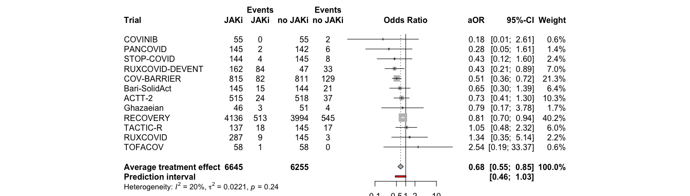
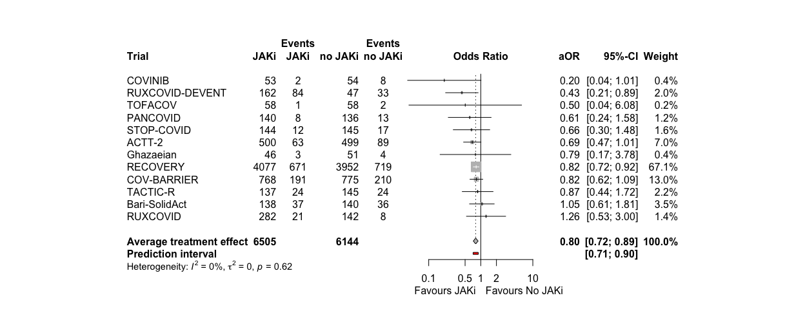
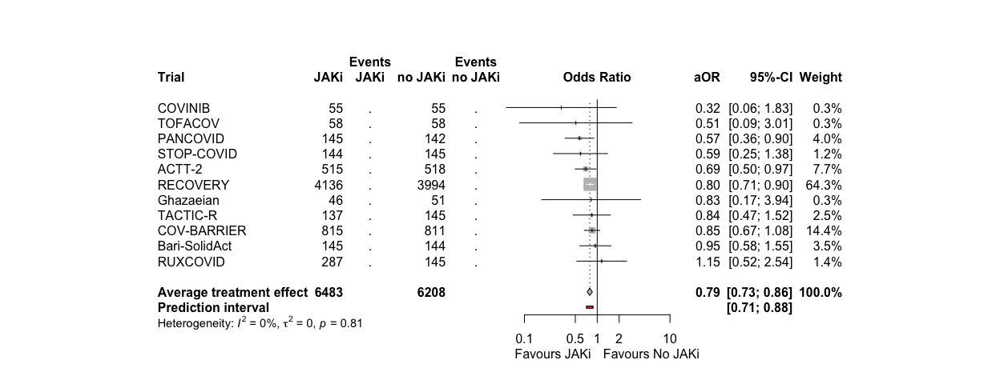

# Load packages

```r
library(tidyverse)
library(readxl)
library(writexl)
library(tableone)
library(here)
library(kableExtra)

library(jtools) # for summ() and plot_summs
library(sjPlot) # for tab_model
library(ggplot2) # survival/TTE analyses and other graphs
library(ggfortify) # autoplot
library(meta)
library(forestplot)
library(metafor) #forest()
library(logistf) # Firth regression in case of rare events
```

# Load entire dataset (from one-stage.Rmd) for descriptive purpose - make sure to run one-stage before

```r
df_tot <- readRDS("df_tot.RData") # without Murugesan
df_tot_Muru <- readRDS("df_tot_Muru.RData") # with Murugesan
```

# Load treatment effect estimates from all trials

```r
df_barisolidact <- readRDS("trt_effects_barisolidact.RData")
df_actt2 <- readRDS("trt_effects_actt2.RData")
df_ghazaeian <- readRDS("trt_effects_ghazaeian.RData")
df_tofacov <- readRDS("trt_effects_tofacov.RData")
df_covinib <- readRDS("trt_effects_covinib.RData")
df_covbarrier <- readRDS("trt_effects_cov-barrier.RData")
# df_murugesan <- readRDS("trt_effects_murugesan.RData")
df_recovery <- readRDS("trt_effects_recovery.RData")
```

# Reshape dataframes for all treatment effect estimates

```r
### Create a list of all data frames / trials
list_df <- list(df_barisolidact, df_actt2, df_ghazaeian, df_tofacov, df_covinib, df_covbarrier, df_recovery) # add all trials

## Mortality at day 28
outcomes <- "death at day 28"
outcomes.firth <- "death at day 28_firth" # depends on which estimates to include
# Initialize an empty data frame to store the selected rows
df_mort28 <- data.frame()
# Loop through the list of data frames
for (df in list_df) {
  selected_rows <- df %>% filter(variable == outcomes | variable == outcomes.firth)
  df_mort28 <- rbind(df_mort28, selected_rows)
}

## Mortality at day 60
outcomes <- "death at day 60"
outcomes.firth <- "death at day 60_firth"
df_mort60 <- data.frame()
for (df in list_df) {
  selected_rows <- df %>% filter(variable == outcomes | variable == outcomes.firth)
  df_mort60 <- rbind(df_mort60, selected_rows)
}

## Death within fup
outcomes <- "death within fup"
outcomes.firth <- "death within fup_firth"
df_ttdeath <- data.frame()
for (df in list_df) {
  selected_rows <- df %>% filter(variable == outcomes | variable == outcomes.firth)
  df_ttdeath <- rbind(df_ttdeath, selected_rows)
}

## new MV within 28d
outcomes <- "new MV within 28d"
outcomes.firth <- "new MV within 28d_firth"
df_new_mv28 <- data.frame()
for (df in list_df) {
  selected_rows <- df %>% filter(variable == outcomes | variable == outcomes.firth)
  df_new_mv28 <- rbind(df_new_mv28, selected_rows)
}

## new MV or death within 28d
outcomes <- "new MV or death within 28d"
outcomes.firth <- "new MV or death within 28d_firth"
df_new_mvd28 <- data.frame()
for (df in list_df) {
  selected_rows <- df %>% filter(variable == outcomes | variable == outcomes.firth)
  df_new_mvd28 <- rbind(df_new_mvd28, selected_rows)
}

## new MV or death within 28d
outcomes <- "new MV or death within 28d"
outcomes.firth <- "new MV or death within 28d_firth"
df_new_mvd28 <- data.frame()
for (df in list_df) {
  selected_rows <- df %>% filter(variable == outcomes | variable == outcomes.firth)
  df_new_mvd28 <- rbind(df_new_mvd28, selected_rows)
}

## clinical status at day 28
outcomes <- "clinical status at day 28"
outcomes.firth <- "clinical status at day 28_firth"
df_clin28 <- data.frame()
for (df in list_df) {
  selected_rows <- df %>% filter(variable == outcomes | variable == outcomes.firth)
  df_clin28 <- rbind(df_clin28, selected_rows)
}

## discharge within 28 days
outcomes <- "discharge within 28 days"
outcomes.firth <- "discharge within 28 days_firth"
df_ttdischarge <- data.frame()
for (df in list_df) {
  selected_rows <- df %>% filter(variable == outcomes | variable == outcomes.firth)
  df_ttdischarge <- rbind(df_ttdischarge, selected_rows)
}

## discharge within 28 days, death=comp.event
outcomes <- "discharge within 28 days, death=comp.event"
outcomes.firth <- "discharge within 28 days, death=comp.event_firth"
df_ttdischarge_comp <- data.frame()
for (df in list_df) {
  selected_rows <- df %>% filter(variable == outcomes | variable == outcomes.firth)
  df_ttdischarge_comp <- rbind(df_ttdischarge_comp, selected_rows)
}

## discharge within 28 days, death=hypo.event
outcomes <- "discharge within 28 days, death=hypo.event"
outcomes.firth <- "discharge within 28 days, death=hypo.event_firth"
df_ttdischarge_hypo <- data.frame()
for (df in list_df) {
  selected_rows <- df %>% filter(variable == outcomes | variable == outcomes.firth)
  df_ttdischarge_hypo <- rbind(df_ttdischarge_hypo, selected_rows)
}

## sustained discharge within 28 days
outcomes <- "sustained discharge within 28 days"
outcomes.firth <- "sustained discharge within 28 days_firth"
df_ttdischarge_sus <- data.frame()
for (df in list_df) {
  selected_rows <- df %>% filter(variable == outcomes | variable == outcomes.firth)
  df_ttdischarge_sus <- rbind(df_ttdischarge_sus, selected_rows)
}

## viral clearance until day 5
outcomes <- "viral clearance until day 5"
outcomes.firth <- "viral clearance until day 5_firth"
df_vir_clear_5 <- data.frame()
for (df in list_df) {
  selected_rows <- df %>% filter(variable == outcomes | variable == outcomes.firth)
  df_vir_clear_5 <- rbind(df_vir_clear_5, selected_rows)
}

## viral clearance until day 10
outcomes <- "viral clearance until day 10"
outcomes.firth <- "viral clearance until day 10_firth"
df_vir_clear_10 <- data.frame()
for (df in list_df) {
  selected_rows <- df %>% filter(variable == outcomes | variable == outcomes.firth)
  df_vir_clear_10 <- rbind(df_vir_clear_10, selected_rows)
}

## viral clearance until day 15
outcomes <- "viral clearance until day 15"
outcomes.firth <- "viral clearance until day 15_firth"
df_vir_clear_15 <- data.frame()
for (df in list_df) {
  selected_rows <- df %>% filter(variable == outcomes | variable == outcomes.firth)
  df_vir_clear_15 <- rbind(df_vir_clear_15, selected_rows)
}

## Any AE grade 3,4 within 28 days
outcomes <- "Any AE grade 3,4 within 28 days"
outcomes2 <- "any AE grade 3,4 within 28 days"
outcomes.firth <- "Any AE grade 3,4 within 28 days_firth"
outcomes.firth2 <- "any AE grade 3,4 within 28 days_firth"
df_ae28 <- data.frame()
for (df in list_df) {
  selected_rows <- df %>% filter(variable == outcomes | variable == outcomes2 | variable == outcomes.firth | variable == outcomes.firth2)
  df_ae28 <- rbind(df_ae28, selected_rows)
}

## AEs grade 3,4 within 28 days
outcomes <- "AEs grade 3,4 within 28 days"
outcomes.firth <- "AEs grade 3,4 within 28 days_firth"
df_ae28sev <- data.frame()
for (df in list_df) {
  selected_rows <- df %>% filter(variable == outcomes | variable == outcomes.firth)
  df_ae28sev <- rbind(df_ae28sev, selected_rows)
}
```

# (i) Primary outcome: Mortality at day 28

```r
# str(df_mort28)
mort28 <- metagen(TE = log(hazard_odds_ratio),
                      seTE = standard_error,
                      studlab = trial,
                      data = df_mort28,
                      n.e = n_intervention + n_control,
                      # n.c = n_control,
                      sm = "OR",
                      fixed = F,
                      random = T,
                      prediction = T,
                      method.tau = "ML", # same results with ML (-> see one-stage!)
                      hakn = T, # Hartung-Knapp- Sidik-Jonkman (HKSJ) modified estimate of the variance / 95% CI -> notes
                      adhoc.hakn.ci = "", # Argument 'adhoc.hakn.ci' must be "", "se", "ci", or "IQWiG6".
                      title = "Average treatment effect - mortality 28 days",
                      # subset = trial %in% c("Bari-SolidAct", "ACTT-2", "Ghazaeian") # exclude entirely
                      # exclude = trial %in% c("Bari-SolidAct", "ACTT-2", "Ghazaeian") # include in forestplot but exclude from analysis
                      )
summary(mort28)
```

```
## Review:     Average treatment effect - mortality 28 days
## 
##                   OR            95%-CI %W(random)
## Bari-SolidAct 0.6573 [0.3068;  1.4084]        7.4
## ACTT-2        0.7041 [0.3996;  1.2406]       12.2
## Ghazaeian     0.7909 [0.1654;  3.7807]        1.9
## TOFACOV       2.5366 [0.1928; 33.3748]        0.7
## COVINIB       0.1816 [0.0126;  2.6139]        0.7
## COV-BARRIER   0.5131 [0.3666;  0.7182]       25.8
## RECOVERY      0.8109 [0.7034;  0.9349]       51.3
## 
## Number of studies: k = 7
## Number of observations: o = 11107
## 
##                               OR           95%-CI     t p-value
## Random effects model (HK) 0.6957 [0.5440; 0.8898] -3.61  0.0113
## Prediction interval              [0.4401; 1.0998]              
## 
## Quantifying heterogeneity:
##  tau^2 = 0.0192 [0.0000; 1.2657]; tau = 0.1385 [0.0000; 1.1250]
##  I^2 = 26.5% [0.0%; 68.1%]; H = 1.17 [1.00; 1.77]
## 
## Test of heterogeneity:
##     Q d.f. p-value
##  8.17    6  0.2262
## 
## Details on meta-analytical method:
## - Inverse variance method
## - Maximum-likelihood estimator for tau^2
## - Q-Profile method for confidence interval of tau^2 and tau
## - Hartung-Knapp adjustment for random effects model (df = 6)
## - Prediction interval based on t-distribution (df = 5)
```

```r
forest.meta(mort28,
            # hetstat = T,
            # rightcols = c("w.random"),
            leftcols = c("studlab", "TE", "seTE", "n.e"),
            leftlabs = c("Trial", "log(OR)", "Standard Error", "Sample Size"),
            text.random = "Average treatment effect (random effects model)",
            title = "Average treatment effect - mortality 28 days", # get the title into the figure
            xlim = c(0.15,5),
            sortvar = +TE,
            # xlab = "Average treatment effect (95% CI)"
            )
```

<!-- -->

```r
# Open a pdf file
# pdf("./fp_aggregated.pdf", width=9, height=4)
# forest.meta(i.mort28_adhoc_se,
#             xlim = c(0.1,5),
#             xlab = "                  Favours JAKi <-> Favours No JAKi",
#             fs.xlab = 9)
# dev.off()
```
Discussion points:
1. REML or ML ? -> Give the exact same result, but the one-stage uses ML (including centering) due to rare events. REML is preferred (see notes), but to correspond with one-stage, a sens-analysis with ML is probably worth it. The choice of estimator might have the biggest influence on the 95%CI, larger than other model parameter choices.

# Funnel plot

```r
## funnel plot (contour enhanced)
funnel(mort28)
```

<!-- -->

```r
funnel(mort28, common = TRUE,
  level = 0.95, contour = c(0.9, 0.95, 0.99),
  col.contour = c("darkgreen", "green", "lightgreen"),
  lwd = 2, cex = 1.5, pch = 16, studlab = TRUE, cex.studlab = 1.1)
```

<!-- -->

```r
# legend(0.05, 0.05,
#   c("0.1 > p > 0.05", "0.05 > p > 0.01", "< 0.01"),
#   fill = c("darkgreen", "green", "lightgreen"))
# par(oldpar)
```

# (i.i) Primary outcome: Mortality at day 28 / including the non-IPD RCTs

```r
#### read in aggregate data
## PRE-VENT
df_prevent <- read_excel("/Users/amstutzal/Library/CloudStorage/OneDrive-usb.ch/Dokumente - JAKi IPDMA data source management/General/non-IPD/JAKi_IPDMA_aggr_data.xlsx", sheet = "PRE-VENT")
# analyse with same model
addmargins(table(df_prevent$mort_28, df_prevent$trt, useNA = "always"))
```

```
##       
##          0   1 <NA> Sum
##   0     93  89    0 182
##   1      8  10    0  18
##   <NA>   0   0    0   0
##   Sum  101  99    0 200
```

```r
mort.28.prevent <- df_prevent %>% 
  glm(mort_28 ~ trt
      , family = "binomial", data=.)
summ(mort.28.prevent, exp = T, confint = T, model.info = T, model.fit = F, digits = 2)
```

<table class="table table-striped table-hover table-condensed table-responsive" style="width: auto !important; margin-left: auto; margin-right: auto;">
<tbody>
  <tr>
   <td style="text-align:left;font-weight: bold;"> Observations </td>
   <td style="text-align:right;"> 200 </td>
  </tr>
  <tr>
   <td style="text-align:left;font-weight: bold;"> Dependent variable </td>
   <td style="text-align:right;"> mort_28 </td>
  </tr>
  <tr>
   <td style="text-align:left;font-weight: bold;"> Type </td>
   <td style="text-align:right;"> Generalized linear model </td>
  </tr>
  <tr>
   <td style="text-align:left;font-weight: bold;"> Family </td>
   <td style="text-align:right;"> binomial </td>
  </tr>
  <tr>
   <td style="text-align:left;font-weight: bold;"> Link </td>
   <td style="text-align:right;"> logit </td>
  </tr>
</tbody>
</table>  <table class="table table-striped table-hover table-condensed table-responsive" style="width: auto !important; margin-left: auto; margin-right: auto;border-bottom: 0;">
 <thead>
  <tr>
   <th style="text-align:left;">   </th>
   <th style="text-align:right;"> exp(Est.) </th>
   <th style="text-align:right;"> 2.5% </th>
   <th style="text-align:right;"> 97.5% </th>
   <th style="text-align:right;"> z val. </th>
   <th style="text-align:right;"> p </th>
  </tr>
 </thead>
<tbody>
  <tr>
   <td style="text-align:left;font-weight: bold;"> (Intercept) </td>
   <td style="text-align:right;"> 0.09 </td>
   <td style="text-align:right;"> 0.04 </td>
   <td style="text-align:right;"> 0.18 </td>
   <td style="text-align:right;"> -6.66 </td>
   <td style="text-align:right;"> 0.00 </td>
  </tr>
  <tr>
   <td style="text-align:left;font-weight: bold;"> trt </td>
   <td style="text-align:right;"> 1.31 </td>
   <td style="text-align:right;"> 0.49 </td>
   <td style="text-align:right;"> 3.46 </td>
   <td style="text-align:right;"> 0.54 </td>
   <td style="text-align:right;"> 0.59 </td>
  </tr>
</tbody>
<tfoot><tr><td style="padding: 0; " colspan="100%">
<sup></sup> Standard errors: MLE</td></tr></tfoot>
</table>

```r
# add effect estimates and other parameters to df_mort28
row_prevent <- tibble(
  variable = "death at day 28",
  hazard_odds_ratio = exp(coef(mort.28.prevent)["trt"]),
  ci_lower = exp(confint(mort.28.prevent)["trt", ])[1],
  ci_upper = exp(confint(mort.28.prevent)["trt", ])[2],
  standard_error = summary(mort.28.prevent)$coefficients["trt", "Std. Error"],
  p_value = summary(mort.28.prevent)$coefficients["trt", "Pr(>|z|)"],
  n_intervention = addmargins(table(df_prevent$mort_28, df_prevent$trt, useNA = "always"))[4,2],
  n_control = addmargins(table(df_prevent$mort_28, df_prevent$trt, useNA = "always"))[4,1],
  trial = "PRE-VENT*",
  JAKi = "Pacritinib")
```

```
## Waiting for profiling to be done...
## Waiting for profiling to be done...
```

```r
## CAO
df_cao <- read_excel("/Users/amstutzal/Library/CloudStorage/OneDrive-usb.ch/Dokumente - JAKi IPDMA data source management/General/non-IPD/JAKi_IPDMA_aggr_data.xlsx", sheet = "CAO")
# analyse with same model
addmargins(table(df_cao$mort_28, df_cao$trt, useNA = "always"))
```

```
##       
##         0  1 <NA> Sum
##   0    18 20    0  38
##   1     3  0    0   3
##   <NA>  0  0    0   0
##   Sum  21 20    0  41
```

```r
mort.28.cao <- df_cao %>% 
  logistf(mort_28 ~ trt
      , family = "binomial", data=.)
summary(mort.28.cao)
```

```
## logistf(formula = mort_28 ~ trt, data = ., family = "binomial")
## 
## Model fitted by Penalized ML
## Coefficients:
##                  coef  se(coef) lower 0.95 upper 0.95     Chisq            p
## (Intercept) -1.665008 0.5828965  -2.996461 -0.6391919 11.219466 0.0008094379
## trt         -2.048564 1.5454930  -6.975291  0.3788351  2.610367 0.1061671667
##             method
## (Intercept)      2
## trt              2
## 
## Method: 1-Wald, 2-Profile penalized log-likelihood, 3-None
## 
## Likelihood ratio test=2.610367 on 1 df, p=0.1061672, n=41
## Wald test = 14.89037 on 1 df, p = 0.0001139429
```

```r
# add effect estimates and other parameters to df_mort28
row_cao <- tibble(
  variable = "death at day 28",
  hazard_odds_ratio = exp(coef(mort.28.cao)["trt"]),
  ci_lower = exp(mort.28.cao$ci.lower["trt"]),
  ci_upper = exp(mort.28.cao$ci.upper["trt"]),
  standard_error = sqrt(diag(vcov(mort.28.cao)))["trt"],
  p_value = mort.28.cao$prob["trt"],
  n_intervention = addmargins(table(df_cao$mort_28, df_cao$trt, useNA = "always"))[4,2],
  n_control = addmargins(table(df_cao$mort_28, df_cao$trt, useNA = "always"))[4,1],
  trial = "CAO*",
  JAKi = "Ruxolitinib")

## Pancovid
df_pancovid <- read_excel("/Users/amstutzal/Library/CloudStorage/OneDrive-usb.ch/Dokumente - JAKi IPDMA data source management/General/non-IPD/JAKi_IPDMA_aggr_data.xlsx", sheet = "Pancovid")
# analyse with same model
addmargins(table(df_pancovid$mort_28, df_pancovid$trt, useNA = "always"))
```

```
##       
##          0   1 <NA> Sum
##   0    135 142    0 277
##   1      7   3    0  10
##   <NA>   0   0    0   0
##   Sum  142 145    0 287
```

```r
mort.28.pancovid <- df_pancovid %>% 
  glm(mort_28 ~ trt
      , family = "binomial", data=.)
summ(mort.28.pancovid, exp = T, confint = T, model.info = T, model.fit = F, digits = 2)
```

<table class="table table-striped table-hover table-condensed table-responsive" style="width: auto !important; margin-left: auto; margin-right: auto;">
<tbody>
  <tr>
   <td style="text-align:left;font-weight: bold;"> Observations </td>
   <td style="text-align:right;"> 287 </td>
  </tr>
  <tr>
   <td style="text-align:left;font-weight: bold;"> Dependent variable </td>
   <td style="text-align:right;"> mort_28 </td>
  </tr>
  <tr>
   <td style="text-align:left;font-weight: bold;"> Type </td>
   <td style="text-align:right;"> Generalized linear model </td>
  </tr>
  <tr>
   <td style="text-align:left;font-weight: bold;"> Family </td>
   <td style="text-align:right;"> binomial </td>
  </tr>
  <tr>
   <td style="text-align:left;font-weight: bold;"> Link </td>
   <td style="text-align:right;"> logit </td>
  </tr>
</tbody>
</table>  <table class="table table-striped table-hover table-condensed table-responsive" style="width: auto !important; margin-left: auto; margin-right: auto;border-bottom: 0;">
 <thead>
  <tr>
   <th style="text-align:left;">   </th>
   <th style="text-align:right;"> exp(Est.) </th>
   <th style="text-align:right;"> 2.5% </th>
   <th style="text-align:right;"> 97.5% </th>
   <th style="text-align:right;"> z val. </th>
   <th style="text-align:right;"> p </th>
  </tr>
 </thead>
<tbody>
  <tr>
   <td style="text-align:left;font-weight: bold;"> (Intercept) </td>
   <td style="text-align:right;"> 0.05 </td>
   <td style="text-align:right;"> 0.02 </td>
   <td style="text-align:right;"> 0.11 </td>
   <td style="text-align:right;"> -7.63 </td>
   <td style="text-align:right;"> 0.00 </td>
  </tr>
  <tr>
   <td style="text-align:left;font-weight: bold;"> trt </td>
   <td style="text-align:right;"> 0.41 </td>
   <td style="text-align:right;"> 0.10 </td>
   <td style="text-align:right;"> 1.61 </td>
   <td style="text-align:right;"> -1.28 </td>
   <td style="text-align:right;"> 0.20 </td>
  </tr>
</tbody>
<tfoot><tr><td style="padding: 0; " colspan="100%">
<sup></sup> Standard errors: MLE</td></tr></tfoot>
</table>

```r
# add effect estimates and other parameters to df_mort28
row_pancovid <- tibble(
  variable = "death at day 28",
  hazard_odds_ratio = exp(coef(mort.28.pancovid)["trt"]),
  ci_lower = exp(confint(mort.28.pancovid)["trt", ])[1],
  ci_upper = exp(confint(mort.28.pancovid)["trt", ])[2],
  standard_error = summary(mort.28.pancovid)$coefficients["trt", "Std. Error"],
  p_value = summary(mort.28.pancovid)$coefficients["trt", "Pr(>|z|)"],
  n_intervention = addmargins(table(df_pancovid$mort_28, df_pancovid$trt, useNA = "always"))[4,2],
  n_control = addmargins(table(df_pancovid$mort_28, df_pancovid$trt, useNA = "always"))[4,1],
  trial = "Pancovid*",
  JAKi = "Baricitinib")
```

```
## Waiting for profiling to be done...
## Waiting for profiling to be done...
```

```r
## STOP-COVID
df_stopcovid <- read_excel("/Users/amstutzal/Library/CloudStorage/OneDrive-usb.ch/Dokumente - JAKi IPDMA data source management/General/non-IPD/JAKi_IPDMA_aggr_data.xlsx", sheet = "STOP-COVID")
# analyse with same model
addmargins(table(df_stopcovid$mort_28, df_stopcovid$trt, useNA = "always"))
```

```
##       
##          0   1 <NA> Sum
##   0    137 140    0 277
##   1      8   4    0  12
##   <NA>   0   0    0   0
##   Sum  145 144    0 289
```

```r
mort.28.stopcovid <- df_stopcovid %>% 
  glm(mort_28 ~ trt
      , family = "binomial", data=.)
summ(mort.28.stopcovid, exp = T, confint = T, model.info = T, model.fit = F, digits = 2)
```

<table class="table table-striped table-hover table-condensed table-responsive" style="width: auto !important; margin-left: auto; margin-right: auto;">
<tbody>
  <tr>
   <td style="text-align:left;font-weight: bold;"> Observations </td>
   <td style="text-align:right;"> 289 </td>
  </tr>
  <tr>
   <td style="text-align:left;font-weight: bold;"> Dependent variable </td>
   <td style="text-align:right;"> mort_28 </td>
  </tr>
  <tr>
   <td style="text-align:left;font-weight: bold;"> Type </td>
   <td style="text-align:right;"> Generalized linear model </td>
  </tr>
  <tr>
   <td style="text-align:left;font-weight: bold;"> Family </td>
   <td style="text-align:right;"> binomial </td>
  </tr>
  <tr>
   <td style="text-align:left;font-weight: bold;"> Link </td>
   <td style="text-align:right;"> logit </td>
  </tr>
</tbody>
</table>  <table class="table table-striped table-hover table-condensed table-responsive" style="width: auto !important; margin-left: auto; margin-right: auto;border-bottom: 0;">
 <thead>
  <tr>
   <th style="text-align:left;">   </th>
   <th style="text-align:right;"> exp(Est.) </th>
   <th style="text-align:right;"> 2.5% </th>
   <th style="text-align:right;"> 97.5% </th>
   <th style="text-align:right;"> z val. </th>
   <th style="text-align:right;"> p </th>
  </tr>
 </thead>
<tbody>
  <tr>
   <td style="text-align:left;font-weight: bold;"> (Intercept) </td>
   <td style="text-align:right;"> 0.06 </td>
   <td style="text-align:right;"> 0.03 </td>
   <td style="text-align:right;"> 0.12 </td>
   <td style="text-align:right;"> -7.81 </td>
   <td style="text-align:right;"> 0.00 </td>
  </tr>
  <tr>
   <td style="text-align:left;font-weight: bold;"> trt </td>
   <td style="text-align:right;"> 0.49 </td>
   <td style="text-align:right;"> 0.14 </td>
   <td style="text-align:right;"> 1.66 </td>
   <td style="text-align:right;"> -1.15 </td>
   <td style="text-align:right;"> 0.25 </td>
  </tr>
</tbody>
<tfoot><tr><td style="padding: 0; " colspan="100%">
<sup></sup> Standard errors: MLE</td></tr></tfoot>
</table>

```r
# add effect estimates and other parameters to df_mort28
row_stopcovid <- tibble(
  variable = "death at day 28",
  hazard_odds_ratio = exp(coef(mort.28.stopcovid)["trt"]),
  ci_lower = exp(confint(mort.28.stopcovid)["trt", ])[1],
  ci_upper = exp(confint(mort.28.stopcovid)["trt", ])[2],
  standard_error = summary(mort.28.stopcovid)$coefficients["trt", "Std. Error"],
  p_value = summary(mort.28.stopcovid)$coefficients["trt", "Pr(>|z|)"],
  n_intervention = addmargins(table(df_stopcovid$mort_28, df_stopcovid$trt, useNA = "always"))[4,2],
  n_control = addmargins(table(df_stopcovid$mort_28, df_stopcovid$trt, useNA = "always"))[4,1],
  trial = "STOP-COVID*",
  JAKi = "Tofacitinib")
```

```
## Waiting for profiling to be done...
## Waiting for profiling to be done...
```

```r
## RUXCOVID-DEVENT
df_ruxcoviddevent <- read_excel("/Users/amstutzal/Library/CloudStorage/OneDrive-usb.ch/Dokumente - JAKi IPDMA data source management/General/non-IPD/JAKi_IPDMA_aggr_data.xlsx", sheet = "RUXCOVID-DEVENT")
# analyse with same model
addmargins(table(df_ruxcoviddevent$mort_28, df_ruxcoviddevent$trt, useNA = "always"))
```

```
##       
##          0   1 <NA> Sum
##   0     14  80    0  94
##   1     33  84    0 117
##   <NA>   0   0    0   0
##   Sum   47 164    0 211
```

```r
mort.28.ruxcoviddevent <- df_ruxcoviddevent %>% 
  glm(mort_28 ~ trt
      , family = "binomial", data=.)
summ(mort.28.ruxcoviddevent, exp = T, confint = T, model.info = T, model.fit = F, digits = 2)
```

<table class="table table-striped table-hover table-condensed table-responsive" style="width: auto !important; margin-left: auto; margin-right: auto;">
<tbody>
  <tr>
   <td style="text-align:left;font-weight: bold;"> Observations </td>
   <td style="text-align:right;"> 211 </td>
  </tr>
  <tr>
   <td style="text-align:left;font-weight: bold;"> Dependent variable </td>
   <td style="text-align:right;"> mort_28 </td>
  </tr>
  <tr>
   <td style="text-align:left;font-weight: bold;"> Type </td>
   <td style="text-align:right;"> Generalized linear model </td>
  </tr>
  <tr>
   <td style="text-align:left;font-weight: bold;"> Family </td>
   <td style="text-align:right;"> binomial </td>
  </tr>
  <tr>
   <td style="text-align:left;font-weight: bold;"> Link </td>
   <td style="text-align:right;"> logit </td>
  </tr>
</tbody>
</table>  <table class="table table-striped table-hover table-condensed table-responsive" style="width: auto !important; margin-left: auto; margin-right: auto;border-bottom: 0;">
 <thead>
  <tr>
   <th style="text-align:left;">   </th>
   <th style="text-align:right;"> exp(Est.) </th>
   <th style="text-align:right;"> 2.5% </th>
   <th style="text-align:right;"> 97.5% </th>
   <th style="text-align:right;"> z val. </th>
   <th style="text-align:right;"> p </th>
  </tr>
 </thead>
<tbody>
  <tr>
   <td style="text-align:left;font-weight: bold;"> (Intercept) </td>
   <td style="text-align:right;"> 2.36 </td>
   <td style="text-align:right;"> 1.26 </td>
   <td style="text-align:right;"> 4.40 </td>
   <td style="text-align:right;"> 2.69 </td>
   <td style="text-align:right;"> 0.01 </td>
  </tr>
  <tr>
   <td style="text-align:left;font-weight: bold;"> trt </td>
   <td style="text-align:right;"> 0.45 </td>
   <td style="text-align:right;"> 0.22 </td>
   <td style="text-align:right;"> 0.89 </td>
   <td style="text-align:right;"> -2.28 </td>
   <td style="text-align:right;"> 0.02 </td>
  </tr>
</tbody>
<tfoot><tr><td style="padding: 0; " colspan="100%">
<sup></sup> Standard errors: MLE</td></tr></tfoot>
</table>

```r
# add effect estimates and other parameters to df_mort28
row_ruxcoviddevent <- tibble(
  variable = "death at day 28",
  hazard_odds_ratio = exp(coef(mort.28.ruxcoviddevent)["trt"]),
  ci_lower = exp(confint(mort.28.ruxcoviddevent)["trt", ])[1],
  ci_upper = exp(confint(mort.28.ruxcoviddevent)["trt", ])[2],
  standard_error = summary(mort.28.ruxcoviddevent)$coefficients["trt", "Std. Error"],
  p_value = summary(mort.28.ruxcoviddevent)$coefficients["trt", "Pr(>|z|)"],
  n_intervention = addmargins(table(df_ruxcoviddevent$mort_28, df_ruxcoviddevent$trt, useNA = "always"))[4,2],
  n_control = addmargins(table(df_ruxcoviddevent$mort_28, df_ruxcoviddevent$trt, useNA = "always"))[4,1],
  trial = "RUXCOVID-DEVENT*",
  JAKi = "Ruxolitinib")
```

```
## Waiting for profiling to be done...
## Waiting for profiling to be done...
```

```r
## RUXCOVID
df_ruxcovid <- read_excel("/Users/amstutzal/Library/CloudStorage/OneDrive-usb.ch/Dokumente - JAKi IPDMA data source management/General/non-IPD/JAKi_IPDMA_aggr_data.xlsx", sheet = "RUXCOVID")
# analyse with same model
addmargins(table(df_ruxcovid$mort_28, df_ruxcovid$trt, useNA = "always"))
```

```
##       
##          0   1 <NA> Sum
##   0    141 276    0 417
##   1      4  11    0  15
##   <NA>   0   0    0   0
##   Sum  145 287    0 432
```

```r
mort.28.ruxcovid <- df_ruxcovid %>% 
  glm(mort_28 ~ trt
      , family = "binomial", data=.)
summ(mort.28.ruxcovid, exp = T, confint = T, model.info = T, model.fit = F, digits = 2)
```

<table class="table table-striped table-hover table-condensed table-responsive" style="width: auto !important; margin-left: auto; margin-right: auto;">
<tbody>
  <tr>
   <td style="text-align:left;font-weight: bold;"> Observations </td>
   <td style="text-align:right;"> 432 </td>
  </tr>
  <tr>
   <td style="text-align:left;font-weight: bold;"> Dependent variable </td>
   <td style="text-align:right;"> mort_28 </td>
  </tr>
  <tr>
   <td style="text-align:left;font-weight: bold;"> Type </td>
   <td style="text-align:right;"> Generalized linear model </td>
  </tr>
  <tr>
   <td style="text-align:left;font-weight: bold;"> Family </td>
   <td style="text-align:right;"> binomial </td>
  </tr>
  <tr>
   <td style="text-align:left;font-weight: bold;"> Link </td>
   <td style="text-align:right;"> logit </td>
  </tr>
</tbody>
</table>  <table class="table table-striped table-hover table-condensed table-responsive" style="width: auto !important; margin-left: auto; margin-right: auto;border-bottom: 0;">
 <thead>
  <tr>
   <th style="text-align:left;">   </th>
   <th style="text-align:right;"> exp(Est.) </th>
   <th style="text-align:right;"> 2.5% </th>
   <th style="text-align:right;"> 97.5% </th>
   <th style="text-align:right;"> z val. </th>
   <th style="text-align:right;"> p </th>
  </tr>
 </thead>
<tbody>
  <tr>
   <td style="text-align:left;font-weight: bold;"> (Intercept) </td>
   <td style="text-align:right;"> 0.03 </td>
   <td style="text-align:right;"> 0.01 </td>
   <td style="text-align:right;"> 0.08 </td>
   <td style="text-align:right;"> -7.03 </td>
   <td style="text-align:right;"> 0.00 </td>
  </tr>
  <tr>
   <td style="text-align:left;font-weight: bold;"> trt </td>
   <td style="text-align:right;"> 1.40 </td>
   <td style="text-align:right;"> 0.44 </td>
   <td style="text-align:right;"> 4.49 </td>
   <td style="text-align:right;"> 0.57 </td>
   <td style="text-align:right;"> 0.57 </td>
  </tr>
</tbody>
<tfoot><tr><td style="padding: 0; " colspan="100%">
<sup></sup> Standard errors: MLE</td></tr></tfoot>
</table>

```r
# add effect estimates and other parameters to df_mort28
row_ruxcovid <- tibble(
  variable = "death at day 28",
  hazard_odds_ratio = exp(coef(mort.28.ruxcovid)["trt"]),
  ci_lower = exp(confint(mort.28.ruxcovid)["trt", ])[1],
  ci_upper = exp(confint(mort.28.ruxcovid)["trt", ])[2],
  standard_error = summary(mort.28.ruxcovid)$coefficients["trt", "Std. Error"],
  p_value = summary(mort.28.ruxcovid)$coefficients["trt", "Pr(>|z|)"],
  n_intervention = addmargins(table(df_ruxcovid$mort_28, df_ruxcovid$trt, useNA = "always"))[4,2],
  n_control = addmargins(table(df_ruxcovid$mort_28, df_ruxcovid$trt, useNA = "always"))[4,1],
  trial = "RUXCOVID*",
  JAKi = "Ruxolitinib")
```

```
## Waiting for profiling to be done...
## Waiting for profiling to be done...
```

```r
## TACTIC-R
df_tacticr <- read_excel("/Users/amstutzal/Library/CloudStorage/OneDrive-usb.ch/Dokumente - JAKi IPDMA data source management/General/non-IPD/JAKi_IPDMA_aggr_data.xlsx", sheet = "TACTIC-R")
# analyse with same model
addmargins(table(df_tacticr$mort_28, df_tacticr$trt, useNA = "always"))
```

```
##       
##          0   1 <NA> Sum
##   0    128 118    0 246
##   1     17  19    0  36
##   <NA>   0   0    0   0
##   Sum  145 137    0 282
```

```r
mort.28.tacticr <- df_tacticr %>% 
  glm(mort_28 ~ trt
      , family = "binomial", data=.)
summ(mort.28.tacticr, exp = T, confint = T, model.info = T, model.fit = F, digits = 2)
```

<table class="table table-striped table-hover table-condensed table-responsive" style="width: auto !important; margin-left: auto; margin-right: auto;">
<tbody>
  <tr>
   <td style="text-align:left;font-weight: bold;"> Observations </td>
   <td style="text-align:right;"> 282 </td>
  </tr>
  <tr>
   <td style="text-align:left;font-weight: bold;"> Dependent variable </td>
   <td style="text-align:right;"> mort_28 </td>
  </tr>
  <tr>
   <td style="text-align:left;font-weight: bold;"> Type </td>
   <td style="text-align:right;"> Generalized linear model </td>
  </tr>
  <tr>
   <td style="text-align:left;font-weight: bold;"> Family </td>
   <td style="text-align:right;"> binomial </td>
  </tr>
  <tr>
   <td style="text-align:left;font-weight: bold;"> Link </td>
   <td style="text-align:right;"> logit </td>
  </tr>
</tbody>
</table>  <table class="table table-striped table-hover table-condensed table-responsive" style="width: auto !important; margin-left: auto; margin-right: auto;border-bottom: 0;">
 <thead>
  <tr>
   <th style="text-align:left;">   </th>
   <th style="text-align:right;"> exp(Est.) </th>
   <th style="text-align:right;"> 2.5% </th>
   <th style="text-align:right;"> 97.5% </th>
   <th style="text-align:right;"> z val. </th>
   <th style="text-align:right;"> p </th>
  </tr>
 </thead>
<tbody>
  <tr>
   <td style="text-align:left;font-weight: bold;"> (Intercept) </td>
   <td style="text-align:right;"> 0.13 </td>
   <td style="text-align:right;"> 0.08 </td>
   <td style="text-align:right;"> 0.22 </td>
   <td style="text-align:right;"> -7.82 </td>
   <td style="text-align:right;"> 0.00 </td>
  </tr>
  <tr>
   <td style="text-align:left;font-weight: bold;"> trt </td>
   <td style="text-align:right;"> 1.21 </td>
   <td style="text-align:right;"> 0.60 </td>
   <td style="text-align:right;"> 2.44 </td>
   <td style="text-align:right;"> 0.54 </td>
   <td style="text-align:right;"> 0.59 </td>
  </tr>
</tbody>
<tfoot><tr><td style="padding: 0; " colspan="100%">
<sup></sup> Standard errors: MLE</td></tr></tfoot>
</table>

```r
# add effect estimates and other parameters to df_mort28
row_tacticr <- tibble(
  variable = "death at day 28",
  hazard_odds_ratio = exp(coef(mort.28.tacticr)["trt"]),
  ci_lower = exp(confint(mort.28.tacticr)["trt", ])[1],
  ci_upper = exp(confint(mort.28.tacticr)["trt", ])[2],
  standard_error = summary(mort.28.tacticr)$coefficients["trt", "Std. Error"],
  p_value = summary(mort.28.tacticr)$coefficients["trt", "Pr(>|z|)"],
  n_intervention = addmargins(table(df_tacticr$mort_28, df_tacticr$trt, useNA = "always"))[4,2],
  n_control = addmargins(table(df_tacticr$mort_28, df_tacticr$trt, useNA = "always"))[4,1],
  trial = "TACTIC-R*",
  JAKi = "Baricitinib")
```

```
## Waiting for profiling to be done...
## Waiting for profiling to be done...
```

```r
## Dastan
df_dastan <- read_excel("/Users/amstutzal/Library/CloudStorage/OneDrive-usb.ch/Dokumente - JAKi IPDMA data source management/General/non-IPD/JAKi_IPDMA_aggr_data.xlsx", sheet = "Dastan")
# analyse with same model
addmargins(table(df_dastan$mort_28, df_dastan$trt, useNA = "always"))
```

```
##       
##         0  1 <NA> Sum
##   0    32 34    0  66
##   1     2  0    0   2
##   <NA>  0  0    0   0
##   Sum  34 34    0  68
```

```r
mort.28.dastan <- df_dastan %>% 
  logistf(mort_28 ~ trt
      , family = "binomial", data=.)
summary(mort.28.dastan)
```

```
## logistf(formula = mort_28 ~ trt, data = ., family = "binomial")
## 
## Model fitted by Penalized ML
## Coefficients:
##                  coef  se(coef) lower 0.95 upper 0.95     Chisq            p
## (Intercept) -2.564949 0.6563301  -4.152264 -1.4678989 30.507998 3.324930e-08
## trt         -1.669157 1.5683605  -6.610664  0.8879405  1.515226 2.183433e-01
##             method
## (Intercept)      2
## trt              2
## 
## Method: 1-Wald, 2-Profile penalized log-likelihood, 3-None
## 
## Likelihood ratio test=1.515226 on 1 df, p=0.2183433, n=68
## Wald test = 24.10837 on 1 df, p = 9.106353e-07
```

```r
# add effect estimates and other parameters to df_mort28
row_dastan <- tibble(
  variable = "death at day 28",
  hazard_odds_ratio = exp(coef(mort.28.dastan)["trt"]),
  ci_lower = exp(mort.28.dastan$ci.lower["trt"]),
  ci_upper = exp(mort.28.dastan$ci.upper["trt"]),
  standard_error = sqrt(diag(vcov(mort.28.dastan)))["trt"],
  p_value = mort.28.dastan$prob["trt"],
  n_intervention = addmargins(table(df_dastan$mort_28, df_dastan$trt, useNA = "always"))[4,2],
  n_control = addmargins(table(df_dastan$mort_28, df_dastan$trt, useNA = "always"))[4,1],
  trial = "Dastan*",
  JAKi = "Baricitinib")

## Singh
df_singh <- read_excel("/Users/amstutzal/Library/CloudStorage/OneDrive-usb.ch/Dokumente - JAKi IPDMA data source management/General/non-IPD/JAKi_IPDMA_aggr_data.xlsx", sheet = "Singh")
# analyse with same model
addmargins(table(df_singh$mort_28, df_singh$trt, useNA = "always"))
```

```
##       
##          0   1 <NA> Sum
##   0     89  97    0 186
##   1     13   6    0  19
##   <NA>   0   0    0   0
##   Sum  102 103    0 205
```

```r
mort.28.singh <- df_singh %>% 
  glm(mort_28 ~ trt
      , family = "binomial", data=.)
summ(mort.28.singh, exp = T, confint = T, model.info = T, model.fit = F, digits = 2)
```

<table class="table table-striped table-hover table-condensed table-responsive" style="width: auto !important; margin-left: auto; margin-right: auto;">
<tbody>
  <tr>
   <td style="text-align:left;font-weight: bold;"> Observations </td>
   <td style="text-align:right;"> 205 </td>
  </tr>
  <tr>
   <td style="text-align:left;font-weight: bold;"> Dependent variable </td>
   <td style="text-align:right;"> mort_28 </td>
  </tr>
  <tr>
   <td style="text-align:left;font-weight: bold;"> Type </td>
   <td style="text-align:right;"> Generalized linear model </td>
  </tr>
  <tr>
   <td style="text-align:left;font-weight: bold;"> Family </td>
   <td style="text-align:right;"> binomial </td>
  </tr>
  <tr>
   <td style="text-align:left;font-weight: bold;"> Link </td>
   <td style="text-align:right;"> logit </td>
  </tr>
</tbody>
</table>  <table class="table table-striped table-hover table-condensed table-responsive" style="width: auto !important; margin-left: auto; margin-right: auto;border-bottom: 0;">
 <thead>
  <tr>
   <th style="text-align:left;">   </th>
   <th style="text-align:right;"> exp(Est.) </th>
   <th style="text-align:right;"> 2.5% </th>
   <th style="text-align:right;"> 97.5% </th>
   <th style="text-align:right;"> z val. </th>
   <th style="text-align:right;"> p </th>
  </tr>
 </thead>
<tbody>
  <tr>
   <td style="text-align:left;font-weight: bold;"> (Intercept) </td>
   <td style="text-align:right;"> 0.15 </td>
   <td style="text-align:right;"> 0.08 </td>
   <td style="text-align:right;"> 0.26 </td>
   <td style="text-align:right;"> -6.48 </td>
   <td style="text-align:right;"> 0.00 </td>
  </tr>
  <tr>
   <td style="text-align:left;font-weight: bold;"> trt </td>
   <td style="text-align:right;"> 0.42 </td>
   <td style="text-align:right;"> 0.15 </td>
   <td style="text-align:right;"> 1.16 </td>
   <td style="text-align:right;"> -1.67 </td>
   <td style="text-align:right;"> 0.10 </td>
  </tr>
</tbody>
<tfoot><tr><td style="padding: 0; " colspan="100%">
<sup></sup> Standard errors: MLE</td></tr></tfoot>
</table>

```r
# add effect estimates and other parameters to df_mort28
row_singh <- tibble(
  variable = "death at day 28",
  hazard_odds_ratio = exp(coef(mort.28.singh)["trt"]),
  ci_lower = exp(confint(mort.28.singh)["trt", ])[1],
  ci_upper = exp(confint(mort.28.singh)["trt", ])[2],
  standard_error = summary(mort.28.singh)$coefficients["trt", "Std. Error"],
  p_value = summary(mort.28.singh)$coefficients["trt", "Pr(>|z|)"],
  n_intervention = addmargins(table(df_singh$mort_28, df_singh$trt, useNA = "always"))[4,2],
  n_control = addmargins(table(df_singh$mort_28, df_singh$trt, useNA = "always"))[4,1],
  trial = "Singh*",
  JAKi = "Nezulcitinib")
```

```
## Waiting for profiling to be done...
## Waiting for profiling to be done...
```

```r
# Add the new rows to your existing dataframe
df_mort28_agg <- bind_rows(df_mort28, row_prevent, row_cao, row_pancovid, row_stopcovid, row_ruxcoviddevent, row_ruxcovid, row_tacticr, row_dastan, row_singh)


# Foresplot
# str(df_mort28_agg)
mort28.agg <- metagen(TE = log(hazard_odds_ratio),
                      seTE = standard_error,
                      studlab = trial,
                      data = df_mort28_agg,
                      n.e = n_intervention + n_control,
                      sm = "OR",
                      fixed = F,
                      random = T,
                      prediction = T,
                      # subgroup = JAKi,
                      method.tau = "ML", # same results with ML (-> see one-stage!)
                      hakn = T, # Hartung-Knapp- Sidik-Jonkman (HKSJ) modified estimate of the variance / 95% CI -> notes
                      # adhoc.hakn.ci = "", # 'adhoc.hakn.ci' in case of I-squared 0 (either "", "se", "ci", or "IQWiG6").
                      title = "Average treatment effect - mortality 28 days",
                      # subset = trial %in% c("Bari-SolidAct", "ACTT-2", "Ghazaeian") # exclude entirely
                      # exclude = trial %in% c("Bari-SolidAct", "ACTT-2", "Ghazaeian") # include in forestplot but exclude from analysis
                      )
summary(mort28.agg)
```

```
## Review:     Average treatment effect - mortality 28 days
## 
##                      OR            95%-CI %W(random)
## Bari-SolidAct    0.6573 [0.3068;  1.4084]        5.8
## ACTT-2           0.7041 [0.3996;  1.2406]        9.4
## Ghazaeian        0.7909 [0.1654;  3.7807]        1.5
## TOFACOV          2.5366 [0.1928; 33.3748]        0.6
## COVINIB          0.1816 [0.0126;  2.6139]        0.5
## COV-BARRIER      0.5131 [0.3666;  0.7182]       19.0
## RECOVERY         0.8109 [0.7034;  0.9349]       34.7
## PRE-VENT*        1.3062 [0.4931;  3.4597]        3.7
## CAO*             0.1289 [0.0062;  2.6659]        0.4
## Pancovid*        0.4074 [0.1032;  1.6080]        2.0
## STOP-COVID*      0.4893 [0.1440;  1.6625]        2.4
## RUXCOVID-DEVENT* 0.4455 [0.2221;  0.8935]        6.7
## RUXCOVID*        1.4049 [0.4394;  4.4914]        2.7
## TACTIC-R*        1.2124 [0.6017;  2.4426]        6.7
## Dastan*          0.1884 [0.0087;  4.0746]        0.4
## Singh*           0.4235 [0.1544;  1.1618]        3.5
## 
## Number of studies: k = 16
## Number of observations: o = 13122
## 
##                               OR           95%-CI     t p-value
## Random effects model (HK) 0.6930 [0.5625; 0.8536] -3.75  0.0019
## Prediction interval              [0.4669; 1.0284]              
## 
## Quantifying heterogeneity:
##  tau^2 = 0.0238 [0.0000; 0.4424]; tau = 0.1543 [0.0000; 0.6651]
##  I^2 = 21.1% [0.0%; 56.5%]; H = 1.13 [1.00; 1.52]
## 
## Test of heterogeneity:
##      Q d.f. p-value
##  19.01   15  0.2132
## 
## Details on meta-analytical method:
## - Inverse variance method
## - Maximum-likelihood estimator for tau^2
## - Q-Profile method for confidence interval of tau^2 and tau
## - Hartung-Knapp adjustment for random effects model (df = 15)
## - Prediction interval based on t-distribution (df = 14)
```

```r
forest.meta(mort28.agg,
            leftcols = c("studlab", 
                         # "TE", 
                         # "seTE", 
                         "n.e"),
            leftlabs = c("Trial", 
                         # "log(OR)", 
                         # "Standard Error", 
                         "Sample Size"),
            sortvar = +TE,
            text.random = "Average treatment effect (RE model)",
            title = "Average treatment effect - mortality 28 days", # get the title into the figure
            xlim = c(0.10,5),
            # xlab = "Average treatment effect (95% CI)"
            )
```

<!-- -->

```r
# Open a pdf file
# pdf("./fp_aggregated.pdf", width=9, height=4)
# forest.meta(i.mort28_adhoc_se,
#             xlim = c(0.1,5),
#             xlab = "                  Favours JAKi <-> Favours No JAKi",
#             fs.xlab = 9)
# dev.off()
```
Discussion points:
* How much do the true effects vary, and over what specific interval?
a. The confidence interval tells us that the mean effect size in the universe of comparable studies probably falls in the interval -xxx to -xxx.
b. The prediction interval tells us that in any single study (selected at random from the universe of comparable studies) the true effect size will usually fall between -xxx and +xxx.
The confidence interval is based on the standard error of the mean and speaks to the precision of the mean. The prediction interval is based on the standard deviation of true effects and speaks to the dispersion of those effects.
Researchers often assume that if the effect is beneficial and statistically significant, it must be helpful in all populations. However, this is a mistake. The fact that an effect is statisti- cally significant tells us (for example) that the treatment is associated with a benefit on average. It may still be associ- ated with harm in some populations.
a. The results are statistically significant because the confidence interval excludes zero. However, this speaks only to the mean effect size.
b. The dispersion of effects is an entirely separate matter.

# Funnel plot

```r
## funnel plot (contour enhanced)
funnel(mort28.agg)
```

<!-- -->

```r
funnel(mort28.agg, common = TRUE,
  level = 0.95, contour = c(0.9, 0.95, 0.99),
  col.contour = c("grey", "lightgrey", "lightyellow"),
  lwd = 2, cex = 1.5, pch = 16, studlab = TRUE, cex.studlab = 1.0)
```

<!-- -->

```r
# legend(0.05, 0.05,
#   c("0.1 > p > 0.05", "0.05 > p > 0.01", "< 0.01"),
#   fill = c("darkgreen", "green", "lightgreen"))
# par(oldpar)
```

# (i.i) Primary outcome: Mortality at day 28 / including the non-IPD RCTs // meta-regression by JAKi

```r
# meta-regression by JAKi
mort28.agg.jaki <- update.meta(mort28.agg, 
                               subgroup = JAKi)
forest.meta(mort28.agg.jaki,
            leftcols = c("studlab", 
                         # "TE", 
                         # "seTE", 
                         "n.e"),
            leftlabs = c("Trial", 
                         # "log(OR)", 
                         # "Standard Error", 
                         "Sample Size"),
            sortvar = +TE,
            test.subgroup.random = TRUE,
            text.random = "Average treatment effect (RE model)",
            title = "Average treatment effect - mortality 28 days", # get the title into the figure
            xlim = c(0.03,30),
            # xlab = "Average treatment effect (95% CI)"
            )
```

<!-- -->

```r
# Print only subgroup results
# forest(mort28.agg.jaki, layout = "subgroup", calcwidth.hetstat = TRUE)
```

# (ii) Mortality at day 60

```r
# str(df_mort60)
mort60 <- metagen(TE = log(hazard_odds_ratio),
                      seTE = standard_error,
                      studlab = trial,
                      data = df_mort60,
                      n.e = n_intervention + n_control,
                      # n.c = n_control,
                      sm = "OR",
                      fixed = F,
                      random = T,
                      prediction = T,
                      method.tau = "ML", # same results with ML (-> see one-stage!)
                      hakn = T, # Hartung-Knapp- Sidik-Jonkman (HKSJ) modified estimate of the variance / 95% CI -> notes
                      adhoc.hakn.ci = "", # Argument 'adhoc.hakn.ci' must be "", "se", "ci", or "IQWiG6".
                      title = "Average treatment effect - mortality 60 days",
                      # subset = trial %in% c("Bari-SolidAct", "ACTT-2", "Ghazaeian") # exclude entirely
                      # exclude = trial %in% c("Bari-SolidAct", "ACTT-2", "Ghazaeian") # include in forestplot but exclude from analysis
                      )
summary(mort60)
```

```
## Review:     Average treatment effect - mortality 60 days
## 
##                   OR            95%-CI %W(random)
## Bari-SolidAct 0.9170 [0.4640;  1.8125]        5.2
## ACTT-2        0.7041 [0.3996;  1.2406]        7.4
## Ghazaeian     0.7909 [0.1654;  3.7807]        1.0
## TOFACOV       2.5366 [0.1928; 33.3748]        0.4
## COVINIB       0.1816 [0.0126;  2.6139]        0.4
## COV-BARRIER   0.5656 [0.4133;  0.7740]       21.4
## RECOVERY      0.8109 [0.7034;  0.9349]       64.4
## 
## Number of studies: k = 7
## Number of observations: o = 11082
## 
##                               OR           95%-CI     t p-value
## Random effects model (HK) 0.7469 [0.6181; 0.9027] -3.77  0.0093
## Prediction interval              [0.5682; 0.9820]              
## 
## Quantifying heterogeneity:
##  tau^2 = 0.0048 [0.0000; 1.2712]; tau = 0.0695 [0.0000; 1.1275]
##  I^2 = 7.8% [0.0%; 73.1%]; H = 1.04 [1.00; 1.93]
## 
## Test of heterogeneity:
##     Q d.f. p-value
##  6.51    6  0.3686
## 
## Details on meta-analytical method:
## - Inverse variance method
## - Maximum-likelihood estimator for tau^2
## - Q-Profile method for confidence interval of tau^2 and tau
## - Hartung-Knapp adjustment for random effects model (df = 6)
## - Prediction interval based on t-distribution (df = 5)
```

```r
forest.meta(mort60,
            # hetstat = T,
            # rightcols = c("w.random"),
            leftcols = c("studlab", "TE", "seTE", "n.e"),
            leftlabs = c("Trial", "log(OR)", "Standard Error", "Sample Size"),
            text.random = "Average treatment effect (random effects model)",
            title = "Average treatment effect - mortality 60 days", # get the title into the figure
            xlim = c(0.15,5),
            sortvar = +TE,
            # xlab = "Average treatment effect (95% CI)"
            )
```

<!-- -->
Discussion points

# (iii) Time to death within max. follow-up time

```r
# str(df_ttdeath)
ttdeath <- metagen(TE = log(hazard_odds_ratio),
                      seTE = standard_error,
                      studlab = trial,
                      data = df_ttdeath,
                      n.e = n_intervention + n_control,
                      # n.c = n_control,
                      sm = "OR",
                      fixed = F,
                      random = T,
                      prediction = T,
                      method.tau = "ML", # same results with ML (-> see one-stage!)
                      hakn = T, # Hartung-Knapp- Sidik-Jonkman (HKSJ) modified estimate of the variance / 95% CI -> notes
                      adhoc.hakn.ci = "", # Argument 'adhoc.hakn.ci' must be "", "se", "ci", or "IQWiG6".
                      title = "Average treatment effect - time to death",
                      # subset = trial %in% c("Bari-SolidAct", "ACTT-2", "Ghazaeian") # exclude entirely
                      # exclude = trial %in% c("Bari-SolidAct", "ACTT-2", "Ghazaeian") # include in forestplot but exclude from analysis
                      )
summary(ttdeath)
```

```
## Review:     Average treatment effect - time to death
## 
##                   OR           95%-CI %W(random)
## Bari-SolidAct 0.7727 [0.4322; 1.3817]        8.6
## ACTT-2        0.7409 [0.4415; 1.2434]       10.5
## Ghazaeian     0.8380 [0.1874; 3.7469]        1.5
## COV-BARRIER   0.5947 [0.4612; 0.7668]       28.8
## RECOVERY      0.8531 [0.7562; 0.9626]       50.7
## 
## Number of studies: k = 5
## Number of observations: o = 11046
## 
##                               OR           95%-CI     t p-value
## Random effects model (HK) 0.7510 [0.6051; 0.9320] -3.68  0.0212
## Prediction interval              [0.4679; 1.2053]              
## 
## Quantifying heterogeneity:
##  tau^2 = 0.0134 [0.0000; 0.1370]; tau = 0.1157 [0.0000; 0.3701]
##  I^2 = 37.6% [0.0%; 76.8%]; H = 1.27 [1.00; 2.08]
## 
## Test of heterogeneity:
##     Q d.f. p-value
##  6.41    4  0.1707
## 
## Details on meta-analytical method:
## - Inverse variance method
## - Maximum-likelihood estimator for tau^2
## - Q-Profile method for confidence interval of tau^2 and tau
## - Hartung-Knapp adjustment for random effects model (df = 4)
## - Prediction interval based on t-distribution (df = 3)
```

```r
forest.meta(ttdeath,
            # hetstat = T,
            # rightcols = c("w.random"),
            leftcols = c("studlab", "TE", "seTE", "n.e"),
            leftlabs = c("Trial", "log(OR)", "Standard Error", "Sample Size"),
            text.random = "Average treatment effect (random effects model)",
            title = "Average treatment effect - time to death", # get the title into the figure
            xlim = c(0.15,5),
            sortvar = +TE,
            # xlab = "Average treatment effect (95% CI)"
            )
```

<!-- -->
Discussion points

# (iv) New mechanical ventilation or death within 28 days

```r
# str(df_new_mvd28)
new.mvd28 <- metagen(TE = log(hazard_odds_ratio),
                      seTE = standard_error,
                      studlab = trial,
                      data = df_new_mvd28,
                      n.e = n_intervention + n_control,
                      # n.c = n_control,
                      sm = "OR",
                      fixed = F,
                      random = T,
                      prediction = T,
                      method.tau = "ML", # same results with ML (-> see one-stage!)
                      hakn = T, # Hartung-Knapp- Sidik-Jonkman (HKSJ) modified estimate of the variance / 95% CI -> notes
                      adhoc.hakn.ci = "", # Argument 'adhoc.hakn.ci' must be "", "se", "ci", or "IQWiG6".
                      title = "Average treatment effect - New MV or death within 28 days",
                      # subset = trial %in% c("Bari-SolidAct", "ACTT-2", "Ghazaeian") # exclude entirely
                      # exclude = trial %in% c("Bari-SolidAct", "ACTT-2", "Ghazaeian") # include in forestplot but exclude from analysis
                      )
summary(new.mvd28)
```

```
## Review:     Average treatment effect - New MV or death within 28 days
## 
##                   OR           95%-CI %W(random)
## Bari-SolidAct 1.0501 [0.6091; 1.8106]        3.8
## ACTT-2        0.6874 [0.4680; 1.0096]        7.7
## Ghazaeian     0.7909 [0.1654; 3.7807]        0.5
## TOFACOV       0.5034 [0.0417; 6.0761]        0.2
## COVINIB       0.1994 [0.0393; 1.0107]        0.4
## COV-BARRIER   0.8235 [0.6209; 1.0922]       14.2
## RECOVERY      0.8153 [0.7201; 0.9232]       73.3
## 
## Number of studies: k = 7
## Number of observations: o = 11169
## 
##                               OR           95%-CI     t p-value
## Random effects model (HK) 0.8080 [0.7193; 0.9076] -4.49  0.0042
## Prediction interval              [0.7028; 0.9289]              
## 
## Quantifying heterogeneity:
##  tau^2 = 0 [0.0000; 0.9358]; tau = 0 [0.0000; 0.9673]
##  I^2 = 0.0% [0.0%; 70.8%]; H = 1.00 [1.00; 1.85]
## 
## Test of heterogeneity:
##     Q d.f. p-value
##  4.60    6  0.5960
## 
## Details on meta-analytical method:
## - Inverse variance method
## - Maximum-likelihood estimator for tau^2
## - Q-Profile method for confidence interval of tau^2 and tau
## - Hartung-Knapp adjustment for random effects model (df = 6)
## - Prediction interval based on t-distribution (df = 5)
```

```r
forest.meta(new.mvd28,
            # hetstat = T,
            # rightcols = c("w.random"),
            leftcols = c("studlab", "TE", "seTE", "n.e"),
            leftlabs = c("Trial", "log(OR)", "Standard Error", "Sample Size"),
            text.random = "Average treatment effect (random effects model)",
            title = "Average treatment effect - New MV or death within 28 days", # get the title into the figure
            xlim = c(0.15,5),
            sortvar = +TE,
            # xlab = "Average treatment effect (95% CI)"
            )
```

<!-- -->
Discussion points

# (iv.i) New mechanical ventilation among survivors within 28 days

```r
# str(df_new_mv28)
new.mv28 <- metagen(TE = log(hazard_odds_ratio),
                      seTE = standard_error,
                      studlab = trial,
                      data = df_new_mv28,
                      n.e = n_intervention + n_control,
                      # n.c = n_control,
                      sm = "OR",
                      fixed = F,
                      random = T,
                      prediction = T,
                      method.tau = "ML", # same results with ML (-> see one-stage!)
                      hakn = T, # Hartung-Knapp- Sidik-Jonkman (HKSJ) modified estimate of the variance / 95% CI -> notes
                      adhoc.hakn.ci = "", # Argument 'adhoc.hakn.ci' must be "", "se", "ci", or "IQWiG6".
                      title = "Average treatment effect - New MV among survivors within 28 days",
                      # subset = trial %in% c("Bari-SolidAct", "ACTT-2", "Ghazaeian") # exclude entirely
                      # exclude = trial %in% c("Bari-SolidAct", "ACTT-2", "Ghazaeian") # include in forestplot but exclude from analysis
                      )
summary(new.mv28)
```

```
## Review:     Average treatment effect - New MV among survivors within 28 days
## 
##                   OR           95%-CI %W(random)
## Bari-SolidAct 1.5355 [0.7471; 3.1562]        8.1
## ACTT-2        0.6873 [0.4269; 1.1068]       16.9
## TOFACOV       0.2175 [0.0144; 3.2855]        0.6
## COVINIB       0.2705 [0.0511; 1.4311]        1.6
## COV-BARRIER   1.2208 [0.8387; 1.7772]       24.7
## RECOVERY      0.8229 [0.6575; 1.0299]       48.1
## 
## Number of studies: k = 6
## Number of observations: o = 9388
## 
##                               OR           95%-CI     t p-value
## Random effects model (HK) 0.9016 [0.6287; 1.2930] -0.74  0.4934
## Prediction interval              [0.5877; 1.3831]              
## 
## Quantifying heterogeneity:
##  tau^2 = 0.0118 [0.0000; 2.9865]; tau = 0.1086 [0.0000; 1.7282]
##  I^2 = 47.5% [0.0%; 79.2%]; H = 1.38 [1.00; 2.19]
## 
## Test of heterogeneity:
##     Q d.f. p-value
##  9.52    5  0.0900
## 
## Details on meta-analytical method:
## - Inverse variance method
## - Maximum-likelihood estimator for tau^2
## - Q-Profile method for confidence interval of tau^2 and tau
## - Hartung-Knapp adjustment for random effects model (df = 5)
## - Prediction interval based on t-distribution (df = 4)
```

```r
forest.meta(new.mv28,
            # hetstat = T,
            # rightcols = c("w.random"),
            leftcols = c("studlab", "TE", "seTE", "n.e"),
            leftlabs = c("Trial", "log(OR)", "Standard Error", "Sample Size"),
            text.random = "Average treatment effect (random effects model)",
            title = "Average treatment effect - New MV among survivors within 28 days", # get the title into the figure
            xlim = c(0.15,5),
            sortvar = +TE,
            # xlab = "Average treatment effect (95% CI)"
            )
```

<!-- -->
Discussion points

# (v) Clinical status at day 28

```r
# str(df_clin28)
clin28 <- metagen(TE = log(hazard_odds_ratio),
                      seTE = standard_error,
                      studlab = trial,
                      data = df_clin28,
                      n.e = n_intervention + n_control,
                      # n.c = n_control,
                      sm = "OR",
                      fixed = F,
                      random = T,
                      prediction = T,
                      method.tau = "ML", # same results with ML (-> see one-stage!)
                      hakn = T, # Hartung-Knapp- Sidik-Jonkman (HKSJ) modified estimate of the variance / 95% CI -> notes
                      adhoc.hakn.ci = "", # Argument 'adhoc.hakn.ci' must be "", "se", "ci", or "IQWiG6".
                      title = "Average treatment effect - Clinical status at day 28",
                      # subset = trial %in% c("Bari-SolidAct", "ACTT-2", "Ghazaeian") # exclude entirely
                      # exclude = trial %in% c("Bari-SolidAct", "ACTT-2", "Ghazaeian") # include in forestplot but exclude from analysis
                      )
summary(clin28)
```

```
## Review:     Average treatment effect - Clinical status at day 28
## 
##                   OR           95%-CI %W(random)
## Bari-SolidAct 0.9451 [0.5778; 1.5456]        3.9
## ACTT-2        0.6928 [0.4970; 0.9659]        8.5
## Ghazaeian     0.8256 [0.1729; 3.9418]        0.4
## TOFACOV       0.5090 [0.0861; 3.0089]        0.3
## COVINIB       0.3212 [0.0565; 1.8266]        0.3
## COV-BARRIER   0.8487 [0.6655; 1.0823]       15.9
## RECOVERY      0.7987 [0.7119; 0.8962]       70.8
## 
## Number of studies: k = 7
## Number of observations: o = 11401
## 
##                               OR           95%-CI     t p-value
## Random effects model (HK) 0.7988 [0.7366; 0.8662] -6.78  0.0005
## Prediction interval              [0.7035; 0.9070]              
## 
## Quantifying heterogeneity:
##  tau^2 = 0 [0.0000; 0.1847]; tau = 0 [0.0000; 0.4298]
##  I^2 = 0.0% [0.0%; 70.8%]; H = 1.00 [1.00; 1.85]
## 
## Test of heterogeneity:
##     Q d.f. p-value
##  2.70    6  0.8459
## 
## Details on meta-analytical method:
## - Inverse variance method
## - Maximum-likelihood estimator for tau^2
## - Q-Profile method for confidence interval of tau^2 and tau
## - Hartung-Knapp adjustment for random effects model (df = 6)
## - Prediction interval based on t-distribution (df = 5)
```

```r
forest.meta(clin28,
            # hetstat = T,
            # rightcols = c("w.random"),
            leftcols = c("studlab", "TE", "seTE", "n.e"),
            leftlabs = c("Trial", "log(OR)", "Standard Error", "Sample Size"),
            text.random = "Average treatment effect (random effects model)",
            title = "Average treatment effect - Clinical status at day 28", # get the title into the figure
            xlim = c(0.15,5),
            sortvar = +TE,
            # xlab = "Average treatment effect (95% CI)"
            )
```

<!-- -->
Discussion points

# (vi) Time to discharge or reaching discharge criteria up to day 28. Death = Competing event

```r
# str(df_ttdischarge_comp)
ttdischarge.comp <- metagen(TE = log(hazard_odds_ratio),
                      seTE = standard_error,
                      studlab = trial,
                      data = df_ttdischarge_comp,
                      n.e = n_intervention + n_control,
                      # n.c = n_control,
                      sm = "OR",
                      fixed = F,
                      random = T,
                      prediction = T,
                      method.tau = "ML", # same results with ML (-> see one-stage!)
                      hakn = T, # Hartung-Knapp- Sidik-Jonkman (HKSJ) modified estimate of the variance / 95% CI -> notes
                      adhoc.hakn.ci = "", # Argument 'adhoc.hakn.ci' must be "", "se", "ci", or "IQWiG6".
                      title = "Average treatment effect - Time to discharge within 28 days",
                      # subset = trial %in% c("Bari-SolidAct", "ACTT-2", "Ghazaeian") # exclude entirely
                      # exclude = trial %in% c("Bari-SolidAct", "ACTT-2", "Ghazaeian") # include in forestplot but exclude from analysis
                      )
summary(ttdischarge.comp)
```

```
## Review:     Average treatment effect - Time to discharge within 28 days
## 
##                   OR           95%-CI %W(random)
## Bari-SolidAct 1.1133 [0.8468; 1.4636]        2.1
## ACTT-2        1.1601 [1.0202; 1.3192]        9.5
## Ghazaeian     0.7381 [0.4798; 1.1355]        0.8
## TOFACOV       1.2562 [0.8760; 1.8014]        1.2
## COVINIB       1.5296 [1.0591; 2.2092]        1.2
## COV-BARRIER   1.1099 [0.9966; 1.2360]       13.6
## RECOVERY      1.0930 [1.0429; 1.1454]       71.5
## 
## Number of studies: k = 7
## Number of observations: o = 11401
## 
##                               OR           95%-CI    t p-value
## Random effects model (HK) 1.1044 [1.0444; 1.1679] 4.35  0.0048
## Prediction interval              [1.0483; 1.1635]             
## 
## Quantifying heterogeneity:
##  tau^2 < 0.0001 [0.0000; 0.1886]; tau = 0.0009 [0.0000; 0.4342]
##  I^2 = 21.4% [0.0%; 64.6%]; H = 1.13 [1.00; 1.68]
## 
## Test of heterogeneity:
##     Q d.f. p-value
##  7.63    6  0.2662
## 
## Details on meta-analytical method:
## - Inverse variance method
## - Maximum-likelihood estimator for tau^2
## - Q-Profile method for confidence interval of tau^2 and tau
## - Hartung-Knapp adjustment for random effects model (df = 6)
## - Prediction interval based on t-distribution (df = 5)
```

```r
forest.meta(ttdischarge.comp,
            # hetstat = T,
            # rightcols = c("w.random"),
            leftcols = c("studlab", "TE", "seTE", "n.e"),
            leftlabs = c("Trial", "log(OR)", "Standard Error", "Sample Size"),
            text.random = "Average treatment effect (random effects model)",
            title = "Average treatment effect - Time to discharge within 28 days", # get the title into the figure
            xlim = c(0.15,5),
            sortvar = +TE,
            # xlab = "Average treatment effect (95% CI)"
            )
```

<!-- -->
Discussion points

# (vi.i) Time to discharge or reaching discharge criteria up to day 28. Death = Hypothetical

```r
# str(df_ttdischarge_hypo)
ttdischarge.hypo <- metagen(TE = log(hazard_odds_ratio),
                      seTE = standard_error,
                      studlab = trial,
                      data = df_ttdischarge_hypo,
                      n.e = n_intervention + n_control,
                      # n.c = n_control,
                      sm = "OR",
                      fixed = F,
                      random = T,
                      prediction = T,
                      method.tau = "ML", # same results with ML (-> see one-stage!)
                      hakn = T, # Hartung-Knapp- Sidik-Jonkman (HKSJ) modified estimate of the variance / 95% CI -> notes
                      adhoc.hakn.ci = "", # Argument 'adhoc.hakn.ci' must be "", "se", "ci", or "IQWiG6".
                      title = "Average treatment effect - Time to discharge within 28 days",
                      # subset = trial %in% c("Bari-SolidAct", "ACTT-2", "Ghazaeian") # exclude entirely
                      # exclude = trial %in% c("Bari-SolidAct", "ACTT-2", "Ghazaeian") # include in forestplot but exclude from analysis
                      )
summary(ttdischarge.hypo)
```

```
## Review:     Average treatment effect - Time to discharge within 28 days
## 
##                   OR           95%-CI %W(random)
## Bari-SolidAct 1.0827 [0.8162; 1.4361]        2.2
## ACTT-2        1.2108 [1.0569; 1.3872]        9.3
## Ghazaeian     0.8232 [0.5401; 1.2546]        1.0
## TOFACOV       1.2836 [0.8804; 1.8714]        1.2
## COVINIB       1.5895 [1.0685; 2.3646]        1.1
## COV-BARRIER   1.1214 [1.0023; 1.2548]       13.6
## RECOVERY      1.1327 [1.0787; 1.1895]       71.7
## 
## Number of studies: k = 7
## Number of observations: o = 11401
## 
##                               OR           95%-CI    t p-value
## Random effects model (HK) 1.1395 [1.0802; 1.2021] 5.98  0.0010
## Prediction interval              [1.0790; 1.2035]             
## 
## Quantifying heterogeneity:
##  tau^2 < 0.0001 [0.0000; 0.1480]; tau = 0.0018 [0.0000; 0.3848]
##  I^2 = 6.2% [0.0%; 72.6%]; H = 1.03 [1.00; 1.91]
## 
## Test of heterogeneity:
##     Q d.f. p-value
##  6.39    6  0.3805
## 
## Details on meta-analytical method:
## - Inverse variance method
## - Maximum-likelihood estimator for tau^2
## - Q-Profile method for confidence interval of tau^2 and tau
## - Hartung-Knapp adjustment for random effects model (df = 6)
## - Prediction interval based on t-distribution (df = 5)
```

```r
forest.meta(ttdischarge.hypo,
            # hetstat = T,
            # rightcols = c("w.random"),
            leftcols = c("studlab", "TE", "seTE", "n.e"),
            leftlabs = c("Trial", "log(OR)", "Standard Error", "Sample Size"),
            text.random = "Average treatment effect (random effects model)",
            title = "Average treatment effect - Time to discharge within 28 days", # get the title into the figure
            xlim = c(0.15,5),
            sortvar = +TE,
            # xlab = "Average treatment effect (95% CI)"
            )
```

<!-- -->
Discussion points

# (vi.ii) Time to discharge or reaching discharge criteria up to day 28. Death = Censored

```r
# str(df_ttdischarge)
ttdischarge.cens <- metagen(TE = log(hazard_odds_ratio),
                      seTE = standard_error,
                      studlab = trial,
                      data = df_ttdischarge,
                      n.e = n_intervention + n_control,
                      # n.c = n_control,
                      sm = "OR",
                      fixed = F,
                      random = T,
                      prediction = T,
                      method.tau = "ML", # same results with ML (-> see one-stage!)
                      hakn = T, # Hartung-Knapp- Sidik-Jonkman (HKSJ) modified estimate of the variance / 95% CI -> notes
                      adhoc.hakn.ci = "", # Argument 'adhoc.hakn.ci' must be "", "se", "ci", or "IQWiG6".
                      title = "Average treatment effect - Time to discharge within 28 days",
                      # subset = trial %in% c("Bari-SolidAct", "ACTT-2", "Ghazaeian") # exclude entirely
                      # exclude = trial %in% c("Bari-SolidAct", "ACTT-2", "Ghazaeian") # include in forestplot but exclude from analysis
                      )
summary(ttdischarge.cens)
```

```
## Review:     Average treatment effect - Time to discharge within 28 days
## 
##                   OR           95%-CI %W(random)
## Bari-SolidAct 1.0721 [0.8083; 1.4219]        2.2
## ACTT-2        1.2141 [1.0596; 1.3910]        9.3
## Ghazaeian     0.7381 [0.4798; 1.1355]        0.9
## TOFACOV       1.2836 [0.8804; 1.8714]        1.2
## COVINIB       1.5863 [1.0664; 2.3597]        1.1
## COV-BARRIER   1.0679 [0.9544; 1.1949]       13.6
## RECOVERY      1.1217 [1.0682; 1.1779]       71.7
## 
## Number of studies: k = 7
## Number of observations: o = 11401
## 
##                               OR           95%-CI    t p-value
## Random effects model (HK) 1.1231 [1.0534; 1.1973] 4.44  0.0044
## Prediction interval              [1.0635; 1.1860]             
## 
## Quantifying heterogeneity:
##  tau^2 < 0.0001 [0.0000; 0.2182]; tau = 0.0015 [0.0000; 0.4671]
##  I^2 = 34.6% [0.0%; 72.3%]; H = 1.24 [1.00; 1.90]
## 
## Test of heterogeneity:
##     Q d.f. p-value
##  9.17    6  0.1641
## 
## Details on meta-analytical method:
## - Inverse variance method
## - Maximum-likelihood estimator for tau^2
## - Q-Profile method for confidence interval of tau^2 and tau
## - Hartung-Knapp adjustment for random effects model (df = 6)
## - Prediction interval based on t-distribution (df = 5)
```

```r
forest.meta(ttdischarge.cens,
            # hetstat = T,
            # rightcols = c("w.random"),
            leftcols = c("studlab", "TE", "seTE", "n.e"),
            leftlabs = c("Trial", "log(OR)", "Standard Error", "Sample Size"),
            text.random = "Average treatment effect (random effects model)",
            title = "Average treatment effect - Time to discharge within 28 days", # get the title into the figure
            xlim = c(0.15,5),
            sortvar = +TE,
            # xlab = "Average treatment effect (95% CI)"
            )
```

<!-- -->
Discussion points

# (vi.iii) Time to sustained discharge or reaching discharge criteria up to day 28. Death = Censored

```r
# str(df_ttdischarge_sus)
ttdischarge.sus <- metagen(TE = log(hazard_odds_ratio),
                      seTE = standard_error,
                      studlab = trial,
                      data = df_ttdischarge_sus,
                      n.e = n_intervention + n_control,
                      # n.c = n_control,
                      sm = "OR",
                      fixed = F,
                      random = T,
                      prediction = T,
                      method.tau = "ML", # same results with ML (-> see one-stage!)
                      hakn = T, # Hartung-Knapp- Sidik-Jonkman (HKSJ) modified estimate of the variance / 95% CI -> notes
                      adhoc.hakn.ci = "", # Argument 'adhoc.hakn.ci' must be "", "se", "ci", or "IQWiG6".
                      title = "Average treatment effect - Time to sustained discharge within 28 days",
                      # subset = trial %in% c("Bari-SolidAct", "ACTT-2", "Ghazaeian") # exclude entirely
                      # exclude = trial %in% c("Bari-SolidAct", "ACTT-2", "Ghazaeian") # include in forestplot but exclude from analysis
                      )
summary(ttdischarge.sus)
```

```
## Review:     Average treatment effect - Time to sustained discharge within 28 ...
## 
##                   OR           95%-CI %W(random)
## Bari-SolidAct 1.0554 [0.7946; 1.4017]        2.1
## ACTT-2        1.2141 [1.0596; 1.3910]        9.3
## Ghazaeian     0.7381 [0.4798; 1.1355]        0.9
## TOFACOV       1.2836 [0.8804; 1.8714]        1.2
## COVINIB       1.5863 [1.0664; 2.3597]        1.1
## COV-BARRIER   1.0582 [0.9454; 1.1845]       13.6
## RECOVERY      1.1217 [1.0682; 1.1779]       71.7
## 
## Number of studies: k = 7
## Number of observations: o = 11401
## 
##                               OR           95%-CI    t p-value
## Random effects model (HK) 1.1214 [1.0504; 1.1972] 4.28  0.0052
## Prediction interval              [1.0616; 1.1845]             
## 
## Quantifying heterogeneity:
##  tau^2 < 0.0001 [0.0000; 0.2209]; tau = 0.0022 [0.0000; 0.4700]
##  I^2 = 37.1% [0.0%; 73.5%]; H = 1.26 [1.00; 1.94]
## 
## Test of heterogeneity:
##     Q d.f. p-value
##  9.55    6  0.1452
## 
## Details on meta-analytical method:
## - Inverse variance method
## - Maximum-likelihood estimator for tau^2
## - Q-Profile method for confidence interval of tau^2 and tau
## - Hartung-Knapp adjustment for random effects model (df = 6)
## - Prediction interval based on t-distribution (df = 5)
```

```r
forest.meta(ttdischarge.sus,
            # hetstat = T,
            # rightcols = c("w.random"),
            leftcols = c("studlab", "TE", "seTE", "n.e"),
            leftlabs = c("Trial", "log(OR)", "Standard Error", "Sample Size"),
            text.random = "Average treatment effect (random effects model)",
            title = "Average treatment effect - Time to sustained discharge within 28 days", # get the title into the figure
            xlim = c(0.15,5),
            sortvar = +TE,
            # xlab = "Average treatment effect (95% CI)"
            )
```

<!-- -->
Discussion points

# (vii) Viral clearance up to day 5

```r
# str(df_vir_clear_5)
vir.clear5 <- metagen(TE = log(hazard_odds_ratio),
                      seTE = standard_error,
                      studlab = trial,
                      data = df_vir_clear_5,
                      n.e = n_intervention + n_control,
                      # n.c = n_control,
                      sm = "OR",
                      fixed = F,
                      random = T,
                      prediction = T,
                      method.tau = "ML", # same results with ML (-> see one-stage!)
                      hakn = T, # Hartung-Knapp- Sidik-Jonkman (HKSJ) modified estimate of the variance / 95% CI -> notes
                      adhoc.hakn.ci = "", # Argument 'adhoc.hakn.ci' must be "", "se", "ci", or "IQWiG6".
                      title = "Average treatment effect - Viral clearance up to day 5",
                      # subset = trial %in% c("Bari-SolidAct", "ACTT-2", "Ghazaeian") # exclude entirely
                      # exclude = trial %in% c("Bari-SolidAct", "ACTT-2", "Ghazaeian") # include in forestplot but exclude from analysis
                      )
summary(vir.clear5)
```

```
## Review:     Average treatment effect - Viral clearance up to day 5
## 
##                   OR           95%-CI %W(random)
## Bari-SolidAct 1.4947 [0.6349; 3.5190]        7.0
## COV-BARRIER   0.8980 [0.6700; 1.2034]       60.2
## RECOVERY      0.9713 [0.6530; 1.4447]       32.7
## 
## Number of studies: k = 3
## Number of observations: o = 8616
## 
##                               OR           95%-CI     t p-value
## Random effects model (HK) 0.9550 [0.6460; 1.4118] -0.51  0.6626
## Prediction interval              [0.2189; 4.1656]              
## 
## Quantifying heterogeneity:
##  tau^2 = 0 [0.0000; 2.8393]; tau = 0 [0.0000; 1.6850]
##  I^2 = 0.0% [0.0%; 89.6%]; H = 1.00 [1.00; 3.10]
## 
## Test of heterogeneity:
##     Q d.f. p-value
##  1.23    2  0.5410
## 
## Details on meta-analytical method:
## - Inverse variance method
## - Maximum-likelihood estimator for tau^2
## - Q-Profile method for confidence interval of tau^2 and tau
## - Hartung-Knapp adjustment for random effects model (df = 2)
## - Prediction interval based on t-distribution (df = 1)
```

```r
forest.meta(vir.clear5,
            # hetstat = T,
            # rightcols = c("w.random"),
            leftcols = c("studlab", "TE", "seTE", "n.e"),
            leftlabs = c("Trial", "log(OR)", "Standard Error", "Sample Size"),
            text.random = "Average treatment effect (random effects model)",
            title = "Average treatment effect - Viral clearance up to day 5", # get the title into the figure
            xlim = c(0.15,5),
            sortvar = +TE,
            # xlab = "Average treatment effect (95% CI)"
            )
```

<!-- -->
Discussion points

# (viii) Viral clearance up to day 10

```r
# str(df_vir_clear_10)
vir.clear10 <- metagen(TE = log(hazard_odds_ratio),
                      seTE = standard_error,
                      studlab = trial,
                      data = df_vir_clear_10,
                      n.e = n_intervention + n_control,
                      # n.c = n_control,
                      sm = "OR",
                      fixed = F,
                      random = T,
                      prediction = T,
                      method.tau = "ML", # same results with ML (-> see one-stage!)
                      hakn = T, # Hartung-Knapp- Sidik-Jonkman (HKSJ) modified estimate of the variance / 95% CI -> notes
                      adhoc.hakn.ci = "", # Argument 'adhoc.hakn.ci' must be "", "se", "ci", or "IQWiG6".
                      title = "Average treatment effect - Viral clearance up to day 10",
                      # subset = trial %in% c("Bari-SolidAct", "ACTT-2", "Ghazaeian") # exclude entirely
                      # exclude = trial %in% c("Bari-SolidAct", "ACTT-2", "Ghazaeian") # include in forestplot but exclude from analysis
                      )
summary(vir.clear10)
```

```
## Review:     Average treatment effect - Viral clearance up to day 10
## 
##                   OR           95%-CI %W(random)
## Bari-SolidAct 1.0882 [0.5367; 2.2064]        7.6
## COV-BARRIER   0.9903 [0.7701; 1.2736]       59.9
## RECOVERY      0.9141 [0.6500; 1.2856]       32.6
## 
## Number of studies: k = 3
## Number of observations: o = 8897
## 
##                               OR           95%-CI     t p-value
## Random effects model (HK) 0.9718 [0.8371; 1.1281] -0.83  0.4954
## Prediction interval              [0.2752; 3.4311]              
## 
## Quantifying heterogeneity:
##  tau^2 = 0 [0.0000; 0.2208]; tau = 0 [0.0000; 0.4699]
##  I^2 = 0.0% [0.0%; 89.6%]; H = 1.00 [1.00; 3.10]
## 
## Test of heterogeneity:
##     Q d.f. p-value
##  0.24    2  0.8852
## 
## Details on meta-analytical method:
## - Inverse variance method
## - Maximum-likelihood estimator for tau^2
## - Q-Profile method for confidence interval of tau^2 and tau
## - Hartung-Knapp adjustment for random effects model (df = 2)
## - Prediction interval based on t-distribution (df = 1)
```

```r
forest.meta(vir.clear10,
            # hetstat = T,
            # rightcols = c("w.random"),
            leftcols = c("studlab", "TE", "seTE", "n.e"),
            leftlabs = c("Trial", "log(OR)", "Standard Error", "Sample Size"),
            text.random = "Average treatment effect (random effects model)",
            title = "Average treatment effect - Viral clearance up to day 10", # get the title into the figure
            xlim = c(0.15,5),
            sortvar = +TE,
            # xlab = "Average treatment effect (95% CI)"
            )
```

<!-- -->
Discussion points

# (ix) Viral clearance up to day 15

```r
# str(df_vir_clear_15)
vir.clear15 <- metagen(TE = log(hazard_odds_ratio),
                      seTE = standard_error,
                      studlab = trial,
                      data = df_vir_clear_15,
                      n.e = n_intervention + n_control,
                      # n.c = n_control,
                      sm = "OR",
                      fixed = F,
                      random = T,
                      prediction = T,
                      method.tau = "ML", # same results with ML (-> see one-stage!)
                      hakn = T, # Hartung-Knapp- Sidik-Jonkman (HKSJ) modified estimate of the variance / 95% CI -> notes
                      adhoc.hakn.ci = "", # Argument 'adhoc.hakn.ci' must be "", "se", "ci", or "IQWiG6".
                      title = "Average treatment effect - Viral clearance up to day 15",
                      # subset = trial %in% c("Bari-SolidAct", "ACTT-2", "Ghazaeian") # exclude entirely
                      # exclude = trial %in% c("Bari-SolidAct", "ACTT-2", "Ghazaeian") # include in forestplot but exclude from analysis
                      )
summary(vir.clear15)
```

```
## Review:     Average treatment effect - Viral clearance up to day 15
## 
##                   OR           95%-CI %W(random)
## Bari-SolidAct 1.0042 [0.4970; 2.0290]        7.1
## COV-BARRIER   0.9717 [0.7630; 1.2375]       59.7
## RECOVERY      0.8551 [0.6183; 1.1825]       33.2
## 
## Number of studies: k = 3
## Number of observations: o = 9007
## 
##                               OR           95%-CI     t p-value
## Random effects model (HK) 0.9335 [0.7720; 1.1287] -1.56  0.2593
## Prediction interval              [0.2780; 3.1346]              
## 
## Quantifying heterogeneity:
##  tau^2 = 0 [0.0000; 0.2336]; tau = 0 [0.0000; 0.4833]
##  I^2 = 0.0% [0.0%; 89.6%]; H = 1.00 [1.00; 3.10]
## 
## Test of heterogeneity:
##     Q d.f. p-value
##  0.43    2  0.8070
## 
## Details on meta-analytical method:
## - Inverse variance method
## - Maximum-likelihood estimator for tau^2
## - Q-Profile method for confidence interval of tau^2 and tau
## - Hartung-Knapp adjustment for random effects model (df = 2)
## - Prediction interval based on t-distribution (df = 1)
```

```r
forest.meta(vir.clear15,
            # hetstat = T,
            # rightcols = c("w.random"),
            leftcols = c("studlab", "TE", "seTE", "n.e"),
            leftlabs = c("Trial", "log(OR)", "Standard Error", "Sample Size"),
            text.random = "Average treatment effect (random effects model)",
            title = "Average treatment effect - Viral clearance up to day 15", # get the title into the figure
            xlim = c(0.15,5),
            sortvar = +TE,
            # xlab = "Average treatment effect (95% CI)"
            )
```

<!-- -->
Discussion points

# (x) Adverse event(s) grade 3 or 4, or a serious adverse event(s), excluding death, by day 28. ANY

```r
# str(df_ae28)
ae28 <- metagen(TE = log(hazard_odds_ratio),
                      seTE = standard_error,
                      studlab = trial,
                      data = df_ae28,
                      n.e = n_intervention + n_control,
                      # n.c = n_control,
                      sm = "OR",
                      fixed = F,
                      random = T,
                      prediction = T,
                      method.tau = "ML", # same results with ML (-> see one-stage!)
                      hakn = T, # Hartung-Knapp- Sidik-Jonkman (HKSJ) modified estimate of the variance / 95% CI -> notes
                      adhoc.hakn.ci = "", # Argument 'adhoc.hakn.ci' must be "", "se", "ci", or "IQWiG6".
                      title = "Average treatment effect - dverse event(s) grade 3 or 4, or a serious adverse event(s), excluding death, by day 28. ANY",
                      # subset = trial %in% c("Bari-SolidAct", "ACTT-2", "Ghazaeian") # exclude entirely
                      # exclude = trial %in% c("Bari-SolidAct", "ACTT-2", "Ghazaeian") # include in forestplot but exclude from analysis
                      )
summary(ae28)
```

```
## Review:     Average treatment effect - dverse event(s) grade 3 or 4, or a se ...
## 
##                   OR            95%-CI %W(random)
## Bari-SolidAct 0.9051 [0.5070;  1.6157]        4.9
## ACTT-2        0.9024 [0.6896;  1.1808]       22.7
## Ghazaeian     3.2247 [0.1787; 58.1925]        0.2
## TOFACOV       0.6936 [0.2461;  1.9552]        1.5
## COVINIB       0.7969 [0.3127;  2.0306]        1.9
## COV-BARRIER   1.1011 [0.8462;  1.4327]       23.7
## RECOVERY      0.9094 [0.7513;  1.1007]       45.1
## 
## Number of studies: k = 7
## Number of observations: o = 9926
## 
##                               OR           95%-CI     t p-value
## Random effects model (HK) 0.9457 [0.8487; 1.0539] -1.26  0.2542
## Prediction interval              [0.7994; 1.1189]              
## 
## Quantifying heterogeneity:
##  tau^2 = 0 [0.0000; 0.0993]; tau = 0 [0.0000; 0.3152]
##  I^2 = 0.0% [0.0%; 70.8%]; H = 1.00 [1.00; 1.85]
## 
## Test of heterogeneity:
##     Q d.f. p-value
##  2.75    6  0.8400
## 
## Details on meta-analytical method:
## - Inverse variance method
## - Maximum-likelihood estimator for tau^2
## - Q-Profile method for confidence interval of tau^2 and tau
## - Hartung-Knapp adjustment for random effects model (df = 6)
## - Prediction interval based on t-distribution (df = 5)
```

```r
forest.meta(ae28,
            # hetstat = T,
            # rightcols = c("w.random"),
            leftcols = c("studlab", "TE", "seTE", "n.e"),
            leftlabs = c("Trial", "log(OR)", "Standard Error", "Sample Size"),
            text.random = "Average treatment effect (random effects model)",
            title = "Average treatment effect - dverse event(s) grade 3 or 4, or a serious adverse event(s), excluding death, by day 28. ANY", # get the title into the figure
            xlim = c(0.15,5),
            sortvar = +TE,
            # xlab = "Average treatment effect (95% CI)"
            )
```

<!-- -->
Discussion points

# (x.i) Adverse event(s) grade 3 or 4, or a serious adverse event(s), excluding death, by day 28. SEVERAL

```r
# str(df_ae28sev)
ae28sev <- metagen(TE = log(hazard_odds_ratio),
                      seTE = standard_error,
                      studlab = trial,
                      data = df_ae28sev,
                      n.e = n_intervention + n_control,
                      # n.c = n_control,
                      sm = "OR",
                      fixed = F,
                      random = T,
                      prediction = T,
                      method.tau = "ML", # same results with ML (-> see one-stage!)
                      hakn = T, # Hartung-Knapp- Sidik-Jonkman (HKSJ) modified estimate of the variance / 95% CI -> notes
                      adhoc.hakn.ci = "", # Argument 'adhoc.hakn.ci' must be "", "se", "ci", or "IQWiG6".
                      title = "Average treatment effect - Adverse event(s) grade 3 or 4, or a serious adverse event(s), excluding death, by day 28. SEVERAL",
                      # subset = trial %in% c("Bari-SolidAct", "ACTT-2", "Ghazaeian") # exclude entirely
                      # exclude = trial %in% c("Bari-SolidAct", "ACTT-2", "Ghazaeian") # include in forestplot but exclude from analysis
                      )
summary(ae28sev)
```

```
## Review:     Average treatment effect - Adverse event(s) grade 3 or 4, or a s ...
## 
##                   OR            95%-CI %W(random)
## Bari-SolidAct 1.2857 [0.9250;  1.7870]       16.2
## ACTT-2        0.8105 [0.7196;  0.9129]       24.6
## Ghazaeian     3.2247 [0.1787; 58.1925]        0.5
## TOFACOV       0.6936 [0.2461;  1.9552]        3.6
## COVINIB       0.5880 [0.3295;  1.0494]        8.9
## COV-BARRIER   1.2960 [1.1139;  1.5079]       23.5
## RECOVERY      0.8576 [0.7204;  1.0210]       22.6
## 
## Number of studies: k = 7
## Number of observations: o = 9926
## 
##                               OR           95%-CI     t p-value
## Random effects model (HK) 0.9616 [0.7277; 1.2708] -0.34  0.7429
## Prediction interval              [0.5250; 1.7612]              
## 
## Quantifying heterogeneity:
##  tau^2 = 0.0437 [0.0095; 0.6889]; tau = 0.2091 [0.0977; 0.8300]
##  I^2 = 80.8% [61.1%; 90.5%]; H = 2.28 [1.60; 3.25]
## 
## Test of heterogeneity:
##      Q d.f.  p-value
##  31.24    6 < 0.0001
## 
## Details on meta-analytical method:
## - Inverse variance method
## - Maximum-likelihood estimator for tau^2
## - Q-Profile method for confidence interval of tau^2 and tau
## - Hartung-Knapp adjustment for random effects model (df = 6)
## - Prediction interval based on t-distribution (df = 5)
```

```r
forest.meta(ae28sev,
            # hetstat = T,
            # rightcols = c("w.random"),
            leftcols = c("studlab", "TE", "seTE", "n.e"),
            leftlabs = c("Trial", "log(OR)", "Standard Error", "Sample Size"),
            text.random = "Average treatment effect (random effects model)",
            title = "Average treatment effect - Adverse event(s) grade 3 or 4, or a serious adverse event(s), excluding death, by day 28. SEVERAL", # get the title into the figure
            xlim = c(0.15,5),
            sortvar = +TE,
            # xlab = "Average treatment effect (95% CI)"
            )
```

<!-- -->
Discussion points

# Collect all treatment effect estimates across endpoints

```r
# Empty data frame to store the results
result_df <- data.frame(
  variable = character(),
  hazard_odds_ratio = numeric(),
  ci_lower = numeric(),
  ci_upper = numeric(),
  standard_error = numeric(),
  p_value = numeric(),
  n_intervention = numeric(),
  n_intervention_tot = numeric(),
  n_control = numeric(),
  n_control_tot = numeric()
)

# Function to extract treatment results from different model types
extract_trt_results <- function(model, variable_name, n_int, n_int_tot, n_cont, n_cont_tot) {
  if (inherits(model, "metagen")) {
    hazard_odds_ratio <- exp(summary(model)$TE.random)
    ci.lower <- exp(summary(model)$lower.random)
    ci.upper <- exp(summary(model)$upper.random)
    se <- summary(model)$seTE.random
    p_value <- summary(model)$pval.random
  } else {
    stop("Unsupported model class")
  }
  # capture the results
  result <- data.frame(
    variable = variable_name,
    hazard_odds_ratio = hazard_odds_ratio,
    ci_lower = ci.lower,
    ci_upper = ci.upper,
    standard_error = se,
    p_value = p_value,
    n_intervention = n_int,
    n_intervention_tot = n_int_tot,
    n_control = n_cont,
    n_control_tot = n_cont_tot
  )
  return(result)
}

# Loop through
result_list <- list()

result_list[[1]] <- extract_trt_results(mort28, "death at day 28",
                                        addmargins(table(df_tot_Muru$mort_28, df_tot_Muru$trt))[2,2], 
                                        addmargins(table(df_tot_Muru$mort_28, df_tot_Muru$trt))[3,2],
                                        addmargins(table(df_tot_Muru$mort_28, df_tot_Muru$trt))[2,1],
                                        addmargins(table(df_tot_Muru$mort_28, df_tot_Muru$trt))[3,1])
result_list[[2]] <- extract_trt_results(mort60, "death at day 60",
                                        addmargins(table(df_tot_Muru$mort_60, df_tot_Muru$trt))[2,2], 
                                        addmargins(table(df_tot_Muru$mort_60, df_tot_Muru$trt))[3,2],
                                        addmargins(table(df_tot_Muru$mort_60, df_tot_Muru$trt))[2,1],
                                        addmargins(table(df_tot_Muru$mort_60, df_tot_Muru$trt))[3,1])
result_list[[3]] <- extract_trt_results(ttdeath, "death within fup",
                                        addmargins(table(df_tot_Muru$death_reached, df_tot_Muru$trt))[2,2], 
                                        addmargins(table(df_tot_Muru$death_reached, df_tot_Muru$trt))[3,2],
                                        addmargins(table(df_tot_Muru$death_reached, df_tot_Muru$trt))[2,1],
                                        addmargins(table(df_tot_Muru$death_reached, df_tot_Muru$trt))[3,1])
result_list[[4]] <- extract_trt_results(new.mvd28, "new MV or death within 28d",
                                        addmargins(table(df_tot_Muru$new_mvd_28, df_tot_Muru$trt))[2,2], 
                                        addmargins(table(df_tot_Muru$new_mvd_28, df_tot_Muru$trt))[3,2],
                                        addmargins(table(df_tot_Muru$new_mvd_28, df_tot_Muru$trt))[2,1],
                                        addmargins(table(df_tot_Muru$new_mvd_28, df_tot_Muru$trt))[3,1])
result_list[[5]] <- extract_trt_results(new.mv28, "new MV within 28d",
                                        addmargins(table(df_tot_Muru$new_mv_28, df_tot_Muru$trt))[2,2], 
                                        addmargins(table(df_tot_Muru$new_mv_28, df_tot_Muru$trt))[3,2],
                                        addmargins(table(df_tot_Muru$new_mv_28, df_tot_Muru$trt))[2,1],
                                        addmargins(table(df_tot_Muru$new_mv_28, df_tot_Muru$trt))[3,1])
result_list[[6]] <- extract_trt_results(clin28, "clinical status at day 28",
                                        addmargins(table(df_tot_Muru$clinstatus_28_imp, df_tot_Muru$trt))[7,2], 
                                        addmargins(table(df_tot_Muru$clinstatus_28_imp, df_tot_Muru$trt))[7,2],
                                        addmargins(table(df_tot_Muru$clinstatus_28_imp, df_tot_Muru$trt))[7,1],
                                        addmargins(table(df_tot_Muru$clinstatus_28_imp, df_tot_Muru$trt))[7,1])
result_list[[7]] <- extract_trt_results(ttdischarge.comp, "discharge within 28 days, death=comp.event",
                                        addmargins(table(df_tot_Muru$discharge_reached, df_tot_Muru$trt))[2,2], 
                                        addmargins(table(df_tot_Muru$discharge_reached, df_tot_Muru$trt))[3,2],
                                        addmargins(table(df_tot_Muru$discharge_reached, df_tot_Muru$trt))[2,1],
                                        addmargins(table(df_tot_Muru$discharge_reached, df_tot_Muru$trt))[3,1])
result_list[[8]] <- extract_trt_results(ttdischarge.hypo, "discharge within 28 days, death=hypo.event",
                                        addmargins(table(df_tot_Muru$discharge_reached, df_tot_Muru$trt))[2,2], 
                                        addmargins(table(df_tot_Muru$discharge_reached, df_tot_Muru$trt))[3,2],
                                        addmargins(table(df_tot_Muru$discharge_reached, df_tot_Muru$trt))[2,1],
                                        addmargins(table(df_tot_Muru$discharge_reached, df_tot_Muru$trt))[3,1])
result_list[[9]] <- extract_trt_results(ttdischarge.cens, "discharge within 28 days, death=censored",
                                        addmargins(table(df_tot_Muru$discharge_reached, df_tot_Muru$trt))[2,2], 
                                        addmargins(table(df_tot_Muru$discharge_reached, df_tot_Muru$trt))[3,2],
                                        addmargins(table(df_tot_Muru$discharge_reached, df_tot_Muru$trt))[2,1],
                                        addmargins(table(df_tot_Muru$discharge_reached, df_tot_Muru$trt))[3,1])
result_list[[10]] <- extract_trt_results(ttdischarge.sus, "sustained discharge within 28 days",
                                        addmargins(table(df_tot_Muru$discharge_reached_sus, df_tot_Muru$trt))[2,2], 
                                        addmargins(table(df_tot_Muru$discharge_reached_sus, df_tot_Muru$trt))[3,2],
                                        addmargins(table(df_tot_Muru$discharge_reached_sus, df_tot_Muru$trt))[2,1],
                                        addmargins(table(df_tot_Muru$discharge_reached_sus, df_tot_Muru$trt))[3,1])
result_list[[11]] <- extract_trt_results(vir.clear5, "viral clearance until day 5",
                                        addmargins(table(df_tot_Muru$vir_clear_5, df_tot_Muru$trt))[2,2], 
                                        addmargins(table(df_tot_Muru$vir_clear_5, df_tot_Muru$trt))[3,2],
                                        addmargins(table(df_tot_Muru$vir_clear_5, df_tot_Muru$trt))[2,1],
                                        addmargins(table(df_tot_Muru$vir_clear_5, df_tot_Muru$trt))[3,1])
result_list[[12]] <- extract_trt_results(vir.clear10, "viral clearance until day 10",
                                        addmargins(table(df_tot_Muru$vir_clear_10, df_tot_Muru$trt))[2,2], 
                                        addmargins(table(df_tot_Muru$vir_clear_10, df_tot_Muru$trt))[3,2],
                                        addmargins(table(df_tot_Muru$vir_clear_10, df_tot_Muru$trt))[2,1],
                                        addmargins(table(df_tot_Muru$vir_clear_10, df_tot_Muru$trt))[3,1])
result_list[[13]] <- extract_trt_results(vir.clear15, "viral clearance until day 15",
                                        addmargins(table(df_tot_Muru$vir_clear_15, df_tot_Muru$trt))[2,2], 
                                        addmargins(table(df_tot_Muru$vir_clear_15, df_tot_Muru$trt))[3,2],
                                        addmargins(table(df_tot_Muru$vir_clear_15, df_tot_Muru$trt))[2,1],
                                        addmargins(table(df_tot_Muru$vir_clear_15, df_tot_Muru$trt))[3,1])
result_list[[14]] <- extract_trt_results(ae28, "Any AE grade 3,4 within 28 days",
                                        addmargins(table(df_tot_Muru$ae_28, df_tot_Muru$trt))[2,2], 
                                        addmargins(table(df_tot_Muru$ae_28, df_tot_Muru$trt))[3,2],
                                        addmargins(table(df_tot_Muru$ae_28, df_tot_Muru$trt))[2,1],
                                        addmargins(table(df_tot_Muru$ae_28, df_tot_Muru$trt))[3,1])
result_list[[15]] <- extract_trt_results(ae28sev, "AEs grade 3,4 within 28 days",
                                        addmargins(table(df_tot_Muru$ae_28_sev, df_tot_Muru$trt))[9,2], 
                                        addmargins(table(df_tot_Muru$ae_28_sev, df_tot_Muru$trt))[9,2],
                                        addmargins(table(df_tot_Muru$ae_28_sev, df_tot_Muru$trt))[9,1],
                                        addmargins(table(df_tot_Muru$ae_28_sev, df_tot_Muru$trt))[9,1])

# Filter out NULL results and bind the results into a single data frame
result_df <- do.call(rbind, Filter(function(x) !is.null(x), result_list))

# Add the analysis approach
result_df$approach <- "two-stage"

# Nicely formatted table
kable(result_df, format = "markdown", table.attr = 'class="table"') %>%
  kable_styling(bootstrap_options = "striped", full_width = FALSE)
```


|variable                                   | hazard_odds_ratio|  ci_lower|  ci_upper| standard_error|   p_value| n_intervention| n_intervention_tot| n_control| n_control_tot|approach  |
|:------------------------------------------|-----------------:|---------:|---------:|--------------:|---------:|--------------:|------------------:|---------:|-------------:|:---------|
|death at day 28                            |         0.6957313| 0.5439897| 0.8897999|      0.1005484| 0.0112562|            638|               5657|       738|          5550|two-stage |
|death at day 60                            |         0.7469343| 0.6180689| 0.9026678|      0.0773944| 0.0092886|            665|               5647|       759|          5535|two-stage |
|death within fup                           |         0.7510062| 0.6051414| 0.9320307|      0.0777800| 0.0211774|            666|               5745|       759|          5627|two-stage |
|new MV or death within 28d                 |         0.8079745| 0.7192738| 0.9076137|      0.0475245| 0.0041629|            968|               5690|      1068|          5579|two-stage |
|new MV within 28d                          |         0.9016036| 0.6286949| 1.2929787|      0.1402519| 0.4933779|            299|               4883|       309|          4695|two-stage |
|clinical status at day 28                  |         0.7987556| 0.7365536| 0.8662106|      0.0331328| 0.0005026|           5820|               5820|      5681|          5681|two-stage |
|discharge within 28 days, death=comp.event |         1.1044247| 1.0443920| 1.1679081|      0.0228409| 0.0048302|           4678|               5820|      4429|          5681|two-stage |
|discharge within 28 days, death=hypo.event |         1.1395304| 1.0802160| 1.2021018|      0.0218460| 0.0009825|           4678|               5820|      4429|          5681|two-stage |
|discharge within 28 days, death=censored   |         1.1230654| 1.0534490| 1.1972824|      0.0261523| 0.0043856|           4678|               5820|      4429|          5681|two-stage |
|sustained discharge within 28 days         |         1.1213678| 1.0503570| 1.1971794|      0.0267354| 0.0051797|           4670|               5820|      4427|          5681|two-stage |
|viral clearance until day 5                |         0.9549876| 0.6459928| 1.4117825|      0.0908532| 0.6625652|            311|               4739|       313|          4624|two-stage |
|viral clearance until day 10               |         0.9717526| 0.8371022| 1.1280620|      0.0346659| 0.4953915|            446|               4894|       452|          4758|two-stage |
|viral clearance until day 15               |         0.9334866| 0.7720192| 1.1287249|      0.0441396| 0.2592637|            544|               4949|       550|          4817|two-stage |
|Any AE grade 3,4 within 28 days            |         0.9457488| 0.8487112| 1.0538811|      0.0442427| 0.2542109|            652|               5124|       640|          4902|two-stage |
|AEs grade 3,4 within 28 days               |         0.9616221| 0.7276780| 1.2707779|      0.1139244| 0.7429348|              5|                  5|         3|             3|two-stage |

```r
# Save
saveRDS(result_df, file = "overall_results_two-stage.RData")
```
Discussion points

# Plot all treatment effect estimates across endpoints

```r
# Order
result_df$variable <- factor(result_df$variable, 
                             levels = c("AEs grade 3,4 within 28 days",
                                        "Any AE grade 3,4 within 28 days",
                                        "viral clearance until day 15",
                                        "viral clearance until day 10",
                                        "viral clearance until day 5",
                                        "sustained discharge within 28 days",
                                        "discharge within 28 days, death=censored",
                                        "discharge within 28 days, death=hypo.event",
                                        "discharge within 28 days, death=comp.event",
                                        "clinical status at day 28",
                                        "new MV within 28d",
                                        "new MV or death within 28d",
                                        "death within fup",
                                        "death at day 60",
                                        "death at day 28"))

# Plotting
result_df$truncated <- ifelse(result_df$ci_upper > 2.0, TRUE, FALSE)  # Truncate at upper CI 2.0, and add arrow for those
ggplot(result_df, aes(x = variable, y = hazard_odds_ratio)) +
  geom_point() +
  geom_errorbar(aes(ymin = ci_lower, ymax = pmin(ci_upper, 2.0)), width = 0.5) +
  geom_segment(data = subset(result_df, truncated),
               aes(x = variable, xend = variable, y = pmin(ci_upper, 2.0), yend = pmin(ci_upper, 2.0) + 0.1),
               arrow = arrow(length = unit(0.3, "cm")), color = "black") +
  geom_hline(yintercept = 1, linetype = "dotted", color = "red", size = 0.5) +
  labs(title = "All endpoint results - two-stage",
       x = "Endpoints",
       y = "aOR/aHR/aIRR") +
  theme_minimal() +
  scale_y_continuous(limits = c(0.4, 1.6), breaks = seq(0.4, 1.6, 0.1)) +
  coord_flip()
```

```
## Warning: Using `size` aesthetic for lines was deprecated in ggplot2 3.4.0.
##  Please use `linewidth` instead.
## This warning is displayed once every 8 hours.
## Call `lifecycle::last_lifecycle_warnings()` to see where this warning was
## generated.
```

<!-- -->


# TREATMENT-COVARIATE INTERACTIONS
# Load treatment-covariate interaction estimates from all trials (on primary endpoint - and vacc.ae)

```r
df_int_barisolidact <- readRDS("int_effects_barisolidact.RData")
df_int_actt2 <- readRDS("int_effects_actt2.RData")
df_int_ghazaeian <- readRDS("int_effects_ghazaeian.RData")
df_int_tofacov <- readRDS("int_effects_tofacov.RData")
df_int_covinib <- readRDS("int_effects_covinib.RData")
df_int_covbarrier <- readRDS("int_effects_cov-barrier.RData")
# df_int_murugesan <- readRDS("int_effects_murugesan.RData")
df_int_recovery <- readRDS("int_effects_recovery.RData")
```

# Reshape dataframes for all treatment-covariate interaction estimates (on primary endpoint - and vacc.ae)

```r
### Create a list of all data frames / trials
list_int_df <- list(df_int_barisolidact, df_int_actt2, df_int_ghazaeian, df_int_tofacov, df_int_covinib, df_int_covbarrier, df_int_recovery) # add all trials

## Respiratory support on Mortality at day 28
outcomes <- "respiratory support"
outcomes.firth <- "respiratory support_firth" # depends on which estimates to include
# Initialize an empty data frame to store the selected rows
df_rs_mort28 <- data.frame()
# Loop through the list of data frames
for (df in list_int_df) {
  selected_rows <- df %>% filter(variable == outcomes | variable == outcomes.firth)
  df_rs_mort28 <- rbind(df_rs_mort28, selected_rows)
}

## Ventilation on Mortality at day 28
outcomes <- "ventilation"
outcomes.firth <- "ventilation_firth" # depends on which estimates to include
# Initialize an empty data frame to store the selected rows
df_vb_mort28 <- data.frame()
# Loop through the list of data frames
for (df in list_int_df) {
  selected_rows <- df %>% filter(variable == outcomes | variable == outcomes.firth)
  df_vb_mort28 <- rbind(df_vb_mort28, selected_rows)
}

## Age on Mortality at day 28
outcomes <- "age"
outcomes.firth <- "age_firth" # depends on which estimates to include
# Initialize an empty data frame to store the selected rows
df_age_mort28 <- data.frame()
# Loop through the list of data frames
for (df in list_int_df) {
  selected_rows <- df %>% filter(variable == outcomes | variable == outcomes.firth)
  df_age_mort28 <- rbind(df_age_mort28, selected_rows)
}

## Comorbidity on Mortality at day 28
outcomes <- "comorbidity"
outcomes.firth <- "comorbidity_firth" # depends on which estimates to include
# Initialize an empty data frame to store the selected rows
df_comorb_mort28 <- data.frame()
# Loop through the list of data frames
for (df in list_int_df) {
  selected_rows <- df %>% filter(variable == outcomes | variable == outcomes.firth)
  df_comorb_mort28 <- rbind(df_comorb_mort28, selected_rows)
}

## Comedication on Mortality at day 28
outcomes <- "comedication"
outcomes.firth <- "comedication_firth" # depends on which estimates to include
# Initialize an empty data frame to store the selected rows
df_comed_mort28 <- data.frame()
# Loop through the list of data frames
for (df in list_int_df) {
  selected_rows <- df %>% filter(variable == outcomes | variable == outcomes.firth)
  df_comed_mort28 <- rbind(df_comed_mort28, selected_rows)
}

## Vacc on AEs
outcomes <- "vaccination on AEs"
outcomes.firth <- "vaccination on AEs_firth" # depends on which estimates to include
# Initialize an empty data frame to store the selected rows
df_vacc_ae28 <- data.frame()
# Loop through the list of data frames
for (df in list_int_df) {
  selected_rows <- df %>% filter(variable == outcomes | variable == outcomes.firth)
  df_vacc_ae28 <- rbind(df_vacc_ae28, selected_rows)
}

## Symptom duration on Mortality at day 28
outcomes <- "symptom duration"
outcomes.firth <- "symptom duration_firth" # depends on which estimates to include
# Initialize an empty data frame to store the selected rows
df_symp_mort28 <- data.frame()
# Loop through the list of data frames
for (df in list_int_df) {
  selected_rows <- df %>% filter(variable == outcomes | variable == outcomes.firth)
  df_symp_mort28 <- rbind(df_symp_mort28, selected_rows)
}

## CRP on Mortality at day 28
outcomes <- "crp"
outcomes.firth <- "crp_firth" # depends on which estimates to include
# Initialize an empty data frame to store the selected rows
df_crp_mort28 <- data.frame()
# Loop through the list of data frames
for (df in list_int_df) {
  selected_rows <- df %>% filter(variable == outcomes | variable == outcomes.firth)
  df_crp_mort28 <- rbind(df_crp_mort28, selected_rows)
}
```

# Load subgroup effects from all trials (on primary endpoint - and vacc.ae)

```r
df_subgroup_actt2 <- readRDS("subgroup_effects_ACTT2.RData")
df_subgroup_covbarrier <- readRDS("subgroup_effects_cov-barrier.RData")
df_subgroup_barisolidact <- readRDS("subgroup_effects_barisolidact.RData")
df_subgroup_covinib <- readRDS("subgroup_effects_covinib.RData")
df_subgroup_tofacov <- readRDS("subgroup_effects_tofacov.RData")
df_subgroup_ghazaeian <- readRDS("subgroup_effects_ghazaeian.RData")
df_subgroup_recovery <- readRDS("subgroup_effects_recovery.RData")
```

# Reshape dataframes for all subgroup estimates

```r
### Create a list of all data frames / trials
list_subgroup_df <- list(df_subgroup_actt2, df_subgroup_covbarrier, df_subgroup_barisolidact, df_subgroup_covinib, df_subgroup_tofacov, df_subgroup_ghazaeian, df_subgroup_recovery) # add all trials

## Respiratory support
outcomes1 <- "No oxygen"
outcomes1.firth <- "No oxygen_firth"
outcomes2 <- "low-flow oxygen"
outcomes2.firth <- "low-flow oxygen_firth"
outcomes3 <- "high-flow oxygen / NIV"
outcomes3.firth <- "high-flow oxygen / NIV_firth"
outcomes4 <- "Mechanical ventilation / ECMO"
outcomes4.firth <- "Mechanical ventilation / ECMO_firth"
# Initialize an empty data frame to store the selected rows
df_sg_rs_mort28 <- data.frame()
# Loop through the list of data frames
for (df in list_subgroup_df) {
  selected_rows <- df %>% filter(variable == outcomes1 | variable == outcomes1.firth
                                 | variable == outcomes2 | variable == outcomes2.firth
                                 | variable == outcomes3 | variable == outcomes3.firth
                                 | variable == outcomes4 | variable == outcomes4.firth)
  df_sg_rs_mort28 <- rbind(df_sg_rs_mort28, selected_rows)
}

## Ventilation
outcomes1 <- "None or low-flow oxygen"
outcomes1.firth <- "None or low-flow oxygen_firth"
outcomes2 <- "High-flow or non-invasive, mechanical, or ECMO"
outcomes2.firth <- "High-flow or non-invasive, mechanical, or ECMO_firth"
# Initialize an empty data frame to store the selected rows
df_sg_vb_mort28 <- data.frame()
# Loop through the list of data frames
for (df in list_subgroup_df) {
  selected_rows <- df %>% filter(variable == outcomes1 | variable == outcomes1.firth
                                 | variable == outcomes2 | variable == outcomes2.firth)
  df_sg_vb_mort28 <- rbind(df_sg_vb_mort28, selected_rows)
}

## Age
outcomes1 <- "70 years and above"
outcomes1.firth <- "70 years and above_firth"
outcomes2 <- "below 70 years"
outcomes2.firth <- "below 70 years_firth"
# Initialize an empty data frame to store the selected rows
df_sg_age_mort28 <- data.frame()
# Loop through the list of data frames
for (df in list_subgroup_df) {
  selected_rows <- df %>% filter(variable == outcomes1 | variable == outcomes1.firth
                                 | variable == outcomes2 | variable == outcomes2.firth)
  df_sg_age_mort28 <- rbind(df_sg_age_mort28, selected_rows)
}

## Comorbidity
outcomes1 <- "No comorbidity"
outcomes1.firth <- "No comorbidity_firth"
outcomes2 <- "One comorbidity"
outcomes2.firth <- "One comorbidity_firth"
outcomes3 <- "Multiple comorbidities"
outcomes3.firth <- "Multiple comorbidities_firth"
outcomes4 <- "Immunocompromised"
outcomes4.firth <- "Immunocompromised_firth"
# Initialize an empty data frame to store the selected rows
df_sg_comorb_mort28 <- data.frame()
# Loop through the list of data frames
for (df in list_subgroup_df) {
  selected_rows <- df %>% filter(variable == outcomes1 | variable == outcomes1.firth
                                 | variable == outcomes2 | variable == outcomes2.firth
                                 | variable == outcomes3 | variable == outcomes3.firth
                                 | variable == outcomes4 | variable == outcomes4.firth)
  df_sg_comorb_mort28 <- rbind(df_sg_comorb_mort28, selected_rows)
}

## Comedication
outcomes1 <- "No Dexa, no Tocilizumab"
outcomes1.firth <- "No Dexa, no Tocilizumab_firth"
outcomes2 <- "Dexa and Tocilizumab"
outcomes2.firth <- "Dexa and Tocilizumab"
outcomes3 <- "Dexa, but no Tocilizumab"
outcomes3.firth <- "Dexa, but no Tocilizumab_firth"
outcomes4 <- "Tocilizumab, but no Dexa"
outcomes4.firth <- "Tocilizumab, but no Dexa"
# Initialize an empty data frame to store the selected rows
df_sg_comed_mort28 <- data.frame()
# Loop through the list of data frames
for (df in list_subgroup_df) {
  selected_rows <- df %>% filter(variable == outcomes1 | variable == outcomes1.firth
                                 # | variable == outcomes2 | variable == outcomes2.firth
                                 | variable == outcomes3 | variable == outcomes3.firth
                                 # | variable == outcomes4 | variable == outcomes4.firth
                                 )
  df_sg_comed_mort28 <- rbind(df_sg_comed_mort28, selected_rows)
}

## Vaccination on AEs
outcomes1 <- "vaccinated"
outcomes1.firth <- "vaccinated_firth"
outcomes2 <- "not vaccinated"
outcomes2.firth <- "not vaccinated_firth"
# Initialize an empty data frame to store the selected rows
df_sg_vacc_ae28 <- data.frame()
# Loop through the list of data frames
for (df in list_subgroup_df) {
  selected_rows <- df %>% filter(variable == outcomes1 | variable == outcomes1.firth
                                 | variable == outcomes2 | variable == outcomes2.firth)
  df_sg_vacc_ae28 <- rbind(df_sg_vacc_ae28, selected_rows)
}

## Symptom onset
outcomes1 <- "More than 10 days"
outcomes1.firth <- "More than 10 days_firth"
outcomes2 <- "Between 5-10 days"
outcomes2.firth <- "Between 5-10 days_firth"
outcomes3 <- "5 days and less"
outcomes3.firth <- "5 days and less_firth"
# Initialize an empty data frame to store the selected rows
df_sg_symp_mort28 <- data.frame()
# Loop through the list of data frames
for (df in list_subgroup_df) {
  selected_rows <- df %>% filter(variable == outcomes1 | variable == outcomes1.firth
                                 | variable == outcomes2 | variable == outcomes2.firth
                                 | variable == outcomes3 | variable == outcomes3.firth)
  df_sg_symp_mort28 <- rbind(df_sg_symp_mort28, selected_rows)
}

## CRP
outcomes1 <- "CRP 75 and higher"
outcomes1.firth <- "CRP 75 and higher_firth"
outcomes2 <- "CRP below 75"
outcomes2.firth <- "CRP below 75_firth"
# Initialize an empty data frame to store the selected rows
df_sg_crp_mort28 <- data.frame()
# Loop through the list of data frames
for (df in list_subgroup_df) {
  selected_rows <- df %>% filter(variable == outcomes1 | variable == outcomes1.firth
                                 | variable == outcomes2 | variable == outcomes2.firth)
  df_sg_crp_mort28 <- rbind(df_sg_crp_mort28, selected_rows)
}
```

# Interaction: Respiratory support (proxy for disease severity) on primary endpoint

```r
# str(df_rs_mort28)
## "TOFACOV", "COVINIB", "Ghazaeian" do only have events in 1 subgroup -> see deft: do not include! "(insufficient data)"
rs.mort28 <- metagen(TE = log(log_odds_ratio),
                      seTE = standard_error,
                      studlab = trial,
                      data = df_rs_mort28,
                      # n.e = n_intervention + n_control,
                      # n.c = n_control,
                      sm = "log(Ratio of OR)",
                      fixed = F, # the true interaction is assumed the same in all trials 
                      random = T, # the true interactions are assumed random across trials
                      method.tau = "ML", # same results with ML (-> see one-stage!)
                      hakn = T, # Hartung-Knapp- Sidik-Jonkman (HKSJ) modified estimate of the variance / 95% CI -> notes
                      adhoc.hakn.ci = "", # Argument 'adhoc.hakn.ci' must be "", "se", "ci", or "IQWiG6".
                      title = "Treatment-covariate interaction on primary endpoint: Respiratory support",
                      subset = trial %in% c("COV-BARRIER", "ACTT-2", "Bari-SolidAct", "RECOVERY"),
                      # exclude = trial %in% c("TOFACOV", "COVINIB", "Ghazaeian") # incl in plot but exclude from analysis
                      )
summary(rs.mort28)
```

```
## Review:     Treatment-covariate interaction on primary endpoint: Respiratory ...
## 
##               log(Ratio of OR)            95%-CI %W(random)
## Bari-SolidAct          -1.5507 [-3.6105; 0.5090]        0.8
## ACTT-2                  0.5576 [-0.1231; 1.2383]        7.7
## COV-BARRIER            -0.1312 [-0.5733; 0.3109]       18.2
## RECOVERY               -0.1719 [-0.3922; 0.0483]       73.3
## 
## Number of studies: k = 4
## 
##                           log(Ratio of OR)            95%-CI     t p-value
## Random effects model (HK)          -0.1201 [-0.5487; 0.3085] -0.89  0.4383
## 
## Quantifying heterogeneity:
##  tau^2 < 0.0001 [0.0000; 10.1104]; tau = 0.0024 [0.0000; 3.1797]
##  I^2 = 48.9% [0.0%; 83.1%]; H = 1.40 [1.00; 2.43]
## 
## Test of heterogeneity:
##     Q d.f. p-value
##  5.88    3  0.1178
## 
## Details on meta-analytical method:
## - Inverse variance method
## - Maximum-likelihood estimator for tau^2
## - Q-Profile method for confidence interval of tau^2 and tau
## - Hartung-Knapp adjustment for random effects model (df = 3)
```

```r
forest.meta(rs.mort28,
            # hetstat = F,
            # rightcols = c("w.random"),
            leftcols = c("studlab", "TE", "seTE"),
            leftlabs = c("Trial", "log(Ratio of OR)", "Standard Error"),
            # text.common = "Average interaction effect (common effect model)*",
            text.random = "Average interaction effect (random effect model)*",
            title = "Treatment-covariate interaction on primary endpoint: Respiratory support",
            # xlim = c(0.15,5),
            xlab = "95% CI for interaction effect",
            )
```

<!-- -->
Discussion points

# Interaction: Ventilation requirement (proxy for disease severity) on primary endpoint

```r
# str(df_vb_mort28)
## "TOFACOV", "COVINIB", "Ghazaeian" and "Bari-SolidAct" do only have events in 1 subgroup -> see deft: do not include! "(insufficient data)"
vb.mort28 <- metagen(TE = log(log_odds_ratio),
                      seTE = standard_error,
                      studlab = trial,
                      data = df_vb_mort28,
                      # n.e = n_intervention + n_control,
                      # n.c = n_control,
                      sm = "log(Ratio of OR)",
                      fixed = F, # the true interaction is assumed the same in all trials 
                      random = T, # the true interactions are assumed random across trials
                      method.tau = "ML", # same results with ML (-> see one-stage!)
                      hakn = T, # Hartung-Knapp- Sidik-Jonkman (HKSJ) modified estimate of the variance / 95% CI -> notes
                      adhoc.hakn.ci = "", # Argument 'adhoc.hakn.ci' must be "", "se", "ci", or "IQWiG6".
                      title = "Treatment-covariate interaction on primary endpoint: Ventilation requirement",
                      subset = trial %in% c("COV-BARRIER", "ACTT-2", "RECOVERY"),
                      # exclude = trial %in% c("TOFACOV", "COVINIB", "Ghazaeian") # incl in plot but exclude from analysis
                      )
summary(vb.mort28)
```

```
## Review:     Treatment-covariate interaction on primary endpoint: Ventilation ...
## 
##             log(Ratio of OR)             95%-CI %W(random)
## ACTT-2                0.7867 [-0.4700;  2.0435]        4.2
## COV-BARRIER          -0.2375 [-0.8952;  0.4202]       15.2
## RECOVERY             -0.2927 [-0.5786; -0.0069]       80.6
## 
## Number of studies: k = 3
## 
##                           log(Ratio of OR)            95%-CI     t p-value
## Random effects model (HK)          -0.2393 [-0.8934; 0.4148] -1.57  0.2561
## 
## Quantifying heterogeneity:
##  tau^2 < 0.0001 [0.0000; 14.3036]; tau = 0.0025 [0.0000; 3.7820]
##  I^2 = 25.8% [0.0%; 92.3%]; H = 1.16 [1.00; 3.60]
## 
## Test of heterogeneity:
##     Q d.f. p-value
##  2.69    2  0.2599
## 
## Details on meta-analytical method:
## - Inverse variance method
## - Maximum-likelihood estimator for tau^2
## - Q-Profile method for confidence interval of tau^2 and tau
## - Hartung-Knapp adjustment for random effects model (df = 2)
```

```r
# Open a pdf file
# pdf("vb_mort28.pdf", width=11, height=4)
forest.meta(vb.mort28,
            hetstat = F,
            leftcols = c("studlab"),
            leftlabs = c("Trial"),
            # text.common = "Average interaction effect (common effect model)*",
            text.random = "Average interaction effect (random effect model)*",
            title = "Treatment-covariate interaction on primary endpoint: Ventilation requirement",
            xlab = "more effect: ventilated <-> more effect: not ventilated",
            xlab.pos = 0.7,
            fs.xlab = 11
            )
```

<!-- -->

```r
# dev.off()
```
Discussion points

# Subgroups: Ventilation requirement (proxy for disease severity) on primary endpoint

```r
# Calculate the inverse variance
df_sg_vb_mort28$inverse_variance <- 1 / df_sg_vb_mort28$standard_error^2

# Insert ACTT2 title
empty_row <- data.frame(
  variable = "ACTT2",
  hazard_odds_ratio = -1,
  ci_lower = -1,
  ci_upper = -1,
  standard_error = NA,
  p_value = NA,
  n_intervention = NA,
  n_intervention_tot = NA,
  n_control = NA,
  n_control_tot = NA,
  trial = NA,
  JAKi = NA,
  inverse_variance = NA
)
df_sg_vb_mort28 <- rbind(empty_row, df_sg_vb_mort28)

# Insert cov-barrier title
empty_row <- data.frame(
  variable = "COV-BARRIER",
  hazard_odds_ratio = -1,
  ci_lower = -1,
  ci_upper = -1,
  standard_error = NA,
  p_value = NA,
  n_intervention = NA,
  n_intervention_tot = NA,
  n_control = NA,
  n_control_tot = NA,
  trial = NA,
  JAKi = NA,
  inverse_variance = NA
)
# Split the dataframe into two parts before and after the third row
first_part <- df_sg_vb_mort28[1:3, ]
second_part <- df_sg_vb_mort28[4:nrow(df_sg_vb_mort28), ]
# Insert the empty row before/after
df_sg_vb_mort28 <- rbind(first_part, empty_row, second_part)

# Insert bari-solidact title
empty_row <- data.frame(
  variable = "BARI-SOLIDACT",
  hazard_odds_ratio = -1,
  ci_lower = -1,
  ci_upper = -1,
  standard_error = NA,
  p_value = NA,
  n_intervention = NA,
  n_intervention_tot = NA,
  n_control = NA,
  n_control_tot = NA,
  trial = NA,
  JAKi = NA,
  inverse_variance = NA
)
# Split the dataframe into two parts before and after the third row
first_part <- df_sg_vb_mort28[1:6, ]
second_part <- df_sg_vb_mort28[7:nrow(df_sg_vb_mort28), ]
# Insert the empty row before/after
df_sg_vb_mort28 <- rbind(first_part, empty_row, second_part)

# Insert Covinib title
empty_row <- data.frame(
  variable = "COVINIB",
  hazard_odds_ratio = -1,
  ci_lower = -1,
  ci_upper = -1,
  standard_error = NA,
  p_value = NA,
  n_intervention = NA,
  n_intervention_tot = NA,
  n_control = NA,
  n_control_tot = NA,
  trial = NA,
  JAKi = NA,
  inverse_variance = NA
)
# Split the dataframe into two parts before and after the third row
first_part <- df_sg_vb_mort28[1:8, ]
second_part <- df_sg_vb_mort28[9:nrow(df_sg_vb_mort28), ]
# Insert the empty row before/after
df_sg_vb_mort28 <- rbind(first_part, empty_row, second_part)

# Insert TOFACOV title
empty_row <- data.frame(
  variable = "TOFACOV",
  hazard_odds_ratio = -1,
  ci_lower = -1,
  ci_upper = -1,
  standard_error = NA,
  p_value = NA,
  n_intervention = NA,
  n_intervention_tot = NA,
  n_control = NA,
  n_control_tot = NA,
  trial = NA,
  JAKi = NA,
  inverse_variance = NA
)
# Split the dataframe into two parts before and after the third row
first_part <- df_sg_vb_mort28[1:10, ]
second_part <- df_sg_vb_mort28[11:nrow(df_sg_vb_mort28), ]
# Insert the empty row before/after
df_sg_vb_mort28 <- rbind(first_part, empty_row, second_part)

# Insert Ghazaeian title
empty_row <- data.frame(
  variable = "GHAZAEIAN",
  hazard_odds_ratio = -1,
  ci_lower = -1,
  ci_upper = -1,
  standard_error = NA,
  p_value = NA,
  n_intervention = NA,
  n_intervention_tot = NA,
  n_control = NA,
  n_control_tot = NA,
  trial = NA,
  JAKi = NA,
  inverse_variance = NA
)
# Split the dataframe into two parts before and after the third row
first_part <- df_sg_vb_mort28[1:12, ]
second_part <- df_sg_vb_mort28[13:nrow(df_sg_vb_mort28), ]
# Insert the empty row before/after
df_sg_vb_mort28 <- rbind(first_part, empty_row, second_part)

# Insert RECOVERY title
empty_row <- data.frame(
  variable = "RECOVERY",
  hazard_odds_ratio = -1,
  ci_lower = -1,
  ci_upper = -1,
  standard_error = NA,
  p_value = NA,
  n_intervention = NA,
  n_intervention_tot = NA,
  n_control = NA,
  n_control_tot = NA,
  trial = NA,
  JAKi = NA,
  inverse_variance = NA
)
# Split the dataframe into two parts before and after the third row
first_part <- df_sg_vb_mort28[1:14, ]
second_part <- df_sg_vb_mort28[15:nrow(df_sg_vb_mort28), ]
# Insert the empty row before/after
df_sg_vb_mort28 <- rbind(first_part, empty_row, second_part)


# Create a forest plot
# pdf("sg_vb_mort28.pdf", width=10, height=8)
forest(df_sg_vb_mort28$hazard_odds_ratio,
       ci.lb = df_sg_vb_mort28$ci_lower,
       ci.ub = df_sg_vb_mort28$ci_upper,
       slab = df_sg_vb_mort28$variable,
       alim = c(0, 3),
       xlab = "Favours JAK inhibitor < > Favours no JAK inhibitor",
       cex = 0.5,
       refline = 1,
       annotate = F,
       lwd.ci = 1,
       psize = sqrt(df_sg_vb_mort28$inverse_variance),
       )
```

<!-- -->

```r
# dev.off()
```

# Interaction: Age on primary endpoint

```r
# str(df_age_mort28)
age.mort28 <- metagen(TE = log(log_odds_ratio),
                      seTE = standard_error,
                      studlab = trial,
                      data = df_age_mort28,
                      # n.e = n_intervention + n_control,
                      # n.c = n_control,
                      sm = "log(Ratio of OR)",
                      fixed = F, # the true interaction is assumed the same in all trials 
                      random = T, # the true interactions are assumed random across trials
                      method.tau = "ML", # same results with ML (-> see one-stage!)
                      hakn = T, # Hartung-Knapp- Sidik-Jonkman (HKSJ) modified estimate of the variance / 95% CI -> notes
                      adhoc.hakn.ci = "", # Argument 'adhoc.hakn.ci' must be "", "se", "ci", or "IQWiG6".
                      title = "Treatment-covariate interaction on primary endpoint: Age",
                      # subset = trial %in% c("COV-BARRIER", "ACTT-2"),
                      # exclude = trial %in% c("TOFACOV", "COVINIB", "Ghazaeian") # incl in plot but exclude from analysis
                      )
summary(age.mort28)
```

```
## Review:     Treatment-covariate interaction on primary endpoint: Age
## 
##               log(Ratio of OR)            95%-CI %W(random)
## Bari-SolidAct           0.0263 [-0.0476; 0.1002]        1.9
## ACTT-2                 -0.0076 [-0.0497; 0.0346]        5.7
## Ghazaeian               0.0492 [-0.0549; 0.1534]        0.9
## TOFACOV                 0.0460 [-0.1448; 0.2368]        0.3
## COVINIB                -0.1438 [-0.3523; 0.0646]        0.2
## COV-BARRIER             0.0238 [-0.0040; 0.0516]       13.1
## RECOVERY                0.0080 [-0.0033; 0.0193]       77.9
## 
## Number of studies: k = 7
## 
##                           log(Ratio of OR)            95%-CI    t p-value
## Random effects model (HK)           0.0097 [-0.0014; 0.0208] 2.13  0.0774
## 
## Quantifying heterogeneity:
##  tau^2 < 0.0001 [0.0000; 0.0120]; tau = 0.0008 [0.0000; 0.1094]
##  I^2 = 0.0% [0.0%; 70.8%]; H = 1.00 [1.00; 1.85]
## 
## Test of heterogeneity:
##     Q d.f. p-value
##  4.69    6  0.5848
## 
## Details on meta-analytical method:
## - Inverse variance method
## - Maximum-likelihood estimator for tau^2
## - Q-Profile method for confidence interval of tau^2 and tau
## - Hartung-Knapp adjustment for random effects model (df = 6)
```

```r
# pdf("age.mort28.pdf", width=11, height=4)
forest.meta(age.mort28,
            hetstat = F,
            # rightcols = c("w.random"),
            leftcols = c("studlab"),
            leftlabs = c("Trial"),
            # text.common = "Average interaction effect (common effect model)*",
            text.random = "",
            title = "Treatment-covariate interaction on primary endpoint: Age",
            xlim = c(-0.2,0.2),
            # xlab = "95% CI for interaction effect"
            )
```

<!-- -->

```r
# dev.off()
```
Discussion points

# Subgroups: Age on primary endpoint

```r
# Calculate the inverse variance
df_sg_age_mort28$inverse_variance <- 1 / df_sg_age_mort28$standard_error^2

# Insert ACTT2 title
empty_row <- data.frame(
  variable = "ACTT2",
  hazard_odds_ratio = -1,
  ci_lower = -1,
  ci_upper = -1,
  standard_error = NA,
  p_value = NA,
  n_intervention = NA,
  n_intervention_tot = NA,
  n_control = NA,
  n_control_tot = NA,
  trial = NA,
  JAKi = NA,
  inverse_variance = NA
)
df_sg_age_mort28 <- rbind(empty_row, df_sg_age_mort28)

# Insert cov-barrier title
empty_row <- data.frame(
  variable = "COV-BARRIER",
  hazard_odds_ratio = -1,
  ci_lower = -1,
  ci_upper = -1,
  standard_error = NA,
  p_value = NA,
  n_intervention = NA,
  n_intervention_tot = NA,
  n_control = NA,
  n_control_tot = NA,
  trial = NA,
  JAKi = NA,
  inverse_variance = NA
)
# Split the dataframe into two parts before and after the third row
first_part <- df_sg_age_mort28[1:3, ]
second_part <- df_sg_age_mort28[4:nrow(df_sg_age_mort28), ]
# Insert the empty row before/after
df_sg_age_mort28 <- rbind(first_part, empty_row, second_part)

# Insert bari-solidact title
empty_row <- data.frame(
  variable = "BARI-SOLIDACT",
  hazard_odds_ratio = -1,
  ci_lower = -1,
  ci_upper = -1,
  standard_error = NA,
  p_value = NA,
  n_intervention = NA,
  n_intervention_tot = NA,
  n_control = NA,
  n_control_tot = NA,
  trial = NA,
  JAKi = NA,
  inverse_variance = NA
)
# Split the dataframe into two parts before and after the third row
first_part <- df_sg_age_mort28[1:6, ]
second_part <- df_sg_age_mort28[7:nrow(df_sg_age_mort28), ]
# Insert the empty row before/after
df_sg_age_mort28 <- rbind(first_part, empty_row, second_part)

# Insert Covinib title
empty_row <- data.frame(
  variable = "COVINIB",
  hazard_odds_ratio = -1,
  ci_lower = -1,
  ci_upper = -1,
  standard_error = NA,
  p_value = NA,
  n_intervention = NA,
  n_intervention_tot = NA,
  n_control = NA,
  n_control_tot = NA,
  trial = NA,
  JAKi = NA,
  inverse_variance = NA
)
# Split the dataframe into two parts before and after the third row
first_part <- df_sg_age_mort28[1:9, ]
second_part <- df_sg_age_mort28[10:nrow(df_sg_age_mort28), ]
# Insert the empty row before/after
df_sg_age_mort28 <- rbind(first_part, empty_row, second_part)

# Insert TOFACOV title
empty_row <- data.frame(
  variable = "TOFACOV",
  hazard_odds_ratio = -1,
  ci_lower = -1,
  ci_upper = -1,
  standard_error = NA,
  p_value = NA,
  n_intervention = NA,
  n_intervention_tot = NA,
  n_control = NA,
  n_control_tot = NA,
  trial = NA,
  JAKi = NA,
  inverse_variance = NA
)
# Split the dataframe into two parts before and after the third row
first_part <- df_sg_age_mort28[1:12, ]
second_part <- df_sg_age_mort28[13:nrow(df_sg_age_mort28), ]
# Insert the empty row before/after
df_sg_age_mort28 <- rbind(first_part, empty_row, second_part)

# Insert Ghazaeian title
empty_row <- data.frame(
  variable = "GHAZAEIAN",
  hazard_odds_ratio = -1,
  ci_lower = -1,
  ci_upper = -1,
  standard_error = NA,
  p_value = NA,
  n_intervention = NA,
  n_intervention_tot = NA,
  n_control = NA,
  n_control_tot = NA,
  trial = NA,
  JAKi = NA,
  inverse_variance = NA
)
# Split the dataframe into two parts before and after the third row
first_part <- df_sg_age_mort28[1:15, ]
second_part <- df_sg_age_mort28[16:nrow(df_sg_age_mort28), ]
# Insert the empty row before/after
df_sg_age_mort28 <- rbind(first_part, empty_row, second_part)

# Insert RECOVERY title
empty_row <- data.frame(
  variable = "RECOVERY",
  hazard_odds_ratio = -1,
  ci_lower = -1,
  ci_upper = -1,
  standard_error = NA,
  p_value = NA,
  n_intervention = NA,
  n_intervention_tot = NA,
  n_control = NA,
  n_control_tot = NA,
  trial = NA,
  JAKi = NA,
  inverse_variance = NA
)
# Split the dataframe into two parts before and after the third row
first_part <- df_sg_age_mort28[1:18, ]
second_part <- df_sg_age_mort28[19:nrow(df_sg_age_mort28), ]
# Insert the empty row before/after
df_sg_age_mort28 <- rbind(first_part, empty_row, second_part)


# Create a forest plot
# pdf("sg_age_mort28.pdf", width=10, height=8)
forest(df_sg_age_mort28$hazard_odds_ratio,
       ci.lb = df_sg_age_mort28$ci_lower,
       ci.ub = df_sg_age_mort28$ci_upper,
       slab = df_sg_age_mort28$variable,
       alim = c(0, 3),
       xlab = "Favours JAK inhibitor < > Favours no JAK inhibitor",
       cex = 0.5,
       refline = 1,
       annotate = F,
       lwd.ci = 1,
       psize = sqrt(df_sg_age_mort28$inverse_variance),
       )
```

<!-- -->

```r
# dev.off()
```


# Interaction: Comorbidity on primary endpoint

```r
# str(df_comorb_mort28)
comorb.mort28 <- metagen(TE = log(log_odds_ratio),
                      seTE = standard_error,
                      studlab = trial,
                      data = df_comorb_mort28,
                      # n.e = n_intervention + n_control,
                      # n.c = n_control,
                      sm = "log(Ratio of OR)",
                      fixed = F, # the true interaction is assumed the same in all trials 
                      random = T, # the true interactions are assumed random across trials
                      method.tau = "ML", # same results with ML (-> see one-stage!)
                      hakn = T, # Hartung-Knapp- Sidik-Jonkman (HKSJ) modified estimate of the variance / 95% CI -> notes
                      adhoc.hakn.ci = "", # Argument 'adhoc.hakn.ci' must be "", "se", "ci", or "IQWiG6".
                      title = "Treatment-covariate interaction on primary endpoint: Comorbidity",
                      # subset = trial %in% c("COV-BARRIER", "ACTT-2"),
                      # exclude = trial %in% c("TOFACOV", "COVINIB", "Ghazaeian") # incl in plot but exclude from analysis
                      )
summary(comorb.mort28)
```

```
## Review:     Treatment-covariate interaction on primary endpoint: Comorbidity
## 
##               log(Ratio of OR)            95%-CI %W(random)
## Bari-SolidAct           0.0940 [-0.8479; 1.0359]        3.0
## ACTT-2                 -0.2127 [-1.0842; 0.6589]        3.5
## Ghazaeian               0.6492 [-1.2128; 2.5111]        0.8
## TOFACOV                -0.5007 [-3.2076; 2.2062]        0.4
## COVINIB                 0.4110 [-2.0709; 2.8929]        0.4
## COV-BARRIER            -0.1635 [-0.6294; 0.3023]       12.3
## RECOVERY                0.2680 [ 0.0846; 0.4514]       79.6
## 
## Number of studies: k = 7
## 
##                           log(Ratio of OR)           95%-CI    t p-value
## Random effects model (HK)           0.1934 [0.0209; 0.3658] 2.74  0.0336
## 
## Quantifying heterogeneity:
##  tau^2 = 0 [0.0000; 0.1626]; tau = 0 [0.0000; 0.4032]
##  I^2 = 0.0% [0.0%; 70.8%]; H = 1.00 [1.00; 1.85]
## 
## Test of heterogeneity:
##     Q d.f. p-value
##  4.28    6  0.6389
## 
## Details on meta-analytical method:
## - Inverse variance method
## - Maximum-likelihood estimator for tau^2
## - Q-Profile method for confidence interval of tau^2 and tau
## - Hartung-Knapp adjustment for random effects model (df = 6)
```

```r
forest.meta(comorb.mort28,
            # hetstat = F,
            # rightcols = c("w.random"),
            leftcols = c("studlab", "TE", "seTE"),
            leftlabs = c("Trial", "log(Ratio of OR)", "Standard Error"),
            # text.common = "Average interaction effect (common effect model)*",
            text.random = "Average interaction effect (random effect model)*",
            title = "Treatment-covariate interaction on primary endpoint: Comorbidity",
            # xlim = c(0.15,5),
            xlab = "95% CI for interaction effect"
            )
```

<!-- -->
Discussion points

# Interaction: Comedication on primary endpoint

```r
# str(df_comed_mort28)
## "Ghazaeian" do only have events in 1 subgroup -> see deft: do not include! "(insufficient data)"
comed.mort28 <- metagen(TE = log(log_odds_ratio),
                      seTE = standard_error,
                      studlab = trial,
                      data = df_comed_mort28,
                      # n.e = n_intervention + n_control,
                      # n.c = n_control,
                      sm = "log(Ratio of OR)",
                      fixed = F, # the true interaction is assumed the same in all trials 
                      random = T, # the true interactions are assumed random across trials
                      method.tau = "ML", # same results with ML (-> see one-stage!)
                      hakn = T, # Hartung-Knapp- Sidik-Jonkman (HKSJ) modified estimate of the variance / 95% CI -> notes
                      adhoc.hakn.ci = "", # Argument 'adhoc.hakn.ci' must be "", "se", "ci", or "IQWiG6".
                      title = "Treatment-covariate interaction on primary endpoint: Comedication",
                      subset = trial %in% c("COV-BARRIER", "Bari-SolidAct", "ACTT-2", "TOFACOV", "COVINIB"),
                      # exclude = trial %in% c("TOFACOV", "COVINIB", "Ghazaeian") # incl in plot but exclude from analysis
                      )
summary(comed.mort28)
```

```
## Review:     Treatment-covariate interaction on primary endpoint: Comedication
## 
##               log(Ratio of OR)            95%-CI %W(random)
## Bari-SolidAct           0.4922 [-1.2850; 2.2695]        5.5
## ACTT-2                  0.3891 [-0.7393; 1.5175]       13.7
## TOFACOV                 0.6425 [-1.7371; 3.0221]        3.1
## COVINIB                 0.3102 [-2.0781; 2.6984]        3.0
## COV-BARRIER             0.1782 [-0.3043; 0.6608]       74.7
## 
## Number of studies: k = 5
## 
##                           log(Ratio of OR)           95%-CI    t p-value
## Random effects model (HK)           0.2426 [0.0754; 0.4098] 4.03  0.0158
## 
## Quantifying heterogeneity:
##  tau^2 = 0; tau = 0; I^2 = 0.0% [0.0%; 79.2%]; H = 1.00 [1.00; 2.19]
## 
## Test of heterogeneity:
##     Q d.f. p-value
##  0.32    4  0.9885
## 
## Details on meta-analytical method:
## - Inverse variance method
## - Maximum-likelihood estimator for tau^2
## - Hartung-Knapp adjustment for random effects model (df = 4)
```

```r
forest.meta(comed.mort28,
            # hetstat = F,
            # rightcols = c("w.random"),
            leftcols = c("studlab", "TE", "seTE"),
            leftlabs = c("Trial", "log(Ratio of OR)", "Standard Error"),
            # text.common = "Average interaction effect (common effect model)*",
            text.random = "Average interaction effect (random effect model)*",
            title = "Treatment-covariate interaction on primary endpoint: Comedication",
            # xlim = c(0.15,5),
            xlab = "95% CI for interaction effect"
            )
```

<!-- -->
Discussion points

# Interaction: Vaccination on AEs

```r
# str(df_vacc_ae28)
vacc.ae28 <- metagen(TE = log(log_odds_ratio),
                      seTE = standard_error,
                      studlab = trial,
                      data = df_vacc_ae28,
                      # n.e = n_intervention + n_control,
                      # n.c = n_control,
                      sm = "log(Ratio of OR)",
                      fixed = F, # the true interaction is assumed the same in all trials 
                      random = T, # the true interactions are assumed random across trials
                      method.tau = "ML", # same results with ML (-> see one-stage!)
                      hakn = T, # Hartung-Knapp- Sidik-Jonkman (HKSJ) modified estimate of the variance / 95% CI -> notes
                      adhoc.hakn.ci = "", # Argument 'adhoc.hakn.ci' must be "", "se", "ci", or "IQWiG6".
                      title = "Treatment-covariate interaction on AEs: vaccination",
                      # subset = trial %in% c("COV-BARRIER", "Bari-SolidAct", "ACTT-2", "TOFACOV", "COVINIB"),
                      # exclude = trial %in% c("TOFACOV", "COVINIB", "Ghazaeian") # incl in plot but exclude from analysis
                      )
summary(vacc.ae28)
```

```
## Review:     Treatment-covariate interaction on AEs: vaccination
## 
##               log(Ratio of OR)            95%-CI %W(random)
## Bari-SolidAct           0.5606 [-0.6675; 1.7886]        9.1
## TOFACOV                 0.9745 [-3.6477; 5.5967]        0.6
## COVINIB                 0.0000 [-4.7030; 4.7030]        0.6
## RECOVERY               -0.0530 [-0.4431; 0.3371]       89.7
## 
## Number of studies: k = 4
## 
##                           log(Ratio of OR)            95%-CI    t p-value
## Random effects model (HK)           0.0094 [-0.3437; 0.3626] 0.08  0.9377
## 
## Quantifying heterogeneity:
##  tau^2 = 0 [0.0000; 1.2476]; tau = 0 [0.0000; 1.1169]
##  I^2 = 0.0% [0.0%; 84.7%]; H = 1.00 [1.00; 2.56]
## 
## Test of heterogeneity:
##     Q d.f. p-value
##  1.04    3  0.7917
## 
## Details on meta-analytical method:
## - Inverse variance method
## - Maximum-likelihood estimator for tau^2
## - Q-Profile method for confidence interval of tau^2 and tau
## - Hartung-Knapp adjustment for random effects model (df = 3)
```

```r
forest.meta(vacc.ae28,
            # hetstat = F,
            # rightcols = c("w.random"),
            leftcols = c("studlab", "TE", "seTE"),
            leftlabs = c("Trial", "log(Ratio of OR)", "Standard Error"),
            # text.common = "Average interaction effect (common effect model)*",
            text.random = "Average interaction effect (random effect model)*",
            title = "Treatment-covariate interaction on AEs: vaccination",
            # xlim = c(0.15,5),
            xlab = "95% CI for interaction effect"
            )
```

<!-- -->
Discussion points

# Interaction: Symptom onset on primary endpoint

```r
# str(df_symp_mort28)
## "Ghazaeian" do only have events in 1 subgroup -> see deft: do not include! "(insufficient data)"
symp.mort28 <- metagen(TE = log(log_odds_ratio),
                      seTE = standard_error,
                      studlab = trial,
                      data = df_symp_mort28,
                      # n.e = n_intervention + n_control,
                      # n.c = n_control,
                      sm = "log(Ratio of OR)",
                      fixed = F, # the true interaction is assumed the same in all trials 
                      random = T, # the true interactions are assumed random across trials
                      method.tau = "ML", # same results with ML (-> see one-stage!)
                      hakn = T, # Hartung-Knapp- Sidik-Jonkman (HKSJ) modified estimate of the variance / 95% CI -> notes
                      adhoc.hakn.ci = "", # Argument 'adhoc.hakn.ci' must be "", "se", "ci", or "IQWiG6".
                      title = "Treatment-covariate interaction on primary endpoint: Symptom duration",
                      # subset = trial %in% c("COV-BARRIER", "Bari-SolidAct", "ACTT-2", "TOFACOV", "COVINIB"),
                      # exclude = trial %in% c("TOFACOV", "COVINIB", "Ghazaeian") # incl in plot but exclude from analysis
                      )
summary(symp.mort28)
```

```
## Review:     Treatment-covariate interaction on primary endpoint: Symptom dur ...
## 
##               log(Ratio of OR)            95%-CI %W(random)
## Bari-SolidAct          -0.2114 [-0.4436; 0.0207]        1.3
## ACTT-2                 -0.0484 [-0.1877; 0.0910]        3.5
## Ghazaeian               0.1787 [-0.4549; 0.8123]        0.2
## TOFACOV                -0.1941 [-0.7017; 0.3135]        0.3
## COVINIB                 0.2361 [-0.7935; 1.2656]        0.1
## COV-BARRIER             0.0395 [-0.0269; 0.1059]       15.3
## RECOVERY               -0.0031 [-0.0322; 0.0261]       79.5
## 
## Number of studies: k = 7
## 
##                           log(Ratio of OR)            95%-CI     t p-value
## Random effects model (HK)          -0.0008 [-0.0336; 0.0320] -0.06  0.9543
## 
## Quantifying heterogeneity:
##  tau^2 = 0 [0.0000; 0.0591]; tau = 0 [0.0000; 0.2430]
##  I^2 = 1.9% [0.0%; 71.4%]; H = 1.01 [1.00; 1.87]
## 
## Test of heterogeneity:
##     Q d.f. p-value
##  6.12    6  0.4101
## 
## Details on meta-analytical method:
## - Inverse variance method
## - Maximum-likelihood estimator for tau^2
## - Q-Profile method for confidence interval of tau^2 and tau
## - Hartung-Knapp adjustment for random effects model (df = 6)
```

```r
forest.meta(symp.mort28,
            # hetstat = F,
            # rightcols = c("w.random"),
            leftcols = c("studlab", "TE", "seTE"),
            leftlabs = c("Trial", "log(Ratio of OR)", "Standard Error"),
            # text.common = "Average interaction effect (common effect model)*",
            text.random = "Average interaction effect (random effect model)*",
            title = "Treatment-covariate interaction on primary endpoint: Symptom duration",
            # xlim = c(0.15,5),
            xlab = "95% CI for interaction effect"
            )
```

<!-- -->
Discussion points

# Interaction: CRP on primary endpoint

```r
# str(df_crp_mort28)
## "Ghazaeian" do only have events in 1 subgroup -> see deft: do not include! "(insufficient data)"
crp.mort28 <- metagen(TE = log(log_odds_ratio),
                      seTE = standard_error,
                      studlab = trial,
                      data = df_crp_mort28,
                      # n.e = n_intervention + n_control,
                      # n.c = n_control,
                      sm = "log(Ratio of OR)",
                      fixed = F, # the true interaction is assumed the same in all trials 
                      random = T, # the true interactions are assumed random across trials
                      method.tau = "ML", # same results with ML (-> see one-stage!)
                      hakn = T, # Hartung-Knapp- Sidik-Jonkman (HKSJ) modified estimate of the variance / 95% CI -> notes
                      adhoc.hakn.ci = "", # Argument 'adhoc.hakn.ci' must be "", "se", "ci", or "IQWiG6".
                      title = "Treatment-covariate interaction on primary endpoint: CRP",
                      # subset = trial %in% c("COV-BARRIER", "Bari-SolidAct", "ACTT-2", "TOFACOV", "COVINIB"),
                      # exclude = trial %in% c("TOFACOV", "COVINIB", "Ghazaeian") # incl in plot but exclude from analysis
                      )
summary(crp.mort28)
```

```
## Review:     Treatment-covariate interaction on primary endpoint: CRP
## 
##               log(Ratio of OR)            95%-CI %W(random)
## Bari-SolidAct           0.0001 [-0.0029; 0.0031]       18.6
## ACTT-2                 -0.0017 [-0.0065; 0.0031]        7.2
## Ghazaeian              -0.0034 [-0.0418; 0.0351]        0.1
## TOFACOV                -0.0108 [-0.0589; 0.0374]        0.1
## COVINIB                 0.0213 [-0.0093; 0.0519]        0.2
## COV-BARRIER             0.0005 [-0.0026; 0.0036]       17.3
## RECOVERY                0.0001 [-0.0016; 0.0019]       56.5
## 
## Number of studies: k = 7
## 
##                           log(Ratio of OR)            95%-CI    t p-value
## Random effects model (HK)           0.0001 [-0.0010; 0.0012] 0.20  0.8509
## 
## Quantifying heterogeneity:
##  tau^2 = 0 [0.0000; 0.0002]; tau = 0 [0.0000; 0.0143]
##  I^2 = 0.0% [0.0%; 70.8%]; H = 1.00 [1.00; 1.85]
## 
## Test of heterogeneity:
##     Q d.f. p-value
##  2.67    6  0.8491
## 
## Details on meta-analytical method:
## - Inverse variance method
## - Maximum-likelihood estimator for tau^2
## - Q-Profile method for confidence interval of tau^2 and tau
## - Hartung-Knapp adjustment for random effects model (df = 6)
```

```r
forest.meta(crp.mort28,
            # hetstat = F,
            # rightcols = c("w.random"),
            leftcols = c("studlab", "TE", "seTE"),
            leftlabs = c("Trial", "log(Ratio of OR)", "Standard Error"),
            # text.common = "Average interaction effect (common effect model)*",
            text.random = "Average interaction effect (random effect model)*",
            title = "Treatment-covariate interaction on primary endpoint: CRP",
            # xlim = c(0.15,5),
            xlab = "95% CI for interaction effect"
            )
```

<!-- -->
Discussion points

# Collect all interaction effect estimates

```r
# Empty data frame to store the results
interaction_df <- data.frame(
  variable = character(),
  log_odds_ratio = numeric(),
  ci_lower = numeric(),
  ci_upper = numeric(),
  standard_error = numeric(),
  p_value = numeric()
)

# Function to extract treatment results from different model types
extract_interaction <- function(model, variable_name) {
  if (inherits(model, "metagen")) {
    log_odds_ratio <- exp(summary(model)$TE.random)
    ci.lower <- exp(summary(model)$lower.random)
    ci.upper <- exp(summary(model)$upper.random)
    se <- summary(model)$seTE.random
    p_value <- summary(model)$pval.random
  } else {
    stop("Unsupported model class")
  }
  # capture the results
  result <- data.frame(
    variable = variable_name,
    log_odds_ratio = round(log_odds_ratio,3),
    ci_lower = round(ci.lower,3),
    ci_upper = round(ci.upper,3),
    standard_error = round(se,3),
    p_value = round(p_value,3)
  )
  return(result)
}

# Loop through
result_list <- list()

result_list[[1]] <- extract_interaction(rs.mort28, "respiratory support") 
result_list[[2]] <- extract_interaction(vb.mort28, "ventilation") 
result_list[[3]] <- extract_interaction(age.mort28, "age")
result_list[[4]] <- extract_interaction(comorb.mort28, "comorbidity") 
result_list[[5]] <- extract_interaction(comed.mort28, "comedication")
result_list[[6]] <- extract_interaction(vacc.ae28, "vaccination on AEs") 
result_list[[7]] <- extract_interaction(symp.mort28, "symptom duration") 
result_list[[8]] <- extract_interaction(crp.mort28, "crp") 

# Filter out NULL results and bind the results into a single data frame
interaction_df <- do.call(rbind, Filter(function(x) !is.null(x), result_list))

# Add the analysis approach
interaction_df$approach <- "two-stage"

# Nicely formatted table
kable(interaction_df, format = "markdown", table.attr = 'class="table"') %>%
  kable_styling(bootstrap_options = "striped", full_width = FALSE)
```


|variable            | log_odds_ratio| ci_lower| ci_upper| standard_error| p_value|approach  |
|:-------------------|--------------:|--------:|--------:|--------------:|-------:|:---------|
|respiratory support |          0.887|    0.578|    1.361|          0.135|   0.438|two-stage |
|ventilation         |          0.787|    0.409|    1.514|          0.152|   0.256|two-stage |
|age                 |          1.010|    0.999|    1.021|          0.005|   0.077|two-stage |
|comorbidity         |          1.213|    1.021|    1.442|          0.070|   0.034|two-stage |
|comedication        |          1.275|    1.078|    1.507|          0.060|   0.016|two-stage |
|vaccination on AEs  |          1.009|    0.709|    1.437|          0.111|   0.938|two-stage |
|symptom duration    |          0.999|    0.967|    1.032|          0.013|   0.954|two-stage |
|crp                 |          1.000|    0.999|    1.001|          0.000|   0.851|two-stage |

```r
# Save
saveRDS(interaction_df, file = "int_effects_two-stage.RData")
```

# Interactions: Multivariate IPD Meta-Analysis for Summarising Non-linear Interactions
