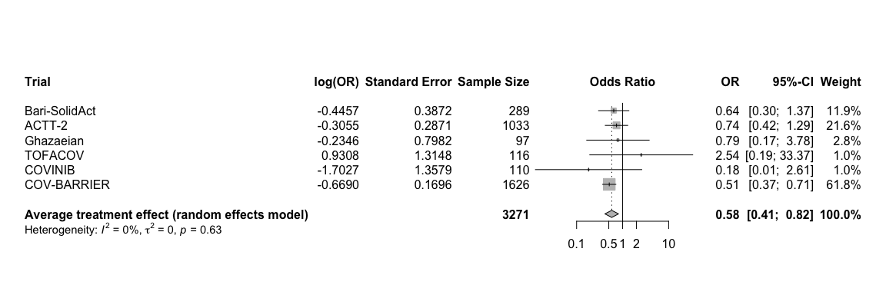

# Load packages

```r
library(tidyverse)
library(readxl)
library(writexl)
library(tableone)
library(here)
library(kableExtra)

library(jtools) # for summ() and plot_summs
library(sjPlot) # for tab_model
library(ggplot2) # survival/TTE analyses and other graphs
library(ggfortify) # autoplot
library(meta)
```

# Load treatment effect estimates from all trials

```r
df_barisolidact <- readRDS("trt_effects_barisolidact.RData")
df_actt2 <- readRDS("trt_effects_actt2.RData")
df_ghazaeian <- readRDS("trt_effects_ghazaeian.RData")
df_tofacov <- readRDS("trt_effects_tofacov.RData")
df_covinib <- readRDS("trt_effects_covinib.RData")
df_covbarrier <- readRDS("trt_effects_cov-barrier.RData")
```

# Reshape dataframes

```r
### Create a list of all data frames / trials
list_df <- list(df_barisolidact, df_actt2, df_ghazaeian, df_tofacov, df_covinib, df_covbarrier) # add all trials


## Mortality at day 28
outcome <- "death at day 28"
outcome2 <- "death at day 28_firth" # depends on which estimates to include
# Initialize an empty data frame to store the selected rows
df_mort28 <- data.frame()
# Loop through the list of data frames
for (df in list_df) {
  selected_rows <- df %>% filter(variable == outcome | variable == outcome2)
  df_mort28 <- rbind(df_mort28, selected_rows)
}
# Reset row names
rownames(df_mort28) <- NULL

## Mortality at day 60
outcome <- "death at day 60"
outcome2 <- "death at day 60_firth"
df_mort60 <- data.frame()
for (df in list_df) {
  selected_rows <- df %>% filter(variable == outcome | variable == outcome2)
  df_mort60 <- rbind(df_mort60, selected_rows)
}
rownames(df_mort60) <- NULL
```

# (i) Primary outcome: Mortality at day 28

```r
str(df_mort28)
```

```
## 'data.frame':	6 obs. of  10 variables:
##  $ variable         : chr  "death at day 28" "death at day 28" "death at day 28" "death at day 28_firth" ...
##  $ hazard_odds_ratio: num  0.64 0.737 0.791 2.537 0.182 ...
##  $ ci_lower         : num  0.29477 0.41582 0.14728 0.12715 0.00131 ...
##  $ ci_upper         : num  1.36 1.29 3.83 380.13 2.29 ...
##  $ standard_error   : num  0.387 0.287 0.798 1.315 1.358 ...
##  $ p_value          : num  0.25 0.287 0.769 NA NA ...
##  $ n_intervention   : num  145 515 46 58 55 815
##  $ n_control        : num  144 518 51 58 55 811
##  $ trial            : chr  "Bari-SolidAct" "ACTT-2" "Ghazaeian" "TOFACOV" ...
##  $ JAKi             : chr  "Baricitinib" "Baricitinib" "Tofacitinib" "Tofacitinib" ...
```

```r
mort28 <- metagen(TE = log(hazard_odds_ratio),
                      seTE = standard_error,
                      studlab = trial,
                      data = df_mort28,
                      n.e = n_intervention + n_control,
                      # n.c = n_control,
                      sm = "OR",
                      fixed = F,
                      random = T,
                      prediction = F,
                      method.tau = "REML", # no difference with Paule-Mandel
                      hakn = T, # Hartung-Knapp- Sidik-Jonkman (HKSJ) modified estimate of the variance / 95% CI -> notes
                      adhoc.hakn.ci = "se", # Argument 'adhoc.hakn.ci' must be "", "se", "ci", or "IQWiG6".
                      title = "Average treatment effect - mortality 28 days",
                      # subset = trial %in% c("Bari-SolidAct", "ACTT-2", "Ghazaeian") # exclude entirely
                      # exclude = trial %in% c("Bari-SolidAct", "ACTT-2", "COVINIB") # include in forestplot but exclude from analysis
                      )
summary(mort28)
```

```
## Review:     Average treatment effect - mortality 28 days
## 
##                   OR            95%-CI %W(random)
## Bari-SolidAct 0.6404 [0.2998;  1.3677]       11.9
## ACTT-2        0.7368 [0.4197;  1.2933]       21.6
## Ghazaeian     0.7909 [0.1654;  3.7807]        2.8
## TOFACOV       2.5366 [0.1928; 33.3748]        1.0
## COVINIB       0.1822 [0.0127;  2.6082]        1.0
## COV-BARRIER   0.5122 [0.3674;  0.7141]       61.8
## 
## Number of studies: k = 6
## Number of observations: o = 3271
## 
##                                  OR           95%-CI     t p-value
## Random effects model (HK-SE) 0.5795 [0.4114; 0.8164] -4.09  0.0094
## 
## Quantifying heterogeneity:
##  tau^2 = 0 [0.0000; 2.5985]; tau = 0 [0.0000; 1.6120]
##  I^2 = 0.0% [0.0%; 74.6%]; H = 1.00 [1.00; 1.99]
## 
## Test of heterogeneity:
##     Q d.f. p-value
##  3.43    5  0.6333
## 
## Details on meta-analytical method:
## - Inverse variance method
## - Restricted maximum-likelihood estimator for tau^2
## - Q-Profile method for confidence interval of tau^2 and tau
## - Hartung-Knapp adjustment for random effects model (df = 5)
```

```r
forest.meta(mort28,
            # hetstat = T,
            # rightcols = c("w.random"),
            leftcols = c("studlab", "TE", "seTE", "n.e"),
            leftlabs = c("Trial", "log(OR)", "Standard Error", "Sample Size"),
            text.random = "Average treatment effect (random effects model)",
            title = "Average treatment effect - mortality 28 days", # get the title into the figure
            # xlim = c(0.15,5),
            # xlab = "Average treatment effect (95% CI)"
            )
```

<!-- -->

```r
# Open a pdf file
# pdf("./fp_aggregated.pdf", width=9, height=4)
# forest.meta(i.mort28_adhoc_se,
#             xlim = c(0.1,5),
#             xlab = "                  Favours Remdesivir <-> Favours No Remdesivir",
#             fs.xlab = 9)
# dev.off()
```

# (ii) Mortality at day 60


